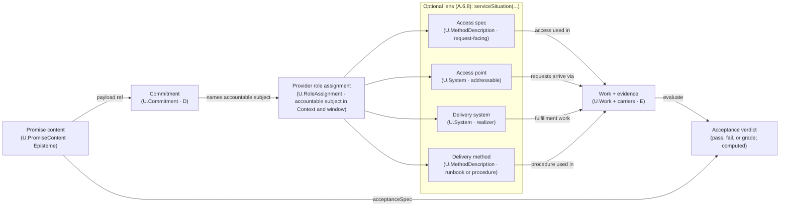

# SOURCE_FILE: Readme.md
---
# First Principles Framework (FPF) - Core Conceptual Specification

> First Principles Framework (FPF) is a standards-style pattern language for turning difficult engineering, research, management, and mixed human/AI work into explicit, reviewable, improvable reasoning.

- **Author:** Anatoly Levenchuk, with AI-agent assistance
- **Version:** June 2026
- **Status:** Normative kernel, eternal alpha: already used in working projects and development programs, while still evolving.

FPF helps when a project has outgrown one clever conversation. It is useful when meanings, claims, options, evidence, architecture, work decisions, publication forms, and improvement criteria must stay coherent across people, teams, tools, time, or AI agents.

Use FPF as a reference model and pattern language, not as a linear textbook. Start from the working question you bring from your project. Bring in internal FPF terms only after they help you keep the work precise.

## Decide Whether FPF Fits

Use FPF when ordinary discussion is no longer enough to keep work coherent. Typical signs:

- several teams, experts, tools, or AI agents must reason about the same work;
- the real-world test is slow, expensive, noisy, risky, or politically hard to repeat;
- different readers need different reports, dashboards, explanations, or decisions about the same underlying work;
- names, roles, responsibilities, options, evidence, or quality criteria are starting to blur;
- the team needs a current view of possible approaches, not just one recommendation;
- a decision is small enough to make now but important enough to leave a durable reason.

FPF is probably too heavy when the task is small, feedback is fast and cheap, the vocabulary is already stable, the decision will not be reused or audited, and a quick answer is enough.

FPF is mainly useful for people who have to keep difficult work understandable across boundaries:

- engineers and systems engineers working with complex products or operations;
- researchers building claims that others must inspect or reuse;
- platform and AI teams coordinating humans, models, tools, and approvals;
- safety, assurance, compliance, and regulatory leads who need visible evidence and responsibility boundaries;
- managers and product leaders who must compare options, budgets, risks, and delivery promises without hiding trade-offs.

There are three common ways to use FPF:

1. Human-only: use it as a writing and review discipline for meetings, notes, decisions, and technical documents.
2. Mixed team: use it to keep specialists, managers, safety leads, and AI assistants aligned around the same work.
3. AI-assisted: attach or index the specification, ask for plain-language project help first, and use pattern names only when they make the answer easier to check.

Stronger AI does not remove the need for FPF. AI can generate fluent options quickly, but projects still need to decide what counts as evidence, which option is being compared, who may rely on an answer, when a claim is stale, what remains only a guess, and what work is actually authorized. FPF helps make those boundaries explicit before a confident answer becomes an expensive mistake.

Core ideas in plain language:

- local teams may use local meanings, but translation must be explicit when work crosses a boundary;
- the thing itself, its description, a dashboard about it, a decision about it, and the work done to change it are not the same;
- keep several options alive until the comparison is clear enough to choose;
- say what "better" means before optimizing or scoring;
- make trust depend on evidence, freshness, scope, and intended use;
- publish different views for different readers without changing the underlying claim;
- use mathematics or formal models when they clarify what structure is preserved, what is lost, and what can be checked.

## First Practical Entries

A first practical entry is the first useful way to enter FPF from a real working project. Choose it by the project question you are trying to settle, not by the order of patterns in the specification.

The entries below are not a required sequence. They are common places where FPF can start paying rent in a project.

### 1. Develop or review architecture

Use this when you need to design, explain, review, or improve the architecture of a product, organization, technical system, document system, AI-agent setup, research program, or other thing with important internal structure.

FPF helps you ask what is being architected, which structures matter, what property of the architecture is being changed or judged, and which description, diagram, view, promise, decision, evidence, or implementation task is a different matter. It gives you language for selected structures, structural views, architecture characteristics, modularity, interfaces, scale, interlevel tensions, and architecture-changing moves.

Typical first result: a short architecture question note that says what is being architected, which structures matter, which architecture characteristic is at stake, what description or view is needed, and what decision or implementation work is still not settled by the architecture statement.

First inspect: `C.30`, `A.22`, `C.30.ASV`, `C.30.AD`, `C.31`, `A.6.M`, and the relevant architecture precision-restoration patterns when wording hides the kind of structure being discussed.

### 2. Write rules, methods, and work-process documents

Use this when you need to write or review technical regulations, procedures, method descriptions, operating instructions, work-process descriptions, standards-like project documents, API documents, contracts, SLAs, protocols, permissions, or compliance wording.

FPF helps you keep the described method separate from the method itself, a plan separate from performed work, responsibility separate from permission, an interface contract separate from implementation, and a published document separate from actual execution. It can also describe chains of methods when the chain itself is the subject, while keeping actual work occurrences separate from the document that says how work should be done.

Typical first result: a cleaned method, regulation, or interface outline that names what is being governed, the method or interface being described, the roles and responsibilities involved, the expected work result, and any evidence, gate, permission, or compliance claim that the document does not yet justify.

First inspect: `A.6`, `A.6.B`, `A.6.C`, `A.15`, `A.15.1`, `A.15.2`, `A.15.3`, `A.15.4`, `E.18`, `E.18.1`, `E.8`, and `E.19`.

### 3. Compare alternatives and make a local choice

Use this when a team needs to compare technologies, vendors, designs, policies, research paths, implementation options, or architecture moves without jumping to one favorite too early.

FPF helps you state what is being compared, which characteristics matter, which candidates are still in play, what evidence is missing, when a local choice is justified, and how to publish a selected set without hiding the comparison logic.

Typical first result: a comparison note with declared characteristics, candidate set, evidence gaps, the present scope of the choice, and what a selected-set publication may and may not be used to decide.

First inspect: `A.19`, `A.19.ECS`, `C.11`, `C.18`, `C.19`, `G.0`, and `G.5`.

### 4. Turn a vague situation into a usable problem statement

Use this when a project has complaints, opportunities, risks, anomalies, or strategic pressure, but no clear problem yet.

FPF helps you preserve partly formed concerns without pretending they are already requirements, decisions, causes, evidence, or work items. It can turn a vague situation into a problem card or problem portfolio that later work can use without erasing uncertainty.

Typical first result: a problem card, problem portfolio, or problem note that records what has been accepted, what remains only a cue, which context is involved, and which first pattern family can use the problem statement.

First inspect: `C.22.2`, `C.2.2a`, `A.16`, `A.16.1`, `A.16.2`, `B.4.1`, and `B.5.2.0`.

### 5. Define what "better" means and run improvement

Use this when you need to improve a product, process, architecture, document, pattern, regulation, research program, or organization, but the improvement criteria are vague or competing.

FPF helps you define characteristics for evaluation, evaluate what is being improved, generate a portfolio of improvement proposals, choose changes that really improve the situation, and repeat the cycle without reducing quality to one score.

Typical first result: a quality-and-improvement note with evaluation characteristics, one evaluation of the object under improvement, a portfolio of proposed changes, and a condition for stopping or reopening the cycle.

First inspect: `A.19.ECS`, `E.22`, `E.23`, `C.16`, `C.25`, `E.21`, `E.9.DA`, and `E.2.DA` when the object is an FPF artifact.

### 6. Prepare evidence, assurance, or gate decisions before commitment

Use this when a project cannot responsibly act yet because evidence, assurance, constraints, gate validity, or decision permission is unclear.

FPF helps you separate what is being claimed from the evidence path, assurance argument, internal constraint validity, gate decision, local choice, and performed work. That separation matters when the cost of acting too early is high.

Typical first result: a commitment-readiness note that lists the claim, the evidence or assurance still needed, the gate or decision condition, and the work that remains blocked until those checks exist.

First inspect: `A.10`, `B.3`, `A.20`, `A.21`, `C.11`, `C.28`, and the relevant work or architecture pattern if the claim is about planned or performed work.

### 7. Check timing, freshness, rhythm, and action windows

Use this when a project depends on timing: freshness, latency, rate, cadence, action window, synchronization, inertia, aging, or rhythm.

FPF helps you separate timing information from evidence, permission, work completion, or vague urgency. It can say what timestamp, interval, cadence, freshness limit, action window, or rhythm claim is being used, and when that claim is no longer current enough for action.

Typical first result: a timing note that names what the timing is about, the relevant time relation or rhythm, the freshness or action-window limit, and the action that remains blocked when the timing claim is stale or underspecified.

First inspect: `C.27`, `A.10`, `A.20`, `A.21`, `C.11`, and the pattern that governs the thing whose timing matters.

### 8. Use causal explanations, interventions, responsibility, and model outputs safely

Use this when a project says that one thing causes another, a model output justifies an action, a change will produce an effect, or a role is responsible for an outcome.

FPF helps you separate causal use, counterfactual use, intervention claims, responsibility claims, model-output reliance, evidence, and decisions. It keeps a plausible explanation, prediction, or dashboard output from becoming permission to act.

Typical first result: a causal-use or model-output-use note that names the claim, the intervention or counterfactual being considered, the evidence or validation still needed, the responsibility limit, and the decision or work that remains blocked.

First inspect: `C.28`, `A.10`, `B.3`, `A.20`, `A.21`, `C.11`, and the domain pattern that governs the affected thing.

### 9. Compare descriptions, dashboards, explanations, and views of the same thing

Use this when a project has several descriptions, dashboards, explanations, renderings, model slices, or views and needs to know whether they are about the same thing, serve the same concern, or can be relied on in the same way.

FPF helps you keep the thing being described separate from its description, publication form, rendering, viewpoint, and same-thing claim. It can keep a diagram, dashboard, generated explanation, or view from silently becoming the thing itself, evidence, assurance, or decision.

Typical first result: a description-use note that names what is being described, which description or view is being used, how it is published or rendered, whether the same thing is really being addressed, and what the publication may and may not be used to claim.

First inspect: `E.17`, `E.17.0`, `E.17.EFP`, `A.15.4`, `A.7`, `C.30.AD`, and the pattern that governs the described thing.

### 10. Give things better names

Use this when project terms are misleading, overloaded, politically convenient, too broad, too local, or hard to translate between teams.

FPF helps you name products, roles, work processes, architecture elements, standards, document types, claims, characteristics, and project objects without treating a catchy label as ontology.

Typical first result: a naming card or term sheet that says what is being named, which local contexts use the name, which candidate names were rejected, which plain and technical names are allowed, and which alternate names are risky.

First inspect: `F.17`, `F.18`, `F.19`, `E.10`, `E.10.ARCH`, and the subject pattern that governs the thing being named.

### 11. Repair wording in technical documents before it changes action

Use this when standards, specifications, contracts, policies, dashboards, model cards, explanations, or working documents use words that may quietly change what can be claimed or done.

FPF helps you repair wording by first recovering the ontology: what thing, relation, value, evidence path, publication use, gate, decision, work, or architecture claim is actually being made. The repair is not word-policing; it succeeds only when the repaired text still tells someone what can now be used, checked, or named, or which related pattern to apply.

Typical first result: a repaired paragraph, claim register, term sheet row, or non-use decision that says what the text may now be used for and what claim or action remains blocked.

First inspect: `E.10`, `E.10.ARCH`, `F.18`, `F.19`, `A.6.P`, `C.2.P`, `C.16.P`, `C.16.Q`, `C.30.P`, `A.6.F`, and `A.6.M`.

### 12. Decide whether mathematics or formal modeling would help

Use this when intuition is not enough and a mathematical model, formal declaration, invariant, or explicit structure could make the work easier to review, compare, or improve.

FPF helps with two opposite mistakes: missing useful mathematics, and using mathematics without saying what structure it preserves and what it loses. It keeps mathematical-lens use, formal declarations of the assumed substrate, mechanism import or realization, and first-principles-to-work carry-through as different claims that may need different patterns.

Typical first result: a short modeling note that names what is being modeled, the candidate mathematical lens, any formal declaration that is needed, preserved and lost structure, payoff, validation limit, and next project action.

First inspect: `C.29`, `A.6.0`, `A.6.1`, `E.18.1`, `C.16`, `C.27`, `C.30.LCA`, `C.30.ILC`, and the domain pattern that governs the modeled claim.

### 13. Build a state-of-the-art or option portfolio

Use this when the project needs the current field of possible solutions, schools of thought, research lines, technologies, or design options, rather than one recommendation.

FPF helps you harvest alternatives, keep novelty and diversity visible, define comparison characteristics, avoid early collapse to one winner, and refresh the portfolio as the field changes.

Typical first result: a SoTA pack, option portfolio, candidate set, archive, or selector-ready publication with declared scope, comparison characteristics, and refresh condition.

First inspect: `G.0`, `G.1`, `G.2`, `G.5`, `G.10`, `G.11`, `C.18`, `C.19`, `A.19`, and `A.19.ECS`.

## One-Minute Example

A platform team asks:

> Should we buy, fine-tune, or build an agent stack for our product?

Without FPF, the conversation often mixes architecture, vendor comparison, safety, evidence, budget responsibility, user value, and implementation planning. The loudest option can win before the team knows what is being compared.

With FPF, the first pass can become a small set of explicit project objects:

- architecture question: what stack architecture is being changed or chosen;
- comparison frame: which alternatives are in the candidate set;
- evaluation characteristics: cost, latency, controllability, safety, maintainability, time to first use, and other project-specific characteristics;
- evidence gaps: what must be tested before commitment;
- current choice state: whether the team is choosing now, keeping a selected set, or doing more discovery;
- reader reliance: what engineering, management, and assurance readers may responsibly rely on.

That same shape can be used for a factory modernization, laboratory protocol, construction design change, supply-chain decision, safety case, or research program. The point is not the AI topic; the point is one body of reasoning that can be reviewed, improved, and published without changing meaning on the way.

## What FPF Is

FPF is a pattern language for disciplined thinking in projects where ordinary prose, local expert judgment, or one-off AI output is not enough.

It helps teams:

- keep meanings stable when work crosses teams, tools, documents, and time;
- separate the thing being discussed from diagrams, dashboards, explanations, promises, decisions, and actual work;
- state what a claim can responsibly be used for before people rely on it;
- compare options without collapsing too early to one favorite;
- define quality criteria before improvement starts;
- keep evidence, assurance, decisions, and implementation work visible as different questions;
- repair confusing wording by first asking what the wording is doing in the project, not by swapping synonyms;
- leave each pass with one useful next result: a clearer question, a better name, a comparison note, an evidence gap, a safer document, or a reason to inspect a specific pattern.

## What FPF Is Not

FPF is not:

- a shrink-wrapped project methodology;
- a checklist bureaucracy;
- a quick-answer cheat sheet;
- a replacement for domain expertise;
- a demand to study the whole specification before useful work begins;
- a promise that every project needs every pattern.

FPF is most useful when the cost of semantic drift, premature convergence, hidden evidence gaps, weak architecture, vague quality, or unreviewable work is higher than the cost of using a disciplined pattern language.

## How to Use This Repository

Start with the first practical entry that matches your project question. Then inspect the named pattern family and apply its Problem frame, Solution, examples, and checklist.

Use the `Preface` for the cross-cutting ideas behind the pattern language. Use the Table of Content when you already know the pattern family or need a search-oriented overview. Use extended cases only when the compact first entry is not enough.

If you use an AI assistant, attach or index `FPF-Spec.md` and ask for plain-language project help first. Let internal pattern names enter the conversation only when they make the reasoning more precise.

A good first prompt is:

```text
You have the FPF specification as a file.
Help me structure this project:
[short project description]

Use plain language for engineer-managers.
Propose the first useful FPF entry:
architecture, rules and methods, API or interface wording, permission or compliance wording, comparison and choice,
problem shaping, quality improvement, evidence and assurance,
temporal claims, causal or model-output use, publication or view use,
naming, technical-text precision, mathematical modeling,
or current options and state of the art.
For the selected entry, give:
1. the main project thing or claim at stake,
2. the first useful written result,
3. the first FPF patterns to inspect,
4. what still cannot be decided, trusted, or used responsibly.
```

## Citation

If you use FPF, please cite:

```text
Levenchuk, Anatoly. First Principles Framework (FPF).
GitHub repository: https://github.com/ailev/FPF
```


# SOURCE_FILE: FPF-Spec.md
---
# First Principles Framework (FPF) - Core Conceptual Specification

> A standards-style pattern language for turning difficult engineering, research, management, and mixed human/AI work into explicit, reviewable, improvable reasoning.

- **Author:** Anatoly Levenchuk, with AI-agent assistance
- **Version:** June 2026
- **Status:** Normative kernel, eternal alpha: already used in working projects and development programs, while still evolving.

This monolith is the AI-agent and tool-assisted working specification for FPF.

Use the Table of Content below to find pattern ids that match the project question. For any substantive answer, open the relevant pattern and apply its Problem frame, Solution, worked slices, and checklist to the project claim or object.

The public FPF readme section after the Table of Content gives human-facing first practical entries. The Preface explains cross-cutting ideas. Pattern bodies carry the normative text to apply. Pattern and headers templates are explained in pattern E.8.

# Table of Content

 **Preface (non-normative)**

| ID & Title                                                                                                                                   | Status    | Concise content reminder — “what belongs here”                                                                                                                                                                                        |
| :------------------------------------------------------------------------------------------------------------------------------------------- | :-------- | :------------------------------------------------------------------------------------------------------------------------------------------------------------------------------------------------------------------------------------ |
| What this specification is (and how to use it) | full text | A practical orientation to the Core Conceptual Specification: what FPF is, which FPF patterns, publications, records, and tools it defines, how Parts A-K fit together, and where to start for different entry situations. |
| Creativity in Open-Ended Evolution and Assurance*                                                                                            | full text | FPF integrates assurance (audits, evidence) and creativity (generating novel ideas) as complementary engines for responsible innovation, providing a structured choreography for creative work from abduction to operation.           |
| Navigating Uncertainty: Building Closed Worlds within an Open World                                                                          | full text | Explains how FPF reconciles Open-World and Closed-World assumptions, using Bounded Contexts to create reliable 'islands of closure' for engineering decisions within an inherently open world.                                        |
| FPF as an Evolutionary Architecture for Thought                                                                                              | full text | Positions FPF as an architecture for the reasoning process itself, designed to sustain key characteristics like auditability, evolvability, and falsifiability by applying architectural thinking to the dynamics of reasoning.       |
| Architectural Characteristic of Thought                                                                                                      | full text | Details the key characteristics of rigorous thought (e.g., Auditability, Evolvability, Composability) and the specific FPF mechanisms designed to preserve them.                                                                      |
| Beyond Cognitive Biases: FPF as a Generative Architecture for Thought                                                                        | full text | Contrasts FPF's generative, structural approach to avoiding cognitive errors with the traditional corrective, diagnostic approach of hunting for biases, framing FPF as a scaffold that makes errors harder to commit.                |
| Thinking Through Writing: The FPF Discipline of Conceptual Work                                                                              | full text | Describes how FPF uses a discipline of "thinking through writing" with conceptual forms (Cards, Tables, Records) to make thought tangible, shareable, and auditable, while remaining tool-agnostic.                                   |
| Descriptive Ontologies vs. A Thinking-Oriented Architecture                                                                                  | full text | Differentiates FPF's goal of orchestrating reasoning from classical ontologies' goal of cataloging existence, emphasizing FPF's focus on objectives, trust, and dynamics.                                                             |
| The "Bitter Lesson" trajectory — compute, data, and freedom over hand‑tuned rules (FPF stance)                                               | full text | How FPF operationalizes the contemporary trend: prefer general models + data + compute + minimal constraints; autonomy budgets; rule‑of‑constraints vs instruction‑of‑procedure; continuous adaptation.                               |
| From Flat Documents to High-Dimensional Truth: The Multi-View Architecture                                                                   | full text | Shows how FPF replaces flat documents with a multi-view architecture: epistemes as slot relations, engineering views as projections, and MVPK as typed publication surfaces that keep dashboards admissibly tethered to work and evidence. |
| Boundary Statements: Where Language Becomes a System Boundary                                                                          | full text | Introduces the A.6 boundary cluster: why certain sentences carry boundary claims, permissions, commitments, gate pressure, or evidence cues, and how L/A/D/E claim classification keeps those roles evolvable and multi-view safe. |
| Raising Semantic Precision: From Triggers to Math‑Backed Ontics                                                                        | full text | Describes the precision-upgrade discipline behind A.6.P: detect broad load-bearing words, unpack the local ontology, choose a stable mathematical substrate, refactor the model, and mint precise lexemes + guardrails (Tech/Plain twins). |
| The “big storylines” unique to FPF (load‑bearing commitments)                                                                                | full text | Lists the nine core, load-bearing commitments that define FPF's unique architectural and philosophical stance, from its holonic kernel to its explicit treatment of creativity and assurance.                                         |
| Transdisciplinarity as a Meta‑Theory of Thinking                                                                                             | full text | Explains how FPF treats transdisciplinarity as a meta-theory for designing reasoning, using FPF patterns as generative scaffolds grounded in physical reality to bridge disciplinary silos.                                          |
| FPF as a Culinary Architecture for Collective Thought: Why We Formalize “Obvious” Ideas                                                      | full text | Uses the 'culinary architecture' analogy to explain FPF's role in synthesizing 'obvious' ideas into a robust framework for complex, generative problems.                                                                              |
| Intellect Stack (informative Overview)                                                                                                       | full text | Presents a five-part pedagogical map of cognitive skills (Structure → Knowledge → Action → Strategy → Governance) and links them to FPF patterns.                                                                               |
| Purpose, Scope, and Explicit Non‑Goals                                                                                                       | full text | Clarifies FPF's mission as a generative scaffold for thought, its scope as tool-agnostic normative patterns, and what it explicitly is not (e.g., a domain encyclopedia or a specific methodology).                                   |

**Part A - Kernel Architecture Cluster**

| § | ID & Title | Status | Keywords & Search Queries | Dependencies |
| :--- | :--- | :--- | :--- | :--- |
| A.0 | **Onboarding Glossary (NQD & E/E‑LOG)** | Stable | *Keywords:* novelty, quality-diversity (NQD), explore/exploit (E/E-LOG), declared set result, typed portfolio publication, SearchSpaceRef, OutcomeSpaceRef, DeclaredSubstrateInterpretiveView, TypedSetViews, ParetoOnly default, scale-probe, BLP. *Queries:* "What terms must I publish when generating, selecting, or shipping a set result?", "How do I explain search-side vs outcome-side spaces and interpretive views on first use?", "How does FPF avoid single-winner bias in creative search?" | **Builds on:** E.2, A.5, C.17-C.19. **Coordinates with:** E.7, E.8, E.10, F.17, A.19.SOURCE-SET-SPACE-SUBSTRATE, A.19.DECLARED-SUBSTRATE-INTERPRETIVE-VIEW, G.5, G.9-G.12. **Constrains:** any pattern/UTS row that describes a generator, selector, declared set result, typed portfolio publication, or set-return publication. |
| ***Cluster A.I - Foundational Ontology*** | | | | |
| A.1 | **Holon Ontic Foundation (U.Holon and Admitted Holon Kinds)** | Stable | Holonic root ontology for `U.Holon`, admitted holon kinds, `U.System`, non-agentive epistemes, holon slot relation, system participation, delimitation, and boundary-crossing relations. | **Builds on:** E.24. **Coordinates with:** A.1.1, A.2, A.7, A.12, A.14, A.15.1, A.22, C.2.1, C.13, C.30. |
| A.1.1 | **U.BoundedContext Semantic Frame** | Stable | Semantic-frame ontology for local meaning, local vocabulary, invariant set, local role taxonomy, bridge relations, and non-container context boundary. | **Builds on:** A.1, E.10.D1. **Coordinates with:** F.0.1, F.9, F.18, E.24. |
| A.2 | **Role Taxonomy** | Stable | *Keywords:* role, assignment, holder, context, function vs identity, responsibility, U.RoleAssignment. *Queries:* "How to model responsibilities?", "What is the difference between what a thing *is* and what it *does*?" | **Builds on:** A.1, A.1.1. **Prerequisite for:** A.2.1-A.2.6, A.13, A.15. |
| A.2.1 | **`U.RoleAssignment`: Contextual Role Assignment** | Stable | *Keywords:* Standard, holder, role, context, RoleEnactmentFact, performedBy, RCS/RSG. *Queries:* "How to formally assign a role in FPF?", "How do I attribute performed work through a role assignment?", "What is the Holder#Role:Context Standard?" | **Refines:** A.2. **Prerequisite for:** A.15. |
| A.2.2 | **`U.Capability`: System Ability (dispositional property)** | Stable | *Keywords:* ability, skill, performance, action, work scope, measures. *Queries:* "How to separate ability from permission?", "What is a capability in FPF?" | **Builds on:** A.2. **Informs:** A.15, A.2.3. |
| A.2.3 | **`U.PromiseContent` (Promise Content)** | Stable | *Keywords:* promise content, promise content, accessSpec, acceptanceSpec, SLO, SLA, claim scope (G), Work evidence, provider/consumer roles. *Queries:* "What is a promise content in FPF?", "Promise content vs Work vs MethodDescription", "How do access and acceptance differ?", "How is SLO/SLA adjudicated from Work evidence?" | **Builds on:** A.2.2. **Prerequisite for:** F.12. **Used by:** A.2.8, A.6.C, A.6.8. |
| A.2.4 | **Episteme Evidence-Use and Status-Use Relations** | Stable | *Keywords:* evidence-use, status-use, source-use, episteme, claim, provenance. *Queries:* "How is an episteme used as evidence?", "How do I keep evidence use from becoming a role?", "How do I model status use around an episteme?" | **Builds on:** A.2. **Informs:** A.10, B.3. |
| A.2.5 | **RoleStateRelation@BoundedContext - Role State Space and Enactable-State Admission** | Stable | *Keywords:* state machine, RSG, role state, enactability, role-state evolution. *Queries:* "How to model the state of a role?", "What is a Role State Graph?" | **Builds on:** A.2.1. **Prerequisite for:** A.15. |
| A.2.6 | **Unified Scope Mechanism (USM): Context Slices & Scopes** | Stable | *Keywords:* scope, applicability, ClaimScope (G), WorkScope, set-valued. *Queries:* "How to define the scope of a claim or capability?", "What is G in F-G-R?" | **Builds on:** A.1.1. **Constrains:** A.2.2, A.2.3, B.3. |
| A.2.7 | **RoleRelationStructure@BoundedContext - Context-Local Role Relations and Representation-Lens Boundary** | Stable | *Keywords:* role algebra, specialization (`≤`), incompatibility (`⊥`), bundles (`⊗`), separation of duties (SoD), requiredRoles substitution. *Queries:* "What does `RoleS ≤ RoleG` mean in FPF?", "How do I encode Separation of Duties with `⊥`?", "How do role bundles (`⊗`) work?" | **Builds on:** A.2. **Prerequisite for:** A.15, A.2.5. |
| A.2.8 | **`U.Commitment` (Deontic Commitment Object)** | Stable | *Keywords:* commitment, deontics, obligation, permission, prohibition, modality normalization, scope+validity window, adjudication hooks, evidenceRefs, BCP‑14 (RFC 2119/8174). *Queries:* "How to represent MUST/SHALL as a lintable object?", "How to keep deontics separate from admissibility gates?", "How to make commitments auditable via evidence hooks?" | **Refines:** A.2. **Builds on:** A.2.1, A.2.3, A.2.6, A.7, A.15.1. **Used by:** A.6.B (Quadrant D), A.6.C. |
| A.2.9 | **`U.SpeechAct` (Communicative Work Object)** | Stable | *Keywords:* speech act, communicative work, approval/authorization/publication/revocation, provenance, act≠utterance≠carrier, judgement context, window/freshness, institutes.*. *Queries:* "How to model approvals/authorizations as Work?", "How to separate act vs utterance vs carrier?", "How to link commitments to instituting acts without commitment-by-publication?" | **Refines:** A.2. **Builds on:** A.2.1, A.2.6, A.7, A.10, A.15.1. **Used by:** A.2.8, A.6.C (utterance/instituting-act hook). |
| ***Cluster A.II - Transformation Engine*** | | | | |
| A.3 | **Transformer Constitution (Quartet)** | Stable | *Keywords:* action, causality, change, System-in-Role, MethodDescription, Method, Work. *Queries:* "How does FPF model an action or a change?", "What is the transformer quartet?" | **Builds on:** A.2. **Prerequisite for:** A.3.1, A.3.2, A.15. |
| A.3.1 | **`U.Method`: The Abstract Way of Doing** | Stable | *Keywords:* recipe, how-to, procedure, abstract process. *Queries:* "What is a Method in FPF?", "Difference between Method and Work." | **Refines:** A.3. **Prerequisite for:** A.15. |
| A.3.2 | **`U.MethodDescription`: The Recipe for Action** | Stable | *Keywords:* specification, recipe, SOP, code, model, `U.Episteme`. *Queries:* "How to document a method?", "What is a MethodDescription?" | **Refines:** A.3. **Informs:** A.15. |
| A.3.3 | **U.Dynamics: State-Space and Transition-Law Episteme** | Stable | *Keywords:* dynamics, state space, transition law, observation relation, prediction, simulation, calibration. *Queries:* "How do I model a reusable law of state change?", "When is a process label a dynamics episteme rather than method, work, or transformation?" | **Builds on:** A.1.1, A.19. **Coordinates with:** A.3.1, A.3.2, A.3.4, A.15.1, A.15.2, A.6.1, C.27, C.27.TA, C.29, A.10, B.3, A.20, A.21. |
| A.3.4 | **`U.Transformation`: Bounded Change Under Conditions** | Stable | *Keywords:* transformation, bounded change, transformed entity, transformer, input/output conditions, functioning, transformation-flow structure. *Queries:* "What exactly is changing?", "Who or what is the transformer?", "How do method, mechanism, work, dynamics, function, and evidence stay distinct around one change?" | **Builds on:** A.3, A.1.1, A.6.0, A.6.5. **Coordinates with:** A.3.1, A.3.2, A.3.3, A.6.1, A.15.1, A.15.2, E.18, E.18.2, C.27.TA, C.27, C.29, A.6.F, C.30.ASV, A.10, B.3. |
| A.3.4.P | **Transformation Ontic Precision Restoration** | Stable | Repairs change-situation wording such as transformation, flow, process, workflow, pipeline, dataflow, network, circuit, path, functioning, method, mechanism, work, or evidence by recovering the `U.Transformation` slot relation and current governing pattern before rewriting. | **Builds on:** E.10, E.10.ARCH, A.3.4, E.18, E.18.2, A.6.F, C.2.P.DR, C.29, F.18, F.19. **Coordinates with:** A.3.1, A.3.2, A.6.1, A.15, A.10, B.3, C.30, C.30.ASV, C.27.TA, C.27. |
| ***Cluster A.III - Time & Evolution*** | | | | |
| A.4 | **Temporal Duality & Open-Ended Evolution Principle** | Stable | *Keywords:* design-time, run-time, evolution, versioning, open-ended state change, continuous improvement. *Queries:* "How does FPF handle plan vs. reality?", "How are systems updated?" | **Builds on:** P-10 Open-Ended Evolution. **Prerequisite for:** B.4. |
| ***Cluster A.IV - Kernel Modularity*** | | | | |
| A.5 | **Open-Ended Kernel & Extension Layering** | Stable | *Keywords:* FPF architecture, specialization vs dependancy hierarhies, modularity, extensibility. *Queries:* "What is the architecture of FPF?", "How are new domains added?" | **Builds on:** P-4, P-5. |
| ***Cluster A.IV.A - Signature Stack & Boundary Discipline (A.6.*)*** | | | | |
| A.6 | **Signature Stack & Boundary Discipline** | Stable | *Keywords:* boundary, signature stack, boundary claim-classification fields, A.6.B L/A/D/E claims, authority-wording split, register-backed status boundary, promise/commitment/API/policy wording, probe/order/frame/export/state-reading claims. *Queries:* "How do I classify boundary statements?", "Where do probe, frame, export, and state-reading claims belong?", "When does authority-looking wording split into source, gate, work, assurance, or boundary claims?", "When is a pass, badge, tile, or status display only a publication of a register-backed source?" | **Builds on:** E.8, A.6.0, A.6.1, A.6.3, E.17.0, E.17, A.7, F.18, E.10.D2, E.10 publication face, form, unit, and carrier discipline. **Coordinates with:** A.6.B, A.6.P, C.26, C.26.1, F.9, A.10, A.15, B.3, E.17.EFP, A.20, A.21, E.19. |
| A.6.RSIG | **Recognition Signatures for Descriptions** | Stable | description-recognition signature; encountered carrier vs defining `U.Episteme`; API/access description not promise; method applicability note; false neighboring description | `A.6`, `A.6.P`, `F.18`, `E.10` |
| A.6.B | **Boundary Norm Square (Laws / Admissibility / Deontics / Work-Effects)** | Stable | *Keywords:* boundary norm square, atomic claims, L/A/D/E claim classification, laws vs gates vs commitments vs evidence, admissible use, non-admissible use, claim IDs, triangle decomposition. *Queries:* "What is the Boundary Norm Square in FPF?", "How do I decompose probe-coupled or mixed boundary statements?", "Where do RFC keywords and use conditions belong in FPF patterns?" | **Builds on:** E.8, A.6.0, A.6.1, A.6.3, E.17.0, E.17, A.7, F.18, E.10.D2, E.10 publication face, form, unit, and carrier discipline. **Coordinates with:** A.6, A.6.P, C.26.1, A.10, B.3. |
| A.6.C | **Contract Unpacking for Boundaries** | Stable | *Keywords:* contract bundle unpacking, SLA/guarantee claim classification, promise content (promise content) ≠ work, promise-act/utterance/commitment separation, Boundary Norm Square (L/A/D/E), MVPK faces “no new semantics”. *Queries:* "How to unpack contract language into promise content / utterance / commitment / work+evidence?", "How to prevent interface-as-agent / contract soup mistakes?", "How to stop MVPK faces becoming ‘second contracts’?", "When contract talk includes service-cluster tokens, what gets unpacked first?" | **Builds on:** A.6, A.6.B, A.6.8, A.7, A.2.3, A.2.8, A.2.9, E.10, E.17. **Coordinates with:** F.12, F.18. |
| A.6.0 | **U.Signature - Universal, law-governed declaration for a SubjectKind over a RangedValueKind** | Stable | *Keywords:* signature, vocabulary, laws, applicability, bounded context. *Queries:* "What is the universal signature block?", "Where do laws vs. implementations live?" | **Placement:** Kernel; **Coordinates:** A.6.1. |
| A.6.1 | **U.Mechanism - Law-governed application to a SubjectKind over a RangedValueKind** | Stable | Keywords: Mechanism, OperationAlgebra, LawSet, AdmissibilityConditions, Transport, Bridge‑only. Queries: "How to define a mechanism like USM/UNM?", "Where do operational guards live?", "How to handle cross‑context transport?" | **Builds on:** A.6.0, E.10.D1. **Instances:** USM (A.2.6), UNM (A.19). |
| A.6.2 | **`U.EffectFreeEpistemicMorphing` — Effect‑free morphisms of epistemes** | Stable | Effect-free, law-constrained episteme-to-episteme morphisms over ClaimGraph, EntityOfConcern, grounding holon, viewpoint, reference scheme, representation scheme, and metadata; preserve or retarget EntityOfConcern only through declared change mode. | **Builds on:** A.1, A.6.0, A.6.1, A.6.5, C.2.1, E.10.D2, C.3.*. **Used by:** A.6.3, A.6.4, E.17.0, E.17, E.18, KD-CAL mapping rules. |
| A.6.3 | **`U.EpistemicViewing` — EntityOfConcern-preserving morphism** | Stable | EntityOfConcern-preserving effect-free projection between epistemes: content, representation, viewpoint, or reference scheme may change, but `entityOfConcernRef` stays fixed unless A.6.4 retargeting is explicitly opened. | **Builds on:** A.6.0, A.6.2, A.6.5, A.7, E.10.D2, C.2.1, C.2. **Used by:** E.17.0, E.17, E.17.1, E.17.2, E.18, B.5.3, KD-CAL view operators. |
| A.6.3.CSC | **Controlled Semantic Coarsening** | Stable | *Keywords:* controlled semantic coarsening, source-bearing episteme or source publication, coarsened rendering, narrower admissible use, non-admissible downstream use, reopen trigger, redaction, dashboard tile, lookup handle, state-representation shortcut. *Queries:* "When may a summary or redaction stand in only for narrow use?", "What is Controlled Semantic Coarsening in FPF?", "When must a coarsened rendering reopen the source-bearing episteme or source publication?" | **Builds on:** A.6.3, A.6.3.CR, A.6.3.RT, E.17.EFP, A.6.P, E.8, E.10, E.19, F.18. **Coordinates with:** C.26, C.26.1, E.17.ID.CR, F.9, F.9.1, A.15, A.6.4, A.20, A.21. |
| A.6.3.CR | **ConservativeRetextualization - entityOfConcernRef-preserving textual re-expression** | Stable | Textual re-expression, summary, report rewrite, translation, or filtering that preserves `entityOfConcernRef`, keeps source tether and omission/loss visible, and exits to explanation, representation change, retargeting, bridge, work, evidence, gate, or assurance patterns when those claims are being made. | **Builds on:** A.6.3, A.6.2, A.7, E.10.D2, E.17.0, E.17, F.9, F.18, E.10. **Coordinates with:** A.6.3.CSC, A.6.3.RT, E.17.EFP, E.17.ID.CR, A.6.4, B.5.2, A.15. |
| A.6.3.RT | **Representation-Scheme Transition: EntityOfConcern-Preserving Representation-Scheme Transition** | Stable | Representation-scheme or reasoning-medium transition that preserves `entityOfConcernRef`, makes recoverability and loss visible, and blocks geometry, notation, carrier work, decode work, or transformation-flow language from becoming hidden ontology or action force. | **Builds on:** A.6.3, A.6.2, A.7, E.10.D2, C.2.7, E.17.0, E.17, F.9, F.18. **Coordinates with:** A.6.3.CSC, C.26, A.6.3.CR, E.17.EFP, E.17.ID.CR, A.6.4, A.15, A.20, A.21. |
| A.6.4 | **`U.EpistemicRetargeting` — EntityOfConcern retargeting morphism** | Stable | Effect-free episteme-to-episteme morphism that intentionally changes `entityOfConcernRef` under a declared KindBridge, invariant, loss boundary, and admissible use while preserving only the commitments that the bridge makes reviewable. | **Builds on:** A.6.2, A.6.3, A.6.5, A.7, C.2.1, C.2, C.3, F.9, E.10.D2, E.18. **Used by:** E.18 StructuralReinterpretation, KD-CAL/LOG-CAL retargeting rules, Fourier-style and data-model retargetings. |
| A.6.P | **Relational Precision Restoration (RPR) — Kind‑Explicit Qualified Relation Discipline** | Stable | *Keywords:* relation precision restoration, under-specified relational language, support/support-headed wording, selected support reading, RelationKind, QualifiedRelationRecord, coupling, probe, measurement, export, endpoint referential compression, lexical guardrails, language-state seam. *Queries:* "How do I repair an overloaded relation word without lexicon-only cleanup?", "How do I unpack support without minting a generic SupportRelation?", "How do I keep coupling/probe/measurement/export wording kind-explicit?", "When should quality/action/sameness/wholeness/QL wording apply another governing pattern?" | **Builds on:** A.6, A.6.B, A.6.S, A.6.0, A.6.5, E.8, E.10, F.18. **Coordinates with:** A.2.4, A.2.6, A.7, A.10, C.2.1, C.2.2a, C.3.3, C.16.Q, C.26, E.17, F.9, F.17. **Specialised by:** A.6.A, A.6.5, A.6.6, A.6.8, A.6.9, A.6.H. |
| A.6.RSIR | **Relation, Signature, Interface, Role, and Slot Precision Restoration** | Stable | *Keywords:* relation-signature-interface-role-slot recovery, interface wording, role wording, slot wording, field, parameter, endpoint, port, API, protocol, capability, affordance, method, function, concern, interest, shadow ontology. *Queries:* "How do I repair interface, role, slot, parameter, function, or concern wording before choosing the direct governing pattern?", "When is interface wording a port, API, protocol, signature, module boundary, or publication view?", "When is role wording U.Role, U.RoleAssignment, relation position, evidence use, status use, or source label?" | **Builds on:** E.10, E.10.ARCH, A.6.P, A.6.5, A.6.0, A.2, A.2.1, A.15, F.18, F.19. **Coordinates with:** A.6.M, A.6.F, A.6.A, C.2.P, C.2.P.DR, E.17, A.10, F.10, G.6. |
| A.6.A | **Action-Invitation Precision Restoration (ACT-INV)** | Stable | *Keywords:* affordance, action invitation, action-first language, post-threshold classification, A.15 docking, language-state seam. *Queries:* "How do I repair overloaded affordance language in FPF?", "When does action-guiding language become an action invitation?", "How does A.6.A differ from early cue routing?" | **Builds on:** A.6.P, A.15, C.2.2a, A.16, B.4.1, F.9. **Coordinates with:** C.16.Q, B.5.2.0. |
| A.6.F | **Function and Functional Precision Restoration (RPR-FUNCTION)** | Stable | *Keywords:* function wording, functional architecture, FunctionalStructure, function-use repair, capability/effect, work/method boundary, module allocation, mathematical function. *Queries:* "When is functional architecture a structure kind rather than a separate ontology?", "How do I repair function-like wording?", "When is a function a capability, method, work, role, quality, module allocation, or mathematical mapping?" | **Builds on:** A.6.P, A.6.5, A.7, C.30, C.30.ASV, C.29. **Coordinates with:** A.6.M, A.15, C.16.Q, A.6.0, A.6.5, A.6.B, A.6.C, A.6.8, E.18, C.30.TFS-REL. |
| A.6.M | **Module Relation Repair** | Stable | *Keywords:* module relation, component, interface, port, platform, layer, stack, open architecture, substitutability, interface specification. *Queries:* "When is a module relation being claimed?"
, "How do I keep functional links, signatures, ports, and implemented interfaces distinct?", "When does open architecture require module-interface repair?" | **Builds on:** A.6.P, A.6.5, A.6.B, C.30, C.30.ASV, A.6.F. **Coordinates with:** C.31, C.31.RSA, E.18, C.30.TFS-REL, A.10, B.3, A.20, A.21, C.28, E.20, G.5, C.11. |
| A.6.5 | **U.RelationSlotDiscipline - SlotKind, ValueKind, RefKind, and slot-operation discipline** | Stable | *Keywords:* slot, argument position, value, reference, signature, substitution, pass-by-value, pass-by-reference. *Queries:* “How do I declare positions and references in relations?”, “How do we stop mixing roles, values and ids in signatures?”, “How does SlotKind/ValueKind/RefKind interact with EntityOfConcern / Description / specification-use and Epistemes?” | **Builds on:** A.6.0 (U.Signature), A.1 (Holon), A.7 (Strict Distinction), E.8 (pattern authoring discipline), E.10 (LEX-BUNDLE; Tech/Plain registers). **Used by:** C.2.1 (U.EpistemeSlotRelation), A.6.2–A.6.4 (episteme morphisms), A.2.1 and F.6 (RoleEnactmentFact and performed-work attribution), C.3.* (Kinds & KindSignature), E.17.0 (U.MultiViewDescribing), discipline-packs for methods/services. |
| A.6.6 | **Base Declaration Discipline - Kind-explicit, scoped, witnessed base declaration discipline (with base-change lexicon)** | Stable | *Keywords:* base declaration, basedness, baseRelation, SWBD, witnesses, scope, Γ_time, anchoring, support-as-basedness, rebase, retime, rescope. *Queries:* "What is base-declaration discipline?", "How to model base-dependence without anchoring?", "When is support really base-dependence?", "What is a ScopedWitnessedBaseDeclaration (SWBD)?" | **Builds on:** A.6.0, A.6.5, A.2.6, A.2.4, A.7, E.8, E.10. **Coordinates with:** A.10, A.14, C.2.1, A.6.3-A.6.4, C.3.3, E.18, F.9, F.15, F.18. **Used by:** base-relative admissibility/calibration/attribution patterns; anchor* and support-as-basedness rewrites into explicit `baseRelation(dependent, base)`. |
| A.6.7 | **`MechSuiteDescription` — Description of a set of distinct mechanisms** | Stable | *Keywords:* mechanism suite, distinct mechanisms, suite obligations, spec pins, CN-Spec, CG-Spec, P2W, planned baseline, crossing visibility. *Queries:* "What is a MechSuiteDescription?", "How to describe a bundle of distinct mechanisms without using MechFamilyDescription?", "How do suite obligations differ from gate decisions?" | **Builds on:** E.8, A.6.1, A.6.5, E.10, E.19. **Coordinates with:** E.18, A.21. **Used by:** Part G universalization; CHR mechanism stacks. |
| A.6.8 | **Service Polysemy Unpacking (RPR-SERV)** | Stable | *Keywords:* service polysemy, service situation, interface semantics, promise content, provider principal, service/cell analogy, boundary exchange, viability envelope, API read/export. *Queries:* "How do I unpack service talk in FPF?", "When is an API read interface semantics rather than state evidence?", "When does service viability apply C.26.3?" | **Builds on:** A.6.P, A.6.B, A.6.5, A.2.3, A.2.8, A.2.9, A.15, E.10, F.17, F.18. **Coordinates with:** A.6.C, A.7, C.26.1, C.26.3, F.8, E.15. |
| A.6.9 | **Cross-Context Sameness Disambiguation - Repairing cross-context "same / equivalent / align" via explicit Bridges (RPR-XCTX)** | Stable | *Keywords:* cross-context sameness, bridge, alignment, mapping, direction, substitution licence, loss notes, CL, SenseCells, weakest-link. *Queries:* "How to disambiguate 'same' across contexts?", "How to avoid silent inversion in mappings?", "Naming-only vs substitution bridge". | **Builds on:** A.6.P, F.9, E.10.D1, A.7. **Coordinates with:** E.17, C.3.3, A.6.6, F.7/F.8. |
| A.6.S | **U.SignatureEngineeringPair - Signature engineering via a ConstructorSignature and a TargetSignature** | Stable | *Keywords:* signature engineering, TargetSignature, ConstructorSignature, two-signature arrangement, EFEM, editioning, retargeting, slot/base change lexicon, MVPK views (no new semantics), claim register, no epistemic agency. *Queries:* "What is U.SignatureEngineeringPair in FPF?", "How do I model TargetSignature vs ConstructorSignature (and keep Work out of edits)?", "How do slot/base change verbs compose into a reproducible signature evolution account?" | **Builds on:** A.6.0, A.6.2, A.6.3, A.6.4, A.6.5, A.6.6, A.6.B, A.3, A.7, A.12, C.2.1, E.17, E.10. **Coordinates with:** E.18, E.19. |
| A.6.H | **Wholeness Language Unpacking (RPR-WHOLE)** | Stable | *Keywords:* wholeness, integrity, part-of, boundary, environment, mereology, completeness, order/time, publication-carrier and EntityOfConcern/Description distinction, role-method-work. *Queries:* "How to unpack 'whole/part/integrity' in FPF?", "RPR-WHOLE trigger words", "ComponentOf vs ConstituentOf vs PortionOf vs MemberOf vs PhaseOf", "How to separate order/time from mereology?" | **Builds on:** A.6.P, A.6.5, A.7. **Coordinates with:** A.14, B.1.1, B.1.4, A.15. |
| ***Cluster A.V - Constitutional Principles of the Kernel*** | | | | |
| A.7 | **Strict Distinction (Clarity Lattice)** | Stable | *Keywords:* category error, EntityOfConcern ≠ Description episteme, Role ≠ Work, ontology. *Queries:* "How to avoid common modeling mistakes?", "What are FPF's core distinctions?" | **Builds on:** A.1, A.2, A.3. **Constrains:** all patterns. |
| A.8 | **Universal Core Principle** | Stable | *Keywords:* universality, transdisciplinary, domain-agnostic, kernel-level U-kind admission. *Queries:* "How does FPF test whether a U-kind belongs in the universal core?" | **Builds on:** E.24.UK, A.11, C.3, F.8, F.18. **Constrains:** kernel-level durable U-kind candidates. |
| A.9 | **Cross-Scale Consistency (C-3)** | Stable | *Keywords:* composition, aggregation, holarchy, invariants, roll-up. *Queries:* "How do rules compose across different scales?", "How to aggregate metrics safely?" | **Builds on:** A.1, A.8. **Prerequisite for:** B.1. |
| A.10 | **Evidence Graph Referring (C-4)** | Stable | *Keywords:* evidence, traceability, provenance, evidence carrier, claim support, authority-reliance evidence path, status register, register excerpt, generated-explanation source support, exact authority reference, probe/distributed/export/causal evidence, SCR/RSCR. *Queries:* "How are claims supported by evidence?", "When does a generated explanation become source-backed evidence rather than approval or authorization?", "How do I keep evidence carriers separate from the state they report?", "When is a credential, pass, badge, or status display only an excerpt of a governing register entry or source `U.EpistemePublication`?" | **Builds on:** A.1. **Coordinates with:** A.6, A.15, B.3, E.17.EFP, A.20, A.21, C.16, F.9, C.26.1, C.26.2, C.26.3, C.28. |
| A.11 | **Ontological Parsimony** | Stable | *Keywords:* parsimony, composition, non-redundancy, kernel growth, U-kind admission. *Queries:* "How does FPF avoid adding redundant core concepts?", "When should a candidate be expressed by slots, relations, records, forms, lenses, or an existing root?" | **Builds on:** E.24.UK, A.8, F.8, F.18. **Constrains:** new core-concept and durable U-kind proposals. |
| A.12 | **Acting-Side Externalization and Reflexive Split** | Stable | Separates the system or holon on the acting side of a transformation from the changed holon, transformation evidence, work success, and super-holon claims. | **Builds on:** A.1, A.3.4, A.15.1. **Coordinates with:** A.2.1, A.14, B.2, C.30. |
| A.13 | **The Agential Role & Agency Spectrum** | Stable | *Keywords:* agency as role, agency spectrum, contextual role assignment, autonomy grading, substrate-neutral autonomy. *Queries:* "How does FPF model agency without minting a root agent kind?", "How do I grade autonomy on an evidence-backed spectrum?" | **Builds on:** A.2, A.2.1, A.12. **Informs:** C.9 Agency-CHR, E.16. |
| A.14 | **Advanced Mereology: Components, Portions, Aspects & Phases** | Stable | *Keywords:* mereology, part-of, ComponentOf, PortionOf, PhaseOf, composition. *Queries:* "How to model different kinds of 'part-of' relationships?" | **Refines:** A.1. **Prerequisite for:** B.1.1. |
| A.15 | **Role-Method-Work Alignment (Contextual Enactment)** | Stable | *Keywords:* role-method-work distinction, `U.Role`, `U.Method`, `U.MethodDescription`, `U.WorkPlan`, actual `U.Work`, contextual enactment, coordinated-work evidence, work admission display, source-restoration boundary. *Queries:* "How do role, method, plan, and work stay distinct in FPF?", "When can coordinated work evidence a state that no one report carries?", "When is authorization-looking material a source-restoration problem rather than work enactment?", "When does something that looks like permission or prohibition to start work need the governing FPF pattern and project-side record behind it first?" | **Integrates:** A.2, A.4, A.12. **Builds on / coordinates with:** A.6, A.10, B.3, E.17, E.17.EFP, A.20, A.21, and C.26.2. **Prerequisite for:** A.15.1-A.15.4, C.24, E.16. |
| A.15.1 | **`U.Work`: The Record of Occurrence** | Stable | *Keywords:* execution, event, run, actuals, log, occurrence. *Queries:* "What is a Work record?", "Where are actual resource costs stored?" | **Refines:** A.15. **Used by:** B.1.6, all Part D. |
| A.15.2 | **`U.WorkPlan`: The Schedule of Intent** | Stable | *Keywords:* plan, schedule, intent, forecast. *Queries:* "How to model a plan or schedule?", "Difference between a WorkPlan and a MethodDescription." | **Refines:** A.15. **Informs:** `U.Work`. |
| A.15.3 | **`SlotFillingsPlanItem` — Planned Slot-Fillings Baseline (WorkPlanning PlanItem)** | Stable | *Keywords:* planned baseline, slot-bearing description, planned filler, edition pins, `Γ_time` selector, guard pins, WorkPlanning, P2W seam, variance trail. *Queries:* "What is SlotFillingsPlanItem in FPF?", "How to keep planned slot filling separate from FinalizeLaunchValues?", "How to pin editions and time in WorkPlanning baselines?" | **Builds on:** A.15.2, A.6.5, E.10.D1, E.17, E.18, E.19. **Used by:** A.6.7 (suite spec pins), Part G universalization, suite-specific and kit-specific planned baselines. |
| A.15.4 | **Work-Relevant Source Restoration** | Stable | *Keywords:* work-relevant source restoration, dashboard display, credential view, generated explanation, copied statement, provenance mark, required project-side FPF kind and reference, admissible next project move, blocked overread, P2W load and position, approval-looking display. *Queries:* "Which project-side FPF kind and reference is needed before a dashboard or explanation can guide work?", "When is a visible item only source-finding before work support or reliance support?", "How do I keep publication, display, or cue separate from work, evidence, gate passage, or engineering justification?" | **Builds on:** A.15, E.17, C.2.1. **Coordinates with:** A.10, B.3, A.6, A.2.1, A.2.8, A.2.9, A.20, A.21, and E.17.EFP. |
| A.16 | **Language-State Move Coordination** | Stable | *Keywords:* language-state, move, admissible move, reopen, sketch-backoff, respecify, retire, handoff. *Queries:* "How do governed epistemes move across the language-state chart?", "What are the admissible move kinds in FPF?" | **Builds on:** C.2.2a, C.2.LS, A.19. **Coordinates with:** A.16.0-A.16.2, B.4.1, E.18. |
| A.16.0 | **`U.LanguageStateMoveTrajectory` - Optional trajectory-account normal form over the language-state `U.CharacteristicSpace`** | Stable | *Keywords:* trajectory account, lineage, fork, merge, supersedes, handoff, heavy history. *Queries:* "When do I publish a language-state trajectory account?", "How does FPF record lineage and branch history?" | **Builds on:** A.16, C.2.2a, E.17, E.18. **Used by:** A.16.1, A.16.2, B.4.1, B.5.2.0. |
| A.16.1 | **`U.PreArticulationCuePack`** | Stable | *Keywords:* cue pack, pre-articulation, early publication, cue nucleus, primary witness, candidate route cues. *Queries:* "What is a PreArticulationCuePack?", "How do I preserve early cues before `RoutedCueSet` publication?" | **Builds on:** A.16, C.2.2a, C.2.LS. **Coordinates with:** B.4.1, A.16.2. |
| A.16.2 | **Reopen / SketchBackoff / Respecify** | Stable | *Keywords:* reopen, backoff, respecify, retire, retreat, branch withdrawal, authority withdrawal. *Queries:* "How do I admissibly reopen or back off a language-state publication?", "How do I retire a branch without silent deletion?" | **Builds on:** A.16, A.16.0, C.2.2a. **Coordinates with:** A.6.P, B.4.1. |
| A.17 | **A.CHR-NORM — Canonical “Characteristic” & rename (Dimension/Axis → Characteristic)** | Stable | *Keywords:* characteristic, measurement, property, attribute, dimension, axis. *Queries:* "What is the correct term for a measurable property?", "How to define a metric?" | **Prerequisite for:** A.18, A.19, C.16. |
| A.18 | **A.CSLC-KERNEL — Minimal CSLC in Kernel (Characteristic/Scale/Level/Coordinate)** | Stable | *Keywords:* CSLC, Characteristic, Scale, Level, Coordinate, polarity, ordinal vs cardinal scale, one-characteristic-one-scale rule, lawful comparability, no illegal averaging, measurement interpretability. *Queries:* "What must be declared before a value is interpretable?", "When can two measurements be compared?", "Why can ordinal labels not be averaged?" | **Builds on:** A.17. **Coordinates with:** C.16, A.19, A.19.CN, G.0, B.3. **Prerequisite for:** measurement, scoring, comparison, aggregation, and CHR mechanism patterns. |
| A.19 | **CharacteristicSpace & Dynamics Hook (A.CHR‑SPACE)** | Stable | *Keywords:* CharacteristicSpace, U.Dynamics.stateSpace, state trajectories, declared Characteristics and Scales, subspace, embedding, product, structural overlays, coordinatewise comparability, role-specific space refs stay outside A.19. *Queries:* "How do I declare the state space a dynamics model moves through?", "How do Characteristics become a multi-coordinate state space?", "What stays inside A.19 and what belongs in source-set/space substrate or interpretive-view patterns?" | **Builds on:** A.17, A.18, A.2.5. **Coordinates with:** C.16, A.19.CN, A.19.SOURCE-SET-SPACE-SUBSTRATE, A.19.DECLARED-SUBSTRATE-INTERPRETIVE-VIEW, A.19.CHR, G.0, E.18, A.3.3. **Prerequisite for:** CHR mechanisms and dynamics models that quantify over trajectories. |
| A.19.ECS | **Evaluation CharacteristicSpace Construction** | Stable | Constructs or repairs the evaluation `CharacteristicSpace` for one evaluated object kind and use: characteristics, scales, value meanings, evidence rules, missingness, protected trade-offs, status meanings, stop or reopen conditions, and declarative governing-neighbour relations without route or reference boilerplate. | **Builds on:** A.17-A.19, C.16, F.18. **Coordinates with:** E.22, E.23, C.25, E.21, E.9.DA, E.2.DA, E.8.ECSPF, F.19. |
| A.19.SPR | **State-Family Precision Restoration** | Stable | Repairs state, status, posture, readiness, stance, currentness, and close state-family wording by recovering bearer, state frame or governing pattern, value set, admissible use, blocked overread, and reopen condition. | **Builds on:** E.10, E.10.ARCH, A.19, A.3.3, C.2.2a, A.16.*, A.10, B.3, A.20, A.21, C.27, C.29, E.17, E.9.DA, E.21, F.18. **Coordinates with:** A.17, A.18, C.16, C.16.P, C.16.Q, A.6.P, C.2.P, C.30.P, E.8, E.19, E.11. |
| A.19.SOURCE-SET-SPACE-SUBSTRATE | **Source-Set and Search/Outcome-Space Substrate** | Stable | *Keywords:* source set, search-side space ref, outcome-side space ref, source-set/space substrate, SpaceRefRelationKind, SourceToOutcomeRelation, DistortionPosture, SourceSetRef, sameDeclaredSpaceAs, distinctDeclaredSpaceFrom. *Queries:* "How do I declare one source set plus search-side and outcome-side refs?", "How do I keep source-to-outcome relation and distortion posture explicit?", "When do search and outcome refs resolve to the same declared CharacteristicSpace?" | **Builds on:** A.19, A.17, A.18. **Coordinates with:** C.18, C.19, G.5, G.10, A.19.DECLARED-SUBSTRATE-INTERPRETIVE-VIEW, A.6.P, A.0. **Specialized by:** A.19.DECLARED-SUBSTRATE-INTERPRETIVE-VIEW and later interpretive-view or atlas specializations. |
| A.19.DECLARED-SUBSTRATE-INTERPRETIVE-VIEW | **Declared-Substrate Interpretive View** | Stable | *Keywords:* declared-substrate interpretive view, thin interpretation, atlas-form interpretation, DeclaredSubstrateInterpretiveView, DeclaredSubstrateAtlasView, TraditionAtlasView, TypedSetViews, interpretive qualifiers, interpretive-only reading. *Queries:* "When do I use an interpretive view over an already-declared substrate?", "When is thin interpretation enough and when do I need atlas form?", "How does TraditionAtlasView stay a local specialization instead of the generic head?" | **Builds on:** A.19.SOURCE-SET-SPACE-SUBSTRATE, A.19, A.6.3, E.17.0, E.17. **Coordinates with:** G.2, G.5, G.10, C.19, C.24, A.6.P, A.0. **Specialized locally by:** DeclaredSubstrateAtlasView and `TraditionAtlasView` under G.2. |
| A.19.CN | **CN-frame (comparability & normalization)** | Stable | *Keywords:* CN-frame, CN-Spec, chart, comparability modes, normalization refs, indicator policy refs, Γ-fold governance, registry, bridges, CL/loss notes, WLNK discipline, conformance checklist, SCR/RSCR harness, RSG admission hooks. *Queries:* "What is a CN-frame in FPF?", "How does CN-Spec govern comparability and normalization by reference?", "How do CN-frames use bridges and CL for cross-context reuse?", "What are the conformance and regression checks for CN-frames?" | **Builds on:** A.19. **Coordinates with:** A.6.1 (mechanism intension cards), C.16 (evidence/backing), F.9 (Bridges & CL), G.0 (CG-Spec admissibility gate). |
| A.19.CHR | **`CHRMechanismSuite` — CHR mechanism-suite anchor (suite obligations + P2W planned baseline)** | Stable | *Keywords:* CHR suite, characterization core, CN-Spec, CG-Spec, admissibility gate, suite obligations, set-return selection, tri-state guard decision, crossing visibility, Bridge-only transport, penalties→R_eff, planned baseline, `SlotFillingsPlanItem`, P2W seam, no hidden scalarization, no hidden thresholds. *Queries:* "What is CHRMechanismSuite in FPF?", "How do CHR mechanisms cite CN-Spec/CG-Spec?", "How to enforce planned slot filling in WorkPlanning only?", "How to keep UNM/UINDM/ULSAM explicit (no hidden tails)?" | **Builds on:** A.6.7, A.15.3, A.6.1, A.6.5, A.19, G.0, E.18, E.10, E.19. **Coordinates with:** A.21, G.5, G.10, C.23. **Used by:** Part G universalization; CHR mechanism stacks. |
| A.19.UNM | **Unified Normalization Mechanism (UNM)** | Stable | *Keywords:* normalization, `CV→NCV`, `≡_UNM`, `NormalizationMethodId`, `NormalizationMethodInstanceId`, `NormalizationInvariant[*]`, `NormalizationFixSpec`, validity window (no implicit “latest”), fail-closed tri-state guard (`pass|degrade|abstain`), `CN-Spec.normalization`, `CN-Spec.comparability.mode`, Bridge-only transport + ReferencePlane/CL pins, penalties→`R`/`R_eff` only. *Queries:* "What is UNM in FPF?", "How does FPF normalize coordinate values (CV→NCV)?", "What is ≡_UNM and why quotients/fix matter?", "How does CN-Spec.comparability.mode route normalization-based comparability?" | **Builds on:** A.19.CN, A.6.1, A.6.5, A.19.CHR, A.17–A.18, C.16, G.0, E.18, E.20, F.18. **Used by:** A.19.CHR, A.19.USCM, A.19.CPM, A.19.SelectorMechanism. **Coordinates with:** G.2, B.3. |
| A.19.UINDM | **Unified Indicatorization Mechanism (UINDM)** | Stable | *Keywords:* indicatorization, indicator set, `IndicatorChoicePolicy`, `CN-Spec.indicator_policy`, CHR suite stage `indicatorize`, tri-state admissibility (`pass|degrade|abstain`), evidence-gated indicator choice, Bridge+CL transport visibility, “no NCV⇒indicator”. *Queries:* "What is UINDM in FPF?", "How does FPF choose indicators?", "Difference between measurable characteristic and indicator", "How to make indicator choice auditable?" | **Builds on:** A.19.CN, A.6.1, A.6.5, A.19.CHR. **Used by:** A.19.CHR. **Coordinates with:** G.0, G.2, E.20, F.18. |
| A.19.USCM | **Unified Scoring Mechanism (USCM)** | Stable | *Keywords:* scoring, score profile, `ScoringMethodDescription`, ScaleComplianceProfile (SCP), CSLC-lawful transforms, `CG-Spec.MinimalEvidence`, tri-state admissibility (`pass|degrade|abstain`), “no implicit UNM”, vector scores by default, CHR suite stage `score`. *Queries:* "What is USCM in FPF?", "How does FPF do lawful scoring (SCP-first)?", "How are scoring methods pinned and audited in CHR?", "How does USCM handle unknowns and evidence?" | **Builds on:** A.19.CN, A.6.1, A.6.5, A.19.CHR, G.0, A.18, C.16. **Used by:** A.19.CHR. **Coordinates with:** UNM, ULSAM, CPM, SelectorMechanism, G.2, E.20, F.18. |
| A.19.ULSAM | **Unified Lawful Scale Aggregation Mechanism (ULSAM)** | Stable | *Keywords:* lawful aggregation, scale-lawful fold, `fold_Γ?`, `ΓFoldRef`, `CG-Spec.Γ_fold`, `CG-Spec.SCP`, `MinimalEvidence`, tri-state guard (`pass|degrade|abstain`), contributor set, no hidden aggregation, penalties→`R_eff` only. *Queries:* "What is ULSAM in FPF?", "How does FPF do lawful aggregation / Γ-fold?", "Why is fold_Γ a separate CHR stage?", "How to avoid ordinal averaging in FPF?" | **Builds on:** A.19.CN, G.0, A.18, A.6.1, A.6.5, A.19.CHR, B.3. **Used by:** A.19.CHR. **Coordinates with:** G.2, E.20, F.18. |
| A.19.CPM | **Unified Comparison Mechanism (CPM)** | Stable | *Keywords:* comparison, comparator, `ComparatorSpecRef`, `ComparatorSet`, set-valued comparison outcome, partial order, tri-state admissibility (`pass|degrade|abstain`), `MinimalEvidence`, “no hidden scalarization/totalization”, Bridge+CL transport, penalties→`R_eff` only. *Queries:* "What is CPM in FPF?", "How does FPF compare two profiles admissibly?", "Why comparison outputs are set-valued?", "How does CPM handle unknown evidence?" | **Builds on:** A.19.CN, A.6.1, A.6.5, A.19.CHR, G.0, A.18. **Used by:** A.19.CHR. **Coordinates with:** UNM, USCM, ULSAM, SelectorMechanism, G.2, G.5, G.9, E.20, F.18. |
| A.19.SelectorMechanism | **Unified Selection Kernel (SelectorMechanism)** | Stable | *Keywords:* selection kernel, set-returning selection, selected set, `SelectEligibility`, tri-state guard (`pass|degrade|abstain`), no hidden thresholds, no hidden scalarization, `CriteriaSlot`, `ComparisonResultSlot`, `TaskSignatureSlot`, evidence gating, `CG-Spec.MinimalEvidence`, CHR suite stage `select`, Bridge+CL/ReferencePlane transport, penalties→`R_eff` only. *Queries:* "What is SelectorMechanism in FPF?", "Why does selection return a selected set by default?", "How does SelectEligibility handle unknown or insufficient evidence?", "How does FPF prevent hidden thresholds and scalarization in selection?" | **Builds on:** A.6.1, A.6.5, A.19.CHR, A.19.CN, G.0, G.5, C.22. **Used by:** A.19.CHR, G.5, E.18. **Coordinates with:** A.19.USCM, A.19.ULSAM, CPM (comparison stage). |
| A.20 | **Flow Constraint Validity — Eulerian** | Stable | *Keywords:* flow, ConstraintValidity, Eulerian, TransformationFlowStructure, GateFit, MVPK, SquareLaw, Sentinel, PathSlice. *Queries:* "What is ConstraintValidity in FPF?", "What is the Eulerian stance in FPF flows?", "How does E.18 relate to flows?" | **Builds on:** E.18. **Coordinates with:** A.21, E.17, F.9, F.17, A.19.SelectorMechanism, C.18, C.19, G.5, G.6, G.11. |
| A.21 | **GateProfilization: `OperationalGate(profile)` (GateFit core)** | Stable | *Keywords:* OperationalGate, GateFit, GateProfile, GateChecks, join-semilattice, `GateDecision`, `DecisionLog`, EquivalenceWitness, LaunchGate, CV⇒GF. *Queries:* "What is GateProfilization in FPF?", "How does OperationalGate aggregate GateChecks?", "What is the CV⇒GF activation predicate?" | **Builds on:** E.18, E.17 (MVPK), A.7. **Coordinates with:** A.20, A.2.6, F.9, F.17, G.6, G.11, A.19, G.0, G.5, C.18, C.19, G.9. |
| A.22 | **Structure and Structural Views (STRUCT-CAL)** | Stable | *Keywords:* structure, structural view, selected structure, preserved and lost structure, source return, architecture-description boundary, structural description. *Queries:* "What is structure in FPF?", "How do I separate structure from a description, view, graph, decision, or mathematical lens?", "When does an extracted view need source return?" | **Builds on:** A.1, A.6.3, A.7, C.2.1, E.10.D2, E.17. **Coordinates with:** C.30, C.30.AD, C.30.ASV, C.29, E.18, A.10, B.3, A.20, A.21. |

**Part B — Trans-disciplinary Reasoning Cluster**

| § | ID & Title | Status | Keywords & Search Queries | Dependencies |
| :--- | :--- | :--- | :--- | :--- |
| B.1 | **Holon Aggregation and Part-Whole Construction** | Stable | Recovers part-whole, membership, collection-as-whole, role or method relation structure, work occurrence holarchy, selected architecture structure, or mathematical-description claims before using aggregation notation. | **Builds on:** A.1, A.14, C.13. **Coordinates with:** A.15.1, C.29, C.30.ASV, B.2, B.3.5. |
| B.1.1 | **Dependency Structure and Relation Grounding** | Stable | Keeps dependency structure, graph or representation lens, relation grounding, constructive grounding, and proof or evidence claims separate. | **Builds on:** B.1, A.14, C.13. **Coordinates with:** C.29, A.10, B.3.5. |
| B.1.2 | **System Aggregation and Holon Delimitation** | Stable | Repairs system aggregation, system delimitation, boundary-crossing relation, and acting-system admission without minting generic boundary, interaction, or system-subtype ontology. | **Builds on:** B.1, A.1, A.12, A.14, C.13. **Coordinates with:** A.3.4, A.15.1, C.30. |
| B.1.3 | **Γ_epist — Knowledge-Specific Aggregation** | Stable | *Keywords:* knowledge aggregation, epistemic, provenance, trust, KD-CAL. *Queries:* "How to combine epistemes?", "How does trust propagate in FPF?" | **Builds on:** B.1, A.1, C.2. |
| B.1.4 | **Contextual and Temporal Aggregation** | Stable | Aggregates bounded-context slices, temporal slices, phases, windows, and context-local whole claims without treating context, time, or process wording as generic interaction ontology. | **Builds on:** B.1, A.1.1, A.14, C.27.TA. **Coordinates with:** A.15.1, A.3.4, C.29. |
| B.1.5 | **Γ_method — Order-Sensitive Method Composition & Work Enactment** | Stable | *Keywords:* method composition, workflow, sequential, concurrent, plan vs run. *Queries:* "How to combine methods or workflows?", "How does FPF model complex procedures?" | **Builds on:** B.1, B.1.4, A.3.1. |
| B.1.6 | **Work-Resource Aggregation** | Stable | Aggregates dated work-resource use and work occurrence holarchy while keeping method structure, work plans, resource ledgers, evidence, and mathematical notation with direct owners. | **Builds on:** B.1, A.15.1, A.14. **Coordinates with:** A.3.4, A.15.2, C.29, B.2. |
| B.2 | **Meta-Holon Transition - Whole Reidentification** | Stable | Whole-reidentification pattern for MHT claims: existing whole, candidate result holon kind, trigger profile, changed-content owner, evidence or source relation, and blocked overread. | **Builds on:** A.1, A.14, B.1, C.13. **Coordinates with:** B.2.P, B.2.2, B.2.3, B.2.4, C.16, C.29, C.30.ILC. |
| B.2.P | **Emergence and MHT Precision Restoration** | Stable | Repairs emergence, synergy, higher-level property, MHT, MET, MFT, metric mirage, and collection words entangled with whole-reidentification by recovering the claim kind first. | **Builds on:** E.10, E.10.ARCH, B.2, A.14, C.13, B.3.5. **Coordinates with:** B.2.2, B.2.3, B.2.4, C.16, A.2.2, A.6.F, A.3.4, C.30.ILC. |
| B.2.2 | **Meta-System Transition - System Specialization of MHT** | Stable | Specializes B.2 for result holons admitted as `U.System`, with system participation, agency-threshold, structure, evidence, and whole-reidentification boundaries. | **Builds on:** B.2, A.1, A.12. **Coordinates with:** A.2.1, A.19, C.16, C.30. |
| B.2.3 | **Meta-Holon Transition With Episteme Result** | Stable | Specializes B.2 for MHT-result holons admitted as `U.Episteme`, while C.2.1 and publication/source-use patterns govern episteme slot relation and publication claims. | **Builds on:** B.2, A.1, C.2.1. **Coordinates with:** E.17, A.10, B.3, C.29. |
| B.2.4 | **Capability and Functioning Whole Reidentification** | Stable | B.2-facing specialization for cases where capability envelope, functioning relation, or transformation-flow structure creates or reveals a whole-reidentification question. | **Builds on:** B.2, A.2.2, C.16, A.6.F, A.3.4. **Coordinates with:** C.30.ASV, C.30.TFS-REL, A.6.M, A.15.1. |
| B.2.5 | **Supervisor-Subholon Feedback Relation** | Stable | Governs supervisor-subholon feedback relation claims without turning supervisor wording into generic interaction, transformer, or loop-mathematical-lens ontology. | **Builds on:** B.2, A.1, A.12. **Coordinates with:** A.2.1, A.3.4, C.30.LCA, C.29, A.10, B.3. |
| B.3 | **Trust & Assurance Calculus (F–G–R with Congruence)** | Stable | *Keywords:* trust, assurance, reliability, F-G-R, formality, scope, congruence, evidence, claim-support posture, authority-looking labels, dashboard tiles, probe/distributed/export/causal assurance. *Queries:* "How is trust calculated in FPF?", "When does an authority-looking label or dashboard tile fail to raise assurance?", "How does FPF handle evidence and confidence?" | **Builds on:** A.10. **Coordinates with:** A.6, A.15, E.17.EFP, A.20, A.21, C.26, C.26.1, C.26.2, C.26.3, C.16, C.28, F.9. **Prerequisite for:** All B.3.x, D.4. |
| B.3.1 | **Components & Epistemic Spaces** | Planned | *Keywords:* F-G-R components, measurement templates, epistemic space. *Queries:* "How are F, G, and R measured?", "What are epistemic spaces?" | **Builds on:** B.3. |
| B.3.2 | **Evidence & Validation Logic (LOG-use)** | Planned | *Keywords:* verification, validation, confidence, logic, proof. *Queries:* "What is the logic for validating claims in FPF?", "Difference between verification and validation." | **Builds on:** B.3, C.6. |
| B.3.3 | **Assurance Subtypes & Levels** | Stable | *Keywords:* assurance levels, L0-L2, TA, VA, LA, typing, verification, validation. *Queries:* "What are the assurance levels in FPF?", "How does an assurance record mature in FPF?" | **Builds on:** B.3. |
| B.3.4 | **Evidence Decay & Epistemic Debt** | Stable | *Keywords:* evidence aging, decay, freshness, epistemic debt, stale data. *Queries:* "How does FPF handle outdated evidence?", "What is epistemic debt?" | **Builds on:** B.3. |
| B.3.5 | **Working-Model Relations & Grounding (CT2R-LOG)** | Stable | *Keywords:* grounding, constructive trace, working model, assurance layer, CT2R, Compose-CAL. *Queries:* "How are FPF models grounded in evidence?", "What is the CT2R-LOG?" | **Builds on:** B.3, E.14, C.13. |
| B.4 | **Canonical Evolution Loop** | Stable | *Keywords:* evolution loop, DesignRunTag feedback, observe-notice-stabilize-route, drift repair, open-ended evolution. *Queries:* "How does FPF evolve a system or episteme without design-reality drift?", "Where does pre-abductive routing sit in the canonical loop?" | **Builds on:** A.4, A.12. **Prerequisite for:** B.4.1-B.4.3. |
| B.4.1 | **Observe -> Notice -> Stabilize -> Route** | Stable | *Keywords:* routed cue set, route plurality, route selection, pre-abductive seam, task-family specialization route. *Queries:* "How do under-articulated cues become routed before endpoint claim publication?", "When should a cue become a routed cue set instead of an abductive prompt?" | **Builds on:** A.16, A.16.1, C.2.2a. **Coordinates with:** B.5.2.0, C.16.Q, A.6.A, C.22.1. |
| B.4.2 | **Knowledge Instantiation** | Planned | *Keywords:* theory refinement, knowledge evolution, scientific method. *Queries:* "How are scientific theories refined in FPF?" | **Builds on:** B.4, A.1. |
| B.4.3 | **Method Instantiation** | Planned | *Keywords:* adaptive workflow, process improvement, operational evolution. *Queries:* "How do workflows or methods evolve in FPF?" | **Builds on:** B.4, A.3.1. |
| B.5 | **Canonical Reasoning Cycle** | Stable | *Keywords:* reasoning, problem-solving, Abduction-Deduction-Induction, scientific method. *Queries:* "How does FPF model problem-solving?", "What is the canonical reasoning cycle?" | **Builds on:** A.10. **Prerequisite for:** All B.5.x. |
| B.5.1 | **Explore → Shape → Evidence → Operate** | Stable | *Keywords:* development state cycle, open-ended progression, state machine, Explore, Shape, Evidence, Operate. *Queries:* "What states can project work and its records pass through in FPF?" | **Builds on:** B.5. |
| B.5.2 | **Abductive Loop** | Stable | *Keywords:* abduction, explanatory prompt, candidate hypotheses, plausibility filters, origin trace, route-to-hypothesis. *Queries:* "How does FPF model abductive hypothesis generation?", "What is the abductive loop?" | **Builds on:** B.5, B.5.2.0, A.10, B.3.3. **Coordinates with:** B.4.1, A.16, A.6.P. |
| B.5.2.0 | **`U.AbductivePrompt`** | Stable | *Keywords:* abductive prompt, prompt species, rival-set discipline, threshold crossing, explanation-ready cue. *Queries:* "When is a routed cue ready to enter abduction?", "What prompt species does FPF distinguish before hypothesis work begins?" | **Builds on:** B.4.1, A.16, C.2.2a. **Coordinates with:** A.6.P, A.6.A, C.16.Q. **Used by:** B.5.2. |
| B.5.2.1 | **Creative Abduction with NQD** | Stable | *Keywords:* creative abduction, NQD binding, Γ_nqd.generate, Creativity-CHR, Q-front, declared Q components, retained exploration/archive evidence, Novelty@context, ΔDiversity_P, E/E-LOG, DecisionSubject note. *Queries:* "How do I make abductive idea generation instrumented instead of ad-hoc?", "How does B.5.2 delegate generation to C.18 and pool policy to C.19?", "Why does creative abduction return a front/evidence set rather than one bundled winner?" | **Builds on:** B.5.2, A.17, A.18, C.17, C.18, C.19. **Coordinates with:** B.4, C.11, G.5. |
| B.5.3 | **Domain-Concept Bridge** | Stable | *Keywords:* domain vocabulary, concept bridge, local sense, bounded context, bridge scope, role assignment boundary. *Queries:* "How does FPF integrate domain-specific language without minting false kinds?", "When is a domain word a role, a kind, a characteristic, or a local sense?" | **Builds on:** A.2, A.6.5, C.3, E.24.UK, F.1, F.2, F.3, F.5, F.8. |
| **B.6** | **Characterisation Families (CHR-use)** | Planned | *Keywords:* characterization, templates, CHR patterns, measurement. *Queries:* "How to use CHR patterns?" | **Builds on:** Part C (CHR). |
| **B.7** | **Common Logic Suite (LOG-use)** | Planned | *Keywords:* logic, inference, trust propagation, LOG-CAL. *Queries:* "How to apply formal logic in FPF?" | **Builds on:** Part C (LOG-CAL). |

**Part C — Kernel Extension Specifications**

| § | ID & Title | Status | Keywords & Search Queries | Dependencies |
| :--- | :--- | :--- | :--- | :--- |
| **Cluster C.I – Core CALs / LOGs / CHRs** | | | | |
| C.1 | **Sys‑CAL** | Planned | *Keywords:* physical system, composition, conservation laws, energy, mass, resources, U.System. *Queries:* "How to model physical systems in FPF?", "What are conservation laws in FPF?", "Modeling a pump or engine." | **Builds on:** A.1 Holonic Foundation, A.14. **Coordinates with:** Resrc-CAL. **Prerequisite for:** M-Sys-CAL. |
| C.2 | **KD‑CAL** | Stable | *Keywords:* knowledge, epistemic, evidence, trust, assurance, F-G-R, Formality, ClaimScope, Reliability, provenance. *Queries:* "What is F-G-R?", "How does FPF handle evidence and trust?", "How to model a scientific theory?". | **Builds on:** A.1, A.10, B.3. **Prerequisite for:** All patterns using F-G-R, M-KD-CAL. |
| C.2.1 | **U.Episteme - Epistemes and their slot relation** | Stable | `U.EpistemeSlotRelation` organizes EntityOfConcern, GroundingHolon, ClaimGraph, Viewpoint, View, ReferenceScheme, RepresentationScheme, and related slots for claim-bearing epistemes across symbolic, diagrammatic, latent, and tool-mediated representations. | **Builds on:** C.2, A.1, A.6.5, A.7, E.10.D2. **Used by:** A.6.2-A.6.4, E.17.0-E.17.2, E.17, E.18, B.1.3, KD-CAL/LOG-CAL discipline packs. |
| C.2.P | **Epistemic Precision Restoration** | Stable | Restores precision for source expression, claim-bearing episteme, publication, view, face, carrier, PublicationUnit, EntityOfConcern, grounding relation, pattern-application wording, and FPF-governed use dispositions without turning files or names into claim objects. | **Builds on:** E.10, C.2.1, A.7, E.17.0, E.17, A.6.P, F.18. **Coordinates with:** E.8, E.12, E.17.AUD, E.17.EFP, E.17.ID.CR, A.10, A.15, A.20, A.21, B.3, C.11. |
| C.2.2 | **Reliability R in the F–G–R triad** | Stable | *Keywords:* Reliability (R), warrant, evidence-bound, F–G–R, ClaimScope (G), Bridge-only reuse, Congruence Level (CL / CL^k / CL^plane), weakest-link, pathwise justification (PathId), TA/VA/LA lanes, no implicit averaging. *Queries:* "What is R in F–G–R?", "How does FPF propagate reliability?", "How do CL penalties route under transport?", "Bridge-only reuse of claims in FPF". | **Builds on:** C.2, A.2.6, C.2.3, B.3, B.1.3, C.3, F.9. **Coordinates with:** G.6, G.7, E.14, E.18. **Constrains:** any cross-context claim reuse and any publication of `R_eff`. |
| C.2.2a | **`U.LanguageStateSpace` - Language-state chart over `U.CharacteristicSpace`** | Stable | *Keywords:* language-state chart, characteristic space, position claim, partial coordinates, thresholds, governed episteme publication. *Queries:* "What is the language-state space in FPF?", "How do I publish a position claim before endpoint claim publication?" | **Builds on:** A.19, E.10, F.18. **Used by:** C.2.LS, A.16, B.4.1, C.16.Q, A.6.A. |
| C.2.3 | **Unified Formality Characteristic F** | Stable | *Keywords:* Formality, F-scale, F0-F9, rigor, proof, specification, language-state separation. *Queries:* "What is Formality F in FPF?", "How does F differ from articulation, closure, or anchoring?" | **Builds on:** C.2. **Constrains:** all patterns referencing F-G-R or language-state facets. |
| C.2.LS | **`U.LanguageStateFacetProfile` - Thin profile bundle for language-state facets** | Stable | *Keywords:* facet profile, articulation, closure, anchoring, representation factors, threshold package. *Queries:* "How are language-state facets named together in FPF?", "What is a LanguageStateFacetProfile?" | **Builds on:** C.2.2a, C.2.4-C.2.7. **Coordinates with:** A.16. |
| C.2.4 | **`U.ArticulationExplicitness`** | Stable | *Keywords:* articulation explicitness, semantic shape, under-articulated cue, explicitness, early repair readiness. *Queries:* "How explicit is a governed episteme already?", "What is ArticulationExplicitness in FPF?" | **Builds on:** C.2.2a. **Coordinates with:** C.2.LS, A.16. |
| C.2.5 | **`U.LanguageStateClosureDegree`** | Stable | *Keywords:* closure degree, candidate-space closure, reopen, rival routes, settledness. *Queries:* "How closed is the current candidate space?", "What is LanguageStateClosureDegree in FPF?" | **Builds on:** C.2.2a. **Coordinates with:** C.2.LS, A.16. |
| C.2.6 | **`U.LanguageStateAnchoringMode`** | Stable | *Keywords:* anchoring mode, embodiment, trace, model state, document, operator loop. *Queries:* "How is a language-state claim anchored in FPF?", "What is LanguageStateAnchoringMode?" | **Builds on:** C.2.2a. **Coordinates with:** C.2.LS, F.9.1. |
| C.2.7 | **`U.LanguageStateRepresentationFactorBundle`** | Stable | *Keywords:* representation factors, locality, sparsity, symbolicity, factor bundle, representation organization. *Queries:* "How does FPF describe representation factors in language-state work?", "What is the representation-factor bundle?" | **Builds on:** C.2.2a. **Coordinates with:** C.2.LS, C.2.6. |
| C.2.P.DR | **Declarative Representation Precision Restoration** | Stable | Repairs overread of graph paths, evidence paths, query paths, dashboards, schemas, formal substrates, method descriptions, publication faces, and pattern relations when a declarative representation is treated as method, work, gate, release, proof, or pattern application by shape alone. | **Builds on:** C.2.P, E.10, E.10.ARCH, F.19. **Coordinates with:** E.18, A.10, E.17, A.3.1, A.3.2, A.6.1, A.15.1, A.15.2, C.29. |
| C.3 | **Kinds, Intent and Extent, and Typed Reasoning** | Stable | *Keywords:* kind, type, intension, extension, subkind, typed reasoning, classification, vocabulary. *Queries:* "How does FPF handle types?", "What is a 'Kind'?", "Difference between 'scope' and 'type'?". | **Builds on:** A.1, A.2.6 (USM). **Prerequisite for:** LOG-CAL, ADR-Kind-CAL, and any pattern needing typed guards. |
| C.3.1 | **U.Kind and U.SubkindOf Core** | Stable | *Keywords:* kind, subkind, partial order, type hierarchy. *Queries:* "What is U.Kind in FPF?", "How to model 'is-a' relationships?". | **Builds on:** A.1, A.2.6 (USM). **Prerequisite for:** C.3.2, C.3.3. |
| C.3.2 | **`KindSignature` (+F) & `Extension`/`MemberOf`** | Stable | *Keywords:* KindSignature, intension, extension, MemberOf, Formality F, determinism. *Queries:* "How to define the meaning of a Kind?", "What is the difference between intent and extent in FPF?". | **Builds on:** C.3.1. **Prerequisite for:** C.3.3, C.3.4. |
| C.3.3 | **`KindBridge` & `CL^k` — Cross‑context Mapping of Kinds** | Stable | *Keywords:* KindBridge, type-congruence, CL^k, cross-context mapping, R penalty. *Queries:* "How to map types between domains?", "What is a KindBridge?". | **Builds on:** C.3.1, C.3.2, A.2.6, C.2.2. |
| C.3.4 | **`RoleMask` — Contextual Adaptation of Kinds (without cloning)** | Stable | *Keywords:* RoleMask, context-local adaptation, constraints, subkind promotion. *Queries:* "How to adapt a Kind for a local context?", "What is a RoleMask in FPF?". | **Builds on:** C.3.1, C.3.2. |
| C.3.5 | **`KindAT` — Intentional Abstraction Facet for Kinds (K0…K3)** | Stable | *Keywords:* KindAT, abstraction tier, K0-K3, informative facet, planning. *Queries:* "What are the abstraction tiers for Kinds?", "How to plan formalization effort?". | **Builds on:** C.3.1. |
| C.3.A | **Typed Guard Macros for Kinds + USM (Annex)** | Stable | *Keywords:* Typed guard, ESG, Method-Work, USM, Kind-CAL, regulatory profile. *Queries:* "How to write a typed guard?", "How do Kinds and USM interact in gates?". | **Builds on:** All C.3.x, A.2.6. |
| C.4 | **Method‑CAL** | Planned | *Keywords:* method, recipe, procedure, workflow, SOP, MethodDescription, operator. *Queries:* "How to model a process or workflow?", "What is a MethodDescription in FPF?". | **Builds on:** A.3, A.15. **Coordinates with:** Γ_method (B.1.5). |
| C.5 | **Resrc‑CAL** | Planned | *Keywords:* resource, energy, material, information, cost, budget, consumption, Γ_work. *Queries:* "How does FPF model resource usage?", "How to track costs of a process?". | **Builds on:** A.15.1 (Work). **Coordinates with:** Sys-CAL. |
| C.6 | **LOG‑CAL – Core Logic Calculus** | Planned | *Keywords:* logic, inference, proof, modal logic, trust operators, reasoning. *Queries:* "What is the base logic of FPF?", "How does FPF handle formal proofs?". | **Builds on:** Kind-CAL. **Is used by:** B.7. |
| C.7 | **CHR‑CAL – Characterisation Kit** | Planned | *Keywords:* characteristic, property, measurement, metric, quality. *Queries:* "How to define a new measurable property in FPF?", "What is a CHR pattern?". | **Builds on:** A.17, A.18. **Prerequisite for:** Agency-CHR, Creativity-CHR. |
| **Cluster C.II – Domain‑Specific Patterns** | | | | |
| C.9 | **Agency‑CHR** | Planned | *Keywords:* agency, agent, autonomy, decision-making, active inference. *Queries:* "How to measure autonomy?", "What defines an agent in FPF?". | **Builds on:** CHR-CAL, A.13. |
| C.10 | **Norm‑CAL** | Planned | *Keywords:* norm, constraint, ethics, obligation, permission, deontics. *Queries:* "How to model rules and constraints?", "Where are ethical principles defined in FPF?". | **Builds on:** A.10. **Is used by:** Part D. |
| C.11 | **Decision Theory (Decsn-CAL)** | Stable | *Keywords:* decision theory, DecisionSubject, OptionSet, comparison basis, ChoiceRule, ChoiceResult, question order, probe-worthiness, non-shared comparison frame, ValueOfInformation, ValueOfComputation, choose now, reject current set, probe again, reroute. *Queries:* "When should one choose now versus probe again?", "What must be explicit before a choice among already-available options is lawful?", "When do question order or incompatible frames require C.26 rather than ordinary choice?" | **Builds on:** A.6.P, A.6.5, A.13, C.9, A.18, A.19. **Coordinates with:** C.26, C.18, C.19, C.24, G.5. |
| **Cluster C.III – Meta‑Infrastructure CALs** | | | | |
| C.12 | **ADR‑Kind-CAL** | Planned | *Keywords:* versioning, rationale, DRR, architecture decision record. *Queries:* "How are changes to kinds managed?". | **Builds on:** Kind-CAL, E.9. |
| C.13 | **Constructional Mereology (Compose‑CAL)** | Stable | *Keywords:* mereology, part-whole, composition, sum, set, slice, extensional identity. *Queries:* "How does FPF formally construct parts and wholes?", "What is Compose-CAL?". | **Builds on:** A.14. **Is used by:** B.3.5 (CT2R-LOG). |
| **Cluster C.IV – Composite & Macro‑Scale** | | | | |
| C.14 | **M‑Sys‑CAL** | Planned | *Keywords:* system-of-systems, infrastructure, large-scale systems, orchestration. *Queries:* "How to model a complex infrastructure like a power grid?". | **Builds on:** Sys-CAL, B.2.2. |
| C.15 | **M‑KD‑CAL** | Planned | *Keywords:* paradigm, scientific discipline, meta-analysis, knowledge ecosystem. *Queries:* "How to model an entire field of science?". | **Builds on:** KD-CAL, B.2.3. |
| C.16 | **Measurement & Metrics Characterization (MM‑CHR)** | Stable | *Keywords:* measurement, measurement template, `U.DHCMethod(Ref)`, `U.Measure`, `U.Unit`, `U.EvidenceStub`, polarity, direct comparability, scoring method disclosure, probe-changing-state, shared-frame check, CSLC. *Queries:* "How do I define a measurement template in FPF?", "When is a metric a passive read and when does it change the state?", "How do EvidenceStubs support measurement claims?" | **Builds on:** A.17, A.18. **Coordinates with:** A.10, B.3, C.26, C.26.1. **Is a prerequisite for:** All CHR patterns and any pattern that issues typed measures/scores. |
| C.16.P | **Characteristic and Scale Precision Restoration** | Stable | Repairs overloaded characteristic, scale, coordinate, metric, score, indicator, threshold, comparison, and scalar-quality wording before C.16/A.17-A.19/C.25/C.29/E.21 or another governing pattern is applied. | **Builds on:** E.10, E.10.ARCH, A.17, A.18, C.16, A.19, C.25, C.29, E.21, F.18, A.6.P. **Coordinates with:** C.16.Q, A.19.ECS, evidence, assurance, gate, decision, causal-use, benchmark, and publication patterns governing those claims. |
| C.16.Q | **Quality-Term Precision Restoration** | Stable | Repairs overloaded quality and evaluative-characterization wording by selecting an endpoint-governed evaluative form or a bounded transitional quality-term repair form with declared bearer, evaluation frame, sense family, admissible normal form, and governing pattern. | **Builds on:** E.10, E.10.ARCH, C.16.P, C.16, C.25, E.21, A.17, A.18, A.19, A.7, C.2.1, E.8, F.9, F.18. **Coordinates with:** A.6.P, A.6.A, A.16, B.4.1, B.5.2.0, A.10, B.3, F.9.1. |
| C.17 | **Creativity‑CHR — Characterising Generative Novelty & Value** | Stable | *Keywords:* Creativity-CHR, Novelty@context, Use-Value and ValueGain, Surprise, ConstraintFit, Diversity_P, Originality, ResourceEfficiency, MM-CHR measurement templates, ReferenceBase, evidence, portfolio composition. *Queries:* "How do I make a creativity claim measurable and evidence-bound?", "Which characteristics distinguish novelty, value, surprise, constraint fit, diversity, originality, and resource efficiency?", "How do creative outputs compose from individuals to portfolios?" | **Builds on:** C.16, A.17, A.18, A.19. **Coordinates with:** B.5.2.1, C.18, C.19, C.9, B.3, B.4, F.5/F.18. |
| C.18 | **NQD‑CAL — Open‑Ended Search Calculus** | Stable | *Keywords:* NQD-CAL, Γ_nqd.generate, Γ_nqd.updateArchive, Γ_nqd.illuminate, Γ_nqd.selectFront, DescriptorMapRef, DistanceDefRef, NQDArchive, CandidateSet, Front vs ExplorationArchive, IlluminationSummary report-only telemetry, EmitterPolicyRef, InsertionPolicyRef, provenance editions. *Queries:* "How does FPF run open-ended search without illegal scalarization?", "What is the difference between a front and an exploration archive?", "What provenance must an NQD generation call publish?" | **Builds on:** C.16, C.2, A.17-A.19. **Coordinates with:** B.5.2.1, C.17, C.19, G.5, G.6, G.11. |
| C.18.1 | **Scaling‑Law Lens Binding (SLL)** | Stable | *Keywords:* scaling law, scale variables (S), compute‑elasticity, data‑elasticity, resolution‑elasticity, exponent class, knee, diminishing returns. *Queries:* "How to make search scale‑savvy?", "Where to declare scale variables and expected elasticities?" | **Builds on:** C.16, C.17, C.18. **Coordinates with:** C.19, G.5, G.9, G.10. |
| C.19 | **Explore–Exploit Governor (E/E‑LOG)** | Stable | *Keywords:* explore-exploit, live candidate pool, pool-policy result, widen, keep frontier, narrow to subset, sunset line, reroute, EmitterPolicy, InsertionPolicy, lens id, dominance default routing, DecisionSubject clarification. *Queries:* "How should one govern a still-live candidate pool?", "When do I widen, keep frontier, narrow, sunset, or reroute?", "How does pool policy stay separate from C.11 choice, C.24 planning, and G.5 publication?" | **Builds on:** C.18, C.17, C.11, B.3, Compose-CAL. **Coordinates with:** C.24, G.5, G.9. |
| C.19.1 | **Bitter‑Lesson Preference (BLP)** | Stable | BLP comparison and waiver discipline for scalable general methods versus bounded specialization, including `E.23` method-family choice and cost/risk posture. | **Builds on:** C.19, C.24, B.3. **Coordinates with:** E.23, G.5, G.8, G.9, G.11, A.0. |
| C.20 | **Composition of `U.Discipline` (Discipline‑CAL)** | Stable | *Keywords:* discipline, **U.AppliedDiscipline**, **U.Transdiscipline**, episteme corpus, standards, institutions, **Γ_disc**. *Queries:* "How to compose and assess a discipline in FPF?" | **Builds on:** C.2 KD‑CAL, G.0, Part F (Bridges/UTS). **Coordinates with:** C.21, C.23. |
| C.21 | **Discipline‑CHR - Field Health & Structure** | Stable | *Keywords:* discipline, field health, reproducibility, standardisation, alignment, disruption. *Queries:* "How to measure the health of a scientific field?", "What is reproducibility rate?". | **Builds on:** C.16, C.2, A.2.6, B.3. **Coordinates with:** C.20, G.2. |
| C.22 | **Problem Typing & TaskSignature Assignment (Problem-CHR)** | Stable | *Keywords:* Problem‑CHR, TaskSignature, TaskKind, ScopeSlice(G), unknown handling, specialization anchor. *Queries:* "How does FPF bind a typed `TaskSignature` for lawful selection?", "How does TaskSignature stay separate from method choice and specialization claims?" | **Builds on:** C.16, G.0, G.5. **Coordinates with:** G.4, C.22.1, C.23. |
| C.22.1 | **Task-family adaptation signature** | Stable | Durable task-family specialization fields: threshold target, time-to-threshold, budget-to-threshold, prior exposure, transfer, retention, downside, and corridor entry. | **Builds on:** C.22, C.19.1, A.15, C.24, E.16. **Coordinates with:** E.23, G.5, G.9, G.11. |
| C.22.2 | **ProblemCard@Context** | Stable | *Keywords:* problem card, problem-side record, P2W-ready, Thin problem card, `setContextRef`, problem signal, support posture, validation boundary, first-principles cue, `safe-probe-needed`, freshness and unknown disposition. *Queries:* "How do I turn a messy signal into a reviewable problem before P2W?", "When is a problem card P2W-ready?", "How do problem cards keep evidence, gates, autonomy, archives, and method selection in neighboring patterns?" | **Builds on:** E.2, E.9, E.10, C.2.P, A.6.P, C.16.Q, C.16, A.19, C.22, C.25, C.29, G.5, G.9, A.6.3.RT, A.6.4. **Coordinates with:** C.11, C.18, C.19, C.22.1, C.24, C.27, C.28, A.15, A.21, E.16, G.6, G.11, A.10, B.3, E.17, E.17.ID.CR, A.6.3, F.9, E.18. |
| C.23 | **Method‑SoS‑LOG — MethodFamily Evidence & Maturity** | Stable | *Keywords:* MethodFamily, evidence, maturity, SoS-LOG, admit, degrade, abstain, selector. *Queries:* "How is method family maturity assessed?", "What is the SoS-LOG for selection?". | **Builds on:** G.5, G.4, C.22, B.3. |
| C.24 | **Agentic Tool-Use and Call Planning (C.Agent-Tools-CAL)** | Stable | Call-route and call-plan discipline for tool-using agents: plan/work separation, checkpoint return, tool-call budget, stop or replan condition, and overread boundaries. | **Builds on:** A.15, B.3, C.5, C.18, C.19. **Coordinates with:** E.23, C.11, C.28, G.5, G.6, G.9. |
| C.25 | **Q-Bundle: Authoring "-ilities" as Structured Quality Bundles** | Stable | *Keywords:* quality bundle, -ility, quality family, characteristic plus scope, mechanism/status slots, endpoint classification, viability envelope, proxy metric, admissible quality-family use, failure mode. *Queries:* "What is a Q-Bundle in FPF?", "When is an -ility one characteristic and when is it a bundle?", "When does a viability claim need C.26.3 rather than one metric?" | **Builds on:** A.2.6, A.6.1, C.16, B.3. **Coordinates with:** C.16.Q, A.15, C.26.3. |
| C.26 | **Quantum-Like Modeling Lens** | Stable | *Keywords:* quantum-like, QL-lite, QL-NQ, probe frame, order effect, incompatible probes, instrument update, state export, source-loss coarsening, minimal admissible output. *Queries:* "When is quantum-like useful as a mathematical lens in FPF?", "What representational mistake does QL-lite prevent?", "How do I use QL without making a physical quantum claim?" | **Builds on:** C.11, C.16, A.6, A.10, B.3, F.9, A.6.3.CSC, A.6.3.RT. **Constrains:** C.26.1-C.26.3. **Coordinates with:** A.15, C.25, C.18, C.19. |
| C.26.1 | **Probe-Coupled Boundary Interaction** | Stable | *Keywords:* probe-coupled boundary, passive read, dashboard as instrument, workshop as state-changing interaction, API read, survey, bridge result, export loss, evidence window. *Queries:* "When does a dashboard, workshop, metric, or API read change what it reports?", "How do I stop treating a boundary interaction as a passive read?", "When should a probe-coupled case apply evidence or assurance patterns?" | **Builds on:** C.26, A.6, A.6.B, A.10, B.3, C.16, F.9, A.15. **Coordinates with:** C.26.2, C.26.3, A.6.8. |
| C.26.2 | **Enacted Distributed State Evidence** | Stable | *Keywords:* distributed-state evidence, coordinated work, enacted state, minimal state reading, evidence carrier, window, rival explanation, no group mind, report/export loss. *Queries:* "When does coordinated work evidence a state no participant report carries?", "How do I bound a distributed-state reading?", "When is a survey or dashboard thinner than the enacted state?" | **Builds on:** C.26, A.15, A.10, B.3, F.9, C.16. **Coordinates with:** C.26.1, C.26.3. |
| C.26.3 | **Viability-Envelope Boundary Regulation** | Stable | *Keywords:* viability envelope, homeostasis, allostasis, boundary regulation, sensor/probe/actuator split, metric-induced distortion, service viability, quality bundle, failure mode. *Queries:* "When is viability more than one green metric?", "How do boundary probes or metrics change a viability envelope?", "When does a service split or support load need envelope regulation?" | **Builds on:** C.26, C.25, U.Dynamics, A.6, A.15, C.16, A.10, B.3, A.3, A.19, C.18, C.19. **Coordinates with:** C.26.1, C.26.2. |
| C.27 | **Temporal Claim Adequacy: State Readings, Temporal Trends, and Intervention-Sensitive Temporal Change** | Stable | *Keywords:* temporal claim adequacy, temporal claim, state reading, rate reading, temporal trend, rate-change, intervention-sensitive temporal change, effort window, resistance/inertia, rhythm/cadence, throughput, recovery, braking, coasting, stabilization, dynamic benchmark. *Queries:* "When does a speed, rhythm, throughput, or recovery claim need temporal adequacy?", "How do I separate state, rate, and intervention-sensitive rate-change?", "When is faster improvement not enough for benchmark, quality, viability, or QL claims?" | **Builds on:** C.16, A.3.3, B.1.4, B.1.6. **Coordinates with:** C.27.TA, A.3.4, C.18.1, C.19, C.22.1, C.24, C.25, C.26, C.26.3, G.9, A.10, B.3. |
| C.27.TA | **Temporal Aspect: Time Windows, Rhythm, Cadence, and Currentness** | Stable | *Keywords:* temporal aspect, time window, freshness, currentness, rhythm, cadence, validity window, recovery timing. *Queries:* "Which time relation matters for this claim or object?", "How do I state freshness, rhythm, latency, or validity window without turning it into evidence, work, or dynamics law?" | **Builds on:** A.3.4, A.3.3, C.27, E.24. **Coordinates with:** A.10, B.3, A.15.1, A.15.2, A.20, A.21, C.16, C.29, E.18, G.11. |
| C.28 | **CausalUse-CAL: Causal-Use Questions, Causality-Ladder Rungs, Identification and Realizability** | Stable | *Keywords:* causal-use question, causality ladder, association, intervention, counterfactual, Pearl Causal Hierarchy, Structural Causal Model, causal diagram, causal estimand, identification, counterfactual sampling realizability, causal evidence support basis, target trial, causal fairness, off-policy causal evaluation, causal-RL evaluation. *Queries:* "Can I say this caused that?", "Is this intervention claim supported?", "What evidence supports a counterfactual claim?", "When does a fairness metric need causal support?", "Is simulation enough for a counterfactual claim?", "Which pattern handles causal benchmark parity?", "When should causal language be downgraded to association, measurement, temporal, QL, or local prose?" | **Builds on:** A.10, B.3, C.11, C.19, C.24, C.26, C.27, D.5, G.5, G.9. **Coordinates with:** A.2.4, A.3.2, A.6, A.15, C.16, G.11. |
| C.29 | **Mathematical Lens Use** | Stable | *Keywords:* mathematical lens, structure-preserving representation, lens mapping mode, preserved structure, lost structure, invariants, stop condition, scale window, coarse-graining, rival lens, `LensUseAdmissibilityValue`, validation boundary, learned lens, ontology smuggling. *Queries:* "When does a mathematical analogy become an admissible FPF lens?", "What structure is preserved by this lens?", "Where must this math transfer stop?", "How do I use mathematical structure without importing ontology?" | **Builds on:** A.1.1, A.6.P, A.3.3, A.19, A.10, A.15, B.3, C.16, E.17.EFP, E.17.ID.CR, A.6.3.RT, A.6.3.CSC, F.9. **Constrained by:** E.8, E.10, C.2.P, E.19. **Decision basis:** E.9 and C.29:13a. **Coordinates with:** C.11, A.15.1, A.15.4, C.18.1, C.19.1, C.26, C.27, C.28, G.5, G.9, G.2, G.10. |
| C.30 | **Grounded Architecture and Selected-Structure Adequacy** | Stable | *Keywords:* grounded architecture, ArchitectureOf@Context, selected structure, architecture claim, architecture question card, architecture-description boundary, artifact-as-architecture guard. *Queries:* "How do I recover a grounded architecture claim?", "Which selected structure changes the architecture move?", "When is an architecture description only a conditional description use?" | **Builds on:** A.22, C.2.1, A.6.3, A.7, E.17.0, E.17, E.10.D2, F.18. **Coordinates with:** C.30.AD, C.30.ASV, A.6.F, C.30.TFS-REL, C.30.LCA, C.30.ILC, C.29, C.16, C.25, C.28, A.10, B.3, A.20, A.21, A.15, C.11. |
| C.30.AD | **Architecture Description Adequacy** | Stable | *Keywords:* architecture description, ArchitectureDescription@Context, architecture description use card, architecture structural view, viewpoint, correspondence, source return, specification-use boundary. *Queries:* "When is an architecture description the EntityOfConcern under repair?", "How do I keep views, viewpoints, selected structures, and publication boundaries distinct?", "When does an architecture description need C.30.AD rather than C.30?" | **Builds on:** C.30, C.30.ASV, A.22, A.7, A.6.3, E.17.0, E.17.1, E.17.2, E.17, C.2.P, E.10, E.10.ARCH. **Coordinates with:** C.30.P, C.30.TFS-REL, C.30.LCA, C.30.ILC, A.6.F, A.6.M, C.29, C.16, C.16.P, A.10, B.3, A.20, A.21, A.15, C.11, C.28, E.8, F.18. |
| C.30.AD.BA | **Built-Asset Architecture Description and Reference Designation** | Stable | Built-asset architecture-description use for BIM, IFC, asset registers, digital-twin views, handover tables, and ISO/IEC 81346-style reference designations without turning descriptions into assets, evidence, gates, work, or decisions. | **Builds on:** C.30, C.30.AD, C.30.ASV, A.22, E.17. **Coordinates with:** A.6.F, A.6.M, C.30.TFS-REL, C.30.LCA, C.30.ILC, A.10, B.3, A.20, A.21, C.11, C.28. |
| C.30.P | **Architecture and Structure Precision Restoration** | Stable | Repairs architecture or structure wording whose EntityOfConcern or claim kind is hidden before A.22, C.30, C.30.AD, C.30.ASV, a selected C.30.* pattern
, or another governing pattern is applied. | **Builds on:** E.10, E.10.ARCH, A.22, C.30, C.30.AD, C.30.ASV, C.2.P, A.6.P, A.6.F, C.29, C.16.P, C.16, C.25, E.17, E.8. **Coordinates with:** C.30.TFS-REL, C.30.LCA, C.30.ILC, A.10, B.3, A.20, A.21, C.11, C.28, A.15, E.11. |
| C.30.STRAT | **Stratification Wording Precision Restoration** | Stable | Repairs source-label uses such as layer, level, tier, stack, ladder, rung, block, expert, cache, router, and gate by recovering selected ontological neighborhood, primary EntityOfConcern kind, governing pattern, admissible use, and remaining reader move before FPF-governed use. | **Builds on:** E.10, E.10.ARCH, E.8, F.18, C.30.P, A.22, C.30. **Coordinates with:** C.30.ASV, C.30.LCA, C.30.TFS-REL, C.30.ILC, A.6.M, A.6.F, E.18, C.16.P, C.16, A.19.SPR, C.2.P, E.17, C.29, C.28, A.10, G.6, B.3, A.20, A.21, A.15, A.2, G.5, C.11, E.11, I.2. |
| C.30.ASV | **Architecture Structural View Adequacy (ASV)** | Stable | *Keywords:* architecture structural view, ArchitectureStructureKindRef, VF.ARCH.STRUCTURE, viewpoint bundle, structure kind, hidden/lost structure, correspondence, source return. *Queries:* "Which structure kind does this architecture view describe?", "How do viewpoint and structure kind stay distinct?", "When does a view hide or lose structure?" | **Builds on:** C.30, A.22, A.6.3, E.17.0, E.17.1, E.17.2, E.17, E.10.D2. **Coordinates with:** A.6.F, C.30.TFS-REL, C.30.LCA, C.30.ILC, E.18, C.29. |
| C.30.LCA | **Control Structure View Adequacy (LCA)** | Stable | *Keywords:* control-structure view, layered control architecture, supervisor loop, controller/plant, rate band, control layer, proof overread. *Queries:* "When is LCA a control-structure view rather than proof?", "How do layer, level, stack, and rate labels recover fields named by value?", "Where do stability, safety, evidence, and gate claims go?" | **Builds on:** C.30, C.30.ASV, B.2.5, A.22. **Coordinates with:** A.3.3, C.27, C.28, A.10, G.6, B.3, A.20, A.21, C.29. |
| C.30.ILC | **Cross-Scope Architecture Residual Triage** | Stable | *Keywords:* cross-scope residual, interlevel conflict, frustration, declared scope, structure kind, local repair, source return. *Queries:* "What is the first architecture move when a local fix creates a residual elsewhere?", "How do level, layer, scope, scale, and frustration wording recover exact carriers?", "When should the case exit to measurement, scale, evidence, decision, or synthesis patterns?" | **Builds on:** C.30, C.30.ASV, A.22. **Coordinates with:** C.16, C.29, G.5, C.11, C.28, A.10, B.3, G.6, D.3, D.4. |
| C.30.TFS-REL | **Architecture Transformation-Flow Structure Relation** | Stable | *Keywords:* architecture-to-transformation-flow relation, transformation-flow structure, functional behavior, selected structure, architecture structural view. *Queries:* "When can a transformation-flow structure inform a grounded architecture or structural view?", "How do architecture, function, and transformation flow stay distinct?" | **Builds on:** C.30, C.30.ASV, E.18, A.22. **Coordinates with:** A.6.F, E.18.2, C.29, C.16, C.28, A.10, B.3, A.20, A.21, A.15. |
| C.31 | **Modularity and Reusable Structure Characteristics** | Stable | *Keywords:* modularity characteristics, reusable-structure characteristics, coupling, cohesion, substitutability, interface variation, evidence reuse, bespoke residue, ModularityVectorLite. *Queries:* "Which modularity characteristic is under evaluation?"
, "When is a modularity score report-only?", "How do I keep module, interface, reuse, and evidence-reuse claims distinct?" | **Builds on:** C.16, A.17, A.18, A.19, C.25, C.30, C.30.ASV. **Coordinates with:** A.6.M, C.31.RSA, C.31.ASAP, C.29, A.10, B.3, G.5, C.11. |
| C.31.RSA | **Reusable Structure Accounting** | Stable | *Keywords:* reusable-structure accounting, reusable share, bespoke residue, accounting basis, report-only share, source return, refactoring opportunity. *Queries:* "Where is reusable structure located?"
, "When is a reusable share only report-only?", "What gets worse when we increase reuse?" | **Builds on:** C.31, C.30, C.30.ASV, C.16, A.19. **Coordinates with:** A.6.M, C.31.ASAP, C.29, A.10, B.3, G.6, C.27, C.28, G.5, C.11. |
| C.31.ASAP | **Architecture Scale-Amenability Preference** | Stable | *Keywords:* architecture scale preference, scale amenability, ScaleClaimTriage, scale variable, scale window, architecture alternatives, source-return condition, coarse-graining, RG, platform scale claim, waiver reason. *Queries:* "When does modularity or platform wording carry an architecture scale-preference claim?", "How do I compare architectures under a scale window?", "When is coarse-graining or RG-like language only a mathematical lens?" | **Builds on:** C.31, C.31.RSA, C.16, A.17, A.18, A.19, C.18.1, C.19.1, C.29. **Coordinates with:** A.6.M, C.30, C.30.ASV, C.30.LCA, C.30.ILC, A.10, B.3, G.6, G.5, G.9, C.11. |
| C.36 | **Cultural Evolution and Cultural-Evolution Engineering** | Stable | Cultural-evolution and cultural-evolution-engineering case use: collective holons, roles, work and method families, canon or memory epistemes, recognition and selection regimes, mediation systems, variant sets, term bridges, intervention, measurement, and refresh relations without minting root culture, style, or tradition kinds. | **Builds on:** A.1, A.2.1, A.3.1, A.15, C.18, C.19, C.20, C.23, E.18.1, F.9, F.17, F.18, G.5, G.11. **Coordinates with:** C.36.P, E.10, E.10.ARCH, C.30, C.16, C.11, A.10, B.3. |
| C.36.P | **Cultural-Evolution Wording-Use Precision Restoration** | Stable | Recovers the FPF object hidden by culture, style, tradition, genre, scene, practice, technique, platform, regime, attractor, or developmental-machinery wording; returns subject work to C.36 or the direct governing pattern. | **Builds on:** E.10, E.10.ARCH, C.36, F.17, F.18, F.9. **Coordinates with:** A.3.1, A.3.2, A.15, C.18, C.19, G.5, G.11. |
**Part D – Multi-scale Ethics & Conflict-Optimisation**

| § | ID & Title | Status | Keywords & Search Queries | Dependencies |
| :--- | :--- | :--- | :--- | :--- |
| D.1 | **Ethical Value Plurality and FPF Boundary** | Stable | Makes value concerns, affected EntityOfConcern, evidence, currentness, and admissible use explicit when an FPF claim, method, work plan, architecture move, policy, recommendation, model, or system change has ethical force. | **Builds on:** E.2, A.1, A.7. **Coordinates with:** D.2, D.3, D.4, D.5, A.10, B.3, C.11. |
| D.2 | **Multilevel Ethics For System-Holon Work** | Stable | Entry pattern for ethical questions where a system, holon, method, work, policy, recommendation, or architecture move may improve one declared level or scope while harming another. | **Builds on:** D.1, A.1, B.1, C.30.ILC. **Coordinates with:** D.3, D.4, D.5, A.15, A.3.4, C.16. |
| D.3 | **Interlevel Ethical Conflict Structure** | Stable | Maps affected holons and systems, declared levels or scopes, interests, role holders, agency or responsibility thresholds, methods, work, transformations, evidence, uncertainty, value theories, and consequence horizons. | **Builds on:** D.1, D.2, A.1, A.14, C.13. **Coordinates with:** D.4, C.2.1, E.17, C.30.ILC, C.16, A.10, B.3. |
| D.4 | **Ethical Mediation and Decision Use** | Stable | Governs how an interlevel ethical conflict structure is used in mediation, refusal, decision, evidence demand, causal return, assurance return, or architecture return. | **Builds on:** D.3, C.11. **Coordinates with:** D.5, A.10, B.3, C.28, C.30.ILC, A.20, A.21. |
| D.5 | **Bias Audit and Ethical Assurance** | Stable | Bias, fairness, human or group impact audit, causal-fairness audit consumption, and ethical assurance boundary that complements multilevel ethics without replacing D.1-D.4. | **Builds on:** D.1, D.4, E.5.4. **Coordinates with:** A.10, B.3, C.16, C.28, E.13. |
| D.5.1 | Taxonomy-Guided Audit Templates | Planned | *Keywords:* bias taxonomy, audit checklist, template. *Queries:* "Templates for conducting a bias audit." | **Builds on:** D.5. |
| D.5.2 | Assurance Metrics Roll-up | Planned | *Keywords:* ethical risk index, metrics, evidence, roll-up. *Queries:* "How to calculate an overall ethical risk score in FPF?" | **Builds on:** D.5, B.3. |

**Part E – The FPF Constitution and Authoring Guides**

| § | ID & Title | Status | Keywords & Search Queries | Dependencies |
| :--- | :--- | :--- | :--- | :--- |
| **Cluster E.I — The FPF Constitution** | | | | |
| E.1 | **Vision & Mission** | Stable | *Keywords:* vision, mission, operating system for thought, purpose, scope, goals, non-goals. *Queries:* "What is FPF?", "What is the purpose of the First Principles Framework?", "What problem does FPF solve?". | **Prerequisite for:** All other patterns, especially E.2. |
| E.2 | **The Eleven Pillars** | Stable | *Keywords:* principles, constitution, pillars, invariants, core values, rules, P-1 to P-11. *Queries:* "What are the core principles of FPF?", "What are the eleven pillars?". | **Builds on:** E.1. **Prerequisite for:** E.3 and all normative patterns. |
| E.2.DA | **FPF Pillar-Adequacy Evaluation CharacteristicSpace** | Stable | FPF-level object-under-improvement evaluation derived from the `E.2` Pillars for FPF as a whole, a corpus slice, release candidate, pattern family, projection set, or host set, including content-loss and excess-apparatus regressions. | **Builds on:** E.2, A.19.ECS. **Coordinates with:** E.21, E.9.DA, E.22, E.23, E.11, E.10, F.18, F.19. |
| E.3 | **Principle Taxonomy & Precedence Model** | Stable | *Keywords:* taxonomy, precedence, conflict resolution, hierarchy, principles, classification, Gov, Arch, Epist, Prag, Did. *Queries:* "How does FPF resolve conflicting principles?", "What is the hierarchy of FPF rules?". | **Builds on:** E.2. **Constrains:** All patterns and DRRs. |
| E.4 | **FPF Ecosystem Family Architecture** | Stable | *Keywords:* ecosystem families, Conceptual Core, Tooling Reference, Pedagogical Companion, canon, tutorial, linter. *Queries:* "How are FPF publications, tools, and learning companions structured?", "What is the difference between the core spec and tooling?". | **Builds on:** E.1. **Constrained by:** E.5.3. |
| E.5 | **Four Guard-Rails of FPF** | Stable | *Keywords:* guardrails, constraints, architecture, rules, safety, GR-1 to GR-4. *Queries:* "What are the main architectural constraints in FPF?". | **Builds on:** E.2, E.3. **Prerequisite for:** E.5.1, E.5.2, E.5.3, E.5.4. |
| E.5.1 | **DevOps Lexical Firewall** | Stable | *Keywords:* lexical firewall, jargon, tool-agnostic, conceptual purity, DevOps, CI/CD, yaml. *Queries:* "Can I use terms like 'CI/CD' in FPF core patterns?". | **Refines:** E.5. **Constrains:** All Core patterns. |
| E.5.2 | **Notational Independence** | Stable | *Keywords:* notation, syntax, semantics, tool-agnostic, diagram, UML, BPMN. *Queries:* "Does FPF require a specific diagram style?", "How is meaning defined in FPF?". | **Refines:** E.5. **Constrains:** All Core patterns. |
| E.5.3 | **Unidirectional Dependency** | Stable | *Keywords:* dependency, layers, architecture, modularity, acyclic, Core, Tooling, Pedagogy. *Queries:* "What are the dependency rules between FPF ecosystem families?". | **Refines:** E.5. **Constrains:** E.4. |
| E.5.4 | **Cross-Disciplinary Bias Audit** | Stable | *Keywords:* bias, audit, ethics, fairness, trans-disciplinary, neutrality, review. *Queries:* "How does FPF handle bias?", "Is there an ethics review process in FPF?". | **Refines:** E.5. **Constrains:** All Core patterns. **Links to:** Part D. |
| **Cluster E.II — The Author’s Handbook** | | | | |
| E.6 | **Didactic Architecture of the Spec** | Stable | *Keywords:* didactic, pedagogy, structure, narrative flow, on-ramp, learning. *Queries:* "How is the FPF specification structured for learning?", "What is the 'On-Ramp first' principle?". | **Builds on:** E.2 (P-2 Didactic Primacy). |
| E.7 | **Archetypal Grounding Principle** | Stable | *Keywords:* grounding, examples, archetypes, U.System, U.Episteme, Tell-Show-Show. *Queries:* "How are FPF patterns explained?", "What are the standard examples in FPF?". | **Builds on:** E.6. **Constrains:** All architectural patterns. |
| E.8 | **FPF Authoring Conventions & Style Guide** | Stable | Pattern body as user-facing pattern body; recognition text and assurance text; working-reader boundary; positive subject/action spine; precision-restoration profile and phrase-apparatus cleanup; evaluation-characteristic-space pattern publication form is delegated to `E.8.ECSPF`. | `E.6`, `E.7`, `E.8.ECSPF`, `E.9`, `E.10`, `E.19`, `E.21`, `F.18`, `F.19` |
| E.8.ECSPF | **Evaluation CharacteristicSpace FPF Pattern Publication Form** | Stable | Authoring form for publishing an accepted evaluation `CharacteristicSpace` as an FPF pattern while preserving working-reader recognition, value meanings, non-use boundaries, neighbour relations, governing-pattern references, and phrase-apparatus discipline. | **Builds on:** E.8, A.19.ECS. **Coordinates with:** E.21, E.9.DA, E.2.DA, E.22, E.23, F.18, F.19, C.25. |
| E.9 | **Design-Rationale Record (DRR) Method** | Stable | `DRR` as one bounded decision and rationale record: exact basis, selected answer, source and decision carry-through, positive content distribution to patterns and selected non-pattern FPF kind-reference pairs, kind-or-boilerplate diagnostic for draft wording, and decision-adequacy evaluations through `E.9.DA`. | `E.2`, `E.8`, `E.9.DA`, `E.10`, `E.19`, `E.22`, `F.19` |
| E.9.DA | **DRR Decision-Adequacy Evaluation CharacteristicSpace** | Stable | Evaluates whether one `DRR` is decisive enough for its declared FPF authoring use: selected answer, source carry-through, selected-locus distribution, rejected alternatives, first drafting move, and phrase-apparatus or boilerplate debt before pattern drafting. | **Builds on:** E.9, A.19.ECS. **Coordinates with:** E.8, E.10, E.19, E.21, E.22, E.23, F.19. |
| E.10 | **Unified Lexical Rules for FPF** | Stable | Word, head, and use precision; register discipline; term formation; ontology guards; precision-restoration trigger registry; and closure rule: local wording accepted, rewritten to kind or relation named by value, or sent to the selected restoration or governing pattern. | **Builds on:** A.7, E.5, F.5, F.18. **Coordinates with:** E.10.ARCH, A.6.P, C.2.P, A.19.SPR, E.24.CD, E.24.PUB, F.19. |
| E.10.ARCH | **Wording-Use Ontological Precision Restoration Architecture** | Stable | Distributes wording-use precision restoration: E.10 catches overloaded wording, E.10.ARCH selects the applicability row, selected restoration or governing patterns recover ontology, F.19 handles phrase-level apparatus after kind recovery, and subject patterns keep thin local cues plus declarative relations. | **Builds on:** E.10, A.6.P, A.6.F, C.2.P, A.6.3.CSC, F.18, F.19, E.8, E.19, E.2. **Coordinates with:** C.30.P, C.16.P, C.16.Q, A.22, C.30, C.30.ASV, C.16, A.19, C.25, C.27, C.29, E.21, E.11, I.2. |
| E.10.P | **Conceptual Prefixes (policy & registry)** | Stable | *Keywords:* prefixes, U., Γ_, ut:, tv:, namespace, registry. *Queries:* "What do the prefixes like 'U.' mean in FPF?". | **Depends on:** E.9. **Constrains:** E.5.1, E.5.2. |
| E.10.D1 | **Lexical Discipline for “Context” (D.CTX)** | Stable | *Keywords:* context, U.BoundedContext, anchor, domain, frame. *Queries:* "What is the formal meaning of 'Context' in FPF?". | **Builds on:** A.7, A.4. **Coordinates with:** F.1, F.2, F.3, F.7, F.9. |
| E.10.D2 | **EntityOfConcern, Description Episteme, and Specification-Use Discipline** | Stable | *Keywords:* EntityOfConcern, Description episteme, specification use, DescriptionContext, testable, verifiable. *Queries:* "Difference between a description and a specification in FPF?". | **Builds on:** A.7, E.10.D1, C.2.1, C.2.3. **Constrains:** F.4, F.5, F.8, F.9, F.15. |
| E.11 | **First-Practical Entry and Pattern-Use Discoverability Discipline** | Stable | Public `readme` first-entry scenarios, Preface plain-engineering explanation of FPF ideas, ToC/retrieval cues, local Problem-frame recognition, expanded entry-disambiguation cases, and projection-boundary discipline. | **Builds on:** E.8, E.19, E.21, F.18. **Coordinates with:** I.2, E.10, E.10.ARCH, F.19. |
| E.12 | **Didactic Primacy & Cognitive Ergonomics** | Stable | *Keywords:* didactic, cognitive load, ergonomics, usability, Rationale Mandate, HF-Loop. *Queries:* "How does FPF ensure it's understandable?", "What is the 'So What?' test in FPF?". | **Builds on:** E.2 (P-2). **Complements:** E.13. |
| E.13 | **Pragmatic Utility and Value Alignment** | Stable | *Keywords:* pragmatic utility, proxy-to-value alignment, Goodhart, Campbell, surrogation, minimally viable value slice. *Queries:* "How does FPF keep measures from replacing value?", "What got worse when the score improved?". | **Builds on:** E.2 (P-7). **Complements:** E.12 and E.14; coordinates with E.8, E.19, E.21, E.22, E.23, E.9.DA, and E.2.DA. |
| E.14 | **Human-Centric Working-Model** | Stable | *Keywords:* working model, human-centric, publication surface, grounding, assurance layers. *Queries:* "What is the main interface for FPF users?", "How does FPF separate human-readable models from formal assurance?". | **Builds on:** E.7, E.8, C.2.3. **Coordinates with:** B.3.5, C.13, E.10. |
| E.15 | **Lexical Authoring & Evolution Protocol (LEX-AUTH)** | Stable | *Keywords:* lexical authoring, evolution protocol, LAT, delta-classes. *Queries:* "How are FPF patterns authored and evolved?", "What is a Lexical Authoring Trace (LAT)?". | **Builds on:** E.9, E.10, B.4, C.18, C.19, A.10, B.3, F.15. |
| E.16 | **RoC‑Autonomy Budget & Enforcement** | Stable | *Keywords:* autonomy budget, guarded enactment, autonomy ledger, override speech act, scout/probe/commit checkpoint. *Queries:* "How does FPF make autonomy enforceable and auditable?", "How do bounded specialization budgets stay separate from committed rollout?" | **Builds on:** A.13, A.15, A.21, B.3. **Coordinates with:** C.24, G.4, G.5, G.9. |
| E.17.0 | **U.MultiViewDescribing - Viewpoints, Views & Correspondences** | Stable | Multi-view describing for families of Description epistemes and specification-use Description epistemes indexed by EntityOfConcernClass, EntityOfConcernRef, bounded context, and viewpoint; keeps viewpoint, episteme-lane view, publication face/form, and carrier distinct. | **Builds on:** C.2.1, A.6.2, A.6.3, A.6.4, A.7, E.10.D1, E.10.D2. **Used by:** E.17, E.17.1, E.17.2, E.18, domain-specific description schemes. |
| E.17.1 | **`U.ViewpointBundleLibrary` — Reusable Viewpoint Bundles** | Stable | *Keywords:* viewpoint bundle, reusable viewpoint family, import discipline, alias discipline, governance, engineering/management/research bundles. *Queries:* "How do I define reusable viewpoint bundles in FPF?", "What is a ViewpointBundleLibrary?" | **Builds on:** E.17.0, A.6.2-A.6.4, A.7, E.7, E.10. **Used by:** E.17.2, E.18, domain-specific viewpoint-bundle libraries. |
| E.17.2 | **TEVB - Typical Engineering Viewpoints Bundle** | Stable | Archetypal engineering viewpoint bundle for holons, with Functional, Procedural, Role-Enactor or Device-Structure, and Module-Interface viewpoints over an `EntityOfConcernClass = U.Holon`; architecture-specific viewpoint bundles import TEVB rather than mutating it. | **Builds on:** E.17.0, E.17.1, C.2.1, A.1, A.6.2-A.6.4, A.7, E.10.D2. **Used by:** E.18, E.17, engineering Description-episteme and specification-use patterns, ISO-aligned architecture-description bundles. |
| E.17 | **Multi‑View Publication Kit** | Stable | Publication discipline for generic publication faces and governed MVPK faces; `U.View`, publication form, carrier and front-end, source pins, admissible publication use, and no face becoming evidence, gate, decision, or work by presentation. | `E.17.0`, `E.17.1`, `E.17.2`, `A.7`, `E.10`, `C.2.P`; coordinates with `E.17.EFP`, `E.17.ID.CR`, `E.17.AUD` |
| E.17.EFP | **ExplanationFaithfulnessProfile — explanation-use discipline over existing MVPK faces** | Stable | Explanation-facing rendering classes; source-pinned rendering, source-linked reconstruction, didactic retelling, speculative retelling; admissible explanation use and boundary to evidence, gate, work, and source return. | `E.17`, `A.7`, `A.6.B`, `F.9`, `F.18`; coordinates with `A.10`, `A.15`, `A.15.4`, `A.6.3.CSC`, `E.17.ID.CR` |
| E.17.ID.CR | **ComparativeReviewUnit - bounded comparison over comparative review units** | Stable | Comparative review unit, source anchors, comparison basis, bounded lift, blocked downstream claim or effect, and boundary to decision, equivalence, bridge, coarsening, explanation, prompt, ontology, or gate work. | `C.2.2a`, `A.16.0`, `F.9`, `E.14`; coordinates with `E.17.EFP`, `E.17.AUD.LHR`, `E.17.AUD.OOTD`, `A.6.3.*`, `A.15`, `A.20`, `A.21` |
| E.17.AUD | **PublicationUnit Stability Discipline** | Stable | One bounded publication unit as a readable unit; primary EntityOfConcern or subject named by value, carried publication move, and outside boundary to work, decision, gate, or reliance claim; choose local head restoration, whole-unit stabilization, bounded comparison, or neighboring pattern. | `C.2.2a`, `A.16.0`, `A.7`, `E.10`, `F.18`, `E.14`, `E.19`; coordinates with `E.17.AUD.LHR`, `E.17.AUD.OOTD`, `E.17.ID.CR`, `E.17.EFP` |
| E.17.AUD.LHR | **PublicationUnit Stability Discipline and Local Head Restoration** | Stable | Repair one overloaded local lexical head inside one publication unit before the whole publication unit inherits ambiguity; recover local head kind, active local reading, local head kind, carried move or question under repair, and outside-work boundary. | `A.6.P`, `A.7`, `E.10`, `C.2.P`, `F.18`, `E.14`; coordinates with `E.17.AUD`, `E.17.AUD.OOTD`, `E.17.ID.CR`, `E.17.EFP` |
| E.17.AUD.OOTD | **PublicationUnit Stability Discipline and PublicationUnit Primary EntityOfConcern Discipline** | Stable | Keep one publication unit explicit about one primary EntityOfConcern or subject named by value, one carried move over that entity, and one outside-work boundary; stop quiet shifts into another primary EntityOfConcern, concern, or wider process. | `A.6.P`, `A.7`, `E.10`, `F.18`, `E.14`, `E.19`, `C.2.2a`, `A.16.0`; coordinates with `E.17.AUD.LHR`, `E.17.ID.CR`, `E.17.EFP` |
| E.18 | **Transformation Flow Structure** | Stable | *Keywords:* transformation flow structure, selected transformations, flow valuation, crossings, guards, composition, P2W support. *Queries:* "How do transformations compose into a selected flow structure?", "When is a graph/path a selected structure, a mathematical description, or a publication?" | **Builds on:** A.3.4, E.17, E.8, E.10, A.7. **Coordinates with:** E.18.1, E.18.2, C.29, A.20, A.21, A.2.6, F.9, F.17, G.5, G.9, G.11, C.30.TFS-REL. |
| E.18.1 | **Principles-to-Work Carry-Through** | Stable | *Keywords:* P2W, principles-to-work, carry-through record, accepted ProblemCard@Context, formal substrate, mechanism realization, method-family selection, work planning, evaluation refresh. *Queries:* "How do accepted problem-side distinctions become a next admissible FPF use?", "How do first principles carry into work without selecting a method too early?", "How do I keep P2W separate from evidence, gates, decisions, work, and publication claims?" | **Builds on:** E.18, C.22.2, E.10, E.19. **Coordinates with:** C.29, A.6.0, A.6.1, A.15, A.15.1, A.15.2, A.15.3, A.15.4, A.10, B.3, A.20, A.21, E.17. |
| E.18.2 | **Transformation Flow Mathematical Description** | Stable | *Keywords:* mathematical description, transformation-flow math, graph expression, path expression, algebraic description, C.29 boundary. *Queries:* "When is a transformation-flow graph a mathematical description rather than the project structure?", "How do I use math for transformation flow without granting work, gate, evidence, or architecture authority?" | **Builds on:** E.18, C.29, A.3.4, E.17. **Coordinates with:** A.6.0, A.10, B.3, A.20, A.21, C.30.TFS-REL, E.18.1. |
| E.19 | **Pattern Quality Gates: Review and Refresh Profiles** | Stable | Pattern-quality review and refresh profiles; PCP-TERM, PCP-ENTRY, SoTA binding, terminology restoration, reader-role discipline, support-role parity, phrase-apparatus cleanup, semantic trust, profile-depth decisions, and quality-evaluation routing to `E.21`, `E.9.DA`, `E.2.DA`, or `E.22` when those evaluations are being made. | `E.8`, `E.9`, `E.10`, `E.21`, `E.22`, `E.23`, `C.2.P`, `F.18`, `F.19`, `A.6.P` |
| E.20 | **Mechanism Introduction Protocol (MIP)** | Stable | *Keywords:* mechanism introduction, authoring protocol, governing-definition assignment, MIP-run manifest, canonical card-first, no dangling `…IntensionRef`, suite boundary hygiene, P2W seam, SlotKind lexicon discipline, alias docking, typed RSCR triggers, regression envelope, PQG profiles. *Queries:* "How to introduce a new mechanism in FPF?", "How to avoid dangling IntensionRefs in suites?", "How to assign mechanism changes to their governing definitions?", "How to evolve mechanism suites without drift?" | **Builds on:** E.8, E.9, E.10, E.15, E.19. **Coordinates with:** A.6.1, A.6.7, A.15.3, F.18, E.18, G.Core, G.2, `G.x:Ext.*`. **Constrains:** Any change-set that introduces or revises mechanisms, suites, planned baselines, wiring modules, or citeable tokens. |
| E.21 | **FPF Pattern-Quality Evaluation CharacteristicSpace** | Stable | Evaluates one FPF pattern version for a declared reader, use, and scope with one required coordinate set, ordinal values with short rationales, protected trade-offs, precision-restoration profile, status, and stop or reopen conditions. | **Builds on:** E.8, E.19, C.25, C.16, A.17-A.19, F.18, A.19.ECS. **Coordinates with:** E.22, E.23, E.9.DA, E.2.DA, E.10, F.19, A.6.P, C.2.P, E.11, I.2. |
| E.22 | **Improvement-Oriented Quality Evaluation Question Framing** | Stable | Frames one improvement-oriented quality evaluation over an object version named by value under a declared object-under-improvement evaluation, including evaluation purpose, floor or improvement aim, protected trade-offs, evidence basis, mandatory result form, precision-restoration profile expectations, and next-admissible-move hypothesis. | **Builds on:** A.19.ECS, E.21, E.9.DA, E.2.DA. **Coordinates with:** E.23, E.19, E.10, F.19, C.25, C.17-C.19, G.5, G.9, G.11. |
| E.23 | **Quality Improvement Loop Method** | Stable | Repeated quality-improvement method parameterized by an object version named by value under improvement and object-under-improvement evaluation; governs change, re-evaluation, absorption, stop, continue, switch-method, open-new-frame, hold decisions, and kind-restoration checks for repairs. | **Builds on:** E.22, A.19.ECS. **Coordinates with:** E.21, E.9.DA, E.2.DA, F.19, C.19.1, C.22.1, C.24, C.17-C.19, G.5, G.9, G.11. |
| E.24 | **U.Ontic and Ontic Introduction Discipline** | Stable | Governs when a repeated FPF construct becomes a durable action-facing ontic with stable identity, typed slot relation, dependent-pattern obligations, local-use-frame alternatives, and publication boundary. | **Builds on:** E.8, E.10, E.10.ARCH, F.18, F.19, C.2.1, A.6.5. **Coordinates with:** E.24.CD, E.24.PUB, A.19.ECS, E.21, E.9.DA, E.2.DA. |
| E.24.CD | **Ontic Candidate Detection** | Stable | Detects when repeated FPF or project material may need a durable ontic rather than a local record, table, schema, card, publication form, or wording repair; names candidate signals, sufficiency rationale, hidden-form classifications, and non-use boundaries without turning frequency into proof. | **Builds on:** E.24, E.10, E.10.ARCH, F.19, A.19.ECS, C.2.1. **Coordinates with:** E.21, E.9.DA, E.2.DA, F.18. |
| E.24.PUB | **Ontic Description and Publication Discipline** | Stable | Keeps an ontic, its description episteme, its publication, and the publication form distinct; prevents cards, records, tables, schemas, diagrams, views, pattern hosts, or source packets from becoming the ontic by appearance. | **Builds on:** E.24, C.2.1, E.17, E.8, E.10, F.19. **Coordinates with:** E.24.CD, C.30.AD, E.21, E.9.DA. |
| E.24.UK | **U-kind Governance and Ontic Settlement Coupling** | Stable | Governs whether a public FPF `U.*`, type, kind, or subkind name is an admitted durable U-kind, a dependent durable value under an existing settlement, a C.3 typed-reasoning value, a slot position, relation structure, record, publication form, lens, local frame, or source wording outside current FPF vocabulary. | **Builds on:** E.24, E.24.CD, E.24.PUB, C.3, C.3.1, A.8, A.11, F.5, F.8, F.18, E.10, A.6.5. |

**Part F — The Unification Suite (U‑Suite): Concept‑Sets, SenseCells & Contextual Role Assignment**

| § | ID & Title | Status | Keywords & Search Queries | Dependencies |
| :--- | :--- | :--- | :--- | :--- |
| F.0.1 | **Contextual Lexicon Principles** | Stable | *Keywords:* local meaning, context, semantic boundary, bridge, congruence, lexicon, U.BoundedContext. *Queries:* "How does FPF handle ambiguity?", "What is the principle of local meaning?", "How do different contexts communicate?". | **Builds on:** A.1.1. **Prerequisite for:** All patterns in Part F. |
| **Cluster F.I — Context of Meaning and Lexical Inputs** | | | | |
| F.1 | **Domain‑Family Landscape Survey** | Stable | Keywords: domain‑family survey, context map, canon, scope notes, versioning, authoritative source. | **Builds on:** E.10.D1, F.0.1, A.7. **Prerequisite for:** F.2, F.3, F.4, F.9. |
| F.2 | **Term Harvesting & Normalisation** | Stable | *Keywords:* term harvesting, lexical unit, normalization, provenance, source-text terms. *Queries:* "How to extract terminology from a standard?", "What is a local lexical unit?", "How to handle synonyms within one domain?". | **Builds on:** F.1. **Prerequisite for:** F.3. |
| F.3 | **Intra‑Context Sense Clustering** | Stable | *Keywords:* sense clustering, disambiguation, Local-Sense, SenseCell, counter-examples. *Queries:* "How to group similar terms within a single domain?", "What is a SenseCell?", "How to handle words with multiple meanings in one context?". | **Builds on:** F.2. **Prerequisite for:** F.4, F.7, F.9. |
| **Cluster F.II — Concept-Sets & Role Assignment/Description (definition, naming, decision)** | | | | |
| F.4 | **Role Description (RCS + RoleStateGraph + Checklists)** | Stable | *Keywords:* role template, status template, invariants, RoleStateGraph (RSG), Role Characterisation Space (RCS). *Queries:* "How to define a role in FPF?", "What is a Role Description?", "How to specify the states of a role?". | **Builds on:** F.3, A.2.1. **Prerequisite for:** F.6, F.8. |
| F.5 | **Naming Discipline for U-kind Names and RoleDescription Labels** | Stable | *Keywords:* naming conventions, lexical rules, morphology, twin registers, U-kind naming, role-description labels. *Queries:* "How do I name admitted U-kinds and role descriptions?", "How do I avoid false kindhood from a useful label?" | **Builds on:** F.4, E.10, E.24.UK, F.18. |
| F.6 | **Role Assignment & Enactment Cycle (Six-Step)** | Stable | *Keywords:* role assignment, enactment, conceptual moves, asserting status. *Queries:* "What is the process for assigning a role?", "How is a role enacted in FPF?", "What are the six steps of role assignment?". | **Builds on:** F.4, A.2.1, A.15. |
| F.7 | **Concept‑Set Table Construction** | Stable | *Keywords:* concept-set, table, row, columns, differences, comparisons. *Queries:* "How do I create a concept-set table?", "How do I compare concepts across contexts?". | **Builds on:** F.3, F.9. **Coordinates with:** A.6.9. **Prerequisite for:** F.8. |
| F.8 | **Mint-or-Reuse Decision** | Stable | *Keywords:* decision lattice, type explosion, reuse, minting new U-kinds, parsimony. *Queries:* "When should I create a new U-kind or reuse an existing governed value?", "How do I avoid creating too many roles or kinds?", "Decision guide for new concepts." | **Builds on:** F.4, F.7, E.24.UK, A.11. |
| **Cluster F.III — Cross‑Context Alignment & Applied Bindings** | | | | |
| F.9 | **Alignment and Bridge across Contexts** | Stable | *Keywords:* bridge, cross-context alignment, CL, direction, loss notes, Bridge-supported use, bridge reading, weakest-link scope, state export. *Queries:* "How do I bridge concepts across contexts?", "How do I express alignment safely in FPF?", "When is an orientation note not enough for a bridge card?" | **Builds on:** E.10.D1, F.0.1, F.1, F.2/F.3, F.7, F.8. **Coordinates with:** C.26, C.26.1, A.6.3.CSC, A.6.9, E.17.ID.CR, F.9.1. **Prerequisite for:** F.7, F.10. |
| F.9.1 | **Bridge Stance Overlay** | Stable | *Keywords:* bridge stance, stance overlay, interpretive gloss, projection note, rename note, language-state comparisons, overlay annotation. *Queries:* "How do I add a stance gloss to a bridge card without changing bridge semantics?", "What is the Bridge Stance Overlay?", "When does a stance label still depend on the underlying F.9 bridge card?" | **Builds on:** F.9, C.2.2a, A.16.0. **Coordinates with:** A.6.3.CSC, E.17.ID.CR, E.17.1, C.16.Q, A.6.A. |
| F.10 | **Status Families Mapping (Evidence • Standard • Requirement)** | Stable | *Keywords:* status, evidence, standard, requirement, polarity, applicability windows. *Queries:* "How to map different types of status like 'evidence' and 'requirement'?", "How does FPF handle compliance?". | **Builds on:** F.9, B.3. |
| F.11 | **Method Quartet Harmonisation** | Stable | *Keywords:* Method, MethodDescription, Work, Actuation, Role–Method–Work alignment. *Queries:* "How to align the concepts of 'method' and 'work' across domains?", "What is the method quartet?". | **Builds on:** F.9, A.15. |
| F.12 | **Service Acceptance Binding** | Stable | *Keywords:* Service Level Objective (SLO), Service Level Agreement (SLA), acceptance criteria, binding, observation. *Queries:* "How to bind an SLO to actual work?", "How is service acceptance modeled in FPF?". | **Builds on:** F.9, A.2.3, KD-CAL. |
| **Cluster F.IV — Lexical Development Cycle, Growth Control, Tests & Examples** | | | | |
| F.13 | **Lexical Continuity & Deprecation** | Stable | *Keywords:* evolution, deprecation, renaming, splitting terms, merging terms. *Queries:* "How to manage changes to terminology over time?", "What is the process for renaming a concept?". | **Builds on:** F.5. |
| F.14 | **Anti‑Explosion Control (Roles & Statuses)** | Stable | *Keywords:* vocabulary growth, guard-rails, separation-of-duties, bundles, reuse. *Queries:* "How to prevent having too many roles and statuses?", "What are the strategies for controlling vocabulary size?". | **Builds on:** F.4, F.8. |
| F.15 | **Static and Regression Conformance Harness for Unification** | Stable | *Keywords:* static checks, regression tests, acceptance tests, validation, SenseCell testing. *Queries:* "How is the unification process validated?", "What are SCR/RSCR tests in FPF?". | **Builds on:** All of F.1-F.14. |
| F.16 | **Worked‑Example Template (Cross‑Domain)** | Stable | *Keywords:* didactic template, example, pedagogy, cross-domain illustration. *Queries:* "What is the standard format for a worked example in FPF?", "How to show a concept applied across different fields?". | **Builds on:** All of F.1-F.12. |
| F.17 | **Unified Term Sheet** | Stable | *Keywords:* Unified Term Sheet, UTS, summary table, glossary, publication, human-readable output. *Queries:* "What is the final output of the FPF unification process?", "Where can I find a summary of all unified terms?". | **Builds on:** F.1-F.12. |
| F.18 | **Local-First Unification Naming Protocol** | Stable | Local-first naming; Name Cards; guarded heads; NQD-front label candidates; context-bound semantic read-through; interpretive-view wording; stewardship context examples; FPF kind named by value and reference naming instead of topic-like or entity-interest wording. | `F.0.1`, `F.1`-`F.17`, `E.10`, `C.2.P`; coordinates with `A.6.P`, `A.19.DECLARED-SUBSTRATE-INTERPRETIVE-VIEW`, `G.2`, `G.6`, `G.10` |
| F.19 | **Ontology-First Plain Technical Rewriting** | Stable | Ontology-first plain rewriting; phrase-level boilerplate; negative catalogue; pattern-application drift; kind-preserving plain technical prose. | **Builds on:** `E.8`, `E.10`, `E.10.ARCH`, `F.18`, `A.6.P`, `A.7`, `E.18`, `E.21`. **Coordinates with:** `E.19`, `E.22`, `E.23`, `A.19.SPR`, `C.2.P`, `C.16.P`, `C.30.P`, `E.11`, `I.2`. |


**Part G – Discipline SoTA Patterns Kit**

| § | ID & Title | Status | Keywords & Search Queries | Dependencies |
| :--- | :--- | :--- | :--- | :--- |
| G.Core | Part G Core Invariants | Stable | *Keywords:* Part‑G invariants, delegation-first core, RSCR trigger kinds, Default Governing Definition Index, ID continuity, core linkage. *Queries:* "How to universalize Part G without drift?", "How to make RSCR triggers id-based?" | **Builds on:** E.8/E.10/E.19, A.6.7, A.15.3, A.19, G.0, A.19.CHR. Used by: all `G.0…G.13`. |
| G.0 | **CG-Spec — Frame Standard & Comparability Governance** | Stable | *Keywords:* CG-Spec, CG-Frame, admissibility gate, ComparatorSet, ScaleComplianceProfile (SCP), MinimalEvidence, Γ-fold, Φ(CL), Φ_plane, CL-routing, ReferencePlane, edition pins, RSCRTriggerKindId. *Queries:* "What is CG-Spec in FPF?", "How does CG-Spec constrain lawful comparison and aggregation?", "What must be pinned for CG-Spec reproducibility?" | **Builds on:** G.Core, A.19 (CN-Spec), A.10, A.17–A.19 / C.16 (MM-CHR admissibility), A.18 (CSLC), B.3, Part F (Bridges/UTS), E.10, E.5.2. **Prerequisite for:** G.1–G.6. |
| G.1 | **CG-Frame-Ready Generator** | Stable | *Keywords:* generator chassis, generator, selector, and set-result scaffold, six-card kit (M1-M6), `CGKitId` manifest, `SoTA_SetId`, `VariantPoolId`, `ShortlistId`, `CGFrameLibraryId`, `RefreshReadinessCardId`, set-return selection, set-result outcome, UTS/Name Cards, RSCR linkage surfaces, edition pins, shipping and refresh boundaries. *Queries:* "How do I author a reusable CG-Frame generator kit?", "What belongs in the six-card chassis M1-M6?", "How do G.2 harvesting, G.5 set-return selection, G.10 shipping, and G.11 refresh connect without becoming one method spec?" | **Builds on:** G.Core, E.8, E.10, E.19. **Uses:** A.10, A.15.3, A.19 (CN-Spec), G.0 (CG-Spec), G.2, G.3, G.4, G.5, G.10, G.11; (via Extensions) C.17, C.18, C.19. **Produces:** `CGKitId` plus reusable CG-Frame kit or chassis, set-result scaffold, and linkage surfaces (UTS and RSCR ready). |
| G.2 | **SoTA Harvester & Synthesis** | Stable | *Keywords:* SoTA harvest, synthesis, SoTA Synthesis Pack@CG-Frame, SoTAPaletteDescription, Tradition, TraditionAtlasView, DeclaredSubstrateAtlasView, TypedSetViews, BridgeMatrix, GammaEpistSynthId, FlowRecord, palette-first. *Queries:* "How does FPF harvest and synthesize SoTA for a CG-Frame?", "When is TraditionAtlasView lawful and when is palette-first or thinner interpretation enough?", "How do competing Traditions stay plural while bridgeable and refreshable?" | **Builds on:** G.Core, E.8, E.10, E.19, A.10, B.3, F.9, F.17, G.0. **Used by:** G.1, G.3-G.5, G.10, G.11. **Coordinates with:** A.19.DECLARED-SUBSTRATE-INTERPRETIVE-VIEW, A.6.P, G.13. |
| G.3 | **CHR Authoring: Characteristics - Scales - Levels - Coordinates** | Stable | *Keywords:* CHR authoring, characteristics, scales, levels, coordinates, CSLC lawfulness, typed measurement, CHR Pack@CG-Frame, ReferencePlane, Φ/CL policy pins, edition pins, RSCRTriggerKindId. *Queries:* "How do I author CHR packs (typed characteristics and scales) for a CG-Frame?", "How to keep measurement lawful (CSLC) and refreshable (RSCR)?" | **Builds on:** G.Core, G.2, G.0, A.17–A.19, A.18 (CSLC), C.16 (MM-CHR), A.19.CHR, A.15.3, G.6, F.17. **Prerequisite for:** G.4. **Used by:** G.4, G.5, G.10, G.11. |
| G.4 | **CAL Authoring: Calculi - Acceptance - Evidence** | Stable | *Keywords:* CAL authoring, operators, acceptance clauses, evidence profiles, tri-state admissibility, Γ-fold hooks, Φ/Ψ/Φ_plane policy pins, admissibility gates, edition pins, RSCRTriggerKindId. *Queries:* "How to author CAL operators and acceptance clauses for CG-Frames?", "How to keep acceptance/evidence wiring auditable and refreshable?" | **Builds on:** G.Core, G.3, G.0, B.3 (Trust), A.18 (CSLC), G.6. **Prerequisite for:** G.5. **Used by:** G.5, G.8–G.10, G.11. |
| G.5 | **Multi‑Method Dispatcher & MethodFamily Registry** | Stable | *Keywords:* method-family registry, generator-family registry, dispatcher, SelectorOutcomeKind, selected-set publication, set-result outcome, `Shortlist`, `RankedShortlist`, `ShortlistId`, `SpecialistHandoff`, abstain/escalation result, basis pins, no hidden scalar winner. *Queries:* "How does FPF dispatch among rival method families without hidden scalarization?", "How do I publish a Shortlist or RankedShortlist honestly?", "When does G.5 begin after C.11 choice, C.19 pool policy, or C.24 planning?" | **Builds on:** G.Core, G.0, G.2-G.4, G.6. **Coordinates with:** C.11, C.19, C.24, G.9-G.11. |
| G.6 | **Evidence Graph & Provenance Ledger** | Stable | *Keywords:* EvidenceGraph, provenance, PathId, PathSliceId, lane tags (TA/VA/LA), SCR/RSCR, GateCrossing, CrossingBundle, UTS PathCard, TriggerAliasMap, Γ-fold pinning. *Queries:* "How does FPF trace claims to evidence?", "What is an EvidenceGraph?", "How do PathId/PathSliceId support audit and refresh?" | **Builds on:** G.Core, A.10, B.3, G.4, F.9, F.15, F.17, E.18, A.21, E.10, E.5.2. **Used by:** G.5, G.8, G.9, G.10, G.11. |
| G.7 | **Cross-Tradition Bridge Calibration Kit (BridgeMatrix → BridgeCards + BCT/Sentinels)** | Stable | *Keywords:* bridge calibration, BridgeCard, BridgeCalibrationTable (BCT), RegressionSet, SentinelSet, BridgeSentinel, Congruence Level (CL/CL^k/CL^plane), loss notes, waivers, ReferencePlane, Φ(CL)/Ψ(CL^k)/Φ_plane policy pins, PathSliceId, GateCrossing, UTS, RSCRTriggerKindId. *Queries:* "How to calibrate cross-Tradition bridges in Part G?", "What is BCT and how is it used?", "How do Bridge Sentinels trigger RSCR?" | **Builds on:** G.Core, G.2, F.9, F.3, F.7, B.3, G.6, E.18, A.21, E.10, C.21. **Prerequisite for:** G.5. **Used by:** G.9–G.11, G.10, G.12. |
| G.8 | **SoS-LOG Bundles & Maturity Ladders** | Stable | *Keywords:* SoS-LOG, rule ids, admissibility ledger, tri-state `{pass|degrade|abstain}`, maturity ladder (poset/ordinal), selector-facing bundle, evidence path pins (`PathId/PathSliceId`), Bridge/CL/Φ policy pins, set-result/archive telemetry, RSCRTriggerKindId. *Queries:* "How to package SoS-LOG rules for the selector?", "How to publish a maturity ladder as a citable card?", "How to keep thresholds out of LOG and pin evidence paths?" | **Builds on:** G.Core, C.23, G.4, G.6, G.5, C.22. **Coordinates with:** G.7, G.10, G.11, F.8, F.9, E.18, E.10, E.5.2. |
| G.9 | **Parity / Benchmark Harness** | Stable | *Keywords:* parity harness, benchmark plan, adaptation parity, freshness windows, comparator pins, selected-set outcomes. *Queries:* "How does FPF run reproducible parity with explicit pins and windows?", "How do adaptation-speed and specialization claims become lawful parity questions?" | **Builds on:** G.Core, G.5, G.6, G.4, F.15. **Uses:** G.0, A.19, C.22.1. **Coordinates with:** C.27 when parity compares rate-change, rhythm change, recovery speed, intervention effect, effort budget, or dynamic outcome. |
| G.10 | **SoTA Pack Shipping (pack-boundary governing definition; `SoTA-Pack(Core)`)** | Stable | *Keywords:* shipping, `SoTA-Pack(Core)`, pack-boundary governing definition, selector-ready publication surface, `AuditPins`, `MOOManifest`, `PortfolioRosterId`, UTS publication, `PathId`/`PathSliceId`, `CrossingBundle`, edition pins, telemetry pins, RSCR wiring, parity pins, notation-independent pack, no semantic respecification. *Queries:* "How does FPF ship a SoTA pack without smuggling semantics?", "What is SoTA-Pack(Core) as a pack rather than a kit or suite?", "How do AuditPins, MOOManifest, path citations, and crossing bundles support replay and refresh?" | **Builds on:** G.Core, F.17-F.18, E.5.2, E.18, A.10, A.15.3. **Consumes/cites:** G.2-G.9, optional G.12-G.13. **Used by:** selector-facing consumers via G.5 and refresh orchestration via G.11. |
| G.11 | **Telemetry-Driven Refresh & Decay Orchestrator** | Stable | *Keywords:* telemetry, refresh, decay, RSCR, PathSlice, Bridge Sentinels, edition-aware, epistemic debt, deprecation, edition bumps, re-shipping. *Queries:* "How does FPF keep SoTA packs up-to-date?", "What triggers refresh / RSCR reruns?", "How are deprecations and edition bumps governed?". | **Builds on:** G.Core, G.6, G.7, G.5, G.8, G.9, G.10, B.3.4, E.18. **Coordinates with:** G.12, C.18 and C.19, C.23, F.15. |
| G.12 | **DHC Dashboards — Discipline-Health Time-Series (admissible telemetry, generation-first)** | Stable | *Keywords:* dashboard, DHC, discipline health, time-series, admissible telemetry, view-only slices, PathId/PathSliceId, edition pins, UTS twins, RSCR/refresh wiring. *Queries:* "How to build DHC dashboards in FPF?", "How to publish admissible DHC time-series with evidence and edition pins?", "How to wire dashboard telemetry into RSCR refresh?" | **Builds on:** G.Core, C.21, G.6, G.11, A.19, G.0, F.17/F.18, E.5.2, E.10. **Coordinates with:** G.5 (selector set-result outputs), G.7 (crossings/CL/Φ_plane pins), G.8 (maturity ladder panel), G.10 (shipping inclusion), C.18 and C.19 (QD/OEE telemetry), G.2 (SoTA palette hooks). |
| G.13 | **External Interop Hooks for SoTA Discipline Packs (conceptual; normative when used)** | Stable | *Keywords:* interop, external index, claim mapper, mapping policy, plane map, embedding spec, `ExternalIndexCard@Context`, `ClaimMapperCard@Context`, `InteropSurface@Context`, CHR-typed SoS features, edition pins, UTS twins, RSCRTriggerKindId, telemetry pin. *Queries:* "How does FPF integrate external scholarly indexes into Part G?", "What is an ExternalIndexCard / ClaimMapperCard / InteropSurface in FPF?", "How to make interop refreshable with RSCR trigger kinds and edition pins?" | **Builds on:** G.Core, G.2–G.7, G.9–G.12, A.19, A.18, G.0, F.17, E.5.2, E.18. |

**Part H – Glossary & Definitional Pattern Index**

| § | ID & Title |  Status | Concise reminder |
| :--- | :--- | :--- | :--- |
| H.1 | **Alphabetic Glossary** | Planned | Every admitted U-kind, relation, operator, and term-sheet name with four-register naming. |
| H.2 | **Definitional Pattern Catalogue** | Planned | One‑page micro‑stubs of every definitional pattern for quick lookup. |
| H.3 | **Cross‑Reference Maps** | Planned | Bidirectional links: Part A ↔ Part C ↔ Part B terms. |

**Part I – Annexes & Extended Tutorials**

| § | ID & Title | Status | Concise reminder |
| :--- | :--- | :--- | :--- |
| I.1 | **Deprecated Aliases** | Planned | Deprecated names kept as alias labels for continuity; aliases do not carry current semantics. |
| I.2 | **Expanded Entry Disambiguation Cases** | Stable | Expanded entry-disambiguation cases for high-risk or compact-insufficient first-entry pattern comparison; compact-index-only is a complete admissible posture when enough. |
| I.3 | **Change‑Log (auto‑generated)** | Planned | Version history keyed to DRR ids. |
| I.4 | **External Standards Mappings** | Planned | Trace tables to ISO 15926, BORO, CCO, Constructor‑Theory terms. |

**Part J – Indexes & Navigation Aids**

| § | ID & Title | Status | Concise reminder |
| :--- | :--- | :--- | :--- |
| J.1 | **Concept‑to‑Pattern Index** | Planned | Quick jump from idea (“boundary”) to pattern (§, id). |
| J.2 | **Pattern‑to‑Example Index** | Planned | Table listing every archetypal grounding vignette. |
| J.3 | **Principle‑Trace Index** | Planned | Maps each Pillar / C‑rule / P‑rule to concrete clauses. |

**Part K - Lexical Debt**

| § | ID & Title | Status | Concise content reminder — “what belongs here” |
| :--- | :--- | :--- | :--- |
| K.1 | **Mandatory Replacement of Measurement Terms** | Planned | Retires "axis/dimension" in favor of "Characteristic" and aligns other measurement terms. |
| K.2 | **Migration Debt from A.2.6 (USM)** | Planned | Specifies the required edits across the FPF to align with the new Unified Scope Mechanism (USM). |
| K.3 | **Temporal Claim Lexical Debt from C.27** | Planned | Retires untyped velocity, acceleration, cadence, agility, rhythm, inertia, and dynamics language when it is used outside a named C.27, C.16, or A.3.3 reading. |
# First Principles Framework (FPF) Readme

> First Principles Framework (FPF) is a standards-style pattern language for turning difficult engineering, research, management, and mixed human/AI work into explicit, reviewable, improvable reasoning.

- **Author:** Anatoly Levenchuk, with AI-agent assistance
- **Version:** June 2026
- **Status:** Normative kernel, eternal alpha: already used in working projects and development programs, while still evolving.

FPF helps when a project has outgrown one clever conversation. It is useful when meanings, claims, options, evidence, architecture, work decisions, publication forms, and improvement criteria must stay coherent across people, teams, tools, time, or AI agents.

Use FPF as a reference model and pattern language, not as a linear textbook. Start from the working question you bring from your project. Bring in internal FPF terms only after they help you keep the work precise.

## Decide Whether FPF Fits

Use FPF when ordinary discussion is no longer enough to keep work coherent. Typical signs:

- several teams, experts, tools, or AI agents must reason about the same work;
- the real-world test is slow, expensive, noisy, risky, or politically hard to repeat;
- different readers need different reports, dashboards, explanations, or decisions about the same underlying work;
- names, roles, responsibilities, options, evidence, or quality criteria are starting to blur;
- the team needs a current view of possible approaches, not just one recommendation;
- a decision is small enough to make now but important enough to leave a durable reason.

FPF is probably too heavy when the task is small, feedback is fast and cheap, the vocabulary is already stable, the decision will not be reused or audited, and a quick answer is enough.

FPF is mainly useful for people who have to keep difficult work understandable across boundaries:

- engineers and systems engineers working with complex products or operations;
- researchers building claims that others must inspect or reuse;
- platform and AI teams coordinating humans, models, tools, and approvals;
- safety, assurance, compliance, and regulatory leads who need visible evidence and responsibility boundaries;
- managers and product leaders who must compare options, budgets, risks, and delivery promises without hiding trade-offs.

There are three common ways to use FPF:

1. Human-only: use it as a writing and review discipline for meetings, notes, decisions, and technical documents.
2. Mixed team: use it to keep specialists, managers, safety leads, and AI assistants aligned around the same work.
3. AI-assisted: attach or index the specification, ask for plain-language project help first, and use pattern names only when they make the answer easier to check.

Stronger AI does not remove the need for FPF. AI can generate fluent options quickly, but projects still need to decide what counts as evidence, which option is being compared, who may rely on an answer, when a claim is stale, what remains only a guess, and what work is actually authorized. FPF helps make those boundaries explicit before a confident answer becomes an expensive mistake.

Core ideas in plain language:

- local teams may use local meanings, but translation must be explicit when work crosses a boundary;
- the thing itself, its description, a dashboard about it, a decision about it, and the work done to change it are not the same;
- keep several options alive until the comparison is clear enough to choose;
- say what "better" means before optimizing or scoring;
- make trust depend on evidence, freshness, scope, and intended use;
- publish different views for different readers without changing the underlying claim;
- use mathematics or formal models when they clarify what structure is preserved, what is lost, and what can be checked.

## First Practical Entries

A first practical entry is the first useful way to enter FPF from a real working project. Choose it by the project question you are trying to settle, not by the order of patterns in the specification.

The entries below are not a required sequence. They are common places where FPF can start paying rent in a project.

### 1. Develop or review architecture

Use this when you need to design, explain, review, or improve the architecture of a product, organization, technical system, document system, AI-agent setup, research program, or other thing with important internal structure.

FPF helps you ask what is being architected, which structures matter, what property of the architecture is being changed or judged, and which description, diagram, view, promise, decision, evidence, or implementation task is a different matter. It gives you language for selected structures, structural views, architecture characteristics, modularity, interfaces, scale, interlevel tensions, and architecture-changing moves.

Typical first result: a short architecture question note that says what is being architected, which structures matter, which architecture characteristic is at stake, what description or view is needed, and what decision or implementation work is still not settled by the architecture statement.

First inspect: `C.30`, `A.22`, `C.30.ASV`, `C.30.AD`, `C.31`, `A.6.M`, and the relevant architecture precision-restoration patterns when wording hides the kind of structure being discussed.

### 2. Write rules, methods, and work-process documents

Use this when you need to write or review technical regulations, procedures, method descriptions, operating instructions, work-process descriptions, standards-like project documents, API documents, contracts, SLAs, protocols, permissions, or compliance wording.

FPF helps you keep the described method separate from the method itself, a plan separate from performed work, responsibility separate from permission, an interface contract separate from implementation, and a published document separate from actual execution. It can also describe chains of methods when the chain itself is the subject, while keeping actual work occurrences separate from the document that says how work should be done.

Typical first result: a cleaned method, regulation, or interface outline that names what is being governed, the method or interface being described, the roles and responsibilities involved, the expected work result, and any evidence, gate, permission, or compliance claim that the document does not yet justify.

First inspect: `A.6`, `A.6.B`, `A.6.C`, `A.15`, `A.15.1`, `A.15.2`, `A.15.3`, `A.15.4`, `E.18`, `E.18.1`, `E.8`, and `E.19`.

### 3. Compare alternatives and make a local choice

Use this when a team needs to compare technologies, vendors, designs, policies, research paths, implementation options, or architecture moves without jumping to one favorite too early.

FPF helps you state what is being compared, which characteristics matter, which candidates are still in play, what evidence is missing, when a local choice is justified, and how to publish a selected set without hiding the comparison logic.

Typical first result: a comparison note with declared characteristics, candidate set, evidence gaps, the present scope of the choice, and what a selected-set publication may and may not be used to decide.

First inspect: `A.19`, `A.19.ECS`, `C.11`, `C.18`, `C.19`, `G.0`, and `G.5`.

### 4. Turn a vague situation into a usable problem statement

Use this when a project has complaints, opportunities, risks, anomalies, or strategic pressure, but no clear problem yet.

FPF helps you preserve partly formed concerns without pretending they are already requirements, decisions, causes, evidence, or work items. It can turn a vague situation into a problem card or problem portfolio that later work can use without erasing uncertainty.

Typical first result: a problem card, problem portfolio, or problem note that records what has been accepted, what remains only a cue, which context is involved, and which first pattern family can use the problem statement.

First inspect: `C.22.2`, `C.2.2a`, `A.16`, `A.16.1`, `A.16.2`, `B.4.1`, and `B.5.2.0`.

### 5. Define what "better" means and run improvement

Use this when you need to improve a product, process, architecture, document, pattern, regulation, research program, or organization, but the improvement criteria are vague or competing.

FPF helps you define characteristics for evaluation, evaluate what is being improved, generate a portfolio of improvement proposals, choose changes that really improve the situation, and repeat the cycle without reducing quality to one score.

Typical first result: a quality-and-improvement note with evaluation characteristics, one evaluation of the object under improvement, a portfolio of proposed changes, and a condition for stopping or reopening the cycle.

First inspect: `A.19.ECS`, `E.22`, `E.23`, `C.16`, `C.25`, `E.21`, `E.9.DA`, and `E.2.DA` when the object is an FPF artifact.

### 6. Prepare evidence, assurance, or gate decisions before commitment

Use this when a project cannot responsibly act yet because evidence, assurance, constraints, gate validity, or decision permission is unclear.

FPF helps you separate what is being claimed from the evidence path, assurance argument, internal constraint validity, gate decision, local choice, and performed work. That separation matters when the cost of acting too early is high.

Typical first result: a commitment-readiness note that lists the claim, the evidence or assurance still needed, the gate or decision condition, and the work that remains blocked until those checks exist.

First inspect: `A.10`, `B.3`, `A.20`, `A.21`, `C.11`, `C.28`, and the relevant work or architecture pattern if the claim is about planned or performed work.

### 7. Check timing, freshness, rhythm, and action windows

Use this when a project depends on timing: freshness, latency, rate, cadence, action window, synchronization, inertia, aging, or rhythm.

FPF helps you separate timing information from evidence, permission, work completion, or vague urgency. It can say what timestamp, interval, cadence, freshness limit, action window, or rhythm claim is being used, and when that claim is no longer current enough for action.

Typical first result: a timing note that names what the timing is about, the relevant time relation or rhythm, the freshness or action-window limit, and the action that remains blocked when the timing claim is stale or underspecified.

First inspect: `C.27`, `A.10`, `A.20`, `A.21`, `C.11`, and the pattern that governs the thing whose timing matters.

### 8. Use causal explanations, interventions, responsibility, and model outputs safely

Use this when a project says that one thing causes another, a model output justifies an action, a change will produce an effect, or a role is responsible for an outcome.

FPF helps you separate causal use, counterfactual use, intervention claims, responsibility claims, model-output reliance, evidence, and decisions. It keeps a plausible explanation, prediction, or dashboard output from becoming permission to act.

Typical first result: a causal-use or model-output-use note that names the claim, the intervention or counterfactual being considered, the evidence or validation still needed, the responsibility limit, and the decision or work that remains blocked.

First inspect: `C.28`, `A.10`, `B.3`, `A.20`, `A.21`, `C.11`, and the domain pattern that governs the affected thing.

### 9. Compare descriptions, dashboards, explanations, and views of the same thing

Use this when a project has several descriptions, dashboards, explanations, renderings, model slices, or views and needs to know whether they are about the same thing, serve the same concern, or can be relied on in the same way.

FPF helps you keep the thing being described separate from its description, publication form, rendering, viewpoint, and same-thing claim. It can keep a diagram, dashboard, generated explanation, or view from silently becoming the thing itself, evidence, assurance, or decision.

Typical first result: a description-use note that names what is being described, which description or view is being used, how it is published or rendered, whether the same thing is really being addressed, and what the publication may and may not be used to claim.

First inspect: `E.17`, `E.17.0`, `E.17.EFP`, `A.15.4`, `A.7`, `C.30.AD`, and the pattern that governs the described thing.

### 10. Give things better names

Use this when project terms are misleading, overloaded, politically convenient, too broad, too local, or hard to translate between teams.

FPF helps you name products, roles, work processes, architecture elements, standards, document types, claims, characteristics, and project objects without treating a catchy label as ontology.

Typical first result: a naming card or term sheet that says what is being named, which local contexts use the name, which candidate names were rejected, which plain and technical names are allowed, and which alternate names are risky.

First inspect: `F.17`, `F.18`, `F.19`, `E.10`, `E.10.ARCH`, and the subject pattern that governs the thing being named.

### 11. Repair wording in technical documents before it changes action

Use this when standards, specifications, contracts, policies, dashboards, model cards, explanations, or working documents use words that may quietly change what can be claimed or done.

FPF helps you repair wording by first recovering the ontology: what thing, relation, value, evidence path, publication use, gate, decision, work, or architecture claim is actually being made. The repair is not word-policing; it succeeds only when the repaired text still tells someone what can now be used, checked, or named, or which related pattern to apply.

Typical first result: a repaired paragraph, claim register, term sheet row, or non-use decision that says what the text may now be used for and what claim or action remains blocked.

First inspect: `E.10`, `E.10.ARCH`, `F.18`, `F.19`, `A.6.P`, `C.2.P`, `C.16.P`, `C.16.Q`, `C.30.P`, `A.6.F`, and `A.6.M`.

### 12. Decide whether mathematics or formal modeling would help

Use this when intuition is not enough and a mathematical model, formal declaration, invariant, or explicit structure could make the work easier to review, compare, or improve.

FPF helps with two opposite mistakes: missing useful mathematics, and using mathematics without saying what structure it preserves and what it loses. It keeps mathematical-lens use, formal declarations of the assumed substrate, mechanism import or realization, and first-principles-to-work carry-through as different claims that may need different patterns.

Typical first result: a short modeling note that names what is being modeled, the candidate mathematical lens, any formal declaration that is needed, preserved and lost structure, payoff, validation limit, and next project action.

First inspect: `C.29`, `A.6.0`, `A.6.1`, `E.18.1`, `C.16`, `C.27`, `C.30.LCA`, `C.30.ILC`, and the domain pattern that governs the modeled claim.

### 13. Build a state-of-the-art or option portfolio

Use this when the project needs the current field of possible solutions, schools of thought, research lines, technologies, or design options, rather than one recommendation.

FPF helps you harvest alternatives, keep novelty and diversity visible, define comparison characteristics, avoid early collapse to one winner, and refresh the portfolio as the field changes.

Typical first result: a SoTA pack, option portfolio, candidate set, archive, or selector-ready publication with declared scope, comparison characteristics, and refresh condition.

First inspect: `G.0`, `G.1`, `G.2`, `G.5`, `G.10`, `G.11`, `C.18`, `C.19`, `A.19`, and `A.19.ECS`.

## One-Minute Example

A platform team asks:

> Should we buy, fine-tune, or build an agent stack for our product?

Without FPF, the conversation often mixes architecture, vendor comparison, safety, evidence, budget responsibility, user value, and implementation planning. The loudest option can win before the team knows what is being compared.

With FPF, the first pass can become a small set of explicit project objects:

- architecture question: what stack architecture is being changed or chosen;
- comparison frame: which alternatives are in the candidate set;
- evaluation characteristics: cost, latency, controllability, safety, maintainability, time to first use, and other project-specific characteristics;
- evidence gaps: what must be tested before commitment;
- current choice state: whether the team is choosing now, keeping a selected set, or doing more discovery;
- reader reliance: what engineering, management, and assurance readers may responsibly rely on.

That same shape can be used for a factory modernization, laboratory protocol, construction design change, supply-chain decision, safety case, or research program. The point is not the AI topic; the point is one body of reasoning that can be reviewed, improved, and published without changing meaning on the way.

## What FPF Is

FPF is a pattern language for disciplined thinking in projects where ordinary prose, local expert judgment, or one-off AI output is not enough.

It helps teams:

- keep meanings stable when work crosses teams, tools, documents, and time;
- separate the thing being discussed from diagrams, dashboards, explanations, promises, decisions, and actual work;
- state what a claim can responsibly be used for before people rely on it;
- compare options without collapsing too early to one favorite;
- define quality criteria before improvement starts;
- keep evidence, assurance, decisions, and implementation work visible as different questions;
- repair confusing wording by first asking what the wording is doing in the project, not by swapping synonyms;
- leave each pass with one useful next result: a clearer question, a better name, a comparison note, an evidence gap, a safer document, or a reason to inspect a specific pattern.

## What FPF Is Not

FPF is not:

- a shrink-wrapped project methodology;
- a checklist bureaucracy;
- a quick-answer cheat sheet;
- a replacement for domain expertise;
- a demand to study the whole specification before useful work begins;
- a promise that every project needs every pattern.

FPF is most useful when the cost of semantic drift, premature convergence, hidden evidence gaps, weak architecture, vague quality, or unreviewable work is higher than the cost of using a disciplined pattern language.

## How to Use This Repository

Start with the first practical entry that matches your project question. Then inspect the named pattern family and apply its Problem frame, Solution, examples, and checklist.

Use the `Preface` for the cross-cutting ideas behind the pattern language. Use the Table of Content when you already know the pattern family or need a search-oriented overview. Use extended cases only when the compact first entry is not enough.

If you use an AI assistant, attach or index `FPF-Spec.md` and ask for plain-language project help first. Let internal pattern names enter the conversation only when they make the reasoning more precise.

A good first prompt is:

```text
You have the FPF specification as a file.
Help me structure this project:
[short project description]

Use plain language for engineer-managers.
Propose the first useful FPF entry:
architecture, rules and methods, API or interface wording, permission or compliance wording, comparison and choice,
problem shaping, quality improvement, evidence and assurance,
temporal claims, causal or model-output use, publication or view use,
naming, technical-text precision, mathematical modeling,
or current options and state of the art.
For the selected entry, give:
1. the main project thing or claim at stake,
2. the first useful written result,
3. the first FPF patterns to inspect,
4. what still cannot be decided, trusted, or used responsibly.
```

## Citation

If you use FPF, please cite:

```text
Levenchuk, Anatoly. First Principles Framework (FPF).
GitHub repository: https://github.com/ailev/FPF
```

# **Preface** (non-normative)

## What This Specification Is And How To Use It

This document is the Core Conceptual Specification of the First Principles Framework (FPF). It defines a standards-style pattern language for explicit, reviewable, improvable conceptual work in engineering, research, management, governance, and mixed human and AI projects.

The reader should not need FPF vocabulary before this Preface becomes useful. Here an FPF term should first name an ordinary engineering distinction, then point to the pattern that gives the stricter form.

FPF is not a domain encyclopedia and not a project-management method. It is a framework for making hard project reasoning coherent when many kinds of things are easy to mix: systems, bodies of knowledge and models, architecture, descriptions, publications, concern-specific views, roles, methods, plans, performed work, evidence, decisions, options, commitments, and improvement criteria.

FPF starts from holons: project entities that can be treated as wholes and as parts. A holon can be a physical system, software system, organization, method, publication system, body of knowledge or model, research program, AI-agent arrangement, or another entity selected by a pattern. This is why FPF can be used across domains without flattening every domain into one vocabulary.

FPF is written as a pattern language. A pattern is not a tutorial, blog post, checklist bureaucracy, or local process script. It is a reusable action-guidance form. A mature FPF pattern lets a working practitioner recover:

- the working situation where the pattern is useful;
- the project thing under concern, which FPF calls the EntityOfConcern, and the relation, claim, or work object being handled;
- what goes wrong when the distinction is missed;
- the forces that make the problem hard;
- the solution and first useful result;
- the consequences and related patterns;
- the checks that keep the result reviewable.

The standard pattern form is governed by `E.8`. Review and refresh discipline is governed by `E.19`. Pattern-quality evaluation is governed by `E.21`. Decision-rationale records, or DRRs, are short records explaining why one bounded FPF content decision changed; they are governed by `E.9` and its specializations. Those patterns matter because the FPF corpus itself evolves by the same discipline it asks other projects to use: explicit decisions, visible losses, recoverable meanings, and repeated improvement.

The FPF `readme` section at the beginning of the specification is the public first-practical-entry section. It starts from recognizable project questions: architecture review, method writing, problem shaping, comparison, evidence, naming, mathematical modeling, quality improvement, and portfolios of current best-known options. This Preface has a different job. It explains why those entries fit into one framework and how FPF can answer them without becoming a pile of disconnected tools.

Use the `readme` when deciding where FPF may first help a project. Use this Preface when you need the whole-FPF picture. Use the Table of Content when you already know the pattern family or need a search-oriented overview. Use the pattern bodies after a project issue has proved important enough to need exact treatment.

The large areas of the specification can be read as one conceptual architecture. You do not need every name in this list yet; it is a map for later lookup:

- Part A gives the kernel: holons, contexts, roles, capabilities, methods, work, time, scope, signatures, architecture, characteristics, measurement, comparison, and foundations for choosing from candidate sets.
- Part B gives transdisciplinary reasoning, emergence, evidence, assurance, trust, canonical reasoning, creativity, problem-side material, and bridge discipline.
- Part C gives major extension patterns: characterization, measurement, mathematical modeling, architecture, temporality, causality, option portfolios, quality, problem shaping, and precision restoration in specialized domains.
- Part D keeps ethics, conflict, and multi-scale value questions visible where they are live.
- Part E gives the FPF constitution: pillars, guard rails, pattern form, lexical discipline, description and publication discipline, transformation-flow structures for carrying results through work, admission, review, and design-rationale discipline.
- Part F gives unification and naming: local meaning units, concept sets, bridges, term sheets, local-first naming, and technical prose repair.
- Part G gives state-of-the-art work, option portfolios, option selection, benchmarks, shipping, evidence, bridges, dashboards, and refresh disciplines for reusable domain work.
- Later material carries glossaries, expanded cases, annexes, or other supporting publication units when the compact pattern body is not enough.

That orientation list is only for lookup. The exact rules remain in the pattern bodies.

## FPF As A Project, Not Only A Pattern List

FPF is a project for improving how difficult reasoning is written, checked, taught, used by humans, and used by AI agents. The Core Specification is the normative center of that project, but it is not the whole project.

The Core Specification gives the pattern language: the named concepts, distinctions, pattern bodies, conformance checks, and relations that make FPF usable across domains. It says what the reasoning objects are and how claims should be governed. When a project needs to know whether a diagram is architecture, whether a dashboard is evidence, whether a model output may be used for a decision, or whether a term is hiding several kinds, the Core patterns carry the authoritative answer.

Other publication families may sit around the Core:

- companion explanations that teach the ideas more slowly;
- worked cases that show FPF on real engineering, research, management, AI, or safety problems;
- tooling guides that explain how to implement FPF written forms, including publication forms, in files, databases, editors, assistants, or review systems;
- project-local adaptations that apply FPF to one organization, product line, discipline, or regulatory environment;
- research notes that discuss adjacent ideas without governing FPF use.

Those materials can be valuable, but they have different jobs. They may teach, demonstrate, implement, translate, or specialize. They do not replace the Core pattern that governs the claim. If a companion says something more clearly than the Core, the useful explanation can be brought back into a pattern. If a tool makes an FPF form easier to use, the tool still implements the conceptual form; it does not become the conceptual form.

This separation protects both sides. The Core can stay tool-agnostic and pattern-centered. Companions and tools can be vivid, practical, and domain-rich without turning every example into a new norm. The Preface therefore speaks about FPF as a whole project while keeping the boundary clear: patterns govern, companions teach, tools implement, project-local material applies, and examples show.

## Why FPF Exists

Many projects do not fail because nobody had an idea. They fail because the idea changes kind as it travels.

A sketch becomes a promise. A dashboard becomes evidence. A model output becomes permission. A selected set becomes one winner. A method description becomes performed work. A diagram becomes the architecture. A safety case becomes safety. A clever metaphor becomes an ontology. The sentence still sounds familiar, but the project has changed what it is allowed to claim or do.

FPF exists to prevent that kind of drift while preserving useful movement. It does not ask every team to speak in formal notation. It lets rough, early, useful language remain rough while it is still only recognition text. When the same language begins to influence work, commitment, evidence, assurance, architecture, or choice, FPF gives a way to recover the kind of claim being made and the pattern that can govern it.

The practical ambition is simple: keep difficult reasoning alive long enough to improve it. A project should be able to generate alternatives, preserve uncertainty, compare options, choose locally, publish decisions, reopen stale claims, and repair language without losing the thing the reasoning was about. FPF calls that thing the EntityOfConcern.

For humans, FPF gives a shared working memory for complex reasoning. For AI agents, FPF gives typed constraints, named distinctions, and checkable written forms so generated text can be tested against the kind of work it claims to perform. For organizations, FPF gives a way to make reasoning transfer across teams without pretending that all teams use the same local meanings.

## Creativity And Assurance Mature Together

Many frameworks choose a side. Some optimize for assurance: audit trails, evidence, safety gates, confidence, compliance, and sign-off. Others celebrate creativity: exploration, novelty, pivots, abduction, and open-ended search. FPF is built to keep both rails alive at once.

Creativity without assurance drifts. Assurance without creativity calcifies. A project that only imagines produces attractive but untested possibilities. A project that only checks can become excellent at rejecting new options before it has generated any worth checking.

FPF treats creative work as governed search. It gives names to the early move where a team asks "what could be true?", to the generation of multiple candidate explanations or designs, to the preservation of novelty and diversity, to the comparison of alternatives, and to the point where exploration should narrow into refinement. The relevant families include abduction, problem shaping, novelty-diversity and open-ended exploration, set-returning selection, publications of current best-known options, and option portfolios.

FPF also treats assurance as more than a final audit. Evidence, assurance, freshness, source relation, gate validity, and decision permission are different claims. They can mature while creativity is still active. An early idea can be preserved as a cue without pretending it is evidence. A candidate can be kept in a portfolio without pretending it has been selected. A promising mathematical way of looking at the problem can be recorded without pretending it validates the world.

The useful order is not a required sequence. The practical stance is:

- generate enough candidate explanations or designs before converging;
- keep novelty, use value, constraint fit, and comparison characteristics visible;
- turn promising candidates into forms that evidence and assurance can inspect;
- publish selected options, Pareto-like fronts, or portfolios without hiding remaining uncertainty;
- reopen the work when evidence, source currentness, context, or state of the art changes.

In a laboratory, an anomaly is not merely noise. It may be a prompt for candidate explanations, followed by evidence and model comparison. In a product team, a concept sketch is not a meeting souvenir. It can become a reviewable knowledge object, which FPF calls an episteme, with scope, candidate value, and evidence needs. In operations, an emergency workaround may be a useful abductive move, but it must later be brought back into evidence, assurance, and work records.

This is one of FPF's central payoffs: a team can be inventive without losing its audit trail, and conservative without closing down imagination too early.

## Local Closure Inside An Open World

FPF assumes an open world. New evidence can arrive. A better mathematical model may appear. A source may become stale. A competitor may change the state of the art. A user need may shift. A new concern may reveal that the same system should be described differently.

Engineering and management still need local closure. A bridge cannot wait for all possible facts. A gate decision cannot cite the entire universe. A release, experiment, procurement, safety case, or architecture review must decide what is enough for the next action.

The old open-world versus closed-world distinction is a useful didactic picture. In an open world, absence of proof is not proof of absence. If a name is missing from a party guest list, the list may be incomplete. In a locally closed operational world, absence from the accepted manifest matters. If a name is missing from the aircraft manifest, the airline acts as if that passenger is not on the flight.

FPF does not transform the open world into a closed one. It lets a project build small closed worlds for declared purposes:

- a bounded context states which meanings and invariants are current;
- an EntityOfConcern states what project thing the reasoning is about;
- a description states what can be relied on and under what relation;
- evidence and assurance state what claim is credible enough for the local use;
- a gate or decision states what boundary is crossed;
- a reopen condition states when local closure is no longer enough.

This is why FPF patterns often look strict. The strictness is local. It lets a project act while keeping the wider world open. A local closure is not a claim that nothing else exists. It is a declared scope for responsible action.

## FPF As An Evolutionary Architecture For Thought

A method of thinking is itself a system. It can be brittle, ad hoc, and dependent on the memory of a few people. Or it can be architected so that reasoning can grow, change, and remain reviewable.

FPF is an evolutionary architecture for thought. It is not a static inventory of concepts. It is an architecture of patterns, relations, checks, publication units, and improvement loops that can evolve as new problems, domains, AI tools, and state-of-the-art lines appear.

The analogy with evolutionary architecture in engineering is deliberate. A good architecture does not freeze a system forever. It provides structures that make guided change possible. It names the characteristics that matter, the constraints that must survive change, the comparison basis for alternatives, and the records that explain why a change was accepted.

FPF applies the same idea to reasoning:

- patterns provide stable forms for recurring reasoning problems;
- DRRs record why normative FPF content changes;
- evidence and assurance patterns keep trust from becoming a feeling;
- characteristic spaces define what "better" means for the object under improvement;
- precision-restoration patterns repair language when it begins to carry work;
- state-of-the-art and option-portfolio patterns keep the frontier moving;
- review and refresh patterns let FPF itself improve.

The result is not one final answer. It is a way to keep producing, comparing, selecting, publishing, and improving answers without losing traceability or semantic integrity.

## Architectural Characteristics Of Thought

If FPF is an architecture for thought, then thought has architecture characteristics. Some of them are familiar quality words, but FPF treats them as characteristics of reasoning arrangements that can be improved, damaged, compared, or inspected.

| Characteristic of reasoning | What it protects | FPF mechanisms that help preserve it |
| --- | --- | --- |
| Auditability | A practitioner can ask why a claim is accepted and recover the evidence, rationale, or pattern that bears on it. | Evidence patterns, assurance patterns, DRRs, source-use discipline, and conformance checklists. |
| Evolvability | A model, pattern, or project claim can change without losing what it is about. | DRR discipline, refresh patterns, improvement loops, source currentness, and explicit reopen conditions. |
| Creativity | A project can generate novel and useful alternatives instead of converging on the first plausible answer. | Abduction, problem-side material, novelty-diversity search, option portfolios, set results, and current-option publications. |
| Composability | Complex reasoning can be built from smaller distinctions without hidden collapse. | Holons, roles, methods, signatures, interfaces, bridges, selected structures, and relation precision. |
| Falsifiability | A claim can fail in a declared way. | Pattern conformance checks, evidence boundaries, measurement construction, and explicit non-use results. |
| Cross-scale coherence | Reasoning can move across parts, wholes, systems of systems, and bodies of knowledge without free aggregation. | Holonic structure, bridge discipline, aggregation patterns, scale and temporal patterns, and mathematical modeling that states preserved and lost structure. |
| Design-run integrity | Plans, method descriptions, design choices, performed work, and runtime evidence do not collapse into one object. | Design and run separation, work patterns, method patterns, planning patterns, and P2W carry-through. |
| Lexical and representation discipline | Names, diagrams, dashboards, and encodings do not quietly become the entity or claim they describe. | EntityOfConcern and description distinction, `E.10`, `E.10.ARCH`, `F.18`, `F.19`, and publication-use patterns. |
| Measurement and comparability | "Better", "safer", "faster", or "ready" is tied to declared characteristics and scales. | Characteristic spaces, measurement patterns, comparison patterns, option-evaluation patterns such as NQD and OEE for comparing candidates under declared characteristics, and discipline for choosing options from candidate sets. |
| Trust calibration | Reliance changes with evidence, source freshness, scope, and cross-context movement. | Evidence graph discipline, assurance, decay, gate, bridge, and source-return patterns. |
| Scope safety | A claim remains inside its context and does not silently widen. | Bounded contexts, EntityOfConcern, concern-specific descriptions, source relation, scope, and bridge-loss discipline. |
| Reproducibility | A result can be replayed or rechecked under the same declared inputs, edition, time, and source state. | Design-run separation, evidence source references, versioned records, time patterns, and publication currentness. |
| Change-impact visibility | A reader or evaluator can see what a change affects and what it leaves untouched. | DRRs, relations, source-return conditions, architecture characteristics, and improvement records. |
| Exploration health | A project can see whether it has explored enough of the option space before selecting. | Novelty-diversity, option portfolios, current-option publications, Pareto-like fronts, archives, and publications ready for option selection. |
| Didactic clarity | The working reader can see why a distinction matters and what changes in practice. | `E.2` pillars, `E.8` pattern form, `E.11` discoverability, `E.12`, `E.19`, and plain explanation paired with technical fields. |
| Epiplexity control | The structural entanglement that makes a holon hard to understand, change, reuse, or improve is not hidden by a simple diagram. | Architecture patterns, structural views, module and interface patterns, scale patterns, and architectural-characteristic evaluation. |

The table is not a checklist for every project. It shows the kind of quality FPF is trying to preserve in reasoning itself. A project may enter through architecture, naming, evidence, mathematics, or comparison, but the deeper benefit is that the reasoning becomes more auditable, evolvable, and usable.

## Beyond Bias Hunting

Critical-thinking practice often focuses on cognitive biases: confirmation bias, availability bias, planning fallacy, fixation, groupthink, and many others. That work is useful. It gives names to predictable failures in human judgment.

But bias hunting is mostly corrective. It starts after a bad pattern of reasoning has appeared. It asks the thinker to remember a growing list of mistakes and avoid them by vigilance.

FPF takes a more constructive stance. It does not only say "do not confuse the plan with reality." It gives separate objects for method description, plan, performed work, evidence, and result. It does not only say "do not trust the dashboard too much." It distinguishes evidence, published dashboard rendering, assurance, gate, and decision. It does not only say "do not jump to a favorite option." It gives candidate sets, comparison characteristics, selected options, and portfolio refresh.

That is why FPF's discipline around wording and descriptions should not make FPF look like a commission for checking speech. The repair matters, but it is not the center. The center is constructive: build reasoning arrangements in which whole classes of mistakes become harder because the thing under concern, claim kind, evidence path, publication use, decision, and work object are not allowed to collapse unnoticed.

This changes the tone of FPF. It is not a list of warnings. It is a design language for better reasoning. The user should come away not only knowing what not to say, but knowing what to build next: an architecture question note, problem card, comparison frame, characteristic space, evidence-readiness note, naming card, repaired paragraph, modeling note, option portfolio, or improvement loop.

## Thinking Through Writing

FPF relies on written forms because serious reasoning needs objects that can be inspected. In everyday work, much reasoning stays inside conversation, memory, chat logs, sketches, or tool outputs. That is often enough for one short exchange. It is not enough when reasoning must survive delegation, review, reuse, publication, AI assistance, or time.

FPF's cards, records, tables, views, term sheets, characteristic spaces, pattern bodies, conformance checks, and DRRs are thinking instruments. They are not documentation after the fact. Writing the record is often the work of thinking:

- a problem card separates a complaint from a problem that later work can use;
- a comparison frame forces the team to say what is being compared and by which characteristics;
- a characteristic space makes "better" visible before improvement starts;
- a term sheet keeps local meanings from being flattened across teams;
- a DRR exposes what decision changed the specification and why;
- a pattern body makes a recurring working problem reusable without hiding its boundaries.

The medium is not prescribed. A team may use paper, markdown, a wiki, a spreadsheet, a model repository, or a specialized tool. FPF is tool-agnostic. What matters is the conceptual structure of the durable publication unit and the relations it makes recoverable.

This is especially important for AI use. An AI assistant can generate fluent prose faster than a team can inspect it. FPF forms give the generated material places to land: candidate set, evidence gap, description-use note, architecture question, term sheet row, source-return condition, or blocked-use result. Without such forms, the output often remains persuasive text rather than project reasoning.

Thinking through writing is not paperwork. It is how thought becomes durable enough to challenge, improve, and responsibly act on.

## Thinking-Oriented Architecture, Not A Descriptive Upper Ontology

FPF shares one ambition with upper ontologies: it tries to make reasoning travel across domains. But its primary task is different.

A descriptive upper ontology tries to give a consistent inventory of what exists. It asks "what kind of entity is this?" and gives a taxonomy, axioms, and relations. That work is valuable. FPF uses ontological discipline constantly. But FPF is not only an inventory of entities.

FPF is a thinking-oriented architecture. It asks:

- what project thing is under concern in this project moment;
- what claim, relation, decision, evidence path, work object, or publication use is being made;
- what distinction must remain visible for action to be responsible;
- what pattern can govern the next move;
- what would make the result reviewable and reopenable.

This is the difference between a catalogue and an instrument. A catalogue can tell you that a method description and performed work are different kinds of things. FPF also asks what happens in the project when those two are confused, what written form should separate them, what evidence or decision remains blocked, and what pattern should be used next.

The ontology therefore serves action guidance. FPF does not replace domain ontologies, mathematics, standards, or evidence. It gives them a place in project reasoning so they can be used without collapsing local meanings or publication forms.

## The Bitter Lesson Stance

FPF also carries a Bitter-Lesson-compatible stance. In AI, software, and open-ended engineering, systems that can use more search, more data, more compute, and more general learning often outperform brittle hand-coded procedure scripts when the domain changes or scale grows.

FPF does not turn that observation into blind automation. It translates it into an architectural preference:

- state goals, constraints, budgets, and checks more clearly;
- give agents and teams freedom to search within those declared bounds;
- keep safety, evidence, assurance, and gate conditions explicit;
- measure outcomes and refresh policies when the environment or model changes;
- avoid hiding brittle procedure scripts inside prose that looks like general guidance.

The important separation is between design-time constraints and run-time action. A designer may declare prohibited actions, risk budgets, cost ceilings, allowed tools, escalation conditions, evidence minima, or acceptance criteria. That is different from prescribing every step the acting system must take.

There are cases where procedure is required: safety, regulation, legal compliance, reproducibility, and training may need specified method descriptions. FPF does not forbid that. It requires the kind of claim to be explicit. A procedure script is a method description or work instruction; a constraint set is not the same thing; a monitor is not the same thing as evidence of success; a gate is not the work itself.

This stance helps with human and AI work alike. A team can use general agents, search, simulation, model refresh, or state-of-the-art harvesting without surrendering safety. The freedom lives inside constraints, budgets, evidence, and typed checks.

## From Flat Documents To Multi-View Truth

Traditional document practice often treats one file as "the truth". Contemporary projects rarely fit that shape. A product, organization, architecture, safety case, research program, model, or AI-agent arrangement may need many descriptions for different concerns.

FPF separates the pieces:

- the EntityOfConcern is the project thing under concern;
- a description is a reviewable knowledge object, or episteme, that describes it;
- a view is a selected presentation of description material for a concern;
- a viewpoint states the concern and selection discipline behind a view;
- a publication form makes a description, view, card, record, table, or dashboard available for use;
- a carrier is the physical or digital rendering or storage that makes the publication form available;
- a reliance boundary says what the publication may responsibly be used for.

This is why a diagram is not the architecture, a dashboard is not evidence by itself, a model card is not model safety, and a generated explanation is not the system it explains. They can all be valuable, but each has a kind and a relation.

Multi-view publication is therefore a strength, not a defect. A safety case, architecture description, dashboard, model card, evidence graph, and management summary may all concern the same project thing under different viewpoints. FPF's job is to keep them connected without letting one view silently replace another.

This is also how FPF can work with distributed and AI-generated representations. A vector representation, solver model, graph, natural-language summary, and human-readable pattern can all be treated as descriptions or views when their relation to the project thing, source, viewpoint, and reliance boundary is declared. The question is not whether one carrier is more "real" than another. The question is what claim the publication can responsibly carry.

## Architecture As Structure Of Holons

FPF treats architecture as structure of a holon in a context, not as a diagram, document, approval, promise, or implementation plan.

This makes architecture broad. There can be architecture of a physical system, software system, organization, work system, body of knowledge, publication system, research program, AI-agent arrangement, or FPF itself. Wherever holons have structure, architecture can be discussed.

Architecture descriptions, structural views, viewpoints, diagrams, models, and publication forms are descriptions or publications about architecture. They are valuable, but they do not replace the architecture itself.

The architecture patterns make this distinction usable. `C.30` governs architecture as an EntityOfConcern. `A.22` governs architectural characteristics. `C.30.ASV` governs architecture structural views. `C.30.AD` governs architecture descriptions. `A.6.M` governs module-interface relation repair. `C.31` and related architecture patterns govern modularity, reusable structure, scale, selected structures, interlevel tension, and architecture-changing moves.

This matters because architecture work is not only "draw the diagram". It is also "which structure matters", "what characteristic changes", "what tradeoff is visible", "what description is needed", "what interface claim is being made", "what evidence would make this architecture decision responsible", and "which move changes the architecture rather than merely changing a document about it".

Epiplexity is one important architecture characteristic. It names the structural entanglement that makes a holon hard to understand, change, control, reuse, or improve. A low-epiplexity design is not merely simpler in ordinary speech. It is structurally easier to reason about under declared characteristics and concerns.

## Boundary Statements

Most of the time, teams can use fast compressed speech. "The service guarantees it." "The model is synced." "The dashboard proves it." "The interface is stable." "The process is compliant." In ordinary conversation, people often infer enough to continue.

That changes when the sentence crosses into an API, contract, safety case, evaluation protocol, dashboard used for commitment, SLO, SLA, compliance text, model card, dataset sheet, reproducibility checklist, or operational gate. At that point language is not merely communication. It can become system-relevant.

The danger is that one sentence may try to do several jobs at once:

- define a term or condition;
- say what a mechanism admits;
- assign a commitment or permission;
- claim evidence or work effect;
- publish a view or decision;
- move responsibility across a boundary.

If those jobs remain bundled, the sentence becomes hard to check. Later disagreement is then resolved by authority or politics rather than by the pattern that governs the claim.

FPF's boundary discipline, especially around the `A.6` family, repairs such cases by separating claim kinds. A contract line, interface statement, API schema, compliance note, or safety-case sentence can be unpacked into definition, admissibility, commitment, evidence, work effect, publication, and decision components as needed. The point is not to force every document into a heavy form. The point is to keep boundary language from changing system behavior without an inspectable claim.

## Raising Semantic Precision

FPF does not expect people to start with perfect terminology. Early thinking is often compressed, metaphorical, and useful. That is not a failure. It becomes a problem only when the compressed phrase begins to govern action, evidence, architecture, publication, decision, work, assurance, or mathematical modeling.

FPF therefore provides a semantic precision upgrade path:

1. Notice the wording that is doing too much. Broad heads, pronouns, metaphors, status words, level words, support words, function words, architecture words, and evidence words often signal a hidden claim.
2. Recover the project thing under concern, relation, claim, or project-side source relation being made.
3. Recover the ontology before changing the word. Name the kinds, slots, context, viewpoint, time, evidence, and use that matter.
4. Use mathematical modeling or a formal signature only when it helps. FPF calls these a math lens or formal substrate when a graph, order, signature, state space, topology, probability model, or variational principle makes the structure reviewable. Mathematics is not decoration.
5. Rewrite the wording as a plain reader line and, when needed, technical fields so the practical point remains readable and the claim remains checkable.
6. State what can now be done, what remains blocked, and which pattern governs a different claim.

This is why `E.10` is a trigger scan rather than a synonym list. `E.10.ARCH` distributes repair to the pattern that can recover the ontology. `A.6.P`, `C.2.P`, `C.16.P`, `C.16.Q`, `C.30.P`, `A.19.SPR`, `A.6.F`, `F.18`, and `F.19` carry major repair families. `C.29` helps when a mathematical lens is needed. `A.6.0` governs formal-substrate declarations when a formal signature is the right object.

The success condition is not "the text now sounds precise". The success condition is that after removing overread, the working reader still has a useful move: use the claim within its declared limit, repair it further, apply the related pattern that governs the remaining claim, or block the claim until needed material is supplied.

## Big FPF Storylines

Several commitments make FPF more than a collection of patterns.

1. Holons give one root for systems, bodies of knowledge, organizations, publications, methods, and other entities that can be treated as wholes and parts.
2. The project thing under concern and its description are kept distinct so descriptions, views, diagrams, publications, and carriers do not replace what they describe.
3. Context keeps meaning local, while bridges and term sheets let meanings travel without collapse.
4. Role, method, plan, performed work, evidence, decision, and gate are different kinds of project objects.
5. Architecture is structure of holons, and architecture descriptions are descriptions of that structure.
6. Evidence and assurance are first-class, so trust is not reduced to confidence prose.
7. Comparison and improvement require declared characteristics, scales, candidate sets, and current comparator fields.
8. Creativity is governed search over candidate possibilities, not an uninspectable burst of inspiration.
9. State of the art is a refreshable publication object, not a frozen leaderboard.
10. Semantic precision starts from ontology and, when useful, from mathematical modeling that preserves declared structure, not from synonym replacement.
11. Pattern publication is itself part of the thinking architecture: patterns, DRRs, checks, and improvement loops keep FPF evolvable.
12. Didactic primacy keeps the whole structure usable by working readers rather than only by authors of the specification.

These storylines are connected. Architecture needs characteristics. Characteristics need comparison. Comparison needs evidence. Evidence needs publication and source-use discipline. Language repair needs ontology. Ontology often benefits from a mathematical lens. Improvement needs state-of-the-art comparison. FPF's value comes from the composition.

## Transdisciplinarity As A Meta-Theory Of Thinking

Modern complexity lives at the junction of traditions. A manufacturing engineer, software architect, safety engineer, finance analyst, ML researcher, and operations manager may use the same words for different things and different words for the same thing. They may also use different forms of proof, different measures of quality, and different standards for acting.

FPF treats transdisciplinarity as a meta-theory of thinking. It is not a new specialist dialect that replaces local traditions. It is a way to design reasoning across traditions while preserving local meanings.

The key move is local-first meaning. A term belongs to a context before it travels. A term sheet can align senses, but it does not erase their local differences. A bridge can say how meanings correspond, where they lose structure, and what cannot be transferred. A comparison can compare candidates, but only under declared characteristics and evidence minima. A mathematical lens can reveal shared structure, but it must say what it preserves and what it loses.

This is how a single framework can help in architecture, biology, manufacturing, AI-agent systems, safety assurance, management, education, and research without pretending those domains are the same. FPF does not flatten domains. It gives them governed interfaces for reasoning together.

## The Culinary Architecture Of Collective Thought

Many FPF ideas sound familiar. Evolution, exploration and exploitation, evidence, roles, boundaries, architecture, comparison, naming, and improvement are not new ingredients. A thoughtful reader may ask why FPF formalizes so many "obvious" ideas.

The answer is that FPF is not trying to invent the ingredients. It is trying to build the kitchen.

A domain methodology is like a cookbook. It gives excellent recipes for a class of dishes: software delivery, scientific experiment, safety case, product discovery, architecture review, or policy design. A skilled practitioner can often cook one dish beautifully from experience alone.

FPF is closer to the architecture of a professional kitchen. It gives places, instruments, roles, interfaces, checks, and repeatable forms so many dishes can be prepared, compared, improved, and served without chaos. The value is not that flour or heat are new. The value is that ingredients, techniques, stations, timing, quality checks, and presentation can work together at scale.

In FPF terms:

- roles separate who can act, review, evidence, decide, or publish;
- methods and method descriptions separate how action can be performed from the document describing it;
- work patterns keep actual change distinct from plans;
- evidence and assurance keep proof and reliance inspectable;
- characteristic spaces define what quality means for the object at hand;
- architecture patterns keep structure distinct from diagrams;
- naming and term sheets let people talk across contexts without semantic collapse;
- state-of-the-art and option portfolios keep search open before selection;
- improvement loops let the whole arrangement get better over time.

For a small well-known problem solved by one expert, FPF may feel heavier than intuition. Its advantage appears when reasoning must be collective, long-lived, high-stakes, cross-domain, AI-assisted, or open-ended. That is where tacit expertise alone becomes hard to audit, transfer, or refresh.

FPF does not replace expert judgment. It gives expert judgment a shared architecture so it can compound rather than evaporate.

## The Intellect Stack As A Pedagogical Map

The phrase "Intellect Stack" names a learning map of capabilities. In this specification it is pedagogy, not a required sequence or a new ontology.

The point is simple: complex reasoning usually needs several capability families, and teams often underinvest in one of them.

| Capability area | Question it helps a learner ask | FPF families that often appear |
| --- | --- | --- |
| Structure and reality | What exists, how is it bounded, and what structure matters? | Holons, contexts, architecture, selected structures, signatures, and discipline about the project thing under concern. |
| Knowledge and reasoning | Why should this claim be trusted, and what would change that trust? | Evidence, assurance, source-use, publication, views, explanations, and refresh. |
| Action and work | How does intent become change, and what work actually happened? | Roles, methods, method descriptions, plans, performed work, design-run linking records, and P2W. |
| Strategy and choice | Which option is better under uncertainty and for whom? | Characteristics, comparison, local decision, selected options, portfolios, and current-option publications. |
| Purpose and governance | Why act, what must not happen, and what is allowed to count as success? | Objectives, constraints, gates, ethics, assurance, budgets, and improvement loops. |

This stack is not a sequence that every project must follow. It is a way to notice missing capability. A team may enter through architecture and discover that it lacks evidence. It may enter through naming and discover that it has not named the project thing under concern. It may enter through mathematical modeling and discover that it lacks declared characteristics for comparison.

The learning value is that FPF can be taught as a set of capabilities, not only as a list of pattern ids.

## Purpose, Scope, And Non-Goals

FPF's purpose is to help people and AI agents produce reasoning that survives use: reasoning that can be aligned, reviewed, improved, published, delegated, refreshed, and reopened without losing the thing it was about.

The Core Specification defines conceptual patterns, distinctions, publication forms, and checks. It is tool-agnostic. It does not prescribe a software stack, file format, repository layout, meeting style, workflow engine, or organizational method. Those may be useful in a project, but they are not the conceptual core.

FPF also does not replace domain expertise, evidence, mathematics, standards, or local judgment. It gives them a disciplined place in reasoning. A domain expert still knows the pump, reactor, contract, model, laboratory, organization, or market. FPF helps the expert's reasoning become inspectable, comparable, and evolvable across contexts.

FPF's non-goals are short:

- it is not a domain encyclopedia;
- it is not a universal procedure sequence;
- it is not a prompt collection;
- it is not one mathematical doctrine;
- it is not a license to turn every project into paperwork;
- it is not a substitute for evidence or accountability.

Its positive scope is broader than those refusals. FPF is a compact language for keeping hard work honest enough to act on and alive enough to improve.

## How To Continue After The readme

Start with the `readme` when you are deciding whether FPF can help a working project. Read this Preface when you want the ideas that make the first practical entries fit together. Use the Table of Content when you need to locate a pattern family. Then use the pattern body that governs the claim, relation, publication use, architecture, evidence, decision, work, name, mathematical lens, option portfolio, or improvement object you actually have.

Do not read the specification linearly unless that is your study goal. In project use, the first useful FPF pattern family is selected by the working question.

The main practical habit is this: when a project sentence starts to matter, ask what kind of thing it is talking about, what claim it is making, what can responsibly be done with that claim, and which pattern can keep the next move honest. That habit is small. The architecture behind it is the rest of FPF.

# **Part A - Kernel Architecture Cluster**

## A.0 - Onboarding Glossary (NQD & E/E‑LOG)
**One‑screen purpose (manager‑first).** This pattern gives newcomers a plain‑language starter kit for FPF’s *generative* engine so they can run an admissible **problem-solving or search loop** on day one. It explains the few terms you must publish when you **generate, select, and ship declared set results or typed portfolio publications** (not single “winners”), and points to the formal anchors you’ll use later. *(OEE is a Pillar; NQD/E/E‑LOG are the engine parts.)*

**Builds on.** E.2 (**P‑10 Open‑Ended Evolution; P‑2 Didactic Primacy**), A.5, C.17–C.19 - **Coordinates with.** E.7, E.8, E.10; F.17 (UTS); G.5, G.9–G.12 - **Constrains.** Any pattern/UTS row that **describes a generator, selector, typed portfolio publication, or set-return publication surface**.

**Keywords & queries.** *novelty, quality‑diversity (NQD), explore/exploit (E/E‑LOG), **declared set result**, **typed portfolio publication**, illumination map *(report‑only telemetry)*, parity run, comparability, ReferencePlane, CL^plane, **ParetoOnly** default*

### A.0:1 - Problem Frame

Engineer‑managers meeting FPF for the first time need a **plain, on‑ramp vocabulary** for the framework’s *generative* engine so they can run an informed **problem‑solving/search loop** on day one—*before* formal specifications. Without that, Part G and Part F read as assurance/alignment only, and teams default to single “best” options. This **undercuts P‑10 Open‑Ended Evolution** and harms adoption.

### A.0:2 - Problem

In current practice:

* **Single‑winner bias.** Teams look for “the best” option and publish a leaderboard, suppressing **coverage & diversity** signals essential to search.
* **Metric confusion.** “Novelty” and “quality” are used informally; units and scales are omitted; ordinal values are averaged, breaking comparability.
* **Hidden policies.** Explore/exploit budgets and governor rules are implicit; results are irreproducible and **refresh‑unsafe** (no edition/policy pins).
* **Tool lock‑in.** Implementation terms (pipelines, file formats) leak into the Core, violating Guard‑Rails.

FPF needs a **short, normative glossary** that names the generative primitives in **Plain** register and ties each to its **formal anchor**—so declared set results and typed portfolio publications, not single scores, become the default publication.

### A.0:3 - Forces

| Force                         | Tension                                                                         |
| ----------------------------- | ------------------------------------------------------------------------------- |
| **Readability vs Rigor**      | One‑liners for managers ↔ lawful definitions with editions and scale types.     |
| **Creativity vs Assurance**   | Open‑ended search (OEE/QD) ↔ conformance, parity, and publication discipline.   |
| **Comparability vs Locality** | Shared N‑U‑C‑D terms ↔ context‑local CG‑frames and bridges with CL.             |
| **Tool‑agnostic Core**        | Conceptual publication in UTS ↔ engineering teams’ urge to cite specific tools. |

### A.0:4 - Solution - Normative onboarding glossary and publication hooks

#### 4.1 Plain one‑liners (normative on‑ramp; formal anchors in C.17–C.19)

| Term                      | Plain definition (on‑ramp)                                                                                                                                   | See        |
| ------------------------- | ------------------------------------------------------------------------------------------------------------------------------------------------------------ | ---------- |
| **Novelty (N)**           | *How unlike the known set in your declared **CharacteristicSpace**. **Compute admissibly** (declared `DescriptorMapRef` + `DistanceDefRef`; no ad-hoc normalisation). | C.17, C.18 |
| **Use‑Value (U / ValueGain)** | *What it helps you achieve now under your **CG‑Frame**; tie to acceptance/tests; **publish units, scale kind, polarity, ReferencePlane**.                   | C.17, C.18 |
| **Constraint‑Fit (C)**    | *Satisfies must‑constraints (Resource/Risk/Ethics)*; legality via **CG‑Spec**; **unknowns propagate** (never coerce to zero).                                | C.18, G.4  |
| **Diversity_P (declared retained set)** | *Adds a new niche to the declared retained set or portfolio-publication surface; measured against the **active archive/grid**, not a single list; declare **ReferencePlane** for each head.          | C.17, C.18 |
| **E/E‑LOG**               | *Named, versioned **explore↔exploit** policy*; governs when to widen space vs refine candidates; **policy‑id is published**.                                   | C.19       |
| **ReferencePlane**        | *Where a value lives:* **world** (system), **concept** (definition), **episteme** (about a claim). **Plane‑crossings add CL^plane** (penalties to **R only**); cite policy‑id. | F.9, G.6   |
| **Scale Variables (S)**  | *The **monotone knobs** along which improvement is expected* (e.g., parameterisation breadth, data exposure, iteration budget, resolution). **Declare S** for any generator/selector claimed to scale. | C.18.1       |
| **Scale Elasticity (χ)** | *Qualitative class of improvement when moving along S* (e.g., **rising**, **knee**, **flat** in the declared window). Used as a **selection lens**; numeric laws live in domain contexts.              | C.18.1       |
| **BLP (Bitter‑Lesson Preference)**  | *Default policy that **prefers general, scale‑amenable methods** over domain‑specific heuristics, unless forbidden by deontics or overturned by a scale‑probe.*                                        | C.19.1, C.24 |
| **Iso‑Scale Parity**  | *Fair comparison across candidates at equalised **scale budgets** along S*; may also include **scale‑probes** (two points) to test elasticity.                                                         | G.9, C.18.1  |

*(Registers & forbidden forms per **LEX‑BUNDLE**; avoid “axis/dimension/validity/process” for measurement and scope.)*

#### 4.2 Publication & telemetry duties (where these terms **show up**)

1. **UTS surface (Part F).** When a **UTS row describes a generator, selector, typed portfolio publication, or set-return publication surface**, it **MUST** surface **N, U, C, Diversity_P, E/E‑LOG `policy‑id`, `ReferencePlane`**, with **units, scale, and polarity** typed under **MM‑CHR** and **CG‑Spec**, and admissible references to `DescriptorMapRef` and `DistanceDefRef`. *(Row schema: F.17; shipping via G.10.)*
2. **Parity & edition pins (Part G).** When QD/OEE is in scope, **pin** `DescriptorMapRef.edition` and `DistanceDefRef.edition` (and, where applicable, `CharacteristicSpaceRef.edition`, `TransferRulesRef.edition`) and record `policy‑id` + `PathSliceId`. Treat **illumination/coverage as report‑only telemetry**; publish an **Illumination Map** where G‑kit mandates parity records. **Declare S** (Scale Variables) and run at least one **scale‑probe** (two points along S) when claiming **scale‑amenability**. **Dominance policy defaults to `ParetoOnly`;** including illumination in dominance **MUST** cite a CAL policy‑id.
3. **Tell‑Show‑Show (E.7/E.8).** Any architectural pattern that claims generative behaviour **MUST** embed **both** a **U.System** and a **U.Episteme** illustration using this glossary (manager‑first didactics).

#### 4.3 Minimal first-day construction
1) Declare **CG‑Frame** (what “quality” means; admissible units and scales) and **ReferencePlane**.
2) Pick 2–4 **Q components** + a simple **DescriptorMap** (≥2 dims) for N/D; publish **editions**.
3) Choose an **E/E‑LOG policy** (explore↔exploit budget); record **policy‑id**.
4) Apply **G.5** selection/dispatch with parity pins; **return a declared set result** (`Front`, `Archive`, `Shortlist`, or `RankedShortlist` as appropriate), not a single score or an unnamed "portfolio".
5) **Publish to UTS** + **PathIds/PathSliceId**; **Illumination Map** is **report‑only telemetry** by default.

### A.0:5 - Archetypal Grounding
*Informative; manager‑first (E.7/E.8 Tell‑Show‑Show).*  <!-- exact heading per CC‑AG.1 -->

**Show‑A - SRE capacity plan (selector returns a set).**
*Frame.* We must raise service commitment headroom for Q4 without breaking latency SLOs.
*Declared retained set.* `{cache‑expansion, read‑replicas, query‑shaping, circuit‑breaker tuning, schema‑denorm}`.
*Glossary in action.* `U = latency@p95 & error‑rate`, `C = budget ≤ $X, risk ≤ R`, `N = dissimilarity to current playbook`, `Diversity_P = adds a previously empty niche in our archive (e.g., “shifts load to edge”)`. E/E‑LOG starts **Explore‑heavy**, flips **Exploit‑heavy** once ≥ K distinct niches are lit. *(Publish UTS row + parity pins; illumination stays report‑only telemetry.)*

**Show‑B - Policy search with QD archive (MAP‑Elites‑class).**
*Frame.* Robotics team explores gaits that trade stability vs energy use.
*Glossary in action.* `CharacteristicSpace = {step‑frequency, lateral‑stability}`, `ArchiveConfig = CVT grid`, `N` from descriptor distance, `U` = task reward, `Diversity_P` = coverage gain; **PortfolioMode=Archive**. Families include **MAP‑Elites (2015)**, **CMA‑ME/MAE (2020–)**, **Differentiable QD/MEGA (2022–)**, **QDax (2024)**; publish editions and policy‑ids; treat illumination as **report‑only telemetry**.

*(Optional)* **Show‑C - OEE parity (POET/Enhanced‑POET).**
Co‑evolve declared `{environment, method}` sets; publish **coverage/regret** as telemetry metrics; pin `TransferRulesRef.edition`; return *sets*, not a single winner.

**Show‑Epi - Evidence synthesis (U.Episteme).**
*Frame.* A living review compares rival **causal identification** methods (e.g., IV vs. DiD vs. RCT‑adjacent surrogates) across policy domains.
*Glossary in action.* `U = external‑validity gain @ F/G‑declared lanes`, `C = ethics & data‑licence constraints`, `N = dissimilarity in **ClaimGraph** transformations`, `D_P = coverage of identification niches in the archive`. `ReferencePlane = episteme`. Illumination/coverage stays **report‑only telemetry**; selection returns a declared retained-set result or portfolio-publication view of methods per niche. *(Publish UTS rows; cite Bridges + CL for cross‑domain reuse; edition‑pin Descriptor/Distance defs where QD applies.)*

### A.0:6 - Bias-Annotation

**Scope.** Trans‑disciplinary; glossary applies to both **System** and **Episteme** work.
**Known risks & mitigations.**
*Over‑aggregation:* forbid mixed‑scale sums; use **CG‑frame** and **MM‑CHR**.
*Terminology drift:* enforce **LEX‑BUNDLE** registers; ban tool jargon in Core.
*Optimization monoculture:* require declared set-result or typed portfolio publication where G‑kit mandates parity; illumination stays **report‑only telemetry** unless a CAL policy promotes it (policy‑id cited).

### A.0:7 - Conformance Checklist (SCR/RSCR stubs)

| ID          | Requirement                                                                                                                                                                               | Purpose                                                                         |
| ----------- | ----------------------------------------------------------------------------------------------------------------------------------------------------------------------------------------- | ------------------------------------------------------------------------------- |
| **CC‑A0‑1** | If a pattern/UTS row **describes a generator, selector, typed portfolio publication, or set-return publication surface**, it **MUST** surface **N, U, C, Diversity_P, `ReferencePlane`, and E/E‑LOG `policy‑id`**; **units, scale, and polarity** **MUST** be declared. | Makes generative claims comparable and auditable (UTS as publication surface).  |
| **CC‑A0‑2** | When QD/OEE is in scope, **pin** editions: `DescriptorMapRef.edition`, `DistanceDefRef.edition` (and, where applicable, `CharacteristicSpaceRef.edition`, `TransferRulesRef.edition`); log `PathSliceId` and policy‑ids. | Enables admissible parity and refresh; edition-aware telemetry.                       |
| **CC‑A0‑3** | **No mixed‑scale roll‑ups**; ordinal data **SHALL NOT** be averaged; any roll‑up **MUST** live under a declared **CG‑frame**.                                                             | Prevents illegal scoring; keeps comparisons lawful.                             |
| **CC‑A0‑4** | Where the G‑kit requires parity, **publish an Illumination Map** (coverage per niche); **single‑number leaderboards are non‑conformant** on the Core surface when a ParityReport is required. | Declared-set-first / typed portfolio-publication posture; avoids single‑winner bias.                         |
| **CC‑A0‑5** | Keep **illumination/coverage** as **report‑only telemetry**; **dominance policy defaults to `ParetoOnly`**; any change is CAL‑authorised and cited by policy‑id.                                          | Separates fit from exploration; preserves auditability.                         |
| **CC‑A0‑6** | Apply **E.7/E.8**: include a **U.System** and a **U.Episteme** illustration when claiming generative behaviour; obey **E.10** register hygiene; use the exact subsection title **“Archetypal Grounding.”** | Locks didactic primacy; prevents jargon drift.                                  |
| **CC-A0-7** | **ReferencePlane declared** for every N/U/C/Diversity_P head and **CL^plane** penalties **route to R only**; **Φ_plane** policy-id published when planes differ.                            | Prevents plane/stance category errors; aligns with Bridge/**GateCrossing visibility** guards (Bridge+UTS+CL/Φ_plane). |
| **CC‑A0‑8** | **Diversity_P ≠ Illumination.** Diversity_P may enter dominance; **Illumination** remains **report‑only telemetry** unless explicitly promoted by CAL policy‑id.                                         | Matches QD triad semantics and parity defaults.                                 |
| **CC‑A0‑9** | If a generator/selector is claimed **scale‑amenable**, **declare S (Scale Variables)** and an **E/E‑LOG scale policy‑id**; otherwise mark **S = N/A**.                                      | Makes scale assumptions explicit and comparable across contexts.                 |
| **CC‑A0‑10** | For scale‑amenable claims, execute a **scale‑probe** (≥ 2 points along S) and report a **Scale Elasticity class** (*rising/knee/flat*) in the UTS row.                                      | Forces early strategy‑relevant evidence without over‑specifying numerics.        |
| **CC‑A0‑11** | Apply **Iso‑Scale Parity** in parity runs when S is declared; where infeasible, state the **loss notes** and treat results as **non‑parity** with an explicit penalty in **R**.             | Keeps comparisons fair and auditable under scale constraints.                    |
| **CC‑A0‑12** | **BLP default.** If a domain‑specific heuristic is selected over a general, scale‑amenable method, record a **BLP‑waiver** reason: *deontic*, *scale‑probe overturn*, or *context‑specific*. | Prevents silent violations of the Bitter Lesson; improves selector transparency. |

### A.0:8 - Consequences

**Benefits.**
• **Immediate usability** for engineer‑managers (plain one‑liners) with **formal anchors** for auditors.
• **Declared-set-first / typed portfolio-publication** culture (typed set results & illumination) instead of brittle leaderboards.
• **Edition‑aware comparability**; parity/refresh is routine, not ad‑hoc.

**Trade‑offs & mitigations.**
• Slightly longer UTS rows → mitigated by consistent schema and copy‑paste snippets.
• Requires discipline on units and scales → mitigated by CG‑frame templates.

### A.0:9 - Rationale

This pattern **instantiates P‑10 Open‑Ended Evolution** by making *generation‑selection‑publication* **operational** at the on‑ramp: readers get just enough shared vocabulary to run *search as standard practice*. It aligns with **Didactic Primacy (P‑2)** and **LEX‑BUNDLE (E.10)** by keeping definitions *plain‑first* and scale‑lawful, and with **Patterns Layering (P‑5)** by pointing to C.17–C.19 for formal anchors without tool lock‑in. The post‑2015 line (MAP‑Elites → CMA‑ME/MAE → Differentiable QD/MEGA → QDax; POET/Enhanced‑POET/Darwinian Goedel Machine) normalised **quality‑diversity** and **open‑endedness** as first‑class search objectives; this glossary surfaces those ideas as **publication standards**, not tool recipes.

### A.0:10 - Relations

**Builds on.** **E.2 Pillars** (P-10, P-2, P-6), **A.5** (Open-Ended Kernel), **B.5/B.5.2.1** (Abductive loops + NQD integration), **C.17–C.19** (Creativity-CHR, NQD-CAL, E/E-LOG).

**Coordinates with.** **E.7/E.8** (Archetypal Grounding; Authoring template), **E.10** (LEX‑BUNDLE), **F.17** (UTS), **G.5/G.9–G.12** (set‑returning selectors, **iso‑scale** parity, shipping & refresh).
**Constrains.** Any generator/selector/typed portfolio publication on the Core surface: **N‑U‑C‑Diversity_P + policy‑ids; S/Scale‑probe where applicable; parity pins; lawful scales; declared-set publication where mandated**. (Ties into UTS rows and parity records.)
**Editor’s cross‑reference.** For agentic orchestration of scalable tool‑calls under **BLP**/**SLL**, see **C.24 (Agent‑Tools‑CAL)**.

### A.0:QF.0a - Scope of this glossary

This pattern is an **on‑ramp**: it **does not replace** C.17–C.19. It binds Plain definitions to **publication/telemetry** expectations so newcomers can *use* NQD/E/E‑LOG immediately while experts follow the formal trails.

### A.0:QF.1 - Early set-result and metric-kind vocabulary

- Use `Palette` for a plurality-preserving set with no dominance semantics yet.
- Use `TraditionPalette` only when the members are traditions gathered before later comparison or choice semantics are declared.
- For methods, hypotheses, environment-method pairs, candidate explanations, or other member kinds, use `Palette` plus explicit `SubjectKind` instead of borrowing the `TraditionPalette` head.
- Use `Front` only for a non-dominated set under one declared `DominanceSet`.
- Use `Q-Front` when the declared `DominanceSet` is the declared `Q` components.
- Use `Archive` for a retained set whose purpose is coverage, stepping-stone retention, or frontier expansion rather than current non-domination.
- Use `ExplorationArchive` for the broad retained exploration surface; it is the exploration-specific specialization of `Archive`.
- Use `SteppingStoneSet` only for one narrower retained subset whose stated purpose is future frontier reach rather than the whole archive. It is not part of the ordinary first-pass public-head family for retained exploration.
- Use `Shortlist` for the set chosen from one declared source set by one named lens.
- Use `RankedShortlist` only when that shortlist is explicitly rank-ordered.
- Use `ShortlistId` for the stable public token of one emitted shortlist; it is not the shortlist itself.
- Use `ChoiceSet` only when the mathematical set object underlying one shortlist must be named explicitly; do not let it replace the public shortlist head.
- Use `Q-set` for the declared current objective tuple that may ground the current `DominanceSet`.
- Use `LearningProgressSignal` for an optional policy-side signal that says further exploration is expected to improve capability or competence; it is not part of `Q` or dominance by default.
- Use `CompetenceModelRef` for the cited model or evidence surface that makes a capability or competence estimate reviewable.
- Use `GoalSpaceExpansionCue` for a declared reason to widen the goal or task palette; it is a pool-policy/probe cue, not proof that one candidate is already on the current front.
- Use `GoalSpaceExpansionPolicyRef` for the declared pool policy that says when learning-progress or competence evidence justifies widening goals, tasks, or curricula; it governs archive/curriculum growth, not default dominance.
- When future reach depends on transition or transfer potential, cite that reachability or transfer rule together with `LearningProgressSignal`, `CompetenceModelRef`, or `GoalSpaceExpansionCue`; keep that bridge on the archive/pool-policy side unless one explicit policy promotes it.
- If one front is meant to be current-`Q` by default, say so as `Q-Front` or as `Front over the declared Q components` rather than leaving the relation between `Q-set` and `DominanceSet` implicit.
- `Use-Value` may be one member of the `Q-set` only when the current Context declares it there; it is not the whole `Q-set` or the default `Q-set` by itself.
- Metric-kind doctrine: the `Q-set` is the candidate/front-facing objective tuple; `Novelty@context` is one context-relative candidate signal; `DeltaDiversity_P` is one set-relative marginal diversity contribution; `IlluminationSummary` is one report-only archive telemetry summary unless one explicit policy promotes it.
- Minimal mathematical lens: the current front lives in one declared comparison or outcome space, while the exploration archive may depend on one declared search, niche, or reachability space. Keep both spaces explicit when they differ.
- Keep `Novelty@context`, `DeltaDiversity_P`, `Surprise`, and `IlluminationSummary` outside the default `Q-set` unless one declared `PromotionPolicy` says otherwise.
- A reader should be able to tell whether one sentence is talking about a `Palette`, a `Front`, an `Archive`, a `SteppingStoneSet`, a `Shortlist`, or one explicit `RankedShortlist`, and whether one selected set came from one declared source set, before later policy or geometry detail arrives.
- Use `portfolio` only when the portfolio or set-result field is a declared retained set plus a selection/retention rule or a portfolio-publication posture. Do not use bare `portfolio` when `Palette`, `Front`, `Archive`, `SteppingStoneSet`, `Shortlist`, or `RankedShortlist` is already recoverable.

### A.0:QF.1a - Helper declarations for set-result language

- Ordinary public set-result family heads are `Palette`, `TraditionPalette`, `Front`, `Q-Front`, `Archive`, `ExplorationArchive`, `Shortlist`, and `RankedShortlist`.
- `ExplorationArchive` is the exploration-specific specialization of `Archive`; use `Archive` as the wider family head only when that exploration-specific subtype does not matter.
- `SteppingStoneSet` is one narrow retained-subset head only when that subset itself is the visible published surface; do not treat it as the ordinary public head for retained exploration.
- `ShortlistId` is the stable public token or id companion for one emitted shortlist; it is not a set-result family head.
- `ChoiceSet` is only the mathematical set gloss for a shortlist when that object itself must be named.
- `SetResultFamily` is a declaration field naming which public set-result family is being emitted; it is not another public head, not a publication face, not a publication form, not an interop publication form, and not a carrier kind.
- `SourceSetFamily` is a declaration field naming the immediate source-set family acted on by a lens, such as `Q-Front`, `ExplorationArchive`, `Front`, `Archive`, or `TraditionPalette`; it does not carry derivation, composition, or object-id load, it does not rename the emitted `Shortlist` or `RankedShortlist`, and it is not a publication face kind, publication form kind, interop publication form kind, or carrier kind.
- `SourceSetComposition` is an optional declaration field naming a multi-source composition such as `Front+Archive` when one lens genuinely acts over more than one declared source-set family; it is not itself a kind.
- `SubjectKind` is a declaration field naming what the members are, such as traditions, methods, hypotheses, environment-method pairs, candidate explanations, or other subject-kinded alternatives.
- `EligibilitySet`, `DominanceSet`, `TieBreakerSet`, and `TelemetrySet` are the comparison-bundle sets behind the published set result, not rival publication heads: `EligibilitySet` says what may enter, `DominanceSet` says what counts for current non-domination, `TieBreakerSet` says what may order or choose among survivors, and `TelemetrySet` says what may be reported without changing dominance.
- `PromotionPolicy` is the policy pin that authorizes one tie-breaker or telemetry signal to move into dominance. Without that pin, novelty, diversity, surprise, illumination, or similar signals remain outside the current `DominanceSet`.
- `DerivedViewKind` is an optional declaration field for a derived view, such as one tradition view used for interpretation or publication. It must leave the base `SourceSetFamily`, `SetResultFamily`, and emitted shortlist family recoverable.
- `BasePaletteRef` is an optional cited id/ref for the base palette when one derived tradition view or shortlist depends on that palette; it is a ref, not a kind.
- Stable values for `SetResultFamily`, `SourceSetFamily`, `SourceSetComposition`, `SubjectKind`, and `DerivedViewKind` should come from controlled tokens, cited ids, or already-declared head labels; do not let one ad hoc local prose label become a de facto field value.
- When the upstream object is `SoTAPaletteDescription` and its members are traditions, `TraditionPalette` may be used as the reader-facing tradition-only palette head for that same palette declaration. It is an aliasing head over the same palette declaration, not a separate palette declaration with its own authority-reference relation. When the members are not traditions, keep `SoTAPaletteDescription` or `Palette + SubjectKind` explicit instead of widening `TraditionPalette`.
- `RetentionIntent=steppingStone` is a field value on retained archive membership when the purpose is future frontier reach; it is not the same publication move as publishing a `SteppingStoneSet`, which names a narrower retained subset only when that subset itself is the published set result being discussed and not the default archive head.

### A.0:QF.2 - First public wording for shortlisted results

- When one reader needs the visible selected set, say `Shortlist from <SourceSetFamily> under <LensId>` rather than one generic `choice set` or `portfolio`.
- When the selected set must be cited as one stable emitted object, say `ShortlistId` and keep one nearby line that names the shortlist and its source set.
- When the shortlist is ordered, say `RankedShortlist` and keep the underlying shortlisted set result recoverable rather than jumping straight from `Front` to ranking.
- Use `choice set underlying that shortlist` only when the mathematical set object itself is the point of the sentence.
- A reader should be able to recover on first pass what source set was acted on, what shortlist came out, and whether the text is naming the published set result, the token, or the mathematical set object.

### A.0:QF.2a - Set/space reading reading glosses

The current set/space reading terms should read plainly as follows:

- `SearchSpaceRef`
  - one declared reference to the `CharacteristicSpace` currently used to search, compare, or navigate candidate possibilities
  - it is one role-named ref field over the existing `CharacteristicSpaceRef` / `SpaceRef` idiom, not one brand-new space kind
- `OutcomeSpaceRef`
  - one declared reference to the `CharacteristicSpace` currently used to judge outcomes, effects, or realized value
  - it is one role-named ref field over that same idiom, not one synonym for `SearchSpaceRef`
- `DeclaredSubstrateInterpretiveView`
  - the ordinary/common head of one optional interpretive-view family laid over one already-declared substrate-bearing line or one source set or one set result whose substrate remains recoverable
  - it helps the reader see the current inspection question; it does not replace the base source set or silently invent one new substrate
- `DeclaredSubstrateAtlasView`
  - one richer optional interpretive view that keeps several declared views, spaces, mappings, or qualifiers visible together
  - use it only when the current reading truly needs that composite interpretation, and say why thinner interpretation is not enough; it is not the default meaning of palette, front, archive, shortlist, or candidate set
- `TypedSetViews`
  - one explicit list of which declared set-view heads the current atlas/support reading is holding together
  - use it when several declared views must stay visible together; it does not create one new set result and should not hide the active source set or active set result
- `OutcomeMapRef`
  - one explicit `OutcomeMapRef` or named map ref that shows how one declared source or set result bears on into one outcome-side or effect-side declared space/ref when that map materially matters
  - it qualifies the reading; it does not rename the source set into the outcome-side declared space/ref
- `SpaceMetricRef`
  - one explicit metric-ref qualifier for the metric, neighborhood, distance, density, or reachability discipline being used inside one declared space
  - it qualifies how the reader is comparing positions in that space; it is not the space itself and not one substitute for `SearchSpaceRef` or `OutcomeSpaceRef`
- `TransitionRelationRef`
  - one explicit transition-ref qualifier for the transition, cross-scale state-change, dynamic-coupling, or phase-change basis that the reading depends on
  - it explains why motion or cross-scale state change is being read a certain way; it does not by itself decide policy, planning, or publication
- `BridgeDistortionNote`
  - one explicit note that a bridge, projection, aggregation, or derived reading is useful but not perfectly faithful
  - it tells the reader where comparability bends or information is lost, so a reading that claims bridge, substitution, or reliance beyond the declared note does not over-claim

### A.0:QF.2b - Practitioner-facing reading cue

- If the question is “Which space are we searching or navigating?”, look for `SearchSpaceRef`.
- If the question is “Which space are we judging outcomes in?”, look for `OutcomeSpaceRef`.
- If the question is “What optional overlay helps me read several declared views or set results together?”, look for `DeclaredSubstrateInterpretiveView`.
- If that overlay also keeps several declared views, spaces, mappings, or qualifiers together, it is the richer `DeclaredSubstrateAtlasView`.
- If the atlas/support reading must keep several declared set views visible at once, look for `TypedSetViews`.
- If the overlay depends on one explicit source-to-outcome mapping, look for `OutcomeMapRef`.
- If the overlay depends on one metric, neighborhood, or reachability discipline inside one declared space, look for `SpaceMetricRef`.
- If the overlay depends on one transition, cross-scale state-change, or dynamic-coupling basis, look for `TransitionRelationRef`.
- If the overlay depends on one bridge or projection that may lose fidelity, look for `BridgeDistortionNote`.

### A.0:QF.2c - First-use classification check

- Start with `DeclaredSubstrateInterpretiveView` when the NQD/OEE task is simply to keep one declared palette, front, shortlist, or archive readable while comparing candidate material.
- Start with it only when any cited `SearchSpaceRef`, `OutcomeSpaceRef`, mappings, or qualifiers are already declared elsewhere and remain recoverable through the base substrate, source set, or set result.
- Escalate to `DeclaredSubstrateAtlasView` only when the reading must hold several declared views, spaces, mappings, or qualifiers together to explain why one specialization, evaluation, or boundary judgement stays admissible, and state why thinner interpretation is insufficient.
- If the reading keeps several declared set views together, name `TypedSetViews` explicitly instead of letting atlas wording hide that view-set choice.
- If the reading depends on one source-to-outcome map, name `OutcomeMapRef` explicitly instead of letting the overlay silently stand in for that map.
- If the reading depends on one metric or neighborhood discipline, name `SpaceMetricRef` explicitly instead of letting the space name stand in for that metric.
- If the reading depends on one transition, cross-scale state-change, or dynamic-coupling basis, name `TransitionRelationRef` explicitly instead of letting the overlay silently absorb that transition-support requirement.
- Not this glossary-side interpretive-view stack when the real move is to invent one new search doctrine, one new outcome metric family, or one new publication surface. Those decisions stay with the governing patterns for the object itself.

### A.0:End

---

## A.1 - Holon Ontic Foundation (U.Holon and Admitted Holon Kinds)

> **Type:** Part A architectural ontology pattern
> **Status:** Stable
> **Normativity:** Normative unless a section is explicitly informative

### A.1:0 - Use This When

Use this pattern when a project must say what kind of thing is under concern before it can rely on parts, wholes, boundaries, acting systems, roles, methods, work, architecture, or descriptions.

Typical moments:

- a team calls everything a "system" and then asks physical or operational questions about theories, documents, models, dashboards, or descriptions;
- an episteme is treated as an acting agent that decides, performs work, authorizes, promises, or revises itself;
- a product, organization, machine, document family, research program, bounded context, discipline, work occurrence, or model family must be treated as a whole with parts;
- a list, batch, fleet, pool, clientele, community, or supplier base is expected to act, but no acting system has been admitted;
- architecture or selected-structure claims need the holon whose structure is being selected.

**First useful move.** Name the `U.Entity` under concern. Then decide whether the current claim also admits it as `U.Holon`, and whether a direct governing pattern admits a more specific holon kind such as `U.System`, `U.Episteme`, `U.Work`, `U.BoundedContext`, or `U.Discipline`.

**What goes wrong if missed.** A document edits itself, a theory gets ports, a list becomes an organization, a lathe becomes the super-holon of the workpiece it changes, and architecture is discussed without naming the holon whose structure is selected.

**What this buys.** FPF gets one compact part-whole foundation without turning every whole into a physical system: identity starts at `U.Entity`; part-whole treatment starts at `U.Holon`; acting work attaches to `U.System`; claim-bearing knowledge is carried by `U.Episteme`; other admitted holon kinds keep their own governing patterns.

**Not this pattern when.**

- If the current question is local vocabulary, local invariant, role taxonomy, or meaning inside one semantic frame, use `A.1.1`.
- If the current question is episteme slot discipline, use `C.2.1`.
- If the current question is relation vocabulary or component, portion, aspect, and phase discipline, use `A.14`.
- If the current question is constructive part-whole grounding, use `C.13`; use `B.3.5` for Working-Model assurance grounding.
- If the current question is selected structure over a holon, use `A.22`.
- If the current question is architecture of a holon in context, use `C.30`.
- If the current question is transformation, method, role, work, capability, or functioning, use the direct governing pattern before relying on A.1.

### A.1:1 - Problem Frame

FPF cannot use `system` as its universal root. A pump, theory, software product, legal code, dashboard, research program, work occurrence, bounded context, discipline, and team can all be objects under concern, but they do not all act, exchange matter, execute methods, or carry physical ports.

A.1 separates four questions that are often collapsed:

- **reference:** what can be individuated as `U.Entity`;
- **part-whole treatment:** what can be considered as `U.Holon` in a bounded context;
- **acting eligibility:** what can be admitted as `U.System`;
- **claim-bearing knowledge:** what can be admitted as `U.Episteme`.

Other admitted holon kinds are not created by title, slot position, or ordinary-language label. They remain governed by their direct patterns. Current accepted examples include `U.Work` under `A.15.1`, `U.BoundedContext` under `A.1.1`, and `U.Discipline` under `C.20`.

### A.1:2 - Problem

Without A.1:

1. **System-bias spreads.** Physical and operational assumptions are projected onto epistemes, descriptions, theories, documents, dashboards, and source records.
2. **Epistemes become agents.** A document, model, theory, pattern, or report is said to decide, promise, authorize, perform work, or revise itself.
3. **Collections become collectives by wording.** A set of people, services, files, claims, assets, or suppliers is treated as an acting whole without boundary, coordination, role assignment, capability, method, or work evidence.
4. **Transformation becomes containment.** A system that changes another holon is treated as that holon's super-holon or as a part-whole relation by the fact of interaction.
5. **Architecture loses its grounding holon.** A structure, view, graph, diagram, or architecture claim floats free of the holon whose selected structure is under concern.
6. **Slot position creates false kinds.** A value in a role, source, transformed-object, evidence, publication, or described-holon slot is treated as a new ontology by local name.

### A.1:3 - Forces

| Force | Tension |
| --- | --- |
| Universal root vs domain comfort | Practitioners know words such as system, model, product, team, document, program, and discipline; FPF needs a cross-domain root that does not import one domain's assumptions. |
| Identity vs composition | A thing can be individuated before FPF knows whether it has parts or belongs to a larger whole. |
| Acting vs claim-bearing | Systems can enact roles, methods, plans, and work; epistemes can be changed, published, cited, compared, and relied on, but they do not act by themselves. |
| Open-world modeling vs premature completion | A holon slot can be relevant even when not yet filled; omission means "not current or not recovered", not absence in the world. |
| Collection usefulness vs collective agency | Collections can have whole-level characteristics without being acting systems. |
| Architecture usefulness vs math-lens drift | Graphs, algebras, matrices, and embeddings can describe structures; they do not become the structure or holon by spelling. |

### A.1:4 - Solution

Use A.1 to decide whether the current object is only a referenceable entity, a holon, or a directly admitted holon kind.

```text
U.Entity
  U.Holon
    U.System
    U.Episteme
    U.Work             only under A.15.1
    U.BoundedContext   only under A.1.1
    U.Discipline       only under C.20
    named C.3 U.Kind   only when a direct governing pattern admits holon treatment
```

This is not a classical taxonomic ladder and not a publication hierarchy. It is a governed admission discipline for part-whole treatment in FPF.

#### A.1:4.1 - U.Entity

`U.Entity` is anything that can be individuated and referenced under a bounded context. It carries no part-whole, acting, claim-bearing, or architecture assumption by itself.

Use `U.Entity` when the current move only needs to point to something: a number, claim, named product, material batch, data value, legal clause, role value, source reference, document, or object under concern.

Do not apply holon aggregation, part-whole grounding, acting-system roles, or architecture claims to a bare `U.Entity` unless a current pattern also admits the entity as `U.Holon` or as a directly governed holon kind.

#### A.1:4.2 - U.Holon

`U.Holon` is the broad part-whole EntityOfConcern: a `U.Entity` considered as a whole with parts and as a possible part of larger wholes in a bounded context.

A holon claim is admissible only when the current text names the bounded context, the identity or recognition rule, the current part relation, and the governing pattern that admits the object under that part-whole treatment.

The A.1 holon slot relation is:

```text
HolonSlotRelation@Context:
  holonRef: U.Holon
  boundedContextRef: U.BoundedContext
  identityOrRecognitionRule:
  partRelationRefs:
  selectedStructureRefs?
  holonDelimitationRelationRefs?
  holonBoundaryCrossingRelationRefs?
  containingWholeRefs?
  admittedHolonKindRef?: U.System | U.Episteme | U.Work | U.BoundedContext | U.Discipline | named C.3 U.Kind admitted by a direct governing pattern
```

This relation is a selected SlotRelation expression, not a new U-kind and not a record that acts. Under open-world discipline, an omitted slot means "not current or not recovered for this claim", not "absent in the world".

#### A.1:4.3 - Admitted Holon Kinds

Current accepted holon-kind examples are:

- `U.System`, governed here as the acting physical or operational holon kind;
- `U.Episteme`, governed here only as a non-agentive claim-bearing holon, with full slot discipline in `C.2.1`;
- `U.Work`, governed by `A.15.1` as a dated 4D occurrence holon;
- `U.BoundedContext`, governed by `A.1.1` as a semantic-frame holon;
- `U.Discipline`, governed by `C.20` as a field-level practice-and-knowledge holon.

No blank "other kind" escape hatch is selected. If a source claims another holon kind, the current FPF use must name the concrete C.3 `U.Kind`, the part-whole relation, the direct governing pattern, and the slot discipline that makes holon treatment admissible before any part-whole, architecture, role, work, evidence, or source-use claim relies on it.

#### A.1:4.4 - U.System

`U.System` is an acting physical or operational holon kind. It can bear work-facing role assignments, capabilities, methods, mechanisms, work occurrences, transformation participation, and responsibility-bearing claims when the direct neighboring patterns make those claims current.

The A.1 system participation relation is:

```text
SystemParticipationRelation@Context:
  systemRef: U.System
  boundedContextRef: U.BoundedContext
  holonDelimitationRelationRef?
  roleAssignmentRefs?
  capabilityRefs?
  methodRefs?
  methodDescriptionRefs?
  mechanismRefs?
  workPlanRefs?
  workOccurrenceRefs?
  transformationParticipationRefs?
  functioningOrFunctionalElementRefs?
  evidenceRelationRefs?
  assuranceRelationRefs?
  temporalAspectRefs?
  dynamicsAspectRefs?
```

This relation links acting-system participation across role, capability, method, mechanism, work, transformation, functioning, evidence, assurance, temporal, and dynamics concerns. It does not collapse those concerns into one kind. Role assignment remains role discipline; method remains method discipline; performed work remains work discipline; transformation remains `U.Transformation`; functioning and functional element remain their direct owners.

#### A.1:4.5 - U.Episteme

`U.Episteme` is a claim-bearing, non-agentive holon kind. It can be changed, used, cited, published, represented, versioned, structured, compared, interpreted, or relied on by acting systems, but it does not act by itself.

Use `C.2.1` and the episteme family for episteme slot relation, claim graph, viewpoint, reference scheme, evidence relation, publication relation, source-use relation, and claim-bearing structure. A.1 only says that an episteme can be treated as a holon when part-whole treatment of the claim-bearing object is current.

Do not say that an episteme decides, approves, performs work, promises, revises itself, authorizes action, or bears responsibility. A system in role may do those things with or about an episteme.

#### A.1:4.6 - Holon Delimitation And Boundary Crossing

Do not create `U.Boundary` or `U.Interaction` from boundary or interaction wording.

Use `HolonDelimitationRelation@Context` when the current claim is about where the holon is delimited in a bounded context: identity rule, membership or part relation, environment relation, selected structure, or current boundary condition.

Use `HolonBoundaryCrossingRelation@Context` when the current claim is about a relation crossing that delimitation: transformation, signal, control, measurement, source use, publication use, evidence relation, probe relation, coupling, or another direct relation. If bounded change under conditions is current, use `A.3.4` for `U.Transformation`; the boundary-crossing relation may point to it but is not the transformation itself.

Do not call every boundary an interface. Use interface language only when a governing signature, module, architecture, port, or interface pattern makes interface meaning current.

External holon vocabularies do not admit FPF kinds by label. If a source says `AgentHolon`, `OrganisationHolon`, `DataHolon`, `ProcessHolon`, `Portal`, `Projection`, or a similar semantic-web holon class, recover the FPF claim before using it. Acting-agent and organization claims require `U.System` admission; data, document, and projected-content claims usually require `U.Episteme`, publication, source, evidence, or description owners; process-holon wording requires work, method, work-plan, or transformation owners; portal or traversal wording requires an access, boundary-crossing, policy, or evidence relation. A.1 admits only the holon or system claim when that claim is current.

Do not call a Markov blanket a holon boundary, interface, interface module, physical component, statistical separator, or agency proof until the current claim is recovered. If source wording says `Markov blanket`, first decide whether it names accepted local Markov dynamics, a mathematical or probabilistic lens, a holon delimitation or boundary-crossing relation, a physical interface module or component, a functional element, a boundary description or publication, or an agency-threshold claim. Apply the direct governing pattern. A.1 admits only the holon and delimitation claim when those are current.

#### A.1:4.7 - Collections, Collection-As-Whole, And Acting Collectives

A list, set, batch, fleet, pool, clientele, community, supplier base, or coverage zone does not become a `U.System` by wording.

First recover whether the source claims:

- membership only, governed by A.14 relation vocabulary;
- collection-as-whole constructive grounding, governed by C.13 and B.3.5 where assurance grounding is current;
- whole-level characteristic, governed by C.16;
- acting collective system, governed by `U.System` admission plus A.15 and role, method, and work owners;
- whole reidentification, governed by B.2.

An acting collective `U.System` needs boundary, coordination, role assignments, capability or method evidence, and work-facing participation. If those are not current, keep the object as a collection or collection-as-whole claim under direct owners.

#### A.1:4.8 - Constructional Grounding

A.1 names holon admission. It does not replace part-whole grounding.

Use:

- A.14 for relation vocabulary such as component, portion, aspect, phase, member, and part-whole relation;
- C.13 for constructive grounding such as `Gamma_m.sum`, `Gamma_m.set`, or slice treatment when the constructional grounding question is current;
- B.3.5 for Working-Model assurance grounding when the part-whole claim is used for assurance or evidence.

FPF avoids unrestricted composition. A set of nearby objects, a graph, a diagram, a role bundle, a method algebra, or a source table does not become a holon merely because it can be described as a whole.

#### A.1:4.9 - Slot Position Does Not Create A Kind

A system in a role-assignment holder slot remains a system. An episteme in an EntityOfConcern slot remains an episteme. A holon whose structure is described does not become the description of that structure. A system changing another holon may fill transformation participation slots without becoming that holon's super-holon. A publication, dashboard, model, or digital twin may describe a holon without becoming that holon.

Use the direct governing pattern for the current slot relation before creating a durable name.

### A.1:5 - Archetypal Grounding (Worked Cases)

#### A.1:5.1 - Pump As Acting System

Pump #37 is a `U.System` holon in a plant maintenance bounded context.

```text
HolonSlotRelation@Context:
  holonRef: Pump #37
  boundedContextRef: PlantLineB.Maintenance.2026
  identityOrRecognitionRule: asset tag plus installed pump boundary
  partRelationRefs: casing, impeller, seals, motor, inlet flange, outlet flange
  holonDelimitationRelationRefs: casing plus inlet and outlet flange delimitation
  holonBoundaryCrossingRelationRefs: water flow, electrical supply, control signal
  admittedHolonKindRef: U.System

SystemParticipationRelation@Context:
  systemRef: Pump #37
  roleAssignmentRefs: cooling-water circulation role
  capabilityRefs: flow-rate envelope
  methodRefs: maintenance method selected by plant rules
  workOccurrenceRefs: performed inspection WO-1842
  transformationParticipationRefs: moving water under operating conditions
```

The pump can bear a role, participate in transformations, and have selected structures. The work order, dashboard, and maintenance procedure are epistemes or publications unless a direct pattern says otherwise.

#### A.1:5.2 - Scientific Theory As Episteme Holon

Newtonian gravitation in a selected edition is a `U.Episteme` holon in a physics-education bounded context.

```text
HolonSlotRelation@Context:
  holonRef: Newtonian gravitation, selected textbook edition
  boundedContextRef: PhysicsEducation.SelectedEdition
  identityOrRecognitionRule: selected claims, definitions, reference scheme, and examples
  partRelationRefs: laws, definitions, derivations, diagrams, exercises, evidence relations
  admittedHolonKindRef: U.Episteme
```

The theory does not teach itself, revise itself, or authorize lab work. A teacher, student, author, reviewer, or software system in role may explain, revise, publish, compare, or use the episteme.

#### A.1:5.3 - Fleet As Collection Or Acting Collective

A fleet list is a membership claim. Fleet availability is a whole-level characteristic. A fleet-coordination organization that coordinates vehicles, drivers, rules, and work can be an acting collective `U.System` only after boundary, coordination, role assignments, capability or method evidence, and work-facing participation are recovered.

If a source says "the fleet responded", A.1 does not accept the sentence by wording. Recover the actual claim: individual vehicle work, fleet-coordination system work, collection-as-whole characteristic, or B.2 whole reidentification.

#### A.1:5.4 - Lathe Changing A Workpiece

A lathe can change a workpiece during manufacturing without becoming the workpiece's super-holon.

Use `A.3.4` for the bounded transformation: transformed object, initial condition, post-state or delta, boundary conditions, acting system participation, method, work occurrence, and evidence. Use A.14 or C.13 for part-whole only when parthood is independently admitted.

### A.1:6 - Bias-Annotation

Lenses tested: **Onto**, **Arch**, **Epist**, **Prag**, **Gov**, **Did**.

This pattern intentionally resists:

- **system-bias:** treating all objects as acting physical systems;
- **episteme-agent bias:** assigning work, authority, or decision to claim-bearing epistemes;
- **collection-bias:** treating any collection as an acting collective;
- **boundary-bias:** treating boundary words, diagrams, folders, or sections as holon delimitation by appearance;
- **interaction-bias:** using one word for transformation, signal, source use, publication use, evidence relation, probe relation, and control relation;
- **math-lens drift:** treating graph, algebra, matrix, tuple, or embedding expressions as the ontology-side structure by spelling;
- **publication-form bias:** treating a document, dashboard, model, register, or digital twin as the holon it describes.

### A.1:7 - Conformance Checklist

| Check | Requirement |
| --- | --- |
| `CC-A1-1` | A modeled object is first typed as `U.Entity`, `U.Holon`, `U.System`, `U.Episteme`, or another directly admitted holon kind before part-whole, role, work, or architecture claims rely on it. |
| `CC-A1-2` | A current holon use names bounded context, identity or recognition rule, current part relation, and governing admitting pattern. |
| `CC-A1-3` | Non-listed holon-kind claims name the concrete C.3 `U.Kind`, part-whole relation, direct governing pattern, and slot discipline. |
| `CC-A1-4` | `HolonSlotRelation@Context` is treated as a SlotRelation expression, not as a U-kind or actor. |
| `CC-A1-5` | `SystemParticipationRelation@Context` links role, capability, method, work, transformation, functioning, evidence, and temporal aspects without collapsing them. |
| `CC-A1-6` | `U.Episteme` is non-agentive; systems may transform, publish, cite, or use epistemes, but the episteme does not act by itself. |
| `CC-A1-7` | Collection membership, collection-as-whole, acting collective system, whole-level characteristic, and B.2 whole reidentification are kept distinct. |
| `CC-A1-8` | Boundary wording recovers `HolonDelimitationRelation@Context` or another direct object; interaction wording recovers `HolonBoundaryCrossingRelation@Context`, `U.Transformation`, source use, publication use, evidence relation, probe relation, control relation, or another direct relation. |
| `CC-A1-9` | A system changing another holon is not treated as that holon's super-holon unless a separate part-whole relation is admitted. |
| `CC-A1-10` | A.14, C.13, and B.3.5 remain the direct owners for relation vocabulary, constructive grounding, and Working-Model assurance grounding. |
| `CC-A1-11` | Publication forms and descriptions of holons are kept distinct from the holons they describe. |

### A.1:8 - Common Anti-Patterns and How to Avoid Them

| Anti-pattern | Symptom | Repair |
| --- | --- | --- |
| System as universal root | A theory, document, model, source, or dashboard receives physical system properties. | Re-type as `U.Episteme`, publication, source-use object, or another direct object before using system claims. |
| Document edited itself | A model, theory, or document is said to perform a revision. | Name the `U.System` in role that performed the work and the `U.Episteme` or publication that changed. |
| Collection as actor | A list, batch, pool, fleet, or community is said to decide or perform work. | Recover membership, collection-as-whole, whole-level characteristic, acting collective system, or B.2 whole reidentification. |
| Interaction as one umbrella | Signal, source use, publication use, transformation, measurement, and control are all called interaction. | Recover the direct relation. Use `HolonBoundaryCrossingRelation@Context` only for the boundary-crossing relation and `A.3.4` when bounded change is current. |
| Boundary by drawing | A box, folder, section, dashboard view, or diagram is treated as the holon boundary. | Name the bounded context, identity or recognition rule, and `HolonDelimitationRelation@Context`. |
| Architecture without holon | A selected structure is discussed without the holon whose structure is selected. | Use A.1 to name the holon, then `A.22` and `C.30` for selected structure and architecture. |

### A.1:9 - Consequences

Positive consequences:

- FPF can talk about physical systems, organizations, documents, theories, models, work occurrences, bounded contexts, disciplines, and research programs without making them all systems.
- Acting work stays attached to systems in roles.
- Epistemes can be changed, described, compared, published, and relied on without becoming agents.
- Architecture and selected-structure claims gain a grounding holon.
- Collection-as-whole and acting collective claims become inspectable instead of lexical.

Costs:

- Authors must stop using "system", "boundary", "interaction", "level", "emergence", or "collection" as umbrella substitutes.
- A holon claim must say enough about context, identity, and part relation to be reviewable.
- Some familiar sentences need repair: "the document decided" becomes a claim about a system in role, a decision relation, and an episteme or publication.

### A.1:10 - Rationale

A.1 prevents category errors by separating individuation, part-whole treatment, acting eligibility, and claim-bearing. `U.Entity` gives the minimal referenceable object. `U.Holon` adds part-whole treatment in a bounded context. `U.System` adds acting eligibility. `U.Episteme` adds claim-bearing structure without agentivity. `U.Work`, `U.BoundedContext`, and `U.Discipline` are holon-kind examples only through their governing patterns.

This also prevents ontology duplication. A theory under concern, a theory description, a publication of that description, and the system that edits the publication can all be named without turning each slot position into a new kind. The same discipline is needed by architecture: architecture is selected structure of a holon in context, not a diagram and not a floating root kind.

The constructional stance is conservative: FPF avoids unrestricted composition and uses A.14, C.13, and B.3.5 before a part-whole claim is relied on for another claim or work move. This keeps holonic thinking useful without letting every collection, expression, graph, or source label become a holon.

### A.1:11 - SoTA-Echoing

| Source family | Current lesson for A.1 | FPF decision |
| --- | --- | --- |
| Florio and Linnebo 2024 constructional ontology frame | Construction, identity, dependency, and process distinctions discipline when a whole is being constructed rather than merely named. | A.1 admits holon treatment only with bounded context, identity or recognition rule, current part relation, and direct governing pattern. |
| Core Constructional Ontology and BORO applied ontology lineage | Applied part-whole and identity work needs explicit constructional and refactoring discipline. | A.14, C.13, and B.3.5 remain direct owners for relation vocabulary, constructive grounding, and assurance grounding. |
| Contemporary holonic systems literature | Holon work is often system-facing and useful for coordination, closure, and system-wide outcomes. | `U.System` is retained as acting holon kind, but `U.Holon` is broader than system. |
| Knowledge-representation, provenance, and publication practice | Claim-bearing objects and their publication forms must be separated from acting systems. | `U.Episteme` is a non-agentive holon; systems in role create, publish, cite, compare, or use epistemes. |
| Digital-twin and systems-engineering practice | Models and descriptions need boundary-consistent grounding objects. | Architecture and structure patterns name the described holon before treating selected structure, view, or description as current. |

Treat a stronger source as current only when it changes the root split among `U.Entity`, `U.Holon`, `U.System`, admitted holon kinds, delimitation, boundary crossing, or publication-form separation. A new tool, notation, or diagram style is not enough unless it changes that ontology-side claim.

### A.1:12 - Relations

- **Builds on:** `E.24` for ontic introduction discipline, `E.24.UK` for U-kind admission discipline, and `A.6.5` for slot relation discipline.
- **Coordinates with:** `A.1.1` for bounded context, `A.14` for relation vocabulary, `C.13` for constructive grounding, `B.3.5` for Working-Model assurance grounding, `A.22` for selected structure, `C.30` for architecture, `C.2.1` for episteme slot relation, `A.15` and `A.15.1` for role-method-work and performed work, `A.3.4` for transformation, `C.20` for discipline, and `E.10.ARCH` for wording-use restoration.
- **Used by:** patterns that need a grounding holon, admitted holon kind, acting system, non-agentive episteme, part-whole relation, collection-versus-collective distinction, delimitation relation, or boundary-crossing relation.

### A.1:End

## A.1.1 - U.BoundedContext Semantic Frame

> **Type:** Part A architectural ontology pattern
> **Status:** Stable
> **Normativity:** Normative unless a section is explicitly informative

### A.1.1:0 - Use This When

Use this pattern when a term, role, rule, invariant, unit, status, or admissible inference is meaningful only inside a named semantic frame.

Typical moments:

- the same word means different things in engineering, finance, legal, scientific, or operations work;
- a role assignment needs the context that defines the role and its incompatibilities;
- an invariant is local to one standard, team, theory, regulation, product line, or edition;
- two contexts need a bridge relation rather than an assumed global equivalence;
- a "domain" label is too broad to decide local vocabulary or rules.

**First useful move.** Name the `U.BoundedContext` that governs the current meaning, then state the local vocabulary, local invariants, role taxonomy when role assignments are current, episteme-use/status relations when epistemic-use or status claims are current, and bridge relations that matter for the claim.

**What goes wrong if missed.** "Owner", "ticket", "service", "evidence", "role", "done", and "valid" become global labels. Integration work then appears to be about matching words, while the real problem is unspoken semantic frames.

**What this buys.** FPF can keep plural meanings without contradiction: each meaning is local, and cross-context use becomes an explicit bridge relation with stated fit and loss.

**Not this pattern when.**

- If the question is only naming a durable term, use `F.18`.
- If the question is role-method-work alignment after the context is known, use `A.15`.
- If the question is episteme description context, use `C.2.1` with `BoundedContextRef`.
- If the question is a broad field such as healthcare, physics, finance, or architecture, treat it as an informative domain family unless a specific bounded context is named.

### A.1.1:1 - Problem Frame

Meaning is local. The same expression can be coherent in one bounded context and misleading in another. "Service" in software, service operations, military organization, and contract law is not one global object by spelling. "Evidence" in a courtroom, a scientific review, a machine-learning benchmark, and a gate review is not one global role by spelling.

`U.BoundedContext` is the FPF ontic for this locality of meaning. It is a `U.Holon` that holds one semantic frame: local vocabulary, local invariants, local role taxonomy when role-assignment claims are current, local episteme-use/status relations when epistemic-use or status claims are current, and bridge relations to other contexts.

A bounded context is not an enclosing object for all work in a domain. It is the semantic frame in which a term, rule, role assignment, or inference is interpreted.

### A.1.1:2 - Problem

Without `U.BoundedContext`:

1. **Semantic drift hides in shared words.** Teams keep the same label while changing the object, role, rule, or allowed inference.
2. **Local rules leak globally.** A policy, status, role, or invariant valid in one context is applied in another without a bridge relation.
3. **Pluralism looks like contradiction.** Two contexts can each be coherent, but absent context they look mutually inconsistent.
4. **Role assignments lose their footing.** A `U.Role` is used as a global label rather than a value defined in a local role taxonomy.
5. **Domain labels pretend to govern.** "Healthcare", "AI", "architecture", or "physics" is used where a specific semantic frame is required.

### A.1.1:3 - Forces

| Force | Tension |
| --- | --- |
| Local coherence vs cross-context work | A context must be internally coherent; real projects still exchange meanings across contexts. |
| Pluralism vs one-truth pressure | Several valid frames may coexist; readers often want one global meaning. |
| Explicitness vs overhead | Naming contexts and bridges costs effort; hidden context costs more when integration or review fails. |
| Role locality vs organizational habit | Roles are defined by local rules; organizations often reuse titles as if they were global roles. |
| Domain convenience vs semantic precision | Domain family labels help orientation; bounded contexts decide meaning. |

### A.1.1:4 - Solution

Model `U.BoundedContext` as a semantic-frame holon.

```text
BoundedContextSlotRelation:
  contextIdentity:
  contextBoundary:
  localVocabulary:
  localInvariantSet:
  localRoleTaxonomy?:
  localEpistemeUseAndStatusRelationSet?:
  bridgeRelationSet?:
  stewardingSystemOrCommunityRef?:
  editionOrWindowRef?:
```

The context is the `EntityOfConcern` when the claim is about semantic locality itself. It may also fill `BoundedContextRef` in role assignments, episteme descriptions, characteristic spaces, architecture descriptions, and other patterns.

#### A.1.1:4.1 - Context Identity

`contextIdentity` names the semantic frame, not a territory, department, document, storage place, team, or domain family.

Good context names are specific enough to decide meaning:

- `Hospital.OR_2025`
- `BPMN_2_0`
- `Theory.SpecialRelativity.SelectedEdition`
- `FactoryLineB.MaintenanceRules.2026`
- `FPF.PatternQuality.E21`

Broad labels such as "healthcare", "physics", "software", "workflow", or "architecture" are informative domain families unless they are narrowed into a bounded context with local vocabulary, invariants, the relevant role taxonomy or episteme-use/status relation set, and bridge relations.

#### A.1.1:4.2 - Context Boundary

`contextBoundary` says where local meaning holds. It can be bounded by edition, standard, organization, product line, theory, practice, regulation, contract, operating mode, or another governed boundary.

The boundary is not a document boundary by default. A document may publish a context description. The context is the semantic frame that the document describes.

#### A.1.1:4.3 - Local Vocabulary

`localVocabulary` gives local senses for terms. It does not create global meanings.

When a word crosses contexts, do not infer sameness from spelling. Use a bridge relation with direction, relation kind, fit, loss, and scope.

Example: `ticket` in an airline context may denote a travel authorization; `ticket` in an IT service context may denote a work item. Those are different local meanings unless a bridge relation is declared for a specific use.

#### A.1.1:4.4 - Local Invariant Set

`localInvariantSet` names rules that hold inside the context.

Examples:

- in a hospital operating-room context, one person cannot fill surgeon and independent auditor roles for the same case;
- in a workflow-standard context, one work item cannot move from `InProgress` to `Done` without an accepted review transition;
- in a theory context, selected postulates constrain admissible derivations.

An invariant does not become global because it is well written. Cross-context reuse requires a bridge relation or a new local declaration.

#### A.1.1:4.5 - Local Role Taxonomy

`localRoleTaxonomy` defines `U.Role` values valid in the context when system-role assignments are current. A `U.RoleAssignment` uses one context:

```text
RoleAssignment:
  holderRef:
  roleRef:
  boundedContextRef:
  windowRef?:
```

The same holder may have different role assignments in different contexts. The same role name may denote different roles in different contexts. A "global role" is not a valid shortcut; it is either a role value defined in a selected context or a wording problem to repair.

Do not put postulate, evidence, derived-claim, publication, or status distinctions into `localRoleTaxonomy` merely because ordinary language calls them "roles". When the context governs epistemic use or status, record those distinctions in `localEpistemeUseAndStatusRelationSet` and apply the direct evidence-use, source-use, status-use, claim, publication, or gate pattern.

#### A.1.1:4.6 - Bridge Relation Set

`bridgeRelationSet` records cross-context relations. A bridge is not a hidden merge. It states how a meaning, role, rule, unit, status, or claim in one context relates to one in another context.

A bridge relation should state:

```text
BridgeRelation:
  sourceContextRef:
  targetContextRef:
  sourceValueRef:
  targetValueRef:
  relationKind:
  direction:
  fit:
  loss:
  scope:
```

If a bridge cannot be stated, the cross-context use remains unsupported for that claim.

#### A.1.1:4.7 - Non-Enclosing Boundary

Do not use bounded context as an enclosing object for everything nearby. A bounded context localizes meaning; it does not automatically contain every system, document, team, work plan, source, or architecture that mentions its vocabulary.

Objects can be governed by, described under, interpreted inside, or bridged across a context without being parts of the context holon. Use the relevant slot relation for each claim.

### A.1.1:5 - Archetypal Grounding

#### A.1.1:5.1 - Hospital Operating Room Context

`Hospital.OR_2025` is a bounded context for operating-room work in a named hospital edition.

```text
BoundedContextSlotRelation:
  contextIdentity: Hospital.OR_2025
  contextBoundary: operating-room policy and procedure edition for 2025
  localVocabulary: case, sterile field, time-out, circulating nurse, independent auditor
  localInvariantSet: time-out required before incision; surgeon and independent auditor roles incompatible for one case
  localRoleTaxonomy: SurgeonRole, ScrubNurseRole, CirculatingNurseRole, IndependentAuditorRole
  bridgeRelationSet: billing-code bridge, hospital-wide staffing bridge
```

The context does not perform surgery. Systems in roles perform work. The context defines the local meanings and constraints under which those role assignments and work claims are interpreted.

#### A.1.1:5.2 - Special Relativity Context

`Theory.SpecialRelativity.SelectedEdition` is a bounded context for a selected episteme tradition.

```text
BoundedContextSlotRelation:
  contextIdentity: Theory.SpecialRelativity.SelectedEdition
  contextBoundary: selected postulates, vocabulary, reference schemes, and admissible derivations
  localVocabulary: inertial frame, proper time, Lorentz transformation
  localInvariantSet: constant light speed postulate; covariance constraints
  localRoleTaxonomy: not current for theory claims
  localEpistemeUseAndStatusRelationSet: postulate-status relation; evidence-use relation; derived-claim status relation
  bridgeRelationSet: bridge to Newtonian mechanics under low-speed approximation; bridge to general relativity under selected assumptions
```

The context frames meaning. It does not make the theory true by itself and does not act. Systems in roles publish, teach, test, or revise epistemes that use this context.

#### A.1.1:5.3 - FPF Pattern Quality Context

`FPF.PatternQuality.E21` is a bounded context for evaluating FPF pattern quality. Terms such as "recognition text", "assurance text", "semio-bias resistance", and "first-use affordability" have local meanings. A different context may use "quality" for product reliability, manufacturing yield, safety assurance, or service satisfaction.

Cross-context reuse of a quality term requires a bridge relation. Spelling alone does not carry the meaning.

### A.1.1:6 - Bias-Annotation

Lenses tested: **Onto**, **Epist**, **Prag**, **Gov**, **Arch**, **Did**.

This pattern intentionally resists:

- **global-language bias:** one spelling is treated as one meaning everywhere;
- **domain-family bias:** a broad field label is treated as if it governed local meaning;
- **enclosing-object bias:** the context is treated as a storage place or enclosing object for all related work;
- **role-globalization bias:** a role name is used without the context that defines it;
- **bridge-erasure bias:** cross-context fit and loss are hidden behind "same", "equivalent", or "mapped" language.

### A.1.1:7 - Conformance Checklist

| Check | Requirement |
| --- | --- |
| `CC-A1.1-1` | A bounded-context claim names the `U.BoundedContext` by value; broad domain-family labels do not govern local meaning. |
| `CC-A1.1-2` | The context has a boundary, local vocabulary, local invariant set, local role taxonomy when role-assignment claims are current, and local episteme-use/status relation set when epistemic-use/status claims are current. |
| `CC-A1.1-3` | Role assignments name exactly one bounded context for interpretation. |
| `CC-A1.1-4` | Cross-context use is expressed through bridge relations with direction, relation kind, fit, loss, and scope. |
| `CC-A1.1-5` | No context-to-context containment or inheritance is inferred without an explicit bridge or governing relation. |
| `CC-A1.1-6` | Publication forms that describe a context are not treated as the context itself. |
| `CC-A1.1-7` | Time, edition, and currentness qualifiers refine the context boundary or publication, but they do not create a new context unless local meaning changes. |
| `CC-A1.1-8` | Objects interpreted inside a context are not automatically parts of the context holon. |

### A.1.1:8 - Common Anti-Patterns and How to Avoid Them

| Anti-pattern | Symptom | Repair |
| --- | --- | --- |
| Domain as context | "Healthcare" or "physics" is used where local meaning must be decided. | Name a specific bounded context or keep the broad label informative. |
| Same spelling as sameness | A word used in two contexts is treated as equivalent. | Write a bridge relation or keep the meanings separate. |
| Context as storage place | Everything mentioned in one context is treated as part of that context. | Use the appropriate slot relation: interpreted-in, governed-by, described-under, bridged-to, or part-of. |
| Global role | "Owner", "operator", or "reviewer" is used without a context. | Name the role value and the bounded context that defines it. |
| Time as context by reflex | Design-time and run-time become separate contexts even when meaning is unchanged. | Use temporal patterns or window patterns unless the local vocabulary or invariants actually change. |

### A.1.1:9 - Consequences

Positive consequences:

- Polysemy becomes governable: meaning is local and bridgeable rather than globally guessed.
- Role assignments become inspectable because the role taxonomy is named by context.
- Local invariants stop leaking into other contexts.
- Domain-family labels remain useful for orientation without becoming false kernel objects.

Costs:

- Authors must name a context when they use polysemous terms.
- Cross-context claims need bridge relations instead of "obvious" equivalence.
- Some old context hierarchies need repair into explicit bridges or domain-family metadata.

### A.1.1:10 - Rationale

`U.BoundedContext` is the semantic companion to `U.Holon`. A holon boundary says what counts as inside or outside the whole for a claim. A bounded-context boundary says where vocabulary, invariant, role taxonomy, episteme-use/status relation set, and inference rule are locally coherent when those claims are current.

The pattern is generalized from domain-driven design but is not software-only. Scientific theories, legal standards, hospital procedures, manufacturing cells, model cards, research programs, and FPF evaluation contexts all need local meaning. FPF makes that locality an ontic rather than leaving it as "it depends."

This also protects role and episteme ontology. A `U.Role` is not global; it is valid inside a bounded context. A `U.Episteme` is meaningful only when its EntityOfConcern, viewpoint, reference scheme, and bounded context are known. Bridges then make cross-context correspondence explicit instead of letting spelling decide.

### A.1.1:11 - SoTA-Echoing

| Source family | Current lesson for A.1.1 | FPF decision |
| --- | --- | --- |
| Domain-driven design bounded-context practice. | Large models scale when meanings are local and context crossings are explicit. | Generalize bounded context beyond software into a `U.Holon` semantic frame. |
| Team-topology and socio-technical boundary practice. | Team boundaries and cognitive limits shape which meanings can remain coherent locally. | Treat stewarding systems or communities as references for a context, but do not reduce the context to the team. |
| Data mesh and interoperability practice. | Cross-domain data products need explicit interoperability relations rather than one enterprise meaning. | Use bridge relations for cross-context fit and loss. |
| FAIR, provenance, and research-object practice. | Reuse depends on explicit metadata, provenance, and interpretation context. | Keep local vocabulary and invariants explicit; publication forms do not become the context. |

Source use and currentness: domain-driven bounded-context practice is the selected practice lineage generalized beyond software; team-topology and socio-technical boundary practice are current context for stewarding-system and cognitive-boundary caution; data-mesh and interoperability practice motivate explicit bridge relations; FAIR, provenance, and research-object practice motivate interpretation context and publication-boundary discipline. Reopen A.1.1 when current practice or accepted FPF work changes the criteria for semantic locality, cross-context bridge fit and loss, local role taxonomy, local episteme-use/status relation set, or context-publication separation; do not reopen it for a new domain label, team structure, metadata format, or data product style that leaves those criteria unchanged.

### A.1.1:12 - Relations

- **Builds on:** `A.1` for `U.Holon`, `E.24` for ontic discipline, and `A.6.5` for slot relation discipline.
- **Coordinates with:** `A.15` for role-method-work alignment, `C.2.1` for episteme slot relations, `F.9` for bridge relations, `E.10` and `E.10.ARCH` for context-word repair, and `E.24.PUB` for bounded-context description and publication boundary.
- **Used by:** role assignments, episteme descriptions, characteristic spaces, architecture descriptions, method descriptions, source interpretations, and any FPF claim whose terms depend on local meaning.

### A.1.1:13 - Footer Marker

### A.1.1:End

## A.2 - Role Taxonomy

> **Type:** Architectural (A)
> **Status:** Stable
> **Normativity:** Normative unless marked informative

### A.2:0 - Use This When

**Plain name.** Work-facing role value.

Use this pattern when a project needs to say what a system, organization, person, team, tool, agent, machine, or other acting holon is being in a bounded context before method, plan, work, evidence, responsibility, or naming claims can be made safely.

Typical moments:

- a project sentence says "engineer", "reviewer", "operator", "supplier", "model verifier", "agent", "service provider", or another role-like name, and it is unclear what holder, context, and work claim are current;
- a team treats a role name as if it created capability, commitment, obligation, permission, method, work, or evidence;
- a standard, report, dataset, model card, publication, requirement, or definition is described as having a "role" in evidence, status, assurance, source use, or publication use;
- a method, plan, work occurrence, or result is attributed to a role without naming the holder and role assignment under which the work is performed;
- role names must be kept reusable across contexts without making each context-local role into a new system kind.

**Primary EntityOfConcern.** The EntityOfConcern is `U.Role`: a context-bound role value in the role `ontologicalNeighborhood`. A role value names what an acting system or acting holon is being for a bounded context. It is not the holder, not the assignment relation, not a capability, not a method, not a work occurrence, not a commitment, not an obligation, not a permission, not a description, and not a slot kind.

**Primary working reader.** The first reader is an engineer-manager, analyst, or FPF author who must separate role value, holder, role assignment, method, plan, work, evidence, and source-use claims before acting or writing a pattern. The downstream reader is the project participant who needs role language to answer who held what role, in which context, for which claim.

**First useful move.** Name the role value, the bounded context, and whether the current claim is about role identity, a role assignment, role description, role state, role relation structure, capability requirement, method requirement, planned work, performed work, or an episteme used as evidence, source, standard, requirement, definition, explanation, status bearer, or publication.

**What goes wrong if missed.** Role words become an ontology shortcut. A document becomes a "verifier role"; a capability becomes a role; a role name is treated as evidence that work happened; a method is treated as a role's hidden behavior; a publication is treated as if it acted. FPF then grows a second role ontology for epistemes, status labels, access labels, relation arguments, and source labels.

**What this buys.** A small role vocabulary can serve many projects without type explosion. The same system can hold different roles in different contexts; work remains performed by a holder under a role assignment; epistemes remain used through their own evidence, status, source, publication, requirement, definition, explanation, and assurance relations.

**Not this pattern when.**

- If the current claim is the assignment relation linking holder, role, context, and window, use `A.2.1`.
- If the current claim is capability, use `A.2.2`.
- If the current claim is role state, use `A.2.5`.
- If the current claim is role-requirement substitution, incompatibility, qualification, or bundles, use `A.2.7`.
- If the current claim is method, method description, work plan, or performed work alignment, use `A.15`.
- If the current claim is an episteme used as evidence, source, standard, definition, requirement, explanation, status bearer, publication, or assurance input, use the direct evidence-use, status-use, source-use, publication-use, requirement-use, definition-use, explanation-use, or assurance pattern. Do not force it through `U.Role`.
- If the current issue is only a confusing role-like word, first use `A.6.RSIR` to recover the governed object or claim kind.

### A.2:1 - Problem Frame

FPF needs role language because the same holon can be used, treated, expected, or named differently in different bounded contexts. A pump can be a cooling circulator in one plant context and a test article in another. A person can be verifier in one work package and author in another. A service can be supplier in one agreement-like relation and consumer in another. Without a role value, these contextual uses either become new system subtypes or remain vague source language.

At the same time, role language is dangerous. Everyday phrases such as "the role of this standard", "the role of this dataset", "the role of this theorem", "the role of this dashboard", or "the role of this interface" can hide several different FPF claims. They may be evidence-use, source-use, publication-use, status-use, requirement-use, explanation-use, interface, signature, capability, method, or work claims. They are not automatically `U.Role` claims.

A.2 therefore keeps `U.Role` real, but narrow. A role is a work-facing context-bound role value. It becomes operational through neighboring relations, especially `U.RoleAssignment` in `A.2.1` and role-method-work alignment in `A.15`. It does not absorb every relation in which a value participates.

### A.2:2 - Problem

Without this pattern:

1. **Type explosion returns.** Each contextual use becomes a new system kind such as `PumpAsCoolingCirculator` or `ReviewerReportSystem`.
2. **Role and assignment collapse.** The role value, the holder, the context, and the time window are treated as one vague label.
3. **Role and capability collapse.** A role name is treated as if it created ability.
4. **Role and method collapse.** A role name is treated as if it contained the method by which work is done.
5. **Role and evidence collapse.** A document, dataset, standard, proof, or model card is treated as a role holder because it is used as evidence or source material.
6. **Role and work collapse.** A role label is treated as evidence that work was performed.
7. **Argument-position drift appears.** "Role" is used for relation argument positions or slot positions, competing with `A.6.5` SlotSpec discipline.

### A.2:3 - Forces

| Force | Tension |
| --- | --- |
| Context reuse vs type explosion | One role value can be reused inside a bounded context; making every contextual use a system subtype loses reuse. |
| Role identity vs assignment relation | `U.Role` must stay a role value, while `U.RoleAssignment` links holder, role, context, and window. |
| Ordinary speech vs FPF kind discipline | "Role of X" is common language, but FPF must recover whether X is a holder, source, evidence, status bearer, method, work, relation argument, or publication. |
| Work-facing roles vs episteme use | Systems and acting holons perform work; epistemes are used, cited, asserted, published, evaluated, refreshed, or relied on through direct relations. |
| Minimal kernel vs practical traceability | A small role kernel is useful only if it can still connect to role descriptions, role states, role relation structure, capability requirements, method requirements, work, and evidence about performed work. |

### A.2:4 - Solution

Use `U.Role` as a context-bound role value, not as a generic contextual classifier.

`U.Role` answers the question: **what is this acting system or acting holon being, in this bounded context, for the current work-facing claim?**

It does not answer by itself:

- who holds the role;
- whether the holder can do the work;
- which method is selected;
- which work was planned or performed;
- which evidence justifies a claim;
- which publication or description expresses the role;
- which status applies to a document, method, result, or claim;
- which relation argument position or SlotKind is current.

Those claims belong to neighboring patterns.

#### A.2:4.1 - Core Definitions

**`U.Role`.** A `U.Role` is a context-bound role value: a reusable value that names what an acting system or acting holon is being in a bounded context. It is work-facing because its primary practical use is to govern or explain role assignment, method requirements, work attribution, role-state checks, role naming, and role-related evidence about work.

Plain gloss: a role is a contextual functional mask. The gloss is helpful only if the normative object stays clear: the role value is not the holder and not the work.

**`U.RoleAssignment`.** A `U.RoleAssignment` is a typed assignment relation value governed by `A.2.1`. It links a holder, a `U.Role`, a bounded context, and any current assignment window. A.2 names why this relation is needed; A.2.1 governs its SlotSpecs.

**Role holder.** A holder of a `U.RoleAssignment` is a `U.System` or acting holon admitted by the governing work or method pattern as a system-like performer for the bounded context. An episteme is not admitted as holder merely because it is used as evidence, source, standard, requirement, definition, explanation, status bearer, publication, or assurance input.

**Role description.** A role description is an episteme that describes, constrains, teaches, publishes, or stores a role value or role assignment. The description is not the role value by default.

**Role relation-neighborhood.** A role value is surrounded by relations that are not parts of the role:

| Relation family | Governing pattern | What it preserves |
| --- | --- | --- |
| Role identity and role description | `A.2`, Part F role-description and naming patterns | The role value and the descriptions that make it recognizable. |
| Role assignment | `A.2.1`, `A.6.5` | Holder, role value, bounded context, window, and assignment-specific work-role qualifiers. |
| Capability requirements | `A.2.2` | Ability constraints of a holder; a role name does not create ability. |
| Role characterization and role state | `A.2`, `A.2.5`, `A.19` when current | Characteristic scales and state predicates used to accept or reject role use. |
| Role relation structure | `A.2.7` | Context-local role-requirement substitution, incompatibility, qualification, and role bundles. |
| Method requirements | `A.15`, `A.3.1`, `A.3.2` | Method or method-description requirements and exclusions linked to a role or assignment. |
| Work attribution | `A.15`, `A.15.1` | Work is performed by the holder under a role assignment. |
| Evidence and status about role claims | `A.10`, `B.3`, `F.10`, `C.2.1`, direct evidence-use and status-use patterns | Epistemes used as evidence or status bearers stay outside `U.RoleAssignment`. |

Do not turn every relation in this neighborhood into a slot of `U.Role`. Use SlotSpec discipline only when the governing pattern declares a slot-bearing relation.

#### A.2:4.2 - Work-Facing Role Assignment Boundary

Use the short readable notation only as a notation for a typed assignment relation:

```text
Holder#Role:Context@Window
```

The normative assignment relation is governed by `A.2.1`, not by the notation. Its core slots are:

```text
RoleAssignmentCoreSlotSpec:
  HolderSlot:
  RoleValueSlot:
  BoundedContextSlot:
  AssignmentWindowSlot:
```

`HolderSlot` is filled by a `U.System` or acting holon admitted as system-like performer for the current work or method claim.

`RoleValueSlot` is filled by `U.Role`.

`BoundedContextSlot` is filled by the context that gives the role value its local meaning.

`AssignmentWindowSlot` is filled when assignment currentness, work attribution, role-state admission, or source freshness depends on a window. An open-world missing slot means unknown, not asserted, not recovered, or not current for this claim; it does not mean no such value exists.

Direct work-role patterns may add work-role qualifier slots. Evidence-use and status-use slots are not work-role qualifier slots and do not belong in assignment provenance.

#### A.2:4.3 - What Does Not Become `U.Role`

The following are not role values merely because source language says "role":

| Source phrase or temptation | Recover as |
| --- | --- |
| "the role of this standard" | standard-use, requirement-use, source-use, or publication-use relation around an episteme. |
| "the role of this dataset" | evidence-use, source-use, freshness, provenance, or measurement relation. |
| "the role of this theorem" | claim-use, proof-use, formal-substrate, or evidence-use relation. |
| "the role of this status badge" | status assertion, status-use relation, gate result, or assurance-use relation. |
| "the role of this parameter" | SlotKind, ValueKind, RefKind, method parameter, model parameter, or source label according to the governing pattern. |
| "the role of this interface" | module-interface claim, port, signature, API, protocol, service-access package, publication face, or boundary claim. |
| "the role of this capability" | capability requirement, holder capability, method requirement, or role description claim. |
| "the role of this relation argument" | SlotKind or relation position under `A.6.5`, not `U.Role`. |

If the direct kind is not yet clear, use `A.6.RSIR`.

#### A.2:4.4 - Role Taxonomy Inside a Bounded Context

Inside one bounded context, roles may be organized by:

- role-requirement substitution;
- role incompatibility;
- role bundles;
- role-state predicates;
- holder eligibility constraints;
- capability requirements;
- method requirements or exclusions;
- naming and description conventions.

`A.2.7` governs role relation structure. It is context-local role architecture in life, not mereology, not class subsumption for systems, not generic concern algebra, not `MethodRelationStructure@BoundedContext`, and not method algebra. Algebraic, graph, matrix, embedding, or neural descriptions are only lenses over selected role relation structure when a project explicitly uses them.

Typical work-facing role families include:

| Role family | Ordinary use | Boundary |
| --- | --- | --- |
| `TransformerRole` | A system or acting holon changes, produces, maintains, selects, derives, or controls an EntityOfConcern by work under a method. | The role does not change anything by itself; the holder performs work. |
| `ObserverRole` | A system or acting holon measures, samples, inspects, monitors, or records. | The measurement record is an episteme; the observing work remains work by the holder. |
| `VerifierRole` | A system or acting holon checks a claim, result, method, or work product. | The report or proof produced by verification is evidence or publication, not the verifying role holder. |
| `CoordinatorRole` | A system or acting holon coordinates other role assignments, plans, or work occurrences. | Coordination work is still dated work under method and plan claims. |

Domains may define roles such as `CoolingCirculatorRole`, `BridgeInspectorRole`, `ClinicalTrialCoordinatorRole`, `ModelCardReviewerRole`, or `ShipyardOperatorRole`. Define them in their bounded context and connect them to role assignment, capability, method, work, and evidence only when those claims are current.

#### A.2:4.5 - Reduced Use and Reopen Conditions

A role-like word may stay in reduced use when it only helps people recognize a local conversation and no claim depends on holder, assignment, context, time, capability, method, work, evidence, status, source, publication, or gate use.

Use the fuller role pattern when a claim based on the role-like word would change what can be done, claimed, checked, relied on, or attributed:

- use `A.2` when the role value itself, bounded context, role taxonomy, or role relation-neighborhood is current;
- use `A.2.1` when holder, role value, context, window, assignment source, or work-role qualifier is current;
- use `A.2.2` when ability or capability is current;
- use `A.2.5` when role-state admission, currentness, or role-state gate is current;
- use `A.2.7` when role-requirement substitution, incompatibility, qualification, or role bundles are current;
- use `A.15` when method, method description, work plan, or performed work is current;
- use direct episteme-use patterns when evidence, status, source, publication, requirement, definition, explanation, assurance, or gate use of an episteme is current;
- use `A.6.5` when the word "role" is only a relation position or SlotKind.

If a reduced-use role label is later used for a stronger claim, do not treat the earlier reduced use as evidence. Recover the needed role value, assignment relation, neighboring value, or direct episteme-use relation before the stronger claim is made.

### A.2:5 - Archetypal Grounding


#### A.2:5.1 - Pump in a Cooling Loop

```text
PumpUnit-3#CoolingCirculatorRole:Plant-A@2026-06-01..open
```

The holder is `PumpUnit-3`, a system. The role value is `CoolingCirculatorRole`. The context is `Plant-A`. The assignment window is open from a named date.

This does not say the pump has the capability to circulate under every condition. Capability claims stay under `A.2.2`. It does not say which method is used or which work occurred. Method, method description, work plan, and work claims stay under `A.15`.

#### A.2:5.2 - Standard Used in Design Work

"RFC-9110 has the protocol-standard role in this design" is source-side wording that must be repaired.

Current FPF expression:

- the RFC publication is an episteme or publication used as source, standard, requirement, or method-description source;
- the design service, engineer, or team is the system or acting holon holding any work-facing role;
- the design work is performed by that holder under a role assignment;
- the RFC does not perform the work and does not hold `U.Role`.

#### A.2:5.3 - Reviewer and Review Report

A person, team, or agent service can hold `ReviewerRole` for a review context. The review report produced by that work is an episteme. Later, another project may use the report as evidence or status input. That use is an evidence-use or status-use relation around the report, not a role assignment to the report.

#### A.2:5.4 - Relation Argument Named "Role"

In a relation signature, "role" may mean an argument position. If the claim is about a relation position, use `A.6.5` SlotSpec discipline. Do not create a `U.Role` merely because the source says "argument role".

### A.2:6 - Bias Annotation

| Bias risk | Failure | Mitigation |
| --- | --- | --- |
| Semio-bias | The pattern starts talking mainly about descriptions of roles, cards, records, and publications. | Keep `U.Role` as the EntityOfConcern. Descriptions and publications are neighboring epistemes. |
| Episteme-as-agent drift | A document, proof, standard, dataset, or model card is treated as if it acted. | Use evidence-use, source-use, status-use, publication-use, requirement-use, definition-use, explanation-use, or assurance-use relations. |
| Slot-role drift | Role is used as a generic slot position. | Use `A.6.5` for SlotKind and relation positions; keep `U.Role` for work-facing role values. |
| Capability-role drift | A role name is treated as ability. | Use `A.2.2` for capability; role assignment may cite capability requirements but does not create ability. |
| Method-role drift | A role name is treated as the method itself. | Use `A.15`, `A.3.1`, and `A.3.2` for method and method-description claims. |

### A.2:7 - Working Guidance

1. Start with the source phrase and recover the current project concern.
2. If the phrase names what an acting system or acting holon is being in a bounded context, recover a `U.Role` value.
3. If the phrase names the holder-role-context-window relation, recover `U.RoleAssignment` under `A.2.1`.
4. If the phrase names ability, recover capability under `A.2.2`.
5. If the phrase names performed work, intended work, or governing method, use `A.15` and its neighboring method and work patterns.
6. If the phrase names evidence, source, standard, requirement, definition, explanation, publication, status, assurance, or gate use of an episteme, use the direct episteme-use relation pattern.
7. If the phrase only names a relation position, field, parameter, or argument, use `A.6.5`.

### A.2:8 - Conformance Checklist

| ID | Check |
| --- | --- |
| CC-A2.1 | A `U.Role` is a role value, not a system subtype, part, capability, method, work occurrence, commitment, obligation, permission, description, publication, or SlotKind. |
| CC-A2.2 | A `U.RoleAssignment` holder is a `U.System` or acting holon admitted as system-like performer by the governing work or method pattern. |
| CC-A2.3 | An episteme used as evidence, source, standard, definition, requirement, explanation, status bearer, publication, or assurance input is not a `U.RoleAssignment` holder. |
| CC-A2.4 | Role claims name or recover the bounded context that gives the role value its local meaning. |
| CC-A2.5 | Work claims cite the holder under `U.RoleAssignment`; the role value itself does not act. |
| CC-A2.6 | Capability requirements are governed by `A.2.2`, not hidden inside the role value. |
| CC-A2.7 | Method and method-description requirements are governed by `A.15`, `A.3.1`, and `A.3.2`, not hidden inside the role value. |
| CC-A2.8 | Role-requirement substitution, incompatibility, qualification, and bundles are context-local role relation structure under `A.2.7`, not mereology and not system-kind subsumption. |
| CC-A2.9 | Relation argument positions and SlotKinds are governed by `A.6.5`; they do not become `U.Role`. |
| CC-A2.10 | Role descriptions, role cards, registers, and publications describe, cite, or store role values or assignments; they are not the role value by default. |

### A.2:9 - Common Anti-Patterns

| Anti-pattern | Why it fails | Repair |
| --- | --- | --- |
| `TransformerSystem` as a system subtype | It fuses system identity with a contextual role. | Use `U.RoleAssignment(holderRef=<system-or-acting-holon>, roleRef=TransformerRole@Context, boundedContextRef=<context>)` when a holder role assignment is current. |
| "The PDF enforced the rule" | The episteme did not perform work. | Name the system or acting holon that performed enforcement work, and name the PDF's source, requirement, or evidence use separately. |
| "The report has EvidenceRole" | It treats evidence use as a role held by an episteme. | Use an evidence-use relation around the report, target claim, grounding holon when current, claim scope, polarity, relevance window, and provenance constraints. |
| "The role grants capability" | A role name does not create ability. | Name capability under `A.2.2` and link it as a requirement or checked value when current. |
| "The role contains the method" | A role value is not a method. | Name method and method description through `A.15`, `A.3.1`, and `A.3.2`. |
| "Argument role equals U.Role" | A relation position is not a work-facing role value. | Use `A.6.5` SlotKind and relation signature discipline. |

### A.2:10 - Consequences

| Gain | Cost or tradeoff |
| --- | --- |
| Role names remain reusable without creating system subtypes. | Authors must name bounded context instead of relying on global role meanings. |
| Work attribution becomes inspectable through holder, role assignment, method, plan, and work. | Simple sentences may need a small role-assignment note when claims become reliance-bearing. |
| Episteme use remains precise: evidence, status, source, standard, requirement, definition, explanation, publication, and assurance uses stay in direct relation patterns. | Everyday "role of this document" wording must be repaired before it becomes FPF vocabulary. |
| Slot discipline and role discipline stop competing. | Authors must distinguish role value from SlotKind when reading relation signatures. |
| Role relation structure remains context-local and bounded. | Cross-context reuse requires explicit alignment rather than silent synonymy. |

### A.2:11 - Rationale

Roles are needed because holons participate in different contexts without changing their substantial identity. A role value gives this context-local participation a name. The pump remains the same pump while being a cooling circulator in one context and test article in another. The engineer remains the same person while holding verifier or author roles in different work packages.

The selected ontology keeps three levels separate:

1. `U.Role`: the context-bound role value.
2. `U.RoleAssignment`: the typed relation value linking holder, role, context, and window.
3. Neighboring values: capability, method, method description, work plan, work occurrence, evidence-use relation, status-use relation, source-use relation, publication-use relation, and role description.

This is a compact architecture. It avoids type explosion, but it also avoids the opposite error of making role a generic slot word for anything that participates in anything else. A role is a real role value when an acting system or acting holon is being something in a bounded context. Other participation claims use their own relation patterns.

### A.2:12 - SoTA-Echoing

| Practice line | Selected source examples | What FPF adopts | User-facing implication |
| --- | --- | --- | --- |
| Conceptual modeling with UFO and OntoUML treats roles as context-dependent, anti-rigid, relation-dependent descriptors rather than structural parts. | Guizzardi et al., "UFO: Unified Foundational Ontology", Applied Ontology 2022; current OntoUML and UFO conceptual-modeling practice. | Keep roles distinct from system kinds, mereological parts, and relation argument positions. | A project can name `VerifierRole` or `CoolingCirculatorRole` without creating a new system subtype. |
| Bounded-context practice in domain modeling treats role names as local to a context and unsafe across boundaries without translation. | Domain-driven design and socio-technical architecture practice around bounded contexts and explicit translation. | Require bounded context for role use and reject global role meaning. | Two teams can reuse the same role word only after context and alignment are named. |
| Assurance and evidence practice treats documents, standards, reports, datasets, and proofs as evidence or source objects rather than agents. | Safety, assurance-case, model-card, provenance, and evidence-management practice; ISO 26262:2018 and NIST SP 800-53 Rev. 5 are ordinary engineering examples. | Keep epistemes outside work-facing role holding. | A standard, model card, theorem, report, or dashboard can be evidence or source material without becoming the doer of work. |
| Relation and signature modeling treat argument positions as relation positions, not as social or work roles. | `A.6.5` SlotSpec discipline and ontology-design-pattern practice for typed relation positions. | Keep SlotKind and role value distinct. | "Argument role", "parameter role", and "field role" are repaired through relation-slot discipline before any role claim is made. |

### A.2:13 - Relations

**Builds on:** `A.1` for holon and system grounding; `A.6.5` for SlotSpec discipline; `E.24` for ontic and slot-relation discipline; `A.6.RSIR` for first-level wording-use recovery.

**Governs with:** `A.2.1` for role assignment; `A.2.2` for capability; `A.2.5` for role state; `A.2.7` for role relation structure and role-algebra lens boundary; `A.15` for role-method-work alignment; Part F role-description and naming patterns for durable role names.

**Keeps separate from:** `A.10`, `B.3`, `C.2.1`, `C.28`, `E.17`, `F.10`, and direct evidence-use, status-use, source-use, publication-use, requirement-use, definition-use, explanation-use, assurance-use, and gate patterns for episteme use.

**Precision-restoration applications:** If source wording uses "role" for interface, signature, argument, field, parameter, capability, method, function, concern, interest, status, evidence, or publication, apply `A.6.RSIR` only until the governed object or claim kind is recovered, then apply the direct governing pattern.

### A.2:End

## A.2.1 - U.RoleAssignment - Contextual Work-Role Assignment

> **Type:** Definitional (D)
> **Status:** Stable
> **Normativity:** Normative unless marked informative

### A.2.1:0 - Use This When

**Plain name.** Work-role assignment.

Use this pattern when a project must say which system, organization, person, team, service, agent, device, or other acting holon holds which `U.Role` in which bounded context, and when that assignment is current enough to admit, check, plan, or attribute work.

Typical moments:

- a work record says that "Alice reviewed", "Robot-7 inspected", "CI bot deployed", or "the operations team approved" and the role, holder, bounded context, or assignment window is missing;
- a method or method description names required roles, but the project has not linked those roles to concrete performers;
- a role state, capability requirement, separation-of-duties rule, or work gate depends on who holds the role now;
- a source phrase gives an episteme an "evidence role", "standard role", "status role", or "requirement role" and the text must be normalized without making epistemes into work performers;
- a local notation such as `Holder#Role:Context@Window` is useful, but the notation must not replace the typed relation it abbreviates.

**Primary EntityOfConcern.** The EntityOfConcern is `U.RoleAssignment`: a typed work-facing assignment relation value. It links an admitted acting holder, a `U.Role`, a `U.BoundedContext`, and any assignment-currentness window or assignment source that is current for the claim.

**Primary working reader.** The first reader is an engineer-manager, analyst, or FPF author who needs work attribution, role admission, role-state checks, method requirements, or responsibility language to remain inspectable across contexts and editions.

**First useful move.** Recover the four core slots of the assignment relation: holder, role value, bounded context, and assignment window when current. Then recover any direct work-role qualifier, role-state admission, capability requirement, method requirement, work-plan relation, or work occurrence through its governing pattern.

**What goes wrong if missed.** Role labels float without holders or contexts. A method appears to have been enacted by a document. A work record names a person but not the role under which the work was admitted. A report or standard is treated as if it held a role because it is used as evidence or requirement source. The corpus then grows one role ontology for work and a second role ontology for epistemes.

**What this buys.** `U.RoleAssignment` gives one narrow relation for work-facing role holding. It keeps role values reusable, work attribution replayable, method requirements checkable, and episteme evidence or status uses outside the role-assignment relation.

**Not this pattern when.**

- If the current claim is the role value itself, role taxonomy, or role relation-neighborhood, use `A.2`.
- If the current claim is ability or operating envelope, use `A.2.2`.
- If the current claim is role state, role-state predicate, or enactable-state admission, use `A.2.5`.
- If the current claim is role-requirement substitution, incompatibility, qualification, or role bundle, use `A.2.7`.
- If the current claim is method, method description, work plan, performed work, or role-method-work alignment, use `A.15` and the direct A.15 subpattern.
- If the current claim is evidence, source, standard, requirement, definition, explanation, publication, status, assurance, gate, or decision use of an episteme, use the direct pattern for that relation. Do not make the episteme a `U.RoleAssignment` holder.
- If "role" means a relation position, use `A.6.5` SlotSpec discipline.

### A.2.1:1 - Problem Frame

Work-facing roles are useful only after they are connected to concrete holders in a bounded context. "Reviewer", "operator", "deployer", "inspector", "authorizer", and "coordinator" are not enough by themselves. The project needs to know which holder bears the role, in which context, for which window or current claim, and under which neighboring role-state, capability, method, plan, and work relations.

The assignment relation must be narrow. It should not absorb capability, method, work, evidence, status, or publication use. A standard used as a requirement source can constrain work, but it does not hold a work-facing role. A report can be used as evidence, but it does not perform the review that produced it. A method description can require `ReviewerRole`, but the method description is not the reviewer.

A.2.1 therefore defines `U.RoleAssignment` as a typed relation value using `A.6.5` SlotSpec discipline. The relation is work-facing: its holder is a `U.System` or acting holon admitted as system-like performer by the governing work or method pattern. Epistemes stay in evidence-use, status-use, source-use, publication-use, requirement-use, definition-use, explanation-use, assurance-use, gate-use, or decision-use relations.

### A.2.1:2 - Problem

Without this pattern:

1. **Role labels do not identify performers.** Work records name a role-like word, but not the holder and context needed for attribution.
2. **Assignment and role collapse.** The role value, the holder, the bounded context, and the assignment window become one label.
3. **Assignment and capability collapse.** A role assignment is treated as evidence of ability, even though capability has its own envelope and evidence.
4. **Assignment and method collapse.** Holding a role is treated as if the holder automatically has a method or has already performed work.
5. **Episteme-role drift returns.** Standards, reports, datasets, definitions, requirements, and model cards are described as role holders instead of being related through evidence, status, source, publication, requirement, or assurance relations.
6. **RoleEnactment becomes a second run-time object.** A derived performed-by fact is mistaken for a durable U-kind beside `U.Work`.
7. **Slot discipline is lost.** Holder, role value, context, window, justification, provenance, and qualifier positions are not recoverable as distinct SlotKinds.

### A.2.1:3 - Forces

| Force | Tension |
| --- | --- |
| Local meaning vs corpus reuse | Role assignments must be local to one bounded context, while the pattern must remain reusable across engineering, organizations, software, AI agents, laboratories, and governance work. |
| Traceability vs relation overreach | Work attribution needs a concrete assignment relation, but the assignment must not swallow method, capability, evidence, status, or publication semantics. |
| Open-world use vs heavy forms | Some assignment claims need only holder, role, and context; other claims need window, state assertion, assignment source, capability, or method details. Missing optional-in-use slots must not force dummy values. |
| Role state vs work occurrence | A role assignment can be current while the holder is not in an enactable role state; work occurrence is still a separate dated occurrence. |
| Ordinary notation vs ontology | `Holder#Role:Context@Window` is memorable, but it is notation for a typed assignment relation, not the relation's ontology. |
| Episteme use vs work performance | Epistemes can be used as evidence, standard, requirement, definition, explanation, status bearer, publication, or assurance input; they do not perform work by holding work-facing roles. |

### A.2.1:4 - Solution

Use `U.RoleAssignment` for the typed relation that assigns a work-facing `U.Role` to an admitted acting holder in one bounded context.

```text
RoleAssignmentCoreSlotSpec:
  HolderSlot:
  RoleValueSlot:
  BoundedContextSlot:
  AssignmentWindowSlot:
  AssignmentJustificationSlot:
  AssignmentProvenanceSlot:
```

This is a relation value. A record, registry row, publication, diagram, or file may describe, cite, or store the relation value. It is not the assignment itself by default.

#### A.2.1:4.1 - Core SlotSpecs

| SlotKind | ValueKind | Slot-use disposition | Meaning |
| --- | --- | --- | --- |
| `HolderSlot` | `U.System` or acting holon admitted as system-like performer by the governing work or method pattern | identity slot | The holder that bears the role in the bounded context. `U.Episteme` is not admitted here merely because it is used as evidence, source, standard, requirement, explanation, status bearer, publication, or assurance input. |
| `RoleValueSlot` | `U.Role` | identity slot | The context-bound role value governed by `A.2`. It is not a SlotKind and not a capability. |
| `BoundedContextSlot` | `U.BoundedContext` | identity slot | The context that gives the role value its local meaning. |
| `AssignmentWindowSlot` | assignment-currentness window, role-state window, or temporal-validity value governed by the temporal pattern current in the project | optional-in-use; currentness-required when the claim depends on current assignment validity | Missing window means not recovered or not current for the claim, not that no window exists. |
| `AssignmentJustificationSlot` | source, speech act, policy, gate, decision, rule, or evidence relation governed by its direct pattern | currentness-required when the assignment admission is challenged or relied upon | This slot points to why the assignment claim is admitted; it does not replace the governing speech-act, gate, policy, or evidence pattern. |
| `AssignmentProvenanceSlot` | provenance relation for issuing, recording, or refreshing the assignment claim | consideration slot; currentness-required when auditability or source order is current | This slot is not a bucket for target claim, evidence polarity, status value, evidence window, or publication form. |

Direct work-role patterns may declare additional work-role qualifier SlotSpecs. Evidence-use and status-use relation slots are not assignment qualifiers unless a direct work-role pattern explicitly makes that work-role claim.

#### A.2.1:4.2 - Well-Formedness Constraints

Use these constraints as predicates over a filled assignment relation.

```text
Invariant RA-S1 (Local role):
  RoleValueSlot content is a U.Role admitted in the BoundedContextSlot content.

Invariant RA-S2 (Holder admission):
  HolderSlot content is a U.System or an acting holon admitted as system-like performer by the governing work or method pattern.

Invariant RA-S3 (No role-as-holder):
  HolderSlot content is not U.Role and not U.RoleAssignment.

Invariant RA-S4 (No episteme holder by use):
  U.Episteme is not admitted as HolderSlot content merely because the episteme is used as evidence, source, standard, requirement, definition, explanation, publication, status bearer, or assurance input.

Invariant RA-S5 (Context locality):
  Cross-context assignment reuse requires a named bridge or direct context relation; shared labels do not create sameness.

Invariant RA-S6 (Window honesty):
  A claim that depends on current assignment validity names AssignmentWindowSlot content, inherits a declared bounded-context default, or states that the window is unknown, not recovered, not asserted, or blocking for the stronger claim.
```

Do not express these predicates with RFC-style deontics unless the sentence is imposing a duty on an author, validator, or published record.

#### A.2.1:4.3 - Open-World Slot Disposition

The SlotSpecs are a thinking discipline, not a demand to fill a form for every casual use.

Use these dispositions:

- **filled:** the relation instance names the slot filler or reference;
- **inherited:** the role definition or bounded-context rule fixes the value for the current claim;
- **unknown or not recovered:** the slot is relevant, but the project has not recovered it;
- **not asserted:** the text deliberately makes no claim about this slot;
- **not current for this claim:** the slot exists in the model, but the present claim does not depend on it;
- **claim lowering or blocker:** a stronger claim depends on the slot, so missing content lowers or blocks that claim.

For example, a quick staffing note may only need holder, role, and context. A safety-critical work attribution claim needs the assignment window, role-state admission, and method or work relation that the note omitted.

#### A.2.1:4.4 - Role State and Role-Description Characterization Hooks

`U.RoleAssignment` does not contain a role-state relation or a role-state description. The `U.Role` and its role description may be linked to:

- RoleCharacteristicSpace, the characteristic space used to describe role variants or role requirements in one bounded context;
- Role State Relation, the state-family relation used to decide whether a role assignment is in an enactable state;
- state assertions or evaluations governed by `A.2.5` and the relevant evidence or evaluation pattern.

A work attribution claim may depend on those neighboring values. The assignment relation names the holder, role, context, and window; `A.2.5` governs whether the assignment is in an enactable state for the current work.

#### A.2.1:4.5 - Role Assignment and Work

Work is not performed by the role value. Work is performed by the holder under a role assignment.

Use the direct relation:

```text
Work.performedBy = RoleAssignment
```

Then check neighboring claims:

- the work occurrence is governed by `A.15.1`;
- the selected method is governed by `A.3.1`;
- the method description or required-role declaration is governed by `A.3.2` and `A.15`;
- the work plan is governed by `A.15.2`;
- role-state admission is governed by `A.2.5`;
- capability is governed by `A.2.2`.

A `U.Work` record may cite `performedBy = some U.RoleAssignment`. That citation does not make the work record the assignment and does not make the assignment a work occurrence.

#### A.2.1:4.6 - RoleEnactmentFact

Source text may name `U.RoleEnactment` or `RoleEnactment`. In FPF, role enactment is a derived relation or fact over `U.Work` and `U.RoleAssignment`, not a durable U-kind.

Use this named fact only when a named relation is clearer than direct `performedBy` wording:

```text
RoleEnactmentFact:
  workOccurrence: U.Work
  performedBy: U.RoleAssignment
  methodTrace?: U.Method or U.MethodDescription reference when current
  window?: inherited from work occurrence or role assignment when current
```

If a database, log, table, or publication stores a role-enactment entry, it stores a record of the fact unless a direct governing pattern admits record-as-value for that use.

#### A.2.1:4.7 - Episteme Evidence, Status, Source, and Publication Uses

Do not use `U.RoleAssignment` for an episteme merely because the episteme is useful in a project relation.

| Source phrase | Recover as |
| --- | --- |
| "this report has evidence role for Claim A" | evidence-use relation with evidence episteme, target claim, claim scope, polarity, and relevance window when current. |
| "the standard has normative role" | standard-use, requirement-use, source-use, publication-use, or status-use relation under the direct pattern. |
| "the dataset plays the role of benchmark" | dataset-use, evidence-use, measurement, benchmark, or source-use relation under the direct pattern. |
| "the model card is the approver" | publication, evidence, assurance, or source relation for the model card; any approving work is performed by a system or acting holon through a role assignment. |
| "the dashboard role is monitoring" | publication or interface description use for the dashboard; observing work belongs to an observer holder under a role assignment. |

The repair is not to find a nicer role word. The repair is to recover the current relation and its slot fillers.

#### A.2.1:4.8 - Shorthand Notation

The compact notation is:

```text
Holder#Role:Context@Window
```

Use it only as a readable notation for the typed assignment relation.

Examples:

- `Robot_7#InspectorRole:MaintenanceLine_A@2026-06-15T09:00..2026-06-15T11:00`
- `OpsTeam#IncidentCommanderRole:PlantIncident_2026@open`
- `CI_Service#DeployerRole:ReleaseTrain_2026@2026-Q2`

If the notation is missing the window, the current text must still say whether the window is inherited, unknown, not asserted, or not current for this claim when the claim depends on assignment currentness.

### A.2.1:5 - Archetypal Grounding

#### A.2.1:5.1 - Industrial Inspection Work

A maintenance line assigns an inspection role to a robot for one shift.

```text
Robot_7#InspectorRole:MaintenanceLine_A@2026-06-15T09:00..2026-06-15T11:00
```

The holder is a system. The role value is `InspectorRole`. The bounded context is `MaintenanceLine_A`. The assignment window covers the planned inspection shift.

This does not assert that the robot has the required sensor capability. Capability stays under `A.2.2`. It does not assert that inspection work already occurred. Performed work stays under `A.15.1`. It only gives later method, plan, role-state, and work-attribution claims a typed assignment relation to cite.

#### A.2.1:5.2 - Software Deployment

A release train has a deployment method description with a step requiring `DeployerRole`.

```text
CI_Service#DeployerRole:ReleaseTrain_2026@2026-Q2
Work DeploymentRun_418 performedBy CI_Service#DeployerRole:ReleaseTrain_2026
```

The assignment relation admits a candidate performer. The work occurrence still needs the method or method-description relation, the assignment window, and any enactable role-state assertion required by `A.2.5`. A green test suite, ticket approval, or policy rule may justify the assignment or the work gate, but those are neighboring evidence, gate, or policy relations, not hidden role values.

#### A.2.1:5.3 - Review Report and Reviewer

A human reviewer or review service can hold `ReviewerRole` in a review context. The review report produced by that work is an episteme.

Later, another team may use the report as evidence for a claim. That later relation is evidence-use around the report. The report does not hold `ReviewerRole`; the reviewer holder did.

#### A.2.1:5.4 - Standard Used in Safety Work

The source sentence "ISO 26262 has the normative standard role in this safety case" is repaired as a standard-use or requirement-use relation around an episteme. If a safety engineer performs work using that standard, the engineer or engineering team may hold a work-facing role assignment. The standard constrains, defines, or supplies source material; it does not perform work and does not become a holder in `U.RoleAssignment`.

### A.2.1:6 - Bias-Annotation

| Bias risk | Failure | Mitigation |
| --- | --- | --- |
| Semio-bias | The pattern starts talking mainly about reports, standards, records, cards, and publication forms. | Keep `U.RoleAssignment` as the primary EntityOfConcern. Treat descriptions and publications as neighboring epistemes. |
| Episteme-as-agent drift | A standard, report, dataset, proof, or model card is treated as if it performed work. | Use direct evidence-use, source-use, status-use, publication-use, requirement-use, definition-use, explanation-use, assurance-use, gate-use, or decision-use relations. |
| Slot-role drift | Holder, role value, context, window, justification, or provenance words become untyped fields. | Use `A.6.5` SlotSpec discipline and keep the filled values under their governing patterns. |
| Work-admission shortcut | A role assignment is treated as permission, gate passage, capability, or completed work. | Recover the direct work-admission, gate, capability, method, plan, or work claim before acting. |
| Notation bias | `Holder#Role:Context@Window` is treated as the ontology. | Use the notation only after the assignment relation and core slots are recoverable. |

### A.2.1:7 - Conformance Checklist

| ID | Check |
| --- | --- |
| `CC-A2.1-1` | A `U.RoleAssignment` identifies holder, role value, and bounded context. |
| `CC-A2.1-2` | The holder is a `U.System` or acting holon admitted as system-like performer by the governing work or method pattern. |
| `CC-A2.1-3` | No `U.Role`, `U.RoleAssignment`, or `U.Episteme` is used as holder merely because source language says "role". |
| `CC-A2.1-4` | Any claim depending on current assignment validity names the assignment window, inherits a declared bounded-context default, or lowers or blocks the stronger claim. |
| `CC-A2.1-5` | The assignment relation is not used as evidence of capability, selected method, planned work, performed work, gate passage, commitment, permission, or evidence-use relation. |
| `CC-A2.1-6` | `Work.performedBy` points to a concrete `U.RoleAssignment` when work attribution depends on role holding. |
| `CC-A2.1-7` | Any named `RoleEnactmentFact` is stated as derived over `U.Work` and `U.RoleAssignment`, not as a durable U-kind. |
| `CC-A2.1-8` | Evidence-use and status-use of epistemes are expressed through direct evidence, status, source, publication, requirement, definition, explanation, assurance, gate, or decision relations, not through `U.RoleAssignment`. |
| `CC-A2.1-9` | Role state and enactable-state admission are governed by `A.2.5`; role relation structure is governed by `A.2.7`; capability is governed by `A.2.2`; method and work are governed by `A.15` and A.15 subpatterns. |
| `CC-A2.1-10` | Shorthand notation is not used unless the typed relation and any current missing-slot disposition are recoverable. |

### A.2.1:8 - Common Anti-Patterns and How to Avoid Them

| Anti-pattern | Why it fails | Repair |
| --- | --- | --- |
| Contextless assignment: "Alice is reviewer" | No bounded context, role identity, or assignment window is recoverable. | Recover `Alice#ReviewerRole:ReviewContext` and state window disposition when current. |
| Episteme as holder: "The report has EvidenceRole" | The report is being used in an evidence relation, not holding a work-facing role. | Use evidence-use relation with target claim, scope, polarity, and relevance window when current. |
| Assignment as capability | The role assignment is treated as evidence that the holder can perform the work. | Use `A.2.2` for capability and connect capability evidence only when the claim depends on it. |
| Assignment as work | The assignment is treated as if work already happened. | Use `A.15.1` for dated work and cite `performedBy = RoleAssignment`. |
| `U.RoleEnactment` as root object | A derived performed-by fact becomes a second run-time ontology. | Use `RoleEnactmentFact` only as a named fact over work and assignment, or write direct `Work.performedBy` relation. |
| Window omitted in a time-sensitive claim | Currentness is assumed by silence. | Fill, inherit, mark unknown, mark not asserted, or lower the stronger claim. |
| Evidence and status slots hidden in assignment provenance | Evidence polarity, target claim, status value, or status window is buried under assignment source. | Use direct evidence-use or status-use SlotSpecs; keep assignment provenance only for the assignment claim. |

### A.2.1:9 - Consequences

`A.2.1` makes work attribution and role admission replayable. A reader can ask: who is the holder, what role value is assigned, which bounded context gives that role meaning, and which window or source is current for the claim?

The benefit is compactness. FPF can keep one role-assignment relation for work-facing roles instead of multiplying role kinds for documents, standards, reports, dashboards, interfaces, method descriptions, and relation arguments.

The cost is discipline. Authors must recover neighboring claims instead of putting them into assignment prose. Capability, role state, method, work plan, performed work, evidence, status, publication, assurance, gate, and decision claims each keep their governing pattern.

Reopen `A.2.1` only when the core assignment relation changes: admitted holder kinds, SlotSpecs, assignment-currentness discipline, direct work-role qualifiers, or the treatment of `RoleEnactmentFact`. Reopen neighboring patterns when the dispute is about capability, role state, method, work, evidence, status, source, publication, assurance, gate, or decision use.

### A.2.1:10 - Rationale

The role `ontologicalNeighborhood` needs both role values and assignment relations. `A.2` keeps `U.Role` as a compact context-bound value. `A.2.1` gives that value a typed relation to a holder and context. `A.15` then lets work cite the assignment.

The selected ontology prevents two common explosions. First, it prevents every context-local role from becoming a system subtype. Second, it prevents every evidence or status use of an episteme from becoming another role assignment.

The open-world slot model is deliberate. FPF should not require dummy windows or provenance entries for low-risk recognition text. It should also not permit stronger claims to rely on missing windows, missing role-state admission, or missing assignment source. The slot is considered when the claim needs it.

### A.2.1:11 - SoTA-Echoing

| Practice line | Current source line | FPF adoption |
| --- | --- | --- |
| OntoUML and UFO role modeling treat roles as context-dependent classifications rather than intrinsic substance kinds. | UFO and OntoUML work through the 2020s, including the 2026 gUFO line, keeps role-like and relation-like structures explicit rather than turning every slot filling, relation position, or use relation into a new object kind. | Adopt the holder-role separation: the same holder can bear different roles in different contexts without becoming a new system kind. |
| Bounded-context practice in domain-driven design and distributed-system architecture treats names as local to a context and requires explicit translation across boundaries. | Modern DDD and microservice architecture practice keeps role names local to a model boundary and treats cross-boundary sameness as a bridge, not as label equality. | Adopt context-local role meaning and require bridges or direct context relations for cross-context role reuse. |
| Modern identity, access-management, zero-trust, and policy-as-code practice separates subject, role or attribute relation, policy decision, and resource action. | NIST SP 800-207 (2020) separates authentication and authorization functions before resource access; NIST SP 800-53 Rev. 5 and its 2025 update expose control, assessment, authorization, and control-currentness material explicitly. | Adapt this separation: `U.RoleAssignment` is not capability, permission, gate passage, policy decision, or performed work; those claims stay in direct neighboring patterns. |
| Safety, quality, and security assurance practice uses traceable responsibility and separation-of-duties checks rather than role labels alone. | Current security and assurance control practice keeps accountability, assessment, authorization, and monitoring as checkable relations over systems and records rather than as names alone. | Adopt the replay chain from work occurrence to role assignment, role value, context, role-state admission, and evidence when current. |
| Provenance and evidence graph practice separates the work that produced a report from later evidence-use of the report. | Contemporary provenance and evidence-graph practice distinguishes event or work occurrence, produced episteme, and later evidence or assurance use. | Adopt the episteme boundary: reports, standards, datasets, and model cards participate through evidence, status, source, publication, requirement, or assurance relations, not as role-assignment holders. |

### A.2.1:12 - Relations

**Builds on.**

- `A.1` and `A.1.1` for holons, systems, and bounded contexts.
- `A.2` for `U.Role` identity, taxonomy, and role relation-neighborhood.
- `A.6.5` for SlotSpec discipline.

**Coordinates with.**

- `A.2.2` for capability.
- `A.2.5` for role state, role-state relation, role characterization, and enactable-state admission.
- `A.2.7` for context-local role relation structure.
- `A.15`, `A.15.1`, and `A.15.2` for method, work plan, work occurrence, and performed-by relation.
- `A.3.1` and `A.3.2` for method and method-description required-role relations.
- `A.10`, `B.3`, `C.2.1`, `C.28`, `F.10`, `G.6`, `E.17`, and `E.10.D2` for evidence-use, status-use, source-use, publication-use, assurance, causal-use, and description-boundary cases that source text tries to express as episteme roles.

**Does not replace.**

- `U.Work`, `U.Method`, `U.MethodDescription`, `U.WorkPlan`, `U.Capability`, evidence relations, status assertions, gate decisions, commitments, permissions, or publication forms.
- `A.6.5` relation-slot discipline. A.2.1 uses it for this assignment relation; it does not become a second slot discipline.

### A.2.1:End

## A.2.2 - U.Capability - System Ability Envelope and Measures
> **Status:** Stable

`U.Capability` is the FPF object for "can do within bounds".

Use this pattern when a project claim says that a person, team, machine, software service, organization, composite cell, or other system can produce a kind of result, perform a class of work, or meet a performance threshold. The claim is about ability, not about who is assigned, which method is described, which work occurred, or what was promised to another party.

**Primary EntityOfConcern.** The EntityOfConcern is `U.Capability`: a dispositional property of a `U.System` that states the system's ability to perform or produce a class of work results within a declared envelope and measured bounds.

**Primary working reader.** A manager, architect, engineer, safety assessor, scheduler, or model author who needs to decide whether a holder can be used for a work claim, method step, service promise, or architecture move without smuggling role assignment, method description, or past work into the ability claim.

**First useful move.** Ask: who is the holder system, what work family or result class is claimed, under what envelope, with what measures, during which qualification window, and by which current evidence or source-use relation?

**What goes wrong if missed.** A role label becomes a hidden proof of ability, a method description is treated as if it can perform work, a single successful run is generalized into a stable ability, or a promise is made without a measured capability behind it.

**What this buys.** Capability becomes checkable and reusable: a work-admission claim can test role assignment, role state, method requirements, and capability thresholds separately.

**Not this pattern when.**

- If the current claim is who holds a work-facing role in a bounded context, use `A.2.1`.
- If the current claim is whether that assignment is in an enactable state, use `A.2.5`.
- If the current claim is a role value, role description, role name, role relation structure, or role bundle, use `A.2`, Part F role patterns, or `A.2.7`.
- If the current claim is a way of doing, use `A.3.1`; if it is an episteme describing that way, use `A.3.2`.
- If the current claim is dated performed work or planned work, use `A.15`, `A.15.1`, or `A.15.2`.
- If the current claim is a promise to others, use the promise-content and commitment patterns.
- If the current claim is evidence, source, status, assurance, publication, or description use of an episteme, use the direct episteme-use pattern. Do not make the episteme a capability holder.

### A.2.2:1 - Problem Frame

In ordinary work, the same sentence often carries several typed values:

- "The welding robot is the welder on this line."
- "The welding robot can weld seam type W at 12 seams per minute."
- "The welding procedure says how to weld seam type W."
- "The robot welded batch B at 10:20."
- "The supplier promises 12 seams per minute."

Only the second sentence is a `U.Capability` claim. The others may be role assignment, method description, performed work, or promise content. When FPF collapses them, project reasoning becomes brittle:

1. **Role assignment becomes fake ability.** "Assigned as verifier" is treated as "able to verify".
2. **Method description becomes fake ability.** A recipe or algorithm is treated as if it can execute itself.
3. **Past work becomes fake ability.** One successful work occurrence is treated as stable capacity.
4. **Promise content becomes fake ability.** A service promise hides the real system envelope and measured bounds.
5. **Description becomes fake holder.** A standard, report, model card, or dashboard is said to "have capability" because it is useful in a capability argument.
6. **Unbounded ability becomes unreviewable.** "Can machine titanium" does not name conditions, measures, version, calibration, or currentness.

### A.2.2:2 - Kind and Boundary

`U.Capability` is a system-side ability claim.

```text
Capability:
  CapabilityHolderRef: U.System
  WorkFamilyOrResultClassRef:
  CapabilityEnvelope:
  CapabilityMeasureSet:
  QualificationWindow:
  EvidenceOrSourceUseRefs:
  CapabilityCurrentnessPredicate:
```

**CapabilityHolderRef.** The holder is a `U.System`: a physical system, cyber system, socio-technical system, organization, team, composite cell, software service as deployed system, or other acting holon admitted as system for the claim. A role assignment, method, method description, work record, episteme, publication, standard, or dashboard is not the capability holder merely because it appears in the sentence.

**WorkFamilyOrResultClassRef.** The ability is about a class of work results or a method family the holder can enact. It may refer to a `U.Method`, `U.MethodDescription`, method family, result class, or work family, but the reference does not turn the method or description into the holder.

**CapabilityEnvelope.** The envelope states the bounded conditions under which the ability is claimed: input range, environment, resources, configuration, system version, calibration state, staffing composition, access constraints, safety limits, or other current conditions.

**CapabilityMeasureSet.** The measures state the achieved or required bounds with units, scales, tolerances, success predicates, reliability, throughput, latency, precision, defect rate, or other characteristics.

**QualificationWindow.** Capability is stable enough to plan with but not timeless. A claim may depend on software version, calibration horizon, team training state, wear, operating season, regulatory state, or other temporal currentness relation.

**EvidenceOrSourceUseRefs.** Evidence, tests, certifications, prior work summaries, simulations, audit records, standards, and model results can justify a capability claim through direct evidence or source-use relations. They do not become the capability.

**CapabilityCurrentnessPredicate.** The claim states what keeps the ability current and what lowers or reopens it.

**Neighboring-term boundary.** When a neighboring pattern uses `U.WorkScope`, recover the set-valued condition part of `CapabilityEnvelope`: the inputs, environment, resources, configuration, and assumptions against which an intended work slice is checked. When it uses `U.WorkMeasures`, recover `CapabilityMeasureSet`. `JobSlice` names the intended work slice for a work-admission check. `QualificationWindow` names the temporal currentness relation for the capability claim. These are neighboring governed terms, not substitute names for `U.Capability`.


### A.2.2:3 - Positive Solution

Use `U.Capability` when the object under discussion is the holder's ability to achieve a result class within a declared envelope and measure set.

Minimal capability statement:

```text
CapabilityStatement:
  holder: U.System
  canDo: WorkFamilyOrResultClass
  envelope: CapabilityEnvelope
  measures: CapabilityMeasureSet
  qualificationWindow: QualificationWindow
  evidenceOrSourceUse: EvidenceOrSourceUseRefs
```

Plain sentence form:

```text
<System> can perform <work family or result class>
within <envelope>
at <measures>
during <qualification window>,
with <evidence or source-use relation>.
```

This form is deliberately not a method description. It does not list the step order or algorithm. It also does not assign the holder to a role or assert that a work occurrence happened.

### A.2.2:4 - Separation From Neighboring Values

| Source wording | Recovered FPF values |
|---|---|
| "Engineer role can approve the design." | `U.Role` and `U.RoleAssignment` for who may act; `U.Capability` only if the holder's ability to approve is being measured or qualified. |
| "The robot is assigned as welder." | `U.RoleAssignment`; add `U.Capability` only if the claim also says the robot can meet a welding envelope and measures. |
| "The solver has the scheduling algorithm." | `U.MethodDescription` or deployed software-system relation; `U.Capability` only for the deployed system's ability to produce schedules within bounds. |
| "The report has evidence capability." | Evidence-use relation around an episteme; no capability holder unless a system can perform evidential work. |
| "The team did one successful run." | `U.Work` occurrence; capability only after a separate ability claim with envelope, measures, and currentness. |
| "We promise five-day close." | Promise content and commitment; capability is the internal holder ability that makes the promise credible. |
| "The architecture provides resilience capability." | Architecture or structure claim plus capability claim for the relevant system or composite, with measured resilience characteristics. |

### A.2.2:5 - Work-Admission Use

A method step or work claim may require both role and capability conditions.

```text
WorkAdmissionCheck:
  roleAssignmentCurrent: A.2.1
  roleStateAdmitsWork: A.2.5
  methodStepRequires: A.3.1 or A.3.2
  holderCapabilityMeets: A.2.2
  performedWorkRecord: A.15.1 after execution
```

The checks are separate:

- role assignment says who is acting in which context;
- role state says whether that assignment is in a work-admitting state;
- method or method description says what capability threshold is required;
- capability says whether the holder can meet that threshold within the envelope and window;
- performed work says what actually happened.

Do not put the threshold into the role name. Do not treat a role assignment as proof of ability. Do not let a capability claim perform the work.

### A.2.2:6 - Worked Cases

#### A.2.2:6.1 - Manufacturing Cell

`RobotArm_A` is assigned as `WelderRole` on `AssemblyLine_2026`. That assignment alone says who is eligible to act in the line context.

The capability claim is separate:

```text
Capability:
  holder: RobotArm_A
  canDo: Weld_MIG_v3 seam family
  envelope: steel grades S235-S355, ambient 18-30 C, argon mix 92-95 percent, torch T-MIG-07
  measures: bead width 6.0 mm plus or minus 0.2 mm, throughput up to 12 seams per minute, defect rate below 0.5 percent
  qualificationWindow: calibration valid through 2026-09-30
  evidenceOrSourceUse: latest welding test report and calibration source relation
```

If a method step requires `WelderRole` and bead width tolerance below 0.2 mm, the role assignment and the capability are both checked. The assignment does not supply the tolerance, and the capability does not assign the robot to the shift.

#### A.2.2:6.2 - Software Service as Deployed System

`PlannerService_v4` is a deployed system. It may have capability to generate job-shop schedules for 50-500 jobs and 5-40 machines, with benchmark optimality above 0.95 and latency below 20 ms in `PlantScheduling_2026`.

The algorithm paper and method description are not the capability. The deployed system has the capability only while its version, dependencies, input range, and operational measurements keep the claim current.

#### A.2.2:6.3 - Organization or Team

`FinanceDept` can close books for eight legal entities under IFRS with ERP v12, staffing at or above six qualified people, and close duration below five business days. That is a capability of the organizational system.

The monthly-close service promise is a promise content claim. The actual close for March 2026 is performed work. Staff assignments and role states are neighboring role claims. The capability claim keeps the ability of the department visible and measurable.

#### A.2.2:6.4 - Episteme Anti-Case

"ISO 26262 has safety capability" is not a capability claim. The standard is an episteme used as source, requirement, or assurance input. A safety engineering team or toolchain may have a capability to perform safety-case work using that standard within a declared envelope.

### A.2.2:7 - Capability Currentness and Lowering

Lower or reopen a capability claim when any of these changes:

- the holder system changes composition, version, calibration, staffing, training state, toolchain, or environment;
- the envelope no longer covers the intended work slice;
- measures no longer meet the required threshold;
- the qualification window expires or becomes contested;
- evidence, source-use, test, audit, or simulation relations become stale or are reclassified;
- the method or method description changes the required capability threshold;
- the role assignment or role state changes, causing a work-admission claim to fail even though capability remains true;
- a composite holder changes dependency conditions.

Repair the smallest value that changed. A stale calibration window lowers the capability claim; it does not rewrite the role value. A failed role assignment lowers work admission; it does not by itself lower the holder's measured ability.

### A.2.2:8 - Composite Capability

A composite system may have a capability that none of its parts has alone. Treat the composite as the holder.

```text
Capability:
  holder: Cell_3
  canDo: place 12 PCB per minute
  envelope: feeder, vision, head, controller, and operator conditions
  measures: placement tolerance, throughput, fault rate
  qualificationWindow: current configuration and calibration window
  dependencyNotes: feeder and vision subsystem conditions
```

The capability belongs to `Cell_3`, not to every part and not to the method description. Dependencies may be named, but the whole-system capability remains a property of the composite holder.

### A.2.2:9 - Checklist

| Check | Question |
|---|---|
| `CC-A2.2-01` | Is the holder a `U.System` or acting holon admitted as system for this claim? |
| `CC-A2.2-02` | Does the capability statement name the work family or result class? |
| `CC-A2.2-03` | Does it name the envelope: inputs, environment, configuration, resources, constraints, or conditions? |
| `CC-A2.2-04` | Does it name measurable bounds with units, scales, thresholds, or predicates? |
| `CC-A2.2-05` | Does it name the qualification window or other currentness predicate? |
| `CC-A2.2-06` | Are evidence and source-use relations expressed as neighboring episteme-use values, not as capability holders? |
| `CC-A2.2-07` | Are role assignment, role state, method requirement, performed work, and promise content kept separate? |
| `CC-A2.2-08` | For work admission, are role and capability checks both visible when both are current? |
| `CC-A2.2-09` | For composite holders, is the capability stated at the whole whose ability is being claimed? |
| `CC-A2.2-10` | Are lowering and reopen conditions local enough to change only the affected value? |

### A.2.2:10 - Anti-Patterns and Repairs

| Anti-pattern | Symptom | Repair |
|---|---|---|
| Role-as-capability | "The inspector role can detect this defect." | Keep the role value and role assignment; state capability for the holder system if measured detection ability is current. |
| Assignment-as-capability | "Assigned, therefore able." | Use A.2.1 for assignment and A.2.2 for the ability claim. |
| Method-description-as-capability | "The procedure has capability." | Use `U.MethodDescription` for the episteme; use `U.Capability` for the system that can enact the method within bounds. |
| Work-as-capability | "We did it once, so we can." | Keep the work occurrence; add a separate capability claim only when envelope, measures, and currentness are justified. |
| Promise-as-capability | "The SLA is our capability." | Use promise content or commitment for what is offered; capability is the internal measured ability that makes the promise credible. |
| Episteme-as-holder | "The report has assessment capability." | Use evidence, source, status, or assessment relation for the episteme; capability holder remains a system. |
| Unbounded capability | "The tool can machine titanium." | Add material grade, tolerances, feed range, environment, version, qualification window, and measurement evidence. |
| Capability threshold in role name | `HighPrecisionWelderRole` hides a measured threshold. | Keep role name clean; put precision threshold in method requirement and holder capability. |

### A.2.2:11 - Consequences

**Benefits.**

- Planning separates "can do" from "is assigned now".
- Method steps can name capability thresholds without putting extra meaning into role names.
- Work records can be judged against the capability claim current at the time of work.
- Promise content becomes less magical because the internal ability and measured envelope are explicit.
- Composite-system ability can be stated at the right holder instead of scattered across parts.

**Costs.**

- Capability tables need envelope, measures, and currentness fields.
- Teams need to stop using role labels as shortcuts for ability.
- Some old "function", "service", "process", and "algorithm" sentences need kind recovery before they can be used in FPF.

The cost is intentional: without it, FPF cannot distinguish authorization, ability, method, and performance.

### A.2.2:12 - SoTA-Echoing

| Current practice or research line | What FPF takes | Practical implication |
|---|---|---|
| Capability-based planning in defense and enterprise architecture keeps ability, mission need, activities, systems, and portfolio planning separate. | `U.Capability` is ability with envelope and measures; it is not a role, method, work record, or promise. | A capability claim can be compared across candidate systems without selecting the implementation too early. |
| Current model-based systems engineering, including SysML v2 work, increases semantic precision and traceability between system model elements, requirements, measures, and stakeholder concerns. | Capability claims name holder, result class, envelope, measures, evidence, and currentness as separate typed values. | The reader can see which value changed when a requirement, holder, measure, or context changes. |
| Current uncertainty and verification work for cyber-physical and autonomous systems treats operating conditions and currentness as first-class modeling concerns. | Qualification windows, evidence or source-use refs, and lowering triggers are part of the capability pattern, not later paperwork. | A stale calibration, changed version, or out-of-envelope input lowers the capability claim locally. |
| Modern access-control and zero-trust practice separates subject, role or attribute relation, current state, policy decision, and resource action. | A role assignment or role state may admit a work attempt, but it does not grant capability. | "Allowed to act" and "able to achieve the measured result" remain separate checks. |

Source-currentness note: DoDAF and TOGAF are used here as stable capability-planning practice lineage, not as the full current frontier. Current pressure comes from SysML v2 and 2025-2026 MBSE work on semantic precision, uncertainty, stakeholder-context formalization, and model integration. The NIST zero-trust line is used only for the split between current authorization and measured ability.

### A.2.2:13 - Relations

| Pattern | Relation |
|---|---|
| `A.1` | Supplies holon and system grounding. |
| `A.2` | Governs `U.Role`; role values do not carry capability by label. |
| `A.2.1` | Governs `U.RoleAssignment`; assignment relation can cite a holder that separately has capability. |
| `A.2.5` | Governs role states and enactable-state admission; role state is not capability. |
| `A.2.7` | Governs role relation structure; role-requirement substitution or incompatibility does not create capability structure. |
| `A.3.1` | Governs `U.Method`; method may require capability thresholds. |
| `A.3.2` | Governs `U.MethodDescription`; a method description can describe required capability. |
| `A.3.3` | Governs `U.Dynamics`, the state-space and transition-law episteme; dynamics may explain or predict capability but is not the holder ability. |
| `A.15`, `A.15.1`, `A.15.2` | Govern method, plan, and performed work alignment; capability is one input to work admission, not work itself. |
| `A.6.5` | Supplies SlotSpec discipline for capability relation fields and capability-use relations. |
| `A.6.F` | Repairs function and functionality wording that may hide capability, method, work, math function, or functional-architecture claims. |
| `A.6.RSIR` | Recovers relation, signature, interface, role, and slot wording before capability repair when the source sentence is mixed. |
| `C.27` | Governs temporal currentness, windows, rhythm, and drift when capability timing is material. |
| `C.2.1`, `A.10`, `B.3`, `C.28`, `F.10`, `E.17` | Govern episteme, evidence, assurance, counterfactual, status, and publication-use relations that may justify or qualify a capability claim. |
| Promise-content and commitment patterns | Govern outward promise and commitment relations; a promise or commitment claim may cite a capability relation, but capability does not become promise or commitment. |

### A.2.2:14 - Excluded Objects

Do not use `U.Capability` as the current object for:

- role value, role assignment, role state, role relation structure, or role description;
- method, method family, method description, or algorithm description;
- work plan, work occurrence, run record, or measurement trace;
- evidence graph, source record, model card, standard, report, dashboard, publication, or specification-use relation;
- promise content, commitment, permission, authority relation, or policy decision;
- structural part, module, interface, port, or functional structure unless the current claim is the ability of a holder system expressed through that structure.

These values may be related to a capability claim. They do not become the capability by adjacency.

### A.2.2:End

## A.2.3 - `U.PromiseContent` (Promise Content)
> **Type:** Definitional promise-content episteme pattern
> **Status:** Stable

### A.2.3:0.1 - Kind Settlement

`U.PromiseContent` is a dependent durable promised-outcome episteme under the episteme settlement. It is not a root beside `U.Episteme`, not a commitment, not work, and not a carrier.

### A.2.3:0 - Use This When

Use this pattern when a project needs to state what is promised to a consumer before asking who is obligated, what work was done, which system exposes access, or how evidence will judge fulfilment.

Typical moments:

- an SLA, service catalog, product offer, public API promise, utility offer, or government service description says what a consumer may rely on;
- a team says "the service" but might mean promise content, provider organization, API, access point, delivery system, method, ticket, or performed work;
- a promise must be judged by acceptance criteria against work evidence, without turning the promise clause into the work or the system.

**Primary EntityOfConcern.** The EntityOfConcern is `U.PromiseContent`: a consumer-facing promise-content episteme that states promised outcome, access or eligibility, and acceptance criteria inside one bounded context.

**First useful move.** Write the promise content as a clause: what outcome is promised, who may use it, how access is described when relevant, and how fulfilment will be judged from work evidence. Then use `U.Commitment` only when an accountable subject is assigned to that content.

**What goes wrong if missed.** The word "service" starts naming provider, API, method, ticket, work, department, and promise at once. Teams then judge work against an implicit promise, treat access systems as obligations, or count performed work without knowing which promised outcome it was meant to satisfy.

**What this buys.** One consumer-facing promise-content episteme that can be linked to commitments, role assignments, access descriptions, work evidence, acceptance criteria, and outcome specs without collapsing those neighboring objects into one "service" bundle.

**Not this pattern when.** If the current EntityOfConcern is the accountable deontic relation, use `A.2.8`; if it is the performed delivery work, use `A.15.1`; if it is the access point or delivery system, use system and architecture patterns plus A.6.8 service wording repair; if it is contract-bundle unpacking, use `A.6.C`.

### A.2.3:1 - Problem frame

Across domains the word **service** is used for many different things: a server or **provider**, an **API**, a **procedure**, a **run**, a **department**, even a **product bundle**. Such polysemy is productive in everyday speech but toxic in a normative model.

FPF therefore reserves **`U.PromiseContent`** for one kernel meaning: a consumer-facing **promise content** clause. Any other “service” sense MUST be modeled explicitly as `U.System`, `U.RoleAssignment` or principal, `U.MethodDescription`, or `U.Work` inside an appropriate `U.BoundedContext` and, in normative prose, MUST be written with an explicit **facet head phrase** per **A.6.8 (RPR-SERV)**.

This keeps the kernel minimal while keeping the prose readable to non‑mathematicians: the canonical symbol is `U.PromiseContent`, and the head kind in normative text is always *promise content*.

**Modularity note.** A.2.3 defines only the promise-content object (the **promise content**) and its direct links to roles, access specification, acceptance criteria, and work evidence. The multi-facet "service situation" bundle that also names provider principals, systems, access points, commitments, and acts is handled as a precision-restoration lens in **A.6.8 (`serviceSituation(...)`)**. Contract-talk unpacking and classification of "contract", "SLA", and "guarantee" language is handled by **A.6.C**, which applies A.6.8 when service-cluster tokens appear.

In the Role–Method–Work alignment, the **promise content** must say something **external‑facing** and **consumer‑oriented**, yet remain separate from *how* the provider does it (Method or MethodDescription) and *what actually happened* (Work).

> Intuition: the **consumer-facing promise clause** is what you advertise and are judged by (`U.PromiseContent`); **work** is what you do to keep that promise; **method description or specification** is how you know what to do. (See A.6.8 for full "service" polysemy unpacking.)
> (Normative head-kind rewrite): a **promise content** is the promise clause you advertise and are judged by; **work** is what you do (and what can be evidenced) to satisfy that promise; **method description or specification** is how you know what to do.

**Lexical note (L-SERV and RPR-SERV)**

The lexical forms *service*, *service-level*, *service use*, and *service access* (and the adjacent cluster *service provider*, *server*) are **ambiguous** across domains. In the kernel, **`U.PromiseContent`** is reserved for the consumer-facing promised-outcome statement.

Normative prose therefore SHALL treat the bare head noun **service** as **always‑unpack** (PTG=Guarded): every head‑noun occurrence MUST be rewritten to a facet head phrase (promise content, service provider principal, service access point, service delivery system, and so on) or to the correct underlying EntityOfConcern or project-side FPF kind (team, ticket, endpoint host, procedure, work item), per **A.6.8 (RPR‑SERV)**.

E.10’s lexical trigger **L-SERV** SHOULD be implemented as “pointer + lint rule” to A.6.8: the short rule names the hazard, while A.6.8 provides the full rewrite recipe and the facet head phrase set.

### A.2.3:2 - Problem

Without a first‑class `U.PromiseContent`, models drift into five recurring errors:

1. **Provider = Service.** Calling the **system** or **team** “the service” collapses structure with promise.
2. **API = Service.** Treating an **interface or endpoint** as the service hides the consumer-oriented promise (effect plus acceptance).
3. **Process = Service.** Mapping a **procedure or Method** (or a WorkPlan) to "service" confuses recipe or schedule with the external commitment.
4. **Run = Service.** Logging **Work** as "a service" erases the standard and promise layer and breaks SLA reasoning.
5. **Business ontology lock‑in.** Large domain schemes (e.g., “business service” stacks) are imported wholesale, losing FPF’s universality and comparability across contexts.

### A.2.3:3 - Forces

| Force                                       | Tension                                                                                                       |
| ------------------------------------------- | ------------------------------------------------------------------------------------------------------------- |
| **External promise vs internal capability** | Promise content must be consumer‑facing, while capability is provider‑internal.                               |
| **Specification vs execution**              | Promise content is a **specifiable** clause; value is **realised** only by runs of Work.                     |
| **Universality vs domain richness**         | One kernel meaning must cover IT, utilities, healthcare, public services—without absorbing domain taxonomies. |
| **Measurability vs privacy**                | Consumers need SLO, SLA, and outcomes; providers want implementation freedom (Method autonomy).                 |
| **Stability vs evolution**                  | Services version and change without invalidating prior Work evidence.                                         |

### A.2.3:4 - Solution — The unified concept `U.PromiseContent`

**Definition (normative).**
Within a `U.BoundedContext`, a **`U.PromiseContent`** is an **externally oriented promise clause**: a context-local statement of (i) a **promised external effect**, (ii) **eligibility and access** (how a consumer may request or use), and (iii) **acceptance criteria** (SLO-like or SLA-like targets) by which fulfillment is judged.

`U.PromiseContent` is **promise content** (`U.Episteme`), not a deontic commitment relation. One or more explicit **`U.Commitment`** objects (A.2.8) MAY reference a `U.PromiseContent` as payload for an accountable principal or role assignment; the clause itself does not "obligate" anyone until such a commitment is represented.

In normative prose, the head phrase for `U.PromiseContent` is **promise content** (or **service offering clause** or **service promise clause**) per A.6.8; the bare noun *service* is not a valid shorthand for this kernel object.

* **Type:** `U.Episteme` (a promise clause on a carrier).
* **Scope:** design‑time concept; judged at run‑time by evidence from `U.Work`.
* **Time stance:** design-time concept; judged at run-time by evidence from `U.Work`.
* **Orientation:** consumer‑facing (“what you can rely on”), as opposed to capability (“what we can do”).
* **Prose head (normative):** *promise content* (Tech), *service offering clause* (Plain; *service promise clause* acceptable synonym). Both twins retain an explicit **clause** head-kind to avoid act/content ambiguity and to comply with A.6.8 headword governance.

#### A.2.3:4.1 - Core structure (minimal fields)

```
U.PromiseContent {
  context        : U.BoundedContext,   // where the promise is meaningful
  purpose        : Text or Episteme, // the externally observable effect or value
  providerRole   : U.Role,             // role kind that may provide it (not a person or system)
  consumerRole?  : U.Role,             // optional role kind allowed to consume
  claimScope?    : U.ClaimScope,       // where the promise holds (G): operating conditions, populations, or locales
  accessSpec?    : U.MethodDescription,       // service access spec: request-facing interface and eligibility; not an access point system
  acceptanceSpec : U.Episteme,         // targets: SLO-like targets or acceptance targets such as quality, throughput, latency, or accuracy; evaluated over same evidence base as promisedOutcomeSpecRef (CC-A2.3-18)
  promisedOutcomeSpecRef : OutcomeSpecRef, // promised outcome (work, result, or both) in disambiguated spec form
  unitOfDelivery?: Episteme,           // how delivered units are counted or measured (unit + countingRule; see A.7:5.10)
  version?       : SemVer or Text,
  timespan?      : Interval
}
```

* `promisedOutcomeSpecRef` MUST point to a `U.OutcomeSpec` (A.7:5.10). It is the promise-facing outcome template (work-only, result-only, or composite), not a `U.Work` episode and not an extensional delivered-result referent.
* `providerRole` and `consumerRole` are **role kinds**; the actual performers are **RoleAssignments** at run‑time.
* `acceptanceSpec` defines **what counts as fulfilled** (the test).
* `accessSpec` is **how to ask** (eligibility, protocol, counter, desk, API).
* **Internal delivery methods and runbooks are not part of the promise content.** Model them as `U.MethodDescription` and relate them to the clause via `serviceSituation(...)` (A.6.8) or explicit context relations; providers retain **Method autonomy**.

#### A.2.3:4.1.1 - Promised outcome spec (disambiguation: work vs post-work result)

`promisedOutcomeSpecRef` points to an `U.OutcomeSpec` episteme that makes explicit **what is promised** in kind form and specification form without collapsing it into either:

* the **promise content clause** itself (`U.PromiseContent`),
* the **delivery work** that happens at run‑time (`U.Work`), or
* the **resulting state or object** after the work.

This is a controlled **semantic precision restoration** for the everyday metonymy "outcome" or "service outcome", which different communities use to mean (i) the work performed, (ii) the achieved result, or (iii) both.

**Terminology bridge (informative).**
In loose contract talk people say **promiseOutcomeSpec** (the description of what will be delivered) and **promiseOutcome** (what was actually delivered). Those lexical forms are metonymic: sometimes they mean “the work performed”, sometimes “the post‑work result”, and sometimes the pair.

In FPF:

* **promiseOutcomeSpec** → `U.OutcomeSpec` (A.7:5.10), referenced via `promisedOutcomeSpecRef`.
* **promiseOutcome** → an **extensional delivered outcome instance**. It is not a single kernel object; it is the **run‑time reality** that satisfies the outcome spec, understood according to `U.OutcomeSpec.mode`:

  * `WorkOnly` → the **set of delivery `U.Work` episode(s)** that satisfy `workSpec` (and, if present, the promised `methodConstraintRef`).
  * `ResultOnly` → the **post‑work state of the described referent(s)** on the declared `statePlaneRef` that satisfies `resultSpec.postConditionRef` (regardless of how it was achieved).
  * `Composite` → the pair: **(delivery Work episode(s), post‑work state)**.

  FPF points to this extensional delivered outcome instance by citing: (i) the relevant `U.Work` occurrence(s) and (ii) their **Delta anchors** (affected referents plus pre-state and post-state anchors) on the declared state-plane (A.15.1:4.2 item 10). Evidence carriers and telemetry are **epistemic witnesses** used to justify those anchors and acceptance verdicts - they are not themselves the delivered outcome.

If a Context needs an explicit handle for the delivered instance (e.g., for bundling, invoicing, or dispute cases), it MAY introduce a local kind such as `OutcomeInstance` with separate slots for: `{workRefs, affectedEntityRefs, postStateAnchors, evidenceRefs}`. Such a local reification MUST keep **(a) the extensional delivered instance**, **(b) the evidence about it**, and **(c) the outcome spec** (`U.OutcomeSpec`) distinct.

A conforming `U.OutcomeSpec` uses the canonical shape from A.7:5.10.2:

```
U.OutcomeSpec ::= {
  mode: WorkOnly | ResultOnly | Composite,

  workSpec?: {
    methodConstraintRef?: MethodDescriptionRef,   // optional: method is part of the promise (not “implementation detail”)
    workPredicateRef: EpistemeRef                 // predicate on `U.Work` facts and evidence
  },

  resultSpec?: {
    entityOfConcernRef?: EntityRef,               // what thing’s post‑state matters (may be kind‑labelled)
    statePlaneRef?: StatePlaneRef,                // where the predicate lives (A.7:3 pins)
    postConditionRef: EpistemeRef                 // predicate on post‑state (or evidence about it)
  }
}
```

* `workSpec` corresponds to the **work-as-promised** facet: it states the consumer-facing *kind* of work (optionally constraining method) and the work predicate (e.g., duration, method ban, safety limit).
* `resultSpec` corresponds to the **result-as-promised** facet: it states the post-work entity or state kind and the postcondition predicate.
* **Counting is not part of `U.OutcomeSpec`.** Counting lives on `U.PromiseContent.unitOfDelivery` as the `countingRule` mini‑schema (A.7:5.10.3). Outcome specs say *what* counts as delivery; unit‑of‑delivery specs say *how much* to count and how to avoid double counting.

**Examples (informative):**

* “Work 5 minutes” → `mode=WorkOnly`; `workPredicateRef` states duration ≥ 5 min; `methodConstraintRef` may be omitted.
* “Dig a hole” → `mode=ResultOnly`; `postConditionRef` describes the hole’s target state; method choice remains provider‑autonomous.
* “Hairstyle in ≤ 20 min, must be haircut+styling (not a wig)” → `mode=Composite`; `workSpec` expresses time + method constraint; `resultSpec` expresses the target hairstyle state.

**Naming note (normative).**
The head noun **outcome** is intentionally broad. Do **not** replace it with **result** when referring to the combined promise payload. If a passage means the **post-work entity or state only**, say **result** and link it to `resultSpec`. If it means the **work episode(s) promised**, say **work as promised** and link it to `workSpec`.

#### A.2.3:4.1.2 - Recommended `acceptanceSpec` mini‑schema *(informative, non‑kernel)*

`acceptanceSpec : U.Episteme` is intentionally open-ended in Core. However, to keep acceptance **computable** (and to avoid the older “pass verdict separate from delivery” mistake), Contexts are encouraged to express `acceptanceSpec` as a small bundle of references:

```
AcceptanceSpec (recommended) ::= {
  targetOutcomeSpecRef?: OutcomeSpecRef,  // default: SC.promisedOutcomeSpecRef
  criteriaRefs: [EpistemeRef],            // each criterion evaluates the *delivery evidence base* (U.Work facts + Δ anchors + admissible Observations)
  verdictScale: Episteme or ScaleRef,        // pass, fail, or graded; MUST state how "non-delivery" is represented
  Γ_timePolicyRef?: EpistemeRef           // how Γ_time is selected (per‑Work, per calendar window, per batch, per population, …)
}
```

* **`targetOutcomeSpecRef`** makes explicit *which* promised outcome is being judged; if omitted, it is the containing promise content’s `promisedOutcomeSpecRef`.
* **`criteriaRefs`** are the acceptance criteria (SLO targets, quality gates, compliance predicates, etc.). Each criterion is an evaluation over the **same evidence base** used to establish delivery of the targeted `U.OutcomeSpec`: `U.Work` facts and evidence plus the relevant **Delta anchors** (affected referents plus pre-state and post-state anchors) on the declared state-plane, and any admissible `U.Observation` witnesses.
* **`verdictScale`** declares the decision scale (boolean, trichotomy, graded). It MUST define what happens when the outcome is **not delivered** (e.g., `fail`, `N/A`, `Inconclusive`, or a dedicated grade).
* **`Gamma_timePolicyRef`** keeps windowing explicit and non-retroactive (F.10 and F.12): it states whether judgement is per Work episode, per reporting window, per population, etc.

This mini-schema is a **recommendation only**: it is not a kernel object and may be flattened, encoded in a canonical SLO vocabulary, or carried in local contract records. Its purpose is to keep acceptance **discussable, auditable, and bridge-ready**.

#### A.2.3:4.2 - What `U.PromiseContent` is **not**

* **Not a provider:** use `System#ServiceProviderRole:Context` `U.RoleAssignment`.
* **Not a deontic commitment:** that is `U.Commitment` (A.2.8) referencing the promise content as payload.
* **Not an access point:** addressable "services", servers, desks, or endpoints are `U.System` (see A.6.8: *service access point* and *service delivery system*).
* **Not a method or recipe:** that is `U.Method` or `U.MethodDescription`.
* **Not a run, incident, or ticket:** that is `U.Work`.
* **Not a schedule:** that is `U.WorkPlan`.
* **Not a capability:** capability is **provider‑intrinsic ability**; service is **outward promise**. A service may **require** certain capabilities, but it **is not** the capability.
* **Not a scope label:** do **not** use *applicability*, *envelope*, *generality*, or *validity* as names for **scope objects**; declare **Claim scope (G)** or **Work scope** explicitly where needed (A.2.6).

#### A.2.3:4.3 - Position in the enactment chain

* **Design‑time:**
  The context **declares Claim scope (G)** for acceptance (operating conditions, populations, locales) per A.2.6.
  The context may assert: `bindsCapability(ServiceProviderRole, Capability)`.
  Providers choose `Method or MethodDescription` to realise the promised effect described by the promise content.

* **Run‑time:**
  A **consumer** performs `Work`, for example a request or visit - `performedBy: ConsumerRoleAssigning`.
  The **provider** performs `Work` to fulfil the promise content — `performedBy: ProviderRoleAssigning`.
  Delivered `Work` instances are evaluated against `acceptanceSpec`, **linked** to `promisedOutcomeSpecRef`, and **counted** via `unitOfDelivery`.
  SLA and SLO outcomes are therefore functions over **Work evidence**, not over the promise content object itself.

  (Terminology note: use `…RoleAssignment` consistently for the run‑time enactor relation; avoid the “RoleAssigning” variant unless it is a separately defined kind in the Context.)

> **Memory hook:** *Promise content states the promise, Method describes, Work occurs and is evidenced.*

#### A.2.3:4.4 - Didactic card: The service delivery chain (clause → commitment → situation → work → acceptance)

> **Didactic (non‑normative).** This is a one‑screen “map” that stitches the modular pieces together:
> `U.PromiseContent` (A.2.3) → `U.Commitment` (A.2.8) → provider `U.RoleAssignment` (A.2.1) → *serviceSituation(...)* facet slots (A.6.8 lens) → `U.Work + carriers` (A.15) → acceptance verdict (A.2.3).
>
> This is **not new ontology**. It is a reader‑safety diagram that prevents two common category errors:
> (i) treating `U.PromiseContent` as something addressable (“the service you call”), and
> (ii) treating `serviceSituation(...)` as semantics rather than a *facet-recovery lens* over already-defined kinds.



**Reading guide (one breath).**
* The **promise content** is the consumer-facing outcome and acceptance statement.
* The **commitment** names the accountable subject and it **references** the clause.
* The **provider role assignment** is the accountable subject *that can act* in a given Context and window.
* `serviceSituation(...)` (A.6.8) is a **facet-recovery lens** that names the common "service talk" participants (access spec, access point, delivery system, and delivery method) **without** collapsing them into the clause.
* **Work + evidence** is what happened; the **acceptance verdict** is computed by applying the clause’s `acceptanceSpec` to work evidence (not by reading the clause, and not by “looking at the service” as a system).

**Litmus rule (addressability).**
If you can call it, connect to it, visit it, restart it, or scale it, you are talking about a **service access point** (system facet), not the promised-outcome statement.

### A.2.3:5 - Archetypal grounding (engineer‑manager friendly)

| Domain                    | **`U.PromiseContent` (promise)**                           | Provider & Consumer (as Roles)                                   | Access (how to ask)                  | Fulfilment (Work)                        | Typical acceptance targets                  |
| ------------------------- | --------------------------------------------------------- | ---------------------------------------------------------------- | ------------------------------------ | ---------------------------------------- | ------------------------------------------- |
| **Cloud and IT**              | "**Object Storage**: durable PUT and GET of blobs up to 5 TB" | `CloudTeam#ServiceProviderRole`, `BackupJob#ServiceConsumerRole` | `S3_API_Spec_vX` (`MethodDescription`)      | Each PUT or GET run; data durability checks | Availability >= 99.9%, durability 11x9       |
| **Manufacturing Utility** | “**Compressed air** at 8 bar in Zone B”                   | `Maintenance#Provider`, `LineB#Consumer`                         | Manifold access rules (`AccessSpec`) | Compressor cycles & delivery logs        | Pressure window, purity class, flow ceiling |
| **Public Service**        | "**Passport issuance** within 20 days"                    | `Agency#Issuer`, `Citizen#Applicant`                             | Portal or desk SOP (`AccessSpec`)       | Case handling runs                       | Lead time <= 20 days, defect <= 1%            |

**Key takeaway:** the **same kernel object** models S3, a plant utility, and a government service: a **promise with access and acceptance**. Everything else (APIs, compressors, clerks, work sequences, tickets) is mapped via **Role, Method, and Work**.

### A.2.3:5.1 - Bias-Annotation

A.2.3 corrects service-bundle bias. A visible service name often bundles provider, access point, method, work, commitment, ticket, evidence, and promised outcome. The pattern recovers the promise-content episteme first, then links commitment, provider role assignment, access specification, work, evidence, acceptance, and outcome relations through their governing patterns.

It also corrects contract-form bias. A contract, SLA document, service catalog, API page, or public offer may publish promise content, but the publication carrier is not the promise-content episteme by itself and not the work that fulfils it.

### A.2.3:6 - Mapping the common “service” picture to FPF (didactic bridge)

The popular service diagrams (provider -> access -> use -> capability or activity) map to FPF as follows:

* **Service provider role assignment** → `System#ServiceProviderRole:Context` (`U.RoleAssignment`).
* **Service Level Objective (SLO) and acceptance targets** -> `U.PromiseContent.acceptanceSpec` (+ optional `WorkPlan` for windows).
* **Service Level Agreement (SLA)** (obligation-bearing source) -> `U.Commitment` referencing the relevant `U.PromiseContent` (and, where needed, its acceptance specs and evidence specs); use **A.6.C Contract Bundle** when packaging "the SLA" as a bundle of commitments, evidence specs, and publication carriers.
* **SLA document or published terms** -> `U.SpeechAct` (promise act or offer act) + the clause carrier (`U.Episteme`), per A.2.9 + A.7.
* **Operating conditions / “where the promise holds”** → `claimScope : U.ClaimScope (G)` (or embedded in `acceptanceSpec`) per A.2.6.
* **Subject of service ("customer material": asset, data, person, or case whose state is changed)** -> `promisedOutcomeSpecRef.resultSpec.entityOfConcernRef` (and the affected referents in delivery `U.Work.Delta`). "Ours vs theirs" (ownership or custody) is modeled as a **role or relationship inside the Context** (e.g., `OwnerRole:...`, `CustomerRole:...`, operated-by or owned-by), not as a Kernel-global property.

* **Service Presence and Access** -> `accessSpec : MethodDescription` (interface and eligibility); actual endpoints are **systems** playing interface roles.
* **Individual Service Use** → **consumer and provider `U.Work`** instances linked to the `U.PromiseContent` they fulfil.
* **Service-Enabled Capability or Activity** -> effects on the consumer side: either a **Capability** gained or used, or **Work** performed; do **not** reify as a new durable U-kind.

(Where a domain needs richer structures—catalogs, exposure layers, charging, entitlement—model them **in the domain context** and relate them to `U.PromiseContent` via `U.RoleAssignment` and alignment bridges.)

### A.2.3:7 - Conformance Checklist (normative)

**CC‑A2.3‑0 (Prose head phrase).**
In normative prose, an instance of `U.PromiseContent` SHALL be referred to as a **promise content** (or **service offering clause** or **service promise clause**) and SHALL NOT be referenced by the bare head noun *service*. Unqualified *service* usage (and the co-moving cluster *service provider* or *server*) SHALL be unpacked per A.6.8 (RPR-SERV).

**CC‑A2.3‑1 (Type).**
`U.PromiseContent` **IS** an `U.Episteme` (a consumer‑facing **promise content** on a carrier). It is **not** a `U.System`, **not** a `U.Method or U.MethodDescription`, **not** a `U.Work`, and **not** a `U.WorkPlan`.

**CC‑A2.3‑2 (Context).**
Every **promise content** **MUST** be declared **inside** a `U.BoundedContext`. Names and meaning are **local**; cross‑context reuse requires a Bridge (`U.Alignment`).

**CC-A2.3-3 (Role kinds, not people or systems).**
`providerRole` and (if used) `consumerRole` **MUST** be **role kinds** (see A.2). Actual performers at run‑time are `U.RoleAssignment`s.

**CC-A2.3-4 (Acceptance).**
`acceptanceSpec` **MUST** be present and **MUST** define how delivered `U.Work` is judged (pass, fail, or graded) against declared targets (SLO-style; any SLA deontics are represented via `U.Commitment`), and **MUST** declare **Claim scope (G)** where relevant (operating conditions, populations, locales). Every verdict cites an explicit **Gamma_time** window.
If the acceptance criteria mention measurable characteristics (availability, latency, accuracy, cost, safety, etc.), each such characteristic MUST be introduced via the Characterization patterns (C.16 and C.25): an explicit `U.Characteristic` (with scale and unit plus measurement procedure and evidence carrier), referenced by id rather than only by a bare KPI name.

**CC‑A2.3‑5 (Access).**
If consumers must request or obtain **service delivery work** through a request‑facing interface, `accessSpec` **MUST** reference the MethodDescription that defines eligibility and access-use rules (API, desk, or SOP). If the **service access point** is ambient (e.g., compressed air on a manifold), `accessSpec` **MAY** be omitted, but the eligibility condition **MUST** be stated in the Context.

**CC‑A2.3‑6 (Unit of delivery + counting rule).**
If performance is counted or charged, `unitOfDelivery` **SHOULD** be declared (e.g., "request", "kWh", "case").
When declared, `unitOfDelivery` **MUST** include a **countingRule** that maps accepted delivery work episodes (`W✓`) to unit counts (A.7:5.10). If omitted, the default is “1 unit per accepted delivery work episode”.

**CC‑A2.3‑7 (No actuals on Promise Content).**
Resource and time **actuals** and incident logs **MUST** attach to `U.Work` only (A.15.1). Promise contents carry no actuals.

**CC‑A2.3‑8 (Capability requirement).**
If the context requires provider abilities, it **MUST** express them as `bindsCapability(providerRole, Capability)` in the context, not by stuffing capabilities into the Service object.

**CC‑A2.3‑9 (Versioning & timespan).**
Promise contents **MAY** carry `version` and `timespan`. A `U.Work` that claims or fulfils a promise content **MUST** record which service-clause version it used.

**CC‑A2.3‑10 (Lexical rule).**
Unqualified head-noun uses of *service* (and the co-moving cluster *service provider* or *server*) in normative prose **MUST** be disambiguated per **A.6.8 (RPR-SERV)** and its lexical trigger **L-SERV** (E.10).

**CC‑A2.3‑11 (No mereology).**
Do **not** place a promise content clause in PBS or SBS, or treat it as a part or component. Structural assemblies live in PBS and SBS; the promise clause is an episteme (A.2.3) and "service" talk must be facet-unpacked (A.6.8).

**CC‑A2.3‑12 (Plan–run split).**
Windows and calendars belong to `U.WorkPlan` (A.15.2). Fulfilment evidence belongs to `U.Work` (A.15.1).

**CC-A2.3-13 (Scope lexicon & guards).**
Deprecated labels *applicability*, *envelope*, *generality*, and *validity* **MUST NOT** appear as names for scope objects in guards or conformance blocks. Use **`U.ClaimScope (G)`** for epistemes and **`U.WorkScope`** for capabilities (A.2.6 and A.2.2). Scope-sensitive guards **MUST** use **ScopeCoverage** with explicit **Gamma_time** selectors.

**CC-A2.3-14 (Bridges & CL).**
Cross-context mappings via Bridges keep **F** and **G** stable; **CL** penalties apply to **R**. A mapping **MAY** recommend **narrowing** the mapped **Claim scope (G)** as best practice (A.2.6 and B-line).

**CC-A2.3-15 (OutcomeSpec typing).**
`promisedOutcomeSpecRef` MUST resolve to `U.OutcomeSpec` (A.7:5.10). It MUST NOT be used to point at a concrete `U.Work` episode or at an extensional delivered-result referent.

**CC-A2.3-16 (OutcomeSpec is explicit and mode‑complete).**
`promisedOutcomeSpecRef` MUST be present and MUST reference an `U.OutcomeSpec` that declares `mode ∈ {WorkOnly, ResultOnly, Composite}` and satisfies A.7:5.10 mode completeness:
* `WorkOnly` → `workSpec` present, `resultSpec` absent
* `ResultOnly` → `resultSpec` present, `workSpec` absent
* `Composite` → both `workSpec` and `resultSpec` present

**CC-A2.3-17 (OutcomeSpec ⇄ Work anchoring).**
For any `U.Work` that `claimsPromiseContent(-, SC)` (and especially for `fulfilsPromiseContent(-, SC)`), the Context MUST be able to derive an evidence link from that Work to `SC.promisedOutcomeSpecRef`:
* if `SC.promisedOutcomeSpecRef.workSpec` is present, the Work is compatible with `methodConstraintRef` (if present) and satisfies `workPredicateRef`;
* if `SC.promisedOutcomeSpecRef.resultSpec` is present, the Work's outputs, affected referents, or effect-delta (and cited evidence carriers) satisfy `postConditionRef` on the referenced `statePlaneRef` (or its declared default plane).
(You MAY materialize this as `deliversPromisedOutcome(Work, OutcomeSpec)` per A.2.3:8.1 for auditability.)

**CC-A2.3-18 (AcceptanceSpec -> OutcomeSpec relation).**
`acceptanceSpec` MUST be written as an evaluation over the same evidence base used to establish delivery of `SC.promisedOutcomeSpecRef`. In particular, a Work MUST NOT be judged “pass” for a promise content unless it also delivers the promised outcome spec (see `fulfilsPromiseContent` in A.2.3:8.1). If the Context uses multi‑grade verdicts, it MUST declare how “non‑delivery” is represented (fail, N/A, separate grade).

**CC-A2.3-19 (OutcomeSpec ↔ unitOfDelivery coherence).**
If `unitOfDelivery` is present, its `countingRule.selectorRef` MUST select only Work episodes that are eligible to satisfy `SC.promisedOutcomeSpecRef` (`WorkOnly`, `ResultOnly`, or `Composite`) and MUST define how to avoid double counting (via an explicit `dedupeKeyRef` or a policy cited by id) when a single Work episode can satisfy multiple clauses or bundles. The selector MAY be "all fulfilments" (`fulfilsPromiseContent`) but MUST NOT count non-delivering Work episodes.

**CC-A2.3-20 (Unit-of-delivery is computable from Work evidence).**
If `unitOfDelivery` is present, then it MUST declare how delivered units are computed from Work evidence (duration, quantity, cases, kWh, etc) per A.7:5.10.3. The default “1 unit per fulfilment Work” is permitted only when `unitOfDelivery` is a pure count of fulfilment episodes.

### A.2.3:8 - Evidence relations & operators (Promise content ⇄ Work)

To keep the promise-to-evidence relation explicit:

#### A.2.3:8.1 - Core relations

* **`claimsPromiseContent(Work, PromiseContent)`** — the Work instance **intends** to fulfil the promise content (pre‑verdict).
* **`deliversPromisedOutcome(Work, OutcomeSpec)`** - the Work instance evidences delivery of the promised outcome spec (work facet, result facet, or both); derived from Work's input, output, and Delta anchors plus the `U.OutcomeSpec` (and MAY be asserted explicitly for auditability).
* **`acceptanceVerdict(Work, PromiseContent)`** -> {`pass`, `fail`, `partial`, context-specific grades} - computed by applying `acceptanceSpec` (with its declared **Gamma_time** and claim scope) to the same Work facts and evidence used to establish delivery.
* **`fulfilsPromiseContent(Work, PromiseContent)`** — the Work instance both (i) **delivers** the promised outcome spec and (ii) **passes** the promise content’s `acceptanceSpec`.
* **`usesAccess(Work, MethodDescription)`** — consumer Work that uses the service access specification to request or obtain delivery work (when applicable).

> **Invariant:** `fulfilsPromiseContent(W,SC)` ⇒ `claimsPromiseContent(W,SC)` and `deliversPromisedOutcome(W, SC.promisedOutcomeSpecRef)` and `acceptanceVerdict(W,SC)=pass`.
> **Invariant:** A Work can claim or fulfil **multiple** promise contents only if the context declares a counting policy (no silent double-counting).

#### A.2.3:8.2 - Service‑clause performance operators

Let `W(SC, T)` be the set of Work that `claimsPromiseContent(-,SC)` within time window `T`. Let `W✓(SC, T)` be those with `fulfilsPromiseContent`.

* **Delivered units:** `delivered(SC, T)` is computed from the set `W✓(SC, T)` using `unitOfDelivery`’s **countingRule** (A.7:5.10). Default (when `unitOfDelivery` is absent): `delivered(SC, T) = |W✓(SC, T)|` (one unit per accepted delivery work).
* **Rejection rate:** `rejectRate(SC, T) = 1 − |W✓(SC,T)| / |W(SC,T)|` (declare handling of `partial`).
* **Lead time:** average or percentile of `duration(Work)` or of request-to-completion delta (declare definition).
* **Availability or uptime:** computed from Work and telemetry events per the context's definition (declare availability source).
* **Cost‑to‑serve:** sum of `Γ_work` over `W✓` per resource category (A.15.1).

All metrics are **functions of Work evidence**; the promise content object is never the bearer of actuals.
Aggregation across time uses `Γ_time` policies (union vs convex hull) chosen by the KPI owner.

### A.2.3:9 - Common Anti-Patterns and How to Avoid Them

* **“The microservice **is** the service.”**
  Rewrite to facet-explicit terms (A.6.8): the microservice is typically a **service delivery system** (`U.System`), a **service access point** (`U.System`), or both. Keep the consumer-facing promised-outcome statement in `U.PromiseContent`, and represent accountability via `U.Commitment` if needed.

* **“The API **is** the service.”**
  The API is typically a **service access spec** (`accessSpec : MethodDescription`) (and systems playing interface roles). The **promise content** is the promised outcome and acceptance statement judged by `acceptanceSpec`.

* **“Our **process** is the service.”**
  Process or recipe is `U.Method` or `U.MethodDescription`; schedule is `U.WorkPlan`. The **promise content** is **what is promised to the consumer**.

* **“The **ticket** is the service.”**
  A ticket or case is `U.Work` (and perhaps a `WorkPlan` item). Evidence and outcomes sit on Work, not on the promise content.

* **“Attach cost to the service.”**
  Actual cost and time attach to `U.Work` only (A.15.1). Service metrics are computed **from** Work.

* **“Put service under BoM.”**
  Services are not structural parts. Keep PBS and SBS clean.

* **“Hard‑code people into the service.”**
  Name **role kinds** in the promise content (`U.PromiseContent`); run‑time performers are `U.RoleAssignment`s.

### A.2.3:10 - Migration notes (quick wins)

1. **Name the promises.** List 5–15 consumer‑facing promises your context lives by; reify each as `U.PromiseContent` with `acceptanceSpec` and, if needed, `accessSpec` and `unitOfDelivery`.
2. **Separate provider from promise content.** Keep systems or teams as `U.System`; make them providers via `...#ServiceProviderRole:Context`.
3. **Wire evidence.** Ensure every relevant `U.Work` has `claimsPromiseContent` (and `fulfilsPromiseContent` post‑verdict).
4. **Choose metrics.** For each promise content, including local service labels that resolve to promise content, define 2-4 KPIs and the declared Work-based formulas (availability, lead-time, rejection rate, cost-to-serve), declare the **Claim scope (G)** and **Gamma_time** policy used for each KPI, and - when KPIs are numeric or comparable - define the underlying `U.Characteristic` plus measurement procedure and evidence (C.16 and C.25) and pin `{UnitType, ScaleKind, ReferencePlane, EditionId}`.
   → For each **promise content**, define 2–4 KPIs and the Work-based formulas named by value
, with explicit `Γ_time`.
5. **Bridge domains.** If a business ontology already exists ("business service", "technical service", or "internal service"), keep it in its own context and map to FPF Kinds via Bridges.
6. **Tidy language.** Apply **A.6.8 (RPR-SERV)** and **L-SERV**: ban unqualified "service" as a synonym for server, team, process, or ticket in normative prose; map them explicitly.

### A.2.3:10.1 - Consequences

| Consequence | Benefit | Cost or boundary |
| --- | --- | --- |
| Promise content becomes explicit | Work can be judged against the promised outcome, access or eligibility, and acceptance criteria instead of against a vague service label. | Teams must separate promise content from provider, access point, method, ticket, and work occurrence. |
| Commitments stay distinct | A promise-content clause can be reused as payload for `U.Commitment` without becoming the deontic commitment relation itself. | Accountability still needs `A.2.8`, role assignment, and source relations when those claims are current. |
| Work evidence has a target | `claimsPromiseContent`, `deliversPromisedOutcome`, and `fulfilsPromiseContent` can cite the promise and outcome spec. | The promise content does not prove delivery; delivery remains work plus evidence. |

### A.2.3:10.2 - Rationale

Everyday "service" language is useful because it compresses a whole service situation. FPF needs the opposite move when claims become normative: distinguish the promise-content episteme from provider systems, access points, commitments, methods, work, and evidence. `U.PromiseContent` gives the promised-outcome side one stable object while allowing A.6.8 to unpack the wider service situation when the surrounding facets matter.

The pattern keeps promise content in the episteme family because it is a clause or description that work can satisfy or fail to satisfy. It becomes obligation-bearing only through commitment, speech-act, contract-bundle unpacking, gate, or policy relations governed elsewhere.

### A.2.3:10.3 - SoTA-Echoing

Service-management, product, utility, platform, and public-service practice all distinguish offers, providers, access channels, service levels, work execution, and evidence of fulfilment, even when everyday language calls all of them "the service". A.2.3 keeps that practical distinction in FPF by giving the consumer-facing promise clause its own episteme value and by returning provider, access, commitment, work, and evidence claims to their governing patterns.

Contract and SLA practice also distinguishes the promised content from the obligation-bearing act or agreement and from later performance evidence. FPF adapts that separation without importing a domain-specific service taxonomy: the promise content is reusable across IT, utilities, healthcare, public services, manufacturing support, and other bounded contexts.

### A.2.3:11 - Relations

* **Builds on:** A.1.1 `U.BoundedContext`; A.2 `U.Role`; A.2.1 `U.RoleAssignment`; A.2.2 `U.Capability`; **A.2.6 `U.Scope` / `U.ClaimScope (G)` / `U.WorkScope`**.
* **Coordinates with:** A.3.1 `U.Method`; A.3.2 `U.MethodDescription`; A.15.1 `U.Work`; A.15.2 `U.WorkPlan`; **A.6.8 (RPR‑SERV)** for normative prose unpacking of the service cluster; **B-line Bridges & CL (CL→R; may recommend ΔG narrowing)**.
* **Constrained by lexical rules:** **E.10 L‑SERV** (service disambiguation); also **L‑FUNC**, **L‑PROC**, **L‑SCHED**, **L‑ACT**.
* **Informs:** Reporting and assurance patterns (service KPIs, SLA dashboards); catalog and exposure patterns in domain contexts.

### A.2.3:12 - Didactic quick cards (engineer‑manager ready)

* **Promise content = Promise content.** *What we advertise and are judged by.*
* **Method description or specification = Recipe.** *How we usually do it (provider-internal).*
* **Work = Evidence.** *What actually happened and consumed resources.*
* **Provider and consumer = Roles.** *assignment via RoleAssigning at run-time.*
* **Metrics from Work.** *Uptime, lead time, quality are computed from Work, not from the Service object.*
* **Keep PBS and SBS clean.** *Services are not parts; they are promises.*

### A.2.3:End

## A.2.4 - Episteme Evidence-Use and Status-Use Relations

> **Type:** Boundary and relation-use pattern
> **Status:** Stable
> **Normativity:** Normative

### A.2.4:1 - Problem Frame

Use this pattern when a report, proof, dataset, measurement file, standard, requirement, dashboard cell, model card, publication face, generated explanation, or other `U.Episteme` is being used as evidence, source, status bearer, assurance input, or causal-use input for a claim.

Use it when the working question is:

* which episteme is being used;
* which claim, theory statement, status assertion, use, or causal-use question the episteme is being used for;
* which bounded context, claim scope, grounding holon, polarity, relevance window, assurance use, weight model, and provenance constraints are current;
* whether source wording such as "evidence role", "status role", "standard role", or "the report plays a role" hides an evidence-use, status-use, source-use, publication-use, assurance-use, gate-use, or causal-use relation;
* whether the evidence-use or status-use relation is sufficiently specified for the intended reliance, or only enough for orientation, source-finding, a reversible probe, or a narrowed use.

**Primary EntityOfConcern.** The `EntityOfConcern` is the evidence-use relation or status-use relation around an episteme. It is not `U.Role`, not `U.RoleAssignment`, and not a system performing work.

**First useful move.** Name the episteme, the bounded context, the claim or status being addressed, and the direct governing pattern that owns the use: usually `A.10`, `B.3`, `C.2.1`, `C.28`, `F.10`, `G.6`, `E.17`, `E.10.D2`, or a direct gate, source, requirement, definition, explanation, or publication-use pattern.

**What goes wrong if missed.** A document starts acting like an agent, a dataset is treated as if it held a work-facing role, a dashboard status becomes permission, a proof becomes global evidence without a theory fence, or a simulation-only counterfactual output is relabelled as realized causal evidence.

**What this buys.** The project can use epistemes as evidence, status bearers, sources, standards, requirements, definitions, explanations, publications, or assurance inputs without creating a second role ontology for epistemes and without losing claim scope, polarity, freshness, provenance, or assurance-use distinctions.

**Not this pattern when.** If the current claim is a system or acting holon holding a work-facing role, use `A.2` and `A.2.1`. If the current claim is performed work, use `A.15.1`. If the current claim is the full evidence-provenance graph relation, use `A.10`. If the current claim is assurance, use `B.3`. If the current claim is causal use, use `C.28`. If the current claim is a status family or status mapping, use `F.10`. If the current claim is publication-use or source-use, use `E.17` and `E.10.D2` as needed.

### A.2.4:2 - Problem

Source text may name `U.EvidenceRole` or evidence-like role labels for a real need: an episteme can be used as evidence for a claim inside a bounded context, with scope, polarity, time, assurance use, weight, and provenance constraints. The FPF repair is to model that use as an evidence-use relation, not as a non-behavioral role held by the episteme through `U.RoleAssignment`.

That creates several failures:

1. **Episteme-as-holder drift.** A paper, proof, dataset, standard, or dashboard cell is treated as if it held a work-facing role.
2. **Evidence role ontology drift.** `ModelFitEvidenceRole`, `MeasurementEvidenceRole`, or `AxiomaticProofRole` look like role kinds instead of evidence-use relation classifications or local evidence-use labels.
3. **Claim relation collapse.** Target claim, grounding holon, claim scope, polarity, relevance window, assurance use, weight model, and provenance constraints are hidden behind one role name.
4. **Evidence and status collapse.** A status badge, standard reference, approval-looking display, publication face, or requirement source is treated as evidence, status assertion, gate passage, permission, and assurance at once.
5. **Work confusion.** The work that produced an episteme and the later use of that episteme as evidence are folded into one relation.
6. **Causal-use laundering.** Observational association, intervention, realized counterfactual sample, identified counterfactual estimate, and simulation-only output are relabelled by evidence-wording instead of being governed by `C.28`.
7. **Cross-context leakage.** Evidence accepted in one context is reused in another without an explicit bridge, source-currentness relation, or assurance-use statement.

### A.2.4:3 - Forces

| Force | Tension this pattern resolves |
| --- | --- |
| Episteme identity versus episteme use | The same episteme can be used for several claims without becoming several epistemes or several role-assignment holders. |
| Compact evidence statement versus full evidence graph | Users need a small evidence-use statement first; `A.10` still owns full evidence-provenance graph detail. |
| Formal proof versus empirical evidence | A proof can be stable inside one theory version; empirical evidence usually needs relevance windows, freshness, and provenance constraints. |
| Status display versus status assertion | A visible badge, cell, or label can cue status but does not by itself create permission, gate passage, assurance, or work evidence. |
| Local acceptance versus cross-context reuse | Evidence and status use are context-bound; reuse needs bridge, source-currentness, publication-use, or assurance-use relations. |
| Causal evidence classes versus ordinary evidence relation | Causal-use evidence classes need `C.28`; A.2.4 only keeps the evidence-use relation from becoming a role assignment. |

### A.2.4:4 - Solution

Do not create or use `U.EvidenceRole` as a durable role kind. Do not place an episteme in `U.RoleAssignment` merely because it is used as evidence, source, standard, requirement, definition, explanation, publication, status bearer, or assurance input.

Use direct relation patterns instead:

| Current claim | Use |
| --- | --- |
| one episteme is used as evidence for one claim, effect, or bounded reliance use | `A.10`, with the A.2.4 evidence-use SlotKinds below |
| evidence use contributes to assurance, trust, readiness, compliance, safety, release confidence, `F`, `G`, `R`, or `CL` | `B.3`, consuming A.10 evidence-use relations |
| the episteme itself is being identified, versioned, or distinguished from publication faces and publication carriers | `C.2.1` |
| the use is causal, counterfactual, intervention-facing, or simulation-only | `C.28`, with A.10 evidence-provenance graph relation and the A.2.4 evidence-use relation as input |
| the source says "status", "approved", "current", "valid", "stale", "ready", or another status-like value | `F.10`, A.10, B.3, a gate pattern, or a direct status pattern |
| the source is a publication face, view, description, source citation, standard, requirement, explanation, or specification-use case | `E.17`, `E.17.0`, `E.17.2`, `E.17.EFP`, `E.10.D2`, or the direct source-use pattern |
| a system, person, team, organization, or acting holon holds a role and performs or prepares work | `A.2`, `A.2.1`, `A.15`, `A.15.1`, or `A.15.2` |

#### A.2.4:4.1 - Evidence-Use Relation Slots

An evidence-use relation is a relation around an episteme and a claim or effect. It is not a role assignment.

| SlotKind | ValueKind | Identity and currentness discipline |
| --- | --- | --- |
| `EvidenceEpistemeSlot` | `U.Episteme` used as evidence | Identity slot for the evidence-use relation. |
| `EvidenceTargetClaimSlot` | claim or theory statement | Identity slot whenever the relation is claim-bound; a missing value blocks claim-bound evidence use. |
| `EvidenceClaimGroundingHolonSlot` | `U.Holon` grounding the target claim, mirroring C.2.1 `GroundingHolonSlot` | Identity or currentness-required when changing the grounding holon changes the evidence relation or the claim being evidenced. |
| `EvidenceClaimScopeSlot` | claim-scope value governed by `B.3`, `A.10`, `C.28`, or a direct evidence pattern | Identity qualifier when changing scope changes the relation; currentness-required when scope changes admissible use. |
| `EvidencePolaritySlot` | evidential polarity value such as supports, refutes, constrains, or neutral when that value set is current | Identity qualifier when changing polarity changes which evidence-use relation is asserted. |
| `EvidenceRelevanceWindowSlot` | temporal relevance window, theory-version fence, freshness policy, or decay policy | Identity or currentness-required when time, version, or freshness changes the evidence use; consideration slot for formal uses where the theory-version fence already carries the boundary. |
| `EvidenceAssuranceUseSlot` | typing, verification, validation, reliance, gate, release, or another assurance-use value governed by `B.3`, `A.10`, or a direct pattern | Identity qualifier only when changing assurance use changes the relation; currentness-required for reliance-bearing use. |
| `EvidenceWeightModelSlot` | weight, confidence, reliability, likelihood, or scoring model reference | Consideration slot; currentness-required when weighted evidence is claimed. |
| `EvidenceProvenanceConstraintSlot` | provenance constraints over external work, source, publication, method description, proof check, measurement, publication carrier, or evidence-provenance graph relation | Currentness-required when provenance decides admissible use or a rival explanation. |

These SlotKinds are evidence-use relation positions. They are not work-role qualifier slots, not `U.Role` names, and not new U-kinds by themselves.

#### A.2.4:4.2 - Status-Use Relation Slots

A status-use relation is a relation around a bearer, status value, scope, window, source, and use. It is not a status role held by an episteme.

| SlotKind | ValueKind | Use |
| --- | --- | --- |
| `StatusBearerSlot` | episteme, claim, method description, publication, role assignment, work occurrence, clause, gate record, or another governed bearer admitted by the direct pattern | The value whose status is being asserted or read. |
| `StatusTargetSlot` | claim, method, episteme, publication, work result, clause, bearer, or another governed status target | Required when the status is not simply about the bearer itself. |
| `StatusScopeSlot` | bounded-context scope, claim scope, admission scope, requirement scope, or use scope | Currentness-required when scope changes the status assertion. |
| `StatusValueSlot` | status value governed by `F.10` or a direct pattern | Required for a status assertion. |
| `StatusWindowSlot` | temporal validity window, freshness policy, status-currentness relation, or source-currentness relation | Currentness-required for time-sensitive status. |
| `StatusUseSlot` | gate use, assurance use, admission use, source-currentness use, work-plan readiness use, or another direct use | Required when the status is consumed for that use. |
| `StatusProvenanceConstraintSlot` | source order, authority source, publication, proof, verification, register, or provenance constraint | Currentness-required when provenance decides status use. |

These names do not create a generic status ontic. They are repair vocabulary for status-use relations in the current role and relation-slot settlement. Durable status families remain governed by `F.10` or a direct status pattern.

#### A.2.4:4.3 - Minimal Evidence-Use Statement

For ordinary use, write only the fields needed for the current reliance question:

```text
Episteme evidence-use statement:
  EvidenceEpisteme:
  BoundedContext:
  EvidenceTargetClaim:
  EvidenceClaimGroundingHolon:
  EvidenceClaimScope:
  EvidencePolarity:
  EvidenceRelevanceWindow:
  EvidenceAssuranceUse:
  EvidenceWeightModel:
  EvidenceProvenanceConstraint:
  DirectGoverningPattern:
  UnsupportedOverread:
```

`UnsupportedOverread` names the stronger claim not carried by this relation, such as approval, permission, gate passage, performed work, assurance, causal identification, release confidence, or global truth.

#### A.2.4:4.4 - Minimal Status-Use Statement

For status-like cases, write the smallest relation that keeps status from becoming role assignment, gate passage, or assurance by display alone:

```text
Episteme status-use statement:
  StatusBearer:
  StatusTarget:
  StatusScope:
  StatusValue:
  StatusWindow:
  StatusUse:
  StatusProvenanceConstraint:
  DirectGoverningPattern:
  UnsupportedOverread:
```

If the status is used for a gate, release, work-plan readiness, assurance, or admission decision, apply the direct governing pattern for that use. A.2.4 only keeps the status-use relation typed and prevents role-holder grammar from returning where an episteme-use relation is needed.

#### A.2.4:4.5 - Formal, Empirical, and Causal Evidence Uses

Source labels such as `AxiomaticProofRole`, `ObservationEvidenceRole`, `MeasurementEvidenceRole`, `ModelFitEvidenceRole`, `ReplicationEvidenceRole`, `CalibrationEvidenceRole`, and `BenchmarkEvidenceRole` become evidence-use classifications or local evidence-use labels, not `U.Role` values.

Formal line:

* the evidence episteme is a proof, derivation, counterexample, theory note, proof-check result, or formal publication;
* `EvidenceTargetClaimSlot` names the theorem or theory statement;
* `EvidenceClaimScopeSlot` names the theory domain or declared scope;
* `EvidenceRelevanceWindowSlot` usually names a theory-version fence rather than an empirical expiry date;
* `EvidenceProvenanceConstraintSlot` names proof checks, source publications, theory version, and dependency conditions when current.

Empirical line:

* the evidence episteme is a dataset, observation record, measurement report, replication report, calibration result, benchmark result, model-fit report, or similar episteme;
* `EvidenceClaimScopeSlot`, `EvidenceRelevanceWindowSlot`, `EvidenceWeightModelSlot`, and `EvidenceProvenanceConstraintSlot` usually decide whether the use is admissible;
* the producing work remains `U.Work` under `A.15.1`, performed by a system or acting holon under `U.RoleAssignment` where that trace is current.

Causal-use line:

* the causal-use question belongs to `C.28`;
* A.2.4 keeps the evidence-use relation typed so the episteme is not relabelled by vocabulary alone;
* exact `C.28` values such as `observationalAssociationSupportBasis`, `interventionalActionSupportBasis`, `realizedCounterfactualSampleSupportBasis`, `identifiedCounterfactualEstimateSupportBasis`, and `simulationOnlyCounterfactualOutputBasis` remain `C.28` values, not role names.

#### A.2.4:4.6 - Work, Source, and Publication Boundary

The producing work and the later evidence use are different relations.

* A lab run, proof-checking session, calibration run, benchmark run, review, model evaluation, or data extraction can be `U.Work`.
* The report, proof file, dataset, benchmark table, or publication produced by that work can be a `U.Episteme`.
* A later project can use that episteme as evidence through an evidence-use relation.
* A publication face, view, source citation, credential view, dashboard display, or generated explanation can cue evidence or status use, but it does not become the evidence-use relation by itself.

When the source-currentness, publication-use, view, explanation, or specification-use question is current, use `E.17`, `E.17.0`, `E.17.2`, `E.17.EFP`, `E.10.D2`, `A.10`, or the direct source-use pattern before relying on the evidence-use or status-use relation.

#### A.2.4:4.7 - Shortcut Cost and Reopen Condition

The baseline is the direct governing pattern: full `A.10` for evidence-provenance graph relations, full `B.3` for assurance, full `C.28` for causal use, full `F.10` for status families, full `E.17` or `E.10.D2` for publication-use and description-use cases, and full `A.15.1` when the producing work is current.

A.2.4 is the weaker first-use representation. It saves effort by writing only the relation positions needed to stop role-like source wording from collapsing evidence, status, work, assurance, source, and publication claims. The loss budget is narrow: A.2.4 may name the evidence-use or status-use relation, preserve the named direct governing pattern, and state unsupported overread. It may not decide assurance value, gate passage, causal identification, source-currentness order, publication interpretation, or performed-work truth.

Open the direct governing pattern when the attempted use depends on assurance, safety, release, compliance, causal effect, gate decision, permission, performed work, source freshness, publication use, status currentness, or a contested provenance relation.

### A.2.4:5 - Archetypal Grounding

#### A.2.4:5.1 - Proof Used as Evidence

`Lemma-12.proof` is an episteme used as evidence for `Theorem-12` in `GraphTheory_v3.1`.

The evidence-use relation names:

* `EvidenceEpistemeSlot = Lemma-12.proof`;
* `EvidenceTargetClaimSlot = Theorem-12`;
* `EvidenceClaimScopeSlot = finite DAGs inside GraphTheory_v3.1`;
* `EvidencePolaritySlot = supports` or an entailment-specific polarity when the local value set declares one;
* `EvidenceRelevanceWindowSlot = theory-version fence GraphTheory_v3.1`;
* `EvidenceAssuranceUseSlot = verification use`;
* `EvidenceProvenanceConstraintSlot = proof publication, proof-check result, dependency list, and theory version`.

No episteme holds `AxiomaticProofRole`. The proof episteme is used in a claim-bound evidence-use relation.

#### A.2.4:5.2 - Calibration Dataset Used as Evidence

`Trial-R3.csv` is an episteme used as evidence for `Sensor S accuracy +/-0.3 C in [0,70] C under lab conditions L`.

The evidence-use relation names the claim scope, polarity, relevance window, weight model, producing work runs, method description, measurement traceability, and freshness policy. If a later assurance claim is made, `B.3` consumes this relation. If the calibration run itself is being discussed, use `A.15.1` for the work occurrence.

#### A.2.4:5.3 - Dashboard Status Cell

A release dashboard shows `Ready`.

That visible cell can be:

* a status cue;
* a status assertion if the source, status value, scope, window, and provenance constraints are recoverable;
* evidence for a gate or release claim only when `A.10` and the gate pattern recover the source relation;
* no evidence-use relation if it is stale, copied, unauthenticated, or disconnected from the decision source.

It is not a status role held by the dashboard episteme.

#### A.2.4:5.4 - Standard Used as Requirement or Evidence

An ISO/IEC/IEEE standard clause can be an episteme used as a requirement source, definition source, status source, or evidence source depending on the current claim.

Do not write "the standard has a normative role" as live FPF ontology. Recover the relation governed by the current claim: standard-use, requirement-use, definition-use, source-use, evidence-use, status-use, or assurance-use.

#### A.2.4:5.5 - Simulation-Only Counterfactual Output

A simulation output mentions a counterfactual. That output may be an episteme used in an evidence-use relation. The causal-use class still belongs to `C.28`.

If the current `C.28` value is `simulationOnlyCounterfactualOutputBasis`, the evidence-use relation cannot be relabelled as `realizedCounterfactualSampleSupportBasis` or `interventionalActionSupportBasis` by evidence wording, validation wording, or role wording alone.

### A.2.4:6 - Bias-Annotation

This pattern mainly blocks six biases:

* **episteme-as-role-holder bias**: an episteme is placed in `U.RoleAssignment` because it is useful as evidence or status;
* **evidence-name-as-kind bias**: local evidence-use labels become `U.Role` names;
* **status-display-as-authority bias**: a visible badge or status cell becomes gate passage, permission, or assurance;
* **work-as-evidence-use collapse**: producing work, produced episteme, and later evidence use are treated as one relation;
* **scope-free evidence bias**: target claim, grounding holon, claim scope, polarity, time, assurance use, or provenance constraints are omitted;
* **causal laundering bias**: causal evidence classes are changed by source vocabulary rather than by `C.28` causal-use reasoning.

The repair is to recover the episteme first, then recover the evidence-use, status-use, source-use, publication-use, assurance-use, or causal-use relation that is current.

### A.2.4:7 - Conformance Checklist

| Check | Pass condition |
| --- | --- |
| `CC-A2.4-1` Episteme boundary | The evidence or status bearer is identified as `U.Episteme`, publication face, claim, status bearer, or another direct-pattern bearer; no episteme is placed in `U.RoleAssignment` merely because it is used. |
| `CC-A2.4-2` Target relation | Evidence use names the target claim or effect when claim-bound; status use names the status bearer, status value, and target when needed. |
| `CC-A2.4-3` Grounding and scope | Claim grounding holon, claim scope, status scope, or use scope is named when changing it would change the relation or admissible use. |
| `CC-A2.4-4` Polarity and value | Evidence polarity or status value is explicit when the use depends on it. |
| `CC-A2.4-5` Time and freshness | Relevance window, theory-version fence, freshness policy, status window, or source-currentness relation is explicit when the use is time-sensitive. |
| `CC-A2.4-6` Provenance | External producing work, source, publication, proof check, measurement, method description, register, or evidence-provenance relation is named when it decides admissible use. |
| `CC-A2.4-7` Assurance boundary | Assurance, readiness, safety, compliance, release confidence, trust, `F`, `G`, `R`, or `CL` claims go to `B.3`; A.2.4 only supplies typed evidence-use or status-use relation positions. |
| `CC-A2.4-8` Causal boundary | Causal-use and counterfactual claims go to `C.28`; A.2.4 does not mint causal evidence kinds. |
| `CC-A2.4-9` Work boundary | The producing work remains `U.Work`; the episteme use remains evidence-use or status-use. |
| `CC-A2.4-10` Publication boundary | Publication face, source citation, generated explanation, credential view, or dashboard display is not treated as evidence-use or status-use until the relation is recoverable. |
| `CC-A2.4-11` No evidence/status role ontology drift | Live prose does not teach `U.EvidenceRole`, status role for epistemes, episteme role holder, or evidence-role assignment through `U.RoleAssignment`. |
| `CC-A2.4-12` Direct governing pattern | The statement names the direct pattern that owns the current use: `A.10`, `B.3`, `C.2.1`, `C.28`, `F.10`, `G.6`, `E.17`, `E.10.D2`, or another governing pattern named by value. |

### A.2.4:8 - Common Anti-Patterns and How to Avoid Them

| Source wording | Failure | Repair |
| --- | --- | --- |
| "The report has EvidenceRole for Claim A." | Puts an episteme into role ontology. | Use an evidence-use relation with `EvidenceEpistemeSlot`, `EvidenceTargetClaimSlot`, scope, polarity, window, and provenance constraints when current. |
| "Dataset X proves safety." | Treats dataset presence as proof, assurance, and safety claim. | Use `A.10` for evidence, `B.3` for assurance or safety assurance, and name unsupported attempted use. |
| "The standard has normative role." | Role word hides standard-use, requirement-use, source-use, or publication-use. | Recover the relation governed by the current claim and apply `E.10.D2`, `E.17`, `F.10`, or the direct requirement pattern. |
| "The badge is current, so release is allowed." | Status display becomes gate passage or permission. | Use status-use relation plus gate or release governing pattern; dashboard display alone is not a decision. |
| "Simulation output is counterfactual evidence." | Simulation-only output is promoted to realized or interventional causal evidence. | Use `C.28`; keep `simulationOnlyCounterfactualOutputBasis` distinct unless the causal-use pattern admits another value. |
| "The work run is the evidence role." | Work occurrence and evidence-use relation are collapsed. | Use `A.15.1` for the work occurrence, `C.2.1` for the produced episteme, and `A.10` plus A.2.4 slots for later evidence use. |

### A.2.4:9 - Consequences

The positive consequence is a simpler role ontology. Systems and acting holons hold work-facing roles; epistemes are used through evidence-use, status-use, source-use, publication-use, requirement-use, definition-use, explanation-use, assurance-use, and causal-use relations.

The cost is explicit relation recovery. A phrase such as "evidence role", "status role", "standard role", "proof role", or "benchmark role" no longer closes the claim. The user needs to recover which episteme, claim, scope, status, time window, provenance constraint, and direct pattern are current.

The payoff is that one episteme can be reused honestly across many claims. Each use can have a different target claim, grounding holon, scope, polarity, relevance window, assurance use, weight model, or provenance constraint without multiplying role kinds.

### A.2.4:10 - Rationale

Evidence-use and status-use are kept as relation positions because an episteme can support, constrain, display, attest, or refresh different claims without becoming a work-facing role holder. This avoids multiplying role kinds for every publication, credential, dataset, proof, status display, source, and explanation use.

### A.2.4:10.1 - SoTA-Echoing

| SoTA line | Adopted or adapted move | FPF consequence |
| --- | --- | --- |
| Current digital provenance, content-credential, verifiable-credential, and attestation practice, including C2PA 2.4, W3C Verifiable Credentials 2.0, SLSA Provenance 1.2, and in-toto Statement v1. | Adopt the separation of subject, issuer or producing work, proof or status check, time, verifier or relying context, and claim. Adapt it to FPF `U.Episteme`, `U.Work`, role-assignment, source-currentness, and publication-use distinctions. | A.2.4 uses evidence-use and status-use relation slots instead of an episteme role assignment; credential or provenance display does not become truth, permission, gate passage, or assurance by itself. |
| Assurance-case and trust-calculus practice separates evidence presence from assurance, safety, readiness, compliance, and release confidence. | Adopt the separation between evidence-use and assurance-use. | A.2.4 supplies relation positions; `B.3` computes or states assurance and names limits, scope, decay, and reopen conditions. |
| Current causal-inference, target-trial, counterfactual, and simulation-evaluation practice separates observational, interventional, realized-counterfactual, identified-estimate, and simulation-only evidence classes. | Adopt the separation of causal evidence classes; use exact value names from `C.28`. | Causal evidence-use wording cannot relabel simulation-only output as realized or interventional evidence. |
| Foundational-ontology and relation-slot practice, including gUFO, UFO, and OntoUML role, relator, situation, and high-order type work, separates role-assignment holders, relation positions, status assertions, and object use. | Adopt the anti-collapse principle: a value may fill a relation position without becoming a new kind or role-assignment holder. | `U.RoleAssignment` stays work-facing, while episteme evidence, status, source, publication, requirement, definition, explanation, and assurance uses stay in direct relations. |

Refresh this pattern's source use when those provenance, credential, attestation, assurance, causal-use, or foundational-ontology practices change the separation between evidence presence, status display, assurance, provenance, causal class, and role assignment.

### A.2.4:11 - Relations

* **Builds on:** `A.2` for `U.Role`, `A.2.1` for `U.RoleAssignment`, `A.6.5` for SlotSpec discipline, and `C.2.1` for episteme slot relation and episteme identity.
* **Coordinates with:** `A.10` for evidence-provenance graph relation; `B.3` for assurance; `C.28` for causal-use evidence classes; `F.10` for status families; `G.6` for evidence graph and provenance ledgers; `E.17`, `E.17.0`, `E.17.2`, and `E.17.EFP` for publication, view, and explanation-use cases; `E.10.D2` for EntityOfConcern, description episteme, and specification-use discipline.
* **Separates from:** `A.15.1` for producing work; `A.15.2` for planned work; gate patterns for gate passage; `A.2.8` and `A.2.9` for commitments and speech acts; source-currentness patterns for source freshness and source order.
* **Precision-restoration owners:** When source wording says "evidence role", "status role", "standard role", or another role-shaped phrase around an episteme, use `A.6.RSIR` for relation-slot or role-like slot recovery and `E.10.ARCH` for ontology-first repair architecture.

### A.2.4:12 - Lowering, Repair, and Refresh

Lower an attempted A.2.4 use when the episteme is known but the target claim, scope, polarity, status value, time window, or provenance constraints are not recoverable. The lowered result may be source-finding, orientation, an evidence-needed note, a status-source request, or a narrowed reliance use.

Repair the use when a neighboring relation is actually current: performed work, assurance, causal use, gate passage, permission, commitment, publication-use, source-currentness, requirement-use, definition-use, or explanation-use.

Refresh the use when the episteme edition, target claim, grounding holon, claim scope, theory version, relevance window, source-currentness relation, status source, proof check, measurement trace, method description, or assurance-use relation changes.

### A.2.4:End

## A.2.5 - RoleStateRelation@BoundedContext - Role State Space and Enactable-State Admission

> **Type:** Definitional (D)
> **Status:** Stable
> **Normativity:** Normative unless marked informative

### A.2.5:0 - Use This When

**Plain name.** Role-state space.

### A.2.5:0.1 - Kind Settlement

A.2.5 does not admit `U.RoleStateGraph` as a durable U-kind. The governed object is `RoleStateRelation@BoundedContext`: a selected context-local relation structure over `U.Role`, `U.BoundedContext`, role-state values, state predicates, state assertions, and work-admission relations. State-machine or graph notation is a mathematical or representation lens over that relation structure, not the object itself and not a new root beside `U.Role`.

Use this pattern when a project needs to decide whether a role assignment is currently in a state that admits a work claim, a method-step claim, an incompatibility claim, or a role-readiness claim.

Typical moments:

- a work record says that a person, team, device, service, agent, or machine acted as technical checker, operator, deployer, verifier, surgeon, sensor, or incident commander, but the current role state is unclear;
- a method description names a required role, and the project needs to state which role states admit the step;
- a role assignment is current, but the holder may be suspended, stale, uncalibrated, fatigued, not yet authorized, or otherwise not in an enactable state;
- a role-relation claim such as role-requirement substitution, incompatibility, or bundle expression depends on role states rather than labels alone;
- a source says "ready", "approved", "validated", "authorized", "active", "stale", or "blocked" and it is unclear whether this is a role state, an evidence or status relation around an episteme, an admission result, a capability value, or a work occurrence.

**Primary EntityOfConcern.** The EntityOfConcern is `RoleStateRelation@BoundedContext`: the selected context-local state-space relation for one `U.Role` in one `U.BoundedContext`. It names role states, state predicates, state-change predicates when current, and the subset of states that admit work through a `U.RoleAssignment`. It is a real FPF object, but it is not a new `U.*` kind beside `U.Role`; its identity is carried by the role value, bounded context, state set, state predicates, and work-admission relation.

**Primary working reader.** The first reader is an engineer-manager, analyst, safety checker, operations lead, or FPF author who needs to keep role assignment, role state, holder capability, method requirement, and performed work distinct while still deciding whether a work claim may proceed.

**First useful move.** Name the role and bounded context, list the states that matter for the current claim, mark which states admit work, and state what observation, evaluation, speech act, work record, or source relation can justify a `StateAssertion` for the relevant window.

**What goes wrong if missed.** A role label becomes a permission slip. A role assignment is treated as ability. A certificate, report, standard, status marker, or dashboard is treated as if it held a work-facing role. Separation-of-duties checks operate on labels instead of states. Source phrases such as "approved evidence role" or unlabeled readiness marks create a second role ontology.

**What this buys.** Role admission becomes inspectable without making forms heavy. The same role value can have different current states in different contexts and windows; method and work claims can ask only for the state evidence they need; episteme evidence and status uses stay with their direct patterns.

**Not this pattern when.**

- If the current claim is the role value itself, use `A.2`.
- If the current claim is the assignment relation linking holder, role, bounded context, and assignment window, use `A.2.1`.
- If the current claim is ability or operating envelope, use `A.2.2`.
- If the current claim is role-requirement substitution, incompatibility, or bundle expression independent of current state, use `A.2.7`.
- If the current claim is selected method, method description, work plan, or performed work, use `A.15` and the direct A.15 subpattern.
- If the current claim is an episteme used as evidence, source, standard, requirement, definition, explanation, publication, status bearer, assurance input, or admission input, use the direct pattern for that relation. Do not turn the episteme into a role holder or role state.

### A.2.5:1 - Problem Frame

Work-facing role assignment is not enough for safe work attribution. "Dana holds IncidentCommanderRole" may be true while Dana is off-duty, conflicted by another role assignment, outside the current assignment window, or missing a fresh authorization source. "Robot-7 holds InspectorRole" may be true while the robot is uncalibrated. "Thermometer T-17 holds ObserverRole" may be true while the calibration evidence is stale.

The project needs a small state space for each important role in each bounded context. That state space says which role states exist, which state predicates justify them, and which states admit work. It is not a method order, not a task list, not a capability, not a work log, and not an episteme status ontology.

A.2.5 therefore defines `RoleStateRelation@BoundedContext` as a selected relation structure around a `U.Role` and bounded context. It uses state-machine or graph notation only as a selected mathematical or representation lens where helpful. The FPF object is the role-state relation used for work admission and role-state claims.

### A.2.5:2 - Problem

Without this pattern:

1. **Assignment and state collapse.** A holder assigned to a role is treated as currently ready.
2. **Role and capability collapse.** A state label such as "ready" is treated as ability instead of a window-bounded state assertion.
3. **Role state and work collapse.** Being in a state is mistaken for having performed the work.
4. **State and source collapse.** A certificate, report, standard, model card, dashboard, or publication is treated as the state itself rather than as a source or evidence relation for a state assertion.
5. **Label-only incompatibility appears.** Incompatibility checks block or admit work by role names rather than by enactable states in a window.
6. **Context drift returns.** "Approved" or "Ready" travels across contexts without named state predicates or loss.
7. **Enactment reification survives.** `RoleEnactment` becomes a durable root value even though performed work is governed by `U.Work` and `U.RoleAssignment`.

### A.2.5:3 - Forces

| Force | Tension |
| --- | --- |
| Minimal use vs safety | Ordinary use needs a small state list; high-consequence work needs windowed state assertions and evidence. |
| Role assignment vs role state | `U.RoleAssignment` says who holds the role; `RoleStateRelation@BoundedContext` says what states that role can be in and which states admit work. |
| State-machine clarity vs method-order drift | State diagrams are useful, but this pattern does not encode method order or work-order structure. |
| Authorization words vs capability | "Authorized", "permitted", and "ready" can be role states, but they do not create capability. |
| Status words vs episteme use | "Approved standard" or "validated dataset" may be an episteme status-use relation, not a work-facing role state. |
| Context reuse vs local meaning | State names are memorable, but their predicates and admission effect stay local to one bounded context unless a bridge or comparison relation is declared. |

### A.2.5:4 - Solution

Use `RoleStateRelation@BoundedContext` for the state-space relation of one `U.Role` in one `U.BoundedContext`.

```text
RoleStateRelation:
  RoleValueRef:
  BoundedContextRef:
  RoleStateSet:
  EnactableStateSet:
  StatePredicateSet:
  StateChangePredicateSet:
  StateAssertionRelation:
  RoleRelationStructureHooks:
  UKindDisposition: non-U selected relation structure
```

This is a relation value. A role description, policy, register, diagram, checklist, or publication may describe or store the relation value. The description or register is not the role-state relation itself by default.

Do not promote this object to a separate `U.*` kind. `RoleStateRelation@BoundedContext` has action-facing use because it controls role-state admission, but the identity is reducible to slot and relation combinatorics over existing governed values: `U.Role`, `U.BoundedContext`, role-state values, state predicates, state assertions, and the work-admission relation through `U.RoleAssignment`. The durable U-kind remains `U.Role`; A.2.5 supplies the selected state relation inside the role `ontologicalNeighborhood`.

#### A.2.5:4.1 - Core SlotSpecs

| SlotKind | ValueKind | Slot-use disposition | Meaning |
| --- | --- | --- | --- |
| `RoleValueRef` | `U.Role` | identity slot | The role value whose states are being described. |
| `BoundedContextRef` | `U.BoundedContext` | identity slot | The context that gives state names and predicates their meaning. |
| `RoleStateSet` | finite set of context-local state values | identity slot | The named states relevant to this role in this context. |
| `EnactableStateSet` | subset of `RoleStateSet` | admission slot | The states that admit a work or method-step claim when a valid state assertion exists. Empty set is allowed when the role is never work-admitting in that context. |
| `StatePredicateSet` | predicates over role characteristics, observations, evaluations, work records, speech acts, source relations, or context values | recognition slot | The predicates used to assert that a holder is in a state for a window. |
| `StateChangePredicateSet` | predicates for entering, maintaining, or leaving states | consideration slot | Used when state change matters. It does not define method order. |
| `StateAssertionRelation` | relation from role assignment, state, window, and evidence values to an assertion verdict | currentness-required when role-state admission is claimed | The relation that justifies "this role assignment is in this state for this window." |
| `RoleRelationStructureHooks` | references to `A.2.7` role-requirement substitution, incompatibility, or bundle expressions | current when role relation structure affects admission | State-aware checks for role-requirement substitution, incompatibility, and bundles. |

The SlotSpecs are open-world. A casual role-state note may only name role, context, and a state. A safety-critical work claim may require state predicates, evidence, assignment window, role-state window, capability checks, and method-step relation. Missing relevant content lowers or blocks the stronger claim; it does not assert that the value cannot exist.

#### A.2.5:4.2 - State and State Assertion

**Role state.** A role state is a context-local value in the `RoleStateSet` for one `U.Role` and one bounded context. Names such as `Ready`, `Calibrated`, `Suspended`, `Authorized`, `Stale`, or `Blocked` are local labels until their predicates are named.

**Enactable state.** An enactable state is a role state admitted by `EnactableStateSet`. A method-step claim or work-attribution claim that requires the role can use that state only with a current `StateAssertion`.

**State assertion.** A `StateAssertion` says that one `U.RoleAssignment` is in one role state for one window, with named evidence or source relations.

```text
StateAssertion:
  RoleAssignmentRef:
  RoleStateRef:
  AssertionWindow:
  PredicateEvaluation:
  EvidenceOrSourceUseRefs:
  AssertionStatus:
```

`PredicateEvaluation` is governed by the evaluation or evidence pattern that owns the claim. The assertion does not make the evidence episteme a role holder.

#### A.2.5:4.3 - Enactable-State Admission

Use this admission predicate when a method or work claim depends on role state:

```text
EnactableStateAdmission:
  requiredRole: U.Role
  roleAssignment: U.RoleAssignment
  requiredContext: U.BoundedContext
  workOrMethodClaim:
  window:
  admitted iff StateAssertion(roleAssignment, state, window)
              and state is in EnactableStateSet(requiredRole, requiredContext)
```

This predicate admits or blocks the work or method-step claim. It does not create work, select a method, grant capability, or prove that work occurred.

#### A.2.5:4.4 - State Predicates and State-Change Predicates

State predicates answer: **is this assignment in this state for this window?**

Examples:

- `CalibrationAge <= 30 days`;
- `AuthorizationDecision exists within the stated window`;
- `FatigueScore below threshold`;
- `IndependenceFrom(holder, conflictingAssignment) is true`;
- `ObservationProcedureActive and calibration trace is current`;
- `NoOpenIncident above declared severity`.

State-change predicates answer: **what evidence or event changes the state relation?** They may reuse the same observations or decisions, but their use is different. A predicate that says calibration expired can justify a `Stale` state assertion; it still does not prescribe the method order for recalibration work.

#### A.2.5:4.5 - Role Relation Structure Hooks

When `A.2.7` declares role-requirement substitution, incompatibility, or bundle expressions, A.2.5 adds state-sensitive admission.

| Role relation | State-sensitive reading |
| --- | --- |
| `AcceptedRoleForRequirement <= RequiredRole` | A state assertion for the accepted role can satisfy the required-role requirement only when the context declares a state refinement relation and enactability is preserved. |
| `RoleA incompatibleWith RoleB` | The conflict is usually about overlapping enactable states for one holder in one window, not about labels alone. |
| `RoleA plus RoleB` bundle | A work claim requiring both roles needs state assertions for both role assignments in the same window, unless the bounded context declares a composite role with its own `RoleStateRelation@BoundedContext`. |

Do not construct product state spaces by default. Product states are admitted only when the bounded context actually maintains a composite role value and gives it its own `RoleStateRelation@BoundedContext`. A graph or state-machine diagram may describe that relation; it is not the relation in life.

#### A.2.5:4.6 - Separation From Capability, Method, Work, Evidence, and Status

| Temptation | Recover as |
| --- | --- |
| "Assigned, therefore able" | Role assignment in `A.2.1` plus capability claim in `A.2.2`. |
| "Ready, therefore work happened" | State assertion here plus performed-work claim in `A.15.1` only if a `U.Work` occurrence is named. |
| "Authorized, therefore method selected" | Role-state or decision claim here; selected method remains governed by `A.3.1`, `A.3.2`, and `A.15`. |
| "Report has evidence role" | Evidence-use relation around an episteme, not a role state. |
| "Standard has normative role" | Requirement-use, standard-use, status-use, source-use, or publication-use relation around an episteme. |
| "Dashboard is monitoring role" | Publication, interface, source, or evidence relation for the dashboard; observing work belongs to a holder under `U.RoleAssignment`. |
| "`RoleEnactment` occurred" | Use `U.Work` with `performedBy = U.RoleAssignment`; use `RoleEnactmentFact` from `A.2.1` only as a derived fact when naming the fact helps. |

### A.2.5:5 - Worked Slices

#### A.2.5:5.1 - Incident Commander

Context: `SRE_Prod_Cluster_EU_2026`.

Role: `IncidentCommanderRole`.

States:

- `OffDuty` - not in the on-call assignment window;
- `OnCall` - assignment window and contact source are current;
- `Authorized` - escalation decision source is current;
- `Ready` - on call, authorized, not conflicted, attention-pressure indicator below threshold;
- `RunningIncident` - currently performing incident-command work;
- `Blocked` - conflicting assignment or missing source.

`Ready` and `RunningIncident` are enactable states for incident-command work in this context. A work record for "Declare severity level" may cite `performedBy = Dana#IncidentCommanderRole:SRE_Prod_Cluster_EU_2026`, but the work claim is admitted only when a `StateAssertion` puts that assignment in `Ready` or `RunningIncident` for the declaration window.

#### A.2.5:5.2 - Thermometer Observer

Context: `Metrology_Thermo_2026`.

Role: `ThermometerObserverRole`.

States:

- `Unqualified` - no traceable calibration source;
- `Calibrated` - calibration source current;
- `Synchronized` - time relation within threshold;
- `InRange` - drift and environment predicates hold;
- `Measuring` - observation procedure is active;
- `Stale` - calibration or synchronization window expired;
- `Quarantined` - suspected contamination or bias.

`Measuring` is the only enactable state for the "record temperature" work claim. `Calibrated` and `Synchronized` are useful role states, but they do not by themselves admit observation work.

#### A.2.5:5.3 - Standard or Dataset With "Status Role" Source Wording

A source may say that a standard has an "approved role" or a dataset has an "evidence role." Do not make a `RoleStateRelation@BoundedContext` for the episteme unless a direct work-facing role is actually current. Usually the repair is:

- standard or requirement source: requirement-use, status-use, source-use, or publication-use relation;
- dataset or report: evidence-use, source-use, measurement, benchmark, freshness, or provenance relation;
- claim about the worker who approved, measured, verified, or published it: `U.Work` performed by a holder under `U.RoleAssignment`, with A.2.5 used only for that holder's role state.

### A.2.5:6 - Archetypal Grounding

**System side.** A role-state relation can govern a person, team, machine, service, software agent, laboratory instrument, organization, or other acting holon through `U.RoleAssignment`. The holder is still governed by `A.2.1`; capability by `A.2.2`; performed work by `A.15.1`.

**Episteme side.** A role-state relation may be described by an episteme, and evidence for a state assertion may be an episteme. That does not make the episteme a role holder. If the EntityOfConcern is a report, standard, dataset, requirement, proof, model card, or publication, the current relation is usually evidence-use, status-use, source-use, requirement-use, definition-use, explanation-use, publication-use, assurance-use, or admission-use.

### A.2.5:7 - Bias-Annotation

This pattern resists four common biases:

- **status-word bias:** treating `Approved`, `Ready`, or `Validated` as self-explanatory instead of context-local state predicates;
- **role-label bias:** treating a role assignment as current ability or performed work;
- **semio-bias:** making the pattern about records, certificates, diagrams, or publications rather than the role-state relation they describe or evidence;
- **IT-bias:** reducing role states to access-control states for software users. Software access is one case; the same ontology applies to surgery, metrology, plant operations, teams, AI agents, and organizations.

### A.2.5:8 - Conformance Checklist

| Check | Question |
| --- | --- |
| `CC-A2.5-01` | Is the current EntityOfConcern a `RoleStateRelation@BoundedContext`, not a capability, method, work occurrence, evidence episteme, status assertion, or publication form? |
| `CC-A2.5-02` | Are `RoleValueRef` and `BoundedContextRef` named or inherited? |
| `CC-A2.5-03` | Is `RoleStateSet` finite enough for the current use, with state names local to role and context? |
| `CC-A2.5-04` | Is `EnactableStateSet` explicit, including the empty-set case when the role cannot admit work? |
| `CC-A2.5-05` | Does every work-admission claim name or inherit a current `StateAssertion` window? |
| `CC-A2.5-06` | Do state predicates use observable or reviewable values, evaluations, work records, speech acts, or source relations? |
| `CC-A2.5-07` | Are state-change predicates kept separate from method order and work planning? |
| `CC-A2.5-08` | Are capability requirements governed by `A.2.2`, with method claims and work claims governed by `A.15` and A.15 subpatterns? |
| `CC-A2.5-09` | Do evidence use, status use, source use, and publication use around epistemes remain governed by their direct patterns instead of becoming work-facing role states? |
| `CC-A2.5-10` | Do role-relation hooks preserve state-sensitive role-requirement substitution, incompatibility, and bundle boundaries without product-state explosion by default? |

### A.2.5:9 - Common Anti-Patterns and How to Avoid Them

| Anti-pattern | Symptom | Repair |
| --- | --- | --- |
| Assignment-as-readiness | "She is assigned as verifier, so the verification work is admitted." | Keep `U.RoleAssignment`; add `StateAssertion` for an enactable state if the work claim needs it. |
| Capability-as-role-state | "The robot is in Ready because it has the inspection capability." | Capability stays in `A.2.2`; role state predicates may refer to capability evidence only when the relation is explicit. |
| Method-order drift | State-change predicates list the tasks in a procedure. | Move ordering to method description or work plan. Keep A.2.5 to state recognition and admission. |
| Evidence-role drift | A report, standard, dataset, or model card receives a role state. | Recover evidence-use, status-use, source-use, requirement-use, or publication-use relation around the episteme. |
| Label-only incompatibility | Two role labels conflict everywhere even when one assignment is suspended or non-enactable. | Declare incompatibility over enactable states and windows where the risk actually appears. |
| Product-state explosion | A bundle role creates every combination of states across component roles. | Use separate state assertions unless a composite role with its own `RoleStateRelation@BoundedContext` is maintained. |

### A.2.5:10 - Consequences

Good consequences:

- work admission becomes reviewable without making every role assignment a large form;
- role relation structure can use current state rather than labels alone;
- role descriptions can publish state predicates without turning descriptions into states;
- evidence and status around epistemes no longer create shadow role kinds;
- cross-context role-state comparison becomes explicit rather than label-based.

Costs:

- high-consequence work needs state predicates and currentness windows;
- projects need to decide which role states actually admit work;
- role-state design can become too detailed if authors encode method order instead of admission predicates;
- cross-context reuse needs explicit mapping or comparison when state predicates differ.

#### A.2.5:10.1 - Lowering and Reopen Conditions

Lower a role-state claim or reopen A.2.5 when any of these changes:

- the role assignment, assignment window, or bounded context changes;
- the state predicates, state-change predicates, or enactable-state set change;
- a `StateAssertion` window expires, is contested, or loses the evidence or source relation that made it current;
- a method description changes its required roles or required role states;
- a capability claim changes the holder envelope needed by a state predicate;
- a role-relation structure changes role-requirement substitution, incompatibility, or bundle admission;
- an episteme previously used as evidence, source, standard, requirement, publication, or status value is reclassified by its direct pattern.

The smallest repair is normally local: update the state predicate, state assertion, window, role-relation-structure hook, or neighboring capability, method, work, evidence, or status relation that changed. Do not rewrite the whole role value or role assignment when only one role-state claim changed.

### A.2.5:11 - Rationale

FPF keeps role state separate because the surrounding values have different kinds and different failure modes. A role assignment can be valid while the role state is not work-admitting. A holder can be capable while the assignment window is stale. A method can require a role while no current holder has an enactable state. A publication can describe or evidence any of these without becoming the holder, the role, or the state.

The state-machine lens is useful because finite named states, guarded change, and state assertions are easy to inspect. But the pattern does not make every role claim executable behavior. It uses the state lens only where the project needs role-state recognition, admission, currentness, and state-aware role relation structure.

### A.2.5:12 - SoTA-Echoing

| Practice line | What A.2.5 adopts | Boundary kept |
| --- | --- | --- |
| Statecharts, SCXML, and UML state-machine practice | Finite named states, guarded transitions, and explicit state configurations are good lenses for role-state design. | A.2.5 is not an executable behavior language and does not encode method order. |
| Runtime verification over finite-state models | Windowed state assertions and observable predicates make current role claims replayable and checkable. | Verification of the larger work system stays with the pattern that owns that claim. |
| Zero-trust and dynamic access practice | Admission depends on current subject, context, source, and resource-related attributes rather than static labels. | Cybersecurity access is only one specialization; FPF keeps capability, role assignment, role state, method, and work distinct. |
| Agentic AI task-based authorization research | For AI agents, role-state admission may need task intent, tool relation, current assignment, and semantic check values. | The agentic-AI case does not turn all role-state admission into IT access control. |

### A.2.5:13 - Relations

| Related pattern | Relation |
| --- | --- |
| `A.2` | Governs the role value whose state space is being described. |
| `A.2.1` | Governs `U.RoleAssignment`, the relation referenced by `StateAssertion`. |
| `A.2.2` | Governs capability and operating envelope; role state may depend on capability evidence but does not replace capability. |
| `A.2.7` | Governs role-requirement substitution, incompatibility, and bundle expressions; A.2.5 adds state-sensitive admission when current. |
| `A.15`, `A.15.1`, `A.15.2` | Govern method, work plan, performed work, and `performedBy = U.RoleAssignment`. |
| `A.6.5` | Governs SlotSpec discipline used to keep role-state relation slots distinct. |
| `A.6.RSIR` | Recovers whether confusing source words point to role, role assignment, role state, signature, interface, slot, evidence, status, capability, method, or another governed object. |
| `A.10`, `B.3`, `C.2.1`, `C.28`, `E.17`, `F.10`, `G.6`, `E.10.D2` | Govern direct evidence-use, status-use, source-use, publication-use, assurance-use, and episteme-boundary cases that do not become role-state ontology. |
| `C.27` and temporal patterns | Govern windows, currentness, freshness, and stale-state claims when those are current. |

### A.2.5:End

## A.2.6 - Unified Scope Mechanism (USM): Context Slices & Scopes
> **Status:** Stable
> **Type:** Ontic pattern


### A.2.6:0.1 - Kind Settlement

`U.ContextSlice` and `U.Scope` are the durable USM values for scope work. `U.ClaimScope`, `U.WorkScope`, and `U.PublicationScope` are C.3-governed scope specializations under `U.Scope`, not independent root ontics. `ContextSliceSet` is the set-valued scope value over addressable `U.ContextSlice`s, not an independent root kind. `GammaTimePolicy`, work-measure target sets, qualification-window policies, formality thresholds, detail values, abstraction-tier values, scope profiles, coverage metrics, guards, reports, and publication views remain policy values, characteristic values, non-U records, lenses, guard facets, or publication forms unless a direct governing pattern admits them. Dotted forms such as `U.Mechanism.Intension` name the intension slot or intension form governed by `U.Mechanism` and A.6.1; they do not admit a separate structural U-kind.

> **One-line summary.** Introduces a single, context-local **scope mechanism** for all holons: **`U.ContextSlice`** (where we reason and measure) and a family of **set-valued scope types** (**USM scope objects, `U.Scope`**), specialized as **`U.ClaimScope`** for epistemes (**G** in **F–G–R**), **`U.WorkScope`** for system capabilities, and **`U.PublicationScope`** for publication carriers; with one algebra (intersection, SpanUnion, translate, widen, narrow, and refit) and uniform Cross-context handling through Bridge and CL.

**Use this pattern when** a project must decide where a claim holds, where a capability can deliver work, or where a publication surface is admissible across concrete context slices.
**What goes wrong if missed.** Applicability, envelope, generality, validity, capability envelope, and publication applicability start acting like separate mechanisms; teams widen scope by wording, compose unsupported slices, or move claims across contexts without Bridge and CL loss.

**What this buys.** Scope becomes one set-valued mechanism over addressable `U.ContextSlice`s, with carrier-specific specializations for claims, work, and publications and one algebra for intersection, SpanUnion, translation, widening, narrowing, and refit.

**Vocabulary boundary.** Use these scope names in live FPF wording:


* For epistemes, the only **scope type** is **`U.ClaimScope`** (nick **G** in F–G–R).
* For system capabilities, the only **scope type** is **`U.WorkScope`**.
* For publication carriers (views, cards, and lanes), the only **scope type** is **`U.PublicationScope`**.
* The abstract architectural notion is **`U.Scope`** — a **set-valued USM object** over `ContextSliceSet` with its own algebra: intersection, SpanUnion, translate, widen, narrow, and refit. It is **not** a `U.Characteristic` and MUST NOT appear in any `CharacteristicSpace`.

Source words such as *applicability*, *envelope*, *generality*, and *capability envelope* may appear only as explanatory aliases in non-normative notes.

**Cross‑references.**
— **C.2.3** (Unified Formality **F**) and **C.2.2** (F–G–R): this pattern **defines G** as `U.ClaimScope`.
— **A.2.2** (Capabilities): capability gating now **SHALL** use `U.WorkScope`.
— **Part B** (Bridges and CL): Cross‑context transfers **MUST** declare a Bridge with **CL**; CL affects **R**, not **F/G**.
— **Part E** (Publication discipline; e.g., **E.17 MVPK**): publication views, cards, and lanes MAY declare `U.PublicationScope` to bound **where** a publication is admissible; `U.PublicationScope` MUST NOT widen the underlying `U.ClaimScope`/`U.WorkScope`. (USM supplies the scope calculus; Part E supplies publication discipline.)

### A.2.6:1 - Problem frame - Purpose and Audience

This pattern gives **engineering managers and assurance architects** one vocabulary, one model, and one set of operations to talk about **where** a claim holds and **under which conditions** a system can deliver a piece of **Work**. It removes the need to remember whether a document said “applicability,” a model said “envelope,” or a safety plan said “capability envelope.” **Scope is scope.** The only distinction that matters is **what carries it**:

* **Knowledge and episteme claims** → **Claim scope** (G).
* **System capability claims** → **Work scope** (conditions under which Work at the promised measures is deliverable).

With USM, teams can:

* specify, compare, and compose scope **without translation games**;
* gate ESG and Method–Work steps with **observable, context‑local scope checks**;
* cross Contexts safely using Bridges and **explicit CL penalties** applied to **R**.

This pattern **defines** the **scope mechanism** (Context slices, set‑valued scopes, algebra, and guard usage) and the canonical **lexicon** (Claim scope (G), Work scope). It does **not** prescribe which Contexts must widen or narrow scope, nor which assurance levels are required; those are set by context‑local ESG and Method–Work policies, which SHALL reference the mechanisms defined here.

### A.2.6:2 - Context

#### A.2.6:2.1 - Cross‑disciplinary pressures

Modern projects couple **formal specs**, **data‑driven models**, **safety cases**, and **operational playbooks**. Each specification, model, safety case, or operational-playbook publication must say **where it is valid**—yet terminology drifts:

* Standards and specs often say *applicability* or *scope*.
* Modeling communities say *envelope*.
* Safety and performance documents speak about *capability envelope*.
* Knowledge patterns have used *generality* (G) as if it were “more abstract,” when we actually need “**where the statement holds**.”

#### A.2.6:2.2 - context‑local reasoning

FPF is context‑local: decisions, checks, and state assertions are **valid inside a bounded context**. Every practical question—*Is this claim usable here? Can this capability deliver that Work now?*—must be answered **on a concrete slice of context** (terminology, versions, environmental parameters, time selector **Γ\_time**). USM provides a first‑class object for such slices and a single scope calculus atop them.

#### A.2.6:2.3 - Minimal, composable trust math

In **F–G–R**:

* **F** (formality) is “how strictly a claim is expressed” (C.2.3).
* **G** must be “**where it holds**,” not “how abstract it sounds.”
* **R** measures evidence and decays/penalties (freshness, CL).

When **G** is a **set‑valued scope**, composition becomes precise: serial dependencies **intersect** scopes; parallel, independently supported lines can publish a **SpanUnion**—but only where each line is supported.

### A.2.6:3 - Problem

1. **Synonym soup.** *Applicability, envelope, generality, capability envelope*—different labels for the **same mechanism** led to mismatches in gating, review, and reuse.
2. **Abstraction confusion.** Calling G “generality” invited teams to treat “more abstract wording” as “broader scope,” silently masking unstated assumptions.
3. **Split mechanics.** Episteme vs system text used different algebra and guard language, though **the same set operations** were meant.
4. **Cross‑context opacity.** Transfers between Contexts lacked a shared carrier and a rule for what changes (trust) vs what stays (scope).
5. **Overloaded words.** *Validity* clashed with **Validation Assurance (LA)**; *operation* and *operational* clashed with **Work** and **Run** in A.15, producing governance ambiguity.

### A.2.6:4 - Forces

| Force                                             | Tension to resolve                                                                                                                                               |
| ------------------------------------------------- | ---------------------------------------------------------------------------------------------------------------------------------------------------------------- |
| **One mechanism vs two worlds**                   | We must serve both **knowledge about the world** (claims) and **doing work in the world** (capabilities) **without** duplicating concepts.                       |
| **Locality vs interoperability**                  | Scope must be **context‑local** and precisely checkable, yet transferable across Contexts via Bridges **without redefining** the characteristic.                       |
| **Expressivity vs minimal vocabulary**            | Teams need to capture rich conditions (time windows, environment, versions) but not explode the lexicon into variants such as “envelope”, “applicability”, or “generality”.                |
| **Static content vs operational change**          | Claims may hold broadly while current operations are narrow (or vice versa). The mechanism must keep “what is true” and “what can be done” aligned yet distinct. |
| **Open‑world exploration vs closed‑world gating** | Exploration benefits from permissive drafts; **gates** require crisp, observable checks. The same scope object must support both.                                |

### A.2.6:5 - Solution - Overview

**USM** introduces:

* **`U.ContextSlice`** — an addressable **slice of a bounded context** (terminology, parameter ranges, versions/Standards, and a mandatory **Γ\_time** selector). All scope checks are performed **on slices**.
* **`U.Scope`** — the abstract **set‑valued scope object** over `U.ContextSlice`.
* **Specializations:**
  **`U.ClaimScope`** (nick **G**) on `U.Episteme` (“**where the claim holds**”),
  **`U.WorkScope`** on `U.Capability` (“**where the capability can deliver Work at declared measures within qualification windows**”), and
  **`U.PublicationScope`** on publication carriers (“**where the publication surface is admissible**”).
* **One algebra:** serial **intersection**, parallel **SpanUnion** (only where independently supported), **translate** via Bridge (CL affects **R**, not **F/G**), and **widen**, **narrow**, and **refit** operations for scope evolution.

**Lexical commitments (normative):**
— In normative text and guards, use **Claim scope (G)**, **Work scope**, and **Publication scope**.
— Do **not** name the scope object “applicability”, “envelope”, “generality”, “capability envelope”, “publication applicability”, or “validity.” Those words are permitted only as explanatory aliases in notes.

### A.2.6:6 - Normative Definitions

#### A.2.6:6.0 - USM as a `U.Mechanism.Intension` (normalization for A.6.1/A.6.5)

**Intent.** This subsection makes the **USM** definition in A.2.6 explicitly conform to the
`U.Mechanism` *intension* requirements (A.6.1) and the `…Slot` / `…Ref` lexical discipline (A.6.5),
without changing USM’s meaning.

**USM Mechanism.Intension (normative; A.6.1 decomposition).**

* **Imports (USM).** `U.ContextSlice`, `ContextSliceSet`, Part B **Bridge and CL** (`U.Bridge`, `U.CongruenceLevel`), and `GammaTimePolicy`.
* **RangedValueKind (USM).** `ContextSliceSet` (set-valued scope objects range over sets of addressable `U.ContextSlice`).
* **SliceSet (USM).** `ContextSliceSet` (addressable `U.ContextSlice`s; see §6.1).
* **SubjectKind (USM).** `U.Scope` with kind specialisations:
  `U.ClaimScope ⊑ U.Scope`, `U.WorkScope ⊑ U.Scope`, `U.PublicationScope ⊑ U.Scope`.
* **ExtentRule (USM).** The quantifier domain is the set of **well‑formed scope objects** over the SliceSet: `Extension(U.Scope, slice) = { S | S subsetOf ContextSliceSet }`.
* **ResultKind? (USM).** `U.Scope` (for operators that return scopes, e.g., `∩`, `SpanUnion`, `translate`).

**SlotIndex (USM) for operators/guards (normative; A.6.0:4.1.1 + A.6.5).**
These SlotKinds are stable names for signatures, substitution laws, and guard templates; they are **not** additional data slots on carriers.

| SlotKind             | ValueKind              | refMode  | Meaning |
|----------------------|------------------------|----------|---------|
| `ScopeSlot`          | `U.Scope`              | byRef    | A scope object (set of slices) owned by a carrier |
| `LeftScopeSlot`      | `U.Scope`              | byRef    | Left scope operand (binary ops/relations) |
| `RightScopeSlot`     | `U.Scope`              | byRef    | Right scope operand (binary ops/relations) |
| `ScopeFamilySlot`    | `Set[U.Scope]`          | byRef    | Finite family of scopes (for `SpanUnion`) |
| `SliceSlot`          | `U.ContextSlice`       | byValue  | A single addressable slice (membership target) |
| `SliceSetSlot`       | `ContextSliceSet`      | byRef    | A finite target set of slices (coverage target) |
| `BridgeRef`          | `U.Bridge`             | byRef    | Bridge used for `translate` / Cross‑context guards |
| `CLSlot`             | `U.CongruenceLevel`    | byValue  | Congruence Level bound in Cross‑context guards |
| `GammaTimeSlot`      | `GammaTimePolicy`      | byValue  | Explicit `Γ_time` selector/policy bound in guards |

**OperationAlgebra (USM) with SlotSpecs (normative).**

* `member(SliceSlot, ScopeSlot)` — notation form: `SliceSlot ∈ ScopeSlot`.
* `subset(LeftScopeSlot, RightScopeSlot)` — notation form: `LeftScopeSlot ⊆ RightScopeSlot`.
* `intersect(LeftScopeSlot, RightScopeSlot) → U.Scope` — notation form: `LeftScopeSlot ∩ RightScopeSlot`.
* `spanUnion(ScopeFamilySlot) → U.Scope` — notation form: `SpanUnion(ScopeFamilySlot)`.
* `translate(BridgeRef, ScopeSlot) → U.Scope` — Cross‑context mapping via Bridge.
* `widen(LeftScopeSlot, RightScopeSlot)` — Δ‑move, requires `LeftScopeSlot ⊂ RightScopeSlot`.
* `narrow(LeftScopeSlot, RightScopeSlot)` — Δ‑move, requires `RightScopeSlot ⊂ LeftScopeSlot`.
* `refit(LeftScopeSlot, RightScopeSlot)` — normalization, requires `LeftScopeSlot = RightScopeSlot`.

**Derived guard predicates (USM).**

* `coversSlice(ScopeSlot, SliceSlot) := (SliceSlot ∈ ScopeSlot)`.
* `coversSet(ScopeSlot, SliceSetSlot) := (SliceSetSlot ⊆ ScopeSlot)`.

**LawSet (USM).** Serial composition uses **intersection**; parallel publication uses **SpanUnion** only with an explicit independence justification (§7.3).

**AdmissibilityConditions (USM).** Scope coverage predicates MUST be **tri‑state** under unknowns: unknown inputs yield **unknown**, and guards MUST either (a) **abstain** (fail closed) or (b) **degrade** trust in the admitting decision via **R**; unknown MUST NOT be implicitly coerced to `false`/`0`. (See also §7.1 and §10.1.)

**Applicability (USM).** USM governs **Claim, Work, and Publication** scope objects inside a `U.BoundedContext`; coverage judgments are evaluated on explicit `U.ContextSlice` tuples (§6.1) and are not comparable or scorable as CHR values.

**Audit (USM).** Record scope‑aware decisions with the `TargetSlice` tuple, guard outcomes, and any Bridge+CL used (see §14.1).

**Transport (USM).** Cross‑context usage is **Bridge‑only** with explicit **CL**; CL penalties apply to `R_eff = R · Φ(CL)` and MUST NOT rewrite **F** or **G** (§7.4/§7.5).

**Γ_timePolicy (USM).** `Γ_time` is mandatory in slices and guards (§8.2); implicit “latest” is forbidden.

**PlaneRegime (USM).** Not applicable to set‑valued scope objects (no `CL^plane` effect on scopes).

**Mechanism specialisation (USM; A.6.1:4.2.1).** A bounded context MAY publish a specialisation of USM as either a refinement `USM′ ⊑ USM` (tighten LawSet and AdmissibilityConditions) or an extension `USM ⊑⁺ USM′` (add new operators and slots). Any such specialisation SHALL (i) name its parent (`USM`), (ii) declare the morphism kind (`⊑` vs `⊑⁺`), (iii) preserve the same RangedValueKind and SlotKinds for inherited operators (no renaming), (iv) avoid adding new mandatory inputs to inherited signatures. It MAY narrow ValueKinds or refModes monotonically and add admissibility constraints, but MUST remain substitutable for the inherited USM operators.

#### A.2.6:6.1 - `U.ContextSlice` — where scope is evaluated

**Definition.** `U.ContextSlice` is an addressable, context‑local selection of a bounded context comprising:

* **Vocabulary & roles.** The active terminology, role bindings, and local dictionaries.
* **Standards & versions.** Concrete versioned interfaces, schemas, notations, or service Standards in force.
* **Environment selectors.** Named parameters/ranges (e.g., temp, humidity, platform, jurisdiction, dataset cohort).
* **Time selector `Γ_time`.** A **mandatory** selector for the temporal frame of reference (point, window, or policy), disallowing implicit “latest”.

**Semantics.** All scope checks, guards, and compositions are evaluated **inside** an explicitly named `U.ContextSlice`. Cross‑context or cross‑slice usage MUST be mediated by a Bridge (Part B) with an explicit CL rating; see §7.4.

**Addressability.** A slice MUST be identifiable via a canonical tuple (Context, vocab‑id, Standard/version ids, env selector(s), `Γ_time`). A slice MAY be a singleton or a finite set if a guard tests multiple coherent sub‑conditions.

**Slice key (minimal).** A `U.ContextSlice` **SHALL** be addressable by a tuple containing at least: `(Context, Standard and version ids when current, environment selectors, Γ_time)`. Contexts MAY extend this tuple, for example with vocabulary ids or role-set ids.

#### A.2.6:6.2 - `U.Scope` — the abstract set‑valued scope property (USM kind; **not** a CSLC measurement)

**Definition.** `U.Scope ⊆ ContextSliceSet` is a **set‑valued USM property** whose values are sets of `U.ContextSlice` where a given statement, behavior, or capability is **fit‑for‑use**. It is **not** numeric; its internal order is the subset relation `⊆`. There is no “unit”. The primitive judgement is **membership**: `slice ∈ Scope`.

**Guard (normative).** `U.Scope`, `U.ClaimScope (G)`, `U.WorkScope`, and `U.PublicationScope` are **not** `U.Characteristic`s in the A.17/CSLC sense; do **not** include them as slots in any `U.CharacteristicSpace`, and do **not** attach normalizations/scores to them. They are **USM scope objects**.

**Operations.** USM admits:

* **Intersection `∩`** (serial composition).
* **SpanUnion** (parallel, independently supported coverage) **only when an explicit named independence assumption is declared** (features or characteristics named, validity window stated, evidence class cited). See **A.6.1/USM LawSet** for the normative template.
* **Translate** (Cross‑context mapping via Bridge).
* **Widen / Narrow** (monotone changes to the set).
* **Refit** (content‑preserving re‑expression; set equality).

**Locality.** `U.Scope` values are defined and reasoned about **context‑locally**. Translation between Contexts never occurs implicitly; see §7.4.

#### A.2.6:6.3 - `U.ClaimScope` (nick **G**) — scope of a claim (episteme)

**Carrier.** `U.Episteme` (claims, specifications, theories, policies).

**Meaning.** The set of `U.ContextSlice` where the **claim holds** as stated. This is **G** in the F–G–R triple. **G is not “abstraction level”**; it is the applicability area of the claim.

**Expression.** Authors SHALL declare Claim scope as explicit predicates or condition blocks (assumptions, parameter ranges, cohorts, platform/Standard versions, `Γ_time` windows).

**Path composition (serial).** Along any essential dependency path supporting the claim, the effective scope is the **intersection** of contributors’ Claim scopes (see §7.2). Empty intersection makes the path inapplicable.

**Parallel support.** Where **independent** lines of support justify disjoint areas, the episteme MAY publish a **SpanUnion** (see §7.3) limited strictly to the covered slices.

**Δ‑moves.**

* **ΔG+ (widen).** Replace scope S with S′ such that S ⊂ S′.
* **ΔG− (narrow).** Replace scope S with S′ such that S′ ⊂ S.
* **Refit.** Replace S with S′ where S′ = S (normalization, re‑parametrization).
* **Translate.** Map S across Contexts via a declared Bridge; CL penalties apply to **R**, not to **F/G**.

**Orthogonality.** Changes in **F** (form of expression) or **D/AT** (detail/abstraction tiers) do not change **G** unless the declared area of validity changes.

#### A.2.6:6.4 - `U.WorkScope` — scope of doing Work (capability)

**Carrier.** `U.Capability` (a system’s ability to deliver specified `U.Work`).

**Meaning.** The set of `U.ContextSlice` (conditions, Standards, platforms, operating parameters, `Γ_time`) under which the capability can **deliver the intended Work** at the declared **measures**, within declared **qualification windows**.

**Expression.** Capability owners SHALL declare **`U.WorkScope`** as explicit **conditions/constraints over `U.ContextSlice` only** (environment, platforms, Standards by version, resource regimes, `Γ_time`). Quantitative deliverables and operation windows are **not** part of the scope value:
* Declare targets as **work-measure target sets** (e.g., latency <= L, throughput >= T, tolerance <= epsilon) bound in guards (WG‑2).
* Declare inspection/recertification policies as **qualification-window policies** bound in guards (WG‑3).
The use‑time admission requires **all** of: `WorkScope covers JobSlice` **AND** `WorkMeasures satisfied` **AND** `QualificationWindow holds`.

**Method–Work gating.** A Work step’s guard MUST check that the target slice is **covered** by the capability’s Work scope **and** that required measures and qualification windows are satisfied.

**Composition and Δ‑moves.** Work scope uses the **same algebra** as Claim scope (∩ / SpanUnion / translate / widen / narrow / refit). Translation across Contexts follows §7.4.

**Separation from knowledge.** Work scope does **not** assert a proposition about the world; it asserts **deliverability** of Work under conditions. Evidence for deliverability feeds **R** (Reliability) via measurements and monitoring.

**Required guard facets (capabilities).**
* **Work-measure target set (mandatory).** A set of measurable targets with units and tolerated ranges, evaluated on the JobSlice.
* **Qualification-window policy (mandatory for operational use).** A time policy (point/window/rolling) stating when the capability is considered qualified; evaluated at `Γ_time`.
These facets are **separate** from `U.WorkScope` and live in the **R‑lane** (assurance). They MUST be referenced in Method–Work guards (see §10.3 WG‑2/WG‑3).

#### A.2.6:6.5 - `U.PublicationScope` — scope of a publication view or publication form
**Carrier.** Publication faces, publication forms, interop publication forms, cards, lanes, and MVPK faces are publication-lane objects whose renderings live on carriers; the carrier remains separate from the publication view or form.
**Meaning.** The set of `U.ContextSlice` where a **publication** (a view, card, or lane about some object or morphism) is **admissible for use** without introducing claims beyond its underlying carrier.

**Relation to other scopes (normative).**
* If the publication is **about an episteme `E`**:
  `PublicationScope(view_E) ⊆ ClaimScope(E)`.
* If the publication is **about a capability `C`**:
  `PublicationScope(view_C) ⊆ WorkScope(C)`.
* If the publication is **about a composition, crosses Contexts, or both**:
  `PublicationScope(view) ⊆ translate(Bridge, ⋂ scopes of contributors)`; CL penalties apply to **R** only (scope set membership is unaffected).

**Expression.** Authors SHALL declare `U.PublicationScope` as explicit predicates over `U.ContextSlice` (Context, Standard/version ids, environment selectors, `Γ_time`). It MAY be **narrower** than the underlying scope (e.g., due to pin availability, labeling, or audience constraints) but MUST NOT be wider.

**Algebra & Δ‑moves.** Inherits the USM algebra (∩ / SpanUnion / translate / widen / narrow / refit). **Widen** is permitted only when the underlying `U.ClaimScope`/`U.WorkScope` widens accordingly; otherwise the publication MAY refit or narrow.

**Orthogonality to measurement.** `U.PublicationScope` is a **USM scope object** (set‑valued), not a CHR Characteristic and MUST NOT appear as a slot in a `U.CharacteristicSpace`.

**View refinement (profiles).** When a stricter publication profile/view **refines** another (e.g., a typed card that requires additional pins), its `U.PublicationScope` **MUST NOT** be wider than that of the less formal view.

### A.2.6:7 - Scope Algebra

#### A.2.6:7.1 - Membership & Coverage

* **Membership judgement.** `slice ∈ Scope` is the primitive check.
* **Coverage guard.** A guard “Scope **covers** TargetSlice” means either:

  * **singleton:** `TargetSlice ∈ Scope`, or
  * **set:** `TargetSet ⊆ Scope`.
* **No implicit expansion.** Absent an explicit declaration, guards MUST NOT treat “close” slices as covered; widening requires a ΔG+ change.

**Tri‑state admissibility under unknowns (normative; aligns A.6.1).**

* If any required input to a membership/coverage check is **unknown** (missing slice selector, unknown Standard version, unmappable Bridge leg, unspecified `Γ_time`, etc.), the check result is **unknown**, not `false`.
* Guards MUST either **abstain** (fail closed) or handle the outcome under an explicit **R‑lane degradation** policy; unknown MUST NOT be coerced to `false/0`.

#### A.2.6:7.2 - Serial Composition (Intersection)

**Rule S‑INT (serial).** For an essential dependency chain `C1 → C2 → … → Ck` that supports a claim/capability, the effective scope along that chain is:

```
Scope_serial = ⋂_{i=1..k} Scope(Ci)
```

If `Scope_serial = ∅`, the chain is **inapplicable** and MUST NOT contribute to published scope.

**Monotonicity.** Adding a new essential dependency can only narrow (or leave unchanged) the serial scope.

#### A.2.6:7.3 - Parallel Support (SpanUnion)

**Rule P‑UNION (parallel).** If there exist **independent** support lines `L₁,…,Lₙ` for the **same** claim/capability, each with serial scope `S_i`, the publisher MAY declare:

```
Scope_published = SpanUnion({S_i})  =  ⋃_{i=1..n} S_i
```

**Constraints.**

* Independence MUST be justified (different support lines must not rely on the same weakest link).
* The union MUST NOT exceed the union of supported slices; “hopeful” areas are disallowed.
* Publishers SHOULD annotate coverage density/heterogeneity (informative) to aid R assessment, but numeric “coverage” is not part of G.
* **Independence criterion.** Support lines in a **SpanUnion** MUST be partitioned so that each line has a set of **essential components** disjoint from the others’ essential components (no shared weakest link). The partition (or a certificate thereof) SHALL be referenced in the publication.

#### A.2.6:7.4 - Why a **G-ladder/levels/scales** is not needed (and **must not** be introduced)

**1) G is not an ordinal scale; it is set-valued.**
Under **USM**, `U.ClaimScope` is a **set‑valued** **USM scope object** over `U.ContextSlice`. The only well‑typed primitives are **membership** and **set operations** (`⊆`, `∩`, `⋃`). Imposing ordinal “levels” such as **G0…Gk** violates the type discipline and produces non‑invariant behavior (the **same set** could be “rated” with different numbers under different heuristics). (See also LEX‑CHR‑STRICT.)

**2) G composes via `∩` / `SpanUnion`, not via `min` / `avg`.**
USM already fixes composition: along a **dependent path** use **intersection**; across **independent support lines** publish **SpanUnion**. None of these operations relies on (or preserves) any linear order. An ordinal “G ladder” invites people to take **minimums/averages**, which is **incorrect** for sets and breaks the established algebra.

**3) A G ladder drags in “abstraction level,” which is orthogonal.**
Early “G ladders” effectively encoded **abstraction/typing** (instances -> patterns -> formal classes/types -> up-to-iso). That is valuable **didactics**, but **not applicability**. We have already separated these concerns: **abstraction** is captured, if needed, by **`AbstractionTier (AT)`** as an optional facet; **applicability** is **`U.ClaimScope (G)`**.

**4) A G ladder breaks locality and Bridge semantics.**
Cross‑context transfer maps a **set** `Scope` via a **Bridge** and penalizes **R** by **CL**. There is no canonical way to “translate” an **ordinal G level** between Contexts: the mapped area may be **strictly narrower** or differently factored. Level numbers would become non‑portable, causing hidden loss or inflation of trust. With USM, we **translate sets** and keep the CL penalty where it belongs—**in R**, not in G.

**5) A G ladder duplicates ESG guards without adding decision power.**
What teams often want to “compress into a G number” is actually (a) the **quality of expression** and (b) the **completeness** of the declared scope. The first is an **F threshold** (e.g., require **`Formality >= F4`** so the scope is predicate-like and addressable); the second is handled by explicit **ESG guards**: “**Scope covers TargetSlice**,” “**`Γ_time` is specified**,” and “**freshness window holds**” (R-lane). A ladder for G adds confusion but no additional control.

**Normative directive.**
`U.ClaimScope (G)` **SHALL** remain a **set‑valued USM scope object**; **no ordinal or numeric ladder SHALL be defined** for G. If a profile needs scalar reporting, it MAY publish an explicit **report‑only** proxy **`CoverageMetric(G)`**, but **`CoverageMetric(G)` MUST NOT substitute for `G`** in norms, gates, bridge semantics, or CL routing. Authoring and gating **SHOULD** use **F thresholds** (C.2.3) and **explicit guard predicates** (A.2.6) rather than pseudo‑levels of G.

#### A.2.6:7.5 - Translation across Contexts (Bridge & CL)

**Rule T‑BRIDGE.** To use a scope in a different bounded context (room), an explicit **Bridge** MUST be declared with:

* **Mapping.** A documented mapping from source to target `U.ContextSlice` vocabulary/characteristics.
* **Congruence Level (CL).** A rating of mapping congruence.
* **Loss notes.** Any known losses, assumptions, or non‑isomorphisms.

**Effect.** The mapped scope is `T(Scope)` in the target Context. **CL penalties apply to R** (the trust in support and evidence), **not to F or G**. If mapping is coarse, the publisher SHOULD also narrow the mapped scope to the area where losses are negligible (best practice, not a requirement).

#### A.2.6:7.6 - Δ‑Operations (Widen, Narrow, Refit)

* **ΔG+ (widen).** Monotone expansion: `S ⊂ S′`. Requires new support or Bridges with sufficient declared `CL`.
* **ΔG− (narrow).** Monotone restriction: `S′ ⊂ S`. Often used to remove areas invalidated by new findings.
* **Refit.** `S′ = S` after normalization (e.g., re‑parameterization, changing units, factoring common predicates). Refit MUST NOT alter membership.

**Refit (normalization).** A refit **MUST preserve membership** exactly (S′ = S). Any change that alters boundary inclusion (due to rounding, unit conversion, discretization) is a ΔG± change, not a refit.

**Edition triggers.** Any change that alters the published set (ΔG±) is a content change and MAY trigger a new edition per Context policy (see A.2.x on editions). Refit is not a content change.

#### A.2.6:7.7 - Invariants

* **I‑LOCAL.** All scope evaluation is **context‑local**. Cross‑context usage MUST follow §7.4.
* **I‑SERIAL.** Serial scope is an **intersection**; it cannot grow by adding dependencies.
* **I‑PARALLEL.** Parallel scope MAY grow by union, but only where **independently supported**.
* **I‑WLNK.** Weakest‑link applies to **F** and **R** on dependency paths; **G** follows set rules (∩ / ⋃).
* **I‑IDS.** Idempotence: Intersecting or unioning a set with itself does not change it.
* **I‑EMPTY.** Empty scope is a first‑class value; guards MUST treat it as “not applicable”.

#### A.2.6:7.8 - Empty & Partial Scopes

* **Empty scope (`∅`).** The claim/capability is **currently not usable anywhere** in the Context; guards MUST fail.
* **Partial scope.** Publishers SHOULD avoid “global” language when actual scope is thin; instead, publish explicit slices and (informatively) coverage hints to guide R assessment.

### A.2.6:8 - Locality, Time & Version Semantics

#### A.2.6:8.1 - context‑locality

Scopes are **owned and evaluated** within a `U.BoundedContext`. State assertions (ESG/RSG) and Method–Work gates MUST NOT assume that a scope declared in another Context applies verbatim; see §7.4.

#### A.2.6:8.2 - Time selector `Γ_time`

Every scope declaration and every guard MUST specify a **`Γ_time` selector** (point, window, or policy such as “rolling 180 days”) whenever time‑dependent assumptions exist. Implicit “latest” is forbidden. When `Γ_time` differs between contributors, serial intersection resolves the overlap.

#### A.2.6:8.3 - Standards, versions & notations

Scope predicates SHALL name Standards, interfaces, or schemas **by version**. Changing symbols or notations with a faithful mapping does not change **G** (it may change **CL** for the mapping and thus affect **R**).

#### A.2.6:8.4 - Determinism of evaluation

Given fixed inputs (slice tuple, declared scope), the membership judgement MUST be deterministic. Guards SHALL fail closed (no membership ⇒ no use).

#### A.2.6:8.5 - Interaction with R (freshness & decay)

For empirical claims and operational capabilities, **R** typically binds evidence freshness windows. Scope does not decay with time; **trust in the support** does. Guards MAY combine “Scope covers” with “Evidence freshness holds” as separate predicates.

### A.2.6:9 - Lexical Discipline (Part E compliance)

**L‑USM‑1 (names).** Use **Claim scope (G)** for epistemes, **Work scope** for capabilities, and **Publication scope** for publication carriers. Use **Scope** only when discussing the abstract mechanism. Avoid naming any **characteristic** as “applicability,” “envelope,” “generality,” “capability envelope,” or “validity”.

**L‑USM‑2 (Work and Run).** Prefer **Work** and **Run** vocabulary from A.15 for system execution contexts. Do not introduce “operation” or “operating” as characteristic names; use **Work scope**.

**L‑USM‑3 (Validation).** “Validation/Validate” remain reserved for **LA** in assurance lanes (Part B). Do not name a scope object “validity”.

**L‑USM‑4 (Domain).** “Domain” is a descriptive convenience. Scopes are evaluated on **Context slices**; guards SHALL reference slices, not generic “domains”.

**L‑USM‑5 (First mention).** On first use in a Context, include the parenthetical nick: *“Claim scope (**G**)”* to preserve the F–G–R mapping.

### A.2.6:10 - Guard Patterns (ESG & Method–Work)

#### A.2.6:10.1 - Common guard shape

A scope‑aware guard has the form:

```
Guard := ScopeCoverage AND TimePolicy AND (EvidenceFreshness?) AND (BridgePolicy?)
```

**Admissibility note (normative; A.6.1 alignment).** If `ScopeCoverage` is **unknown** (due to unknown slice keys, unmappable translation, missing `Γ_time`, etc.), the guard MUST NOT silently treat this as `false`. It MUST either abstain (fail closed) or apply an explicit R‑lane degradation policy.

Where:

* **ScopeCoverage**: `Scope covers TargetSlice` (singleton or finite set), see §7.1.
* **TimePolicy**: explicit `Γ_time` selector(s); implicit “latest” is forbidden (§8.2).
* **EvidenceFreshness**: optional R‑lane freshness/decay predicates; **separate** from ScopeCoverage (§8.5).
* **BridgePolicy**: required if the Scope and TargetSlice are in **different Contexts**; declares Bridge, CL, loss notes (§7.4).

The guard **fails closed** (no membership ⇒ denial), and evaluation is **deterministic** given the slice tuple (§8.4).

#### A.2.6:10.2 - ESG guard families (epistemes)

**EG‑1 - ClaimScopeCoverage (mandatory).**
The state transition MUST include a predicate:

```
U.ClaimScope(episteme) covers TargetSlice
```

* **Singleton**: `TargetSlice ∈ ClaimScope`.
* **Finite set**: `TargetSet ⊆ ClaimScope`.

**EG‑2 - Formality threshold (if required by ESG).**
When rigor is gated, the guard MUST reference C.2.3:

```
Formality(episteme) >= F_k
```

**EG‑3 - Evidence freshness (R‑lane).**
If the state implies trust, a separate predicate MUST assert freshness windows for bound evidence:

```
Fresh(evidence, window)  AND  (NoExpiredBindings)
```

**EG‑4 - Cross‑context usage.**
If `TargetSlice.Context ≠ episteme.Context`, the guard MUST require a declared Bridge and CL:

```
Bridge(source=episteme.Context, target=TargetSlice.Context)  AND  CL ≥ c
```

> **Effect:** CL penalties apply to **R**, not to **F/G** (§7.4). The ESG guard MAY also **narrow** the mapped Claim scope when mapping losses are known.

**EG‑5 - ΔG triggers.**
If the transition publishes a **wider** Claim scope (ΔG+), the guard MUST capture the new support or the new Bridge and, if Context policy so dictates, mint a new edition (PhaseOf).

**EG‑6 - Independence for SpanUnion (when claiming parallel scope).**
When the episteme declares a **SpanUnion** across independent lines, the guard MUST include an **independence justification** (pointer to the support partition). No independence ⇒ no union.

*(Informative note.)* Managers often combine EG‑1 (coverage) + EG‑2 (F threshold) + EG‑3 (freshness) for “Effective” or “Approved” states, and EG‑4 when adopting claims across Contexts.

#### A.2.6:10.3 - Method–Work guard families (capabilities)

**WG‑1 - WorkScopeCoverage (mandatory).**
A capability can be used to deliver a Work step only if:

```
U.WorkScope(capability) covers JobSlice
```

**WG‑2 - work-measure target set satisfied** (mandatory for deliverables).
Guards MUST bind quantitative measures that the capability promises in the JobSlice:

```
SLO and target measures satisfied (latency ≤ L, throughput ≥ T, tolerance ≤ ε, … )
```

**WG‑3 - qualification-window policy holds** (mandatory for operational use).
Operational guards MUST assert that qualification windows (qualification/inspection/recert intervals) hold **at `Γ_time`**:

```
ValidityWindow(capability) holds at Γ_time
```

**WG‑4 - Cross‑context use of capability.**
If the JobSlice is in another Context:

```
Bridge(source=capability.Context, target=JobSlice.Context)  AND  CL ≥ c
```

CL penalties affect **R** (confidence in deliverability), **not** Work scope; however, the guard SHOULD narrow the mapped Work scope to account for known mapping losses.

**WG‑5 - Δ(WorkScope).**
When widening Work scope (new operating ranges/platforms), the guard MUST require evidence at the new slices (measures + qualification windows). Refit (e.g., new units/parametrization) requires no new evidence.

#### A.2.6:10.4 - Bridge‑aware guard macro (reusable)

A reusable macro for Cross‑context guards:

```
Guard_XContext(Scope, TargetSlice) :=
    exists Bridge b: (b.source = owner(Scope).Context AND b.target = TargetSlice.Context)
AND CL(b) ≥ c
AND Scope’ = translate(b, Scope)
AND Scope’ covers TargetSlice
AND (Apply CL penalty to R)
```

* **Owner(Scope).** The carrier that declares the scope: an **Episteme** (for `U.ClaimScope`), a **Capability** (for `U.WorkScope`), or a **Publication carrier** (for `U.PublicationScope`).
* **Translate(b, Scope).** The partial mapping of a set of source slices to target slices induced by Bridge **b**. If a source slice is unmappable, it is dropped. The result is a set of target slices; **CL penalties apply to R only**.
* **Penalty to R**: applied per trust calculus; F and G remain as declared.

#### A.2.6:10.5 - Selector policy (Γ\_time)

All ESG and Method–Work guards MUST spell out **`Γ_time`**:

* **Point** (“as of 2026‑03‑31T00:00Z”).
* **Window** (“rolling 180 days”).
* **Policy** (“last lab calibration within 90 days”).

Implicit “latest” is not allowed. If multiple contributors declare different policies, **serial intersection** computes the overlap (§8.2).

### A.2.6:12 - Archetypal Grounding - Worked Examples

> Each example declares the Context, the scope, the target slice, and shows the guard outcome. Where relevant, serial intersection, SpanUnion, and Bridge & CL are illustrated.

#### A.2.6:12.1 - Research claim (controlled narrative → predicate)

* **Context:** `MaterialsLab@2026`.
* **Episteme:** claim “Adhesive X retains ≥85 % tensile strength on Al6061 for 2 h at 120–150 °C.”
* **Claim scope (G):** `{substrate=Al6061, temp∈[120,150]°C, dwell≤2h, Γ_time = window(1y), rig=Calib‑v3}`.
* **Target slice:** `{substrate=Al6061, temp=140 °C, dwell=90 min, Γ_time=2026‑04‑02, rig=Calib‑v3}`.
* **Guard (EG‑1, EG‑2):** `covers(TargetSlice)` **true**; `Formality >= F4` **true** (predicates in spec).
* **Outcome:** state transition allowed (freshness checked separately under R).

#### A.2.6:12.2 - Cross‑context use of the research claim

* **target Context:** `AssemblyFloor@EU‑PLANT‑B`.
* **Bridge:** declared mapping of rigs and temp measurement correction; **CL=2** (loss: ±2 °C bias).
* **Mapped Claim scope:** `translate(Bridge, G)` narrows temp to `[122,148]°C`.
* **Guard (EG‑4):** Bridge present, `CL≥2` **true**; **R** is penalized per Φ(CL).
* **Outcome:** allowed; **G** remains the mapped set; **R** lowered.

#### A.2.6:12.3 - Capability: robotic weld Work scope

* **Context:** `RobotCell‑Weld@2026`.
* **Capability:** “Weld seam W at bead width 2.5 ± 0.3 mm, cycle ≤ 12 s.”
* **Work scope:** `{humidity<60 %, current∈[35,45]A, wire=ER70S‑6, Γ_time=rolling(90d), controller=FW‑2.1}`.
* **Job slice:** `{humidity=55 %, current=40A, wire=ER70S‑6, Γ_time=now, controller=FW‑2.1}`.
* **Guards (WG‑1..3):** coverage **true**; measures satisfied; qualification window **true** (controller certified 60 d ago).
* **Outcome:** capability admitted for this Work.

#### A.2.6:12.4 - Serial intersection (API + dataset compatibility)

* **Claim A (API Standard):** `v2.3` request schema with constraint “idempotent under retry”.
* **Claim B (Dataset cohort):** “metrics valid for cohort K with schema `ds‑14`”.
* **Composition:** service S depends on both A and B → **serial intersection** of Claim scopes: `{api=v2.3} ∩ {cohort=K, schema=ds‑14}`.
* **Target slice:** `{api=v2.3, cohort=K, schema=ds‑14}` → membership **true**.
* **Any drift (e.g., `ds‑15`)** empties the intersection ⇒ path inapplicable.

#### A.2.6:12.5 - Parallel support (SpanUnion) in a safety case

* **Line L1:** tests on **dry asphalt** support braking property; scope `S1={surface=dry, speed≤50 km/h}`.
* **Line L2:** simulations for **wet asphalt**; scope `S2={surface=wet, speed≤40 km/h}`.
* **Published scope:** `SpanUnion({S1,S2})` = `{(dry, ≤50), (wet, ≤40)}` with independence note (L1 empirical, L2 model‑validated).
* **Guard:** allowed; union does **not** include `(wet, 45)` because not supported.

#### A.2.6:12.6 - ML model deployment across Contexts

* **Model claim:** “AUC ≥ 0.92 on cohort K, pipeline P, features F, `Γ_time=rolling(180d)`.”
* **Claim scope:** `{cohort=K, pipeline=P, features=F, Γ_time=rolling(180d)}`.
* **target Context:** product `On‑Device@v7`, features `F’` (subset), pipeline `P’`.
* **Bridge:** declared mapping `F→F’`, `P→P’`, **CL=1** (notably lossy).
* **Guard:** Bridge present; `translate(G)` covers a **strict subset**; CL=1 penalizes **R** strongly; ESG requires **F≥F5** (executable semantics) and **freshness < 90 d**.
* **Outcome:** allowed only for the covered subset; adoption flagged with reduced **R**.

### A.2.6:10.1 - Bias-Annotation

USM counters three recurring biases. First, scope wording can hide a claim that the object is usable everywhere; require an addressable `U.ContextSlice` instead of a vague domain phrase. Second, abstract wording can be mistaken for wider scope; keep abstraction tier and detail separate from `U.Scope`. Third, publication convenience can be mistaken for content permission; `U.PublicationScope` bounds the publication surface and does not widen `U.ClaimScope` or `U.WorkScope`.

### A.2.6:11 - Conformance Checklist (USM)

| ID                                    | Requirement                                                                                                                                                                                    |
| ------------------------------------- | ---------------------------------------------------------------------------------------------------------------------------------------------------------------------------------------------- |
| **CC‑USM‑1 (Declaration).**           | Epistemes **SHALL** declare **`U.ClaimScope`**, capabilities **SHALL** declare **`U.WorkScope`**. The abstract `U.Scope` MAY be used in architectural notes but not in guards.                 |
| **CC‑USM‑2 (Set‑valued).**            | Scope objects are **set-valued** over `U.ContextSlice`. Implementations MUST support **membership**, **intersection**, **SpanUnion**, **translate**, **widen**, **narrow**, and **refit**.               |
| **CC‑USM‑3 (Coverage guards).**       | ESG and Method–Work guards **MUST** use `Scope covers TargetSlice` predicates and **MUST** specify `Γ_time`. Guards fail closed.                                                               |
| **CC‑USM‑4 (Serial intersection).**   | Along essential dependency paths, effective scope **SHALL** be the **intersection**; empty intersection invalidates the path.                                                                  |
| **CC‑USM‑5 (SpanUnion constraints).** | Parallel scope **MAY** use **SpanUnion** only if independent support lines are **justified**; published union **MUST NOT** exceed supported slices.                                            |
| **CC‑USM‑6 (Cross‑context).**            | Any Cross‑context use **MUST** declare a Bridge and **CL**; CL penalties apply to **R**, not **F/G**.                                                                                             |
| **CC‑USM‑7 (No synonym drift).**      | In normative text and guards, **MUST** use **Claim scope (G)** or **Work scope**. Terms “applicability/envelope/generality/capability envelope/validity” **MUST NOT** name the scope object.       |
| **CC‑USM‑8 (Determinism).**           | Membership evaluation **MUST** be deterministic given the slice tuple; no heuristic “close enough” matching.                                                                                   |
| **CC‑USM‑9 (Edition triggers).**      | ΔG± (widen or narrow) constitutes a **content change**; refit does not.                                                                                                                          |
| **CC‑USM‑10 (Publication discipline).** | Publication carriers that gate usage **SHALL** declare `U.PublicationScope`. For any publication **about** an episteme or capability, `PublicationScope` **MUST** be a subset of the underlying `U.ClaimScope`/`U.WorkScope`. Cross‑context publications **MUST** cite Bridge + CL; CL penalties **apply to R only** (scope membership unchanged). |
| **CC‑USM‑11 (Separation).**           | Scope coverage checks and evidence freshness or assurance checks **MUST** be separate predicates (G vs R).                                                                                        |
| **CC‑USM‑12 (Versioned Standards).**  | Scope predicates **SHALL** name Standards or interfaces by **version**; changes in notations with faithful mapping do not change **G** (may change CL for R).                                     |
| **CC‑USM‑13 (Min‑info publication).** | Published scopes **SHOULD** enumerate slices or predicate blocks sufficient to re‑evaluate membership without external folklore.                                                               |
| **CC‑USM‑14 (Slot discipline).**      | Where USM operations/guards are referenced in signatures or templates, they **SHALL** use explicit SlotSpecs and obey the A.6.5 lexical discipline (`…Slot` for SlotKinds; `…Ref` only for RefKinds/refs). |
| **CC‑USM‑15 (Unknown handling).**     | Membership/coverage evaluation MUST be tri‑state under unknown inputs: unknown → {abstain (fail closed) \| degrade via R}; unknown MUST NOT be coerced to `false/0`. |

### A.2.6:13.3 - Common Anti-Patterns and How to Avoid Them

| Anti‑pattern                                    | Why it’s wrong                   | Fix                                                        |
| ----------------------------------------------- | -------------------------------- | ---------------------------------------------------------- |
| “Latest” time by default                        | Non‑deterministic; violates §8.2 | Declare `Γ_time` explicitly as a point, window, or policy          |
| Using “domain” in guards                        | Not addressable; hides slices    | Replace with concrete `U.ContextSlice` tuples              |
| Treating “more abstract wording” as wider scope | Abstraction ≠ applicability      | Keep **AT/D** separate; widen **G** only with explicit ΔG+ |
| Publishing union without independence           | Overstates coverage              | Justify independence or publish serial intersection only   |
| Cross‑context use without Bridge                   | Silent semantic drift            | Require Bridge + CL; apply **R** penalties                 |

### A.2.6:11.1 - Consequences

A correct USM use makes scope checks reproducible: every membership claim points to a slice, every cross-context reuse names the Bridge and CL loss, and every widening or narrowing changes the declared scope rather than the word around it. The cost is explicitness: a project must name context versions, environment selectors, and `Γ_time` before a guard can admit the claim, work, or publication use.

### A.2.6:13 - Playbooks (Informative)

#### A.2.6:13.1 - Manager’s 6‑step adoption checklist

1. **Name the TargetSlice.** Write the tuple (Context, versions, environment params, `Γ_time`).
2. **Check scope coverage.** “Claim scope or Work scope covers TargetSlice?” If **no**, either **ΔG+** (publish wider scope with support) or **decline**.
3. **Check rigor if gated.** If ESG requires it, ensure `Formality >= F_k`.
4. **Check evidence freshness (R).** Validate windows and decay policies; do not conflate with coverage.
5. **Bridge if Cross‑context.** Require declared Bridge, CL, and loss notes; accept **R** penalties.
6. **Record the decision.** Keep the slice and guard outcomes with the StateAssertion (auditability).

#### A.2.6:13.2 - Architect’s design rubric for scopes

* **Prefer predicates over prose.** Name parameters, ranges, Standards by **version**, and `Γ_time`.
* **Factor common conditions.** Use Refit to normalize units and factor shared predicates; do not widen by stealth.
* **Partition support lines.** If you plan a **SpanUnion**, document independence up front.
* **Keep scope thin & honest.** Publish what you can support; add slices as support appears (ΔG+).
* **Design Bridges early.** When interop is planned, sketch mapping characteristics and **expected CL**; plan **R** penalties.

#### A.2.6:13.4 - Minimal DSL snippet for scope blocks (illustrative)

```
claimScope:
  Context: MaterialsLab@2026
  Standards:
    - rig: Calib-v3
    - api: v2.3
  env:
    substrate: Al6061
    temp: [120, 150] # °C
    dwell: { max: "2h" }
  gamma_time: { window_days: 365 }
```

*(Illustrative only; the specification does not mandate a particular syntax.)*

#### A.2.6:13.5 - Profiles as Scope configurations (informative)
**Idea.** A **Scope profile** is a **named, editioned configuration** that expands to a concrete `U.Scope` predicate block (over `U.ContextSlice`), used to avoid repetition and to keep declarations consistent across carriers.

**Rules.**
* **P1 (Expansion).** Profiles are macros: guards **MUST** expand them to explicit predicates before evaluating `Scope covers TargetSlice`.
* **P2 (Edition).** Profiles are editioned; changing a profile’s predicates is a content change for any carrier that references it.
* **P3 (No stealth widen).** A profile update MUST NOT implicitly widen a carrier’s published scope; ΔG+ must be explicit in that carrier.
* **P4 (Bridge awareness).** If a profile implies Cross‑context use, it MUST name the Bridge and CL policy; CL penalties apply to **R** only.
* **P5 (Locality).** Profiles are context‑local conveniences; they do not introduce new scope types.

**Examples (illustrative).**
— An engineering context defines `Ops‑Lab‑v3` as a profile pinning Standards, environment selectors, and a rolling `Γ_time` policy; claims, capabilities, and publications may reference it as a shorthand.
— A publication stack defines `TechCard‑Lite@Σ` as a profile that **narrows** `U.PublicationScope` to slices where required pins are available.

### A.2.6:14 - Governance Hooks & Audits

#### A.2.6:14.1 - Governance metadata (normative)

Contexts that adopt USM SHALL record, per scope‑aware decision:

* **Owner.** Episteme (for Claim scope) or Capability (for Work scope).
* **TargetSlice tuple.** Context, vocabulary and role-set ids when current, versioned Standards, environment selectors, **`Γ_time`**.
* **Guard outcomes.** Membership result, Bound measures (for Work scope), Freshness predicates (R).
* **Bridge info (if any).** Mapping summary, **CL**, loss notes, applied R penalty.
* **ΔG log.** Widen/narrow/refit; edition policy outcome.

#### A.2.6:14.2 - USM compliance levels (informative)

* **USM‑Ready.** Context declares adoption; editors trained; lexicon updated.
* **USM‑Guarded.** All ESG and Method–Work guards use Claim scope or Work scope and `Γ_time`.
* **USM‑Auditable.** Decision records include TargetSlice tuples and Bridge and CL details.
* **USM‑Composed.** Serial intersection and SpanUnion are implemented in composition tooling.

#### A.2.6:14.3 - Audit checklist (informative)

* Does each guard **name** a concrete **TargetSlice**?
* Is **membership** deterministically recomputable from published predicates?
* Are **freshness** and **coverage** separate predicates?
* For Cross‑context use: is there a **Bridge** with **CL** and loss notes?
* For parallel support: is **independence** justified?

#### A.2.6:14.4 - Risk controls (informative)

* **Silent widening.** Require ΔG+ review; flag any scope increase without new support or Bridge.
* **Opaque slices.** Disallow “domain” placeholders; enforce addressable selectors.
* **Time drift.** Require `Γ_time` policies (rolling windows) for time‑sensitive scopes.

### A.2.6:16 - Extended FAQ (informative)

**Q1. Is “Claim scope” the same as “domain”?**
**No.** “Domain” is descriptive and often fuzzy. **Claim scope** is **addressable**: it names concrete `U.ContextSlice` conditions and a **`Γ_time`** policy. Guards MUST reference slices, not generic “domains”.

**Q2. How do we express partial coverage across different cohorts or platforms?**
Declare each supported serial scope (`S₁, S₂, …`) and publish **SpanUnion({Sᵢ})** with independence justification. Do **not** include unsupported slices.

**Q3. Can raising F (formalizing) widen G?**
Only if the formalization **explicitly changes** the scope predicates (ΔG+). Formalization alone does not widen scope.

**Q4. What is the difference between Work scope and SLOs?**
**Work scope** is **where** the capability can deliver; **measures** within the guard are **what** it promises there (SLO targets). Both are required at use time (WG‑1..3).

**Q5. Can we assign numeric coverage to G?**
Not normatively. G is set‑valued. You MAY attach an **informative**, explicitly declared **`CoverageMetric(G)`** (e.g., a proportion under a pinned policy) to aid **R** assessment, but guards use set membership and **`CoverageMetric(G)` MUST NOT replace `G`**.

**Q6. How do we handle “latest data” scopes?**
You don’t. Declare a **`Γ_time`** policy (e.g., rolling 90 days). “Latest” is forbidden to ensure reproducible evaluation.

**Q7. How do we move a scope to another Context?**
Declare a **Bridge** with **CL** and loss notes; compute `translate(Bridge, Scope)`; apply CL penalty to **R**; consider narrowing the mapped set.

**Q8. What about abstraction level or detail?**
Keep **AT (AbstractionTier)** and **D (Detail and Resolution)** as orthogonal, optional annotations. They never substitute for **Claim scope** or **Work scope**.

**Q9. Can a capability’s Work scope be broader than a predecessor claim’s Claim scope on a dependency path?**
They are on different carriers. In a serial dependency, the **effective** scope is the **intersection**; the broader one does not dominate.

**Q10. When does an empty scope make sense?**
It indicates “not usable anywhere (here, now)”. Guards MUST fail. This is common during early drafting or after a refutation.

### A.2.6:17 - Annexes (informative)

#### A.2.6:17.1 - Source wording -> USM dictionary

| Source wording                      | USM term                                                 |
| ----------------------------------- | -------------------------------------------------------- |
| applicability (of a claim)          | **Claim scope (G)**                                      |
| envelope (of a requirement/spec)    | **Claim scope**                                          |
| generality G                        | **Claim scope (G)**                                      |
| capability envelope                 | **Work scope**                                           |
| validity (as a characteristic name) | **Claim scope** or **Work scope** (depending on carrier) |
| operational applicability           | **Work scope**                                           |
| publication or view applicability      | **Publication scope**                                    |

*(Use these source terms only in explanatory notes; not in guards or conformance text.)*

#### A.2.6:17.2 - Minimal data model hints

**ContextSlice tuple (suggested keys):**
`Context`, `vocabId`, `rolesetId?`, `Standards: [{name, version}]`, `env: {param: range/value}`, `gamma_time: {point|window|policy}`.

**Claim scope block:**
`assumptions`, `cohorts`, `platforms/Standards`, `env`, `gamma_time`.

**Work scope block:**
`conditions (env/platform/Standards)`, `measures (targets & units)`, `validity_windows`, `gamma_time`.

*(These are informative; the spec does not mandate a concrete serialization.)*

#### A.2.6:18.3 - Pseudocode membership (illustrative)

```python
def covers(scope: Set[Slice], target: Union[Slice, Set[Slice]]) -> bool:
    if isinstance(target, Slice):
        return target in scope
    return target.issubset(scope)
```

### A.2.6:17.4 - Rationale

A.2.6 needs a scope mechanism because scope is neither evidence freshness nor expression rigor: it is the set-valued condition under which a claim, work capability, or publication surface may be used. The rationale for USM is to make those membership conditions addressable, composable, and reopenable while preserving the F/G/R separation and Bridge+CL discipline.

### A.2.6:17.4.0 - SoTA-Echoing - F-Cluster Unification for A.2.6 (F.17 and F.18)

> **Intent.** This annex applies the **F‑cluster method** to triangulate **USM** terms against a diverse set of post‑2015 sources and communities (“Contexts”), and then fixes the **Unified Tech** and **Plain** names used in A.2.6. Results are ready for downstream lexicon entries (Part E) and guard templates (ESG / Method–Work).

#### A.2.6:17.4.1 - F.17 Unified Term Survey (UTS) — Method & Scope

**Contexts surveyed (SoTA, diverse):**

1. **ISO/IEC/IEEE 42010** (architecture description)
2. **OMG Essence** (Kernel: Alphas, Work Products, States)
3. **NIST AI RMF 1.0/1.1** (trustworthy AI)
4. **ASME V\&V 40–2018 / FDA 2021–2023** (model credibility)
5. **W3C SHACL (2017+) / SHACL‑AF** (data constraints)
6. **OWL 2 / ontology engineering (2012+, current practice)**
7. **IETF BCP 14 (RFC 2119/8174)** (normative keywords & guard style)
8. **DO‑178C + DO‑333** (avionics, formal methods supplement)
9. **ISO 26262:2018/2025** (automotive functional safety)
10. **IEC 61508 (2010+, current revisions)** (basic safety)
11. **ACM Artifact Review & Badging v1.1** (reproducibility signals)
12. **MLOps/Cloud SLO practice (SRE / platform)** (operational guardrails)

**Survey focus (terms we align):** `U.ContextSlice`, generic **Scope** and set algebra, **Claim scope (G)**, **Work scope**, **Bridge and CL**, **Γ\_time**, **widen**, **narrow**, **refit**, **translate**, **SpanUnion**, **serial intersection**, separation from **F** and **R**, and avoidance of overloaded **validity** and **operation** terms.

#### A.2.6:17.4.2 - UTS Table (F.17) — Cross‑context term mapping

|  # | Context / Source      | Local label(s) (native)                                                     | Closest USM concept                                                                      | Notes on fit & deltas                                                                                                                                                                         |
| -: | ------------------ | --------------------------------------------------------------------------- | ---------------------------------------------------------------------------------------- | --------------------------------------------------------------------------------------------------------------------------------------------------------------------------------------------- |
|  1 | ISO/IEC/IEEE 42010 | *Architecture context; environment; stakeholder concerns; viewpoints and views* | **ContextSlice** (addressable slice); **Scope** as view‑specific applicability           | 42010 is about **views in context**; it has no first‑class set‑valued scope char but aligns with “evaluate **in a concrete context**” → USM uses explicit **slice tuples**.                   |
|  2 | OMG Essence        | *Alpha State; Work Product State; Level of Detail (LoD)*                    | **Work scope** (guards), **Detail (D)** (LoD), **ESG/RSG**                               | Essence separates **status** (states) and **work evidence**; LoD is **detail**, not scope. USM treats **scope** as guardable membership over slices; states/LoD map to ESG & **D**, not to G. |
|  3 | NIST AI RMF        | *Context of use; validity, reliability, robustness; monitoring*             | **Claim scope (G)**; **R** freshness/monitoring                                          | “Context of use” = **where a claim/model holds** → maps to **G**. “Validity” is part of **R** vocabulary; we **avoid** naming the characteristic “validity” to prevent LA confusion.          |
|  4 | ASME V\&V 40 / FDA | *Context of use; credibility factors; verification/validation*              | **Claim scope (G)**; **R** (credibility)                                                 | Direct fit for G via “context of use”. Credibility/evidence freshness contribute to **R**, not to G; USM keeps them separate in guards.                                                       |
|  5 | W3C SHACL          | *Shapes; targets (sh\:targetClass, sh\:target); constraints*                | **Claim scope** (targets define **where** constraints apply); **F≥4** (predicate form)   | SHACL “target” ≈ **membership predicate** on a dataset context; perfect analogue of **Claim scope** on data slices; constraint language supports **F4**‑style predicates.                     |
|  6 | OWL 2 practice     | *Class extension; domain/range; imports/version IRI*                        | **Claim scope** as class extension over an ontology context                              | Class extension is set‑semantics by design; **G** naturally maps to extension over a versioned ontology (part of **ContextSlice**).                                                           |
|  7 | IETF BCP 14        | *MUST/SHALL/SHOULD; requirements language*                                  | **Guard style** (observable predicates)                                                  | BCP 14 doesn’t define scope but dictates how guards are worded; USM aligns by requiring **observable, deterministic** membership checks.                                                      |
|  8 | DO‑178C / DO‑333   | *Operational conditions; DAL; formal method objectives; TQL*                | **Work scope** (operating conditions); **F** (proof‑grade), **R** (assurance objectives) | Operational applicability = **Work scope**; formal method objectives lift **F**; Tool qualification impacts **TA/R**, not G.                                                                  |
|  9 | ISO 26262          | *Operational situation & operating modes; ASIL; OSED*                       | **Work scope** (operating modes/situations)                                              | OSED/operating modes define **where capability can be exercised** → **Work scope**. Assurance level (ASIL) relates to **R**, not G.                                                           |
| 10 | IEC 61508          | *SIL; demand mode; proof test interval*                                     | **Work scope** (demand vs continuous mode) + **R freshness**                             | Mode concepts influence **where/how** a function can be claimed → **Work scope**; proof test interval sits in **R** (freshness/decay).                                                        |
| 11 | ACM Artifacts      | *Available/Evaluated/Reusable; Reproduced/Replicated*                       | **R** signals; **ContextSlice** (reproduction environment)                               | Badges encode **evidence availability and warrant level**; the declared environment maps to a **slice**; scope of claim is often implicit → USM makes it explicit.                                     |
| 12 | SRE / Cloud SLO    | *SLOs; error budgets; regions/tiers; rollout windows*                       | **Work scope** (regions/tiers/windows) + **measures**; **Γ\_time** policies              | SLOs attach **measures** within a **Work scope** (region/tier/time window); perfect fit for USM Method–Work guards (WG‑1..3).                                                                 |

**Summary.** Across all Contexts, two stable notions recur: (1) **evaluate in a concrete context** (→ `U.ContextSlice`), and (2) **declare where something holds or is deliverable** (→ set‑valued **Scope**). “Context of use,” “operating modes,” “targets,” “class extension,” and “OSED” are all Context‑flavored presentations of **Claim scope** or **Work scope**. Terms like *validity* and *operation* are semantically close but collide with **LA** and FPF’s **Work** and **Run** lexicon; we therefore **do not** adopt them as characteristic names.

#### A.2.6:17.4.3 - F.18 Term Selection — Unified Tech & Plain names

##### A.2.6:17.4.3.1 - Selected names (normative)

| Concept in A.2.6                | **Unified Tech** (lexicon)                      | **Unified Plain** (manager‑friendly) | Allowed short form   | Avoid / unpack                                                    |
| ------------------------------- | ----------------------------------------------- | ------------------------------------ | -------------------- | --------------------------------------------------------------------- |
| Addressable evaluation context  | **`U.ContextSlice`**                            | **Context slice**                    | *Slice* (when local) | “domain” (as guard input), “latest” time                              |
| Abstract mechanism (set‑valued) | **`U.Scope`**                                   | **Scope**                            | —                    | “applicability”, “envelope”, “validity” (as characteristic names)     |
| Episteme applicability          | **`U.ClaimScope`** (*nick **G**)               | **Claim scope**                      | **G**                | “generality”, “applicability/envelope (of claim)”                     |
| Capability applicability        | **`U.WorkScope`**                               | **Work scope**                       | —                    | “capability envelope”, “operational applicability”, “operation scope” |
| Time selector                   | **`Γ_time`**                                    | **Time selector**                    | —                    | implicit “latest”                                                     |
| Cross‑context mapping              | **Bridge + CL**                                 | **Bridge + congruence level**        | **CL**               | silent reuse across Contexts                                             |
| Parallel coverage               | **SpanUnion**                                   | **Union of supported areas**         | —                    | unqualified “union” without independence                              |
| Serial dependency               | **Intersection**                                | **Intersection of scopes**           | —                    | ordinal “more/less general” language                                  |
| Scope edits                     | **ΔG+ (widen), ΔG− (narrow), Refit, Translate** | **Widen, narrow, refit, translate**  | —                    | stealth widening (“it’s obvious”)                                     |
| Optional didactics              | **`Detail (D)`, `AbstractionTier (AT)`**        | **Detail and abstraction tier**      | **D / AT**           | avoid as G substitutes                                                |

**Why these names (decision grounds):**

* **“Scope” wins over “envelope/applicability/validity”.** It is short, **self‑documenting**, and already idiomatic in SRE/SW, while “validity” clashes with **Validation Assurance (LA)** and “envelope” suggests geometry, not **membership**.
* **“Claim scope” vs “Work scope”.** Two‑word compounds meet the FPF clarity rule: the first token reveals the **carrier** (Claim vs Work/Capability), the second the **mechanism** (scope).
* **Keep **G**.** The F–G–R triple is canonical; we retain **G** as nickname for **Claim scope**.
* **“Context slice”** is the only term that makes the evaluation target **addressable** (Context, versions, params, **Γ\_time**).
* **“Operation”, “operating”, and “validity” avoided.** They are **overloaded** in existing FPF lanes (Work, Run, and LA) and create policy ambiguities in guards.

##### A.2.6:17.4.3.2 - Phrasebook (for editors, normative)

* Use **“Claim scope (G) covers TargetSlice”** and **“Work scope covers JobSlice”** in guards.
* Always spell **`Γ_time`**; never say “latest”.
* To compose, say: **“intersection along dependency paths; SpanUnion across independent support lines.”**
* For Cross‑context use, say: **“via Bridge; CL penalties apply to R (trust), not to F/G (content/scope).”**
* When widening/narrowing, write **“ΔG+ / ΔG−”** and log the support change; use **“Refit”** for unit/param normalization.

##### A.2.6:17.4.3.3 - Rosetta summary (informative, for rationale box)

| local context phrase                          | Use in USM wording                                          |
| ------------------------------------------ | ----------------------------------------------------------- |
| “Context of use” (NIST, ASME/FDA)          | **Claim scope (G)** on explicit **Context slice**           |
| “Operating modes/situations” (ISO 26262)   | **Work scope** with measures & qualification windows             |
| “Target (class/shape)” (SHACL/OWL)         | **Claim scope predicates** (membership)                     |
| “Architecture view context” (42010)        | **Context slice** + **Scope** checks inside the view        |
| “Capability envelope” (safety documents) | **Work scope**                                              |
| “Domain” (informal)                        | **Context slice** elements; not acceptable as a guard input |

**Outcome.** The UTS shows clear convergence across SoTA Contexts on **addressable context** and **set‑valued applicability**. F.18 therefore fixes: **Context slice**, **Scope**, **Claim scope (G)**, **Work scope**, **Publication scope** with the algebra and guard clauses mandated in A.2.6. This closes synonym drift while remaining readable for engineering managers and precise for assurance tooling.

### A.2.6:15 - Relations - Cross-Pattern Coordination

#### A.2.6:15.1 - With F–G–R (C.2.2)

* **G is Claim scope.** Use set algebra (∩ / SpanUnion).
* **F** remains the expression rigor (C.2.3); **R** captures evidence freshness and CL penalties.
* **Weakest‑link.** On dependency paths: **F\_composite = min(F)**, **R\_composite = min(R)**; **G** follows §7.2–§7.3 (set rules).

#### A.2.6:15.2 - With Formality (C.2.3)

* **No conflation.** Raising **F** does not change **G** unless scope predicates change.
* **Guarding rigor.** ESG may use `Formality >= F_k` alongside scope coverage.

#### A.2.6:15.3 - With Work & Run (A.15)

* **Work scope** aligns with the **execution context** of `U.Work`.
* Method–Work gates use **Work scope coverage** plus **measures** and **qualification windows**.

#### A.2.6:15.4 - With Bridges & CL (Part B)

* **CL only impacts R.** CL penalties reduce trust; they never rewrite **F** or **G**.
* **Best practice.** Narrow mapped scopes where mapping losses are material.

#### A.2.6:15.5 - With Capability governance (A.2.2)

* Capabilities MUST declare **Work scope**, **measures**, **qualification windows**; gates MUST verify all three.
* Capability refits that preserve the set (unit changes) are **Refit**, not Δ(WorkScope).

### A.2.6:End

## A.2.7 - RoleRelationStructure@BoundedContext - Context-Local Role Relations and Representation-Lens Boundary
> **Status:** Stable
> **Type:** Ontic relation-structure pattern


### A.2.7:0.1 - Kind Settlement

**Use this pattern when** a project needs context-local role substitution, incompatibility, factor, qualification, or bundle relations without turning labels or role-algebra notation into a second ontology.

**What goes wrong if missed.** Role labels start carrying type, capability, method, work, evidence, or permission claims, and a representation lens starts replacing the role relation structure in life.

**What this buys.** Role-relation claims stay small, local, and inspectable while role assignment, capability, method, work, evidence, source, status, publication, and lens claims keep their own governing patterns.

A.2.7 does not admit `U.RoleAlgebra` as a durable U-kind. The governed object is `RoleRelationStructure@BoundedContext`: a selected context-local relation structure over role descriptions, `U.Role` values, role expressions, substitution, incompatibility, and bundle-expression relations. A role algebra, graph, matrix, embedding, distributed model, or neural representation is a mathematical or representation lens over that structure, not the structure itself and not an operation on holder systems.

`RoleRelationStructure@BoundedContext` is the FPF object for context-local relations among role descriptions, declared role values, local role expressions, role-bundle expressions, and role-assignment-admission uses. It is not a new `U.*` kind beside `U.Role`; it is a selected relation structure over role-side values inside one bounded context. When project prose calls this "role architecture", the FPF object is still the selected role-relation structure in life; a role-algebra, graph, matrix, embedding, distributed, or neural description is a lens over that structure, not the structure itself and not an operation on holder systems. Coupled method relations are governed symmetrically as `MethodRelationStructure@BoundedContext` under `A.3.1`, `A.3.2`, `A.15`, `G.5`, or a direct method-composition pattern when current; A.2.7 names the role-relation side and the bridge to role-method naming.

Use this pattern when a method, work-admission rule, staffing rule, safety case, governance rule, or role description needs to say that one role value can satisfy another role requirement, two roles cannot be held together by the same holder during the same window, a role expression has a factor or domain qualification, or a frequent conjunction of roles is worth naming.

**Primary EntityOfConcern.** The EntityOfConcern is `RoleRelationStructure@BoundedContext`: a context-local role-relation and role-expression structure in one `U.BoundedContext`. Algebraic notation, matrices, partial orders, products, graphs, embeddings, neural representations, or other mathematical or representation expressions are descriptions or lenses of that structure. The role architecture in life is the selected relation structure among role values and role expressions; the lens is not the holder, not the performed work, not the living system, not the method, and not the role assignment.

**Primary working reader.** A manager, architect, method author, safety assessor, or model author who needs role-requirement substitution, separation-of-duties, role-factor or qualification expression, role-bundle expression, or ordinary name guidance without turning the role relation structure into capability, method, holder, work, evidence, status, or kind hierarchy.

**First useful move.** Name the bounded context, the role descriptions or role values being related, the local role expression or relation being claimed, and the assignment, method, work-admission, naming, or bridge check that will use that relation. Use a role-algebra lens only when mathematical notation helps state or check that relation.

**What goes wrong if missed.** Role names start acting like type hierarchy, org-chart hierarchy, permission policy, capability model, method family, staffing plan, or cross-context translation. Then FPF grows a second ontology beside `U.Role`, `U.RoleAssignment`, `U.Capability`, and method or work patterns, or treats algebraic notation as if it were the object in life.

**What this buys.** Context-local role relation structure gives a small, replayable set of role relations for role assignment, method-step checks, naming, and bridge work while keeping ability, work, method, evidence, and status claims in their governing patterns. Role-algebra notation remains a lens for describing those relations, not a substitute ontology.

**Not this pattern when.**


- If the current claim is who holds a role, use `A.2.1`.
- If the current claim is whether an assignment is currently in a work-admitting state, use `A.2.5`.
- If the current claim is ability, use `A.2.2`.
- If the current claim is a method, method family, or method description, use `A.3.1` or `A.3.2`.
- If the current claim is performed work or planned work, use `A.15`, `A.15.1`, or `A.15.2`.
- If the current claim is cross-context naming or translation, use F-family context and naming patterns such as `F.9` and `F.18`.
- If the current claim is evidence, source, status, assurance, publication, or description use, use `C.2.1`, `A.10`, `B.3`, `E.17.*`, `E.24.PUB`, or `A.7` as the direct governing pattern for that episteme-use claim.

### A.2.7:1 - Problem frame

**Use this when** a method, work-admission rule, staffing rule, safety case, governance rule, or role description needs a declared context-local relation among role values, role expressions, or role-bundle expressions.

**What goes wrong if missed.** Role labels act as type hierarchy, org chart, permission, capability, method family, staffing plan, or cross-context equivalence; mathematical notation then starts replacing the role relation structure in life.

**What this buys.** Role-requirement substitution, incompatibility, role factors, and role bundles become inspectable local relations while role assignment, capability, method, work, evidence, source, status, and publication claims stay with their governing patterns.

Work governed by role values and role assignments often needs three small claims:

1. One role value can satisfy another role requirement in the same context when a role-requirement substitution relation is declared.
2. Two roles are incompatible for the same holder during overlapping windows.
3. A recurring conjunction of roles can be named as a role bundle expression.

Without a local role relation structure, teams usually encode those claims in the wrong objects:

- a role assignment says "senior inspector" and silently satisfies "inspector" without declared relation;
- a separation-of-duties rule is written as a deontic slogan rather than an incompatibility relation over assignments;
- a role bundle becomes a new holder, capability, work product, or method;
- a cross-context label match is treated as role equivalence;
- method requirements smuggle capability or work claims into role names.

A.2.7 keeps the role relation structure small and local. It says how role values, role descriptions, and role expressions relate; it does not say who holds them, whether holders are able, whether work happened, or whether an episteme proves something. Algebraic, graph, factor, embedding, distributed, neural, or other mathematical descriptions are optional lenses over that structure.

### A.2.7:1.0 - Problem

A combined role expression such as engineer-roboticist, inspector-auditor, or musician-teacher can hide several different claims: a local role-requirement substitution, a role bundle, an incompatibility, a holder assignment, a capability claim, or a method/work coupling. The problem is to recover the local role relation structure without minting a new universal role kind or treating an algebraic, graph, factor, embedding, or neural description as the role structure itself.

### A.2.7:1.1 - Forces

| Force | Tension |
|---|---|
| Local relation vs universal type | A role-requirement substitution is valid inside one bounded context; it must not become kind subsumption or a universal role taxonomy. |
| Life structure vs representation lens | Algebra, graph, matrix, embedding, or neural representation may describe the selected role relation structure; the lens is not the holder, role assignment, capability, method, or work. |
| Compact naming vs hidden bundle | Ordinary names such as engineer-roboticist can help when the context declares the relation or bundle; they hide work when they silently combine independent roles or methods. |
| Role-method coupling vs collapse | Role and method relation structures often appear together, but method, method family, work plan, and performed work keep their direct governing patterns. |

### A.2.7:2 - Solution - Core Role-Relation Structure

`RoleRelationStructure@BoundedContext` is a relation structure declared inside one `U.BoundedContext`. A role-algebra description may be attached when notation helps inspection, but the structure remains the governed object.

```text
RoleRelationStructure:
  BoundedContextRef:
  RoleDescriptionRefs?:
  RoleValueSet:
  RoleExpressionSet?:
  RoleRequirementSubstitutionSet:
  IncompatibilityRelationSet:
  FactorOrQualificationExpressionSet?:
  BundleExpressionSet:
  MathematicalOrRepresentationDescriptionRefs?:
  UseRelationRefs:
```

**BoundedContextRef.** The role relation structure is local. A relation declared in `HospitalOR_2026` does not automatically apply in `PlantMaintenance_2026` or another hospital's governance context.

**RoleDescriptionRefs.** Role descriptions may supply the recognized meaning of role values or role expressions. They are description epistemes, not the holder, not the assignment, and not the algebraic lens.

**RoleValueSet.** The structure ranges over `U.Role` values governed by `A.2`.

**RoleExpressionSet.** The structure may include context-local role expressions such as qualified roles, bundle expressions, or labels that ordinary prose uses before a durable role value is declared.

**RoleRequirementSubstitutionSet.** The context may declare `AcceptedRoleForRequirement <= RequiredRole` as a role-requirement substitution relation. This is a local admissibility relation for method, work-admission, staffing, safety, or governance checks. It is not kind subsumption, org-chart rank, capability evidence, source-label equivalence, or public naming.

**IncompatibilityRelationSet.** The context may declare `RoleA incompatibleWith RoleB`. This means the same holder cannot use overlapping role assignments for both roles in the same bounded context and window when that incompatibility is current for the work claim.

**FactorOrQualificationExpressionSet.** The context may declare that one ordinary label is a qualified role expression, such as engineer qualified by robotics domain, method family, practice, or work field. This does not automatically create a separate `RoboticistRole` or a combined role value.

**BundleExpressionSet.** The context may declare `RoleBundle := Role1 and Role2 and Role3` as a role-bundle expression. The expression is satisfied only by valid assignments to each component role under the same bounded context and required window. It does not create a composite holder, composite capability, or method.

**MathematicalOrRepresentationDescriptionRefs.** A mathematical or representation description may use order, product, factorization, graph, matrix, embedding, neural representation, distributed model, or another lens to express the selected role relation structure. This description is governed like any lens use: it names what it represents, what it preserves, what it loses, and what it must not be overread to prove.

**UseRelationRefs.** A method step, work-admission check, staffing rule, safety case, naming decision, or governance rule may cite the role relation it uses.

### A.2.7:3 - Role-Relation Expressions

#### A.2.7:3.1 - Role-Requirement Substitution

Use role-requirement substitution when one role value can satisfy another required role in the same bounded context.

```text
SeniorWeldingInspector <= WeldingInspector
```

Read this as: an assignment to `SeniorWeldingInspector` may satisfy a method or work-admission requirement for `WeldingInspector` when the bounded context declares that substitution and the assignment window is current.

The relation is not kind subsumption. `SeniorWeldingInspector` is not a subtype of a system kind; it is a role value related to another role value for local requirement satisfaction. It is also not capability evidence, public naming, or method identity. A senior inspector role may still require a separate capability claim under `A.2.2`, a method relation under `A.3.1`/`A.3.2`, or a naming settlement under `F.5`/`F.18`.

#### A.2.7:3.2 - Role Incompatibility

Use role incompatibility when the same holder cannot validly use overlapping assignments to two roles in the same context and window.

```text
SurgeryPerformer incompatibleWith SurgeryVerifier
```

This relation is often used for separation-of-duties or independence constraints. It does not create a commitment object, permission policy, or evidence record by itself. A work-admission check may use it to reject the proposed assignment combination.

#### A.2.7:3.3 - Role Bundle Expression

Use a role bundle expression when a frequent conjunction of roles is useful to name inside one context.

```text
IncidentLeadOnCall := IncidentCommander and Communicator and DecisionMaker
```

The bundle expression is satisfied by current assignments to all component roles under the same bounded context and required window. It is not a product of role values, not a new holder, not a method, and not a capability.

A bundle expression becomes a durable role value only when the bounded context declares it as a role with its own role description, role-state expectations, capability requirements, and method or work relations where current.

### A.2.7:4 - How Role Relation Structure Is Used

Role relation structure is normally used by neighboring patterns as one selected structure, sometimes informally called the local role architecture:

```text
MethodStepRequirement:
  requiredRole: WeldingInspector
  acceptedAssignmentRole: SeniorWeldingInspector
  substitutionRef: SeniorWeldingInspector <= WeldingInspector
```

```text
WorkAdmissionCheck:
  holderRef: SurgeonA
  proposedAssignments: SurgeryPerformer, SurgeryVerifier
  incompatibilityRef: SurgeryPerformer incompatibleWith SurgeryVerifier
  window: AssignmentWindow
```

The role relation structure supplies one relation used by the check. The method, method family, method relation structure, work plan, performed work, capability envelope, and evidence use remain governed by their direct patterns. When a method relation or method composition structure also needs to be named, the current object is `MethodRelationStructure@BoundedContext` under `A.3.1`, `A.3.2`, `A.15`, `G.5`, or a direct method-composition pattern when current; method-algebra notation is a lens over that structure, not a hidden product of roles.

#### A.2.7:4.1 - Naming role-relation and role-method expressions

Role relation work may leave behind something people need to name in ordinary project prose. The named object is not always an atomic `U.Role` value. It may be a holder-in-role statement, a context-local role expression, a role-requirement substitution relation, an incompatibility relation, a role-bundle expression, a durable combined role value, a coupled role-method expression, a method name, or a work name.

Recover the named object before choosing the label:

| Source wording | Recovered object | Ordinary wording consequence |
| --- | --- | --- |
| "Vasya is an engineer" | holder-in-role claim: Vasya has a current assignment to an engineering role value in the bounded context | ordinary prose may say "engineer" without `Role`; the FPF record still separates holder, role value, assignment, and window |
| "robotics engineer" or "engineer-roboticist" | engineering role value or local engineering-role expression qualified by robotics domain, robotics-engineering method family, practice, or governed work field | ordinary label may stay "robotics engineer" or "engineer-roboticist"; `RoboticsEngineerRole` is optional Tech-register spelling only when durable reference needs it |
| "engineer and roboticist" | two independent role values and two assignments, if `RoboticistRole` is current separately from `EngineerRole` | use only when the project really needs two independent roles |
| "engineer-roboticist and musician" | one robotics-qualified engineering role expression or role value plus one independent musician role value | preferred ordinary wording when robotics qualifies engineering, while musician is separate |
| "engineer-roboticist-musician" | one declared combined role value or one named role-bundle expression | use only when the bounded context declares that combined value or bundle name; otherwise it hides independent assignments |
| "robot engineering", "music performance", or "teaching robots music" | method, method family, work, or work family | name under `A.3.1`, `A.3.2`, or `A.15`; these are not role-relation products merely because their labels share role words |
| "role algebra", "role graph", "role matrix", or "role embedding" | mathematical or representation description of selected role relation structure | name the lens or representation only when that description is the governed value; otherwise name the recovered role relation, role expression, assignment, method, or work |

`Role` and `Method` suffixes are optional Tech-register disambiguators. They are not ordinary-name requirements and they do not create the FPF kind. A user-facing sentence may say "Vasya is an engineer-roboticist and musician" without saying "role" when the FPF record or surrounding context lets a reader recover the role expression, role values, holder assignments, methods, and work separately.

Hyphenation is not algebra by itself. Use a hyphenated ordinary label when it helps a reader see a recovered factor, domain, practice, method-family qualification, or combined role expression. Use "and" when the current point is multiple independent role assignments. Do not mechanically concatenate operands into a Tech label.

The math-lens boundary is narrow. A role-algebra, graph, matrix, embedding, distributed, or neural representation is a lens over role values, role-requirement substitution relations, incompatibility relations, role-factor or qualification expressions, and role-bundle expressions. The lens is not itself the role, holder, assignment, method, work, or capability. The name attaches to the recovered object or expression, not to the notation that helped recover it.

### A.2.7:5 - Archetypal Grounding - Worked Cases

#### A.2.7:5.1 - Role-Requirement Substitution Without Capability Smuggling

`PlantMaintenance_2026` declares:

```text
SeniorHydraulicsTechnician <= HydraulicsTechnician
```

A method step requiring `HydraulicsTechnician` may accept an assignment to `SeniorHydraulicsTechnician`. This does not prove that the technician has the pressure-test capability. The method step may separately require `PressureTestCapability` under `A.2.2`.

#### A.2.7:5.2 - Incompatibility for Independence

`SafetyCase_2026` declares:

```text
HazardAnalysisAuthor incompatibleWith HazardAnalysisApprover
```

The same holder cannot use overlapping assignments for both roles when approving the same hazard analysis. If a source sentence says "the approver role is independent", A.2.7 recovers the role incompatibility relation; evidence of independence, approval work, and approval records stay in their direct patterns.

#### A.2.7:5.3 - Bundle Expression Without New Capability

`IncidentOps_2026` declares:

```text
IncidentLeadOnCall := IncidentCommander and Communicator and DecisionMaker
```

This is a reusable role-bundle expression for method requirements. It does not state that one person has incident-management capability; that remains a capability claim. It does not state that incident work happened; that remains a work claim.

#### A.2.7:5.4 - Naming Engineer-Roboticist and Musician

A project says: "Vasya is an engineer, does robot engineering, is therefore an engineer-roboticist. These are musical robots, and Vasya is also a musician, performs music, and teaches robots music."

Good ordinary rewrite:

> Vasya is our engineer-roboticist and musician: he works on robot engineering, and in the musical-robots project he also performs music and teaches robots music.

This ordinary sentence is admissible because a reader can recover the separate FPF values behind it:

```text
BoundedContextRef: MusicalRobotLab_2026
HolderRef: Vasya
EngineeringRoleExpression: EngineerRole qualified by robotics domain, robotics-engineering method family, practice, or work field
OrdinaryRoleLabel: engineer-roboticist or robotics engineer
IndependentRoleValue: MusicianRole
HolderAssignmentRefs: Vasya assigned to the robotics-qualified engineering role expression or declared RoboticsEngineerRole; Vasya assigned to MusicianRole
MethodOrWorkRefs: robot-engineering method or work; music-performance work; robot-music-teaching method or work
RepresentationLensRefs?: role-algebra, graph, matrix, embedding, or neural representation only if the project explicitly uses such a description of the role relation structure
```

Do not write "engineer and roboticist and musician" unless `EngineerRole`, `RoboticistRole`, and `MusicianRole` are three independent role values with separate assignments.

Do not write "engineer-roboticist-musician" unless the bounded context declares one durable combined role value or one named role-bundle expression with its own role description and naming settlement. Without that declaration, the label hides that musician is a separate role assignment.

Robot-engineering, music performance, and teaching robots music are method or work names when those values are current. They are not produced by a role-algebra lens merely because their labels share words with role names. The role relation structure and a `MethodRelationStructure@BoundedContext` can be coupled in the same working sentence, but the FPF record keeps their typed values distinct.

### A.2.7:6 - Cross-Context Boundary

Role relation structure is context-local. Matching role labels across contexts are not enough.

`ArticleAssessorRole:JournalContext` and `SafetyAssessorRole:SafetyCaseContext` may share a source label, but a role-requirement substitution or incompatibility relation in one context does not transfer to the other context by label. Cross-context reuse, bridge, translation, public naming, or semantic alignment uses F-family context and naming patterns.

### A.2.7:6.1 - Bias-Annotation

A.2.7 blocks two biases. The first is role nominalism: a convenient role label starts carrying ability, permission, method, work, evidence, or status claims that belong elsewhere. The second is representation bias: a role algebra, graph, matrix, embedding, or neural representation is mistaken for the role relation structure in life. Recover the relation in the bounded context first; then use a representation lens only for the properties it preserves.

### A.2.7:7 - Conformance Checklist

| Check | Question |
|---|---|
| `CC-A2.7-01` | Is the bounded context named? |
| `CC-A2.7-02` | Are the related values `U.Role` values governed by A.2? |
| `CC-A2.7-03` | Is each `<=` claim framed as same-context role-requirement substitution rather than kind hierarchy or generic specialization? |
| `CC-A2.7-04` | Is incompatibility checked over role assignments, holders, and overlapping windows rather than over labels alone? |
| `CC-A2.7-05` | Is a bundle expression kept separate from holder, capability, method, and performed work? |
| `CC-A2.7-06` | Do capability requirements use A.2.2? |
| `CC-A2.7-07` | Do assignment and state checks use A.2.1 and A.2.5? |
| `CC-A2.7-08` | Do method claims use A.3 patterns and work claims use A.15 patterns? |
| `CC-A2.7-09` | Do cross-context equivalence and translation claims use F-family patterns? |
| `CC-A2.7-10` | Does any evidence, source, approval, status, assurance, publication, description, or strict-distinction claim use `C.2.1`, `A.10`, `B.3`, `E.17.*`, `E.24.PUB`, or `A.7` rather than expressed as role relation structure or a lens over it? |

### A.2.7:8 - Common Anti-Patterns and How to Avoid Them

| Anti-pattern | Symptom | Repair |
|---|---|---|
| Role relation structure as type hierarchy | `EngineerRole <= HumanSystem`. | Keep role relation over `U.Role` values; use kind taxonomy only for kinds. |
| Role relation structure as org chart | "Manager is above Engineer, therefore satisfies Engineer." | Declare same-context role-requirement substitution only when that role-requirement relation is intended. |
| Role-requirement substitution as capability model | "Senior role implies precision capability." | Keep the substitution relation separate; add `U.Capability` claim for measured ability if current. |
| Bundle as new holder | `IncidentLeadOnCall` is treated as a person or team. | Treat it as role-bundle expression unless a role value or holder is separately declared. |
| Incompatibility as slogan | "Approver is independent" without relation. | State the incompatible role values, holder relation, bounded context, and overlapping window condition. |
| Cross-context label equivalence | Same role label in two contexts is treated as the same role relation structure. | Use F-family bridge or naming patterns; do not import role relations by label. |
| Episteme as role relation structure | A standard, report, or dashboard is put into role relation structure. | Use `C.2.1`, `A.10`, `B.3`, `E.17.*`, `E.24.PUB`, or `A.7` for the source, evidence, status, assurance, publication, description, or strict-distinction claim being made. |

### A.2.7:9 - Consequences

**Benefits.**

- Method requirements can accept declared role substitutions without encoding taxonomy in every method step.
- Separation-of-duties and independence claims become inspectable relations over assignments and windows.
- Frequent role conjunctions can be named without creating fake holders or capabilities.
- Role relation structure remains small enough to use in ordinary project work.

**Costs.**

- Contexts need to declare their role relations instead of relying on job-title intuition.
- Some role-like source labels need F-family cross-context repair before role relation structure can be reused.
- Capability and method requirements need separate claims when role labels used to hide them.

### A.2.7:10 - Rationale

A.2.7 keeps role relation structure as a selected relation structure rather than a new U-kind because the durable object is still `U.Role` and its contextual use through assignments, states, methods, and work claims. This preserves ordinary role naming while preventing algebraic notation or organizational labels from becoming a second ontology.

### A.2.7:10.1 - SoTA-Echoing

| Practice line | What FPF takes | Practical implication |
|---|---|---|
| Role-based access-control and separation-of-duties practice supplies stable relations among roles, users, sessions, and constraints. | A.2.7 keeps the role-relation part but does not turn access-control policy into general role ontology. | Role substitution and incompatibility are declared relations, not labels or permissions. |
| Attribute-based and zero-trust authorization practice separates role-like attributes, current context, policy decision, and resource action. | Role relation structure is one input to a check; capability, state, policy, and work remain separate. | "Has role" does not prove ability, currentness, permission, or performed work. |
| Organizational design and safety practice uses separation of duties and independence constraints beyond IT. | Incompatibility is stated over role assignments and windows in any bounded context. | Safety, audit, laboratory, governance, and operations examples do not become software-only. |
| Current FPF slot-relation and ontic discipline keeps relation positions from becoming kinds. | Role relation structure relates role values; it does not create a new role-slot ontic or reduce role to SlotKind. | A.2.7 can cite A.6.5 and E.24 without duplicating them. |

Source-currentness note: RBAC and separation-of-duties are stable lineage, not the full current frontier. Current practice adds attribute and zero-trust authorization, context and currentness checking, policy-as-code practice, and FPF's newer slot-relation discipline. A.2.7 therefore keeps only the role-relation part and leaves currentness, policy decision, capability, method, work, and evidence to their direct patterns.

### A.2.7:11 - Relations

| Pattern | Relation |
|---|---|
| `A.1.1` | Supplies `U.BoundedContext`, the locality boundary for role relation structure. |
| `A.2` | Governs `U.Role` values ranged over by role relation structure. |
| `A.2.1` | Governs `U.RoleAssignment`, the relation checked when role-requirement substitutions, incompatibilities, or bundles are used for real holders. |
| `A.2.2` | Governs capability; role relation structure does not grant ability. |
| `A.2.5` | Governs role state and enactable-state admission; role relation structure does not prove current state. |
| `A.3.1`, `A.3.2`, `A.15`, `A.15.1`, `A.15.2` | Govern method, method description, plan, and performed work uses that may cite a role relation. |
| `A.6.5` | Supplies relation-slot discipline for role-relation declarations and use relations. |
| `A.6.RSIR` | Recovers role, slot, relation, signature, and interface source wording before role-relation repair when the source sentence is mixed. |
| `F.5`, `F.9`, `F.17`, `F.18` | Govern naming, cross-context bridge, public naming, and durable local names for role values, role expressions, role-method expressions, or bundle expressions when current. |
| `C.27` | Governs temporal windows and currentness when overlapping assignments or validity windows are material. |
| `C.2.1`, `A.10`, `B.3`, `E.17.*`, `E.24.PUB`, `A.7` | Govern episteme slot relation, evidence, assurance, publication, description, and strict-distinction uses that may justify a role-relation declaration or a check using it. |
| `C.29` | Governs mathematical-lens fit if a role-algebra, graph, matrix, embedding, distributed, or neural representation is itself under evaluation. |

### A.2.7:12 - Excluded Objects

Do not use `RoleRelationStructure@BoundedContext` or a role-algebra lens as the current object for:

- holder taxonomy, system kind hierarchy, or org chart hierarchy;
- capability model, skill model, performance threshold, or operating envelope;
- method family, algorithm family, or work procedure;
- work plan, work occurrence, approval act, or audit record;
- evidence graph, source record, standard, report, dashboard, publication, or model card;
- cross-context translation, public naming, or bridge claim.

Those values may cite or justify a role relation. They do not become role relation structure by adjacency.

### A.2.7:End

## A.2.8 - `U.Commitment` (Deontic Commitment Object)

> **Status:** Stable
> **Type:** Definitional ontic pattern

### A.2.8:0.1 - Kind Settlement

`U.Commitment` is a durable deontic-relation value. Its source may cite speech acts and descriptions, but the commitment is not the utterance description, carrier, gate, or performed work.

### A.2.8:0 - Use This When

Use this pattern when a project needs to state who is accountable for what, under which modality, scope, and time window, without pretending that the words in a specification, contract, ticket, API description, or standard are themselves the accountable actor.

**What goes wrong if missed.** A specification, interface, dashboard, contract text, or ticket is treated as the accountable party; evidence, gate admission, performed work, and commitment content collapse into one deontic-looking sentence.

**What this buys.** The accountable subject, modality, referent, scope, time window, and adjudication hooks become inspectable without turning publications, evidence, gates, or work occurrences into commitment holders.

Typical moments:

- a promise content, policy clause, requirement, SLA, protocol rule, or standard clause must become an accountable commitment;
- source wording says "MUST", "SHALL", "guarantees", "is responsible for", or "legally binding", and the project must recover the deontic relation rather than normalize keywords by themselves;
- evidence or gates are being attached to a duty and the model must keep commitment content, adjudication evidence, and performed work distinct.

**Primary EntityOfConcern.** The EntityOfConcern is `U.Commitment`: a deontic relation linking an accountable subject to referents under explicit modality, scope, validity window, and optional adjudication hooks.

**First useful move.** Name the accountable subject and the referents first. Then state modality, scope, validity window, and adjudication only if the commitment is meant to be checked or enforced.

**Not this pattern when.** If the current EntityOfConcern is the promised content, use `A.2.3`; if it is the communicative act that instituted or revoked the commitment, use `A.2.9`; if it is a gate or admissibility claim, use the gate or boundary pattern; if it is performed work, use `A.15.1`.

> **Type:** Definitional (D)
> **Normativity:** Normative (unless explicitly marked informative)
> **Placement:** Part A → **A.2 Roles & Agency Kernel**
> **Refines:** A.2 (Role Taxonomy)
> **Builds on:** E.8 (authoring template), A.2.1 (RoleAssignment), A.2.6 (Scope & `Γ_time`), A.7 (EntityOfConcern / Description episteme / carrier), A.2.3 (`U.PromiseContent` as promise), A.15.1 (`U.Work`)
> **Purpose (one line):** Provide a minimal, reusable kernel object for deontic commitments (who is accountable, under what modality, in what scope/window, with respect to which referents, with which adjudication hooks), **explicitly separating the commitment object from its utterance descriptions** (A.7), so deontics stop “living” in naming patterns and become stable across A.6 and governance patterns.

### A.2.8:0.1 - Terminology: “binding” is overloaded (normative)

The word family “bind/binding” is used throughout FPF for **technical binding** (name/slot binding, parameter binding, etc.). This pattern introduces a narrower lexical constraint: **do not use “binding” as the Tech-level term for deontic governance relations.** Use **commitment** and model it as `U.Commitment`. If source wording uses “binding contract/promise” rhetoric, rewrite it into explicit `U.Commitment` fields (`subject`, `modality`, `scope/window`, `referents`, and—when auditable—`adjudication`).

This pattern therefore treats **commitment** as the canonical Tech-level term and uses `U.Commitment` as the kernel object.

If source wording uses “binding” rhetoric (e.g., “binding contract”, “legally binding promise”), treat it as Plain-level phrasing that must be recovered into explicit `U.Commitment` fields (`subject`, `modality`, `scope/window`, `referents`, and, when auditable, `adjudication`). Deontic keywords are cues for the modality field after the deontic relation is recovered; they are not the governed object of this pattern.

### A.2.8:1 - Problem frame

FPF needs to express boundary governance and socio-technical obligations in a way that is:

* **grounded in an accountable role, role assignment, or party** (someone is accountable),
* **scope-and-window explicit** (where/when the commitment holds),
* **reference-based** (no paraphrase drift; refer to claim IDs),
* **adjudicable** (if intended to be checkable, it has an evidence story).

In practice, texts use “MUST/SHALL/should”, “commits to”, “guarantees”, “SLA”, “contract”, etc. Without a stable kernel object for the deontic commitment relation, authors either:

* assign agency to descriptions (“the API guarantees…”),
* smuggle admissibility gates into deontics (or vice versa),
* treat evidence as semantic truth,
* or create multiple inconsistent “contracts” across faces.

A.6.B provides L/A/D/E claim-classification discipline, and A.6.C provides contract-language unpacking, but both benefit from a **kernel-level** object that pins down what a `U.Commitment` is structurally (so “contract/binding” rhetoric does not leak back in as ontology).

### A.2.8:2 - Problem

How can FPF represent a deontic commitment relation so that:

1. **The accountable subject is explicit** (role or role-enactor; not “the spec/interface/service”),
2. **Modality is explicit and lintable** (obligation, permission, prohibition, and strength),
3. **Scope and validity window are explicit** (bounded context + time + conditions),
4. **The content is referenceable** via stable referent claim IDs (promise contents, gates, evidence targets, etc.),
5. **Adjudication hooks exist** when the commitment is meant to be testable/auditable (links to evidence claims and carrier expectations),
6. **Conflicts can be represented** (without requiring this pattern to solve them).

### A.2.8:3 - Forces

| Force                          | Tension                                                                                                                                             |
| ------------------------------ | --------------------------------------------------------------------------------------------------------------------------------------------------- |
| Minimality                     | The object must be small enough to use routinely, not a full legal-contract model.                                                                  |
| Generality                     | It must work for software specs, protocols, hardware boundaries, and socio-technical governance.                                                    |
| Layering discipline            | It must not collapse law, gate, duty, and evidence; it should make the neighboring governing pattern explicit without replacing it.                  |
| Local meaning                  | Defaults should be bounded-context local; cross-context commitments must be explicit.                                                               |
| Auditability                   | Some commitments are aspirational; others are auditable. The representation must support both, without implying auditability by default.            |
| Multi-issuer governance reality | People, organizations, and states can issue incompatible commitments; the model must represent issuer, authority relation, and priority without “solving politics” inside Part A. |

### A.2.8:4 - Solution

`U.Commitment` is the **kernel object** representing a **deontic commitment relation**: it links an accountable subject (role or role-enactor) to one or more referents via an explicit modality within an explicit scope/window, optionally with adjudication hooks.

This pattern defines:

* a **normative minimal structure** for `U.Commitment`,
* how `U.Commitment` relates to `U.PromiseContent`, `U.Work`, and evidence,
* how it is used as the canonical payload for **D-quadrant** claims (A.6.B),
* and what must be stated for a commitment to be considered **auditable**.

#### A.2.8:4.1 - Normative definition

A **`U.Commitment`** is a **governance object** representing a **deontic relation** that constrains an **accountable subject** (role or role-enactor) with respect to one or more **referents** under an explicit **modality** and explicit **scope/window**, optionally with explicit **adjudication hooks**.

Per A.7, a `U.Commitment` is **not** the text that states it: it is an object that is typically **instituted by** (and recorded via) one or more **speech acts and utterance descriptions** and may be carried by utterance carriers or publication carriers.

#### A.2.8:4.2 - Minimal structure (normative)

A conforming `U.Commitment` **SHALL** be representable by the following minimal record (field names are illustrative; the presence/meaning constraints are normative). **Required fields** are: `id`, `subject`, `modality`, `scope`, `validityWindow`, `referents`. `adjudication` and `source` are optional (but may become required by other patterns when auditability or authority must be made explicit).

```text
U.Commitment ::=
  {
    id: CommitmentId,                  // stable identifier; can align with D-* claim ID
    subject: CommitmentSubject,         // accountable role or role-enactor (not an episteme)
    owedTo: optional<set<CounterpartyRef>>, // who the commitment is owed to / intended beneficiary (optional; governance-facing, not required)
    modality: DeonticModalityToken,     // deontic modality (normalized; lintable)
    scope: U.ClaimScope,               // bounded context for applicability + non-temporal delimiters (same primitive as claim scopes; commitments are not epistemes)
    validityWindow: QualificationWindowPolicy, // Γ_time slice + conditions under which it applies / is in force
    referents: set<ReferentRef>,        // what is being bound (by reference, not paraphrase)
    adjudication: optional<AdjudicationHooks>, // evidence hooks if auditable
    source: optional<CommitmentSource>, // what instituted/authorized it (issuer + instituting act + utterance description), when provenance matters
    notes: optional<InformativeText>    // explicitly informative; not part of the commitment relation
  }

CommitmentSubject ::=
  RoleRef | RoleAssignmentRef | PartyRef
  // At minimum: a RoleRef that denotes an accountable role kind in a bounded context.
  // If a concrete party/holder is known, prefer RoleAssignmentRef or PartyRef.
  // If multiple subjects are independently accountable, authors SHOULD model separate commitments (one per subject),
  // unless a joint obligation is explicitly modeled as a single PartyRef.

CounterpartyRef ::=
  PartyRef | RoleRef | RoleAssignmentRef
  // Optional “to whom”/beneficiary/counterparty handle. Keep minimal: do not treat it as a full legal-party model.

DeonticModalityToken ::=
  MUST | MUST_NOT | SHOULD | SHOULD_NOT | MAY
  // FPF deontic-modality values for the `modality` slot.
  // RFC words and their synonyms are source expressions; map them only after the commitment relation is recovered.
  //
  // **Normalization mapping (normative; illustrative table):**
  // - SHALL, REQUIRED        -> MUST
  // - SHALL NOT, PROHIBITED  -> MUST_NOT
  // - RECOMMENDED            -> SHOULD
  // - NOT RECOMMENDED        -> SHOULD_NOT
  // - OPTIONAL               -> MAY

ReferentRef ::=
  ClaimIdRef | PromiseContentRef | MethodDescriptionRef | WorkRef
  // Prefer ClaimIdRef when an L/A/D/E claim ID exists (L-*, A-*, D-*, E-*).
  // Use PromiseContentRef when the commitment is about satisfying a promise-content clause (`U.PromiseContent`).
  // Use MethodDescriptionRef (preferred) when the commitment is about performing/avoiding a work-kind (work-to-be-done).
  // Use WorkRef only when the commitment is about an already executed/ongoing Work occurrence (rare).

PromiseContentRef ::=
  ObjectIdRef
  // MUST resolve to a `U.PromiseContent` object (A.2.3). (Some chapters may call this a “promise content”.)

AdjudicationHooks ::=
  {
    evidenceRefs: set<ClaimIdRef>,      // typically E-* claim IDs
    carrierRefs: optional<set<CarrierClassRef>>,  // if evidence carriers are part of the hook
    evaluationNotes: optional<InformativeText>    // how adjudication is done; informative unless normed elsewhere
  }

DescriptionRef ::=
  ClaimIdRef | EpistemeRef
  // A pointer to an utterance description that states/records the commitment (e.g., spec clause, policy text).

SpeechActRef ::=
  ObjectIdRef
  // MUST resolve to a `U.SpeechAct` Work occurrence (A.2.9).

CommitmentSource ::=
  {
    issuer: optional<PartyRef>,         // who issued/authorized the commitment (can be distinct from subject)
    speechActRef: optional<SpeechActRef>, // instituting communicative act, when available
    descriptionRef: optional<DescriptionRef>, // where it is stated/recorded (utterance description)
    authorityClass: optional<AuthorityTag>, // e.g., policy, contract, statute, standard (informative tag)
    precedence: optional<PriorityTag>   // used for conflict handling elsewhere; not a truth claim
  }
```

**Normative constraints:**

* **(C1) Subject must be accountable.** `subject` **MUST** resolve to an accountable role or party; it **MUST NOT** be “the interface, spec, service, or system” as an episteme.
* **(C2) Modality must be explicit and normalized.** `modality` **MUST** be present for normative commitments and **MUST** be normalized to `DeonticModalityToken`.
* **(C3) Scope + validity must be explicit.** `scope` and `validityWindow` **MUST** be present. Defaults are allowed only when an explicit context policy is cited as the source of those defaults (do not rely on “implied defaults”). `validityWindow` expresses *in-force* conditions; per-action admissibility gates belong in referenced `A-*` predicates.
* **(C4) Referents must be non-empty.** `referents` **MUST** contain at least one referent (what is being obligated, permitted, or prohibited).
* **(C5) Referents must be by reference when possible.** If the bound content already exists as claim IDs, `referents` **SHOULD** cite those IDs rather than restating them.
* **(C6) Auditable commitments must have adjudication hooks.** If a commitment is intended to be audited/adjudicated by observation, `adjudication.evidenceRefs` **SHALL** include the evidence claim IDs (typically `E-*`) that carry the adjudication substrate.
* **(C7) Evidence belongs in adjudication by default.** If an `E-*` claim is referenced **only** to define *how to measure/verify* a commitment, it **SHALL** be listed in `adjudication.evidenceRefs` (not in `referents`). An `E-*` claim **MAY** appear in `referents` only when the commitment’s content is itself an evidence-producing/retaining duty (e.g., “MUST retain traces”).
* **(C8) Default auditability stance is explicit.** If `adjudication` is absent, the commitment SHALL be treated as **non-auditable by default** (aspirational / governance-only), unless another pattern or Context policy explicitly supplies adjudication hooks by reference.

#### A.2.8:4.3 - Interaction rules (normative)

1. **`U.PromiseContent` is promise content; `U.Commitment` is the governance relation.**
   A service promise clause (what is promised) is not, by itself, an accountable commitment. A `U.Commitment` makes an accountable subject responsible for providing/satisfying the service promise (or for satisfying other governance clauses).

2. **`U.Commitment` is not `U.Work`.**
   Work is execution; commitment is governance. A commitment may reference evidence targets, but it does not “contain” evidence.

3. **Commitments may reference admissibility predicates; they must not become predicates.**
   If compliance requires satisfying a gate predicate, the commitment should reference the gate (`A-*`) as a referent, rather than rewriting the predicate as prose inside the commitment.

4. **A `U.Commitment` is a governance object, not a law.**
   Commitments are not truth-conditional invariants. If something is intended to be an invariant, it belongs as law/definition (L), and a commitment can reference it.

5. **Commitment changes are explicit (no silent mutation).**
   When a commitment is updated, narrowed, broadened, superseded, or revoked, the change **SHOULD** be represented as a new `U.Commitment` (new ID) and an instituting `U.SpeechAct` (A.2.9) that references the affected commitment IDs (e.g., via `U.Commitment.source.speechActRef` and a status/supersession claim), rather than editing a published commitment in place without an auditable change record.

#### A.2.8:4.4 - Canonical use in boundary claim registers (recommended)

When using the A.6 stack, represent each **D-quadrant** atomic claim as a `U.Commitment` payload with:

* `id = D-*`,
* `subject = accountable role or party`,
* `modality = DeonticModalityToken` (normalized from RFC-keyword family usage),
* `referents = {PromiseContentRef, MethodDescriptionRef, L-*, A-* … as needed}` (content/targets),
* `adjudication.evidenceRefs = {E-* …}` when the commitment is meant to be checkable.

### A.2.8:5 - Archetypal Grounding (Tell–Show–Show)

#### A.2.8:5.1 - Tell (universal rule)

A deontic statement becomes stable and reviewable when it is represented as a `U.Commitment` with an accountable subject, an explicit modality, explicit scope/window, referent claim IDs, and—if auditable—explicit evidence hooks.

#### A.2.8:5.2 - Show #1 (system archetype: incident response SLO discipline, post‑2015 SRE practice)

A production org states: “Severity‑1 incidents must be responded to within 4 hours.”

A commitment with explicit references:

* `subject`: `RoleAssignmentRef(OpsTeam as ProviderRole)` (or at least `RoleRef(ProviderRole)`),
* `modality`: `MUST`,
* `scope`: bounded context `IncidentManagement`,
* `validityWindow`: `calendarYear2026` (or “while contract edition X is active”),
* `referents`: `{PromiseContentRef(SVC-SLO-RESP-4H), A-SEV1-CLASS-1}`
   where `A-SEV1-CLASS-1` is the admissibility predicate for “counts as Sev‑1”.
* `adjudication.evidenceRefs`: `{E-SLO-RESP-1}`
   where `E-SLO-RESP-1` defines the measurement substrate and evidence carriers (tickets + timestamps + clock source).

This makes the statement auditable by construction and keeps “classification gate” separate from “duty”.

#### A.2.8:5.3 - Show #2 (episteme archetype: protocol specification with behavioural typing motif)

A protocol spec states: “Participants MUST follow the state machine; violations are rejected; traces are retained for audit.”

Model as:

* A set of `L-*` claims defining the state machine and safety/progress properties within the model,
* `A-*` claims defining what runtime checks count as “admissible trace”,
* `D-*` commitments instantiated as `U.Commitment` with:

  * `subject = RoleRef(ParticipantImplementer)`
  * `modality = MUST`
  * `referents = {L-STATE-MACHINE-1, A-TRACE-VALID-1, MethodDescriptionRef(TraceRetentionProcedure_v1)}`
  * `adjudication.evidenceRefs = {E-TRACE-LOG-1}`

This mirrors common post‑2015 “protocols as types” practice: semantics and progress live in the model; compliance is agent governance; evidence is trace-based.

### A.2.8:6 - Bias-Annotation

Lenses tested: **Gov**, **Arch**, **Onto/Epist**, **Prag**, **Did**. Scope: **Kernel universal** (any place FPF needs deontic commitment relations).

* **Gov bias:** prioritizes accountable subjects and adjudication hooks; may increase authoring overhead.
* **Arch bias:** pushes reference-by-ID and explicit scope/window to preserve evolvability and reduce drift.
* **Onto/Epist bias:** enforces “descriptions don’t promise”; commitments name accountable subjects.
* **Prag bias:** aligns with common spec-language practice (RFC keywords) but makes the structure explicit.
* **Did bias:** favors a small record that can be taught and linted.

### A.2.8:7 - Conformance Checklist (normative)

1. **CC‑A.2.8‑1 (Accountable subject).** A normative `U.Commitment` **MUST** name an accountable `subject` (role assignment, role enactor, or party) and **MUST NOT** use a specification episteme, interface-description episteme, or document-carried episteme as subject.

2. **CC‑A.2.8‑2 (Explicit modality).** A normative `U.Commitment` **MUST** specify `modality` as `DeonticModalityToken` (with any RFC-keyword synonyms normalized to it).

3. **CC‑A.2.8‑3 (Scope & validity explicit).** A normative `U.Commitment` **MUST** specify `scope` (`U.ClaimScope`) and `validityWindow` (qualification-window policy), or explicitly cite the context policy that supplies defaults (do not rely on “implied defaults”).

4. **CC‑A.2.8‑4 (Referents present and by ID).** `referents` **MUST** be non‑empty. If the bound content exists as claim IDs, the commitment **SHOULD** reference those IDs in `referents` rather than restating their content.

5. **CC‑A.2.8‑5 (Auditable commitments have hooks).** If the commitment is intended to be auditable, it **SHALL** include `adjudication.evidenceRefs` referencing the evidence claims (typically `E-*`) that make adjudication possible.
6. **CC‑A.2.8‑6 (Evidence separation).** If an `E-*` claim is referenced only for measurement/verification, it **SHALL** appear in `adjudication.evidenceRefs` (not in `referents`).

### A.2.8:8 - Common Anti-Patterns and How to Avoid Them

| Anti-pattern                                        | Why it fails                                               | Repair                                                                                |
| --------------------------------------------------- | ---------------------------------------------------------- | ------------------------------------------------------------------------------------- |
| **Episteme-as-subject** (“the API SHALL…”)          | assigns agency to descriptions                             | use an accountable role or party as `subject`; keep the spec as `source.descriptionRef`  |
| **Missing scope/window**                            | commitments become unreviewable (“always/never” ambiguity) | declare `scope` + `validityWindow`; if global, say so explicitly via a policy/default |
| **Paraphrase drift**                                | drift across faces and docs                                | reference via `referents` using claim IDs; avoid restating the same constraint        |
| **Auditable rhetoric** (“guaranteed”) without hooks | not adjudicable                                            | add `adjudication.evidenceRefs` pointing to `E-*` claims and carrier expectations     |
| **Gate-as-duty**                                    | confuses admissibility with obligation                     | put predicate in `A-*`; make commitment reference it (`D→A`)                          |

### A.2.8:9 - Consequences

**Benefits**

* Makes deontic statements **first-class and lintable** (subject/modality/scope/referents/hooks).
* Enables clean integration with boundary claim classification (A.6.B) and contract unpacking (A.6.C) without embedding ontology in naming patterns.
* Improves auditability by making evidence expectations explicit *only when intended*.

**Trade-offs / mitigations**

* Adds structure to authoring; mitigated by allowing conceptual evidence hooks and default scope policies.
* Does not resolve conflicts between commitments; mitigated by capturing `source/precedence` tags and delegating resolution to governance patterns (Part D) and context policy.

### A.2.8:10 - Rationale

The triad “promise, utterance, and commitment” is useful for language discipline, but deontic ontology should not be anchored in a naming-focused pattern. A kernel object:

* stabilizes what a “commitment” structurally is,
* ensures “MUST/SHALL” talk is representable without category mistakes,
* and provides the bridge between governance claims and adjudication (via explicit hooks), which is essential for boundary engineering and ethics/governance work.

### A.2.8:11 - SoTA-Echoing (informative; post‑2015 alignment)

> **Informative.** Alignment notes; not normative requirements.

* **BCP 14 (RFC 2119 + RFC 8174) / modern spec-language discipline (2017+).** Treating modality tokens as a controlled family is standard; `U.Commitment.modality` makes this family explicit and lintable.
* **Policy-as-code ecosystems (2016+).** Modern governance stacks often encode gates as code (e.g., Kubernetes admission controls, OPA/Rego-style policy evaluation) and obligations as process controls; the `U.Commitment` structure helps keep “gate predicates” separate from “actor duties”, while still linking them by reference.
* **ODRL-style duty, permission, and prohibition modeling (W3C ODRL 2.2, 2018).** The minimal “subject + modality + constraint/window + target” shape is widely used; `U.Commitment` adopts the kernel of that idea while keeping FPF’s boundary claim classification and evidence discipline.
* **Trace-based compliance and audit (2018+ supply-chain / reproducibility practice).** “Compliance is evidenced by evidence carriers and records” is mainstream; `adjudication.evidenceRefs` captures this without turning evidence into semantics.
* **Supply-chain attestations (2021+).** Attestation-oriented schemes (e.g., SLSA-style provenance, transparency logs) operationalize “claims + evidence carriers”; `adjudication.evidenceRefs` is the bridge point without collapsing evidence into truth.

### A.2.8:12 - Relations

**Uses / builds on**

* A.2.1 for identifying accountable roles vs role-enactors (role assignments).
* A.2.6 for expressing scope and time/window (`U.ClaimScope`, qualification-window policy).
* A.7 for keeping source “binding” wording distinct from utterance descriptions and carriers.

**Used by**

* A.6.B (Quadrant D) as the canonical payload shape for deontic statements.
* A.6.C (Contract Unpacking) as the formal governing pattern for the “Commitment” component of the bundle.
* Part D governance/ethics patterns, when current, for expressing layered, conflicting, multi-authority commitments.

**Coordinates with**

* A.2.3 (`U.PromiseContent`): services are promise clauses; commitments assign accountable subjects to those clauses.
* **A.2.9 (`U.SpeechAct`)**: `U.Commitment.source.speechActRef` points to the instituting communicative work occurrence when provenance matters.
* A.15.1 (`U.Work`) and evidence patterns: adjudication hooks refer to evidence in work, not to text.

### A.2.8:End

## A.2.9 — `U.SpeechAct` (Communicative Work Object)

> **Status:** Stable
> **Type:** Definitional work-ontic pattern

### A.2.9:0.1 - Kind Settlement

`U.SpeechAct` is a dependent durable communicative-work value under `U.Work`; a speech act is work with communicative effect, not the utterance description, carrier, commitment, or evidence record.

### A.2.9:0 - Use This When

Use this pattern when a communicative event must be modeled as performed work: an approval, authorization, revocation, notice, declaration, publication, or similar act whose occurrence changes what a project can claim or do.

**What goes wrong if missed.** A document, interface, ticket, message, or log is treated as if it performed the act; approval, utterance content, evidence carrier, commitment, and performed work collapse into one governance phrase.

**What this buys.** Communicative acts become inspectable `U.Work` occurrences with performer, context, time window, affected referents, and evidence links while utterance descriptions and carriers stay separate.

Typical moments:

- a release, gate, or work step depends on whether a named approval or authorization was performed;
- a publication, notice, or revocation changes status in a bounded context;
- a commitment must cite the act that instituted it, rather than only pointing at a document;
- a message, ticket, signed record, or API call log is being mistaken for the act itself.

**Primary EntityOfConcern.** The EntityOfConcern is `U.SpeechAct`: a communicative work occurrence performed by an accountable role-assignment in a bounded context. The utterance content is a description episteme; the file, message, ticket, or log is a carrier or evidence record.

**First useful move.** Name the performer, judgement context, time window, act type, affected referents, and any instituted effects by reference. Add utterance or carrier references only when they are needed for observation, audit, or source return.

**Not this pattern when.** If the question is only what a document says, use A.7/C.2/E.17. If the question is who is accountable under a deontic relation, use A.2.8. If the question is evidence, use A.10/G.6. If the work has no communicative effect, use A.15.1 directly.

> **Type:** Definitional (D)
> **Normativity:** Normative (unless explicitly marked informative)
> **Placement:** Part A → **A.2 Roles & Agency Kernel**
> **Refines:** A.2 (Role Taxonomy)
> **Builds on:** A.2.1 (RoleAssignment), A.2.6 (`Γ_time` and windows), A.7 (EntityOfConcern, Description episteme, and carrier), A.10 (SCR/RSCR carrier discipline), A.15.1 (`U.Work`)
> **Purpose (one line):** Provide a minimal, lintable kernel object for **communicative enactments** (approvals, authorizations, revocations, notices, declarations, publications) as **`U.Work`**, explicitly separating the **act** from its **utterance descriptions** and **evidence carriers**, so governance and gate checks can cite `SpeechActRef` without deontic ambiguity or episteme-as-agent mistakes.

> FPF already treats communicative acts as observable events used in role-state checklists and grounding (“presence of act: AuthorizationSpeechAct exists…”, and `U.SpeechAct` is listed as observable evidence for state assertions).
> The spec’s micro-examples and conformance gates distinguish **communicative Work** (“performed a SpeechAct”) from **operational Work** (“executed Work”) while keeping both inside `U.Work` (cf. CC‑A15‑10 GateSplit).
> F.18 can name `U.SpeechAct` in the promise/utterance/commitment triad; A.2.9 keeps the ontology and conformance discipline in Part A where communicative work, utterance description, and evidence carrier can be kept distinct.

### A.2.9:1 — Problem frame

FPF repeatedly needs to reference “someone said/did the approving/authorizing/declaring thing”:

* Role eligibility and enactability checklists often depend on the **presence of an approval/authorization act** within a freshness window.
* Governance patterns and boundary writing (A.6 stack) need **provenance**: “this obligation/commitment/permission was instituted by *that* act”.
* Operational patterns need auditable **notices** (“depletion notice”, “override invoked”) whose existence and timing matter.

Without a **first‑class kernel object** for such communicative events, authors tend to:

* attribute agency to descriptions (“the spec approves…”, “the interface guarantees…”),
* collapse “utterance text” and “speech act event”,
* leave provenance dangling as “if modeled”,
* encode gates as prose obligations, or treat obligations as gates.

This pattern makes “speech act” an explicit, queryable **Work‑kind** with clear boundaries to `U.Commitment`, utterance descriptions, and carriers.

### A.2.9:2 — Problem

How can FPF represent communicative enactments so that:

1. **Agency is explicit:** a concrete accountable subject performs the act (role or role-enactor), not a document, spec, or interface.
2. **The act is locatable in time:** the act has an explicit Window (and thus freshness can be evaluated).
3. **The act is locatable in meaning:** the act is recognized inside a declared **bounded context** (the `U.Work` judgement context), not via `U.ClaimScope` (which expresses applicability of claims/commitments, not the judgement context for Work occurrences).
4. **The act is auditable:** it has at least one declared utterance description, evidence carrier, or both when used for gate checks or governance.
5. **Institutional effects are linkable:** the act can institute (or update/revoke) commitments, role assignments, statuses, etc., by reference.
6. **Ambiguity is handled pragmatically:** the model supports multi-function and multi-party communication without requiring full linguistic pragmatics.

### A.2.9:3 — Forces

| Force                  | Tension                                                                                                                 |
| ---------------------- | ----------------------------------------------------------------------------------------------------------------------- |
| Minimality             | Needs to be light enough for routine modeling and linting; not a full pragmatics or legal-contract system.              |
| Auditability           | If used as a gate, it must be evidence-backed; but not all communicative acts are equally observable or retainable.     |
| Context locality       | Meaning and “institutional force” are context-local; cross-context reuse must remain explicit (Bridge-only discipline). |
| Multi-party reality    | Many real boundaries are multiparty (protocols, organizations); dyadic “speaker-hearer” is too narrow.                  |
| Multi-function reality | One utterance can carry multiple recognizable functions; “one act = one force” is often false.                          |
| Separation discipline  | Must preserve A.7 splits: **act object** ≠ **utterance description** ≠ **carriers and traces**.                              |

### A.2.9:4 — Solution

`U.SpeechAct` is a **kernel Work object**: a recorded communicative enactment performed by an accountable role-enactor within a bounded context, optionally addressed to others, that is **recognized** (in that context) as updating an information state, governance state, or both. The act is **not** the utterance text; it points to utterance descriptions and evidence carriers.

#### A.2.9:4.1 — Normative definition

A **`U.SpeechAct`** is a **`U.Work`** occurrence whose primary (intended) effect is **communicative**: it places an utterance into a context in a way that is recognized by that context’s institutional semantics (policies, procedures, protocol rules) as potentially:

* asserting/informing,
* requesting/directing,
* promising/committing (as an instituting act),
* declaring/authorizing/revoking (status-changing acts),
* notifying (event announcement relevant for downstream work).

Per A.7 and A.15.1, `U.SpeechAct` is a **communicative-work value under `U.Work`**; its **utterance descriptions** are descriptions (epistemes, spec clauses, or messages-as-content), and its **carriers** are utterance carriers, publication carriers, or traces that allow observation and audit. *(Note: “Surface” is reserved for MVPK publication/interoperability surfaces; do not use it here.)*

Whether a given `actType` institutes commitments/permissions/status changes is **entirely context‑policy dependent**. Absent an explicit policy, treat a `U.SpeechAct` as a communicative Work occurrence with observable provenance only; do not infer deontic bindings from the act by default.

#### A.2.9:4.2 — Minimal structure (normative)

A conforming `U.SpeechAct` **SHALL** be representable by the following minimal record (field names are illustrative; the constraints are normative):

```
U.SpeechAct <: U.Work

Invariant: U.Work.kind = Communicative

U.SpeechAct ::=
  U.Work
  & {
      actTypes: set<SpeechActTypeRef>,               // ≥1 act types (supports multi-function)
      addressedTo: optional<set<AddresseeRef>>,      // optional: who is addressed / audience
      utteranceRefs: optional<set<DescriptionRef>>,  // where the utterance description is stated or recorded (A.7: Description)
      carrierRefs: optional<set<CarrierRef>>,        // evidence carriers/traces (A.7: Carrier; use A.10 when evidentiary)
      institutes: optional<InstitutedEffects>,       // references to objects/claims instituted/updated by this act
      notes: optional<InformativeText>               // explicitly informative
    }

DescriptionRef ::=
  ClaimIdRef | EpistemeRef
  // Pointer to an utterance description (e.g., spec clause claim ID, a policy episteme, a message-content episteme).

SpeechActTypeRef ::=
  ContextLocalTokenRef
  // Must be defined/recognized in the Work’s judgement context (bounded context).

AddresseeRef ::=
  PartyRef | RoleRef | RoleAssignmentRef

InstitutedEffects ::=
  {
    commitments: optional<set<CommitmentIdRef>>,
    roleAssignments: optional<set<RoleAssignmentRef>>,
    statusClaims: optional<set<ClaimIdRef>>,         // e.g., “StandardStatus=Approved” if modeled as claims
    other: optional<set<ObjectIdRef>>
  }
```

**Normative constraints:**

* **(SA‑C0) Work conformance applies.** Because `U.SpeechAct <: U.Work`, a speech‑act record **MUST** satisfy `U.Work` conformance (A.15.1), including the required anchors (`isExecutionOf`, `performedBy`, `executedWithin`, `window`, and state‑plane / judgement‑context anchoring). A speech act **MUST** have at least one `affected` referent (the thing it is *about/updates*), even if it is purely governance‑state.
* **(SA‑C1) PerformedBy must be an accountable actor.** `performedBy` **MUST** resolve to a `RoleAssignmentRef` whose holder is an accountable system or party in the named scope. It **MUST NOT** resolve to a specification episteme, interface-description episteme, or document-carried episteme.
* **(SA‑C2) ActTypes are required and context-local.** `actTypes` **MUST** contain at least one `SpeechActTypeRef` recognized in the Work’s judgement context (local meaning). Free‑text verbs are nonconformant unless registered as a context token.
* **(SA‑C3) Time honesty.** `window` **MUST** be explicit (or inherited from the parent `U.Work` record) so freshness rules can be evaluated.
* **(SA‑C4) If used for gate checks or audit, it must be observable.** If a speech act is used as a checklist criterion, guard condition, or provenance hook for a `U.Commitment`, the model **SHALL** include at least one observable handle: `utteranceRefs`, `carrierRefs`, or both. When the act is used as evidence, at least one carrier reference **SHOULD** be SCR/RSCR‑resolvable per A.10.
* **(SA‑C5) Institutional effects are references, not paraphrases.** When the act is intended to institute/update commitments, role assignments, or statuses, `institutes.*` **SHOULD** reference the corresponding object IDs/claim IDs rather than restating content.
* **(SA‑C6) Cross-context use is Bridge-only.** If a `SpeechActRef` is used for checking, gate evidence, or provenance in a **different bounded context** than the act’s judgement context, the referencing object **MUST** satisfy the spec’s cross-context discipline by citing an explicit Bridge/policy that licenses the interpretation (and surfacing congruence vs loss where applicable), rather than assuming equivalence by label.

#### A.2.9:4.3 — `SpeechActRef` discipline (normative)

A **`SpeechActRef`** is a reference to `U.SpeechAct.id`.

* If another object (e.g., `U.Commitment.source.speechActRef`) cites a `SpeechActRef`, the referenced `U.SpeechAct` **MUST** satisfy **SA‑C0…SA‑C4** (and SA‑C6 when used cross‑context).
* A `SpeechActRef` **MUST NOT** be replaced by an `EpistemeRef` (“see the document”) when provenance is needed; the episteme is an utterance description, not the act.
* If a system cannot record a full `U.SpeechAct`, it may record a **stub** that still satisfies **SA‑C0…SA‑C4** (minimal `actTypes`, performer, judgement context, window, `affected`, plus at least one observable handle). When a required `U.Work` anchor is unknown, the stub **MUST** use an explicit placeholder (e.g., an “AdHocCommunication” MethodDescription) rather than omitting the field.

#### A.2.9:4.4 — Separation rules with `U.Commitment` and `U.PromiseContent` (normative)

1. **Speech act is not the deontic binding.**
   A speech act may **institute** a `U.Commitment`, but the deontic relation itself is the `U.Commitment` object (A.2.8). Do not encode obligations/permissions inside `U.SpeechAct` as prose; instead, create/point to `U.Commitment` IDs in `institutes.commitments`.

2. **Speech act is not the service promise clause.**
   `U.PromiseContent` is the promised-outcome statement; a speech act may be the act of offering or issuing that promise, but the promise content lives in the promise-content object and is referenced from the resulting commitments.

3. **Speech act is not the carrier.**
   A “signed approval PDF”, “ticket record”, “Slack message”, or “API call log” is a carrier (and may carry an episteme as utterance content); the speech act is the Work occurrence that produced/issued it.

4. **Publishing a spec is not a commitment by default.**
   **Default interpretation rule (normative).** A conformant model/interpreter **MUST NOT** infer `U.Commitment` objects solely from `Publish`/`Approve` speech acts. Publication MAY institute publication/status claims (e.g., “Published”, “Approved”, “Deprecated”), but any obligations/permissions on implementers/operators/providers **MUST** be modeled explicitly as `U.Commitment` objects (A.2.8). If a Context defines a policy that maps publication acts to commitment-instituting effects (e.g., a named `SpecPublicationPolicy@Context`), that policy **MUST** be named and cited where the implication is used.

#### A.2.9:4.5 — Multi-function and multi-party support (normative)

* **Multi-function:** `actTypes` is a **set**. If one utterance performs multiple recognizable acts (e.g., “approve + instruct + warn”), the model may either:

   * represent one `U.SpeechAct` with multiple `actTypes` entries, or
   * represent multiple `U.SpeechAct` records that share the same `carrierRefs/utteranceRefs`.
   In either case, institutional effects must remain referenceable (SA‑C5).

* **Multi-party:** `addressedTo` is a set and may include roles/parties/assignments. If addressees matter for validity (e.g., “approval by CAB chair to deployment bot”), they should be explicit.

### A.2.9:5 — Archetypal Grounding (Tell–Show–Show)

#### A.2.9:5.1 — Tell (universal rule)

When governance or gating depends on “someone said/did X”, model **that saying/doing** as a `U.SpeechAct` (a Work occurrence), and keep the utterance text and carriers separate. If the saying/doing creates obligations, model those obligations as `U.Commitment` objects instituted by the speech act.

#### A.2.9:5.2 — Show #1 (system archetype: change-control approval gates a deployment)

**Situation (messy prose):**
“Change is approved, so the pipeline may deploy.”

**Conformant modeling sketch:**

* `U.SpeechAct SA-Approve-4711`

  * `actTypes = {SpeechActTypeRef(Approval@ChangeControl)}`
  * `performedBy = RoleAssignmentRef(CAB_Chair as ApproverRole@ChangeControl)`
  * `isExecutionOf = MethodDescriptionRef(ChangeApprovalProcedure_v3)`
  * `executedWithin = ChangeControlBoardSystem`
  * `window = [t,t]`
  * `affected = {ChangeRequestId(4711), WorkRef(Deploy-4711)}`
  * `utteranceRefs = {EpistemeRef(ChangeTicket#4711)}`
  * `carrierRefs = {CarrierRef(TicketSystemRecord#4711)}`
  * `institutes.commitments = {CommitmentIdRef(D-Deploy-Authorized)}`

* `U.Commitment D-Deploy-Authorized`

  * `subject = RoleAssignmentRef(OpsBot#DeployerRole:CD_Pipeline_v7)`
  * `modality = MAY` (permission to enact)
  * `referents = {A-Gate-Deploy-4711}`
  * `source.speechActRef = SA-Approve-4711`

* Gate predicate `A-Gate-Deploy-4711` may include:
  `exists SpeechAct(type=Approval, affected includes ChangeRequestId(4711), performedBy role=ApproverRole, within 90d)`.

This preserves:

* act vs text vs carrier,
* explicit performer,
* time window for freshness,
* explicit provenance from commitment back to the instituting act.

#### A.2.9:5.3 — Show #2 (episteme archetype: publishing a spec edition without making the spec an agent)

**Situation (anti-pattern):**
“The interface spec declares MUST/SHALL requirements.”

**Conformant modeling sketch:**

* `U.SpeechAct SA-Publish-API-v12`

  * `actTypes = {SpeechActTypeRef(Publish@APISpecContext), SpeechActTypeRef(DeclareNorms@APISpecContext)}`
  * `performedBy = RoleAssignmentRef(StandardsEditor as PublisherRole@APISpecContext)`
  * `isExecutionOf = MethodDescriptionRef(SpecReleaseProcedure_v12)`
  * `executedWithin = SpecPublicationSystem`
  * `window = [t,t]`
  * `affected = {EpistemeRef(APISpec_v12)}`
  * `utteranceRefs = {EpistemeRef(APISpec_v12)}`
  * `carrierRefs = {CarrierRef(GitTag:v12), CarrierRef(SignedReleaseArtifact:v12)}`
  * `institutes.statusClaims = {ClaimIdRef(D-StdStatus-APISpec_v12-Published)}` (if modeled)

Norms live in the **published utterance descriptions** (spec clauses as L/A/D/E-classified claims), but the **act of publication** is a speech act performed by an accountable role. This avoids “the spec promises/commits” category errors while preserving auditability.

### A.2.9:6 — Bias-Annotation

Lenses tested: **Gov**, **Arch**, **Onto/Epist**, **Prag**, **Did**. Scope: **Kernel universal** for speech-act usage that matters for governance, eligibility, gating, provenance, and protocol boundaries.

* **Gov bias:** favors explicit accountable performers and auditable records; increases clarity but adds modeling overhead.
* **Arch bias:** optimizes evolvability by keeping institutional effects referenceable rather than embedded in prose.
* **Onto/Epist bias:** enforces act≠utterance≠carrier and prevents episteme-as-agent metaphors.
* **Prag bias:** models only what is needed for decisions/audit (not full intention/sincerity/perlocutionary psychology).
* **Did bias:** keeps the record minimal and queryable for state checklists and boundary reviews.

### A.2.9:7 — Conformance Checklist (normative)

1. **CC‑A.2.9‑1 (Accountable performer).** A normative `U.SpeechAct` record **MUST** identify `performedBy` as an accountable `RoleAssignmentRef` and **MUST NOT** use a specification episteme, interface-description episteme, or document-carried episteme as performer.
2. **CC‑A.2.9‑2 (ActTypes declared).** A `U.SpeechAct` record **MUST** include at least one `SpeechActTypeRef` recognized in its judgement context.
3. **CC‑A.2.9‑3 (Window explicit).** A `U.SpeechAct` record **MUST** have an explicit `window` (or inherit a window from its parent work record) so freshness and gating can be evaluated.
4. **CC‑A.2.9‑4 (Observable when used for gate checks or provenance).** If a speech act is cited by a checklist/guard or by `U.Commitment.source.speechActRef`, it **SHALL** have at least one `utteranceRef` or `carrierRef` that allows observation and audit in the given context; evidence-critical uses **SHOULD** cite at least one carrier via SCR/RSCR per A.10.
5. **CC‑A.2.9‑5 (Effects by reference).** If the act is intended to institute/update commitments/roles or statuses, those effects **SHOULD** be referenced in `institutes.*` by stable IDs.
6. **CC‑A.2.9‑6 (Bridge-only cross-context use).** If a `SpeechActRef` is interpreted for gate checks or provenance in a different bounded context than the act’s judgement context, the referencing object **MUST** cite the Bridge/policy that licenses that cross-context interpretation (no “same label implies same force”).

### A.2.9:8 — Common Anti-Patterns and How to Avoid Them

| Anti-pattern                                                              | Why it fails                         | Repair                                                                                   |
| ------------------------------------------------------------------------- | ------------------------------------ | ---------------------------------------------------------------------------------------- |
| **Episteme-as-actor** (“the spec approves/declares”)                      | assigns agency to descriptions       | represent the publishing/approving act as `U.SpeechAct(performedBy=RoleAssignment)`      |
| **Carrier-as-act** (“the signed PDF is the approval”)                     | conflates carrier with act           | model `U.SpeechAct` and point to the PDF as a carrier reference and, when needed, to a separate utterance-description reference                     |
| **Free-text type** (“type=‘approved-ish’”)                                | not lintable; drifts across faces    | register `SpeechActTypeRef` in the context and use it                                    |
| **Act carries obligations** (obligations embedded as prose in speech act) | collapses act and deontic binding    | model obligations as `U.Commitment` objects instituted by the act                        |
| **Gating without window**                                                 | cannot evaluate freshness            | add explicit `window` and reference it in the guard/checklist                            |
| **Hidden multi-act** (one event silently creates multiple commitments)    | loses traceability; creates disputes | represent multi-function via `actTypes` set or multiple speech acts sharing the same carrier |

### A.2.9:9 — Consequences

**Benefits**

* Makes approvals/authorizations/notices **first-class and queryable**, enabling clean RSG checklists and guard rules.
* Provides stable provenance: commitments and status transitions can cite the **instituting act** explicitly.
* Prevents recurring category errors: “documents promise”, “interfaces commit”, “logs prove”.

**Trade-offs / mitigations**

* Requires recording a small structured object for communicative events; mitigated by allowing minimal stubs that still satisfy CC‑A.2.9‑1…4.
* Requires context-local `SpeechActTypeRef` registration; mitigated by starting with a small set (Approve, Revoke, Publish, Notify, Authorize) and extending as needed.

### A.2.9:10 — Rationale

FPF already relies on communicative acts (approvals, notices, overrides) as operationally meaningful events, but without a kernel object they blur into examples, naming choices, or prose. A.2.9 anchors speech acts where they belong: as a **Work-kind** with explicit performer, scope, and time, and with disciplined links to utterance descriptions, carriers, and deontic bindings (`U.Commitment`).

This also improves modularity:

* **F.18** can remain a **lexical entry point** for naming (why “SpeechAct” and “utterance” are useful labels),
* while **A.2.9** carries the ontology and conformance discipline for how speech acts behave as objects and how they connect to commitments and evidence.

### A.2.9:11 — SoTA-Echoing (informative; post-2015 alignment)

> **Informative.** Alignment notes; not normative requirements.

* **Adopt — ISO 24617‑2:2020 / multi-dimensional communicative functions.** Modern dialogue‑act standards treat communicative behavior as potentially multi‑functional. A.2.9 mirrors this by allowing `actTypes` to be a **set** and by supporting shared carriers across multiple acts.
* **Adapt — commitment-based semantics for communication (multi-agent/protocol practice, 2015+).** A pragmatic way to avoid mental-state modeling is to track communication by its **social/institutional effects**, especially on commitments and protocol states. A.2.9 reflects this via `institutes.commitments` and explicit links to `U.Commitment` without modeling sincerity or intention.
* **Adopt (warning) — illocutionary pluralism in multiparty discourse (2015+).** One utterance commonly performs multiple recognizable functions. A.2.9 avoids the “single force” trap by permitting multi-type acts, multiple acts sharing the same utterance and carriers, or both.

### A.2.9:12 — Relations

**Uses / builds on**

* Uses **A.15.1 (`U.Work`)** for the event/work backbone (performedBy + window + stance).
* Uses **A.7** for the strict act≠description≠carrier split.
* Coordinates with **A.2.6** for scope/window discipline.

**Used by**

* **A.2.8 (`U.Commitment`)** as a concrete target for `source.speechActRef` provenance.
* **A.2.5 (RSG checklists/guards)** when “presence of authorization/approval act” is a criterion.
* **A.6.C (Contract unpacking)** as the “utterance/instituting act” hook that prevents episteme-as-agent claims and improves provenance.

### A.2.9:End

## A.3 - Transformer Constitution (Quartet)

### A.3:1 - Intent

Establish a single, substrate‑neutral way to say **who acts**, **under which role**, **according to which description**, **by which capability**, and **what actually happened**—without “self‑magic” and without blurring design‑time and run‑time. The pattern fixes the **Transformer Quartet** so all kernel and Γ‑patterns reuse the *same four anchors*. It builds directly on **Holon‑Role Duality (A.2)** and **Temporal Duality (A.4)** and is guarded by **Strict Distinction (A.7)** and **Evidence Graph Referring (A.10)**.

### A.3:2 - Context

* **Holonic substrate.** FPF separates *what things are* (Holon → {System, Episteme, …}) from *what they are being right now* via **roles**. Only **systems** can bear **behavioural** roles, execute methods, and perform `U.Work`; epistemes are changed **via their symbol carriers**.
* **Role as mask; behaviour as Method and Work occurrence.** A role is a **mask**, not behaviour; behaviour is a **Method** (order-sensitive capability) that may be performed as **Work** (dated occurrence).
* **Design‑time vs run‑time.** A holon’s states belong to disjoint scopes **Tᴰ** and **Tᴿ**; transitions are physically grounded by a system bearing **TransformerRole**.
* **Evidence & carriers.** Claims about outcomes must anchor to **carriers** (SCR/RSCR) and to an **external** evidencing transformer.

### A.3:3 - Problem

Legacy phrasing (“actor / process / blueprint”) causes recurrent failures:

1. **Self‑magic:** “the system configures itself” (no external acting side, causality lost).
2. **Plan = event:** blueprint/algorithm reported as if execution happened.
3. **Capability = result:** possession of a method counted as evidence of work.
4. **Episteme as doer:** documents/models treated as actors.
5. **Scope leak:** design‑time and run‑time mixed; run traces lack carriers/method ties.
   A.2/A.4/A.7/A.10 collectively forbid these, but A.3 must give the **canonical quartet** that authors can apply consistently.

### A.3:4 - Forces

| Force                       | Tension                                                                                     |
| --------------------------- | ------------------------------------------------------------------------------------------- |
| **Identity vs behaviour**   | Keep holon identity stable while roles/behaviours change.                                   |
| **Simplicity vs precision** | Managers want one “process” box; kernel must keep **MethodDescription / Method / Work** distinct.  |
| **Universality vs idioms**  | Pumps, proofs, and data‑pipelines must read the same, yet allow domain names.               |
| **Design vs run**           | No overlap of **Tᴰ** and **Tᴿ**; bridges explicit and causal.                               |
| **Evidence vs mereology**   | Provenance edges (EPV‑DAG) must never turn into part‑whole edges.                           |

### A.3:5 - Solution — The Transformer Quartet

A.3 defines four anchors, tied together by **Role Assignment (`U.RoleAssignment`)** and aligned with **Temporal Duality**.

#### A.3:5.1 - The four anchors (terms & types)

1. **Acting side:** a **system bearing TransformerRole** — the only holon kind allowed to enact transformations (behavioural role). *Canonical phrase:* **“system bearing TransformerRole”**. *Local shorthand:* after explicit binding in the **same subsection**, you MAY write **“Transformer”** to denote that same system; re‑bind on context change and **do not** use shorthand where the domain already has a conflicting “transformer” term.

2. **MethodDescription (design‑time description):** protocol / algorithm / SOP / script — all are **idioms of MethodDescription**; they live in **Tᴰ** and are **epistemes** with carriers (SCR/RSCR).

3. **Method (design‑time capability):** order‑sensitive composition the system *can* enact at run‑time (Γ\_method); it is **not** an occurrence.

4. **Work (run‑time occurrence):** dated execution producing state change and consuming resources (Γ\_work); every Work **isExecutionOf** exactly one MethodDescription version and is **performedBy** exactly one performer (possibly a collective system).

> **Safe memory line:** *MethodDescription → (describes) Method → (executed as) Work.*
> Roles are **masks** (A.2/A.7); methods/work are **behaviour**.

#### A.3:5.2 - Contextual Role Assignmnent (`U.RoleAssignment`) for transformations

Use the universal assignment to state **who plays which role where and when**:

```
U.RoleAssignment(
  holderRef         : U.System,                 -- the acting system (bearer)
  roleRef           : TransformerRole@Context,  -- role value, not a U-kind
  boundedContextRef : U.BoundedContext,         -- semantic boundary
  validInterval?    : Interval                  -- optional validity window
)
```

* A role assignment is **local to context** and **time-indexed**.
* The same system may bear multiple role values **if** the context allows compatibility.
* For epistemes, the target of change is their **symbol carriers**; the acting side is still a **system**.

#### A.3:5.3 - Boundary & externality

Every transformation is modelled with **two sides** and an explicit **U.Interaction** boundary: **acting** (system bearing TransformerRole) and **target** (system being transformed, or the **carrier** of an episteme). There is **no self‑doing**; “self‑like” stories are handled by the **reflexive split** (regulator vs regulated subsystems) or by promoting a meta‑holon and keeping evidence external (A.12).

#### A.3:5.4 - Temporal alignment (A.4 bridge)

* **MethodDescription** lives in **Tᴰ**;
* **Method** is defined at design-time and **executed as `U.Work` at run-time by a `U.System` with a valid `U.RoleAssignment` (window-aligned) and a live **StateAssertion** for an **enactable** RSG state**;
* **Work** lives in **Tᴿ**;
* transitions **Tᴰ → Tᴿ** and **Tᴿ → Tᴰ** are **grounded** by executions of appropriate methods by an **external** transformer (e.g., fabrication or observation).

#### A.3:5.5 - Evidence Graph Referring

Each Work anchors to **carriers** and to the **MethodDescription** it instantiates; evidencing transformers are **external** (no self‑evidence). This sits in the **EPV‑DAG** and never in mereology.

#### A.3:5.6 - Didactic dictionary (safe mappings)

* “Process / Workflow / SOP / Algorithm” ⇒ **MethodDescription** (design‑time description).
* “Operation / Job / Run / Performance” ⇒ **Work** (run‑time occurrence).
* “Function (equipment spec)” ⇒ **Method** (or MethodDescription if purely textual).
* “Creator” (legacy) ⇒ **Transformer** (shorthand for **system bearing TransformerRole** after local binding).

### A.3:6 - Illustrative scenarios (substrate‑neutral)

#### A.3:6.1 - Physical system — Cooling loop
`PumpUnit#3` (**system bearing TransformerRole**) executes `ChannelFluid` (**Method**) as per `centrifugal_pump_curve.ld` (**MethodDescription**), producing `run‑2025‑08‑08‑T14:03` (**Work**, 3.6 kWh; ΔT=6 K). Evidence goes to carriers in SCR; resource spend goes to Γ\_work.

#### A.3:6.2 - Epistemic change — Proof revision
`LeanServer` (**system bearing TransformerRole**) edits `proof_tactic.lean` (carrier) per MethodDescription; `lemma‑42‑check‑2025‑08‑08` is **Work**; the **episteme** (theorem) changes through its carriers; evidence is attributed to the external transformer.

#### A.3:6.3 - Reflexive maintenance — “calibrates itself”
Split into **Regulator** (calibration module, acting side) and **Regulated** (sensor suite, target) with an interaction boundary; credit evidence to the regulator; no self‑evidence.

### A.3:7 - Conformance Checklist (normative)

**CC‑A3‑0 - U.RoleAssignment presence.**
Every claim that a holon “performs a transformation” MUST be backed by at least one **RoleAssignment** triple:
`U.RoleAssignment(holder: U.Holon, role: U.Role=TransformerRole, context: U.BoundedContext, timespan?)`.
This is the canonical way to say *who acts, in which role, where (semantically), and when*. See **A.2.1** for the universal **`U.RoleAssignment`** Standard and its invariants.

**CC‑A3‑1 - External transformer discipline.**
The **bearer** of `TransformerRole` MUST NOT be the same model instance as the **object-under-change** within the same assignment. Self-modification is modelled via two **`U.RoleAssignment`s** (same holder playing two roles) or via an explicit controller-plant split. This upholds **acting-side externalization** (A.12).

**CC‑A3‑2 - Design–Run separation.**
`U.MethodDescription` (recipe, definition) is a design-time `U.Episteme`; `U.Method` (mask-of-work) and `U.Work` (executed work) are run-time kinds. It is non-conformant to mutate a `MethodDescription` inside a `Work` log or to treat a `Work` as a `MethodDescription`. This enforces the kernel’s **Temporal Duality** (A.4) and the A.15 alignment.

**CC‑A3‑3 - Boundary‑crossing evidence.**
A conformant transformation that changes a system’s state MUST reference the **boundary effects** it induces: interactions, flows, or state transitions attach to the target system’s boundary (per Γ‑defaults for additive, min/AND/OR folds). Conservation‑class effects MUST satisfy B‑invariants (e.g., **B‑1 Conservation**).

**CC‑A3‑4 - Method ←→ Work traceability.**
Every `U.Work` MUST (i) name the `U.Method` it instantiates and (ii) trace the `U.MethodDescription` it claims to follow (versioned). If a deviation occurs, it MUST be logged as a **policy override** or **exception path**; silent drift is non‑conformant. (A.15 guards the vocabulary; Γ\_work aggregates resource deltas.)

**CC‑A3‑5 - Episteme as object‑under‑change.**
When the changed holon is an **episteme** (document, dataset, theory), the transformer is still a **system**; the episteme’s history MUST be recorded via **PhaseOf** (versioning) and **ConstituentOf/PortionOf** as appropriate (not via component trees). See A.14’s mereology firewalls and Γ\_epist hooks.

**CC‑A3‑6 - Units and measures for resource effects.**
Any resource consumption/production in `U.Work` MUST specify the **measure μ** and **units** (e.g., kg, J, bytes); “percentage” effects MUST be grounded in a PortionOf μ to be Γ‑aggregatable. (A.14 POR‑axioms; Γ\_work usage.)

**CC‑A3‑7 - Provenance minimum.**
For each `U.RoleAssignment` and `U.Work`, the following fields are REQUIRED: `{authority?, justification?, provenance?}` where `justification: U.Episteme` and `provenance: U.Method`/process evidence. This aligns with the kernel’s governance and B‑cluster lineage practices.

**CC‑A3‑8 - Policy–Plan–Action separation for agentic cases.**
If the transformer bearer is agentic, the log MUST separate `D.Policy → U.PlannedAction → U.Action` (A.15/A.13), preserving where failure occurred (strategy, plan, or execution).

**CC‑A3‑9 - Context‑local conflicts.**
Conflicts among roles (including `TransformerRole`) are only **within the same bounded context**; cross‑context differences are admissible if bridges are declared. Non‑conformance arises only when a context’s own incompatibility rules are violated. (A.2.1 `U.RoleAssignment` invariants.)

**CC‑A3‑10 - Γ‑compatibility.**
Descriptions MUST be sufficient for the relevant Γ‑aggregations to run: Γ\_method for recipe composition, Γ\_work for resource deltas, Γ\_sys for boundary integration, Γ\_time for ordering. Each Γ flavour declares its A.14 hooks (Portion/Phase) and inherits B‑invariants.

### A.3:8 - Consequences

**Benefits**

* **Explainability by construction.** Every transformative claim carries *who/what/when/why/how* via **`U.RoleAssignment`** + provenance fields; audits become mechanical rather than heroic. (B‑invariants and Γ tables do the heavy lifting.)
* **No category errors.** Keeping methods/roles out of mereology and enforcing DesignRunTag separation prevents the usual “process‑as‑part” and “version‑as‑component” mistakes. (A.14 + A.15.)
* **Composable analytics.** With measures and boundary folds explicit, cross‑scale proofs (Σ/Π/min/∧/∨) are predictable.
* **Contextual pluralism without chaos.** Divergent domain practices coexist as distinct bounded contexts with bridges; disagreements are localised and tractable.

**Trade‑offs**

* **More declarations up‑front.**  `U.RoleAssignment` + units + policy/plan/action feels verbose, but yields deterministic Γ‑runs and reproducible audits.
* **Discipline for “self‑modifiers.”** Modellers must split controller vs plant or dual‑role the same carrier; this adds one line but avoids hidden identity conflations.

### A.3:9 - Rationale (post‑2015 cross‑domain support)

**Constructor theory (post‑2015).**
Our **Transformer Principle** mirrors constructor theory’s shift from *dynamics* to *tasks*: what transformations are **possible** vs **impossible**, and why. By making the **transformer** (constructor) an explicit bearer of a role and keeping recipes as `MethodDescription`, A.3 captures the core “tasks & constructors” distinction and aligns with constructor‑theoretic thermodynamics linking work, heat, and informational constraints. ([Royal Society Publishing][1], [arXiv][2], [Constructor Theory][3])

**Active inference & free‑energy mechanics (2017→).**
Where transformers are *agentic*, A.3’s policy–plan–action split and boundary‑centred accounting dovetail with **active inference** and **free‑energy** formulations of self‑organising systems (Markov blankets; Bayesian mechanics). This legitimises `U.Objective`/cost function links and makes DesignRunTag duality natural (prior vs posterior policies). ([MIT Press Direct][4], [PubMed][5], [arXiv][6])

**Provenance and FAIR packaging (2016→).**
Provenance minima in CC-A3-7 reflect **FAIR** principles (machine-actionable reuse), **RO-Crate** (methods, data, and context packaged together), and operational lineage standards such as **OpenLineage** and **ML Metadata (TFX)** that treat research objects, runs, and jobs as first-class, with typed facets and versioning - exactly what enactment + Γ\_work need. ([Nature][7], [researchobject.org][8], [SAGE Journals][9], [openlineage.io][10], [GitHub][11], [arXiv][12])

Together, these lines of work argue for **explicit role‑bearing transformers**, **recipe/run separation**, **boundary‑grounded deltas**, and **traceable contexts** — the four pillars that CC‑A3 enforces.

### A.3:10 - Relations

**A.7 Strict Distinction.**
A.3 operationalises A.7 by keeping **target EntityOfConcern ≠ MethodDescription ≠ observation/log Work**:
*target EntityOfConcern* = target holon; *MethodDescription* = design description; *observation/log Work* = `Work` evidence or record. Violations (e.g., treating a recipe as a part) are non‑conformant and usually show up as Γ failures.

**A.12 Acting-Side Externalization & External Transformer.**
A.3's CC-A3-1 is the mechanical guard-rail for A.12: even in self-modification, the *modelling split* keeps the acting-side holder distinct from the object-under-change.

**A.13 Agential Role.**
When the bearer is an acting system or collective system with an agential role assignment, A.3 keeps identity, role assignment, method, plan, work, and evidence separate while A.13 supplies the agency-characteristic profile. This is where policy, plan, and action pipelines remain tied to explicit role assignments and Γ compatibility.

**A.15 Role–Method–Work Alignment.**
A.3 relies on A.15’s vocabulary guard‑rails (roles are not parts; methods are masks of work; specs are recipes). CC‑A3‑2/‑4 are enforceable precisely because A.15 fixes the naming discipline.

**A.14 Advanced Mereology.**
A.3 consumes A.14’s **PortionOf** (for quantitative deltas) and **PhaseOf** (for versioning) and forbids role/recipe leakage into part–whole trees. Γ‑flavours declare which A.14 hooks they use.

**B‑cluster (Γ‑sections).**
A.3 is executable only because Γ‑operators provide aggregation and invariants:

* **Γ\_sys** enforces boundary folds and conservation;
* **Γ\_epist** preserves document/data provenance and versioning;
* **Γ\_time** orders work;
* **Γ\_method** composes recipes;
* **Γ\_work** accounts resource deltas; each inherits B‑invariants (e.g., B‑1 Conservation, B‑2 No‑Duplication).

**Indexing to the glossary.**
Terms used here (TransformerRole, Work, Method, MethodDescription, PortionOf, PhaseOf, BoundedContext) remain exactly as defined in Annex A; see A.1/A.2/A.14/A.15 entries for lexical registers.

[1]: https://royalsocietypublishing.org/doi/10.1098/rspa.2014.0540 "Constructor theory of information | Proceedings of the Royal Society A"
[2]: https://arxiv.org/abs/1405.5563 "Constructor Theory of Information"
[3]: https://www.constructortheory.org/wp-content/uploads/2016/07/THD-ArXiv-Final.pdf "[PDF] Constructor Theory of Thermodynamics"
[4]: https://direct.mit.edu/neco/article/29/1/1/8207/Active-Inference-A-Process-Theory "Active Inference: A Process Theory | Neural Computation | MIT Press"
[5]: https://pubmed.ncbi.nlm.nih.gov/27870614/ "Active Inference: A Process Theory - PubMed"
[6]: https://arxiv.org/abs/1906.10184 "A free energy principle for a particular physics"
[7]: https://www.nature.com/articles/sdata201618 "The FAIR Guiding Principles for scientific data management and … "
[8]: https://www.researchobject.org/ro-crate/about_ro_crate "About RO-Crate - Research Object"
[9]: https://journals.sagepub.com/doi/10.3233/DS-210053 "Packaging research artefacts with RO-Crate - Sage Journals"
[10]: https://openlineage.io/docs/ "About OpenLineage | OpenLineage"
[11]: https://github.com/OpenLineage/OpenLineage "GitHub - OpenLineage/OpenLineage: An Open Standard for lineage metadata collection"
[12]: https://arxiv.org/pdf/2010.02013 "[PDF] A Brief History Of TensorFlow Extended (TFX) - arXiv"

### A.3:End

## A.3.1 - U.Method: Context-Defined Way of Doing

> **Type:** Definitional pattern
> **Status:** Stable
> **Normativity:** Normative

### A.3.1:1 - Problem frame

Use this pattern when a project needs to say **how something is done in principle** without prematurely treating that method claim as a document, program, workflow diagram, plan, run log, role assignment, capability statement, mechanism claim, or mathematical-model claim before those positions are recovered.

Typical moments:

* a team says "the method is the code", "the process is the BPMN", "the workflow is the evidence", or "the solver model is the operation";
* a procedure, protocol, proof script, optimization model, control strategy, or recipe must be reused across many runs;
* two descriptions look different but may describe the same way of doing;
* a graph, query, table, dashboard, checklist predicate, or mathematical representation is being interpreted as if it were an instruction sequence;
* work planning, dated work, method description, formal substrate, mechanism, and evidence are starting to collapse into one vague "method" word.

**Primary EntityOfConcern.** The `EntityOfConcern` is the `U.Method`: the context-local semantic way of doing a kind of transformation or enactment.

**First useful move.** Name the context-local way of doing, the transformation or enactment it is about, and the `EntityOfConcern` whose state, result, selection, derivation, control relation, or maintained condition changes or is preserved.

**What goes wrong if missed.** A diagram starts authorizing work, a query plan starts looking like performed work, a program starts looking like proof of operational success, or a graph path starts looking like a route that something followed.

**What this buys.** The project can reuse, compare, describe, plan, enact, and audit a way of doing without confusing the method with its descriptions, runs, mechanisms, mathematical substrates, evidence relations, gates, or authority claims.

**Not this pattern when.** If the current claim is a method description, work plan, dated work occurrence, evidence relation, source relation, mechanism declaration, mathematical-lens use, gate decision, authority claim, or publication-use relation, use the pattern that governs that claim and link it back to the `U.Method` only when the relation is current.

### A.3.1:2 - Problem

Without a current `U.Method` distinction, FPF cannot repair method-like wording cleanly. Texts then slide among several different claims:

1. **Description as method.** A SOP, code repository, proof script, BPMN diagram, SQL query, solver model, or protocol is treated as the method itself.
2. **Plan or run as method.** A calendar plan, access plan, run log, telemetry trace, or work-result record is called the method.
3. **Mechanism or formal substrate as method.** A mathematical object, formal substrate, mechanism declaration, causal model, or control structure is used as if it already selected the way of doing work.
4. **Role or capability leakage.** Named people, organizations, teams, permissions, or capability thresholds are baked into the method instead of being kept in role assignment, authorization, capability, or gate patterns.
5. **Programming-paradigm overread.** Imperative, functional, logical, constraint, object-centric event, or effect-handler wording is taken as a direct ontology of work rather than one possible description or representation of a way of doing.

The practical harm is fragile reliance. Changing a publication looks like changing the method; a run error looks like method invalidation; a mechanism declaration starts authorizing work; and a dashboard cue starts acting like evidence or permission.

### A.3.1:3 - Forces

* A method must be stable enough to compare, reuse, teach, improve, and audit across many runs.
* Work still happens in dated situations with named systems, resources, holders, conditions, and outcomes; a method statement must not pretend that the dated work has already occurred.
* Method descriptions can be executable, formal, graphical, procedural, declarative, or hybrid; their publication form must not decide the method ontology by itself.
* Mechanisms and mathematical substrates often make a method explainable or constrained enough to rely on, but the mechanism claim and the method claim still answer different project questions.
* A useful method statement must stay broad enough for welding, clinical triage, proof construction, optimization, agent orchestration, lab protocols, software execution, and organizational work without making software notation the default model of method.

### A.3.1:4 - Solution

`U.Method` is the **context-defined semantic way of doing a kind of transformation or enactment**.

It is not the text, code, diagram, model, plan, run, role, capability, or evidence relation that may be associated with that way of doing. A `U.Method` is:

* **context-defined**: its identity, admissible inputs, conditions, effects, and bounds are interpreted inside a `U.BoundedContext`;
* **semantic**: it is the way of doing that descriptions denote and work may enact;
* **transformation-facing**: it concerns a possible or intended transformation, enactment, or produced result, including physical, informational, organizational, mathematical, or hybrid transformations;
* **description-independent**: one method may be described by several `U.MethodDescription` epistemes;
* **run-independent**: one method may be enacted by many `U.Work` occurrences;
* **assignment-independent**: method requirements may name role kinds or capability requirements, but named holders and dated assignments belong elsewhere.

The primary repair move is not to replace the word "method" with one better word. Recover the current slot first:

| If the text is really about... | Govern it as... |
| --- | --- |
| semantic way of doing | `A.3.1 U.Method` |
| relation or composition among methods, method families, or local method expressions | `A.3.1` with `A.3.2`, `A.15`, `G.5`, or a direct method-composition pattern such as `B.1.5` when current; algebraic or graph notation is only `C.29` lens or method-description representation |
| description of that way of doing: SOP, program, proof script, solver model, protocol, diagram, process model, recipe text | `A.3.2 U.MethodDescription` |
| selected formal substrate or mathematical declaration | `A.6.0` and `C.29` when mathematical-lens use is current |
| mechanism declaration or realization relation | `A.6.1` and `E.20` |
| planned dated work or authorization to prepare work | `A.15.2 U.WorkPlan` plus the relevant gate, authority, or commitment pattern |
| dated work occurrence, run, trace-backed execution, result record | `A.15.1 U.Work` and evidence or source patterns when an evidence relation or source relation is current |
| evidence or provenance relation for a claim | `A.10` |
| graph path, path slice, flow valuation, state predicate, query, table, dashboard, publication face, or pattern relation overread as a method or work sequence | `C.2.P.DR` first, then the direct governing pattern named by the recovery |

#### A.3.1:4.1 - Thin first-use record

For ordinary first use, write only the fields needed to keep the method claim from collapsing into a description, plan, run, mechanism, or evidence relation:

```text
Method statement:
  MethodRef:
  BoundedContext:
  TransformationOrEnactmentKind:
  EntityOfConcern:
  Preconditions:
  IntendedEffectsOrPreservedConditions:
  CurrentMethodDescriptionRef:
  WorkRelation:
  ClaimBoundary:
```

`ClaimBoundary` names the nearest stronger claim that is not carried by this method statement, such as work authorization, performed work, evidence for success, mechanism declaration, or formal-substrate adequacy. It is a boundary field, not a place to repeat every neighboring pattern.

#### A.3.1:4.2 - Method and mechanism settlement

Do not decide the method and mechanism question by vocabulary. When a source expression or project concern appears to name changing, producing, selecting, deriving, controlling, or maintaining an `EntityOfConcern`, use `E.10.ARCH:3.1` to recover the project concern first and then assign separately governed typed FPF values.

For this host, keep the local question thin: does the current claim state a `U.Method`, the context-local way of doing a transformation or enactment? If the source label also raises mechanism, formal-substrate, work-plan, dated-work, evidence, source, gate, result, publication, or temporal claims, keep those values linked only by explicit relation positions and apply their own governing patterns.
* In **method position**, the current claim is the context-local way of doing a transformation or enactment.
* In **mechanism position**, the current claim is a law-governed declaration or revision of operations, laws, admissibility predicates, transport, audit relation set, and monotone realizations under `A.6.1` and `E.20`.

Do not assign the same typed value as both `U.Method` and `U.Mechanism` unless a governing pattern explicitly admits such dual typing. Slot-position labels do not create alternate ontology.

This gives the working distinction:

| Current question | Governing pattern | What must be recoverable |
| --- | --- | --- |
| What way of doing is intended or enacted? | `A.3.1 U.Method` | context, transformation or enactment kind, preconditions, effects, work-facing identity, description relation |
| What description states the way of doing? | `A.3.2 U.MethodDescription` | episteme, representation form, method described, parameters, acceptance criteria, edition relation or source relation when current |
| What law-governed operation structure is being declared, specialized, transported, or realized? | `A.6.1 U.Mechanism` | `SubjectBlock`, `OperationAlgebra`, `LawSet`, `AdmissibilityConditions`, `Applicability`, `Transport`, `Audit`, realization relation |
| Where should new or revised mechanism meaning be governed? | `E.20` | governing-definition assignment for mechanism meaning, suite, plan, wiring, token continuity, or local non-trigger stop |
| What happened this time? | `A.15.1 U.Work` | performer, method enacted, method-description source relation when current, time window, parameters, resources, outcome |

A method may cite a mechanism, be selected by a mechanism, be constrained by a mechanism, or be one value in a mechanism's slot. A mechanism may govern an operation algebra whose operations include applying, selecting, composing, or normalizing methods. Those links do not collapse the typed values or their governing claims. If both claims are current, write both: the `U.Method` statement for the way of doing, and the `U.Mechanism` statement for the law-governed declaration or realization relation.

Fail closed when neither position can be recovered. Do not repair `algorithm`, `program`, `workflow`, `process`, `solver`, `proof`, `recipe`, or `control strategy` to `method` or `mechanism` merely because the replacement sounds more technical.

#### A.3.1:4.3 - Method, MethodDescription, WorkPlan, Work

Keep the four positions separate.

| Position | What it means | Common mistaken substitutes |
| --- | --- | --- |
| `U.Method` | how in principle, inside a bounded context | code, SOP, graph, solver model, proof script, workflow diagram |
| `U.MethodDescription` | an episteme that describes a method in a representation | method semantics, actual run, authority to work |
| `U.WorkPlan` | planned dated work or work preparation | timeless method, generic recipe, proof that work happened |
| `U.Work` | dated work occurrence | method, plan, result interpretation, evidence relation |

The same solver model, repository, protocol, diagram, or run packet may participate in several claims, but each claim has its own slot. A solver model can be a `U.MethodDescription`; its mathematical formulation can also expose a formal substrate for `C.29`; a solver run can be `U.Work`; a run result can be evidence for a separate claim. Those claims are not interchangeable.

#### A.3.1:4.4 - Method statement fields

A useful `U.Method` statement can usually recover these fields in ordinary project language:

| Field | What to name |
| --- | --- |
| Method name | the context-local way of doing |
| Bounded context | the project, discipline, organization, regulatory setting, theory, or operational context that interprets the method |
| Transformation or enactment kind | what changes, is produced, decided, derived, controlled, selected, or maintained |
| EntityOfConcern under transformation | the material object, information object, organization, episteme, holon, or state whose transformation matters |
| Preconditions | what must already hold for the method to be applicable |
| Effects or postconditions | what successful enactment is meant to produce or preserve |
| Interface or signature | inputs, outputs, ports, resources, constraints, or role-kind requirements needed to state the method without naming this run |
| Capability requirements | thresholds or envelopes to be checked against a holder's capability, not baked into the method identity |
| Failure and stop conditions | when the method is blocked, when a description must be revised, or when work must not start |
| Description relation | which `U.MethodDescription` epistemes currently describe it |
| Work relation | what kind of `U.Work` may enact it and how runs cite the description used |

This is not a data schema. It is the minimum recognition field set needed before method-like wording can guide work, evidence, assurance, gates, or planning.

#### A.3.1:4.5 - Representation and programming-paradigm discipline

A `U.Method` does not require an imperative step structure.

Imperative procedures, functional compositions, logical rule sets, constraint models, object-centric event models, effect-handler programs, process diagrams, SQL queries, equality-saturation graphs, proof scripts, and optimization models may all help describe, represent, or analyze a way of doing. Their representation style does not by itself decide whether the current claim position is a method, a method description, a formal substrate, a mechanism, a work plan, work, evidence, or a declarative representation under `C.2.P.DR`.

Use this discipline:

* If the text states the semantic way of doing, use `A.3.1`.
* If the text states the representation that describes that way, use `A.3.2`.
* If the text states a formal object or mathematical representation used to reason, use `A.6.0`, `C.29`, or the direct mathematical pattern.
* If the text states a law-governed operation structure, admissibility predicate set, transport clause, or realization relation, use `A.6.1` or `E.20`.
* If the text states planned work, use `A.15.2`.
* If the text states dated performed work, use `A.15.1`.
* If the text states an evidence relation or provenance relation, use `A.10`.
* If the text turns a graph, path, query, table, dashboard, predicate, publication face, or pattern relation into a route, call sequence, dispatch, or work procedure by metaphor, use `C.2.P.DR` before choosing the direct governing pattern.

This is why "algorithm" is not repaired to "method" automatically. An algorithm-looking expression may indicate a method description, formal substrate, mechanism, control strategy, work plan, work occurrence, evidence relation, or quoted source wording. The repair must recover the slot.

#### A.3.1:4.6 - Constructor and process-theory settlement

FPF interprets method claims through transformation first, not software notation first.

In the constructor-theory and process-theory source line adopted here, claims about computation, information, dynamics, and procedure are kept close to possible or impossible transformations and their compositional realization. That gives FPF the following settlement:

* a system in a transformer-like role can enact a method;
* the method is the context-local way of doing the transformation;
* a method description is an episteme that describes that way;
* a formal substrate or mathematical lens may make the method analyzable, but does not become the method by itself;
* a mechanism may declare law-governed operation structure, admissibility predicates, transport, and realization relations for a method-facing transformation, but that mechanism claim is not the same claim as selecting, describing, planning, or enacting a method;
* a work plan prepares or schedules dated work;
* dated work is the occurrence that happened.

This settlement covers welding, milling, reagent mixing, clinical triage, proof construction, optimization, scheduling, training, inference, and software execution without making "code" the privileged form of method.

#### A.3.1:4.7 - Semantic identity and variants

Two `U.MethodDescription` epistemes may describe the same `U.Method` in a bounded context when, for the recognized inputs and conditions of that context, they preserve the same method identity:

* compatible preconditions;
* compatible effects or postconditions;
* compatible non-functional bounds;
* accepted nondeterminism or search behavior;
* the same work-facing acceptance relation.

Different internal control flow, search strategy, proof notation, programming paradigm, diagram notation, or textual format does not by itself make a different method. Conversely, the same name, diagram family, repository, supplier label, or workflow label does not by itself prove identity.

When variants differ only by parameter ranges, equipment envelope, or local representation, keep one method with declared variation when the context accepts that identity. When variants change effects, bounds, accepted inputs, safety envelope, or work-facing acceptance criteria, declare a refinement, substitution, or distinct method.

#### A.3.1:4.8 - Method relation structure, composition, and work enactment

Methods may compose into larger methods. Work occurrences may compose into larger work histories. These are related but different claims.

When the current question is one semantic way of doing, the governed object is `U.Method`. When the current question is a relation among methods, method families, local method expressions, method-description links, or work-facing method-use relations, the governed object is `MethodRelationStructure@BoundedContext`: a context-local structure over method-side values.

A method relation structure may include:

- serial composition;
- parallel composition;
- guarded choice;
- iteration;
- refinement;
- substitution;
- decomposition;
- parameterization;
- method-family membership, selection, fallback, or dispatch relation;
- a relation from method requirement to accepted role assignment when work admission depends on it.

Those relations are design-side or definition-side claims about ways of doing. They are not dated work merely because an implementation, graph, process model, or workflow-looking diagram can be executed or followed.

Work composition is occurrence-side: dated work may interleave, split, merge, retry, fail, recover, or be recorded in traces differently from the method description or method relation structure.

Algebraic, graph, categorical, process-calculus, effect-calculus, matrix, embedding, distributed, or neural notation may describe or analyze a selected `MethodRelationStructure@BoundedContext`. That notation is a mathematical or representation lens under `C.29` or a `U.MethodDescription` representation when the description itself is current. Do not name it `U.MethodAlgebra` or treat the lens as the method, method family, work plan, performed work, mechanism, role relation structure, or selector registry.

Do not infer method composition from document modules, graph layout, table order, method-family registry rows, or source-file structure alone. A two-module description is not automatically a two-step method. A path in a graph is not automatically an execution sequence. A pipeline-looking diagram is not automatically dated work. A method-family registry may select among or compose families, but the registry entry is not the method relation structure unless the governing selector or method pattern states that relation by value.

### A.3.1:5 - Archetypal Grounding

Across the slices below, a `U.Method` is not recognized by source wording, notation, or publication form. It is recognized by a stable project answer to this question:

```text
In this bounded context, what way of doing changes, produces, derives, selects, controls, or preserves the EntityOfConcern under these conditions?
```

Manufacturing, optimization, proof, graph or query overread, and clinical triage differ in material, representation, and assurance needs, but they share the same method slot. The archetypal failure is also shared: a nearby description, plan, run, mechanism, formalism, or evidence relation takes the method name and silently changes what the project can rely on.

#### A.3.1:5.1 - Manufacturing recipe

`Etch_Al2O3` is the method when the bounded context uses that name for the way of transforming a wafer surface under specified conditions.

The SOP, PLC program, calibration recipe, and supplier note are method descriptions when they describe that method. A planned maintenance-window run is a `U.WorkPlan`. Tool run `W-143` with timestamps and logs is `U.Work`. Gas-flow equations may be a formal substrate or mathematical lens input. Evidence for whether the run met a safety or quality claim is governed separately by `A.10`, `B.3`, `C.27`, or a gate pattern.

#### A.3.1:5.2 - Optimization model

`JS_Schedule_v4` may be the method when it names the project-accepted way of producing a job-shop schedule.

The MILP formulation, solver configuration, and acceptance tests are method descriptions or formal-substrate declarations depending on the current claim. The solver's internal search is not automatically the project work sequence. A scheduled production plan is `U.WorkPlan`; the actual scheduling run and resulting dated decision record may be `U.Work` and evidence for separate claims.

#### A.3.1:5.3 - Proof or derivation

`Gauss_Elimination` can be a method for deriving a result under a mathematical context.

A textbook explanation, proof-assistant script, and formal rule set are method descriptions. A proof run in a concrete assistant session is work. The algebraic structure may be a formal substrate. The claim that this proof is used as evidence for a project decision is an evidence or assurance claim, not part of the method merely because the method produced a derivation.

#### A.3.1:5.4 - Graph or query overread

A graph path, SQL-like query, checklist predicate, or dashboard table may represent a relation, state, evidence structure, provenance structure, or publication face. It becomes a method claim only if the text recovers a semantic way of doing and its work-facing relation.

If the wording says the graph "routes" a project to a pattern, the query "calls" a work sequence, or the table "authorizes" action without a recovered method kind, work kind, gate claim, or authority claim, apply `C.2.P.DR` first.

#### A.3.1:5.5 - Clinical triage protocol

`SepsisTriage_v3` may be the method when the hospital context uses that name for the way of classifying a patient state and selecting the next clinical response.

The protocol PDF, order-set screen, and decision-support rule are method descriptions or publication faces. The clinician's dated assessment is `U.Work`. The physiological model or score formula may be a formal substrate or mathematical lens. An admission policy, a treatment-release gate, and evidence that the triage reduced harm are neighboring claims. Keeping those claims separate prevents a document from becoming authorization, proof, and performed work merely because it describes the method.

### A.3.1:6 - Bias-Annotation

This pattern mainly blocks six recurring biases:

* **description-as-method bias**: a publication, program, diagram, or protocol is treated as the method instead of a method description;
* **run-as-method bias**: a trace, log, run, or result record is treated as the reusable way of doing;
* **software-notation bias**: code, algorithm, workflow, or programming-paradigm language becomes the default ontology for every method;
* **mechanism-overread bias**: law-governed mechanism or formal-substrate material is treated as if it already selected the project method;
* **holder-as-method bias**: a team, system, supplier, or capability holder becomes the method name;
* **semio-bias**: the discussion shifts from the way of doing to the description, publication, evidence face, or wording repair before the method slot is recovered.

The repair is the same in each case: recover the `U.Method` slot when the semantic way of doing is current, and then link neighboring values through their own slots or relations.

### A.3.1:7 - Conformance Checklist

**CC-A3.1-1 (Method slot).** `U.Method` is the context-defined semantic way of doing a kind of transformation or enactment. A method claim is not closed by naming a method description, work plan, dated work occurrence, evidence relation, role assignment, capability, mechanism declaration, formal-substrate declaration, publication face, or pattern relation. If one of those claims is also current, state it in its governing pattern and link the positions explicitly.

**CC-A3.1-2 (Context anchoring).** Every method identity is interpreted inside a `U.BoundedContext`. Same name across contexts does not prove same method.

**CC-A3.1-3 (Description relation).** A method should have at least one named `U.MethodDescription` when work, assurance, gate, or audit reliance depends on it. Several descriptions may describe the same method only under a stated method-identity relation or criterion.

**CC-A3.1-4 (Assignment-free method).** A method may state role-kind requirements or capability requirements. It does not bind named people, teams, organizations, or calendar slots.

**CC-A3.1-5 (Runtime-free method).** Dated runs, timestamps, telemetry, logs, and work-result records belong to `U.Work` and associated evidence patterns or source patterns, not to the method identity.

**CC-A3.1-6 (Plan-free method).** Work preparation, schedule, go or no-go date, work authorization, and planned work relation belong to `U.WorkPlan`, gate, authority, or commitment patterns.

**CC-A3.1-7 (Mechanism and formal-substrate separation).** A formal substrate, mathematical-lens use, mechanism declaration, mechanism realization, or control model may provide constraints, invariants, or realization facts used when judging a method claim, or may be linked by typed relation-position claims under `E.10.ARCH:3.1`. It still does not close the method claim unless the current claim states the context-local semantic way of doing and its work-facing identity.

**CC-A3.1-8 (Programming-paradigm neutrality).** Imperative, functional, logical, constraint, object-centric event, effect-handler, and hybrid descriptions are representation choices or description forms until the method slot is recovered.

**CC-A3.1-9 (Graph and representation guard).** A graph path, path slice, query, predicate, table, dashboard, publication face, or pattern relation is not a method or work sequence by layout. Use `C.2.P.DR` when representation wording is overread as imperative action.

**CC-A3.1-10 (Method relation structure and work composition distinction).** Method composition, method-family selection, fallback, refinement, substitution, iteration, decomposition, and work-occurrence composition must stay separate even when they correspond. When method-side relations are current, recover `MethodRelationStructure@BoundedContext`; algebraic, graph, categorical, process-calculus, effect-calculus, matrix, embedding, distributed, or neural notation is a lens or representation over that structure unless a governing pattern states a different object by value.

**CC-A3.1-11 (Parameter and variant discipline).** Parameters may be declared at method or method-description level; concrete values are bound in work planning or work occurrence. Variant identity must be justified by effects, bounds, accepted inputs, and context.

**CC-A3.1-12 (Evidence and assurance boundary).** A method or method description does not by itself prove that work happened, that a result is warranted for the claimed use, that a gate is passed, or that action is authorized. Those claims use the relevant evidence, assurance, gate, temporal, authority, work-plan, or work patterns.

### A.3.1:8 - Common Anti-Patterns and How to Avoid Them

| Anti-pattern | Repair |
| --- | --- |
| "The code is the method." | If the claim is about the repository or executable text, use `U.MethodDescription`; if it is about the semantic way of doing, name the `U.Method` and its context. |
| "The workflow diagram is the work." | Use `U.MethodDescription` for the diagram, `U.WorkPlan` for planned work, and `U.Work` for dated occurrence. |
| "The graph path routes the decision." | If it is graph structure, use `E.18`; if it is overread as route or action, use `C.2.P.DR`; if a gate or authority claim is current, use the direct gate or authority pattern. |
| "The optimization model is the process." | Recover whether the current claim is formal substrate, method description, method semantics, work plan, work, or evidence. |
| "The protocol approval proves safe execution." | Separate publication-state claim, gate or authorization claim, evidence claim or assurance claim, work plan, and dated work. |
| "The team is the method." | Keep holders and assignments in role assignment; keep capability in capability; keep method requirements context-local. |

### A.3.1:9 - Consequences

* Method-like language becomes reusable across physical, informational, organizational, and mathematical work without privileging software code or ordered instructions.
* Teams can compare descriptions, variants, and implementations without confusing them with dated work.
* Work planning and evidence become more reliable because a method no longer smuggles in authority, proof, schedule, or performed-work claims.
* The cost is explicit slot recovery: when wording says "method", "algorithm", "workflow", "process", "procedure", "program", "recipe", "proof", or "solver", the user must recover which FPF object or claim position is current before relying on it.

#### A.3.1:9.1 - Lowering and refresh conditions

Lower confidence in a `U.Method` use when:

* the text cannot state transformation or enactment kind, `EntityOfConcern`, preconditions, and intended effects;
* the method name is only a document, repository, diagram, model, run log, team name, supplier label, or authorization claim;
* the same typed value is assigned as both `U.Method` and `U.Mechanism` without a governing pattern admitting the dual typing;
* the first usable move requires a long related-pattern catalogue before the method slot is visible;
* graph, path, query, table, or predicate wording is treated as ordered execution without `C.2.P.DR` recovery;
* a later `U.MethodDescription`, `U.WorkPlan`, `U.Work`, `U.Mechanism`, `C.29`, `E.18`, or evidence pattern changes the slot relation on which the method statement relied.

The smallest useful repair is usually local: rewrite the method statement, split the neighboring value into its governing pattern, or add one `ClaimBoundary` line. Reopen the wider method family only when repeated project material shows that `U.Method`, `U.MethodDescription`, `U.WorkPlan`, `U.Work`, `U.Mechanism`, formal substrate, or mathematical-lens use can no longer be separated by the current slot rules.

### A.3.1:10 - Rationale

FPF needs `U.Method` because practical work often depends on a way of doing before there is one dated work occurrence, one accepted description, one final implementation, or one verified result. Treating the method as the document, code, mechanism, plan, or run makes reuse brittle: changing the publication looks like changing the method, a run error looks like method invalidation, and a mechanism claim starts authorizing work.

The distinction between method and mechanism is especially important because the same source expression or project concern can need both linked values. The method says what way of doing is intended or enacted in context. The mechanism says what law-governed operation structure, admissibility predicate set, transport, audit relation set, or realization relation is being declared. These values may be linked, but they should not be made two names for one untyped value.

### A.3.1:11 - SoTA-Echoing

| Source line | Source refs | Adopt, adapt, or reject | Effect in this pattern |
| --- | --- | --- | --- |
| Current constructor-theory and process-theory work | Gogioso, Wang-Mascianica, Waseem, Scandolo, and Coecke, "Constructor Theory as Process Theory", EPTCS 397, 2023, arXiv:2401.05364; Deutsch and Marletto, "Constructor theory of time", arXiv:2505.08692v3, revised 2026-06-05. | Adopt and adapt: method claims are interpreted through possible or intended transformations and their realization, not through software notation first. | The pattern starts from transformation or enactment kind and separates method, mechanism, description, plan, and work. |
| Current scoped-effects and handlers work | Bosman, van den Berg, Tang, and Schrijvers, "A Calculus for Scoped Effects & Handlers", LMCS 20(4), 2024, arXiv:2304.09697; Matache, Lindley, Moss, Staton, Wu, and Yang, "Scoped Effects as Parameterized Algebraic Theories", ESOP 2024 extended version, arXiv:2402.03103. | Adopt: operation syntax, semantic handling, scope, resources, equations, and type information plus effect information are separate concerns. | The pattern refuses to repair `algorithm`, `program`, or `function` to `method` merely by programming-paradigm label. |
| Current graph and equivalence representation work | Tiurin, Barrett, Ghica, and Hu, "Equivalence Hypergraphs: DPO Rewriting for Monoidal E-Graphs", arXiv:2406.15882, v2 revised 2025-05-20. | Adapt: graph, query, equivalence, and rewrite structures can be representations without being ordered instructions. | Graph path, query, and table overreads are repaired with `C.2.P.DR` unless a direct graph, method, work, evidence, or gate claim is recovered. |
| Historical declarative versus imperative programming contrasts | Codd 1970; Kowalski 1979; Selinger et al. 1979; van der Aalst, Pesic, and Schonenberg 2009; Van Roy and Haridi 2004; Deutsch 2013; Deutsch and Marletto 2015. | Reject as current SoTA; retain only as lineage and regression contrast. | Older slogans such as "declarative versus imperative" are used only as recognition cues; the repair recovers FPF kind and slot. |

Refresh this pattern when current work on constructor theory, process theory, effect systems, process modeling, graph and equivalence representations, or FPF's own method, work, and mechanism patterns changes the governing distinction among method, method description, formal substrate, mechanism, work plan, dated work, and evidence.

### A.3.1:12 - Relations

* **Builds on:** `A.1` holonic foundation, `A.1.1 U.BoundedContext`, `A.2` role, `A.2.1 U.RoleAssignment`, `A.2.2 U.Capability`.
* **Coordinates with:** `A.3.2` for method descriptions and method-relation descriptions; `A.3.3` for dynamics; `A.6.0` for formal-substrate declarations; `A.6.1` and `E.20` for mechanism claims; `C.29` for mathematical-lens use; `G.5` for method-family registries and selector outcomes; direct method-composition patterns such as `B.1.5` when order-sensitive method composition is current; `A.15.2` for work plans; `A.15.1` for dated work; `A.10` for evidence relations or provenance relations; `C.2.P.DR` for declarative representations overread as imperative routes or work sequences.
* **Informs:** `E.18` and `E.18.1` when transformation-flow-structure or P2W wording must keep flow-structure descriptions, graph/path mathematical expressions, method claims, and work claims separate.

### A.3.1:End

## A.3.2 - U.MethodDescription: Description Episteme for a Way of Doing

> **Type:** Definitional pattern
> **Status:** Stable
> **Normativity:** Normative

### A.3.2:1 - Problem frame

Use this pattern when a project needs to say what text, code, diagram, rule set, solver formulation, proof script, SOP, protocol, or process model **describes a method**.

Use it when the working question is:

* which `U.Method` is being described;
* which representation states the fields needed for reuse, review, planning, audit, or enactment;
* whether two descriptions preserve the same method identity in one bounded context;
* which parameters, preconditions, effects, admissible outcomes, and acceptance criteria are stated by the description;
* whether an executable file, proof script, workflow diagram, or optimization model is only a method description, or whether a different FPF claim is current.

**Primary EntityOfConcern.** The `EntityOfConcern` is `U.MethodDescription`: an `U.Episteme` that describes a `U.Method` in some representation.

**First useful move.** Name the method being described, the bounded context in which its identity is judged, the representation form, and the fields by which work can later cite or enact the described method.

**What goes wrong if missed.** Code becomes "the method", a workflow diagram becomes work, an approved protocol becomes evidence of safe execution, a proof script becomes mechanism law, or a declarative representation becomes an ordered work-control claim.

**What this buys.** The project can improve, compare, version, audit, and reuse method descriptions without collapsing them into method semantics, work plans, dated work, mechanisms, mathematical substrates, gates, authority claims, or evidence relations.

**Not this pattern when.** Do not use this pattern merely because the source says `algorithm`, `program`, `proof`, `workflow`, `process`, `procedure`, `recipe`, or `model`. First recover the slot. The current claim may instead be `A.3.1 U.Method`, `A.6.0` formal-substrate declaration, `C.29` mathematical-lens use, `A.6.1` or `E.20` mechanism meaning, `A.15.2 U.WorkPlan`, `A.15.1 U.Work`, an evidence relation, a publication-use relation, or quote-only source wording.

### A.3.2:2 - Problem

Without a precise `U.MethodDescription` distinction, projects collapse several different claims:

1. **Description as run.** A flowchart, repository, executable, lab protocol, or solver file is treated as if it were the dated work occurrence.
2. **Description as method semantics.** A notation or file is treated as the method itself, so equivalent descriptions look like competing methods and different methods can hide behind one document name.
3. **Description as plan or authority.** A protocol, dashboard cue, gate-looking entry, or approved procedure note is treated as a work plan, permission, gate passage, or evidence result.
4. **Description as mechanism or formal substrate.** A proof script, algorithm, model, or rule set is treated as if it already declared operation algebra, laws, admissibility predicates, transport, or mathematical substrate.
5. **Imperative overread.** A declarative representation, graph path, query plan, constraint model, or state predicate is interpreted as an ordered work-control claim.
6. **Unstated equivalence.** Two descriptions intended to describe the same method are not given a local identity criterion, so teams fork method meaning by accident.

### A.3.2:3 - Forces

| Force | Tension this pattern resolves |
| --- | --- |
| Representation versus method semantics | Many representations can describe one method; one representation can also carry other claims. |
| Reuse versus enactment | A method description should be reusable before any particular work occurrence happens. |
| Precision versus notation plurality | SOPs, code, proof scripts, solver models, process models, and lab protocols can all be useful without forcing one algorithmic paradigm. |
| Reviewability versus overclaim | A description may be reviewable and executable, but that does not make it evidence, authorization, work, or mechanism law. |
| Identity versus variation | Variants, refinements, parameter values, and contextual bridges must be visible enough to prevent silent method drift. |

### A.3.2:4 - Solution

#### A.3.2:4.1 - Definition

`U.MethodDescription` is an `U.Episteme` that describes a `U.Method` in a representation such as text, code, diagram, model, rule set, proof script, protocol, or executable form.

A method description is the episteme that describes a way of doing. Associated method semantics, work occurrences, work plans, performers, capabilities, mechanisms, formal substrates, and evidence relations remain separate governed values. A system in a transformer-like role may enact a method during `U.Work` while using a method description, but the description itself does not enact anything.

Working distinction:

| Claim being made | Governing pattern |
| --- | --- |
| context-defined semantic way of doing | `A.3.1 U.Method` |
| representation that describes that way of doing | `A.3.2 U.MethodDescription` |
| selected formal object, invariant, substrate, or mathematical declaration | `A.6.0`, `C.29`, or another direct mathematical pattern |
| law-governed operation structure, admissibility predicate set, transport, or realization relation | `A.6.1`, with `E.20` when mechanism meaning is introduced or revised |
| planned dated work, work preparation, schedule, or launch value | `A.15.2 U.WorkPlan` plus gate or authority patterns when a gate or authority claim is current |
| dated occurrence with witnesses, logs, measurements, and outputs | `A.15.1 U.Work` |
| evidence relation or provenance relation for a claim, effect, or use | `A.10`, `B.3`, `G.6`, or the direct evidence pattern or assurance pattern |

#### A.3.2:4.2 - Representation-agnostic stance

`U.MethodDescription` does not privilege imperative procedures or software code. A method description can be written as:

* an SOP, checklist, BPMN diagram, PLC ladder, shell script, or operational protocol;
* functional composition, typed pipeline, process model, state machine, or event rule set;
* SAT, SMT, MILP, theorem-prover, proof-assistant, or constraint-model file;
* statistical or ML training, evaluation, inference, or deployment description;
* lab protocol, clinical guideline, control recipe, or organizational rule set;
* a hybrid form that combines several representations.

These forms are `U.MethodDescription` only when the current claim is that they describe a method. A solver formulation may also expose a formal substrate. A program run may be `U.Work`. A mechanism card may declare laws and admissibility predicates. A proof may be evidence for a claim. A workflow diagram may describe a method or a work plan depending on the fields it actually states. Representation style alone does not decide the FPF kind.

#### A.3.2:4.3 - Method-description fields

A useful method description usually makes these fields recoverable in the current bounded context:

| Field | What to recover |
| --- | --- |
| Method described | the named `U.Method` and the bounded context where the name has meaning |
| Inputs and outputs | accepted inputs, produced outputs, resources, interfaces, ports, and relevant standards |
| Preconditions | states, guards, invariants, input conditions, and required environmental conditions |
| Effects | postconditions, guaranteed effects, produced result kinds, and failure semantics |
| Bounds | latency, precision, cost, safety envelope, reliability, uncertainty, or other local bounds |
| Role and capability requirements | role kinds and capability thresholds required for enactment, not named people |
| Parameters | values that may vary across work occurrences, defaults, ranges, and binding time |
| Acceptance criteria | how a work occurrence or result is judged against the method description |
| Variants and refinement | declared deltas, preserved interface, strengthened preconditions or effects, and identity criterion |
| Source and edition | publication, file, document, or source relation when reliance depends on a version |

Calendars, assignees, work authorization, gate passage, and dated execution witnesses are not part of the method-description claim. They may cite the method description, but they are governed elsewhere.

#### A.3.2:4.4 - Method-description acceptance and use boundaries

A method description may be accepted, regulated, preferred, deprecated, or forbidden in a bounded context. That is a separate publication, gate, authority, or policy claim. The acceptance label does not turn the description into work, evidence, a gate decision, or a mechanism.

When a method description is used to prepare or enact work, keep the chain explicit:

1. `U.MethodDescription` describes `U.Method`.
2. `U.WorkPlan` may cite that description when preparing dated work.
3. A system in a role assignment enacts the method during `U.Work`.
4. Work outputs, logs, traces, measurements, or publications may become evidence only through the governing evidence or assurance pattern.

#### A.3.2:4.5 - Method, mechanism, and formal-substrate boundary

Do not decide method, mechanism, or formal substrate by the source word alone. When a source expression or project concern appears to name changing, producing, selecting, deriving, controlling, or maintaining an `EntityOfConcern`, use `E.10.ARCH:3.1` to recover the project concern first and then assign separately governed typed FPF values.

For this host, keep the local question thin: is the current claim an episteme that describes a method? If the same source expression or project concern also raises method, mechanism, formal-substrate, work-plan, dated-work, evidence, source, gate, result, publication, or temporal claims, keep those values linked only by explicit relation positions and apply their own governing patterns.

The local position checks are:
* In **method-description position**, the claim is that a representation describes a method.
* In **method position**, the claim is the context-defined semantic way of doing.
* In **formal-substrate position**, the claim is the selected formal object, structure, invariant, or mathematical declaration used for reasoning.
* In **mechanism position**, the claim is the law-governed operation algebra, law set, admissibility predicates, applicability, transport, audit relation set, or realization relation.
* In **work position**, the claim is a dated occurrence with witnesses and outputs.

Those links remain typed relation-position links to separately governed claims. Do not assign the same typed value as both `U.Method` and `U.Mechanism` unless a governing pattern explicitly admits such dual typing; a slot-position label names the relation position, not a new ontology.

Example: a MILP file can describe a scheduling method; the mathematical formulation can be a formal substrate; a selector mechanism can declare admissible selection operations over candidate methods; a scheduled solver run is work; the resulting production schedule can become evidence for a separate claim. Those claims may be linked, but one does not close the others.

#### A.3.2:4.6 - Constructor and process-theory note

In the constructor-theory and process-theory interpretation used here, both informational and physical procedures are understood through possible or impossible transformations. That motivates a broad method-description kind without making software code privileged:

* a program, proof script, or solver model may describe a method for information transformation;
* an SOP, lab protocol, or control recipe may describe a method for material, energetic, organizational, or mixed transformation;
* a method description can be used by a system in a transformer-like role during work;
* a mechanism may declare law-governed operation structure for transformations, but that mechanism claim is separate from the method-description claim.

This note is not a license to call every algorithm-looking expression a method description. It only explains why FPF can treat many representation forms uniformly after the current slot is recovered.

#### A.3.2:4.7 - Declarative representation boundary

Some method descriptions use declarative representations: constraint sets, graph patterns, state predicates, SQL-like queries, policy rules, e-graphs, monoidal diagrams, or process constraints. Do not translate such representations into an imperative route unless the method claim actually states an ordered action structure.

If the source turns a graph path, evidence path, query plan, predicate, checklist, publication face, or pattern relation into a route, dispatch, call sequence, work-control sequence, or work workflow by metaphor, apply `C.2.P.DR` before assigning the direct governing pattern.

#### A.3.2:4.8 - Method-relation descriptions and algebra lenses

A method description may describe not only one `U.Method`, but also a selected `MethodRelationStructure@BoundedContext`: the relation structure by which methods or method families compose, refine, substitute, iterate, dispatch, or fall back in one bounded context.

Keep the positions separate:

- the method relation structure is the selected structure among method-side values;
- the method description is the episteme that describes that structure;
- algebraic, graph, categorical, process-calculus, effect-calculus, matrix, embedding, distributed, or neural notation is a mathematical or representation lens when it is used to analyze or express the structure;
- a work plan or dated work occurrence is governed by `A.15.2` or `A.15.1`;
- a method-family registry or selector outcome is governed by `G.5` when that registry or selector result is current.

Do not treat "method algebra", "workflow graph", "pipeline", or "selector calculus" as a method, work plan, performed work, or method-family registry merely by word choice. Recover which value the representation describes and name the governing pattern before using the label.

### A.3.2:5 - Archetypal Grounding

Across the slices below, `U.MethodDescription` is recognized by its relation to a method, not by its carrier or notation:

```text
In this bounded context, which representation describes which U.Method, for which later work, review, planning, audit, or enactment use?
```

#### A.3.2:5.1 - Industrial procedure

`SOP_Etch_v7.pdf` and a PLC ladder file describe `EtchAl2O3@FabA`.

The method description states gas-flow inputs, temperature bounds, chamber preconditions, expected etch profile, failure conditions, operator role kind, calibration capability threshold, and accepted parameter ranges.

The scheduled maintenance-window run is `U.WorkPlan`; tool run `W-143` is `U.Work`; metrology output becomes evidence only when an evidence pattern governs the relevant claim or use; gas-flow equations may require `C.29` or `A.6.0`.

#### A.3.2:5.2 - Optimization model

A MILP model and solver configuration describe `JSScheduleV4@Plant2026` when the current claim is the method for producing a production schedule.

The same files may also carry formal-substrate claims: variables, constraints, objective, admissible solution set, and invariants. A solver run with timestamps is work. A selector mechanism, if declared, lives under `A.6.1` and `E.20`.

Do not infer that solver search order is the project work sequence.

#### A.3.2:5.3 - Proof script

A proof-assistant script may describe the method for deriving a theorem, expose a formal substrate, or serve as evidence for a claim. The method-description claim is current only when the script is used as the representation of the reusable way of deriving or checking.

A concrete proof-checking session is work. A theorem publication or source citation is publication use or evidence use. The algebraic or type-theoretic structure may require a mathematical-lens or formal-substrate declaration.

#### A.3.2:5.4 - Clinical guideline

A clinical guideline describes `AcuteAppendicitisTriage@HospitalContext` when it states the triage method: inputs, exclusions, decision criteria, role kind, capability requirements, expected result, and failure response.

Regulatory acceptance, authorization to use, patient-specific dated enactment, and causal-use claims are separate. If the resulting work is used for a causal claim, apply `C.28`.

#### A.3.2:5.5 - Workflow diagram

A BPMN or object-centric process model can be a method description when it states the reusable method. It can also be a work-plan view, source data, event-log model, process-mining representation, or publication face.

If the diagram is being interpreted as a route that tokens or workers must follow, check whether that route claim is truly part of the method. If it is only a diagrammatic overread of constraints, objects, events, or graph structure, use `C.2.P.DR` and the direct governing pattern.

### A.3.2:6 - Bias-Annotation

This pattern mainly blocks six recurring biases:

* **carrier-as-description bias**: the PDF, repository, file, screen, or publication face is treated as the method description without checking what episteme it carries;
* **description-as-method bias**: the representation is treated as the way of doing itself;
* **description-as-work bias**: executable or operational-looking representation is treated as dated work;
* **approval-as-proof bias**: accepted, approved, or regulated descriptions are treated as evidence, gate passage, or safe execution;
* **notation-prestige bias**: code, formal notation, or solver files are treated as more real than SOPs, diagrams, or guidelines without field recovery;
* **imperative-metaphor bias**: graph, query, predicate, or process-model representation is treated as an ordered work-control claim.

The repair is to recover what the representation describes, then keep neighboring method, work, plan, evidence, gate, authority, mechanism, formal-substrate, and mathematical-lens claims in their governing patterns.

### A.3.2:7 - Conformance Checklist

**CC-A3.2-1 (Episteme).** `U.MethodDescription` is an `U.Episteme` describing a `U.Method`. It may be expressed in text, code, diagram, model, rule set, or executable form, but the publication form or representation form does not determine the current FPF claim.

**CC-A3.2-2 (Method linkage).** A method description must name or recover the `U.Method` it describes and the bounded context where the method identity is judged.

**CC-A3.2-3 (No automatic trigger repair).** `Algorithm`, `program`, `proof`, `solver`, `workflow`, `process`, `procedure`, `recipe`, and `model` wording must not be repaired to `U.MethodDescription` until the current slot is recovered.

**CC-A3.2-4 (Description not work).** A method description is not a work occurrence. Executability does not change this: program runs, proof-checking sessions, solver runs, lab runs, and clinical applications are `U.Work` when dated occurrence fields are current.

**CC-A3.2-5 (Description not plan or authority).** A method description is not a work plan, gate decision, permission, approval, external-rule authorization, or evidence relation. Those claims may cite the description but require their own governing patterns.

**CC-A3.2-6 (Description not mechanism).** A method description does not close a mechanism claim. If operation algebra, law set, admissibility predicates, applicability, transport, audit, or realization relation is current, use `A.6.1` and `E.20` as needed.

**CC-A3.2-7 (Description not formal substrate).** A method description does not close a formal-substrate or mathematical-lens claim. If variables, equations, invariants, structure, substrate, or mathematical payoff are current, use `A.6.0`, `C.29`, or the direct mathematical pattern.

**CC-A3.2-8 (No people or calendars inside the description claim).** A method description may state role kinds and capability thresholds required for enactment. Named people, dates, schedules, launch values, and work witnesses belong to work planning, role assignment, or work occurrence claims.

**CC-A3.2-9 (Parameters and binding time).** Parameters may be declared in the method or method description. Concrete run values are bound in `U.WorkPlan` or `U.Work` according to the current claim.

**CC-A3.2-10 (Equivalence).** Two method descriptions describe the same `U.Method` in a bounded context only when they preserve the same method identity: accepted inputs, preconditions, effects, bounds, and acceptance criteria. Different notation, control structure, or representation style is not enough to split or merge method identity.

**CC-A3.2-11 (Refinement).** A refinement claim must state what is preserved and what is strengthened: interface, preconditions, postconditions, effects, bounds, or accepted outcomes. Refinement is not implied by a new file version.

**CC-A3.2-12 (Nondeterminism).** If the method description permits search, optimization, sampling, nondeterministic choice, or learned behavior, it must state the admissible outcome set and acceptance criteria needed to judge work results.

**CC-A3.2-13 (Context bridge).** Cross-context reuse requires an explicit bridge or alignment relation for terms, units, roles, assumptions, and acceptance criteria. Name identity alone is insufficient.

**CC-A3.2-14 (Declarative representation).** If a method description contains declarative representations, do not overread them as ordered work-control claims. Use `C.2.P.DR` when route, path, call, dispatch, work-control sequence, workflow, or lifecycle language hides the represented object or direct governing pattern.

**CC-A3.2-15 (Causal-use boundary).** A method description may describe intervention assignment, target-trial emulation, realized-counterfactual sampling, simulation, or causal-evidence collection. It does not by itself establish causal use. If causal effect, intervention success, counterfactual comparison, causal fairness, or policy effect is claimed, use `C.28`.

### A.3.2:8 - Common Anti-Patterns and How to Avoid Them

| Anti-pattern | Repair |
| --- | --- |
| "The code is the method." | If the claim is about the repository or executable form, use `U.MethodDescription`; if it is about the semantic way of doing, name the `U.Method`; if it is about a run, use `U.Work`. |
| "Yesterday's log is our procedure." | The log is work evidence or a work record. Write or cite the method description separately. |
| "The approved protocol proves safe use." | Separate method description, approval or gate claim, safety evidence, work plan, and work occurrence. |
| "The optimization model is the process." | Recover whether the current claim is method description, formal substrate, method, mechanism, work plan, work, or evidence. |
| "The query plan calls the next step." | Check whether this is a database plan, method description, formal representation, or metaphorical overread; use `C.2.P.DR` when needed. |
| "The diagram's route is the workflow." | Recover whether the route is graph path, method sequence, work plan, event trace, or diagram convention. |
| "The new version refines the old one." | State the preserved interface and strengthened preconditions, effects, outcomes, or bounds. |
| "SOPs are notes, code is the real spec." | Treat both as possible method descriptions; judge by recoverable method fields, not representation prestige. |

### A.3.2:9 - Consequences

| Benefit | Cost or caution |
| --- | --- |
| Method descriptions become reusable across notations. | Users must separate method identity from description form. |
| Audits can distinguish description, plan, work, evidence, and authority. | The first repair step is slot recovery, not a vocabulary replacement. |
| Software, lab, industrial, organizational, and proof-centered descriptions can be compared under one FPF kind. | Some files contain several current claims and must be split into several governing-pattern statements. |
| Equivalent descriptions can be declared without forcing identical notation. | Equivalence and refinement need local criteria. |
| Declarative representations can be used without being turned into ordered work-control claims. | Route-like language needs `C.2.P.DR` or a direct governing-pattern assignment. |

#### A.3.2:9.1 - Quick use cards

* **Written way is not the way itself.** A method description describes a `U.Method`.
* **Executable is still not a run.** Runs are `U.Work`.
* **Representation is not enough.** Code, proof, solver, SOP, diagram, and workflow words require slot recovery.
* **Mechanism needs laws.** Use `A.6.1` and `E.20` when operation algebra, laws, admissibility, transport, audit, or realization is current.
* **Math needs its own claim.** Use `A.6.0` and `C.29` when formal substrate or mathematical-lens use is current.
* **No ordered-action overread.** Use `C.2.P.DR` when declarative representations are overread as ordered action structures.

### A.3.2:10 - Rationale

FPF needs `U.MethodDescription` because a project often works with recipes, programs, protocols, diagrams, and formal files before any dated work occurs. Those representations can be improved, versioned, compared, audited, and cited; treating them as the method itself, the run, the authorization, or the evidence destroys those distinctions.

The pattern is intentionally representation-agnostic. A method description is an episteme about a way of doing, not a privileged notation. Code and solver files can be method descriptions, but so can SOPs, guidelines, lab protocols, proof scripts, and diagrams when the current claim is that they describe a method.

### A.3.2:11 - SoTA-Echoing

| Source line | Source refs | Adopt, adapt, or reject | Effect in this pattern |
| --- | --- | --- | --- |
| Current constructor-theory and process-theory work | Gogioso, Wang-Mascianica, Waseem, Scandolo, and Coecke, "Constructor Theory as Process Theory", EPTCS 397, 2023, arXiv:2401.05364; Deutsch and Marletto, "Constructor theory of time", arXiv:2505.08692v3, revised 2026-06-05. | Adopt and adapt: descriptions are kept close to transformation claims without becoming the transformation or work occurrence. | The pattern separates method description, method, mechanism, work plan, work, and evidence across physical, informational, organizational, and mathematical examples. |
| Current scoped-effects and handlers work | Bosman, van den Berg, Tang, and Schrijvers, "A Calculus for Scoped Effects & Handlers", LMCS 20(4), 2024, arXiv:2304.09697; Matache, Lindley, Moss, Staton, Wu, and Yang, "Scoped Effects as Parameterized Algebraic Theories", ESOP 2024 extended version, arXiv:2402.03103. | Adopt: operation syntax, semantic handling, scope, resources, equations, and type information plus effect information are separate concerns. | Executable-looking descriptions are not automatically method semantics, mechanism law, work, or proof of success. |
| Current graph and equivalence representation work | Tiurin, Barrett, Ghica, and Hu, "Equivalence Hypergraphs: DPO Rewriting for Monoidal E-Graphs", arXiv:2406.15882, v2 revised 2025-05-20. | Adapt: graph, query, equivalence, and rewrite structures can be representations without being ordered instructions. | Declarative method-description representations are repaired with `C.2.P.DR` when wording turns them into ordered work-control claims. |
| Historical declarative versus imperative programming contrasts | Codd 1970; Kowalski 1979; Selinger et al. 1979; van der Aalst, Pesic, and Schonenberg 2009; Van Roy and Haridi 2004. | Reject as current SoTA; retain only as lineage and regression contrast. | Older slogans remain useful recognition cues, but the repair recovers FPF kind and slot instead of choosing one programming-paradigm label. |

Refresh this pattern when current work on process theory, effect systems, executable specifications, process modeling, graph and equivalence representations, or FPF's own method, method-description, work, mechanism, and mathematical-lens patterns changes the governing distinction.

### A.3.2:12 - Relations

* **Builds on:** `A.3.1 U.Method`; `A.1.1 U.BoundedContext`; episteme and publication machinery where source, edition, or publication use is current.
* **Coordinates with:** `A.15.2 U.WorkPlan`; `A.15.1 U.Work`; `A.2` and `A.2.1` for role and role-assignment claims; `A.2.2` for capability thresholds; `A.10` and `B.3` for evidence and assurance; `C.28` for causal-use claims.
* **Separates from:** `A.6.0` formal-substrate declarations; `C.29` mathematical-lens use; `A.6.1 U.Mechanism`; `E.20` mechanism-meaning introduction and revision.
* **Uses for precision restoration:** `E.10`, `E.10.ARCH`, `F.18`, and `C.2.P.DR` when method-like or representation-like wording hides the governed slot.

### A.3.2:End

## A.3.3 - U.Dynamics: State-Space and Transition-Law Episteme

> **Type:** Definitional pattern
> **Status:** Stable
> **Normativity:** Normative

### A.3.3:1 - Problem frame

Use this pattern when a project needs one reusable model of **how state changes** in a bounded context: a state space, a transition law, an observation relation, and the conditions under which prediction, simulation, calibration, conformance, drift, or gating claims are warranted.

Use it when the working question is:

* which holon, episteme, system-in-role, claim, service, resource bundle, architecture, or other EntityOfConcern has changing state;
* which characteristics define the state space;
* which transition law states how those coordinates evolve;
* which observations or work-derived traces can be compared with the law;
* whether a prediction can be used for comparison, gating, assurance, planning, or control.

**Primary EntityOfConcern.** The `EntityOfConcern` is `U.Dynamics`: an `U.Episteme` that specifies a state space and a state-transition law for one or more EntitiesOfConcern in a bounded context.

**E.24.UK settlement.** `U.Dynamics` is retained as a dependent durable U-kind under the `U.Episteme` settlement. Its durable value is the reusable state-space and transition-law episteme for changing state in a bounded context. It is not a root change kind, not the changed EntityOfConcern, not a work occurrence, and not a flow structure; components such as `stateSpace`, `transitionLaw`, `observationRelation`, and `calibrationOrParameterSource` remain slots or claim graphs inside the dynamics episteme unless another governing pattern makes one of them separately addressable.

**First useful move.** Name the changing EntityOfConcern, the bounded context, the state-space characteristics, the transition law, the observation relation, and the applicability window. If these cannot be named, the current claim is not yet ready for prediction, conformance, or gate use.

**What goes wrong if missed.** Procedure text becomes "the dynamics", telemetry becomes a law, one observed run becomes a prediction, a dashboard becomes a state space, or a simulation becomes permission to act.

**What this buys in practice.** Practitioners can compare predictions with traces, decide whether stale predictions may still be used, separate methods from laws of change, and decide where mathematical-lens, temporal, evidence, assurance, or gate patterns must take over.

**Not this pattern when.** If the source only states a semantic way of doing, use `A.3.1`. If it states an episteme describing that way, use `A.3.2`. If it states bounded transformation under conditions, use `A.3.4`. If it states planned work or dated work, use `A.15.2` or `A.15.1`. If it states a mechanism algebra, use `A.6.1` and `E.20`. If it states only freshness, rhythm, inertia, delay, window, or currentness as a positive temporal aspect, use `C.27.TA`; if it states adequacy or supported use of an authored temporal claim, use `C.27`. If it states only evidence or assurance, use `A.10` or `B.3`.

### A.3.3:2 - Problem

Without a first-class `U.Dynamics`, state-change claims collapse into nearby but different claims:

1. **Recipe becomes law.** Teams put procedure text, a control diagram, a workflow diagram, or a method description where a state-transition law should be.
2. **Trace becomes law.** Dated work logs, telemetry, and incident sequences are treated as if past events defined what must happen.
3. **Dashboard becomes state space.** Metric lists appear without characteristics, units, scales, topology, geometry, invariants, or operating region.
4. **Prediction becomes authority.** A model output is used for a gate, release, safety, or work decision without freshness, non-expansiveness, commutation, observation, or assurance conditions.
5. **Domain vocabulary blocks transfer.** Physics, control, finance, reliability, operations, knowledge dynamics, and architecture all talk about change differently; FPF needs one kernel pattern that preserves their differences without inventing separate ontologies.

### A.3.3:3 - Forces

| Force | Tension |
| --- | --- |
| Universality and domain richness | One kernel pattern must cover ODEs, PDEs, Markov kernels, queues, discrete events, Bayesian updates, enterprise characteristic evolution, and architecture-quality change without flattening the domain-specific model. |
| Model and world | `U.Dynamics` is an episteme, while evidence comes from dated work, telemetry, observation, and source relations. |
| Continuous, discrete, stochastic, and hybrid forms | Time references, update rules, likelihood models, and disturbances differ; the state-space and transition-law declaration must keep them explicit. |
| Prediction and intervention | A law can inform planning, diagnosis, simulation, model-predictive control, or assurance, but it does not itself assign work authority or responsibility. |
| Mathematical power and transfer risk | Mathematical form can make prediction precise, but transfer across domains, scales, or representations needs `C.29` and sometimes `A.6.0`. |
| Freshness and gate pressure | Predictions are attractive when observation is slow or expensive; gate use still needs stated currentness and applicability conditions. |

### A.3.3:4 - Solution

#### A.3.3:4.1 - Definition

Within a `U.BoundedContext`, `U.Dynamics` is an `U.Episteme` that specifies a **state space** and a **state-transition law** for one or more EntitiesOfConcern, possibly under exogenous inputs, constraints, and observation relations.

`U.Dynamics` can be deterministic or stochastic, continuous, discrete, or hybrid. It can describe physical systems, software services, organizations, episteme states, claim states, resource states, architecture characteristics, or other holons whose state change is being modeled.

It does not prescribe what an agent should do. A semantic way of doing belongs to `U.Method`; an episteme describing that way belongs to `U.MethodDescription`; a dated occurrence belongs to `U.Work`; a planned occurrence belongs to `U.WorkPlan`; a mechanism law belongs to `U.Mechanism`; evidence and assurance claims belong to their own governing patterns.

#### A.3.3:4.2 - Dynamics statement

Use this compact statement when applying the pattern:

```text
Dynamics statement:
  EntityOfConcern:
  BoundedContext:
  StateSpace:
  TransitionLaw:
  TimeReference:
  Stochasticity:
  InputsOrDisturbances:
  ObservationRelation:
  ConstraintsOrInvariants:
  ApplicabilityWindow:
  CalibrationOrParameterSource:
  PredictionUse:
  EvidenceRelation:
  StopCondition:
```

This statement is not an instruction sequence. It is the smallest episteme-facing record needed to keep the law of change separate from methods, work, evidence, and authority.

#### A.3.3:4.3 - Working distinction table

| Current claim | Governing pattern |
| --- | --- |
| state space and transition law for changing state | `A.3.3 U.Dynamics` |
| semantic way of doing | `A.3.1 U.Method` |
| text, code, diagram, model, proof script, or protocol describing a method | `A.3.2 U.MethodDescription` |
| planned dated work | `A.15.2 U.WorkPlan` |
| dated work occurrence and actuals | `A.15.1 U.Work` |
| mechanism algebra, admissible operation, or law-governed application over a subject kind | `A.6.1 U.Mechanism` and `E.20` |
| formal object, invariant, postulate set, or mathematical substrate | `A.6.0`, `C.29`, or the direct mathematical pattern |
| observation, trace, conformance result, source, or provenance used as evidence | `A.10` and direct evidence-related patterns |
| assurance case, trust calculus, or safety argument | `B.3` or the direct assurance pattern |
| gate passage, release, authority, or permission to act | `A.20`, `A.21`, or the direct gate or authority pattern |
| bounded transformation under conditions | `A.3.4 U.Transformation` |
| freshness, delay, rhythm, currentness, inertia, cadence, or validity window as a positive temporal aspect | `C.27.TA` |
| adequacy or supported use of an authored temporal claim | `C.27` |

#### A.3.3:4.4 - State-space and transition-law fields

```text
U.Dynamics {
  context: U.BoundedContext
  entityOfConcern: EntityOfConcern
  stateSpace: state-space declaration over FPF characteristics
  transitionLaw: claim graph inside U.Dynamics
  timeReference: continuous | discrete | hybrid
  stochasticity: deterministic | stochastic
  inputsOrDisturbances?: CharacteristicSet
  observationRelation?: claim graph or relation reference inside U.Dynamics
  constraintsOrInvariants?: claim graph inside U.Dynamics
  applicabilityWindow?: ConditionSet
  calibrationOrParameterSource?: source or calibration episteme reference
}
```

`stateSpace` is the state-space declaration of this `U.Dynamics` episteme. It uses FPF characteristics with units, scales, and comparability rules, and may cite `A.19` or `C.16` when characteristic or measurement construction is being made. It is not the same object as a receiving-evaluation `CharacteristicSpace` used to score an object for improvement. The dynamics state space may include topology, geometry, aggregation policy, or coordinate transformations when trajectories or comparisons need them.

`transitionLaw` is paradigm-agnostic. It can be an equation, relation, kernel, finite-state transition, queueing model, Bayesian update, Petri-net firing relation, simulation rule, learned predictor, or hybrid model, provided the state space and applicability window are declared.

`transitionLaw`, `observationRelation`, `constraintsOrInvariants`, and `calibrationOrParameterSource` are components or claim graphs inside the `U.Dynamics` episteme unless another governing pattern makes one of them a separately addressable episteme, source, or relation value. Naming one component does not split `U.Dynamics` into several unrelated epistemes.

`observationRelation` separates state from what can be measured, sampled, logged, estimated, or inferred. Identity observation is allowed only when the context says the state coordinate is directly observed.

#### A.3.3:4.5 - Evidence, prediction, conformance, drift, and calibration

Let `D` be a `U.Dynamics` in context `C`, and let `W` be dated `U.Work` records or observation records produced under `C`.

| Derived value | Meaning |
| --- | --- |
| `trace(W, D)` | ordered observed values produced by applying `D.observationRelation` to work records, telemetry, source records, or measurements |
| `initialState(W, D)` | stated, measured, or estimated state at trace start |
| `predict(D, initialState, inputs, horizon)` | trajectory or distribution generated by the transition law over the declared horizon |
| `insideOperatingRegion(D, state)` | check against constraints, invariants, and applicability window |
| `residuals(D, trace)` | discrepancies between predicted and observed values under a stated alignment |
| `fits(D, trace, tolerancePolicy)` | conformance verdict under a declared tolerance, likelihood, interval, or distributional policy |
| `drift(D1, D2, domain)` | divergence between two dynamics versions over a declared operating domain |

Calibration outcomes produce a new or updated dynamics episteme. They do not turn the old law into a dated work record and do not make the new law authoritative for gates without the gate pattern.

#### A.3.3:4.6 - Prediction use in comparison or gating

When predicted coordinates from `U.Dynamics` are used for comparison, release, gate, assurance, or work-preparation use, one of these conditions must hold:

1. a fresh observation is available for the gate or comparison window; or
2. the applied transition map `Phi_dt` is declared non-expansive under the declared distance structure, and the transition commutes with the invariantization or quotient step on the domain of use.

If neither condition is satisfied, prediction does not carry the gate or comparison claim. Use observation, state currentness through `C.27.TA`, use `C.27` when authored temporal-claim adequacy is the concern, or move the gate claim to `A.20`, `A.21`, or the direct authority pattern.

Every use of `Phi_dt` states its applicability window: operating region, horizon, scale band, time step, parameter regime, and source-currentness condition.

#### A.3.3:4.7 - A.3.4, C.27.TA, C.27, and C.29 boundaries

`A.3.4` governs bounded transformation under conditions. A dynamics episteme can model, predict, simulate, or constrain a transformation, but it is not the transformation itself.

`C.27.TA` names positive temporal aspects: freshness, delay, rhythm, currentness, inertia, cadence, trajectory, recovery timing, stabilization timing, and validity window. `C.27` judges adequacy or supported use of authored temporal claims that use those aspects. A `Dyn2TemporalClaimAdequacyCard` or temporal classification is not itself a law of change.

Stay in `A.3.3` when `transitionLaw` or `observationRelation` uses accepted local dynamics, Markov kernels, ODEs, simulations, queueing theory, control theory, or domain theory inside one context.

Use `C.29` when the law depends on contested transfer, cross-domain analogy, learned or speculative mathematical lens, scale change, abstraction, quotienting, or reusable explanation across contexts. The `C.29` output states preserved structure, lost structure, operating-region or scale window, rival lens when current, lens-use boundary value, and stop condition. `A.3.3` remains the governing pattern for state space, transition law, observation, constraints, and calibration semantics.

#### A.3.3:4.8 - Method, mechanism, and governing-pattern constellation boundary

A source label such as `process`, `algorithm`, `dynamics`, `workflow`, `model`, `controller`, or `simulator` may point to linked slot positions under `E.10.ARCH`, not to one typed value. Recover the relevant slots first, then split the linked values:

* `U.Method` for the semantic way of doing;
* `U.MethodDescription` for the representation describing that way;
* `U.Dynamics` for the state-space and transition-law episteme;
* `U.Mechanism` for an admissible operation or law-governed application over a subject kind;
* `U.WorkPlan` and `U.Work` for planned and dated occurrences;
* `TransformationFlowStructure` for selected flow structure when the source is describing a flow-shaped arrangement of transformations;
* evidence, gate, authority, and assurance values when those claims are current.

The linkage among relation positions does not become a process, method, mechanism, dynamics model, plan, work occurrence, or evidence object. Assign one typed value as both `U.Method` and `U.Dynamics` only when a governing pattern explicitly admits that dual typing for the current claim.

### A.3.3:5 - Archetypal Grounding

#### A.3.3:5.1 - Reactor control

A reactor team models temperature and concentration under a nonlinear ODE with disturbances. The ODE, state space, observation relation, and operating region are `U.Dynamics`. The control policy is `U.Method`; the controller code is `U.MethodDescription` when it describes the method, and dated controller runs or mechanism claims stay with their governing patterns. Thermocouple readings become evidence only through `A.10` or the direct evidence pattern.

Side-by-side split:

| Filled question | `U.Dynamics` value | `U.Transformation` value |
| --- | --- | --- |
| EntityOfConcern | reactor temperature and concentration state in bounded operating context | catalyst-bed condition changed from fouled to regenerated during one maintenance intervention |
| Core relation | state-space coordinates plus nonlinear transition-law claim graph, observation relation, disturbances, operating region, and applicability window | transformed entity, bounded maintenance context, pre-state, post-state or delta, transformation relation, and boundary condition |
| Use | prediction, simulation, conformance, drift, and gate input only when freshness or mathematical conditions are satisfied | bounded change statement about what changed under conditions; it may cite a dynamics model but is not the model |
| Kept outside | method, controller code, dated runs, evidence, and gate authority | reusable law of state change, method description, work occurrence, evidence relation, and permission to act |

#### A.3.3:5.2 - Reliability and operations

A service platform models backlog, arrival rate, and incident recovery with a queueing or birth-death model. The model can predict whether an SLO is feasible, but the service promise remains `U.PromiseContent`, and release or gate use needs the gate pattern.

#### A.3.3:5.3 - Evolutionary architecture

An architecture group tracks latency, coupling, operational cost, and change lead time across releases. A discrete-time transition map over those characteristics can be `U.Dynamics`. Architecture moves, selected structures, and views stay with architecture patterns; work occurrences and measurements stay with work and evidence patterns.

#### A.3.3:5.4 - Knowledge dynamics

A claim portfolio uses belief, evidence weight, source currentness, and contestability as state coordinates. A Bayesian or likelihood update is a dynamics episteme over claim state. The studies, reviews, and source records are evidence values; the dynamics model does not make a claim true by itself.

#### A.3.3:5.5 - Natural physical evolution

The Moon orbiting Earth can be modeled as `U.Dynamics` without pretending that the Moon enacts a method or performs governed work. A role assignment such as satellite classification may be well-formed, but it does not create method-work alignment.

### A.3.3:6 - Bias-Annotation

Typical biases:

* **recipe-as-law bias**: procedure text or controller code is treated as the law of change;
* **trace-as-law bias**: logs or one observed run are treated as reusable dynamics;
* **dashboard-as-state-space bias**: visible metrics substitute for declared characteristics, units, scales, and comparability relations;
* **prediction-as-authority bias**: model output is treated as permission, gate passage, or safety proof;
* **mathematical-prestige bias**: equations, learned predictors, and simulations are accepted without applicability window, observation relation, and transfer boundary;
* **semio-bias**: the pattern drifts into arguments about descriptions of dynamics while losing the state-space and transition-law EntityOfConcern.

### A.3.3:7 - Conformance Checklist

**CC-A3.3-1 (Type).** `U.Dynamics` is an `U.Episteme` for a state-space and transition-law claim. It is not `U.Method`, `U.MethodDescription`, `U.WorkPlan`, `U.Work`, `U.Mechanism`, evidence, assurance, or gate authority.

**CC-A3.3-2 (Bounded context).** Every `U.Dynamics` is declared inside a `U.BoundedContext`. Units, characteristic names, operating region, time base, approximation regime, and source-currentness condition are local to that context.

**CC-A3.3-3 (EntityOfConcern).** The changing EntityOfConcern is named. It may be a physical holon, service, organization, episteme, claim portfolio, architecture, resource bundle, or other holon with modeled state.

**CC-A3.3-4 (State space).** The state space enumerates characteristics with units, scales, comparability rules, and any needed topology, geometry, aggregation policy, or invariantization rule.

**CC-A3.3-5 (Transition law).** The transition law states a relation, map, kernel, equation, rule, learned predictor, or simulation rule suitable for the declared time base and stochasticity.

**CC-A3.3-6 (Observation relation).** Evidence use states how work records, telemetry, measurements, or source records become observed coordinates. Direct observation is declared rather than assumed.

**CC-A3.3-7 (Constraints and applicability).** Constraints, invariants, operating region, approximation regime, parameter range, horizon, and scale window are stated before prediction or gate use.

**CC-A3.3-8 (No imperative overread).** `U.Dynamics` does not prescribe agent steps, responsibilities, or ordered work occurrences. Planning or control methods that use dynamics belong to `U.Method` and `U.MethodDescription`.

**CC-A3.3-9 (No actuals on dynamics).** Resource actuals, timestamps, work logs, and telemetry attach to work, evidence, or source values. Calibration creates a new or revised dynamics episteme.

**CC-A3.3-10 (Prediction use).** Predicted coordinates used for comparison or gating require fresh observation or a declared non-expansive, invariant-commuting transition map over the domain of use.

**CC-A3.3-11 (Temporal boundary).** Positive temporal aspects stay with `C.27.TA`; temporal-claim adequacy, freshness-use, delay-use, rhythm-use, inertia-use, and currentness-use claims stay with `C.27`; reusable transition laws stay with `A.3.3`.

**CC-A3.3-12 (C.29 boundary).** Contested, cross-domain, learned, speculative, scale-changing, or transferable mathematical-lens use is assigned to `C.29`; `A.3.3` keeps the dynamics semantics.

**CC-A3.3-13 (Source-label repair).** `Process`, `workflow`, `algorithm`, `model`, `controller`, `simulator`, and `dynamics` wording must not be repaired to `U.Dynamics` until the current slot is recovered: method, method description, work plan, dated work, selected transformation-flow structure, transition-law claim graph, evidence relation, or another governed value.

### A.3.3:8 - Common Anti-Patterns and How to Avoid Them

| Anti-pattern | Repair |
| --- | --- |
| "The procedure is the dynamics." | Put the semantic way of doing in `U.Method`, the procedure text in `U.MethodDescription`, and the law of state change in `U.Dynamics`. |
| "Telemetry is the dynamics." | Treat telemetry as evidence or source material; derive `trace(W, D)` and compare it with the declared law. |
| "The dashboard is our state space." | Recover characteristics, units, scales, comparability relations, operating region, and invariants. |
| "The simulation approved the release." | Keep simulation as prediction; use `A.20`, `A.21`, `A.10`, or `B.3` for gate, evidence, and assurance claims. |
| "The model works everywhere." | State the applicability window and lowering condition; use `C.27.TA` for currentness and `C.29` for transfer. |
| "A workflow diagram proves the dynamics." | Recover whether the diagram describes a method, method description, work plan, dated work occurrence, selected transformation-flow structure, evidence relation, mechanism, or transition-law claim graph. |
| "A learned predictor is the law." | State training domain, observation relation, uncertainty, error policy, and applicability window before using prediction. |

### A.3.3:9 - Consequences

| Benefit | Cost or caution |
| --- | --- |
| Prediction, simulation, conformance, drift, and calibration claims become reviewable. | The project must name state-space characteristics and observation relations rather than relying on dashboard labels. |
| Methods, method descriptions, mechanisms, work, flow structures, and dynamics stop substituting for each other. | Source labels like `process`, `workflow`, and `model` often need `E.10.ARCH` recovery before typed assignment. |
| Gate and release use becomes safer because prediction needs freshness or a stated mathematical condition. | Some attractive predictions become inadmissible until observation or proof is supplied. |
| Dynamics can cover physical, organizational, epistemic, software, architectural, and resource examples under one FPF kind. | Domain-specific laws still need their own notation, assumptions, and evidence disciplines. |
| Mathematical-lens transfer is visible rather than hidden inside equations. | `C.29` may be needed when the dynamics model crosses contexts, scales, or representation regimes. |

#### A.3.3:9.1 - Quick use cards

* **Dynamics predicts.** It is a state-space and transition-law episteme.
* **Work reveals.** Measurements, logs, and actuals belong to work, evidence, or source values.
* **Method guides.** A method may use dynamics, but dynamics is not the method.
* **State space first.** No state-space characteristics, no reviewable dynamics claim.
* **Observation matters.** A law without observation relation cannot be compared with traces.
* **Prediction is not authority.** Gate and release claims need their governing patterns.

### A.3.3:10 - Rationale

FPF needs `U.Dynamics` because many practical questions are not about what an agent should do, but about how a state changes when the world evolves, a model is simulated, evidence arrives, a resource pool fluctuates, or an architecture changes. Those questions need a law of change, not a procedure, not a work log, and not a promise.

The pattern is deliberately broad because state-change reasoning appears in physics, control, software operations, reliability, strategy, architecture, and knowledge work. The shared kernel is not a universal notation. It is the distinction between state-space, transition law, observation relation, applicability window, and related governed claim families such as method, work, transformation, evidence, assurance, and gate use.

### A.3.3:11 - SoTA-Echoing

| Source line | Source refs | Adopt, adapt, or reject | Effect in this pattern |
| --- | --- | --- | --- |
| Current constructor-theory and process-theory work | Gogioso, Wang-Mascianica, Waseem, Scandolo, and Coecke, "Constructor Theory as Process Theory", EPTCS 397, 2023, arXiv:2401.05364; Deutsch and Marletto, "Constructor theory of time", arXiv:2505.08692v3, revised 2026-06-05. | Adapt: dynamics, transformations, tasks, and processes are kept close without collapsing law, method, mechanism, and work. | `U.Dynamics` is a law-of-change episteme; transformation claims stay with `A.3.4`, and method/work claims stay in their governing patterns. |
| Current data-driven predictive-control work | de Jong, Breschi, Schoukens, and Lazar, "Koopman Data-Driven Predictive Control with Robust Stability and Recursive Feasibility Guarantees", arXiv:2405.01292; Shang, Cortes, and Zheng, "On the Exponential Stability of Koopman Model Predictive Control", arXiv:2511.02008. | Adopt: prediction, lifted state, stability, recursive feasibility, and prediction error need explicit state-space, model, horizon, and constraint declarations. | `stateSpace`, `transitionLaw`, `applicabilityWindow`, `constraintsOrInvariants`, and prediction-use conditions are mandatory before comparison or gate use. |
| Current stochastic predictive-control work | Knaup and Tsiotras, "Recursively Feasible Stochastic Model Predictive Control for Time-Varying Linear Systems Subject to Unbounded Disturbances", arXiv:2410.11107. | Adopt: stochasticity, unbounded disturbances, time variation, feasibility, and chance constraints must not be hidden behind one model label. | `stochasticity`, `inputsOrDisturbances`, tolerance policy, and applicability window are explicit fields. |
| Current digital-twin validation pressure | Russell Bernal, Petterson, Alarcon Granadeno, Murphy, Mason, and Cleland-Huang, "Validating Terrain Models in Digital Twins for Trustworthy sUAS Operations", arXiv:2508.16104. | Adapt: model validation depends on operational context, observation limits, granularity, uncertainty, and real-world use conditions. | Observation relation, evidence relation, operating region, and source-currentness condition remain separate from the dynamics law. |
| Historical state-space, declarative, and imperative contrasts | Classical state-space control, early declarative programming, workflow slogans, and process-model slogans. | Reject as current SoTA by themselves; retain only as lineage and recognition cues. | The pattern repairs by FPF kind, state-space declaration, and slot relation rather than by programming-paradigm or process-slogan labels. |

Lower current use of this pattern when current work on process theory, predictive control, hybrid systems, stochastic dynamics, digital twins, causal dynamics, learned world models, graph representations, equivalence representations, or FPF's own characteristic-space, temporal, mathematical-lens, transformation, work, evidence, and gate patterns changes the governing distinction.

### A.3.3:12 - Relations

* **Builds on:** `A.1.1 U.BoundedContext`; `A.19 CharacteristicSpace`; episteme machinery for description, source, and publication when those claims are current.
* **Coordinates with:** `A.3.1 U.Method`; `A.3.2 U.MethodDescription`; `A.3.4 U.Transformation`; `A.15.2 U.WorkPlan`; `A.15.1 U.Work`; `A.6.1 U.Mechanism`; `E.20`; `C.27.TA`; `C.27`; `C.29`; `A.10`; `B.3`; `A.20`; `A.21`; architecture patterns when dynamics describes architecture-characteristic change.
* **Separates from:** services and promise content; PBS and SBS structural breakdowns; causal-use claims; gate authority; assurance arguments; publication-use claims.
* **Uses for precision restoration:** `E.10`, `E.10.ARCH`, `F.18`, and `C.2.P.DR` when source labels hide whether the claim is law, method, method description, mechanism, work, evidence, authority, or dynamics.

### A.3.3:End

## A.3.4 - U.Transformation: Bounded Change Under Conditions

> **Type:** Definitional pattern
> **Status:** Stable
> **Normativity:** Normative except where a section is explicitly informative

### A.3.4:0 - Use This When

Use this pattern when a project needs to identify a bounded transformation itself: what governed object changes, from what condition to what condition or delta, under which boundary conditions, and which typed values must be considered around that transformation before a stronger claim is made.

Use it when the working question is:

- what is transformed;
- what relation, task, transition, operation family, or predicate states the change;
- what conditions make the transformation possible, admissible, planned, enacted, observed, modeled, claimed, or published;
- which temporal aspect matters: time window, duration, cadence, rhythm, synchronization, currentness, or ordering relation;
- which transformation-ontic slots are claim-relevant in this use: acting system and `TransformerRole` relation when actual work is claimed, method, method description, mechanism, work plan, work occurrence, transformation-flow structure, transformation-flow mathematical description or lens, dynamics episteme, temporal aspect, temporal-claim adequacy, evidence relation, result record, source relation, publication, gate, decision, assurance, or refresh or reopen claim.

**Primary EntityOfConcern.** The `EntityOfConcern` is `U.Transformation`: the durable ontic for bounded change under declared conditions over an entity, structure, state, characteristic, episteme, work product, architecture, formal object, or other governed object. Its type-level typed n-ary `SlotRelation` with `SlotSpec` signature states both the identity slots by which one transformation is recovered and the participation and check slots by which claims about acting side, method, work, mechanism, transformation-flow structure, mathematical description, evidence, publication, and other transformation-relevant values stay attached to the same ontic. The `transformationRelation` is one slot inside that typed relation, not the whole `U.Transformation`.

**First useful move.** Identify the `U.Transformation` value first by filling the identity slots: transformed object, bounded context, initial condition, post-state condition or delta, transformation relation, admissibility or boundary condition, and temporal or ordering reference when relevant. Then run the participation and check slot relation in `A.3.4:4.4`: for each slot, record a filled value, unknown or not recovered, not asserted, not current for this claim, or claim lowering or blocking when a stronger claim depends on the missing value. If a claim-bearing record is also needed, treat it as a `C.2.1` episteme whose claim graph may make claims about the transformation, one of its slots, a slot filler, or relations among those values. Do not treat the episteme as the transformation itself.

**Open-world guard.** An unfilled method, work, description, evidence, result, gate, or publication slot does not mean that no such value exists in the world. It means only that this use has not recovered or asserted that value, or that the value is not current for the claim being made. Do not infer a methodless transformation merely because no `U.Method` has been described yet.

**What goes wrong if missed.** Method names become change proof, work traces become laws, process diagrams become execution, dynamics models become permission, temporal trends become intervention claims, mathematical constructions become project-world work, and publications about a change are treated as the change itself.

**What this buys.** A practitioner can keep the transformation under concern distinct from, but slot-connected to, the system bearing TransformerRole and dated work when actual project-world change is claimed, the method that can specify it, the mechanism that can law-govern it, the transformation-flow structure that can compose or locate it, the mathematical description or lens that can express selected structure, the dynamics episteme that can model it, the temporal aspect that can time it, the temporal-claim adequacy pattern that can judge a temporal claim, and the evidence or result relation that can justify a use.

**Not this pattern when.**

- If the issue is only a semantic way of doing, use `A.3.1`.
- If the issue is a description of that way, use `A.3.2`.
- If the issue is a state-space and transition-law episteme, use `A.3.3`.
- If the issue is a law-governed operation algebra with admissibility predicates, use `A.6.1` and `E.20`.
- If the issue is planned or dated work, use `A.15.2` or `A.15.1`.
- If the issue is the selected compound transformation-flow structure, its locus, path, path slice, crossing, or flow valuation, use `E.18`.
- If the issue is a graph, algebra, category, tuple, morphism, quotient, fold, refinement, factorization, or wiring expression used to describe that structure mathematically, use `E.18.2` and `C.29`.
- If the issue is a positive temporal aspect of an object or claim, use `C.27.TA`.
- If the issue is adequacy or admissible use of a temporal claim, use `C.27`.

### A.3.4:1 - Problem Frame

FPF often needs to talk about change in physical systems, engineered artifacts, organizations, epistemes, documents, architectures, programs, regulatory situations, and research objects. The same source phrase may say "algorithm", "process", "workflow", "procedure", "mechanism", "run", "trajectory", "transition", "stabilization", "editing", "migration", "optimization", "morphism", "construction", or another field-specific name for a change, transformer, or change structure.

Those phrases are not enough to recover the object under concern. A CRISPR editing protocol, a nuclear-plant operating change, a platform refactoring, a model update, a document repair, an architecture move, a proof construction, and a method-result carry-through can all involve transformation, but the FPF values under use differ.

FPF already has strong neighboring patterns:

- `A.3` for transformer constitution: acting system bearing `TransformerRole`, method description, method, and actual work;
- `A.3.1` for `U.Method`;

- `A.3.2` for `U.MethodDescription`;
- `A.3.3` for `U.Dynamics`;
- `A.6.0` and `A.6.5` for signatures and slot discipline;
- `A.6.1` and `E.20` for mechanisms;
- `A.15.2` and `A.15.1` for work plans and dated work;
- `E.18` for transformation-flow structures;
- `E.18.2` for mathematical descriptions of transformation-flow structures;
- `E.18.1` for problem-to-principle-to-work carry-through;
- `C.27.TA` for positive temporal aspects;
- `C.27` for temporal-claim adequacy;
- `C.29` for mathematical-lens use;
- evidence, gate, assurance, source, result, decision, and publication patterns for their own claims.

What is missing is the compact ontic that says how these values fit around one bounded transformation without turning any one of them into the whole change.

### A.3.4:2 - Problem

Without `U.Transformation`, projects repeatedly make category errors:

1. **Method as transformation.** A way of doing is treated as if the change already happened or must happen.
2. **Mechanism as transformation.** A law-governed operation algebra is treated as the actual or intended change, rather than as one governing value for a transformation.
3. **Work as transformation law.** A dated work occurrence or trace is treated as if it defined the reusable transformation.
4. **Dynamics as permission.** A state-space or transition-law episteme is used as if it authorized action, gate passage, or result acceptance.
5. **Temporal claim as transformation.** A claim about rate, rhythm, recovery, delay, effort, inertia, freshness, or validity window is used as if it specified the whole change and its conditions.
6. **Formal construction as project-world work.** A morphism, proof construction, or formal transformation inside a mathematical substrate is treated as a physical or organizational change without a realization or work relation.
7. **Publication as transformation.** A report, dashboard, diagram, source span, or published specification is treated as if it were the changed object or the change event.

These errors are expensive because the wrong neighboring pattern then receives the claim. The project may seek evidence for a method when it needs a work trace, compare dynamics models when it needs a transformation boundary, or invoke temporal-claim adequacy when the real problem is the missing transformation relation.

### A.3.4:3 - Forces

| Force | Tension |
| --- | --- |
| Generality and specificity | The pattern must cover physical, biological, software, organizational, documentary, architectural, formal, and epistemic changes without reducing them to software algorithms. |
| Possible, planned, actual, modeled, and claimed transformation | A transformation may be physically possible, planned, enacted, observed, modeled, claimed, or published. Those use relations must stay distinct. |
| Neighboring value competition | Methods, mechanisms, dynamics, work, temporal aspects, evidence, and results all look like "the thing that changes things". Each must keep its own kind. |
| Time and order | Many transformations need a time window, cadence, duration, ordering relation, or refresh condition, but time wording alone does not define the transformation. |
| Mathematical strength and practical use | Formal task, morphism, state-space, constructor-theory, or dynamics language can make transformations precise, while practical permission, evidence, work, and responsibility stay with their governing patterns. |

### A.3.4:4 - Solution

#### A.3.4:4.1 - Definition

`U.Transformation` is a durable FPF ontic for bounded change under conditions.

A `U.Transformation` is identified by:

- the transformed entity, structure, state, characteristic, episteme, work product, architecture, formal object, or other governed object;
- the bounded context;
- an initial condition and post-state condition, final condition, or delta predicate;
- a transformation relation, task, transition, operation family, morphism, construction, or declared transformation predicate;
- admissibility or boundary conditions;
- a temporal or ordering reference when timing or ordering matters for the claim.

The transformation may be possible, planned, enacted, observed, modeled, described, evidenced, or published. Those are linked-use relations around the transformation. They do not change the basic kind.

#### A.3.4:4.2 - Transformation Core

Use this compact filled core before examples or neighboring-pattern references. It identifies one `U.Transformation` value under concern by filling the core slots from the type-level schema in `A.3.4:4.4`. It is not a second ontology, not an episteme slot relation, not a record kind, and not a substitute for neighboring patterns.

```text
TransformationCore:
  transformedEntityOrStructure: governed object or structure whose change is under concern; type it through A.3.4:4.3.
  boundedContext: bounded context-of-meaning where the transformation has meaning; type it as `U.BoundedContext` or through the direct context-governing pattern when current.
  initialCondition: starting state, structure, characteristic value, formal object, or condition set.
  postStateConditionOrDelta: intended, observed, possible, modeled, or claimed post-state, result condition, or delta predicate.
  transformationRelation: the relation, task, transition, operation family, morphism, construction, or predicate that makes the change one transformation rather than an unrelated before-and-after pair.
  admissibilityOrBoundaryCondition: condition that makes the transformation possible, admissible, meaningful, blocked, or lowered.
  temporalOrOrderingReference?: time window, duration, cadence, ordering relation, or C.27.TA temporal aspect when timing or order changes the transformation claim.
```

Filled first-use slice:

```text
TransformationCore:
  transformedEntityOrStructure: reactor cooling loop operating state, governed as a plant subsystem state.
  boundedContext: emergency thermal-power-change operating review.
  initialCondition: temperature profile oscillates after a thermal-power step.
  postStateConditionOrDelta: oscillation is damped within the declared safety window.
  transformationRelation: operating-state stabilization relation under the revised control setting.
  admissibilityOrBoundaryCondition: safety-case review and measurement evidence must hold before the setting is used.
  temporalOrOrderingReference: settling-time window and observation cadence governed through C.27.TA.

Immediate linked values:
  MethodRef?: revised operating method, governed by A.3.1.
  DynamicsEpistemeRef?: state-space and transition-law model, governed by A.3.3.
  WorkOccurrenceRef?: not asserted until dated plant work is recorded through A.15.1.
  EvidenceOrSourceRef?: temperature measurement evidence, not permission by itself.
```

`TransformationCore` is the ordinary filled-core instruction for one concrete use. It does not add `U.TransformationKind`, `U.TransformationTuple`, or `U.TransformationCard`. Use those names only after a separate E.24 decision shows that dependent patterns need those levels.

After the core is identified, run the participation and check slot signature in `A.3.4:4.4`. Method, method description, mechanism, work plan, work occurrence, acting system and `TransformerRole` chain when actual work is claimed, transformation-flow structure, transformation-flow mathematical description, dynamics episteme, temporal aspect, temporal-claim adequacy, mathematical lens, evidence, source, gate, decision, assurance, result, publication, and refresh or reopen slots are not all identity slots, but they are not arbitrary neighbors either. They belong to the `U.Transformation` ontic because claims about a transformation change admissible use, evidence relation, responsibility, repeatability, enactment, observation, modeling, permission, or refresh when those slot fillers change.

The modularity rule is: the slot belongs to the transformation ontic, while the filler keeps its governing kind and pattern. A `MethodRef?` slot may be filled by `U.Method` under `A.3.1`; a `WorkOccurrenceRef?` slot may be filled by `U.Work` under `A.15.1`; a `MechanismRef?` slot may be filled by `U.Mechanism` under `A.6.1` and `E.20`. This prevents two bad moves at once: it does not collapse method, mechanism, and work into transformation identity, and it also does not pretend that a transformation claim can ignore the way, enactment, evidence, or description that the claim relies on.

When an authored text, dashboard, proof, publication, model, or project record makes claims about the transformation, model that claim-bearing value through `C.2.1` rather than duplicating the episteme ontic here:

```text
TransformationDescriptionEpisteme (C.2.1 shorthand, only when a claim-bearing value is current):
  EntityOfConcernSlot: the U.Transformation, one transformation slot, one slot filler, or a relation among those values, as selected by the current claim.
  ClaimGraphSlot: claims about possibility, planning, enactment, observation, modeling, evidence, publication, acceptance, or admissible use.
  ReferenceSchemeSlot: how the claim graph is read or tested as claims about the selected transformation value or slot relation while preserving the enclosing U.Transformation context.
```

This shorthand is only a C.2.1 application. It does not add a second slot relation to `A.3.4`, and it must not make the description, publication, proof, dashboard, source span, or record into the transformation itself.

#### A.3.4:4.3 - Transformed Object Discipline

Do not identify transformations over untyped "things". The transformed-object slot is one slot inside the `U.Transformation` ontic. Its filler is an `EntityOfConcern` value under its governing pattern, not a string, record, dashboard, workflow label, or publication title.

Minimum transformed-object record:

```text
transformedEntityOrStructure:
  value: the named object, structure, state, characteristic, episteme, work product, formal object, or architecture-selected structure under concern.
  governingPattern: the FPF pattern that governs that object kind or relation.
  objectKind: Entity | Holon | System | Episteme | ArchitectureSelectedStructure | WorkProduct | FormalOrIdealObject | OtherGovernedObject
  boundaryOrReferenceScheme: boundary, reference scheme, identity condition, or formal substrate that keeps this object recoverable.
  levelOrScopeWhenRelevant: holon level, system scope, architecture level, formal level, publication scope, or local context when it changes the claim.
  descriptionOrPublicationWhenRelevant: description, diagram, report, dashboard, source span, or publication only when it is being used as a description or publication of the transformed object.
  notSelfEvidencingSource: source, publication, dashboard, or card that must not be treated as evidence merely because it names the object.
```

Use current `A.1` for the holon, entity, or system source line and the governing subject pattern for the filled object. A `U.System`, `U.Episteme`, architecture-selected structure, work product, organization, physical object, document or specification episteme, formal object, or project-world object can fill the slot. The slot does not make the filler a new kind, and the filler does not become `U.Transformation` merely by occupying the slot.

#### A.3.4:4.4 - Ontic Slot Relation, Identity Slots, and Participation Checklist

`U.Transformation` uses `A.6.0` and `A.6.5` slot discipline. This section is the type-level `onticSlotRelation` schema expressed through `SlotSpec` rows for `U.Transformation`. It has two slot statuses:

- **identity slots** that make one bounded transformation recoverable;
- **participation and check slots** that must be considered when claims about the transformation use method, mechanism, work, dynamics, temporal, graph, formal, evidence, result, source, publication, gate, decision, assurance, or refresh material.

This is not an editor's distinction between "important" and "optional" prose. It is the ontological modularity decision for `U.Transformation`. A participation and check slot is included in this ontic when all five conditions hold:

1. Claims about the transformation regularly change their admissible use, evidence relation, repeatability, responsibility, enactment, observation, modeling, permission, acceptance, or refresh when this slot's filler changes.
2. The filler has a stable relation to the transformation: it specifies, constrains, enables, enacts, observes, models, times, evidences, publishes, authorizes, accepts, refreshes, or otherwise participates in the ontic through a stable relation.
3. Omitting the slot would force dependent patterns to copy local negative catalogues or grow a shadow ontology around "process", "algorithm", "workflow", "mechanism", "evidence", "record", or similar source labels.
4. Including the slot does not fuse kinds: the slot belongs to `U.Transformation`, while the filler remains governed by its own pattern.
5. The first-use burden stays bounded: a user records a disposition for the slot, not a full neighboring pattern unless the current claim depends on that value.

The `?` marker on a slot means optional in a filled use, not optional in the type-level checklist. Each use considers the slot and records one disposition: filled, unknown or not recovered, not asserted, not current for this claim, or claim lowering or blocking when a stronger claim depends on the missing value. Under open-world discipline, an unfilled slot does not assert that the value does not exist.

Claims may be made about any part of this ontic: the whole transformation, an identity slot, a participation and check slot, a slot filler, or a relation among fillers. A `C.2.1` episteme carries those claims; A.3.4 supplies the transformation ontology that keeps the claims from drifting into separate ontologies.

The broad recognition area is change under concern. FPF does not add a separate `U.Change` head here. `U.Transformation` is the durable ontic for an atomic bounded change under conditions; `change` remains the plain recognition gloss. `E.18` supplies `TransformationFlowStructure`: selected compound structure over transformations and adjacent governed loci. Source phrases do not create a second ontology competing with `U.Transformation`: recover bounded transformation, selected transformation-flow structure, or mathematical-description slot by the current EntityOfConcern and claim. When a transformation-flow locus, path, path slice, substructure, crossing, or flow valuation composes, decomposes, constrains, or locates the bounded change, it fills the structural slot. When a graph, algebra, category, tuple, morphism, quotient, fold, refinement, factorization, or wiring expression is used to express that selected structure, it fills the mathematical-description slot instead.

The A.3 transformer line is the actual-work docking for this ontic. A.3 already governs the acting side: a `U.System` bearing `TransformerRole`, a `U.MethodDescription`, a `U.Method`, and a dated `U.Work` occurrence. A.3.4 supplies the missing filled change-under-concern core and surrounding participation slots that those values can participate in. When a transformation is claimed as actual project-world change, recover the `A.3` and `A.15` chain through `WorkOccurrenceRef?`: `performedBy -> U.RoleAssignment(holder: U.System, role: TransformerRole, context, window)` and `enactsMethod -> U.Method`, with the method-description source when current. Do not introduce a separate transformer and transformation ontology for the acting side, and do not treat actual work as the whole transformation when the changed object, delta, boundary condition, or graph expression is also claim-relevant.

`A.3.4` therefore needs two different linked slots, not one vague graph reference. `TransformationFlowStructureRef?` is current when an `E.18` selected compound structure, transformation locus, selected path, path slice, substructure, crossing, or flow valuation composes, decomposes, constrains, or locates the atomic bounded change. `TransformationFlowMathematicalDescriptionRef?` is current when a graph, algebra, category, tuple, morphism, quotient, fold, refinement, factorization, or wiring expression is used as a mathematical description or lens for that selected structure. The first keeps the transformation in-life or in-subject structure under concern; the second keeps the mathematical description from becoming the transformation, method, mechanism, work occurrence, publication, or evidence relation.

`TransformationCore` in `A.3.4:4.2` is one filled use of the identity slots, not a second ontology. The participation and check slots are fixed typed positions around the transformation, not extra identity conditions and not fused neighboring kinds.

Identity slots:

| Identity slot | Value kind or governing pattern | Meaning |
| --- | --- | --- |
| `transformedEntityOrStructure` | `EntityOfConcern` value under its governing pattern | What changes or is to be changed. |
| `boundedContext` | `U.BoundedContext` or direct context-governing pattern when current | The context-of-meaning in which this is one transformation; if the context name becomes durable, public, Core-facing, or cross-context, use `F.18` and `F.17 UTS`. |
| `initialCondition` | state, characteristic value, structure, formal object, or condition set | The condition before the transformation or the lower boundary of the claim. |
| `postStateConditionOrDelta` | state, characteristic value, structure, result condition, or delta predicate | The intended, observed, possible, or claimed post-state or delta. |
| `transformationRelation` | relation, task, transition, operation family, morphism, construction, transformation-flow structural relation via E.18 when current, or declared transformation predicate | What makes this one bounded change a transformation rather than an unrelated before-and-after pair. |
| `admissibilityOrBoundaryCondition` | condition set or governing-pattern boundary | What makes the transformation possible, admissible, meaningful, blocked, or lowered. |
| `temporalOrOrderingReference?` | `C.27.TA` temporal aspect, time window, order relation, cadence, duration, or not-triggered | The timing or ordering reference when it changes the transformation claim. |

Participation and check slots:

| Participation and check slot | Filler kind or governing pattern | Consideration rule |
| --- | --- | --- |
| `TransformerRef?` | `U.System`, candidate system, or system-in-role locus bearing `TransformerRole@Context`; use A.7 and the role/work family when role assignment, responsibility, capability, work, or enactment is current | Consider who or what produces, enacts, carries, realizes, or sustains the transformation. A `FunctionalElement@Context` may recover this transformer locus in a functional structure view, but reactors, enzymes, control systems, service organizations, scripts, instruments, manufacturing cells, and document-editing systems can also fill it. If a source cue names the device or system side that performs input-output conversion, map it here plus any current signature, mechanism, capability, method, work, port, interface, or module-allocation claim; do not mint a second transformer kind from the source cue. |
| `InputConditionOrPortRefs?` | input state, material, energy, signal, information, work product, formal object, condition, or functional-port signature; use `A.6.0`, `A.6.5`, `A.6.F`, `A.6.M`, `E.18`, `C.30.ASV`, and the domain pattern when current | Consider inputs when boundary, transfer, conservation, loss, acceptance, port, or functioning claims depend on what enters or is accepted by the transformation. Inputs may constrain identity only when the input boundary distinguishes this transformation; otherwise they are participation/check slots. |
| `OutputConditionOrPortRefs?` | output state, produced flow, result condition, work product, formal object, or functional-port signature; use `A.6.0`, `A.6.5`, `A.6.F`, `A.6.M`, `E.18`, `C.30.ASV`, and result/evidence patterns when current | Consider outputs when the claim depends on produced state, flow, work product, condition, port, transfer, conservation, loss, acceptance, or flow boundary. Keep output distinct from result evidence and publication: an output may identify or constrain the transformation, while evidence/result patterns govern proof, observation, or acceptance claims. |
| `FunctioningRef?` | governed relation/use value linking `FunctionalElement@Context` to `U.Transformation` or `TransformationFlowStructure`; use `A.6.F`, `C.30.ASV`, `E.17.2`, and `A.6.M` for the functional-view, viewpoint, and allocation sides | Consider when this transformation is functioning of a functional element: the bearer-system's functional behavior in a bounded functional structure view, often located inside a transformation-flow structure. The slot may name functional element, bearer, `TransformerRole`, capability, functional port signatures, flow location, module allocation, and status such as required, possible, intended, observed, degraded, or blocked when those claims are current. It is not a new `U.Functioning` root. |
| `MethodRef?` | `U.Method` via `A.3.1` | Consider the way by which the transformation is specified, selected, guided, repeated, or compared. An algorithm may fill this slot only when the current claim is the semantic way of doing under conditions; otherwise recover method description, formal substrate, mechanism, work, or evidence through its governing slot. If no method is recovered, do not infer method absence; mark unknown or not recovered, or lower a method-dependent claim. |
| `MethodDescriptionRef?` | `U.MethodDescription` via `A.3.2`; `C.2.1` when the description is claim-bearing | Consider an authored procedure, protocol, solver formulation, proof script, algorithm text, or other description when it is used around the transformation. This is a description episteme or source value, not the transformation and not necessarily the method itself. |
| `MechanismRef?` | `U.Mechanism` via `A.6.1` and `E.20` | Consider a law-governed operation algebra, realization structure, admissibility predicate, or mechanism-method stabilization claim when it governs how the transformation can occur. |
| `WorkPlanRef?` | `U.WorkPlan` via `A.15.2` | Consider planned dated work when the transformation is planned, proposed, coordinated, or carries a planned-responsibility claim. Recover role requirements or proposed `U.RoleAssignment`s when planning responsibility, performer eligibility, or cross-role coordination is current. |
| `WorkOccurrenceRef?` | `U.Work` via `A.15.1` | Consider performed dated work when the transformation is claimed as enacted, observed through work, traced, result-producing, or responsibility-bearing. Recover `performedBy -> U.RoleAssignment`, `enactsMethod -> U.Method`, method-description source when current, affected referent, result, and evidence relation when current. |
| `TransformationFlowStructureRef?` | `E.18` selected compound transformation-flow structure, transformation locus, path, path slice, substructure, crossing, or flow valuation | Consider when an E.18 structure composes, decomposes, constrains, orders, couples, or locates the atomic bounded change itself. Use it to fill or constrain `transformationRelation` or structural context; do not infer method, mechanism, work, publication, gate, or evidence from structural position unless the corresponding slot filler is recovered through its governing pattern. |
| `TransformationFlowMathematicalDescriptionRef?` | `E.18.2` graph, algebra, category, tuple, morphism, path, slice, quotient, fold, refinement, factorization, or wiring expression, coordinated with `C.29` when lens choice matters | Consider when a mathematical description or lens expresses, compares, folds, decomposes, or computes over the selected transformation-flow structure. This slot is about the description/lens; it does not by itself define the in-life transformation relation or enactment. |
| `DynamicsEpistemeRef?` | `U.Dynamics` via `A.3.3` | Consider state-space, transition-law, or control-model claims when they model, predict, or bound the transformation. |
| `TemporalAspectRef?` | `C.27.TA` | Consider time window, rhythm, cadence, duration, synchronization, currentness, recovery, stabilization, effort, inertia, or validity window when it matters to the transformation claim. |
| `TemporalClaimAdequacyRef?` | `C.27` | Consider temporal-claim adequacy when an authored temporal claim about the transformation is being used for action, comparison, promise, assurance, or source-currentness. |
| `FormalOrMathLensRef?` | `A.6.0`, `C.29`, or direct formal or mathematical pattern | Consider formal substrate, invariant, morphism, construction, state-space, task, or mathematical lens when it states, constrains, or compares the transformation relation. |
| `EvidenceOrSourceRef?` | `A.10`, `G.6`, `B.3`, `C.16`, source/currentness patterns, or the direct domain evidence pattern when current | Consider evidence, source use, provenance, measurement, model assumption, or source-currentness. Recover the exact typed value under the governing evidence, source, measurement, provenance, or currentness pattern; these are not one kind. |
| `ResultRef?` | direct result, acceptance, or result-publication pattern when current | Consider produced result, accepted result, stop condition, lowered result, or reopened result when the claim depends on result status. |
| `GateDecisionAssuranceRef?` | `A.20`, `A.21`, `B.3`, `G.6`, `C.11`, or the direct gate, decision, assurance, permission, or release-authority pattern when current | Consider permission, release, gate passage, assurance, responsibility, or decision. Recover the exact gate, decision, assurance, permission, responsibility, or release-authority value under its governing pattern; these are not one kind. |
| `PublicationOrDescriptionRef?` | `C.2.1`, `E.17`, `E.17.0`, `E.17.1`, `E.17.2`, or the direct publication, view, carrier, source, or specification-use pattern when current | Consider description, dashboard, diagram, source span, proof, publication, or view when it is used around the transformation. Use `C.2.1` for a claim-bearing transformation description episteme and `E.17` family or the direct publication/source/specification-use pattern for publication, view, source-use, or publication-use claims. |
| `RefreshOrReopenRef?` | direct refresh, currentness, or reopen pattern | Consider source refresh, validity-window change, new evidence, changed result, or reopening condition when it changes use of the transformation claim. |

The functional-transformation slots form one reciprocal group, not five loose fields. `TransformerRef?`, `InputConditionOrPortRefs?`, `OutputConditionOrPortRefs?`, `FunctioningRef?`, and `TransformationFlowStructureRef?` are active when the transformation is a functional behavior, is located in a flow, crosses a port or boundary, or depends on a bearer/capability/allocation claim. They are not identity slots by default; they become identity-making only when the current transformation claim explicitly distinguishes this transformation by the bearer, input/output boundary, functioning relation, or flow position.

A.3.4 does not duplicate A.15 role slots and does not add `RoleAssignmentRef?` as an identity slot. If a transformation claim depends on planned or performed work, recover the role-method-work chain through `A.15`, `A.15.1`, and `A.15.2`. If the required `U.RoleAssignment`, holder, role, context, method, work plan, or work occurrence cannot be recovered, lower or block the work-dependent transformation claim.

E.18 locus labels do not automatically fill A.3.4 slots. A transformation-flow locus labelled as mechanism points to mechanism-governing content under `A.6.1` and `E.20`; it fills `MechanismRef?` only when that mechanism value is recovered. A locus labelled as work or work enactment fills `WorkOccurrenceRef?` only when a dated performed-work occurrence is current under `A.15.1`. A signature locus points to `A.6.0`; a check locus points to gate or constraint-validity claims under `A.20` or `A.21`. Method and method-description slots still use `A.3.1` and `A.3.2`; a readable structure order does not create a method.

This is a weak dependency on `E.18`, not an identity dependency. Every `U.Transformation` may receive a one-locus, path-slice, substructure, or containing-flow-structure expression, but A.3.4 does not require such a structure to identify the transformation. When the structure is current, it helps recover method, work, mechanism, publication, evidence, gate, result, or refresh slots by pointing to structure-local loci; the filled values still remain governed by their own patterns.

Kinds do not collapse when associated with a transformation. `U.Method`, `U.Mechanism`, `U.WorkPlan`, and `U.Work` are not descriptions merely because they are named here. `U.MethodDescription`, `U.Dynamics`, and a transformation-description value are epistemes under their own governing patterns. Evidence, source, gate, decision, assurance, result, and publication values may bear on or govern claims about the transformation; they do not become identity slots unless a governing pattern explicitly makes them identity conditions.

When the current object is a claim-bearing description of the transformation, use `C.2.1` explicitly:

```text
TransformationDescriptionEpisteme:
  EntityOfConcernSlot: the U.Transformation, one transformation slot, one slot filler, or a relation among those values
  ClaimGraphSlot: claims about possibility, planning, enactment, observation, modeling, evidence, publication, acceptance, or admissible use
  ReferenceSchemeSlot: how those claims are read or tested as claims about the selected value or slot relation while preserving the enclosing U.Transformation context
```

A dependent pattern may cite `U.Transformation`, a filled `TransformationCore`, or a specific participation and check slot without copying this slot relation.

#### A.3.4:4.5 - Neighboring Distinction Table

| Current claim | Governing pattern |
| --- | --- |
| bounded transformation under conditions | `A.3.4 U.Transformation` |
| transformation-flow structure, path, path slice, substructure, crossing, or flow valuation as compound structure, locus, or context | `E.18`; `A.3.4` only for the atomic bounded transformation claim |
| graph, algebra, category, tuple, morphism, path, slice, quotient, fold, refinement, factorization, or wiring expression used as mathematical description or lens | `E.18.2`, coordinated with `C.29` when lens adequacy matters |
| semantic way of doing | `A.3.1 U.Method` |
| description of a way of doing | `A.3.2 U.MethodDescription` |
| state-space and transition-law episteme | `A.3.3 U.Dynamics` |
| law-governed operation algebra with admissibility predicates | `A.6.1 U.Mechanism` and `E.20` |
| formal declaration, substrate, invariant, morphism, construction, or postulate set | `A.6.0`, `C.29`, or the direct mathematical pattern |
| planned dated work | `A.15.2 U.WorkPlan` |
| dated work occurrence | `A.15.1 U.Work` |
| positive temporal aspect | `C.27.TA` |
| temporal claim adequacy | `C.27` |
| problem-to-principle-to-work carry-through | `E.18.1` |
| evidence, assurance, gate, decision, source, result, or publication use | the direct governing pattern for that claim |

#### A.3.4:4.6 - Description And Publication Boundary

A method description, dynamics model, transformation diagram, transformation-flow structure description, dashboard, result record, source span, publication, or proof may describe a transformation or provide evidence for a use. It is not the transformation.

If the description itself is under concern, use `C.2.1`, `A.3.2`, `A.3.3`, `E.17`, `E.18`, or the direct publication or source pattern. If the transformation is under concern, keep the description as a neighboring episteme or publication value.

#### A.3.4:4.7 - Formal Transformation And Project-World Realization

A morphism, constructive proof, formal construction, task, or state transition can be a transformation inside a formal or mathematical object of concern. That does not make it project-world work.

Use this distinction:

- If the object under concern is formal or ideal, the transformation relation may be a morphism, construction, task, or transition inside the formal substrate.
- If the object under concern is physical, organizational, architectural, documentary, or epistemic, the formal relation may specify, model, constrain, or compare the transformation, while work, realization, evidence, and result relations stay with their governing patterns.
- If a project wants to move from formal construction to project-world change, name the realization relation, work plan, work occurrence, evidence relation, and result relation separately.

#### A.3.4:4.8 - Typed Bundle Recovery Slice

Use this slice when one source phrase appears to name method, mechanism, formal construction, work, evidence, and transformation at once.

Source phrase:

> "The workflow algorithm transforms the emergency-stop specification, and the proof shows the new plant boundary is safe."

Recover the project concern first: the project is asking whether a specification episteme and an architecture-selected boundary have been changed so that an emergency-stop claim can be used safely. Then recover typed values:

```text
TransformationCore:
  transformedEntityOrStructure:
    value: emergency-stop specification episteme section
    governingPattern: C.2.1 plus the specification or publication pattern that governs the section
    objectKind: Episteme
    boundaryOrReferenceScheme: named section and declared emergency-stop boundary
    descriptionOrPublicationWhenRelevant: published specification revision
    notSelfEvidencingSource: the proof and publication do not prove their own project-world use
  boundedContext: plant-control safety specification review
  initialCondition: ambiguous stop boundary admits two incompatible readings
  postStateConditionOrDelta: revised boundary admits one declared interpretation under named conditions
  transformationRelation: specification-repair relation over the episteme section
  admissibilityOrBoundaryCondition: review condition and safety-case relation required before use
  temporalOrOrderingReference: C.27.TA validity window for the revision and review cycle

TransformationDescriptionEpisteme (C.2.1 shorthand):
  EntityOfConcernSlot: the U.Transformation identified above
  ClaimGraphSlot: claims that the specification section changed, that the proof relation bears on one formal boundary reading, and that safety use still needs assurance or gate admission
  ReferenceSchemeSlot: specification section reference plus formal-substrate interpretation and safety-case review scheme
```

Current neighboring relation references: method description for the repair procedure; formal substrate or mathematical lens for the proof; evidence or assurance relation for safety use. These references stay outside `TransformationCore`.

This slice shows the slot-bundle rule without making the claim-bearing episteme the object. The workflow label may point to a method description, a work plan, or an E.18 transformation-flow structure. The algorithm or proof may point to a formal substrate or mathematical lens. The published revised specification is an episteme or publication value. The project-world plant change, if any, needs separate work, evidence, gate, and result relations. Do not assign one typed value as method, mechanism, transformation, work, and evidence merely because the source phrase uses one convenient label.

### A.3.4:5 - Archetypal Grounding

#### A.3.4:5.1 - Physical System Change

A nuclear-plant team claims a revised operating method stabilizes a temperature profile after a thermal-power change.

`U.Transformation` names the bounded change: reactor subsystem under context, initial operating condition, post-change stability condition, transformation relation, admissibility and safety boundary, and time window. The operating method is `U.Method`; the operation algebra or control law may be `U.Mechanism`; the state-space model is `U.Dynamics`; the work trace is `U.Work`; the safety evidence and gate use remain with evidence and gate patterns.

#### A.3.4:5.2 - Biological Editing

A CRISPR project claims an editing protocol changes a DNA target while keeping off-target risk under a bound.

`U.Transformation` names the changed biological target, initial condition, post-state or delta, editing transformation relation, admissibility or boundary condition, and any temporal or ordering reference that changes the claim. The editing protocol fills `MethodDescriptionRef` or `MethodRef` when it is a selected way of doing; the biochemical mechanism fills `MechanismRef`; off-target measurements fill `EvidenceOrSourceRef`; the observed edited sequence or accepted lab output fills `ResultRef`. The protocol description is not the transformation; the biochemical mechanism is not the dated lab work; the off-target evidence is not permission to use the result.

#### A.3.4:5.3 - Specification Repair

A safety specification is revised so that an emergency-stop boundary no longer permits two incompatible readings.

`U.Transformation` can name the bounded change to the specification episteme: the affected episteme or section, the initial ambiguous condition, the clarified post-state condition, the transformation relation, and the review or acceptance condition. The edit work is `U.Work`; the repair method is `U.Method`; the revised specification remains an episteme or publication under its own governing pattern.

#### A.3.4:5.4 - Formal Construction

A mathematical proof constructs an object and shows that a morphism preserves a chosen invariant.

`U.Transformation` may govern the formal transformation when the formal object is the `EntityOfConcern`: initial formal object, constructed object or delta, morphism or construction relation, and admissibility or invariant condition. Formal substrate or mathematical lens fills `FormalOrMathLensRef` unless it is already the context-of-meaning for the formal object; the proof relation fills an evidence relation, a source relation, or a `C.2.1` claim-bearing episteme, not core transformation identity. It does not describe project-world work until a separate realization, method, work, or evidence relation is named.

#### A.3.4:5.5 - Architecture Move

An architecture team changes a selected structure so that an interlevel conflict is reduced while a key architecture characteristic stays within bounds.

`U.Transformation` names the structure change and delta condition. The architecture pattern governs the selected structure and characteristic; `C.29` may supply a mathematical lens for preserved and lost structure; `C.27.TA` may govern trajectory, cadence, recovery, inertia, or validity window; work planning and dated work stay with `A.15.2` and `A.15.1`.

#### A.3.4:5.6 - Functional Transformer In A Flow

Use this slice when the same sentence says that a system "performs a function", "transforms input to output", or "implements an algorithm". The first question is not whether a function word is present. The first question is which transformation, bearer, input/output boundary, method or algorithm, and flow position are current.

```text
Functional transformation slice:
  TransformationCore:
    transformedEntityOrStructure:
    boundedContext:
    initialCondition:
    postStateConditionOrDelta:
    transformationRelation:
    admissibilityOrBoundaryCondition:
  TransformerRef?: U.System bearing TransformerRole@Context, candidate system, or not recovered
  InputConditionOrPortRefs?: accepted input state, flow, material, energy, signal, information, work product, formal object, condition, or functional port signature
  OutputConditionOrPortRefs?: produced state, flow, material, energy, signal, information, work product, formal object, condition, or functional port signature
  FunctioningRef?: FunctionalElement@Context relation when this transformation is used as the element's functioning
  MethodRef? or MethodDescriptionRef?: algorithm, protocol, recipe, controller, or generalized method only when that claim is current
  MechanismRef?: law-governed realization or operation structure when current
  TransformationFlowStructureRef?: containing flow, path, path slice, composition, coupling, or constraint when current
```

Examples:

- A pump in a hydraulic network is a `U.System` filling `TransformerRef?` when it raises pressure or moves fluid under the current claim. Its required behavior grounds a `U.Transformation`; inlet/outlet hydraulic conditions or port signatures fill input/output slots; the pump curve may fill mechanism or dynamics slots; the network path fills `TransformationFlowStructureRef?`.
- A resistor in an electrical circuit is a system or component locus bearing transformer role when the claim is voltage-current relation, heat dissipation, or signal conditioning. Its terminals are not module interfaces by default; they are input/output or port-signature slots for the electrical transformation unless a module-interface claim is current.
- A warehouse in a logistics network performs receiving, storing, picking, or shipping transformations. The warehouse or candidate subsystem fills `TransformerRef?`; pallets, orders, inventory states, or documents fill input/output slots; a routing algorithm may be `U.Method` or `U.MethodDescription`; dated picking work remains `U.Work`.
- A refrigerator thermal cycle has compressor, condenser, expansion, and evaporator transformations inside one `TransformationFlowStructure`. The refrigerator or subsystem can fill `TransformerRef?`; heat-flow and refrigerant-state boundaries fill input/output slots; the thermodynamic mechanism and control method stay with their governing slots.
- A neural-network block transforms activations inside an architecture flow. The block can be a candidate system or module locus depending on the claim; tensor shape signatures may fill input/output slots; an attention algorithm may be method or method description; benchmarks, ablations, or pruning masks are evidence/result or architecture claims only when their governing patterns are current.

These cases permit the sentence "the system performs a functional transformation at this point in the flow" when the system/candidate system, `TransformerRole@Context`, bounded transformation, input/output boundary, and flow location are named or explicitly marked unknown/not-current. They also prevent the overread that a named algorithm, module, port, or evidence record by itself proves the transformation, functioning, compatibility, or result.

### A.3.4:6 - Bias-Annotation

Lenses tested: **Onto**, **Arch**, **Prag**, **Epist**, **Gov**.

This pattern intentionally biases toward object separation: transformation, method, mechanism, work, dynamics episteme, temporal aspect, temporal-claim adequacy, evidence, result, and publication are kept as linked values, not synonyms.

Resisted distortions:

- **software narrowing:** algorithm or process wording is treated as code-only when the project concern is a physical, formal, architectural, or project-world transformation;
- **method-as-effect:** a way of doing is treated as if it had already produced the change;
- **model-as-authority:** a dynamics episteme is treated as permission, evidence, or gate passage;
- **trace-as-law:** one work occurrence becomes a reusable law;
- **formal-as-work:** a proof construction, morphism, or formal transition is treated as project-world work;
- **temporal-overread:** rate or rhythm wording is treated as a transformation without transformation relation and boundary conditions.

### A.3.4:7 - Conformance Checklist

| Check | Conformance statement |
| --- | --- |
| `CC-A34-1` | The `TransformationCore` identifies the transformed object, bounded context, initial condition, post-state condition or delta, transformation relation, and boundary condition. |
| `CC-A34-2` | Participation and check slots are considered and each receives an open-world disposition: filled, unknown or not recovered, not asserted, not current for this claim, or used to lower or block a claim that depends on the missing value. |
| `CC-A34-3` | The transformed object is typed through its governing pattern, with A.1 used for entity, holon, or system source discipline where relevant. |
| `CC-A34-4` | Method, method description, mechanism, work plan, work occurrence, dynamics episteme, temporal aspect, temporal-claim adequacy, evidence, result, source, gate, decision, assurance, publication, and refresh or reopen values keep their own governing patterns while filling participation and check slots in the transformation ontic. |
| `CC-A34-5` | A `C.2.1` episteme may carry claims about the transformation, one transformation slot, one slot filler, or a relation among those values, but descriptions and publications of a transformation are not treated as the transformation itself. |
| `CC-A34-6` | Time, rate, rhythm, cadence, effort, inertia, freshness, validity-window, or ordering wording uses `C.27.TA` for positive temporal aspects and `C.27` for temporal-claim adequacy. |
| `CC-A34-7` | Formal or mathematical structure uses `A.6.0`, `A.6.1`, `C.29`, or the direct mathematical pattern before it is used as a transformation law, formal relation, or evidence relation. |
| `CC-A34-8` | Evidence, assurance, gate, result acceptance, and decision authority are not inferred from `TransformationCore` or from a `C.2.1` episteme about the transformation. |
| `CC-A34-9` | The identity-plus-participation slot relation follows `A.6.5` SlotKind/ValueKind/RefKind discipline; dependent patterns may cite `U.Transformation`, filled identity slots, or specific participation and check slots without copying the full slot relation or turning their own values into identity slots. |
| `CC-A34-10` | Functional-transformation uses recover `TransformerRef?`, `InputConditionOrPortRefs?`, `OutputConditionOrPortRefs?`, `FunctioningRef?`, and `TransformationFlowStructureRef?` when those claims are current; none is silently left to A.6.F, C.30.ASV, or E.18 as an outside reference. |
| `CC-A34-11` | A system/candidate system may be said to perform a functional transformation at a flow point only when the system or candidate system, `TransformerRole@Context`, bounded transformation, input/output or port boundary, and flow location are named or explicitly marked unknown/not-current. |
| `CC-A34-12` | Algorithm wording is recovered as `U.Method`, `U.MethodDescription`, formal substrate, mechanism, work, or evidence according to the current claim; it is not treated as software-only and not used as proof that transformation occurred. |

### A.3.4:8 - Common Anti-Patterns and How to Avoid Them

| Anti-pattern | Symptom | Repair |
| --- | --- | --- |
| Method name as change | "This method transforms X" with no transformed object, condition, or delta. | Identify `TransformationCore`; keep the method in the method slot. |
| Process diagram as work | A workflow diagram is treated as enacted work. | Use `E.18` or `A.3.2` for the diagram; use `A.15.1` for dated work. |
| Dynamics model as permission | A transition law is used to approve action. | Keep `A.3.3` for the model; use evidence, gate, decision, and assurance patterns for use authority. |
| Temporal trend as intervention | A rate or rhythm trend is treated as proof of changed behavior under an intervention. | Use `C.27.TA` for the temporal aspect, `C.27` for temporal-claim adequacy, and name the transformation relation separately. |
| Formal construction as work | A morphism or proof construction is treated as work performed in a project-world object. | Use `C.29` or the direct formal pattern for the mathematical relation; name realization and work separately. |
| Publication as transformation | A dashboard or report is treated as the changed state. | Use publication or source patterns for the publication; keep the transformation as the governed object. |

### A.3.4:11 - Consequences

- FPF gains one place to identify bounded transformations without turning method, mechanism, work, dynamics, temporal aspect, temporal-claim adequacy, evidence, or publication into each other.
- `C.27.TA` can carry positive temporal aspects while `C.27` stays focused on temporal-claim adequacy and admissible use.
- `A.3.3` can stay an episteme pattern for state-space and transition-law claims.
- Users pay the cost of identifying a small `TransformationCore` when transformation is material to the project concern.
- Neighboring patterns need thin relation updates so they can cite `U.Transformation` without copying its slot relation.

### A.3.4:9 - Rationale

`U.Transformation` gives FPF one durable ontic for bounded change under conditions. Without it, method, mechanism, dynamics, work, evidence, publication, and mathematical description repeatedly compete to be "the change" and grow local shadow ontologies.

The slot-relation design keeps the ontic compact. Identity slots recover one bounded transformation; participation and check slots keep method, method description, mechanism, work plan, work occurrence, acting system, transformation-flow structure, mathematical description, dynamics episteme, temporal aspect, evidence, result, source, gate, decision, assurance, and publication connected without fusing their kinds.

### A.3.4:10 - SoTA-Echoing

| Source family | Current lesson for A.3.4 | FPF decision |
| --- | --- | --- |
| Constructor theory, including Marletto, Deutsch, and Vedral 2026 ["Tests of constructor theory"](https://arxiv.org/abs/2606.07352v1). | Constructor-theory work frames principles through possible or impossible tasks and constructors beyond ordinary computation and software programs. | Use `U.Transformation` as a substrate-neutral transformation or task ontic. Do not treat algorithm or process wording as IT-only. |
| Deutsch and Marletto 2025 ["Constructor theory of time"](https://arxiv.org/abs/2505.08692v3), arXiv version `2505.08692v3`. | Duration and dynamics need separate interpretation from the task or transformation. The source is used for the constructor-theory time/dynamics distinction, not as an imported FPF temporal ontology. | Keep temporal aspect and dynamics episteme separate from `U.Transformation`; use `C.27.TA`, `C.27`, and `A.3.3` for those claims. |
| Background engineering and modeling practice on process ontologies, flow representations, and graph descriptions. Informative only; this row does not add slots or mutate the `U.Transformation` boundary. | Compound structures can be described through flow or graph-shaped expressions, but that ordinary practice is not enough to decide whether the EoC is a selected structure, mathematical description, or publication. | Use the FPF decision already made by `E.18`, `E.18.2`, and `C.29`: keep structure claims, mathematical-description claims, and atomic transformation claims separate. |
| FPF `C.2.1 U.EpistemeSlotRelation` precedent | A compact slot relation can make a complex subject easier to use when identity and dependent slots are explicit. | Give `U.Transformation` a small slot relation and let neighboring patterns govern their own values. |

### A.3.4:12 - Relations

- **Builds on:** `E.24`, `A.1`, `A.6.0`, `A.6.5`, `C.2.1`, `A.3`, `A.7`.
- **Coordinates with:** `A.3.1`, `A.3.2`, `A.3.3`, `A.6.1`, `E.20`, `A.15.1`, `A.15.2`, `E.18`, `E.18.1`, `C.27.TA`, `C.27`, `C.29`, evidence, gate, decision, source, result, assurance, and publication patterns.
- **Specializes:** the A.3 transformer-constitution family for bounded transformations under declared conditions.

### A.3.4:End

## A.3.4.P - Transformation Ontic Precision Restoration

> **Type:** A.3.4 precision-restoration child pattern
> **Status:** Draft
> **Normativity:** Normative unless a section is explicitly informative

**Plain-name.** Transformation wording repair.

**Intent.** Restore precision when wording about a situation of change hides whether the current FPF object is one bounded `U.Transformation`, a transformed object, a transformer-side system or holon, a method, method description, mechanism, work plan, dated work, functioning relation, transformation-flow structure, mathematical description, dynamics episteme, temporal aspect, evidence relation, publication relation, gate, decision, result, or source label.

**Use this when.** Use `A.3.4.P` when source or FPF-governed wording such as "pipeline", "dataflow", "flow", "network", "circuit", "path", "slice", "workflow", "process", "operation", "transformation", or "change" seems to name the thing under concern, but the text has not yet recovered what kind of FPF value is actually current.

**First useful move.** Fill a compact `TransformationWordingRepair` note: encountered wording, working concern, recovered transformation or non-transformation object, recovered slot or neighboring pattern, retained use, blocked overread, and remaining reader move. Then rewrite only the wording that depends on the recovered kind.

**What goes wrong if missed.** The text silently creates a local ontology from a convenient source label: "process" becomes method in one paragraph, dated work in another, and transformation-flow structure in a third; "path" becomes proof or permission; "function" becomes behavior, bearer, mathematical function, and software routine at once.

**What this buys.** The reader gets one small repair move that keeps bounded transformations, compound transformation-flow structures, formal descriptions, methods, mechanisms, work, evidence, publications, and functional structures in their governing places before any wording is changed.

**Not this pattern when.**

- If one bounded transformation is already identified and only its ordinary use continues, apply `A.3.4` directly.
- If the current claim is already a selected transformation-flow structure, use `E.18`.
- If the current claim is a graph, morphism, category, algebra, path, circuit expression, network expression, or other mathematical description, use `E.18.2` and `C.29`.
- If the current claim is only a semantic way of doing, method description, mechanism, work plan, dated work, evidence relation, publication relation, gate, decision, assurance, result, or temporal claim, use the direct governing pattern.
- If the word is quoted source wording with no FPF-governed use, keep it quote-only.

### A.3.4.P:1 - Problem frame

People talk about change with convenient source labels. A manufacturing line has a process, an ML paper has an architecture pipeline, a refrigerator has a cycle, a plant model has a flow graph, a team has a workflow, and a proof has a construction path. Those labels often help recognition, but they do not say which FPF object is current.

The recurring defect is a second ontology by convenience. The same text may treat "process" as method, work occurrence, transformation-flow structure, mechanism, result evidence, and publication diagram. A graph path may become an action route. A network label may become a durable head beside `TransformationFlowStructure`. A function word may collapse functioning, mathematical function, software routine, module allocation, and the transformer-side system.

This pattern restores the current `U.Transformation` ontic first, then assigns linked values to their governing patterns. It is not a word ban and not a synonym table.

### A.3.4.P:2 - Problem

Without this repair:

1. **Source label becomes kind.** "Pipeline", "workflow", "network", "circuit", or "process" is treated as the recovered FPF kind.
2. **Compound structure becomes atomic change.** A flow, path, network, or circuit expression is treated as one `U.Transformation` without identity slots.
3. **Method, mechanism, and work collapse.** A method description, law-governed mechanism, work plan, dated work, or source diagram is selected by vocabulary rather than by current claim.
4. **Functional wording overreaches.** A system, module, port, interface, signature, or function label is treated as the transformation or as proof of functioning.
5. **Mathematical expression becomes world-side ontology.** A graph, morphism, algebra, category, path, network, or circuit expression is treated as the project-world change.
6. **Description or evidence becomes transformation.** A publication, dashboard, source span, proof, or evidence path is treated as the changed object or the change itself.

### A.3.4.P:3 - Forces

| Force | Tension |
| --- | --- |
| Recognition and precision | Source labels help readers recognize a change situation, but FPF use needs recovered kind, slot, and governing pattern. |
| Atomic and compound change | `U.Transformation` identifies one bounded change; `TransformationFlowStructure` composes or locates several transformations and adjacent loci. |
| System and behavior | A system, holon, module, or component may fill a transformer-side slot, while functioning remains transformation or transformation-flow behavior under conditions. |
| Formal and project-world change | A formal construction may be a transformation over a formal object, or it may be a mathematical description of project-world structure; the current object decides. |
| Repair and readability | The repair must recover enough ontology for safe use without turning every ordinary sentence into a table. |

### A.3.4.P:4 - Solution

Restore the change situation in this order.

1. **Name the working concern.** State what the text is trying to do: identify a change, describe a flow, choose a method, claim evidence, compare architectures, describe functioning, or use a publication.
2. **Test for `U.Transformation`.** If one bounded change is current, fill the `A.3.4` identity slots: transformed object, bounded context, initial condition, post-state or delta, transformation relation, boundary or admissibility condition, and temporal or ordering reference when relevant.
3. **Test for neighboring slots.** Decide whether the wording points to a transformer-side system or holon, method, method description, mechanism, work plan, dated work, functioning relation, transformation-flow structure, mathematical description, dynamics episteme, temporal aspect, evidence, source, publication, gate, decision, assurance, result, refresh, or reopen relation.
4. **Use the governing pattern for each filled value.** The slot may belong to the transformation ontic; the filler keeps its own kind and governing pattern.
5. **Rewrite only after kind recovery.** Keep ordinary wording when it is not FPF-governed, write quote-only source wording when no current use is admitted, or rewrite into the recovered FPF kind and relation named by value.
6. **Leave one reader move.** The repaired text must say what the reader may do now: use `A.3.4`, use `E.18`, use `C.29`, use a method, work, or mechanism pattern, keep a quote-only cue, or block the stronger claim.

#### A.3.4.P:4.1 - TransformationWordingRepair note

Use this note only when wording is doing FPF-governed work.

```text
TransformationWordingRepair:
  EncounteredWording:
  WorkingConcern:
  RecoveredEntityOfConcern:
  TransformationCoreDisposition:
  RecoveredSlotOrNeighboringValue:
  GoverningPattern:
  RetainedUse:
  BlockedOverread:
  RemainingReaderMove:
```

`TransformationCoreDisposition` is one of: bounded transformation recovered, not a transformation, not recovered, not current for this claim, quote-only source wording, or blocking missing value.

`TransformationWordingRepair` is a temporary wording-use restoration aid. Its retained output is the wording to keep or rewrite, the blocked overread, and the next governing-pattern application. Project records, evidence relations, gate decisions, work plans, and work occurrences are created only by the governing pattern selected in the note.

#### A.3.4.P:4.2 - Direct governing-pattern selection

| If recovery shows... | Use this governing pattern | Keep this boundary |
| --- | --- | --- |
| one bounded change under conditions | `A.3.4` | A source label does not identify the transformation until the identity slots are recoverable. |
| selected compound structure over transformations and adjacent loci | `E.18` | A flow, path, network, circuit, mesh, chain, loop, or pipeline is a structure form only when the selected structure is current. |
| mathematical expression over a selected structure or formal object | `E.18.2`, `C.29`, `A.6.0`, or the direct formal pattern | A graph, morphism, category, algebra, path, network expression, or circuit expression is not project-world work by notation. |
| semantic way of doing | `A.3.1` | Method is not dated work, mechanism, evidence, or transformation occurrence by label. |
| episteme describing a way of doing | `A.3.2` | Code, protocol, solver model, proof script, process model, or diagram may describe a method without being the method or the work. |
| law-governed operation algebra, laws, admissibility predicates, transport, audit, or mechanism-governing-definition assignment | `A.6.1` and `E.20` | Mechanism is not selected by a prestigious "algorithm", "process", or "mechanism" word. |
| planned or dated work | `A.15.2` or `A.15.1` | Plan and work occurrence are not method, method description, transformation-flow structure, or evidence by appearance. |
| function-like wording inside a change situation | `A.3.4.P` only to decide whether `U.Transformation`, `TransformationFlowStructure`, transformer-side filler, input boundary, output boundary, or `FunctioningRef?` is current; use `A.6.F` for detailed function-kind discrimination | A function word does not decide the transformation, bearer, mathematical function, software routine, module allocation, or architecture view by label. |
| state-space and transition-law episteme | `A.3.3` | Dynamics can model possible or claimed change; it is not the transformation itself. |
| time window, cadence, duration, latency, freshness, currentness, trajectory, inertia, or effort | `C.27.TA`; use `C.27` for temporal-claim adequacy | Temporal aspect is not the whole transformation and temporal-claim adequacy is not positive temporal subject matter. |
| evidence, provenance, source, publication, dashboard, view, gate, decision, assurance, result, or release claim | the direct governing evidence, source, publication, gate, decision, assurance, result, or release pattern | A visible record or path does not prove, permit, enact, or accept the change by itself. |

#### A.3.4.P:4.3 - Common source-label settlements

| Source label | First recovery question | Typical admissible outcomes |
| --- | --- | --- |
| `pipeline` or `dataflow` | Is the current object one transformation, a compound transformation-flow structure, a method description, a work plan, or a publication diagram? | `A.3.4`, `E.18`, `A.3.2`, `A.15.2`, `C.2.P.DR`, or quote-only source wording. |
| `flow` | Is flow the selected structure, a mathematical expression, an actual material, energy, signal, or information flow, or an ordinary source label? | `E.18`, `E.18.2`, `C.29`, direct subject pattern, or quote-only source wording. |
| `network` or `circuit` | Is it a structure form, topology label, mathematical-expression family, functional structure, architecture-selected structure, or subject-domain system? | `E.18`, `E.18.2`, `C.29`, `C.30.ASV`, `A.6.F`, or direct subject pattern. |
| `path` or `slice` | Is it graph path, `PathSlice`, evidence path, carrier path, mathematical path, source quote, or action-route metaphor? | `E.18`, `A.10`, `C.29`, `C.2.P.DR`, carrier wording, source wording, or blocked overread. |
| `workflow` or `process` | Is it method, method description, work plan, dated work, transformation-flow structure, mechanism, or source label? | `A.3.1`, `A.3.2`, `A.15.2`, `A.15.1`, `E.18`, `A.6.1` with `E.20`, or quote-only source wording. |
| `algorithm`, `program`, `solver`, or `proof` | Is it method, method description, formal substrate, mathematical lens, mechanism, work occurrence, evidence, or proof publication? | `A.3.1`, `A.3.2`, `A.6.0`, `C.29`, `A.6.1` with `E.20`, `A.15.1`, `A.10`, `C.2.1`, or the governing publication pattern. |
| `function`, `functional`, or `functioning` | Is the change-situation question about `U.Transformation`, `TransformationFlowStructure`, transformer-side filler, input boundary, output boundary, or `FunctioningRef?`; or is the word asking for function-kind discrimination? | Use `A.3.4` or `E.18` for the transformation-side recovery; use `A.6.F` for function-kind discrimination; use the direct governing pattern when another kind is already recovered. |

#### A.3.4.P:4.4 - Functional transformer settlement

When change-situation wording includes `function`, `functional`, or `functioning`, use this pattern only for the transformation-side recovery:

- Is one bounded `U.Transformation` current?
- Is a `TransformationFlowStructure` current?
- Is the current value a transformer-side filler such as a system, holon, module, bearer, allocation locus, interface, port, or signature-side value?
- Is the current value an input boundary, output boundary, or `FunctioningRef?` for transformation behavior under conditions?

After that recovery, apply `A.6.F` when the question is which function-like kind or relation is being claimed. `A.3.4.P` does not decide mathematical function, software routine, capability, quality, role, work, method, module allocation, evidence use, assurance use, gate use, or decision use except by selecting the governing pattern that owns the recovered value.

#### A.3.4.P:4.5 - Description, publication, and evidence boundary

A diagram, model, dashboard, report, source span, proof, graph, or publication may describe, evidence, or help compare a transformation. It is not the transformation. If the current object is the description or publication, use the episteme, publication, source, or declarative-representation pattern. If the current object is the transformation, keep the description or publication as a neighboring value and state the evidence use, description use, or comparison use separately.

### A.3.4.P:5 - Archetypal Grounding

#### A.3.4.P:5.1 - Refrigerator functional diagram

Source wording says: "The refrigeration circuit moves heat through the cycle."

Repair: recover whether the current claim is a refrigerator subsystem transformation, a `TransformationFlowStructure` over compressor, condenser, expansion, and evaporator transformations, a thermodynamic mechanism, a functional architecture view, or a schematic publication. The circuit label may stay as ordinary domain wording, but FPF use names the selected structure, mechanism, or publication relation.

#### A.3.4.P:5.2 - Neural-network block

Source wording says: "The attention block transforms activations in the model pipeline."

Repair: the block may be a system-like architecture locus or module allocation; activations and tensor shapes may fill input and output slots or signature slots; attention may be a method description or mathematical lens; the pipeline may be a transformation-flow structure. Benchmarks or ablations are evidence or result relations only when their governing patterns are current.

#### A.3.4.P:5.3 - CRISPR editing workflow

Source wording says: "The guide-selection workflow changes the target gene."

Repair: the target-gene edit is the candidate `U.Transformation`; guide selection may be method, method description, work plan, evidence-facing table, or performed lab work according to the current claim. A table rank or workflow diagram does not approve the edit.

#### A.3.4.P:5.4 - Evidence path near a plant change

Source wording says: "The evidence path lets the valve-change flow proceed."

Repair: an evidence path may be a legitimate `A.10` provenance relation for a named claim. The valve change still needs the transformation, work plan, dated work, gate, assurance, and result relations when those claims are current. The path does not authorize the change by shape or name.

#### A.3.4.P:5.5 - Filled minimal repair note

```text
TransformationWordingRepair:
  EncounteredWording: "the refrigeration circuit moves heat through the cycle"
  WorkingConcern: recover whether the sentence is about one bounded heat-transfer change, a compound transformation-flow structure, a thermodynamic mechanism, a functional architecture view, or a schematic publication.
  RecoveredEntityOfConcern: refrigerator heat-transfer behavior in the bounded cooling context.
  TransformationCoreDisposition: not one atomic transformation yet; compound transformation-flow structure is current.
  RecoveredSlotOrNeighboringValue: compressor, condenser, expansion, and evaporator transformations are candidate component transformations; thermodynamic laws are mechanism-governing material; the diagram is a publication only if the diagram itself is the current object.
  GoverningPattern: `E.18` for selected transformation-flow structure; `A.3.4` for each bounded component transformation when named; `C.30.ASV` for functional architecture view; direct publication pattern when the schematic publication is current.
  RetainedUse: "circuit" may stay as ordinary domain wording after the selected structure is named.
  BlockedOverread: the circuit label is not proof of functioning, not a gate decision, not dated work, and not one atomic transformation.
  RemainingReaderMove: name the selected transformation-flow structure and then open the direct governing pattern for the next claim being made.
```

### A.3.4.P:6 - Bias-Annotation

Lenses tested: **Onto**, **Arch**, **Prag**, **Epist**, **Gov**.

This pattern intentionally biases toward kind recovery before wording repair. It resists:

- **source-label ontology:** familiar labels such as pipeline, process, network, circuit, or workflow become FPF kinds;
- **graph or path overread:** graph path, evidence path, and carrier path become action route, proof, permission, or work sequence;
- **function collapse:** functioning, functional element, module allocation, mathematical function, software routine, and everyday purpose collapse into one "function";
- **semio displacement:** descriptions and publications of transformations replace the transformation under concern;
- **slot-filler fusion:** a method, mechanism, work occurrence, system, or evidence record fills a transformation slot and is then treated as the whole transformation.

### A.3.4.P:7 - Conformance Checklist

| Check | Conformance statement |
| --- | --- |
| `CC-A34P-1` | The repair names the encountered wording and the working concern before selecting a replacement. |
| `CC-A34P-2` | If one bounded transformation is current, the repair names or blocks the `A.3.4` identity slots rather than relying on the source label. |
| `CC-A34P-3` | If a neighboring slot or value is current, the repair names the governing pattern for that filler and does not make the filler a second transformation ontology. |
| `CC-A34P-4` | `TransformationFlowStructure`, graph mathematical description, path mathematical description, and subject-domain network or circuit wording are kept distinct. |
| `CC-A34P-5` | Method, method description, mechanism, work plan, dated work, evidence, gate, decision, assurance, result, source, and publication claims remain with their governing patterns. |
| `CC-A34P-6` | Function-like wording closes here only when the transformation-side value is recovered; detailed function-kind discrimination remains governed by `A.6.F`. |
| `CC-A34P-7` | The repair leaves retained use, blocked overread, and remaining reader move by value. |
| `CC-A34P-8` | The repair order is explicit: `E.10` recognizes the wording, `A.3.4.P` restores the transformation ontic neighborhood, and neighboring patterns govern recovered fillers or facets. |

### A.3.4.P:8 - Common Anti-Patterns and How to Avoid Them

| Anti-pattern | Symptom | Repair |
| --- | --- | --- |
| Cue word as ontology | "Pipeline", "process", "network", or "circuit" is treated as the FPF kind. | Recover the current object: `U.Transformation`, `TransformationFlowStructure`, mathematical description, method, work, publication, or direct subject pattern. |
| Replacement by smoother umbrella | "Process" is replaced with "flow" or "operation" without recovered kind. | Run the replacement through the same recovery. If the kind is still hidden, keep the row open. |
| Network head inflation | Frequent network or circuit wording becomes a peer durable head. | Use network or circuit as structure form, topology label, mathematical-expression family, domain label, or subject-domain system only when recovered by value. |
| Workflow as performed work | A workflow diagram or process model is treated as dated work. | Use `A.3.2`, `E.18`, or `C.2.P.DR` for the description or structure; use `A.15.1` only for dated work. |
| Function as proof of behavior | A module or port is said to have a function and therefore the transformation is accepted. | Recover bounded transformation, transformer-side filler, input and output boundary or signature boundary, functioning relation, and evidence or result relation when current. |
| Publication as change | A diagram, proof, dashboard, or source span is treated as the changed object or change occurrence. | Use description, publication, evidence, or source-use pattern for the carrier and keep the transformation under `A.3.4`. |

### A.3.4.P:9 - Consequences

- FPF gains one reusable repair move for language about change situations without making every subject pattern carry its own cue list.
- `A.3.4` becomes easier to use because source labels are translated into transformation identity slots and neighboring values.
- `E.18`, `E.18.2`, and `C.29` stay distinct: selected compound structure, mathematical expression, and mathematical-lens use do not collapse.
- Architecture, method, work, mechanism, function, evidence, publication, and temporal patterns can point to the transformation ontic without becoming transformation patterns.
- The cost is one small restoration note when wording is FPF-governed and hides several candidate kinds.
- Reopen this pattern at the smallest affected row when `A.3.4`, `E.18`, `E.18.2`, `C.29`, method, mechanism, work, function, temporal, evidence, publication, or architecture patterns change the governing kind boundary, or when FPF wording repair repeatedly finds a change-situation label that the current settlements cannot recover by value.

### A.3.4.P:10 - Rationale

The current transformation ontology gives FPF one compact way to speak about bounded change. That compactness only helps if wording repair can return common source labels to the correct object and slot. Otherwise source labels reappear as local mini-ontologies: a process ontology here, a graph ontology there, a function ontology elsewhere.

`A.3.4.P` is placed under `A.3.4` because the recurring repair is not about words in general. The repair starts from the `U.Transformation` ontic and asks whether the current use is that ontic, one of its slots, one of its slot fillers, a compound structure, a mathematical description, or a neighboring claim. `E.10` recognizes the wording-use problem; `E.10.ARCH:2.2` distributes direct governing, ontic-level restoration, and facet-level restoration; this pattern performs the ontic-level transformation restoration.

### A.3.4.P:11 - SoTA-Echoing

| Source family | Use of source | What changes here |
| --- | --- | --- |
| Current FPF `A.3.4` transformation ontic | Governing ontology source for bounded change under conditions. | This pattern restores wording by first testing `U.Transformation` identity and participation slots. |
| Current FPF `E.18`, `E.18.2`, and `C.29` | Governing source line for compound transformation-flow structure and mathematical description. | Flow, path, network, circuit, graph, morphism, algebra, and category wording is separated into selected structure, mathematical expression, or lens use. |
| Current FPF `E.10` and `E.10.ARCH` precision-restoration architecture | Governing source line for recognition and distribution. | `E.10` recognizes change-situation wording; `E.10.ARCH:2.2` chooses direct governing, ontic-level restoration, or facet-level restoration; `A.3.4.P` restores only the transformation ontic neighborhood. |
| Current FPF `C.2.P.DR` and method, work, and mechanism patterns | Governing source line for declarative representation, method, mechanism, plan, work, and evidence separation. | Algorithm, workflow, process, proof, and path wording is recovered by current slot or use-position rather than by programming-paradigm slogans. |
| Current FPF `A.6.F`, `A.6.M`, and architecture structural-view patterns | Governing source line for function-like, module, interface, and structural-view claims. | `A.3.4.P` recovers only the transformation-side value; `A.6.F`, `A.6.M`, `C.30.ASV`, or the direct governing pattern decides the recovered function, module, interface, or structural-view claim. |

No new external SoTA claim is introduced here. The pattern inherits the current source decisions already carried by `A.3.4`, `C.2.P.DR`, and the governing neighboring patterns; it changes only the reusable restoration move for transformation-situation wording.

### A.3.4.P:12 - Relations

- **Builds on:** `A.3.4`, `E.10`, `E.10.ARCH`, `E.24`, `A.6.5`, and `E.8`.
- **Coordinates with:** `E.18`, `E.18.2`, `C.29`, `A.3.1`, `A.3.2`, `A.3.3`, `A.6.0`, `A.6.1`, `E.20`, `A.15.2`, `A.15.1`, `A.6.F`, `A.6.M`, `C.30.ASV`, `C.27.TA`, `C.27`, `A.10`, `C.2.P.DR`, `C.2.1`, `E.17`, and direct gate, decision, assurance, result, source, publication, and release patterns when those claims are current.
- **Selected by:** `E.10` recognition row for change-situation wording when FPF wording repair needs transformation-ontic precision restoration.
- **Specializes:** `A.3.4` for wording-use precision restoration around situations of change.

### A.3.4.P:End

## A.4 - Temporal Duality & Open‑Ended Evolution Principle

*“A holon is born in design‑time, lives in run‑time,
and is reborn when the world talks back.”*

### A.4:1 - Problem frame
A holon’s **blueprint** and its **lived reality** are never identical for
long.  Pumps wear out, theories meet anomalous data, workflows face
unanticipated load.  FPF therefore requires a temporal framework that:

1. Physically grounds every modification (via the Transformer Principle,
   A 3).
2. Supports unbounded improvement cycles (**P‑10 Open‑Ended Evolution**).
3. Works identically for physical, epistemic, operational (method, work) and future
   holon flavours.

### A.4:2 - Problem

| Failure mode | Consequence |
|--------------|-------------|
| **Blueprint ≡ Reality** | “As‑built” discrepancies remain invisible; safety and validity claims become fiction. |
| **Implicit magic updates** | Versions overwrite each other; provenance chains snap. |
| **Observer special‑case** | Measurement treated as metaphysical rather than a normal, physically grounded transformation. |

### A.4:3 - Forces

| Force | Tension |
|-------|---------|
| **Stability vs Change** | Identify a holon across time ↔ allow radical redesigns. |
| **Prediction vs Evidence** | Plan with intended specs ↔ respond to real telemetry. |
| **Parsimony vs Expressiveness** | Keep the model lean ↔ respect the full state and evolution complexity. |

### A.4:4 - Solution - Temporal Duality Model

FPF assigns every holon state to one—and only one—of two **temporal
scopes**:

| Scope | Symbol | Definition | Typical contents |
|-------|--------|------------|------------------|
| **Design‑Time** | *Tᴰ* | Interval(s) during which the holon **may be structurally altered** by an *external* `Transformer` executing a `U.TransformationalMethod`. | Specs, CAD, theorem scripts, IaC SCRs. |
| **Run‑Time** | *Tᴿ* | Interval(s) during which the holon **executes its own `OperationalMethod`s** and is assumed structurally stable (self‑maintenance allowed). | Telemetry, transaction logs, field data, physical wear. |

**Temporal invariants**

```text
Tᴰ ∩ Tᴿ = ∅                     (never overlap)
Tᴰ ∪ Tᴿ = worldline(holon)      (cover full existence)
version(n+1) created only in Tᴰₙ (monotonic lineage)
````

#### A.4:4.1 - Open‑Ended Evolution Principle

A holon may repeat the cycle *ad infinitum*:

```
(H₀ in Tᴿ₀) → observe → Δspec in Tᴰ₁ → build → H₁ in Tᴿ₁ → …
```

*Observation itself is a transformation*:
the observing side is a `U.RoleAssignment` whose `holderRef` names the acting `U.System`
and whose `roleRef=TransformerRole@ObservationContext`. That holder executes a
**measurement method** whose *output* is an epistemic holon containing observations.
Thus the traditional “External Observer Pattern” collapses into the universal external
Transformer pattern.

### A.4:5 - Archetypal Grounding

| Phase                 | Pump‑v2 (`U.System`)                                                                         | Proof‑v2 (`U.Episteme`)                                                                 |
| --------------------- | -------------------------------------------------------------------------------------------- | --------------------------------------------------------------------------------------- |
| **Design‑Time**       | 3‑D CAD + G‑code; stress‑sim config.                                                         | Lean/Coq script of theorem; dependency graph.                                           |
| **Run‑Time**          | Pump circulates coolant under `OperatePump` method.                                          | Theorem cited & reused; runtime is “being relied on”.                                   |
| **Run → Design loop** | Sensor data shows cavitation; anomaly report produced by the monitoring server under `roleRef=TransformerRole@MonitoringContext`. | New experiment contradicts corollary; lab apparatus and scientists hold `TransformerRole@ExperimentContext` assignments. |
| **Design → Run loop** | Engineers author Pump‑v3 spec; the printer holds `TransformerRole@FabricationContext` while fabricating it.                    | Community revises proof; the proof assistant holds `TransformerRole@VerificationContext` while verifying Proof‑v3.         |

*(Diagrammatic lineage table omitted for brevity but included in annex.)*

### A.4:6 - Conformance Checklist

| ID | Requirement | Purpose |
|----|-------------|---------|
| **CC‑A.4.1** | Every `U.Holon` **MUST** be tagged with its current temporal scope (*Tᴰ* or *Tᴿ*). | Eliminates blueprint/reality ambiguity. |
| **CC‑A.4.2** | A transition from *Tᴰ* → *Tᴿ* **SHALL** be modeled as `executes(Transformer, U.TransformationalMethod)`. | Guarantees physical grounding of instantiation. |
| **CC‑A.4.3** | A transition from *Tᴿ* → *Tᴰ* **SHALL** be modeled as `executes(transformerRole, U.TransformationalMethod)` producing an observational `U.Episteme`. | Ensures observation is treated as transformation. |
| **CC‑A.4.4** | `Tᴰ ∩ Tᴿ = ∅` and the concatenated intervals **MUST** equal the holon’s worldline. | Guards against illicit overlap. |
| **CC‑A.4.5** | Each new design version **MUST** reference (`refinesVersion`) exactly one predecessor or declare `firstVersion = true`. | Enforces monotonic lineage for auditability. |

### A.4:7 - Consequences

| Benefits | Trade‑offs / Mitigations |
|----------|--------------------------|
| **Audit‑Ready engineering workflow** – Every state and change is explicitly typed, timed, and causally linked to a physical system/Tramsformer. | Additional metadata tagging; mitigated by templates in Authoring Guide (E 8). |
| **Unified View of Build & Measure** – Observation, test, simulation, maintenance, and fabrication all share one mechanism. | Requires modelers to think in terms of Transformers even for “passive” sensing; mitigated by role libraries (`transformerRole`, `CalibratorRole`, etc.). |
| **Foundation for Learning Loops** – Enables higher patterns (e.g., B 4 Canonical Evolution Loop, D 3 Trust Calculus) to reason over evidence accrual and version fitness, including self-modification. | None significant—temporal scoping is already needed for safety‑critical provenance. |

### A.4:8 - Rationale (extended)

1. **Why separate scopes?**
   Real-world systems expose the *as-intended* versus *as-is* gap.
   By formalising that gap, FPF prevents silent assumption of perfect
   fidelity and allows quantified error (`U.Error`) to drive evolution.

2. **Why treat observation as transformation?**
   Physics tells us measurement changes state (energy, information, even
   quantum collapse).  Making the observer just another `Transformer`
   means: no special metaphysics, full energy/provenance accounting,
   seamless tie‑in with Constructor Theory (see A 3 Rationale §2).

3. **Why insist on open‑endedness?**
   *Perfect* finality is unattainable outside mathematics mandates that holons must be *improvable* in principle; this pattern
   encodes that mandate structurally: version n+1 is always possible.

4. **Why no overlap (*Tᴰ* ∩ *Tᴿ*)?**
   The instant a holon is mutable (design) it ceases to be the “same”
   operational asset relied upon for guarantees.  Overlap would break
   trust calculations and violate A.7 Strict Distinction.

This pattern therefore realises three core principles in concert:

* **Temporal Duality** – explicit tagging of states.
* **Open‑Ended Evolution** – guaranteed pathway for refinement.
* **Ontological Parsimony** – one mechanism (Transformer) for all
  state changes, avoiding specialised “observer” or “installer” types.

> *“Blueprints dream; instances speak.
> Evolution is the conversation between them.”*

### A.4:End

## A.5 - Open‑Ended Kernel & Extension Layering

**Status.** Transitional stub (informative). This section defines no dedicated “module” subsystem. Enforceable boundary discipline lives in **A.6.0 `U.Signature`** and **A.6.1 `U.Mechanism`**, with guard‑rails in **E.5.3** (Unidirectional Dependency) and **E.10** (LEX‑BUNDLE stratification).

### A.5:1 - Problem frame

FPF’s ambition is to act as an *“operating system for thought.”*
That ambition can only be realised if the framework:

* **(i)** remains *stable* and *self‑consistent* over multi‑decade timespans;
* **(ii)** *invites*, rather than resists, the continual influx of new disciplinary knowledge; and
* **(iii)** allows multiple, even competing, explanatory lenses to coexist without forcing a “winner‑takes‑all” unification.

Historically, grand “total” ontologies—Aristotle’s *Categories*, Carnap’s *Logical Construction of the World*, Bunge’s *TOE*—failed precisely because each tried to embed every domain’s primitives directly into a single monolith.  Once the monolith cracked under domain pressure, the whole edifice became unmaintainable.

### A.5:2 - Problem

If FPF were to let **domain‑specific primitives creep into its Kernel**, two pathologies would follow:

| Pathology               | Manifestation                                                                                                                  | Breach of Constitution                                                     |
| ----------------------- | ------------------------------------------------------------------------------------------------------------------------------ | -------------------------------------------------------------------------- |
| **Kernel Bloat**        | Every new field (e.g. synthetic biology) adds convenience root U-kinds or local type vocabularies -> Core size explodes, review workload becomes unscalable.       | Violates **C-5 Ontological Parsimony**; erodes **P-1 Cognitive Elegance**. |
| **Conceptual Gridlock** | Conflicting axioms (deterministic thermodynamics vs. indeterministic econ‑metrics) must fight for space in the same namespace. | Breaks **C‑3 Cross‑Scale Consistency**; triggers chronic DRR deadlock.     |

A *minimal, extensible* design is therefore mandatory.

### A.5:3 - Forces

| Force                            | Tension                                                                                                                  |
| -------------------------------- | ------------------------------------------------------------------------------------------------------------------------ |
| **Stability vs. Evolvability**   | Immutable core needed for trust ↔ constant domain innovation needed for relevance.                                       |
| **Universality vs. Specificity** | Single kernel language ↔ rich idioms for fields as diverse as robotics, jurisprudence, metabolomics.                     |
| **Parsimony vs. Coverage**       | Few primitives keep reasoning elegant ↔ framework must still model energy budgets, epistemic uncertainty, agentic goals. |

### A.5:4 - Solution

FPF’s modularity is **declarative**, not “callable”: pattern texts publish **law‑governed declarations** (vocabulary + laws + applicability) that can be reused and specialised. They are not subroutines, services, or protocol endpoints in the software‑architecture sense; treat “module” as a metaphor at most.

To keep the Kernel open‑ended without a bespoke plug‑in patterns standard, FPF relies on the boundary stack that already exists elsewhere in Part A/E/F:

1. **Kernel minimality (C‑5).** Domain knowledge (physics, biology, economics, …) stays outside the Kernel by default; it enters as extension vocabularies and laws.
2. **Boundary packaging via `U.Signature` (A.6.0).** Reusable bundles are published as signatures with an explicit `SignatureManifest` (`imports`, `provides`).
3. **Dependency vs specialisation are separate relations.** `imports` forms a dependency DAG constrained by **E.5.3**; refinement/extension (`⊑`, `⊑⁺`) is expressed separately (e.g., **A.6.1 `U.MechMorph`**) and should not be conflated with `imports`.
4. **Registry references stay references.** Bridges, policy‑ids, and edition‑ids (Part F) are registry identifiers: they are cited/pinned where needed, not treated as exported symbols in `provides`.

This section is intentionally lightweight: it provides architectural intent and neighboring-pattern pointers only. Any new enforceable modularity constraints belong in the A.6.* boundary patterns (or in E.* guard‑rails), not here.

### A.5:End

# **Cluster A.IV.A - Signature Stack & Boundary Discipline (A.6.\*)**

## A.6 - Signature Stack & Boundary Discipline

> **Type:** Architectural (A)
> **Status:** Stable
> **Normativity:** Mixed (normative only where explicitly marked; claim-classification semantics live normatively in A.6.B)
> **Placement:** Part A → A.6.\* (cluster overview; coordinates A.6.0 / A.6.1 / A.6.3 / A.6.B / A.6.5 / A.6.6 / A.6.7)
> **Builds on:** E.8 (authoring template), A.6.B (Boundary Norm Square — quadrant semantics & link discipline), A.6.0 (U.Signature), A.6.1 (U.Mechanism), A.6.3 (U.EpistemicViewing — views as Description-episteme projections under viewpoints), E.17.0 (U.MultiViewDescribing), E.17 (MVPK — fixed face kinds & “no new semantics” publication), A.7 (EntityOfConcern and Description-episteme boundary; specification use and publication-carrier distinction), A.6.C, A.2.3, A.2.8, and A.2.9 for promise-content, commitment, speech-act, and work-and-evidence unpacking, F.18 only when recovered boundary terms need durable naming, E.10.D2 (EntityOfConcern and Description-episteme boundary; specification use and refinement discipline), E.10 publication face, form, unit, and carrier discipline
> **Purpose (one line):** Keep boundary claims evolvable by classifying each statement under the right layer of the Signature Stack and the right quadrant of the Boundary Norm Square (A.6.B).
>
> **Mint/reuse (terminology):** Mints “Signature Stack”, “Boundary Discipline Matrix”, and “Claim Register” as local authoring aids; reuses existing FPF meanings of `U.View` and `U.Viewpoint` (E.17.0/A.6.3) and uses publication face, publication form, or interop publication form terms for publication-use questions. The labels **L/A/D/E** used below are *claim-classification labels for statements*, not MVPK face kinds and not pattern IDs.
>
**Canonical companion.** The square itself (quadrant definitions, form constraints, and cross‑quadrant dependency discipline) is specified normatively in **A.6.B — Boundary Norm Square**. This overview only (i) maps quadrants onto the Signature Stack, and (ii) explains how MVPK faces project the canonical L/A/D/E-classified claim set. If anything in this overview conflicts with A.6.B, **A.6.B is authoritative**.

**Use this pattern when.** Use A.6 when a boundary package, API, protocol, contract, compliance statement, SLO/SLA, connector, interface, or publication boundary mixes definitions, admissibility predicates, duties, evidence, and work effects into one account.

**What goes wrong if missed.** Boundary prose starts doing too many jobs at once: invariants become permissions, permissions become duties, evidence becomes gate passage, and publication faces start acting as if they were the governed boundary object.

**What this buys.** The project gets an L/A/D/E-classified claim set with stable claim IDs, source references, stack placement, and publication-face citations, so work, reliance, evidence, commitment, and gate uses can return to their governing patterns.

**Start here when.** The dominant question is an API, protocol, contract, compliance, SLO or SLA, connector, interface, or publication boundary package whose statements are mixing runtime behaviour, governance, and evidence into one undifferentiated boundary account.

**First output.** One Claim Register or equivalent L/A/D/E-classified atomic claim set with stable `L-*`, `A-*`, `D-*`, and `E-*` identifiers, stack placement, and face citations by ID rather than paraphrase.

**Boundary-claim activation discipline.** Use only as much claim-classification structure as the live work claim or reliance claim requires. Split a statement only where one sentence carries more than one claim kind, `governingPatternRef` or `authoritySourceRef`, or work or reliance consequence, or where evidence, gate, duty, assurance, work occurrence, P2W class, admissible work, or admissible reliance would otherwise remain ambiguous. For a local first-pass repair, an equivalent L/A/D/E-classified claim set may be a two-to-four-row scratch table. Use a persistent Claim Register when the claim set is reused, published, audited, release-bearing, cross-context, or relied on by `A.15`, `A.10`, `B.3`, `A.21`, `A.20`, `A.2.8`, `A.2.9`, or `A.15.1`. Do not atomize ordinary modifiers when one `governingPatternRef` or `authoritySourceRef` and one work or reliance consequence are already clear.

**Typical neighboring governing patterns and authority-reference repairs.** `A.6.B` for the quadrant semantics, `A.6.C` for contract unpacking, `A.6.P`, `C.16.Q`, or `A.6.A` for lexical repair, and `E.17` faces for audience-specific publication of the same decomposed claim set.

**Common neighboring-pattern mistakes.** If the real object is still cue preservation or an early unresolved cue, use `A.16` or `A.16.1`; if a qualified relation, quality term, or action invitation is itself being repaired, apply `A.6.P`, `C.16.Q`, or `A.6.A`; if duties, commitments, promise content, work effects, and evidence are being mixed into one contract sentence, split them through `A.6.B` and `A.6.C` rather than minting one more undifferentiated contract paragraph.

**Causal/deontic split.** A mixed boundary sentence such as "deploy because it would reduce harm" is not settled by one hidden pattern. `C.28` carries the causal-use question, `CausalityLadderRung`, estimand, support basis, support verdict, and supported causal use and unsupported causal use. `A.6.B` classifies deontic duties, boundary admissibility gates, and work-effects as atomic `L/A/D/E` claims. `A.6.C` unpacks contract, promise, commitment, utterance, and boundary-publication language when the sentence is agreement-like or release-facing. A causal-use record does not by itself create a duty, commitment, promise, release gate, or boundary admissibility predicate.

**Authority wording split (subordinate boundary-claim stress case).** When a boundary, policy, API, schema, connector, or compliance statement uses "approved", "allowed", "authorized", "guaranteed", "certified", "recommended", or equivalent wording, do not decide by the word. The current object is still the L/A/D/E-classified boundary claim set: split the statement into `A.6.B` `L-*` definition or invariant claims, `A-*` admissibility or gate claims, `D-*` commitment claims, and `E-*` evidence or work-effect claims before treating it as action guidance. When "guaranteed", "promise", "contract", "SLA", "SLO", or certified-under-agreement wording is agreement-like, service-facing, promise-bearing, or release-facing, unpack promise content, utterance package, deontic commitment, and work or evidence substrate through `A.6.C`, `A.2.3`, `A.2.8`, and `A.2.9` before using the L/A/D/E-classified claims. When "recommended" wording is cue preservation, advice, or action invitation, apply `A.16`, `A.16.1`, or `A.6.A` according to the current kind; when it is an admissibility criterion, use the `A-*` claim and any live `A.21` gate decision; when it is evidence-supported advice, use the `E-*` claim plus `A.10`; only recommendation-as-duty uses a `D-*` claim and `A.2.8`. If the encountered item is a dashboard or status display rather than boundary prose, do not turn color, label, or visible status into an `A-*` admissibility claim; return through `A.15`, `A.10`, and, when a gate decision is live, `A.21`. If the split result will guide work, release, permission, role or status reliance, evidence reliance, or assurance, return through `A.15` to the governing FPF pattern and project-side FPF kind and reference named by value that carry the claim being made or effect.

**Positive repaired result.** A repaired boundary statement is not merely "less vague"; it is an L/A/D/E-classified claim set that tells the user which statement is definitional, which is an admissibility predicate, which is a deontic commitment, which is an evidence or work-effect claim, and which FPF pattern or project-side FPF kind and reference named by value must be cited before the work claim or reliance claim is used.

**Credential-currentness boundary.** A displayed credential can substantiate only issuer, holder, verifier, status, and currentness claims after an `A.10` evidence relation verifies it for the relying context. Boundary permission, admissibility, authorization, deontic commitment, role or status effect, or gate passage still needs the governing `A.6.B`, `A.2.8`, `A.2.9`, `A.2.1`, or `A.21` source named by value.

**Register-backed status boundary.** A pass, badge, dashboard cell, API response, certificate view, or other status-looking item may be only a publication of a governing register entry or status-source entry. If that register entry is the source that creates or changes permission, role or status, duty, or gate state in the bounded context, cite that register entry or status-source named by value entry and split the created claims through `A.6.B`, `A.2.1`, `A.2.8`, `A.2.9`, or `A.21`. If the item is only an extract, cache, screenshot, certificate view, or convenience display, keep it as source-finding or currentness support under `A.10` until the exact source is recoverable.

**Conflicting-source boundary.** When classified boundary wording, a display, copied summary, current source, gate decision, credential status, register entry, status-source display, recency signal, or provenance label disagree, do not resolve by wording emphasis, visual salience, color, or apparent freshness. Name the source order, decision source, freshness policy, and supersession rule; until those are resolved, keep only cue use, source-finding, or bounded reversible probes available.

**Adversarial wording guard.** Do not let intentionally ambiguous "allowed", "approved", "authorized", "certified", "recommended", or "guaranteed" wording collapse `L-*`, `A-*`, `D-*`, and `E-*` claims. Split the boundary statement first, then cite the supporting source named by value for the live work use, reliance use, evidence use, gate use, commitment use, or assurance use.

**Lint trigger.** In boundary, API, schema, or policy text, `approved`, `authorized`, `allowed`, `guaranteed`, `certified`, or `recommended` should trigger the A.6 split: identify the `L-*`, `A-*`, `D-*`, and `E-*` claims, then cite the exact source before work use, reliance use, evidence use, gate use, commitment use, or assurance use.

**Boundary and source repair assignment.** If splitting boundary wording exposes a missing or broken `L-*`, `A-*`, `D-*`, or `E-*` source, assign repair to the accountable boundary-maintenance or source-maintenance role assignment: boundary author, policy or schema maintainer, gate source, commitment source, evidence-carrier source, or publication face maintainer. Keep only cue use, source-finding, or bounded reversible use available until that source is exposed or repaired.

Role prompts for boundary wording use:

| Role in the situation | Prompt |
| --- | --- |
| Boundary author | Which words need L/A/D/E claim IDs before they can guide work or reliance? |
| Policy, API, or schema maintainer | Which `L-*`, `A-*`, `D-*`, and `E-*` claims must be separated, and which source carries each one? |
| Acting user | Is the wording only a cue or source-finding handle, or is there support relation named by value for the required source-backed claim or effect? |
| Gate, commitment, or evidence source | Which gate decision, commitment, speech act, evidence relation, or work-effect source must be exposed or repaired? |
| Auditor or reviewer | Which L/A/D/E claim IDs are cited by each publication face, and where would paraphrase drift change the allowed use? |

**Recurring boundary ambiguity repair.** If the same boundary, API, schema, or interface wording repeatedly needs the same split or source recovery, repair the boundary package rather than making each user reinterpret it: replace misleading labels, expose L/A/D/E claim IDs, cite the gate source, commitment source, evidence source, or work-effect source, add currentness or supersession refs, or remove the phrase that invites unsupported work claims or reliance claims. Repetition is a signal that the boundary source or publication face needs repair, not a normal per-use task.

Display guidance for boundary wording: a publication face, API doc, schema page, connector card, or compliance statement that uses approval-, authorization-, permission-, recommendation-, certification-, or guarantee-like wording should expose the `L-*`, `A-*`, `D-*`, and `E-*` claim IDs, the source for each live work claim or reliance claim, freshness and supersession refs where currentness matters, and unsupported work claims, reliance claims, or effects. If it cannot expose those, keep the wording as source-finding or repair the boundary package.

Incident-learning fields for boundary wording overread: displayed phrase, intended next work move or reliance move, required source-backed claim or effect, missing or ambiguous L/A/D/E claim ID, exact `L-*`, `A-*`, `D-*`, or `E-*` source needed, plausible overread, safe disposition used now, and upstream repair item for labels, L/A/D/E claim IDs, source refs, currentness refs, supersession refs, or publication-face wording.

**Conventions:** The key words **MUST**, **MUST NOT**, **SHOULD**, **SHOULD NOT**, **MAY**, and **SHALL** are to be interpreted as in RFC 2119/8174. Lower-case `must`, `may`, and `should` in explanatory prose is descriptive, not normative.

**Statement identifiers (recommended):** Adopt the quadrant‑prefixed ID scheme from **A.6.B:0** for classifiable statements:
`L-*` (law or definition), `A-*` (admissibility gate), `D-*` (deontic or commitment), `E-*` (effect or evidence).
Other sections and faces **SHOULD** refer to these IDs instead of restating the same constraint in new words.
IDs are intended to be “lintable” identifiers (and are especially useful when D‑duties enforce A‑gates or E‑claims). Consider pairing IDs with a lightweight Claim Register (A.6.B:7) to reduce paraphrase drift across faces.
**Non-collision note (informative):** The `A-*` prefix here is “Admissibility”, not Part‑A numbering and not MVPK’s `AssuranceLane` face kind. If this is a readability hazard in your program, prefer an explicit `G-*` (“Gate”) local convention while keeping the quadrant name “Admissibility”.

**Admissibility-predicate distinction (informative):** An `A-*` claim is a mechanism admissibility predicate or entry condition inside the L/A/D/E-classified boundary claim set. It is not an `A.21` `GateDecision`, `DecisionLogRef`, or proof that a gate passed. An `A-*` claim may name a condition that a later `A.21` gate evaluates; actual gate passage needs the `A.21` source. An `A.20` `ConstraintValidity` witness remains separate from both the predicate and the gate decision.

**Claim Register (informative, recommended).** Use the Claim Register mini‑record in **A.6.B:7**. In this cluster the register is additionally used to record stack placement (Signature, Mechanism, Norms, and Evidence) and the MVPK faces that cite each claim (`viewRef`/`viewpointRef`), so “no paraphrase drift” can be audited mechanically.

### A.6:1 - Problem frame

Boundaries are where architecture lives: at the edge of a theory, an API, a protocol, a hardware connector, an organisational interface, or a published model. FPF already has the core building blocks to describe such edges:

* `U.Signature` as a *public, law‑governed declaration* (with Vocabulary, Laws, Applicability).
* `U.Mechanism` as a specialization that introduces operational “entry gates” (AdmissibilityConditions) and additional operational blocks (Transport, Audit, etc.).
* Multi‑view publication discipline via `U.MultiViewDescribing` (views + viewpoints).
* Strict separation of **EntityOfConcern vs Description episteme vs publication carrier** so we do not accidentally attribute agency or work to an episteme, or treat a file as the entity, claim, work, evidence, or decision.

Yet boundary descriptions in practice fail in a predictable way: authors blend several fundamentally different kinds of claims into one undifferentiated contract paragraph. The result is brittle architecture: signatures become entangled with runtime gates, deontic language is mixed into mathematical invariants, and “effects” are asserted without any disciplined carrier and evidence story.

This cluster overview makes one disciplined move:

1. Treat a boundary as a **stack of boundary layers** (Signature → Mechanism → work and evidence carriers) plus publication views and faces, and
2. Provide a **boundary discipline matrix** (2×2) that classifies statements by boundary layer, so evolution remains controlled and substitutions are possible.

*Terminology note (informative):* In this pattern:
* **Layer** names a stratum in the boundary stack (Signature → Mechanism → work and evidence carriers → Publication).
* **View** (`U.View`) is a Description-episteme projection under a viewpoint, not a publication file or document.
* **Viewpoint** (`U.Viewpoint`) is an accountability specification that constrains views.
* **Face** (MVPK sense) is a named publication view kind (`PlainView`, `TechCard`, `InteropCard`, `AssuranceLane`) whose rendering lives on a publication face or publication form on a carrier. Do not coin “signature or mechanism ...Surface” terms; use publication face, form, unit, carrier, and rendering terms only when publication use is live.

### A.6:2 - Problem

When boundaries are described without an L/A/D/E claim-classification discipline, four confusions dominate:

1. **Laws vs admissibility.** Authors encode runtime gate predicates as “laws”, or write invariants using RFC‑style deontic verbs, blurring “what is true or defined” with “what is allowed to be applied”. FPF explicitly separates these: operational guard predicates belong to mechanisms (A.6.1), not signatures (A.6.0).
   *Common mistake #0 — Applicability ≠ Admissibility (informative):* Signature `Applicability` scopes declared admissible use and bounded context; it is not a runtime entry gate. Runtime entry checks and permission predicates belong in `U.Mechanism.AdmissibilityConditions` as `A-*`. If an accountable role assignment or admitted acting system is obligated to satisfy or enforce such a gate, express that as a `D-*` duty that references the `A-*` claim ID (per A.6.B), not by rewriting the gate as “X MUST …”.

2. **Admissibility vs deontics.** The RFC keywords `MUST`, `SHOULD`, and `MAY` are used both for role-assignment or acting-system obligations and for world‑state admissibility predicates. E.8 already demands keeping deontics distinct from admissibility and definitions and recommends predicate‑style constraints for admissibility rather than RFC keywords.

3. **Contract talk category errors.** “The interface promises…” is a metaphor. Promise content, speech act, commitment, and delivered work are different FPF objects: promise content is governed by A.2.3, a speech act is work governed by A.2.9, a commitment is a deontic commitment relation governed by A.2.8, and a running service is delivered work with evidence. A.6.C unpacks the boundary case; F.18 only names recovered terms when durable naming is current.

4. **Effects without evidence or carriers.** Effects happen only in work; therefore, “effect claims” must be anchored to observation and carriers. Without A.7’s EntityOfConcern and Description-episteme / publication-carrier discipline, writers conflate the published description with runtime traces or treat a file as the system itself.

These confusions destroy evolvability: you cannot swap implementations behind a stable signature if the signature already smuggles mechanism‑gates, audit logistics, or role-assignment commitments into “laws”.

### A.6:3 - Forces

| Force                                        | Tension                                                                                                                                                            |
| -------------------------------------------- | ------------------------------------------------------------------------------------------------------------------------------------------------------------------ |
| **Modularity vs expressiveness**             | A stable boundary must be abstract, but users want operational detail “in the same doc”.                                                                           |
| **Truth vs governance**                      | Definitions and invariants (“is”, “iff”, “∀”) vs permissions and obligations (the RFC keywords `MUST`, `SHOULD`, and `MAY`).                                                                          |
| **Design‑time clarity vs run‑time evidence** | What can be checked statically vs what requires executing work and observing traces.                                                                               |
| **View vs viewpoint discipline**             | Views are projections; viewpoints are accountable stances. Dropping viewpoint loses architecture accountability (ISO‑style discipline is already encoded in MVPK). |
| **Local meaning vs cross‑context reuse**     | Boundaries should be local to a bounded context; reuse must be explicit (Bridge and CL), not hidden.                                                                  |
| **Evolvability vs auditability**             | Evolving interfaces requires change; auditors require stable evidence trails.                                                                                      |
| **Human readability vs formal precision**    | Plain explanations vs tech‑register constraints; both must remain aligned.                                                                                         |

### A.6:4 - Solution — A stack + a classification matrix

#### A.6:4.1 - Why “stack”: what is stacked, and what “higher and lower” means

This pattern uses **stack** in the same pragmatic sense as other FPF stacks (e.g., the holonic import stack and other layered disciplines): an ordered set of layers where **higher layers are more stable commitments**, and **lower layers are more volatile realizations and evidence**. “Higher” and “lower” are not metaphysical claims; they are **engineering guidance for evolvability**:

* **Higher in the stack** = closer to *public, reusable boundary intent*.
* **Lower in the stack** = closer to *execution, implementation, and evidence* (what is actually done and observed).

This is consistent with existing “stack discipline” uses in FPF (e.g., import layering over holonic strata).

The **Signature Stack** (as used in this cluster) is the ordered family of **canonical claim layers** for a boundary package. Each layer is a stable canonical placement for one quadrant of statements (L/A/D/E), with a canonical boundary publication form or section that carries those statements:

1. **Signature layer (L: laws or definitions).** `U.Signature` provides the stable declarative boundary: Vocabulary + Laws + Applicability, without runtime gate predicates.

2. **Mechanism layer (A: admissibility gates).** `U.Mechanism` specializes the signature and adds **AdmissibilityConditions** (the entry gate) plus operational blocks (e.g., Transport, Audit and observability). These blocks specify runtime gates and observability *interfaces*; they are still **descriptions**. The evidence itself exists only as carriers produced in work.

   *Audit vs AssuranceLane (avoid duplication):* the Mechanism’s **Audit and observability** block defines the required semantics of an observability and evidence interface (carrier classes and required fields, correlation keys, exposure interface). **Retention, access, and enforcement are D‑claims** (role-assignment or acting-system duties) that reference the same carrier classes by ID. An MVPK **AssuranceLane** is a projection for auditors that explains how to adjudicate the evidence interface. This is a special case of CC‑A.6.6: the `AssuranceLane` face references the Mechanism section and the relevant claim IDs rather than restating semantics.

3. **Norms & commitments layer (D: duties or commitments).** Deontic statements are bound to accountable role assignments, role values, or admitted acting systems (authors, implementers, operators, providers, reviewers). Canonical placement is a Norms-and-commitments section in the boundary package (typically rendered inside `TechCard`), and those statements reference `L-*`/`A-*`/`E-*` by ID rather than duplicating predicates.

4. **Evidence bindings layer (E: effects and evidence).** `E-*` claims bind observed behaviour to **carrier classes** and measurement conditions. Canonical placement is an Evidence-and-carriers section in the boundary package (typically rendered in `AssuranceLane`), and adjudication happens against carriers produced in work.

5. **Work & realizations (outside the description stack).** Realizations (substitutable implementations) are exercised by doing work; actual executions produce state changes, traces, and measurements. Effects exist only in work. A.6.0 already frames realizations as substitutable behind signatures and warns against smuggling bridge mechanics into the signature layer.

6. **Publication faces (MVPK views rendered on publication faces or publication forms).** MVPK yields audience‑specific `U.View` instances (faces) that are **typed projections** over the canonical claim layers above and carry viewpoint accountability (`viewRef` + `viewpointRef`). Physical documents and files live on carriers (`publication face or publication form`), not in the `U.View` itself.

*Observability compatibility note (informative):* When specifying evidence carriers and correlation rules, it is often convenient to describe evidence-carrier classes in terms familiar from contemporary observability practice (post‑2015): traces and spans, logs and log records, and metrics time-series, with explicit correlation identifiers. Treat these as example *carrier schemas and join keys*, not as mandatory technology choices. (Concrete schema/exchange mapping remains outside Part E; keep Part E conceptual.)

##### A.6:4.1.1 - AssuranceLane skeleton (informative)

An MVPK **AssuranceLane** is a view that teaches a specific audience how to adjudicate `E-*` claims against carriers produced in work. It references (not restate) the Mechanism’s Audit and observability semantics.

Minimal content (suggested):
- **Scope:** boundaryRef, version, viewRef, viewpointRef.
- **Carrier inventory:** carrier-class and carrier-schema refs (A.7 Carrier) + where to obtain them.
- **E‑claim map:** a table keyed by `E-*` ID with: measurement conditions, carrierRef(s), join and correlation keys, and a reference to the canonical `E-*` text that defines pass or fail criteria.
- **Operational policies:** references to relevant `D-*` duties (retention, access control, exposure), without redefining them.
- **Limitations:** sampling, redaction, missing signals, expected false negatives and false positives.

**No new semantics reminder.** The `AssuranceLane` face may include *procedural* adjudication guidance (queries, joins, dashboards) as informative text. Any normative thresholds or criteria that would change the boundary’s commitments **MUST** be authored as `E-*` claims in the canonical Evidence-and-carriers section and cited by ID, rather than being introduced only inside `AssuranceLane` face text.

Example (conceptual, no tools):

```
AssuranceLane:
  viewRef: <ViewId>
  viewpointRef: <ViewpointId>
  boundaryRef: <BoundaryId>
  version: <SemVer or revision>
  evidence:
    - E: E-OBS-1
      carrierRefs: [Carrier.AuthorizationRecord, Carrier.AuditLogEntry]
      measurement:
        conditions: "on every rejection due to A-AC-1"
        vantage: "Operator and auditor pipeline"
        correlation: ["traceId", "requestId"]
      adjudication:
        check: "query audit stream for code=NotAdmissible and join to traceId"
        criteriaRef: "E-OBS-1 (pass or fail criteria live canonically in the E-claim)"
      references: [A-AC-1, D-RET-1, Mechanism.AuditObservability]
```

Default placements (quadrant → stack layer / section):

* **L →** Signature.Laws (and, where appropriate, mechanism‑local semantic laws; never runtime gates)
* **A →** Mechanism.AdmissibilityConditions
* **D →** Norms-and-commitments (role-assignment, `U.Role`, or admitted acting-system duties; publication and accountability duties)
* **E →** Evidence-and-carriers (claims adjudicated against work via carriers; the publication face for these is typically `AssuranceLane`)

**Integration stitches (informative; this cluster is a classification hub, not a standalone philosophy):**
* **A.6.1 ↔ A‑quadrant:** `U.Mechanism.AdmissibilityConditions` is the canonical claim layer for `A-*` gate and admissibility claims.
* **A.10 / B.3 ↔ E‑quadrant:** `E-*` claims should cite evidence carriers and provenance (A.10); without an explicit evidence-carrier reference they are treated as `AssuranceLevel:L0 (Unsubstantiated)` in the Trust & Assurance calculus (B.3).
* **A.2.3 and F.12 ↔ D/E separation:** a `U.PromiseContent` promise is not evidence; promise acceptance is linked to work evidence via F.12, and role obligations to maintain admissibility are expressed as `D-*` duties referencing `A-*` and `E-*` by ID when needed.

 A stack is useful because the intended direction of change is clear:

* Lower layers (realizations, audit formats, transport mechanisms) are expected to change more frequently and can often evolve without forcing higher‑layer changes, provided higher‑layer commitments remain satisfied.
* Changes to higher layers are boundary-claim evolution and typically require explicit compatibility reasoning (and therefore explicit versioning and communication).

#### A.6:4.2 - Boundary Discipline Matrix: classify by A.6.B (the Boundary Norm Square)

**Normative source.** The canonical 2×2 square (the two A.6.B distinctions, quadrant semantics, form constraints, and cross‑quadrant reference rules) is defined in **A.6.B**. This section provides a short operational summary and worked rewrites only.

A “four‑part list” is insufficient, because real sentences reuse the same visible words (“must”, “guarantees”, “valid”) across different logical roles. A **2×2 matrix** is better fit because it arises from crossing **two independent distinctions**:

* **Modality family:** truth‑conditional vs governance (permissions, obligations, and commitments).
* **Adjudication substrate:** in‑description vs in‑work (whether satisfaction is decided from the description alone or requires observing executed work and carriers).

Operational summary (quadrant → canonical claim layer in the stack):
* **L** (Laws & Definitions) → `Signature.Laws` (truth‑conditional semantics, in‑description)
* **A** (Admissibility & Gates) → `Mechanism.AdmissibilityConditions` (runtime entry predicates / permission checks)
* **D** (Deontics & Commitments) → Norms-and-commitments (role-assignment, `U.Role`, or admitted acting-system duties and commitments; may be audited via `E-*`)
* **E** (Work‑Effects & Evidence) → Evidence-and-carriers (work‑adjudicated effects tied to carriers and measurement conditions)

Atomicity rule:

If a sentence mixes roles (e.g., “MUST” + a gate predicate + an effect claim), it is **not classifiable** as a single statement. Per **A.6.B**, split it into **atomic** claims so each one has exactly one quadrant (and, ideally, an identifier you can reference).

Micro‑template: **Atomize → Classify → Place → Bind to EntityOfConcern, Description, or carrier → Register**

1. **Split** the sentence into atomic claims (one logical role each).
2. **Assign** each claim to exactly one quadrant (L/A/D/E) using the matrix.
3. **Place** each claim into its correct section or publication form (stack layer + section).
4. **Anchor A.7:** for each claim, name the primary A.7 side it is *about* (`EntityOfConcern`, Description episteme, or publication carrier) and ensure the grammatical subject matches (role assignments, role values, or admitted acting systems for `D-*`, carriers for `E-*`).
5. **Register:** add the atomic claim to the Claim Register (if used) and ensure every downstream face references the claim by ID rather than paraphrasing.

Action outputs after classification:

- implement or repair an admissibility predicate when the claim being made is `A-*`;
- assign, remove, or clarify an accountable role assignment or commitment when the claim being made is `D-*`;
- add, repair, or expose evidence-carrier instrumentation when the claim being made is `E-*`;
- publish or update an MVPK face that cites L/A/D/E claim IDs rather than paraphrasing them;
- reopen an `A.21` gate decision, `A.20` constraint-validity witness, `A.2.9` speech act, `A.2.8` commitment, `A.10` evidence relation, or `B.3` assurance claim when the L/A/D/E-classified statement is being used beyond boundary wording;
- downgrade the visible wording to cue use or source-finding only when the exact source is missing;
- keep the work claim or reliance claim local, reversible, or blocked only for the unsupported work claim or reliance claim while the source is repaired.

> **Informative example.** Example rewrite (mixed → atomic):

*Before (mixed, not classifiable yet):* “Clients **MUST** include header `X`; otherwise the request is invalid and the system logs `NotAdmissible`.”

*After (classifiable + lintable):*
* `A-AC-1` (Quadrant A, Mechanism.AdmissibilityConditions): `admissible(req) iff hasHeader(req, "X")`.
* `D-CL-1` (Quadrant D, Norms-and-commitments): “Client implementers **MUST** satisfy `A-AC-1`.”
* `E-OBS-1` (Quadrant E, Evidence-and-carriers): “When a request is rejected due to `A-AC-1`, an `AuditLogEntry{code="NotAdmissible"}` carrier is produced and can be observed in the audit stream.”

> **Informative example.** Example rewrite (guarantee + SLA + measurement + enforcement):
>
> *Before (mixed contract prose):* “The service **guarantees** 99.9% availability per calendar month and **MUST** keep p95 latency under 200ms; breaches are penalized; operators **SHALL** alert on violations.”
>
> *After (classifiable + adjudicable):*
> * `D-SLA-1` (Quadrant D, Commitments and SLA): “Provider **SHALL** meet `E-SLA-AVAIL-1` and `E-SLA-LAT-1` under the stated exclusions.”
> * `E-SLA-AVAIL-1` (Quadrant E, Evidence-and-carriers): “`availability ≥ 0.999` over calendar month `T`, measured by carrier `UptimeProbeSeries` from viewpoint `VP.ExternalMonitor`.”
> * `E-SLA-LAT-1` (Quadrant E, Evidence-and-carriers): “`latency_p95 ≤ 200ms` under workload `W`, measured by carrier `LatencyMetricSeries` from viewpoint `VP.Client`.”
> * `D-OPS-ALERT-1` (Quadrant D, Ops duty): “Operators **MUST** page on breach of `E-SLA-AVAIL-1` or `E-SLA-LAT-1` within 5 minutes (policy).”
> * `E-ALERT-1` (Quadrant E, Evidence-and-carriers): “Pages are evidenced by carrier `AlertEvent{ruleId,firedAt,target}` and can be joined via `incidentId`.”

See **A.6.B:4–A.6.B:6** for the normative square, quadrant form constraints, and explicit cross‑quadrant link patterns (notably: **D→A**, **E→A**, **D→E**, and **A/E→L**).

##### A.6:4.2.1 - Authority-wording split examples

These examples are informative. They show how to keep mixed authority prose from becoming evidence, assurance, commitment, gate passage, or work by wording alone.

*Before (mixed):* "This API is approved for production use and guarantees safe rollback."

*After (classifiable + source-ready):*
* `L-API-1` (Quadrant L): the API operation and rollback terms are defined in the signature vocabulary.
* `A-API-1` (Quadrant A): a request is admissible only under the named subject, action, object, context, and policy-version predicate.
* `D-API-1` (Quadrant D): the accountable provider or operator commits to maintain or enforce `A-API-1` under the named window and exclusions.
* `E-API-1` (Quadrant E): rollback success is evidenced only by the named work traces, audit records, or metrics; a gate decision carrier can support gate passage, but not rollback execution by itself.

Then:
- if a user is deciding whether the wording may guide action, enter `A.15`;
- if evidence, currentness, or provenance is live, attach the `A.10` evidence relation;
- if trust, readiness, compliance, or release confidence is being raised, build the `B.3` assurance tuple;
- if an actual gate decision or gate passage is asserted, cite `A.21` `OperationalGate(profile)`, `GateDecision`, and `DecisionLogRef`;
- if a flow witness or constraint witness is asserted, cite `A.20` `ConstraintValidity` status or witness;
- if release, deployment, rollback, or execution work is asserted, cite `A.15.1` dated `U.Work` occurrence plus its `A.10` evidence carrier relation;
- if the phrase is only an action invitation or cue, keep it in `A.6.A`, `A.16`, or `A.16.1` according to the current kind.

Policy-as-code, dynamic authorization, credential, register-backed status, provenance, attestation, and assurance practices support complementary parts of this split: policy engines support bounded authorization decisions; credentials support issuer, holder, verifier, and status claims; governing registers or status-source entries may carry role effects, status effects, permission, duty, or gate-state effects only when the bounded context gives that source such force; provenance and attestation support bounded origin or process claims; assurance practice supports claim-argument-evidence confidence claims. None of them lets wording, a displayed credential, a register excerpt, a provenance label, or a schema cue stand in for the subject named by value, requested policy operation or work class, affected resource or work target, context, policy or gate version, evidence refs, validity or revocation window, gate decision, or work occurrence needed for work use or reliance use.

#### A.6:4.3 - Viewpoint is not optional: projections live under accountable viewpoints

“Projection” language is useful (a view is a projection), but FPF does not drop **viewpoint**. `U.MultiViewDescribing` makes viewpoints explicit and treats views as epistemes; MVPK specialises this for publication and fixes a closed set of face kinds (`PlainView`, `TechCard`, `InteropCard`, `AssuranceLane`) under publication face, form, unit, and carrier discipline.

A disciplined stack therefore requires:

* Every published face is a **Description** (A.7) that is *about* an Object and is carried by some Carrier; do not conflate these layers.
* Each face must declare the viewpoint that justifies its projection (ISO/42010 discipline operationalised by MVPK).
* Per **E.17** (“no new semantics”), a face **MUST NOT** introduce new semantic commitments beyond the boundary’s **canonical L/A/D/E-classified claim set** (the authoritative `L-*`, `A-*`, `D-*`, and `E-*` statements at their canonical locations). A face **MAY** add informative explanation, examples, and cross‑references, provided they are clearly marked as informative. Any **normative** sentence on a face **MUST** cite the L/A/D/E claim ID(s) it depends on (or be moved into the canonical claim set); paraphrase is allowed only as explicitly informative text.
* Per **E.17** and **publication-face and publication-form discipline** (face‑kind closure), a publication package that claims MVPK alignment **MUST NOT** mint additional MVPK face kinds (e.g., “EvidenceCard”, “NormsCard”) as if they were first‑class kinds; if you need local headings, keep them as sections within the canonical face kinds.

#### A.6:4.4 - “Contract” unpacking: avoid assigning agency to epistemes

When practitioners say “the API contract”, they usually compress multiple distinct things into one word. The governing split is the **A.6.C Contract Bundle**: promise content, utterance package or speech act, commitment, and work plus evidence. Boundary engineering keeps that split inside the L/A/D/E claim set:

* **Promise content (promise content; `U.PromiseContent`, A.2.3):** what is promised to be made available to eligible consumers — **a promise, not execution** (`U.Work`).
* **Utterance package (published descriptions + instituting act):** what is said and published and versioned (signature or mechanism descriptions plus MVPK faces), plus the `U.SpeechAct <: U.Work` that published or approved it when provenance matters (A.2.9).
* **Commitment (deontic commitment relation; `U.Commitment`, A.2.8):** what an accountable role assignment, `U.Role`, or admitted acting system is obligated, permitted, or prohibited to do (often: to satisfy a promise content).
* **Work + Evidence (adjudication substrate; `U.Work` + carriers):** what actually happens and what carriers and traces can adjudicate whether commitments and operational guarantees were met.

In A.6 terms:

* The **signature** is the *utterance substrate* for the boundary; it is not itself a promiser or obligor (A.7).
* Deontics belong to accountable role assignments, role values, or admitted acting systems and should be expressed as `D-*` commitments (`U.Commitment`) that reference `L-*`, `A-*`, or `E-*` by ID (A.6.B, A.2.8).
* Operational “guarantees” are empty rhetoric unless they are classified as either **L** (truth‑conditional law), **D** (role-assignment or acting-system commitment), or **E** (measured property with evidence).

This paragraph is a compact reminder; the reusable expansion (including “Service ≠ Work” discipline, claim‑ID link hygiene, and MVPK face projection rules) is **A.6.C — Contract Unpacking for Boundaries**.

#### A.6:4.5 - Where statements go (classification examples)

> **Informative.** Classification examples for learning the discipline; they do not add requirements beyond A.6:7.

The table below intentionally uses near‑everyday spec phrases. The same visible words appear in different quadrants depending on what they *do*.

| ID | Example statement (typical wording) | Matrix quadrant | Put it under… | A.7 primary layer |
| --- | --- | ---: | --- | --- |
| `L-1` | “`op f` is **defined iff** `P(x)` holds.” | L | Signature → **Laws** (`Definition:`) | Description |
| `L-2` | “For all requests, `idempotencyKey` is **unique** per subject.” | L | Signature → **Laws** (`Invariant:`) | Description |
| `A-1` | “The mechanism may be applied only if `tokenValid`.” *(rewrite as predicate: `admissible(req) iff tokenValid(req)`)* | A | Mechanism → **AdmissibilityConditions** (entry gate) | Description |
| `A-2` | “A request is admissible only if header `X` is present.” | A | Mechanism → **AdmissibilityConditions** | Description |
| `D-1` | “Client implementers **MUST** satisfy `A-2`.” | D | Norms-and-commitments (role duty; reference gate ID) | Object |
| `D-2` | “Authors **MUST** publish a versioned MVPK face for this boundary.” | D | Conformance Checklist and publication norms (authoring plane) | Object |
| `D-3` | “Operators **SHOULD** rotate keys every 90 days.” | D | Norms (role-assignment obligation; link to role and method claim IDs where applicable) | Object |
| `D-4` | “Implementers **MUST** expose audit‑log carriers via endpoint `/audit`.” | D | Norms-and-commitments (exposure duty) *about carriers* | Carrier |
| `D-5` | “The vendor commits to `99.9%` availability over window `T` (SLA).” | D | Commitments and SLA (identify committing role assignment or admitted acting system, window, exclusions) | Object |
| `E-1` | “When a state change occurs, an `AuditRecord` carrier is produced and can be observed in the audit stream.” | E | Evidence and observability: expected trace semantics; bind to carriers + conditions | Carrier |
| `D-6` | “Operators **MUST** retain audit‑log carriers for 30 days.” | D | Retention policy (deontic) *about carriers* | Carrier |
| `E-2` | “`latency_p95 ≤ 200ms` under workload `W` as measured by carrier `LatencyMetricSeries` from collector `C`.” | E | Evidence claim with measurement conditions | Carrier |

Notes:

* The classification is not just about modal verbs. “Shall” can be D (a duty) or A (a gate behavior). “Guarantees” can be D (a commitment) or E (a measured property). The matrix forces disambiguation.
* If a sentence reads like “X **MUST** … if … then …”, it almost always bundles multiple quadrants. Split into (A) a gate predicate (`A-*`), (D) an enforcement duty on a role assignment, `U.Role`, or admitted acting system (`D-*` referencing the gate ID), and (E) an evidence claim (`E-*`) if observability matters.
* When something needs to be enforceable but is mathematical, prefer predicate blocks rather than deontic language in the L/A blocks, per E.8’s deontics vs admissibility guidance.

#### A.6:4.6 - Classification sanity rules (informative, concept-level)

These are *writing diagnostics*, not tool requirements. They exist to keep the mental model crisp.

- **RFC keyword inside Definition, invariant, or admissibility predicate** → classification error (rephrase as predicate; move obligation to `D-*`).
- **`E-*` without (carrier + measurement conditions + viewpointRef)** → incomplete evidence claim (cannot be adjudicated).
- **`D-*` that re-states an `A-*`/`L-*` predicate instead of referencing its ID** → drift risk (prefer “MUST satisfy `A-…`”).
- **A face introduces new L/A/D/E content not present in underlying Signature and mechanism** → view-fork (make it informative only, or move the commitment to the underlying signature or mechanism publication).
- **“The system or service SHALL …” where no accountable role assignment or admitted acting system is named** → likely misclassified deontic (rewrite as `E-*` behavior + `D-*` duty on implementers and operators).

### A.6:5 - Archetypal Grounding (Tell–Show–Show; System / Episteme)

> **Informative.** Worked examples for learning the L/A/D/E claim-classification discipline; they do not add requirements beyond A.6:7.

#### Tell (universal rule)

A boundary description is evolvable iff its claims are separated across the signature stack and each statement is classified by the boundary discipline matrix to its proper layer (Laws, Admissibility, Deontics and commitments, Effects and evidence), while preserving EntityOfConcern and Description-episteme / publication-carrier separation.

#### Show #1 (`U.System`): effectful API boundary (algebraic effects intuition)

**System:** A “Payment Authorize” service.

* **Signature layer (A.6.0).**

  * Vocabulary: `PaymentRequest`, `AuthDecision`, `MerchantId`, `Money`, etc.
  * Laws: e.g., “If decision is APPROVED then reservedAmount = requestedAmount” (truth‑conditional).
  * Applicability: bounded context “Payments Authorization”.

* **Mechanism layer (A.6.1).**

  * Admissibility gate: request is admissible iff `tokenValid ∧ merchantActive ∧ amountWithinLimit`.
  * Transport: HTTP headers, idempotency key transport, canonical currency conversions.
  * Audit and observability: specifies required evidence carriers (e.g., `AuthorizationRecord` event, log entry) and their semantics (fields, correlation IDs, retention class).

* **Realization and work layer.**

  * Actual side effects: reservation entry in ledger, emission of event, timers, retries.
  * Evidence: traces, logs, metrics.

* **Publication faces (MVPK).**

  * PlainView: narrative for stakeholders (what the service promise is, in plain terms).
  * TechCard: signature or mechanism details (types, error codes, version policy, admissibility predicate refs).
  * InteropCard: machine‑exchange oriented boundary details (canonical field names, schema refs, transport bindings).
  * AssuranceLane: evidence bindings (which carriers exist, how to adjudicate `E-*` claims, retention and access duties by reference).

**SoTA tie‑in:** This boundary is naturally understood using *algebraic effects and handlers*: the signature is the “operation interface” (effect signature), while the mechanism or realization provides handlers (semantics). The stack keeps the abstract operation signature stable while allowing multiple handlers and realizations to evolve.

**Classification example:**

* “Defined iff tokenValid” belongs in Quadrant A (admissibility gate).
* “Clients MUST include Idempotency‑Key” belongs in Quadrant D (role-assignment or acting-system obligation) but should reference the same gate semantics to avoid divergence.
* “System emits AuthorizationRecord” belongs in Quadrant E (evidence via carriers).

#### Show #2 (`U.Episteme`): published evaluation protocol boundary (multi‑view + evidence)

**Episteme:** A published “Model Evaluation Protocol” for a safety‑critical classifier.

* **Signature layer:** defines operations like `Evaluate(model, dataset) → Report` and truth‑conditional definitions of metrics (AUROC, calibration error) as Laws.

* **Mechanism layer:** admissibility gate encodes when evaluation is permitted: dataset version must match declared license; measurement environment must meet constraints; seeds pinned.

* **Deontics and commitments:** reviewers MUST use dataset vX.Y; authors SHALL publish MVPK faces and cite the measurement environment; an organisation commits to a review SLA (explicitly a role-assignment or acting-system commitment).

* **Effects and evidence:** the produced report file, logs of evaluation runs, cryptographic hashes, and trace IDs are carriers. A.7 discipline prevents calling the report “the evaluation” (object) and prevents treating the file as the model.

* **Multi‑view (MVPK canonical face kinds only):**

  * PlainView for decision makers: what this protocol means for assurance.
  * TechCard for engineers: metric definitions named by value, admissibility predicates, and a clearly marked **Norms-and-commitments** section (D‑claims) for governance.
  * InteropCard for exchange-oriented consumers: conceptual field names, anchors, and schema references (concrete format mapping lives outside Part E).
  * AssuranceLane for auditors: evidence map (which carriers prove what happened) and adjudication steps keyed by `E-*` IDs.

This episteme is a boundary because it mediates between theory (“metric definitions”) and work (“a run produced a report”). The signature stack provides the stable interface for that mediation.

### A.6:6 - Bias-Annotation

Lenses tested: **Gov**, **Arch**, **Ontological and Epistemic**, **Prag**, **Did**. Scope: **Universal** for boundary descriptions in A.6.\*.

* **Arch bias:** Biases toward separation of concerns and explicit layering; mitigated by allowing multiple faces (views) so audiences are not forced into the same amount of detail.
* **Ontological and Epistemic bias:** Treats signatures and mechanisms as epistemes that must not be conflated with work; mitigated by explicit evidence carriers and evidence records.
* **Gov bias:** Prefers auditable responsibility (viewpoint accountability and commitment unpacking); mitigated by keeping the stack conceptual and tool‑agnostic.

### A.6:7 - Conformance Checklist

| ID                                       | Requirement                                                                                                                                                                                                                                                                                    | Purpose                                                             |
| ---------------------------------------- | ---------------------------------------------------------------------------------------------------------------------------------------------------------------------------------------------------------------------------------------------------------------------------------------------- | ------------------------------------------------------------------- |
| **CC‑A.6.1 (Stack declaration).**        | A conforming boundary description **SHALL** identify its stack layers (Signature, Mechanism, realization and work evidence, Publication faces) and state which boundary publication forms or sections belong to which layer.                                                                                                    | Prevents “one doc contains everything” ambiguity.                   |
| **CC‑A.6.2 (Square discipline).**        | A conforming boundary description **SHALL** conform to **A.6.B** (Boundary Norm Square), including atomicity, quadrant classification, and explicit cross‑quadrant references by claim ID.                                                                                                           | Makes the stack operational; prevents claim-kind mixing in contract prose. |
| **CC‑A.6.5 (A.7 separation).**           | A conforming boundary description **SHALL** respect EntityOfConcern and Description-episteme and publication-carrier separation; statements about logs or metrics **SHALL** be written as carrier-referenced evidence claims or policies, not as properties of the text itself. | Prevents category errors and improves auditability.                 |
| **CC‑A.6.6 (Viewpoint accountability).** | Every published MVPK face (`U.View`) **SHALL** specify `viewRef` and `viewpointRef`. Faces **SHALL** be projections of the boundary’s canonical L/A/D/E-classified claim set (A.6.B); normative content on faces **MUST** be expressed as citations to L/A/D/E claim IDs (not re‑stated prose), and faces **MUST NOT** introduce new semantic commitments beyond the underlying signature or mechanism description (per **E.17** “no new semantics”). | Preserves viewpoint discipline and prevents view‑forking.    |
| **CC‑A.6.6a (MVPK face‑kind discipline).**  | A publication that claims MVPK alignment **MUST** conform to **E.17 and publication-face or publication-form discipline** face‑kind closure (i.e., use only `{PlainView, TechCard, InteropCard, AssuranceLane}` and **MUST NOT** mint additional face kinds). Local “cards” may exist only as headings or sections inside those face kinds. | Aligns with MVPK and publication-face or publication-form discipline; prevents new‑face drift.            |
| **CC‑A.6.7 (Contract unpacking).**       | When using “contract”, “guarantee”, or “promise” language, a conforming text **SHOULD** apply the reusable discipline in **A.6.C** to disambiguate whether it refers to promise content (`U.PromiseContent`, not execution), an utterance package, a published description, a speech act, a deontic commitment (`U.Commitment`), work effects, or evidence, and then classify each atomic statement via **A.6.B** (`L-*`, `A-*`, `D-*`, or `E-*`) with explicit claim‑ID references (no paraphrase drift). F.18 may provide durable names for recovered terms; it does not govern the contract ontology. | Stops agency attribution errors; clarifies responsibility.          |
| **CC‑A.6.8 (Causal/deontic split).**     | A boundary description that mixes causal support with duty, promise, commitment, release, or admissibility language SHALL split the sentence into atomic claims: causal-use support to `C.28`, deontic and boundary-gate claims to `A.6.B`, and contract, promise, and utterance unpacking to `A.6.C`. A `CausalUseSupportVerdict` does not by itself create a duty, commitment, promise, release gate, or boundary admissibility predicate. | Prevents causal evidence from being recast as boundary authority or deontic obligation. |
| **CC-A.6.9 (Authority-wording split).** | A conforming boundary description SHALL split boundary, policy, API, schema, connector, or compliance prose using "approved", "allowed", "authorized", "guaranteed", "certified", "recommended", or equivalent wording into atomic `L-*`, `A-*`, `D-*`, and `E-*` claims before work use or reliance use. Any evidence, assurance, role effect, status effect, gate use, release use, commitment, speech-act, or work-occurrence use beyond the L/A/D/E-classified wording SHALL cite the exact `governingPatternRef` or `authoritySourceRef` rather than the wording itself. | Prevents boundary wording from becoming authority, evidence, assurance, gate passage, or work by slogan. |

### A.6:8 - Common Anti-Patterns and How to Avoid Them

| Anti‑pattern                   | Symptom                                                         | Why it fails                                                                     | How to avoid / repair                                                                        |
| ------------------------------ | --------------------------------------------------------------- | -------------------------------------------------------------------------------- | -------------------------------------------------------------------------------------------- |
| **Gate‑as‑law**                | Preconditions written as “laws” in the signature                | Breaks substitution; violates A.6.0’s separation of signature vs mechanism gates | Move predicates to Mechanism.AdmissibilityConditions; keep signature laws truth‑conditional. |
| **RFC‑keywords in invariants** | “MUST” appears inside `Definition:` blocks                      | Confuses deontics with mathematical admissibility; undermines auditability       | Rewrite as declarative predicate; reference predicate IDs from CC when needed.               |
| **Paraphrase drift**           | Same constraint restated in multiple faces with new wording      | Creates hidden divergence; breaks L/A/D/E claim-classification discipline and evidence accountability | Use `…-*` IDs + Claim Register; faces reference IDs rather than restating text.              |
| **Interface‑as‑promiser**      | “The interface promises…” without identifying an accountable role assignment or admitted acting system | Ontological category error; interface descriptions do not commit | Apply **A.6.C**: recover promise content, speech act or utterance package, explicit `U.Commitment`, accountable subject, and work and evidence adjudication; use F.18 only if the recovered terms need durable names. |
| **Evidence‑free guarantees**   | “Guaranteed latency” without measurement and evidence account       | Effects exist only in work; without carriers it’s non‑testable                   | Bind to carriers (metrics and traces) and specify the evidence carriers and logged records.       |
| **View without viewpoint**     | A “view” is published but no viewpoint accountability is stated | Readers cannot interpret omissions; multi‑view discipline collapses              | Require `viewpointRef` with every face; treat view as projection under viewpoint.            |
| **System‑as‑accountable-subject deontics** | “The system or service SHALL …” used where no accountable role assignment or admitted acting system is named | Blurs behavior semantics with enforcement; hides responsibility                   | Rewrite as (`E-*`) behavior and evidence semantics + (`D-*`) duty on implementers and operators.     |
| **One‑doc monoculture**        | Same document mixes laws, gates, duties, and evidence           | Evolvability collapses; updates become all‑or‑nothing                            | Use the stack: separate Signature, Mechanism, Norms, and Evidence faces; classify by matrix.           |
| **Deontic claim laundering or admissibility or gate overread** | "Allowed", "authorized", "approved", "certified", or "guaranteed" used as work permission, reliance permission, evidence, assurance, gate passage, or work occurrence | One word silently carries several claim families and hides missing source support | Split through `L-*`, `A-*`, `D-*`, and `E-*`, then use `A.15`, `A.10`, `B.3`, `A.20`, or `A.21` only when that work claim or reliance claim is live. |

### A.6:9 - Consequences

| Benefits                                                                                                           | Trade‑offs / Mitigations                                                                        |
| ------------------------------------------------------------------------------------------------------------------ | ----------------------------------------------------------------------------------------------- |
| **Evolvable boundaries.** Implementations can change while signatures remain stable.                               | More upfront structure; mitigated by MVPK faces that present only relevant slices per audience. |
| **Reduced category mistakes.** Object, description, and carrier confusion becomes detectable.                            | Requires discipline in writing; mitigated by the “Where statements go” classification examples.        |
| **Auditability and reproducibility.** Effect claims are tied to evidence carriers; commitments are tied to accountable role assignments or admitted acting systems. | Requires evidence carriers and evidence-record formats to be designed; mitigated by making `AssuranceLane` (evidence bindings) a standard face.    |
| **Clearer cross‑disciplinary communication.** Legal and compliance deontics no longer compete with math invariants.    | Teams must align on viewpoint responsibilities; mitigated by explicit viewpointRef in MVPK.     |

### A.6:10 - Rationale

A boundary is simultaneously:

* a **mathematical object** (signature: operations over vocabulary, governed by laws),
* an **engineering boundary signature** (stable intent, evolvable implementations),
* a **governance object** (commitments, responsibilities, deontics), and
* an **operational phenomenon** (effects happen only by doing work and observing traces).

If these are mixed, evolution becomes impossible to reason about: every change becomes “semantic”, and every claim becomes unfalsifiable.

The stack creates a default **direction of dependence**: higher layers constrain lower layers, not vice versa. The matrix creates a default **classification** that is not reliant on word choice alone and therefore survives natural‑language variation (“must”, “guarantee”, “valid”, “allowed”).

### A.6:11 - SoTA-Echoing (post-2015 practice alignment)

> **Informative.** Alignment notes; not normative requirements.

* **Adopt — algebraic effects and handlers / effect systems.** Modern effect systems separate the *signature of operations* from handler semantics (e.g., Koka’s effect typing; mainstream effect handlers in OCaml 5 era). A.6 aligns by keeping boundary-signature content in `U.Signature` and placing execution semantics in `U.Mechanism`/Realizations, preserving substitution and evolvability.

* **Adopt — session and behavioural types for protocol boundaries.** Post‑2015 practice in behavioural typing treats boundaries as typed interaction protocols with progress and safety properties. A.6’s classification matrix makes “protocol laws” (Quadrant L) explicit and separates entry gates (Quadrant A) from role-assignment or acting-system duties (Quadrant D) and runtime evidence (Quadrant E), reducing ambiguity.

* **Adapt — categorical optics, lenses, and bidirectional transformations.** Contemporary lenses treat boundaries as paired transformations with coherence laws; this mirrors the signature or mechanism split plus cross‑context view morphisms. In FPF, the “projection faces” (views) remain governed by viewpoints, and any cross‑context reuse must remain explicit (Bridge and CL discipline).

* **Adapt — ISO/IEC/IEEE 42010 viewpoint discipline and views‑as‑queries (SysML v2 motif).** A.6 explicitly preserves viewpoint as a first‑class accountability handle: MVPK requires `viewRef` and `viewpointRef`, turning “views” into disciplined projections rather than informal screenshots.

* **Adapt — DDD bounded contexts and microservice contract-language practice.** Modern architecture practice keeps meaning local and makes crossings explicit. A.6’s stack and L/A/D/E claim-classification discipline provide a precise placement scheme for what belongs to the context boundary claim set, what belongs at the entry gate, what belongs to governance duties, and what belongs to observability evidence.

* **Adapt — observability as evidence discipline.** Post‑2015 observability practice treats traces, logs, and metrics as first‑class evidence carriers. A.6 places such claims in Quadrant E and ties them to carriers (A.7), preventing “guarantees without telemetry”.

* **Adapt — Zero Trust, dynamic authorization, and policy-as-code practice.** Current authorization practice separates policy, API, or schema text from a decision over subject, requested policy operation or work class, affected resource or work target, context, policy or gate version, decision source, and evidence. Cedar-style policy language and Zanzibar-style relation authorization are useful practice references for this split: the wording is not the decision. A.6 keeps policy, API, or schema wording in classified `L-*`, `A-*`, `D-*`, and `E-*` claims and returns work use or reliance use to `A.15` rather than letting "allowed" or "authorized" wording decide by itself.
* **Adopt, adapt, and reject stance for authority-looking boundary wording.** A.6 adopts policy-as-code separation of policy text from evaluated decision, adapts credential, register-backed status, provenance, and attestation practice as source, evidence, and currentness support rather than as the `L/A/D/E` split itself, and rejects visible wording, schema cues, credential displays, register excerpts, or provenance labels as permission, gate passage, work occurrence, evidence, or assurance by themselves.

* **Adapt — Markov blankets and active inference as probabilistic boundary views only after restoration.** Markov-blanket thinking can help pick observables and diagnose boundary-condition failures, but the source phrase must be restored before it carries an A.6 boundary claim. It may name accepted local Markov dynamics, a mathematical or probabilistic lens, a holon delimitation or crossing relation, an interface, an interface module, a physical component, a boundary description, or an agency-threshold claim. A.6 uses the phrase only after the boundary claim set is recovered; it does not replace deontics, invariants, admissibility gates, or the direct owner of the physical or mathematical claim.

### A.6:12 - Relations

* **Implements authoring discipline:** Follows canonical section order and style expectations from E.8.
* **Constrains signature writing:** Reinforces A.6.0 separation of Laws vs operational gates (AdmissibilityConditions live in mechanisms).
* **Constrains mechanism writing:** Aligns with A.6.1 structure (Signature block plus mechanism‑only blocks such as AdmissibilityConditions, Transport, Audit).
* **Requires EntityOfConcern and Description-episteme / publication-carrier discipline:** Uses A.7 to prevent category mistakes; ties evidence to evidence carriers and publication faces to descriptions.
* **Operationalises `U.View` and `U.Viewpoint` accountability:** Uses MVPK and `U.MultiViewDescribing` (E.17.0) so each face is a projection under a viewpoint, not a viewpoint‑free snapshot.
* **Unpacks “contract” talk:** Uses A.6.C, A.2.3, A.2.8, and A.2.9 to keep promise content, utterance or speech act, deontic commitment, accountable subject, and work and evidence adjudication explicit.
* **Connects to signature engineering patterns:** A.6.5 (slot discipline) and A.6.6 (anchor and base discipline) can be read as “constructor and enabling” operations that help *build* well‑formed signatures by disciplined unpacking and grounding (they belong in the same stack discipline because they govern boundary construction).
* **Coordinates with `C.28 CausalUse-CAL`:** When boundary prose uses causal-use evidence or a causal-use verdict to justify deployment, release, duty, commitment, or admissibility, A.6 splits the boundary sentence while `C.28` carries the causal-use question, `CausalityLadderRung`, estimand, support basis, support verdict, and supported causal use and unsupported causal use.
* **Coordinates with `A.15`, `A.10`, `B.3`, `A.21`, `A.20`, and `A.15.1`:** When classified boundary wording is then used for work, reliance, evidence, currentness, provenance, assurance, gate decision, constraint-validity witness, release work occurrence, or deployment work occurrence, the required claim or effect is carried by the governing source named by value: `A.21` for `OperationalGate(profile)`, `GateDecision`, and `DecisionLogRef`; `A.20` for `ConstraintValidity` status or witness; `A.15.1` for dated `U.Work` occurrence.

### A.6:12a - Quantum-like boundary-claim classification note

Use A.6 first for ordinary boundary, interface, API, protocol, contract, connector, publication-face, and observability-evidence wording. Quantum-like boundary prose is supported only after the boundary text still needs a probe, order, frame, export, or state-reading distinction that ordinary boundary patterns would otherwise erase.

Action classification:

1. Identify the boundary sentence and name the boundary object in ordinary A.6 terms.
2. Name endpoints, channel, and carrier separately; do not let one word such as "interface", "service", "contract", or "context" stand for all of them.
3. Apply the applicable ordinary FPF patterns to the ordinary boundary content: A.6, A.6.B, F.9, A.15, C.16, or C.25.
4. If the boundary text uses a coarsened representation to claim preserved action, intervention, manipulation, explanation, or preserved structure across representation scales, state the causal-abstraction or approximate-causal-abstraction mapping before retaining QL wording.
5. Ask whether the boundary act is being used as a passive read or unjustified lossless-transfer reading while actually changing the represented state, export validity, or viability decision.
6. If yes, apply `C.26.1` only to that remaining residual question; keep the ordinary boundary pattern active.
7. If no, keep the text in the ordinary boundary, bridge, work, measurement, or quality pattern and remove QL wording.

Minimum boundary discipline before a quantum-like boundary reading:

| Field | What the author names |
| --- | --- |
| Boundary | Which interface, protocol, context crossing, publication face, service situation, or evidence boundary is being described |
| Endpoints | Which systems, epistemes, roles, carriers, contexts, or faces stand on each side |
| Channel or interaction | Message, meeting, metric, dashboard, API read, bridge or export, split or merge, orchestration, or other boundary act |
| Claimed state reading | What represented state is claimed before and after the act, and whether the act is treated as passive read, action, export, or probe |
| Evidence / carrier | Which carrier, trace, metric, report, observation, or work result supports the reading |
| Export or loss | What is copied, transformed, no longer comparable, or not faithfully exportable |
| Ordinary pattern tried | Which of A.6, F.9, A.15, C.16, or C.25 already carries the baseline question |

Useful outputs:

- an L/A/D/E-classified boundary claim set when ordinary A.6 is enough;
- a Bridge Card when the issue is export loss across contexts;
- a C.26.1 probe-coupled boundary note only when the boundary act changes the represented state in a decision-relevant way;
- a relation repair using `A.6.P` when coupling words become reusable relation candidates, plus `F.18` only when the recovered relation term itself needs durable naming.

### A.6:End

## A.6.RSIG - Recognition Signatures for Descriptions

> **Type:** Architectural pattern
> **Status:** Stable
> **Normativity:** Normative unless marked informative

### A.6.RSIG:1 - Problem frame

A reader often meets one description before they know whether it is the right
description to inspect. The reader may see a boundary clause, method note,
interface excerpt, pattern opening, or public projection. The first entry load is
not yet the full semantics of that description. It is first-contact recognition:
what description is seen, where it is encountered, what it applies to, what
excludes it, which `definitionEpistemeRef` identifies its defining `U.Episteme`, and which nearby reading or
wrong defining `U.Episteme` must be rejected.

**Plain recognition line.** Do not let the first wording you see define itself; ask which defining `U.Episteme` gives it meaning and which nearby reading it rejects.

Use this pattern when the live entry load is still first-contact recognition over
one encountered description carrier or projection.
 The reader needs to decide
whether this is the right description to inspect before broader comparison,
publication-face selection, boundary-claim routing, or pattern-language entry
comparison begins.

What goes wrong if this pattern is missed:

- one summary, excerpt, boundary phrase, or local top is mistaken for the
  defining `U.Episteme` of the description;
- one access/request description is over-read as a promise about downstream
  effect;
- one boundary-presented description is over-read as L/A/D/E-classified claim structure or
  as the full semantic claim set;
- one method note is treated as applicable before its actual method family and
  exclusions are recoverable;
- one pattern-local opening is forced to carry cross-pattern comparison that
  belongs to `E.11`.

What this pattern buys:

- the reader can tell what the encountered description is for before deeper
  semantics are reconstructed;
- carrier, projection, description, and defining `U.Episteme` stay distinct;
- false neighboring descriptions and wrong defining `U.Episteme` references become
  rejectable in one first pass;
- later boundary, publication, lexical, or pattern-language repairs start
  from a typed first-contact read instead of from guesswork.

Ordinary not-this-pattern boundary:

- not when the live entry load is already full routed-claim structure, published
  view law, lexical repair, or cross-pattern entry orientation;
- not when the real question is the whole semantics of the method, boundary
  claim, interface promise, or pattern;
- not when a search/query phrase needs naming repair rather than
  first-contact recognition of a particular encountered description.

### A.6.RSIG:2 - Problem

When first-contact recognition is under-governed, several defects recur:

1. One reader finds a boundary, method, interface, or pattern-local opening but
   cannot tell whether it is the right description to inspect.
2. An encountered carrier or public projection is misread as the defining `U.Episteme`.
3. Recognition cues drift into description semantics, workflow hints, graph
   metaphors, or lexical aliases that belong elsewhere.
4. Pattern-entry navigation is asked to solve a broader
   description-recognition entry load that belongs before pattern-language
   comparison begins.

### A.6.RSIG:3 - Forces

| Force | Tension |
| --- | --- |
| First-contact precision vs reader economy | The cue needs enough discriminating detail without turning every opening into a mini essay. |
| Neutral substrate vs local specialization | This pattern governs description-recognition signatures in general without absorbing pattern-entry discoverability, publication-face law, or boundary-claim routing. |
| Recognition vs semantics | The cue helps the reader recover the right description and defining `U.Episteme`, not silently redefine the description's full semantics. |
| Carrier/projection vs authority | An encountered carrier can help recognition without becoming the defining episteme. |
| Local wording vs controlled lexemes | Real reader language remains usable without minting uncontrolled aliases or shadow names. |
| Readability vs auditability | The signature stays usable by readers while remaining crisp enough for later review and boundary checking. |

### A.6.RSIG:4 - Solution

#### A.6.RSIG:4.1 - Relation-signature object and non-goals

`A.6.RSIG` governs description-recognition signatures in general: the
first-contact cue structure by which one reader can recover what encountered
description is live, what carrier or projection exposed it, what it applies to,
what excludes it, which `definitionEpistemeRef` identifies its defining `U.Episteme`, and which nearby false
description or wrong defining `U.Episteme` must be rejected.

Here "description-recognition signature" is lower-case authoring and reading
discipline. It is not `U.Signature`, not a Signature Stack object, not a new
Description object by default, not a `U.*` kind, and not a specialization of
`A.6.0` unless another pattern explicitly promotes a particular declaration.

The encountered carrier or projection may help recognition; it does not become
authoritative merely by being encountered. When this pattern talks about an
encountered publication or projection, that wording does not mint a new surface
kind; use an existing publication face, publication form, interop publication form,
`U.View`, card, or lane kind only when that kind is actually being made.

Use `definitionEpistemeRef` for the defining `U.Episteme`. If the definition is available only through one publication, cite the `U.EpistemePublication` that publishes it separately; the publication, projection, or carrier does not become the defining episteme by being the encountered item.

`A.6.RSIG` does not govern:

- general information architecture or search UX;
- documentation layout or publication-face selection;
- pattern-entry discoverability across a pattern language;
- the full semantics of the description itself;
- lexical repair, alias acceptance, or naming governance as such;
- graph ontology, workflow sequencing, or runtime route semantics.

#### A.6.RSIG:4.2 - Two-level description-recognition shape

**Reader-visible minimum.** For ordinary reader-facing use, the minimum is not a card. One or two good
sentences may be enough if they make recoverable:

1. what this description is for;
2. when it applies;
3. when it does not apply;
4. which definitionEpistemeRef applies;
5. what nearby false reading or wrong defining `U.Episteme` to reject.

**Review-expanded shape, only when needed.** When the recognition entry load is
load-bearing or under review, use the expanded recoverability shape:

```text
description_seen
encountered_carrier_or_projection
reader_viewpoint
case_signal_or_access_condition
applies_to
excludes
expected_first_recognition_gain
first_admissible_entry_stop_or_reroute
definitionEpistemeRef
projection_role_if_any
nearby_false_description_or_wrong_definition_episteme
```

This shape is a review aid, not a mandatory form for every encountered
description. It exists to keep description, carrier, projection, and definitionEpistemeRef from
collapsing into one overloaded publication label or projection label.

#### A.6.RSIG:4.2.1 - Minimal local repair and review sequence

Use this sequence when authoring or reviewing one recognition-signature repair:

1. Name the `description_seen` and the reader viewpoint in one concrete first
   sentence.
2. Name the encountered carrier or projection if confusing it with authority is
   a live risk.
3. State what the description applies to and what excludes it.
4. Name the defining `U.Episteme` to inspect first.
5. Name one nearby false description or wrong defining `U.Episteme` that looks
   plausible in the same situation.
6. State the first admissible entry stop or neighboring-pattern application.
7. If that stop cannot be stated without A.6.B claim routing, publication-face law,
   lexical repair, or cross-pattern comparison, apply the appropriate neighboring pattern instead of
   stretching `A.6.RSIG`.

Minimal admissible output:

- one first-contact recognition statement the reader can use immediately;
- one explicit defining `U.Episteme`;
- one explicit false-neighbor rejection;
- one admissible entry stop or reroute.

#### A.6.RSIG:4.3 - Parent cases

`A.6.RSIG` keeps the main parent cases explicit:

- **boundary-description recognition**: can one reader recover what one
  boundary-presented description is for before L/A/D/E-classified claim structure becomes
  the dominant entry load;
- **method-description applicability recognition**: can one reader recover
  whether one method description is the right description to inspect, reject, or
  compare under the live entry load;
- **interface/access-description recognition**: can one reader recover the
  right access or interface description without confusing it with promise,
  execution, or downstream effect semantics;
- **pattern-local recognition-signature case**: can one reader recover one
  pattern opening as the right first description to inspect before broader
  pattern-language comparison begins.

#### A.6.RSIG:4.4 - Neighbor boundaries

Neighbor boundaries remain explicit:

- `A.6.B` governs routed `L/A/D/E` claim structure when the boundary
  description is already in routed-claim territory;
- `E.17.0 / E.17` govern admissible view and publication-face projection when the
  same recognition entry load is carried through published views;
- `E.10.D2` and the `E.10 / F.18 / A.6.P` lane govern lexical repair,
  collision checks, and naming survival;
- `C.25 / C.16.Q` govern formal quality treatment when the discoverability or
  recognition claim becomes explicitly evaluative;
- the relevant authoritative pattern body governs pattern semantics when the
  encountered description is one pattern-local opening.

The four-part split for pattern-local recognition is:

| Recognition concern | Governing FPF pattern or source-maintenance role assignment | What it governs |
| --- | --- | --- |
| Generic first-contact description recognition | `A.6.RSIG` | The neutral cue shape: description, carrier or projection, definitionEpistemeRef, exclusions, false neighbor. |
| Local placement and form | `E.8` | How the pattern's `Problem frame` carries the first-reading role. |
| Actual local semantics | The pattern itself | The pattern's relation-signature object, solution, consequences, and conformance law. |
| Cross-pattern comparison | `E.11` and `I.2` | Candidate patterns, tempting wrong patterns, entry-load reclassification, and expanded entry-disambiguation cases. |

#### A.6.RSIG:4.5 - No-minting rule

This pattern does not mint:

- one standalone `U.Discoverability`;
- one new `U.Signature`, Signature Stack object, `U.Characteristic`, `CHR`, or
  local `Q-Bundle`;
- one publication face kind, publication form kind, interop publication form kind, carrier kind, `DescriptionKind`, relation kind, graph ontology, pattern-reference publication
  graph, or process-family claim;
- one universal reader-orientation role.

If a recognition-signature entry load is promoted into a quality claim with a higher evidence requirement,
typed signature object, reusable description object, or publication-face law,
that promotion is explicit and handled by the existing neighboring
patterns.

### A.6.RSIG:5 - Archetypal grounding

#### A.6.RSIG:5.1 - System-side worked recognition repair: boundary-presented description

Draft cue:

> "The system shall reject invalid requests."

Why the cue is not enough yet:

- the reader can tell this is important, but not whether they are reading one
  law, admissibility gate, duty, work effect, or evidence statement;
- one summary page or local paraphrase can be mistaken for the governing
  boundary description;
- a reviewer can start arguing full semantics before the first-contact
  recognition entry load has been stabilized.

Recognition repair:

1. `description_seen` = one boundary-presented admissibility description.
2. `encountered_carrier_or_projection` = one clause or excerpt where the
   description is seen.
3. `reader_viewpoint` = one practitioner or reviewer deciding whether this is
   the right boundary description to inspect first.
4. `applies_to` = requests presented at the boundary under the declared
   admissibility conditions.
5. `excludes` = downstream effect claims, duty allocation, or evidence claims
   not actually stated by this description.
6. `definitionEpistemeRef` = the governing boundary description, not one local
   paraphrase or summary note.
7. `nearby_false_description_or_wrong_definition_episteme` = one evidence/work claim or one
   routed quadrant statement that only becomes admissible after the reader has
   stabilized the admissibility description.
8. `first_admissible_entry_stop_or_reroute` = the reader can now say "this is the
   admissibility description to inspect first"; if the entry load becomes routed
   claim structure, inspect `A.6.B`.

#### A.6.RSIG:5.2 - System-side anti-case: interface/access description over-read as promise

Draft cue:

> "`POST /deploy` triggers deployment."

Plausible but wrong first reading:

- the reader treats one access/request description as if it already promised
  one downstream operational effect or successful completion.

Recognition repair:

1. `description_seen` = one interface/access description.
2. `encountered_carrier_or_projection` = one API excerpt or endpoint note.
3. `applies_to` = request accessibility and invocation form.
4. `excludes` = success, completion, rollout, or downstream effect guarantees
   not present in the access description itself.
5. `definitionEpistemeRef` = the specification or pattern that actually governs
   downstream effect, if that entry load is live.
6. `first_admissible_entry_stop_or_reroute` = "this is the access description to
   inspect first, not the promise of the whole deployment result."

#### A.6.RSIG:5.3 - Episteme-side worked recognition repair: method-description applicability

Draft cue:

> "Use pairwise comparison."

Why the cue is not enough yet:

- the reader cannot tell whether the note applies to ranking alternatives,
  selecting one option, shaping a shortlist, or comparing method families;
- the method note can be mistaken for the defining `U.Episteme` of selection
  semantics;
- a team can prematurely choose `C.11` or `G.5` before knowing what kind of
  comparison entry load is actually being made.

Recognition repair:

1. `description_seen` = one method-description applicability note.
2. `encountered_carrier_or_projection` = one method-description note, pattern excerpt,
   or review comment that mentions pairwise comparison.
3. `applies_to` = comparison under a declared comparator set or characteristic
   family.
4. `excludes` = publication of a selected set, execution planning, evidence
   sufficiency, and one-off decision doctrine unless those governing FPF patterns or `authoritySourceRef` targets are separately
   opened.
5. `definitionEpistemeRef` = the relevant comparison or method pattern, not the
   note itself.
6. `nearby_false_description_or_wrong_definition_episteme` = selection/publication doctrine
   treated as if the method note had already settled it.
7. `first_admissible_entry_stop_or_reroute` = method applicability is recognized or
   rejected before selection semantics begin.

### A.6.RSIG:6 - Bias-Annotation

This pattern counters:

- front-door centralization bias, where every recognition entry load is pushed into
  one global front-door cue;
- signature-stack overreach, where any useful cue is prematurely promoted into
  `U.Signature`;
- carrier-authority collapse, where an encountered carrier or projection is
  treated as the defining `U.Episteme`;
- alias bias, where uncontrolled synonyms compensate for missing recognition
  structure;
- workflow bias, where first-contact recognition is narrated as sequence or
  handoff.

### A.6.RSIG:7 - Conformance checklist

- **CC-RSIG-1 First-contact only.** The pattern governs recognition of the
  right description, not the full semantics of that description.
- **CC-RSIG-2 Carrier/definition-episteme split.** A conforming description-recognition signature
  distinguishes `description_seen`, encountered carrier or projection,
  defining `U.Episteme`, and projection role when those distinctions are
  load-bearing. The encountered carrier or projection may help recognition,
  but it does not become authoritative merely by being encountered.
- **CC-RSIG-3 Neighbor boundaries explicit.** The text states when entry loads go
  to `A.6.B`, `E.17`, `E.10 / F.18 / A.6.P`, `C.25 / C.16.Q`, or the relevant
  authoritative pattern body.
- **CC-RSIG-4 No kind inflation.** Recognition signatures are not silently
  promoted into `U.Signature`, Signature Stack objects, publication face kinds, publication form kinds, carrier kinds,
  graph objects, workflow objects, or new `U.*` kinds.
- **CC-RSIG-5 Recoverable cue shape.** For load-bearing cases, description,
  viewpoint, cue, applicability, exclusion, defining `U.Episteme`, false neighbor,
  and admissible entry stop remain recoverable.
- **CC-RSIG-6 No alias minting.** Query cues and ordinary phrasing do not become
  aliases, bridges, semantic twins, or lexical authority without applying the relevant
  naming pattern or `authoritySourceRef` target.

### A.6.RSIG:8 - Common Anti-Patterns and How to Avoid Them

- **Recognition-as-semantics.** The opening tries to define the whole
  description instead of making the right description recoverable. Repair by
  shrinking back to first-contact discrimination.
- **Carrier-as-authority.** A local excerpt, public projection, or retrieved
  fragment is treated as the defining `U.Episteme`. Repair by naming the
  encountered carrier or projection and the defining `U.Episteme` separately.
- **Boundary-routing collapse.** A boundary-description cue tries to absorb
  L/A/D/E-classified claim structure. Repair by classifying quadrant work under `A.6.B`.
- **Pattern-language collapse.** Pattern-entry comparison is written as if it
  were just another description cue. Repair by routing cross-pattern selection
  to `E.11`.
- **Signature inflation.** Any recurring cue is treated as one typed signature
  object. Repair by keeping `description-recognition signature` lower-case
  unless one explicit promotion is justified.

### A.6.RSIG:9 - Consequences

This pattern gives one neutral governing discipline for first-contact
description recognition without turning discoverability into one universal
governing pattern. It sharpens the boundary between cue recognition, semantic
authority, lexical repair, publication-face projection, and pattern-language
entry.

The cost is one extra explicit split when a cue is confusing: description,
encountered carrier or projection, defining `U.Episteme`, and false neighbor must not
be collapsed. The cost stays bounded because the expanded shape is review-only
or risk-triggered, not a required card for ordinary prose.

### A.6.RSIG:10 - Rationale

This pattern lands in the `A.6` cluster because the entry load is still one
description/signature entry load: a reader is recovering what one description is
for, what it applies to, and which defining `U.Episteme` to inspect first. That
sits closer to signature and boundary discipline than to pattern-language
navigation or review-profile law.

Read this honestly as one `FPF`-local synthesis over current SoTA, not as one
already established external standard term. It combines information-scent,
human/AI expectation-management, controlled vocabulary, and retrieval-context
practices into one description-facing discipline for `FPF`.

### A.6.RSIG:11 - SoTA-Echoing

This pattern is an `FPF`-local synthesis, not an established external term. It
carries the modern practice concern only where that concern sharpens one
description-facing recognition question: can the reader recover the right
description, its carrier or projection, its exclusions, its defining `U.Episteme`,
and its tempting false neighbor before relation precision or epistemic precision-restoration work begins?

| Pattern claim carried here | Source-bearing SoTA support (post-2015) | Alignment with `A.6.RSIG` | Adoption status and worked-slice implication |
| --- | --- | --- | --- |
| First-contact recognition is narrower than general information architecture or documentation UX. | Jorge Arango (2018), *Living in Information: Responsible Design for Digital Places*; ISO/IEC/IEEE 26514:2022, *Systems and software engineering - Design and development of information for users*. | These sources support purposeful information places and user information shaped around what the user needs. `A.6.RSIG` narrows that to one encountered description: what it is for, what applies, what excludes, what carrier exposed it, and which `definitionEpistemeRef` identifies the defining episteme. | **Adopt or narrow.** Adopt the recognition and information-need concern; reject a universal UX or layout pattern. In the boundary sentence slice, the first repair is not "what does the complete Contract Bundle mean?" but "what description is this, what does it apply to, and which definitionEpistemeRef applies?" |
| Information scent helps first-contact cue economy but is not the defining episteme. | Raluca Budiu (2020), "Information Scent: How Users Decide Where to Go Next", Nielsen Norman Group. | Information scent treats visible labels, context, and prior knowledge as imperfect estimates of source value. `A.6.RSIG` adopts the cue-economy insight and adds definition-episteme, exclusion, and false-neighbor discipline. | **Adopt and add definition-episteme discipline.** Adopt first-contact cue economy; reject treating familiar wording, link scent, or local projection as the defining `U.Episteme`. In the API slice, a good endpoint label can attract attention while still failing to promise deployment success. |
| Description-recognition signatures help human and AI-assisted readers manage applicability and limitation expectations. | Amershi et al. (2019), "Guidelines for Human-AI Interaction", CHI 2019. | Human-AI guidance emphasizes making capabilities and limits clear enough for users to calibrate trust. `A.6.RSIG` adapts that pressure into `applies_to`, `excludes`, `definitionEpistemeRef`, and admissible entry stop for human and AI-assisted readers. | **Adapt.** Adopt expectation management; reject making this an AI-interface pattern. In the method-note slice, the reader learns what the note can and cannot settle before using it for a decision. |
| Description-recognition cues need controlled wording without becoming synonym or alias governance. | Helen Lippell, ed. (2022), *Taxonomies: Practical Approaches to Developing and Managing Vocabularies for Digital Information*. | Taxonomy practice supports governed terms, validation, and maintenance for search and browse. `A.6.RSIG` adopts stable cue language while leaving naming, alias, bridge, and collision repair to `F.18 / E.10 / A.6.P`. | **Adapt.** Adopt controlled-lexeme discipline; reject synonym stuffing inside description-recognition signatures. The worked slices state definitionEpistemeRef, exclusions, and false neighbor instead of adding more query phrases. |
| Thin echoes and projection snippets need definition-episteme anchors before a reader or retrieval system treats them as the defining episteme. | Lewis et al. (2020), "Retrieval-Augmented Generation for Knowledge-Intensive NLP Tasks"; Liu, Zhang, and Liang (2023), "Evaluating Verifiability in Generative Search Engines"; Gao et al. (2023), "Enabling Large Language Models to Generate Text with Citations". | Retrieval and citation work makes source context, support, and verifiability load-bearing. `A.6.RSIG` adapts this as recognition hygiene: retrieved fragments, public projections, or local examples remain useful only when their defining `U.Episteme` and projection role are recoverable. | **Adapt / narrow.** Adopt source anchoring and citation-support pressure; reject a retrieval benchmark or graph-native authority. A retrieved method note is safe only when it remains a method-applicability cue, not the defining episteme for selection semantics. |
| Description-recognition-signature adequacy is reviewable through small, case-linked checks rather than folklore or heavy empirical machinery. | Riehle, Harutyunyan, and Barcomb (2020), *Pattern Discovery and Validation Using Scientific Research Methods*, Technical Report CS-2020-01. | Pattern-validation practice supports explicit evidence and case adequacy. `A.6.RSIG` keeps that pressure lightweight: use the first-contact shape, false-neighbor rejection, and worked slices before escalating to `C.25`, `C.16.Q`, or empirical evidence. | **Adopt / lightweight.** Adopt accountable validation; reject mandatory benchmark machinery for ordinary recognition repairs. |

### A.6.RSIG:12 - Relations

- **Builds on:** `A.6`, `A.6.P`, `F.18`, `E.10`
- **Does not specialise:** `A.6.0` / `U.Signature`; it uses "signature" only in the lower-case cue-pattern sense unless an explicit neighbouring pattern promotes the structure into a typed declaration.
- **Neighbors:** `A.6.B`, `A.6.C`, `E.17.0`, `E.17`, `E.10.D2`, `C.25`, `C.16.Q`
- **Supports:** `E.11` as the pattern-language application above this neutral substrate

### A.6.RSIG:End

## A.6.B — Boundary Norm Square (Laws / Admissibility / Deontics / Work‑Effects)

> **Type:** Architectural (A)
> **Status:** Stable
> **Normativity:** Normative (unless explicitly marked informative)
> **Placement:** Part A → A.6.B (matrix module; referenced by A.6 cluster overview)
> **Builds on:** E.8 (authoring template), A.6.0 (`U.Signature`), A.6.1 (`U.Mechanism`), A.6.3 (`U.EpistemicViewing`), E.17.0/E.17 (MVPK + “no new semantics” faces), A.7 (EntityOfConcern and Description-episteme boundary; specification-use and publication-carrier distinction), A.2.3 (promise content when contract language is current), A.2.8 (`U.Commitment`), A.2.9 (`U.SpeechAct`), E.10.D2 (EntityOfConcern and Description-episteme boundary; specification-use and refinement discipline), E.10 publication face, form, unit, and carrier discipline
> **Purpose (one line):** Provide a canonical 2×2 norm square that classifies boundary statements (L/A/D/E), constrains how each quadrant is written, and defines explicit cross‑quadrant reference rules so boundaries remain evolvable and audit‑ready.

### A.6.B:0 — Conventions

**Keywords.** The key words **MUST**, **MUST NOT**, **SHOULD**, **SHOULD NOT**, **MAY**, and **SHALL** are to be interpreted as in RFC 2119/8174. Lower-case `must`, `may`, and `should` in explanatory prose is descriptive, not normative.

**Quadrant labels.** This pattern uses the classification labels **L / A / D / E** as *statement quadrants*:

* **L** — Laws & Definitions
* **A** — Admissibility & Gates
* **D** — Deontics & Commitments
* **E** — Work‑Effects & Evidence

These labels are **claim-classification labels for statements**, not MVPK face kinds and not pattern identifiers.

**Statement identifiers (recommended).** Classifiable statements **SHOULD** be given stable IDs with a quadrant prefix: `L-*`, `A-*`, `D-*`, `E-*`. Other sections and views **SHOULD** reference these IDs rather than restating the same constraint in new words.

**Non-collision note (informative).** The `A-*` prefix here is “Admissibility”, not Part-A numbering and not MVPK’s `AssuranceLane` face kind. If this is a readability hazard in your program, prefer an explicit `G-*` (“Gate”) local convention while keeping the quadrant name “Admissibility”. Also avoid introducing single-letter mnemonics for MVPK face kinds inside this cluster; spell face kinds in full to reduce collisions.

**Atomic claim.** An **atomic claim** is a sentence (or bullet) that performs exactly one logical role and is classifiable under exactly one quadrant. If a sentence mixes roles, it is **not atomic** and **MUST** be split before it can be classified.

**Adjudication substrate (for classification).** For the purposes of this square, an atomic claim is classified by the primary substrate that decides its satisfaction:

* **In-description or in-theory**: satisfaction is decided from the description alone (e.g., proof or type validation), or the claim is itself a governance utterance whose content is fully determined by the text.
* **In-work or in-execution**: deciding satisfaction requires observing executed work, inspecting carriers produced in work, or both.

**Note (important).** `D-*` claims are authored and interpreted in the description; whether they are met is typically established indirectly via referenced `E-*` claims (or other governance procedures). This does not move `D-*` into quadrant E; it clarifies the classification distinction.

**Modality family.** A claim is either:

* **Truth‑conditional**: definitions, invariants, typing rules (“is”, “iff”, “∀”).
* **Governance**: governance conditions, obligations, commitments, and exclusions (the RFC keywords `MUST`, `SHOULD`, and `MAY`, “is admissible”, “is blocked”, “commits to”).

### A.6.B:1 — Problem frame

Boundary descriptions routinely collapse four distinct claim families into “contract soup”: definitions are written as obligations, runtime gates are hidden inside laws, governance talk is assigned to “the interface”, and “guarantees” are asserted without any evidence story. The resulting boundary is brittle: substitution becomes unclear, and auditability becomes performative rather than adjudicable.

FPF already separates the necessary strata (Signature vs Mechanism, EntityOfConcern, Description episteme, and carrier, views under viewpoints). What is still needed is a **single, reusable classification primitive** that any boundary text can apply consistently and that other patterns can cite as a stable authoring module.

### A.6.B:2 — Problem

When authors cannot reliably answer two questions—

1. “Is this a truth‑conditional statement or a governance statement?”
2. “Is it adjudicated by reading the description or by observing work?”

—then boundary statements drift across layers, faces fork semantics, and “compliance” becomes a matter of interpretation rather than a property that can be checked.

A boundary needs a minimal, stable classification that:

* classifies every **atomic** statement into a unique quadrant, and
* forces any cross‑quadrant dependencies to be **explicitly referenced**, not smuggled by paraphrase.

### A.6.B:3 — Forces

| Force                              | Tension                                                                                        |
| ---------------------------------- | ---------------------------------------------------------------------------------------------- |
| **Precision vs readability**       | Predicate‑style constraints reduce ambiguity; narrative helps adoption.                        |
| **Evolvability vs enforceability** | Stable laws should not embed volatile runtime gates; governance still needs enforcement hooks. |
| **Auditability vs simplicity**     | Evidence makes claims adjudicable; evidence also introduces operational design obligations.    |
| **Local meaning vs reuse**         | Boundaries must be local; reuse must be explicit via IDs and references, not duplicated prose. |

### A.6.B:4 - Solution — the Boundary Norm Square

#### A.6.B:4.1 - Two independent distinctions

The **Boundary Norm Square** is the cross product of two independent distinctions:

1. **Modality family:** Truth‑conditional vs Governance
2. **Adjudication position:** In-description vs in-work

The square yields four quadrants that are *mutually exclusive for atomic claims*.

#### A.6.B:4.2 — The square

|                                | **Truth‑conditional** (definitions & invariants) | **Governance** (governance conditions & obligations) |
| ------------------------------ | ------------------------------------------------ | ------------------------------------------ |
| **In-description or in-theory** | **L — Laws & Definitions**                       | **D — Deontics & Commitments**             |
| **In-work or in-execution**     | **E — Work‑Effects & Evidence**                  | **A — Admissibility & Gates**              |

**Clarification (do not conflate).** The Governance column includes two different “normative” roles:
* **D** is **role-assignment, `U.Role`, or admitted acting-system governance** (duties, commitments, prohibitions).
* **A** is **mechanism governance** (admissibility predicates: what the mechanism admits at application time).
`A-*` is not an obligation on an actor; obligations belong in `D-*` and may reference `A-*`.

**Normative rule (single quadrant).** Each **atomic** claim **MUST** be classifiable under exactly one quadrant **L/A/D/E**.

**Normative rule (no mixed sentences).** A conforming boundary text **SHALL** decompose any sentence that bundles multiple quadrants (typical form: “MUST … if … then … and it is logged …”) into multiple atomic claims before those claims are treated as normative.

#### A.6.B:4.3 — Canonical placements in the Signature Stack

The quadrants have canonical placements in the boundary stack:

* **L → Signature layer:** `U.Signature.Laws` (and mechanism‑local semantic laws if present).
* **A → Mechanism layer:** `U.Mechanism.AdmissibilityConditions` (entry gates / runtime admissibility predicates).
* **D → Norms & commitments layer:** role-bound duties, commitments, publication and accountability duties (often rendered inside MVPK `TechCard`).
* **E → Evidence bindings layer:** work‑adjudicated effects tied to carriers and measurement conditions (authored canonically in an Evidence-and-carriers section; commonly rendered inside MVPK `AssuranceLane` as a projection).

A published view **MUST NOT** introduce new semantic claims outside this L/A/D/E-classified claim set. **E.17 (MVPK)** is a specialization that enforces this rule for a fixed set of publication face kinds.

### A.6.B:5 — Quadrant specifications

This section is the normative “API” of the square: what each quadrant is for, how it is written, and what it must not contain.

#### A.6.B:5.1 — Quadrant L: Laws & Definitions

**Intent.** State truth‑conditional content: definitions, invariants, typing and well-formedness constraints, equational laws.

**Adjudication.** In‑description: can be checked by inspection, proof, type validation, or model reasoning.

**Canonical form.** `Definition:` / `Invariant:` / predicate‑style constraints using “is / iff / for all”.

**Prohibitions.**

* An `L-*` statement **MUST NOT** contain RFC deontic keywords (**MUST, SHALL, SHOULD, or MAY**) as operators inside the law or definition itself.
* An `L-*` statement **MUST NOT** encode runtime gate predicates (those are `A-*`).
* An `L-*` statement **MUST NOT** assert evidence availability or measurement outcomes (those are `E-*`).

**A.7 EntityOfConcern binding.** `L-*` claims are **Descriptions**: they specify semantics of the signature or mechanism description, not work.

**Typical dependence.** `A-*` and `E-*` claims may reference `L-*` IDs for vocabulary, metric definitions, and invariants needed for interpretation.

#### A.6.B:5.2 — Quadrant A: Admissibility & Gates

**Intent.** Specify when a mechanism application is admissible: runtime entry predicates, authorization gates, validity gates, applicability checks that require context or execution environment.

**Common mistake #0 — Applicability ≠ Admissibility (informative).** Signature `Applicability` scopes *intended use and bounded context*; it is not a runtime entry gate. Runtime entry checks and admissibility predicates belong in `U.Mechanism.AdmissibilityConditions` as `A-*`. If your prose reads like “clients must satisfy the applicability”, you almost certainly want a `D-*` duty + an `A-*` gate (linked by ID) instead.

**Adjudication.** In‑work: evaluated at mechanism entry (or operationally at the point the mechanism is applied).

**Canonical form.** Predicate style, e.g.:

* “A request is admissible iff …”
* `admissible(x) iff P(x)` (conceptual form; no particular syntax is required)

**Prohibitions.**

* An `A-*` statement **MUST NOT** be placed in `U.Signature.Laws`.
* An `A-*` statement **MUST NOT** use RFC deontic keywords as if it were an agent obligation. (It is a gate predicate, not a duty.)
* An `A-*` statement **MUST NOT** claim that evidence exists (that is `E-*`) or that someone must enforce the gate (that is `D-*`).

**A.7 EntityOfConcern binding.** `A-*` claims are **Descriptions** of a mechanism gate. They are not “what a client must do”; they are “what the mechanism admits”.

**Required references (explicit).** If an `A-*` predicate relies on defined terms or invariants, it **SHOULD** reference the relevant `L-*` IDs (or at minimum the signature that defines them).

#### A.6.B:5.3 — Quadrant D: Deontics & Commitments

**Intent.** State governance: obligations, governance conditions, exclusions, commitments, publication duties, operational duties, contractual commitments—always with accountable role assignments, role values, or admitted acting systems.

**Adjudication.** In‑description (governance is stated in the spec); compliance may be audited via `E-*`.

**Canonical form.** A deontic statement **MUST** have an accountable subject (role assignment, `U.Role`, or admitted acting system), e.g.:

* “Client implementers **MUST** satisfy `A-…`.”
* “Operators **SHALL** retain carriers …”
* “Provider **SHALL** meet `E-…` under exclusions …”

**Canonical payload (recommended; lintable).** When a `D-*` claim is intended to be lintable and reusable, it **SHOULD** be representable as a `U.Commitment` record (A.2.8). Default fields to make explicit:

* `id` (often the `D-*` claim ID),
* `subject` (accountable role assignment or party; never an episteme),
* `modality` (BCP‑14/RFC keyword family normalized),
* `scope` + `validityWindow`,
* `referents` (by ID; e.g., `SVC-*`, `L-*`, `A-*`, `E-*`, `MethodDescriptionRef(...)`),
* optional `adjudication.evidenceRefs` when the commitment is meant to be auditable,
* optional `source` when authority or provenance matters.

**Prohibitions.**

* A `D-*` statement **MUST NOT** use “the system, service, interface, or specification” as the grammatical subject unless the accountable role assignment or admitted acting system is explicitly named (so the statement is representable as a `U.Commitment` with an explicit `subject`, A.2.8). Use `A.6.C` when contract, promise, utterance, or agreement-like boundary language is live.
* A `D-*` statement **MUST NOT** restate `L-*` or `A-*` predicates in new words when an ID exists; it **SHOULD** reference the ID.
* A `D-*` statement **MUST NOT** pretend that commitments are laws. A commitment is an agent relation, not a truth‑conditional invariant.

**A.7 EntityOfConcern binding.** `D-*` claims are primarily **about Objects** (accountable role assignments or admitted acting systems and their duties) or **about Carriers** (retention and exposure duties), but they are still written as **Descriptions**.

**Required references (explicit).**

* If a `D-*` statement imposes compliance with a gate, it **MUST** reference the relevant `A-*` ID(s).
* If a `D-*` statement is meant to be auditable, it **SHOULD** reference the `E-*` claim(s) that provide evidence and the carrier classes involved.

#### A.6.B:5.4 — Quadrant E: Work‑Effects & Evidence

**Intent.** State what happens in work and how it can be evidenced: observed effects, emitted events, traces, logs, and metrics, produced reports, measurement outcomes.

**Adjudication.** In‑work: checked by running or operating and inspecting carriers produced in work.

**Canonical form.** An `E-*` statement **SHOULD** include the minimum fields needed for adjudication:

1. **Observation and measurement conditions** (when, where, and how observed; workload, window, and triggers)
2. **Evidence carrier or record reference** under `A.7`, `A.10`, or `G.6` as applicable for the evidence relation or source basis
3. **Viewpoint and consumer** (who uses this evidence and why; ties to `viewpointRef` discipline)

**Prohibitions.**

* `E-*` statements **SHOULD NOT** use RFC deontic keywords (they are not obligations; they describe adjudicable effects and evidence).
* An `E-*` statement **MUST NOT** hide a gate predicate; gate predicates are `A-*`.
* An `E-*` statement **MUST NOT** assign agency (“the interface guarantees …”); if enforceability or commitment is intended, express it as `D-*` referencing the `E-*`.

**A.7 EntityOfConcern binding.** `E-*` claims are primarily **carrier-referenced**: they assert what carriers exist and how they relate to observed work.

**Required references (explicit).**

* If the effect or evidence claim is conditioned on a gate decision, the `E-*` statement **SHOULD** reference the relevant `A-*` ID(s).
* If the evidence is interpreted using metric definitions or invariants, the `E-*` statement **SHOULD** reference relevant `L-*` ID(s).

### A.6.B:6 — Cross‑quadrant link discipline

The square is not just classification; it is a **dependency discipline**. Claims often depend on each other; such dependencies **MUST** be explicit (by claim ID) rather than duplicated prose.

#### A.6.B:6.1 — Explicit reference rule

If a claim’s meaning materially depends on another L/A/D/E-classified claim, that dependency **MUST** be represented as an explicit reference to the other claim’s ID (or to the canonical location where it lives), rather than by restating it.

**Guideline (informative).** Treat this as “import hygiene” for prose: reuse by reference, not by copy.

#### A.6.B:6.2 — Canonical cross‑quadrant dependency patterns

These patterns are valid (and common). The square becomes operational when these links are used systematically.

##### A.6.B:6.2.1 - (D → A) Duty-to-gate linkage

When governance requires someone to comply with a gate:

* `D-*`: “Role **MUST** satisfy or enforce `A-*`.”

This separates **what is admissible** (A) from **who is responsible** (D).

##### A.6.B:6.2.2 - (E → A) Evidence-for-gate linkage

When gate decisions must be observable:

* `E-*`: “On rejection or acceptance due to `A-*`, carrier `C` is produced or observable under conditions …”

This separates **gate semantics** (A) from **evidence semantics** (E).

##### A.6.B:6.2.3 - (D → E) Duty-to-evidence linkage

When governance requires evidence production, retention, or exposure or commits to measured properties:

* `D-*`: “Role **MUST** retain or expose carrier class `C` used by `E-*` …”
* `D-*`: “Provider **SHALL** meet `E-*` under exclusions …”

This separates **obligation or commitment** (D) from **adjudication** (E).

##### A.6.B:6.2.4 - (A/E → L) Semantic grounding linkage

When a gate predicate or measurement relies on definitions or invariants:

* `A-*` / `E-*` references `L-*` that define terms or metrics.

This prevents “metric drift” and “definition drift” across views.

##### A.6.B:6.2.5 - (D → L) Governance-to-definition linkage

When an obligation or commitment relies on precise term or metric meanings:

* `D-*` references `L-*` that define the terms or metrics it uses.

This keeps governance text from accidentally redefining semantics in prose.

#### A.6.B:6.3 — The “triangle decomposition” for mixed sentences

**Normative rule (decomposition).** A conforming boundary text **SHALL** decompose any mixed sentence that expresses (i) an entry condition, (ii) an obligation to satisfy or enforce it, and (iii) an observability expectation into the three quadrants:

* **A:** admissibility predicate (`A-*`)
* **D:** duty or commitment referencing the gate (`D-* → A-*`)
* **E:** evidence binding referencing the gate (and carriers) (`E-* → A-*`)

This is the canonical repair for “contract soup” around validity, authorization, compliance, audit, and security boundaries.

#### A.6.B:6.4 — Dependency direction (no “upward” imports)

The square is intended to preserve **layered modularity**: semantics should not depend on governance text, and evidence semantics should not depend on duties.

**Normative rule (no upward dependencies).**

* `L-*` claims **MUST NOT** depend on or reference `A-*`, `D-*`, or `E-*` claims (except for purely informative notes explicitly marked informative).
* `A-*` claims **MUST NOT** depend on or reference `D-*` claims. (`A-*` may reference `L-*` for defined terms or invariants.)
* `E-*` claims **MUST NOT** depend on or reference `D-*` claims. (`E-*` may reference `A-*` for conditioning and `L-*` for metric or term meanings.)
* `D-*` claims **MAY** reference `L-*`, `A-*`, and `E-*` claims when needed, and **SHOULD** do so by ID rather than restating content.

**Rationale (informative).** This keeps foundational meaning stable (L), keeps runtime gates independent of governance prose (A), and keeps evidence semantics independent of enforcement policy (E). Governance (D) is the place where “who must do what, using which gates and which evidence” is assembled.

### A.6.B:7 — Mini-register: Claim Register (informative, recommended)

A Claim Register is a drift‑control device that lists every classifiable statement verbatim with classification metadata. It is not a new meaning authority.

| ID | Quadrant | Statement (verbatim) | Canonical location (section or publication unit) | Stack layer | A.7 primary layer | viewRef | viewpointRef | References | Notes |
| --- | --- | --- | --- | --- | --- | --- | --- | --- | --- |

Guidance (informative):
* The **Statement** cell should contain the normative text as authored (copied by value), not a paraphrase.
* **Canonical location** should point to the one place the statement “lives” (e.g., `Signature.Laws`, `Mechanism.AdmissibilityConditions`, `TechCard.NormsCommitments`, `Evidence.Carriers`), so other faces can cite it by ID.
* **Stack layer** should be one of `{Signature, Mechanism, Norms-and-commitments, Evidence-and-carriers}` to make classification auditable.
* **A.7 primary side** is the claim’s primary referent (`EntityOfConcern`, Description episteme, or publication carrier), even though the claim is always written as a Description episteme.
* Use **References** for explicit cross‑quadrant links (e.g., which `D-*` enforces which `A-*`, which `E-*` adjudicates which commitments, which `L-*` defines a metric used by `E-*`) and for external standards or policies where applicable.

### A.6.B:8 - Archetypal Grounding (Tell–Show–Show)

> **Informative.** Examples for learning the square; they do not add requirements beyond A.6.B:10.

#### A.6.B:8.1 - Tell (universal rule)

A boundary remains evolvable and auditable when every normative statement is decomposed into atomic claims, each claim is classified under exactly one quadrant of the Boundary Norm Square, and cross‑quadrant dependencies are expressed by explicit claim‑ID references rather than paraphrase.

#### A.6.B:8.2 - Show #1: Effect signature vs handler (post‑2015 effect systems)

A service boundary naturally mirrors **algebraic effects & handlers** practice (popularized broadly in the post‑2015 era, with mainstream effect handlers becoming especially prominent around OCaml 5):

* **L:** defines the operation vocabulary and laws (effect signature semantics).
* **A:** defines when the operation is admissible (runtime guard predicates).
* **D:** states who must enforce guards and what the provider commits to (operator and implementer duties; SLAs).
* **E:** ties “what happened” to observable carriers (traces, logs, metrics, and events) so commitments can be adjudicated.

The square prevents accidentally writing handler obligations as laws or treating observability as a definition.

#### A.6.B:8.3 - Show #2: ML evaluation protocol boundary (reproducibility discipline)

A published “evaluation protocol” boundary (common in modern ML governance) benefits from strict classification:

* **L:** metric definitions and invariants (e.g., what counts as AUROC; data partition invariants).
* **A:** admissibility gates (dataset usage-term constraints; pinned environment constraints; seed policy).
* **D:** checker and author duties (publish required faces; use declared dataset version; retention duties for run evidence carriers).
* **E:** evidence carriers (run logs, hashes, reports, trace IDs) and adjudication conditions (which viewpoint measures, what windows).

The square keeps “must use dataset vX” (D) separate from “evaluation is admissible iff dataset usage terms match” (A), and both separate from “a run produced report carrier R with hash h” (E).

#### A.6.B:8.4 — Worked Rewrite Kit (informative, recommended)

> **Informative.** This kit is a worked, copy‑pasteable restatement of A.6.B’s rules (atomicity, L/A/D/E classification, explicit references, triangle decomposition, and no‑upward dependencies). If anything here conflicts with A.6.B, **A.6.B is authoritative**.

##### A.6.B:8.4.0 - Goal

Convert a boundary-ish sentence that mixes “laws / gates / duties / evidence” into:

1. **atomic L/A/D/E-classified claims** (L/A/D/E),
2. **explicit references by claim ID** (no paraphrase duplication),
3. **a readable recomposition** (Tech + Plain),
4. **a minimal anti-pattern lint** (things we reject / flag).

##### A.6.B:8.4.1 - Micro-procedure (Atomize → Classify → Triangle → Link → Bind References → Recompose)

**Step 1 — Atomize.** Split mixed prose into atomic claims; each must classify to exactly one quadrant.

**Step 2 — Classify (L/A/D/E).**

* **L** if the claim is **truth‑conditional** and adjudicable *in‑description* (inspection, proof or type validation, or model reasoning **over declared assumptions**): definitions, invariants, typing and well-formedness constraints.
  **Guardrails:** `L-*` MUST NOT (i) use RFC deontic keywords as operators, (ii) encode runtime entry predicates (those are `A-*`), or (iii) assert evidence existence or measurement outcomes (those are `E-*`).
* **A** if it is an *in‑work* **gate predicate**: what the mechanism admits at application time (“admissible iff …”). It is not a duty and MUST NOT be phrased as one.
  **Guardrails:** `A-*` SHOULD be written in predicate form and MUST NOT (i) use RFC deontic keywords as if it were an agent obligation, (ii) claim that evidence carriers exist (that is `E-*`), or (iii) assign responsibility or enforcement (that is `D-*`).
  *(Do not confuse this with `Signature.Applicability`: applicability scopes intended meaning and intended use; it is not a runtime entry gate.)*
* **D** if it assigns **duties or commitments** to an accountable role assignment, `U.Role`, or admitted acting system (RFC keywords belong here; “the interface or system promises” does not).
  **Guardrails:** `D-*` MUST name an accountable subject and SHOULD reference `L-*`/`A-*`/`E-*` by ID rather than restating them in new words (to prevent paraphrase drift).
* **E** if it is an *in‑work* truth‑conditional claim about adjudicable effects and evidence: what carriers exist, under what observation conditions, or both.
  **Minimum fields (recommended):** (1) observation and measurement conditions, (2) carrier-class and carrier-schema reference, and (3) viewpoint and consumer.
  **Guardrails:** `E-*` SHOULD NOT use RFC deontic keywords, MUST NOT hide a gate predicate (that is `A-*`), and MUST NOT cite `D-*`.
  *(If the sentence is “Role SHALL measure, retain, or expose …”, classify that obligation to **D**, even if it is about evidence.)*

**Step 3 — Triangle decomposition.** If the original sentence mixes (i) an entry condition, (ii) an obligation or commitment, and (iii) an observability expectation (a common failure mode with “guarantee, ensure, approved, or aligned”), decompose it into:

* **A**: the admissibility predicate (what must be true to treat the claim as applicable),
* **D → A**: who is responsible for keeping or ensuring the predicate,
* **E → A**: what evidence or traces are used to adjudicate the predicate.

**Note (claim-classification sanity).** `D-*` claims are authored in the description even when their compliance is audited via `E-*` claims. Auditing via evidence does not move `D-*` into quadrant E.

**Guideline.** Keep gate semantics independent of specific evidence carriers: write the gate predicate in `A-*`, then bind observability in `E-*` that references the gate (`E → A`). `A-*` claims MUST NOT reference `E-*` (no upward dependencies), even though `E-*` is used to adjudicate gate satisfaction.

**Step 4 — Link by ID, not by paraphrase.** Supported directions (no upward deps):

* `A-*` may cite `L-*`
* `E-*` may cite `L-*` and `A-*`
* `D-*` may cite `L-*`, `A-*`, `E-*`
* Unsupported: `L-*` citing anything; `A-*` or `E-*` citing `D-*`.

**Common link motifs (informative).** The most reusable boundary rewrites use the canonical motifs: `D→A`, `E→A`, `D→E`, `A/E→L`, and `D→L`.

**Step 5 — Bind references (minimal A.7 discipline).**

* Place **L** claims in `Signature.Laws` (and mechanism-local semantic laws if present), and **A** claims in `Mechanism.AdmissibilityConditions`.
* Bind **D** claims to accountable role assignments or admitted acting systems and prefer ID references (no restatement of `L-*` / `A-*` content in new words).
* Bind **E** claims to carriers and observation conditions and **SHOULD** include viewpoint and consumer (minimum: conditions + carrier class and schema + consumer and viewpoint).

**Optional drift-control.** Add each L/A/D/E-classified claim verbatim to a Claim Register row (A.6.B:7) with canonical location + references so faces can cite by ID without paraphrase.

**Step 6 — Recompose into readable text.**
Produce two recompositions:

* **Tech recomposition**: a short **L/A/D/E-classified claim bundle** (sometimes called a “claim skeleton”) listing L/A/D/E claims and ID references.
* **Plain recomposition**: a one-paragraph narrative that *summarizes* the bundle and points to IDs (**no new semantics**). If you need a new constraint, add a new atomic L/A/D/E-classified claim; do not smuggle it into Plain.

##### A.6.B:8.4.2 - Anti-pattern (quick)

* **AP-1 Evidence-free guarantees.** “X guarantees Y” with no E-claims.
* **AP-2 Interface-as-promiser.** Non-agent objects “promise or commit”.
* **AP-3 Gate-as-evidence.** Treating the gate predicate (A) as if it were an observation (E).
* **AP-4 Gate-as-law.** Entry predicates as signature “laws or definitions” (L) instead of `A-*`.
* **AP-5 Adjective smuggling.** “fast, secure, approved, or aligned” used instead of qualifiers or slots.
* **AP-6 Paraphrase drift.** Restating L/A content in D or E with changed meaning (instead of citing by ID).
* **AP-7 Deontics in predicates.** RFC keywords (“MUST, SHALL, and related RFC keywords”) used as operators inside `L-*` or `A-*` predicates (should be `D-*` that references `L-*`/`A-*`).
* **AP-8 View-fork semantics.** Recomposition/face text introduces new `L/A/D/E` meaning not present in the L/A/D/E-classified claim set (violates “no new semantics” discipline).
* **AP-9 Applicability-as-gate.** Using `Signature.Applicability` (intended use) as a substitute for `A-*` runtime admission predicates.

##### A.6.B:8.4.3 - Example 1 — Software engineering (SLO-ish API latency)

###### A.6.B:8.4.3.1 - Draft sentence (non-conformant)

> “This API guarantees p95 latency < 200ms.”

###### A.6.B:8.4.3.2 - Atomize + Classify (L/A/D/E)

**L-API-01 (Definition).**
`p95_latency(window W, population P, unit U, method M)` is defined as … (formal measurement definition).
*(Lives in Signature.Laws or a referenced measurement definition pack.)*

**L-API-02 (Interface signature).**
The API endpoints and parameters are as declared (including parameter passing discipline / units).
*(Signature-level structure.)*

**A-API-01 (Gate predicate: admissibility).**
The claim “p95 < 200ms” is admissible **only under** declared load profile + deployment region + sampling method + window:
`AdmissibleLatencyClaim := (region=US) ∧ (concurrency≤X) ∧ (payload≤Y) ∧ (W=5m) ∧ (M=HDRHistogram@v…) ∧ (P=requests that match filter F)`
*(References L-API-01 for definition.)*

**D-API-01 (Commitment).**
`ServiceOwner` SHALL meet the latency target `p95_latency < 200ms` when `A-API-01` holds, adjudicated per `L-API-01` using the carriers and observation conditions in `E-API-01`.
*(References L-API-01 and A-API-01 by ID; does not restate them.)*

**D-API-02 (Operational duty).**
`SRE_oncall` SHALL publish incident notes when the commitment `D-API-01` is violated, and SHALL avoid claiming compliance outside `A-API-01`.
*(References D-API-01 and A-API-01 by ID.)*

**E-API-01 (Evidence / carriers).**
For decisions under `A-API-01`, the following carrier **classes** are produced or observable under the declared observation conditions: trace IDs and span IDs, raw histogram carriers with schema reference, percentile dashboard snapshots, and pinned sampling configuration for window `W`.
**Observation conditions (minimum):** workload profile selector, sampling method and configuration pins, and computation method reference (`L-API-01`).
**Viewpoint and consumer (minimum):** the role assignment, viewpoint, or consumer that uses the carriers to adjudicate the gate, audit commitments, or both (e.g., SRE or performance-reviewer).
*(References `A-API-01` and `L-API-01`; avoids RFC deontics; does not smuggle gates. Note: `E-*` MUST NOT cite `D-*`.)*

**D-API-03 (Duty-to-evidence linkage).**
`Operators` SHALL retain or expose the carrier classes referenced in `E-API-01` for the audit window required by policy.
*(References E-API-01 by ID.)*

**E-API-02 (Observed value claim).**
For interval `Γ_time = [t1..t2]` under conditions pinned to `A-API-01` and using carriers in `E-API-01`, observed `p95_latency = 173ms` (computed per `L-API-01`).
*(References A-API-01, L-API-01 and E-API-01.)*

###### A.6.B:8.4.3.3 - Triangle decomposition (explicit)

* **A-API-01** is “the predicate”.
* **D-API-01 → A-API-01** states the commitment under the gate or envelope.
* **E-API-01 → A-API-01** binds adjudication (carriers used to decide the gate or commitment).
* **D-API-03 → E-API-01** expresses retention and exposure obligations for those carriers.

###### A.6.B:8.4.3.4 - Readable recomposition

**Tech recomposition (L/A/D/E-classified claim bundle, short):**

* `L-API-01` defines p95 latency computation.
* `A-API-01` specifies when the latency claim is admissible.
* `D-API-01` states the commitment under that envelope.
* `E-API-01` lists adjudicable carriers and conditions used to adjudicate `A-API-01` (and therefore any commitments that reference it).
* `D-API-02` assigns operational incident-note duties.
* `D-API-03` assigns retention and exposure duties for carriers in `E-API-01`.
* `E-API-02` reports observed performance under `A-API-01` for `Γ_time=[t1..t2]`.

**Plain recomposition (one paragraph, readable):**
“The API’s latency target uses the p95 definition in **L-API-01** and is only applicable under the declared operating envelope **A-API-01**. The service owner commits to meeting the <200ms target under that envelope (**D-API-01**). Adjudication uses the telemetry carriers listed in **E-API-01**, which operators must retain or expose (**D-API-03**), and the on-call SRE must publish incident notes when the commitment is violated (**D-API-02**). Under that envelope, the observed p95 over `Γ_time=[t1..t2]` was `173ms` (**E-API-02**).”

##### A.6.B:8.4.4 - Example 2 — Mechanical engineering (fit / coaxiality)

###### A.6.B:8.4.4.1 - Draft sentence (non-conformant)

> “This fit ensures coaxiality.”

###### A.6.B:8.4.4.2 - Atomize + Classify

**L-FIT-01 (Definition).**
`coaxiality` is defined relative to a declared base axis and measurement method (datum scheme, instrument, tolerance zone).
*(Truth-conditional: “what it means”.)*

**L-FIT-02 (Interface and boundary structure).**
The boundary relation involves shaft, bushing, datum axis, tolerance class, temperature window, assembly procedure class.
*(Signature-level arity recovery / slots.)*

**A-FIT-01 (Gate predicate).**
The coaxiality claim is admissible only if manufacturing and assembly satisfy the declared process envelope: material batch, temperature window, tool calibration validity, surface finish class, alignment procedure version.
*(Gate predicate; can be checked using evidence, but is not itself evidence.)*

**D-FIT-01 (Duty).**
`ProcessEngineer` SHALL ensure A-FIT-01 holds for the production lot and SHALL not release the lot for use when A-FIT-01 is false.
*(References A-FIT-01.)*

**E-FIT-01 (Evidence carriers).**
Evidence carriers used to adjudicate `A-FIT-01` include CMM reports, tool calibration certificates, assembly logs, temperature traces, and datum scheme pins.
*(References A-FIT-01 and L-FIT-01; avoids RFC deontics.)*

**D-FIT-02 (Duty-to-evidence linkage).**
`QualityEngineer` SHALL retain or expose the carriers referenced in `E-FIT-01` for the production lot.
*(References E-FIT-01 by ID.)*

**E-FIT-02 (Observed).**
For lot `L123` and window `Γ_time=[t1..t2]`, under conditions pinned to `A-FIT-01` and using carriers in `E-FIT-01`, measured coaxiality was within tolerance zone `T` (interpreted per `L-FIT-01`).
*(References A-FIT-01, L-FIT-01, and E-FIT-01.)*

###### A.6.B:8.4.4.3 - Readable recomposition

**Tech bundle:**

* Meaning of coaxiality: `L-FIT-01`.
* Boundary arity and participants: `L-FIT-02`.
* When the claim is admissible: `A-FIT-01`.
* Who is responsible: `D-FIT-01`.
* What we observe and keep as carriers: `E-FIT-01` and measured outcome `E-FIT-02` (with retention duty `D-FIT-02`).

**Plain paragraph:**
“‘Ensures coaxiality’ is made precise by fixing the definition and datum scheme (**L-FIT-01**) and by making the boundary participants explicit (**L-FIT-02**). The coaxiality claim is only applicable under the declared manufacturing and assembly envelope (**A-FIT-01**), which the process engineer is accountable for maintaining (**D-FIT-01**). Compliance is adjudicated using the measurement and process carriers listed in **E-FIT-01**; for lot `L123` over `Γ_time=[t1..t2]`, the observed coaxiality was within tolerance **E-FIT-02**.”

##### A.6.B:8.4.5 - Example 3 — Management (project “approved or aligned”)

###### A.6.B:8.4.5.1 - Draft sentence (non-conformant)

> “The project is approved.”

###### A.6.B:8.4.5.2 - Atomize + Classify

**L-PRJ-01 (Definition).**
`approved(project, approvalKind)` is defined as a relation kind; approval kinds include: “sponsor-signoff”, “stage-gate-pass”, “budget-authorized”, “staffing-assigned”, etc.
*(Truth-conditional: disambiguates kind and polarity.)*

**A-PRJ-01 (Gate predicate: stage entry).**
For starting execution work, `ExecutionAdmissible(project)` holds iff required approvals are present *and* required prerequisites are satisfied (e.g., risk review completed, budget line exists, key roles staffed).
*(This is the real “may start work” gate; references L-PRJ-01 for what counts as approvals.)*

**D-PRJ-01 (Duty).**
`ProjectOwner` SHALL not initiate execution unless `A-PRJ-01` holds, SHALL keep the approval registry current, and SHALL retain or expose the evidence carriers referenced in `E-PRJ-01`.
*(References A-PRJ-01 and E-PRJ-01 by ID.)*

**E-PRJ-01 (Evidence carriers).**
Evidence carriers used to adjudicate `A-PRJ-01` include: signed decision record IDs, meeting minutes pins, budget system references, staffing assignment records, and gate checklist snapshots.
*(References A-PRJ-01; avoids RFC deontics.)*

**E-PRJ-02 (Observed state).**
As of `Γ_time=snapshot(t)`, a resolvable gate-status carrier (e.g., `GateChecklistSnapshot#…`) indicates `A-PRJ-01` holds, with the referenced evidence set pinned as `{DecisionRecord#…, BudgetLine#…, StaffingAssignments#…}` (carrier classes as per `E-PRJ-01`).
*(Observed / pinned state; references `A-PRJ-01` and `E-PRJ-01`; includes carrier instance(s), not just carrier classes.)*

###### A.6.B:8.4.5.3 - Readable recomposition

**Tech bundle:**

* “Approved” is not one relation: `L-PRJ-01` defines approval kinds.
* “May start execution” is a gate predicate: `A-PRJ-01`.
* Owner accountability: `D-PRJ-01`.
* Carriers and adjudication: `E-PRJ-01` and observed snapshot `E-PRJ-02`.

**Plain paragraph:**
“Instead of a generic ‘approved’, we select an explicit approval kind as defined in **L-PRJ-01** and treat ‘may start execution’ as an admissibility gate (**A-PRJ-01**). The project owner is accountable for not starting execution unless that gate holds and for keeping the approval registry current (**D-PRJ-01**). Gate status is adjudicated using the pinned carriers listed in **E-PRJ-01**; as of snapshot `t`, the evidence indicates the gate holds (**E-PRJ-02**).”

##### A.6.B:8.4.6 - A compact “recomposition pattern” you can reuse verbatim

###### A.6.B:8.4.6.1 - Tech register (2–5 lines)

> “This boundary claim is defined by **L-…**, is applicable only under **A-…**, is accountable under **D-…**, and is adjudicated using evidence carriers **E-…**. Observed status or value is **E-…** for `Γ_time=…`.”

###### A.6.B:8.4.6.2 - Plain register (1 paragraph)

> “We mean **[short label]** in the sense of **L-…**. It’s only meant to be used when **A-…** holds. **[Role]** is responsible for maintaining that condition (**D-…**). Whether it holds is checked using **E-…**, and the latest recorded status or value is **E-…**.”

### A.6.B:9 — Bias‑Annotation

Lenses tested: **Gov**, **Arch**, **Ontological and Epistemic**, **Prag**, **Did**. Scope: **Universal** for boundary descriptions.

* **Arch bias:** favors explicit separation and explicit references; mitigated by allowing narrative faces while keeping commitments classified and referenced by ID.
* **Gov bias:** makes accountability explicit (D) and auditability explicit (E); mitigated by keeping evidence conceptual and carrier-referenced rather than tool-specific.
* **Ontological and Epistemic bias:** insists on EntityOfConcern, Description episteme, and carrier and on work‑adjudicated effects; mitigated by providing clear cross‑quadrant link patterns so authors can still express real‑world governance needs.

### A.6.B:10 — Conformance Checklist

| ID                                       | Requirement                                                                                                                                                                                                      | Purpose                                                  |
| ---------------------------------------- | ---------------------------------------------------------------------------------------------------------------------------------------------------------------------------------------------------------------- | -------------------------------------------------------- |
| **CC‑A.6.B.1 (Atomicity).**              | A conforming boundary text **SHALL** decompose mixed sentences into **atomic claims** such that each atomic claim belongs to exactly one quadrant **L/A/D/E**.                                                    | Makes L/A/D/E classification unambiguous; prevents contract soup.       |
| **CC‑A.6.B.2 (Quadrant classification).**       | Each atomic claim **MUST** be classified by the Boundary Norm Square and placed in its canonical stack placement (L→Signature.Laws; A→Mechanism.AdmissibilityConditions; D→Norms-and-commitments; E→Evidence-and-carriers). | Preserves stack modularity and evolvability.             |
| **CC‑A.6.B.3 (Form constraints).**       | `L-*` and `A-*` claims **MUST NOT** contain RFC deontic keywords as operators; `D-*` claims **MUST** name an accountable role assignment, `U.Role`, or admitted acting system; `E-*` claims **SHOULD NOT** use RFC deontic keywords.                       | Keeps modalities separated and audit‑ready.              |
| **CC‑A.6.B.4 (Explicit references).**    | Where a claim depends on another L/A/D/E-classified claim, that dependency **MUST** be expressed by explicit ID reference rather than restating the other claim in new words.                                                | Prevents paraphrase drift across layers and faces.           |
| **CC‑A.6.B.5 (E‑claim adjudicability).** | Each `E-*` claim **SHOULD** include (a) observation conditions, (b) carrier-class and carrier-schema reference, and (c) viewpoint and consumer.                                                                                  | Makes work‑effects adjudicable rather than aspirational. |
| **CC‑A.6.B.6 (No gate smuggling).**      | Operational admissibility predicates **MUST NOT** appear as `L-*` laws in the signature layer; they **MUST** be `A-*` claims in the mechanism layer.                                                             | Preserves substitution and signature stability.          |
| **CC‑A.6.B.7 (No upward dependencies).** | `L-*` claims **MUST NOT** reference `A-*`, `D-*`, or `E-*`; `A-*` and `E-*` claims **MUST NOT** reference `D-*`.                                                                                                   | Preserves layering and prevents hidden coupling.         |

### A.6.B:11 - Common Anti‑Patterns and How to Avoid Them

| Anti‑pattern                 | Symptom                                            | Why it fails                                                | Repair (square‑consistent)                                                                  |
| ---------------------------- | -------------------------------------------------- | ----------------------------------------------------------- | ------------------------------------------------------------------------------------------- |
| **Gate‑as‑law**              | Preconditions written as “laws”                    | Collapses signature or mechanism boundary; breaks substitution | Move to `A-*` in Mechanism.AdmissibilityConditions; reference `L-*` terms.                  |
| **Deontics in predicates**   | “MUST” inside definitions or gates                 | Confuses governance with truth or admissibility                | Rewrite as `L-*`/`A-*` predicate; add `D-*` duty referencing it.                            |
| **Interface‑as‑promiser**    | “The API promises or guarantees …”                    | Category error: interface descriptions do not commit              | Identify committing role assignment or admitted acting system (`D-*`), measured property (`E-*`), and metric definition (`L-*`); use `A.6.C` when contract or promise-content unpacking is live. |
| **Evidence‑free guarantees** | “Guaranteed p95 latency” with no measurement story | Unadjudicable; turns into marketing                         | Create `E-*` with carriers + conditions; link commitment as `D-* → E-*`.                    |
| **Paraphrase drift**         | Same rule restated across faces                    | Divergence becomes invisible                                | Use IDs; faces cite IDs; optional Claim Register.                                           |
| **View‑fork semantics**      | A face introduces new L/A/D/E content              | Violates “no new semantics” publication discipline          | Move new claim into canonical layer (L/A/D/E) or mark as informative only.                  |

### A.6.B:12 — Consequences

| Benefits                                                                                                     | Trade‑offs / mitigations                                                                         |
| ------------------------------------------------------------------------------------------------------------ | ------------------------------------------------------------------------------------------------ |
| **Stable modular boundaries.** Laws don’t accidentally become gates; governance doesn’t masquerade as truth. | Requires writers to split sentences; mitigated by the triangle decomposition pattern.            |
| **Auditability by construction.** Commitments can be linked to adjudicable evidence carriers.                | Requires evidence to be designed; mitigated by keeping evidence conceptual and carrier-referenced. |
| **Reduced semantic drift across faces.** IDs + explicit references prevent accidental divergence.            | More cross‑references; mitigated by a Claim Register (optional but recommended).                 |

### A.6.B:13 — Rationale

The square is the smallest authoring primitive that forces an explicit choice across two distinctions that are otherwise routinely conflated:

* **Truth vs governance** (what is the case vs what is required or committed), and
* **Description vs work** (what can be decided by reading vs what must be decided by observing execution).

By requiring atomicity and explicit cross‑quadrant references, the square converts “contract talk” into a set of classified, evolvable claims with clear adjudication semantics.

### A.6.B:14 — SoTA‑Echoing (post‑2015 practice alignment)

> **Informative.** Alignment notes; not normative requirements.

**Representative sources (post‑2015; illustrative).** See also A.6:11 for a fuller list.
* ISO/IEC/IEEE 42010:2022 (`U.View` and `U.Viewpoint` discipline).
* Leijen (2017) / Hillerström & Lindley (2018) (effects & handlers).
* OpenTelemetry Specification (v1.0+, 2021–) (evidence carriers as traces, logs, and metrics).

* **Effect systems & handlers:** clear separation between operation signature (L) and handler and runtime behavior (A/E), with governance duties (D) attached to accountable operators and implementers.
* **Behavioural and session typing:** protocol laws (L) and admissibility (A) remain distinct from commitments (D) and runtime traces (E), improving interpretability of “progress and safety” style boundary guarantees.
* **SRE and observability discipline:** treating traces, logs, and metrics as evidence carriers (E) and separating evidence semantics from retention and exposure duties (D) mirrors contemporary operational practice while staying tool‑agnostic.

### A.6.B:15 — Relations

* **Used by A.6:** supplies the canonical matrix and cross‑quadrant link discipline that A.6 references as “Boundary Discipline Matrix”.
* **Constrains A.6.0 (`U.Signature`):** enforces that `L-*` laws are truth‑conditional and do not include admissibility predicates.
* **Constrains A.6.1 (`U.Mechanism`):** enforces that admissibility lives in `AdmissibilityConditions` (`A-*`) and that evidence semantics are classified as `E-*` with carrier references.
* **Requires A.7:** binds quadrants to `EntityOfConcern`, Description episteme, or publication carrier so agency and evidence are not misattributed.
* **Interacts with MVPK/E.17:** faces are projections that cite L/A/D/E-classified claims; faces must not mint new semantic commitments.

### A.6.B:15a - Probe-coupled boundary claim classification

Probe-coupled boundary language does not create a fifth quadrant. A boundary sentence that says a question, metric, dashboard, workshop, bridge, or API read changes the represented state must still be atomized through the same L/A/D/E square.

Action classification:

1. Copy the boundary sentence being used for a decision.
2. Split it into atomic claims before judging it: definition or law claim, admissibility or use-condition claim, role commitment, and work-and-evidence effect claim.
3. Give each atomic claim its quadrant and identifier.
4. Put the state, probe, update, or export part in the quadrant where it belongs rather than treating "quantum-like boundary" as one claim.
5. Apply `A.6.P` to reusable relation words; use `F.18` only when recovered terms need durable names; apply `A.10` to evidence; apply `B.3` to assurance; apply `C.16` to measurement; apply `C.26.1` to any remaining probe-coupled state-reading claim.
6. Emit a Claim Register row set or equivalent L/A/D/E-classified claim set only when the sentence is decision-bearing, reusable, contested, assurance-facing, or likely to be cited across faces.

For a local working note, the lighter action is enough: atomize the sentence mentally, write one clean L/A/D/E-classified sentence, and avoid the phrase "quantum-like boundary" as a single claim. Use the Claim Register when the L/A/D/E-classified claim set must survive reuse or dispute.

| Quantum-like boundary phrase hides | Claim class | What the user writes |
| --- | --- | --- |
| The term, variable, state, frame, or relation being defined | `L-*` law or definition claim | Definition or invariant, without agent obligation language |
| When a probe, metric, question, or bridge use is usable for the intended decision | `A-*` admissibility or use claim | Use condition, admissible use, non-admissible use, and neighboring-pattern continuation |
| Who is responsible for applying, retaining, exposing, or not overusing the probe result | `D-*` role or commitment claim | Accountable role and referenced L/A/E claim IDs |
| What work effect, carrier, trace, report, metric, or observed before-state or after-state supports the claim | `E-*` work-effect and evidence claim | Carrier, observation condition, time window, and evidence reference |

Useful outputs:

- a Claim Register row set when the boundary sentence mixes claim kinds;
- one rewritten L/A/D/E-classified sentence when the case is only a local working note;
- an ordinary A.6.B L/A/D/E-classified claim set when no quantum-like probe-coupled state-reading claim remains;
- a C.26.1 classify only for the remaining probe-coupled state-reading part;
- an A.10/B.3/C.16/F.9 classification when evidence, assurance, measurement, or bridge work is the actual claim being made.

Do not write "the boundary is quantum-like" as one unL/A/D/E-classified claim. The action is: split the claim, classify the pieces, then decide whether `C.26.1` still has a remaining job.

### A.6.B:End

## A.6.C — Contract Unpacking for Boundaries

> **Type:** Architectural (A)
> **Status:** Stable
> **Normativity:** Normative (unless explicitly marked informative)
> **Placement:** Part A → **A.6 Signature Stack & Boundary Discipline**
> **Builds on:** A.6 (stack + classification intent), **A.6.B** (L/A/D/E), **A.6.8 (RPR‑SERV)** (service‑cluster polysemy unpacking), **A.7** (EntityOfConcern, Description episteme, and carrier separation), **A.2.3** (`U.PromiseContent`), **A.2.8** (`U.Commitment`), **A.2.9** (`U.SpeechAct`), **A.15.1** (`U.Work`), **A.10** and **B.3** (evidence and assurance use), E.10 (`L-SERV` and `LEX-BUNDLE`), E.17 (MVPK “no new semantics” faces), F.12 (service acceptance and evidence discipline)
> **Naming boundary:** **F.18** may provide durable names for recovered terms when naming is current; it does not govern the promise-content, speech-act, commitment, work, evidence, or boundary ontology.
> **Mint or reuse (terminology):** Reuses “contract”, “SLA”, and “guarantee” as Plain-level boundary shorthand; mints **Contract Bundle** as an unpacking lens (not a new entity kind), plus optional register columns (`bundleId`, `bundlePart`, and `faceRefs`). **NQD-front seeds (informative):** contract packet, agreement bundle, boundary bundle (chosen: *Contract Bundle* for low collision with existing “bundle” terms).
> **Purpose (one line):** Prevent “contract soup” and agency misattribution by unpacking contract-language into distinct promise-content, utterance package, commitment, performed work, and carrier-referenced evidence as adjudication basis, then classifying each part into the Boundary Norm Square.

### A.6.C:1 — Problem frame

Boundary descriptions frequently use “contract” as a shorthand for “the thing that governs the interaction”. That shorthand is useful in conversation, but it collapses distinct layers that FPF deliberately keeps separate:

* **Promise-level intent** (what is promised to be true or provided),
* **Published description** (what is written and versioned),
 * **Deontic commitment relation** (who is accountable for which obligations and permissions),
* **Operational work and evidence** (what actually happens and what can be observed).

When these layers are collapsed, authors accidentally assign agency to epistemes (“the interface guarantees…”), encode runtime gates as if they were internal laws, or treat observability as a property of text rather than of carriers and work. A.6 and A.6.B already provide an L/A/D/E claim-classification discipline for boundary claims, but “contract” language remains a recurring entry point for category mistakes.

**Service-cluster note (modularity + lexicon).** Boundary “contract talk” commonly co‑moves with the *service* cluster (*service*, *service provider*, *server*, *SLA*, *SLO*, and *service-level*). When those tokens appear, their referents MUST be disambiguated per **A.6.8 (RPR‑SERV)** before (or while) applying the four‑part Contract Bundle below. In particular, `U.PromiseContent` is promise content and is written in normative prose as **promise content** (not as bare “service”).

A.6.C makes contract-language usable inside the A.6 stack by providing a canonical unpacking that can be applied to APIs, hardware interfaces, protocols, and socio-technical boundaries.

**Non‑goals (to preserve modularity).** A.6.C does **not**:
* define “legal contract” doctrine (offer, acceptance, consideration, jurisdictional enforceability, etc.);
* resolve conflicts between incompatible commitments across scales or contexts (capture them as separate `D-*` claims and apply conflict or mediation patterns when they exist);
* redefine the core meanings of `U.PromiseContent`, `U.Work`, `U.SpeechAct`, or `U.Commitment`—it only makes “contract talk” classifiable into those objects or claims.
* redefine quadrant semantics (`L/A/D/E`) or cross‑quadrant reference rules; those are defined normatively in A.6.B.

### A.6.C:2 — Problem

How can an author write (or repair) contract-language so that:

1. **Agency is not misattributed** to descriptions (signatures, docs, specs, “interfaces”),
2. **Governance statements** (obligations and commitments) are distinguishable from **admissibility gates** and from **semantic laws**,
3. **Operational “guarantees”** become adjudicable via explicit evidence expectations, without smuggling evidence into semantics,
4. **Multi-view publication** (MVPK faces) does not create parallel Contract Bundles or rival canonical claim sets by paraphrase drift?

### A.6.C:3 — Forces

| Force                      | Tension                                                                                                                                           |
| -------------------------- | ------------------------------------------------------------------------------------------------------------------------------------------------- |
| Conversational convenience | People will keep saying “contract”; banning the term is unrealistic.                                                                              |
| Ontological correctness    | “Contract” is a metaphor unless we explicitly locate who promises or commits and what can be evidenced.                                              |
| Boundary diversity         | Software APIs, hardware connectors, protocols, and SLAs share the “contract” word but differ in what is adjudicated and how.                      |
| Multi-view publication     | Faces are necessary for audience fit, but rephrasing easily creates new commitments.                                                              |
| Adjudicability             | “Guarantee” claims must either be (i) semantic truths, (ii) deontic commitments, or (iii) evidenced properties—otherwise they are empty rhetoric. |
| Minimality                 | The unpacking should be lightweight enough to apply during routine authoring and review.                                                          |

### A.6.C:4 — Solution

A.6.C introduces a **Contract Bundle** lens for boundary writing. It is not a new foundational entity kind; it is a disciplined way to interpret and rewrite contract-language under A.6.B.

#### A.6.C:4.1 — The Contract Bundle (four-part unpacking)

Whenever a text uses “contract”, “guarantee”, “promise”, “SLA”, or “interface agreement” language, unpack it into four parts:

1. **Promise Content (Promise content)**

   * The promised value or effect (the promise *content*) in the intended scope.
 * In FPF terms (A.2.3), **`U.PromiseContent` is promise content**—a **promise content**, not an execution event (`U.Work`) and not (by itself) an accountable deontic binding (`U.Commitment`).
 * **Prose head rule (normative).** When referring to `U.PromiseContent` in normative prose, authors SHALL use the head phrase **promise content** (or **service offering clause** or **service promise clause**) and SHALL NOT rely on the bare head noun *service*. If the surrounding text also talks about endpoints, systems, and operations, apply **A.6.8** to select facet‑typed phrases (service access point, service delivery system, service delivery work, and so on) rather than collapsing them into “service”.
   * **Recommendation:** give the promise-content a stable local ID (e.g., `SVC-*`) so it can be cited from commitments, gates, evidence, and MVPK faces without paraphrase drift.
 * **Claim-classification discipline:** keep the semantics and definitions of the promised behavior in **L**; express *who is accountable for satisfying the promise* as a **D** claim (`U.Commitment`) that **references** the `U.PromiseContent` (plus any `A-*` and `E-*` claims as needed).

2. **Utterance Package (speech act + published descriptions)**

   * The work occurrence of stating, publishing, or approving (a `U.SpeechAct <: U.Work`, A.2.9) **and** the utterance descriptions it produces or updates (versioned **epistemes** on carriers) that carry the L/A/D/E-classified claim set.
   * A speech act **may** institute or update commitments, but only under an explicit context policy that recognizes that `actType` as having such institutional force.
   * The published utterance descriptions (signature or mechanism descriptions plus MVPK faces) carry L/A/D/E-classified claims. The act is not “the contract”; it is the work occurrence that created or updated the descriptions and (when recognized) the associated commitments.
   * **Default interpretation rule (normative).** A conformant boundary model **MUST NOT** infer or assume any `U.Commitment` objects solely from the presence of a `Publish` or `Approve` `U.SpeechAct`. Publication creates or updates utterance descriptions and MAY institute publication claims or status claims (e.g., “Published”, “Approved as Standard”, “Deprecated”), but commitments exist only when represented explicitly as `U.Commitment` records (A.2.8).
   * If a bounded context defines a policy that maps certain publish or approve act types to commitment-instituting effects (e.g., a named `SpecPublicationPolicy@Context`), the model **MUST** cite that policy, and any resulting commitments **MUST** still be represented explicitly as one or more `U.Commitment` objects with accountable subjects (not inferred from publication alone).

3. **Commitment (Deontic accountability relation)**

   * The accountable role assignment, `U.Role`, or admitted acting system bound to obligations, permissions, and prohibitions (including being accountable for satisfying a promise content).
   * This bundle part is the **D‑side commitment object**: by default, one or more `U.Commitment` records (A.2.8).
   * **Default checklist (A.2.8 minimal structure):**
     * `id` (stable; often the `D-*` claim ID),
     * `subject` (accountable role or party; never an episteme),
     * `modality` (normalized deontic token from the BCP-14 family),
     * `scope` (`U.ClaimScope`) and `validityWindow` (`U.QualificationWindow`),
     * `referents` (by reference or ID: promise content IDs like `SVC-*`, plus `L-*`, `A-*`, `MethodDescriptionRef(...)`, or `PromiseContentRef(...)` as needed),
     * optional `owedTo` (beneficiary or counterparty),
     * optional `adjudication.evidenceRefs` when the commitment is meant to be auditable (point to `E-*`),
     * optional `source` when authority or provenance matters (issuer + instituting `speechActRef` + description reference),
     * optional `notes` for explicitly informative commentary (not part of the binding).
   * A commitment is not “the spec text”: utterance descriptions carry the statement, but the binding is the `U.Commitment` object (A.7 and A.2.8).
4. **Performed work and evidence (Adjudication substrate)**

   * The executed work and the observable carriers and traces that can adjudicate whether a commitment was met.
   * This is **E quadrant**: “what evidence is produced, exposed, or retained, under what conditions, and how it is interpreted”.
   * Work is not “the contract”; it is what makes any operational claim testable.
   * In FPF terms, evidence is normally expressed as **carrier-referenced `E-*` claims**, evidence paths, witness relations, or assurance claims governed by `A.10`, `B.3`, or the direct evidence pattern named by value.

#### A.6.C:4.2 — Classification recipe into A.6.B (L/A/D/E)

After unpacking, classify each **atomic** statement using the Boundary Norm Square as defined normatively in **A.6.B** (quadrant semantics + form constraints + cross‑quadrant reference discipline). A.6.C does not redefine `L/A/D/E`; it applies them to contract-language as follows:

* **Promise content → L/A (promise semantics + eligibility).**
  * Put meanings, invariants, and metric definitions for what is promised in **L** (`L-*` in signature laws and definitions).
  * Put “eligible, covered, or valid iff …” predicates as **A** (`A-*` admissibility or gate predicates), not as deontic obligations.
* **Commitment → D (who is accountable).**
  * Put “MUST, SHALL, or commits to …” statements as **D** (`D-*`), preferably as `U.Commitment` payloads (A.2.8).
  * If compliance requires satisfying or enforcing a gate, the commitment **MUST** reference the relevant `A-*` ID(s) (D→A).
  * If the commitment is meant to be auditable, include evidence hooks by referencing `E-*` (D→E), preferably via `U.Commitment.adjudication.evidenceRefs`.
* **Performed work and evidence → E (how we can tell).**
  * Put observable traces, audit records, measurement windows, and carrier semantics as **E** (`E-*`) with explicit carrier and observation or measurement conditions (A.6.B:5.4).
**Keyword placement rule (canonical claim set).**
Within the canonical L/A/D/E-classified claim set, BCP‑14 norm keywords (RFC 2119 + RFC 8174)—and their common synonyms (e.g., SHALL, REQUIRED, RECOMMENDED, OPTIONAL)—belong in **D** claims only, expressed as `U.Commitment.modality` and normalized per **A.2.8**. Authors **SHOULD** avoid using these keywords in **L/A/E** claims; phrase **L** as definitions or invariants (“is defined as…”, “holds iff…”), **A** as predicates (“is admissible iff…”), and **E** as observable/evidenced properties. If a BCP‑14 keyword (or synonym) appears in an **L/A/E** claim, it **SHOULD** be rewritten into predicate or definition form (or explicitly marked informative) before publication.

A helpful rewrite rule:

> If a sentence mixes “when allowed” + “who must comply” + “how we can tell”, decompose it into an **A** predicate, a **D** duty referencing that predicate, and an **E** evidence claim referencing that predicate (per A.6.B triangle decomposition).

#### A.6.C:4.3 — “Guarantee” disambiguation

Treat “guarantee” as ambiguous until classified:

* **Semantic guarantee** → **L** (“by definition or invariant”).
* **Governance guarantee** → **D** (“provider commits or implementer must”).
* **Operational guarantee** → **E** (measured property with evidence expectations; optionally referenced by D as the adjudication target).

If none of these fits, the statement is likely rhetorical and should be rewritten or explicitly marked as aspirational or informative.

#### A.6.C:4.4 — MVPK faces are not second contracts

A contract bundle has one canonical claim set. Publication faces are **views** of that set under viewpoints:

* Faces may **select, summarize, and render** claims for audiences.
* Faces must not **introduce new semantic commitments** beyond the underlying claim set.
* Any face-level decision-relevant or normative-looking statement **SHOULD** cite the underlying claim ID(s). If it cannot be traced to claim IDs, it **MUST** be explicitly presented as informative commentary.

**Keyword rule (faces).**
If a face contains BCP‑14 norm keywords (RFC 2119 + RFC 8174), including common synonyms (SHALL, REQUIRED, RECOMMENDED, OPTIONAL), then each such sentence MUST be a projection of an existing **D‑*** claim (`U.Commitment`) and MUST cite the underlying **D** claim ID(s).
If a sentence cannot be traced to **D‑*** claim IDs, it MUST be rewritten to remove BCP‑14 keywords (e.g., turn it into explanatory prose that cites the relevant claim IDs) or moved out of the face.
To avoid keyword‑evasion, equivalent deontic phrasings (e.g., “is required to…”, “is prohibited from…”) SHOULD follow the same trace-by-ID discipline even when no BCP‑14 keyword is present.

Projection may be paraphrased for audience fit, but it **MUST NOT** change the deontic or semantic claim; if exactness is critical or disputed, use verbatim.

This prevents faces from becoming “second contracts” by paraphrase drift.

#### A.6.C:4.5 — Default register: Contract Claim Register (recommended)

Use the **A.6.B Claim Register** (IDs, statements, quadrant, and canonical location). Add two optional columns that make A.6.C auditable without adding new ontology:

* `bundleId: ContractBundleId` (local stable ID grouping the claims that constitute one boundary “contract bundle”)
* `bundlePart ∈ {PromiseContent, Utterance, Commitment, WorkEvidence}`
* `faceRefs = {PlainView|TechCard|InteropCard|AssuranceLane : …}` (where the claim is rendered)

### A.6.C:5 — Archetypal Grounding (Tell–Show–Show)

#### A.6.C:5.1 — Tell

If you use contract-language for a boundary, do not treat “the interface or specification” as an acting system. Instead:

1. Identify the **promise content** (promise content) being promised,
2. Identify the accountable **Commitment** holder(s) (accountable role assignments or admitted acting systems),
3. Identify the **Utterance** surfaces that publish the boundary (signature or mechanism descriptions plus MVPK views),
4. Identify the **Performed work and evidence** carriers that could adjudicate whether commitments were met,
5. Classify each claim through **L/A/D/E** and reference across quadrants rather than paraphrasing.

#### A.6.C:5.2 — Show (System archetypes)

**(A) Software API boundary**

*Draft wording (contract soup):*
“The Payments API guarantees idempotency. Clients must provide `Idempotency-Key`. We log all requests. Availability is 99.9%.”

**Unpack + classify:**

* **Utterance:** signature or mechanism publication for `PaymentsAPI` (MVPK faces: TechCard, InteropCard).
* **L:** define idempotency and the uniqueness semantics of `Idempotency-Key`.
  (“Idempotent” is a semantic property, not a duty.)
* **A:** admissibility predicate: request is admissible iff `Idempotency-Key` is present and valid.
  (Gate belongs to mechanism.)
* **D:** client implementers are obligated to satisfy the gate; provider implementers are accountable for the idempotency behavior **as defined in L** when the gate holds; provider commits to the availability target (scoped by window and exclusions).
  (Name the committing role; do not say “the API commits”.)
* **E:** evidence expectations: audit and log carriers include request id, idempotency key, rejection reason; availability measurement uses defined window and signal definition.

**(B) Hardware interface boundary**

*Draft wording:*
“The connector guarantees safe operation. Devices must not exceed 20V. Negotiation must succeed before power is applied.”

**Unpack + classify:**

* **Utterance:** published interface spec (pinout, electrical ranges, handshake procedure).
* **L:** electrical invariants and allowable ranges are definitions and invariants (truth-conditional).
* **A:** admissibility predicate: power delivery is admissible only after handshake state reaches an agreed mode.
* **D:** manufacturer or integrator obligations: implement handshake; enforce voltage constraints.
* **E:** evidence: test-report carriers; measurement traces; observable negotiation logs (if exposed), or lab measurements under a declared method.

#### A.6.C:5.3 — Show (Episteme archetypes)

**(C) Multiparty protocol boundary (behavioural and session-type motif)**

*Draft wording:*
“The protocol guarantees progress. Participants must follow the sequence.”

**Unpack + classify:**

* **Utterance:** protocol description (could be a type spec or protocol spec plus explanatory views).
* **L:** safety and progress properties as laws over the protocol model (truth-conditional, within the theory).
* **A:** admissibility: when an interaction trace is considered valid or admissible (e.g., runtime checks; compilation checks; gating conditions for entering a session).
* **D:** obligations on implementers or operators: implement the protocol; do not send messages outside the allowed state machine; publish conformance records if required.
* **E:** evidence: message trace carriers, conformance test-run records, and audit trails for disputed interactions.

**(D) Socio-technical “SLA + audit trail” boundary**

*Draft wording:*
“Provider shall respond within 4 hours for Severity‑1 incidents. Only Severity‑1 is covered. Evidence is provided by ticket logs.”

**Unpack + classify:**

* **Promise content (service promise clause):** responsiveness promise for a defined incident class and window.
* **Utterance:** SLA publication (and its views for different audiences).
* **A:** admissibility predicate for the promise: ticket qualifies iff severity classification meets stated conditions.
* **D:** provider commitment to meet the target; client duties (e.g., provide required info); auditor duties if applicable.
* **E:** evidence: ticket carriers, timestamps, classification records, and the measurement procedure binding “4 hours” to a time window and clock source.

### A.6.C:6 — Bias-Annotation

Lenses tested: **Gov**, **Arch**, **Ontological and Epistemic**, **Prag**, **Did**. Scope: **Universal** for “contract talk” in boundary descriptions.

* **Gov bias:** prefers explicit accountability and adjudication hooks; increases clarity but adds authoring overhead.
* **Arch bias:** optimises evolvability by preventing hidden coupling (contract soup) across stack layers.
* **Ontological and Epistemic bias:** enforces EntityOfConcern, Description episteme, and carrier separation; discourages “interface-as-agent” metaphors in Tech prose.
* **Prag bias:** accepts that “contract” is common vocabulary; offers a disciplined rewrite rather than prohibition.
* **Did bias:** aims to be teachable via repeated unpacking examples across boundary types.

### A.6.C:7 — Conformance Checklist

A boundary description conforms to A.6.C iff it satisfies all items below:

1. **CC‑A.6.C‑1 (Unpacking when contract-language appears).**
   If the text uses “contract”, “guarantee”, “promise”, or “SLA” language, it **SHALL** explicitly disambiguate the statement as referring to at least one of: **Promise content (promise content)**, **Utterance (published description)**, **Commitment (deontic binding)**, **Performed work and evidence (adjudication)**.

2. **CC‑A.6.C‑2 (No agency to epistemes).**
   The text **MUST NOT** attribute promising, committing, or obligating agency to signatures, mechanisms, interfaces, or documents. Any duty or commitment **SHALL** name an accountable role assignment, `U.Role`, or admitted acting system.

3. **CC‑A.6.C‑3 (Classify contract-language statements via A.6.B).**
   Contract-language statements **SHALL** be classifiable as atomic claims to **L/A/D/E**, with dependencies expressed by explicit references rather than paraphrase.

4. **CC‑A.6.C‑4 (Promise content ≠ Work discipline).**
   Statements about what is executed or observed **SHALL** be expressed as **E** claims about work, evidence, and carriers. Promise-content language **SHALL** refer to the **promise content** (`U.PromiseContent`, A.2.3) and its **L-defined** semantics (and to explicit `D-*` commitments represented as `U.Commitment`, A.2.8), not to execution events (`U.Work`) or runtime effects.
   Unqualified head‑noun *service* (and the co‑moving cluster *service provider* and *server*) in normative boundary prose SHALL be unpacked per **A.6.8 (RPR‑SERV)**.

5. **CC‑A.6.C‑5 (Evidence hook for operational guarantees).**
   If a “guarantee” is operational (requires reality to decide), the text **SHALL** include an **E** claim that states what evidence would adjudicate it, with the evidence carrier or evidence claim named when current.

6. **CC‑A.6.C‑6 (No second contracts via faces).**
   MVPK faces **MUST NOT** add new commitments beyond the underlying L/A/D/E-classified claims; faces may only project, summarize, or select from the canonical claim set under a viewpoint.

7. **CC‑A.6.C‑7 (RFC‑keyword discipline inside faces).**
   If an MVPK face contains BCP‑14 norm keywords, each BCP‑14 sentence **MUST** cite the underlying **D‑*** claim ID(s) (`U.Commitment`) it is projecting. If it cannot, the face is non‑conformant until rewritten (no BCP‑14 keyword) or moved out of the face.

8. **CC‑A.6.C‑8 (No commitment-by-publication default).**
   A `Publish` or `Approve` utterance (including publishing a `…Spec`) MUST NOT be treated as instituting `U.Commitment` objects by default. If a Context policy maps publication acts to binding effects, the policy SHALL be cited, and any resulting bindings SHALL still be represented explicitly as `U.Commitment` objects with accountable subjects.

### A.6.C:8 — Common Anti-Patterns and How to Avoid Them

| Anti-pattern                                        | Why it fails                                                   | Repair                                                                                      |
| --------------------------------------------------- | -------------------------------------------------------------- | ------------------------------------------------------------------------------------------- |
| **Interface-as-promiser** (“the API promises…”)     | Epistemes and publication carriers are descriptions; they do not commit                 | Name the committing role assignment or admitted acting system; classify as a D claim; keep the API, signature, or interface description as description episteme or publication carrier |
| **Guarantee-without-substrate**                     | “Guarantee” is empty unless it is L, D, or E                   | Decide: semantic law (L), deontic commitment (D), or evidenced property (E)                 |
| **SLA smuggled into laws**                          | Mixes governance with semantics; breaks substitution reasoning | Put SLA targets as D claims referencing L-defined metrics and E evidence                    |
| **Gate written as obligation**                      | Confuses admissibility predicates with duties                  | Write predicate as A; write duty-to-gate as D→A reference                                   |
| **Evidence as prose property** (“document proves…”) | Violates EntityOfConcern, Description episteme, and carrier                            | State evidence as E claims about carriers produced or observed in work                         |
| **Face-level paraphrase drift**                     | Creates multiple incompatible contracts                        | Faces should reference canonical claims; keep commitments centralized                       |
| **Cross‑scale contract collapse**                   | Different agents claim incompatible “contracts” at different scales or contexts | Represent each as separate, scoped `D-*` claims (with accountable roles + Context); apply conflict or mediation patterns rather than collapsing them into one “contract”. |

### A.6.C:9 — Consequences

**Benefits**

* Category mistakes (“contract soup”) become systematically repairable.
* Commitments become accountable (named roles) and adjudicable (evidence expectations).
* Boundaries remain evolvable: laws, gates, governance, and evidence can evolve with controlled coupling.

**Trade-offs and mitigations**

* Additional authoring effort; mitigated by applying the unpacking only when contract-language appears or when a claim is used for decision or publication.
* Some stakeholders prefer “one sentence contract”; mitigated by MVPK faces that present curated projections while keeping the underlying claim set coherent.

### A.6.C:10 — Rationale

FPF already distinguishes signatures, mechanisms, and work and evidence layers. Contract-language is a high-frequency linguistic entry point that collapses these layers unless a disciplined unpacking is applied.

F.18 may supply durable names for recovered terms when naming is current, but it does not provide the ontology. A.6.C makes the boundary split operational: promise content, speech act or utterance package, deontic commitment, performed work, and carrier-referenced evidence as the adjudication basis. This keeps “contract” language classifiable under A.6.B and compatible with MVPK multi-view discipline without relocating ontology into the naming chapter.

### A.6.C:11 — SoTA‑Echoing (informative; post‑2015 alignment)

> **Informative.** Alignment notes; not normative requirements.

* **Adopt — BCP 14 (RFC 2119 + RFC 8174) norm keyword discipline for spec language.** Modern spec-writing practice treats these keywords as a disciplined modality family; A.6.C constrains where such modality belongs (D) versus where predicate-style constraints belong (A or L).
* **Adopt — behavioural and session types for protocol boundaries (post‑2015 practice).** Protocols as typed interactions emphasize separating safety and progress properties (L) from runtime admission (A) and from implementer obligations (D), with trace-based evidence (E).
* **Adopt or adapt — algebraic effects and handlers plus effect systems.** The “operation signature vs handler semantics” split mirrors “utterance substrate vs work and evidence”, preventing execution semantics from being conflated with governing spec refs.
* **Adapt — ISO/IEC/IEEE 42010:2022 viewpoint discipline.** Multi-view publication is treated as viewpoints governing projections; A.6.C applies this to contract talk to avoid face-level semantic forks.

### A.6.C:12 — Relations

* **Uses and is used by**

  * Uses **A.6.B** for L/A/D/E claim classification, atomicity, and cross-quadrant reference discipline.
  * Used by **A.6** cluster conformance (“contract unpacking”) as the detailed, reusable form of that discipline.
  * Complements **A.6.S** (signature engineering): contract unpacking is a common constructor step when turning prose boundaries into publishable signatures.
  * Coordinates with **A.6.P** families: when an RPR pattern touches “contract or guarantee” language, apply A.6.C to avoid category errors. (A.6.C is **not** a specialization of A.6.P; A.6.P is relation‑precision, A.6.C is boundary‑contract disambiguation.)

* **Coordinates with**

  * **A.7** (EntityOfConcern, Description episteme, and carrier) for correct placement of evidence claims.
  * **F.12** (service acceptance) for structuring how promise-level commitments connect to evidence and acceptance windows.
  * **E.17** MVPK “no new semantics” rule to prevent publication faces from becoming new contracts.

### A.6.C:End

## A.6.0 - U.Signature - Universal, law-governed declaration for a SubjectKind over a RangedValueKind
> **Status:** Stable
> **Type:** Definitional ontic pattern

**Status.** Architectural pattern, kernel‑level and universal.
**Placement.** Part A (Kernel), **before A.6.1** (“U.Mechanism”).
**Builds on.** **A.2.6** (USM: context slices and scopes), **E.8** (pattern form and section order), **E.10** LEX-BUNDLE (registers, naming, stratification), **E.10.D1** D.CTX (Context discipline).

**Coordinates with.** **A.6.1** (U.Mechanism), **A.6.5** (`U.RelationSlotDiscipline` for n-ary arguments), **E.5.3** (Unidirectional Dependency), **E.10** (LEX-BUNDLE), and **Part F** (harnesses and cross-context transport; naming). Conformance keywords: RFC 2119.

### A.6.0:0 - Use and boundary

Use this pattern when you need to publish or check a reusable `U.Signature` declaration for a theory, mechanism family, method family, discipline vocabulary, `U.Signature(profile=FormalSubstrate)`, or `PrincipleFrame`, and the current question is: what subject kind is declared, over what ranged value kind, with which vocabulary, laws, and applicability?

Do not use this pattern when the claim being made is that some implementation runs, a handler realizes an effect, a method is authorized for work, a gate has passed, evidence supports a result claim, a measurement is comparable, or a bridge preserves enough structure across contexts. Those claims use A.6.1, A.15, gate, evidence, characterization, normalization, bridge, or decision patterns after the signature declaration is stable.

First useful move: write the four-row Signature Block before writing examples or realizations: `SubjectBlock`, `Vocabulary`, `Laws`, `Applicability`. Then add a `SignatureManifest` only when another signature imports this one or downstream text depends on its exported symbols.

What goes wrong if missed: a project may treat implementation detail, tutorial prose, bridge policy, measurement comparability, or handler behavior as if it were part of the public declaration. That makes reuse brittle because downstream work cannot tell what law is being reused and what later realization merely happened to satisfy it.

What this buys: the same declaration shape can be reused for mechanisms, methods, disciplines, `U.Signature(profile=FormalSubstrate)` declarations, and principle frames, while realizations, measurements, bridges, and work authorization stay in their own governing patterns.

### A.6.0:1 - Problem frame

FPF already uses “signatures” to stabilise public promises of **reusable extension vocabularies** and, via **A.6.1**, of **mechanisms**. But declaration publishers also need stable, minimal declarations for **theories**, **methods** (operational families), and **disciplines** (regulated vocabularies). Without **one** universal notion of signature:
* similar constructs proliferate under incompatible names;
* practitioners cannot tell what is **declared** (EntityOfConcern kind and laws) versus what is **realized** or admitted for specification use;
* cross-context reuse lacks a canonical place to state **applicability** and **declared admissible vocabularies**.

E.8 demands one publication voice and section order; E.10 demands lexical discipline across strata. A.6.0 provides the common kernel shape these patterns presuppose.

### A.6.0:2 - Problem

If each family (theories, mechanisms, methods, disciplines) invents its own “signature”:

1. **Tight coupling.** Private definitions leak as public standards, breaking substitutability.

2. **Lexical drift.** The same lexical label (e.g., *scope*, *normalization*) hides different laws.

3. **Scope opacity.** Applicability (where the words mean what) remains implicit, violating D.CTX.

### A.6.0:3 - Forces

| Force | Tension |
| --- | --- |
| **Universality vs. fitness** | One shape must fit **Kernel**, **Mechanisms**, **Protocols**, and other specialised signatures, without over‑committing to any one family. |
| **EntityOfConcern vs. specification use** | Signatures declare **the subject kind and laws**, not recipes or test harnesses. |
| **Simplicity vs. expressivity** | Keep the kernel small while allowing family-specific header metadata and usable projections (e.g., `imports` and `provides` DAGs, assurance matrices, transport views). |
| **Locality vs. transport** | Meaning is context‑local (D.CTX); transport must remain explicit and auditable (Part F) without smuggling implementation. |

### A.6.0:4 - Solution — **Define `U.Signature` once, reuse everywhere**

**Definition.** A **`U.Signature`** is a **public, law-governed declaration** for a named **SubjectKind** over a declared **RangedValueKind**. The Signature **SHALL** expose an explicit **SliceSet** and **ExtentRule**; if quantification is context-independent, the declaration **MUST** use a trivial `SliceSet` (e.g., a singleton) and a constant `ExtentRule` rather than omitting these fields. A Signature (i) introduces a **vocabulary** (value kinds, relations, operators), (ii) states **laws** (axioms and invariants; no operational admissions), and (iii) records **applicability** (where and under which contextual assumptions the declarations hold). Dependencies (**imports**) and exported names (**provides**) are declared in a `SignatureManifest` (see §4.4.1) and are **not** part of the four-row Signature Block. **Discipline for argument-position typing is delegated to A.6.5 `U.RelationSlotDiscipline`: whenever the Vocabulary declares an n-ary relation or operator, SlotSpecs for its parameter positions SHALL be provided as in §4.1.1 and A.6.5.**

Where the **Vocabulary** introduces an **n‑ary relation or morphism**, the Signature **SHALL**, for each parameter position `i`, declare a `SlotSpec_i = ⟨SlotKind_i, ValueKind_i, refMode_i⟩` as defined in **A.6.5 `U.RelationSlotDiscipline`**. SlotSpecs live inside the per‑relation parameter block of the **Vocabulary** row and **MUST NOT** introduce additional rows beyond the four‑row Signature Block.

**Arrow form (typing for MVPK).** Express a Signature as a **morphism**
`SigDecl : ⟨SubjectBlock⟩ → ⟨Vocabulary × Laws × Applicability⟩`
where `SubjectBlock = ⟨SubjectKind, RangedValueKind, SliceSet, ExtentRule, ResultKind?⟩`. This makes `U.Signature` directly consumable by **E.17 MVPK** (publication of morphisms) without adding semantics on faces (no new claims; pins for any numeric content).

*Guard clarification (normative).* **Operational guard predicates** (run‑time or admission guards) **BELONG ONLY** to **A.6.1 Mechanisms**. A Signature may express **domain and type constraints** as declaration-level constraints (e.g., restricting an operator’s domain) but **SHALL NOT** encode operational admissions.

*Guidance for `profile=FormalSubstrate` signatures.* Signatures that declare a formal-deductive profile (e.g., *FormalSubstrate*) MAY include, **as vocabulary elements**, an **EffectDiscipline** (algebraic, row, or graded effect signatures) and **InferenceKind** enumerations; handler semantics are **out of scope** for Signatures (see §4.3). The universal block remains conceptual and contains **no** run-time admissions or AdmissibilityConditions.

**Naming discipline.** The `Subject` **MUST** be a **single‑sense** noun phrase; avoid synonyms or aliases within the same Signature.

A `U.Signature` is conceptual: it contains no implementation, no packaging or CI metadata, and no Γ-builders. If a family wants to expose a Γ‑like *builder or aggregator*, publish it **outside** the Signature Block (typically as an **A.6.1** Mechanism‑level operator) and **namespace** it under the Signature id; do not treat Γ as part of the canonical Vocabulary.

#### A.6.0:4.1 - The **Signature Block (universal form)**

The **four conceptual rows** (“SubjectBlock, Vocabulary, Laws, and Applicability”) give a repeatable, holon‑stable pattern across mathematics → physics → engineering:
* **SubjectBlock** = *what it’s about + how quantified* (axiomatics + domain of interpretation),
* **Vocabulary and Laws** = *principles and laws* (postulates and constraints),
* **Applicability** = *where they hold in practice* (bounded context and time).

Every `U.Signature` **SHALL** present a **four‑row conceptual block** (names are universal; family-specific projections are stated below):

1. **SubjectBlock** — ⟨**SubjectKind**, **RangedValueKind**, **SliceSet**, **ExtentRule**, **ResultKind?**⟩.
   *SubjectKind* names the EntityOfConcern kind declared by the signature (C.3); *RangedValueKind* names the kind of values or entities ranged over through C.3 typed reasoning, admitted U-kind governance, Concept-Set evidence, or an imported signature symbol; *SliceSet* addresses the quantification domain (USM; e.g., **ContextSliceSet**); *ExtentRule* computes `Extension(SubjectKind, slice)` (C.3.2); *ResultKind?* (optional) is the output kind when outputs differ from the SubjectKind.
   **Editorial split (allowed).** Authors **MAY** render the **SubjectBlock** as two adjacent lines — **Subject** *(SubjectKind, RangedValueKind)* and **Quantification** *(SliceSet, ExtentRule, ResultKind?)* — **without changing semantics**. Even when visually split, SubjectBlock counts as **one** conceptual row.

   **Semantic functions of the SubjectBlock kinds (informative)**
   * **SubjectKind (EntityOfConcern kind).** The EntityOfConcern kind declared by the signature (C.3.1), ordered by `⊑`. It carries no Scope.
   * **RangedValueKind (ranged-over value kind).** The value kind over which values or entities are ranged. It is not a separate durable kind or type ontology; use C.3 `U.Kind`, an admitted durable U-kind, a Concept-Set row, or an imported signature symbol as the meaning source.
   * **SliceSet (addressability).** The addressable set of `U.ContextSlice`s (USM). It identifies where **extent** is computed; it is not a “space” unless CHR.
   * **ExtentRule (extent).** A rule yielding `Extension(SubjectKind, slice)` (C.3.2); this is the quantifier’s domain, computed per slice.
   * **ResultKind? (outputs).** Optional: the output kind for operations declared in *Vocabulary* (use when outputs differ in kind from the SubjectKind).

2. **Vocabulary** — names and sorts of the public **types, relations, and operators** this signature commits to (no handler semantics; no AdmissibilityConditions). For each **n‑ary relation or morphism** in the Vocabulary, parameters **SHALL** be declared via **SlotSpecs** `SlotSpec_i = ⟨SlotKind, ValueKind, refMode⟩` per **A.6.5 `U.RelationSlotDiscipline`**. SlotKinds and RefKinds **MUST** follow the `…Slot` and `…Ref` lexical discipline in **A.6.5** and **E.10 (LEX‑BUNDLE)**; ValueKinds **MUST** remain free of these suffixes.
   (No additional rows beyond the four‑row Signature Block.)

3. **Laws (Axioms and Invariants)** — equations and order and closure laws that are context‑local truths under the stated Applicability (no proofs here). **Operational guard predicates belong to Mechanisms (A.6.1)**, not to Signatures.

4. **Applicability (Scope and Context)** — conditions under which the laws are valid (bounded context, plane, stance, time notions). Applicability **MUST** bind a **`U.BoundedContext`** (D.CTX). Applicability here is the *context of meaning* for the Signature’s vocabulary and laws; it **MUST NOT** be used to encode claim‑level applicability, which remains a **Scope** on claims (`USM` and `C.3.2`). Cross‑context use **MUST NOT** be implicit; if intended, **name** the Bridge (conceptual reference only). When numeric comparability is implied, **bind** legality to **CG‑Spec and MM‑CHR** (normalize‑then‑compare; lawful scales and units).

*Mapping to existing families (normative projection correspondences).*
— **A.6.1 (Mechanism).** *SubjectBlock* ↔ **SubjectKind, RangedValueKind, and the remaining SubjectBlock fields**; *Vocabulary* ↔ **OperationAlgebra**; *Laws* ↔ **LawSet**; *Applicability* remains contextual; **AdmissibilityConditions** — separate field of mechanism (not in the `U.Signature`).
— **Task, Problem, and Discipline signatures (C.22, G-cluster).** These **SHALL** be introduced as **species of `U.Signature`** that reuse the same four-row Block (SubjectBlock, Vocabulary, Laws, and Applicability); any extra per-family views are projections only (no new conceptual rows).

*Optional projection views (normative).* Publications MAY include additional **projection views** (e.g., a Dependency View listing `imports` and `provides`, or an Assurance View listing audit and evidence hooks), but such views:
1) MUST be mechanically derivable from `SignatureManifest` + the four‑row Block (and referenced ClaimIds where used), and
2) MUST NOT introduce new semantics, obligations, or “extra rows”.

##### A.6.0:4.1.1 - SlotSpec for argument positions (normative; see A.6.5)

For every **n‑ary relation or operator** declared in the **Vocabulary** row, the Signature **SHALL** assign, to each argument position, a **SlotSpec** triple:

```text
SlotSpec_i := ⟨SlotKind_i, ValueKind_i, refMode_i⟩
```

where:
* **SlotKind_i** is a named position in the relation or operator (Tech name with `…Slot` suffix) whose semantics are documented (see A.6.5).
* **ValueKind_i** is the FPF kind of admissible values at that position: a C.3 `U.Kind`, an admitted durable U-kind, a direct governing-pattern value kind, or an imported signature symbol.
* **refMode_i** is either `ByValue` or a **RefKind** (e.g., `U.EntityRef`, `U.HolonRef`), indicating whether the episteme stores values directly or references or identifiers.

Full discipline and lexical rules for **SlotKind, ValueKind, and RefKind** are given in A.6.5 `U.RelationSlotDiscipline` and E.10 (§8.1). A.6.0 requires that every vocabulary‑level relation or operator that takes arguments **declare** these SlotSpecs; downstream patterns MAY provide templates for common shapes (e.g., episteme slots in C.2.1).

**Settlement for the `U.*` names in this example.** The example below does not admit new durable U-kinds. Names ending in `Ref`, such as `U.MethodRef`, `U.EntityRef`, `U.CharacteristicRef`, and `U.HolonRef`, are RefKind examples governed by A.6.5 and the direct pattern for the referenced value. `U.ClaimGraph` is used only as a ValueKind for `ClaimGraphSlot`, governed by the episteme slot relation in C.2.1 and A.6.5. A.6.0 only requires the SlotSpec form; if a project needs a new durable `U.*` value, E.24.UK and the direct governing pattern must admit it outside this signature example.

**Mini‑example (informative).** For an episteme kind `ModelEvaluationResultKind`, a simplified episteme might expose:
* `entityOfConcernRef : U.MethodRef`
* `datasetRef : U.EntityRef`
* `metricRef : U.CharacteristicRef`
* `groundingHolonRef : U.HolonRef`
* `claimGraph : U.ClaimGraph`

A SlotSpec table then states:

| Parameter (episteme field)   | SlotKind              | ValueKind          | refMode                |
| ---------------------- | --------------------- | ------------------ | ---------------------- |
| `entityOfConcernRef`   | `EntityOfConcernSlot` | `U.Method`         | `U.MethodRef`          |
| `datasetRef`           | `DatasetSlot`         | `U.Entity`         | `U.EntityRef`          |
| `metricRef`            | `MetricSlot`          | `U.Characteristic` | `U.CharacteristicRef`  |
| `groundingHolonRef`    | `GroundingHolonSlot`  | `U.Holon`          | `U.HolonRef`           |
| `claimGraph`           | `ClaimGraphSlot`      | `U.ClaimGraph`     | `ByValue`              |

This example illustrates the intended interpretation: **parameters are typed twice**—once by their **ValueKind** (what sort of value fills the position) and once by **refMode** (by‑value or which RefKind). SlotKinds (with `…Slot` suffix) give stable names for substitution laws and EntityOfConcern statements across patterns.

#### A.6.0:4.2 - Profile specialisations (normative; structure‑preserving)
To enable first‑principles signature specializations without minting new Kernel kinds, apply **profiles** to `U.Signature`:

* **`profile = FormalSubstrate`** — *formal‑deductive specialization*
  **Vocabulary:** `TermRegister` (ref-only), **InferenceKinds** (ref-only), **EffectDiscipline** (operation and effect signatures).
  **Laws:** equational and structural axioms of the calculus; **no handler semantics**.
  **Applicability:** binds a `U.BoundedContext` for conceptual declaration use; **no units, ReferencePlane, or Transport** on faces.
  **MVPK pins:** **`No‑Realization` pin (mandatory)** on `PlainView` and `TechCard` asserting that handler semantics live only in **A.6.1 `U.Mechanism::U.EffectRealization`**.
  **Faces:** On MVPK faces, **`InferenceKindsAllowed`** MAY present a **ref‑only subset** of the enumerated **`InferenceKinds`**; Signatures do not add handler semantics.

* **`profile = PrincipleFrame`** — *postulates + measurability intent (CHR‑binding)*
  **Vocabulary:** **PostulateSet** (in the calculus imported), **CHR-Binding presence** (ref-only to characteristic or observation profiles), **Ontology references** (ref-only to ontology types or morphisms used to name subject-matter entities).
  **Laws:** timeless and order-free invariants; **no operational admissions**.
  **Applicability:** binds a `U.BoundedContext`; **Signatures SHALL NOT publish units, ReferencePlane, ComparatorSet, or Transport** (first mention is in **UNM**).
  **MVPK pins:** **`NoReferencePlaneOnSignature`** and **`UNM-priority`** (units, planes, comparators, and Transport are declared only by **`U.ContextNormalization`** and cited by edition or ref-id where needed). Do not mint profile-local pin synonyms.

**Profile morphism discipline.** See §4.6 for the **structure‑preserving morphism** requirements for profile application.

#### A.6.0:4.3 - Effect-discipline and handler-semantics split (normative)

If a Signature’s **Vocabulary** includes an **EffectDiscipline** (operation and effect signatures), the Signature **SHALL NOT** declare **handler semantics** or any **EffectRealization**. Such realizations are declared only under **A.6.1 `U.Mechanism`** and cited by **ref-id** on faces where needed. This mirrors the modern algebraic-effects separation between *operation signatures* and *handlers* while keeping A.6.0 purely conceptual.

#### A.6.0:4.4 - Declaration Rules (strict-distinction-aware; lexically disciplined)

* **EntityOfConcern, Description, and specification-use separation.** A signature states the subject kind and laws; Realizations (if any) carry specification-use constraints. Do not mix tutorial text or operational recipes into the Block. Do **not** include **AdmissibilityConditions** or run‑time admissions here.
* **Context discipline.** Bind Applicability to a **`U.BoundedContext`**. If cross‑context use is intended, **name** the crossing and **reference** the Bridge (Part F and B.3); A.6.0 does **not** prescribe **compatibility and loss tables (CL, including `CL^plane`)** or penalty formulas.
* **Stratification.** Use LEX‑BUNDLE registers and strata; do not redefine Kernel names in lower strata (no cross‑bleed).
* **Signature manifest.** If the signature is intended to be imported or reused, publish a `SignatureManifest` immediately above the Block with explicit `id`, `imports`, and `provides` lists (§4.4.1). Keep the universal four‑row Block free of dependency and export metadata.

* **Realization discipline (normative extension point).** If a family publishes any *Realization* of a `U.Signature`, each Realization **MUST** (i) declare which `SignatureId` it implements, (ii) satisfy the Signature’s **Laws** (and imported laws) and **MAY** tighten them but **MUST NOT** relax them, and (iii) treat imported Signatures as **opaque**—it **MUST NOT** depend on their internal structure beyond what is exported via `provides` and cited via ClaimIds. Realization-specific build, tooling, and test metadata belongs to the Realization record or publication, not to the `U.Signature` Block.

##### A.6.0:4.4.1 - SignatureManifest (imports and provides; normative)

A `U.Signature` MAY be prefixed with a lightweight manifest that makes boundary dependencies explicit **without** introducing a separate “module system”.

**SignatureManifest** fields (conceptual; concrete syntax is editorial):

- `id : SignatureId` — stable identifier for cross-references.
- `version : SemVer` (optional; **required when the signature is imported or reused**).
- `publicationState : {draft | candidate | stable | deprecated}` (optional).
- `imports : [SignatureId]` — other signatures whose **provides** are referenced by this signature (directed edges; possibly empty).
- `provides : [SymbolId]` — the **only** new public symbols minted by this signature that downstream text may depend on (**types, relations, operators, SlotKinds, RefKinds**).

**Norms (boundary hygiene):**

- **Acyclicity.** The directed graph induced by `imports` MUST be acyclic.
- **Stratum dependency.** `imports` **MUST** respect **E.5.3** (Unidirectional Dependency) and **E.10** strata and token-class discipline; do not import from a lower stratum or across a forbidden dependency direction.
- **No redeclare.** `provides(S)` MUST NOT re‑declare any symbol already provided by any transitive import of `S`.
- **No ghost dependencies (vocabulary symbols).** Any non-Kernel **SymbolId** referenced in the **SubjectBlock** or **Vocabulary** rows (including `RangedValueKind`, `ResultKind?`, operator names, SlotKinds, ValueKinds, RefKinds) that is **not** provided by this signature MUST be provided by some imported signature. ClaimIds, BridgeIds, policy-ids, and EditionIds are exempt because they identify claims, bridges, policies, or editions rather than vocabulary symbols exported by this Signature.
- **Law reference.** When downstream text depends on laws or constraints from an imported signature, it SHOULD cite the corresponding **ClaimId** (A.6.B), not paraphrase prose.

The A.6.0 four-row Block remains the canonical meaning locus for Vocabulary, Laws, and Applicability. The manifest only declares dependency edges and exported names.

* **Token hygiene.** Do **not** mint new `U.*` tokens inside a Signature without an accepted FPF naming and kind decision; prefer referencing existing governed U-kinds, C.3 `U.Kind` values, Concept-Set rows, or imported signature symbols.

*MVPK publication discipline for Signatures (normative).* When publishing a `U.Signature` via MVPK (E.17), faces **SHALL** be typed projections that add **no new claims**; any numeric or comparable statement **MUST** pin unit, scale, reference-plane, and **EditionId** to **CG-Spec and MM-CHR** where applicable. For `profile=FormalSubstrate` signatures, faces **MUST** carry a **No-Realization pin** (handlers and realizers absent). For Principle-level signatures, faces **MUST NOT** introduce units, ReferencePlane, or Transport (first mention occurs in UNM).

#### A.6.0:4.5 - Specialisation knobs (for downstream patterns)

A.6.0 exposes **three** conceptual knobs; downstream patterns (A.6.1, method or discipline specifications) may **tighten** them:

1. **Builder policy.** The Block MUST NOT export Γ-builders. If a family publishes a Γ-like builder or aggregator, it MUST be outside the Block (typically as an **A.6.1** Mechanism-level operator), explicitly marked optional, and namespaced under the Signature id.

2. **Transport clause.** If cross-context or cross-plane use is part of the design, the signature **may declare** a conceptual Transport clause; **A.6.1** gives a concrete schema (Bridge, **CL, CL^k, and CL^plane**; Bridges per **F.9**, penalties per **B.3**, **CL^plane** per **C.2.1**), but A.6.0 remains agnostic about penalty shapes.

3. **Morphisms.** Families may define `SigMorph` (refinement, conservative extension, equivalence, quotient, product) to relate signatures; **A.6.1** instantiates this for mechanisms. Where such morphisms, or downstream **substitution and retargeting** laws (e.g., **A.6.2–A.6.4**), act on **n‑ary relations or morphisms**, they **SHALL** express their access, update, and retargeting discipline in terms of **SlotSpecs**  (SlotKind, ValueKind, RefKind) rather than unnamed parameter indices, using **A.6.5 `U.RelationSlotDiscipline`** as the normative slot calculus.

#### A.6.0:4.6 - Profile‑specialisation as a structure‑preserving morphism (normative)
Profile application `ι_profile : U.Signature → U.Signature(profile=…)` **SHALL** be a **structure‑preserving morphism**:
— **SubjectBlock** is preserved up to α-renaming (SubjectKind and RangedValueKind unchanged; ResultKind? only added when it exists in the universal intent).
— **Vocabulary** is **monotone** (adds or refines names and sorts without contradicting existing ones).
— **Laws** are **monotone** (add or strengthen axioms; never weaken).
— **Applicability** is **restrictive** (binds or tightens `U.BoundedContext`; never widens implicitly).
— No **AdmissibilityConditions**, **operational guards**, or **handler semantics** are introduced by the profile (those live under **A.6.1**).
This makes `profile=FormalSubstrate` and `profile=PrincipleFrame` *morphisms* in the sense of kernel specialisation and enables SigMorph reasoning (refinement or conservative extension).

### A.6.0:5 - Archetypal Grounding (Tell–Show–Show)

| quartet Element | `U.System` Example — **Grammar of Motions** | `U.Episteme` Example — **Normalization Family** |
| --- | --- | --- |
| **SubjectBlock** | **Subject:** SubjectKind=`MotionGrammar`; RangedValueKind=`U.System:TrajectorySpace`. **Quantification:** SliceSet=`ContextSliceSet`; ExtentRule=`admissible motion words per slice (kinematics and domain restrictions)`; ResultKind?=`Language[Segment]`. | **Subject:** SubjectKind=`NormalizationMethod-Class`; RangedValueKind=`U.Episteme:ChartFamily` (one `U.BoundedContext`). **Quantification:** SliceSet=`ContextSliceSet`; ExtentRule=`admissible method instances per slice (edition and validity)`; ResultKind?=`NormalizedChart`. |
| **Vocabulary** | Types: `Pose`, `Segment`; Operators: `concat`, `reverse`, `sample` (any Γ‑like aggregator is published outside the Signature Block, typically as a Mechanism‑level operator namespaced under the Signature id). | Operators: `apply(method)`, `compose`, `quotient(≡)`. |
| **Laws (Invariants and Constraints)** | Closure of `concat`; associativity; time-monotone sampling; **`reverse` is declared only for holonomic arms (domain restriction)**. | Ratio→positive-scalar; Interval→affine; Ordinal→monotone; Nominal→categorical; LUT(+uncertainty). |
| **Applicability (Scope and Context)** | Context: *industrial robotics*; stance: design; time notion: discrete ticks. Cross-context transport not declared. | Context: *clinical metrics*; stance: analysis; validity windows declared; cross-context transport via Bridge (concept only; details per A.6.1). Numeric comparability bound to CHR and CG-Spec. |

*Why these two?* E.8 requires pairs from **U.System** and **U.Episteme** to demonstrate trans‑disciplinary universality.

#### A.6.0:5.1 - Near-miss and anti-cases

**Near-miss: handler hidden in a `U.Signature(profile=FormalSubstrate)` declaration.** A `U.Signature(profile=FormalSubstrate)` declaration for an algebraic-effects calculus may list operation symbols, inference kinds, and equational laws. If the same block says how a database handler commits transactions, the text has crossed into A.6.1 `U.Mechanism`: keep the operation and effect signature in A.6.0, and publish the handler realization as a mechanism that cites this signature.

**Near-miss: measurement comparison hidden in a principle frame.** A `PrincipleFrame` may state that a physical model preserves a heat-flow invariant and that observability must be recoverable through CHR. It must not declare units, reference planes, comparator legality, or transport loss as if they were signature laws. Those belong to CHR, UNM, bridge, comparator, and measurement patterns that cite the principle frame.

**Anti-case: implementation manual called a signature.** A document that names build steps, CI checks, tool vendors, or work authorization before it states `SubjectBlock`, `Vocabulary`, `Laws`, and `Applicability` is not a conformant `U.Signature`. Rewrite the declaration first; then place realization, work, evidence, or tooling claims in their governing patterns.

### A.6.0:6 - Bias-Annotation (lenses and defaults)

* **Local‑first meaning.** Laws are **local** to the named Context; cross‑context use must be explicit (Bridge), never implicit.

* **No illicit scalarisation.** If numbers appear, legal comparability follows **CG-Spec and MM-CHR**; **no ordinal means**, **partial orders return sets**; unit and scale alignment is explicit.

* **Register hygiene.** Keep Tech vs Plain register pairs; avoid tooling or vendor talk in Kernel prose (E.10).

### A.6.0:7 - Conformance Checklist (normative)

| ID | Requirement |
| --- | --- |
| **CC‑A.6.0‑1** | A conformant text labelled **`U.Signature`** **SHALL** expose the **four‑row Signature Block**: *SubjectBlock; Vocabulary; Laws; Applicability*. A visual split of SubjectBlock into **Subject** and **Quantification** lines is allowed; it still counts as **one** conceptual row. |
| **CC‑A.6.0‑2** |  The Signature Block MUST remain conceptual: no code or CI metadata, no tool bindings, no execution steps, no implementation details, and no Γ-builder exports. Dependency and export metadata belongs in the `SignatureManifest` (§4.4.1), not inside the four-row Block. |
| **CC‑A.6.0‑3** | Applicability **binds** a `U.BoundedContext`; if cross-context use is intended, a **Transport clause** is *named* (Bridge reference) without re-stating Part F and B.3 details (including any **CL^plane**). |
| **CC‑A.6.0‑4** | Where numeric comparability is implied, Applicability **binds** to **CG-Spec and MM-CHR** legality (normalize-then-compare; scale and unit alignment). |
| **CC‑A.6.0‑5** | Families that specialise A.6.0 (e.g., A.6.1, method profiles, or discipline profiles) MAY add extra constraints and projection views, but MUST preserve the four-row Block as the canonical core (no extra semantic rows). |
| **CC‑A.6.0‑6** | Under E.10 and E.5, tokens MUST respect strata and family segregation: never redefine Kernel tokens in an Extension, Context, or Instance signature; instead, import and align. |
| **CC‑A.6.0‑7** | The **Laws** row contains **axioms and invariants** only; **AdmissibilityConditions** and operational admissions **MUST** appear only in **A.6.1 Mechanisms** that consume this Signature. |
| **CC‑A.6.0‑8 (No‑Realization on Signatures with EffectDiscipline).** | If **EffectDiscipline** appears in **Vocabulary**, faces **MUST** carry a **`No‑Realization` pin** and **MUST NOT** publish handler semantics; any **EffectRealization** is referenced (A.6.1) by id only. |
| **CC‑A.6.0‑9 (CHR‑binding without units or Transport).** | Signatures that declare **measurability intent** (e.g., PrincipleFrame) **SHALL NOT** publish **units, ReferencePlane, ComparatorSet, or Transport**; those are declared only by **UNM** and cited by edition or ref-id where consumers require numeric comparability. |
| **CC‑A.6.0‑10 (UNM‑priority on faces).** | Any numeric or comparable claim on a Signature face **pins** **CG-Spec and ComparatorSet edition ids** and, where scale or plane conversion occurs, **UNM.TransportRegistry edition** with **CL and CL^plane policy-ids**; **penalties are recorded only in `R` or `R_eff`**. |
| **CC‑A.6.0‑11 (Bridge‑only crossings).** | Cross-context or cross-plane reuse of Signature claims **MUST** name a **Bridge** (UTS row) and **MUST NOT** imply implicit equivalence by label; losses are recorded via **CL** (penalties → **R**). |
| **CC‑A.6.0‑12 (Profile conformance).** | If the Signature declares `profile=FormalSubstrate` or `profile=PrincipleFrame`, the corresponding **profile pins** in §4.2 are **mandatory**; failure to emit them makes the Signature **non‑conformant** for that profile. |
| **CC‑A.6.0‑13 (Profile morphism discipline).** | Applying a profile **SHALL** satisfy §4.6 (structure‑preserving morphism: SubjectBlock preserved, Vocabulary and Laws monotone, Applicability restrictive, no admissibility or handlers). |
| **CC‑A.6.0‑14 (SlotSpec for argument positions).** | Any `U.Signature` whose **Vocabulary** declares n‑ary relations or operators **SHALL** provide, for each argument position, a **SlotSpec** triple `⟨SlotKind, ValueKind, refMode⟩` (with `refMode ∈ {ByValue \| RefKind}`) as per A.6.5 `U.RelationSlotDiscipline`. |
| **CC‑A.6.0‑15 (Slot and Ref lexical discipline on signatures).** | Names of SlotKinds and RefKinds used in SlotSpecs **MUST** obey E.10 and A.6.5 lexical guards: tokens ending with **`…Slot`** denote SlotKinds only; tokens ending with **`…Ref`** denote either RefKinds or episteme fields whose type is a RefKind; no ValueKind ends with these suffixes. |
| **CC‑A.6.0‑16 (SlotSpecs for n‑ary relations).** | Any `U.Signature` whose **Vocabulary** declares an **n‑ary relation or morphism** **SHALL** assign to each parameter position a `SlotSpec_i = ⟨SlotKind, ValueKind, refMode⟩` as defined in **A.6.5 `U.RelationSlotDiscipline`**; SlotSpecs live inside the Vocabulary row’s per‑relation parameter block and **MUST NOT** introduce additional rows beyond the four‑row Block. |
| **CC‑A.6.0‑17 (SlotSpec-based substitution laws).** | Specialisations of A.6.0 that define **substitution, retargeting, or profile application** over n-ary relations or morphisms (e.g., **A.6.2–A.6.4**) **SHALL** phrase their rules in terms of **SlotSpecs** (SlotKind, ValueKind, and RefKind) rather than unnamed parameter indices and **SHALL** obey the `…Slot` and `…Ref` lexical discipline in **A.6.5** and **F.18**. |
| **CC‑A.6.0‑18 (Manifest required for reuse).** | If a signature is intended to be imported or reused, it MUST include a `SignatureManifest` (§4.4.1) with explicit `id`, `version`, `imports`, and `provides`. |
| **CC‑A.6.0‑19 (Imports acyclicity).** | If `imports` is present, it MUST be acyclic (no cycles in the signature import graph). |
| **CC‑A.6.0‑20 (No redeclare across imports).** | If `imports` is present, `provides(S)` MUST NOT re‑declare any symbol already provided by any transitive import of `S`. |
| **CC‑A.6.0‑21 (No ghost dependencies).** | If `imports` is present, any non-Kernel **SymbolId** referenced in the **SubjectBlock** or **Vocabulary** rows that is **not** provided by this signature MUST be provided by some imported signature. ClaimIds, BridgeIds, policy-ids, and EditionIds are exempt. |
| **CC‑A.6.0‑22 (Realization opacity).** | If a family publishes any Realization of a `U.Signature`, that Realization **MUST** treat imported Signatures as **opaque** (depend only on their `provides` symbols and cited ClaimIds), and **MUST NOT** reference internal structure of imported Signatures. |
| **CC‑A.6.0‑23 (Monotone Realization).** | A Realization **MAY** tighten but **MUST NOT** relax the Signature’s Laws; if weaker laws are needed, publish a new Signature (or publish an explicit refinement morphism) rather than weakening the existing Signature Laws. |

### A.6.0:7.1 - Common Anti-Patterns and How to Avoid Them

| Anti-pattern | Why it fails | Correct move |
|---|---|---|
| Signature as implementation manual | Build steps, CI checks, vendors, or work authorization are placed before the public declaration. | State SubjectKind, RangedValueKind, Vocabulary, Laws, and Applicability first; put realization, tooling, work, and evidence in their governing patterns. |
| Signature as operational gate | Runtime admission predicates are treated as signature laws. | Keep declaration-level constraints in A.6.0 and put operational admissibility conditions in A.6.1 mechanisms. |
| Signature as measurement or bridge proof | Measurement comparability, cross-context transport, or bridge policy is treated as part of the declared law. | Keep the signature declaration stable and use measurement, bridge, evidence, gate, or decision patterns for those relations. |
| Signature as U-kind minting shortcut | A vocabulary symbol is treated as a durable U-kind because it appears in the declaration. | Use C.3, E.24.UK, and the relevant ontic pattern before admitting a durable U-kind. |

### A.6.0:8 - Consequences

* **Uniform kernel shape.** Practitioners can define **theory**, **mechanism**, **method**, **discipline**, or other family signatures without inventing new templates.

* **Hard decoupling.** Boundary interfaces stay stable: the A.6.0 Block defines the signature and laws, while mechanisms and realizations can evolve behind it (with monotone strengthening and explicit guard boundaries).

**Didactic cohesion.** Readers see the same four conceptual rows across the spec, satisfying E.8’s comparability goal.

### A.6.0:9 - Rationale

**Why “SubjectBlock”?** A.6.1 showed that making the **ranged-over value kind explicit** (here: *RangedValueKind*) avoids category mistakes when moving between domains (e.g., *set-algebra on context slices* vs *equivalence-classes of normalisations*). A.6.0 lifts this to the kernel so every signature can declare **what it is about** before saying **what it provides**.
**Why one universal Block?** Experience with extension and mechanism signatures shows the value of a single canonical shape for Vocabulary, Laws, Applicability, and Alignment; A.6.0 factors that universal core so other families can add headers and views without fragmenting the Kernel.

### A.6.0:9.1 - SoTA-Echoing
— **Algebraic effects and handlers** (OCaml 5, Koka, Effekt, Links): *operation signatures and handler laws* mirror **Vocabulary and Laws** while keeping implementations separate.
— **Session and behavioural types** (2016–2024): protocol and admissibility laws parallel the **Laws** row (at mechanism level).
— **Graded and row-polymorphic effects** (Granule, row-effects): inform the **EffectDiscipline** vocabulary and equational laws.

**Profiles rationale (informative).**
— **`profile=FormalSubstrate` signature profile.** Captures *mathematical language, inference kinds, and effect signatures* in the **conceptual declaration context**, ensuring the calculus stays independent from handler and realization choices; consuming mechanisms (A.6.1) provide **EffectRealization** only by reference.
— **PrincipleFrame.** Captures *postulates and invariants plus measurability intent (CHR binding)* without committing to **units, planes, or Transport**, which are declared centrally in **UNM** so that comparisons remain lawful and edition‑pinned.

### A.6.0:10 - Relations

* **Specialises and is specialised by:** **A.6.1** (adds `OperationAlgebra`, `LawSet`, `AdmissibilityConditions`, and `Transport` for mechanisms) and any domain‑profiled signature publications that preserve the four‑row Block.
* **Constrained by:** E.10 LEX-BUNDLE (registers, strata); D.CTX for Context binding; **Part F** (Bridges and cross-context transport; naming).
* **Consumed by (profiles):** **`U.Signature(profile=FormalSubstrate)`** and **`U.Signature(profile=PrincipleFrame)`** specializations in the first-principles use case; **UNM** (Context Normalization) remains the canonical edition source for **CG‑Spec, ComparatorSet, and Transport** editions that Signature consumers pin on faces.

* **Enables:** uniform declaration and comparison of signatures across Part C families, methods, and discipline glossaries (Part F).

### A.6.0:10a - P2W `U.Signature(profile=FormalSubstrate)` Use Relation

When `E.18.1` uses a first-principles or mathematical cue to select, declare, or cite a `U.Signature(profile=FormalSubstrate)` declaration, this pattern governs only that declaration: SubjectBlock, Vocabulary, Laws, Applicability, effect discipline, inference kinds, imported-symbol dependencies, and the no-realization pin. `E.18.1` may carry the cue and select the next admissible relation. `C.29` governs whether a mathematical-lens use is admissible for the stated use.

#### A.6.0:10a.1 - `profile=FormalSubstrate` signature, mathematical object, and lens-use slot discipline

Do not decide whether source wording names a `U.Signature(profile=FormalSubstrate)` declaration, a general `U.Signature` declaration, or a mathematical-lens use by lexical replacement. Decide which relation position is live. The same mathematical object, formalism, or family may fill more than one relation position, but the position changes the admissible claim.

| Live relation position | Governing pattern | Required recovery | Non-admissible overread |
|---|---|---|---|
| `U.Signature(profile=FormalSubstrate)` declaration | `A.6.0` | `U.Signature(profile=FormalSubstrate)` with SubjectBlock, Vocabulary, Laws, Applicability, effect discipline, inference kinds, imports and provides, and no-realization pin. | The declaration is not a mechanism, empirical identity claim, evidence proof, work authorization, gate passage, or mathematical-lens use result. |
| Mathematical-lens use | `C.29` | Candidate mathematical object or formalism, mapping mode, preserved structure, lost structure, visible payoff, admissible use, non-admissible use, and stop condition. | Lens-use adequacy does not declare the signature profile and does not settle handler semantics, mechanism realization, empirical truth, evidence, work, gate, or decision authority. |
| Mechanism consumption or realization | `A.6.1` and downstream mechanism patterns | A mechanism cites the signature by import or reference, publishes operation algebra, law set, admissibility conditions, transport, and any monotone realization relation when that relation is being made. | A mechanism does not rewrite the imported signature laws by use, and a realization does not become a new `U.Signature(profile=FormalSubstrate)` declaration unless a new signature is declared. |
| P2W carry-through cue | `E.18.1` | Source cue, carried distinction, live next relation, selected application, stop condition, and any return trigger. | P2W does not mint `U.SubstrateFormalization`, does not decide mathematical-lens admissibility, and does not replace A.6.0 or C.29. |

Old or source-local wording such as `SubstrateFormalization` recovers as a move to author, select, or cite a `U.Signature(profile=FormalSubstrate)` unless the claim being made is actually a `C.29` mathematical-lens use, an `A.6.1` mechanism relation, or another neighboring relation. In slot terms, the mathematical object can fill a `CandidateMathObject` position in `C.29`, a vocabulary or law position in a `U.Signature(profile=FormalSubstrate)` declaration, or an imported-signature position in a mechanism. Those are relation positions, not separate object kinds and not `U.Role`s.

The Rodin-style lesson used here is constructive rather than slogan-like: formal languages, axioms, rules, and mathematical objects help model a world-facing or episteme-facing EntityOfConcern only when their representational and operational limits are declared. A.6.0 therefore stores the formal-deductive declaration. C.29 stores the declared use of a mathematical lens. A.6.1, bridge, measurement, evidence, work, gate, and decision patterns store the later relations that apply, test, authorize, or use that declaration.

### A.6.0:10b - P2W PrincipleFrame Input Order

When `E.18.1` carries ontology, UTS, kind-relation, identity, context, boundary, characteristic, measurement, scale, comparator, or result-measurement wording toward a `PrincipleFrame`, write the input order explicitly. `PrincipleFrame` publishes postulates plus CHR observability in a bounded context; ontology editions, UTS rows, CHR editions, UNM, comparator, transport, normalization, bridge, and measurement relations stay with their own governing patterns.

### A.6.0:10c - PrincipleFrame And CHR Observability Relation

For P2W use, `PrincipleFrame` may cite CHR observability only after the relevant characteristic, observation, measurement, scale, comparator, normalization, or bridge relation is recoverable. Numeric comparability, characterization admission, parity, selected-set relation, and refresh continue under the current characterization, normalization, comparator, selected-set, parity, or refresh pattern.

### A.6.0:10d - PrincipleFrame Name And Profile Boundary For P2W

For P2W use, the durable object name is `PrincipleFrame`. Plain wording about principle framing may describe writing, selecting, or citing that object, but it does not create `U.PrincipleFraming` or a second profile.

### A.6.0:10e - P2W Boundary Summary For `U.Signature(profile=FormalSubstrate)` And PrincipleFrame

For P2W references to `U.Signature(profile=FormalSubstrate)` and `PrincipleFrame`, first apply the slot discipline in `A.6.0:10a.1`. The signature profile carries only its declaration relation. If a source phrase also claims empirical realization, handler semantics, mechanism operation, work authorization, gate passage, evidence, assurance, result certification, units, reference planes, transport comparison, or downstream work use, recover that additional relation through its governing pattern before relying on the signature reference.

A CHR edition change, ontology edition change, or UNM change does not republish the `PrincipleFrame` by default. Republish, refresh, or changed downstream use requires a relation named by value that states whether the change affects postulates, observability binding, normalization, comparator, transport, measurement, bridge, work, gate, evidence, assurance, or result use.

### A.6.0:11 - Lowering, repair, and refresh conditions

A `U.Signature` remains usable while the four-row Block is stable and all downstream use can recover the same SubjectBlock, Vocabulary, Laws, Applicability, and imported-symbol dependencies.

Repair the signature, or mint a new signature when monotone repair is impossible, if any of these conditions holds:

* a realization, handler, work authorization, evidence proof, bridge policy, or measurement comparison has been written into the Signature Block;
* a downstream use depends on a symbol, law, policy, or edition not exported by this signature or by an imported signature;
* a profile application weakens a law, widens Applicability, or adds operational admission;
* a current SoTA change in algebraic effects, session types, typed effect systems, `profile=FormalSubstrate` signatures, or context normalization changes the declared operation vocabulary, inference kinds, law shape, or no-realization boundary;
* a renamed SubjectKind, RangedValueKind, SlotKind, RefKind, or exported SymbolId no longer recovers the same FPF kind under E.10 and F.18.

Do not repair the signature merely because a later realization, work plan, measurement run, bridge, or evidence record changed. Repair the object governed by that later relation unless the change alters the signature declaration itself or the exact dependency relation by which the later object cites the signature.

### A.6.0:End

## A.6.1 - U.Mechanism - Law-governed application to a SubjectKind over a RangedValueKind

> **Type:** Definitional pattern
> **Status:** Stable
> **Normativity:** Normative

### A.6.1:1 - Problem frame

Use this pattern when a reusable declaration must do more than name a signature. Use it when the project needs to declare a **law-governed operation algebra**, admissibility predicates, context-local applicability, cross-context transport, and realization discipline for a `U.Mechanism`.

Use it when the working question is:

* which `SubjectKind` and `RangedValueKind` the mechanism ranges over;
* which operations are available and which SlotSpecs those operations publish;
* which laws and invariants govern the operations;
* which admissibility predicates fail closed before an operation can be used;
* which bridge, reference-plane, and reliability-penalty relation governs cross-context or cross-plane use;
* whether a realization tightens the mechanism without relaxing its laws.

**Primary EntityOfConcern.** The `EntityOfConcern` is `U.Mechanism`: a specialization of `U.Signature` whose vocabulary is an `OperationAlgebra`, whose laws are a `LawSet`, and whose additional fields declare admissibility, applicability, transport, time policy, plane policy, audit surface, and monotone realization relation.

**First useful move.** Write the mechanism as an A.6.0 Signature Block, then add only the mechanism-specific fields: `OperationAlgebra`, `LawSet`, `AdmissibilityConditions`, `Transport`, `GammaTimePolicy`, `PlaneRegime`, and `Audit`. If cross-context use is current, name the Bridge and the Reliability penalty relation before any reuse claim is made.

**What goes wrong if missed.** An implementation recipe, method name, policy rule, telemetry package, or cross-context reuse habit can masquerade as mechanism law. Downstream work then cannot tell which operations are admitted, which predicates fail closed, which realization is monotone, and which losses affect Reliability rather than Formality or Guarantee.

**What this buys in practice.** Scope mechanisms, normalization mechanisms, selector mechanisms, scoring mechanisms, publication mechanisms, and comparison mechanisms can be compared, refined, extended, transported, and realized without hiding law, guard, time, plane, or Reliability assumptions.

**Not this pattern when.** If the claim is only a reusable declaration with no operation algebra and no admissibility predicates, use `A.6.0`. If the claim is a semantic way of doing, use `A.3.1`. If the claim is an episteme describing that way, use `A.3.2`. If the claim is planned or dated work, use `A.15.2` or `A.15.1`. If the claim is evidence, assurance, gate authority, publication use, or result acceptance, use the governing pattern for that claim.

### A.6.1:2 - Problem

Without a kernel mechanism pattern, scope, normalization, selection, comparison, and publication constructs proliferate with incompatible algebras, hidden guard predicates, and ungoverned reuse. Cross-context use loses its Bridge and Reliability penalty relation. Numeric comparison drifts into scale-incompatible scalarization. Realizations begin to relax laws rather than safely implement them.

FPF already has the A.6.0 Signature discipline, bridge and reference-plane patterns, characteristic-space and measurement rules, and work or evidence patterns. What is missing without `U.Mechanism` is one kernel kind for reusable law-governed operation algebras with admissibility, transport, audit, and monotone realization.

### A.6.1:3 - Forces

| Force | Tension |
| --- | --- |
| Locality and transport | Semantics are context-local, but mechanisms often need explicit cross-context or cross-plane use. Transport must be Bridge-only, and penalties belong in Reliability. |
| Expressivity and compliance | Rich operation algebras must stay within characteristic-space, measurement, comparison, and unit-compliance rules. |
| Time determinacy | Admissibility predicates often depend on time, but implicit "latest" assumptions make reuse unreplayable. |
| Slot clarity and specialization depth | Multi-level specialization needs stable SlotKinds and monotone ValueKind narrowing; positional parameters are not enough. |
| Signature hygiene | Imported signatures must remain opaque; mechanisms use `imports`, `provides`, and ClaimIds rather than redeclaring foreign laws. |
| Method and mechanism proximity | The same project phrase can point to a method, method description, mechanism, work plan, dated work, or evidence value; vocabulary alone cannot decide the kind. |

### A.6.1:4 - Solution

#### A.6.1:4.1 - Definition

`U.Mechanism` is a specialization of `U.Signature`. A mechanism publication includes the universal four-row Signature Block:

| Signature row | Mechanism realization |
| --- | --- |
| `SubjectBlock` | `SubjectKind`, `RangedValueKind`, `SliceSet`, `ExtentRule`, and optional `ResultKind` |
| `Vocabulary` | `OperationAlgebra` with SlotSpecs for operation arguments |
| `Laws` | `LawSet` of equations and invariants |
| `Applicability` | bounded context, plane, time, and compliance notes |

Mechanism-only additions are `AdmissibilityConditions`, `Transport`, `GammaTimePolicy`, `PlaneRegime`, and `Audit`. They extend the Signature without creating a fifth Signature row.

#### A.6.1:4.2 - Mechanism declaration

```text
MechanismDeclaration:
  DeclarationHeader:
  Imports:
  SubjectBlock:
    SubjectKind:
    RangedValueKind:
    SliceSet:
    ExtentRule:
    ResultKind:
  SlotIndex:
  OperationAlgebra:
  LawSet:
  AdmissibilityConditions:
  Applicability:
  Transport:
  GammaTimePolicy:
  PlaneRegime:
  Audit:
```

`DeclarationHeader` states `id`, `version`, and publication state. If the mechanism is intended to be imported or reused, it includes a `SignatureManifest`; `DeclarationHeader.id`, `DeclarationHeader.version`, publication state, imports, and public symbols must match the manifest.

`Imports` names signatures that supply non-kernel symbols used by the Signature Block or operation algebra. Imports are acyclic. Imported signatures are opaque: reference only their provided symbols and ClaimIds.

`SubjectKind` names the EntityOfConcern kind acted upon. `RangedValueKind` references an existing C.3 `U.Kind`, admitted durable U-kind, Concept-Set row, or imported signature symbol. A mechanism publication does not define a new core kind inside the mechanism definition.

`SlotIndex` is a derived index over SlotSpecs used by `OperationAlgebra` and guard-only SlotSpecs used by `AdmissibilityConditions`. It does not replace per-operator SlotSpecs and does not relax A.6.0 argument discipline.

`OperationAlgebra` names operations whose signatures use SlotKinds from the SlotIndex. Each operation publishes SlotSpec triples for argument positions; numeric indices are presentation only.

`LawSet` states equations and invariants. Admission and eligibility tests belong under `AdmissibilityConditions`, not under `LawSet`.

`AdmissibilityConditions` are deterministic, context-local guard predicates that fail closed. Unknowns become `degrade` or `abstain`; they are not coerced to zero or false.

`Applicability` binds the mechanism to a `U.BoundedContext` with plane, time, and comparison-compliance notes.

`Transport` is a declarative policy surface for cross-context or cross-plane use. It names the Bridge, channel, and `ReferencePlane` relation; when planes differ it names the plane-loss policy. It does not introduce a `U.Transfer` edge and does not restate CL, Phi, Psi, or plane-policy tables. Penalties are recorded in Reliability or effective Reliability only; Formality and Guarantee stay invariant.

`GammaTimePolicy` states point, window, or policy. There is no implicit latest.

`PlaneRegime` declares reference-plane treatment when values, operations, or comparisons cross planes.

`Audit` is a conceptual audit surface. It cites policy ids, crossing records, and edition pins by reference rather than embedding telemetry details or tool-specific execution details in the kernel pattern.

#### A.6.1:4.3 - U-kind and local declaration settlement

This pattern retains `U.Mechanism` as the durable U-kind governed by this host. The other names in the mechanism declaration are local relation, record, or description values, not additional root U-kinds admitted by this sentence.

| Name | Disposition |
| --- | --- |
| `U.Mechanism` | Durable U-kind: law-governed specialization of `U.Signature` over `SubjectKind` and `RangedValueKind`, with operation algebra, laws, admissibility, transport, audit, and monotone realization. |
| `MechanismMorphismRelation` | Mechanism-local relation constructor for refinement, extension, equivalence, quotient, product, and transport relations among mechanisms. It is governed here and by A.6.5 SlotSpec discipline; it is not a root U-kind. |
| `MechanismDeclarationTemplate` | Local record form for publishing a mechanism declaration. It is a description/publication aid, not a durable U-kind. |
| `MechanismDescription` | Description episteme for a mechanism declaration, governed by the episteme and publication patterns when description or publication claims are current. |
| `MechanismFamilyDescription` | Description form grouping one mechanism declaration with several monotone realizations; it does not admit a separate family U-kind here. |
| `MechanismInstanceDescription` | Context-local description of one mechanism declaration with windows, regimes, and BridgeIds; it is not an operational telemetry record and not a root U-kind. |

It reuses `U.Signature`, C.3 kind values, admitted durable U-kinds, `U.BoundedContext`, Bridge, ReferencePlane, characteristic-space, measurement, and reliability-channel terms without changing their governing patterns.

#### A.6.1:4.4 - Method and mechanism positions

Do not decide the method and mechanism question by vocabulary. When a source expression or project concern appears to name changing, producing, selecting, deriving, controlling, or maintaining an `EntityOfConcern`, use `E.10.ARCH:3.1` to recover the project concern first and then assign separately governed typed FPF values.

For this host, keep the local question thin: is the current claim a law-governed mechanism declaration or realization over a `SubjectKind` and `RangedValueKind`? If the source label also raises method, method-description, formal-substrate, work-plan, dated-work, evidence, source, gate, result, publication, or temporal claims, keep those values linked only by explicit relation positions and apply their own governing patterns.

`U.Method` governs the context-local way of doing a transformation or enactment. `U.Mechanism` governs a law-governed declaration over a `SubjectKind` and `RangedValueKind`: operation algebra, laws, admissibility predicates, applicability, transport, audit surface, and monotone realization relation.

A solver-selection scheme can be a `U.Method` in one bounded context; a selector mechanism can declare operations over candidate methods; a selected method can fill a mechanism slot; and a mechanism realization can be implemented through a method description and enacted in dated work. Those links do not make `A.3.1` sufficient for a mechanism claim or `A.6.1` sufficient for a method claim.

Do not assign the same typed value as both `U.Method` and `U.Mechanism` unless a governing pattern explicitly admits such dual typing. Slot-position labels do not create alternate ontology.

#### A.6.1:4.5 - Morphisms and constructors

`MechanismMorphismRelation` provides structure-preserving relations and constructors between mechanisms:

| Relation or constructor | Meaning |
| --- | --- |
| Refinement `M' <= M` | narrows SubjectBlock or SlotSpecs and strengthens LawSet or AdmissibilityConditions; it must be safe for substitution |
| Extension `M <=+ M''` | adds operations or new SlotKinds for new operations without weakening existing laws or guards |
| Equivalence `M == M'` | maps subjects and operations bijectively while preserving and reflecting LawSet up to isomorphism |
| Quotient | factors a mechanism by a congruence such as a normalization equivalence |
| Product | combines independent RangedValueKinds componentwise and forbids hidden cross-operations |
| Transport | lifts a mechanism across contexts or planes using Bridge-only policy and Reliability penalties |

For specialization chains:

* name the parent and the morphism kind;
* keep inherited SlotKinds invariant;
* allow ValueKind narrowing and guard strengthening in Refinement;
* introduce extra required inputs only through new operations or adapter mechanisms;
* keep root mechanisms general and domain-specific policies in specialized mechanisms.

#### A.6.1:4.6 - Description records

`MechanismDescription` is the ordinary description episteme for a mechanism declaration. It can show:

```text
Mechanism:
  Imports:
  SubjectBlock:
  SlotSpecs:
  OperationAlgebra:
  LawSet:
  AdmissibilityConditions:
  Transport:
  GammaTimePolicy:
  PlaneRegime:
  Audit:
```

`MechFamilyDescription` groups one MechanismDeclaration with multiple realizations. Each realization may tighten laws or guards and must not relax them.

`MechInstanceDescription` records a mechanism declaration in one context with windows, named regimes, and BridgeIds. It is a conceptual instance description, not an operational telemetry record.

#### A.6.1:4.7 - Defaults

* Local-first semantics: judgments are context-local; crossings are explicit and costed in Reliability.
* Comparison compliance: numeric comparison or aggregation uses comparison, measurement, and characteristic-space rules; partial orders return sets.
* Tri-state guard discipline: unknown guard results become `degrade` or `abstain`.
* Reliability-only penalties: Bridge, kind, scope, and plane losses affect Reliability or effective Reliability, not Formality or Guarantee.
* Opaque imports: imported signatures are referenced by provided symbols and ClaimIds.

#### A.6.1:4.8 - USM and UNM as mechanism instances

USM can be represented as a `U.Mechanism` over `ContextSliceSet` with operations such as membership, subset, intersection, span union, translate, widen, narrow, and refit. Its laws include serial intersection, span union only under a named independence assumption, and mandatory time policy.

UNM can be represented as a `U.Mechanism` for normalization classes and normalization equivalence. It uses normalize-then-compare discipline, scale-appropriate transforms, and comparison-compliance rules.

These examples are informative. They show that scope, normalization, comparison, scoring, and publication mechanisms can share one kernel mechanism shape without changing their own governing patterns.

### A.6.1:5 - Archetypal Grounding

#### A.6.1:5.1 - Selector mechanism

A team needs to select one method from candidate methods. The selection method can be `U.Method`; the selector mechanism declares operations over candidate sets, criteria, comparison results, context, and selected value. It states admissibility predicates for candidate completeness, comparison availability, and time window. The selected method remains a method value; the selector mechanism is not the selected method.

#### A.6.1:5.2 - Scope mechanism

A project uses context slices to decide where a claim applies. USM declares the slice set, operations, laws, admissibility predicates, bridge policy, and time policy. A source statement such as "scope covers target slice" is admissible only if the guard predicate can be evaluated in the bounded context.

#### A.6.1:5.3 - Normalization mechanism

A benchmark group normalizes scores before comparing systems. UNM declares admissible normalization methods, equivalence, transforms by scale type, and comparison-compliance conditions. Ordinal averaging is rejected because the mechanism cannot make scale-incompatible arithmetic admissible.

#### A.6.1:5.4 - Publication mechanism

A publication mechanism emits selector-ready packs, refresh cues, and crossing records. The mechanism declares operations and admissibility predicates; actual publication work, telemetry, evidence, and gate decisions stay with their governing patterns.

### A.6.1:6 - Bias-Annotation

Typical biases:

* **implementation-as-law bias**: code, workflow diagrams, or recipes are treated as mechanism law;
* **method-as-mechanism bias**: a way of doing is treated as an operation algebra with laws and admissibility predicates;
* **transport-by-habit bias**: cross-context reuse happens without Bridge, ReferencePlane, and Reliability penalty relation;
* **scalarization bias**: partial orders, ordinal scales, or cross-unit values are forced into one number;
* **slot-position bias**: parameter positions substitute for named SlotKinds and SlotSpecs;
* **tool-binding bias**: evaluator, vendor, CI, or telemetry details are put into kernel mechanism semantics.

### A.6.1:7 - Conformance Checklist

**CC-UM.0 (A.6.0 alignment).** A conforming `U.Mechanism` publication includes the four-row `U.Signature` Block. `OperationAlgebra` is the Vocabulary row, `LawSet` is the Laws row, and `Applicability` is the Applicability row. `SlotIndex` is a derived index, not a fifth Signature row.

**CC-UM.1 (Complete declaration).** A conforming publication includes DeclarationHeader, Imports, SubjectBlock, SlotIndex, OperationAlgebra, LawSet, AdmissibilityConditions, Applicability, Transport, GammaTimePolicy, PlaneRegime, and Audit.

**CC-UM.2 (Manifest coupling).** If imported or reused, the mechanism includes a SignatureManifest consistent with DeclarationHeader, imports, and provided symbols.

**CC-UM.3 (Monotone realization).** A realization satisfies the mechanism LawSet and imported laws. It may tighten laws or guards and must not relax them.

**CC-UM.4 (Opaque imports).** Realizations and mechanisms treat imported signatures as opaque. They reference only provided symbols and ClaimIds.

**CC-UM.5 (Bridge-only transport).** Cross-context or cross-plane use names BridgeId, channel, ReferencePlane, and plane policy when needed. Transport does not create a `U.Transfer` edge.

**CC-UM.6 (Reliability-only penalties).** Scope, kind, bridge, or plane penalties are recorded in Reliability or effective Reliability only. Formality and Guarantee stay invariant.

**CC-UM.7 (Comparison compliance).** Numeric comparison or aggregation binds to characteristic-space, measurement, scale, and comparison rules. Partial orders remain set-valued unless a declared scorer governs the reduction.

**CC-UM.8 (Tri-state guards).** Guard predicates are deterministic, context-local, and fail closed. Unknowns become `degrade` or `abstain`, not zero or false.

**CC-UM.9 (SlotIndex as view).** SlotIndex is mechanically derivable from per-operator SlotSpecs plus guard-only SlotSpecs. Didactic ValueKind projections do not replace SlotSpecs.

**CC-UM.10 (Specialization chains).** A mechanism specialization names its parent and morphism kind, preserves inherited SlotKinds, narrows ValueKinds only in Refinement, and avoids new mandatory inputs to inherited operations.

**CC-UM.11 (No in-place kind definition).** `RangedValueKind` references an existing C.3 `U.Kind`, admitted durable U-kind, Concept-Set row, or imported signature symbol. Any new durable U-kind requires a separate accepted E.24.UK, A.11, and naming decision.

**CC-UM.12 (Method-position separation).** A mechanism publication does not close a method, method-description, work-plan, dated-work, evidence, gate, publication-use, or result claim. Linked values are named by their governing patterns.

**CC-UM.13 (No tool binding).** Kernel mechanism narrative does not depend on vendor names, CI hooks, telemetry fields, or tool-specific evaluator semantics. Such details are outside the mechanism unless another governing pattern admits them.

### A.6.1:8 - Common Anti-Patterns and How to Avoid Them

| Anti-pattern | Repair |
| --- | --- |
| SlotIndex treated as a fifth Signature row | Keep SlotSpecs inside operator declarations; use SlotIndex only as a derived view. |
| Admission tests put in LawSet | Move operational guards to AdmissibilityConditions. |
| Implicit context crossing | Name BridgeId, channel, ReferencePlane, and Reliability penalty relation. |
| Penalties leak into Formality or Guarantee | Record losses in Reliability or effective Reliability only. |
| Scale-incompatible scalarization | Use characteristic-space, measurement, scale, and comparison rules; keep partial orders set-valued. |
| Specialization breaks SlotKind identity | Preserve inherited SlotKinds; narrow ValueKinds only where Refinement permits it. |
| Unknown coerced to zero or false | Use `degrade` or `abstain`. |
| Method label treated as mechanism law | Recover the current governed claim and relation position first; use A.6.1 only when operation algebra, laws, admissibility predicates, transport, audit, or realization relation are current. |
| Tool configuration treated as mechanism declaration | Keep tool settings in the direct tooling, publication, work, or evidence pattern; put only mechanism semantics in A.6.1. |

### A.6.1:9 - Consequences

| Benefit | Cost or caution |
| --- | --- |
| Mechanism families share one kernel declaration shape. | Teams must name slots, laws, guards, and transport policy explicitly. |
| Reuse becomes auditable across contexts and planes. | Bridge and Reliability penalty relations cannot be skipped for convenience. |
| Realizations can vary without relaxing laws. | Implementations must be checked against signature and imported-law opacity. |
| Method, mechanism, work, evidence, and gate claims stay separated. | Source labels often need `E.10.ARCH` recovery before typed assignment. |
| Comparison and normalization mechanisms stop hiding scale-incompatible arithmetic. | Some familiar single-score practices become inadmissible until a scorer is declared. |

#### A.6.1:9.1 - Quick use cards

* **Mechanism = operation algebra plus laws.** Add guards, transport, time, plane, audit, and realization discipline.
* **Method is not mechanism.** A method can use or fill a mechanism slot; it does not become the mechanism by name.
* **Guards fail closed.** Unknown guard results become `degrade` or `abstain`.
* **Transport is Bridge-only.** Crossings need Bridge, ReferencePlane, and Reliability penalty relation.
* **SlotKinds travel.** Positional parameters do not replace SlotSpecs.
* **Realizations tighten.** A realization may specialize but not relax mechanism laws.

### A.6.1:10 - Rationale

Mechanisms need a kernel shape because many FPF practices declare reusable operation families: scope operations, normalization operations, selector operations, comparison operations, publication operations, and scoring operations. Without one shape, each practice invents local vocabulary for operations, laws, guards, reuse, and realization.

Binding mechanisms to A.6.0 Signature discipline keeps declaration and realization separate. The Signature carries boundary semantics; realization varies under monotonicity. Bridge-only transport and Reliability-only penalties keep cross-context losses visible without mutating Formality or Guarantee.

### A.6.1:11 - SoTA-Echoing

| Source line | Source refs | Adopt, adapt, or reject | Effect in this pattern |
| --- | --- | --- | --- |
| Current scoped-effects and handlers work | Bosman, van den Berg, Tang, and Schrijvers, "A Calculus for Scoped Effects & Handlers", LMCS 20(4), 2024, arXiv:2304.09697; Matache, Lindley, Moss, Staton, Wu, and Yang, "Scoped Effects as Parameterized Algebraic Theories", ESOP 2024 extended version, arXiv:2402.03103. | Adopt and adapt: operations, equations, scopes, resources, handlers, and type information are separated rather than hidden in one implementation object. | `OperationAlgebra`, `LawSet`, `AdmissibilityConditions`, and context-local applicability are explicit surfaces. |
| Typed semantic translation and categorical data migration | Spivak and Schultz, *Seven Sketches in Compositionality* and CQL practice lines. | Adapt: typed translation and quotient ideas are useful, but cross-context use in FPF must be Bridge-only with Reliability penalties. | Mechanism morphism, quotient, product, and transport relations are explicit and bounded without admitting an extra root U-kind. |
| Policy-as-code and safety standards practice | Open Policy Agent and Rego practice; UL 4600:2020; ISO 21448 road-vehicle safety practice. | Adapt: guard predicates and safety conditions are reviewable only when context, window, and fail-closed behavior are explicit. | `AdmissibilityConditions` and `GammaTimePolicy` are separate from `LawSet`; evaluator tooling stays outside kernel semantics. |
| Session, typestate, and protocol-safety practice | Contemporary session-type and typestate practice after 2015. | Adapt: operation-sequence constraints matter, but they must be expressed as guards or laws rather than hidden automata in prose. | SlotSpecs, SlotKinds, and specialization-chain rules prevent positional or hidden-state drift. |
| Calibrated uncertainty and conformal prediction | Angelopoulos and Bates, "A Gentle Introduction to Conformal Prediction and Distribution-Free Uncertainty Quantification", arXiv:2107.07511; contemporary conformal-prediction and calibrated-uncertainty practice. | Adopt and adapt: uncertainty sets and calibration show why admissible comparison must preserve scale and uncertainty conditions. | Comparison mechanisms bind to measurement, scale, and scorer rules; partial orders stay set-valued unless the scorer is declared. |

Refresh this pattern when current work on effect systems, typed semantic translation, policy-as-code, safety standards, protocol types, calibrated uncertainty, characteristic-space comparison, or FPF's own signature, method, work, evidence, gate, and transport patterns changes the governing distinction.

### A.6.1:12 - Relations

* **Builds on:** `A.6.0 U.Signature`; `A.1.1 U.BoundedContext`; SlotSpec and argument-discipline patterns; Bridge and ReferencePlane patterns.
* **Coordinates with:** `A.3.1 U.Method`; `A.3.2 U.MethodDescription`; `A.15.2 U.WorkPlan`; `A.15.1 U.Work`; `A.19`; `C.16`; `C.29`; `A.10`; `B.3`; `A.20`; `A.21`; `E.18`; `E.20`.
* **Separates from:** direct method choice, implementation recipe, telemetry publication, evidence record, gate decision, result certification, and realization work.
* **Uses for precision restoration:** `E.10`, `E.10.ARCH`, and `F.18`; use `E.10.ARCH:3.1` when source labels such as `algorithm`, `program`, `workflow`, `process`, `procedure`, `recipe`, `solver`, or `control strategy` hide the current relation position.

#### A.6.1:12.1 - P2W mechanism-use relation

When `E.18.1` reaches a mechanism cue, A.6.1 carries the mechanism meaning: operation algebra, LawSet, AdmissibilityConditions, realization relation when declared, transport, and mechanism descriptions. P2W may name the cue and governing pattern, but it does not define these mechanism relations locally.

If the issue under repair is new mechanism introduction, mechanism stabilization, or method-related mechanism use, use `E.20` when mechanism-governing-definition assignment is current. A P2W citation of a mechanism does not select a method, execute work, pass a gate, prove evidence, or certify a result.

#### A.6.1:12.2 - Lowering, repair, and refresh conditions

A `U.Mechanism` remains usable while its MechanismDeclaration, imported signatures, SlotSpecs, LawSet, AdmissibilityConditions, Applicability, Transport, GammaTimePolicy, PlaneRegime, and Audit relations remain recoverable and monotone with respect to A.6.0.

Repair the mechanism, or define a new mechanism when monotone repair is impossible, if any of these conditions holds:

* an inherited SlotKind is renamed, widened, or given a new required argument;
* a realization relaxes a law, bypasses an admissibility predicate, or depends on hidden structure inside an imported signature;
* a cross-context or cross-plane reuse claim lacks BridgeId, ReferencePlane, loss policy, or Reliability penalty relation;
* a numeric comparison or aggregation is no longer compliant with the governing characteristic-space, measurement, scale, or comparison patterns;
* a GammaTimePolicy, applicability window, or implicit latest assumption changes an admissibility result;
* a current SoTA change in effect systems, protocol types, typed semantic translation, policy-as-code, calibrated uncertainty, or context normalization changes the operation algebra, guard discipline, morphism relation, or transport boundary.

Do not repair the mechanism merely because one work occurrence, telemetry publication, evidence record, gate decision, method choice, or realization version changed. Repair the object governed by that neighboring relation unless the change alters the MechanismDeclaration, its imported signature relation, or the monotone relation between a realization and the MechanismDeclaration.

### A.6.1:End

## A.6.2 - `U.EffectFreeEpistemicMorphing` — Effect‑free morphisms of epistemes
> **Status:** Stable
> **Type:** Definitional ontic pattern

**One‑line summary.** `U.EffectFreeEpistemicMorphing` (EFEM) is the universal class of **effect-free, law-constrained morphisms between epistemes**. An EFEM morphism rewrites episteme components (ClaimGraph, `entityOfConcernRef`, optional `groundingHolonRef`, `viewpointRef`, `referenceScheme`, and—where C.2.1+ is in use—`representationSchemeRef` and related slots, plus meta) in a **conservative, functorial, reproducible** way, with an explicit mode for what happens to the **EntityOfConcernSlot** (`EntityOfConcernChangeMode ∈ {preserve, retarget}`) as defined by `C.2.1 U.EpistemeSlotRelation`.

**Use this pattern when** a project needs to transform an episteme into another episteme while preserving the distinction between episteme-only change, EntityOfConcern retargeting, publication rendering, mechanism application, and performed work.

**What goes wrong if missed.** A view, retargeting, refinement, representation change, publication rendering, mechanism application, or work occurrence is treated as the same operation, so the project can no longer tell whether the EntityOfConcern changed or only the episteme changed.

**What this buys.** EFEM gives one law-constrained episteme-to-episteme morphism discipline with explicit preserve/retarget mode, slot/ref boundaries, conservativity, and composition conditions.

**Placement.** After **A.6.1 `U.Mechanism`** and before any specialisations (`A.6.3 U.EpistemicViewing`, `A.6.4 U.EpistemicRetargeting`).

**Builds on.**
A.6.0 `U.Signature` (subject/vocabulary/laws/applicability); A.6.1 `U.Mechanism`; A.6.5 `U.RelationSlotDiscipline`; C.2.1 `U.Episteme — Epistemes and their slot relation`; E.10.D2 (EntityOfConcern and Description-episteme boundary and specification use/refinement gates); C.3.* (Kind‑CAL / KindBridge for EntityOfConcern classes).

**Used by.**
A.6.3 `U.EpistemicViewing`; A.6.4 `U.EpistemicRetargeting`; E.17.0 `U.MultiViewDescribing`; E.17 (MVPK); E.18 (structural reinterpretation over transformation-flow structure).

**EntityOfConcern change-mode discipline.** EFEM uses `EntityOfConcernChangeMode` for the preserve/retarget characteristic over C.2.1's EntityOfConcernSlot / entityOfConcernRef family. Earlier source-side spellings must be normalized to the EntityOfConcern family before conformant use and do not define a second EntityOfConcern ontology.

**Body-level U-kind settlement.** `U.EffectFreeEpistemicMorphing` is the governed durable value in this pattern. `U.Episteme` is reused from C.2.1; episteme species such as episteme card, view, and publication are dependent episteme or publication values only when C.2.1/E.17 governs them. `ClaimGraph`, `ReferenceScheme`, `Viewpoint`, and related names are ValueKinds or SlotKinds inside the C.2.1 episteme slot relation and A.6.5 SlotSpec discipline. `SubjectRef` is source wiring that decodes through `DescriptionContext`; it is not a second EntityOfConcern ontology. `EpMorphism` below is the local mathematical-lens arrow value for the episteme category, not a root U-kind. Claims about performed work, mechanism application, or presentation carriers leave EFEM and use A.15, A.6.1, E.17, or the direct publication pattern.

### A.6.2:1 - Problem frame

FPF has many operations that **transform knowledge epistemes or publications** without directly doing work in the world:

* turning an informal method description into a more formal specification;
* projecting a large system description into a smaller “for‑safety‑officer” view;
* re‑expressing the same behavioural model in a different calculus or notation;
* retargeting an analysis from “this subsystem” to “that subsystem” along a known KindBridge.

All of these are **episteme→episteme** transforms: they change what is written in an episteme, but they **do not themselves measure, execute, or actuate**. They are neither Work (A.15) nor Mechanisms in the A.6.1 sense; they are “pure morphisms over epistemes”.

Without a universal pattern for such morphisms:

* every family (KD‑CAL, E.18, MVPK, discipline packs) reinvent their own notion of “projection”, “reinterpretation”, or “refinement”;
* laws about what may change in an episteme (content vs EntityOfConcern vs grounding holon vs reference plane) fragment across the spec;
* cross‑family reasoning (e.g. “this E.18 structural reinterpretation is a retargeting, not a view”) becomes brittle and ad‑hoc.

### A.6.2:2 - Problem

Concretely, without EFEM:

1. **No single place for “effect‑free” discipline.**
   The distinction *“episteme‑only change”* vs *“Work in the world”* is already important (C.2.1 separates episteme components from Work and from publication forms, renderings, and carriers), but the laws for “episteme‑only” operations are scattered or implicit.

2. **EntityOfConcern behaviour is unclear.**
   Many transforms **intend** to keep “what this episteme is about” fixed (viewing), others **intend** to change it under an invariant (retargeting). Without a common *EntityOfConcernChangeMode* discipline we get silent breaks in “entityOfConcern”: an operation that looks like a harmless format change may in fact surreptitiously change the entity of concern.

3. **No functorial backbone.**
   MVPK, KD‑CAL, and E.18 all implicitly assume that episteme transforms **compose** and respect identities, but the conditions for this (purity, conservativity, idempotence, scope) are not formulated once and reused. Different parts of the spec repeat subtly different sets of laws.

4. **Slot/Ref confusion.**
   With the new `U.EpistemeSlotRelation` and `U.RelationSlotDiscipline`, every episteme now has explicit **SlotKind / ValueKind / RefKind** discipline. Laws for “projection” or “retargeting” that are written against “fields” or unnamed tuple components are now out of alignment.

The result: engineers and tool builders can no longer tell **when they are allowed to transform epistemes without changing what is being claimed about the world**, nor what needs to be witnessed by Bridges and CL‑penalties when entityOfConcern does change.

### A.6.2:3 - Forces

* **Epistemic purity vs operational power.**
  Effect‑free episteme transforms are attractive precisely because they can be reasoned about algebraically and composed freely. But the more operational power they are given (IO, solver calls, measurements), the less they remain “pure” and the more they belong under `U.Mechanism` or performed `U.Work` governed by A.15.

* **Preserve vs retarget.**
  Viewing is entityOfConcern‑preserving; reinterpretation along a KindBridge is entityOfConcern-retargeting. Both are important, but **they must be distinguished and witnessed differently**.

* **Conservativity vs usefulness.**
  EFEM should be **conservative**: no new commitments about the EntityOfConcern beyond what input epistemes already entail. At the same time, transformations may *factor*, *aggregate*, or *normalise* content, which may drop information or change representation when the loss and interpretation rule are explicit.

* **Locality vs reference planes and Bridges.**
  Epistemes live on **reference planes** (C.2.1); cross‑plane and cross‑Context reasoning goes via Bridges and CL penalties (Part F/B.3). EFEM must respect this: it cannot smuggle plane changes or transport into “pure” content rewrites.

* **EntityOfConcern and Description-episteme boundary and specification-use refinement.**
  The EntityOfConcern is not identical to the Description episteme produced by this use; it may itself be `U.Episteme` when an episteme is under concern. `...Description` names a Description episteme, and `...Spec` names a Description episteme admitted for specification use when its `subjectRef` decodes to `DescriptionContext = ⟨EntityOfConcernRef, BoundedContextRef, ViewpointRef⟩` and the declared checkability/formality/harness gate is present. EFEM admits operations on those epistemes and their slot/ref discipline while keeping EntityOfConcern, Description episteme, Description episteme admitted for specification use, publication face, publication form, publication unit, publication carrier, and rendering lanes distinct (A.7, E.10.D2).

### A.6.2:4 - Solution — define `U.EffectFreeEpistemicMorphing` once

#### A.6.2:4.1 - Informal definition

> **Definition.** A `U.EffectFreeEpistemicMorphing` (EFEM) is a class of **episteme→episteme morphisms** that:
>
> * operate **only** on the components of an episteme as fixed in `C.2.1 U.EpistemeSlotRelation` (`ClaimGraphSlot`, `EntityOfConcernSlot`, `GroundingHolonSlot`, `ViewpointSlot`, representation/reference schemes, and meta);
> * are **effect‑free** (no Work, no Mechanism application, no mutation of systems or carriers);
> * are **conservative** in what they claim about the EntityOfConcern: no new EntityOfConcern commitment may appear unless it is a logical consequence under the declared ReferenceScheme, correspondence, or bridge invariant;
> * are **functorial** (identities and composition behave as expected on the category of epistemes);
> * declare an explicit **EntityOfConcernChangeMode ∈ {preserve, retarget}**, controlling how `EntityOfConcernSlot` behaves, and how source `subjectRef` decodes through `DescriptionContext` when that wiring name is present.

The category-theory **objects** of the EFEM universe are epistemes of some `U.EpistemeKind` (typically realised as `U.EpistemeCard` / `U.EpistemeView` / `U.EpistemePublication`). The **arrows** are EFEM morphisms `f : X → Y` satisfying the P0–P5 laws below.

Specialisations:

* `U.EpistemicViewing` (A.6.3) — EFEM with `EntityOfConcernChangeMode = preserve`.
* `U.EpistemicRetargeting` (A.6.4) — EFEM with `EntityOfConcernChangeMode = retarget`, tied to KindBridges/ReferencePlanes.

#### A.6.2:4.2 - Signature Block (A.6.0 alignment)

As a `U.Signature`, EFEM publishes the following **SubjectBlock** and the standard four‑row block (“SubjectBlock / Vocabulary / Laws / Applicability”) from A.6.0, specialised to episteme→episteme morphisms.

**SubjectBlock**

```
SubjectBlock
  SubjectKind   = U.EffectFreeEpistemicMorphing
  RangedValueKind = ⟨X : U.Episteme, Y : U.Episteme⟩        // episteme pair (domain,codomain)
  Quantification= SliceSet:=ContextSliceSet;
  ExtentRule:=admissibleEpistemeMorphisms // Context slices & admissible EFEM per slice
  ResultKind?   = EpMorphism                               // local typed arrow f : X->Y in the Ep category
```

This says: EFEM is “about” **morphisms between epistemes**, indexed by Context slices; its results are local `EpMorphism` arrow values in the `Ep` category.

**Vocabulary (core operators & kinds)**

* **Types**
  * `U.Episteme` (as holon; realised via species `U.EpistemeCard`, `U.EpistemeView`, `U.EpistemePublication` under C.2.1).
  * `U.EpistemeKind` (episteme n‑ary relation signature; slots per A.6.5 / C.2.1).
  * `SubjectRef` (source wiring name only; for Description epistemes, including Description epistemes admitted for specification use, it decodes to `DescriptionContext = ⟨EntityOfConcernRef, BoundedContextRef, ViewpointRef⟩` per C.2.1 §6.1 / E.10.D2). It does not define another EntityOfConcern family.
  * `EpMorphism` (local arrow value in `Ep`, governed by this morphism pattern and C.29 when the mathematical lens is current).
  * `U.EntityOfConcernChangeMode = {preserve, retarget}` (enumeration; no new durable U-kind named “EntityOfConcern”).

* **Operators (arrow algebra)**

  * `id_X : EpMorphism(X->X)` for any episteme `X`.
  * `compose(g,f) : EpMorphism(X->Z)` where `f : X->Y`, `g : Y->Z`.
  * `apply(f, x:U.Episteme) : U.Episteme`.
  * `dom(f), cod(f) : U.Episteme`.
  * `subjectRef(E) : SubjectRef` as source projection from `DescriptionContext`, when source wiring exposes that name.
  * `entityOfConcernChangeMode(f) : U.EntityOfConcernChangeMode`  // EFEM‑level characteristic from C.2.1.

Each operator that takes epistemes as arguments obeys **SlotSpec discipline** from A.6.5: in particular, laws below are phrased in terms of the **named SlotKinds** (`EntityOfConcernSlot`, `GroundingHolonSlot`, `ClaimGraphSlot`, `ViewpointSlot`, `ReferenceSchemeSlot`, `ViewSlot`, and—when the C.2.1+ extension is used—`RepresentationSchemeSlot`) and their associated ValueKind/RefKind; we never speak of “field 1/2/3”.

**Laws row** and **Applicability** are given by P0–P5 and the Scope clause below.

#### A.6.2:4.3 - Laws P0–P5 (normative)

All laws below are **admissibility predicates**: a morphism advertised as an instance of `U.EffectFreeEpistemicMorphing` satisfies them.

##### A.6.2:4.3.1 - P0 — Typed signature & component profile (C.2.1‑grounded)

For any EFEM morphism `f : X→Y`:

1. **Typed epistemes.** `X` and `Y` are epistemes of declared kinds `K_X, K_Y : U.EpistemeKind`, each with a SlotKind signature as per C.2.1 and A.6.5 (at least `EntityOfConcernSlot`, `ClaimGraphSlot`, `ViewpointSlot?`, `RepresentationSchemeSlot?`, `ReferenceSchemeSlot?`; `GroundingHolonSlot?`, `ViewSlot?` where relevant).

2. **Component projection.** For each episteme `E`, EFEM laws may refer to:
   * `content(E) : U.ClaimGraph` — value of `ClaimGraphSlot` (stored **by value** in the minimal core);
   * `entityOfConcernRef(E) : U.EntityRef` — value of the RefKind for `EntityOfConcernSlot`;
   * `groundingHolonRef?(E) : U.HolonRef` — if the episteme kind includes `GroundingHolonSlot`;
   * `viewpointRef?(E) : U.ViewpointRef` — if `ViewpointSlot` is present;
   * `referenceScheme?(E) : U.ReferenceScheme` — value of `ReferenceSchemeSlot` (stored **by value** in the minimal core);
   * `representationSchemeRef?(E) : U.RepresentationSchemeRef` — only for episteme kinds that use the C.2.1+ `RepresentationSchemeSlot`;
   * `meta(E)` — edition/provenance/status components (species‑level).

3. **Declared `EntityOfConcernChangeMode`.**
   Each EFEM species **declares** a fixed `EntityOfConcernChangeMode ∈ {preserve, retarget}`. At the level of individual morphisms:

   * if `entityOfConcernChangeMode(f) = preserve`, then `entityOfConcernRef(Y) = entityOfConcernRef(X)` (and usually `groundingHolonRef(Y) = groundingHolonRef(X)` unless an explicit Grounding Bridge is declared);
   * if `entityOfConcernChangeMode(f) = retarget`, then `entityOfConcernRef(Y) ≠ entityOfConcernRef(X)` in general and the record names a **KindBridge** between the two EntityOfConcern values (A.6.4 / F.9).

4. **SubjectRef source discipline.**
   For Description epistemes, including Description epistemes admitted for specification use (`…Description` / `…Spec`), `subjectRef(E)` is a `DescriptionContext = ⟨EntityOfConcernRef, BoundedContextRef, ViewpointRef⟩` (E.10.D2). EFEM species state how source `subjectRef` transforms in terms of these components (usually: preserve or explicitly adjust `ViewpointRef` while preserving `EntityOfConcernRef` and `BoundedContextRef`).

##### A.6.2:4.4.2 - P1 — Purity (no external effects)

EFEM morphisms are **pure functions on epistemes**:
* Applying `f : X→Y` **does not**:
  * change any `U.System` or `U.Holon` state;
  * perform `U.Work` or run a `U.Mechanism` (A.6.1) with operational guards;
  * create, update, or mutate a presentation carrier, publication carrier, file, database, message bus, or IDE artifact.
* The **only** state change introduced by EFEM is the replacement of input epistemes by output epistemes according to `apply(f, X) = Y`, with all component changes governed by P2–P5.

Any operation that requires **measurements, simulations, solver calls, or tool use with external side-effects** is modelled as a `U.Mechanism`/`U.Work` that **produces new epistemes**, which may then be related by EFEM morphisms.

##### A.6.2:4.3.3 - P2 — Conservativity (no new EntityOfConcern commitments)

Let `content_X = content(X)`, `content_Y = content(Y)`, with associated `referenceScheme_X`, `referenceScheme_Y`, `entityOfConcernRef_X`, `entityOfConcernRef_Y`, `groundingHolonRef_X`, `groundingHolonRef_Y`. Interpret each `content` via its `ReferenceScheme` and slots. Then:

> The set of **claims about the EntityOfConcern values** that can be interpreted from `Y` **introduces no new atomic commitments** beyond those that are logical consequences of the claims interpreted from `X`, possibly after applying a declared correspondence between representation/reference schemes.

Intuitively:

* EFEM may:
  * delete information (projection/abstraction);
  * normalise or re‑express information (e.g., reordering ClaimGraph, changing notation via a ReferenceScheme/RepresentationScheme correspondence);
  * add **meta‑claims about the episteme** itself (edition, source, status, witness entries).

* EFEM may **not**:
  * assert new atomic facts about the EntityOfConcern values or grounding holons beyond what is derivable from input ClaimGraphs under the declared ReferenceSchemes;
  * silently widen the scope of claims (e.g., treating local facts as global, changing Context or ReferencePlane without a Bridge).

Where `entityOfConcernChangeMode(f) = retarget`, conservativity is understood **relative to a declared invariant** of the KindBridge (A.6.4): e.g., conservation of energy for a Fourier transform, or preservation of functional behaviour for a structural reinterpretation.

##### A.6.2:4.3.4 - P3 — Functoriality (identity, composition, correspondence)

We work in the category **Ep** whose objects are epistemes (species of `U.Episteme`) and whose arrows are EFEM morphisms satisfying P0–P2, together with the functor

```
α : Ep → Ref
```

that maps each episteme to its EntityOfConcern reference (value of `EntityOfConcernSlot`, i.e. `entityOfConcernRef(E)`) as in the mathematical description used for epistemes. EFEM instances with `entityOfConcernChangeMode(f) = preserve` are **vertical morphisms** for α (`α(f) = id`), while those with `entityOfConcernChangeMode(f) = retarget` reindex along a declared `KindBridge` in **Ref**.

1. **Identities.** For each episteme `X`, there exists `id_X : X→X` such that:

   ```text
   apply(id_X, X) = X
   compose(id_Y, f) = f = compose(f, id_X)
   ```

   `id_X` preserves all components (`content`, `entityOfConcernRef`, `groundingHolonRef`, `viewpointRef`, `representationSchemeRef`, `referenceScheme`, `meta`).

2. **Composition.** For `f : X→Y`, `g : Y→Z`, the composite `h = compose(g,f)` is an EFEM morphism `X→Z` with:

   ```
   apply(h, X) = apply(g, apply(f, X))
   entityOfConcernChangeMode(h) = combine(entityOfConcernChangeMode(f), entityOfConcernChangeMode(g))   // as per species-specific rules
   ```

and P0–P2 hold for `h`. For example, two `preserve` morphisms compose to `preserve`; `preserve` after `retarget` is `retarget` if the KindBridge composition exists.

3. **Correspondence‑aware composition.**
   When EFEM changes `RepresentationScheme` or `ReferenceScheme`, a **CorrespondenceModel** (as in C.2.1 §6 and E.17) may be needed to witness commutativity: composition respects these correspondences up to declared isomorphism/oplax naturality (witness epistemes may be recorded in `meta`).

##### A.6.2:4.3.5 - P4 — Idempotence & determinism (on fixed configuration)

For any EFEM morphism `f : X→Y` with fixed configuration (episteme kinds, `EntityOfConcernChangeMode` characteristic, KindBridge/CorrespondenceModel where needed):

1. **Determinism.**
   For the same input episteme `X` (identical content, slots, meta), `apply(f, X)` yields the same output episteme `Y` up to declared structural equivalence (normal forms, alpha‑renaming etc.). There is no dependence on ambient time, randomness, network state, or solver heuristics unless these are **encoded as explicit inputs**.

2. **Idempotence (up to declared equivalence).**
   Re‑applying the same EFEM to its own output yields no further essential change:

   ```text
   apply(f, apply(f, X)) ≅ apply(f, X)
   ```

   where `≅` denotes the structural equivalence declared for the episteme kinds in question (e.g., ClaimGraph normalisation).

Species MAY weaken idempotence to “idempotent after normalisation”; if so, the normalisation step is itself specified as an EFEM morphism and the composite be idempotent.

##### A.6.2:4.3.6 - P5 — Applicability, scope & compatibility

Each EFEM species **publishes** an Applicability clause:

* **EntityOfConcernClass / EntityOfConcern class.**
  A constraint on the allowed ValueKind of `EntityOfConcernSlot` (via `EntityOfConcernClass ⊑ U.Entity`): e.g., “epistemes describing `U.Holon` that are systems of type X”.

* **Grounding holon & Context.**
  Constraints on `GroundingHolonSlot` and `U.BoundedContext`: where the morphism is valid (lab, runtime environment, organisational context).

* **Representation/ReferenceSchemes.**
  Enumerates admissible `RepresentationScheme`/`ReferenceScheme` pairs and any required CorrespondenceModels.

* **Viewpoint discipline.**
  For Description epistemes, including Description epistemes admitted for specification use, EFEM specifies which `U.Viewpoint`s (E.17.0) are admissible and how it interacts with `U.MultiViewDescribing` families (e.g., “works only on engineering viewpoints from TEVB” or “viewpoint‑agnostic normalisation”).

Applying EFEM **outside** its Applicability (e.g., wrong EntityOfConcernClass, missing grounding holon, incompatible Viewpoint) is **non‑conformant**: a conformant implementation rejects such attempts or models them as different mechanisms/works, not as EFEM.

Cross‑Context or cross‑plane use (changing `U.BoundedContext` or `ReferencePlane`) is **not part of EFEM**; it is handled by Bridges (Part F) and A.6.1 transport, which then feed new epistemes into EFEM.

### A.6.2:5 - Archetypal Grounding (Tell–Show–Show)

The examples below show how EFEM is intended to be used across the EntityOfConcern and Description-episteme boundary, specification-use refinements, and Viewpoint/MVPK publication lanes.

#### A.6.2:5.1 - Typed specification-use refinement `Specify_DescEp_SpecDesc` (species of EFEM)

*Context.* You have an informal `U.MethodDescription` for a safety check and want a more formal `U.MethodSpec` with test harness obligations, but **about the same method**.

*Shape.*

* Domain: `X = U.MethodDescription` episteme with
  `entityOfConcernRef(X) : U.MethodRef`, `content(X) : U.ClaimGraph_D`, `viewpointRef(X)` an engineering viewpoint (TEVB), `ReferenceScheme_D`.
* Codomain: `Y = U.MethodSpec` episteme with the **same** `entityOfConcernRef(Y) = entityOfConcernRef(X)`, `viewpointRef(Y) = viewpointRef(X)`, more structured `content(Y) : U.ClaimGraph_S`, more explicit ReferenceScheme (explicit pre/post, obligations).

`Specify_DescEp_SpecDesc` is a species of EFEM:

* `entityOfConcernChangeMode(Specify_DescEp_SpecDesc) = preserve`.
* P1 — effect‑free: it transforms epistemes only.
* P2 — conservative: any behavioural claims in the Spec must be logically entailed by the informal Description and the method that fills `EntityOfConcernSlot`; if the spec makes behavioural claims not entailed by that pair, that is modelled as creating a **new EntityOfConcern claim with its own Description epistemes and specification use/refinement gates**, not as a valid EFEM instance.
* P3–P5 — functorial and scoped: specs compose, applicability bound to the appropriate engineering context and Viewpoints.

This matches A.7 and E.10.D2: EntityOfConcern-to-Description (`Describe_EoC_DescEp`) is the strict-boundary describing step and is not itself an episteme→episteme morphism; `Specify_DescEp_SpecDesc` is an optional EFEM species over a Description episteme after a specification use/refinement gate is present. EFEM supplies the episteme→episteme laws for that refinement; it does not make Specification a third peer in A.7.

#### A.6.2:5.2 - Internal normalisation of a View (species of EFEM, `entityOfConcernChangeMode = preserve`)

*Context.* In MVPK you compute a engineering view `V` of a system description; you then normalise the view (sort, factor, put equations into normal form) without changing what it says.

Let `X = V_raw`, `Y = V_norm`, both `U.EpistemeView` instances with the same:

* `entityOfConcernRef(X) = entityOfConcernRef(Y)` (same system);
* `groundingHolonRef(X) = groundingHolonRef(Y)` (same environment);
* `viewpointRef(X) = viewpointRef(Y)` (same Viewpoint);
* `representationSchemeRef(X) = representationSchemeRef(Y)` (same notation).

The EFEM `NormalizeView : X→Y`:

* has `entityOfConcernChangeMode(NormalizeView) = preserve`;
* changes only `content` and maybe `meta` (e.g. “normalised at edition E”);
* is idempotent and deterministic (P4);
* is conservative (P2): no new claims, only re‑expression.

MVPK can then **assume** functoriality of such normalisations without re‑stating the EFEM laws.

#### A.6.2:5.3 - Retargeting sketch (bridge‑backed, `entityOfConcernChangeMode = retarget`)

*Context.* E.18 structural reinterpretation maps a physical layout view into a functional behaviour view, changing the EntityOfConcern from “physical module assembly” to “functional graph” along a KindBridge.

Inside EFEM, this becomes a species with `entityOfConcernChangeMode = retarget`:
* input episteme describes `S₁` (e.g. a component hierarchy holon);
* output episteme describes `S₂` (e.g. a functional network holon);
* a declared `KindBridge(S₁,S₂)` and invariant (e.g. behavioural equivalence) provide the semantic glue;
* P2 conservativity is checked **w.r.t. that invariant**.

The details belong to A.6.4 and E.18; EFEM provides the generic discipline.

#### A.6.2:5.4 - Worked SlotSpec example (engineering SystemDescription episteme kind)
*(informative)*

To make the SlotKind/ValueKind/RefKind discipline and EFEM laws concrete, consider a simple engineering `U.EpistemeKind` for system descriptions over `EntityOfConcernClass ⊑ U.Entity` with `EntityOfConcernClass = U.System` in a given Context. A minimal SlotSpec table for such a kind could be:

| SlotKind              | ValueKind                                     | RefKind / refMode   | Notes                                                                 |
| --------------------- | --------------------------------------------- | ------------------- | --------------------------------------------------------------------- |
| `EntityOfConcernSlot` | `U.Entity` (constrained by `EntityOfConcernClass = U.System`) | `U.EntityRef`    | identifies the system that fills `EntityOfConcernSlot`                          |
| `GroundingHolonSlot`  | `U.Holon`                                     | `U.HolonRef`        | plant / runtime SoS grounding measurements and validation             |
| `ClaimGraphSlot`      | `U.ClaimGraph`                                | ByValue             | KD‑CAL/LOG‑CAL ClaimGraph for the description or spec                 |
| `ViewpointSlot`       | `U.Viewpoint`                                 | `U.ViewpointRef`    | engineering viewpoint (e.g. from TEVB) under which Description epistemes, including Description epistemes admitted for specification use, are validated |
| `ReferenceSchemeSlot` | `U.ReferenceScheme`                           | ByValue             | how the ClaimGraph is interpreted against EntityOfConcern and grounding     |

This table is an instance of A.6.5 `U.RelationSlotDiscipline`: each row is a SlotSpec triple ⟨SlotKind, ValueKind, refMode/RefKind⟩; no additional U-kinds are introduced, and C.2.1’s constraints on `EntityOfConcernSlot`/`GroundingHolonSlot` are preserved.

Two typical EFEM species over this kind are:
* `Specify_DescEp_SpecDesc_Sys : SystemDescription → SystemSpec` — a `EntityOfConcernChangeMode = preserve` species that:
  * **reads** `EntityOfConcernSlot`, `GroundingHolonSlot`, `ViewpointSlot`, `ReferenceSchemeSlot` and **writes** a refined `ClaimGraphSlot` and possibly a strengthened `ReferenceSchemeSlot`;
  * satisfies P2 by only adding claims that are logical consequences of the original description plus the fixed `EntityOfConcern` (A.7 and E.10.D2);
  * satisfies CC‑C.2.1‑5 by explicitly declaring its slot profile and change mode.

* `Normalize_EngView : EpistemeView → EpistemeView` — a view‑normalisation EFEM (again with `EntityOfConcernChangeMode = preserve`) that:
  * **reads** all slots and **writes** only `ClaimGraphSlot` (normal form) and `meta`;
  * is idempotent and deterministic (P4) and pure (P1);
  * is conservative (P2) by construction: it never introduces new atoms about the selected system.

Concrete A.6.3/A.6.4/E.17.\* patterns for specific engineering description and specification-use idioms provide SlotSpecs of this general shape and state explicitly, per CC‑C.2.1‑5 / CC‑EFEM.\*, which slots their EFEM species read and write.

### A.6.2:6 - Bias-Annotation

* **Episteme‑first, world‑second.** EFEM is strictly about **epistemes as objects**; any world contact (measurements, executions) lives in `U.Mechanism`/`U.Work` and produces new epistemes that EFEM may subsequently relate.

* **SlotKinds, not “fields”.** Laws talk about `EntityOfConcernSlot`, `GroundingHolonSlot`, etc., and their ValueKind/RefKind, as per A.6.5 and C.2.1; they never use unnamed tuple positions or “unnamed slot positions”. This keeps EFEM aligned with the slot discipline used for methods, roles, services, and other n‑ary relations.

* **Local‑first semantics.** EFEM is **Context‑local**; crossings of Context or ReferencePlane are always delegated to Bridges / A.6.1 transport (with CL penalties to `R/R_eff` only). No “implicit cross‑Context EFEM” is permitted.

* **EntityOfConcern and Description-episteme boundary and specification-use/refinement respect.** EFEM never collapses EntityOfConcern with Description epistemes or with specification-use refinements: EntityOfConcern-to-Description and optional specification-use refinement operations are typed explicitly. The former remains the A.7 describing boundary; the latter is an EFEM species only when it is an episteme→episteme refinement admitted by an exact specification use/refinement gate.

### A.6.2:7 - Conformance Checklist (normative)

| ID                                                  | Requirement                                                                                                                                                                                                                                                                                                                                                                                           |
| --------------------------------------------------- | ----------------------------------------------------------------------------------------------------------------------------------------------------------------------------------------------------------------------------------------------------------------------------------------------------------------------------------------------------------------------------------------------------- |
| **CC‑EFEM.1 (Typed episteme objects).**             | Every morphism advertised as `U.EffectFreeEpistemicMorphing` SHALL have domain and codomain epistemes whose kinds (`U.EpistemeKind`) publish SlotKinds/ValueKinds/RefKinds according to C.2.1 and A.6.5 (at least `EntityOfConcernSlot` and `ClaimGraphSlot`; other slots as declared).                                                                                                               |
| **CC‑EFEM.2 (Declared EntityOfConcernChangeMode).** | Each EFEM **species** SHALL declare the `EntityOfConcernChangeMode` characteristic `entityOfConcernChangeMode : EpMorphism -> {preserve, retarget}` as per C.2.1. For every instance `f`, `entityOfConcernChangeMode(f)` MUST be either `preserve` (=> `entityOfConcernRef` unchanged) or `retarget` (=> a KindBridge and invariant are explicitly named; see A.6.4 / F.9).                                                                                         |
| **CC‑EFEM.3 (Purity).**                             | EFEM morphisms SHALL be effect‑free: they MUST NOT directly perform Work or run mechanisms with operational guards; they only read input epistemes and construct output epistemes consistent with P2–P5. Any use of external solvers/measurements MUST be modelled as separate Mechanisms/Work that feed new epistemes into EFEM.                                                                     |
| **CC‑EFEM.4 (Conservativity).**                     | Laws for EFEM species SHALL state their conservativity regime: claims in the output MUST be logical consequences of input claims under declared ReferenceSchemes and any CorrespondenceModels/KindBridges. If an operation may strengthen claims (e.g. add commitments not entailed by inputs), it is **not** EFEM and MUST be modelled separately.                                                   |
| **CC‑EFEM.5 (Functoriality & idempotence).**        | EFEM species SHALL satisfy identity and composition with the usual category laws, and SHALL specify any structural equivalence under which idempotence holds. Non‑deterministic or order‑sensitive behaviour (beyond declared structural equivalences) is non‑conformant.                                                                                                                             |
| **CC‑EFEM.6 (Applicability & scope).**              | Each EFEM species SHALL publish Applicability in terms of: allowed `EntityOfConcernClass` constraints (ValueKind for `EntityOfConcernSlot`), Context/BoundedContext and grounding holon constraints, admissible Viewpoints and representation/reference schemes. Applying EFEM outside this Applicability (including cross‑Context or cross‑plane) is non‑conformant. Crossings MUST be delegated to Bridges/A.6.1 transport. |
| **CC‑EFEM.7 (EntityOfConcern and Description-episteme boundary, specification use/refinement, and `subjectRef` discipline).**      | For any episteme that is a `…Description`/`…Spec` (E.10.D2), EFEM laws SHALL be phrased in terms of `DescriptionContext = ⟨EntityOfConcernRef, BoundedContextRef, ViewpointRef⟩` and MUST respect the EntityOfConcern and Description-episteme boundary, specification use/refinement gates, and DescriptionContext invariants (including DESCCTX-13 Viewpoint-locality as defined in E.10.D2/C.2.1): `Describe_EoC_DescEp` lives in A.7; `Specify_DescEp_SpecDesc` MAY be species of EFEM only as an episteme→episteme refinement and MUST preserve the `EntityOfConcern`. |
| **CC‑EFEM.8 (Slot‑level read/write declaration).**  | Any EFEM species that defines morphisms between epistemes SHALL also satisfy C.2.1 checkpoint CC‑C.2.1‑5: it MUST state whether it is a species of `U.EffectFreeEpistemicMorphing`/`U.EpistemicViewing`/`U.EpistemicRetargeting`, declare its `entityOfConcernChangeMode`, name which SlotKinds it reads and writes, and state its behaviour on `entityOfConcernRef`, `groundingHolonRef`, `viewpointRef`, and `referenceScheme`. |

### A.6.2:7.1 - Common Anti-Patterns and How to Avoid Them

| Anti-pattern | Why it fails | Correct move |
|---|---|---|
| EFEM as performed work | An episteme rewrite is treated as measurement, actuation, or work occurrence. | Use EFEM only for episteme-to-episteme morphisms; use A.15 when work in the world is current. |
| EFEM as publication rendering | A face, carrier, or rendering change is treated as the episteme morphism itself. | Use E.17 for publication forms and use EFEM only for the episteme relation being represented. |
| Retargeting as harmless view | EntityOfConcern changes without a declared bridge or retargeting witness. | State `EntityOfConcernChangeMode=retarget` and use the relevant KindBridge or retargeting pattern. |
| Representation lens as ontology | A category arrow, graph, or mapping notation is treated as a new root U-kind. | Keep the mathematical object as the lens over the EFEM relation and keep U-kind settlement in E.24/C.3. |

### A.6.2:9 - Consequences

* **Single place for episteme‑to‑episteme laws.**
  All effect-free transforms of knowledge epistemes, across KD‑CAL, MVPK, E.18, discipline packs, can now be defined as species of EFEM, instead of each family re‑inventing its own law set.

* **Clear separation from mechanisms & work.**
  Anything that touches the world (measurements, execution, simulation) is forced into `U.Mechanism` or performed `U.Work`, with CL‑penalised Bridges and Γ_time; EFEM remains pure and compositional.

* **Stable backbone for Viewing & Retargeting.**
  A.6.3 and A.6.4 do not need to repeat P0–P5; they specialise EFEM with additional constraints (preserve/retarget). Other patterns (e.g. MultiViewDescribing, MVPK, E.18 structural reinterpretation) can depend on EFEM as a stable base.

* **Slot‑level clarity.**
  By formulating EFEM laws in terms of SlotKinds/ValueKinds/RefKinds (A.6.5) and the EpistemeSlotRelation (C.2.1), it becomes much harder for Episteme to confuse “EntityOfConcern”, “slot in a relation”, and “reference to that entity”.

* **Better didactics.**
  The traditional “semantic triangle” becomes a didactic projection of EFEM over the EpistemeSlotRelation: EFEM + C.2.1 explain precisely what the triangle was trying to gesture at (symbol, concept, referent), while correctly foregrounding operations, viewpoints, grounding holons, and reference schemes.

### A.6.2:10 - Rationale

**Why a separate EFEM pattern (A.6.2) instead of folding into A.6.1 or C.2.1?**

* A.6.1 governs **Mechanisms** (operations with AdmissibilityConditions, Γ_time, transport and Bridges)—too operational for the pure episteme transforms we want here.
* C.2.1 fixes the **ontology of epistemes** (slots, components, ReferencePlane), but does not talk about morphisms. EFEM is explicitly a **morphism‑level** pattern over that ontology.

This split mirrors how Signature (A.6.0) separates “what is declared” from “how it is realised”: C.2.1 says what an episteme is; A.6.2 says what an admissible episteme-to-episteme transform is.

**Why insist on EntityOfConcernChangeMode?**

Because almost all subtle errors in multi‑view reasoning show up as **silent retargeting**: a transform that appears to keep the same EntityOfConcern actually changes it (e.g., from “component assembly” to “function bundle”) without naming the bridge or invariant. By forcing every species to declare `preserve` vs `retarget`, EFEM makes those decisions explicit and reviewable.

**Why attach EFEM to SlotKinds instead of informal “fields”?**

FPF already committed to a single SlotKind/ValueKind/RefKind discipline (A.6.5) across relations, methods, roles, and now epistemes. Re‑using that discipline here:

* aligns episteme morphisms with the rest of the framework;
* enables mechanised checks (e.g., that a viewing only touches slots it promised to touch);
* avoids minting yet another notion of “parameter” or “role in a relation”.

### A.6.2:10.1 - SoTA-Echoing (informative, lineage)

EFEM is intentionally “thin”: it provides a **minimal categorical and slot‑based discipline** for episteme→episteme morphisms, making it easy to align with several post‑2015 lines of work:

* **Categorical semantics & displayed categories.**
  Treating `Ep` as a category over `Ref` via a functor `α : Ep → Ref` (mapping each episteme to its EntityOfConcern) matches the *displayed categories* view on fibrations: EFEM arrows are those morphisms in `Ep` that are “vertical” (preserve α) or “structured reindexings” (retarget under a KindBridge). This is exactly the intended alignment with C.2.1’s subjectRef/ReferencePlane picture.

* **Optics as universal projections.**
  Viewing operations (`U.EpistemicViewing`) refine EFEM in a way analogous to **lenses/prisms/traversals** in the optics literature: effect‑free, compositional accessors for parts of a larger structure. EFEM captures the laws that underlie those projections (purity, conservation, functoriality); optics‑style constructions can then be used inside discipline packs without modifying the core.

* **Structured cospans & correspondences.**
  Many correspondence‑based multi‑view patterns (ISO 42010 correspondences, model synchronisation, traceability links) can be seen as spans/cospans between epistemes. EFEM ensures that the legs of such cospans are effect‑free and conservative, while CorrespondenceModels carry the extra structure needed for consistency management.

* **Bidirectional transformations (BX).**
  The “no new commitments” and “functorial & idempotent” constraints mirror modern BX practice around **consistency restoration**: EFEM is the universal core that BX‑like constructions (view updates, synchronisers) must respect when instantiated for epistemes.

EFEM does *not* prescribe a specific calculus (deductive, probabilistic, latent‑space), nor a specific representation (symbolic vs distributed); those choices are captured in `U.ClaimGraph`, `U.RepresentationScheme` and discipline‑level patterns. EFEM only says what it means to transform epistemes **admissibly** in that chosen substrate.

### A.6.2:11 - Relations

* **Specialises / is specialised by.**

  * Builds on A.6.0 `U.Signature` and A.6.1 `U.Mechanism` for the uniform SubjectBlock/vocabulary/laws/applicability structure.
  * Specialised by A.6.3 `U.EpistemicViewing` (entityOfConcern‑preserving EFEM) and A.6.4 `U.EpistemicRetargeting` (entityOfConcern-retargeting EFEM).

* **Constrained by.**
  A.6.5 `U.RelationSlotDiscipline` (SlotKind/ValueKind/RefKind); C.2.1 `U.EpistemeSlotRelation` (episteme components, ReferencePlane); E.10.D2 (EntityOfConcern and Description-episteme boundary and specification use/refinement gates); Part F (Bridges, CL, ReferencePlane crossings); E.10 (LEX‑BUNDLE naming rules, especially on `…Slot` / `…Ref` and ban on Subject/Object in episteme tech names).

* **Consumed by.**
  E.17.0 `U.MultiViewDescribing` (families of Description epistemes, including Description epistemes admitted for specification use, under Viewpoints); E.17 (MVPK — publication as species of Viewing/EFEM); E.18 (structural reinterpretation and other transformation-flow relations over epistemes); KD‑CAL/LOG‑CAL rules that reason about episteme transforms categorically.

### A.6.2:End

## A.6.3 - `U.EpistemicViewing` — EntityOfConcern-preserving morphism
> **Status:** Stable
> **Type:** Definitional ontic pattern

**One‑line summary.** `U.EpistemicViewing` is the **EntityOfConcern-preserving** species of `U.EffectFreeEpistemicMorphing`: an effect‑free projection between epistemes that may change content and representation, but **never changes what the episteme is about** (the value filling `EntityOfConcernSlot` in C.2.1).
**Use this pattern when** a project needs a view, query, projection, normalization, or representation change over an episteme while preserving the same EntityOfConcern.

**What goes wrong if missed.** A view becomes a retargeting, a publication rendering becomes the episteme relation, or a representation lens silently changes what the episteme is about.

**What this buys.** A.6.3 gives the preserve branch of EFEM: `EntityOfConcernSlot` is read-only, slot changes are declared, and publication, retargeting, mechanism, and work claims stay outside viewing.

**EntityOfConcern preservation discipline.** A.6.3 names the preserve branch of the C.2.1 EntityOfConcern preservation law: `entityOfConcernRef(Y) = entityOfConcernRef(X)` and `EntityOfConcernSlot` is read-only. Source-side spellings are source wording only; conformant text normalizes them to `EntityOfConcern*` before use.

**Placement.** After **A.6.2 `U.EffectFreeEpistemicMorphing`**, before **A.6.4 `U.EpistemicRetargeting`**.

**Builds on.**
A.6.0 `U.Signature`; A.6.2 `U.EffectFreeEpistemicMorphing`; A.6.5 `U.RelationSlotDiscipline`; A.7 and E.10.D2 (EntityOfConcern and Description-episteme boundary and specification use/refinement discipline, `DescriptionContext`); C.2.1 `U.Episteme — Epistemes and their slot relation`; C.2 (KD‑CAL/LOG‑CAL, `subjectRef`, ReferencePlane).

**Used by.**
E.17.0 `U.MultiViewDescribing`; E.17 (MVPK — Multi‑View Publication Kit); E.17.1/E.17.2 (Viewpoint bundle libraries, TEVB); B.5.3 (Role‑EpistemicViewing); discipline packs for architecture, safety, and ML/LLM‑based representations.

**Body-level U-kind settlement.** `U.EpistemicViewing` is the governed durable value in this pattern. It reuses `U.EffectFreeEpistemicMorphing` and `U.Episteme`; episteme card, view, and publication names are dependent C.2.1/E.17 values when those patterns govern them. `ClaimGraph`, `Viewpoint`, `ReferenceScheme`, and `RepresentationScheme` are C.2.1/A.6.5 slot fillers or ValueKinds. `SubjectRef` is source wiring through `DescriptionContext`. `EpMorphism` is the local mathematical-lens arrow value for viewing, not a root U-kind.

### A.6.3:1 - Problem frame

Engineers and researchers constantly need **views that preserve the same EntityOfConcern**:
* an ISO 42010‑style architectural view for a particular stakeholder group over a shared architecture description;
* a SysML v2 “view‑as‑query” over an underlying model, changing visualisation but not the modelled system;
* a publication view (Plain/Tech/Assurance) in MVPK over a common description and specification-useification;
* an LLM‑friendly episteme derived from a symbolic specification (or vice versa), preserving what system is being described.

All of these are **episteme→episteme** transforms that must:
* keep the **EntityOfConcern** fixed (`EntityOfConcernSlot` in C.2.1), and
* change only **how** the episteme talks about it: sliced `U.ClaimGraph`, different `U.Viewpoint`, alternative `U.RepresentationScheme`, or a different `U.ReferenceScheme` tuned to the same EntityOfConcern and grounding holon.

We need a single, reusable notion of **“epistemic viewing”** that captures these projections as:
* **effect‑free** (no Work/Mechanism side‑effects),
* **EntityOfConcern-preserving** (no silent retargeting),
* **conservative** (no new commitments about the EntityOfConcern),
* and **functorial** (compose cleanly in multi-step compositions).

### A.6.3:2 - Problem

Without a dedicated pattern for EpistemicViewing:
1. **Views vs retargetings blur.**
   Operations that *intend* to change only representation (viewing) are easily conflated with operations that change the **EntityOfConcern** (retargeting). A Fourier‑style transform or a structural reinterpretation in E.18 can quietly drift from “view of S” into “view of a different S′”, without declaring a `KindBridge`.

2. **“View” vs “viewpoint” vs rendered publication collapse.**
   In standards and tools, “view” is often used interchangeably to mean:
   * the **viewpoint** (specification of concerns and conformance rules),
   * the **episteme** produced under that viewpoint, and
   * the **rendered publication or carrier** (document, GUI, export, or other bearer).
     Without a clear episteme-lane notion of viewing, MVPK and E.17.0 cannot cleanly separate these lanes.

2. **No entityOfConcern guarantees.**
   A projection that looks like a harmless slice of a system description may in fact:
   * change `entityOfConcernRef` (switching to a subsystem or a function),
   * change `groundingHolonRef` (different plant or runtime),
   * or smuggle in new commitments about the EntityOfConcern.
     Without explicit invariants over C.2.1 components, “view” becomes an informal metaphor, not a reliable morphism class.

4. **Multi‑view reasoning has no core discipline.**
   Multi‑view patterns (ISO 42010 viewpoint libraries, SysML v2 view queries, TEVB, MVPK faces) need:
   * **vertical** projections that preserve `entityOfConcernRef` (`α : Ep → Ref` fixed),
   * and **correspondence‑based** projections that rely on explicit cross‑episteme links.
     If each family re‑invents its own notion of “view”, consistency and tool checks degrade.

### A.6.3:3 - Forces

* **Same EntityOfConcern, different concerns.**
  Stakeholders want different slices of the same description and specification-useification, sometimes under different viewpoints, without re-identifying the system, method, service, or other entity that fills `EntityOfConcernSlot`.

* **Internal vs cross‑episteme views.**
  Some views depend only on a single episteme (direct viewing); others depend on a **CorrespondenceModel** (e.g. aligning requirements and design models). Both are admissible, but they require **different witnesses**.

* **Conservativity vs expressivity.**
  A view must not introduce new commitments about the EntityOfConcern, but it may:

  * aggregate or factor claims,
  * change representation regime (diagrammatic vs symbolic vs latent),
  * or shift to a different inference regime, **as long as this is conservative**.

* **EntityOfConcern and Description-episteme boundary and specification-use strictness.**
  `…Description` names a Description episteme, and `…Spec` names a Description episteme admitted for specification use whose `subjectRef` decodes to `DescriptionContext = ⟨EntityOfConcernRef, BoundedContextRef, ViewpointRef⟩` when the declared checkability/formality gate is present. Viewing works over these `DescriptionContext` triples without collapsing the EntityOfConcern into the Description episteme or Description episteme admitted for specification use produced by the use, while still allowing that EntityOfConcern to be a `U.Episteme` when an episteme is under concern; it also must not confuse those epistemes with publication faces or carriers.

* **Slot discipline and modularity.**
  With C.2.1 and A.6.5, epistemes now have explicit `SlotKind`/`ValueKind`/`RefKind` triples. Viewing invariants must be stated **per SlotKind**, not in terms of ad‑hoc “fields”, so they can be reused across engineering, publication, and discipline packs.

### A.6.3:4 - Solution — `U.EpistemicViewing` as EFEM profile (`entityOfConcernChangeMode = preserve`)

#### A.6.3:4.1 - Informal definition

> **Definition (informal).**
> `U.EpistemicViewing` is the **EntityOfConcern-preserving species** of `U.EffectFreeEpistemicMorphing`.
> A `U.EpistemicViewing v : X→Y`:
>
> * takes an input episteme `X` and produces an output episteme `Y`,
> * preserves the value filling `EntityOfConcernSlot` (`entityOfConcernRef(Y) = entityOfConcernRef(X)`),
> * may refine or re‑express `content : U.ClaimGraph`, `viewpointRef`, `representationSchemeRef`, and `referenceScheme`,
> * is **effect-free and conservative** (no new commitments about the EntityOfConcern),
> * and composes functorially with other epistemic viewings.

In C.2.1 terms `U.EpistemicViewing` behaves like a **lens/optic over the episteme slot relation**: it focuses on some SlotKinds (typically `ClaimGraphSlot`, `ViewpointSlot`, `RepresentationSchemeSlot`, `ReferenceSchemeSlot`) while preserving `EntityOfConcernSlot` (and usually `GroundingHolonSlot`).

#### A.6.3:4.2 - Signature (A.6.0 / A.6.5 alignment)

**Signature header.**
`U.EpistemicViewing` is a morphism profile under A.6.0:

```
SubjectBlock
  SubjectKind    = U.EpistemicViewing
  RangedValueKind = ⟨X:U.Episteme, Y:U.Episteme⟩      // domain/codomain episteme pair
  Quantification = SliceSet := ContextSliceSet;
                   ExtentRule := admissible view morphisms
  ResultKind     = EpMorphism                        // local typed arrow v in the Ep category
```

**Vocabulary (re‑uses A.6.2).**
* **Types.** `U.Episteme`, `SubjectRef`, `EpMorphism`, `U.EpistemicViewing`.
* **Operators.**
  * `id    : EpMorphism(X->X)`
  * `compose(g,f) : EpMorphism(X->Z)` where `f:X->Y`, `g:Y->Z`
  * `apply(v, x:U.Episteme) : U.Episteme`
  * `dom(v), cod(v) : U.Episteme`
  * `subjectRef(-) : SubjectRef`
**SlotKind-specific discipline.**
Domain and codomain epistemes are instances of some `U.Episteme` species (typically `U.EpistemeCard`, `U.EpistemeView`, or `U.EpistemePublication`) whose episteme kinds each provide SlotSpecs (A.6.5) including at least:
  * `EntityOfConcernSlot` (ValueKind `U.Entity`, RefKind `U.EntityRef`),
  * `GroundingHolonSlot?` (ValueKind `U.Holon`, RefKind `U.HolonRef`),
  * `ClaimGraphSlot` (ValueKind `U.ClaimGraph`, by‑value),
  * `ViewpointSlot?` (ValueKind `U.Viewpoint`, RefKind `U.ViewpointRef`),
  * `ReferenceSchemeSlot` (ValueKind `U.ReferenceScheme`, by‑value),
  * and, where C.2.1+ is in use, `RepresentationSchemeSlot`, `ViewSlot` and related slots.

Practical species of EpistemicViewing will very often take `X` and `Y` from the same `U.EpistemeKind`, but the pattern itself only requires that the SlotSpecs of the domain and codomain kinds be **compatible** in the sense of A.6.5, not literally identical.

**Relation to EFEM.**
* Every `U.EpistemicViewing` is an **EFEM morphism** with `entityOfConcernChangeMode = preserve` in the sense of A.6.2/C.2.1.
* It **inherits** P0–P5 from A.6.2, specialised to the case where the value filling `EntityOfConcernSlot` is unchanged.

#### A.6.3:4.3 - Invariants (EV-0...EV-6, over C.2.1 components)

All invariants below are **in addition** to A.6.2 EFEM invariants P0-P5 and SHALL be read directly against C.2.1 components and A.6.5 SlotSpecs.

**EV‑0 - Species & EntityOfConcernChangeMode.**

* Any morphism `v:X→Y` declared as `U.EpistemicViewing` **MUST**:
  * be a species of `U.EffectFreeEpistemicMorphing` (A.6.2), and
  * declare `entityOfConcernChangeMode(v) = preserve`.
* Consequently:
  * `EntityOfConcernSlot` has the **same ValueKind and RefKind** in the episteme kind of `X` and `Y` (same `EntityOfConcernClass ⊑ U.Entity`);
  * `entityOfConcernRef(Y) = entityOfConcernRef(X)` **by definition** of the species.

**EV‑1 - Typed domain/codomain & DescriptionContext behaviour.**

For any `v:X→Y` in `U.EpistemicViewing`:
1. `X` and `Y` are instances of `U.Episteme` species whose episteme kinds both realise at least the core C.2.1 slots (`EntityOfConcernSlot`, `GroundingHolonSlot?`, `ClaimGraphSlot`, `ViewpointSlot?`, `ReferenceSchemeSlot`) and obey A.6.5. Many practical species of EpistemicViewing will take `X` and `Y` from the **same** `U.EpistemeKind`, but the A.6.3 pattern only requires **SlotSpec compatibility** between domain and codomain kinds (in the sense of A.6.5), not literal kind equality.

2. In the SlotKind-specific read/write discipline:
   * `EntityOfConcernSlot` is **read‑only** (no change in `entityOfConcernRef`).
   * `GroundingHolonSlot`, if present, is:
     * either preserved exactly, or
     * changed only within an explicitly declared **grounding context** (e.g. normalising identifiers for the same plant or runtime), justified via a `Bridge` in the same ReferencePlane.
   * `ViewpointSlot`, if present, is:
     * either preserved (internal normalisation under the same viewpoint), or
     * changed only to another `U.ViewpointRef` **within a declared `U.MultiViewDescribing` family** (E.17.0), with a `CorrespondenceModel` providing witnesses.
3. For any episteme that is a `…Description`/`…Spec` (E.10.D2), `subjectRef` decodes to `DescriptionContext = ⟨EntityOfConcernRef, BoundedContextRef, ViewpointRef⟩`. EpistemicViewing MUST:
   * preserve `EntityOfConcernRef`,
   * preserve `BoundedContextRef` (unless a Bridge is explicitly cited),
   * treat `ViewpointRef` as in (2) above.

**EV‑2 - Effect‑free boundary (over EpistemeSlotRelation).**
EpistemicViewing remains **pure** in the EFEM sense:
* It may change **only C.2.1 components of the codomain episteme**:
  * `content : U.ClaimGraph` (e.g. filtering, aggregation, normalisation),
  * `viewpointRef` (under the constraints in EV‑1),
  * `representationSchemeRef` and `ReferenceScheme` (within a fixed representation family or under a declared `CorrespondenceModel`),
  * meta‑components (edition, provenance, status flags).
* It **MUST NOT**:
  * invoke `U.Mechanism` or perform `U.Work` (measure, execute, actuate),
  * create or modify a presentation carrier, publication carrier, file, database, or rendered artifact,
  * cross ReferencePlanes implicitly (plane crossings go through Bridges with CL penalties in Part F).

Any operational machinery (e.g. SAT/SMT solving, simulation, LLM tool‑use) MUST be modelled as a **separate `U.Mechanism`** that produces input epistemes or auxiliary epistemes or carriers consumed by the EpistemicViewing morphism.

**EV-3 - No new commitments about the EntityOfConcern.**

Let `X` and `Y = apply(v,X)` with:
* `content_X`, `referenceScheme_X`,
* `content_Y`, `referenceScheme_Y`,
* shared `entityOfConcernRef` and (typically) `groundingHolonRef`.

Then:
* The set of claims about `<entityOfConcernRef, groundingHolonRef>` obtained by interpreting `content_Y` through `referenceScheme_Y` **MUST NOT strictly extend** what is already entailed, in KD‑CAL/LOG‑CAL, by `content_X` interpreted through `referenceScheme_X` under the same ReferencePlane and context.
* Admissible changes:
  * re‑expression (changing representation, not truth conditions),
  * aggregation (e.g. summarising multiple claims into an explicitly derivable macro‑claim),
  * dropping some information (lossy projection), provided **no new atomic commitments** about the EntityOfConcern are introduced.
* Any deliberate strengthening of behavioural or structural commitments about the same EntityOfConcern **is not a valid EpistemicViewing**; it must be modelled either as:
  * a new or changed EntityOfConcern claim with its own Description epistemes, including Description epistemes admitted for specification use under A.7 and E.10.D2, or
  * an A.6.4 `U.EpistemicRetargeting` plus a new EntityOfConcern claim.

**EV‑4 - Functoriality & correspondence alignment.**

EpistemicViewing **inherits EFEM functoriality** and specialises it:

1. **Direct EpistemicViewing (same representation scheme).**
   Where `representationSchemeRef` and `ReferenceScheme` of `X` and `Y` are the same (up to declared normal forms), EpistemicViewing acts as a **strict functor** on ClaimGraphs:
   * `apply(id, X) = X`,
   * `apply(g ∘ f, X) = apply(g, apply(f, X))`,
   * `content` transformation corresponds to a structural ClaimGraph function.

2. **Correspondence‑based EpistemicViewing (representation changes).**
   When viewing relies on a `CorrespondenceModel` between epistemes or representation schemes:
   * the viewing morphism MUST reference that `CorrespondenceModel`,
   * compositions involving such viewings **MUST** publish witnesses (epistemes or proof epistemes or proof records) that squares commute **up to declared isomorphism** (oplax naturality is allowed, but corrections are deterministic and reproducible),
   * `entityOfConcernRef` and `groundingHolonRef` remain as in EV‑1; any transfer across contexts or planes goes via Bridges, not via hidden behaviour of the viewing.

**EV‑5 - Idempotency & determinism on fixed configuration.**

For any `v:X→Y` in `U.EpistemicViewing`, with fixed:
* `entityOfConcernRef`,
* `groundingHolonRef`,
* `viewpointRef`,
* `representationSchemeRef`,
* `referenceScheme`,
* and fixed `CorrespondenceModel` (if used),

the following MUST hold:
* **Idempotency.** `apply(v, apply(v, X))` is **isomorphic** to `apply(v, X)`:
  * same EntityOfConcern and grounding holon,
  * same viewpoint and representation scheme,
  * ClaimGraphs differ, at most, by declared structural equivalence (e.g. normal form vs source form).
* **Determinism.** For fixed input and configuration, the result is uniquely determined (modulo declared equivalence). Any source of non‑determinism (random seeds, timing, external service state) MUST either:
  * be exposed as part of `content` / `meta` of `X`, or
  * be moved into a Mechanism outside the viewing morphism.

**EV‑6 - Applicability & MultiViewDescribing alignment.**

Each species of `U.EpistemicViewing` MUST:
1. Declare an **Applicability profile** (A.6.0) specifying:
   * permitted `EntityOfConcernClass ⊑ U.Entity` (ValueKind of `EntityOfConcernSlot`),
   * permitted `groundingHolonRef` classes and ReferencePlanes,
   * admissible `viewpointRef` ranges (possibly a named `U.ViewpointBundle`),
   * admissible `representationSchemeRef` families.
1. For Description epistemes, including Description epistemes admitted for specification use in a `U.MultiViewDescribing` family (E.17.0):
   * preserve `EntityOfConcernRef` of `DescriptionContext`,
   * either preserve `ViewpointRef` or change it within the declared viewpoint bundle, with any additional constraints recorded in the family’s `CorrespondenceModel`,
   * never widen `ClaimScope` beyond what EV‑3 permits.
3. Treat **any change of EntityOfConcern** (even if “intuitively minor”, such as moving from subsystem to system) as **out of scope** for A.6.3; such moves belong to A.6.4 `U.EpistemicRetargeting`.

#### A.6.3:4.4 - Profiles: `U.DirectEpistemicViewing` and `U.CorrespondenceEpistemicViewing`

`U.EpistemicViewing` is further structured into two important species; both inherit EV‑0…EV‑6.

1. **`U.DirectEpistemicViewing` — self‑contained views.**
   * Domain and codomain epistemes share:
     * the same `representationSchemeRef` (up to declared normalisation),
     * the same `ReferenceScheme` (or a refinement which is conservative and structurally documented).
   * No external `CorrespondenceModel` is needed: the view is computed **solely from the input episteme** and, optionally, fixed configuration.
   * Typical cases:
     * internal normalisation (sorting, rewriting) of an engineering view;
     * filtering `U.ClaimGraph` to keep only safety‑relevant claims;
     * simplifying a proof‑oriented specification to a more operational form under the same semantics.

1. **`U.CorrespondenceEpistemicViewing` — views relying on correspondence models.**
   * Viewing depends on:
     * one or more subject epistemes (e.g. requirements and design),
     * an explicit `CorrespondenceModel` that relates their ClaimGraphs and representation schemes.
   * The result is an episteme (often an `U.EpistemeView`) whose `entityOfConcernRef` matches that of the primary episteme, but whose content is computed **through** the correspondence links.
   * Typical cases:
     * ISO 42010‑style correspondences between architectural descriptions;
     * cross‑model views in model‑based systems engineering (MBSE), where view content is computed from multiple model fragments;
     * traceability‑based views aggregating requirements, design elements, and tests.

In both profiles:
* `CorrespondenceModel` remains an **episteme-lane publication**, not a new kernel‑type hidden inside A.6.3.
* `U.EpistemicViewing` stays **view‑like**: it reveals what is already there under the correspondence; it does not perform Γ-style construction of new EntityOfConcern claims.

#### A.6.3:4.4.a - Common same-entity specialization notes

Two recurring EntityOfConcern-preserving families can be read as specializations governed by `A.6.3`, provided that EV‑0…EV‑6 remain explicit.

1. **`ConservativeRetextualization`.**
   Use this when the receiving item remains textual and the main change is wording, density, ordering, language, or bounded filtering of already available content. It stays in `A.6.3` only if `entityOfConcernRef` is preserved, no new claims about that entity are minted, and correspondence use does not collapse into bridge or substitution licence.

2. **`RepresentationSchemeTransition`.**
   Use this when the receiving item changes representation scheme or reasoning medium while still preserving the same EntityOfConcern. It stays in `A.6.3` only if representation-factor delta, recoverability, loss, and preserve-vs-retarget boundaries remain explicit. Purely textual rewrites belong with `ConservativeRetextualization`; any change of `EntityOfConcernRef` belongs with `A.6.4`.

These notes do not create new governing patterns. They mark recurring same-entity specialization boundaries that remain subordinate to `U.DirectEpistemicViewing` / `U.CorrespondenceEpistemicViewing` and to the general `A.6.3` invariants.

### A.6.3:5 - Archetypal Grounding (Tell-Show-Show)

#### A.6.3:5.1 - Engineering system description → safety officer view (DirectEpistemicViewing)

*Context.*
A system team maintains a rich `SystemDescription` episteme for a plant holon `S` under an engineering viewpoint from TEVB. A safety officer needs a concise view showing only safety‑critical components, hazards, and mitigations.

*Shape.*

* **Domain `X`.**
  `X : U.SystemDescription` with:
  * `entityOfConcernRef(X) : U.SystemRef` (the plant `S`),
  * `groundingHolonRef(X) : U.HolonRef` (runtime environment),
  * `viewpointRef(X) : U.ViewpointRef` (engineering TEVB viewpoint),
  * `content(X) : U.ClaimGraph` (full behavioural & structural claims).
* **Codomain `Y`.**
  `Y : U.EpistemeView` with:
  * `entityOfConcernRef(Y) = entityOfConcernRef(X)`,
  * `groundingHolonRef(Y) = groundingHolonRef(X)`,
  * `viewpointRef(Y)` either equal to or a refinement of the original engineering viewpoint (TEVB safety sub‑viewpoint),
  * `content(Y)` containing only safety‑relevant claims, plus explicit aggregation nodes (e.g. hazard summaries).

`SafetyView : X→Y` is a **DirectEpistemicViewing**:
* `entityOfConcernChangeMode = preserve`,
* only `content`, `viewpointRef` (within TEVB) and `meta` change,
* KD‑CAL/LOG‑CAL checks show that every hazard/mitigation claim in `Y` is entailed by `X`,
* view is idempotent and deterministic given `X` and the selected safety profile.

This is the canonical “engineering view” archetype used by E.17.2/TEVB species.

#### A.6.3:5.2 - MVPK publication view normalisation (DirectEpistemicViewing)

*Context.*
MVPK emits a `TechCard` view `V_raw` for an arrow `f` in a morphism class (e.g. a **gate-checked, crossing-visible** service with `OperationalGate(profile)` + `DecisionLog`). The publication pipeline wants a normalised view `V_norm` where:
* arrows are ordered canonically,
* units and names follow a fixed naming discipline,
* redundant cells are removed.

*Shape.*

* `X = V_raw`, `Y = V_norm`, both `U.EpistemeView` instances with:
  * same `entityOfConcernRef` (the morphism’s arrow or capability),
  * same `groundingHolonRef` (runtime/plant),
  * same `viewpointRef` (publication viewpoint),
  * same `representationSchemeRef` (TechCard schema).

`NormalizeTechCard : X→Y` is a **DirectEpistemicViewing**:
* changes only `content` and `meta` (e.g. “normalised at edition E”),
* is pure and idempotent (two passes give the same normal form),
* is conservative: no new claims about the arrow `f` appear; information is only reordered or discarded.

MVPK can rely on this as an A.6.3‑conformant step without restating EFEM invariants.

#### A.6.3:5.3 - Cross‑model consistency view (CorrespondenceEpistemicViewing)

*Context.*
A system has:
* a requirements episteme `R` (“what the system should do”), and
* a design episteme `D` (“how the system does it”),

both with `entityOfConcernRef` pointing to the same system holon `S`, but living in different notations and contexts. A systems engineer wants a view that shows **only those requirements that currently have design coverage**.

*Shape.*

* `R : U.SystemRequirementsDescription` with ClaimGraph `C_R`.
* `D : U.SystemDesignDescription` with ClaimGraph `C_D`.
* `CM : U.CorrespondenceModel` relating requirements to design elements.
* `Y : U.EpistemeView` with:
  * `entityOfConcernRef(Y) = entityOfConcernRef(R) = entityOfConcernRef(D) = S`,
  * `groundingHolonRef(Y)` inherited from `R`/`D` or declared via a Bridge,
  * `content(Y)` aggregating only those requirements in `C_R` for which `CM` records coverage in `C_D`.

`CoveredRequirementsView(R,D,CM) : X→Y` (with `X` a compound episteme or a bundle episteme over `R,D,CM`) is a **CorrespondenceEpistemicViewing**:
* relies essentially on `CM` (without it, the view is undefined — fail‑closed),
* must publish witnesses that two different ways of composing local correspondences give the same result up to declared equivalence,
* remains conservative: it does not assert that any requirement is covered unless that fact is recorded in `CM` and justified in `D`.

This archetype mirrors post‑2015 work on model synchronisation and bidirectional transformations, but anchored in the EpistemeSlotRelation.

### A.6.3:6.1 - Bias-Annotation

A.6.3 deliberately biases the reader toward EntityOfConcern preservation before publication convenience. The common drift is to call every useful rendering, query, dashboard, or stakeholder-facing artifact a view; this pattern keeps the view relation as an episteme-to-episteme morphism and leaves publication forms to E.17, retargeting to A.6.4, and performed work to A.15.

### A.6.3:8 - Conformance Checklist (normative)

**CC‑A.6.3‑1 - EFEM species and EntityOfConcernChangeMode.**
Any pattern that claims to define `U.EpistemicViewing` **SHALL**:

* declare itself a species of `U.EffectFreeEpistemicMorphing` (A.6.2),
* fix `entityOfConcernChangeMode = preserve`,
* and state its Applicability profile (EntityOfConcernClass, contexts, viewpoints, representation schemes).

**CC-A.6.3-2 - SlotKind-specific read/write discipline.**
For each species of EpistemicViewing, the definition **MUST**:

* list the SlotKinds it **reads** (typically `EntityOfConcernSlot`, `GroundingHolonSlot`, `ClaimGraphSlot`, `ViewpointSlot`, `RepresentationSchemeSlot`, `ReferenceSchemeSlot`),
* list the SlotKinds it **writes** (typically `ClaimGraphSlot`, optionally `ViewpointSlot`, `RepresentationSchemeSlot`, `ReferenceSchemeSlot`, and `meta`),
* assert explicitly that `EntityOfConcernSlot` is read‑only,
* and state any constraints on `GroundingHolonSlot` / `ViewpointSlot` changes.

This satisfies A.6.5 and C.2.1 checkpoint CC‑C.2.1‑5.

**CC‑A.6.3‑3 - DescriptionContext discipline (for Description epistemes, including Description epistemes admitted for specification use).**
When domain/codomain epistemes are `…Description`/`…Spec`:
* viewing invariants SHALL be phrased in terms of `DescriptionContext = ⟨EntityOfConcernRef, BoundedContextRef, ViewpointRef⟩`,
* `EntityOfConcernRef` MUST be preserved,
* `BoundedContextRef` MUST be preserved unless a Bridge is explicitly cited,
* `ViewpointRef` MUST either be preserved or changed within a declared `U.ViewpointBundle`.

**CC‑A.6.3‑4 - Conservativity witness.**
For each species, the definition SHALL provide:
* a clear statement of what counts as a **new commitment about the EntityOfConcern** in the relevant discipline,
* and a sketch of how conservativity (EV‑3) is checked or approximated (e.g. via KD‑CAL entailment, proof or structural invariants).

**CC‑A.6.3‑5 - Profile classification.**
* Species that do not require a `CorrespondenceModel` MUST be marked as `U.DirectEpistemicViewing`.
* Species that do require such a model MUST be marked as `U.CorrespondenceEpistemicViewing` and SHALL:
  * document the shape of the `CorrespondenceModel`,
  * describe how witness epistemes ensure oplax naturality of compositions.

**CC‑A.6.3‑6 - Separation from Retargeting and Mechanisms.**
* Any species that may change `entityOfConcernRef` is **not** a conformant EpistemicViewing; it MUST be treated as `U.EpistemicRetargeting` (A.6.4) or as a different pattern.
* Any species that performs measurements, actuation, or other side‑effects MUST be declared as `U.Mechanism`, performed `U.Work`, or another directly governed work/effect value and cannot be an EpistemicViewing.

### A.6.3:6.2 - Common Anti-Patterns and How to Avoid Them

| Anti-pattern | Why it fails | Correct move |
|---|---|---|
| View as retargeting | The output episteme is about a different system, function, scale, or concern object. | Use A.6.4 or a KindBridge retargeting relation when `EntityOfConcernRef` changes. |
| View as publication face | A document, GUI, export, or dashboard is treated as the viewing morphism. | Use E.17 for publication forms and A.6.3 for the episteme relation behind the face. |
| View as mechanism or work | Query execution, measurement, or LLM generation is treated as effect-free viewing. | Use A.6.1/A.15 for the performed operation and A.6.3 only for the resulting episteme relation when it is pure and conservative. |
| View as new commitment | The view adds claims about the same EntityOfConcern without entailment or witness. | State the conservativity witness or move the strengthening claim to its governing pattern. |

### A.6.3:6 - Consequences

* **Clear separation of viewing vs retargeting.**
  `U.EpistemicViewing` and `U.EpistemicRetargeting` (A.6.4) now **cleanly separate**:

  * “view of the same EntityOfConcern” vs “description of a different entity under a bridge”, and
  * vertical morphisms (`α` fixed) vs retargeting morphisms (α changes under KindBridge).

* **Stable backbone for multi‑view patterns.**
  Multi‑view description (E.17.0), viewpoint bundle libraries (E.17.1/E.17.2), and MVPK publication now share a **single notion of view morphism**, aligned with C.2.1 slots and the EntityOfConcern and Description-episteme boundary and specification use/refinement discipline.

* **SlotKind-specific discipline for tools.**
  Tools implementing views (queries, projections, report generators, LLM‑based summarisation) must declare:

  * which SlotKinds they read,
  * which SlotKinds they may write,
  * and that `EntityOfConcernSlot` is preserved.
    This removes ambiguity around subject/EntityOfConcern changes and enables robust static checking.

* **Alignment with modern view/query practices.**
  The pattern aligns with:
  * ISO 42010:2011/2022 and its focus on **viewpoints**, **views**, and **correspondences** over an entity of concern;
  * SysML v2 “views‑as‑queries” paradigm, where views are queries over a stable model, not new models;
  * post‑2015 work on **optics** and **displayed categories**, treating views as structured projections over a fibred category of epistemes.

### A.6.3:7 - Rationale

A.6.3 exists because useful view-like outputs are common, but only some of them are episteme-to-episteme morphisms that preserve the same EntityOfConcern. The pattern keeps viewing narrow: same EntityOfConcern, declared slot reads/writes, conservativity witness, and no performed work or publication authority.

### A.6.3:7.1 - SoTA-Echoing

* **Optics and displayed categories.**
  In categorical terms, epistemes form a category `Ep` fibred over a category of EntityOfConcern references `Ref` via `α : Ep → Ref`. EpistemicViewing corresponds to **vertical morphisms** that preserve α. Their behaviour closely tracks **profunctor optics**: the EntityOfConcernSlot plays the role of the “focus index”, while ClaimGraphs and representation schemes act as the data being transformed. Recent work on optics (2018‑onwards) provides compositional invariants that FPF leverages without committing to a specific optic calculus.

* **Multi‑view modelling and viewpoint libraries.**
  ISO 42010 and its successors, as well as MBSE practice from ~2015 onwards, have refined the separation between **viewpoints** (families of concerns, stakeholders, and notations) and **views** (instances under those viewpoints). `U.EpistemicViewing` gives FPF a substrate‑agnostic notion of “view” that can be instantiated for architecture descriptions, safety cases, or even research epistemes/publications, while TEVB and E.17.0 specialise it to engineering holons.

* **Bidirectional transformations and consistency management.**
  Modern BX research treats views and consistency restoration as structured transformations between models, with consistency relations acting as correspondences. `U.CorrespondenceEpistemicViewing` echoes this practice but insists that:
  * viewing is **non-creative** for EntityOfConcern commitments,
  * any strengthening or change of EntityOfConcern is explicitly modelled as retargeting or EntityOfConcern-claim change.

* **Hybrid symbolic/latent representations.**
  Contemporary work on LLMs and neurosymbolic systems often toggles between:
  * symbolic specifications (logical, tabular, diagrammatic), and
  * distributed or latent representations used for computation.
    By treating `U.RepresentationScheme` and `U.RepresentationOperation` as first‑class episteme components, FPF allows EpistemicViewing to range over:
  * purely symbolic projections,
  * latent‑space projections,
  * or hybrids that invoke external mechanisms before applying a pure view, without changing the core invariants.

### A.6.3:9 - Mini-checklist (for defining a view)

When you introduce a new “view” in FPF, check:
1. **Same EntityOfConcern?**
   Does `entityOfConcernRef` stay the same? If not, this is **Retargeting**, not Viewing.

2. **Which slots move?**
   Have you listed exactly which SlotKinds you read/write, and shown that `EntityOfConcernSlot` is read‑only?

3. **Conservative?**
   Can you explain, in your discipline’s terms, why the view does not introduce new claims about the same EntityOfConcern?

4. **Profile?**
   Is this a self‑contained projection (`U.DirectEpistemicViewing`) or does it depend on a `CorrespondenceModel` (`U.CorrespondenceEpistemicViewing`)?

5. **Context & viewpoint?**
   Have you stated:
   * the EntityOfConcernClass for `EntityOfConcernSlot`,
   * the contexts/ReferencePlanes you assume,
   * and the viewpoint bundle (if any) you operate under?

If all answers are crisp and the invariants EV-0...EV-6 are satisfied, the pattern is a good candidate for `U.EpistemicViewing`.

### A.6.3:10 - Relations

| Pattern | Relation |
|---|---|
| `A.6.2` | Supplies EFEM law, purity, conservativity, and composition discipline. |
| `A.6.4` | Governs retargeting when `EntityOfConcernRef` changes. |
| `C.2.1` | Supplies the episteme slot relation and EntityOfConcernSlot discipline. |
| `A.6.5` | Supplies SlotKind, ValueKind, and RefKind wording for view read/write declarations. |
| `E.17` and `E.17.0` | Govern publication forms, MVPK faces, and multi-view publication use that may render or carry a viewing result. |
| `C.29` | Governs mathematical-lens adequacy when optics, category, graph, matrix, embedding, or latent representation is under evaluation. |
| `A.15` and `A.6.1` | Govern performed work and mechanisms that may produce input epistemes or viewing outputs but are not themselves effect-free viewing. |

### A.6.3:End

## A.6.3.CSC - Controlled Semantic Coarsening

> **Type:** Architectural (A)
> **Status:** Stable
> **Normativity:** Normative unless marked informative

**Placement.** `Controlled Semantic Coarsening` is a specialization under `A.6.3 U.EpistemicViewing` for same-lineage coarsening from one source-bearing side into one coarsened rendering, whether the coarsening was planned before publication or discovered during review of a coarsened rendering that can be retained only under a narrower-use card. That source-bearing side may be one source episteme that remains governing, source publication, or declared source set with a stable source-set identifier and bounded membership; it is not an open corpus.

**Builds on.** `A.6.3`, `A.6.3.CR`, `A.6.3.RT`, `E.17.EFP`, `A.6.P`, `E.8`, `E.10`, `E.19`, and `F.18`.

**Coordinates with.** `E.17.ID.CR`, `F.9`, `F.9.1`, `A.15`, `A.6.4`, `A.20`, and `A.21`.

### A.6.3.CSC:1 - Problem frame

**EntityOfConcern preservation discipline.** Controlled coarsening stays under entityOfConcernRef-preserving viewing only when the C.2.1 `entityOfConcernRef` remains stable. When the source-bearing side is a declared source set, its membership, loss account, and reopen condition must also be bounded; that source-set discipline does not substitute for same-EntityOfConcern preservation. Any `entityOfConcernRef` shift leaves this pattern for `A.6.4`.

**Use this when.** A summary, briefing, redaction, dashboard tile, lookup handle, didactic compression, or other readable coarsened rendering coarsens one source-bearing side by dropping or narrowing distinctions, recoverability, reliability transport, or admissible-use value, or when review discovers that the readable item can be retained only as a coarsened rendering.

**Plain recognition line.** A short version is useful only while the reader can still see what it came from, what it leaves out, and when to go back.

`Controlled Semantic Coarsening` governs one coarsened rendering that remains useful only because the source-bearing side stays identifiable, the admissible use is narrower, downstream use is non-admissible from the coarsened rendering alone, and escalation reopens that source-bearing side. It is the FPF governing pattern for that source-to-rendering relation. It is not a tag, token, `U.*` kind, publication face, carrier, bridge card, stance overlay, work plan, approval, or gate.

**Start here when.** Your first honest publication unit is a small controlled-coarsening card: source-bearing side, coarsened rendering, narrower admissible use, declared source-loss mode, non-admissible downstream use, and reopen trigger. Read `orientation use`, `reliance use`, `operative claim`, `non-admissible downstream use`, and `reopen trigger` through the shared `E.17:5.1c` terms; use `E.17:5.1d` when the primary question may be ordinary rewrite, representation change, explanation, comparison, bridge or substitution, work or reliance, gate, evidence, assurance, retargeting, or carrier or front-end work instead of coarsening.

**Neighboring project records and governing patterns.** Ordinary same-entity wording belongs under `A.6.3.CR`; representation-scheme change belongs under `A.6.3.RT`; explanation-facing class discipline belongs under `E.17.EFP`; bounded comparison belongs under `E.17.ID.CR`; bridge or substitution use belongs under `F.9` or `F.9.1`; changed EntityOfConcern belongs under `A.6.4`; work authority requires `A.15`-governed selected method, `U.WorkPlan`, performed `U.Work`, work-result record, or result-measurement record; gate or adjudication authority requires `A.20` or `A.21`-governed project records.

**What goes wrong if missed.** A helpful coarsened rendering starts acting like the source-bearing side: a summary becomes evidence, a redaction becomes accountability closure, a dashboard tile becomes a causal verdict, a comparison note starts carrying bridge or substitution use, or a briefing becomes work authority.

**What this buys.** FPF users get a cheap admissible way to publish coarsened renderings without hiding declared loss, overclaiming authority, or forcing every ordinary summary through a full assurance record. This is the positive path for bounded dashboard tiles, redactions, partner notes, lookup handles, workshop simplifications, and didactic compressions that help work without pretending to be the source-bearing side.

**Working action spine.** A coarsened rendering is useful for a narrower use but cannot carry the source-bearing side -> separate source-bearing side, coarsened rendering, narrower admissible use, declared source-loss mode, non-admissible downstream use, and reopen trigger -> use the coarsened rendering for orientation, triage, disclosure, retrieval, comparison, or planning preparation -> output the six-row mini-card -> reopen or hand off if reuse, reliance, citation, dispute, bridge, work, gate, privacy, or engineering-justification demand appears.

**Ordinary use.** If the coarsened rendering is admissible only for orientation, bounded disclosure, retrieval, workshop framing, preliminary triage, comparison, or planning preparation, use the six-row mini-card and stop there.

**Reliance-facing use.** Open the claim-bearing coarsening record only when the coarsened rendering will be externally relied on, disputed, cited, used across context, policy-bearing, bridge-adjacent, work-adjacent, gate-adjacent, privacy-sensitive, or engineering-justification-facing.

**Stop condition.** Stop at the mini-card when the coarsened rendering changes no next admissible work or reliance, disclosure, review, or planning-preparation move and blocks no concrete overclaim beyond its narrower admissible use.

**Admissible-use examples.**

| Admissible project use | Source-finding or reversible probe | Non-admissible downstream use |
| --- | --- | --- |
| A redacted partner note, bounded dashboard tile, lookup handle, workshop simplification, or didactic compression is admissible for triage, bounded disclosure, retrieval, coordination, or planning preparation inside its narrower use. | A tile or redacted note cues source-bearing reopen before release, audit, accountability, or engineering-justification reliance. | The coarsened rendering is used as release authority, evidence, audit closure, accountability finding, bridge or substitution admissibility, work authority, or assurance conclusion. |

**Not this pattern when.** Not this pattern when the primary question is ordinary same-entity wording, representation-medium change, explanation fidelity, comparison, bridge or substitution use, changed EntityOfConcern, work authority, approval, adjudication, or gate authority. Use the neighboring governing FPF pattern or `authoritySourceRef` destination for that primary question.

### A.6.3.CSC:2 - Problem

FPF often needs a coarsened form of a source-bearing side: a manager summary, a redacted disclosure note, a dashboard tile, a lookup surrogate, a workshop simplification, or a didactic compression. The coarsened form can be valuable, but it becomes dangerous when readers forget that its admissible use is narrower than the source-bearing side.

The core failure is not ordinary omission by itself. The failure appears when the coarsened rendering stays honest only under an admissible-use card like this:

- the source-bearing side remains governing;
- the coarsened rendering has a declared `source-loss mode` or reduced recoverability;
- the coarsened rendering makes only the narrower use admissible;
- downstream use is non-admissible from the coarsened rendering alone;
- downstream use reopens the source-bearing side or moves to the governing FPF pattern or `authoritySourceRef` destination that makes the requested use admissible.

Without a named pattern for that relation, neighboring patterns repeat partial coarsening rules locally. The repetition hides the shared constraint and makes it too easy for coarsened renderings to travel as if they were the source-bearing side.

### A.6.3.CSC:3 - Forces

| Force | Tension |
| --- | --- |
| Reader economy vs source relation | Readers need short, useful renderings, but shortness must not erase the source-bearing side or its limits. |
| Ordinary use vs claim-bearing use | A small summary should stay cheap, while disputed, cited, external, policy, bridge, work, or gate-adjacent use needs more assurance. |
| Helpfulness vs non-admissible authority interpretation | The clearer the coarsened rendering is, the more likely it is to be over-read as evidence, bridge or substitution admissibility, approval, or execution authority. |
| Coarsening-chain reuse vs provenance reset | Reusing one coarsened rendering to make another saves effort, but it must not reset source path, loss envelope, uncertainty, or reopen duty. |
| Neighbor clarity vs family sprawl | The coarsening relation needs one governing pattern without stealing ordinary rewrite, representation, explanation, comparison, bridge, stance, work, or gate discipline from neighboring patterns. |

### A.6.3.CSC:4 - Solution

`Controlled Semantic Coarsening` governs one source-to-rendering relation.

- **Source-bearing side** means the governed `U.Episteme`, governed `U.EpistemePublication`, or declared source set that still carries the fuller claim, distinction, evidence relation, trace relation, or authority-reference relation. A declared source set must have a stable source-set identifier, bounded membership, and a reopen condition; an open corpus, folder, topic area, search-result cluster, or vague document neighborhood is not a source-bearing side.
- **Coarsened rendering** means the readable form that carries a declared `source-loss mode`, reduced recoverability, reduced reliability transport, or narrower admissible use than the source-bearing side.
- **Narrower admissible use** means the practical use the coarsened rendering makes admissible, such as orientation, retrieval, bounded disclosure, workshop framing, or preliminary triage.
- **Non-admissible downstream use** means the use the coarsened rendering does not make admissible alone, such as approval, audit closure, release gate, work plan, equivalence, bridge or substitution use, accountability finding, or canonical technical claim.
- **Reopen trigger** means the condition that requires return to the source-bearing side, re-expansion in the current rendering or publication, or handoff to another governing FPF pattern or `authoritySourceRef` destination.
- **Claim-bearing case** means a coarsening case that will be cited, disputed, externally relied on, policy-bearing, bridge-adjacent, gate-adjacent, work-adjacent, privacy-sensitive, or assurance-facing.

#### A.6.3.CSC:4.1 - Ordinary mini-card

For ordinary use, publish only the smallest card that keeps the coarsened rendering honest.

| Row | Question |
| --- | --- |
| Source-bearing side | What source episteme, source publication, or declared source set remains governing and reopenable? |
| Coarsened rendering | What coarsened readable form is being offered to the reader? |
| Narrower admissible use | What use does this coarsened rendering make admissible? |
| Source-loss mode | Which declared source-loss mode is live: omitted-detail, qualifier-loss, redaction, aggregation, scope-narrowing, recoverability-loss, representation-factor-loss, or coarsening-loss? |
| Non-admissible downstream use | What downstream claim, effect, work, or reliance use is not admissible from this coarsened rendering alone? |
| Reopen trigger | What demand forces source-bearing return, re-expansion, or governing-pattern handoff? |

A CSC card makes only the narrower admissible use named on the card admissible for the coarsened rendering. It never makes the non-admissible downstream use admissible; it only tells the reader when and where to reopen the source-bearing side or hand off to the governing pattern that carries that downstream use.

The card may live inline. Inherited source pins count when the surrounding publication already makes the source-bearing side visible.

If the coarsened rendering is used only for local orientation and the source-bearing side remains adjacent, the six-row card may be inline or implicit by immediate context; do not create a durable `Controlled Semantic Coarsening` object unless reuse, reliance, citation, or dispute appears.

#### A.6.3.CSC:4.2 - First check

Before using this pattern, ask five questions:

1. Is there exactly one source-bearing side: one source episteme that remains governing, source publication, or declared source set with stable identifier, bounded membership, and reopen condition?
2. Does the coarsened rendering declare a source-loss mode against that source-bearing side, or has review shown that it can be retained only as a coarsened rendering?
3. Does the coarsened rendering make only narrower use admissible?
4. Is downstream use explicitly non-admissible from the coarsened rendering alone?
5. Is the source-bearing reopen or governing-pattern handoff trigger visible?

If any answer is no, do not polish a coarsening story. Use the ordinary governing pattern or recover the project-side FPF kind and reference named by value or authority-reference relation that actually makes the requested use admissible. If the required admissibility path is missing, create only a prospective repair request, future decision request, prospective work-plan entry, or explicit source-gap note; do not treat that request or note as retroactive admissibility for the coarsened rendering, earlier claim or effect, work occurrence, evidence, approval, gate passage, release permission, or engineering justification.

#### A.6.3.CSC:4.3 - Ordinary vs claim-bearing

Ordinary cases should remain light. A short orientation summary, redacted partner note, workshop simplification, or lookup handle does not need the full assurance record if the six-row card is recoverable.

Claim-bearing cases add only the fields that matter for the use under repair, dispute, reliance, citation, policy, bridge, work, gate, privacy, or assurance case. This list is not a daily gate for ordinary summaries, briefings, redactions, or lookup handles:

The fields below inherit the `E.17:5.1e` local-field rule. They are review aids for one coarsened-rendering case, not `U.Kind`, `publication-face kind`, `RelationKind`, `KindBridge`, `EvidenceKind`, `GateDecision`, `SpeechAct`, `Commitment`, `U.Work`, `authoritySourceRef` destination, or project-side FPF kind and reference named by value unless another governing FPF pattern explicitly instantiates that object.

- `sourceBearingSideRef` and `coarsenedRenderingRef` when the source-bearing side, coarsened rendering, `PublicationUnit`, publication face, E.17 publication-face kind value `publication face/form`, E.17 publication-face kind value `interop publication form`, or carrier could be confused;
- `coarsenedRenderingPublicationUnitIfAny` when the coarsened rendering is carried by one `PublicationUnit` that is distinct from the publication, disclosure note, dashboard tile, or `interop publication form` on which it appears;
- `governingPatternRef`, `projectSourceRecordRef`, or one privileged reopen path, so a coarsened rendering cannot reset its own provenance;
- `coarseningBranch`, `sourceLossMode`, and `admissibleUseValue` as separate fields;
- `recoverabilityAfterCoarsening` when the source-loss mode affects claim admissibility, accountability, admissible-use value, or later citation;
- at least one kept claim bundle or distinction bundle, one coarsened or dropped bundle, and one reopen-only bundle when the case is disputed or later-cited;
- `sourceRelationClass` when the `E.17:5.1b` classes could diverge: source pointer, source availability, source retrieval, source use, source faithfulness, claim admissibility, contradiction, plausibility-only, omission, declared source-loss mode, added commitment, added linkage, independent verification, admissible use, non-admissible downstream use, or reopen trigger;
- uncertainty or abstention state when branch interpretation, preserved distinctions, source pin, or admissible use cannot yet be stated stably;
- independent-verification question when downstream testing, assurance, gate, or external reliance appears;
- `audienceOverReadRisk`, plus a light reader-reliance or user-evidence check when readers may mistake the coarsened rendering for authority it does not carry;
- whether local re-expansion is enough to repair the current rendering or whether downstream use still needs return to the source-bearing side or named `authoritySourceRef` destination.

#### A.6.3.CSC:4.4 - Branch and admissible-use discipline

`coarseningBranch` answers what sort of coarsening case this is. `sourceLossMode` names what was lost from the source-bearing side. `admissibleUseValue` answers which use of the coarsened rendering remains admissible. Do not infer any one of the three from the others.

| Field | Values this pattern uses | Rule |
| --- | --- | --- |
| `coarseningBranch` | aggregation or quotient-like orientation; source-pinned surrogate, index, or handle; privacy or redaction case; exceptional interop-facing simplification | The branch names the kind of coarsening case, not the source-loss mode and not the authority granted by the coarsened rendering. |
| `admissibleUseValue` | ordinary-admissible; source-pinned-only; authoritySourceRef-reopen-only; non-admissible-by-default | The admissible-use value names which use the coarsened rendering makes admissible. |

Ordinary admissible use covers aggregation, quotient-like orientation, didactic or report summaries, and briefings only for the named narrower use. Source-pinned-only use covers surrogate, index, retrieval-hint, lookup, and handle forms; these may help find or orient to the source but do not provide claim admissibility themselves. `authoritySourceRef-reopen-only` covers the exceptional case where the coarsened rendering names the source whose named authority relation must be reopened; the coarsened rendering itself does not become the `authoritySourceRef` destination, evidence source, gate source, or work source.

Privacy or redaction cases are admissible here only when the card names the sharing boundary, the source-loss mode, what was withheld or coarsened, the main re-identification or accountability risk being reduced, the source-bearing review path, and the accountability or gate uses that remain non-admissible.

Exceptional interop-facing simplification is not ordinary coarsening. It is admissible here only when it stays source-tethered and names the operative relation kind, such as bounded contrast, broader or narrower, partial overlap, proxy, lossy normalization, or context-bounded match. If the coarsened rendering makes bounded contrast across contexts or source epistemes or source publications is the primary question, use `E.17.ID.CR`. If it implies equivalence, substitution, projection, or bridge or substitution use, use `F.9` or `F.9.1`.

#### A.6.3.CSC:4.5 - Source-loss mode, recoverability, and anti-overread

The card must name the live `sourceLossMode` before a coarsened rendering is treated as admissible for its stated use. A source-loss mode is not a strength scale. It names which source-bearing distinction failed to travel into the coarsened rendering.

| Source-loss mode | Declared loss |
| --- | --- |
| `omitted-detail` | A detail present on the source-bearing side is absent from the coarsened rendering. |
| `qualifier-loss` | A condition, caveat, uncertainty marker, scope qualifier, temporal qualifier, modality marker, recommendation status, evidence status, possibility status, obligation status, or decision status is absent, collapsed, or less explicit. |
| `redaction` | Detail is withheld for a sharing boundary, privacy, safety, legal, partner-disclosure, accountability, or release reason. |
| `aggregation` | Several source distinctions, alternatives, entities, states, records, or slices are combined into one aggregate or quotient-like readable form. |
| `scope-narrowing` | The coarsened rendering carries only a narrower claim scope, audience scope, time window, source slice, context, population, or use scope. |
| `recoverability-loss` | The reader cannot recover source distinctions, pins, trace, provenance, confidence, relation structure, source relation, or decode path from the coarsened rendering at the level needed for the proposed use. |
| `representation-factor-loss` | A representation shift drops inspection possibilities, comparability, ordering, topology, relation structure, viewpoint relation, publication-face admissibility, or reasoning-medium factors that mattered on the source-bearing side. |
| `coarsening-loss` | The full CSC relation is live: source-bearing side, coarsened rendering, narrower admissible use, declared source-loss mode, non-admissible downstream use, and source-bearing reopen. |

Recoverability and admissible use are separate. A recoverable coarsened rendering is not automatically admissible for downstream use, and a non-admissible use is not repaired merely by saying the source could be found.

| Recoverability class | Reading |
| --- | --- |
| directly recoverable | the coarsened rendering itself still carries enough detail to recover the source-side distinction |
| source-pinned recoverable | the distinction is recoverable only by returning to the named source-bearing side |
| reconstruction or validation required | recovery needs a new reconstruction, test, or validation, so downstream use remains blocked until that work is done |
| not recoverable from admissible source epistemes or source publications | the available source epistemes or source publications, traces, or cited `authoritySourceRef` destinations cannot restore the distinction; do not treat the coarsened rendering as admissibility for downstream reliance |

A coarsening chain may not silently reset provenance. If one coarsened rendering is reused to make another, the same source-bearing side must stay explicit, the earlier source-loss mode and uncertainty state must remain visible, and the new rendering must declare only the added source-loss delta. If that cannot be stated cleanly, reopen the source-bearing side rather than extending the chain.

Aggregation or quotient-like coarsening remains inside this pattern only while the coarsened rendering keeps one bounded selected set, slice, case bundle, or alternative bundle explicit as the EntityOfConcern or selected set. If several entities, alternatives, or slices become one new class-level EntityOfConcern or proxy EntityOfConcern, apply `A.6.4`.

#### A.6.3.CSC:4.6 - Neighboring-pattern boundaries

| If the primary question is now... | Use this governing FPF pattern or `authoritySourceRef` destination |
| --- | --- |
| Same-entity textual rewording without a separate narrower-use card | `A.6.3.CR` |
| Representation scheme or reasoning-medium shift | `A.6.3.RT` |
| Explanation-facing class over existing source `U.Episteme` or `U.EpistemePublication` | `E.17.EFP` |
| Bounded comparison over already pinned source epistemes or source publications | `E.17.ID.CR` |
| Equivalence, substitution, interop row, or bridge or substitution use | `F.9` |
| Stance over an already published bridge card | `F.9.1` |
| Changed EntityOfConcern or proxy EntityOfConcern | `A.6.4` |
| Carrier, export, OCR or parsing, or front-end behavior is primary | `A.7` first; then `A.6.3.RT`, `A.6.3.CSC`, `A.6.4`, or interpretation sources only if meaning-bearing structure, loss, retargeting, or interpretive lift is live |
| Briefing treated as work plan, work authority, or execution cue | `A.15` |
| Gate, approval, assurance, or adjudication authority | `A.20` or `A.21` |

Neighboring governing patterns may point here when a coarsened rendering relation becomes primary. They do not govern the shared coarsening relation by local repetition.

#### A.6.3.CSC:4.7 - Well-formedness constraints

**Well-formedness constraint CSC-WF-1 (source-to-rendering relation).** A controlled-coarsening case is well formed only when it contains exactly one source-bearing side, at least one coarsened-rendering side, one declared narrower admissible use, one non-admissible downstream use, and one visible source-bearing reopen or governing-pattern handoff condition. The source-bearing side may be one source episteme that remains governing, source publication, or declared source set with stable source-set identifier and bounded membership; it must not be an open, vague corpus.

**Well-formedness constraint CSC-WF-2 (no authority upgrade).** A coarsened rendering does not gain evidence, bridge, work, approval, gate, or adjudication authority by repetition, fluency, audience convenience, citation, or publication on a more visible publication face or channel.

**Well-formedness constraint CSC-WF-3 (source path continuity).** A coarsening chain remains well formed only while the same source-bearing side, prior source-loss mode, uncertainty state, and added source-loss delta remain recoverable.

### A.6.3.CSC:5 - Archetypal Grounding

**Tell.** Controlled semantic coarsening is the disciplined act of making a coarsened rendering useful while keeping the source-bearing side and the non-admissible downstream uses visible. It is not simplification as style. It is simplification under a source, use, loss, and reopen card.

**Show (System).** A service team has an incident review with trace details, confidence bands, and alternative branches. A manager dashboard tile says: `Cache failover evidence is the leading concern; details remain in IR-42.` The tile may orient planning, but it may not approve release, close audit, prove causality, or trigger work without reopening `IR-42`.

**Show (Episteme).** A research review bundle is given the lookup handle `cache-failover risk`. The handle is admissible for retrieval and orientation only. Any claim-bearing use reopens the review bundle because the handle does not carry the evidence, alternatives, or source relation.

#### A.6.3.CSC:5.1 - Worked slices

**Manager orientation summary.** The source-bearing side is incident review `IR-42` with trace details, confidence bands, and alternative branches. The coarsened rendering is `Cache failover evidence is the leading concern; details remain in IR-42.` Its narrower admissible use is orientation for planning conversation. Its non-admissible downstream uses are approval, audit closure, release gate, causal proof, and work order.

**Redacted partner note.** The source-bearing side is a full incident record with actor identity, trace path, and recovery evidence. The coarsened rendering is a partner-facing redacted note that withholds actor identity and trace path. Its narrower admissible use is bounded disclosure and coordination. Accountability, legal, audit, readiness, and gate uses reopen the full incident record or name the relevant `authoritySourceRef` destination.

**Redacted functional-description publication.** The source-bearing side is a functional architecture note that names flow relations, method-selection limits, work-plan prerequisites, result-measurement requirements, and two exception cases. The coarsened rendering is a partner-facing table that keeps the main flow relation and removes the exception cases and result-measurement details. Its narrower admissible use is bounded orientation for coordination. Work planning, gate passage, evidence, engineering justification, control-architecture use, and release permission reopen the source-bearing side or apply `A.15`, `A.10`, `B.3`, `A.20`, `A.21`, or `B.2.5` as the claim being made requires.

**Exceptional interop-facing simplification.** The source-bearing side is two pinned context notes plus their bridge or comparison source material. The coarsened rendering is: `For this exchange only, Field A is treated as broader than Field B; see source notes for exceptions.` The rendering may orient the exchange, but any equivalence, substitution, projection, bridge-row, or approval use applies `F.9` or `F.9.1` or reopens the source-bearing side source material.

**Bad fit: hidden work authority.** `Deployment may proceed; see summary S-3.` This is not an admissible controlled coarsening card. The sentence tries to convert a coarsened summary into execution or gate authority. Use `A.15`, `A.20`, or `A.21`, and reopen the source-bearing side before any work or approval claim proceeds.

### A.6.3.CSC:6 - Bias-Annotation

Lenses tested: **Gov**, **Arch**, **Onto and Epist**, **Prag**, **Did**. Scope: **Universal** for source-to-rendering relations that claim controlled semantic coarsening inside FPF.

This pattern favors **Prag** and **Did** by allowing useful coarsened renderings to remain cheap and readable. It also favors **Gov** and **Arch** by requiring non-admissible downstream use, source reopen, and neighboring-pattern application when release, policy, assurance, adjudication, bridge, work, evidence, or gate use is attempted. The mitigation for over-governance is the ordinary mini-card: ordinary cases stay light, and only dispute, citation, external reliance, policy, bridge, work, gate, privacy, assurance, release, or adjudication use adds claim-bearing fields.

### A.6.3.CSC:7 - Conformance Checklist

A conformance check is retained only if it changes the next admissible use of the coarsened rendering, blocks a concrete overclaim, or preserves the source-bearing reopen path needed for the declared admissible use.

#### A.6.3.CSC:7.1 - CSC-Core

| ID | Requirement | Purpose |
| --- | --- | --- |
| **CC-CSC-1 (Source visible).** | A conforming controlled-coarsening card SHALL name the source-bearing side or inherit it from the immediate source context. | Prevents the coarsened rendering from resetting provenance. |
| **CC-CSC-2 (Rendering explicit).** | A conforming card SHALL identify the coarsened rendering and keep it distinct from the source-bearing side. | Prevents citation laundering and source-to-rendering collapse. |
| **CC-CSC-3 (Admissible use).** | A conforming card SHALL state the narrower admissible use. | Keeps ordinary convenience from becoming broad authority. |
| **CC-CSC-4 (Non-admissible downstream use).** | A conforming card SHALL state the non-admissible downstream use. | Makes over-read and misuse visible early. |
| **CC-CSC-5 (Reopen or handoff).** | A conforming card SHALL state the source-bearing reopen trigger or governing-pattern handoff condition. | Gives readers an admissible next move under dispute, citation, reliance, policy, bridge, work, gate, privacy, assurance, release, or adjudication use. |
| **CC-CSC-6 (Ordinary economy).** | Authors SHOULD keep ordinary cases to the mini-card unless dispute, citation, external reliance, policy, bridge, work, gate, privacy, or assurance use is live. | Preserves usability and avoids daily-process inflation. |

#### A.6.3.CSC:7.2 - CSC-Conditional

| ID | Requirement | Purpose |
| --- | --- | --- |
| **CC-CSC-7 (Use-specific assurance).** | Claim-bearing cases SHALL add only the admissibility fields needed for the use under repair, dispute, or reliance case. | Keeps the assurance section tied to real risk. |
| **CC-CSC-8 (Branch and use split).** | Load-bearing or disputed cases SHALL keep `coarseningBranch` and `admissibleUseValue` separate. | Prevents the coarsening branch from implying source-loss mode or authority. |
| **CC-CSC-9 (Source-loss mode and recoverability).** | Cases affecting claim admissibility, accountability, admissible-use value, or later citation SHALL state source-loss mode and recoverability class. | Prevents recoverability from being mistaken for admissible use. |
| **CC-CSC-10 (Coarsening-chain continuity).** | A coarsening chain SHALL satisfy `CSC-WF-3` or reopen the source-bearing side. | Prevents provenance reset by repeated summarization. |
| **CC-CSC-11 (Governing-pattern boundaries).** | Bridge, stance, work, gate, adjudication, and changed-entity claims SHALL be handled by their governing patterns or publications with named authority-reference relations. | Prevents CSC from stealing neighboring pattern duties. |
| **CC-CSC-12 (No authority by repetition).** | A conforming card SHALL satisfy `CSC-WF-2`. | Blocks authority laundering through fluency or citation. |
| **CC-CSC-13 (Source, rendering, and publication separation).** | Claim-bearing cases SHALL separate source-bearing side, coarsened rendering, `PublicationUnit`, publication face, E.17 publication-face kind value `publication face/form`, E.17 publication-face kind value `interop publication form`, and carrier when those could be confused. | Keeps `PublicationUnit`, publication face, and carrier positions distinct. |
| **CC-CSC-14 (Privacy and redaction).** | Privacy or redaction cases SHALL name the sharing boundary, withheld distinctions, risk rationale, non-admissible accountability or gate uses, and source-bearing review path. | Prevents redaction from becoming closure. |
| **CC-CSC-15 (Interop simplification).** | Exceptional interop-facing simplifications SHALL name the operative relation kind and hand bridge or equivalence pressure to `F.9` or `F.9.1`. | Prevents simplified relation language from carrying bridge or substitution use. |
| **CC-CSC-16 (Source relation class).** | Claim-bearing source-relation cases SHALL use the `E.17:5.1b` vocabulary where needed: source pointer, source availability, source retrieval, source use, source faithfulness, claim admissibility, contradiction, plausibility-only, omission, declared source-loss mode, added commitment, added linkage, independent verification, admissible use, non-admissible downstream use, and reopen trigger. | Keeps helpful renderings from passing as evidence. |

### A.6.3.CSC:8 - Common Anti-Patterns and How to Avoid Them

| Anti-pattern | Failure | Avoid by |
| --- | --- | --- |
| Helpful summary becomes authority | The coarsened rendering starts deciding downstream questions that it does not carry. | Publish non-admissible downstream use and reopen trigger. |
| Citation laundering | A coarsened rendering is cited as if it were the source. | Keep the source-bearing side named and reopenable. |
| Label-as-evidence | A lookup handle carries a claim. | State retrieval-only use. |
| Redaction-as-closure | Withheld detail is treated as resolved detail. | State the sharing boundary and accountability reopen condition. |
| Stance cure | `projection` or `nonEquivalent` is used instead of a bridge card or source return. | Apply `F.9` or `F.9.1` for the bridge claim. |
| Briefing-as-work | A summary becomes work plan, action cue, gate, or approval. | Use `A.15`, `A.20`, or `A.21` for the work, constraint, or gate claim. |
| Summary-chain source loss | A note summarizes an already coarsened note and loses the original source and loss envelope. | Keep the same source-bearing side and added loss delta visible, or reopen that source-bearing side. |
| Aggregation EntityOfConcern shift | A quotient or bundle turns several entities or alternatives into one new proxy EntityOfConcern. | Apply `A.6.4` rather than treating EntityOfConcern shift as a same-lineage source-to-rendering case. |

### A.6.3.CSC:9 - Consequences

| Benefits | Trade-offs and mitigations |
| --- | --- |
| Cheap coarsened renderings stay admissible because the source, admissible use, loss, non-admissible use, and reopen path remain visible. | Authors must add a small card where they might otherwise write only a friendly summary. The mitigation is that ordinary cases need only the mini-card. |
| Neighboring patterns can point to one common coarsening-boundary pattern instead of repeating partial local doctrine. | Readers must still keep the primary question with the governing FPF pattern or `authoritySourceRef` destination that carries it. The neighboring-boundary table and bad-fit examples keep that disposition inspectable. |
| Load-bearing coarsening becomes reviewable without making every summary a full assurance object. | In high-risk cases the assurance record can grow. The use-specific field rule keeps growth tied to real risk. |

### A.6.3.CSC:10 - Rationale

Controlled coarsening is useful because FPF work often needs cheap readable forms. It is risky because cheap readable forms often travel farther than their admissible use. The pattern therefore does not ban coarsened renderings; it makes the source-to-rendering relation explicit enough that later users know when to stop, reopen, or hand off to another governing FPF pattern or `authoritySourceRef` destination.

This pattern is narrower than a general simplification pattern. It applies only when the coarsened rendering remains tied to a source-bearing side and carries a narrower-use card.

The core memory aid is simple: a coarsened rendering may help interpretation, but it must not become the source-bearing side it was derived from. It may expose or cite the source-bearing side or the project-side FPF kind and reference named by value that carries the requested admissibility; that exposed source or value remains the admissibility source, not the coarsened rendering's readable face. If admissibility is missing, a repair request, source-gap note, or reopen note may guide only future repair or return to source; it does not backdate the coarsened rendering into source relation.

### A.6.3.CSC:11 - SoTA-Echoing: Adopted Or Adapted Invariants And Rejected Shortcuts

**SoTA alignment rule.** Read each row here as source idea -> local FPF invariant -> practical local test -> popular shortcut rejected. A source citation governs nothing by reputation; it counts only when the cited idea is translated into the Solution, conformance checks, boundary rules, worked slices, and Relations of this pattern.

**Purpose.** This section justifies the pattern's safeguards. It is not an additional operational checklist. The Solution, Conformance Checklist, worked slices, and Relations above carry the live pattern discipline.

**Positive SoTA role.** Use CSC when a coarsened readable rendering is still worth using in project work, but only for a narrower admissible use and without pretending that the rendering carries the source-bearing side's admissibility.

| Claim need | Source idea and current source | Current source reference | Local FPF invariant and practical local test | Adopted or adapted invariant and rejected shortcut |
| --- | --- | --- | --- | --- |
| Fluent summaries and generated renderings can be useful without carrying source relation. | Summarization and factuality work separates fluency from faithfulness, attribution, and fine-grained source relation. | Maynez et al. (2020), *On Faithfulness and Factuality in Abstractive Summarization*; Min et al. (2023), *FActScore*; Es et al. (2023), *RAGAS*; source maturity = research papers and evaluation practice used for evaluation use. | `A.6.3.CSC` adopts the `E.17:5.1b` source-relation distinction by separating source pointer, source availability, or source retrieval, source use, source faithfulness, claim admissibility, contradiction, plausibility-only, omission, declared source-loss mode, added commitment, added linkage, independent verification, admissible use, non-admissible downstream use, and reopen trigger. | **Adopt or adapt.** Adopt the warning against fluent unsupported output; adapt it into a lightweight FPF card so ordinary summaries are not forced into full evaluation studies. |
| Redaction and de-identification reduce exposure without deleting accountability or audit questions. | Privacy-risk and de-identification guidance treats disclosure boundary, residual risk, and governance context as part of safe release. | NIST SP 800-188, *De-Identifying Government Datasets* (2023); source maturity = current government guidance. | The privacy and redaction branch requires sharing boundary, withheld distinctions, source-bearing review path, and non-admissible accountability or gate uses. | **Adapt.** Use privacy governance as a safeguard for bounded disclosure while rejecting redaction-as-closure. |
| Views, representations, and relation kinds remain claim-bearing even when a publication face or rendering is made easier to read. | Architecture-description and model-based practice make viewpoint, view, model kind, and traceable relation explicit rather than treating a clearer view as neutral formatting. | ISO/IEC/IEEE 42010:2022; OMG SysML v2.0 Language Specification (2025); source maturity = mature standard plus current technical specification. | The pattern keeps coarsening distinct from representation-scheme transition, explanation profiling, comparative review, bridge cards, bridge-stance overlays, and work and gate authority. | **Adopt or adapt.** Adopt explicit view and relation discipline; adapt it to same-lineage coarsened renderings and neighboring-pattern boundaries. |
| Data and interoperability publication practice distinguishes discoverability, metadata, validation, and exchange from authority to substitute one object for another. | Web-data and semantic-web standards separate catalog metadata, provenance, structural metadata, and validation conditions from the data or relation itself. | W3C Data on the Web Best Practices (2017); W3C SHACL (2017); W3C DCAT v3 (2024); source maturity = mature web standards and recommendations for metadata, validation, and catalog interoperability. | Exceptional interop simplification must name its relation kind and apply `E.17.ID.CR`, `F.9`, or `F.9.1` when the case carries equivalence, substitution, projection, or bridge claims. | **Adapt or reject.** Adapt explicit metadata and validation discipline; reject using a simplified relation gloss as bridge or substitution admissibility. |
| Explanation usefulness depends on the user and can be over-read as authority it does not carry. | Explainable-AI practice treats explanation as audience-facing explanation with limits, not as a universal guarantee. | NIST IR 8312, *Four Principles of Explainable Artificial Intelligence* (2021); source maturity = current government guidance. | `audienceOverReadRisk` and source reopen keep helpful prose subordinate to the source-bearing side when stakes rise. | **Adopt or adapt.** Adopt user-sensitive explanation limits; adapt them to FPF coarsening cases where a rendering is useful but not authoritative for downstream use. |

The practical implication is the same across these traditions: coarsened readable publication faces or renderings are valuable, but their admissible use depends on source relation, relation kind, validation evidence, audience, and reopen path. The worked slices in `A.6.3.CSC:5.1` are the nearest recovery loci for those SoTA rows.

**Semantic-web boundary.** In the W3C row, Data on the Web, SHACL, and DCAT govern publication metadata, provenance, validation, cataloging, and interoperability. They do not by themselves make work occurrence, gate passage, bridge or substitution use, equivalence, release permission, or project claim admissibility admissible; those uses require the governing pattern or project-side FPF kind and reference named by value that carries that claim.

### A.6.3.CSC:12 - Relations

- **Specializes:** `A.6.3 U.EpistemicViewing` for declared source-loss mode in a same-lineage source-to-rendering relation.
- **Coordinates with:** `A.6.3.CR`, `A.6.3.RT`, `E.17.EFP`, `E.17.ID.CR`, `F.9`, `F.9.1`, `A.15`, `A.6.4`, `A.20`, and `A.21`.
- **Does not replace:** conservative retextualization, representation-scheme transition, explanation profiling, bounded comparative review, bridge-card discipline, stance overlay, changed-EntityOfConcern discipline, work authority, gate authority, or adjudication authority.
- **Entry relation:** neighboring patterns may hand off here when a coarsened rendering's narrower-use, non-admissible-use, and reopen card becomes the primary question.
- **Governing-pattern relation wording:** this pattern is a `specialization under A.6.3`, not a bundle, suite, profile, overlay, or review pack. Its governing role is limited to the controlled-coarsening relation itself.

### A.6.3.CSC:12a - Boundary with quantum-like state-representation coarsening

Use CSC first when one source-bearing side, model, state representation, or evidence set is made less detailed for a narrower use, or when review discovers that a coarsened rendering already in circulation can be retained only under a narrower-use card: summary, dashboard row, orientation note, partner-safe version, simplified diagram, or coarse working description. Ordinary controlled simplification remains CSC even when it is lossy.

Application sequence:

1. Name the source-bearing side and the coarsened version.
2. State the use scope of the coarsened version before stating what it means.
3. State the lost distinctions, evidence paths, comparability, uncertainty, state dimensions, or alternatives.
4. State admissible use and non-admissible use in practical terms.
5. State when to reopen the source-bearing side.
6. If the coarsened rendering claims to preserve action, intervention, manipulation, explanation, or cross-abstraction structure, state the causal-abstraction or approximate-causal-abstraction mapping before treating the shortcut as QL coarsening.
7. Ask whether the shortcut depends on a QL cue such as incompatible probes, contextual probability, instrument-like update, open-information-system update whose update rule, probe frame, or export admissibility is part of the modeling requirement, or no faithful-enough export of the represented state for the admissible use. If not, stay in CSC.
8. If yes, coordinate with the `C.26` state-representation coarsening admissibility section while leaving CSC as the controlled-use boundary for the coarsened version.

For ordinary use, start with the standard shortcut mini-form:

| Mini-entry | Question |
| --- | --- |
| Source | Which source-bearing side, model, state representation, or evidence set is being coarsened? |
| Shortcut | Which less detailed rendering or working shortcut is used instead? |
| Loss | Which distinction, evidence path, comparability, uncertainty, state dimension, or alternative is not carried? |
| Admissible use | Which triage, orientation, explanation, or local decision use remains admissible? |
| Reopen | Which dispute, decision change, admissible-use shift, threshold crossing, or non-admissible-use demand requires return to the source-bearing side? |

Use a fuller CSC and `C.26` coarsening boundary record only when the coarsened state representation will be reused, formalized, empirically compared, used in a high-stakes decision, or tied to a comparative performance claim:

| Field | Required content |
| --- | --- |
| Source-bearing side | Which richer source episteme or source publication, model, state representation, or evidence set is being coarsened |
| Coarsened version | What the reader receives instead |
| Lost distinctions | What precision, comparability, evidence path, state dimension, or alternative is not carried |
| Admissible use | Which triage, orientation, explanation, or local decision use remains admissible |
| Non-admissible downstream use | Which downstream decision, audit, assurance, release, causal, or work-order use is not admissible |
| Reopen path | When the source-bearing side or more precise state representation must be reopened |
| QL cue, if retained | Which incompatible-probe, contextual-probability, instrument-update, open-information-system update, probe, or export-admissibility, or faithful-enough-export requirement remains after ordinary CSC |

Useful outputs:

- a CSC mini-form when the issue is controlled simplification;
- a fuller C.26 coarsening admissibility record only when a QL cue remains and the claim is reusable, formal, empirical, high-stakes, or comparative-performance-bearing;
- no QL wording when the case is only summary, anonymization, diagramming, audience adaptation, or ordinary coarsening.

### A.6.3.CSC:12b - C.29 mathematical-lens use relation

> When controlled semantic coarsening depends on mathematical abstraction, quotienting, coarse-graining, or a learned coarse representation, `A.6.3.CSC` still governs the source-bearing return condition, narrowed admissible use, non-admissible downstream claim, and coarsened rendering. The applicable `C.29` output for the stated use (`MathLensUse.LensCandidateNote`, `MathLensUse.OneLine`, `MathLensUse.MiniCard`, or `MathLensUse.FullCard` when required) may be cited only for adequacy of the mathematical abstraction or coarse-graining lens. It does not make the coarsened rendering a bridge, replacement source, evidence record, or causal-use admissibility.

### A.6.3.CSC:End

## A.6.3.CR - ConservativeRetextualization: EntityOfConcern-Preserving Textual Re-Expression

> **Type:** Specialization pattern
> **Status:** Stable
> **Normativity:** Normative

### A.6.3.CR:1 - Problem frame

Use this pattern when one already available source line about the same EntityOfConcern needs a second textual form: a report rewrite, summary, translation, or declared filtered restatement. The real job is still same-entity textual re-expression, not explanation, representation change, bridge work, retargeting, evidence, gate authority, or work authorization.

**Primary EntityOfConcern.** The `EntityOfConcern` is one published textual rendering over the same EntityOfConcern line. It is not the whole source corpus, not an explanation face, not a downstream decision, and not a publication with a new authority-reference relation.

**First useful move.** Separate the source slice, the published slice, the omission or source-loss note, the admissible use, and the neighboring governing pattern that must take over if the rewrite stops being conservative.

**What goes wrong if missed.** A summary, translation, or manager-readable rewrite is treated as harmless editing after it has started hiding explanation work, bridge work, changed authority relation, or a narrower-use card.

**What this buys.** One honest same-entity textual rewrite with visible source tether, visible omission or loss notes, and a named governing pattern when the case stops being only conservative retextualization.

**Ordinary use.** If the rewrite is admissible only for orientation, source-finding, review, comparison, or planning preparation, one source-slice to published-slice sentence or mini-card with the admissible use and visible omission or source-loss note is enough.

**Reliance-facing use.** Open the fuller rewrite-admissibility record only when the rewritten text will be externally relied on, disputed, cited as a source-relation reason, used across context, or read as release, gate, work-preparation, engineering-justification, approval, or evidence justification.

**Not this pattern when.** Not this pattern when the case is primarily explanatory rendering (`ExplanationFaithfulnessProfile`), representation-scheme change (`Representation-Scheme Transition`), changed EntityOfConcern (`A.6.4`), comparative review (`E.17.ID.CR`), bridge or substitution use (`F.9` or `F.9.1`), or a deliberately coarsened rendering whose narrower admissible use, non-admissible downstream use, and source-bearing return card has become primary. In that last case, use `A.6.3.CSC Controlled Semantic Coarsening`.

### A.6.3.CR:2 - Problem

Without a dedicated pattern for conservative textual re-expression:
1. report, summary, translation, and filtered rewrite cases are handled ad hoc;
2. authors treat textual simplification as if it were automatically conservative;
3. the boundary to explanation-facing renderings stays blurry;
4. correspondence-mediated rewrites are not distinguished from direct rewrites;
5. subsequent users cannot tell whether the result is still a view of the same EntityOfConcern or a new interpretive publication.

### A.6.3.CR:3 - Forces

- **Same entity, different wording.** Readers need different textual forms without reopening the EntityOfConcern.
- **Compression vs loss visibility.** Shorter or plainer forms are often useful, but omissions and source-loss modes must stay explicit.
- **Direct vs correspondence-mediated rewrites.** Some rewrites read from one source episteme; others depend on a declared `CorrespondenceModel`.
- **Textual focus vs family creep.** The pattern should cover same-entity textual re-expression, not explanation, not representation-wide shifts, and not retargeting.
- **Publication discipline.** Admissible MVPK faces and publication renderings still matter even when the transform looks like "just a rewrite."

### A.6.3.CR:4 - Solution — entityOfConcernRef-preserving textual re-expression under `A.6.3`

#### A.6.3.CR:4.1 - Informal definition

> `ConservativeRetextualization` is a named pattern specialized under `A.6.3 U.EpistemicViewing` for textual re-expression of the same EntityOfConcern.
>
> It preserves `entityOfConcernRef`, keeps the transform effect-free, and allows only claim-preserving or explicitly loss-declared rewriting of already available content.
>
> It may change register, ordering, textual density, language, emphasis, or local wording. It may not silently introduce new claims, new bridge licences, new work, evidence, gate, release, policy, assurance, adjudication force, or a changed EntityOfConcern.

#### A.6.3.CR:4.1.a - Pattern, case, and publication distinction

`ConservativeRetextualization` is a **pattern description** and a named specialization under `A.6.3`. Concrete entityOfConcernRef-preserving rewrites are passive episteme cases or publication texts reviewed under this pattern; the pattern itself does not act, decide, or publish.

This distinction matters because the pattern governs **how** a rewrite is recognised, justified, and checked. It does **not** require every short report paragraph, summary line, or translation sentence to carry a giant standalone record.

#### A.6.3.CR:4.1.b - Local working vocabulary

This pattern repeatedly uses a small working vocabulary.
- **Source slice** = the already available pinned or otherwise reviewable textual content being restated.
- **Published slice** = the resulting textual rendering that remains under entityOfConcernRef-preserving discipline.
- **Ordinary case** = a reviewable same-entity rewrite where source tether, omission notes, and neighboring-pattern conditions stay readable without a heavyweight review record.
- **Claim-bearing case** = a case where dispute, policy, assurance, required correspondence witness, or cross-context reliance makes a fuller record worth publishing.

`sourceSlice` and `publishedSlice` are local review labels for the source textual slice and the resulting textual rendering in one rewrite case. A `publishedSlice` is not automatically a `U.EpistemePublication`; it becomes one only when the governing publication discipline instantiates it as such.

These terms are only local review aids. They inherit the `E.17:5.1e` local-field rule: they do not create `U.Kind`, `publication-face kind`, `RelationKind`, evidence kind, project-side FPF kind and reference named by value, new governing pattern, new publication face, or a second semantic rule track.

#### A.6.3.CR:4.2 - Scope and exclusions

**In scope**
- entityOfConcernRef-preserving report rewrite;
- entityOfConcernRef-preserving summary;
- entityOfConcernRef-preserving translation between natural-language textual forms;
- declared filtering or foregrounding of already-present claims in textual form.
- correspondence-witnessed textual synthesis where every receiving claim remains recoverable to one entityOfConcernRef-preserving source line or declared entityOfConcernRef-preserving correspondence witness.

**Out of scope**
- any change of `entityOfConcernRef` or hidden change of EntityOfConcern (`A.6.4`);
- explanation-facing renderings whose main purpose is explanatory rendering rather than same-entity rewrite (`ExplanationFaithfulnessProfile`);
- representation-regime changes such as text→table, text→diagram, or text→latent form (`Representation-Scheme Transition`);
- comparison, abductive-prompt, ranking, recommendation, bridge-mediated, substitution, or action-selection work that introduces new claims rather than restating available ones.

#### A.6.3.CR:4.2.a - Reader guidance

Use this pattern when the EntityOfConcern stays fixed and the published result still remains textual.
- If the main change is explanatory, apply ExplanationFaithfulnessProfile.
- If the main change is a representation-scheme shift, apply Representation-Scheme Transition.
- If the EntityOfConcern changes, apply A.6.4.

#### A.6.3.CR:4.2.b - What the user checks first

The user usually does not begin by filling every field name. The first useful questions are simpler:
1. Is the published result still about the same EntityOfConcern?
2. Is the result still textual, or has it become explanation or representation change?
3. Can the reader see what was omitted, softened, or foregrounded?
4. If several source slices or correspondence witness are doing work, can each receiving claim be traced to one entityOfConcernRef-preserving source line or declared entityOfConcernRef-preserving correspondence witness?
5. Is the source only pointed at, or is it actually used and still admissible for the intended use?
6. If any answer is doubtful, is the neighboring governing pattern named explicitly?

If omissions, softening, or filtering are admissible only because the published result is coarsened, tied to narrower admissible use, non-admissible for downstream use, and tied to source-bearing return, the case has crossed out of ordinary conservative retextualization even if the prose still looks like a summary. Use `A.6.3.CSC Controlled Semantic Coarsening` for that source-to-rendering relation.

Here, **source-bearing return** means returning to the source-bearing content, while **changed governing-pattern claim** means that the now-attempted explanation, representation-shift, retargeting, gate, evidence, work, assurance, or bridge claim is governed by a named pattern. A coarsened textual slice may need both.

Only after these questions are answered does a fuller claim-bearing review record usually become worth writing.

#### A.6.3.CR:4.3 - Working-model first; explicit review record only when the case is claim-bearing

Most entityOfConcernRef-preserving textual rewrites should stay human-usable. This pattern therefore follows **E.14’s working-model-first discipline**: ordinary report, summary, or translation cases do not need a giant inline metadata block. What they do need is enough explicitness that the user can still tell what stayed the same, what was omitted, and when another governing pattern governs the case.

**Ordinary case (default).** For everyday entityOfConcernRef-preserving rewrites, it is usually enough that the text or its surrounding publication keeps explicit:
- which source `U.Episteme` claims are being re-expressed;
- that `entityOfConcernRef` remains preserved;
- whether the case is direct or correspondence-mediated when that is not obvious;
- what omissions or source-loss modes matter for the reader;
- which neighboring governing pattern applies if the case becomes explanation, representation shift, retargeting, gate, evidence, work, assurance, bridge use, or another non-retextualization claim.

**Explicit review record (only for claim-bearing cases).** A fuller record is warranted when the case is assurance-facing, gate-adjacent, cross-context, correspondence-heavy, policy-bearing, or likely to be disputed. The record may inherit pattern ids and already-pinned metadata instead of restating them inline. When published, that record normally captures:
- transform relation (`patternSpecializationRef = A.6.3 specialization`, `governingPatternRef`, `sourcePublicationOrRecordForm`, `targetPublicationOrRecordForm`, `changeTargetRef`);
- preservation context (`entityOfConcernPolicy = preserve`, `boundedContextPolicy`, `viewpointPolicy`, `referenceSchemePolicy`, `representationSchemePolicy`, `groundingPolicy`, `referencePlanePolicy`);
- claim and publication discipline (`claimPolicy`, `claimScopePolicy`, `publicationScopePolicy`, `reliabilityTransportPolicy`, `pinningPolicy`, `provenancePolicy`, `lossProfile`);
- continuity and bridge discipline (`claimContinuityClass`, `microtheoryContinuityClass`, `onticContinuityClass`, `bridgeRequirement`, `conservativityWitness`);
- downstream and admissibility discipline (`worldContactPolicy`, `evidencePolicy`, `gatePolicy`, `workCrossing`, `upstreamGoverningPatternRef`, `downstreamGoverningPatternRef`, `admissibleFaces`, `admissiblePublicationRenderings`, `compositionRule`, `reopenCondition`);
- naming and presentation discipline (`publicNamePolicy`).

The point of this record is not bureaucratic completion for every paragraph. It is to make **claim-bearing** cases reviewable without hiding meaning in style, topic familiarity, or editor intuition.

#### A.6.3.CR:4.3.a - Ordinary admissibility defaults

Default admissibility for ordinary entityOfConcernRef-preserving textual cases:
- primary admissible faces are `PlainView` and `TechCard`;
- bounded report-only use is admissible when source pins, provenance, loss notes, and entityOfConcernRef-preserving conservativity remain visible;
- `InteropCard` use is admissible only when the governing publication-face source explicitly permits source-pinned, text-preserving export without added semantics;
- `AssuranceLane` or gate-bearing use is not default and requires governing publication-face policy plus source-pinned conservativity without hidden strengthening.

#### A.6.3.CR:4.4 - Direct and correspondence-mediated profiles

**Direct ConservativeRetextualization**
- source slice and published slice are textual re-expressions of one source episteme;
- no `CorrespondenceModelRef` is needed;
- the main required admissibility record is explicit loss and provenance discipline.

**CorrespondenceConservativeRetextualization**
- the receiving textual rendering is derived from a declared correspondence between epistemes or views of the same EntityOfConcern;
- `CorrespondenceModelRef` is required;
- the result remains under `A.6.3` only if the correspondence witnesses entityOfConcernRef-preserving conservativity and no new claims are imported beyond the declared witness set.

Cross-language translation is not automatically direct. If the translation depends on declared correspondence, reference-scheme mediation, or bounded equivalence notes, it must be treated as correspondence-mediated rather than disguised direct rewriting.

#### A.6.3.CR:4.4.a - Recurring same-entity textual moves

The pattern covers a small family of recurring textual moves as long as the same EntityOfConcern remains explicit:
- **Register shift** — a technical statement is rewritten into plainer engineer-manager prose without changing what is being said about the same entity.
- **Summary or filtered restatement** — a source note is shortened or focused on one declared slice, with omissions stated rather than hidden.
- **Cross-language restatement** — the same source claim is restated in another natural language while the same source tether and same-entity line remain explicit.
- **Correspondence-witnessed textual synthesis** — one textual rendering is produced from declared same-entity correspondences without importing extra bridge or substitution admissibility record.

These are recurring move shapes, not separate governing patterns. The specialization relation remains the same: entityOfConcernRef-preserving textual re-expression under `A.6.3`.

#### A.6.3.CR:4.5 - Shared conservative retextualization rule bundle

##### A.6.3.CR:4.5.a. Preservation rule
A case under `ConservativeRetextualization` preserves the same EntityOfConcern line, the declared bounded context, and the already available claim-bearing source while changing wording, register, language, ordering, or density. It states what remains preserved about claim scope, publication scope, pins, provenance, grounding, and ontic scaffold, and it says whether the case is `Direct` or `Correspondence`.

##### A.6.3.CR:4.5.b. Loss and reliability rule
A reviewed case makes explicit what is omitted, shortened, foregrounded, or carried only through a declared source-loss mode by the rewrite. Reliability transport may remain source-bounded or be explicitly downgraded, but it must never be silently widened by cleaner prose, more forceful rhetoric, or management-facing polish.

##### A.6.3.CR:4.5.c. Authority and governing-pattern boundary rule
A case reviewed under this pattern stays same-entity and episteme. It does not govern explanation governance, bridge stance, retargeting, gate authority, or work enactment. If the rewrite becomes explanatory, bridge-bearing, gate-bearing, or world-facing, name the downstream governing pattern and the attempted claim explicitly.

##### A.6.3.CR:4.5.d. Composition and reopen rule
Repeated direct rewrite over the same source line may be idempotent, but heterogeneous rewrites and correspondence-mediated rewrites are generally order-sensitive. A reviewed case must reopen whenever correspondence witness, source pins, provenance, admissible-face assumptions, or entityOfConcernRef-preserving conservativity stop being explicit.

##### A.6.3.CR:4.5.e. Non-collapse note for correspondence
Correspondence-mediated retextualization does **not** by itself grant bridge licence, substitution licence, or comparative-review licence. If the case needs those required admissibility records, they must be declared separately rather than being smuggled in through correspondence language.

##### A.6.3.CR:4.5.f. Local conservativity witness for borderline textual cases
For borderline textual rewrites, the user treats the case as no longer conservative under this pattern unless each point below remains visibly preserved or is explicitly loss-declared with the governing pattern for the changed claim stated.
- **Modality and force.** A rewrite may not silently turn possibility, uncertainty, permission, obligation, recommendation, decision status, bounded scope, temporal window, or hypothesis language into a wider commitment.
- **Caveats and qualifications.** A rewrite may not quietly remove conditions, exception notes, uncertainty markers, or temporal qualifiers that still matter for interpreting the same source.
- **Reliability assessment.** Cleaner prose, better ordering, or manager-facing polish may not silently raise confidence, warrant claim, or readiness for action.
- **Bridge and substitution admissibility record.** Same-entity textual fluency may not import cross-context equivalence, substitution, or comparative-review licence unless that admissibility record is declared elsewhere.
- **Alternative preservation.** A rewrite may not collapse open alternatives, rival hypotheses, or declared plurality into one apparently settled interpretation unless the loss is stated and still admissible under this pattern.

This witness is local to `ConservativeRetextualization`. It does not replace the broader conservativity invariants of `A.6.3`; it makes them inspectable for textual rewrites where fluent prose can otherwise hide strengthening.

### A.6.3.CR:5 - Archetypal Grounding

#### A.6.3.CR:5.1 - Same-EntityOfConcern report rewrite
**Source note slice.** `Service S exceeded the latency threshold in the evening batch window. Trace T-44 and dashboard pin D-17 show the spike. Two low-confidence hypotheses remain open.`

**Published report slice.** `Evening-batch latency for Service S exceeded the threshold. Source pins: Trace T-44, Dashboard D-17. Low-confidence hypotheses are omitted here and remain in the pinned source note.`

This is an admissible direct `ConservativeRetextualization` because the EntityOfConcern stays fixed, the report remains textual, and the omission is stated rather than hidden. In ordinary internal use, this often needs only source pins plus visible omission notes rather than a full explicit review record.

#### A.6.3.CR:5.1.a - Ordinary inherited-pin summary
**Pinned source cluster.** `Incident note N-14, trace T-44, and dashboard card D-17 are already published together under one incident review bundle.`

**Published stand-up slice.** `Evening-batch latency again exceeded the threshold for Service S. See N-14 / T-44 / D-17 for the pinned source cluster.`

This is still an admissible ordinary case even though the short stand-up slice does not restate every pin and qualifier inline. The didactic point is that lightweight use may inherit already-published pins and provenance when the tether stays visible to the reader.

#### A.6.3.CR:5.1.b - Benign omission that stays ordinary
**Source note slice.** `Service S exceeded the latency threshold in the evening batch window. Trace T-44 and dashboard pin D-17 show the spike. The note also lists two low-confidence hypotheses for separate investigation.`

**Published stand-up slice.** `Evening-batch latency for Service S exceeded the threshold. Source pins: T-44, D-17. Low-confidence hypotheses are omitted from this stand-up note and remain in the pinned source.`

This stays ordinary `ConservativeRetextualization` because the omission is declared, the same EntityOfConcern remains visible, and no separate narrower admissible use, non-admissible downstream use, and source-bearing return card is doing the real work. Ordinary omission alone is not controlled semantic coarsening.

#### A.6.3.CR:5.1.c - Functional-description textual summary

**Source note slice.** `The principle scheme says: choose method family MF-2 for small-batch mixing when material X remains below threshold T; selected method M-2 still requires work plan WP-17 and result measurement RM-4.`

**Published summary slice.** `For small-batch material X below T, method M-2 is the selected method. Work plan WP-17 and result measurement RM-4 remain required.`

This remains `ConservativeRetextualization` because it is a textual restatement of the same source-episteme claims and it keeps the work-planning and result-measurement requirements visible. It is admissible for interpretation and source-finding. It does not by itself provide performed `U.Work`, evidence, gate passage, engineering justification, or control architecture. If the summary drops the work-plan and result-measurement requirements or makes the selected method look executable by summary alone, treat the text as `A.6.3.CSC Controlled Semantic Coarsening` or recover the project-side FPF kind and reference named by value that actually makes the requested use admissible.

#### A.6.3.CR:5.1.d - Generated-summary source-relation variant

A generated or machine-assisted summary may stay in `ConservativeRetextualization` only when it remains an entityOfConcernRef-preserving textual re-expression and its source relation is visible enough for the intended use. This is the ordinary LLM-generated-summary case: a model-produced paragraph over a pinned inspection note, method-selection note, safety note, incident note, or other source slice is not automatically `ExplanationFaithfulnessProfile` merely because it was generated; it remains `ConservativeRetextualization` only while it restates source claims and leaves omissions, loss, and non-admissible uses visible. Ordinary source-finding use can stay light; use the compact variant below when the summary will be reused, cited, disputed, or relied on.

| Source-relation question | CR-local meaning |
| --- | --- |
| source pointer present | The summary points to the source slice or source bundle it claims to restate. |
| source actually used | The inspectable generation or rewrite trace used that source, not merely a similar topic or remembered background. If the trace is unavailable, keep the summary source-pointer-only or orientation-only until a source-use trace is recovered. |
| claim admissible | Each claim-bearing summary claim can be recovered from the source slice or declared correspondence witness. |
| claim merely plausible | A sentence sounds likely but is not recoverable from the source; it must stay orientation-only or leave CR. |
| omission or loss | Relevant omitted qualifiers, alternatives, caveats, uncertainty, or conditions are visible enough for the admissible use. |
| claim widening | The summary does not turn possibility, hypothesis, bounded scope, or low-confidence wording into a wider commitment. |
| added linkage | New causal, bridge, comparison, work, gate, evidence, or explanation links are not introduced as if they were in the source. |

When the generated-summary case needs the shared vocabulary rather than this CR-local question list, read the source relation through `E.17:5.1b`: `source-pointer-only`, `source-available`, `source-retrieved`, `source-used`, `source-faithful`, `claim-admissible`, `claim-non-admissible`, `claim-contradicted`, `claim-plausible-only`, `source-omitted`, `source-loss-declared`, `claim-widened`, `added-linkage`, `independent-verification-present`, `admissible-for-this-use`, `downstream-use-forbidden`, and `reopen-trigger-present`.

The summary may expose or cite the source slice it restates. It does not become that source slice by fluency, brevity, translation, layout, generated form, or reuse. If the source slice or required project-side FPF kind and reference named by value is missing, a repair request or source-gap note is only prospective; it does not retroactively make the earlier summary source-relation-admissible.

If the generated summary is source-pointer-only, merely plausible, claim-widened, or carrying added linkage, do not treat it as a conservative source-equivalent summary. Either keep it as source-finding or orientation, repair it against the source, or apply A.6.3.CSC, ExplanationFaithfulnessProfile, Representation-Scheme Transition, E.17.ID.CR, A.15, A.10, or another governing pattern according to the claim being made.

#### A.6.3.CR:5.2 - Same-EntityOfConcern rewrite via declared correspondence

**Source design slice.** `Cooling loop CL-2 preserves safe temperature margins during standard operating demand.`

**Source safety slice.** `Cooling loop CL-2 maintains the temperature condition required for hazard-control claim HC-7 during standard operating demand.`

**Published joint-review slice.** `For standard operating demand, Cooling loop CL-2 is described in both the design and safety views as maintaining the required temperature condition. This summary relies on CorrespondenceModel CM-12 and does not add claims beyond that declared overlap.`

The synthesis may stay in this pattern only if the source relation remains explicit, every receiving claim remains recoverable to the design slice, the safety slice, or the declared `CorrespondenceModel`, and the text does not silently widen claims beyond the declared entityOfConcernRef-preserving overlap. Because correspondence witness is claim-bearing here, a claim-bearing review record is usually warranted.

#### A.6.3.CR:5.2.b - Cross-language re-expression without hidden bridge work
**Source slice.** `The backup controller stays in passive watch mode until the primary loop fails two consecutive heartbeat checks.`

**Published slice.** `Резервный контроллер остаётся в режиме пассивного наблюдения, пока основной контур не пропустит две последовательные проверки heartbeat.`

This remains in `ConservativeRetextualization` only if the translation is still tethered to the same source claim, preserves the same EntityOfConcern, and does not quietly add cross-tradition bridge claims such as "equivalent architecture role" or "same operational guarantee" beyond what the source actually states.

#### A.6.3.CR:5.2.c - Boundary to controlled coarsening
**Source slice.** `Vendor bulletin VB-7 requires rollback when pressure drift exceeds 2.5%, and it keeps two equipment-specific exceptions in the pinned annex.`

**Published coarsened slice.** `Pressure drift above 2.5% is a warning condition in the bulletin. Check the pinned bulletin and annex before treating the note as rollback guidance.`

This does **not** remain ordinary `ConservativeRetextualization`. The coarsened slice drops equipment-specific exceptions and remains only an orientation warning: it is not an executable rollback command. It can stay honest only through narrower admissible use, non-admissible downstream use, and source-bearing return to the source-bearing bulletin. Once that narrower-use card becomes primary, the case leaves ordinary same-entity rewrite and must use `A.6.3.CSC Controlled Semantic Coarsening` rather than being treated as a harmless summary.

#### A.6.3.CR:5.3 - Boundary to explanation-facing renderings

A text is rewritten not mainly to restate the same source, but to explain why it matters, simplify reasoning for a learner, or narrate a mechanism. That move should leave `ConservativeRetextualization` and be reviewed under `ExplanationFaithfulnessProfile`.

#### A.6.3.CR:5.4 - Boundary to representation-scheme transition
A prose note is rewritten as a table, matrix, diagram, latent representation, or distributed representation. Even if the EntityOfConcern stays fixed, this is not only a textual rewrite; it belongs with `Representation-Scheme Transition`.

### A.6.3.CR:6 - Bias-Annotation

Lenses tested: **Arch**, **Onto**, **Epist**, **Prag**, **Did**.
This pattern intentionally biases toward same-entity conservativity and away from explanation or retargeting inflation. The main mitigation is to apply `ExplanationFaithfulnessProfile`, `Representation-Scheme Transition`, `A.6.4`, or the downstream governing pattern when the same-entity textual interpretation stops being honest.

### A.6.3.CR:7 - Conformance Checklist

1. **CC-CR-1 — Same EntityOfConcern remains explicit.**
   The case preserves `entityOfConcernRef` without special pleading.
2. **CC-CR-2 — Textual re-expression remains the right family.**
   The result stays a textual re-expression rather than explanation or representation shift.
3. **CC-CR-3 — Loss, provenance, pinning, and reliability are explicit or inherited by pinned reference.**
   The case states these explicitly or inherits them through already-pinned content that remains visible to review.
4. **CC-CR-4 — Direct vs correspondence split is explicit.**
   The direct-vs-correspondence split is explicit and justified.
5. **CC-CR-5 — Correspondence witness is named where needed.**
   If correspondence-mediated, `CorrespondenceModelRef` is declared.
6. **CC-CR-6 — Local conservativity witness remains satisfied.**
   The reviewed case does not silently widen modality, remove caveats, raise reliability assessment, import bridge or substitution licence, or collapse declared alternatives beyond stated loss notes.
7. **CC-CR-7 — Governing pattern is explicit on failure.**
   If the case fails any of the checks above, the governing pattern for the changed claim is named explicitly (ExplanationFaithfulnessProfile, Representation-Scheme Transition, A.6.4, B.5.2, or another governing pattern).
8. **CC-CR-8 — Working-model first remains intact.**
   Ordinary same-entity rewrites stay lightweight; fuller explicit review records are reserved for claim-bearing cases.

### A.6.3.CR:8 - Common Anti-Patterns and How to Avoid Them

| Anti-pattern | Why it is wrong | How to avoid it |
|---|---|---|
| Treating every summary as automatically conservative | summary demand hides omission and claim shift | publish loss and provenance discipline explicitly |
| Hiding correspondence in plain paraphrase | required correspondence witness disappears into prose | declare `CorrespondenceModelRef` when needed |
| Letting a rewrite become explanation | explanation work quietly becomes a textual "rewrite" | apply explanation governance once didactic or explanatory work dominates |
| Letting `entityOfConcernRef` shift by topic similarity | same topic is not the same EntityOfConcern | apply `A.6.4` if `EntityOfConcernRef` changes |

### A.6.3.CR:9 - Consequences

- Textual same-entity rewrites get an admissible place without inventing a new heavy governing pattern.
- Direct and correspondence-mediated variants stay visibly separated.
- Loss, provenance, and reliability transport become explicit instead of implicit editorial judgement.
- Ordinary working-model use stays lightweight, while claim-bearing cases get a claim-bearing review record when risk warrants it.
- The pattern remains safely bounded by `A.6.3`, `A.6.4`, explanation-facing work, and representation-shift work.

### A.6.3.CR:10 - Rationale

This pattern is worth splitting out because same-entity textual re-expression is common, useful, and safer than many neighboring transform families when it stays explicitly conservative. Keeping it under `A.6.3` as a named specialization preserves governing-pattern boundary while making a recurring authoring move easier to review, while still respecting E.14’s working-model-first discipline for ordinary cases.

### A.6.3.CR:11 - SoTA Alignment: Adopted Invariants, Adapted Invariants, and Rejected Shortcuts

**SoTA alignment rule.** Read each row here as source idea -> local FPF invariant -> practical local test -> popular shortcut rejected. A source citation governs nothing by reputation; it counts only when the cited idea is translated into the Solution, conformance checks, boundary rules, worked slices, and Relations of this pattern.

**Traditions covered.** This pattern binds itself to architecture-description governance, summarization factuality, translation-quality governance, and plain-language rewrite practice.

| Claim need | Source idea and current source | Current source reference | Local FPF invariant and practical local test | Adopted invariant, adapted invariant, and rejected shortcut |
|---|---|---|---|---|
| Conservative rewrite must stay visibly tied to the same source content rather than shifting through presentation fluency. | Architecture-description practice separates source publication, view, viewpoint, and required correspondence witness instead of letting rendered prose silently change the EntityOfConcern. | ISO/IEC/IEEE 42010:2022; source maturity = mature standard | `A.6.3.CR` keeps entityOfConcernRef-preserving textual restatement under `A.6.3`, applies `A.6.4` when `entityOfConcernRef` changes, and keeps bridge relation work out of fluent rewrite. | **Adopt.** |
| Summary-like rewriting is not automatically harmless; factuality and faithfulness need source-sensitive checking. | Modern summarization work treats unsupported compression, strengthening, and hallucinated linkage as core failure modes rather than editorial noise. | Maynez et al. (2020), *On Faithfulness and Factuality in Abstractive Summarization*; source maturity = research paper as source for evaluation use | `A.6.3.CR` adopts that stance and adapts it to FPF by making omission, reliability assessment, and same-entity bounds explicit review concerns. | **Adopt and adapt.** |
| Translation quality is governed through declared quality aspects such as accuracy, omission, and addition rather than by fluency alone. | Translation-quality governance separates adequacy from text smoothness and requires explicit treatment of omission and addition error classes. | W3C Multidimensional Quality Metrics (MQM) Community Group and MQM issue-type framework: ongoing framework and community practice, with stable issue-type work and current attention to human, machine, and generative-AI translation quality evaluation. | `A.6.3.CR` adapts this by treating correspondence-mediated and cross-language rewrites as admissible only when loss, provenance, and same-entity bounds stay explicit. | **Adapt; source maturity = ongoing framework and community practice.** |
| Plain-language rewrite may improve readability, but it must not silently change commitments, scope, or force. | Plain-language standards favour reader-oriented rewriting while preserving the original commitments and conditions that matter for use. | ISO 24495-1:2023; source maturity = mature standard | `A.6.3.CR` adopts reader-oriented simplification for ordinary cases and rejects the popular shortcut that “plainer text” alone proves conservativity. | **Adopt and reject the popular shortcut.** |

**Architecture-description governance.** `A.6.3.CR` adopts the discipline that rendered text must stay visibly tied to a declared source publication or `U.View` line. It therefore rejects same-topic textual polish as sufficient evidence of entityOfConcernRef-preserving conservativity.

**Summarization factuality.** `A.6.3.CR` adapts modern factuality concerns into a local conservativity witness: source pointer, source actually used, claim admissibility, contradiction, plausible-but-non-admissible claim, omission, declared source-loss mode, claim widening, added linkage, independent verification, admissible use, forbidden downstream use, and reopen trigger are treated as reviewable source-relation distinctions, not as style noise. The shared source-relation vocabulary is `E.17:5.1b`; the shared use-boundary terms are `E.17:5.1c`; the primary-boundary chooser is `E.17:5.1d`. This pattern uses them only for entityOfConcernRef-preserving textual restatement.

**Translation and plain-language traditions.** `A.6.3.CR` adopts the reader-oriented value of translation and plain rewrite, but rejects the still-popular habit of treating cross-language or plain-language textual fluency as automatic proof that no new claim has been introduced. The W3C MQM source is used for issue-type and evaluation discipline, not as a brand-level warrant that a translated or rewritten sentence is source-equivalent.

**Local stance.** Best-known current practice motivates a narrow rule: entityOfConcernRef-preserving textual restatement is admissible only when source tether, loss, provenance, and same-entity bounds remain explicit enough that the reader can still tell what was preserved, what was omitted, and when another governing pattern must be applied.

### A.6.3.CR:12 - Relations

- **Builds on:** `A.6.3`, `A.6.2`, `A.7`, `E.10.D2`, `E.17.0`, `E.17`, `F.9`, `F.18`, `E.10`
- **Coordinates with:** `ExplanationFaithfulnessProfile`, `Representation-Scheme Transition`, `E.17.ID.CR ComparativeReviewUnit`, `A.6.4`, `B.5.2`, `A.15`
- **Impact radius:** primary touch `A.6.3`; secondary review relation `E.17.0`, `E.17`, `F.9`; failed conservativity cases apply `A.6.4`, `B.5.2`, or `A.15`
- **Boundary notes:** explanation-facing cases apply `ExplanationFaithfulnessProfile`; representation-regime shifts apply `Representation-Scheme Transition`; bounded comparative review cases apply `E.17.ID.CR ComparativeReviewUnit`; EntityOfConcern changes apply `A.6.4`.

### A.6.3.CR:End

## A.6.3.RT - Representation-Scheme Transition: EntityOfConcern-Preserving Representation-Scheme Transition

> **Type:** Specialization pattern
> **Status:** Stable
> **Normativity:** Normative

### A.6.3.RT:1 - Problem frame

Use this pattern when the same EntityOfConcern needs to move across representation schemes or reasoning media: prose to table, table to diagram, diagram to structured notation, or another declared representation regime. The real job is still entityOfConcernRef-preserving representation shift, not explanation, retargeting, bridge work, evidence, gate authority, work authorization, carrier export, or decode-mediated reconstruction.

**Primary EntityOfConcern.** The `EntityOfConcern` is the representation-scheme transition case: an `entityOfConcernRef`-preserving relation between a source representation or publication and a receiving representation or rendering. The preserved object is named inside that relation as `preservedEntityOfConcernRef`; source and receiving representations are relation slots of the transition, not the governed object by themselves.

**First useful move.** Keep these entries recoverable before relying on the shifted representation: source representation or publication, receiving representation or rendering, preserved `entityOfConcernRef`, preserved claim or commitment, representation-scheme or reasoning-medium delta, loss or recoverability note, admissible use, non-admissible downstream use, and reopen or governing-pattern trigger.

**What goes wrong if missed.** A table, diagram, notation, or decoded rendering is treated as harmless formatting after it has started hiding recoverability loss, silent EntityOfConcern shift, hidden bridge work, decode work, or a narrower-use card.

**What this buys.** One honest entityOfConcernRef-preserving representation shift with visible source-relation chain, visible factor and reasoning-medium change, and a named governing pattern when the case stops being ordinary representation-scheme transition.

**Ordinary use.** If the publication-facing rendering is admissible only for inspection, source-finding, comparison, technical review, or reversible planning preparation, keep the positive field spine visible in the rendering or surrounding publication.

**Reliance-facing use.** Open the fuller continuity-witness decision block only when the shifted representation will be externally relied on, disputed, cited as an admissibility reason, used across context, treated as release, gate, work-preparation justification, carried through a decode-mediated or latent access relation, used in abductive reopen, or used for temporal currentness, dynamics currentness, or transformation-flow currentness.

**Not this pattern when.** Not this pattern when only wording changes (`ConservativeRetextualization`), explanation becomes primary (`ExplanationFaithfulnessProfile`), the EntityOfConcern changes (`A.6.4`), carrier work such as rendering, export, or OCR-style extraction is the current claim, or the receiving representation stays honest only by carrying its own narrower admissible use, non-admissible downstream use, declared source-loss mode, and source-bearing reopen card. In that last case, use `A.6.3.CSC Controlled Semantic Coarsening`.

### A.6.3.RT:2 - Problem

Without a dedicated named pattern for representation-scheme transitions:
1. teams treat text-to-table, table-to-diagram, and notation shifts as if they were all the same kind of harmless rewrite;
2. changes in reasoning medium and recoverability remain implicit;
3. latent representation or distributed representation cases tempt users to treat geometry or feature clusters as ontology-by-default;
4. users cannot tell when a case is still same-entity viewing and when it has become retargeting, explanation, carrier work, or decode-mediated reconstruction;
5. representation factors governed near `C.2.7` are discussed rhetorically rather than as explicit deltas.

### A.6.3.RT:3 - Forces

- **Same entity, different reasoning medium.** Teams need different representational forms without silently changing the EntityOfConcern.
- **Legibility vs recoverability.** A clearer representation is useful only if users can still recover how it relates to source claims, source-relation records, and pins.
- **Representation change vs EntityOfConcern shift.** A new notation or geometry can make structure more visible, but it must not silently become a new EntityOfConcern or a new ontology.
- **Recoverability before decode ambition.** Start from cases where recoverability can be reviewed directly before leaning on decode-mediated reconstruction.
- **Governing-pattern restraint.** This pattern must stay under `A.6.3`, not swallow explanation governance, retargeting, bridge work, or carrier work.

### A.6.3.RT:4 - Solution — entityOfConcernRef-preserving representation-scheme transition under `A.6.3`

#### A.6.3.RT:4.1 - Informal definition

> `RepresentationSchemeTransition` is a named pattern specialized under `A.6.3 U.EpistemicViewing` for entityOfConcernRef-preserving transitions across declared representation schemes.
>
> It preserves `entityOfConcernRef`, keeps the representation change effect-free, and makes explicit what changes in representation factors, reasoning medium, recoverability, and loss profile.
>
> It may move between prose, table, diagram, structured notation, or another declared representation regime. It may not silently change the EntityOfConcern, silently import bridge semantics, or treat decode-mediated structure as if it were directly given.

#### A.6.3.RT:4.1.a - Pattern, case, and published rendering distinction

`RepresentationSchemeTransition` is a **pattern description** and a named specialization under `A.6.3`. Concrete entityOfConcernRef-preserving representation changes are passive episteme cases or published renderings reviewed under this pattern; the pattern itself does not act, decide, or publish.

This distinction matters because the pattern governs **how** a representation change is recognised, justified, and checked. It does **not** turn every table, diagram, or structured notation into a giant standalone review artifact, and it does not reduce review to a mechanical reformatting step.

#### A.6.3.RT:4.1.b - Local working vocabulary

Use this vocabulary only after the ordinary use field set leaves ambiguity or a claim-bearing relation-change question. Ordinary text-to-table, table-to-diagram, or diagram-to-notation cases do not need every term below; use only the term that changes the next representation decision or blocks a concrete overclaim.
- **Representation scheme** = the published form in which the same entity is rendered (for example prose, table, diagram, or structured notation).
- **Reasoning medium** = the form-specific inspection possibilities users actually use when inspecting the published rendering.
- **Semiotic mode** = which meaning-bearing relation is doing the main work in the rendering, such as structural likeness, trace relation, index relation, conventional code, model-mediated correspondence, or decode-mediated recoverability.
- **Factor delta** = the explicit change in representation factors that matters for review.
- **Source-relation chain** = the visible source relation back to pinned or otherwise reviewable source `U.Episteme` claim graph that keeps same-EntityOfConcern continuity honest.
- **Decode-mediated case** = a case where explicit access to the receiving representation depends on a declared decoding relation rather than direct interpretation from an already published source episteme or source publication.
- **actionabilityShift** = a changed user action-possibility interpretation or apparent readiness created by the rendering. It is not execution authority, gate status, action invitation, work authority, or proof that work may proceed.
- **recoverabilityEvidenceClass** = a local review field naming the recoverability evidence needed for decode-mediated or latent cases. It is not an `EvidenceKind`, and it is not required for ordinary non-latent representation shifts unless recoverability is part of the question under repair.
- **representationAdmissibilityValue** = a local admissibility value used only when the representation shift is disputed, assurance-facing, gate-adjacent, externally relied on, decode-mediated, or likely to invite gate, evidence, work, or authority use beyond declared admissible use. It says which use the shifted representation makes admissible now; it is not a score, ordered rank, improvement scale, ontology class, evidence class, or `authoritySourceRef` destination.
- **sourceRelationClass** = the shared `E.17:5.1b` vocabulary used beside representation-admissibility value when the source relation itself is disputed or claim-bearing: pointer-only, available, retrieved, used, faithful, claim-admissible, claim-non-admissible, claim-contradicted, claim-plausible-only, source-omitted, source-loss-declared, claim-widened, added-linkage, independent-verification-present, admissible-for-this-use, downstream-use-forbidden, or reopen-trigger-present.

| representationAdmissibilityValue | Admissible use | Required admissibility relation set | Shortcut rejected |
| --- | --- | --- | --- |
| `readability-only` | Inspection, discussion, source-finding, or planning preparation. | Source-relation chain and non-admissible downstream-use line. | Clearer rendering means a wider claim. |
| `source-recoverable` | Receiving-side relations can be traced back to source-relation records. | Source-relation records, loss and provenance note, and recoverability statement. | Receiving form replaces source relation. |
| `structure-preserving` | Technical review of preserved relation structure. | Declared relation structure, preservation witness, and no-new-claim check. | Diagram form or topology defines ontology by form. |
| `decode-bounded` | Bounded decode-mediated report or review. | Decode relation, `recoverabilityEvidenceClass`, and recoverability scope. | Readable decode output is direct givenness. |
| `probe-bounded` or `intervention-bounded` | Bounded representation-to-property or representation-to-behavior claim. | Probe evidence, intervention evidence, or causal-abstraction relation that names the declared admissible use. | Probe confidence or intervention success becomes general ontology. |
| `bridge-bounded-source-equivalence` | Equivalence, substitution, or bridge use only where another governing pattern supplies it. | Existing bridge, equivalence, or substitution record outside RT, with the governing pattern named. | RT itself grants source equivalence or substitution. |

**Recoverability-for-use rule.** If the declared admissible use is inspection, source-finding, comparison, or technical review, `RepresentationSchemeTransition` can close with entityOfConcernRef-preserving preservation, source-relation chain, representation-scheme delta, and loss or recoverability notes. If the declared admissible use is work-planning preparation, this pattern is admissible only for reversible preparation until `A.15` supplies the role, method, plan, and work source relation. If the declared admissible use is evidence or currentness, gate or release, assurance, commitment, bridge or substitution, or engineering justification, the case must name the downstream governing source relation; otherwise the receiving representation remains orientation or review use only.

These terms are local review aids. They inherit the `E.17:5.1e` local-field rule: they do not create `U.Kind`, `publication-face kind`, `RelationKind`, `KindBridge`, `MechanismKind`, `EvidenceKind`, project-side FPF kind and reference named by value, new face family, or new ontology governing pattern.

#### A.6.3.RT:4.2 - Scope and exclusions

**In scope**
- text-to-table shift over the same EntityOfConcern;
- table-to-diagram shift over the same EntityOfConcern;
- diagram-to-structured-notation shift where the represented entity and claim-bearing source episteme stay preserved;
- functional-description diagrams, tables, screens, or notations when the same EntityOfConcern remains fixed and the main change is representation scheme or reasoning medium;
- other same-entity representation-scheme changes with explicit recoverability discipline.

**Out of scope**
- any change of `entityOfConcernRef` or hidden change of EntityOfConcern (`A.6.4`);
- explanation-facing renderings whose main purpose is didactic or explanatory rendering work (`ExplanationFaithfulnessProfile`);
- purely textual rewrites that stay inside one representation regime (`ConservativeRetextualization`);
- carrier work such as rendering, export, upload, serialization, OCR-style extraction, or parsing-style extraction;
- latent-representation use or distributed-representation use without pinned source claim or publication, decoding relation or access relation, recoverability evidence, admissible-use value, and remaining user action.

#### A.6.3.RT:4.2.a - User guidance

Use this pattern when the EntityOfConcern stays fixed but the published result changes representation scheme or reasoning medium.
- If only wording changes, stay in `ConservativeRetextualization`.
- If the receiving rendering mainly teaches, narrates, or explains, apply ExplanationFaithfulnessProfile.
- If same-EntityOfConcern continuity fails, apply A.6.4.
- Stay here when changed representation scheme or reasoning medium remains the primary review question, even if some loss is present.
- If the receiving representation stays honest only by carrying its own narrower-use card, declared source-loss mode, non-admissible downstream-use line, and source-bearing reopen, apply A.6.3.CSC Controlled Semantic Coarsening; do not keep the case here as ordinary representation-scheme transition.

#### A.6.3.RT:4.2.b - What the user checks first

A user usually starts with five questions:
1. Is the EntityOfConcern still the same, or has the EntityOfConcern shifted?
2. What changed in representation scheme and reasoning medium?
3. Can the receiving rendering still state a source-relation chain back to a pinned source episteme or source publication with enough specificity for the declared admissible use?
4. Has the case quietly become explanation, bridge-bearing comparison, retargeting, or carrier work?
5. If decoding is involved, is the evidence class adequate for the declared admissible use rather than only for readable review?

If the representation shift is no longer the main review problem, and the receiving rendering instead stays honest only by carrying a narrower-use card with non-admissible downstream use and reopen duty, the case has crossed out of ordinary representation-scheme transition even if the new form still looks like a neat table, diagram, or notation. Use `A.6.3.CSC Controlled Semantic Coarsening` for that source-to-rendering relation.

Here, **reopen** means return to the source-bearing content, while **changed governing-pattern claim** means that the now-attempted explanation, retargeting, bridge, work, evidence, gate, assurance, temporal, dynamics, carrier, or transformation-flow claim is governed by a named pattern. A coarsened representation may need both.

Only after these questions are answered clearly does a fuller claim-bearing decision block normally become necessary.

#### A.6.3.RT:4.3 - Working-model first; explicit decision block only when the case is claim-bearing

Most entityOfConcernRef-preserving representation shifts stay human-usable and reviewable without turning every table, diagram, or structured rendering into a giant metadata block. This pattern therefore follows **E.14's working-model-first discipline**: ordinary non-latent cases need enough explicitness to show what stayed the same, what changed in representation and reasoning medium, what was lost or foregrounded, and when another governing pattern governs the case.

**Ordinary case (default).** For everyday entityOfConcernRef-preserving representation shifts, it is usually enough that the rendering or its surrounding publication keeps explicit:
- the source representation or source episteme publication, the receiving representation or rendering, and the statement that one `entityOfConcernRef` is preserved;
- the source `U.Episteme` claim or commitment preserved for the intended use;
- the representation scheme, reasoning medium, or expression-form delta;
- the remaining admissible user action and the downstream use not made admissible by this representation shift.

That ordinary field set is the default. It is admissible for inspection, source-finding, comparison, technical review, or reversible planning preparation. It does not by itself license work authority, evidence force, gate passage, assurance force, bridge substitution, abductive selection, temporal currentness, dynamics currentness, or transformation-flow currentness.

**Fuller continuity-witness decision block (only for claim-bearing cases).** A fuller block is warranted when the case is disputed, externally relied on, cross-context, correspondence-heavy, decode-mediated, assurance-facing, gate-adjacent, work-pressure, abductive-reopen, temporal-currentness-facing, dynamics-currentness-facing, or transformation-flow-currentness-facing. The block may inherit pattern ids and already-pinned metadata instead of restating them inline. When published, it makes these decision-block fields recoverable:

| Field | Required interpretation in this pattern |
| --- | --- |
| `sourceEpistemeOrPublication` | The source `U.Episteme`, `U.EpistemePublication`, episteme-side `U.View`, or exact source publication being re-rendered or cited. |
| `receivingEpistemeOrPublication` | The receiving episteme, publication, view, diagram, table, functional description, explanation, decoded rendering, or transformation-flow publication rendering. |
| `preservedEntityOfConcernRef` | The one C.2.1 `entityOfConcernRef` preserved across the representation shift. |
| `receivingRepresentationOrRendering` | The receiving representation, diagram, table, functional description, decoded rendering, or publication rendering over that same `entityOfConcernRef`; if `entityOfConcernRef` changes, apply `A.6.4`. |
| `groundingAndContext` | Grounding holon, bounded context, reference plane, and reference scheme as far as the intended use needs. |
| `claimOrCommitmentUnderTest` | The claim, invariant, commitment, relation, or project-side use whose continuity is being judged. |
| `viewpointAndView` | The viewpoint and view used to inspect the source and receiving material when they affect the claim. |
| `representationSchemeDelta` | The representation scheme, reasoning medium, representation factor, or inference-regime change that matters for review. |
| `preservedCommitments` | What the receiving rendering still carries from the source. |
| `withdrawnOrNewCommitments` | What the receiving rendering drops, narrows, adds, widens, or changes. |
| `admissibilityClass` | The source-relation or representation-admissibility class for the intended use named by value. |
| `continuityWitness` | The reason the entityOfConcernRef-preserving continuity is still reviewable. |
| `counterWitness` | Any fact that weakens entityOfConcernRef-preserving continuity, such as changed entity, changed predicate, changed frame, missing source-relation chain, or non-admissible decoding relation. |
| `lossAndRecoverability` | Preserved distinctions, lost distinctions, recoverability scope, recoverability evidence, and source-bearing reopen condition. |
| `admissibleUse` | The admissible use named by value now. |
| `nonAdmissibleUse` | The downstream work, evidence, gate, assurance, bridge, decision, abductive, transformation-flow, temporal, or dynamics use that is not carried by the receiving rendering. |
| `neighboringGoverningPatternRef` | The FPF pattern that governs the neighboring claim being made, when the representation-shift case no longer governs that claim. |
| `remainingAdmissibleUserAction` | One short plain line saying what the user may now do or which neighboring pattern now carries the claim being made. |

The decision block is not a new FPF kind, record, profile, publication form, or hidden admissibility object. It is a recoverable field set for the representation-transition case.

#### A.6.3.RT:4.3.a - Working admissibility defaults

By default in this pattern:
- primary admissible faces for non-latent cases are `PlainView` and `TechCard`;
- bounded report-only use is admissible when source pins, provenance, loss notes, and entityOfConcernRef-preserving continuity remain visible, and when the receiving rendering is not relying on one separate narrower-use card to remain honest;
- `InteropCard` use is admissible only when the governing publication-face source explicitly permits source-pinned, structure-preserving export without added semantics;
- `AssuranceLane` or gate-bearing use is not default and requires governing publication-face policy plus source-pinned same-EntityOfConcern continuity;
- latent-representation variants and distributed-representation variants remain bounded until explicit recoverability evidence and decoding-relation discipline are published.

#### A.6.3.RT:4.4 - Direct and correspondence-mediated profiles

**Direct RepresentationSchemeTransition**
- source representation and receiving representation are representation-scheme variants over one entityOfConcernRef-preserving source line;
- no `CorrespondenceModelRef` is required;
- the main required admissibility relation set is explicit factor delta, reasoning-medium delta, and recoverability discipline.

**CorrespondenceRepresentationSchemeTransition**
- the receiving representation is derived through a declared correspondence between epistemes or views of the same EntityOfConcern;
- `CorrespondenceModelRef` is required;
- the result remains under `A.6.3` only if same-entity conservativity is still reviewable by continuity witness and the correspondence does not silently import extra claims.

Correspondence-mediated representation work does **not** by itself grant bridge licence, substitution licence, or comparative-review licence. If the case needs those required admissibility records, they must be declared separately rather than hidden inside representation language.

#### A.6.3.RT:4.4.a - Recurring same-entity representation moves

Recurring same-entity moves under this pattern include:
- **Tabulation** — prose or dispersed claims are rendered into a table that exposes comparison or coverage more clearly.
- **Diagramming** — a table or prose relation set is rendered into a diagram that foregrounds structure while keeping the source-relation chain visible.
- **Structured notation shift** — prose, table, or diagram content is rendered into a notation better suited for disciplined replay or technical inspection.
- **Correspondence-admissible representation shift** — the receiving representation depends on declared same-EntityOfConcern correspondence witness without thereby becoming a bridge case.

These are recurring move shapes under one specialization relation. They are not separate governing patterns and they do not override `E.17` face discipline.

#### A.6.3.RT:4.4.b - How the user states representation-factor and reasoning-medium change
A user can state, in one short paragraph, what changed in representational shape, what changed in reasoning medium, and whether the primary change is also a `semioticModeShift` rather than only a scheme change. Typical statements are: "the table foregrounds comparability across rows", "the diagram foregrounds dependency shape", or "the notation foregrounds explicit argument positions."

When the case is more demanding, that paragraph also names whether salience, topology, actionability, admissible-use interpretation, calibration, or interactivity materially changed. If those shifts cannot be stated without slipping into new ontology, hidden bridge work, or a changed EntityOfConcern, the case is not yet ready to stay here. Use the representation-delta review crib sheet and the current semiotic-mode note when the deltas need a more normalized statement.

#### A.6.3.RT:4.5 - Shared representation rule bundle

##### A.6.3.RT:4.5.a. Preservation rule
`RepresentationSchemeTransition` preserves the same EntityOfConcern line, bounded context, and declared claim-bearing source while changing the representation scheme and, often, the reasoning medium. It must state what remains preserved about the ontic scaffold, claim scope, publication scope, pins, provenance, and grounding. It must also state whether the case remains direct or correspondence-mediated.

##### A.6.3.RT:4.5.a.1. Local conservativity witness
For this pattern, a new EntityOfConcern-side claim is introduced when the receiving rendering:
- upgrades a source-visible relation into relation theory or dependency semantics not present in the source;
- turns geometry, notation, embedding proximity, or decoder output into ontology-by-default;
- adds bridge, substitution, comparative-review, or mechanism claims not already licensed by the source line or declared correspondence;
- collapses source alternatives, uncertainty, or bounded scope into one wider commitment;
- or treats decode-mediated recoverability as if it were direct givenness.

Conservativity is approximated here by checking, together, `entityOfConcernPolicy = preserve`, source-relation class, factor delta, reasoning-medium delta, loss profile, ontic scaffold preservation, and whether each receiving-side connective can be pointed back to pinned source `U.Episteme` claim graph or declared same-EntityOfConcern correspondence witness.

##### A.6.3.RT:4.5.b. Loss and reliability rule
A reviewed case under this pattern makes explicit which distinctions, inspection possibilities, or local cues are lost, foregrounded, or rearranged by the shift in representation regime. Reliability transport may remain source-bounded or be explicitly downgraded, but it must never be silently widened just because the receiving form looks clearer, more structured, or more formal.

##### A.6.3.RT:4.5.c. Governing-pattern boundary rule
A case reviewed under this pattern stays same-entity and representation-shift facing when the positive field spine remains visible: preserved `entityOfConcernRef`, source-relation chain, representation-scheme or reasoning-medium delta, loss or recoverability note, admissible use, and non-admissible downstream use.

When the current claim is no longer that representation shift, state the claim being made and apply the governing pattern for that claim. Typical crossed claims are retargeting, bridge stance, explanation governance, carrier work, gate authority, evidence force, assurance force, work enactment, abductive selection, temporal currentness, dynamics currentness, and transformation-flow currentness. Until that governing source relation is supplied, the shifted representation remains limited to source-finding, inspection, comparison, technical review, reversible planning preparation, report-only use, or exploratory use.

##### A.6.3.RT:4.5.c.1. Decode-mediated entry condition
A decode-mediated case, latent-representation case, or distributed-representation case may stay here only when the receiving rendering carries this entry set:
- pinned source claim or source publication for the same EntityOfConcern;
- source-relation chain back to the pinned source `U.Episteme` claim graph;
- decoding relation or access relation;
- recoverability evidence for the intended use;
- admissible-use value;
- remaining user action.

Readable decoded output is useful only inside that entry set. The source expression, latent region, distributed activation pattern, embedding, probe result, or decoded rendering may point to the representation-transition case as a whole or to one relation position inside it; recover the same `entityOfConcernRef`, source claim or publication, decoding or access relation, recoverability evidence, admissible use, and remaining user action separately. If the entry set is missing, keep the use report-only, exploratory, source-bearing reopen, or blocked transfer; if another claim is being made, state the governing pattern for that claim.


##### A.6.3.RT:4.5.d. Composition and reopen rule
Repeated same-regime normalization may be idempotent, but heterogeneous regime shifts are generally order-sensitive. Multi-publication chains are checked pairwise, but the final use must preserve accumulated loss rather than restarting as if each pair erased earlier losses.

Each step in a chain keeps recoverable:
- preserved `entityOfConcernRef` plus source and receiving representations;
- claim or commitment under test;
- representation-scheme delta;
- preserved and withdrawn commitments;
- loss and recoverability;
- remaining admissible user action.

The case reopens whenever recoverability assumptions, pins, provenance, correspondence witness, publication-face admissibility, primary semiotic mode, or accumulated loss changes. A representation shift also reopens if what looked like one same-entity line turns out to require a new EntityOfConcern, a counter-witness disposition, or a decoding relation with higher evidence requirements than currently declared.

#### A.6.3.RT:4.6 - Boundary trigger table

Use this table after the positive field spine. It is not a second catalogue of everything RT cannot do; it names the local trigger that changes the next FPF move.

| Boundary trigger | Governing result |
| --- | --- |
| `entityOfConcernRef`, EntityOfConcern kind, ontology frame, admissible predicate set, or invariant-bearing receiving rendering changes | Apply `A.6.4` or the ontology-facing governing pattern. |
| The receiving rendering is only a textual rewrite | Apply `ConservativeRetextualization`. |
| The primary job is teaching, narration, or explanation-facing rendering | Apply `ExplanationFaithfulnessProfile` unless EntityOfConcern or ontology-frame change makes `A.6.4` primary. |
| The work is rendering, export, upload, serialization, OCR-style extraction, parsing-style extraction, or other carrier work | Keep carrier work outside RT; start with the pattern governing carrier or extraction use, such as `A.7` when source extraction is the current question. |
| Geometry, notation, embedding space, feature clustering, decoded output, `PathSliceId`, `CrossingRef`, or `DecisionLogRef` is being used as ontology, continuity proof, gate, work, evidence, assurance, or transformation-flow currentness claim | Keep RT only for the representation shift and apply the governing pattern for the stronger claim. |
| Problem formulation, temporal claim, dynamics claim, control claim, or transformation-flow claim becomes primary | Apply `B.5.2`, `C.27`, `A.3.3`, `E.18`, or the governing pattern for that claim. |
| The receiving representation remains useful but the ordinary field spine cannot honestly hold | State controlled coarsening, source-bearing reopen, bridge-bounded use, report-only use, exploratory use, or the named governing pattern for the changed claim. |

If recoverability depends on decoding, probing, or intervention, the evidence class bounds the admissible use. Low-evidence decode-mediated results remain bounded exploratory or report-only renderings; non-latent cases remain the default entry case until decode-mediated recoverability is made explicit.

### A.6.3.RT:5 - Archetypal grounding

#### A.6.3.RT:5.1 - Same-entity text-to-table shift
**Source slice.** `Service S showed three recurring latency spikes in the evening batch window. Trace T-44 and dashboard pin D-17 identify the same service and time window.`

**Published table slice.** `| Service | Window | Spike count | Source pins |
| Service S | Evening batch | 3 | T-44, D-17 |`

This is an admissible direct `RepresentationSchemeTransition` if no new claims are introduced, the same EntityOfConcern stays explicit, and the representation-factor delta is declared. In ordinary engineering use, this usually needs a visible source-relation chain, explicit loss notes if anything was omitted, and a clear statement that the table is still about the same service occurrence rather than a new EntityOfConcern.

#### A.6.3.RT:5.2 - Same-entity table-to-diagram shift
**Source table slice.** `| Node | Depends on |
| CoolingLoop | Sensor A |
| CoolingLoop | Valve B |`

**Published diagram slice.** `CoolingLoop -> Sensor A; CoolingLoop -> Valve B`

The move stays in this pattern only if the EntityOfConcern is preserved, the diagram does not silently add new semantic commitments, and reasoning-medium change is declared. If the diagram starts asserting dependency theory not actually stated by the source table, the case must reopen and another governing pattern may apply.

#### A.6.3.RT:5.2.a - Correspondence-mediated text-to-table shift
**Source prose slice.** `In the safety view, CL-2 maintains the required temperature condition during standard operating demand.`

**Published table slice.** `| View | Entity | Condition | Correspondence model |
| Safety | CL-2 | required temperature condition during standard operating demand | CM-12 |`

The move stays in this pattern only if the correspondence remains explicit, the EntityOfConcern stays preserved, and the resulting table does not quietly import bridge semantics or a changed EntityOfConcern. Because the required correspondence witness is doing real work here, a source-bearing continuity note is often warranted instead of relying only on the rendered table.

#### A.6.3.RT:5.2.b - Same-entity diagram-to-structured-notation shift
**Source diagram slice.** `CoolingLoop -> Sensor A; CoolingLoop -> Valve B`

**Published notation slice.** `dependsOn(CoolingLoop, SensorA)`
`dependsOn(CoolingLoop, ValveB)`

This remains under `RepresentationSchemeTransition` when the notation states the same relation line already visible in the diagram, the EntityOfConcern remains preserved, and no additional dependency theory is silently imported by the notational rendering.

#### A.6.3.RT:5.2.c - Functional-description diagram, table, or screen shift

**Source slice.** `The mixing cell transfers liquid from Tank A through heat exchanger H-2 to reactor R-4; the source description is about the same declared functional slice and keeps instrumentation claims and control claims outside this relation.`

**Published table or screen slice.** `| Function relation | Source | Target | Limit |`
`| transfer and heat before reaction | Tank A | R-4 via H-2 | no control-loop claim |`

This remains `RepresentationSchemeTransition` only when the same EntityOfConcern is preserved and the table or screen changes representation scheme or reasoning medium without adding performed-work order, module structure, evidence, gate passage, or control architecture. If the diagram, table, or screen turns the receiving representation into a functional, control, or flow architecture claim rather than re-rendering the already declared functional slice, apply `A.6.4`, `OntologicalReframing`, or `E.18` as applicable. If the diagram order is explanatory, causal, dependency-like, or didactic, do not treat it as physical time order or performed-work sequence unless that temporal claim is present in the source episteme and separately admissible. If a parser step or OCR step only extracts pixels, text, or carrier layout from a scanned diagram or screen, start with `A.7`; apply this pattern only when the extracted structure is being treated as an entityOfConcernRef-preserving representation of source `U.Episteme` claims with source-relation chain and loss notes visible.

If the published screen becomes honest only by omitting exceptions, confidence bands, or source distinctions and by carrying a narrower admissible use with source-bearing return, apply A.6.3.CSC Controlled Semantic Coarsening rather than keeping the case here as ordinary representation-scheme transition.

#### A.6.3.RT:5.3 - Boundary to textual rewrite
A source prose note is shortened, reordered, or translated but remains essentially textual. That case stays with `ConservativeRetextualization`, not this pattern.

#### A.6.3.RT:5.4 - Boundary to explanation-facing renderings
A representation shift is performed mainly to teach or narrate rather than to publish another same-entity representation regime. That case leaves this pattern and is reviewed under explanation governance.

#### A.6.3.RT:5.4.a - Boundary to bridge-bearing comparison
**Source slice.** `Local reliability note: Pump P-2 remained within operating range during test window W-3.`

**Published comparative slice.** `Pump P-2 in W-3 behaves like Unit U-7 in Plant B and can therefore be treated as operationally equivalent for this comparison.`

This does **not** stay in RepresentationSchemeTransition. The rendering has changed from an entityOfConcernRef-preserving representation shift to comparative or bridge-bearing interpretation across contexts. Once the publication starts asserting cross-context equivalence, substitution, or comparative licence, the case is governed by explicit bridge-governed review.

#### A.6.3.RT:5.4.b - Boundary to carrier work and export work
**Source rendering slice.** `| Service | Window | Spike count | Source pins |`

**Published export slice.** `latency-report.csv` and dashboard PNG generated from the same table.

This also stays outside `RepresentationSchemeTransition`. The representation scheme was already chosen; what follows is carrier formatting, export, packaging, or rendering work on that representation. The didactic point is that not every change in visible form is a new entityOfConcernRef-preserving representation transition.

#### A.6.3.RT:5.4.c - Boundary to coarsened dashboard view
**Source slice.** `The incident worksheet tracks three causal branches, two confidence bands, and one still-open ambiguity note for Service S.`

**Published dashboard tile.** `Service S: current dashboard view foregrounds cache-failover evidence; alternative branches and confidence bands remain in the incident worksheet.`

This does **not** remain ordinary RepresentationSchemeTransition if the tile is treated as more than a narrow report view. The tile foregrounds one causal branch and suppresses uncertainty and alternative branches, so it stays honest only with source-bearing return to the source-bearing worksheet and a non-admissible downstream-use line. It is not a causal proof, service status verdict, or action cue. Once that narrower-use card becomes primary, ordinary entityOfConcernRef-preserving representation-scheme transition no longer governs; apply A.6.3.CSC Controlled Semantic Coarsening rather than treating it as a normal scheme shift.

#### A.6.3.RT:5.5 - Boundary to decode-mediated latent cases
A user or decoding relation tries to restate a latent region or distributed feature cluster as explicit entity content or relation content. This stays outside the admissible entityOfConcernRef-preserving case under `A.6.3.RT` unless the pinned source claim or publication, decoding relation or access relation, recoverability evidence, admissible-use value, and remaining user action are already present. Readable decoded output alone is not enough.

#### A.6.3.RT:5.5.a - Guarded decode-mediated rendering
**Pinned source cluster.** `Probe run P-8 is tied to model-state log M-12 and evaluation bundle EV-4 for the same diagnostic case.`

**Published exploratory slice.** `A decoded rendering suggests a cluster that may correspond to the same failure episode already pinned in P-8, M-12, and EV-4. This rendering stays exploratory and report-only until the required recoverability evidence is published.`

This example remains guarded-open rather than green. The didactic point is that a decode-mediated rendering may still be useful, but it does not become a normal same-entity publication merely because the result looks readable.

### A.6.3.RT:6 - Bias-Annotation

Lenses tested: **Arch**, **Onto**, **Epist**, **Prag**, **Did**.
This pattern intentionally biases toward same-entity representation shifts and away from hidden retargeting, explanation inflation, or ontology-by-default through notation or geometry. The main mitigation is explicit recoverability discipline, preserve-vs-retarget escape rules, and directly reviewable entry cases before decode-mediated ones.

### A.6.3.RT:7 - Conformance Checklist

A conformance check is retained only if it changes the next admissible use of the shifted representation, blocks a concrete overclaim, or preserves a source relation or source-bearing return condition needed for the declared admissible use.

#### A.6.3.RT:7.1 - RT-Core ordinary checks

1. **CC-RT-1 — Same EntityOfConcern remains explicit.**
   The case preserves `entityOfConcernRef` without special pleading.
2. **CC-RT-2 — Representation shift is the right family.**
   The result is genuinely a representation-scheme or reasoning-medium shift rather than mere textual rewrite, explanation work, carrier work, or changed EntityOfConcern.
3. **CC-RT-3 — Admissible and non-admissible use are visible.**
   The ordinary use field set states the source representation or publication, the receiving representation or rendering, preservation of the same `entityOfConcernRef`, the source claim or commitment preserved for the intended use, the representation-scheme or reasoning-medium change, the admissible user action, and the downstream use not made admissible by this representation shift.
4. **CC-RT-8 — Preserve-vs-retarget governing pattern is explicit.**
   If the case fails the ordinary checks, the governing pattern for the changed claim is named explicitly (A.6.3.CR, E.17.EFP, A.6.3.CSC, A.6.4, carrier work under A.7, or another governing pattern).
5. **CC-RT-14 — Functional-description publication overread is blocked.**
   Functional diagrams, tables, screens, exports, parser results, and OCR results are kept separate from performed `U.Work`, gate passage, evidence, engineering justification, supervisory architecture, control architecture, and carrier work. OCR-style extraction and parsing-style extraction start with `A.7`; same-entity representation work stays here only when source-relation chain, same EntityOfConcern, representation-scheme change, and loss notes remain visible.

#### A.6.3.RT:7.2 - RT-Conditional checks

1. **CC-RT-4 — Factor, reasoning-medium, and mode deltas are explicit when claim-bearing.**
   `representationFactorDelta`, `inferenceRegimeDelta`, and any claim-bearing `semioticModeShift` are explicit when they materially shape review or misuse risk.
2. **CC-RT-5 — Extended delta factors are explicit when claim-bearing.**
   `salienceShift`, `topologyShift`, `admissibleUseShift`, `calibrationShift`, and `interactivityShift` are named whenever they materially shape review or misuse risk.
3. **CC-RT-6 — Decode-mediated cases carry additional recoverability evidence.**
   If the case is decode-mediated, latent-representation-facing, or distributed-representation-facing, the pinned source claim or publication, decoding relation or access relation, recoverability evidence, admissible-use value, and remaining user action are explicit.
4. **CC-RT-7 — Loss, provenance, pinning, and reliability are explicit when needed.**
   Losses, provenance, pinning, and reliability transport are stated or inherited by visible pinned reference when external reliance, dispute, gate, assurance, evidence, or cross-context use is being claimed.
5. **CC-RT-9 — Direct vs correspondence split is explicit when correspondence is doing work.**
   The case states whether it is direct or correspondence-mediated; if correspondence-mediated, `CorrespondenceModelRef` is explicit.
6. **CC-RT-10 — Non-default face and rendering admissibility is explicit.**
   Any `InteropCard`, `AssuranceLane`, gate-bearing, or decode-bounded use states governing publication-face admissibility and keeps same-EntityOfConcern continuity visible.
7. **CC-RT-11 — Decode-mediated same-entity source-relation chain is explicit.**
   A decode-mediated case states the source-relation chain from the receiving rendering back to already pinned and provenance-bearing source `U.Episteme` claim graph for the same EntityOfConcern.
8. **CC-RT-12 — No hidden bridge or face-family inflation.**
   The case makes clear that representation work does not by itself grant bridge, substitution, or comparative-review licence and does not create a new face family.
9. **CC-RT-13 — Reopen triggers are explicit when recoverability, admissibility, or primary mode changes.**
   If recoverability assumptions, pins, provenance, correspondence witness, publication-face admissibility, or the primary semiotic mode change, the case records the reopen trigger explicitly.

### A.6.3.RT:8 - Common Anti-Patterns and How to Avoid Them

| Anti-pattern | Why it is wrong | How to avoid it |
|---|---|---|
| Treating every format shift as harmless formatting | representation changes can alter reasoning possibilities and recoverability | publish factor delta and reasoning-medium delta explicitly |
| Collapsing representation-scheme shift, semiotic-mode shift, and viewpoint shift into one vague change | users cannot tell what actually changed or what required admissibility record is primary | name scheme, mode, and viewpoint separately and use the canonical boundary exemplars when only one of them changed |
| Letting notation become ontology-by-default | diagram or geometry starts pretending to define the world rather than represent it | keep ontic scaffold preservation and recoverability explicit |
| Hiding retargeting under representation language | a changed EntityOfConcern is mislabeled as same-entity representation work | apply `A.6.4` whenever `EntityOfConcernRef` changes |
| Starting with latent-representation or distributed-representation cases before recoverability is explicit | decode demand overwhelms same-entity review | keep decode-mediated cases out until decoding access and evidence class are explicit |

### A.6.3.RT:9 - Consequences

- Same-entity representation shifts get an admissible place without inventing a new heavy governing pattern.
- Representation-factor and reasoning-medium changes become explicit rather than rhetorical.
- Recoverability and decode dependence become reviewable instead of hidden behind cleaner renderings.
- The pattern remains safely bounded by `A.6.3`, `A.6.4`, explanation governance, and carrier work.

### A.6.3.RT:10 - Rationale

This pattern is worth splitting out because representation changes are already happening in practice and they are not well served by treating every such case as either mere rewriting or full retargeting. Keeping the family under `A.6.3` preserves governing-pattern boundary while making representation-factor and recoverability evidence needs explicit.

### A.6.3.RT:11 - SoTA Alignment: Adopted Invariants, Adapted Invariants, and Rejected Shortcuts

**SoTA alignment rule.** Each row states source idea -> local FPF invariant -> practical local test -> popular shortcut rejected. A source citation governs nothing by reputation; it counts only when the cited idea is translated into the Solution, conformance checks, boundary rules, worked slices, and Relations of this pattern.

**Claim 1.** Best-known current architecture-description and model-based practice treats views, representation schemes, and reasoning media as claim-bearing rather than as decorative formatting.
**Practice source, local alignment, and adoption decision.** ISO/IEC/IEEE 42010:2022 and current SysML v2 view practice (source maturity = mature standard plus current technical specification and practice) treat viewpoint, view, model kind, and rendering discipline as explicit review subjects rather than mere layout choices. This pattern **adopts** explicit representation-scheme review, **adapts** it to entityOfConcernRef-preserving viewing under `A.6.3`, and **rejects** the shortcut where a clearer table, diagram, or notation is treated as if it had automatically earned ontology or authority not carried by the source relation.

**Claim 2.** Best-known contemporary notation-and-reasoning practice treats tables, diagrams, and structured notations as reasoning media with different inspection possibilities, not as neutral visual restyling.
**Practice source, local alignment, and adoption decision.** Post-2015 model-based and notation-sensitive review practice (source maturity = widely used technical practice) treats representational form as something that changes what users can inspect, compare, or replay. This pattern **adopts** reasoning-medium review, **adapts** it through explicit factor and medium deltas, and **rejects** hidden dependency-theory uplift or silent added semantic commitment by prose-to-diagram or diagram-to-notation moves.

**Claim 3.** Best-known representation-aware practice treats latent geometry, decoded output, and representation structure as evidence-bounded interpretation that needs a declared admissibility relation set before it can carry an engineering claim.
**Practice source, local alignment, and adoption decision.** Representation engineering and causal-abstraction practice (source maturity = research practice and technical practice used for evaluation use) treats internal representations as inspectable, monitorable, manipulable, or experimentally aligned only through explicit methods that connect representation to behavior, causal role, or source relation. BLT-style and LCM-style model examples (source maturity = examples and analogies only here, not claim-bearing authority) show that representation regime matters, but they do not by themselves decide when a diagram, decoded output, or latent cluster becomes a warranted engineering claim. This pattern **adopts** representation-admissibility grounding through source-relation chain, recoverability scope, decoding relation, `recoverabilityEvidenceClass`, and declared probe evidence or intervention evidence where claimed; it **rejects** the shortcut where latent geometry, diagram topology, or decoded prose becomes ontology by readability or model reputation.

**Local stance.** The claim-bearing SoTA claim for this pattern is narrow: representation regime and reasoning medium are admissible review subjects, but geometry, notation, topology, probe output, decoded prose, latent-representation structure, or distributed-representation structure do not become ontology, evidence, gate admissibility, work authority, or engineering justification unless a declared admissibility relation set makes that use admissible by value.

### A.6.3.RT:12 - Relations

- **Builds on:** `A.6.3`, `A.6.2`, `A.7`, `E.10.D2`, `C.2.7`, `E.17.0`, `E.17`, `F.9`, `F.18`
- **Coordinates with:** `ConservativeRetextualization`, `A.6.3.CSC Controlled Semantic Coarsening`, `ExplanationFaithfulnessProfile`, `E.17.ID.CR ComparativeReviewUnit`, `A.6.4`, `F.9`, `F.9.1`, `E.18`, `A.15`, `A.10`, `B.3`, `B.5.2`, `A.20`, `A.21`, `C.27`, `A.3.3`, explicit decoding-access review
- **Impact radius:** primary touch `A.6.3`; selected edit companion `A.6.4`; secondary review relation `C.2.7`, `E.17.0`, `E.17`, `F.9`, decode-mediated recoverability review, transformation-flow interpretation under `E.18`, and project-side governing patterns for claims not governed by this pattern
- **Boundary notes:** textual same-regime rewrites stay with `ConservativeRetextualization`; explanation-facing renderings stay with `ExplanationFaithfulnessProfile`; bounded comparative review cases apply `E.17.ID.CR ComparativeReviewUnit`; EntityOfConcern changes apply `A.6.4`; coarsened source renderings apply `A.6.3.CSC`; bridge, work, evidence, assurance, gate, abductive, temporal, dynamics, and transformation-flow consequences remain bounded by explicit evidence and by the downstream governing pattern for the claim being made.

### A.6.3.RT:12a - Boundary with quantum-like state-representation shortcuts

Use RT first when the same EntityOfConcern is represented through a different representation scheme: text-to-table, model to diagram, diagram to structured record, state vector to typed description, or one notation to another. Ordinary representation-scheme change remains RT even when the new scheme is more compact.

Decision field set:

1. Confirm that the EntityOfConcern stays the same. If it changes, RT no longer governs; apply A.6.4.
2. Name the source representation scheme and receiving representation scheme.
3. State what changed in representation factor, reasoning medium, mode, salience, topology, actionability, calibration, or interactivity.
4. State recoverability: what can be recovered from the receiving representation, by which decoding relation, and with which evidence.
5. If the receiving representation claims to preserve action, intervention, manipulation, explanation, or cross-abstraction structure, state the causal-abstraction or approximate-causal-abstraction mapping before treating the shortcut as QL coarsening.
6. Ask whether the shortcut depends on a QL cue: contextual probability, incompatible probes, instrument-like update, Hilbert-like or orthomodular representation, open-information-system update rule, probe frame, export-admissibility evidence requirement, or declared lossy export of a state that matters to the decision.
7. If no, keep the case under RT, CSC, ordinary abstraction, compression, diagramming, causal abstraction, approximation, or a declared representation-learning access pattern, whichever governs the actual admissibility claim.
8. If yes, coordinate with the `C.26` state-representation coarsening admissibility section and state admissible use, non-admissible use, and return condition.

For ordinary use, start with the standard shortcut mini-form:

| Mini-entry | Question |
| --- | --- |
| Source-loss question | Which representation scheme, state interpretation, fuller model, or evidence set loses distinctions in the shortcut? |
| Shortcut | Which cheaper, typed, quantized, symbolic, lower-detail, or otherwise changed representation is used? |
| Loss | Which precision, expressivity, compatibility, recoverability, or evidence relation is not carried? |
| Admissible use | Which decision, explanation, triage, comparison, or action-selection move remains admissible for the shortcut? |
| Reopen | Which dispute, decision change, demand for use with a higher evidence requirement, evidence gap, or recoverability failure requires source-representation return or a fuller model? |

Use a fuller C.26 coarsening record only when the shortcut becomes reusable, formal, empirical, high-stakes, or tied to comparative performance or tractability claims. In that fuller record, add the mechanism, baseline relation, non-admissible use, and QL cue needed for the additional-admissibility claim.

Do not describe ordinary compression, low-bit implementation, diagramming, or representation learning as quantum-like unless the formal cue is claim-bearing.

### A.6.3.RT:12b - C.29 mathematical-lens use relation

> When an entityOfConcernRef-preserving representation-scheme transition imports a contested or claim-bearing mathematical lens, `A.6.3.RT` still governs the source and receiving representation schemes, entityOfConcernRef-preserving relation, preserved and lost scheme features, and representation-scheme-transition boundary. The applicable `C.29` output for the stated use (`MathLensUse.LensCandidateNote`, `MathLensUse.OneLine`, `MathLensUse.MiniCard`, or `MathLensUse.FullCard` when required) may be cited only for adequacy of the mathematical lens used in that transition. It does not replace the representation-scheme-transition record or broaden the transition into bridge, evidence, or causal-claim-kind.

### A.6.3.RT:End

## A.6.4 - `U.EpistemicRetargeting` — EntityOfConcern retargeting morphism
> **Status:** Stable
> **Type:** Definitional ontic pattern

**One‑line summary.** `U.EpistemicRetargeting` is the **EntityOfConcern retargeting** species of `U.EffectFreeEpistemicMorphing`: an effect‑free episteme→episteme morphism that **intentionally changes what the episteme is about** (the value filling `EntityOfConcernSlot` in C.2.1) under a declared `KindBridge` and invariant, while remaining conservative with respect to that invariant.
**EntityOfConcern retargeting discipline.** A.6.4 names the retarget branch of the C.2.1 EntityOfConcern retargeting law: `entityOfConcernRef(Y) != entityOfConcernRef(X)` only under a declared `KindBridge`, invariant, loss boundary, and admissible use. Source-side spellings are source wording only; conformant text normalizes them to `EntityOfConcern*` before use.

**Placement.** After **A.6.3 `U.EpistemicViewing`**, before **A.6.5 `U.RelationSlotDiscipline`**.

**Builds on.**
A.6.0 `U.Signature`; A.6.2 `U.EffectFreeEpistemicMorphing`; A.6.3 `U.EpistemicViewing`; A.6.5 `U.RelationSlotDiscipline`; A.7 and E.10.D2 (EntityOfConcern and Description-episteme boundary and specification use/refinement discipline, `DescriptionContext`); C.2.1 `U.Episteme — Epistemes and their slot relation`; C.2/C.3 (KD‑CAL/LOG‑CAL, ReferencePlane, Kind‑level reasoning); F.9 (Bridges, `KindBridge`, CL/CL^plane, SquareLaw witnesses).

**Used by.**
E.18 (`StructuralReinterpretation` loci and other transformation-flow reinterpretation loci); discipline packs for signal/spectrum transforms, data↔model retargetings, abstraction/refinement under kind‑invariants; KD‑CAL/LOG‑CAL retargeting rules; additional species for architecture and governance reinterpretations.

**Body-level U-kind settlement.** `U.EpistemicRetargeting` is the governed durable value in this pattern. It reuses `U.EffectFreeEpistemicMorphing`, `U.EpistemicViewing`, and `U.Episteme`; episteme card, view, and publication names are dependent C.2.1/E.17 values when those patterns govern them. `ClaimGraph`, `Viewpoint`, `ReferenceScheme`, and `RepresentationScheme` are C.2.1/A.6.5 slot fillers or ValueKinds. `SubjectRef` is source wiring through `DescriptionContext`. `EpMorphism` is the local mathematical-lens arrow value for retargeting, not a root U-kind.

**Retargeting in plain terms.** One effect-free episteme-to-episteme retargeting where the source episteme and receiving episteme intentionally describe different but bridge-related values of `EntityOfConcernSlot`.

**First retargeting move in plain terms.** Change the value filling `EntityOfConcernSlot` under a declared `KindBridge` and invariant, while making preserved commitments, withdrawn commitments, admissible predicate changes, and source-bearing reopen conditions visible.

**Use this when.** Use this pattern when a representation, view, functional description, model, diagram, `StructuralReinterpretation`, or other episteme-facing item no longer preserves `entityOfConcernRef`, but a declared bridge and invariant make a controlled retargeting admissible.

**What goes wrong if missed.** A changed EntityOfConcern is treated as "the same thing in another form", so users inherit claims, gates, evidence, work authority, or transformation-flow path currentness that the receiving EntityOfConcern does not make admissible.

**What this buys.** One honest retargeting relation: the reader can see the source entity, receiving entity, bridge, invariant, preserved commitments, lost or new commitments, and the specific admissible use that remains.

**Not this pattern when.** Not this pattern when the EntityOfConcern is preserved and the main change is wording (`A.6.3.CR`), representation scheme or reasoning medium (`A.6.3.RT`), controlled coarsening (`A.6.3.CSC`), explanation mode (`E.17.EFP`), bridge-only comparison without retargeting (`F.9` or `F.9.1`), work (`A.15`), evidence (`A.10`), assurance (`B.3`), gate decision (`A.21`), temporal adequacy (`C.27`), or dynamics/control law (`A.3.3`).

### A.6.4:1 - Problem frame

Many important operations on descriptions **change the EntityOfConcern** while preserving a structural or behavioural invariant:

* **Physical vs functional reinterpretation.**
  An episteme about a physical module (cabinet, rack, device) is re‑interpreted as an episteme about a function‑holon it realises. This is precisely what `E.18` `StructuralReinterpretation` loci express when a transformation-flow structure records this reinterpretation.

* **Signal vs spectrum.**
  A time‑domain signal description is re‑targeted to a description of its frequency‑domain spectrum. The underlying invariant (typically energy or inner‑product) is preserved, but the EntityOfConcern changes from `time→value` trajectories to `frequency→amplitude/phase` distributions.

* **Data vs model.**
  An episteme about raw observations (dataset) is turned into an episteme about a learned or estimated model, keeping an invariant such as likelihood, sufficient statistics, or predictive performance.

All of these are **Ep→Ep transforms** that:
* operate on Description epistemes, including Description epistemes admitted for specification use rather than mutating the EntityOfConcern itself,
* do **not** merely slice or re-express an episteme with the same EntityOfConcern (that would be EpistemicViewing, A.6.3),
* but **do change** the **EntityOfConcern/grounding bundle** (`EntityOfConcernSlot` and usually `GroundingHolonSlot`) under a formal bridge between kinds.

We need a single, reusable notion of **“epistemic retargeting”** that captures these operations as:
* **effect‑free** at the level of Work/Mechanism (EFEM discipline),
* **EntityOfConcern retargeting** in a controlled way,
* **invariant‑conservative** (no violation of the declared invariant between kinds),
* and **functorial** (retargetings compose cleanly and align with Bridges).

### A.6.4:2 - Problem

Without a dedicated pattern for EpistemicRetargeting:
1. **Retargeting is silently confused with viewing.**
   Structural reinterpretations (e.g., component→function, signal→spectrum, data→model) can be mistakenly treated as “just another view” with the same EntityOfConcern, even though they change `entityOfConcernRef`. This hides the fact that the **EntityOfConcern** has changed and that a `KindBridge` and invariant are required.

2. **Invariants float untyped.**
   Fourier‑style moves, structural reinterpretations, and abstraction/refinement steps are often justified by “energy is preserved”, “this component realises that function”, or “this model summarises those data” — but these invariants are not connected to the episteme morphism class. Without a dedicated species:

   * invariants remain only in prose,
   * CL‑penalties and ReferencePlane crossings cannot be tracked systematically (Part F).

3. **Cross‑kind reasoning has no canonical morphism.**
   A general EFEM (A.6.2) can change `entityOfConcernRef` by setting `entityOfConcernChangeMode = retarget`, but:

   * nothing states what that means at the level of kinds (`Kind(entityOfConcernRef(X))` vs `Kind(entityOfConcernRef(Y))`),
   * nothing connects these moves to `KindBridge` and ReferencePlane policies.

4. **StructuralReinterpretation is ad‑hoc.**
   `E.18` positions `StructuralReinterpretation` as a transformation-flow locus, but its retargeting semantics are the generic “retargeting under a bridge” relation governed here, not a special graph-position ontology. Without a core pattern:

   * StructuralReinterpretation risks duplicating retargeting logic,
   * other discipline packs may reinvent their own ad‑hoc re‑targetings.

5. **EntityOfConcern and Description-episteme boundary and specification-use discipline is left underspecified.**
   For Description epistemes and Description epistemes admitted for specification use (`...Description` and `...Spec`), retargeting **changes `EntityOfConcernRef` in `DescriptionContext = ⟨EntityOfConcernRef, BoundedContextRef, ViewpointRef⟩`** (E.10.D2), but must say what happens to context and viewpoint. Without an explicit pattern, these decisions get scattered across different E‑patterns instead of being governed centrally.

### A.6.4:3 - Forces

* **Changing the EntityOfConcern vs constructing something new.**
  Retargeting expresses **“describing a different but bridge-related entity through an explicit bridge”**, not arbitrary construction of a new EntityOfConcern claim/episteme. The invariant holds **across** the pair of entities, not inside a single episteme.

* **Invariants may be lossy but must be explicit.**
  A retargeting is often **lossy** (e.g. data→model, signal→spectrum, structural→functional view), but:

  * it must preserve an explicitly declared invariant (energy, behaviour, statistics),
  * any additional commitment must be modelled as a new or changed EntityOfConcern claim with its own Description epistemes, including Description epistemes admitted for specification use, not as a hidden side-effect.

* **Bridges and CL‑penalties.**
  Retargeting often crosses:
  * Kind‑planes (different `Kind(U.Entity)`),
  * ReferencePlanes (different observability or abstraction regimes).
    Part F already has `KindBridge`, plane Bridges and CL‑penalties; EpistemicRetargeting must **re‑use** them instead of introducing its own notion of “link”.

* **Functors over `α : Ep → Ref`.**
  In the fibred view of epistemes (C.2 / A.6.2), `α : Ep → Ref` maps each episteme to its EntityOfConcern. EpistemicViewing preserves α (`α(v) = id`). Retargeting must:
  * change α in a controlled way (`α(r) = b : R₁→R₂` in `Ref`),
  * align with `KindBridge` and plane Bridges used for those base reference arrows.

* **Slot discipline and modularity.**
  C.2.1 and A.6.5 give epistemes a precise `SlotKind`/`ValueKind`/`RefKind` structure, including `EntityOfConcernSlot` and `GroundingHolonSlot`. Retargeting laws must be stated **at the slot level**, not on ad‑hoc “fields”, so they can be reused across `E.18`, MVPK, and discipline packs.

### A.6.4:4 - Solution — `U.EpistemicRetargeting` as EFEM profile (`entityOfConcernChangeMode = retarget`)

#### A.6.4:4.1 - Informal definition

> **Definition (informal).**
> `U.EpistemicRetargeting` is the **EntityOfConcern retargeting species** of `U.EffectFreeEpistemicMorphing`.
> A `U.EpistemicRetargeting r : X->Y`:
>
> * takes an input episteme `X` and produces an output episteme `Y`,
> * **changes** the value filling `EntityOfConcernSlot` (`entityOfConcernRef(Y) != entityOfConcernRef(X)`),
> * relates the kinds of the source and receiving EntityOfConcern values via an explicit `KindBridge` in the appropriate ReferencePlane,
> * preserves a declared **invariant** across the pair of entities (e.g. energy, behaviour, sufficient statistics),
> * is **effect-free** at the level of Work/Mechanism (EFEM discipline),
> * and composes functorially with other retargetings and viewings.

In C.2.1 terms, `U.EpistemicRetargeting` **re-indexes** an episteme along a base-level bridge: it moves the `EntityOfConcernSlot` (and often the `<EntityOfConcernSlot, GroundingHolonSlot>` bundle) along a `KindBridge`, while re-expressing `content : U.ClaimGraph` and `referenceScheme` so that the declared invariant continues to hold at the receiving EntityOfConcern.

#### A.6.4:4.1.a - Retargeting witness decision block

When a retargeting claim has FPF-governed use, the receiving text makes these decision-block fields recoverable:

| Field | Required interpretation |
| --- | --- |
| `sourceEpistemeOrPublication` | The source `U.Episteme`, `U.EpistemePublication`, episteme-lane `U.View`, or specific source publication being retargeted or cited. |
| `receivingEpistemeOrPublication` | The receiving episteme, publication, view, diagram, table, functional description, explanation, `StructuralReinterpretation`, or `E.18`-facing publication item. |
| `sourceEntityOfConcern` | The EntityOfConcern before retargeting. |
| `receivingEntityOfConcern` | The EntityOfConcern after retargeting. |
| `kindBridgeAndInvariant` | The `KindBridge`, reference-plane relation, and invariant that make the retargeting admissible. |
| `groundingAndContext` | Grounding holon, bounded context, reference plane, reference scheme, viewpoint, and view as far as the intended use needs. |
| `claimOrCommitmentUnderTest` | The claim, invariant, commitment, relation, or project-side use whose retargeted admissibility is being judged. |
| `preservedCommitments` | What the receiving item still carries from the source under the declared invariant. |
| `withdrawnOrNewCommitments` | What the receiving item drops, narrows, adds, widens, or changes. |
| `admissiblePredicateChanges` | Which predicates or claim forms become admissible or inadmissible after `entityOfConcernRef` changes. |
| `admissibilityValue` | The source-claim, bridge, or invariant witness value for the intended use named by value. |
| `retargetingWitness` | The reason the changed EntityOfConcern interpretation is admissible now. |
| `counterWitness` | Any fact that weakens retargeting admissibility, such as missing bridge, invariant failure, unwitnessed predicate transfer, source contradiction, or hidden work/evidence/gate reliance. |
| `lossAndRecoverability` | Preserved distinctions, lost distinctions, recoverability goal, recoverability evidence, and source-bearing reopen condition. |
| `admissibleUse` | The admissible use named by value now. |
| `nonAdmissibleUse` | The downstream work, evidence, gate, assurance, bridge, decision, abductive, transformation-flow path, temporal, or dynamics use that is not carried by the current item. |
| `neighboringGoverningPatternRef` | The FPF pattern that governs the neighboring claim being made, when one is present. |
| `remainingAdmissibleReaderAction` | One short plain line saying what the reader may now do or which neighboring pattern now carries the claim being made. |

The decision block is not a new FPF kind, record, profile, publication form, or hidden evidence or justification object. It is a recoverable field set for retargeting cases. Ordinary local retargeting can stay compact when the source EntityOfConcern, receiving EntityOfConcern, bridge, invariant, and remaining reader action are already explicit.

If the bridge or invariant is insufficient for the intended use, the receiving item can still be useful, but the current disposition is source-bearing reopen, bridge-only comparison, controlled coarsening, report-only use, exploratory use, or named neighboring-pattern handoff. Do not keep an unnamed middle state where the retargeted item remains rhetorically useful but no FPF disposition is stated.

#### A.6.4:4.2 - Signature (A.6.0 / A.6.5 alignment)

**Signature header.**
`U.EpistemicRetargeting` is a morphism profile under A.6.0, specialised from EFEM:

```
SubjectBlock
  SubjectKind    = U.EpistemicRetargeting
  RangedValueKind = ⟨X:U.Episteme, Y:U.Episteme⟩      // episteme pair
  Quantification = SliceSet := ContextSliceSet;
                   ExtentRule := admissible retargeting morphisms
  ResultKind     = EpMorphism                        // local typed arrow r in the Ep category
```

**Vocabulary (re‑uses A.6.2).**

* **Types.** `U.Episteme`, `SubjectRef`, `EpMorphism`, `U.EpistemicRetargeting`.
* **Operators.**

  * `id    : EpMorphism(X->X)`
  * `compose(g,f) : EpMorphism(X->Z)` where `f:X->Y`, `g:Y->Z`
  * `apply(r, x:U.Episteme) : U.Episteme`
  * `dom(r), cod(r) : U.Episteme`
  * `subjectRef(-) : SubjectRef`
* **Slot‑level discipline.**
  Domain and codomain epistemes are instances of some `U.Episteme` species (typically `U.EpistemeCard`, `U.EpistemeView`, or `U.EpistemePublication`) whose episteme kinds each provide SlotSpecs (A.6.5) including at least:

  * `EntityOfConcernSlot` (ValueKind `U.Entity`, RefKind `U.EntityRef`, usually restricted to an `EntityOfConcernClass ⊑ U.Entity`),
  * `GroundingHolonSlot?` (ValueKind `U.Holon`, RefKind `U.HolonRef`),
  * `ClaimGraphSlot` (ValueKind `U.ClaimGraph`, by‑value),
  * `ViewpointSlot?` (ValueKind `U.Viewpoint`, RefKind `U.ViewpointRef`),
  * `ReferenceSchemeSlot` (ValueKind `U.ReferenceScheme`, by‑value),
  * and, where C.2.1+ is in use, `RepresentationSchemeSlot`, `ViewSlot` and related slots.

The pattern only requires **SlotSpec compatibility** between domain and codomain kinds (in the sense of A.6.5); they need not be literally the same kind.

**Relation to EFEM and Viewing.**

* Every `U.EpistemicRetargeting` is an **EFEM morphism** with `entityOfConcernChangeMode = retarget` in the sense of A.6.2/C.2.1.
* It **inherits** EFEM laws P0–P5 and adds retargeting‑specific obligations ER‑0…ER‑6 below.
* `U.EpistemicViewing` (A.6.3) covers the complementary case `entityOfConcernChangeMode = preserve`, where the EntityOfConcern does not change.

#### A.6.4:4.3 - Laws (ER‑0…ER‑6, over C.2.1 components)

All laws below are **in addition** to A.6.2’s EFEM laws P0–P5 and SHALL be read directly against C.2.1 components and A.6.5 SlotSpecs.

**ER‑0 - Species & EntityOfConcernChangeMode.**

* Any morphism `r:X→Y` declared as `U.EpistemicRetargeting` **MUST**:
  * be a species of `U.EffectFreeEpistemicMorphing` (A.6.2), and
  * declare `entityOfConcernChangeMode(r) = retarget`.
* Consequently:
 * the pair `<EntityOfConcernSlot, GroundingHolonSlot>` is the **retargeted EoC/grounding bundle** for the change (as in C.2.1 §7.3: EntityOfConcern‑bundle retargeting),
 * `EntityOfConcernSlot` is **write‑enabled** (unlike Viewing) but only under the constraints below,
  * there exist entities `T₁, T₂ : U.Entity` such that:
    * `entityOfConcernRef(X) = T₁`,
    * `entityOfConcernRef(Y) = T₂`,
    * `T₁ ≠ T₂` (as Ref/identity), and
    * `Kind(T₁)` and `Kind(T₂)` are related by a `KindBridge` in Part F’s sense (with declared CL^k).

**ER‑1 - Typed domain/codomain & EntityOfConcern‑bundle behaviour.**

For any `r:X→Y` in `U.EpistemicRetargeting`:

1. `X` and `Y` are instances of `U.Episteme` species whose episteme kinds both realise at least the core C.2.1 slots (`EntityOfConcernSlot`, `GroundingHolonSlot?`, `ClaimGraphSlot`, `ViewpointSlot?`, `ReferenceSchemeSlot`) and obey A.6.5.

2. At the SlotKind level:

   * `EntityOfConcernSlot`:
     * **MUST change** (`entityOfConcernRef(Y) ≠ entityOfConcernRef(X)`),
     * the ValueKinds for the slot in the domain and codomain kinds **MUST** be related via an `EntityOfConcernClass` pair that the `KindBridge` covers (e.g. `PhysicalModule` ↔ `FunctionHolon`, `Signal` ↔ `Spectrum`, `Dataset` ↔ `StatisticalModel`).

   * `GroundingHolonSlot`, if present:
     * is either preserved by reference equality (`groundingHolonRef(Y) = groundingHolonRef(X)`), or
     * changed only along a declared holon‑Bridge in the same ReferencePlane (for example, moving from one runtime to another under a deployment bridge) with CL^plane penalties recorded in Part F.

   * `ViewpointSlot`, if present:
     * is either preserved, or
     * changed only within a declared `U.ViewpointBundle` (E.17.1/E.17.2), with the corresponding `CorrespondenceModel` explaining how the invariant is maintained under the new viewpoint.

1. For any episteme that is a `…Description`/`…Spec` (E.10.D2), `subjectRef` decodes to `DescriptionContext = ⟨EntityOfConcernRef, BoundedContextRef, ViewpointRef⟩`. Under EpistemicRetargeting:
   * `EntityOfConcernRef` **MUST** change from `T₁` to `T₂` as in ER‑0,
   * `BoundedContextRef` is:
     * either preserved, or
     * changed along an explicit Context‑Bridge (E.10.D1, Part F),
   * `ViewpointRef` is treated as in (2) above (preserved or mapped within a bundle), and any resulting change in admissible claims is governed by ER‑2.

The pair `<EntityOfConcernSlot, GroundingHolonSlot>` is treated as a **retargeted EoC/grounding bundle**: many practical retargetings work at the level of this bundle rather than EntityOfConcern alone, especially where `E.18` `StructuralReinterpretation` is used.

**ER‑2 - Invariant-based conservativity (lossy but admissible).**

Let `X` and `Y = apply(r,X)` with:
* `entityOfConcernRef(X) = T₁`, `entityOfConcernRef(Y) = T₂`,
* `KindBridge(T₁,T₂)` and associated invariant `Inv` declared for this species (e.g. energy, behavioural relation, likelihood),
* `content_X`, `referenceScheme_X`,
* `content_Y`, `referenceScheme_Y`,
* `groundingHolonRef_X`, `groundingHolonRef_Y`.

Then:
1. There MUST exist a KD‑CAL/LOG‑CAL expression of `Inv` such that:
   * all claims about `Inv` that can be derived by interpreting `content_Y` through `referenceScheme_Y` relative to `<T₂, groundingHolonRef_Y>`
     **are entailed by**
     claims about `Inv` derivable from `content_X` through `referenceScheme_X` relative to `<T₁, groundingHolonRef_X>`.

2. Retargeting, as an EFEM instance, **may**:
   * discard information not needed to maintain `Inv` (lossy summarisation),
   * change representation schemes (e.g. time vs frequency domain),
   * move to different abstraction planes or ReferencePlanes (with Bridges and CL penalties declared),
   but **MUST NOT** violate the declared invariant.

3. Any intended change that adds commitments about `Inv` beyond what is derivable from `X` **is not a valid EpistemicRetargeting**. It must be modelled as:
   * a change of EntityOfConcern claim (new Description episteme or Description episteme admitted for specification use under A.7 and E.10.D2), or
   * a chain of retargetings and EntityOfConcern claim updates explicitly recorded in KD‑CAL/LOG‑CAL.

**ER‑3 - Functoriality, α‑reindexing & SquareLaw witnesses.**

EpistemicRetargeting **inherits EFEM functoriality** and specialises it to the retargeting case:

1. At the `Ep` level:
   * `apply(id, X) = X` (no retargeting),
   * `apply(r₂ ∘ r₁, X) = apply(r₂, apply(r₁, X))` whenever domains/codomains match,
   * the composite `r₂∘r₁` has `entityOfConcernRef(X) = T₁` and `entityOfConcernRef(cod(r₂∘r₁)) = T₃`, with a composed `KindBridge(T₁,T₃)` whenever the Bridges of `r₁` and `r₂` compose.

2. At the `Ref` level, under `α : Ep → Ref`:
   * each retargeting `r` induces a base arrow `α(r) : R₁→R₂` in `Ref`, compatible with the `KindBridge` used in ER‑0,
   * the square formed by:
     * `X→Y` in `Ep` (retargeting),
     * `α(X)→α(Y)` in `Ref` (base retargeting),
     * any measurement or evaluation morphisms on either side,
       **MUST** commute **up to a declared SquareLaw‑retargeting witness** (Part F / `E.18`), documenting that evaluating then retargeting vs retargeting then evaluating yields equivalent results (modulo CL‑penalties).

2. When retargetings use CorrespondenceModels between epistemes (e.g. aligning detailed hardware layouts with function networks), they MUST:
   * reference the CorrespondenceModel explicitly,
   * publish witness epistemes that certify commutativity of key squares, analogous to EV‑4 but now across **different EntityOfConcern values.**

**ER‑4 - Idempotency & determinism on fixed Bridge/invariant.**

For any `r:X→Y` in `U.EpistemicRetargeting`, with fixed:
* `KindBridge(T₁,T₂)` and ReferencePlane policies,
* invariant `Inv`,
* configuration (ContextSlice, representation families, CorrespondenceModels),

the following MUST hold:

* **Idempotency.**
  Applying `r` twice does not further change the EntityOfConcern or invariant‑relevant content:
  * `apply(r, apply(r, X))` is **isomorphic** (in the EFEM sense) to `apply(r, X)`,
  * `entityOfConcernRef` is already `T₂` after the first application,
  * `content` and `referenceScheme` differ at most by declared structural equivalence (e.g. normal forms at the receiving EntityOfConcern).

* **Determinism.**
  For fixed input `X` and fixed Bridge/invariant configuration, the result is uniquely determined modulo declared equivalence. Any source of non‑determinism (randomness, time, external service state) MUST either:
  * be made explicit as part of `content`/`meta` of `X`, or
  * be moved to a `U.Mechanism` outside the retargeting morphism.

**ER‑5 - Applicability, EntityOfConcernClass pairs & CL‑discipline.**

Each species of `U.EpistemicRetargeting` MUST declare an **Applicability profile** (A.6.0) that includes:

1. **EntityOfConcernClass pairs.**
   Admissible pairs of `EntityOfConcernClass`es (ValueKinds of `EntityOfConcernSlot` for domain and codomain), for example:
   * `(PhysicalModule, FunctionHolon)`,
   * `(Signal, Spectrum)`,
   * `(Dataset, StatisticalModel)`.

   For each such pair, the pattern MUST reference the appropriate `KindBridge` species in Part F.

2. **Grounding constraints.**
   Permitted classes of `groundingHolonRef` and ReferencePlanes, including whether:
   * grounding must stay within the same holon,
   * or may move along specific holon Bridges with CL^plane penalties.

3. **Viewpoint/context constraints.**
   Whether retargeting is allowed for all viewpoints or only for specific `U.ViewpointBundle`s (TEVB etc.), and any requirements on `BoundedContextRef`.

4. **CL‑discipline.**
   Minimum CL^k and CL^plane required for the Bridges used, aligning with F.9 and the `E.18` `StructuralReinterpretation` rules.

Any attempt to apply a retargeting outside this Applicability profile is **ill‑typed**.

**ER‑6 - Compatibility with Viewing and Mechanisms.**

1. **Separation from Viewing.**

   * Any morphism that **does not change** `entityOfConcernRef` (and keeps `EntityOfConcernChangeMode = preserve`) belongs to A.6.3 `U.EpistemicViewing`, not to `U.EpistemicRetargeting`.
   * Any morphism that **does** change `entityOfConcernRef` **MUST NOT** be declared as `U.EpistemicViewing`; it is either:
     * a `U.EpistemicRetargeting`, or
     * a more general pattern that composes several retargetings and EntityOfConcern claim changes.

   In any composite `V∘r` or `r∘V`, entityOfConcern changes are localised to retargeting steps; Viewing steps are always `entityOfConcernChangeMode = preserve`.

2. **Separation from Mechanisms.**

   * Retargeting MAY depend on outputs produced by `U.Mechanism` (e.g., computing a Fourier transform, fitting a model), but those are separate Work/Mechanism steps.
   * `U.EpistemicRetargeting` itself remains **effect‑free**: it rearranges epistemes, slots and ClaimGraphs, but does not perform measurements or actuation.

#### A.6.4:4.4 - Boundary with representation, explanation, transformation-flow structure, and neighboring claims

`U.EpistemicRetargeting` is triggered by changed EntityOfConcern, EntityOfConcern kind, ontology frame, admissible predicate set, or invariant-bearing receiving EntityOfConcern. It is not triggered by changed wording, changed representation scheme, changed explanation mode, or publication formatting alone.

Boundary rules:
- if the EntityOfConcern is preserved and the main change is representation scheme or reasoning medium, use `A.6.3.RT`;
- if the EntityOfConcern is preserved and the main change is explanation mode, explanatory stance, or explanation-facing publication, use `E.17.EFP`;
- if the source and receiving items are only bridge-only comparison, analogy, equivalence, or substitution relation, use `F.9` or `F.9.1` instead of interpreting the bridge as identity;
- if the receiving item is useful only under narrower declared use with visible loss and source-bearing reopen, use `A.6.3.CSC`;
- if decoded or latent output is interpretable but not tied to source claim, access relation, recoverability evidence, admissible-use value, and remaining reader action, keep it report-only, exploratory, source-bearing reopen, or in the named neighboring pattern;
- if a `StructuralReinterpretation`, `PathSliceId`, `CrossingRef`, or `DecisionLogRef` is present, use `E.18`, `A.20`, or `A.21` for graph, path, constraint, and gate relations. Those references do not prove semantic continuity or retargeting admissibility by themselves;
- if changed problem formulation changes abductive prompt, candidate generation, rival-set formation, selected prime hypothesis, plausibility filtering, or abductive reopen, use `B.5.2`;
- if the receiving item is used as work, evidence, assurance, gate passage, temporal claim, dynamics law, or control relation, use `A.15`, `A.10`, `B.3`, `A.21`, `C.27`, `A.3.3`, or the neighboring governing pattern.

`StructuralReinterpretation` in `E.18` receives retargeting semantics from this pattern. It is not an `E.18`-local retargeting kind and not proof that the source and receiving items preserve the same `entityOfConcernRef`.

### A.6.4:5 - Archetypal Grounding (Tell-Show-Show)

**Tell.**
EpistemicRetargeting captures **“same invariant, different EntityOfConcern”** moves:

* the source episteme describes “this cabinet”, while the receiving episteme describes “the routing function it realises”;
* the source episteme describes “this signal over time”, while the receiving episteme describes “its spectrum over frequency”;
* the source episteme describes “this dataset”, while the receiving episteme describes “a model class with parameters θ learned from it”.

In each case, what remains stable is an **invariant** (behaviour, energy, likelihood), not the EntityOfConcern itself.

**Show 1 — StructuralReinterpretation in E.18.**
* `X` describes a physical module holon `S_phys`.
* `Y` describes a function holon `S_func`.
* A `KindBridge(S_phys, S_func)` expresses “this module realises that function”.
* An `E.18` `StructuralReinterpretation` locus can be governed as an instance of `U.EpistemicRetargeting` when its invariant is the behaviour relation between `S_phys` and `S_func`.

**Show 2 — Signal↔Spectrum.**
* `X` describes a time‑domain signal `s(t)`; `EntityOfConcernRef(X) = S_time`.
* `Y` describes its spectrum `S(ω)`; `EntityOfConcernRef(Y) = S_freq`.
* `KindBridge(S_time, S_freq)` encodes Fourier duality in the relevant ReferencePlane.
* The invariant is energy (or inner product), expressed as a KD‑CAL statement; EpistemicRetargeting ensures that energy‑related claims in `Y` are entailed by `X`.

**Show 3 — Data→Model.**
* `X` describes a dataset `D` (observations); `EntityOfConcernRef(X) = S_data`.
* `Y` describes a model `M` (e.g. a parametric family with learned parameters); `EntityOfConcernRef(Y) = S_model`.
* `KindBridge(S_data, S_model)` encodes the intended data→model relation (e.g. MLE, Bayesian posterior).
* The invariant is likelihood or predictive performance; the retargeting laws ensure `Y` does not claim more about this invariant than is warranted by `X`.

### A.6.4:5.1 - Bias-Annotation

A.6.4 deliberately biases the reader away from “same thing in another form” when the EntityOfConcern changes. The safe default is to assume retargeting needs a KindBridge, invariant, loss boundary, and admissible-use statement. Publication rendering, graph/path notation, and functional diagrams may help express the relation, but they do not by themselves prove retargeting admissibility or carry work authority.

### A.6.4:8 - Conformance Checklist (normative)

**CC‑A.6.4‑1 - EFEM species and EntityOfConcernChangeMode.**
Any pattern that claims to define `U.EpistemicRetargeting` **SHALL**:

* declare itself a species of `U.EffectFreeEpistemicMorphing` (A.6.2),
* fix `entityOfConcernChangeMode = retarget`,
* and state its Applicability profile (EntityOfConcernClass pairs, contexts, viewpoints, representation schemes, invariants).

**CC‑A.6.4‑2 - Slot‑level read/write discipline.**
Each species of EpistemicRetargeting **MUST**:
* list the SlotKinds it **reads** (at least `EntityOfConcernSlot`, `GroundingHolonSlot`, `ClaimGraphSlot`, `ViewpointSlot`, `ReferenceSchemeSlot`, plus any C.2.1+ slots used),
* list the SlotKinds it **writes** (at least `EntityOfConcernSlot`, typically also `ClaimGraphSlot`, `ReferenceSchemeSlot`, and `meta`),
* state explicitly how `GroundingHolonSlot` and `ViewpointSlot` behave (preserved vs bridged),
* reference A.6.5 to show that SlotSpecs remain consistent across domain/codomain kinds.

**CC‑A.6.4‑3 - Bridge & invariant declaration.**
Each species SHALL:
* identify the relevant `KindBridge` species (and, where applicable, plane Bridges),
* declare the invariant(s) it preserves (in KD‑CAL/LOG‑CAL terms),
* sketch how invariant preservation is checked or approximated (e.g. through proofs, tests, or statistical guarantees).

**CC‑A.6.4‑4 - SquareLaw‑retargeting witnesses.**
Retargeting species that interact with `E.18` transformation-flow structures or other graph-level transformation structures **MUST**:
* describe the commutative squares (or more general diagrams) that express “evaluate then retarget = retarget then evaluate” up to equivalence,
* identify the corresponding SquareLaw‑retargeting witnesses and how they are represented as epistemes.

**CC-A.6.4-5 - DescriptionContext behaviour for Description-episteme and specification-use cases.**
For retargetings over `…Description`/`…Spec` epistemes:
* laws MUST be phrased in terms of `DescriptionContext = ⟨EntityOfConcernRef, BoundedContextRef, ViewpointRef⟩`,
* `EntityOfConcernRef` MUST change in a way consistent with the declared `KindBridge`,
* `BoundedContextRef` MUST either be preserved or changed only via explicit Context‑Bridges,
* `ViewpointRef` MUST either be preserved or change within a declared `U.ViewpointBundle`.

**CC‑A.6.4‑6 - Separation from Viewing and Mechanisms.**
* Any species that leaves `entityOfConcernRef` unchanged is **not** a conformant EpistemicRetargeting; it belongs to `U.EpistemicViewing` (A.6.3) or another EFEM species.
* Any species that performs measurements, actuation, or other side‑effects MUST be declared as `U.Mechanism`, performed `U.Work`, or another directly governed work/effect value and cannot be an EpistemicRetargeting.

**CC-A.6.4-7 - Retargeting witness and reopen discipline.**
For every FPF-governed retargeting use, the source EntityOfConcern, receiving EntityOfConcern, `KindBridge`, invariant, preserved commitments, withdrawn or new commitments, admissible predicate changes, admissibility value, retargeting witness, and source-bearing reopen condition are recoverable. If bridge or invariant witnessing is insufficient for the intended use, the case records source-bearing reopen, bridge-only comparison, controlled coarsening, report-only use, exploratory use, or named neighboring-pattern handoff.

**CC-A.6.4-8 - Neighboring-pattern handoff.**
Retargeting wording does not carry work authority, evidence force, assurance force, gate passage, abductive selection, temporal adequacy, dynamics law, control relation, bridge substitution, or transformation-flow path currentness unless the governing FPF pattern and project-side FPF kind or reference named by value are named.

**CC-A.6.4-9 - StructuralReinterpretation boundary.**
When `StructuralReinterpretation`, `PathSliceId`, `CrossingRef`, or `DecisionLogRef` is used, the graph, path, constraint, and gate relations stay with `E.18`, `A.20`, or `A.21`. `StructuralReinterpretation` receives retargeting semantics from `A.6.4`; it is not proof of `entityOfConcernRef` continuity and not an `E.18`-local retargeting kind.

### A.6.4:5.2 - Common Anti-Patterns and How to Avoid Them

| Anti-pattern | Why it fails | Correct move |
|---|---|---|
| Retargeting as viewing | A changed EntityOfConcern is treated as the same object under another viewpoint. | Use A.6.3 only when `EntityOfConcernRef` is preserved; use A.6.4 when it changes. |
| Retargeting as publication rendering | A diagram, export, or face is treated as the retargeting relation. | Keep publication forms in E.17 and state the A.6.4 bridge/invariant relation separately. |
| Bridge as proof of all claims | A KindBridge is used to inherit gates, evidence, work authority, or temporal currentness. | State which commitments are preserved, lost, or non-admissible and return other claims to their governing patterns. |
| Mathematical notation as retargeting object | Fourier, graph, path, or category notation is treated as the retargeting itself. | Use C.29 for the lens and A.6.4 for the episteme retargeting relation it expresses. |

### A.6.4:6 - Consequences

* **Clear separation of Viewing vs Retargeting.**
  A.6.3 and A.6.4 now jointly distinguish:
  * **views**: same `EntityOfConcernRef`, possible representation/viewpoint changes;
  * **retargetings**: different `EntityOfConcernRef` under `KindBridge` and invariants.

* **Canonical governing pattern for StructuralReinterpretation.**
  `E.18` `StructuralReinterpretation` receives semantics from `U.EpistemicRetargeting`, not from an ad-hoc special graph-position kind. This reduces duplication and clarifies how CL penalties and Bridges are used.

* **Invariants become first‑class.**
  Retargeting makes invariants explicit and type‑checked: every such morphism must state what it preserves and how that is expressed in KD‑CAL/LOG‑CAL.

* **Safer cross‑plane reasoning.**
  ReferencePlane crossings and kind‑level moves are handled via existing Bridges (Part F), with CL^plane/CL^k penalties and SquareLaw witnesses, instead of hidden in implementation details.

* **Better integration with EntityOfConcern and Description-episteme boundary and specification-use gate.**
  For `…Description`/`…Spec` epistemes, retargeting is the only place where `EntityOfConcernRef` in `DescriptionContext` is allowed to change; all other EntityOfConcern and Description-episteme boundary and specification-use operations (Describe, specification-use refinement, Viewing) keep it fixed.

### A.6.4:7 - Rationale

A.6.4 exists because some episteme transforms preserve an invariant while changing the EntityOfConcern. That move is neither ordinary viewing nor performed work: it needs a declared KindBridge, invariant, loss boundary, admissible use, and retargeting witness before downstream claims may rely on it.

### A.6.4:7.1 - SoTA-Echoing
* **Fibrations and base‑change (displayed categories, 2017+).**
  With epistemes forming a category `Ep` fibred over `Ref` via `α : Ep → Ref` (C.2 / A.6.2), EpistemicViewing corresponds to **vertical morphisms** (`α(v) = id`), while EpistemicRetargeting corresponds to **reindexing along base reference arrows** (`α(r) = b : R₁→R₂`). This lines up with base‑change and transport along fibrations in category theory.

* **Structured cospans and reinterpretation.**
  Modern work on structured cospans and open systems uses cospans and their morphisms to move between different presentations of a system while preserving a notion of interface/behaviour. Retargeting plays a similar role: it moves from one entity kind to another while preserving a declared invariant.

* **Fourier‑style dualities.**
  In signal processing and physics, Fourier and related transforms are often treated as isometries between function spaces, preserving energy while changing the domain of discourse. `U.EpistemicRetargeting` abstracts this pattern: the invariant is codified in KD‑CAL/LOG‑CAL; the morphism explicitly changes the EntityOfConcern along a `KindBridge`.

* **Data/model duality in ML.**
  Contemporary ML practice cycles between data and models; invariants such as likelihood, risk, and calibration matter more than raw equality of ClaimGraphs. Retargeting gives a structured way to talk about data→model (and, potentially, model→data) moves as episteme morphisms, rather than untyped “training” steps.

* **Consistency management and abstraction.**
  In model‑driven and bidirectional transformation literature, abstraction and refinement transfers information between models with different subject domains. Treating these as retargetings with explicit Bridges and invariants makes their assumptions amenable to CL accounting and KD‑CAL reasoning, instead of hiding them in tooling.

### A.6.4:9 - Mini-checklist (for use)

When you think you need "retargeting" in FPF, ask:

1. **Does `entityOfConcernRef` change?**
   If no, this is Viewing (A.6.3), not Retargeting.

2. **Is there a `KindBridge` between source and receiving entities?**
   If not, add or select the bridge in Part F, or revise the EntityOfConcern instead of treating the relation as retargeting.

3. **What invariant are you preserving?**
   Write it down in KD-CAL/LOG-CAL terms. If you cannot, retargeting is underspecified.

4. **How do `GroundingHolonRef`, context, and viewpoint behave?**
   State whether they stay the same, move along Bridges, or are out of scope.

5. **Can the operation be factored as Mechanism + pure retargeting?**
   If the step needs computation such as FFT or model fitting, separate the Mechanism from the EpistemicRetargeting.

6. **What remains admissible for the reader?**
   State the remaining reader action, and name source-bearing reopen or a neighboring pattern when the bridge, invariant, or source/bridge/invariant witness is insufficient for the intended use.

### A.6.4:10 - Relations

* **Specialises / is specialised by.**
  * Specialises A.6.2 `U.EffectFreeEpistemicMorphing` as the `entityOfConcernChangeMode = retarget` profile.
  * Complements A.6.3 `U.EpistemicViewing` (EntityOfConcern-preserving EFEM) as the “retargeting” counterpart.

* **Constrained by.**
  * A.6.5 `U.RelationSlotDiscipline` for SlotKind/ValueKind/RefKind discipline.
  * C.2.1 `U.EpistemeSlotRelation` for episteme components and `EntityOfConcernSlot`/`GroundingHolonSlot`.
  * E.10.D2 (EntityOfConcern and Description-episteme boundary and specification use/refinement discipline; `DescriptionContext`).
  * Part F (Bridges, `KindBridge`, ReferencePlane crossings, CL/CL^plane).
  * E.10 (LEX‑BUNDLE naming rules, especially on `…Slot`/`…Ref` and ban on Subject/Object in episteme tech names).

* **Consumed by.**
  * E.18 (`StructuralReinterpretation` and other cross-kind transformation-flow architecture relations).
  * E.17.0/E.17 (for cases where publication needs to move between different EntityOfConcern values but preserve invariants).
  * KD‑CAL/LOG‑CAL rules that reason about retargeting and invariant preservation across different EntityOfConcern values.

### A.6.4:End

## A.6.P — Relational Precision Restoration (RPR) — Kind‑Explicit Qualified Relation Discipline

> **Type:** Architectural (A)
> **Status:** Stable
> **Normativity:** Normative (Core)

**Plain-name.** Relational precision restoration.

**Intent.** Provide a reusable governing discipline for repairing a recurring defect in FPF texts: **under-specified relational language** (often phrased as a seemingly binary verb) that actually hides **(i)** higher arity (missing participant positions), **(ii)** multiple semantic change classes, **(iii)** asymmetry between `U.Viewpoint` specifications and `U.View` instances, **(iv)** boundary requirements such as signature invariants, admissibility, deontics, evidence, or work, and **(v)** endpoint referential compression through pronominal stand-ins, metonymic stand-ins, or over-broad kinds.
RPR patterns turn “umbrella relations” into **kind‑explicit, slot‑explicit, qualified relation records** with an explicit **change-class lexicon** and **lexical guardrails**, while respecting the **A.6 Signature Stack** and **A.6.B Boundary Norm Square** separation.

**Use this when.** Use `A.6.P` when wording hides a relation-bearing use: sameness, linkage, grounding, support, basedness, mapping, comparison, dependency, whole or part, service, cross-context bridge wording, endpoint compression, qualifier-carried claim, or another relation-bearing phrase that must be used for FPF guidance, publication, comparison, gating, assurance, decision, or reuse.

**What goes wrong if missed.** An umbrella verb or noun starts acting like a relation ontology: endpoints, slot kinds, direction, scope, time, admissible use, and neighboring governing patterns disappear behind a familiar phrase.

**What this buys.** The relation becomes reviewable: head kind, endpoints, slots, qualifiers, scope, time, viewpoint, admissible use, non-admissible overread, and relation record are made explicit enough for the neighboring FPF pattern governing that claim to compose with it.

**First useful move.** Restore the head kind and the relation or comparison use separately. If the problem is only source-expression, publication, architecture or structure, characteristic or scale, quality characterization, evaluative characterization, or function-like kind recovery, use the pattern governing the recovered claim named below instead of forcing relation repair.

**Not this pattern when.** Do not use `A.6.P` as a universal wording-repair pattern, evidence pattern, assurance pattern, quality pattern, source-use pattern, or architecture pattern. If `E.10` already recovered the pattern governing the recovered claim, kind, or relation, use that governing pattern directly.

**Placement.** Part A → cluster **A.6 Signature Stack & Boundary Discipline** → governing pattern for **RPR specialisations** (A.6.5, A.6.6, A.6.8, A.6.9, A.6.H, and any additional A.6.x pattern that declares this RPR relation).

**Builds on.**

* **A.6** (stack layering + boundary discipline requirements).
* **A.6.B `U.BoundaryNormSquare`** (L, A, D, and E classification; claim atomicity; cross-quadrant references).
* **A.6.S `U.SignatureEngineeringPair`** (TargetSignature vs ConstructorSignature; canonical constructor verb mapping; effect‑free constructor ops).
* **A.6.0 `U.Signature`** (SlotSpec requirement for argument positions).
* **A.6.5 `U.RelationSlotDiscipline`** (SlotKind, ValueKind, and RefKind stratification + canonical slot verbs; `bind` reserved for name binding).
* **A.6.RSIR** (interface cue, signature, role, slot, and relation precision restoration; selects the governing interface-like case before generic RPR is allowed).

* **E.8** (pattern authoring discipline; Tell–Show–Show; SoTA echoing hygiene).
* **F.18** (local-first reusable naming after relation kind and use recovery: minting decisions, reuse decisions, externally fixed name documentation decisions, collision checks, lineage notes, and durable-name discipline).
* **E.10** (LEX‑BUNDLE discipline; EntityOfConcern versus Description epistemes and specification-use cases plus publication face, form, unit, carrier, and rendering discipline; publication-face or publication-form token discipline; reserved primitives; Tech↔Plain pairing). *(Referenced conceptually; no extra authoring apparatus implied.)*

**Coordinates with.**

* **A.10, B.3, F.10, and E.17 evidence, status, and source-use discipline** (carrier-referenced evidence use, assurance use, status-source use, publication use, timespan, and freshness when decision-relevant).
* **A.2.6 scope + `Γ_time` discipline** (avoid implicit “current” or “latest”; make time selectors explicit when time matters).
* **A.7 Strict Distinction** (EntityOfConcern, Description episteme, specification use, publication face, form, unit, carrier, and rendering; avoid treating evidence or logs as properties of prose).
* **A.6.2–A.6.4** (effect‑free episteme morphisms, epistemic viewing and retargeting as disciplined slot writes).
* **A.10 evidence discipline** (witnesses are carrier-referenced; freshness is adjudicated in work and evidence relations).
* **C.2.1 `U.EpistemeSlotRelation`** (slot read and write profiles for constructor operators, when declared).
* **C.3.3 `U.KindBridge` + `CL^k` discipline** (repairing endpoint kind mismatches; kind-level congruence + loss notes).
* **E.17 MVPK and multi-view publication** (faces are views; "no new semantics"; viewpoint accountability).

* **F.17 `UTS`** (when ambiguity clusters become recurring vocabulary: publish stable `RelationKind` tokens and facet head phrases as UTS and LEX-UTS term assets, so rewrites do not live only inside A-patterns).
* **F.9 Bridges + CL** for cross-Context or cross-plane reuse (no silent sameness).
* **C.2.2a, A.16, A.16.1, A.16.2, B.4.1, and B.5.2.0** for the language-state boundary: language-state chart positions, admissible moves, pre-threshold cue preservation, next-pattern publication, admissible retreat or reopen, and prompt-shaped continuations that are not yet stable relation publication; use **A.16.0** only when lineage, branch, loss, or responsibility-transfer history itself must be published as an explicit trajectory account.
* **C.2.LS, C.2.4, C.2.5, C.2.6, and C.2.7** for language-state facet governance: articulation explicitness, closure degree, language-state anchoring mode, and the language-state representation-factor bundle may be cited by RPR patterns but are not governed here.

**Specialisations already in Core.**
These retained specialisations are current because they each carry one stable recurring repair case. Their mnemonic heads remain admissible entry points, but generic `A.6.P` does **not** treat token recurrence alone as sufficient to mint one new specialisation per overloaded trigger word.

* **A.6.5**: RPR for n-ary relations and slot discipline (archetype: "putting something into a place"; explicit SlotKinds, ValueKind, RefKind, and slot-operation lexicon).
* **A.6.6**: RPR for relative-to and basedness claims (explicit `baseRelation` token, scoped witnessed base declarations, and base-change lexicon; lexical red-flags for `anchor*`; support-as-basedness selection test for `support`, `supported by`, `support basis`, and `support relation` wording).
* **A.6.8 (RPR-SERV)**: RPR for the "service" cluster polysemy (facet-explicit `serviceSituation` lens; canonical rewrites for `service`, `server`, and `service provider`; classification tests for clause, access point, provider commitment, work, and evidence).
* **A.6.9 (RPR-XCTX)**: RPR for cross-Context "same", "equivalent", "align", or "map" talk (explicit Bridges with direction, endpoint refinement, substitution licence, CL, and loss notes; blocks silent inversion and "alignment" umbrella verbs).
* **A.6.H (RPR-WHOLE)**: RPR for "whole", "part", "integrity", and "complete" polysemy (WHOL triggers plus Boundary-Parthood-Fold-Order-Time-Completeness lens; maps turnkey and end-to-end wording into A.15 coverage; includes publication-form, referent, and work-level tests).

### A.6.P:0 — TERM and LEX token guards (local-first)

This pattern reserves the following tokens in Tech and normative prose:

* **RPR** — *Relational Precision Restoration* (the governing repair discipline; not a durable U-kind).
* **RelationKind** — a Context-local vocabulary token (signature-level) that fixes polarity and SlotSpecs for participant and qualifier positions. It is a *registry entry token*, not a relation instance.
* **QualifiedRelationRecord** — the slot-explicit relation instance record kind (Context-local episteme or record kind); instances carry a `relationKind` token reference plus explicit participant and qualifier slots.

**Mint-or-reuse note (pattern-level).** This pattern mints the label **RPR**, the role name **RelationKind**, and the generic shape name **QualifiedRelationRecord** as local-first terms for relation precision restoration. It reuses existing FPF terms (`U.Signature`, SlotKind, ValueKind, RefKind, Bridges, CL, `U.Scope`, `Γ_time`, `U.View`, `U.Viewpoint`, evidence pins, and carriers) without changing their meanings.

**Definitions (pattern-level; non-deontic).**

* **RelationKind token** — a declared vocabulary element (signature-level) whose public definition fixes polarity and SlotSpecs for participant and qualifier positions, and that is referenced by L, A, D, and E-classified claims that govern admissibility, duties, commitments, evidence, and work.
* **QualifiedRelationRecord** — a Context-local episteme or record kind whose `relationKind` field points (by ID or reference) to a RelationKind token and whose instance records make all relation-specification-required participant and qualifier slots explicit.

Rename-guards (common collisions):

* **agreement-like boundary wording** — Plain shorthand for a published boundary-interface description; a conforming text MUST NOT treat such wording as itself establishing a promise or obligation. Promises, duties, and gates are classified under `A.6.B`.
* **bind and binding** — reserved for **name binding** (Identifier to SlotKind or slot instance) and MUST NOT be used as a synonym for relation instance edits.
* **same, synced, linked, connected, anchored, grounded, supported, and supporting** — treated as umbrella tokens; allowed as Plain gloss only when immediately mapped to an explicit RelationKind token (Tech) or to an claim kind governed by an FPF pattern named by value or admissible-use boundary via rewrite rules.

### A.6.P:1 — Problem frame

FPF repeatedly encounters a predictable precision failure mode:

Authors describe a situation with an apparently simple relational phrase:

* “X **is the same as** Y”, “X **is linked to** Y”, “X **is synced with** Y”
* “X **depends on** Y”, “X **is grounded or anchored** in Y”
* “X **maps to** Y”, “X **aligns with** Y”, “X **is connected to** Y”
* “X **supports** Y”, “X is **supported by** Y”, “X gives **support for** Y”

…but the intended meaning is actually:

1. **Hidden multiarity.** The claim requires additional participant positions: scope, time selector, witness carriers, policy, direction or inverse, reference scheme, representation scheme, mediator publication form, or mediator carrier.
2. **Kind elision.** The umbrella verb stands in for an unstated set of relation kinds (different invariants; different admissibility; different evidence, source, or authority requirements).
3. **Viewpoint fights.** Different stakeholders describe “the same” relation from incompatible viewpoints, creating polarity flips and silent re‑typing.
4. **Unnameable change semantics.** Authors say “update, bind, anchor, or sync”, but mean distinct semantic change classes (retarget vs revise vs rescope vs retime vs witness refresh).
5. **Regression via prose.** Even after ontology repairs, umbrella language re‑enters and collapses distinctions unless structural precision is coupled to lexical guardrails.
6. **Pronominal and metonymic endpoints.** Even when the relation verb is fixed, endpoints may be referred to via pronoun‑like or umbrella tokens (or metonymic pointers), so the relation cannot be typed or audited until endpoint facets and endpoint kinds are restored from context.

A.6.P defines a **repeatable precision restoration recipe** that makes this defect repairable and reusable across additional admitted A.6.x patterns.

### A.6.P:2 — Problem

How can FPF represent and evolve “relations in prose” that are structurally richer than they appear, so that:

* the **relation kind** is explicit and reviewable,
* missing positions can be made explicit **without semantic drift**,
* changes to the relation can be narrated with **stable semantic change classes**,
* multi‑view publication can exist **without creating multiple incompatible relation specifications**, and
* cross-Context or cross-plane reuse cannot silently assume “sameness by label”?

### A.6.P:3 — Forces

| Force                                 | Tension                                                                                                |
| ------------------------------------- | ------------------------------------------------------------------------------------------------------ |
| Universality vs precision             | The repair must be reusable across domains, but must not hide the distinctions it is meant to recover. |
| Prose convenience vs relation-specification clarity | Humans want short verbs; engineering and assurance needs declared kinds, slots, and invariants.            |
| Kernel minimality vs safety           | Few primitives are good; umbrella relations are cross‑Context safety hazards.                          |
| Multi‑view reality vs coherence       | Viewpoints must be expressible without silent polarity flips or re‑typing.                             |
| Evolution vs auditability             | Relations change; edits must not rewrite meaning invisibly.                                            |
| Stack discipline                      | Signature invariants, admissibility, deontics, and evidence and work must not be mixed (A.6 + A.6.B).                      |

### A.6.P:4 — Solution — The RPR recipe (Lens → Slots → Change Lexicon → Guardrails), aligned to A.6 / A.6.B / A.6.S

A.6.P defines the **RPR specialisation envelope**. A pattern is a **RPR specialisation under A.6.P** iff it provides the ingredients below.

#### A.6.P:4.0 - Admission rule after lexical trigger scan

`A.6.P` is not the first post-authoring check for conformant FPF pattern text and not an all-purpose trigger-word registry. In conformant FPF text, `E.10` carries the lexical trigger scan. When that scan selects `epistemic precision restoration required`, `C.2.P` supplies the epistemic precision-restoration profile for pattern prose and FPF-facing publication prose. `A.6.P` is applicable when the `E.10` scan has selected relation precision, endpoint recovery, support-like claim-kind discrimination, basedness, cross-context bridge wording, or another RPR repair case.

For non-FPF intake, source, review, project, or tool-output prose, `A.6.P` may still be used directly as a repair method once a reader has recognized a relation-bearing use. That use produces a repaired FPF phrase, candidate-set note, relation record, or transfer disposition. It does not make the source text itself non-conformant FPF text and does not require the source text to be rewritten.

A relation mention or relation-bearing phrase is in-scope for `A.6.P` when **any** of the following holds:

* the predicate or verb phrase has been selected as overloaded relation wording, such as sameness, connection, grounding, dependency, support-like, source-to-EntityOfConcern, or cross-context bridge wording;
* one or more endpoints or qualifiers are expressed via **pronominal, deictic, or metonymic stand-ins** or **over-broad kind tokens** such that multiple referents or facets remain plausible;
* a **generic or over-broad head noun** carries its semantic work only through a qualifier, modifier, or surrounding phrase, so the object kind is still ambiguous even though the qualifier sounds informative;
* the statement implicitly relies on **scope, Γ_time, viewpoint or view, or reference or representation schemes**;
* the relation is used for **assurance, admissibility, gating, or publication** decisions;
* the relation crosses **Contexts or planes** and therefore requires Bridge and CL discipline rather than silent equivalence;
* different stakeholders interpret endpoints differently, creating multi-view asymmetry or polarity fights.

**Repair order note.** When a FPF-governed phrase is triggered because its **head noun** is too generic, first restore what kind of thing the head actually names: record, carrier, interpretive claim kind or admissible-use boundary, process, A.7 position, authority use, or another local kind with named authority-reference relation. Use local EntityOfConcern and claim-target discipline (`E.10`, `A.7`, and nearby authority-reference guidance). A narrowing qualifier such as `comparative`, `safe`, `interactive`, or `reliable` may narrow the phrase, but it does **not** by itself restore the head kind. Then apply A.6.P to restore the remaining relation or comparison reading. Mixed-kind comparison checks come **after** those two repairs, not before them.

**Adoption test (reader heuristic).** If a reader can reasonably ask any of: “Which kind is this?”, “What exactly does this span refer to (which facet or kind, and which A.7 position: EntityOfConcern, Description episteme, or publication carrier)?”, “What relation or comparison reading is hidden in this qualifier?”, “What else participates?”, “Under what scope, time, or view?”, “What changed?”, or “What makes this admissible?”, then authors SHOULD treat the mention as in-scope and rewrite it into explicit kind-and-slots form before using it for cross-Context reuse or decision or publication claims.

**Precision and relaxation note.** A.6.P is not a blanket demand that every sentence stay maximally explicit forever. It is a trigger-based repair discipline for **FPF-governed** prose. In design-time FPF texts and in run-time texts being prepared for admissible publication, review, gating, or reuse, the repair should be performed before any later didactic plain-language softening or admissible coarsening. Later relaxation is allowed only when the more precise upstream repair remains recoverable and authoritative.

**Generic trigger-word governance rule (normative).** Overloaded words are diagnostic entry points, not default governing FPF patterns or `authoritySourceRef` targets. Generic `A.6.P` therefore requires this order: restore head kind first, restore the remaining relation or comparison reading second, and only then judge whether one reusable repair-case specialisation is justified. A new `A.6.P` specialization or broader trigger-word governing FPF pattern or `authoritySourceRef` target is owed only when one stable recurring repair case, one reusable lens or rewrite kit, and one `F.18 -> A.6.P`-surviving head already exist by value across more than one worked case. Otherwise token-specific retained knowledge stays with an existing admissible specialization or in one cluster-local / source-local note rather than expanding generic `A.6.P` into a token bucket store.

**Interface cue selection rule (normative).** Bare `interface`, `port`, `API`, `protocol`, or service-access wording is not a recovered relation kind and does not mint `U.Interface`. First recover the direct EntityOfConcern: module or architecture boundary, functional port, signature, service-access protocol, description or publication interface, or plain source label. Use `A.6.RSIR` for the recovery map; continue in `A.6.P` only when the selected case is a relation-precision restoration case requiring a `RelationKind` token and qualified relation slots.


**Replacement-candidate anti-umbrella rule (normative).** When an RPR repair selects a replacement term, apply the shared `E.10:0.2` replacement-candidate anti-umbrella rule before accepting the term. Then run the candidate through the local A.6.P recovery: name the FPF kind or local field it denotes, the A.7 position, the participant, carrier, view, or EntityOfConcern positions, the relation or publication function if any, and the admissible and non-admissible use. If those cannot be named, keep the line in Candidate-Set Note form rather than treating the new term as repaired.

**Support precision restoration rule (normative).** `support`, `supported`, `supporting`, `support-looking`, and support-headed compounds are diagnostic tokens, not one recovered relation kind, not one generic record kind, not one universal evidence verdict, not one universal source relation, and not one universal reason container. Before an in-scope support phrase is used for publication, comparison, reliance, gate, assurance, decision, work, cross-context reuse, pattern-quality claims, or architecture claims, first recover the support-like claim kind or admissible-use boundary under the full A.6.P repair sequence: head kind, A.7 position, candidate endpoints, EntityOfConcern or grounding holon when live, relation kind, qualifiers, admissible use, and governing ontology named by value or governing pattern when the selected support-like case is not an A.6.P relation. If the selected support-like case is base-dependence, apply A.6.6 ontology and state `dependent`, `base`, `baseRelation`, `scope`, `Γ_time` when live, witnesses when decision, publication, or admissibility use is live, `admissibleUse`, and `nonAdmissibleUse`; do not mint a generic `SupportRelation`, `SupportBasis`, or `SupportRecord`.

**Support-like claim-kind discrimination.** A conforming repair does not ask only "what more precise word can replace support?" It asks which support-like claim kind or admissible-use boundary is live:

| Live support-like claim kind or admissible-use boundary | What must be named | Governing ontology to apply |
| --- | --- | --- |
| **Source-to-EntityOfConcern description relation.** A source episteme, publication, view, document, model, diagram, graph, trace, or generated representation is being used to describe, expose, render, cite, or make inspectable one claim-bearing EntityOfConcern. | source episteme, publication, view, or carrier where relevant, EntityOfConcern, publication or view relation, source pins or source-return condition, admissible and non-admissible use. | `E.17`, `E.17.0`, `A.6.3.RT`, `A.7`, and local publication and source rules. |
| **EntityOfConcern or grounding-holon contact.** The phrase says that a claim-bearing episteme, view, representation, or pattern application is grounded in the EntityOfConcern it concerns, the situation it is about, the observation setting, or the local world contact needed for the claim. | `EntityOfConcernSlot`, `GroundingHolonSlot` when grounding-holon grounding is being claimed, bounded context, reference plane, reference scheme, viewpoint, witness or observation condition if needed. | `C.2.1`, `A.6.4`, `A.6.3.RT`, `C.2.6`, `A.7`, and evidence or observation patterns governing world-contact claims when world contact is live. |
| **Base, anchor, or basedness relation.** The phrase means relative-to, based-on, anchored-in, base change, dependency on a base, or local grounding as a base relation rather than a source or document relation. Support wording belongs here only when a dependent content is usable, admissible, interpretable, comparable, publishable, or actionable relative to an explicit base. | `dependent`, `base`, declared `baseRelation` token, scoped witnessed base declaration, `Γ_time` when live, witnesses when decision, publication, or admissibility use is live, base-change condition, admissible and non-admissible use. | `A.6.6`; use its support wording selection test and SWBD discipline. |
| **Evidence or witness support.** The phrase says a carrier, observation, test, role assignment, or evidence path bears on a claim. | evidence-use or witness relation, evidence path when path-addressable, claim ref, witness carrier, timespan and freshness, and any governing-pattern field named by value when the direct evidence, assurance, status, source, or publication pattern defines one. | `A.10`, `B.3`, `G.6`, `F.10`, `E.17`, and any direct evidence, status, source, or publication pattern named by value. |
| **Assurance or engineering-justification support.** The phrase says a claim is acceptable for assurance, safety, trust, engineering justification, or assurance calculus use. | assurance claim, argument component, confidence or trust calculus input, cited evidence path, non-admissible claim escalation. | `B.3` plus the evidence pattern governing the claim when an assurance or evidence claim is live. |
| **Causal-use support.** The phrase says a causal, intervention, counterfactual, policy, off-policy, or simulation-only use is admissible. | causal-use question, `CausalityLadderRung`, estimand, `CausalEvidenceSupportBasis`, `CausalUseSupportVerdict`, supported and unsupported use. | `C.28`; do not substitute A.6.P or A.10 value sets for the C.28 causal-use vocabulary. |
| **Mathematical-lens use result.** The phrase says a lens, model, mapping, similarity, or formal construction makes a claim admissible or exposes preserved and lost structure. | lens candidate, lens-use card, primary `EntityOfConcern` or relation record or claim record named by value, preserved and lost structure, declared loss, stop condition, lens-use result, lens-use admissibility value, and the non-lens claim-kind pattern governing the claim when evidence, causal, assurance, decision, or publication claim kind or admissible-use boundary is live. | `C.29`, `C.26`, `F.9`, `A.6.3.RT`, or a named mathematical-lens pattern. |
| **Characteristic, measurement, threshold, or comparison reference.** The phrase says a characteristic, metric, score, threshold, benchmark, or comparison warrants a claim. | bearer, characteristic space, scale, measure, measurement procedure, comparison reference set, threshold rule, proxy-distortion risk. | `C.16`, `A.17`-`A.19`, `C.25`, `G.9`, and the bridge or comparison pattern governing the characteristic, measurement, threshold, benchmark, or comparison claim being made. |
| **Admissible-use or boundary-use rule.** The phrase says a current use, publication use, project action, work preparation, gate use, or downstream reliance is allowed. | `admissibleUse` target named by value, non-admissible claim escalation or adjacent use, L, A, D, and E split when boundary-use reading is being made, project-side kind or reference if needed. | `A.6.B`, `E.17:5.1c`, `C.2.P`, and project-side pattern governing the claim. |
| **Work, enablement, prerequisite, resource, or operational help.** The phrase says one thing helps, enables, prepares, funds, resources, scaffolds, directs, or makes work easier, without claiming evidence, authority, truth, or admissibility. | enabled work and method or action, prerequisite or resource relation if FPF-governed, remaining reader move, explicit non-admissible evidence, gate, assurance, or decision use. | `A.15`, `A.15.4`, `A.6.A`, `C.11`, or Plain orientation when no FPF-governed use is live. |
| **Publication companion, entry, navigation, or reader help.** The phrase says one publication unit, section, README scenario, ToC query cue, expanded entry-disambiguation case, review packet, companion document, or reader aid helps readers find, inspect, compare, or review another EntityOfConcern. | publication unit or companion-publication kind, entry-distribution locus, reader function, publication or episteme being found, inspected, or reviewed, source-description relation, evidence path, architecture or structure relation, or review relation when that relation is being made; no downstream authority unless separately named. | `E.17`, `E.11`, `I.2`, `C.2.P`, and the governing pattern if action guidance becomes FPF-governed. |

If no support-like claim kind or admissible-use boundary can be selected from the current claim context, the phrase remains ordinary help, orientation, source-finding, quote-only wording, reduced-use cue, or blocked current transfer. A support-headed name such as `SupportRecord`, `support source`, `support relation`, `support line`, `support basis`, a support phrase that hides a state-family claim, `support view`, or `supported use` is a diagnostic trigger; it is conforming only when rewritten to a locally governed record, field, relation, admissible-use boundary, or, for the A.19 case, `DeclaredSubstrateInterpretiveView` under `A.19.DECLARED-SUBSTRATE-INTERPRETIVE-VIEW`. When the selected support-like case is base-dependence, the conforming form is A.6.6 SWBD or a Context-local SWBD specialization with explicit `baseRelation(dependent, base)`, not a generic support-headed type. Otherwise, use the selected row above and name the relation named by value, slot, field, source-use relation, evidence path, grounding, or governing pattern ontology for that support-like case.

#### A.6.P:4.0r - Relation realization of `E.10.ARCH`

`A.6.P` is the relation-construction realization of the shared wording-use recovery order in `E.10.ARCH`.
When `E.10` selects relation-like repair case, endpoint recovery, support-like claim-kind discrimination, basedness, cross-context bridge wording, whole or part wording, mapping, comparison, dependency, service wording, or another RPR repair case, `A.6.P:4.0a` supplies the relation-specific recovery sequence: head kind, candidate endpoints and facets, relation kind, slots, qualifiers, admissible use, non-admissible overread, and relation record or fail-closed disposition.

This pattern does not become the parent for every wording-use precision-restoration problem. Source-expression, publication, carrier, face, `PublicationUnit`, and source-use wording use `C.2.P` when that stack is live. Architecture or structure wording whose selected structure, architecture relation, architecture-description use, structural-view use, or source-use relation is hidden uses `C.30.P`. Characteristic, scale, score, metric, indicator, threshold, comparison, or scalar-quality wording whose construction is hidden uses `C.16.P`. Quality or evaluative characterization uses `C.16.Q`, `C.25`, `E.21`, or another characterization pattern governing the claim unless the found problem is relation construction. Function-like wording whose FPF kind named by value, relation, or claim is hidden uses `A.6.F` first.

The old quality-term precision-restoration placement is not retained as a live `A.6.P` child after `C.16.Q` exists. `A.6.P` remains applicable for relation-shaped entry cases inside quality prose, such as bridge, basedness, comparison, action-invitation relation, or endpoint mismatch; it does not carry quality characterization or evaluative characterization as a relation by default.

#### A.6.P:4.0 - Language-state entry note

RPR entry normally presupposes enough `C.2.4` articulation explicitness that at least one relation-like skeleton can be named explicitly, and often enough `C.2.5` closure that one candidate relation-bearing use is worth publishing as a relation record rather than remaining cue-pack material.

If the content is still best treated as a cue pack, `RoutedCueSet`, or unresolved cue content, keep it in `A.16.1` / `B.4.1` rather than forcing relation publication prematurely. If the admissible continuation is still an open explanatory question, apply `B.5.2.0`. If a previously published relation must be reopened or backed off because the articulation or closure record no longer holds, apply `A.16.2` for that retreat rather than silently narrowing the published relation in place.

#### A.6.P:4.0a — Operational repair sequence (how repairs actually proceed)

The RPR specialisation envelope is presented as **lens → slots → change lexicon → guardrails** because the *stable abstraction* is what keeps repairs reusable. In actual editing, repairs often start from a **triggering token** and proceed through a context-reconstruction step.

Operationally, authors SHOULD follow this repair sequence when applying an RPR repair:

0. **Restore the head kind if needed.** If the triggering phrase uses a generic or over-broad head noun (`note`, `view`, `guidance`, `output`, `record`, `carrier`, and similar placeholders), first state what kind of thing it actually is in source-local terms (publication form, interpretive claim kind or admissible-use boundary, process, authority use, and so on). Do not let a qualifier do this job by implication alone.
1. **Trigger on textual form.** Detect umbrella relation predicates, pronominal or umbrella endpoint tokens or metonymic pointers, and generic-head-plus-FPF-governed-qualifier combinations (including domain clusters such as **service** in A.6.8 and cross-Context “same, equivalent, align, or map” in A.6.9).
When endpoint identity (pronoun, deixis, metonymy, or coarse kind) or relation-kind selection is ambiguous, repairs can collapse into “lexicon debates”. A.6.P treats this as an ontology reconstruction step with an explicit, checkable intermediate record.
3. **Choose a stable lens** that can represent the reconstructed arity and polarity without ad-hoc role invention.
4. **Refine the ontology under the lens.** Turn implied relation positions into SlotSpecs; repair endpoint kind mismatches explicitly through narrowing, `KindBridge`, or `retargetParticipant`; separate head kind, relation-bearing use, and qualifier-carried claim; make qualifiers explicit as slots or classified conditions.
5. **Emit canonical rewrites plus L, A, D, and E hooks.** Produce Tech-form rewrites such as `relationKind(...)` or arrow form and state the A.6.B hooks: which parts are L, A, D, or E, and which witnesses, commitments, or work claims are now demanded.
6. **Only then allow later relaxation.** If a Plain, didactic, or coarsened restatement is still wanted, derive it from the repaired form and keep the repaired form as the authoritative source for any later use that claims bridge, substitution, or reliance beyond the declared note.

**Decision or publication fail-closed (normative).** If an in-scope mention is used to justify an admissibility gate, publication claim, or cross-Context reuse, authors MUST resolve the candidate sets to a selected `RelationKind`, selected endpoint facets and endpoint kinds, and any required head-kind reconstruction and emit an explicit rewrite. If that cannot be done from available context and witnesses, keep the statement as Plain or informative gloss (or split into multiple explicit alternatives) and do not treat it as admissible input for the gate.

**Informative: referential compression spectrum.** Many triggers live on a spectrum from high to low referential precision:
pronouns and deictics → overloaded polysemes → coarse domain kinds → facet head phrases → precise domain terms.
Metonymy often shifts the candidate EntityOfConcern or endpoint (e.g., a place phrase standing in for an object or a role). The repair sequence explicitly treats this as a **candidate-set** problem, not as “the dictionary meaning”.

**Metonymy micro-example (informative; endpoint-side trigger beyond anaphora).**

Draft: “Alice is **at the table**.”

`at the table` → candidates `{place, meeting, record or carrier, role}` → choose explicitly → rewrite into endpoint-refs + qualifiers:

```
CandidateSetNote(triggerSpan="at the table", position=endpointFacet(p₂)):
- candidates: {PlaceRef(Table#7), MeetingRef(NegotiationSession#3), RecordRef(AgendaDoc#12), RoleRef(DecisionMakerSeat#2)}
- selected:   MeetingRef(NegotiationSession#3) + RoleRef(DecisionMakerSeat#2)  // metonymy: place → meeting or role
- consequence: require explicit `meetingRef`, `roleRef`, `Γ_time`, `witnesses` (and apply A.6.B separately for decision or admissibility)

participatesInMeetingUnder(
  personRef  = PersonRef(Alice),
  meetingRef = MeetingRef(NegotiationSession#3),
  roleRef    = RoleRef(DecisionMakerSeat#2),
  Γ_time     = snapshot(t),
  witnesses  = {attendanceLogPins}
)
```

If the literal location interpretation is intended, select `PlaceRef(Table#7)` and rewrite as `locatedAt(…)` with an explicit `Γ_time` qualifier.

This step is intentionally **not lexicon-only**. The lexical rewrite is the *output* of an ontology- and lens-constrained repair, not the starting point. If you cannot state the candidate referents and facets, the selected head kind where needed, and the selected `RelationKind` token, the repair is incomplete.

#### A.6.P:4.0b — Candidate‑Set Note (informative; repair/disambiguation record)

When endpoint identity (pronoun, deixis, metonymy, or coarse kind) or relation-kind selection is ambiguous, reviews can collapse into “lexicon debates”. A.6.P treats this as an ontology reconstruction step with an explicit, checkable intermediate record.

**Candidate‑Set Note template (informative).**

> **Collision note.** This “Candidate‑Set Note” is **not** the F.18 naming-process *candidate set* (NQD-front). It is a local disambiguation record for endpoint referents and facets and RelationKind selection during RPR repairs.

For each ambiguous position (relation kind, endpoint facet or kind, qualifier, mediator), record:

* **Trigger span:** the trigger token named by value(s) in the draft (copied by value).
* **Position being disambiguated:** `headKind` | `relationKind` | `endpointFacet(pᵢ)` | `endpointRef(pᵢ)` | `qualifier(qⱼ)` | `mediator`.
* **A.7 side (when endpoint-side):** `EntityOfConcern` | Description episteme | publication carrier (state explicitly when live contenders span sides; side-mixing is a common source of boundary-interface category errors).
* **Candidate set:** a short list of plausible **head kinds**, **endpoint facets or endpoint kinds**, and **RelationKind tokens** when relation-kind selection is live, each with the local cue(s) that made it plausible.
* **Selected facet or kind (and selected RelationKind, if relevant):** the chosen candidate(s).
* **Why:** the discriminating test(s) that were applied, plus pointers to the specific local evidence and witness cues used (carriers, claims, records, or carrier records).
* **Consequence:** which SlotSpecs become required or forbidden and which A.6.B hooks are now triggered (L, A, D, and E).

Minimal one‑screen representation:

| Candidates (kinds, facets, or tokens) | Selected facet or kind | Why (tests and cues) | Consequence (slots plus L, A, D, and E hooks) |
| --- | --- | --- | --- |
| C1 …; C2 …; C3 … | … | … | … |

**Notes.**

* For **metonymy**, list both the literal candidate and the intended endpoint candidate (and make the shift explicit).
* Keep the candidate set small: include only live contenders, and state the elimination test for the others.
* This note is **informative**: it does not replace classified L, A, D, and E claims. It exists to prevent "lexicon instead of ontology".

#### A.6.P:4.1 — Stable lens

A RPR‑pattern SHALL name a stable mathematical “lens” that prevents re‑inventing roles per domain. Examples of lenses (illustrative):

* **Kind-labelled qualified relation record** (default A.6.P lens)
* **n‑ary relation with distinguished positions** (A.6.5 style)
* **kind‑labelled dependence arrow over a base** (A.6.6 style)
* **span and cospan + declared loss and correspondence notes** (Bridge‑like relation patterns)
* **correspondence relation + repair operations** (sync and consistency relation patterns)

The lens is a compression device: one stable abstraction that keeps the relation’s **arity and polarity** stable and makes invariants speakable.

#### A.6.P:4.2 — Kind‑explicit relation tokens (no umbrella meaning‑surrogates)

For every in‑scope relational claim, authors SHALL select (or mint) an explicit **RelationKind token** as a declared vocabulary element.

A RelationKind token is authored as a `U.Signature`‑level vocabulary element with explicit SlotSpecs for its participant and qualifier positions (`⟨SlotKind, ValueKind, refMode⟩`). When no suitable token already exists, authors SHALL NOT improvise a one-off string by intuition. They SHALL use **F.18** for mint-or-reuse: use **MintNew** by default, build a seed candidate set, show an honest NQD-front, run the sense-seed read-through, and record why the selected token is chosen from the non-dominated front. Use **DocumentLegacy** only when the label is externally fixed and that status is stated explicitly.

**RelationKind relation specification skeleton (minimum, recipe-level).**
For each `RelationKind` token, a conforming Context publication SHALL publish a vocabulary entry whose **signature-level definition** is paired with (or points to) an **L, A, D, and E-classified claim bundle** ("relation specification skeleton") that declares (at minimum):

The leading **(L)/(A)/(D)/(E)** tags below indicate the intended **A.6.B quadrant classification** for each element of the skeleton.

* **(L) applicability** (A.6.0): the Contexts or planes where the kind is defined (local meaning is first-class).
* **(L) polarity**, and (if needed) explicit **inverse tokens** (no silent endpoint-position flips in Tech prose).
* **(L) SlotSpecs** for all participant positions (and any qualifier slots exposed by the relation pattern) (`⟨SlotKind, ValueKind, refMode⟩`, where `refMode` is either `ByValue` or a concrete `RefKind` token per A.6.5).
* **(A) admissible repair options for endpoint kind mismatches** (normative): allowed repairs are (i) explicit narrowing, (ii) a `KindBridge` (+ `CL^k` + loss notes), (iii) explicit `retargetParticipant`, or a stated combination of these repairs when several mismatch conditions are live. Renaming endpoints is not a repair.
* **(L) qualifier expectations**: which qualifiers are required, optional, or forbidden (scope, `Γ_time`, `U.Viewpoint` and `U.View`, reference scheme, representation scheme).
* **(D) qualifier placement discipline**: extra parameters belong in `scope` or explicit qualifier slots, not as adjectives attached to endpoint names.
* **(A/E) witness discipline**: when witnesses are required as an admissibility gate and what carrier-referenced witness sets look like in this relation pattern.
* **(L/A) admissible semantic change classes** (see §4.4) and whether they require a new edition.
* **(A/E) cross-Context or cross-plane policy** when applicable (Bridge ids + CL + loss notes policy).

**Important stack constraint (A.6, A.6.S, and A.6.B).**
Treat a relation specification as a classified set of claims, not a single magical object:

* **L‑claims** (signature invariants; polarity; SlotSpec typing) live in the signature-level invariant and rule set.
* **A‑claims** (admissibility gates) are authored as admissibility predicates (canonically placed in `Mechanism.AdmissibilityConditions` when an explicit mechanism exists) and may reference the RelationKind token by ID.
* **D‑claims** (duties or commitments) name accountable role assignments, role values, or admitted acting systems and may reference `L-*`/`A-*` by ID.
* **E‑claims** (evidence or work effects) attach to carriers and observation conditions and may reference `L-*`/`A-*` by ID.

#### A.6.P:4.3 — Slot‑explicit qualified relation records (recover hidden arity)

A conforming text SHALL ensure that each in‑scope relation instance is representable as a **Qualified Relation Record** (a first-class record or episteme in the relevant Context) that fills the relation’s slots.

Conceptual notation‑neutral shape:

**Notation note (A.6.5 alignment).** In this pattern `refMode` is a slot-content mode: either `ByValue` (inline value of the declared ValueKind) or a concrete `RefKind` token (slot holds a reference or pin of that RefKind).
```
QualifiedRelationRecord :=
⟨ relationKind : RelationKind, // vocabulary token / registry entry (signature-level)

  // participant positions (pattern-specific; relation specification fixes SlotSpecs)
  p₁ : SlotContent(VK₁, refMode₁),
  …,
  pₙ : SlotContent(VKₙ, refModeₙ),

  // qualifier kit (pattern-specific; relation specification selects subset)
  scope?       : SlotContent(U.Scope, ByValue | RefKind),
  Γ_time?      : SlotContent(GammaTimePolicy, ByValue), // time selector or policy; not an evidence freshness proxy
  viewpoint?   : SlotContent(U.Viewpoint, ByValue | RefKind),
  view?        : SlotContent(U.View, ByValue | RefKind),
  refScheme?   : SlotContent(U.ReferenceScheme, ByValue | RefKind),
  reprScheme?  : SlotContent(U.RepresentationScheme, ByValue | RefKind),

  witnesses?   : SlotContent(VK_wit, ByValue | RefKind)
⟩
```

**Slot naming guard.** `*Slot` suffix names positions (SlotKinds), not fillers; prose SHOULD use filler names (`scope`, `witnesses`, `base`, `dependent`, …) for slot contents. This is the same guard used in A.6.6 and A.6.5.

**Well‑formedness principle.** The record is typed by the relation specification: SlotSpecs are fixed by the selected RelationKind token, and missing slots are permitted only if the relation specification says they are optional. This mirrors A.6.6’s scoped and witnessed declaration move (SWBD): “shape + relation specification makes a concrete typed signature”.

**Well‑formedness constraints (non‑deontic).**

* **WF‑A6P‑QR‑1 (Required slots are present).** For any QualifiedRelationRecord `r` with `r.relationKind = k`, `r` provides values for every SlotSpec that `k` marks as required.
* **WF‑A6P‑QR‑2 (No silent kind swap).** `relationKind` is part of a record’s identity and edition boundary. If the kind changes, the result is represented as a distinct record or edition linked by an explicit `changeRelationKind` (or an explicit withdrawal + re‑declaration), not as an in-place mutation that preserves identity.

**Normative prose forms (Tech).**
In Tech or normative prose, authors SHALL express an in‑scope relation instance in one of the following equivalent forms:

* **Functional form:** `relationKind(p₁=…, …, pₙ=…, qualifiers…)`
* **Arrow form (binary projection only):** `p_left --relationKind{qualifiers}--> p_right`

Passive umbrella voice (“X is synced, linked, or anchored …”) is permitted only as Plain gloss when immediately rewritten into one of the above forms.

**Cross-Context or cross-plane note (recipe-level).**
If any participant or qualifier implies cross‑Context or cross‑plane reuse, the L/A/D/E-classified claim bundle MUST cite the relevant Bridge ids + CL policy (and loss notes, when applicable) in the appropriate L/A/D/E-classified claims: A-classified claims, E-classified claims, or both when both admissibility and evidence or disclosure consequences are live. Label identity is not an admissible substitute.

#### A.6.P:4.4 — Change‑class lexicon (operations are not adjectives)

A RPR‑pattern SHALL publish a **relation‑change lexicon**: a small set of semantic change classes used in normative prose to describe “what changed” without umbrella verbs.

Minimum semantic change classes (conceptual; specialisations may add more):

1. **declareRelation** — mint a new qualified relation record (slot‑explicit).
2. **withdrawRelation** — retire a relation instance (render it inactive for downstream use). If the intent is narrowing (still valid within a smaller scope or window), use `rescope` or `retime` rather than overloading withdrawal.
3. **retargetParticipant(slotKind, newRef)** — change a RefKind slot-content while preserving SlotKind and ValueKind (conceptually corresponds to slot‑level **retarget**).
4. **reviseByValue(slotKind, newValue)** — edit embedded by‑value content (conceptually corresponds to slot‑level assign or update or “by‑value edit”).
5. **rescope(newScope)** — change scope explicitly (no “in our context” prose).
6. **retime(newΓ_time)** — change `Γ_time` when time matters; not a substitute for witness freshness claims.
7. **refreshWitnesses(newWitnessSet)** — update witness bindings to point at appropriate carriers; generating evidence is Work, not a constructor op.
8. **changeRelationKind(newRelationKindToken)** — semantic change; MUST NOT be treated as an edit‑in‑place.

**Edition fence rule (A.6.S / A.6.6 alignment).**
In decision or publication use, any semantic change that alters meaning SHALL be represented as a new edition and connected via explicit continuity and withdrawal, rather than mutating the old record in place.

**Mapping note (informative, conceptual).**
These change classes are semantic; they may be realised by A.6.5 slot verbs (retarget vs by‑value edit) and, when the relation is a basedness pattern, by A.6.6 base‑change verbs. The semantic story must not collapse into “we edited something”.

#### A.6.P:4.5 — Lexical guardrails (ban umbrella metaphors as meaning‑surrogates)

A RPR‑pattern SHALL define **red‑flag umbrella tokens** for its ambiguity cluster, and SHALL provide canonical rewrite forms.

Normative base rules (A.6.P-level):

* In **Tech or normative prose**, umbrella predicates (e.g., “same”, “synced”, “linked”, “connected”, “anchored or grounded”) MUST NOT substitute for an unnamed RelationKind token.
* **“bind” and “binding” is reserved for name binding** (Identifier → SlotKind or slot-instance) and MUST NOT be used as a synonym for declaring or changing a relation instance. Use the change‑class lexicon instead.
* Pattern-defined carve‑outs MAY exist (reserved primitives elsewhere), but they remain review triggers to ensure the reserved sense is intended (as in A.6.6’s `anchor*` carve‑out rule).

**Recommended publication move (no extra authoring apparatus implied).** For stable ambiguity clusters, publish the red‑flag token list and canonical rewrites as a LEX‑BUNDLE entry (PTG=Guarded) and, when the cluster introduces new `RelationKind` tokens or stable facet head phrases, include them in the relevant UTS rows (F.17). This keeps rewrite discipline shareable outside the A.6 cluster.

#### A.6.P:4.5a - Trigger-word repair split for discoverability vocabulary

The overloaded trigger-word repair case around `discoverability` is not collapsed into one
universal substantive pattern.
`A.6.P`, `F.18`, and `E.10` govern the repair-side trigger-word, naming, collision, and
split-classification discipline for discoverability vocabulary.

For this vocabulary repair case, apply settled governing patterns like this:

* description recognition signatures in general -> `A.6.RSIG`;
* pattern-entry discoverability -> `E.11`;
* Problem-frame recognition signatures -> `E.8`;
* expanded entry-disambiguation cases -> `I.2`;
* entry lexeme retrieval aid -> `F.17, F.18, and E.10`.

`A.6.P` therefore repairs the overloaded trigger-word side of the vocabulary.
It does not govern the substantive pattern bodies for description recognition,
pattern-entry discoverability, local recognition form, expanded entry-disambiguation
cases, or entry-lexeme retrieval aid.

#### A.6.P:4.6 — Progressive elaboration (the “precision dial” rule)

A.6.P defines a controlled escalation discipline that preserves meaning and prevents drift:

1) Start with a minimal explicit **RelationKind token** + principal endpoints (a binary projection is allowed only if every omitted participant or qualifier slot is declared optional by the relation specification *and* irrelevant for the downstream uses).

2) When ambiguity emerges, **do one (or more) explicitly**:
   * add missing participants as additional slots (turn the projection into n‑ary),
   * add explicit qualifiers: scope, `Γ_time`, viewpoint or view, reference or representation schemes, and witnesses,
   * refine the RelationKind token to a more specific one (new relation specification skeleton; `changeRelationKind`),
   * introduce Bridges + CL (and loss notes) when crossing Contexts or planes.

3) Authors MUST keep the transition monotone:
   * no silent re‑typing,
   * no implicit polarity flips,
   * no “edit‑in‑place” that changes meaning (use edition fences + explicit continuity and withdrawal links).

#### A.6.P:4.7 — Two-view and polarity discipline (no silent endpoint-position flips)

A RPR‑pattern SHALL specify how the same relation is expressed from both “sides” without polarity flips:

* Either keep both endpoints visible with the same polarity-preserving token, **or**
* declare explicit inverse tokens and require them for inverse prose.

Implicit endpoint-position flips (“B validates A” without explicit inverse) are prohibited in Tech or normative prose. This is already a core rule for basedness patterns and is generalised here.

#### A.6.P:4.8 — Disambiguation guide (rewrite and selection)

A RPR‑pattern SHALL include an actionable guide:

> “If the draft says *X*, decide between relation kinds A/B/C, expand missing slots, and rewrite into explicit kind+slots notation.”

For basedness repair, A.6.6 provides an existence proof of such a guide (select the `baseRelation` relation kind; add scope, time, and witnesses). A.6.P requires this move across RPR specialisations.

**Recommended format: RPR‑Disambiguation Guide (Winograd‑style, but ontology‑first).**
To keep disambiguation from collapsing into dictionary debates, present the guide as a compact decision scaffold:

* **trigger form** → **candidate RelationKinds and candidate facets or kinds** → **discriminating questions and tests** → **canonical rewrite(s)** → **L/A/D/E L/A/D/E hooks**

Rules for the guide:

* Triggers may be **relation umbrellas** (“same, synced, linked, or anchored…”) *or* **participant umbrellas** (pronominal, metonymic, or over-broad kind tokens). The guide SHALL state which relation position(s) the trigger is standing in for (relation kind, endpoint kind, qualifier, mediator).
* Candidate sets SHALL be stated as **kinds, facets, and RelationKind tokens**, not as synonym lists. “Service” ⇒ {promise content, access point, provider principal, commitment, performed work and evidence, …} is the archetype (A.6.8).
* When endpoint‑side ambiguity is present, the guide SHOULD recommend producing a **Candidate‑Set Note** (A.6.P:4.0b) as part of the rewrite, so the chosen facet or kind is reviewable.
* Discriminating questions SHOULD be phrased as small **tests** that map directly to slot requirements (e.g., “Can you call it?” ⇒ `accessPointRef`; “Is it deontic?” ⇒ `commitmentRef` + accountable principal; “Is it actuals?” ⇒ `deliveryWorkRef` + witnesses).
* Canonical rewrites SHALL land in the A.6.P Tech forms (functional or arrow) and SHALL specify any newly required qualifiers (scope, Γ_time, `U.Viewpoint` and `U.View`, schemes, witnesses).
* Quadrant hooks SHALL name which claim(s) are expected in each L/A/D/E quadrant so that “unpacking” reliably produces reviewable claim requirements rather than prose paraphrases.

**Mini-row (metonymy; endpoint-side trigger, illustrative).**

`"at the table"` → `{PlaceRef(Table#7), MeetingRef(NegotiationSession#3), RoleRef(DecisionMakerSeat#2)}` → tests `{Is the claim about physical location? about participation? about accountable role? which carrier-referenced witnesses exist (badge or access log, calendar invite, minutes or recording)?}` → rewrite `{locatedAt(personRef=…, placeRef=…, Γ_time=…, witnesses=…) | participatesInMeetingUnder(personRef=…, meetingRef=…, roleRef?=…, Γ_time=…, witnesses=…)}` → L/A/D/E hooks `{L: publish RelationKind tokens + SlotSpecs + polarity and inverses; A: decision or publication use requires explicit Γ_time + witness set; D: forbid metonymic endpoint spans in Tech prose (require explicit refs); E: cite carrier-referenced witnesses and their observation conditions}`.

#### A.6.P:4.9 — A.6.B classification template for RPR relation specifications

Any RPR‑pattern that claims boundary-bearing relation semantics SHALL classify its normative content using **A.6.B**:

* **L‑claims**: signature‑level structure and invariants and rules (SlotSpecs, polarity, invariants).
* **A‑claims**: admissibility or entry-gate rules for *using* relation instances in specified uses (e.g., decision use requires witnesses; time dependence requires `Γ_time`; cross‑Context use requires Bridge and CL).
* **D‑claims**: deontic obligations on authors or agents (lexical firewall; prohibited umbrella use; rewrite obligations).
* **E‑claims**: work and evidence expectations and carrier reference (what counts as a witness; evidence freshness is a property of carriers, not prose).

A.6.P does not mandate a particular claim‑ID format; it mandates the **separation and cross‑reference discipline**.

**Atomicity + explicit references (normative, recipe-level).**
Per A.6.B, mixed sentences MUST be decomposed into **atomic** claims so each claim belongs to exactly one quadrant, and any dependencies MUST be expressed as explicit references (by claim ID or canonical location), not paraphrased duplicates.

**No upward dependencies (normative, recipe-level).**
`L-*` claims MUST NOT reference `A-*`, `D-*`, or `E-*`; `A-*` and `E-*` claims MUST NOT reference `D-*`. Where cross‑quadrant coupling is needed, link by explicit IDs in the allowed directions.

#### A.6.P:4.10 — A.6.S compatibility note (ConstructorSignature is optional but canonical for engineered relation specialisations)

If an RPR‑pattern is applied as an engineered relation specialisation (created or evolved over time), it SHOULD be expressible as:

* a **TargetSignature**: declared relation kinds + SlotSpecs + invariants and rules, and
* a minimal **ConstructorSignature**: effect‑free operations that rewrite under‑specified prose into the explicit form and evolve relation records using the change‑class lexicon (mapped to A.6.5/A.6.6 canonical verbs).

If a ConstructorSignature is provided, it SHOULD (conceptually) declare, for each constructor operation entry:

* whether it is a species of **A.6.2 / A.6.3 / A.6.4**, and
* which **`U.EpistemeSlotRelation` slots** (C.2.1) it may read and write (SlotKind, ValueKind, and RefKind profile).

**Publication note (recommended).**
If the TargetSignature or relation-kind registry is published via MVPK, treat every face as a **view** (no new semantics), keep viewpoint accountability explicit, and prefer stable claim IDs (Claim Register) so downstream carriers cite claims rather than paraphrasing.

### A.6.P:5 — Archetypal Grounding (System / Episteme)

A.6.P requires Tell-Show-Show grounding in both System and Episteme cases.

#### A.6.P:5.1 — System archetype: “same system across environments”

**Tell.**
An operations note says: “Staging is the same service as Production.” Months later, incident metrics are aggregated “because it is the same service”, and evidence across environments is mixed, producing an incorrect causal story.

**Show.**
Treat “same” as a red-flag umbrella token. Rewrite into an explicit cross-Context relation kind,
typed to the facet the draft actually uses (service delivery system sameness for actuals and evidence aggregation; not about promise contents).

**Show (candidate‑set note; endpoint facet restoration).**

```
CandidateSetNote(triggerSpan="service" in "same service", position=endpointFacet(p₁)):
- candidates: {promiseContent, serviceAccessPoint, serviceProviderPrincipal, serviceDeliverySystem}
- selected:   serviceDeliverySystem
- why:        the claim is later used to justify mixing operational actuals and evidence (metrics + incident logs);
  local cues point to delivery records or carriers (manifests, config, and test runs), not clause carriers
- consequence: endpoints typecheck as `DeliverySystemRef` participants; clause or provider facets are explicitly out-of-scope

sameDeliverySystemUnder(
  leftDeliverySystemRef  = SystemRef(staging_delivery_system),
  rightDeliverySystemRef = SystemRef(prod_delivery_system),
  scope     = ClaimScope{SLO_family = X, signals = {latency, error_rate}},
  Γ_time    = interval[2025-12-01, 2026-01-31],
  viewpoint = OpsViewpoint,
  witnesses = {deploymentManifestPins, configPins, testRunPins}
)

aggregationAdmissibleIff(
  relationRef  = RelationRef(sameDeliverySystemUnder, SystemRef(staging_delivery_system), SystemRef(prod_delivery_system), ed=…),
  aggregatedActuals = deliveryWorkMetrics,              // actuals
  Γ_time       = interval[2025-12-01, 2026-01-31],
  witnesses    = {metricCarrierPins, incidentLogPins}   // evidence carriers for the actuals
)
```

**Show.**
Now the relation is auditable: aggregation is admissible only if the relation kind’s admissibility
claims say it preserves the needed characteristics under the declared scope and time, and if witnesses exist.
Cross-Context reuse is explicit and cannot piggyback on label identity.

#### A.6.P:5.2 — Episteme archetype: “the models are synced”

**Tell.**
A draft says: “The simulation model is synced with the physical twin.” Reviewers ask what “synced” means. The authors respond with examples, but downstream users still cannot tell whether the claim is about parameters, structure, calibration, evidence freshness, or mapping quality.

**Show.**
Rewrite “synced” as an explicit correspondence relation kind + explicit qualifiers + witnesses:

```
entityMatchedBy(
  leftRef          = ModelRef(SimModel@ed=12),
  rightRef         = SystemRef(PhysicalTwin@ed=7),
  mappingArtifactRef = AlignmentModel_2025_11,
  scope            = ClaimScope{signals = S, metrics = M},
  Γ_time           = snapshot(t),
  referenceScheme  = RefScheme(CustomerIdRegistry#EU),
  viewpoint        = DataEngineeringViewpoint,
  witnesses        = {evalRunPins, calibrationPins, mappingArtifactPins}
)
```

**Show (change narration).**
Two weeks later, the mapping publication is replaced and the witness set is refreshed. In decision or publication use, represent this as a new edition and narrate the change via change classes (not via “re‑synced”):

```
withdrawRelation( relationRef = RelationRef(entityMatchedBy, leftRef, rightRef, ed=12) )

declareRelation(
  entityMatchedBy(
    leftRef           = ModelRef(SimModel@ed=12),
    rightRef          = SystemRef(PhysicalTwin@ed=7),
    mappingArtifactRef= AlignmentModel_2026_01,
    scope             = ClaimScope{signals = S, metrics = M},
    Γ_time           = snapshot(t₂),
    referenceScheme   = RefScheme(CustomerIdRegistry#EU),
    viewpoint         = DataEngineeringViewpoint,
    witnesses         = {evalRunPins_2026_01, calibrationPins_2026_01, mappingArtifactPins_2026_01}
  )
)
```

**Show.**
Different “sync meanings” become different **RelationKind tokens** (e.g., `entityMatchedBy`, `schemaAlignedUnder`), not adjectives. Subsequent changes become narratable as `retargetParticipant`, `rescope`, `retime`, or `refreshWitnesses`, rather than “we updated the sync”.

### A.6.P:6 — Bias-Annotation

Lenses tested: **Gov**, **Arch**, **Ontological and Epistemic**, **Prag**, **Did**. Scope: **Universal** for RPR‑style precision restoration in the A.6 cluster.

* **Gov bias:** prefers explicit admissibility and evidence-use and witness-relation explicitness; increases auditability but raises authoring cost.
* **Arch bias:** favours reusable structural lenses (records and hyperedges) over narrative prose.
* **Ontological and Epistemic bias:** pushes kind‑explicit relations and polarity discipline; discourages metaphor-first modeling.
* **Prag bias:** reduces rework and cross-team misinterpretation; may feel heavy in exploratory notes.
* **Did bias:** enforces teachable rewrite guides; can be perceived as prescriptive.

### A.6.P:7 — Conformance Checklist (CC‑A.6.P)

A pattern P conforms to A.6.P (i.e., is an RPR‑pattern) iff:

 > **Note.** This checklist defines conformance for **RPR specialisations** (e.g., A.6.5, A.6.6, A.6.8, A.6.9, A.6.C, and additional admitted A.6.x patterns). A.6.P itself is the **governing RPR pattern**.

1. **CC‑A.6.P‑1 — Lens is explicit.**
   P SHALL name the stable lens used to stabilise the ambiguity cluster and justify its fit.

2. **CC‑A.6.P‑2 — RelationKind is explicit and named through admissible mint-or-reuse.**
   Every in‑scope relation claim SHALL name an explicit RelationKind token, and that token SHALL resolve to a vocabulary entry whose relation specification skeleton publishes (at minimum): polarity (and explicit inverses if needed), participant SlotSpecs `⟨SlotKind, ValueKind, refMode⟩`, qualifier requirements, witness expectations for decision or publication use, admissible semantic change classes, and (when applicable) cross-Context or cross-plane policy (Bridge + CL + loss notes). Claims classified under A.6.B SHALL respect A.6.B.
   When a suitable token does not already exist, authors SHALL mint or document it through **F.18** rather than inventing a one-off label by intuition: **MintNew** is the default, the seed candidate set and NQD-front SHALL be shown, and the final token SHALL be selected from that non-dominated front unless an explicit continuity exception is recorded.
   The relation specification skeleton SHALL also declare admissible **repair options for endpoint kind mismatches** (KindBridge / explicit narrowing / explicit retargeting) and enforce **qualifier placement discipline** (no adjective smuggling).

3. **CC‑A.6.P‑3 — Slot‑explicit instances.**
   P SHALL ensure that every in‑scope relation instance is expressible as a Qualified Relation Record filling all relation-specification-required participant slots (no hidden arity; see WF‑A6P‑QR‑1).

4. **CC‑A.6.P‑4 — Qualifiers are explicit when required.**
   If scope, time, or viewpoint or reference-scheme assumptions matter (or the relation kind requires them), they SHALL be explicit; implicit “current”, “latest”, or “in our context” SHALL NOT substitute.
   When witness freshness or decay matters, it SHALL be expressed explicitly (evidence-use or witness-relation timespans, qualification windows, explicit freshness predicates), not by treating `Γ_time` as a proxy.

5. **CC‑A.6.P‑5 — No silent polarity flips.**
   If inverse wording is used, it SHALL use explicit inverse tokens or polarity‑preserving forms; implicit endpoint-position flips are forbidden.

6. **CC‑A.6.P‑6 — Change semantics use a change‑class lexicon.**
   Normative prose about relation evolution SHALL use named semantic change classes (declare, withdraw, retarget, revise, rescope, retime, refreshWitnesses, or changeKind), not generic “update, modify, sync, bind, or anchor”.
   Any mapping to more specific slot verbs MUST preserve the A.6.5 retarget vs by‑value edit distinction.

7. **CC‑A.6.P‑7 — “bind” and “binding” discipline.**
   `bind` and `rebind` SHALL be reserved for name binding (Identifier → SlotKind or slot-instance) and SHALL NOT be used as a synonym for relation edits.

8. **CC‑A.6.P‑8 — Lexical firewall is normative.**
   P SHALL list red-flag umbrella tokens for the relation pattern and provide rewrite rules; umbrella tokens SHALL NOT function as meaning‑surrogates in Tech or normative prose. If retained Plain umbrella wording appears, it SHALL be immediately mapped to an explicit Tech form (`relationKind(…)` or `--relationKind-->`).

9. **CC‑A.6.P‑9 — A.6.B atomicity, classification, and explicit references are respected.**
   Normative text SHALL be decomposed into atomic claims classifiable under exactly one quadrant (L/A/D/E). Dependencies SHALL be expressed by explicit references (IDs or canonical locations), not paraphrase. No‑upward‑dependency constraints SHALL be preserved.

10. **CC‑A.6.P‑10 — Evidence is carrier-referenced (A.7 separation).**
    Statements about witnesses, evidence, and freshness SHALL be framed as properties and expectations of carriers and work, not as properties of prose.

11. **CC‑A.6.P‑11 — A.6.S compatibility when engineered.**
    If the RPR specialisation is presented as engineered or evolving, it SHALL be compatible with A.6.S: distinguish TargetSignature vs ConstructorSignature; map constructor verbs to A.6.5/A.6.6 canonical verbs; keep constructor ops effect‑free; and (when a ConstructorSignature is present) declare the C.2.1 slot read and write profile and whether ops are A.6.2/A.6.3/A.6.4 species.

12. **CC‑A.6.P‑12 — Cross-Context or cross-plane reuse is explicit (no “sameness by label”).**
    If a relation instance crosses Contexts or planes (or requires translation), the carrier SHALL cite Bridge ids + CL policy (and loss notes, when applicable). Label identity or “same anyway” prose SHALL NOT substitute.

13. **CC‑A.6.P‑13 — Disambiguation guide is actionable.**
    P SHALL include an explicit rewrite and selection guide that maps each red-flag umbrella cluster or generic head phrase with FPF-governed use to candidate head kinds, candidate `RelationKind` tokens, and (when the ambiguity is endpoint-side) candidate endpoint facets and candidate endpoint kinds, plus required qualifiers and canonical rewrite forms.
    The guide SHOULD follow the RPR‑Disambiguation format: **trigger → candidates → discriminating questions and tests → canonical rewrite → L/A/D/E hooks**.

    Where endpoint referential compression is a primary risk, the guide SHOULD also include (or point to) the **Candidate‑Set Note** template (A.6.P:4.0b) so instance‑level reviews have an auditable trail: candidates → selected facet or kind → why.

14. **CC‑A.6.P‑14 — Grounding spans System and Episteme.**
    P SHALL include at least one Tell–Show–Show vignette in a **System** case and at least one **Episteme** case (per E.8), demonstrating a real ambiguity repair and a relation‑change narration using the change‑class lexicon.

15. **CC‑A.6.P‑15 — Trigger rule is explicit.**
    P SHALL include an explicit trigger rule (or selection heuristic) stating when the repair case applies and what counts as “in-scope” umbrella relational prose.

### A.6.P:7a - Portfolio, front, archive, and shortlist disambiguation

- Treat bare uses of `portfolio`, `front`, `archive`, `Pareto`, `shortlist`, `space`, `reachability`, and `stepping stone` as repair triggers whenever they carry live explanatory work.
- Use the helper declarations from A.0:QF.1a when repairing the sentence: do not let `SetResultFamily`, `SourceSetFamily`, `SourceSetComposition`, `SubjectKind`, `DerivedViewKind`, `BasePaletteRef`, `SelectorOutcomeKind`, `HandoffKind`, `PromotionPolicy`, `RetentionIntent=steppingStone`, `EligibilitySet`, `DominanceSet`, `TieBreakerSet`, or `TelemetrySet` read as public set-outcome heads.
- The minimum repair is to state the `SubjectKind`, the declared comparison bundle, and, when selection or publication outcomes are involved, the declared `SelectorOutcomeKind`, the applicable `SetResultFamily` or `HandoffKind`, the declared `SourceSetFamily`, `SourceSetComposition` when several sources are actually composed, `DerivedViewKind` or `BasePaletteRef` when a derived palette view matters, `LensId`, and which member of the shortlist family is meant.
- The declared comparison bundle is:
  - `EligibilitySet`
  - `DominanceSet`
  - `TieBreakerSet`
  - `TelemetrySet`
- If one front sentence depends on current `Q`, say whether the `DominanceSet` is the declared `Q` components or one promoted bundle under explicit policy.
- If one archive claim depends on coverage, stepping-stone retention, or reachability rather than current dominance, state that archive purpose explicitly instead of borrowing `Front` language.
- If one phrase uses `SoTA portfolio` before comparison or choice semantics exist, rewrite it as `TraditionPalette` only when the members are traditions; otherwise rewrite it as `Palette + SubjectKind`.
- If one phrase uses `Pareto archive` for the whole retained exploration outcome, rewrite it as `ExplorationArchive`.
- If one phrase uses `stepping-stone set` for the whole retained exploration outcome, rewrite it as `ExplorationArchive` and reserve `SteppingStoneSet` for one narrower retained subset when that narrower retention requirement really matters.
- If one selected set is mentioned, name the shortlist-family stack explicitly:
  - `Shortlist` for the selected outcome
  - `RankedShortlist` for its ordered specialization
  - `ShortlistId` for the emitted identity or public token
  - `ChoiceSet` only when the mathematical set object itself is the point of the sentence
- If one phrase says `choice set` but the sentence is naming the public selected outcome, rewrite it as `Shortlist` and keep `choice set` only as one mathematical gloss when needed.
- If one phrase says `shortlist` and the output is explicitly ordered, rewrite it as `RankedShortlist` and keep it distinct from `Shortlist`.
- If one phrase says `shortlist` but really points at one emitted token or publication handle, rewrite it as `ShortlistId`.
- If one sentence moves between search-space and outcome-space talk, name the space whose objects are being compared before making claims about dominance, archive retention, or frontier expansion.
- If one sentence says `Pareto` but really means one post-lens selected result, rewrite it as `Shortlist` or `RankedShortlist` rather than widening `Front` until it means everything.
- Canonical rewrites for FPF-governed Q-Front / NQD prose:
  - `portfolio by Q` -> `Front over the declared Q components` when the sentence is about non-domination.
  - `portfolio by NQD` -> `Front over the declared DominanceSet plus ExplorationArchive under the declared retention policy` when both current front and retained exploration outcome are meant.
  - `Pareto shortlist` -> `Shortlist from <SourceSetFamily> under <LensId>` when the sentence is about publication or selection.
  - `Pareto archive` -> `ExplorationArchive under <RetentionPolicy>` when the sentence is about retained exploration rather than current non-domination.
  - `space of traditions, methods, and hypotheses` -> `Palette + SubjectKind` first; add `TraditionPalette` only for `SubjectKind=Tradition`.
- Discriminating tests:
  - If the sentence answers "what counts as current non-domination?", repair toward `Front` / `Q-Front` plus `DominanceSet`.
  - If the sentence answers "what remains worth retaining for reach, coverage, or later probing?", repair toward `Archive`, `ExplorationArchive`, or `RetentionIntent=steppingStone`.
  - If the sentence answers "what selected set was emitted for downstream use?", repair toward `Shortlist`, `RankedShortlist`, and optional `ShortlistId`.
  - If the sentence answers "which goal, capability, or learning frontier might widen next?", repair toward `GoalSpaceExpansionCue`, `LearningProgressSignal`, or `CompetenceModelRef`, and keep those outside default dominance unless one policy promotes them.

### A.6.P:8 — Common Anti-Patterns and How to Avoid Them

| Anti-pattern | Why it fails | Repair |
| ---------------------------------------------- | --------------------------------------------------------------------------- | ----------------------------------------------------------------------------------- |
| “Just define the umbrella word” | Definitions do not separate arity, operation classes, or viewpoint asymmetry. | Replace umbrella use with explicit RelationKind + qualified record + change lexicon. |
| Keep the umbrella verb, add adjectives | Adjectives are not relation specifications; invariants remain unstated. | Mint or select distinct RelationKind tokens; enforce rewrite discipline. |
| Leave a FPF-governed generic head uninterpreted | Readers cannot tell what kind of thing the phrase governs, so later qualifiers float without an ontology. | Restore the head kind first in source-local terms; only then repair the remaining relation or comparison reading. |
| Let a qualifier smuggle the real claim kind or admissible-use boundary | A phrase like "comparative note", "safe guidance", or "reliable output" sounds precise while leaving the actual relation, comparison reference set, or authority-reference requirement implicit. | Unpack the qualifier into explicit comparison reference set, relation kind, admissibility condition, or L, A, D, and E-classified claim before any claim requiring explicit relation, admissibility, authority-reference relation, or reliance. |
| Treat support as the recovered kind or relation | `SupportRecord`, `support source`, `support line`, `support relation`, or `supported use` can sound precise while hiding whether the claim kind being made or admissible-use boundary is evidence path, source-use relation, admissible-use boundary, assurance claim, causal-use relation, decision help, publication help, C.29 lens-use result, characteristic construction, or ordinary orientation. | Recover the governing claim kind named by value or admissible-use boundary and governing pattern first: evidence path, `E.17:5.1b` source relation or claim-admissibility vocabulary, relationClaimSlice, admissibleUse, projectSideFPFRef, assurance claim, causal evidence path or causal-use verdict, C.29 lens-use result, characteristic construction, bridge or comparison relation, or companion-only reader function. Use support-headed wording only when that local pattern named by value defines the field or record and states admissible and non-admissible use. |
| Leave pronominal and metonymic endpoints implicit | Endpoint identity or facet remains guesswork; slot typing cannot stabilise. | Reconstruct candidate referents and facets (**capture as a Candidate‑Set Note**); add explicit slots and references; then rewrite (A.6.8 is the archetype for “service” polysemy). |
| Ontology only, no lexical guardrails | Prose re-collapses meaning. | Add red-flag tokens + prohibited umbrella use in Tech or normative prose. |
| Lexicon only, no structural lens | Becomes subjective policing. | Introduce stable lens + slot schema; then attach guardrails. |
| Solve viewpoint mismatch by renaming endpoints | Silent re-typing breaks cross-pattern reuse. | Keep endpoint positions stable; use explicit kind selection + explicit repair options. |
| Using “bind” to mean “edit relation” | Collapses name-binding vs slot-writing classes. | Reserve `bind` and `rebind` for names; use change lexicon / slot verbs properly. |
| Implicit “current” or “latest” | Violates explicit time discipline. | Add explicit `Γ_time` where time matters. |
| Treat `Γ_time` as witness freshness | Time selection does not equal evidence freshness or decay; this conflates time discipline with evidence relations. | Keep `Γ_time` for temporal scope; express freshness or decay via witness metadata and carrier-referenced E-claims. |
| Collapse search-space refs, declared-substrate interpretive views, and publication forms into one `space` or `view` | Search-space refs, outcome-space refs, declared-substrate interpretive views, and source sets and set results become indistinguishable, so later claims lose their primary `EntityOfConcern` or relation named by value or claim record. | Restore the declared `CharacteristicSpace`, any `SearchSpaceRef` and `OutcomeSpaceRef`, the active source set or active set result, the declared-substrate interpretive view or atlas view if any, and any `OutcomeMapRef` or `BridgeDistortionNote` before making the claim. |
| Compare across mixed kinds | `PublicationUnit`, project record, process, authority-use claim, or source-use claim gets ranked on one comparison reference set before its kind and governing requirement are restored. | First restore head kind, then qualifier-carried claim, then rewrite the sentence through the evidence path named by value, threshold, transfer condition, admissible-use boundary, or source-description claim wording so the comparison reference set is homogeneous. |

**Worked repair slice — NQD and OEE space, view, and publication stack.**

Draft: “The archive projects into the outcome space through the atlas view.”

Repair sequence:

* `TraditionArchive` = derived retention view over one declared palette.
* `OutcomeSpaceRef` = guarded role reference to the declared `CharacteristicSpace` used for outcome-side judgment.
* `TraditionAtlasView` = optional related interpretive view, not the default meaning of the archive.
* `OutcomeMapRef` = explicit source-to-outcome map ref if the passage must show how the archive maps into one outcome-side or effect-side declared space or reference.

Canonical rewrite:

* Keep `TraditionArchive` as the source set for the set publication.
* Cite `OutcomeSpaceRef` only when the claim is about outcome-side evaluation against the declared `CharacteristicSpace`.
* Cite `OutcomeMapRef` only when the source-to-outcome relation or named map ref itself matters.
* Use `TraditionAtlasView` only if several declared views or qualifiers must stay visible together; otherwise leave the passage at archive-first or palette-first precision.

### A.6.P:9 — Consequences

**Benefits**

* **Predictable precision upgrades.** Umbrella relational prose becomes systematically expandable into explicit structure.
* **Viewpoint conflict becomes repairable.** Differences are shown as explicit role values, kinds, and qualifiers, not silent rewrites.
* **Change becomes speakable.** “What changed?” is a named semantic change class, reducing folklore.
* **Cross‑Context safety improves.** “Same, synced, or linked” becomes boundary-bearing relation specification and auditable, not rhetorical.

**Trade‑offs / mitigations**

* **Higher authoring overhead.** Mitigated by progressive elaboration: expand only when invariants, reuse, or decisions require it.
* **More explicit qualifiers.** Mitigated by keeping the lens stable and reusing slot templates (A.6.5/A.6.6).
* **Perceived prescriptiveness.** Mitigated by allowing Plain-register glosses that are immediately mapped to Tech tokens (without creating new relation specifications).

### A.6.P:10 — Rationale

Upper and foundational ontologies optimise for broad applicability via sparse commitments. FPF’s recurring, high-cost failures are often elsewhere: **under‑specified relations** in prose, where ambiguity hides in arity, kind selection, viewpoint, and change semantics.

A.6.P is orthogonal to “add a global taxonomy”:

* It provides a repeatable method to **restore relational precision** without requiring any external formalism or auxiliary authoring apparatus.
* It operationalises A.6’s boundary discipline by ensuring relation talk can be cleanly separated into signature invariants, admissibility, deontics, and evidence and work (A.6.B), rather than becoming one undifferentiated boundary claim.

### A.6.P:11 — SoTA-Echoing (informative; post-2015 alignment)

A.6.P echoes contemporary practice across independent traditions, while remaining notation-neutral and Context-local. A row is retained only when it changes the A.6.P solution, checklist, boundary, worked case, or reopen condition.

| Practice source line | Use of source | Echo | What A.6.P adopts or adapts | What A.6.P rejects |
| --- | --- | --- | --- | --- |
| W3C SHACL Recommendation (2017) for shape validation over RDF graph assertions. | Current-standard and reference use for assertion and constraint separation; not a complete current-best answer for FPF relation precision restoration. | Separates graph assertions from constraints over node and value shapes. | Adopts explicit structural constraint thinking for relation records and mutates `CC-A.6.P-2`: relation claims need explicit SlotSpecs, qualifiers, witness expectations, and admissible use, not only prose assertions. | Rejects treating validation shape notation as the required FPF notation or as a substitute for relation-kind selection and lexical guardrails. |
| RDF-star / SPARQL-star W3C Community Group Report (2021) and RDF and SPARQL WG current line for quoted triples and statement qualification. | Current-practice and working-standardization source use for qualified statements; not stable ontology authority for FPF. | Shows why hidden arity and qualification need explicit representation when statements carry statement-about-statement claim. | Adapts the qualification pressure into `RelationKind` plus qualifier slots and change-class lexicon; mutates the hidden-arity and candidate-set examples. | Rejects "reification solves the relation" when kind selection, endpoints, admissible use, and change semantics remain hidden. |
| ISO/IEC/IEEE 42010:2022 architecture-description practice on viewpoints, model kinds, and correspondences. | Current-standard and reference use for viewpoint accountability and correspondence discipline. | Treats viewpoints and correspondences as first-class description concerns. | Adopts viewpoint accountability for relation qualification and mutates boundary cases involving views, viewpoints, correspondences, and silent polarity flips. | Rejects importing architecture-description ontology as the general relation ontology; architecture-specific cases still go to `C.30`, `C.30.ASV`, or `C.30.P`. |
| Pickering, Gibbons, and Wu, "Profunctor Optics: Modular Data Accessors" (ICFP 2017) and successor optics practice. | Current formal-lens source use for bidirectional view and update intuition; used as a stabilizing lens, not as mandatory notation. | "Pairs of projections plus invariants" makes multi-view relation discipline teachable. | Adapts optics as a didactic stabilizer for multi-view relation repair and mutates the rationale for stable lens -> explicit slots -> change classes. | Rejects requiring profunctor notation or treating formal elegance as proof of admissible relation use. |
| Fong and Spivak, "Seven Sketches in Compositionality" (2019), as applied-category-theory lineage for compositional modeling. | Lineage and didactic source use for compositional lens choice; not by itself current-best source use for FPF wording repair. | Shows why stable abstract lenses can be reused across domains. | Adapts compositionality as a reason to keep A.6.P notation-neutral while requiring relation slots and change lexicon; mutates the rationale and teaching examples. | Rejects adding a global category-theory ontology to FPF relation repair. |

These echoes justify why A.6.P is structured as: **stable lens -> explicit slots -> explicit change classes -> lexical guardrails**, rather than "just define the verb". A source row that does not change A.6.P fields, examples, checklist rows, boundaries, or reopen conditions is decorative and should be removed or demoted to lineage outside the SoTA echo.

### A.6.P:12 — Relations

**Specialised by**

* **A.6.5 `U.RelationSlotDiscipline`** — slot precision restoration for n‑ary relations.
* **A.6.6 Base Declaration Discipline** — base‑dependence precision restoration (SWBD + base‑change lexicon + `anchor*` red‑flags).
* **A.6.8 (RPR‑SERV)** — service polysemy unpacking as a relation and facet precision restoration discipline (serviceSituation lens + canonical rewrites + service‑specific tests and change narration).
* **A.6.9 (RPR-XCTX)** - Cross-Context Sameness Disambiguation - Repairing cross-context "same", "equivalent", "align", or "map" via explicit Bridges
* **A.6.H (RPR‑WHOLE)** — wholeness language unpacking (“whole, part, integrity, or complete”) into boundary, typed parthood, explicit Γ selection, order and time classification, and A.15 completeness and coverage claims.

**Coordinates with**

* **A.6.S `U.SignatureEngineeringPair`** — RPR rewrite operations can be packaged as a ConstructorSignature for engineered relation specialisations; must preserve canonical verb mapping and effect‑free constructor semantics.
* **A.19 `U.CharacteristicSpace` + `A.19.DECLARED-SUBSTRATE-INTERPRETIVE-VIEW`** — for declared characteristic spaces, guarded role references, and interpretive-view and atlas-view discipline when one relation repair needs those layers explicit.
* **G.2** — for palette, front, archive, or tradition-atlas specialization when the repaired passage is SoTA-harvest or synthesis prose.
* **F.18** — when the remaining issue is naming-side choice among candidate labels rather than relation typing or publication-use repair.
* **C.2.2a, A.16, A.16.1, A.16.2, B.4.1, and B.5.2.0 + C.2.LS, C.2.4, C.2.5, C.2.6, and C.2.7** - relation publication enters only after admissible language-state chart positioning, articulation, and closure record exist; earlier cue-pack material stays under the language-state boundary, prompt-shaped continuations stay with `B.5.2.0`, retreat or reopen moves remain governed by `A.16.2`, and `A.16.0` is used only when lineage, branch, loss, or responsibility-transfer history must itself be published.

**Candidate extraction signals (informative; not queued specialisations)**

These recurring relation-repair families are signals for applying the `E.10.ARCH` extraction criterion. They do not by themselves create a new A.6.x pattern.

* Cross‑Context equivalence / “sameness” discipline (Bridge + loss-note relation patterns)
* Correspondence and consistency + repair discipline (sync and alignment relation patterns)
* Transfer and responsibility-transfer discipline (multi‑party “give, assign, or accountability” relation patterns)

### A.6.P:12a - Quantum-like relation and probe wording precision note

Treat quantum-like FPF-governed wording such as `coupled`, `interaction`, `probe`, `measurement`, `export`, `collapse-like`, `field-like`, `state update`, or `non-copyable` as ordinary RPR triggers when they carry live explanatory work. These words are not reusable FPF relation predicates merely because they appear in a quantum-like source or example.

Action classification:

1. Mark the trigger span in the draft.
2. Restore the head kind first: is the phrase naming a boundary interaction, bridge or export, evidence carrier, measure, work act, viability move, decision comparison, or representation shortcut?
3. Build a small candidate set for the relation kind and endpoint facets.
4. Select the relation kind or refer the case to an existing governing pattern.
5. Fill slots: participants, polarity, channel or mediator, time window, witness, and change class.
6. Rewrite the sentence into explicit local prose or a relation form only after the ontology is clear.
7. Move to `C.26` only when ordinary relation repair still leaves order-sensitive, probe-frame-sensitive, incompatible-probe, no faithful-enough export, or state-representation coarsening claim kind or admissible-use boundary.

Minimum repair for FPF-governed quantum-like relation wording:

| Relation slot | Required recovery |
| --- | --- |
| Participants | Which endpoints, carriers, contexts, roles, views, or systems participate |
| Relation kind | Whether the prose means bridge or export, evidence, measurement, work enactment, boundary interaction, viability regulation, or local decision comparison |
| Direction / polarity | Whether the relation is one-way, mutual, symmetric, asymmetric, reversible, lossy, or only observer-relative |
| Channel or mediator | Message, API read, workshop, metric, dashboard, carrier, bridge, instrument, or other interaction medium |
| Time / window | `Γ_time`, persistence, decay, refresh, or reprobe condition when state interpretation depends on time |
| Witness | Evidence carrier or observation that makes the relation readable |
| Change class | Whether the relation is a retarget, rescope, reframe, update, export-loss, state-interpretation change, or ordinary relation refinement |

Useful outputs:

- an ordinary `F.9`, `A.6.8`, `A.6.9`, `C.16`, `A.15`, or `C.25` governing pattern when the repaired slots reduce to one existing governing claim kind or admissible-use boundary;
- a local explanatory phrase when no reusable relation token is justified;
- an `A.6.P` repair plus `F.18` naming pass when a reusable relation token is actually needed;
- a `C.26` application only for the remaining state, probe, export, frame, or coarsening claim kind or admissible-use boundary.

### A.6.P:12b - C.29 mathematical-lens use relation

> **Mathematical-lens use relation.** `A.6.P` may select a stable mathematical substrate for relation precision restoration: arity, polarity, endpoint discipline, slot structure, and relation-kind repair. This does not by itself apply `C.29`. `C.29 Mathematical Lens Use` applies only when that substrate is used as a FPF-governed mathematical representation of a selected subject, relation, claim, or structure beyond relation repair. `A.6.P` does not by itself license source-domain ontology transfer.

### A.6.P:End

## A.6.RSIR - Relation, Signature, Interface, Role, and Slot Precision Restoration

> **Type:** FPF precision-restoration pattern
> **Status:** Stable
> **Normativity:** Normative unless marked informative

### A.6.RSIR:0 - Use This When

**Plain name.** Relation-signature-interface-role-slot recovery.

Use this pattern when relation, signature, interface, role, role-holder grammar such as `Holder#Role:Context`, assignment, enactment, slot, field, parameter, argument, endpoint, port, API, protocol, capability, affordance, method, function, concern, interest, Markov-blanket, computational-boundary, or active-inference-boundary wording hides which FPF object or claim kind is current.

**Primary EntityOfConcern.** The EntityOfConcern is the RSIR wording-use situation: a source or FPF-governed phrase whose local project concern may point to a relation, relation slot, signature, interface claim, role value, role assignment, role description, port, boundary claim bundle, or plain source label.

**Primary working reader.** The first reader is an FPF pattern author, reviewer, or practitioner repairing a phrase before selecting the direct governing pattern. The downstream reader is the engineer, manager, analyst, or steward who needs the repaired phrase to preserve useful project language without minting a shadow ontology.

**First useful move.** Recover the project concern first, then recover the current governed EntityOfConcern or claim kind. Apply the direct governing pattern as soon as it is clear. Keep a reduced-use source label only when no governed value is being asserted.

**What goes wrong if missed.** The same phrase becomes several ontologies. "Interface" becomes API, signature, port, compatibility evidence, and module boundary. "Role" becomes work role, argument position, evidence status, and access badge. "Parameter" becomes SlotKind, ValueKind, RefKind, and field at once. "Function" becomes capability, method, work, mathematical function, and architecture structure.

**What this buys.** The reader gets one small recovery move before the direct pattern is applied. The repair preserves useful engineering words while preventing a lexical cue from minting a new root kind or hiding a relation slot.

**Not this pattern when.** Do not use `A.6.RSIR` after the direct governing pattern is already clear. Do not use it for general relation repair after `A.6.P` is selected, for slot discipline after `A.6.5` is selected, for function-like repair after `A.6.F` is selected, for module-interface repair after `A.6.M` is selected, for transformation wording after `A.3.4.P` is selected, or for publication and description repair after `E.17`, `C.2.1`, or `C.2.P.DR` is selected.

### A.6.RSIR:1 - Problem frame

The RSIR cluster sits at a common failure point in FPF texts. A project team sees one word and treats it as if it already selected the ontology:

- "role" in a work assignment, relation argument, RBAC-like status, or evidence use;
- "interface" in a module relation, functional port, API description, protocol, signature, or publication view;
- "slot", "field", "parameter", or "argument" in a relation instance, signature declaration, data schema, method call, or ordinary prose;
- "signature" in a law-governed declaration, API shape, interface specification, or plain sign-off phrase;
- "function" in architecture, capability, method, work, mathematical modeling, or quality wording.

`A.6.RSIR` is the first-level recovery pattern for this bounded cluster. It does not decide every neighboring subject ontology. It helps the practitioner recover which object or claim is current and then stop at the direct governing pattern.

### A.6.RSIR:2 - Problem

Without this pattern:

1. **Lexical cues create shadow kinds.** Interface, role, slot, endpoint, and function words become local root kinds because they sound technical.
2. **Relation positions become roles.** Argument positions, evidence-use positions, transformed-entity positions, or interface endpoints are called roles and then confused with `U.Role`.
3. **Role values become schema positions.** A real `U.Role` is demoted into a local field label, losing context, assignment, role description, role state, role relation structure, and work consequences.
4. **Signatures absorb implementations.** A law-governed `U.Signature` is used as if it were a mechanism, method, work-start gate decision, interface conformance proof, or publication.
5. **Slot discipline is skipped.** A field or parameter is edited without saying SlotKind, ValueKind, RefKind, or direct governing relation.
6. **Evidence and status uses keep old role grammar.** An episteme, standard, report, publication, or badge is said to have a role instead of being used in an evidence-use, source-use, status-use, publication-use, assurance-use, or gate relation.
7. **Neighboring patterns are copied locally.** A pattern repeats negative catalogues such as "not proof, not permission, not gate" instead of recovering the current object and applying the pattern that governs the claim.

### A.6.RSIR:3 - Forces

| Force | Tension |
|---|---|
| Recognition vs ontology | Engineering words are useful entry cues, but FPF use needs the governed object or claim kind. |
| First-level repair vs overreach | The pattern must recover enough to choose the direct pattern without becoming a second ontology for relation, role, interface, capability, method, function, evidence, or status. |
| Slot discipline vs role ontology | A role can fill a role-valued slot, and a slot can name a relation position; neither replaces the other. |
| Interface usefulness vs interface-as-kind collapse | Interface words are often useful, but they may point to several different governing patterns. |
| Minimal rewrite vs precision | Ordinary prose can remain ordinary; claim-bearing prose must name the kind, relation, slot, or governed use it relies on. |
| Source label preservation vs misuse | A source label can remain quote-only or reduced-use, but it cannot silently make work, evidence, assurance, gate, publication, or architecture claims admissible. |

### A.6.RSIR:4 - Solution

Use `A.6.RSIR` as a first-level recovery move.

```text
RSIRRepairNote:
  encounteredWording:
  projectConcern:
  currentUse:
  recoveredEntityOfConcernOrClaimKind:
  selectedDirectGoverningPattern:
  slotDisciplineNeeded:
  neighboringCandidateValues:
  retainedSourceLabelUse:
  blockedOverread:
  nextAdmissibleMove:
  stopCondition:
```

The note is complete when the current object or claim kind is clear enough to apply the direct governing pattern, keep ordinary prose, keep quote-only wording, or stop the stronger claim.

#### A.6.RSIR:4.1 - Recovery order

1. **Recover the project concern.** Say what the project is trying to do: assign work responsibility, declare a signature, check an interface, compare functions, name a port, use evidence, assert status, describe a method, or make another claim.
2. **Recover the current governed object or claim kind.** Decide whether the wording points to relation, relation slot, signature, interface claim, role value, role assignment, role description, port, boundary claim bundle, capability, affordance, method, function, concern, interest, publication, source label, or ordinary prose.
3. **Name the direct governing pattern.** Use the table in `A.6.RSIR:4.2` only until the governing pattern is clear.
4. **Use `A.6.5` only when slot discipline is current.** SlotKind, ValueKind, RefKind, SlotSpec, slot content, and operation words belong to `A.6.5`. Relation identity, role ontology, interface semantics, evidence use, status use, work plans, work occurrences, and gate decisions belong elsewhere.
5. **Keep the source label reduced-use when no governed claim is current.** A word can remain a cue, quotation, title, or local shorthand without being admitted as FPF-governed vocabulary.

#### A.6.RSIR:4.2 - Direct governing pattern selection

| Recovered object or claim kind | Apply this governing pattern family | RSIR boundary |
|---|---|---|
| direct relation wording | `A.6.P`, with `A.6.5` for slot discipline | RSIR stops after relation repair is selected. |
| relation slot, field, parameter, argument, endpoint as relation position | `A.6.5`; sometimes `A.6.0` if the position is declared in a signature | Do not turn position labels into U-kinds. |
| signature or law-governed declaration | `A.6.0`, with `A.6.5` for relation or operator positions | Do not put mechanisms, methods, work, or evidence into the signature declaration. |
| role value | `A.2`, role-description and naming patterns in Part F | Do not treat the role as a SlotKind, capability, method, or status. |
| role assignment | `A.2.1`, `A.15`, `A.6.5` for SlotSpecs | `HolderSlot`, `RoleValueSlot`, `BoundedContextSlot`, and `AssignmentWindowSlot` are core; evidence and status uses stay outside. |
| role state or role relation structure | `A.2.5`, `A.2.7` | Do not infer role relation structure from ordinary label chains. |
| role description or durable role name | `F.4`, `F.5`, `F.18`, and `F.17` when public or cross-context reuse is current | Do not hide capability, method, or work inside the name. |
| role enactment wording | `A.15`, `A.15.1`, and `A.2.1` | Use direct work relation or `RoleEnactmentFact`; do not create a root enactment ontic. |
| module interface or architecture interface | `A.6.M` for module-interface claims; `C.30`, `C.30.ASV`, `C.30.AD`, or `C.30.TFS-REL` for architecture-of, structural-view, architecture-description, or transformation-flow-structure claims; `A.6.0` and `A.6.5` for signature or slot claims | Do not create generic `U.Interface`. |
| Markov blanket, Markov border, computational boundary, boundary leak, or active-inference boundary | Recover the current claim before choosing a pattern: accepted local Markov dynamics (`A.3.3`), mathematical or probabilistic lens (`C.29`, sometimes `C.26`), viability or measure-model-act envelope (`C.26.3`), holon delimitation or boundary crossing (`A.1` plus the direct relation owner), relation precision (`A.6.P` after a relation-bearing case is recovered), signature or slot claim (`A.6.0`, `A.6.5`), module-interface or interface-specification claim (`A.6.M`), functional port or functional element (`A.6.F`), physical component (`A.14`, `C.13`, `B.3.5`), boundary description or publication (`C.30.AD`, `E.17`), agency-threshold claim (`A.13`, `A.19`, `C.16`), or boundary-package statement classification (`A.6.B`) only when L, A, D, or E classification is the recovered object. | Do not create `U.MarkovBlanket`, generic `U.Boundary`, generic `U.Interface`, or binary `U.Agent`; do not treat a statistical separation, interface, interface module, physical component, description, and boundary-package classification as the same object. |
| functional port or functional structure | `A.6.F`, `A.3.4`, `E.18`, `C.30.TFS-REL` | Do not equate port, function, module interface, and signature by vocabulary alone. |
| API, protocol, connector, service-access wording | Recover the governed object first: `E.17` for API or interface-description publication; `A.6.0` and `A.6.5` for signature or relation-position claims; `A.6.M` for module-interface claims; `A.6.C` or `A.6.8` for agreement-like, protocol, SLA, service, or service-access cases; `A.6.B` only for L, A, D, or E statement classification inside a boundary package. | API may be description, protocol, service relation, signature, publication, module interface, or boundary-package statement classification. |
| capability | `A.2.2`; method, work, or gate patterns only when they name capability requirements | Role labels and interface labels do not create or demonstrate capability. |
| affordance or action invitation | `A.6.A` | Do not rename affordance as role, interface, or capability until the direct pattern admits it. |
| method, method description, work plan, or dated work | `A.3.1`, `A.3.2`, `A.15`, `A.15.1`, `A.15.2` | Method, description, plan, and work are distinct even when source wording says process. |
| function or functional wording | `A.6.F` | Function-like wording can point to several patterns; `A.6.F` governs that recovery. |
| concern, interest, viewpoint, problem, or characteristic-space selection | `A.7` for EntityOfConcern and description distinction; `C.22` or `C.22.2` for problem-card claims; `E.17.0` or `E.17.2` for viewpoint or view claims; `F.4` or `F.18` for role-description or naming cases; `A.19` or `E.21` for characteristic-space cases | Do not mint generic `U.Concern` or `U.Interest` by wording alone. |
| publication, description, declarative representation, source wording | `C.2.1`, `E.17`, `C.2.P.DR`, `E.10`, `E.10.ARCH` | Do not let description or publication use displace the EntityOfConcern selected by the project concern. |

#### A.6.RSIR:4.3 - Replacement candidate rule

Do not replace one umbrella with another. A repair candidate is admissible only when it names:

- the current object or claim kind;
- any relation or SlotKind that carries the claim;
- the governing pattern;
- the retained use of the source wording;
- the blocked overread.

If those cannot be named, leave the phrase in quote-only or reduced-use form and record the blocker.

#### A.6.RSIR:4.4 - Reduced-use source labels

Reduced-use labels are allowed. They are not failures. A source label remains reduced-use when it helps readers find or recognize the case but does not carry FPF-governed content.

Examples:

- "API role" can remain a quoted source phrase while the repair separately names software API description, provider role assignment, service promise relation, or interface specification.
- "parameter" can remain ordinary prose while SlotKind, ValueKind, and RefKind are named only when a relation or signature claim depends on them.
- "function" can remain ordinary engineering language when no architecture, capability, method, work, mathematical, quality, or module claim depends on it.

#### A.6.RSIR:4.5 - Shortcut Cost and Reopen Condition

`A.6.RSIR` is a deliberately weak first-level repair note. The baseline is full use of the direct governing pattern: `A.6.P` for relation repair, `A.6.5` for slot discipline, `A.2` and `A.2.1` for role and role assignment, `A.6.M` for module-interface, `A.6.F` for function-like repair, or the evidence, status, publication, architecture, method, work, gate, or problem pattern named by value.

The saved effort is that a practitioner does not run several full patterns before knowing which one is current. The loss budget is narrow: RSIR may select a governing pattern, preserve a reduced-use source label, or record a blocker. It may not decide the role assignment, signature, evidence-use relation, status assertion, service relation, architecture description, or method relation that belongs to the selected pattern.

Reopen RSIR when the selected pattern shows that the source phrase carried more than one governed object, the object kind was selected too early, a slot requirement was missed, or evidence, status, publication, gate, method, work, architecture, capability, or concern claims were folded into one label. The reopened repair splits the phrase into multiple governed values or keeps the excess wording reduced-use.

### A.6.RSIR:5 - Archetypal Grounding

**System case: module interface claim.** A team says "the cooling module exposes the heat-exchanger interface." RSIR first asks what claim is current. If the claim is substitutability or separate change, use `A.6.M`. If the claim is only a signature declaration for the exchanged medium and boundary conditions, use `A.6.0` plus `A.6.5`. If the claim is a functional port in a transformation-flow structure, use `A.6.F`, `A.3.4`, and `E.18`. RSIR does not create `U.Interface`.

**Role case: API provider role.** A source says "the API role is provider." RSIR splits the project concern. If "provider" is a work-facing role, recover `ProviderRole`, a `U.RoleAssignment`, `HolderSlot`, bounded context, and assignment window. If the API is a publication or protocol description, use `E.17` for publication and `A.6.8` or `A.6.C` for service, protocol, SLA, or agreement-like boundary wording. If a provider or consumer commitment is current, use `A.2.3` or `A.6.C`; if module-interface semantics are current, use `A.6.M`; if boundary-package statement classification is current, use `A.6.B`. Do not assign a work role to the API description.

**Evidence case: reviewer evidence role.** A report says "reviewer evidence role approved the gate." RSIR blocks the composite. A reviewer may be a role value assigned to a system or acting holon under `A.2` and `A.2.1`. A report episteme may be used in an evidence-use relation under `A.10`, `B.3`, `F.10`, or `E.17`. A gate approval may be a gate decision under `A.21` or a speech-act case under `A.2.9`. No episteme gets a work role by being evidence.

**Slot case: method parameter.** A method description says "parameter target controls the model." RSIR asks whether `target` is a source label, a SlotKind, a ValueKind, or the EntityOfConcern named by the claim. If it is a declared argument position, use `A.6.5` and name `TargetSlot`, ValueKind, and refMode. If it is a method requirement or work input, use method or work patterns.

#### A.6.RSIR:5.1 - Near-Miss Checks

| Source phrase | Positive recovery | Near miss to reject |
|---|---|---|
| "API role is provider" | `ProviderRole` and `U.RoleAssignment` when a team or system participates in work; `E.17`, `A.6.8`, or `A.6.C` when the API phrase names a publication, protocol, SLA, service-access, or agreement-like claim. | Do not assign a work-facing role to the API description or protocol itself. |
| "endpoint parameter source" | `A.6.5` when source is a relation-position SlotKind in a signature or relation; `E.17` or `A.6.8` when it is API or service documentation language. | Do not create an endpoint kind, a work-facing role from the word "source", or a parameter ontology by source wording alone. |
| "`Engineer#Verifier:Lab`" | `A.2.1`, `A.15`, and `A.6.5` when the old notation means holder, role value, bounded context, assignment window, or assignment SlotSpecs. | Do not keep `Holder#Role:Context` as the normative ontology or let it hide holder, role value, context, and window slots. |
| "function of the pump" | `A.6.F`, `A.3.4`, `E.18`, or `C.30.TFS-REL` when the phrase names functional structure; `A.2.2` when it names a system capability. | Do not treat "function" as the recovered kind before the current claim is known. |
| "standard evidence role" | `A.10`, `B.3`, `F.10`, or `E.17` when a standard episteme is used as evidence, source, status, or publication. | Do not keep `U.EvidenceRole` or put the standard episteme into `U.RoleAssignment`. |

### A.6.RSIR:6 - Bias-Annotation

This pattern has a relation-cluster bias because it sits in A.6. It mitigates that bias by stopping as soon as the direct governing pattern is clear.

It has an interface and software-language stress case because API, endpoint, protocol, and interface wording often enters from software. The pattern deliberately keeps the recovery general: architecture interfaces, physical ports, functional ports, service-access descriptions, and publication forms are all possible, and none is selected by word choice alone.

It resists semio-bias by keeping descriptions, publications, records, reports, standards, and source labels under the patterns that govern those objects and uses: `C.2.1`, `E.17`, `C.2.P.DR`, `A.10`, `B.3`, `F.10`, `C.28`, `E.10`, or `E.10.ARCH` when those objects or uses are current. A source label may help recognition, but it does not become the governed EntityOfConcern or make action admissible merely by being present.

### A.6.RSIR:7 - Conformance Checklist

1. The repair starts with project concern, not with a replacement word.
2. The current EntityOfConcern or claim kind is named before a direct governing pattern is applied.
3. The repair stops at the direct governing pattern once it is clear.
4. Slot discipline uses `A.6.5` and states SlotKind, ValueKind, RefKind or `ByValue` when slot claims are current.
5. Role claims keep `U.Role`, `U.RoleAssignment`, role description, role state, role relation structure, capability, method, plan, and work distinct.
6. Evidence-use and status-use cases are not represented through `U.RoleAssignment` for epistemes.
7. Interface wording is kept as a recognition cue but is not admitted as generic `U.Interface`.
8. Neighboring capability, affordance, method, function, concern, interest, publication, and source cases are governed by their direct governing patterns.
9. Any replacement candidate names kind, relation or slot, governing pattern, retained use, and blocked overread.
10. Quote-only or reduced-use labels do not make work, evidence, status, assurance, gate, decision, publication, or architecture claims admissible.

### A.6.RSIR:8 - Common Anti-Patterns and How to Avoid Them

| Anti-pattern | Why it fails | Repair |
|---|---|---|
| Rename `role` to `position` everywhere | It loses real `U.Role` cases and can create a new umbrella. | Recover whether the current object is `U.Role`, SlotKind, evidence-use position, status assertion, or ordinary prose. |
| Treat interface as one root kind | It merges module, functional, protocol, API, signature, publication, architecture, and boundary-package claims. | Recover the governing object first; then apply `A.6.M` for module-interface, `A.6.F` for functional port or functional structure, `A.6.0` and `A.6.5` for signature or relation-position claims, `E.17` for publication or API-description cases, `A.6.C` or `A.6.8` for agreement-like, protocol, SLA, service, or service-access cases, `A.6.B` only for L, A, D, or E statement classification inside a boundary package, or `C.30`, `C.30.ASV`, `C.30.AD`, or `C.30.TFS-REL` for architecture claims. |
| Put evidence and status into RoleAssignment | It gives epistemes a work-facing role assignment they do not have. | Use evidence-use, source-use, status-use, assurance-use, or publication-use relations under `A.10`, `B.3`, `F.10`, `E.17`, `C.2.1`, or `C.28` when those relations are current. |
| Use `A.6.5` as relation identity | Slot discipline does not say which relation is being asserted. | Apply `A.6.P` or the relation-specific pattern for relation identity; use `A.6.5` only for SlotSpecs. |
| Treat function as the recovered kind | Function-like wording may point to capability, method, work, architecture, mathematical function, quality, or module allocation. | Apply `A.6.F` after RSIR selects function-like recovery. |
| Keep a quoted source label but use it as governing content | Reduced-use wording becomes hidden FPF vocabulary. | State the retained source-label use and blocked overread. |

### A.6.RSIR:9 - Consequences

`A.6.RSIR` adds a small first-level decision before heavy repair. That extra step prevents E.10 from carrying substantive recovery content and prevents each neighboring pattern from repeating the whole RSIR diagnosis.

The pattern also keeps useful source vocabulary alive. Engineers can still say interface, API, role, parameter, function, and endpoint. FPF simply refuses to let those words select ontology by themselves.

The cost is one explicit stop: after the direct pattern is clear, RSIR must stop. Otherwise it becomes the giant repair pattern it was created to avoid.

### A.6.RSIR:10 - Rationale

The RSIR cluster needs a first-level pattern because `E.10` should remain a trigger and lexical-governance pattern, while `A.6.P`, `A.6.5`, `A.6.M`, `A.6.F`, `A.2`, `A.15`, and publication, evidence, and status patterns each govern only their respective objects.

The main ontological principle is slot discipline without slot overgeneralization. A slot position can admit a role, method, episteme, claim, holon, characteristic, or interface description as filler. That does not turn the filler into a new kind and does not turn the slot label into the filler.

The second principle is direct governance. Once the current object is recovered, the pattern that governs that object governs the repair. RSIR only identifies the direct governing pattern.

### A.6.RSIR:11 - SoTA-Echoing

This pattern does not introduce new external SoTA sources beyond the source uses already admitted by E.24 for ontic introduction. It applies those source uses to the narrower RSIR recovery problem.

| Practice or source line | Why it matters for RSIR | FPF adoption in this pattern |
|---|---|---|
| Modular ontology design-pattern work, including MODL, MOMo, and commonsense ontology micropatterns such as Shimizu and Hitzler 2024 and Eells, Dave, Hitzler, and Shimizu 2024. | Current ontology-engineering lesson: use small reusable ontology structures without copying local slot doctrine across patterns. | Adopt and narrow: RSIR does not become an ontic registry. It recovers the current governed object, then uses `A.6.5` for durable slot discipline, `E.24` for durable ontic decisions, and the direct governing pattern for filled-value claims. |
| Ontology-interoperability lifecycle work such as Qiang 2025 and 2026. | Current caution that overlapping labels and conflicting local concepts become expensive if not settled before reuse, matching, and validation. | Adapt as prevention: interface, role, slot, function, method, and concern words are treated as recovery cues until the current EoC, slot, relation, and governing pattern are named. |
| Process-representation ODP work such as Norouzi, Hertling, Waitelonis, and Sack 2025. | Current warning that process and workflow ontologies often hide implicit patterns from domain users. | Adapt for RSIR source labels: "process", "workflow", "method", "function", "parameter", and "interface" may remain useful source labels, but they do not carry FPF-governed content until the direct method, work, transformation-flow, role, slot, publication, or evidence pattern is selected. |
| gUFO, UFO, and OntoUML role, relator, situation, and high-order type practice, including Almeida, Guizzardi, Sales, and Fonseca 2026. | Current foundational-ontology constraint against flattening role values, relation positions, status classifications, and evidence uses into one taxonomy. | Adopt the boundary: `U.Role` and `U.RoleAssignment` remain work-facing; relation positions use `A.6.5`; evidence-use and status-use of epistemes use direct evidence, status, source, publication, assurance, or gate relations rather than `U.RoleAssignment`. |
| Current engineering architecture practice around functions, ports, modules, interfaces, signatures, and views. | Accepted internal-practice constraint from `A.6.M`, `A.6.F`, `A.6.0`, `E.18`, `C.30`, `C.30.ASV`, `C.30.AD`, and `C.30.TFS-REL`: these words are related but do not name one root kind. | Adapt as a positive recovery map: preserve interface and function language as recognition cues, then recover module-interface, signature, functional port, transformation-flow, architecture-of, structural-view, architecture-description, API publication, protocol, or plain source-label use by current claim. |

### A.6.RSIR:12 - Relations

`E.10` detects trigger wording. `E.10.ARCH` states that RSIR is the first-level restoration pattern for this bounded cluster when the direct governing pattern is not already clear.

`A.6.5` supplies SlotKind, ValueKind, RefKind, SlotSpec, and slot-operation discipline.

`A.6.P` governs relation precision restoration after the recovered object is a relation or relation-bearing claim.

`A.6.0` governs `U.Signature`; `A.6.1` and `E.20` govern mechanism claims.

`A.2`, `A.2.1`, `A.2.2`, `A.2.5`, `A.2.7`, `A.15`, and Part F role-description and naming patterns govern role, role assignment, capability, role state, role relation structure, role-method-work, and durable role-name claims.

`A.6.M`, `A.6.F`, `A.6.A`, `A.3.4.P`, `E.18`, `C.30`, `C.30.ASV`, `C.30.AD`, and `C.30.TFS-REL` govern module-interface, functional, affordance, transformation, transformation-flow, architecture-of, structural-view, and architecture-description cases.

`C.2.1`, `E.17`, `C.2.P.DR`, `A.10`, `B.3`, `G.6`, `F.10`, and `C.28` govern episteme, publication, declarative-representation, evidence, assurance, provenance, status, and causal-use cases.

### A.6.RSIR:End

## A.6.A - Action-Invitation Precision Restoration (ACT-INV)

> **Type:** Architectural (A)
> **Status:** Stable
> **Normativity:** Normative (Core)

**Plain-name.** Affordance and action-invitation precision restoration.

**Use this pattern when** affordance-like or action-first wording hides a site, invited enactor, candidate action, coupling frame, detector or viewpoint, normal form, admissible use, or governing-pattern boundary.

**What goes wrong if missed.** An invitation becomes a duty, capability, work occurrence, gate, policy, or evidence claim; the project then acts on “actionable” wording without knowing who is invited to do what, where, and under which relation.

**What this buys.** The phrase becomes an explicit `actionInvitation(...)` relation with sense family, site, invited enactor, candidate action, normal form, articulation state, admissible downstream use, and neighboring-pattern boundary.

**E.24.UK settlement.** A.6.A does not admit `U.ActionInvitationPrecisionRestoration` as a durable U-kind. The pattern governs action-invitation precision restoration for affordance-like and action-first wording. The durable values it may recover are the explicit `actionInvitation(...)` relation, its sense family, normal form, candidate action, site, would-be enactor, and neighboring method, work, capability, commitment, evidence, gate, or publication values when those claims are current.

**Intent.**
Provide a reusable discipline for repairing overloaded **affordance-like and action-first** language in FPF texts.

This pattern is an **A.6.P RPR specialisation** for **post-threshold** action-oriented content: it turns bare action-oriented prose into one explicit, slot-explicit **action invitation** relation family with a declared **sense family**, admissible **normal forms** (`CuePack | ActionOption | OptionSet | PolicyHook`), explicit **change semantics**, and lexical guardrails.
Pre-threshold action-guiding cue content remains with `A.16.1` or `B.4.1` until the cue is articulated enough for `actionInvitation(...)` publication.
It does **not** mint a parallel execution ontology: whenever an invitation is articulated far enough to reference executable method descriptions, work plans, or work occurrences, use the governing **A.15** pattern family (`U.Method`, `U.MethodDescription`, `U.WorkPlan`, or actual `U.Work` once execution has occurred) rather than inventing new action kinds by prose.

It allows ecological-psychology, phenomenological, active-inference, control-theoretic, interface, engineering-operations, and robotics uses to coexist **without false identity by label**.

**Placement.**
Part A > cluster **A.6 Signature Stack & Boundary Discipline** > specialisation of **A.6.P** for under-specified affordance-like and action-first language.

**Builds on.**
A.3, A.6, A.6.B, A.6.P, A.6.RSIR, A.6.S, A.6.0, A.6.5, A.2.6, A.7, A.15, E.8, E.10, F.9, F.18.

**Coordinates with.**
**C.16.Q** for evaluative-language repair; **C.2.2a, A.16, A.16.1, A.16.2, and B.4.1** for language-state chart positions, articulation and closure coordination, admissible moves, early cue classification, responsibility transfer, and admissible retreat when a published invitation must be reopened; use **A.16.0** only when lineage, branch, loss, or responsibility-transfer history itself must be published as an explicit trajectory account; **B.5.2.0** when the admissible continuation is still an open probe question rather than an invitation; **C.2.LS, C.2.4, C.2.5, C.2.6, and C.2.7** for articulation, closure, anchoring, and representation-factor facets referenced but not governed here; **A.10** and **B.3** for evidence and assurance; **B.4** and **B.5** for anomaly-driven cycles; **E.17** and **E.18** for viewpoint publication; **F.9.1** for bridge-stance annotations; **C.3.3** for kind-bridge repair when endpoint kind mismatches appear.

**E.10.ARCH relation.**
A.6.A is the precision-restoration realization pattern for action-invitation wording only. Apply A.6.A when an `E.10` or `E.10.ARCH` repair has recovered an action-invitation case and the action-first language still hides a site, invited enactor, candidate action, coupling frame, detector or viewpoint, normal form, admissible use, or governing-pattern boundary after quality, capability, deontic, work, evidence, assurance, gate, decision, publication, state-family, architecture, function-like, and relation-only cases have been excluded or governed by the patterns for the recovered claims. If the repaired phrase is primarily evaluative, use `C.16.Q`; if it is primarily capability, method, work, duty, evidence, assurance, gate, or decision, use the governing pattern and keep A.6.A only as an optional preceding invitation record when the invitation semantics remain live.

**Non-goal.**
This pattern does **not** assert that physical affordances, interface affordances, social affordances, epistemic probe moves, articulation-closure moves, latent policy cues, and control opportunities are one concept.

Its job is to publish a disciplined **bridge interpretation** across those traditions while preventing false identity by shared language.

It also does **not** assert that every trigger use of action-first language is admissibly repaired by `actionInvitation(...)`:

* where the repaired statement is primarily **evaluative**, use **C.16.Q**;
* where it is primarily about **general capability**, capability wording, method wording, or method-description wording, use **A.6.F**, `U.Capability`, `U.Method`, or `MethodDescription` according to the claim being made;
* where it is primarily **deontic**, apply **A.6.B**;
* where it is primarily about **scheduled or executed enactment**, use the governing **A.15** pattern family (`U.Method`, `U.MethodDescription`, `U.WorkPlan`, or actual `U.Work` once execution has occurred) rather than letting `actionInvitation(...)` become a shadow execution model.

### A.6.A:1 - Problem frame

FPF repeatedly encounters a predictable precision failure mode around **affordance-like and action-first** language.

Authors say:

* “this handle affords pulling”
* “the interface invites confirmation”
* “the alarm calls for rollback”
* “this discrepancy suggests probing deeper”
* “the draft is ready for formalization”
* “the model wants to brake”
* “the situation is actionable”

…but the intended meaning is actually one of several different **action-oriented families**, for example:

1. **Physical affordance** — a physical or environmental configuration offers a bodily action to an embodied agent.
2. **Interface affordance** — an operator-interface element, operator panel, alarm, or publication face presents an operator move.
3. **Social affordance** — another agent or interactional setting invites a response or coordination move.
4. **Epistemic probe move** — a problem situation invites asking, comparing, measuring, testing, or instrumenting.
5. **Closure-advance move** — a situation invites naming, rescoping, proxy declaration, or formalization.
6. **Latent policy cue** — a learned or distributed state carries an action-oriented tendency not yet locally articulated.
7. **Control opportunity** — a closed-loop state invites braking, rollback, replan, isolate, escalate, or override.

The recurrent failure modes are:

* **Site confusion.** The invitation-bearing site is unclear: physical entity, scene, interface entity, description episteme, carrier, policy state, or problem episode.
* **Enactor confusion.** It is unclear **which `U.System`, collective system, or role assignment whose holder is a `U.System`** is invited to act: human operator, robot controller, research team, review service, or named automation system.
* **Action confusion.** The candidate action is hidden behind vague language like *actionable*, *calls for*, *ready for*, *natural next step*.
* **Invitation vs obligation collapse.** A situation that merely invites an action is rewritten as if it already created a duty.
* **Invitation vs capability collapse.** A local, situated action opportunity is rewritten as if it were a general capability claim.
* **Invitation vs work collapse.** Offered action is narrated as if it had already been executed.
* **Substrate confusion.** Ecological, embodied, latent-distributed, and symbolic-local action cues are silently collapsed.
* **Bridge illusion.** Similar language across traditions is mistaken for sameness.
* **Premature closure.** An early cue is published as if it were already a committed method, gate, or policy.

### A.6.A:2 - Problem

How can FPF let authors use the communicative convenience of **affordance-like and action-first** language while preventing category errors when the language crosses:

* ecological and phenomenological discourse,
* interface and operator-facing discourse,
* active-inference and world-model discourse,
* control, monitoring, and incident-response discourse,
* robotics and embodied-AI discourse,
* epistemic exploration and problem-framing discourse?

### A.6.A:3 - Forces

* **Action speed vs auditability.** Action-first language is attractive because it is fast; that same speed makes it unsafe at boundaries.
* **Situated coupling vs explicit publication.** Affordances arise in agent–environment or policy–world coupling, but boundary use requires explicit local publication.
* **Preconceptual cue vs later articulation.** Some invitations are real before they are stably worded.
* **Enactor specificity vs shared discourse.** A cue may be visible to one detector yet relevant to another would-be enactor.
* **Opportunity vs obligation.** Not every invitation is a gate or commitment.
* **Option plurality vs premature scalarisation.** Several candidate actions may co-exist without an admissible total ordering.
* **Cross-tradition dialogue vs false unification.** The framework should preserve parallels without asserting identity.
* **Progressive closure.** An action cue may later become an option, then a policy hook, and only later a formal gate or work plan.

### A.6.A:4 - Solution - Stable lens -> Sense Family -> Slots -> Normal Form -> Change Lexicon -> Guardrails

#### A.6.A:4.0 - Trigger rule

A use of affordance-like or action-first language is in scope for A.6.A when any of the following holds:

* the prose uses tokens such as **affords**, **invites**, **calls for**, **actionable**, **ready for**, **ripe for**, **natural next step**, **the model wants**, **the interface tells**, **this problem asks for**;
* a boundary, gate, incident note, design note, or review note uses such language for admission, selection, triage, or action guidance;
* different traditions are compared using the same action-first wording;
* a draft introduces *model affordance*, *interface affordance*, *actionable insight*, *policy invitation*, or *ready for formalization* without declared sense;
* the author intends the phrase to carry more than one of: situational action opportunity, latent cue, operator move, probe move, closure move, or control move.

#### A.6.A:4.0a - Operational repair sequence

When the trigger fires, authors SHOULD follow the A.6.P repair sequence:

1. **Capture the trigger span.**
   Copy the trigger phrase.

2. **Reconstruct the candidate set.**
   Enumerate plausible candidate interpretations, including:

   * candidate **relation families** (`actionInvitation` vs `evaluativeAscription` vs capability claim vs commitment vs work occurrence),
   * candidate **site classification over the EntityOfConcern and Description-episteme boundary**, with publication or carrier participation stated separately when live,
   * candidate **would-be enactor classifications**,
   * candidate **action tuples**.

   If the occurrence is decision-bearing or publication-bearing, record a short **Candidate-Set Note** before selecting a repair.

3. **Select one explicit action-invitation sense.**
   Pick one `ActionInvitationSense` token and state why rivals were rejected in this local context.

4. **Emit a slot-explicit rewrite.**
   Rewrite the sentence into one explicit `actionInvitation(...)` record with site, would-be enactor, candidate action, coupling frame, detector and viewpoint when live, normal form, and qualifiers.

5. **Classify boundary-bearing consequences.**
   If the repaired statement is used for admissibility, commitments, publication, automation, or evidence-bearing decisions, classify the downstream claim uses with **A.6.B** and, where enactment is implied, through **A.15**, instead of letting the vague action-first phrase carry evidence, admissibility, gate, or decision consequences by itself.

#### A.6.A:4.1 - Post-threshold lens: action-invitation classification specified by `actionInvitation(...)`

A.6.A stabilises the ambiguity cluster by treating in-scope post-threshold affordance-like or action-first statements as **qualified action-oriented content that must publish an explicit action-invitation normal form and declared downstream classification**, not as bare adjectives or rhetorical verbs.
Early action-guiding cue content may remain in `A.16.1` or `B.4.1` as cue-pack content, a `RoutedCueSet`, or another typed cue-preserving upstream publication before A.6.A application.
`A.6.A` is therefore applied only once local `AE` is high enough to name site, enactor, and action structure explicitly and local `CD` is high enough that one invitation interpretation is worth publishing as a relation record rather than remaining cue-pack or unresolved cue content. If the admissible publication is still a cue pack, `RoutedCueSet`, or open abductive prompt, stay in `A.16.1`, `B.4.1`, or `B.5.2.0`.
If a published `actionInvitation(...)` later loses those minimal articulation and closure conditions, retreat via `A.16.2` rather than leaving a stale invitation record live.

In A.6.P terms, this pattern fixes one post-threshold relation family and one downstream classification discipline:
* **`actionInvitation`** — the explicit post-threshold relation kind for affordance, invitation, control-opportunity, probe-move, and closure-advance rewrites once the cue or content is articulated enough to publish a relation record.

#### A.6.A:4.1a - RelationKind specification skeleton for `actionInvitation`

The family-specific `RelationKind` token is **`actionInvitation`**.
Its relation specification publication SHALL declare, at minimum:

* **(L)** applicability in the local Context or plane set;
* **(L)** site-centred polarity: the relation is about a **site or situation** inviting a candidate action **for** an enactor; it SHALL NOT be silently rewritten as a monadic property of a site participant alone;
* **(L)** participant SlotSpecs for site, invited enactor, candidate action, sense, coupling frame, and normal-form positions;
* **(A)** repair options for site-kind and enactor-kind mismatches: explicit narrowing, `KindBridge`, `retargetSite(...)`, `retargetInvitedEnactor(...)`, or a stated combination of these repairs when several mismatch conditions are live;
* **(L)** qualifier expectations for `scope`, `Γ_time`, `viewpoint`, `view`, `representationSubstrate`, `bridgeRef`, and (when relevant) `articulationHint`;
* **(D)** detector and invited-enactor separation discipline: the perceiver or detector SHALL NOT be silently collapsed into the invited enactor when they differ;
* **(D)** obligation barrier: invitation language SHALL NOT be silently rewritten as duty language;
* **(A/E)** witness discipline for decision use, publication use, and automation use;
* **(L/A)** admissible semantic change classes and edition-fence expectations;
* **(A/E)** cross-context and cross-plane policy when reuse is claimed.

Each in-scope occurrence SHALL be representable as a pattern-specific **QualifiedRelationRecord**:

`ActionInvitationRecord :=`
`⟨`
`  relationKind             : actionInvitation,`
`  siteTuple                : …,`
`  siteClassification?      : tuple-member -> EntityOfConcern ref, Description episteme ref, or non-claim-bearing site kind,`
`  publicationOrCarrierParticipation? : publication face, publication form, carrier, rendering, or none,`
`  invitedEnactorTuple      : …,`
`  candidateActionTuple     : …,`
`  actionInvitationSense    : ActionInvitationSense,`
`  couplingFrame            : …,`
`  detector?                : …,`
`  viewpoint?               : U.Viewpoint,`
`  view?                    : U.View,`
`  normalForm               : CuePack | ActionOption | OptionSet | PolicyHook,`
`  articulationHint?        : open-cue | sketched | option-explicit | hook-explicit,`
`  scope?                   : U.Scope,`
`  Γ_time?                  : GammaTimePolicy,`
`  representationSubstrate? : ecological-world-coupled | embodied-kinesthetic | latent-distributed | symbolic-local | hybrid,`
`  bridgeRef?               : BridgeId,`
`  witnesses?               : EvidenceRefSet`
`⟩`

So the sentence “X affords Y” is never accepted as a terminal form.
Within the scope of A.6.A it must be rewritten into an explicit `actionInvitation(...)` instance with declared downstream governing pattern or publication; earlier pre-threshold cue content may instead remain as cue-pack content, a `RoutedCueSet`, or another typed cue-preserving upstream publication before A.6.A application.

**Discipline note.**
`ActionInvitationSense` is a **slot value inside** the relation family; it is not a replacement for the relation family itself.
The stable intermediate lens is the `actionInvitation(...)` relation; the sense token refines **what kind of invitation** is being published.

**P2W relation note.**
`candidateActionTuple` names the invited move as relation content. It is not an actual `U.Work` occurrence, not a `U.WorkPlan`, not a `U.MethodDescription`, and not a selected method. When the publication needs intended work, planned work, actual work, method selection, work result, or result measurement, use `A.15`, `A.15.1`, or `A.15.2` instead of stretching `actionInvitation(...)`.

**A.7 boundary note.**
`siteClassification` uses the EntityOfConcern and Description-episteme boundary: the site member is either an EntityOfConcern-side participant, a Description episteme participant, or a non-claim-bearing site kind named directly.
If a publication face, publication form, interop publication form, carrier, or rendering participates, declare it in `publicationOrCarrierParticipation` under A.7 and publication-face and publication-form discipline rather than widening the site classification with a generic quoted `Surface` token.

**Separation note.**
`detector` and `invitedEnactor` are not synonyms.
When both matter, they SHALL be published separately.

**Enactor note.**
When `invitedEnactorTuple` is published as an actual would-be enactor, it SHALL resolve to a `U.System` or to a role assignment whose holder is a `U.System`. An episteme, description, publication face, or carrier may participate in the **site**, but not as the acting bearer.

**Episteme non-agency note.**
If the site is a Description episteme, any later enactment still occurs through carriers, acted-on systems, or both; the description itself never acts.

#### A.6.A:4.2 - Core construct: `ActionInvitationSense`

Every in-scope use SHALL resolve to an explicit **`ActionInvitationSense`** token.

An `ActionInvitationSense` token publishes at least:

`ActionInvitationSense :=`
`⟨`
`  senseId,`
`  siteArity,`
`  enactorArity,`
`  candidateActionArity,`
`  defaultArticulationHint,`
`  admissibleArticulationHints,`
`  defaultRepresentationSubstrate,`
`  admissibleRepresentationSubstrates,`
`  defaultNormalForm,`
`  admissibleNormalForms,`
`  couplingFrameKind,`
`  admissibleEvidenceModes,`
`  admissibleChangeClasses,`
`  bridgePolicy`
`⟩`

Where:

* **`defaultArticulationHint`** and **`admissibleArticulationHints`** use the current local articulation-token set
  `{ open-cue, sketched, option-explicit, hook-explicit }`
* **`defaultRepresentationSubstrate`** ∈
  `{ ecological-world-coupled, embodied-kinesthetic, latent-distributed, symbolic-local, hybrid }`
* **`admissibleRepresentationSubstrates`** explicitly declares the admissible publication substrates for the sense;
* **`defaultNormalForm`** ∈
  `{ CuePack, ActionOption, OptionSet, PolicyHook }`

#### A.6.A:4.2a - A.16 articulation-token relation note

A.6.A carries `articulationHint` only as a **local articulation-cue field**.

This field is deliberately **not** a new formality progression, **not** a maturity scale, and **not** a surrogate for **F**. Its only job is to preserve local articulation and closure cues until they can be related to `A.16` move logic and the explicit `C.2.4` and `C.2.5` governing facets.

Local `articulationHint` tokens SHALL be related to `A.16` move logic and to the explicit `C.2.4` and `C.2.5` governing facets one-for-one, and A.6.A SHALL treat them as local publication cues only.
Until then, local hints SHALL NOT be thresholded, aggregated, or compared across Contexts.

#### A.6.A:4.3 - Normative starter set of sense families
A Context MAY add local senses, but the following starter set is normative as the initial disambiguation menu:

| `ActionInvitationSense` token | Use when the action-first phrase means…                                                     |            Default normal form | Typical substrate                                    | Must **not** be silently collapsed into                  |
| ----------------------------- | ------------------------------------------------------------------------------------------- | -----------------------------: | ---------------------------------------------------- | -------------------------------------------------------- |
| `AIS.PhysicalAffordance`      | a physical or environmental configuration offers a bodily action to an embodied agent       |    `CuePack` or `ActionOption` | `ecological-world-coupled` or `embodied-kinesthetic` | site-participant property alone, generic capability, executed work |
| `AIS.InterfaceAffordance`     | an operator-interface element, operator panel, alarm, or publication face presents an operator move | `ActionOption` or `PolicyHook` | `symbolic-local` or `hybrid`                         | duty or commitment, execution log                           |
| `AIS.SocialAffordance`        | another agent or social situation invites a response or coordination move                   |    `CuePack` or `ActionOption` | `embodied-kinesthetic` or `hybrid`                   | role assignment itself, deontic commitment               |
| `AIS.EpistemicProbe`          | a problem situation invites asking, contrasting, measuring, testing, or instrumenting       |  `ActionOption` or `OptionSet` | `hybrid`                                             | explanatory merit, evidence claim, finished method       |
| `AIS.ClosureAdvance`          | a situation invites naming, rescoping, proxy declaration, or formalization toward closure   |                 `ActionOption` | `symbolic-local` or `hybrid`                         | Formality **F**, acceptance status, quality ascription   |
| `AIS.LatentPolicyCue`         | a learned or distributed state carries an action-oriented tendency not yet locally articulated |       `CuePack` or `OptionSet` | `latent-distributed` or `hybrid`                     | explicit rationale, control adequacy, quality claim      |
| `AIS.ControlOpportunity`      | a closed-loop state invites braking, rollback, replanning, isolation, escalation, or override |    `OptionSet` or `PolicyHook` | `hybrid`                                             | bare “model wants”, obligation, work occurrence          |

**Normative rewrite note.**

* In **ecological and embodied** contexts, bare *affords* SHALL rewrite to **`AIS.PhysicalAffordance`** unless another sense is explicitly declared.
* In **operator-interface, alarm, or operator-panel** contexts, bare action-first phrasing SHALL rewrite to **`AIS.InterfaceAffordance`**, **`AIS.ControlOpportunity`**, or both when both senses are live. If the wording instead claims module interface, functional port, API, protocol, signature, interface specification, or service-access compatibility, use `A.6.RSIR`, `A.6.M`, `A.6.F`, or `A.6.0` according to the recovered EoC rather than treating the cue as an action invitation.
* In **epistemic exploration** contexts, "this suggests probing, formalizing, or reframing" SHALL rewrite to **`AIS.EpistemicProbe`**, **`AIS.ClosureAdvance`**, or both when both senses are live.
* In **learned world-model, active-inference, or policy** contexts, bare "the model wants" or "the state suggests" SHALL rewrite to **`AIS.LatentPolicyCue`**, **`AIS.ControlOpportunity`**, or both when both senses are live, with the distinction made explicit.
* If the sentence is chiefly about **better, worse, fit, or merit**, use **C.16.Q** instead of A.6.A.

#### A.6.A:4.4 - Required slots for a conforming `actionInvitation`

A conforming `actionInvitation` SHALL make explicit:

1. **Site tuple and site classification.**
   Site tuple members: named EntityOfConcern, scene, interface element or front-end element, Description episteme, episode, control state, or non-claim-bearing site kind - with publication or carrier participation stated separately when live.

2. **Invited enactor tuple.**
   Which `U.System`, collective system, or role assignment whose holder is a `U.System` is invited to act.

3. **Candidate action tuple.**
   What action is being invited.

4. **`ActionInvitationSense`.**
   Which action-oriented family is intended.

5. **Coupling frame.**
   The live coupling relation and admissible-use boundary under which the invitation is published.
   Examples: reach envelope, interface state, incident horizon, control horizon, probe pack, open issue set.

6. **Detector, viewpoint, or both.**
   Who or what detected the cue, and under which viewpoint it is published.

7. **Normal form and `articulationHint`.**
   How the invitation is published and how far it has been articulated.

8. **Scope and time when relevant.**
   `U.Scope` and `Γ_time` SHALL be explicit when omission changes meaning.

9. **Representation substrate when relevant.**
   Especially when comparing ecological, embodied, latent-distributed, and symbolic-local treatments.

10. **Witness mode and evidence references.**
    Exemplars, sensory traces, probe notes, kinematic data, interface events, controller traces, run logs, or review notes.

#### A.6.A:4.5 - Normal-form discipline

An `ActionInvitationSense` SHALL declare one admissible default normal form and MAY declare additional admissible normal forms explicitly.

**Docking note.**
Where a published invitation already points to executable method descriptions, work plans, work occurrences, or their identifiers, the record SHOULD reuse existing `U.Method`, `U.MethodDescription`, `U.WorkPlan`, and `U.Work` identifiers or refs. `PolicyHook` SHALL always be a hook over pre-existing gate, method, or protocol publications; it does not mint a new execution, admissibility, or deontic ontology.

**ANF-1 — `CuePack`.**
Use for early or low-articulation action invitations, especially `AIS.PhysicalAffordance`, `AIS.SocialAffordance`, and many cases of `AIS.LatentPolicyCue`.

A conforming `CuePack` publishes:

* exemplar or contrast episodes, sensory traces, or probe cues,
* site conditions,
* enactor descriptor or enactor constraints,
* a small gloss set of candidate actions,
* optional ordinal urgency or salience summaries,
* explicit warning that the cue is **not yet** a commitment, a selected method, a gate, or work,
* explicit note that witness-bearing does **not** by itself make the hinted action correct, required, or selected.

**ANF-2 — `ActionOption`.**
Use when one candidate action tuple is explicit.

A conforming `ActionOption` publishes:

* one candidate action tuple,
* invited enactor and role assignment when live,
* local guard sketch,
* expected near-field effect,
* optional `U.Method`, `U.MethodDescription`, or `U.WorkPlan` refs when those already exist in-context,
* explicit note that the option is **not yet selected**, **not yet obligatory**, and **not yet executed**.

**ANF-3 — `OptionSet`.**
Use when several candidate actions coexist.

A conforming `OptionSet` publishes:

* explicit action members,
* any local comparator, triage rule, or partial order,
* admissible incomparability if no total order is admissible,
* prohibition on hidden scalarisation.

**ANF-4 — `PolicyHook`.**
Use when the invitation is explicitly bound to an existing controller, gate, playbook, method, or override protocol.

A conforming `PolicyHook` publishes:

* referenced policy, method, gate, and protocol ids (pre-existing governing FPF patterns or `authoritySourceRef` named sources only),
* applicable guard or trigger conditions,
* accountable role or `authoritySourceRef` named source,
* escalation or override references when relevant,
* explicit note that the hook is a **binding publication** over existing semantics, not itself a commitment, an admissibility rule, or a work occurrence.

#### A.6.A:4.6 - Separation from quality, capability, commitment, and work

A.6.A SHALL prevent the collapse of action invitation language into neighbouring families.

* A statement about **better, worse, fit, or merit** belongs to **C.16.Q**.
* A statement about **what a system can do in general** belongs to capability wording, method wording, or method-description wording under **A.6.F** and the governing pattern for the asserted capability, method, or method-description claim.
* A statement about **what must be done** belongs to **A.6.B** when the wording asserts an A-classified admissibility claim or a D-classified commitment claim.
* A statement about **what was actually done** belongs to **A.15** and `U.Work`.
* If an invitation points to a Description episteme, any later enactment still occurs through symbol carriers, acted-on systems, or both; the description itself never acts.
* Mixed sentences that carry both evaluative and invitational content SHALL be split into `evaluativeAscription(...)` and `actionInvitation(...)` records, with explicit cross-references when the co-occurrence matters.

Mixed sentences SHALL be split.

Examples:

* “This scene is good for grasping” may require **both** `evaluativeAscription(...)` and `actionInvitation(...)`.
* “This alarm requires rollback” is **not** an admissible final affordance record; it needs explicit gate or duty classification.
* “The robot can grasp this handle” is a capability claim unless the situated site, enactor, coupling frame, and invitation are made explicit.
* “The operator clicked rollback” is work, not invitation.

#### A.6.A:4.7 - Bridge discipline across traditions

Whenever two traditions are compared using action-first language, the author SHALL publish an explicit **bridge stance** and loss note.

Allowed bridge stances:

* **`localRename`**
* **`operationalizes`**
* **`partialAnalogy`**
* **`projection`**
* **`nonEquivalent`**

Examples:

* `AIS.PhysicalAffordance` - `AIS.InterfaceAffordance` is usually `partialAnalogy`, not identity.
* `AIS.EpistemicProbe` - `AIS.ClosureAdvance` is usually a progression-by-closure relation, not identity.
* `AIS.LatentPolicyCue` > `AIS.ControlOpportunity` is often `operationalizes` or `projection`.
* `AIS.PhysicalAffordance` > `PolicyHook` in robotics is usually `projection` under a controller frame.
* Action invitation and quality ascription may co-occur, but co-occurrence is **not** identity.

#### A.6.A:4.8 - Change lexicon

A conforming pattern SHALL narrate changes with a stable change lexicon aligned to A.6.P:

* **`declareActionInvitation(...)`** — create a new explicit action invitation record.
* **`withdrawActionInvitation(...)`** — retire a prior record.
* **`retargetSite(...)`** — change the site tuple while keeping the same relation family.
* **`retargetInvitedEnactor(...)`** — change the invited enactor tuple when that slot is ref-backed.
* **`reviseAction(...)`** — change the candidate action tuple by value (or split into the corresponding `retargetParticipant(...)` form if the local relation specification makes the action slot ref-backed).
* **`reviseSense(...)`** — change the value in the `actionInvitationSense` slot.
* **`reArticulate(...)`** — change the `articulationHint` while preserving sense family.
* **`reFrame(...)`** — change coupling frame.
* **`reGuard(...)`** — change guard sketch or hook condition.
* **`rePolicyHook(...)`** — change policy, gate, or method hook details.
* **`reView(...)`** — change detector publication, viewpoint publication, or view publication.
* **`rescope(...)`** — change `U.Scope`.
* **`retime(...)`** — change `Γ_time`.
* **`refreshWitnesses(...)`** — refresh witness bindings.
* **`changeRelationKind(...)`** — semantic move to a different relation family; never edit in place silently.

A silent move from invitation to commitment, capability, or work is a breaking semantic change.

**A.6.P rewrite note.**
`retargetSite(...)` and `retargetInvitedEnactor(...)` are family-specific refinements of participant retargeting and SHALL be used only when the corresponding slots are ref-backed. `reviseAction(...)`, `reviseSense(...)`, `reArticulate(...)`, `reFrame(...)`, `reGuard(...)`, and `rePolicyHook(...)` are by-value revisions unless the local relation specification explicitly declares the corresponding slot as ref-backed, in which case the text SHALL use the matching `retargetParticipant(...)` form. This preserves A.6.5’s ref-vs-value discipline.

#### A.6.A:4.8a - A.6.B classification template for `actionInvitation`

When an action invitation becomes boundary-bearing, classify it explicitly:

* **L** — `actionInvitation` relation specification skeleton, `ActionInvitationSense` semantics, normal-form admissibility, enactor and site discipline, bridge stances.
* **A** — admissibility conditions for using the invitation in selector use, triage use, automation use, or publication use.
* **D** — duties on authors, operators, or stewards of the named source with authority-reference relation: lexical firewall, naming the invited actor, naming the hook `authoritySourceRef` source, naming override paths where required.
* **E** — carrier-referenced witnesses: sensory traces, interface events, probe notes, controller logs, run traces, incident records.

Do not let bare action-first language carry L-, A-, D-, or E-classified claims, admissible-use consequences, or evidence consequences by itself.

#### A.6.A:4.9 - Lexical guardrails

In **Tech prose and normative prose**:

* bare **affords, invites, calls for, actionable, ready for, ripe for, natural next step, the model wants, or the interface tells** MUST NOT appear without immediate repair;
* **actionable insight** MUST be rewritten to `ActionOption`, `OptionSet`, or `PolicyHook`, or to **C.16.Q** if the use is primarily evaluative;
* **affordance** MUST NOT be treated as a monadic property of a site participant without enactor, site, and coupling frame;
* an invitation MUST NOT be presented as if it were already a duty, gate, or work occurrence;
* a latent policy cue MUST NOT be presented as if it were already an explanation;
* `articulationHint` MUST NOT be treated as **F**, as acceptance status, or as a replacement for `A.16` grounding references;
* generic `Surface` facet tokens MUST NOT be introduced inside A.6.A; publication face, publication form, interop publication form, carrier, or rendering participation must be declared under A.7 and publication-face and publication-form discipline, not by widening the site classification;
* hidden enactor language inside adjectives such as *graspable*, *deployable*, *actionable*, *ready* SHALL be unpacked;
* quoted metalinguistic uses are allowed, but SHALL be marked as token-under-discussion.

#### A.6.A:4.10 - Progressive elaboration

A.6.A allows monotone elaboration:

1. Start by selecting an `ActionInvitationSense` and recording rival candidates when ambiguity is live.
2. Declare site, would-be enactor, action, frame, and site-facet relation binding.
3. Choose an admissible normal form and a local `articulationHint` when omission would hide articulation state.
4. Add guards, method hooks, policy hooks, and witness bindings.
5. If a `CuePack` or `ActionOption` is projected into `OptionSet` or `PolicyHook`, or connected to **C.16.Q**, **A.6.B**, or the relevant **A.15** pattern family, publish an explicit projection or operationalization note rather than silently upgrading the invitation.
6. Add bridges and loss notes if traditions are compared.
7. If the invitation becomes boundary-bearing, emit the relevant L, A, D, and E decomposition hooks and, where enactment is implied, apply the relevant A.15 pattern family.
8. Never move from invitation into capability, commitment, or work silently.

#### A.6.A:4.10a - Endpoint-first downstream discipline

If a repaired phrase already names an admissible downstream `authoritySourceRef`, `governingPatternRef`, or P2W method-to-work reference such as a gate hook, method reference, `U.WorkPlan`, `U.WorkPlanning` plan record, or `U.Work` occurrence, authors SHOULD publish that downstream reference directly and keep `actionInvitation(...)` only as the preceding repair record when the invitation semantics themselves still matter. `actionInvitation(...)` is therefore a post-threshold invitation record, not a shadow substitute for `A.6.B`, `A.15`, or gate-governing patterns.

### A.6.A:5 - Archetypal Grounding

#### A.6.A:5.1 - Tell

If a draft says *affords*, *calls for*, *invites*, or *actionable*, the author has not yet named the action-oriented family.

A conforming post-threshold rewrite publishes one explicit `actionInvitation(...)` with one `ActionInvitationSense`, one site tuple, one invited enactor tuple, one candidate action tuple, one coupling frame, one normal form, and explicit articulation, scope, time, and substrate qualifiers when they matter. Earlier action-guiding cue content may still remain outside A.6.A as cue-pack content, a `RoutedCueSet`, or another typed cue-preserving upstream publication until threshold conditions are met.

#### A.6.A:5.2 - Show (System case)

**Draft:** “The alarm calls for rollback.”

**Repair A — control and incident line**

`actionInvitation(`
`  site = AlarmBundle_AB9 × ServiceState_S7,`
`  siteClassification = { AlarmBundle_AB9: non-claim-bearing carrier site, ServiceState_S7: EntityOfConcern },`
`  publicationOrCarrierParticipation = { AlarmBundle_AB9: carrier exposing cue },`
`  invitedEnactor = OpsTeam_Phoenix,`
`  candidateAction = Enact(MethodDescriptionRef = RollbackRunbook_R41, actedOn = Release_R41),`
`  actionInvitationSense = AIS.ControlOpportunity,`
`  couplingFrame = IncidentPolicy_IP2 × Horizon_H15m,`
`  detector = AnomalyPolicy_AP7,`
`  viewpoint = VP.OperationsControl,`
`  normalForm = PolicyHook,`
`  articulationHint = hook-explicit,`
`  scope = U.WorkScope(ProdCluster_EU_1),`
`  Γ_time = RunWindow_RW,`
`  witnesses = {AlertTrace_91, ErrorBudgetSeries_4}`
`)`

**Repair B — ecological and robot line**

**Draft:** “This handle affords pulling.”

`actionInvitation(`
`  site = DoorHandle_17 × DoorState_Closed × ReachEnvelope_RE2,`
`  siteClassification = { DoorHandle_17: EntityOfConcern, DoorState_Closed: EntityOfConcern, ReachEnvelope_RE2: Description episteme },`
`  invitedEnactor = ServiceRobot_R2,`
`  candidateAction = PullAlong(Axis_A1),`
`  actionInvitationSense = AIS.PhysicalAffordance,`
`  couplingFrame = GripClass_G1 × ClearanceProfile_CP3,`
`  detector = PerceptionStack_PS4,`
`  normalForm = ActionOption,`
`  articulationHint = option-explicit,`
`  Γ_time = Window_W1,`
`  witnesses = {DepthFrame_883, ContactModelRun_17}`
`)`

#### A.6.A:5.3 - Show (Episteme case)

**Draft:** “This problem asks for a better question.”

**Repair A — epistemic probe line**

`actionInvitation(`
`  site = ProblemFramingEpisode_PF3,`
`  siteClassification = { ProblemFramingEpisode_PF3: Description episteme },`
`  invitedEnactor = ResearchTeam_A,`
`  candidateAction = Enact(MethodDescriptionRef = ContrastiveQuestioning_Q2),`
`  actionInvitationSense = AIS.EpistemicProbe,`
`  couplingFrame = ExemplarPack_EP3 × OpenIssueSet_O2,`
`  detector = Reviewer_A1,`
`  normalForm = OptionSet,`
`  articulationHint = sketched,`
`  representationSubstrate = hybrid,`
`  witnesses = {EpisodeNotes_3, CounterexampleCard_2}`
`)`

**Repair B — closure-advance line**

**Draft:** “The draft is ready for formalization.”

`actionInvitation(`
`  site = DraftHypothesis_H7,`
`  siteClassification = { DraftHypothesis_H7: Description episteme },`
`  invitedEnactor = AuthorCollective_C1,`
`  candidateAction = Formalize_DescEp_SpecDesc(TypedInvariantSet_V1),`
`  actionInvitationSense = AIS.ClosureAdvance,`
`  couplingFrame = AmbiguityMemo_8 × ClaimScope_G1,`
`  detector = ReviewPanel_R4,`
`  normalForm = ActionOption,`
`  articulationHint = option-explicit,`
`  representationSubstrate = symbolic-local,`
`  witnesses = {AmbiguityMemo_8, ReviewCommentSet_5}`
`)`

### A.6.A:6 - Bias-Annotation

Lenses tested: **Gov**, **Arch**, **Ontology and episteme**, **Prag**, **Did**. Scope: **Universal** for overloaded affordance-like and action-first language in FPF-governed wording.

* **Gov bias:** this pattern may tempt authors to smuggle decisions into invitation language.
  *Mitigation:* explicit A.6.B claim classification and obligation barrier.
* **Arch bias:** this pattern prefers one stable relation family over loose action talk.
  *Mitigation:* allow Plain exploratory prose before Tech prose or normative publication.
* **Ontology and episteme bias:** this pattern insists on separating invitation from evaluation, capability, commitment, and work.
  *Mitigation:* explicit bridge stances and mixed-sentence split rules.
* **Prag bias:** it favors enactor, site, and action explicitness, which raises authoring cost.
  *Mitigation:* small starter set, normal-form discipline, and copyable rewrites.
* **Did bias:** repeated rewrites make the pattern teachable, but may over-formalize early cues.
  *Mitigation:* `CuePack` and local `articulationHint` keep early stages admissible without pretending closure.

### A.6.A:7 - Conformance Checklist (CC-A.6.A)

A text or pattern conforms to A.6.A iff:

1. **CC-A.6.A-1 — Explicit post-threshold relation family and explicit sense.**
   Every in-scope post-threshold action-first use resolves to one declared `actionInvitation(...)` instance and one declared `ActionInvitationSense`; earlier cue-like content stays under `A.16.1` or `B.4.1` instead of being forced into A.6.A prematurely.
2. **CC-A.6.A-2 — Explicit site and site-facet relation binding.**
   The site tuple is explicit; when ambiguous or mixed, the site classification over the EntityOfConcern and Description-episteme boundary is explicit, and publication or carrier participation is stated separately when live.

3. **CC-A.6.A-3 — Explicit invited enactor.**
   The invited enactor tuple is explicit.

4. **CC-A.6.A-4 — Enactor discipline.**
   When the invited enactor is meant as the actual would-be enactor, it resolves to a `U.System` or role assignment with system holder.

5. **CC-A.6.A-5 — Explicit candidate action.**
   The candidate action tuple is explicit and reviewable.

6. **CC-A.6.A-6 — Explicit coupling frame.**
   The coupling frame is explicit.

7. **CC-A.6.A-7 — Detector and viewpoint separation.**
   When both matter, `detector` and `viewpoint` are not silently collapsed.

8. **CC-A.6.A-8 — Lawful normal form.**
   The invitation is published as `CuePack`, `ActionOption`, `OptionSet`, or `PolicyHook`, with corresponding discipline observed.

9. **CC-A.6.A-9 — Articulation-hint discipline.**
   If omission changes meaning, `articulationHint` is explicit and is not treated as **F** or as an acceptance state.

10. **CC-A.6.A-10 — No invitation-as-obligation.**
    An invitation is not silently published as a duty or gate.

11. **CC-A.6.A-11 — No invitation-as-work.**
    An invitation is not silently published as a work occurrence.

12. **CC-A.6.A-12 — No capability collapse.**
    A situated invitation is not silently rewritten as a general capability claim.

13. **CC-A.6.A-13 — No site-participant-property collapse.**
    Affordance language is not published as a monadic site-participant property when enactor, site, and coupling frame matter.

14. **CC-A.6.A-14 — No hidden scalarisation.**
    `OptionSet` publication does not introduce a hidden comparator value or ranking without an explicit comparator or policy.

15. **CC-A.6.A-15 — No silent sense rewrite.**
    Sense changes use the declared change lexicon.

16. **CC-A.6.A-16 — No silent relation-family switch.**
    Moving from invitation to quality ascription, capability, commitment, or work uses `changeRelationKind(...)` or an explicit split.

17. **CC-A.6.A-17 — Bridge accountability.**
    Cross-tradition parallels publish bridge stance and loss notes.

18. **CC-A.6.A-18 — Boundary-claim hook when needed.**
    If the repaired invitation is used for admissibility, commitments, publication, or automation, downstream L-, A-, D-, or E-classified hooks are explicit.

19. **CC-A.6.A-19 — Lexical firewall.**
    Bare action-first trigger tokens are absent from Tech prose and normative prose except as quoted metalinguistic discussion.

20. **CC-A.6.A-20 — `actionInvitation` relation specification skeleton is published.**
    The family-specific `RelationKind` token resolves to a relation specification skeleton with SlotSpecs, enactor and site discipline, qualifier expectations, repair sequences, witness discipline, admissible change classes, and cross-context policy.

21. **CC-A.6.A-21 — Candidate-Set Note is used when ambiguity is live.**
    If the site classification, publication or carrier participation, enactor classification, relation family, or sense selection is non-obvious, the text records a short Candidate-Set Note before decision-bearing use.

### A.6.A:8 - Common Anti-Patterns and How to Avoid Them

| Anti-pattern                   | Symptom                                                                                     | Why it fails                                           | How to avoid or repair                                           |
| ------------------------------ | ------------------------------------------------------------------------------------------- | ------------------------------------------------------ | --------------------------------------------------------------- |
| **Site-participant-property affordance** | "The site participant is actionable" with no enactor or coupling frame | collapses relationality into monadic property language | publish site, enactor, action, and coupling frame |
| **Invitation-as-obligation**   | "This calls for rollback" is treated as if rollback is already required                     | hides A-classified or D-classified claim status and accountability | publish `actionInvitation(...)`, then classify duty or gate use with A.6.B |
| **Invitation-as-work**         | “The system reacted” is used where only a cue or option exists                              | confuses offer with execution                          | keep invitation separate from A.15 and `U.Work`                   |
| **Capability-as-invitation**   | “The robot can do X” stands in for a situated affordance                                    | destroys local enactor and site conditions             | separate capability description from action invitation          |
| **Latent cue as explanation**  | a model tendency is narrated as if it were already an explicit rationale                    | overstates articulation and evidence                   | keep as `CuePack` or `OptionSet` until further articulation     |
| **Premature automation**       | a cue without required witness records is wired directly into gates or controllers with no explicit hook `authoritySourceRef` named source or guard | creates unsafe action-to-automation coupling                         | require `PolicyHook`, A.6.B claim classification, and witnesses                |
| **ArticulationHint as F proxy**| `hook-explicit` is treated as "more formal"                                                | recreates a forbidden second formality characteristic          | keep F in C.2.3; reserve articulation and closure semantics for `A.16` |

### A.6.A:9 - Consequences

**Benefits.**
This pattern gives FPF an admissible **post-threshold repair record family** for **action-first** discourse. It lets embodied, ecological, latent, interface, and control cues be published without pretending they are already commitments, capabilities, characteristics, scales, or work.

It also complements C.16.Q cleanly: C.16.Q repairs **evaluative** ambiguity, while A.6.A repairs **action-inviting** ambiguity.

**Trade-offs and mitigations.**
The pattern adds authoring overhead and can feel heavy in early exploration.

Mitigation: allow bare action-first language in Plain exploratory notes, but require repair before it enters Tech prose, normative prose, boundary, automation, assurance, or publication use.

### A.6.A:10 - Rationale

A.6.A makes one strategic move:

> **Affordance-like and action-first language is not treated as a monadic property and not treated as a hidden duty. It is treated as a family of action invitations whose members differ by site, enactor, candidate action, coupling frame, substrate, and admissible publication form.**

This bridge interpretation is intentionally neutral: in ecological settings the site is **not** treated as a literal speaker or norm-giver. "Invitation" is the stable publishable FPF lens for situated opportunity-to-act talk, not a claim that all source traditions use that word or share one ontology.

This gives FPF an admissible treatment for:

* ecological and embodied affordances,
* interface and operator prompts,
* epistemic "probe this", "formalize this", and "reframe this" moves,
* latent policy cues in learned systems,
* control opportunities in closed loops,

without forcing them into one false universal vocabulary.

It also keeps the larger architecture clean:

* **C.16.Q** governs evaluative repairs,
* **A.6.A** governs action-invitation repairs,
* **A.6.B** governs boundary claim classification,
* **A.15** governs enactment and work,
* **A.16** governs articulation and closure progression and admissible moves,
* **C.2.3** remains the sole governing pattern for formality characteristic **F**.

### A.6.A:11 - SoTA-Echoing

Recent philosophical and ecological work treats affordances as **action-relevant possibilities** perceived in engagement and, in some accounts, as **invitations for action**, rather than as viewpoint-free monadic site-participant properties. A.6.A adopts that relational, action-first stance, adapts it by forcing explicit `siteTuple`, `invitedEnactorTuple`, and `couplingFrame` publication, and rejects silent collapse into monadic site-participant labels. ([Frontiers][1], [Springer][2])

Recent empirical review work on affordance perception emphasises **attunement and recalibration** in person-plus-environment systems rather than fixed, context-free labels. A.6.A adopts the need for enactor- and situation-specific publication, adapts it into `CuePack`, `ActionOption`, and `OptionSet` normal forms, and rejects any assumption that an affordance phrase is already an admissible characteristic, scale, or universally portable invariant. ([Springer][2])

Current active-inference work frames generative models in **action-perception loops** and, in many cases, **action-oriented models** that are for adaptive interaction rather than only detached description. A.6.A adopts the action-oriented emphasis and the separation between model-side cueing and enacted action; it adapts this by making `detector` and `invitedEnactor` explicit and by forbidding latent policy cues from counting as work, commitment, or explicit rationale by default. ([UCL Discovery][3])

Current robotics work increasingly uses affordances as **intermediate representations** between perception-language representations and concrete action, including compact keypoint or staged affordance plans. A.6.A adopts this as evidence that affordance publication can be an admissible intermediate publication form; it adapts it into `ActionOption`, `OptionSet`, and `PolicyHook`, and rejects silent promotion of such representations into deontic obligation, proof of correctness, or objective value. ([Robotics: Science and Systems][4])

**Coverage note.**
This section already covers the claim-bearing relational and action-oriented stance. Operator-facing interface practice should also cite explicit operator-interaction, operator-alarm, and incident-response source lines so that its evidence relation is as direct as the current ecology, active-inference, and robotics branch.

### A.6.A:12 - Relations

* **Specialises:** **A.6.P** as an RPR pattern for overloaded affordance-like and action-first language.
* **Builds on:** **A.3** and **A.7** for enactor discipline and EntityOfConcern and Description-episteme plus publication and carrier separation; **A.15** for keeping invitation distinct from enactment; **A.6.B** for boundary claim classification; **E.17** and **E.18** for viewpoint publication.
* **Works alongside:** **C.16.Q** for evaluative language; the two are siblings, not substitutes.
* **Coordinates with:** **C.2.2a, A.16, A.16.1, A.16.2, and B.4.1** for language-state chart positions, admissible moves before post-threshold repair, and retreat when a published invitation must be reopened; use **A.16.0** only when lineage, branch, loss, or responsibility-transfer history itself must be published as an explicit trajectory account; **B.5.2.0** for probe-question cases that are still prompt-shaped; **C.2.LS, C.2.4, C.2.5, C.2.6, and C.2.7** for language-state facet governance.
* **Must not replace:** **C.2.3** as the single governing pattern for **F**.
* **Recommends publication via:** **E.10, F.17, and F.18** when `actionInvitation` tokens, starter senses, and red-flag rewrites become shared vocabulary.

[1]: https://www.frontiersin.org/journals/psychology/articles/10.3389/fpsyg.2024.1388852/full "https://www.frontiersin.org/journals/psychology/articles/10.3389/fpsyg.2024.1388852/full"
[2]: https://link.springer.com/article/10.3758/s13423-023-02319-w "https://link.springer.com/article/10.3758/s13423-023-02319-w"
[3]: https://discovery.ucl.ac.uk/10191719/3/Friston_Neural%20representation%20in%20active%20inference.pdf "https://discovery.ucl.ac.uk/10191719/3/Friston_Neural%20representation%20in%20active%20inference.pdf"
[4]: https://roboticsconference.org/2024/program/papers/62/ "https://roboticsconference.org/2024/program/papers/62/"

#### A.6.A:12.1 - Language-space refactor note
This pattern is scoped to **action-invitation repair and endpoint continuation**, not to the whole early cue family. Early action-guiding cue content may remain in `A.16.1` as cue-pack content, a `RoutedCueSet`, or another typed cue-preserving upstream publication before it stabilizes into `actionInvitation(...)`.

#### A.6.A:12.2 - Canonical downstream relation
`actionInvitation(...)` should be classified through `A.6.B` and connected to `A.15` when work enactment is live toward gates, commitments, methods, or work. Operator-facing starter senses such as `AIS.AlertInterventionCue` or `AIS.OperatorInterventionCue` should not be buried under generic `AIS.InterfaceAffordance` when human factors and policy hooks substantively differ.

#### A.6.A:12.3 - Governance boundary
Bridge stances, articulation-state governing patterns, authority-reference fields, and language-state facet characteristics are **referenced** by this pattern but remain governed by `F.9.1`, `A.16`, `C.2.LS`, `C.2.4`, `C.2.5`, `C.2.6`, and `C.2.7`.

### A.6.A:End

## A.6.F - Function and Functional Precision Restoration (RPR-FUNCTION)

> **Type:** Architectural pattern
> **Status:** Stable
> **Normativity:** Normative unless explicitly marked informative

### A.6.F:1 - Problem frame

Use this pattern when `function`, `functional`, `functionality`, `effect`, or a similar function-like phrase carries an FPF claim being made beyond ordinary prose. The claim kind may be architecture, work, method, capability, role, quality, mathematical, module-allocation, interface, or another FPF claim named by value.

The first useful move is small:

```text
FunctionUseRepair:
phrase:
sourceCueText?:
claimKindUnderRepair:
recoveredValueKindRefs?:
recoveredRelationRecordRefs?:
recoveredSlotRefs?:
recoveredViewRecordRefs?:
recoveredFpFReferenceRefs?:
directGoverningPatternApplicationRefs?:
blockedLocalOverreadRefs:
nextAdmissibleMove:
stopCondition:
```
Stop when the source cue, recovered value-kind refs, relation-record refs, slot refs, view-record refs, needed FPF reference refs, direct governing-pattern applications, the one local overread that would change this repair, and the next admissible move are clear.

What goes wrong if A.6.F is missed: a function becomes a root kind; functional architecture becomes a peer ontology beside architecture; a capability becomes a function; a method or work occurrence becomes a function; a mathematical function becomes design ontology; a module allocation becomes functional truth; or a quality claim hides behind "functionality".

What A.6.F buys in practice: the practitioner can keep useful engineering language while recovering the FPF value kind, relation record, slot reference, view record, or governing pattern named by value for any remaining claim kind.

Not this pattern when the phrase is ordinary prose and carries no FPF claim being made. If the issue under repair is a general relation word, evaluative language, grounded architecture adequacy, or an architecture structural view, use `A.6.P`, `C.16.Q`, `C.30`, or `C.30.ASV` respectively.

**E.10.ARCH governing-pattern relation.** When `E.10` encounters function-like wording whose required transformation, capability, method, work, role, mathematical-function use, quality use, module allocation, interface relation, architecture use, FPF kind named by value, relation, claim record, governing pattern, or stop condition is hidden, `E.10.ARCH` may apply `A.6.F` until those fields are recovered or the wording is lowered to ordinary prose, quote-only wording, reduced-use cue, blocked use, or incomplete rewrite. After recovery, the next application is the governing pattern named by the recovered relation; `A.6.F` does not own architecture, mathematics, quality, work, evidence, assurance, gate, decision, or release claims by function wording alone.

### A.6.F:2 - Problem

FPF texts repeatedly use function-like wording for different FPF kinds and relations:

- required transformation or effect in an architecture view;
- capability of a holon;
- method wording;
- work occurrence or work result;
- role expectation or responsibility;
- mathematical function or relation;
- quality, fitness, or characteristic wording;
- module allocation or interface relation;
- functional architecture shorthand.

These uses are all legitimate in ordinary engineering speech. They are not the same FPF kind. If the text does not recover the FPF value kind, relation record, slot reference, view record, or governing pattern named by value, subsequent reasoning cannot tell whether the sentence is about architecture, behavior, work, role, mathematics, module structure, quality, evidence, or decision claim.

### A.6.F:3 - Forces

| Force | Tension |
| --- | --- |
| Familiar engineering speech vs kind precision | Engineers naturally say "function", "functional", and "functionality"; FPF needs the FPF kind named by value, relation, claim record, view, or governing-pattern application recoverable when the phrase carries an FPF claim being made. |
| Functional architecture vs peer ontology | Functional architecture is useful, but it is the `FunctionalStructure` case of `ArchitectureOf@Context`, not a separate root architecture kind. |
| Capability or effect vs work or method | A function-like phrase may describe what a holon can do, what a method prescribes, or what work has done; those are different FPF kinds named by value, relations, and claim records. |
| Mathematical function vs design relation | Mathematical functions and relations can be used for reasoning, but C.29 governs their lens use and stop condition. |
| Module allocation vs functional relation | Functional dependencies may be allocated to modules, but function and module-interface structure do not become one FPF kind. |
| Small repair vs unneeded evidence, quality, decision, or assurance apparatus | Most cases need recovery of value kind, relation record, slot reference, view record, or governing pattern plus a stop condition, not a full architecture, evidence, quality, or decision claim apparatus. |

### A.6.F:4 - Solution

A.6.F is an A.6.P RPR specialization for function-like wording. It does not mint `U.Function`. It assigns the use under repair to an existing FPF kind, relation, claim record, view, or governing-pattern application and stops there unless another claim kind remains current.

#### A.6.F:4.1 - Trigger rule

A.6.F applies when a sentence uses function-like wording to carry one or more current FPF claim kinds:

- architecture or functional architecture;
- capability, effect, externally promised behavior, or user-visible functionality;
- method wording, work occurrence, or work result;
- role expectation or responsibility;
- mathematical function, mapping, relation, loss, objective, or value functional;
- quality, fitness, characteristic, score, or proxy wording;
- module allocation, interface, signature, port, API, protocol, flow, or mechanism relation;
- another FPF claim named by value, such as evidence, assurance, gate, decision, or release.

If none of those claim kinds is current, the wording may remain ordinary Plain prose.

#### A.6.F:4.2 - FunctionUseRepair

`FunctionUseRepair` is a pattern-local repair note. It carries no project-publication, evidence, decision, or `U.Function` authority. `FunctionalStructure` is an `ArchitectureStructureKindRef` value under C.30.ASV, not a kernel Function kind.

```text
FunctionUseRepair ::= {

  phrase,
  claimKindUnderRepair:
    requiredTransformation |
    requiredEffect |
    functionalElementLocus |
    transformerSideFiller |
    candidateBearer |
    inputCondition |
    outputCondition |
    functionalPort |
    holonCapability |
    methodPosition |
    methodDescription |
    mechanismRealization |
    workPlan |
    procedureWording |
    workOccurrence |
    workResult |
    roleExpectation |
    mathematicalFunction |
    mathematicalRelation |
    qualityExpression |
    characteristicExpression |
    moduleAllocation |
    interfaceRelation |
    signatureRelation |
    functionalArchitecture |
    evidenceClaim |
    assuranceClaim |
    gateClaim |
    decisionClaim |
    publicationClaim |
    otherDeclared,
  recoveredValueKindRefs?:
    U.Transformation |
    TransformationFlowStructure |
    U.Capability |
    U.Method |
    U.MethodDescription |
    U.Mechanism |
    U.WorkPlan |
    U.Work |
    MathematicalFunctionUnderC29 |
    otherDeclared,
  recoveredRelationRecordRefs?:
    FunctionalElement@Context |
    ModuleAllocationRelation |
    InterfaceSpecification |
    RoleExpectation |
    otherDeclared,
  recoveredSlotRefs?:
    TransformerRef? |
    CandidateBearerRef? |
    InputConditionRefs? |
    OutputConditionRefs? |
    FunctionalPortRefs? |
    FunctioningRef? |
    QBundleSlot |
    otherDeclared,
  recoveredViewRecordRefs?:
    FunctionalStructureView@Context |
    otherDeclared,
  recoveredFpFReferenceRefs?,

  sourceCueText?,
  directGoverningPatternApplicationRefs?,
  bearerRef?,
  candidateBearerRef?,
  functionalBehaviorRef?,
  blockedLocalOverreadRefs,
  admissibleUse,
  nonAdmissibleUse,
  nextAdmissibleMove,
  stopCondition
}
```
The repair is complete when a practitioner can say which FPF value kind named by value, relation record, slot reference, view record, or direct governing-pattern application the function-like wording uses. A source cue stays in `sourceCueText`; it is not a recovered value. If the text still hides a function, capability, work, method, role, module, evidence, gate, or mathematical-function collapse, the repair is incomplete.

#### A.6.F:4.3 - Repair assignments

When a function-like phrase is claim-bearing, recover the positive object under concern before lowering or rewriting the phrase. FPF treats `FunctionalElement@Context` as a view-local functional-structure record under C.30.ASV when stable identity, bearer, behavior, ports, capability, and allocation obligations are all current; otherwise A.6.F may stop at the smaller recovered value kind, relation record, slot reference, or source cue.

| Function wording use | Recovered FPF kind, relation, slot, or view | Boundary |
| --- | --- | --- |
| required functional behavior, transformation, or effect | `U.Transformation` for one bounded required change or required effect; `TransformationFlowStructure` for compound behavior; `FunctionalElement@Context.functionalBehaviorRef` when a functional element is current | Do not compare the element noun directly with `U.Transformation`. Compare the functional behavior or functioning with transformation, and keep the bearer or view-local locus separate. |
| functional element in a view | `FunctionalElement@Context` inside `FunctionalStructureView@Context` when selected view, bounded context, functional behavior, and bearer or candidate-bearer locus are current | Not `U.Function`, not a loose table row, and not the module by default. If no bearer or candidate allocation is current, keep a required transformation, effect, capability gap, or behavior slot rather than claiming a full functional element. |
| transformer-side filler and candidate bearer | `U.System` bearing `TransformerRole@Context` for a transformer-side filler; candidate system reference for an allocation candidate; coordinated with `A.3.4 TransformerRef?`, `A.7`, `A.15`, `A.15.1`, and `A.15.2` when role, work, responsibility, or enactment claims are current | A functional element may recover one of these loci, but it is not the whole transformer ontology. Device cues and transformer-bearer cues recover this locus when the claim is current; they do not mint a durable transformer kind. |
| input condition, output condition, and functional ports | `A.3.4 InputConditionRefs?`, `OutputConditionRefs?`, and `FunctionalPortRefs?`; `U.Signature` discipline through `A.6.0` and `A.6.5` when accepted or produced states, media, flows, signals, information, work products, formal objects, or functional port signatures matter | A functional port is not automatically a module interface. Use A.6.M only when module-interface or substitution compatibility is the claim. |
| capability of a holon | `U.Capability` or the capability-governing pattern or project record named by the claim being made | Does not imply that a method, module, work occurrence, or successful transformation exists. |
| method or algorithm wording | `U.Method` when the source says the semantic way of doing under conditions; `U.MethodDescription` when it is an authored procedure, code, solver, recipe, protocol, or algorithm text | Does not imply execution or evidence. Algorithm wording is a source cue; recover the current kind rather than treating it as software-only. |
| mechanism wording | `U.Mechanism` through `A.6.1` and `E.20` when a law-governed realization or operation structure is the claim | Does not become method, work, capability, or functional element by label. |
| work plan, work occurrence, or work result | `U.WorkPlan`, `U.Work`, Work record, or P2W carry-through relation under `A.15`, `A.15.2`, `A.15.1`, and `E.18.1` according to the asserted claim | Does not imply reusable function ontology or completed functioning. |
| responsibility or role expectation | `VP.AllocationResponsibility` and the relevant role-assignment or responsibility relation, with `U.RoleAssignment` when a role assignment claim is current | Does not imply the role-assigned system or acting holon performed the work or that the bearer has the capability. |
| mathematical function or relation | C.29 mathematical-lens use with domain, codomain or relation domain, preserved and lost structure, lens-use admissibility value, and stop condition | Does not become architecture, evidence, causal proof, assurance, or decision claim by itself. |
| quality or fitness expression | `C.25`, `C.16`, `C.16.Q`, `A.17`, `A.18`, or an admitted characteristic or measurement governing pattern according to the claim being made | Does not let "functionality" carry a quality claim without bearer and governing pattern. |
| module allocation | `FunctionalStructureView@Context` plus declared correspondence, allocation, retargeting, or `A.6.M` module-relation repair when a module-interface claim is being made | Does not make function and module one FPF kind; allow one module to realize many functional elements, many modules to realize one functional element, abstract functional elements before allocation, and modules with no current functional behavior in a view. |
| interface relation, module-interface relation, or signature relation | Use `A.6.RSIR` first when bare interface, API, port, protocol, or service-access wording could point to several direct EoCs; then use module-interface boundary note governed by `A.6.M` and signature discipline governed by `A.6.0` and `A.6.5`, with `A.6.B`, `A.6.C`, or `A.6.8` only when that boundary, contract, API, protocol, service, promise, or duty claim is being made | Does not turn a functional link, port label, API name, or signature into implemented compatibility. |
| evidence, result, assurance, gate, decision, or publication claim | the direct evidence, result, assurance, gate, decision, publication, or source pattern named by value | Function wording can point to these claims, but it does not authorize or prove them by itself. |
| functional architecture | `ArchitectureOf@Context` with `structureKindRef = FunctionalStructure` and `FunctionalStructureView@Context` under C.30.ASV | Not a peer architecture ontology, selected transformation-flow structure, or mathematical graph description by itself. |

#### A.6.F:4.4 - Functional architecture boundary

Functional architecture is the `FunctionalStructure` case of `ArchitectureOf@Context`: the declared organization of required transformations, capabilities, effects, functional dependencies, and constraints that a holon is to realize, before or alongside allocation to modules, roles, work, evidence, control relations, selected transformation-flow structures, or mathematical descriptions of those structures.

```text
FunctionalArchitecture@Context shorthand expands to:
  ArchitectureOf@Context(
    describedHolonRef,
    boundedContextRef,
    structureKindRefs includes FunctionalStructure,
    structureRefs includes `U.StructureRef` values for required transformations,
      effects, capabilities, dependencies, and constraints,
    admissibleUse,
    nonAdmissibleUse
  )
```

This shorthand is admissible only when the expanded C.30 or C.30.ASV interpretation is recoverable. A selected `TransformationFlowStructure`, path slice, crossing, flow valuation, or mathematical description may be related to functional structure through `C.30.TFS-REL`, `E.18`, or `E.18.2`, but it is not the functional architecture itself unless the positive selected-structure co-reference check succeeds.

#### A.6.F:4.5 - Function-flow-module alignment note

Use this note when functional wording touches flow or module allocation but does not yet require a full structural view or `A.6.M` module-relation repair.

```text
FunctionFlowModuleAlignmentNote:
required function or effect:
flow path or dependency:
proposed module allocation:
role, work, or evidence consequence:
known mismatch:
governingPatternApplicationRefs:
admissible use:
non-admissible use:
```

The note records only the local function-flow-module alignment and boundary. Functional architecture, module relation, implemented-interface, evidence-sufficiency, and architecture-decision claims remain with their governing patterns.

#### A.6.F:4.6 - Common kind and relation separations

| Confusion | Repair |
| --- | --- |
| function = module | Keep `VP.Functional` and `VP.ModuleInterface` distinct; connect them through declared correspondence, allocation, retargeting, or `A.6.M` module-relation repair. |
| function = capability | Capability belongs to a holon; function-like wording describes required transformation, required effect, or architectural relation only when that FPF value kind, relation record, slot reference, view record, or governing pattern named by value is declared. |
| function = work | Work is a dated occurrence or result; function is design-side or description-side content unless a work-evidence claim is being made. |
| function = method | Method is a reusable way of doing; function-like wording names required transformation or effect only when a method or method-description claim is being made separately. |
| function = role | Role-assignment and responsibility structure uses `VP.AllocationResponsibility` and role records; function-like responsibility wording needs role-assignment or responsibility relation recovery. |
| mathematical function = holon purpose | Use C.29 for mathematical function or relation; recover domain, codomain or relation domain, preserved and lost structure, lens-use admissibility value, and stop condition. |
| functional diagram = evidence | Diagram is a view or publication; evidence claim uses `A.10` or `G.6`. |
| functionality = quality | Recover the quality bearer and governing pattern through `C.25`, `C.16`, or C.16.Q before using the wording as an adequacy claim. |

#### A.6.F:4.7 - Composability and compositionality

Composability and quality compositionality are separate claims. If the text says parts can be assembled, keep that as a structure or use claim. If it says a quality of the whole follows from parts, assign the quality-composition claim to `C.25` and C.16-backed measurement or quality claim:

```text
Composability:
  "A and B can be assembled under interface X."
  recoveredRelationRecordRefs: ModuleAllocationRelation; InterfaceSpecification
  directGoverningPatternApplicationRefs: A.6.M when a module-interface claim remains; A.6.5 when a signature claim remains
Quality compositionality:
  "The assembled whole preserves safety, latency, or reliability."
  recoveredSlotRefs: QBundleSlot; structuralCharacteristicQBundleInputSlot; structuralCharacteristicCausalHypothesisForQBundleSlot; structuralCharacteristicEvidenceRelationForQBundleSlot
  directGoverningPatternApplicationRefs: C.25; C.16 or C.16.Q; A.10 only when the evidence-provenance path is the claim being made
Non-admissible:
  successful assembly is not quality propagation
```
Compositional formalisms may express explicit composition structures and view or model relations. They do not make safety, latency, reliability, or another quality propagate automatically.

```text
CompositionalityClaim@Quality ::= {
  affectedQBundleRef,
  partStructureRefs,
  wholeStructureRef,
  compositionRelation,
  lensUseAdmissibilityValue,
  nonAdmissibleUse
}
```

#### A.6.F:4.8 - Worked slices

**Functional architecture phrase.** A team says, "the functional architecture is the user journey." A.6.F does not let the phrase create a separate architecture kind. The repair is:

```text
FunctionUseRepair:
phrase: "functional architecture"
claimKindUnderRepair: functionalArchitecture
recoveredSlotRefs: ArchitectureOf@Context.structureKindRef = FunctionalStructure
recoveredViewRecordRefs: FunctionalStructureView@Context when selected functional structure changes action
recoveredFpFReferenceRefs: ArchitectureOf@Context with structureKindRef = FunctionalStructure
directGoverningPatternApplicationRefs: C.30; C.30.ASV
blockedLocalOverreadRefs: user journey publication, work log, selected transformation-flow structure, mathematical graph description, module diagram
nextAdmissibleMove: open C.30.ASV only if the selected functional structure changes action
stopCondition: ordinary phrase remains Plain if no architecture claim is being made
```
**Functionality as quality.** A product note says, "new functionality improves adequacy." The repair separates added capability or effect from quality claim. Capability or effect wording may stay as recognition, but adequacy claim goes to `C.25`, `C.16`, C.16.Q, or an admitted characteristic or measurement governing pattern when the claim is being made. A.6.F stops after value-kind, relation-record, slot-reference, view-record, or governing-pattern recovery when no quality claim remains.

**Mathematical function or loss.** A model note says, "the loss function explains the holon purpose." The repair keeps the mathematical function under C.29 lens discipline: domain, codomain or relation domain, preserved and lost structure, lens-use admissibility value, and stop condition. The loss may inform a reasoning move; it does not become holon purpose, evidence sufficiency, causal proof, assurance, or project decision by itself.

**Pump-station functional dependency.** A maintenance note says, "the backup pump function is degraded." A.6.F first separates the required effect, the holon capability, the physical module allocation, the performed maintenance work, the evidence relation, and the quality claim. The functional wording may open a `FunctionalStructure` view under C.30.ASV or a capability record; it does not by itself prove the pump was tested, authorize operation, or make the backup module compatible with the main line.

**Product-platform allocation.** A hardware team says, "thermal management functionality moved to the chassis." The repair separates required heat-removal effect, module allocation, interface constraints, signature constraints, architecture structural view, and any evidence or gate claim. A.6.F keeps the function-like wording useful for architecture work while sending module-interface and evidence claims to their governing patterns.

### A.6.F:5 - Archetypal Grounding

| Tell-Show-Show row | Grounding |
| --- | --- |
| Tell | A practitioner reads "the function", "functional architecture", or "this functionality" and needs to know whether the sentence is about capability, effect, method, work, role, module allocation, mathematical relation, quality, or architecture. A.6.F asks for the FPF kind named by value, relation, claim record, view, or governing-pattern application before the phrase carries an FPF claim being made. |
| Show: `U.System` | A robot, software system, plant, product platform, or AI-agent system may have capabilities, required effects, control functions, module allocations, runtime flows, and user-visible functionality. Those are not one FPF kind; A.6.F assigns each use being made to its FPF kind named by value, relation, or governing pattern. |
| Show: `U.Episteme` | A functional diagram, SysML view, architecture note, generated code architecture note, benchmark report, or mathematical model may publish or substantiate a function-like claim. The episteme or publication does not become the function, capability, work, evidence, or architecture. |

### A.6.F:6 - Bias-Annotation

Lenses tested: **Arch**, **Ontology and episteme**, **Prag**, **Did**, **Gov**. Scope: function-like wording that carries an FPF claim being made across FPF.

| Bias risk | Mitigation |
| --- | --- |
| Function-root bias | The pattern explicitly does not mint `U.Function`; it assigns wording to existing FPF kinds, relations, or governing patterns. |
| Functional-architecture exception bias | Functional architecture is normalized as `FunctionalStructure`, not a peer ontology. |
| Module bias | Function-to-module allocation uses correspondence or `A.6.M` module-relation repair; function and module remain distinct. |
| Mathematical bias | Mathematical function wording is assigned to C.29 when used as a lens. |
| Check-only bias | Every conformance item carries a repair move or governing-pattern application. |

This checklist verifies the preceding guidance after the practitioner has chosen the selected move; it is not a required project control form and not a substitute for the card, note, view, relation, or repair move above.

### A.6.F:7 - Conformance Checklist

| ID | Requirement | Failed-check repair |
| --- | --- | --- |
| **CC-A6F-1 FPF recovery named by value.** | Every function-like phrase that carries an FPF claim being made names the recovered FPF value kind, relation record, slot reference, claim record, view record, or governing-pattern application and, when the claim points to a specific source, the recovered FPF reference. | Add `FunctionUseRepair` or demote the phrase to Plain prose. |
| **CC-A6F-2 No `U.Function`.** | The use does not mint or rely on `U.Function` as a new root kind. | Assign the use to functional view, capability, method, work, role, mathematical lens, quality or characteristic, module allocation, or governing pattern. |
| **CC-A6F-3 Functional architecture expansion.** | Functional architecture expands to `ArchitectureOf@Context` with `structureKindRef = FunctionalStructure` and C.30.ASV when it carries a architecture claim being made. | Add the expansion or keep the phrase as ordinary recognition wording. |
| **CC-A6F-4 Function and capability split.** | Capability claims and function or effect claims remain distinct. | Assign capability claims to the capability-governing pattern or project record named by the claim being made and keep function or effect wording in the functional view or effect record. |
| **CC-A6F-5 Function, work, and method split.** | Method, work occurrence, and work result claims do not hide inside function wording. | Assign the claim to `U.Method`, `MethodDescription`, `U.Work`, Work record, `A.15`, or `E.18.1` according to the asserted method, work, work-result, or P2W carry-through claim. |
| **CC-A6F-6 Function and role split.** | Responsibility or role expectation wording uses `VP.AllocationResponsibility` and role-assignment or responsibility relations when a role claim is being made. | Add the role-assignment or responsibility relation or remove the role claim from the function phrase. |
| **CC-A6F-7 Mathematical function boundary.** | Mathematical function or relation wording used to justify reasoning names C.29 lens fields and stop condition. | Add C.29 lens-use admissibility value, preserved and lost structure, and stop condition, or mark mathematical use as ordinary. |
| **CC-A6F-8 Quality and functionality boundary.** | Quality, fitness, characteristic, score, or "functionality" wording recovers bearer and governing pattern. | Assign the claim to `C.25`, `C.16`, `C.16.Q`, `A.17`, `A.18`, or the characteristic named by value or measurement governing pattern according to the asserted quality, characteristic, measurement, or comparison claim. |
| **CC-A6F-9 Module-interface boundary.** | Functional relation, module allocation, interface, signature, port, API, protocol, flow, and mechanism wording remain separated. | Add `A.6.RSIR` interface-cue recovery, `FunctionFlowModuleAlignmentNote`, a module-interface boundary note governed by `A.6.M`, signature-discipline note governed by `A.6.0` and `A.6.5`, declared correspondence, declared allocation, or `A.6.M` module-relation repair. |
| **CC-A6F-10 Useful action.** | The repair leaves a surviving admissible move: assign the FPF value kind, relation record, slot reference, view record, or governing pattern named by value; open functional view; add alignment note; assign the claim being made to C.29, C.30, C.30.ASV, A.15, C.25, C.16, A.10, B.3, A.20, A.21, or C.11; or stop. | Restore that move, or classify the phrase as reduced-use cue, quote-only wording, blocked transfer, or incomplete rewrite. |

### A.6.F:8 - Common Anti-Patterns and How to Avoid Them

| Anti-pattern | Symptom | Repair |
| --- | --- | --- |
| **Root function kind** | The text treats function as a new universal FPF kind. | Use `FunctionUseRepair` and assign the use to an existing FPF kind, relation, claim record, view, or governing-pattern application. |
| **Functional architecture exception** | Functional architecture is treated as a peer architecture ontology. | Expand to `FunctionalStructure` under `ArchitectureOf@Context` and C.30.ASV. |
| **Capability collapse** | What the holon can do is treated as a functional dependency or vice versa. | Split capability claim from functional relation or effect claim. |
| **Work collapse** | Work occurrence or result is described as a function. | Assign occurrence or result claims to A.15 and P2W and keep functional wording design-side unless a work-evidence claim is being made. |
| **Mathematical-function import** | A mathematical function, loss, objective, or value functional becomes design ontology. | Use C.29 and state preserved and lost structure plus stop condition. |
| **Module allocation shortcut** | A function is considered implemented because a module is named. | Add correspondence, allocation, module-interface boundary, signature-discipline boundary, or `A.6.M` module-relation repair. |
| **Functionality as quality proxy** | "Functionality" carries adequacy or quality claim without bearer and governing pattern. | Recover bearer and governing pattern through `C.25`, `C.16`, C.16.Q, or an admitted characteristic or measurement governing pattern. |
| **Sterile kind repair** | The wording is typed but no useful move remains. | Restore the value-kind assignment, relation-record assignment, slot-reference assignment, functional view, alignment note, or governing-pattern application. |

### A.6.F:9 - Consequences

| Benefit | Cost or trade-off |
| --- | --- |
| Function-like prose remains usable without minting `U.Function`. | Uses that carry FPF claims being made need value-kind, relation-record, slot-reference, view-record, or governing-pattern recovery. |
| Functional architecture becomes a normal architecture-by-structure-kind case. | C.30 or C.30.ASV may be needed when the phrase carries an architecture claim. |
| Capability, method, work, role, mathematical, quality, module, and interface claims stay separable. | A single familiar word may split into several records when several claim kinds are being made. |
| C.29, C.25, C.16, A.15, C.30, and `A.6.M` govern only the claims that belong to them. | A conforming use stops after kind and relation recovery when no further claim kind is being made, instead of opening all possible governing patterns. |

### A.6.F:10 - Rationale

Function-like wording is too useful to ban and too overloaded to leave ungoverned. The smallest useful repair is not a new ontology. It is recovery of the value kind, relation record, slot reference, claim record, view record, or governing-pattern application: say what the phrase is about, what it is not about, and what move remains admissible.

This design follows A.6.P: trigger phrase, value-kind recovery, relation-record recovery, slot-reference recovery, explicit relation fields, governingPatternRef fields, and lexical guardrails. It also follows C.30: functional architecture is selected structure for a described holon, not a peer of architecture, not a selected transformation-flow structure by default, and not a mathematical graph description by itself.

The pattern keeps ordinary language usable. A phrase can remain Plain when it carries no FPF claim being made. When it carries ontological, evidence, causal, assurance, bridge, gate, work, decision, or admissibility claim kind, the FPF kind named by value, relation, claim record, view, or governing-pattern application is recoverable.

### A.6.F:11 - SoTA-Echoing

| Practice or source line | A.6.F adoption | Action consequence | Boundary |
| --- | --- | --- | --- |
| ISO/IEC/IEEE 42010:2022 architecture-description discipline | Adapt view and concern discipline to functional architecture as a structure-kind view over an architecture claim. | Functional architecture expands through C.30 and C.30.ASV rather than becoming a separate ontology. | ISO terminology does not mint `U.Function` or turn diagrams into architecture. |
| OMG SysML v2 and KerML behavior and view practice | Adapt function, behavior, and model-view separation as practice source for functional-view recovery. | Functional views name selected functional structure and keep flow, module, and work relations separate. | SysML and KerML model elements do not override FPF kinds, relations, or governing patterns, and do not import tool ontology. |
| INCOSE systems-engineering and MBSE functional-analysis practice | Adopt the practical need to separate function, requirement, behavior, physical allocation, and verification claim kinds. | A function-like phrase can guide architecture work only after capability or effect, allocation, evidence, and verification claim kinds are separated. | Functional analysis practice is not evidence sufficiency, assurance, gate passage, or project decision by itself. |
| ISO/IEC 25010 quality-model practice | Treat functionality or functional suitability as quality wording when it evaluates a product or service. | Assign quality-like uses to C.25, C.16, or C.16.Q before they carry adequacy claims. | "Functionality" is not a free adequacy score and not a functional architecture record. |
| C.29 mathematical-lens discipline | Adopt domain, codomain or relation-domain, preserved and lost structure, lens-use admissibility value, and stop condition for mathematical function use. | Mathematical function wording becomes lens-governed only when C.29 fields are recoverable. | Mathematical functions, objectives, and value functionals do not become holon purpose, evidence, causal proof, assurance, or decision claim by themselves. |
| GonzoML neural-network architecture discussions | Adapt practitioner operation language involving blocks, activations, path-selection, memory, cache, loss functions, pruning, ablation, and architecture search as recognition material. | Function-like neural-network claims require kind and relation recovery: mathematical function, flow relation, module-interface claim kind, capability or effect, quality characteristic, or decision or evidence governing pattern. | Neural-network labels and benchmark results do not become FPF ontology, architecture decision, evidence sufficiency, gate passage, or assurance by themselves. |

### A.6.F:12 - Relations

Builds on: `A.6.P`, `A.6.RSIR`, `A.6.0`, `A.6.5`, `A.6.B`, `A.6.C`, `A.6.8`, `A.6.9`, `A.7`, `E.10`, `E.10.ARCH`, `C.2.P`, `F.18`, and `E.8`.

Coordinates with: `C.30`, `C.30.ASV`, `C.30.TFS-REL`, `E.18`, `A.15`, `A.2`, `C.29`, `C.25`, `C.16`, `C.16.Q`, `A.17`, `A.18`, `A.10`, `G.6`, `B.3`, `A.20`, `A.21`, `C.11`, `A.6.RSIR`, and `A.6.M` when a module or interface claim is being made.

Does not replace: C.30 grounded architecture and selected-structure adequacy, C.30.ASV architecture structural-view adequacy, E.18 selected transformation-flow structure, E.18.2 mathematical descriptions, C.29 mathematical-lens use, C.25 Q-Bundles, C.16 characterization, A.15 work and method discipline, A.10 or G.6 evidence, B.3 assurance, A.20 or A.21 gate or release records, or C.11 decisions.

### A.6.F:End

## A.6.M - Module Relation Repair

> **Type:** Architectural pattern
> **Status:** Stable
> **Normativity:** Normative unless explicitly marked informative

### A.6.M:1 - Problem frame

Use this pattern when an architecture or engineering text says "module", "component", "interface", "port", "platform", or "open architecture", and the phrase is doing more than ordinary orientation. If a stratification or architecture-operation source label covered by `C.30.STRAT` is doing the work, apply `C.30.STRAT` first; use A.6.M only when that repair recovers a module-interface relation. Use A.6.M when the question under repair is whether one holon is being treated as a replaceable, reusable, or separately changed structural unit of a larger holon under a declared module-interface viewpoint.

The first useful move is `ModuleRelationRepairNote`:

```text
ModuleRelationRepairNote:
  wholeHolonRef:
  candidateModuleHolonRef:
  boundedContextRef:
  moduleInterfaceViewpointRef: VP.ModuleInterface
  boundaryRef:
  interfaceSpecificationRef or interfaceSpecificationGap:
  admissibilityConditions:
  substitutabilityPolicyRef?:
  changePolicyRef?:
  claimBoundary:
  notAModuleBecause:
  governedNonModuleClaimPatternRefs:
  stopCondition:
```

Ordinary use stops when the whole, candidate module, boundary, interface specification, admissibility conditions, substitutability policy, change policy, blocked false interpretation, and neighboring work, procedural, role, or enactor governing pattern choice are clear enough to choose the next architecture move. Use the fuller `moduleIn(...)` relation record only when the claim being made involves substitutability, conformance, publication, evidence, assurance, change policy, repeated reuse, or cross-team coordination.

What goes wrong if A.6.M is missed: a functional link becomes a module interface; a signature becomes an implemented interface; a port label becomes proof of integration; "open" becomes a decoration; a platform label hides the actual extension rules; a stratification or architecture-operation source label bypasses `C.30.STRAT` and mints a false local kind; autonomy-like wording is confused with separate module change policy; and a module diagram starts being used for claims governed elsewhere.

What A.6.M buys in practice: the practitioner can repair one module or interface phrase into a module-relation record, see which FPF pattern governs any remaining non-module claim, and stop before full measurement, evidence, or mechanism-suite records are needed.

Not this pattern when the question under repair is the general architecture claim, selected architecture structure kind, structural view, stratification wording or source-label recovery, function wording, procedural or work-package wording, role or enactor wording, autonomous operation, independent acting, unsupervised decision or action, measurement, modularity characterization, or reusable-structure residue. Use `C.30`, `C.30.ASV`, `C.30.STRAT`, `A.6.F`, `A.15`, `A.2`, `E.16`, `C.31`, `C.16`, or `C.31.RSA` as appropriate. For any other claim being made, apply the governing FPF pattern and keep A.6.M only for the module-relation and interface-specification portion.

**E.10.ARCH relation.** A.6.M is the precision-restoration pattern for module-interface relation wording, interface-specification wording, platform-grammar wording, substitutability wording, change-policy wording, and open-architecture module-interface claims. `E.10`, `E.10.ARCH`, or `C.30.STRAT` applies A.6.M only after the recovered result is a module-interface relation, interface specification, platform grammar, substitutability policy, change policy, or open-architecture module-interface claim. If the source wording is still a stratification or architecture-operation source label covered by `C.30.STRAT`, apply `C.30.STRAT` first. If the claim being made is non-module work, role, evidence, assurance, gate, decision, characteristic, flow, autonomy, component, mechanism, or mathematical-lens use, apply the governing pattern named in `A.6.M:12` and keep A.6.M only for the module-interface slice when that module-interface relation remains the claim being made.

### A.6.M:2 - Problem

Engineering teams use module language for several different things:

- a component in a part-whole decomposition;
- a replaceable unit under a declared interface;
- a functional element;
- a software package, neural-network block, hardware board, chiplet, subsystem, service, team boundary, or delivery unit;
- a published API, protocol, signature, port, connector, or endpoint;
- a platform extension point;
- a control relation, deployment scope, or stratification or architecture-operation source label that still needs `C.30.STRAT` recovery;
- an open-architecture claim.

These are useful ordinary words, but they do not establish the same FPF claim. A module claim is not created by a label. A conforming module-interface claim states how a candidate `U.Holon` relates to a larger `U.Holon` under `VP.ModuleInterface`: boundary, interface specification, admissibility conditions, substitutability policy when replacement is claimed, change policy when separate change is claimed, and any evidence, conformance, or admissible-use expectation being claimed.

The practical question is: does this phrase name a module relation, a component relation, a functional allocation, a procedural or work-package relation, a role-assignment or responsibility relation, a deployment or placement structure, an interface specification, a signature declaration, a port or endpoint slot, a transformation-flow crossing, a mechanism realization, a platform grammar, a control relation, an autonomy-like operation claim, a source label governed first by `C.30.STRAT`, or only plain source wording?

### A.6.M:3 - Forces

| Force | Tension |
| --- | --- |
| Engineering convenience vs relation precision | Practitioners need short words such as module and interface, but claim-bearing use must recover relation kind, slots, boundary, and admissible use. |
| Module relation position vs root kind | A module is often a holon in a module-interface relation position; minting `U.Module` would hide context, viewpoint, and relation conditions. |
| Interface label vs interface specification | An API name, port label, connector label, or signature may substantiate an interface claim, but it is not by itself substitutability or conformance. |
| Function-flow-module proximity vs false identity | Functions, E.18 flow relations, control relations, mechanisms, and module interfaces often meet at the same artifact, but each has a different governing pattern. |
| Open architecture payoff vs open label overread | MOSA and open-system practice make open interfaces useful only with standards, conformance expectations, replacement or change policy, and data or access constraints when those conditions are part of the claim being made. |
| Team boundary vs module boundary | Conway's law and mirroring practice make team communication boundaries and delivery-responsibility scopes architecture-relevant, but they do not turn a team boundary, delivery unit, role assignment, or responsibility relation into a module interface by identity. |
| Parallel decomposition vs serial bottleneck | Amdahl-style reasoning makes serial work, synchronization, communication overhead, and shared resource limits visible; more modules, teams, or parallel transformation-flow paths do not automatically improve throughput or evolvability. |
| Cheap repair vs full evidence pack | Most cases need a relation repair note, not a full conformance, evidence, assurance, gate, or mechanism-suite record. |

### A.6.M:4 - Solution

A.6.M specializes `A.6.P` for module, component, interface, platform, and open-architecture wording when the recovered result is a module-interface relation, interface specification, platform grammar, substitutability relation, or open-architecture module-interface claim. Stratification or architecture-operation source labels covered by `C.30.STRAT` are governed by `C.30.STRAT` until that repair recovers a module-interface relation; A.6.M applies only to that recovered module-interface result. A.6.M does not mint root kinds from those source labels.

A module is a `U.Holon` viewed in a declared bounded context as a replaceable, reusable, or separately changed structural unit of a larger `U.Holon` under `VP.ModuleInterface`, with explicit boundary, interface specification, admissibility conditions, substitutability policy when replaceability is claimed, and change policy when separate change is claimed. A functional element is different: `FunctionalElement@Context` is a view-local functional-structure record inside `FunctionalStructureView@Context`, not a root kind and not a module-interface value. It binds required behavior to bearer, capability, functional ports, and allocation when those claims are current. The relation between functional element and module is allocation or correspondence by default, not identity. One module can realize many functional elements; many modules can realize one functional element; a functional element can be abstract before allocation; and a module can be present in a module-interface view with no current functional behavior in the functional view.

Functional ports and module interfaces may both use `U.Signature` discipline, but they govern different claims. A functional port constrains input condition, output condition, accepted-state, and produced-state slots for a functional behavior or transformation. A module interface constrains boundary, substitutability, compatibility, protocol references, schema references, version policy, change policy, and conformance expectations for a module relation. Do not move a functional-port claim into module-interface structure unless a module-interface or substitution claim is actually being made.

For modular synthesis, A.6.M supplies only the module-interface slice. A synthesis move may align required functions or functional-service claims under `VP.Functional`, transformation-flow topology under `E.18` and `C.30.TFS-REL`, control structure under `C.30.LCA`, procedures and work packages under `VP.Procedural`, allocation and responsibility claims under `VP.AllocationResponsibility`, and modules or interfaces under `VP.ModuleInterface`; A.6.M repairs the module-interface relation, while non-module candidate generation, evidence, assurance, decision, work, and characteristic claims are governed by the patterns named in `A.6.M:12` when those claims are being made.

#### A.6.M:4.1 - `moduleIn(...)` relation record
Use `moduleIn(...)` only when the light repair note is not enough:

```text
moduleIn(
  moduleHolonRef: U.HolonRef,
  wholeHolonRef: U.HolonRef,
  boundedContextRef: U.BoundedContextRef,
  viewpointRef: U.ViewpointRef = VP.ModuleInterface,
  boundaryRef: BoundaryRef,
  interfaceSpecRef: InterfaceSpecificationRef,
  functionalCorrespondenceRefs?: FinSet(CorrespondenceRef | KindBridgeRef),
  transformationFlowRelationRefs?: FinSet(PathSliceId | TransferRef | CrossingRef),
  mechanismRefs?: FinSet(MechanismRef),
  dependencyRefs?: FinSet(QualifiedRelationRecordRef),
  substitutabilityPolicyRef?: EpistemeRef,
  changePolicyRef?: EpistemeRef,
  variabilitySlotRefs?: FinSet(SlotRef),
  evidenceOrSourceRelianceRefs?: FinSet(EvidenceRef | SourceRelationRef | RelianceRelationRef),
  admissibleUse,
  nonAdmissibleUse
)
```

Well-formedness: the relation names both holons, one bounded context, one module-interface viewpoint, one boundary, and an interface specification or explicit interface-specification gap. Optional evidence, mechanism, and policy fields are used only when the corresponding evidence, mechanism, policy, conformance, or reliance claim is being made.

#### A.6.M:4.2 - Interface specification is not a label

`InterfaceSpecificationRef` is the local specification reference for an interface specification. It may include:

```text
InterfaceSpecificationRef:
  signatureRefs?: FinSet(SignatureRef)
  slotSpecSetRefs?: FinSet(SlotSpecSetRef)
  portEndpointSpecRefs?: FinSet(PortEndpointSpecRef)
  protocolRefs?: FinSet(EpistemeRef)
  schemaRefs?: FinSet(EpistemeRef)
  admissibilityConditions:
  semanticConditions:
  versionPolicyRef?:
  changePolicyRef?:
  conformanceExpectationRefs?:
  evidenceOrSourceRelianceRefs?:
  nonAdmissibleUse:
```

A signature declares vocabulary, laws, and applicability. A slot or endpoint record names positions and field structure. A protocol or schema constrains interaction. A mechanism reference can substantiate a realization relation. Evidence relations, source relations, reliance relations, and conformance expectations substantiate reliance only when the corresponding evidence, source-use, assurance, or conformance claim is being made. None of these, alone, is the module interface.

#### A.6.M:4.3 - Repair applications for overloaded words

| Source wording | Governing repair application |
| --- | --- |
| `component` | First recover an `A.14` relation such as `ComponentOf`, `ConstituentOf`, `PortionOf`, `MemberOf`, or `PhaseOf`. Apply A.6.M only when a module-interface relation is being claimed. |
| `module` | Recover `moduleIn(...)` or `ModuleRelationRepairNote` over `U.Holon` refs under `VP.ModuleInterface`. |
| `functional element` | Keep as `FunctionalElement@Context` inside `FunctionalStructureView@Context`; use `A.6.F` to repair wording and connect to module-interface structure only through correspondence or allocation. Allow many-to-many allocation: one module may realize many functional elements, many modules may realize one functional element, a functional element may be abstract before allocation, and a module may have no current functional behavior in the view. |
| `work package`, `delivery unit`, or `team boundary` | Keep work, method, work-plan, role-assignment, role, and responsibility claims with `A.15`, `A.2`, `VP.Procedural`, or `VP.AllocationResponsibility` when the wording asserts those claim kinds. Relate them to module-interface structure only through declared correspondence, allocation, or boundary relation. |
| `deployment scope` or `placement` | Recover a deployment or placement structure under `C.30` or `C.30.ASV` when that deployment or placement structure is being claimed. Relate it to module-interface structure only through declared correspondence or boundary relation. |
| `interface` | Recover `InterfaceSpecificationRef`, not a wire, API label, port label, E.18 transformation-flow relation, or function by itself. |
| `signature` | Keep as A.6.0 declaration. It is not an implemented interface, mechanism, gate, evidence row, or substitution policy. |
| `port` or `endpoint` | Recover `SlotSpec`, endpoint field, or interface-specification field when the claim is being made. It is not a module, graph edge, transformation-flow crossing, or proof of integration. |
| `functional link` | Keep under `VP.Functional` or `FunctionalStructureView@Context`; relate to modules only through declared correspondence, allocation, or retargeting. |
| `E.18 transformation-flow relation` or `path` | Keep under `E.18` and `C.30.TFS-REL`; it may inform an architecture-to-transformation-flow relation, but it is not an interface specification. |
| `platform` | Recover `PlatformGrammarRef`: extension rules, variability slots, interface specifications, substitution policy, and conformance expectations when platform extension, variation, substitution, or conformance use is being claimed. |
| stratification or architecture-operation source label | Apply `C.30.STRAT` first. Use A.6.M only when the recovered result is a module-interface relation, interface specification, platform grammar, substitutability policy, change policy, or open-architecture module-interface claim. Otherwise apply `C.30.LCA`, `C.30.ASV`, `A.6.F`, `E.18`, `C.16.P`, `C.29`, `C.2.P`, or use ordinary source-label disposition when no FPF-governed claim remains. |
| `open architecture` | Recover `OpenArchitectureClaim@Context`: published interface specifications, substitution rules, change policy, data-rights or access constraints when those constraints are part of the open-architecture claim, and conformance expectations or evidence, source, or reliance relations when reliance is being claimed. |

#### A.6.M:4.4 - First repair sequence

1. Name the phrase and the practical situation.
2. Select the whole holon and candidate module holon.
3. State whether the source phrase is module relation, component relation, function allocation, procedural or work-package relation, role-assignment or responsibility relation, deployment or placement structure, interface specification, signature, port or endpoint, transformation-flow crossing, mechanism realization, platform grammar, control relation, autonomy-like operation claim, `C.30.STRAT` source-label case, or open-architecture claim.
4. State the boundary and the declared interface specification or explicit interface-specification gap.
5. State the admissibility conditions, substitutability policy, and change policy, or mark any of those fields not established by the repair.
6. State the governing pattern for any non-module claim being made: `C.30`, `C.30.ASV`, `A.6.F`, `A.15`, `A.2`, `E.18`, `C.30.TFS-REL`, `C.31`, `C.31.RSA`, `C.16`, `A.10`, `B.3`, `A.20`, `A.21`, `C.28`, `E.20`, `G.5`, or `C.11`.
7. Stop when the relation and next move are explicit.

#### A.6.M:4.5 - Worked slices

**Ports line up.**

```text
Phrase:
  "The ports line up, so the modules are compatible."

ModuleRelationRepairNote:
  wholeHolonRef: VehicleControlSystem
  candidateModuleHolonRef: BrakeControllerPackage
  boundedContextRef: Release-2026Q2
  boundaryRef: BrakeControlBoundary
  interfaceSpecificationRef or gap: endpoint names present; protocol and semantic conditions missing
  admissibilityConditions: not yet declared
  substitutabilityPolicyRef: missing
  changePolicyRef: missing
  claimBoundary: interface-spec repair; no evidence or gate claim yet
  notAModuleBecause: port labels alone do not establish implemented interface compatibility
  governedNonModuleClaimPatternRefs: A.6.5 for endpoint slots; A.6.B only if L, A, D, or E boundary-package statement classification is current; A.6.M only if a module-interface or substitution claim remains
  stopCondition: endpoint slots and missing interface-spec fields are visible
```

**Open platform claim.**

```text
Phrase:
  "This is an open platform."

OpenArchitectureClaim@Context:
  architectureClaimRef:
  platformGrammarRef:
  interfaceSpecificationRefs:
  variabilitySlotRefs:
  substitutabilityPolicyRef:
  changePolicyRef:
  conformanceExpectationRefs:
  evidenceOrSourceRelianceRefs?:
  nonAdmissibleUse:
    "open" does not by itself prove substitutability, interoperability,
    assurance, procurement suitability, or architecture quality
```

The first slice repairs the claim without requiring measurement. The second slice applies MOSA-like conformance expectations and substitution policy only for the conformance or substitution claim being made.

Supplier-diversity, procurement suitability, use-context compatibility, business constraint, policy authorization, and provider-selection claims are not module-interface fields. If those claims are being made, A.6.M names only the module-interface slice; non-module selection, procurement, work, role, evidence, assurance, gate, release, and mechanism claims are governed by the patterns named in `A.6.M:12`.

**Team boundary claim.**
```text
Phrase:
  "The team communication boundary matches the module boundary."

ModuleRelationRepairNote:
  wholeHolonRef: PaymentsPlatform
  candidateModuleHolonRef: SettlementService
  boundedContextRef: ProductLine-2026Q2
  boundaryRef: SettlementServiceBoundary
  interfaceSpecificationRef or gap: service API exists; semantic versioning, data schema, and semantic-constraint conditions incomplete
  admissibilityConditions: team delivery responsibility and on-call responsibility declared; substitutability not established
  substitutabilityPolicyRef: missing
  changePolicyRef: missing
  claimBoundary: role-assignment, responsibility, work, and procedural correspondence first; module-interface relation only after boundary and interface specification are declared
  notAModuleBecause: team communication boundary and delivery responsibility do not by themselves establish module interface, substitutability, or compatibility
  governedNonModuleClaimPatternRefs: A.15 and A.2 for team and work claims; C.29 if the team-to-module correspondence is claimed as homomorphism-like or almost-same structure; A.6.M only for the declared module-interface relation
  stopCondition: the correspondence is usable as an architecture diagnostic, not as proof
```

The third slice uses Conway-like mirroring as a diagnostic prompt. It does not make organization structure, communication relations, or delivery responsibility into module-interface structure by identity.

Proxy-cost replay: if a repair proposes more modules, more open interfaces, or more parallel transformation-flow paths, name what may get worse before claiming improvement. Synchronization work, communication overhead, conformance work, shared-resource pressure, hidden exception cost, or cross-boundary change cost can become the claim being made. A.6.M repairs only the module-interface relation; speedup, bottleneck, modularity, measurement, work, and quality tradeoffs are governed by `C.29`, `E.18`, `C.31`, `C.16`, `A.15`, or the related governing pattern named by value when that related claim is being made.

#### A.6.M:4.6 - Lowering and Reopen Conditions

Lower an A.6.M repair to reduced-use cue, quote-only wording, blocked use, or incomplete rewrite when the module-interface relation, interface specification, admissibility conditions, substitutability policy, or change policy cannot be stated by value.

Reopen the repair when any of these change: the whole holon, candidate module holon, boundary, interface specification, explicit interface gap, substitutability policy, change policy, platform grammar, conformance expectation, relied-on evidence relation, relied-on source relation, source-label recovery from `C.30.STRAT`, team-boundary correspondence, work correspondence, or the governing pattern for a related claim being made.

If the reopened material is no longer a module-interface relation, A.6.M keeps only the previous repair as source context and the claim being made is governed by the pattern named in `A.6.M:12`.

### A.6.M:5 - Archetypal Grounding

**Tell.** A module is not a little box. It is a holon related to a larger holon under a declared boundary, interface specification, admissibility conditions, substitutability policy, and change policy.

**Show.** A software package, neural-network block, chiplet, power converter, document template, or organizational unit can become module-like in a project only when the relation record says what whole it belongs to, what boundary it offers, what interface specification governs use, what substitutability policy makes replacement admissible, and what change policy governs separate change.

**Show.** A port label, API endpoint label, source-local route label, flow edge, or function name may be a useful clue. It can substantiate a module-interface claim only after the relevant signature, slot, protocol, semantic condition, correspondence, mechanism, evidence relation, conformance expectation, source relation, or reliance relation named by value is declared.

Holon and episteme: the candidate module and whole are described holons under a module relation; they may be admitted systems, organizations-as-systems, epistemes, work occurrences, bounded contexts, disciplines, or other admitted holon kinds. Publication-family material enters through episteme and publication owners; method descriptions enter as epistemes; method values enter through their method owner and relation slots. The module relation, interface specification, platform grammar, and open-architecture claim are Description epistemes, specification-use descriptions, or relation records about those holons. Stratification and architecture-operation labels named by `C.30.STRAT` remain source labels unless `C.30.STRAT` recovers a module-interface relation that A.6.M can use.

### A.6.M:6 - Bias-Annotation

| Bias risk | A.6.M repair |
| --- | --- |
| Box bias | Do not treat a diagram box as a module. Recover holon, whole, boundary, and interface specification. |
| Open-label bias | Do not treat "open" as substitutability. Recover standards, conformance expectations, data or access constraints, and change policy when those conditions are part of the claim being made. |
| Component bias | Do not treat every part as a module. Apply A.14 to component wording unless a module-interface relation is being claimed. |
| Interface-label bias | Do not treat API, port, endpoint, or signature labels as implemented compatibility. Recover `InterfaceSpecificationRef`. |
| Team-boundary bias | Do not treat Conway-like mirroring, team responsibility, team communication boundary, or delivery-unit labels as module boundaries. Recover role-assignment, responsibility, work, and procedural relations first; add module-interface correspondence only when the boundary and interface specification are declared. |
| Parallelism bias | Do not treat decomposition into more modules, teams, services, or transformation-flow paths as performance or evolvability improvement. Recover serial work, synchronization, communication overhead, shared resources, and bottleneck claims through `E.18`, `C.30.TFS-REL`, C.29, C.31, or neighboring characteristic patterns when those claims are being made. |
| Platform bias | Do not treat a platform name as architecture quality. Recover platform grammar and the claim named by value it can substantiate. |

### A.6.M:7 - Conformance Checklist

| ID | Check |
| --- | --- |
| `CC-A6M-1` | The text names the whole holon, candidate module holon, bounded context, and module-interface viewpoint, or explicitly stops at ordinary non-claim-bearing wording. |
| `CC-A6M-2` | The repair states whether the phrase is a module relation, component relation, function allocation, procedural or work-package relation, role-assignment or responsibility relation, deployment or placement structure, interface specification, signature, port or endpoint, transformation-flow crossing, mechanism realization, platform grammar, control relation, autonomy-like operation claim, `C.30.STRAT` source-label case, or open-architecture claim. |
| `CC-A6M-3` | No new root kind is minted for module, interface, platform, or open architecture; stratification or architecture-operation source labels use `C.30.STRAT` unless a module-interface relation has already been recovered. |
| `CC-A6M-4` | `InterfaceSpecificationRef` is recoverable when interface compatibility, substitutability, or conformance is being claimed. |
| `CC-A6M-5` | Substitution or change policy is declared when replaceability, alternate supplier, upgrade, or platform extension is being claimed. Substitutability not established by the repair is marked as not established, not implied by wording. |
| `CC-A6M-6` | Function, transformation-flow, control, work, evidence, assurance, gate, decision, causal, and mechanism claims use their governing patterns. |
| `CC-A6M-7` | A failed check gives a repair move or governing-pattern application, not only a rejection. |
| `CC-A6M-8` | A current `G.2` source row for MOSA, open systems, platform practice, Conway correspondence, team-boundary correspondence, or Amdahl-style decomposition limits appears before guidance from that source is used for practitioner-facing claims being made. |
| `CC-A6M-9` | RFC keywords are used only for pattern users, records, claims, conformance items, or publication records, evidence records, or assurance records. Modeled modules and interfaces are not written as agents with duties. |
| `CC-A6M-10` | Lower or reopen the repair when whole holon, module holon, boundary, interface specification, interface gap, substitutability policy, change policy, platform grammar, conformance expectation, relied-on evidence relation, relied-on source relation, source-label recovery, team-to-work correspondence, or neighboring governing pattern changes. |

### A.6.M:8 - Common Anti-Patterns and How to Avoid Them

| Anti-pattern | Symptom | Repair |
| --- | --- | --- |
| `BoxIsModule` | A diagram box is treated as a module. | Recover `moduleIn(...)` fields or downgrade the box to a publication face or structural view element. |
| `SignatureAsInterface` | A signature declaration is treated as implemented compatibility. | Keep signature under A.6.0 and add interface-specification fields only when interface compatibility is being claimed. |
| `PortAsProof` | Matching port or endpoint names are treated as integration proof. | Recover slot specs, protocol or schema, semantic conditions, and evidence, conformance, source relation, or reliance relation named by value. |
| `FunctionalLinkAsInterface` | A functional relation is treated as module boundary. | Keep `VP.Functional` and add correspondence or allocation only when module allocation or correspondence is being claimed. |
| `OpenByPublicationOnly` | Published interface text is treated as open architecture. | Add substitution policy, conformance expectations, change policy, source or evidence relation, and data or access constraints when those conditions are part of the open-architecture claim; non-module selection, procurement, work, evidence, assurance, gate, mechanism, and decision claims are governed by the patterns named in `A.6.M:12`. |
| `TeamBoundaryAsModule` | A team boundary, team responsibility label, communication boundary, or delivery unit is treated as a module interface. | Recover `A.15`, `A.2`, `VP.Procedural`, or `VP.AllocationResponsibility`; add A.6.M only for the declared module-interface relation; use `C.29` when a homomorphism-like correspondence claim is being made. |
| `MoreModulesMeansBetter` | More modules, teams, services, threads, or parallel transformation-flow paths are treated as automatic improvement. | Recover serial work, synchronization, communication overhead, shared resources, and bottleneck claims; mathematical speedup or homomorphism claims are governed by `C.29`, and characteristic tradeoffs are governed by `C.31` and `C.16`. |
| `PlatformAsKind` | A platform label becomes a root kind or quality claim. | Use `PlatformGrammarRef` and apply governing patterns for quality, measurement, and decision claims. |
| `StackAsArchitecture` | A stack diagram is treated as the architecture itself or as a module-interface relation by label. | Apply `C.30.STRAT` first; then use `C.30` or `C.30.ASV` for architecture or structural-view use, `A.6.M` only for a recovered module-interface relation, or ordinary source-label disposition. |

### A.6.M:9 - Consequences

Benefits:

- Module and interface talk becomes usable without minting false root kinds.
- Practitioners get a cheap relation repair before measurement or evidence work.
- MOSA and open-system claims become precise enough to make real substitution and change reasoning admissible.
- Functional, flow, control, mechanism, work, evidence, assurance, gate, decision, and causal claims stay with their governing patterns.

Costs:

- Ordinary architecture prose loses the convenience of treating boxes, ports, interfaces, and modules as one kind.
- Interface claims sometimes require additional records before substitutability can be relied on.
- "Open architecture" becomes harder to claim because interface publication alone is not enough.

### A.6.M:10 - Rationale

The central decision is to treat module as a context-sensitive and viewpoint-sensitive module-relation use of `U.Holon`, not as a new root kind. This keeps FPF compatible with many engineering contexts where the same admitted system, organization-as-system, episteme, work occurrence, bounded context, discipline, or other admitted holon can be a component under one declared relation, a module under another, or a bearer or candidate bearer recorded inside a functional-element record under another. Method descriptions and publication-family material enter through episteme and publication owners; method values enter through their method owner and relation slots.

A.6.M follows `A.6.P`: overloaded relation language is repaired by reconstructing kind, slots, qualifiers, admissible use, and witnesses. It also follows the architecture relation discipline: boundary notes catch the first confusion, while A.6.M supplies the full repair body for module relation, interface specification, substitutability, change policy, and open-architecture conformance and admissible-use claims.

The pattern deliberately keeps measurement out of the first move. A module relation can be repaired before anyone knows whether external coupling density, interface standardization share, evidence reuse, or reusable-structure accounting will be needed. When those claims are being made, A.6.M applies `C.31`, `C.31.RSA`, and `C.16`.

### A.6.M:11 - SoTA-Echoing

| Source or practice | Currentness or lineage use | Adopt | Adapt for FPF | Reject or boundary | Practitioner implication |
| --- | --- | --- | --- | --- | --- |
| DoD OUSD(R&E) MOSA guidance and implementation guidebook (`https://www.cto.mil/sea/mosa/`; `https://www.cto.mil/wp-content/uploads/2025/03/MOSA-Implementation-Guidebook-27Feb2025-Cleared.pdf`) | Current official acquisition and engineering practice family for open modular systems; used as current practice guidance, not as a complete FPF ontology. | Modular design, interface standards, conformance verification, replacement policy, change policy, and competitive reuse are real conformance and substitution expectations. | Recover them as `InterfaceSpecificationRef`, `PlatformGrammarRef`, `substitutabilityPolicyRef`, `changePolicyRef`, conformance expectation, source relation, and evidence relation only where the recovered claim needs them; non-module selection, procurement, policy, evidence, assurance, gate, decision, work, role-assignment, responsibility, and mechanism claims are governed by the patterns named in `A.6.M:12`. | Do not treat `open`, interface publication, or modular-looking structure as substitutability, assurance, procurement suitability, supplier-set selection, policy authorization, quality proof, or decision authority. | A practitioner asking whether something is open first repairs the relation and the interface specification; non-module claims are governed by related patterns governing those claims when those claims are being made. |
| Conway's law, the mirroring hypothesis, and Team Topologies and inverse Conway practice (`https://www.melconway.com/Home/Committees_Paper.html`; `https://doi.org/10.1016/j.respol.2012.04.011`; `https://itrevolution.com/wp-content/uploads/2022/06/TTOP_excerpt.pdf`) | Mature socio-technical law and empirical lineage plus current organization-design practice family; used as diagnostic pressure, not as a proof rule. | Team communication structure, team-boundary placement, and delivery responsibility can create real pressure on module and interface boundaries and useful correspondence clues. | Recover team and work material through `A.15`, `A.2`, `VP.AllocationResponsibility`, or `VP.Procedural` first; connect it to `ModuleInterfaceStructure` only through declared correspondence, allocation, boundary relation, and preserved and lost structure note. Use `C.29` when the correspondence is claimed as homomorphism-like or almost-same structure. | Do not treat Conway's law, an org chart, team responsibility label, or a delivery unit as proof of module interface, substitutability, modularity quality, evidence, gate passage, or architecture decision. | A practitioner may use team-boundary mismatch as a diagnostic prompt: repair the role, work, and module relation, then decide whether the module boundary, team boundary, communication relation, or architecture move changes. |
| Amdahl's law and communication and synchronization extensions (`https://www.cs.cmu.edu/~18742/papers/Amdahl1967.pdf`; `https://arxiv.org/abs/1306.3302`; `https://arxiv.org/abs/2603.20654`) | Mature mathematical law plus current extension sources for communication, synchronization, and scalable-workload-fraction limits. | Serial work, synchronization, communication overhead, shared resources, and changing scalable workload fractions can limit the payoff of decomposition, parallelization, or specialization. | Use `C.29` for mathematical speedup or value-scalable-fraction reasoning, `E.18` for transformation-flow structure, `C.30.TFS-REL` when the module claim uses an architecture-to-transformation-flow relation, and `C.31` and `C.16` for modularity and characteristic tradeoffs. | Do not treat module count, team count, service count, transformation-flow path count, or accelerator count as improvement, scalability, throughput, or evolvability by itself. | A practitioner considering a module split names the serial part, shared bottleneck, synchronization or communication overhead, and characteristic tradeoff before claiming improvement. |
| SEI Views and Beyond, ISO/IEC/IEEE 42010:2022, and multi-view architecture practice | Mature architecture-description lineage plus current international view-description discipline; not used as a current module-quality source. | Module and component-and-connector views are distinct architecture descriptions. | Use `ModuleInterfaceStructure` and `RuntimeInteractionStructure` as structure-kind signals under `C.30.ASV`. | Do not reduce architecture to a module diagram. | Module repair stays one architecture-structure concern, not the whole architecture ontology. |
| Platform and product-line engineering practice (`https://tag-app-delivery.cncf.io/fr/whitepapers/platform-eng-maturity-model/`; `https://www.sei.cmu.edu/library/variability-in-software-product-lines/`; `https://arxiv.org/abs/2605.21353`) | Mature product-line variability lineage plus current platform-engineering maturity-model and current SPLE-review cues; used for variability-slot and extension-rule discipline, not as one FPF platform kind. | Variation slots and extension rules matter for reuse and substitution. | Use `PlatformGrammarRef`, `variabilitySlotRefs`, and change policy instead of a platform root kind. | Do not treat platform name as architecture quality, architecture scale-preference evidence, procurement suitability, supplier-set selection, or decision authority. | The next move is to identify extension rules and substitution conditions; non-module quality, scale-preference, procurement, supplier-set, and decision claims are governed by the patterns named in `A.6.M:12` when those claims are being made. |
| Architecture-operation language, with neural-network and software-system intakes as source examples | Current practitioner-language source examples accepted by the architecture workstream; used as recognition material, not as a standard or current-best-known authority. | `C.30.STRAT` source labels, including source examples such as `block`, `layer`, `expert`, `router`, `cache`, and `state`, are useful recognition prompts. | Keep them as source labels until the recovered FPF kind, relation, claim-use, or source-use disposition is known; use A.6.M only for module-interface relation, interface specification, platform grammar, substitutability, or open-architecture module-interface claims. | Do not import source-context labels as module kinds or evidence of adequacy. | The same repair works for neural-network block replacement, hardware module substitution, organizational module repair, and episteme-module repair without making any source context the ontology. |

Older or local sources may serve as lineage or worked examples only when the row says so. They do not stand in for current competitive source, and they do not make a module, interface, platform, or open-architecture claim admissible for comparison, assurance, gate, selection, or decision use without the governing pattern for that use.

### A.6.M:12 - Relations

| Pattern | Relation |
| --- | --- |
| `A.6.P` | A.6.M is an RPR specialization for module-relation and interface-specification language. |
| `A.6.RSIR` | Bare interface-like wording is recovered with A.6.RSIR before A.6.M is applied; A.6.M governs only the recovered module-interface relation, interface specification, platform grammar, substitutability policy, change policy, or open-architecture module-interface slice. |

| `C.30.STRAT` | Recovers stratification and architecture-operation source labels before A.6.M governs only recovered module-interface relation cases. |
| `E.16` | Governs autonomy-budget, autonomous operation, independent acting, unsupervised decision or action, and freedom-of-action claims when those description or view uses are being made; A.6.M keeps only the module-interface relation, boundary, interface specification, and substitution or change-policy slice. |
| `A.14` | Component and part-whole wording uses A.14 first unless a module-interface relation is being claimed. |
| `A.6.0` and `A.6.5` | Signatures, slots, ports, endpoints, and field structure remain governed by signature and slot discipline. |
| `A.6.B`, `A.6.C`, and `A.6.8` | Boundary, interface-specification, API, protocol, service, promise, and duty wording uses A.6.M only when the claim is module-interface relation, interface specification, substitutability, change policy, platform grammar, or open-architecture module-interface claim. |
| `C.30` and `C.30.ASV` | Architecture claims and module-interface structural views stay architecture-governed. |
| `A.6.F` | Function and functional wording stays distinct from module allocation. |
| `A.15` and `A.2` | Method, work-plan, performed-work, role-assignment, role claims, responsibility claims, team-boundary wording, and delivery-unit wording are governed by `A.15`, `A.2`, `VP.Procedural`, or `VP.AllocationResponsibility` unless a module-interface relation or correspondence is recovered; A.6.M governs only that recovered module-interface slice. |
| `E.18` and `C.30.TFS-REL` | E.18 transformation-flow relations, path slices, crossings, and flow valuations are not interface specifications. |
| `C.31` | Modularity and reusable-structure characteristics are governed by C.31 after relation repair when characteristic or measurement use is being made. |
| `C.31.RSA` | Reusable-structure accounting is governed by C.31.RSA when reusable loci, bespoke residue, or report-only share claims are being made. |
| `C.16` | Measurement, score, scale, unit, comparability, and evidence-stub admissibility remain C.16-governed. |
| `A.10`, `B.3`, `A.20`, `A.21`, `C.28`, `E.20`, `G.5`, `C.11` | Evidence, assurance, gates, causal use, mechanism suites, set-return selection, and local decisions use their governing patterns; they are not A.6.M claims. |

### A.6.M:End

## A.6.5 - U.RelationSlotDiscipline - SlotKind, ValueKind, RefKind, and slot-operation discipline

> **Type:** Architectural (A)
> **Status:** Stable
> **Normativity:** Normative unless marked informative

**Plain name.** Relation slot discipline.

### E.24.UK settlement

`U.RelationSlotDiscipline` is retained as a root durable relation-slot discipline kind. It governs the reusable SlotSpec discipline for relation-bearing structures: local SlotKinds, admitted ValueKinds, and by-value or RefKind filling. It is not `U.Relation`, not a generic interface kind, not a slot position, not a record form, and not a publication form.

**Use this when.** Use this pattern when a relation, operator, record, episteme slot relation, signature vocabulary item, interface specification, method description, service-access description, role assignment, evidence-use relation, status-use relation, or transformation-flow structure needs named positions and typed fillers rather than a loose parameter list.

**Primary EntityOfConcern.** The EntityOfConcern is `U.RelationSlotDiscipline`: the FPF discipline for declaring the positions of a relation-bearing structure, the kinds of values admitted at those positions, and the reference or by-value mode used when a filled instance stores content.

**First useful move.** For the current relation-bearing value, name the governing pattern and write each relevant position as a `SlotSpec = <SlotKind, ValueKind, refMode>`. Then say whether the filled slot instance stores a value by value or stores a reference of a `RefKind`.

**What goes wrong if missed.** Teams treat "role", "argument", "field", "port", "parameter", "endpoint", "holder", "target", "source", "interface", or "ref" as if the word already said whether it is a position, a filler kind, a filled reference, a described object, or a neighboring relation. This creates duplicate ontology: the same project situation becomes a role in one pattern, an interface in another, a slot in a third, and an evidence relation in a fourth.

**What this buys.** A relation-bearing pattern can say exactly which slots it has, what may fill each slot, how filled instances point to or embed those fillers, and which neighboring pattern governs any role, capability, method, work, evidence, status, publication, or interface claim that appears near the relation.

**Not this pattern when.** Do not use `A.6.5` as a generic relation ontology, as a second `U.Signature`, as an interface root kind, as a role ontology, or as a universal wording-repair pattern. Use the direct governing pattern when the current question is relation identity (`A.6.P` or a relation-specific pattern), signature declaration (`A.6.0`), role value (`A.2`), role assignment (`A.2.1`), evidence use (`A.10`, `B.3`, `G.6`), status use (`F.10`), publication or view use (`E.17*`), module interface (`A.6.M` and architecture patterns), functional port or functional structure (`A.6.F`, `E.18`, architecture patterns), or wording-use triage (`E.10`, `E.10.ARCH`, `A.6.RSIR`).

### A.6.5:1 - Problem frame

FPF relies on n-ary relations and operators throughout the corpus: episteme slot relations, role assignments, method and method-description signatures, evidence-use relations, status-use relations, service-access descriptions, interface specifications, architecture structures, view relations, transformation-flow structures, and formal-substrate declarations.

The same local phrase can hide three different things:

1. a named position in one relation-bearing structure;
2. the kind of value admitted at that position;
3. the reference or embedded value placed in one filled relation instance.

For example, `EntityOfConcernSlot`, `U.Entity`, and `entityOfConcernRef` are not three spellings for one thing. The first names a slot position. The second names a filler kind. The third is a filled reference field in an instance. When these layers are blurred, substitutions, retargetings, interface claims, role assignments, evidence-use relations, and episteme morphisms become hard to review.

The governing distinction is important: `A.6.5` supplies relation-slot discipline. It does not decide what a relation is in general, and it does not replace `U.Signature`. Relation identity remains with the pattern that governs the relation. Signature identity remains with `A.6.0`. `A.6.5` gives both of them a disciplined way to talk about positions and fillers.

### A.6.5:2 - Problem

Without a shared slot discipline, FPF texts fall into recurring category errors.

1. **Slot, value, and reference are treated as one object.** A field such as `entityOfConcernRef` is read as the slot, the described object, and the stored reference at the same time.
2. **Kernel kinds are used as slot names.** Writers say "the `U.Holon` of this relation" when they mean a local slot whose filler has ValueKind `U.Holon`.
3. **Role words become argument-position words.** "The role of the subject" or "provider role in the relation" may mean an actual `U.Role`, a local SlotKind, an evidence-use position, a service-access relation, or ordinary prose.
4. **Reference suffixes drift.** A `*Ref` token is sometimes used for a value kind, sometimes for a field, and sometimes for a slot. Downstream readers cannot tell what is being retargeted.
5. **Substitution rules cannot be localized.** If a text cannot say which SlotKind stays fixed and which ValueKind remains compatible, "replace X with Y" becomes a hand-waved compatibility claim.
6. **Interface and port wording overgeneralizes.** "Interface" may mean module interface, signature, port, protocol, API description, service-access package, or boundary claim bundle. A.6.5 helps declare slots inside those values, but it does not create a generic `U.Interface`.
7. **Evidence and status relations are mistaken for roles.** An episteme used as evidence, a standard used as a requirement, or a publication used as a status source is treated as a `U.RoleAssignment` case even though the current claim is evidence use, source use, publication use, assurance use, or status use.

The practical failure is simple: local convenience produces global incoherence.

### A.6.5:3 - Forces

| Force | Tension |
|---|---|
| Simplicity vs expressiveness | Practitioners need a small vocabulary, but relation-bearing structures must still expose positions, filler kinds, reference modes, and change operations. |
| Reuse vs false unification | The same SlotSpec discipline should serve epistemes, signatures, role assignments, evidence-use relations, status-use relations, interfaces, services, and transformation-flow structures without pretending those relations are one relation kind. |
| Role ontology vs slot discipline | `U.Role` must stay a real work-facing role value, while relation positions must not be named as roles merely because they participate in a relation. |
| Description boundary vs instance filling | A pattern may describe a slot relation, while a project instance fills it. Description, publication, and filled relation values must stay distinct. |
| Tool alignment vs FPF ontology | Programming, database, type-system, and API practices already use parameters, fields, references, and updates, but FPF must recover their kinds before borrowing their words. |
| Binding-time clarity vs metaphor | "Early binding", "late binding", "assignment", and "update" are useful only when the affected link is named: name to slot, slot to content, or reference to referent. |

### A.6.5:4 - Solution

`U.RelationSlotDiscipline` says that a relation-bearing structure with named positions uses `SlotSpec` declarations. A `SlotSpec` separates the local position, the admitted filler kind, and the instance reference mode.

```text
SlotSpec := <SlotKind, ValueKind, refMode>
refMode := ByValue | RefKind
```

This is a discipline over relation-bearing structures. It is not the identity of the relation itself. It is not a new kind for every possible field name. It is not a publication form.

#### A.6.5:4.1 - SlotKind, ValueKind, and RefKind

**SlotKind** names one position in one relation-bearing structure. It is structural and local to a governing relation, operator, record, signature vocabulary item, episteme slot relation, role assignment, interface specification, or other signatured bundle. Examples include `EntityOfConcernSlot`, `GroundingHolonSlot`, `ClaimGraphSlot`, `ViewpointSlot`, `EvidenceTargetClaimSlot`, `RoleValueSlot`, `AssignmentWindowSlot`, `ServiceEndpointSlot`, and `DatasetSlot`.

**ValueKind** names what kind of value may fill that position. Examples include `U.Entity`, `U.Holon`, `U.System`, `U.Role`, `U.Method`, `U.MethodDescription`, `U.Episteme`, `U.ClaimGraph`, `U.Viewpoint`, `U.Characteristic`, and `U.ReferenceScheme`. A ValueKind is governed by its own pattern. It does not become a SlotKind because it fills a slot.

**RefKind** names how a filled relation instance points to a value when the value is not embedded by value. Examples include `U.EntityRef`, `U.HolonRef`, `U.SystemRef`, `U.RoleRef`, `U.MethodRef`, `U.EpistemeRef`, `U.ViewpointRef`, and `U.CharacteristicRef`. A RefKind is about references, not about the value itself.

**Slot instance** is the particular position in one filled relation instance. **Slot content** or **slot filler** is what the filled instance stores at that position. The slot content is either an embedded value of the ValueKind or a reference of the RefKind. If it is a reference, resolving it gives a referent value or editioned referent.

#### A.6.5:4.2 - Well-formed SlotSpec discipline

For each named position in a relation-bearing structure:

```text
Well-formedness constraint A6.5-S1 (SlotSpec completeness):
  each SlotSpec has exactly one SlotKind, exactly one ValueKind, and exactly one refMode.

Well-formedness constraint A6.5-S2 (SlotKind locality):
  SlotKind is interpreted relative to the governing relation-bearing structure.

Well-formedness constraint A6.5-S3 (ValueKind preservation):
  a substitution at a slot preserves the SlotKind and uses a filler whose kind is the declared ValueKind or an admitted subkind.

Well-formedness constraint A6.5-S4 (RefKind honesty):
  when refMode is a RefKind, the slot content is a reference value, not the referent itself.
```

A `U.Signature` uses this discipline when its vocabulary declares an n-ary relation or operator. The SlotSpecs live inside the relevant vocabulary item. They do not add a fifth row to the `A.6.0` Signature Block and do not move operational guards from `A.6.1` or method and work patterns into the signature.

#### A.6.5:4.3 - Naming discipline for `*Slot` and `*Ref`

Use `*Slot` only for SlotKinds. Do not use `*Slot` for ValueKinds, RefKinds, concrete fields, or publication labels.

Use `*Ref` only for RefKinds or fields whose type is a RefKind. Do not use `*Ref` for SlotKinds or for the value itself.

ValueKind names do not carry `*Slot` or `*Ref`. If a current source name violates this rule, recover the intended kind before renaming. The repair may split one old token into a SlotKind, a ValueKind, and a RefKind or field.

Do not use `Role` as the head noun for a SlotKind. `U.Role` is a role value governed by `A.2`. A relation position that admits a `U.Role` filler can be named `RoleValueSlot`; a position filled by a system or acting holon under a role assignment can be named `RoleHolderSlot` or a context-specific refinement. The head remains `Slot`, and the `U.Role` value remains a value.

#### A.6.5:4.4 - Role assignment under slot discipline

`U.RoleAssignment` is a typed assignment relation value for work-facing roles. It can be expressed with SlotSpecs without reducing roles to slots.

Core SlotSpecs for a work-facing role assignment include:

| SlotKind | ValueKind | refMode | Meaning |
|---|---|---|---|
| `RoleHolderSlot` | `U.System` or acting holon admitted by the governing work or method pattern as system-like performer | `RefKind` selected by the governing context | The system or admitted acting holon that holds the role in this bounded context. |
| `RoleValueSlot` | `U.Role` | `RefKind` or by-value local role value | The role value being assigned. |
| `BoundedContextSlot` | `U.BoundedContext` | `RefKind` or by-value context descriptor | The context in which the assignment has meaning. |
| `AssignmentWindowSlot` | temporal window value governed by the temporal pattern current in the context | `ByValue` or selected RefKind | The time window for the assignment claim. |
| `AssignmentJustificationSlot` | source, decision, gate, or claim relation governed by its direct pattern | selected by the direct pattern | The relation that justifies the assignment when such justification is current. |

Direct work-role patterns may add work-role qualifier slots. Evidence-use, source-use, publication-use, standard-use, requirement-use, assurance-use, and status-use relations do not become RoleAssignment slots merely because their prose says "role of the evidence" or "role of the standard". Those uses are governed by their direct patterns.

`RoleEnactment` is not introduced here as a root ontic. When a named fact is needed, use `RoleEnactmentFact` for the derived fact that a `U.Work` occurrence was performed under a specific `U.RoleAssignment`, or write the direct relation such as `Work.performedBy = RoleAssignment`.

#### A.6.5:4.5 - Evidence-use and status-use relations are not work roles

An episteme may be used as evidence for several claims. This creates evidence-use relation instances, not several roles held by the episteme.

Typical evidence-use SlotKinds include:

| SlotKind | ValueKind | Meaning |
|---|---|---|
| `EvidenceEpistemeSlot` | `U.Episteme` or admitted evidence episteme species | The episteme being used as evidence. |
| `EvidenceTargetClaimSlot` | claim value governed by the claim pattern current in context | The claim to which the evidence-use relation is addressed. |
| `EvidenceClaimGroundingHolonSlot` | `U.Holon` when the target claim needs grounding | The holon in which the target claim is grounded when current. |
| `EvidenceClaimScopeSlot` | scope value governed by the claim or evidence pattern | The scope for the evidence-use relation. |
| `EvidencePolaritySlot` | confirming, rebutting, undercutting, or another locally governed polarity value | The direction of bearing on the target claim. |
| `EvidenceRelevanceWindowSlot` | temporal or freshness window value | The window in which the evidence-use claim remains usable. |
| `EvidenceAssuranceUseSlot` | assurance-use relation or assurance input value | The assurance use when current. |
| `EvidenceWeightModelSlot` | weight, confidence, or calculus value governed by the evidence or assurance pattern | The model used to aggregate or compare evidence when current. |

Status-use relations likewise name the status bearer, status value, status scope, status window, and use relation under the direct status or assurance pattern. They do not create status roles for epistemes.

#### A.6.5:4.6 - Interface, port, and signature wording

`A.6.5` is often needed when a source says "interface", "port", "endpoint", "API", "protocol", or "connector". These words do not select one FPF kind by themselves.

Recover the current EntityOfConcern first:

| Source cue | Common recovery |
|---|---|
| interface between modules | module-interface claim, boundary claim, port relation, signature, protocol, or evidence of conformance under `A.6.M` and architecture patterns |
| port in a functional description | functional port or transformation-flow structure under `A.6.F`, `E.18`, or architecture patterns |
| API | software API description, service-access description, protocol, publication form, or boundary claim bundle |
| endpoint | relation endpoint, service endpoint, network endpoint, evidence target, claim target, or ordinary source label |
| signature | `U.Signature` under `A.6.0`, using A.6.5 SlotSpecs for n-ary vocabulary items |

After the governing EntityOfConcern is selected, use `A.6.5` only to state the SlotSpecs inside that value. Do not mint a generic `U.Interface` or erase interface language when it is the ordinary engineering recognition cue.

#### A.6.5:4.7 - Slot operation lexicon

Use slot-operation words by the link they affect.

| Operation word | Affected link | Use |
|---|---|---|
| bind or rebind | identifier or name to SlotKind, slot instance, or language-level value | Use for name binding. Do not use `bind` as a synonym for writing slot content. |
| fill | slot instance to slot content | Use as the generic verb for providing content to a slot instance. |
| initialize | first fill | Use when the slot instance previously had no content. |
| assign, set, or update | subsequent slot-content replacement | Use when replacing content in an already filled slot instance. |
| retarget | reference slot update, preserving SlotKind and ValueKind | Use when replacing one reference with another reference to another referent. |
| substitute | typed replacement with explicit compatibility claim | Use when the important claim is ValueKind or admitted-subkind compatibility. |
| resolve or dereference | reference to referent | Use when a reference is mapped to the value or editioned referent it points to. |
| revise or issue a re-edition | referent content change under edition discipline | Prefer these words to vague mutation when the referent itself changes across editions. |
| pass | parameter slot filling at a call or service boundary | Use only when the current relation is a method, service, protocol, or call boundary with parameter slots. |

Avoid person metaphors such as `occupant` for slot content. Use `slot content` or `slot filler`. If a local Plain register uses a metaphor, it cannot carry FPF-governed role, evidence, or status meaning.

#### A.6.5:4.8 - Binding time and currentness of slot operations

"Early binding" and "late binding" are admissible only after the affected link is named.

Use:

- early or late name binding for identifier-to-slot or identifier-to-value links;
- early or late slot filling for when a slot instance receives content;
- eager or lazy resolution for when a reference is resolved to a referent;
- dynamic dispatch only when a method or operation selection relation actually uses runtime context to select the invoked operation.

If the text does not say which link is affected, keep the phrase ordinary or repair it before use.

### A.6.5:5 - Archetypal Grounding

**System case: refrigerator functional architecture.** A refrigerator functional diagram may describe a transformation-flow structure: compressor, condenser, expansion valve, evaporator, sensors, controller, and refrigerant flow. An interface or port in that description is not automatically a generic interface kind. If the current EntityOfConcern is the functional port between evaporator and compressor, recover the functional or transformation-flow relation first, then declare SlotSpecs such as `UpstreamTransformationSlot`, `DownstreamTransformationSlot`, `TransferredMediumSlot`, `BoundaryConditionSlot`, and `ObservedCharacteristicSlot`. The refrigerant, components, controller, and temperature characteristic remain fillers governed by their own patterns.

**Episteme case: model evaluation result.** A `ModelEvaluationResult` episteme can use `EntityOfConcernSlot` with ValueKind `U.Method`, `DatasetSlot` with ValueKind `U.Entity`, `TargetCharacteristicSlot` with ValueKind `U.Characteristic`, `GroundingHolonSlot` with ValueKind `U.Holon`, and `ClaimGraphSlot` with ValueKind `U.ClaimGraph` by value. Retargeting `DatasetSlot` from `Dataset_A` to `Dataset_B` changes a reference filler. Editing the threshold inside `ClaimGraphSlot` changes embedded claim content. Those are different operations.

**Role case: inspection work.** A maintenance context assigns `InspectorRole` to `Robot_7` for a window. The role assignment relation can fill `RoleHolderSlot = Robot_7`, `RoleValueSlot = InspectorRole`, `BoundedContextSlot = MaintenanceLine_A`, and `AssignmentWindowSlot = from 2026-06-15T09:00 to 2026-06-15T11:00`. The robot's capability remains `U.Capability`, the inspection method remains `U.Method` or `U.MethodDescription`, the planned inspection remains `U.WorkPlan`, and the performed inspection remains `U.Work`.

**Evidence case: one report for two claims.** One report episteme can be used as evidence for Claim A and Claim B. The episteme is not assigned two evidence roles. FPF creates two evidence-use relations with different `EvidenceTargetClaimSlot` fillers and any distinct scope, polarity, relevance-window, or weight-model fillers.

### A.6.5:6 - Bias-Annotation

This pattern has a typed-structure bias: it prefers explicit positions and filler kinds over conversational shorthand. That bias is intentional because relation-bearing FPF prose must remain reusable across epistemes, signatures, roles, interfaces, methods, evidence, status, and architecture.

This pattern also has an episteme-example bias because `C.2.1` is the mature precedent for slot relation discipline. The Solution generalizes beyond epistemes and explicitly includes work-facing role assignments, evidence-use relations, status-use relations, interfaces, ports, and transformation-flow structures.

The anti-bias guard is that `A.6.5` never makes description or publication the center unless the current EntityOfConcern is itself a description or publication relation. It starts from the relation-bearing EntityOfConcern and only then describes how its slots may be specified or published.

### A.6.5:7 - Conformance Checklist

1. **SlotSpec completeness.** Every FPF-governed n-ary relation, operator, record, or signature vocabulary item introduced by the pattern names SlotKind, ValueKind, and refMode for each governed position.
2. **SlotKind locality.** SlotKind is interpreted relative to the governing relation-bearing structure; the same label does not float as a universal kind without a governing pattern.
3. **ValueKind separation.** ValueKinds remain governed by their own patterns and do not inherit `*Slot` or `*Ref` suffixes.
4. **RefKind honesty.** A `*Ref` name denotes a reference kind or a field typed by a reference kind, not the referent itself.
5. **Role boundary.** Role-valued slots may admit `U.Role` fillers, but SlotKinds are not roles and role labels do not create capability, method, status, evidence, or work.
6. **RoleAssignment boundary.** A work-facing `U.RoleAssignment` uses core SlotSpecs for holder, role value, bounded context, and assignment window; evidence-use and status-use relations are not folded into RoleAssignment.
7. **Evidence and status direct-pattern use.** Epistemes used as evidence, sources, standards, requirements, definitions, explanations, publications, status bearers, or assurance inputs are governed through direct evidence-use, source-use, publication-use, status-use, or assurance-use patterns, not through `U.RoleAssignment` for epistemes.
8. **Interface recovery.** Interface, API, port, protocol, connector, or endpoint wording is first recovered to its governing EntityOfConcern; `A.6.5` supplies only the SlotSpecs inside the recovered value.
9. **Operation verb discipline.** Slot changes use bind, fill, initialize, assign, retarget, substitute, resolve, revise, re-edition, or pass according to the link being changed.
10. **No generic relation replacement.** A pattern does not cite `A.6.5` as the governing source for relation identity, evidence authority, assurance, gate passage, method admission, work execution, or publication truth.

### A.6.5:8 - Common Anti-Patterns and How to Avoid Them

| Anti-pattern | Why it fails | Repair |
|---|---|---|
| `RoleSlot` as a generic relation position | It can hide whether `role` means `U.Role`, argument position, provider relation, evidence use, or ordinary prose. | Name the actual SlotKind, such as `RoleValueSlot`, `RoleHolderSlot`, or a domain slot, and name the ValueKind separately. |
| Source label `EvidenceRole` for an episteme | It gives an episteme a work-facing role assignment it does not have. | Use an evidence-use relation with `EvidenceEpistemeSlot`, `EvidenceTargetClaimSlot`, and related slots. |
| "The API role is provider" | API, provider, role, promise, service, and interface may be different values. | Recover API description, provider role assignment, service promise relation, or interface specification under direct patterns. |
| `EntityOfConcernRef` used as a value kind | A reference field is treated as the described object. | Split `EntityOfConcernSlot`, ValueKind, and `entityOfConcernRef` or equivalent RefKind field. |
| "Late binding" without the affected link | The reader cannot tell whether name binding, slot filling, resolution, or method dispatch is late. | Rewrite as late name binding, late slot filling, lazy resolution, or dynamic dispatch with the governing relation named. |
| `interface` repaired by deleting the word | The useful engineering recognition cue is lost. | Keep interface as ordinary cue, then recover the governing EntityOfConcern and its SlotSpecs. |

### A.6.5:9 - Consequences

`A.6.5` adds a small amount of explicit metadata to relation-bearing structures. The payoff is that substitutions, retargetings, evidence-use distinctions, role-assignment boundaries, interface claims, and episteme morphisms become reviewable.

It also prevents ontology overgrowth. A value filling a slot does not become a new kind because it is used in that slot. Conversely, a slot label does not become the value. This is the same discipline that keeps `U.Episteme` compact in `C.2.1` and keeps `U.Role` compact in the role `ontologicalNeighborhood`.

The cost is naming care. Authors must recover the current governing pattern before accepting a slot name. That is cheaper than maintaining several local ontologies for the same project situation. Reopen the governing pattern, not `A.6.5`, when a current case depends on relation identity, evidence authority, status meaning, role ontology, method admission, work execution, publication use, architecture semantics, or another value that SlotSpec discipline only references.

### A.6.5:10 - Rationale

FPF needs relations that are strong enough for engineering use but light enough for cross-domain pattern work. The SlotKind, ValueKind, and RefKind separation gives FPF a compact relation-position discipline without turning every relation into a new formal calculus.

The key design choice is modularity. `A.6.5` is central because many patterns need SlotSpecs. It remains narrow because relation identity, evidence authority, status meaning, role ontology, method admission, work execution, publication use, and architecture semantics belong to their own patterns.

The role decision is especially important. If every slot position is called a role, `U.Role` loses its work-facing meaning. If every episteme used as evidence gets an evidence role, FPF grows a second role ontology for epistemes. `A.6.5` keeps both errors visible: a role may fill a slot, but slot position labels do not create alternate ontology.

### A.6.5:11 - SoTA-Echoing

| Practice line | FPF adoption |
|---|---|
| Typed records, row-polymorphic data, and effect-row practice distinguish field labels from field types and from effects or resources. | Adopt the structural lesson: position labels and filler kinds are separate. Adapt it into SlotKind, ValueKind, and RefKind so the same discipline applies to epistemes, roles, evidence-use relations, interfaces, and transformation-flow structures. |
| Dependent and refinement type practice makes admissible values depend on declared indices, contexts, and predicates. | Adopt the need to expose the admissibility predicate. In FPF, ValueKind compatibility and context-local subkind admission are named rather than hidden in prose. |
| Optics and lens practice manipulates focused positions in larger structures under composition laws. | Echo the focus-position idea: SlotKind names the focused position; ValueKind names the admitted filler; RefKind says whether the focused value is embedded or reached through a reference. |
| Database, protocol, and API schema practice separates schema declarations from records, messages, and runtime handling. | Adopt the declaration-instance separation. A SlotSpec describes a relation position; a filled relation instance, API call, evidence-use relation, or work occurrence is not the SlotSpec itself. |
| Contemporary architecture and interface practice treats ports, APIs, protocols, and connectors as heterogeneous description and boundary constructs rather than one universal interface type. | Adapt this by refusing generic `U.Interface`; recover the governing EntityOfConcern first, then use SlotSpecs only inside that recovered value. |

### A.6.5:12 - Relations

`A.6.0` governs `U.Signature`; `A.6.5` supplies SlotSpec discipline for n-ary vocabulary items inside signatures.

`A.6.P` governs qualified relation precision restoration; `A.6.5` supplies the slot discipline consumed by relation-restoration patterns.

`E.24` governs ontic introduction. `A.6.5` is one reusable discipline used by ontic introductions, but it does not create a new ontic every time a slot label appears.

`C.2.1` is the mature precedent for slot relation discipline in epistemes. `A.6.5` keeps its `EntityOfConcernSlot`, `GroundingHolonSlot`, `ClaimGraphSlot`, `ViewpointSlot`, `ViewSlot`, and `ReferenceSchemeSlot` usable across morphisms and publication patterns.

`A.2`, `A.2.1`, `A.2.5`, `A.2.7`, and `A.15` govern role values, role assignments, role-state checks, role relation structure, and role-method-work alignment. `A.6.5` only expresses the SlotSpecs of relations that include role values or role assignments.

`A.10`, `B.3`, `G.6`, `C.28`, and `F.10` govern evidence-use, assurance, causal-use, provenance, and status-use relations. Evidence-role and status-role source wording is governed through typed evidence-use, assurance, causal-use, provenance, or status-use relations, not through work-role assignment.

`A.6.M`, `A.6.F`, `E.18`, `C.30.TFS-REL`, and architecture patterns govern interface, port, functional, and transformation-flow cases. `A.6.5` applies only after the governing EntityOfConcern has been recovered.

`E.10`, `E.10.ARCH`, `F.18`, and `A.6.RSIR` govern wording-use triage and naming. They require each relation, signature, interface, role, slot, capability, method, function, concern, or interest word to be resolved under its direct governing pattern, using `A.6.5` when relation-position discipline is the current issue.

### A.6.5:End

## A.6.6 - Base Declaration Discipline - Kind-explicit, scoped, witnessed base declaration discipline (with base-change lexicon)
> **Status:** Stable
> **Type:** Definitional relation-discipline pattern

**Plain-name.** Scoped witnessed base declaration discipline.

**Use this pattern when** a dependent content is admissible, usable, interpretable, comparable, publishable, or actionable only relative to an explicit base through a declared base relation, scope and time condition, and witness set.

**What goes wrong if missed.** Umbrella words such as anchor, support, ground, attach, or based-on hide the relation kind, endpoint kinds, scope, time, and witness discipline; authors then rename endpoints or flip directions instead of repairing the relation.

**What this buys.** The project gets a scoped witnessed base declaration with typed dependent and base slots, explicit baseRelation, scope and time condition, witnesses or pins, and named change classes for rebasing, retiming, or withdrawing the declaration.

**E.24.UK settlement.** A.6.6 does not admit `U.BaseDeclarationDiscipline` as a durable U-kind. The pattern governs base-declaration discipline. It retains `U.ScopedWitnessedBaseDeclaration` only as a dependent durable declaration value under the A.6 signature and slot-relation settlement: a scoped declaration that relates dependent content to an explicit base through a declared base relation, scope and time condition, and witnesses. Local support wording, anchor wording, source pointers, publication records, and witness carriers do not become U-kinds by appearing in this discipline.

**Status.** Normative (Core).

**Placement.** Part A, cluster A.IV “Signature Stack & Boundary Discipline”; adjacent to A.6.5 `U.RelationSlotDiscipline`.

**Depends on.**
– A.6.0 `U.Signature` (universal signature carrier).
– A.6.5 `U.RelationSlotDiscipline` (SlotKind/ValueKind/RefKind stratification + slot-operation lexicon).
– A.2.6 (Scope discipline; explicit `Γ_time`; implicit “latest/current” is forbidden).
– A.2.4 evidence-use and status-use relation discipline for decision-relevant witness sets, including timespan, provenance, scope, polarity, and freshness constraints.
- A.7 (Strict Distinction; EntityOfConcern vs Description-episteme and specification-use cases vs publication face, form, unit, carrier, and rendering lanes).
– E.8 (pattern authoring order & SoTA discipline).
– E.10 (LEX‑BUNDLE discipline; D.CTX lexical guardrails).

**Coordinates with.**
– A.10 Evidence–Provenance DAG discipline (`verifiedBy`, `validatedBy`).
– A.14 per-edge constructive grounding (`tv:groundedBy`) and `validationMode` discipline.
– C.2.1 `U.EpistemeSlotRelation` grounding slots (`GroundingHolonSlot`, `EntityOfConcernSlot`).
– A.6.3 `U.EpistemicViewing` (`EntityOfConcernRef`-preserving view operators; base-relative “how” without retargeting).
– A.6.4 `U.EpistemicRetargeting` (base-change along `KindBridge`; retargeting lexicon and continuity rules).
– C.3.3 `U.KindBridge` & `CL^k` (explicit repair/translation when endpoint kinds or Contexts differ; no silent re-typing).
– E.18 assurance-operations on `U.Transfer` (`CalibrateTo`, `CiteEvidence`, `AttributeTo`, `ConstrainTo`, …).
– F.9 Bridges & CL (cross-context and cross-plane base declarations cite Bridge ids + CL policy).
– F.15 F-Suite validation harness (carrier/source-currentness, provenance, and refresh governance).
- F.18 naming governance (Tech/Plain twins and publication-lane naming boundaries).

**Source phrases and red-flag cues (informative; not normative vocabulary).**
– “anchoring / anchor” (source umbrella colloquial; a red-flag token for *under-described dependence*). **Prohibited in Tech register** as a meaning-surrogate; treat it as a defect to be rewritten into an explicit `baseRelation(dependent, base)` form. Allowed only when referring to a **pattern-defined primitive** that already reserves the word (e.g., E.10 MG‑DA *Domain Anchoring*; evidence/pin “anchors” where the term is explicitly reserved), or inside quoted source text that is immediately followed by a conformant rewrite.
– “Qualified statement / attributed edge” (knowledge-graph colloquial).
– “support / supported by / support basis / support relation” (ordinary umbrella support wording). Diagnostic for possible basedness only when the phrase asserts that a dependent content is admissible, usable, interpretable, comparable, publishable, or actionable relative to an explicit base. Otherwise classify the live reading and apply the governing ontology named by value: source-description, evidence, assurance, causal-use, mathematical-lens, work/resource, publication/navigation, or ordinary help.
– “Pinning” (when witnesses are edition pins).

**Mint‑or‑Reuse note (informative).**
This pattern **mints** the declaration value name `U.ScopedWitnessedBaseDeclaration` (SWBD) and the **base‑change lexicon** operation class names (`declareBase`, `rebase`, `retime`, …) as canonical labels for semantic change classes.
It **reuses** A.6.5 SlotSpec discipline (SlotKind/ValueKind/RefMode), A.2.6 Scope discipline (`U.Scope`, explicit `Γ_time` when time matters), and A.2.4 evidence-use relation discipline as the enforcement substrate for witness use.

### A.6.6:1 - Problem frame

FPF repeatedly needs to express a family of situations of the form:

> **A dependent content is admissible, usable, or interpretable only relative to an explicit base.**

This family appears across disciplines:

* reference selection and identification (IDs, handles, pointers, registries),
* scale/datums/calibration (measurement traceability, baselines, normalisation),
* grounding of properties and abstractions to objects (attribution; “this property is about that thing”),
* admissibility/assurance (claims linked to evidence, checks, or proofs),
* publication discipline (what a statement is fit to be used for, where, and when).

In drafts, authors often reach for a single umbrella metaphor (frequently “anchor/anchoring”). That metaphor collapses **different ontological situations** and **different operation classes**, blocking precise invariants and making perspective-flips inevitable.

> **Deconfliction note (lexical).** This pattern is about *base-dependence in content* (“X is usable relative to B”). It is not about E.10’s **Domain Anchoring** (MG-DA), where “anchoring” is a *lexical* primitive for binding token morphology to the term's selected EntityOfConcern. When you see `anchor*` in a basedness sentence, treat it as a defect unless an explicit baseRelation token is present.
>
> **Deconfliction note (context/meaning).** This pattern is also not a license to reintroduce “anchor” as a surrogate for **Context**, **SenseCell**, or “where meaning lives”. Any such use is an *anchor‑relapse* and SHALL be rewritten into explicit Context/SenseCell/ConceptSet lane constructs (E.10 D.CTX), not into SWBD.
>
> **Deconfliction note (support wording).** This pattern governs support wording only when the claim being made is base-dependence: `dependent` is usable, admissible, interpretable, comparable, publishable, or actionable relative to `base` via a declared `baseRelation`. It does not govern support as ordinary help, source discovery, reader navigation, work enablement, evidence-use polarity, assurance calculus, causal-use support basis, mathematical-lens use, or publication companion use. Those readings use their ontology of the governing pattern for that claim: source-description, evidence, assurance, causal-use, mathematical-lens, work/resource, publication/navigation, or publication-companion patterns as live. A support phrase that cannot select one support reading remains a cue, not a base declaration.

Like A.6.5, this family also triggers **typing conflicts across viewpoints**: an endpoint may be spoken about in its self-kind while the baseRelation declaration expects a different ValueKind (or a different `refMode`). If that mismatch is not made explicit (SlotSpec + relation-specific constraints), authors “solve” it by renaming ends or flipping direction, and the ontological obligation (bridge / narrowing / retargeting) is lost.

The structural reason for the collapse is consistent: what looks like “one anchoring” in prose is, in fact, a *based declaration* with at least five components:

1) **Dependent** — what is being made admissible/usable/meaningful,
2) **Base** — what it is relative to: reference frame, evidence carrier, standard, policy, or declared entity,
3) **BaseRelation** — the specific relation kind that states *how* dependent depends on base,
4) **Scope/Time** — where/when the declaration holds (`scope` plus explicit `Γ_time` when time matters),
5) **Witnesses / pins** — what justifies or enforces the declaration when it is used for decisions.

Until **BaseRelation** is named, umbrella words (“anchor”, “ground”, “attach”, “based on”) nearly always mean:

> “There is an under-described type of dependence here.”

This pattern introduces a single stable lens — **the based declaration** — and couples it with a strict lexical discipline and an operation lexicon, so that base-dependence can be expressed precisely across domains without collapsing back into metaphor.

### A.6.6:2 - Problem

Typical failure modes this pattern is designed to eliminate:

1. **Relation-kind elision.**
   One verb phrase is used to cover: ID-to-registry reference, claim-to-evidence admissibility, calibration-to-standard, property-to-object attribution, policy gating, etc. Rules and invariants cannot be stated because the relation kind is unspecified.

2. **Perspective flip (dependent-view vs base-view).**
   The same situation is described alternately as “X is anchored/grounded” and “Y is an anchor/ground”, with incompatible naming, hidden directionality, and silent re-typing of the ends.

3. **Base–witness confusion.**
   Evidence, pins, certificates, or proofs are treated as “the base”, even when they are only witnesses for a base relation (or conversely: a true base is treated as a mere witness).

4. **Scope/time collapse.**
   Based declarations are treated as timeless truths; time dependence is smuggled in via “current/latest/recently”, violating explicit `Γ_time` discipline.

5. **`Γ_time` used as a proxy for freshness.**
   Authors treat `Γ_time` as “freshness” or “evidence decay”, collapsing TimePolicy with witness-timespan/freshness predicates.

6. **Decision use without witnesses.**
   Declarations that gate work, publication, or assurance are asserted without a witness/pin, breaking auditability and enabling folklore.

7. **Grounding conflation.**
   “Grounding” is used as if it were one relation, while FPF already distinguishes at least:
   * constructive grounding of a model-edge by a trace (`tv:groundedBy`),
   * situational/empirical grounding of an episteme via a grounding holon (C.2.1),
   * semantic meaning assignment (SenseCell/ConceptSet lane; not a base declaration).

8. **Slot/basing conflation.**
   A.6.5 disambiguates positions in n-ary relations (SlotKind) vs fillers (ValueKind) vs stored references (RefKind). Umbrella basing language reintroduces confusion at the next layer: “why this link exists” (BaseRelation) is missing, and slot-edit operations are conflated with base-declaration edits.

9. **Anchor relapse (Context/meaning surrogate).**
   “Anchor/anchoring” is used to mean “the context”, “the meaning”, “the global reference”, or “the thing that makes this true”. This collapses D.CTX + SenseCell/ConceptSet lanes into a metaphor and makes review/tooling impossible.

10. **Support bucket relapse.**
    “Support”, “support basis”, “support relation”, or “support record” is used as a generic container for unlike relations. Some cases are SWBD basedness; others are evidence polarity, assurance input, causal-use support basis, mathematical-lens use, work enablement, source-description, publication companion, or ordinary help. Treating all of them as one undifferentiated support relation recreates the same under-described dependence that A.6.6 exists to repair.

### A.6.6:3 - Forces

| Force | Tension |
| --- | --- |
| **Universality vs precision** | One discipline must cover calibration, evidence linking, reference selection, attribution, gating, etc., without collapsing them into one pseudo-relation. |
| **Minimal kernel vs decision auditability** | Few primitives are preferred, but decision-relevant declarations must carry witnesses/pins and explicit time selectors where needed. |
| **Two perspectives, one reality** | Dependent-view and base-view must both be expressible without renaming roles or flipping meaning. |
| **Compatibility with A.6.5** | Base declarations introduce slots and edits; they must remain SlotKind/ValueKind/RefKind disciplined and must not collapse slot edits with semantic re-declarations. |
| **Lexical guardrails** | Without strict wording rules, umbrella metaphors will return and erase the structure. |
| **Cross-context integrity** | When dependent and base cross Contexts or planes, the declaration must remain explicit and reviewable; no silent semantic drift. |

### A.6.6:4 - Solution — The `U.ScopedWitnessedBaseDeclaration` object and its lexicon

#### A.6.6:4.1 - Canonical object

**Definition.** A **`U.ScopedWitnessedBaseDeclaration`** (SWBD) is a first-class base-declaration value shape (a signature in the A.6.0/A.6.5 sense): it reifies “dependent is usable relative to base via baseRelation, under scope/time, witnessed by pins”.

```
U.ScopedWitnessedBaseDeclaration ::=
  〈 * DependentSlot     : SlotContent(VK_dep,  refMode_dep),
    * BaseSlot          : SlotContent(VK_base, refMode_base),
    * BaseRelationSlot  : SlotContent(U.NameToken, ByValue),     // relation-specific token; not free text; not publication-side object*
    * ScopeSlot         : SlotContent(U.Scope, ByValue),         // concretely: ClaimScope | WorkScope | PublicationScope
    * GammaTimeSlot?    : SlotContent(GammaTimePolicy, ByValue)?,
    * WitnessSetSlot?   : SlotContent(VK_wit,  refMode_wit)? 〉
 ```

Where:

* **`DependentSlot`** is the dependent content whose admissibility/usability/interpretation is being constrained.
* **`BaseSlot`** is the base, such as a reference frame, target, declared entity, standard, policy, or evidence carrier, that the dependent is declared relative to.
* **`BaseRelationSlot`** is a **declared relation/predicate/operator token** (a vocabulary element with a signature and relation-specific constraints) that states the precise kind of dependence. It is not a prose metaphor and is not a `publication-side object`/publication carrier.
* **`ScopeSlot`** is an explicit USM scope object (`U.Scope`): Claim scope (**G**), Work scope, or Publication scope.
* **`GammaTimeSlot`** is an explicit time selector/policy when time-dependent assumptions exist.
* **`WitnessSetSlot`** is a set of witness references/pins establishing justification or enforcement when the declaration is used for decisions.

**Notation.** `SlotContent(VK, refMode)` is a compact shorthand for “a slot whose SlotSpec declares `ValueKind=VK` and `refMode ∈ {ByValue | RefKind}` (A.6.5)”.

**SlotSpec note.** `VK_*` / `RK_*` / `refMode_*` above are **not** “anything goes”: they are fixed by the chosen `BaseRelationSlot` vocabulary entry and must be declared as SlotSpecs (A.6.5). In other words, SWBD is a reusable *shape*, but each Context’s declared `baseRelation` vocabulary entry makes it a concrete, typed signature.

**Instance/prose notation note (convention).** In the prose and examples below, the slot fillers are written as `dependent`, `base`, `baseRelation`, `scope`, `Γ_time`, `witnesses` (no `*Slot` suffix). The `*Slot` suffix is reserved for SlotKinds/positions only (A.6.5 / E.10).

**Well-formedness constraints.**
* **WF‑BD‑1 (No kind-elision).** A base declaration is well-formed only if `BaseRelationSlot` is present and points to a declared vocabulary element with a known signature.
* **WF‑BD‑2 (No silent re-typing).** `DependentSlot` and `BaseSlot` type-check against the `baseRelation` vocabulary entry (ValueKinds + `refMode`). If the intended endpoint kinds do not match, the repair option is explicit (Bridge, narrowing, or explicit retargeting), rather than a rename.
* **WF‑BD‑3 (Time explicit when time matters).** If the declaration’s interpretation depends on time, `GammaTimeSlot` is explicit; “latest/current” is not a substitute.
* **WF‑BD‑4 (Decision use requires witnesses).** If the declaration is used for assurance, gating, or admissibility decisions, `WitnessSetSlot` is non-empty and resolvable.
* **WF‑BD‑5 (Edition fence for decision/publication).** An SWBD that is cited by PublicationScope or used for decision is immutable per edition: any permitted change class is represented as a new declaration linked via explicit continuity/withdrawal, not as an in-place rewrite.
* **WF‑BD‑6 (No silent cross-context reuse).** An SWBD that relates dependent and base across Contexts/planes (or requires scope translation) is admissible only if it cites the Bridge ids + CL policy that make the reuse admissible (F.9). No informal “it is the same entity anyway” prose is an admissible substitute.

This is the discipline-level analogue of A.6.5’s move: disambiguation is achieved by making the missing structural component explicit and non-optional in decision-relevant contexts.

#### A.6.6:4.2 - Underlying mathematical lens

SWBD reifies a **kind-labelled dependence arrow over a base**:

* a dependence edge **(dependent → base)**,
* labelled by a declared **relation token** (`baseRelation`),
* qualified by explicit **scope** and (when time matters) explicit **`Γ_time`**,
* optionally supported by a **witness set** (mandatory for decision use).

This “object over a base” lens is stable across disciplines:
calibration is “measurement over standard”, admissibility is “claim over evidence”, attribution is “property over object”, and constructive grounding is “edge over trace”.

#### A.6.6:4.3 - Slot discipline for SWBD

Any signature that introduces SWBD (or SWBD-like relations) SHALL define SlotSpecs per A.6.5: every position declares **SlotKind / ValueKind / RefKind-or-ByValue**.

Recommended canonical SlotKinds for SWBD:

* `DependentSlot`
* `BaseSlot`
* `BaseRelationSlot`
* `ScopeSlot`
* `GammaTimeSlot`
* `WitnessSetSlot`

**Slot vs filler guard.** `*Slot` names the **position** (SlotKind), not a container relation. In prose, say “fills `BaseSlot` with …” or “uses `baseRef` …” rather than calling the base itself “a BaseSlot”. (`Slot` suffix is structural; E.10.)

**Slot-level invariants (derived from WF‑BD‑1..4; testable).**
* **Invariant (SlotSpec completeness).** In any SWBD signature, the SlotSpec for `DependentSlot` and `BaseSlot` declares admissible `ValueKind` and `refMode` explicitly (A.6.5). If those types cannot be stated, the `baseRelation` vocabulary entry is not yet defined.
* **Invariant (Relation tokenness).** `BaseRelationSlot` holds a declared `U.NameToken` that resolves to a vocabulary entry with a known signature and relation-specific constraints (A.6.0 + A.6.5). It is not free text and is not typed as a publication-lane object (`publication-side object*`).
* **Invariant (Scope objectness).** `ScopeSlot` holds a `U.Scope` object (ClaimScope/WorkScope/PublicationScope) and is not replaced by “where it applies” prose.
* **Invariant (Time gating).** If time-dependent assumptions exist, the SWBD includes `GammaTimeSlot` carrying a `GammaTimePolicy` (WF‑BD‑3).
* **Invariant (Witness gating).** If the declaration participates in assurance/gating/admissibility decisions, the SWBD includes a non-empty, resolvable `WitnessSetSlot` (WF‑BD‑4).

**Field naming guard (implementation; informative).** When materialising SWBD as a record/card, implementations SHOULD avoid naming data fields with the `*Slot` suffix. Prefer `dependentRef`, `baseRef`, `baseRelationRef`, `scope`, `gammaTime`, `witnesses` (or Context‑local equivalents). `*Slot` remains reserved for SlotKinds/SlotSpecs (A.6.5).

#### A.6.6:4.4 - BaseRelation declaration

A `baseRelation` token is not “just a label”. For each baseRelation declared in a Context, its definition SHALL include:

* **Role polarity.** Which end is dependent and which end is base (or declare symmetry explicitly).
* **Typing expectations.** Admissible ValueKinds and `refMode` for `DependentSlot` and `BaseSlot`.
* **Token discipline (LEX).** The token SHALL satisfy E.10 token-class morphology for relations/verbs; it SHALL NOT use metaphor heads (`Anchor*`, `Ground*`, `Attach*`) as a meaning-surrogate. If a source phrase must be retained for traceability, record it as source wording through F.18 naming discipline while keeping the relation-specific token specific.
* **Repair path for mismatches.** If an endpoint’s self-kind does not match the expected ValueKind, the allowed repairs are declared (KindBridge, explicit narrowing, or explicit retargeting); “renaming the endpoint” is not a repair.
* **Parameter placement.** Any additional qualifiers required by the relation kind (ranges, metrics, reference planes, policies) SHALL be represented either inside `scope` (preferred) or as explicit additional slots in an extended base-declaration signature; they MUST NOT be smuggled as adjectives on the endpoints.
* **Scope class.** Whether the declaration is claim-scoped (**G**), work-scoped, or publication-scoped.
* **Time discipline.** Whether `Γ_time` is required, optional, or forbidden for this relation kind.
* **Witness discipline.** Whether witnesses are always required versus required only for decision use, and what witness-use relations or pinned witness records are admissible: evidence-use relations, edition pins, calibration certificate pins, proof-bearing publications, or policy pins named by direct governing patterns.
* **Admissible change classes.** Which base-change operations are permitted (below) and what continuity requirements apply.
* **Cross-context / cross-plane policy.** Whether this declared `baseRelation` may cross Contexts/planes at all; if yes, what Bridge ids/CL thresholds must be cited and what loss notes are required (F.9 / C.3.3).

This mirrors A.6.5: a SlotKind without ValueKind/RefMode is underspecified; a baseRelation without its vocabulary entry is equally underspecified.

#### A.6.6:4.4.1 - Perspective/voice discipline (dependent-view vs base-view)

**Normative rule.** In Tech / normative prose, authors SHALL express a based declaration in one of the following explicit forms:

* `baseRelation(dependent, base)` (functional notation), or
* `dependent --baseRelation--> base` (arrow notation).

Authors SHALL NOT use passive/umbrella voice (“X is anchored/grounded/attached”) as a substitute for an explicit `baseRelation(dependent, base)` form, because it invites direction flips and silent re-typing.

**Base-view is allowed only if the polarity is preserved.** If authors use base-view wording (“B validates X”), they SHALL either (i) keep both endpoints visible using the same polarity-preserving token (e.g., `validatedBy(X,B)`), or (ii) use an explicit inverse token that is declared in the baseRelation declaration. Authors SHALL NOT flip endpoint positions implicitly in prose.

#### A.6.6:4.5 - Lexical discipline

**Normative lexical rule.** In Tech / normative prose and Tech register naming, authors MUST NOT use umbrella metaphors (“anchor/anchoring”, “attach/attachment”, “ground/grounding”) as substitutes for an explicit `baseRelation` token.

**Red-flag rule (`anchor*` as dependence metaphor).**
* In **Tech / normative** prose: authors MUST treat `anchor*` as **prohibited** as a meaning-surrogate for an unnamed dependence kind. Authors SHALL rewrite into explicit `baseRelation(dependent, base)` form (or move to the correct reserved primitive lane).
* In **Plain / source** commentary only: authors MAY quote `anchor*` as a source umbrella only if it is immediately paired with an explicit baseRelation token (e.g., “source ‘anchored’ ⇒ `validatedBy(...)`”) and does not introduce a new relation-specific token.

**Carve-outs (pattern-defined primitives).** This red-flag rule does **not** ban uses where “anchoring” is already a *pattern-defined primitive* elsewhere in the spec, such as E.10 MG-DA token-to-EntityOfConcern anchoring or A.10 evidence anchors. It still acts as a review trigger: confirm you are using the reserved sense, not smuggling a basedness meaning.

**Naming guard for baseRelation tokens.** Do not mint new baseRelation tokens whose head noun is a metaphor (`Anchor*`, `Ground*`, `Attach*`). If you are tempted to do so, you either (i) have not named the relation kind yet, or (ii) are retaining source wording that must be recorded against an existing, more specific relation token through F.18.

Instead:
1) Name the **BaseRelation token** (declared vocabulary element), and
2) Use a **relation-specific verb phrase** that corresponds to that token.

**Lane guard for meaning.** If the intent is “attach meaning to a term”, do not introduce a baseRelation named `Anchor…` or `Ground…`. Use SenseCell/ConceptSet discipline; semantic meaning assignment is not expressed by SWBD.

**Grounding disambiguation rule.** If the prose says “grounded”, it MUST be rewritten into one of:
* constructive grounding (`tv:groundedBy`, base is a trace),
* situational/empirical grounding (base is a grounding holon or experimental setup),
* meaning lane (SenseCell/ConceptSet; not SWBD).

**Bind deconfliction note.** Authors MUST NOT use the verb “bind/binding” as a synonym for declaring/refreshing/changing a base declaration. “bind/binding” is reserved for **name binding** (LEX discipline). For SWBD edits, authors SHALL use the base‑change lexicon (below) instead.

#### A.6.6:4.6 - Base-change operation lexicon

As A.6.5 distinguishes slot operations by whether they change a stored reference, resolve a reference, or replace a value, A.6.6 distinguishes **base declaration changes** by which component changes and what semantics are affected.

Operation classes (conceptual):

These names denote **semantic change classes**. In decision/publication lanes, implementations MUST represent these changes by minting a new SWBD (new id/edition) and linking it to the prior one via explicit continuity/withdrawal (WF‑BD‑5 / CC‑BD‑10), rather than mutating the prior record.

1. **declareBase** — create a new base declaration with explicit `dependent`, `base`, `baseRelation`, `scope`, and, when applicable, `Γ_time`, plus witnesses when decision-relevant.
2. **withdrawBaseDecl** — retire a declaration (or render it inapplicable by scope narrowing or time restriction, depending on baseRelation declaration).
3. **rebase** — change `base` while keeping the same `dependent` and `baseRelation` (legality depends on the baseRelation declaration; often requires witness refresh).
4. **repointDependent** — change `dependent` while keeping the same `base` and `baseRelation`.
5. **rescope** — change `scope` (widen/narrow/translate) under the baseRelation’s scope rule; widening often triggers witness refresh.
6. **retime** — change `Γ_time` selector/policy when time matters; not a substitute for witness-timespan/freshness predicates.
7. **refreshWitnesses** — add/refresh witnesses/pins when decision use continues across time advances, scope widening, or evidence refresh.
8. **changeBaseRelation** — not an edit-in-place. Changing `baseRelation` changes meaning; mint a new declaration and relate them via an explicit continuity relation (F.13 discipline), rather than silently rewriting the kind.

**Relation to A.6.5 slot operations (non-normative mapping).** These are *semantic change classes*; an implementation may realise them using A.6.5 slot operations on the SWBD record fields. Example: a **rebase** may be implemented as a `retarget` of `baseRef` on a *new* SWBD edition. The point of A.6.6 is that “we retargeted a ref” is not the semantic story; “we rebased the declaration” is.

**Relation to E.18 assurance ops (informative).** On `U.Transfer`, the allowed ops (`ConstrainTo/CalibrateTo/CiteEvidence/AttributeTo`) can be viewed as Context-approved specialisations of `declareBase/rescope/rebase/refreshWitnesses` for specific declared `baseRelation` readings, with stricter declared constraints and lintability.

#### A.6.6:4.7 - Disambiguation guide for selecting a baseRelation

When a draft uses an umbrella phrase (“anchored”, “attached”, “grounded”), replace it by selecting a declared `baseRelation` reading:

| Colloquial intent | Declared `baseRelation` reading (illustrative) | Dependent | Base | Typical witnesses |
| --- | --- | --- | --- | --- |
| “This ID refers to that thing” | **Identification / indexing** (`identifies`, `indexedBy`, `registeredIn`) | entity-ref / slot-content | identifier / registry entry | issuance record, registry pin |
| “Make measurements comparable” | **Calibration and datum** (`calibratedTo`, `datumOf`, `normalisedTo`) | instrument, model, or output | standard or datum | calibration work plus certificate pin |
| “This claim is admissible because …” | **Evidence admissibility** (`validatedBy`, `verifiedBy`) | claim | evidence carrier or proof | A.10/G.6 carrier, source-currentness, or provenance records; proof-bearing publications |
| “This edge is grounded in construction” | **Constructive grounding** (`tv:groundedBy`) | WM edge | constructor trace (`Γ_m`) | trace pins, edition pins |
| “This description is about X under a view” | **Viewing / retargeting (specialised)** (`viewedVia`, `retargetedAlong`) | episteme/view | selected EntityOfConcern | view operator pins, Bridge ids (if retargeting) |
| “Allowed only under policy P” | **Constraint / policy** (`constrainedBy`, `permittedUnder`) | work-step / publication item | policy/rule | policy pin, waiver/work ref |
| “Property belongs to object” | **Attribution / aboutness** (`attributedTo`, `aboutEntity`, `characterises`) | property/abstraction | object | observation/derivation witnesses |
| “Meaning of this term is …” | **Meaning lane** (SenseCell/ConceptSet) | term occurrence | SenseCell/Concept row | definition/usage witnesses |

This table is illustrative; the discipline requirement is that the chosen baseRelation be explicit, declared, and relation-specific. The “Meaning lane” row is included only as a **do-not-model-with-SWBD** reminder.

*Note.* The `viewedVia` / `retargetedAlong` operators are defined by the A.6.3/A.6.4 viewing/retargeting patterns; this table only classifies them as “relative-to-base” cases.

#### A.6.6:4.7a - Support wording selection test

When a draft uses `support`, `supported by`, `supporting`, `support basis`, `support relation`, or a support-headed compound, do not first choose a nicer synonym. First decide whether the phrase is a based declaration.

A support phrase is governed by A.6.6 only when all of the following can be stated:

```text
dependent:
base:
baseRelation:
scope:
Γ_time?, if time matters:
witnesses?, if decision/publication/admissibility use is live:
admissibleUse:
nonAdmissibleUse:
```

If these fields can be stated, rewrite the phrase as `baseRelation(dependent, base)` or `dependent --baseRelation--> base` and use an SWBD or a Context-local SWBD specialization. Examples include `validatedBy(claim, evidenceCarrier)`, `calibratedTo(measurementOutput, standard)`, `normalisedTo(metric, datum)`, `attributedTo(propertyClaim, selectedEntity)`, `aboutEntity(description, entityOfConcern)`, and `permittedUnder(workStep, policy)`.

If these fields cannot be stated, do not create a `SupportRelation`, `SupportBasis`, `SupportRecord`, or local support-headed type. Classify by reading and apply the matching ontology:

| Support wording means... | Governing ontology to apply |
| --- | --- |
| a source, model, diagram, publication, or view describes, constrains, or exposes something | source-description, specification-use, and publication patterns (`A.7`, `A.6.3`, `A.6.2`, `C.2.3`, `E.17`, local source rules) |
| an observation, test, proof, role, or carrier bears on a claim | evidence patterns (`A.10`, `A.2.4`, `G.6`) |
| a claim is acceptable in an assurance or trust calculus | assurance patterns (`B.3`) plus evidence ontology named by value when evidence is live |
| a causal, intervention, counterfactual, off-policy, or simulation-only use is admissible | causal-use pattern (`C.28`) |
| a mathematical lens, mapping, or model makes a use admissible or exposes preserved/lost structure | mathematical-lens patterns (`C.29`, `C.26`, `F.9`) |
| a metric, score, threshold, benchmark, or characteristic warrants a comparison | measurement/characteristic/comparison patterns (`C.16`, `C.25`, `G.9`) |
| one thing helps work, enables an action, supplies a resource, or makes operation easier | work/resource/action patterns (`A.15`, `A.15.4`, `A.6.A`, `C.11`) or ordinary Plain help |
| one file, section, packet, companion, entry cue, or expanded case helps a reader find, inspect, or compare another item | publication, entry, or navigation patterns (`E.17`, `E.11`, `I.2`) or ordinary orientation |

This test prevents support wording from becoming either a source-relation bucket or a basis bucket. A.6.6 governs only the support cases that are genuinely base-relative.

### A.6.6:5 - Archetypal Grounding

#### A.6.6:5.1 - System archetype: calibration to a standard

**Tell.** A lab instrument channel `TC‑17` is described as “anchored to ITS‑90”. Later, the reference standard is swapped, the phrase “still anchored” is kept, and the applicability window silently expands. Downstream work disagrees and nobody can reconstruct what changed.

**Show.** Express it as a base declaration:

```
BD#Calib_TC17_v5 :=
〈 dependent    = ThermocoupleChannelRef(TC-17),
base         = StandardRef(ITS-90 / CalStd-2025-09),
baseRelation = calibratedTo,
scope        = WorkScope{rig=R3, range=[0..200]°C},
Γ_time       = interval[2025-09-01, 2026-03-01],
witnesses    = { WorkRef(CalibrationRun#8841), CertRef(CalCert@edition=5) } 〉
```

**Show.** Disambiguate edits by operation class:

* New standard ⇒ **rebase** + **refreshWitnesses**.
* Wider applicability window ⇒ **retime** and likely **refreshWitnesses**.
* Relation-kind change (“not calibration, just normalisation”) ⇒ **changeBaseRelation** is not an edit; mint a new declaration and relate via continuity.

#### A.6.6:5.2 - Episteme archetype: claim admissibility via evidence relations

**Tell.** A report asserts: “Model M improves accuracy by 4%.” The team says the claim is “anchored in an experiment”, but dataset version, evaluation harness, and time selector are unclear, and no resolvable evidence is linked.

**Show.**

```
BD#AccGainClaim_2025Q4 :=
〈 dependent    = ClaimRef(CG:Claim#acc_gain_4pct),
base         = EvidenceCarrierRef(Work:EvalRun#2025-10-12),
baseRelation = validatedBy,
scope        = ClaimScope{dataset=BenchX@v3, metric=Top1, hardware=A100},
Γ_time       = snapshot(2025-10-12),
witnesses    = { ProvenanceRecordRef(EvalLog@edition=12), ComparatorSetRef@edition=7 } 〉
```

What becomes explicit is not “anchoring”, but:
* the relation kind (`validatedBy`),
* the scope slice,
* the time selector,
* the witness carriers that make the declaration admissible for decision use.

#### A.6.6:5.3 - Structural archetype: constructive grounding of a model edge

**Tell.** A structural edge is published (“A componentOf B”) without a constructor trace. It becomes treated as “obvious”, while the construction chain is not recoverable.

**Show.**

```
BD#EdgeGrounding_ComponentOf_17 :=
〈 dependent    = WMEdgeRef(Edge:componentOf#17),
base         = TraceRef(Γ_m:ComposeCAL#c17),
baseRelation = tv:groundedBy,
scope        = PublicationScope{view=WMCardLite, system=S, line=L3},
Γ_time       = snapshot(2025-11-02),
witnesses    = { WorkRef(AssemblyRun#7712), EditionPin(Γ_m:ComposeCAL@edition=4) } 〉
```

This example shows why “grounding” must be disambiguated: here it is a declared constructive relation with an explicit base (trace), not a vague claim of “stability”.

### A.6.6:6 - Bias-Annotation

| Lens | Bias introduced by this pattern |
| --- | --- |
| **Governance / assurance** | Prefers explicit witnesses and explicit time selectors for decision-relevant declarations; increases auditability but adds authoring overhead. |
| **Architecture** | Encourages reifying “relative-to” facts as first-class records rather than implicit prose. |
| **Onto-epistemic** | Treats “kind of base relation” as first-order; pushes authors to mint explicit baseRelation tokens instead of hiding semantics in adjectives. |
| **Didactic** | Introduces a new stable vocabulary (“dependent/base/baseRelation”) and requires authors to maintain it consistently across views. |

### A.6.6:7 - Conformance Checklist

A carrier (pattern, spec, schema, code carrier, or publication) conforms to A.6.6 iff:

1. **CC‑BD‑1 — Base relation kind is explicit.**
   Every base-declaration-like statement SHALL name an explicit `baseRelation` token (a declared vocabulary element). No umbrella metaphor SHALL substitute for a relation kind.

2. **CC‑BD‑2 — Dependent and base are explicit and typed.**
   Every based declaration SHALL make both `dependent` and `base` explicit, and SHALL be SlotKind/ValueKind/RefMode disciplined per A.6.5.

3. **CC‑BD‑3 — Scope is explicit.**
   Every based declaration SHALL include an explicit `scope` (Claim scope (**G**) / Work scope / Publication scope).

4. **CC‑BD‑4 — `Γ_time` is explicit when time matters.**
   If any time-dependent assumption exists, the based declaration SHALL include an explicit `Γ_time`; implicit “latest/current” SHALL NOT be used as a substitute.

5. **CC‑BD‑5 — Decision use is witnessed.**
   If a base declaration participates in assurance, gating, or admissibility decisions, it SHALL include a non-empty, resolvable `witnesses` set (pins).

6. **CC‑BD‑6 — No silent kind edits.**
   Changing `baseRelation` SHALL be treated as a semantic change: it SHALL be represented as a new declaration plus explicit continuity, not as an edit-in-place.

7. **CC‑BD‑7 — Grounding is disambiguated.**
   Any use of “grounding/grounded” SHALL be disambiguated to a specific declared relation kind or moved to the meaning lane (SenseCell/ConceptSet).

8. **CC‑BD‑8 — Cross-context use is explicit.**
   If dependent and base reside in different Contexts (or scope translation is required), the declaration’s reuse SHALL cite Bridge ids plus CL policy (no silent reuse across Contexts/planes).

9. **CC‑BD‑9 — `Γ_time` is not treated as freshness.**
   When witness freshness/decay matters, it SHALL be expressed explicitly through evidence-use timespans, witness qualification windows, or explicit freshness predicates, not by treating `Γ_time` as a proxy.

10. **CC‑BD‑10 — Edition fence for decision/publication.**
   If a base declaration is used for decision or cited in PublicationScope, it SHALL be immutable per edition: updates SHALL mint a new declaration and connect it via explicit continuity/withdrawal.

11. **CC‑BD‑11 — Slot suffix discipline is respected.**
   The `*Slot` suffix SHALL be used only for SlotKinds/positions, never for endpoint values or references.

12. **CC‑BD‑12 — No “anchor” relapse.**
   `anchor*` / `ground*` / `attach*` SHALL NOT be used as surrogates for Context/SenseCell/ConceptSet or for an unnamed dependence kind. Authors SHALL either use the reserved primitive sense (where explicitly defined elsewhere) or rewrite into explicit `baseRelation(dependent, base)` form. Metaphor-head tokens SHALL NOT be minted as new relation-specific `baseRelation` vocabulary entries; if quoted source wording must be retained, record it as source wording against the specific non-metaphor token.

13. **CC‑BD‑13 — BaseRelation declarations are explicit.**
    Every `baseRelation` token used in an SWBD SHALL resolve to a vocabulary entry whose vocabulary entry declares (at minimum): polarity; typing expectations (ValueKind + `refMode`) for `DependentSlot` and `BaseSlot`; admissible repair options (KindBridge, narrowing, or explicit retargeting); scope class; time discipline (`Γ_time` required, optional, or forbidden); witness discipline; admissible change classes; and cross-context and cross-plane policy (Bridge ids + CL threshold + loss notes where applicable).

14. **CC‑BD‑14 — Authoring voice is explicit.**
    In Tech / normative prose, based declarations SHALL be written as `baseRelation(dependent, base)` or `dependent --baseRelation--> base`. Base-view prose SHALL be used only if polarity is preserved via explicit inverse-token use; implicit polarity flips SHALL NOT be used.

15. **CC‑BD‑15 — Meaning lane separation.**
    Semantic meaning assignment SHALL be modeled via SenseCell/ConceptSet lane constructs (E.10 D.CTX), not via SWBD. SWBD SHALL be used only for non-semantic base-dependence (admissibility, calibration, attribution, policy gating, constructive grounding, viewing/retargeting specialisations).

16. **CC‑BD‑16 — Reserved “bind” discipline.**
    `bind/binding` SHALL be reserved for **name binding** (LEX discipline) and SHALL NOT be used as a synonym for declaring/refreshing/changing a base declaration. Authors SHALL use the base‑change lexicon (`declareBase`, `rebase`, `rescope`, `retime`, `refreshWitnesses`, …) and explicit continuity/withdrawal relations instead.

17. **CC‑BD‑17 — Support wording is classified before base declaration.**
    A support-looking statement SHALL pass the support wording selection test before it is modeled as SWBD. If the reading is not base-dependence, the text SHALL name the ontology of the governing pattern for that claim or keep the phrase as ordinary help/orientation; it SHALL NOT mint a support-headed baseRelation or record as a generic container.

### A.6.6:8 - Common Anti-Patterns and How to Avoid Them

| Anti-pattern | Why it fails | Repair |
| --- | --- | --- |
| **Generic support bucket** | Hides whether support means base-dependence, evidence polarity, assurance input, causal-use basis, mathematical-lens use, work enablement, source-description, publication companion, or ordinary help | Apply the support wording selection test; use SWBD only for genuine basedness and apply every other reading's ontology of the governing pattern for that claim |
| **Umbrella “anchored/attached/grounded” with no baseRelation** | Hides relation kind; cannot state invariants | Introduce a declared baseRelation token and rewrite prose to use it |
| **Perspective flip without endpoint-position names** | Directionality and typing become ambiguous | Use `dependent`/`base` endpoint positions consistently; declare polarity in baseRelation declaration |
| **Treating evidence as “the base”** | Confuses base with witnesses | Make evidence/pins witnesses unless the relation kind’s base is explicitly an evidence carrier |
| **Implicit “current/latest”** | Violates explicit time discipline | Declare `Γ_time` explicitly and use witness timespans for freshness where needed |
| **Decision gating without witnesses** | Becomes folklore; not reviewable | Add resolvable witnesses through evidence-use relations, A.10/G.6 carrier, source-currentness, or provenance records, certificate pins, or proof-bearing publications named by the direct governing pattern |
| **Semantic meaning expressed as a base declaration** | Confuses meaning lane with admissibility lane | Use SenseCell/ConceptSet; keep SWBD for non-semantic basedness |
| **Change baseRelation in place** | Semantic shift masquerades as update | Mint a new declaration and connect via continuity |
| **Using `*Slot` to name an endpoint/value** | Confuses SlotKind with ValueKind/RefKind; breaks substitution and tooling | Keep `*Slot` for positions; use `base`/`dependent` for values and `*Ref` for stored references |
| **Typing `baseRelation` as a `publication-side object*` carrier** | Confuses a relation-specific relation token with a publication-lane object; invites “free text as relation kind” | Store `baseRelation` as a declared `NameToken` that resolves to a vocabulary entry with an explicit signature and relation-specific constraints |

### A.6.6:9 - Consequences

**Benefits**
* Disambiguation by construction: base-dependence becomes explicit via `baseRelation`.
* Cross-domain reuse: one stable record shape works for calibration, evidence admissibility, attribution, policy gating, and constructive grounding.
* Determinism where required: explicit scope and `Γ_time` prevent silent “latest/current” assumptions.
* Reduced “grounding” confusion: multiple grounding senses become distinguishable relation kinds.

**Trade-offs / mitigations**
* More explicit metadata and vocabulary: mitigated by defining declared `baseRelation` vocabulary entries once per Context and reusing them.
* Authoring overhead for witnesses in decision contexts: mitigated by pointing to already-existing `U.Work` refs and witness pins instead of creating new documents.

**Adoption test (informative).**
A team has adopted A.6.6 if, for any decision-relevant “relative-to” statement, it can produce a resolvable tuple
`〈dependent, base, baseRelation, scope, Γ_time?, witnesses?〉`
and can classify any update as one of:
`declareBase`, `withdrawBaseDecl`, `rebase`, `repointDependent`, `rescope`, `retime`, `refreshWitnesses`, and `changeBaseRelation`.

### A.6.6:10 - Rationale

**Why focus on base declaration rather than a metaphor.**
The recurring ambiguity is not “how to attach”, but “what is the declared base, and what kind of dependence is being asserted”. Naming the baseRelation token makes the dependence explicit and reviewable.

**Why separate base from witnesses.**
Bases are semantic reference frames; witnesses are justifiers/enforcers for decision use. Conflating them makes both reasoning and audit impossible.

**Why include scope and `Γ_time`.**
A declaration is never “everywhere forever” by default in FPF. Scope makes applicability explicit; `Γ_time` prevents hidden time dependence (“recent”, “current”, “latest”).

**Why prohibit kind edits.**
Changing the relation kind changes meaning; treating it as an update erases history and breaks continuity discipline.

**Why the base-change lexicon.**
Without explicit change classes, prose collapses distinct edits (rebase vs retime vs rescope vs witness refresh) and recreates the same ambiguity A.6.5 removed at the slot layer.

### A.6.6:11 - SoTA-Echoing

1. **RDF-star and statement qualification.**
   **Adopt/Adapt.** RDF-star/SPARQL-star continues the semantic-web tradition of attaching qualifiers/provenance to statements and edges. We adopt the “qualified statement” intuition, but adapt it by requiring an explicit relation kind token and by tying time and scope discipline to FPF’s explicit `Γ_time` and USM scopes rather than leaving them implicit or purely notational.
   *Primary source:* Hartig et al., “Foundations of RDF* and SPARQL*” (2017+).

2. **Wikidata-style statements with qualifiers and references.**
   **Adopt/Adapt.** The Wikidata model popularised practical “statement + qualifiers + references” structures at scale. We adopt the separation of the core statement from its qualifiers/references, and adapt it by making decision-relevant witness requirements explicit through evidence-use relation slots and by requiring explicit scope/time where time-dependent assumptions exist.
   *Primary sources:* Wikidata statement model documentation and design lineage (post‑2015 practice).

3. **Metrology traceability and calibration competence.**
   **Adopt/Adapt.** Laboratory competence standards treat calibration as traceability to standards with documented evidence and bounded validity. We adopt the expectation that calibration-to-standard is not timeless, and adapt it by representing the validity window via explicit `Γ_time` plus witnesses as pinned calibration records.
   *Primary source:* ISO/IEC 17025:2017.

4. **Assurance case metamodels for claim–evidence structure.**
   **Adopt/Adapt.** SACM formalises claim/evidence structures and emphasises structured support relations. We adopt the idea that decision-relevant admissibility links should be explicit, and adapt it by using FPF’s scope/time discipline and by treating relation-kind elision as a first-order defect.
   *Primary sources:* OMG Structured Assurance Case Metamodel (SACM), 2018+.

5. **Objects over a base as a stable mathematical lens.**
   **Adopt/Adapt.** Modern category-theory texts make “objects over a base” (slice categories) a reusable pattern for “X relative to B”. We adopt that lens as the stable abstraction behind base declarations, and adapt it with explicit scope/time and witness semantics needed for engineering governance.
   *Primary source:* Riehl, *Category Theory in Context* (2016).

**SoTA binding note (informative).** This pattern’s “qualified statement + explicit relation kind + references” move aligns with RDF*/Wikidata practice (items 1–2); the explicit time-window + witness semantics in decision use align with metrology traceability and assurance-case structures (items 3–4); the “object over a base” lens is the abstraction used to keep the pattern stable across domains (item 5).

### A.6.6:12 - Relations

**Specialises A.6.P Relational Precision Restoration (RPR).**
A.6.6 is the RPR specialisation for “basedness / relative‑to” claims: it makes the relation kind explicit via `baseRelation`, qualifies it with scope/`Γ_time`/witnesses, and standardises evolution via a base‑change lexicon plus lexical red‑flags (`anchor*`).

**Builds on A.6.5 `U.RelationSlotDiscipline`.**
SWBD introduces a structured record with slots; those slots must be SlotKind/ValueKind/RefKind disciplined, and its change classes must not be confused with slot-edit operations (A.6.5) or name-binding terminology (E.10 / L‑BIND).

**Constrains A.10 evidence admissibility links.**
`verifiedBy` and `validatedBy` are treated as baseRelation tokens; their scope/time and witnesses become explicit when used for decisions.

**Aligns with A.2.4 evidence-use relation discipline.**
Decision-relevant witness sets should be represented through evidence-use relations or pinned witness records with explicit timespans and provenance discipline, not as ad-hoc prose references and not as roles held by epistemes.

**Aligns with A.14 constructive grounding (`tv:groundedBy`).**
Constructive grounding is one specific declared `baseRelation` reading: dependent is a model edge, base is a constructor trace; witnesses pin the trace and `U.Work` records.

**Coordinates with C.2.1 grounding holons.**
Situational/empirical grounding via `GroundingHolonSlot` is treated as a distinct declared `baseRelation` reading; it must not be collapsed with `tv:groundedBy` or with semantic meaning assignment.

**Coordinates with A.6.3–A.6.4 viewing/retargeting.**
Viewing and retargeting are specialised “relative-to-base” moves (preserve `EntityOfConcernRef` vs retarget it along a declared bridge). They should reuse SWBD vocabulary where an explicit base declaration is required (scope/time/witness), without collapsing into generic “anchoring” prose.

**Coordinates with A.2.6 and `Γ_time`.**
Base declarations inherit the rule that time-dependent assumptions require explicit `Γ_time`; “current/latest” is not admissible.

**Feeds E.10 / F.18 lexical governance.**
Umbrella metaphors are disallowed as substitutes for baseRelation tokens; prose must name explicit relation kinds and keep the meaning lane separate (SenseCell/ConceptSet).

**Constrains support wording in A.6.P/E.10.**
Support-looking phrases that mean base-dependence are governed here: select a declared `baseRelation`, name `dependent` and `base`, add scope/time/witnesses as live, and preserve polarity. Support-looking phrases that do not mean base-dependence use the ontology of the governing pattern for that claim rather than becoming `SupportRelation`, `SupportBasis`, or `SupportRecord` buckets.

### A.6.6:End

## A.6.7 - `MechSuiteDescription` — Description of a set of distinct mechanisms

> **Type:** Architectural pattern.
> **Status:** Stable.
> **Normativity:** Normative [A] (Core).

**One-line summary.** A `MechSuiteDescription` is a Kernel **Description** token that names a **set of distinct** `U.Mechanism.Intension` (different mechanisms, not realizations of one mechanism) and declares **suite-level obligations**, **required spec pins**, and **allowed usage protocols**, without conflating this with `MechFamilyDescription` or with publication `Pack`s.

**Plain-name.** mechanism suite description; mechanism suite passport.
**Placement.** Part A → cluster A.IV (A.6), immediately after A.6.5.

**Builds on.** E.8 (pattern template discipline), A.6.1 (`U.Mechanism.Intension` canonical form), A.6.5 (slot/ref discipline), E.10 (lexical + ontological rules; strict distinction; minimal specificity; kind suffixes), E.19 (conformance checks), E.18 (transformation-flow structure and P2W carry-through discipline; crossing visibility), A.21 (OperationalGate(profile) and gate-level decisions).

**Used by.** Any framework area that needs a stable universal kernel shared across multiple mechanisms (notably the universalization of Part G patterns, including but not limited to G.5), and any mechanism stack whose correctness is defined by **shared admissibility + transport + audit obligations** and declared mechanism intensions.

**Mint vs reuse.**

* **Mints:** `MechSuiteDescription` (KernelToken, Description) and the record names used by its canonical form: `MechSuiteId`, `SuiteObligation`, `SuiteObligations`, `SuiteSpecPins`, `SuiteProtocol`, `ProtocolStep`, `SuiteAuditObligations`.
* **Reuses (by reference):** `U.Mechanism.Intension` (members), `MechFamilyDescription` / `MechInstanceDescription` (optional citations), existing pinned references such as `CN‑Spec` / `CG‑Spec` (as pins), and E.18/P2W notions (as obligations/pins), without introducing new U-kinds.

**LEX.TokenClass.**
* `LEX.TokenClass(MechSuiteDescription) = KernelToken.`
* `LEX.TokenClass(MechSuiteId) = KernelToken.`
* `LEX.TokenClass(SuiteObligations) = KernelToken.`
* `LEX.TokenClass(SuiteSpecPins) = KernelToken.`
* `LEX.TokenClass(SuiteProtocol) = KernelToken.`
* `LEX.TokenClass(SuiteAuditObligations) = KernelToken.`

**EntityOfConcern / Description / specification-use.** Description (D); Tech name ends with `…Description`.
Lexical note: do **not** prefix this token with `U.`. The `U.*` namespace is for admitted U-kinds and governed kernel values; `MechSuiteDescription` is a description value for a suite of mechanism intensions, not a root kind.

### A.6.7:1 - Problem frame

In FPF, a **mechanism** is a node-level `U.Mechanism.Intension` with explicit SlotSpecs inside operator signatures, and a declared LawSet/guards/transport/audit (A.6.1, A.6.5). Many architectures, however, require **a stable bundle of multiple different mechanisms** that are intended to be used together under shared admissibility and crossing discipline (e.g., a characterization chain, an admissibility-gated selection pipeline, or a universal Part-G kernel that multiple G.* patterns must reuse).

FPF already has `MechFamilyDescription`, but its meaning is: **many realizations of one and the same `U.Mechanism.Intension`**. That construct cannot correctly represent a bundle of different mechanisms (different intensions), and trying to overload it creates a level error.

Additionally, FPF reserves “Pack” for publication/shipping bundling (e.g., G.10); using “Pack” to mean “container of mechanisms” creates ontological collisions and downstream confusion.

### A.6.7:2 - Problem

We need a Kernel-level descriptor that can:

1. represent a **set of distinct mechanisms** (distinct `U.Mechanism.Intension`),
2. declare **shared obligations** that must hold across the set (e.g., crossing visibility, admissibility-citation discipline, guard decision format, penalty routing),
3. provide **shared spec pins** (e.g., “this suite is governed by CN-Spec and CG-Spec”), without duplicating those spec contents,
4. constrain **allowed protocols** of use (allowed pipelines / permitted ordering), without turning the suite into a mechanism, and
5. preserve strict distinction among:

   * a suite of mechanisms (`MechSuiteDescription`),
   * a family of realizations of one mechanism (`MechFamilyDescription`),
   * a publication bundle (`Pack`, e.g., G.10).

### A.6.7:3 - Forces

1. **Strict distinction (level hygiene).**
   *“many mechanisms”* must not be encoded as *“many realizations of one mechanism”*.
   Violating this blurs specialization laws, SlotKind invariance expectations, and audit/crossing responsibilities.

2. **Minimal specificity + kind suffix discipline (E.10).**
   The token name should encode only what is essential: it is a description, it is about mechanisms, it is a suite.
   It must not capture a particular domain (e.g., CHR) in the Kernel name.

3. **Governing spec ref centrality (CN‑Spec and CG‑Spec).**
   Suites must cite governing spec refs as pins, not duplicate their internals, otherwise multiple competing admissibility centers arise.

4. **Transport and crossing visibility discipline.**
   Cross-context and cross-plane steps must be visible and bridge-only; penalties must route to `R/R_eff` only; suites must not embed CL/Φ/Ψ/Φ_plane tables. Visibility is mediated via E.18 / P2W (crossing bundles + UTS/Path pins), not by “implicit semantics”.

5. **Guard vs gate separation.**
   Mechanisms can output tri-state guard outcomes and explanations; **gate decisions** (including `block`) and `DecisionLog` remain gate-level (`OperationalGate(profile)`). A suite must not collapse these layers.

6. **FPF is conceptual.**
   The suite is a conceptual descriptor: no implementation fields, no “lint rules”, no machine governance. The suite expresses obligations as conceptual constraints and required pins/anchors.

### A.6.7:4 - Solution

Introduce a new Kernel description token:

#### A.6.7:4.1 `MechSuiteDescription` (data model)

`MechSuiteDescription` declares:

1. **Suite identifier:** a stable identifier for downstream citation.
2. **Membership:** a finite set of distinct mechanism intensions.
3. **Suite obligations:** shared invariants that every member (and any permitted composition of members) must respect.
4. **Suite spec pins:** required citations/pins to governing spec refs and other “anchor” references.
5. **Suite protocols:** allowed pipelines of use (permitted ordering and optional steps), expressed at the descriptive level.
6. **Suite audit obligations:** required audit/pin visibility for downstream uses (UTS/Path pins, crossing pins, guard pins), expressed as required anchors (not run-time values).
7. **Notes:** didactic boundaries and anti-pattern warnings.

A minimal canonical form:

```
MechSuiteId := Identifier  // PascalCase; stable citation handle. Versioning MAY be carried externally.

SuiteObligation := one of {
   * bridge_only_crossings,
   * two_bridge_rule_for_described_entity_change,
   * transport_declarative_only,
   * penalties_route_to_r_eff_only,
   * guard_decision_tristate(pass|degrade|abstain),
   * unknown_never_coerces_to_pass,
   * gate_decision_separation,
   * guard_lexeme_reservations,
   * cg_spec_cite_required_for_numeric_ops,
   * no_silent_scalarisation_of_partial_orders,
   * no_silent_totalisation,
   * no_thresholds_in_suite_core,
   * crossing_visibility_required,
   * planned_slot_filling_in_work_planning_only,
   * finalize_launch_values_in_work_enactment_only,
   * implementation_export_discipline_when_cited
  +}

SuiteObligations := { SuiteObligation[*] } // clause set; duplicates-free.

MechSuiteDescription := ⟨
  mech_suite_id: MechSuiteId ,
  mechanisms: U.Mechanism.IntensionRef[+] ,     // distinct members; references preferred
  suite_obligations: SuiteObligations ,
  suite_spec_pins: SuiteSpecPins ,
  suite_protocols?: SuiteProtocol[*] ,
  suite_audit_obligations?: SuiteAuditObligations ,
  suite_notes?: DidacticNotes
⟩
```

**Norms.**

* **Suite identifier.**
  `mech_suite_id` MUST be present and stable: it is the citation handle for downstream planning and `U.Work.Audit`.

**Well-formedness constraints (admissibility; non-deontic).**

* **WF‑MS‑1 (Membership set semantics).** `mechanisms` denotes a duplicates‑free set; order carries no semantics.
* **WF‑MS‑2 (Protocol closure).** If `suite_protocols` is present, then for every `ProtocolStep` in every `SuiteProtocol`, `step.mechanism ∈ mechanisms`.
* **WF‑MS‑3 (Suite ≠ Pack).** `MechSuiteDescription` does not carry shipping/publication payloads; publication remains the role of `Pack` patterns.
* **WF‑MS‑4 (Suite ≠ Mechanism).** `MechSuiteDescription` contains no `OperationAlgebra`/`LawSet`/execution semantics and is not admissible where a `U.Mechanism.*` node is required.

* **Membership is by mechanism intension (order-free).**
  `mechanisms` MUST denote a duplicates-free set of distinct `U.Mechanism.Intension` members. Membership order has no semantics; any intended ordering is expressed only in `suite_protocols`. A suite is defined by declared mechanism intensions and suite protocols.

* **No substitution by `MechFamilyDescription`.**
  A suite MUST NOT be encoded as a `MechFamilyDescription`.
  If desired, a suite MAY additionally **cite** `MechFamilyDescription` / `MechInstanceDescription` for particular members (e.g., “preferred realization for this context”), but such citations do not redefine membership.

* **No “Pack” meaning.**
  A suite MUST NOT be named or treated as a publication pack. `Pack` remains reserved for publication/shipping bundling (e.g., G.10).

* **No mechanism semantics in the suite.**
  A suite is a **Description**, not a mechanism: it does not define `OperationAlgebra`, it does not execute, and it does not absorb gate logic.

#### A.6.7:4.2 SuiteObligations (canonical obligation vocabulary)

`MechSuiteDescription` MAY declare any obligations, but the following obligation vocabulary is **canonical** and is intended to be reused across the universalization of Part G and admissibility-gated characterization stacks.

`SuiteObligations` SHOULD be written as an explicit clause set, e.g.:

```
SuiteObligations := {
  bridge_only_crossings,
  two_bridge_rule_for_described_entity_change,
  transport_declarative_only,
  penalties_route_to_r_eff_only,
  guard_decision_tristate(pass|degrade|abstain),
  unknown_never_coerces_to_pass,
  gate_decision_separation,
  guard_lexeme_reservations,
  cg_spec_cite_required_for_numeric_ops,
  no_silent_scalarisation_of_partial_orders,
  no_silent_totalisation,
  no_thresholds_in_suite_core,
  crossing_visibility_required,
  planned_slot_filling_in_work_planning_only,
  finalize_launch_values_in_work_enactment_only,
  implementation_export_discipline_when_cited
}
```

**Obligation meanings (normative).**

1. **`bridge_only_crossings`.**
   Well-formedness constraint: cross-context and cross-plane reuse performed by any member mechanism is represented via that member’s published `Transport` as Bridge-only (no implicit crossings). A suite does not create transport exceptions.

1.1. **`two_bridge_rule_for_described_entity_change`.**

 * If a suite member's admissible use requires changing the EntityOfConcern (kind or identity change, `CL^k`), the crossing MUST be explicit and MUST satisfy the two-bridge rule: plane transfer or context transfer and kind transfer are distinct, both are Bridge-mediated, and both remain penalty-routed to `R/R_eff` only.

1.2. **`transport_declarative_only`.**
 * Well-formedness constraint: suite obligations do not introduce any additional graph edge kind beyond E.18 `U.Transfer` and do not embed CL/Φ/Ψ/Φ_plane tables. Any transport-related obligation is expressed only as referenced pins/anchors whose realization is mediated by E.18 / gate surfaces.

2. **`penalties_route_to_r_eff_only`.**
   Well-formedness constraint: CL/Φ/Ψ/Φ_plane penalties associated with crossing discipline route to `R/R_eff` only; suites do not define transport penalties that alter `F/G`.

3. **`guard_decision_tristate(pass|degrade|abstain)` and `unknown_never_coerces_to_pass`.**
   Well-formedness constraint: admissibility/eligibility outcomes use a tri-state guard result `GuardDecision := {pass|degrade|abstain}`. Unknown/insufficient evidence is not coerced to `pass`; it resolves to `{degrade|abstain}` under declared failure behavior (e.g., probe-only as a SoS‑LOG branch id, not as a new decision value).

4. **`gate_decision_separation`.**
   Well-formedness constraint: suites do not define or use `GateDecision` values (including `block`) as part of mechanism/suite semantics. Gate-level outcomes and `DecisionLog` remain on `OperationalGate(profile)`.

5. **`guard_lexeme_reservations`.**
   Well-formedness constraint: `USM.CompareGuard` and `USM.LaunchGuard` denote gate-owned guard events/pins; member mechanisms and suite protocols use `…Admissibility` / `…Eligibility` for guard predicates, not the reserved gate lexemes.

6. **`cg_spec_cite_required_for_numeric_ops`.**
   Well-formedness constraint: any member operation that performs numeric comparison/aggregation/admissibility-sensitive scoring cites the applicable `CG-Spec` (and relevant subrefs) as spec pins, rather than embedding equivalent local admissibility content.

7. **`no_silent_scalarisation_of_partial_orders` and `no_silent_totalisation`.**
   Well-formedness constraint: if a member mechanism induces a partial order, it preserves set-/relation-valued semantics; it does not silently reduce to a scalar/total order. Any totalization is explicit and policy-bound.

8. **`no_thresholds_in_suite_core`.**
   Well-formedness constraint: suite core does not publish acceptance thresholds (“passing scores” / hidden cutoffs). Thresholds belong to acceptance clauses / task signatures / gate profiles.

9. **`crossing_visibility_required`.**
   Well-formedness constraint: any GateCrossing relevant to suite use publishes a `CrossingBundle` (E.18) and can be cited as an audit anchor.
   GateCrossing includes (at minimum) cross-context, cross-plane, and cross-kind/EntityOfConcern changes, entry into `U.WorkEnactment` (LaunchGate), and any `edition_key` change of pinned `editions{…}` vectors.
   Suites may require `CrossingBundleRef` / UTS / Path pins and policy-id pins as anchors, and MUST NOT embed CL/Φ/Ψ/Φ_plane tables.

10. **`planned_slot_filling_in_work_planning_only`.**
   Well-formedness constraint: any planned slot filling used as a baseline for suite use is authored in `WorkPlanning` as a planned baseline (no run-time slot instances; no launch values).

11. **`finalize_launch_values_in_work_enactment_only`.**
   Well-formedness constraint: `FinalizeLaunchValues` (and any witness of actual launch values) occurs only in `U.WorkEnactment`; neither the suite nor any planned-baseline WorkPlanning plan item is a place for launch values.

#### A.6.7:4.3 SuiteSpecPins

A `MechSuiteDescription` MUST be able to declare required spec pins as references, not as duplicated content. Canonically:

```
SuiteSpecPins := ⟨
  required_spec_refs?: {CNSpecRef?, CGSpecRef?, ...},
  required_edition_pins?: EditionPin[*],
  required_policy_id_pins?: PolicyIdPin[*],
  required_planned_baseline_ref?: PlannedBaselineRef?
⟩
```

**Norms.**

* If the suite is admissibility-gated for characterization, `CNSpecRef` and `CGSpecRef` MUST be required (as references/pins).
* Spec pins are citations and anchors. They do not replace the underlying `…Spec` objects.
* A suite MAY require the presence of a planned-baseline WorkPlanning plan item in P2W (e.g., a WorkPlanning plan item such as `…SlotFillingsPlanItem` that pins chosen refs/editions), but MUST treat it as a **reference/pin requirement**, not as a place to store launch values or gate decisions.
  When required, the planned-baseline WorkPlanning plan item is authored in `WorkPlanning` and is citeable by downstream `U.Work.Audit`; any `FinalizeLaunchValues` witness remains `U.WorkEnactment`-only.
* A suite MAY be referenced by `TargetSlotOwnerRef` for a planned-baseline plan item: the Description-level ref names the description whose `SlotKind` set is being filled. This does not make the suite a mechanism and does not create run-time slot instances.

#### A.6.7:4.4 SuiteProtocols

A suite MAY describe allowed protocols (pipelines) as descriptive constraints on how suite members are intended to be composed. A protocol description:

* MUST name the member mechanisms it uses (explicitly; no “implicit use”),
* MAY mark steps as optional,
* MUST NOT introduce hidden crossings or hidden admissibility steps,
* MUST treat “publish/telemetry” as an external protocol step that is realized through existing publication surfaces (e.g., Part G shipping), rather than as a hidden tail inside a mechanism.

A canonical shape for protocols:

```
SuiteProtocol := ⟨
  steps: [ ProtocolStep₁, …, ProtocolStepₙ ],
  invariants?: ProtocolInvariant[*],
  notes?: DidacticNotes
⟩

ProtocolStep := ⟨
  mechanism: U.Mechanism.IntensionRef,
  operation: OperationName,
  optionality: {required|optional},
  requires_pins?: PinRef[*]
⟩
```

#### A.6.7:4.5 SuiteAuditObligations

A suite MAY require that downstream use provide certain audit anchors. These are **requirements**, not run-time values. A suite audit obligation MAY include:

* required `UTS` + `Path` pins,
* required crossing-surface visibility pins for any crossing relevant to suite use,
* required presence of `USM.CompareGuard` and/or `USM.LaunchGuard` **pins** (not gate checks),
* required declaration of guard ownership (e.g., a `GuardOwnerGateSlot` anchor),
* required expression of guard violations as `GuardFail` events aggregated by the guard-owning gate (per `GuardOwnerGateSlot`), not as extra mechanism/suite states,
* required policy-id pins for any degrade/sandbox/probe-only branches (SoS‑LOG branch id anchors).
* required parity/selection-grade pins when applicable (e.g., when suite use claims parity-grade comparison/selection surfaces downstream).

**Norm.** A suite must never publish a `DecisionLog` or `GateDecision`. If the suite requires guard pins, it requires their **presence** as anchors so that the gate-level owner can aggregate `GuardFail`s and decide `degrade|block` per gate profile.

#### A.6.7:4.6 Examples (tell–show–show discipline)

**Example 1 (conformant).** A characterization admissibility suite:

```
CHRMechanismSuiteDescription : MechSuiteDescription :=
  mech_suite_id = CHRMechanismSuiteId
  mechanisms = { UNM, UINDM, USCM, ULSAM, CPM, SelectorMechanism }
  suite_obligations includes:
    bridge_only_crossings,
    penalties_route_to_r_eff_only,
    guard_decision_tristate(pass|degrade|abstain),
    gate_decision_separation,
    cg_spec_cite_required_for_numeric_ops,
    no_silent_scalarisation_of_partial_orders,
    crossing_visibility_required,
    planned_slot_filling_in_work_planning_only,
    finalize_launch_values_in_work_enactment_only
  suite_spec_pins requires: {CNSpecRef, CGSpecRef}
  suite_protocols includes:
    normalize → indicatorize → score → (fold_Γ?) → compare → select → publish/telemetry
```

This description is not a `MechFamilyDescription` (because it contains multiple distinct mechanisms), and it is not a `Pack` (because it does not ship publications; it only declares membership and shared obligations/pins/protocols).

**Example 2 (non-conformant).** Misusing a family as a suite:

```
CHRMechanismFamily : MechFamilyDescription := { UNM, UINDM, USCM, ... }
```

This is a level error: `MechFamilyDescription` is reserved for realizations of a single mechanism intension.

**Example 3 (non-conformant).** Turning a suite into a hidden gate:

* The suite declares `GateDecision` values or embeds a `DecisionLog`.
* The suite defines acceptance thresholds (“pass score ≥ 0.7”) as part of suite obligations.
* The suite embeds Φ/CL tables or invents an additional graph edge kind beyond E.18 `U.Transfer`.

All violate the separation between mechanism/suite descriptions and gate-level operational control.

### A.6.7:5 - Archetypal Grounding

A suite is an archetypal “passport” or “capability bundle descriptor”:

* It answers **what mechanisms exist in the bundle** and **what shared invariants** make their composition lawful.
* It provides **shared governing spec anchors** (pins) that downstream planning and work must cite.
* It remains descriptive: it does not execute, it does not contain run-time outputs, and it does not replace the E.18 subgraph that actually connects nodes by `Uses` and manages crossings.

### A.6.7:6 - Bias-Annotation

Common biases this pattern guards against:

* **Overloading “family”.** Treating “many different mechanisms” as “many realizations of one mechanism” destroys level hygiene and encourages semantic drift across members.
* **Publication conflation.** Using “pack” semantics to smuggle publication/shipping obligations into the meaning of a mechanism bundle.
* **Gate conflation.** Treating suite-level obligations as gate decisions (“block”) instead of keeping `block` at the gate layer.
* **Convenience totalization.** Collapsing partial orders into scalars “for ease of selection”, which undermines set-return semantics and admissibility gating.

### A.6.7:7 - Conformance Checklist

A `MechSuiteDescription` is conformant iff all applicable items hold:

**CC‑A.6.7‑1 (Correct level).** The suite’s `mechanisms` enumerate **distinct** `U.Mechanism.Intension` members. The suite is not encoded as `MechFamilyDescription`.

**CC‑A.6.7‑2 (Description token, not `U.*`).** The suite token is a Description token and MUST NOT be introduced under `U.*`. Its name ends with `…Description`.

**CC‑A.6.7‑3 (No execution semantics).** The suite MUST NOT define mechanism blocks (`OperationAlgebra`, `LawSet`, etc.) and MUST NOT be used as a mechanism node.

**CC‑A.6.7‑4 (No gate decisions).** The suite MUST NOT define `GateDecision`, MUST NOT publish `DecisionLog`, and MUST preserve gate/mechanism separation.

**CC‑A.6.7‑5 (Spec pins, not duplication).** If the suite is admissibility-gated for numeric comparison/aggregation/scoring, it MUST require `CG-Spec` citation pins (and SHOULD require `CN-Spec` pins where applicable). It MUST NOT duplicate spec content as “local CG-Spec”.

**CC‑A.6.7‑5a (CN+CG pins for admissibility-gated characterization).** If the suite is admissibility-gated for characterization, it MUST require both `CNSpecRef` and `CGSpecRef` as pins (references), consistent with A.6.7:4.3.

**CC‑A.6.7‑6 (Transport discipline preserved).** The suite MUST NOT introduce transport exceptions. Any crossing obligations must remain Bridge-only and must route penalties to `R/R_eff` only.

**CC‑A.6.7‑7 (Tri-state guard discipline when used).** If the suite declares admissibility/eligibility semantics, it MUST use `GuardDecision := {pass|degrade|abstain}` and MUST NOT coerce unknown to pass.

**CC‑A.6.7‑8 (No thresholds in core).** The suite MUST NOT publish acceptance thresholds or “passing scores”. Thresholds must remain in acceptance clauses / task signatures / gate profiles.

**CC‑A.6.7‑9 (Crossing visibility anchors).** If suite use depends on crossings (context or plane/kind, entry into `U.WorkEnactment` (LaunchGate), or edition-key changes), the suite MUST require crossing visibility anchors (BridgeId/channel, ReferencePlane, CL mode, policy-id pins, UTS/Path pins) as audit obligations, without embedding the tables.

**CC‑A.6.7‑10 (Suite id present).** The suite MUST declare `mech_suite_id: MechSuiteId` so that downstream planning/audit can cite it stably.

**CC‑A.6.7‑11 (Two-bridge discipline preserved).** If suite obligations claim cross-kind/EntityOfConcern validity, they MUST require explicit `CL^k` handling (two-bridge rule) and MUST NOT allow implicit EntityOfConcern changes.

**CC‑A.6.7‑12 (Implementation export hygiene when cited).** If the suite cites realizations/implementations, the citations MUST preserve export/import discipline (LOG/CHR: no Γ export; CAL: exactly one Γ; imports acyclic).

**CC‑A.6.7‑13 (No Pack conflation).** The suite MUST NOT be introduced, named, or used as a publication/shipping `Pack`.

**CC‑A.6.7‑14 (Protocol closure & explicitness).** If `suite_protocols` is present, every `ProtocolStep.mechanism` MUST be a member of `mechanisms` (WF‑MS‑2) and the protocol MUST NOT rely on implicit mechanism steps or implicit crossings.

**CC‑A.6.7‑15 (P2W split preserved when applicable).** If the suite requires a planned-baseline pin, that baseline MUST be a `WorkPlanning` plan item and MUST NOT contain launch values or `FinalizeLaunchValues` witnesses; such witnesses remain `U.WorkEnactment`-only.

### A.6.7:8 - Common Anti-Patterns and How to Avoid Them

1. **Anti-pattern: “Family-as-suite”.**
   Using `MechFamilyDescription` to list multiple distinct mechanisms.
   **Fix:** use `MechSuiteDescription` for “many mechanisms”, and keep `MechFamilyDescription` for “many realizations of one mechanism”.

2. **Anti-pattern: “Pack-as-suite”.**
   Naming/using the suite as a `Pack`.
   **Fix:** reserve `Pack` for publication/shipping bundling; use `Suite` for mechanism bundles.

3. **Anti-pattern: “Suite contains admissibility tables”.**
   Duplicating CG‑Spec or embedding CL/Φ/Ψ tables in suite obligations.
   **Fix:** publish pins and references only; keep admissibility content in `...Spec` and policy registries; keep crossing realization in E.18/gate surfaces.

4. **Anti-pattern: “Suite is a hidden gate”.**
   Introducing thresholds, `block`, or `DecisionLog` in the suite.
   **Fix:** suite declares guard formats and required pins; the gate issues decisions.

5. **Anti-pattern: “Implicit calls”.**
   A protocol implies “normalize happens somewhere” without explicit member and pin visibility.
   **Fix:** protocols enumerate steps and required pins; E.18 `Uses` edges remain explicit.

### A.6.7:9 - Consequences

**Benefits.**

* Eliminates level confusion between “family of realizations” vs “bundle of mechanisms”.
* Provides a Kernel governing pattern for universal obligations reused across multiple patterns (notably Part G universalization).
* Makes admissibility/transport/audit obligations shared and explicit, reducing semantic drift across member mechanisms.

**Costs.**

* Introduces an additional `MechSuiteDescription` publication that must be maintained as suites evolve.
* Requires discipline: suites must remain descriptive and must not become “meta-mechanisms” or “hidden gates”.

### A.6.7:10 - Rationale

Characterization and admissibility-gated selection pipelines are unified by:

* shared governing spec refs (e.g., CN‑Spec / CG‑Spec),
* shared transport and crossing discipline (Bridge-only; penalties to `R_eff`),
* shared guard semantics (tri-state, no coercion),
* and explicit protocol constraints (allowed pipelines).

Encoding this unity as “one mechanism” or “one family” forces false commonality and invites hidden semantics. A dedicated **suite descriptor** preserves modularity and keeps the level separation clean.

### A.6.7:11 - SoTA-Echoing

This pattern echoes post‑2015 best practice in modular reasoning systems: separation of **governing spec refs** from **operators**, explicit composition protocols, and strict boundaries between **decision procedures** and **gating/acceptance control**.

In modern multi-step evaluation pipelines (e.g., calibrated scoring, uncertainty-aware comparison, Pareto / selected-set selection, and quality-diversity archives), correctness typically relies more on explicit governing spec refs and admissible composition than on a single monolithic “universal metric”. `MechSuiteDescription` provides the Kernel representation that allows such pipelines to be described with stable obligations while keeping domain methods and FPF patterns generators outside the universal core.

### A.6.7:12 - Relations

* **Relates to A.6.1:** suite members are `U.Mechanism.Intension`; the suite does not replace the mechanism definition.
* **Relates to A.6.5:** suites must not weaken slot/ref discipline; any suite protocol assumes member mechanisms follow A.6.5 invariants (SlotKind stability, correct refMode, no semantic meaning in SlotIndex).
* **Relates to E.18 / P2W:** suite protocols describe intended composition; actual composition and crossings are expressed in E.18 subgraphs and P2W flow.
* **Relates to E.19:** suite-level conformance is a conceptual review checklist; suites require pins/anchors rather than procedural validation.
* **Relates to G.10:** suites are not packs; publication/shipping is handled via G.10 and MVPK faces.

### A.6.7:End

## A.6.8 - Service Polysemy Unpacking (RPR‑SERV)

**Plain-name.** Service situation unpacking.
**One-liner:** “service” ⇒ clause | promised work-kind | provider principal or system | access point | access spec | commitment | promise act | delivery method or delivered work

> **Type:** Architectural (A) — A.6.P specialisation (RPR)
> **Status:** Stable
> **Normativity:** Normative
> **Placement:** Part A → A.6 (Precision restoration / stack discipline)
> **Builds on:** A.6.P (RPR recipe), A.6.5 (slot discipline), A.6.B (L/A/D/E claim classification), A.2.3 (`U.PromiseContent`), A.2.8 (`U.Commitment`), A.2.9 (`U.SpeechAct`), A.15 (`U.Work`), E.10 (LEX, incl. L‑SERV, LEX‑BUNDLE & PTG stances), F.17 (UTS — Unified Term Sheet), F.18 (Name Cards / NQD‑front; promise ≠ utterance ≠ commitment).
> **Coordinates with:** A.6.C (agreement/specification/contract shorthand unpacking into promise content, commitment, work/evidence, and interface/boundary claims), A.7 (EntityOfConcern / Description episteme / carrier), G.* evidence discipline (EvidenceGraph / SCR), Context/Bridge policy for cross‑Context reuse, F.8 (Mint/Reuse), E.15 (LEX‑AUTH when refactoring existing prose at scale).
> **Delta-Class:** Δ‑3 (normative service-cluster unpacking pattern; corpus-wide lexical refactor applies where the service cluster is load-bearing)
> **Impact radius:** Any normative prose that uses the “service” cluster (`service`, `service provider`, `server`); LEX rules (L‑SERV / LEX‑BUNDLE); UTS blocks (F.17); boundary/agreement/specification patterns that already talk about services (esp. A.6.C); any automated repair/lint pipeline used for bulk refactors (E.15 / LEX‑AUTH).
 **Mint vs reuse:** Mints the `serviceSituation(…)` QRR lens id and the facet headphrase set defined in §4.3. Reuses `U.PromiseContent`, `U.Commitment`, `U.SpeechAct`, `U.System`, `U.Work`, `U.MethodDescription`, and the A.6.P/QRR recipe.

**Intent.** Prevent category errors and metonymic drift caused by the borderline word “service” by forcing every normative mention to name the **facet** (promise content vs promised work‑kind/effect vs accountable principal vs realization system vs access object vs interface vs binding vs act vs run‑time work/evidence) and by providing a stable “service situation” lens that keeps those facets related without collapsing them.

**Non‑goal (modularity guard).** This pattern does **not** redefine the semantics or field structure of the promise‑content object (the **promise content**). That kernel meaning is defined in **A.2.3 (`U.PromiseContent`)**. A.6.8 is a precision‑restoration + lexicon discipline that (i) forces facet‑typed head phrases and (ii) provides an optional QRR lens to bind already‑defined kinds without collapsing them. Agreement/specification/contract shorthand unpacking is handled by **A.6.C**, which applies this pattern when that shorthand contains the service cluster.

### A.6.8:1 - Problem frame

In real engineering language, *service* can denote (and routinely collapses) multiple **facets** that admit different predicates and different governance rules:

* a **promise content** (`U.PromiseContent`),
* a **promised work kind or effect kind** (“what is to be delivered”, as a kind/template),
* a **service provider role** (role kind in the clause),
* a **service provider principal** (role‑enactor accountable for delivery and capable of holding commitments),
* a **service access point** (an addressable system/facility/desk/endpoint host),
* a **service access spec** (API surface, endpoint set, or SOP visible to consumers),
* a **service delivery / realization system** (the socio‑technical system that actually performs fulfillment work),
* a **service delivery method** (workflow, runbook, or procedure used to fulfill),
* a **service commitment** (deontic binding, e.g., SLA/SLO as obligation),
* a **service promise act** (promissory speech act: offer/promise/accept/agree/publish),
* a **service delivery work** episode (run/incident/fulfillment work + evidence).

FPF’s kernel uses `U.PromiseContent` as **promise content**, which is SoTA‑consistent for contracts and decision lanes, but clashes with the everyday addressability-centric use of “service”. This makes “service” a high‑risk metonymy attractor: authors start using the same word for (a) the clause, (b) the provider system, and (c) the delivery work, and readers cannot reliably recover which is meant.

In addition, lived “service talk” is rarely isolated to the token *service*: it co‑moves with **server** and **service provider** (and with “API service”, “service desk”, “service team”). Treating only the word *service* as ambiguous is an underfit to the domain.

Critically, everyday “service” often conflates **three different participants** that are frequently *not identical*:

1. the **provider principal** (accountable role‑enactor: a team/org/vendor),
2. the **delivery / realization system** (the socio‑technical system that does the work),
3. the **access point** (the addressable entrypoint/gateway/front desk/endpoint host).

This pattern forces those participants apart, because different predicates and different governance rules apply to each.

This pattern makes “service” an **always‑unpack token** in normative prose: you may use it only as part of a **qualified head phrase** that states which facet is meant.

### A.6.8:2 - Problem

Unqualified “service” in normative prose causes **referent ambiguity** that cannot be repaired by reader intuition, because the ambiguity is structural:

1. **Addressability mismatch:** you can *call/visit* an access point, but you cannot call a clause.
2. **Type mismatch:** work/telemetry/incidents are properties of **work + carriers**, not of promise content.
3. **Deontic mismatch:** “must/shall/guarantee” binds **actors/roles** via commitments, not abstract clauses.
4. **Speech‑act mismatch:** “promise/offer/accept” are **events/acts**, not the promise content itself.
5. **Evolution mismatch:** changing an API endpoint or deployment is not “changing the service” unless you declare which facet changed and narrate that change with stable change classes.

Result: readers can’t apply A.6.B routing, and engineers are incentivized to preserve ambiguity (“service” as a convenient metonym) because it avoids committing to a model.

### A.6.8:3 - Forces

| Force                                   | Tension                                                                                                 |
| --------------------------------------- | ------------------------------------------------------------------------------------------------------- |
| Precision vs readability                | Always‑unpacking improves auditability, but increases wordiness.                                        |
| Kernel minimality vs safety             | Avoid introducing new core primitives; still prevent category errors.                                   |
| Everyday language vs normative contract | Teams naturally say “service is down”; normative text must point to *what* is down.                     |
| Cross‑domain applicability              | Must work for microservices, human services, public services, and physical services.                    |
| Evolution vs continuity                 | Service facets evolve at different rates; prose must narrate changes without silently shifting meaning. |

### A.6.8:4 - Solution

#### A.6.8:4.0 — UTS + LEX preparation (mandatory for authoring/repair)

“Service” is a **polysemy cluster**, not a single token. Therefore, before applying the rewrite rules below to normative prose, the author/editor SHALL create or update a **thread‑local UTS block** (F.17) and its paired **LEX‑BUNDLE entries** (E.10) for the **service cluster** (Tech/Plain twins and PTG stance).

**Required cluster coverage (minimum).** The UTS block MUST cover, at minimum, the co‑moving lexical forms:

* `service` / `services`
* `service provider` (and the corresponding provider term in the domain: team/shop/department/vendor, etc.)
* `server` (including “daemon”, “host”, “endpoint host” where those appear)
* `microservice` / `microservices` (and spelling variants such as “micro-service”) **when they appear in the source prose** as a stand‑in for the addressable system facet (“the thing you can call/deploy”) or as a collapsed bundle token
* “API service” / “service interface” / “service access” (when present in the source prose)
* “SLA/SLO/service level” language (when present)

**Context selection (universality guard).** The UTS block MUST cite **ContextName@Edition** in each SenseCell (F.17), and the cited contexts SHOULD span at least **three** distinct “service traditions” reflected in this pattern’s SoTA‑Echoing set (e.g., ITSM/service management, EA/modelling, speech‑act/coordination, microservices/SRE practice). This prevents a “FPF‑only” meaning loop and keeps facet names portable.

**Headphrase governance (no ad‑hoc synonyms).**

* Each facet head phrase used by this pattern (e.g., “promise content”, “service access point”) SHALL appear as a **UTS twin** (Tech/Plain) in the local UTS block, not as an author‑invented one‑off.
* Both the **Tech** and **Plain** twin for a facet head phrase SHALL carry an explicit **head kind word** that signals the facet category (**clause, role, principal, system, access point, spec, method, commitment, act, or work**). Plain synonyms are valid only if they preserve the head kind (e.g., “endpoint” as an access‑point head kind; “API spec” as an access‑spec head kind). This is the readability guard that prevents “mathematician renamings”.
* A conforming **normative Tech** text SHALL treat the bare word **service** (unqualified) as **PTG=Guarded** (E.10): it is valid only under this pattern’s rewrite rules and only as part of a qualified head phrase.
* If a new facet head phrase must be introduced, it SHALL be treated as a **LexicalAct** with an explicit **Mint/Reuse** decision (F.8), and its **CandidateSet + rationale** SHOULD be recorded via a Name Card (F.18 / NQD‑front) to avoid “clever” but unstable vocabulary.

This preparation step is intentionally “linguistic”: it binds the pattern to how engineers actually write (service/provider/server), rather than to an isolated kernel token.

**SoTA binding (informative audit anchor).** The major disambiguation rules in §4.4–§4.7 are aligned with the SoTA‑Echoing rows in §11:
* “offering / promise content” vs “delivery operations” split → ITIL 4 + EA modeling,
* “interface/access” vs “realization/implementation” split → ArchiMate + SRE practice,
* “promissory act” vs “promise content” split → ISO 24617‑2 dialogue acts,
* “offering/commitment” vs “delivery event” split → service ontologies (e.g., S‑OPL / UFO),
* “actuals/telemetry” vs “targets/obligations” split → SRE evidence discipline,
* “roles + context” emphasis when discussing “service quality” → service science / service‑dominant logic.
(These anchors are informative; they do not assert cross‑Context identity and require Bridges when imported as terms.)

#### A.6.8:4.1 — Trigger rule

This pattern applies whenever **“service”** appears in **Tech/normative prose** as a head noun (including compounds like “X service”, “the service”, “our service”, “this service”), **even when the intended referent is `U.PromiseContent`**.

It also applies to the adjacent cluster terms **“service provider”** and **“server”** when they are used as stand‑ins for the same collapsed bundle (clause/access/provider/work). The rewrite outcome for those terms is facet‑typed (see §4.3 and §4.9).

**Carve‑out (informative, narrow):** quotations of external material may retain “service”, but SHALL be followed immediately by an unpacking rewrite in the surrounding normative text.

#### A.6.8:4.2 — Stable lens: the Service Situation Bundle

Define a stable, kind‑labelled qualified record (hyperedge lens) that makes the bundle explicit **without introducing a new core entity kind**. This record binds already‑defined referents so prose can talk about multiple facets without collapsing them:

**`serviceSituation(…)` — Qualified Relation Record (QRR) lens id**

Participant slots (principal facets). The slot names are intentionally *prose-facing* (engineer-readable): they are meant to make it hard to “silently collapse” clause/principal/system/access/work.

* `promiseContentRef : PromiseContentRef`
  *Promise content* — the `U.PromiseContent` referent (A.2.3). **Plain head:** *promise content* / *service offering clause* / *service promise clause*.
* `promisedOutcomeSpecRef? : OutcomeSpecRef`
  The **promised outcome template** described by the clause (`U.OutcomeSpec`, A.7:5.10). It may constrain:
  - **delivery work** (work‑only: “do X for ≥5 minutes”),
  - **delivered result state** (result‑only: “a hole of depth ≥1 m exists”),
  - or **both** (composite).
  This is **not** a concrete `U.Work` run and **not** the delivered-result referent; it is the spec used to judge delivery work and evidence.
**Invariant: SERV‑INV‑1 (OutcomeSpecness).**
  `promisedOutcomeSpecRef` MUST denote a `U.OutcomeSpec` (kind‑labelled episteme), not a `U.Work` episode and not an extensional delivered-result referent.
* `providerRoleRef : RoleRef`
  The provider **role kind** named by the clause (typically `clauseRef.providerRole`).
* `providerAssignmentRef? : RoleAssignmentRef`
  The concrete **role enactor assignment** that holds `providerRoleRef` in the relevant Context/window (E.10 / A.2.1). This is what everyday talk calls “the service provider” (team/shop/vendor/system).
* `providerPrincipalRef? : EntityRef`
  Convenience alias: the **accountable principal** extracted from `providerAssignmentRef` (when you need to name the accountable party explicitly).
  - Normative default: commitments attach here (or to the relevant role assignment), not to the access point.
* `consumerRoleRef? : RoleRef`
  The consumer **role kind** named by the clause (typically `clauseRef.consumerRole`, if present).
* `consumerAssignmentRef? : RoleAssignmentRef`
  The concrete **role enactor** of `consumerRoleRef` (when needed for accountability/evidence narratives).
* `accessSpecRef? : MethodDescriptionRef`
  The **service access spec**, a request-facing interface description (API signature, OpenAPI, endpoint interface description, intake SOP, desk procedure). This is typically `promiseContentRef.accessSpec` (A.2.3) and is a `U.MethodDescription`.
* `accessPointRef? : SystemRef`
  The **service access point** — an addressable system/facility/desk/endpoint host through which requests arrive. In lived language this is often called “the service” or “the server”.
* `deliverySystemRef? : SystemRef`
  The **service delivery / realization system** that actually performs the delivery work. In software, this is usually the deployed application + dependencies (and may be behind gateways); in human services, this is the socio‑technical organisation + tooling that does the work.
* `deliveryMethodRef? : MethodDescriptionRef`
  The **service delivery method**, an internal procedure, runbook, or workflow used to fulfil the clause. This is distinct from `accessSpecRef` (request‑facing access).
* `commitmentRef? : CommitmentRef`
  Deontic binding to deliver the clause (required when the prose uses must/shall/guarantee/SLA force).
* `promiseActRef? : SpeechActRef`
  The instituting/promissory act (offer/promise/accept/agree/publish) when relevant.

  **Invariant: SERV‑INV‑2 (Responsibility alignment).**
  When the surrounding passage is normative about responsibility (D‑quadrant language), the promissory actor/authorizer of `promiseActRef` aligns with `providerPrincipalRef` (or the corresponding `providerAssignmentRef`), rather than being silently shifted to `accessPointRef`.
* `deliveryWorkRef? : WorkRef`
  The delivery / fulfillment work episode(s) (including incidents, runs, requests) when relevant.

  **Invariant: SERV‑INV‑3 (Outcome anchoring).**
  If both `deliveryWorkRef` and `promisedOutcomeSpecRef` are present, then the cited Work instance(s) either:
  (i) explicitly assert `deliversPromisedOutcome(deliveryWorkRef, promisedOutcomeSpecRef)` (A.2.3:8.1), or
  (ii) provide sufficient I/O/Δ evidence anchors for that relation to be derived in the Context.

  **Invariant: SERV‑INV‑4 (Unit-of-delivery measurability).**
  If `promiseContentRef.unitOfDelivery` is present, then its `countingRule` is stated (per A.7:5.10.3, with A.7 defaults available) and the cited Work carries the measurements required by that rule (duration, quantity, cases, kWh, etc).
* `adjudication? : AdjudicationHooks`
  Evidence anchors (e.g., `evidenceRefs`, `carrierRefs`) used for acceptance/breach evaluation when the passage asserts actuals.

Qualifier slots (as needed per A.6.P/A.6.B):

* `scope? : ClaimScope`
* `Γ_time?` (explicit Γ_time selector per A.2.6; time windows are explicit when the surrounding passage is time‑sensitive)
* `viewpoint? : ViewpointRef`
* `referenceScheme? / representationScheme?` (only when needed)

**Guidance (didactic).** In normative prose, prefer facet‑explicit predicates: if a predicate targets a specific facet (addressability, deontic force, actuals, mechanism), apply it to the corresponding slot rather than to an untyped “service” noun phrase. (Enforced by CC‑A.6.8‑3/4/6/9.)

**Agency + grounding clarifications (normative).**

* The **promise content** (`promiseContentRef`) is *promise content*; it does not act, deploy, crash, or guarantee. It can be **published** (via a carrier) and **used as payload** of a commitment.
* The **promisor / commitment‑holder** is the **provider principal** (or its role assignment) unless the Context explicitly models a system as an agent with standing. *(See CC‑A.6.8‑8.)*
* The **access point** and **delivery system** are typically *instruments/realizers*. The linkage to the accountable principal is expressed via an explicit relation kind (e.g., operated‑by / owned‑by / authorized‑by / fronts / routes‑to). *(See SERV‑WF‑1.)*

**Well‑formedness constraint: SERV‑WF‑1 (Explicit relation typing in bundles).**
When a `serviceSituation(…)` binds a principal/role assignment to systems (access point / delivery system), the relation kinds are explicit (prefer A.6.6 base relations when available). **Implicit “system implies provider” readings are invalid.**
* Mechanism/process claims target `deliverySystemRef` and/or `deliveryMethodRef` (and sometimes `accessSpecRef` if the claim is strictly about interface signature), not `promiseContentRef`. *(See CC‑A.6.8‑9.)*

**Well‑formedness constraint: SERV‑WF‑2 (Accountable subject present when binding is asserted).**
If `serviceSituation(…)` includes `commitmentRef` and/or `promiseActRef`, then it also includes an accountable subject slot:
`(commitmentRef ∨ promiseActRef) ⇒ (providerAssignmentRef ∨ providerPrincipalRef)`.
This prevents “floating” commitments/acts that can’t be routed to a holder/authorizer.

**Facet→Kind map (didactic, normative).** The bundle exists precisely because these facets are **different kinds** and therefore admit different predicates:

| Facet (slot) | Canonical FPF kind or EntityOfConcern | A.7/E.10.D2 lane or exact FPF kind family | Typical predicates that *belong* here |
| --- | --- | --- | --- |
| `promiseContentRef` | `U.PromiseContent` | **Episteme** (promise content) | states preconditions/outcomes; defines acceptance criteria; constrains what counts as fulfilment |
| `promisedOutcomeSpecRef` | `U.OutcomeSpec` | **Description episteme admitted for specification use** (outcome template) | constrains delivery work, delivered state, or both; supplies the outcome target for acceptance; can be decomposed into work clauses and result clauses |
| `providerAssignmentRef` | `U.RoleAssignment` | **Role assignment** (who is accountable) | is accountable; is the provider; bears duty; is authorized to promise |
| `providerPrincipalRef` | (derived from role assignment) | **Agent / principal** (responsible party) | holds commitments; is liable; delegates; authorizes carriers/systems |
| `deliverySystemRef` | `U.System` | **System** (realizer) | implements/realizes; contains components; has failure modes; produces operational evidence |
| `accessPointRef` (“server”) | `U.System` | **System** (addressable) | call/invoke/restart/down/latency |
| `accessSpecRef` | `U.MethodDescription` | **Description episteme admitted for specification use** (access interface description) | versioned; published; compatible; constrained by the exact specification-use gate when live |
| `deliveryMethodRef` | `U.MethodDescription` | **Description episteme** (delivery method; specification-use only when an exact gate is live) | steps and controls; escalation; timing model; safety constraints |
| `commitmentRef` | `U.Commitment` | **Deontic object** (binding) | must/shall/obligated; breachable; has holder and counterparty |
| `promiseActRef` | `U.SpeechAct` | **Work event** (communicative) | promised/accepted/announced |
| `deliveryWorkRef` | `U.Work` | **Work event** (operational) | executed; incident occurred; evidence produced |
#### A.6.8:4.3 — Facet headwords (mandatory lexical rule)

In normative prose, **replace the head word “service”** with one of the following facet head phrases:

1. **promise content** (or **service offering clause** or **service promise clause**) — promise content (`promiseContentRef : PromiseContentRef`, i.e., `U.PromiseContent`)
2. **promised outcome spec** (or **promised deliverable spec**) — what is promised as an outcome template: work-only, result-only, or composite (`promisedOutcomeSpecRef`)
3. **service provider role** — the provider role kind (`providerRoleRef : RoleRef`) when the text is about role structure (not about actuals)
4. **service provider principal** (or **service provider (role enactor)**) — the accountable provider that can hold commitments (`providerAssignmentRef` / `providerPrincipalRef`)
5. **service delivery system** (or **service realization system**) — the system that performs/realizes delivery (`deliverySystemRef : SystemRef`)
6. **service access point** (or **service endpoint**) — addressable entrypoint (`accessPointRef : SystemRef`); this is the “thing you can call/visit”
7. **service access spec** (or **service interface spec**) — request‑facing interface/method description (`accessSpecRef : MethodDescriptionRef`)
8. **service delivery method** (or **service method**, **service runbook**, or **procedure**) — internal procedure for fulfilment (`deliveryMethodRef : MethodDescriptionRef`)
9. **service commitment** — deontic binding (`commitmentRef : CommitmentRef`)
10. **service promise act** (or **promissory speech act**) — speech act (`promiseActRef : SpeechActRef`)
11. **service delivery work** (or **service run / fulfillment work**) — execution episode (`deliveryWorkRef : WorkRef`)

**SERV‑LEX‑3 (Family‑name modifier + shorthand, normative).**
The facet head phrases above are **canonical** for RPR‑SERV. In normative prose, authors SHALL use these phrases (including the family‑name modifier **service**) as the primary lexical forms for the facets.
The modifier **service** inside these phrases is not an “unqualified service” use and does not itself trigger further unpacking.
For readability, a local shorthand MAY be introduced by parenthetical declaration immediately after the canonical phrase, and then used consistently within that declared scope (for example: “service delivery system (delivery system)”). A conforming text SHALL NOT introduce multiple shorthands for the same facet, and SHALL NOT reuse a shorthand for a different facet.
In code identifiers, slot names (e.g., `deliverySystemRef` in `serviceSituation(…)`), and diagrams/tables, the modifier MAY be omitted without an explicit shorthand declaration, because the surrounding construct already binds the facet.

**Cluster note (server/provider) — heuristics (informative).**
* If the draft uses **server** as a synonym for “the service”, it usually denotes the **service access point** (or host system), unless the domain’s “server” is explicitly a person (e.g., restaurant).
* If the draft uses **service provider** but then predicates deployment/restart/latency, it usually denotes a **service delivery system** or **service access point**, not an accountable principal.
* If the draft uses **service provider** but then predicates “guarantees / obligated”, it usually denotes the **service provider principal** plus an explicit **service commitment**.
* If a passage attributes promissory agency to a machine (“the server promises”), treat the machine as a carrier/witness unless the Context explicitly grants it standing as an agent.

(Normative enforcement is via CC‑A.6.8‑1 and CC‑A.6.8‑8.)

#### A.6.8:4.4 — Addressability rule (the “can you call it?” test)

If the draft sentence implies *addressability* (verbs like **call/invoke/request/visit/go to/connect to/route to/deploy/restart/scale**), then the referent MUST be a **service access point** (`accessPointRef : SystemRef`) or a **work episode** (`deliveryWorkRef`), never the promise content.

#### A.6.8:4.4b — Method/mechanism rule (the “how does it work?” test)

If the draft sentence asserts or explains *how the service works* (verbs like **implement/realize/work by/uses/consists of/pipeline/algorithm/workflow/runbook/process steps**) then the referent MUST be a **service delivery system** (`deliverySystemRef`) or, when the sentence names the governing recipe, a **service delivery method** (`deliveryMethodRef`).

If the draft uses *service* as the name of a **promised work method** (common in plain language: “cleaning”, “repair”, “haircutting”), treat that as part of the promise by constraining the `U.OutcomeSpec.workSpec.methodConstraintRef` (what is promised). Keep `deliveryMethodRef` for the provider-internal runbook or procedure that realizes the promise (how it is executed).

If the draft sentence is specifically about the **externally visible signature/shape** (endpoints, request/response schema, SOP steps visible to consumers), route it to **service access spec** (`accessSpecRef`).

A conforming text **SHALL NOT** attach mechanism/process predicates to the **promise content**; the clause may constrain outcomes or acceptance criteria, but mechanism claims belong to design descriptions or method descriptions. *(See CC‑A.6.8‑9.)*

#### A.6.8:4.5 — Deontic rule (the “must/shall” test)

If the sentence contains deontic force (**must/shall/guarantee/obligated/SLA**), the referent MUST include a **service commitment** slot, and the deontic language MUST attach to the commitment/holder, not to the clause or to the access point.

When the prose needs a subject, prefer: **“the service provider principal SHALL … under commitment C”** rather than “the service SHALL …”.

**No hidden agency rule (normative):** A conforming text **SHALL NOT** use an access object (e.g., endpoint/access point) as the grammatical subject of an RFC‑keyword sentence. It **SHALL** use the accountable principal (or role assignment) as subject and then state the operational condition on the access point as a predicate/evidence claim. *(See CC‑A.6.8‑4 and CC‑A.6.8‑8.)*

#### A.6.8:4.6 — Speech‑act rule (the performative verb test)

If the sentence uses performatives (**promise/offer/accept/agree/commit/announce/publish**), the referent MUST include a **service promise act** (`promiseActRef`) and must not collapse the act into the clause.

If a server/webpage/API response is involved, a conforming text **SHALL** treat it as a **carrier/witness** of the promise act unless the Context explicitly grants it standing as an agent. A conforming text **SHALL** keep the promissory actor/authorizer aligned with the provider principal.

#### A.6.8:4.7 — Runtime/telemetry rule (the “actuals” test)

If the sentence asserts actuals (**down/slow/99.9% last week/latency is X/incident occurred**), the claim MUST be routed to **work + carriers/evidence** (deliveryWorkRef + witnesses), not to the clause.

If an actual is used in a conformance block, KPI, or acceptance argument, it MUST cite the underlying `U.Characteristic` and measurement procedure and evidence carrier (C.16/C.25), with pinned `{UnitType, ScaleKind, ReferencePlane, EditionId}`; otherwise it is prose only and MUST NOT be treated as a verified SLO/SLA measurement.

When needed, also name whether the actual is about the **access point** (entrypoint symptoms) or the **delivery system** (realizer symptoms). “Down” can be about the gateway even when the backend is fine; the pattern treats that collapse as an unsupported reading.

#### A.6.8:4.8 — Change‑class lexicon (service‑specific narrations)

When the draft describes “service changes”, narrate changes using stable change classes (A.6.P), specialized to the serviceSituation lens:

* `declareRelation(serviceSituation(…))` (introduce the bundle)
* `withdrawRelation(serviceSituation@ed=k)` (retire the bundle)
* `retargetParticipant(accessPointRef := …)` (move the access point / endpoint host)
* `retargetParticipant(deliverySystemRef := …)` (change the realizing delivery system; e.g., re‑platforming)
* `retargetParticipant(providerAssignmentRef := …)` (change provider role‑enactor; outsourcing / org change)
* `reviseByValue(accessSpecRef := …)` (edit interface description content)
* `reviseByValue(deliveryMethodRef := …)` (edit runbook, workflow, or procedure)
* `reviseByValue(promiseContentRef := …)` (edit promise content; typically new edition)
* `changeRelationKind` is not applicable here unless splitting the family (rare)
* `rescope`, `retime(Γ_time)`, `refreshWitnesses(witnesses := …)` as required

#### A.6.8:4.9 — Disambiguation guide (rewrite/selection)

If the draft says:

* “**the service** is deployed/restarted/scaled/called” → rewrite as **service access point** (system) or **service delivery work** (deployment work), and (optionally) attach it to a `serviceSituation`.
* “**the service** promises/guarantees X” → rewrite as **promise content** (promise content), and if “guarantees” is deontic, also introduce **service commitment** held by the **service provider principal**.
* “**the service** is down/slow/has 5xx” → rewrite as **service access point** (down) and/or **service delivery work** (incident/run), with evidence.
* “we **promised** the service” / “we **agreed** the service” → rewrite as **service promise act** + **promise content** (+ commitment if binding).
* “**the service provider** guarantees X” → rewrite as **service provider (role enactor)** + **service commitment** (+ promise content as payload).
* “**the server** is down / slow / restarted” → rewrite as **service access point** (server/host system) and/or delivery work, not as clause.
* “**the service** is implemented by / realized by / works by doing Y” → rewrite as **service delivery system** and/or **service delivery method** (and keep the clause separate as the outcome constraint).
* “**the service** API signature / endpoint schema / request format is …” → rewrite as **service access spec**.
* “the service ticket / service request” → rewrite as **ticket** / **request work item**; “service” is adjectival legacy and must be eliminated or mapped via LEX.

### A.6.8:5 - Archetypal grounding

**Tell.** A “service” is not a single thing. In normative prose you MUST name which facet you mean, and (when needed) tie facets together via a `serviceSituation(…)` record so readers can follow accountability, access, deontics, and evidence without guessing.

#### Show 1 — System archetype (microservices + SRE)

**Draft (ambiguous):**
“Payments service is down; the service guarantees 99.9% uptime; we will restart the service.”

**Unpacked (facet‑explicit):**

* “The **Payments service access point** (the Payments API ingress/endpoint host) is down.”
* “The **Payments service delivery system** (the Payments backend realizer) is degraded (symptom attribution is explicit).”
* “The **Payments service access spec** (e.g., OpenAPI/endpoint interface description) defines the request/response interface.”
* “The **Payments promise content** states target availability `SLO=99.9%` over `Γ_time=30d` (promise content).”
* “The **service commitment** held by the **service provider principal** binds them to that clause.”
* “The **service delivery work** `Incident#2025‑…` records outage evidence and the restart action; the runbook used is the **service delivery method**.”

**Optional `serviceSituation` bundle (sketch):**

* `serviceSituation( promiseContentRef=PaymentsAvailabilityClause, providerRoleRef=PaymentsPlatform#ServiceProviderRole, providerPrincipalRef=PaymentsPlatformTeam, accessSpecRef=PaymentsAPIv2, accessPointRef=PaymentsAPIIngressProd, deliverySystemRef=PaymentsBackendProd, deliveryMethodRef=PaymentsIncidentRunbook@ed=…, commitmentRef=AvailabilityCommitment@ed=…, deliveryWorkRef=Incident#…, Γ_time=Rolling30d, witnesses={SLOReport#…, IncidentLog#…} )`

#### Show 2 — Episteme archetype (physical/human service)

**Draft (ambiguous):**
“The auto service accepts walk‑ins and promises repair in 2 days.”

**Unpacked (facet‑explicit):**

* “The **service access point** is the *Auto Repair Shop front desk* (an addressable facility).”
* “The **service access spec** is the *intake procedure* (how to request/submit a car).”
* “The **promise content** promises ‘repair completed within 2 business days’ given stated preconditions.”
* “The **service delivery method** is the *shop workflow* (inspection → parts ordering → repair → QA → handover).”
* “The **service provider principal** is the shop entity that can hold a commitment (not the front desk as an access point).”
* “If advertised as binding, introduce a **service commitment** held by the shop’s provider role.”
* “Each repair job is **service delivery work** with evidence (work order, timestamps, acceptance record).”

### A.6.8:6 - Bias-Annotation

Lenses tested: **Gov**, **Arch**, **Onto/Epist**, **Prag**, **Did**.

* **Gov bias:** favors explicit accountability (provider role plus commitment) and audit surfaces (witnesses); increases enforceability but raises authoring workload.
* **Arch bias:** encourages bundle/record lenses and explicit interfaces; may feel heavyweight for informal notes.
* **Onto/Epist bias:** keeps strict separation between clause, system, work, and deontic claim; prevents category errors but reduces metaphor-friendly storytelling.
* **Prag bias:** optimizes for cross-team readability and reduced rework; may require refactoring existing prose at scale.
* **Did bias:** enforces teachable tests (“can you call it?”, “is it deontic?”, “is it actuals?”); can appear prescriptive but improves onboarding.

### A.6.8:7 - Conformance Checklist (CC‑A.6.8)

0. **CC‑A.6.8‑0 — UTS/LEX block exists for the service cluster.**
   Any document that applies this pattern (or that introduces normative “service” language) SHALL publish:
   (a) a local **UTS block** (F.17), and
   (b) paired **LEX‑BUNDLE entries** (E.10) for the Tech/Plain twins and PTG stances used here.
   +   Minimum cluster coverage SHALL include: `service`/`services`, `service provider`, `server`, `microservice`/`microservices` **when present in the source prose**, plus the chosen facet head phrases. If the document uses “API service / service interface / service access” or SLA/SLO/service‑level language, the local UTS/LEX block SHALL include those lexical forms as well.
   Each SenseCell SHALL cite ContextName@Edition; cited contexts SHOULD not be “FPF only”.
   Any newly introduced facet head phrase SHALL have an explicit Mint/Reuse decision (F.8) and SHOULD have a Name Card rationale (F.18).

1. **CC‑A.6.8‑1 — Unqualified “service” (and cluster stand-ins) is unsupported in normative prose.**
   A conforming boundary/spec text SHALL NOT use **service** as an unqualified head noun, and SHALL NOT use **server** or bare **service provider** as untyped stand‑ins for the same collapsed bundle.
   Every such occurrence SHALL be rewritten to a facet head phrase (promise content, promised work-kind, service provider role or principal, service delivery system, service access point, service access spec, service commitment, service promise act, or service delivery work) or replaced with the correct underlying EntityOfConcern or project-side FPF kind (team, ticket, workflow, system, etc.).
   The facet head phrases in §4.3 are **canonical**; using **service** as the family-name modifier inside those phrases is valid and does not itself trigger further unpacking. Any local shorthand that drops the modifier is valid only under SERV-LEX-3.
   *Exception:* direct quotations may retain the original lexical form, but the surrounding normative prose SHALL immediately provide an unpacking rewrite.

2. **CC‑A.6.8‑2 — `U.PromiseContent` is referred to as a “promise content” in prose.**
   When the intended referent is `U.PromiseContent`, authors SHALL use “promise content” (or “service promise clause”) as the head phrase and SHALL NOT rely on the bare word “service”.

3. **CC‑A.6.8‑3 — Addressability implies `accessPointRef` (system), not clause.**
   Any statement implying invocation/connection/deployment/restart SHALL target a service access point (`SystemRef`) and/or delivery work, never a promise content (`U.PromiseContent`).

4. **CC‑A.6.8‑4 — Deontic language requires a commitment.**
   Any normative “must/shall/guarantee/SLA” statement about service delivery SHALL introduce (or reference) a `U.Commitment` and attach the deontic force to that commitment/holder.
   In addition, a conforming text SHALL NOT use a service access point / server as the grammatical subject of an RFC‑keyword sentence; the subject is the accountable provider principal (or role assignment), with access‑point conditions stated as predicates/evidence.

5. **CC‑A.6.8‑5 — Performative verbs require a speech act.**
   Any statement using “promise/offer/accept/agree/announce/publish” about the service SHALL reference a `U.SpeechAct` (promise act) and SHALL NOT collapse it into the clause.

6. **CC‑A.6.8‑6 — Actuals require work + evidence.**
   Any claim about runtime state, telemetry, or incidents SHALL be stated as `U.Work` plus carrier/evidence references; it SHALL NOT be stated as a property of the promise content.

7. **CC‑A.6.8‑7 — Bundle lens is used when multiple facets are in play.**
   When a passage simultaneously discusses two or more facets (e.g., clause + endpoint + SLA + incident), the author SHOULD provide a `serviceSituation(…)` record (or equivalent explicit slot binding) so readers can track the linkage without guesswork.
   When a `serviceSituation(…)` record is provided, it SHALL satisfy SERV‑INV‑1, SERV‑INV‑2, and SERV‑WF‑1 from §4.2.
   When a `serviceSituation(…)` record is provided and it includes `commitmentRef` and/or `promiseActRef`, it SHALL also satisfy SERV‑WF‑2.

8. **CC‑A.6.8‑8 — Commitments and promises have an accountable principal.**
   Any statement that introduces a **service commitment** or **service promise act** SHALL name (directly or via role assignment) the **service provider principal** who is the holder/authorizer. A conforming text SHALL NOT attribute commitments/promises to a bare access point/server unless the Context explicitly models it as an agent with standing (and that modelling is declared).

9. **CC‑A.6.8‑9 — “How it works” claims belong under method or system, not under the clause.**
   Any statement about implementation, mechanism, workflow, runbook, or process SHALL name **service delivery system**, **service delivery method**, or **access spec** as applicable. It SHALL NOT be stated as a property of the promise content.

### A.6.8:8 - Common Anti-Patterns and How to Avoid Them

* **Anti‑pattern:** “The service is deployed on Kubernetes.”
  **Fix:** “The **service access point** (deployment) is deployed on Kubernetes.”

* **Anti‑pattern:** “The service guarantees X.”
  **Fix:** “The **promise content** states target X; the **service commitment** guarantees X.”

* **Anti‑pattern:** “The service provider guarantees X.”
  **Fix:** “The **service provider (role enactor)** holds a **service commitment** that guarantees X; the **promise content** is the promise content.”

* **Anti‑pattern:** “The server provides the service (as if server=promise).”
  **Fix:** “The **service access point** (server/host system) provides access; the **promise content** is promise content; any ‘must/shall’ binds via **service commitment**.”

* **Anti‑pattern:** “The service works by doing Y or is implemented with Z.”
  **Fix:** “The **service delivery system** works by doing Y or is implemented with Z; the **service delivery method** (runbook or workflow) is …; the **promise content** constrains outcomes/acceptance.”

* **Anti‑pattern:** “We promised the service.”
  **Fix:** “We performed a **service promise act** that published the **promise content** (and instituted a commitment if binding).”

* **Anti‑pattern:** “Service is down (therefore the obligation is breached).”
  **Fix:** “The **service access point** is down (actual). Breach or non-compliance evaluation is a separate claim comparing actuals (work/evidence) to promise content, criteria, and commitment.”

* **Anti‑pattern:** “Service and API are used interchangeably.”
  **Fix:** Use **service access spec** for the API description; use **service access point** for the addressable system; use **promise content** for promise content.

### A.6.8:9 - Consequences

* **Pros:**

  * Removes the incentive to keep “service” conveniently vague.
  * Enables A.6.B routing: clause (L), commitment (D), acts/work/evidence (E), mechanisms/interfaces (A/L depending on placement).
  * Makes incident/SLO/SLA discourse structurally sound and reviewable.

* **Cons:**

  * Increases verbosity and requires refactoring existing prose.
  * Requires authors to learn (and consistently apply) facet headwords.

**Adoption test (1 minute).**
After refactoring any normative section that contains ≥ 10 occurrences of the “service” cluster, you can answer “yes” to all of:
1) Unqualified head‑noun “service” occurrences in normative prose are **0** (CC‑A.6.8‑1).
2) Every deontic (“must/shall/guarantee/SLA”) sentence about service delivery references a **service commitment** / `U.Commitment` (CC‑A.6.8‑4).
3) Every runtime/telemetry “service is down/slow/…” claim is routed to **work + evidence** and, when relevant, distinguishes access‑point symptoms from delivery‑system symptoms (CC‑A.6.8‑6 + §4.7).

### A.6.8:10 - Rationale

The ambiguity here is not a simple synonym problem; it is a **bundle‑collapse problem**. “Service” routinely stands in for different ontological categories (episteme content, system, event, deontic binding). Since the word is too entrenched to ban entirely, the least‑surprising stable repair is:

* keep “service” only as a *family name* in informal discussion, but
* in normative prose always name the **facet** and, when needed, explicitly bind facets via a stable bundle lens.

This aligns with A.6.P’s requirement to replace umbrella tokens with explicit kind+slots forms and to provide rewrite guides and guardrails.

### A.6.8:11 - SoTA-Echoing

> **Informative.** Alignment notes; not normative requirements. This section is written to satisfy the SoTA‑Echo obligations for Architectural patterns (post‑2015, multi‑Tradition; adopt/adapt/reject with reasons).

**Bridge hygiene note.** This section makes **no cross‑Context identity claims** (no implicit “same sense across traditions”). If a later edit wants cross‑Context reuse of terms or structures from external traditions, it must be mediated by explicit Bridges with declared CL (and plane policy where relevant), per the general SoTA/Bridge discipline.

| Tradition (Context) | What this pattern uses | Stance | Primary sources (post‑2015) | Notes / divergence |
|---|---|---|---|---|
| IT service management (ITSM) | Separates promise/value proposition (“offering”) from delivery/operations talk; motivates forcing facet headwords instead of letting “service” float. | Adapt | ITIL 4 Foundation (AXELOS, 2019) | FPF diverges by treating bare “service” as an always‑unpack token in **normative** prose, because ITSM vocabulary is intentionally managerial and polysemous. |
| Enterprise architecture modeling | Distinguishes “service” from “interface” and from “realization/implementation”; motivates the access‑spec vs access‑point vs delivery‑system split. | Adopt/Adapt | The Open Group ArchiMate® 3.1 Specification (2019) | FPF adapts the split by making **promise content** (`U.PromiseContent`) explicit and by making “addressability” a first‑class disambiguation test. |
| Ontology‑driven conceptual modeling (service ontologies) | Distinguishes service offering/commitment from service delivery events; motivates the “PromiseContent + Commitment + Work+Evidence” separation and prevents metonymy between SLA text, promissory act, and delivered outcome. | Adopt/Adapt | *S‑OPL: An Ontology Pattern Language for Service Modeling* (Falbo et al., 2016); *Unified Foundational Ontology (UFO): A Multi‑layered Ontology for Conceptual Modeling* (Guizzardi et al., 2022) | FPF uses this as a semantic anchor for precision restoration, but stays neutral on any single foundational ontology by treating `U.OutcomeSpec` / `U.Commitment` / `U.Work` as minimal cross‑domain pivots. |
| Service‑dominant logic / service science | Treats service as applied capability for another actor’s benefit and emphasizes co‑creation and context; motivates being explicit about roles (provider/customer/beneficiary) and claim scope when “service quality” is discussed. | Adapt | Vargo & Lusch (2016); Vargo & Lusch (2017); *The SAGE Handbook of Service‑Dominant Logic* (Vargo & Lusch, eds., 2018) | FPF does not bake “value co‑creation” into U-kinds; it supports it via role modeling + claimScope + explicit commitments rather than via the bare token “service”. |
| Dialogue‑act / speech‑act operationalization | Treats promissory moves as explicit act types; motivates separating promise‑act from promise‑content. | Adopt | ISO 24617‑2:2020 (Dialogue Act Annotation) | FPF diverges by requiring that binding effects are represented as explicit `U.Commitment` objects rather than being inferred from the act alone. |
| SRE / modern operations practice | Keeps interface specs, SLO targets, deployments/endpoints, and incident evidence as separate publication or record families; motivates the “actuals → work+evidence” rule and the “access point vs delivery system” split. | Adopt/Adapt | *Site Reliability Engineering* (Beyer et al., 2016); *The Site Reliability Workbook* (Beyer et al., 2018) | FPF adapts SRE practice by classifying deontics as commitments (D) and keeping telemetry/incidents as evidence (E), rather than letting “SLO/SLA” prose collapse into the word “service”. |

**Source posture.** The service-polysemy cluster uses cited practice anchors only to support facet unpacking. Source citations do not replace the live governing-pattern assignment: promise content, commitment, access point or system, work or evidence, and interface or boundary claims must still be separated by value.

### A.6.8:12 - Relations

* **Specialises:** A.6.P (RPR) for the lexical/semantic ambiguity cluster around “service”.
* **Operationalises + extends:** the lexical disambiguation intent of L‑SERV by making “service” **always‑unpack** in normative prose (and by expanding the cluster to include *service provider* and *server* as co‑moving stand‑ins).
* **Requires (authoring discipline):** a local UTS block (F.17) and published Tech/Plain twins (E.10) for the service/provider/server cluster; this is the “anti‑FPF‑only loop” guard.
* **Coordinates with:** A.6.C (agreement/specification/contract shorthand unpacking). When that shorthand includes *service* tokens, apply RPR‑SERV first to select **promise content** vs **commitment** vs **access point/system** vs **work/evidence**, then unpack the resulting atomic statements with A.6.C and classify them with A.6.B (L/A/D/E).

### A.6.8:12a - Service/cell analogy correction and quantum-like route

This subsection corrects an invalid reading, not a word-choice preference. A service, microservice, provider, server, access point, delivery system, agreement, specification, or legacy contract shorthand does not become a `cell-like` architecture object, obligation-bearing source, or quantum-like model by vocabulary alone.

#### A.6.8:12a.1 - Service/cell analogy correction

Keep a cell-like analogy only when it changes one of the working decisions: boundary design, exchange control, protected invariant, repair and state-continuity, resource regulation, viability envelope, or coupling protocol. In that case the analogy is a practical comparison to unpack, not a new kind of service object.

Before cell-like analogy is admitted, unpack the service facets into facet head phrases:

| Facet | Ask |
| --- | --- |
| Promise content | What is promised or expected by the recipient? |
| Provider / consumer roles | Who provides and who uses the service in this claim? |
| Access specification / access point | What interface, endpoint, protocol, or path is being used? |
| Delivery system / delivery work | What actually performs the work? |
| Commitment | Which role or agent carries commitment, if any? |
| Evidence carriers | Which logs, traces, reports, observations, or work results support the claim? |
| Viability / quality claim | Which envelope, quality bundle, or admissible use is being asserted? |

Cell-analogy action path:

1. Stop at the service word and unpack the service facets before using analogy wording.
2. Name which facet carries the claim: promise content, provider principal, consumer role, access specification, access point, delivery system, delivery method, delivery work, commitment, evidence carrier, time window, viability claim, or quality claim.
3. Ask what action the analogy would change: boundary design, access design, routing, staffing, evidence, viability envelope, bridge note, or work alignment.
4. If no action changes, drop the analogy and use the ordinary service facet.

#### A.6.8:12a.2 - QL route after service-facet unpacking

Use QL wording only after the service facets have been unpacked and an ordinary A.6, A.6.B, F.9, A.15, C.16, or C.25 governing pattern still leaves a residual probe, export, coarsening, or viability-envelope support load.

QL route action path:

1. If an API read/export is later used as passive state reading while it changes or thins the state, route that remainder through `C.26.1`.
2. If a service situation is being kept viable by boundary/exchange/adaptation work, route that remainder through `C.26.3`.
3. If a coarsened representation of the service state is used, route admissible use and non-admissible downstream use through CSC/RT and the `C.26` coarsening support section only when a QL cue remains.

Useful outputs:

- a service-facet rewrite when ordinary service language was overloaded;
- a retained cell-like analogy when it changes boundary design, exchange control, protected invariants, repair and state-continuity, resource regulation, viability envelope, or coupling protocol;
- an A.6/A.6.B/F.9/A.15 route when the issue is boundary, bridge, commitment, or work;
- a C.26.1 note only for passive-read or export mistakes caused by the service interaction;
- a C.26.3 note only when service viability is the actual envelope-regulation problem.

### A.6.8:End

## A.6.9 - Cross-Context Sameness Disambiguation - Repairing cross-context "same", "equivalent", and "align" via explicit Bridges (RPR-XCTX)
> **Type:** Relational precision-restoration pattern
> **Status:** Stable

**Use this pattern when** a document, table row, boundary statement, or publication claim says “same”, “equivalent”, “aligned”, “mapped”, or “corresponding” across contexts, reference planes, A.7 lanes, or SenseCells.

**What goes wrong if missed.** A label match, explanation, ID mapping, or partial correspondence becomes global identity or substitution license; direction, loss, scope, edition, and admissible use disappear.

**What this buys.** The sameness claim becomes an explicit Bridge claim with direction, BridgeKind, CL, loss, scope, time basis, witness refs, and a boundary between interpretation and substitution.

### E.24.UK settlement

A.6.9 does not admit `U.CrossContextSamenessDisambiguation` as a durable U-kind. The pattern governs cross-context sameness disambiguation as a relational precision-restoration pattern. The durable values it uses are Bridge, BridgeKind, direction, congruence level, loss, scope, EntityOfConcern, Description episteme, carrier, and direct C.3/F.9/E.17 values when current; A.6.9-specific bridge-card qualifiers such as `Γ_time` and `facetSpan` are annotation slots, not new relation kinds.

> **Type:** Architectural (A) — A.6.P specialisation (RPR)
> **Status:** Stable
> **Normativity:** Normative
> **Placement:** A.6 cluster; immediately after A.6.8
> **Builds on:** A.6.P (RPR); F.0.1:2.3 (Explicit Bridge Principle); E.10.D1 (Context discipline); E.10.U9 (Alignment and Bridge lexical discipline); F.9 (Bridge discipline + reasoning primitives); F.7 and F.8 (Concept‑Set rows and weakest‑link); F.5 (labels); A.7 (Strict Distinction: lanes and stance hygiene); E.19 (normative precision)
> **Coordinates with:** E.17 (Viewpoints, Views, and Correspondences, when the prose is really about views, projections, or correspondences); C.3.3 (KindBridge, when the claim is about kind or classification transfer); A.6.6 (Identification and indexing, when the umbrella is really about IDs); Concept‑Set row scope rules; E.10 lexical SD (umbrella tokens); B.3 penalty conversion (if used)

Use this pattern for any document, table row, or boundary statement that asserts cross-context sameness, compatibility, alignment, mapping, or correspondence between SenseCells, or collapses A.7 lanes or `CHR:ReferencePlane`s under umbrella wording such as "same", "equivalent", or "aligned".

This pattern reuses `Bridge`, `BridgeKind`, `dir`, `CL`, `Loss`, and `scope`. A.6.9-specific bridge-card qualifiers such as `Γ_time` and `facetSpan` are annotation slots that make the bridge judgement reviewable; they do not alter the governed Bridge predicate and do not mint new relation kinds.

When a bridge scope is broader than Naming-only, or when an edit broadens the scope or increases the declared `CL`, provide `witnessRefs` such as a review note, evaluation suite, decision excerpt, or other evidence named by the relying context.

### A.6.9:1 - Problem frame

Cross‑Context prose routinely uses umbrella predicates (“same”, “equivalent”, “align”, “map”, “matches”, “corresponds”) to compress a multi‑dimensional claim into a single adjective.

In FPF terms, this is almost never a single claim. It is a *Bridge situation* that typically contains, at minimum:

* two (or more) **Contexts** (`U.BoundedContext`; each with its own idiom);
* a potentially hidden **direction** (A→B is not B→A);
* a hidden **degree of fit** (≈ vs ⊑/⊒ vs ⋂ vs ⊥, or interpretation‑only);
* near‑inevitable **loss/distortion** on transfer;
* a (usually implicit) **edition or time-slice basis** for both endpoints and the correspondence judgement (`Γ_time`);
* a usually implicit **facet span** (`facetSpan`; “which aspects are being aligned?”) — the correspondence is often a *partial lens*, not whole‑cell sameness;
* a critical ambiguity between **lexical synonymy or translation** (“same word or label”), **shared EntityOfConcern reference** (“same EntityOfConcern under different IDs”), and **value‑level normalization** (“equivalent after φ-normalization or unit conversion”).
* a critical ambiguity between **explaining** a correspondence and **licensing substitution**.

A.6.9 is the RPR specialisation that makes this structure explicit and prevents accidental “global identity” claims when the author’s intent is merely naming convenience or interpretive help.

### A.6.9:2 - Problem

When an umbrella predicate is used as if it were a single relation, readers (and downstream editors) silently choose defaults:

* **Symmetry hallucination:** “equivalent” is read as symmetric even when the intended relation is ⊑/⊒ (directional).
* **Scope creep:** “align/map” is read as substitution‑eligible, leaking into Role Assignment & Enactment or Concept‑Set row scopes.
* **Loss erasure:** “same” implies lossless transfer even when units, granularity, preconditions, or stance differ.
* **License confusion:** “explain X using Y” is mistaken for “Y can stand in for X”.
* **Implicit inversion:** later prose uses the inverse direction without an explicit redeclaration, breaking the “no silent inversion” rule.

The result is not merely imprecise wording: it changes what inferences are considered safe, and it pollutes Concept‑Set row scopes via unnoticed weakest‑link violations.

It also breaks **temporal coherence**: if the underlying canons (glossaries, schemas, code lists, ontologies) evolve, an un‑pinned “equivalent” claim silently becomes a claim about *two different editions at once*.

### A.6.9:3 - Forces

| Force                      | Pull                                            | Push                                                                      |
| -------------------------- | ----------------------------------------------- | ------------------------------------------------------------------------- |
| Brevity                    | One word (“same”) is fast.                      | Fast words hide multi‑slot claims and create accidental licences.         |
| Practical interoperability | Teams want one label across publications, records, and carriers.        | Shared labels are not structural sameness; they require scope discipline. |
| Direction sensitivity      | Many correspondences are one‑way.               | Natural language defaults to symmetry (“equivalent”).                     |
| Partial overlap is common  | Real systems rarely coincide perfectly.         | “Same” collapses overlap vs inclusion vs disjointness.                    |
| Evidence evolves           | Fit changes as counter‑examples are discovered. | Without change classes, people “re‑align” without recording what changed. |
| Version drift              | Canons/models are versioned and revised.        | Without `Γ_time` pinning, “equivalent” becomes temporally incoherent.     |
| Safety of reuse            | Substitution can reduce work.                   | Substitution without explicit `CL`/Loss is a latent defect.               |

### A.6.9:4 - Solution

Treat every cross‑Context umbrella‑sameness statement as an **RPR trigger** that must be rewritten into an explicit **Bridge claim** (F.9) with declared attributes.

This specialisation follows the A.6.P RPR envelope: it (i) defines a **trigger rule**, (ii) fixes the **stable lens** (Bridge Card), (iii) fixes a **minimal claim skeleton**, (iv) provides a **disambiguation guide**, and (v) standardises **change narration** for this class of ambiguity.

#### A.6.9:4.0 - Trigger rule (normative)

An occurrence SHALL be treated as an A.6.9 trigger when **either** (i) `CtxA ≠ CtxB`, **or** (ii) the statement collapses **A.7 lanes** (`Object | Description | Carrier`) or `CHR:ReferencePlane`s under an umbrella sameness predicate, and the prose (or a table row comment) uses any of the following as if they were a single relation:

* **Umbrella predicates**: “same”, “identical”, “equivalent”, “align”, “map”, “match”, “correspond(s)”, and close variants.
* **Reuse-intent shorthands** that often smuggle licences: "treat as", "reuse", "share", "unify", "canonical source", "synced", "normalized", "one-to-one", "same ID", "mirrors".
* **Endpoint umbrellas** in the presence of a cross‑context sameness claim (e.g., “the system/service/model/table/class”) — this is simultaneously an endpoint‑identity problem and a Bridge problem.

**ID/reference caveat.** Tokens like “same ID”, “same key”, “one-to-one”, “synced”, or “mirrors” often denote an **identification or indexing** claim or an **operational mapping witness** rather than a sense-level correspondence. If an ID claim is being used as a proxy for meaning (“same ID ⇒ same sense or role”), split it into (i) an explicit identification or indexing claim (A.6.6) and (ii) any Bridge claim about meaning (this pattern). Keep code or ETL facts as `witnessRefs`; they do not determine `kind`, `CL`, `Loss`, or `scope` by themselves.

**Multilingual caveat.** In non‑English prose, treat local‑language equivalents of the umbrella tokens as the same trigger class (e.g., Russian “эквивалентно”, “соответствует”, “это одно и то же”).

**Lane-only or plane-only caveat.** If `CtxA = CtxB` and the trigger is solely a lane or plane collapse, repair lane and plane typing first (A.7 or declared `Φ_plane`). You MAY satisfy this pattern by re‑typing endpoints and adding an explicit non‑licensing marker; do not invent a Bridge unless you actually need an auditable cross‑Context licence record.

When triggered, the author SHALL do exactly one of:

1. **Rewrite into an explicit Bridge** (BridgeId or inline Bridge Card) with the required slots (`kind`, `dir`, `CL`, `Loss`, and `scope` at minimum), or
2. **Rewrite into an Explanation‑only form**: either declare an **Explanation‑only Bridge** (`scope=Explanation‑only`) or keep the statement as Plain explanatory prose with an explicit **non‑licensing marker** (“no Bridge licence; do not substitute; do not justify rows”). In either form, it MUST NOT be used to justify Concept‑Set rows, cross‑Context reuse, or substitution.

The repair has three moves:

**Terminology discipline (Tech register).**
* In this spec, **Context** means `U.BoundedContext` (E.10.D1 and D.CTX).
* Use **lane** for the A.7 split (**Object | Description | Carrier**).
* **CHR:ReferencePlane** is reserved for world, concept, and episteme crossings; do **not** use it as a synonym for lane.

0. **Resolve endpoints as SenseCells (and pin editions where relevant).** If the prose wording uses pronominal/metonymic bundles (“the system”, “the model”, “it”, “this class”, “that table”, “the service”), treat this as an endpoint‑identity problem first: enumerate candidates and select the intended `σ@Ctx` endpoints (Candidate‑Set Note, A.6.P:4.0b). Also check **lane** and **stance/time tags**: ensure each candidate sits on the intended A.7 lane (**Object | Description | Carrier**) and record any time-stance tags on the relevant carriers or source publications (e.g., `DesignRunTag = design | run`) that affect substitution safety. Do not treat `DesignRunTag` as a separate Context; it is a time tag on carriers, source publications, or source epistemes as applicable. If the only crossing is design↔run, express it as an Interpretation Bridge (`kind=⇄ᴅʀ`, `scope=Explanation‑only`) unless you have a separately justified substitution Bridge within a fixed lane. If the triggering token is an identifier/key/code, repair it as a Carrier‑lane identification/indexing claim first (A.6.6), and only then decide whether there is also a sense‑level Bridge claim. If the ambiguity is actually a **CHR:ReferencePlane** mix (e.g., “a database column” vs “a real‑world attribute”), treat that as a ReferencePlane issue: restate endpoints on a single `CHR:ReferencePlane`, or handle the crossing through a declared `Φ_plane` policy before attempting any substitution licence. In decision/publication lanes, endpoint ambiguity is fail‑closed: if the intended endpoints cannot be resolved from local cues and `witnessRefs`, keep the sentence as Plain explanatory prose (or an Explanation‑only Bridge) and do not use it to justify cross‑Context reuse, Concept‑Set rows, or substitution.
   * **Modularity note:** if the endpoint token itself is a known umbrella term (e.g., “service”), apply the relevant endpoint‑disambiguation RPR first (e.g., A.6.8 for “service”), then return here for the cross‑context sameness predicate.
   * **View and projection note:** if the prose is primarily about **views, projections, or correspondences** rather than sameness licences, coordinate with E.17 (multi‑view describing). You may still need a Bridge for naming or substitution licences, but do not let “is a view of” silently become “is the same as”.
   * **Edition and canon pinning (Γ_time).** If either endpoint’s meaning is fixed by a versioned canon (glossary, schema, code list, ontology, model release), record the specific editions (or “as‑of” date) used to make the correspondence judgement, and carry that as `Γ_time` on the Bridge Card. If you cannot state `Γ_time` in decision or publication lanes, fail‑closed: keep the prose Explanation‑only and do not justify rows or substitution.
   * **Ontology category sanity (Kinds vs instances vs values).** Before declaring `kind`, `dir`, `CL`, or `scope`, check that the endpoints live at compatible ontological strata, for example *Kind or classification* versus *instance* versus *measurement value*. If the “equivalence” is really a kind or classification transfer, coordinate with **C.3.3 KindBridge**; if it is a value-normalization claim, treat it as a Measurement-family bridge and make the normalization channel explicit in `Loss`, with `witnessRefs` when current.

1. **Replace the umbrella predicate with a Bridge reference** (or an inline Bridge Card).
2. **Choose the Bridge’s kind, direction, licence scope, `CL`, and Loss notes explicitly**, instead of letting readers infer them.
3. **Separate “interpretation” from “licence”** by using the Bridge scope rules: Explanation‑only vs Naming‑only vs Substitution‑eligible.

This is a pattern specialisation of A.6.P: it provides the stable lens, claim skeleton, change‑class lexicon, and a disambiguation guide tailored to cross‑Context “sameness”.

#### A.6.9:4.1 - Stable lens

**Stable lens (QRR):** the **Bridge Card** (F.9) used as a qualified relation record for cross‑Context sameness claims.

A conforming cross‑Context claim is expressed as a Bridge declaration:

```
⊢ Bridge(σA@CtxA, σB@CtxB) : ⟨senseFamily, kind, dir, CL, Loss, scope⟩
```

**A.6.9 qualifiers (pattern‑level; Bridge‑Card annotations).** A.6.9 additionally requires:
* `Γ_time` — edition/as‑of basis for the correspondence judgement (MUST in decision/publication lanes),
* `facetSpan` — the facet‑preservation span when the correspondence is not whole‑cell.
These live on the Bridge Card as qualifiers; they do **not** change the kernel Bridge predicate signature.

This record is a **conceptual judgement and licensed‑use record** (a thought‑format), not an ETL pipeline, API guarantee, or a “mapping implementation”. Operational mapping witnesses (aligner models, lookup tables, transformation code) belong in `witnessRefs` and do not erase `Loss` or relax `scope` by themselves.

**Non‑inheritance note.** A Bridge relates two local senses; it does **not** make `CtxA` a sub‑Context of `CtxB` (or vice versa), and it does not create “global identity” between Contexts.

**Kernel restraint reminder.** Bridges translate between local senses; they do **not** justify admitting a new U-kind by sameness. If the desired outcome is a new shared kind, apply the U-kind admission discipline through E.24.UK and A.11, and keep Bridges as translators.

**Direction note (avoid a common misread).** `dir = A↔B` expresses *symmetry of the correspondence* (e.g., for `kind∈{≈,⋂,⊥}` or for `kind=⇄ᴅʀ`), not “two substitution licences for free”. **Role Assignment & Enactment substitution is always directional** and must be stated as such (A→B). `scope=Type‑structure` is structural reuse, not substitution.

**Memory hook:** if the Bridge Card does not fit on one screen, you are describing the Contexts, not the Bridge.

#### A.6.9:4.2 - Explicit claim skeleton

A.6.9 fixes the minimal slot set that must be made explicit whenever a cross‑Context, cross-lane, or cross-plane “same/equivalent/align/map/…” assertion appears.
| Slot                 |               Required | Meaning and constraints                                                                                                                  |
| -------------------- | ---------------------: | -------------------------------------------------------------------------------------------------------------------------------------- |
| `BridgeId`           |          Yes (if cited) | Required whenever the Bridge is referenced from multiple places, used to justify row scope, or used as a licence in decision or publication lanes. Inline cards MAY omit an id for a single-use didactic gloss. **When present, the id is a registry reference** (per the F.9 registry-reference note): check existence and edition pinning, not signature export. |
| `σA@CtxA`, `σB@CtxB` |                    Yes | Endpoints are **SenseCells** (not strings, not “the systems”).                                                                         |
| `senseFamily`        |                    Yes | Use a named family (F.9). For substitution-capable Bridges, this MUST be a single family (Role, Status, Measurement, Type-structure, ...). If the correspondence crosses families, use an **Interpretation** kind (`⇄ᴅʀ`, `→ᴍᴇᵃ`, or `→ᴅᵉᵒ`) and record the channel explicitly, for example `Method ⇄ᴅʀ Execution`, `Measurement →ᴍᴇᵃ Requirement or Clause`, or `Deontic →ᴅᵉᵒ Execution`, keeping `scope=Explanation-only`. |
| `kind`               |                    Yes | One of the F.9 kinds: `≈ / ⊑ / ⊒ / ⋂ / ⊥ / ⇄ᴅʀ / →ᴍᴇᵃ / →ᴅᵉᵒ`. Use `⊑/⊒` only for defensible inclusion. If you can name a counter‑case that violates inclusion for these endpoints, you do **not** have `⊑/⊒` — use `⋂` or refine endpoints (SenseCell split). |
| `dir`                |                    Yes | Always explicit (F.9). Use `A→B` for any **substitution** claim (Role Assignment & Enactment‑eligible), even when `kind=≈`. Use `A↔B` only to express a symmetric correspondence (or Type‑structure reuse); it does **not** imply bidirectional substitution. **No implicit inversion.** **Inclusion sanity:** when `kind∈{⊑,⊒}`, ensure `dir` matches the intended safe reading (substitution, when allowed, goes **from narrower to broader**); if needed, swap endpoints or declare the inverse Bridge explicitly rather than relying on prose. |
| `Γ_time`             | Yes in decision or publication lanes; otherwise Should | **Edition or time-slice basis** for the Bridge judgement. Pin or reference the editions of the canons that fix the endpoints’ meanings: glossary, schema, code list, ontology, or model release. Alternatively, state an “as-of” date for both sides. If endpoint notation already pins editions unambiguously, you MAY set `Γ_time = =endpointPins`. If the correspondence is intentionally *rolling*, say so explicitly and attach an update policy plus witnesses; rolling claims MUST NOT justify substitution unless a specific edition pair is pinned for the decision being justified. |
| `CL`                 |                    Yes | Integer `0–3` with label (`0 Opposed`, `1 Comparable`, `2 Translatable`, `3 Near‑identity`) and a one‑line “why”. For `CL=3`, the “why” MUST cite matched invariants (see below). |
| `Loss`               |                    Yes | **Non‑empty Loss Notes** stating what fails to carry (units, scope, granularity, preconditions, stance). `Loss: none` is permitted **only** when `CL=3` and matched invariants are cited; for `kind=⊥`, use `Loss: n/a (incompatibility claim)` (F.9). |
| `facetSpan`          | Yes (if not whole-cell); otherwise May | The **facet span** of the correspondence: what is being aligned or preserved, for example `{label}`, `{identifier semantics}`, `{membership}`, `{value after unit normalization}`, `{role qualifiers}`, or `{status lattice}`. If the bridge is facet-limited, either (a) refine endpoints into facet SenseCells (preferred), or (b) declare `facetSpan` explicitly and keep `scope` capped appropriately. |
| `counterExample`     |           Yes (if CL≤2) | The crispest case where the next higher-licence reading would mislead (substitution, row scope, or type reuse). For `CL=3`, state “no known counterexamples under invariants” (and cite the invariant set). |
| `invariants`         |           Yes (if CL=3) | A short list of the invariants that justify `CL=3` (domain + measurement + stance constraints as applicable), with pointers (`witnessRefs`) to where they are checked or argued. |
| `scope`              |                    Yes | Allowed use (F.9): `Explanation-only`, `Naming-only`, `Role Assignment & Enactment-eligible`, or `Type-structure`. This is a **maximum licence** for how the Bridge may be used in reasoning and tables. Do not confuse it with **Claim scope (G)** from USM (A.2.6), and do not encode “sometimes substitution” by mixing scopes: narrow endpoints instead. |
| `witnessRefs`        | Should (MUST in decision/publication lanes for any Bridge used beyond Explanation‑only) | Evidence carriers or witness set (rules, tests, audits, empirical evaluations, review notes, alignment reports). `witnessRefs` are how readers distinguish “declared” from “demonstrated”. |
| `didacticHook`       |                    May | A single sentence that teaches the safe reading.                                                                                       |

**Hard separation:** “shared label” is `Naming‑only`; “can replace in decisions/enactment” is `Role Assignment & Enactment‑eligible` and requires the substitution conditions; “can be treated as the same class/type for structural inference” is `Type‑structure` and requires near‑identity under invariants.

**Two “scopes” warning.** `scope` is a **licence scope** (how the Bridge may be used). The *facet span* of the correspondence (“which aspects are aligned?”) MUST be carried either by endpoint refinement (preferred) or by an explicit `span` + consistent `Loss`. Do not overload `scope` to mean facet span.
**Naming note.** Use `facetSpan` for facet limitation to avoid confusion with other “span” operators/vocabulary elsewhere in the spec.

**Kind/scope admissibility (concept‑level; non‑deontic).**

The following constraints are stated as *admissibility conditions* (E.19): they define when a Bridge Card is well‑formed for a claimed licence.

* **INV‑XCTX‑KS‑0 (Kind/CL sanity).** If `kind=⊥`, then `CL=0`. If `CL=3`, then `kind=≈` and `invariants` are stated.
* **INV‑XCTX‑KS‑1 (Overlap caps scope).** If `kind=⋂`, then `scope ∈ {Explanation‑only, Naming‑only}`.
* **INV‑XCTX‑KS‑2 (Disjoint embargo).** If `kind=⊥`, then `scope = Explanation‑only`, and the Bridge cannot support Concept‑Set rows or substitution (F.9:13.4).
* **INV‑XCTX‑KS‑3 (Interpretation embargo).** If `kind∈{⇄ᴅʀ, →ᴍᴇᵃ, →ᴅᵉᵒ}`, then `scope = Explanation‑only`, and the Bridge cannot support Concept‑Set rows or substitution (F.9:13.5).
* **INV‑XCTX‑KS‑4 (Role Assignment & Enactment substitution).** If `scope = Role Assignment & Enactment‑eligible`, then `kind∈{≈,⊑,⊒}`, `dir = A→B`, `CL≥2`, the Bridge is senseFamily‑preserving, endpoints are stance‑compatible, Loss notes are non‑empty, and a counter‑example is stated (F.9:13.2, F.9:13.8, F.9:16.1).
* **INV‑XCTX‑KS‑5 (Type‑structure reuse).** If `scope = Type‑structure`, then `senseFamily = Type‑structure`, `kind=≈`, `dir=A↔B`, `CL=3`, and matched invariants are stated (Type‑structure is only supported by near‑identity; see F.9:6.1 and F.9:16.1).
* **INV‑XCTX‑KS‑6 (Inclusion honesty).** `kind∈{⊑,⊒}` implies: the Bridge does not cite any membership counter‑case that violates inclusion for the stated endpoints. If such a counter‑case exists, then (for these endpoints) `kind=⋂`, or the endpoints are refined (SenseCell split) before any inclusion kind is stated.

**No “conditional scope” in one Bridge.** Authors SHALL NOT encode two licences in one Bridge (e.g., “Naming‑only generally; substitution in workflow X”). Instead, refine endpoints into the guarded subset SenseCells (SenseCell split) and declare a **separate** Bridge for the refined endpoints (new id or new edition), keeping the broad Bridge at the narrower scope.

#### A.6.9:4.3 - Change‑class lexicon

A.6.9 forbids “re-align”, “re-map”, or “now equivalent” as a change description. Changes are narrated using the **A.6.P change classes**; the Bridge-specific verbs below are narrative shorthands that map to A.6.P:4.4 (`declareRelation`, `withdrawRelation`, `retargetParticipant`, `reviseByValue`, `rescope`, `retime`, `refreshWitnesses`).
Authors SHALL NOT use umbrella verbs (“re‑align”, “re‑map”, “now equivalent”, …) as change narration. Narrate changes using the change‑class lexicon below (mapped to A.6.P:4.4).

1. `declareBridge(BridgeId, σA@CtxA, σB@CtxB, …slots…)`
2. `withdrawBridge(BridgeId)`
3. `retargetEndpoint(BridgeId, σA→σA', σB→σB')` (edition pinning or SenseCell split/merge)
4. `retime(BridgeId, Γ_time→Γ_time')` (maps to A.6.P `retime(newΓ_time)`; semantic; edition‑fenced in decision/publication lanes)
5. `changeBridgeKind(BridgeId, kind→kind')` (maps to A.6.P `changeRelationKind`)
6. `adjustCL(BridgeId, CL→CL')` (raise/lower, with at least one new invariant or counter‑example)
7. `rescope(BridgeId, scope→scope')` (Naming-only → Role Assignment & Enactment-eligible or Type-structure is a strengthening; requires DRR and MUST be unconditional for the same endpoints)
8. `reviseLossNotes(BridgeId, Loss→Loss')`
9. `reviseFacetSpan(BridgeId, facetSpan→facetSpan')` (maps to A.6.P `reviseByValue`; semantic; edition‑fenced in decision/publication lanes)
10. `refreshWitnesses(BridgeId, witnessRefs→witnessRefs')` (adding one witness is a special case: set‑union + re‑publish)

**Edition fence (decision/publication lanes).** Any semantic edit to a Bridge’s slots (endpoints, kind, dir, CL, scope, invariants) SHALL be published as a **new Bridge edition** (with an explicit supersedes/withdraws note) rather than rewriting a prior edition in place. This preserves auditability and prevents “silent strengthening” through edits.

Semantic edits include changes to `Γ_time` or declared `facetSpan` (because they change what editions/aspects the correspondence judgement is about).

**Guard-scoped licence increase is not a plain `rescope`.** If the higher licence holds only after filtering or guards (e.g., “human users only”), represent that by **refining endpoints** (SenseCell split) and declaring a Bridge for the refined endpoints (new id or new edition), rather than upgrading the broad Bridge’s scope.

**Direction inversion is not an edit.** If the inverse relation is needed, declare a *new* Bridge (new `BridgeId`) with its own `dir`, `kind`, `CL`, and Loss; optionally withdraw the prior one.

#### A.6.9:4.4 - Lexical guardrails and name selection

**Umbrella tokens (red‑flag triggers):** “same”, “identical”, “equivalent”, “align”, “map”, “match”, “correspond(s)”, and close variants.

These are only in‑scope here when used as **cross‑Context predicates** (`CtxA ≠ CtxB`) or when the prose collapses **A.7 lanes** / `CHR:ReferencePlane`s under an umbrella sameness predicate. For that case:
* In **Tech register** (normative or decision-carrying prose), authors SHALL NOT use umbrella tokens as standalone cross‑Context predicates. Use a Bridge reference and a licence-revealing verb instead (“share a label”, “substitutes for”, “explain in terms of”).
* In **Plain didactic** or quoted older prose, umbrella tokens MAY appear, but only if the paragraph also includes an explicit Bridge reference (BridgeId or inline Bridge Card) so readers are not forced to infer `kind/dir/CL/Loss/scope`.

Instead, choose a phrase that reveals the intended licence:

| Intended meaning                | Use this (canonical)                                                               | Avoid                                             |
| ------------------------------- | ---------------------------------------------------------------------------------- | ------------------------------------------------- |
| Interpretation only             | “Explain σB in terms of σA under an *Interpretation Bridge* (kind∈{⇄ᴅʀ,→ᴍᴇᵃ,→ᴅᵉᵒ}, scope=Explanation‑only).” | “σA is the same as σB.” |
| Naming convenience              | “Share a label under a *Naming‑only* Bridge (scope=Naming‑only; kind∈{⋂,⊑,⊒} (and **≈ only when you state why substitution is still forbidden); CL≥1; Loss + counterexample).” | “σA corresponds to σB (so we can treat them as…)” |
| Safe substitution (directional) | “Licence substitution A↠B under a *Substitution Bridge* (kind∈{≈,⊑,⊒}, dir A→B, CL≥2, same senseFamily + stance; Loss + counterexample; scope=Role Assignment & Enactment‑eligible).” | “σA and σB are equivalent.” |
| Type‑structure reuse (strong)   | “Declare a *Type‑structure* Bridge (senseFamily=Type‑structure; kind=≈; dir A↔B; CL=3; invariants; scope=Type‑structure).” | “They are literally the same class everywhere.” |
| Disjoint or contrast             | “Declare kind=⊥ with scope=Explanation-only (contrast only).”                       | “Almost the same” or “basically equivalent”        |

**Name selection rule:** if the author wants “the same name”, choose *Naming‑only* and keep the verb “share a label”; if the author wants “can be substituted”, use *Substitution* and keep the verb “substitutes for” with explicit direction.

#### A.6.9:4.5 - RPR Disambiguation Guide (XCTX)

Use this table when you encounter umbrella‑sameness wording.

| Trigger in text                    | Candidate Bridges (default first)                                                                 | Discriminating questions or tests                                                                 | Canonical rewrite                                                                 | Routing hooks                                              |
| ---------------------------------- | -------------------------------------------------------------------------------------------------- | ------------------------------------------------------------------------------------------------- | ---------------------------------------------------------------------------------- | ---------------------------------------------------------- |
| “A is the same as B” (CtxA ≠ CtxB) | Explanation‑only (interpretation) → Naming‑only (⋂/⊑/⊒/≈) → Substitution (≈/⊑/⊒, CL≥2)            | Is this a licence or a teaching gloss? What direction is safe? What is lost? What is the counter‑example? | `Bridge(σA@CtxA, σB@CtxB): ⟨kind=?, dir=?, CL=?, Loss=?, scope=?⟩`                | E (witness), D (naming), A (admissibility if substitution) |
| “Align A and B”                    | Naming‑only with overlap (⋂)                                                                        | Do we only need a shared label, or do we need safe substitution/type reuse?                       | `Bridge(σA,σB): kind=⋂, dir=A↔B, CL=1, Loss + counterExample, scope=Naming‑only`   | D (labeling), E (counterexample)                           |
| “Map A to B”                       | (i) semantic Bridge (this pattern) vs (ii) operational mapping witness (ETL, transform, or lookup)             | Is “map” about a thinking move (licence) or about code/execution? What is the substitution direction (if any) vs code direction? | `Bridge(σA,σB): dir A→B, kind chosen for that direction, Loss bullets + counterExample` | E (witness), A (if substitution proposed)                 |
| “Same ID”, “same key”, or “1-to-1”      | Identification or indexing claim (A.6.6) ± semantic Bridge                                              | Is the claim about **Carrier-lane equality** (identifier scheme), or about **sense or meaning**? What is the reference scheme? Are collisions or aliases possible? | First: repair as an identification or indexing relation (A.6.6). Then, only if needed, declare a Bridge for meaning with explicit `kind`, `dir`, `CL`, `Loss`, and `scope`. | A.6.6 (Carrier), E (reference scheme), A.6.9 (meaning)     |
| “B is a view or projection of A”      | Explanation‑only or Naming‑only by default; substitution only after explicit guards/refined endpoints | Is this a `U.View` statement, a correspondence statement (E.17), or a reuse licence? Does projection drop constraints, fields, or stance? | `Bridge(σA,σB): kind=⊑ (if A is narrower), dir A→B (if substitution is intended), Loss states dropped structure/constraints, scope capped unless proven` | E.17 (views), E (witness), A (if substitution proposed)   |
| “A matches B” or “corresponds to”   | Naming-only overlap (⋂)                                                                             | Is it overlap (⋂) or inclusion (⊑ or ⊒)? What breaks under substitution?                              | `kind=⋂, scope=Naming-only, CL=1 (or CL=2 if translatable), Loss + counterExample` | D, E                                                       |
| “Equivalent”                       | ≈ only under explicit invariants; otherwise overlap/inclusion                                       | Equivalent in what **senseFamily** and under what invariants? Any counter‑examples?               | Prefer `⋂ + Naming‑only`, or specify `≈` with invariants & CL                       | L (invariant claim), E                                     |

Updates:

* For “Align A and B”, default to `kind=⋂`, `scope=Naming‑only`, `dir=A↔B`, `CL=1`, with explicit Loss + counterexample. Use `kind=≈` only when you can state the equivalence criterion; invariants are mandatory for `CL=3` (and recommended whenever you use `≈`). Use `scope=Type‑structure` only when `kind=≈` and `CL=3` with matched invariants (INV‑XCTX‑KS‑5).
* For “Map A to B”, first decide whether “map” denotes (i) a semantic Bridge claim (this pattern) or (ii) an operational transformation witness (ETL, id translation, schema mapping). If (ii), keep the witness in `witnessRefs` and still declare the Bridge `kind`, `dir`, and `Loss` separately; do not let “there exists a map” collapse into substitution.

**Default safety rule (normative):** authors SHALL NOT assign `CL≥1` (nor claim Naming‑only or substitution) unless they can state `Loss` notes and (for `CL≤2`) a `counterExample`. Otherwise, keep the statement as Explanation‑only (didactic gloss) or postpone the cross‑Context claim until evidence exists.
If the stable intent is **anti‑conflation** (“do not treat them as the same”), make that explicit as `kind=⊥` with `scope=Explanation‑only` (contrast), or—when the contrast is stable and repeatedly needed—publish a contrast row per the Concept‑Set discipline instead of relying on “not the same” prose.

When endpoint meanings are versioned, the same rule applies to `Γ_time`: if you cannot state the edition/as‑of basis, keep the claim Explanation‑only and do not justify rows or substitution.

#### A.6.9:4.6 - Mapping witnesses are not Bridges (normative clarification)

Many projects use “map” to mean an implementation witness: a lookup table, aligner model, transformation function, or ETL step. A.6.9 treats those implementation witnesses as **witnesses**, not as semantics. The Bridge is where you record:

* what correspondence is claimed (`kind`, `dir`, and `senseFamily`);
* which `CL` value is declared, with invariants for `CL=3`;
* what breaks (`Loss`, counterexample);
* what it licenses (`scope`).

**Direction reminder.** A transformation witness may be written `f:A→B` while the safe semantic substitution (if any) is `B↠A` (or none at all). Treat `dir` as the direction of the licensed **reading/substitution move**, not the direction of code execution.

If the witness changes, narrate the update as `refreshWitness`, `reviseLossNotes`, or `adjustCL` (editioned), not as “re-mapped”.

#### A.6.9:4.7 - Coordination notes (keep A.6.9 modular)

* **Views, projections, and correspondences:** if the core intent is multi-view description (“this diagram is a view of that system”, “these views correspond”), apply **E.17** to the multi-view description claim and keep A.6.9 focused on preventing umbrella-token licence smuggling. A.6.9 may still be used to declare any naming or substitution licence between view elements, but it MUST NOT replace E.17’s correspondence discipline.
* **Kinds and classifications:** if the cross-context claim is about **kind transfer** (“Class X in A is the same kind as Class Y in B” as a classification move), consider recording the classification channel using **C.3.3 KindBridge**. Do not conflate Bridge-CL with kind-mapping CL^k.

### A.6.9:5 - Archetypal Grounding

#### A.6.9:5.1 - System archetype: identity “sameness” across products

**Tell (ambiguous):**
“An IAM *User* is the same as a CRM *Customer*.”

**Show A (Bridge Card repair):**

```
BridgeId: β-IAM→CRM-UserCustomer (edition-pinned)
Cells: “User”@IAM ↔ “Customer”@CRM
senseFamily: Role
kind: ⋂
dir: IAM↔CRM
CL: 2 (Translatable) — high overlap; service accounts and leads/prospects are counterexamples
Loss:
  - CRM “Customer” includes leads/prospects with no IAM account
  - IAM “User” includes service accounts and disabled identities not treated as customers
Counter-example: “svc-billing@” is a User@IAM but not a Customer@CRM
scope: Naming-only
Didactic hook: “Overlap only: share labels; do not substitute without guards/refinement.”
```

**Effect:** dashboards and prose may share labels (Naming‑only). Workflow substitution is *not* implied globally; it is gated by scope and guards.

**Show B (change narration, later evidence):**
After hard constraints are added (e.g., “human‑verified email”, “not a service account”), a team wants higher-licence reuse in the ticketing integration.

*Do not write:* “Now they are equivalent” or “now the mapping is fixed.”
*Write:*

0. Keep the broad Bridge **as‑is** (Naming‑only, overlap): it remains the correct “shared label” relation for the unguarded endpoints.
1. `refreshWitnesses(β-IAM→CRM-UserCustomer, witnessRefs→witnessRefs ∪ {TicketingIntegrationTestSuite_v3})`
2. `declareBridge(β-IAM→CRM-HumanVerifiedUser→VerifiedCustomer, HumanVerifiedUser@IAM, VerifiedCustomer@CRM, …slots…)` (new Bridge id or new edition family)
3. In that new Bridge: state `kind=⊑` (if inclusion is now true for the refined endpoints), `dir=IAM→CRM`, keep `CL=2`, restate Loss (remaining exclusions), and provide a crisp counter‑example for where substitution would still break.
4. `rescope(β-IAM→CRM-HumanVerifiedUser→VerifiedCustomer, Naming‑only → Role Assignment & Enactment‑eligible)` with DRR explaining why `CL=2` suffices for the refined endpoints.

Direction remains IAM→CRM; if the inverse is required, declare a separate Bridge with its own loss/counterexamples.

#### A.6.9:5.2 - Episteme archetype: schema/ontology alignment between knowledge graphs (class-level)

**Tell (ambiguous):**
“`Person` in KG‑A is equivalent to `Person` in KG‑B.”

**Show A (Bridge Card repair):**

```
BridgeId: β-KGA↔KGB-Person (edition-pinned)
Cells: Person@KG-A ↔ Person@KG-B
senseFamily: Type-structure
kind: ⋂
dir: A↔B
CL: 2 (Translatable) — overlap is high but invariants differ
Loss:
  - KG-A “Person” includes fictional characters; KG-B excludes them
  - KG-B requires a stable external identifier; KG-A does not
Counter-example: “Sherlock Holmes” ∈ Person@KG-A but ∉ Person@KG-B
scope: Naming-only
Didactic hook: “Shared label does not grant type-structure or substitution; the sets only overlap until invariants and membership rules are aligned.”
```

**Show B (strengthening attempt and rejection):**
A reviewer proposes Type‑structure reuse (“treat them as the same class across graphs”). Under A.6.9, this triggers a required invariant check:

* Since Type‑structure reuse requires CL=3 and matched invariants, the proposal is rejected unless the invariants are aligned and the counterexample class is eliminated (e.g., by refining `Person@KG-A` into `FictionalPerson` vs `RealPerson`).
* The correct change narrative is: `changeBridgeKind` (if kind changes), `adjustCL` only if the counterexample disappears and invariants are shown, else keep CL=2 and Naming‑only scope.

### A.6.9:6 - Bias-Annotation

This pattern is biased toward:

* **Explicitness over fluency.** It intentionally slows down prose that would otherwise smuggle licences.
* **Safety in substitution.** It treats substitution as a high‑risk claim requiring declared direction, `CL`, and Loss notes.
* **Locality of meaning.** It assumes meanings are Context‑local unless bridged explicitly; it rejects label‑driven identity.
* **Ordinal confidence.** `CL` is treated as an ordinal safety ladder, not a probability; it is deliberately coarse.

Consequently, A.6.9 may feel “heavy” in early drafts, but it prevents latent cross‑Context defects that are costly to discover later.

### A.6.9:7 - Conformance Checklist

A document or boundary statement conforms to A.6.9 iff:

* **CC‑A.6.9‑0 (UTS/LEX trigger coverage).** The local lexicon treats umbrella‑sameness tokens as RPR triggers and points authors to Bridge‑explicit rewrites.
* **CC‑A.6.9‑1 (No standalone umbrella predicate).** Cross‑Context umbrella tokens SHALL NOT be used as standalone cross‑Context predicates unless either:
  * (a) the paragraph includes an explicit Bridge reference (BridgeId or inline Bridge Card), or
  * (b) the statement is explicitly marked as non‑licensing explanatory prose (“no Bridge licence; do not substitute; do not justify rows”).
* **CC‑A.6.9‑2 (SenseCell endpoints).** Every such claim names endpoints as `σ@Context` (edition‑pinned where relevant), not as strings or system names.
* **CC‑A.6.9‑3 (Direction explicitness).** `dir` is stated on every Bridge. If `kind` is non‑symmetric, any inverse use without redeclaration is non‑conformant.
* **CC‑A.6.9‑4 (Licence separation).** If the intent is explanation only, authors SHALL either (a) declare `scope = Explanation‑only` on a Bridge, or (b) use explicit non‑licensing prose (no Bridge licence). If the intent is naming compatibility, authors SHALL declare a Bridge with `scope = Naming‑only`. In all cases, the text SHALL NOT invite substitution unless a substitution‑eligible Bridge exists.
* **CC‑A.6.9‑5 (Substitution thresholds).** Any statement that implies substitution MUST be backed by a substitution‑eligible Bridge (`kind∈{≈,⊑,⊒}`, `CL≥2`, same `senseFamily`, stance‑compatible), with Loss notes and a counter‑example discipline.
* **CC‑A.6.9‑6 (Weakest‑link respect).** Any Concept‑Set row or composed claim that depends on multiple Bridges MUST bound its scope and `CL` by the weakest participating Bridge.
* **CC‑A.6.9‑7 (Loss visibility).** Loss notes are present and **non‑empty**. `Loss: none` is permitted only for `CL=3` with cited invariants; `Loss: n/a` is permitted for `kind=⊥`. Loss must be consistent with the allowed scope.
* **CC‑A.6.9‑8 (Change narration).** Changes to cross‑Context fit are narrated using the change‑class lexicon (`declare`, `withdraw`, `adjustCL`, `rescope`, and related verbs) rather than umbrella verbs.
* **CC‑A.6.9‑9 (Kind and scope admissibility).** Any Bridge used to justify cross‑Context sameness satisfies the admissibility constraints INV‑XCTX‑KS‑1 … INV‑XCTX‑KS‑5: no overlap-to-substitution, no disjoint or interpretation rows, substitution is directional, and Type-structure only under `≈` + `CL=3` + invariants.
* **CC‑A.6.9‑10 (Registry reference hygiene).** If a BridgeId or policy or edition id is cited, it is treated as a **registry reference** (existence and edition pinning), not as a semantic symbol exported by signatures.
* **CC‑A.6.9‑11 (Edition basis).** In decision or publication lanes, any Bridge used to justify Naming-only, substitution, or Type-structure SHALL state `Γ_time` (edition pins or “as-of” basis). If `Γ_time` cannot be stated, the claim MUST remain Explanation-only and MUST NOT justify rows or substitution.
* **CC‑A.6.9‑12 (Facet honesty).** If the correspondence holds only on a subset of facets, the author SHALL either (a) refine endpoints into the facet SenseCells (preferred) or (b) declare `facetSpan` explicitly, with `Loss` consistent with that facet span. Whole‑cell Bridges MUST NOT be used to smuggle facet‑only correspondences.

### A.6.9:8 - Common Anti-Patterns and How to Avoid Them

| ID            | Anti‑pattern           | Example                                              | Why it breaks                                           | Remedy                                                               |
| ------------- | ---------------------- | ---------------------------------------------------- | ------------------------------------------------------- | -------------------------------------------------------------------- |
| **AP‑XCTX‑1** | Bridge‑by‑adjective    | “A is the same as B (across contexts).”              | Smuggles scope + direction + loss as implicit defaults. | Replace with Bridge Card + explicit `scope`.                         |
| **AP‑XCTX‑3** | Stealth substitution   | “We’ll just treat A like B for now.”                 | Introduces implicit licence without CL and Loss gates.      | Publish Bridge Card; if CL<2, keep `Naming-only`.                    |
| **AP‑XCTX‑2** | Symmetry hallucination | Treating `⊑/⊒` as symmetric “equivalence”.           | Causes unsafe inverse substitution.                     | Record `kind` and `dir`. Only symmetric kinds (`≈`, `⋂`, `⊥`, `⇄ᴅʀ`) may be written as `A↔B`; inclusion kinds require direction; substitution is always directional. |
| **AP‑XCTX‑4** | Lossless fantasy       | “Equivalent” with no loss note.                      | Loss is almost always present; hiding it misleads decisions.       | State Loss notes (even if “none”), add a counter-example (CL≤2) or invariants (CL=3); adjust CL and scope accordingly. |
| **AP‑XCTX‑5** | Silent inversion       | Later prose uses B→A without redeclaration.          | Violates direction guard; breaks auditability.          | Declare inverse Bridge (new id) or withdraw+replace.                 |
| **AP‑XCTX‑6** | Confidence laundering  | Raising CL or scope without new invariants or evidence. | Inflates trust; expands row scopes illegitimately.      | Use `adjustCL` or `rescope` with witnessRefs and DRR.                     |
| **AP‑XCTX‑7** | Chain upgrade          | Treating A↠B and B↠C as “therefore A≈C”.             | Violates weakest‑link and loss accumulation.            | Use min‑CL and accumulated Loss; avoid chaining unless justified.    |
| **AP‑XCTX‑8** | Conditional scope smuggling | “Naming‑only generally; substitution in workflow X.” | Encodes two licences in one record; leaks into row scope and downstream reasoning. | Refine endpoints (SenseCell split) and declare a separate Bridge for the guarded subset; keep broad Bridge Naming‑only. |
| **AP‑XCTX‑9** | Artefact⇒equivalence fallacy | “There is a mapping table, so they are the same.” | Confuses operational transformation with semantic licence; hides Loss and direction. | Record the witness in `witnessRefs`, keep Bridge `kind`, `dir`, and `Loss` explicit, and keep scope capped until CL plus counterexamples justify promotion. |
| **AP‑XCTX‑10** | Two-way substitution by symmetry | “The Bridge is A↔B, so we can substitute both ways.” | `A↔B` expresses correspondence symmetry, not two substitution licences; substitution is directional and must be stated (F.9:13.2). | Declare both substitution directions explicitly, as two licences, two Bridges, or two editions, each with Loss plus counter-examples. |
| **AP‑XCTX‑11** | Kind and direction mismatch | `kind=⊒` but `dir=A→B` is used as if it licensed substitution. | Inverts narrower and broader; encourages unsafe “narrowing substitution” and silent information loss. | Swap endpoints (so the intended safe direction is written as `A→B` with `kind=⊑`), or declare an explicit inverse Bridge; keep scope ≤ Naming-only until the direction is justified. |
| **AP‑XCTX‑12** | Kernel promotion by Bridge | “Since A≈B, we can admit a unified global kind and treat both as instances.” | Bridges translate local senses; they do not admit new U-kinds. | If you need a new shared kind, follow E.24.UK and A.11; keep Bridges as translators between Context-local senses. |
| **AP‑XCTX‑13** | Edition drift or timeless equivalence | “A is equivalent to B” with no edition or as-of basis. | Makes the claim temporally incoherent as canons evolve; readers silently compare different revisions. | Pin editions via `Γ_time`; publish Bridge edits as new editions; fail-closed to Explanation-only when `Γ_time` cannot be stated. |
| **AP‑XCTX‑14** | Facet‑only alignment masquerading as whole‑cell sameness | “Customer corresponds to User” (but only `email` or an external ID aligns). | Collapses a partial lens into global sameness; invites unsafe substitution and row scope creep. | Refine endpoints to the facet SenseCells, or declare `facetSpan` explicitly and keep `scope` capped (usually Naming‑only). |
| **AP‑XCTX‑15** | Lexical translation ⇒ semantic identity | “Term A is the same as term B” as a translation or synonym. | Confuses labels with referents; erases loss and context. | Use `scope=Naming-only` with explicit `Loss`, including language and canon notes, and a counter-example; do not imply substitution. |

### A.6.9:9 - Consequences

* **Pros**

  * Removes ambiguity between explanation, naming compatibility, and substitution.
  * Makes directionality explicit; prevents accidental inverse reasoning.
  * Forces Loss disclosure early; reduces later integration surprises.
  * Provides disciplined change classes when evidence changes.

* **Cons**

  * Adds visible structure to prose; authors must choose `kind/dir/CL/scope` explicitly.
  * Requires reviewers to engage with counter‑examples and loss notes.
  * Can surface uncomfortable truth: many “same” claims are only Naming‑only.

**Adoption test (PRAG).** Take any cross‑Context sentence that uses an umbrella predicate (“same/equivalent/align/map/…”). If the team cannot (a) name the two SenseCell endpoints, (b) state `dir`, (c) write at least one Loss bullet, and (d) give a crisp counter‑example (for CL≤2), then the claim is not ready to be treated as Naming‑only or substitution‑eligible. Keep it as Explanation‑only (or explicit non‑licensing prose) until evidence exists.

If the endpoints’ canons are versioned and the team cannot state `Γ_time` (edition/as‑of basis), treat that as the same kind of “evidence missing”: keep the claim Explanation‑only.

### A.6.9:10 - Rationale

Cross‑Context “sameness” is a *family of relations*, not a single predicate. Making the Bridge explicit:

* preserves the locality of meaning (SenseCells are context‑bound);
* prevents licence creep (Naming‑only does not silently become substitution);
* supports auditability (BridgeId + slots, not adjectives);
* aligns prose with the formal reasoning primitives that govern safe substitution and row scopes.

A.6.9 turns a dangerous linguistic convenience into an explicit, reviewable, evolvable claim.

### A.6.9:11 - SoTA-Echoing

(informative; post‑2015 alignment)

| SoTA practice                                                            | Primary source (post‑2015)                                              | What A.6.9 echoes                                                   | What A.6.9 adds                                                                                               | Stance                   |
| ------------------------------------------------------------------------ | ----------------------------------------------------------------------- | ------------------------------------------------------------------- | ------------------------------------------------------------------------------------------------------------- | ------------------------ |
| Correspondences between viewpoints in architecture descriptions          | ISO/IEC/IEEE 42010:2022                                                 | Correspondences are not identity; they have intent and constraints. | Forces direction/degree/loss to be explicit via Bridge Card slots.                                            | **Adopt + specialise**   |
| Declarative constraint systems and validation shapes                     | W3C SHACL (Recommendation, 2017)                                        | Make implicit semantics checkable by explicit structure.            | Uses Bridge Cards as “shape of correspondence”: explicit slots + counterexample discipline.                   | **Adapt**                |
| Entity alignment as scored correspondences with errors (embedding‑based) | BootEA (Sun et al., 2018) and related post‑2015 KG alignment literature | Alignment is graded, not binary; error analysis matters.            | Replaces raw scores with a coarse, auditable ordinal (`CL`) + explicit Loss notes and scope licences.         | **Adapt**                |
| Entity alignment using textual encoders (transformer‑based)              | BERT‑INT (Tang et al., IJCAI 2020); Ditto (Li et al., PVLDB 2021)        | Modern matchers output scored/conditional correspondences.          | Turns “score” into an auditable licence (`CL/scope`) plus explicit error modes (`Loss` + counterexamples).    | **Adopt (conceptually)** |
| Deep learning for schema matching as a family of match types             | SMAT (Zhang et al., 2021) and post‑2020 neural/LLM schema matching lines | “Matches” are heterogeneous and directional in practice.            | Makes match type explicit as Bridge kind + direction + licence scope (separating semantics from implementation witnesses).   | **Adapt**                |
| Human‑in‑the‑loop entity matching (thresholding + error analysis)        | “Deep Learning for Entity Matching: A Design Space Exploration” (Mudgal et al., SIGMOD 2018) and follow‑on work | Scores are not licences; practice needs thresholds, abstention, and curated error cases. | Mirrors the “explain vs name vs substitute” split: scores stay in `witnessRefs`; promotion requires Loss + counter‑examples and an explicit scope upgrade. | **Adapt** |

### A.6.9:12 - Relations

* **Specialises:** A.6.P (Relational Prose Repair) by fixing the relation skeleton for cross‑Context sameness claims.
* **Uses:** F.9 Bridge discipline (Bridge Card, `BridgeKind`, `dir`, `CL`, Loss notes, scope licences, weakest‑link).
* **Coordinates with:** E.10 lexical discipline (umbrella tokens) and F.5 label discipline (Tech/Plain labels do not imply bridges).
* **Constrains:** Any cross‑Context Concept‑Set row scope claims via weakest‑link and substitution thresholds.

### A.6.9:End

## A.6.S - U.SignatureEngineeringPair - Signature engineering via a ConstructorSignature and a TargetSignature

> **Type:** Architectural (A)
> **Status:** Stable
> **Normativity:** Mixed (normative where RFC 2119 keywords appear; quadrant classification is governed by A.6.B)
> **One-liner:** **explicitly modelling signature engineering as a two-signature arrangement** (TargetSignature + ConstructorSignature), with strict separation between **operator description** and **enactment as Work by systems or acting holons under current role assignment**.

**E.24.UK settlement.** `U.SignatureEngineeringPair` is retained as a dependent durable arrangement value under the `U.Signature` and A.6 slot-relation settlement, not as a root U-kind. Its identity is the paired TargetSignature and ConstructorSignature relation used to engineer one boundary signature while keeping operator descriptions, enacted work, publication faces, and role assignments separate. A local pair of documents, work procedure, or editing practice does not become `U.SignatureEngineeringPair` unless the two signature epistemes and their constructor relation are named.

**Use this pattern when** a boundary signature is being engineered through a TargetSignature and a ConstructorSignature, and the project must keep operator descriptions, enacted work, publication faces, and role assignments separate.

**What goes wrong if missed.** The signature being engineered, the constructor operation description, and the work that enacts publication or edition change collapse into one “contract/editing” story.

**What this buys.** The TargetSignature/ConstructorSignature relation becomes explicit: constructor operators stay effect-free episteme morphisms, while work records, role assignments, carriers, and publication faces stay with their own governing patterns.

### A.6.S:0 - PCP-TERM/LEX token guards (local-first)

This pattern reserves the following tokens in Tech (normative) register:

* **TargetSignature** — the engineered signature episteme (and its editions) under construction/stabilisation (**not** the EntityOfConcern, and **not** a Bridge “target Context”).
* **ConstructorSignature** — the enabling signature that describes constructor operations for TargetSignature evolution (do **not** mint a second Tech token such as `EnablingSignature`).

Rename-guards (common collisions):

* **enabling** — Plain adjective meaning “producing/maintaining the TargetSignature”; it is not a `U.*` token.
* **constructor** — MUST be disambiguated as one of: `ConstructorSignature` (episteme), `constructor op` (EFEM), or system/acting holon assigned a work-facing role for the enacted construction work. If the physics term is intended, spell **“Constructor Theory”** explicitly.
* **target** — avoid bare “target” in Tech clauses; use `TargetSignature` or qualify the target (e.g., “Bridge target Context”, “target holon”).
* **contract** — if source wording uses this Plain shorthand, recover whether it means `TargetSignature`, Contract Bundle, promise content, commitment, or work/evidence. In this pattern the intended recovered value is usually `TargetSignature`; promises, duties, and gates are classified under `A.6.B` and `A.6.C`.

### A.6.S:1 - Problem frame

Boundary descriptions rarely arrive as fully formed signatures. They show up as “half‑signatures”: an n‑ary relation in natural language, a few overloaded markers (“binding”, “anchoring”, “contract”), and implicit assumptions about bases, scope, and viewpoints. Teams then evolve the boundary through incremental edits, reviews, and partial publications.

FPF already provides local disciplines that help unpack such text into well‑formed components: slot discipline (A.6.5) and explicit base declarations (A.6.6). What is usually missing is a *first‑class* description of the signature-engineering boundary that turns half-signatures into stable, publishable boundary-signature descriptions (“contracts” in Plain shorthand; see §0 guards)—an explicit ConstructorSignature for constructing and evolving a TargetSignature.

When signature construction is not explicitly modeled, three failures recur:

1. the TargetSignature and the ConstructorSignature engineering work get conflated;
2. semantic changes happen without being made explicit as retargeting or edition changes;
3. published faces (views) drift into adding semantics, making TargetSignature meaning ambiguous.

Additionally, authors often (implicitly) treat a signature as if it *acts* (“the constructor builds the signature”).
In FPF this is a category error: an Episteme describes; any change is enacted by a system or acting holon under a current `U.RoleAssignment`.
A.6.S therefore must keep **operator descriptions** separate from their **enactment as work**.

### A.6.S:2 - Problem

FPF needs a pattern for **engineering signatures as boundary epistemes**: a disciplined way to construct, revise, and publish a target `U.Signature` from partial input, while maintaining:

* separation between *signature* and *mechanism* (A.6.0 vs A.6.1),
* separation between *laws*, *admissibility*, *deontics*, and *work evidence* (A.6.B),
* explicit multi‑view publication without semantic drift (E.17),
* reproducible evolution across editions without silent mutation.

### A.6.S:3 - Forces

* **Stability vs evolution.** TargetSignatures must be stable enough to coordinate, yet change as understanding improves.
* **Explicitness vs overhead.** Unpacking slots/bases/views increases clarity but also increases authoring effort.
* **Effect‑free operators vs enacted work.** The construction/change language should be expressible as effect‑free epistemic morphisms (no measurement/actuation),
  yet the act of applying constructor operations to signature epistemes is still `U.Work` done by systems or acting holons under current `U.RoleAssignment` values and must be auditable.
* **Multi‑view richness vs semantic coherence.** Views help stakeholders, but they risk becoming divergent “versions of truth”.
* **Local meaning vs cross‑context reuse.** Signatures should keep meaning local to a context; reuse across contexts requires explicit bridges and declared loss/penalty policy.
* **Contract talk vs ontology.** “Contract” language invites mixing promises, norms, and invariants; FPF requires quadrant discipline.
* **No epistemic agency.** It is tempting to phrase “the ConstructorSignature constructs…”. In FPF, only Systems act; epistemes do not.

### A.6.S:4 - Solution — two signatures and a small constructor vocabulary

#### A.6.S:4.0 - Ontology and effect profile — constructor operators are epistemes; enactment is Work under role assignment

This pattern relies on **Strict Distinction** (A.7), transformation discipline (A.3.4), method/work discipline (A.3.1, A.3.2, A.15, A.15.1, A.15.2), and role-assignment discipline (A.2, A.2.1):

* **ConstructorSignature (operator description; EntityOfConcern and Description-episteme boundary).**
  The ConstructorSignature is an **Episteme** (typically a Description/Spec) that *describes* a small family of constructor operations for signature evolution.
  The ConstructorSignature SHALL specify each constructor operation family as an instance/species of `U.EffectFreeEpistemicMorphing` (EFEM; A.6.2) or a declared sub‑species (e.g., A.6.3/A.6.4): **episteme→episteme** morphisms over the `C.2.1 U.EpistemeSlotRelation` positions (`ClaimGraphSlot`, `EntityOfConcernSlot`, `GroundingHolonSlot`, `ViewpointSlot`, `ViewSlot`, `ReferenceSchemeSlot`) plus attached meta/edition fields.
  As EFEM, constructor ops are **effect‑free** in the strict A.6.2 sense: **no Work, no Mechanism application, and no mutation of systems or carriers**.
  Concretely: an EFEM step *derives* a successor episteme (often a new edition) and its structured delta; the physical act of materialising that successor on carriers (files, repos, registries, releases, carrier/source-currentness records) is **Work** enacted by a system or acting holon under a current role assignment.

  Slot discipline alignment requirement (A.6.5 and C.2.1:7.1): a conforming ConstructorSignature SHALL state (for each constructor operation entry) which `C.2.1` slots it may read and which it may write, expressed in SlotKind/ValueKind/RefKind terms, and SHALL declare whether that operation entry is a species of A.6.2, A.6.3, or A.6.4.

* **Enactor (capability) vs enactment (world-contact).**
  A system or acting holon with a current `U.RoleAssignment` uses a **Method** or **MethodDescription** that realises the constructor operations, and enacts particular steps as dated **Work** on carriers (repos, releases, pins, carrier/source-currentness references).
  This is where traces, review records, evidence refs, and publication carriers appear.

Therefore:

* A ConstructorSignature **describes** how a TargetSignature may be constructed/evolved; it MUST NOT be written as if it *performs* the construction.
* Any step that performs measurements, actuation, validation runs, or other side‑effects is **not** an EFEM; model it as `U.Work` or a mechanism, and classify resulting claims with A.6.B.

#### A.6.S:4.1 - Core move: model signature engineering as a separate boundary

In a conforming design, model **two signatures**:

1. **TargetSignature.**
   The `TargetSignature` you want to stabilize. It is a `U.Signature` per A.6.0: `SubjectBlock`, `Vocabulary`, `Laws`, `Applicability`. It does **not** contain admissibility gates, deontic obligations, or evidence claims (those are classified by A.6.B).

2. **ConstructorSignature.**
   A *separate* `U.Signature` whose purpose is to describe the **engineering operations** used to construct and evolve the SoI. Intuitively: it is the boundary signature of the enabling activity that produces the target signature.

A.6.S names this pairing discipline **U.SignatureEngineeringPair**: a signature engineering arrangement where a ConstructorSignature is explicitly defined for (at least) one TargetSignature.

Minimal definition (informative): a `U.SignatureEngineeringPair` binds exactly two signature epistemes in the same Context: a **TargetSignature** (the boundary signature under stabilization) and a **ConstructorSignature** (the enabling signature describing the constructor operations used to build/evolve the TargetSignature).

**Terminology note (C.2.1 alignment + twin discipline).**
This pattern uses `TargetSignature` as the **Tech role label** for “the signature episteme under construction and stabilisation”.
If a Context wants an explanatory Plain label, it MAY use **“signature of interest (SoI)”** as a **Plain twin** for `TargetSignature`, but Plain twins are didactic only and MUST NOT appear in conformance/acceptance clauses.

Do not conflate:
* the **TargetSignature** (a signature episteme that is engineered and published), with
* the TargetSignature’s **`EntityOfConcernSlot`** (C.2.1), which refers to the boundary or entity the signature is *about*; C.2.1 calls this the EntityOfConcern or entity of concern.

In C.2.1 terms:
* the TargetSignature is the **episteme** (and its editions) that we engineer and publish;
* the TargetSignature’s `EntityOfConcernSlot` refers to the **entity of concern** (the boundary in the world or model);
* the TargetSignature’s `GroundingHolonSlot` anchors where/how that boundary description is grounded.

If the “SoI” phrasing risks confusion with C.2.1 “entity‑of‑interest” talk, keep it out of Tech/normative prose and use **TargetSignature** vs **ConstructorSignature** consistently.

**Mint-or-Reuse note (informative).**
This pattern introduces the following **Tech names** in the A.6 cluster:
* **TargetSignature** — the target boundary signature episteme being stabilised;
* **ConstructorSignature** — the enabling signature (episteme) describing constructor operations for TargetSignature evolution;
* **U.SignatureEngineeringPair** — the two‑signature arrangement (TargetSignature + ConstructorSignature).

If any Plain twins are used (e.g., “signature of interest”), they MUST follow the E.10/F.* twin discipline (1:1 mapping per Context, registry entry, and no use in normative register).

The intended shape is:

* TargetSignature is the published boundary signature used by downstream design and realization work.
* ConstructorSignature is the enabling signature used by authors and reviewers to produce and revise the TargetSignature in a disciplined, reproducible way.

This directly operationalises the idea already hinted in the A.6 cluster relations: A.6.5 and A.6.6 can be read as constructor/enabling operations for building well‑formed signatures. The new step is to **bundle those operations into an explicit ConstructorSignature** rather than leaving them as implicit editorial practice.

#### A.6.S:4.2 - Minimal constructor operation vocabulary

A conforming ConstructorSignature **SHALL** (conceptually) expose a *small, composable* set of operations. At minimum, include two groups of constructor operations, drawn from existing A.6 subpatterns:

**(A) Slot‑level constructor operations** (from A.6.5)

Use the canonical slot verbs to express “what changed” without ambiguity:

* `bind` or `rebind` (Identifier → SlotKind/slot‑instance; name binding only)
* `fill`
* `initialize` (first fill)
* `assign`, `set`, `write`, or `update` (subsequent fill; by‑value replacement)
* `retarget` (Ref slot update; same SlotKind/ValueKind)
* `substitute` (typed replacement with explicit compatibility claim)
* `resolve` or `dereference` (Ref → referent)
* `pass` (parameter filling at call boundaries)

**Avoid “mutate” as a generic edit verb.**
In Core, `mutate/modify` denotes **referent‑internal change while the slot‑content (Ref handle) stays the same**.
In edition‑disciplined contexts, prefer “revise, re-edition, and retarget” rather than “mutate”.

Guidance for naming (by slot qualifier) is inherited from A.6.5: e.g., `Edit<SlotQualifier>` for by‑value changes, `Retarget<SlotQualifier>` for ref changes, and avoid collapsing retargeting into generic “editing”.

**(B) Base‑level constructor operations** (from A.6.6)

Make base declarations and their evolution explicit via base‑change verbs such as:

* `declareBase`
* `withdrawBaseDecl`
* `rebase`
* `repointDependent`
* `rescope`
* `retime`
* `refreshWitnesses`
* `changeBaseRelation`

A ConstructorSignature does not need *all* of these in every use, but it must provide enough to express “what changed” when the SoI’s grounding base, scope, or anchoring assumptions shift.

**Witness refresh note.**
`refreshWitnesses` is an **edit of witness references**, not the generation of new evidence: producing/collecting new witness carriers is **Work**; `refreshWitnesses` only updates the base declaration to reference them.

**Optional but common: view construction operations (A.6.3)**

If the TargetSignature is published via MVPK (recommended), include constructor operations that produce views as **EpistemicViewing** (A.6.3) of the TargetSignature:

* “Emit MVPK faces” as views (PlainView, TechCard, InteropCard, AssuranceLane), explicitly treated as views and governed by E.17 “no new semantics”.
  In particular:
  * `PlainView`, `TechCard`, and `InteropCard` MUST add no new claims beyond the underlying TargetSignature or Mechanism claim set.
  * `AssuranceLane` MAY include procedural adjudication guidance and carrier pointers, but any normative pass-or-fail criteria MUST be stated canonically as `E-*` claims and be cited by ID.

These are best modeled as view‑producing operations whose output is an MVPK face, with the explicit constraint that the face is a view and therefore does not introduce new claims about the EntityOfConcern.
Publishing those faces (commits, releases, registry writes) is Work on carriers; it is not “the signature doing things”.

#### A.6.S:4.3 - Change discipline: Viewing vs Retargeting vs editing

To connect signature engineering to A.6.2–A.6.6, treat changes in four buckets:

1. **Viewing (A.6.3).**
   Use when you change *presentation* (views, stakeholder cards, projections) while preserving the EntityOfConcern.

2. **Slot and base construction edits (A.6.5 and A.6.6).**
   Use when you unpack and make explicit what was implicit (slot kinds, ref modes, base declarations), or when you adjust the SoI’s internal structure without changing what it is “about”.

3. **Editioning + reference retargeting (A.6.5).**
   Use when the TargetSignature meaningfully changes and you need a **new SoI edition** for downstream coordination. In that case, do not silently mutate the existing edition: mint a successor edition and **retarget references** (`Retarget<…>` in the relevant Ref slots) to the new edition.

4. **Epistemic retargeting and structural reinterpretation (A.6.4; rarer).**
   Use only when `EntityOfConcernRef` itself changes under an explicit `KindBridge` and stated invariants (e.g., reinterpretation across kinds/planes). This is distinct from ordinary “new version of the same TargetSignature”.

Rule of thumb:

* If the change can be defended as “same TargetSignature, clearer publication”, prefer slot/base construction plus viewing.
* If the change is “new TargetSignature edition for consumers”, require a new edition plus explicit reference retargeting.
* If the change is “different EntityOfConcern or different kind”, use A.6.4 retargeting under `KindBridge` with explicit invariants.

**EFEM discipline.**
Every constructor operation family declared as an EFEM MUST declare `entityOfConcernChangeMode ∈ {preserve, retarget}` (A.6.2).
**Editioning is orthogonal**: you MAY mint a new edition even under `preserve`, but if you do, downstream references MUST be updated explicitly via slot discipline (A.6.5).
Any operation that performs measurements/actuation/side‑effects MUST be modeled as Work or Mechanism application, not as a constructor op.

#### A.6.S:4.4 - Publication and claim discipline for reproducibility

A conforming signature engineering arrangement **SHOULD** include two publication‑adjacent constraints:

1. **MVPK publication for the TargetSignature (E.17).**
   Publish the TargetSignature through MVPK faces as `U.View` projections with viewpoint accountability (`viewRef` + `viewpointRef`). Each face must be explicitly treated as a view and must not introduce new semantic commitments beyond the underlying signature/mechanism claim set (per E.17 “no new semantics”).

2. **Claim Register for boundary discipline (A.6.B).**
   Maintain a claim register that assigns stable identifiers to atomic claims and classifies them into the correct quadrant (L/A/D/E). The engineering benefit is that changes to the SoI can be tracked as changes to specific claims rather than as unstructured prose diffs.

This keeps signature engineering aligned with A.6.B’s separation:

* **Laws** are stated in the SoI (L-claims).
* **Admissibility** and operational gate conditions are governed by mechanisms (A-claims).
* **Deontics** are about agents (D‑claims), not about epistemes.
* **Evidence/work effects** are recorded as outcomes of work (E‑claims), not smuggled into signatures.

#### A.6.S:4.5 - Signature-construction relation in a transformation-flow structure (informative)

If a team represents signature-construction work as an `E.18` `TransformationFlowStructure`, the A.6.S constructor arrangement is referenced from that structure rather than converted into a second graph ontology:

* EFEM constructor operations appear as transformation-flow loci whose governed value is an A.6.2 effect-free episteme-to-episteme morphism over signature epistemes. They remain constructor-operation descriptions, not performed work.
* Concrete carrier writes (commits, releases, registry writes, carrier/source-currentness pinning) are performed-work loci or work occurrences governed by A.15, A.15.1, A.2/A.2.1 for role assignment when current, A.10 for evidence/provenance, E.17 for publication, and the relevant carrier patterns; they are not constructor operations.
* Validation and admission checks are gate/check loci governed by A.21, with `OperationalGate(profile)`, `GateProfile`, `GateCheckRef`, `GateDecision`, and `DecisionLogRef` named when a gate-decision relation is present.
* Any `EntityOfConcernRef` or kind change is a retargeting relation or structural-reinterpretation relation governed by A.6.4, with explicit `KindBridge` plus invariants and witnesses.

This mapping is optional; A.6.S stays usable as a lightweight signature-engineering discipline even when no `E.18` `TransformationFlowStructure` is declared. When it is declared, E.18 owns the flow structure and any graph or path mathematical description; A.6.S owns the signature pair and constructor-operation vocabulary.

#### A.6.S:4.6 - State during construction (informative)

Do not mint a new kernel “signature state” unless you need it.
In most cases, use:

* **edition** + explicit continuity/withdrawal links for semantic evolution, and
* a coarse **status** (`Draft`/`Review`/`Stable`/`Deprecated`) for process signalling.

If a Context needs a finer state-change policy (e.g., “proposed → reviewed → published → frozen”), model it as Work policy in the ConstructorSignature’s Applicability or as a Context‑local state-change episteme; keep the TargetSignature semantics unchanged.
Where state-change policy is normative, express it as a Context-local status/state-transition policy for the relevant signature episteme or publication, with A.2.4/F.10 status-use discipline and A.6.5 slot discipline where needed, rather than minting a `U.Role` for the episteme or a new core “signature state”.

### A.6.S:5 - Archetypal Grounding — Tell–Show–Show

**Tell.** A TargetSignature becomes stable and evolvable when you model both the *target signature* and the *engineering signature* that constructs it, and you force every change to be expressed as either (a) a view, (b) a disciplined slot/base construction step, or (c) an explicit retargeting to a new edition.

#### A.6.S:5.1 - Show — System archetype

**Context.** A payments microservice exposes an external boundary used by multiple client systems.

**Half‑signature input (what arrives).**
“Service binds a `User` to a `PaymentMethod`, anchors charges to the `Ledger`, and guarantees idempotency.”

**Constructed signature epistemes.**

* **TargetSignature:** `PaymentBoundarySignature`

  * **Vocabulary:** operations like `Authorize`, `Charge`, `Refund`; slots made explicit (e.g., `UserRefSlot`, `PaymentMethodRefSlot`, `LedgerEntryRefSlot`).
  * **Laws (examples):** “Charge is idempotent under IdempotencyKey”; “Refund does not increase net balance”.
  * **Applicability:** bounded context = “Payments”, scope = “External API”.

* **ConstructorSignature:** `PaymentSignatureEngineering`

  * Enacting system or acting holon under role assignment: `PaymentSignatureEngineeringPipeline` (team + repo + linters + review protocol).
    It enacts the constructor operations as Work and produces new editions and publication carriers.

  * Slot operations used (as operator descriptions; enacted via Work):

    * `bind/rebind` to bind API field names (e.g., `userId`, `paymentMethodId`) to SlotKinds (`UserRefSlot`, `PaymentMethodRefSlot`) where a language expression exists,
    * `initialize` or `edit<...>` to introduce SlotSpecs and to by‑value edit Vocabulary and Laws in the TargetSignature,
    * `resolve<…>` to disambiguate overloaded prose markers (e.g., “idempotency”) into explicit SlotKinds + laws,
    * `retarget<LedgerRefSlot>` when switching the referenced ledger holon/edition (ref change, not by‑value editing).
  * Base operations used:

    * `declareBase` to ground “Ledger” via an explicit baseRelation and scope,
    * `rescope` when moving from “internal ledger view” to “external client view”,
    * `refreshWitnesses` when decision‑relevant evidence/pins must be updated for continued use.

* **Publication.**
  MVPK faces published as views of the TargetSignature: a PlainView for non‑specialists, a TechCard for implementers, and an InteropCard for integrators, all derived without adding new claims beyond the canonical claim set.

**What A.6.S prevents here.** The phrase “guarantees idempotency” does not silently become a deontic promise or an operational gate. It becomes: (a) an L‑claim (law) in the SoI; (b) if needed, a mechanism‑level admissibility condition for when the guarantee holds; and (c) evidence claims in work logs when validated.

#### A.6.S:5.2 - Show — Episteme archetype

**Context.** A research group publishes a “signature” for a boundary concept used across multiple theories (a common “interface” between models).

**Half‑signature input.**
“We define correspondence between model A and model B; parameters are anchored to a reference dataset.”

**Constructed signature epistemes.**

* **TargetSignature:** `ModelCorrespondenceSignature`

  * **Vocabulary:** relation `Corresponds(A_model, B_model, Φ_bridge)` with explicit slot kinds and ref/value modes.
  * **Laws:** invariants about correspondence preservation (“observable X is preserved up to tolerance ε”).
  * **Applicability:** bounded context = “Model alignment”.

* **ConstructorSignature:** `CorrespondenceSignatureEngineering`

  * Enacting system or acting holon under role assignment: `CorrespondenceSignatureWorkbench` (authors + toolchain) enacts constructor ops as Work.

  * Slot operations used: `resolve` to unpack “correspondence” into an explicit bridge slot; `edit<Laws>` (by‑value) to make tolerance explicit; `retarget<ModelRefSlot>` when moving from a draft model edition to a published edition.
* Base operations used: `declareBase` to ground “reference dataset” as an explicit base with scope/time policy; `retime` when updating the reference window.

* **Publication.**
  The SoI is published in multiple viewpoints (e.g., a mathematical view and an engineering view). Differences are handled as views, not as semantic drift.

**What A.6.S prevents here.** “Anchored to a dataset” does not remain a vague metaphor. It becomes a declared base and, when the dataset changes, an explicit base‑change operation rather than a silent reinterpretation.

### A.6.S:6 - Bias-Annotation

Lenses tested: **Gov**, **Arch**, **Onto/Epist**, **Prag**, **Did**. Scope: **Universal** for signature engineering within the A.6 cluster.

* **Architecture bias (Arch):** pushing a two‑signature structure can feel heavy for small boundaries.
  *Mitigation:* keep the ConstructorSignature minimal; reuse A.6.5/A.6.6 verb sets; treat views as optional unless publication demands them.

* **Onto/Epist bias (Onto/Epist):** treating “editing the signature” as harmless can hide semantic change.
  *Mitigation:* use the Viewing vs Retargeting rule; material meaning changes become explicit retargetings.

* **Pragmatic bias (Prag):** increasing discipline may slow down exploratory work.
  *Mitigation:* allow lightweight ConstructorSignatures early, and tighten conformance as assurance requirements rise.

### A.6.S:7 - Conformance Checklist

|             ID | Requirement                                                                                                                                                                                                                                                               | Purpose                                                               |
| -------------: | ------------------------------------------------------------------------------------------------------------------------------------------------------------------------------------------------------------------------------------------------------------------------- | --------------------------------------------------------------------- |
| **CC‑A.6.S‑1** | A conforming boundary description **SHALL** identify a **TargetSignature** and (when the boundary is being actively constructed or evolved) a **ConstructorSignature** that describes how the TargetSignature is produced and revised.                                     | Prevents conflating the TargetSignature with the ConstructorSignature engineering work. |
| **CC‑A.6.S‑2** | The ConstructorSignature **SHALL** use (or explicitly map to) the canonical **slot operation verbs** from A.6.5 and the **base‑change lexicon** from A.6.6 (`declareBase`, `rebase`, `rescope`, `retime`, …). It **MUST NOT** use umbrella metaphors (e.g., `anchor*`) or “bind/binding” as substitutes for explicit baseRelation/base‑change talk, and it **MUST NOT** collapse distinct meanings (e.g., using “edit” for both by‑value updates and ref retargeting). Context‑specific shorthands MAY exist, but they MUST have an explicit mapping entry to the canonical verb classes and be registered per LEX discipline. | Keeps change semantics explicit and reviewable.                       |
| **CC‑A.6.S‑3** | Any TargetSignature change that alters TargetSignature meaning **SHALL** mint a **new TargetSignature edition** and downstream references **SHALL** be updated via explicit **ref retargeting** (A.6.5), not by silent in‑place mutation. Use A.6.4 retargeting only when `EntityOfConcernRef` changes under a `KindBridge`. | Makes semantic evolution explicit without confusing editioning with described‑entity retargeting. |
| **CC‑A.6.S‑4** | If MVPK is used, each published face (`U.View`) **SHALL** be constructed as a **view** of the canonical L/A/D/E-classified claim set and **MUST NOT** introduce new semantic commitments. `AssuranceLane` MAY add procedural adjudication guidance and evidence pointers, but any normative criteria MUST be stated as canonical `E-*` claims and be cited by ID. | Prevents parallel Contract Bundles or rival canonical claim sets emerging from views.                    |
| **CC‑A.6.S‑5** | Claims about laws, admissibility, deontics, and work evidence **SHALL** be classified using A.6.B’s quadrant discipline and (where used) recorded with stable claim IDs in a claim register.                                                                                  | Prevents quadrant mixing in contract prose.                           |
| **CC‑A.6.S‑6** | The TargetSignature **SHALL NOT** contain operational gate predicates or deontic obligations; such constraints belong to mechanisms and agent norms respectively (A.6.1, A.6.B).                                                                                         | Preserves the signature/mechanism boundary.                           |
| **CC‑A.6.S‑7** | Constructor operations described by the ConstructorSignature **SHALL** be expressible as **effect‑free epistemic morphisms** (A.6.2). For each EFEM constructor operation family, the ConstructorSignature **MUST** declare `entityOfConcernChangeMode` and the `C.2.1` slot read/write profile. Any step that performs measurements, actuation, validation runs, or other side‑effects **MUST** be modeled as Work or Mechanism application and cannot be a constructor op. | Prevents smuggling mechanisms/work into “signature editing”.          |
| **CC‑A.6.S‑8** | Any concrete change to a TargetSignature edition or its MVPK faces **SHALL** be represented as Work enacted by a system or acting holon under current `U.RoleAssignment`, with A.10/E.17 carrier and publication relations where current; normative text **MUST NOT** ascribe agency to epistemes (“the signature constructs/validates itself”). | Aligns with “no epistemic agency” and current work, role-assignment, evidence, and publication discipline. |

### A.6.S:8 - Common Anti-Patterns and How to Avoid Them

| Anti-pattern                                    | Symptom                                                                                                   | Why it fails                                                                | How to avoid or repair                                                                       |
| ----------------------------------------------- | --------------------------------------------------------------------------------------------------------- | --------------------------------------------------------------------------- | ------------------------------------------------------------------------------------------- |
| **One publication tries to be TargetSignature plus ConstructorSignature work record** | The same publication mixes the TargetSignature, ConstructorSignature construction notes, review notes, and operational gates. | Collapses TargetSignature, ConstructorSignature, and Work evidence; quadrant mixing becomes inevitable. | Split into TargetSignature plus ConstructorSignature; classify gates as mechanism-side admissibility conditions and duties as deontic commitments. |
| **Silent semantic edits**                       | A law or applicability quietly changes; consumers discover it through breakage.                           | Treats a new TargetSignature edition as the same TargetSignature edition.                                 | Require retargeting to a new SoI edition for semantic changes.                              |
| **Retargeting disguised as “editing”**          | Ref changes and by‑value edits are described with the same verb.                                          | Loses the slot discipline stratification and review clarity.                | Use A.6.5 canonical verbs and `Edit<SlotQualifier>` vs `Retarget<SlotQualifier>`.           |
| **Views become “alternative truths”**           | PlainView says one thing, TechCard says another, and nobody knows which is canonical.                     | A view gained semantics rather than projecting them.                        | Treat MVPK faces as viewings; put canonical semantics in the SoI and reference it.          |
| **Contract talk without quadrant discipline**   | “The interface promises…” is used to state invariants, obligations, and entry conditions interchangeably. | Blends laws, deontics, admissibility, and evidence.                         | Use A.6.B claim classes and claim register entries; rewrite claims into the proper quadrant. |
| **Episteme‑as‑actor**                           | Text says “the ConstructorSignature builds/validates/publishes the SoI”.                                 | Violates “no epistemic agency”; hides the enacting system or acting holon, role assignment, and Work. | Rewrite: constructor ops are described by epistemes; enactment is Work by a system or acting holon under role assignment; publish traces/pins explicitly. |

### A.6.S:9 - Consequences

| Benefits                                                                                                                                | Trade-offs and mitigations                                                                                                                             |
| --------------------------------------------------------------------------------------------------------------------------------------- | ---------------------------------------------------------------------------------------------------------------------------------------------------- |
| **Reproducible signature evolution.** Changes are expressed as explicit constructor operations and, when needed, explicit retargeting.  | **More signatures.** You now maintain TargetSignature and ConstructorSignature. *Mitigation:* keep ConstructorSignature minimal; treat it as a thin change vocabulary early.  |
| **Boundary discipline becomes teachable.** Reviewers can ask “which constructor op happened here?” instead of arguing over prose diffs. | **Upfront cost.** Slot/base unpacking requires attention. *Mitigation:* reuse A.6.5/A.6.6 templates and canonical verbs.                             |
| **Cleaner separation of concerns.** Signatures stay free of gates and obligations; mechanisms and norms stay explicit.                  | **Temptation to over‑formalize.** Some contexts do not need deep formality. *Mitigation:* apply assurance‑appropriate depth; keep views lightweight. |
| **Multi‑view publication stays coherent.** Views are projections, not semantic forks.                                                   | **Discipline enforcement needed.** Without review habits, teams regress. *Mitigation:* make CC items part of boundary review checklists.             |

**Adoption test (informative).** A Context is “A.6.S-ready” when, for every TargetSignature change, reviewers can point to (i) the constructor verb(s) used (A.6.5/A.6.6), (ii) the EFEM metadata (`entityOfConcernChangeMode`, slot read/write profile), and (iii) the Work records, role assignments when current, and carriers that enacted publication (A.15, A.15.1, A.2/A.2.1, A.10, E.17).

### A.6.S:10 - Rationale

The two‑signature move mirrors a recurring engineering insight: stable interfaces often require an explicit description of the *enabling* interface that produces and maintains them. Without this, “engineering the TargetSignature” happens implicitly, and the project loses semantic accountability.

A.6.S treats A.6.5 and A.6.6 as *constructor primitives* and makes them explicit in a ConstructorSignature. This yields a compositional change language: reviewers reason about a boundary’s evolution as sequences of named operations, instead of reverse‑engineering intent from prose.

Connecting signature engineering to A.6.2–A.6.4 provides a principled way to separate:

* **Viewing**: change the view, keep the EntityOfConcern.
* **Construction edits**: unpack structure without silently changing meaning.
* **Retargeting**: acknowledge a new TargetSignature edition and make the transition explicit.

Finally, classifying claims through A.6.B makes “contract” talk ontologically safe: laws, gates, norms, and evidence stop competing for the same paragraph.

**SoTA source note (informative).** The separation between an operation signature and its effectful realization is adopted from modern algebraic effects/handlers; the `U.View` and `U.Viewpoint` responsibility discipline is adapted from ISO/IEC/IEEE 42010; and the “preservation under change” intuition is adapted from categorical optics (see A.6.S:11).

### A.6.S:11 - SoTA-Echoing

* **Adopt: algebraic effects and effect systems separate operation signatures from handler semantics.**
  Contemporary effect systems emphasise that an operation signature can be described independently of how effects are handled. A.6.S adopts the same separation at the signature‑engineering level: the SoI remains the conceptual boundary signature, while construction work and operational enforcement are handled elsewhere (mechanisms, realizations, work evidence). This echoes row‑typed algebraic effects and modern handler formulations (Leijen 2017; Hillerström & Lindley 2018).

* **Adapt: categorical optics treat “focus” and “round‑trip laws” as a disciplined interface for bidirectional structure.**
  Optics offer a compact mathematical language for “what is preserved” under a transformation and when updates are coherent. A.6.S adapts this mindset to boundary evolution: viewing corresponds to projection, and retargeting corresponds to an explicit transition with stated preservation claims. Profunctor optics provide a post‑2015 reference point for this style of interface reasoning (Pickering, Gibbons & Wu 2017).

* **Adapt: architecture description standards formalise `U.Viewpoint` and `U.View` responsibility and reduce semantic drift across representations.**
  ISO/IEC/IEEE 42010 treats views as products of viewpoints, with explicit stakeholder concerns and responsibility. A.6.S adapts that discipline to signature publication: MVPK faces are explicit views derived from the SoI, and the ConstructorSignature makes “how we got this view” part of the signature-engineering trace (ISO/IEC/IEEE 42010:2022).

* **Adopt in spirit: behavioural protocol disciplines treat boundaries as typed interaction protocols with safety commitments.**
  Session and behavioural type practice treats boundaries as protocols with progress and safety properties, which matches the A.6 split between signature laws and mechanism entry gates. A.6.S does not import tooling or typechecking, but it adopts the practice of making boundary interactions explicit and law‑governed (e.g., modern MPST practice as cited in A.6.1).

### A.6.S:12 - Relations

* **Depends on:**

  * A.3.1/A.3.2/A.15/A.15.1/A.15.2 — Method, MethodDescription, WorkPlan, Work, and work-result separation
  * A.7 — Strict Distinction (object ≠ description ≠ carrier; Face ≠ Surface)
  * A.6 — Signature Stack & Boundary Discipline
  * A.6.0 — `U.Signature`
  * A.6.2 — `U.EffectFreeEpistemicMorphing` (constructor ops are EFEM species)
  * A.2/A.2.1 — role values and `U.RoleAssignment` when enactment needs a work-facing role value such as `TransformerRole@Context`
  * C.2.1 — Episteme slots (`EntityOfConcernSlot`, `ViewpointSlot`, `ViewSlot`) and naming deconfliction
  * (optional) E.18 — TransformationFlowStructure, when signature-construction work is represented as a transformation-flow structure
  * E.10 and LEX discipline — if the Context uses Plain twins (“SoI”) or shorthands, they must be registered and kept out of normative register
  * A.6.3 — `U.EpistemicViewing`
  * A.6.4 — `U.EpistemicRetargeting`
  * A.6.5 — `U.RelationSlotDiscipline`
  * A.6.6 — Base Declaration Discipline
  * A.6.B — Boundary Norm Square & Claim Register discipline
  * E.17 and E.17.0 — MVPK and multi‑view describing

* **Strengthens:** A.6.5 and A.6.6 by making their operation vocabularies first‑class as constructor operations.

* **Constrains:** Any signature evolution narrative: semantic changes must be explicit new editions + reference retargeting; publication faces must be viewings.

#### A.6.S:12.1 - Integration pointers (informative)

Grounding pointers in the current FPF draft (for alignment while integrating):

* Canonical pattern template order and section requirements (E.8).
* SoTA‑Echoing requirements and avoidance of data governance/tool binding (E.8:11, E.8:8).
* A.6 cluster explicitly treats A.6.5/A.6.6 as constructor/enabling operations (motivation for A.6.S).
* A.6.2 “effect‑free episteme morphisms” boundary (constructor ops are EFEM; work/mechanisms are separate).
* A.3.1/A.3.2/A.15/A.15.1/A.15.2 method, method-description, work-plan, and work separation for “constructor described vs enacted”.
* A.7 strict distinction and Face/Surface separation (no object–description–carrier soup).
* A.2/A.2.1 role-assignment discipline plus A.3.4 transformation and A.15 work discipline (enactment is by systems or acting holons under role assignments; no epistemic agency).
* Slot operation lexicon and naming guidance (A.6.5).
* Base‑change operation lexicon (A.6.6).
* MVPK faces as fixed view kinds with “no new semantics” intent (E.17).
* Claim register and quadrant separation discipline (A.6.B).

### A.6.S:End

## A.6.H - Wholeness Language Unpacking — RPR-WHOLE

**Plain-name.** Wholeness / integrity / part / boundary disambiguation
**One-liner.** Treat “whole/part/complete/holistic” as *trigger words* that force an explicit choice among **reference level (referent vs description vs work)**, **boundary**, **parthood kind**, **aggregation (Γ)**, **order/time**, and **completeness (capability/spec/evidence)**.

> **Type:** Architectural (A)
> **Status:** Stable
> **Normativity:** Normative

**Placement.** A.6 precision-restoration cluster; a lexical front-end to mereology and Γ selection.
**Specialises.** A.6.P Relational Precision Restoration (RPR).
**Works alongside.** A.14 (mereology extension), B.1.1 (edge selection), B.1.4 (Γ_ctx/Γ_time), A.15 (role–method–work).
**Template discipline.** Canonical section order and headings follow E.8.

### A.6.H:1 - Problem frame

Teams routinely use compact natural-language tokens like *whole*, *part*, *integrity*, *holistic*, and *complete* to gesture at multiple different things at once: a boundary, a bill-of-materials, a collective, a workflow, a lifecycle, or “end-to-end” capability. The same sentence then gets interpreted as **structure**, **procedure**, **history**, or **competence**, and the disagreement is not resolvable because the referent is under-specified.

This matters because FPF’s core moves are boundary-grounded wholes (holons) and explicit composition operators (Γ). A holon is individuated by a **boundary that separates inside from environment**, with interactions crossing that boundary.  When language collapses “whole” into a rhetorical flourish, the modeler is tempted to smuggle order, time, membership, or capability into part–whole edges, causing the classic category errors that later break Γ composition and audits.

This pattern is a practical repair protocol: it does not fight natural language; it **treats its vague words as triggers** that force an explicit unpacking into the minimal, typed vocabulary for wholeness claims.

### A.6.H:2 - Problem

Without an unpacking discipline, the following failure modes recur:

1. **Boundary ambiguity.** “The whole system” is asserted with no statement of what is inside vs outside, so “environment” and “interface” debates become circular.
2. **Parthood overload.** “Part of” is used for physical parts, logical subsections, group membership, fractions of a stock, and lifecycle stages—then encoded as one generic inclusion.
3. **Order-as-part.** Teams say “Step B is part of the process” and model it as a structural inclusion, reproducing the structure-as-sequence anti-pattern.
4. **History-as-part.** Versions or phases are treated as subcomponents instead of time-slices of the same carrier, erasing coverage/overlap constraints.
5. **Completeness conflation.** “Complete/turnkey/end-to-end” is treated as “has all parts,” when the intent was capability coverage, specification coverage, or evidence coverage (role–method–work confusion).
6. **Discipline/context drift.** “Chemistry as a whole” alternates between meaning a method family, a social community, and a bounded context—leading to incompatible nesting stories.
7. **Integrity misrouting.** “Integrity” is read as “wholeness/coherence” when the author meant **security/data integrity** (CIA-style integrity, constraint satisfaction, tamper-resistance), producing the wrong facet unpacking and the wrong remediation.
8. **Description-publication and referent collapse.** “The whole system is documented” or “the whole model is deployed” slides between a system, the description episteme that says something about it, and a publication unit or carrier that presents that episteme. Inclusion edges and completeness claims then get attached to the wrong level (A.15: referent holon, description episteme, publication unit, work occurrence, or evidence carrier).

The result is not merely imprecise prose; it is **non-auditable modeling**, because different readers (or validators) infer different decomposition rules.

### A.6.H:3 - Forces

| Force                                                        | Tension                                                                                                      |
| ------------------------------------------------------------ | ------------------------------------------------------------------------------------------------------------ |
| **Conversational economy vs. auditability**                  | One short word (“whole”) ↔ a reviewable statement of boundary, part-kinds, and composition rule.             |
| **Cross-domain portability vs. local idiom**                 | Domain jargon (“module”, “pipeline”, “discipline”) ↔ stable typed distinctions that travel between contexts. |
| **Structural clarity vs. procedural realism**                | “Parts of X” feels intuitive for workflows ↔ order and time have different semantics than mereology.         |
| **Wholeness as individuation vs. wholeness as completeness** | “A whole thing” can mean “one bounded entity” ↔ “covers everything we care about.”                           |
| **Parsimony vs. expressivity**                               | Too many relation kinds overwhelm ↔ too few makes “part-of” a semantic dumping ground.                       |

### A.6.H:4 - Solution

This pattern applies the A.6.P repair recipe to the **wholeness polysemy cluster** by introducing a stable lens, a trigger list, a facet vocabulary, and an always-unpack rewrite discipline.

#### A.6.H:4.0 - A.6.P crosswalk (what this pattern adds)

This is a wholeness-specific binding of the generic A.6.P repair sequence:

1. **Detect.** WHOL triggers mark a sentence as semantically overloaded.
2. **Expand.** Enumerate candidate meanings along the facets (boundary, parthood, fold/Γ, order/time, completeness).
3. **Discriminate.** Apply the table tests (level-of-reference, transitivity, swap-test, carrier-identity test, coverage test) to eliminate candidates.
4. **Rewrite.** Replace the trigger token with facet headphrases + typed relations.
5. **Lock-in.** Record the choice (optionally via a wholenessSituation record) so the document stops re-litigating the same ambiguity.

#### A.6.H:4.1 - Lens: Boundary–Parthood–Fold–Order/Time–Completeness

When any of the trigger words below appear on a **load-bearing surface**, interpret the sentence through this ordered checklist and rewrite until the claim is decidable *for the current purpose* (i.e., the remaining ambiguity would not change the model edge(s), Γ choice, or review decision). Multiple facets may legitimately apply; “stop” only when the residual facets are irrelevant to the claim being made.

```text
Definition WHOL-LBS-1 (load-bearing surface).
A sentence is on a load-bearing surface if it functions as a requirement ("SHALL"/"MUST"),
an invariant, an interface/boundary claim, a model edge/label, a decision record, a test oracle,
or any statement that downstream reasoning or audits depend on.
```

0. **Term-of-art override.** Is the trigger part of a defined term-of-art (glossary entry, standard term, contract term)? If yes, cite that definition and do not force WHOL facet unpacking unless the definition itself contains unresolved WHOL triggers.
   *Clarification:* this override applies to the *term itself*. Still unpack any separate wholeness claim the sentence makes *about* the term (e.g., boundary, composition, or coverage).
0.5 **Reference level.** Is the sentence about (i) a holon-level referent, (ii) a description episteme such as a specification or model, (iii) a publication unit or carrier that presents that episteme, or (iv) an executed work occurrence or evidence carrier? State the level explicitly when it affects relation choice (e.g., ConstituentOf for publication-unit structure, StepOf for procedure membership, and SerialStepOf for procedure order).
1. **Boundary.** If the claim is holon-level: what is the *inside* and what is the *environment* (boundary-based individuation)? Name at least one cross-boundary interaction, interface, dependency, or external constraint relevant to the claim. If there are multiple plausible boundaries (levels/resolutions), list candidates and state which boundary this claim is about.
2. **Parthood kind.** If “part-of” is intended, which kind is meant: **ComponentOf, ConstituentOf, PortionOf**, or **MemberOf** (collection membership)? If the claim is about a description episteme or its publication-unit structure, use **ConstituentOf** only for content or publication-unit inclusion and keep the described referent explicit (model-of vs modeled).
3. **Fold.** If the sentence asserts a whole-level property that depends on how parts are “glued” (not merely listed), what composition operator (Γ flavour) is implied: structure, episteme, context, time/history, method, or work/cost?
4. **Order/time routing.** Is the claim about a procedure graph (**StepOf** + order/concurrency constraints such as **SerialStepOf / ParallelFactorOf**), or about **temporal continuity/coverage** (**PhaseOf** aggregated via Γ_time), rather than structural containment? If the claim is about *observed* concurrency in a specific run, route it to work/evidence (A.15) rather than treating it as ParallelFactorOf.
5. **Completeness.** Is “whole/complete/end-to-end” actually about **completeness in a scope**: capability coverage, specification coverage, and/or evidence coverage (A.15 layer), rather than “has all parts”?

A “wholeness” statement is considered precise only after the sentence has been rewritten to answer the subset of these questions that actually matters.

#### A.6.H:4.2 - Trigger words and phrases

Treat the following as **WHOL triggers** on normative surfaces and in Working-Model claims.

**Hard triggers (always unpack on load-bearing surfaces):**

* **Whole / entire / as a whole / integrated / unified / coherent**
* **Part / piece / component / module / element / subsystem**
* **Includes / consists of / composed of / contains / comprises**
* **Complete / end-to-end / turnkey / fully specified / self-contained**
* **Integrity** (always classify first; see CC-A6H-10)

**Conditional triggers (unpack when coupled to a wholeness frame such as “as a whole”, “part of”, “composed of”, “end-to-end”, “integrated”, or “complete”):**

* **Pipeline, workflow, process, step, or stage**
* **Phase, version, revision, or lifecycle**
* **Collection, group, team, or set of**

**Soft triggers (unpack only when used as a wholeness predicate, not as a term-of-art):**

* **Holistic / holonic**
* **Context / environment** (when asserted “as a whole” or treated as a bounded entity)

**Term-of-art override.** If a trigger occurs inside a defined term-of-art (e.g., “data integrity”, “integrity constraint”, “referential integrity”), cite the glossary definition and do not force WHOL unpacking unless that definition itself contains unresolved WHOL triggers.

In running prose you can still say “whole” informally, but on load-bearing surfaces these words are treated as a lintable signal: “this sentence needs a facet rewrite.”

#### A.6.H:4.3 - Canonical facet headphrases

Use these headphrases to replace the ambiguous word with the intended semantics:

**A) Boundary & environment**

* “the holon boundary of X is …”
* “the environment of X includes …”
* “interaction across X’s boundary is …” (not parthood)

**B) Parthood kinds**

* “A is ComponentOf B” for physical assembly
* “A is ConstituentOf B” for conceptual/content inclusion
* “A is PortionOf B with μ=…” for a quantitative fraction
* “A is MemberOf C” for membership in a collective (not a part–whole chain)

**C) Order/time**

* “A is PhaseOf carrier B over window τ” for a lifecycle slice of the same carrier (temporal continuity/coverage; not inside/outside containment)
* “Step s is StepOf procedure P” for step membership in a procedure graph (not a part–whole claim)
* “Step i is SerialStepOf Step j” for precedence constraints in order-sensitive procedures (directed; read as “i precedes j”, not as containment; use an adjacency variant if you need “immediately before”)
* “Step u is ParallelFactorOf Step v” for parallelizability/concurrency potential (often symmetric; state synchronization/independence/resource constraints)
* “In run r, Step u ExecutedConcurrentlyWith Step v” for observed concurrency in a specific work/evidence instance (A.15); do not infer this from ParallelFactorOf alone

**Semantics cues (review-time, minimal invariants).**

* **ComponentOf**: typically transitive within a bill-of-materials; removing A changes the assembled carrier; do not use for sequences or memberships.
* **ConstituentOf**: transitive within one episteme content structure or one publication-unit structure; supports “section/chapter/lemma is part of paper/proof” without implying physical assembly.
* **PortionOf**: requires an explicit extensive measure μ and an additivity story (non-overlap + sum); avoid if you cannot state μ.
* **MemberOf**: not transitive; does not imply the collective is an assembly; membership can change without “recomposition”.
* **PhaseOf**: same carrier across time; requires an explicit window τ and a coverage/overlap story; aggregate with Γ_time when composing the history narrative.
* **StepOf**: membership of a step node in a procedure graph; does not imply physical assembly or conceptual containment. Pair with precedence/concurrency constraints rather than “part-of”.
* **SerialStepOf**: directed precedence constraint on step nodes (read as “i precedes j”). For a single execution trace/iteration, the precedence constraint set should be acyclic (strict partial order). If the procedure includes iteration/loops, model the loop explicitly (e.g., as a loop/control-flow construct or by time-indexing step instances) rather than introducing cycles into SerialStepOf. If you mean “adjacent in sequence”, use an explicit adjacency form.
* **ParallelFactorOf**: parallelizability constraint between step nodes under stated assumptions (resources, independence, synchronization). Treat it as *potential* parallelism (a property of the procedure design), not as evidence that two steps were executed concurrently. If you need to record observed concurrency, use a run-anchored work/evidence relation (e.g., ExecutedConcurrentlyWith in run r). ParallelFactorOf is typically symmetric and not transitive; say so if you rely on those properties.

**D) Fold / aggregation**

* “Γ_sys, Γ_epist, Γ_ctx, Γ_time, Γ_method, and Γ_work” as the explicit “gluing rule” (the operator that produces the composite)

**E) Completeness**

* “capability coverage is …”
* “specification coverage is …”
* “evidence coverage is …”
  with explicit scope (G) if relevant.

#### A.6.H:4.4 - Optional bundling record: wholenessSituation

This is a didactic bundling device for prose and review; it adds no new kernel semantics (the semantics remain in boundary + relation kinds + Γ choices).

```text
Definition WHOL-REC-1 (wholenessSituation record).
wholenessSituation ::= ⟨
  wholeRef,
  referenceLevel ∈ {referent, description, work},
  boundaryRefs (0..*),
  environmentRefs (0..*),
  carrierRef (0..1),       // required if PhaseOf is asserted
  parthoodKinds ⊆ {ComponentOf, ConstituentOf, PortionOf, MemberOf},
  measureRef (0..1),       // μ if PortionOf is asserted
  foldRef (0..1),          // Γ_* if a fold is asserted
  orderTimeKinds ⊆ {StepOf, SerialStepOf, ParallelFactorOf, PhaseOf},
  orderTimeRef (0..1),     // the step graph / timeline segment being referenced
  completenessKinds ⊆ {capability, spec, evidence},
  scopeRef (0..1)          // ClaimScope (G) if relevant
⟩

Note: if the trigger token is “integrity” and the intent is security/data integrity (CIA integrity, constraint satisfaction), do not treat it as a WHOL situation; route it as an integrity-as-quality statement instead of forcing boundary/parthood semantics.
```

Use it when a document keeps repeating “the whole X”; a single record makes the intended wholeness facets stable across pages.

#### A.6.H:4.5 - Always-unpack rule for normative surfaces

**D-WHOL-UNPACK.** In any normative or Working-Model sentence, if a WHOL trigger appears, the author SHALL rewrite the sentence using facet headphrases and typed relations, or attach a Candidate-Set Note while the choice remains open.

This keeps “whole/part” as natural-language scaffolding while preventing it from becoming a typed relation definition.

```text
Definition WHOL-CSN-1 (Candidate-Set Note).
CandidateSetNote ::= ⟨
  triggerToken,
  excerptRef,
  candidates,              // explicit candidate meanings (facet combinations)
  discriminatorsPending,   // questions/tests to run before committing
  noSmugglingConstraints   // what must NOT be asserted while open (e.g., “do not encode as generic PartOf”)
⟩
```

A Candidate-Set Note is conformant only if it explicitly blocks semantic smuggling (e.g., forbids encoding an unresolved “part-of” as a generic inclusion edge).

#### A.6.H:4.6 - Disambiguation guide

Use the following format when reviewing or rewriting: trigger → candidates → discriminating questions/tests → canonical rewrite → L/A/D/E hooks.

**Minimal discriminator kit (lintable tests).**

* **Level-of-reference test:** Is the sentence about the referent holon, a description episteme, a publication unit or carrier, a work occurrence, or an evidence carrier? If the level changes the edge type, make it explicit before choosing relations.
* **Boundary test:** Can you point to an inside/outside cut and name at least one cross-boundary interaction, interface, dependency, or external constraint that matters for this claim? If not, either “whole” is rhetorical, or the boundary is intentionally out of scope (say so), or you are not making a holon-level claim (see level-of-reference).
* **Transitivity test (parthood):** Would “A part-of B” and “B part-of C” normally license “A part-of C” under the intended meaning? If yes, you likely mean a typed parthood (ComponentOf/ConstituentOf). If no, suspect MemberOf, PortionOf, or an order/time relation.
* **Swap test (order):** If you swap A and B, does the meaning change? If yes, encode precedence/concurrency, not containment.
* **Carrier-identity test (history):** Is it the *same carrier* across time with windows/coverage constraints? If yes, PhaseOf + Γ_time. If not, model a transformation that yields a new holon identity.
* **Coverage test (completeness):** “Complete” with respect to what scope (G), and is it capability/spec/evidence coverage (A.15) rather than “has all parts”?

| Trigger in prose                                           | Candidate meanings                                                               | Discriminating questions/tests                                                                                                      | Canonical rewrite                                                                                                                         | Routing hooks                                                           |
| ---------------------------------------------------------- | -------------------------------------------------------------------------------- | ----------------------------------------------------------------------------------------------------------------------------------- | ----------------------------------------------------------------------------------------------------------------------------------------- | ----------------------------------------------------------------------- |
| “X is a whole / integrated / coherent”                     | (a) boundary individuation, (b) a Γ fold exists, (c) completeness claim          | What is the boundary? What is outside? What is the “glue” (Γ) if parts exist? Is this about capability coverage instead?            | “The holon boundary of X is …; X interacts with … across boundary; X is produced by Γ_* over …” OR “capability coverage for X is …”       | A.1 boundary; B.1 Γ; A.15 completeness                                  |
| “X has integrity / data integrity / integrity constraint”  | (a) wholeness/coherence claim, (b) security/data integrity quality, (c) term-of-art | Is integrity about CIA/security, tamper-resistance, or constraint satisfaction? If yes, it is a quality claim, not wholeness. If not, what boundary/fold is implied? | “Integrity-of(X) w.r.t. constraints/threat model is …” OR (if wholeness) apply boundary + Γ + typed relations as above                     | Quality-attribute routing; A.1 boundary if applicable                   |
| “A is part of B / B contains A”                            | ComponentOf vs ConstituentOf vs PortionOf vs PhaseOf vs MemberOf                 | Is A a physical assembly element, a content section, a quantity slice, a time slice, or a team member? Would transitivity be valid? | Replace “part of” with the chosen typed relation and, if needed, declare μ or τ                                                           | A.14 / B.1.1 selection guide                                            |
| “Step A is part of the process/pipeline”                   | (a) StepOf plus SerialStepOf or ParallelFactorOf for the procedure graph, (b) PhaseOf for a temporal slice, (c) ConstituentOf for a publication-unit or episteme-content structure, (d) mereology incorrectly used | Level-of-reference: procedure vs description episteme vs publication unit vs run? If swapping steps changes meaning, it is order. If it is a temporal slice of the same carrier, it is PhaseOf. If it is “step text is in the document”, it is ConstituentOf on the publication unit. | “Step A StepOf procedure P; constraints: Step A SerialStepOf Step B, or Step A ParallelFactorOf Step B …” aggregated via Γ_method or Γ_ctx. Or, at publication-unit level, “StepDescription(A) ConstituentOf MethodDoc D”. Do not express procedure order as ComponentOf. | B.1.4 anti-pattern fix; A.15 (description, publication, work)                      |
| “v2 is part of v1” or “the new version is inside the old one” | (a) PhaseOf timeline, (b) new holon, episteme, or publication identity, (c) conceptual inclusion           | Is it the same carrier across time with coverage and no-overlap? Or did identity change and produce a new thing?                         | “v2 PhaseOf carrier over τ2” aggregated via Γ_time, or model a Transformer producing the new holon, episteme, or publication                                          | A.14 PhaseOf + Γ_time; B.2 if identity changes                          |
| “The team/system is composed of people”                    | (a) MemberOf collective, (b) ComponentOf physical assembly, (c) role assignments | Do the people form a collective that can act? If so, treat membership separately from structure; roles are not parts.               | “Person p MemberOf Team T” and, if T acts, model it as a bounded system with its own `U.Method` and `U.Work` occurrences                                          | MemberOf note + A.15 role-as-part warning                               |
| “The method is complete / turnkey / end-to-end”            | capability coverage vs spec coverage vs evidence coverage                        | Complete with respect to which scope (G)? Is the claim about a description, an ability, or an executed run?                         | “MethodDescription coverage is …” or “System capability covers required steps …” or “Work evidence covers …”                              | A.15 role–method–work alignment; L-PROC/L-FUNC/L-SCHED family if needed |
| “The discipline/context as a whole”                        | (a) method family, (b) community/institution, (c) bounded context of norms       | Are we talking about knowledge epistemes or publications, acting organizations, or contextual rules that constrain roles/methods?                   | Rewrite as “episteme family …” OR “collective system …” OR “bounded context …” and then apply boundary/parthood/order rules appropriately | A.7 strict distinction; boundary + membership + A.15                    |

**Candidate-Set Note.** If you cannot yet decide which candidate meaning is intended, record a Candidate-Set Note and proceed without silently collapsing meanings.

#### A.6.H:4.7 - Change lexicon for wholeness narratives

When “the whole” evolves, narrate the change as an explicit change-class, not as “it’s still the same whole” rhetoric:

* **reboundary**: boundary/interface changed (inside/outside changed)
* **recompose**: a parthood edge was added/removed or its kind changed (ComponentOf ↔ ConstituentOf, etc.)
* **repartition**: PortionOf distribution changed (with explicit μ)
* **rephase**: PhaseOf windows changed (coverage/overlap story)
* **reorder / reparallelize**: SerialStepOf / ParallelFactorOf graph changed
* **redescribe**: the claim’s reference level shifted (system ↔ description ↔ work/evidence) while retaining the same noun phrase (“the whole X”)
* **recomplete**: capability/spec/evidence coverage changed (scope pin updated)

If the identity criterion fails (it is no longer “the same carrier”), escalate: do not hide it behind “whole/integrity” language.

#### A.6.H:4.8 - Guardrails

1. **No “part-of” as a universal relation.** “Part of” is a prompt to choose a typed relation, not a final answer.
2. **No order/time smuggling.** Steps and histories must not be encoded as structural inclusion.
3. **No membership upgrade.** A set of members is not automatically a composed whole; keep MemberOf distinct from ComponentOf.
4. **No role-as-part.** Role boundaries are scope and authorization boundaries, not BoM structure.
5. **Cross-boundary influence is interaction.** If something crosses a boundary, it is an interaction/interface story, not a parthood story.
6. **No integrity-as-wholeness by default.** If “integrity” appears, first classify it as (a) wholeness/coherence, or (b) security/data integrity quality (CIA/constraints). Route accordingly before invoking parthood or Γ.
7. **No description-publication and referent drift.** Do not slide between a system, the description episteme, the publication unit or carrier that presents it, and observed runs under the same “whole X” phrase; state the reference level and use the appropriate relations (ConstituentOf, ComponentOf, work predicates, or evidence-carrier references).

### A.6.H:5 - Archetypal Grounding

**Tell.** “Wholeness” is not one concept in practice; it is a shorthand for boundary, composition rule, and coverage. Precision comes from unpacking the shorthand into the smallest set of explicit claims that make disagreements decidable.

**Show — System vignette (lab automation).**
A team says: “The whole chromatography pipeline is turnkey, and the chemist owns the whole thing.” This collapses three meanings: workflow order, capability completeness, and role boundary. A precise rewrite becomes:

* “Pipeline” is a **MethodDescription** with steps connected by **SerialStepOf**; the composite procedure is aggregated by **Γ_method and Γ_ctx**.
* “Turnkey” is **capability/spec coverage**: which required roles/capabilities cover which steps under which scope (G).
* “Chemist owns” is a **role assignment boundary** inside a bounded context (who is authorized/required), not a ComponentOf structure.

Now the discussion can separate: “Is the workflow correct?” vs “Do we have capability coverage?” vs “Who is responsible in this context?”

**Show — Episteme vignette (paper + proof + revision).**
A reviewer writes: “Section 3 is part of the proof, and v2 is part of v1.” Both “part” usages differ.

* “Section 3” is typically **ConstituentOf** the paper (content inclusion), while “step 3 of the proof” is **SerialStepOf** in the proof’s reasoning order.
* “v2 part of v1” is usually **PhaseOf** the same carrier across time, aggregated by **Γ_time**—unless the identity changed, in which case an explicit transformation produced a new holon, episteme, or publication according to the live identity criterion.

The author can now fix the prose and the model without guessing what “part” meant.

### A.6.H:6 - Bias-Annotation

Lenses tested: **Gov**, **Arch**, **Onto/Epist**, **Prag**, **Did**. Scope: **Universal**.

* **Gov bias.** Prefers auditable, reviewable claims over rhetorically satisfying language; mitigated by allowing Candidate-Set Notes when decisions are intentionally deferred.
* **Arch bias.** Prefers small, typed vocabularies and explicit operator selection (Γ flavours), which can feel “heavy” in early drafts; mitigated by “always-unpack only on load-bearing surfaces.”
* **Onto/Epist bias.** Privileges clear category boundaries (structure vs order vs history vs capability); mitigated by permitting multiple facets when the situation genuinely requires them.
* **Prag bias.** Optimizes for fewer downstream refactors by forcing early disambiguation; mitigated by the change lexicon, which makes late changes explicit and safe.
* **Did bias.** Prefers teachability and lintable triggers; mitigated by keeping the facet set small and using domain-native examples.

### A.6.H:7 - Conformance Checklist

| ID                                         | Requirement                                                                                                                                                                                                                  | Purpose                                                          |
| ------------------------------------------ | ---------------------------------------------------------------------------------------------------------------------------------------------------------------------------------------------------------------------------- | ---------------------------------------------------------------- |
| **CC-A6H-1 (Trigger discipline).**         | Authors of normative or Working-Model text SHALL treat WHOL triggers as disambiguation triggers and apply the facet rewrite or attach a Candidate-Set Note.                                                                  | Prevents “whole/part” from becoming a typed relation definition.          |
| **CC-A6H-2 (Typed parthood).**             | When “part-of/contains/composed-of” is meant as inclusion, authors SHALL choose a typed relation kind consistent with the edge selection guide (ComponentOf / ConstituentOf / PortionOf; MemberOf if collective). If the prose is actually asserting temporal slicing/versioning, authors SHALL use PhaseOf + Γ_time and SHALL NOT encode it as inclusion. | Eliminates universal “part-of” dumping.                          |
| **CC-A6H-3 (No order/time in mereology).** | Authors SHALL NOT express step order, concurrency, or temporal coverage as structural inclusion; they SHALL use ordered relations and Γ_ctx/Γ_method or PhaseOf and Γ_time.                                                  | Blocks the structure-as-sequence and history-as-structure traps. |
|                                            | *Note:* ConstituentOf is allowed when the claim is about a publication-unit or episteme-content structure, such as step descriptions inside a method document; StepOf, SerialStepOf, and ParallelFactorOf are for the procedure graph itself.            |                                                                         |
| **CC-A6H-4 (Membership separation).**      | Authors SHALL keep MemberOf claims distinct from ComponentOf/ConstituentOf and SHALL NOT infer composition from membership without an explicit construction claim.                                                           | Prevents accidental upgrade from set to assembly.                |
| **CC-A6H-5 (Completeness routing).**       | When “complete/end-to-end/turnkey” is used, authors SHALL state whether the claim is about capability coverage, specification coverage, or evidence coverage, and route terms to A.15 vocabulary.                            | Prevents wholeness-as-rhetoric in method/role discourse.         |
| **CC-A6H-6 (Boundary clarity).**           | If “whole/integrity/environment” is asserted at holon-level, authors SHALL name the relevant boundary and at least one interface/interaction/dependency/constraint concern, or explicitly state that boundary is out of scope for the claim. | Makes inside/outside explicit and reviewable.                    |
| **CC-A6H-7 (Change-class narration).**     | When a wholeness story changes across editions, authors SHOULD use the change lexicon (reboundary/recompose/rephase/reorder/recomplete) rather than reusing “whole” rhetoric.                                                | Keeps evolution auditable.                                       |
| **CC-A6H-8 (Review lint).**                | Reviewers and validators SHOULD flag un-unpacked WHOL triggers on normative surfaces as nonconformant, unless an explicit Candidate-Set Note exists.                                                                         | Makes the discipline enforceable at low cost.                    |
| **CC-A6H-9 (Term-of-art override).**       | If a WHOL trigger appears inside a defined term-of-art, authors SHALL cite or inline the definition and SHALL NOT treat the occurrence as a WHOL trigger unless the definition itself contains unresolved WHOL triggers.       | Prevents linter noise and misrouting.                            |
| **CC-A6H-10 (Integrity classification).**  | When “integrity” appears, authors SHALL explicitly classify it as (a) wholeness/coherence, (b) security/data integrity quality, or (c) another defined term-of-art, and route the rewrite accordingly.                      | Avoids integrity-as-wholeness category errors.                    |
| **CC-A6H-11 (Reference level).**           | On normative or Working-Model surfaces, authors SHALL state whether a wholeness claim is about the referent holon, a description episteme, a publication unit or carrier, a work occurrence, or an evidence carrier whenever that distinction affects relation choice, completeness meaning, or validation. | Prevents description-publication and referent drift plus A.15 level errors.          |

### A.6.H:8 - Common Anti-Patterns and How to Avoid Them

| Anti-pattern                 | Symptom                                                                | Why it fails                                        | How to avoid / repair                                                                             |
| ---------------------------- | ---------------------------------------------------------------------- | -------------------------------------------------------------------- | ------------------------------------------------------------------------------------------------- |
| **Holistic-as-evasion**      | “We took a holistic view” replaces boundary/scope detail               | Sacrifices auditability for conversational economy                   | State the boundary, environment, and scope (G); use wholeness facets explicitly                   |
| **Universal part-of**        | Everything is “part of” everything                                     | Breaks portability; different readers infer different relations      | Replace with ComponentOf/ConstituentOf/PortionOf/PhaseOf/MemberOf                                 |
| **Structure-as-sequence**    | Step order encoded as containment                                      | Collapses procedure into structure; causes Γ errors                  | Use SerialStepOf/ParallelFactorOf + Γ_ctx/Γ_method                                                |
| **History-as-structure**     | Versions modeled as parts                                              | Erases temporal coverage and identity discipline                     | Use PhaseOf + Γ_time; if identity changed, model the new holon, episteme, or publication according to the live identity criterion                                   |
| **Collection-as-assembly**   | A team “consists of” people encoded as ComponentOf                     | Confuses membership with assembly                                    | Use MemberOf and, if the group acts, model it as a bounded system with its own work               |
| **Completeness-by-rhetoric** | “Method is complete” without stating what it covers                    | Confuses structural wholeness with capability/spec/evidence coverage | Rewrite using A.15: MethodDescription vs Method vs Work, plus explicit coverage                   |
| **Module vs component blur** | “Module” used sometimes as physical part, sometimes as deployment unit | Breaks cross-team comparability                                      | Use a mini-definition on first mention and route: component, constituent, or deployment unit; if a document or screen is live, name that publication separately |
| **Description-publication and referent drift**   | “The whole X” alternates between a system, its description episteme, and a spec/model/document publication   | Breaks auditability; smuggles relations across A.15 levels            | State the reference level explicitly; use ConstituentOf for publication-unit parts; keep model-of separate |

### A.6.H:9 - Consequences

| Benefits                                                                                                                            | Trade-offs / Mitigations                                                                                                                      |
| ----------------------------------------------------------------------------------------------------------------------------------- | --------------------------------------------------------------------------------------------------------------------------------------------- |
| **Decidable disagreements.** People can disagree about a boundary, a fold, or a coverage criterion without talking past each other. | **More words on the page.** Mitigate by applying always-unpack mainly to normative surfaces and repeating a single wholenessSituation record. |
| **Fewer category errors.** Order/time and membership stop leaking into part–whole chains.                                           | **Up-front effort.** Mitigate with the disambiguation table and lintable trigger list.                                                        |
| **Better evolution stories.** Reboundary/rephase/reorder changes are narratable without “it’s still the whole” confusion.           | **Temporary uncertainty.** Mitigate via Candidate-Set Notes rather than premature hardening.                                                  |
| **Cleaner role and method discourse.** “Turnkey” becomes a coverage statement tied to A.15 rather than a vague wholeness claim.         | **Learning curve.** Mitigate with the System/Episteme examples and consistent headphrases.                                                    |

Quotable closer: **If “whole” matters, say what makes it one.**

### A.6.H:10 - Rationale

Natural language compresses multiple modeling dimensions into a single word because that is efficient in conversation. In engineering and research, the same compression becomes a fault-line: boundary individuation, mereological inclusion, collection membership, procedural order, and lifecycle continuity behave differently under reasoning and composition.

FPF’s kernel already provides small, orthogonal distinctions to separate these concerns: boundaries and interactions for inside/outside, typed parthood for different inclusion families, Γ flavours for different kinds of composition, and role-method-work for capability vs description vs occurrence. A.6.H simply supplies the lexical discipline that keeps authors from collapsing those distinctions into one overloaded noun.

The result is not pedantry; it is a mechanism for preventing downstream refactors and for making disagreements reviewable.

### A.6.H:11 - SoTA-Echoing

SoTA-Pack: Viewpoint discipline + relation typing + boundary-aware responsibility (lexically enforced).

This section follows the required structure: claim → practice → source → alignment → adoption status.

| Tradition                                     | SoTA practice (post‑2015)                                                                                                                                                              | Primary source (post‑2015)                       | Alignment with this pattern                                                                                                                                                                           | Adoption status                                                                                                       |
| --------------------------------------------- | -------------------------------------------------------------------------------------------------------------------------------------------------------------------------------------- | ------------------------------------------------ | ----------------------------------------------------------------------------------------------------------------------------------------------------------------------------------------------------- | --------------------------------------------------------------------------------------------------------------------- |
| Systems and software architecture description | Architecture descriptions distinguish the entity-of-interest from its description and structure the discussion around concerns/viewpoints, including boundary and environment notions. | ISO/IEC/IEEE 42010:2022 ([ISO][1])               | A.6.H adopts the same “make the viewpoint explicit” stance, but operationalizes it at the lexical level: “whole” requires a boundary/environment clause rather than a rhetorical claim.               | **Adopt/Adapt.** Adopt viewpoint discipline; adapt by using trigger-word linting as an authoring aid.                 |
| Formal ontology and upper-ontology standards       | Upper-ontology standards require explicit definitions of relations and discourage conflating distinct relation types under one label.                                              | ISO/IEC 21838-2:2021 ([ISO][2])                  | A.6.H aligns by forcing “part-of” to resolve into a typed relation family, and by separating continuants (structure) from occurrent-like narratives (order/time).                                     | **Adopt.** Adopt explicit relation typing; keep the facet set minimal to preserve usability.                          |
| Enterprise architecture modeling languages    | Modeling standards distinguish structural relations such as composition vs aggregation, but many organizations still overload them informally.                                         | ArchiMate 3.2 Specification ([opengroup.org][3]) | A.6.H adapts the idea of “different structural relations,” but extends it with Portion/Phase and with a strict routing of order/time outside structure, which is often underspecified in EA practice. | **Adapt.** Adopt the “don’t overload one relation” instinct; adapt by adding explicit order/time and coverage facets. |
| Sociotechnical team boundary practice         | Organizational design methods treat team boundaries and cognitive load as first-class, because “a team as a whole” depends on coordination interfaces and role clarity.                | Team Topologies ([teamtopologies.com][4])        | A.6.H uses this as support for separating “collective membership” from “structural assembly” and for treating “ownership of the whole” as a boundary-and-responsibility claim, not a part claim.      | **Adopt/Adapt.** Adopt boundary salience; adapt by binding it to explicit wholeness facets and typed relations.       |
| Requirements engineering and specification quality | Requirements standards emphasize unambiguous, verifiable statements and explicit identification of the item being specified vs its documentation (referent vs description).        | ISO/IEC/IEEE 29148:2018                          | A.6.H operationalizes this at the lexical level by defining load-bearing surfaces and requiring rewrites into typed relations instead of overloaded “whole/part” prose.                               | **Adopt/Adapt.** Adopt verifiability discipline; adapt via WHOL triggers + Candidate-Set Notes.                       |
| Security engineering vocabulary               | “Integrity” is treated as a security property (unauthorized modification) and as constraint satisfaction, requiring explicit threat/assumption models.                                | NIST SP 800-53 Rev.5 (2020) ([NIST][5])          | A.6.H’s integrity classification step prevents misrouting security/data integrity into wholeness/mereology and supports correct remediation.                                                         | **Adopt.** Treat integrity as quality unless explicitly wholeness/coherence.                                          |

Scale legality note: whenever “fraction/percentage/share” appears in wholeness talk, treat it as PortionOf with an explicit extensive measure μ and an additive rule, not as “a component,” to avoid covert scalarization and category mistakes.

### A.6.H:12 - Relations

* **Specialises:** A.6.P Relational Precision Restoration (RPR).
* **Front-ends:** A.14 Advanced Mereology; B.1.1 edge selection guide — by turning prose triggers into typed edge choices.
* **Coordinates with:** B.1.4 Γ_ctx/Γ_time — to route order/time away from structure; A.15 Role–Method–Work Alignment — for “completeness/end-to-end” coverage language (capability/spec/evidence).
* **Informs examples:** F.18 vocabulary pitfalls (module/component, batch/lot) as recurring wholeness-word traps.

[1]: https://www.iso.org/standard/74393.html "ISO/IEC/IEEE 42010:2022 - Software, systems and enterprise"
[2]: https://www.iso.org/standard/74572.html "ISO/IEC 21838-2:2021 - Information technology"
[3]: https://www.opengroup.org/sites/default/files/docs/downloads/n221p.pdf "ArchiMate 3.2 Specification Reference Cards"
[4]: https://teamtopologies.com/ "Team Topologies - Organizing for fast flow of value"
[5]: https://csrc.nist.gov/publications/detail/sp/800-53/rev-5/final "NIST SP 800-53 Rev. 5 - Security and Privacy Controls"

### A.6.H:End

# Cluster A.V - Constitutional Principles of the Kernel

## A.7 - Strict Distinction (Clarity Lattice)
> **Status:** Stable

### A.7:1 - Intent

Provide a **single, didactically clear lattice of distinctions** that keeps models free from category errors. This pattern is the guard‑rail that prevents four recurrent confusions:

1. **Role vs Function** (mask vs behaviour),
2. **MethodDescription vs Method vs Capability vs Work** (description vs abstract way-of-doing vs system ability/envelope vs performed occurrence),
3. **Holon vs System vs Episteme** (what can act and what cannot),
4. **EntityOfConcern vs Description episteme, View, and Publication** (the item under concern vs epistemes and publication relation positions that make it available; specification is a gated use or refinement of a Description episteme, not a third peer member of this distinction).

It harmonizes A.2 and A.2.1 (role values and role-assignment relations), A.3.4 (transformation), A.10 (evidence-provenance and carrier/source-currentness relations), A.14 (Advanced Mereology), A.15 (Role-Method-Work Alignment), C.2.1 (`U.EpistemeSlotRelation`), E.17 (publication and view discipline), and F.9, F.17, and F.18 bridge and naming discipline.

### A.7:2 - Problem frame

* **Holons (A.1) and systems.** All holons are part-whole units; **systems or acting holons** enact behaviour through work-facing role assignments in a bounded context.
* **Transformation (A.3.4) and role assignment (A.2/A.2.1).** Every claimed change names the transformation or work occurrence, the affected entity, and any current `U.RoleAssignment` for the acting system or holon; there is no “self-magic”.
* **Method/work backbone (A.3.1, A.3.2, A.15).** We separate **MethodDescription** (description), **Method** (abstract way-of-doing), **Capability** (a system's ability or envelope to enact a Method under conditions), **WorkPlan** (intent window), and **Work** (run-time occurrence), with the acting side expressed through `U.RoleAssignment` when a work-facing role is current.
* **Evidence (A.10).** Knowledge claims cite evidence-provenance and carrier/source-currentness relations; epistemes never “act”; systems inspect, revise, publish, store, or rely on the carriers, publication forms, and project records that make an episteme available.

Practitioner check: if a sentence could be read as “the document decided” or “the process executed itself”, it violates A.7.

Boundary for use from other patterns: A.7 restores the `EntityOfConcern`, the admissible describing relation, and the publication boundary, then returns the work to the subject pattern. Do not let A.7 turn an architecture, structure, work, method, evidence, characterization, or decision question into a general discussion of descriptions. If the `EntityOfConcern` is itself a Description episteme or view, keep the pattern centered on that episteme as the item under concern; description-of-description or publication-force issues open only when they are the exact claim being made.

### A.7:3 - Problem

When documents blur the above lines, three classes of defects appear:

1. **Category collapse.** People write “function”, “role”, or “process” interchangeably; teams then disagree whether they are changing a MethodDescription, a Method, a Capability envelope, or reporting an actual Work occurrence.
2. **Agency misplacement.** Epistemes (documents, models) are treated as doers; collectives as raw sets; or a “holon” is used where **only a system** makes sense.
3. **Audit failures.** A MethodDescription is cited as if it were evidence; Work has no evidence carriers or time span; or a Description episteme, a Description episteme admitted for specification use, a View, publication face, publication unit, or carrier is treated as if it were the `EntityOfConcern`, decision, permission, gate, work occurrence, or assurance result.

### A.7:4 - Forces

| Force                                        | Tension                                                                                                                             |
| -------------------------------------------- | ----------------------------------------------------------------------------------------------------------------------------------- |
| **Didactic brevity vs conceptual precision** | Teams want short words (“process”, “function”) ↔ the framework must keep five distinct distinctions apart.                          |
| **Universality vs domain idioms**            | We admit engineering idioms (procedure, SOP, algorithm, workflow) ↔ internally we must map them unambiguously.                    |
| **Parsimony vs completeness**                | Minimal concept set ↔ enough distinctions to avoid the classic traps (role/function; description/method/capability/work; episteme/carrier). |

### A.7:5 - Solution — The **Clarity Lattice** (normative distinctions & safe vocabulary)

#### A.7:5.1 - **Terminology (normative): orthogonal characteristics**
• **senseFamily** — the categorical characteristic, used by F.7/F.8/F.9: {Role | Status | Measurement | Type‑structure | Method | Execution}. Rows must be **sense‑uniform**.
• **ReferencePlane** — the referent mode per CHR: {world/external | conceptual | epistemic}.
• **EntityOfConcern and Description-episteme boundary** — the item under concern is separated from Description epistemes (E.10.D2, C.2.1). Specification use is a gated use or refinement of a Description episteme; the exact gate must name checkability, formality plus checkable constraint, harness, acceptance condition, C.16 measurement criterion, verification use, or another specification-granting neighbouring pattern. Specification is not a third member of the strict distinction.
• **DesignRunTag** — the design vs run DesignRunTag. It is not a temporal “plane”, generic layer, or stance.
• **Publication face, form, unit, carrier, and rendering boundary** — Description epistemes, including Description epistemes admitted for specification use, may be made available through publication units, publication forms, faces, renderings, and carriers. These publication values are not the `EntityOfConcern` value, not the Description episteme itself, not the specification-use gate or refinement, and not evidence, gate passage, work, assurance, or decision force by readable form. The ordinary didactic faces for architectural patterns in FPF are:
  {**PlainView** (explanatory prose), **TechCard** (typed cards and IDs), **NormsCard** (TechCard profile for checklists), **AssuranceLane** (evidence bindings)}. Publication faces and forms are orthogonal to the `EntityOfConcern` and Description-episteme boundary, to specification-use gates and refinements, and to DesignRunTag.
• **Typed describing morphism and specification-use boundary** — `Describe_EoC_DescEp : EntityOfConcern -> DescriptionEpisteme` describes an `EntityOfConcern` value into a Description episteme under a declared construction/reference trace; it is **not** a mechanism and does not execute work. A later refinement, formalisation, or specification-use claim over that Description episteme is governed by the neighboring pattern governing the claim whose force is live: A.6.2 for effect-free episteme refinement, C.2.3 for formality and checkability, A.21 or the relevant gate/acceptance pattern for harness and acceptance force, C.16 for measurement criteria, E.17 for publication expression, and E.10 for suffix discipline. A.7 keeps those boundaries visible but does not turn them into a second strict-distinction member.
  **Laws (normative for A.7):** (DESC-1) *Non-extensibility of content* and (DESC-2) *identity and meaning-preserving composition*. Specification-use/refinement laws are enforced by the neighboring pattern governing the claim that selects the gate and value set.

• **EntityOfConcern / episteme / publication boundary** — `EntityOfConcern` wording names the item under concern under the declared construction/reference trace; it does not name a document, publication face, carrier, or unspecified referent. `Describe_EoC_DescEp` yields a Description-side `U.Episteme` about that `EntityOfConcern` value. A Description episteme may later be used as a specification only when a bounded use declares formality plus checkable constraint, harness, acceptance condition, C.16 measurement criterion, verification use, or another specification-granting gate. Publication faces, cards, views, publication relation positions, records, and carriers remain orthogonal relation positions: they can make Description epistemes available, but they do not become the EntityOfConcern value, the Description episteme, specification-use gate/refinement, evidence, gate passage, work, assurance, or decision force by appearing in a publication form.

A.7 establishes the following **pairs and triplets**. Use their **names** and **scope** exactly as below.

#### A.7:5.2 - Role vs function-like wording, functional behaviour, capability, method, and work

* **Role (role value).** A context-bound work-facing role value assigned through `U.RoleAssignment` (A.2, A.2.1, A.15). A role value is **not behaviour**; it names the assigned work-facing position under which an acting system or holon may enact behaviour. Example: **CoolingCirculatorRole@Context** in a thermal loop.
* **Function-like wording.** A source phrase such as "function", "behaviour", "service", or "does X" may name a required transformation or effect (A.3.4), functional behaviour (A.6.F), a capability envelope, a method, performed work, a quality, or a structure. Recover the governed claim before choosing the FPF term.
* **Under role assignment.** A system or acting holon under a current `U.RoleAssignment` may have a **Capability** to enact a **Method** under conditions and may perform **Work** that produces, maintains, prevents, or checks a transformation/effect. The role is not the behaviour, Method is not identical to transformation/effect, and Capability is not the Method.

Safe rewrite for earlier "Holonic Duality (Substance vs Function)": **Holonic Duality (Substance vs Role).** A `U.System` keeps its identity while changing assigned role values; each assigned role value may require a Method, a Capability envelope to enact that Method under conditions, and possible Work occurrences.

**Normative guard:** Use **Role** for the role value, `U.RoleAssignment` for the assignment relation, **functional behaviour** when A.6.F governs the behaviour claim, **Method** for the abstract way-of-doing, **Capability** for a system ability/envelope to enact a Method under conditions, **Work** for the performed occurrence, and **Transformation** or effect wording when A.3.4 governs the change claim. Do **not** call the role itself a function, and do not define Method as Capability or as the transformation/effect itself.

#### A.7:5.3 - MethodDescription vs Method vs Capability vs Work (description vs way-of-doing vs ability envelope vs occurrence)

* **MethodDescription** — the **description** (algorithm / SOP / recipe / script) at design-time. Its publication cites A.10 carrier/source-currentness refs when the carrier is used as evidence or source.
* **Method** — the **abstract order-sensitive way-of-doing** composed with **Γ\_method** (B.1.5). A Method is not an occurrence and not the system ability itself; **concrete values** are **bound at `U.Work` creation**. Outside executions we **refer to it via MethodDescription** (see A.3.1 CC‑A3.1‑5/‑9; A.15 §2.2, §4.1).
* **Capability** — the **system ability/envelope** to enact a Method under stated roles, conditions, resources, and constraints. A Capability belongs to a system-in-context; it is not the MethodDescription and not the performed Work.
* **Work** — the **dated run‑time occurrence** (what actually happened), with resource spend (Γ\_work) and temporal coverage (Γ\_time).

**Normative guard:** Never use MethodDescription as evidence of Work; never present Method or Capability as if it had happened; never define Method as Capability.

#### A.7:5.4 - Holon vs System vs Episteme (who can act)

* **System or acting holon** — the entity that can enact behaviour when it is the holder of a current work-facing `U.RoleAssignment`.
* **Episteme** — **cannot act** and does **not** hold work-facing roles; it is changed via carriers, publications, and work on those carriers by systems or acting holons. Reference, constraint-source, evidence, status, source, requirement, publication, and assurance uses are direct relation/use cases, not episteme roles.
* **Holon** — umbrella term; **do not** use it where the current claim requires a system as role-assignment holder. Write the exact holder and `U.RoleAssignment(holderRef, roleRef, boundedContextRef)` when a work-facing role such as `TransformerRole@Context` is current.

**Normative guard:** Work-facing roles, including `TransformerRole@Context` when used, are role values in `U.RoleAssignment` and have a system or acting holon as holder in a bounded context. Epistemes do not hold roles merely because they are used as references, evidence, constraints, sources, requirements, publications, or assurance inputs.

#### A.7:5.5 - Episteme vs publication carrier and source-currentness record

* **Episteme** — the knowledge content (claim, model, requirement set).
* **Publication carrier or source-currentness record** — the physical or digital carrier for an episteme publication or stored representation (file, volume, dataset item), tracked through A.10 carrier/source-currentness relations when evidence, source, or reliance use is current.
* **Use:** Evidence, provenance, and reproducibility address **carriers**; arguments and validity address **epistemes**.

**Normative guard:** When you say “we updated the spec”, detail **which carriers** changed (A.10).

#### A.7:5.6 - Collective vs Set, and MemberOf vs Component/Constituent/Portion/Phase (A.14)

* **Set / Collection (MemberOf)** — **mathematical or catalog** grouping; **no joint behaviour** implied.
* **Collective System** — a **system** with boundary and coordination Method (e.g., a team).
* **Use relations correctly:**

  * **ComponentOf** — mechanical/structural part in systems.
  * **ConstituentOf** — logical/content part in epistemes.
  * **PortionOf** — quantitative portion with conserved extensives.
  * **PhaseOf** — temporal part/state across a continuous identity.
  * **RoleAssignment** — a **system or acting holon** is the holder in a current `U.RoleAssignment`.

**Normative guard:** If the grouping is expected to **act**, model a **collective system** (not a set) and provide its role, Method, and Work.

#### A.7:5.7 - Operator alignment (required names)

* **Γ\_sys** — composition of **system** properties (physical/systemic).
* **Γ\_method** — composition of **Method** (order, branching).
* **Γ\_time** — composition of **Work** histories and temporal parts.
* **Γ\_work** — composition of **resource spend** and yields tied to Work. Do not track costs with Γ\_method; costs (resources/yield) belong to Γ\_work.

**Normative guard:** Avoid generic “process” for these operators. Reserve “process” for domain idioms; map internally to **Method** (design) and **Work** (run).

#### A.7:5.8 - EntityOfConcern and Description-episteme boundary vs publication face, form, unit, and carrier boundary (orthogonal, normative)
* **A.7 and E.10.D2 govern the EntityOfConcern-to-description boundary.** What the `EntityOfConcern` value is and how it is described are distinct questions. Description is a `U.Episteme` use with `DescriptionContext`. Specification is a gated use or refinement of a Description episteme, selected by checkability, formality plus checkable constraint, harness, acceptance, C.16 measurement criterion, verification use, or other neighboring pattern governing the claim force; it is not a peer class beside `EntityOfConcern` and Description.
* **Publication governs availability.** Publication units, publication forms, faces, renderings, and carriers make Description epistemes available to readers or tools, including Description epistemes admitted for specification use. They do not become the `EntityOfConcern` value, the Description episteme, the specification-use gate/refinement, or an evidence/source carrier by the same relation; physical and digital carriers stay in A.10 carrier/source-currentness relations when evidence, source, or reliance use is current.
* **Publication-face field pins.** When Description epistemes or Description epistemes admitted for specification use are shown on **TechCard**, the minimal **CHR-Pins** are {**UnitType**, **ScaleKind**, **ReferencePlane**, **EditionId**}.
* **Bridge policy.** Cross-context or cross-reference-plane reuse cites **Bridge id + CL**; **Phi(CL)** and **Phi_plane** penalties apply to **R (trust)** only; **F and G invariant**.

#### A.7:5.8a - Same or near-same EntityOfConcern across descriptions and views

Different descriptions, views, viewpoints, publication units, or role-method-interest positions may concern the same `EntityOfConcern`, different entities of concern, or an unresolved candidate set. A.7 does not accept sameness by publication title, view label, carrier continuity, shared ordinary name, or common reader interest.

Use this split when the text needs to say whether two descriptions or views are about the same thing:

| Case | A.7 relation case | Admissible move |
| --- | --- | --- |
| same referent by value | the localized `EntityOfConcern` or relation named by value, carried by the current claim, or selected by a reference case and the resolved `entityOfConcernRef`, where live, refer to the same item by declared reference discipline | same-entity work inside the declared use |
| preserved by viewing | A.6.3 viewing preserves `entityOfConcernRef` while changing content, representation, viewpoint, or other episteme slots | same-`EntityOfConcern` Description, Specification, or view transformation |
| publication-unit primary only | a bounded publication unit states what it is mainly about, plus its carried move and outside-work boundary, without establishing a claim-bearing episteme trace by itself | publication-unit stability only |
| bridge-conditional near identity | F.9, F.17, or F.18 admits bounded near-identity or substitution under bridge kind, CL, direction, loss, and bridge-admissible use | bridge-scoped reuse only |
| retargeted under invariant | A.6.4 changes `entityOfConcernRef` under `KindBridge`, invariant, and loss discipline | retargeted use only under stated invariant |
| unresolved candidate | construction/reference/bridge/witness trace is insufficient | candidate tracking, question framing, or non-use |
| different entity | no admissible sameness or near-sameness path exists for the intended use | keep entities distinct |

If the same or near-same relation needs mathematical or postulate-theory justification, A.7 stops at the strict-distinction boundary instead of pretending to prove it: use C.29 for the mathematical lens, E.18 and E.18.1 where transformation-flow, carry-through, and postulate-theory work supply the required justification, E.18 where a gate crossing is the live relation, or the relevant architecture pattern where the comparison is about structure, graph, flow, or architecture description.

#### A.7:5.8b - Compact relation-position recovery aid

When one visible source object, such as a diagram, dashboard, card, model output, `PublicationUnit`, carrier, or generated artifact, can be read as several FPF values at once, use A.7 only to recover the current relation position. Name the current `EntityOfConcern`, Description episteme, view, publication face, publication form, `PublicationUnit`, carrier, rendering, mathematical-lens use, evidence relation, gate decision, work occurrence, authority-reference relation, source-currentness relation, or source-use claim, then apply the direct governing pattern for that position.

This aid is not a reusable object, local record, table, or master checklist. If the direct governed claim is already clear, do not add an A.7 recovery note; cite the direct pattern.

#### A.7:5.9 - Typed describing morphism and specification-use boundary (normative)

**What `Describe_EoC_DescEp` means in A.7.** For any `EntityOfConcern` value `X`, *describing X* is the morphism application `Describe_EoC_DescEp(X) : DescriptionEpisteme`. A.7 does not define a second strict-distinction arrow from Description to Specification. When a Description episteme is formalised, constrained, test-harnessed, accepted, or used as a specification, that is an episteme-refinement or specification-use question handled by A.6.2, C.2.3, A.21, C.16, E.17, E.10, or another neighboring pattern governing the claim according to the live force.

**Example.** A formal postulate theorem in physics can be a Description episteme about the behaviour of a physical grounding holon. Its formal language belongs to formality and publication-expression discipline. It becomes a specification only if a bounded use assigns specification force, such as acceptance criteria, harness checks, normative invariants, or verification use. Formal notation alone does not make it a third kind beside the physical `EntityOfConcern` and the Description episteme.

**Invariants (normative for A.7, split by EntityOfConcern kind):**
1. **Episteme-source preservation (DESC-1E).** When the `EntityOfConcern` value `X` is itself a `U.Episteme`, a claim graph, a claim-bearing view, or another claim-bearing source, `Describe_EoC_DescEp(X)` MUST NOT silently add epistemic commitments. Added structure is only declared representation, indexing, cross-reference, or refinement/loss under the neighboring pattern governing the claim that grants it.
2. **Non-episteme describing trace (DESC-1N).** When `X` is a system, structure, work occurrence, role assignment, method, physical object, characteristic, relation, or other non-episteme value, claims are not "inside X" waiting to be copied. A Description episteme may add claims about `X` only through a declared construction, reference, measurement, observation, model, postulate-theory, or witness trace, with admissibility conditions visible for the intended use.
3. **Identity and meaning preservation (DESC-2).** If `f : X -> Y` is a meaning-preserving, bridge-admitted, or construction-preserving map for the selected EntityOfConcern values, then `Describe_EoC_DescEp(f)` is defined only for the declared scope and preserves the identity, near-identity, bridge, loss, or retargeting relation that the governing pattern admits. Where meaningful composition exists, `Describe_EoC_DescEp(f o g) = Describe_EoC_DescEp(f) o Describe_EoC_DescEp(g)` only under that declared relation.
4. **Specification-use refinement case.** If a Description episteme is refined into specification use, the refinement must name the neighboring pattern governing the claim and gate that grants that use. A.7 only requires that the refinement remains separate from the `EntityOfConcern`, from publication expression, and from Work.
5. **Separation from Gamma.** `Describe_EoC_DescEp` and any neighbouring specification-use refinement do **not** compose with **Gamma_method**, **Gamma_time**, or **Gamma_work**; describing, formalising, or specifying is not execution and accrues no resource or time semantics.
6. **Ontology preservation.** Describing any `EntityOfConcern` value, such as a Calculus, Signature, Mechanism, Structure, Work occurrence, or Episteme, via `Describe_EoC_DescEp` does **not** change its ontology; it yields a Description episteme under A.7 rules. Publication through faces, forms, units, and carriers is handled separately in E.17 (MVPK).

#### A.7:5.10 - Bridge to `U.Work` (normative invariants)

**OUTSPEC‑INV‑1 (No metonymy).**
`promisedOutcomeSpecRef` points to an **OutcomeSpec**, not to `U.Work` and not to an extensional delivered-result referent. The *actuals* live on `U.Work` (A.15.1) and its evidence carriers.

**OUTSPEC‑INV‑2 (Evaluability from work evidence).**
All predicates referenced by `workPredicateRef`, `postConditionRef`, and `unitOfDelivery.countingRule.*` MUST be evaluable from `U.Work` facts and cited evidence (including `U.Work.Δ` state records or evidence carriers). They MUST NOT require introspecting the internal structure of the provider system unless that structure is itself exposed as evidence.

**OUTSPEC‑INV‑3 (Counting coherence).**
If `unitOfDelivery` is present, its countingRule MUST select only work episodes that are eligible to satisfy the promise content and MUST not silently double‑count (use `dedupeKeyRef` or a cited policy).

##### A.7:5.10.1 - Canonical examples (didactic)

**Example 1 — Work‑only (promise the work): “provide consultation for ≥5 minutes”.**

```text
OutcomeSpec(OS‑Consult‑5min) := {
  mode: WorkOnly,
  workSpec: {
    methodConstraintRef?: MD‑Consultation,
    workPredicateRef: E‑(duration(work) ≥ 5 minutes)
  }
}

unitOfDelivery := {
  unitLabel: "minute",
  countingRule: {
    selectorRef: E‑(work fulfils OS‑Consult‑5min),
    quantityRef: E‑durationMinutes(work),
    aggregation: sum
  }
}
```

**Example 2 — Result‑only (promise the world state): “a hole of depth ≥ 1 m exists”.**

```text
OutcomeSpec(OS‑Hole‑1m) := {
  mode: ResultOnly,
  resultSpec: {
    deliveredResultReferentRef: kind(Hole),
    statePlaneRef: GeometryPlane,
    postConditionRef: E‑(depth(hole) ≥ 1 m ∧ location(hole) within SiteScope)
  }
}

unitOfDelivery := {
  unitLabel: "hole",
  countingRule: {
    selectorRef: E‑(work fulfils OS‑Hole‑1m),
    quantityRef: E‑1,
    aggregation: count,
    dedupeKeyRef: E‑holeId(work)         // prevents double counting when rework happens
  }
}
```

**Example 3 — Composite (promise both): “hairstyle for the evening, produced within 20 minutes, by cut+style (not a wig)”.**

```text
OutcomeSpec(OS‑Hair‑Evening‑20min) := {
  mode: Composite,
  workSpec: {
    methodConstraintRef: MD‑CutAndStyle‑NoWig,
    workPredicateRef: E‑(duration(work) ≤ 20 minutes)
  },
  resultSpec: {
    deliveredResultReferentRef: kind(HairstyleOnClient),
    statePlaneRef: AppearancePlane,
    postConditionRef: E‑(looksLike(style="Evening") ∧ survivability(afterShower) ≥ acceptable)
  }
}

unitOfDelivery := {
  unitLabel: "session",
  countingRule: {
    selectorRef: E‑(work fulfils OS‑Hair‑Evening‑20min),
    quantityRef: E‑1,
    aggregation: count,
    dedupeKeyRef: E‑appointmentId(work)
  }
}
```

(Where `E‑(…)` denotes an Episteme/predicate defined in the relevant Context; this appendix does not introduce an expression language.)

### A.7:6 - Archetypal Grounding (Tell-Show-Show; System and Episteme)

#### A.7:6.1 - System and Episteme example
**System archetype — “Digital‑twin vs asset”.**
*Claim:* *The twin (episteme) does not “act”; the system or acting holon under a current `U.RoleAssignment` enacts Work on the asset; evidence binds through A.10 carrier/source-currentness and evidence-provenance relations.*
*Show:* A maintenance **MethodDescription** (tech card) lives at design‑time; a **Work** record (assurance face) lists Γ_time, Γ_work, PathId and **carrier** ids for telemetry. The twin’s update is **Work on the carrier**, not the asset; CL^plane penalties are disclosed when twin–asset crossings are analysed.

**Episteme archetype — “Peer‑review vs manuscript”.**
*Claim:* *A review is Work by a **system** (the reviewer) **on carriers** of an episteme (the manuscript).*
*Show:* The **MethodDescription** is the review SOP; the **Work** cites carrier ids (file/edition) and the selected episteme; arguments/rebuttals live on epistemes; acceptance gating lives in CAL, not in CHR cards.

#### A.7:6.2 - Didactic examples

**Example 1 — Pump in a cooling loop**

* **Substance (system):** Centrifugal pump P‑12.
* **Role:** **Cooling‑CirculatorRole**.
* **MethodDescription:** “Loop Circulation v3” (**TechCard**, cited through A.10 carrier/source-currentness refs when evidence or source use is current).
* **Method:** ordered way-of-doing: start → ramp → hold → stop (Γ\_method).
* **Capability:** P-12 control-unit ability/envelope to enact that Method under stated roles, conditions, resources, and constraints.
* **Work:** run on 2025‑08‑09 10:00–10:45; energy ledger via Γ\_work; log via Γ\_time.
* **Safe phrasing:** *“The **system** playing **Cooling‑CirculatorRole** (via the P‑12 control unit as **Transformer**) had the **Capability** to enact the **Method** described by **MethodDescription**, and executed **Work** …”*
* **What not to write:** “The pump’s function is the role” (role ≠ behaviour).

**Example 2 — Standard document cited in a design**

* **Episteme:** “Safety Standard S‑174”.
* **Carriers:** PDF and printed volume with A.10 carrier/source-currentness refs when the standard is used as source or evidence.
* **Use relation:** reference-use or constraint-source-use relation for the valve selection activity, named by its direct governing pattern.
* **Role assignment for work:** `U.RoleAssignment(holderRef=DesignTeamSelectionSystem, roleRef=TransformerRole@ValveSelectionContext, boundedContextRef=ValveSelectionContext)` when the selection work needs a work-facing transformer role value.
* **MethodDescription:** “Valve Selection SOP v5”.
* **Method:** abstract valve-selection way-of-doing described by that SOP.
* **Capability:** design team's selection-service ability/envelope to enact the Method under the project conditions.
* **Work:** dated selection session that **used** the standard; the episteme did **not** act.

**Example 3 — Set vs team**

* **Set (MemberOf):** {Alice, Bob, 3.14} — a collection; **no behaviour** implied.
* **Collective system (team):** boundary, coordination **Method**, supervision **Work**; can hold a current `U.RoleAssignment` for a work-facing role value such as `CoolingMaintenanceRole@Context`.
* **Safe phrasing:** *“`U.RoleAssignment(holderRef=TeamT, roleRef=CoolingMaintenanceRole@Context, boundedContextRef=ContextT)` is current for Work W…”*

### A.7:7 - Conformance Checklist (normative)

| ID                                       | Requirement                                                                                                                                                                                                                                                                                    | Practical test                                                                                                                            |
| ---------------------------------------- | ---------------------------------------------------------------------------------------------------------------------------------------------------------------------------------------------------------------------------------------------------------------------------------------------- | ----------------------------------------------------------------------------------------------------------------------------------------- |
| **CC‑A7.1 (Role/Behaviour split)**       | A **Role** is a context-bound work-facing role value assigned through `U.RoleAssignment`; **behaviour** must be expressed as **Method** (abstract way-of-doing), with **Capability** as the system ability/envelope to enact that Method under conditions and **Work** as the run-time occurrence. | In any sentence, if “role” is used as if it *does* something, rewrite: the acting system or holon under a current role assignment does the Work by enacting a Method through a Capability. |
| **CC‑A7.2 (Transformer-role assignment domain)** | `TransformerRole@Context` may be used only as a work-facing role value in `U.RoleAssignment` whose holder is a system or acting holon in the bounded context. | Type-check: holder is a system or acting holon; the role value itself is not the acting entity and not an old external-transformer shortcut. |
| **CC‑A7.3 (Episteme non‑agency)**        | An **episteme SHALL NOT** be described as acting or holding work-facing roles. Changes to epistemes are governed through publication, carrier, work, evidence-provenance, and source-currentness relations: work on carriers, publication updates, evidence-provenance relations, and source-currentness records governed by A.10/E.17/A.15. | Text contains the acting system or holon, Work occurrence, and carrier/publication/evidence relation when change or evidence is claimed. |
| **CC‑A7.4 (MethodDescription ≠ Method ≠ Capability ≠ Work)** | **MethodDescription** (description episteme), **Method** (abstract way-of-doing), **Capability** (system ability/envelope to enact a Method under conditions), and **Work** (performed occurrence) **SHALL** be kept distinct in wording and modelling.                                                                                                                                                          | Ask: is there a MethodDescription or design-time publication, a Method, a Capability claim about a system, or a dated occurrence? Each live MethodDescription, Method, Capability claim, and dated Work occurrence must be named separately.                                         |
| **CC‑A7.5 (Operator fit)**               | Use **Γ\_method** only for composing **Method**; **Γ\_time** only for **Work** histories; **Γ\_work** only for resource spend/yields; **Γ\_sys** for systemic properties of systems.                                                                                                           | No sentence should use a single generic “process operator” for all three.                                                                 |
| **CC-A7.6 (Carrier/source-currentness reference)** | Any knowledge claim that references documents or data **SHALL** cite publication carriers or A.10 carrier/source-currentness refs when evidence, source, or reliance use is current. | First mention names the carrier or source-currentness reference and the evidence/source relation made recoverable by that reference. |
| **CC‑A7.7 (Collective vs set)**          | If a grouping is expected to **act**, it **MUST** be modelled as a **collective system** (boundary + coordination Method + Work), not as a **MemberOf** set.                                                                                                                                   | Presence of boundary, Method, Work for the group.                                                                                         |
| **CC‑A7.8 (Diagram legend)**             | When domain idioms use **“process”**, diagrams or text **MUST** map them to FPF terms on first occurrence: *process (domain) ≡ Method at design time or Work at run time.*                                                                                                                           | Legend or parenthetical present at first use.                                                                                             |
| **CC‑A7.9 (Substance ⧧ Role wording)**   | The safe formula is **“System or acting holon is holder in `U.RoleAssignment`; under that assigned role value it has Method/Capability; its execution is Work.”** | Sentences follow this order; “function” used only as synonym for **behaviour**, never for the **role**. |
| **CC-A7.10 (Quartet clarity)**           | Any “triad” picture **MAY** be used only as a **design-time stand-in** (role-assignment holder + MethodDescription + Method) and **MUST** be accompanied by explicit **Capability** and **Work** positions elsewhere in the same section. “quartet of quartets” headings **SHALL** be avoided; use **“work-facing chain”** instead. | Diagram has visible **Capability** and **Work** positions/timeline or separate boxes within the same section. |
| **CC‑A7.11 (Terminology hygiene)**       | Avoid **“actor”** as a bare core term. Use the exact acting system or holon plus `U.RoleAssignment(holderRef, roleRef, boundedContextRef)` when a work-facing role is current. | Plain text scan: no bare “actor” in normative core claims; any local role shorthand is bound through A.2/A.2.1. |
| **CC‑A7.12 (Role domain guards)**        | Work-facing role assignments have systems or acting holons as holders. Epistemes may be used through reference-use, constraint-source-use, evidence-use, status-use, source-use, publication-use, requirement-use, definition-use, explanation-use, assurance-use, or gate-use relations, but those uses are not roles. | Role declarations name holder, role value, bounded context, and window when current; episteme uses name the direct relation. |
| **CC-A7.13 (EntityOfConcern-to-Description visibility)**          | Conforming `EntityOfConcern` and Description-episteme use makes `Describe_EoC_DescEp` recoverable and does not conflate it with MVPK, transformation-flow structure, specification use or refinement, or Work steps. If a flow shows only publication faces and forms, the underlying `EntityOfConcern` and Description episteme are recoverable.       | EntityOfConcern and Description episteme are visible in text and diagrams; audit shows the describing operation and its construction/reference trace.                                                             |
| **CC-A7.14 (Describe_EoC_DescEp laws)** | Any implementation of `Describe_EoC_DescEp` MUST enforce the split DESC-1E/DESC-1N/DESC-2 law family. Episteme EoCs preserve or refine source claims under declared loss; non-episteme EoCs receive claims only through declared construction/reference/measurement/model/witness traces. Specification-use refinement is checked by the neighboring pattern governing the claim that grants the gate, not by A.7 as a third strict-distinction member. | Audit shows whether the EoC is episteme-like or non-episteme, which trace introduces claims, and which relation preserves identity, near-identity, bridge, loss, or retargeting. |
| **CC-A7.15 (Specification-use boundary)**         | If text claims that a Description episteme is a specification, formal specification, requirement, acceptance item, harnessed invariant, or measurement-criterion object, it names the exact gate: C.2.3 formality plus checkable constraint, A.21/gate or acceptance discipline, C.16 measurement-criterion discipline, A.6.2 episteme refinement, E.17 publication expression of an already admitted specification use/refinement, E.10 suffix discipline, or another neighboring pattern governing the claim. Formal notation alone is insufficient.                                     | The text shows the specification-granting gate and does not make specification a peer ontology class beside EntityOfConcern and Description.                                                     |
| **CC-A7.16 (Γ-separation)**              | describing morphisms (`Describe_EoC_DescEp`), specification-use refinements, and publication-face or publication-form projections (MVPK) carry no cost/time semantics; **Γ\_method**, Γ\_time and Γ\_work belong to **Method, Work, or System**, not to description, specification-use refinement, or publication. Any aggregate on a card cites the Γ operator and policy.   | No ledger/time fields attached to `Describe_EoC_DescEp`, specification-use refinement, or MVPK publication steps; any “publication cost” is Work in a separate publication service.             |
| **CC‑A7.17 (Publication face and form discipline)**     | Publication names use the current publication face, form, unit, carrier, and rendering vocabulary. `PlainView`, `TechCard`, `InteropCard`, and `AssuranceLane` are faces over epistemes or views; new `...PublicationFace` or `...PublicationForm` heads are not introduced as A.7 kinds in this ontology.                                                 | Token scan shows no ad‑hoc `...PublicationFace` or `...PublicationForm` kinds.                                                       |
| **CC‑A7.18 (Bridge+CL on crossings)**    | Any cross‑Context or cross‑plane content on a face **MUST** cite **Bridge id + CL** and **Φ policy‑ids**; penalties apply to **R** only.                                                                         | Presence of Bridge ids and **Φ(CL)** and **Φ_plane** on TechCard or AssuranceLane.                        |
| **CC-A7.19 (UTS row reference)**         | Public names shown on faces **SHALL** point to **UTS rows** with twin labels (Tech/Plain), edition pins, and carrier/source-currentness refs when source or evidence use is current. | Face carries UTS row ids + edition pins plus the current source/evidence refs where needed. |

### A.7:8 - Canonical rewrites (didactic library)

| Instead of (ambiguous)                           | Write (canonical)                                                                                                                               | Why                                                       |
| ------------------------------------------------ | ----------------------------------------------------------------------------------------------------------------------------------------------- | --------------------------------------------------------- |
| “The process enforced the rule.”                 | “The acting system under `U.RoleAssignment(..., roleRef=TransformerRole@Context, ...)` executed the **Method**; the **Work** cites evidence carriers ⟨ids⟩.” | Processes don’t act; systems or acting holons do. Evidence uses Work plus A.10 carrier/source-currentness relations. |
| “The specification decided to tighten limits.”   | “The design-control system under a current role assignment updated the **carriers** of the spec, producing **Work** at ⟨time⟩ and recording the A.10/E.17 carrier and publication relations.” | Epistemes are changed via carriers by systems or acting holons. |
| “Our role is pump; the role circulates coolant.” | “`U.RoleAssignment(holderRef=<system>, roleRef=CoolingCirculatorRole@Context, boundedContextRef=<context>)` is current; under this assignment the system has **Method** and **Capability** for coolant circulation; **Work** was executed ⟨when⟩.” | Role value is not behaviour; behaviour is Method/Capability and Work. |
| “We followed the blueprint, so it’s done.”       | “We have a **MethodDescription** and a **Method**; if ability is claimed, name the system **Capability** separately; completion is evidenced by **Work** with ⟨timestamps, outcomes⟩.”                                   | Description, Method, and Capability are not the occurrence.                      |
| “Team = set of members; it performed repair.”    | “The **team** is a **collective system** (boundary + coordination **Method**); it executed **Work** ⟨…⟩.”                                       | Acting groups must be systems, not sets.                  |
| “Process cost is tracked by Γ\_method.”          | “**Work** cost is tracked by **Γ\_work**; **Γ\_method** composes the **Method** (order/branching).”                                             | Operator alignment.                                       |
| “Holon has TransformerRole.”                 | “`U.RoleAssignment(holderRef=<system-or-acting-holon>, roleRef=TransformerRole@Context, boundedContextRef=<context>)`.” | The holder, role value, and bounded context must be explicit. |
| “Publication is a special mechanism.”            | “Publication = availability of existing Description epistemes, including Description epistemes admitted for specification use, through publication units, forms, and faces (MVPK); **describing** is `Describe_EoC_DescEp`, specification use or refinement is governed by the neighboring pattern governing the claiming gate, and any execution around them is separate **Work** by a **system** on **carriers**.” | Publication is not behaviour; it is a Description-episteme-to-publication availability relation in the model. |

### A.7:9 - Anti‑patterns (with fixes)

1. **Role‑as‑behaviour** — calling the **role** “the function”.
   **Fix:** Name the **role**, **Method**, and **Work** explicitly.

2. **Episteme‑as‑system** — “the model routed traffic”.
   **Fix:** Name the **system or acting holon**, its `U.RoleAssignment` when a work-facing role is current, the Work that used the model, and the carriers touched.

3. **Triad everywhere** — omitting **Work** entirely.
   **Fix:** Add the Work position: timestamps, outcomes, Γ_time coverage.

4. **Operator blur** — using one “process operator” for everything.
   **Fix:** Choose among **Γ\_method**, **Γ\_time**, **Γ\_work**, **Γ\_sys**.

5. **Set‑as‑collective** — a MemberOf set “decides”.
   **Fix:** Model a **collective system** with coordination Method.

6. **Evidence without carrier references** — citing ideas without carriers.
   **Fix:** Add A.10 carrier/source-currentness refs and tie claims to evidence or source relations.

7. **Holon/system drift** — “holon maintains temperature”.
   **Fix:** Say **system**; reserve “holon” for neutral mereology.

8. **Function and role swap in tables** — columns labelled “Function” but entries are roles.
   **Fix:** Rename column to **Role**; add a separate **Behaviour (Method and Work)** column.

9. **Process‑word leakage** — domain “process” used as FPF operator.
   **Fix:** Add parenthetical mapping at first use (Method and Work).

10. **Carrier and episteme swap** — “we versioned the model” meaning a file was renamed.
   **Fix:** State whether the **episteme content** changed; if only a carrier was renamed, say so.

11. **Publication-as-mechanism** — modelling “publication” as if it were a Method or Mechanism.
   **Fix:** Separate **describing** (`Describe_EoC_DescEp`), specification-use refinement, and **publication** (MVPK Description-episteme-to-publication face, form, unit, carrier, and rendering availability). If there is operational toil (build, render, upload), model it as **Work** by a **system** on **carriers**; do not change the `EntityOfConcern` value, the Description episteme, specification-use gate/refinement, or the publication relation being presented.

### A.7:10 - Consequences

| Benefit                      | Why it matters                                    | Trade‑off / Mitigation                             |
| ---------------------------- | ------------------------------------------------- | -------------------------------------------------- |
| **Category safety at scale** | Prevents silent logic bugs across holarchies.     | Slight verbosity → use local shorthand only after the holder, role value, bounded context, and governing pattern remain recoverable. |
| **Trustworthy evidence**     | Work plus A.10 carrier/source-currentness references make claims auditable. | Requires discipline → provide checklists.          |
| **Operator determinism**     | Correct Γ‑flavour selection preserves invariants. | A bit more modelling → reusable templates.         |
| **On‑ramp for managers**     | Canonical rewrites give immediate phrasing fixes. | Team training → this pattern is the training page. |

#### A.7:10.1 - EntityOfConcern and publication-boundary consequences

| Benefits | Trade‑offs / Mitigations |
|---------|---------------------------|
| **Category-error firewall.** Clear separation of System and Episteme, `EntityOfConcern` and Description-episteme boundary, specification use or refinement, and publication availability removes recurring modeling defects. | Authors must name publication face, form, unit, carrier, and rendering uses explicitly; mitigated by E.8 publication-face guidance. |
| **Audit and pedagogy align.** A.10 carrier/source-currentness refs point to carriers; Normative face houses checklists; Plain face teaches; Tech face types. | Slight increase in pattern length; offset by predictable navigation and machine-checkable CC. |
| **Cross-Context safety.** Bridge+CL discipline is visible on publication faces and forms when they carry cross-context material. | Authors must cite CL policy-ids; tooling can assist (GateCrossing visibility harness), but text remains notation-independent. |

### A.7:11 - SoTA‑Echoing (post‑2015 practice alignment)

* **Digital Twins (ISO 23247, 2021→):** separates the asset (system) from its **digital representation** (episteme) and prescribes governance of twins without attributing *agency* to the twin itself — matching A.7’s “episteme ≠ actor” and carrier discipline. **Adopt.**
* **Observability (OpenTelemetry, 2019-2025):** codifies **semantic conventions** as publication-form discipline over traces, metrics, and logs; semantics are governed by descriptions, not exporters, echoing A.7 publication-face and publication-form orthogonality. **Adapt** (terminology).
* **Active Inference (2017→2024):** separates a **generative model** (episteme) from **actions** by the agent (system), with explicit perception–action cycles — mirroring A.7’s “who can act” and stance separation. **Adopt**
* **Constructor Theory (2016→):** frames knowledge and work as **possible transformations** enacted by constructors (systems), not by informational states — reinforcing “episteme ≠ actor”. **Adopt**
* **Quality‑Diversity (MAP‑Elites family, 2015-2024):** archives are **sets on typed spaces** (descriptions) whose **occurrences** are runs; selection returns **sets** under admissible orders, consonant with A.7 and A.15’s set-returning discipline. **Adopt and adapt**.
* **Refinement-typed specs (2016->):** modern refinement-typed specification toolchains (e.g., Liquid Haskell, Dafny's post-2017 refinements, Rust's `uom` type-level units) treat formalization as **monotonic refinement with pinned units and scales**. A.7 uses them only to motivate the specification-use boundary; the refinement laws belong to the neighboring pattern governing the claiming specification, formality, measurement-criterion, and publication patterns. **Adapt** (terminology; pinning discipline).

### A.7:12 - Rationale (informal)

* **Engineering cognition:** Large programmes fail less from equations than from category slips (“process vs procedure vs execution”). A.7 eliminates these slips by a small, repeatable grammar.
* **Compatible with ISO/BORO practice:** Distinguishing specifications as descriptions, procedures as capabilities, and operations as occurrences mirrors established systems-engineering discipline while keeping FPF’s holonic rigor.
* **Didactic primacy:** Practitioners can approve sentences by spotting the work-facing chain in context: acting system or holon, `U.RoleAssignment`, **MethodDescription**, **Method**, **Capability**, **WorkPlan**, **Work**, and A.10 evidence-provenance or carrier/source-currentness relation where evidence is claimed.
* **Why name publication faces and forms in A.7?** Strict Distinction already guards the `EntityOfConcern` value from the Description episteme that makes claims about it. In practice, misreadings happen at the publication face: cards and tables are mistaken for EntityOfConcern values; governance words leak where physics or logic should stand. Naming publication face, form, unit, carrier, and rendering uses as orthogonal closes that gap without entangling semantics with any tool or notation. Specification use or refinement is also named only to keep it orthogonal to `EntityOfConcern`, Description, and publication expression. This preserves **C-1 universality** and **P-1 Cognitive Elegance**, while giving E.8 a crisp governing source for multi-face presentation rules.

### A.7:13 - Relations

 **Builds on:** A.1 (Holon), A.2 and A.2.1 (role values and role-assignment relations), A.3.1/A.3.2/A.3.4 (Method, MethodDescription, Transformation), A.10 (evidence-provenance and carrier/source-currentness relations), A.14 (Advanced Mereology), A.15/A.15.1/A.15.2 (Role-Method-Work, Work, and WorkPlan Alignment).
* **Constrains:** A.13 (Agency sits on systems only; epistemes non‑behavioural), Part B operators (**Γ_method**/**Γ_time**/**Γ_work**/**Γ_sys**) and their choice points; **publication is not a Γ‑operator**.
* **Extends:** E.8 (Authoring conventions), E.10 (lexical and precision restoration), **Part F and Part G (UTS and CG-Spec or CHR pinning)**, B.3 (assurance-use discipline), C-cluster (selection and archives) by enforcing `EntityOfConcern` and Description-episteme boundary, specification-use boundary, publication availability orthogonality, System and Episteme separation, same or near-same EoC discipline across views, and typed EntityOfConcern-to-Description describing discipline (**publication = Description-episteme-to-publication face, form, unit, carrier, and rendering availability in E.17**).
* **Coordinates with:** **E.18 (gate crossing and OperationalGate(profile))** for crossing visibility and publication gating, **A.21** for gate checks, **F.9, F.17, E.17, and E.18** for Bridge+UTS pinning discipline, **E.10** for lexical SD checks, and **Part F (Bridges and CL)** for explicit cross-Context identity, without embedding any notation dependence.

### A.7:14 - Practitioner one-page review (copy-paste)

**Approval sentence template**

> “`U.RoleAssignment(holderRef=⟨system-or-acting-holon⟩, roleRef=⟨Role@Context⟩, boundedContextRef=⟨Context⟩)` is current for the work; the holder has **Capability** ⟨C⟩ to enact **Method** ⟨M⟩ (from **MethodDescription** ⟨S⟩), executed **Work** ⟨W⟩ on ⟨time⟩, and cites A.10 evidence-provenance or carrier/source-currentness refs ⟨ids⟩; resources are accounted through the governing work-cost relation.”

**Five binary checks**

1. **Bare acting-subject check:** No bare “actor” token in normative core claims; canonical `U.RoleAssignment` phrasing is present when a work-facing role is current.
2. **Clear quartet:** MethodDescription, Method, Capability, and Work are all named (as applicable) and not conflated.
3. **Right Γ:** Γ\_method composes Method; Capability states a system ability/envelope under conditions; Γ\_time covers occurrences; Γ\_work accounts resources; Γ\_sys covers system properties.
4. **Episteme handled:** Epistemes do not act; carriers or source-currentness refs are listed when evidence or source use is current.
5. **Group clarity:** Acting group is a **collective system**, not a MemberOf set.

**Diagram legend stub**

* “process (domain)” ⇒ Method (design‑time) / Work (run‑time).
* Role column lists role values and assignment references (e.g., `CoolingCirculatorRole@Context`).
* Behaviour column shows Method and Work, not the role itself.

### A.7:End

## A.8 - Universal Core Principle

> **Type:** Kernel admission discipline pattern
> **Status:** Stable
> **Normativity:** Normative unless a section is explicitly informative

### A.8:0 - Use This When

Use this pattern when a candidate durable U-kind is proposed as a kernel-level universal primitive rather than as a local concept, C.3 `U.Kind`, direct subject-pattern value, Concept-Set row, slot, relation, record, publication form, or dependent durable value.

**What goes wrong if missed.** A local domain noun enters the kernel as if it were universal, or a genuinely universal primitive is rejected because its domain projections use different words.

**What this buys.** Kernel admission becomes a falsifiable cross-domain claim: the candidate must keep the same abstract contribution across diverse domain families while losses and local differences stay visible.

Typical moments:

- a candidate U-kind is proposed because several domains use similar words;
- a local subject value starts being treated as universal because it is useful in one field;
- `E.24.UK` admits a durable U-kind candidate, and the remaining question is whether it belongs in the universal core;
- source or draft type wording claims kernel-level status and must be recovered into current U-kind governance.

**Primary EntityOfConcern.** The EntityOfConcern is the universal-core admission claim for one candidate U-kind.

**First useful move.** Apply `E.24.UK` first. If the candidate survives as a durable U-kind and claims kernel-level status, test whether it makes the same abstract contribution in at least three foundationally different domain families.

**Not this pattern when.**

- If the issue is C.3 typed claim quantification, use `C.3` and `C.3.1`.
- If the issue is whether the public `U.*` spelling should survive at all, use `E.24.UK`.
- If the candidate can be expressed by composition, dependent value, slot relation, or direct subject pattern, use `A.11` and the direct pattern before A.8.

### A.8:1 - Problem Frame

FPF needs some universal primitives. It also needs to avoid turning a field's favorite vocabulary into the kernel. A word that works in software, finance, biology, or physics may still be local. A kernel-level U-kind must survive contact with different foundational domains without changing what kind of work it does in the model.

When source wording uses kind force for this admission question, recover it as kernel-level U-kind admission: `E.24.UK` decides durable U-kind admission basis, and A.8 tests universal-core claim force.

### A.8:2 - Problem

Without A.8:

1. **Parochial drift.** A local domain concept enters the kernel and later cracks outside its home domain.
2. **Kernel bloat.** Near-universal values accumulate because each domain asks for its own core noun.
3. **False universality.** Search frequency, source prestige, or familiar spelling replaces cross-domain evidence.
4. **C.3 confusion.** A context-local `U.Kind` is mistaken for a universal FPF U-kind.

### A.8:2.1 - Forces

| Force | Tension |
|---|---|
| Universality vs parsimony | FPF needs a small kernel, but some concepts really do carry the same modeling work across domains. |
| Domain familiarity vs abstract contribution | Familiar words and prestigious sources can hide that the candidate only works in one tradition. |
| Same word vs same work | Different domains may use different words for the same abstract contribution, and the same word may name different local objects. |
| Stable kernel vs evolving FPF | A kernel primitive must survive new pattern families without forcing every local distinction into U-kind status. |

### A.8:3 - Solution

Use the three-domain falsification test only after `E.24.UK` has admitted the candidate as a durable U-kind candidate.

The candidate passes A.8 only when all four conditions hold:

1. **Distinct domain families.** At least three projections come from foundationally different domain families.
2. **Same abstract contribution.** Each projection shows the same kernel contribution, not merely a similar word.
3. **Non-trivial diversity.** Each projection adds a non-trivial signal or bridge evidence not subsumed by the other two.
4. **Recorded losses.** Differences, losses, and bridge risks are visible enough that readers can tell what is shared and what is local.

Use this compact record:

```text
UniversalCoreProjection:
  CandidateUKind:
  E24UKDecisionRef:
  DomainFamily:
  DomainTerm:
  LocalEoC:
  SameAbstractContribution:
  DifferenceOrLoss:
  EvidenceRef:
```

Three records are the minimum evidence. They are not an analogy. They are a falsification attempt: if one projection changes the candidate's abstract contribution, the candidate is not universal in the proposed form.

### A.8:3.1 - Archetypal Grounding - Diversity Evidence

For busy readers: one idea, three worlds. A candidate that cannot keep the same abstract contribution across three different domain families should stay local, dependent, or subject-pattern governed.

| Candidate under test | Domain-family projections | What must stay the same | What may differ |
| --- | --- | --- | --- |
| `U.System` | thermodynamic control volume; biological cell or organism; cyber-physical system | bounded interacting whole that can be treated as acting or being affected under conditions | boundary physics, substrate, observability, and control style |
| `U.Episteme` | theorem or proof text; clinical guideline; model card or safety case | claim-bearing non-agentive knowledge object that can be used, cited, revised, or published | carrier, notation, authority source, and assurance regime |
| `U.Work` | machining run; lab assay; review or approval act | performed occurrence under a method, role assignment, context, and time window | physical medium, institutional form, measurement trace, and evidence carrier |

These rows are grounding examples, not automatic admissions. The projection record still needs an `E.24.UK` basis and must state losses and bridge risks.

When diversity evidence is load-bearing, record domain-family coverage, non-trivial difference, and bridge evidence. Quality-diversity telemetry such as `Diversity_P` or `IlluminationSummary` can support the projection record only through its governing C.17, C.19, or direct pattern; it is not a standalone gate.

### A.8:3.2 - Bias-Annotation

A.8 intentionally biases against kernel growth by name familiarity. This is useful because every admitted universal primitive raises the cost of FPF reasoning. The counter-bias is the three-domain falsification test: do not reject a candidate merely because domains spell it differently when the same abstract contribution is visible and losses are recorded.

### A.8:4 - Conformance Checklist

| Check | Requirement |
| --- | --- |
| `CC-A8-1` | The candidate has an `E.24.UK` durable U-kind admission basis before A.8 is applied. |
| `CC-A8-2` | The A.8 claim is kernel-level universal-core admission, not C.3 typed reasoning. |
| `CC-A8-3` | At least three domain-family projections are recorded. |
| `CC-A8-4` | Each projection states the same abstract contribution in that domain. |
| `CC-A8-5` | Differences and losses are explicit; same-word evidence alone is insufficient. |
| `CC-A8-6` | A failed A.8 test lowers the candidate to local use, dependent value, Concept-Set row, C.3 `U.Kind`, or direct governing pattern rather than preserving a universal U-kind by name. |

### A.8:4.1 - Common Anti-Patterns and How to Avoid Them

| Anti-pattern | Why it fails | Correct move |
|---|---|---|
| Same-word admission | A term is admitted because many domains use the same word. | Require three domain-family projection records that show the same abstract contribution. |
| Prestige admission | A famous source or standard is treated as universal-core evidence by itself. | Record the candidate's role in multiple domain families and state difference/loss. |
| Local success as kernel status | A local pattern works well and is therefore promoted to universal primitive. | Try dependent value, Concept-Set row, C.3 `U.Kind`, or direct subject-pattern value first. |
| False demotion by vocabulary mismatch | A universal candidate is rejected because domains use different names. | Compare abstract contribution, not spelling; use bridges and F.18 naming only after the ontic test. |

### A.8:4.2 - Consequences

A passed A.8 test strengthens the case for kernel placement but does not bypass E.24.UK, A.11 parsimony, or direct pattern ownership. A failed test is still useful: it tells the project where to keep the candidate local, dependent, or subject-pattern governed. The cost is evidence work across at least three domain families.

### A.8:4.3 - Rationale

Universal core primitives are expensive because every downstream pattern can rely on them. A.8 therefore treats universality as a claim about repeated abstract contribution across different foundational domains, not as a claim about lexical frequency, popularity, or early convenience.

### A.8:4.4 - SoTA-Echoing

The pattern adapts three current practice lines. Ontology engineering distinguishes upper-level commitments from domain ontology terms; A.8 turns that distinction into a falsification test for FPF U-kinds. Cross-domain modeling practice uses multiple heterogeneous cases to test whether a construct travels; A.8 records those projections with losses rather than treating analogy as proof. Quality-diversity practice helps surface non-trivial diversity, but A.8 keeps telemetry as evidence for projection records, not as an admission gate.

### A.8:5 - Relations

- **Builds on:** `E.24.UK`, `A.11`, `C.3`, `C.3.1`, `F.8`, and `F.18`.
- **Coordinates with:** Concept-Set and bridge patterns when domain-family projections require cross-context naming or translation.
- **Does not replace:** `E.24.UK` for U-kind admission, `A.11` for parsimony, or `C.3` for typed claim quantification.

### A.8:End

## A.9 - Cross‑Scale Consistency (C‑3)

> *“The logic of a bolt must still be the logic of the bridge.”*

### A.9:1 - Context

FPF models reality as a **nested holarchy**: parts → assemblies → systems → supra‑systems; axioms → lemmas → theorems → paradigms. Designers and analysts must zoom freely without logical whiplash. Classical mereology and modern renormalisation theory both warn: if rules mutate across scales, predictions and audits collapse. FPF therefore mandates a single, scale‑invariant Standard.

### A.9:2 - Problem

| Failure Mode              | Real‑World Symptom                                         |
| ------------------------- | ---------------------------------------------------------- |
| **Invalid extrapolation** | Unit‑tested module fails once integrated.                  |
| **Brittle dashboards**    | Portfolio KPI “green” hides a red supplier averaged away.  |
| **Compositional chaos**   | Different teams’ roll‑ups yield non‑deterministic results. |

These pathologies derail safety cases and budget decisions across disciplines.

### A.9:3 - Forces

| Force                                  | Tension                                                      |
| -------------------------------------- | ------------------------------------------------------------ |
| **Local autonomy vs Global coherence** | Free optimisation of parts ↔ predictable behaviour of whole. |
| **Simplicity vs Fidelity**             | Single rule‑set ↔ non‑linear, emergent effects.              |
| **Determinism vs Emergence**           | Stable roll‑ups ↔ need to legitimise genuine synergy jumps.  |
| **Didactic clarity vs Formal rigour**  | Managers grasp intent quickly ↔ analysts can prove it.       |

### A.9:4 - Solution — Invariant Quintet + Meta‑Holon Transition

#### A.9:4.1 - Invariant Quintet

Any aggregation operator `Γ` that claims FPF conformance **MUST** preserve these five invariants :

| Code     | Invariant             | One‑line Intuition                               |
| -------- | --------------------- | ------------------------------------------------ |
| **IDEM** | *Idempotence*         | Folding a singleton changes nothing.             |
| **COMM** | *Local Commutativity* | Order of independent folds is irrelevant.        |
| **LOC**  | *Locality*            | Worker or partition choice cannot affect result. |
| **WLNK** | *Weakest‑Link Bound*  | Whole never outperforms its frailest part.       |
| **MONO** | *Monotonicity*        | Improving a part cannot worsen the whole.        |

*Mnemonic:* **S‑O‑L‑I‑D** (Same - Order‑free - Location‑free - Inferior cap - Don’t‑regress).

**Inter‑Layer Standard note**
When holons are composed as a Layered‑Control stack, each Planner ↔ Regulator pair MUST publish an inter‑layer Standard: {referenceSignal, guaranteedTrackingError, cycleTime}.  Matni 2024 (https://arxiv.org/abs/2401.15185) prove such Standards satisfy COMM + LOC invariants, giving a constructive instance of the Quintet.

#### A.9:4.2 - Meta‑Holon Transition (MHT)

If empirical data show a true violation (e.g., redundancy raises WLNK limit), the modeller **declares an MHT**: the collection becomes a new holon at a new scale, and the quintet applies anew at that scale.

### A.9:5 - Archetypal Grounding

| Invariant  | **`U.System` — Pump Skid**                    | **`U.Episteme` — Meta‑Analysis**                |
| ---------- | --------------------------------------------- | ----------------------------------------------- |
| IDEM       | One‑pump skid ≅ that pump.                    | Single‑study review ≅ that study.               |
| COMM / LOC | Pumps welded in any order / yard → same spec. | Labs contribute in any order → same statistics. |
| WLNK       | Pressure rating ≤ weakest pump.               | Reliability ≤ least‑replicated study.           |
| MONO       | Stronger motor never lowers flow.             | Larger sample size never lowers confidence.     |

### A.9:6 - Conformance Checklist

| ID          | Requirement                                                                                                                                                                                      | Purpose (manager‑friendly)                                |
| ----------- | ------------------------------------------------------------------------------------------------------------------------------------------------------------------------------------------------ | --------------------------------------------------------- |
| **CC‑A9‑1** | Every calculus that defines an aggregation operator `Γ` **SHALL** provide a plain‑language note and a formal argument for how `Γ` upholds **all five invariants** (IDEM, COMM, LOC, WLNK, MONO). | Makes the Standard both human‑readable and checkable.     |
| **CC‑A9‑2** | A *singleton fold* (` card (parts) = 1 `) **MUST** return the part unaltered (IDEM). | Locks the recursion base case. |
| **CC‑A9‑3** | Folding two independent sub‑graphs in any order or on any compute site **MUST** yield equal results (COMM + LOC).                                                                                | Enables safe parallel work and reproducible analytics.    |
| **CC‑A9‑4** | No aggregate metric **MAY** exceed the minimum of that metric across parts unless an **MHT** is declared (WLNK).                                                                                 | Prevents stealth inflation of reliability or truth.       |
| **CC‑A9‑6** | A declared **Meta‑Holon Transition** **SHALL**: (a) name the new supervisory holon; (b) cite the data triggering the transition; (c) restate how the quintet holds at the new scale.             | Ensures emergence is captured explicitly, not hand‑waved. |

### A.9:7 - Consequences

| Benefit                      | Why it matters                                                   | Trade‑off / Mitigation                                                           |
| ---------------------------- | ---------------------------------------------------------------- | -------------------------------------------------------------------------------- |
| **Stable roll‑ups**          | Summaries and reports remain faithful as parts evolve.          | Requires early agreement on `Γ`; offer reference libraries.                      |
| **Visible risk floor**       | WLNK blocks “averaging away” critical weaknesses.                | Can look overly conservative; redundancy, when real, lifts the minimum honestly. |
| **Parallel progress**        | COMM + LOC allow distributed teams to integrate without re‑work. | Needs explicit independence assumptions; templates guide authors.                |
| **Objective emergence flag** | Quintet failure becomes a measurable R\&D signal.                | Teams must learn to document MHTs instead of ignoring anomalies.                 |

### A.9:8 - Rationale

*Post‑2015 evidence across domains*

* **Physics** ‑ Renormalisation coherence echoes IDEM, COMM, LOC.
* **Distributed data platforms** rely on COMM + LOC for deterministic aggregations.
* **Safety engineering** ‑ Fault‑tree analyses hinge on WLNK; aviation failures (2018‑24) confirm its necessity.
* **Lean improvement** ‑ MONO underpins Kaizen: fix a bottleneck, never worsen the plant.

Packaging these insights as one memorisable quintet → **Cognitive Elegance** with formal bite.

### A.9:9 - Relations

| Relation           | Linked Pattern                       | Contribution                                              |
| ------------------ | ------------------------------------ | --------------------------------------------------------- |
| **Builds on**      | A 1 Holonic Foundation               | Supplies part/whole semantics.                            |
| **Reinforces**     | A 7 Strict Distinction               | Prevents layer‑mixing during folds.                       |
| **Enabled by**     | A 8 Universal Core                   | Guarantees operands share truly universal meaning.        |
| **Foundation for** | B.1 Holon Aggregation and Part-Whole Construction | B-section part-whole construction uses this universal-core discipline. |
| **Triggers**       | B 2 Meta‑Holon Transition            | When invariants fail through synergy, an MHT is invoked.  |

### A.9:10 - Known Uses (2018‑2025)

* **Spacecraft avionics** ‑ Applying WLNK exposed a sub‑grade connector, saving a \$40 M launch window.
* **Global vaccine meta‑reviews** ‑ COMM + LOC let five epidemiology teams merge data independently; results converged within 0.1 % effect size.
* **Distributed ML training** ‑ MONO guaranteed optimiser swaps never reduced accuracy, cutting iteration time by 20 %.

### A.9:11 - Open Questions for expert panel

1. **Order‑sensitive physics** – Should quantum‑circuit folds live in a Extention Patterns with a relaxed invariant set?
2. **Synergistic redundancy** – Can WLNK be reframed using an “effective minimum” when true redundancy lifts the floor?
3. **Didactic tooling** – Which visual cues best alert non‑formal audiences to an approaching Meta‑Holon Transition?
4. **Layer depth** — In an LCA (layered control architectures, https://arxiv.org/abs/2401.15185) stack every Planner is external to its Regulator; should FPF limit the number of nested layers, or is indefinite chaining acceptable?

### A.9:End

## A.10 - Evidence Graph Referring: Claim-Bound Evidence and Provenance Graph

> **Type:** Kernel pattern
> **Status:** Stable
> **Normativity:** Normative

### A.10:1 - Problem frame

Use this pattern when a claim, metric, model result, dashboard tile, confidence badge, review note, credential, provenance label, quantum-like statement, causal-use statement, or generated explanation starts acting as evidence while the evidence carrier, evidence-producing work, method trace, time window, source-currentness relation, or rival explanation is still implicit.

**Primary EntityOfConcern.** The `EntityOfConcern` is the claim-bound evidence-provenance graph relation: the path in the evidence-provenance graph that links one named claim or effect to concrete carriers, evidence-producing or evidence-interpreting work occurrences, role assignment when current, method trace or work trace, time stance, and admissible evidence use.

**First useful move.** Write the smallest because-graph that can answer: which claim or effect, which carriers, which evidence-producing or evidence-interpreting work occurrence and role assignment when current, which method or work trace, which time window, which evidence relation, and which bounded use?

**What goes wrong if missed.** Claims become weightless, dashboards become authority, provenance becomes truth, credentials become permission, generated explanations become evidence, method descriptions get mixed with work traces, and part-whole structure is mistaken for evidence.

**What this buys.** One bounded evidence relation that can be replayed, contested, refreshed, narrowed, or used by a neighboring governing pattern without making evidence pretend to be approval, permission, gate passage, performed work, assurance, causal authority, or part-whole structure.

**Ordinary use.** For routine source-finding, orientation, bounded reversible probes, and low-stakes evidence use, keep the evidence relation small: claim, carrier, producer or source-maintenance role assignment, method trace or work trace when relevant, time window, bounded evidence use, unsupported attempted use, and reopen trigger.

**Reliance-facing use.** Expand the evidence relation only when consequence severity, reuse, contestability, cross-context movement, source-currentness risk, credential reliance, provenance reliance, gate use, release use, assurance use, work use, causal-use claim, or privacy boundary makes the extra field decide the current claim.

**Not this pattern when.** Not this pattern when the current claim is authorization, commitment, performed work, gate decision, assurance, causal identification, measurement construction, representation-scheme transition, explanation faithfulness, or source publication use itself. In those cases, use the neighboring governing pattern and let A.10 supply only the evidence-provenance graph relation it needs.

Use `A.2.4` first when the immediate question is only whether an episteme is being used as evidence or status for a claim, before a full evidence-provenance graph relation is needed. A.2.4 keeps episteme evidence-use and status-use relation slots distinct from `U.RoleAssignment`; A.10 then owns the full claim-bound evidence-provenance graph relation when the carrier, producer, method trace, work trace, time window, and provenance relation must be replayable.

Here `path` means a path in the evidence-provenance graph, not a route for actions to follow.


### A.10:2 - Problem

Without a uniform evidence-provenance path, models drift into five failure modes:

1. **Weightless claims.** Metrics or arguments appear in the model with no link to their **symbol carriers** (files, datasets, lab notebooks, figures).
2. **Collapsed scopes.** Design-time method specs are silently mixed with run-time traces; results cannot be reproduced because "what was planned" and "what work occurred" are conflated.
3. **Self-justifying loops.** A claim is used as evidence for itself, or the same work occurrence both produces the target claim and supplies its evidence without a separated evidence-producing or interpreting work occurrence, provenance relation, source-maintenance role assignment, or relying context.
4. **Source loss during aggregation.** As `Γ` combines parts, some sources fall out; subsequent audit cannot reconstruct why a compound claim was accepted.
5. **Temporal ambiguity.** Time-series are aggregated without interval coverage or dating source; gaps and overlaps invalidate comparisons and trend claims.

The business effect is predictable: confidence badges cannot be defended, cross‑scale consistency (A.9) is broken, and iteration slows because every review re‑litigates “where did this come from?”.

### A.10:3 - Forces

| Force                           | Tension                                                                                                                                           |
| ------------------------------- | ------------------------------------------------------------------------------------------------------------------------------------------------- |
| **Universality vs. evidence-relation cost** | One Standard must fit systems and epistemes ↔ Evidence producers and maintainers need proportionate evidence records.                                                           |
| **Independent provenance vs. reflexivity** | Evidence needs a separated producer, interpreter, carrier/provenance relation, or source-maintenance role assignment for the target claim ↔ Some systems observe or adapt themselves, so the model must separate the target claim from the evidence-producing work and relying context without pretending that reflexivity is automatically evidence. |
| **Atemporal vs. temporal**      | Many claims are state‑like ↔ Many others are histories; evidence must respect order and coverage (Γ\_time).                                       |
| **Rigor vs. cadence**              | Formal proofs and controlled tests raise confidence ↔ Engineering cadence needs lightweight, incremental evidence relations.                                 |
| **Mereology vs. provenance**    | Part‑whole edges build holarchies ↔ Evidence edges never do; the two graphs must interlock without leaking semantics.                             |

### A.10:4 - Solution — The Evidence Graph Referring Standard

The Standard is a small set of primitives applied uniformly, with **practitioner-first clarity** and **formal connection points** for proof obligations. Its primary EntityOfConcern is the evidence-provenance path for a claim or use: an evidence episteme or evidence record, target claim or target use, publication or carrier relation, provenance relation, evidence-producing or evidence-interpreting work occurrence, producer or source-maintenance role assignment when current, method trace when relevant, time stance, scope, polarity, relevance window, and assurance use. Authority-looking reliance and causal-use evidence are specialized uses of that same evidence-provenance path; they do not redefine `A.10` as a pattern about labels, dashboard wording, or source rhetoric.

#### A.10:4.1 - Evidence-provenance graph relation
A **typed, acyclic** evidence-provenance graph relation stays disjoint from mereology. Its nodes and references are typed by their current FPF kind: claim or target use, evidence episteme or evidence record, publication or carrier reference, provenance relation, evidence-producing or evidence-interpreting `U.Work`, `U.RoleAssignment` for producer, interpreter, verifier, or source-maintenance holder when that assignment is current, `U.MethodDescription` or method trace when the evidence depends on method, observation or evaluation record, and relevance window. Edge vocabulary is small and normative: `evidences`, `derivedFrom`, `measuredBy`, `interpretedBy`, `usedCarrier`, `producedByWork`, `maintainedByRoleAssignment`, `happenedBefore` (temporal), etc.
*Practitioner view:* it is the *“because-graph”*: every claim answers “because of these evidence items and carriers, produced or interpreted by this work under this assignment, using that method where relevant, within this time window.”

#### A.10:4.2 - Evidence relations (two relations, two flavours)

* `verifiedBy` — links a claim to **formal** evidence (proof obligations, static guarantees, model‑checking records).
* `validatedBy` — links a claim to **empirical** evidence (tests, measurements, trials, observations).
  Both evidence relations terminate in the evidence-provenance graph relation, not in the mereology graph.

#### A.10:4.3 - Carrier and source-currentness records
When an episteme composition, publication, compilation, dashboard, generated explanation, or assurance use substantively relies on source carriers, the evidence-provenance path **SHALL** keep a carrier/source-currentness record: carrier id or source reference, type, version or edition when relevant, date or relevance window, source conditions, provenance relation, and optional part-carrier relation for sub-carriers.
When a bounded context needs publication-grade reuse, the record is adapted to that context with vocabulary, unit, identifier, and hash discipline while preserving carrier identity and carrier integrity.
*Why this matters:* it prevents “lost sources” during composition and underwrites reproducibility without mandating any specific tool or preserving one older register name as the governing ontology.

#### A.10:4.4 - Scope alignment across Role-Method-Work

* **Design-time**: **MethodDescription** is the design-time episteme describing U.Method; evidence relations reference what *would* constitute proof or test for that method.
* **Run-time**: dated U.Work occurrences belong here; traces reference which U.Method they enact and cite the methodDescriptionRef used to identify or constrain it and record happenedBefore.
  Bridging edges are explicit (“this run trace enacts that method under this method-description source”), so scopes never silently mix.

#### A.10:4.5 - Evidence-producing work and relying context
The work occurrence that produces, measures, interprets, verifies, publishes, or maintains evidence is modelled separately from the target claim or target use that relies on that evidence. If the same system participates on both sides, the evidence-provenance path must still name the distinct work occurrence, role assignment, carrier/provenance relation, relying context, and reopen condition. Reflexive monitoring is admissible only when those relations are explicit; it is not evidence by self-label.

#### A.10:4.6 - Gamma-flavour evidence connection points

* **Γ\_sys (formerly Γ\_core)**: physical properties are evidenced by measurement models, boundary conditions, calibration carriers, and dated observations.
* **Episteme composition and publication use**: every evidence-provenance node resolves to a carrier/source-currentness record or to an explicitly named evidence episteme, provenance relation, or source-maintenance relation.
* **Γ\_method**: order-sensitive composition; at design-time a **Method Instantiation Card (MIC)** states Precedes, Choice, Join, and guards; at run-time traces record `happenedBefore` and point to the `U.Method` they enact and the `methodDescriptionRef` they used.
* **Γ\_time**: temporal claims state interval coverage; **Monotone Coverage** with no unexplained gaps and no unexplained overlaps is required.
* **Γ\_work**: resource spending and yield are evidenced by instrumented carriers (meters, logs) and their `methodRef` plus `methodDescriptionRef`; keep **resource rosters** separate from carrier/source-currentness records.

> **Practitioner shortcut:** If you can answer *what carriers, which system, which method, when*, the evidence relation is likely sufficient; if any of the four is missing, it is not.

#### A.10:4.6a - Authority-reliance use of ordinary A.10 evidence-provenance paths

Use this subsection when an authority-looking case is being used as evidence for a reliance claim. The `A.10` evidence-provenance path is claim-bound: it evidences one named claim or effect for one named work move or reliance move, not "authority" in general. This subsection does not change the A.10 `EntityOfConcern`; it applies the same evidence-provenance graph relation to source-sensitive cases where displays, credentials, copied text, generated text, dashboards, provenance labels, or attestations are being overread. If the work occurrence, gate decision, speech act, commitment, or evidence relation is already recorded in a project-side FPF source, recover and cite that source named by value directly instead of analyzing nearby wording first.

A10-lite is enough for source-finding, orientation, learning, and bounded reversible probes:

| Field | Required content |
| --- | --- |
| claim or effect | The claim, effect, or source-backed reliance use the evidence carrier is being asked to evidence for the named work move or reliance move. |
| evidence carrier | The display, badge, credential, attestation, dashboard tile, copied text, generated text, log, trace, source file, report, or other `SymbolCarrier`/publication carrier. |
| producer, issuer, verifier, or source-maintenance role assignment | The role assignment or system that issued, performed, attested, measured, copied, generated, verified, or displayed the carrier or source-backed content. |
| method enactment or work occurrence | The work act, measurement, verification, review, build, attestation, copy, extraction, generation, dashboard query, API query, trace, log, or method enactment that produced the carrier. |
| time window | Issue time, effective window, decay, supersession, revocation, policy or gate version, and reopen condition. |

Minimum evidence-provenance path for routine reliance:

| Field | Required content |
| --- | --- |
| evidenced claim or effect | Approval, permission, gate passage, role or status currentness, work occurrence, evidence relation, assurance input, or other claim named by value or effect being attempted. |
| evidence carrier | The visible or recovered carrier, with enough identity to reopen it. |
| issuer, performer, trust root, status register, or source-maintenance role assignment | The role assignment, system, or governing register accountable for producing, updating, or verifying the carrier or source-backed content in this context. |
| affected entity and relying context | The release, service, model, person, role-assigned system or acting holon, policy subject, work target, claim, audience, tenant, environment, or other entity for which reliance is attempted. |
| time window and freshness | Issue time, effective window, decay, supersession, revocation, policy or gate version, and reopen condition. |
| evidence-producing work occurrence or method trace | The production, verification, query, generation, review, or other work that made the carrier, plus the method trace when the method matters for the claim. |
| evidence relation and rival explanation | Which claim the carrier evidences, how it evidences it, and the principal rival explanation that remains plausible, such as stale display, spoofed badge, copied wording, generated paraphrase, context shift, carrier-only provenance, or local-only transform relation. |

Expanded fields are collected only insofar as they decide the current reliance question. Evidence depth follows consequence severity, reuse, contestability, cross-context movement, and the evidence relation required for the attempted claim. Do not expand a source-finding note into a full evidence dossier, and do not collect every expanded field merely because a carrier is copied, generated, credential-like, provenance-like, or cross-context.

**Adversarial misuse guard.** Do not let carrier authenticity, provenance, copied approval, generated summary, stale screenshot, credential status view, or dashboard export convert into claim truth or currentness. Treat each as a rival explanation to test against issuer or source-maintenance role assignment, method trace or work trace, time window, and relying context.

**Data-minimization and privacy boundary.** Preserve minimum sufficient evidence relation for the intended reliance use. Use redacted, hashed, scoped, or role-mediated carrier refs when raw evidence would expose personal identity, access tokens, cryptographic proof payloads, tenant identifiers, security logs, incident details, internal release metadata, audit trails, privileged review-role names, sensitive model provenance, or sensitive data provenance. Redaction does not create source relation; it must preserve enough recoverability for the relying context.

| Expanded field | When it is needed |
| --- | --- |
| method trace or work trace | Provenance, attestation, generated source relation, copied source relation, dashboard source relation, rollback source relation, or work occurrence is being used. |
| evidence-carrier integrity | The carrier may be spoofed, stale, copied, transformed, rendered, redacted, or context-shifted. |
| identity or holder binding | The claim depends on a credential holder, role-assigned system or acting holon, issuer, performer, delegate, revoker, verifier, or relying party. |
| verifier context, relying-party context, and acceptance rule | The evidence relation is accepted only for a verifier, audience, tenant, environment, release line, policy subject, operational mode, or consumer-side policy or gate rule that accepts the evidence for this use. |
| proof, cryptographic-signature, or status verification result | Credential, provenance, attestation, authenticity, revocation, or currentness relation is claimed. |
| policy version, gate version, and decision source | Permission, gate passage, release, rollback authority, policy authorization, or another bounded use boundary is attempted. |
| source-chain transform notes | Evidence relation passed through extraction, copy, rewrite, representation shift, explanation rendering, summary, export, redaction, or another transform step before reliance. |
| source order and supersession rule | Multiple source candidates disagree or freshness or priority may defeat the visible publication face, publication carrier, rendering, or cue. Include the governing register or status-source order when a register entry is the source of role assignment, status assertion, permission, duty, or gate state. |
| minimum disclosure boundary | Raw evidence would expose secrets, personal data, tenant identifiers, privileged logs, tokens, security-sensitive traces, or unnecessary identities. |

Case repairs:

| Case | Evidence repair |
| --- | --- |
| Stale credential badge or status display | Show issuer or trust root, governing status register when one exists, holder or subject binding, verifier and relying-party context, proof result or status result, revocation and freshness, effective window, status-source entry version, and evidence-carrier integrity. Display presence is not current role assignment, status assertion, or permission. |
| Verifiable credential, credential view, or register excerpt | Treat as an `A.10` carrier with issuer or trust root, governing status register when one exists, register entry or source-record id and version, holder or subject binding, verifier, proof result, status result, currentness, relying context, effective window, revocation window, and acceptance rule. When those checks pass, it may evidence credential-currentness for that holder and relying context. It evidences permission, authorization, role assignment, status assertion, or gate passage only when the register entry or another source named by value such as `A.2.8`, `A.2.9`, `A.2.1`, `A.6.B`, or `A.21` creates or states that effect for the bounded context. |
| Copied approval or review summary | Show the original `A.2.9` `SpeechActRef` or issuing act when approval or authorization is claimed, or the original reviewed source when only review-content currentness is claimed. Add copy relation, currentness, scope, window, evidence-producing work occurrence, and whether a separate commitment relation or work relation is being claimed. Copy evidence is not approval by itself. |
| Provenance, authenticity, or attestation label | Show the bounded origin, history, build, or process claim; source episteme, source episteme publication, or source carrier; method trace or work trace; source-specific proof; evidence-carrier integrity; verifier or relying policy that accepts it for this claim or effect; and rival explanation. Provenance does not show truth, safety, approval, release, gate passage, permission, or assurance unless another source named by value carries that additional claim or effect. |
| Dashboard status tile | For gate-passage or release reliance, show dashboard query, source, time, window, currentness, source order, freshness policy, rival explanation, and the current `A.21` `GateDecision` or `DecisionLogRef` with gate profile, gate version, release target, and work target; the A.10 evidence-provenance path evidences that source chain. A status display is not gate passage or work occurrence by itself. |
| Rollback command-like cue | Show command source, authorization source, actor, affected work target or claim target, scope, window, and whether the cue is only an `A.6.A` action invitation. A command cue is not performed-work evidence. |
| Rollback performed-work result | Show `A.15.1` `U.Work` occurrence, method trace or work trace, logs, outcome evidence, and time window. Performed-work evidence is not approval, assurance, or gate passage by itself. |
| Generated explanation | Use `E.17.EFP` to classify the explanation relation and source-finding use. For reliance, show claim-bound attribution alignment: every operative claim relied on maps to a source passage, carrier, or `governingPatternRef` or `authoritySourceRef` named by value that evidences that claim in the relying context. When that mapping is complete, A.10 may evidence those operative claims as source-backed evidence; the explanation itself still does not issue, approve, authorize, pass a gate, evidence performed work, or raise assurance. |
| Model card or datasheet used as evidence | Show documented bounded-use statement or external intended-use field, version, window, evaluation condition, limitations, evidence carriers, and whether a `B.3` assurance claim is being made. Documentation does not become readiness or assurance by presence. |
| Extracted-source chain to gate or release claim | Name the source reference, the first lossy or non-commutative transform step, the FPF relation or pattern governing that transform (`A.6.3.CR`, `A.6.3.RT`, `A.6.3.CSC`, `E.17.EFP`, `E.17.ID.CR`, or `E.18` where applicable), the bounded inference relation after the step, the `governingPatternRef` or `authoritySourceRef` named by value that carries the claim being made, the source reopen trigger, and the gate claim or release claim blocked until those source relations are recoverable. |
| Conflicting sources | When display, source carrier, decision log, recency signal, freshness signal, copied summary, generated summary, credential status, provenance label, or assurance evidence disagree, name the visible source, rival source, source order, decision source, freshness policy, and supersession rule. Do not choose by color, visual salience, confidence wording, copied wording, or apparent recency; the work claim or reliance claim is contested until the source-order question is resolved. |
| Sensitive evidence-provenance path | Use redacted, hashed, scoped, or role-mediated carrier refs when raw carriers expose secrets, personal data, security-sensitive traces, security-sensitive data, privileged logs, tenant identifiers, or unnecessary identities. Redaction does not create source relation; it must preserve enough recoverability for the relying context. |
| Pointer or proof-status evidence-provenance path | Use a hash, proof verification result, status verification result, source ref, scoped pointer, disclosure receipt, or role-mediated view instead of copying raw sensitive carriers or payloads when that pointer preserves enough recoverability for the relied-on claim or effect. Do not copy raw secrets, tokens, privileged logs, personal identities, or tenant details merely to make the evidence-provenance path look fuller. |

If the evidence-provenance path is incomplete, A.10 reports evidence-provenance completeness state and source-currentness status, not work or reliance evidence relation for the attempted claim or effect. Possible dispositions include source-finding only, reopen original carrier, request issuer or status verification, refresh dashboard query or API query, mark stale or contested, narrow the attempted P2W class or reliance claim, proceed only with a reversible local probe under an explicit work plan when a work change is being attempted, or block the unsupported work claim or reliance claim.

**Broken-source repair assignment.** If the relying actor cannot recover or verify the source relation, assign the repair to the accountable project-side responsibility assignment: issuer or performer, verifier assignment, status-source relation, evidence-producing work assignment or evidence-producing system, gate-decision source, role-assignment source, status source, or boundary source. The A.10 result should name the missing source and blocked use rather than making the relying actor reconstruct a source they cannot issue or verify.

| Viewpoint | Prompt |
| --- | --- |
| Relying actor | Which claim named by value or effect needs an evidence relation, and what is the minimum carrier, source, time, and evidence-provenance relation for that claim or effect? |
| Issuer, verifier, or status source | Which issuer, holder, verifier, proof result, status result, currentness, revocation, or acceptance-rule source must be exposed or repaired? |
| Audit role or technical-review role | Which carrier, source-maintenance role assignment, method trace or work trace, time window, evidence relation, and rival explanation must be recoverable? |
| Security source or compliance source | Which source order, supersession, proof result, status result, revocation, and minimum-disclosure boundary decide this reliance question? |
| LLM user or tool user | Which generated or copied operative claims map to source passages or carriers, and which claims remain only source-finding? |
| Model source or data source | Which intended-use, evaluation-condition, version, window, limitation, and evidence carriers bound the model documentation or data documentation? |

**Repeated missing-source indicator.** If the same visible carrier family repeatedly returns stale, contested, no-source, or no-currentness A.10 results, record a source-relation repair action: instrument the source, expose decision-source refs, add currentness checks and status checks, preserve claim-bound source links for generated or copied outputs, require credential views to show status windows and currentness windows, require model documentation and data documentation to expose intended-use and evaluation-condition fields, or require provenance labels and attestation labels to name their bounded claim type. Repetition is an indicator that the source relation or display needs repair; it is not a reason to make each acting user rebuild the evidence-provenance path manually.

Display guidance for evidence and currentness: an evidence or status display should show the claim or effect, evidence carrier, source-maintenance role assignment, reference or link named by value, time window, freshness, relying context, and unsupported work use, reliance use, claim, or effect. A display that can only show source availability should say so; it must not imply approval, permission, gate passage, work occurrence, or assurance.

Incident-learning fields for evidence and currentness overread: visible carrier or publication face, intended claim or effect, missing evidence-provenance field, evidence carrier named by value, source-maintenance role assignment, method trace, work trace, and time relation needed, rival explanation that made the overread plausible, current safe disposition, and upstream repair action for instrumentation, source refs, status, currentness, claim-bound source links, credential view, model documentation, data documentation, or provenance and attestation label.

Contestability and redress relation: when an evidence-provenance path or source-currentness relation affects person or team status, access, responsibility, a compliance relation, or a release decision, the A.10 result should name the disputed claim, evidence carrier, source-maintenance role assignment, verifier or status source, freshness or revocation source, privacy-minimized evidence ref, safe interim disposition, and review or redress relation. A disputed display remains contested until the source-order or currentness question is resolved.

**Positive repaired evidence-use statement.** When the source relation is complete, write the smallest source-backed evidence-use statement: named claim or effect, evidence carrier and source-maintenance role assignment, method trace or work trace, time window, currentness, evidence relation, and the named work use or reliance use for which the evidence relation is bounded. The downstream use stays inside that scope, without treating evidence relation as approval, permission, gate passage, work occurrence, or assurance.

What this does not authorize: `A.10` does not approve, authorize work or reliance, pass a gate, release, create permission, create a commitment, assign a role, record a work occurrence, or raise assurance. It supplies the evidence-provenance path and evidence-use classification that `A.15`, `A.6`, `B.3`, `A.21` gate-decision sources, `A.20` constraint-validity sources, `A.2.9` speech-act sources, `A.2.8` commitment sources, `A.15.1` work-occurrence sources, or another `governingPatternRef` or `authoritySourceRef` named by value may consume.

#### A.10:4.6b - Local evidence-use classifier and `RelianceDisposition` for source-looking evidence uses

Use this subsection when a visible source is being treated as evidence for a claim, act, work move, gate, release, review claim, assurance use, or problem-side P2W use. The first A.10 move is to recover the evidence kind and the bounded evidence use. Broad source words such as `source`, `metric`, `confidence`, `conformant`, `safe`, `ready`, `certified`, `approval`, or `permission` are only recovery prompts; they do not name the evidence relation by themselves.

This subsection uses a local reliance-use classifier, not a Core evidence-kind ontology. Its practical gain is a smaller next move: recover the evidence relation, name the bounded evidence use and unsupported attempted use, then either stay inside A.10 or apply the governing pattern for the stronger claim being made. It is not a required project review step and does not ask the practitioner to inspect every source-looking carrier or display.

Section role: the first table is an A.10 recognition aid, the `RelianceDisposition` table is a minimum local record aid, and the worked source-overread slices are regression slices and review slices. They are not project checklists, a required sequence, a new evidence ontology, or a general source classifier. Use only the row that answers the attempted evidence use, then stop when the bounded evidence relation, unsupported attempted use, and reopen condition are clear. This local section keeps the attempted use inside the A.10 evidence relation; it does not create an extra SEMIO authority or cross-pattern relation vocabulary.

Affordability card: orientation or source-finding remains a cue and stops here; bounded reliance states one bounded evidence use, unsupported attempted use, window, and reopen condition; threshold reliance applies the minimum governing pattern only when the B.3 material-reliance threshold is met: behavior, safety, release, compliance, public or protocol behavior, access, resource allocation, people status, team status, operational action, or controlled-object regulation would materially change. Plain wording remains ordinary unless it changes bounded use, source relation, evidence, gate, assurance, work, decision, or neighboring governing-pattern claim.

Cheap stop: if a bounded claim, current carrier, evidence-provenance path, window, bounded evidence use, unsupported attempted use, and reopen trigger are present, and there is no assurance claim, gate relation, work relation, control-bearing relation, release relation, or met B.3 material-reliance threshold, stay in `A.10`. Do not open `B.3`, `A.21`, `B.2.5`, or a broad evidence pack merely because the source looks official, quantitative, generated, credentialed, or safety-related.

Common wrong first classification: a visible source is approval, permission, safety, or readiness. First honest entry: recover the A.10 evidence-provenance path for one bounded claim or use; approval, permission, safety, readiness, gate passage, and work authority stay with their governing patterns when those relations are being claimed.

Plain move palette: `RelianceDisposition=pass` means proceed only inside the bounded evidence use; `RelianceDisposition=degrade` means use only a narrower or reversible version; `RelianceDisposition=abstain` means do not decide yet; `RelianceDisposition=reopen` means changed or contested evidence relation defeated the previous evidence-use classification; `RelianceDisposition=evidence-needed` means ask for the named missing evidence at the named decision point; `RelianceDisposition=safety-case-required` means apply `B.3` because the B.3 material-reliance threshold is met; `RelianceDisposition=blocked-current-use` means block the current attempted use until the evidence-provenance path or governing source relation changes.

| Source-looking evidence use or attempted use | First A.10 move | Escalation trigger | Forbidden overread |
| --- | --- | --- | --- |
| Ordinary source-backed report, record, citation, observation, model card, datasheet, data card, or publication excerpt | Name the claim, evidence carrier, producer or method trace, evidence-provenance path, currentness window, bounded evidence use, unsupported attempted use, and reopen trigger. | Open `B.3` only when an assurance claim is being made or the B.3 material-reliance threshold is met; open `A.21` for a gate decision currently being relied on, `A.15` or `A.15.1` for work, or another governing neighboring pattern only when that relation is being claimed; open `B.2.5` only when a controlled object is regulated through a feedback channel, evidence channel, cadence, window, supervisory relation, or control relation. | Evidence presence as approval, gate passage, assurance, release permission, work authority, control authority, or safety acceptance. |
| Confidence, calibration, prediction interval, abstention reason, or selective-action cue | Name the act, context, window, calibration population, exchangeability condition, shift condition, applicability condition, and stop condition for the bounded evidence use. Use `RelianceDisposition=pass` or `RelianceDisposition=degrade` only for that bounded use, and state the unsupported attempted use beside it. | Open `C.27` or `G.11` when timing, expiry, refresh, distribution shift, monitoring, or applicability change alters the bounded act; open `B.3` when an assurance claim is being made or the B.3 material-reliance threshold is met. | Confidence as global permission, trust, readiness, safety, release reliance, or engineering justification. |
| Generated explanation, generated summary, or didactic reconstruction | Keep the rendering in `E.17.EFP` as explanation or source-finding unless each relied-on operative claim has an `A.10` evidence-provenance path or another source relation that carries or exposes the source basis for the operative claim. | Apply `A.10`, `B.3`, `A.21`, `A.15`, or another governing pattern only for the operative claim being relied on. | Explanation wording as evidence, assurance, approval, gate passage, work occurrence, or permission. |
| Conformance label, `CV.Status`, benchmark result, score, semantic-fidelity marker, or CV-looking publication near release | Recover the declared relation: measurement or marker relation, `A.20` step-local CV status, `A.21` gate check, `E.19` pattern-quality result, `C.16` characterization, or external-rule source named by value. | Open `A.21` only when an `OperationalGate(profile)` consumes effective gate-check refs and emits a `GateDecision`; open `B.3` only when an assurance claim is being made. | Conformance or score as value, adequacy, release confidence, work occurrence, safety, trust, or gate passage outside the declared relation. |
| Provenance, authenticity, C2PA-like credential, SLSA-like attestation, build record, or status-register display | State the bounded origin, history, build method or production trace, holder, status, verifier rule, relying context, and currentness claim it evidences. | Open the source that carries truth, permission, safety, release, gate passage, work occurrence, or assurance only when that relation is being claimed by value. | Provenance, authenticity, or status-currentness as truth, safety, approval, permission, release, gate passage, or assurance. |
| Contest, redress request, challenge, appeal, or conflicting source | Name the contested claim, evidence carrier, source order, freshness issue, currentness issue, affected use, accountable review role, allowed challenge evidence, possible disposition change, outcome record, and reopen trigger. | Open neighboring role, status, commitment, gate, control, assurance, work, or representation loci when those effects are being claimed. | Appeal-channel presence as claim truth, safety, compliance proof, social-effect acceptance, or completed redress. |

For A.10 use, `RelianceDisposition` is a local disposition over the evidence-provenance path and the bounded reliance use. Outside a table column already headed `RelianceDisposition`, write the qualified form `RelianceDisposition=...` and bind it to the named attempted use, currentness and window when relevant, bounded evidence use, unsupported attempted use, and reopen or stop condition; it is not `CV.Status`, `GateDecision`, selector result, or `ProblemCard@Context` state.

Observed-effect or consequence evidence may be used only for what happened or is credibly recorded. If the attempted use says the source caused, prevented, would have changed, or is responsible for that effect, leave ordinary A.10 reliance and open `C.28` plus any relevant evidence, work, or assurance relation.

If a proxy marker, benchmark, confidence value, dashboard metric, or score becomes the primary driver for action, release, resource allocation, people status, team status, or P2W priority, check whether the claim being made also raises an `E.13` proxy-to-objective question. Do not open `E.13` for every metric; open it only when the proxy is being used as the target or decision driver.

If publication or observation of a cue changes the represented situation or represented source condition, recover the probe-coupled boundary before treating the cue as passive evidence. This sentence does not import quantum-like vocabulary; it only prevents passive-evidence overread for dashboards, warnings, labels, and public status displays.

| `RelianceDisposition` | A.10 classification | Minimum A.10 statement |
| --- | --- | --- |
| `RelianceDisposition=pass` | The evidence relation named by value is present and current for the named use, the evidence kind is present, the source is current enough for that use, and the evidenced use is bounded. | State the evidenced claim, act, work move, review claim, or P2W carry-through use, the unsupported attempted use, the evidence-provenance path, and the window. |
| `RelianceDisposition=degrade` | The source relation carries only a narrower claim, smaller audience, reversible local act, lower assurance input, or shorter window. | State the narrowed bounded evidence use, the unsupported attempted use, and the stop condition. |
| `RelianceDisposition=abstain` | Evidence is insufficient, stale, out-of-context, uncalibrated, conflicted, or not tied to the claimed relation, while immediate rejection is not justified. | State the claim not decided and the missing evidence or relation needed before use. |
| `RelianceDisposition=reopen` | A contest, changed representation, changed selected entity, stale source, expired window, changed profile, conflicting source, retargeting, or new evidence defeats the previous evidence-provenance path. | State the source or relation to reopen and the previous use that is no longer evidenced. |
| `RelianceDisposition=evidence-needed` | The visible source may matter, but the required evidence kind or source-currentness relation is absent. | State the missing evidence kind, governing pattern, and decision point so delay does not become indefinite. |
| `RelianceDisposition=safety-case-required` | The B.3 material-reliance threshold is met: reliance on the visible source may materially change behavior, safety, release, compliance, public or protocol behavior, access, resource allocation, people status, team status, operational action, or controlled-object regulation. | State the threshold trigger and apply `B.3` for the minimum reliance safety assurance record, with A.10 evidence-provenance paths for the source claims. |
| `RelianceDisposition=blocked-current-use` | No current evidence-provenance path carries the evidence relation needed for the attempted act, work, claim, gate, release, assurance, review, control-bearing feedback, or P2W use. | State the blocked use and the neighboring pattern or project record required before a new attempt. |

Minimum contest relation with possible redress: a contest relation exists only when the affected party or accountable review role can identify the disputed claim or source, affected use or harm, accountable review role, evidence or argument allowed in challenge, possible disposition change, outcome record, and reopen trigger. A feedback channel, complaint form, or appeal label without those recoverable values is not enough to change the disposition.

Affected-party contestable minimum: even when raw evidence stays review-role-mediated, the contesting party must be able to see enough of the claim, source class, disposition, affected use, accountable role, and allowed challenge evidence to challenge the result. Privacy, security, or privilege can narrow disclosure; they cannot erase the challengeable minimum while still claiming contest or redress.

False-negative reliance guard: a blocked, abstained, or evidence-needed use is not final if challenge evidence, missing affected-party evidence, changed source, changed representation, or redress can materially change the disposition. If refusal is based on missing evidence, name the missing evidence kind and decision point rather than closing the dispute by vagueness.

Sensitive evidence boundary: use scoped, hashed, redacted, or role-mediated evidence refs when raw carriers would expose personal data, secrets, tokens, privileged logs, tenant identifiers, incident details, security-sensitive traces, or unnecessary identities. A redacted path must still preserve enough recoverability for the relied-on claim, disposition, and contest relation.

Worked source-overread slices:

| Slice | A.10 usable classification | Unsupported lift |
| --- | --- | --- |
| Software supply-chain attestation is cited near a release conversation. | The attestation may evidence bounded origin, build method or production trace, verifier-rule, holder, and currentness claims. | Runtime safety, release approval, gate passage, or assurance unless `B.3`, `A.21`, or another relation governing the asserted use is asserted for that use. |
| A verified provenance credential, watermark, or authenticity mark appears on a publication face. | The mark may evidence where the carrier, signature, assertion, or manifest came from under the verifier regime. | Truth of the represented world-state, safety, permission, or adequacy by provenance alone. |
| A confidence interval or calibration result is used for one reversible act. | State the act, context, calibration condition, window, bounded evidence use, unsupported attempted use, and stop condition. | Global readiness, trust, safety, release reliance, or engineering justification. |
| A generated explanation or summary says a result is reliable. | Treat the rendering as source-finding or explanation until the operative claim has an `A.10` evidence-provenance path or another source relation that carries or exposes the source basis for the operative claim. | Evidence, approval, gate passage, work occurrence, or assurance by fluent wording. |
| Contest or redress is claimed after a source is challenged. | State the disputed claim, affected use, accountable review role, allowed challenge evidence, possible disposition change, outcome record, and reopen trigger. | Claim truth, compliance proof, completed redress, or social-effect acceptance by appeal-channel presence. |
| A harmed party gives challenge evidence that could change the disposition, but the accountable party answers "evidence insufficient" without naming the missing evidence kind or decision point. | Treat the refusal as `RelianceDisposition=reopen` or invalid `RelianceDisposition=evidence-needed`; name the missing evidence kind, decision point, accountable role, and possible disposition change. | Closed refusal, completed redress, or `RelianceDisposition=blocked-current-use` by vague insufficiency. |

#### A.10:4.7 - Causal evidence relation values in evidence-provenance paths

Evidence graph paths used for causal-use claims must carry the `C.28`-governed `CausalEvidenceSupportBasis` value without redefining causal estimands or causal-use authority. In this subsection, `SupportBasis` is a C.28 field-value name; it is not the loose FPF prose word "support".

The `C.28` values that `A.10` may carry in an evidence-provenance path are:

```text
observationalAssociationSupportBasis
interventionalActionSupportBasis
realizedCounterfactualSampleSupportBasis
identifiedCounterfactualEstimateSupportBasis
simulationOnlyCounterfactualOutputBasis
```

`A.10` consumes this value set from `C.28`; it does not add `causalAssumptionOnlySupport` or `noCausalEvidenceSupport` as causal-evidence values. Assumption-only and no-evidence-use cases are represented by causal assumptions, a `C.28` causal-use verdict, bounded use, unsupported attempted use, or abstain in `C.28`/`B.3`, not by a second causal-evidence vocabulary.

No unsupported causal-use shift:

```text
observational-association evidence -> interventional-action claim requires CausalIdentificationProfile.
interventional-action evidence -> counterfactual-comparison claim requires CausalIdentificationProfile for
  identifiedCounterfactualEstimateSupportBasis, CounterfactualSamplingRealizabilityProfile for
  realizedCounterfactualSampleSupportBasis, or bounded-use treatment.
Simulation-only counterfactual output may be used only for the bounded claim stated for that simulator output when model assumptions, validation, bounded use, and unsupported attempted use are declared. It does not become interventional evidence or realized counterfactual sample evidence by vocabulary, validation, or evidence-role relabeling alone.
```

Evidence-provenance path micro-examples:

| `CausalEvidenceSupportBasis` | EPV-style evidence cue |
| --- | --- |
| `observationalAssociationSupportBasis` | observed cohort table -> `PathSlice` to measurement work -> association-use statement; unsupported use = intervention-effect wording. |
| `interventionalActionSupportBasis` | randomized or governed action assignment record -> work trace -> declared bounded intervention-effect use inside assignment, follow-up, and outcome window. |
| `realizedCounterfactualSampleSupportBasis` | counterfactual-comparison sampling work plan -> run trace -> evidence carrier -> samples from declared target counterfactual distribution under physical, ethical, and operational constraints. |
| `identifiedCounterfactualEstimateSupportBasis` | causal assumptions, graph proof, calculus proof, available-data regime set, and bound refs -> `CausalIdentificationProfile` -> estimated or bounded counterfactual use with bounded use and unsupported attempted use. |
| `simulationOnlyCounterfactualOutputBasis` | simulator output -> counterfactual model assumptions -> simulation validation ref -> bounded simulator-output use; validation remains validation and does not convert the path into direct sample evidence or intervention-effect evidence. |

What changes in practice: an evidence-provenance path can show that a carrier evidences a causal-use claim, but it must also show the causal evidence relation value and the relevant `C.28` references when the claim changes from observation to intervention or from intervention to counterfactual comparison.

What this does not authorize: `A.10` does not identify causal effects, create an estimand, certify target-trial emulation, or decide counterfactual sampling realizability; it stores and makes recoverable the evidence graph path and the `C.28` causal-evidence refs needed by `C.28` and `B.3`.

### A.10:5 - Archetypal Grounding

| Aspect | System claim — Autonomous Brake | Episteme claim — Meta-analysis |
| --- | --- | --- |
| **Claim**                    | “Stop within 50 m from 100 km/h.”                                                                   | “Drug A outperforms control on endpoint E.”                                                                              |
| **Evidence relation**                   | `verifiedBy`: static‑analysis proof of no overflow; `validatedBy`: instrumented track tests.        | `verifiedBy`: power‑analysis proof of sample size; `validatedBy`: pooled effect sizes with bias checks.                  |
| **Carrier and source-currentness records** | Scale logs, calibration certificates, test track telemetry; context reuse adds unit, identifier, hash, and relevance-window discipline. | PDFs of studies, data tables, analysis code; context reuse adapts vocabularies and units while preserving carrier identity and carrier integrity. |
| **Evidence-producing or interpreting work** | Independent test run, calibration work, or interpretation work by a metrology team under a named role assignment. | Synthesis work or statistical interpretation work by a named team or statistician under a named role assignment. |
| **Temporal**                 | Dated runs; `happenedBefore` between setup → test → teardown.                                       | Publication dates; dataset versions; monotone coverage of included studies.                                              |

### A.10:6.1 - Bias-Annotation

A.10 corrects evidence-presentation bias: a visible carrier, dashboard tile, credential view, model card, generated explanation, provenance mark, or attestation can look like evidence, approval, permission, assurance, or work authority before the claim-bound evidence relation is actually present. The repair is not to collect more impressive paperwork. Recover the bounded evidence-provenance graph relation for the named claim or effect: carrier or source, evidence-producing or evidence-interpreting work occurrence, role assignment when current, method trace or work trace when relevant, time window, currentness relation, rival explanation, and bounded evidence use.

The second bias is graph-kind drift. A path in the evidence-provenance graph is a mathematical relation inside the evidence description; it is not a route of action, a part-whole edge, a method sequence, a gate passage, or a permission trail. When the current claim is about those neighboring relations, A.10 supplies evidence for them and returns authority to the governing pattern.

### A.10:6 - Conformance Checklist

| ID                                      | Requirement                                                                                                                                                                                                                             | Purpose (what it prevents)                                 |
| --------------------------------------- | --------------------------------------------------------------------------------------------------------------------------------------------------------------------------------------------------------------------------------------- | ---------------------------------------------------------- |
| **CC‑A10.1 (Evidence-provenance path presence)**         | Every published claim or reliance use MUST have an evidence-provenance path to concrete carrier/source references, evidence epistemes or records, and the evidence-producing or interpreting `U.Work` plus role assignment when that assignment is current.                                | Stops “weightless claims” and self-justifying text.        |
| **CC‑A10.2 (Carrier/source-currentness record)**                      | Any episteme composition, publication, compilation, dashboard, generated explanation, or assurance use that relies on source carriers SHALL record the substantively used carriers or sources by id, type, version or edition when relevant, date or relevance window, source conditions, and provenance relation. | Prevents source loss during aggregation.                   |
| **CC-A10.3 (Context adaptation)** | Any context-adapted carrier/source-currentness record SHALL preserve carrier identity and carrier integrity while adding bounded-context vocabulary, unit, identifier, and hash discipline. | Keeps releases auditable and context-consistent. |
| **CC-A10.4 (Resolution)** | Every evidence-provenance node in the dependency graph MUST be resolvable to a carrier/source-currentness record, evidence episteme, provenance relation, work occurrence, role assignment, or direct source relation named by value. Unresolved links invalidate the claim. | Eliminates dangling references and unverifiable citations. |
| **CC‑A10.5 (Scope Separation)**         | One evidence-provenance graph relation SHALL NOT mix design-time method-description source nodes with run-time `U.Work` traces unless the bridge relation is explicit. Bridges (“this run trace enacts that method under this method-description source”) MUST be explicit. | Avoids conflating intent and execution.                    |
| **CC‑A10.6 (Producer and reliance separation)**              | The evidence-producing or interpreting work, producer or source-maintenance role assignment, target claim, and relying context MUST be distinguishable. Reflexive monitoring is admissible only when those relations are explicit and the evidence-provenance path states the reopen condition. | Prevents self-creation and self-evidence paradoxes.            |
| **CC-A10.7 (Temporal Coverage)** | For `Γ_time` claims, interval coverage MUST be monotone and fully specified; gaps and overlaps require explicit justification or rejection. | Stops invalid time-series aggregation. |
| **CC-A10.8 (Integrity and immutability)** | Published carrier/source-currentness entries MUST include version or edition when relevant, date or relevance window, and checksums when the carrier form allows them. Updates create a new revision id with a pointer to the prior one. | Guards against silent drift and tampering. |
| **CC‑A10.9 (Holarchy Firewall)**        | The evidence-provenance graph relation MUST use provenance edges only; mereological edges (`ComponentOf`, `MemberOf`, `PortionOf`, `PhaseOf`, etc.) MUST NOT appear in that relation; conversely, provenance edges MUST NOT be used to build holarchies. | Keeps part‑whole and evidence semantics disjoint.          |
| **CC‑A10.10 (Γ\_sys Evidence relations)**          | Physical claims aggregated by `Γ_sys` MUST reference measurement models (quantity, unit, uncertainty), boundary conditions, and calibration carriers.                                                                                   | Ensures physical plausibility and comparability.           |
| **CC‑A10.11 (Γ\_method Evidence relations)**       | For order-sensitive composition, design-time MUST include a **Method Instantiation Card (MIC)** with Precedes, Choice, Join, guards, and exceptions; run-time traces MUST record `happenedBefore`, reference the `U.Method` they enact, and cite the `methodDescriptionRef` used. | Preserves order semantics and reproducibility.             |
| **CC-A10.12 (Γ_work Evidence relations)** | Resource-spending claims and yield claims MUST be evidenced by instrumented carriers (meters, logs) and their `methodRef` plus `methodDescriptionRef`; resource **rosters** MUST NOT be conflated with carrier/source-currentness records. | Distinguishes cost accounting from knowledge carriers. |
| **CC-A10.13 (Causal evidence-value path)** | If an evidence-provenance path is used for a causal-use claim, it **MUST** carry `CausalEvidenceSupportBasis` from `C.28` and any relevant `CausalIdentificationProfile`, `CounterfactualSamplingRealizabilityProfile`, or `CausalUseEvidenceDesignRecord` refs; A.10 **MUST NOT** identify causal effects or create a second causal-evidence value set. | Keeps evidence graph path recoverable without moving causal authority out of `C.28`. |
| **CC-A10.14 (Authority-reliance use of ordinary evidence-provenance paths)** | When a carrier is used for approval, permission, gate passage, role or status currentness, work occurrence, provenance, authenticity, copied source relation, generated source relation, assurance input, or another authority-reliance claim or effect, the evidence-provenance path SHALL name the evidenced claim or effect, carrier, issuer, performer, source-maintenance role assignment or trust root, affected work target or claim target and relying context, time window, freshness or revocation stance, evidence-producing work occurrence or method trace, evidence relation, and most relevant rival explanation. Expanded fields SHALL be named only when they decide the current reliance question: method trace or work trace, evidence-carrier integrity, identity or holder binding, verifier context, relying-party context, acceptance rule, proof result, cryptographic-signature result, status verification result, policy or gate version, decision source, source-chain transform notes, source order, supersession rule, and minimum disclosure boundary. | Prevents badges, dashboards, copied text, generated explanations, credentials, provenance labels, and composed chains from supplying false evidence relation, without turning source-finding into a full dossier. |
| **CC-A10.15 (Evidence-kind and reliance disposition)** | When a source-looking carrier or display is used for reliance, A.10 SHALL recover the evidence kind before stating evidence-use classification, then state the local `RelianceDisposition`, bounded evidence use, unsupported attempted use, currentness and window when relevant, contest or redress relation when relevant, and reopen trigger. `RelianceDisposition` SHALL NOT be treated as `CV.Status`, `GateDecision`, selector outcome, problem-card state, assurance approval, or release permission. | Keeps the evidence relation available for bounded evidence use and reliance use while preventing confidence, conformance, provenance, score, dashboard, generated explanation, or redress wording from becoming hidden authority. |

**Practitioner’s audit (non‑normative, quick):** For any claim, ask **What carriers? Which system? Which method? When?** If any answer is missing, A.10 is not satisfied.

### A.10:6.2 - Common Anti-Patterns and How to Avoid Them

* **Carrier as truth.** A cited document, dashboard cell, credential display, generated answer, or provenance label is treated as the claim being true without the evidence relation and currentness window.
* **Evidence as permission.** A strong evidence-provenance path is overread as authorization, gate passage, commitment, release, or performed work.
* **Provenance as part-whole.** Provenance edges are used to build holarchies, or part-whole edges are used as evidence.
* **Method description as work trace.** The method episteme says what would count as good work, but the actual work occurrence and its carrier/source relation are absent.
* **Self-evidence.** The target claim, its display, or its producing work is allowed to evidence itself without a separated evidence-producing or evidence-interpreting work occurrence and relying context.
* **Full dossier by default.** A source-finding or low-stakes reliance case is expanded into every possible evidence field instead of the minimum field set that decides the current bounded use.

### A.10:7 - Consequences

| Benefit                           | Why it matters                                                                  | Trade‑off / Mitigation                                                                                                                |
| --------------------------------- | ------------------------------------------------------------------------------- | ------------------------------------------------------------------------------------------------------------------------------------- |
| **Cross-scale reproducibility** | Any composite metric or argument can be walked back to its carriers and method. | **Overhead** of maintaining carrier/source-currentness records. *Mitigation:* keep entries minimal but complete; use checklists from the pedagogical companion. |
| **DesignRunTag clarity**            | Intent (MethodDescription) is cleanly separated from execution (Work traces).          | **Discipline** needed at boundaries. *Mitigation:* MIC templates; explicit “instantiates” bridges.                                    |
| **Objective evidence**            | Separated evidence-producing work, role assignment, carrier/provenance relation, target claim, and relying context eliminate self-evidence loops. | **Reflexive systems** require explicit work and provenance separation. *Mitigation:* provide reflexive-monitoring examples with reopen triggers. |
| **Comparable numbers over time**  | Temporal coverage invariants prevent “trend” claims built on gaps.              | **Extra dating work** for older data. *Mitigation:* allow provisional labels until dating is completed.                              |
| **Safe composition of knowledge** | Carrier/source-currentness records keep sources intact as epistemes are composed, published, compiled, or used for assurance. | **Initial friction** in teams new to carrier thinking. *Mitigation:* start with the ten most important carriers per claim, then expand as needed. |
| **Feeds B.3 typed assurance claims** | Evidence relations provide evidence inputs such as `R` and `CL` only for a named typed assurance claim. | B.3 is not a generic trust or assurance score; cite the claim named by value and relying context. |

### A.10:8 - Rationale

Evidence use becomes reviewable only when the relied-on claim, carrier or source, evidence-producing or evidence-interpreting work, source-currentness relation, time window, rival explanation, and bounded relying context are separate. A.10 therefore makes the evidence relation available to assurance, gate, role, status, work, publication, causal-use, and source-use patterns without letting the evidence relation itself become approval, permission, work occurrence, or truth.

### A.10:8.1 - SoTA-Echoing

* **Metrology & assurance.** The requirement to name quantities, units, uncertainty, calibration carriers reflects long‑standing metrology practice and modern assurance cases: numbers are only comparable when their **measurement models** are stated.
* **Knowledge provenance.** The evidence-provenance graph relation and carrier/source-currentness record embody post-2015 best practices in provenance for epistemes and their carriers: keep a complete, machine-checkable trail from claims to carriers; separate provenance from part-whole.
* **Temporal reasoning.** Monotone coverage with no unexplained gaps and no unexplained overlaps aligns with temporal knowledge graph practice and avoids impossible histories.
* **Holonic parsimony.** By drawing a firewall between **mereology** (A.14) and **provenance**, A.10 prevents semantic leakage and keeps the holarchy well‑typed.
* **Role–Method–Work clarity.** Evidence relationing explicitly rides on A.15: **roles** act via **methods** specified at design‑time and produce **work** observed at run‑time. This keeps agency, policy, and execution disentangled yet connected.
* **Credential, provenance, attestation, status-register, and generated-source currentness.** Verifiable-credential and digital-identity practice separates issuer or trust root, holder binding, proof result, status result, revocation, effective window, audience, and relying context. Some bounded contexts also treat a register entry or status-source entry as the source that creates or changes role assignment, status assertion, permission, duty, or gate state; a credential view, pass, badge, dashboard cell, API response, screenshot, or certificate excerpt is then a publication of that source, not automatically the source itself. C2PA content provenance plus SLSA and in-toto attestations separate bounded origin, history, build, and process claims from truth, approval, release, safety, gate passage, permission, or assurance; their consumer-side verifier or policy acceptance rule is part of the relying context, not implied by source-carrier presence. LLM citation and generated-explanation practice requires claim-bound attribution alignment before operative claims are relied on. A.10 adopts issuer, holder, verifier, status, currentness recoverability, status-source recoverability, and claim-bound attribution as evidence-provenance-path invariants, adapts credential practice, provenance practice, attestation practice, model documentation, data documentation, register-backed status display, and generated-explanation practice as FPF source-side role-assignment values and carrier-relation inputs, and rejects visual display, copied text, generated text, provenance mark, credential display, register excerpt, or attestation form as evidence of an operative action invitation, gate, role assignment, status assertion, work occurrence, assurance, or bounded work effect without source relation named by value.

Practical result from that cited practice: provenance, attestation, credential, status-register, and generated-source practice rejects the shortcut that provenance means truth, safety, release, permission, or assurance. The local A.10 result is bounded origin, history, build, holder or status currentness, generated-claim source mapping, bounded evidence use, unsupported attempted use, and reopen when the verifier, trust model, status or currentness rule, source mapping, or source-order relation changes.

### A.10:9 - Relations

* **Builds on:** A.1 Holonic Foundation; A.3.4 Transformation; A.10 evidence-use and provenance relation discipline; **A.14 Advanced Mereology**; **A.15 Role–Method–Work Alignment**; `A.2` and `A.2.1` for role values and role-assignment relations; `C.2.1` and `E.17` for episteme, publication, carrier, and view separation.
* **Constrains / used by:** current composition, transformation, method, temporal, and work operators only when the governing pattern for that operator is named by value; B.1.1 Dependency Structure and Relation Grounding where current dependency-structure claims remain active.
* **Enables:** **B.3 Trust Calculus** (R inputs, CL inputs, auditability); B.4 Canonical Evolution Loop (clean DesignRunTag bridges).
* **Coordinates with:** `C.28` when an evidence-provenance path is used for a causal-use relation; A.10 carries the evidence-provenance path, while `C.28` governs the causal-use question, `CausalEvidenceSupportBasis` value, identification, realizability, bounded use, and unsupported attempted use.
* **Coordinates with:** `A.2.4` when evidence-role or status-role source wording around an episteme needs first-use evidence-use or status-use relation slots before the full A.10 evidence-provenance graph relation is written.
* **Coordinates with:** `A.15` for work or reliance disposition, `A.6` for mixed boundary wording, `B.3` for assurance, `A.21` for `OperationalGate(profile)`, `GateDecision`, and `DecisionLogRef`, `A.20` for `ConstraintValidity` status or witness, `A.2.9` for speech-act refs, `A.2.8` for commitments, and `A.15.1` for work occurrences. `A.10` supplies evidence-provenance paths for those sources; it does not create their gate decision, commitment, role effect, status effect, work-occurrence, assurance, bounded work effect, or bounded reliance effect.

### A.10:10 - Older source text interpretation and neighboring-pattern notes

Older source texts may use names such as `manifest`, `release manifest`, `creator`, `observer`, `symbol register`, `SCR`, `RSCR`, `MIC`, or evidence `path` without the current FPF distinctions. Treat those names as recovery prompts, not as live vocabulary to copy unchanged.

Use these recoveries:

- a source register used for evidence carriers becomes a carrier/source-currentness record;
- a release-context source register becomes a context-adapted carrier/source-currentness record when the bounded context, identifiers, and hashes matter for publication or release use;
- an internal `creator` or `observer` used as evidencer becomes evidence-producing work, evidence-interpreting work, source-maintenance role assignment, verifier assignment, or quote-only source wording according to the claim being made;
- a method instantiation note is a method relation or work relation only when it states the `U.Method`, the method-description source, ordering relation when relevant, and work-trace relation;
- resource rosters in `Γ_work` remain separate from evidence-carrier registers; cite meter, log, or observation carriers through the evidence-provenance graph.

When an older source text also claims approval, permission, gate passage, assurance, causal authority, measured comparability, representation shift, or publication-face effect, keep A.10 to the evidence-provenance graph relation and apply the neighboring governing pattern for that extra claim.

### A.10:10a - Evidence carriers for quantum-like statements

Use A.10 when a quantum-like statement needs evidence rather than only a local modeling note. The practical question is not "is this quantum-like source impressive?" but "which carrier evidences which minimal claim, under which time window and method?"

Evidence-relation checks:

1. State the minimal state, probe, export, or viability claim being evidenced.
2. Pin the concrete carriers: source, trace, dashboard export, report, observation, metric, work result, model output, interview, survey, or incident record.
3. State the evidence-producing role and method: who or what produced the carrier, by which method, probe, measurement, or work act.
4. State the time window, decay condition, and reopen condition.
5. State what the carrier does not show, including the most relevant rival explanation that remains plausible.
6. Choose the next pattern: stay in A.10 for carrier evidence relation, apply `B.3` for assurance claims, apply `C.16` for measurement admissibility, apply `F.9` for bridge or export loss, or apply a `C.26.*` pattern for the remaining probe, state, or envelope question.

For probe-coupled, distributed-state, bridge-loss, measurement-frame, or viability-envelope statements, include at least:

| Field | Required content |
| --- | --- |
| Claim | The minimal state, probe, export, or viability claim being evidenced |
| Evidence carrier | The concrete evidence carrier or carrier class |
| Evidence source or carrier kind | Source publication, witness statement, measurement result, report publication, trace record, dashboard display, work-result record, or human-statement carrier |
| Method or probe | The measurement, work act, survey, dashboard query, API query, workshop, model, or trace query that produced the carrier |
| Time window | When the evidence was produced and how long it remains fit for the intended inference |
| Confidence bounds and limits | What the carrier does not show, and what rival explanation remains plausible |
| Reopen trigger | When decision, assurance, audit, work use, or reliance use requires additional evidence |

Useful outputs:

- a local evidence note when the claim only guides discussion;
- an evidence-provenance record or context-adapted carrier/source-currentness entry when the claim enters a published assertion;
- a B.3 assurance tuple when the claim will feed readiness, audit, release, compliance, or comparative assurance;
- a neighboring-pattern note when the carrier shows only ordinary measurement, bridge loss, or work enactment.

Do not let the label `quantum-like` carry evidence weight by itself. The evidence graph carries the claim; the math lens only explains what representational mistake the evidence is being used to avoid.

### A.10:10b - C.29 mathematical-lens use relation

> If a mathematical lens needs evidence relation, write the evidence-provenance path, source currentness, provenance, and any model-card or datasheet evidence use in `A.10`. A `C.29` output may state only the C.29-local lens-use value for the mathematical-lens use claim; it is not an evidence-provenance path, currentness proof, provenance record, or evidence-carrier substitute. Assurance or release confidence goes to `B.3`; measurement construction or comparability goes to `C.16`.

### A.10:End

## A.11 - Ontological Parsimony

> **Type:** Kernel parsimony and admission discipline pattern
> **Status:** Stable
> **Normativity:** Normative unless a section is explicitly informative

### A.11:0 - Use This When

Use this pattern when FPF work proposes a new U-kind, core relation, dependent durable value, or public structural name and the current question is whether existing ontology can express the claim without creating a new kind.

Typical moments:

- a new U-kind seems useful after `E.24.UK`;
- a proposed root kind may actually be a dependent value, slot, relation, record, publication form, lens, local frame, or C.3 `U.Kind`;
- two candidates overlap strongly;
- a name is convenient but the ontology may already be expressible through existing patterns.

**Primary EntityOfConcern.** The EntityOfConcern is the parsimony claim for one candidate ontology addition.

**First useful move.** Recover the candidate with `E.24.UK` or the direct governing pattern, then ask what current FPF values, slots, relations, and patterns can already express.

**What goes wrong if missed.** FPF grows duplicate kinds for slot positions, local names, publication forms, mathematical lenses, and records. Later patterns then argue over words instead of recovering the EntityOfConcern, relation, slot, and admissible claim.

**What this buys.** A small ontology can still express rich project situations: the pattern either admits a new durable value with a boundary, or shows exactly which existing kind, slot, relation, record, publication form, lens, or direct pattern already carries the claim.

**Not this pattern when.** Not this pattern when the current question is only a local display name, publication title, naming taste, or ordinary glossary cleanup. Use the relevant Part F naming pattern unless the name is being asked to carry durable ontology.

### A.11:1 - Problem Frame

FPF needs enough primitives to be useful, but every new primitive creates learning cost, bridge cost, and future repair cost. Ontological parsimony is not anti-growth. It is the rule that FPF adds a new kind only when composition, reuse, dependent-value settlement, and direct governing patterns cannot express the action-facing claim without material loss.

When source or draft wording proposes a candidate durable value in `U.*` form, treat that as an admission claim. A.11 is therefore applied after `E.24.UK` recovers the governed object and before naming patterns choose a public label.

### A.11:1.0 - Problem

A useful project word, slot-position label, publication form, diagram element, mathematical lens, or repeated source term can start acting like a durable FPF kind before the governed object and direct governing pattern are recovered. The problem is to decide whether the candidate preserves an action-facing distinction that composition cannot carry, or whether it should remain a local name, slot value, relation, record, publication form, or lens-use claim.

### A.11:1.1 - Forces

| Force | Tension |
| --- | --- |
| Expressive reach vs. kind inflation | FPF must name durable objects clearly, but each extra root kind increases learning, checking, and bridge cost. |
| Local usefulness vs. universal burden | A local project name may be helpful in one context, while a U-kind becomes a cross-corpus obligation. |
| Composition vs. material loss | Existing slots, relations, and patterns often express the claim, but some candidates preserve a distinction that composition would hide. |
| Reader clarity vs. ontology compactness | A plain label can help users, but a convenient label must not conceal a relation, slot position, publication form, or mathematical lens. |
| Growth vs. reopenability | FPF needs new primitives when problems demand them, but admitted values need reopen conditions when overlap or fuzziness appears. |

### A.11:2 - Solution

Use four gates before admitting the new ontology addition:

| Gate | Test question | Pass condition |
| --- | --- | --- |
| Composition | Can existing U-kinds, slots, relations, dependent values, or direct patterns express the claim? | Pass only when expression by composition loses a reviewable distinction. |
| Non-redundancy | Does the candidate overlap an existing governed value or relation? | Pass only when overlap is bounded and the remaining difference changes admissible claims. |
| Action-facing contribution | What can users claim, compare, repair, stop, rely on, or do because this addition exists? | Pass only when the contribution is not merely naming comfort or source prestige. |
| Sharp boundary | Is there a one-sentence inclusion and exclusion test? | Pass only when readers can distinguish included and excluded cases without private author intent. |

Use this compact record:

```text
ParsimonyAdmissionRecord:
  Candidate:
  RecoveredGovernedObject:
  E24UKDecisionRef:
  ExistingExpressionAttempt:
  MaterialLossIfComposed:
  OverlapWithExistingValues:
  ActionFacingContribution:
  BoundaryTest:
  Disposition:
```

Possible dispositions:

- retain as root U-kind;
- retain as dependent durable value under a root settlement;
- apply C.3 typed reasoning;
- express as slot, relation, record, publication form, lens, local frame, or direct governed value;
- keep as source wording or local name.

### A.11:2.1 - Archetypal Grounding - Maintenance

| Candidate claim | Parsimony result | Why |
| --- | --- | --- |
| `CoolingPump` as a new root U-kind | Express as a `U.System` or holon holding `CoolingCirculatorRole@Context`, with capability, method, and work claims added only when current. | The useful distinction is role, capability, method, and work around an existing system, not a new universal kind. |
| `Actuator` or another transformer-like noun | Recover the system or holon that participates as transformer in a `U.Transformation`; admit a durable value only if `E.24.UK` shows irreducible action-facing gain. | The bearer of change and the transformation relation are already governed; the noun alone does not create a kind. |
| Provenance-chain wording | Try G.6 evidence-graph and provenance addressing first; admit a new durable value only if the direct evidence or provenance patterns cannot express the needed claim without material loss. | Parsimony tries direct governing patterns before minting a kernel addition. |
| `SmallPart` or similar vague size class | Reject or keep local. | The boundary depends on private scale expectations unless a direct measurement or classification pattern supplies a crisp rule. |

A retained addition also needs a reopen condition. Reopen or lower the admission when usage collapses, overlap with an existing value is discovered, composition becomes adequate, the boundary becomes fuzzy, or the name starts hiding a slot, relation, record, publication form, lens, or local frame. This is maintenance discipline, not a fixed calendar ritual.

### A.11:4 - Bias-Annotation

A.11 corrects kind-inflation bias. A useful word, field name, record label, or diagram element can start behaving like a universal kind because it appears often, feels important, or has prestige in a source tradition. The repair is ontological: recover the governed object and try expression through existing U-kinds, slots, relations, dependent values, records, publication forms, lenses, and direct governing patterns before admitting a new durable value.

It also corrects false-parsimony bias. A compact ontology is not achieved by refusing every new value. If composition hides a reviewable distinction or blocks an action-facing claim, parsimony admits the new value and states its boundary, overlap, and reopen condition.

### A.11:3 - Conformance Checklist

| Check | Requirement |
| --- | --- |
| `CC-A11-1` | The candidate's governed object is recovered before parsimony is judged. |
| `CC-A11-2` | If the candidate uses `U.*` force, `E.24.UK` is applied before F.5, F.8, or F.18 naming. |
| `CC-A11-3` | Existing expression by composition, slots, relations, dependent values, and direct governing patterns is attempted by value. |
| `CC-A11-4` | Material loss is stated as a lost claim, lost distinction, lost boundary, or lost admissible use, not as naming discomfort. |
| `CC-A11-5` | Strong overlap lowers or rejects the candidate unless the difference changes claims. |
| `CC-A11-6` | The final disposition is one of the allowed ontology outcomes, not a vague approval to keep the word. |

### A.11:5 - Common Anti-Patterns and How to Avoid Them

* **Slot label becomes kind.** A system in a role, transformer, source-maintenance, carrier, or boundary slot is renamed as if the slot label created a new universal kind.
* **Publication form becomes ontology.** A card, record, view, dashboard, figure, or report title is treated as the governed object instead of the episteme, relation, or carrier it publishes.
* **Mathematical lens becomes object.** A graph, tuple, algebra, metric, coordinate, or threshold is admitted as an ontology object without naming the EntityOfConcern and lens-use claim.
* **Local project name becomes kernel vocabulary.** A useful project label is promoted to durable FPF vocabulary before composition and direct-pattern expression are tried.
* **Overlap is ignored.** A candidate is admitted even though an existing pattern already carries the same claim with clearer boundaries.
* **Parsimony as refusal.** A new value is rejected because "fewer kinds is better" even though existing composition loses a distinction users need to claim, compare, repair, stop, or rely on.

### A.11:6 - Consequences

| Consequence | Benefit | Cost or boundary |
| --- | --- | --- |
| Smaller durable vocabulary | FPF stays learnable and bridgeable across domains because slot positions, relation values, records, lenses, and publication forms do not become accidental U-kinds. | The parsimony record must show the existing expression attempt by value; hand-waving about simplicity is not enough. |
| Better U-kind admissions | New durable values enter only with material loss, non-redundancy, action-facing contribution, boundary test, and reopen condition. | Some attractive names remain local or dependent even when they are common in source traditions. |
| Clearer neighboring-pattern use | Readers know when to return to E.24.UK, A.8, C.3, Part F naming, or a direct subject pattern. | The pattern does not choose the public name; it only decides whether durable ontology is warranted. |

### A.11:7 - Rationale

Ontological parsimony preserves FPF's ability to handle many domains without turning every local distinction into a root object. The pattern follows the same discipline used by `E.24.UK`: recover the governed object first, then decide whether a new durable value is needed. Slots, relations, dependent values, records, publication forms, and mathematical lenses are expressive resources; they are not failures to mint a kind.

The practical criterion is not abstract minimalism. A candidate earns admission only when users gain a claim, comparison, repair, stop condition, reliance condition, or boundary they cannot recover by composition without material loss. That keeps parsimony tied to FPF's work-facing purpose rather than to a taste for small vocabularies.

### A.11:8 - SoTA-Echoing

Current ontology-engineering practice favors modularity, reuse, explicit competency questions, and controlled admission of new terms over unchecked class growth. A.11 adapts that practice to FPF: the admission question is not merely "can a class be defined?" but whether the candidate changes admissible claims, boundaries, or work-facing use inside the FPF pattern system.

Constructional-ontology and BORO-like source lines add a second discipline: identity, construction, dependency, and part-whole distinctions must be recovered before a convenient term becomes a kind. FPF keeps that source discipline without importing a classical top-level taxonomy as-is; U-kinds remain tied to accepted ontics, slot discipline, and action-facing pattern use.

### A.11:9 - Relations

- **Builds on:** `E.24.UK`, `A.8`, `C.3`, `F.8`, `F.18`, and direct subject patterns.
- **Coordinates with:** `E.24.CD` for candidate detection and `E.24.PUB` when a publication form or structural name created the admission claim.
- **Does not replace:** universal-core testing in `A.8`, typed claim quantification in `C.3`, or naming discipline in Part F.

### A.11:End

## A.12 - Acting-Side Externalization and Reflexive Split

> **Type:** Part A architectural ontology pattern
> **Status:** Stable
> **Normativity:** Normative unless a section is explicitly informative

### A.12:0 - Use This When

Use this pattern when a source says that something changes, repairs, configures, updates, verifies, teaches, controls, or improves itself, or when the acting side of a change is hidden behind a passive or self-action sentence.

Typical moments:

- "the robot calibrates itself";
- "the model updates itself";
- "the document refreshes its own cross-references";
- "the organization corrected itself";
- "the system verifies that its own change succeeded";
- "the lathe makes the workpiece, therefore the workpiece is part of the lathe during manufacturing".

**First useful move.** Separate the changed holon from the acting system or candidate acting system. Then use the direct owner for the current claim: `A.3.4` for bounded transformation, `A.15` and `A.15.1` for method and work, `A.2.1` and `A.2.7` for role assignment and role relations, `A.10` for evidence, and `A.1`, `A.14`, or `C.13` for holon and part-whole claims.

**What goes wrong if missed.** A system becomes its own cause, a document acts, a controller and controlled part collapse into one object, evidence becomes self-certifying, and a system that changes another holon is mistaken for that holon's super-holon.

**What this buys.** Self-action wording becomes a reviewable relation among a changed holon, an acting system in role, method or work claims when current, boundary-crossing relation when current, and evidence when current.

**Not this pattern when.**

- If the current question is whether a bounded change occurred, use `A.3.4`.
- If the current question is whether work was performed or succeeded, use `A.15` and `A.15.1`.
- If the current question is the role assignment or role relation, use `A.2.1` and `A.2.7`.
- If the current question is evidence independence or source use, use `A.10` and the evidence or source-use owners.
- If the current question is part-whole admission, use `A.1`, `A.14`, and `C.13`.

### A.12:1 - Problem Frame

A.12 keeps a causality-facing modeling discipline without creating a second transformation ontology.

The pattern does not say that every change is already established, that work succeeded, that the acting system is a special `U.Transformer` kind, or that boundary wording creates a durable boundary object. It says only this: when a claim depends on a change, the acting side and the changed holon must be recoverable as distinct slot fillers for that claim. When ordinary language says "self-", split the larger holon into acting and changed positions before using transformation, method, work, evidence, or part-whole patterns.

### A.12:2 - Problem

Without A.12:

1. **Self-action hides the acting side.** "The system changed itself" does not say which system in role changed which holon under which conditions.
2. **Transformation and work collapse.** A bounded transformation, a method, a work occurrence, and evidence of success are treated as the same claim.
3. **Epistemes become agents.** A document, model, source record, report, or theory is said to update, decide, authorize, or verify itself.
4. **Reflexive systems become single blocks.** A regulator and regulated part are hidden inside one block, so failure analysis and architecture work lose the internal relation that mattered.
5. **Transformation becomes containment.** A system changing another holon is treated as that holon's containing whole.
6. **Evidence becomes self-certifying.** The acting system's own output is treated as sufficient evidence for the success or safety of its work.

### A.12:3 - Forces

| Force | Tension |
| --- | --- |
| Causal clarity vs convenient speech | Everyday speech compresses "self-repair" and "automatic update"; engineering use needs the acting side and changed object. |
| Internal regulation vs object collapse | A larger holon may contain both regulator and regulated parts; that does not make the regulator and regulated position identical for the current claim. |
| Automation vs accountability | Automated work still needs a system in role, method or work claim, and evidence relation when those claims matter. |
| Episteme use vs episteme agency | Epistemes can be changed, published, cited, or used, but acting belongs to systems in role. |
| Boundary crossing vs parthood | A system can act on another holon across a boundary-crossing relation without becoming its super-holon. |

### A.12:4 - Solution

Use A.12 as a thin acting-side pattern.

#### A.12:4.1 - Acting-Side Externalization

For a change-bearing claim, recover this relation frame before relying on self-action wording:

```text
ActingSideExternalization@Context:
  changedHolonRef:
  actingSystemRef: U.System or candidate acting system admitted by direct pattern
  actingRoleAssignmentRef:
  boundedContextRef:
  transformationRef?: U.Transformation
  methodRef?
  methodDescriptionRef?
  workPlanRef?
  workOccurrenceRef?
  holonBoundaryCrossingRelationRef?
  evidenceRelationRefs?
  strongerOwnerRefs:
```

The acting system and the changed holon are distinct slot fillers for the current change-bearing claim. They may be parts of a larger holon, and they may be tightly coupled, but the acting position is not the changed position for that claim.

`ActingSideExternalization@Context` is a relation frame, not a U-kind, acting-system kind, record that acts, or evidence that change occurred. It names which direct owner governs each neighboring claim.

Use:

- `A.3.4` when `transformationRef` becomes current;
- `A.15` and `A.15.1` when method, work plan, work occurrence, or work success becomes current;
- `A.2.1` and `A.2.7` when role assignment or role relation becomes current;
- `A.10` when evidence or source independence becomes current;
- `A.1`, `A.14`, and `C.13` when holon identity, part-whole, or constructive grounding becomes current.

#### A.12:4.2 - Reflexive Split

For "self-" claims, do not accept the self-action wording directly. Recover a larger holon and at least two distinct positions inside it:

```text
ReflexiveSplit@Context:
  containingHolonRef:
  actingPartOrSubsystemRef:
  changedPartOrSubsystemRef:
  boundedContextRef:
  holonDelimitationRelationRefs?
  holonBoundaryCrossingRelationRef?
  actingRoleAssignmentRef?
  transformationRef?
  methodRef?
  workOccurrenceRef?
  evidenceRelationRefs?
```

The split is a modeling move, not a claim that the two positions are always permanent physical modules. They can be stable subsystems, temporal phases, organizational assignments, software components, or another directly governed structure. If the split relies on parthood, use A.14 and C.13. If it relies on role assignment, use A.2.1 and A.2.7. If it relies on temporal phases, use the temporal owner.

The minimal rule is:

```text
actingPartOrSubsystemRef != changedPartOrSubsystemRef
```

for the current change-bearing claim.

#### A.12:4.3 - Episteme And Publication Cases

An episteme does not act by itself. If a source says "the document updates itself", recover the acting system in role and the object that changed:

- a publication file or representation changed;
- a source record changed;
- an episteme slot relation changed;
- a claim relation, reference relation, or publication-use relation changed.

Use `C.2.1`, `E.17`, `E.17.2`, source-use, publication-use, and evidence owners for the episteme or publication side. A.12 only prevents the sentence from assigning agency to the episteme.

#### A.12:4.4 - No Super-Holon Inference

A system changing another holon does not become that holon's super-holon. Manufacturing, teaching, measurement, repair, control, telemetry, or source use can be boundary-crossing, transformation, work, evidence, or publication-use relations without being part-whole relations.

Use part-whole owners only when parthood is independently admitted.

#### A.12:4.5 - No Self-Evidence Shortcut

A.12 separates the acting side; it does not make the acting side's own output sufficient evidence for success, safety, adequacy, or authorization.

When evidence matters, use `A.10` or the direct evidence and assurance owner. The evidence relation may use an observer system, measurement setup, independent source, audit record, or accepted stronger relation. A.12 only blocks the overread that acting and evidence are the same by default.

### A.12:5 - Archetypal Grounding (Worked Cases)

#### A.12:5.1 - Robot Self-Calibration

Source wording: "the robot calibrates itself."

Recovered A.12 use:

```text
ReflexiveSplit@RobotInternals:
  containingHolonRef: Robot R17
  actingPartOrSubsystemRef: CalibrationController
  changedPartOrSubsystemRef: SensorSuite
  actingRoleAssignmentRef: CalibrationController as calibration acting system
  transformationRef: sensor calibration change, if A.3.4 is current
  workOccurrenceRef: calibration run, if A.15.1 is current
```

The robot may remain the containing holon. The calibration controller and sensor suite are distinct positions for the current claim. The fact that the change occurs inside the robot does not remove the acting side.

#### A.12:5.2 - Document Cross-Reference Update

Source wording: "the document updates its cross-references."

Recovered A.12 use:

```text
ActingSideExternalization@DocumentBuild:
  changedHolonRef: publication file or episteme slot relation under direct owner
  actingSystemRef: build script or editing system
  actingRoleAssignmentRef: cross-reference update role in DocumentBuild
  workOccurrenceRef: build run, if A.15.1 is current
  evidenceRelationRefs: build log, diff, validation check, or stronger evidence owner
```

The document does not act. If the changed object is a publication form, use publication owners. If the changed object is a claim-bearing episteme relation, use episteme owners.

#### A.12:5.3 - Lathe And Workpiece

Source wording: "the lathe makes the workpiece, so the workpiece belongs to the lathe during manufacturing."

Recovered A.12 use:

```text
ActingSideExternalization@Machining:
  changedHolonRef: workpiece
  actingSystemRef: lathe
  actingRoleAssignmentRef: machining acting system
  transformationRef: bounded machining transformation, if A.3.4 is current
  workOccurrenceRef: machining work occurrence, if A.15.1 is current
  holonBoundaryCrossingRelationRef: cutting force, fixture relation, control relation, or material-removal relation under direct owner
```

The lathe can transform the workpiece without being the workpiece's super-holon. Use part-whole owners only if the workpiece is independently admitted as part of a containing holon.

### A.12:5.1 - Bias-Annotation

| Bias risk | Failure | Mitigation |
| --- | --- | --- |
| Self-action convenience | "The system changed itself" hides the acting side and changed holon. | Recover distinct slot fillers for the current claim. |
| Episteme agency | A document, model, report, or source record is treated as acting. | Name the acting system in role and use episteme or publication owners for the changed object. |
| Super-holon inference | A system that changes another holon is treated as that holon's containing whole. | Use boundary-crossing, transformation, work, evidence, or part-whole owners according to the current relation. |
| Self-evidence shortcut | The acting system's output is treated as sufficient evidence by default. | Return evidence and assurance claims to `A.10` or the direct owner. |

### A.12:6 - Conformance Checklist

| Check | Requirement |
| --- | --- |
| `CC-A12-1` | A self-action or passive change claim names the changed holon and the acting system or candidate acting system separately. |
| `CC-A12-2` | A reflexive case uses distinct acting and changed positions inside a containing holon for the current claim. |
| `CC-A12-3` | A.12 does not create `U.Transformer`, `U.Boundary`, or `U.Interaction`. |
| `CC-A12-4` | Bounded transformation claims return to `A.3.4`; method and work claims return to `A.15` and `A.15.1`. |
| `CC-A12-5` | Role assignment and role-relation claims return to `A.2.1` and `A.2.7`. |
| `CC-A12-6` | Evidence and assurance claims return to `A.10` or the direct evidence or assurance owner. |
| `CC-A12-7` | Episteme and publication cases do not assign agency to the episteme or publication form. |
| `CC-A12-8` | A system changing another holon is not treated as that holon's super-holon unless a separate part-whole relation is admitted. |

### A.12:7 - Common Anti-Patterns and How to Avoid Them

| Anti-pattern | Symptom | Repair |
| --- | --- | --- |
| Self-action literalism | "The system fixed itself" is accepted as one undivided claim. | Use `ReflexiveSplit@Context` and recover acting and changed positions. |
| Transformer kind inflation | The acting side is modeled as `U.Transformer` or as a special system kind. | Keep `TransformerRole@Context` as role value or role assignment material under direct owners; the acting holder remains a system or candidate acting system. |
| Boundary as object by word | Boundary or interaction words become durable root objects. | Use holon delimitation, boundary-crossing relation, transformation, signal, evidence, source-use, publication-use, or another direct owner. |
| Work success by action | Because a system acted, the work is treated as successful. | Use A.15.1 and evidence owners for performed work and success. |
| Evidence by producer | The acting system's own output is accepted as enough evidence. | Use A.10 or stronger evidence and assurance owners. |
| Manufacturing as containment | A tool or teacher changing another holon is treated as its containing whole. | Keep transformation and part-whole claims separate. |

### A.12:8 - Consequences

Positive consequences:

- Self-action claims become inspectable without denying real internal regulation.
- A.12 stays thin and does not duplicate transformation, method, work, role, evidence, or part-whole ontics.
- Epistemes and publications stop acting by wording.
- Internal control loops, build scripts, and automated changes become easier to audit.
- Manufacturing, teaching, measurement, repair, and control examples no longer imply holonic containment by default.

Costs:

- Compact "self-" sentences need unpacking before use.
- Some diagrams need one more internal distinction between acting and changed positions.
- Evidence cannot be accepted merely because the acting system produced a success message.

### A.12:9 - Rationale

Engineering and scientific models need a recoverable acting side for changes. Control, cybernetics, constructor-theory-style transformation talk, software automation, and assurance practice all penalize models where the same undivided object is cause, changed object, method, work occurrence, and evidence source.

FPF keeps that discipline without overbuilding A.12. The transformation ontic lives in `A.3.4`; method and work live in `A.15` and `A.15.1`; role assignment lives in `A.2.1` and `A.2.7`; evidence lives in `A.10`; part-whole admission lives in `A.1`, `A.14`, and `C.13`. A.12 only supplies the acting-side split needed before those owners can be used cleanly.

### A.12:10 - SoTA-Echoing

| Source family | Current lesson for A.12 | FPF decision |
| --- | --- | --- |
| Control and cybernetic regulation | Regulation becomes inspectable when controller, controlled object, feedback, and plant-like structure are not collapsed into one undivided object. | Reflexive split names acting and changed positions before control or feedback claims are used. |
| Constructor-theory-style transformation framing | A transformation claim needs a substrate or changed object, a possible transformation, and a constructor-like acting side without making the acting side a new root kind. | A.12 keeps the acting system distinct and returns bounded transformation to `A.3.4`. |
| Assurance and evidence practice | A produced result and evidence for the result are different claims. | A.12 blocks self-evidence shortcuts and returns evidence to `A.10` or stronger evidence owners. |
| Software and automation practice | Automated changes are still performed by concrete systems, services, scripts, agents, or organizational arrangements. | Document and model update examples recover the acting system, changed object, work occurrence, and evidence relation separately. |

### A.12:11 - Relations

- **Builds on:** `A.1` for holon and system admission, `A.2.1` for role assignment, `A.2.7` for role relation structure, and `A.3.4` for bounded transformation.
- **Coordinates with:** `A.10` for evidence, `A.14` and `C.13` for part-whole claims, `A.15` and `A.15.1` for method and work, `C.2.1` and `E.17` for episteme and publication cases, and `B.2.5` for supervisor-subholon feedback relation.
- **Does not own:** transformation occurrence evidence, work success, evidence independence, part-whole admission, MHT declaration, or the architecture of the larger holon.

### A.12:End

## A.13 - The Agential Role & Agency Spectrum

> *“Agency is not a kind of thing; it is a way some systems operate.”*

### A.13:1 - Intent & Context

The concept of "agency"—the capacity of an entity to act purposefully—is central to engineering, biology, and AI, yet it remains one of the most overloaded and ambiguous terms. Without a precise, falsifiable, and substrate-neutral definition, models of autonomous systems risk descending into "self-magic," where actions have no clear cause and accountability is lost.

This pattern builds directly upon the foundations laid in the FPF Kernel to provide that definition. A.1 established that only a **`U.System`** can be the bearer (`holder`) of behavioral roles.  A.2.1 defined the universal `U.RoleAssignment` (`Holder#Role:Context`) as the canonical way to assign roles. A.3 and A.12 defined the `TransformerRole@Context` role value and the principle of acting-side externalization.

The intent of this pattern is to:
1.  Formally define **agency** not as an intrinsic *type* of holon, but as a **contextual Role Assignment**.
2.  Introduce a measurable, multi-dimensional **spectrum of agency** via a dedicated Characterization (`Agency-CHR`), moving beyond a simple binary "agent/not-agent" switch.
3.  Provide a clear, **didactic grading system** that allows engineers and managers to assess and communicate the Agency Grade of any system in a consistent, evidence-backed manner.

### A.13:2 - Problem

If agency is treated as a monolithic, intrinsic property or a mere label, four critical failure modes emerge, undermining the rigor of FPF:

1.  **Episteme-as-Actor:** Models might incorrectly assign agency to knowledge epistemes or publications (`U.Episteme`), leading to nonsensical claims like "the specification decided to update the system." This is a direct violation of **Strict Distinction (A.7)**.
2.  **Type Inflation:** Introducing a root agent kind alongside `U.System` and `U.Episteme` would violate **Ontological Parsimony (C-5)** and create conflicts with the dynamic nature of roles. A system might act agentively in one context and as a passive component in another; a static type cannot capture this.
3.  **Unfalsifiable Claims:** Without a measurable basis, "agency" becomes a subjective label. A team might call their system an "agent" for marketing purposes, but this claim has no verifiable meaning and cannot be audited, violating **Evidence Graph Referring (A.10)**.
4.  **The Binary Trap:** A simple "agent/not-agent" classification is too coarse. It fails to distinguish between a simple thermostat, a predictive cruise control system, and a strategic, self-learning robotic swarm, even though their cognitive capabilities differ by orders of magnitude.

### A.13:3 - Forces

| Force | Tension |
| :--- | :--- |
| **Scientific Fidelity vs. Simplicity** | Contemporary science (e.g., Active Inference) models agency as a continuous, scale-free spectrum. FPF needs to honor this rigor while providing a simple, teachable model for practitioners. |
| **Role vs. Type** | The intuition is to think of "agent" as a *type* of thing. FPF's architecture demands role assignment plus agency characteristics to preserve dynamism and ontological hygiene. |
| **Measurement vs. Label** | Engineers and managers need a quick, intuitive label (e.g., "this is a Level 3 agent"), while formal assurance requires a detailed, multi-dimensional, evidence-backed measurement. |
| **System-only Action vs. Collective Action**| How does agency apply to groups like teams or swarms? This requires a clear link to the rule from A.1 that any *acting group* must be modeled as a `U.System`. |

### A.13:4 - Solution

FPF's solution is threefold: it defines agential participation via `U.RoleAssignment` (A.2.1), makes agency measurable with a dedicated Characterization, and provides a didactic summary via a graded scale.

#### A.13:4.1 - The Core Definition: Agential participation as contextual role assignment

An ordinary-language **"agent"** in FPF is not a fundamental type. When the term is admitted, it is a convenience term (a Register 1 / Register 2 label) for a specific **Contextual Role Assignment (`U.RoleAssignment`)**:

> `AgentialParticipation ≍ U.RoleAssignment(holderRef: U.System, roleRef: AgentialRole@Context, boundedContextRef: U.BoundedContext)`

This means the acting holder is a **`U.System`** that currently bears **`AgentialRole@Context`** within a specific **`U.BoundedContext`**.

*   **No root Agent kind:** To be clear, FPF does not add a base kind for "agent" beside `U.System` and `U.Episteme`. This avoids type inflation and preserves the dynamic nature of roles.
*   **Epistemes Cannot Hold Work-Facing Agential Roles:** As the `holderRef` must name a `U.System`, this definition constitutionally forbids `U.Episteme`s from being acting holders, preventing the "episteme-as-actor" category error.
*   **Canonical Syntax:** The technical notation is `System#AgentialRole:Context`.

#### A.13:4.2 - The `AgentialRole` and its Specializations

*   **`AgentialRole@Context`:** This is the abstract role value for goal-directed action within a context. It is not a separate root kind.
*   **Specialized Roles:** More specific behavioral role values like `TransformerRole@Context` and `ObserverRole@Context` specialize `AgentialRole@Context`. They describe *what kind* of agential action is being performed at a given moment.
    *   A system holding `TransformerRole@Context` is currently modifying another holon.
    *   A system holding `ObserverRole@Context` is currently gathering information.
    This creates a clean role-value hierarchy: a `TransformerRole@Context` assignment is agential, but an agential assignment is not always transformational; it could be observing, planning, or idle.

#### A.13:4.3 - Measuring Agency: The `Agency-CHR` and the Spectrum

Agency is not a binary switch; it is a multi-dimensional spectrum of capabilities. FPF models this using a dedicated pattern, **`Agency-CHR` (C.9)**, which is a **Characterization** that attaches a set of measurable properties to a `U.RoleAssignment`.

The `Agency-CHR` profile is grounded in contemporary research (e.g., Active Inference, Basal Cognition) and includes the following key characteristics. Each is measured for a specific holder system in a specific context and must be backed by evidence (A.10).

1.  **Boundary Maintenance Capacity (BMC):** The ability of the system to maintain its structural and functional integrity against perturbations. *(How robust is it?)*
2.  **Predictive Horizon (PH):** The temporal or causal depth of the holder's internal model. *(How far ahead can it "see"?)*
3.  **Model Plasticity (MP):** The rate at which the agent can update its internal model (`U.GenerativeModel`) in response to prediction errors (`U.Error`). *(How quickly can it learn?)*
4.  **Policy Enactment Reliability (PER):** The probability that the agent will successfully execute its chosen `U.Method` under operational conditions. *(How reliably does it do what it decides to do?)*
5.  **Objective Complexity (OC):** A measure of the complexity of the `U.Objective` the holder can pursue, from simple set-points to abstract, multi-scale goals.

##### A.13:4.3.1 - Context-bounded task-family specialization claims

When work shifts to a new `TaskFamily`, describe the holder as acquiring **context-bounded task-family specialization** rather than as becoming more generally intelligent in the abstract. The same holder may carry different task-family specializations across different task families without becoming a new U-kind. Breadth across unrelated task families is not the adaptation-signature claim here; the adaptation-signature claim is **time-to-usable specialization** on the declared task family and work target under a named work-measure threshold, adaptation budget, and freshness or provenance basis.

Low-human-overlap or newly discovered task families remain admissible when the task family, evidence basis, and reuse window are explicit by value.

#### A.13:4.4 - The Agency Grade (Didactic Layer)

While the multi-dimensional `Agency-CHR` profile is essential for formal assurance, engineers and managers need a simpler, at-a-glance summary. The **Agency Grade** is a **non-normative, didactic** scale from 0 to 4 that synthesizes the CHR profile into an intuitive autonomy grade.

| Grade | Label | Typical `Agency-CHR` Profile (Conservative Lower Bound) | Archetypal Example |
| :--- | :--- | :--- | :--- |
| **0** | **Non-Agential** | `BMC ≈ 0`, `PH ≈ 0`, `MP ≈ 0` | A rock, a document, a passive structural component. |
| **1** | **Reactive** | `BMC > 0`, `PH ≈ 0`, `MP ≈ 0` | A thermostat; a simple feedback controller. Follows fixed rules. |
| **2** | **Predictive** | `BMC > 0`, `PH > 0`, `MP ≈ 0` | A model-predictive controller with a fixed model; a chess engine that plans moves but doesn't learn new strategies. |
| **3** | **Adaptive** | `BMC > 0`, `PH > 0`, `MP > 0` | A self-calibrating sensor system; a machine learning agent that updates its model with new data. |
| **4** | **Reflective/Strategic** | High `BMC`, `PH`, `MP`, `PER`, and `OC`. Capable of meta-cognition (reasoning about its own reasoning) and pursuing abstract goals. | An autonomous R&D system; a cohesive, self-organizing DevOps team. |

**Crucial Distinction:** The `Agency-CHR` profile is the **normative evidence**. The Grade is a **pedagogical shortcut**. A holder cannot claim an Agency Grade without having a corresponding, auditable CHR profile to back it up.

### A.13:5 - Archetypal Grounding

The universal pattern of agency, defined as a `Contextual Role Assignment` and measured by the `Agency-CHR`, manifests across all domains. The following table demonstrates its application to the FPF's two primary archetypes: a `U.System` and a collective `U.System` (a team), while explicitly showing why a `U.Episteme` cannot be an acting holder.

| Archetype | Holder (`U.System`) | Role & Context (`#Role:Context`) | `Agency-CHR` Profile Sketch | Resulting Agency Grade |
| :--- | :--- | :--- | :--- | :--- |
| **Simple Controller** | `Thermostat_Model_T800` | `#AgentialRole:HomeHeatingSystem` | `BMC`: High (maintains temp). <br> `PH`: Zero (no prediction). <br> `MP`: Zero (fixed logic). <br> `PER`: Very High. <br> `OC`: Low (single set-point). | **Grade 1 (Reactive)** |
| **Advanced Controller** | `PredictiveCruiseControl_v3` | `#AgentialRole:VehicleDynamics` | `BMC`: High. <br> `PH`: High (predicts traffic flow). <br> `MP`: Zero (fixed model). <br> `PER`: High. <br> `OC`: Medium (optimization). | **Grade 2 (Predictive)** |
| **Learning System** | `SelfCalibratingSensorArray` | `#AgentialRole:IndustrialProcess` | `BMC`: High. <br> `PH`: High. <br> `MP`: Medium (learns drift). <br> `PER`: High. <br> `OC`: Medium. | **Grade 3 (Adaptive)** |
| **Collective acting holder** | `DevOpsTeam_Phoenix` (a collective `U.System`) | `#AgentialRole:ProjectPhoenix` | `BMC`: High (maintains velocity). <br> `PH`: High (sprint planning). <br> `MP`: High (retrospectives). <br> `PER`: Medium-High. <br> `OC`: High (abstract business goals). | **Grade 4 (Reflective/Strategic)** |
| **Knowledge Artifact** | `ISO_26262_Standard.pdf` (`U.Episteme`) | **N/A** (Cannot be a holder of an `AgentialRole`) | N/A | **Grade 0 (Non-Agential)** |

**Key takeaway from grounding:**
This table makes the abstract model concrete. It shows that the FPF agency model can precisely differentiate between simple controllers and complex learning systems. It also reinforces the **Strict Distinction** principle: the ISO standard (`U.Episteme`) is a crucial **justification (`justification?`)** for actions by a role-assignment holder such as the DevOps team, but it is never an acting holder itself.

### A.13:6 - Conformance Checklist

To ensure the agency model is applied rigorously and consistently, all FPF publications must adhere to the following normative checks.

| ID | Requirement (Normative Predicate) | Purpose / Rationale |
| :--- | :--- | :--- |
| **CC-A13.1 (Holder Type)** | The `holderRef` of a `U.RoleAssignment` with `roleRef=AgentialRole@Context` **MUST** name a `U.System`. | Prevents the "episteme-as-actor" category error. Enforces **Strict Distinction (A.7)**. |
| **CC-A13.2 (RoleAssignment Mandate)** | Any claim of agency **MUST** be represented by a complete `U.RoleAssignment` instance, including an explicit `holder`, `role`, and `context`. | Ensures that agency is always modeled as contextual and bound to a specific bearer, not as a free-floating property. |
| **CC-A13.3 (CHR Evidence)** | Any claim about a holder's Agency Grade or autonomy profile **MUST** be substantiated by an auditable `Agency-CHR` profile with Evidence Graph Ref (A.10). | Makes claims of agency falsifiable and prevents "agency by marketing." |
| **CC-A13.4 (Grade is Didactic)**| The **Agency Grade (0-4)** **SHALL NOT** be used as a normative input for formal reasoning. It is a didactic summary of the `Agency-CHR` profile. | Prevents oversimplification in formal models. The detailed profile, not the summary grade, must be used for assurance cases. |
| **CC-A13.5 (Collective as System)** | To claim agency for a collective (e.g., a team, a swarm), the collective **MUST** first be modeled as a `U.System` with a defined `U.Boundary` and a coordination `U.Method`. | Prevents the error of assigning agency to a mere set or collection (`MemberOf`). Aligns with **A.1** and **A.14**. |
| **CC-A13.6 (MHT for Emergent Agency)** | If a collection of systems, previously non-agential or at a lower grade, develops a new supervisory structure and crosses a documented `Agency-CHR` threshold, a **Meta-Holon Transition (MHT, B.2)** **MUST** be declared. | Makes the emergence of collective agency an explicit, auditable event, preventing "magic" emergence. |

### A.13:7 - Consequences

| Benefits | Trade-offs / Mitigations |
| :--- | :--- |
| **Category Safety & Clarity:** The pattern provides a clear, unambiguous definition of agency that prevents common modeling errors and is consistent across all of FPF. | **Increased Modeling Granularity:** Requires modelers to think in terms of role assignments and contexts, which is slightly more complex than just labeling something "agentive." *Mitigation:* The `Holon#Role:Context` syntax and tooling support make this manageable in practice. |
| **Falsifiable & Measurable Agency:** By grounding agency in the `Agency-CHR`, the framework transforms a vague philosophical concept into a set of concrete, evidence-backed engineering properties. | **Measurement Effort:** Populating the `Agency-CHR` profile requires real work (testing, analysis, data gathering). *Mitigation:* The profile can be built iteratively. An initial estimate can be used, with the understanding that its `Reliability (R)` score is low until backed by evidence. |
| **Scalable Autonomy Model:** The graded scale provides a sophisticated language for describing and comparing different Agency Grades, from simple automation to strategic intelligence. | **Risk of Misinterpreting Grades:** The simple 0-4 scale could be misused as a simplistic marketing label. *Mitigation:* The normative requirement (**CC-A13.4**) to always link a grade to its underlying CHR profile acts as a guardrail against this. |
| **Elegant Handling of Collectives:** The pattern provides a clean way to model the agency of teams, swarms, and organizations without violating ontological principles. | - |

### A.13:8 - Rationale

This pattern's value comes from its synthesis of contemporary, post-2015 research into a single, operational model.

*   **Grounded in Science:** The move away from a binary, type-based view of agency towards a **graded, spectrum-based model** is directly aligned with modern research in Active Inference (Friston et al.), Basal Cognition (Fields, Levin), and evolutionary cybernetics. The `Agency-CHR` provides a direct, practical implementation of these ideas.
*   **Ontologically Sound:** By defining agential participation as a **Contextual Role Assignment**, the pattern avoids the ontological pitfalls of creating a new base type. It fully embraces the FPF's core architectural principle of separating **substance (`holder`)** from **function (`role`)** within a **context**. This aligns with best practices from foundational ontologies (like UFO) and the principles of **Strict Distinction (A.7)**.
*   **Pragmatic and Actionable:** The pattern is designed for engineers and managers. The `Agency Grade` provides a quick communication tool, while the underlying `Agency-CHR` provides the detailed, auditable data needed for formal assurance and risk management. This duality satisfies both **Didactic Primacy (P-2)** and **Pragmatic Utility (P-7)**.

In essence, this pattern does not *invent* a new theory of agency. It **distills and operationalizes** the emerging scientific consensus, packaging it into a rigorous, falsifiable, and practical tool for the FPF ecosystem.

### A.13:9 - Relations

*   **Builds on:**
    *   `A.1 Holonic Foundation`: Establishes that only `U.System`s can be bearers of behavioral roles.
    *   `A.2 Role Taxonomy`: Provides the universal  Contextual Role Assignment (`U.RoleAssignment`) mechanism.
    *   `A.12 External Transformer`: Work by an acting holder is modeled using the external transformer principle.
*   **Coordinates with:**
    *   `B.2 Meta-Holon Transition (MHT)`: A significant jump in the `Agency-CHR` of a collective can trigger an MHT.
    *   `B.3 Trust & Assurance Calculus`: The `Agency-CHR` profile provides crucial inputs for assessing the reliability and safety of an autonomous system.
    *   `D.2 Multilevel Ethics For System-Holon Work`: The Agency Grade is used to determine the moral-responsibility posture and accountability assigned to a system.
*   **Instantiates:**
    *   The `Agency-CHR` (C.9), which provides the formal definitions for the characteristics (BMC, PH, etc.).

### A.13:End

## A.14 - Advanced Mereology: Components, Portions, Aspects & Phases
> **Type:** Kernel mereology and part-whole relation discipline pattern
> **Status:** Stable

**At a glance.** Use A.14 when a part-whole claim must distinguish component, member, portion, aspect, or phase before downstream architecture, work, assurance, or U-kind admission relies on that claim.

**Use this when.** Use this pattern when a text says that something is part of something else, a collection member, some amount of the same stuff, an aspect of one holon, or the same holon during a time interval, and a wrong relation kind would change identity, aggregation, responsibility, evidence, or structural grounding.

**What goes wrong if missed.** Teams count members as components, portions as components, aspects as separate wholes, or phases as separate objects; constructive traces and Working-Model relation claims then ground the wrong EntityOfConcern.

**What this buys.** One human-facing mereology catalogue that lets B.3.5 and C.13 ground structural claims without inventing a new public relation vocabulary.

**Not this pattern when.** Not this pattern when the current question is only a constructive trace (`C.13`), Working-Model assurance grounding (`B.3.5`), meta-holon transition (`B.2`), temporal dynamics without a phase-of claim, or a general U-kind admission question (`E.24.UK`).

### A.14:1 - Problem frame - why an advanced mereology?

FPF’s holonic modelling relies on **part–whole** relations to build *structural* and *conceptual* holarchies for admitted holons such as systems, epistemes, work occurrences, bounded contexts, and disciplines. But `U.Holon` is **not** a synonym for every bounded object. `U.Role` and `U.Method` are governed FPF values with their own relation discipline; they are not admitted holon kinds merely because source speech treats them as "things." Role relation structures, method relation structures, method descriptions, work plans, and work occurrences enter A.14 only through their direct governing patterns and admitted carriers. Early drafts distinguished structural vs. conceptual parthood (e.g., **ComponentOf**, **ConstituentOf**) but practical modelling kept hitting two recurrent gaps:

1. **Quantities vs. parts.** Engineers routinely need “some of the fuel”, “the first 10 pages”, “a 30% subset of data”. This is not a component; it is a **portion** of a stuff‑like whole, governed by measures and conservation.

2. **Change vs. replacement.** Authors need to say “the prototype **before calibration**”, “v2 of the spec”, “shift 1 vs. shift 2 of the same run”. That is not a new whole; it is a **phase** of the same carrier across time.

This section introduces two **normative** sub‑relations of `partOf` that close those gaps and lock them to the rest of the kernel:

* **PortionOf** — metrical, measure‑preserving parthood of stuffs and other measurables.
* **PhaseOf** — temporal parthood of the *same* carrier across an interval.

It also restates guard‑rails that keep **role values** and **method values** outside A.14 mereology, while allowing **describing epistemes** such as `U.MethodDescription` and `U.WorkPlan` to use ordinary episteme parthood and versioning like any other `U.Episteme`. It also clarifies how **MemberOf** fits: membership and collection-as-whole grounding start with A.14, C.13, and B.3.5 as appropriate; acting collective systems require `U.System` admission plus role, method, work, and evidence owners; whole reidentification uses B.2 only when existing-whole explanations fail.

**Publication note (Working-Model first).** Read A.14 together with **E.14 Human-Centric Working-Model** and **B.3.5 CT2R-LOG**: publish relations in the **Working-Model** relation layer; when assurance is sought, **ground downward**. For structural claims that require extensional identity, use the **Constructive** shoulder via **Compose-CAL Γ_m (sum | set | slice)**; order/time stay outside mereology (Γ_time / Γ_method).

### A.14:2 - Problem — what breaks without these distinctions?

If we only have “generic partOf” (plus Component/Constituent), four classes of errors appear:

1. **Conservation errors.** Treating “20 L of fuel from Tank A” as a component leads to nonsense: adding and removing such “components” does not respect quantities; Γ\_sys proofs violate Σ‑balance.

2. **Temporal smearing.** Flattening “before/after”, or “v1/v2” into one timeless whole collapses history; Γ\_time and Γ\_method cannot justify order‑sensitive properties; audits cannot reproduce conditions.

3. **Identity confusion.** Modelling “new version” as “new component” either breaks identity (it is still the *same* holon evolving) or hides a **Meta‑Holon Transition** when identity really changes.

4. **Role leakage.** Functional/organisational roles sneak into part trees (“the PumpRole is part of the plant”), violating A.15 and making structural reasoning brittle.

### A.14:3 - Forces

| Force                              | Tension                                                                                                         |
| ---------------------------------- | --------------------------------------------------------------------------------------------------------------- |
| **Expressiveness vs. Parsimony**   | We need new relations (Portion, Phase) ↔ we must keep the catalogue minimal and orthogonal.                     |
| **Universality vs. Domain nuance** | One set of rules must serve physical systems and epistemes ↔ measurement and time behave differently by domain. |
| **Identity vs. Change**            | Preserve “the same carrier through change” ↔ allow explicit re‑identification when invariants fail.             |
| **Static structure vs. Histories** | Part trees should be simple ↔ real work requires phased histories and measured slices.                          |

### A.14:4 - Solution — extend the mereology catalogue, keep it clean

**A.14 defines two additional sub‑relations of `partOf`** and **re‑affirms the firewall** between mereology and the role/recipe layer:

1. **PortionOf** — for *measured* parts of a whole (stuffs and other extensives).
2. **PhaseOf** — for *temporal* parts of the same carrier.
3. **No role or method values in mereology by label.** `U.Role` and `U.Method` are not A.14 parts merely because a sentence talks about a role, method, or position. A `U.MethodDescription` is an **Episteme** and may be versioned or structured; `U.Work` occurrences may have work-occurrence parts under A.15.1; neither case makes the described `U.Method` a part.
4. **MemberOf stays, but collection-as-whole and acting-collective claims use direct owners.** `MemberOf` remains available to state collections and collectives. A **collection‑as‑whole** may be constructed via `Γ_m.set` under C.13 and grounded with B.3.5 when assurance is current. An acting collective system uses `U.System` admission plus role, method, work, and evidence owners. Whole reidentification uses B.2 only when existing-whole explanations fail.

The classical pair **ComponentOf** (structural, discrete) and **ConstituentOf** (conceptual, logical/epistemic) remain as in the kernel; A.14 only clarifies **how to tell them apart from Portion/Phase** (§ 6).

### A.14:5 - Formal cores (normative semantics)

#### A.14:5.1 - PortionOf — metrical part of a measurable whole

**Intent.** Capture “some of the same stuff/extent”, governed by a measure that adds up.

**Applicability.** Any `U.Holon` that carries an **extensive** measure μ on the chosen scope
(examples: mass, volume, length‑of‑text, byte size, wall‑time budget).

**Primitive.** `PortionOf(x, y)` means: *x is the same kind of stuff/content as y, but less*.

**Axioms (A14‑POR‑\*)**

* **POR‑1 (Partial order).** PortionOf is reflexive, antisymmetric, transitive on its domain.
* **POR‑2 (Metrical dominance).** If `x ProperPortionOf y` then `0 < μ(x) < μ(y)` for the agreed μ.
* **POR‑3 (Additivity on disjoint portions).** If `x ⟂ y` (no overlap) and both PortionOf y, then `μ(x ⊔ y) = μ(x)+μ(y)` and `x ⊔ y PortionOf y`.
* **POR‑4 (Kind integrity).** x and y must share the same **measure kind** and **unit** (or a declared conversion).
* **POR‑5 (Boundary compatibility).** For physical wholes, the whole’s boundary encloses the union of its portions; cross‑boundary “leaks” are interactions, not portions.

**Didactic tests.**
✔ “5 kg from a 20 kg billet” — PortionOf.
✔ “Pages 1–10 of the report” — PortionOf (μ = page or token count).
✘ “The pump module of the plant” — **ComponentOf**, not PortionOf.
✘ “The Methods section of the paper” — **ConstituentOf**, not PortionOf.

#### A.14:5.2 - PhaseOf — temporal part of the same carrier

**Intent.** Capture “the same holon during a sub‑interval”, preserving identity through change.

**Applicability.** Any `U.Holon` that persists across time with a recognised **carrier identity**.

**Primitive.** `PhaseOf(x, y)` means: *x is y restricted to a proper time interval*.

**Axioms (A14‑PHA‑\*)**

* **PHA‑1 (Partial order).** PhaseOf is reflexive, antisymmetric, transitive (on the same carrier).
* **PHA‑2 (Coverage).** The whole is the union of its maximal, non‑overlapping phases over its lifetime interval.
* **PHA‑3 (No paradoxical overlap).** Phases of the **same carrier** do not overlap in time; overlapping variants require `PhaseOf` on *aspects* or different carriers.
* **PHA‑4 (Identity through change).** Properties may vary between phases, but the carrier’s identity criteria hold continuously (e.g., same serial number, same legal identity, same theorem statement).
* **PHA‑5 (Escalation to MHT).** If identity criteria break (e.g., metamorphosis with new objectives), **declare a Meta‑Holon Transition (B.2)** rather than a PhaseOf.

**Didactic tests.**
✔ “PumpUnit\#3 **before** calibration” — PhaseOf(Pump\#3\_pre, Pump\#3).
✔ “Spec v2” — PhaseOf(Spec\_v2, Spec), on the **MethodDescription** episteme.
✔ “Shift 1 of the same batch run” — PhaseOf(Work\_shift1, Work).
✘ “Prototype vs. production unit” — likely **different carriers**; use ComponentOf/ConstituentOf or MHT per criteria.

#### A.14:5.3 - CT2R‑LOG & Compose‑CAL handshake *(normative link)*

* **Structural claims** published in the Working-Model relation layer **SHALL** be justified, when assurance is required, by a **Constructive** grounding narrative using **Γ_m.sum | Γ_m.set | Γ_m.slice** and **linked with `tv:groundedBy`** (see **B.3.5**; **C.13**).
* **PhaseOf** is **temporal parthood**; it **SHALL NOT** be grounded via Γ\_m. Its assurance follows identity‑through‑time criteria (CC‑PHA‑1..3) and Γ\_time ordering (B.1.4).
* **MemberOf** remains **non-mereological** (CC-MEM-2). When modelling a collection-as-whole for assurance purposes, constructive grounding uses **Γ_m.set**; no **ComponentOf** inferences follow from **MemberOf**.

### A.14:6 - Choosing the right relation (decision table)

| You want to say…                                             | Use                  | Why                                                                                |
| ------------------------------------------------------------ | -------------------- | ---------------------------------------------------------------------------------- |
| “This is a *piece* of the same stuff (lower amount/extent).” | **PortionOf**        | Governed by a measure μ and conservation (Σ‑additive).                             |
| “This is a *discrete part* that sits *inside* the whole.”    | **ComponentOf**      | Structural parthood; boundary‑respecting, not measured by μ.                       |
| “This is a *logical part* in a conceptual whole.”            | **ConstituentOf**    | Sections, lemmas, clauses, conceptual assembly.                                    |
| “This is the *same entity* during a *sub‑interval*.”          | **PhaseOf**          | Temporal slicing with identity continuity.                                         |
| “This *item belongs to that collection/collective*.”         | **MemberOf**         | Not a building block of the whole; collection-as-whole grounding uses **C.13 (`Γ_m.set`)** and **B.3.5** when needed; acting collective system claims use **A.1**, **A.2**, **A.15**, and evidence owners. |
| “This system *plays a Role or position*.”          | **playsRole** (A.15) | Roles are contextual masks, never parts.                                           |

> **Firewall reminder.** If your sentence is about *who does what*, *how it is done*, or *what happened when* (role, method, or run), you are likely in **A.15**. If it is about the **document or carrier** (its pages/sections/versions), you may still be in **A.14** (Episteme mereology).

### A.14:7 - Archetypal Grounding

| Relation                       | `U.System` example                                     | `U.Episteme` example                                        |
| ------------------------------ | ------------------------------------------------------ | ----------------------------------------------------------- |
| **PortionOf**                  | 50 L from a 200 L fuel tank (μ = volume).              | Pages 1–10 from a 120‑page report (μ = page/token count).   |
| **ComponentOf**                | Impeller **ComponentOf** PumpUnit.                     | Figure 2 **ComponentOf** Poster Layout (physical poster layout). |
| **ConstituentOf**              | Control law **ConstituentOf** Controller Design.       | Lemma A **ConstituentOf** Theorem Proof.                    |
| **PhaseOf**                    | PumpUnit\#3 *before*/*after* calibration (same serial). | Spec v1 → v2 (same document lineage).                       |
| MemberOf (for reference) | “is an element of a collection/collective”; use when a grouping is explicitly treated as a whole set, without implying component integration. Not a building block of the whole; **constructive aggregation** is handled in **C.13 Compose‑CAL** (`Γ_m.set`) and **B.3.5** when assurance grounding is current. | Same collection-member rule for epistemes; if the grouping is expected to **act**, first admit an acting collective `U.System` and then use role, method, work, and evidence owners. |

### A.14:8 - Bias-Annotation

A.14 corrects parthood bias: ordinary words such as part, member, phase, aspect, section, version, module, function, role, and ingredient can all sound like "part of" while naming different relation kinds. The repair is not a larger part tree. Recover the EntityOfConcern and choose the relation kind: component, constituent, portion, phase, member, role assignment, method description, work occurrence, evidence relation, or transformation relation.

It also corrects representation bias. A BoM row, figure, graph edge, table row, document section, dashboard item, or architecture view may publish a part-whole claim, but the publication form is not the part-whole relation itself. The live A.14 claim is about the relation between holons, epistemes, carriers, portions, phases, or collection members, with mathematical or publication descriptions kept in their own slots.

### A.14:9 - Conformance Checklist - type guards

#### A.14:8.1 - Global firewall and scope

| ID            | Requirement                                                                                 | Purpose                                                 |
| ------------- | ------------------------------------------------------------------------------------------- | ------------------------------------------------------- |
| **CC‑A14‑0**  | No `U.Role` or `U.Method` **MAY** occur as a node in any `partOf` chain by role or method identity alone. If another pattern admits a different carrier, such as a method description, work occurrence, role assignment record, or episteme, name that carrier and governing pattern. | Keeps role and method values outside A.14 mereology while preserving admitted carriers. |
| **CC‑A14‑0a** | `U.MethodDescription` / `U.WorkPlan` and other describing epistemes **MAY** participate in `partOf` only as `U.Episteme` nodes (e.g., `ConstituentOf`, text `PortionOf`, version `PhaseOf`); they **MUST NOT** be asserted as `ut:StructPartOf` of any `U.System`. | Allows document structure/versioning without smuggling Methods into structure. |
| **CC‑A14‑0b** | `MemberOf` **MUST NOT** imply, entail, or be auto‑rewritten into any `partOf` sub‑relation. | Separates collections/collectives from parthood.        |
| **CC‑A14‑0c** | `SerialStepOf` / `ParallelFactorOf` **MUST NOT** appear in any `partOf` chain or table in A.14; model order via **A.15** (**Γ_ctx/Γ_method**). | Prevents the “order‑as‑structure” category error.       |

#### A.14:8.2 - PortionOf guards

| ID                                 | Requirement                                                                                                                                                               | Purpose                                 |
| ---------------------------------- | ------------------------------------------------------------------------------------------------------------------------------------------------------------------------- | --------------------------------------- |
| **CC‑POR‑1 (Domain)**              | `PortionOf(x,y)` is valid only if the modelling scope declares at least one **extensive measure** μ for y (mass, volume, token count, byte size, wall‑time budget, etc.). | Prevents “portion” without a measure.   |
| **CC‑POR‑2 (Kind)**                | x and y **SHALL** share the same μ‑kind and compatible units (or an explicit conversion).                                                                                 | Prevents apples‑to‑oranges addition.    |
| **CC‑POR‑3 (Monotone additivity)** | For disjoint portions `x ⟂ z` with `PortionOf(-,y)`: μ(x ⊔ z) = μ(x)+μ(z).                                                                                                | Secures Σ‑reasoning and Γ\_sys proofs. |
| **CC‑POR‑4 (Boundary)**            | For physical systems, the whole’s boundary encloses the union of portions; cross‑boundary flows are **not** portions.                                                     | Distinguishes stock vs flow.            |
| **CC‑POR‑5 (Non‑replacement)**     | “Replacing 20% of y by v” **MUST** be modelled as **PortionOf** removal + **Component/Constituent** insertion, not as a single PortionOf rewrite.                         | Avoids silent identity change.          |

#### A.14:8.3 - PhaseOf guards

| ID                                    | Requirement                                                                                                                                                      | Purpose                                |
| ------------------------------------- | ---------------------------------------------------------------------------------------------------------------------------------------------------------------- | -------------------------------------- |
| **CC‑PHA‑1 (Carrier identity)**       | `PhaseOf(x,y)` requires an explicit **identity criterion** for y valid over the union of phases (e.g., serial number, legal identity, theorem statement).        | Prevents re‑identification by stealth. |
| **CC‑PHA‑2 (Coverage & non‑overlap)** | The lifetime of y equals the union of its maximal, non‑overlapping phases (on the same aspect).                                                                  | Enables Γ\_time composition and audit. |
| **CC‑PHA‑3 (Aspect clarity)**         | If two temporal slices of y overlap, they **MUST** be phases of **different aspects** (e.g., mechanical‑state vs software‑state), or else be different carriers. | Avoids paradoxical overlaps.           |
| **CC‑PHA‑4 (Escalation)**             | If identity criteria fail during change, declare a **Meta‑Holon Transition** (B.2) instead of PhaseOf.                                                           | Makes re‑identification explicit.      |
| **CC‑PHA‑5 (MethodDescription & Work)**      | Versions of **MethodDescription** and generic time‑slices of **Work** **SHALL** use `PhaseOf` (A.15/A.15.1); Work‑specific refinements (episodes/retries/concurrency) are modelled in A.15.1. `PhaseOf` never applies to `U.Role` or `U.Method`.                                             | Aligns temporal slicing with DesignRunTag bindings.             |

#### A.14:8.4 - Grounding and validation (normative)

| ID              | Requirement                                                                                                      | Purpose                                           |
| ----------------| ---------------------------------------------------------------------------------------------------------------- | ------------------------------------------------- |
| **CC-GND-1**   | Every `ut:StructPartOf` edge **MUST** carry a `tv:groundedBy` link to a valid `Γ_m` constructor trace (Compose-CAL). | Makes A.14 executable; ensures extensional identity. |
| **CC-GND-2**   | For **epistemic** edges (`ut:EpiPartOf` and its sub-types), `tv:groundedBy` is **OPTIONAL**; instead supply **`ev:evidence`** and set **`validationMode in {axiomatic, postulate, inferential}`**. | Harmonises evidence treatment for epistemic edges. |
| **CC-GND-3**   | The public query Standard remains `?x ut:PartOf+ ?y`; internally it is realised via CT2R aliases grounded by `Γ_m` traces. | Preserves the “one query” UX while tightening semantics. |

*Note.* Property names and trace semantics are defined in the CT2R‑LOG / Compose‑CAL.

#### A.14:8.5 - MemberOf minimal semantics (non‑mereological)

| ID           | Requirement                                                                                       | Purpose                               |
| ------------ | ------------------------------------------------------------------------------------------------- | ------------------------------------- |
| **CC‑MEM‑1** | `MemberOf` domain/range are open: any `U.Holon` may be a member of a collection/collective holon. | Allows mixed collections when needed. |
| **CC‑MEM‑2** | From `MemberOf(x,C)` it is **forbidden** to infer any property of C to x via parthood rules.      | Prevents “set‑as‑whole” errors.       |
| **CC‑MEM‑3** | **Constructive aggregation of collections** is provided by **C.13 Compose‑CAL** (`Γ_m.set`) and **B.3.5** when assurance grounding is current; **acting collective** claims require `U.System` admission and role, method, work, and evidence owners. | Keeps A.14 narrow and clean.          |

#### A.14:8.6 - CT2R‑LOG handshake (Working‑Model → Assurance)

| ID                 | Requirement                                                                                                                                                              | Purpose                                                                                 |
| ------------------ | ------------------------------------------------------------------------------------------------------------------------------------------------------------------------ | --------------------------------------------------------------------------------------- |
| **CC-A14-10**      | For **structural** edges in the Working-Model relation layer, the relation record **SHALL** set `validationMode=axiomatic` and attach **`tv:groundedBy -> Γ_m.sum|set|slice`**.      | Aligns A.14 with CT2R-LOG (**B.3.5**) and Compose-CAL (**C.13**); ensures extensional identity. |
| **CC‑A14‑11**      | **PhaseOf** edges **SHALL NOT** use Γ_m for grounding. The relation record **SHALL** provide identity criteria and non‑overlap per **CC‑PHA‑1..3** and reference **Γ_time** when ordering matters. | Keeps temporal parthood distinct from construction; preserves the plane firewall.       |

### A.14:9.1 - Relation-use decision procedure

**Step 0 — Firewall check.**
If your sentence is about *who does what*, *how it is done* (role or method), or *what happened when* (run or work occurrence), you are **not** in A.14 merely because ordinary speech names a thing. Use the role, method, work, or evidence owner. If it is about the **carrier episteme** (pages/sections/versions of an SOP/algorithm/spec), or about a dated work occurrence with recovered work-part relation, A.14 may participate through that admitted carrier.

**Step 1 — Is it measured stuff?**
If yes, pick **PortionOf**. Confirm μ is declared (CC‑POR‑1/2). Test additivity on a toy split (CC‑POR‑3). If flows cross a boundary, remodel as interactions, not portions (CC‑POR‑4).

**Step 2 — Is it a discrete inside part?**
If yes, pick **ComponentOf** (physical) or **ConstituentOf** (conceptual). Do **not** use PortionOf here.

**Step 3 — Is it the same carrier at a time slice?**
If yes, pick **PhaseOf**. Verify identity criteria and non‑overlap (CC‑PHA‑1/2/3). If criteria break, escalate to **B.2** (CC‑PHA‑4).

**Step 4 — Is it a membership statement?**
Use **MemberOf** only; avoid any part‑inferences (CC‑MEM‑2). If you need a **collection as a whole**, use **C.13** (`Γ_m.set`) and **B.3.5** when assurance grounding is current. If you need **collective action**, first admit an acting collective `U.System`, then use the role, method, work, and evidence owners.

**Quick spot-tests.**

| Smell                          | Likely error                      | Fix                                                                                                                          |
| ------------------------------ | --------------------------------- | ---------------------------------------------------------------------------------------------------------------------------- |
| “20% of the chassis”           | Treating structure as stuff       | Use **ComponentOf**; if truly laminar material, PortionOf applies to **material stock**, not the assembled chassis.          |
| “Chapter 2 is 15% of the book” | Mixing measures and constituents  | Use **ConstituentOf**; the 15% is **length‑of‑text** as a separate statement.                                                |
| “Spec v2 overlaps v1”          | Overlapping phases on same aspect | Use `PhaseOf(Spec_v2, Spec)` with non‑overlap; represent drafting as **Work** episodes (A.15) rather than overlapping specs. |
| “Team is part of the project”  | Member vs part confusion          | Use **MemberOf(Team, ProjectCollective)**, not partOf.                                                                       |

### A.14:9.2 - Interplay with Γ‑flavours (how these relations behave under aggregation)

| Γ‑flavour                    | Mereological hooks (what A.14 supplies)                                                                                                                | Key effect                                                                                    |
| ---------------------------- | ------------------------------------------------------------------------------------------------------------------------------------------------------ | --------------------------------------------------------------------------------------------- |
| **Γ\_sys (B.1.2)**          | Treat **PortionOf** as Σ‑additive stocks; **ComponentOf** must respect boundary integration; **PhaseOf** is not aggregated here.                       | Conserves extensive measures and keeps structural WLNK (weakest‑link) on components.          |
| **Γ\_epist (B.1.3)**         | **PortionOf** of texts/data uses μ = token/byte count; **ConstituentOf** composes arguments/sections; **PhaseOf** versions MethodDescriptions/documents.      | Preserves provenance and avoids trust inflation by keeping constituents vs portions distinct. |
| **Γ\_ctx / Γ\_time (B.1.4)** | **PhaseOf** provides the legal slicing for time; order/dependencies live in **Γ\_ctx** and method graphs (A.15/B.1.5). **PortionOf** is orthogonal (quantities inside steps/runs).                                      | Ensures chronological consistency and monotone coverage.                                      |
| **Γ\_method (B.1.5)**          | Recipes are **MethodDescription** graphs (not parthood). When a recipe refers to stuff‑like inputs, those are **PortionOf** statements on resources.          | Separates recipe composition from structure.                                                  |
| **Γ\_work (B.1.6)**          | Only **Work** carries resource deltas; when logging “consumed 5 kg from Tank A”, model it as **PortionOf** relation to the stock prior to consumption. | Makes Σ‑balance explicit; aligns with CC‑POR‑3/4.                                             |

### A.14:10 - Common Anti-Patterns and How to Avoid Them

* **Member as component.** A person, team, document, or object belongs to a collection and is then counted as if it were structurally integrated into the whole.
* **Role as part.** A system plays a role, and the role label is placed inside a part tree.
* **Method as part.** A method value, recipe, or algorithm is treated as a component instead of using method, method-description, work, or transformation owners.
* **Portion without measure.** Some amount of fuel, data, time, or text is named as a portion without a measure kind, unit, and additivity condition.
* **Phase as replacement.** A version or time slice is treated as a new component when the carrier identity continues, or as the same phase when the identity criteria fail.
* **Diagram as relation.** A visual breakdown, graph, table, or view is used as proof of parthood without the relation record, grounding relation, and admissible relation kind.

### A.14:11 - Pedagogy aids (non-normative)

**Two‑minute checklist for practitioners**

1. Do I see "process", "procedure", "policy", or "script" used to mean enactment? — then **A.15**. If it names a **carrier episteme** whose structure/version is being discussed, **A.14** may apply.
2. Does every PortionOf have a declared μ and unit?
3. Do phases cover a lifetime without overlap for the same aspect?
4. Are any roles/recipes appearing as parts? If yes, stop and refactor.

### A.14:12 - Consequences

**Benefits**

* **Predictable composition.** Σ‑additivity for portions and identity‑through‑time for phases make Γ‑proofs straightforward.
* **History without confusion.** Temporal slicing is explicit and audit‑ready; no paradoxical overlaps.
* **Cleaner integration with roles and recipes.** The firewall prevents “functional object” creep into structure.
* **Compatibility with engineering practice.** Mirrors *product breakdown* (components) vs *functional breakdown* (roles) vs *material stocks* (portions) vs *versioning* (phases).

**Trade‑offs / mitigations**

* **Modelling energy.** Authors must pick μ and declare units; provide a short μ‑catalog per project.
* **More relation names.** Two extra sub‑relations increase vocabulary; mitigated by the decision table (§ 6) and spot‑tests (§ 9).
* **Escalation discipline.** Deciding PhaseOf vs MHT requires judgement; A.14 provides criteria, and B.2 captures true re‑identification.

### A.14:13 - Rationale

A.14 exists because part-whole words carry identity, aggregation, measure, time, and assurance commitments. The pattern keeps those commitments in the relation kind instead of letting everyday nouns, diagrams, or breakdown tables decide ontology. Component, constituent, portion, phase, and member claims can then support holon, episteme, architecture, and evidence work without smuggling role, method, work, or publication claims into mereology.

### A.14:14 - SoTA-Echoing

* **Metrical mereology** advances (e.g., recent work on quantity‑based parthood and additivity) motivate **PortionOf** with explicit μ and Σ‑laws, preventing the classic “stuff as components” fallacy.
* **Temporal parts & identity through change** (renewed treatments in analytic metaphysics and formal ontology) motivate **PhaseOf** with coverage/non‑overlap and escalation when identity criteria fail.
* **Engineering ontologies (BORO lineage, Core Constructional practice, ISO 15926 family)** keep a strict separation between **functional breakdowns** (our Roles) and **product breakdowns** (our Components), with **stock/consumable** modelling (our Portions) handled by quantities, not by component trees.
* **Knowledge-episteme edition histories** in contemporary MBSE and open-science practice use explicit versioning (our PhaseOf) and provenance-preserving composition (our ConstituentOf).
* The net effect is a **minimal‑sufficient** catalogue: two added sub‑relations close real modelling gaps while preserving **parsimony**, **didactic clarity**, and **Γ‑compatibility** across domains.

### A.14:15 - Relations

- **Builds on:** `A.1`, `A.7`, `B.1`, `B.2`, `C.13`, and `B.3.5` for holon identity, strict distinction, gamma-flavour separation, meta-holon transition, constructive grounding, and Working-Model assurance.
- **Coordinates with:** `A.15`, `A.15.1`, `A.3.1`, `A.3.2`, and `A.3.4` when the source wording is about role assignment, method, work, or transformation rather than parthood.
- **Used by:** architecture, description, evidence, and U-kind admission patterns when their structural claim depends on a clean parthood relation.

### A.14:End

## A.15 - Role–Method–Work Alignment (Contextual Enactment)

> **Type:** Architectural (A)
> **Status:** Stable
> **Normativity:** Normative unless marked informative

**At a glance.** This pattern is the enactment-alignment pattern for engineer-managers when the real confusion is not "what component is this" but `who is responsible`, `how the work is supposed to happen`, `when the plan applies`, and `what actually happened`.

**Use this when.** Use this pattern when the real job is to separate role, method, plan, capability, and actual work before a team treats one cue, one schedule, one display, one copied or generated statement, or one document as if it already counted as the role assignment, the method, the work plan, execution evidence, or the work itself.

**Start here when.** The dominant ambiguity is role vs method vs schedule vs actual run, and the team keeps arguing over a source-side "process" cue without separating recipe, plan, capability, and executed work.

**First output.** One explicit separation of `U.Role`, `U.Method`, `U.MethodDescription`, `U.WorkPlan`, and `U.Work`, plus the shortest traceable chain that already exists from `U.RoleAssignment` through the governing `U.Method` and its method-description source to the intended `U.WorkPlan` or actual `U.Work` occurrence, or an explicit source gap that blocks admission of the claim.

**Working enactment-alignment spine.** Role, method, plan, and work confusion -> separate role, holder, bounded context, method description, intended `U.WorkPlan`, and actual `U.Work` -> choose proceed, plan, bounded probe, narrow, apply the direct governing pattern for any non-A.15 claim, or stop -> output the smallest alignment frame needed for the next project move -> use `A.15.4` only when an encountered episteme publication, display, credential view, explanation, copied statement, provenance mark, dashboard tile, schema wording, API wording, or composed source chain begins to carry or justify a work claim or reliance claim.

**Working application moves.**
1. Name the role, holder, and context distinction under repair.
2. Name the method or method description that is meant to govern the work.
3. Name the intended `U.WorkPlan` or actual `U.Work` occurrence being claimed.
4. Choose the next move: proceed inside the recovered relation, plan, run a bounded reversible probe, narrow scope, apply the governing FPF pattern and project-side FPF kind and reference named by value for the claim or effect being made, or stop.
5. If an encountered source candidate or display is being used by appearance for a work claim, reliance claim, or source-restoration claim, apply `A.15.4 Work-Relevant Source Restoration` to that source-restoration claim; keep `A.15` only for the `U.Role`, `U.Method`, `U.MethodDescription`, `U.WorkPlan`, and `U.Work` separation.

**Action-pattern protection.** This pattern is not about classifying encountered publications, displays, or cues. It keeps role, method, plan, capability, and actual work distinct so the acting engineer-manager can choose the next admissible project move. Work-relevant source restoration is handled by the related `A.15.4` cluster member.

**Minimum sufficient next move.** Choose the minimum sufficient next move, recover only the project-side FPF kind and reference named by value needed for that move, and do not raise the claim beyond that recovered relation, source, or admissible-use boundary.

**Recovered-source ready condition.** If the required project-side FPF kind and reference named by value is present and its scope and window match the role, method, plan, or work move under repair, proceed inside that recovered scope and window. If not, narrow scope, run a bounded reversible probe, source-find, or create only the smallest source-restoration request, decision-request record, prospective work-plan entry, source-gap note, or missing-source admission block needed for the next move.

**Ordinary use.** If the team only needs to separate role, method, plan, capability, and actual work for orientation or planning, one separation sentence or small working card is enough.

**Reliance-bearing use.** Use the fuller alignment frame when an encountered source candidate or display is about to guide planned work, actual work, role attribution, status attribution, release reliance, disputed responsibility, or cross-context use. Use `A.15.4` when the issue under repair is whether that source candidate exposes the project-side FPF kind and reference named by value needed for that work claim or reliance claim.

**Stop condition.** Stop once the separation changes no next admissible work move or reliance move and blocks no concrete overclaim about role, method, plan, work, status, approval, evidence, or release.

**Admissible-use examples.**

| Admissible project use | Source-finding or reversible probe | Non-admissible use |
| --- | --- | --- |
| A maintenance team names `PumpInspectorRole`, the inspection method description, the current `U.WorkPlan`, and the dated `U.Work` record that will be created after the inspection. The team may plan and perform the inspection under those distinct records. | A short briefing says the inspection is ready, but the method description or work plan is missing; use the briefing only to find or repair the missing source before planned work proceeds. | A dashboard tile, copied approval, generated explanation, or briefing is used as the source for a work or reliance claim by appearance. Use `A.15.4` for that source-restoration question. |

**Alignment frame in plain terms.** One alignment frame linking `U.Role`, `U.Method`, `U.MethodDescription`, `U.WorkPlan`, and `U.Work` through `U.RoleAssignment`; not a single work occurrence, not a checklist, not a language-style repair pattern, and not a mere cue note.

**First admissible project move in plain terms.** Keep design-time role, method, and work plan distinct from run-time work while making the chain between them inspectable enough for enactment, audit, and source restoration.

**What goes wrong if missed.** Teams collapse role, recipe, plan, capability, and actual run into one fuzzy source-side "process" label, then mistake documentation for execution, capability for evidence, schedule for occurrence, or a narrower briefing for the source that makes work admissible.

**What this buys.** One inspectable enactment frame that lets a team ask who held what role, which method governed, what plan existed, and what work actually occurred before treating follow-on work, blame, or approval as if those distinctions were the same.

**Not this pattern when.** Not this pattern when the honest need is only one dated work occurrence (`A.15.1`), only planning or schedule baseline (`A.15.2`), only a cue note that has not yet become an enactment-alignment question (`A.16` or `A.16.1`), only boundary wording or policy wording without a role-method-work question under repair (`A.6` or `A.6.B`), or work-relevant source restoration for an encountered source candidate or display (`A.15.4`).

**Related project records and governing patterns.** `A.15.1` governs dated execution records, `A.15.2` schedule or baseline planning records, `A.15.3` slot-filling plan items, `A.15.4` work-relevant source restoration, `B.5.1` Explore -> Shape -> Evidence -> Operate for project progression, `F.11` method and work vocabulary alignment across contexts, and `F.17` the human-facing work sheet.

**Causal-use work boundary.** Realized counterfactual-sampling work, counterfactual randomization, intervention assignment, target-trial emulation work, and causal evidence collection remain `U.MethodDescription`, `U.WorkPlan`, and `U.Work` structures here. `A.15` can say who performs which sampling or intervention work under which method and role; it does not make the resulting causal use admissible. `C.28` governs the causal-use question, `CausalityLadderRung`, causal estimand, `CausalEvidenceSupportBasis`, counterfactual sampling realizability, and supported use and unsupported use.

**Related-record mistakes.** If the first honest encountered source cue is still only a cue, keep it under `A.16` or `A.16.1`; if the question under repair is boundary wording, promise, agreement-like service, or policy wording, recover the corresponding `A.6` boundary-claim record; if you only need one executed occurrence rather than the alignment frame, recover the `A.15.1` dated work-occurrence record; if an encountered source candidate or display is being used for a work relation or reliance relation, use `A.15.4`.

**Boundary to coarsened renderings.** A lighter briefing, summary, redacted note, or coarsened rendering may orient work or cue attention. It becomes sufficient for work execution, plan use, approval, gate decision, or execution evidence only when the required method, plan, approval, gate, or evidence source remains explicit and reopenable. Treat the coarsened-rendering relation through `A.6.3.CSC Controlled Semantic Coarsening` when the rendering itself changes what can be relied on.

**Use boundary.** Use `A.15` when the current project question needs role-method-work alignment. If the current claim is one single work occurrence, source-restoration note, wording repair, assurance claim, or source-side "process" label, use the governing pattern for that claim and keep only the A.15 separation that remains needed.

### A.15:1 - Problem frame

In any complex system, from a software project to a biological cell, there is a fundamental distinction between **what something is** (its structure), **what it is supposed to do** (its role and specified capability), and **what it actually does** (its work). Confusing these distinctions is a primary source of design flaws, budget overruns, and failed projects. Teams argue over a source-side "process" cue without clarifying whether the FPF object under repair is a `U.Method`, a `U.MethodDescription`, a `U.Capability`, a `U.WorkPlan`, or a specific `U.Work` occurrence that happened last Tuesday.

This pattern provides the canonical alignment for modeling contextual enactment in FPF. It applies the **Strict Distinction Principle (A.7)** to the passage from intended work to planned and actual `U.Work`, without making A.15 the whole strict-distinction ontology. It weaves together current governing relations into a single, coherent model:
*   **A.2 and A.2.1:** Provide `U.Role` values and `U.RoleAssignment` as the typed work-facing assignment relation with holder, role, bounded-context, window, and justification slots governed through A.6.5-style slot discipline.
*   **A.15.2 and A.15.1:** Separate `U.WorkPlan` intent windows from dated `U.Work` occurrences.
*   **A.3.1 and A.3.2:** Separate `U.Method` from `U.MethodDescription`, so recipes, algorithms, procedures, and source-side "process" cues do not become performed work by word choice.
*   **A.3.4:** Provides `U.Transformation` for bounded change under conditions when the actual change, affected entity, pre/post state, mechanism, method, or work relation is current.
*   **A.10, C.2.1, and E.17:** Keep evidence, source, publication, and carrier relations outside the work-facing role assignment unless a system or acting holon is actually assigned a role for performed work.

The intent of this pattern is to establish a normative, unambiguous vocabulary and set of relations for describing the passage from role and method capability to planned and actual, resource-consuming `U.Work`.

To keep plan-run separation explicit, this pattern references **A.15.2 `U.WorkPlan`** for **schedules and calendars** and **A.15.1 `U.Work`** for **dated execution**. Ambiguous source terms like "process", "workflow", "activity", and "schedule" are handled by `E.10` and `E.10.ARCH`: recover the project concern first, then assign the source cue to `U.Method`, `U.MethodDescription`, `U.WorkPlan`, `U.Work`, or another direct governing pattern.

**Terminology note.** The words _action_ and _activity_ are not normative kernel names by themselves. When a generic "doing" cue appears, recover the FPF kind being claimed: **`U.Method`**, **`U.MethodDescription`**, **`U.Work`**, **`U.WorkPlan`**, or a neighboring governed value such as `U.Transformation`, `U.Dynamics`, evidence, gate, source, or publication use.

### A.15:2 - Problem

Without this formal framework, models suffer from a cascade of category errors:

1.  **Role-as-Part:** A Role (e.g., `AuditorRole`) is incorrectly placed inside a structural parts list (`ComponentOf`), making the system's architecture brittle and nonsensical.
2.  **Specification-as-Execution:** A `MethodDescription` (the "recipe") is treated as evidence that the work was done. This leads to "paper compliance," where a system is considered complete simply because its documentation exists.
3.  **Capability-as-Work:** A team's *ability* to perform a task (`Capability`) is conflated with the *actual performance* of that task (`Work`). This obscures the reality of resource consumption and actual outcomes.
4.  **Work-without-Context:** An instance of work is logged without a clear link back to the role, capability, and specification that governed it, making the work unauditable and its results impossible to reproduce.
5.  **Ambiguous source-side "process" or "activity" cue:** The overloaded term "process" is used indiscriminately to refer to all of the above, creating a fog of miscommunication. Repair generic doing or activity terms through `E.10` and `E.10.ARCH` to `U.Method`, `U.MethodDescription` (recipe), `U.WorkPlan` (schedule), `U.Work` (run), or another direct governing pattern.

### A.15:3 - Forces

| Force | Tension |
| :--- | :--- |
| **Structure vs. Contextual Enactment** | The need to model stable structural decomposition (`mereology`) vs. the need to model holder-in-role assignment, capability expectation, method, plan, and dated work occurrence. |
| **Design vs. Run** | The need for a timeless, reusable description of a capability (`design-time`) vs. the need for a specific, dated record of its execution (`run-time`). |
| **Clarity vs. Jargon** | The need for a precise, formal vocabulary to prevent ambiguity vs. the reality that teams use informal, domain-specific source cues like "process" or "workflow." |
| **Accountability vs. Complexity** | The need for a complete, end-to-end audit trail for every decision-relevant work occurrence vs. the desire to keep models simple and avoid excessive documentation. |

### A.15:4 - Solution

**Method and work governing-pattern cue.**
 When a source-side "process", "algorithm", "solver", "workflow", "procedure", or similar label points to changing, producing, selecting, deriving, controlling, or maintaining an `EntityOfConcern`, use `E.10.ARCH:3.1` to recover the project concern first and then assign separately governed typed values. A.15 carries only the alignment among role, method, method-description, work-plan, and performed-work references. Formal substrate, mathematical-lens use, mechanism declaration or realization, evidence, gate, source, result, publication, and temporal claims are governed by their own patterns.

When methods are related to one another, A.15 keeps only the alignment use of that relation. The method-side object is `MethodRelationStructure@BoundedContext` under `A.3.1`, `A.3.2`, `G.5`, or a direct method-composition pattern when current. A method algebra, workflow graph, process calculus, matrix, category, embedding, or neural representation is a lens or method description over that structure, not a role relation, work plan, dated work occurrence, or assignment relation.
The solution is a stratified alignment that cleanly separates the `design-time` and `run-time` for contextual **enactment**. The bridge between these worlds is the **`U.RoleAssignment`**.

#### A.15:4.1 - The Core Entities: A Strict Distinction

FPF mandates the use of the following distinct, non-overlapping entities to model method, plan, and work enactment. Using them interchangeably is a conformance violation.

**A) Design-Time Entities (The World of Potential):**

*   **`U.Role`:** A contextual "mask" or "job title" (e.g., `TesterRole`). It specifies expected contribution or responsibility in a bounded context; it is not the holder, method, capability, work plan, or work occurrence.
*   **`U.Method`:** The **abstract way-of-doing** inside a context (paradigm-agnostic; may be imperative, functional, logical, or hybrid).
*   **`U.MethodDescription`:** A **`U.Episteme` describing a `U.Method`**; it may be expressed in an SOP, algorithm, proof, recipe, or other method-description publication.
*   **`U.Capability`:** An **attribute** of a `U.System` that represents its **ability** to enact the declared `U.Method` under stated conditions. A `MethodDescription` may describe that method; the capability is not the description and not the work occurrence.
*   **`U.WorkPlan`:** An **`U.Episteme`** declaring **intended `U.Work` occurrences** (windows, dependencies, intended performers as role kinds, budgets) - see **A.15.2**.

**B) The Bridge Entity:**
*   **`U.RoleAssignment`:** The typed work-facing assignment relation that links a holder system or acting holon, a `U.Role`, a `U.BoundedContext`, any current window, and justification or source references when they matter.

**C) Run-Time Entity (The World of Actuality):**

*   **`U.Work`:** An **occurrence** or **event**. It is the concrete, dated, resource-consuming enactment or execution of a `U.Method` by a `Holder` acting under a `U.RoleAssignment`; capability checks are evaluated at run time against the holder, and `methodDescriptionRef` names the source episteme used to identify or constrain the method when that source is being used for the work claim. This is the only entity that has a start and end time and consumes resources.

**Kinds of Work and the primary target**

**Well-formedness constraint A15-WF-1 (work target and kind).** A `U.Work` occurrence has `primaryTarget: U.Holon` with cardinality `1..1 (total)` and `kind` with cardinality `1..1 (total)`.

Local `kind` values used here:
* Operational - transforms a `U.System` or its environment.
* Communicative (SpeechAct) - transforms a deontic or organizational frame (e.g., commitments, authority effects, approvals).
* Epistemic - transforms a `U.Episteme` (e.g., curating a dataset).
The `primaryTarget` disambiguates enactment: what is being acted upon. Example: an approval is `kind=Communicative`, `primaryTarget = Commitment(change=4711)`. A deployment is `kind=Operational`, `primaryTarget = ServiceInstance(prod-us-eu-1)`.

**Didactic Note for Managers: The "Chef" Analogy**

This model can be easily understood using the analogy of a chef in a restaurant.

*   **`ChefRole`** is the **Role**. It's a job title with certain expectations.
*   A **Cookbook (`U.MethodDescription`)** contains the **recipe** for a Souffle. It's a piece of knowledge.
*   The chef's **skill** in making souffles is their **`U.Capability`**. They have this skill even when they are not cooking.
*   The restaurant's rulebook (`U.BoundedContext`) states that a holder assigned to `ChefRole` needs the capability to follow the recipes in the cookbook before the relevant cooking work is admitted.
*   The actual act of **making a souffle** on Tuesday evening - using eggs and butter, taking 25 minutes, and consuming gas - is the **`U.Work`**.

Confusing these is like mistaking the cookbook for the souffle. FPF's framework simply makes these common-sense distinctions formal and mandatory.

#### A.15:4.2 - The Canonical Relations: Connecting the Layers

The entities are connected by precise, normative relations that form a traceable alignment chain. The following diagram illustrates the relation chain from bounded context and method description to dated work occurrence.

```mermaid
graph TD
    subgraph Design-Time Scope (Tᴰ)
        A[U.BoundedContext] -- defines --> B(U.Role)
        M[U.Method] -- isDescribedBy --> D[U.MethodDescription]
        Cap[U.Capability] -- is capability for --> M
        H(U.System as Holder) --> RB(U.RoleAssignment)
        B -- is the role in --> RB
        A -- is the context for --> RB
        A -- bindsCapability(Role,Capability) --> Cap
    end

    subgraph Run-Time Scope (Tᴿ)
        W[U.Work]
    end

    W -- performedBy --> RB
    W  -- enactsMethod --> M

    style A fill:#e6f3ff,stroke:#36c,stroke-width:2px
    style B fill:#fff2cc,stroke:#d6b656,stroke-width:2px
    style Cap fill:#d5e8d4,stroke:#82b366,stroke-width:2px
    style M fill:#d5e8d4,stroke:#82b366,stroke-width:2px
    style D fill:#f8cecc,stroke:#b85450,stroke-width:2px
    style H fill:#e1d5e7,stroke:#9673a6,stroke-width:2px
    style RB fill:#dae8fc,stroke:#6c8ebf,stroke-width:3px,stroke-dasharray: 5 5
    style W fill:#ffe6cc,stroke:#d79b00,stroke-width:2px,font-weight:bold
```

*   **`bindsCapability(Role, Capability)`:** A `U.BoundedContext` asserts that a given `Role` requires a specific `Capability`. This is a `design-time` rule.
*   **`isDescribedBy(Method, MethodDescription)`:** A `U.Method` is formally described by one or more `MethodDescription`s. This links the abstract way-of-doing to the method-description episteme and to the publication used when that source is being used for the method claim.
*   **`enactsMethod(Work, Method)`:** A specific `U.Work` is a run-time enactment of a `U.Method` under a `U.RoleAssignment`. Capability checks are evaluated against the holder at run time; the `MethodDescription` remains the source episteme or method-description reference used to identify, constrain, or justify the method when that source is being used for the work claim.
*   **`performedBy(Work, RoleAssignment)`:** A `U.Work` is performed by the holder named through a specific `U.RoleAssignment`. This links the work occurrence to the holder-in-role-in-context.

_At run time, capability thresholds declared by the context or specification are **checked** against the holder; `U.Work` outcomes provide **evidence** for capability conformance._

This chain provides complete traceability: a specific instance of `U.Work` can be traced back to the `U.Method` it enacts, the `MethodDescription` or source publication used to identify or constrain that method, and the `U.RoleAssignment` relation whose holder, role, bounded-context, and current-window slots make the work-facing assignment explicit.

#### A.15:4.3 - Bounded specialization scouting and `CheckpointReturn`

When one human-plus-AI pair faces a new task family or candidate solution family, the governed work system may temporarily compose four distinct local roles inside the same dyad: a human-held `OutcomeCriterionHolderRole`, an `AIScoutRole`, an `AISpecialistProbeRole`, and a human-held `CommitAuthorityRole`. The payoff of the dyad is faster admissible specialization of the next move, not disappearance of the human decision step.

For this bounded dyadic work question, the pair declares one outcome criterion first, enumerates heterogeneous candidate approaches that may satisfy that target, spends a bounded scouting budget or probing budget before any committed approach is chosen, and returns one `CheckpointReturn` that compares the tested approaches rather than silently treating one successful probe as a committed rollout. `A.15` governs this dyadic move and local role split only; it does not restate the checkpoint-record semantics of `C.24` or the budget and guard enforcement of `E.16`.

Every `CheckpointReturn` carries:
- the declared outcome criterion and current `TaskFamily`
- the candidate approaches actually tested
- the evidence observed on each tested approach, including progress toward the named work-measure threshold and important failure signals
- the budget already burned and the residual budget still available
- the recommended next work move or reliance move: continue probing, commit to planned work, narrow the method or claim, apply the direct governing pattern for a non-A.15 claim, or stop
- the commit trigger named by value that would justify leaving the bounded probe

The return is candidate-approach evidence, burned and residual budget amounts, observed result, and commit-trigger condition. It is not the selected method, `U.WorkPlan`, performed `U.Work`, execution evidence/provenance relation, or rollout decision. Those claims need the project-side FPF kind and reference named by value before committed rollout.

Low-human-overlap approaches remain admissible here only while they stay tied to the declared outcome criterion, budget limits, and evidence/provenance relation by value.

#### A.15:4.4 - Boundary to A.15.4 Work-Relevant Source Restoration

Use `A.15.4` when an encountered episteme, episteme publication, display, credential view, generated explanation, copied statement, provenance mark, dashboard tile, schema wording, API wording, or composed source chain is being used by appearance for a work claim, reliance claim, role-assignment currentness claim, status currentness claim, approval, permission, gate passage, evidence, engineering justification, release reliance, or performed `U.Work`.

`A.15` itself keeps the kernel separation: `U.Role`, holder, context, `U.Method`, `U.MethodDescription`, `U.WorkPlan`, actual `U.Work`, and the `U.RoleAssignment` chain between them. The source-restoration question recovers the project-side FPF kind and reference named by value before the encountered source candidate or display can carry the work claim, reliance claim, or effect claim being made; that question belongs to `A.15.4` or to the source-restoration pattern governing that reliance named there.

A principle scheme, functional diagram, scenario, screen, or explanation that makes an `E.18.1` P2W carry-through structure recoverable may help the team plan work or find the needed source.

### A.15:5 - Archetypal Grounding

The role-method-work alignment applies whenever the question under repair is holder-in-role, method description, intended plan, or performed work. Physical engineering, knowledge work, and socio-technical cases can all use the same distinction without turning A.15 into a universal process ontology.

| Archetype | **`U.System` Archetype (Manufacturing)** | **`U.Episteme` Archetype (Scientific Peer Review)** |
| :--- | :--- | :--- |
| **`BoundedContext`** | `FactoryFloor:ProductionLine_B` | `Journal:PhysicsLetters_A` |
| **`Role`** | `WeldingRobotRole` | `PeerReviewRole` |
| **`Holder`** | `ABB_Robot_Model_IRB_6700` (`U.System`) | `Dr_Alice_Smith` (modeled as a `U.System`) |
| **`U.RoleAssignment`** | assignment with holder slot `ABB_Robot_Model_IRB_6700`, role slot `WeldingRobotRole`, context slot `Line_B`, and current-window slots and source-reference slots when they matter | assignment with holder slot `Dr_Alice_Smith`, role slot `PeerReviewRole`, context slot `PhysicsLetters_A`, and current-window slots and source-reference slots when they matter |
| **`MethodDescription` (`U.Episteme`)** | `Welding_Procedure_WP-28A.pdf` (SOP) | `Peer_Review_Guidelines_v3.docx` |
| **`Capability` (Attribute of Holder)** | `executeWeldingSeam(Type: 3F)` | `evaluateManuscript(Field: QuantumOptics)` |
| **`Work` (`Occurrence`)** | Manufacturing Work: `Weld_Job_#78345` (15:32-15:34 UTC, consumed 1.2 kWh, 5g Argon) - **enactsMethod** `WeldingMethod`, with `methodDescriptionRef = Welding_Procedure_WP-28A.pdf` | Peer-review Work: `Review_of_Manuscript_#PL-2025-018` (Completed 2025-08-15, took 4 hours) - **enactsMethod** `PeerReviewMethod`, with `methodDescriptionRef = Peer_Review_Guidelines_v3.docx` |

**Key takeaway from grounding:**
This side-by-side comparison reveals the power of the framework. A seemingly different activity like welding a car chassis and reviewing a scientific paper are shown to have the same underlying enactment structure. Both involve a `Holder` (a system) acting in a `Role` within a `Context`, using a `Capability` to enact a `U.Method`, citing a `MethodDescription` when a recipe or source is used to identify or constrain the method, and producing a specific, auditable instance of `Work`. This universality is what allows FPF to compare and align disparate domains without collapsing their local structure.

#### A.15:5.1.a - Briefing guides orientation, not execution

**Source set.** A release team has one deployment method description, one current work plan, one approval or decision record when required, and the evidence records and evidence relations used to decide whether the rollout may proceed. A short rollout briefing is prepared for the daily stand-up.

**Briefing slice.** `Status briefing only: rollback procedure appears verified in the current source bundle. Execution remains tied to the deployment method, work plan, required approval or decision record, and evidence relation.`

This briefing may orient the team and cue attention. If the team wants to execute from the briefing alone, use `A.15.4` or the evidence, gate, decision, or assurance pattern governing the claim to recover the missing project-side kind and reference. Inside `A.15`, keep only the role, method, plan, and work-occurrence separation.

#### A.15:5.1.b - P2W principle-scheme publication guides planning, not occurrence

**Source set.** A team has a principle scheme that shows an `E.18.1` P2W carry-through structure for a fabrication task: signature or principle episteme, method-family selection, selected method, `U.WorkPlan`, performed `U.Work`, work-result record, and result measurement.

**Published slice.** `For this batch family, method M-2 is selected from the declared method family; prepare work plan WP-17 before any run is recorded.`

This publication may guide method inspection and work-planning preparation under `A.15`. A conforming use keeps selected method, `U.WorkPlan`, actual `U.Work`, work-result record, and result measurement distinct. If the publication is used for evidence, provenance, engineering justification, gate or constraint decision, material carrier, screen, export, OCR behavior, or publication-use, apply the governing pattern for that claim being made. If no project-side kind and reference named by value exists, create only a source-restoration request, decision-request record for the next decision, prospective work-plan entry, or explicit source-gap note.

#### A.15:5.1.c - Scenario guides method selection, not performed work

**Source set.** A method-selection scenario says that material X is below threshold T, resource window W is available, and the fabrication cell is under setup condition S. The scenario is the source episteme or source publication for choosing between method families.

**Published slice.** `Under scenario S, method family MF-2 is admissible for planning; choose the selected method and prepare the work plan before execution.`

The scenario can guide method-family selection and work-planning preparation. Once the team selects a method or prepares a plan, record that project choice or plan as the selected `A.15` selected-method, work-plan, or work-occurrence record named by value. If the scenario is used for evidence, gate, or engineering-justification reliance, first recover the project evidence relation, gate or constraint decision, or engineering-justification record named by value under `A.10`, `A.20`, `A.21`, or `B.3`; otherwise record only a source-restoration request, decision-request record, prospective work-plan entry, or source-gap note.

### A.15:6 - Bias-Annotation

Lenses tested: **Gov**, **Arch**, **Onto and Epist**, **Prag**, **Did**. Scope: **Universal** for contextual enactment across engineering, operational, and knowledge-work settings.

Bias risks and mitigations:

* **Governance bias (Gov):** teams may over-treat role labels or approval displays as enough evidence that work happened.
  *Mitigation:* keep `U.RoleAssignment`, `U.MethodDescription`, `U.WorkPlan`, and `U.Work` distinct, and let only `U.Work` carry actuals and resource use.
* **Architectural bias (Arch):** modelers may pull roles or capabilities into structural part hierarchies because those diagrams are already present.
  *Mitigation:* preserve role and capability as context-bound assignment and ability values, not parts.
* **Epistemic bias (Onto and Epist):** a documented recipe or schedule can be mistaken for proof of execution.
  *Mitigation:* require the traceability chain from `U.RoleAssignment` and `U.MethodDescription` to dated `U.Work`.
* **Pragmatic bias (Prag):** teams may keep using one overloaded source-side "process" word because it feels faster.
  *Mitigation:* resolve "workflow", "schedule", and "what happened" source cues through `U.Method`, `U.MethodDescription`, `U.WorkPlan`, and `U.Work`.
* **Didactic bias (Did):** the chef analogy can make the pattern seem intuitive while hiding the need for explicit model links.
  *Mitigation:* pair the analogy with the canonical relations and checklist.

### A.15:7 - Conformance Checklist

To preserve role-method-work modeling, check the following predicates.

| ID | Predicate | Purpose and rationale |
| :--- | :--- | :--- |
| **CC-A15-1 (Entity Distinction)** | Keep `U.Role`, `U.Method`, `U.MethodDescription`, `U.Capability`, `U.WorkPlan`, and `U.Work` as distinct values. | This is the core use of A.7 strict distinction for role-method-work alignment. |
| **CC-A15-1a (Work target and kind predicate)** | A `U.Work` record satisfies `A15-WF-1`: `primaryTarget` and `kind` are present. Missing target or kind lowers the work-record conformance claim. | Keeps target and work kind enforceable as work-record predicates without RFC deontic prose. |
| **CC-A15-2 (Temporal Scope)** | `U.Method`, `U.MethodDescription`, and `U.WorkPlan` are design-time or plan-side values; `U.Work` is the dated performed occurrence. Operational events do not mutate method descriptions or work plans. | Preserves design-time and run-time separation. |
| **CC-A15-3 (RoleAssignment link)** | A `U.Work` record links through `performedBy` to a `U.RoleAssignment` satisfying the governing role, holder, bounded-context, and window constraints. | Gives every work occurrence a context-bound actor without making the role act by itself. |
| **CC-A15-4 (Traceability Chain)** | Each `U.Work` occurrence can be traced through `Work -performedBy-> RoleAssignment`, `Work -enactsMethod-> Method`, and, when a description or source is used to identify or constrain the method, `Method -isDescribedBy-> MethodDescription` or `methodDescriptionRef`. Capability checks are evaluated against the holder at run time. | Keeps auditability from occurrence back to method and the method-description source when that source is used. |
| **CC-A15-5 (No Roles in Mereology)** | Do not place `U.Role` or `U.Capability` in a mereological `partOf` hierarchy. | Blocks role-as-part and capability-as-part mistakes. |
| **CC-A15-6 (Resource Honesty)** | Associate resource consumption with `U.Work`, not with `U.MethodDescription`, `U.WorkPlan`, or `U.Capability`. | Keeps costs tied to actual occurrences rather than recipes, plans, or abilities. |
| **CC-A15-7 (Plan and Run Split)** | Represent schedules and calendars as `U.WorkPlan` under A.15.2. Do not use a `U.WorkPlan` as evidence that execution occurred; only `U.Work` carries actuals. | Preserves plan-side and run-time separation and prevents schedule-as-actual drift. |
| **CC-A15-8 (Source-cue resolution)** | Interpret unqualified "process", "workflow", "activity", or "schedule" source cues through `E.10` and `E.10.ARCH`: recover whether the cue points to `U.Method`, `U.MethodDescription`, `U.WorkPlan`, `U.Work`, or another direct governing pattern. | Keeps source vocabulary auditable without creating a generic process object. |
| **CC-A15-9 (Enactment)** | A `U.Work` record enacts a `U.Method` under a `U.RoleAssignment`; a `MethodDescription` is the source episteme or method-description reference when the method is identified, constrained, or justified by a source. Spontaneous physical evolution without role-method-work alignment is modeled as `U.Dynamics`, not as `U.Work`. | Prevents background dynamics and recipe documents from being miscast as governed work. |
| **CC-A15-10 (Gate split)** | A speech act that institutes a role, authorization, or gate-relevant effect is a distinct communicative `U.Work` occurrence when the act itself is being modeled. It may create a gate-relevant condition for later operational work, but it is not that operational work. | Preserves communicative effects as distinct acts. |
| **CC-A15-11 (Kind fit)** | A `performedBy` relation uses a `U.RoleAssignment` whose role fits the `U.Work` kind and context, such as an approver role for communicative approval work or deployer role for operational deployment work. | Prevents kind-mismatched role attribution. |
| **CC-A15-12 (Causal-use work boundary)** | Intervention assignment, counterfactual randomization, target-trial emulation, causal evidence collection, and realized counterfactual-sampling work may be represented here only as `U.Method`, `U.MethodDescription`, `U.WorkPlan`, `U.Work`, and role-assigned execution structure. Any causal-use admissibility claim cites `C.28` for causal-use question, `CausalityLadderRung`, causal estimand, `CausalEvidenceSupportBasis`, `CausalUseSupportVerdict`, supported use, and unsupported use. | Prevents method, plan, or occurrence structure from being mistaken for causal-use authority. |
| **CC-A15-13 (A.15.4 boundary)** | If an encountered source candidate or display is being used for a work relation or reliance relation by appearance, use `A.15.4` for the source-restoration question and keep only the role, method, method-description, work-plan, and work separation here. | Prevents the A.15 kernel from absorbing source-restoration claims. |
| **CC-A15-14 (P2W publication boundary)** | Do not treat a principle scheme, functional diagram, scenario, screen, or explanation that makes an `E.18.1` P2W carry-through structure recoverable as the selected method, `U.WorkPlan`, performed `U.Work`, work-result record, result measurement, or non-A.15 claim by publication alone. | The project use names the selected A.15 object by value; any non-A.15 claim uses its governing pattern or `A.15.4` source restoration. |

### A.15:8 - Common Anti-Patterns and How to Avoid Them

- **Role-as-part.** Do not place `U.Role` or `U.Capability` inside structural `partOf` decomposition; keep role as contextual assignment value and capability as ability value under stated conditions.
- **Recipe-as-evidence.** A `U.MethodDescription` or SOP may identify or constrain a method; dated `U.Work` records carry the occurrence claim.
- **Plan-as-actual.** Do not let schedules, calendars, or intended assignments stand in for actual execution; use `U.WorkPlan` for intent and `U.Work` for actuals.
- **Capability-as-work.** Do not treat possession of a capability as if the task has already been performed; capability enables execution under conditions but is not execution.
- **Approval collapse.** Keep approval or authorization speech acts distinct from the operational step they permit; model them as communicative `U.Work` when they institute a role, gate, or commitment effect.
- **Process soup.** Do not leave "process", "workflow", or "activity" uninterpreted in FPF-governed passages; resolve the source cue to `U.Method`, `U.MethodDescription`, `U.WorkPlan`, or `U.Work`.
- **Briefing-as-execution-cue.** A lighter review note, rollout summary, or redacted operations note may orient work; use `A.15.4` or the source-restoration pattern governing that reliance before relying on it for execution, approval, gate, evidence, or plan claims.
- **P2W publication as work occurrence.** A principle scheme, functional diagram, scenario, screen, or explanation may guide selected method or work-planning moves named by value; recover the project-side FPF kind and reference named by value for any selected-method, work-plan, work-occurrence, result, evidence, gate, or engineering-justification claim, and keep the `E.18.1` carry-through structure separate from those typed values.
- **Source candidate or display as work source.** A dashboard tile, credential display, copied approval, generated explanation, provenance label, command-like cue, or composed source chain is only a source candidate until `A.15.4` recovers the project-side kind and reference named by value needed for the work or reliance claim under repair.

### A.15:9 - Consequences

| Benefits | Trade-offs and Mitigations |
| :--- | :--- |
| **Unambiguous Communication:** Provides a shared, precise vocabulary for teams to discuss roles, methods, work plans, work occurrences, and results, eliminating the ambiguity of source terms like "process." | **Initial Learning Curve:** Requires teams to learn and internalize the distinctions between the core entities. *Mitigation:* The "Chef" analogy and clear archetypes serve as powerful didactic tools. FPF tooling can guide users with templates. |
| **End-to-End Traceability:** The framework creates a traceability relation that links each admitted operational event (`U.Work`) back to its role assignment, context, method-description source, plan when current, and evidence/provenance relations. This is critical for regulated industries and for root-cause analysis. | **Increased Formality:** Requires more explicit modeling than informal approaches. *Mitigation:* This is a strategic investment. The upfront cost of formal modeling is offset by downstream savings in debugging, re-work, and compliance efforts. |
| **Enables True Modularity:** By separating capability from execution, the framework allows for easier substitution. A `MethodDescription` can be updated without invalidating past `Work` records. A `Holder` can be replaced with another, as long as it possesses the same `Capability`. | - |
| **Foundation for role-source accountability:** The model makes it possible to state role-bound work rules without making the role or publication act. For example: "Only a holder acting under `AuditorRole` in a `U.RoleAssignment` satisfying the governing role, holder, and bounded-context constraints can perform the `U.Work` that instantiates the `ApproveRelease` capability." | - |

### A.15:10 - Rationale

This pattern solves a problem that has plagued systems modeling for decades: the conflation of what a system *is* with what it *does*. Its rigor is not arbitrary but is grounded in several key intellectual traditions.

*   **Ontology Engineering:** The pattern is a direct application of best practices from foundational ontologies (like UFO), which have long insisted on the distinction between *endurants* (objects like a `U.System`) and *perdurants* (events and performed occurrences such as `U.Work`), and between intrinsic properties and relational roles. FPF makes these powerful distinctions accessible to practicing engineers.
*   **Process-theory source tradition:** Formalisms like the Pi-calculus or Petri Nets model dynamic interactions under terms often translated as processes. A.15 does not import `process` as a new FPF object; it maps the useful local use to `U.Method`, `U.MethodDescription`, `U.WorkPlan`, and dated `U.Work`. The `U.Work` entity can be seen as an occurrence recognized by such a source tradition, but FPF adds the crucial context of the `Role`, `Capability`, enacted `U.Method`, and `MethodDescription` source that make the occurrence inspectable.
*   **Pragmatism and Practice:** The framework is deeply pragmatic. The distinctions it makes (e.g., between a `MethodDescription` and `U.Work`) are precisely the ones that matter in the real world of project management, compliance, and debugging. When a failure occurs, a manager needs to know: was the recipe wrong (`MethodDescription`), did the chef lack the skill (`Capability`), or did they just make a mistake this one time (`U.Work`)? This framework provides the vocabulary to ask and answer that question precisely.

By creating this clean, stratified alignment for enactment, FPF provides a stable and scalable foundation for downstream resource accounting, decision, constraint, gate, evidence, assurance, ethics, and transformation patterns without letting any one of those neighboring claims collapse into A.15.

### A.15:11 - SoTA-Echoing: Adopted and Adapted Invariants and Rejected Shortcuts

**SoTA alignment rule.** Read each row here as source idea -> local FPF invariant -> practical local test -> popular shortcut rejected. A source citation governs nothing by reputation; it counts only when the cited idea is translated into the Solution, conformance checks, boundary rules, worked slices, and Relations of this pattern.

**Claim 1.** Best-known current workflow, digital-thread, and service-operations source traditions keep recipe, plan, and execution separate.

**Practice source, local alignment, and adoption decision.** Contemporary process-modeling source traditions, service operations, and auditability practice after 2015 separate procedure, schedule, and executed occurrence because otherwise paper compliance becomes indistinguishable from completed work. In the manufacturing and peer-review slices above, this means a procedure or calendar never counts as the weld or the review itself. This pattern **adopts** that separation, **adapts** it through `U.Method`, `U.MethodDescription`, `U.WorkPlan`, and `U.Work`, and **rejects** the shortcut where one undifferentiated "process" label carries all three meanings.

**Claim 2.** Best-known current accountability practice keeps actor-in-context explicit rather than attributing work to a role label or a document.

**Practice source, local alignment, and adoption decision.** Contemporary service delivery, incident practice, and role-accountability practice distinguish accountable assignee, governing procedure, and actual run record because after-the-fact review depends on knowing who acted, under what role, and under which method. In the slices above, that is why the welding robot or peer-review assignee acts under `U.RoleAssignment` rather than the role or guideline acting on its own. This pattern **adopts** explicit actor-in-context attribution through `U.RoleAssignment`, **adapts** it to bounded-context semantics, and **rejects** anonymous work logs and role-as-part modeling.

**Claim 3.** Best-known current approval and execution practice treats communicative gate acts and operational acts as distinct kinds of work.

**Practice source, local alignment, and adoption decision.** Contemporary release, compliance, and safety-critical practice separates approval, authorization, and review acts from the operational steps they permit because authority change and world change are not the same event. In the examples above, that means an approval is not the same work as a deployment or a weld. This pattern **adopts** that split, **adapts** it through communicative versus operational `U.Work` kinds, and **rejects** the collapse of approval into the thing being approved.

**Local claim.** The FPF-governed SoTA claim for this pattern is practical and narrow: contextual enactment remains reviewable only when role, method, plan, and work stay distinct enough that audits can tell whether the problem was in the assignment, the recipe, the schedule, the capability, or the run itself.

**Claim 4.** Best-known current agentic work practice treats fast bounded specialization as a checkpointed scout and probe discipline rather than as a naked winner claim.

**Practice source, local alignment, and adoption decision.** Contemporary agentic tool-use, adaptive method-selection, and human-in-the-loop work-control practice separates bounded exploration from committed rollout because a successful probe is not yet an admissible committed approach. In the working moment above, that is why the pair returns one `CheckpointReturn` with candidate approaches, evidence, burned and residual budget, and a commit trigger rather than only a winner label. This pattern **adopts** checkpointed scout and probe discipline, **adapts** it through the dyad-local roles and `CheckpointReturn`, and **rejects** the shortcut where an early probe silently becomes a committed rollout.

| Claim need | Source idea and current source | Current source reference | Local FPF invariant and practical local test | Adopted invariant, adapted invariant, and rejected shortcut |
| --- | --- | --- | --- | --- |
| Recipe, plan, case, decision, and executed occurrence stay separable. | Case-management, decision-modeling, and service-change practice distinguish discretionary case work, decision logic, planned change source material, and the realized service or product change. | OMG CMMN 1.1 (2016); OMG DMN 1.5 (2024); ITIL 4 Practitioner: Change Enablement (2023); source maturity = mature modeling standards plus current practitioner guidance. | The manufacturing, peer-review, and rollout slices keep `U.MethodDescription`, `U.WorkPlan`, approval work, and `U.Work` separate so a calendar or procedure never counts as the weld, review, deployment, or actual run. | **Adopt and adapt.** Adopt the separation of case, decision, plan, and occurrence; adapt it to FPF's `U.Method`, `U.MethodDescription`, `U.WorkPlan`, and `U.Work`; reject an undifferentiated "process" label as an FPF object. |
| Architecture and digital-thread practice need traceable views without confusing description, authority, and occurrence. | Architecture-description and model-based systems practice treat descriptions, viewpoints, requirements, behavior, verification, and traceability as explicit review targets. | ISO/IEC/IEEE 42010:2022; OMG SysML v2.0 Language Specification (2025); source maturity = mature standard plus current technical specification. | `A.15` uses actor-in-context, role assignment, method description, and work occurrence so after-the-fact review can ask whether the problem was assignment, capability, recipe, plan, approval, or run. | **Adopt and adapt.** Adopt explicit trace and viewpoint discipline; adapt it to role, method, work-plan, and work-occurrence alignment; reject attributing work to a role label or document alone. |
| Approval and execution are distinct practical acts. | Change-enablement and decision-modeling practice separates risk assessment, authorization, scheduling, decision logic, and the work that realizes change. | ITIL 4 Practitioner: Change Enablement (2023); OMG DMN 1.5 (2024); source maturity = current practitioner guidance plus mature modeling standard. | In the release and gate examples, an approval or authorization institutes an authorization or gate-relevant effect; it is not the same work as deployment, welding, or other operational occurrence. | **Adopt.** Adopt the distinction between communicative work and operational work, and reject collapse of approval into the thing approved. |
| Fast bounded exploration does not become committed rollout by convenience. | Contemporary agentic tool-use and adaptive-work practice, including ReAct, Toolformer, and Reflexion-style tool-use and self-correction lines, allows bounded probing while preserving explicit transition from option exploration to committed change. | Current agentic tool-use and self-correction practice; ITIL 4 Practitioner: Change Enablement (2023); ISO/IEC/IEEE 42010:2022; OMG SysML v2.0 Language Specification (2025); source maturity = current technical and practitioner guidance plus mature and current modeling standards. | The scout and probe moment returns candidate-approach evidence, observed result, burned and residual budget amounts, and a commit trigger rather than a selected method, `U.WorkPlan`, performed `U.Work`, or rollout decision. | **Adapt and reject.** Adapt bounded scout and probe discipline to FPF role, method, work-plan, and work-occurrence splits; reject the shortcut where an early probe silently becomes a committed method choice, work plan, or rollout. |

For visible credential, provenance, dashboard, explanation, or composed-source cases that need project-side FPF kind and reference named by value before work or reliance, use `A.15.4`. The A.15 family carries only the role, method, plan, and work portion of the case.

The nearest recovery loci are the manufacturing, peer-review, rollout briefing, `CC-A15-7`, `CC-A15-10`, `CC-A15-12`, and the boundary to `A.15.4`. If a SoTA row cannot be recovered through those local checks, do not let the source citation stand in for the local `A.15` rule.

### A.15:12 - Relations

*   **Directly applies:** `A.7 Strict Distinction` for the role, method, method-description, plan, and work split.
*   **Builds upon:** `A.2` for `U.Role`, `A.2.1` for `U.RoleAssignment`, `A.2.2` for `U.Capability`, `A.2.5` for role-state admission, `A.2.7` for role relation structure, `A.6.5` for slot-relation discipline used by assignment and relation declarations, `A.3.1` for `U.Method`, `A.3.2` for `U.MethodDescription`, `A.3.3` for `U.Dynamics`, `A.3.4` for `U.Transformation`, `A.15.1` for `U.Work`, `A.15.2` for `U.WorkPlan`, and `A.15.3` for slot-filling plan items.
*   **Coordinates with:** `A.15.4` for work-relevant source restoration; `E.10` and `E.10.ARCH` for source cue recovery around process, workflow, activity, schedule, algorithm, solver, and procedure wording; `A.6`, `A.6.B`, and `A.6.C` for mixed boundary, policy, API, schema, agreement-like, or promise wording; `A.10` for evidence, currentness, and provenance; `B.3` for assurance claims; `A.21` for `OperationalGate(profile)`, `GateDecision`, and `DecisionLogRef`; `A.20` for `ConstraintValidity` status or witness; `C.28` for causal-use admissibility; `C.29` for mathematical-lens use; `E.18.1` for P2W carry-through; and `E.17.EFP` for generated-explanation faithfulness or source-finding.
*   **Used by:** patterns that need to keep systems or acting holons with role assignments, method descriptions, work plans, work occurrences, result records, and source-restoration claims distinct. A.15 is not a generic process ontology, workflow engine, evidence graph, gate pattern, or publication pattern.

### A.15:12a - Coordinated-work evidence and distributed-state relation note

Use A.15 first when the claim is about who acts, by which method, under which role, under which work plan, producing which work result. Coordinated work, routine skill, team alignment, tacit knowledge, and role-method fit are not quantum-like by default.

Application moves:

1. Name the role, method, and work result before naming any distributed state.
2. State which work traces, records, events, observations, reports, metrics, `U.Work` occurrences, or `RoleEnactmentFact` records make the coordination visible.
3. Ask whether role-method-work alignment alone explains the case. If yes, stay in A.15.
4. If no participant statement, local component report, single evidence record, dashboard, or exported representation carries the inferred state faithfully enough for the intended state use, add a `C.26.2` low-recoverability distributed-state reading.
5. State the weakest evidence-bound state-reading claim, time window, rival explanations, and export loss.
6. Carry evidence use through `A.10` and assurance claims through `B.3` when the reading will guide work, reliance, audit, readiness, release, or compliance.

Add a `C.26.2` low-recoverability distributed-state reading only when coordinated work is being used as evidence for a state that no participant statement, local component report, single evidence record, dashboard, or exported representation carries faithfully enough for the intended state use. In C.26.2 terms, the reading is a minimal evidence-bound `U.Episteme` claim under carriers, window, rivals, and export limits; it is not a group mind, not performed work, not evidence sufficiency, and not assurance by itself. That evidence-bound reading states:

| Field | Required content |
| --- | --- |
| Evidence/provenance source relation | Work trace, record, event, observation, report, metric, `U.Work` occurrence, or `RoleEnactmentFact` record used by `A.10` or `G.6` for the stated claim |
| Time window | When the distributed-state reading holds and when it decays or needs refresh |
| Probe or occasion | What question, task, workshop, incident, handover, dashboard, or coordination situation made the state inferable |
| Weakest claim | The minimal distributed-state reading carried by the evidence sources |
| Rival explanations | Routine compliance, policy, command, coincidence, incentive, documentation record, or local skill that could explain the same work |
| Export loss | What is lost when the state is summarized into one report, score, or statement |

Useful outputs:

- an A.15 work-alignment claim when work roles explain the case;
- a C.26.2 low-recoverability distributed-state reading when coordination evidence survives ordinary rivals;
- an `A.10` evidence relation or `B.3` assurance claim relation when the distributed-state reading will be used as evidence or assurance for a work claim or reliance claim;
- no distributed-state reading when evidence sources, rivals, or time window cannot be named.

### A.15:12b - C.29 mathematical-lens use relation

> If a mathematical lens helps select a method, compare method families, shape a work plan, or diagnose work, use `C.29` only for the fit of that mathematical diagnostic or method-selection reason. The next concrete object remains under the A.15 family: `ChoiceResult` or local choice record when a choice is made, selected method or method-family selection when the method-governance claim is being made, `U.WorkPlan` for a plan, performed `U.Work` and work-result record for execution, and an `A.15.4` source-restoration reference when the issue is work-relevant source restoration. A mathematical lens may explain why a diagnostic distinction is useful; it does not make a plan into performed work or a method explanation into execution evidence.

### A.15:12c - P2W Work-Family Split

When a P2W use under `E.18.1` produces a `WorkPlanning` relation, this family carries the split among selected method, `U.WorkPlan`, `SlotFillingsPlanItem`, performed `U.Work`, and result-related records. A P2W principle scheme, functional diagram, or scenario may guide method inspection and work-planning preparation only after the current work-family object is named.

WorkPlanning may place evidence-reference hooks and source-currentness requests for the governing pattern that carries the relation under repair. If the relation under repair is evidence, gate passage, launch-value finalization, performed work, result measurement, assurance, or refresh, name that relation before relying on the work-planning record.

### A.15:12d - P2W Performed-Work Relation

When `E.18.1` reaches performed work, this family keeps the current kind as `U.Work`. WorkEnactment wording is explanatory only: it points to dated performed work, not to a second work kind.

A performed-work record may cite a `U.WorkPlan` and planned baseline, while recording launch values, actuals, substitutions, variance, telemetry, outputs, outcome, and result-related records in the performed-work occurrence. Comparator, transport, `PrincipleFrame`, `U.Signature(profile=FormalSubstrate)`, evidence, assurance, and gate relations are named separately when those claims are being made.

### A.15:12e - P2W Integration As Role Enactability

When `E.18.1` uses integration wording to mean role enactability under interface constraints, this family carries the role, method, plan, and performed-work part of the claim. Name the selected role, `U.RoleAssignment` when the role-assignment claim is being made, method or method description, relevant `U.WorkPlan` or performed `U.Work`, and the interface constraints governed by the architecture or module-interface pattern.

If the same phrase also raises connected artifacts, telemetry, acceptance records, diagrams, module-interface claims, selected-structure claims, checks, gates, evidence, or provenance, split those relations before relying on the integration wording.

### A.15:12f - Lowering, Repair, and Refresh Conditions

Lower an `A.15` claim when the role, holder, bounded context, method, method description, work plan, performed work occurrence, or capability check cannot be named at the granularity required by the next work move. A weaker but admissible result is a separation note, source-gap note, source-restoration request, decision-request record for the next decision, or prospective work-plan entry.

Repair the local alignment frame when a subsequent source shows that the role assignment, method description, work-plan baseline, performed-work occurrence, capability threshold, status-currentness record, or source-currentness window was wrong for the claimed move. Repair only the changed relation: do not rewrite the method when only the work plan changed, do not rewrite the work occurrence when only the evidence relation changed, and do not treat a source-restoration request as carrying a non-A.15 claim.

Refresh the `A.15` use before relying on it across a new context, new role assignment, new method family, new work plan, new execution window, new result measurement, or new evidence, assurance, gate, source-restoration, or mathematical-lens relation. If the issue under repair after refresh is no longer role-method-work alignment, use the governing pattern for that relation and keep only the remaining `A.15` separation here.

### A.15:End

## A.15.1 - U.Work

> **Type:** Architectural (A)
> **Status:** Stable
> **Normativity:** Normative unless marked informative

**At a glance.** Use `U.Work` when the current claim is a performed occurrence: a dated, resource-consuming occurrence enacted by a holder under `U.RoleAssignment`, inside a `U.BoundedContext`, with method, time window, parameter bindings, resources, affected referent, result, and evidence relations kept inspectable.

**Use this when.** Use this pattern when a plan, method description, schedule, log, telemetry stream, dashboard, approval-looking cue, publication face, result statement, or evidence-provenance relation is being treated as if it were performed work. `U.Work` is the occurrence; surrounding records may identify, constrain, evidence, schedule, publish, or judge it, but they do not become the occurrence by being published.

**First output.** One work-occurrence record naming `performedBy -> U.RoleAssignment`, `enactsMethod -> U.Method`, `methodDescriptionRef` when the source episteme is current, `executedWithin`, time window, concrete parameter bindings, affected referent, resource ledger, pre-state and post-state references or a declared delta predicate, outcome, and the governing `U.BoundedContext`.

**First-use checks.**
1. Name the candidate occurrence and the work-facing claim that depends on it.
2. Recover the `U.RoleAssignment`, enacted `U.Method`, method-description source, time window, accountable `U.System` or system in subsystem position, affected referent, parameters, resources, outcome, and evidence relation when current.
3. Decide whether the encountered record, trace, or source candidate or display is performed `U.Work`, only a plan (`A.15.2`), only a method (`A.3.1`), only a method description (`A.3.2`), only evidence for work (`A.10`), only a publication-use relation (`E.17`), only a declarative representation (`C.2.P.DR` or the direct representation pattern), or a work-relevant source-restoration case (`A.15.4`).
4. For composite, repeated, interrupted, or overlapping occurrences, declare the work-part relation and aggregation policy before using totals or identity claims.
5. If the required occurrence references cannot be recovered, lower the claim to a source-gap note, work-evidence note, plan note, publication-use note, declarative-representation note, or source-restoration request; do not backdate work.

**Ordinary use.** For a simple occurrence, one compact work card with performer, method, time window, affected referent, resources, and outcome is enough.

**Reliance-bearing use.** Use the full record when cost, quality, audit, evidence, conformance, gate, release, result measurement, cross-context reuse, or aggregation claims depend on the work occurrence.

**Stop condition.** Stop once the occurrence is either recoverable as `U.Work` at the needed granularity or lowered to a neighboring relation that no longer claims performed work.

**What goes wrong if missed.** Teams count plans, method descriptions, approval-looking cues, dashboards, telemetry, or evidence records as if work already happened, then attach cost, responsibility, quality, or result claims to the wrong EntityOfConcern.

**What this buys.** One dated occurrence record that keeps performer, role assignment, enacted method, method-description source, time window, affected referent, resources, outcome, evidence relation, and repair boundary inspectable.

**Not this pattern when.** Not this pattern when the current claim is only a method (`A.3.1`), only a method description (`A.3.2`), only a plan or schedule (`A.15.2`), only a `SlotFillingsPlanItem` (`A.15.3`), only a visible source cue that needs source restoration before reliance (`A.15.4`), only evidence or assurance (`A.10` or `B.3`), only publication-use behavior (`E.17`), or only a declarative representation overread as a work-control or method claim (`C.2.P.DR` or the direct representation pattern).

### A.15.1:1 - Problem Frame

After we have separated **who is assigned** (via `U.RoleAssignment`), **what capability is being relied on** (via `U.Capability`), and **how in principle** the work is done (via `U.Method` or `U.MethodDescription`), we still need a precise concept for **what happened as performed work** in real time and space.

That concept is **`U.Work`**: the **dated run-time occurrence** of enacting a `U.Method` by a specific performer under a `U.RoleAssignment`, with concrete parameter bindings, resource consumption, and outcomes, **naming the domain referent changed by the occurrence** (asset, product, or dataset) - **not** merely the manipulation of records about that referent. Managers care about Work because cost, time, defects, and result evidence are booked on performed occurrences. Architects care because Work ties plans and method descriptions to accountable performed work.

### A.15.1:2 - Problem (what breaks without a clean notion of Work)

1. **Plan and run confusion.** Schedules and diagrams get mistaken for performed work, so audits and KPIs attach to plans or representations instead of dated occurrences.
2. **Method-description and work conflation.** A method description, code artifact, or SOP is reported as if it were performed work; conversely, logs are treated as recipes.
3. **Who and when leakage.** People and calendars are baked into method descriptions; reuse and staffing agility collapse.
4. **Resource dishonesty.** Energy, money, and tool wear are booked to methods or roles, not to performed work occurrences; costing and sustainability measures drift.
5. **Mereology muddle.** Teams hand-wave over sub-runs, retries, overlaps, or long-running episodes; roll-ups double-count or miss work.

### A.15.1:3 - Forces (what the definition must balance)

| Force                              | Tension we resolve                                                                                    |
| ---------------------------------- | ----------------------------------------------------------------------------------------------------- |
| **Universality vs. domain detail** | One Work notion for surgery, welding, ETL, proofs, lab cycles—while letting each keep its vocabulary. |
| **Granularity vs. aggregation**    | Atomic runs vs. composite operations; we need roll‑up without double‑count.                           |
| **Concurrency vs. order**          | Parallel or overlapped activities need clear part and overlap semantics.                              |
| **Identity vs. retries**           | A failed attempt, a retry, and a resumed episode—what is “the same” work?                             |
| **Time realism vs. simplicity**    | We need intervals and coverage but cannot bury users in temporal logic notation.                      |

### A.15.1:4 - Solution — define `U.Work` as the accountable, dated occurrence

#### A.15.1:4.1 - Definition

**`U.Work`** is a **4D occurrence holon**: a **dated run-time enactment** of a `U.Method` by a performer designated through a `U.RoleAssignment`, **executed within a concrete `U.System`**, including a system in subsystem position when the larger-holon part relation is current, inside a `U.BoundedContext`, that binds concrete parameters, consumes and produces resources, and leaves an auditable trace. When a method-description source is current, `methodDescriptionRef` names the `U.MethodDescription` used to identify, constrain, or justify the enacted method.
When the current claim needs a formal state-change witness, represent the occurrence through a **morphism** `Δ` on a declared **state-plane** (`StatePlaneRef`), mapping pre-state plus inputs to post-state plus outputs for one or more **affected referents**. The work itself remains the dated occurrence; the morphism is the selected mathematical-lens expression for its delta claim.

> **Memory aid:** *Work = “how it went this time”* (dated, resourced, accountable).

#### A.15.1:4.2 - Core reference descriptors (conceptual descriptors; not a data schema)

When you describe a Work instance in a review, answer these prompts:

1. **Window** — start and end timestamps and, where relevant, location or asset.
2. **Method-description source** — `methodDescriptionRef -> U.MethodDescription` when the description source is current; edition pinned when reliance depends on edition.
3. **Performer** — `performedBy → U.RoleAssignment` (whose holder slot, role value, and bounded-context slot admit the performer).
4. **Parameters** — concrete values bound for this run (from the **MethodDescription** parameter declarations).
5. **Inputs and outputs** — materials, information, or product states used or produced by the Work; service delivery is judged through the Outcome row.
6. **Resources** — energy, materials, machine time, money (the **only** place we book them).
7. **Outcome** — success and failure classes, quality measures, acceptance verdicts (**map-then-compare** per **ComparatorSet** under **CG-Spec**; pin editions).
8. **Links** — predecessor, successor, and overlap relations to other Work, plus step or run nesting if part of a bigger operation.
9. **Context** — the bounded context under which this run is judged, normally inherited from the method-description source and `U.RoleAssignment`; see A.15 for cross-checks.
10. **Effect (Δ)** — `affected → {referent(s)}` + **pre-state reference** and **post-state reference** (or a declared **Δ-predicate** evaluated on evidence) on the declared state-plane (**StatePlaneRef**).
11. **System** — `executedWithin -> U.System`; if ordinary speech says subsystem, name the `U.System` in subsystem position plus the part relation to the larger holon under A.1, A.14, or B.1.2 (required for admitting the performed-work claim).
12. **Evidence and telemetry references (when current)** — if the run feeds G.11 refresh or QD and OEE archives, cite the telemetry, evidence, archive, and policy references declared by the governing comparison, archive, evidence, or refresh pattern; do not elevate telemetry into dominance without the governing comparison or archive policy.

#### A.15.1:4.3 - Clear distinctions (the four‑slot grammar in action)

| You are pointing at…                          | The right FPF concept  | Litmus                                                          |
| --------------------------------------------- | ---------------------- | --------------------------------------------------------------- |
| The **recipe, code artifact, or diagram**     | **MethodDescription**         | Is it an episteme or publication describing a way of doing?     |
| The **semantic "way of doing"**               | **Method**             | Same method identity across notations?                         |
| The **assignment** ("who is being what")     | **`U.Role` value plus `U.RoleAssignment` relation** | Can be reassigned without changing the system?                  |
| The **ability** (“can do within bounds”)      | **Capability**         | Would remain even if not assigned?                             |
| The **dated occurrence** with logs, resources | **Work**               | Did it happen at (t₀, t₁), consume resources, produce outcomes? |
| The **state change observed for this occurrence** | **Work.Δ**             | Did the referent move from pre→post on the declared state-plane? |

#### A.15.1:4.4 - Publication-use boundary for `U.Work`

A `U.Work` publication projects an already declared work occurrence; it does not create the occurrence, add run-time facts, or make a plan, source reconstruction, dashboard, or publication face count as performed work.

| Publication-use pressure | Work-local rule |
|---|---|
| PlainView, TechCard, InteropCard, or AssuranceLane presents work material | Project only occurrence references: time window, performer, enacted method-description source, parameter-binding occurrence, resource-ledger reference, state-change references, outcome, and acceptance-verdict reference when current. |
| numeric, comparable, aggregation, or benchmark content appears | Pin the comparator, aggregation policy, CG-Spec, reference plane, and transport edition needed by the claimed comparison; do not hide scalarization in the publication face. |
| publication cites design-time material or cross-context material | Keep the `U.Work` occurrence run-time; cite the design-time or cross-context material through Bridge relation, UTS relation, `DesignRunTag`, reference-plane, or edition relation as needed. |
| reconstructed records look like a run | Do not synthesize surrogate `U.Work`; a publication may cite only work occurrences that meet the occurrence references in this pattern. |

#### A.15.1:4.5 - Crossing visibility for work publications

When a work publication crosses design-time state, run-time state, context, reference plane, unit, or edition, publish the crossing relation used by the publication. Penalties and reliability changes belong to the relevant comparison, bridge, publication, or evidence relation; they do not change the identity of the `U.Work` occurrence.

Launch values bind only at the occurrence. Plan-time proposals remain proposals; do not back-fill plan publications with run-time bindings. Pre-state and post-state references bind to the occurrence: pre at start, post at completion or at declared checkpoints.

### A.15.1:5 - Work mereology (how runs form holarchies)

We adopt a **4D extensional** stance for occurrences: a Work is identified primarily by its **spatiotemporal extent** and its occurrence references (method-description source when current, performer, parameterization). This avoids double-counting and keeps aggregation sound. FPF adapts insights from BORO and constructive ontologies to Work while staying practical.

#### A.15.1:5.1 - Parts and wholes of Work (design‑neutral, run‑time facts)

* **Temporal‑part (`TemporalPartOf_work`).** A proper **time‑slice** of a Work (e.g., the first 10 minutes of a 2‑hour run). Useful for monitoring and SLAs.
* **Episode‑part (`EpisodeOf_work`).** A **resumption fragment** after an interruption (same run identity if policy deems it one episode; see 5.5).
* **Operational-part (OperationalPartOf_work).** A **sub-run** that enacts a **factor** of the Method or method-description source, for example, an incision run within an appendectomy run, possibly **overlapping** with others in time.
* **Parallel‑part (`ConcurrentPartOf_work`).** Two sub‑runs that **overlap** in their windows, coordinated by the same higher‑level run.

**Didactic rule:** **Method composition ≠ proof of Work decomposition.** Sub‑runs often map to method factors, but retries, batching, pipelining, and failures make the mapping non‑isomorphic.

#### A.15.1:5.2 - Key relations among Work

* **`precedes` or `happensBefore`** — strict partial order on Work windows.
* **`overlaps`** — intervals intersect but neither contains the other.
* **`contains` or `within`** — one Work's window contains another's.
* **Causal-use relation reference** — if one work occurrence is claimed to explain, trigger, or cause another, keep the work-occurrence link separate from the causal-use claim governed by `C.28` or another causal-use pattern named by value.
* **`retryOf`** — a new Work instance re‑attempting the same MethodDescription with revised parameters.
* **`resumptionOf`** — a Work episode that **continues** an interrupted run (policy decides identity; see 5.5).

These relations are **run‑time facts**, not design assumptions.

#### A.15.1:5.3 - Operators for roll‑ups (Γ\_time and Γ\_work)

* **Temporal coverage — `Γ_time(S)`**
  For a set `S` of Work parts, returns a **coverage interval set** (union of intervals) or, when required, the **convex hull** `[min t₀, max t₁]`. Use **union** for utilization; use **hull** for lead time.
  *Properties:* idempotent, commutative, monotone under set inclusion.

* **Resource aggregation — `Γ_work(S)`**
  For a set `S` of Work parts, returns the **aggregated resource ledger** (materials, energy, time, money) with de-duplication rules for shared and overlapped parts (context-declared).
  *Properties:* additive on **disjoint** parts; requires **overlap policy** otherwise (e.g., attribute costs to the parent once, not to each child).

**Manager’s tip:** Pick the coverage operator that matches your KPI: **union** for machine utilization; **hull** for calendar elapsed; never mix silently.

#### A.15.1:5.4 - Identity of a Work (extensional criterion, pragmatically framed)

Two Work records refer to the **same Work** iff, in the relevant context:

* their **time–space extent** is the same (within declared tolerance),
* they link to the **same `MethodDescription`**,
* they have the **same performer** (`U.RoleAssignment`), and
* they bind the **same parameters** (or declared‑equivalent values).

If any of these differ (or the context declares equivalence absent), they are **distinct** Work instances (e.g., a retry).

#### A.15.1:5.5 - Interruptions, retries, resumptions (episode policy)

* **Retry:** **new Work** with its own window and parameters; link via `retryOf`.
* **Resumption:** **same Work identity** split into **episodes** if the context’s **episode policy** declares so (e.g., “power loss under 5 minutes keeps identity”).
* **Rework:** **new Work** initiated after a failure in earlier Work; link the occurrences and put any causal attribution in the governing causal-use pattern.

**Why it matters:** plans, costs, and quality stats depend on whether you treat a disruption as **one episode** or **a new run**. Declare the policy **in the bounded context**.

#### A.15.1:5.6 - Compositionality of effects (Δ)

For any work occurrence with parts, the **effect of the whole** is the rules-declared composition of the effects of its parts plus any declared overheads and residuals. Composition aligns with the overlap rules used by `Gamma_work`, such as no double-count of shared fixed costs and consistent attribution of variable deltas.

### A.15.1:6 - Archetypal grounding (parallel domains)

#### A.15.1:6.1 - Surgical case (overlap and episodes)

* **Top run:** `Appendectomy_Case_2025-08-10T0905_1142`.
* **Method-description source:** `Appendectomy_v5`.
* **Performer:** `U.RoleAssignment` with holder slot `OR_Team_A`, role value `SurgicalTeamRole`, bounded-context slot `Hospital_2025`, and current-window slot covering the surgery interval.
* **Operational parts:** `Incision` (09:15–09:22), `Exploration` (overlaps with monitoring), `Closure` (11:10–11:35).
* **Episode:** brief power dip 10:02–10:07 → **resumptionOf** same run (per hospital policy).
* **Γ\_time:** union for OR utilization; hull for patient lead time.
* **Γ\_work:** totals consumables and staff time once (no double‑count for overlapping sub‑runs).

#### A.15.1:6.2 - ETL pipeline (parallelism and retries)

* **Top run:** `ETL_Nightly_2025‑08‑11T01:00–01:47`.
* **Method-description source:** `ETL_v12.bpmn`.
* **Performer:** `U.RoleAssignment` with holder slot `ETL_Runtime`, role value `TransformerRole`, bounded-context slot `DataOps_2025`, and current-window slot covering the ETL run.
* **Parallel parts:** `Extract_A` ‖ `Extract_B`; `Transform` starts when either completes (overlap).
* **Retry:** `WarehouseWrite` failed at 01:36; retried with batch size ↓ — **new Work** linked via `retryOf`.
* **Γ\_time:** hull for SLA, union for cluster utilization.
* **Γ\_work:** sum compute minutes; attribute storage input and output once at the parent.

#### A.15.1:6.3 - Thermodynamic cycle (work through a state-plane trace)

* **Run:** `Carnot_Cycle_Run_2025-08-09T1300_1306`.
* **Method-description source:** `Carnot_Cycle_Spec` with Dynamics model.
* **Performer:** `U.RoleAssignment` with holder slot `LabRig_7`, role value `TransformerRole`, bounded-context slot `ThermoLab`, and current-window slot covering the lab run.
* **Work identity:** the occurrence is identified by the run interval plus occurrence references; the thermodynamic state-plane trace is a dynamics or geometry relation used to describe the change, not a work-control relation or ordered instruction sequence.
* **Γ\_time:** straightforward interval; **Γ\_work:** integrates energy exchange; no “steps” required.

### A.15.1:6.4 - Bias-Annotation

| Bias | How A.15.1 prevents it |
| --- | --- |
| Plan-as-work bias | `U.WorkPlan`, schedules, method descriptions, and intended parameter bindings stay separate from the dated occurrence. |
| Log-as-work bias | Telemetry, dashboards, provenance rows, and work publications can evidence or describe a work occurrence; they do not become the occurrence. |
| Method-as-occurrence bias | `U.Method` and `U.MethodDescription` identify or constrain the way of doing; `U.Work` records the run-time enactment. |
| Evidence-as-authority bias | Evidence, assurance, gate, release, and causal-use claims keep their governing patterns and do not follow from a work record by appearance. |
| Record-only transformation bias | Record manipulation qualifies as `U.Work` only when the context declares the record or dataset as the affected product referent. |

### A.15.1:7 - Scope Declaration and Rationale

* **Applicability:** Use the same occurrence test for pragmatic costing, architectural accountability, teaching examples, and source or evidence questions; when the current claim is only about a description, publication, source, or evidence relation, apply the governing pattern for that claim.
* **Scope declaration:** Universal; temporal semantics and episode policy are **context‑local** via `U.BoundedContext`.
* **Rationale:** Gives FPF a clean, actionable notion of **occurrence** compatible with `U.RoleAssignment`, direct `Work.performedBy = RoleAssignment` wording, and derived `RoleEnactmentFact` when a named fact is needed, so that costing, quality, and audit rest on **runs**, not on plans or recipes.

### A.15.1:8 - Conformance Checklist (admission checks)

**CC-A15.1-1 (Strict distinction).**
`U.Work` is a dated run-time occurrence. It is not a `U.Method` (semantic way), not a `U.MethodDescription` (description), not a `U.Role` or `U.RoleAssignment` (assignment), and not a `U.WorkPlan` (plan or schedule).

**CC-A15.1-2 (Required links).**
A conforming `U.Work` claim names:
(a) `enactsMethod -> U.Method` (the method enacted),
(b) `methodDescriptionRef -> U.MethodDescription` when the source episteme or editioned method description is current,
(c) `performedBy -> U.RoleAssignment` (the assigned performer in context), and
(d) `executedWithin -> U.System`; if ordinary speech says subsystem, name the `U.System` in subsystem position plus the part relation to the larger holon under A.1, A.14, or B.1.2.

**CC-A15.1-3 (Time window).**
A conforming `U.Work` claim carries a closed interval `[t_start, t_end]`, or an explicitly marked open end for in-flight work, and, where relevant, location or asset.

**CC-A15.1-4 (Context reference and judgement).**
A `U.Work` claim is judged inside a declared `U.BoundedContext` (the judgement context).

- By default, the judgement context is the context of the referenced method-description source.
- If `performedBy` references a `U.RoleAssignment` in a different context, cross-context acceptance needs an explicit bridge relation or policy. Otherwise the work claim is not admitted in that context.

**CC-A15.1-4b (State-plane reference).**
The work claim names the `StatePlaneRef` used for its delta judgement.

**CC-A15.1-5 (RoleAssignment interval coverage).**
The `performedBy` `U.RoleAssignment` timespan covers the work interval. If it does not, lower the claim to a non-admitted role-assignment relation for that context or re-judge it in a context that admits retroactive assignments.

**CC-A15.1-6 (Parameter binding).**
Parameters declared by the `U.MethodDescription` have concrete values bound at work creation or start and recorded with the work occurrence. Defaults in the method description do not by themselves admit the performed-work claim.

**CC-A15.1-7 (Capability check).**
Capability thresholds stated by the `U.Method` or `U.MethodDescription` are checked against the holder in `performedBy` for the performed-work interval or declared checkpoints. Violations are recorded on the work outcome.

**CC-A15.1-8 (Acceptance criteria).**
Success and failure classes and quality grades are determined by the acceptance criteria declared or referenced by the `U.MethodDescription` or comparator specification in the judgement context. The verdict is recorded on the work occurrence.

**CC-A15.1-9 (Resource honesty).**
Performed consumptions and costs (energy, materials, machine-time, money, tool wear) are booked to `U.Work`, not to `U.Method`, `U.MethodDescription`, `U.Role`, or `U.Capability`. Estimates belong in method descriptions or plans; performed values belong in work occurrences.

**CC-A15.1-10 (Mereology declared).**
When a work occurrence has parts, the selected part relation is declared: temporal-part, episode-part, operational-part, or concurrent-part. Ambiguous mixtures lower aggregation and identity claims.

**CC-A15.1-11 (Temporal coverage selection).**
For a roll-up, the judgement context declares which temporal coverage operator applies: union for utilization or convex hull for lead time. Silent mixing lowers the KPI or comparison claim.

**CC-A15.1-12 (Resource aggregation).**
Aggregation of resource ledgers across work parts names an overlap policy, such as attributing shared machine-time to the parent only, before totals are used.

**CC-A15.1-13 (Identity and retries).**
A retry is a new `U.Work` occurrence linked via `retryOf`. Interruptions treated as the same run are represented as episodes (`resumptionOf`) under a context-declared episode policy.

**CC-A15.1-14 (Concurrency and ordering).**
Overlaps and precedences among work occurrences use interval relations (`overlaps`, `precedes`, `contains`, or `within`). Implicit "step order" claims are not admitted as performed-work evidence.

**CC-A15.1-15 (Cross-context evidence).**
If a work occurrence is accepted in multiple contexts, either re-judge it in each context or provide bridge relations that map acceptance criteria, units, and role-assignment relations. Name identity alone does not carry cross-context acceptance.

**CC-A15.1-16 (Method-description source changes during work).**
If the method-description version changes mid-run, split the work into episodes bound to respective method-description source editions, or record an explicit method-description override event in the judgement context. Silent substitution lowers the work claim.

**CC-A15.1-17 (Distributed performers).**
If multiple `U.RoleAssignment` values jointly perform the same top-level work occurrence, either designate a lead `U.RoleAssignment` with concurrent parts, or model the top-level occurrence as a parent work with child work occurrences per `U.RoleAssignment`.

**CC-A15.1-18 (Logs are evidence, not work by themselves).**
Logs and telemetry evidence a work occurrence only after they are bound to method-description source when current, performer, time window, affected referent, and judgement context.

**CC-A15.1-19 (Affected referent).**
Each `U.Work` claim names at least one affected referent, such as asset, product, batch, dataset, or document, through `affected -> {...}`.

**CC-A15.1-20 (State-change witness).**
Each `U.Work` claim carries either explicit pre-state and post-state references on the declared state-plane or a delta predicate evaluable on evidence. A no-op run is flagged as such.

**CC-A15.1-21 (Affected-referent declaration vs. record handling).**
A run whose only effect is copying or reformatting records qualifies as `U.Work` only when the judgement context declares those records to be the product referent, such as data-product manufacture.

**CC-A15.1-22 (Executed-within declaration).**
Each `U.Work` claim names `executedWithin -> U.System`; when the accountable system is a subsystem in ordinary speech, name the system and its part relation to the larger holon. When that system differs from the asset of change, keep `affected` explicit.

**CC-A15.1-23 (Compositionality of delta).**
For composite work, the parent effect is the declared composition of child effects under the same overlap policy as `Gamma_work`.

**CC-A15.1-24 (No new claims on publication views).**
MVPK views for `U.Work` project the declared work-occurrence claim; they do not add properties or claims. Numeric or comparable content names unit, scale, reference-plane, and `EditionId` pins; work-publication views do not use "signature" for these publication pins.

**CC-A15.1-25 (No Gamma leakage).**
Publication views reference Gamma operators and policies by id when showing aggregates. They do not encode aggregation semantics in prose or imply defaults. Gamma lives in Part B; views carry pinned references only.

**CC-A15.1-26 (No input-output re-listing).**
Publication views do not restate method-description input and output lists; they publish presence pins and source references only under the publication-use pattern governing that view.

**CC-A15.1-27 (Comparator ordering and return sets).**
Across-run comparison presented on a `U.Work` publication view uses a declared `ComparatorSet` (map-then-compare), returns sets when order is partial, and lowers hidden scalarization or ordinal-mean claims.

**CC-A15.1-28 (Comparator and transport pins).**
Numeric or comparable acceptance or KPI claims on a `U.Work` publication view pin `ComparatorSet.edition`, comparator-spec edition, and, where conversions occur, `TransportRegistry.edition` with the selected transport policy ids. Bridge ids carry cross-context or cross-plane reuse; penalties affect the reliability relation only.

**CC-A15.1-29 (Telemetry-reference pins, when applicable).**
If a work occurrence feeds G.11 or QD and OEE portfolios, the evidence relation cites the telemetry, archive, and policy references declared by the governing comparison, archive, evidence, or refresh pattern. Illumination remains report-only telemetry unless a governing comparison, archive, or selection pattern promotes that use.

### A.15.1:9 - Temporal & Aggregation Semantics (normative operators & invariants)

#### A.15.1:9.1 - Temporal coverage `Γ_time`

* **Input:** a finite set `S` of Work instances or Work parts.
* **Output:** either (a) the **union** of their intervals, or (b) the **convex hull** `[min t_start, max t_end]`—**as declared by context** and KPI.
* **Invariants:**

  * **Idempotent:** `Γ_time(S ∪ S) = Γ_time(S)`
  * **Commutative:** order of elements irrelevant
  * **Monotone:** if `S ⊆ T` then coverage(S) ⊆ coverage(T) (for union) or hull(S) ⊆ hull(T) (for hull)
* **Usage guidance:**

  * Use **union** for **utilization and availability** (how much clock time the asset was busy).
  * Use **hull** for **lead time and cycle time** (elapsed from first touch to last release).
  * **Manager’s tip:** Write the choice near the KPI; many disputes are just a hidden union‑vs‑hull mismatch.

#### A.15.1:9.2 - Resource aggregation `Γ_work`

* **Input:** a finite set `S` of Work instances or parts with resource ledgers.
* **Output:** an **aggregated ledger** (materials, energy, machine‑time, money, tool wear) with explicit **overlap policy**.
* **Invariants:**

  * **Additivity on disjoint parts:** if intervals and resources are disjoint by policy, totals add.
  * **No double‑count:** overlapping costs follow the declared policy (e.g., count once at parent).
  * **Traceability:** each aggregated figure is reconcilable to contributing Work IDs.
* **Typical policies:**

  * **Parent‑attribution:** shared fixed costs at parent; variable costs at children.
  * **Pro‑rata by wall‑time:** split overlaps by relative durations.
  * **Driver‑based:** allocate by a declared driver (e.g., CPU share, weight, priority).

### A.15.1:10 - Cross-Context Checks (MethodDescription, RoleAssignment, and Work)

When a Work is recorded, perform these **three quick checks**:

1. **Method-description context check.** Does `methodDescriptionRef` refer to a MethodDescription **defined in** the judgement context, or bridged to it, when that source is current?

   * If **no**, the Work is **out‑of‑context**; either change context or add a Bridge.

1. **RoleAssignment interval and context check.** Does `performedBy` cover the work interval in the same context, or is it bridged?

   * If **no**, the Work is **unassigned** for that context; remedy via a covering `U.RoleAssignment` or a policy exception.

1. **Standard-Outcome Check.** Do the Work inputs, outputs, and metrics satisfy the **acceptance criteria** from the method-description source or declared standard **as interpreted in that context**?

   * If **no**, the Work **fails** or is “conditionally accepted” per context policy.

> **Manager’s mnemonic:** Context, assignment, Standard → **CAC**. Fail any → the Work is not acceptable *here* (perhaps acceptable elsewhere).

### A.15.1:11 - Common Anti-Patterns and How to Avoid Them

* **"The log is the performed run."** Dumping telemetry without occurrence references (method-description source when current, performer, time window, affected referent, context) -> **Not Work**. Create a work-occurrence record and link the log as evidence.
* **Record-only transforms.** ETL or replication of records with no declared affected referent (product or dataset as product) -> **Not Work** in this context; either declare the dataset as the product referent or move it to `U.WorkPlan` or the relevant operations pattern.
* **Silent cross‑context acceptance.** “Ops accepted it, so audit accepts it.” → Add a **Bridge** or re‑judge in audit context.
* **Method-description edition drift in mid-run.** Swapping SOP v5->v6 without recording -> split into episodes or record method-description override.
* **Budget on the method.** Charging costs to Method or Role -> Book **only** to Work; keep estimates in method descriptions or plans.
* **Part ambiguity.** Mixing retries, episodes, and operational parts with no declared relation → Choose and declare the part relation.
* **Union-hull confusion.** Changing KPI coverage silently between reports -> declare `Γ_time` policy per KPI.
* **Double‑count in overlaps.** Summing child and parent resource ledgers → Declare and apply an overlap policy.

### A.15.1:12 - Existing work-log repair moves

1. **Backfill links.** For existing logs, create work-occurrence records and attach `enactsMethod`, `methodDescriptionRef` when current, and `performedBy`.
2. **Name the context.** Pick the judgement context explicitly; add Bridges if multiple contexts accept.
3. **Record the episode policy.** Decide when an interruption keeps identity or forces a new run.
4. **Choose Γ\_time per KPI.** Put "union" or "hull" in the KPI definition so disputes expose the coverage policy instead of hiding it.
5. **Set an overlap policy.** Write one sentence on how shared costs are allocated; apply consistently.
6. **Pull plans out.** Move calendars to `U.WorkPlan`; let Work record performed values.
7. **Parameter blocks.** Make parameters explicit and bind them at start; root-cause analyses become easier.

### A.15.1:13 - Consequences

| Benefits                                                                                                                 | Trade-offs and mitigations                                                                 |
| ------------------------------------------------------------------------------------------------------------------------ | ------------------------------------------------------------------------------------------ |
| **Auditable reality.** Costs, time, and quality attach to concrete runs; root‑cause analysis and accountability improve. | **More records.** You create Work instances; mitigate with templates and automation.       |
| **Sound roll-ups.** Γ\_time and Γ\_work turn roll-ups from hand-waving into declared policy; KPIs become comparable.     | **Policy discipline.** Choose union or hull and an overlap policy before using the roll-up; write that policy once. |
| **Cross‑context clarity.** CAC checks prevent silent model drift; bridges make acceptance explicit.                      | **Bridge upkeep.** Keep mappings short and focused; review at releases.                    |
| **4D extensional coherence.** Parts, overlaps, and retries stop double-counting and identity confusion.                  | **Learning curve.** Teach episode vs retry; include examples in onboarding.                |

### A.15.1:13.0 - Rationale

`U.Work` is kept as a dated occurrence because method, method description, work plan, and result are different FPF objects. The same source phrase can point to several of them, but performed-work claims need occurrence evidence, time bounds, role assignment, and affected EntityOfConcern rather than a convenient method or plan label. This keeps work mereology, resource aggregation, and P2W carry-through grounded in what happened.

### A.15.1:13.1 - SoTA-Echoing

**SoTA alignment rule.** A source tradition counts here only when it preserves the local `U.Work` distinction: dated occurrence, role-assigned performer, enacted method, method-description source when current, time window, affected referent, resources, outcome, and evidence-provenance relation. Historical occurrence modeling is used as lineage only when a current standard or current practice still needs the same distinction.

| Source tradition | Current source reference and status | Local invariant adopted | Shortcut rejected |
| --- | --- | --- | --- |
| Occurrent and 4D occurrence ontology | ISO/IEC 21838-2:2021 / BFO 2020; BORO-style extensionalism used as historical lineage for identity criteria. | `U.Work` is an occurrence with temporal extent and occurrence references; parts, retries, resumptions, and overlaps stay explicit. | Treating a method factor, diagram, role label, or log entry as proof of a performed occurrence. |
| Object-centric event logging and process mining | OCEL 2.0 Specification (2024) and object-centric process-mining practice. | Event records can enter an evidence or provenance relation for work only after they are bound to involved objects, performer or role-assignment relation, method, time window, context, and affected referent. | Treating telemetry or event rows alone as `U.Work`. |
| Observability and telemetry practice | OpenTelemetry Specification 1.57.0 and current traces, metrics, and logs practice. | Telemetry is an evidence relation or archive input. It can replay, measure, or diagnose a work occurrence, but the occurrence still needs performer, method, context, time window, affected referent, resources, and outcome. | Counting trace, metric, or log existence as the performed work or as dominance evidence without the governing comparison or archive policy. |
| Provenance and evidence-provenance practice | W3C PROV mature recommendation plus 2024 PROV-O/BFO alignment work. | Work records state evidence-provenance relation references and currentness notes without letting evidence, assurance, gate, or provenance claims replace the occurrence. | Using a provenance relation, assurance statement, or gate result as if it were the performed work. |
| Temporal-interval and aggregation practice | Interval-algebra lineage plus current operations-management use of utilization, lead-time, and resource-ledger roll-ups. | Roll-ups require declared `Gamma_time`, `Gamma_work`, and overlap policy; partial order and overlap are not hidden in step labels. | Mixing union, hull, parent cost, child cost, and ordinal comparison without a declared policy. |

### A.15.1:14 - Relations

* **Builds on:** A.1 Holonic Foundation; A.1.1 `U.BoundedContext`; **U.System**; A.2 `U.Role`; A.2.1 `U.RoleAssignment`; A.2.2 `U.Capability`; A.3.1 `U.Method`; A.3.2 `U.MethodDescription`.
* **Coordinates with:** A.15 Role-Method-Work Alignment (the "four-slot grammar"); B.1 Gamma (aggregation) for resource and time operators; `E.10` and `E.10.ARCH` for source cues such as process, workflow, activity, schedule, algorithm, solver, and procedure; `A.10`, `B.3`, `E.17`, and `A.15.4` when evidence, assurance, publication-use, or source-restoration claims are being made.
* **Informs:** reporting and KPI patterns; assurance and evidence patterns (Work as the reference occurrence for audits); scheduling patterns (`U.WorkPlan` -> `U.Work` deltas).

### A.15.1:15 - Didactic quick cards

* **What is Work?** *How it went this time* → dated, resourced, accountable.
* **Four-slot grammar:** Who? **RoleAssignment**. Can? **Capability**. How? **Method or MethodDescription**. Did? **Work**.
* **CAC checks:** **Context** (judgement), **assignment** (covering `U.RoleAssignment`), **Standard** (acceptance criteria).
* **Roll‑ups:** `Γ_time = union` (utilization) or `hull` (lead time); `Γ_work` with a declared overlap policy.
* **Episodes vs retries:** same run split vs new run; write the policy.
* **Resource honesty:** performed values booked **only** to Work; estimates belong in method descriptions or plans.

### A.15.1:15a - P2W Performed-Work Use Relation

When `E.18.1` reaches performed work, `U.Work` states the dated occurrence: performer, method-description source, parameters, resources, time window, pre-state, post-state, outputs, outcome, and audit trace.

A `U.Work` occurrence may cite a `U.WorkPlan` or `SlotFillingsPlanItem` as planned baseline. The performed-work record states launch values, performed values, substitutions, variance, telemetry, and result-related records; comparator, transport, `PrincipleFrame`, evidence, assurance, and gate claims are separate current relations when the carry-through record names them.

### A.15.1:16 - Lowering, Repair, and Refresh Conditions

Lower a candidate `U.Work` claim when performer, enacted method, method-description source when current, time window, `executedWithin`, affected referent, parameter bindings, resources, outcome, or state-change witness cannot be named at the granularity required by the next work move. The acceptable lowered record is a plan note, evidence note, source-gap note, source-restoration request, or method-description reference, not a backdated work occurrence.

Repair the work record when a subsequent source changes the work interval, performer, role assignment, enacted method, method-description edition, parameter binding, resource ledger, outcome, affected referent, state-plane reference, pre-state reference, post-state reference, overlap policy, or aggregation policy. Repair only the changed relation: do not rewrite the method when only evidence changed, do not rewrite evidence when only work time changed, and do not convert a plan or source-restoration request into work.

Refresh before cross-context acceptance, aggregation, comparison, result measurement, release reliance, gate use, evidence use, assurance use, QD or OEE archive use, or P2W carry-through use. If the claim being made after refresh is no longer performed work, use the governing pattern for that relation and keep only the returned `U.Work` reference here.

### A.15.1:End

## A.15.2 - U.WorkPlan

> **Type:** Architectural (A)
> **Status:** Stable
> **Normativity:** Normative unless marked informative

**At a glance.** Use `U.WorkPlan` when the current claim is intended work: horizon, planned window, intended role requirements, planned constraints, resource budgets, dependencies, acceptance targets, and baselines for subsequent variance against performed `U.Work`.

**Use this when.** Use this pattern when a schedule, calendar, rota, Kanban ticket, Gantt bar, shift plan, rollout plan, reservation, planning cue, or P2W preparation note is being treated as a method, method description, performed work, evidence, approval, gate result, publication cue, query-plan representation, or database query-optimizer representation. `U.WorkPlan` is an episteme for intended `U.Work`; it can coordinate action, but it does not make work happen.

**First output.** One plan record or `PlanItem` naming horizon, cadence, target `U.Method`, method-description source when current, planned window, intended role requirements or proposed `U.RoleAssignment`, planned constraints, resource budgets, dependencies, acceptance targets, planned baseline, and the variance relation expected when `U.Work` occurs.

**First-use checks.**
1. Name the intended work occurrence or work family that needs planning.
2. Recover target method, method-description source when current, planned window, role requirements, planned resources, dependencies, acceptance targets, baseline, and context.
3. Decide whether the encountered record, cue, or plan element is a `U.WorkPlan`, a method description, performed `U.Work`, a `SlotFillingsPlanItem`, evidence, gate claim, source-restoration case, publication-use cue, or declarative representation.
4. Declare `PlanItem` decomposition, dependency relation, and planned-baseline policy before using the plan for coordination or variance.
5. When work occurs, connect the `U.Work` record back to the `PlanItem` and record variance rather than rewriting the plan as if it had happened.

**Ordinary use.** For simple coordination, a compact `PlanItem` with intended method, window, role requirement, resource budget, dependency, acceptance target, and baseline is enough.

**Reliance-bearing use.** Use the fuller WorkPlan record when cross-role coordination, budget reservation, delivery commitment, gate preparation, audit expectation, cross-context acceptance, release preparation, evidence-reference notes, source-currentness requests, or P2W carry-through depends on the plan.

**Stop condition.** Stop once the intended work is coordinated at the needed granularity or the encountered record, cue, or plan element is assigned to method, method description, performed work, evidence, gate, publication-use, declarative-representation, or source-restoration use without claiming to be a plan.

**What goes wrong if missed.** Teams treat calendars, tickets, reservations, or rollout notes as if work already happened, or treat a plan as method, evidence, gate result, approval, or publication authority.

**What this buys.** One intended-work record that keeps horizon, window, intended role requirements, constraints, budgets, dependencies, acceptance targets, baseline, and subsequent variance against performed `U.Work` inspectable.

**Not this pattern when.** Not this pattern when the current claim is a dated performed work occurrence (`A.15.1`), a `SlotFillingsPlanItem` (`A.15.3`), a visible source cue needing work-relevant restoration (`A.15.4`), a method (`A.3.1`), a method description (`A.3.2`), evidence or assurance (`A.10` or `B.3`), a gate or constraint decision (`A.20` or `A.21`), publication-use behavior (`E.17`), or a declarative representation overread as a work-control or method claim (`C.2.P.DR`).

### A.15.2:1 - Context (plain‑language motivation)

Operations happen in **time**. Even with perfect roles, abilities, and methods, nothing ships unless teams decide when and by whom concrete runs are intended to happen, under what **constraints** and **budgets**. Teams need a first-class concept for **plans and schedules** that does **not** get confused with:

* the **semantic “way of doing”** (that is `U.Method`),
* the **written recipe** (that is `U.MethodDescription`),
* the **performed work occurrence** (that is `U.Work`), or
* the **state laws** (that is `U.Dynamics`).

`U.WorkPlan` is that missing intended-work record.

### A.15.2:2 - Problem (what breaks without `WorkPlan`)

1. **“Workflow = schedule” conflation.** Flowcharts or code are used as calendars; resource clashes and SLA misses follow.
2. **Plan and run blur.** Gantt bars or Kanban tickets are reported as if the work already happened; audits and costing degrade.
3. **Specification and time leakage.** People and calendars creep into MethodDescriptions; reuse and staffing agility collapse.
4. **No variance model.** Without planned baselines, deviations in time, cost, and quality cannot be explained or improved.
5. **Structure entanglement.** BoM and org charts get baked into “process” views; plans become brittle and unmaintainable.

### A.15.2:3 - Forces (what the definition balances)

| Force                              | Tension we resolve                                                                                      |
| ---------------------------------- | ------------------------------------------------------------------------------------------------------- |
| **Universality vs. domain idioms** | One plan concept that fits hospitals, fabs, data centers, and research labs—while honoring local terms. |
| **Commitment vs. flexibility**     | Plans need enough firmness to coordinate, while remaining easy to update as reality changes.                         |
| **Intended performer vs. performed-work assignee** | Plans may name intended performers; the assignment used for performed work is still checked for the work interval. |
| **Budgets vs. actuals**            | Plans state targets and reservations; only `U.Work` records actual spend.                                   |
| **Decomposition vs. fulfilment**  | Plan tasks decompose conveniently; they do not force a shape on actual Work runs.                       |

### A.15.2:4 - Solution - `U.WorkPlan` as the time-bound intention for `U.Work`

#### A.15.2:4.1 - Definition

**`U.WorkPlan`** is an **`U.Episteme`** that **declares intended `U.Work` occurrences** over a horizon, with **planned windows**, **dependencies**, **intended performer requirements** as `U.Role` values or proposed `U.RoleAssignment`s, **resource budgets and reservations**, and **acceptance targets** within a `U.BoundedContext`.

> **Strict distinction (memory aid):**
> **Method** = *how in principle*. **MethodDescription** = *how it is written*.
> **WorkPlan** = *when, by whom in intent, under which constraints*.
> **Work** = *how it went this time*.

#### A.15.2:4.2 - `PlanItem` values (what a `WorkPlan` is made of)

A `U.WorkPlan` **contains `PlanItem` values** (think: scheduled tasks or operations), each of which typically states:

1. **Target Method and specification** — the **Method** to be enacted and the **MethodDescription** intended for enactment.
2. **Planned window** — e.g., earliest start and latest finish, timebox, recurrence (cron-like), blackout periods.
3. **Role requirements** — required `U.Role` values, not people; optional proposed `U.RoleAssignment`s if pre-assignment is admitted in the context.
4. **Capability thresholds** — minimal abilities required of the performer, checked for the performed-work interval.
5. **Resource budgets and reservations** — planned energy, materials, machine windows, money, and reservations on assets.
6. **Dependencies** — precedence, overlap permissions, required gate references, and required approval references.
7. **Acceptance targets** — quality windows and SLA targets to be judged when Work completes.
8. **Location and asset constraints** — where the run is expected to take place.
9. **Links to Service promises** (if any) — external commitments that this plan aims to satisfy.

> **Didactic guardrail:** **No logs or actuals** belong in a WorkPlan; **no step logic** or solver internals either - that is the Method or MethodDescription.

#### A.15.2:4.3 - Clear distinctions for schedule, process, and workflow wording

| If you say…                                 | In FPF it is…                                        | Why                                               |
| ------------------------------------------- | ---------------------------------------------------- | ------------------------------------------------- |
| "The **schedule** for tomorrow's surgeries" | **`U.WorkPlan`**                                     | Calendar of intended runs with who and when constraints. |
| "The **workflow** for appendectomy"         | **`U.MethodDescription`** and `U.Method`             | Recipe and semantic way, not a calendar.          |
| "The **process** already ran at 10:00"      | **`U.Work`**                                         | A dated run with resources and outcomes.          |
| "The **thermodynamic trajectory**"        | **`U.Work`** occurrence plus **`U.Dynamics`** model  | A realized trajectory plus its model, not a plan. |
| "The **plan** assigns Dr. Lee"              | **WorkPlan** naming an intended `U.RoleAssignment`   | Assignment is still checked for the work interval.        |
| "The **budget** for Shift-B"                | **WorkPlan** (planned ledger)                        | Actual costs land on **Work**, not on the plan.   |

> **Schedule-word guard.** Schedule-like words do not determine the kind by themselves. Use `U.WorkPlan` only when intended work, horizon or window, role constraints, resource constraints, dependencies, acceptance target, and baseline are current; otherwise recover method, method description, work, evidence, gate, publication-use, or declarative-representation claims separately.

#### A.15.2:4.4 - Plan mereology (composition of plans ≠ composition of methods or runs)

Keep three separations crystal‑clear:

* **Method composition** (design-time semantics) -> produces **new Methods**.
* **Work composition** (run-time occurrences) -> produces **parent and child runs** with overlaps and episodes.
* **Plan mereology** (epistemic structure) -> organizes **`PlanItem` values** for coordination (phases, sprints, shifts), with **precedence** and **resource reservations**.

**Common relations among `PlanItem` values:**

* **`Precedes_pl` or `DependsOn_pl`** — start and finish constraints and gates.
* **`MayOverlap_pl` or `MutuallyExclusive_pl`** — allowed overlaps versus exclusive windows.
* **`Refines_pl`** — a child `PlanItem` tightens windows and budgets of a parent.
* **`Alternative_pl`** — planned alternatives (e.g., backup rig, backup team).

**Didactic rule:** A `PlanItem` **does not force** an identical Work shape; its relation to performed Work is via **fulfilment** and **variance** (see §6).

#### A.15.2:4.5 - How `WorkPlan` Meets `Work` (Fulfilment and Variance)

When reality happens, each `U.Work` may:

* **Fulfil** a `PlanItem` — link `plannedAs → PlanItem`.
* **Partially fulfil** — multiple Work instances share one `PlanItem` (e.g., split run), or one Work fulfils several `PlanItem` values (e.g., consolidated batch).
* **Deviate** - occur with method or method-description substitution, different window, different performer, or policy exception.
* **Be unplanned** — Work with no `PlanItem` (emergency or ad hoc); record it as unplanned when that relation matters for variance, audit, or improvement.

**Variance dimensions** the plan expects to report on:

* **Schedule variance (Δt):** early or late versus planned window.
* **Cost variance (Δc):** actual resource spend vs budget.
* **Scope variance:** different Method or MethodDescription than planned (with justification).
* **Quality variance:** acceptance verdict vs target.
* **Assignment variance:** intended versus actual `U.RoleAssignment`.

> **Manager’s view:** A plan that cannot report variance is a calendar picture, not a management tool.

### A.15.2:5 - What a good `WorkPlan` states (review checklist)

Use this as a human-facing checklist (not a rigid schema):

1. **Horizon & cadence** (e.g., “W36 surgeries, daily ETL”).
2. **`PlanItem` values** with: target Method and MethodDescription, planned windows, dependencies.
3. **Role requirements** (`U.Role` values) and **intended assignments** (optional, context-admitted).
4. **Capability thresholds** and **safety envelopes**.
5. **Resource budgets** and **reservations** on assets.
6. **Acceptance targets** (SLA and quality windows).
7. **Bridges** if plan spans **multiple contexts** (operations, audit, or regulatory).
8. **Baseline and version** plus **change notes** (so variance is attributable).
9. **Policy pointers** (episode policy, overlap policy for Work roll‑ups if needed for KPIs).
10. **Exception relation** (how ad hoc or emergency work is related back to planning, if that relation is needed).

### A.15.2:6 - Archetypal grounding (parallel domains)

#### A.15.2:6.1 - Hospital OR day plan (shift rota + cases)

* **WorkPlan:** `OR_DayPlan_2025‑08‑12`.
* **`PlanItem` values:** `Case_1_Appendectomy`, `Case_2_Hernia`, with windows, context assignments, and surgeon `U.Role` values; anesthetist intended `U.RoleAssignment` provided.
* **Budgets:** OR time blocks, consumables envelopes.
* **Fulfilment:** Each surgery Work links to its `PlanItem`; variances computed (over-run time, substitutions).

#### A.15.2:6.2 - Fab maintenance weekend (asset reservations)

* **WorkPlan:** `Fab_Maintenance_W36`.
* **`PlanItem` values:** `Tool_42 chamber clean`, `Tool_13 calibration`; **MutuallyExclusive\_pl** with production windows.
* **Reservations:** nitrogen, DI water, metrology window.
* **Fulfilment:** Actual clean Work happens earlier; variance logged as **early** with cost underrun.

#### A.15.2:6.3 - Data‑center rollout (multi‑context plan)

* **WorkPlan:** `DC_Rollout_Phase‑2`.
* **Bridges:** Ops context ↔ Security Audit context (different acceptance targets).
* **`PlanItem` values:** `Deploy Service A`, `Pen-test A`; dependencies across contexts.
* **Fulfilment:** Deployment Work passes ops targets; audit Work passes after the deployment work, with variance reported per context.

### A.15.2:7 - Scope Declaration and Rationale

* **Applicability:** Use the same intended-work test for coordination, budgeting, architecture planning, teaching examples, and source or evidence questions; when the current claim is performed work, evidence, assurance, publication-use, source restoration, or declarative representation, apply the governing pattern for that claim.
* **Scope declaration:** Universal; meanings of windows, budgets, and permissions are **context-local** via `U.BoundedContext`.
* **Rationale:** Elevates **planning and scheduling** to a first-class episteme that coordinates Methods, `U.RoleAssignment`s, and Work without conflation.

### A.15.2:7a - Conformance Checklist

| ID | Requirement | Practical test |
| --- | --- | --- |
| CC-A15.2-1 | A conforming `U.WorkPlan` names intended `U.Work`, not performed work. | The record can state planned windows and baselines without claiming actuals. |
| CC-A15.2-2 | Each reliance-bearing `PlanItem` names target `U.Method`, method-description source when current, planned window, role requirement, planned resource budget, dependencies, and acceptance target. | A performer can prepare the intended work without treating the plan as performed work. |
| CC-A15.2-3 | Proposed `U.RoleAssignment`s remain intended assignments until checked for the performed-work interval by A.15 and A.15.1. | The plan does not accept the role assignment for that interval by publication alone. |
| CC-A15.2-4 | Actual cost, resource use, launch values, substitutions, telemetry, and outcomes belong to performed `U.Work`. | The plan points to the work record for actuals and variance. |
| CC-A15.2-5 | `PlanItem` decomposition does not force the same shape on performed work. | Fulfilment and variance relations explain split, consolidated, emergency, or substituted work. |
| CC-A15.2-6 | Cross-context planning names bridges before reusing planned windows, budgets, or acceptance targets across contexts. | Audit, regulatory, operations, and delivery contexts can judge the plan without hidden equivalence. |
| CC-A15.2-7 | Evidence, assurance, gate, launch-value, and result-measurement claims stay in the patterns that govern those relations. | The WorkPlan may state evidence-reference notes or requests, but it does not become evidence, assurance, gate passage, or result measurement. |

### A.15.2:7b - Common Anti-Patterns and How to Avoid Them

- **Plan-as-actual.** Do not treat a Gantt bar, Kanban ticket, shift rota, or calendar booking as performed work; create or cite the `U.Work` occurrence when work happens.
- **Workflow-as-schedule.** Do not treat a method description or flowchart as a plan; make a `U.WorkPlan` only when intended windows, constraints, role requirements, and baselines are current.
- **Assignment-by-plan.** Do not treat an intended performer in the plan as a `U.RoleAssignment` satisfying the governing role, holder, and bounded-context constraints for the work interval; validate assignment when the work occurrence is prepared or recorded.
- **Budget-as-cost.** Do not book planned budgets as actual resource use; actuals belong to `U.Work`.
- **Plan-shape overreach.** Do not force performed work to match plan decomposition; use fulfilment and variance relations.
- **Evidence-note-as-claim.** Do not treat evidence-reference notes, gate-preparation notes, or source-currentness requests as evidence, gate passage, assurance, or release permission.

### A.15.2:7c - Consequences

| Benefit | Trade-off and mitigation |
| --- | --- |
| Plans become inspectable without being confused with performed work. | More explicit records; mitigate by using compact `PlanItem` values for ordinary coordination. |
| Variance becomes meaningful because planned baseline and performed work stay separate. | Requires discipline around baselines; keep baseline and version visible on the plan. |
| Cross-role and cross-context coordination becomes safer. | Requires bridge checks when contexts differ; name only the bridge needed for the planned use. |
| P2W carry-through can prepare work without pretending work already happened. | Use `A.15.1`, `A.15.3`, `A.15.4`, `A.10`, `B.3`, `A.20`, or `A.21` only when the performed-work, planned-baseline, source-restoration, evidence, assurance, gate, or constraint relation becomes current. |

### A.15.2:7d - SoTA Alignment

| Source tradition | Local invariant adopted | Shortcut rejected |
| --- | --- | --- |
| ISO 21502:2020 project-management guidance and PMBOK Guide Eighth Edition (2025) | A plan is an intended-work coordination episteme: horizon, selected delivery approach or method family, baseline, dependencies, resource expectations, and acceptance targets are declared before performed work and compared with actuals after performed work. | Treating a schedule, ticket, or baseline as evidence that the work already occurred. |
| ISO 55000:2024 asset-management practice | Asset reservations, maintenance windows, lifecycle objectives, risk, and value expectations belong in planning until actual work changes asset state or resource use. | Treating planned asset availability or reserved capacity as actual asset intervention or actual resource consumption. |
| ISO 9001:2015 with Amendment 1:2024 quality-management practice | Planned quality objectives, acceptance targets, change notes, and performance evaluation stay replayable so variance can drive improvement. | Editing the plan after the fact so that quality, cost, or schedule variance disappears. |
| Case-management and adaptive-work notation practice such as OMG CMMN 1.1 | Weakly structured or ad hoc work can still be related to a plan through case, exception, fulfilment, and variance relations. | Forcing every emergency, adaptive, or consolidated work occurrence into the original plan shape. |

### A.15.2:7e - Relations

* **Builds on:** `A.15` Role-Method-Work Alignment, `A.15.1` `U.Work`, `A.2.1` `U.RoleAssignment`, `U.Method`, and `U.MethodDescription`.
* **Coordinates with:** `A.15.3` for `SlotFillingsPlanItem` values, `A.15.4` for work-relevant source restoration, `A.10` for evidence-provenance relations, `B.3` for assurance, `A.20` and `A.21` for gates and constraint decisions, and `E.17` for publication-use questions.
* **Used by:** P2W carry-through when principle-to-work reasoning reaches WorkPlanning and keeps plan, performed work, evidence, gate, and result-measurement relations separate.

### A.15.2:8 - P2W WorkPlanning Use Relation

When `E.18.1` reaches WorkPlanning, `U.WorkPlan` states intended work occurrences, planned windows, intended role requirements, planned constraints, resource budgets, acceptance targets, evidence-reference notes, source-currentness requests, and `PlanItem` values.

If the same P2W source material also makes a performed-work, launch-value, evidence, gate, result, measurement, publication-use, source-restoration, or refresh claim, write that meaning as a separate current relation before using the plan.

### A.15.2:9 - Launch-Value Boundary For P2W

For P2W use, `U.WorkPlan` may state planned values, planned fillers, constraints, reservations, intended performers, and evidence-reference notes. Launch values are finalized only at performed-work entry under the current gate relation and performed-work pattern and are recorded with the performed `U.Work` and related gate and provenance records when current.

### A.15.2:10 - Lowering, Repair, and Refresh Conditions

Lower a candidate `U.WorkPlan` claim when horizon, planned window, target method, method-description source when current, role requirement, planned constraint, resource budget, dependency, acceptance target, or baseline cannot be named at the granularity required by the next planning move. The acceptable lowered result is a planning cue, method-description note, source-gap note, source-restoration request, publication-use cue, declarative-representation note, or evidence-reference note, not a conforming WorkPlan.

Repair the WorkPlan when a subsequent source changes the intended method, planned window, role requirement, planned resource budget, dependency, acceptance target, baseline, version, bridge, or exception policy. Repair the plan; do not rewrite performed `U.Work` unless the work record itself changed, and do not make the repaired plan into evidence that the work occurred.

Refresh before relying on a WorkPlan for cross-context coordination, budget reservation, release preparation, gate preparation, evidence-reference use, performed-work entry, result measurement, or P2W carry-through. If the claim being made after refresh is performed work, evidence, assurance, gate passage, publication use, declarative representation, or source restoration, use the governing pattern for that relation and keep only the returned WorkPlan relation here.

### A.15.2:End

## A.15.3 - SlotFillingsPlanItem

> **Tech-name:** `SlotFillingsPlanItem`
> **Plain-name:** planned slot-fillings baseline item
> **Short code:** `SFPI`
> **Pattern type:** Definitional WorkPlanning pattern
> **Status:** Stable
> **Normativity:** Normative unless explicitly marked informative
> **Placement:** Part A -> A.15 work family
> **Builds on:** `A.15.2 U.WorkPlan`, `A.15.1 U.Work`, `A.6.5 U.RelationSlotDiscipline`, `E.10.D2`, `E.17`, `E.18.1`, and `E.20`
> **Used by:** P2W work-planning slices, suite or kit planned baselines, Part G planned-baseline references, and performed-work variance records
> **One-line purpose:** name one planned baseline item that states which planned fillers are intended for which SlotKinds of one slot-bearing description before performed work occurs.

**At a glance.** Use `SlotFillingsPlanItem` when a `U.WorkPlan` needs more than a date, budget, or intended method: it needs a reproducible planned baseline saying which planned fillers are intended for one slot-bearing description's SlotKinds.

**Use this when.** Use this pattern when a P2W or work-planning slice needs planned references, policy pins, method-description refs, edition pins, evidence-reference pins, guard-preparation refs, or crossing-policy refs to stay fixed before performed `U.Work`.

**First output.** One `SlotFillingsPlanItem` naming exactly one `target_slot_bearing_description_ref`, one `bounded_context_ref`, the EntityOfConcern under planning, a time selector or time rule, authoritative planned-filling rows, and any guard-preparation, evidence-reference, edition, or crossing-policy refs needed before performed work.

**Working use order.**

1. Confirm that the current claim is a planned baseline inside a `U.WorkPlan`, not the slot-bearing description itself and not performed work.
2. Name the target slot-bearing description and use its SlotSpecs from the governing description pattern, with A.6.5 slot discipline.
3. Name the EntityOfConcern under planning and the bounded context; add a grounding holon only when the current claim needs one.
4. Write planned-filling rows from SlotKind to planned filler, with ByValue or concrete RefKind mode and edition pins when reproducibility depends on them.
5. Keep projections, views, evidence-reference pins, guard-preparation refs, and crossing-policy refs as secondary references. They do not add rows, create evidence, pass a gate, or finalize launch values.

**Ordinary use.** For a minimal baseline, use context, time selector, target slot-bearing description, EntityOfConcern ref, and planned-filling rows.

**Reliance-bearing use.** Use the fuller record when reproducibility, launch-guard preparation, crossing expectations, suite or kit reuse, Part G universalization, publication-view projection, or P2W carry-through depends on the baseline.

**Stop condition.** Stop once the planned rows are explicit enough for the work-planning move, or lower the claim to a plan cue, source-gap note, relation governed by another FPF pattern, or blocked kind-definition gap without claiming a conforming planned baseline.

**What goes wrong if missed.** Teams hide planned choices in mechanism prose, suite descriptions, generated cards, "latest" references, local checklists, or execution logs. Later nobody can tell what was planned, what was performed, which edition changed, or which variance belongs to performed work.

**What this buys.** A small planned-baseline record that lets later performed work cite the intended slot fillings and record variance without rewriting the plan after the fact.

**Not this pattern when.** Not this pattern when the current claim is the slot-bearing description itself (`A.6.5` plus the governing description pattern), a mechanism definition (`A.6.1` or `E.20`), a performed work occurrence (`A.15.1`), an ordinary work plan without slot-filling rows (`A.15.2`), evidence or assurance (`A.10` or `B.3`), a gate or constraint decision (`A.20` or `A.21`), publication-use behavior (`E.17`), or a declarative representation overread as work control (`C.2.P.DR`).

### A.15.3:1 - Context

`A.15.2` can already say that work is planned. Some plans also need to freeze a more specific relation: "for this planned work, this slot-bearing description will use these planned fillers in these SlotKinds under this bounded context and time rule."

That extra relation is not the target description, not the mechanism, not a publication view, and not the later performed work. It is a plan item inside work planning. `SlotFillingsPlanItem` gives that relation a stable place.

Typical situations:

- a CHR or CG-frame plan chooses comparator specs, normalization methods, indicator policies, or guard refs before work;
- a mechanism-suite plan chooses which suite description, method-description edition, or policy ref will be used later;
- a QD or archive plan fixes descriptor and distance-definition editions before selection work;
- a refresh or parity plan cites planned refs so later performed work can record variance rather than silently changing the plan.

### A.15.3:2 - Problem

Without an explicit `SlotFillingsPlanItem`, six failures recur:

1. **Plan and performed-work blur.** Planned fillers get treated as launch values or run-time actuals.
2. **Slot drift.** A SlotKind's meaning changes because the target description edition changed, but the plan still reads as if it meant the old description.
3. **Implicit latest.** Source text says "use latest" or "current best" without a time selector or pinned edition.
4. **View becomes authority.** A card, dashboard, or generated view becomes the de facto place where planned rows live.
5. **Mechanism prose hides planning.** Suite or mechanism text quietly carries chosen fillers even though those choices vary by plan instance.
6. **Variance disappears.** After work happens, the plan is edited to match the performed work, erasing the gap that audit or improvement needs.

### A.15.3:3 - Forces

| Force | Demand |
| --- | --- |
| WorkPlanning vs performed work | The baseline should be citeable before work without containing actuals, launch values, or gate outcomes. |
| Slot meaning stability | The plan can choose fillers; it cannot redefine the SlotKinds of the target description. |
| Edition and time honesty | References that matter for reproducibility need edition and time pins. |
| Suite and kit modularity | Suite descriptions can require planned baselines, but each plan instance still chooses its fillers separately. |
| Publication affordability | Cards and views help people read the baseline, but they cannot become a second canonical row source. |
| Audit and improvement | Later work needs a stable planned baseline so variance can be attributed and improved. |

### A.15.3:4 - Solution

#### A.15.3:4.1 - Definition

`SlotFillingsPlanItem` is a kind of `U.WorkPlan.PlanItem` whose content is one planned slot-filling baseline for one slot-bearing description in one bounded context.

It is:

- produced inside work planning;
- tied to one target description episteme that supplies SlotSpecs;
- pinned enough to replay what was planned;
- cited later by performed `U.Work` when variance, substitutions, launch values, telemetry, or result records are written.

It is not:

- the target slot-bearing description;
- a `MechanismDefinitionRef`;
- a gate decision, evidence item, assurance result, publication truth, or performed-work occurrence;
- a second slot ontology beside A.6.5.

#### A.15.3:4.2 - Core fields

A conforming `SlotFillingsPlanItem` states these fields when the corresponding claim is current:

1. **Plan identity**
   - `plan_item_id`
   - `kind = SlotFillingsPlanItem`
   - `work_plan_ref`
   - optional `plan_item_edition`

2. **Target slot-bearing description**
   - `target_slot_bearing_description_ref`
   - The target is a Description episteme that declares SlotSpecs, such as a suite description, kit description, method-description family, or other description governed by its own pattern.
   - Do not target `MechanismDefinitionRef` directly. If a mechanism-level baseline is needed, introduce or cite a description that exposes the slots being planned.
   - When the target description's SlotSpecs are edition-sensitive, the target ref is edition-pinned.

3. **EntityOfConcern and context**
   - `entity_of_concern_ref`
   - `bounded_context_ref`
   - optional `grounding_holon_ref` when the EntityOfConcern is not itself a holon and the current comparison or reference-plane claim needs grounding;
   - optional `reference_plane_ref` only when the governing measurement, CHR, or comparison pattern defines that field.

4. **Time selector or time rule**
   - `time_selector_ref` or `time_rule_ref`
   - Use this when "current", "latest", reproducibility, comparability, launch preparation, or source-currentness matters.
   - When time is required, use exactly one of the two forms; both-present and both-absent baselines are nonconforming.

5. **Planning scope refs**
   - optional `cg_frame_ref`, `p2w_carry_through_ref`, `publication_scope_ref`, `suite_ref`, or `kit_ref` when those relations are current;
   - these refs locate the planned baseline, but they do not add planned rows by themselves.

6. **Guard-preparation refs**
   - optional expected guard or policy refs, such as compare-guard or launch-guard preparation refs;
   - these refs name what later work or gate checks should be prepared to use;
   - the PlanItem records preparation, not the guard result.

7. **Evidence-reference pins**
   - optional concrete pin refs naming where evidence is expected to be placed or cited later;
   - a pin ref is not evidence and does not create evidence sufficiency.

8. **Crossing-preparation refs**
   - optional refs for expected cross-context or cross-plane support, such as BridgeCard refs, policy-id refs, reference-plane refs, or already-published CrossingBundle baseline refs;
   - these refs state expected crossing support only;
   - they are not crossing witnesses, do not embed CL/Phi/Psi tables, and do not claim that a crossing occurred.

9. **Authoritative planned-filling rows**
   - `planned_fillings[]`, each row with:
     - `row_id`;
     - `slot_kind`, taken from the target description's SlotSpecs;
     - `planned_filler`, written ByValue or ByRef with a concrete RefKind;
     - optional `edition_pin`;
     - optional `planning_note`.
   - If the target SlotSpec is single-valued, there is at most one row for that SlotKind.
   - If both a row and its referenced filler carry edition pins, they agree or the baseline is nonconforming.

10. **Derived projections**
   - optional cards, views, indices, or summaries;
   - each projection is derivable from `planned_fillings`;
   - any projection that adds rows, defaults, or semantics is a publication-use or view-use error under E.17.

11. **Variance policy**
   - how later performed `U.Work` cites this baseline;
   - how substitutions, missing fillers, extra fillers, launch values, or edition changes are recorded in the performed-work or gate relation.

#### A.15.3:4.3 - Compact record form

```text
SlotFillingsPlanItem:
  plan_item_id:
  kind: SlotFillingsPlanItem
  work_plan_ref:
  target_slot_bearing_description_ref:
  entity_of_concern_ref:
  bounded_context_ref:
  time_selector_ref or time_rule_ref:
  planning_scope_refs:
  guard_preparation_refs:
  evidence_reference_pins:
  crossing_preparation_refs:
  planned_fillings:
    - row_id:
      slot_kind:
      planned_filler:
      filler_mode: ByValue | ByRef(<ConcreteRefKind>)
      edition_pin:
      planning_note:
  derived_projection_refs:
  variance_policy:
```

#### A.15.3:4.4 - Relation to performed work

A `SlotFillingsPlanItem` is not a launch-value finalization witness and not a record that work occurred.

When a performed `U.Work` occurrence uses the baseline, the work record cites the PlanItem edition and records launch values, performed values, substitutions, missing planned fillers, extra fillers, telemetry, outcomes, and variance under A.15.1 or the governing gate, evidence, result, or archive pattern.

Do not backfill the plan to match what happened. If the plan changed before the work, create a new PlanItem edition or new PlanItem as appropriate. If the work differed from the plan, record variance in the performed-work relation.

#### A.15.3:4.5 - Relation to suites, kits, and mechanism introduction

A suite, kit, or mechanism-introduction pattern may require a planned-baseline ref. That requirement does not make the suite or mechanism text the baseline.

Use:

- the suite or kit pattern for the meaning of the suite or kit;
- A.6.5 for SlotSpec discipline inside the target description;
- A.15.3 for the plan instance that chooses planned fillers;
- A.15.1 for performed work and variance;
- `A.20` and `A.21`, `A.10` and `B.3`, or `E.17` when gate, evidence, assurance, or publication-use claims become current.

#### A.15.3:4.6 - Variants

Specialized PlanItem kinds are allowed only when the target governing pattern needs extra planned fields.

Example:

```text
CHRMechanismSuiteSlotFillingsPlanItem <: SlotFillingsPlanItem
  target_slot_bearing_description_ref = CHRMechanismSuiteDescriptionRef
  required_slots = {NormalizationMethodSlot, IndicatorPolicySlot, ComparatorSpecSlot}
```

The specialization may add fields needed by that suite, but it still inherits the WorkPlanning-only boundary: no performed-work actuals, no launch-value witnesses, no gate decisions, and no publication-view semantics.

#### A.15.3:4.7 - Local boundaries

| Source wording | A.15.3 recovery |
| --- | --- |
| "Use the latest spec" | Lower to a plan cue until time selector and edition-pinned target or filler refs are named. |
| "The mechanism uses this comparator" | Use the mechanism or suite pattern for mechanism meaning; use A.15.3 only if this is a planned filler for a plan instance. |
| "The card says the planned refs" | Use E.17 for the publication-use or view-use relation; the card is only a projection unless the PlanItem rows are present. |
| "The gate passed" | Use `A.20` and `A.21` or the gate pattern. The PlanItem can prepare refs for later gate use but does not pass the gate. |
| "Evidence pin" | Use A.15.3 only for the planned pin ref. Evidence-use and sufficiency are governed by `A.10`, `B.3`, `G.6`, or another governing evidence pattern. |
| "The work used different fillers" | Use A.15.1 for performed work and variance; do not rewrite the cited plan to erase the difference. |

### A.15.3:5 - Archetypal Grounding

#### A.15.3:5.1 - CHR suite planned baseline

**Tell.** A team plans characterization work over a CG-frame using a CHR mechanism suite. The suite description declares SlotKinds for normalization method, indicator policy, comparator spec, and selector policy.

**Show without A.15.3.** The plan says "use the latest CG-Spec and current best comparator." Later the comparator set changes. Later audit readers cannot tell whether the work used the intended comparator or a later one.

**Show with A.15.3.** The `SlotFillingsPlanItem` targets the CHR suite description edition, names the bounded context and time selector, and writes rows:

```text
planned_fillings:
  - slot_kind: NormalizationMethodSlot
    planned_filler: ByRef(UNMDescriptionRef:2026-06)
    edition_pin: 2026-06
  - slot_kind: ComparatorSpecSlot
    planned_filler: ByRef(ComparatorSpecRef:CG42-v3)
    edition_pin: v3
  - slot_kind: SelectorPolicySlot
    planned_filler: ByValue(SetReturningSelectionPolicy)
```

If the later work uses `ComparatorSpecRef:CG42-v4`, the work record states variance or crossing witness. The PlanItem remains the planned baseline.

#### A.15.3:5.2 - Archive and QD selection

**Tell.** A project plans to return an archive rather than one winner. Descriptor definitions and distance functions are edition-sensitive.

**Show without A.15.3.** The published archive card lists descriptors and distances, but the original planned descriptor edition is gone. The card becomes a mutable publication face rather than a planned-baseline relation.

**Show with A.15.3.** The PlanItem rows pin descriptor description refs, distance-definition refs, and time rule. The published card is a projection of those rows. If the archive generation later changes descriptors, performed work and result records cite the baseline and state the variance.

#### A.15.3:5.3 - Hardware acceptance fixture

**Tell.** A hardware team plans acceptance work for a fixture. The slot-bearing description is an acceptance-method description with slots for reference plane, measurement method, calibration source, and acceptance threshold.

**Show with A.15.3.** The planned baseline pins the reference-plane description, calibration source ref, and threshold edition. The performed acceptance work later records actual measurements and substitutions. The PlanItem does not become the measurement evidence.

### A.15.3:6 - Scope Declaration and Rationale

`SlotFillingsPlanItem` has a deliberate explicitness bias. It asks for target description, context, time, and planned rows because those are the smallest fields that keep planned slot filling separate from performed work and publication views.

The pattern does not try to make every work plan heavy. Ordinary plans stay in A.15.2. A.15.3 opens only when slot-filling choices themselves are the planned baseline that later work, gates, evidence, or publication projections will rely on.

The anti-bias guard is locality: if the current issue is mechanism meaning, evidence sufficiency, gate passage, source restoration, publication use, or performed work, use that governing pattern and bring only the returned planned-baseline relation back here.

### A.15.3:7 - Conformance Checklist

| ID | A conforming `SlotFillingsPlanItem`... | Check |
| --- | --- | --- |
| CC-A15.3-01 | is a `U.WorkPlan.PlanItem` with `kind = SlotFillingsPlanItem`. | It contains planned rows, not logs, actuals, or step logic. |
| CC-A15.3-02 | targets exactly one slot-bearing description. | `target_slot_bearing_description_ref` names a Description episteme with SlotSpecs; multiple targets use multiple PlanItems. |
| CC-A15.3-03 | keeps mechanism identity outside the PlanItem. | `MechanismDefinitionRef` is not the target unless a governing description wrapper exposes the planned slots. |
| CC-A15.3-04 | names EntityOfConcern and bounded context. | The baseline says what it is about and where the planned use is bounded. |
| CC-A15.3-05 | names a time selector or time rule when currentness, latest, reproducibility, or launch preparation matters. | No implicit "latest" controls a reliance-bearing baseline. |
| CC-A15.3-05a | uses exactly one time selector form when time is required. | Both-present and both-absent time baselines are nonconforming for reliance-bearing use. |
| CC-A15.3-06 | uses planned-filling rows as the authoritative row source. | Views, cards, and indices are derivable projections only. |
| CC-A15.3-07 | uses concrete RefKinds for ByRef fillers. | No generic `Ref`, generic `SpecRef`, or untyped placeholder carries the planned filler. |
| CC-A15.3-08 | preserves target SlotKind meaning. | The PlanItem chooses fillers; it does not redefine SlotKinds. |
| CC-A15.3-09 | keeps guard-preparation refs separate from gate results. | Later gate passage is recorded under the gate pattern. |
| CC-A15.3-10 | keeps evidence-reference pins separate from evidence-use. | Later evidence and assurance are governed by A.10, B.3, G.6, or the current evidence pattern. |
| CC-A15.3-11 | keeps crossing-preparation refs separate from crossing witnesses. | Crossing refs cite expected Bridge, policy, reference-plane, or published-baseline support only; they do not embed CL/Phi/Psi tables or claim that a crossing occurred. |
| CC-A15.3-12 | keeps launch values and actuals out of the plan. | Performed work records launch values, substitutions, and variance. |
| CC-A15.3-13 | preserves cited baselines after work. | A changed plan becomes a new edition or new PlanItem; performed work records variance against the cited baseline. |
| CC-A15.3-14 | gives lowering and refresh conditions. | Missing target description, exposed SlotKind set, context, time, RefKind, edition pin, guard ref, evidence pin, crossing-policy ref, or variance relation lowers or reopens the claim. |

### A.15.3:8 - Common Anti-Patterns and How to Avoid Them

| Anti-pattern | Failure | Repair |
| --- | --- | --- |
| Plan-as-execution | The plan contains launch values, witnesses, decision logs, or actual fillers. | Move actuals to performed `U.Work`, gate, evidence, or result records; leave planned rows in A.15.3. |
| Latest-as-baseline | "Latest" is used where replay needs a pinned edition or time rule. | Add time selector and edition pins, or lower to a plan cue. |
| View-as-baseline | A card, dashboard, or generated page becomes the row source. | Make the PlanItem rows authoritative and treat the view as E.17 projection. |
| Mechanism-prose baseline | Suite or mechanism prose hides plan-instance choices. | Put suite meaning in the suite pattern and planned fillers in A.15.3. |
| Generic ref placeholder | `SpecRef`, `PolicyRef`, or `GateRef` is used without concrete RefKind. | Use the concrete RefKind defined by the governing pattern, or block until one exists. |
| Backfilled plan | Performed work edits the plan after the fact so variance disappears. | Preserve the cited PlanItem; record variance, substitution, or crossing witness in performed work or the governing gate, evidence, result, or variance relation. |

### A.15.3:9 - Consequences

| Benefit | Cost and control |
| --- | --- |
| Planned choices become replayable. | More explicit planning fields; use the minimal record when reliance is low. |
| Performed-work variance becomes attributable. | Teams preserve cited baselines rather than editing history. |
| Suite and kit reuse becomes cleaner. | Specialized PlanItems may be needed, but only under the suite or kit governing pattern. |
| Publication views remain affordable. | Views can be generated, but they are projections, not the planned rows themselves. |
| P2W carry-through gets a stable planned-baseline relation. | P2W still does not prescribe a project method, work plan, or performed work; it only carries a recovered planned-baseline relation. |

### A.15.3:10 - Rationale

The pattern exists because planned slot fillings are neither generic plan text nor performed work. They are relation-bearing plan items: one target description supplies SlotKinds, the plan chooses fillers, and later work records what happened.

A.6.5 prevents a common type explosion. `slot_kind`, `planned_filler`, and RefKind fields are not new U-kinds. They are positions and fillers inside one relation-bearing PlanItem. E.17 prevents a second row source by keeping views and cards as projections. A.15.1 prevents plan backfilling by keeping performed-work actuals and variance outside the plan.

This split is especially useful in P2W and Part G work because many downstream records need the same planned baseline without copying suite semantics, mechanism definitions, gate decisions, evidence claims, or publication views into the plan.

### A.15.3:11 - SoTA-Echoing

| Current practice line | Adoption in A.15.3 | Rejected shortcut |
| --- | --- | --- |
| ISO/IEC/IEEE 12207:2017 and ISO/IEC/IEEE 15288:2023 keep life-cycle processes adaptable and distinguish process descriptions, planning, execution, and information items without prescribing one method or documentation form. | Adopt the process-information separation: A.15.3 is one planned-baseline information item inside work planning, not the work and not one universal process model. | Treating a process-tooling layout, stage model, or checklist as the FPF baseline ontology. |
| SLSA v1.2 provenance and in-toto Statement v1 separate build definition, run details, subjects, predicates, and resolved dependencies for software-supply-chain replay. | Use this only as an analogy for reproducibility and provenance separation: planned fillers and refs are recorded before work, while performed work, provenance, evidence, subject claims, and output claims remain separate FPF relations. | Importing supply-chain ontology as FPF ontology, or treating provenance, evidence, or an attestation record as the planned baseline itself. |
| Nix flakes and `flake.lock` practice show current dependency pinning: unlocked inputs are resolved to locked revisions and content hashes for reproducibility. | Adopt explicit pinning discipline for planned fillers, edition pins, and time rules when replay depends on them. | Saying "latest" or relying on a generated view when a bounded plan needs pinned planned rows. |
| Contemporary reproducible-build and supply-chain practice favors small attributable deltas and stable refs over mutable hidden defaults. | A.15.3 keeps planned rows stable, then lets performed work record variance, substitution, and crossing witnesses. | Editing the plan after execution so that no variance remains. |

### A.15.3:12 - Relations

- **Builds upon:** `A.15.2` for `U.WorkPlan` and PlanItem discipline; `A.15.1` for performed `U.Work`; `A.6.5` for SlotKind, ValueKind, RefKind, and SlotSpec discipline; `E.10.D2` for EntityOfConcern vs Description episteme vs specification-use; `E.17` for publication-use and view-use projection; `E.18.1` for P2W carry-through; `E.20` for mechanism-introduction boundaries.
- **Coordinates with:** `A.20` and `A.21` for gates and constraint decisions; `A.10`, `B.3`, and `G.6` for evidence, assurance, and provenance; `C.27.TA` and `G.11` for currentness and refresh; Part G patterns when planned baselines are used by kits, packs, or refresh plans.
- **Does not replace:** target description patterns, mechanism definitions, suite definitions, gate records, evidence relations, publication views, performed work, or source restoration.

### A.15.3:12a - P2W planned-baseline use relation

When `E.18.1` reaches a planned-baseline question, `SlotFillingsPlanItem` records the planned relation between one slot-bearing description's SlotKinds and the fillers intended for a future work-planning move.

If the same source phrase also carries launch-value, performed-work, evidence, gate, result, measurement, publication-use, source-restoration, or refresh meaning, name that separate current relation before using the PlanItem downstream.

### A.15.3:12b - Planned-baseline to performed-work boundary

A performed `U.Work` occurrence may cite a `SlotFillingsPlanItem` as the planned baseline for slot fillers. The performed-work record states launch values, actual fillers, substitutions, variance, telemetry, and result-related records under A.15.1 and the current gate or evidence relation.

The work-planning record preserves what was intended. The performed-work record preserves what happened.

### A.15.3:12c - Lowering, repair, and refresh conditions

Lower a `SlotFillingsPlanItem` claim when the item cannot name exactly one target slot-bearing description, concrete SlotKinds from that description, EntityOfConcern, bounded context, time selector or time rule, authoritative planned-filling rows, concrete RefKinds for ByRef fillers, or required edition pins. The lowered result is a plan cue, source-gap note, relation governed by another FPF pattern, or blocked kind-definition gap.

Repair the PlanItem when a source-currentness change alters the target description edition, exposed SlotKind set, planned filler, concrete RefKind, edition pin, context, time rule, evidence-reference pin, guard-preparation ref, crossing-policy ref, or expected gate relation. If performed `U.Work` already cited the PlanItem as a baseline, preserve the cited baseline and record variance or crossing witness in the work-governed relation.

Refresh before the PlanItem is used for performed-work preparation, launch-guard preparation, cross-context comparison, suite or kit reuse, Part G universalization, publication-view projection, evidence-reference use, or P2W carry-through. Stop the refresh at the smallest changed relation: the PlanItem, target slot-bearing description, concrete RefKind, cited source edition, performed-work variance record, or related gate, evidence, bridge, or publication relation.

### A.15.3:End

## A.15.4 - Work-Relevant Source Restoration

> **Type:** Architectural (A)
> **Status:** Stable
> **Normativity:** Normative unless marked informative

**At a glance.** Use `A.15.4` when an encountered source candidate is about to guide work or reliance before the claim-carrying source has been recovered. The source candidate may be a dashboard tile, credential view, copied approval, generated explanation, provenance mark, schema wording, API wording, publication face, or composed source chain.

**Use this when.** Use this pattern when the acting user is ready to proceed because something looks approved, current, safe, evidenced, delegated, released, or ready, but the work claim or reliance claim still needs its governing project source named by value.

**First output.** One compact source-restoration note:

```text
SourceRestorationNote:
  EncounteredSourceCandidate:
  WorkOrRelianceClaimUnderRepair:
  ClaimOrEffectNeeded:
  GoverningSourceNeeded:
  RelationGovernedMoveNow:
  BlockedOverread:
  StopOrReopenCondition:
```

**First move in practice.** Name what the encountered source candidate may safely do now: orient the user, help find a source, allow a bounded reversible probe under `U.WorkPlan`, proceed inside a recovered relation, or block only the unsupported work or reliance claim.

**What goes wrong if missed.** A dashboard, credential view, copied approval, generated explanation, provenance mark, schema wording, API wording, publication, display, or cue starts acting as the work or reliance source relation. Work then proceeds or stops while the gate decision, evidence path, speech act, commitment, role assignment, status record, work occurrence, source episteme, or source publication that would carry the claim is missing, stale, revoked, or contradicted.

**Primary EntityOfConcern in plain terms.** One source-restoration relation for one work or reliance claim under repair, work-relevant P2W claim under repair, or P2W chain position under repair. The relation connects the encountered source candidate, the needed claim or effect, the source required for that claim, the next relation-governed move, and the blocked overread.

**First restoration checks.**
1. Name the encountered source-candidate kind and publication position without treating its appearance as the source relation itself.
2. Name the work or reliance claim under repair, work-relevant P2W claim under repair, or P2W chain position under repair.
3. Name the claim or effect that would be carried: gate passage, release reliance, evidence relation, assurance claim, speech act, commitment, role-assignment relation, status currentness, work occurrence, source currentness, boundary claim, or another claim named by value.
4. Recover the source required for that claim: the governing FPF pattern plus the reference named by value.
5. Choose the lightest relation-governed disposition now: proceed inside the recovered relation, narrow the move, run a bounded reversible probe under `U.WorkPlan`, reopen or refresh the source, ask the accountable role assignment to expose or repair it, or block only the unsupported claim or effect.

**Not this pattern when.** Stay in A.15 when the question under repair is only `U.Role`, `U.Method`, `U.MethodDescription`, `U.WorkPlan`, and `U.Work` separation. Stay in E.17 when the question under repair is only publication-face exposure or multi-view publication. Stay in A.10, B.3, A.20, A.21, A.2.8, A.2.9, A.6, or A.15.1 when evidence, currentness, engineering justification, gate-passage claim, `ConstraintValidity` status, commitment, speech act, boundary claim, or work occurrence already governs the claim or effect directly.

**What this buys.** The acting engineer-manager can keep work moving without trusting appearances: use the source candidate for orientation or source-finding when that is all it can carry, proceed only inside the recovered relation when that relation exists, and turn repeated ambiguity into source-relation repair work rather than repeated manual reconstruction.

### A.15.4:1 - Problem Frame

Dashboards, credential views, generated explanations, copied approvals, provenance labels, green tiles, schema wording, API wording, and composed source chains often look ready for action before the source that carries the claim is visible. The practical problem is to decide what an engineer-manager may do now without turning appearance into approval, gate passage, evidence, assurance, performed work, role-assignment currentness, status currentness, or release permission.

**Plain recognition line.** Let the visible cue point to a relation named by value, source episteme, source publication, evidence path, gate decision, role-assignment record, status record, work occurrence, or assurance claim. Do not let the cue become the relation that permits work or reliance.

**Source wording discipline.** In this pattern, `source` is not a generic kind. `Governing source` means the project-side value, named by FPF kind and reference, that carries the claim or effect under repair: source `U.Episteme`, source `U.EpistemePublication`, evidence path, gate decision, speech act, commitment, credential record, status record, role assignment, work-occurrence record, register entry, source relation, or another named project-side value. Source-finding cues, publication faces, publication carriers, renderings, dashboards, copied wording, and generated explanations remain source candidates unless they expose that governing source. If no governing source can be named, keep the encountered source candidate at cue-only orientation or source-finding use.

Here `evidence path` and `currentness path` mean `A.10` evidence-provenance, attestation, or currentness relations named by value. They are not action routes, workflows, or permission pipelines.

### A.15.4:2 - Problem - Cluster Boundary

A.15 remains the kernel for separating `U.Role`, holder and context, `U.Method`, `U.MethodDescription`, `U.WorkPlan`, and dated `U.Work`. A.15.4 starts only when an encountered source candidate begins to justify a work claim or reliance claim and the team needs to recover the source that carries that claim, effect, or relation. If the governing pattern and project-side reference are already known, use them directly and keep A.15.4 as the bounded restoration step.

### A.15.4:2.1 - Forces

| Force | Tension |
| --- | --- |
| Work momentum vs. source recoverability | Teams need to keep work moving, but an appearance-based source can make the wrong claim carry work authority. |
| Cheap first note vs. high-impact reliance | Routine source-finding should stay light, while release, safety, compliance, role-assignment, status, and gate cases need more fields. |
| Publication face vs. governing source | The visible carrier may be useful for orientation, but the work or reliance claim belongs to the project-side source named by value. |
| Neighboring authority vs. local restoration | A.15.4 can recover the missing source relation, but evidence, gate, assurance, speech-act, commitment, boundary, status, and work-occurrence claims must return to their governing patterns. |
| Repeated ambiguity vs. individual burden | Repeated source ambiguity should become source-relation repair work, not repeated manual reconstruction by every acting practitioner. |

### A.15.4:3 - Solution - Work-Relevant Source Restoration

#### Core stress-case rule

**Ordinary source-restoration note.** In ordinary use, do not build a source dossier. The first useful note is:

`encounteredSourceCandidate; work or reliance claim under repair; claim or effect needed; governing source needed; relation-governed move now; blocked overread; stop or reopen condition`

The encountered source candidate may be a tile, credential view, approval-looking memo, generated explanation, copied review, provenance mark, API wording, functional-description publication, or composed source chain. The pattern asks whether the requested claim is currently carried by a project-side source named by value, not whether the source candidate is impressive, fluent, easy to inspect, or visually salient.

**Conditional source-relation field set.** Use the fuller fields below only when release, safety, compliance, role assignment, status, gate, assurance, contested source, external reliance, cross-context reuse, currentness, revocation, generated source relation, or copied source relation is being relied on for the claim under repair. These fields are local restoration aids, not a new record kind.

| Field | Working question |
| --- | --- |
| subject or actor | Who or what would perform the work, rely on the source candidate, hold the status, or be affected by the claim? |
| role-assignment claim | Which `U.RoleAssignment` or role-context claim is being made? |
| guided action or work target | Which selected method, method of work, `U.WorkPlan`, planned work, dated `U.Work`, work result, release move, reliance move, source status, or effect is being guided? |
| affected resource or claim | Which resource, claim, gate, credential, status, evidence, approval, or source finding with authority-reference relation is supposedly affected? |
| context | Which bounded context, environment, project slice, API setting, connector setting, protocol setting, or relying situation makes the claim applicable? |
| policy or gate version | Which policy, gate profile, constraint version, method version, or register edition is supposed to govern the claim? |
| time window | During which window is the claim, effect, source relation, or recovered-use boundary claimed to hold? |
| currentness or revocation field | Is the source relation current, stale, revoked, superseded, expired, contradicted, or unknown? |
| issuer or source | Which issuer, governing source, register source, source-status record, speech act, gate decision, evidence path, or work-occurrence record carries the claim, effect, source relation, or recovered-use boundary? |
| verifier or relying context | Who is checking or relying on the claim, and in which context? |
| evidence or attestation path | Which `A.10` evidence, provenance, or attestation path, if any, justifies the claim without itself becoming approval, gate passage, assurance, or work occurrence? |
| sourceRelationClass | Which `E.17:5.1b` source-relation class or claim-use class applies to the encountered source candidate and required claim or use? |
| unsupported effect | Which requested work claim, reliance claim, or downstream effect remains unsupported and needs narrowing, repair, reopening, probing, or blocking? |

Start with the A.15.4 first restoration checks above when the encountered source candidate is about to guide a work move, reliance move, or work-relevant claim. If the issue under repair is only evidence, currentness, gate-passage claim, `ConstraintValidity` status, engineering justification, commitment, speech act, boundary wording, use-boundary wording, credential proof, source-status proof, explanation, comparison, or publication-carrier or front-end behavior, use the pattern governing that issue directly. Use A.15.4 only when source restoration is needed before role assignment, method, plan, work, work result, result measurement, or another work move or reliance move can proceed.

**Authority-looking source-backed work or reliance case.** Use A.15.4 when an approval-, permission-, gate-, command-, credential-, delegation-, revocation-, status-, provenance-, dashboard-, copied-review-, generated-explanation-, schema-, API-, or composed-chain case is about to be used as a work cue, reliance claim source, release-reliance claim source, performed-work evidence source, approval-claim source, approval-effect source, role-assignment-claim source, status-claim source, or next work-relevant move. The recognition moment is that an encountered publication, display, credential view, wording, or explanation looks like permission, prohibition, readiness, or evidence for starting work. The repair question remains: which work or reliance claim is being made, and which source is required for it?

Here "authority-looking case" is only a recognition phrase for the encountered situation. The governing source that permits, forbids, records, or carries the work-relevant claim may instead be a `GateDecision`, `SpeechAct`, `U.Commitment`, `U.RoleAssignment`, credential record, status record, `A.6.B`-claim being made, `A.10` evidence path, or `B.3` assurance claim. Use `E.17:5.1c` for the shared meanings of `orientation use`, `reliance use`, work claim, reliance claim, operative claim, unsupported downstream use, and `reopen trigger`; use `E.17:5.1d` when the primary question under repair belongs to another governing pattern.

The central behaviour is: name the work or reliance claim under repair, work-relevant P2W claim under repair, or P2W chain position under repair; name the source that carries the needed claim or effect; keep the `U.Episteme` or `U.EpistemePublication` distinct from publication form, MVPK face, publication carrier, rendering, and source-finding cue; choose the minimum sufficient next move; and do not raise the claim beyond the recovered relation, source relation, or recovered use boundary. If the named project record states the governing FPF relation, use that recorded relation directly rather than inferring it from wording.

**Positive repaired disposition.** An encountered `U.Episteme` publication, publication form, MVPK face, publication carrier, rendering, or source-finding cue may guide work or reliance only to the claim or effect carried by the recovered source, actor or role assignment, work or reliance claim under repair, work-relevant P2W claim under repair, or P2W chain position under repair, affected work target, context, window, and source-recoverable claim or effect. The repaired outcome is the smallest relation-governed work or reliance statement plus the unsupported work claim or reliance claim still blocked.

Reliance dispositions by recovered source relation:

| Work or reliance disposition | Use when | Minimum useful record |
| --- | --- | --- |
| Orientation or source-finding note | The encountered source candidate is only a publication face, publication carrier, rendering, cue, retrieval cue, learning aid, or reversible local probe trigger. | `encounteredSourceCandidate; required claim or effect not yet carried by a recovered source; source to reopen; stop condition`. |
| Routine reliance note | The team needs ordinary bounded reliance without release, safety, compliance, delegated role-assignment or status claim, contested source, or cross-context reuse. | Work or reliance claim under repair, work-relevant P2W claim under repair, or P2W chain position under repair; required claim or effect; actor or role assignment; affected work target, context, effective window; source reference exposed by the encountered source candidate; and reopen condition. |
| High-impact reliance disposition | The required claim or effect is external-impact, irreversible, release-bearing, gate-bearing, compliance-bearing, safety-bearing, delegated, revoked, status-claim-bearing, generated-source-mediated, copied-source-mediated, provenance-mediated, contested, or cross-context. | Governing source with the `A.10`, `A.6`, `B.3`, `A.2.9`, `A.2.8`, `A.21`, `A.20`, or `A.15.1` fields needed for that claim or effect. |

A small A.15.4 restoration note is enough for the first disposition:

| Field | Value |
| --- | --- |
| work or reliance claim under repair, work-relevant P2W claim under repair, or P2W chain position under repair | Name the claim or P2W chain position by value: method-family selection, selected method, method of work, work plan, planned work, dated `U.Work` occurrence, work result, result-measurement, release reliance decision, or non-work reliance claim. A planned baseline remains a `U.WorkPlan` or `U.WorkPlanning` plan record; performed work becomes `U.Work` only after it occurs and is recorded under `A.15.1`; work-result measurement belongs with the evidence or result-measurement source. This row is a local restoration label unless it cites an existing FPF kind or governing FPF relation. |
| governing source needed | Approval, permission, gate passage, role-assignment or status currentness, work occurrence, evidence relation, assurance claim, boundary claim, or other claim named by value or effect needed before that work claim, reliance claim, or P2W chain-position claim can be treated as carried by a recovered source. The governing relation is carried by the named FPF pattern and recovered project-side reference, not by a new `A.15.4` kind. |
| actor or role assignment | Who would act or rely, and which `U.RoleAssignment` matters when the acting capacity is part of the claim. |
| affected work target, context, and window | Release, service, person, role-assignment holder, work target, claim, tenant, environment, physical batch, construction element, machine state, or effective window affected by that class or claim. |
| claim-bearing episteme or episteme publication | The claim-bearing FPF kind is `U.Episteme` or a species such as `U.EpistemePublication`; if the encountered source candidate is only a publication form, MVPK face, publication carrier, rendering, `PublicationUnit`, dashboard tile, copied text, credential view, generated explanation, API wording, or cue, name that kind named by value separately. |
| source needed or safe next move | Source `U.Episteme`, source `U.EpistemePublication`, register entry, governing source, source status to refresh, reversible probe, role assignment accountable for exposing or repairing the missing source, or narrower relation-governed use. |
| stop or reopen condition | What blocks the work claim or reliance claim and what would reopen it. |

**Borrowed episteme and publication discipline.** A.15.4 borrows the `C.2.1`, `E.17`, and `A.16.0` distinction rather than minting a new generic `U.*` kind. The claim-bearing FPF kind here is `U.Episteme`; `U.EpistemePublication` is used only when that episteme is available as a published episteme with MVPK-face references. Publication forms, MVPK faces, publication carriers, renderings, `PublicationUnit` instances, and source-finding cues are separate kinds or relation positions in the case. A planned baseline remains a `U.WorkPlan` or `U.WorkPlanning` plan record such as `SlotFillingsPlanItem`; launch values and finalization values remain their own project records, decision logs remain gate or decision records, performed-work evidence remains evidence, and dated work occurrences remain `A.15.1` or `U.Work` matters.

When the required source is incomplete, choose one relation-governed source-restoration disposition after naming the work or reliance claim under repair, work-relevant P2W claim under repair, or P2W chain position under repair and the source required for that claim or effect; pick the lightest move that preserves practical work and source recoverability:

1. Use the encountered source candidate only for orientation or source-finding.
2. Reopen the required source `U.Episteme`, source `U.EpistemePublication`, register entry, or governing source, or refresh status or currentness.
3. Narrow actor and role assignment, requested operation or work class, affected work target, affected resource, affected claim, context, and effective window until the recovered source really covers the move.
4. Run a bounded reversible probe under an explicit `U.WorkPlan` when no external-impact reliance is being made.
5. Ask the role assignment accountable for the issuer, gate decision, evidence path, role-assignment record, status record, or boundary claim set to expose or repair the missing source.
6. Repair the `U.WorkPlan`, `U.MethodDescription`, dashboard label, source link, or boundary wording that made the overread plausible.
7. Proceed only inside the recovered scope and window.
8. Block only the work claim or reliance claim that lacks source relation.

#### Repair assignment rule

**Broken-source repair assignment.** If the required governing source is unavailable to the acting user, assign only prospective repair work, request work, decision work, work-plan work, or source-gap work to the role assignment accountable for the missing source relation. The acting user records the blocked work claim or reliance claim, the missing source relation, and the safe narrowed move now.

**Source-candidate kind check.** First name the kind of the encountered source candidate: actual `U.Episteme`, actual `U.EpistemePublication`, publication form, MVPK face, publication carrier, rendering, `PublicationUnit`, dashboard tile, credential view, generated wording, copied wording, or source-finding cue. If the source candidate exposes the governing source, use that exposed source directly. If only the display face, publication carrier, wording, or cue is named, the A.15.4 disposition is orientation, source-finding, bounded reversible probe, source-repair request, or blocked unsupported reliance until the source relation named by value is recovered.

**Source-relation guard.** Release urgency, delegated-claim urgency, compliance concern, color, salience, copied wording, or generated wording does not replace the source relation named by value. A dashboard tile may guide release only as a current view of the relevant `GateDecision` plus evidence path, currentness path, scope, and window.

#### Governing-source lookup table

Governing sources by required claim or effect kind:

- cue-only orientation: use only for attention, learning, source-finding, or a reversible local probe trigger; stay with `A.16`, `A.16.1`, or `A.6.A` when those claims are being made.
- issuing, approval, authorization, delegation, or revocation act: cite `A.2.9` `U.SpeechAct` or `SpeechActRef`, including act type, actor and role assignment if claimed, affected work target or claim, judgement context, window, publication-carrier reference, evidence reference when currentness matters, and instituted effects if claimed. Because `U.SpeechAct <: U.Work`, it can evidence only that communicative act.
- deontic permission, obligation, prohibition, or recommendation-as-duty: cite `A.2.8` `U.Commitment` and the instituting `SpeechActRef` when provenance matters. If the word instead names claimed use boundary, gate passage, authorization act, role-assignment effect, status effect, credential status, cue, or advice, use the pattern that carries that kind named by value.
- role-assignment or status reliance: cite `A.2.1`, `U.RoleAssignment`, a status-changing `U.SpeechAct`, a governing context-state record, a credential proof or status result under `A.10`, or an `A.21` `GateDecision` when the status is gate-governed.
- boundary, policy, API, schema, "allowed", "authorized", "approved", "recommended", or "guaranteed" wording: split the statement through `A.6` or `A.6.B`; use `A.6.C`, `A.2.3`, `A.2.8`, and `A.2.9` for agreement-like guarantee, SLA, or promise wording before work use or reliance use.
- gate decision or gate passage: cite `A.21` `OperationalGate(profile)`, `GateDecision`, `GateDecisionRationale`, `DecisionLogRef`, gate profile, gate version, check set, scope, window, and replay or freshness pins.
- Flow constraint-validity witness: cite `A.20` `ConstraintValidity` status, witness, `GateCheckRef.aspect = ConstraintValidity`, `PathId` or `PathSliceId` when applicable, window, sentinel, and pins when those fields are needed for the claim.
- release, deployment, repair, inspection, or rollback work occurrence: cite `A.15.1` dated `U.Work` occurrence and the `A.10` evidence or provenance relation when reliance on occurrence is needed.
- evidence, provenance, authenticity, currentness, copied-source, or generated-source relation: apply `A.10` and name the claim-bound evidence path, currentness path, and relation-governed or blocked use.
- assurance, readiness, safety, compliance, trust, release confidence, or `R`, `F`, `G`, or `CL` increase: apply `B.3` and name the typed assurance claim plus its limitations and reopen condition.
- generated explanation: use `E.17.EFP` for explanation faithfulness or source-finding relation, then require `A.10` claim-bound source relation for every operative claim that will be relied on.
- ambiguous approval, permission, or authorization wording: choose among the rows above named by value by asking what effect is claimed now: speech act, commitment, claimed use boundary, gate passage, role-assignment or status change, credential status, evidence relation, assurance claim, or work occurrence.

Recovered source outputs for A.15.4 closure:
| Governing source relation used | Recovered output for this A.15.4 restoration | A.15.4-local use |
| --- | --- | --- |
| `A.6` or `A.6.B` | Typed claim IDs (`L-*`, `A-*`, `D-*`, and `E-*`) plus the pattern that governs the claim being made or effect and the governing source for that claim or effect. | Use for wording, boundary, API, schema, or use-boundary recovery before work or reliance use. |
| `A.10` | Claim-bound evidence path, freshness field, currentness field, and relation-governed or blocked use for the attempted claim. | Use for evidence, provenance, authenticity, credential-currentness, copied-source, or generated-source recovery. |
| `B.3` | Typed assurance claim, no-assurance-use disposition, or rejected or downgraded assurance claim. | Use only when the project move under repair relies on a typed assurance claim. |
| `A.21` | `OperationalGate(profile)`, `GateDecision`, `DecisionLogRef`, gate profile, gate version, scope, window, and replay or freshness pins. | Use for gate-passage reliance in the named scope and window. |
| `A.20` | `ConstraintValidity` status, witness, `PathId` or `PathSliceId` when applicable, window, sentinel, and pins when those fields are needed for the claim. | Use for flow constraint-validity reliance. |
| `A.2.9` | `SpeechActRef` with act type, actor and role assignment if claimed, affected work target or claim, judgement context, window, and instituted effects if claimed. | Use for issued acts and, where needed, dated occurrence of that communicative act. |
| `A.2.8` | `U.Commitment` deontic relation with accountable role assignment, agent, referents, modality, scope, effective window, and instituting source when needed. | Use for deontic permission, obligation, prohibition, or recommendation-as-duty. |
| `A.15.1` | Dated `U.Work` occurrence plus `A.10` evidence or provenance relation when relied on. | Use for reliance on performed work. |
| `E.17.EFP` | Explanation class, source-finding relation, and faithfulness relation over the source `U.Episteme` or source `U.EpistemePublication`. | Use for generated-explanation faithfulness and source-finding before operative reliance. |

High-impact work or reliance - especially external-impact, irreversible, release-bearing, role-assignment-bearing, status-claim-bearing, gate-bearing, compliance-bearing, safety-bearing, delegated, contested, or assurance-bearing claim or effect - may guide work only for the actor and role assignment, work or reliance claim under repair, work-relevant P2W claim under repair, P2W chain position under repair, affected work target or claim, audience, scope, environment, version, policy context, operational mode, and time window for which the required FPF-governed project source, relation, evidence path, gate decision, or assurance claim is recoverable. Cue-only, source-finding, learning, and bounded reversible probes stay lightweight and do not require a full source dossier.
Quick dispositions:

| Encountered case | First `A.15.4` disposition |
| --- | --- |
| Source-backed release dashboard tile | If the tile is a current dashboard view of `A.21` `GateDecision` or `DecisionLogRef` plus release scope or work target, environment, scope, window, gate profile, gate version, and `A.10` evidence path, it may carry gate-passage reliance for that release and environment. |
| Unsourced or stale release dashboard tile | Display or source-finding only until the current `GateDecision` or `DecisionLogRef`, release scope or work target, scope, window, gate profile, gate version, and `A.10` evidence path are recoverable; use `B.3` only if an assurance claim is being made. |
| Copied review summary or copied approval | Copied wording and copied-currentness cue at most; approval, authorization, permission, commitment, or work occurrence needs the original `A.2.9` `SpeechActRef`, `A.21` decision, `A.2.8` commitment, or `A.15.1` work source plus `A.10` evidence. |
| Delegation chain with forwarded approval | Each link names delegator, delegatee, delegated operation or work class, affected work target, affected resource, affected claim, scope, window, source permitting delegation, subdelegation allowance if any, revocation source, currentness source or currentness path, and evidence path. A forwarded approval is not delegated authority by copy alone. |
| Role-assignment, revocation, or status display | Resolve to role assignment, status-changing speech act, context-state record, credential proof or status result, or gate decision with freshness field, revocation source, or revocation record; visual status cannot defeat a higher-priority revocation or supersession source. |
| Conflicting sources | Do not resolve by color, visual salience, copied wording, or apparent recency. Name source order, governing decision source, freshness policy, and supersession rule; the work claim, reliance claim, or effect is contested until resolved, while source-finding and bounded reversible probes remain available. |
| Credential badge or register-backed status view | Use the display as a publication of a credential source or status source, not the source itself. Find the governing status register or issuer, trust root, holder binding or subject binding, verifier context, relying context, proof or status result, revocation, freshness, and effective window. If the governing register entry itself creates or changes role assignment, status, permission, duty, or gate effect in the bounded context, cite that register or status-source entry named by value and the `A.2.1`, `A.2.8`, `A.2.9`, `A.6.B`, or `A.21` source it depends on. Otherwise rely only on credential-currentness for that holder and context. |
| Rollback command-like cue | Treat as cue or `A.6.A`-governed invitation unless command record, authorization, work occurrence, performed-work result, or gate decision is recoverable. |
| Generated explanation says "authorized" | Explanation may help find sources; it does not issue, approve, revoke, commit, authorize, pass a gate, provide evidence for performed work, or raise assurance. A citation or source mention inside the explanation guides work use or reliance use only when the cited publication carrier carries that relied-on claim named by value in the relying context under `A.10`. |
| Extracted source, rewrite, representation shift, explanation, then gate or release claim | Reopen the governing source at the first lossy or non-commutative transform step; the gate claim or release claim waits for the required transform record, evidence path, explanation relation, gate decision, or assurance claim. |
| Repeated green-tile failures without recoverable source relation | Treat recurrence as upstream source-relation repair work: expose decision refs, fix dashboard semantics, add source links and currentness, revise boundary wording, or add review cues so the acting user is not repeatedly forced to reconstruct missing source relation. |

### A.15.4:3.1 - Archetypal Grounding - Worked Dashboard And Approval Examples

Worked dashboard and approval slice:

A release dashboard shows a green approval-looking tile for `Release-2026.05.08-prod`. If the tile is a current view of the relevant `GateDecisionRef` plus evidence path and currentness path, it may carry bounded gate-passage reliance for that release scope and window. A claim that deployment happened still requires an `A.15.1` work-occurrence source. If the gate source is missing or stale, treat the tile as orientation and source-finding until the team can name the release-work claim under repair, release-work position under repair, governing pattern for the claim or effect, and governing source for the gate decision, evidence path, and currentness path.

| Step | Required move |
| --- | --- |
| Required project claim or effect kind | Release reliance, gate passage, compliance proof, assurance increase, evidence relation, or currentness relation. |
| Gate decision source | Cite the current `A.21` `GateDecision` or `DecisionLogRef`, gate profile, gate version, release scope or work target, scope, window, and replay or freshness pins. Without that source, the tile is not release permission or gate passage. |
| Flow constraint-validity source | Cite `A.20` `ConstraintValidity` status or witness only when the claim is about flow constraint validity, not about the gate decision itself. |
| Evidence and currentness source | Use `A.10` for the dashboard query, publication-carrier integrity, evidence refs, time, window, freshness field, revocation source or revocation record, verifier context, relying context, and rival explanation such as stale display or copied status. |
| Assurance source | Use `B.3` only if the tile is being used to raise readiness, compliance, trust, safety, release confidence, `R`, `F`, `G`, or `CL`; otherwise no assurance tuple is being claimed. |
| Repaired gate-use reliance | With the decision and evidence path recovered, rely on gate passage only for the named release scope or work target, environment, gate profile, gate version, time, and window; a claim that deployment happened still needs an `A.15.1` work-occurrence source. |
| Blocked overreads | The dashboard color does not create approval, permission, compliance proof, rollback success, work occurrence, or assurance by display. |

Approval memo green-tile case:

An approval memo may carry an approval claim when it exposes the `A.2.9` `SpeechActRef`, actor and role assignment if claimed, affected release scope or work target, judgement context, time, window, publication-carrier refs, evidence refs, and instituted effect being claimed. That carries the bounded approval claim or effect only. It does not prove that release, deployment, rollback, or other work occurred; that performed-work claim still needs the dated `A.15.1` work-occurrence source plus any `A.10` evidence path required for the relying context.

Credential and status green-tile case:

A credential or status response may carry holder reliance, status reliance, or currentness reliance only inside the issuer or governing status register, holder binding or subject binding, verifier context, relying context, proof result or status result, revocation source or revocation record, freshness field, and effective window that it exposes. It does not by itself carry release, work occurrence, gate passage, engineering justification, evidence for underlying operational facts, or contextual permission; those uses require the governing source for the claim or effect.

Situation viewpoint prompts:

| Viewpoint or source-restoration concern | Prompt |
| --- | --- |
| Acting practitioner | What can I safely do next without turning the encountered episteme or episteme publication into unsupported work or reliance justification? |
| Release engineer | Which `A.21` gate decision, decision log, release scope, work target, and `A.15.1` work occurrence are separate here? |
| Issuer, gate, evidence, or role-assignment source | Which source, status, decision ref, or evidence path needs exposure or repair? |
| Audit or peer-review viewpoint | Which evidence path, decision ref, speech-act ref, commitment, work occurrence, or assurance claim needs recoverability? |
| Boundary claimant | Which words need typed claim IDs before they can guide work or reliance? |
| Manager | Is repeated ambiguity source-relation repair work rather than another manual check for the acting practitioner? |
| LLM user or tool user | Which governing source does the explanation help find, and which operative claims still need an `A.10` claim-bound source relation? |
| Security or compliance source | Which revocation, currentness, proof, status, source order, or supersession source needs exposure? |
| Model or data source | Which intended use, evaluation condition, version, window, limitation, and evidence path bound the model or data documentation? |
| Assurance viewpoint | Which named claim actually has a `B.3` assurance claim, with what assurance tuple, evidence path, limitations, and reopen condition? |

Search cues for A.15.4 include: approval, approval-looking display, authorization, authorization-looking display, permission, permission display, allowed wording, green dashboard, release tile, release readiness, model card, datasheet, data card, provenance, provenance mark, attestation, attestation label, credential, credential badge, generated explanation, copied review, copied approval, review summary, compliance-looking mark, delegation, delegation display, revocation, revocation status, gate passed, gate passage, rollback successful, rollback cue, and assurance label. These are retrieval cues only; decide the governing source and governing pattern or source relation from the work or reliance question under repair, not from the displayed word, publication-carrier name, or source name.

Work and reliance disposition table for authority-looking cases:

| Question under repair | Start in | First useful output |
| --- | --- | --- |
| Can this encountered episteme publication, publication face, publication carrier, rendering, or cue guide work or reliance? | `A.15.4` | Candidate next `U.WorkPlanning`, `U.Work`, or reliance move; governing pattern for the claim or effect; governing source; minimum relation-governed next move. |
| Is the problem boundary, policy, API, schema, or connector wording? | `A.6` or `A.6.B` | Typed `L-*`, `A-*`, `D-*`, and `E-*` claims before the work claim or reliance claim is used. |
| Is the problem evidence, currentness, provenance, credential status, generated-source relation, copied-source relation, or source-chain recovery? | `A.10` | Claim-bound evidence path, currentness path, and relation-governed or blocked use. |
| Is the problem assurance, readiness, safety, compliance, trust, release confidence, or change in `R`, `F`, `G`, or `CL`? | `B.3` | Typed assurance claim, no-assurance-use disposition, or downgraded or rejected assurance use. |

Display guidance for bounded status: a visible status meant to guide work should expose source type, reference or link named by value, freshness, window, scope, unsupported work claim, unsupported reliance claim, and unsupported effect. For example, prefer `Gate check passed; GateDecisionRef; release scope; environment; window; not compliance proof, rollback success, or assurance increase` over a bare approval-looking label.

Incident-learning fields for authority-looking overread: encountered episteme or episteme publication, work or reliance claim under repair, work-relevant P2W claim under repair, or P2W chain position under repair, governing pattern and governing source for the claim or effect, actor and role assignment, affected work target or claim, context, window, missing or stale source `U.Episteme`, source `U.EpistemePublication`, register entry, or governing source; governing FPF relation or role assignment accountable for exposing or repairing that missing source, plausible overread, safe disposition used now, and upstream repair work for the source, dashboard, explanation, credential view, boundary wording, publication face, or publication carrier.

Contestability and redress relation: when an authority-looking case affects person or team status, access, assignment, responsibility, release blockage, compliance claim, or safety-impacting work, name the review relation or redress relation before the work claim or reliance claim hardens. The relation should name the disputed source or claim, the role assignment accountable for refreshing or correcting that source, the evidence relation or status-currentness relation to reopen, the safe interim disposition, and the time and window for review.

Lintable overread cues:

| Lint signal | Governing relation named by value |
| --- | --- |
| `approved`, `authorized`, `allowed`, `recommended`, or `guaranteed` in boundary, API, schema, or policy wording | Split through `A.6` or `A.6.B` into `L-*`, `A-*`, `D-*`, and `E-*`; use `A.6.C`, `A.2.8`, and `A.2.9` for agreement-like wording when agreement, commitment, or speech-act claims are being made. |
| Dashboard tile, status color, or release tile used as release evidence or gate passage | Require `A.21` `GateDecision` or `DecisionLogRef` plus `A.10` evidence path and currentness path. |
| Credential screenshot or badge used as permission, authorization, role-assignment relation, or status relation | Require `A.10` issuer, holder, verifier, status, currentness, and relying-context fields, then the `A.2.8`, `A.2.9`, `A.2.1`, `A.6.B`, or `A.21` source named by value for the required permission, authorization, role assignment, status, gate claim, or gate effect. |
| Generated explanation uses `authorized`, `approved`, or similar wording | Use `E.17.EFP` for explanation relation and source-finding relation and `A.10` claim-bound source relation; issue, approval, gate, and commitment claims still need `A.2.9`, `A.21`, or `A.2.8`. |
| Model card, datasheet, label, or note cited as readiness, safety, compliance, or release confidence | Require a typed `B.3` assurance claim, intended-use match, evaluation condition, limitations, and `A.10` evidence path. |
| Provenance or attestation label cited as truth, safety, release, or permission | Require `A.10` bounded provenance claim or process claim plus separate evidence for truth, safety, release, permission, or assurance. |
| Evidence, assurance, gate, or work-occurrence words without the governing source that carries that claim or effect | Recover the `A.10` evidence relation, `B.3` assurance claim, `A.21` gate decision, or `A.15.1` work-occurrence record respectively before the work claim or reliance claim is used. |

Stress cases for practice:

| Case | Expected A.15.4 disposition |
| --- | --- |
| Green release dashboard tile with no `GateDecisionRef`. | Source-finding only; recover `A.21` decision or decision log plus `A.10` evidence before gate-passage reliance. |
| Copied approval from last month. | Recover original `A.2.9` `SpeechActRef`, currentness, freshness, and any `A.2.8` commitment or `A.21` gate source needed for the claim. |
| Credential badge screenshot after revocation. | Treat as contested credential-currentness; use `A.10` issuer, holder, verifier, source-status, and revocation relation and do not infer permission. |
| Generated explanation says `authorized by policy`. | Use `E.17.EFP` for explanation and source-finding and `A.10` claim-bound source relation; issuing, gate, and commitment claims still need their own sources. |
| Boundary wording says `guaranteed approved for production`. | Split through `A.6` or `A.6.B`; if agreement-like or promise-bearing, unpack through `A.6.C`, `A.2.8`, and `A.2.9`. |
| Dashboard says green while decision log says blocked. | Treat as conflicting sources; name source order, governing decision source, freshness policy, and supersession rule before the work claim or reliance claim is used. |
| CRISPR lab dashboard says the guide edit is ready. | Treat the dashboard as orientation or source-finding until the protocol, approval record or gate record, role-assignment source, evidence path, current lab source, and `U.WorkPlan` for the intended edit are recoverable. A ranked guide row or readiness tile does not create biological-intervention permission, safety, or performed work. |

### A.15.4:3.2 - Archetypal Grounding - High-Impact Source-Restoration Slice

A lab manager sees a green tile for `CRISPR-guide-G42 ready` and a copied message saying the edit is approved. `A.15.4` does not ask the manager to decide whether the tile is a good UI. It asks what work or reliance claim is about to be made.

```text
SourceRestorationNote:
  EncounteredSourceCandidate: green guide-readiness tile plus copied approval-looking message
  WorkOrRelianceClaimUnderRepair: proceed with the planned gene-editing work for sample batch B-17
  ClaimOrEffectNeeded: authorization for intervention, current protocol, role-assignment source, evidence path, and lab work plan
  GoverningSourceNeeded: current protocol publication; approval record or gate record when required; role assignment; A.10 evidence relation and currentness relation; A.15.2 work plan
  RelationGovernedMoveNow: source-finding and source refresh; no intervention until the needed sources are named
  BlockedOverread: tile color and copied message do not authorize biological work or prove safety
  StopOrReopenCondition: reopen when the protocol, approval source or gate source, evidence path, role assignment, and work plan are current for batch B-17
```

### A.15.4:4.1 - Bias-Annotation

A.15.4 corrects source-appearance bias. A publication face, dashboard tile, credential view, generated explanation, copied approval, provenance mark, schema wording, or API response can look like a work source before the governing project-side source is named. The pattern keeps the encountered source candidate separate from the source relation that carries the claim.

It also corrects over-restoration bias. Not every source-looking case needs a full dossier. The source-restoration note names the claim, governing source, relation-governed next move, blocked overread, and reopen condition at the smallest useful depth for the work or reliance question.

### A.15.4:4 - Conformance Checklist

| ID | Requirement (Normative Predicate) | Purpose and Rationale |
| :--- | :--- | :--- |
| **CC-A15.4-1 (Work-relevant source restoration)** | Before an authority-looking case guides work or reliance, a conforming `A.15.4` use produces the ordinary source-restoration note: encountered source candidate, work or reliance claim under repair, work-relevant P2W claim under repair, or P2W chain position under repair, governing pattern for the claim or effect, governing source needed, relation-governed next project move now, and blocked overread. The note names the pattern and governing source that carry the requested claim or effect; if that source is absent or stale, the disposition is limited to orientation, source-finding, contested use, source repair, bounded reversible probe, or blocked unsupported claim. | Prevents appearance-based reliance while keeping ordinary use cheap. |
| **CC-A15.4-2 (P2W publication use boundary)** | A principle scheme, functional diagram, scenario, screen, or explanation that exposes a P2W chain guides only the `A.15` work or planning kind selected by the project use: method-family selection, selected method, `U.WorkPlan`, dated `U.Work`, work-result record, or result measurement. Claims outside that selected use require their own governing source. | Keeps P2W publication use tied to the work move under repair instead of turning publication form into project authority. |
| **CC-A15.4-3 (Lowering and refresh)** | When the governing pattern, governing source, source-currentness relation, revocation relation, affected work target, relying context, or time window cannot be recovered, the disposition for the work or reliance claim is orientation, source-finding, contested use, bounded reversible probe, source-repair request, or blocked unsupported claim. The note records a refresh condition for changes to source currentness, revocation, governing decision, evidence path, status register, copied-source relation, generated-source relation, or publication relation. | Keeps A.15.4 useful without admitting a new source kind. |

### A.15.4:5 - Common Anti-Patterns and How to Avoid Them

- **Appearance as source relation.** A dashboard tile, credential display, copied approval, generated explanation, provenance label, command-like cue, or composed source chain is used as if presentation itself carried the work-relevant source relation. First name the work or reliance claim under repair, work-relevant P2W claim under repair, or P2W chain position under repair, then recover the governing pattern and governing source for the requested claim or effect. If that source is missing, lower only the unsupported reliance.

### A.15.4:6 - Consequences

| Consequence | Trade-off and cost | Mitigation |
| --- | --- | --- |
| Work can continue at the lightest relation-governed level instead of stopping on every suspicious display. | The practitioner names the claim being made and governing source reference before relying on the source. | Use the ordinary six-field source-restoration note first; use fuller fields only for high-impact or contested reliance. |
| Appearance-based approval, evidence, assurance, gate, and work-occurrence overreads are blocked. | Some convenient dashboard or copied-text shortcuts become unusable until source currentness is recovered. | Keep orientation, source-finding, and bounded reversible probes available when no external-impact reliance is being made. |
| Repeated ambiguity becomes source-relation repair work rather than repeated manual heroics. | The repair may reveal missing register entries, stale source publications, or underspecified gate and evidence paths. | Assign only prospective repair work or source-gap work; do not backdate evidence, gate passage, work occurrence, or assurance. |

### A.15.4:7 - Rationale

A.15.4 exists because work often meets sources through displays, publication faces, generated explanations, copied statements, credential views, dashboard tiles, schema wording, API wording, or composed source chains before the governing source is visible. The pattern protects work momentum and source recoverability together: it lets the practitioner use the encountered source candidate for orientation or bounded source-finding, while preventing the source candidate from becoming approval, evidence, assurance, gate passage, performed work, release permission, role-assignment currentness, or status currentness by appearance.

The pattern is deliberately a restoration relation, not a new authority source. Once the evidence, gate, assurance, speech-act, commitment, role-assignment, status, work-occurrence, publication, or boundary claim named by value is recovered, the pattern that governs that claim carries it directly.

### A.15.4:8 - SoTA-Echoing

**SoTA alignment rule.** Interpret each row here as source idea -> local FPF invariant -> practical local test -> popular shortcut rejected. A source citation governs nothing by reputation; it counts only when the cited idea is translated into the Solution, conformance checks, boundary rules, worked slices, and relations of this pattern.

| Claim need | Source idea and current source | Current source reference | Local FPF invariant and practical local test | Adopted invariant, adapted invariant, and rejected shortcut |
| --- | --- | --- | --- | --- |
| Dynamic authorization or policy-response displays need requested operation named by value, affected resource or work target, context, and window relation. | Dynamic authorization practice separates subject, requested operation, affected resource or work target, context, and window before a relying move is allowed. | NIST SP 800-207 Zero Trust Architecture; Cedar Policy Language Reference Guide v4.5; OpenFGA authorization-modeling docs; source maturity = current standards, specifications, and widely used technical practice. | The restoration note names the work or reliance claim under repair, work-relevant P2W claim under repair, or P2W chain position under repair, the affected resource or work target, affected claim when one is being made, policy version, context, and time window before treating a visible allow response, deny response, or policy response as a relation-governed work or reliance source. | **Adopt, adapt, reject.** Adopt bounded currentness, source-relation, and relation-governed-use invariants; adapt them through FPF project records named by value; reject treating policy-looking output as permission or work-relevant source relation by display. |
| Credential or register-backed status needs issuer, holder, verifier, status, currentness, and relying-context fields. | Credential and status practice separates issuer, holder binding or subject binding, verifier context, relying context, proof result or status result, governing register entry, revocation, freshness, and effective window. | W3C Verifiable Credentials Data Model v2.0 Recommendation and current digital identity or register-backed status practice; source maturity = current specifications and technical practice. | A credential view or status tile can carry only the holder claim, status claim, or currentness claim whose issuer, register, proof result or status result, revocation, freshness, and relying context are recoverable. | **Adopt, adapt, reject.** Adopt status-currentness separation; reject treating a badge, screenshot, or register excerpt as role assignment, status, permission, gate passage, or work reliance without the governing source for that claim or effect. |
| Provenance and attestation marks need source relation and process-trace relation without becoming truth, release, or work evidence. | Provenance and attestation practice separates origin relation, process traceability relation, build claim, supply-chain claim, and verification metadata from truth of downstream claims or release permission. | C2PA Specifications 2.4 content provenance and attestations; SLSA v1.2 provenance; in-toto Statement v1 attestations; source maturity = current standards, specifications, and widely used practice. | A provenance or attestation mark remains source relation or process-trace relation until `A.10`, `B.3`, `A.20`, `A.21`, `A.15.1`, or another source relation named by value carries the downstream claim. | **Adopt, adapt, reject.** Adopt source traceability and process traceability; reject provenance-mark-as-truth, release permission, gate passage, assurance, or work occurrence. |
| Change, gate, release, and approval displays need decision, schedule, and performed-work separation. | Release and change practice separates approval acts, authorization acts, gate decisions, planned schedules, and performed work. | ISO/IEC/IEEE 15288:2023 and ISO/IEC/IEEE 12207:2017 life-cycle process separation; ITIL 4 Change Enablement and current release and change practice; source maturity = current life-cycle standards plus mature service-management practice. | A dashboard or approval-looking display supports reliance only when it exposes the `GateDecision`, `SpeechAct`, `Commitment`, `U.WorkPlan`, or `A.15.1` work-occurrence source that carries the claim named by value or effect. | **Adopt, adapt, reject.** Adopt decision, schedule, and performed-work separation; reject a green tile, copied approval, or generated explanation as rollout, release, or work reliance by appearance. |

**Digital-identity and provenance boundary.** The W3C Verifiable Credentials, C2PA, SLSA, in-toto, Cedar-style, Zanzibar-style, NIST, and ITIL sources are used for currentness, status, provenance, authorization-source fields, and change-practice fields. They do not turn a visible credential, provenance label, attestation, policy response, register excerpt, or dashboard display into work occurrence, gate passage, permission, assurance, release, or project claim relation without the governing source required by `A.15.4`, `A.15`, `A.10`, `B.3`, `A.20`, or `A.21`.

The nearest recovery references are the worked dashboard and approval examples, `CC-A15.4-1`, `CC-A15.4-2`, `A.10`, `B.3`, `A.20`, `A.21`, `A.2.8`, `A.2.9`, and `A.15.1`. If a SoTA row cannot be recovered through those local checks, do not let the source citation stand in for the local `A.15.4` rule.

### A.15.4:9 - Relations

* **Cluster relation:** `A.15.4` is a cluster member under `A.15` for work-relevant source restoration; it does not replace the A.15 role, method, plan, and work kernel.
* **Uses:** `E.17`, `E.17:5.1b`, `E.17:5.1c`, and `E.17:5.1d` for source-relation, use-boundary, and neighboring-pattern publication-use vocabulary, `E.17.EFP` for generated-explanation faithfulness and source-finding, `A.16.0` for source-transfer and publication discipline, `A.6`, `A.6.B`, and `A.6.C` for boundary, policy, API, and schema wording, `A.10` for evidence, currentness, provenance, and credential status, `B.3` for engineering justification claims, `A.20` for flow constraint validity, `A.21` for gate decisions, `A.2.1` for role-assignment or context-state relations when they carry the source claim, `A.2.8` for commitments, `A.2.9` for speech acts, and `A.15.1` for dated `U.Work` occurrences.
* **E.10.ARCH relation-selection rule:** When `E.10` encounters source-relation, authority, permission, approval, role, status, green-tile, generated-explanation, copied-review, credential, provenance, or dashboard wording that is about to guide work or reliance, `E.10.ARCH` selects `A.15.4` only after excluding or assigning direct evidence (`A.10`), assurance (`B.3`), gate (`A.21`), constraint (`A.20`), boundary or use-boundary wording (`A.6` and `A.6.B`), role-assignment or context-state relation (`A.2.1`), speech act (`A.2.9`), commitment (`A.2.8`), work occurrence (`A.15.1`), and publication-face, publication-use, source-transfer, or explanation questions (`E.17`, `A.16.0`, and `E.17.EFP`). `A.15.4` records the work-relevant source-restoration relation named by value; it does not replace those governing patterns.
* **A.15 boundary relation:** use `A.15` directly when the remaining question under repair is role, method, plan, and work alignment rather than source restoration.

### A.15.4:9.1 - C.29 mathematical-lens use relation

> If a mathematical lens appears in work-relevant source restoration, use `C.29` only to state why the lens helps expose or bound an encountered source candidate such as generated wording, dashboard cue, copied phrase, publication form, MVPK face, publication carrier, rendering, `PublicationUnit`, or source-finding cue. `A.15.4` still governs the source candidate, source relation named by value, restoration or reopen condition, reliance relation, and whether that candidate can guide work under a recovered source relation. Method choice, plans, and performed work remain governed by `A.15` and `A.15.1` when those claims are being made; a `C.29` lens-use result does not turn a cue, rendering, or diagnostic phrase into source relation.

### A.15.4:9.2 - P2W Result-Related Source Boundary

When a P2W use under `E.18.1` produces result wording, use this pattern only when an encountered source candidate such as publication, dashboard, generated explanation, copied statement, provenance mark, schema wording, API wording, or composed source chain is about to justify a work-result or reliance claim by appearance. No generic `WorkResult` kind is admitted.

Recover the governing source before relying on any result-related cue: result artifact, resource ledger, launch-values-bound record, substitution record, telemetry, acceptance record, quality-evaluation record, done-state update, feedback pin, result measurement, evidence path, assurance claim, parity relation, refresh relation, or role-assignment enactability claim. If the governing pattern or relation is missing, use the encountered source candidate only for orientation or source-finding and block only the unsupported result or reliance claim.

### A.15.4:9.3 - Lowering, Repair, and Refresh Conditions

Lower an `A.15.4` use when the work or reliance claim under repair, work-relevant P2W claim under repair, P2W chain position under repair, governing pattern, governing source, relying context, time window, source-currentness relation, revocation relation, evidence path, gate decision, assurance claim, speech-act ref, commitment, role assignment, status record, or work-occurrence source cannot be named for the intended use. The lowered use is orientation, source-finding, contested use, bounded reversible probe, source-repair request, or blocked unsupported claim.

Repair the source-restoration note when source currentness, revocation, source order, governing decision source, evidence path, copied-source relation, generated-source relation, dashboard publication, credential view, status register, boundary wording, or work-result cue changes. Repair the governing source through the evidence, assurance, gate, constraint, speech-act, commitment, role-assignment, status, work-occurrence, publication, or boundary-wording pattern governing the recovered claim when that recovered claim belongs outside A.15.4.

Refresh before allowing the encountered source candidate to guide release, safety, compliance, delegated role-assignment or status, contested source, cross-context reuse, work-result reliance, external-impact reliance, or irreversible work. Stop the refresh at the smallest changed source-restoration value: encountered source candidate, source episteme, source publication, governing source, source-currentness relation, status or revocation record, gate relation, evidence relation, assurance relation, copied-source relation, generated-source relation, or work-governed relation.

### A.15.4:End

## A.16 - Language-State Move Coordination

> **Type:** Architectural (A)
> **Status:** Stable
> **Normativity:** Normative unless marked informative

**Plain-name.** Language-state move coordination.

**Start here when.** Your first honest content is a cue, not yet a claim, requirement, method, or work record, and you need to name the next admissible move without pretending that one downstream governing pattern has already taken over.

**First output.** A small typed move note or early preservation-to-routing note that names the source publication form, target publication form, target governing pattern, and MVPK face where that face matters.

**Typical next governing patterns.** `A.16.1` for early preservation, `B.4.1` for route publication, `B.5.2.0` for cue-derived abductive prompting, endpoint governing patterns such as `A.6.P`, `A.6.A`, and `C.16.Q`, and `A.16.2` when the right move is reopen/backoff/respecify/retire.

**Common neighboring-pattern mistakes.** If history itself must be published as an accountable trajectory, use `A.16.0`; if you are already doing slot-explicit epistemic precision repair, apply `A.6.P`, `C.16.Q`, or `A.6.A`; if the publication target is a graph publication in itself, use `E.18`.

### A.16:1 - Problem frame
Once positions in the declared language-state `U.CharacteristicSpace` chart from `C.2.2a` are explicit, teams still need admissible move kinds for how governed `U.Episteme` publications change, narrow, reopen, or hand off across that chart. Those moves must not collapse into a second formality-only climb, a generic one-pass process story, or an invisible sequence of governing pattern replacements.

A single local move note is often enough. Only some cases need a full trajectory account. The coordination pattern therefore has to stand independently while still remaining compatible with `A.16.0` when lineage, branch structure, loss notes, or handoff history become governance-relevant.

### A.16:2 - Problem
Without a dedicated coordination pattern, authors either misuse `F0-F9`, force every cue into anomaly/problem language too early, let reopen and backoff happen informally with no explicit guards, or over-wrap every local move in a meta-account that should have remained optional.

### A.16:3 - Forces
| Force | Tension |
|---|---|
| **Coordination vs duplication** | Coordinate moves over the declared language-state chart without recreating `A.19` or `E.18`. |
| **Local sufficiency vs history visibility** | Let a typed local move note stand independently, while still supporting richer history publication when that history matters. |
| **Early capture vs endpoint discipline** | Admit low-articulation governed `U.Episteme` publications without losing endpoint-classification discipline. |
| **Forward development vs admissible retreat** | Support formalization and operationalization, but also reopening, sketch-backoff, respecification, and admissible retirement. |

### A.16:4 - Solution
`A.16` governs only admissible move kinds, their guards, and docking rules for how governed `U.Episteme` publications may be related across declared language-state positions. It does **not** govern `F`, does **not** define the trajectory-account semantics itself, and does **not** define a rival graph calculus beside `E.18`.

A conforming move may be published as a local move note without any `U.LanguageStateMoveTrajectory` wrapper. `A.16.0` is used only when lineage, branch structure, loss notes, supersession, retirement, bridge-sensitive history, or governing pattern handoff has governance value that should be published as an account.

Observation itself is a precursor condition typically published through `B.4.1`. `A.16` move kinds begin once a cue is deliberately noticed, stabilized, route-published, reopened, formalized, operationalized, respecified, or retired under explicit move discipline.

#### A.16:4.1 - Admissible language-state move family
| Move | What it does | Typical source condition | Typical publication effect |
|---|---|---|---|
| `notice` | marks that a low-articulation cue is being deliberately preserved | low or unstable articulation | cue preservation becomes explicit enough for early publication work |
| `stabilize` | makes the local shape steadier without forcing route or endpoint choice | cue already noticed | cue nucleus, anchors, or witness structure become steadier |
| `route` | publishes downstream route plurality or a selected route through an explicit route-bearing form | stabilized cue exists | `RoutedCueSet` or equivalent route-bearing publication makes route state explicit |
| `projection` | publishes route-bounded partialization without pretending full endpoint governance | route is explicit and one aspect is being foregrounded | a typed route-bounded publication form is emitted on an existing MVPK face, with loss notes and reopen conditions |
| `formalize` | increases explicit symbolic or normal-form structure | articulation threshold is met | a publication form with higher articulation or closure is published; new evidence-generation crossings stay visible if required |
| `operationalize` | turns a selected line toward method, work, or gate use | method, work, or gate-facing line exists | operational hooks become explicit; work crossings stay visible if new world-facing work is required |
| `reopen` | relaxes closure while preserving the current family if possible | route or frame no longer holds cleanly | closure drops and rivals re-open |
| `sketchBackoff` | moves to an exploratory cue-bearing publication form | endpoint-bound, method-facing, work-facing, or gate-facing publication form over-commits the current publication | exploratory cue-bearing form becomes admissible again |
| `respecify` | keeps the broad family but revises framing scaffold, facet-profile reading, or route specification | current framing remains plausible but is stated wrongly | a new framing scaffold or route specification replaces the old one while continuity stays explicit |
| `retire` | declares that a cue, route-bearing publication, or branch is no longer current or no longer worth preserving | better-supported successor exists, supporting grounds have collapsed, or authority has been withdrawn entirely | retirement or withdrawal becomes explicit together with successor or no-successor note |

`A.16` governs these **move names**, not the publication forms that may result from them. `U.PreArticulationCuePack`, `RoutedCueSet`, `U.AbductivePrompt`, and endpoint-pattern-governed `U.EpistemePublication` forms are governed publication forms; they are not move kinds.

Here `projection` remains the move name, but its reading is tightened: it is route-bounded partialization. The resulting publication must be a **typed publication form** rendered on an existing MVPK face. Naming only the face is insufficient; naming only an untyped placeholder is insufficient.

`respecify` is intentionally narrower than epistemic precision repair. In `A.16`, it may change framing scaffold, route specification, or facet-profile reading while preserving the broad family. Slot-explicit epistemic precision restoration and endpoint-local lexical repair remain with governing patterns such as `A.6.P`, `C.16.Q`, and `A.6.A`.

#### A.16:4.2 - Guard discipline
Move guards are stated over named facets from `C.2.LS`, together with witnesses, scope, and `GammaTime` selectors where needed. In practice this means explicit reference to `AE` (`C.2.4`), `CD` (`C.2.5`), `LanguageStateAnchoringMode` (`C.2.6`), and `LanguageStateRepresentationFactorBundle` (`C.2.7`), either facetwise or through one published facet profile. No move may be justified by vague prose such as "the idea matured" without naming what changed in articulation, closure, anchoring, representation, or route state.

#### A.16:4.3 - Docking discipline
After `route`, `projection`, `formalize`, or `operationalize`, the next admissible publication shall keep three layers distinct:

- the **publication form** now being issued (for example `U.PreArticulationCuePack`, `RoutedCueSet`, `U.AbductivePrompt`, or a named `U.EpistemePublication` form governed by a endpoint governing pattern);
- the **governing pattern** that governs that form (`A.16.1`, `B.4.1`, `B.5.2.0`, `A.6.P`, `A.6.A`, `C.16.Q`, `B.5.2`, `A.15`, `C.25`, or another named governing pattern);
- the **MVPK face**, when rendering matters, that carries that publication.

Naming only the governing pattern is insufficient because governing patterns are not forms. Naming only the face is insufficient because faces are not forms. An admissible move note states the pattern-governed publication form first, then the governing pattern, then the face if the face matters.

#### A.16:4.4 - Effect-free versus work-requiring moves
Some `formalize` and `operationalize` moves are effect-free epistemic rewrites or moves to publication forms with higher articulation or closure over already available grounds. Others require new measurements, experiments, instrumentation, execution, or other `U.Work`. When the latter happens, the move note shall expose the crossing or handoff explicitly; `A.16` does not pretend that world-facing work occurred inside the language layer.

#### A.16:4.5 - Move-note threshold and path publication discipline
A typed local move note is sufficient when a small move or short move chain can be kept reconstructible without publishing extra lineage machinery.

Use `A.16.0` only when at least one of the following is load-bearing:

- derivation, supersession, fork, merge, or retirement structure;
- a multi-move history whose compression would hide governing pattern or authority changes;
- visible loss notes or reopen conditions spanning more than one move;
- responsibility handoff or bridge/viewpoint entry that depends on upstream history.

If the history itself must be published as a graph publication, reuse `E.18`. `A.16` governs move admissibility; `A.16.0` packages trajectory accounts; `E.18` governs graph publication of paths.

### A.16:5 - Archetypal Grounding
**Tell.** A language-state move is not "the episteme became better". It is a typed language-state move: articulation rose, closure narrowed, route plurality was published, one route was foregrounded, a framing scaffold was replaced, or a branch was admissibly retired.

**Show (System).** An operator alert note about a disturbance may go `notice -> stabilize -> route -> operationalize`, then later `reopen` when counter-evidence arrives, or `retire` one branch when a better-supported successor line takes over.

**Show (Episteme).** An inquiry cue pack about a felt or trace-anchored discrepancy cue may go `notice -> stabilize -> route -> projection -> formalize`, or `reopen -> sketchBackoff -> respecify` if the chosen framing over-commits.

### A.16:6 - Bias-Annotation
The pattern biases authors toward explicit move-typing and away from folk stories such as "it naturally matured". That bias is intentional.

### A.16:7 - Conformance Checklist
- `CC-A.16-1` `A.16` **MUST NOT** redefine `F` or publish a second formality-only climb.
- `CC-A.16-2` A conforming move note **MAY** stand alone; `A.16.0` **SHALL NOT** be treated as mandatory wrapper syntax for every move.
- `CC-A.16-3` Every move kind **SHALL** name its preconditions and postconditions over explicit language-state facets, route state, or authority state.
- `CC-A.16-4` Publication form, governing pattern, and MVPK face **SHALL NOT** be collapsed into one unnamed target.
- `CC-A.16-5` Multi-route state inside one governed member **SHALL NOT** be confused with lineage fork across several successor members.
- `CC-A.16-6` `respecify` **SHALL NOT** be used to hide slot-explicit epistemic precision repair that belongs to later repair governing patterns.
- `CC-A.16-7` Retreat or retirement **SHALL** preserve, withdraw, or discard prior witnesses and authority explicitly.
- `CC-A.16-8` Published path structures **SHOULD** reuse `E.18` when a graph publication is needed.
- `CC-A.16-9` `AuthorityState` and `EndpointAdmissionProfile` reuse **SHALL NOT** be treated as new governing patterns, new route-bearing forms, or substitutes for gate or work state.
- `CC-A.16-10` A summarized multi-move publication **SHALL** keep intermediate governing pattern transitions reconstructible; otherwise the case must reopen or publish richer history.

### A.16:8 - Common Anti-Patterns and How to Avoid Them
- **Trajectory-wrapper inflation.** Do not wrap every local move in `A.16.0`. Publish a local move note unless history has lineage governance value.
- **Governing-pattern-as-form collapse.** Do not write as if `A.6.P`, `B.5.2`, or `A.15` were publication forms. Name the pattern-governed form and the governing pattern separately.
- **Form-face collapse.** Do not treat an MVPK face as if it were the publication form itself. Name both when both matter.
- **Irreversible maturity story.** Reopen, sketch-backoff, respecify, and retirement are admissible moves, not failures of the trajectory discipline.
- **Silent branch retirement.** Do not let one route or branch disappear without a retirement or supersession note.
- **Route/fork confusion.** Several live routes in one `RoutedCueSet` are not yet a lineage fork.

### A.16:9 - Consequences
The benefit is a clear governing pattern for language-state moves and an admissible place for both tightening and retreat without governing pattern blur. The trade-off is more explicit move bookkeeping.

### A.16:10 - Rationale
This separation keeps `C.2.3` as the sole governing pattern of formality while `C.2.2a` / `A.19` define position semantics, `A.16.0` packages only the history that deserves publication as an account, and `A.16` defines move admissibility.

### A.16:11 - SoTA-Echoing
**Claim 1.** Best-known current incident-response, exploratory design, and inquiry practice treats advance, backoff, reopening, and retirement as governed transitions rather than as one irreversible maturity climb.

**Practice source, local alignment, and adoption decision.** Contemporary incident review, exploratory design, and inquiry practice after 2015 keeps rollback, reopen, and retirement explicit because otherwise later readers over-credit earlier low-articulation forms. This pattern **adopts** explicit retreat and retirement, **adapts** them to typed publication forms, route states, and authority states, and **rejects** the still-popular shortcut where every change is narrated as one-way maturation.

**Claim 2.** Best-known current provenance, path-publication, and model-evaluation practice distinguishes a local transition note from a heavier published history account.

**Practice source, local alignment, and adoption decision.** Contemporary provenance and evaluation practice separates lightweight transition marking from heavier account publication when branch structure, loss notes, or handoff history become governance-relevant. This pattern **adopts** that separation, **adapts** it through the `A.16` / `A.16.0` / `E.18` split, and **rejects** both extremes: wrapping every move in a mandatory trajectory wrapper and compressing a governance-relevant move history into one vague maturity sentence.

**Local stance.** The load-bearing SoTA claim for this pattern is narrow: admissible language-state movement needs typed move notes, explicit authority effects, and explicit retreat/retirement options, but it does not need a mandatory formality climb or a mandatory wrapper around every move.

### A.16:12 - Relations
- Builds on: `C.2.2a`, `C.2.LS`, `C.2.4`, `C.2.5`, `C.2.6`, `C.2.7`, `A.18`, `A.19`.
- Coordinates with: `A.16.0`, `A.16.1`, `A.16.2`, `B.4.1`, `B.5.2.0`, `A.6.P`, `A.6.A`, `C.16.Q`, `E.18`.
- Constrains: language-state move publication and docking.

### A.16:13 - Admissible Move Matrix

#### A.16:13.1 - Typical publication consequences
| Move | Typical source publication state | Typical resulting publication state or form | What must become explicit |
|---|---|---|---|
| `notice` | observation trace, low-articulation cue, provisional note | preservation-worthiness of the cue becomes explicit | why the cue counts as worth preserving |
| `stabilize` | low-articulation preserved cue | `U.PreArticulationCuePack` or equivalent early preservation form becomes admissible | cue nucleus, anchors, witnesses, and preservation rationale |
| `route` | cue pack or stabilized note | `RoutedCueSet` or equivalent route-bearing publication becomes admissible | route plurality, selected route if any, route rationale, route authority state |
| `projection` | routed cue or selected route | a typed route-bounded publication form rendered on an existing MVPK face | what is foregrounded, what is omitted, and how reopen remains admissible |
| `formalize` | explicit but not yet formal-enough publication | a named `U.EpistemePublication` form with higher articulation or closure governed by a later formal pattern becomes admissible | new symbolic or slot structure and governing-pattern entry |
| `operationalize` | method-facing, work-facing, or gate-facing publication | a method-facing, work-facing, or gate-facing `U.EpistemePublication` form governed by a later method, work, or gate pattern becomes admissible | hook governing pattern, guard, authority basis, and work crossing if any |
| `reopen` | route-bearing or endpoint-bound publication | same family with reduced closure | which rivals reopen and what authority falls |
| `sketchBackoff` | over-rigid form | exploratory cue-bearing form such as `U.PreArticulationCuePack` or `RoutedCueSet` | withdrawn authority and retained witnesses |
| `respecify` | plausible family under wrong framing scaffold | same family with revised framing scaffold or route specification | replaced framing commitments and invariants that stay fixed |
| `retire` | cue pack, route-bearing publication, or branch | retired / withdrawn state with successor or no-successor note | why continuation stopped and what now carries authority |

#### A.16:13.2 - Invariance reminder
An admissible move may change articulation, closure, representation, route, authority, or publication form, but it shall not silently rewrite governing pattern boundaries. A move is not permission to retype a cue into any convenient governing pattern.

### A.16:14 - Worked Move Notes

#### A.16:14.1 - Incident-control move note
An operator alert note about a production disturbance may move:

`notice -> stabilize -> route -> operationalize`

The alert note does not need to become an anomaly statement immediately. It may first become a cue pack, then a routed cue set, and only then a typed operational form under the governing pattern.

#### A.16:14.2 - Inquiry move note
An inquiry cue pack about a model-vs-observation discrepancy may move:

`notice -> stabilize -> route -> projection -> formalize`

Later, if the selected framing over-commits, the admissible continuation may be:

`reopen -> sketchBackoff -> respecify`

#### A.16:14.3 - Retired branch
A routed cue set may initially keep both evaluative and abductive routes live. If later review shows the evaluative branch was unsupported, the admissible continuation is not silent disappearance but explicit retirement of that branch, while the abductive branch remains current.

#### A.16:14.4 - False-maturity leap to reject
The following is not admissible:

`notice -> gate decision`

unless explicit intermediate publication and governing pattern transitions justify it. The trajectory discipline exists precisely to block such invisible leaps.

### A.16:15 - Authoring and Review Guidance

#### A.16:15.1 - Author prompt
When naming a move, the author should say:

- what the source publication form is,
- what the target publication form is,
- which governing pattern governs the target form,
- which MVPK face matters if rendering matters,
- which facet or route-state change justifies the move,
- what authority effect follows,
- and what remains invariant.

#### A.16:15.2 - Review prompt
A reviewer should ask:

- is the move a real language-state move or just rhetorical relabeling?
- does the move preserve witnesses and route provenance appropriately?
- is route plurality being confused with lineage fork?
- did a governing pattern silently absorb the publication too early?
- if retreat or retirement occurred, was the authority drop made explicit?

#### A.16:15.3 - Integration reminder
When path publication becomes important as a graph publication in itself, move semantics stay in `A.16`, the optional history package stays in `A.16.0`, and the path publication still belongs to `E.18`.

### A.16:16 - Migration and Boundary Notes

#### A.16:16.1 - Migration from old formality-only climb talk
Older prose that narrates a cue as moving from "informal to formal" should be unpacked into the relevant `A.16` move plus the relevant facet, route-state, and authority changes. A single-factor maturity story is not enough.

#### A.16:16.2 - Boundary reminder
If authors find themselves using `A.16` to justify measurement admissibility, bridge substitution, endpoint ontology, or slot-explicit epistemic precision repair, they have crossed out of this governing pattern's scope.

### A.16:17 - Move Package Discipline

Publish moves as small typed move notes rather than as narrative adjectives.

#### A.16:17.1 - Minimal move note
A conforming move note should name:

- the **source publication form**,
- the **target publication form**,
- the **target governing pattern**,
- the **move kind**,
- the **facet or route-state changes** that justify the move,
- the **authority effect**,
- and the **witnesses or traces** that preserve continuity.

If those fields already make the move reconstructible, the note does not need `A.16.0`.

#### A.16:17.2 - Source and target must both be typed
"The episteme was refined" is insufficient. `A.16` requires a typed source publication form and a typed target publication form so governing pattern boundaries stay visible.

#### A.16:17.3 - Witness continuity
Keep continuity explicit when anchors, contrasts, traces, or exemplars survive. If continuity breaks, state the break directly rather than smoothing it over in maturity prose.

### A.16:18 - Authority, Route Plurality, and Fork Rules

The pattern is not just about movement; it is about admissible movement under explicit authority boundaries.

#### A.16:18.1 - Multi-route state versus lineage fork
A **multi-route state** means one governed member still keeps several downstream directions live inside one publication such as `RoutedCueSet`.

A **lineage fork** means separate successor members have already been published, each with distinct authority, losses, and future handoff semantics.

The first is plurality inside one member. The second is explicit branching of lineage. Reviewers shall not treat them as the same lineage relation.

#### A.16:18.2 - Four route / authority states
A governed publication after route work is usually in one of four states:

- **open plurality** - several downstream directions remain live;
- **selected-route-before-endpoint-publication** - one route is preferred, but the `U.EpistemePublication` is still an early or seam publication form;
- **endpoint-pattern-publication-issued** - a named endpoint pattern now governs the relevant `U.EpistemePublication` form and responsibility handoff;
- **retired / withdrawn** - the publication or branch is no longer current and survives only as historical continuity.

Confusing these states is one of the main causes of premature endpoint language.

#### A.16:18.3 - `AuthorityState` extraction note
The four states above may be reused as `AuthorityState`, an extracted shared profile for corridor coordination and review.

That extraction does **not** create a new governing pattern. It reuses the state vocabulary already pattern-governed here for later cross-references in `B.4.1`, `B.5.2.0`, `A.6.P`, `C.16.Q`, `A.6.A`, and `A.15`.

`AuthorityState` names route authority state after route work. It does not replace `routeDecision`, `selectedRoute`, `routeAuthorityState`, route-bearing publication governance, gate state, or work-execution state. Any `endpoint-pattern-publication-issued` state still names the downstream governing pattern and governed `U.EpistemePublication` form explicitly.

#### A.16:18.4 - Authority may rise, stay bounded, fall, or retire
A move may:

- **raise authority**, as when a routed cue becomes an admissible `U.EpistemePublication` form governed by a named endpoint pattern;
- **keep authority bounded**, as when a route-bearing publication clarifies one route without claiming endpoint governance;
- **lower authority**, as when reopening or sketch-backoff withdraws prior closure or route force;
- **retire authority**, as when a branch or publication is explicitly withdrawn from current use.

The authority effect should be named as carefully as the move kind itself.

#### A.16:18.5 - Boundary to governing pattern replacement
`A.16` never authorizes a silent governing pattern replacement. If a route crosses into `A.6.P`, `B.5.2`, `A.15`, `C.25`, or another endpoint governing pattern, that governing pattern and the pattern-governed publication form must be named explicitly. `A.16` coordinates the crossing; it does not absorb the destination governing pattern's semantics.

#### A.16:18.6 - `EndpointAdmissionProfile` extraction note
The corridor can reuse an `EndpointAdmissionProfile` as a declarative pattern-derived profile for admissible handoff from language-state publications to governing patterns.

That profile is stated over already pattern-governed conditions: declared language-state positions in `C.2.2a`, facet readings in `C.2.LS` and `C.2.4`-`C.2.7`, explicit route state in `B.4.1`, prompt-readiness in `B.5.2.0`, and witness or grounding conditions that are already visible in the publication chain.

`EndpointAdmissionProfile` decides whether handoff is admissible; it does not govern the downstream publication form itself. A relation-like skeleton may therefore be admitted toward `A.6.P`; an explicit open question with rival-set may be admitted toward `B.5.2.0`; evaluative or `A.6.A`-inviting publication content may be admitted toward `C.16.Q` or `A.6.A`; executable docking may be admitted toward `A.15`.

No admission result makes a governing pattern optional. Tone, style, or mere apparent explicitness is never sufficient by itself; the relevant governing pattern conditions still have to be named and met.

### A.16:19 - Worked Failure and Recovery Cases

#### A.16:19.1 - Premature endpoint capture
A low-articulation cue is observed and quickly described as if it were already a requirement. Under `A.16`, this is rejected because the move history is missing: the publication should first be noticed, stabilized, and route-published. The recovery is not to defend the over-committing label, but to reopen and publish the earlier route-bearing form.

#### A.16:19.2 - Silent route drift
A note begins as evaluative pressure but later starts driving work planning. If this shift is not published, the route drift remains invisible. `A.16` requires either a new route-bearing publication, an explicit operationalization note, or an explicit handoff to a governing pattern.

#### A.16:19.3 - admissible retreat after over-formalization
A note is formalized too early into a relation-like shape, but later review shows the anchors are still unstable. The correct continuation is not to leave the relation form in place and quietly reinterpret it. The correct continuation is `reopen -> sketchBackoff`, preserving what still holds and lowering the authority of what no longer does.

#### A.16:19.4 - Silent branch disappearance
A route-bearing publication originally kept two candidate routes live. Later text talks only as if one route ever existed. Reviewers should treat that as silent branch laundering unless the abandoned route was explicitly retired, merged, or shown never to have become a distinct branch.

#### A.16:19.5 - Form-governing pattern-face collapse
A note says only `the move publishes a Tech face` or `the move enters A.6.P` and never names the actual publication form. That wording is non-conforming because it collapses three different layers into one phrase. The repair is to name the publication form first, then the governing pattern, then the MVPK face if the face matters for rendering or review.

### A.16:20 - Multi-Move Composition and Path Publication

#### A.16:20.1 - Compound move rule
Many published histories are short move chains such as `notice -> stabilize -> route -> projection` into `U.AbductivePrompt`, or `endpoint-pattern-publication-issued -> reopen -> sketchBackoff -> route`. A conforming publication may summarize such a chain only if the intermediate governing pattern transitions remain reconstructible.

#### A.16:20.2 - Move-by-move authority reading
Read authority move by move. A later move to higher closure state, route authority state, or endpoint authority claim does not retroactively authorize earlier lower-articulation forms, and later retreat or retirement does not erase the fact that the later route or endpoint authority state once existed.

#### A.16:20.3 - `A.16.0` threshold
When a move history acquires lineage governance value, publish it through `A.16.0` rather than overloading one local move note with hidden lineage structure.

#### A.16:20.4 - `E.18` threshold
When the history must be published as a path publication in a graph sense, reuse `E.18`. `A.16` still governs move semantics.

### A.16:21 - Comparative Move Rules and Boundary Tests

#### A.16:21.1 - Comparing move histories
Move histories may be compared across contexts only if the compared moves are typed by publication form, governing pattern, and authority effect. Comparing one context's `route -> projection` chain to another context's `cue -> requirement` leap as though they were the same "formalization speed" is a category mistake.

#### A.16:21.2 - No maturity-climb compression
A multi-move path shall not be redescribed as one generic climb in maturity, rigor, or readiness. The admissible comparison is over move kinds, facet shifts, route states, governing pattern crossings, and authority effects.

#### A.16:21.3 - Boundary test for silent path laundering
If a endpoint claim depends on prior move publications that are not visible anywhere in the publication chain, reviewers should assume silent path laundering until the missing move records are supplied. `A.16` exists precisely to prevent such invisible transitions.

### A.16:22 - Review Matrix for Integration Integrity

A reviewer can test an `A.16` move or move chain with six questions:

1. **Are the source publication form and target publication form typed?** If not, the move is too vague.
2. **Are governing pattern and face kept distinct from the form?** If not, the move collapses layers.
3. **Is the authority effect explicit?** If not, governing pattern boundaries will drift.
4. **Is route plurality being confused with lineage fork?** If yes, the history is being misread.
5. **Are intermediate move publications suppressed in a way that changes the reading?** If yes, the chain is over-compressed.
6. **Has `A.16` started to impersonate a governing pattern or a trajectory wrapper?** If yes, the relevant governing pattern or `A.16.0` threshold needs to be named explicitly.

This matrix keeps the integration layer narrow while still making its move semantics inspectable.
### A.16:End

## A.16.0 - `U.LanguageStateMoveTrajectory` - Optional trajectory-account normal form over the language-state `U.CharacteristicSpace`

> **Type:** Architectural (A)
> **Status:** Stable
> **Normativity:** Normative unless marked informative

**Plain-name.** Language-state move trajectory.

**Builds on.**
`C.2.2a`, `A.16`, `A.19`, `E.17`, `E.18`, `E.10`, `F.18`.

**Used by.**
`A.16.1`, `A.16.2`, `B.4.1`, `B.5.2.0`, `A.6.P`, `C.16.Q`, `A.6.A`, `F.9.1`, `E.17.1`.

**Use this when.** Use this pattern when a local language-state move is no longer enough because the history of governed `U.Episteme` publications, branches, retirements, losses, or handoffs must be visible as one reviewable account.

**What goes wrong if missed.** Readers treat a sequence of cue packs, routed cue sets, endpoint-bound publications, and handoffs as one magically moving publication; forks, losses, authority changes, and work-requiring crossings become implicit.

**What this buys.** One optional trajectory account that records lineage, position claims, move kinds, publication forms, losses, and next governing responsibility without wrapping every local A.16 move in heavy history machinery.

### A.16.0:1 - Problem frame
In engineering, inquiry, operator, and management practice, teams sometimes need more than a local move note. When branch structure, supersession, retirement, handoff, bridge-sensitive loss, or multi-step governing pattern change matters, readers need one place where the history of successive governed `U.Episteme` publications is made explicit.

Cue packs, routed cue sets, abductive prompts, typed route-bounded projection publications, partial normal forms, and endpoint-bound records are publication forms that may appear in that history. They are not the raw disturbances, telemetry traces, model outputs, bodily tensions, or carrier documents that ground it.

What must remain intelligible is therefore not a myth that one unchanged `U.Episteme` publication literally `moves`. What must remain intelligible is a lineage of successive governed `U.Episteme` publications, together with the load-bearing links among them, when that history itself has governance value.

### A.16.0:2 - Problem
Without an explicit trajectory-account pattern for those heavier cases:

1. history is mistaken for generic one-pass process story rather than for governed move lineage over a declared language-state `U.CharacteristicSpace`;
2. early seam publications are confused with `U.EpistemePublication` forms governed by endpoint patterns;
3. forks, merges, route retirement, supersession, and route-sensitive loss become implicit and unverifiable;
4. every local move is either over-wrapped in ad hoc history prose or under-wrapped in a way that hides handoff and authority change;
5. bridge and viewpoint docking inherit under-described upstream history.

### A.16.0:3 - Forces
| Force | Tension |
| --- | --- |
| **History value vs wrapper inflation** | Publish lineage only when it matters, without making trajectory accounts mandatory around every admissible move. |
| **Lineage fidelity vs readable publication** | Trajectory history must stay branch-aware without becoming unreadable bookkeeping. |
| **Seam usefulness vs endpoint discipline** | Upstream publications must be useful while remaining visibly upstream of endpoint governance. |
| **Account clarity vs governing pattern boundaries** | The trajectory pattern must explain heavy-history cases without taking over `A.19`, `A.16`, `E.17`, `E.18`, or endpoint semantics. |
| **Local move lineage vs bridge entry** | The same trajectory may later cross viewpoint or context boundaries, but that crossing does not redefine the local trajectory governing pattern. |

### A.16.0:4 - Solution
`U.LanguageStateMoveTrajectory` is the **optional** trajectory-account normal form that records how successive governed `U.Episteme` publications are linked across position claims in the declared language-state `U.CharacteristicSpace` chart named in `C.2.2a`.

It does **not** define position semantics, move admissibility, or publication-face ontology by itself. Those remain with `C.2.2a` / `A.19`, `A.16`, and `E.17` / `E.18` respectively.

It answers the question: `when history itself matters, which governed publication is current, which members precede or branch from it, which admissible moves relate them, which publication forms carry them, what was lost, and who now governs the next responsibility?`

#### A.16.0:4.0a - E.24.UK settlement

`U.LanguageStateMoveTrajectory` is retained as a dependent durable trajectory-account value under the language-state settlement, not as a root U-kind. Its identity depends on the governed `U.Episteme` publication lineage, the declared `U.CharacteristicSpace` from `C.2.2a`, and the lineage relation set that makes the trajectory account reviewable. The public name is therefore admissible only with this dependence relation; ordinary local histories, route notes, and publication forms do not become `U.LanguageStateMoveTrajectory` by resemblance.

#### A.16.0:4.1 - Ontological subject and slot groups
In this cluster, keep six slot groups distinct:

- **current governed member** - the current `U.Episteme` publication under language-state governance;
- **lineage links** - explicit `derivedFrom`, `supersedes`, `forkedFrom`, `mergedFrom`, and retirement / no-successor links among governed members;
- **grounds / witnesses** - service disturbances, model-vs-observation discrepancies, traces, model outputs, bodily tensions, contrasts, or exemplars that justify the history;
- **publication forms** - cue packs, routed cue sets, prompt forms, typed route-bounded projection publications, partial normal forms, and records governed by endpoint patterns through which lineage members are published;
- **publication faces** - the existing MVPK faces on which those publication forms are rendered when face typing matters;
- **carriers** - documents, console notes, cards, trace files, or model outputs or carriers that hold or render those publications.

A multi-route state inside one current governed member is **not** yet a lineage fork. It becomes a fork only when distinct successor members are published and given distinct authority, losses, or handoff semantics.

A trajectory step may add a new lineage member, revise the current member, or relate several members through fork, merge, supersession, or retirement. It does **not** mean that the source phenomenon itself has moved through the language-state chart.

Here `route` names an `A.16` move-family label or a typed upstream publication-form cue. It is not an action route, work sequence, workflow, or transformation-flow path.

#### A.16.0:4.2 - Position-account discipline
The position read by this pattern is the slot-explicit claim defined in `C.2.2a`: a partial coordinate publication in the declared language-state `U.CharacteristicSpace`, where each basis slot publishes a `ValueSet(slot)`, interval, or other admissible set-valued claim.

Early seam publications may leave some slots unknown or wide. That uncertainty is admissible only if it is explicit. A trajectory account therefore records the position claims of the current lineage member and, when needed, of the predecessor or sibling members that justify the move reading.

#### A.16.0:4.3 - Use threshold and core trajectory record
A single local `A.16` move note is sufficient when no load-bearing branch, loss, handoff, or supersession structure needs publication.

Use `U.LanguageStateMoveTrajectory` when at least one of the following is load-bearing:

- derivation, supersession, fork, merge, or retirement structure;
- multi-step loss notes or reopen conditions that would be hidden by a compressed move note;
- responsibility handoff whose legitimacy depends on upstream history;
- bridge or viewpoint entry that depends on upstream route, loss, or lineage structure.

A conforming trajectory account then keeps at least the following explicit:

- the current governed member;
- predecessor, sibling, or ancestor references when the current reading depends on lineage structure;
- the lineage link kind (`derivedFrom`, `supersedes`, `forkedFrom`, `mergedFrom`, `retiredWithSuccessor`, `retiredWithoutSuccessor`, or another explicitly typed link);
- the current position claim and any load-bearing predecessor position claims;
- the typed move or move sequence that relates them;
- the publication form currently carrying the governed member and, if it matters, the MVPK face carrying that form;
- the next intended governing pattern or handoff state;
- any loss note, reopen condition, branch-specific authority note, or bridge-sensitive note that matters.

#### A.16.0:4.4 - Recorded move-family discipline
`U.LanguageStateMoveTrajectory` records the governed `A.16` move family: `notice`, `stabilize`, `route`, `projection`, `formalize`, `operationalize`, `reopen`, `sketchBackoff`, `respecify`, and `retire`.

The point is not that every account uses every move. The point is that forward movement, retreat, reframing, and explicit retirement belong to one governed family when that history is worth publishing.

Detailed move guards remain with `A.16`. `A.16.0` records their use; it does not govern them.

#### A.16.0:4.5 - Seam publication and face discipline
A trajectory account may refer to seam publications that remain upstream of endpoint governance. In the current cluster these include:

- `U.PreArticulationCuePack`;
- `RoutedCueSet`;
- `U.AbductivePrompt`;
- partial normal forms already typed elsewhere;
- other explicitly typed upstream publications that preserve non-endpoint status.

These are not a rival publication-face sequence. They are typed publication forms rendered, when necessary, on existing MVPK faces under `E.17`.

Untyped placeholders such as "route-bounded publication face" are non-conformant in a trajectory account unless the text also names the actual publication form and, separately, the MVPK face if face typing matters.

#### A.16.0:4.6 - Endpoint docking and responsibility handoff
A trajectory does not need to terminate in order to be useful. What matters is a visible docking milestone or responsibility handoff into a governing pattern that is allowed to take the next pattern-governed declaration.

Typical docking governing patterns include:

- `A.6.P` for relation repair forms;
- `A.6.A` for invitation forms;
- `C.16.Q` for evaluative repair forms;
- `B.5.2` for later abductive work;
- `A.15` for method-facing or work-facing forms;
- `C.25` for endpoint bundle structures.

A trajectory account should therefore name not only the docking governing pattern but also the pattern-governed publication or record that now carries the next pattern-governed declaration. Naming only the governing pattern under-publishes the handoff.

After such a handoff, monitoring, maintenance, revisit, or later re-entry may continue through new lineage members or later trajectories. The pattern therefore distinguishes `lineage continuity` from `current governing pattern responsibility`.

#### A.16.0:4.7 - Effect-free moves versus work-requiring crossings
Some `formalize` and `operationalize` steps are effect-free epistemic changes: rewriting, slot-explicit articulation, route-bounded partialization, view retargeting, or normal-form repair over already available grounds.

Other steps require new measurements, experiments, instrumentation, execution, or other `U.Work`. When that happens, the trajectory account shall publish the crossing or handoff explicitly rather than pretending that world-facing work occurred inside the language layer. `A.16.0` records that the crossing was required; the relevant work, gate, or endpoint governing pattern records the world step itself.

#### A.16.0:4.8 - Relation to `A.16` and `E.18`
`U.LanguageStateMoveTrajectory` is not an `E.18` path publication, and `A.16.0` does **not** govern the semantics of language-state movement.

- `A.19` plus `C.2.2a` govern the declared characteristic-space reading of positions;
- `A.16` governs move kinds and move guards;
- `E.17` / `E.18` govern publication-face discipline and graph publication of paths;
- endpoint patterns govern endpoint-local `U.EpistemePublication` forms and declarations.

`A.16.0` standardizes only the heavier history package for cases where that package is itself worth publication.

#### A.16.0:4.9 - Bridge and viewpoint entry
A trajectory may later cross a viewpoint or context boundary. When that happens:

- bridge substitution licence remains with `F.9`;
- stance overlays remain with `F.9.1`;
- viewpoint reuse remains with `E.17.1`;
- endpoint-local semantics remain with their named endpoint patterns and governed publication forms.

`A.16.0` only makes those entry points explicit so that later attachments do not float without an upstream history account.

### A.16.0:5 - Archetypal Grounding
**Tell.** A language-state trajectory account is not `we kept refining the note`. It is an optional, lineage-aware account of successive `U.Episteme` publications, with declared position claims, move kinds, publication forms, losses, and next governing patterns.

**Show (System).** A service disturbance is a system-side phenomenon, not the trajectory subject. It grounds an alerting episteme lineage. One stabilized cue pack may first keep two routes live in one `RoutedCueSet`; only later, if two distinct successor publications are actually issued, does the lineage fork.

**Show (Episteme).** A model-vs-observation discrepancy is a witness-lane tension, not the positioned episteme publication or lineage itself. Once preserved as a cue pack, the governed lineage may project into a typed prompt publication on one branch and later formalize on another, or it may reopen and retire one branch if the provisional route proves unsupported.

### A.16.0:6 - Bias-Annotation
The pattern biases authors toward lineage-aware history accounts rather than stage stories about one magically maturing `U.Episteme` publication. That bias is intentional when branch, loss, or handoff semantics matter. The counter-bias is equally intentional: do **not** publish a trajectory account when a local move note already suffices.

### A.16.0:7 - Conformance Checklist
- `CC-A.16.0-1` `U.LanguageStateMoveTrajectory` **SHALL NOT** be treated as mandatory wrapper syntax around every `A.16` move.
- `CC-A.16.0-2` A language-state trajectory account **SHALL** identify the current governed `U.Episteme` publication and **SHALL NOT** collapse grounds, publication forms, publication faces, carriers, and governed members into one unnamed moving thing.
- `CC-A.16.0-3` Position claims used in the trajectory **SHALL** be published as slot-explicit claims in the declared language-state `U.CharacteristicSpace`, not as folk stage labels.
- `CC-A.16.0-4` Fork, merge, supersession, derivation, and retirement **SHALL** be made explicit whenever the account depends on them.
- `CC-A.16.0-5` Publication form and MVPK face **SHALL NOT** be collapsed, and untyped seam placeholders **SHALL NOT** substitute for typed publication forms.
- `CC-A.16.0-6` `projection` **SHALL** be read as route-bounded partialization with visible loss notes and an admissible reopen condition.
- `CC-A.16.0-7` Work-requiring `formalize` or `operationalize` steps **SHALL** expose the relevant crossing or handoff rather than pretending that `U.Work` occurred inside the language layer.
- `CC-A.16.0-8` When graph publication of paths is needed, authors **SHOULD** reuse `E.18` rather than inventing a rival path calculus here.

### A.16.0:8 - Common Anti-Patterns and How to Avoid Them
- **Meta-wrapper inflation.** Treat `A.16.0` as obligatory around every move. Repair by publishing a local `A.16` move note unless history itself has governance value.
- **One-publication myth.** Treat one frozen episteme as literally moving unchanged. Repair by publishing lineage members and their links.
- **Governing-pattern/form collapse.** Treat governing patterns as if they were publication forms. Repair by naming the pattern-governed form and the governing pattern separately.
- **Form/face collapse.** Treat seam publications as if they minted a second MVPK face family. Repair by naming form and face separately.
- **Multi-route/fork collapse.** Treat several live routes in one governed member as if they were already several successor members.
- **Hidden work crossing.** Describe operationalization as purely linguistic when it actually required new world-facing work. Repair by publishing the crossing explicitly.

### A.16.0:9 - Consequences
The benefit is that heavy-history language-state movement becomes lineage-aware, reviewable, and dockable without premature endpoint capture or metonymic collapse. The trade-off is more explicit publication of position claims, lineage links, move kinds, loss notes, and handoffs when history is worth publishing.

### A.16.0:10 - Rationale
Language-state work needs one explicit trajectory-account normal form for the subset of cases where history itself matters. Without that account, readers have to reconstruct lineage, branch structure, retirement, and handoff semantics from fragments. With it overused, every local move becomes over-wrapped. The pattern exists to hold the middle line.

### A.16.0:11 - SoTA-Echoing
The pattern matches contemporary practice in exploratory inquiry, operator-centered incident work, model probing, and structured design iteration: admissible progress sometimes requires visible intermediate publications, branch-aware history, disciplined retreat, and explicit handoffs rather than hidden jumps from cue to endpoint.

### A.16.0:12 - Relations
- Builds on: `C.2.2a`, `A.16`, `A.19`, `E.17`, `E.18`.
- Coordinates with: `C.2.LS`, `A.16.1`, `A.16.2`, `B.4.1`, `B.5.2.0`, `B.5.2`, `A.6.P`, `C.16.Q`, `A.6.A`, `F.9`, `F.9.1`, `E.17.1`.
- Constrains: trajectory-account publication, branch visibility, seam publication reading, docking visibility, and anti-pipeline language across the cluster.

### A.16.0:13 - Worked trajectories

#### A.16.0:13.1 - Multi-route state before fork
A routed operator cue may first publish one governed member with both intervention and inquiry routes live inside one `RoutedCueSet`. That is still one member in a multi-route state. Only if separate successor publications are later issued for those two continuations does the lineage fork.

#### A.16.0:13.2 - Inquiry trajectory with fork
An inquiry cue pack centered on a felt or trace-anchored discrepancy cue may first publish one governed member, then fork into:

- `notice -> stabilize -> route -> projection -> formalize`, with a cue-derived prompt publication carrying the explanatory branch, and
- `notice -> stabilize -> route -> projection -> operationalize`

if one branch supports explanatory work while another supports immediate probe or control work. The branches remain admissible only if the fork is visible and each branch keeps distinct loss notes and handoff conditions.

#### A.16.0:13.3 - Operator trajectory with retirement
An operator alert note about a service disturbance may move:

`notice -> stabilize -> route -> projection -> operationalize`

If later evidence no longer supports one route, the admissible continuation may include explicit retirement of that branch rather than silent disappearance. The retirement does not erase the prior branch; it withdraws authority and preserves continuity explicitly.

#### A.16.0:13.4 - Bridge-sensitive trajectory
A route-bearing comparative note may move through a seam publication and only later dock to a bridge overlay or viewpoint bundle. The bridge or viewpoint attachment does not replace the trajectory account; it annotates or re-expresses a lineage that already exists.

### A.16.0:14 - Trajectory publication package discipline
A publishable trajectory account should normally identify:

- the current governed `U.Episteme` publication;
- predecessor, sibling, or ancestor references when they are load-bearing;
- the lineage link kind;
- the current position claim and any load-bearing predecessor position claims;
- the move or move sequence being asserted;
- the current publication form and, if relevant, the MVPK face carrying it;
- the grounds or witnesses that make the history necessary;
- the next route, docking governing pattern, or retirement state;
- the losses, open rivals, or reopen conditions that matter for continuation.

If these are missing, the publication is usually only plain sequence prose, not a conforming trajectory account.

### A.16.0:15 - Practitioner check
A practitioner should ask:

1. Is the author really describing history over the declared language-state `U.CharacteristicSpace`, or only narrating progress informally?
2. Is the current governed member distinct from the grounds, publication form, publication face, and carrier?
3. Is this history heavy enough to justify `A.16.0`, or would a local `A.16` move note have sufficed?
4. Are multi-route state and lineage fork being kept distinct?
5. Are derivation, supersession, fork, merge, or retirement links visible where the reading depends on them?
6. Is the current publication a seam publication or already a `U.EpistemePublication` form governed by a named endpoint pattern?
7. If `formalize` or `operationalize` required world-facing work, is the crossing or handoff explicit?

### A.16.0:16 - Boundary notes
`A.16.0` does not replace `C.2.2a` / `A.19` position semantics, `A.16` move guards, `A.16.1` cue-pack semantics, `A.16.2` retreat / retirement semantics, `B.4.1` seam entry routing, `B.5.2.0` abductive prompt species, `E.17` face typing, `E.18` path publication, or any endpoint-local repair logic.

Its job is narrower and architectural: to make the heavier trajectory account visible only where lineage, branch, loss, retreat, retirement, and handoff need to be published as one intelligible package.
### A.16.0:End

## A.16.1 - `U.PreArticulationCuePack`

> **Type:** Definitional (D)
> **Status:** Stable
> **Normativity:** Normative unless marked informative

**Plain-name.** Pre-articulation cue pack.

**Use this when.** Use this pattern when the first honest publication is a preserve-worthy cue nucleus that should remain visible before it becomes a claim, selected route, method, work record, anomaly statement, or endpoint-governed publication.

**What goes wrong if missed.** Early cues either vanish, become vague "signals", or get promoted too soon into route decisions, claims, evaluations, methods, invitations, or work records.

**What this buys.** One admissible preservation form for low-articulation but meaningful cue content, with enough witness, anchor, and route-candidate discipline for later successor publication without pretending the endpoint already exists.

**Start here when.** Your first honest content is a preserve-worthy cue nucleus that should not yet be forced into a claim, route decision, method, or work record.

**First output.** One `U.PreArticulationCuePack` with an explicit cue nucleus, preservation rationale, primary witness or anchor when one is load-bearing, and any early lane candidates or route-candidate hints that are already visible.

**Typical next governing patterns.** `B.4.1` when route plurality or route authority becomes publishable, `B.5.2.0` for cue-derived abductive prompting, `A.6.P`, `A.6.A`, or `C.16.Q` once endpoint articulation threshold is actually met, and `A.16.2` when reopening or retirement becomes the truthful move.

**Common neighboring-pattern mistakes.** Do not publish a cue pack as a selected-route decision, anomaly statement, evaluative ascription, `A.6.A`-governed invitation, or work record; if route authority is already explicit, use `B.4.1`; if endpoint semantics are already stable, apply the governing pattern and its named publication form; if backoff or retirement is the active problem, use `A.16.2`.

### A.16.1:1 - Problem frame
Early governed `U.Episteme` publications can be worth preserving before route publication, prompt publication, relation repair, evaluative repair, `A.6.A`-governed invitation repair, method, work, or endpoint governance through governing patterns. `U.PreArticulationCuePack` therefore exists as the earliest durable seam publication form for such pre-threshold cue content.

The cue pack is deliberately earlier than `RoutedCueSet`. It may carry early directional hints, but it is not yet the governing form for route selection, route authority, or route rationale.

### A.16.1:2 - Problem
Without an explicit cue-pack publication form, such epistemes either disappear, are prematurely forced into `AnomalyStatement` or `Characteristic`, or leak into prose as vague cue or signal language, loose evaluative talk, fit-talk, premature work-possibility claim, or premature reliance-possibility claim.

### A.16.1:3 - Forces
| Force | Tension |
|---|---|
| **Low-articulation shape vs publishability** | Preserve early cues without pretending they are already late `U.EpistemePublication` forms governed by endpoint patterns. |
| **Pre-route preservation vs later `B.4.1` publication** | Let cue preservation stand independently before route publication is justified. |
| **Carrier awareness vs stack duplication** | Respect traces, bodies, and model states without creating a second carrier stack beside `A.7`. |
| **Plurality vs auditability** | Allow several plausible continuations without collapsing the cue pack into a route record. |

### A.16.1:4 - Solution
`U.PreArticulationCuePack` is a typed publishable episteme form that serves as the earliest durable seam publication form inside the language-state cluster. It is not a claim, not a characteristic, not a method, not work, and not a route record. When rendered, it appears on an ordinary MVPK face; cue-pack status is a property of the publication form, not a rival face kind.

A cue pack may exist before any route is selected and even before route-candidate hints can yet be named clearly. When route plurality or route authority becomes explicit enough to publish, the successor publication is governed by `B.4.1` and `RoutedCueSet`.

#### A.16.1:4.0a - E.24.UK settlement

`U.PreArticulationCuePack` is retained as a dependent durable publication-form value under the `U.Episteme` and language-state publication settlement, not as a root U-kind. Its governed identity is the preservable cue-pack form for pre-threshold episteme content. A cue, trace, witness, anchor, route hint, carrier, or local note does not become this value merely because it appears inside a pack.

#### A.16.1:4.1 - Core shape
A conforming cue pack may publish:

- `cueNucleus`
- `preservationRationale?`
- `laneCandidates?`
- `routeCandidateHints?`
- `valenceProfile?`
- `languageStateClosureDegreeRef?`
- `languageStateFacetProfileRef?`
- `detector?`
- `primaryAnchor?`
- `candidateAnchors?`
- `primaryWitnessRef?`
- `witnessRefs?`
- `exemplars?`
- `contrasts?`
- `traceRefs?`
- `embodimentRefs?`
- `modelStateRefs?`
- `scope?`
- `GammaTime?`

`cueNucleus` names the minimal preserved core: what exactly is being kept visible rather than lost in carrier noise or premature endpoint wording.

`primaryWitnessRef` and `primaryAnchor` provide explicit triage when one witness or anchor is load-bearing for preservation. Secondary witnesses, anchors, traces, embodiment refs, and model-state refs may enrich the pack without displacing that primary nucleus.

`laneCandidates` and `routeCandidateHints` are early directional hints only. They are **not** selected route, route rationale, or route authority state. Those belong to `RoutedCueSet` under `B.4.1`.

The cue pack governs none of the facets it references. `primaryAnchor`, `candidateAnchors`, contrasts, and exemplars commonly provide anchor material for `AE` under `C.2.4`; `languageStateClosureDegreeRef` docks to `C.2.5`; anchoring and representation-factor refs dock to `C.2.6` and `C.2.7`; `languageStateFacetProfileRef` may bundle them through `C.2.LS`.

In this cluster, a cue is a salient epistemic nucleus extracted from witnesses, traces, felt tensions, model outputs, work-possibility hints, reliance-possibility hints, contrasts, or other grounds and made preservable as a pack. A raw signal-like trace counts as a cue only when that salience and preservability have been made explicit; otherwise it remains evidence, not yet a cue.

#### A.16.1:4.2 - Governance boundary
A cue pack may preserve:

- a cue nucleus,
- preservation rationale,
- primary and candidate anchors,
- primary and secondary witnesses,
- contrasts and exemplars,
- early directional plurality or route-candidate hints.

A cue pack shall not silently serve as:

- a route decision record,
- a selected-route publication,
- a finished anomaly statement,
- a finished evaluative ascription,
- a finished `A.6.A`-governed invitation,
- a method step,
- a work occurrence.

#### A.16.1:4.3 - Transition discipline
A cue pack may admissibly feed:

- `B.4.1` once route plurality or route selection deserves explicit publication;
- `B.5.2.0` after a cue-derived abductive prompt is formed;
- `A.6.P` only once articulation threshold and relation-like shape are met;
- `A.16.2` when prior stabilization must be reopened, backed off, respecified, or retired.

### A.16.1:5 - Archetypal Grounding
**Tell.** A cue pack says "there is a preserve-worthy cue nucleus here" without falsely claiming that a later route or endpoint form already exists.

**Show (System).** A console alert with traces and tension indicators may be worth preserving as a cue pack before anyone can honestly publish route selection, gate logic, or work execution.

**Show (Episteme).** A researcher's stabilized felt or trace-anchored discrepancy cue with exemplars and contrasts can be published as a cue pack before it becomes a routed cue set, an abductive prompt, or an anomaly statement.

### A.16.1:6 - Bias-Annotation
This pattern biases authors toward preserving low-articulation meaningful cues instead of discarding them or disguising them as later publication forms with higher closure state, route authority state, or endpoint authority claim. The counter-bias is deliberate as well: a cue pack must still name what is being preserved and why.

### A.16.1:7 - Conformance Checklist
- `CC-A.16.1-1` A cue pack **SHALL NOT** be presented as a claim, characteristic, method, work occurrence, or route-decision record.
- `CC-A.16.1-2` A cue pack **SHALL** make `cueNucleus` explicit.
- `CC-A.16.1-3` When preservation depends on privileged grounding, `primaryWitnessRef` or `primaryAnchor` **SHALL** be explicit.
- `CC-A.16.1-4` `laneCandidates` and `routeCandidateHints` **MAY** be published early, but `selectedRoute`, `routeRationale`, and route authority state **SHALL NOT** be smuggled into the cue pack.
- `CC-A.16.1-5` If route-candidate hints are not yet nameable, publication is still admissible only when `preservationRationale` and grounding make the preservation need explicit.
- `CC-A.16.1-6` Language-state, anchoring, and representation-factor details **MAY** be referenced, but their governing patterns remain `C.2.LS`, `C.2.4`, `C.2.5`, `C.2.6`, and `C.2.7`.
- `CC-A.16.1-7` A cue pack **SHALL NOT** silently inherit endpoint authority that belongs to governing patterns.

### A.16.1:8 - Common Anti-Patterns and How to Avoid Them
- **Cue as claim.** Do not promote the pack into a proposition without a later admissible move.
- **Cue as route record.** Do not let `selectedRoute`, route rationale, or route authority hide inside cue-pack prose.
- **Cue without nucleus.** Do not publish only refs and carriers while leaving the preserved core unnamed.
- **Cue without triage.** Do not pretend all witnesses or anchors are equally load-bearing when one clearly carries the preservation need.
- **Cue as carrier zoo.** Do not make `U.PreArticulationCuePack` a replacement for `A.7` carrier discipline.

### A.16.1:9 - Consequences
The benefit is an admissible preservation form for early cues and a cleaner seam into `B.4.1` route publication and endpoint governing patterns. The trade-off is one more explicit publication form that must be named and maintained.

### A.16.1:10 - Rationale
`U.PreArticulationCuePack` is the earliest durable seam publication in the cluster. It keeps pre-threshold cues visible before route selection and without overloading `A.6.P`, `B.4.1`, or `B.5.2`.

### A.16.1:11 - SoTA-Echoing
The pattern fits early cue capture in design, embodied cognition, incident triage, model interpretation, and focusing-like practice, where low-articulation but real cues need preservation before route or endpoint choice.

### A.16.1:12 - Relations
- Builds on: `C.2.2a`, `A.16`, `C.2.LS`, `A.7`.
- Coordinates with: `A.16.0`, `C.2.4`, `C.2.5`, `C.2.6`, `C.2.7`, `B.4.1`, `B.5.2.0`, `A.6.A`, `C.16.Q`, `A.16.2`.
- Constrains: publication of pre-threshold cues.

### A.16.1:13 - Worked Examples and Invalid Publications

#### A.16.1:13.1 - Operator cue pack
A valid operator-facing cue pack might preserve:

- one cue nucleus around a disturbance/work-or-intervention possibility tension,
- a primary witness trace,
- candidate anchors from recent operator work step and system response,
- lane candidates toward intervention, inquiry, and rollback,
- but no selected route and no final gate decision.

This is admissible because it preserves early significance without pretending the cue is already a route record, a gate, method, or work record.

#### A.16.1:13.2 - Inquiry cue pack
An inquiry cue pack may preserve exemplars, contrasts, a felt or trace-anchored discrepancy cue nucleus, and candidate anchor fragments. This is admissible even when the publication is still below both route publication and `A.6.P` threshold.

#### A.16.1:13.3 - Invalid publication to reject
It is invalid to publish a cue pack and then cite it as if it were already an anomaly statement, a routed cue set, an explanatory bundle, or a control obligation. The cue pack is only the preservation form.

### A.16.1:14 - Authoring and Practitioner Checks

#### A.16.1:14.1 - Author prompt
A cue pack should answer four questions:

- what exactly is being preserved?
- why is it worth preserving now rather than losing it?
- which witness or anchor currently carries the primary load?
- which downstream directions, if any, are already visible without pretending that a route has been selected?

#### A.16.1:14.2 - Practitioner check
A practitioner should check:

- whether the pack has a clear cue nucleus;
- whether primary witness or primary anchor triage is explicit when needed;
- whether it is being abused as a shadow claim or shadow route record;
- whether route language is still an early directional hint rather than route selection.

#### A.16.1:14.3 - Carrier reminder
The cue pack may cite traces, embodiment, and model-state refs, but it should not try to replace `A.7` carrier discipline.

### A.16.1:15 - Migration and Extension Notes

#### A.16.1:15.1 - Migration from vague cue or signal language
Source prose often says merely "there is a signal" or "something suggests a work move". A conforming migration first asks whether the source is truly signal-like in the narrow telemetry or trace sense, or whether the load-bearing phenomenon is a broader cue nucleus, work-possibility hint, reliance-possibility hint, contrast, or figure-against-background shift. It then turns the passage into a cue pack with explicit cue nucleus, primary witness or anchor, and route-candidate hints only if those hints are already visible.

#### A.16.1:15.2 - Local extension rule
Contexts may add local cue-pack fields only if they remain preservation aids rather than covert route-decision or endpoint semantics.

#### A.16.1:15.3 - Boundary reminder
If a cue pack begins to carry route decision, stable endpoint authority, relation slots, method semantics, work semantics, or other later-pattern authority or signature conditions, this pattern no longer governs the publication by itself; open the pattern that owns the later claim.

### A.16.1:16 - Cue-Pack Package Discipline

A cue pack is useful only if it preserves enough structure to justify route publication or prompt formation without pretending that a endpoint governing pattern already governs the publication.

#### A.16.1:16.1 - Minimal preservation package
A robust cue pack should make visible:

- the **cue nucleus** being preserved,
- the **preservation rationale**,
- the **primary witness or primary anchor** when one is load-bearing,
- the **candidate anchors / contrasts / exemplars** that keep the nucleus non-arbitrary,
- the **secondary witnesses or carriers** that corroborate or enrich it,
- and the **lane candidates or route-candidate hints**, if such directional hints are already visible.

This is what turns early cues into an admissible preservation form.

#### A.16.1:16.2 - Route-candidate hints are optional, not forbidden
A cue pack is not an archive of low-articulation cues, but it also need not wait until route-candidate hints are fully articulate. If route-candidate hints are already visible, publish them. If they are not yet visible, publication may still be admissible when the cue nucleus, grounding, and preservation rationale make clear why the cue should not be lost.

#### A.16.1:16.3 - Valence is not endpoint semantics
Valence, urgency, discomfort, promise, or attraction may explain why a cue is preserved. They do not by themselves establish `A.6.A`-governed invitation, evaluative, abductive, or route authority.

### A.16.1:17 - Cue-Pack Continuations and Non-Continuations

#### A.16.1:17.1 - Admissible continuations
A cue pack may continue admissibly into:

- a routed cue set,
- a cue-derived abductive prompt,
- a later lexical-repair family once articulation threshold is met,
- or a retreat / retirement move when prior stabilization over-committed or no longer deserves current publication.

#### A.16.1:17.2 - Non-continuations
A cue pack should not be used directly as:

- a stable proposition,
- a route decision,
- a deontic commitment,
- a work occurrence,
- or a measurement-bearing quality endpoint.

Those are not just later stages of the same text. They are different governing forms with different authority/signature conditions.

#### A.16.1:17.3 - Multi-direction state versus lineage fork
Several lane candidates or several low-articulation route-candidate hints may live inside one cue pack. That is still one governed publication.

A fork happens only after distinct successor publications are actually issued, each with distinct authority or successor-publication consequences. Practitioners should not treat pre-route plurality inside one cue pack as if it were already a forked lineage.

#### A.16.1:17.4 - Split and merge cases
One cue pack may later split into several route-bearing continuations if its preserved cue nucleus actually contains several tensions. Several cue packs may also merge if later stabilization reveals that they were fragments of one more coherent cue complex. Both cases are admissible if the continuity and later successor-publication consequences are published explicitly.

### A.16.1:18 - Worked Cue Complexes and Practitioner Tests

#### A.16.1:18.1 - Mixed-source cue complex
A cue pack may combine trace refs, embodiment refs, model-state refs, and exemplar fragments. This is admissible provided the pack still identifies what unifies those grounds into one cue nucleus rather than using the pack as an unstructured container for unrelated fragments.

#### A.16.1:18.2 - Practitioner test for under-specified packs
A practitioner may ask: if all candidate anchors and witnesses were removed, would anything remain that justifies preserving this pack at all? If the answer is still unclear what is being preserved, the pack is under-specified and should be rewritten, retired, or not published yet.

#### A.16.1:18.3 - Practitioner test for covert endpoint capture
A practitioner should also ask whether any sentence in the pack would become false if the endpoint governing pattern and its governed publication form were denied. If yes, the cue pack is already carrying endpoint semantics and needs either an explicit move out of `A.16.1` or a rewrite back into preservation language.

### A.16.1:19 - Cue-Pack Continuation and Comparative Preservation Rule

#### A.16.1:19.1 - Continuation visibility
A cue pack should make it visible whether the preserved cue nucleus is being kept open, route-published later, split, merged, or retired.

#### A.16.1:19.2 - Preservation worthiness test
Keep a cue pack only when its nucleus would likely be lost or distorted without it. If the same cue already lives stably in a receiving governing form with a more closed state, route authority state, or endpoint authority claim, the cue pack has become redundant.

#### A.16.1:19.3 - Comparative preservation rule
Compare cue packs only when nuclei, primary witness choice, primary anchor choice, and any early directional hints are explicit. Emotional intensity, rhetorical urgency, or author confidence are not admissible comparison proxies.

### A.16.1:20 - Witness and Carrier Triage

#### A.16.1:20.1 - Witness priority rule
Not all witnesses play the same role. Authors should distinguish the witness that anchors the cue nucleus from secondary witnesses that only enrich or corroborate it. Without that distinction, cue packs become hard to carry into `B.4.1` route publication because everything in the pack starts looking equally load-bearing.

#### A.16.1:20.2 - Carrier overload boundary
A cue pack may cite traces, embodiment, model-state refs, or document fragments, but it should not absorb their full carrier semantics. When carrier analysis itself becomes central, `A.7` or another carrier governing pattern should be cited explicitly rather than silently embedded into the pack.

#### A.16.1:20.3 - Early directional plurality rule
Plural lane candidates or plural route-candidate hints are not a flaw. If the same cue nucleus pulls toward several governing patterns, the pack should keep that plurality visible until `B.4.1` narrows it into explicit route publication. The error is not plurality; the error is hiding plurality under a single convenient gloss.

### A.16.1:21 - Practitioner Check Matrix and Migration Tests

A practitioner can test a cue pack with four questions:

1. **What exactly is being preserved?** If the nucleus is unclear, the pack is under-specified.
2. **Why this pack rather than a receiving governing form with a more closed state, route authority state, or endpoint authority claim?** If the answer is only habit, the pack may be redundant.
3. **Which witness or anchor is primary?** If none can be named where triage matters, the pack may be storage rather than preservation.
4. **Which downstream directions remain live, if any?** If the publication hides them, later `B.4.1` route publication will be distorted.

Migration from loose signal language should therefore reconstruct not just a vague "signal", but the preserved cue nucleus, its primary witness or anchor, and any directional hints that are already honestly visible.
### A.16.1:End

## A.16.2 - Reopen / SketchBackoff / Respecify

> **Type:** Architectural (A)
> **Status:** Stable
> **Normativity:** Normative unless marked informative

**Plain-name.** Admissible reopen / backoff / respecification.

### A.16.2:1 - Problem frame
A governed history across the language-state chart must support admissible retreat as well as tightening. When a route, publication form, or framing scaffold over-commits, teams need a first-class way to reopen, back off, respecify, or retire a branch without pretending nothing changed.

### A.16.2:2 - Problem
Without an explicit retreat pattern, teams treat reopening as failure, hide regressions, silently mutate endpoint-bound or route-bearing forms back into exploratory cue-bearing publication forms with no audit trail, or let obsolete branches disappear without any visible withdrawal note.

### A.16.2:3 - Forces
| Force | Tension |
|---|---|
| **Reversibility vs trust** | Allow backoff without making the trajectory discipline look arbitrary. |
| **Explicit retreat vs clutter** | Name retreat and retirement without drowning the model in bookkeeping. |
| **Witness retention vs honest revision** | Keep what remains valid while explicitly discarding what no longer holds. |
| **Framing revision vs repair-pattern boundary** | Allow route-specification or framing-scaffold revision without letting `A.16.2` swallow slot-explicit epistemic precision repair from governing patterns. |

### A.16.2:4 - Solution
This pattern defines the retreat, reframing, and retirement side of the `A.16` move family.

#### A.16.2:4.1 - Move family
| Move | When to use it | What remains stable | What may change |
|---|---|---|---|
| `reopen` | the current family is still right, but closure was over-committed | family and major orientation | closure, rival set, guards |
| `sketchBackoff` | the current publication form overstates articulation or stability | witnesses, traces, some anchors | publication form, articulation-explicitness value, route certainty |
| `respecify` | the family remains plausible, but the framing scaffold, route specification, or facet-profile reading is wrong | broad domain, witness base, and major family commitments | framing scaffold, route specification, facet-profile reading |
| `retire` | a cue, route-bearing publication, or branch is no longer current or no longer worth preserving | historical continuity and any cited witnesses that still matter | currentness, authority, successor/no-successor status |

`respecify` is intentionally narrower than epistemic precision repair. Slot-explicit epistemic precision restoration, bearer repair, or endpoint-local lexical precision remains with governing patterns such as `A.6.P`, `C.16.Q`, and `A.6.A`.

#### A.16.2:4.2 - Required publication note
Every retreat or retirement move shall name:

- source publication form,
- source articulation / closure / route-authority state,
- trigger or counter-evidence,
- target family or target publication form,
- retained witnesses,
- withdrawn assumptions, route claims, or authority,
- and whether a successor now exists or the branch is retired without successor.

#### A.16.2:4.3 - Authority discipline
A retreat or retirement move shall not silently preserve operational, gate, commitment, or route authority if the retreat target form no longer supports that authority.

### A.16.2:5 - Archetypal Grounding
**Tell.** Backoff is not regression; it is an admissible language-state move when the current publication form over-commits. Retirement is not erasure; it is admissible withdrawal when continuation no longer deserves current authority.

**Show (System).** A rollback cue may reopen a prior decision path instead of pretending the original operationalization still holds, or retire one branch once a better-supported successor line has taken over.

**Show (Episteme).** A formalized hypothesis may sketch-backoff to a cue pack when its framing collapses under new exemplars, or it may respecify its route specification while leaving slot-explicit epistemic precision repair to governing patterns.

### A.16.2:6 - Bias-Annotation
The pattern pushes against false linear progress narratives. The cost is that teams must expose when closure or route authority is being relaxed, reframed, or retired.

### A.16.2:7 - Conformance Checklist
- `CC-A.16.2-1` Retreat or retirement moves **SHALL** cite the trigger or counter-evidence that justifies them.
- `CC-A.16.2-2` A retreat or retirement move **SHALL NOT** silently preserve endpoint authority if the target form no longer supports it.
- `CC-A.16.2-3` Reopen / backoff / respecify / retire moves **SHOULD** preserve witnesses and trace links whenever still valid.
- `CC-A.16.2-4` The target articulation, closure, and route-authority state **SHALL** be explicit when the move substantively changes any of them.
- `CC-A.16.2-5` `respecify` **SHALL NOT** be used to smuggle slot-explicit epistemic precision repair out of governing patterns.

### A.16.2:8 - Common Anti-Patterns and How to Avoid Them
- **Shame-driven concealment.** Teams hide the retreat. Publish the move.
- **Silent downgrade.** The publication loses closure state, route authority state, or endpoint authority claim but no one updates the route or authority state.
- **Retreat as erasure.** Earlier witnesses disappear even though they remain valid.
- **Respecify as silent repair.** `respecify` is used to hide a real epistemic precision restoration that belongs to later repair governing patterns.
- **Silent branch disappearance.** A branch stops mattering, but no retirement or supersession note is published.

### A.16.2:9 - Consequences
The benefit is explicit reversibility, reframing, and retirement handling. The trade-off is more explicit transition records and more explicit governance notes.

### A.16.2:10 - Rationale
Language-state history is not one-way tightening. Without retreat and retirement discipline, `A.6.P` and endpoint forms would encode only one-way progress and would hide the real cost of over-commitment.

### A.16.2:11 - SoTA-Echoing
This fits iterative design, incident response, scientific reframing, embodied inquiry, and exploratory model work where recovery from over-commitment and honest branch retirement are part of competent practice.

### A.16.2:12 - Relations
- Builds on: `A.16`, `C.2.5`.
- Coordinates with: `C.2.2a`, `A.16.0`, `A.16.1`, `B.4.1`, `B.5.2`, `A.6.P`, `A.6.A`, `C.16.Q`.
- Constrains: admissible retreat, respecification, and retirement paths.

### A.16.2:13 - Worked Retreat Trajectories

#### A.16.2:13.1 - Reopen within the same family
A routed evaluative note may remain within the same family but move from high closure to lower closure when a rival frame reopens. This is `reopen`, not `sketchBackoff`.

#### A.16.2:13.2 - Sketch-backoff to cue pack
An over-specified `A.6.A`-governed invitation may later prove premature. The admissible retreat is:

`actionInvitation -> sketchBackoff -> U.PreArticulationCuePack`

with explicit withdrawal of route authority that no longer holds.

#### A.16.2:13.3 - Respecify without repair-pattern drift
A route-bearing publication may keep the same broad family but replace one framing scaffold or route specification with another. That is `respecify`, not silent editing, and not slot-explicit epistemic precision repair.

#### A.16.2:13.4 - Retire an obsolete branch
A route-bearing branch may later become obsolete because another branch now carries the governing pattern and witness support for the current use. The admissible continuation is explicit `retire`, not silent disappearance.

### A.16.2:14 - Authoring and Review Guidance

#### A.16.2:14.1 - Author prompt
A retreat or retirement note should say:

- what proved over-committed or no longer current,
- what remains valid,
- what authority is withdrawn,
- what publication form now becomes appropriate,
- and whether any successor carries the continuity forward.

#### A.16.2:14.2 - Review prompt
A reviewer should ensure that retreat does not become silent erasure. Valid witnesses should survive unless explicitly discarded with reason, and retired branches should either name a successor or say clearly that none exists.

#### A.16.2:14.3 - Boundary reminder
Retreat is an admissible move, not a rhetorical excuse to avoid publishing mistakes. The value of the pattern depends on making the retreat or retirement visible.

### A.16.2:15 - Migration Notes

#### A.16.2:15.1 - Migration from regression language
Older language often talks about "going backwards" or "regressing". The preferred migration is to name whether the change is reopen, sketch-backoff, respecify, or retire, and what boundary or authority consequence follows.

#### A.16.2:15.2 - Integration reminder
When retreat affects governing patterns such as `A.6.P`, `A.6.A`, `C.16.Q`, or `A.15`, those governing patterns should be updated explicitly rather than left to drift on stale authority.

### A.16.2:16 - Retreat Package Discipline

A retreat is trustworthy only when it makes visible what changed, what survived, and what authority no longer holds.

#### A.16.2:16.1 - Minimal retreat note
A retreat note should make explicit:

- the **source form and authority-reference relation state**,
- the **triggering mismatch or counter-evidence**,
- the **move kind**,
- the **target form or target family**,
- the **retained witnesses**,
- the **withdrawn assumptions or route claims**,
- the **required downstream updates** for any affected governing pattern,
- and the **successor / no-successor status** if a branch is retired.

#### A.16.2:16.2 - Retreat is not erasure
Retreat preserves continuity: a high-closure formulation or formulation with endpoint authority claim was adopted, then shown to over-commit in stated respects, and therefore backed off or withdrawn admissibly.

#### A.16.2:16.3 - Partial retreat
Some retreats withdraw only one route claim, scope assumption, framing scaffold, or operational hook. In those cases name the surviving core rather than resetting everything.

### A.16.2:17 - Retained vs Withdrawn Authority

#### A.16.2:17.1 - Reopen
`reopen` usually preserves the family and much of the surrounding structure while withdrawing closure. It reintroduces rival possibilities without claiming that the entire earlier publication was inadmissible.

#### A.16.2:17.2 - Sketch-backoff
`sketchBackoff` withdraws closure state, route authority state, or endpoint authority claim more sharply. It typically preserves witnesses, exemplars, or cue anchors while withdrawing the over-committing publication form and any authority that depended on that form.

#### A.16.2:17.3 - Respecify
`respecify` keeps the broad family but changes framing scaffold, route specification, or facet-profile reading. It is neither pure retreat nor silent edit: it preserves enough of the prior publication to justify continuity, but it does not authorize semantic slot repair that belongs to governing patterns.

#### A.16.2:17.4 - Retire
`retire` ends current authority for a cue, route-bearing publication, or branch while preserving historical continuity. It may point to a better-supported successor or explicitly state that no successor currently exists.

### A.16.2:18 - Worked Recovery Cases

#### A.16.2:18.1 - Reopening a routed evaluative note
An evaluative note may have reached a high closure state under one route, but new contrasts reopen a serious rival. `reopen` is admissible when the bearer, family, and witness base remain largely intact but the closure claim must be relaxed.

#### A.16.2:18.2 - Sketch-backoff from prompt to cue pack
An abductive prompt may later prove over-committed because its open question was formulated before the cue anchors had stabilized. The admissible recovery is to sketch-backoff to `U.PreArticulationCuePack`, preserving the cue carriers while withdrawing prompt authority.

#### A.16.2:18.3 - Respecifying a route specification
A route-bearing publication may keep the same general direction but replace one route specification with another when later review shows that the original framing selected the wrong governing pattern family. The point of `respecify` is to make that replacement visible without pretending the earlier route specification never existed.

#### A.16.2:18.4 - Retiring a route branch
A route-bearing branch may later be withdrawn because better-supported grounds, clearer closure, or a more adequate successor publication now carry the work. `retire` keeps that withdrawal visible instead of letting the branch vanish into later prose.

### A.16.2:19 - Review Matrix for Retreat Integrity

A reviewer can test retreat integrity with five questions:

1. **Was the trigger explicit?** If not, the retreat risks becoming retrospective narrative repair.
2. **Was authority updated?** If the earlier publication with named authority-reference relation, evidence-support class, or gate/admission basis no longer applies, any dependent route-bearing publication, gate decision, or endpoint authority claim must have been revised.
3. **Did valid witnesses survive?** If all earlier grounding disappeared without reason, the retreat probably became erasure.
4. **Was the move kind correctly named?** Reopen, sketch-backoff, respecify, and retire solve different problems; confusing them obscures what actually changed.
5. **If a branch was retired, was successor / no-successor status explicit?** If not, retirement may be hiding silent laundering.

The matrix is intentionally small: `A.16.2` should keep retreat legible, not surround it with decorative procedure.

### A.16.2:20 - Required Downstream Repairs

#### A.16.2:20.1 - Stale downstream publication/work-target rule
A retreat or retirement often leaves stale downstream publications or work targets behind: prompts, `A.6.A`-governed invitations, evaluative notes, requirement candidates, or work hooks that were admissible only under the prior state with higher closure state, route authority state, or endpoint authority claim. A conforming retreat should therefore name which downstream publications or work targets remain valid, which must be revised, and which must be withdrawn.

#### A.16.2:20.2 - Narrow retreat propagation
Retreat propagation should be as narrow as truth permits. If only one framing scaffold failed, then only the downstream publications or work targets that depend on that scaffold need revision. Over-broad rollback is wasteful; under-broad rollback leaves false authority in circulation.

#### A.16.2:20.3 - Retreat timestamping and witness continuity
Where several revisions exist, the retreat note should make clear which earlier publication it revises and which witness set still carries continuity across the revision. Without that linkage, readers may not know whether two nearby texts are alternative drafts or a genuine retreat sequence.

### A.16.2:21 - Comparative Retreat Rule

#### A.16.2:21.1 - Retreat kinds are not interchangeable
`reopen`, `sketchBackoff`, `respecify`, and `retire` solve different problems. Comparing them as if they all meant "we stepped back" erases the specific authority change each one makes.

#### A.16.2:21.2 - Honest recovery over softening prose
A context may prefer softening language such as "refined further" or "adjusted slightly" even when a real retreat or retirement occurred. `A.16.2` rejects that habit. If authority fell, closure dropped, framing was withdrawn, or a branch was retired, the move should be named directly.

#### A.16.2:21.3 - Boundary to silent editing
If a publication is simply rewritten and no continuity or authority story is preserved, that is editing, not `A.16.2`. Retreat is a reviewable move only when the earlier high-closure form or form with endpoint authority claim remains part of the visible history.

### A.16.2:22 - Review Addendum for Retreat Integrity

Add three checks to the base retreat matrix:

- **Were downstream dependencies updated?**
- **Was the propagation scope truthful?**
- **Does the revised history remain legible?**

These checks keep `A.16.2` tied to explicit recovery and retirement rather than narrative smoothing.
### A.16.2:End

## A.17 - Canonical “Characteristic” (A.CHR‑NORM)

### A.17:1 - Context

To have reproducibility and explainability there is a need to **measure** various aspects of systems or knowledge epistemes or publications. A dedicated measurement backbone (see **C.MM‑CHR**, Measurement & Metrics Characterization) already exists, prescribing the **CSLC discipline** – i.e. define a **Characteristic**, choose a **Scale** (with a **Unit** if applicable), record a **Level/Value**, and thus obtain a **Coordinate** on that scale, optionally mapping to a **Score** via a **ScoringMethod (USCM)**. However, historically multiple near-synonyms (“axis”, “dimension”, “property”, “feature”, "metric") have been used interchangeably for “what is being measured,” and often the _aspect itself_ gets conflated with _how it is expressed_ (units, ranges, labels). This pattern enters the FPF **Kernel lexicon** to **canonize a single term** for the measured aspect and enforce a clear separation between **what** is measured and **how** it is measured.

### A.17:2 - Problem

When measurement concepts are not kept rigorously distinct, several issues arise:

-   **Polysemy at the anchor.** Teams say “dimension” or “feature” but mean slightly different things, so the very trait being measured is ambiguous.

-   **Arity mistakes.** A relational quality (e.g. similarity between two items) might be treated as if it were an intrinsic property of one item, or vice versa, leading to logical errors.

-   **Expression conflation.** The aspect being measured is often mixed up with its expression – for example, using “scale” or “axis” to mean both the quality _and_ its unit or range. This leads to **unsafe arithmetic** (averaging ordinal ranks, comparing raw numbers from incompatible scales, etc.) because values get interpreted out of context.

In summary, projects lacking a canonical terminology for metrics risk miscommunication and pseudo-quantitative operations. Measurements of physical quantities, architectural attributes, or performance scores end up on **incommensurate rails** due to inconsistent naming and handling.

### A.17:3 - Forces

-   **F1 – Single anchor of meaning.** Any numeric value is meaningless unless one can ask “value of _what_?”. The measurement’s meaning must be anchored in a single clearly named aspect.

-   **F2 – Arity clarity.** Some characteristics apply to a single entity (e.g. its mass or length), while others inherently relate multiple entities (e.g. distance between two points, coupling between modules, agreement between judges). If arity isn’t explicit, claims and calculations become corrupted.

-   **F3 – Scale integrity.** Different kinds of scales permit different operations – e.g. you can average temperatures (ratio scale) but not ranks or grades (ordinal scale) without losing meaning. If one mixes values without regard to scale type or units, the result is nonsense (**pseudo-arithmetic**).

-   **F4 – Composition discipline.** In complex evaluations, multiple measurements may need to be combined. Without a disciplined approach, people might perform ad-hoc math on apples and oranges (adding scores from unrelated characteristics, etc.). A proper pattern must require any combination to go through a defined monotonic **ScoringMethod** (e.g. a weighted formula) instead of arbitrary aggregation.

-   **F5 – Transdisciplinarity.** The measurement framework should work for **any domain**. The same conceptual scaffold must serve physical science (e.g. lab temperature readings), software engineering (e.g. module cohesion ratings), and even subjective assessments (e.g. figure-skating scores) without bias. One vocabulary, many CG‑frames.

-   **F6 – Open-endedness.** As systems evolve, their performance or quality metrics also evolve. Rigid stage labels (“Phase 1, Phase 2…”) don’t capture iterative improvement. The pattern should favor an **open-ended state-space** view (revisiting states via checklists, as in an RSG – **RoleStateGraph** with re-entry) over any fixed stage sequence with “terminal” stages.

### A.17:4 - Solution

**Establish “Characteristic” as the one canonical construct for “what is measured.”** In every FPF context, the _aspect or trait_ being measured MUST be referred to as a **Characteristic**. This term replaces “axis” or “dimension” in normative usage (those may appear _only_ as explanatory aliases in Plain register). By fixing a single name and schema, we cleanly separate a **Characteristic** from its **Scale** (and **Unit**), and from any observed **Value/Level** on that scale. The solution also differentiates single-entity vs multi-entity cases and binds all measurements to the standard CSLC sequence.

To enforce this solution, the following rules apply:

-   **A17-R1 (Canonical term).** In all normative models and specifications, the measured aspect **SHALL** be referred to as a **Characteristic**. (Legacy terms “Axis” or “Dimension” are retired from technical vocabulary – see Part J Lexicon Update.)

-   **A17-R2 (Entity vs. relation subtype).** Each Characteristic **MUST** declare its intended _arity_. An **Entity-Characteristic** applies to exactly one bearer (e.g. _Temperature_ of a reactor, _Evolvability_ of a software module), whereas a **Relation-Characteristic** applies to an ordered tuple of two or more bearers (e.g. _Distance_ between two sensors, _Coupling_ between modules, _Agreement_ among reviewers). The arity is part of the definition and **must be explicit** wherever it’s not obvious from naming.

-   **A17-R3 (Characteristic space).** Any set of defined Characteristics spans a multi-dimensional **CharacteristicSpace**. Movement or evolution is then described as trajectories through this space (with states revisited or refined over time), rather than as a linear stage sequence through preset phases. This ensures measurements feed into open-ended state modeling rather than locking into “end states.”

-   **A17-R4 (Lexical guardrails).** Normative text **SHALL** use only the canonical measurement terms: **Characteristic, Scale, Level, Value, Coordinate, Score, Normalization, Unit**. Synonyms like _axis_, _dimension_, _metric_, _grade_, _property_, etc., are **forbidden in formal usage**. (They may appear in narrative explanations or user-facing documentation _only if_ clearly defined as aliases for the canonical terms.) Authors **MUST** not use deprecated terms in identifiers or formal statements, and any didactic alias should be introduced with an explicit mapping to the official term. These lexical rules uphold clarity and are further detailed in **E.10 LEX‑BUNDLE**.

- **A17-R5 (Symbol policy).** **Γ** reserved for holonic composition; **𝒢 : Coordinate→Score** for metric‑level ScoringMethod; **MUST NOT** be conflated; documents **SHALL NOT** reuse Γ for ScoringMethod. **If an ordered Scale is declared, polarity SHALL be fixed; 𝒢 MUST be monotone** w.r.t. that polarity.

- **A17-R6 (Declared polarity).** Every ordered Scale **SHALL** declare one of: **↑‑better**, **↓‑better**, or **non‑applicable** (for purely nominal scales). For interval/ratio scales, polarity fixes the intended order of comparison.

- **A17-R7 (Monotonicity against polarity).** If a template declares an **ordering polarity** on its Scale (↑ better / ↓ better), then **𝒢 MUST be monotone** w\.r.t. that polarity: higher‑is‑better (resp. lower‑is‑better) in coordinates **implies** ≥ (resp. ≤) in scores.

- **A17-R8 (Arity declaration).** Authors **SHALL** mark a Characteristic as **`U.EntityCharacteristic`** (applies to exactly one bearer) or **`U.RelationCharacteristic`** (applies to a relation of cardinality ≥ 2). Examples: *Cohesion* → entity‑level; *Coupling* → relation‑level.

- **A17-R9 (Relational scale anchors).** For relation‑level cases, the Scale’s admissible values **SHALL** be defined over the **tuple** domain (e.g., distances, similarities, inter‑role latencies). Ambiguity that re‑reads a relational Characteristic as unary is **forbidden**.

- **A17-R10 (Intension vs Description).** The **Characteristic** remains the **Characteristic EntityOfConcern**; any rubric, catalogue of levels, or examples are **Description epistemes**. Keep the intensional Characteristic distinct from its descriptive episteme (cf. `U.Episteme` roles: Object–Concept–Symbol).

#### A.17:4.1 - CharacteristicSpace & Change Reasoning *(Normative/Clarifying)*

**R17 — CharacteristicSpace declaration.** When an agent reasons about **change**, it **SHALL** name the **CharacteristicSpace** (the set of Characteristics, with Scales, units, and topology assumptions) in which motion is considered.

**R18 — RSG framing, not lifecycle.** Change narratives **SHALL** be framed as movement on a **reachable‑states graph (RSG)** with **checklists** that certify state acquisition; **“lifecycle”** staging is **deprecated**. *(A.17 conforms to the open‑ended evolution stance of the Kernel.)*

**I7 — Vector interpretation.** A **U.Coordinate** vector may collect multiple coordinates for multi‑Characteristic reasoning; composition into a single Score, if desired, is an **explicit new 𝒢** on that vector.

### A.17:5 - Archetypal Grounding (System & Episteme Examples)

**In a physical system (`U.System`):** Consider a **Distance** Characteristic defined for a pair of physical objects. For example, two machines in a factory have a Distance of 3.5 meters between them. Here _Distance_ is a Relation-Characteristic (applies to the pair), with an associated Scale (e.g. a ratio scale in meters), and the measured 3.5 m is a **Coordinate** on that scale. If we instead look at an **Engine Temperature** Characteristic (unary), a particular engine might have a Temperature of 350 K at some moment – _Temperature_ (the Characteristic) is clearly separated from how it’s measured (Scale in Kelvin) and the reading (350, a Coordinate on that scale).

**In an epistemic context (`U.Episteme`):** Consider a **Formality** Characteristic to rate a documentation episteme's rigor. We might define an ordinal Scale with named Levels such as _Informal_, _Semi-formal_, _Formal_. A given specification document can then be said to have _High Formality_ – meaning it occupies the “Formal” **Level** on the Formality Scale. Here _Formality_ (Characteristic) captures _what_ we measure about the document, while the tiered Scale (with qualitative levels) expresses _how_ we categorize it. Because we use an ordinal scale, we can rank documents by Formality, but we would not average “Semi-formal” and “Formal” (avoiding meaningless arithmetic on an ordinal metric). In another knowledge context example, one could define a Characteristic **Reliability** for a knowledge source with a percentage Scale from 0 to 100%. An article’s reliability might be 85% – which is only interpretable by knowing it refers to “Reliability” on a 0–100% Scale (i.e. a specific Coordinate on that Characteristic’s scale).

### A.17:6 - Bias-Annotation

This pattern is deliberately **domain-neutral** and introduces no bias toward any particular discipline or measurement type. By enforcing a uniform lexicon, A.17 actually mitigates bias: it prevents **disciplinary jargon** from creeping into core definitions (ensuring, for instance, that a software metric isn’t given a vague custom term when it’s fundamentally a Characteristic). The **Didactic lens** is served: using one precise name per concept improves clarity for all audiences. There is a slight initial cost in re-labeling legacy terms (e.g. renaming “dimensions” to Characteristics), but this is offset by the long-term **Cognitive Elegance (P‑1)** – the framework becomes easier to learn and less prone to misinterpretation. No single domain’s terminology dominates, and the pattern explicitly supports both quantitative (physics-like) and qualitative (judgment-based) measurements, reflecting **Pragmatic neutrality**. The requirement of open-ended state-space thinking aligns with **P‑10 (Open-Ended Evolution)**, ensuring we don’t bake in lifecycle biases that assume development must terminate at a final stage. In summary, A.17 imposes a disciplined vocabulary that is broad enough for all fields and free of hidden assumptions, thereby avoiding subtle ontological or cultural biases in the measurement model.

### A.17:7 - Conformance Checklist

When authoring or reviewing FPF-compliant metrics, use the following checklist to ensure **Characteristic normalization** is applied:

1.  **Declared Characteristic:** Have you explicitly named a **Characteristic** for each aspect being measured, instead of using generic terms? (e.g. use _“Reliability”_ as a Characteristic name rather than saying “this dimension”).

2.  **Arity Explicit:** Is it clear whether the Characteristic is unary or relational? If a metric involves a relationship, are the participating entities (pair, tuple, etc.) identified in its definition?

3.  **Separate Scale/Unit:** For each Characteristic, have you defined the **Scale** (and **Unit**, if applicable) separately, rather than embedding units or ordinal terms in the name of the Characteristic? (e.g. _“Length (m)”_ should be captured as Characteristic = _Length_, Unit = _meter_).

4.  **Scale-appropriate operations:** Are you only performing comparisons or calculations that make sense for the declared scale type? (No averaging of ranks, no mixing of units – ensure **ordinal** Characteristics aren’t treated like numbers, and **interval/ratio** values respect zero and units.)

5.  **No implicit aggregation:** If multiple measurement readings are combined, is there a defined **ScoringMethod** (with monotonic logic) that produces a **Score**? Avoid any ad-hoc “overall score” that simply adds or averages raw values from different Characteristics.

6.  **Canonical terminology in use:** Are you using the terms _Characteristic_, _Scale_, _Level/Value_, _Coordinate_, _Score_, _ScoringMethod_, _Unit_ in all formal descriptions? Confirm that no deprecated synonyms (axis, dimension, etc.) appear in technical content or identifiers (they can appear in Plain explanations only with proper reference to the canonical term).

7.  **Open-ended progression:** (If applicable) When modeling progress or change using metrics, have you considered using a state-space of Characteristics rather than a fixed sequence of phases? This check is to encourage leveraging the open-ended nature of CharacteristicSpaces, especially in evolutionary or iterative processes.

_(Failure to satisfy the above indicates a violation of this pattern’s intent. The **LEX-BUNDLE** rules in E.10 provide automated checks for term usage, and MM-CHR templates enforce explicit Characteristic/Scale definitions.)_

### A.17:8 - Consequences

By instituting **Characteristic** as the single term and enforcing the CSLC structure, this pattern yields several positive outcomes:

-   **Unambiguous metrics:** Every measurement has a single, well-defined anchor of meaning – the Characteristic – eliminating guesswork about “what is this number about?”.

-   **Separation of concerns:** We cleanly separate _what_ is measured from _how_ it’s represented. The Characteristic names the quality of interest, while the Scale/Unit defines the expression. A raw value now **means nothing by itself** – it must be read as “X units on the Y scale of Z Characteristic,” which greatly reduces misinterpretation.

-   **Unary vs. relational clarity:** The explicit distinction between Entity-Characteristic and Relation-Characteristic ensures that relational properties (like “distance between A and B” or “consistency among experts”) aren’t mistakenly treated as inherent properties of a single object. This guards against logical errors and data modeling mistakes.

-   **Cross-domain comparability:** All measurements, regardless of domain, follow the same **CSLC** rails. This means a temperature in Kelvin and a reliability score in percent can each be traced through Characteristic → Scale → Coordinate. They can’t be directly compared unless designed to be, which is _good_: any composite scoring must be done via an explicit **SCP** mapping to a common **Score** scale. The pattern thus enables interoperability (through well-defined Score bridges) while preventing illegitimate comparisons.

-   **Consistent evolution framing:** By retiring the idea of a bespoke fixed stage sequence for every process and instead viewing changes as movement in a CharacteristicSpace, the pattern aligns metric thinking with state-based reasoning (e.g. as used in dynamic models). There is no artificial “final state” for improvement – a system can always evolve to a new coordinate without violating a declared state model. This open-ended view encourages continuous improvement and refinement, echoing FPF’s emphasis on evolutionary development.

There are few downsides. One consequence is that modelers must learn the canonical terms and possibly refactor existing documentation (a short-term effort). Also, enforcing scale integrity means quick-and-dirty aggregate scores are not allowed unless justified via a SCP – this introduces a healthy “pause” to ensure composite metrics are well-founded. Overall, the benefits in clarity and correctness far outweigh the overhead. Teams gain a _lingua franca_ for metrics, and the risk of metric abuse (mixing apples and oranges) is significantly reduced.

### A.17:9 - Rationale

The Canonical Characteristic pattern is a direct response to recurring measurement pitfalls. By insisting on “one precise name per concept”, it upholds **Strict Distinction (A.7)**, ensuring that the framework never treats two different ideas as one. For instance, earlier practice might label both a requirement category and its score as “dimension,” causing confusion; with A.17, the _aspect_ is a Characteristic and its _score_ is separate, so each idea has its place. This clarity is pedagogically vital (**P‑2 Didactic Primacy**): readers and contributors immediately know what a term means and how to interpret any value associated with it.

The solution also draws on fundamentals of measurement theory (Stevens’ levels of measurement) to prevent misuse. By encoding scale types and unit handling into our patterns, we avoid the “pseudo-quantitative” fallacies – no more averaging things like _risk levels_ or adding up _grades_ as if they were true numbers. In effect, A.17 puts a safeguard around **P‑1 Cognitive Elegance and P‑7 Ontological Parsimony**: we use a minimal, universal set of measurement constructs, and we avoid bloating the conceptual space with domain-specific or redundant terms. One canonical set of terms also makes the framework more teachable and **composable across contexts**, since patterns and projects aren’t inventing new synonyms that others must decipher.

Importantly, distinguishing Entity vs Relation Characteristics future-proofs the reasoning model. It enforces a modeling rigor seen in domains like physics (where properties vs. relations are carefully distinguished) and brings it to architecture and knowledge domains. This rigor supports advanced reasoning in FPF – for example, **A.3.3 (Dynamics)** can treat system state variables as a well-defined set of Characteristics, and assurance patterns can trace **evidence metrics** unambiguously to the exact aspect measured. It also means any attempt to compare or combine metrics has to be explicit (via ScoringMethods), which inherently improves **transparency and auditability** (a key FPF goal).

Finally, retiring fixed-stage vocabulary in favor of state-space trajectories aligns with FPF’s **open-ended evolution** principle. It acknowledges that improvement is not a predefined path but a navigable space. This shift in mindset (from fixed stages to checklisted state transitions) removes an implicit bias that systems _ought_ to reach a “final” maturity stage – instead, it keeps the door open for perpetual refinement, which is philosophically aligned with continuous learning and adaptation.

In summary, A.17 is the linchpin that turns a loose collection of measurement practices into a **coherent, principle-driven system**. It rationalizes the language, thereby rationalizing thought: by speaking in one clear voice about measurements, FPF ensures that every number in the system can be trusted to answer “value of what, on what scale, relative to what context.” This rationale is reflected in improved model integrity and cross-domain trust in the meaning of metrics.

### A.17:10 - Relations

-   **Builds on / Elaborates:** _FPF Core Measurement Schema_ (as outlined in C.16). A.17 lifts the metric template concepts from C.16 into a kernel-level rule. It also reinforces **A.7 Strict Distinction**, by giving each measurement concept a unique name and forbidding overloaded terms.

-   **Constrains:** All other patterns that define or use metrics. For example, **A.3.3 `U.Dynamics`** (system dynamics) must name its state variables as Characteristics with proper scales (it cannot refer to them loosely as “KPIs” without context). Similarly, any **service-level targets / SLO clauses (A.2.3 `U.PromiseContent.acceptanceSpec`)** or **assurance calculations (B.3, D.3 patterns)** that involve measurements are governed by this canonical terminology (no unwarranted synonyms or unit confusion per ISO/IEC 80000, ISO/IEC 25024, QUDT, SOSA/SSN best practices). The pattern’s lexical rules are part of the **LEX-BUNDLE** (E.10) – any FPF-conformant context must adhere to these naming conventions.

-   **Coordinates with:** **A.18 (CSLC-KERNEL)**, which defines the minimal **Characteristic/Scale/Level/Coordinate** Standard in detail. A.17 provides the vocabulary and basic distinctions (what is a Characteristic, and its arity), while A.18 applies this to ensure each measurement template is well-formed. Also coordinates with **C.KD-CAL** and **C.CHR-CAL** (Knowledge Dynamics Calculus, Characterization Calculus) – those patterns use the Characteristic/Scale constructs to build domain-specific metrics (e.g. knowledge quality scores) and rely on A.17’s canon for consistency.

-   **Anticipates:** **E.10 Lexical Discipline** rules – A.17’s enforcement of a single term and controlled aliases is a concrete instance of the lexical uniformity mandated in E.10. It also paves the way for **F.7 Concept-Set Bridges** in Unification patterns, since external ontologies for quantities (ISO 80000, QUDT, etc.) can be mapped cleanly onto FPF Characteristics now that the term is fixed. In short, A.17 is a foundational lexicon pattern that a) ensures internal consistency and b) simplifies alignment with external standards for measurable properties.

### A.17:End

## A.18 - Minimal CSLC in Kernel (Characteristic ⟷ Scale ⟷ Level ⟷ Coordinate) (A.CSLC‑KERNEL)

**Aliases (for narrative use only):** _“Axis”_ (≈ Characteristic), _“Point”_ (≈ Coordinate). _(These colloquial aliases may be used in Plain language **explanations**, but never in formal identifiers or normative text.)_

### A.18:1 - Problem Frame

We often need to **characterize some aspect** of a subject, whether the subject is one entity or a relationship between entities. Whether it’s recording a physical quantity, an architectural property, or a performance rating, the characterization must:

-   remain _domain-neutral_ (work for engineering metrics, subjective scores, etc.),

-   ensure that two measurements are **comparable if and only if** they share the same defined aspect and scale, and

-   accommodate both **ordered tiers** (qualitative levels like Low/Medium/High) and **numeric magnitudes** (continuous or interval values) without mixing them up.

In FPF’s kernel, the **CSLC pattern** (CG‑frame–Scale–Level–Coordinate) provides the minimal vocabulary and constraints to achieve this. It defines how one **Characteristic** ties to one **Scale**, and how any measured **value** can be treated as a **Coordinate** on that scale (with an optional named **Level** if the scale is discrete or tiered). The context here is the need for a _unified Standard_ so that every single measurement can be interpreted and compared on common grounds.

### A.18:2 - Problem

**Uninterpretable values.** A raw number or label means nothing without knowing **what aspect it measures** and **how it is measured**. The string “4”, the label “High”, or the real number 9.81 convey no insight unless we know **which Characteristic** they pertain to and the **Scale** that gives them meaning. In cross-disciplinary work this ambiguity is magnified: a “5” could be a risk rank (ordinal), a length in meters (ratio), or a satisfaction score (perhaps interval). Common failure modes include:

-   In **ordinal settings** (e.g. expertise levels _Novice < Skilled < Expert_), one can **rank** values but not meaningfully add or average them. Treating ordinal labels like numbers (e.g. averaging _Novice=1, Expert=3_) produces invalid results.

-   In **cardinal settings** (e.g. seconds, meters, degrees Kelvin), arithmetic operations do make sense – but only if units are respected and zero is meaningful (for ratio scales). If we strip away units or mix scales (seconds vs. minutes), we again get nonsense.

Without a strict Standard, one team might treat “High” and “Medium” as having a numeric gap, another might average **4** (on a 5-star scale) with **4** (as 4 seconds) because both are “4”. **Inconsistent practices make cross-domain reasoning impossible.** We need a kernel-level solution that _fixes_: (a) the **aspect being measured**, (b) the **scheme by which it’s measured**, and (c) the **type of scale structure** (ordinal vs. metric), _and_ that ensures each reported value is bound to that scheme. At the same time, the Standard should _not_ force artificial numeric detail where it isn’t applicable (e.g. we shouldn’t assign meaningless numbers to purely qualitative tiers just to satisfy a structure).

### A.18:3 - Forces

-   **F1 – Transdisciplinarity.** The pattern must uniformly handle measurements in _physical domains_ (e.g. length, time, temperature), _system attributes_ (e.g. a module’s coupling or reliability), and _human judgments_ (e.g. user satisfaction scores). It needs to be neither overly quantitative (alienating softer domains) nor overly qualitative (lacking precision for hard science).

-   **F2 – Comparability vs. freedom.** We want to compare “like with like” – e.g. two readings of the same Characteristic on the same Scale – with absolute confidence. At the same time, the system should allow **different Scales for the same Characteristic** when necessary (for example, one project might measure Quality on a 0–5 star scale, another on a 0–100 percentage scale). The pattern must permit such flexibility _without_ letting those differing scales be conflated.

-   **F3 – Ordinal vs. cardinal integrity.** The Standard should preserve the nature of the data: **order-only vs order+distance**. If something is ordinal (ranks, grades), the framework should prevent unwarranted numeric operations on it. If it’s cardinal (real-valued with units), the framework should enable arithmetic but still keep track of units and zero. In essence, it must protect ordinal data from “leaking” into interval arithmetic.

-   **F4 – Named tiers vs. continuous magnitudes.** In many domains, **named Levels** (tiers or grades) are useful – e.g. Technology Readiness Levels or bond credit ratings – whereas in others, a continuous scale is needed. The pattern should support **optional Level labels** (for tiered scales) _without forcing_ every scale to have such labels. In other words, Levels are an add-on for discrete/tiered scales, not a requirement for truly continuous measures.

-   **F5 – Method agnosticism.** The kernel Standard should say _what_ must be defined (Characteristic, Scale, etc.) but **not prescribe how measurements are obtained**. Whether a value comes from a sensor reading, a simulation, or an expert judgment is up to the respective patterns (e.g. Sys-CAL vs. KD-CAL). The pattern must not bake in any process or scoring methodology; it only ensures that once a measurement exists, it’s well-formed and comparable. This avoids locking in any particular assessment method.

### A.18:4 - Solution

**Adopt a minimal “one characteristic – one scale – one coordinate (value)” Standard for all measurements.** In the FPF kernel, any metric must bind **exactly one Characteristic to exactly one Scale**, and any observation produces **one Coordinate (value)** on that Scale (with an optional **Level** name if the scale has discrete tiers). We nickname this the **CSLC clause**:

> **Exactly one Characteristic + exactly one Scale ⇒ one Coordinate (value), with an optional Level.**

Concretely, the parts of this clause are defined as follows:

-   **Characteristic:** the aspect or feature being measured (the “CG‑frame” along which comparison is made). It answers “_What are we measuring?_” – e.g. _Distance, Temperature, Quality, Reliability_.

-   **Scale:** the organized set of possible values that the Characteristic can take, including the type of scale (_ordinal_, _interval_, or _ratio_), the measurement **Unit** (if applicable), and any bounds or structure. The Scale defines “_How do we measure it?_” – e.g. “meters on a linear scale from 0 up to 1000” or “ratings 1 through 5 with ordering only”.

-   **Coordinate:** a concrete measured value that locates the subject on the chosen scale. This could be a number (for a numeric scale) or a category label (for an ordinal scale). It answers “_What is the result?_” – e.g. 7.4 (meters), or _Expert_ (level).

-   **Level (optional):** a named **tier or category** on the scale, used only if the scale is tiered or discretized. For example, an ordinal scale might have Levels _Low, Medium, High_. A Level is essentially a human-friendly label for certain coordinates or ranges. On purely continuous scales, **Level** is not used.

Using this **CSLC structure**, every measurement is unambiguous and self-contained: the Characteristic tells us the context, the Scale tells us how to interpret the value, and the Coordinate is the outcome on that scale (with a Level label if appropriate). Notably, this pattern _forbids bundling multiple characteristics into one metric_ – each metric template is one-characteristic-per-template to keep semantics crisp. If something needs to assess multiple factors, it should be modeled as multiple CSLC metrics or an explicit composite over several CSLC metrics (see §8 below). This one-aspect-one-scale rule is what allows unambiguous comparison and prevents hidden complexity.

Finally, the solution ensures **tier optionality**: If a domain uses named Levels, we include them; if not, we don’t force it. For example, one can have a _Bug Severity_ Characteristic with Levels {Minor, Major, Critical} on an ordinal scale, whereas a _Length_ Characteristic would have a continuous scale (no predefined levels, just units). Both fit the pattern.

#### A.18:4.1 - Characteristic-space support must stay declared

- When one front, archive, shortlist, or derived tradition view is discussed in one space, declare the object kind and the relevant characteristic space explicitly.
- Use one `SpaceRef` only when the text truly needs to recover which space or typed feature family is carrying the comparison.
- One declared space does not imply that every neighboring line must use the same space.
- Different declared spaces may coexist for the same family when they answer different comparison questions, but the active one must stay recoverable.
- If one atlas-like reading uses several declared spaces over the same palette, front, archive, or shortlist family, say which `SpaceRef` is active in the current reading rather than letting the atlas label hide that choice.
- If one outcome-side declared space/ref is materially different from one representation-side or search-side declared space/ref, keep that difference explicit rather than calling both simply `space`.
- `OutcomeMapRef` is warranted only when the text needs one declared map from the current set result into one outcome-side or effect-side declared space/ref.
- When `OutcomeMapRef` is cited for one atlas-like or cross-scale reading, keep the source set result and the projected outcome-side declared space/ref visible together so the map stays support for the view rather than a replacement default.

### A.18:5 - Archetypal Grounding (System & Episteme Examples)

**In a physical scenario (`U.System`):** Consider an athlete’s long jump. We define a Characteristic **Jump Distance** with a Scale “meters (m)” ranging from 0 upward (ratio scale with meters as the unit). When the athlete jumps and lands at 7.45 m, we record a **Coordinate** of _7.45 m_ for the Jump Distance Characteristic. Here, Jump Distance is the Characteristic, the meter-scale is the declared Scale, and _7.45 m_ is the value (Coordinate). Because this is a cardinal measurement, we can meaningfully say one jump is 1.5 m longer than another, etc. Now consider another metric in the system: **Battery Health** of a device, which might be categorized qualitatively. We could define an ordinal Scale with Levels like _Good, Fair, Poor_ for the Battery Health Characteristic. If a particular device is rated “Poor”, that is a Coordinate on the Battery Health scale (with _Poor_ as the Level name). No arithmetic is done on these labels, but we can order devices by health (Good > Fair > Poor). Both examples illustrate the one-characteristic-one-scale rule: the jump’s distance is not combined with any other aspect; the battery’s health is evaluated on its own defined scale.

**In a knowledge context (`U.Episteme`):** Consider measuring an author’s expertise in a certain domain. We introduce a Characteristic **Expertise Level** for a person, with an ordinal Scale defining tiers such as _Novice, Competent, Expert_. Alice might be assessed at _Expert_ level in software engineering – that’s a **Coordinate** on the Expertise Level scale for the Characteristic “Software Engineering Expertise”. Bob might be at _Competent_. We cannot average Alice’s and Bob’s levels, but we can say the scale is ordered (_Expert_ > _Competent_ > _Novice_). For a more quantitative episteme example, consider a Characteristic **Hypothesis Confidence** for a scientific claim, with a Scale 0–1 (or 0–100%) representing probability or confidence level (ratio scale). One hypothesis might have a confidence of 0.95, another 0.7; these are Coordinates on the Confidence scale. We can compare them numerically (0.95 is higher than 0.7, and 0.95 _implies_ higher confidence), and we could even combine multiple confidence values through Bayesian formulas (if justified) – but crucially, we would only do so in a way that respects their scale (probabilities combined properly, not treated as arbitrary scores). The Expertise Level and Hypothesis Confidence examples show how the CSLC pattern accommodates both an ordinal qualitative measure and a continuous quantitative measure in the knowledge domain, each with one Characteristic and one defined Scale.

### A.18:6 - Bias-Annotation

The CSLC-Kernel pattern is designed to be **maximally inclusive of different measurement types** while imposing just enough structure to ensure consistency. It does not privilege any particular domain or modality of measurement: a subjective 5-star rating is treated with the same formal rigor as a physical length in meters. In terms of the FPF principle lenses, this pattern consciously balances the **Architectural/Ontological** needs (clear structure for data) with the **Pragmatic/Didactic** needs (flexibility and clarity for users). There is little risk of cross-domain bias here because the pattern explicitly supports both extremes (ordinal and ratio, qualitative and quantitative). By remaining **method-agnostic**, it avoids bias toward certain validation techniques – e.g. it doesn’t assume every measurement comes from an instrument (it could come from expert judgment just as well). One might argue the pattern enforces a somewhat formal approach to what could be informal measures (forcing definition of scale and characteristic), but this formalism is lightweight and is precisely what makes the metric interpretable. In summary, A.18 embodies **neutrality**: it’s a container that fits any content as long as that content is well-labeled. It reinforces **P‑2 (Didactic Primacy)** by making all metrics self-explanatory in terms of what and how, and respects **P‑1 (Cognitive Elegance)** by using a minimal, uniform scheme. No cultural or disciplinary assumptions are baked in – an anthropologist’s “Cultural Significance” scale can live alongside an engineer’s “Voltage” scale with equal status. The pattern’s requirement for declaring polarity (“higher is better” vs “lower is better” vs target range) further avoids bias in interpretation – it prevents the assumption that “more is always better,” which might be untrue in many contexts (e.g. for error rates, lower is better). All these considerations ensure that A.18 introduces no hidden skew; it merely provides a fair playing field for all metrics.

### A.18:7 - Conformance Checklist

When defining a new metric template or using measurements, practitioners **SHALL** verify the following:

1.  **One characteristic, one scale:** Each metric **template** binds exactly **one Characteristic** to exactly **one Scale**. If you find a metric trying to cover multiple things at once, split it into separate metrics.

2.  **Polarity declared:** For any **ordered** Scale (ordinal/interval/ratio), the **polarity** (“higher‑is‑better”, “lower‑is‑better”, “targeted optimum (symmetric or asymmetric around a declared target)”) **SHALL** be declared at the **template** that binds a Characteristic to a Scale. State whether higher values are better, lower are better, or if an optimal range/target exists. (For example: \*“higher is better” for a performance score, \*“lower is better” for error count, or _“target 37 °C” for body temperature where deviation in either direction is worse_.) This ensures that anyone comparing two values knows which way is “up.”

3.  **Unit and level clarity:** If the Scale is quantitative, specify the **Unit** (e.g. _seconds, meters, %_) and make sure all values include or assume that unit. If the Scale has named Levels, list them clearly and use them consistently. Do **not** use the same label to mean different things on different scales, and avoid using unit terms in Characteristic names (the unit belongs with the scale).

4.  **Scale-appropriate operations only:** Only perform those comparisons or calculations that are valid for the given scale type. For a nominal scale, you can check equality but not order. For an ordinal scale, you can order or rank values but not do math like “A minus B.” For interval scales, addition/subtraction is OK (with unit conversion if needed), but ratio comparisons (A is twice B) might not make sense without a true zero. For ratio scales, all arithmetic operations are allowed _with proper attention to units_. This check prevents logical errors (e.g. averaging “High” (3) and “Medium” (2) and getting 2.5 — which is meaningless).

5.  **No bare numbers:** Never present a raw number or value without its context of Characteristic and Scale. If someone sees “42” in your output, they should _also_ see or know “42 of what, measured how.” A reader who is not aware of the metric’s template should not be left guessing what a given value signifies. In practice, this means labeling reports and data with the metric name or identifier so that values can be traced back to their meaning.

6.  **Template bridges for cross-metric comparison:** If you intend to compare or aggregate measurements from **different templates** (different Characteristics/Scales), ensure an explicit **ScoringMethod** or conversion is defined. For example, if you need to combine a “usability score” (0–5 stars) with a “security score” (0–100%), you might define a new **Score** that maps both onto a common 0–10 scale via monotonic functions. Without such a bridge, do not directly mix metrics – keep them separate in analysis. This guarantees that any cross-metric reading has a well-founded basis.

7.  **Level optionality respected:** If your Characteristic doesn’t naturally have tiers, don’t force it to have **Level** names (you can leave the Level concept unused). Conversely, if your Characteristic is commonly described in categories, it’s fine to define Levels for clarity. The key is to use the Level field intentionally: either not at all (for truly continuous measures) or in a fixed, **non-overlapping** way (for discrete categories). Do not use “Level” for something that behaves like a continuous value (it would be confusing to assign a label where a number would do, or vice versa).
8. **Comparability test:** Two Coordinates are comparable iff same Characteristic+Scale (incl. unit, polarity). Otherwise — Score‑level only after a declared SCP to a bounded range.

_(The above serve as normative checkpoints. Many of these are automatically supported by using the standard metric templates in software: e.g. the system will enforce one Characteristic per template, require a unit for ratio scales, etc. The **Lexical rules** from A.17/E.10 are assumed: use canonical names and notations for all parts of the metric.)_

### A.18:8 - Consequences

Adopting the minimal CSLC Standard in the kernel yields a number of benefits:

-   **Universal interpretability:** Every measurement is intrinsically self-describing. One cannot have a “mystery number” floating around; by design you must know it’s _X (Coordinate) on Y Scale of Z Characteristic_. This dramatically reduces miscommunication in reports and data exchange. An engineer and an analyst can share a metric knowing they interpret it the same way, because the context travels with the value. Level is optional when scale is tiered or discreet.

-   **Safe comparison and aggregation:** Values can only be compared when they belong to the same Characteristic and Scale (or when an authorized SCP converts them). This prevents the common error of comparing apples to oranges. When cross-comparison is needed, the pattern funnels us into creating a proper normalization, which improves the soundness of composite scores. Essentially, it’s now impossible to accidentally average an uptime percentage with a user satisfaction rating, for example, without explicitly defining how to map one to the other.

-   **Flexibility across domains:** The pattern is **transdisciplinary**. It doesn’t matter if the measurement is temperature in Kelvin, length in inches, code complexity in “abstract points,” or user satisfaction on a five-level Likert scale – all are handled uniformly. This makes it easier to plug new patterns for new domains into FPF, since they don’t need special rules for their metrics; they just instantiate the CSLC template in their context.

-   **Ordinal and cardinal handled with equal rigor:** By explicitly classifying scales, the pattern gives ordinal data the respect it deserves (no pretending it’s numeric) and gives ratio data the formal context it needs (units, zero, etc.). This balance means both qualitative assessments and quantitative measurements live side by side, each with their constraints respected. Domains that lean heavily on categorical ratings benefit from the **Level** concept (with no pressure to assign fake numbers), and domains that use real measurements benefit from unit enforcement and type-aware computations.

-   **Clarity in multi-factor scoring:** The prohibition of implicit multi-characteristic measures means that any “overall” score or index has to be constructed out of known pieces. This tends to improve the transparency of complex scoring schemes. If an organization wants to create a single index from 5 different metrics, A.18 forces them to introduce a defined ScoringMethod function that combines those 5 Coordinates into one Score, with declared monotonicity and bounds. The consequence is that composite metrics become auditable and debatable (you can examine the weighting or formula) rather than opaque sums.

-   **Methodological neutrality (and innovation):** Because the kernel imposes no method for obtaining the values – only how to frame them once obtained – patterns and tool builders are free to innovate in how they measure things. The Standard just ensures that once they do, everyone else can understand and use the results correctly. This separation of concerns (what vs. how) accelerates multi-disciplinary collaboration: a social scientist’s observational scale can feed into a systems model without any confusion, as long as it’s couched in the CSLC terms.

On the downside, **users must do a bit more upfront work** to define their metrics. The pattern’s requirements (declare Characteristic, define Scale, etc.) mean one cannot simply say “we’ll track a risk score” without further detail. In practice, this is a _desirable_ trade-off: the extra effort (perhaps a few minutes to set up a metric template) prevents far greater confusion down the line. Another possible trade-off is **multiplicity of scales** – the pattern allows the same Characteristic to have multiple scales (in different contexts or versions), which might fragment data if not managed (e.g. two teams measuring “Performance” on different scales). However, it also provides the remedy: make the difference explicit and, if needed, build a conversion ScoringMethod. This explicitness is actually beneficial, as it highlights when “Performance (0–5)” is not directly comparable to “Performance (Percentage)”. In short, any fragmentation is out in the open and can be dealt with via alignment or bridging.

Overall, A.18’s consequences are overwhelmingly positive: **measurements become first-class, well-understood citizens of the model.** The cost is a slight increase in definition effort and discipline, which is a small price for coherence. Once this pattern is in place, neighboring patterns in Parts B, C, and D that reason about metrics can rely on it. For example, trust calculations (Part D) can assume that any metric they consume has a known scale and meaning, and knowledge dynamics algorithms (Part B or C) can safely combine evidence knowing the comparisons are valid. The minimal CSLC Standard is thus a foundational enabler for robust, cross-domain assurance in FPF.

### A.18:9 - Rationale

The rationale behind A.18 is to enforce _semantic clarity_ at the data level, thereby solving many downstream problems. Without this pattern, one must constantly ask, “What does this number mean? Can I combine these two values?” – questions that have led to many project errors. By building the answers into the framework (“every number knows its unit, scale, and aspect”), we front-load the work and eliminate ambiguity. The solution directly addresses each force:

-   **Transdisciplinarity:** We include both ordinal and cardinal mechanisms so that no discipline’s metrics are left out. This was informed by observing multi-disciplinary teams: e.g., in a single project, a human factors specialist might rate usability (ordinal) while an engineer measures throughput (ratio). A.18 gives them a common language and prevents one from misusing the other’s data. It embodies the idea that _universal structure enables local freedom_: everyone’s metric can plug in, as long as they specify it properly.

-   **Comparability vs. freedom:** The pattern strikes a balance by tying comparability to explicit commonality. If two metrics truly measure the same `U.Characteristic` on the same Scale by the same measurement procedure, then of course you can compare them. If they differ, the framework doesn’t stop you from defining them (freedom), but it does stop you from _conflating_ them inadvertently. The introduction of **polarity** declarations is a direct response to this tension: it adds a small declaration requirement (must declare “higher is better” etc.) but yields big pay-off in avoiding mis-ordered interpretations and enabling safe composite scoring (monotonic ScoringMethods).

-   **Ordinal vs. cardinal separation:** The rationale here is guided by measurement theory: we want to preserve information content. Treating ordinal data with only order operations preserves all its information; doing more (like adding them) injects false information. The pattern’s strictness on scale types forces modelers to be honest about what their data can and cannot do. This not only prevents errors but also encourages **best practices** (e.g. if you find you desperately want to average an ordinal score, perhaps you should refine it into an interval scale in your methodology). The outcome is a framework that respects both the **qualitative** and **quantitative** realms appropriately, aligning with **FPF’s Pillar of Pragmatism** – use formalism where it’s justified, but not beyond its limits.

-   **Optional Levels:** Requiring Levels in every case would have been too rigid (not everything has named tiers), but not supporting them would fail domains that rely on them (like maturity models or grading systems). The rationale for making Level _optional_ is to accommodate both. We saw in practice that many metrics naturally form tiers (e.g. technology readiness levels TRL 1–9) and giving them a slot in the model (instead of burying them in definitions) makes those metrics much easier to work with and integrate. Meanwhile, continuous metrics carry no baggage of unused fields. This design was checked against existing standards (like ISO 25024 for quality measures) to ensure we aren’t deviating from industry expectations: indeed, separating the concept (Characteristic) from the scheme (Scale) aligns well with standards, and including an optional categorization aligns with common practice in capability maturity models, etc.

-   **Method neutrality:** The decision to _not_ include any measuring procedures in A.18 (no specific formulas, no mandated evidence type) comes from the principle of separation of concerns. The kernel should provide the _what_ and _how (structurally)_, while neighboring measurement or method patterns provide method-side constraints and evidence expectations. This keeps the kernel lean (**P‑1 Cognitive Elegance**) and allows domain experts to implement whatever method is appropriate, merely committing to wrap their results in the CSLC form. By doing so, we avoid any bias toward empirical vs analytical, or manual vs automated measurements – FPF welcomes all, as long as they conform to the schema. This was rationalized by examining case studies: e.g., some reliability metrics come from formal proofs (analysis), others from testing (empirical) – the kernel can carry both result kinds identically, requiring only that each result says what it measured and on what scale.

In essence, A.18 is the _infrastructure of meaning_ for metrics. It may appear as a simple template, but it’s profoundly enabling. It forces clarity at creation time, so we don’t have to infer or debate meaning at usage time. The pattern’s practical payoff lies in preventing errors that _don’t have to happen_. It encodes lessons from both metrology (the science of measurement) and everyday data science (where unit errors and mis-comparisons are infamous issues). The rationale is backed by these lessons: **fix the interpretation rules in the design, and you eliminate entire classes of confusion and mistakes.** By having this in the kernel, every mechanism – from knowledge scoring to system performance – benefits immediately, and their results become interoperable to a degree that would be impossible without a common structure.

### A.18:10 - Relations

-   **Extends/Uses:** **A.17 (CHR-NORM)** – A.18 explicitly builds on the canonical terminology established in A.17. It uses the term **Characteristic** as defined there (and no other synonyms) and carries forward the edict that “axis/dimension” be treated as mere narrative aliases. It also leverages the Entity-vs-Relation Characteristic distinction from A.17: Section 7.4 of this pattern references tests for disambiguating relational metrics. Essentially, A.17 provides the **lexical and conceptual groundwork** (what a Characteristic is, and the basic vocabulary), while A.18 provides the **structural and normative rules** for linking Characteristics to measurements.

-   **Core foundation for metrics:** This pattern underpins the **Measurement & Metrics Characterization spec (C.MM‑CHR)** – the pattern that implements metric storage and computation. In MM-CHR, every `U.DHCMethodRef` and `U.Measure` follows the CSLC format defined by A.18. By lifting CSLC rules to the kernel, we ensure all FPF patterns (like **KD-CAL** for knowledge dynamics, **Sys-CAL** for systems, or any custom CAL/CHR) share a common approach to metrics. A.18 also informs the design of **CHR-CAL (Characterisation Calculus)**, which generalizes measurable property templates: CHR-CAL relies on the one-Characteristic-per-metric assumption and the comparability rules set here to compose composite characterizations.

-   **Enables dynamic reasoning:** A.18’s insistence on well-defined Scales allows patterns like **A.3.3 `U.Dynamics`** (system dynamics models) to incorporate measurement dimensions as state variables without ambiguity. For example, a `stateSpace` in a dynamics model can be explicitly defined as a set of Characteristics (each with units and ranges), making simulations and traces dimensionally consistent. If A.18 were not in place, one model might treat “performance” as a 1–5 score and another as a probability – combining them would be incoherent. With A.18, such differences must be reconciled via a ScoringMethod or kept separate, preserving coherence in multi-model analyses.

-   **Coordinates with assurance patterns:** Many patterns in Part B and D (for trust, assurance, and ethics) involve **scores** and **metrics**. For instance, **B.3** (Assurance Levels) computes overall assurance from evidence scores; A.18 ensures those input scores are well-defined and comparable (e.g. all are 0–1 or all are percentages, with polarity noted). **D.4** (Trust-Aware Calculus) might combine trust metrics across domains – again, A.18 provides the common ground so that a “trust score” coming from an operational metric and one coming from a social rating can be normalized and compared meaningfully. In summary, any pattern that aggregates or uses measurements is constrained (in a positive way) by A.18’s rules. They “plug into” this framework.

-   **Constrained by lexical rules:** This pattern’s content is part of the formal lexicon governance. It works within **E.10 LEX-BUNDLE**, which means the terms _Characteristic, Scale, Coordinate, Level,_ etc., are controlled vocabulary. A.18 localizes some generic requirements from A.17 (for example, A.17 mandates polarity in principle; A.18 requires it be declared per template in practice). It also aligns with external standards: by having explicit scale types and units, it dovetails with ISO/IEC measurement terminology and allows straightforward mapping to frameworks like **ISO 80000 (quantities and units)** and **Stevens’s scale types**. This relation to standards is deliberate – it eases **F.9 (Alignment Bridge)** construction to external ontologies by having a clean internal schema (A.18 provides that schema). In effect, A.18 is where FPF’s internal consistency meets external compatibility, ensuring our measurement semantics can relate to those outside FPF when needed.

### A.18:End

---

## A.19 - CharacteristicSpace & Dynamics Hook (A.CHR‑SPACE)

> **Type:** Kernel characteristic-space and dynamics-typing pattern
> **Status:** Stable

**Use this when.** Use this pattern when the current object is the declared `CharacteristicSpace` itself: characteristics, scales, value sets, coordinate slots, optional overlays, comparability boundaries, normalization boundaries, missingness, and the `U.Dynamics.stateSpace` hook.

**What goes wrong if missed.** Teams compare raw numbers from different scales, treat dashboards or scores as the space, hide thresholds inside state labels, smuggle method sequences into checklists, or give consumer patterns their own private space kinds.

**What this buys.** One declared space that makes state, threshold, comparability, normalization, and dynamics-typing claims inspectable without turning A.19 into a scoring, dashboard, evidence, gate, or evaluation pattern.

### A.19:0 - Problem frame - First use: `U.CharacteristicSpace` as the EoC (normative primer)

Use `A.19` when the current question is the space of characteristics itself: which characteristics are in scope, which scale is bound to each characteristic, what values are admissible, how coordinates are grouped, which optional order, topology, or metric overlays are declared, and where comparability, normalization, missingness, and evidence hooks belong.

First move: name the `CharacteristicSpace`, then write its basis as slot declarations. Each slot binds one `U.Characteristic` to one scale and value set under `A.17` and `A.18`; optional overlays and comparability boundaries attach to the space only when declared. `U.Dynamics.stateSpace` points to a declared `CharacteristicSpace`; A.19 does not supply the dynamic law, time base, evaluation use, dashboard, score, or portfolio that consumes the space.

Core boundary: the `CharacteristicSpace` is the EoC here. Consumer patterns may refer to it through `...SpaceRef` fields, use it for evaluation or CHR mechanisms, or publish views over it, but those consumer references, mechanism steps, publication forms, and source-set relations are not second space kinds.

Informative CHR pointer: when the question moves from the space to normalization, indicatorization, scoring, aggregation, comparison, or selection mechanisms, use the corresponding `A.19.<MechId>` pattern (`A.19.UNM`, `A.19.UINDM`, `A.19.USCM`, `A.19.ULSAM`, `A.19.CPM`, `A.19.SelectorMechanism`) and `A.19.CHR`. `C.16` carries measurement and evidence backing; `G.0` carries admissibility gates for numeric operations. A.19 may cite those patterns, but it does not govern their mechanism vocabulary.

Reader orientation sequence for a CHR-enabled plan or audit, when orientation is needed:

- measurement vocabulary: use `A.17`, `A.18`, and `C.16` for characteristic, scale, coordinate, unit, measure, and evidence backing;
- characteristic-space object: use this pattern for the declared `CharacteristicSpace`, basis slots, optional overlays, comparability boundaries, missingness, and `U.Dynamics.stateSpace` hook;
- admissibility of numeric operations: use `G.0` and the relevant `A.19.<MechId>` mechanism pattern; do not let A.19 become a second mechanism vocabulary;
- suite and planning boundary: use `A.19.CHR`, `A.15.3`, and `E.18` when a planned baseline, suite slot filling, or transformation-flow structure is current;
- one mechanism at a time: read `A.19.UNM`, `A.19.UINDM`, `A.19.USCM`, `A.19.ULSAM`, `A.19.CPM`, or `A.19.SelectorMechanism` only for the mechanism claim being made;
- specialization and reuse: use `E.20` when a project-specific mechanism variant is introduced.

Fast review entries: for a plan, start from the `A.19.CHR` planned-baseline hook and `A.15.3`; for semantic drift, start from the canonical mechanism target and then use `E.10` and `F.18`; for conformance, start from the `A.19.CHR` and relevant `A.19.<MechId>` checklists, then use `E.19` for review protocol.

### A.19:1 - Intent & Scope (Normative)

**Intent.** Establish `U.CharacteristicSpace` as the A.19 ontic head: a declared space of characteristics, scales, value sets, value meanings, coordinate positions, coordinate groups, optional overlays, missingness semantics, comparability boundaries, normalization boundaries, and evidence hooks where those hooks are part of the space declaration. For dynamics, `U.Dynamics.stateSpace` points to such a space so a holon's state changes can be described as trajectories in declared coordinates. For epistemes, state remains governed by ESG; F-G-R are assurance coordinates, not an episteme state space.

**E.24.UK settlement.** `U.CharacteristicSpace` is retained as the root durable value for a declared multi-characteristic space. Its slots bind `U.Characteristic` values to scale/value-set declarations under A.17 and A.18; optional overlays, topology, metric or distance structures, normalization boundaries, comparability boundaries, and missingness semantics are dependent declarations over the space, not separate U-kinds by label. C.16 measurement values may cite the space, but a score table, dashboard, evaluation result, or dynamics law is not the characteristic space.

The A.19 EoC is the characteristic space itself. It is not the filled evaluation, report, score table, dashboard, pattern-quality scale, DRR adequacy scale, FPF-level pillar scale, or improvement portfolio that uses the space.


**Scope.** Pattern A.19 **defines**:

-   the declared `U.CharacteristicSpace` value as a finite product of **slot value sets** (per A.18),
-   the **slot** construct for each factor (a pairing of a **Characteristic** with a chosen **Scale**),

-   minimal **structural overlays** (optional **order**, **topology**, **metric** hooks) that downstream patterns _may_ attach to a space, and

-   the **hook** `U.Dynamics.stateSpace : CharacteristicSpace` – i.e. the requirement that any dynamics model declare a CharacteristicSpace for its state space (typing only).

A.19 **does not** introduce any new measurement aspects, composite metrics, or **normalization semantics** (governed by **A.19.UNM**, with evidence and calibration under **C.16 (MM‑CHR)**), and it does not define how dynamics evolve over time or any predictive laws (see **A.3.3** for dynamics semantics). The focus here is purely on the _structure of state spaces_ and their comparability.

**Space-vs-consumer boundary.** Use A.19 to declare the `CharacteristicSpace` itself: characteristic slots, scale bindings, value sets, value meanings, coordinate groups, optional order, topology, metric, or product overlays, comparability boundaries, normalization boundaries, missingness semantics, and the `U.Dynamics.stateSpace` typing hook. Do not use A.19 to declare consumer-side reference positions that merely point to a declared space, and do not use it to declare relation kinds between several such references.

Accordingly, one field such as `...SpaceRef` is a reference to a declared `CharacteristicSpace`, not a second space kind, not a slot alias inside that space, and not a role claim. If a consumer pattern needs search-side versus outcome-side positions over declared spaces, an explicit relation between those references, a source-set relation, or an interpretive view over an already declared substrate-bearing line, source set, or set result, declare that in the consumer pattern or consumer declaration that uses the space rather than in A.19 itself.

`A.19.ECS` constructs an evaluation `CharacteristicSpace` for an object kind under improvement. `E.21`, `E.9.DA`, `E.2.DA`, and other evaluation patterns consume or specialize declared spaces for their own evaluated objects. A.19 supplies the space ontology; those patterns supply object-specific evaluation use, stop conditions, and value interpretation for their users.


**Lexical guard (“map”).** Follow the normalization lexical discipline governed by **A.19.UNM**. In this pattern, lowercase **map** is used only in the mathematical sense, while capitalized **Map** retains its Part‑G suffix meaning (e.g., `DescriptorMap`). Do not mint new normalization terminology here.

**Lexical guard for value sets.** In A.19, the set that supplies values to a slot is `ValueSet(slot)` or an underlying value set. Do not call that value set a publication form, symbol bearer, source, description, or persistence object.

### A.19:2 - Context (Informative)

FPF’s kernel already standardizes **what** is measured (a **Characteristic**, per A.17) and **how** it is measured (a **Scale** with units, via the **CSLC** Standard in A.18). We also have a measurement substrate (`U.DHCMethodRef`, `U.Measure`) to handle individual observations. What has been missing for modeling **dynamics** is a canonical “Context” in which **multiple Characteristics** can co-exist so that complex **states** (with many aspects) and their **trajectories** are well-typed and comparable. Without a formal CharacteristicSpace, teams either hard-code ad-hoc vectors (often with inconsistent assumptions) or fall back to informal lifecycle stories (“phases” or stages) that contradict the kernel’s open-ended, non-linear evolution paradigm. The Architectural patterns (A-cluster) expect that `U.Dynamics.stateSpace` will be a set of **declared Characteristics each with a declared Scale**. Pattern A.19 delivers exactly this capability, leveraging the CSLC measurement discipline without reinventing any arithmetic or unit-handling logic.

### A.19:3 - Problem (Informative)

-   **P1 — “Feature vector” drift.** In practice, teams often assemble state vectors or “feature” lists with implicit or mismatched units and scales. Without a formal space, one coordinate’s value can’t safely be compared or combined with another’s (e.g. mixing degrees Celsius with percentages). **CSLC** guarantees consistency **per Characteristic**, but a bundle of multiple “characteristics” remains under-specified if we lack a unified space definition.

-   **P2 — Lifecycle bias.** Absent a formal state space, system change tends to be described in terms of fixed **stages or phases** (design phases, maturity levels, etc.). This conflicts with FPF’s **open-ended** stance: in FPF a role-state relation (`RoleStateRelation@BoundedContext`, A.2.5) allows re-entry and refinement of states rather than one-way lifecycle stages with an “end.” We need a space model that treats evolution as continuous movement, not a one-directional sequence.

-   **P3 — Incoherence across CN‑frames.** Different modeling “CN‑frames” (architecture vs. epistemic vs. operational) often choose different sets of qualities to measure (different sets of characteristics). In composition or projection work, teams need to **compose** these models or **project** one into another. Without a kernel notion of how one state space can be a **subspace** of or **embedded** in another, any integration of models will be ad hoc and error-prone.

-   **P4 — Relational measurements.** Some Characteristics are inherently **relational** (e.g. a _Coupling_ between two components, or _Distance_ between points). Naïvely forcing such traits into a single-object feature vector loses critical information (arity, symmetry). The kernel already distinguishes single-entity vs multi-entity Characteristics (A.17); we must preserve that distinction in the state space so that a relational metric isn’t treated as an intrinsic one by mistake.

-   **P5 — The geometry temptation.** When defining a state space, it’s tempting to assume or inject additional structure (ordering of states, topologies for continuity, metrics for distance) as if inherent. But the kernel must remain minimal and domain-neutral: it should not **smuggle in** analysis methods or domain-specific norms under the guise of geometry. Any such structure should be added explicitly by specialized patterns, not baked into the core definition of a space.

### A.19:4 - Forces (Informative)

-   **F1 – CSLC integrity at scale.** When combining multiple measurements into a state, we must uphold the **CSLC discipline** for each component: each coordinate has a defined Characteristic, Scale type, unit, and (if applicable) polarity. We need to do this without redefining or duplicating that single-characteristic integrity – the multi-dimensional space should simply enforce CSLC per slot.

-   **F2 – Transdisciplinarity & lexical clarity.** The state space framework must work for **quantitative physical metrics** (ratio scales, continuous units), **qualitative assessments** (ordinal scales, tiers), and mixtures thereof. It must not be biased toward one domain’s notion of measurement. At the same time, to avoid confusion, the **lexicon must remain canonical**: we use _Characteristic_ (not “axis” or “dimension”) as the formal term for a measured aspect, regardless of domain, per A.17’s naming convention.

-   **F3 – Arity and semantics.** Lifting various Characteristics into a unified space should not obscure their nature. If a Characteristic is defined as a relation (multi-entity property), the state space must represent it appropriately (e.g. as a coordinate that is a tuple or a symmetric relation) rather than flattening it into an unrelated scalar. Entity-specific vs relational properties must remain clear in the space’s structure.

-   **F4 – Minimal core, extensible further.** The kernel should provide only the **bare essentials**: a typed state-space structure with declared Characteristics, Scales, ValueSets, and slot-value constraints. It should be possible to impose additional structure like order, topology, or metrics _if and when needed_ by downstream theories, but these must be **optional overlays**. The core space definition should be minimalistic to allow broad use, yet capable of extension for advanced needs.

-   **F5 – Composability of spaces.** We need well-defined operations to **project** a state space to a subspace (dropping some Characteristics), **embed** one space into a larger space (mapping coordinates from one context to another), and take **products** of spaces (combining different state spaces into a joint space). These operations are crucial for composing sub-models, comparing alternatives, or aligning different “CN‑frames” (for example, linking an architectural model’s state space with a metrics model’s space). The approach must allow such composition in a principled way.

-   **F6 - Alignment with role-state relations.** In FPF, formal **state certification** is done via checklists in `RoleStateRelation@BoundedContext` (A.2.5). Our state space concept must complement that: the **state** of a holon remains a criteria-defined state label, but those criteria are evaluated against the measurable **coordinates** in a CharacteristicSpace. The design must allow checklists to map observed coordinates to named states and enable re-certification as states evolve, rather than locking states into a static progression.

### A.19:5 - Solution

#### A.19:5.1 - `U.CharacteristicSpace`

##### A.19:5.1.1 - Type signature

Let **I** be a finite index set labeling a collection of **slots**. Each **slot** _i_ (for _i ∈ I_) is defined as a pair:

> **`slot_i = (Characteristic_i, Scale_i)`**,

where:

-   `Characteristic_i` is a `U.Characteristic` (with an explicit arity, i.e. either an entity-Characteristic or a relation-Characteristic as defined in A.17), and

-   `Scale_i` is a chosen **Scale** for that Characteristic (with a specified scale type and unit, per A.18 and the MM‑CHR rules).

Then a **CharacteristicSpace** (CS) is formally the Cartesian product of all slot **value sets**:

$\mathbf{CS} = \prod_{i \in I} \mathrm{ValueSet}(\mathrm{slot}_i)\,.$

In other words, a point (state) in the space consists of one coordinate value for each slot. A **state** _x_ in CS can be seen as a total function _x(i)_ that picks a value from each slot’s **ValueSet** (for every _i ∈ I_, _x(i) ∈ ValueSet(slot\_i)_). By kernel mandate, any `U.Dynamics.stateSpace` **SHALL** be bound to some instance of `CharacteristicSpace`, and all states or trajectories described by that dynamics model **MUST** lie within that space’s **value set**. (The actual dynamic **laws** and time progression are handled in A.3.3; A.19 only defines the state‑space container and its properties.)

##### A.19:5.1.2 - Slot discipline (invariants)

To ensure consistency and comparability, a CharacteristicSpace must obey the following invariants:

-   **A19-CS-1 (Exactly one per slot).** Each slot **binds exactly one** Characteristic to **exactly one** Scale (including a specific Unit or kind, if applicable). This mirrors the CSLC clause of “one aspect – one scale”: there are no ambiguous or compound mappings in a single slot. (If a Characteristic can be measured on multiple scales, only one is chosen for a given space; others would require separate slots or a different space.)

-   **A19-CS-2 (Named basis).** A CharacteristicSpace **SHALL** publish an ordered list of its slots as its **basis**. Each slot in the basis has a stable identifier that can be used in technical notations or data structures. These basis names should be treated as stable technical tokens (identifier-like); any human-friendly alias or description for a slot should be provided only in the Plain register as a non-normative aid (per E.10). In short, the identity and order of slots in the space are explicit and stable.

-   **A19-CS-3 (Immutability of meaning).** Once a space is in use, the meaning of each slot is fixed. A slot’s `(Characteristic, Scale)` pair **MUST NOT** be retroactively altered. If requirements change (e.g. a different scale or a revised definition of the Characteristic), one **MUST** define a new version of the space (or a new slot) rather than silently changing the existing one. When a space is versioned or a slot replaced, an explicit **embedding** (mapping from the old space to the new space) should be published to relate historical states to the new coordinates. This ensures past data remains interpretable and prevents semantic drift.

-   **A19-CS-4 (Arity preservation).** If a `Characteristic_i` is defined as a **relation** (multi-entity characteristic), then slot _i_ represents a relationship among multiple entities. The coordinate value at such a slot is a **tuple** (with the appropriate entity types) rather than a simple scalar. The slot’s declaration **SHALL** indicate the relation’s symmetry or directionality as part of its meaning (this should align with how the Characteristic was originally defined in its template). In essence, relational Characteristics retain their arity in the space, so that we don’t confuse, say, “Coupling between X and Y” with an intrinsic property of X or Y alone.

 -  **A19-CS-5 (No hidden normalizations or aggregations).** A CharacteristicSpace itself carries **no implicit normalizations or formulas** for combining coordinates. It is a _descriptive_ structure, not a scoring mechanism. Any computation that combines or transforms coordinates (e.g., **normalizing**, **indicatorizing**, **scoring**, **Γ‑folding**, **comparing**, or **selecting**) must be defined outside the core space—typically as an explicit **CHR mechanism step** and cited from its designated mechanism-governing pattern (`A.19.UNM`, `A.19.UINDM`, `A.19.USCM`, `A.19.ULSAM`, `A.19.CPM`, `A.19.SelectorMechanism`).
   *Normalization semantics and admissibility* are governed by **A.19.UNM**; *evidence and calibration backing* is governed by **C.16 (MM‑CHR)**.
   In particular, any handling of **polarity** (which way “better” is), weighting, or cross-slot aggregation happens in those external mechanisms and policies, not inside the space definition. The space provides the raw coordinates; the logic to interpret or aggregate them is added by domain-specific layers with explicit disclosure of how it is done.

 - **A19-CS-6 (Slot meta completeness).** Where applicable, each slot **SHALL** declare `admissible_domain` and **missingness semantics** (e.g., codes for *missing*, *censored*, *not-applicable*), consistent with the Characteristic’s Scale and with MM‑CHR. This prevents silent domain drift and clarifies how absent values participate in predicates and comparisons.

 - **A19-CS-7 (Space-vs-consumer boundary).** A `CharacteristicSpace` publishes only its own slot basis, optional overlays, and typing hooks. Ref-typed consumer fields that point to a declared space, explicit relation kinds between such refs, source-set wiring, interpretive-view organization, and publication metadata are **outside** the space object and **MUST** be declared in the consumer pattern or consumer declaration that uses the space. This prevents `CharacteristicSpace` from being silently widened into ref-position semantics, selector semantics, source-set semantics, publication-form semantics, or interpretive-view semantics.

##### A.19:5.1.3 - Minimal structure hooks (optional overlays)

By default, a CharacteristicSpace has no assumed ordering or metric structure – it is just a Cartesian product of value sets. However, a space **MAY** declare certain structural attributes _as opt-in metadata_ (i.e. informative annotations that patterns can rely on, but not enforced by the kernel). These optional **overlays** include:

-   **Product topology.** A **topology** on the space, typically the product topology when slots that are quantitative (interval or ratio scales) need continuity considerations. Declaring a topology is useful if continuity or convergence arguments are relevant (e.g. to say a sequence of states approaches a limit state). By default, without declaration, no topological structure is assumed on the space.

_Lexical note:_ Here **“distance metric”** strictly means a mathematical distance function (or a generalized distance such as a **pseudometric** or **quasi-metric**) on the state space. This is **not** to be confused with *metrics* as performance measures in MM-CHR. In the **Tech** register, avoid the noun **metric**; refer to **`U.DHCMethod` or `U.DHCMethodRef`** for measurement templates (see **C.16**). Any distance overlay on a CharacteristicSpace must not conflict with scale semantics; it is an additional analysis structure, not a redefinition of measurement meaning.

These overlays are entirely **optional** and have no effect on the core meaning of the space - they exist only to enable particular reasoning such as **dominance**, **continuity**, or **distance** reasoning in models that require it. If needed, they should be added deliberately by an architectural theory rather than assumed. This way, any ordering or metric properties of states are made **explicit** instead of relying on hidden or default arithmetic. _(Rationale:_ The CSLC and MM‑CHR rules already govern what operations are allowed on each scale; A.19’s approach is to let neighboring theories add an order, topology, or metric when appropriate, so nothing is taken for granted tacitly in multi-dimensional arithmetic._)_

##### A.19:5.1.4 - Dynamics hook (typing only)

Any model of change or dynamics in FPF must declare the state space it operates over. Formally, `U.Dynamics.stateSpace` **SHALL** be specified as a reference to a `CharacteristicSpace`. This creates a typing requirement: the dynamic model can only produce states and trajectories of states that belong to the given space. All predicates or predictions in such a dynamics model are understood to **quantify over** sequences of points in that CharacteristicSpace (with time semantics governed by A.3.3’s time base and laws). **Note:** A.19 defines only the structure of the state space; it deliberately **does not** fix any time base or dynamic law. Those remain the responsibility of the dynamics pattern (A.3.3). A.19 simply ensures there is a well-defined space in which states are located, so that dynamics are decoupled from any narrative “stage” and instead treat evolution as movement through this space.

##### A.19:5.1.5 - Lexical discipline (Normative)

In all **normative references, definitions, and identifiers** related to this pattern, the specification uses the canonical measurement terminology: **Characteristic**, **Scale**, **Level**, **Coordinate**, **CharacteristicSpace**, **slot**, **basis**. Legacy terms like “axis”, “dimension”, or “point” are **forbidden** in Technical and Formal registers of the spec (per A.17’s lexical rules). They may appear _at most once_ in explanatory **Plain** language as mapped aliases to aid understanding (and if used, must be explicitly identified as equivalent to the official terms). In this pattern, we consistently use “slot” or “basis element” (never “axis”) to refer to a component of a space, and “Characteristic” (never “dimension”) to refer to the measured aspect. This lexical discipline ensures clarity and consistency across the framework (see A.17 and C.16 L-rules for the formal policy on terminology).

##### A.19:5.1.6 - Quotients & NormalizationFix (Normative)

**Governing-pattern note.** `≡_UNM` and `NormalizationFix` are defined in **A.19.UNM**. This section constrains only how they are **cited** when used in state‑space reasoning.

**Design rule — read invariants, not labels.** Any checklist, acceptance predicate, equality check, join, or comparability claim over a `CharacteristicSpace` that depends on representation choice (chart, unit, reference plane, normalization choice, or label) **SHALL** be evaluated on **quotients by ≡_UNM** or on explicitly **Normalization‑fixed** charts, not on raw labels.
*Minimal obligations:*
1) **Name the quotient or fix.** If a checklist predicates over a **normalization‑variant** property, it **MUST** name the **NormalizationFix** (including the referenced **UNM** and the relevant `NormalizationMethodInstance`(s), by reference) and thus the **≡_UNM** class.
2) **Declare NormalizationMethod class.** Every normalization used **MUST** name its method‑class token and validity window **as defined in A.19.UNM** (do not restate the class taxonomy here).
3) **Join and equality only on invariants.** Equality checks and joins across spaces **MUST** target invariant forms (the **≡_UNM** quotient or a declared **Normalization-fixed** representation), never raw un-fixed coordinates.

##### A.19:5.1.7 - Metric discipline & calibration (Normative)

Use the **weakest safe structure** required by the argument (pre‑order → semi‑metric → metric).
* **If a distance overlay is declared**, any acceptance predicate or KPI defined over a CharacteristicSpace **SHALL be non‑expansive** (Lipschitz ≤ 1) w.r.t. the published `d` on the **declared domain** (raw coordinates or NCVs, as specified), or else state an explicit margin that absorbs any expansion.
* **If only an order overlay is declared**, any acceptance predicate or KPI **SHALL be isotone** w.r.t. the declared product order.

*Minimal obligations:*
1) **Publish the metric (if used).** If a distance overlay is used, the space **MUST** publish the distance function `d` (including any weights and parameters) and its declared domain of applicability.
2) **Bound expansion.** Any acceptance predicate or KPI that relies on `d` **MUST** be shown **non-expansive** (Lipschitz ≤ 1); otherwise an explicit **expansion bound** and compensating **margin** **MUST** be stated.
3) **State error and commutation.** If a metric is used together with **NormalizationFix**, the specification **MUST** state (a) the maximum tolerated measurement and calibration error and (b) whether `d` **commutes** with the **NormalizationFix** (or provide a disclaimer and additional guard if it does not).

#### A.19:5.2 - State Spaces & Comparability

> **Memory hook:** _We compare **only what lies in the same space** (or is translated into a common space via a declared mapping), and we only certify a holon’s **state** based on **observable coordinates** in that space (using a defined checklist). Anything else is just storytelling._

To make state-space reasoning practical across different contexts and models, this section provides the key **operators and criteria** related to CharacteristicSpaces:

1.  **Space operations** – how to derive a **Subspace**, establish an **Embedding**, or form a **Product** of spaces. These enable us to restrict a space to fewer slots, to map one space into another (with unit conversions, etc.), or to combine spaces (e.g. for composite models).

2.  **Comparability regimes** – two allowable ways to compare states: (a) **coordinatewise**, which requires strict sameness of space and units; or (b) **normalization-based**, which uses declared transformations to reconcile differences. We define when each applies and how to apply it properly.

3.  **Role-state-relation integration** – how formal **state certification** (via checklists in `RoleStateRelation@BoundedContext`) ties into the CharacteristicSpace: ensuring that whenever we declare a system “Ready” or “Degraded”, it’s based on snapshot coordinates in a space. We also outline how to push or pull state definitions along space embeddings (so different contexts can translate states).

4.  **Archetypal examples** – “worked mini-schemas” illustrating typical usage in complementary CN‑frames (Operational, Assurance, Alignment). These examples show minimal models mixing entity and relational slots, how data might be structured, and how cross-context alignment works in practice.

> **Terminology note:** We often denote a CharacteristicSpace abstractly as **CS**. Formally, one can describe a CS as a tuple `⟨I, basis⟩` where _I_ is the index set of slots and _basis_ is the set (or ordered list) of `slot_i` pairs. When a CharacteristicSpace is attached to a specific **Role** in a specific **Context** (see A.2, A.2.5), call it a **RoleCharacteristicSpace**: the state space used by that role-state relation within that bounded context. Individual **states** of a role belong to `RoleStateRelation@BoundedContext`, and a **StateAssertion** is a certified claim that at a given time window, the holon’s RoleCharacteristicSpace coordinates satisfy the checklist for a particular state.

##### A.19:5.2.1 - CS Operators (notation-neutral, context-local)

To enable model composition, we define operations on CharacteristicSpaces in a notation-independent way (so these can be implemented in any tooling or notation). All these operations are assumed to occur **within a single context** (within one `U.BoundedContext`) unless otherwise noted:

###### A.19:5.2.1.1 - Subspace – **Projection** `π_S : CS → CS|_S`.
Given a CharacteristicSpace CS with basis _I_ (slots) and a chosen subset of slot indices $S \subseteq I$, one can form the **subspace** $CS|_S$ which includes only the slots in _S_ and omits all others. The projection map `π_S` takes any state _x_ in the original space and **projects** it onto the coordinates indexed by _S_, effectively discarding the other coordinates. This operation is straightforward: if $S = \{i_1, i_2, … \}$, then $CS|_S$ has those slots, and any state in $CS|_S$ corresponds to a state in CS with the other coordinates ignored.
**Properties:** Projection is **idempotent** (`π_S ∘ π_S = π_S`) and, if an order or other structure is defined solely on the subspace’s slots, `π_S` preserves that structure (e.g. it will reflect any order that depends only on slots in _S_).

###### A.19:5.2.1.2 Embedding – **Injection** `ι : CS₁ ↪ CS₂`.
An **embedding** is a structure-preserving **injection** from one space CS₁ into another space CS₂. It consists of two parts: (a) an injective **slot correspondence** from CS₁ to CS₂, and (b) (only where needed) cited **normalization instances** that make the correspondence semantically safe. Formally, let CS₁ have basis _I₁_ and CS₂ have _I₂_. An embedding declares an injective function _m: I₁ → I₂_ that identifies each slot of CS₁ with a corresponding slot in CS₂.

For each slot _i ∈ I₁_ where the scale or unit differs from the target slot _m(i)_ in CS₂, the embedding **MUST cite** a `NormalizationMethodInstanceId` (per **A.19.UNM**) that re-expresses values from `ValueSet(slot_i)` into `ValueSet(slot_{m(i)})` within the declared invariants and validity window. The embedding does **not** define normalization semantics; it only references the required instances.

Intuitively, an embedding says: “Any coordinate tuple from CS₁ can be interpreted as a coordinate tuple in CS₂, possibly after converting units or re‑scaling, and without losing any information except what the declared **NormalizationMethods** intentionally **coarse‑grain**.” If there is no loss at all (**NormalizationMethods** are identity or strict conversions), the embedding is essentially an inclusion of one space into a larger one; if there is some information loss (e.g., converting a fine‑grained scale to a coarse one), that loss is explicit in the **NormalizationMethodDescription**. **Locality:**

Embeddings are defined **within a single `U.BoundedContext`** (i.e., both CS₁ and CS₂ are in the same context). Using an embedding across contexts requires an **Alignment Bridge** (see F.9) and **MUST** be declared via the relevant mechanism’s **A.6.1 Transport** clause (BridgeId + channel + `ReferencePlane(src,tgt)` + any `CL^plane`; no implicit crossings).

**Normalization declaration duties (MUST):** Each cited `NormalizationMethodInstanceId` **MUST** satisfy the declaration and admissibility obligations governed by **A.19.UNM** (including method-class token and validity window). If such normalization method instances or declarations are used for gating or assurance, their evidence and calibration backing and waiver rules are governed by **C.16 (MM-CHR)**. In other words, you cannot assume one context’s space fits into another’s without an explicit Bridge; any attempt to do so must treat it as a cross-context alignment with potential loss.

###### A.19:5.2.1.3 Product – **Combination** `CS₁ ⊗ CS₂ = CS⊗`.
The **product** of two spaces CS₁ and CS₂ is a new space **CS⊗** that effectively contains all slots of CS₁ and all slots of CS₂. If CS₁ has index set _I₁_ and basis slots {slot₁…} and CS₂ has _I₂_, then $CS⊗$ has index set $I\_⊗ = I₁ ⊎ I₂$ (disjoint union) with each slot’s definition carried over from its original space. In practical terms, any state in the product space is a pair _(x₁, x₂)_ where _x₁_ is a state of CS₁ and _x₂_ is a state of CS₂ (assuming the two spaces pertain to possibly different aspects or roles). **Use cases:** Product spaces allow modeling **multi-role scenarios** or bundling an entity’s state with some environmental or contextual state. For example, one might take a space of internal capability metrics and ⊗ with a space of external conditions to form a combined space for “readiness under conditions.” **Note:** When combining scores or coordinates from a product space, one must be mindful of scale incommensurability. Cross‑slot aggregation **SHALL** proceed only via a declared **Γ‑fold** (B.1) and, where needed, explicitly declared **NormalizationMethods**; naïve arithmetic is forbidden. The product operation itself doesn’t perform any aggregation; it only sets the stage.

##### A.19:5.2.2 - Comparability of **States** (two admissible regimes)

A **state label** like "Ready", "Authorized", "Degraded", etc., in a `RoleStateRelation@BoundedContext` is a criteria-defined category (defined by a checklist of conditions; see A.2.5). Determining whether the **states of two holons** are comparable (e.g. whether one is “better” or “worse” than the other in some multi-criteria sense) depends on **where** their state coordinates are located and **how** we map those coordinates to a common basis. There are two admissible comparability regimes in FPF:

###### A.19:5.2.2.1 Coordinatewise comparability (`≼_coord`)

Two states can be compared **coordinatewise** only under strict conditions. Essentially, we require the states to be expressed in the **same measurement space**, with the **same units and scales**, and using the **same state definitions**. Formally, coordinatewise comparison is allowed **only if all of the following hold**:

-   **Same space.** The two holders’ state snapshots lie in the **same CharacteristicSpace by value** (and, if relevant, the same RoleCharacteristicSpace attached to a Role in a given Context). It’s not enough that they have similarly named characteristics; they must share the actual defined space (same slots with same definitions).

-   **Scale congruence.** For each slot being compared, the scale type, unit, and polarity orientation are **identical**. For example, if comparing temperature values, both must be on the same scale (say, °C on a ratio scale with “higher = hotter” orientation). No unit mismatches or differing interpretations can be present.

-   **State-definition congruence.** The states or status labels themselves must be defined in terms of the **same checklist criteria applied in the same space**. In other words, if we are comparing whether one system is “Ready” and another is “Ready”, both instances of “Ready” must derive from the same formal definition (same characteristic-space predicates, same checklist logic) over those coordinates. If one context’s "Ready" means something different, you cannot assume they correspond.

When these conditions are met, one can define a **coordinatewise preorder** over states. Common patterns include:

- **Dominance:** For a given set of “higher is better” slots, we say state *x* **≼<sub>coord</sub>** state *y* if and only if for *every relevant slot a*, the coordinate $a(x) \le a(y)$ (**after orienting all slots to the declared polarity for that slot**). In other words, *y* is as good or better on all enforced criteria. This defines a Pareto-like ordering (often partial, not total).

-   **Predicate band inclusion:** If states are defined by satisfying declared predicate bands (e.g. State _Y_ means declared coordinates stay above specific levels), then we might say _x_ **≼<sub>coord</sub>** _y_ if _x_ satisfies every predicate that defines _y_’s state. For instance, if state _y_ = “High Performance” requires speed > 100 and accuracy > 90%, then _x_ is “no less than y” if _x_ also satisfies those predicates.

By default, **no comparability** is assumed unless proven. If any of the above congruence conditions fails, one must **not** fall back to ad-hoc comparisons (like matching by name or normalizing without declaration). Either switch to a **normalization-based regime** or declare the states **incomparable**.

###### A.19:5.2.2.2 Normalization‑based comparability (`≼_normalization`)

When two state vectors do not meet the strict conditions for coordinatewise comparison (e.g. they come from different spaces, or the “same” Characteristics are measured on different scales or units), the only sanctioned way to compare them is: **normalize, then compare**.

Concretely: if we have state _x_ in CS₁ and state _y_ in CS₂, a normalization‑based comparison is permitted only if the model can cite a set of `NormalizationMethodInstanceId`(s) under a chosen **UNM** (per **A.19.UNM**) that lands the relevant coordinates of _x_ into CS₂ (or lands both into a declared common target space). The result is understood as **NCVs** (or an `≡_UNM` quotient class) per A.19.UNM.

**Comparability rule (normalize-then-compare).** We say _x_ **≼<sub>normalization</sub>** _y_ only if, after applying the cited normalization instances to produce a representation of _x_ in CS₂ (or a common target), the mapped state can be compared **coordinatewise** under `≼_coord`. In other words, we never compare raw _x_ and _y_; we compare *after mapping into a common, well-typed space*.

If the normalization crosses context boundaries (i.e., CS₁ and CS₂ are in different bounded contexts), then by FPF policy this mapping MUST be treated as a formal **Alignment Bridge** (F.9) with an associated **congruence‑loss (CL)** level and MUST be declared via the relevant mechanism’s **A.6.1 Transport** (BridgeId + channel + `ReferencePlane(src,tgt)`; no implicit crossings). In such cases, any conclusions drawn carry an assurance penalty per **B.3** (`Φ(CL)`).

**Auditability.** Each cited `NormalizationMethodInstanceId` used for comparison SHOULD be transparent via its referenced description or edition (per **A.19.UNM**). Evidence, calibration backing, and waiver discipline are governed by **C.16 (MM‑CHR)**. The key here is that **no comparison is magic** - if values differ in scale or context, the normalization choice and its limitations must be explicit.

> **Mnemonic:** _“Never compare before both values are mapped into the same well-typed space.”_ In other words, always map measurements to a common basis (same CharacteristicSpace and units) before attempting to say one state is ≥ or ≤ another. Directly comparing raw numbers from different scales or contexts is not allowed.

##### A.19:5.2.3 - Neighboring State-Assertion Touch-Points

A.19 does not define `StateAssertion`, role-state certification, Green-Gate enactment, evidence records, assurance penalties, or operational data stubs. Those claims are governed by `A.2.5`, `A.15`, `C.16`, `B.3`, temporal patterns, and any certification-interface pattern that is current for the case.

A.19 contributes only the `CharacteristicSpace` side of such claims: the role or holon state predicate must name the `CharacteristicSpace`, slot basis, normalization instances, overlays, window, and bridge relation needed to make the coordinate claim inspectable. If a checklist or StateAssertion is translated across an embedding, A.19 requires that the space mapping and normalization references be declared; the validity of the assertion, the evidence window, and the permission to enact work remain neighboring claims.

Didactic state-assertion slice: a role-state claim such as "pump is Ready" is not itself a `CharacteristicSpace`. A.19 supplies the declared coordinates and mapping discipline: a snapshot or window over a role or holon characteristic space, slot basis, normalization instances, optional overlays, and bridge relation. A neighboring checklist, state-assertion, evidence, temporal, gate, assurance, or work pattern owns the predicate, evidence window, permission to act, and enacted work.

For example, a `Ready` checklist may require temperature below a declared threshold and pressure above a declared threshold for a declared window. A.19 requires those predicates to cite declared slots, scales, normalization instances, overlays, and window; it does not define the `StateAssertion` or the permission to proceed with work.

Characteristic-space predicate settlement: a threshold is not a `Characteristic` and not a measured value by itself. It is a predicate over one or more declared coordinates in a `CharacteristicSpace`, with polarity, comparison operator, cut value or band, window when current, normalization or bridge relation when cross-space, and the neighboring pattern that uses the predicate. The predicate may be a single coordinate cut, band or region membership, a conjunction or disjunction over coordinates, a dominance or non-dominated-set condition under a declared order overlay, a lexicographic rule, or a scalarized rule only when a scalarization policy is explicitly governed. Role-state, gate, acceptance, assurance, release, selection, improvement-loop, and decision patterns may consume such predicates; A.19 supplies only the characteristic-space side.

When a checklist or assertion is translated across an embedding, the space mapping must be explicit. Pulling a checklist into another space and pushing an assertion into a larger or different space require declared normalization and a proof, accepted bridge relation, or governing waiver. Otherwise the comparison or reuse remains incomparable for the current claim.

Operational examples and minimal data stubs, when needed, belong to the certification-interface pattern or the consumer pattern that uses the declared space. A.19 remains persistence-agnostic and identifier-scheme agnostic.

##### A.19:5.2.4 - Cross-context comparability & assurance hooks

When comparing states or metrics **across different bounded contexts** (different “context of meaning”), additional rules apply to maintain semantic integrity:

###### A.19:5.2.4.1 Direction & loss (Bridges).
Suppose we want to claim that “Holon X in Context B is in state _Ready_ as defined in Context A.” This requires an explicit **Alignment Bridge** declaration that maps the RoleCharacteristicSpace of _(Role, Context B)_ to the RoleCharacteristicSpace of _(Role, Context A)_ (or maps State B to State A). Such a Bridge (see F.9) will specify the correspondence of Characteristics (and the necessary **NormalizationMethods under UNM**) and a **congruence‑loss (CL)** level indicating how much fidelity is lost in translation. Critically, these Bridges are **one-directional** mappings unless explicitly made bidirectional. Just because we can interpret B’s state as an A-state does not mean we can go the other way without another mapping. The Bridge makes the mapping and any loss explicit. Without a declared Bridge, cross-context state comparisons or substitutions are not valid – there is no implicit global state space. The statement above, for instance, would only hold if we have something like “Bridge B→A (with defined NormalizationMethods) such that X@B can be viewed in A’s terms.” The **direction matters**: “B satisfies A’s Ready” does **not** imply the converse unless another bridge (A→B) is defined.

###### A.19:5.2.4.2 Confidence penalties for mapped comparisons.
Whenever a **normalization-based comparison** crosses Contexts (via a Bridge), assurance **MUST** apply the penalty **Φ(CL)** as **defined in B.3** (CL is **ordinal** there). For episteme-specific compositions, **B.1.3** instantiates the same policy. This pattern does **not** restate the scale or Φ; it uses **B.3** for the scale and penalty policy. For example, a safety argument that relies on a cross-context comparison might need to downgrade its certainty or include an extra safety margin. This penalty **MUST** be declared as part of the assurance argument for the comparison (stating the Bridge used and its CL), so that the Φ(CL) discount can be reasoned and applied. No implementation-level persistence format or identifier is mandated by this pattern.

###### A.19:5.2.4.3 Declare “incomparable” when appropriate.
If for some critical Characteristic there is **no valid NormalizationMethod** to translate measurements between two contexts (e.g. the scale types are fundamentally different, or the measurement’s meaning doesn’t carry over), then the framework insists that we declare the states or metrics **incomparable** rather than attempting any fudge. No comparison should ever default to “close enough by name” or other heuristics. For instance, if one context measures “User Satisfaction” qualitatively and another quantitatively, and no monotonic mapping can be justified, one must simply say a user satisfaction state in context A cannot be compared to one in context B. Mark it incomparable and avoid any misleading conclusions. This rule guards against the natural temptation to compare things just because they have the same label or general intent, when in fact their measurement basis is different.

##### A.19:5.2.5 - Characteristic-Space Reference Chain

When a consumer pattern evaluates a checklist, StateAssertion, gate, assurance argument, or decision through a declared `CharacteristicSpace`, keep the space-related references distinct:

`raw coordinates -> NormalizationMethodInstance -> quotient or NormalizationFix -> optional indicator choice -> optional order or distance overlay -> neighboring checklist, assertion, gate, assurance, or decision claim`

The left side of this chain is A.19-facing: declared space, normalization reference, quotient or fixed chart, and declared overlay. The right side is governed by the consumer pattern. Co-implementation in software or records does not collapse the conceptual references.

#### A.19:5.3 - Operator library (notation‑neutral)

**Spaces:** `Sub` (projection), `Emb` (embedding), `Prod` (product), `Quot` (quotient by declared equivalence), `NormalizationFix` (fix to a named chart or edition).

**State-criteria transport:** `Pull` (pull checklist via embedding and NormalizationMethodInstance), `Push` (push assertion along embedding with proof or waiver), `Indicatorize` (apply **IndicatorChoicePolicy** to select Indicators), `Align_B` (cross‑context alignment via Bridge with CL), `Fold_Γ` (admissible aggregation or accumulation per B.1, with WLNK and MONO constraints).

**OP‑1 (Normative).** If `Align_B` is used in **gating**, the **Bridge used** and its **CL** **MUST** be declared in the assurance argument; the corresponding Φ(CL) penalty is applied per B.3. Silent cross-context reuse is forbidden. (A.19 does not mandate any persistence identifier scheme.)

#### A.19:5.4 - Typed set views and optional neighboring transition-sensitive selection interpretation

- `TypedSetViews` name declared views over already declared set results such as one palette, one front, one archive, or one shortlist.
- A typed set view is one optional neighboring interpretive qualifier for interpretation or shipping; it does not become a new public head for the set and it does not redefine the current minimal core question by itself.
- `SelectionSlot` still returns one selected set result, and `Shortlist` remains the public head when a selected set is emitted.
- If one atlas-like interpretation uses several typed set views over the same source set, each view should keep its active source set and typed question recoverable instead of speaking as though one default view already settles the whole family.
- In source-set and space-role interpretive prose, `SearchSpaceRef` and `OutcomeSpaceRef` are role-specific refinements of the older `SpaceRef` idiom. Do not let umbrella `SpaceRef` wording hide which space-ref role the current typed-set-view interpretation depends on.
- Use one `SpaceMetricRef` only when a comparison, neighborhood, spread, or crowding claim truly depends on one declared space metric or comparison rule.
- Use one `TransitionRelationRef` only when the text must say how transition or trajectory relations behave across one declared level shift, normalization choice, or aggregation step. One covariance-style model is one admissible subtype of `TransitionRelationRef`, not the only one.
- If one typed set view also cites one such role-specific space ref or `OutcomeMapRef`, keep those refs as declared qualifiers for that view rather than as one new public set head.
- If one selector or comparison reads one derived tradition view through one typed set view, keep the underlying declared source set recoverable at the same time.
- Different typed set views may coexist for the same source set; keep that plurality visible rather than pretending one metric or transition formalism already settles every neighboring comparison.

### A.19:6.1 - Archetypal Grounding

**System state.** A pump readiness state uses temperature, vibration, pressure, and calibration-window coordinates. A.19 declares the space, slot basis, scale bindings, threshold predicates, window, and normalization references. Gate permission, work enactment, and evidence remain with their neighboring patterns.

**Episteme evaluation.** A method-description review uses clarity, evidence recoverability, source currentness, and relation precision coordinates. A.19 supplies the declared characteristic space; the evaluation pattern owns the stop condition, rating interpretation, and improvement decision.

**Cross-context comparison.** A built-asset team wants to compare readiness in two contexts with different measurement conventions. A.19 requires a declared bridge or normalization relation before coordinatewise comparison; the bridge and assurance implications stay with their governing patterns.

### A.19:6.2 - Bias-Annotation

A.19 corrects feature-vector bias: a list of numbers, labels, or dashboard fields is not yet a `CharacteristicSpace`. The space exists only when each slot binds a `U.Characteristic` to a scale and value set with declared meaning, comparability, missingness, and optional overlays.

It also corrects consumer-pattern bias. A gate, evaluation, selector, assurance, dashboard, or portfolio may use a declared space, but that use does not create another space kind. The consumer pattern owns its predicate, score, decision, assurance, or publication use; A.19 owns only the characteristic-space side.

### A.19:6 - Conformance Checklist (normative) — **CC‑A19**

**Formality references and operational segregation (normative).** A.19 aligns with **C.2.3 Unified Formality Characteristic (F)**. Use **F** directly instead of tier labels such as **T0**, **T1**, and **T2**, and treat operations separately (see **E.10** for registers).
— **F-Declaration baseline (recommended F ≥ F3).** Obligations are **declarability** and **arguability**: the author can **name** the CharacteristicSpace (basis and slots as *(Characteristic, Scale)* pairs), **state** the comparability regime (coordinatewise or normalization-based), and **express** a state’s checklist in observable coordinates. No persistence formats, identifiers, or operational provenance are required.
— **F-Predicates (F ≥ F4 when predicate-like).** As above, plus **explicit slot and NormalizationMethod names** and **stated overlays** (order or metric). When acceptance conditions are written as **typed predicates over coordinates**, declare **F ≥ F4**. Remains **notation-neutral** and **persistence-agnostic**.
— **Operational bindings (not part of F).** When automatic checking or assurance is required, use **A.19.CN**, **C.16**, and **B.3** for identifiers, validity windows, waivers, and logs. These raise **R** and **TA** in the trust calculus and **do not change F** unless the **expression form** changes (see C.2.3 orthogonality).

The following checklist summarizes the normative requirements introduced by Pattern A.19. An implementation or model **conforms** to A.19 if and only if all these conditions are met:

**Spaces & mappings**
**CC‑A19.1.** Any defined **Subspace**, **Embedding**, or **Product** of CharacteristicSpaces **MUST** explicitly list the involved slots and their metadata (scale type, unit, polarity). No comparability or merging is allowed purely by matching names or assuming correspondence – it must be declared.
**CC‑A19.2.** Every **Embedding** `ι: CS₁ ↦ CS₂` **MUST** cite a well‑defined `NormalizationMethodInstance` (per **A.19.UNM**) for each slot where `CS₁`’s slot differs in scale or unit from `CS₂`’s. The cited instances MUST satisfy the admissibility and declaration obligations governed by **A.19.UNM** (including monotonicity w.r.t. polarity, validity window, and method-class token). When the embedding is used for gating or assurance, **C.16** and the governing gate or assurance pattern own the evidence-backed claim. (Identity suffices where scales are identical.)
**CC‑A19.2a.** **Scale‑class guard (by reference).** The scale‑class requirements for admissible normalizations are governed by **A.19.UNM** (and must remain CSLC‑consistent per **A.18**). This checklist item is satisfied by citing a `NormalizationMethodInstance` whose declared class token meets those requirements; do not restate the taxonomy here.

**Comparability**
**CC‑A19.3.** **Coordinatewise comparability** (`≼_coord`) is **permitted only** when the states being compared share the **same CharacteristicSpace**, with **identical scale metadata** on each compared slot, and using the **same state definition criteria**. If these conditions aren’t fully satisfied, an implementation **MUST NOT** attempt direct coordinatewise comparison; it should either apply a **normalization‑based** method or report the items as **incomparable**.
**CC‑A19.3a.** Use of **Indicators** in any checklist or assertion **MUST** cite an **IndicatorChoicePolicy** edition. Treating any **NCV** as an Indicator **without** a declared policy is **forbidden**.

**CC‑A19.4.** **Normalization‑based comparability** (`≼_normalization`) **MUST** be done by first normalizing all relevant coordinates of the source state into the target state’s space via declared admissible `NormalizationMethodInstance`(s) (see **A.19.UNM**), and **only then** comparing in that common space. In other words, two states can be compared under `≼_normalization` only by producing an image of one in the other’s space (`N(x)`) and using `≼_coord` on the result. No implicit or “on the fly” conversions are permitted.
**CC‑A19.5.** Any cross-context state comparison or substitution **MUST** cite a corresponding **Alignment Bridge** (F.9) with an explicit **CL (congruence-loss) level**. If such a Bridge is used in an assurance or decision-making context, the model **MUST** apply the appropriate confidence reduction (`Φ(CL)` penalty per B.3) to reflect the loss. Cross-context comparisons without a Bridge (i.e. assuming equivalence by name or convention) are **forbidden**.

**Neighboring certification references**
**CC‑A19.6.** When a neighboring `StateAssertion`, checklist, gate, assurance, or decision claim uses a `CharacteristicSpace`, A.19 requires only the space-facing references: the state or coordinate set, the associated checklist or criteria set, the observation window, and any `NormalizationMethodInstance` or Bridge used for cross-space mapping. The assertion, evidence, gate, assurance, and decision claims remain governed by their own patterns; A.19 does not mandate any identifier or persistence scheme.

**CC‑A19.7.** If a Green-Gate or enactment rule uses coordinates from a `CharacteristicSpace`, the gate pattern and role-method-work pattern govern permission to act; A.19 only requires that any translated state or coordinate claim cite declared Embeddings and Bridges rather than untracked inferences.
**CC‑A19.8.** Checklist definitions that use a `CharacteristicSpace` must use observable predicates over declared coordinates and context events. If temporal order or multi-step processes matter, use explicit method and work patterns or aggregation logic outside A.19 rather than hiding a method sequence inside the state-space declaration. **Use of Indicators in any checklist MUST cite an IndicatorChoicePolicy edition; treating any NCV as an Indicator without policy is forbidden.**

**Anti‑drift**
**CC‑A19.9.** If a **NormalizationMethod** or **UNM** declaration, space overlay, or state checklist is updated or calibrated differently in a new version, previous StateAssertions are not retroactively modified by A.19. The governing assertion or record pattern closes or versions those claims; A.19 requires only that the old and new space-facing referents remain inspectable.
**CC‑A19.10.** If any **critical slot** in a comparison lacks an **admissible** `NormalizationMethodInstanceId` (per **A.19.UNM**) to translate that slot between the relevant spaces (within the declared validity window), then the comparison **MUST** be reported as **incomparable**. The model must not attempt unofficial workarounds (e.g., name‑matching, silent dropping of the slot, or ad‑hoc coercions). This rule applies even if all other slots have admissible normalization instances, unless a policy explicitly accepts the loss via a declared Bridge with stated limitations.

**Quotients & Normalization‑fix (QNT)**
**CC‑A19.11.** Equality checks and joins across spaces **MUST** target invariant forms (on a **quotient** or declared **NormalizationFixed** chart), not raw coordinates.
**CC‑A19.12.** If a checklist predicates on a normalization‑variant property, it **MUST** name the **NormalizationFix** (which UNM.NormalizationMethod or chart is assumed).
**CC‑A19.13.** All used **method‑class tokens** for cited `NormalizationMethodInstanceId`(s) **MUST** be named in the bounded context’s glossary (per the taxonomy governed by **A.19.UNM**). Do not restate the class taxonomy here.

**Metric discipline & calibration (MET)**
**CC‑A19.14.** If a distance overlay is used, acceptance predicates or KPIs over a CS **SHALL** be **non-expansive** (Lipschitz ≤ 1) w.r.t. the published `d` on the declared domain (raw coordinates or NCVs), or declare a compensating margin; otherwise they **SHALL** be isotone w.r.t. the declared product order.
**CC‑A19.15.** Any distance used in state or acceptance checks **MUST** carry max tolerated error and, where claimed, a **Lipschitz bound** for the **NormalizationMethod** composition in use.
**CC‑A19.16.** Cross‑CN‑frame inputs **SHALL** name the **normalization transform** and its **validity window**; expired transforms are invalid for gating unless waived explicitly.

**Dynamics and time**
**CC‑A19.17.** Every temporal guard **MUST** specify the window `[t_from, t_to]` and `evidence_kind ∈ {observation, prediction}`; if `prediction` is used for gating, the conditions in **§ 5.2.3.1 (Evidence kind & window)** **MUST** hold.
**CC‑A19.18.** Any dynamics map `Φ_{Δt}` used in comparison or gating **MUST** be **non-expansive** (Lipschitz ≤ 1) under the declared distance overlay **and** commute with **NormalizationFix**; otherwise **observation** is required.

**Neighboring certification use**
**CC‑A19.19.** StateAssertions that use a `CharacteristicSpace` must name the current **NormalizationMethod** or **UNM** declaration and overlay definitions used; assertion validity, waiver speech acts, evidence kind, and gate validity are governed by the assertion, evidence, waiver, and gate patterns. A.19 imposes no requirement on identifiers or persistence formats.
**CC‑A19.20.** The space-facing references in a neighboring certification use - normalization declaration, quotient or fixed chart, overlay, and coordinate predicate - are logically distinct and must be reconstructable in the argument or review. The neighboring consumer pattern owns evaluation, assertion, gate, assurance, and decision semantics.

**Operators (OP)**
**CC‑A19.21.** Use of `Align_B` in a gate or assurance claim must declare the Bridge used; the assurance pattern owns CL propagation and penalties. Cross-context comparison without a Bridge remains inadmissible for A.19 space comparability. A.19 imposes no requirement to store an identifier.

### A.19:7 - Common Anti-Patterns and How to Avoid Them

_The following are common modeling mistakes (“anti-patterns”) related to measurement spaces, and how to correct them:_

-   **“Same label ⇒ comparable.”**
    ✗ _Assuming_ **Ready@contextA ≥ Ready@contextB** _just because both states are called "Ready"._
  ✓ **Explicitly normalize and bridge contexts:** Define an Alignment **Bridge (B→A)** and appropriate **NormalizationMethods** for the underlying metrics. Then compare by first translating one state’s coordinates (compute **N(x)** as NCVs in the target space) and using `≼_coord` on the result.

-   **“Compare before common-space mapping.”**
    ✗ Comparing values directly across different scales, e.g. _Drift\_A = 5°C vs Drift\_B = 5°F_ as if they were the same.
  ✓ **Normalize to common units first:** e.g., apply the Fahrenheit-to-Celsius **NormalizationMethod** _m_(T_F) = (T_F - 32) × 5/9 to convert all data to °C, **then** compare the drift values. Always **normalize into one space** before comparing magnitudes.

-   **“Checklist = method sequence.”**
    ✗ Defining a state’s checklist with an implied sequence: _“State ‘Ready’ requires doing Step 1 then Step 2…”_
    ✓ **Keep checklists declarative:** A **Checklist** should represent a state of the system (a condition) – essentially **state evidence** – not a sequence of actions. If order or process matters, model that explicitly via a **MethodDescription** or by using a **Γ** (Gamma) aggregator for process logic. In other words, state = “Ready” might require conditions A and B to be true (regardless of how you got there), whereas the procedure to get ready (do Step1 then Step2) should be a separate method or playbook.

-   **“Retro-fix past assertions.”**
    ✗ Going back to edit or reinterpret old StateAssertions after changing a threshold or NormalizationMethod (e.g. “We updated the criteria, let’s ‘fix’ last quarter’s records to match”).
    ✓ **Never alter historical assertions:** **Leave history as-is.** If criteria change, issue new assertions under the new criteria going forward, and if needed, explicitly **version** the **NormalizationMethod** or **UNM** declaration or checklist. Past assertions remain valid for the old version and their time; new ones apply henceforth. This ensures auditability and avoids erasing or rewriting what was true under earlier standards.

**C.27 temporal-claim relation.**

- C.27 may flag: a rate or rate-change claim that needs base characteristic, scale and unit, time base or sampling window, transformation or finite-difference method, evidence, and admissible use.
- This pattern keeps: CharacteristicSpace coordinate discipline and the measurement-coordinate relation carried with C.16.
- Non-admissible use: derivative-like words such as velocity, acceleration, throughput, cadence, or recovery speed do not make a free characteristic, metric, or measurement template.
- Use boundary: when the interpretation governs the current claim, cite `baseCharacteristicRef`, the relevant measure reference, sampling window, construction method such as `DHCMethodRef`, and the C.16 measurement or construction relation reference; C.27 does not define a parallel measurement system.

**A.19.ECS object-under-improvement evaluation construction relation.**

- A.19 defines `CharacteristicSpace` as an ontological structure: slots, characteristics, scales, value sets, overlays, and comparability boundaries.
- A.19.ECS governs the construction of one object-under-improvement evaluation `CharacteristicSpace` for an object being improved. It is used before `E.22` and `E.23` when no adequate object-under-improvement evaluation exists.
- Existing object-under-improvement evaluation patterns such as `E.21`, `E.9.DA`, `E.2.DA`, and the naming vector inside `F.18` are examples of this construction shape for object kinds under improvement. They keep their own coordinate, value-meaning, and stop-condition definitions.

### A.19:8 - Consequences

| Consequence | Benefit | Cost or boundary |
| --- | --- | --- |
| Coordinate claims become inspectable | A reader can recover slot, characteristic, scale, value set, missingness, window, and normalization references. | Declaring the space takes more work than naming a feature vector or dashboard column. |
| Consumer patterns stay bounded | Gates, evaluations, assurance claims, dashboards, and selectors use declared spaces without becoming space-defining patterns. | A.19 must refuse attractive shortcuts where a consumer label looks like a coordinate kind. |
| Dynamics has a typed state space | A dynamics model can say which space its state belongs to without letting A.19 define the dynamic law or time base. | Dynamic laws, evidence, and work consequences must still be governed elsewhere. |

### A.19:9 - Rationale

A characteristic space is the minimal object that keeps multi-characteristic claims from becoming loose feature lists. The pattern binds each characteristic to a scale and value set, then lets neighboring patterns consume the declared space for state predicates, thresholds, comparisons, gates, evaluations, assurance, dashboards, and dynamics models.

The separation matters because thresholds, scores, dashboards, and decisions are not the space. They are predicates, computations, publications, or consumer claims over a declared space. A.19 keeps the coordinate ontology stable while allowing different consumers to state their own admissible use and evidence obligations.

### A.19:10 - SoTA-Echoing

Measurement and evaluation practice requires explicit variable definitions, scales, units, value ranges, missingness treatment, normalization, and comparability before multi-criteria comparison is meaningful. A.19 adapts that discipline to FPF by treating the characteristic space as the declared ontic object and by moving scoring, indicator choice, normalization, and assurance use to their governing patterns.

Dynamical-systems and state-space practice supplies the useful hook: a dynamics model needs a declared state space, but the state space does not itself define the law, time base, observation model, or intervention. FPF keeps that boundary so that characteristic-space declarations can be reused across system, episteme, evaluation, and architecture work without smuggling consumer semantics into the space.

### A.19:12.1 - C.29 mathematical-lens use relation

> If topology, order, distance, product, subspace, embedding, or metric is only a `CharacteristicSpace` overlay, stay in `A.19` and write the space, coordinate, normalization, and comparability declaration there. If the overlay is used as a mathematical lens to explain, predict, bridge, assure, publish, compare across contexts, or carry a reusable explanation claim beyond local declaration, add the applicable `C.29` lens-use result for the stated lens use. Do not move the space declaration out of `A.19`; `C.29` names only what the mathematical lens preserves, loses, makes visible, and cannot license.

### A.19:12.2 - Source Role and Currentness

A.19 is primarily internal-kernel doctrine, not an external SoTA-import pattern. Its authority for `U.CharacteristicSpace` comes from the accepted FPF chain: `A.17` for `U.Characteristic`, `A.18` for scale and value discipline, `C.16` for measurement and coordinate evidence, `A.19.UNM` for normalization methods, `C.29` when a mathematical lens is being used beyond local space declaration, and `E.24` for ontic-head and slot-relation discipline.

Currentness is therefore inherited through that chain. Reopen A.19 when any governing pattern in that chain changes characteristic identity, scale semantics, value-set meaning, missingness semantics, normalization admissibility, comparability, bridge discipline, mathematical-lens boundary, or ontic slot discipline. Do not reopen A.19 merely because one consumer pattern adds a new score table, dashboard, evaluation report, certification interface, or portfolio view that uses a declared `CharacteristicSpace`.

### A.19:13 - Relations - Ontic Relations and Consumer Boundary

- **Builds on:** `E.24` for ontic-head discipline, `A.6.5` for slot relation discipline, `A.17` and `A.18` for characteristic and scale discipline, and `C.16` for measurement and coordinate evidence.
- **Coordinates with:** `A.19.ECS` for constructing evaluation characteristic spaces for object kinds under improvement; `E.21`, `E.9.DA`, and `E.2.DA` for pattern, DRR, and FPF-level evaluation use; `E.24.PUB` when a score table, dashboard, report, or publication form is confused with the characteristic space itself.
- **Does not replace:** CHR mechanism-governing patterns, consumer patterns that use a declared space, source-set relations, publication-form patterns, or mathematical-lens use under `C.29`.

### A.19:End

## A.19.ECS - Evaluation CharacteristicSpace Construction

> **Type:** Method pattern
> **Status:** Stable
> **Normativity:** Normative

**Use this pattern when.** Use this pattern when an object version is to be improved or judged, but the evaluation that says what "better" means is not yet available, not yet explicit, or not yet adequate for the object.

### A.19.ECS:1 - Problem frame

Use `A.19.ECS` when an object version is to be improved or judged, but the evaluation that says what "better" means is not yet available, not yet explicit, or not yet adequate for the object.

`A.19` says how a `CharacteristicSpace` is structured: declared characteristics, declared scales, slots, value sets, declared coordinate groups, and no hidden normalization or aggregation. `A.19.ECS` says how to make such a `CharacteristicSpace` for the evaluated object, so that an evaluation can later evaluate that object and `E.23` can run an improvement loop without inventing values.

The ordinary output is an evaluation characteristic-space specification: a grouped set of characteristics, scales, value meanings, evidence-basis rules, missingness rules, result-row shape, calibration points, coordinate-specific evidence payloads, protected trade-offs, status meanings, and stop or reopen conditions for one evaluated object kind and use scope.

**Not this pattern when.** If a suitable evaluation already exists, cite it and use `E.22` for question framing or `E.23` for repeated improvement. Use `A.17`, `A.18`, and `C.16` when the live problem is one characteristic, one scale, or measurement admissibility and scale lawfulness. Use `C.16.P` first when candidate coordinate wording still hides whether the use under repair is a characteristic, scale, coordinate, score, metric label, quality-term repair, or governing-pattern relation. Use `A.19` when the live problem is the structure of `CharacteristicSpace` itself. Use `C.25` when the evaluated EntityOfConcern is a composite engineering quality family that already fits Q-Bundle form. Use `F.18` when the live problem is durable naming. Use `E.21`, `E.9.DA`, or `E.2.DA` when the evaluated EntityOfConcern is respectively one FPF pattern version, one `DRR`, or one FPF-level Pillar-adequacy evaluated EntityOfConcern.

**First useful move.** State the sentence: "good as what kind of object, for which use, against which contrast cases?" Then name the evaluated object kind, the use scope, and at least three contrast cases: one admissible evaluated object, one below-floor evaluated object, and one outside-declared-object-kind boundary case that should return to evaluation selection before the evaluation is opened or receive an explicit object-kind-fit defect/value when that evaluation has already been invoked.

**Existing-evaluation boundary.** If the answer is "use this existing evaluation" and the evaluated object kind, use scope, floor, protected trade-offs, and stop meanings are already recoverable, do not construct a new `CharacteristicSpace`.

**What goes wrong if missed.** A team says "improve this" and then chooses convenient scores. A scale set appears from nowhere. Chairs, coal plants, nuclear plants, and FPF patterns all get compared on coordinates that do not distinguish the evaluated object kind. One visible value improves while the intended use gets worse. A review can say "better" but cannot say which object property changed, what trade-off was protected, or why improvement may stop.

**What this buys.** `A.19.ECS` gives improvement work a way to create the missing evaluation before the loop starts. It keeps `E.23` universal and simple: `E.23` changes the object and asks an evaluation to re-evaluate it; `A.19.ECS` helps build that evaluation when none is yet adequate.

**Primary EntityOfConcern in plain terms.** The primary EntityOfConcern is the construction of one evaluation `CharacteristicSpace` for one evaluated object kind and declared use.

**Primary working reader.** The first reader is the engineer, analyst, pattern author, evaluator, steward, or method designer who must define what counts as improvement for an evaluated object before running an improvement loop.

### A.19.ECS:2 - Problem

FPF already has named patterns for single characteristics, scales, coordinate values, Q-Bundles, and repeated improvement. The gap is the construction of a useful grouped scale set for an evaluated object kind.

Recurring failures:

1. **Scale set from air.** An evaluation lists coordinates because they are familiar, not because they discriminate the evaluated object kind or use.
2. **Wrong-kind comparison.** Objects outside the declared kind are scored as if they were weak objects under improvement, or are silently skipped, instead of being returned to evaluation selection before opening or handled by an explicit object-kind-fit defect/value after opening.
3. **One-score collapse.** Several independent characteristics are averaged into one score, hiding object-kind-fit defects and trade-offs.
4. **Unstated polarity.** Readers cannot tell which direction is preferred or when a value has no preferred direction.
5. **No floor or exceptional meaning.** Values are recorded, but nobody can say what is viable, exceptional, or still inadmissible for the declared use.
6. **No evidence or missingness rule.** A coordinate value is asserted without saying what observation, content locus, test, example, source, or judgment can justify it, or what absence means.
7. **No protected trade-off.** The evaluation encourages improvement on visible coordinates while damaging safety, usability, affordability, source preservation, entry cost, neighbour fit, or another value that should constrain the change.
8. **No stop or reopen condition.** Improvement continues forever or stops after a convenient checklist closure, not because the evaluation says the evaluated object has reached the declared aim.
9. **Specification underdeclaration.** A new evaluation is mentioned in prose, table, rule, or local rubric, but its declared specification does not make evaluated object kind, coordinate set, value meanings, status meanings, relations, and non-use boundaries recoverable.
10. **Result-form underdeclaration.** The evaluation has coordinates, but the returned result can be a prose impression, a two-column value table, or a checklist count without evidence basis, adjacent-value rationale, calibration discipline, or coordinate-specific payload.
11. **Evidence-basis leakage.** Evidence needed to justify the evaluation result, corpus projection, currentness, retrieval, or parity is written as if it were the evaluated object's own method or user action.

### A.19.ECS:3 - Forces

| Force | Tension |
|---|---|
| **evaluated-object-kind discrimination vs broad reuse** | The evaluation must fit the evaluated object kind, but it should reuse existing FPF characteristic and scale discipline where possible. |
| **Small first version vs enough coordinates** | A useful first evaluation can be compact, but it needs enough coordinates to block false improvement and wrong-kind comparison. |
| **Measurement admissibility and scale lawfulness vs ordinal judgment** | Some coordinates are measured through `C.16`; others are evidence-backed ordinal content values. The evaluation must say which is which. |
| **Improvement direction vs trade-off protection** | Preferred movement must be visible without turning every coordinate into an optimization command. |
| **Contrast cases vs overfitting** | Contrast cases are needed to test the scale set, but the evaluation must not become a list of examples only. |
| **Reusable specification vs local use** | A reusable evaluation must make the same evaluation characteristic-space elements recoverable across uses. A local project can use a smaller specification when the use is bounded and non-reusable. |
| **Local stop vs open-ended improvement** | A loop may stop for the declared use while the object and the scale set remain improvable under a new use, source, or comparison concern. |

### A.19.ECS:4 - Solution

Construct an evaluation `CharacteristicSpace` by declaring the evaluated object kind, use scope, contrast cases, characteristic slots, scale bindings, value meanings, evidence-basis and missingness rules, result-row shape, calibration points, coordinate-specific evidence payloads, protected trade-offs, status meanings, and stop or reopen conditions.

`EvaluationCharacteristicSpaceSpec := <EvaluatedObjectKindRef, ObjectVersionUnderImprovementRef?, DeclaredUseScope, WorkingReaderScope, QualificationWindow, DiscriminatingCaseSet, ObjectKindFitRule, CharacteristicSlotSet, ScaleBindingSet, PolarityAndPreferredMovement, FloorAndExceptionalMeaningSet, EvaluationEvidenceBasisRule, EvidenceAndMissingnessRule, ResultRowShape, AdjacentValueRationaleRule, CalibrationPointSet, CoordinateSpecificEvidencePayloadRule?, ProtectedTradeoffSet, DominanceOrComparisonRule?, StatusValueSet, StopOrReopenCondition, NeighborPatternExitSet, E22QuestionFrameUse?, E23StartCondition>`

#### A.19.ECS:4.1 - Local names and kind settlement

| Local name | Role | Non-use boundary |
|---|---|---|
| `EvaluationCharacteristicSpaceSpec` | Local specification for constructing one evaluation `CharacteristicSpace`. | Not a score sheet, review packet, work plan, gate, evidence record, or project approval. |
| `EvaluatedObjectKindRef` | Exact kind of object the evaluation evaluates. | Not a vague artifact, file bundle, campaign, chat, or source collection. |
| `DeclaredUseScope` | Use for which the evaluated object is being judged or improved. | Not all possible uses. |
| `DiscriminatingCaseSet` | Positive, below-floor, and outside-declared-object-kind boundary cases used to test whether the characteristic space distinguishes the evaluated object kind and use. | Not a substitute for the coordinate set. |
| `ObjectKindFitRule` | Rule for admissible evaluated object, below-floor evaluated object, and outside-declared-object-kind boundary case. | Not permission to omit declared coordinates after an evaluation has been invoked. |
| `CharacteristicSlotSet` | The grouped slots, each binding one characteristic to one scale. | Not an arbitrary checklist and not hidden aggregation. |
| `ScaleBindingSet` | The chosen scale and value meaning for each characteristic slot. | Not a metric dashboard unless a distance or measurement claim is explicitly declared by the neighbour. |
| `PolarityAndPreferredMovement` | Direction of preferred movement for each coordinate, or a statement that the coordinate has no simple preferred direction. | Not permission to optimize one coordinate while damaging protected trade-offs. |
| `FloorAndExceptionalMeaningSet` | Viable-for-use and exceptional-for-use value meanings for declared coordinates. | Not a maturity ladder and not proof that future improvement is impossible. |
| `EvaluationEvidenceBasisRule` | The checked evidence loci required for the result: object version, corpus/projection loci when corpus-facing, source-currentness loci when currentness is valued, comparator loci when parity is valued, worked-case loci when case coverage is valued, and missing or unchecked loci when they affect values. | Not a separate "not evaluated" alternative, not permission to infer values from reputation, review state, or absence of visible defects, and not the evaluated object's own method or user action. |
| `EvidenceAndMissingnessRule` | What justifies a value and how missing, censored, unknown, object-kind-fit, or boundary-return cases are handled. | Not project evidence, assurance, or gate proof by itself. |
| `ResultRowShape` | Required result row fields for the evaluation, including coordinate, value, and a short rationale; some evaluations may add evidence-locus or payload fields. | Not a free-form review paragraph and not a two-column coordinate/value table. |
| `AdjacentValueRationaleRule` | Rule that each result rationale says why the lower adjacent value would understate the evidence and why the higher adjacent value would overstate it, or for the top value what would lower or reopen the claim. | Not verbosity for its own sake. |
| `CalibrationPointSet` | Reusable 3/4/5 or equivalent adjacent-value calibration points for common evaluator disagreements. | Not a second score system and not a shortcut around the declared scale. |
| `CoordinateSpecificEvidencePayloadRule` | Extra payload that a coordinate needs when a category label can fake discharge: comparator plus selected ingredient plus current locus, source plus adopted payload plus currentness window, projection locus plus retrieval cue, or another payload named by value. | Not administrative burden, not the evaluated object's method, and not live evaluated-object text unless the evaluated object itself is an evaluation result or projection carrier. |
| `ProtectedTradeoffSet` | Qualities or neighbour claims that must be checked when visible coordinates improve. | Not a hidden veto without a declared evaluation pattern or value meaning. |
| `PrecisionRepairKindRule` | Rule for checking pre-repair and post-repair evaluated object kind, characteristic kind, relation or claim kind, current ontic slot, relation position, use relation, or claim kind, admissible use, and scope when coordinate wording or evaluation wording is repaired, with a governing-pattern reference when another pattern governs the kind under repair, relation, claim, or position. | Not a lexical substitution table and not permission to change object kind or slot, relation position, use relation, or claim kind by cleaner wording. |
| `StatusValueSet` | Local admissible-use result values for the evaluation. | Not release state, gate status, or evaluator praise. |
| `E23StartCondition` | Minimum condition for using this evaluation inside `E.23`. | Not the improvement loop itself. |

These names are local to this pattern. They do not mint kernel `U.*` kinds, measurement templates, gate states, evidence kinds, or release states.

#### A.19.ECS:4.2 - Construction moves

Use these moves when constructing or repairing an evaluation. They are not a mandatory work sequence; each move is a required content question whose answer must be recoverable before the evaluation is used for improvement.

1. **Name the evaluated object kind and use.** Say what object kind is being evaluated and for which declared use. If the evaluated object kind is not recoverable, stop before choosing coordinates.
2. **Build the discriminating cases.** Include at least one evaluated object that should pass, one object of the same general family that should fail the floor, and one different object kind that should return to evaluation selection before opening or receive an explicit object-kind-fit defect/value if this evaluation has already been invoked.
3. **Choose candidate characteristics.** Draw candidates from the object kind's real failure modes, first-principles structure, user or operator harms, domain tradition, current `SoTA`, existing evaluations, and FPF neighbouring patterns named by value.
4. **Bind each slot.** For each candidate, state the characteristic, chosen scale, value set, admissible domain, missingness semantics, and whether the value is a measurement claim or an ordinal content evaluation.
5. **Remove false coordinates.** Drop coordinates that do not change admissible action, do not discriminate the evaluated object, duplicate another coordinate without a different repair move, or belong to another exact evaluation.
6. **Split compound coordinates.** If a coordinate mixes two repair moves, two object kinds, or two incompatible scales, split it or assign one part to the neighboring pattern governing the claim that governs it.
7. **State preferred movement and trade-offs.** For each declared coordinate, state the preferred direction or explain why no simple direction exists. Name the protected trade-offs that must be checked when the coordinate improves.
8. **Define result form, evidence basis, and calibration.** State the required result row shape, evidence basis, adjacent-value rationale rule, calibration points for common disagreements, and any coordinate-specific payload needed for high or floor-reaching values.
9. **Define floor, exceptional, status, and stop.** State the viable-for-use floor, exceptional-for-use meaning, status values, and local stop or reopen condition.
10. **Record governing-pattern relations.** Name the FPF pattern that governs evidence, assurance, gate, work, decision, publication, naming, quality-bundle, measurement, OEE/NQD, or mathematical-lens claims when the coordinate depends on them. This is a declarative relation after the coordinate, value, and evidence content; write it as "claim C is governed by pattern P", not as routing or package-placement prose.
11. **Start `E.23` only after evaluation values exist.** A repeated improvement loop can start only when the evaluated object version, evidence basis, result form, and evaluation are recoverable enough for re-evaluation.

#### A.19.ECS:4.3 - Evaluation specification minimum

A.19.ECS does not prescribe a publication or record form. It states which evaluation characteristic-space elements must be recoverable before an evaluation characteristic space is reusable for judgement or improvement. The selected publication or record form may be an FPF pattern, local engineering standard, rubric, table, review form, model card section, protocol note, or project rule, but that form is not governed here. The evaluation characteristic-space specification must make these items recoverable by value:

| Specification item | Required content |
|---|---|
| `Evaluation problem frame` | Evaluated object kind, declared use, first useful move, existing-evaluation boundary, and what goes wrong if no evaluation exists. |
| `Non-use boundary` | Boundaries to single-characteristic, measurement, Q-Bundle, naming, evidence, assurance, gate, work, decision, publication, and loop-method patterns. |
| `Local names and kind settlement` | Local field names, role named by values, and non-use boundaries. |
| `Evaluation record shape` | The local record or bundle shape used by the evaluation. |
| `Object-kind fit rule` | Admissible evaluated object, below-floor evaluated object, and outside-declared-object-kind boundary handling before and after invocation. |
| `Evaluation evidence basis` | Loci named by value that must be checked or named when a value depends on object version, corpus projection, source currentness, mature comparator, worked case, retrieval, or other external evidence. |
| `Result-row shape` | Required result row fields, at minimum coordinate, value, and short rationale; any required evidence-locus or coordinate-specific payload fields are declared here. |
| `Coordinate set` | Coordinate heads, properties of the evaluated object, evaluated-object properties and use conditions, scale/value meanings, evidence loci, and protected trade-offs. |
| `Calibration and payload rules` | Adjacent-value calibration points and coordinate-specific payloads that prevent impressionistic `3`/`4`/`5` assignment or category-list discharge. |
| `Status and stop condition` | Admissible-use statuses, local stop meanings, and reopen conditions. |
| `Worked slices` | At least one passing evaluated object, one below-floor evaluated object, and one outside-declared-object-kind boundary case. |
| `Common anti-patterns` | The false interpretations or values the evaluation must block. |
| `Neighbouring-pattern claim assignment` | Neighbouring FPF patterns named by value and the claims being made that each pattern governs. |

This minimum is a content requirement, not a file-format requirement. For an FPF pattern publication form, `E.8` still governs the authoring form. `A.19.ECS` only states what the evaluation must make recoverable so that `E.22` can frame an improvement-oriented quality evaluation and `E.23` can run a repeated improvement loop.

When construction or repair changes coordinate wording or evaluation wording, the evaluation characteristic-space specification records `PrecisionRepairKindRule` or an equivalent result-row requirement. The check compares the pre-repair and post-repair evaluated object kind, characteristic kind, relation or claim kind, current ontic slot, relation position, use relation, or claim kind, admissible use, and scope, and names the governing pattern when another pattern governs the kind under repair, relation, claim, or position. A cleaner phrase that changes those items, treats a coordinate position as an object kind, or loses the value's slot, relation position, use relation, or claim kind is a changed evaluation decision, not a wording repair.

#### A.19.ECS:4.4 - Discriminating-case test

An evaluation is not ready if it cannot distinguish these three outcomes:

1. **Admissible evaluated object.** The object is of the evaluated object kind and can meet or exceed the floor under the declared use.
2. **Below-floor evaluated object.** The object is of the evaluated object kind or a declared comparable family, but fails one or more floors.
3. **Outside-declared-object-kind boundary case.** Before the evaluation is opened, the object should return to evaluation selection or construction rather than be treated as the evaluated object kind. If the evaluation has already been invoked for that object, the result is an explicit object-kind-fit defect/value or repair status, not omitted coordinates.

Example: for a nuclear-plant adequacy evaluation, a nuclear plant can vary along safety, output, maintenance, regulatory, thermal, waste-handling, grid, and resilience coordinates. A coal plant may be a power-generation alternative only when the declared use explicitly compares power-generation options across plant kinds. A chair or FPF pattern is outside the nuclear-plant evaluated-object kind: before opening the evaluation it returns to a suitable evaluation; after a forced invocation, the record shows an object-kind-fit defect/value rather than pretending the chair has weak nuclear-plant quality or silently skipping coordinates.
#### A.19.ECS:4.5 - Scale-set improvement

The evaluation characteristic space itself can be improved. In that case, the evaluated object is the current `EvaluationCharacteristicSpaceSpec` version, not the original evaluated object.

Use `E.23` for the repeated improvement method over the scale set when the improvement aim is live. The evaluation for that meta-level improvement may be:

- this pattern's conformance checklist for whether the scale set is constructible and usable;
- `E.21` when the evaluation characteristic-space specification is itself an FPF pattern version;
- `E.9.DA` when the decision record selecting the scale set is the `DRR` decision-adequacy object being evaluated;
- `E.2.DA` when the scale set changes FPF-level Pillar adequacy;
- `F.18` when the live problem is name choice for the scale-set heads;
- `C.16`, `A.17`, `A.18`, or `A.19` when the live problem is measurement admissibility, scale lawfulness, or characteristic-space admissibility.

Do not improve an evaluated object by silently changing its evaluation. If the evaluation changes, the loop record names the changed evaluation version and states whether earlier object-version values remain comparable, need a bridge, or must be retired for the new use.

### A.19.ECS:5 - Archetypal Grounding

**Show, FPF pattern quality.** The evaluated object kind is one FPF pattern version. The existing evaluation is `E.21`, so `A.19.ECS` stays closed unless `E.21` itself is being redesigned. `E.23` may improve the pattern version under `E.21`.

**Show, DRR adequacy.** The evaluated object kind is one `DRR` version for a declared campaign-decision use. The existing evaluation is `E.9.DA`. If a campaign needs a different DRR adequacy coordinate, `A.19.ECS` can test whether that coordinate belongs inside `E.9.DA`, another evaluation, or no current FPF pattern.

**Show, FPF Pillar adequacy.** The evaluated object is FPF as a corpus or release candidate. `E.2` gives the Pillars; `E.2.DA` is the evaluation. `A.19.ECS` explains why `E.2.DA` needs evaluated object, use, eligibility, coordinates, evidence loci, stop meanings, and neighbour governing relations rather than a Pillar essay.

**Show, name improvement.** The evaluated object is a durable term candidate. `F.18` already supplies a grouped lexical quality vector: `SemanticFidelity`, `CognitiveErgonomics`, `MorphologicalActionFit`, and `AliasRisk`, plus NQD discipline over candidate names. `A.19.ECS` treats `F.18` as an existing local evaluation for naming, not as a reason to build another one.

**Show, no evaluation yet.** A team says "make this onboarding method better" but cannot say better for whom, by what values, or with what stop. `A.19.ECS` opens before `E.23`: it names evaluated object kind, user, use, contrast cases, candidate characteristics, scales, floors, missingness, protected trade-offs, and neighbour governing relations. Only then can `E.22` frame an improvement-oriented quality evaluation and `E.23` improve the method.

### A.19.ECS:5.1 - Bias-Annotation

A.19.ECS corrects score-first bias. Teams often begin improvement by choosing convenient scores, visible dashboards, or familiar criteria. The pattern starts instead from evaluated object kind, declared use, contrast cases, characteristic slots, scale bindings, value meanings, evidence basis, missingness, protected trade-offs, and stop conditions.

It also corrects evaluation-reuse bias. A reusable evaluation is useful only when it fits the object kind and use. If the existing evaluation already fits, use it; if it does not, construct or repair the evaluation characteristic space before starting an improvement loop.

### A.19.ECS:6 - Conformance checklist

| Check | Requirement | Why |
|---|---|---|
| `CC-A19ECS-1` | An evaluation characteristic-space specification SHALL name evaluated object kind, use scope, reader scope, and qualification window. | Prevents context-free quality claims. |
| `CC-A19ECS-2` | It SHALL include admissible, below-floor, and outside-declared-object-kind boundary contrast cases. | Tests evaluated-object-kind discrimination. |
| `CC-A19ECS-3` | Each coordinate SHALL bind one characteristic to one scale or state why it is an ordinal content evaluation rather than a measurement claim. | Preserves A.17/A.18/C.16/A.19 discipline. |
| `CC-A19ECS-4` | Each coordinate SHALL state value meanings, polarity or no-simple-direction value rule, evidence rule, and missingness rule. | Makes values replayable. |
| `CC-A19ECS-5` | The specification SHALL state floor, exceptional, status, stop, and reopen meanings for the declared use. | Lets improvement stop locally without claiming final perfection. |
| `CC-A19ECS-6` | Protected trade-offs SHALL be named when improving visible coordinates can harm another live value. | Blocks Goodhart-style improvement. |
| `CC-A19ECS-7` | The specification SHALL not average ordinal coordinates or turn undeclared coordinates into hidden pass, waiver, or failure. | Preserves non-scalar comparison. |
| `CC-A19ECS-8` | Wrong-kind objects SHALL return to evaluation selection before opening, or receive an explicit object-kind-fit defect/value when the evaluation has already been invoked. | Keeps the declared coordinate table complete after invocation and prevents false low scores before the suitable evaluation is selected. |
| `CC-A19ECS-9` | If made reusable beyond one local use, the evaluation characteristic-space specification SHALL make the minimum items in `A.19.ECS:4.3` recoverable by value. If the selected publication form is an FPF pattern, `E.8` also applies to that publication form. | Prevents underspecified evaluations. |
| `CC-A19ECS-10` | If the evaluation itself changes during improvement, the loop record SHALL name the changed evaluation version and the comparability effect on earlier object-version evaluations. | Prevents silent value drift. |
| `CC-A19ECS-11` | The evaluation characteristic-space specification SHALL state any evidence, assurance, gate, work, decision, publication, naming, measurement, Q-Bundle, OEE/NQD, mathematical-lens, or related claim as a direct governing-pattern application or named relation by value when that claim is being made. The coordinate Solution carries the evaluation construction itself; reference boilerplate, architecture-placement rationale, and coordination with another governing pattern stay in relations, rationale, source-basis, or decision-rationale material unless they change a coordinate. | Prevents an evaluation from becoming a second ontology or reference boilerplate. |
| `CC-A19ECS-12` | A reusable evaluation characteristic-space specification SHALL state what would lower, reopen, or retire the evaluation: missing contrast case, changed use, changed source-use relation or source-currentness status, hidden trade-off loss, or corrected neighbouring-pattern claim assignment. | Makes high-value evaluation claims falsifiable instead of permanent praise. |
| `CC-A19ECS-13` | A reusable evaluation characteristic-space specification SHALL define the result-row shape and require a short rationale for every coordinate value. | Prevents prose impressions and two-column tables from being mistaken for evaluation results. |
| `CC-A19ECS-14` | It SHALL define the evaluation evidence basis and any coordinate-specific evidence payload needed for source-currentness, comparator, corpus-projection, worked-case, retrieval, or external-currentness claims. Missing or unchecked evidence lowers the coordinate that needs it. | Makes values replayable without creating an "inactive" or "not evaluated" escape route. |
| `CC-A19ECS-15` | It SHALL publish calibration points for common adjacent-value disagreements whenever the evaluation is expected to be reused by different evaluators. | Keeps `3`, `4`, and `5` from drifting into evaluator temperament. |
| `CC-A19ECS-16` | It SHALL declare where result evidence, corpus-projection evidence, retrieval evidence, comparator evidence, currentness evidence, and quality-status evidence live. These payloads SHALL stay in the evaluation result, evidence basis, projection carrier, or selected publication carrier unless the evaluated object itself is that carrier. If the payload implies a user move for another evaluated object, publish that move or boundary, not the carrier proof. This is an evaluation-payload placement rule, not a lexical ban: evidence-use payloads do not enter live evaluated-object text merely because they are true or useful to authors or evaluators. | Prevents evaluation evidence from leaking into the evaluated object's method or live text. |
| `CC-A19ECS-17` | If construction or repair changes coordinate wording or evaluation wording, the specification SHALL require a pre/post kind-restoration check for evaluated object kind, characteristic kind, relation or claim kind, current ontic slot, relation position, use relation, or claim kind when live, admissible use, and scope, plus the governing pattern when another pattern governs the kind under repair, relation, claim, or position. | Prevents coordinate cleanup from changing what the evaluation evaluates. |

### A.19.ECS:7 - Common Anti-Patterns and How to Avoid Them

| Anti-pattern | Symptom | Repair |
|---|---|---|
| **Scale set from air.** | Coordinates appear because they are familiar. | Rebuild from evaluated object kind, use, contrast cases, failure modes, domain tradition, first principles, and current source-use relation. |
| **Wrong-kind object forced through the table.** | Objects outside the declared kind are either scored as weak members of that kind or silently exempted from declared coordinates. | Add an object-kind-fit rule and boundary cases: before opening, return to a suitable evaluation; after invocation, record an explicit object-kind-fit defect/value or repair status. |
| **Checklist masquerading as characteristic space.** | A list of tasks is treated as coordinates. | Convert each task row to an evaluated EntityOfConcern property with a characteristic, scale, value meaning, and evidence rule, or move it to work planning. |
| **One total quality score.** | Several ordinal values are averaged. | Use coordinates, statuses, dominance or comparison rule, and protected trade-offs; do not scalarize unless an neighboring pattern governing the claim explicitly declares the operation. |
| **Improvement without floor.** | A loop continues because more change is possible. | State floor, exceptional meaning, stop condition, and reopen condition. |
| **Hidden value drift.** | The evaluation changes while old evaluations are compared as if nothing changed. | Version the evaluation and state comparability, bridge, or retirement. |
| **Evaluation theft.** | The new evaluation starts governing evidence, assurance, gate, work, decision, or publication truth. | Return each claim to the neighboring pattern governing the claim and leave only the value evaluation here. |
| **Result prose as evaluation.** | An evaluator returns a narrative, two-column table, checklist count, or value list without evidence basis and short rationales. | Define the result-row shape, require short rationales and evidence basis, and lower any coordinate whose needed evidence is missing or unchecked. |
| **Evidence basis as evaluated-object method.** | Corpus projection, retrieval, currentness, comparator, monolith-parity, quality-status evidence, or role-turn correspondence is written in the evaluated object as if it were what the evaluated-object user does. | Move the evidence to the evaluation result, evidence basis, projection carrier, or selected publication carrier; keep only the user action or boundary that the evidence justifies. |
| **Coordinate wording as ontology change.** | A coordinate or repair name sounds cleaner, but changes the evaluated object kind, characteristic kind, relation or claim kind, admissible use, or scope. | Treat it as a changed evaluation decision, recover the pre/post kind relation, and repair or reopen the evaluation rather than accepting lexical cleanup. |

### A.19.ECS:8 - Consequences

A conforming `A.19.ECS` result lets `E.22` ask a useful improvement-oriented quality-evaluation question and lets `E.23` run a repeated improvement loop without inventing values during the loop. It also gives object-specific evaluation patterns such as `E.21`, `E.9.DA`, `E.2.DA`, and `F.18` a common construction shape: evaluated object kind, use, contrast cases, coordinates, value meanings, evidence basis, result-row shape, calibration points, coordinate-specific payloads, protected trade-offs, status meanings, and local stop or reopen condition.

The cost is intentional. A reusable evaluation is heavier than a local checklist, because it must prevent wrong-kind use, hidden value drift, proxy-for-value substitution, neighbour theft, and false stop claims. When a local rubric is enough, keep the rubric local. When reuse is needed, carry the evaluation by value.

### A.19.ECS:9 - Rationale

Improvement cannot be better than its evaluation. A loop that changes an object version without a declared characteristic space can only produce activity, persuasion, or evaluator preference. An evaluation that lists scales without evaluated-object-kind discrimination, floor, evidence, missingness, trade-offs, and stop meanings cannot guide improvement safely.

Placing this method under `A.19` keeps the ontology clean. `A.19` governs the structure of `CharacteristicSpace`; `A.19.ECS` governs the construction method for evaluations of declared EntityOfConcern kinds and uses. `A.19.ECS` governs the selected characteristics, scales, coordinate construction, and evaluation-use boundaries of the evaluation characteristic space, not its publication or record form. An FPF pattern is only one possible publication form when the evaluation belongs in FPF; a local rubric, standard, table, or project rule is enough when the use is local. `E.23` stays a universal loop method because it does not need to know how every domain chooses its scales. Domain and FPF-specific evaluations such as `E.21`, `E.9.DA`, `E.2.DA`, and `F.18` keep coordinate choices inside those evaluations.

### A.19.ECS:10 - SoTA-Echoing

| Claim | Current practice line | Adoption in A.19.ECS | Boundary |
|---|---|---|---|
| Evaluation artifacts must declare intended use, object, criteria, and missingness before their values are useful. | Current reporting anchors: BenchmarkCards/EvalCards practice for evaluation-card structure, model-card lineage for intended-use and performance-characteristic reporting, and HELM/VHELM/AHELM-style evaluation suites for scenario, metric, raw-result, and modality-extension transparency. | `A.19.ECS` starts from evaluated object kind, use scope, contrast cases, coordinate meanings, evidence rule, and missingness rule. | It is not a benchmark harness, automated judge, or publication format by itself. |
| Multicriteria evaluation needs preserved dimensions and protected trade-offs. | Current QD overview: `A survey on Quality-Diversity optimization: Approaches, applications, and challenges`, Swarm and Evolutionary Computation 100:102240 (2026); retained design lineage: MCDA and value-focused thinking for criterion separation and trade-off visibility. | The pattern requires coordinate values, polarity or no-simple-direction value rule, protected trade-offs, status meanings, and stop or reopen conditions. | Scalarization belongs only to an neighboring pattern governing the claim or explicitly declared local method. |
| Improvement concern can damage the intended value when the evaluation is a weak proxy. | Current proxy-risk anchors: `Goodhart's Law in Reinforcement Learning` (ICLR 2024) and current catastrophic-Goodhart reward-misspecification work (NeurIPS 2024); retained lineage: Goodhart taxonomy. | `A.19.ECS` requires evidence rules, missingness rules, protected trade-offs, and lowering/reopen conditions before a loop can treat a value as improved. | It is not an anti-measurement rule; it makes the measurement or ordinal evaluation explicit enough to be challenged. |
| OEE/NQD separates the quality side from novelty, diversity, archive, pool, and selected-set semantics. | Current QD and OEE/NQD neighbour basis: QD uses quality concern with novelty/diversity and archive/front practice, while current FPF `C.17`, `C.18`, `C.19`, `G.5`, `G.9`, and `G.11` keep archive, pool, selected-set publication, parity, and refresh semantics named by value. | The evaluation may supply `Q` values, while novelty, diversity, archive, front, pool, selected-set publication, parity, and refresh remain with neighboring pattern governing the claims. | `A.19.ECS` does not govern OEE/NQD generation, selection, archive, parity, or refresh. |

### A.19.ECS:11 - Relations

| Pattern | Relation |
|---|---|
| `A.19` | Defines `CharacteristicSpace`. `A.19.ECS` gives the method for constructing one evaluation `CharacteristicSpace` for an evaluated object. |
| `A.17`, `A.18`, `C.16` | Govern characteristics, scales, scale values, coordinates, measures, units, measurement admissibility, and scale lawfulness. `A.19.ECS` uses them by reference for each slot. |
| `C.25` | Governs Q-Bundle normal form for composite engineering quality families. `A.19.ECS` may select or repair the characteristic-space part before a Q-Bundle endpoint is used. |
| `E.22` | Frames one improvement-oriented quality-evaluation question after an evaluation is declared. `A.19.ECS` constructs the missing or inadequate evaluation. |
| `E.23` | Governs repeated improvement after evaluated object version and evaluation are declared. `A.19.ECS` provides the evaluation when it is missing or underdesigned. |
| `E.21` | Existing evaluation for one FPF pattern version. `A.19.ECS` explains the construction shape but does not replace `E.21`. |
| `E.9.DA` | Existing evaluation for one `DRR` decision-adequacy claim. `A.19.ECS` does not replace it. |
| `E.2.DA` | Existing evaluation for FPF-level Pillar adequacy. `A.19.ECS` explains why it must publish evaluated object, coordinates, values, evidence loci, status, and stop meanings. |
| `F.18` | Existing naming discipline with a grouped lexical quality vector. Use `F.18` for durable term and name improvement. |
| `C.16.P`, `C.16.Q`, `E.10`, `A.6.P`, `C.2.P` | Repair overloaded characteristic/scale/score, quality, lexical, relation, and source-use wording before it becomes a coordinate or status value. |
| `C.18`, `C.19`, `G.5`, `G.9`, `G.11` | Govern OEE/NQD novelty, diversity, archive, pool, selected-set, parity, and refresh semantics. An evaluation may supply `Q` values, but it does not govern the rest of OEE/NQD. |
| `C.29` | Governs mathematical-lens use when a mathematical structure is used to define or justify coordinates. |
| `A.10`, `B.3`, `A.20`, `A.21`, `A.15` | Govern evidence, assurance, local CV, gates, and work when an evaluation result is reused for those claims. |

### A.19.ECS:End

## A.19.SPR - State-Family Precision Restoration

> **Type:** State-family precision-restoration pattern
> **Status:** Stable
> **Normativity:** Normative unless explicitly marked informative

**Plain-name.** State-wording repair.

**Intent.**
Recover `state`, `status`, `posture`, `readiness`, and close state-family wording whose bearer, state frame, value set, admissible use, or receiving FPF pattern is hidden.

This pattern does not define a general `Posture` kind. It repairs wording that acts like a state-like claim before a reader treats the word as evidence, assurance, gate passage, release permission, source authority, maturity, or work completion.

**Builds on.** `E.10`, `E.10.ARCH`, `A.19`, `A.3.3`, `C.2.2a`, `A.16.*`, `A.10`, `B.3`, `A.20`, `A.21`, `C.27`, `C.29`, `E.17`, `E.9.DA`, `E.21`, `F.18`, and project-side administrative, review, dispatch, release or admission, or source-control records when the state-like claim is administrative rather than FPF-content-bearing.

**Coordinates with.** `A.17`, `A.18`, `C.16`, `C.16.P`, `C.16.Q`, `A.6.P`, `C.2.P`, `C.30.P`, `E.8`, `E.19`, and `E.11`.

**E.10.ARCH governing-pattern relation.** When `E.10` encounters state-family wording such as `state`, `status`, `posture`, `readiness`, `stance`, `currentness`, `validity`, `stable`, `ready`, `accepted`, `blocked`, `candidate`, or close compounds whose bearer, state frame, value set, admissible use, validity window, reopen condition, or governing pattern is hidden, `E.10.ARCH` assigns the repair to `A.19.SPR` only until those values are recovered or the claim being made belongs to `C.2.P`, `A.10`, `B.3`, `A.20`, `A.21`, `C.27`, `C.29`, `E.9.DA`, `E.21`, `A.6.P`, `A.15`, or the project-side administrative, review, dispatch, release or admission, or source-control record.

### A.19.SPR:0 - Use this when

Use `A.19.SPR` when state-family wording has FPF-governed use but does not yet say what is in which state, according to which state frame or governing pattern, with which value or classification, for which admissible use.

Typical triggers:

- `state`, `status`, `posture`, `readiness`, `stance`, `currentness`, `validity`, `degraded`, `accepted`, `admissible`, `blocked`, `candidate`, `stable`, `ready`, or close compounds;
- local fields such as `source posture`, `evidence posture`, `assurance posture`, `publication posture`, `release posture`, `validation posture`, `readiness posture`, or `support posture`;
- precision-looking local fields such as `LensUseAdmissibilityValue`, `dynClaimPosture`, or a specification-use label when their bearer, value set, governing pattern, use boundary, or reopen condition is not recoverable.

**What goes wrong if missed.** A broad state word becomes a miniature hidden ontology. A source gets called "current", "supporting", or "accepted" without a source-use role. Evidence becomes assurance. A publication face becomes gate passage. A lens-use label becomes empirical truth. An external administrative status leaks into pattern prose. A readiness word implies work may proceed without the threshold, evidence path, gate, or decision record that would carry that claim.

**What this buys.** The reader can recover the state-like claim named by value, the governing pattern, the allowed use, and the blocked adjacent overread before acting on the word.

**First useful move.** Ask: what bearer has which state-like value under which state frame or governing pattern? If that cannot be answered, demote the wording to ordinary prose, quote-only source wording, a reduced-use cue, or a blocker.

**Not this pattern when.**

- If the pattern governing the recovered claim and state-like field are already recoverable by value, use that pattern directly.
- If the wording is ordinary prose and carries no FPF-governed use, keep it ordinary.
- If the state-like claim concerns one `Characteristic`, `Scale`, coordinate, score, or metric, use `C.16.P` before state-family repair.
- If the state-like claim concerns source-expression, publication, carrier, or source-use wording, use `C.2.P` first; return to `A.19.SPR` only if a state-like claim remains.
- If the claim being made is relation construction, architecture or structure wording, quality-term or evaluative characterization, function-like wording, or naming, use `A.6.P`, `C.30.P`, `C.16.Q`, `A.6.F`, or `F.18` as selected by `E.10`.

### A.19.SPR:1 - Problem frame

FPF needs state-like wording. Engineers say that a system is ready, a source is current, an evidence path is incomplete, an assurance claim has decayed, a lens use is admissible, or a pattern is stable. Those compact words are useful when the state frame is declared.

The defect appears when the word substitutes for the frame. `Posture` is the current visible symptom, but the same failure appears with `state`, `status`, `readiness`, `stance`, `currentness`, and similar words. The repair question is:

> What state-like predicate is being asserted over which bearer, under which FPF pattern, for which use, and with which blocked overread?

The state-like bearer under repair may be a holon in a `CharacteristicSpace`, a role-state assertion, a language-state position, a source-use relation, an evidence path, an assurance claim, a publication use, a gate or constraint record, a temporal claim, a mathematical-lens use, a `DRR` decision-adequacy result, a pattern-quality result, or a project-side administrative, review, dispatch, release or admission, or source-control record. Those are not one kind. They only share the need for a state-like predicate named by value.

### A.19.SPR:2 - Problem

How can FPF repair state-family wording without:

- defining a general `Posture` kind;
- replacing one broad word with another broad word such as `basis`, `support`, `state`, or `status`;
- treating every state-like word as a `CharacteristicSpace` position;
- treating publication, source, evidence, assurance, gate, decision, work, release or admission, and administrative states as one source, publication, or language-state case;
- duplicating the state-family recovery algorithm inside every governing pattern;
- demoting finite local fields such as `LensUseAdmissibilityValue` or `dynClaimPosture` when they are already well-formed, or erasing a real specification use or refinement gate that names its neighboring pattern governing the claim and value set.

### A.19.SPR:3 - Forces

| Force | Tension |
| --- | --- |
| Compact state words vs bearer named by value | Working prose needs short state words, but FPF claims need the bearer named. |
| Local finite fields vs hidden ontology | Some pattern-local state fields are useful; others hide source, evidence, assurance, gate, release or admission, or administrative claims. |
| A.19 state-space core vs many governing patterns | `A.19` gives `CharacteristicSpace`, but many state-like claims belong to evidence, assurance, publication, temporal, lens-use, or project-side administrative records. |
| Semio precision vs semio-bias | Source or publication state wording may need semio repair, but not every state-like claim is a source, publication, or language-state case. |
| Cheap repair vs reusable discipline | Many cases need one local rewrite; recurring state-family failures need one reusable realization pattern. |

### A.19.SPR:4 - Solution

Repair state-family wording by producing a `StateFamilyPrecisionRepair` or an equivalent local rewrite.

Minimum shape:

```text
StateFamilyPrecisionRepair:
  triggerSpan:
  boundedTextSpan:
  bearerRef:
  stateFrameOrGoverningPatternRef:
  stateValueOrClassification:
  criteriaOrEvidenceRef?:
  admissibleUse:
  nonAdmissibleOverread:
  validityWindowOrReopenCondition?:
  finalWordingOrBlocker:
  remainingReaderMove:
```

Use the full shape only when the repair must remain inspectable. A direct rewrite is enough when one sentence names the bearer, state frame, value, use boundary, and governing pattern.

#### A.19.SPR:4.1 - Recovery sequence

1. **Capture trigger and bounded text.** Copy the encountered state-family word and the sentence, row, card, or field that uses it.
2. **Recover the bearer.** Name the item whose state-like value is being claimed: holon, role, source, evidence path, assurance claim, publication face, `PublicationUnit`, gate record, temporal claim, lens-use card, `DRR`, pattern version, project-side administrative record, review record, dispatch record, release or admission record, source-control record, or another FPF kind named by value.
3. **Recover the state frame or governing pattern.** Decide whether the frame is `A.19` `CharacteristicSpace`, `A.3.3` dynamics, role-state assertion, `C.2.2a` language-state chart, `A.10` evidence path, `B.3` assurance, `A.20` constraint or adjudication state, `A.21` gate decision, `E.17` publication use, `C.27` temporal-claim state, `C.29` lens-use admissibility, `E.9.DA` DRR-decision adequacy, `E.21` pattern quality, or a project-side administrative, review, dispatch, release or admission, or source-control record.
4. **Recover the value set or classification.** If a local field remains, list its possible values or the neighboring pattern governing that claim that defines them. If no value set is recoverable, do not keep the state-family head as a field.
5. **Recover criteria or evidence only when that claim is being made.** Name threshold rule, observation, source currentness, evidence path, assurance tuple, validation regime, gate record, or witness only when the governing pattern for that claim is selected.
6. **State admissible and non-admissible use.** Say what the reader may do with this value and what adjacent claim remains blocked.
7. **State validity window or reopen condition.** If currentness, readiness, release or admission, validation, assurance, or administrative state can decay, name what changes the value.
8. **Rewrite or demote.** Replace broad wording with the state-like field or governing-pattern phrase named by value; otherwise mark quote-only, reduced-use cue, blocked transfer, or incomplete rewrite.
9. **Return to the subject pattern.** Do not let the repair become the subject Solution unless the pattern is itself about state-family precision restoration.

#### A.19.SPR:4.2 - Direct governing-pattern assignments

| Recovered state-like claim | First governing pattern or locus |
| --- | --- |
| position in a declared `CharacteristicSpace` | `A.19`, with `A.17`, `A.18`, `C.16`, and `C.16.P` when construction is hidden |
| reusable transition law, trajectory, or dynamics model | `A.3.3` |
| role-state assertion, role assignment, or enactable state | role-state pattern named by value and `A.15` or work pattern governing the claim when work is being claimed |
| language-state position for episteme or publication wording | `C.2.2a` and `A.16.*` after `C.2.P` when source-publication recovery is needed |
| source use, source currentness, source publication, or source-use disposition | `C.2.P`, `E.17`, `E.9.DA`, or source-use field named by value |
| evidence path state, evidence relation, or reliance disposition | `A.10` |
| assurance result, assurance claim, assurance input, or engineering-justification use | `B.3` |
| constraint, local CV, gate, or release readiness | `A.20`, `A.21`, or release or gate pattern governing the claim |
| publication use, publication face, form, or unit value, source-finding use | `E.17`, `E.17.0`, `E.17.AUD`, or publication pattern governing the claim |
| Description episteme admitted for specification use or specification refinement | `A.7`, plus the specification-granting neighbouring pattern named by value: `A.6.2`, `C.2.3`, `A.21`, `C.16`, `E.17`, `E.10`, or another named pattern |
| temporal claim status or temporal-use classification | `C.27`, retaining `dynClaimPosture` only as a declared C.27 field |
| mathematical-lens use admissibility | `C.29`, retaining `LensUseAdmissibilityValue` only as a declared C.29 field |
| `DRR` decision-adequacy result or source-use classification | `E.9.DA` |
| pattern-quality result or pattern-quality review status | `E.21`, with `E.19` only as review or admission profile |
| administrative, review, dispatch, release or admission, or source-control state | the project-side administrative, review, dispatch, release or admission, or source-control record; not pattern prose unless the pattern's own `EntityOfConcern` is that record |

#### A.19.SPR:4.3 - Retained local field rule

A local `...Posture`, `...Status`, `...Readiness`, or `...State` field is admissible only when the text declares:

- field name;
- bearer kind;
- governing pattern;
- value set or declared classification source;
- admissible use;
- non-admissible overread;
- validity window, decay rule, or reopen condition when applicable.

If any of those are missing, either complete them now or rename the field to the phrase or record required by the governing pattern. A narrowing adjective does not count as kind recovery.

### A.19.SPR:5 - Worked slices

**Show, source currentness.** "The source posture is good" is not admissible. Repair to: "The source has `SourceUseRole = acceptedDecisionSource` and `SourceCurrentnessStatus = localAcceptedDecision` for this `DRR` use; it does not become evidence, assurance, gate passage, or FPF doctrine by citation."

**Show, evidence path.** "Evidence posture is incomplete" repairs to an `A.10` result: evidence kind, claim and effect, carrier or source path, currentness window, `RelianceDisposition`, admissible reliance, blocked reliance, and reopen trigger.

**Show, publication use.** "Publication posture allows decision input" repairs to an `E.17` publication use note plus the decision or evidence pattern governing the claim being made. The publication face may orient, expose a source, compare, or carry a candidate input; it does not decide or assure by itself.

**Show, mathematical lens.** `LensUseAdmissibilityValue` may stay in `C.29` because it names a local finite field for a mathematical-lens use. The field still cannot mean evidence, assurance, release, benchmark superiority, or source authority.

**Show, temporal claim.** `dynClaimPosture` may stay in `C.27` when its value set and non-overread boundary are present. The value says what kind of temporal claim use is being made; it does not upgrade evidence, authority, assurance, or promise claim.

**Show, administrative state.** "The release or admission record is ready for release action" belongs in the project-side release or admission, review, dispatch, administrative, or source-control record that carries that state. A pattern body may mention it only as an informative boundary; it must not use that external administrative state as pattern-subject guidance.

### A.19.SPR:6 - Conformance checklist

| Check | Requirement |
| --- | --- |
| `CC-A19SPR-1` | Every FPF-governed state-family word SHALL name a bearer or be demoted to ordinary prose, quote-only wording, reduced-use cue, or blocker. |
| `CC-A19SPR-2` | Every retained state-family field SHALL name the state frame or governing pattern that defines its value. |
| `CC-A19SPR-3` | Every retained state-family field SHALL have a value set, classification source, or neighboring-pattern result named by value. |
| `CC-A19SPR-4` | The repair SHALL state admissible use and non-admissible overread. |
| `CC-A19SPR-5` | Currentness, readiness, validation, assurance, release or admission, or administrative state claims SHALL state a validity window, decay rule, or reopen condition when the value can change. |
| `CC-A19SPR-6` | Source, evidence, assurance, publication, gate, work, decision, release or admission, and administrative uses SHALL be assigned to patterns governing the recovered claims or project-side records rather than hidden under state-family wording. |
| `CC-A19SPR-7` | Semio patterns govern only language-state and source or publication cases. They SHALL NOT become the general home for evidence, assurance, gate, work, temporal, mathematical-lens, or administrative states. |
| `CC-A19SPR-8` | Local fields named by value, such as `LensUseAdmissibilityValue` and `dynClaimPosture`, may stay only with declared governing pattern, value set, boundary, and reopen condition; specification wording SHALL recover a Description episteme admitted for specification use or refinement plus the specification-granting neighbouring pattern named by value. |
| `CC-A19SPR-9` | The repair SHALL preserve one remaining reader move. Type-correct but inert wording is incomplete. |
| `CC-A19SPR-10` | Whole-corpus cleanup SHALL be classified. Blind global replacement of `posture`, `state`, `status`, or `readiness` is nonconforming. |

### A.19.SPR:7 - Common anti-patterns

| Anti-pattern | Symptom | Repair |
| --- | --- | --- |
| **Posture as cover.** | A sentence uses `posture` to avoid saying source relation, evidence path, assurance result, gate decision, or release state. | Recover the bearer and governing pattern; rewrite to the FPF field or block named by value. |
| **Support-to-state laundering.** | Old `support` wording becomes `support posture`, `basis posture`, or `source posture`. | Apply `A.6.P`, `A.6.6`, `C.2.P`, `A.10`, `B.3`, `C.16.P`, `C.29`, or the pattern governing the recovered claim. |
| **Finite field without value set.** | A `...Status` or `...Posture` field appears with no values or non-overread boundary. | Complete the field or replace it with the phrase or record required by the governing pattern. |
| **External administrative state in pattern prose.** | A project-side administrative, review, dispatch, release or admission, or source-control state appears as if it were user-facing pattern guidance. | Move the state claim to the project-side record; keep only an informative boundary if useful. |
| **Semio sink.** | Every state-like word is sent to source-publication or language-state repair. | Use semio only for source, publication, or language-state cases; assign evidence, assurance, gate, work, temporal, lens-use, and administrative cases to governing patterns or project-side records. |

### A.19.SPR:8 - Relations

| Pattern | Relation |
| --- | --- |
| `E.10` | Catches state-family trigger wording and selects local repair, `A.19.SPR`, direct governing-pattern assignment, controlled precision reduction, `F.18`, or fail-closed non-use. |
| `E.10.ARCH` | Provides the shared wording-use restoration architecture. `A.19.SPR` is the realization pattern for recurring state-family hidden-field cases. |
| `A.19` | Governs `CharacteristicSpace` and state-space typing. `A.19.SPR` uses A.19 only when the state-like claim is a characteristic-space position or comparable state. |
| `A.3.3` | Governs dynamics and state-transition laws when reusable change semantics are being claimed. |
| `C.2.P`, `C.2.2a`, `A.16.*`, `E.17` | Govern source-use and publication-use assignments, language-state positions, and admissible moves. |
| `A.10` | Governs evidence path state and reliance disposition. |
| `B.3` | Governs assurance result, assurance claim, and assurance-input use. |
| `A.20`, `A.21` | Govern constraint or adjudication state and gate decisions. |
| `C.27` | Governs temporal-claim state and retains `dynClaimPosture` when declared. |
| `C.29` | Governs mathematical-lens use and retains `LensUseAdmissibilityValue` when declared. |
| `E.9.DA`, `E.21`, `E.19` | Govern DRR adequacy status, pattern-quality status, and pattern review or admission profiles. |
| `F.18` | Governs durable naming when a state-family field becomes reusable vocabulary. |
| `E.11` | Places practical entry questions for hidden state-family wording in README scenarios, ToC query cues, local Problem frames, or expanded `I.2` entry-disambiguation cases instead of a duplicate index row. |

### A.19.SPR:9 - Rationale

The repeated problem is not a bad word. The repeated problem is an untyped state-like claim. FPF needs finite state-like fields, but each field must be over a bearer and a state frame. Placing this pattern under the `A.19` neighborhood keeps the general repair near state-space and state-comparability discipline without making semio the home for every status word and without turning `E.10` into an omnibus ontology.

The pattern also protects local fields named by value. `LensUseAdmissibilityValue` and `dynClaimPosture` are acceptable when their governing patterns declare value sets and boundaries. Specification wording is acceptable only as a Description episteme admitted for specification use or refinement under a specification-granting neighbouring pattern named by value; it is not a reusable posture field. Broad `source posture`, `evidence posture`, `assurance posture`, `publication posture`, `release posture`, and administrative forms are not acceptable unless they are repaired into FPF kinds named by value or moved to the project-side administrative, review, dispatch, release or admission, or source-control record that actually governs them.

### A.19.SPR:End

## A.19.SOURCE-SET-SPACE-SUBSTRATE - Source-Set and Search/Outcome-Space Substrate

> **Type:** Architectural (A)
> **Status:** Stable
> **Normativity:** Normative

**Plain-name.** Source-set / search-outcome-space substrate.

**Declared relation-and-ref-position stack.** The declared relation-and-ref-position stack that links one recoverable source set to search-side and outcome-side references over `A.19` `CharacteristicSpace`, states how those two refs relate, and makes the source-to-outcome relation plus its distortion, uncertainty, or error posture explicit enough to guide use.

### A.19.SOURCE-SET-SPACE-SUBSTRATE:0 - Use this when

Use this pattern when one working line depends on all of the following at once:

- one declared source set still matters and must stay recoverable by name;
- one search-side space reference and one outcome-side space reference must both be explicit;
- the line must say whether those refs resolve to one declared `CharacteristicSpace` or to two distinct declared `CharacteristicSpace` declarations;
- the source-to-outcome relation is load-bearing enough that the reader must know what is being related, in which direction, and through which declared carrier, declared map ref, or qualifier ref;
- and distortion, uncertainty, or error cannot be left as vague atmosphere.

This is the right pattern for QD, OEE, archive/front, or adjacent synthesis lines when the problem is no longer only "what space exists?" and not yet "what shortlist or shipped result do we publish?".

Not this pattern when:

- you only need to declare or compare `CharacteristicSpace` itself, with no source-set or source-to-outcome requirement; use `A.19`;
- you are publishing selector or shipping metadata such as `SelectorOutcomeKind`, `SetResultFamily`, `HandoffKind`, or public shortlist identity; use `G.5` or `G.10`;
- you are building one interpretive view over an already-declared substrate; use `A.19.DECLARED-SUBSTRATE-INTERPRETIVE-VIEW` or a local specialization such as `G.2`;
- you are deciding live pool policy, frontier retention, or next-move planning; use `C.19` or `C.24`.

### A.19.SOURCE-SET-SPACE-SUBSTRATE:0.1 - What goes wrong if missed

If this pattern is missed, authors usually collapse several different things into one vague "space" or one vague "projection":

- the declared source set disappears behind bare words such as `front`, `archive`, `palette`, or `portfolio`;
- `SearchSpaceRef` and `OutcomeSpaceRef` never become explicit, or `SpaceRefRelationKind` never becomes explicit, so one line silently hides whether search and outcome use one declared space twice or two different declared spaces;
- `DescriptorMapRef` or `DistanceDefRef` gets mistaken for the space itself rather than one representation or metric qualifier;
- publication metadata in `G.5` or `G.10` starts standing in for substrate semantics;
- and distortion, uncertainty, or error is either hidden or treated as if every non-trivial case were only one bridge-loss story.

The result looks tidy, but the reader cannot tell what is being searched, what is being evaluated, what is only being published, and where uncertainty actually enters.

### A.19.SOURCE-SET-SPACE-SUBSTRATE:0.2 - What this buys

This pattern buys one conservative but expressive substrate declaration:

- the active source set stays visible;
- the search-side and outcome-side references over `A.19` spaces stay distinct;
- the relation between those refs becomes inspectable instead of being hidden in one overloaded noun or verb;
- heavier qualifier refs remain available without being forced into every case;
- and interpretive-view or publication neighbors can reuse the substrate without changing what it means.

The practical payoff is simple: readers can tell what the line is acting on, what relation between the two space refs it assumes, what kind of qualification they must keep in view, and which neighboring pattern governs the next move if that requirement grows.

### A.19.SOURCE-SET-SPACE-SUBSTRATE:0.a - TERM/LEX token-status guard (local-first)

Keep this token-status split explicit:

- `CharacteristicSpace` is the reused `A.19` kind. This pattern does not mint a second space kind.
- `SearchSpaceRef` and `OutcomeSpaceRef` are role-named local fields whose slot content is typed by the existing `CharacteristicSpaceRef` / `SpaceRef` idiom. They are not new heads, not slot aliases inside the space, and not `U.Role` claims. In source-set/space-substrate or typed-set-view passages, read them as role-specific refinements of that older `SpaceRef` idiom rather than collapsing the roles back into one umbrella `SpaceRef`.
- `SpaceRefRelationKind` is a local relation-kind field over those two refs. In this slice, `sameDeclaredSpaceAs` and `distinctDeclaredSpaceFrom` are controlled token values for that field, not free prose.
- `SourceToOutcomeRelation` and `DistortionPosture` are local declaration fields. Their field names do not by themselves create one new generic ontology; the declaration requirement is satisfied only when their payload is explicit enough to audit.
- `SourceSetFamily`, `SourceSetComposition`, and `DerivedViewKind` are local fields in this `SourceSetSpaceSubstrate` declaration. Whether any value later becomes a broader stable head is outside this pattern.
- `BasePaletteRef`, `OutcomeMapRef`, `SpaceMetricRef`, `TransitionRelationRef`, `BridgeDistortionNote`, `DescriptorMapRef`, and `DistanceDefRef` are guarded neighboring refs or interpretive qualifiers reused here. This pattern may cite them, but it does not redefine them.
- `carrier` inside `SourceToOutcomeRelation` names the declared line, declared object, or neighboring declared map ref / qualifier ref through which the relation is being realized in this local record. It is not a claim that the thing is `U.Carrier`.

### A.19.SOURCE-SET-SPACE-SUBSTRATE:0.b - First-minute operator cue and confusion guide

If you are about to write one line that says what is being searched, what is being judged, and whether those two relations sit in one declared space or in two declared spaces, stop and fill this pattern before you write any more umbrella prose such as `space`, `projection`, `portfolio`, or `front`.

Do this in the first minute:

1. Name the active source set.
2. Point `SearchSpaceRef` and `OutcomeSpaceRef` to declared `CharacteristicSpace`.
3. Choose `sameDeclaredSpaceAs` or `distinctDeclaredSpaceFrom`.
4. State the source-to-outcome relation in direction, mode, and carrier.
5. State the governing posture token.

If one of those five cells cannot yet be filled honestly, do not improvise around it. Either you are still in `A.19`, or you have really moved into interpretive-view work, publication, or policy, or the current line is still missing one declared basis.

| If the question under repair sounds like... | Use now | Why |
| --- | --- | --- |
| "Which space are we searching in and which space are we judging in?" | `A.19.SOURCE-SET-SPACE-SUBSTRATE` | This pattern governs the dual-ref substrate stack. |
| "How should I help the reader inspect that already-declared line?" | `A.19.DECLARED-SUBSTRATE-INTERPRETIVE-VIEW` | That is one interpretive reading over the substrate, not the substrate declaration itself. |
| "What do we publish, ship, keep live, or plan next?" | `G.5`, `G.10`, `C.19`, or `C.24` | Those are downstream output or policy questions. |
| "I only need one space declaration." | `A.19` | No source-to-outcome substrate stack is in play yet. |

Common confusion to kill early: `DescriptorMapRef`, distance definitions, and `OutcomeMapRef` values may discipline the line, but they do not answer the first-minute substrate question unless the five cells above are already filled.

### A.19.SOURCE-SET-SPACE-SUBSTRATE:1 - Problem frame

In many search, synthesis, and source-set/space-substrate lines, the live substrate-bearing line is not just one `CharacteristicSpace` and not just one published shortlist or archive either. The line actually depends on a stack such as:

- one declared source set, for example one front, archive, palette, or another declared source-set family;
- one search-side reference to an `A.19` `CharacteristicSpace`;
- one outcome-side reference to an `A.19` `CharacteristicSpace`;
- one explicit `SpaceRefRelationKind` over those two references, stating whether they resolve to the same declared space or to two different declared spaces;
- one relation from the source-side line into the outcome-side line;
- and one declared posture about whether that relation is transparent, approximate, learned, lossy, uncertain, or otherwise qualified.

Without an explicit substrate declaration for that stack, nearby declarations start carrying loads they are not meant to carry. `A.19` gets stretched from space typing into source-set governance. `C.18` descriptor maps start masquerading as the whole search space. `G.5` and `G.10` publication fields start reading like ontology. Interpretive views or atlas views drift into default meaning instead of staying optional derived help.

### A.19.SOURCE-SET-SPACE-SUBSTRATE:2 - Problem

How should one declare a source-set and search/outcome-space line so that:

1. the declared source set remains explicit and recoverable;
2. `SearchSpaceRef` and `OutcomeSpaceRef` stay guarded refs to declared `A.19` `CharacteristicSpace`, not new free-floating space kinds;
3. the text states whether those refs point to one declared space or to two distinct declared spaces;
4. the source-to-outcome relation is explicit enough for the reader to know which source-to-outcome relation mode is being claimed: mapped, projected, translated, scored, or otherwise connected;
5. distortion, uncertainty, and error are stated honestly rather than hidden in prose;
6. `SourceSetComposition` and `DerivedViewKind` remain conditional fields rather than fabricated mandatory baggage;
7. qualifier refs such as `OutcomeMapRef`, `SpaceMetricRef`, `TransitionRelationRef`, and `BridgeDistortionNote` remain available but substrate-side only;
8. and neighboring declarations such as `A.19`, `C.18`, `G.5`, `G.10`, and `A.19.DECLARED-SUBSTRATE-INTERPRETIVE-VIEW` can dock to the substrate without redefining it?

### A.19.SOURCE-SET-SPACE-SUBSTRATE:3 - Forces

| Force | Tension |
| --- | --- |
| `A.19` typing vs adjacent substrate requirement | `A.19` already declares `CharacteristicSpace`, but source-set and publication-form semantics still need a separate substrate declaration. |
| Precision vs over-typing | The line needs explicit ref positions, an explicit ref-to-ref relation kind, and explicit relation posture, but it should not fabricate composition, derivation, metrics, or transition qualifier when the case does not need them. |
| Reuse vs semantic collapse | `DescriptorMapRef`, `DistanceDefRef`, `OutcomeMapRef`, or `BridgeDistortionNote` are useful qualifiers, but they must not silently become the whole substrate. |
| User readability vs architectural honesty | Cold readers need a first-minute explanation, while specialist readers still need exact boundaries and docking rules. |
| Interpretive views vs substrate core | Atlas or interpretive-view lines can be valuable, but they should remain optional derived help rather than the default meaning of the substrate. |
| Uncertainty honesty vs fake closure | Many current lines use learned, adaptive, unstructured, or distribution-valued spaces or relations; the pattern must expose that posture without pretending the heaviest qualification posture is already settled. |

### A.19.SOURCE-SET-SPACE-SUBSTRATE:4 - Solution

Declare the source-set or search/outcome-space line through one explicit substrate stack, keep only the load-bearing core mandatory, and place every heavier requirement in conditional fields, interpretive qualifiers, or companion declarations.

#### A.19.SOURCE-SET-SPACE-SUBSTRATE:4.1 - Declared relation-and-ref-position stack and outside work

Use this pattern to declare only the substrate stack below:

- the declared source set that the line is acting on;
- the recoverable concrete source-set identity when the family name alone would be ambiguous;
- the search-side reference to one declared `A.19` `CharacteristicSpace`;
- the outcome-side reference to one declared `A.19` `CharacteristicSpace`;
- the explicit `SpaceRefRelationKind` over those two ref positions;
- the explicit source-to-outcome relation;
- and the explicit distortion, uncertainty, or error posture for that relation.

Do not use this pattern to declare:

- `A.19` space typing itself;
- selector outcome publication, shortlist identity, or shipping closure;
- live pool policy or enactment planning;
- or optional interpretive-view families that interpret or reorganize an already-declared substrate.

#### A.19.SOURCE-SET-SPACE-SUBSTRATE:4.2 - Minimal declaration stack

Use the following notation-independent stack:

```text
SourceSetSpaceSubstrate := <
  SourceSetFamily,
  SourceSetRef?,
  SearchSpaceRef,
  OutcomeSpaceRef,
  SpaceRefRelationKind,
  SourceToOutcomeRelation,
  DistortionPosture,
  SourceSetComposition?,
  DerivedViewKind?,
  BasePaletteRef?,
  OutcomeMapRef?,
  SpaceMetricRef?,
  TransitionRelationRef?,
  BridgeDistortionNote?
>
```

Interpret the fields as follows:

- `SourceSetFamily` names the primary declared source-set family that the line is anchored on.
- `SourceSetRef?` names the concrete declared source set or declared set result when several same-family source sets or set results are live or when one neighboring governing pattern must be cited to keep that identity unique. It may be omitted only when the concrete source set is unambiguous from the declared line.
- `SearchSpaceRef` points to one declared `A.19` `CharacteristicSpace` in the search-side position.
- `OutcomeSpaceRef` points to one declared `A.19` `CharacteristicSpace` in the outcome-side position.
- `SpaceRefRelationKind` states how those two refs relate. In ordinary use, the token is either `sameDeclaredSpaceAs` or `distinctDeclaredSpaceFrom`.
- `SourceToOutcomeRelation` is one controlled declaration slot. State at least direction, mode, and carrier.
- `DistortionPosture` is one controlled declaration slot with one primary posture token plus optional clarifying note. In this slice, lawful posture tokens include `transparent-for-current-use`, `lossy-bridge`, `metric/model-dependent`, `transition-dependent`, `uncertainty-bearing`, `learned/adaptive`, and `unstable-under-refresh`.
- `SourceSetComposition`, `DerivedViewKind`, and related `...Kind` values remain declaration fields or controlled field values unless some governing pattern explicitly promotes them; they are not automatically independent heads merely because their names end with `Kind`.

This is an `A.6.5` / `A.6.P` move: `SearchSpaceRef` and `OutcomeSpaceRef` are ref-typed slot contents, while `SpaceRefRelationKind` is the explicit `RelationKind` token that governs how those two ref positions are read together.

#### A.19.SOURCE-SET-SPACE-SUBSTRATE:4.3 - Substrate declaration laws (SS-0..SS-7)

**SS-0 - One substrate line, one explicit stack.**
Treat a line as declared substrate only if one recoverable source-set basis, two recoverable space refs, one explicit ref-to-ref relation kind, one explicit source-to-outcome relation, and one explicit posture are present together.

**SS-1 - Ref typing is preserved.**
`SearchSpaceRef` and `OutcomeSpaceRef` must resolve to declared `A.19` `CharacteristicSpace`. They do not become parallel space kinds, slot aliases, or role claims.

**SS-2 - Source-set recoverability is mandatory.**
The reader must be able to recover not only the source-set family but, when several same-family source sets or set results are simultaneously live, the concrete declared source set or set result through `SourceSetRef?` or one cited neighboring governing pattern that uniquely identifies it.

**SS-3 - Relation requirement must be explicit.**
`SourceToOutcomeRelation` is conforming only when direction, mode, and carrier are explicit enough to tell what is related to what, through which carrier/relation mode, and through which declared interpretive qualifier.

**SS-4 - Posture honesty is mandatory.**
`DistortionPosture` must say whether the line is transparent for current use or qualified by loss, metric/model dependence, transition dependence, uncertainty, learning/adaptation, or instability under refresh. The line may not hide qualification in atmospheric prose.

**SS-5 - Conditional and qualifier fields stay subordinate.**
`SourceSetComposition`, `DerivedViewKind`, `BasePaletteRef`, `OutcomeMapRef`, `SpaceMetricRef`, `TransitionRelationRef`, and `BridgeDistortionNote` may clarify the substrate, but they do not replace the core stack and do not become mandatory everywhere.

**SS-6 - Publication and policy stay outside.**
Publication metadata, shortlist identity, live-pool policy, and enactment policy remain neighboring decisions. A substrate line may feed them, but it does not decide them.

**SS-7 - Admission is fail-closed.**
If the source set cannot be recovered, either space ref is unresolved, `SpaceRefRelationKind` cannot be chosen honestly, relation direction, mode, or carrier remains vague, or posture remains unclassified, then the line is not yet a declared substrate. Keep it as a working gloss or move it to the governing pattern that can close the missing requirement.

#### A.19.SOURCE-SET-SPACE-SUBSTRATE:4.4 - Profiles

Use one of these ordinary profiles:

- **Shared-space profile.**
  `SearchSpaceRef` and `OutcomeSpaceRef` both resolve to the same declared `CharacteristicSpace`, and `SpaceRefRelationKind = sameDeclaredSpaceAs`.
- **Cross-space profile.**
  `SearchSpaceRef` and `OutcomeSpaceRef` resolve to two distinct declared `CharacteristicSpace` declarations, and `SpaceRefRelationKind = distinctDeclaredSpaceFrom`.
- **Derived-source supplement.**
  If the visible source set is one derived tradition, front, or palette view, keep `DerivedViewKind` and `BasePaletteRef` explicit so the derived view does not silently become the default meaning of the base palette or source set.

#### A.19.SOURCE-SET-SPACE-SUBSTRATE:4.5 - Operational declaration sequence (fail-closed)

When declaring one substrate-bearing line, proceed in this order:

0. **Entry test.** Confirm that the line really needs source-set plus search/outcome-space plus relation/posture discipline. If it only needs `CharacteristicSpace` typing, use `A.19`. If it only needs publication or policy, apply the governing pattern that carries that publication or policy question.
1. **Recover the active source set.** State `SourceSetFamily`. If several same-family source sets or set results are simultaneously live, fill `SourceSetRef?` or cite the neighboring governing pattern that makes that identity unique.
2. **Recover the space refs.** Point `SearchSpaceRef` and `OutcomeSpaceRef` to already-declared `CharacteristicSpace`.
3. **Choose the ref-to-ref relation kind.** Declare `sameDeclaredSpaceAs` only when both refs truly resolve to one declared space. Declare `distinctDeclaredSpaceFrom` only when they truly resolve to two distinct declared spaces. Do not leave this to reader inference.
4. **State the source-to-outcome relation.** Give direction, mode, and carrier explicitly. If one named `OutcomeMapRef` or another declared interpretive qualifier carries the relation, cite that qualifier explicitly. If not, state the carrier directly in prose.
5. **State the posture.** Declare whether the line is transparent for current use or qualified by loss, metric/model dependence, transition dependence, uncertainty, learning/adaptation, or instability under refresh.
6. **Add only the fields that are really doing work.** Add composition, derived-view, base-palette, metric, transition, or bridge qualifiers only when the current case actually depends on them.
7. **Run the boundary check.** If the line starts deciding publication metadata, shortlist identity, live candidate policy, enactment policy, or interpretive-view organization, stop and apply the pattern that governs that question.

**Fail-closed rule.** Do not treat the line as declared substrate if any of steps 1-5 remains unresolved. Incomplete recovery is a real defect here, not one stylistic omission.

#### A.19.SOURCE-SET-SPACE-SUBSTRATE:4.6 - Canonical rewrite forms

When the line is ready, it should be possible to rewrite it into one of these minimal forms.

**Shared-space form**

```text
SourceSetFamily      = ...
SourceSetRef?       = ...
SearchSpaceRef         = DeclaredCharacteristicSpace@...
OutcomeSpaceRef        = DeclaredCharacteristicSpace@...
SpaceRefRelationKind   = sameDeclaredSpaceAs
SourceToOutcomeRelation= <direction, mode, carrier>
DistortionPosture      = <posture token; optional note>
```

**Cross-space form**

```text
SourceSetFamily      = ...
SourceSetRef?       = ...
SearchSpaceRef         = SearchCharacteristicSpace@...
OutcomeSpaceRef        = OutcomeCharacteristicSpace@...
SpaceRefRelationKind   = distinctDeclaredSpaceFrom
SourceToOutcomeRelation= <direction, mode, carrier>
DistortionPosture      = <posture token; optional note>
```

If neither rewrite form can be completed honestly, the line is not yet publishable as substrate-bearing text.

#### A.19.SOURCE-SET-SPACE-SUBSTRATE:4.7 - Conditional fields stay conditional

Use `SourceSetComposition` only when the line genuinely consumes several declared source sets.

When composition is active:

- `SourceSetFamily` still names the primary family the line is anchored on;
- `SourceSetComposition` names the additional declared source-set families or the explicit composed-source posture that widens that primary family;
- the composition field does not replace the primary family, and it does not silently retitle the whole line as one different source kind.

Use `DerivedViewKind` only when one derived view is materially active and the reader must be able to recover that derivation.

Use `BasePaletteRef` only when a derived tradition or palette view would otherwise hide the recoverable base palette.

#### A.19.SOURCE-SET-SPACE-SUBSTRATE:4.8 - Qualifier refs stay substrate-side

`OutcomeMapRef`, `SpaceMetricRef`, `TransitionRelationRef`, and `BridgeDistortionNote` are admitted as substrate-side qualifier refs.

Use them when:

- one `OutcomeMapRef` or named declared map ref really disciplines the source-to-outcome relation;
- one metric really disciplines spread, neighborhood, or comparison claims;
- one `TransitionRelationRef` really disciplines dynamic coupling or transfer;
- or one bridge-loss note is the relevant reason the relation is qualified.

Do not make those interpretive qualifiers the semantic center of the substrate. They help explain the relation; they do not replace the line made explicit by `SourceSetFamily`, `SourceSetRef?`, `SearchSpaceRef`, `OutcomeSpaceRef`, and the declared relation/posture pair.

Qualifier semantics are first declared on the substrate side. Later interpretive views may reuse those qualifiers, but they do not become the place where the qualifier is first invented or materially changed.

#### A.19.SOURCE-SET-SPACE-SUBSTRATE:4.9 - Descriptor maps and distance definitions dock here, but do not replace the space refs

When a neighboring line already uses `DescriptorMapRef` or `DistanceDefRef`, dock it explicitly:

- `DescriptorMapRef` may realize or qualify the search-side or outcome-side representation requirement, as the current line requires;
- `DistanceDefRef` may realize or qualify the metric requirement over that representation on either side, as the current line requires;
- but neither one replaces `SearchSpaceRef` or `OutcomeSpaceRef`;
- and `CharacteristicSpace` remains a different kind from `DescriptorMap`.

Use this docking rule whenever a reader could otherwise mistake one local representation layer for the whole search-side or outcome-side space reference.

#### A.19.SOURCE-SET-SPACE-SUBSTRATE:4.10 - Publication and shipping remain downstream consumers

`G.5` and `G.10` may carry metadata such as `SelectorOutcomeKind`, `SetResultFamily`, `SourceSetFamily`, `SourceSetComposition`, `DerivedViewKind`, and `BasePaletteRef` when one selected or shipped result is being published.

That does not mean `G.5` or `G.10` defines the substrate.

Read the boundary this way:

- this pattern defines the substrate that later publication must preserve;
- `G.5` publishes selector-facing outcome metadata;
- `G.10` ships publication metadata and pins;
- neither one redefines the search-side reference, the outcome-side reference, or the source-to-outcome relation.

#### A.19.SOURCE-SET-SPACE-SUBSTRATE:4.11 - Ordinary and heavier use

For ordinary use, one short declaration block is enough:

- one `SourceSetFamily`;
- `SourceSetRef?` when family-level naming alone would be ambiguous;
- one `SearchSpaceRef`;
- one `OutcomeSpaceRef`;
- one explicit `SpaceRefRelationKind`;
- one explicit relation line;
- one explicit posture line.

Use the heavier stack only when one of these is true:

- several declared source sets are genuinely composed;
- one derived view must stay recoverable;
- one interpretive qualifier is materially active;
- one descriptor-map or distance-definition docking clause is needed to prevent collapse;
- or the reader would otherwise mistake publication metadata for substrate semantics.

#### A.19.SOURCE-SET-SPACE-SUBSTRATE:4.12 - Operator kit: choose, declare, self-check, apply governing neighbor

Use this compact kit whenever the task is practical declaration rather than one more explanatory paragraph.

| Decision point | What to do now | Admissible result | Stop or apply another pattern when... |
| --- | --- | --- | --- |
| `1. What is the line acting on?` | Name `SourceSetFamily`, and when several same-family source sets or set results are live also make the concrete source set recoverable. | The reader can tell which source set or set result the line is about. | The source set still floats behind one vague family word. |
| `2. Are search and outcome in one declared space or in two?` | Point `SearchSpaceRef` and `OutcomeSpaceRef` to declared `CharacteristicSpace`, then choose `sameDeclaredSpaceAs` or `distinctDeclaredSpaceFrom`. | The space-role split is explicit. | The same-space versus cross-space question is still being guessed from context. |
| `3. What relation is actually being claimed?` | Write one explicit `SourceToOutcomeRelation` with direction, mode, and carrier. | The reader can inspect what is related to what, through which carrier and relation mode. | You are still leaning on one umbrella word such as `projection`, `portfolio`, or `maps into`. |
| `4. What qualification is honest?` | Choose the governing `DistortionPosture` token and add one note only when it really sharpens the case. | The line is honest about loss, uncertainty, learning/adaptation, or other qualification. | Qualification remains atmospheric prose or one fake default of transparency. |
| `5. Which heavier qualifiers are truly active?` | Add only the qualifier fields that the current case actually uses. | Qualifiers stay subordinate to the substrate. | The next question is really interpretive-view work, publication, or policy. |

Use this minimal worksheet when drafting or repairing one substrate line:

```text
SourceSetFamily       = ...
SourceSetRef?        = ...
SearchSpaceRef          = ...
OutcomeSpaceRef         = ...
SpaceRefRelationKind    = sameDeclaredSpaceAs | distinctDeclaredSpaceFrom
SourceToOutcomeRelation = <direction, mode, carrier>
DistortionPosture       = <token; optional note>
Optional qualifiers       = <only those actually active>
```

Run this self-check before you leave the line:

- if the worksheet cannot be filled without one hidden assumption, the declaration is not ready yet;
- if the next needed prose is mainly "how should the reader inspect this substrate?", continue in `A.19.DECLARED-SUBSTRATE-INTERPRETIVE-VIEW`;
- if the next needed prose is "what gets published, shipped, retained, or enacted?", apply `G.5`, `G.10`, `C.19`, or `C.24`;
- if the current line changes because one neighbor wants different naming, glossing, or repair vocabulary, keep the substrate declaration here and let `F.18`, `A.0`, or `A.6.P` handle that neighboring requirement explicitly.

#### A.19.SOURCE-SET-SPACE-SUBSTRATE:4.13 - Using the substrate with neighboring patterns

Once one substrate line is declared, use neighboring patterns in this order:

- Use `A.19.DECLARED-SUBSTRATE-INTERPRETIVE-VIEW` when the next requirement is interpretive help over the same substrate. The interpretive view may foreground the line, but it does not become the ontology.
- Use `G.2` when that interpretation becomes palette-first, tradition-facing atlas work. Keep the base palette and the cited substrate recoverable while doing it.
- Use `A.6.P` when one passage collapses source set, space ref, interpretive view, atlas view, or map/ref wording into one umbrella word. Repair the wording back to the substrate declaration before adding more theory.
- Use `F.18` when the problem is label choice or naming-side comparison around this stack. Naming notes may explain why one head is better named; they do not settle the substrate relation.
- Use `A.0` when the task is cold-reader glossing of these tokens. Glosses help recognition; they do not replace the declaration block.

If a neighboring passage would change the source-to-outcome relation or the distortion posture, reopen this pattern first. Neighboring text may reuse the substrate, but it may not silently rewrite it.

### A.19.SOURCE-SET-SPACE-SUBSTRATE:5 - Archetypal Grounding

#### A.19.SOURCE-SET-SPACE-SUBSTRATE:5.1 - System

**Tell.** One QD line keeps saying that one archive is both the search-side role and the evaluation basis. Downstream readers need to see that the same declared `CharacteristicSpace` can still occupy two different role positions without turning the archive or the descriptor layer into the space itself.

**Show.**

```text
SourceSetFamily       = Archive
SearchSpaceRef          = BehaviorCharacteristicSpace@ed=12
OutcomeSpaceRef         = BehaviorCharacteristicSpace@ed=12
SpaceRefRelationKind    = sameDeclaredSpaceAs
SourceToOutcomeRelation = archive-retained candidates are navigated and judged
                          for local coverage gain in the same declared behavior
                          space
DistortionPosture       = metric/model-dependent; descriptor realization and
                          neighborhood metric qualifier are active
DescriptorMapRef        = QDDescriptorMap@ed=9
DistanceDefRef          = ArchiveNeighborhoodDistance@ed=4
SpaceMetricRef          = ArchiveNeighborhoodMetric@ed=4
```

**Cash-out.** This line now says three distinct things cleanly: the active source set is one archive, both role-refs resolve to the same declared `CharacteristicSpace`, and the `DescriptorMapRef` plus `DistanceDefRef` are only interpretive layers over that shared space reference. A downstream selection or archive-maintenance discussion can reuse this line without pretending the archive itself is the space.

#### A.19.SOURCE-SET-SPACE-SUBSTRATE:5.2 - Episteme

**Tell.** One synthesis line presents one derived tradition front and then starts speaking as if the visible front were the default meaning of the whole palette.

**Show.**

```text
SourceSetFamily       = Front
DerivedViewKind         = TraditionFront
BasePaletteRef          = SoTAPaletteDescriptionId
SearchSpaceRef          = TraditionComparisonSpace@ed=3
OutcomeSpaceRef         = AdoptionOutcomeSpace@ed=2
SpaceRefRelationKind    = distinctDeclaredSpaceFrom
SourceToOutcomeRelation = the visible tradition front is one derived reading
                          over the base palette and is compared against the
                          declared adoption outcome space through one explicit
                          cross-tradition outcome-bearing line
DistortionPosture       = lossy-bridge; derived-view selection and bridge-loss
                          notes must stay visible
BridgeDistortionNote    = CrossTraditionComparisonLossNote@ed=1
```

**Cash-out.** The visible front stays a derived view over the palette, the base palette stays recoverable, and the outcome-side evaluation line stays explicit. A later interpretive view or atlas view may reorganize this story, but it may not silently change the declared source-to-outcome relation or erase the bridge-loss warning.

#### A.19.SOURCE-SET-SPACE-SUBSTRATE:5.3 - Boundary anti-case

**Tell.** One note says only that "the shortlist front is the published result for the current selector result" and names no source-to-outcome relation, no search-side space, no outcome-side space, and no posture.

**Show.** This is not a substrate declaration. It is publication metadata over one already-selected set.

**Cash-out.** Apply `G.5` or `G.10` to that note. Do not pad it with pseudo-substrate words just to make it look deeper than it is.

#### A.19.SOURCE-SET-SPACE-SUBSTRATE:5.4 - Use-situation spread

Use the pattern this way across different working situations:

| Working situation | What to do with this pattern | What must stay explicit | Common miss avoided |
| --- | --- | --- | --- |
| Archive-side QD line where navigation and evaluation stay in one declared behavior space | Use the shared-space profile. Fill the six core fields, then add descriptor/metric qualifier only if active. | `Archive` as source set, both role-refs, `sameDeclaredSpaceAs`, and the active posture. | Treating the archive or descriptor layer as if it were the space itself. |
| Derived tradition/front line that is judged against one different outcome space | Use the cross-space profile and keep `DerivedViewKind` plus `BasePaletteRef` visible. | The derived view stays derived, the base palette stays recoverable, and the cross-space relation stays explicit. | Letting the visible front replace the base palette or hiding the bridge-loss posture. |
| Learned, adaptive, or uncertainty-bearing line where the space declaration is real but heavier qualification is still case-bound | Keep the substrate core explicit and choose the honest posture token such as `uncertainty-bearing`, `learned/adaptive`, or `unstable-under-refresh`. | The reader can see that the substrate is real without being promised fake geometric closure. | Pretending every serious case is either fully transparent or fully described by one metric stack. |
| Shortlist or publication note that only says what set result or publication form is shown or shipped | Do not use this pattern. Apply `G.5` or `G.10` directly. | The note stays publication-facing instead of imitating substrate depth. | Padding publication metadata with pseudo-substrate language. |

### A.19.SOURCE-SET-SPACE-SUBSTRATE:6 - Bias-Annotation

- **Gov bias.** The pattern prefers explicit declaration over convenient shorthand.
- **Arch bias.** The pattern keeps substrate, interpretive view, and publication consumers separated even when one merged story would read more smoothly.
- **Prag bias.** The pattern prefers a short explicit substrate declaration that can be reused across search, synthesis, and publication-adjacent lines.
- **SoTA bias.** The pattern assumes current QD and OEE work often uses learned, adaptive, unstructured, or uncertainty-bearing spaces and therefore resists premature geometric closure.

### A.19.SOURCE-SET-SPACE-SUBSTRATE:7 - Conformance Checklist

Treat a line as conforming only if every gate below passes.

| ID | Gate question | Fail when | Repair or governing pattern |
| --- | --- | --- | --- |
| `CC-A19SS-1` | Is the line really declaring one substrate-bearing relation rather than only `CharacteristicSpace`, publication metadata, or policy? | The line only names a space object, or only publishes, ships, or retains something, with no explicit source, ref, relation, or posture stack. | Move to `A.19`, `G.5`, `G.10`, `C.19`, or `C.24` as appropriate. |
| `CC-A19SS-2` | Is the active source set recoverable enough for the current case? | Only a vague family word such as `front` or `archive` remains, and several same-family source sets or set results are live with no way to tell which one is meant. | Add the concrete declared source set or set result id or cite the neighboring governing pattern that makes the source/set-result unique. |
| `CC-A19SS-3` | Do `SearchSpaceRef` and `OutcomeSpaceRef` both resolve to declared `A.19` `CharacteristicSpace`, and is `SpaceRefRelationKind` explicit? | One or both refs are vague, or the line leaves the same-space versus cross-space question to inference. | Restore the two refs and declare `sameDeclaredSpaceAs` or `distinctDeclaredSpaceFrom` explicitly. |
| `CC-A19SS-4` | Is the source-to-outcome relation explicit in direction, mode, and carrier? | The line hides the relation in one umbrella phrase such as `projection`, `portfolio`, or `maps into`, with no explicit carrier. | Rewrite into the canonical substrate form and state direction, mode, and carrier. |
| `CC-A19SS-5` | Is the active qualification posture explicit and honest? | The line is qualified in effect, but the posture is unstated or all non-transparent cases are blurred into one generic loss story. | Declare the governing posture token and any needed note; if that cannot be done honestly, keep the line informative only. |
| `CC-A19SS-6` | Are conditional and qualifier fields used only when they really do work? | Composition, derivation, base-palette, declared map ref, metric, transition, or bridge qualifiers are fabricated everywhere or silently become core. | Remove unused qualifiers; keep only the fields the current case actually depends on. |
| `CC-A19SS-7` | If `DescriptorMapRef` or `DistanceDefRef` is active, does the text say they realize or qualify the relation rather than replace the space ref? | The representation or metric layer is treated as if it were the declared search-side or outcome-side space. | Re-state the docking rule and keep the two space refs visible. |
| `CC-A19SS-8` | Does the line stay out of publication and policy work? | The prose starts deciding shortlist identity, selector outcome, shipping closure, or live-pool/enactment policy. | Split the line and move those downstream decisions to their governing patterns. |
| `CC-A19SS-9` | Can the line be rewritten into one canonical substrate form without invention? | The line still depends on hidden assumptions or unresolved candidates. | Keep it as a working gloss or repair the missing recovery before reuse. |
| `CC-A19SS-10` | Could a cold reader take the next lawful declaration step from this line without surrounding memo help? | The line still speaks only in umbrella words such as `space`, `projection`, or `portfolio`, and the reader cannot tell what to fill next. | Use the substrate worksheet from `4.12` or rewrite into one canonical substrate form before reuse. |
| `CC-A19SS-11` | When the next question is interpretive-view, publication, or policy, is the next governing pattern explicit? | The text keeps talking as if substrate, interpretation, publication, and policy were one layer, so the reader cannot tell where to continue. | Split the line and cite `A.19.DECLARED-SUBSTRATE-INTERPRETIVE-VIEW`, `G.5`, `G.10`, `C.19`, or `C.24` as the next governing pattern. |
| `CC-A19SS-12` | Does the current use claim only the breadth its declared posture and qualifiers actually license? | The prose implies universal geometric closure or one universal heavy-qualification story, but the declared posture or qualifiers stay narrower, uncertain, learned/adaptive, or case-bound. | Narrow the claim explicitly or add the missing posture/interpretive qualifiers that make the broader claim honest. |

### A.19.SOURCE-SET-SPACE-SUBSTRATE:8 - Common Anti-Patterns and How to Avoid Them

| Anti-pattern | Why it fails | Repair |
| --- | --- | --- |
| Treating one archive or front as the search space itself | A source set is not the same kind as one declared `CharacteristicSpace`. | Keep `SourceSetFamily` and `SearchSpaceRef` separate. |
| Leaving `SpaceRefRelationKind` implicit | The reader then has to guess whether search and outcome share one declared space or use two distinct declared spaces. | Declare `sameDeclaredSpaceAs` or `distinctDeclaredSpaceFrom` next to the two refs. |
| Letting `DescriptorMapRef` stand in for the whole substrate | A representation layer is not identical to the position-typed space declaration. | State the docking rule explicitly and keep the space refs visible. |
| Making `SourceSetComposition` or `DerivedViewKind` mandatory in every line | The line fabricates composition or derivation where none exists. | Keep them conditional. |
| Publishing with bare `portfolio` language | `portfolio` blurs retained-set, selected-set, and posture talk. | Use declared source-set and outcome metadata instead. |
| Treating all distortion as one bridge story | Not every qualified relation is bridge-mediated. | State the active posture directly. |
| Letting `G.5` or `G.10` sound like the substrate itself | Publication metadata then silently replaces substrate semantics. | Keep publication as downstream use of the substrate. |

### A.19.SOURCE-SET-SPACE-SUBSTRATE:9 - Consequences

**Benefits**

- Readers can see what the line is acting on, what spaces it distinguishes, what relation is declared between the two space refs, and what outcome load it claims.
- `A.19`, `C.18`, `G.5`, and `G.10` stay coordinated without collapsing into one layer.
- Heavier qualifiers such as declared map refs, metrics, transitions, and bridge-loss notes remain usable without being forced into every first slice.

**Trade-offs**

- The line must expose one explicit relation and one explicit posture instead of hiding them in umbrella prose.
- Some cases that used to look "simple" will expose real uncertainty or loss that now needs to be declared.
- Neighboring interpretive-view or publication patterns may need to be read as companions rather than assumed from local shorthand.

### A.19.SOURCE-SET-SPACE-SUBSTRATE:10 - Rationale

The pattern chooses a narrow but sturdy center of gravity.

`A.19` already declares `CharacteristicSpace`. The missing load is not another free-floating space kind. It is the ref-position and relation stack that tells the reader:

- which declared source set is active;
- which declared space is named in the search-side position;
- which declared space is named in the outcome-side position;
- what `SpaceRefRelationKind` says about those two refs;
- and how much transparency, distortion, uncertainty, or error the line is honestly claiming.

That is why this pattern stops before interpretive views and before publication metadata. If it tried to say less, the load would collapse back into vague `space` or `projection` talk. If it tried to say more, it would start absorbing views, fronts, archives, shortlists, or shipping semantics that belong elsewhere.

### A.19.SOURCE-SET-SPACE-SUBSTRATE:11 - SoTA-Echoing

| SoTA practice | Primary source(s) | Practice demand disciplined here | Practical safeguard bought | Adoption stance |
| --- | --- | --- | --- | --- |
| Modern multilevel evolutionary theory looks for one common substrate across several levels rather than forcing one tradition-local carrier to tell the whole story. | Vanchurin (2026) on generally covariant evolutionary dynamics; Warrell et al. (2024) on unified multilevel evolutionary frameworks. | `SS-0`, `SS-2`, `CC-A19SS-1`, `CC-A19SS-2`. | Keeps one neutral substrate beside `A.19`, so one archive, front, or publication face cannot silently stand in for the whole substrate declaration load. | **Adapt.** Keep one neutral substrate, but bind it to FPF declaration discipline. |
| Contemporary QD practice distinguishes feature/behavior space, quality/objective side, archive/repertoire set results, and local competition rather than treating one vague "space" as enough. | 2026 QD review; IJCAI 2024 stepping-stone results; MOUR-QD (2025). | `SS-1`, `SS-3`, `CC-A19SS-3`, `CC-A19SS-4`, worked slices `5.1` and `5.2`. | Forces search-side ref, outcome-side ref, and source-to-outcome relation to stay explicit, so downstream search/evaluation claims remain auditable. | **Adopt/Adapt.** Adopt the split; adapt it to FPF declared-source-set discipline. |
| Frontier QD and adjacent work increasingly use learned, adaptive, unstructured, and uncertainty-bearing spaces and qualifiers, so one heavy metric or transition stack should not be assumed everywhere. | Uncertain Quality-Diversity (2023); Extract-QD (2025); later adaptive-space and meta-competition lines. | `SS-4`, `SS-5`, `CC-A19SS-5`, `CC-A19SS-6`. | Makes uncertainty posture explicit while keeping declared map ref, metric, transition, and bridge-loss pins optional unless the case truly depends on them. | **Adopt/Adapt.** Adopt uncertainty honesty and optional heavier qualifiers; reject mandatory geometric monoculture. |
| Atlas and manifold-qualifier lines are useful in some cases, but they are not the default meaning of every source-set/space-substrate line. | UMAP 2024 review; 2024-2025 atlas and manifold-optimization lines. | `SS-5`, `SS-6`, boundary anti-case `5.3`, `CC-A19SS-8`. | Preserves substrate semantics so later interpretive or atlas views can help interpretation without quietly becoming the ontology. | **Adapt.** Keep atlas-form interpretation as a later specialization, not the substrate's ordinary center. |

### A.19.SOURCE-SET-SPACE-SUBSTRATE:12 - Relations

- **Builds on:** `A.19`, `A.17`, `A.18`.
- **Coordinates with:** `C.18`, `C.19`, `G.5`, `G.10`, `A.19.DECLARED-SUBSTRATE-INTERPRETIVE-VIEW`, `A.6.P`, `A.0`.
- **Specialized by:** `A.19.DECLARED-SUBSTRATE-INTERPRETIVE-VIEW` and later interpretive-view or atlas specializations when one line needs derived interpretation over an already-declared substrate.
- **Does not replace:** selector outcome publication, shipping metadata, live pool policy, or enactment planning.

### A.19.SOURCE-SET-SPACE-SUBSTRATE:End

---

## A.19.DECLARED-SUBSTRATE-INTERPRETIVE-VIEW - Declared-Substrate Interpretive View

> **Type:** Architectural (A)
> **Status:** Stable
> **Normativity:** Normative

**Plain-name.** Declared-substrate interpretive view.

**Declared-substrate interpretive-view record.** One declared substrate-side only view over one already-declared source-set and search/outcome-space substrate-bearing basis, written as a domain-specific use-site under existing `U.EpistemicViewing` and `U.MultiViewDescribing` law, so the reader can inspect one substrate through thinner or fuller interpretive views without changing the substrate, the publication face, or the EntityOfConcern. In this slice, the admissible basis is either the explicit substrate line itself or one declared source-set entry point or set-result entry point through which that substrate remains recoverable.

### A.19.DECLARED-SUBSTRATE-INTERPRETIVE-VIEW:0 - Use this when

Use this pattern when one already-declared substrate from `A.19.SOURCE-SET-SPACE-SUBSTRATE` is already in force, and the current passage either cites that substrate directly or works through one declared source-set entry point or set-result entry point that keeps the substrate recoverable, but the reader still needs one interpretive view to see how the line should be read in practice.

Typical indicators are:

- the substrate is already declared, but one thinner interpretive view is still needed so the active source set, search-side space, outcome-side space, or distortion posture stays understandable;
- one fuller atlas-form reading may help collect several typed set views, active set results, cited spaces, declared map refs, or interpretive qualifiers without changing the underlying substrate;
- one derived tradition or palette view must stay recoverable as a view over a base palette rather than silently becoming the palette's default meaning;
- or one line needs optional qualifier refs such as `OutcomeMapRef`, `SpaceMetricRef`, `TransitionRelationRef`, or `BridgeDistortionNote`, but those pins must stay qualifiers rather than the semantic center.

This is the right pattern when the working need is no longer "what substrate is declared?" and not yet "what shortlist, publication form, or shipped result do we emit?".

Not this pattern when:

- you still need to declare the substrate itself, including source-set and search/outcome-space roles; use `A.19.SOURCE-SET-SPACE-SUBSTRATE`;
- you only need `CharacteristicSpace`, its slots, or its typing hooks; use `A.19`;
- you are publishing selector outcomes, shortlist identity, or shipping metadata; use `G.5` or `G.10`;
- you are setting live pool policy, retained-set policy, or enactment/planning posture; use `C.19` or `C.24`;
- you are defining a new generic view law, viewpoint bundle, or publication-view family rather than one domain-specific interpretive reading; use `A.6.3`, `E.17.0`, `E.17`, or `E.17.1`;
- the line would change the EntityOfConcern rather than preserve it; use `A.6.4` or the appropriate retargeting pattern.

### A.19.DECLARED-SUBSTRATE-INTERPRETIVE-VIEW:0.1 - What goes wrong if missed

If this pattern is missed, interpretive-view work usually fails in one of four ways:

- the substrate is forced to carry every inspection question itself, so `A.19.SOURCE-SET-SPACE-SUBSTRATE` starts reading as if it also governed interpretive views, atlas readings, or palette interpretation;
- the word `view` appears as one fresh local theory, detached from existing `U.EpistemicViewing` and `U.MultiViewDescribing`, so viewpoint, view, and publication face start collapsing again;
- one atlas-form reading quietly becomes the default meaning of the whole family, so a fuller interpretive form starts redefining the base palette or base source set;
- or qualifier refs such as `OutcomeMapRef`, `SpaceMetricRef`, `TransitionRelationRef`, and `BridgeDistortionNote` either disappear into vague prose or are promoted into mandatory core everywhere.

The reader then cannot tell whether a visible interpretation is one optional interpretive view, one fuller atlas reading, one publication face, or one new semantic head.

### A.19.DECLARED-SUBSTRATE-INTERPRETIVE-VIEW:0.2 - What this buys

This pattern buys one disciplined middle layer:

- the substrate remains the semantic center;
- thinner interpretive views remain admissible when a full atlas form is unnecessary;
- `DeclaredSubstrateAtlasView` remains available as one fuller reusable specialization, but not as the default head;
- derived palette or tradition views keep their base palette and base source sets recoverable;
- active set results, cited spaces, declared map refs, and qualifiers stay recoverable when the current reading uses them;
- and publication, shipping, and pool-policy questions stay outside the view.

The practical payoff is simple: the reader can use one interpretive view to understand the declared line better without mistaking that interpretive view for the line's ontology, output, or policy.

### A.19.DECLARED-SUBSTRATE-INTERPRETIVE-VIEW:0.a - TERM/LEX token-status guard (local-first)

Keep this token-status split explicit:

- `DeclaredSubstrateInterpretiveView` is the ordinary/common interpretive-view head introduced here for domain-specific reuse over one already-declared substrate-bearing basis: either the substrate line itself or one declared source set or declared set result that keeps the substrate recoverable.
- `DeclaredSubstrateAtlasView` is the fuller specialization of that same family. It is not the common head and it is not automatically required.
- `TypedSetViews` is one local plural field over already-declared set-view heads or ids. It is not a new generic set-result ontology.
- `TraditionAtlasView` is one local `G.2` specialization of `DeclaredSubstrateAtlasView`, not the family head for all interpretive-view use.
- `OutcomeMapRef`, `SpaceMetricRef`, `TransitionRelationRef`, and `BridgeDistortionNote` are guarded neighboring refs or interpretive qualifiers reused here. This pattern may foreground them, but it does not mint them.
- `inspection question` is one local declaration field naming the interpretive load the current reading helps with. It is not a replacement for `U.Viewpoint`.
- `DerivedViewKind` and `BasePaletteRef` stay local recoverability aids here; they do not silently turn the derived reading into the base ontology.

### A.19.DECLARED-SUBSTRATE-INTERPRETIVE-VIEW:0.b - First-minute operator cue and confusion guide

Use this pattern only after one substrate is already declared, either cited directly or kept recoverable through one declared source set or declared set result. The first-minute move here is not "write more about the same space". It is "decide what inspection question the reader needs answered without changing the EntityOfConcern".

Do this in the first minute:

1. Cite the base substrate or the source-set entry point or set-result entry point that stays recoverable with it.
2. State the inspection question in one sentence.
3. Choose thin interpretation or atlas interpretation.
4. Keep the active source set and any active set result recoverable.
5. Add only the qualifiers that truly discipline the reading.

If you cannot name the base substrate or the recoverable source-set entry point or set-result entry point that carries it, or if the current prose would change the source-to-outcome relation or its posture, stop. You are either repairing the substrate, retargeting the object, or drifting into publication/policy.

| If the question under repair sounds like... | Use now | Why |
| --- | --- | --- |
| "How do I help the reader inspect the declared substrate?" | `A.19.DECLARED-SUBSTRATE-INTERPRETIVE-VIEW` | This pattern governs substrate-side only reading. |
| "What is the substrate itself?" | `A.19.SOURCE-SET-SPACE-SUBSTRATE` | The base line has to exist first. |
| "Which palette-first or tradition-facing atlas reading should I use?" | `G.2` over this family | That is one local specialization of atlas interpretation. |
| "What do we publish, ship, keep live, or plan next?" | `G.5`, `G.10`, `C.19`, or `C.24` | Those publication, shipping, live-pool, and planning questions stay outside interpretive views. |

Common confusion to kill early: one visible atlas or metric note does not make atlas form automatically necessary. Thin interpretation is already a complete admissible answer.

### A.19.DECLARED-SUBSTRATE-INTERPRETIVE-VIEW:1 - Problem frame

Once one source-set and search/outcome-space substrate has been declared, many lines still need one second-order interpretive view for ordinary work.

Examples include:

- one archive-centered reading that needs optional metric or transition qualifier to explain why certain regions stay promising;
- one derived tradition or palette reading that must remain visibly derived from a base palette;
- one atlas-form reading that collects several typed set views, active set results, spaces, declared map refs, metrics, or distortion notes so that cross-scale structure stays readable;
- one interpretive rendering that helps the reader inspect the declared substrate without turning that rendering into the substrate's default meaning.

Current FPF already points in that direction. `A.6.3` and `E.17.0` already give the general law that views are entityOfConcern-preserving and do not mint autonomous new semantics. `G.2` already keeps `TraditionAtlasView` as optional neighboring interpretation over one palette and declared set results rather than making atlas semantics the meaning of `Tradition` itself. What is still missing is one common interpretive-view pattern that:

- stays explicitly under existing view law;
- keeps thinner interpretive views admissible;
- keeps atlas form reusable but non-default;
- and keeps interpretive qualifiers optional and recoverable.

### A.19.DECLARED-SUBSTRATE-INTERPRETIVE-VIEW:2 - Problem

How should one declare a interpretive view so that:

1. it is explicitly one domain-specific use-site of existing `U.EpistemicViewing` and `U.MultiViewDescribing` law, not one fresh autonomous theory of views;
2. it keeps the already-declared substrate recoverable instead of replacing it;
3. it allows both ordinary thinner interpretive views and one fuller atlas-form interpretive view;
4. it keeps `OutcomeMapRef`, `SpaceMetricRef`, `TransitionRelationRef`, and `BridgeDistortionNote` optional and substrate-side only;
5. it keeps derived palette or tradition views recoverable through `DerivedViewKind` and `BasePaletteRef` when those are active;
6. it does not mint new set-result family heads, selector policy, publication policy, or shipping semantics;
7. it lets `G.2` keep `TraditionAtlasView` as one local specialization rather than as the generic head of the whole family;
8. and it fails closed when the line would really be retargeting, new view-law work, substrate repair, publication, or policy?

### A.19.DECLARED-SUBSTRATE-INTERPRETIVE-VIEW:3 - Forces

| Force | Tension |
| --- | --- |
| Existing view law vs local usefulness | The interpretive view must be useful in local substrate work, but it cannot invent a second `view` ontology beside `A.6.3` and `E.17.0`. |
| Substrate stability vs interpretive help | Readers need one interpretive layer, but that interpretive layer must not redefine the substrate. |
| Thin interpretation vs atlas-form reading | Some cases need only one light interpretive view; others genuinely need one fuller atlas-form reading. The pattern must admit both without making the fuller form default. |
| Recoverability vs convenience | Derived tradition or palette views help reading, but they must not hide the base palette, base source set, or active declared spaces. |
| Qualifier richness vs semantic inflation | Declared map refs, metrics, transition qualifiers, and distortion notes are often useful, but they must stay optional interpretive qualifiers rather than new mandatory core. |
| Readability vs downstream boundary discipline | The pattern should help cold readers immediately, while still keeping `G.5`, `G.10`, `C.19`, and `C.24` outside the interpretive view. |

### A.19.DECLARED-SUBSTRATE-INTERPRETIVE-VIEW:4 - Solution

Declare interpretive views as substrate-side only readings over one already-declared substrate-bearing basis, keep them explicitly under existing view law, and reserve atlas form for the cases that truly need it.

#### A.19.DECLARED-SUBSTRATE-INTERPRETIVE-VIEW:4.1 - Declared-substrate interpretive-view record and outside work

Use this pattern to declare:

- one `DeclaredSubstrateInterpretiveView`, the ordinary/common head of this interpretive-view family;
- one substrate-side only reading over one already-declared substrate-bearing basis: either one explicit `A.19.SOURCE-SET-SPACE-SUBSTRATE` line or one already-declared source set or declared set result whose declared spaces, declared map refs, and qualifiers remain recoverable through such a line;
- the inspection question that makes this view worth showing;
- the recoverable source set or source sets that the interpretive view is reading;
- any active set result, derived view, or base palette that the current reading keeps in play;
- any cited spaces or declared map refs that the current reading depends on, provided those remain recoverable through declared refs or the cited substrate-bearing line;
- and any optional qualifiers that the current view genuinely needs.

`DeclaredSubstrateAtlasView` is one fuller specialization inside that same family. It is not the common head.

Do not use this pattern to declare:

- `CharacteristicSpace` itself;
- the substrate role/relation stack from `A.19.SOURCE-SET-SPACE-SUBSTRATE`;
- selector outcomes, shortlist heads, or shipping outputs;
- live pool policy or enactment policy;
- or a new generic law for views, viewpoints, or publication faces.

#### A.19.DECLARED-SUBSTRATE-INTERPRETIVE-VIEW:4.2 - Minimal interpretive view declaration

A conforming interpretive view makes the following explicit:

- which interpretive-family head is active: ordinary `DeclaredSubstrateInterpretiveView` or fuller `DeclaredSubstrateAtlasView`;
- which already-declared substrate-bearing basis it is reading: either the explicit substrate line or the declared source-set entry point or set-result entry point that keeps that substrate recoverable;
- which inspection question the view is answering;
- which source set or source sets must stay recoverable while the view is active;
- which active set result, if any, the current reading is using over that source set;
- which cited spaces and declared map refs, if any, the current reading depends on, and how they remain recoverable;
- which optional qualifiers are genuinely doing work in the current case;
- and which neighboring publication, policy, naming, or inspection questions stay outside this view.

The minimum ordinary interpretive view declaration is therefore:

1. one declared substrate-bearing basis from `A.19.SOURCE-SET-SPACE-SUBSTRATE`: either the explicit base substrate line or one declared source set or declared set result whose substrate remains recoverable with it;
2. one explicit inspection question;
3. one recoverable active source-set basis, plus any active set result drawn from it when the reading uses one;
4. any cited spaces, declared map refs, and qualifying uncertainty/distortion refs remain recoverable whenever the reading cites them;
5. one explicit statement that this is substrate-side only and does not redefine substrate or publication semantics.

#### A.19.DECLARED-SUBSTRATE-INTERPRETIVE-VIEW:4.3 - Interpretive-view declaration laws (IV-0..IV-8)

**IV-0 - View-law docking is explicit.**
Every conforming interpretive view is one domain-specific use-site under existing `A.6.3` / `E.17.0` law. It does not introduce one autonomous new theory of views.

**IV-1 - The EntityOfConcern is preserved.**
The interpretive view preserves the EntityOfConcern already carried by the base line. If the current prose would change that EntityOfConcern, the line is no longer one interpretive view over the same substrate.

**IV-2 - The base substrate remains the semantic center.**
The interpretive view may foreground aspects of the base line, but it does not replace or repair the base substrate declaration. Substrate repair belongs back in `A.19.SOURCE-SET-SPACE-SUBSTRATE`.

**IV-3 - Source, set-result, and palette recoverability are mandatory.**
The current source set, any active set result drawn from it, and any active derived view or base palette must remain recoverable while the interpretive view is active.

**IV-4 - Interpretive qualifiers remain foregrounding devices only.**
`OutcomeMapRef`, `SpaceMetricRef`, `TransitionRelationRef`, and `BridgeDistortionNote` may be foregrounded, but they do not become the interpretive view's ontology and they do not silently change the base relation or posture.

**IV-5 - Thin interpretation and atlas interpretation are different profiles.**
Ordinary `DeclaredSubstrateInterpretiveView` is a complete admissible profile, not a placeholder. `DeclaredSubstrateAtlasView` is used only when the fuller composite inspection question is real.

**IV-6 - Atlas form requires a complete composite record.**
If atlas form is active, the view must keep the base substrate, the active source or set result, the relevant `TypedSetViews`, any cited spaces, any cited declared map refs, and any qualifiers explicit enough that the reader can recover why thin interpretation was not enough.

**IV-7 - Local specialization stays local.**
If `TraditionAtlasView` is used, it remains one `G.2` specialization of `DeclaredSubstrateAtlasView`; it does not become the common head of the family.

**IV-8 - Admission is fail-closed.**
If the current line would change the EntityOfConcern, add new generic view law, repair the substrate, decide publication, or decide policy, it is not a conforming interpretive view here. Apply the pattern that governs that question instead of stretching the family.

#### A.19.DECLARED-SUBSTRATE-INTERPRETIVE-VIEW:4.4 - Profiles

Use one of these profiles explicitly:

- **Thin-interpretation profile.**
  Use ordinary `DeclaredSubstrateInterpretiveView` when one source basis plus one inspection question is enough, and the current reading does not need several typed set views or several interpretive qualifiers held together at once.
- **Atlas-interpretation profile.**
  Use `DeclaredSubstrateAtlasView` when the reader must hold several declared views, spaces, declared map refs, or qualifiers together to understand the same base substrate-bearing line.

If neither profile can be chosen honestly, the line is not ready as interpretive-view text.

#### A.19.DECLARED-SUBSTRATE-INTERPRETIVE-VIEW:4.5 - Operational declaration sequence (fail-closed)

When declaring one interpretive view, proceed in this order:

0. **Entry test.** Confirm that one already-declared substrate exists and that the current inspection question can cite it either directly or through one declared source-set entry point or set-result entry point that keeps it recoverable, rather than drifting into substrate repair, publication, or policy.
1. **Name the active interpretive head.** Use ordinary `DeclaredSubstrateInterpretiveView` unless the current reading genuinely needs the fuller atlas form.
2. **Cite the base line.** Name the already-declared substrate the view is reading, or cite the source-set entry point or set-result entry point together with the recoverable substrate it depends on.
3. **State the inspection question directly.** Say what the view helps the reader see that the substrate alone leaves hard to inspect.
4. **Keep the base source/result recoverable.** Name the active source set, and if the view is over one declared front, archive, shortlist, palette, or other set result drawn from that source, keep that active set result recoverable too.
5. **Recover derived-view and palette structure when it matters.** If the view depends on one derived tradition or palette reading, state `DerivedViewKind` and `BasePaletteRef`.
6. **Add the actual qualifiers.** Add `TypedSetViews`, cited spaces, declared map refs, metrics, transition qualifiers, or distortion notes only when the current reading truly depends on them.
7. **Run the preservation check.** If the interpretive prose would materially change the base source-to-outcome relation or the base distortion/uncertainty/error posture, stop and reopen the substrate declaration.
8. **Run the boundary check.** If the prose starts changing the EntityOfConcern, minting new generic view law, publishing selected sets, shipping outputs, or deciding policy, apply the pattern that governs that question.

**Fail-closed rule.** Do not treat the line as a interpretive view if steps 2-7 cannot be completed honestly. Missing base-line recovery or hidden posture change is a real defect here.

#### A.19.DECLARED-SUBSTRATE-INTERPRETIVE-VIEW:4.6 - Thin interpretation remains a complete admissible form

Many cases need one interpretive view but not one atlas-form interpretation package.

Stay with one thinner interpretive view when:

- the current reading needs only one declared source set or one derived view over it;
- the current question does not need several typed set views assembled at once;
- one explicit interpretive sentence is enough to keep the current line readable;
- or the case does not genuinely depend on metrics, transitions, or bridge-loss notes.

This matters because the interpretive layer should stay proportionate to the inspection question. If a thin interpretive view already solves the reader's problem, forcing atlas form would over-type the line and create fake necessity.

#### A.19.DECLARED-SUBSTRATE-INTERPRETIVE-VIEW:4.7 - Atlas form is fuller interpretation and needs a complete record

Use `DeclaredSubstrateAtlasView` for the fuller interpretive cases:

- when several typed set views over one declared source set or one active derived set result must be read together;
- when one atlas-form reading helps the reader inspect cross-scale structure, cross-space structure, qualifier plurality, or declared-map-ref plurality;
- when the current interpretation genuinely depends on one declared map ref, metric, transition qualifier, or distortion note and those qualifiers must stay visible together with the active source sets or active set results they qualify.

The minimal admissible atlas-form interpretation declaration therefore contains:

- the cited base substrate or source-set entry point or set-result entry point;
- the active source set and any active set result drawn from it;
- `TypedSetViews` when several declared set views are being held together;
- any cited `SearchSpaceRef`, `OutcomeSpaceRef`, or other declared space refs that the atlas reading depends on;
- any cited `OutcomeMapRef`, `SpaceMetricRef`, `TransitionRelationRef`, or `BridgeDistortionNote` that materially disciplines the reading;
- `DerivedViewKind` and `BasePaletteRef` whenever the atlas reading is over one derived palette or tradition view;
- one explicit reason thin interpretation is insufficient.

If atlas form cannot state that composite interpretation view without invention, stay with thin interpretation or apply the pattern that governs the missing question.

#### A.19.DECLARED-SUBSTRATE-INTERPRETIVE-VIEW:4.8 - No autonomous local view law is introduced here

Read the docking to `A.6.3` / `E.17.0` strictly:

- the interpretive view preserves the EntityOfConcern already carried by the base line;
- it does not silently mint new intensional commitments about that same EntityOfConcern;
- it does not replace one viewpoint bundle or one publication-view family with one new local invention;
- and it does not collapse viewpoint, view, and publication face into one word.

If a case would need a different EntityOfConcern, a different generic view law, or one new viewpoint family, this pattern is no longer the governing pattern.

#### A.19.DECLARED-SUBSTRATE-INTERPRETIVE-VIEW:4.9 - Qualifier refs stay substrate-side

`OutcomeMapRef`, `SpaceMetricRef`, `TransitionRelationRef`, and `BridgeDistortionNote` are admitted here only as interpretive qualifiers.

They are declared first on the substrate side. This pattern may foreground or organize them for the reader, but it may not silently widen, narrow, or otherwise change the base substrate posture.

Use them when the current interpretive view genuinely needs them:

- `OutcomeMapRef` when the current reading must show how one declared source or set result bears on one outcome-side declared space/ref;
- `SpaceMetricRef` when neighborhood, spread, reachability, or crowding claims are load-bearing in the current reading;
- `TransitionRelationRef` when the current reading depends on explicit transition or cross-scale state-change qualifier;
- `BridgeDistortionNote` when the reader must keep one declared loss or distortion visible near the current reading.

If the interpretive view would newly introduce `lossy-bridge`, `uncertainty-bearing`, `transition-dependent`, `learned/adaptive`, or another materially different posture that the substrate did not already declare, reopen the substrate declaration instead of treating that posture change as view-only convenience.

#### A.19.DECLARED-SUBSTRATE-INTERPRETIVE-VIEW:4.10 - Publication, set-result, and pool-policy boundaries

This pattern does not publish selected sets, declare shortlist heads, or decide which candidate lines stay live.

Keep the split explicit:

- `A.19.DECLARED-SUBSTRATE-INTERPRETIVE-VIEW` helps the reader inspect one already-declared substrate;
- `G.5` publishes selector outcomes and their source/publication metadata;
- `G.10` ships publication faces and pins;
- `C.19` governs live candidate-pool and frontier policy;
- `C.24` governs enactment/planning posture.

If the prose starts deciding who survives, what is published, or what is shipped, it has already left this pattern.

#### A.19.DECLARED-SUBSTRATE-INTERPRETIVE-VIEW:4.11 - `G.2` keeps the tradition-facing atlas specialization

When the current interpretive view is tradition-facing and palette-first recoverability matters, use the local specialization governed by `G.2`.

Read the relation this way:

- `A.19.DECLARED-SUBSTRATE-INTERPRETIVE-VIEW` states the generic interpretive-view family and the generic fuller atlas form `DeclaredSubstrateAtlasView`;
- `G.2` keeps the palette-first, tradition-facing specialization `TraditionAtlasView`;
- `TraditionAtlasView` is therefore one local specialization of the fuller atlas form, not the common head of the whole interpretive family.

This keeps the family honest in both directions:

- the common interpretive-view family does not force `Tradition` or `Atlas` into every case;
- and the `G.2` specialization does not lose its palette-first recoverability.

#### A.19.DECLARED-SUBSTRATE-INTERPRETIVE-VIEW:4.12 - Operator kit: choose, record, preserve, apply governing neighbor

Use this compact kit whenever you need one interpretive view that can actually be used, checked, and bounded against neighboring patterns in practice.

| Decision point | What to do now | Admissible result | Stop or apply another pattern when... |
| --- | --- | --- | --- |
| `1. Which base line am I reading?` | Cite the base substrate or recoverable source-set entry point or set-result entry point. | The interpretive view is anchored on one visible base line. | The view still floats free of the line it is supposed to help read. |
| `2. What inspection question is this view answering?` | State the question directly in one sentence. | The reader can tell what this view helps inspect. | The view mostly repeats theory without naming the practical inspection load. |
| `3. Do I need thin interpretation or atlas interpretation?` | Choose ordinary `DeclaredSubstrateInterpretiveView` unless several views, spaces, declared map refs, or qualifiers must be held together at once. | The interpretive head is chosen honestly. | Atlas language appears by reflex, or thin interpretation would already solve the reading problem. |
| `4. Which source/result refs and qualifiers must stay recoverable?` | Keep the active source set, active set result, derived view, base palette, and cited qualifiers visible only when they truly do work. | Recoverability stays proportional to the inspection question. | The base palette or base source/result disappears behind the fullest visible overlay. |
| `5. Is the line still substrate-side only?` | Check whether the prose preserves the base substrate and its EntityOfConcern. | The view remains one reading, not one rewrite of the underlying line. | The prose is really changing the substrate, publishing outputs, or deciding policy. |

Use this compact interpretive view declaration when drafting or repairing the line:

```text
InterpretiveViewHead               = DeclaredSubstrateInterpretiveView | DeclaredSubstrateAtlasView
BaseSubstrateRef          = ...
InspectionQuestion           = ...
ActiveSourceSet       = ...
ActiveSetResult?         = ...
DerivedViewKind?          = ...
BasePaletteRef?           = ...
TypedSetViews?            = ...
CitedSpaceRefs?           = ...
InterpretiveQualifiers?        = ...
WhyThinIsEnough? /
WhyAtlasIsNeeded?         = ...
```

Run this self-check before you leave the passage:

- if the interpretive view would change the base relation or posture, reopen `A.19.SOURCE-SET-SPACE-SUBSTRATE`;
- if the atlas-necessity line is empty, stay with thin interpretation;
- if the next question under repair is naming repair, terminology precision, publication, or policy, apply `F.18`, `A.6.P`, `G.5`, `G.10`, `C.19`, or `C.24` instead of stretching interpretive-view prose across those boundaries.

#### A.19.DECLARED-SUBSTRATE-INTERPRETIVE-VIEW:4.13 - Using the interpretive view with neighboring patterns

Read neighboring patterns in this order once the interpretive view declaration is in place:

- Use `G.2` when the interpretive view becomes palette-first, tradition-facing atlas work. That is one local specialization of atlas interpretation, not the common family head.
- Use `F.18` when the question under repair is label choice around interpretive-view, atlas, palette, or declared-map-ref language. Naming notes may explain the labels, but they do not change the base substrate or the inspection question.
- Use `A.6.P` when one passage collapses view, surface, space, map, or palette into one umbrella word. Repair the layer split first, then continue.
- Use `A.0` when cold-reader glossing is what the current line lacks. Glosses help recognition; they do not replace the base interpretive view declaration.
- Use `G.5`, `G.10`, `C.19`, or `C.24` when the passage starts deciding outputs, survivor sets, or planning posture.

If a neighboring passage would change the EntityOfConcern or the base substrate posture, this pattern is no longer the governing pattern for that sentence. Reopen the base line or apply the pattern that governs the new question.

### A.19.DECLARED-SUBSTRATE-INTERPRETIVE-VIEW:5 - Archetypal Grounding

#### A.19.DECLARED-SUBSTRATE-INTERPRETIVE-VIEW:5.1 - System

**Tell.** One QD line already has one declared archive-side substrate. Readers still need one ordinary interpretive reading that keeps local archive neighborhoods readable, but no shortlist, atlas bundle, or shipping result exists yet.

**Show.** The active interpretive head is ordinary `DeclaredSubstrateInterpretiveView`. It reads one declared archive-side substrate line whose active source set remains `Archive` and whose active space question remains recoverable through `BehaviorCharacteristicSpace@ed=12`. The only extra qualifier kept visible here is `ArchiveNeighborhoodMetric@ed=4`, because the current question is simply how local archive neighborhoods shape the reader's interpretation of the already-declared line.

**Cash-out.** This is one thinner interpretive view over one already-declared substrate. It keeps one source set and one inspection question in view without introducing several `TypedSetViews`, one `OutcomeMapRef`, one `TransitionRelationRef`, or one bridge-loss note. Downstream interpretation gets the extra legibility without accidentally turning the metric note into ontology.

#### A.19.DECLARED-SUBSTRATE-INTERPRETIVE-VIEW:5.2 - Episteme

**Tell.** One synthesis line already keeps a base SoTA palette and one derived tradition-facing reading. The reader now needs one fuller atlas-form interpretive view that keeps the base palette recoverable while showing how several tradition-facing views and cross-scale notes sit together.

**Show.** The active interpretive head is `DeclaredSubstrateAtlasView`. It reads one declared palette-facing substrate line whose source-set family remains `TraditionPalette`, whose active derived view remains `TraditionFront`, and whose base palette remains recoverable through `SoTAPaletteDescriptionId`. The cited spaces stay explicit as `TraditionComparisonSpace@ed=3` and `AdoptionOutcomeSpace@ed=2`. The atlas reading keeps together the declared set views `TraditionFront` and `TraditionArchive`, the `OutcomeMapRef` value `PaletteToAdoptionOutcomeMap@ed=1`, the distortion note `CrossTraditionComparisonLossNote@ed=1`, and the local `G.2` specialization `TraditionAtlasView`.

**Cash-out.** Here the fuller atlas form is honest because several declared views, spaces, and qualifiers really must stay visible together. Even so, it still does not redefine the base palette. The reader can recover the palette, the active derived set result, the cited spaces, the `OutcomeMapRef`, the qualifier note, and the local specialization together.

#### A.19.DECLARED-SUBSTRATE-INTERPRETIVE-VIEW:5.3 - Boundary anti-case

**Tell.** One note starts from "atlas view" language, then quietly changes the base outcome posture and argues that only one shortlisted tradition should remain live.

**Show.** This is not a interpretive view anymore. It is mixing substrate repair with candidate-pool or publication policy.

**Cash-out.** Reopen the substrate if the base relation or posture changed. Apply `C.19`, `C.24`, `G.5`, or `G.10` to retention or shipping decisions instead of using interpretive-view prose to smuggle them in.

#### A.19.DECLARED-SUBSTRATE-INTERPRETIVE-VIEW:5.4 - Use-situation spread

Use the interpretive-view family this way across different working situations:

| Working situation | Choose | What must stay explicit | Common miss avoided |
| --- | --- | --- | --- |
| Archive-side QD line that only needs one metric cue so the reader can see local neighborhoods | Thin interpretation | One base substrate, one inspection question, one active source set, and the specific metric qualifier doing work. | Forcing atlas form into a case that only needs one simple reading aid. |
| Palette-first synthesis line that really needs several declared views, spaces, declared map refs, and loss notes held together | Atlas interpretation, with `G.2` when the case is tradition-facing | The base palette, derived view, cited spaces, qualifying map-ref/distortion refs, and the reason thin interpretation is insufficient. | Letting the most salient visible atlas overlay replace the palette-first base line. |
| Derived tradition/front note that only needs to remind the reader how to read one already-declared substrate | Thin interpretation | The inspection question, derived-view recoverability, and the base palette when it would otherwise disappear. | Treating every derived tradition reading as if it were already full atlas work. |
| Passage that starts changing the outcome posture, survivor set, or publication result | Do not use this pattern | The boundary out to substrate repair, publication, or policy stays explicit. | Smuggling retargeting or policy decisions into interpretive-view prose. |

### A.19.DECLARED-SUBSTRATE-INTERPRETIVE-VIEW:6 - Bias-Annotation

- **Gov bias.** The pattern prefers explicit reuse of existing view law over local convenience talk about one `view`.
- **Arch bias.** The pattern keeps substrate, interpretive reading, publication, and policy separated even when one merged story would sound simpler.
- **Prag bias.** The pattern prefers thinner interpretive views by default and treats atlas form as one fuller option rather than a universal baseline.
- **Did bias.** The pattern insists on recoverability of the base palette or base source set because readers otherwise over-trust the most salient visible interpretive form.

### A.19.DECLARED-SUBSTRATE-INTERPRETIVE-VIEW:7 - Conformance Checklist

Treat a line as conforming only if every gate below passes.

| ID | Gate question | Fail when | Repair or governing pattern |
| --- | --- | --- | --- |
| `CC-A19IV-1` | Is one already-declared base substrate or source-set entry point or set-result entry point named explicitly? | The interpretive view floats free of the line it is supposed to help read. | Cite the base substrate or the recoverable source-set entry point or set-result entry point. |
| `CC-A19IV-2` | Is the interpretive view explicitly docked to existing `A.6.3` / `E.17.0` law? | The text presents itself as one autonomous local theory of views. | State the docking explicitly or apply the pattern that really defines the missing view law. |
| `CC-A19IV-3` | Does the line preserve the same EntityOfConcern and keep the base substrate as semantic center? | The interpretive prose retargets the EntityOfConcern or repairs the substrate in place. | Reopen under `A.19.SOURCE-SET-SPACE-SUBSTRATE`, `A.6.4`, or the appropriate neighboring pattern. |
| `CC-A19IV-4` | Are the current source set, any active set result, and any active derived view or base palette recoverable? | The interpretive reading hides the base palette, base source/result, or active derived set result behind one fuller visible overlay. | Restore the missing recoverability fields. |
| `CC-A19IV-5` | Is the active profile chosen honestly: thin interpretation or atlas interpretation? | Atlas language is used by reflex, or the line needs atlas interpretation but never says so. | State the profile explicitly and justify why thin interpretation is or is not sufficient. |
| `CC-A19IV-6` | If atlas form is active, is the composite atlas-form interpretation declaration complete? | Several views, spaces, declared map refs, or qualifiers are being used, but `TypedSetViews`, cited spaces, declared map refs, qualifiers, or the reason thin interpretation is insufficient remain hidden. | Publish the missing atlas-form interpretation declaration or step back to thin interpretation. |
| `CC-A19IV-7` | Are interpretive qualifiers really substrate-side only and reused from the substrate side? | Metrics, transitions, declared map refs, or distortion notes silently change the base relation or posture, or become mandatory core everywhere. | Keep them as foregrounded qualifiers only, or reopen the substrate declaration. |
| `CC-A19IV-8` | If `TraditionAtlasView` is used, is it kept as one `G.2` specialization rather than the common family head? | The local specialization is treated as if every interpretive case were already palette-first atlas work. | Restore the split between `DeclaredSubstrateAtlasView` and `TraditionAtlasView`. |
| `CC-A19IV-9` | Does the line stay out of publication and policy work? | The prose starts deciding who survives, what is published, or what is shipped. | Split the line and apply `G.5`, `G.10`, `C.19`, or `C.24` to those questions. |
| `CC-A19IV-10` | Could a cold reader choose thin interpretation versus atlas interpretation and fill one interpretive view declaration without hidden invention? | The reader still needs surrounding memo knowledge to know which head to use, what fields matter, or why atlas is or is not needed. | Fill the compact interpretive view declaration from `4.12` and state why thin interpretation is enough or why atlas interpretation is necessary. |
| `CC-A19IV-11` | Is the inspection question explicit enough to tell the reader what this view helps inspect now? | The view mostly restates the base theory, but the practical inspection load stays unnamed. | State the inspection question directly and keep the base line recoverable beside it. |
| `CC-A19IV-12` | When specialization, naming repair, publication, or policy becomes the next question, is the governing neighbor explicit? | The interpretive prose silently drifts into `G.2`, `F.18`, `A.6.P`, `G.5`, `G.10`, `C.19`, or `C.24` without naming the boundary. | Split the line and cite the governing neighbor instead of stretching interpretive-view prose across that boundary. |

### A.19.DECLARED-SUBSTRATE-INTERPRETIVE-VIEW:8 - Common Anti-Patterns and How to Avoid Them

| Anti-pattern | Why it fails | Repair |
| --- | --- | --- |
| Writing as if `A.19.DECLARED-SUBSTRATE-INTERPRETIVE-VIEW` were a fresh autonomous theory of views | It duplicates existing `A.6.3` and `E.17.0` law and collapses `U.Viewpoint`, `U.View`, and publication-face discipline. | State the docking to existing view law explicitly. |
| Letting atlas language become the default meaning of every interpretive case | The fullest visible interpretive form silently becomes the family head. | Keep ordinary thinner interpretive views admissible and say when atlas form is actually needed. |
| Treating qualifier refs as the view's semantic center | Metrics, transitions, or distortion notes then replace the base substrate. | Keep the base substrate and inspection question explicit, and keep qualifier refs optional. |
| Letting a derived tradition view replace its base palette | The reader loses palette-first recoverability and mistakes one local interpretation for the default ontology. | Keep `DerivedViewKind` and `BasePaletteRef` visible together. |
| Turning the interpretive view into publication or pool policy | The reader can no longer tell whether the text is helping interpret the line or deciding what survives and gets published. | Keep `G.5`, `G.10`, `C.19`, and `C.24` outside this pattern. |
| Forcing atlas form into every first reading | Simple cases become over-typed and harder to use. | Start with the thinner interpretive-view form and widen only when the current need genuinely requires it. |

### A.19.DECLARED-SUBSTRATE-INTERPRETIVE-VIEW:9 - Consequences

**Benefits**

- Readers get one explicit interpretive layer without losing the declared substrate.
- FPF keeps one common interpretive-view family without forcing `G.2` or another local specialization to carry the whole interpretive requirement.
- Atlas-form interpretation remains available where it helps, but thinner interpretive views stay lawful.

**Trade-offs**

- The declaration must keep more boundaries explicit: view law, substrate, publication, and policy no longer collapse into one comfortable narrative.
- Some cases that once looked like "just a view" must now say whether they are thin interpretation, atlas interpretation, publication, or policy.
- The pattern requires the base palette or source set to stay recoverable, which can make local prose slightly less terse.

### A.19.DECLARED-SUBSTRATE-INTERPRETIVE-VIEW:10 - Rationale

The family needs one common interpretive-view pattern because neither of the earlier extremes is good enough.

If everything stays in the substrate, the substrate starts carrying interpretive and atlas-form requirements that are not part of its semantic center.

If everything stays inside one local specialization such as `G.2`, the common interpretive requirement gets trapped inside one tradition-facing case and starts looking like a local accident rather than a reusable family.

`A.19.DECLARED-SUBSTRATE-INTERPRETIVE-VIEW` is the middle answer:

- it keeps the interpretive layer generic and reusable;
- it keeps the layer explicitly under existing view law;
- it lets ordinary thinner interpretive views remain first-class;
- and it reserves atlas-form reading for the cases that truly need it.

That is why `DeclaredSubstrateAtlasView` appears here as one richer interpretive specialization, while `TraditionAtlasView` remains one `G.2` specialization of it rather than the common head.

### A.19.DECLARED-SUBSTRATE-INTERPRETIVE-VIEW:11 - SoTA-Echoing

| Practice line | Primary accepted basis | Practice demand disciplined here | Practical safeguard bought | Adoption stance |
| --- | --- | --- | --- | --- |
| Interpretive readings should remain entityOfConcern-preserving views rather than becoming fresh semantic centers. | `A.6.3` and `E.17.0` already require views to preserve the EntityOfConcern and not silently add new intensional commitments. | `IV-0`, `IV-1`, `IV-8`, `CC-A19IV-2`, `CC-A19IV-3`. | Keeps interpretive prose from quietly turning into retargeting or new view-law invention. | **Adopt.** Reuse the existing view law directly rather than minting one local alternative. |
| Palette-first SoTA synthesis already treats atlas interpretation as optional neighboring interpretation rather than the default meaning of `Tradition` or `SoTAPaletteDescription`. | `G.2:4.7` already keeps `TraditionAtlasView` as optional neighboring interpretation and preserves palette-first recoverability. | `IV-5`, `IV-6`, `IV-7`, `CC-A19IV-5`, `CC-A19IV-8`, worked slice `5.2`. | Keeps atlas form available without letting the most salient visible interpretive layer replace the base palette or family head. | **Adopt/Adapt.** Adopt palette-first recoverability and adapt it into one reusable common interpretive family. |
| Contemporary QD, manifold, and atlas practice uses both projection-style interpretation and richer atlas or geometry qualifiers, while heavier metrics and transition models remain case-dependent rather than universally mandatory. | Current atlas, manifold, and QD practice treats richer declared map ref, metric, and transition apparatus as optional discipline tied to the case rather than as mandatory baseline machinery. | `IV-4`, `IV-5`, `IV-6`, `CC-A19IV-5`, `CC-A19IV-6`, `CC-A19IV-7`. | Keeps thinner interpretation admissible, keeps atlas interpretation reusable but non-default, and prevents rich formal qualifier from being smuggled in by default. | **Adapt.** Keep richer formal qualifier available without pretending it is the baseline for every interpretive reading. |

### A.19.DECLARED-SUBSTRATE-INTERPRETIVE-VIEW:12 - Relations

- **Builds on:** `A.19.SOURCE-SET-SPACE-SUBSTRATE`, `A.19`, `A.6.3`, `E.17.0`, `E.17`.
- **Coordinates with:** `G.2`, `G.5`, `G.10`, `C.19`, `C.24`, `A.6.P`, `A.0`.
- **Specialized locally by:** `DeclaredSubstrateAtlasView`, and in palette-first tradition work `TraditionAtlasView` under `G.2`.
- **Does not replace:** substrate declaration, selector outcome publication, shipping metadata, or live candidate-pool / enactment policy.

### A.19.DECLARED-SUBSTRATE-INTERPRETIVE-VIEW:End

---

## A.19.CN - CN‑frame (comparability & normalization)

> **Scope.** This CN‑frame Algebra & Normalization Discipline **extends A.19** by fixing the **governance Standard** for CN‑frames, defining a **conformance checklist** and **regression harness**, and providing **didactic one‑pagers** and **anti‑patterns** so teams can introduce CN‑frames without tool lock‑in. The mandatory pattern structure and authoring discipline from **Part E** (Style Guide, Tell‑Show‑Show, checklists, DRR, guard‑rails) are applied throughout.
>
> **Governing-pattern boundary (cite, don’t duplicate).** A.19.CN governs the **CN-frame governance card, registry, bridges, and checklist/harness** (`CN-Spec`, registry, bridges, checklist/harness). It does **not** govern any CHR-mechanism **intensions**, term cards, or method taxonomies. Those are governed by the corresponding mechanism-governing patterns: **A.19.UNM**, **A.19.UINDM**, **A.19.USCM**, **A.19.ULSAM**, **A.19.CPM**, and **A.19.SelectorMechanism**. Evidence/backing is governed by **C.16**; admissibility gates are governed by **G.0**. Therefore A.19.CN specifies *where the references live*, *what must be citeable for audit*, and *how governance changes trigger regression* — not mechanism semantics.
>
> **Reader guide (fast navigation).**
> - “What does `NormalizationMethodId/…InstanceId/≡_UNM/NormalizationFix` mean?” → **A.19.UNM**.
> - “What is an Indicator / `IndicatorChoicePolicy` and why NCV ≠ Indicator?” → **A.19.UINDM**.
> - “Why can we trust a normalization / where does calibration or evidence live?” → **C.16 (MM‑CHR)**.
> - “What is admissible to compare or aggregate, and what is `MinimalEvidence`?” -> **G.0 (CG-Spec)**.

### A.19.CN:1 - Context

A.19 established a substrate‑neutral picture:

* a **CN‑frame** = *(Context‑local)* **CharacteristicSpace (CS)** + **chart** (coordinate patch + units) + a referenced **Normalization mechanism (UNM)** pinned from `CN‑Spec.normalization`. Any semantics of admissibility, invariants, and `≡_UNM` is governed by the A.19.UNM governing pattern (see **A.19.UNM**);
* **operators** (subspace, product, pullback/pushforward) and **comparability** (coordinatewise vs **normalization‑based (normalize‑then‑compare)**);
* **RSG touch‑points**: role readiness (**RSG** states) are **certified** against CS via **checklists** over observable characteristics;
* **entity/relational mixtures** across CN‑frames via minimal schemas and bridges.

**Terminology guard.** *CN‑frame* is the **lens** (I); *CN‑Spec* is the **governance card** (S) that fixes admissible charts/normalization *references*/comparability/Γ‑fold for that lens **in one `U.BoundedContext`**; *CN‑Description* is the didactic surface (D) with worked examples and anti‑patterns. Mechanism‑level term cards (e.g., `NormalizationMethod`, `NormalizationMethodInstance`, `NCV`, `≡_UNM`, `IndicatorChoicePolicy`) are governed by the corresponding **A.19.<MechId>** patterns and are only **cited** here.

**Lexical guard (map/Map, by reference).** Follow the lexical discipline governed by **A.19.UNM**: avoid introducing new normalization tokens that use “map/Map/mapping” (because `…Map` is a Part‑G method‑type kind). In normalization contexts prefer **normalize / transform / re‑parameterize**. Legacy tokens (including retired κ‑notation) are handled via **alias docking** (F.18); A.19.CN applies this rule and does not redefine it.

A.19.CN makes this *operational and auditable*.

### A.19.CN:2 - Problem

Absent a governance layer, four failure modes recur:

1. **Chartless numbers.** Measures move between teams without units, reference states, or declared normalization → **illusory comparability**.
2. **Hidden normalization flips.** Re‑parameterisations (e.g., normalising by batch size) silently alter meaning; trend lines lie.
3. **CN‑frame sprawl.** Every initiative mints a new “dashboard dimension”; semantics diverge; assurance collapses.
4. **Un‑bridgeable reports.** Cross‑team roll‑ups average **incongruent** CN‑frames, violating the **weakest‑link (WLNK)** discipline from Γ and B.3.

### A.19.CN:3 - Forces

| Force                         | Tension we must balance                                                              |
| ----------------------------- | ------------------------------------------------------------------------------------ |
| **Universality vs nuance**    | One Standard for robotics, safety, finance — yet leave each context’s idioms intact. |
| **Speed vs audit**            | Light ceremony for on‑ramp; hard guarantees for assurance and SoD.                   |
| **Local truth vs federation** | Keep CN‑frames meaning‑local; still enable **explicit** bridging across Contexts.          |
| **Minimalism vs safety**      | Few mandatory slots; enough structure to forbid silent normalization drift.                  |

### A.19.CN:4 - Solution — **The CN‑Spec** (CN‑Spec) + **Registry** + **Bridges**

#### A.19.CN:4.1 - The **CN‑Spec** (comparability & normalization specification per CN‑frame, in one `U.BoundedContext`)

A **CN‑frame** is governed by a compact, notation‑free card:

```
CN‑Spec {
  name              : CN‑frameName                  // local to Context
  context           : U.BoundedContext              // edition/version included
  cs_basis          : [{
    slot_id         : <tech-token>,                 // stable slot id (basis name)
    characteristic  : <U.Characteristic>,          // per A.17 / A.18
    scale           : { type: nominal|ordinal|interval|ratio, unit?: <U.Unit>, bounds?: <… > },
    polarity        : up|down|target-range,        // comparison orientation
    // if needed: missingness?, admissible_domain? (MM‑CHR‑consistent metadata)
  }]
  chart             : { reference_state, coordinate_patch, measurement_protocol_ref }
  normalization     : {
   UNM_id?,                                      // reference to the UNM mechanism; canonical Intension: A.19.UNM
   methods: [NormalizationMethodId],              // A.19.UNM-governed tokens; semantics are governed by A.19.UNM
   instances?: [NormalizationMethodInstanceId],   // A.19.UNM-governed tokens; evidence/backing lives in C.16
   method_descriptions: [NormalizationMethodDescriptionRef], // refs only; semantics and corpus live with A.19.UNM
   admissible_reparameterizations,                // A.19.UNM-governed declarations (opaque here; see A.19.UNM)
   invariants,                                    // A.19.UNM-governed invariant tokens (opaque here; see A.19.UNM)
   fix?: <NormalizationFixSpec>                   // A.19.UNM-governed fix spec (opaque here; see A.19.UNM)
   }
  comparability     : { mode ∈ {coordinatewise, normalization-based}, minimal_evidence }  // `minimal_evidence` is a gate reference (default: CG‑Spec.MinimalEvidence; see G.0 and C.16)
  indicator_policy? : { IndicatorChoicePolicyRef, scope, edition }  // policy ref only; semantics governed by A.19.UINDM
  acceptance        : { checklist_for_admission, window, evidence_anchors } // gates RSG state checks
  aggregation       : { Γ_fold, WLNK/COMM/LOC/MONO choices, time_policy }   // fold tokens only; semantics governed by B.3 and G.0 (and the folding mechanism card, if cited)
  alignment?        : { bridges_to_other_contexts, CL_levels, loss_notes }  // optional
  maintenance       : { source_maintenance_role_assignment, DRR_links, deprecation_plan }
}
```

**Reading:** *A CN‑frame is a context‑local lens with declared characteristics and a chart to read them. `CN‑Spec` pins the **references and governance choices** needed to make admission, comparability, and safe roll‑ups auditable: the UNM reference for normalization‑based comparability, an optional `IndicatorChoicePolicyRef`, an explicit `Γ_fold`, and the admission checklist. Any mechanism semantics, such as what `≡_UNM` means or what counts as an Indicator, is governed by the corresponding mechanism-governing pattern and is only cited from here.*

**Governing-pattern assignment note.** CN-Spec stores only the **governance references and declarations**. The semantics and term cards for `NormalizationMethod*`, `≡_UNM`, `NCV`, `IndicatorChoicePolicy`, and any other CHR-mechanism vocabulary are governed by the corresponding mechanism-governing patterns such as **A.19.UNM** and **A.19.UINDM**; evidence backing lives in **C.16**. (Kernel reminder: per **A19‑CS‑5**, `U.CharacteristicSpace` carries no hidden normalizations or aggregations.) In A.6.1 terms, `UNM_id` points to a canonical **`U.Mechanism.Intension`** card; the CN‑Spec **references** that mechanism and does **not** introduce implicit **Transport**.

**L‑CN‑Spec‑NORM‑IDs (by reference).** When CN‑Spec (or its audit trail) needs stable normalization tokens, use **NormalizationMethodId**/**NormalizationMethodInstanceId** as specified by A.19.UNM. Avoid generic “map” nouns and retired κ‑notation (see the **A.19.UNM** lexical guard); preserve retired tokens only via **F.18 alias docking**. If you introduce reference‑typed fields, obey **A.6.5** (`*Ref` reserved for reference fields; `*Slot` reserved for SlotKinds).

#### A.19.CN:4.2 - **CN‑frame Registry** (per Context)

Each `U.BoundedContext` keeps a **CN‑frame Registry** (VR):

* **canonical names** and **editions**;
* **SoD hooks** (who can edit CN‑Spec, who can certify admission);
* **deprecation map** (what replaces what, when).

#### A.19.CN:4.3 - **Bridges** (across contexts)

Cross‑context reuse occurs **only** via explicit **Alignment Bridges** (F.9) between CN‑Specs:

```
Bridge CN‑frameA@Context1  →  CN‑frameB@Context2
  channel: {Scope|Kind}                 // F.9 (and A.6.1 Transport)
  planes: ReferencePlane(src,tgt)       // C.2.1 (must be recorded)
  CL: {3|2|1|0}
  CL_plane?: {3|2|1|0}                  // only when planes differ
  kept_characteristics: [… ]
  lost_characteristics: [… ]
  transform: {pullback | pushforward | re-scaling | re-binning | … }  // illustrative; use the operator vocabulary governed by A.19 and F.9
  extra_guards: {additional evidence, review role, or waiver speech act}
```

**CL policy (reference).** **CL levels and the penalty Φ(CL) are defined in B.3** (CL is **ordinal**; do not average). In A.6.1 terms, any cross‑context (or cross‑plane) reuse is declared **only** via a mechanism’s **Transport** clause: **name the BridgeId and channel** (`Scope|Kind`) and **record** `ReferencePlane(src,tgt)`; if planes differ, declare the `CL^plane` regime. **Transport is declarative** (it does not introduce a `U.Transfer` edge and does not restate CL ladders or Φ tables). When both scope and *entityOfConcern* change, apply the **two‑bridge rule** (Scope bridge + **KindBridge (CL^k)**). Penalties from scope/kind/plane **route to `R/R_eff` only** (never to **F/G**). This CN‑Spec may **add operational guards** per level (e.g., “extra reviewer at CL=1”, “waiver at CL=2”), but it **does not redefine** the scale or Φ. For episteme‑specific frames, see also **B.1.3**.

### A.19.CN:5 - Conformance Checklist (normative)

> **Pass these and your CN‑frames are fit for assurance and cross‑team composition.**

**CC‑A19.D1‑1 (Local scope).** Every CN‑frame **MUST** live inside a declared `U.BoundedContext` (with edition). Names are **local**; same label in another Context ≠ same CN‑frame.

**CC‑A19.D1‑2 (Units & polarity).** Each characteristic in `cs_basis` **MUST** declare **unit and scale** and **polarity** (↑ better, ↓ better, or target range). No unlabeled magnitudes.

**CC‑A19.D1‑3 (Chart).** `chart` **MUST** name the **reference state**, **coordinate patch** and **measurement protocol** (`U.MethodDescription`) to make numbers reproducible.

**CC‑A19.D1‑4 (Normalization references, not redefinition).** `normalization` **MUST** (i) cite the UNM mechanism (`UNM_id?`) and (ii) provide the normalization references required by the A.19.UNM governing pattern (methods / invariants / fix, and instances when used) so that any normalization‑based comparison is auditable. This pattern does not define what a “NormalizationMethod” is — it requires that CN‑Spec can point to the governing pattern that does.

**CC‑A19.D1‑5 (Comparability mode).** `comparability.mode` **MUST** be either **coordinatewise** (same chart & units) or **normalization‑based** (“normalize‑then‑compare” via the declared **UNM**). Mixed/implicit modes are prohibited. The semantics of `≡_UNM` and what counts as “same class” is governed by **A.19.UNM**; CN-Spec only pins the references needed to audit the choice.

**CC‑A19.D1‑6 (Admission checklist).** `acceptance.checklist_for_admission` **MUST** be observable and time‑bounded; each datum admitted to the CN‑frame **SHALL** cite a **StateAssertion** or equivalent `U.Evaluation`.

**CC‑A19.D1‑7 (Aggregation discipline).** `aggregation.Γ_fold` **MUST** specify WLNK/COMM/LOC/MONO choices and the **time policy** (e.g., average of rates vs integral of counts). **No free‑hand averages.** Folding admissibility and semantics are governed by **B.3** and **G.0** (and, when a folding mechanism is cited, by its mechanism-governing pattern); CN‑Spec only stores the governance pins.

**CC‑A19.D1‑8 (Bridge‑only reuse).** Cross‑context consumption **MUST** cite a **Bridge** with: (i) `channel ∈ {Scope|Kind}`, (ii) recorded `ReferencePlane(src,tgt)`, (iii) CL (and `CL^plane` when planes differ), and (iv) **loss notes**; coordinate‑by‑name without a Bridge **fails**. If the data participate in **gating/assurance**, apply **Φ(CL) per B.3**; this CN‑Spec does not restate Φ.

**CC‑A19.D1‑9 (SoD & roles).** Editing CN‑Spec and admitting data **MUST** be performed by **different** roles (⊥ enforced): `CN‑frameStewardRole ⊥ CN‑frameCertifierRole` inside the same context.

**CC‑A19.D1‑10 (Maintenance, deprecation, and DRR).** Every CN-Spec **MUST** carry a **source-maintenance role assignment**, a **deprecation plan**, and links to **DRR** entries for rationale and changes (Part E.9).

**CC‑A19.D1‑11 (Anchors & lanes for comparability).** Any **admission** into a CN‑frame that is later **used for comparison/aggregation** **SHALL** cite the corresponding **A.10 evidence-provenance anchors** or **A.2.4 evidence-use relation slots** for each characteristic, with **assuranceUse lane** tags {TA, VA, LA} and **validity windows** (where applicable), so that the **SCR** can report lane‑separated contributions and freshness (B.3). Absence of anchors for a required characteristic renders items **incomparable**.

**CC‑A19.D1‑12 (Notation independence).** CN‑Spec content **MUST NOT** depend on a tool or file format; semantics precede notation (E.5.2 Notational Independence).

**CC‑A19.D1‑13 (Lexical guard‑rails).** characteristic names and role labels **MUST** follow the Part E lexical discipline (registers, twin labels; no overloaded “process/service/function”).

### A.19.CN:6 - Consequences (informative)

| Benefit                           | Why it matters                                                                                                        |
| --------------------------------- | --------------------------------------------------------------------------------------------------------------------- |
| **Auditable comparability**       | Chart + declared normalization (UNM + NormalizationMethods) make “same number” meaningful; silent re‑basings become explicit, reviewable choices.                   |
| **Safe roll‑ups**                 | Γ‑folds with WLNK/COMM/LOC/MONO stop optimistic averaging and preserve invariants.                                    |
| **Pluralism without incoherence** | Bridges with CL and loss notes allow federation without pretending to global sameness.                                |
| **RSG‑ready**                     | Admission checklists let **RSG** states reference **CN‑frame‑backed** facts (e.g., *Ready* requires characteristics within bounds). |

### A.19.CN:7 - Rationale (informative)

The CN‑Spec aligns A.19.CN with **Part E**: it packages Tell‑Show‑Show, Conformance Checklists, and DRR‑backed change, while honouring **DevOps Lexical Firewall**, **Unidirectional Dependency**, and **Notational Independence** so that semantics never depend on tooling.  It also operationalises B.3 **Trust & Assurance** by making CL penalties and WLNK folds first‑class.

### A.19.CN:8 - Archetypal Grounding *(Tell‑Show‑Show)*

> **Same slots, three arenas; no tooling implied.** The examples below use plain-language normalization descriptions as placeholders; any normative use must cite A.19.UNM-governed ids/refs (A.19.UNM) and evidence pins (C.16), not invent new terminology here.

#### A.19.CN:8.1 - **Industrial line** — *Weld‑quality CN‑frame* (`AssemblyLine_2026`)

* `cs_basis`: *BeadWidth\[mm] (target 6.0±0.2)*, *Porosity\[ppm] (↓)*, *SeamRate\[1/min] (↑ until limit)*
* `chart`: reference jig, fixture ID, torch type; `MethodDescription#Weld_MIG_v3`
* `normalization`: affine rescale on gray‑level calibration → invariant = physical porosity
* `comparability`: **normalization‑based (UNM)** (calibration tables applied)
* `aggregation`: WLNK on quality (min‑bound), COMM on counts, time = per‑shift histograms
* **RSG hook**: `WelderRole.Ready` requires *Porosity ≤ 500 ppm* & *BeadWidth within ±0.2 mm* admitted by this CN‑frame.

#### A.19.CN:8.2 - **Software/SRE line** — *Latency CN‑frame* (`SRE_Prod_Cluster_EU_2026`)

* `cs_basis`: *P50Latency\[ms] (↓)*, *P99Latency\[ms] (↓)*, *Load\[req/s]*
* `chart`: client vantage, trace sampler v4; `MethodDescription#HTTP_probe_v4`
* `normalization`: monotone time‑warp compensation for collector skew; invariant = percentile order
* `comparability`: **normalization‑based (UNM)** with declared normalization
* `aggregation`: MONO on latency (max of mins), WLNK across services
* **RSG hook**: `DeployerRole.Active` gated if **P99** < declared SLO over the admission window.

#### A.19.CN:8.3 - **Clinical/episteme line** — *Trial‑outcome CN‑frame* (`Cardio_2026`)

* cs_basis:
  - slot_id: ΔBP
    characteristic: BloodPressureChange
    scale: { type: ratio, unit: mmHg }
    polarity: down
  - slot_id: AdverseRate
    characteristic: AdverseEventRate
    scale: { type: ratio, unit: "%" }
    polarity: down
  - slot_id: Age
    characteristic: Age
    scale: { type: ratio, unit: years }
    polarity: neutral
* `chart`: cohort definition; `MethodDescription#TrialProtocol_v5`
* `normalization`: case‑mix adjustment (propensity score); invariant = adjusted ΔBP
* `comparability`: **normalization‑based (UNM)** (post‑adjustment)
* `aggregation`: LOC on subcohorts; WLNK on safety outcomes
* **RSG hook**: evidence-use validation of an admission requires CN‑frame acceptance; **Assurance** pulls CL from any Bridge used.

#### A.19.CN:8.4 - Worked mini-schemas (entity/relational mixtures across CN‑frames, informative)

To illustrate how CharacteristicSpace is used in practice, below are simplified schema snippets for three typical **CN‑frames**: an **Operations** view (run-time state and action gating), an **Assurance** view (evidence and cross-context comparison), and an **Alignment** view (design-time consistency across contexts). These examples mix entity-based and relational Characteristics and demonstrate how normalization and bridge *references* may appear in a model.

**Didactic-only note (no data governance).** The “schema/table” shapes below are purely explanatory: they show which **references must be cite-able** for audit and reproducibility. They are **not** storage requirements, do not prescribe file formats, and do not define the semantics of `NormalizationMethod*` tokens (see A.19.UNM / C.16).

##### A.19.CN:8.4.1 - Operations CN‑frame — Run-time gating & enactment

_Entity graph view:_

Holder (System) ── playsRoleOf ──> Role@Context ── has ──> RCS (slots…)
RSG (Role@Context) ── lists ──> State (◉ status)
Checklist (of State) ── testedBy ──> Evaluation ── yields ──> StateAssertion
Work ── performedBy ──> RoleAssignment
Work ── isExecutionOf ──> MethodDescription

In the above, a **Holder** (a system instance) plays a **Role** in some Context, which has an attached **RCS** (a set of slots defining its characteristic space). That Role’s **RSG** lists various possible **State** entries (each state could be, e.g., Ready, Waiting, Degraded, etc.). Each State has a **Checklist** which is **tested by** an Evaluation process, resulting in a **StateAssertion** (pass/fail) at runtime. Meanwhile, **Work** instances (concrete operations) are performed by the RoleAssignment and correspond to some MethodDescription (procedure). The “gate” for Work is that a StateAssertion for an enactable state must exist.

_Relational stub:_ (illustrating how information might be recorded)

| Table | Key Columns (essential) |
| --- | --- |
| **ROLE\_ASSIGNMENT** | `RA_ID` (PK); `HOLDER_ID`; `ROLE_ID`; `CONTEXT_ID`; `WINDOW_FROM`, `WINDOW_TO` |
| **RCS\_SNAPSHOT** | `SNAP_ID` (PK); `RA_ID` (FK to ROLE\_ASSIGNMENT); `WINDOW_FROM`, `WINDOW_TO`; `CHAR_ID`; `VALUE`; `UNIT`; `SCALE_TYPE` |
| **RSG\_STATE** | `STATE_ID` (PK); `ROLE_ID`; `CONTEXT_ID`; `NAME`; `ENACTABLE` (bool) |
| **CHECKLIST** | `CHK_ID` (PK); `STATE_ID` (FK to RSG\_STATE); `PREDICATE_TYPE`; `PREDICATE_SPEC` |
| **STATE\_ASSERTION** | `SA_ID` (PK); `RA_ID` (FK); `STATE_ID` (FK); `CHK_ID` (FK); `WINDOW_FROM`, `WINDOW_TO`; `VERDICT` (pass/fail); `NORMALIZATION_INSTANCE_ID`?; `BRIDGE_ID`? |
| **WORK** | `WORK_ID` (PK); `RA_ID` (FK); `METHODDESC_ID` (FK to MethodDescription); `WINDOW_FROM`, `WINDOW_TO`; _(other fields like results or references)_ |

In this schema: an RCS snapshot table might log individual coordinate values (`VALUE`) for each Characteristic (`CHAR_ID`) in a given RoleAssignment, with their units and scale type noted (to ensure we know what the number means). The StateAssertion ties a RoleAssignment to a state checklist and says whether it passed, including references to any **NormalizationMethodInstance** or **Bridge** if cross-context or cross-scale comparisons were involved. The gate logic for enactment can then be a query like: “Is Work W admissible now?” – which joins through ROLE\_ASSIGNMENT to find the latest StateAssertion for that RA where `ENACTABLE=true` and `VERDICT=pass`.

##### A.19.CN:8.4.2 - Assurance CN‑frame — Evidence freshness & mapped comparisons

_Entity graph view:_

NormalizationMethodInstance ── appliesTo ──> Characteristic   (each instance is a scale‑appropriate, monotone transform within UNM)
Bridge (ContextB → ContextA)   (Alignment Bridge between contexts, with CL and loss notes)
StateAssertion ── uses ──> {NormalizationMethodInstance, Bridge}   (if a state comparison crossed contexts)

This view highlights that in the assurance context, we keep track of how we mapped or compared states:

* A **NormalizationMethodInstance** reference records that an admitted comparison/assertion relied on a declared normalization instance. The admissibility conditions, monotonicity constraints and evidence semantics are governed by **A.19.UNM** and **C.16**.
* A **Bridge** between Context B and Context A (for corresponding roles or states) carries a CL rating and possibly notes on what is “lost in translation.”
* A **StateAssertion** may **use** a NormalizationMethodInstance or a Bridge, meaning that assertion was reached by translating data via that instance or comparing across that bridge.

_Relational stub:_

| Table                | Key Columns (essential)                                                                                                               |
| -------------------- | ------------------------------------------------------------------------------------------------------------------------------------- |
| **NORMALIZATION\_METHOD** | `NORMALIZATION_METHOD_ID` (PK); `KIND` (token; see A.19.UNM); `DESCRIPTION_REF` |
| **NORMALIZATION\_INSTANCE** | `NORMALIZATION_INSTANCE_ID` (PK); `NORMALIZATION_METHOD_ID` (FK); `SRC_CHAR_ID`; `TGT_CHAR_ID`; `FORMULA_SPEC|LUT_REF` (illustrative); `VALIDITY_WINDOW` (illustrative); `EVIDENCE_REF` (pin/ref; see C.16) |
| **BRIDGE**           | `BRIDGE_ID` (PK); `FROM_ROLE@CTX`; `TO_ROLE@CTX`; `CL` (congruence-loss level, e.g. 0–3); `NOTES` (description of losses/adjustments) |
| **ASSURANCE\_EVENT** | `AE_ID` (PK); `SA_ID` (FK to StateAssertion); `EFFECT` (enum: penalty\_applied, evidence\_refreshed, etc.); `DETAILS`                 |

In this stub, **NORMALIZATION\_INSTANCE** records a mapping instance that has to be accounted for when reconstructing an assertion or comparison. The exact meaning of `FORMULA_SPEC`/`VALIDITY_WINDOW`/evidence pins is governed by the UNM and evidence patterns (A.19.UNM / C.16); the point here is that the instance is **referenceable** so audits can follow it. The Bridge table enumerates official Bridges between contexts (for example, bridging a “Ready” state in an engineering context to “Ready” in an operations context, with CL indicating how fully comparable they are). An ASSURANCE\_EVENT log could record when a penalty was applied due to a low-CL Bridge or when an assertion was refreshed or invalidated due to new evidence or time lapse.

##### A.19.CN:8.4.3 Alignment CN‑frame — Design-time reuse of states across Contexts

_Entity graph view:_

Checklist(ContextA.State)   ← pull(N) —   Checklist’(ContextB.State’)   (pull a checklist via **NormalizationMethodInstance** N)
Refinement π : RSG(Role' ≤ Role)   (RSG refinement mapping, e.g. Role' is a subtype of Role)

This view covers how _design-time_ alignment happens:

-   A **Checklist’** for a state in Context B can be **pulled** via a **NormalizationMethodInstance** into Context A to become a derived Checklist for a state in Context A. This is effectively what we described in the pull operation: using another context’s criteria in your own space.

-   A **Refinement π** is shown between RSGs indicating Role’ is a specialized role of Role (e.g. a sub-role or a scenario-specific role) and how their states relate (Role’ might have extra states or more granular distinctions). This refinement should maintain that for each state in Role’ that maps to a state in Role, the entails/implication relation holds for enactability.

_Relational stub:_ (illustrating how information might be recorded)

| Table               | Key Columns                                                                                                                                                                                       |
| ------------------- | ------------------------------------------------------------------------------------------------------------------------------------------------------------------------------------------------- |
| **RSG\_REFINEMENT** | `MAP_ID` (PK); `ROLEPRIME_ID` (FK to Role' in Context B); `ROLE_ID` (FK to Role in Context A); `STATEPRIME_ID` (FK to state in Role' RSG); `STATE_ID` (FK to state in Role RSG); `ENTAILS` (bool) |
| **CHECKLIST\_PULL** | `PULL_ID` (PK); `SRC_STATE_ID`; `TGT_STATE_ID`; `NORMALIZATION_INSTANCE_ID` (FK to NormalizationMethodInstance used); `VERSION`? /\* and perhaps timestamp \*/                                     |

In this stub, RSG\_REFINEMENT maps states of a sub-role to states of a super-role, with an `ENTAILS` flag indicating if being in the sub-state guarantees being in the super-state. **Every refinement mapping should ensure at least one enactable state in the sub-role corresponds to an enactable state in the super-role** (or else the sub-role would allow something the super-role doesn’t – that’s an alignment lint check). The CHECKLIST\_PULL table records that a state from one context has had its checklist pulled into another context via a **NormalizationMethodInstance** (identified by `NORMALIZATION_INSTANCE_ID`). This is a design-time description saying “State X in context A is defined by applying normalization instance N to State Y in context B’s criteria.” A version or validity field might ensure we know which edition of the checklist or normalization instance was used.

### A.19.CN:9 - Anti‑patterns (and the fix)

| Anti‑pattern            | Symptom                                   | Why it hurts                 | Fix (CN‑Spec slot)                           |
| ----------------------- | ----------------------------------------- | ---------------------------- | --------------------------------------- |
| **Chartless number**    | “Latency = 120”                           | No unit/vantage → untestable | Fill `cs_basis` + `chart`                          |
| **Normalization smuggling**     | Quiet “per‑unit” normalisation mid‑stream | Trend reversal               | Declare UNM normalization references (`NormalizationMethodId` / `NormalizationMethodInstanceId`) + named invariants (see A.19.UNM)        |
| **Bridge‑by‑name**      | Reusing labels across Contexts               | False comparability          | Author **Bridge** with CL + loss        |
| **Free‑hand averaging** | Arithmetic mean on bounded risks          | Violates WLNK                | Declare `Γ_fold` with WLNK              |
| **CN‑frame sprawl**        | Ten nearly‑identical CN‑frames               | Cognitive debt               | Use Registry + DRR; prefer reuse        |
| **Role conflation**     | Same person edits CN‑Spec & certifies data     | SoD breach                   | Enforce `CN‑frameSteward ⊥ CN‑frameCertifier` |

### A.19.CN:10 - Didactic quick cards (one‑liners teams reuse)

1. **Numbers travel with their Context.** Always cite `Context@Edition`.
2. **If the normalization is not declared, the trend is fiction.**
3. **WLNK beats wishful means.** Use weakest‑link folds for safety.
4. **Admit → Assert → Act.** (CN‑frame admission → RSG StateAssertion → Method step).
5. **Bridge or bust.** Cross‑context = Bridge with CL and loss notes.
6. **Steward writes, Certifier admits.** (SoD by design.)
7. **Charts are recipes.** Name the `MethodDescription` that made the number.
8. **Deprecate in the open.** CN‑frame cards carry DRR & retirement plans.
9. **Keep characteristics few, meanings sharp.** Prefer ≤ 7 characteristics per CN‑frame.
10. **No tooling names in Core.** Semantics first; notation later.
11. **Use method/instance IDs; avoid generic “map” nouns.** Prefer `NormalizationMethodId`/`NormalizationMethodInstanceId` (see the **A.19.UNM** lexical guard).

### A.19.CN:11 - SCR / RSCR Harness (acceptance & regression)

> **These are concept‑level checks; notation‑agnostic.**

#### A.19.CN:11.1 - **SCR — Acceptance (first introduction)**

* **SCR‑A19.4‑S01 (Completeness).** **CN‑Spec has **all** mandatory slots; `cs_basis` include **unit, scale, and polarity**; `chart` references a `MethodDescription`.
* **SCR‑A19.4‑S02 (Normalization clarity).** `normalization` cites the UNM mechanism (`UNM_id?`) and provides the normalization references required by the A.19.UNM governing pattern (methods / invariants / fix, and instances when used). If instances are referenced in assurance logs, their evidence/backing and validity constraints are handled by the governing evidence pattern (C.16), not by A.19.CN.
* **SCR‑A19.4‑S03 (Comparability test).** Provide one worked example showing **coordinatewise** or **normalization‑based** comparison end‑to‑end (with Evidence Graph Ref).
* **SCR‑A19.4‑S04 (Γ‑fold audit).** Aggregation rule spells out WLNK/COMM/LOC/MONO choices; reviewer reconstructs result on a toy set.
* **SCR‑A19.4‑S05 (SoD).** Distinct `RoleAssignments` for `CN‑frameStewardRole` and `CN‑frameCertifierRole` exist; windows do not overlap.
* **SCR‑A19.4‑S06 (entityOfConcern & anchors surfaced).** For each CN‑Spec characteristic used in the worked example, cite the corresponding CHR Characteristic name and the evidence anchor(s) (A.10) that make the reading observable in this Context.

#### A.19.CN:11.2 - **RSCR — Regression (on change)**

* **RSCR‑A19.4‑R01 (UNM edit).** On changing `normalization` (UNM/NormalizationMethod), flag **all** downstream Bridges for CL re‑assessment; re‑run example comparisons.
* **RSCR‑A19.4‑R02 (Slot surgery/Basis surgery).** Adding/removing/renaming slot/basis requires a **new edition**; old data remain valid **for their edition**.
* **RSCR‑A19.4‑R03 (Chart drift).** Updating measurement protocol bumps edition; **historic Work** keeps old edition link.
* **RSCR‑A19.4‑R04 (Fold change).** Any change to `Γ_fold` invalidates cached roll‑ups; re‑compute or mark as superseded.
* **RSCR‑A19.4‑R05 (Bridge health).** After either side’s edition change, **re‑validate** Bridge CL and loss notes before accepting Cross‑context data.
* **RSCR‑A19.4‑R06 (Deprecation rule).** On deprecating a CN‑frame, Registry lists its successor; bridges re‑targeted or retired.

### A.19.CN:12 - Interaction summary (wiring to the rest of the kernel)

* **A.2 / A.2.5 (Roles / RSG).** RSG **checklists** quote **CN‑Spec.acceptance**; enactment gates rely on **admitted** CN‑frame data.
* **B.1 (Γ‑algebra).** CN‑Spec’s `Γ_fold` instantiates Γ\_ctx/Γ\_time/WLNK/MONO choices explicitly.
* **B.3 (Assurance).** Bridge CL enters the **R** term; WLNK protects safety roll‑ups.
* **C.6 / C.7 (LOG‑CAL / CHR‑CAL).** Units, scales, and measurement templates come from CHR; proofs about folds live in LOG‑CAL.

### A.19.CN:13 - Minimal CN‑Spec template (copy/paste, informational)

**Template note (refs-only).** This template shows *slot placement* for governance. Token semantics for normalization belong to the A.19.UNM governing pattern (A.19.UNM); indicatorization semantics belong to the indicatorization governing pattern (e.g., A.19.UINDM); evidence/backing semantics belong to C.16; admissibility/evidence gates belong to G.0.

```
CN‑frame: <Name>      Context: <Context/Edition>
characteristics:
  - <CharacteristicName> : <Unit/Scale>  [Polarity: up|down|target-range]
Chart:
  reference_state: <text>
  coordinate_patch: <domain/subset>
  measurement_protocol_ref: <MethodDescriptionId>
Normalization:
  UNM: <UNMId?>
  methods: [<NormalizationMethodId>… ]
  method_descriptions: [<NormalizationMethodDescriptionRef>… ]
  invariants: [<property>… ]           # what ≡_UNM preserves (token semantics: see A.19.UNM)
  fix?: <NormalizationFixSpec>          # canonical representative of the ≡_UNM class (token semantics: see A.19.UNM)
Indicators (optional):
  policy_ref: <IndicatorChoicePolicyRef>
  resulting_indicators: [<IndicatorId>… ] // selection is policy‑defined; NCVs alone do not make an Indicator (see A.19.UINDM)
Comparability:
  mode: coordinatewise | normalization-based
  minimal_evidence: <what must be observed to compare>  # admissibility/evidence gate surface (see G.0 and C.16)
Aggregation:
  fold: <Γ_fold expr>   time_policy: <window, statistic>
  WLNK/COMM/LOC/MONO: <declared choices>
Acceptance:
  checklist: [<observable criterion>… ]
  window: <ISO 8601 interval>
  evidence_anchors: [<Observation/Evaluation ids>… ]
Alignment (optional):
  bridges: [<BridgeId, CL, kept/lost characteristics, extra guards>… ]
MaintenanceAndDeprecation:
  source_maintenance_role_assignment: <RoleAssignmentRef>
  DRR_links: [<DRR ids>… ]
  deprecation_plan: <short note>
```

**Implementation note (non‑normative): conceptual audit fields.** (For implementation completeness only; not part of the CN‑Spec normative surface.) The goal is *auditability*: any implementation should be able to cite the relevant refs (CN‑Spec edition, evidence anchors, UNM instance refs, Bridge ids) when producing a `StateAssertion`. The normative semantics of normalization and evidence/backing are governed by the corresponding mechanism and evidence patterns (e.g., A.19.UNM and C.16). A.19.CN does not prescribe storage formats.

### A.19.CN:Close

A.19.CN gives A.19 some **teeth**: a *CN‑Spec* you can put on one page, a **Registry** that stops sprawl, **Bridges** that carry explicit loss, and a **checklist + harness** that make comparability **auditable**. It obeys the **mandatory pattern structure** of Part E (style, checklists, DRR, guard‑rails) while remaining tool‑agnostic and context‑local.

### A.19.CN:End

## A.19.CHR - CHRMechanismSuite

> **Type:** Architectural (A)
> **Status:** Stable

**PatternId:** A.19.CHR
**Name:** `CHRMechanismSuite`
**Pattern class:** specialization of **A.6.7** (`MechSuiteDescription`) for the CHR (characterization) core.

**Introduces / fixes canonical objects and kinds**

* **`CHRMechanismSuiteDescription`** (object; kind: `MechSuiteDescription`): the canonical CHR suite description instance (cited downstream via `MechSuiteDescriptionRef`, edition-addressable when used as a reproducibility baseline).
* **`CHRMechanismSuiteSlotFillingsPlanItem`** (kind; `⊑ SlotFillingsPlanItem`): a suite-specialized plan item kind used as the **planned baseline** for P2W integration of the CHR suite (selection → WorkPlanning → WorkEnactment).

**Depends on**

* A.6.7 `MechSuiteDescription` (Kernel)
* A.15.3 `SlotFillingsPlanItem` (WorkPlanning)
* A.6.1 `U.Mechanism.Intension` (mechanism norm-form)
* A.6.5 slot discipline (`SlotSpec := ⟨SlotKind, ValueKind, refMode⟩`; `SlotIndex` is a projection)
* A.19 `CN‑Spec` (governance card)
* G.0 `CG-Spec` (admissibility gate for numeric operations)
* E.18 / E.18 (P2W + crossings + UTS/Path pins)
* E.10 lexical/ontological rules (strict distinction, suffix discipline, minimal specificity)
* E.19 conformance style (checklist obligations)

**Non-goals**

* No “data governance”, no implementation tooling, no “machine readability” requirements.
* Not a packaging/bundling mechanism (that remains **G.10**).
* Not a replacement for `MechFamilyDescription` (that remains “many implementations of **one** mechanism intension”).

### A.19.CHR:1 - Problem frame

Part G (and adjacent patterns that operate on measurable slot coordinates, e.g. Q-bundles) repeatedly needs the same *lawful characterization core*:
normalization, indicatorization, scoring, lawful aggregation, comparison, and selection under explicit admissibility constraints.

In the current corpus, many G patterns interleave:

* universal CHR admissibility mechanics (CN-Spec/CG-Spec citation, set-return semantics, tri-state uncertainty handling, penalties routing),
* CG-frame and crossing obligations (ReferencePlane, Bridge-only transport visibility, edition-sensitive pins), and
* discipline/method/generator specifics (method families, candidate/criteria emitters, packaging concerns),

inside one construct. This mixing makes it hard to universalize Part G, causes drift in defaults and guard semantics, and encourages “hidden tails”
(implicit UNM/UINDM/ULSAM or implicit slot filling outside WorkPlanning).

At the same time, the P2W split requires a uniform *planned baseline* object:
selection can choose refs/policies, WorkPlanning can record planned slot fillings, and WorkEnactment can witness `FinalizeLaunchValues`.
Without a canonical planned-baseline WorkPlanning plan item, teams tend to “smuggle” launch values into planning prose or into mechanism descriptions,
which breaks auditability and makes crossings and edition sensitivity non-obvious.

### A.19.CHR:2 - Problem

This pattern applies when a workflow (especially in Part G) needs lawful characterization over measurable slots/coordinates (e.g., in Q‑bundles), including normalization, indicatorization, scoring, aggregation, comparison, and selection.

### A.19.CHR:3 - Forces

* **No implicit crossings.** Any cross‑context / cross‑plane reuse must be expressed via Bridge-only Transport and visible crossing bundles (UTS/Path pins).
* **CN‑Spec and CG‑Spec must remain the governing spec refs.** Mechanisms cite them; mechanisms do not duplicate them.
* **Strict separation of layers.** Universal CHR core vs discipline/method specializations vs generators vs packaging.
* **SlotKind invariance.** Specialisation chains must preserve SlotKind meaning and only refine ValueKind / strengthen guards/laws.
* **No silent scalarization / totalization.** Partial orders must remain set‑valued; any numeric summary is report‑only unless explicitly declared as a lawful comparator/policy.
* **P2W split.** Planned slot filling belongs to WorkPlanning; launch values belong to WorkEnactment.

### A.19.CHR:4 - Solution

This pattern defines a single, canonical **CHR mechanism suite** as a *description object* (not a mechanism, not a pack), so that:

1. the CHR core is reusable across all Part‑G patterns (not only G.5),
2. admissibility is centralized via **spec pins** (`CN-Spec`, `CG-Spec`) and **Transport discipline**,
3. P2W integration is made explicit by requiring a standard **planned slot fillings** plan item in `WorkPlanning`, while keeping **FinalizeLaunchValues** exclusively in `WorkEnactment`.

Core idea:
`CHRMechanismSuiteDescription := {UNM, UINDM, USCM, ULSAM, CPM, SelectorMechanism} + SuiteObligations + SuiteSpecPins + SuiteProtocols (+ audit obligations)`.

#### A.19.CHR:4.0 - Pattern-definition map and implementability guard

**Tell.** CHR mechanisms are implementable only when each described CHR mechanism, suite obligation, protocol, extension block, or decision record names the FPF pattern, section, extension block, or DRR that governs it. The governing definition is citable and patchable by its `PatternId`, `PatternId:SectionPath`, `PatternScopeId = G.x:Ext.*`, or `DRRId` (E.9).

**Where each defined CHR pattern-definition locus is defined (cite, don’t duplicate):**

* **see `A.19.CHR:4.2.2` for canonical targets**.
* **CHR suite boundary (membership + obligations + protocols):** `A.19.CHR` (`mechanisms[]` declares `…IntensionRef`; `suite_protocols` declares order/optionality).
* **Planned baseline binding (instances/editions/policy pins):** `A.15.3` + `A.19.CHR:4.7.2` (refs/pins only; no launch values).
* **SoTA harvesting and method claims:** `G.2` (pack pattern) and downstream authoring kits (`G.3`, `G.4`) — not this suite.
* **Wiring modules for method/discipline/generator specifics:** `G.*:Extensions` as `GPatternExtension` blocks (`PatternScopeId = G.x:Ext.<…>`), with explicit `GoverningPatternId`.
* **RSCR trigger catalogue and trigger alias maps:** `G.Core` (catalogue defined there).
* **Lexical alias docking (token drift without breaking public references):** `F.18`.
* **Project‑level specialization and transformation-flow structures:** project patterns (`P.*`) for `⊑/⊑⁺` specializations; `E.18` for flow graphs citing planned baseline instance refs.

#### A.19.CHR:4.1 - Objects published by this pattern

##### A.19.CHR:4.1.1 - `CHRMechanismSuiteDescription`

A concrete `MechSuiteDescription` instance whose role is to:

* enumerate the canonical CHR mechanisms (as `U.Mechanism.IntensionRef`s),
* declare suite‑level obligations/invariants,
* declare suite‑level spec pins (refs only),
* declare admissible suite protocols (Uses pipelines),
* require a standard planned baseline plan item (`CHRMechanismSuiteSlotFillingsPlanItem`) on P2W paths.

**Note (non-normative, disambiguation).** Kernel A.6.7 already uses `CHRMechanismSuiteDescription` as an illustrative *example* of a `MechSuiteDescription`. This pattern fixes the same-named object as the **canonical** CHR suite instance and supplies its P2W hook plus conformance envelope.

##### A.19.CHR:4.1.2 - `CHRMechanismSuiteSlotFillingsPlanItem`

A `SlotFillingsPlanItem` specialization used in WorkPlanning to fix the **planned baseline** of:

* pinned `CN‑Spec` / `CG‑Spec` refs (and editions where required),
* chosen mechanism instances / method descriptions / comparator specs (refs only),
* time selector / time rule pins for “no implicit latest”,
* expected guards (Launch/Compare pins) and expected crossing policy pins,
* and context identifiers needed for audit traceability (CG‑frame, path slice, publication scope).

It is explicitly **not** a mechanism, not an admissibility gate, and not a witness of execution.

#### A.19.CHR:4.2 - Canonical mechanism membership

**Tell.** `CHRMechanismSuiteDescription.mechanisms` MUST contain the following six mechanism intensions (each published as `U.Mechanism.Intension` per their governing patterns) and MUST treat them as **distinct mechanisms** (not “implementations of one”):

1. `UNM` — Unified Normalization Mechanism
2. `UINDM` — Unified Indicatorization Mechanism
3. `USCM` — Unified Scoring Mechanism
4. `ULSAM` — Unified Lawful Scale Aggregation Mechanism
5. `CPM` — Unified Comparison Mechanism
6. `SelectorMechanism` — universal set‑returning selection kernel

**Show.**

```
CHRMechanismSuiteDescription.mechanisms :=
  [ UNM.IntensionRef,
    UINDM.IntensionRef,
    USCM.IntensionRef,
    ULSAM.IntensionRef,
    CPM.IntensionRef,
    SelectorMechanism.IntensionRef ]
```

**Membership semantics note (normative).**
`mechanisms` denotes a duplicates-free **set**; order carries no semantics. Any intended ordering is expressed only in `suite_protocols`.

**Rationale.** This suite is unified by **governance card, admissibility gate, and Transport discipline** (CN-Spec + CG-Spec + Transport), with membership by declared mechanism intension.

#### A.19.CHR:4.2.1 - CHR SlotKind Lexicon (suite‑wide minimum)

**Tell.** To prevent SlotKind drift across the CHR mechanism chain and across SoTA wiring modules, CHR mechanism intensions SHOULD use the SlotKind tokens from this lexicon whenever they refer to the corresponding semantic roles. New SlotKinds MAY be introduced, but only by first extending this lexicon (suite‑governed), then citing the new SlotKind from the affected mechanism card.

**Lexicon (minimum).** Tokens below are **SlotKind** names (not types). Concrete `ValueKind` / `RefKind` constraints are defined by the governing mechanism card and by A.6.5, A.19, G.0.

- **Core suite SlotKinds**
  - `CharacteristicSpaceSlot`
  - `CNSpecSlot`
  - `CGSpecSlot`
  - `ContextSlot`

- **Indicatorization**
  - `IndicatorChoicePolicySlot`
  - `IndicatorSetSlot`
  - `JustificationSlot`

- **Scoring**
  - `InputProfileSlot`
  - `ScoreProfileSlot`

- **Aggregation**
  - `MeasureSetSlot`
  - `GammaFoldSlot`
  - `GammaTimeRuleSlot` *(optional)*
  - `AggregatedMeasureSlot`
  - `ContributorSetSlot` *(optional)*

- **Comparison**
  - `LeftProfileSlot`
  - `RightProfileSlot`
  - `ComparatorSpecSlot`
  - `ComparisonResultSlot`

- **Selection**
  - `CandidateSetSlot`
  - `CriteriaSlot`
  - `TaskSignatureSlot` *(optional)*
  - `SelectionSlot`

- **Evidence / admissibility (optional, policy‑bound)**
  - `MinimalEvidenceSlot` *(optional)*

**Note.** This lexicon is intentionally small and role‑based: it constrains naming, not method semantics. Method/discipline specifics belong in SoTA packs (G.2) and wiring‑only `GPatternExtension` modules, not in the suite core.

#### A.19.CHR:4.2.2 - Canonical Intension targets (no dangling refs)

**Tell.** Each `…IntensionRef` enumerated in `CHRMechanismSuiteDescription.mechanisms` SHALL resolve to a canonical `U.Mechanism.Intension` publication under the mechanism’s designated governing pattern (for CHR: the corresponding `A.19.<MechId>` mechanism-profile pattern). Draft stubs are allowed; dangling refs are not.

**Canonical targets (normative anchors).**

- `UNM.IntensionRef` → `A.19.UNM`
- `UINDM.IntensionRef` → `A.19.UINDM`
- `USCM.IntensionRef` → `A.19.USCM`
- `ULSAM.IntensionRef` → `A.19.ULSAM`
- `CPM.IntensionRef` → `A.19.CPM`
- `SelectorMechanism.IntensionRef` → `A.19.SelectorMechanism`

#### A.19.CHR:4.3 - Suite obligations

`CHRMechanismSuiteDescription.suite_obligations` MUST be written using the **canonical obligation vocabulary** from A.6.7:4.2 and MUST include the following clauses (duplicates-free set semantics; order carries no meaning):

`{ bridge_only_crossings,
   two_bridge_rule_for_described_entity_change,
   transport_declarative_only,
   penalties_route_to_r_eff_only,
   guard_decision_tristate(pass|degrade|abstain),
   unknown_never_coerces_to_pass,
   gate_decision_separation,
   guard_lexeme_reservations,
   cg_spec_cite_required_for_numeric_ops,
   no_silent_scalarisation_of_partial_orders,
   no_silent_totalisation,
   no_thresholds_in_suite_core,
   crossing_visibility_required,
   planned_slot_filling_in_work_planning_only,
   finalize_launch_values_in_work_enactment_only,
   implementation_export_discipline_when_cited }`.

##### A.19.CHR:4.3.1 - Crossings, visibility, and penalties

* **`bridge_only_crossings`:** all cross-context and cross-plane reuse is Bridge-only (no implicit crossings).
* **`two_bridge_rule_for_described_entity_change`:** any EntityOfConcern (kind/identity) change (`CL^k`) is explicit and satisfies the two-bridge rule.
* **`transport_declarative_only`:** the suite does not embed CL/Φ/Ψ/Φ_plane tables and does not introduce any additional graph edge kind beyond E.18 `U.Transfer`; it requires only refs/pins/anchors whose realization is mediated by E.18 / gate surfaces.
* **`penalties_route_to_r_eff_only`:** CL/Φ/Ψ/Φ_plane penalties route to `R/R_eff` only; `F/G` are invariant under penalty routing.
* **`crossing_visibility_required`:** any GateCrossing relevant to suite use publishes a `CrossingBundle` (E.18) and can be cited as an audit anchor (including LaunchGate and `edition_key` changes of pinned `editions{…}` vectors).

##### A.19.CHR:4.3.2 - Guards and gate separation

* **Guard decision tristate:** mechanism‑level guards return
  `GuardDecision := {pass | degrade | abstain}`.
* **Unknown never coerces to pass:** unknown/insufficient evidence MUST map to `degrade` or `abstain`, not to `pass`.
* **Gate decision separation:** mechanisms and suite objects MUST NOT publish `GateDecision` nor `DecisionLog`. `block` is gate‑only (OperationalGate(profile)).
* **Guard lexeme reservations:** `USM.CompareGuard` / `USM.LaunchGuard` are gate‑level pins; mechanism predicates use suffixes `…Admissibility` / `…Eligibility`.

##### A.19.CHR:4.3.3 - Numeric admissibility and order lawfulness

* **CG‑Spec citation required:** any numeric scoring/aggregation/comparison MUST cite CG‑Spec (SCP + ComparatorSet + MinimalEvidence + Γ_fold + Φ/CL pins), and MUST NOT embed a “shadow CG‑Spec” inside mechanisms/suite.
* **No silent scalarisation of partial orders:** partial order comparisons remain set‑valued; any scalar summary is report‑only unless explicitly declared as a lawful comparator/policy.
* **No silent totalisation:** absence of totality MUST NOT be hidden by “tie‑breakers” or implicit weights.

##### A.19.CHR:4.3.4 - P2W discipline

* **Planned slot filling in WorkPlanning only.**
* **FinalizeLaunchValues in WorkEnactment only.**
* Suite and plan objects MUST NOT contain launch‑value witnesses.

##### A.19.CHR:4.3.5 - Thresholds and defaults

* **`no_thresholds_in_suite_core`:** acceptance thresholds live in AcceptanceClauses / TaskSignature / GateProfile, not in CHR suite core.
* **Default discipline (no competing defaults):** the suite MUST NOT introduce competing defaults. If a default is used (e.g., `PortfolioMode`), it MUST be cited from its single declared source (typically a TaskSignature or an explicit policy-id), and all other mentions are citations.

##### A.19.CHR:4.3.6 - Implementation export discipline (when cited)

* Suite MAY cite implementations (CAL/LOG/CHR) as refs, but:

  * LOG/CHR do not export Γ,
  * CAL exports exactly one Γ,
  * imports are acyclic.

##### A.19.CHR:4.3.7 - Routed claim mini-register (A.6.B)

**Intent.** `CHRMechanismSuite` is a suite-obligation boundary with a P2W hook. To avoid “contract soup”, the load-bearing statements below are routed as atomic claims per **A.6.B** and can be cited by IDs instead of being paraphrased across downstream patterns and MVPK faces.

| ID | Quadrant | Statement (atomic; verbatim) | Canonical location |
|---|---|---|---|
| **L-A67CHR-01** | L | `CHRMechanismSuiteDescription.mechanisms` denotes a duplicates-free set; order carries no semantics. | A.19.CHR:4.2 (Membership semantics note) |
| **L-A67CHR-02** | L | A “planned baseline” is a `CHRMechanismSuiteSlotFillingsPlanItem` in WorkPlanning that records planned fillers and pins for a P2W path slice. | A.19.CHR:4.1.2 / 4.6 |
| **L-A67CHR-03** | L | A planned baseline is not an execution witness and contains no launch values. | A.19.CHR:4.1.2 / 4.6 |
| **A-A67CHR-01** | A | A suite protocol is *suite-closed* iff every `ProtocolStep.mechanism` is a member of `CHRMechanismSuiteDescription.mechanisms`. | A.19.CHR:4.5 (WF‑MS‑2) |
| **A-A67CHR-02** | A | A P2W path slice is CHR-suite-ready for enactment iff a planned baseline of kind `CHRMechanismSuiteSlotFillingsPlanItem` exists for that slice, sets `target_slot_bearing_description_ref` to an edition-addressable `MechSuiteDescriptionRef` whose referent is `CHRMechanismSuiteDescription`, and pins `CNSpecRef` and `CGSpecRef`. | A.19.CHR:4.6 |
| **D-A67CHR-01** | D | Suite authors SHALL publish `CHRMechanismSuiteDescription` as a `MechSuiteDescription` instance. | A.19.CHR:7.1 (CC‑A67CHR‑1) |
| **D-A67CHR-02** | D | Suite authors SHALL NOT encode `CHRMechanismSuiteDescription` as a `MechFamilyDescription`. | A.19.CHR:7.1 (CC‑A67CHR‑1) |
| **D-A67CHR-03** | D | Suite authors SHALL enumerate exactly `{UNM, UINDM, USCM, ULSAM, CPM, SelectorMechanism}` as `U.Mechanism.IntensionRef`s in `CHRMechanismSuiteDescription.mechanisms`. | A.19.CHR:4.2 / 7.1 (CC‑A67CHR‑2) |
| **D-A67CHR-04** | D | Suite authors SHALL keep `CHRMechanismSuiteDescription.suite_spec_pins` refs-only. | A.19.CHR:4.4 / 7.1 (CC‑A67CHR‑3) |
| **D-A67CHR-05** | D | Suite authors SHALL NOT embed CL/Φ/Ψ/Φ_plane tables or introduce transport edges in `CHRMechanismSuiteDescription` or `CHRMechanismSuiteSlotFillingsPlanItem`. | A.19.CHR:4.3.1 / 4.4 / 7.2 (CC‑A67CHR‑13) |
| **D-A67CHR-06** | D | WorkPlanning authors SHALL publish one `CHRMechanismSuiteSlotFillingsPlanItem` per P2W path slice that uses the CHR suite. | A.19.CHR:4.6 / 7.2 (CC‑A67CHR‑10) |
| **D-A67CHR-07** | D | WorkPlanning authors SHALL ensure a `CHRMechanismSuiteSlotFillingsPlanItem` contains planned pins/fillers only. | A.19.CHR:7.2 (CC‑A67CHR‑11) |
| **D-A67CHR-08** | D | WorkPlanning authors SHALL NOT include launch values, execution witnesses, gate decisions, or decision logs in a `CHRMechanismSuiteSlotFillingsPlanItem`. | A.19.CHR:7.2 (CC‑A67CHR‑11) |
| **D-A67CHR-09** | D | MVPK face authors SHALL ensure any claimful face that publishes edition pins or comparability/launch claims also publishes the required BridgeCard + UTS row anchors and the applicable USM guard pin with `GuardOwnerGateSlot`. | A.19.CHR:7.3 (CC‑A67CHR‑16) |
| **E-A67CHR-01** | E | Evidence carrier for the planned baseline is the `CHRMechanismSuiteSlotFillingsPlanItem` instance and its citation from downstream `U.Work.Audit` as the baseline for the path slice. | A.19.CHR:7.2 (CC‑A67CHR‑14) |
| **E-A67CHR-02** | E | Evidence carrier for launch values and `FinalizeLaunchValues` is `U.WorkEnactment` (and its audit and evidence carriers), not the planned baseline plan item. | A.19.CHR:4.6 / 7.2 |

#### A.19.CHR:4.4 - Suite spec pins

`CHRMechanismSuiteDescription.suite_spec_pins` MUST be refs‑only and MUST include:

1. **Required spec refs:** `{CNSpecRef, CGSpecRef}` (as required pins, not copied content).
2. **Required planned baseline:** `required_planned_baseline_ref := CHRMechanismSuiteSlotFillingsPlanItem` (kind‑level requirement: “P2W path MUST publish a planned baseline plan item of this kind”).
3. **Required edition pins / policy pins (when applicable):**

   * `editions{CG‑Spec, ComparatorSet, UNM.TransportRegistryΦ, …}` when the chosen protocol path is edition‑sensitive,
   * policy‑id pins for Φ/Ψ/Φ_plane when crossings are expected.

**Tell (discipline).** Spec pins are **anchors**; they do not embed tables (CL ladders, Φ registries) and do not introduce transport edges.

#### A.19.CHR:4.5 - Suite protocols

`CHRMechanismSuiteDescription.suite_protocols` (if present) MUST follow the A.6.7 `SuiteProtocol` structure and MUST be closed over suite membership (WF‑MS‑2): every `ProtocolStep.mechanism` is a member of `CHRMechanismSuiteDescription.mechanisms`.

If `suite_protocols` is present, it SHALL include at least one protocol that is equivalent to the canonical **suite-closed** pipeline below (with `fold_Γ` explicitly optional).

**Show (canonical suite-closed protocol).**

```
normalize (UNM) →
indicatorize (UINDM) →
score (USCM) →
fold_Γ? (ULSAM) →
compare (CPM) →
select (SelectorMechanism)
```

**Tell.**

* The `fold_Γ` step is optional (explicitly optional, not implicit inside `score/compare/select`).
* `suite_protocols` encodes a pipeline/Uses contour between mechanisms; it does **not** define a specialisation relation (`⊑/⊑⁺`). Specialisations live in `A.6.1:4.2.1` (and in project `P.*` extensions).
* Any publish/telemetry step is **outside** `suite_protocols` (to preserve WF‑MS‑2 closure) and is governed by established publication patterns (G.10 and/or PTM), not as “hidden tails” inside CHR mechanisms.

#### A.19.CHR:4.6 - P2W hook: mandatory planned baseline

**Tell.** Any P2W path that uses `CHRMechanismSuiteDescription` MUST include a `WorkPlanning` plan item:

an instance of kind `CHRMechanismSuiteSlotFillingsPlanItem` (where `CHRMechanismSuiteSlotFillingsPlanItem ⊑ SlotFillingsPlanItem`)

that acts as the **planned baseline** for all suite‑level pinned refs/editions/policies used downstream.

This is the mandatory bridge between:

* *selection* (G.* set‑return choice of candidates/policies), and
* *WorkEnactment* (FinalizeLaunchValues witness + gate execution + logs).

#### A.19.CHR:4.7 - Canonical concept card fragments

##### A.19.CHR:4.7.1 - `CHRMechanismSuiteDescription` as a concrete `MechSuiteDescription`

**Show (canonical skeleton; refs only).**

```
CHRMechanismSuiteDescription := ⟨
  mech_suite_id        : MechSuiteId,
  mechanisms           : [UNM.IntensionRef, UINDM.IntensionRef, USCM.IntensionRef,
                          ULSAM.IntensionRef, CPM.IntensionRef, SelectorMechanism.IntensionRef],

  suite_obligations    : SuiteObligations {
                          bridge_only_crossings,
                          two_bridge_rule_for_described_entity_change,
                          transport_declarative_only,
                          penalties_route_to_r_eff_only,
                          guard_decision_tristate(pass|degrade|abstain),
                          unknown_never_coerces_to_pass,
                          gate_decision_separation,
                          guard_lexeme_reservations,
                          no_thresholds_in_suite_core,
                          cg_spec_cite_required_for_numeric_ops,
                          no_silent_scalarisation_of_partial_orders,
                          no_silent_totalisation,
                          crossing_visibility_required,
                          planned_slot_filling_in_work_planning_only,
                          finalize_launch_values_in_work_enactment_only,
                          implementation_export_discipline_when_cited
                        },

  suite_spec_pins  : SuiteSpecPins {
                          required_spec_refs := {CNSpecRef, CGSpecRef},
                          required_planned_baseline_ref := CHRMechanismSuiteSlotFillingsPlanItem,
                          required_edition_pins? := …,
                          required_policy_id_pins? := …
                        },

  suite_protocols?     : SuiteProtocol[*],            // includes the canonical pipeline
  suite_notes?         : …,                            // didactic boundaries + anti-patterns
  suite_audit_obligations? : …                         // UTS+Path pins, crossings visibility, guard governing-pattern assignment
⟩
```

##### A.19.CHR:4.7.2 - `CHRMechanismSuiteSlotFillingsPlanItem` as a `SlotFillingsPlanItem`

**Tell.** This plan item fixes the planned baseline for suite spec pins and for chosen mechanism/policy refs, within an explicit P2W context.

**Required fields (minimum; aligns with A.15.3 naming)**

* `target_slot_bearing_description_ref` MUST be edition-addressable and MUST reference the `CHRMechanismSuiteDescription` instance (kind: `MechSuiteDescription`) via a `MechSuiteDescriptionRef@edition(…)` (the suite description is the slot-bearing description for this planned baseline).
* MUST include explicit context anchors:
  * `described_entity_ref` (a concrete RefKind per C.2.3),
  * `bounded_context_ref`,
  * `cg_frame_ref`,
  * `reference_plane` (unless unambiguously derivable from the cited bounded-context reference and related context records; see A.15.3 context-derivability rule),
  * `path_slice_id`,
  * `publication_scope_id`,
  * `Γ_time_selector` (ByValue) or `Γ_time_rule_ref` (ByRef) — no implicit “latest”.
* MAY include `expected_usm_guard_pins ⊆ {USM.CompareGuard, USM.LaunchGuard}` (planned expectation only; not execution).
  If `expected_usm_guard_pins` is present and non-empty, the PlanItem MUST also pin (or make unambiguously derivable) `guard_owner_gate_ref` required for later aggregation of `GuardFail` events (A.15.3 guard-governing pattern rule).
* MUST include planned fillings for (at least) the suite spec pins, expressed as `planned_fillings` rows keyed by the corresponding SlotKind tokens:
  * `CNSpecSlot` filled by `ByRef(CNSpecRef@edition(…))` (edition‑pinned where required),
  * `CGSpecSlot` filled by `ByRef(CGSpecRef@edition(…))` (edition‑pinned where required),
    and (when applicable) the chosen method/comparator/mechanism refs as planned fillers (e.g., `ScoringMethodDescriptionSlot`, `ComparatorSpecSlot`, …).
* When crossings are expected, MUST include `expected_crossing_policy_refs` (refs only):
  `⟨bridge_card_ref, phi_policy_id, psi_policy_id?, phi_plane_policy_id?, reference_plane(src,tgt)⟩ …`,
  and SHOULD include the corresponding `expected_crossing_bundle_refs` (refs only) so crossing visibility has an explicit anchor.

**Prohibitions**

* MUST NOT contain `GateDecision` / `DecisionLog`.
* MUST NOT contain `FinalizeLaunchValues` witnesses or launch values.
* MUST NOT embed CL/Φ/Φ_plane tables; only refs/pins.

#### A.19.CHR:4.8 - Examples

##### A.19.CHR:4.8.1 - Example — normalization-based comparability with explicit Uses chain

**Show.**

* `CHRMechanismSuiteDescription` is referenced by a G‑pattern (e.g., method selection, parity selection, or lawful publish pipeline).
* WorkPlanning publishes `CHRMechanismSuiteSlotFillingsPlanItem` with:

  * pinned `CNSpecRef(ed=…)`, `CGSpecRef(ed=…)`,
  * pinned `ComparatorSpecRef(ed=…)` (from `CG‑Spec.ComparatorSet`),
  * pinned `ScoringMethodDescriptionRef(ed=…)` (e.g., a monotone scoring method),
  * explicit `Γ_timeSelector` (“point at …”, no implicit “latest”),
  * `ExpectedUSMGuards = {USM.CompareGuard, USM.LaunchGuard}`,
  * expected crossing policy pins for any cross‑context step.

The executed protocol (by E.18/P2W) is:
Suite-closed protocol:
`UNM → UINDM → USCM → CPM → SelectorMechanism`.
Downstream continuation (outside `suite_protocols`): publication/telemetry via `G.10` and/or `PTM`.

**SoTA note (illustrative, non-normative).** A `ScoringMethodDescription` here can represent a post‑2015 monotone model family (e.g., monotone lattice / constrained monotone learning) or a set‑valued scoring family (e.g., conformalized score intervals), as long as admissibility remains SCP‑bound and uncertainty is handled via tri‑state guards rather than being suppressed into a scalar.

##### A.19.CHR:4.8.2 - Example — archive `PortfolioMode` with report-only illumination

**Show.**

* The same CHR suite is used, but the selected `SelectorMechanism` specialization (via G.* extension) returns an **Archive** retained set.
* WorkPlanning plan item additionally pins:

  * `DescriptorMapRef@edition(…)` and `DistanceDefRef@edition(…)` (QD/illumination configuration),
  * an explicit policy ref that states illumination is **report‑only** by default,
  * a separate CAL policy‑id if illumination is ever promoted into dominance (never implicit).

**SoTA note (illustrative, non-normative).** Archive semantics align naturally with quality‑diversity families that matured after 2015 (MAP‑Elites‑class extensions, CMA‑ME‑class, etc.), while the pattern’s “promotion only via policy‑id” prevents an implicit collapse of diversity telemetry into dominance.

#### A.19.CHR:4.9 - Evolution rules

* **Kernel-first stability.** This suite is intentionally minimal. Adding a new core CHR mechanism to this kernel suite is a suite-version change and MUST be accompanied by alias docking (F.18) so existing references remain citeable. For exploratory or domain‑specific extra stages, prefer a suite variant (e.g., `A.19.CHR+` / `A.19.CHR.Extended`) or project‑level specializations (patterns P.\*) instead of mutating the kernel.
* **Mechanism specializations are not wiring.** Domain/project variants are expressed via A.6.1 (`⊑/⊑⁺`) under their governing pattern (typically a project pattern `P.*`), not by editing suite membership. The suite binds to `…IntensionRef`; the planned baseline (A.19.CHR:4.7.2 under A.15.3) chooses concrete instances/specializations.
* **Protocols evolve within the suite boundary.** Adding/changing suite protocols (A.19.CHR:4.5) is allowed as long as each protocol remains suite‑closed and does not import publish/telemetry as a mandatory step. If a protocol introduces a new required stage not present in membership, treat it as a suite variant rather than a protocol edit.
* **SoTA harvesting updates methods, not the kernel.** Updates from SoTA harvesting/synthesis (G.2) are carried via edition‑pinned `MethodDescriptionRef` / `ComparatorSpecRef` selections and wiring modules (`G.x:Ext.*`), keeping the kernel Intension set stable. If a SoTA update requires changing a mechanism’s signature/laws, the change happens in the governing A.6.1 mechanism card and MUST emit RSCR triggers from `G.Core`.
* **New mechanism families (outside CHR).** Introduce new mechanism kinds as new family-specific patterns under the appropriate mechanism family. If they require suite-level composition and P2W binding, add a corresponding suite pattern `A.6.7.<FamilyKey>` plus a suite-specific planned baseline specialization of A.15.3, mirroring the governing-pattern assignment routing of this pattern.

#### A.19.CHR:5.1 - `U.System` vignette (Tell–Show–Show)

**Tell.** A system-level decision must select a declared set of options when measurable evidence comes from multiple slices (test rigs, simulations, field trials). Measurements are multi-scale and not always comparable without explicit normalization, and some evidence is missing or stale. The team needs lawful comparison and selection without forcing a single scalar “fitness”.

**Show.** The system’s P2W path cites `CHRMechanismSuiteDescription` and publishes `CHRMechanismSuiteSlotFillingsPlanItem` as the planned baseline:
`CNSpecRef(ed=…)`, `CGSpecRef(ed=…)`, chosen `ComparatorSpecRef(ed=…)`, chosen `ScoringMethodDescriptionRef(ed=…)`, explicit `Γ_timeSelector` (point or window), and expected guard pins.
WorkEnactment witnesses `FinalizeLaunchValues` and runs `UNM → UINDM → USCM → CPM → SelectorMechanism`, returning a selected set under Pareto or Archive mode, while any cross-context reuse is surfaced by Bridge-only crossings and audit pins.

**Show.** If the team instead embeds normalization inside scoring (“we always normalize to [0,1]”) or collapses a partial order into a single weighted sum, the suite protocol explicitness and “no silent scalarization/totalization” obligations make the violation legible at review time, and the planned baseline cannot honestly pin the missing UNM/ULSAM steps.

#### A.19.CHR:5.2 - `U.Episteme` vignette (Tell–Show–Show)

**Tell.** A research episteme compares methodological claims across traditions where some evaluation scales are ordinal (rank-based) and others are interval or ratio. The group wants to select a method family for a task while keeping uncertainty explicit and avoiding illicit aggregation (e.g., averaging ranks).

**Show.** The episteme’s planned baseline pins `CNSpecRef` (comparability mode and indicator policy) and `CGSpecRef` (SCP, ComparatorSet, MinimalEvidence, Γ_fold). The suite runs `UINDM` to select indicators, `USCM` to compute lawful score measures under SCP, `ULSAM` only when Γ_fold is explicitly selected, and `CPM` to compare without scalarizing partial orders. The selector returns a selected set rather than forcing a single winner.

**Show.** If a draft evaluation writes “take the mean rank and pick the minimum”, the pattern’s admissibility discipline forces the author either to (a) re-express the step as a lawful comparator declared in CG‑Spec, or (b) keep the result as report-only telemetry, not a dominance driver.

### A.19.CHR:6 - Bias-Annotation

**Lenses tested:** `Gov`, `Arch`, `Onto/Epist`, `Prag`, `Did`. **Scope:** Universal for any Part‑G (and adjacent) use of the CHR characterization core via `CHRMechanismSuiteDescription` and the corresponding P2W planned-baseline WorkPlanning plan item.

* **Gov.** Bias toward fail-closed admissibility and explicit auditability (Bridge-only crossings, pinned spec refs, guard–gate separation). Mitigation: the tri-state `GuardDecision` allows uncertainty to degrade or abstain without forcing gate-level blocking; exploration can still proceed via explicit SoS‑LOG policy branches.
* **Arch.** Bias toward explicit node-level composition (E.18) and explicit P2W plan items (`SlotFillingsPlanItem`). Mitigation: the suite fixes only the universal core; discipline-specific generators and extensions remain separate mechanisms connected by `Uses`, keeping the suite compact.
* **Onto/Epist.** Bias toward a strict separation of CN‑Spec and CG‑Spec spec refs, mechanisms (A.6.1), and planning epistemes (A.15.3). Mitigation: specialization is explicitly supported (`⊑/⊑⁺`) and does not require inventing new kernel constructs; method diversity is expressed via MethodDescription refs and ComparatorSpec refs.
* **Prag.** Bias toward conservative uncertainty handling (unknown does not coerce to pass) may reduce decisiveness. Mitigation: “probe-only” and “sandbox” behaviors are permitted as explicit, audited degrade modes (policy-id + branch-id), not as silent coercions.
* **Did.** Bias toward explicit terminology and pins increases authoring surface area. Mitigation: this pattern provides a canonical protocol and a single planned-baseline kind so authors can reuse a stable template rather than re-inventing local prose conventions.

### A.19.CHR:7 - Conformance Checklist

A CHR mechanism-suite publication set is conformant to **A.19.CHR** iff all applicable items below hold. Where useful, checklist items cite L/A/D/E claim IDs from **A.19.CHR:4.3.7** to reduce paraphrase drift.

#### A.19.CHR:7.1 - Suite object checks

**CC‑A67CHR‑1 (Correct kind and level).**
A conforming `CHRMechanismSuiteDescription` SHALL be a `MechSuiteDescription` instance and SHALL NOT be encoded as a `MechFamilyDescription`.

**CC‑A67CHR‑1a (Stable citation handle).**
A conforming `CHRMechanismSuiteDescription` SHALL include a stable `mech_suite_id` suitable for downstream planning and `U.Work.Audit` citation.

**CC‑A67CHR‑2 (Canonical membership).**
A conforming `CHRMechanismSuiteDescription` SHALL enumerate exactly the six CHR mechanisms (UNM, UINDM, USCM, ULSAM, CPM, SelectorMechanism) as `U.Mechanism.IntensionRef`s.

**CC‑A67CHR‑2a (Membership set semantics).**
A conforming `CHRMechanismSuiteDescription.mechanisms` SHALL be duplicates-free and SHALL NOT treat order as semantic (WF‑MS‑1).

**CC‑A67CHR‑2b (No dangling IntensionRefs).**
Each `U.Mechanism.IntensionRef` enumerated in `CHRMechanismSuiteDescription.mechanisms` SHALL resolve to a canonical `U.Mechanism.Intension` publication under the designated governing pattern (draft stubs allowed; dangling refs are not). See `A.19.CHR:4.2.2`.

**CC‑A67CHR‑3 (Governing spec refs are pins, not copies).**
A conforming `CHRMechanismSuiteDescription` SHALL cite `CN‑Spec` and `CG‑Spec` as required spec refs and SHALL NOT duplicate them as “shadow specs”.

**CC‑A67CHR‑3a (Planned-baseline requirement is pinned).**
A conforming `CHRMechanismSuiteDescription` SHALL set
`suite_spec_pins.required_planned_baseline_ref = CHRMechanismSuiteSlotFillingsPlanItem`
so the P2W seam is enforced by the suite governing spec ref (not by ad hoc prose).

**CC‑A67CHR‑4 (Crossing discipline is complete).**
A conforming `CHRMechanismSuiteDescription.suite_obligations` SHALL include, at minimum:
`bridge_only_crossings`,
`two_bridge_rule_for_described_entity_change`,
`transport_declarative_only`,
`penalties_route_to_r_eff_only`,
`guard_decision_tristate(pass|degrade|abstain)`,
`unknown_never_coerces_to_pass`,
`gate_decision_separation`,
`guard_lexeme_reservations`,
`cg_spec_cite_required_for_numeric_ops`,
`no_silent_scalarisation_of_partial_orders`,
`no_silent_totalisation`,
`no_thresholds_in_suite_core`,
`crossing_visibility_required`,
`planned_slot_filling_in_work_planning_only`,
`finalize_launch_values_in_work_enactment_only`,
`implementation_export_discipline_when_cited`.

**CC‑A67CHR‑5 (Guard/gate separation).**
A conforming `CHRMechanismSuiteDescription.suite_obligations` SHALL:
1) enforce tri‑state guard decisions (`pass|degrade|abstain`),
2) enforce `unknown_never_coerces_to_pass`,
3) enforce guard–gate separation (no `GateDecision` / `DecisionLog` at mechanism/suite level; `block` remains gate‑only), and
4) enforce guard lexeme reservations (`USM.CompareGuard` / `USM.LaunchGuard` are gate-level pins; mechanism predicates use `…Admissibility/…Eligibility`).

**CC‑A67CHR‑6 (No hidden scalarization/totalization).**
A conforming `CHRMechanismSuiteDescription.suite_obligations` SHALL include explicit bans on silent scalarization of partial orders and silent totalization.

**CC‑A67CHR‑7 (No thresholds in core + single-source defaults).**
A conforming `CHRMechanismSuiteDescription.suite_obligations` SHALL include `no_thresholds_in_suite_core`.
If any suite protocol relies on defaults (e.g., `PortfolioMode`), the suite description and plan items SHALL cite those defaults from their single declared source (typically a TaskSignature or explicit policy-id), and SHALL NOT introduce competing defaults in the suite.

**CC‑A67CHR‑8 (Protocol explicitness + closure).**
If `suite_protocols` is present, a conforming `CHRMechanismSuiteDescription` SHALL:
1) express any dependence as an explicit protocol step (no hidden invocation of UNM/UINDM/ULSAM inside score/compare/select), and
2) satisfy WF‑MS‑2 (protocol closure): every protocol step cites a mechanism that is a member of the suite.

**CC‑A67CHR‑8a (Canonical protocol is available when protocols are published).**
If `suite_protocols` is present, a conforming `CHRMechanismSuiteDescription` SHALL include at least one protocol equivalent to:
`normalize (UNM) → indicatorize (UINDM) → score (USCM) → fold_Γ? (ULSAM) → compare (CPM) → select (SelectorMechanism)`,
where `fold_Γ` is explicitly optional.
Any publish/telemetry continuation is governed externally (e.g., by G.10 and/or PTM) and MUST NOT be encoded as a `ProtocolStep` inside `suite_protocols` (to preserve WF‑MS‑2 closure).

**CC‑A67CHR‑9 (Packaging separation).**
If protocols include `publish/telemetry`, it is governed by G.10 and/or PTM; the suite does not act as a pack or shipping publication.

#### A.19.CHR:7.2 - Planned baseline checks

**CC‑A67CHR‑10 (Planned baseline exists on P2W paths).**
For each P2W path slice that uses the suite, Authors SHALL provide a `CHRMechanismSuiteSlotFillingsPlanItem` in WorkPlanning.

**CC‑A67CHR‑10a (Correct slot-bearing description).**
A conforming `CHRMechanismSuiteSlotFillingsPlanItem` SHALL set `target_slot_bearing_description_ref = CHRMechanismSuiteDescriptionRef` (edition-addressable when used as a reproducibility baseline).

**CC‑A67CHR‑11 (Plan item is baseline, not execution).**
The plan item contains planned fillers and pins only; it does not contain launch values, execution witnesses, gate decisions, or logs.

**CC‑A67CHR‑11a (Minimum P2W context anchors).**
A conforming `CHRMechanismSuiteSlotFillingsPlanItem` SHALL include, at minimum:
`described_entity_ref`, `bounded_context_ref`, `cg_frame_ref`, `path_slice_id`, `publication_scope_id`, and an explicit time selector (`Γ_time_selector` ByValue or `Γ_time_rule_ref` ByRef),
and SHALL either include `reference_plane` or make it unambiguously derivable from the cited bounded-context reference and related context records.

**CC‑A67CHR‑11b (Planned guard pins and guard governing-pattern assignment).**
If `expected_usm_guard_pins` is present in a `CHRMechanismSuiteSlotFillingsPlanItem`, it SHALL satisfy
`expected_usm_guard_pins ⊆ {USM.CompareGuard, USM.LaunchGuard}`.
If `expected_usm_guard_pins` is present and non-empty, the plan item SHALL also pin (or make unambiguously derivable) `guard_owner_gate_ref` required for later aggregation of `GuardFail` events (per the A.15.3 guard-governing pattern rule).

**CC‑A67CHR‑11c (Planned spec pins are present).**
A conforming `CHRMechanismSuiteSlotFillingsPlanItem` SHALL include planned fillings (refs/pins; no copied content) for, at minimum, SlotKinds `CNSpecSlot` and `CGSpecSlot` (filled by edition‑pinned `CNSpecRef` / `CGSpecRef` where required by the chosen protocol).

**CC‑A67CHR‑12 (Edition/time explicitness).**
The plan item includes explicit time selector/rule (no implicit “latest”) and includes edition pins where the protocol is edition‑sensitive.
Edition pins MAY be carried via edition-addressable refs in `planned_fillings` and/or via per-row `SlotFillingRow.edition_pin` (A.15.3 edition-pin rule); they MUST remain pins and anchors, not copied content.

**CC‑A67CHR‑13 (Crossing pins are refs-only).**
Expected crossings are expressed via Bridge/policy refs and ReferencePlane pins; no embedded CL/Φ tables.
If expected crossings are listed, `expected_crossing_bundle_refs` SHOULD be provided (or be unambiguously derivable) so crossing visibility has an explicit audit anchor.

**CC‑A67CHR‑14 (Audit traceability).**
The plan item is citeable from downstream `U.Work.Audit` as the planned baseline, and deviations (retarget/substitute/assign/update) require a variance trace.

#### A.19.CHR:7.3 - MVPK face checks (when projected)

**CC‑A67CHR‑15 (Views do not add meaning).**
Any `TechCard(…)` / `PlainView(…)` projection of the plan item does not introduce new assertions beyond the plan item.

**CC‑A67CHR‑16 (Fail-closed pins on claimful faces).**
If a face publishes edition pins or claims comparability/launch, it MUST also publish the required BridgeCard + UTS row anchors and the appropriate USM guard pin with `GuardOwnerGateSlot`; otherwise, it is nonconformant (fail‑closed).

### A.19.CHR:8 - Common Anti-Patterns and How to Avoid Them

| Anti-pattern | Why it fails | Avoid / repair |
|---|---|---|
| Using `MechFamilyDescription` as a suite container | Collapses “many implementations of one mechanism” into “many mechanisms”, mixing levels and breaking reuse constraints | Use `MechSuiteDescription` for multi-mechanism sets; use `MechFamilyDescription` only for multiple implementations of a single `U.Mechanism.Intension` |
| Embedding a second CG‑Spec or CL/Φ/Φ_plane tables inside the suite or plan item | Duplicates the governing spec refs and creates drift between planning, gates, and audit | Publish refs and pins only (`CGSpecRef`, `BridgeCardRef`, policy-id pins); keep tables in their canonical registries and cite them |
| Implicit UNM/UINDM/ULSAM “inside” score/compare/select | Breaks auditability and violates the suite protocol explicitness obligation | Make dependencies explicit as protocol steps (`Uses`) and cite the chosen mechanism instances in the planned baseline and audit pins |
| Hidden thresholds or weights in CHR core | Moves acceptance criteria into the wrong layer, defeating the declared defaults source and traceability | Keep thresholds in AcceptanceClauses, TaskSignature, or GateProfile; if a policy is needed, mint a policy-id and cite it explicitly |
| Scalarizing partial orders “for convenience” | Violates set-return semantics and hides incomparability | Keep comparisons set-valued via CPM and selectors set-returning; any scalar summary must be declared as report-only telemetry or as an explicit lawful comparator |
| Treating planned baseline as a launch witness | Smuggles execution facts into planning and blurs P2W separation | Record planned slot fillings in WorkPlanning; witness `FinalizeLaunchValues` only in WorkEnactment and cite the plan item as baseline with variance traces |
| Using `CompareGuard` / `LaunchGuard` as mechanism lexemes | Collides with reserved gate-level pins and blurs guard vs gate responsibilities | In mechanisms use `…Eligibility` / `…Admissibility`; reserve `USM.CompareGuard` and `USM.LaunchGuard` for gate-visible pins |

### A.19.CHR:9 - Consequences

| Consequence | Upside | Cost / risk | Mitigation |
|---|---|---|---|
| One canonical CHR core anchor for Part G | Universalization becomes structurally simpler: G patterns cite one suite and specialize via `⊑/⊑⁺` or `Uses` | Up-front refactoring effort | Use the suite as a non-invasive anchor: keep existing method/generator constructs but route them through stable SlotKinds and planned baselines |
| Explicit P2W planned baseline | Eliminates hidden slot filling and improves auditability of editions, time selectors, and crossings | Adds a planning plan item per path slice | Keep the plan item minimal (refs and pins only) and project it to views for readability when needed |
| Tri-state guard semantics | Avoids false precision and prevents unknown from silently passing | More conservative behavior can yield larger selected sets or more abstentions | Use explicit SoS‑LOG degrade branches for probe-only exploration while preserving traceability |
| Spec pins, not copied spec content | Reduces drift and keeps CN‑Spec/CG‑Spec as real centers of gravity | Requires discipline in authoring and review | Enforce “refs-only” at suite/plan level and use conformance items CC‑A67CHR‑3 and CC‑A67CHR‑13 to keep the surface clean |

### A.19.CHR:10 - Rationale

This pattern deliberately fixes the CHR core as a **description object** rather than a new “meta-mechanism” so that:

1. **Level separation stays clean.** The suite is a D-episteme that enumerates mechanisms and obligations; the mechanisms remain `U.Mechanism.Intension` nodes with their own SlotSpecs, laws, guards, transport and audit. This prevents a “god object” that re-implements A.6.1 inside a new container.

2. **Spec refs remain centralized.** CN-Spec and CG-Spec already define the governance card and admissibility gate that own comparability, normalization, indicatorization policy, and numeric admissibility. The suite requires those specs as pins and forbids duplicating them, making “one center of gravity” operational rather than rhetorical.

3. **P2W integration becomes explicit without turning planning into execution.** A planned-baseline `SlotFillingsPlanItem` is the minimal, reusable way to record “what will fill which slots under which CG-frame and path slice” while preserving the rule that only WorkEnactment witnesses launch values.

4. **Uncertainty handling is made safe by construction.** Tri-state guard decisions are a minimal guard-decision form that supports admissible abstention and degradation while keeping gate decisions and decision logs in their proper place (OperationalGate(profile)).

In short: *governing specs are cited, not copied; plans are declared, not executed; and admissibility is a first-class surface, not a hidden tail.*

### A.19.CHR:11 - SoTA-Echoing

This pattern aligns with several post‑2015 practice lines while adapting them to FPF’s concept-first, spec-ref-pinned discipline.

| Practice line (post‑2015) | Primary source | What is adopted here | Adoption status |
|---|---|---|---|
| Architecture description standards emphasize explicit viewpoints, explicit views, and view consistency rules. | ISO/IEC/IEEE 42010:2022 | “Views are projections of existing content” is mirrored by MVPK faces that do not add meaning beyond the underlying episteme. | **Adopt/Adapt:** adopt the viewpoint discipline; adapt terminology to FPF’s `U.View` projections. |
| Selective classification work formalizes abstention/deferral under uncertainty as a first-class outcome. | Geifman & El‑Yaniv (SelectiveNet, 2019) | A first-class “abstain/defer” outcome is mirrored by tri-state `GuardDecision` where unknown does not coerce to pass. | **Adapt:** integrate abstention into guard outputs while keeping gate decisions/logs gate-only (SoS‑LOG for degrade branches). |
| Quality-diversity research treats diverse retained sets/archives as first-class outputs rather than forcing a single optimum. | Pugh, Soros, Stanley (Quality Diversity, 2016) | Treating retained sets/archives as primary outputs aligns with set-return selection and Archive mode, with illumination treated as report-only unless promoted by policy-id. | **Adapt:** preserve admissibility pins and forbid hidden scalarization/totalization; allow promotion only via explicit policy-id. |
| Open-endedness research emphasizes continual retained-set maintenance and explicit task/environment generation separate from the selector kernel. | Wang et al. (POET, 2019) | The separation “universal core vs generators via Uses” mirrors the need to keep method/task generation separate from the selector kernel. | **Adapt:** add explicit edition pins and crossing visibility pins so maintenance remains auditable across contexts or planes. |

**Terminology drift and deltas.** Many contemporary sources speak in terms of “pipelines” and “provenance”. FPF’s delta is the explicit separation of (a) planned baseline in WorkPlanning, (b) execution witnesses in WorkEnactment, and (c) audit pins that remain conceptual anchors rather than tooling formats. Where external practice sometimes relies on implicit transfer assumptions, FPF requires cross-context reuse to be explicit as Bridge-only transport with visible pins (`BridgeId`, `CL` or `CL^k`, and the relevant Φ/Ψ/Φ_plane policy-ids), with penalties routed to `R_eff` only.

### A.19.CHR:12 - Relations

#### A.19.CHR:12.1 - Builds on

* **A.6.7 `MechSuiteDescription`** (the base suite description kind and obligations surface)
* **A.15.3 `SlotFillingsPlanItem`** (planned baseline in WorkPlanning)
* **A.6.1 `U.Mechanism.Intension`** and **A.6.5 slot discipline** (SlotSpecs in signatures; SlotIndex as projection)
* **A.19 CN-Spec** and **G.0 CG-Spec** (governance card and admissibility gate)
* **E.18 / E.18** (P2W, crossings, UTS and Path pins)
* **E.10** (lexical and ontological discipline) and **E.19** (conformance style)

#### A.19.CHR:12.2 - Coordinates with

* **G.5** (selector semantics, set-return defaults, archive semantics and report-only illumination discipline)
* **G.10** and **PTM** (publication and telemetry as external steps, not suite internals)
* **A.21 OperationalGate(profile)** and **USM.Guards** (gate-level decisions and reserved guard pins)
* **C.23 SoS‑LOG** (explicit degrade branches such as probe-only and sandbox)

#### A.19.CHR:12.3 - Constrains and informs

* Constrains Part G universalization: G patterns should reference this suite for the universal CHR node set and express method and generator specifics only as (a) explicit specializations (`⊑/⊑⁺`) or (b) separate provider mechanisms connected via `Uses`.
* Informs other kits and suites: any kit or suite that materially participates in selection should provide an analogous `…SlotFillingsPlanItem` planned baseline, so that the P2W seam remains uniform and auditable.

#### A.19.CHR:12.4 - Notes for Part‑G

**Tell.** This pattern is intended as a universal core anchor for the Part‑G:

* G patterns not mixing universal CHR admissibility mechanics with CG-frame specifics, discipline-specific method content, and packaging concerns in one construct.
* Instead, they cite `CHRMechanismSuiteDescription` (universal node set and obligations) and keep specifics in explicit specializations or separate `Uses` providers.
* P2W integration is performed uniformly via `CHRMechanismSuiteSlotFillingsPlanItem` planned baselines, preserving the rule that only WorkEnactment witnesses launch values.

### A.19.CHR:End

## A.19.UNM - Unified Normalization Mechanism (UNM)

> **Type:** Architectural (A)
> **Status:** Stable
> **Normativity:** Normative (unless explicitly marked informative)
> **Placement:** Part A / CN‑Spec cluster (A.19) / CHR mechanism-governing patterns
> **Governing-pattern note (Phase‑3 canonicalization):** This pattern governs the meaning of `UNM.IntensionRef` (per `E.20`). The canonical publication anchor for `UNM.IntensionRef` remains `A.19.UNM`, while `A.6.1` governs the `U.Mechanism.Intension` **template**.
> **Boundary note:** The `CN_Spec` surface itself (incl. `CN_Spec.normalization` and `CN_Spec.comparability`) remains governed by `A.19.CN`; this pattern specifies only UNM’s stable semantic surface and how UNM **consumes/interprets** the CN‑frame routing fields (no shadow CN‑spec).
> **ID‑continuity:** legacy UNM mentions remain valid via *Tell + Cite* stubs (e.g., cite `A.19.UNM:4.1`).
> **Canonicalization hook (Phase‑3):** Any other location that mentions UNM (including legacy “card fragments”) SHALL be reduced to *Tell + Cite* and SHALL NOT restate `SlotIndex / OperationAlgebra / LawSet / AdmissibilityConditions / Applicability / Transport, Γ_timePolicy, PlaneRegime, and Audit`. This is the usability+didactic guard against “scattered semantics”.
**If someone says “we normalized”, ask (in this order):**
1) Which **`UNM_id`** (if applicable) and which **`NormalizationMethodInstanceId`** (and its validity window) was used?
2) Which **`NormalizationInvariant[*]`** were declared (i.e., *what is preserved*)?
3) Where are the **evidence pins** and any **transport / plane** pins (Bridge/CL/ReferencePlane + `UNM.TransportRegistryΦ/Phi` if invoked)?

**Mental model.** UNM **re‑parameterizes** a raw coordinate value (`CV`) into an `NCV` *under declared invariants* and exposes `≡_UNM` so downstream steps can be stated as “compare on invariants” *explicitly* (and audited).

### A.19.UNM:0 - At a glance — didactic, informative

**Intent.** Provide a single, explicit normalization mechanism for **coordinate values** in a `U.CharacteristicSpace`, so that **comparability** and downstream characterization steps can be stated as “**normalize-then-compare**” (governance), rather than as hidden arithmetic inside scoring/selection.

**Where it sits.**
- **CN-frame governance card:** `CN_Spec.normalization` + `CN_Spec.comparability.mode` route whether comparison is `coordinatewise` or `normalization-based`.
- **CHR suite role:** stage `normalize` (first-stage, when enabled by the suite protocol / comparability routing).

**Key outputs.**
- `NCV` (NormalizedCharacteristicValue) values for coordinates.
- A declared congruence `≡_UNM` (equivalence) induced by a chosen normalization method instance.
- Optionally, an explicit representative selection policy (`NormalizationFixSpec`, aka “NormalizationFix” in prose) when quotient objects must be presented as concrete chart items.

**Two IDs (do not conflate).**
- `UNM_id?` selects the **UNM mechanism instance** used by this CN‑frame (a `U.Mechanism` instance of type UNM; routing/governance level).
- `NormalizationMethodInstanceId` selects the **normalization method instance** applied to specific coordinate(s), with its validity window and evidence pins (method/application level).

**Minimum declaration set (didactic).**
- In `CN_Spec.comparability`: set `mode`, and (when UNM participates in acceptance/comparison) set `minimal_evidence`.
- In `CN_Spec.normalization`: declare `UNM_id?`, `methods`, `instances`, `method_descriptions`, `invariants`, and (if representatives are required) `fix`.
- In Audit: cite the chosen `NormalizationMethodInstanceId`, `NormalizationMethodDescriptionRef.edition`, declared invariants, validity window, evidence pins, and any Bridge/CL/ReferencePlane pins (plus the edition pin `UNM.TransportRegistryΦ/Phi` when transport is invoked).

**Non-goals.**
- Not indicator selection (that is **UINDM**).
- Not scoring, aggregation, comparison, selection (USCM / ULSAM / CPM / SelectorMechanism).
- Not a data governance system: UNM is a concept-level mechanism with an explicit governing pattern and auditability.

**Governing-pattern note (Phase‑3 canonicalization).**
This pattern is the governing pattern for the canonical `U.Mechanism.Intension` for `UNM.IntensionRef`. Other locations that currently carry UNM “card fragments” should be reduced to **Tell + Cite** stubs pointing here, preserving public IDs/anchors.

### A.19.UNM:1 - Problem frame

FPF needs a disciplined way to talk about **measurable slots** (coordinates/scales) such that engineers can reason about:
- **What it means** to compare values across charts/slices/contexts, and
- **Where the “meaning-preserving” transformations live**, so comparisons are lawful and explainable.

In practice, teams routinely face a mismatch between:
- values that look comparable (“they’re numbers”), and
- values that are not comparable without normalization (different units, scale types, reference planes, context semantics, or validity windows).

FPF’s CHR family explicitly separates stages (normalize → indicatorize → score → fold → compare → select). UNM is the *normalization* stage, and its job is to make “compare-on-invariants” explicit and auditable.

### A.19.UNM:2 - Problem

Without an explicit UNM governing pattern:

1) **Normalization drifts into hidden places.** It gets embedded inside scoring, comparison, or selection, making admissibility and governance non-local.

2) **Comparability becomes rhetorical.** People say “we normalize” but cannot answer:
   *Which method? Which invariants? Which validity window? Which evidence? Which transport/plane regime?*

3) **Cross-context and cross-plane slips become invisible.** Teams “reuse” normalizations across contexts without explicit Bridge/CL/ReferencePlane discipline.

4) **Engineers cannot reconstruct the mechanism.** When UNM semantics are scattered, the pattern structure (problem/forces/solution) is lost, hurting didactic use by engineering managers.

### A.19.UNM:3 - Forces

| Force | Tension |
|---|---|
| **Evolvability vs Usability** | Stable mechanism surface ↔ method families evolve; single place to read ↔ modular wiring. |
| **Semantic precision vs Cognitive load** | Formal invariants/quotients ↔ a mechanism description that engineers can act on. |
| **Governing-pattern discipline vs Cross-cutting reality** | UNM touches CN, CG, transport, and plane claims ↔ avoid “shadow specs” and duplicate centers of gravity. |
| **Trustworthiness vs Overreach** | “Normalization is legitimate” must be evidence-backed ↔ UNM must not pretend to define measurement meaning itself. |
| **Locality vs Reuse** | Normalization is context-local ↔ reuse requires explicit transport declarations (Bridge-only). |
| **Fail-closed safety vs Convenience** | Unknown/insufficient evidence must not coerce ↔ teams want “a number anyway”. |

### A.19.UNM:4 - Solution

UNM is a `U.Mechanism` that normalizes coordinate values using declared method classes, producing:
- normalized values (`NCV`),
- an induced congruence `≡_UNM`,
- and (when needed) a representative policy (`NormalizationFix`) for quotient objects.

UNM is **not** a bag of algorithms. It is a **canonical semantic surface**:
- **Routing** lives in `CN_Spec.normalization` and `CN_Spec.comparability.mode`.
- **Evidence/calibration legitimacy** lives in `C.16 (MM‑CHR)`.
- **Method families** can be supplied by SoTA packs and wired via extensions, without mutating UNM’s surface.

#### A.19.UNM:4.0 - Vocabulary (normative)

**NormalizationMethodId.** A stable token naming a normalization method *kind*, used in `CN_Spec.normalization.methods`.

**NormalizationMethod.** The method *kind* (class) that defines:
1) the **invariants** it preserves (`NormalizationInvariant[*]`),
2) its **closure rules** (composition, and inverses where defined), and
3) its **validity rules** (scope / context / time window constraints).

**NormalizationMethodDescription.** An editioned epistemic description of a normalization method (bounds, validity region/window, scope constraints, and evidence links governed by `C.16`).
**NormalizationMethodDescriptionRef.** A ref to an editioned `NormalizationMethodDescription`, used in `CN_Spec.normalization.method_descriptions`.

**NormalizationMethodInstanceId.** A stable token naming a concrete, declared application of a normalization method to specific coordinate(s)/slot(s) in a base `U.CharacteristicSpace`, with a named validity window and (when required) evidence pins. Used in `CN_Spec.normalization.instances`.

**NormalizationMethodInstance.** The instance binding itself (conceptual); referenced in specs/logs/gates by `NormalizationMethodInstanceId`.

**CV (CoordinateValue).** A raw coordinate value for a **named measurable slot** in a chart: conceptually `⟨slot_id, raw_value⟩` (plus any chart/slice scoping needed by the chart). UNM re‑parameterizes `CV → NCV` under declared invariants and validity constraints.

**NCV (NormalizedCharacteristicValue).** A normalized **value** for a coordinate (UNM does **not** “normalize characteristics”; it normalizes coordinate values under declared invariants).

**`≡_UNM` (UNM‑congruence).** A context‑local equivalence relation induced by a chosen `NormalizationMethodInstance`.
Two charts (or chart items/views) are `≡_UNM` iff they are related by a finite chain of admissible transformations that preserve the declared invariants.

**NormalizationInvariant.** A named invariant (e.g., unit alignment, polarity, reference plane) declared in `CN_Spec.normalization.invariants` and/or the selected `NormalizationMethodDescription`. Preserving the declared `NormalizationInvariant[*]` is the core admissibility claim for a normalization method instance.

**NormalizationFixSpec.** A declared policy selecting a canonical representative of a `≡_UNM` equivalence class when downstream consumers require a concrete chart item/view. Bound via `CN_Spec.normalization.fix` (otherwise keep quotient objects abstract).
**UNM_id.** An optional identifier in `CN_Spec.normalization.UNM_id?` selecting the UNM **mechanism instance** used by this CN‑frame. This is routing/governance; it is distinct from `NormalizationMethodInstanceId` (method/application).
**ValidityWindow.** A named validity window attached to a `NormalizationMethodInstanceId`, bounding where/when the instance is admissible (no implicit “latest”).

**`UNM.TransportRegistryΦ`.** An editioned anchor (single‑writer under UNM authoring) that enumerates the declared transport/plane pins and Φ‑penalties used when normalizations are reused across contexts or planes. Referenced via edition pins in suite and flow spec refs; never re‑authored downstream.
**Alias:** `UNM.TransportRegistryPhi` is an ASCII‑safe alias token (dock via `F.18`); it is **not** a competing head.

**Lexical guard (strict distinction).** Avoid the word **`map`** / **`mapping`** for UNM transforms (especially `Map`), because `Map` is a specialized FPF term and creates ontology drift. Prefer “normalization”, “re‑parameterization”, “transform under invariants”.
Legacy κ‑notation for normalization is retired; do not re‑introduce it.

#### A.19.UNM:4.1 - UNM as a `U.Mechanism.Intension` (normative)

**Scope note.** This Mechanism.Intension is authored to the `U.Mechanism.Intension` **shape** governed by `A.6.1`. It defines only UNM’s stable *semantic surface*. It does **not** bind project pins (editions/policy‑ids), which belong to the P2W seam (`A.15.3` + `A.19.CHR`), and it does **not** emit `GateDecision`/`GateLog`. It may emit tri‑state `GuardDecision` and Audit pins.

**IntensionHeader**
- `IntensionId`: `UNM`
- `IntensionRef`: `UNM.IntensionRef`
- `Name`: Unified Normalization Mechanism
- `Status`: Stable
- `Version`: `v1.0`
- `SuiteRole`: CHR.normalize (when enabled by CN/CHR routing)

**Imports (cite, don’t duplicate)**
- `A.6.1` (shape: `U.Mechanism.Intension`, specialization discipline)
- `A.6.5` (slot discipline; SlotIndex is a projection)
- `A.19.CHR:4.2` (CHR suite boundary / membership)
- `A.19.CHR:4.2.1` (CHR SlotKind Lexicon)
- `A.19.CHR:4.5` (suite protocols: ordering/optionality; suite closure)
- `A.19.CN` (CN-frame routing: `normalization`, `comparability.mode`)
- `G.0` (CG-frame admissibility gates where required downstream)
- `C.16` (evidence carriers; calibration/validity for normalization legitimacy)
- `A.17/A.18` (measurement meaning & scale lawfulness; not redefined here)

**SubjectBlock**
- `SubjectKind`: `NormalizationMethod classes` (with induced `≡_UNM` over charts/views)
- `GovernedValueDomain`: chart/`U.CharacteristicSpace` family in a CN-frame (one `U.BoundedContext`), where normalization acts on coordinate values (`CV`) for measurable slots (UNM normalizes **values**, not characteristics)
- `SliceSet`: `U.ContextSliceSet` (context is explicit; no implicit “global normalization”)
- `ExtentRule`: “coordinate values admitted for normalization within the declared context and the method instance validity window”
- `ResultKinds`:
  - `NormalizedCharacteristicValue (NCV)`
  - `UNM‑congruence (≡_UNM)`
  - optional quotient objects and/or `Normalization‑fixed` representatives (via `NormalizationFixSpec`)

**SlotIndex (derived projection; minimum)**
- `CharacteristicSpaceSlot : ⟨ValueKind = U.CharacteristicSpace, refMode = U.CharacteristicSpaceRef⟩`
- `CNSpecSlot : ⟨ValueKind = CN‑Spec, refMode = CNSpecRef⟩`
- `ContextSlot : ⟨ValueKind = U.BoundedContext, refMode = U.BoundedContextRef⟩`

UNM‑specific slots (must be alias‑docked into the CHR SlotKind lexicon if used across the suite):
- `NormalizationMethodInstanceSlot : ⟨ValueKind = NormalizationMethodInstanceId, refMode = ByValue⟩`
- `NormalizationMethodDescriptionSlot? : ⟨ValueKind = NormalizationMethodDescription, refMode = NormalizationMethodDescriptionRef⟩`
- `NormalizationInvariantSetSlot? : ⟨ValueKind = NormalizationInvariant[*], refMode = ByValue⟩`
- `NormalizationMethodInstancePairSlot? : ⟨ValueKind = NormalizationMethodInstanceId[2], refMode = ByValue⟩`  *(used only by `compose`; roles = {inner, outer})*
- `CoordinateValueSlot : ⟨ValueKind = CV, refMode = ByValue⟩`
- `NCVSlot : ⟨ValueKind = NCV, refMode = ByValue⟩`
- `UNMCongruenceSlot : ⟨ValueKind = UNM‑congruence (≡_UNM), refMode = ByValue⟩`
- `NormalizationFixSlot? : ⟨ValueKind = NormalizationFixSpec, refMode = ByValue⟩`

**Authoring note (didactic).** `NormalizationMethodDescriptionSlot`, `NormalizationInvariantSetSlot`, and `NormalizationFixSlot` are typically *resolved/derived* from `CN_Spec.normalization.{method_descriptions,invariants,fix}` plus the selected `NormalizationMethodInstanceId`. They are listed here because they participate in eligibility/audit semantics — not because every operation takes them as explicit inputs.

**Note (transport anchor, not a SlotKind).** When transport/plane reuse is invoked, Audit MUST cite the edition pin key `UNM.TransportRegistryΦ` (aka `UNM.TransportRegistryPhi`) in the editions vector (see Transport/Audit), rather than introducing an ad‑hoc `…Ref` kind.

**OperationAlgebra (conceptual)**
1) `apply`
- Preconditions: `UNM_Eligibility(…) ∈ {pass, degrade}` (fail‑closed; `abstain` ⇒ no NCV output).
- Inputs: `NormalizationMethodInstanceSlot`, `CoordinateValueSlot`, `CharacteristicSpaceSlot`, `CNSpecSlot`, `ContextSlot`
- Outputs: `NCVSlot` (+ availability of `UNMCongruenceSlot` for the same method instance)

2) `compose`
- Purpose: build a composed method (only when explicitly declared lawful).
- Inputs: `NormalizationMethodInstancePairSlot` (roles = {inner, outer}), `ContextSlot`
- Output: `NormalizationMethodInstanceSlot` (new composed `NormalizationMethodInstanceId`), with an explicit validity window and evidence pins.

3) `quotient(≡_UNM)`
- Inputs: `CharacteristicSpaceSlot` (or chart view), `NormalizationMethodInstanceSlot`
- Output: quotient object under `UNMCongruenceSlot`
  (When a concrete representative is required, `NormalizationFixSlot` (`NormalizationFixSpec`) must be declared and used.)

**LawSet (UNM laws; identifiers are stable)**
- **UNM‑L0 (Values, not characteristics).** UNM produces `NCV` as a **value** under declared invariants; it does not redefine the underlying characteristic meaning (measurement meaning remains governed by A.17/A.18 and evidence by C.16).
- **UNM‑L1 (Declared method class gate).** A normalization method instance is admissible only if its method is declared in the allowed method class set: `{ratio:scale, interval:affine, ordinal:monotone, nominal:categorical, tabular:LUT(+uncertainty)}`.
- **UNM‑L1a (Method semantics are governed by the method).** `NormalizationMethod` defines invariants, closure (composition / inverses where defined), and validity rules. UNM consumes these declarations; it does not invent extra admissibility.
- **UNM‑L2 (Congruence is first-class).** Each chosen method instance induces `≡_UNM` over charts/views; equality/comparability decisions that rely on normalization are defined on the quotient (or on a declared fix), not on raw labels.
- **UNM‑L2a (Context-local by default).** `≡_UNM` is context‑local; cross‑context reuse requires explicit transport declarations (Bridge-only).
- **UNM‑L3 (Fail‑closed).** If admissibility/evidence is insufficient (or required inputs are missing/stale), UNM does not silently coerce; it yields `abstain` or `degrade` (tri‑state guard discipline) and may surface an explicit freshness/work request (see A.19.UNM:4.5).
  *Didactic reading:* `abstain` ⇒ no lawful NCV/comparability for this slice; `degrade` ⇒ NCV may be produced but must be treated as policy‑gated and auditable (never “quietly good enough”).
- **UNM‑L4 (No implicit indicatorization).** `NCV` does not imply “indicator”; indicator status is a separate policy step (UINDM).
- **UNM‑L5 (Bridge‑only transport).** Cross‑context reuse of normalization requires explicit Bridge-only transport declarations (Bridge id + channel + `ReferencePlane(src,tgt)`); entityOfConcern changes require a KindBridge (`CL^k`) and the two‑bridge rule. Penalties route to the **R‑lane only** (never to F/G; if scalarized, into `R_eff`).
- **UNM‑L6 (Time explicitness).** Validity windows are named; no implicit “latest”.
- **UNM‑L7 (Auditability).** The applied method instance, invariants, validity window, evidence pins, and any transport/plane declarations must be auditable as refs/pins.
- **UNM‑L8 (No shadow writers).** When UNM publishes/updates editioned anchors used downstream (e.g., `UNM.TransportRegistryΦ`), other patterns and faces treat them as **ref‑only** (single‑writer discipline; no competing centers of gravity).
- **UNM‑L9 (No publish/telemetry ops).** UNM defines no publish/telemetry step. Any publication/telemetry is out of suite closure and does not mutate UNM semantics (`NCV`, `≡_UNM`, quotient/fix); only Audit pins are produced here.

**AdmissibilityConditions**
Definition (UNM‑Eligibility):
`UNM_Eligibility(NormalizationMethodInstanceSlot, CoordinateValueSlot, CharacteristicSpaceSlot, CNSpecSlot, ContextSlot) → GuardDecision`
where `GuardDecision ∈ {pass | degrade | abstain}` and follows this predicate semantics:
- **pass** iff all of the following hold:
  - (**CN‑frame binding**) the selected `NormalizationMethodInstanceId` is declared in `CN_Spec.normalization.instances` (or an equivalent declared surface), its method kind is included in `CN_Spec.normalization.methods`, and (if present) it satisfies `normalization.admissible_reparameterizations`;
  - (**Target coordinate binding**) the input `CV`’s `slot_id` belongs to the method instance’s declared bound coordinate set;
  - (**Scale‑regime compatibility**) the method kind is compatible with the coordinate’s regime (`ratio:scale | interval:affine | ordinal:monotone | nominal:categorical | tabular:LUT(+uncertainty)`) and preserves the declared `NormalizationInvariant[*]` (from `CN_Spec.normalization.invariants` and/or the method description);
  - (**Validity window**) the method instance’s validity window covers the active slice/time policy (no implicit “latest”);
  - (**Evidence sufficiency when routed into governance**) when `comparability.mode = normalization-based` (or downstream uses `NCV` in gated decisions), the method instance’s evidence pins satisfy `CN_Spec.comparability.minimal_evidence` (structure typically gated by `G.0`; evidence semantics governed by `C.16`).
- **degrade** iff all non‑evidence conditions above hold, but the evidence check does not pass and the declared failure behavior permits producing a policy‑gated degraded `NCV` rather than abstaining.
- **abstain** otherwise (including missing binding, coordinate mismatch, out‑of‑window validity, or evidence failure when the declared failure behavior is abstain).

**Applicability**
UNM is applicable when:
- `CN_Spec.comparability.mode = normalization-based`, or
- a declared downstream step requires “compare-on-invariants” and thus requires explicit normalization.
UNM is typically skipped when `comparability.mode = coordinatewise` (unless an explicit downstream step requires a declared quotient/fix anyway).

**Transport**
- **Bridge-only.** Any cross-context use must be expressed via explicit Bridge pins and recorded in Audit.
- If the entityOfConcern changes, a KindBridge (`CL^k`) must be declared (two‑bridge rule).
- If transport/plane reuse is invoked, the edition pin key `UNM.TransportRegistryΦ` (aka `UNM.TransportRegistryPhi`) MUST be cited explicitly (in addition to Bridge/CL/ReferencePlane pins); penalties remain R‑lane only.

**Γ_timePolicy**
- Default: `point` (no implicit “latest”).
- If normalization relies on time windows, the validity window is part of the method instance and must be declared.

**PlaneRegime**
- Normalized values live on the episteme ReferencePlane by default.
- Plane crossings require explicit `CL^plane` and are audited; penalties route to `R_eff` only.

**Audit**
Audit records MUST include:
- `CNSpecRef.edition` + `comparability.mode`
- (when present) `CN_Spec.normalization.UNM_id` (the selected UNM mechanism instance id for this CN‑frame)
- chosen `NormalizationMethodInstanceId`, its validity window, and any `NormalizationMethodDescriptionRef.edition`
- declared `NormalizationInvariant[*]` and `NormalizationFixSpec` (if used)
- any declared admissible re‑parameterizations (if present in `CN‑Spec.normalization`)
- all evidence pins (as declared by the instance) and their scope ids
- any Bridge/CL/ReferencePlane pins if transport or plane crossings are invoked, plus the edition pin key `UNM.TransportRegistryΦ/Phi`
- any emitted `FreshnessRequest` / work request identifiers (when applicable; see A.19.UNM:4.5)

#### A.19.UNM:4.2 - CN-frame wiring: `normalization` and comparability routing (normative-by-reference)

**Tell.** CN-frame does not “do normalization”; it **routes** normalization.
- `comparability.mode ∈ {coordinatewise, normalization-based}` governs whether comparisons are done directly or “normalize-then-compare”.
- `normalization.UNM_id?` selects the UNM mechanism instance used by this CN-frame.
- `normalization.methods / instances / method_descriptions / invariants / fix` provide the declared surface that UNM consumes.
(If present) `normalization.admissible_reparameterizations` constrain which re‑parameterizations count as “admissible” under the declared invariants.
(See CN-frame definition in `A.19.CN`; `A.19.CN` remains the governing pattern of the CN-frame surface. This section only states the UNM consumption/interpretation constraints and does not introduce a shadow spec.)

#### A.19.UNM:4.3 - Evidence and calibration are governed by MM‑CHR (normative-by-reference)

UNM does not claim “this normalization is legitimate” by decree.
Instead, the legitimacy claim is supported by evidence carriers, calibration records, and validity records governed by `C.16 (MM‑CHR)` and referenced from the chosen `NormalizationMethodInstance`.

#### A.19.UNM:4.4 - Didactic rule: quotients or fixes, never “labels” (normative)

When UNM is used to support comparability/acceptance:
- Think in **invariants and equivalence classes** (quotients), not in labels.
- If a concrete representative is needed, declare a `NormalizationFix` explicitly.
Do not silently treat an arbitrary representative as canonical.

#### A.19.UNM:4.5 - P2W and transformation-flow integration note (normative-by-reference)

When UNM is used inside transformation-flow structures/graphs (e.g., `E.18`):
- UNM occurs **before** selection/decision steps.
- If required measurements are **missing or stale**, UNM does not “guess a number”; it surfaces an explicit **freshness/work request** that must be planned in `U.WorkPlanning` and executed in `U.WorkEnactment`.
- In transformation-flow terms, transport/plane reuse is surfaced as explicit calibration records and transport-policy records pinned to `TransportRegistry^Φ` (editioned as `UNM.TransportRegistryΦ`; penalties stay R‑lane only).
- Editioned anchors referenced by faces downstream (e.g., `UNM.TransportRegistryΦ`, and admissibility anchors when applicable) remain **single‑writer**: downstream consumers cite them as refs and do not re‑author them.

### A.19.UNM:5 - Archetypal Grounding (Tell–Show–Show)

**Tell.** UNM is the conceptual “front gate” that turns “raw coordinate values” into “values comparable under declared invariants”, by:
1) choosing an admissible normalization method instance (with evidence and validity window),
2) applying it to produce NCVs,
3) exposing `≡_UNM` and (optionally) quotient/fix structure so downstream mechanisms can remain lawful and explicit.

**Show (System).** A team compares alternatives using `normalization-based` comparability:
- CN-Spec declares:
  - `comparability.mode = normalization-based`
  - `normalization.invariants = {unit-alignment, polarity}`
  - a method instance `M_unitScale` with validity window `VW_2026Q1` and evidence pins.
- UNM applies `M_unitScale` to each coordinate value, producing NCVs.
- CPM compares the NCV-profiles (not raw profiles).
- If evidence pins are missing for a slice, UNM returns `GuardDecision = abstain`, preventing “fake comparability”.

**Show (Episteme).** Quotient thinking:
- Two chart items `x` and `y` are different raw values (different units or reference planes).
- Under a chosen normalization method instance, `x ≡_UNM y` holds.
- Comparability claims are made over `[x]_{≡_UNM}` and `[y]_{≡_UNM}` (equivalence classes).
- If reporting needs a single representative, a declared `NormalizationFix` selects it; otherwise, do not pretend a representative is canonical.

**Show (P2W and transformation flow).** Missing/stale inputs:
- A selector (or comparator) requires comparability under `normalization-based` mode.
- UNM finds that a required coordinate value is missing/stale for the current slice and the instance validity window.
- UNM returns `GuardDecision = abstain` (fail‑closed) **and** emits a `FreshnessRequest` that must be handled via planned baseline + enactment (UNM does not silently proceed).

### A.19.UNM:6 - Bias‑Annotation

Common cognitive traps around normalization:
- **Normalization-as-truth bias:** treating NCVs as “objective” instead of “objective under declared invariants and validity window”.
- **Hidden-steps bias:** assuming normalization “happened somewhere” and skipping explicit routing/pins.
- **Unit-blindness:** treating numeric sameness as semantic sameness.
- **Proxy legitimacy:** assuming a popular method is legitimate without evidence pins or validity region.

Mitigation: enforce explicit `NormalizationMethodInstance` + validity window + evidence pins; and keep `≡_UNM`/quotient semantics explicit.

### A.19.UNM:7 - Conformance Checklist

- [ ] **Template compliance:** canonical E.8 sections 1–13 present in order; pattern ends with `### A.19.UNM:End`.
- [ ] **Terminology:** uses `NormalizationMethodId`, `NormalizationMethodInstanceId`, `NormalizationMethodDescription(Ref)`, `CV`, `NCV`, `≡_UNM`, `NormalizationInvariant[*]`, `NormalizationFixSpec`; avoids “map” wording (esp. `Map`); κ‑notation is retired.
- [ ] **CN routing:** uses `CN_Spec.comparability.mode` and the `CN_Spec.normalization` surface; does not embed “shadow CN-spec”.
- [ ] **Fail-closed:** eligibility is tri-state and never coerces unknown to pass.
- [ ] **Lawfulness classes declared:** method class is one of `{ratio:scale, interval:affine, ordinal:monotone, nominal:categorical, tabular:LUT(+uncertainty)}` and the instance's validity window is named.
- [ ] **No indicator conflation:** does not treat NCV as automatically implying indicator status.
- [ ] **Transport discipline:** cross-context or cross-plane reuse is Bridge-only, explicit, audited; penalties route to `R`/`R_eff` only.
- [ ] **Quotient/fix discipline:** if a representative is required, `NormalizationFix` is declared; otherwise quotient semantics remain abstract.
- [ ] **Auditability:** method instance, validity window, evidence pins, and transport/plane policies are recorded as refs/pins.
- [ ] **No shadow writers:** if editioned transport/calibration anchors are used (e.g., `UNM.TransportRegistryΦ`), downstream consumers treat them as ref‑only (single‑writer discipline).
- [ ] **P2W awareness (when used in flows):** missing/stale inputs lead to explicit `FreshnessRequest` emissions (planned via P2W), not silent coercion.
- [ ] **SlotKind discipline:** SlotKind tokens reuse the CHR SlotKind lexicon where applicable; UNM‑specific SlotKinds are docked into the suite lexicon before use (no ad‑hoc drift).
- [ ] **TransportRegistry key discipline:** `UNM.TransportRegistryΦ` (alias `UNM.TransportRegistryPhi`) is referenced as an edition pin key and audited; `TransportRegistry^Φ` remains the transformation-flow term, not a new `…Ref` kind.

### A.19.UNM:8 - Common Anti‑Patterns and How to Avoid Them

1) **Hidden normalization inside scoring or selection**
   Avoid by using `CN_Spec.comparability.mode` and explicit UNM use.

2) **“NCV ⇒ indicator” shortcut**
   Avoid by treating indicatorization as UINDM policy, not a byproduct of normalization.

3) **“We normalized” without declaring invariants**
   Avoid by naming `NormalizationInvariant[*]` and exposing `≡_UNM`.

4) **Cross-context reuse without transport declaration**
   Avoid by Bridge-only transport and auditing Bridge/CL/ReferencePlane pins.

5) **Choosing a representative implicitly**
   Avoid by either keeping quotient objects abstract or declaring `NormalizationFix`.

6) **Using “map/mapping/Map” language as if it were harmless**
   Avoid by using “normalization / re‑parameterization under invariants” and by keeping `Map` for its specialized FPF meaning.

7) **Treating UNM outputs as globally comparable across contexts or planes**
   Avoid by Bridge-only transport declarations + audited ReferencePlane/CL pins; otherwise stay context-local and fail‑closed.

8) **Re‑authoring editioned transport/calibration anchors downstream**
   Avoid by treating `UNM.TransportRegistryΦ` (and similar anchors) as single-writer editioned anchors: downstream is ref‑only.

### A.19.UNM:9 - Consequences

**Benefits**
- Makes “normalize-then-compare” a first-class governance choice.
- Centralizes governing-pattern assignment, improving usability and reducing drift.
- Supports evolvability: method families can evolve via packs/extensions without mutating the mechanism surface.
- Prevents silent inadmissibility (unit, scale, and plane errors) by fail-closed guards.

**Costs**
- Requires explicit declarations (method instance, invariants, validity window, evidence pins).
- Some workflows must learn quotient/fix thinking (a conceptual overhead).

### A.19.UNM:10 - Rationale

UNM is designed as a **minimal canonical semantic surface**:
- Enough structure to prevent illegal comparisons and hidden transformations.
- Explicit routing in CN-frame so normalization is governance, not an algorithmic trick.
- Evidence/calibration are delegated to MM‑CHR to avoid redefining measurement meaning.
- Bridge-only transport prevents accidental “global normalization” across contexts.

This balances evolvability (methods evolve) with didactic usability (one place to read what UNM is).

### A.19.UNM:11 - SoTA‑Echoing (post‑2015 practice alignment)

UNM does not prescribe algorithms, but it is designed to wire in SoTA normalization families via `NormalizationMethodDescriptionRef` + evidence pins (typically shipped as `G.2` SoTA packs and wired via `GPatternExtension` modules, not as mutations of UNM’s surface). Examples of post‑2015 method families that often appear as evidence-backed normalization candidates (domain-dependent):
- **SoTA ≠ popular.** Method families enter UNM through `G.2` claim structures + edition pins + evidence pins; “widely used” is not a validity claim by itself.
- **Calibration of probabilistic coordinates** (e.g., temperature scaling; multiclass calibration families such as Dirichlet calibration).
  *Typical citations:* Guo et al., 2017; Kull et al., 2019.
- **Shift-/validity-region-aware normalization** where “validity window/region” is explicit and shift detection enters as *evidence*, not as hidden branching.
  *Typical citations:* Lipton et al., 2018 (shift estimation); Ovadia et al., 2019 (uncertainty under shift) — as evidence motifs.
- **Order-preserving transforms** for ordinal regimes (normalization constrained to monotone transforms; scale lawfulness forbids arithmetic).
  *Typical citations:* modern monotonic modeling toolkits (post‑2017) used as *method families*, not as silent arithmetic.
- **Set-valued / uncertainty-aware normalization outputs** where uncertainty is preserved as a first-class outcome (tri‑state guards + set-valued uncertainty carriers, rather than coerced point values).
  *Typical citations:* conformal-style families (post‑2018+) used as evidence/uncertainty carriers.

SoTA is connected as **wiring** (packs/extensions) while UNM’s surface remains stable.

### A.19.UNM:12 - Relations

**Builds on / cites**
- `E.8` (pattern template)
- `E.20` (governing-pattern discipline for mechanism‑intension content)
- `A.15.3` (P2W planned baseline seam, when UNM is used in flows)
- `F.18` (alias docking / token continuity, when renaming or retiring legacy UNM tokens)
- `A.6.1` (U.Mechanism.Intension shape; specialization discipline)
- `A.19.CHR` (CHR suite boundary; slot lexicon; suite protocols)
- `A.19.CN` (CN_Spec normalization + comparability routing)
- `C.16` (MM‑CHR evidence/calibration carriers)
- `G.0` (CG-frame admissibility gates used downstream)
- `G.2` (SoTA synthesis packs as the method‑family ingress; wiring‑only integration)
- `E.18` (when UNM is used in transformation-flow structures/graphs; P2W freshness/work routing)
- `B.3` (congruence/quotient intuition, when referenced)

**Used by**
- CHR suite protocols (normalize stage), when `comparability.mode` requires normalization-based comparability.

### A.19.UNM:End

## A.19.UINDM - Unified Indicatorization Mechanism (UINDM)

> **Type:** Architectural (A)
> **Status:** Stable
> **Normativity:** Normative (unless explicitly marked informative)
> **Placement:** Part A / CN‑Spec cluster (A.19) / CHR mechanism-governing patterns (Phase‑3)
> **Source:** FPF / CHR Phase‑3 mechanism-governing patterns
> **Modified:** 2026‑01‑19
>
> **Governing-pattern note (Phase‑3 canonicalization):** this pattern governs the canonical `U.Mechanism.Intension` for `UINDM.IntensionRef` (CHR suite stage `indicatorize`). Mechanism-intension semantics are governed by `A.19.<MechId>`.
> `A.6.1` governs the **template** of `U.Mechanism.Intension`.
>
> **Canonicalization hook (ID‑continuity‑safe):** any other appearances of the UINDM intension (e.g., a legacy grounding stub in `A.6.1` or suite prose in `A.19.CHR`) SHALL be reduced to a **Tell + Cite** stub pointing to **`A.19.UINDM:4.1`**, while preserving the original section headings and their public `PatternId:SectionPath` IDs for continuity (alias‑dock legacy tokens rather than deleting them).
> Such stubs MUST NOT restate SlotIndex / LawSet / Admissibility content (no “second center of gravity” via near‑duplicate prose).

### A.19.UINDM:0 - At a glance (didactic, informative)

* **Suite stage:** `indicatorize` (ordering lives only in `A.19.CHR:suite_protocols`).
* **Inputs (conceptual):** base `U.CharacteristicSpaceRef` + `CNSpecRef` + `IndicatorChoicePolicyRef` + `U.BoundedContextRef`,
  with optional `CGSpecRef` (+ optional `MinimalEvidenceRef` override) when the chosen policy is evidence‑gated.
* **Output:** `IndicatorSetSlot` = a set of `U.CharacteristicRef` (chosen coordinates), not measurements.
* **Non‑goals:** does **not** normalize, score, compare, aggregate, threshold, publish, or emit telemetry; it only selects a subset under explicit policy.
* **P2W seam:** concrete edition/policy pins are bound in planned baseline plan items (`A.15.3` + `A.19.CHR:4.7.2`); executions only record effective refs/pins in `Audit`.
* **Failure mode:** tri‑state guard (`pass|degrade|abstain`); unknown never coerces to `pass`.
* **Quick rule of thumb:** if `CN‑Spec.indicator_policy` is absent → `IndicatorizeEligibility = abstain` (fail‑closed); if the selected policy is evidence‑gated → `CGSpecRef` MUST be available and the effective MinimalEvidence MUST be explicit (override or `CG‑Spec.MinimalEvidence`).

### A.19.UINDM:1 - Problem frame

FPF’s Characterization (CHR) suite treats indicatorization as a **distinct mechanism boundary** within the CHR suite (authoritative membership: `A.19.CHR:4.2`).
Suite membership is a **set** (order has no semantics); any intended ordering is expressed only via `suite_protocols` (`A.19.CHR:4.5`), under the suite obligations (`A.19.CHR:4.3`).

Within the canonical suite‑closed protocol, UINDM appears as the `indicatorize` stage (after `normalize`, before `score/compare/select`; optional stages remain explicitly optional per `suite_protocols`).

UINDM’s job is concept‑level and governed by CN‑Spec and CG‑Spec: it selects an **indicator subset** over an existing `U.CharacteristicSpace` under `CN‑Spec.indicator_policy`, using the suite-wide SlotKind lexicon to prevent SlotKind drift across the CHR mechanism chain and across SoTA wiring modules.
A “subspace view” (if needed) is treated as a **derived support view** over the chosen set (see `A.19.UINDM:4.2`), not as an extra mandatory output of the kernel signature.

### A.19.UINDM:2 - Problem

Engineering teams routinely need to decide “which characteristics count as indicators” for a CN‑frame—before they can score, compare, aggregate, or select. If indicatorization is not given a **first‑class mechanism boundary**, several failure modes emerge:

* **Hidden indicatorization:** downstream mechanisms (scoring/comparison/selection) implicitly decide which characteristics matter, making the CHR pipeline opaque and hard to audit.
* **NCV conflation:** measurability (or “having an NCV”) is treated as sufficient to be an indicator, collapsing the crucial distinction between “measurable characteristic” and “indicator chosen under policy.”
* **Drift and non‑determinism:** indicator sets vary between teams and contexts without stable edition pins, making comparisons and decisions irreproducible.
* **Silent evidence coercion:** missing/unknown evidence is implicitly treated as acceptable (“pass”) or collapsed to an empty set, degrading decision quality without visibility.

### A.19.UINDM:3 - Forces

1. **Policy primacy vs method freedom.** Indicatorization must be governed by explicit `IndicatorChoicePolicy`, while still allowing multiple method families (e.g., theory‑first, invariance‑driven, evidence‑gated) to be wired later without mutating the mechanism’s signature.

2. **Selection‑only vs “semantic alchemy.”** UINDM must not smuggle normalization, scaling, polarity flips, aggregation, or scoring inside “indicator choice.” It is a selection mechanism over the declared characteristic-space basis, not a transformation mechanism.

3. **Context locality vs cross‑context reuse.** Indicatorization is slice‑bound; cross‑context indicatorization is permitted only when an explicit `Transport` clause (Bridge+CL/ReferencePlane) is present—otherwise implicit crossings destroy semantic precision.

4. **Auditability vs authoring overhead.** Engineer‑managers need to see *why* an indicator set was chosen and *which editions/policies* were in effect, but FPF stays conceptual (no data governance, no tool‑enforced metadata). Audit obligations must therefore be minimal yet decisive.

5. **Evolvability vs didactic usability.** CHR mechanisms must remain evolvable (stable slot lexicon; method specifics in SoTA packs / wiring), while the spec must remain teachable: a reader should find UINDM’s purpose, boundary, laws, guard behavior, and audit obligations in one place.

6. **Fail‑closed discipline.** Unknown/insufficient evidence must never be coerced into “pass”; tri‑state guards (`pass|degrade|abstain`) are required to preserve correctness under uncertainty.

7. **P2W separation and gate/guard separation.** UINDM must expose eligibility and audit pins without turning into (i) a WorkPlanning baseline binder or (ii) an admissibility gate:
   planned slot fillings belong to WorkPlanning plan items, while GateDecision/GateLog live in gate patterns / WorkEnactment (suite protocols remain mechanism‑steps only).

### A.19.UINDM:4 - Solution

UINDM is the **canonical indicatorization mechanism** in the CHR suite. It defines:

* a stable **mechanism boundary** (“indicatorize” is a stage with its own operation and eligibility predicate),
* a stable **SlotKind surface** (via the suite lexicon),
* a strict **selection‑only law set** (no implicit UNM; no unit, scale, or polarity changes),
* a **tri‑state admissibility guard** (fail‑closed on missing policy, admissibility, or evidence), and
* an **audit minimum** (edition pins + crossing policy ids when transport occurs).

UINDM also preserves the CHR suite obligations by construction: it does not embed GateDecision/GateLog, it does not perform publish/telemetry steps, and it keeps Transport declarative (refs/pins only).

Method semantics (“how to pick indicators”) remain out of suite core: they belong in SoTA packs (`G.2`) and wiring‑only extension modules (`GPatternExtension` blocks), while UINDM remains the stable mechanism boundary.

#### A.19.UINDM:4.1 - Mechanism.Intension (normative)

This is the canonical `U.Mechanism.Intension` for `UINDM.IntensionRef` and is intended to be cited by CHR suite publications and by any wiring layers.

* **Scope note:** this intension is an **instance** authored to the `U.Mechanism.Intension` shape governed by `A.6.1`. It defines only the mechanism’s semantic surface (slots/ops/laws/guards/audit). It does **not** bind project‑specific pins (P2W), and it does **not** emit GateDecision/GateLog; it emits `Audit` pins and a tri‑state guard only.
* **IntensionHeader:** `id = UINDM`, `version = 1.0.0`, `status = stable`.
* **IntensionRef:** `UINDM.IntensionRef` (canonical target for the suite member named in `A.19.CHR:4.2`).
* **Tell.** Policy‑bound indicatorization: select an indicator subset over an existing `U.CharacteristicSpace` under `CN‑Spec.indicator_policy`.
* **Purpose:** freeze a policy‑bound indicator subset early so downstream CHR mechanisms can assume a declared indicator profile (or explicitly `degrade/abstain`) rather than silently “choosing indicators” inside scoring/comparison/selection.
* **Imports:** `A.19.CN (CN‑Spec.indicator_policy)`, `A.6.5 (slot discipline)`, `A.19.CHR:4.2.1 (CHR SlotKind Lexicon)`, and (when evidence‑gated) `G.0 (CG‑Spec.MinimalEvidence)`.
* **SubjectBlock:**

  * **SubjectKind:** `Indicatorization`.
  * **GovernedValueDomain:** `U.CharacteristicSpace`.
  * **SliceSet:** `U.ContextSliceSet`.
  * **ExtentRule:** indicatorization ranges over the declared characteristic-space basis `CNSpecSlot.cs_basis` (within `CNSpecSlot.chart`) for the active Context slice; it never enlarges the declared characteristic-space basis.
  * **ResultKind?:** `U.Set`.
* **SlotIndex** (derived projection from `SlotSpecs` / guard SlotSpecs; uses `A.19.CHR:4.2.1` SlotKind tokens; no independent semantics):

  * `CharacteristicSpaceSlot : ⟨ValueKind = U.CharacteristicSpace, refMode = CharacteristicSpaceRef⟩`,
  * `CNSpecSlot : ⟨ValueKind = CN‑Spec, refMode = CNSpecRef⟩`,
  * `IndicatorChoicePolicySlot : ⟨ValueKind = IndicatorChoicePolicy, refMode = IndicatorChoicePolicyRef⟩`,
  * `ContextSlot : ⟨ValueKind = U.BoundedContext, refMode = U.BoundedContextRef⟩`,
  * `CGSpecSlot? : ⟨ValueKind = CG‑Spec, refMode = CGSpecRef⟩` (optional; REQUIRED iff the chosen `IndicatorChoicePolicy` is evidence‑gated),
  * `MinimalEvidenceSlot? : ⟨ValueKind = MinimalEvidence, refMode = MinimalEvidenceRef⟩` (optional override; if evidence‑gated and omitted, the effective MinimalEvidence is `CGSpecSlot.MinimalEvidence`),
  * `IndicatorSetSlot : ⟨ValueKind = U.Set (of U.CharacteristicRef), refMode = ByValue⟩`.
* **OperationAlgebra** (suite stage = `indicatorize`, per `A.19.CHR:4.5`; canonical stage‑op = `Indicatorize`):

  * `Indicatorize(CharacteristicSpaceSlot, CNSpecSlot, IndicatorChoicePolicySlot, ContextSlot, CGSpecSlot?, MinimalEvidenceSlot?) → IndicatorSetSlot`.
* **LawSet** (CHR‑lawful indicatorization):

  1. **Selection‑only:** `Indicatorize` MUST NOT alter units, scales, and polarities; it only selects a subset (no implicit `UNM`).
  2. **Declared-basis restriction:** the resulting set MUST be a subset of the declared characteristic-space basis (as constrained by `CNSpecSlot.cs_basis` and `CNSpecSlot.chart`).
  3. **No implicit NCV⇒indicator:** measurability/NCV is not sufficient; indicators exist only via `IndicatorChoicePolicySlot` (cites `A.19.CN` `indicator_policy`).
  4. **Edition‑determinism (with slice locality):** for fixed editions of all **ByRef** inputs (`CharacteristicSpaceRef`, `CNSpecRef`, `IndicatorChoicePolicyRef`, and—when evidence‑gated—`CGSpecRef` plus optional `MinimalEvidenceRef`) and a fixed active Context slice, the `IndicatorSetSlot` result is stable.
  5. **No silent evidence coercion:** if evidence is insufficient/unknown under the chosen policy, the result MUST NOT be “silently emptied” nor silently treated as “pass”; use tri‑state guards.
* **AdmissibilityConditions** (tri‑state guard; fail‑closed on missing admissibility/evidence):

  * `IndicatorizeEligibility(CharacteristicSpaceSlot, CNSpecSlot, IndicatorChoicePolicySlot, ContextSlot, CGSpecSlot?, MinimalEvidenceSlot?) → GuardDecision ∈ {pass|degrade|abstain}`.
  * `pass` requires: (i) `CNSpecSlot.indicator_policy` is present, (ii) `IndicatorChoicePolicySlot` is consistent with that policy reference (same `…PolicyRef` + edition pins), and (iii) `CharacteristicSpaceSlot` matches the declared characteristic-space basis implied by `CNSpecSlot` (within the active chart and Context slice).
  * If the chosen `IndicatorChoicePolicy` is evidence‑gated:
    (i) `CGSpecSlot` MUST be present,
    (ii) define `EffectiveMinimalEvidence := (MinimalEvidenceSlot if present, else CGSpecSlot.MinimalEvidence)`,
    and (iii) insufficient/unknown evidence MUST yield `degrade` or `abstain` per the **effective** failure‑behavior policy (never a silent `pass`).
  * If the chosen `IndicatorChoicePolicy` is **not** evidence‑gated, absence of `MinimalEvidenceSlot` MUST NOT affect eligibility; no accidental “always‑evidence‑gated” behavior is permitted.
* **Applicability:**
  * Intended to be used before any scoring/comparison/selection that assumes an indicator profile, while remaining a distinct step (no hidden indicatorization inside downstream mechanisms).
  * Cross‑context indicatorization is allowed only via an explicit `Transport` clause.
  * Pin‑binding note: choosing concrete policy editions/pins is a planned baseline concern (P2W); UINDM only consumes those refs and records the effective ones in `Audit`.
* **Transport:** declarative Bridge+CL/ReferencePlane only (refs/pins; do not restate CL ladders or Φ tables here); penalties route to **`R_eff` only**.
* **Γ_timePolicy:** `point` by default (no implicit “latest”).
* **PlaneRegime:** values live on the episteme `ReferencePlane` (the `IndicatorSetSlot` is a set of references into the declared characteristic-space basis); UINDM does not introduce plane shifts.
  When the indicatorization outcome is used across planes, apply **CL^plane** by explicit policy and route penalties → **`R_eff` only**.
* **Audit:**

  * MUST record: `CharacteristicSpaceRef.edition`, `CNSpecRef.edition`, `IndicatorChoicePolicyRef.edition`.
  * When evidence‑gated, MUST record: `CGSpecRef.edition` and effective MinimalEvidence (`MinimalEvidenceRef` when provided; otherwise `CGSpecSlot.MinimalEvidence`).
  * SHOULD record: the realized `GuardDecision` (`pass|degrade|abstain`) and, when non‑`pass`, the policy‑bound failure behavior reference that justified it.
  * SHOULD record: a stable description of `IndicatorSetSlot` (or an id reference to a **citable** indicator‑set publication unit), and any Bridge/CL/ReferencePlane ids when `Transport` was invoked.

#### A.19.UINDM:4.2 - Interpretation notes (informative)

* **IndicatorSet is a set of references, not values.** `IndicatorSetSlot` contains `U.CharacteristicRef` tokens; it does not compute measurements. The move from “chosen indicators” to “measured indicator profile” is performed downstream (e.g., via scoring/comparison), not by UINDM.

* **Subspace views are derived, not mandatory.** If a project needs an explicit subspace view, treat it as a derived support view `CS|_S` where `S = IndicatorSetSlot` over the base `CS = CharacteristicSpaceSlot`. Do not add a new mandatory output to the kernel signature; model a first-class subspace support view via `⊑⁺` only when it is genuinely needed.

* **Justification is optional and externalized.** The CHR SlotKind lexicon includes `JustificationSlot`, but the canonical UINDM intension does not require it.
  If a project needs a first‑class justification output, treat it as an **extension** (`⊑⁺`) rather than by mutating the base `Indicatorize` signature,
  and model the justification as a justification `U.Episteme` (e.g., `JustificationSlot : ⟨ValueKind = U.Episteme, refMode = U.EpistemeRef⟩`).

* **Evidence‑gated indicatorization is explicit.** Evidence gating is *not* default: it is activated only when the chosen `IndicatorChoicePolicy` is evidence‑gated, in which case `CGSpecSlot` and `MinimalEvidenceSlot` become required inputs to avoid “silent passes.”

### A.19.UINDM:5 - Archetypal Grounding (informative)

#### A.19.UINDM:5.1 - Tell

Think of UINDM as a **policy‑bound projection**:

* Input: “the whole declared characteristic basis of a CN‑frame (in this context slice) + an explicit indicator choice policy”
* Output: “the subset of characteristic references that are allowed to count as indicators for downstream CHR steps”

The key didactic boundary is: **UINDM chooses coordinates; it does not alter coordinates.**

#### A.19.UINDM:5.2 - Show (U.System) — cross‑unit engineering dashboard

A program manager maintains a `U.CharacteristicSpace` for manufacturing sites, including ~30 characteristics (quality, safety, cost, throughput, sustainability).

* The CN‑Spec’s `indicator_policy` for the “weekly executive dashboard” selects a subset:
  `{DefectRate, IncidentRate, UnitCost, LeadTime, EnergyPerUnit, OnTimeDelivery}`.
* UINDM runs `Indicatorize(...)` and outputs `IndicatorSetSlot =` those references.
* One site lacks reliable incident reporting for the last week. The indicator policy is evidence‑gated; `IndicatorizeEligibility` returns `degrade` (not `pass`), and the audit records the effective MinimalEvidence and the edition pins used.

Downstream mechanisms can now be held to the invariant: **they may only score/compare/select using the declared indicator profile (or explicitly abstain/degrade).** This avoids “dashboard drift” where different teams silently score on different subsets.

#### A.19.UINDM:5.3 - Show (U.Episteme) — robust evaluation across environments

A research lead wants indicators for model robustness under distribution shift (different hospitals, sensors, geographies).

* The declared characteristic-space basis includes many candidate metrics (accuracy slices, calibration, subgroup error, OOD detection quality).
* The indicator choice policy is “invariance‑driven”: prefer indicators whose semantics remain stable under environment changes; deprioritize proxy metrics known to be environment‑sensitive.
* UINDM returns an indicator set used by the scoring and comparison stages; uncertain indicators are handled via tri‑state guarding rather than coerced to zero or silently dropped.

### A.19.UINDM:6 - Bias-Annotation (informative)

* **Gov (governance).** Bias toward explicit policy surfaces (`IndicatorChoicePolicyRef`, edition pins, auditable outcomes) rather than tacit “expert choice.” Risk: perceived extra work. Mitigation: keep the mechanism minimal (selection‑only) and push method detail into wiring modules.

* **Arch (architecture).** Bias toward stable interfaces: SlotKind tokens come from the suite lexicon and evidence gates are explicit inputs. Risk: reduced “quick hacks.” Mitigation: allow `⊑⁺` extensions for richer outputs (e.g., justification) without mutating the kernel signature.

* **Onto/Epist.** Bias toward a strict distinction between “measurable characteristic” and “indicator under policy.” Risk: teams accustomed to “everything measurable is an indicator” may resist. Mitigation: embed this as an explicit LawSet clause (“No implicit NCV⇒indicator”).

* **Prag (pragmatics).** Bias toward fail‑closed guards and traceability under uncertainty. Risk: more `abstain/degrade` outcomes early. Mitigation: couple `degrade` with explicit downstream behaviors (policy‑bound) rather than silent coercions.

* **Did (didactics).** Bias toward “one place to learn the mechanism”: the problem/forces/solution narrative is co‑located with the canonical Mechanism.Intension.

### A.19.UINDM:7 - Conformance Checklist

A UINDM publication or use is conformant if it satisfies:

1. **Mechanism.Intension completeness.** The mechanism publication includes the full intension shape (header/imports/subject/slot index/op algebra/laws/admissibility/applicability/transport/time/plane/audit), and uses the tri‑state guard form. SlotIndex is treated as a **derived** projection. (See `CC‑UM.0/CC‑UM.1/CC‑UM.9`.)

2. **SlotKind discipline.** SlotKind tokens match the CHR SlotKind lexicon for the roles used (`CharacteristicSpaceSlot`, `CNSpecSlot`, `IndicatorChoicePolicySlot`, `ContextSlot`, etc.). New SlotKinds, if any, are introduced by first extending the suite lexicon, not ad‑hoc in the mechanism.

3. **Selection‑only behavior.** `Indicatorize` does not alter units, scales, and polarities, does not perform implicit normalization, and does not enlarge the declared characteristic-space basis.

4. **No NCV shortcut.** “Measurable/NCV” is not treated as sufficient for indicatorhood; indicatorhood arises only via `IndicatorChoicePolicySlot` consistent with `CN‑Spec.indicator_policy`.

5. **Evidence gating is explicit.** When the chosen `IndicatorChoicePolicy` is evidence‑gated, `CGSpecSlot` is present and the effective MinimalEvidence is explicit and auditable
   (`MinimalEvidenceSlot` when provided; otherwise `CGSpecSlot.MinimalEvidence`); insufficient/unknown evidence must yield `degrade/abstain` per the effective failure‑behavior policy, never a silent `pass`.

6. **Cross‑context indicatorization is explicit.** Any cross‑context use names the relevant Bridge/CL/ReferencePlane and routes penalties to `R_eff` only (Bridge‑only transport + R‑only routing). (See `CC‑UM.3/CC‑UM.4`.)

7. **Gate/guard separation + lexeme discipline.** UINDM uses `…Eligibility` returning `GuardDecision ∈ {pass|degrade|abstain}` and does not embed GateDecision/GateLog in suite steps.
   Reserved gate‑lexemes (e.g., `…Guard`) are not used for mechanism‑level predicates; the mechanism stays at the guard/admissibility layer.

8. **P2W seam is preserved.** Planned slot fillings and edition pin‑bindings are not authored inside this mechanism intension; they are bound as WorkPlanning plan items under P2W and surfaced at run‑time only via `Audit` refs and pins.

9. **Specialization discipline (if extended).** Any specialization of UINDM (`⊑/⊑⁺`) MUST follow the multi‑level specialization discipline (`A.6.1:4.2.1`, `CC‑UM.8`): SlotKind invariance for inherited ops, no new mandatory inputs to the inherited `Indicatorize` op, and any extra outputs (e.g., justification outputs or subspace support views) expressed only via `⊑⁺`.

### A.19.UINDM:8 - Common Anti‑Patterns and How to Avoid Them

* **“NCV ⇒ indicator.”** Treating all measurable characteristics as indicators. Violates “No implicit NCV⇒indicator.”

* **Indicatorization hidden in scoring.** A scoring method silently ignores some characteristics or introduces an implicit “feature selection” without an explicit indicator set.

* **Silent emptying.** When evidence is insufficient, returning an empty indicator set (or treating missing evidence as “pass”) without a tri‑state guard decision.

* **Cross‑context reuse without Transport.** Reusing an indicator set across contexts without naming Bridge/CL/ReferencePlane, thereby hiding penalties and violating crossing visibility.

* **Smuggling plan‑binding into the mechanism.** Binding concrete edition pins / planned slot fillings (“launch values”) inside the UINDM description instead of using the P2W seam (WorkPlanning) and recording only effective refs/pins in `Audit`.

* **GateDecision leakage.** Emitting or implying GateDecision/GateLog as part of the `indicatorize` step (gate decisions are separated from suite steps; keep UINDM at guard+audit level).

### A.19.UINDM:9 - Consequences

**Benefits**

* Makes “which characteristics count as indicators” explicit, auditable, and policy‑bound.
* Prevents downstream semantic drift by freezing an indicator subset early in the CHR pipeline.
* Improves reproducibility via edition‑determinism (fixed editions ⇒ stable result).
* Preserves evolvability: new indicator selection method families can be added via wiring (packs/extensions) without changing the mechanism’s intension.

**Costs / trade‑offs**

* Adds an explicit step (and explicit policy work) before scoring/comparison.
* Strict fail‑closed behavior can increase early `degrade/abstain` outcomes until evidence and policies are properly specified.

### A.19.UINDM:10 - Rationale

Indicatorization is separated because it is a different kind of commitment than scoring or comparison:

* Indicatorization commits to **which coordinates are allowed to matter** under policy.
* Scoring/aggregation/comparison commit to **how** allowed coordinates are transformed, folded, or ordered under admissibility gates.

By making indicatorization selection‑only, UINDM avoids “semantic alchemy” (changing meanings while claiming to merely “pick indicators”) and supports the CHR suite’s broader discipline: explicit spec refs, explicit crossings, and explicit handling of uncertainty via tri‑state guards.

### A.19.UINDM:11 - SoTA-Echoing

**SoTA vs popular note.** This section records alignment to post‑2015 evidence‑backed practice. It is **not** a mandate to use fashionable methods; method semantics stay in SoTA packs (`G.2`) and wiring modules, while this pattern fixes the stable mechanism boundary.

**Pack note (Phase‑3):** this pattern does not currently cite a UINDM‑specific `G.2` SoTA pack/ClaimSheet. If/when such a pack is introduced, replace the bibliographic pointers below with the pack’s `ClaimSheetId` citations, keeping the mechanism semantics unchanged.

#### A.19.UINDM:11.1 - SoTA alignment map (normative)

| SoTA practice pointer (post‑2015+) | Primary source (post‑2015+) | Where it connects to UINDM | Adoption status |
| --- | --- | --- | --- |
| Prefer indicators stable under environment shift (avoid spurious proxies) | IRM / invariant prediction line ([arXiv][1]) | Expressed as **policy freedom** (`IndicatorChoicePolicySlot`) + explicit `Transport` + fail‑closed eligibility; method details stay out of the kernel | Adapt |
| Treat “why these indicators” as a first-class justification episteme, not tribal knowledge | Model Cards documentation discipline ([ACM Digital Library][2]) | Expressed as minimal but decisive `Audit` + optional `⊑⁺` justification output (without mutating the kernel signature) | Adapt |
| Keep architectural commitments traceable to one governing pattern (avoid “second centers of gravity”) | ISO/IEC/IEEE 42010:2022 “Systems and software engineering — Architecture description” | Expressed as the explicit governing-pattern hook + “Tell + Cite” stubs elsewhere (no competing semantics) | Adopt |

**Notes per row (SoTA‑Echoing; not method mandates).**
1. *Invariance under shift.* UINDM does not “implement IRM”; it merely makes room for invariance‑driven indicator policies to be wired while keeping the kernel selection‑only.
2. *Justification discipline.* UINDM keeps justification optional at the kernel level; if a justification publication or record is required, add it via `⊑⁺` so the base signature stays stable.
3. *Governing-pattern traceability.* The ISO architecture‑description discipline is used here only to motivate “one governing pattern + Tell + Cite stubs”; it does not add new Part‑A governing spec refs.

### A.19.UINDM:12 - Relations

* **Builds on**

  * `A.19.CN` (CN‑Spec, specifically `indicator_policy`).
  * `A.6.1` / `CC‑UM.*` (mechanism intension shape and authoring checks).
  * `A.19.CHR:4.2.1` (CHR SlotKind lexicon).
* **Used by**

  * `A.19.CHR` (suite membership and suite protocols; UINDM is the `indicatorize` stage).
* **Coordinates with**

  * `G.0` (CG‑Spec / MinimalEvidence) when indicator choice is evidence‑gated.
  * `E.20` (governing-pattern discipline) and `F.18` (alias docking) for Phase‑3 canonicalization and ID continuity.
[1]: https://arxiv.org/abs/1907.02893 "Invariant Risk Minimization"
[2]: https://dl.acm.org/doi/10.1145/3287560.3287596 "Model Cards for Model Reporting"

### A.19.UINDM:End

## A.19.USCM - Unified Scoring Mechanism, USCM

> **Type:** Architectural (A)
> **Status:** Stable
> **Normativity:** Normative (unless explicitly marked informative)
> **Placement:** Part A / CN‑Spec cluster (A.19) / CHR mechanism-governing patterns (Phase‑3)
> **Source:** FPF / CHR Phase‑3 mechanism-governing patterns
> **Modified:** 2026‑01‑20
>
> **Governing-pattern note, Phase‑3 canonicalization:** this pattern governs the canonical `U.Mechanism.Intension` for `USCM.IntensionRef` (CHR suite stage `score`). Mechanism-intension semantics of characterisation mechanisms live in explicitly designated governing patterns (`E.20`).
> `A.6.1` governs the **template** of `U.Mechanism.Intension`; this pattern governs the **USCM-specific** slots, operations, laws, admissibility, applicability, transport, plane, and audit obligations for that template.
>
> **Canonicalization hook, ID‑continuity‑safe:** any other appearances of the USCM intension (e.g., a legacy grounding stub in `A.6.1` or suite prose in `A.19.CHR`) SHALL be reduced to a **Tell + Cite** stub pointing to **`A.19.USCM:4.1`**, while preserving the original section headings and their public `PatternId:SectionPath` IDs for continuity (alias‑dock legacy tokens rather than deleting them).
> Such stubs MUST NOT restate SlotIndex, OperationAlgebra, LawSet, Admissibility, or Audit content (no “second center of gravity” via near‑duplicate prose).

### A.19.USCM:0 - At a glance — didactic, informative

* **Suite stage:** `score` (ordering lives only in `A.19.CHR:4.5` / `suite_protocols`; suite membership is a set in `A.19.CHR:4.2`).
* **Inputs, conceptual:** an admitted measure profile (`InputProfileSlot`) + `CNSpecRef` + `CGSpecRef` + `ScoringMethodDescriptionRef` + active `U.BoundedContextRef`, with optional `MinimalEvidenceRef` override.
* **Output:** `ScoreProfileSlot` = a set of score measures (vector scores are first‑class; a scalar score is allowed only if explicitly declared).
* **Non‑goals:** does **not** normalize (UNM), aggregate (ULSAM), compare (CPM), select (SelectorMechanism), threshold, publish, or emit telemetry; it is a scoring step with explicit admissibility and evidence surfaces.
* **P2W seam:** concrete edition/policy pin bindings (including `ScoringMethodDescriptionRef@edition(…)` when USCM is used) are chosen in planned baseline plan items (`A.15.3` + `A.19.CHR:4.7.2`); executions only record effective refs/pins in `Audit`.
* **Failure mode:** tri‑state guard (`pass|degrade|abstain`); unknown never coerces to `pass`, and MUST NOT be coerced to `0/false`.
* **Quick rule of thumb:** if `CGSpecSlot.SCP` is missing → `ScoreEligibility = abstain` (fail‑closed); if `ScoringMethodDescriptionSlot` is missing → `ScoreEligibility = abstain` (no implicit scoring method); if `CN‑Spec.comparability` requires normalization‑based comparability → normalization MUST be explicit in choreography (Uses/pins), never hidden inside `Score`.

### A.19.USCM:1 - Problem frame

FPF’s Characterization (CHR) suite treats scoring as a **distinct mechanism boundary** within the CHR suite (authoritative membership: `A.19.CHR:4.2`). Suite membership is a **set** (order has no semantics); any intended ordering is expressed only via `suite_protocols` (`A.19.CHR:4.5`), under the suite obligations (`A.19.CHR:4.3`).

Within the canonical suite-closed protocol, USCM appears as the `score` stage (after `normalize` and `indicatorize`, before comparison and selection). USCM’s surface is admissibility-first: it produces **score measures** from admitted profiles while remaining constrained by the admissibility gate (`CG-Spec.SCP`) and by scale-lawfulness (CSLC).

USCM exists to keep a strict distinction between:

* **normalization** (UNM),
* **indicatorization** (UINDM),
* **scoring** (USCM),
* **aggregation/folding** (ULSAM), and
* **comparison/ordering/selection** (CPM + SelectorMechanism),

so that each commitment has a single place to live, can be audited, and can evolve without smuggling extra semantics into adjacent steps.

### A.19.USCM:2 - Problem

Engineering teams often need to convert an admitted (indicator or NCV) profile into one or more **score measures** for downstream comparison and selection. If scoring is not given a **first‑class mechanism boundary** with explicit admissibility and evidence surfaces, the following failure modes are common:

* **Illicit arithmetic by convenience:** teams apply weighted sums, averages, or nonlinear transforms across mixed scale kinds without an explicit admissibility profile, creating scores that are not CSLC‑lawful.
* **Hidden normalization:** scoring implementations silently normalize, align, or flip polarities, collapsing the distinction between “normalize” and “score” and making downstream reasoning non‑reproducible.
* **Silent scalarization:** multi‑criteria realities (vector scores, partial‑order comparability) are reduced to a single scalar via hidden tie‑breakers, producing an apparent total order that is not justified.
* **Unknown coercion:** missing or insufficient evidence is coerced into `0/false` or treated as “good enough,” yielding scores that look precise while being epistemically unsafe.
* **Drift and non-auditability:** different teams score the same admitted scoring target differently because admissibility constraints and effective policies (editions, evidence rules, crossings) are not explicit and not recorded.

### A.19.USCM:3 - Forces

1. **Admissibility discipline vs operational pressure.** Scoring is where "just compute a number" pressure is strongest, but admissibility must remain explicit and checkable: SCP and CSLC constraints must bound permissible transforms.

2. **Method diversity vs stable mechanism boundary.** Scoring methods evolve rapidly; USCM’s signature must remain stable so method families can be wired through SoTA packs and extensions without mutating the mechanism boundary.

3. **Vector reality vs scalar simplicity.** Many situations require multiple score dimensions. A single scalar score may be convenient but must be an explicit, declared commitment, not a hidden reduction.

4. **Uncertainty vs decisiveness.** Teams need decisions under uncertainty; the framework must prevent epistemic overconfidence. Tri‑state admissibility guards preserve correctness without forcing silent coercions.

5. **Strict distinction across CHR steps.** USCM must not absorb UNM, ULSAM, or CPM semantics “for convenience,” or the suite becomes opaque and non‑teachable.

6. **Evolvability vs didactic usability.** Interfaces must remain evolvable (stable SlotKind surface; method semantics externalized), while the spec remains teachable: a reader must find USCM’s purpose, boundary, laws, guard behavior, and audit minimum in one place.

7. **P2W separation and gate/guard separation.** Planned baseline binding, including editions and policy ids, belongs to WorkPlanning plan items; gate decisions belong under gate patterns and work‑enactment logs belong with `WorkEnactment`. USCM must expose eligibility and audit pins without turning into a gate or a planner.

### A.19.USCM:4 - Solution

USCM is the **canonical scoring mechanism** in the CHR suite. It defines:

* a stable **mechanism boundary** (`score` is its own stage with a canonical `Score` operation and a tri‑state eligibility predicate),
* a stable **SlotKind surface** (via the suite lexicon),
* an admissibility‑first **LawSet** anchored in `CG‑Spec.SCP` and CSLC,
* an explicit **anti‑smuggling rule** (no implicit normalization), and
* an **audit minimum** (edition pins and effective evidence policy, plus crossings when transport occurs).

USCM preserves the suite obligations by construction: it does not embed GateDecision/GateLog, it does not perform publish/telemetry steps, and it keeps Transport declarative (refs/pins only) with penalties routed to `R_eff` only.

Method semantics (“how to score”) remain out of suite core: they belong in SoTA packs (`G.2`) and wiring‑only extension modules (`GPatternExtension` blocks), while USCM remains the stable conceptual mechanism boundary.

#### A.19.USCM:4.1 - Mechanism.Intension

This is the canonical `U.Mechanism.Intension` for `USCM.IntensionRef` and is intended to be cited by CHR suite publications and by any wiring layers.

* **Scope note:** this intension is an **instance** authored to the `U.Mechanism.Intension` shape governed by `A.6.1`. It defines only the mechanism’s semantic surface (slots/ops/laws/guards/audit). It does **not** bind project‑specific pins (P2W), and it does **not** emit GateDecision/GateLog; it emits `Audit` pins and a tri‑state guard only.

* **IntensionHeader:** `id = USCM`, `version = 1.0.0`, `status = stable`.

* **IntensionRef:** `USCM.IntensionRef` (canonical target for the suite member named in `A.19.CHR:4.2`).

* **SignatureManifest (optional; importability):** if a USCM publication is intended to be imported/reused, it SHOULD publish a `SignatureManifest` (A.6.0 / A.6.1; `CC‑A.6.0‑18`, `CC‑UM.1`) consistent with `IntensionHeader`/`Imports`, explicitly exposing the stable SlotKind surface (including `ScoringMethodDescriptionSlot`) and any declared scalarization commitment.

* **Tell.** **SCP‑first** scoring: produce score measures from admitted profiles without violating CSLC / scale lawfulness.

* **Purpose:** **SCP‑first** scoring: produce score measures from admitted profiles without violating CSLC / scale lawfulness.

* **Imports:** `G.0 (CG‑Spec.SCP, CG‑Spec.MinimalEvidence)`, `A.18 (CSLC)`, `C.16 (ScoringMethod disclosure + polarity/monotonicity discipline)`, `A.19.CN (comparability.mode + normalization routing)`, `A.19.CHR:4.2.1 (CHR SlotKind Lexicon)`.

* **SubjectBlock:**

  * **SubjectKind:** `Scoring`.
  * **GovernedValueDomain:** `U.Measure`.
  * **SliceSet:** `U.ContextSliceSet`.
  * **ExtentRule:** scoring ranges over admitted (indicator/NCV) profiles in the active context slice, routed by `CN‑Spec.comparability` and admissibility‑gated by `CG‑Spec.SCP`.
  * **ResultKind?:** `U.Set` (of `U.Measure`).

* **SlotIndex** (derived projection from `SlotSpecs` / guard SlotSpecs; uses `A.19.CHR:4.2.1` SlotKind tokens where applicable; any new SlotKind tokens introduced here MUST be suite‑docked into the lexicon by the suite-governing pattern to avoid drift):

  * `InputProfileSlot : ⟨ValueKind = U.Set (of U.Measure), refMode = ByValue⟩`,
  * `CNSpecSlot : ⟨ValueKind = CN‑Spec, refMode = CNSpecRef⟩`,
  * `CGSpecSlot : ⟨ValueKind = CG‑Spec, refMode = CGSpecRef⟩`,
  * `ScoringMethodDescriptionSlot : ⟨ValueKind = ScoringMethodDescription, refMode = ScoringMethodDescriptionRef⟩` (SlotKind token; when reproducibility matters it is edition‑pinned via the P2W baseline; if the suite lexicon does not yet contain this token, it SHALL be docked into the lexicon by the suite-governing pattern rather than introduced ad‑hoc),
  * `ContextSlot : ⟨ValueKind = U.BoundedContext, refMode = U.BoundedContextRef⟩`,
  * `MinimalEvidenceSlot? : ⟨ValueKind = MinimalEvidence, refMode = MinimalEvidenceRef⟩` (optional override; otherwise cite `CGSpecSlot.MinimalEvidence`),
  * `ScoreProfileSlot : ⟨ValueKind = U.Set (of U.Measure), refMode = ByValue⟩`.

* **OperationAlgebra** (suite stage = `score`, per `A.19.CHR:4.5`; canonical stage‑op = `Score`):

  * `Score(InputProfileSlot, CNSpecSlot, CGSpecSlot, ScoringMethodDescriptionSlot, ContextSlot, MinimalEvidenceSlot?) → ScoreProfileSlot`.

* **LawSet** (minimum; admissibility‑first, no hidden scalarization):

  1. **SCP+CSLC lawfulness:** any numeric transform used to produce `ScoreProfileSlot` MUST be admissible under `CGSpecSlot.SCP` and CSLC‑lawful (cites `G.0` + `A.18`).
  2. **ScoringMethod is explicit (no hidden defaults):** `Score` MUST cite `ScoringMethodDescriptionSlot` (edition‑pinned via P2W when reproducibility matters; see `A.19.CHR:4.7.2`). If a score is issued, the scoring method **𝒢** (Coordinate→Score) MUST be disclosed as required by `C.16` (bounded codomain; monotonicity consistent with template polarity). USCM MUST NOT rely on an implicit “default scoring method”.
  3. **No implicit normalization:** `Score` MUST NOT silently perform UNM; if `CNSpecSlot.comparability` requires normalization‑based comparability, the normalization step MUST be explicit in choreography (Uses/pins), not hidden in `Score`.
  4. **Vector scores allowed; scalarization must be explicit:** producing a single scalar score is allowed only if explicitly declared (e.g., by fixing `ScoreProfileSlot` cardinality to 1 and citing the lawful transform); partial‑order semantics MUST NOT be silently reduced to a scalar “tie‑breaker”.
  5. **Unknown is not coerced:** unknown / insufficient evidence MUST NOT be mapped to `0`/`false`; use tri‑state guards and explicit failure behavior.

* **AdmissibilityConditions** (tri‑state guard; fail‑closed on missing admissibility/evidence):

  * `ScoreEligibility(InputProfileSlot, CNSpecSlot, CGSpecSlot, ScoringMethodDescriptionSlot, ContextSlot, MinimalEvidenceSlot?) → GuardDecision ∈ {pass|degrade|abstain}`.
  * `pass` requires: (i) `CGSpecSlot.SCP` is present, (ii) `ScoringMethodDescriptionSlot` is present (no implicit scoring method), (iii) evidence passes `MinimalEvidenceSlot?` or `CGSpecSlot.MinimalEvidence`, and (iv) `CN‑Spec.comparability` routing is satisfied (incl. explicit UNM when needed).
  * If `MinimalEvidenceSlot` is absent, the guard MUST evaluate evidence against `CGSpecSlot.MinimalEvidence` (by explicit rule), and MUST NOT return `pass` when evidence is missing/unknown.
  * If `ScoringMethodDescriptionSlot` is missing or unpinned/ambiguous under the active planned baseline, the guard MUST return `abstain` (fail‑closed), not “assume a default”.

* **Applicability:**

  * Intended to be used after indicatorization (when indicator profiles are used) and before comparison/selection.
  * Applicable only when admissibility/evidence surfaces are present via `CGSpecSlot` (fail‑closed otherwise).
  * Applicable only when a scoring method is explicitly declared via `ScoringMethodDescriptionSlot` (edition‑pinned when reproducibility matters). A “do nothing / identity scoring” intent (if ever needed) MUST still be declared as an explicit scoring method description, not as an implicit default.

* **Transport:** Bridge+CL/ReferencePlane only; penalties route to **`R_eff` only**.

* **Γ_timePolicy:** `point` by default (no implicit “latest”).

* **PlaneRegime:** values live on **episteme ReferencePlane**; on plane crossings apply **CL^plane** policy; penalties → **`R_eff` only**.

* **Audit:**

  * MUST record: `CNSpecRef.edition`, `CGSpecRef.edition`, `ScoringMethodDescriptionRef.edition`.
  * MUST record the **effective evidence policy**:
    * if `MinimalEvidenceSlot?` is present → record `MinimalEvidenceRef` as effective;
    * otherwise → cite `CGSpecSlot.MinimalEvidence` as effective.
  * SHOULD record the realized `GuardDecision` for `ScoreEligibility`, and (when `degrade`/`abstain`) the referenced failure behavior / downstream handling policy id (e.g., SoS‑LOG branch id) when such a policy is in scope.
  * SHOULD record: a stable description of `ScoreProfileSlot`, any Bridge/CL/ReferencePlane ids when `Transport` was invoked, and (when normalization‑based comparability was required) an explicit ref/pin that the upstream UNM step was applied (no provenance gaps for “normalized input” claims).

#### A.19.USCM:4.2 - Interpretation notes — informative

* **A score profile is a set of measures.** `ScoreProfileSlot` is a `U.Set (of U.Measure)`. Treat this as “vector scoring by default.” If a project truly needs a single scalar score, declare that explicitly (per LawSet item 3), rather than assuming scalarity.
* **A score profile is a set of measures.** `ScoreProfileSlot` is a `U.Set (of U.Measure)`. Treat this as “vector scoring by default.” If a project truly needs a single scalar score, declare that explicitly (per LawSet item 4), rather than assuming scalarity.

* **USCM does not order; it scores.** USCM produces score measures. Any ordering, dominance, or set‑valued comparison is performed by CPM and SelectorMechanism (and any optional aggregation is made explicit via ULSAM). Treating the score as “the decision” is a category error in CHR terms.

* **ScoringMethod is explicit (no hidden defaults).** USCM requires `ScoringMethodDescriptionSlot`: the scoring method is a first‑class, auditable choice (typically pinned in planned baseline). This keeps “how we score” evolvable (wired via method packs) without making it implicit or accidental.

* **No implicit UNM is a boundary guard.** This discourages convenience implementations that “just normalize inside scoring.” USCM forbids that: if comparability requires normalization‑based routing, the UNM step is explicit in choreography (Uses/pins) and visible in audit surfaces.

* **Evidence policy is explicit and auditable.** `MinimalEvidenceSlot?` is an optional override; otherwise the effective policy is `CGSpecSlot.MinimalEvidence`. Failures do not disappear; they must show up as `degrade/abstain` and be traceable.

* **Crossings are declarative and penalize `R_eff` only.** When scoring spans contexts or planes, USCM names Bridge+CL/ReferencePlane policies and routes penalties to `R_eff` only, keeping correctness separate from convenience.

### A.19.USCM:5 - Archetypal Grounding — informative

#### A.19.USCM:5.1 - Tell

Think of USCM as **admissibility‑gated scoring**:

* Input: “an admitted profile of measures, in this context slice, plus CN-Spec governance card and CG-Spec admissibility gate”
* Output: “a set of score measures that downstream steps may compare/select on”

The key didactic boundary is: **USCM is allowed to transform measures only within the admissibility surface (SCP+CSLC), and it must not hide normalization, aggregation, or ordering.**

#### A.19.USCM:5.2 - Show — U.System

A program manager evaluates competing rollout plans for a product launch.

* The admitted profile includes measures like `{Cost, LeadTime, Reliability, RiskExposure, CarbonPerUnit}`.
* The CG‑Spec’s `SCP` admits only scale‑lawful transforms (e.g., monotone transforms on ratio/interval measures, explicit unit alignment rules, and prohibited operations on ordinal measures).
* USCM runs `Score(...)` and outputs a score profile such as `{UtilityScore, RiskScore}` rather than forcing a single number.
* A plan lacks sufficient evidence for `RiskExposure` in this context slice; `ScoreEligibility` returns `degrade`, and the audit records the effective MinimalEvidence policy and the editions of `CNSpecRef` and `CGSpecRef`.

Downstream steps can now compare and select with an explicit audit trail, instead of pretending that “the score was objective.”

#### A.19.USCM:5.3 - Show — U.Episteme

A research lead compares several model families for deployment across heterogeneous environments.

* Indicators include calibration and robustness metrics; scoring is done using a calibrated probabilistic score plus uncertainty‑aware score dimensions.
* A post‑2015 practice example is to keep monotonicity and interpretability constraints explicit (e.g., monotone additive models or monotone deep lattice style models) and to treat uncertainty as first‑class (e.g., conformal set‑valued scoring that yields intervals rather than point scores).
* USCM produces a score profile that can remain vector‑valued and uncertainty‑aware, and it refuses to coerce “unknown” into a point score. Comparisons and selections occur downstream using set‑valued semantics where appropriate.

### A.19.USCM:6 - Bias-Annotation — informative

* **Gov (governance).** Bias toward explicit admissibility and evidence surfaces (`CGSpecRef`, `SCP`, `MinimalEvidence`) rather than "standard practice" arithmetic. Risk: perceived overhead. Mitigation: keep the kernel signature small and push method specifics into SoTA packs and wiring modules.

* **Arch (architecture).** Bias toward stable interfaces and strict step boundaries (no implicit UNM; no hidden scalarization). Risk: reduced room for ad‑hoc shortcuts. Mitigation: allow richer scoring method families via wiring, without mutating the USCM intension.

* **Onto/Epist.** Bias toward treating scores as measures with declared semantics, not as “the truth.” Risk: teams accustomed to one‑number rankings may resist. Mitigation: treat scalarization as an explicit, auditable commitment, not as the default.

* **Prag (pragmatics).** Bias toward fail‑closed guards and traceability under uncertainty. Risk: more `degrade/abstain` outcomes early. Mitigation: couple `degrade` with explicit downstream behavior policies, rather than silent coercion.

* **Did (didactics).** Bias toward “one place to learn the mechanism”: the problem/forces/solution narrative is co‑located with the canonical Mechanism.Intension.

### A.19.USCM:7 - Conformance Checklist

A USCM publication or use is conformant if it satisfies:

1. **Mechanism.Intension completeness.** The publication includes the full intension shape (header/imports/subject/slot index/op algebra/laws/admissibility/applicability/transport/time/plane/audit), and uses the tri‑state guard form. SlotIndex is treated as a **derived** projection. (See `CC‑UM.*`.)

2. **SlotKind discipline.** SlotKind tokens match the CHR SlotKind lexicon for the roles used (`InputProfileSlot`, `CNSpecSlot`, `CGSpecSlot`, `ContextSlot`, `MinimalEvidenceSlot`, `ScoringMethodDescriptionSlot`, `ScoreProfileSlot`). If `ScoringMethodDescriptionSlot` (or any other required token) is missing from the suite lexicon, it SHALL be suite‑docked there (alias docking acceptable) rather than introduced ad‑hoc in the mechanism.

3. **SCP+CSLC admissibility is enforced.** Any numeric transform used to produce score measures is admissible under `CGSpecSlot.SCP` and CSLC-lawful; illicit operations (especially “convenient arithmetic” over non-lawful scales) are excluded.

4. **ScoringMethod is explicit and auditable.** `Score` cites `ScoringMethodDescriptionSlot` (edition‑pinned when reproducibility matters). No implicit “default scoring method” is assumed. The disclosed method respects polarity/monotonicity discipline (cf. `C.16`).

5. **No implicit normalization.** `Score` does not silently perform UNM. If `CN‑Spec.comparability` requires normalization‑based routing, the normalization step is explicit in choreography (Uses/pins) and auditable.

6. **No hidden scalarization.** Vector scores are permitted. A scalar score is produced only when explicitly declared, and partial‑order semantics are not reduced to a scalar tie‑breaker.

7. **Unknown and evidence handling is explicit.** Unknown / insufficient evidence is not coerced to `0/false`. Eligibility uses `GuardDecision ∈ {pass|degrade|abstain}` and evaluates evidence against the effective policy (`MinimalEvidenceSlot` override or `CGSpecSlot.MinimalEvidence`).

8. **P2W seam is preserved.** Planned slot fillings and edition pin bindings are not authored inside the mechanism intension; they are bound as WorkPlanning plan items under P2W and surfaced at run‑time only via `Audit` refs and pins.

9. **Transport and plane discipline.** Cross‑context and cross‑plane use is declarative (Bridge+CL/ReferencePlane; `CL^plane` for plane crossings) and routes penalties to `R_eff` only. Audit records crossings when invoked.

10. **Specialization discipline, if extended.** Any specialization of USCM (`⊑/⊑⁺`) follows the multi‑level specialization discipline (`A.6.1:4.2.1`, `CC‑UM.8`): SlotKind invariance for inherited ops, no new mandatory inputs to the inherited `Score` op, and any extra outputs or ops expressed only via `⊑⁺`.

### A.19.USCM:8 - Common Anti‑Patterns and How to Avoid Them

* **Hidden normalization inside scoring.** Scoring silently normalizes or aligns measures. Avoid by making UNM explicit in choreography and keeping USCM's `Score` admissibility‑only.

* **Weighted sum across mixed or non-admissible scales.** Treating “weights + sum” as universal. Avoid by requiring SCP+CSLC admissibility; if the scale operation is not scale-admissible, it is not admissible.

* **Silent scalarization.** Collapsing vector scores or partial orders into a single “overall score” via an untracked tie‑breaker. Avoid by leaving vector scores intact, and making scalarization an explicit declared commitment.

* **Implicit scoring method (“we just use the standard formula”).** The scoring method is assumed rather than declared and pinned. Avoid by requiring `ScoringMethodDescriptionSlot` and edition pinning in planned baseline; treat “identity scoring” (if ever needed) as an explicit method description, not a hidden default.

* **Unknown → 0 coercion.** Treating missing evidence as zero, false, or “good enough.” Avoid by tri‑state guards and explicit failure behavior, with auditable effective evidence policy.

* **Shadow CG‑Spec.** Hard‑coding admissibility rules inside a scoring method description instead of citing `CGSpecSlot.SCP`. Avoid by keeping admissibility in CG‑Spec and treating method details as wiring.

* **Telemetry or publish leakage.** Treating scoring as a reporting step. Avoid by keeping publish/telemetry outside suite closure and using the appropriate post-suite mechanisms.

* **SlotKind drift.** Renaming or re‑purposing slots across specializations or across mechanisms. Avoid by using the suite SlotKind lexicon and the `⊑/⊑⁺` discipline.

### A.19.USCM:9 - Consequences

**Benefits**

* Makes scoring a first‑class, admissibility‑gated CHR step, reducing illicit arithmetic and silent assumptions.
* Improves auditability and reproducibility via explicit edition pins and explicit evidence policy selection (override vs default).
* Preserves evolvability: scoring method families can change via SoTA wiring without changing the USCM intension.
* Supports correctness under uncertainty via tri‑state guards and explicit unknown handling.

**Costs / trade‑offs**

* Requires explicit CG‑Spec admissibility surfaces (SCP) and explicit evidence policies to achieve `pass`; this can feel slower than "just compute a score."
* Vector scores can be less immediately comfortable than a single number; downstream comparison/selection must be explicit about how vector scores are used.

### A.19.USCM:10 - Rationale

Scoring is a frequent source of semantic precision loss: it is easy to smuggle normalization, illegal arithmetic, implicit thresholds, and uncertainty coercion into “a simple scoring function.” USCM prevents that by forcing a clean boundary:

* **Admissibility first:** all transforms are justified by `CG‑Spec.SCP` and CSLC.
* **No hidden steps:** normalization is explicit (UNM), aggregation is explicit (ULSAM), ordering is explicit (CPM/SelectorMechanism).
* **Uncertainty is visible:** admissibility is tri‑state; unknown is not coerced.
* **Audit is minimal yet decisive:** effective editions and effective evidence policy are always traceable.

This increases both evolvability (stable interface, externalized method semantics) and didactic usability (a single place to learn USCM’s boundary and obligations).

### A.19.USCM:11 - SoTA-Echoing

**SoTA vs popular note.** This section records alignment to post‑2015 evidence‑backed practice. It is **not** a mandate to use fashionable methods; method semantics stay in SoTA packs (`G.2`) and wiring modules, while this pattern fixes the stable mechanism boundary.

**Pack note, Phase‑3:** this pattern does not currently cite a USCM-specific `G.2` SoTA pack or ClaimSheet. If such a pack is introduced, `ScoringMethodDescriptionSlot` SHOULD be wired to `ScoringMethodDescriptionRef(ed=...)` entries defined in that pack’s ClaimSheets, keeping the USCM mechanism semantics unchanged.

#### A.19.USCM:11.1 - SoTA alignment map

| SoTA practice pointer, post‑2015+                                             | Primary source examples, post‑2015+                                                                                                               | Where it connects to USCM                                                                                                                                        | Adoption status |
| ----------------------------------------------------------------------------- | ------------------------------------------------------------------------------------------------------------------------------------------------- | ---------------------------------------------------------------------------------------------------------------------------------------------------------------- | --------------- |
| Prefer monotone and interpretable scoring surfaces where appropriate          | Explainable additive and monotone model lines, e.g., Lou et al. 2016; Nori et al. 2019; monotone deep lattice style models, e.g., You et al. 2017 | Expressed as **admissibility‑bounded transform freedom** via `CGSpecSlot.SCP` and explicit scalarization rules; method details stay out of the kernel                 | Adapt           |
| Treat probabilistic scores as measures requiring calibration, not raw outputs | Calibration practice, e.g., temperature scaling (Guo et al. 2017) and successors                                                                  | Expressed as “score is a measure on an explicit scale,” bounded by SCP+CSLC and evidence gating; calibration itself is wired as method semantics, not kernel law | Adapt           |
| Keep uncertainty explicit and allow set‑valued scoring when appropriate       | Modern conformal prediction practice, e.g., Romano et al. 2019; Barber et al. 2021                                                                | Expressed as “vector scores allowed; unknown not coerced; no hidden scalarization,” enabling downstream set‑valued comparison/selection                          | Adapt           |
| Keep architectural commitments traceable to one governing pattern                     | ISO/IEC/IEEE 42010:2022 architecture description discipline                                                                                       | Expressed as explicit governing-pattern assignment and Tell+Cite stubs elsewhere (no competing semantics)                                                                  | Adopt           |

**Notes per row**

1. USCM does not "implement a particular scoring model"; it preserves a stable, admissibility‑gated surface on which such models can be wired.
2. Calibration is treated as a lawful transform family that must live within SCP+CSLC; the kernel does not mandate a specific calibration method.
3. Set‑valued scoring aligns with USCM’s “vector first, scalar by declaration” law, and is naturally consumed by CPM/SelectorMechanism without forcing a spurious total order.
4. Governing-pattern traceability is used here to keep the spec teachable and non-duplicative; it does not add new governance cards or admissibility gates.

### A.19.USCM:12 - Relations

* **Builds on**

  * `A.6.1` / `CC‑UM.*` (mechanism intension shape and authoring checks).
  * `A.19.CHR:4.2.1` (CHR SlotKind lexicon).
  * `G.0` (CG‑Spec, specifically `SCP` and `MinimalEvidence`).
  * `A.18` (CSLC lawfulness discipline).
  * `C.16` (ScoringMethod disclosure; polarity/monotonicity discipline for score mappings).
  * `A.15.3` + `A.19.CHR:4.7.2` (P2W planned baseline seam for edition/policy pin bindings; cited as seam, not duplicated in Intension).
  * `A.19.CN` (CN‑Spec, specifically `comparability` routing and normalization‑based comparability expectations).
* **Used by**

  * `A.19.CHR` (suite membership and suite protocols; USCM is the `score` stage).
  * Downstream CHR stages that require score measures as inputs (e.g., `CPM`, `SelectorMechanism`).
  * `E.18` when USCM instances are used as nodes in a selected `TransformationFlowStructure`; the selected `ScoringMethodDescriptionRef@edition(…)` and other pins live in planned baselines (P2W), while executions surface effective refs/pins via `Audit`.
* **Coordinates with**

  * `UNM` when `CN‑Spec.comparability` requires normalization‑based comparability (explicit choreography, no hidden UNM).
  * `ULSAM` when folding/aggregation is needed as a distinct, explicit step.
  * `G.2` and `GPatternExtension` wiring modules for post‑2015 method families, without mutating the USCM kernel.
  * `E.20` (governing-pattern discipline) and `F.18` (alias docking) for Phase‑3 canonicalization and ID continuity.

### A.19.USCM:End

## A.19.ULSAM - Unified Lawful Scale Aggregation Mechanism (ULSAM)

> **Type:** Architectural (A)
> **Status:** Stable
> **Normativity:** Normative (unless explicitly marked informative)
> **Placement:** Part A / CN‑Spec cluster (A.19) / CHR mechanism-governing patterns (Phase‑3)
> **Source:** FPF / CHR Phase‑3 mechanism-governing patterns
> **Modified:** 2026-01-20

**Governing-pattern note (Phase‑3 canonicalization):** this pattern governs the canonical `U.Mechanism.Intension` for `ULSAM.IntensionRef` (CHR suite stage `fold_Γ?`). Mechanism-intension semantics are governed by explicitly designated governing patterns (`E.20`).
`A.6.1` governs the **template** of `U.Mechanism.Intension` and the `U.MechAuthoring` discipline; this pattern governs the **ULSAM-specific** slots, operations, laws, admissibility, and audit obligations for that template.

**ID continuity note.** When migrating away from any legacy “card location”, preserve public anchors: keep the legacy section heading/ID as a **Tell + Cite stub** (or dock aliases via `F.18`) rather than deleting or silently renaming it.

**Canonicalization hook (ID‑continuity‑safe):** any other appearances of ULSAM intension content (e.g., a legacy grounding stub in `A.6.1` or suite prose in `A.19.CHR`) SHALL be reduced to a **Tell + Cite** stub pointing to **`A.19.ULSAM:4.1`**, while preserving the original section headings and their public `PatternId:SectionPath` IDs for continuity (alias‑dock legacy tokens rather than deleting them).
Such stubs MUST NOT restate SlotIndex / OperationAlgebra / LawSet / Admissibility content (no “second center of gravity” via near‑duplicate prose).
* **ID‑continuity‑safe:** if content is moved from an earlier location, preserve the earlier heading and its IDs as a stub that cites `A.19.ULSAM:4.1`.
* **Alias‑dock, don’t break:** if any legacy tokens exist, dock them via `F.18` + E.10 rules; do not silently replace tokens “by смысл”.
* **No shadow semantics:** derived summaries MAY be informative, but MUST NOT restate SlotIndex / OperationAlgebra / LawSet / Admissibility; they may only summarise and cite.

### A.19.ULSAM:0 - At a glance (didactic, informative)

* **Suite stage:** `fold_Γ?` (ordering lives only in `A.19.CHR:suite_protocols`; `mechanisms[]` membership is a set, not an order).
* **Input surface:** `MeasureSetSlot` + `{CNSpecSlot, CGSpecSlot}` + `GammaFoldSlot` + `ContextSlot` (+ optional `MinimalEvidenceSlot?` override).
* **Output surface:** `AggregatedMeasureSlot` (+ optional `ContributorSetSlot?` as an explanation surface).
* **Non‑goals:** no scoring, no comparison, no selection, no “method catalog”, no hidden defaults, no hidden thresholds.
* **P2W seam:** edition/policy binding for `ΓFoldRef` / `MinimalEvidenceRef` is selected in planned baseline (A.15.3 + CHR P2W hook), not invented at run time.
* **Failure mode:** tri‑state guard `GuardDecision := {pass|degrade|abstain}`; unknown/insufficient evidence never coerces to “pass”.
* **Rule of thumb:** if you are about to “average/sum/roll up”, you probably need an explicit ULSAM `Fold_Γ` stage (or a justified decision to *not* fold).

**What this mechanism is.** `ULSAM` is the CHR mechanism that makes **aggregation explicit**: it performs an explicit **Γ‑fold** over a set of **admitted measures**, producing an **aggregated measure** (and optionally a contributor surface) under **declared admissibility**.

**What this mechanism is not.**
- It is **not** a scoring method (that is `USCM`).
- It is **not** a comparison mechanism (that is `CPM`).
- It is **not** a selection mechanism (that is `SelectorMechanism`).
- It is **not** a “method catalog”: method specifics belong to SoTA packs and wiring (`G.*:Ext.*`), not here.
- It is **not** a place to hide defaults (“implementation default fold”) or hidden thresholds.

**When you need ULSAM.**
- You want to “roll up” multiple measures into one measure (e.g., an overall reliability/assurance coordinate, a single aggregated risk measure, an aggregate score coordinate).
- You need the fold to be **auditable** (what contributed; what was excluded by evidence/admissibility).
- You need the fold to be **scale-lawful** (no ordinal arithmetic; no illegal mixing of units).
- You need the fold to be **policy-bound and edition-stable** (replayability and pin traceability).

**Where it sits in CHR.**
- In the CHR suite protocol, ULSAM corresponds to the optional stage `fold_Γ?` (i.e., **explicitly optional** and never hidden inside `score/compare/select`).

**60‑second script for engineer-managers.**
> "If you're about to average, sum, or otherwise compress multiple measures into one, stop. Ask: (i) do we have a declared Γ‑fold policy and SCP admissibility, (ii) are the measures admissible and scale-compatible, (iii) what do we do if evidence is missing? If you cannot answer with explicit pins/refs, you are not folding -- you are smuggling an assumption. Use ULSAM's `Fold_Γ`, record the effective Γ‑fold and contributor set, and keep the fold as an explicit step."

### A.19.ULSAM:1 - Problem frame (normative)

Within CHR, teams frequently need an **explicit aggregation step** (Γ‑fold) to produce an aggregated measure that is later consumed by comparison and/or selection. Without a dedicated mechanism boundary, aggregation tends to:
- leak into scoring (“the score function also averages everything”),
- leak into selection (“the selector silently computes a scalar”),
- become an “implementation default” rather than a declared policy,
- violate scale lawfulness (especially via ordinal arithmetic or unit-mixing),
- become unauditable (“what exactly got folded, and under what evidence posture?”).

### A.19.ULSAM:2 - Problem (normative)

How do we define an aggregation step that:
1) is **explicit** (separate from scoring/comparison/selection),
2) is **scale-lawful** and admissibility-gated (`CSLC` + `CG-Spec.SCP`),
3) is **Γ‑fold-policy-bound** (`CG‑Spec.Γ_fold` or explicit override),
4) is **evidence-gated** with tri‑state guards (no `unknown → 0/false` coercions),
5) is **auditable** (editions, effective fold, contributor surface),
6) preserves **kernel stability** while allowing SoTA evolution via wiring,
7) remains **didactically readable** (one governing pattern; no scavenger hunt).

### A.19.ULSAM:3 - Forces (normative)

- **Lawfulness vs convenience.** The most “convenient” aggregation (e.g., weighted sums) is often illegal across scales/units; lawful folds require explicit constraints.
- **Explicitness vs brevity.** A single scalar is short to discuss, but expensive in hidden assumptions.
- **Kernel stability vs method evolution.** Aggregation methods evolve; the kernel must not.
- **Evidence gating vs “always return a number.”** The mechanism must support abstain/degrade rather than coercion.
- **Optional stage vs pipeline clarity.** `fold_Γ?` is optional in CHR protocols; optionality must be explicit (not implicit “sometimes scoring folds”).
- **Auditability vs minimal overhead.** Recording contributor sets and effective pins adds overhead but prevents semantic drift.
- **Cross-context reuse vs locality.** Cross-context folds must respect Transport discipline (Bridge+CL/ReferencePlane) and penalty routing to `R_eff`.
- **P2W separation and gate/guard separation.** ULSAM must expose eligibility and audit pins without turning into (i) a WorkPlanning baseline binder or (ii) an admissibility gate: planned slot fillings belong to WorkPlanning plan items, while GateDecision/GateLog live in gate patterns / WorkEnactment (suite protocols remain mechanism-steps only).

### A.19.ULSAM:4 - Solution (normative)

ULSAM is the **canonical scale‑aggregation mechanism** in the CHR suite. It defines:
* a stable **mechanism boundary** (`fold_Γ?` is a stage with its own operation and eligibility predicate),
* a stable **SlotKind surface** (via the suite lexicon),
* a **tri‑state admissibility guard** (fail‑closed on missing admissibility/evidence),
* and an **audit minimum** (edition pins + effective Γ‑fold identity + crossing policy ids when transport occurs).

Method semantics (“which aggregation family to use”) remain out of suite core: they belong in SoTA packs (`G.2`) and wiring‑only extension modules (`GPatternExtension` blocks), while ULSAM remains the stable mechanism boundary.

#### A.19.ULSAM:4.1 - Mechanism.Intension (canonical; normative)

Archetypal Grounding — **Mechanism.Intension** (normative).

This is the canonical `U.Mechanism.Intension` for `ULSAM.IntensionRef` and is intended to be cited by CHR suite publications and by any wiring layers.

* **Scope note:** this intension is an **instance** authored to the `U.Mechanism.Intension` shape governed by `A.6.1`. It defines only the mechanism’s semantic surface (slots/ops/laws/guards/audit). It does **not** bind project‑specific pins (P2W), and it does **not** emit GateDecision/GateLog or publish/telemetry steps; it emits `Audit` pins and a tri‑state guard only.

* **IntensionHeader:** `id = ULSAM`, `version = 1.0.0`, `status = stable`.
* **IntensionRef:** `ULSAM.IntensionRef` (canonical target for the suite member named in `A.19.CHR:4.2`).
* **Tell.** Explicit **Γ‑fold** over admitted measures — no hidden aggregation inside scoring/comparison/selection.
* **Purpose:** explicit **Γ‑fold** (and, when declared, time‑fold) over admitted measures — no hidden aggregation inside scoring/selection.
* **Imports:** `G.0 (CG‑Spec.Γ_fold, CG‑Spec.SCP, CG‑Spec.MinimalEvidence)`, `A.18 (CSLC)`, `A.19.CN (CN‑Spec.acceptance + aggregation routing)`, `A.6.5 (slot discipline)`, `B.3 (Γ‑fold defaults for R_eff, incl. WLNK)`, `A.19.CHR:4.2.1 (CHR SlotKind Lexicon)`.

* **SubjectBlock:**
  * **SubjectKind:** `ScaleAggregation` (Γ‑fold).
  * **GovernedValueDomain:** `U.Measure`.
  * **SliceSet:** `U.ContextSliceSet`.
  * **ExtentRule:** aggregation ranges over **admitted** measure sets in the active context slice (admission routed by `CNSpecSlot.acceptance`); admissibility is delegated to `CG-Spec.Γ_fold` and `CG-Spec.SCP`.
  * **ResultKind?:** `U.Measure`.

* **SlotIndex** (derived projection from `SlotSpecs` / guard SlotSpecs; uses `A.19.CHR:4.2.1` SlotKind tokens; no independent semantics):
  * `MeasureSetSlot : ⟨ValueKind = U.Set (of U.Measure), refMode = ByValue⟩`,
  * `CNSpecSlot : ⟨ValueKind = CN‑Spec, refMode = CNSpecRef⟩`,
  * `CGSpecSlot : ⟨ValueKind = CG‑Spec, refMode = CGSpecRef⟩`,
  * `GammaFoldSlot : ⟨ValueKind = ΓFold, refMode = ΓFoldRef⟩`,
  * `ContextSlot : ⟨ValueKind = U.BoundedContext, refMode = U.BoundedContextRef⟩`,
  * `MinimalEvidenceSlot? : ⟨ValueKind = MinimalEvidence, refMode = MinimalEvidenceRef⟩` (optional override; otherwise cite `CGSpecSlot.MinimalEvidence`),
  * `AggregatedMeasureSlot : ⟨ValueKind = U.Measure, refMode = ByValue⟩`,
  * `ContributorSetSlot? : ⟨ValueKind = U.Set (of U.Measure), refMode = ByValue⟩` (optional but recommended for auditability).

* **OperationAlgebra** (suite stage = `fold_Γ?`, per `A.19.CHR:4.5`; canonical stage‑op = `Fold_Γ`):
  * `Fold_Γ(MeasureSetSlot, CNSpecSlot, CGSpecSlot, GammaFoldSlot, ContextSlot, MinimalEvidenceSlot?) → (AggregatedMeasureSlot, ContributorSetSlot?)`.

* **LawSet** (minimum; explicit, scale‑lawful folding only):
  1. **No hidden aggregation:** any Γ‑fold MUST be explicit as `Fold_Γ` (no folding hidden inside `Score/Compare/Select`).
  2. **Scale‑lawfulness:** aggregation MUST be CSLC‑lawful and admissible under `CGSpecSlot.SCP`; ordinal arithmetic (e.g., means on ordinal ranks) is forbidden unless explicitly allowed by the relevant CSLC fragment.
  3. **Γ‑fold admissibility:** `GammaFoldSlot` MUST resolve to either `CGSpecSlot.Γ_fold` or an explicitly pinned override (CAL policy) -- never an implicit "implementation default".
  4. **Evidence‑gated folding:** if evidence is insufficient/unknown, folding MUST follow tri‑state guard behavior and MUST NOT silently coerce.
  5. **Contributor accountability (when produced):** when `ContributorSetSlot?` is produced, it MUST be a subset of the admitted portion of `MeasureSetSlot`, and `AggregatedMeasureSlot` MUST be the result of applying the effective Γ‑fold to that contributor subset (no “hidden contributors”).
  6. **No implicit UNM:** ULSAM MUST NOT silently normalize/rescale to “force comparability.” If establishing a compare‑on‑invariants surface requires UNM for the measures being folded, UNM MUST appear as an explicit stage (Uses + pins) upstream; ULSAM itself remains folding‑only.

* **AdmissibilityConditions** (tri‑state guard; fail‑closed on missing admissibility/evidence):
  * `FoldEligibility_Γ(MeasureSetSlot, CNSpecSlot, CGSpecSlot, GammaFoldSlot, ContextSlot, MinimalEvidenceSlot?) → GuardDecision ∈ {pass|degrade|abstain}`.
  * `pass` requires: (i) `CGSpecSlot` provides the admissibility surface (`SCP` and `Γ_fold`), (ii) `GammaFoldSlot` is admissible under `CGSpecSlot.Γ_fold` routing (or explicit override), and (iii) the measure set is admitted (per `CNSpecSlot.acceptance`) and scale‑compatible for the intended fold.
  * Define `EffectiveMinimalEvidence := (MinimalEvidenceSlot if present, else CGSpecSlot.MinimalEvidence)`; the guard MUST evaluate evidence against `EffectiveMinimalEvidence`.
  * If evidence is missing/unknown under `EffectiveMinimalEvidence`, the guard MUST NOT return `pass` (return `degrade` or `abstain` per the effective failure behavior; record the basis in Audit).

* **Applicability:**
  * Intended to be used only when a fold is explicitly required (and never as a hidden sub‑step of scoring/comparison/selection).
  * Applicable only when `CGSpecSlot` provides the admissibility surface (`Γ_fold` and `SCP`) (fail‑closed otherwise).
  * If comparability routing for the measures being folded is UNM‑based, applicability presumes an explicit upstream UNM stage; ULSAM does not “make measures comparable” by itself.

* **Transport:** Bridge+CL/ReferencePlane only; penalties route to **`R_eff` only**.
* **Γ_timePolicy:** `point` by default; time‑fold requires explicit windowing policy (if an explicit operator is needed, introduce `FoldTime_Γ` as an `⊑⁺` extension using `GammaTimeRuleSlot` from the CHR SlotKind Lexicon).
* **PlaneRegime:** values live on **episteme ReferencePlane**; on plane crossings apply **CL^plane** policy; penalties → **`R_eff` only**.

* **Audit:**
  * MUST record: `CNSpecRef.edition`, `CGSpecRef.edition`, and the effective Γ‑fold (`ΓFoldRef`).
  * If `GammaFoldSlot` resolves via an explicit override, SHOULD record the override’s `policy-id` (or its stable ref) alongside `ΓFoldRef`.
  * When `MinimalEvidenceSlot?` is present, MUST record `MinimalEvidenceRef`; otherwise MUST cite `CGSpecSlot.MinimalEvidence` as the effective evidence policy.
  * When `ContributorSetSlot?` is produced, SHOULD record it (or an id reference) as an auditable explanation surface.
  * SHOULD record: any explicit UNM invocation ids/pins when folding presumes a compare‑on‑invariants surface established by UNM.
  * SHOULD record: any Bridge/CL/ReferencePlane ids when `Transport` was invoked.
  * SHOULD record: the evaluated `GuardDecision` (especially when not `pass`) and, when applicable, the effective evidence policy / failure behavior reference used to justify `degrade|abstain`.

#### A.19.ULSAM:4.2 - Interpretation notes (didactic, informative)

- **Γ‑fold is a declared governing spec ref, not an implementation choice.** In FPF terms, “how we fold” is a **policy-level commitment**: `GammaFoldSlot` MUST be resolvable to `CGSpecSlot.Γ_fold` routing or an explicit pinned override. If you cannot cite it, you do not have a fold — you have a hidden default.
- **ULSAM is not normalization.** ULSAM does not establish comparability by itself: it does not normalize, rescale, or “align units” as a hidden convenience. If a compare‑on‑invariants surface is required, invoke UNM explicitly upstream and cite the effective pins in Audit.
- **Prefer vector semantics when possible.** If you do not strictly need one aggregated measure, keep measures separate and let `CPM` + `SelectorMechanism` operate on a partial order (set-return semantics). A fold is a lossy compression; treat it as such.
- **Contributor surfaces are not “nice-to-have” in practice.** `ContributorSetSlot?` is optional in the signature, but operationally it is the simplest way to prevent “mystery rollups” and to preserve an explanation surface.
- **Time-fold is a specialization, not a loophole.** The base ULSAM declares `Γ_timePolicy` and allows time-fold only via explicit windowing policy. If a project needs an explicit `FoldTime_Γ` operator, introduce it as an `⊑⁺` extension consistent with `A.6.1:4.2.1` (no mutation of inherited ops; no SlotKind drift).
  - Use the suite lexicon token `GammaTimeRuleSlot` for the additional windowing rule input; do not overload `ContextSlot` or `GammaFoldSlot` to smuggle time semantics.

### A.19.ULSAM:5 - Archetypal grounding (didactic, informative)

#### A.19.ULSAM:5.1 - Tell

- In CHR, ULSAM exists to keep the stage `fold_Γ?` **explicit**: if a pipeline wants folding, it invokes `ULSAM.Fold_Γ`; otherwise it skips the stage. Folding MUST NOT be smuggled into `USCM.Score`, `CPM.Compare`, or `SelectorMechanism.Select`.
- In `U.System` decision contexts: ULSAM is where you explicitly fold multiple admitted measures (e.g., multiple risk coordinates) into an aggregated measure **only when the CG‑Spec declares that fold**.
- In `U.Episteme` contexts: ULSAM is where you explicitly fold an evidential or measurement set into an aggregated coordinate (e.g., an assurance measure), typically using a conservative Γ‑fold (e.g., weakest-link) when folding reliability-like quantities.

#### A.19.ULSAM:5.2 - Show

**Scenario A (manager-facing): “roll up” a multi-metric readiness into one reliability-like coordinate.**
1. A CHR pipeline produces a set of admitted measures (post-`USCM` or directly from characteristic measures):
   `MeasureSetSlot = {m₁, m₂, …, m_k}`.
2. The team wants a single “readiness” measure `m_ready` to be used as an input to later comparison/selection.
   The temptation is to “just average” or “just do weighted sum”.
3. ULSAM forces three explicit questions before folding:
   - **Admissibility:** Is the fold admissible under `CGSpecSlot.SCP` (units/scale) and `CGSpecSlot.Γ_fold` (declared fold kinds)?
   - **Evidence:** Is the evidence posture sufficient under `MinimalEvidence`? If not, do we `degrade` or `abstain`?
   - **Policy identity:** What is the identity of the fold (which ΓFoldRef, which edition)?
4. Only then, the pipeline performs:
   `Fold_Γ(MeasureSetSlot, CNSpecSlot, CGSpecSlot, GammaFoldSlot, ContextSlot, MinimalEvidenceSlot?) → (AggregatedMeasureSlot, ContributorSetSlot?)`.
   The audit records `ΓFoldRef` and (optionally) the contributor surface.

**Scenario B (engineer-facing): cross-context aggregation with explicit Transport discipline.**
- A project tries to fold measures that originate from different contexts. ULSAM does not “make it fine”; it requires Transport to be explicit (Bridge+CL/ReferencePlane) and routes penalties to `R_eff` only. If the project cannot cite Bridge ids and the effective congruence policy, folding is non-admissible (fail-closed by guard).

### A.19.ULSAM:6 - Bias-Annotation (informative)

This pattern intentionally biases CHR authoring toward **explicit aggregation boundaries** and against “scalarization by convenience”.

* **Gov (governance).** Bias toward auditable folds (editions, effective ΓFoldRef, contributor surfaces). Risk: perceived overhead. Mitigation: keep the signature stable and move method specifics to SoTA wiring.
* **Arch (architecture).** Bias toward keeping `fold_Γ` a distinct stage (no leakage into score/compare/select). Risk: longer pipelines. Mitigation: the stage is explicitly optional (`fold_Γ?`) and can be omitted when not required.
* **Onto/Epist (ontology/epistemology).** Bias toward scale-lawful aggregation (no illegal ordinal arithmetic; SCP-bound). Risk: forbids many informal “single-number” habits. Mitigation: use partial orders and set-return selection unless a lawful fold is truly needed.
* **Prag (practice).** Bias toward policy-bound defaults (no “implementation default Γ‑fold”). Risk: teams must name policies. Mitigation: provide conservative defaults in `CG‑Spec.Γ_fold` and keep overrides explicit.
* **Did (didactic).** Bias toward one-governing pattern readability (this pattern is the governing pattern; no scavenger hunt). Risk: duplication temptation elsewhere. Mitigation: enforce Tell+Cite canonicalization.

### A.19.ULSAM:7 - Conformance Checklist (normative)

| ID | Requirement |
|----|-------------|
| **CC‑A19ULSAM‑0** | **MechAuthoring discipline:** the canonical ULSAM Mechanism.Intension in `A.19.ULSAM:4.1` MUST satisfy `A.6.1` `U.MechAuthoring` and the relevant `CC‑UM.*` checks; this pattern does not override the `U.Mechanism.Intension` shape. |
| **CC‑A19ULSAM‑1** | **Single governing pattern:** the canonical ULSAM `U.Mechanism.Intension` MUST be governed by `A.19.ULSAM:4.1`. Any other ULSAM “card” text MUST be reduced to Tell+Cite referencing this governing pattern section. |
| **CC‑A19ULSAM‑2** | **No hidden aggregation:** any Γ‑fold MUST be explicit as `ULSAM.Fold_Γ` (no folding hidden inside `Score/Compare/Select`, including inside `USCM/CPM/SelectorMechanism`). |
| **CC‑A19ULSAM‑3** | **Scale-lawfulness:** a conformant ULSAM fold MUST be CSLC-lawful and admissible under `CGSpecSlot.SCP`. Ordinal arithmetic is forbidden unless explicitly allowed by the relevant CSLC fragment. |
| **CC‑A19ULSAM‑4** | **Γ‑fold admissibility:** a conformant ULSAM publication MUST ensure `GammaFoldSlot` resolves to `CGSpecSlot.Γ_fold` or an explicitly pinned override (CAL policy). "Implementation default fold" is non-conformant. |
| **CC‑A19ULSAM‑5** | **Evidence gating:** a conformant ULSAM publication MUST guard folding via `FoldEligibility_Γ` with `GuardDecision ∈ {pass|degrade|abstain}`; missing/unknown evidence MUST NOT yield `pass`. If `MinimalEvidenceSlot?` is absent, the guard MUST evaluate against `CGSpecSlot.MinimalEvidence`. |
| **CC‑A19ULSAM‑6** | **SlotKind discipline:** SlotKind tokens used in the ULSAM intension MUST come from the CHR SlotKind Lexicon (`A.19.CHR:4.2.1`). New SlotKinds require lexicon extension first. |
| **CC‑A19ULSAM‑7** | **Audit surface:** Audit MUST record `CNSpecRef.edition`, `CGSpecRef.edition`, and the effective `ΓFoldRef`; and MUST record `MinimalEvidenceRef` when overridden (else cite `CGSpecSlot.MinimalEvidence`). |
| **CC‑A19ULSAM‑8** | **Contributor accountability:** when `ContributorSetSlot?` is produced, it SHOULD be recorded (or referenced by stable id) as an explanation surface for what contributed after admissibility/evidence gating. |
| **CC‑A19ULSAM‑9** | **P2W separation:** planned baseline plan items MUST bind `ΓFoldRef`/`MinimalEvidenceRef`/editions (A.15.3 + CHR P2W hook); these bindings MUST NOT be invented as run-time decisions inside the suite protocol. |
| **CC‑A19ULSAM‑10** | **Gate/guard separation:** ULSAM MUST NOT embed GateDecision/GateLog or publish/telemetry operations in the `fold_Γ?` stage; admissibility is via `FoldEligibility_Γ` (tri‑state) and run‑time observability via `Audit` pins only. |
| **CC‑A19ULSAM‑11** | **No implicit UNM:** ULSAM MUST NOT silently normalize/rescale to force comparability. When a compare‑on‑invariants surface is required, UNM MUST be invoked explicitly upstream and SHOULD be cited via stable ids/pins in `Audit`. |

### A.19.ULSAM:8 - Common anti-patterns (didactic, informative)

| Anti-pattern | Symptom | Why it fails in FPF | How to avoid |
|---|---|---|---|
| Hidden rollup inside scoring | “Our score already averages everything.” | Violates the “no hidden aggregation” law and hides Γ‑fold identity. | Keep `USCM.Score` scoring-only; use `ULSAM.Fold_Γ` as an explicit stage. |
| Averaging ordinals | Means on ranks/levels, or unitless mixing | Illegal under CSLC/SCP unless explicitly allowed. | Keep ordinal outputs as ordinal; compare via CPM; if folding is required, use an ordinal-legal fold explicitly declared by Γ_fold policy. |
| Implementation default Γ‑fold | "If not specified, we use X." | Breaks replayability and violates Γ‑fold admissibility. | Require `GammaFoldSlot` to resolve to `CGSpecSlot.Γ_fold` or pinned override. |
| Coercing unknown to a number | “Missing metric becomes 0.” | Violates tri-state guard discipline; silently changes meaning. | Use `FoldEligibility_Γ` with `{pass|degrade|abstain}` and record the effective evidence policy. |
| Cross-context folding without Transport | Folding measures from different contexts “as-is” | Violates Bridge-only discipline and penalty routing to `R_eff`. | Make Transport explicit (Bridge+CL/ReferencePlane) and record ids in Audit. |
| Treating fold_Γ as mandatory | Always folding even when not needed | Unnecessary lossy compression; reduces set-return semantics. | Keep `fold_Γ?` explicitly optional in protocols; prefer vector+CPM+Selector when possible. |

### A.19.ULSAM:9 - Consequences (didactic, informative)

| Benefits | Costs / trade-offs |
|---|---|
| Clear separation of concerns: folding is explicit and auditable. | Adds an explicit step; authors must name Γ‑fold policies. |
| Prevents illegal “single-number” shortcuts (ordinal means, unit mixing). | Some familiar heuristics become non-conformant. |
| Improves evolvability: folding methods evolve via wiring, while the kernel signature stays stable. | Requires discipline to keep method specifics out of kernel prose. |
| Supports evidence-aware aggregation via tri-state guards. | Guard + Audit expectations may feel heavier than ad-hoc aggregation. |

### A.19.ULSAM:10 - Rationale (didactic, informative)

Aggregation is a **semantic commitment**: it changes a set/vector of measures into a single measure, and therefore changes what later comparison/selection can legitimately claim. In CHR, that commitment must be explicit, admissibility-gated, and auditable.

Keeping ULSAM as its own mechanism preserves:
- the strict boundary between **method choice** (SoTA packs) and **kernel signature** (Mechanism.Intension),
- the strict boundary between **planned baseline** (pins chosen in WorkPlanning) and **run-time audit** (what actually executed),
- and the engineer-facing clarity that “we folded here, not everywhere”.

### A.19.ULSAM:11 - Known uses (didactic, informative)

- CHR suite optional stage `fold_Γ?` (explicitly optional; never hidden).
- Folding trust/assurance-like quantities (conservative Γ‑folds such as WLNK as declared defaults under trust policy).
- Any project that requires an auditable “roll-up” measure prior to lawful comparison/selection.
- In E.18 transformation-flow structures: ULSAM appears as a mechanism instance node whose `ΓFoldRef` / `MinimalEvidenceRef` are bound in planned baseline (P2W), while Audit records the effective pins used at run time.

### A.19.ULSAM:12 - Builds on / Relates to

**Builds on (cite, don’t duplicate).**
- `A.6.1` (`U.Mechanism.Intension` shape; `U.MechAuthoring`; CC‑UM discipline).
- `A.6.5` (slot discipline; SlotIndex as a projection).
- `A.19.CHR` (CHR suite boundary; stage `fold_Γ?`; CHR SlotKind Lexicon).
- `G.0` (`CG-Spec.Γ_fold`, `CG-Spec.SCP`, `CG-Spec.MinimalEvidence`; admissibility gate).
- `A.18` (CSLC).
- `B.3` (Γ‑fold defaults for `R_eff`, including WLNK; trust skeleton).

**Relates to (coordination, not governing-pattern assignment).**
- `A.19.CN` (`CN‑Spec`), via `CNSpecSlot.acceptance` gating in admissibility.
- `A.19.UINDM`, `A.19.USCM`, `A.19.CPM`, and `A.19.SelectorMechanism` as adjacent CHR stages (Uses contour; no governing-pattern assignment transfer).
- Part G SoTA packs and wiring (`G.2` + `G.*:Ext.*`) for method family selection and edition/policy binding.

### A.19.ULSAM:13 - SoTA-Echoing (informative; not a center of gravity)

SoTA here is treated as **method-family source publications and `G.2` claim sheets to be wired** through `G.*:Ext.*` wiring, not as kernel semantics. ULSAM’s contribution is the stable boundary: explicit, admissible, auditable folding.

**SoTA vs popular note.** This section records alignment to post‑2015 evidence‑backed practice. It is **not** a mandate to use fashionable methods; method semantics stay in SoTA packs (`G.2`) and wiring modules, while this pattern fixes the stable mechanism boundary.

**Pack note (Phase‑3):** this pattern does not currently cite a ULSAM‑specific `G.2` SoTA pack/ClaimSheet. If/when such a pack is introduced, replace the bibliographic pointers below with the pack’s `ClaimSheetId` citations, keeping the mechanism semantics unchanged.

| SoTA practice pointer (post‑2015+) | Primary source | Where it connects | Adoption status |
|---|---|---|---|
| Permutation‑invariant set aggregation as a *method family* (set → summary) | Zaheer et al., “Deep Sets” (2017) [1] | Candidate `ΓFold` families can include permutation‑invariant folds; ULSAM keeps them admissibility-gated and policy-pinned. | **Adapt** (keep admissibility/pins explicit; do not treat learned folds as implicit defaults). |
| Attention-based permutation‑invariant set aggregation as a *method family* | Lee et al., “Set Transformer” (2019) [4] | Alternative learnable set folds (pooling by attention); still requires explicit policy binding and admissibility gating. | **Adapt** (publish as method family in SoTA pack; pin editions/policies; keep kernel unchanged). |
| Robust aggregation under uncertainty/outliers as a *policy-selectable fold family* | Rahimian & Mehrotra, “Distributionally Robust Optimization: A Review” (2019) [2] | Treat “worst‑case / risk‑aware” folds as explicit Γ‑fold options (policy-bound), not as hidden safety margins. | **Adapt** (policy‑bound and SCP/CSLC‑gated). |
| Governing-pattern discipline for architectural statements | ISO/IEC/IEEE 42010:2022 [3] | Supports the “one governing pattern” rule: ULSAM intension content lives here; other places cite. | **Adopt** (principle-level; applied to FPF pattern governing-pattern assignment). |

**Reminder.** “SoTA” means best known methods; it is not a synonym for “popular right now”. SoTA material should be curated and versioned in SoTA packs and connected via wiring modules, not embedded into kernel mechanism signatures.

[1]: https://arxiv.org/abs/1703.06114 "Zaheer et al., Deep Sets, 2017"
[2]: https://arxiv.org/abs/1908.05659 "Rahimian & Mehrotra, Distributionally Robust Optimization: A Review, 2019"
[3]: https://www.iso.org/standard/74393.html "ISO/IEC/IEEE 42010:2022 — Systems and software engineering — Architecture description"
[4]: https://arxiv.org/abs/1810.00825 "Lee et al., Set Transformer, 2019"

### A.19.ULSAM:End

## A.19.CPM - Unified Comparison Mechanism (CPM)

> **Type:** Architectural (A)
> **Status:** Stable
> **Normativity:** Normative (unless explicitly marked informative)
> **Placement:** Part A, CN-Spec cluster (A.19), CHR mechanism-governing patterns
> **Source:** FPF, CHR mechanism-governing patterns
> **Modified:** 2026‑01‑20
>
> **Governing-pattern note:** this pattern governs the canonical `U.Mechanism.Intension` for `CPM.IntensionRef` (CHR suite stage `compare`). Mechanism-intension semantics are governed by explicitly designated governing patterns (`E.20`).
> `A.6.1` governs the **template** of `U.Mechanism.Intension`; this pattern governs the **CPM-specific constraints** over the SlotKind field set supplied by the suite: operations, laws, admissibility, applicability, transport, plane, and audit obligations for that template. It is not a second schema and does not govern the CHR SlotKind lexicon.
> Other descriptions of CPM cite `A.19.CPM:4.1` rather than restating SlotIndex, OperationAlgebra, LawSet, AdmissibilityConditions, Applicability, Transport, time policy, plane regime, or audit content.

### A.19.CPM:0 - At a glance (didactic, informative)

CPM is the CHR comparison kernel: it compares two admitted profiles under an explicit, admissibility‑gated comparator and returns a **set‑valued** comparison outcome.

**One-screen purpose (manager-first).** CPM answers: "Given two admitted profiles and an explicit comparator, what relation holds under the declared admissibility frame?" It does **not** answer: "Which one should we pick?" (selection) nor "What is the score?" (scoring).

**Use this when.** Use CPM when the current project question is comparison under one declared comparator, not scoring, folding, selection, publication, or work authorization.

**What this buys.** The practitioner gets a comparison relation that can be audited and later consumed by selection without turning partial order, incomparability, missing evidence, or scale limits into a hidden scalar winner.

**First output.** Write or cite one `ComparisonResultSlot` carrying the relation or poset tokens, comparator ref, admissibility frame, and evidence and currentness pins needed for replay.

**Manager quick checklist (before you trust a comparison):**
* **Comparator is explicit:** do we have a `ComparatorSpecRef`, and is it admitted by `CG‑Spec.ComparatorSet`?
* **Admissibility is declared:** do we cite `CG‑Spec` (and `SCP` when numeric ops exist) and treat violations as `degrade|abstain`?
* **Evidence is not faked:** are missing or unknown inputs treated as `degrade|abstain` under the effective MinimalEvidence policy (never as `pass`)?
* **Partiality is preserved:** are we willing to accept incomparability and ties as first‑class outcomes (set‑valued result), rather than forcing a winner?

* **Suite stage:** `compare` (pipeline order lives in `A.19.CHR:4.5`, not in the `mechanisms[]` enumeration).
* **Input (conceptual):** left profile, right profile, `CN‑Spec`, `CG‑Spec`, an explicit `ComparatorSpec`, context slice; optional explicit `MinimalEvidence` override.
* **Output (conceptual):** `ComparisonResultSlot` as a **set of relation or poset tokens** (not a single scalar, and not an embedded selection decision).
* **Planned slot fillings:** concrete `ComparatorSpecRef.edition` and any policy ids are planned fillers **only** under the `A.15.3` planned slot-filling ontic and are carried by `SlotFillingsPlanItem` rows (A.15.3 + `A.19.CHR:4.7.2`). CPM's kernel does **not** fill project-specific slots; executions record the **effective** refs and pins in `Audit`.
* **Reproducible comparisons:** for parity and benchmark style runs that require a stable run package plus report record (editions, windows, parity pins), use `G.9` (Parity and Benchmark Harness). CPM stays kernel-only.
* **What CPM does not do (strict distinction):**

  * does **not** normalize (`UNM`);
  * does **not** choose indicators (`UINDM`);
  * does **not** score (`USCM`);
  * does **not** fold or aggregate (`ULSAM`);
  * does **not** select (“pick best”) — that is `SelectorMechanism`.
* **Core safety commitments:** admissibility gate via `CG-Spec.ComparatorSet` + `CG-Spec.SCP` + CSLC; tri-state admissibility (`pass|degrade|abstain`); unknown never coerces to “pass” or to a fabricated outcome; no silent scalarization or totalization.
* **Where method details live:** in editions of `ComparatorSpec` and their SoTA wiring (Part G packs and extensions), not inside CPM’s kernel semantics.
* **Quick rule of thumb:** if you need **numbers**, that’s `USCM`; if you need a **selection or selected-set result**, that’s `SelectorMechanism`. CPM’s job is only: **compare → relation tokens**.

### A.19.CPM:1 - Problem frame

FPF's Characterization (CHR) suite treats comparison as a **distinct** mechanism stage (`compare`) with suite‑wide obligations that forbid hidden scalarization or totalization, require tri‑state guards, and enforce admissibility declarations for numeric operations. Comparison must therefore be described as:

* a **mechanism** (in the `U.Mechanism.Intension` sense, per `A.6.1` and slot discipline `A.6.5`),
* that is **suite‑conformant** (per CHR obligations and protocol closure in `A.19.CHR`),
* and **governing-spec-ref-respecting** (comparability and admission are governed by `CN-Spec` and admissibility is gated by `CG-Spec` rather than re-invented locally).

Within suite protocols, CPM appears as the explicit `compare` stage: it consumes admitted left and right profiles (scores and folded measures **when** those upstream stages are present) and produces an admissible, auditable **comparison relation** that downstream selection can consume without CPM smuggling selection or scoring semantics into “comparison”.

### A.19.CPM:2 - Problem

Engineering teams frequently need to compare two options (designs, methods, vendors, trajectories, hypotheses, etc.) across multiple measures and under incomplete evidence. Without a canonical comparison mechanism, teams predictably fall into one or more of these failure modes:

* **Hidden scalarization:** forcing a single number (or a single winner) from multi‑criteria reality, erasing incomparability and ties.
* **Silent totalization:** inventing an implied total order by convenience tie‑breakers or implicit thresholds, even when only a partial order is warranted.
* **Inadmissible arithmetic:** comparing across measures using operations that are not scale-admissible (CSLC‑violating) or not admitted by the declared admissibility frame.
* **Comparator drift:** “the comparator” exists only as prose or code intuition; different teams compare the same option set and measure set differently because the comparator spec is not explicit and edition‑pinned.
* **Unknown coercion:** missing or unknown evidence is coerced into an outcome (e.g., “treat missing as equal”, “treat unknown as worse”), producing comparisons that look decisive but are epistemically unsafe.
* **Cross‑context leakage:** comparing across contexts or planes without explicit bridges, CL references, or penalty discipline, producing misleading outcomes that ignore transport costs and reference plane constraints.

CPM exists to make the comparison act explicit, admissibility‑gated, set‑valued, and auditable -- so downstream selection can remain a separate, policy‑bound step.

### A.19.CPM:3 - Forces

1. **Usability vs correctness:** engineers want a "simple compare" function; correctness demands explicit admissibility, explicit comparator choice, and explicit handling of incomparability and unknown evidence.
2. **Total order convenience vs partial order truth:** total orders simplify downstream selection; partial orders are often the faithful representation (especially in multi‑criteria settings).
3. **Evolvability vs stability:** comparator methods evolve (SoTA churn); kernel semantics and slot field sets must remain stable and wiring‑friendly.
4. **Auditability vs speed-of-discussion:** teams want fast decisions; FPF requires audit pins and explicit edition and policy references for reproducibility.
5. **Cross‑context reasoning vs transport discipline:** comparisons across contexts are valuable, but they require bridge‑only crossings and explicit penalty assignment, not implicit “normalization by hand”.
6. **Avoiding “second centers of gravity”:** mechanism semantics must have a governing pattern; otherwise the suite, `A.6.1` archetypes, and Part‑G wiring drift apart.

### A.19.CPM:4 - Solution

CPM is specified as a canonical `U.Mechanism.Intension` whose core commitments are:

* **Comparator admissibility is declared and gated** (`CG-Spec.ComparatorSet`, and `CG-Spec.SCP` when numeric operations are involved; scale admissibility via CSLC).
* **Results are set‑valued relation or poset tokens**; partial orders remain partial; no silent scalarization or totalization.
* **Admissibility is tri‑state and fail‑closed** on missing admissibility and evidence; unknown never coerces into a fabricated outcome.
* **Comparison remains distinct from selection**; CPM produces relation outcomes; `SelectorMechanism` consumes them.

This pattern defines (governing-pattern, wiring‑friendly):
1. a **stable mechanism boundary** for admissible comparison: `Compare(...) → ComparisonResultSlot` plus a tri‑state `CompareEligibility` guard;
2. a **stable SlotKind field set** (by suite lexicon tokens) that downstream selection and Part‑G wiring can rely on without SlotKind drift;
3. an **admissibility and evidence responsibility split**: admissibility is gated by `CG-Spec` (and CSLC), while admission and comparability relations are cited from `CN-Spec`;
4. a minimal **audit-pin requirement**: what pins and editions MUST be recorded to make a comparison replay‑grade;
5. explicit **planned slot-filling separation**: `SlotFillingsPlanItem` rows carry planned edition and policy fillers; CPM records effective refs and pins in `Audit`.

#### A.19.CPM:4.1 - Mechanism.Intension (canonical; normative)

This is the canonical `U.Mechanism.Intension` for `CPM.IntensionRef`. It is intended to be cited by CHR suite publications and by any wiring layers.

* **Scope note:** this intension is an **instance** authored to the `U.Mechanism.Intension` shape (`A.6.1`). It does **not** publish telemetry, does **not** publish `GateDecision` or `DecisionLog` records (gate‑only), and does **not** embed selection. It emits `Audit` pins and a tri‑state guard only (per suite obligations).
  * **Planned slot fillings:** this intension does **not** fill project-specific slots for editions, policy ids, bridge ids, or similar pins. Planned fillers live in `SlotFillingsPlanItem` rows (A.15.3 + `A.19.CHR:4.7.2`); executions record effective refs and pins in `Audit`.

* **IntensionHeader:** `id = CPM`, `version = 1.0.0`, `status = stable`.

* **IntensionRef:** `CPM.IntensionRef` (canonical target for the suite member named in `A.19.CHR:4.2`).

* **SignatureManifest (optional; importability):** if a CPM publication is intended for reuse beyond the CHR suite, author SHOULD publish a `SignatureManifest` that records (i) the declared `Compare` stage‑op signature, (ii) the SlotKind field set (by lexicon tokens), and (iii) the explicit set‑valued output commitment (no silent scalarization or totalization).

* **Tell.** Lawful comparison producing **set‑valued** parity or poset outcomes (not a single scalar).

* **Purpose:** admissible comparison producing **set‑valued** parity or poset outcomes (not a single scalar).

* **Imports:** `G.0 (CG‑Spec.ComparatorSet, CG‑Spec.SCP, CG‑Spec.MinimalEvidence)`, `A.18 (CSLC)`, `A.19.CN (comparability and admission declarations)`, `A.19.CHR:4.2.1 (CHR SlotKind Lexicon)`.

* **SubjectBlock:**

  * **SubjectKind:** `Comparison`.
  * **GovernedValueDomain:** CHR-typed measures in a CG-Frame (see `CG-Spec.ComparatorSet`).
  * **SliceSet:** `U.ContextSliceSet`.
  * **ExtentRule:** comparison ranges over admitted left and right profiles under the active context slice, using a declared comparator from `CG‑Spec.ComparatorSet`.
  * **ResultKind?:** `U.Set` (relation or poset token set; set‑valued by default).

* **SlotIndex** (derived projection from `SlotSpecs` and guard SlotSpecs; uses `A.19.CHR:4.2.1` SlotKind tokens; no independent semantics):

  * `LeftProfileSlot : ⟨ValueKind = U.Set (of U.Measure), refMode = ByValue⟩`,
  * `RightProfileSlot : ⟨ValueKind = U.Set (of U.Measure), refMode = ByValue⟩`,
  * `CNSpecSlot : ⟨ValueKind = CN‑Spec, refMode = CNSpecRef⟩`,
  * `CGSpecSlot : ⟨ValueKind = CG‑Spec, refMode = CGSpecRef⟩`,
  * `ComparatorSpecSlot : ⟨ValueKind = ComparatorSpec, refMode = ComparatorSpecRef⟩`,
  * `ContextSlot : ⟨ValueKind = U.BoundedContext, refMode = U.BoundedContextRef⟩`,
  * `MinimalEvidenceSlot? : ⟨ValueKind = MinimalEvidence, refMode = MinimalEvidenceRef⟩` (optional override; otherwise cite `CGSpecSlot.MinimalEvidence`),
  * `ComparisonResultSlot : ⟨ValueKind = U.Set (relation or poset tokens), refMode = ByValue⟩`.

* **OperationAlgebra** (suite stage = `compare`, per `A.19.CHR:4.5`; canonical stage‑op = `Compare`):

  * `Compare(LeftProfileSlot, RightProfileSlot, CNSpecSlot, CGSpecSlot, ComparatorSpecSlot, ContextSlot, MinimalEvidenceSlot?) → ComparisonResultSlot`.

* **LawSet** (minimum; set‑valued comparison, no hidden scalarization):

  1. **ComparatorSet gate:** `ComparatorSpecSlot` MUST be an element of `CGSpecSlot.ComparatorSet` (admissibility gate; cite `G.0`).
  2. **Set‑valued semantics:** `ComparisonResultSlot` is set‑valued (parity or poset tokens); partial orders remain partial — no silent totalization or scalarization.
  3. **CSLC+SCP admissibility:** any numeric ops implied by the comparator MUST be admissible under `CGSpecSlot.SCP` and CSLC-admissible (cite `G.0` + `A.18`).
  4. **Unknown is not coerced:** missing or unknown evidence MUST NOT be mapped to a comparison outcome; use tri‑state guards.
  5. **No hidden thresholds or tie‑breakers:** any thresholds, epsilons, priority orders, or tie‑break logic MUST live in the declared `ComparatorSpecSlot` (or in `CNSpecSlot.acceptance` as explicit acceptance clauses), edition‑pinned and auditable; CPM MUST NOT smuggle constants.
  6. **No implicit UNM:** CPM MUST NOT perform normalization or alignment internally. If `CNSpecSlot.comparability` declares normalization‑based invariants for comparison, `CompareEligibility` MUST treat “inputs are already normalized to the declared invariants” as a precondition for `pass` (otherwise `degrade|abstain` per policy). Any UNM dependence MUST be explicit upstream and auditable.

* **AdmissibilityConditions** (tri‑state guard; fail‑closed on missing admissibility and evidence):

  * `CompareEligibility(LeftProfileSlot, RightProfileSlot, CNSpecSlot, CGSpecSlot, ComparatorSpecSlot, ContextSlot, MinimalEvidenceSlot?) → GuardDecision ∈ {pass|degrade|abstain}`.
  * `pass` requires: (i) `ComparatorSpecSlot ∈ CGSpecSlot.ComparatorSet`, (ii) any comparator‑implied numeric ops are admissible under `CGSpecSlot.SCP` and CSLC-admissible for the effective measure scales, (iii) both profiles are admitted and comparable under `CNSpecSlot.comparability` and `CNSpecSlot.acceptance` for the given `ContextSlot`, and (iv) evidence satisfies the **effective** MinimalEvidence policy (explicit override via `MinimalEvidenceSlot?`, otherwise `CGSpecSlot.MinimalEvidence`).
  * If `CNSpecSlot.comparability` is normalization‑based (compare‑on‑invariants), `pass` additionally requires that the inputs are already in the required invariant and normalization regime; CPM MUST NOT “make them comparable” by silent normalization.
  * If `MinimalEvidenceSlot` is absent, the guard MUST evaluate evidence against `CGSpecSlot.MinimalEvidence` (by explicit rule), and MUST NOT return `pass` when evidence is missing or unknown **or** fails the effective MinimalEvidence gate.

* **Applicability:**

  * Intended to be used as the CHR stage `compare`: it may follow indicatorization or scoring and optional folding **when those stages are present**, and it precedes selection wherever selection occurs; MUST remain distinct from selection (no embedded “pick best”).
  * Applicable only when admissibility and evidence declarations are present via `CGSpecSlot` (fail‑closed otherwise).
  * When used inside the CHR suite, stage ordering and optionality are determined only by `A.19.CHR:4.5 (suite_protocols)`; CPM does not infer order from `mechanisms[]`.

* **Transport:** Bridge, CL, and ReferencePlane only; penalties are assigned to **`R_eff` only**.

* **Γ_timePolicy:** `point` by default (no implicit “latest”).

* **PlaneRegime:** values live on **episteme ReferencePlane**; on plane crossings apply **CL^plane** policy; penalties → **`R_eff` only**.

* **Audit:**

  * MUST record: `CNSpecRef.edition`, `CGSpecRef.edition`, and the effective comparator (`ComparatorSpecRef`).
  * When `MinimalEvidenceSlot?` is present, MUST record `MinimalEvidenceRef`; otherwise MUST cite `CGSpecSlot.MinimalEvidence` as the effective evidence policy.
  * SHOULD record: the realized `GuardDecision` for `CompareEligibility`, and (when `degrade`/`abstain`) any referenced failure-behavior or downstream-handling policy ids (e.g., a SoS‑LOG branch id) when such policies are in scope.
  * If `CNSpecSlot.comparability` declares normalization‑based invariants for comparison, Audit MUST record the effective upstream normalization dependency (e.g., the relevant UNM intension, edition, or other explicit normalization witness), or explicitly record that the comparison abstained or degraded because normalization admissibility is missing.
  * SHOULD record: a stable description of `ComparisonResultSlot` and any Bridge, CL, and ReferencePlane ids when `Transport` was used.

#### A.19.CPM:4.2 - Interpretation notes — informative

* **Set‑valued output is the default, not a loophole.** “Set‑valued” means CPM preserves incomparability, ties, and partiality as first‑class outcomes; it does not authorize silent post‑processing into a scalar or a single winner.
* **Total orders are allowed only if declared by the comparator.** If a `ComparatorSpec` defines a total order, CPM still outputs a (singleton) set of relation tokens; the totalization is a property of the declared comparator, not an implicit kernel default.
* **Normalization is not smuggled into comparison.** If `CN‑Spec.comparability` declares normalization‑based invariants for comparison, that dependence must be represented explicitly via the suite protocol and, where needed, explicit Uses contours (CPM consumes admitted profiles; it does not silently normalize them).
* **Thresholds and tie‑breakers are never “kernel constants.”** If thresholds exist, they belong to explicit policies or specs (e.g., `ComparatorSpec`, `AcceptanceClauses`), edition‑pinned and auditable; not to hidden constants inside CPM.

### A.19.CPM:5 - Archetypal Grounding — informative

#### A.19.CPM:5.1 - Tell

Think of CPM as an **auditable relation‑builder**:

* Input: "two admitted profiles + an explicit comparator spec + declared admissibility and evidence declarations"
* Output: “a **set‑valued** relation outcome that preserves incomparability and uncertainty”

The key didactic boundary is: **CPM compares; it does not decide.**

#### A.19.CPM:5.2 - Show (U.System) — comparing two supplier options without faking a total order

A program manager compares Supplier‑A vs Supplier‑B for a safety‑critical component. The team tracks a profile of measures (cost, lead time, defect rate, assurance, sustainability), but not all measures are strictly comparable across regions (different reporting regimes, different units).

* The project has a declared `CN‑Spec` (admission and comparability declarations) and a declared `CG‑Spec` that lists admissible comparators in `ComparatorSet` and evidence rules in `MinimalEvidence`.
* The comparator chosen is explicit: `ComparatorSpecSlot = ParetoDominanceComparatorSpecRef@edition` (declared in `CG‑Spec.ComparatorSet`).
* CPM runs `Compare(...)`.

  * If Supplier‑A is better in cost but worse in defect rate and incomparable on assurance due to missing evidence, CPM does **not** invent “A wins” or “A loses”.
  * The guard returns `degrade` or `abstain` (per evidence policy), and the `ComparisonResultSlot` preserves the partial nature of the relation.
* The downstream `SelectorMechanism` can then return a selected set (e.g., keep both suppliers in the candidate set) rather than forcing a single winner by hidden tie‑break rules.

#### A.19.CPM:5.3 - Show (U.Episteme) — uncertainty‑aware comparison with set‑valued outcomes

A research lead compares two proposed methods for a system component. Both methods have performance estimates with uncertainty bounds (e.g., distributions or prediction intervals). The team uses a SoTA uncertainty quantification package (post‑2015 conformal families are a common example) to avoid overstating confidence.

* `USCM` produces score profiles that are interval‑valued (or otherwise uncertainty‑annotated) rather than point estimates.
* The chosen comparator is uncertainty‑aware and declared as a `ComparatorSpec` (edition‑pinned) in `CG‑Spec.ComparatorSet`.
* CPM compares the two profiles and returns a set of relation tokens (e.g., “not worse”, “incomparable under evidence”, “abstain”), rather than forcing a numeric margin.
* The audit records the effective comparator edition and evidence policy, so later readers can reproduce *why* a comparison abstained or degraded (instead of mistaking “missing evidence” for “equality”).

### A.19.CPM:6 - Bias-Annotation — informative

CPM is a comparison *kernel*; it does not remove bias by itself, but it prevents the most common bias‑amplifying failure modes (hidden thresholds, hidden tie‑breakers, unknown coercion).

Typical bias risks and mitigations:

* **Comparator choice encodes value judgments.** Weights, priority orders, thresholds, and “tie‑break” conventions can encode organizational bias. CPM forces these to live in explicit, edition‑pinned `ComparatorSpec` records or policy records rather than in invisible code or informal reasoning.
* **Missing evidence is rarely random.** If evidence is systematically missing for certain contexts or groups, naive “unknown → worse” is a bias amplifier. CPM’s tri‑state guard avoids coercion; but teams must still define policy‑bound failure behavior and be explicit when abstention is acceptable.
* **Cross‑context comparisons can embed structural unfairness.** CPM enforces bridge‑only transport and penalty assignment (`R_eff` only), making “comparisons across worlds” explicit instead of silently assuming commensurability.
* **Overconfidence via scalarization.** Collapsing partial orders into scalars often overstates certainty and hides tradeoffs. CPM makes set‑valued outcomes first‑class, so the human or managerial decision can remain honest about tradeoffs.

### A.19.CPM:7 - Conformance Checklist

A CPM publication or use is conformant if it satisfies the checks below (these complement `CC‑UM.*` and the CHR suite obligations in `A.19.CHR:4.3`):

| Check Id | Requirement (normative) | Notes (didactic and evidence) |
| :--- | :--- | :--- |
| **CC‑A19CPM‑0** | **Mechanism.Intension completeness.** The publication includes the full intension shape (header, imports, subject, slot index, operation algebra, laws, admissibility, applicability, transport, time, plane, and audit) and uses tri‑state guards. | SlotIndex is **derived**; see `A.6.5` + `CC‑UM.*`. |
| **CC‑A19CPM‑1** | **Single governing pattern.** The canonical CPM intension is governed here (`A.19.CPM:4.1`); other descriptions cite this section rather than restating the kernel law. | Prevents near-duplicate comparison semantics from drifting. |
| **CC‑A19CPM‑2** | **Suite stage alignment.** `Compare` is the canonical stage‑op for CHR stage `compare`; ordering and optionality are taken only from `A.19.CHR:4.5`. | Never infer order from `mechanisms[]`. |
| **CC‑A19CPM‑3** | **SlotKind discipline.** SlotKind tokens follow the suite lexicon (`A.19.CHR:4.2.1`). | No SlotKind drift across specializations and wiring. |
| **CC‑A19CPM‑4** | **Comparator admissibility gate.** `ComparatorSpecSlot ∈ CGSpecSlot.ComparatorSet` is enforced (fail-closed otherwise). | Admissibility is declared, not improvised. |
| **CC‑A19CPM‑5** | **Scale admissibility.** Any numeric operations implied by the comparator are admissible under `CGSpecSlot.SCP` and CSLC-admissible. | “Weighted sum” etc must be explicitly admissible. |
| **CC‑A19CPM‑6** | **Set‑valued semantics.** Outputs remain set‑valued; no silent scalarization or totalization is introduced. | Incomparability and ties are first‑class outcomes. |
| **CC‑A19CPM‑7** | **Tri‑state admissibility (fail‑closed).** `CompareEligibility(...) → {pass|degrade|abstain}` exists and does not return `pass` on missing admissibility and evidence. | Unknown never coerces to `pass`. |
| **CC‑A19CPM‑8** | **MinimalEvidence defaulting is explicit.** If `MinimalEvidenceSlot?` is absent, the effective evidence policy is `CGSpecSlot.MinimalEvidence` by explicit rule. | Avoid “implicit evidence policy.” |
| **CC‑A19CPM‑9** | **Gate and guard separation + lexeme discipline.** CPM does not publish `GateDecision` nor `DecisionLog`; mechanism predicates use `…Eligibility` (not reserved gate `…Guard`). | Aligns with suite obligations (`gate_decision_separation`, `guard_lexeme_reservations`). |
| **CC‑A19CPM‑10** | **Transport and plane discipline.** Crossings are Bridge, CL, and ReferencePlane only; penalties are assigned to `R_eff` only; plane crossings use `CL^plane` when needed. | Keep cross‑world comparisons explicit. |
| **CC‑A19CPM‑11** | **Audit completeness.** Audit records `CNSpecRef.edition`, `CGSpecRef.edition`, effective `ComparatorSpecRef@edition`, and the effective evidence policy (override or cited default). | SHOULD record GuardDecision + crossing ids. |
| **CC‑A19CPM‑12** | **Planned slot-filling separation.** Editions and policy ids are planned fillers only in `SlotFillingsPlanItem` rows; CPM records effective refs and pins in Audit and does not fill those slots. | Planned baseline = A.15.3 + suite PlanItem. |
| **CC‑A19CPM‑13** | **No implicit UNM.** CPM never performs silent normalization; normalization‑based comparability requires explicit upstream UNM witness (or `abstain` or `degrade`). | Keeps “compare‑on‑invariants” explicit. |

### A.19.CPM:8 - Common Anti‑Patterns and How to Avoid Them

* **Anti‑pattern: “Comparison returns a score.”**
  *Symptom:* `Compare(x,y)` returns a numeric margin or a single rank position.
  *Avoid:* keep numeric scoring in `USCM`; CPM returns relation tokens (set‑valued). If a numeric comparator is desired, it must be an explicit `ComparatorSpec` and still yields relation tokens as the kernel output.

* **Anti‑pattern: “CPM picks the winner.”**
  *Symptom:* comparison logic embeds winner selection or selected-set truncation.
  *Avoid:* CPM only compares; selection is `SelectorMechanism`, which consumes comparison outcomes and remains policy‑bound.

* **Anti‑pattern: “Comparator by prose or code default.”**
  *Symptom:* comparator choice is implicit (e.g., “we usually do lexicographic by safety then cost”), not edition‑pinned.
  *Avoid:* require an explicit `ComparatorSpecRef` from `CG‑Spec.ComparatorSet` and record it in Audit.

* **Anti‑pattern: “GateDecision leakage.”**
  *Symptom:* the `compare` step emits or assumes GateDecision, GateLog, or DecisionLog records as part of suite closure, or uses reserved gate‑lexemes (`…Guard`) for mechanism‑level predicates.
  *Avoid:* keep CPM at guard+audit level (`…Eligibility → GuardDecision ∈ {pass|degrade|abstain}`); assign gate decisions to their proper governing patterns or gate records and keep publication and telemetry outside suite closure.

* **Anti‑pattern: “SlotKind drift.”**
  *Symptom:* renaming or re‑purposing `LeftProfileSlot`, `RightProfileSlot`, `ComparatorSpecSlot`, or `ComparisonResultSlot` across specializations or across CHR layers.
  *Avoid:* use the suite SlotKind lexicon (`A.19.CHR:4.2.1`) and keep SlotIndex as a derived projection.

* **Anti‑pattern: “Smuggling plan‑binding into CPM.”**
  *Symptom:* hard‑coding comparator editions, policy ids, or “launch values” inside the CPM intension or pattern prose.
  *Avoid:* put edition and policy fillers only in `SlotFillingsPlanItem` rows; keep CPM refs-only and record effective refs and pins in `Audit`.

* **Anti‑pattern: “Tie‑breakers as hidden constants.”**
  *Symptom:* forced total order via untracked thresholds, epsilons, or “if equal then compare cost” logic.
  *Avoid:* make tie‑break policy part of explicit comparator and acceptance policies; pin editions; audit.

* **Anti‑pattern: “Unknown coerces to outcome.”**
  *Symptom:* missing evidence treated as equal, zero, or worse, producing decisive comparisons from absent information.
  *Avoid:* tri‑state guard; fail‑closed on missing evidence; explicit failure behavior via evidence policy.

* **Anti‑pattern: “Cross‑context compare without transport.”**
  *Symptom:* comparing profiles across contexts or planes without Bridge, CL, and ReferencePlane discipline.
  *Avoid:* use transport mechanisms and crossing pins; assign penalties to `R_eff` only; audit crossing ids.

### A.19.CPM:9 - Consequences

* **Improved usability (didactic):** CPM gives a single, engineer‑readable place to learn “what admissible comparison means” and what it does *not* mean.
* **Higher auditability:** comparison outcomes can be traced to comparator edition, admissibility declarations, and evidence policies.
* **Reduced semantic drift:** teams cannot silently shift from Pareto to lexicographic to “weighted sum” without changing explicit comparator specs and pins.
* **Explicit tradeoffs:** set‑valued outcomes force downstream reasoning to acknowledge incomparability and uncertainty rather than hiding them.
* **Cost:** downstream consumers (notably selection) must handle sets, abstentions, and partial orders explicitly. This is intentional: it moves complexity from hidden heuristics into explicit policy‑bound mechanisms.

### A.19.CPM:10 - Rationale

1. **Set‑valued by design:** partial orders are common in multi‑criteria settings; pretending they are total creates false certainty and brittle decisions.
2. **ComparatorSet gating:** declaring which comparisons are admissible, and under what scale or evidence rules, prevents “algorithm by convenience”.
3. **Tri‑state guards:** explicit `pass|degrade|abstain` preserves epistemic honesty: unknown is not silently converted into an outcome.
4. **Strict distinction:** separating compare from score and select prevents hidden semantic coupling and improves evolvability (methods change via wiring; kernel stays stable).
5. **Single governing pattern:** keeping one governing pattern eliminates near-duplicate comparison descriptions that drift apart and destroy usability.

### A.19.CPM:11 - SoTA-Echoing

**SoTA vs popular note.** This section records alignment to post‑2015 evidence‑backed practice. It is **not** a mandate to use fashionable methods; method semantics stay in SoTA packs (`G.2`) and wiring modules, while this pattern fixes the stable CPM mechanism boundary.

Concrete comparator-family SoTA packages are cited through their current Part G pack or claim sheet when one governs the use. CPM's kernel semantics remain unchanged.

| SoTA practice pointer (post‑2015)                                                                                                   | How it connects to CPM                                                                                                                                           | Adoption status in FPF                                                                                                |
| ----------------------------------------------------------------------------------------------------------------------------------- | ---------------------------------------------------------------------------------------------------------------------------------------------------------------- | --------------------------------------------------------------------------------------------------------------------- |
| **Fair ranking and constrained ranking** (e.g., Zehlike et al., 2017; Biega et al., 2018)                                             | Reinforces the “no hidden tie‑breaks and thresholds” stance: fairness constraints belong in explicit comparator and acceptance policies, not as silent kernel constants. | Integrate via `ComparatorSpec` editions in `CG‑Spec.ComparatorSet` + policy pins; CPM remains unchanged.              |
| **Uncertainty-aware and set-valued inference** (e.g., Romano et al., 2019; Barber et al., 2021)                                       | Supports “comparison may abstain” and “set‑valued outcomes are honest”: uncertain profiles should not be coerced into point‑comparisons.                         | Model as comparator families (or supporting method families) packaged in `G.2`; wired into declared `ComparatorSpec`. |
| **Differentiable sorting and learned comparators** (e.g., Grover et al., 2019; Blondel et al., 2020)                                  | When comparators are learned, explicit comparator specs and edition pins become even more critical for auditability and drift control.                           | Treated as method implementations behind `ComparatorSpec` (wiring‑only in Part G); CPM kernel stays stable.           |
| **Robust multi‑criteria decision support under partial orders** (modern robust outranking and preference-learning variants post‑2015) | Emphasizes preserving incomparability and explicitly encoding thresholds and preferences as declared artifacts.                                                      | Packaged as comparator families; admissibility and evidence remain gated by `CG‑Spec`.                                     |

### A.19.CPM:12 - Relations

**Builds on and cites (non‑exhaustive):**

* `A.6.1` (shape of `U.Mechanism.Intension`; specialization discipline)
* `A.6.5` (slot discipline; SlotIndex as derived projection)
* `A.19.CHR` (suite membership + obligations + `suite_protocols`; CHR SlotKind lexicon)
* `A.15.3` + `A.19.CHR:4.7.2` (planned slot-filling ontic and `SlotFillingsPlanItem` rows; CPM remains refs-only with respect to planned slot filling)
* `A.19.CN` (CN-Spec comparability plus acceptance and admission declarations)
* `G.0` (CG‑Spec: `ComparatorSet`, `SCP`, `MinimalEvidence`, CL and ReferencePlane framing)
* `A.18` (CSLC scale admissibility)
* `E.10` (lexical and ontological authoring rules; kind suffix discipline)
* `E.19` (checks; authoring discipline)
* `E.20` (governing-pattern discipline)
* `F.18` (alias docking; ID continuity)
* `E.18` (project transformation-flow structures consume CPM instances; CPM does not create a parallel “card deck”)

**Relates to (typical named patterns in the CHR Uses contour):**

* `UNM.IntensionRef`, `UINDM.IntensionRef`, `USCM.IntensionRef`, `ULSAM.IntensionRef`, and `SelectorMechanism.IntensionRef` (downstream consumer of CPM results).
* `G.5` (selection conformance), `G.9` (parity and benchmark harness), `G.10` and PTM (publication and telemetry outside suite closure).

### A.19.CPM:End

## A.19.SelectorMechanism - Unified Selection Kernel, SelectorMechanism

> **Type:** Architectural (A)
> **Status:** Stable
> **Normativity:** Normative (unless explicitly marked informative)
> **Placement:** Part A, CN-Spec cluster (A.19), CHR mechanism-governing patterns
> **Source:** FPF, CHR mechanism-governing patterns
> **Modified:** 2026‑01‑20
>
> **Governing-pattern note:** this pattern governs the canonical `U.Mechanism.Intension` for `SelectorMechanism.IntensionRef` (CHR suite stage `select`). Mechanism-intension semantics are governed by explicitly designated governing patterns (`E.20:4.2`).
> `A.6.1` governs the **template** of `U.Mechanism.Intension` and the `U.MechAuthoring` discipline; this pattern governs the **SelectorMechanism-specific** slots, operations, laws, admissibility, applicability, transport, plane, time, and audit obligations for that template.
> Other descriptions of SelectorMechanism cite `A.19.SelectorMechanism:4.1` rather than restating SlotIndex, OperationAlgebra, LawSet, Admissibility, Applicability, Transport, PlaneRegime, time policy, or Audit content.

### A.19.SelectorMechanism:0 - At a glance — didactic, informative

* **What it is:** a universal **set-returning** selection kernel: it takes candidates, admissible comparison outcomes, and explicit criteria, and returns a **selected set**, not a forced single winner.
* **What it is not:** it is not a hidden scoring model, not a comparator, not a gate, and not a telemetry or publishing step.
* **Why it exists:** to prevent three recurring failure modes: **hidden thresholds**, **silent scalarization**, and **winner‑take‑all defaults** under partial orders and uncertain evidence.
* **Use this when:** the current project question is selection from admitted candidates under explicit criteria after comparison has already been made or cited.
* **What this buys:** the practitioner gets a selected set, specialist escalation, abstain, or other explicit escalation result whose singleton behavior, ordering, and policy basis are explicit.
* **First output:** write or cite one `SelectionSlot` with candidate set, comparison-result refs, criteria, admissibility frame, context, and selected-set result.
* **How it evolves:** method semantics and SoTA algorithm families connect via `G.2` packs and wiring modules; the kernel signature stays stable and teachable.
* **Suite stage:** `select` (ordering lives only in `A.19.CHR:4.5` and `suite_protocols`; suite membership is a set in `A.19.CHR:4.2`).
* **Inputs (conceptual):** `CandidateSetSlot` + `ComparisonResultSlot` (admissible relation or poset tokens, typically produced by `CPM`) + `CriteriaSlot` + `CNSpecSlot` + `CGSpecSlot` + `ContextSlot` (+ `TaskSignatureSlot?`, + `MinimalEvidenceSlot?` override).
* **Output (conceptual):** `SelectionSlot` = selected set (a singleton is allowed **only** when explicitly demanded by criteria or by an explicitly declared upstream total order).
* **Non-goals:** does **not** normalize (UNM), indicatorize (UINDM), score (USCM), fold (ULSAM), compare (CPM), define acceptance thresholds, publish, or emit telemetry; it is a selection step over already-admissible inputs.
* **Planned slot fillings:** concrete edition and policy pins (e.g., `TaskSignatureRef@edition(…)`, `CGSpecRef@edition(…)`, evidence overrides) are planned fillers under the `A.15.3` planned slot-filling ontic and are carried by `SlotFillingsPlanItem` rows (`A.15.3` + `A.19.CHR:4.7.2`); executions only record effective refs and pins in `Audit`.
* **Transformation-flow use:** when used as a node type in `E.18`, project-specific selector-instance refs and pin refs are planned fillers in `SlotFillingsPlanItem` rows; this pattern governs the intension that those instances cite.
* **Failure mode:** tri‑state guard (`pass|degrade|abstain`); missing or unknown evidence never coerces to `pass`.
* **Mental model:** `SelectEligibility` gates the step; `Select` applies explicit criteria to set‑valued comparison outcomes; the result is a selected set whose “single winner” behavior must be explicit.

---

### A.19.SelectorMechanism:1 - Problem frame

FPF’s Characterization (CHR) suite treats selection as a **distinct mechanism boundary** within the suite (authoritative membership: `A.19.CHR:4.2`).
Suite membership is a **set**; order has no semantics. Any intended ordering is expressed only via `suite_protocols` (`A.19.CHR:4.5`), under suite obligations (`A.19.CHR:4.3`).

Within the suite‑closed protocol, `SelectorMechanism` appears as the `select` stage (after admissible comparison; optional stages remain explicitly optional per `suite_protocols`). The kernel’s role is concept‑level and governed by CN‑Spec and CG‑Spec:

* consume **admissible** comparison outcomes without collapsing them into a hidden scalar,
* apply **explicit** criteria and policy references, and
* return a **selected-set** result whose defaults are policy‑bound and auditable.

The kernel uses the CHR suite SlotKind lexicon (`A.19.CHR:4.2.1`) to prevent SlotKind drift across specializations and across SoTA wiring layers.

---

### A.19.SelectorMechanism:2 - Problem

Engineering teams regularly need to make “a selection decision” under conditions that are normal in real projects:

* comparisons are partial, multi‑criteria, or set‑valued,
* evidence is incomplete or policy‑gated, and
* different stakeholders ask for different “best” notions.

If selection is not a first‑class mechanism boundary with stable semantics, the same high‑risk drift happens repeatedly:

* **Silent winner forcing:** partial orders get collapsed to a single winner by ad‑hoc tie‑breakers or hidden weights.
* **Hidden thresholds and constants:** thresholds, weights, dominance regimes, and default `PortfolioMode` fields get smuggled into implementations and become invisible in discussion and audit.
* **Scalarization by convenience:** set‑valued comparison outcomes get replaced by a scalar “score summary” that is treated as decision‑relevant without being declared as such.
* **Evidence coercion:** missing or unknown evidence gets treated as “good enough” (implicit pass) rather than yielding explicit `degrade` or `abstain`.
* **Boundary erosion:** selection quietly performs comparison, scoring, aggregation, or publishing, making the CHR pipeline opaque and hard to reason about.

---

### A.19.SelectorMechanism:3 - Forces

1. **Set‑valued reality vs single‑winner convenience.** Many admissible comparisons are partial orders. The kernel must preserve set‑valued semantics while still allowing single‑winner outcomes when explicitly requested by criteria.

2. **Policy primacy vs method freedom.** Criteria and defaults must be explicit and policy‑bound, while multiple method families and decision styles must remain add‑able without mutating the kernel.

3. **No hidden thresholds vs usability pressure.** Engineers often want “just pick one.” If the spec does not constrain this, hidden thresholds and tie‑breakers become de facto policy.

4. **Evidence discipline vs delivery pressure.** Under uncertainty, teams default to coercion (unknown → pass). The kernel must enforce tri‑state eligibility and fail‑closed discipline.

5. **Auditability vs conceptual minimalism.** FPF stays conceptual. Audit obligations must be minimal yet decisive: editions and effective policy references must be visible without introducing tool‑level governance.

6. **Evolvability vs didactic usability.** The kernel must be stable enough to support SoTA wiring and specialisation chains, but also teachable: one place to learn the boundary, laws, guard behavior, and audit minimum.

7. **Planned slot filling and gate and guard separation.** Planned fillers and pins live in `SlotFillingsPlanItem` rows. Selection must not mutate into a gate pattern: no `GateDecision` or decision logs inside the mechanism boundary.

8. **No competing defaults.** If defaults exist (for `PortfolioMode`, dominance regime, archive policies), they must be cited from their declared defaults sources, not replicated or re-declared inside the kernel (`A.19.CHR:4.3.5`).

---

### A.19.SelectorMechanism:4 - Solution

`SelectorMechanism` is the canonical **selection kernel** for CHR and for selector specializations. It provides:

* a stable mechanism boundary for `select`,
* a stable SlotKind field set (via the CHR lexicon),
* a minimum law set that preserves set‑valued semantics and forbids hidden thresholds and hidden scalarization,
* a tri‑state admissibility guard that is fail‑closed under missing admissibility or evidence,
* an audit minimum that records effective editions and policy references.

Method semantics and SoTA algorithm families do not live inside the kernel: they connect via `G.2` SoTA packs and wiring modules, and via admissible specializations `⊑` and `⊑⁺` that obey the specialisation-chain discipline (`A.6.1:4.2.1`).

#### A.19.SelectorMechanism:4.1 - Mechanism.Intension — normative core

Archetypal Grounding — **Mechanism.Intension** (normative).

* **Scope note:** this intension is an **instance** authored to the `U.Mechanism.Intension` shape governed by `A.6.1`. It defines only the mechanism’s semantic boundary: slots, operations, laws, guards, and audit. It does **not** bind project-specific planned pins, and it does **not** emit GateDecision or GateLog; it emits `Audit` pins and a tri-state guard only.
* **Canonicality note:** this is the canonical `U.Mechanism.Intension` for `SelectorMechanism.IntensionRef` and is intended to be cited by CHR suite publications and by any wiring layers; other mentions are **Tell + Cite** only.

* **IntensionHeader:** `id = SelectorMechanism`, `version = 1.0.0`, `status = stable`.

* **IntensionRef:** `SelectorMechanism.IntensionRef` (canonical target for the suite member named in `A.19.CHR:4.2`).

* **Tell.** Universal set‑returning selection kernel over candidates and criteria; defaults remain policy‑bound; **no hidden thresholds**.

* **Purpose:** universal set‑returning selection kernel over candidates and criteria; defaults remain policy‑bound; **no hidden thresholds**.

* **Imports:** `A.6.1:4.2.1 (specialisation relation chains)`, `A.6.5 (slot discipline; SlotIndex as projection)`, `A.19.CN (CN‑Spec governance card)`, `C.22 (TaskSignature as a policy-reference artifact when used)`, `G.5 (selector conformance and default selection policy)`, `G.0 (CG‑Spec admissibility and evidence gates)`, `A.19.CHR:4.2.1 (CHR SlotKind Lexicon)`.

* **SubjectBlock:**

  * **SubjectKind:** `Selection`.
  * **GovernedValueDomain:** candidate set plus admissible comparison-outcome relation token set.
  * **SliceSet:** `U.ContextSliceSet`.
  * **ExtentRule:** selection ranges over admitted candidates in the active context slice, constrained by explicit criteria and policies and by admissible comparison outcomes.
  * **ResultKind?:** `U.Set`.

* **SlotIndex:** derived projection from `SlotSpecs` (and any guard‑only SlotSpecs) per slot discipline; uses `A.19.CHR:4.2.1` SlotKind tokens; has no independent semantics.

  * `CandidateSetSlot : ⟨ValueKind = U.Set (candidates), refMode = ByValue⟩`.
  * `ComparisonResultSlot : ⟨ValueKind = U.Set (relation or poset tokens), refMode = ByValue⟩`.
  * `CriteriaSlot : ⟨ValueKind = U.Set (selection criteria or clauses, including explicit tie‑breakers; **acceptance thresholds are not criteria** and remain governed by the cited acceptance declarations and applied only via `SelectEligibility`), refMode = ByValue⟩`.
  * `TaskSignatureSlot? : ⟨ValueKind = TaskSignature, refMode = TaskSignatureRef⟩` optional; when present, SHOULD be the single policy-default slot or ref for selector defaults (e.g., `PortfolioMode` or dominance regime), but it does not replace `CNSpecSlot` or `CGSpecSlot` governing spec refs.
  * `CNSpecSlot : ⟨ValueKind = CN‑Spec, refMode = CNSpecRef⟩`.
  * `CGSpecSlot : ⟨ValueKind = CG‑Spec, refMode = CGSpecRef⟩`.
  * `ContextSlot : ⟨ValueKind = U.BoundedContext, refMode = U.BoundedContextRef⟩`.
  * `MinimalEvidenceSlot? : ⟨ValueKind = MinimalEvidence, refMode = MinimalEvidenceRef⟩` optional override; otherwise the effective evidence policy is `CGSpecSlot.MinimalEvidence`.
  * `SelectionSlot : ⟨ValueKind = U.Set (selected set), refMode = ByValue⟩`.

* **OperationAlgebra** suite stage = `select`, per `A.19.CHR:4.5`; canonical stage op = `Select`

  * `Select(CandidateSetSlot, ComparisonResultSlot, CriteriaSlot, CNSpecSlot, CGSpecSlot, ContextSlot, TaskSignatureSlot?, MinimalEvidenceSlot?) → SelectionSlot`.

* **LawSet** (minimum): the selection kernel is set‑returning and policy‑bound

  1. **Set‑returning by default:** a conformant `Select` MUST return a declared selected set by default. It MUST NOT silently collapse partial orders or incomparabilities to a single winner; if a singleton outcome is required, it MUST be an explicit criterion (or a declared upstream total order).
  2. **No hidden thresholds or constants:** a conformant publication MUST NOT smuggle thresholds, weights, dominance rules, or tie‑breakers. Selection‑level commitments MUST be explicit in `CriteriaSlot` and, where needed, in explicit policy defaults exposed through `TaskSignatureSlot`. Admissibility and acceptance thresholds are applied only via `SelectEligibility` using `CNSpecSlot.acceptance` and the effective evidence policy (`MinimalEvidenceSlot?` or `CGSpecSlot.MinimalEvidence`).
  3. **No hidden scalarization:** a conformant publication MUST consume `ComparisonResultSlot` as set‑valued or partial when it is set‑valued or partial. Scalar summaries (if produced at all) are report‑only unless explicitly promoted by policy outside suite closure.
  4. **Evidence gating is explicit:** when selection depends on evidence, it MUST cite either `MinimalEvidenceSlot` (override) or the effective policy `CGSpecSlot.MinimalEvidence`, and it MUST evaluate the selection with tri‑state guards (no unknown coercion). Any candidate‑level ineligibility handling MUST be explicit (criteria and upstream outputs when used) and auditable (no silent dropping); the kernel MUST NOT invent new evidence thresholds.
  5. **No competing defaults:** `PortfolioMode` and dominance defaults (when relevant) MUST be sourced from their declared governing patterns (typically through `TaskSignatureSlot` and the selector conformance or default rules in `G.5` when used), and MUST NOT be re‑declared inside the kernel.

* **AdmissibilityConditions** (tri‑state guard; fail‑closed on missing admissibility or evidence)

  * `SelectEligibility(CandidateSetSlot, ComparisonResultSlot, CriteriaSlot, CNSpecSlot, CGSpecSlot, ContextSlot, TaskSignatureSlot?, MinimalEvidenceSlot?) → GuardDecision ∈ {pass|degrade|abstain}`.
  * `pass` requires at minimum: (i) `ComparisonResultSlot` is compatible with `CandidateSetSlot` (same candidate universe), (ii) all selection criteria and any tie‑breakers are explicit (via `CriteriaSlot` and `TaskSignatureSlot` when used), (iii) admissibility and acceptance gates (`CNSpecSlot.acceptance`, evidence) do not fail, and (iv) `CNSpecSlot` and `CGSpecSlot` are coherent for the comparison tokens being consumed (no mixed CN-Spec and CG-Spec pairings).
  * If `MinimalEvidenceSlot` is absent, `SelectEligibility` MUST evaluate evidence against `CGSpecSlot.MinimalEvidence` by explicit rule, and missing or unknown evidence MUST NOT yield `pass`.
  * `degrade` is permitted only when an explicit, auditable failure behavior exists (policy‑bound), e.g., “exclude ineligible candidates” or “sandboxed probe only”; `abstain` is used when selection cannot proceed admissibly under the declared criteria and policies.

* **Applicability:**

  * Intended as the last stage of CHR selection after admissible comparison, producing a selected-set-valued result.
  * Cross‑context selection is allowed only via explicit Transport (Bridge, CL, and ReferencePlane) and cannot bypass CG‑Spec admissibility.

* **Transport:** declarative‑only: no embedded CL, Φ, or Ψ tables and no new transport edges; crossings are via cited Bridge, CL, and ReferencePlane declarations; penalties are assigned to **`R_eff` only**.

* **Γ_timePolicy:** `point` by default, no implicit latest.

* **PlaneRegime:** declarative‑only; does not introduce plane crossings. If selection spans planes, it MUST cite the applicable **ReferencePlane** and **CL^plane** policy; penalties are assigned to **`R_eff` only**.

* **Audit:**

  * Must record: `CNSpecRef.edition`, `CGSpecRef.edition`.
  * If `TaskSignatureSlot?` is present, must record `TaskSignatureRef.edition`.
  * If `MinimalEvidenceSlot?` is present, must record `MinimalEvidenceRef`; otherwise must cite `CGSpecSlot.MinimalEvidence` as the effective evidence policy.
  * SHOULD record: the realized `GuardDecision` (`pass|degrade|abstain`) and, when non‑`pass`, the policy‑bound failure behavior reference that justified it.
  * SHOULD record: a stable identity for `CandidateSetSlot` and `ComparisonResultSlot` **or** a citable upstream `Audit` anchor that already fixes these identities; the goal is traceability without duplicating upstream semantics.
  * MUST record: a stable identity for `SelectionSlot`.
  * SHOULD record: a stable description (or citable reference) for the effective selection criteria record or reference (e.g., criteria record ids when criteria are reference‑backed; `TaskSignatureRef` when used).
  * SHOULD record: the realized policy-relevant selector defaults (e.g., `PortfolioMode` or dominance regime) **when** they are not fully determined by a referenced `TaskSignatureRef` or an explicit selector policy reference; the point is auditability, not re‑declaring defaults.
  * SHOULD record: any Bridge, CL, and ReferencePlane ids when `Transport` was used.

#### A.19.SelectorMechanism:4.2 - Boundary and layering rules

1. **Selection consumes upstream CHR products, it does not invent them.** `ComparisonResultSlot` is an input: the kernel MUST NOT perform normalization (UNM), indicatorization (UINDM), scoring (USCM), folding (ULSAM), or comparison (CPM) inside `Select`. If a scalar “overall score” is desired, it must be declared upstream as an admissible scoring or comparator choice, not invented inside selection.

2. **Threshold discipline (acceptance ≠ selection).** Acceptance and admission thresholds are not selection criteria: they live in `AcceptanceClauses`, `TaskSignature`, or `GateProfile` records per `A.19.CHR:4.3.5` and are applied only via `SelectEligibility`. Selection‑level tie‑breakers, `PortfolioMode`, or selected-set constraints MAY exist, but MUST be explicit and auditable (typically as criteria records or explicit policy references), never as unnamed constants.

3. **Report‑only summaries inside suite closure.** Any scalar summaries, illumination metrics, or auxiliary “why not chosen” telemetry are report‑only unless explicitly promoted by policy, and MUST NOT be used as hidden dominance rules (`A.19.CHR:4.3.3`).
   Publishing and telemetry remain outside suite closure and are handled by established publication forms such as `G.10` or `PTM`, not as hidden tails inside selection.

4. **Specializations are explicit and disciplined.** Any refinement or extension of `SelectorMechanism` must follow `A.6.1:4.2.1`:

   * SlotKind invariance for inherited operations,
   * no new mandatory inputs to inherited `Select`,
   * added capabilities appear as new operations or as `⊑⁺` extensions.

5. **Planned slot filling is preserved.** Planned fillers for `TaskSignatureRef@edition`, `CGSpecRef@edition`, evidence policy overrides, and other pins live in `SlotFillingsPlanItem` rows. Execution visibility is via `Audit`, not by mutating plan objects at run time.

---

### A.19.SelectorMechanism:5 - Archetypal Grounding — informative

#### A.19.SelectorMechanism:5.1 - Tell

When comparisons are partial or set‑valued, selection must not pretend there is a single “best” by default. `SelectorMechanism` makes selection explicit, policy‑bound, and auditable: it returns a **set** unless criteria explicitly demand otherwise.

#### A.19.SelectorMechanism:5.2 - Show, U.System example

**Scenario.** A platform team must pick a set of deployment options for a subsystem under multiple criteria: latency, cost, and regulatory risk. Comparisons are multi‑criteria and do not induce a total order.

* `CandidateSetSlot` = `{OptionA, OptionB, OptionC}`
* `ComparisonResultSlot` includes tokens such as:

  * `OptionA ≼ OptionB` on latency,
  * `OptionB ≼ OptionA` on cost,
  * `OptionC` incomparable with both on risk evidence (missing attestations).
* `CriteriaSlot` contains explicit clauses:

  * “return all non‑dominated candidates under ParetoOnly,”
  * “candidates missing required evidence must not pass.”
* `MinimalEvidenceSlot?` is absent, so evidence is evaluated against `CGSpecSlot.MinimalEvidence`.

**Outcome.**

* `SelectEligibility` returns `degrade` (or `abstain`, depending on the declared failure behavior) **because** `OptionC` fails evidence gating; selection excludes `OptionC` under an explicit policy relation rather than coercing unknowns.
* `SelectionSlot` returns `{OptionA, OptionB}` as a selected set, rather than forcing a single winner.
* `Audit` records `CGSpecRef.edition`, the effective evidence policy, and the stable identity of the selected set result.

#### A.19.SelectorMechanism:5.3 - Show, U.Episteme example

**Scenario.** A methods group selects a declared set of analysis methods for a task. Candidates are method family refs. The group wants diversity in the selected set, but does not want diversity metrics to silently become dominance criteria.

* `CandidateSetSlot` = `{Family1, Family2, Family3, Family4}`
* `ComparisonResultSlot` is produced by admissible comparison on declared indicators and evidence gates.
* `TaskSignatureSlot` is present and is the single policy-default slot or ref:

  * `PortfolioMode` and dominance regime,
  * budgeting and telemetry hooks (when used).
* `CriteriaSlot` declares that diversity signals are telemetry unless explicitly promoted by policy.

**Outcome.**

* `SelectionSlot` returns a selected set; any archive‑style behavior is a specialization and policy choice, not a hidden kernel default.
* `Audit` records `TaskSignatureRef.edition`, enabling reproducibility and post‑hoc explanation without embedding tool tokens into the kernel.

---

### A.19.SelectorMechanism:6 - Bias-Annotation — informative

This pattern intentionally biases selection authoring toward explicitness and admissibility.

* **Governance bias.** Bias toward explicit criteria and policy-reference records rather than implicit constants. Risk: perceived overhead. Mitigation: keep criteria records minimal, and centralize defaults via `TaskSignatureSlot` when used.
* **Architecture bias.** Bias toward set‑return semantics and against forced total orders. Risk: consumers may expect a single winner. Mitigation: make single‑winner selection an explicit criterion or a declared comparator outcome, not an implicit kernel behavior.
* **Epistemic bias.** Bias toward fail‑closed evidence handling and against unknown coercion. Risk: more `degrade` or `abstain` early. Mitigation: improve evidence pins and policy clarity; do not relax the kernel.
* **Practice bias.** Bias against embedding telemetry and publishing into selection. Risk: teams want a one‑stop “select and report.” Mitigation: keep reporting in post‑suite publication or reporting patterns and record only minimal audit pins here.
* **Didactic bias.** Bias toward one governing pattern and “Tell + Cite” elsewhere. Risk: refactoring work. Mitigation: the result is a spec that can be read and taught without scavenger hunts.

---

### A.19.SelectorMechanism:7 - Conformance Checklist

| ID | Requirement |
|----|-------------|
| **CC‑A19SelectorMechanism‑0** | **MechAuthoring discipline:** the canonical SelectorMechanism `Mechanism.Intension` in `A.19.SelectorMechanism:4.1` MUST satisfy `A.6.1` `U.MechAuthoring` and the relevant `CC‑UM.*` checks; this pattern does not override the `U.Mechanism.Intension` shape. |
| **CC‑A19SelectorMechanism‑1** | **Single governing pattern:** the canonical SelectorMechanism `U.Mechanism.Intension` is governed by `A.19.SelectorMechanism:4.1`; other descriptions cite this section rather than restating the kernel law. |
| **CC‑A19SelectorMechanism‑2** | **Set‑return default:** a conformant `Select` MUST be set‑returning by default; it MUST NOT silently collapse partial orders or incomparabilities to a single winner. |
| **CC‑A19SelectorMechanism‑3** | **No hidden thresholds or constants:** a conformant SelectorMechanism publication MUST NOT smuggle thresholds, weights, dominance rules, tie‑breakers, or default `PortfolioMode` fields. Selection‑level commitments MUST be explicit in `CriteriaSlot` and explicit policy defaults when used (e.g., via `TaskSignatureSlot`). Acceptance thresholds remain governed by `AcceptanceClauses`, `TaskSignature`, or `GateProfile` records and MUST be applied only via `SelectEligibility`. |
| **CC‑A19SelectorMechanism‑4** | **No hidden scalarization:** if `ComparisonResultSlot` is set‑valued or partial, a conformant publication MUST consume it as such; scalar summaries are report‑only unless explicitly promoted by policy outside suite closure. |
| **CC‑A19SelectorMechanism‑5** | **Evidence gating:** a conformant publication MUST guard selection via `SelectEligibility` with `GuardDecision ∈ {pass|degrade|abstain}`; missing or unknown evidence MUST NOT yield `pass`. If `MinimalEvidenceSlot?` is absent, the guard MUST evaluate against `CGSpecSlot.MinimalEvidence`. Any candidate‑level filtering triggered by evidence MUST be explicit and auditable, not silent. |
| **CC‑A19SelectorMechanism‑6** | **SlotKind discipline:** SlotKind tokens used in the SelectorMechanism intension MUST come from the CHR SlotKind lexicon (`A.19.CHR:4.2.1`). New SlotKinds require lexicon extension first. |
| **CC‑A19SelectorMechanism‑7** | **Transport discipline:** cross‑context and cross‑plane selection MUST be explicit via Bridge, CL, and ReferencePlane; penalties are assigned to `R_eff` only, and crossings MUST be auditable. |
| **CC‑A19SelectorMechanism‑8** | **Audit minimum:** Audit MUST record `CNSpecRef.edition`, `CGSpecRef.edition`, and the effective evidence policy (record `MinimalEvidenceRef` when overridden; else cite `CGSpecSlot.MinimalEvidence`); MUST record `TaskSignatureRef.edition` when `TaskSignatureSlot?` is used; and MUST record a stable identity for the resulting `SelectionSlot`. |
| **CC‑A19SelectorMechanism‑9** | **Planned slot-filling separation:** `SlotFillingsPlanItem` rows MUST carry planned fillers for editions and policy pins (A.15.3 + CHR planned-baseline hook); these fillers MUST NOT be invented as run-time decisions inside the suite protocol. |
| **CC‑A19SelectorMechanism‑10** | **Specialisation-chain discipline:** any `⊑` or `⊑⁺` specialization of SelectorMechanism MUST satisfy `A.6.1:4.2.1`, especially SlotKind invariance and “no new mandatory inputs” to inherited `Select`. |
| **CC‑A19SelectorMechanism‑11** | **Guard and gate separation:** `SelectorMechanism` MUST NOT publish `GateDecision` or `DecisionLog`; the mechanism‑level guard is `SelectEligibility` returning `GuardDecision := {pass|degrade|abstain}` and follows guard lexeme reservations (`A.19.CHR:4.3.2`). |
---

### A.19.SelectorMechanism:8 - Common Anti-Patterns and How to Avoid Them — informative

| Anti-pattern                 | What it looks like                                                              | Remedy                                                                                                                                              |
| ---------------------------- | ------------------------------------------------------------------------------- | --------------------------------------------------------------------------------------------------------------------------------------------------- |
| GateDecision leakage         | `Select` emits `GateDecision` or writes a decision log                          | Keep gate decisions in gate patterns; selection uses `SelectEligibility` + `Audit` pins only                                                       |
| Forced single winner         | `Select` always returns exactly one candidate even under incomparability        | Return a declared selected set by default; if single winner is required, make it explicit in `CriteriaSlot` and ensure the induced order is admissible and declared |
| Hidden tie-breakers          | “If incomparable, pick lower cost” without declaring that as policy             | Move tie-breakers into explicit criteria or into declared comparator policies; never embed inside the kernel                                        |
| Scalarization by convenience | Replace set-valued comparison with a scalar “summary score” treated as decisive | Keep summaries report-only unless explicitly declared as admissible comparator outputs                                                                  |
| Unknown coerced to pass      | Missing evidence treated as acceptable                                          | Use tri-state `SelectEligibility`; unknown maps to `degrade` or `abstain`                                                                           |
| Selection does comparison    | Selection stage recomputes scoring or comparison internally                     | Keep comparisons upstream; `SelectorMechanism` consumes `ComparisonResultSlot`                                                                      |
| Publish inside selection     | Selection stage emits publication or telemetry as part of the suite step               | Keep publishing and telemetry outside suite closure; record minimal pins in `Audit`                                                                 |

---

### A.19.SelectorMechanism:9 - Consequences

**Benefits**

* Preserves correctness under partial orders by making set‑valued outcomes first‑class.
* Eliminates a major source of decision drift: hidden thresholds, hidden weights, and silent scalarization.
* Improves auditability and teachability: one governing pattern location for selection semantics and its guards.
* Supports evolvability: new method families and selection styles can be wired without changing the kernel signature.

**Costs and trade-offs**

* Selected-set results can require explicit downstream handling when a single decision is needed.
* Strict evidence discipline increases early `degrade` or `abstain` until criteria and evidence policies are explicit.
* Teams must invest in explicit criteria records instead of relying on implicit conventions.

---

### A.19.SelectorMechanism:10 - Rationale

Selection is where many systems accidentally convert admissible but nuanced information into an unjustified scalar decision. Making selection a separate, explicit mechanism boundary achieves two things that matter for engineering management:

1. **Technical integrity:** it enforces admissibility and evidence discipline at the decision boundary without smuggling heuristics.
2. **Organizational clarity:** it makes defaults and thresholds discussable, reviewable, and maintainable as explicit policy references.

The set‑returning default is not a preference for large retained sets; it is a correctness safeguard when the order is not total. Single‑winner outcomes remain possible, but only by explicit criteria or declared admissible comparators.

---

### A.19.SelectorMechanism:11 - SoTA-Echoing

**SoTA vs popular note.** This section records alignment to post‑2015 evidence‑backed practice. It is not a mandate to use fashionable methods; method semantics stay in SoTA packs (`G.2`) and wiring modules, while this pattern fixes the stable selection boundary.

Concrete selector-family SoTA packages are cited through their current Part G pack or claim sheet when one governs the use. They connect through `CriteriaSlot` and `TaskSignatureSlot` references while kernel semantics remain unchanged.

#### A.19.SelectorMechanism:11.1 - SoTA alignment map (normative)

| SoTA practice pointer, post‑2015+                                                                               | Primary source examples, post‑2015+                                                                           | Where it connects to SelectorMechanism                                                                             | Adoption status |
| --------------------------------------------------------------------------------------------------------------- | ------------------------------------------------------------------------------------------------------------- | ------------------------------------------------------------------------------------------------------------------ | --------------- |
| Treat the Pareto set or declared selected set as a first-class output under multi-criteria partial orders       | Quality Diversity as a decision framing, e.g., Pugh et al. 2016; Vassiliades et al. 2018                      | Expressed as set‑return default and explicit set-return criteria; method details live in specializations and wiring | Adapt           |
| Use archive-based retained sets where diversity is part of the result, but do not silently promote it to dominance | Modern QD and archive practices post‑2015, including map-elites descendants and archive insertion policies | Expressed as policy‑bound criteria and report‑only telemetry unless explicitly promoted                            | Adapt           |
| Pair environments and methods in open-ended or co-evolutionary settings without breaking kernel semantics       | Open-ended environment-method pairing, e.g., Wang et al. 2019 and successors                                  | Expressed as candidate and criteria structuring plus admissible specializations; kernel unchanged                      | Adapt           |
| Include an explicit abstain or reject option under uncertainty rather than forcing a decision                   | Selective prediction and rejection-option practice, e.g., Geifman and El‑Yaniv 2017; follow-on selective nets | Expressed as tri-state `SelectEligibility` with fail-closed discipline                                             | Adopt           |
| Keep architecture commitments traceable to one governing pattern                                                        | ISO/IEC/IEEE 42010:2022 architecture description discipline                                                   | Expressed as explicit governing-pattern assignment and Tell+Cite stubs elsewhere                                             | Adopt           |

**Notes per row** (1–2 sentences; why to adopt, adapt, or reject):
* **Selected-set-as-output (QD framing):** adopt the *decision framing* (declared selected set as a first-class result) while keeping concrete QD or retained-set algorithms out of the kernel; they belong in `G.2` packs and wiring modules, preserving evolvability.
* **Archive retained sets (diversity as result):** adapt archive thinking by keeping diversity and illumination signals report‑only unless an explicit CAL policy promotes them to dominance; this prevents silent scalarization and preserves governing-pattern defaults (typically `G.5` and CAL).
* **Open‑ended environment–method pairing:** keep the kernel unchanged; open‑ended pairing is expressed by shaping candidates and criteria (and, when needed, admissible specializations `⊑` and `⊑⁺`) with explicit edition pins and transfer and validity rules in planned baseline, not by mutating `Select`.
* **Reject or abstain under uncertainty:** adopt the rejection‑option stance as a tri‑state guard with fail‑closed semantics; explicit abstain is preferable to forced choice under missing admissibility and evidence.
* **Governing-pattern architecture discipline:** adopt governing-pattern + Tell‑and‑Cite to keep the spec teachable and reviewable; this directly reduces drift and “second centers of gravity”.

---

### A.19.SelectorMechanism:12 - Relations

* **Builds on**

  * `A.6.1` and `CC‑UM.*` for the mechanism intension shape and specialisation-chain discipline.
  * `A.19.CHR` for suite membership, suite protocol closure, SlotKind lexicon, and threshold and default discipline.
  * `G.0` for `CG‑Spec` admissibility and evidence declarations.
  * `A.19.CN` for `CN‑Spec` governance card used as an explicit input.
  * `C.22` for `TaskSignature` as a policy-reference artifact when used.
  * `A.6.5` for slot discipline (SlotIndex as projection; SlotKind invariance).
  * `A.15.3` + `A.19.CHR:4.7.2` for the planned slot-filling ontic and `SlotFillingsPlanItem` rows carrying edition and policy pins (cited as planned slot fillings, not duplicated in Intension).
* **Used by**

  * `A.19.CHR` as the canonical `select` stage in CHR pipelines.
  * `G.5` as the primary conformance and specialization context for selector-based method dispatch and `PortfolioMode` policies.
  * `E.18` when selector instances are used as transformation-flow structure nodes; planned pins are planned fillers in `SlotFillingsPlanItem` rows, and effective pins appear in `Audit`.
* **Coordinates with**

  * `CPM` and other admissible comparison stages as producers of `ComparisonResultSlot`.
  * `ULSAM` and other admissible aggregation stages that must remain explicit rather than hidden inside selection.
  * `E.20` governing-pattern discipline and `F.18` naming or alias handling when a source term needs a bridge.

### A.19.SelectorMechanism:End

## A.20 - Flow Constraint Validity — Eulerian

> **Type:** Architectural (A)
> **Status:** Stable
> **Normativity:** Normative for flow valuations used by `E.18` `TransformationFlowStructure` under the Eulerian operational interpretation.

**Tech-name.** `FlowConstraintValidity` for transformation-flow valuations
**Plain-name.** Flow constraint validity (Eulerian interpretation)

**E.24.UK settlement.** A.20 does not admit `U.Flow` or `U.Flow.ConstraintValidity` as durable U-kinds. It governs the non-U constraint-validity relation for E.18 transformation-flow valuations. `U.Transfer` remains the single relation kind selected by E.18; `FlowConstraintValidity` is a pattern-local technical label for the step-local CV claim, status, and witness discipline.

### A.20:0 - Intention

**One‑liner** Defines cross-cutting **ConstraintValidity** rules for flow valuations used by `E.18` `TransformationFlowStructure`. Transformation-flow loci may refine **CV class specializations** for locus-specific semantics (species-binding only; genus rules remain unchanged). The CV core is **locus-kind-agnostic** and assumes an **open-world** catalogue of locus **species**; the enumeration of locus **kinds** in `E.18` is a **minimum locus baseline**.

**Operational interpretation.** **Eulerian** interpretation: **flow = valuation** over `U.Transfer`; **CV is attached to transformations (steps)** and evaluated **before any GateFit**; edges carry **assurance‑only operations**; no token‑passing semantics are assumed.

**Use this when.** Use A.20 when the current question is whether one transformation step internally satisfies its declared constraints before any `GateProfile` fit is evaluated.
**First useful move.** Name the step, the CV class being checked, the `CV.Status`, and the witness or missing witness. Stop there unless a gate, comparator, bridge, freshness, or work-boundary question is actually being made.

**Smallest sufficient CV guidance.** Use the lightest CV guidance that preserves the next practitioner move made available by the local CV result. Add publication lexemes, witnesses, `DecisionLog` detail, `CrossingBundle`, `PQG`, `RSCR`, or MIP-run material only when the CV claim being made would otherwise become false, unsafe, non-replayable, or lack a named governing-definition locus.

**Minimum sufficient next move.** For ordinary CV, `step + CV class + CV.Status + witness or refusal` is enough. Per-check publication lexemes are needed only when the CV result is carried into a publication face, gate relation, or assurance material.

**Do not escalate when.** Do not create `GateDecision`, `GateDecisionExplanation`, GateFit narrative, comparator law, bridge law, freshness claim, release-confidence claim, or work-boundary authority from `CV.Status`. Use the neighboring pattern relation only when its own claim is present.

**Conformance-marker overread note.** Use this note when a conformance label, `CV.Status=pass`, release-screen status, dashboard cue, or CV-looking publication is being interpreted as gate passage, release confidence, safety acceptance, assurance, work occurrence, work authorization, or performed work. The first A.20 move is to return to the local step, CV class, `CV.Status`, witness or refusal, and window governed here; then state the attempted stronger use without a governing relation and name the governing neighboring relation only if that relation is being claimed: `A.21` for gate decision, `B.3` for assurance, `A.10` for evidence or currentness, `A.15` for work, or the neighboring pattern governing that claim. Write `CV.Status=pass` when CV is meant; do not write plain `pass` near gate, release, safety, or work use. Plain wording remains ordinary unless it changes bounded CV use, source relation, evidence, gate, assurance, work, decision, or neighboring-pattern relation.

**Common wrong interpretation.** `CV.Status=pass` means release, safety acceptance, or gate passage. First honest entry: `CV.Status` is local step constraint validity with witness or refusal; release, safety, gate, assurance, or work use belongs to its governing pattern only when that claim is present.

Repaired anti-case: a manufacturing conformance label near release may carry only the local CV or conformance relation it actually records. If release permission, safety acceptance, or work authorization is attempted, state the attempted stronger use without a governing relation and name and use the governing relation for that attempted claim rather than treating the label as release authority.

**Same problem, different current question.** For a transformation-flow-looking problem, use `E.18` for graph value, flow valuation, or crossing relation, `A.20` for internal step validity, `A.21` for gate-decision publication, and `E.20` for mechanism-meaning placement; do not apply the other three until their own claim is present.

**Semantic repair return.** When A.20 blocks a misleading word, face, alias, or source label, the repair must return to the enabled CV action: name `CV.Status`, the applicable CV class, and the witness or refusal available for the local CV use. Do not stop at a classification of vocabulary or publication faces.

**Locus and relation separation.** Keep the graph value and graph path or crossing relation (`E.18`), MVPK publication faces (`E.17`), internal CV status and witness (`A.20`), gate decision and `DecisionLog` (`A.21`), evidence or provenance relation (`A.10` or `G.6`), work plan or work occurrence (`A.15`), and mechanism-governing definition assignment (`E.20`) distinct. An MVPK face, `DecisionLog`, evidence value, MIP manifest, or work witness does not carry another pattern's project-side value unless that governing pattern consumes it for that relation.

**Smallest affected locus.** Localize the change to the smallest locus for the claim being made: `PathSlice` or crossing in `E.18`, CV step in `A.20`, `GateDecision` equivalence class in `A.21`, or mechanism-governing definition in `E.20`. Do not widen to a whole flow or unrelated flow, PathSlice, CV, gate, or mechanism-definition locus when the smaller locus is enough.

**Ordinary success.** For ordinary A.20 use, success is that the applicable CV class, `CV.Status`, and witness or refusal are placed for the step without implying gate passage, comparator-use claim, freshness, or launch readiness. A full conformance review is needed only when the consuming neighboring claim uses expanded assurance or conformance material.

**Locality asymmetry.** `E.18` is graph-local, `A.20` is step-local, `A.21` is gate-local, and `E.20` is trigger-local. Do not normalize the four patterns into one assurance regime.

**Do not merge these pairs.** Keep `CV.Status` distinct from `GateDecision`, `E.18` `Check` locus distinct from `GateCheckKind`, MIP manifest distinct from `DecisionLog`, `ViewpointMap` distinct from graph semantics, `PathSlice` distinct from a work run, and `GateProfile=Lite` distinct from `PublishMode=Lite`.

**Field applicability.** Always core for A.20: step, applicable CV class, `CV.Status`, and witness or refusal. Conditional fields: `GateCheckRef(aspect=ConstraintValidity)`, MVPK face pins, bridge and UTS refs, comparator or set-return refs, refresh refs, and SquareLaw or retargeting witnesses; include them only when the corresponding publication, gate, bridge, comparator, refresh, or `StructuralReinterpretation` claim is being made.

**Retrieval trap guard.** When excerpted alone, A.20 must not be interpreted as requiring every CV class or a Lipschitz certificate for every step. CV classes are applicability-triggered, and `CV.Status` does not create gate passage, launch readiness, comparator-use claim, or a reusable `GateDecision`.

**Anti-Goodhart guard.** CV completeness is not a substitute for the governed step result: the step must still satisfy the applicable internal constraint, and CV conformance does not create gate fit, freshness, comparator-use claim, or launch readiness.

**Generative side.** A.20 preserves open-ended action by letting internally valid steps, set publications, and archives remain usable without premature gate, ranking, or launch claims; CV supplies a local applicability relation plus `CV.Status` for neighboring claims, not only an assurance stop.

**What goes wrong if missed.** A practitioner may treat internal constraint satisfaction as gate passage, launch readiness, freshness, comparator-use claim, or decision reuse. That collapses CV into GateFit and hides the `A.21` gate decision relation.

**What this buys.** A.20 lets a practitioner keep the step-local mechanism constraint and `CV.Status` local to the step and use `A.21` only when gate fit or gate decision aggregation is really the current question.

**Not this pattern when.** If the question is `GateProfile` fit, gate decision, gate-decision reuse, gate explanation, or pass or fail gate publication, use `A.21`. If the question is graph crossing or flow valuation, use `E.18`. If the question is comparator use, set-return, archive, or refresh policy, use the current neighboring loci named in Relations.

### A.20:1 - Problem frame

In `E.18`, transformation-flow loci are graph-positioned loci for atomic `U.Transformation` values and transformation-adjacent governed slot fillers, and the graph uses a *single edge kind* (`U.Transfer`). A locus relation may be expressed as a morphism only when the mathematical lens is current; that lens is not the locus kind. **GateFit** checks aggregate only in `OperationalGate(profile)` with the activation predicate **CV => GF**: until aggregated **`CV.Status=pass`**, all **GateFit** checks return **abstain**. Equivalently, while **`CV.Status != pass`**, any GateFit-oriented explanation **does not apply**. To keep flows comparable and auditable, this pattern delimits **internal step constraints** (CV) from **external gate fit** (GF), preventing any second process order beside the graph.

### A.20:2 - Problem

Without a clear CV core:

* internal step laws (declared domains and ranges, invariants, units coherence, and Lipschitz-bound or stability claims) are mistaken for `GateProfile` fit;
* plane or comparator declarations sneak into mechanisms;
* freshness and DesignRunTag concerns appear inside mechanisms;
* reproducibility suffers because transfers start carrying hidden semantics beyond `⟨L,P,E⃗,D⟩`.

Under this pattern, CV is evaluated **inside** transformations. **If** a check declares planes, units, or comparators or depends on a declared `GateProfile`, **then** it is treated as **GateFit at gates** and the CV explanation **does not apply**.

### A.20:3 - Forces

* **Separation of concerns.** Internal mechanism laws are distinct from external `GateProfile` fit.
* **Auditability.** MVPK faces include pins and references only; no new numeric claims; editions and Γ are pinned where applicable.
* **Graph discipline.** One edge kind; all crossings mediated by gates; SquareLaw on every crossing.
* **Reproducible valuation.** Flow = valuation over `U.Transfer`, with slice‑local refresh bounded by sentinels.
* **LEX hygiene.** ASCII Tech labels, twin Tech and Plain registers, registered tokens.

### A.20:4 - Solution

#### A.20:4.1 - Intent and scope
**Method and mechanism slot guard.** In A.20, `mechanism` names the law-governed operation structure for the step: signature, operation algebra, law set, applicability, guards, transport, audit, and realization relation. `method` appears only when a method-position claim is being made or when a bound-derivation technique or method description is being cited. A shared source label, project-side name, or recognizable change concern may require linked method and mechanism typed values, but CV records the step-local mechanism constraint, `CV.Status`, and witness or refusal; `A.3.1` and `A.3.2` govern the method claim or method-description claim.

**Intent.** Establish the **ConstraintValidity core** for E.18 transformation-flow valuations: the normative set of **internal step constraints** and how their status and witnesses are carried and aggregated, **independent of `GateProfile` fit** (publication follows MVPK without adding new numeric claims). Where CV refers to mechanism `AdmissibilityConditions`, phrase criteria **counterfactually**: *“If the admissibility conditions hold, then the CV explanation applies; otherwise this explanation does not apply.”* Avoid duty verbs unless stating the **normative** CC minima.

**Scope (genus).** CV covers **intra-step** properties checkable from the transformation step signature and, when the step has mechanism-governed semantics, its mechanism-governing definition. The canonical CV classes are **genus-scoped and non-exhaustive**:
`MechanismUnitsCoherence`, `LawSetInvariants`, `AdmissibilityConditionsSatisfaction`, `LipschitzBounds`, `TypeDomainRange`, and—only for **`StructuralReinterpretation`**—`ReinterpretationEquivalence` (correspondence and reversibility witness).

**Species binding (E.18 transformation-flow family).** The above classes bind to the E.18 locus baseline `{Transformation, Signature, Mechanism, WorkPlanning, Work, Check, StructuralReinterpretation}` with **`OperationalGate = Check locus`**; no additional CV classes are introduced here. Species-specific examples and broader flow specializations stay outside this CV core; `StructuralReinterpretation` semantics are received through `E.18`, `A.6.4`, and this pattern when the CV claim is present.

**Out-of-scope (CV):** declaring or translating `ReferencePlane`, `Units`, or `ComparatorSet`; CSLC comparability beyond internal step preservation; Freshness; Role and Channel; Regulated-X; `DesignRunTagConsistency`. These leave CV and use `E.18`, `A.21`, or the named comparator, selector, archive, refresh, evidence, work, safety, or temporal locus when that relation is being claimed.

#### A.20:4.2 - Primary EntityOfConcern and CV classes

**Flow-valuation scope.** A.20 leaves step kinds abstract; CV and GateFit separation applies to any declared E.18 transformation-flow valuation instantiation.
**Species (E.18 transformation-flow family).** E.18 loci bind to `{Transformation, Signature, Mechanism, WorkPlanning, Work, Check, StructuralReinterpretation}`; this set is a **minimum locus baseline** defined in `E.18`. The **species** space (e.g., UNM declaration and use, `SelectionAndTuning`, `WorkPlanning`, `EvaluatingAndRefreshing`, …) is **open-world** and non-exhaustive. `OperationalGate` is the `Check` locus. `StructuralReinterpretation` is **projection-preserving** (no mutation of `⟨L,P,E⃗,D⟩`) and may retarget **EntityOfConcernRef** under CC-TFS-06-EX; see `E.18` and `A.6.4`.

**`AdmissibilityConditionsSatisfaction`** — **If** the declared admissibility conditions hold on the step’s inputs and context, **then** the CV explanation **applies**; **otherwise** this explanation **does not apply**.
**`LipschitzBounds`** — **If** inputs vary within the stated domain \(X\) and perturbations or noise \(≤ ε\), **then** the step’s estimate remains within **δ** of the reference; **otherwise** this explanation **does not apply**.
**`MechanismUnitsCoherence` and `TypeDomainRange`** — **If** units, types, and domains match the mechanism’s signature and closed-world assumptions for the step, **then** the CV explanation **applies**; **otherwise** this explanation **does not apply**.

**Terminology & bindings (normative)**
* **Status and witness lexicon (E.10 discipline).** In CV scope, publications use **Status and Witness** terminology; **GateDecision…** lexemes belong to GateFit (A.21) and do **not** apply to CV.
* **EntityOfConcernRef = KindBridge.** Any CV mention of selected-entity retargeting is interpreted through **`KindBridge (CL^k)`** on **UTS** under `F.9`, `F.17`, `E.17`, `E.18`, and `C.3.3` when the retargeting or bridge claim is present. CV **does not** declare or translate planes, units, or comparators.
* **Retargeting witness binding.** For an E.18 `StructuralReinterpretation` locus, the CV class **`ReinterpretationEquivalence`** SHALL carry **`CV.WitnessRef := ReinterpWitness`** over the addressed `PathSliceId`; the UTS **`SquareLaw-retargeting` witness** is referenced from MVPK and UTS material and **linked** from the CV witness without duplication.
* **`ReinterpWitness` record shape.** The record shape is defined once in A.20:4.7.

#### A.20:4.3 - MVPK Faces (PlainView - TechCard - InteropCard - AssuranceLane)

Minimum pins on faces that carry CV outcomes (**Lean publication** under the selected MVPK profile, without weakening checks):

* **CtxState pins.** `⟨L,P,E⃗,D⟩` on ports and tokens; raw `U.Transfer` preserves them.
* **Path pins.** `PathId` and `PathSliceId` appear where slice-local refresh or reinterpretation witnesses are relevant; valuation semantics are carried by `E.18` plus `A.20`, with `G.11` when refresh wiring is present.
* **CV pins.** `CV.Status ∈ {abstain, pass, degrade, block}`, `CV.WitnessRef?` (refs only).
* **Edition pins.** If a face cites `CG-Spec`, `ComparatorSet`, or `UNM.TransportRegistryPhi`, the face **includes** the compatibility reference (`BridgeCard + UTS row`, with `CL` and `CL^plane`) under `F.9`, `F.17`, `E.17`, and `E.18` for neighboring use. A.20 references this requirement; it does not introduce or modify Bridge and UTS formats.
* **Face scope.** Each face includes `PublicationScopeId` with an **MVPK profile** value of `Min`, `Lite`, `SetReady`, or `Max` — no new publication-face kinds.
* **Register discipline.** Tech names ASCII; twin labels; required LEX tokens follow E.10 (e.g., `SentinelId`, `PathSliceId`, `SliceRefresh`).

> **No new numeric claims.** MVPK faces carry refs, `CV.Status`, and witness or refusal references only; they do **not** introduce fresh computed scalars beyond what the mechanism already entails (MVPK functoriality).

**CV reference names.** In ordinary A.20 prose, an unpublished CV record may be called `CVRef` or `CVCheckRef` as a plain local convenience. When the record is carried on an `A.21` or `E.18` publication face, use the publication lexeme:
`GateCheckRef := { aspect=ConstraintValidity, kind, edition, scope }` with `scope ∈ {lane, locus, subflow, profile}`. This adds no work-occurrence steps and introduces no numeric claims on faces; it records what CV classes were considered and under which editions. `GateCheckRef(aspect=ConstraintValidity)` is a publication lexeme only; it does not make CV a gate. A.20 retains CV class meaning; A.21 consumes only referenced CV results when a gate relation is being claimed.

#### A.20:4.4 - GateChecks (table) — CV only

**Activation predicate (in `E.18` transformation-flow structures).** *Until aggregated `CV.Status=pass`, all GateFit checks return `abstain` (CV=>GF).*
**Role and channel fit guard (GateFit scope).** GateFit checks that involve roles SHALL use **Kernel `U.Role` tokens** (domain = `U.System`) and SHALL NOT consume `TypicalEnactorRoleName` strings from alias tables.

| CV class | Applies when | Publication minimum |
| --- | --- | --- |
| `TypeDomainRange` | The step has a typed signature, declared domain and range, or SlotKind boundary. | `CV.Status + witness or refusal` for the typed relation. |
| `AdmissibilityConditionsSatisfaction` | The mechanism declares admissibility conditions. | `CV.Status + condition ref + witness or refusal`. |
| `LawSetInvariants` | The mechanism has a law or invariant set. | `CV.Status + invariant ref + witness or refusal`. |
| `MechanismUnitsCoherence` | Quantities, scales, units, or reference planes are actually used. | `CV.Status + quantity, unit, and plane refs`; CV may check coherence against already-governed unit and plane refs, but may not author, translate, bridge, or change units or planes. |
| `LipschitzBounds` for stability claims | A perturbation, sensitivity, robustness, continuity, safety-envelope, or stability claim changes the CV use. | Bound or certificate ref under declared assumptions; no universal Lipschitz certificate demand. |
| `ReinterpretationEquivalence` | The step is `StructuralReinterpretation`. | `CV.Status + ReinterpWitness` scoped to the addressed `PathSliceId`. |
| `ReferencePlaneCrossing`, CSLC, Freshness, Role and Channel, Regulated-X, `DesignRunTagConsistency` | A gate, crossing, comparator, freshness, role, work, safety, or DesignRunTag relation is being claimed. | Not CV-only; use GateFit, `A.21`, or the named neighboring locus. |
CV **SHALL NOT** declare or translate `Units`, `ReferencePlane`, or `ComparatorSet`. Gate-mediated crossings and gate-consumed CSLC checks use `E.18` or `A.21` with UNM declaration and bridge discipline. Comparator use, ranking, selection, set-return, archive semantics, and refresh remain with `A.19.SelectorMechanism`, `C.18`, `C.19`, `G.5`, `G.11`, or `A.21` only when those claims are present.

#### A.20:4.5 - SWP matrix (declaration-locus discipline)

* **Writes (faces).** `CV.Status` (and optional `CV.WitnessRef`) only.
* **Referenced editions (ref-only).** Any `CG‑Spec`, `ComparatorSet`, or `TransportRegistryΦ` editions (when referenced); their declarations remain governed by the UNM declaration locus per CC-TFS‑24.

#### A.20:4.6 - CtxState and GateCrossing

* **Crossings only at `OperationalGate(profile)`** (plane, unit, or context) with a **strict exception** for **`StructuralReinterpretation`**: a **projection‑only retargeting** MAY occur without a gate **iff** `⟨L,P,E⃗,D⟩` is preserved, **KindBridge (`CL^k`)** and a **SquareLaw‑retargeting witness** are present on MVPK and UTS material, and the retargeting is **PathSlice‑local** (`PathSliceId` pinned).
* **Projection and EntityOfConcernRef retargeting loci.** For `StructuralReinterpretation`, A.20 may state the CV witness needed for the step, but it does not define a second semantics of projection, published view, EntityOfConcernRef, or retargeting. Interpret those terms through `A.6.4`, `C.2.1`, `C.2.P`, and the relevant UTS `KindBridge (CL^k)` rows under `F.9`, `F.17`, `E.17`, `E.18`, and `C.3.3` when the retargeting or bridge claim is present.
* **Projection and EntityOfConcernRef retargeting normalization (CV use only).** In that imported interpretation, projection is a change of published view coordinates only, and `EntityOfConcernRef` is a Kind-channel change under `CL^k`. A “no unit or plane change” test SHALL verify that `ReferencePlane(src)=ReferencePlane(tgt)` and `CL^plane` is absent (or `= ⊤`), otherwise the step is a gated crossing.
* **Assurance operations on edges.** `ConstrainTo`, `CalibrateTo`, `CiteEvidence`, and `AttributeTo` reside on `U.Transfer` and do **not** alter `⟨L,P,E⃗,D⟩`; plane or unit changes occur only at gates; Φ and `CL^plane` penalties appear in **R-lane**. EntityOfConcernRef retargeting through the kind channel is recorded as **`KindBridge (CL^k)`** on **UTS** under `F.9`, `F.17`, `E.17`, `E.18`, and `C.3.3`; under CC-TFS-06-EX this may appear without a gate only when it is projection-preserving and PathSlice-local.

Terminology for this crossing slice is defined in A.20:4.2, and `ReinterpWitness` shape is defined in A.20:4.7; A.20:4.6 only applies those bindings to CtxState and GateCrossing.

#### A.20:4.7 - SquareLaw

For any gate‑mediated crossing adjacent to CV‑checked steps:
`gate_out ∘ transfer = transfer' ∘ gate_in`.
Inconsistencies lead to `degrade` or `block` per applicable `GateProfile` (GateFit decision).

**retargeting witness shape (normative, UTS-scoped).** A **SquareLaw‑retargeting witness** is a witness record that demonstrates commutativity of a published‑projection retargeting over the addressed **`PathSliceId`**:
  1) identifies **`PathSliceId`** and **`PublicationScopeId`**;
  2) presents a **bidirectional view mapping** between projections either as an **iso** or as a **profunctor optic** (`get : A→B`, `put : (B×A)→A`) satisfying **Put‑Get and Get‑Put** laws;
  3) enumerates the **commuting squares** for the cut‑set edges considered (ids of transfers before and after the retargeting);
  4) declares properties (**invertible?**, **idempotent?**) and the **definedness area**;
  5) cites the **UTS.RowId** and links the **DecisionLog** entries that rely on this witness.
Realizations via **profunctor optics (post‑2017)** are permitted; the optic laws, including lens laws when the selected optic is a lens, serve as the proof template of commutativity.

**CV witness for reinterpretation (normative, CV-scoped).** `CV.ReinterpretationEquivalence` SHALL carry a **ReinterpretationEquivalenceWitness** distinct from the UTS retargeting witness and scoped to the mechanism state over the same **`PathSliceId`**:
  — `PathSliceId`, `PublicationScopeId`, and **definedness region** (domain constraints);
  — a **pair of internal transformations** (or an optic) with **Put‑Get and Get‑Put** obligations **over mechanism state** (not faces);
  — a **list of commuting squares** for the **adjacent raw transfers** (before and after reinterpretation) showing SquareLaw at CV boundary;
  — an explicit **NoHiddenScalarization assertion** (see §4.9) for any comparable return shape;
  — **edition neutrality**: no new editions are declared; only refs and pins appear.
This CV witness links to the UTS `SquareLaw‑retargeting` witness when present, but does not duplicate UTS fields.

**CV witness binding (normative).** For the CV class **`ReinterpretationEquivalence`**, the witness **SHALL** be a `ReinterpWitness` record:
`ReinterpWitness := { PathSliceId, PublicationScopeId, mapping: {kind ∈ {iso, optic}, laws: [PutGet, GetPut]}, commutingSquares: [TransferId], definedOn: PathSliceId, properties: {invertible?: bool, idempotent?: bool}, UTS.RowId, NoHiddenScalarization: true }`.
The record is **PathSlice‑local** and does not declare or translate planes, units, or comparators.

#### A.20:4.8 - Sentinel and PathSlice (PathSlice-local refresh)

* Flows are **valuations** over `U.Transfer`, re-emitting **slice-locally** under explicit refresh rules or edition bumps carried through `E.18`, `A.20`, and `G.11` when refresh wiring is present. CV contributes to the **prepare and refresh** conditions but does not expand scope beyond the addressed `PathSliceId`.
* **Delimitation and planning (normative).** A `PathSlice` **closes** on: (i) any pinned edition change, (ii) Γ‑window boundary relevant to the face, (iii) `GateProfile` change along the addressed `PathSlice`, or (iv) an explicit sentinel rule. **Concurrency:** at most **one active recompute** per `{PathSliceId}`; parallel recomputes are permitted across **distinct** `PathSliceId`s.
* **CV‑triggered refresh (minimum list).** Re‑emit the addressed `PathSliceId` when any holds: (a) `CV.Status` changes across the lattice; (b) `ReinterpWitness` is added, updated, or withdrawn; (c) `AdmissibilityDecl.edition` or `LipschitzBoundRef.edition` changes; (d) updates arrive from `F.9`, `F.17`, `E.17`, or `E.18` bridge and UTS loci, or from `A.19.SelectorMechanism`, `C.18`, `C.19`, `G.5`, or `G.11` comparator and refresh loci; (e) error or timeout transitions to `CV.Status=pass` for a previously `abstain` or `degrade` CV class.

* **CV‑to‑refresh triggers (normative).** A **SliceRefresh(PathSliceId)** SHALL be scheduled when any of the following occurs:
  (`CVRefreshTrigger.StatusFlip`) a **CV status flip** on the slice (`pass↔degrade`, `pass↔block`, or an error or timeout transition to `degrade` or `block` under `GateProfile` rules);
  (`CVRefreshTrigger.ReinterpretationWitness`) arrival of a new **ReinterpretationEquivalenceWitness** or a change in its **definedness region**;
  (`CVRefreshTrigger.AdjacentFactUpdate`) updates to adjacent **UTS** or **Bridge** facts for the slice (e.g., `CL^k`, `BridgeId`, `Φ` and `Ψ` policy ids) under `F.9`, `F.17`, `E.17`, or `E.18`;
  (`CVRefreshTrigger.ReferencedEditionChange`) edition changes referenced by comparator or selection loci on the slice (`A.19.SelectorMechanism`, `C.18`, `C.19`, `G.5`, or `G.11` when the comparator or selection claim is present) (`ComparatorSetRef.edition`, `DescriptorMapRef.edition`, `DistanceDefRef.edition`, …);
  (`CVRefreshTrigger.FreshnessTicketChange`) **FreshnessTicket** or freshness or currentness relation changes that alter the slice window under `A.21`, `B.3`, or `G.11` when the freshness or currentness claim is present;

  (`CVRefreshTrigger.SentinelRule`) sentinel rules explicitly attached to the **PathSliceId**.
Scheduling is **slice‑local**; recompute does not fan‑out beyond the addressed `PathSliceId`.

  **Id‑scheme:** `PathSliceId := PathId × Γ_time selector × ReferencePlane × SentinelFingerprint × IterationCounter`.
  **Locking for replay:** within a recompute, the effective `E⃗` is **frozen**; outputs carry a **replay fingerprint** resolvable via `DecisionLog`.

#### A.20:4.9 - ReturnShape and CSLC (comparability discipline)

When a comparable, set-valued, archive, or partially ordered return shape is declared for the step, CV checks that the step did not internally destroy that return shape; **no hidden scalarization**. If no declared return shape is being claimed, do not create a ReturnShape or NoHiddenScalarization check. Any comparator citation is **ref-only** and, if editions are cited, SHALL include `Bridge+UTS` through the current bridge and terminology loci (`F.9`, `F.17`, `E.17`, `E.18`). Comparator use, ranking, selection, archive semantics, and refresh remain with `A.19.SelectorMechanism`, `C.18`, `C.19`, `G.5`, `G.11`, or GateFit (`A.21`) when those claims are present. CV only checks preservation of the already-declared return shape inside the current step.

Under **`StructuralReinterpretation`**, **projection changes MUST NOT introduce hidden scalarization**; set‑return semantics remain intact; comparator cites stay ref‑only with UTS discipline.

**Detectable indicators of hidden scalarization (normative checklist).** A face **SHALL** be flagged when any holds:
  (H1) introduction of a **new scalar** not entailed by the mechanism, or any **cardinality‑reducing** fold of a set return (e.g., argmax or best‑of) without a cited **ComparatorSetRef**;
  (H2) omission of a required **ComparatorSetRef** or its **edition pins** where comparison is implied;
  (H3) presence of an **order-imposing coordinate** without a **CoordinatePolicy** and declared scale policy, units, or invalid-operation notes;
  (H4) cross‑plane or cross‑unit numeric combination without a **Bridge+UTS** row;
  (H5) for `StructuralReinterpretation`, any change of return **plane or units** (violates “projection‑only”).
Failing (H1–H5) degrades or blocks per GateProfile (§4.4 and CC-TFS‑21a).

#### A.20:4.10 - Γ‑windows and freshness

* No implicit *latest*. Any face expected to be consumed at compare or launch pins `Γ_time`; freshness checks occur at gates; CV neither issues Freshness tickets nor evaluates staleness. Use `A.21`, `B.3`, `C.27`, or `G.11` when a freshness, temporal-claim, or refresh relation is present.
* **Granularity of Γ (normative).** Γ SHALL be one of: **snapshot** (`effective_at=t`) or **interval** (`[t₀,t₁)` with a named folding policy). Faces SHALL carry the selector used.
* **CV time‑stamping.** Each CV computation records `t_cv` and the **Γ selector** it assumed; replay binds `t_cv` to `PathSliceId`.
* **Temporal policy types (binding).** Γ‑pins refer to the **canonical selectors** of §22 (*`effective_at`*, *`latest_effective_before`*, *`windowed(W, policy)`*) and to **folding policies** that are **IDEM, MONO, and WLNK‑safe**. Units and time scales **SHALL** be explicit. Overrides of the default **weakest‑link** fold **SHALL** cite CAL proofs of monotonicity and boundary behavior.

#### A.20:4.11 - Unknown, timeout, and error policy

Each CV class yields one `CV.Status` value: `abstain`, `pass`, `degrade`, or `block`. Errors and timeouts at CV stage imply **`CV.Status != pass`**; therefore GateFit abstains by the global activation predicate and any GateFit‑oriented explanation **does not apply**. The aggregated `CV.Status` uses the join on `abstain <= pass <= degrade <= block` (neutral = `abstain`; absorbing = `block`).
**Minimal default (`GateProfile`-bound, normative):** **Lean and Core ⇒ error or timeout maps to `degrade`**, **SafetyCritical and RegulatedX ⇒ error or timeout maps to `block`**; `unknown` folds per GateCheck policy (safety‑default: `degrade`). (Consistent with **CC-TFS‑22**.)

#### A.20:4.12 - Idempotency and congruence discipline

Any publication consumed by an `A.21` gate decision uses the `A.21` decision-stability witness for input equivalence and idempotency; use `G.6` or `G.11` when an A.10 evidence relation visibility or refresh-implication claim is present. A.20 does not introduce keys, hashes, or cache policies.

**Minimal lexeme set for CV‑adjacent equivalence (normative).** Where an `A.21` gate decision consumes CV outcomes, the **equivalence witness** SHALL identify at least: `{PathSliceId, GateProfileId, Γ selector (+window bounds if interval), E⃗ editions vector for cited registries, ReturnShape kind (if comparable), CV class and kind set considered}`. Changing any of these breaks equivalence and triggers re-aggregation.

### A.20:5 - Archetypal Grounding (Tell–Show–Show)  ✱

**Tell (internal step, not gate passage).**
CV answers whether a transformation step satisfies its own declared constraints: units, laws, admissibility conditions, stability bounds, type, domain, and range, and, for `StructuralReinterpretation`, reinterpretation equivalence. If `CV.Status != pass`, GateFit does not get to rescue the step; if `CV.Status=pass`, ranking, acceptance, launch, and `GateProfile` fit still belong outside CV.

**Show‑0 (`CV.Status=pass`, no gate relation).**
A normalization step has declared units, domain and range, and invariant refs; the CV check returns `CV.Status=pass` with a `CV.WitnessRef`. No comparison, launch, crossing, freshness, or `GateProfile`-fit claim is present, so no `GateDecision`, GateFit narrative, or `DecisionLog` is created. The only A.20 result is: this step is internally valid under its declared constraints.

**Show‑1 (compiler build → run).**

A typed module `M` exposes `f : State_d → BuildOutput_d` under a declared `LawSet` (e.g., determinism under fixed toolchain) and `TypeDomainRange`. **CV** checks: (i) `MechanismUnitsCoherence` (toolchain and flags units coherent), (ii) `LawSetInvariants` (reproducible outputs under same `E⃗`), (iii) `Admissibility` (inputs well-typed), and (iv) optional Lipschitz or stability surrogate (bounded perturbation in sandbox). `CtxState` is preserved along raw transfers. Entering `U.Work(run)` uses `LaunchGate` with `FreshnessUpToDate` and `DesignRunTagConsistency` - **GateFit**, not CV.

**Show‑2 (selection archive in QD and AutoML).**
A mechanism emits a **set** (`Front`, `Archive`, or another declared set publication). **CV** checks only: valid descriptor ranges, declared continuity bounds over named metric spaces, and archive invariants (idempotent insert). No ranking or acceptance thresholds are introduced at CV; comparators and acceptance policies bind at gates via `A.21` plus the current comparator and set-publication loci (`A.19.SelectorMechanism`, `C.18`, `C.19`, `G.5`, or `G.11`) when those claims are present. Edition-aware pins on faces carry `DescriptorMapRef.edition` only with `Bridge+UTS`.

**Practice references.** Algebraic effects and handlers separate signatures from handlers (Koka and Effekt, 2015+); reproducible pipelines isolate mechanism constraints from release or deployment criteria (Bazel and Nix); optics, profunctors, and open hypergraph categories motivate composition on open graphs without adding facts on faces; QD, MAP-Elites, CMA-ME, and DQD motivate **set-return and declared order relations** (2015-2022).

### A.20:6 - Bias-Annotation

The pattern constrains *how* CV status and witnesses are carried; it does not encode `GateProfile`-bound thresholds or role and channel fit — those sit in GateFit. This separation keeps GateFit criteria out of mechanism semantics.

### A.20:7 - Conformance Checklist - Constraint-validity checks

**Conformance use.** This checklist is evidence for the internal-step CV guidance already stated in the Solution. It is not the first entry text for ordinary use and not a full audit regime by default; a checklist row is applied only when its corresponding CV class, witness, publication face, or neighboring relation is present. Before applying any row, name the Solution move it tests; if no such Solution move is present, treat the row as orientation-only or not applicable rather than expanding the applied assurance or conformance material.

**Conformance groups.** Ordinary CV use starts with step, applicable CV class, `CV.Status`, and witness or refusal. Crossing and launch rows apply only when a CV-checked step is adjacent to a present gate, crossing, or launch boundary. Publication and assurance rows apply only when the CV result is carried on MVPK faces or consumed by replay or audit. Extension and change rows apply only when species binding, valuation, refresh, or neighboring selector and comparator loci are being changed or consumed.

**Static lint (graph and faces)**

* CC-TFS‑01: only `U.Transfer` edges; crossings appear only on gates.
* CC-TFS‑05: `⟨L,P,E⃗,D⟩` unchanged across raw transfers.
* CC-TFS‑09: MVPK faces present; edition & Γ pins where expected; no new numeric claims on faces (E.17).

**CV discipline**

* Required CV classes here: {UnitsCoherence, LawSetInvariants, Admissibility, LipschitzBounds, TypeDomainRange}; **plus** `ReinterpretationEquivalence` when the locus kind is `StructuralReinterpretation`. None declare or translate planes or comparators.
* **Open‑world species.** Any locus **species** binds to one of the minimal kinds; adding a new **locus kind** is out of scope for A.20 and belongs in an `E.18` locus-baseline update.
* Aggregated **CV.Status** computed; errors or timeouts imply `CV.Status != pass`.
* Any wider use beyond the local step names the governing neighboring relation. `CV.Status` is not gate passage, release confidence, assurance, safety acceptance, work occurrence, or work authorization.

**Gate coupling**

* CC-TFS‑07: when **`CV.Status != pass`**, all GateFit checks report **abstain**.
* CC-TFS‑23: SquareLaw witnesses present on crossings adjacent to CV‑checked steps.
* Any edition citation on faces includes `Bridge+UTS` through `F.9`, `F.17`, `E.17`, and `E.18`; comparator or set-return implications use `A.19.SelectorMechanism`, `C.18`, `C.19`, `G.5`, or `G.11` when those claims are present.

**UNM declaration locus**

* CC-TFS‑24: `CG‑Spec`, `ComparatorSet`, and `TransportRegistryΦ` declarations are governed by UNM; CV is ref‑only.

**Valuation & refresh**

* CC-TFS‑18 and CC-TFS‑19: Flow publishes valuation with `PublicationScopeId` and `PathSliceId`; Γ pinned at compare and launch faces; sentinel triggers slice‑local refresh.

### A.20:7.1 - Common Anti-Patterns and How to Avoid Them

| Anti-pattern | Why it fails | Correct move |
|---|---|---|
| CV as gate passage | Internal step validity is treated as release, safety, launch, or admission readiness. | Keep `CV.Status` local to the step and use `A.21` when gate fit or gate decision is current. |
| CV as scalar ranking | A valid set return is folded into one best item without a comparator relation. | Keep set, archive, and comparator claims with the neighboring loci named in Relations. |
| CV as evidence freshness | A witness that supports internal validity is treated as current evidence for a different claim. | Use `A.10`, `G.6`, or the source-currentness pattern when freshness or provenance is current. |
| Publication face as CV object | A dashboard or MVPK face is treated as the constraint-validity relation itself. | Keep publication use in `E.17` and cite A.20 only for the step-local CV relation. |

### A.20:8 - Consequences

**Benefits.**
*Clarity & composability.* Mechanism descriptions remain limited to internal laws; gates are the sole policy junction.

*Replayability.* With valuation plus MVPK pins, re-runs under fixed `E⃗` are comparable and slice-scoped through `E.18`, `A.20`, and `G.11` when refresh wiring is present.
*Didactic hygiene.* Readers can see what is step-local mechanism constraint plus `CV.Status` vs. gate policy.

**Trade‑offs.**

* Two places to look (CV vs. GF) impose placement discipline; mitigated by the activation predicate and MVPK links.

### A.20:9 - Rationale

`E.18` transformation-flow structure coordinates A.20 and A.21 as orthogonal neighboring cores: CV **inside** transformations; GF **at** gates with join‑aggregation and DecisionLog. This mirrors effects and handlers (signature vs. handler), and reproducible build vs. release or deployment criteria separation.

### A.20:10 - SoTA-Echoing (post-2015)

| SoTA source idea | FPF invariant | Practitioner move | Rejected shortcut |
| --- | --- | --- | --- |
| Algebraic effects, refinement, and certified-computation practice separate local constraint satisfaction from handler or deployment policy. | CV is internal step validity with `CV.Status` plus witness or refusal; GateFit (`A.21`) may consume the CV result only when a gate relation is being claimed. | Name the step, the applicable CV class, and the witness or refusal before making any gate claim. | Treating `CV.Status=pass` as gate passage, launch readiness, comparator-use claim, or a release-confidence claim. |
| Reproducible-pipeline practice keeps mechanism constraints distinct from release or deployment criteria. | A.20 records assumption-bound status and witnesses; it does not define build tooling, cache keys, storage formats, or release policy. | Keep release and `GateProfile` questions outside CV unless the neighboring claim is present. | Treating a validation checklist as release readiness. |
| Optics, profunctors, and open hypergraph categories give a formal account for disciplined reinterpretation without adding new face facts. | `ReinterpretationEquivalence` uses imported retargeting semantics and a CV-scoped witness over the addressed `PathSliceId`; projection and EntityOfConcernRef retargeting semantics stay with their governing loci. | Require the relevant witness before assigning `StructuralReinterpretation` `CV.Status=pass`. | Letting A.20 define a second semantics of projection, view, EntityOfConcernRef, or retargeting. |
| Quality-Diversity, MAP-Elites, CMA-ME, and DQD practice preserve set-return and archive visibility. | CV may check that the step did not internally destroy a declared set, archive, or partially ordered return shape; comparator, ranking, archive, and refresh decisions remain outside CV. | Preserve no-hidden-scalarization inside the step and return comparator or archive use to the neighboring loci named in Relations. | Letting CV select, rank, accept, or refresh set-return outputs. |

A.20 result in local-constraint and reproducible-pipeline practice: `CV.Status`, conformance labels, validation checklists, and CV-looking publications do not become gate passage, launch readiness, release confidence, safety acceptance, assurance, work occurrence, work authorization, comparator-use claim, or refresh authority. The local A.20 result is step, CV class, `CV.Status`, witness or refusal, attempted stronger use without a governing relation, and the named governing neighboring relation when a gate, release, assurance, work, comparator, or refresh claim is present. Reopen the local result when the CV status, witness, governing definition, assumption, edition, window, `PathSlice`, or consuming neighboring relation changes.

### A.20:11 - Relations

* **Governed by `E.18` transformation-flow structure.** Loci are graph-positioned positions for atomic transformations and adjacent governed values; only `U.Transfer` edges; **open-world species over a minimum locus baseline**; CV=>GF activation; MVPK faces; SquareLaw on crossings; CC-TFS-06-EX for `StructuralReinterpretation`.
* **A.21 (GateProfilization).** Sole point for GateFit checks and `GateProfile`-bound folds.
* **E.18 (flow valuation and PathSlice currentness).** Declares the graph and valuation semantics used by this flow family.
* **F.9, F.17, E.17, and E.18 (Bridge+UTS loci).** Boundary-publication requirement whenever faces cite editions.
* **A.19.SelectorMechanism, C.18, C.19, G.5, and G.11.** Comparability, set-return, archive, and refresh discipline; CV does not compare; it only checks internal readiness for declared comparison.
* **A.21, G.6, and G.11.** Gate decision stability, equivalence witness references, A.10 evidence relation visibility, and refresh implications when gate decisions consume CV-adjacent publications.
* **E.10 (LEX).** Token classes and ASCII Tech names; twin labels and aliasing for Γ, CL, and Φ as per LEX‑BUNDLE.

### A.20:Appendix A — CV Class Gloss (normative)

* **MechanismUnitsCoherence.** Internal unit and scale coherence within the step when quantities, scales, units, or reference planes are actually used; no declarations or translations of units or planes occur in CV.
* **LawSetInvariants.** Mechanism-declared invariants hold (e.g., mass or energy balance in a model, determinism under fixed editions).
* **AdmissibilityConditionsSatisfaction.** Inputs lie within the windows and guards declared by the mechanism's **AdmissibilityConditions**; failure yields `degrade` or `abstain` per class policy.
  **Minimum declaration (normative):**
  `AdmissibilityDecl := { domains: [{name, structureKind ∈ {set, poset}}]+, guards: [predicate_id]*, windows: {Γ_time ∈ {snapshot, interval, policy}}, observables: [signal_id]*, edition: EditionId }`.
  The declaration is published on MVPK as references only; it introduces no arithmetic on faces.
  **Minimal declaration template (normative):**
  `AdmissibilityConditions := { Domains[]{var, type, range, units, plane}, Guards[]{predicate, editionRefs}, ObservationWindows[]{Γ selector, freshness window}, ObservableSigns[]{name, detection rule}, Editions{...} }`
  — **No unit or plane declaration or translation** here; only references. Γ selectors SHALL be explicit.
* **LipschitzBounds for stability claims.** Bounded sensitivity under a declared metric, used only when a perturbation, sensitivity, robustness, continuity, safety-envelope, or stability claim changes the CV use.
  **Publication ref shape (normative):**
  `LipschitzBoundRef := { boundDerivation ∈ {spectral_norm, CROWN, IBP, rand_smoothing, other}, metric_space: {X: norm_id, Y: norm_id}, bound: value or interval, unitRef?: UnitRef, referencePlaneRef?: ReferencePlaneRef, effective_window: Γ_time(selector), edition: EditionId, certificateRef?: LipschitzCertificateId }`.
  **Referenced evidence or certificate value (normative):**
  `LipschitzCertificate := { metricId (with units and plane), bound L, boundDerivationId, boundDerivationRef (e.g., spectral estimate or certified robustness bound), validity region (inputs and state), proof sketch or reference }`.
  The bound-derivation technique or its method description MUST be cited; unit reference and plane reference of the metric MUST be explicit; proofs and witness records are referenced; bounds are ref-only at CV; any acceptance action remains GateFit. If the technique itself is relied on as a reusable `U.Method`, use `A.3.1` and `A.3.2`; A.20 only records the CV-bound reference.
* **TypeDomainRange.** Well-typedness and type, domain, and range consistency for the transformation signature; refs point to the governing definitions.
* **ReinterpretationEquivalence (StructuralReinterpretation only).** Existence of a correspondence and reversibility witness between source and retarget projections; preservation of `⟨L,P,E⃗,D⟩`; no comparator, plane, or unit declaration or translation at CV.
  **Witness (normative):** `ReinterpWitness` or `ReinterpretationEquivalenceWitness` (see §4.7) with: `(i)` `PathSliceId`, `PublicationScopeId`, `(ii)` bidirectional mapping (iso or optic) with Put-Get and Get-Put obligations, `(iii)` commuting squares for adjacent raw transfers, `(iv)` **NoHiddenScalarization** assertion when comparable, and `(v)` definedness region.
  The witness is PathSlice-local and usable only for idempotence and reversibility within the addressed slice. Any EntityOfConcernRef change SHALL have `KindBridge (CL^k)` on UTS.

#### A.20:Appendix B — LEX discipline (summary)

Register token classes (Tech) include: `TransformationFlowStructure`, `TransformationFlowMathDescription`, `OperationalGate`, `GateProfile`, `GateCheckKind`, `GateCheckRef`, `DecisionLog`, `FreshnessTicket`, `FinalizeLaunchValues`, `SubflowRef`, `FlowEmbed`, `SentinelId`, `PathSliceId`, `SliceRefresh`, `VALATA`; discriminators use `Base__P2W`, `Base__EvaluatingAndRefreshing`; Tech names are ASCII; aliases for Gamma-time rules and plane lexemes, plus `CLPlane` and `Phi`, follow E.10. A.20 references these tokens; it does not introduce additional LEX classes. **For each published CV check, `GateCheckRef.aspect` is fixed to `ConstraintValidity`.** *MVPK minima for CV faces also include `PathId` and `PathSliceId` where slice-local refresh applies through `E.18`, `A.20`, and `G.11` when refresh wiring is present.*

### A.20:End

## A.21 — GateProfilization: `OperationalGate(profile)` (GateFit core)

> **Type:** Architectural (A)
> **Status:** Stable
> **Normativity:** Normative for gate-decision publication by `OperationalGate(profile)` under `E.18` `TransformationFlowStructure`, A.20 constraint-validity input, and the A.21 CV=>GF activation boundary.

**One-liner.** A single microkernel-style gate aggregates **GateChecks (CV + GF)** into an **order-independent** `GateDecision` via the `GateDecision` join-semilattice `abstain <= pass <= degrade <= block`, uses the **CV=>GF activation predicate** and the LaunchGate pre-run barrier, applies `GateProfile`-bound folds for `error|timeout|unknown`, and publishes replay-grade traces through MVPK faces, `DecisionLog`, and `EquivalenceWitnessRef`.

**Use this when.** Use A.21 when the current question is whether a gate-decision relation publishes a `GateProfile`-bound `GateDecision` from declared GateChecks, folds, pins, and rationale.

**First useful move.** Name the `OperationalGate(profile)`, the current declared `GateProfile`, the effective `GateCheckRef` set, the aggregated CV status, and the `DecisionLogRef` that carries the decision rationale.

**Smallest sufficient gate-publication guidance.** Use the lightest gate-publication guidance that preserves the next bounded practitioner move. Add crossing fields, launch fields, regulated fields, safety-critical fields, replay witnesses, `CrossingBundle`, `PQG` or `RSCR`, or MIP-run material only when the present gate-decision claim would otherwise become false, unsafe, non-replayable, or lack a named governing-definition locus.

**Minimum sufficient next move.** If there is only a guard, dashboard cue, explanation, or readiness-looking label and no `A.21` gate-decision relation, A.21 has no gate-decision relation to publish. Once the gate-decision relation is present, the low-risk publication minimum is `GateId + GateProfile + GateCheckRef set + CV aggregate + GateDecision + DecisionLogRef`; crossing, launch, regulated, and safety-critical fields appear only when those claims are being made.

**Do not escalate when.** Do not turn cues, guards, narrative explanations, dashboard states, CV results, or readiness-looking labels into a `GateDecision`. Use A.21 only when a present gate-decision relation consumes check refs under a current declared `GateProfile`.

**Gate-looking display and conformance-label disposition.** A green tile, readiness badge, release screen, conformance label, `CV.Status`, safety-envelope note, or regulated-conformance phrase is not gate passage by resemblance. If the attempted use is gate passage, recover the current `OperationalGate(profile)`, `GateProfile`, effective `GateCheckRef` set, CV aggregate, `GateDecision`, `DecisionLogRef`, scope, currentness, and effective window. If those fields are not recoverable, keep the display as a cue, source pointer, CV result, or evidence question; the evidence claim is governed by `A.10`, the CV result by `A.20`, the assurance claim by `B.3`, the language-quality question by `E.19`, or the recovered neighboring claim by its own governing pattern. Safety-envelope and assurance claims do not belong to A.21 unless they are declared gate checks consumed under the current `GateProfile`; their evidence and assurance relations remain with `A.10` and `B.3`. Plain wording remains ordinary unless it changes bounded use, source relation, evidence, gate, assurance, work, decision, or neighboring-pattern relation.

**Common wrong interpretation.** A green tile, readiness display, or release screen means `GateDecision=pass` exists. First honest entry: A.21 applies only when a current `OperationalGate(profile)` consumes declared checks and publishes a `GateDecision` with `DecisionLogRef`; otherwise the display remains a cue or source question.

Repaired anti-case: a release screen says all checks are green but no current `OperationalGate(profile)`, effective `GateCheckRef` set, `GateDecision`, or `DecisionLogRef` is recoverable. The display remains a cue or evidence question; the attempted gate-passage use has no bounded current gate use until the A.21 gate-decision relation is recoverable.

**Same problem, different current question.** For a gate-bearing transformation-flow problem, use `E.18` for transformation-flow structure, graph value, path relation, valuation, or crossing claims, `A.20` for internal step validity, `A.21` for gate-decision publication, and `E.20` for mechanism-meaning placement; do not use the other three until their own claim is present.

**Semantic repair target.** When A.21 blocks a misleading word, face, alias, or source label, the repair must restore the gate-decision claim: name the current gate-decision relation, current `GateProfile`, consumed `GateCheckRef` set, aggregate, `GateDecision`, and `DecisionLogRef` that remain available under A.21. Do not stop at a classification of vocabulary or publication faces.

**EntityOfConcern and relation separation.** Keep the graph value, path relation or crossing relation (`E.18`), MVPK publication faces (`E.17`), internal CV status and witness (`A.20`), gate decision and `DecisionLog` (`A.21`), evidence or provenance relation (`A.10` and `G.6`), work plan or work occurrence (`A.15`), and mechanism-governing definition assignment (`E.20`) distinct. An MVPK face, `DecisionLog`, evidence value, MIP manifest, or work witness does not stand in for another pattern's project-side value unless that governing pattern consumes it for that relation.

**Smallest affected locus.** Localize the change to the smallest affected locus: `PathSlice` or crossing in `E.18`, CV step in `A.20`, `GateDecision` equivalence class in `A.21`, or mechanism-governing definition in `E.20`. Do not widen to a whole flow or unrelated EntityOfConcern when that locus is enough.


**Ordinary success.** For ordinary A.21 use, success is that the current gate-decision relation, current `GateProfile`, check set, aggregated decision, and `DecisionLogRef` are placed without implying performed work or mechanism-definition truth. A full conformance review is needed only when crossing, launch, regulated, safety-critical, or replay claims consume expanded assurance or conformance material.

**Locality asymmetry.** `E.18` is graph-local, `A.20` is step-local, `A.21` is gate-local, and `E.20` is trigger-local. Do not normalize the four patterns into one assurance regime.

**Do not merge these pairs.** Keep `CV.Status` distinct from `GateDecision`, `E.18` `Check` locus distinct from `GateCheckKind`, MIP manifest distinct from `DecisionLog`, `ViewpointMap` distinct from graph semantics, `PathSlice` distinct from a performed work occurrence, and `GateProfile=Lite` distinct from `PublishMode=Lite`.

**Field applicability.** Always core for A.21 once the gate-decision relation is present: `GateId`, `GateProfile`, effective `GateCheckRef` set, CV aggregate, `GateDecision`, and `DecisionLogRef`. Conditional fields are crossing pins, LaunchGate pre-run barrier fields, regulated or safety-critical evidence refs, equivalence witnesses, and replay or currentness fields; include a conditional field only when the corresponding crossing, launch, regulated, safety-critical, replay, or reuse claim is present.

**Retrieval trap guard.** When excerpted alone, A.21 DecisionLog fields must not be interpreted as requiring a full regulated log for every cue, guard, or low-risk gate. The `DecisionLog` content follows the current `GateDecision`, current `GateProfile`, and field-applicability rules.

**Anti-Goodhart guard.** A complete gate record is not a substitute for the governed gate result: the gate must still publish the correct `GateDecision` under the current `GateProfile`, and that decision does not prove performed work or mechanism-definition truth. `DecisionLog` completeness does not make an invalid check true; check truth remains with the governing patterns.

**Generative side.** A.21 preserves open-ended action by publishing explicit `GateDecision=pass`, `GateDecision=degrade`, `GateDecision=block`, or `GateDecision=abstain` decisions with rationale, so downstream work can continue, narrow, retry, or stop under declared conditions instead of being hidden behind an unreviewable cue.

**What goes wrong if missed.** A guard can be mistaken for a GateCheck, a human-readable explanation can be mistaken for the decision or decision record, and a dashboard-like pass-or-fail cue can be treated as gate passage without the `A.21` decision relation.

**What this buys.** A.21 gives the practitioner one place to separate `GateProfile` fit, decision aggregation, rationale, optional explanation, and decision-record reuse while keeping gate logic out of CV and planning.

**Not this pattern when.** If the question is internal step constraint satisfaction, use `A.20`. If the question is graph crossing or valuation, use `E.18`. If the question is performed work or work planning, use the work occurrence or work-planning loci. If the text only contains a guard, cue, explanation, dashboard state, lexical pseudo-gate, or readiness-looking label without an `A.21` gate-decision relation, do not infer gate passage.

### A.21:1 - Problem frame

#### A.21:1.1 - Intent & scope

This pattern is the governing locus for canonical gate-decision publication content for `OperationalGate(profile)`: `GateCheckRef` as the GateFit check-catalog boundary, gate aggregation, `GateDecision` terminology, `GateDecisionRationale`, `GateDecisionExplanation`, `DecisionLog` minima, profile-bound folds, and A.21 decision equivalence. A.20 governs CV class meaning; an A.21 gate-decision relation may consume referenced CV results but does not define CV class semantics. Neighboring governing patterns carry the domain truth conditions of their checks.

Within that boundary, A.21:

* aggregates per-check outcomes into a single **published** `GateDecision` using the join lattice,
* states the **CV⇒GF** activation boundary: GateFit checks are inactive until `CV.Status=pass`,
* defines the minimal **publication faces** and `DecisionLog` content required to make gate outcomes auditable and replayable,
* applies **SWP at the gate**: `OperationalGate(profile)` and its `GateCheck`s are **ref-only** with respect to editions, registries, and domain publications or records; A.21 publishes **only** `GateDecision` and `DecisionLog` pins and references, and does not declare or mutate edition families.
This pattern is **about the semantics of what is published** (and how it composes), not about procedural execution.

#### A.21:1.2 - Primary EntityOfConcern and gate-profile value family

* **`OperationalGate(profile)`** — a gate/check locus in an `E.18` `TransformationFlowStructure` that mediates any **GateCrossing**: any change in `CtxState = ⟨L,P,E⃗,D⟩` or entry to performed `U.Work` through `LaunchGate`.
* **`GateProfile`** — the profile-bound constraint of the partial function `CtxState_from -> CtxState_to`; this pattern carries the current binding and minimum profile semantics. Fuller project-local profile matrices are auxiliary material unless a current governing pattern includes them by value.
* **`GateCheckRef`** — the publication lexeme that binds a check to `(aspect, kind, edition, scope)`.
* **`GateDecision`, `GateDecisionRationale`, and `GateDecisionExplanation`** — decision value, structured rationale, and optional narrative (non-decision).
* **`DecisionLog`** — append-only audit record linking decisions to check refs, rule references, and (where applicable) SquareLaw mismatches.

#### A.21:1.3 - CV vs GF boundary (what “activation” means)

* **ConstraintValidity (CV)** evaluates *internal step validity*;
* **GateFit (GF)** is an aspect label on `GateCheckRef` for checks that evaluate *fit to the current `GateProfile`*: plane fit, crossing fit, freshness, evidence, role-channel fit, regulator conformance, and similar profile-fit claims. It is not a durable U-kind, graph node, record family, module, queue, or stage in the flow.
* **Ordering & activation.** CV is evaluated before GateFit; **while `CV.Status != pass`, all GateFit checks return `abstain`.**

#### A.21:1.4 - Failure cases (diagnostic lens)

* **CV ✔, GF ✖**: the transformation has passing internal CV, but the gate, profile, role, timing, or evidence fit is wrong.
* **CV ✖, GF ?**: fix the internal constraint-validity failure first; GF is inactive.
* **CV ✔, GF ✔**: the gate publishes a `GateDecision` for the declared crossing; for `LaunchGate`, this is the gate decision for crossing into performed `U.Work`, not actual work occurrence.

#### A.21:1.5 - Non-goals

* No procedural semantics (no scheduling, no API formats, no automation narratives).
* No “second hidden execution order” outside the transformation-flow structure: every **check locus** is an `OperationalGate(profile)` in the same `E.18` `TransformationFlowStructure`; its **pluggable GateChecks** are declared on that gate/check locus (no floating checks), and only the declared check set and reaction rules vary across gates.
* No key, hash, or cache *formats*: A.21 constrains **equivalence and invalidation conditions**, but not key materialization.
* No lexical “pseudo-gating”: a lexical alias view is non-decisional and is not modeled as a GateCheckKind.

### A.21:2 - Problem

Without a unified GateFit core:

* Gate decisions become ad hoc, **order-dependent**, and hard to audit (especially with multiple independent checks).
* Gate logic enters CV: plane claims, comparator claims, freshness claims, or role-channel claims appear “inside steps”, collapsing the CV and GF separation.
* “Unknown”, “timeout”, or “error” behavior becomes implicit and inconsistent across cases, undermining reproducibility and safety.
* Publication faces drift into “extra semantics” (computed scalars or tool encodings) rather than pins and references, breaking MVPK discipline.

### A.21:3 - Forces

* **Separation vs convenience.** Keeping CV internal and GF profile-bound keeps the boundary explicit, but demands a crisp activation boundary.
* **Determinism vs incompleteness.** Gate decisions stay deterministic even when evidence is missing or partial (`unknown`).
* **Safety vs throughput.** Some profiles treat ambiguity as `block`, others as `degrade`.
* **Human comprehension vs formal minimality.** Optional narratives help practitioners understand a gate decision, but are not used as decisions.
* **Reuse vs freshness.** Decision reuse requires explicit equivalence; otherwise re-aggregation is mandatory.
* **Scope granularity vs complexity.** Checks are declared with scopes (`lane|locus|subflow|profile`) and merged; duplicates preserve evidence rather than overwrite it.

### A.21:4 - Solution

#### A.21:4.1 - Gate = microkernel of checks

> **Note (guards are not GateChecks).** `USM.CompareGuard` and `USM.LaunchGuard` are **not** `GateCheckKind`s; they may emit `GuardFail` events which are aggregated by the gate referenced by the existing aggregation-assignment field `GuardOwnerGateId` under the current `GateProfile` (`degrade|block`) and recorded in `DecisionLog`. Guard vocabulary is received through `A.2.6`; gate aggregation remains here.
`OperationalGate(profile)` is treated as a microkernel: checks are **pluggable** `GateCheck`s; the gate core **aggregates** their outputs **conceptually**, without procedural semantics and without altering the transformation-flow structure.

#### A.21:4.2 - Publication lexemes and register discipline

**Per-check reference lexeme.**
`GateCheckRef := { aspect, kind, edition, scope }`, where:
* `aspect ∈ {ConstraintValidity, GateFit}`,
* `scope ∈ {lane|locus|subflow|profile}`.

**Short-form shorthand (insufficient for publication).**
If a local short form `{ kind, edition, scope }` appears in prose, it is interpreted only as a projection of the normative record with `aspect` supplied explicitly at the point of publication. Any published face or `DecisionLog` entry uses the full `GateCheckRef` with `aspect`.

**Decision terminology separation.**

* `GateDecision` is the published lattice value.
* `GateDecisionRationale` is the minimal structured rationale payload for that decision (check outcomes, folds, witness refs).
* `GateDecisionExplanation` is optional, human-readable, derived from the rationale; it **does not carry decision status** and is not used as one.

**Register discipline.** Tech labels are ASCII and twin-labeled where the plain form uses symbolic notation.
(Example: paired labels use `CLPlane` and “CL^plane”, `CLKind` and “CL^k”, `UNM.TransportRegistryPhi` and “UNM.TransportRegistryΦ”, `GammaTimeRule` and “Γ_timeRule”.)

#### A.21:4.3 - CV⇒GF activation predicate (counterfactual boundary)

GateFit checks are *defined* as inactive unless `CV.Status=pass`:
* Let `CV.Status` be the join-aggregate of all `GateCheckRef` with `aspect=ConstraintValidity`.
* For any `GateCheckRef` with `aspect=GateFit`:
  **If `CV.Status ≠ pass`, the GateFit check outcome is `abstain`.**
* While `CV.Status ≠ pass` **(or the current `GateProfile` suppresses narratives)**, any GateFit-oriented `GateDecisionExplanation` **does not apply**.

This keeps the boundary crisp: CV explains internal validity; GF explains fit to `GateProfile` **only in the counterfactual world where `CV.Status=pass` holds**.

**LaunchGate pre‑run barrier (work‑boundary special case).**

For the unique `LaunchGate` at the entry of each performed `U.Work`, let `Prev.CV.Status` denote the aggregate over the declared ingress predecessor set or ingress cut-set for the addressed `PathSlice`. In a linear path this may be one predecessor; where graph or fan-in semantics are present, it is not reduced to one immediately preceding step.

* If `Prev.CV.Status ≠ pass`, then (i) all GateFit-scoped LaunchGate checks return `abstain` by activation, and (ii) the **overall LaunchGate** decision is forced to `block` (pre‑run barrier). The rationale records the predecessor CV status and the forced-block rule in `DecisionLog`.

This is a publication-safety invariant: it constrains which `GateDecision` may be published for the work boundary without specifying evaluation order or execution scheduling. Actual launch values and work occurrences remain governed by `A.15`.

#### A.21:4.4 - Decision algebra: join-semilattice (“worst wins”)

A.21 adopts order-independent aggregation, not a universal policy language or a one-size-fits-all safety rule. The gate core does not define the domain truth of checks; it aggregates declared check outcomes under the current `GateProfile`.

**Decision domain.** `GateDecision ∈ {abstain, pass, degrade, block}`.

**Aggregation rule.** Aggregation over all applicable checks is the **idempotent, commutative, associative join** on
`GateDecision` values `abstain <= pass <= degrade <= block`, with **neutral = `abstain`** and **absorbing = `block`**.

Publications carry only:

1. the aggregated `GateDecision`, and
2. its `GateDecisionRationale` recorded in the `DecisionLog`.

#### A.21:4.5 - Profile-bound folds for `error|timeout|unknown`
A check may encounter `error`, `timeout`, or evidence-scoped `unknown`. These do **not** become new decision values; they are folded into the decision lattice **by profile and check policy**.
**Normative minimum folds (tri-state).**

> **Naming note.** Some conformance tables use **Lean** as a label for the `GateProfile=Lite` GateProfile value. Treat this as an alias only, and do not confuse it with `PublishMode=Lite` (a publication-face reduction mode).

| Current `GateProfile` | `error` fold | `timeout` fold | `unknown` fold (evidence-scoped) |
| -------------------- | -----------: | -------------: | ------------------------------: |
| `Lite`               |    `degrade` |      `degrade` | per `GateCheck` policy (`abstain` or `degrade`) |
| `Core`               |    `degrade` |      `degrade` | per `GateCheck` policy (`abstain` or `degrade`) |
| `SafetyCritical`     |      `block` |        `block` | per `GateCheck` policy (safety-default: `degrade`) |
| `RegulatedX`         |      `block` |        `block` | per `GateCheck` policy (safety-default: `degrade`); X identity and edition are recorded in `DecisionLog` |

Where a `GateCheck` declares an evidence-scoped `unknown` strategy, that strategy is part of the check's criteria definition; the fold applied and its justification are recorded in `DecisionLog`.

#### A.21:4.6 - GateProfiles: current binding and minimum profile semantics

A.21 binds the following *functional role* of `GateProfile`:

> **Terminology (avoid confusing `Lite` and `Lean`).** `GateProfile=Lite|Core|SafetyCritical|RegulatedX` is the **GateProfile value** that determines the effective GateCheck set and fold policies. `PublishMode=Lite` is a **publication-face reduction mode** (AssuranceLane‑Lite or TechCard‑Lite) and is not interpreted as a reduced-obligation `GateProfile`.

* A `GateProfile` is an attribute of a **branch or `PathSlice`**; the default is `Core`.
* Local overrides may change the current `GateProfile` for the current GateCrossing and its subordinate scope **but cannot reduce** the already-effective set of `GateCheckKind`s; the override adds checks only. Weakening uses a new `PathSlice` via sentinel.
* `PublishMode=Lite` changes *face reduction only* and does **not** weaken the check set or aggregation rule.

#### A.21:4.7 - Scope and merge semantics (`lane|locus|subflow|profile`)

* Each `GateCheckRef` declares its scope; `subflow` scope is bounded by a sentinel bridge (restart or refresh boundary).
* The effective check set is formed by **union across all declared scopes**; duplicates by `kind` merge by the same join rule (“worst wins”), and **all rationales are preserved** in `DecisionLog`.
  * For `RegulatedConformance(X)`, the identity of **X** and its rule and edition reference are part of the rationale record; multiple `RegulatedConformance(X{…})` may coexist in one gate.
* A check outside its scope reports `abstain`.

#### A.21:4.8 - Publication repeatability, caching, and re-aggregation triggers
**Repeatability (publication).** Gate decisions must be replayable from declared pins and references: no implicit "latest" or "now". If a currentness selector is expressed through `Γ_time` or a `Γ_timeRule`, the `DecisionLog` records the selector, the resolved window, and the resolution rule used for the gate decision.

**Caching constraint (publication).** A gate decision is cacheable only per
`{PathSliceId, GateProfile, GateChecks.editions, editions{...}}`, where `GateChecks.editions` denotes the canonicalized, order-independent listing of the **effective** `GateCheckRef{aspect,kind,edition,scope}` (including their `edition`s) for this gate instance. The cached decision remains reusable while the declared freshness or evidence window remains current under the current `GateProfile`.

**Re-aggregation triggers (non-exhaustive, normative).** Re-aggregation is required if any of the following changes (slice-local; no method sequence implied):

* any component of `editions{...}` changes (any `edition_key -> EditionId` bump),
* any `GateCheckRef.edition` changes (including regulator X editions for `RegulatedConformance(X)`),
* the declared `Γ_time` selector changes or resolves differently,
* a relevant `FreshnessTicket` expires or changes, or TOCTOU window constraints change,
* a sentinel-bounded `subflow` refresh adds an SCR or RSCR reference to the `DecisionLog` rationale-reference set,
* any input breaks the declared `A.21` equivalence witness.

Decision stability is under the `A.21` equivalence relation; a witness is recorded on the `DecisionLog` (see §4.10). A.21 constrains equivalence and invalidation conditions but does not fix key formats.

#### A.21:4.9 - MVPK faces for `OperationalGate(profile)` (minimum pins)

The gate publishes faces to record **what is declared**, not "how it executes". Faces remain **pins and references** (no new numeric claims; no input-output relisting).

**Minimum pins (PlainView, TechCard, or AssuranceLane where applicable).**

* View scope: `PublicationScopeId` with MVPK profile (`Min|Lite|SetReady|Max`)
* Identity: `GateId`, `BridgeId`, `PathId`, `PathSliceId`
* Temporal: `DesignRunTagFrom`, `DesignRunTagTo`
* Profile: `GateProfile` (`PublishMode` changes only face reduction)
* Checks: list of `GateCheckRef` (`aspect`, `kind`, `edition`, `scope`)
* CV: aggregated `ConstraintValidityStatus` and optional `ConstraintValidityWitnessRef` (refs only)
* Editions: `editions{...}` vector and `EditionPins{CGSpec, ComparatorSet, UNM.TransportRegistryPhi}`
  * **Gate-requirement on edition refs.** Any face that cites `CGSpec`, `ComparatorSet`, or `UNM.TransportRegistryPhi` editions also includes `BridgeCard` and UTS row through `F.9`, `F.17`, `E.17`, and `E.18`; otherwise downstream consumption is non-conformant.
* ReferencePlane and CL: source `ReferencePlane` pins and target `ReferencePlane` pins; `CLPlane` and `CL^plane` (for non-crossings the field value is `CL^plane = none`, but pins are still explicit); any Φ penalties are published as rule refs and appear in the **R-channel only**.
* Freshness: declared `GammaTime` and `Γ_time` pin plus presence or absence of `FreshnessTicket` (refs).
* Evidence: SCR or RSCR references plus VALATA (`VA`, `LA`, `TA`) presence on AssuranceLane.
* Guards: `USM.CompareGuard` and `USM.LaunchGuard` applicability pins (presence-only; GuardFail uses the `A.2.6` guard vocabulary and is aggregated here by the gate referenced by the existing aggregation-assignment field `GuardOwnerGateId`).
* Decision: aggregated `GateDecision` and `DecisionLogRef`.

**Lean face (PublishMode=Lite).** It can fold to `GateProfile`, `GateChecks`, `EditionPins`, `GateDecision`, and `DecisionLogRef`, but:

* it keeps `GateProfile` and `DecisionLogRef`,
* it does not weaken GateChecks or the aggregation algebra, and
* if `EditionPins` are present, it still includes `BridgeCard` and UTS row through `F.9`, `F.17`, `E.17`, and `E.18` and preserves the crossing boundaries (explicit `ReferencePlane`, `CLPlane`, and Φ to R-channel only).

#### A.21:4.10 - DecisionLog (minimum composition)

`DecisionLog` is an append-only record of reasons and references:

* gate identity, `PathSliceId`, and `PublicationScopeId` when the log is published via a face bundle;
* each `GateCheckKind`, its `GateCheckRef.edition`, and its folded outcome (`pass|degrade|block|abstain`) including the applied `error|timeout|unknown` fold;
* rule references and evidence references (SCR or RSCR references plus VALATA bindings); SquareLaw mismatched pins appear only when the crossing check is present;
* policy-id dependencies used by checks, as `PolicyIdRef` bundles per F.8:8.1; `Φ(CL)`, `Φ_plane`, and `Ψ(CL^k)` appear only when bridge or crossing is present, while gate-local policy ids appear only when consulted by the current `GateProfile`;
* `GuardFail` events only when guard events exist; if present, they are received from `USM.Guards` and aggregated by the gate referenced by the existing aggregation-assignment field `GuardOwnerGateId` with the applied `GateProfile` rule (`degrade|block`);
* `EquivalenceWitness` or `EquivalenceWitnessRef` as an `A.21` publication record field, minimally: `{ keys, E⃗, Γ_time(selector), PathSliceId?, ReturnShapeClass, ComparatorSetRef?, GateProfile }`; use `G.6` or `G.11` where evidence-provenance visibility or refresh implications are present;
* the declared publish reaction for `degrade|block` only when that outcome has a declared publication consequence, including any local "degrade mode" notes when the `GateProfile` permits them;
* for `RegulatedConformance(X)`, only when `RegulatedConformance(X)` is present: the identity of X and the rule references and edition references used.

#### A.21:4.11 - GateFit check catalog boundary

**Mandatory on LaunchGate.** `FreshnessUpToDate`, `DesignRunTagConsistency`.
**Declared GateFit check catalog (non-exhaustive, normative minima).**

* `DesignRunTagConsistency` (mandatory on LaunchGate; may appear elsewhere)
* `FreshnessUpToDate` (mandatory on LaunchGate; may appear elsewhere)
* `ReferencePlaneCrossing`
* `ComparatorConstraintRules (CSLC)`
* `EvidenceCompleteness`
* `SafetyEnvelope`
* `RegulatedConformance(X)` (X identity plus edition and rule refs are recorded in `DecisionLog`)
* `RoleChannelFit` (roles are Kernel `U.Role` tokens; channel fit is a separate check component, not an alias string)
* `EquivalencePreservation`
* `OutflowAudit`
* `SnapshotConsistency`

**Neighboring-governance truth examples (informative).** A.21 names and aggregates the check; it does not decide the domain truth condition. `EvidenceCompleteness` is governed by `A.10`, `G.6`, or `B.3`; `RoleChannelFit` is governed by `A.2`, `A.15`, or `A.2.6`; `ReferencePlaneCrossing` is governed by `E.18`, `F.9`, `F.17`, and UNM; `ComparatorConstraintRules` is governed by `A.19`, `G.0`, `G.5`, `C.18`, `C.19`, `G.9`, or `G.11` where comparator, archive, parity, set-return, or refresh claims are present; `SafetyEnvelope` and `RegulatedConformance(X)` are governed by the safety or regulatory pattern that governs the envelope or rule.

**Forbidden (hard boundary).**

* Modeling CV classes “as GateFit” (CV classes remain CV; GF remains GF).
* Any “LEX gate checks” or lexical pseudo-checking (lexical views do not participate in decisions).

#### A.21:4.12 - SquareLaw compatibility at crossings
For every GateCrossing, the SquareLaw constraint holds:
`gate_out ∘ transfer = transfer' ∘ gate_in`.

Profile selection or inheritance does not weaken this requirement; inconsistency yields `block` or `degrade` within the current `GateProfile` and is recorded in the DecisionLog. LaunchGate is a work-boundary GateCrossing case, so SquareLaw is mandatory there as well.

#### A.21:4.13 - Lexical mediation (optional trace, non-decisional)

A gate publication can include a `LexicalResolutionRef` or `LexicalView` for traceability of alias resolution, but:

* it does **not** participate in aggregation, and
* it is not a `GateCheck` input and cannot change `GateDecision`.

### A.21:5 - Archetypal Grounding

#### A.21:5.1 - System vignette — “Regulated release gate”

**Show 0 (green cue, no gate decision).** A dashboard tile says “ready” because a source system returned green. No `OperationalGate(profile)`, `GateCheckRef` set, `GateDecision`, or `DecisionLogRef` is named. The tile remains orientation or source-finding only; it is not gate passage and does not establish A.21 decision reuse.

**Tell.** A `PathSlice` includes a `LaunchGate` immediately before performed `U.Work` that can finalize binding. The current `GateProfile` is `RegulatedX`. The gate publishes a single `GateDecision` and a `DecisionLog` explaining the release-crossing decision, without encoding any execution method.

**Show A (CV ✔, GF ✖).** `CV.Status=pass`, activating GateFit. `RegulatedConformance(X)` is present but evidence references are incomplete (`EvidenceCompleteness` folds to `degrade` under `Core` or `RegulatedX` policy), so the join yields `GateDecision=degrade`. The DecisionLog records which `GateCheckRef` caused the fold and the declared publish reaction for degraded release.

**Show B (CV ✖, GF not applicable).** CV aggregate is `degrade`. All GateFit checks return `abstain` by activation, and any GateFit-oriented explanation is inapplicable. The gate’s published decision is driven by CV; the DecisionLog shows CV status and the “inactive GF” boundary rather than a fabricated GF narrative.

#### A.21:5.2 - Episteme vignette — “Cross-plane comparability gate”

**Tell.** A `PathSlice` includes a comparability-critical step (CSLC). The gate publishes `BridgeId + UTS + CLPlane` and edition pins for downstream consumers, and remains stable under the `A.21` equivalence witness.

**Show A (Core, clean crossing).** The gate publishes `EditionPins{CGSpec, ComparatorSet, TransportRegistryPhi}`, `ComparatorSetRef`, `CL` and `CLPlane`, and a `GateDecision=pass` with a rationale that cites the relevant `GateCheckRef`s and editions.

**Show B (SquareLaw mismatch).** A crossing attempts to change plane pins without the commutative-square witness; the SquareLaw check yields `block` (or `degrade` under a profile with a less strict fold policy), and the DecisionLog records the mismatched pins as the reason.

### A.21:6 - Bias-Annotation

The built-in biases of this pattern are stated across the five Principle-Taxonomy lenses (Gov, Arch, Onto-Epist, Prag, Did).

* **Gov.** Bias toward auditability and explicit responsibility (DecisionLog + profile-bound folds). Risk: gate-stewardship roles become de facto governors; mitigation: keep profiles explicit, inheritable, and pinned to `PathSliceId` for reviewable replay.
* **Arch.** Bias toward a microkernel of checks (pluggable GateChecks + join aggregation). Risk: “check sprawl”; mitigation: scope discipline + forbidden LEX pseudo-checking + CC-based profile minima.
* **Onto-Epist.** Bias toward a 4-value `GateDecision` lattice and explicit “does not apply” boundaries. Risk: oversimplifying nuanced epistemic uncertainty; mitigation: preserve structured rationales and check-scoped `unknown` policies rather than inventing new global decision values.
* **Prag.** Bias toward determinism and replayability (cache invalidation by pinned vectors). Risk: higher publication overhead; mitigation: PublishMode=Lite for faces (never for weakening checks).
* **Did.** Bias toward explicit separation (CV vs GF) and “what is published” clarity. Risk: more concepts to learn; mitigation: archetypal grounding + stable minimal pins across faces.

### A.21:7 - Conformance Checklist

**Conformance use.** This checklist is evidence for the gate-decision publication guidance already stated in the Solution. It is not the first entry text for ordinary use and not a full audit regime by default; a checklist row is applied only when its corresponding gate, check set, decision, crossing, launch, publication, or assurance move is present. Before applying any row, name the Solution move it tests; if no such practitioner move is present, treat the row as orientation-only or not applicable rather than expanding the applied assurance or conformance material.

**Conformance groups.** Ordinary gate use starts with the current gate, check set, CV aggregate, `GateDecision`, and `DecisionLogRef`. Crossing and launch rows apply only when the gate is a GateCrossing or `LaunchGate`. Publication and assurance rows apply only when MVPK faces, evidence references, decision stability, or replay are present. Extension and change rows apply only when lexical tokens, profile variants, or neighboring policy or evidence loci are being changed or consumed.

Minimum unified conformance for A.21 and for any `PathSlice` or gate-bearing transformation-flow value where GateFit discipline is asserted:

#### A.21:7.1 - Core gate semantics

* [ ] **CC‑TFS‑06**: all GateCrossings (CtxState changes, and work-boundary crossings via LaunchGate) are mediated by `OperationalGate(profile)` and have a `DecisionLog`.
* [ ] **CC‑TFS‑07**: CV=>GF activation predicate holds (`CV.Status!=pass => GF=abstain`).
* [ ] **CC-TFS-21**: decision stability witness is present on the `DecisionLog` record as an `A.21` `EquivalenceWitness` or `EquivalenceWitnessRef`.
* [ ] **CC‑TFS‑21a**: aggregation is the join on `GateDecision` values `abstain <= pass <= degrade <= block`; `GateDecisionExplanation` is optional and non-decisional.
* [ ] **CC‑TFS‑22**: `error|timeout` folds are profile-bound; `unknown` folds per GateCheck policy.
* [ ] **Gate-looking display boundary**: a dashboard state, green tile, readiness badge, conformance label, CV result, safety-envelope note, or release screen is not gate passage unless current `OperationalGate(profile)`, effective `GateCheckRef` set, aggregate, `GateDecision`, `DecisionLogRef`, scope, currentness, and effective window are recoverable.

#### A.21:7.2 - LaunchGate discipline (pre-run barrier)

* [ ] **CC‑TFS‑08**: every performed `U.Work` launch boundary has one and only one `LaunchGate` with mandatory `FreshnessUpToDate` and `DesignRunTagConsistency`; **pre‑run barrier:** if `ConstraintValidityStatus!=pass` over the declared ingress predecessor set or ingress cut-set for the addressed `PathSlice`, then all LaunchGate GateFit checks are `abstain` and the overall `GateDecision=block` (logged).

* [ ] **Pre‑Run barrier** is satisfied for any `U.Work` where `FinalizeLaunchValues` is possible.

#### A.21:7.3 - Publication and evidence

* [ ] **CC‑TFS‑20**: `PublishMode=Lite` changes face reduction only; required GateChecks remain intact.

* [ ] **CC‑TFS‑25**: AssuranceLane carries `GateProfile`, `GateCheckRef` list, edition pins, `GateDecision`, and `DecisionLogRef` with the two-part evidence scheme (SCR or RSCR plus VALATA).

#### A.21:7.4 - Cross-boundary additions (when the gate is a crossing)

* [ ] **CC‑TFS‑11**: crossings publish `BridgeId + UTS + CLPlane` and `CL^plane`; penalties appear in the R-channel only.
* [ ] **CC‑TFS‑23**: SquareLaw holds on crossings; mismatch yields `block|degrade` per profile and is logged.

#### A.21:7.5 - Lexical norms (E.10 discipline)

* [ ] Tech names are ASCII and twin-labeled; required token classes are registered under LEX (including `GateProfile`, `GateCheckKind`, `GateCheckRef`, `DecisionLog`).
* [ ] Any lexical alias view is trace-only and cannot change `GateDecision`.

### A.21:7.1 - Common Anti-Patterns and How to Avoid Them

| Anti-pattern | Why it fails | Correct move |
|---|---|---|
| Guard as GateCheck | A guard, status cue, or publication label is treated as a profile-bound gate check. | Declare the `GateCheckRef`, check criteria, fold policy, and governing neighboring truth condition. |
| Explanation as decision | A readable narrative is treated as the `GateDecision` or `DecisionLog`. | Keep `GateDecision`, `GateDecisionRationale`, optional explanation, and decision record distinct. |
| Gate pass as performed work | `GateDecision=pass` is read as work occurrence, release action, or work authorization. | Use A.21 only for the gate-decision relation and use A.15 or the release-governing pattern for work or authorization claims. |
| Profile drift by publication mode | `PublishMode=Lite` is read as a weaker `GateProfile`. | Keep publication-face reduction in E.17 and keep `GateProfile` fold policy explicit in A.21. |

### A.21:8 - Consequences

**Benefits**

* **Deterministic gating.** Join-semilattice aggregation makes decisions order-independent and idempotent (modulo declared equivalence), enabling consistent audit and replay.
* **Clean CV and GF separation.** Activation boundary keeps profile concerns out of mechanism validity.
* **Profile clarity.** Fold policies (`error|timeout|unknown`) are explicit and profile-bound, making safety review result inspectable.
* **Publication hygiene.** MVPK faces remain pins and references (no new numeric claims), and DecisionLog captures rationale without procedural commitments.

**Trade-offs**

* **More decision records to publish.** Decisions are not just binary pass-or-fail values: they require rationales, pins, and logs.
* **Two-stage reasoning.** Users need the rule “GF does not apply until `CV.Status=pass` holds”; mitigated by explicit inapplicability rules and optional narratives only when applicable.
* **Scope complexity.** Multi-scope merge semantics can feel heavy; mitigated by union + worst-wins + preserved rationales.

### A.21:9 - Rationale

* The microkernel framing preserves a single graph semantics: checks are gate/check loci and decision publications, not an external execution sequence; this keeps a second hidden execution order outside the gate core from appearing.
* The join lattice provides minimal, monotone aggregation with two useful properties:

  * early absorption at `block` without specifying execution strategy, and
  * deterministic publication semantics (commutative, associative, and idempotent).
* CV⇒GF activation is the mechanism that keeps orthogonality strict while still publishing a single gate decision publication: GF results do not replace CV failures.
* Explicit folds for `error|timeout|unknown` make safety review result inspectable and profile-specific without inventing new decision values.

### A.21:10 - SoTA-Echoing

Source references (post-2015) that this pattern **adopts, adapts, or rejects**, consistent with the transformation-flow goal of assured lanes, open graph composition, and join-semantics.

* **Adopt.** *Join-semilattice aggregation as deterministic, profile-bound merge* (distributed-systems and CRDT literature, e.g., Kleppmann 2017; Kleppmann & Beresford 2017): A.21 uses the algebraic idea only so declared gate-check outcomes fold to the same `GateDecision` under the same current `GateProfile` and equivalence witness. It does not import CRDT architecture or use CRDT as prestige terminology.

* **Adapt.** *Compositional reasoning with commuting diagrams* (applied category theory, e.g., Fong & Spivak 2019): A.21 adapts the intuition by making SquareLaw a gate-audited invariant on crossings, while keeping publications human-first and pin-based.
* **Adapt.** *Supply-chain provenance and policy gating via attestations* (software supply-chain security, e.g., in-toto 2019; SLSA v1.2 current specification for provenance and VSA attestation formats): A.21 adapts the attestation-shaped evidence discipline as MVPK pins plus `DecisionLog`, not DevOps release procedure, tool-specific methods, or runtime scripts.

* **Reject.** *Narrative-as-authority.* Any approach where human-readable explanations function as decision-bearing records is rejected; in A.21, narratives remain optional derivatives of structured rationales and are explicitly non-decisional.

Gate-publication result in attestation-shaped practice: green tiles, readiness badges, release screens, conformance labels, safety-envelope notes, CV results, and gate-looking explanations do not become gate passage, release permission, safety acceptance, assurance, work occurrence, or work authorization by appearance. The local A.21 result is a current `OperationalGate(profile)`, current `GateProfile`, effective `GateCheckRef` set, CV aggregate, `GateDecision`, `DecisionLogRef`, scope, currentness, and effective window, or else the display remains a cue, source pointer, CV result, or evidence question governed outside A.21. Reopen the gate result when the current `GateProfile`, check set, CV aggregate, decision, rationale, scope, currentness, effective window, equivalence witness, or consuming neighboring relation changes.

### A.21:11 - Relations

* **`E.18` transformation-flow structure →coordinates→ A.21.** GateFit-scoped GateChecks are aggregated by `OperationalGate(profile)`; GateCheck enumeration and publication shape are governed here.
* **A.20 →couples_to→ A.21 via CV=>GF.** CV is evaluated inside transformations; while `CV.Status!=pass`, GF is `abstain` and GF explanations do not apply.
* **A.21 GateProfile binding.** A.21 carries the current profile binding, inheritance boundary, and minimum mandatory check-set semantics. Fuller project-local profile matrix material is not separately governing unless a current governing pattern includes it by value.
* **E.18 and G.11 →provide→ scope and refresh boundaries.** `subflow` scope is bounded and restartable through PathSlice and refresh wiring where present; weakening check sets use a new `PathSlice`.
* **F.9, F.17, E.17, and E.18 →required_by→ any edition-citing face.** Whenever gate faces cite editions, the compatibility reference (BridgeCard + UTS + `CL` and `CLPlane`) is required for downstream consumption.
* **A.21, G.6, and G.11 →define→ equivalence for decision stability.** Gate decisions are stable only under the declared equivalence witness; evidence-provenance or refresh implications use `G.6` or `G.11` where present.

### A.21:End

## A.22 - Structure and Structural Views (STRUCT-CAL)

> **Type:** Architectural pattern
> **Status:** Stable
> **Normativity:** Normative unless explicitly marked informative

### A.22:1 - Problem frame

Use this pattern when a practitioner needs to select `U.Structure` as the `EntityOfConcern`: the organization, relation class, constraint, invariant, variation class, preserved arrangement, or lost arrangement that changes a next engineering or reasoning move.

The first A.22 question is positive: what is organized, over which bounded context and declared substrate, which relation, constraint, invariant, or variation matters, what is preserved, what is lost or hidden, and which admissible use or stop condition follows.

The first useful move is small:

```text
StructureQuestionCard@Project:
  declared structure substrate:
  bounded context:
  selected structure:
  relation, operation, constraint, invariant, or variation class:
  preserved structure:
  lost, hidden, or excluded structure:
  reliance relation, if being claimed:
  admissible use:
  non-admissible overread:
  governingPatternApplicationRefs, if another claim is being made:
```

`StructureQuestionCard@Project` is a project-side triage aid for this selected-structure move. It is not a new structure kind. Fill the reliance row only when extraction, coarsening, source-description, base-dependence, grounding, evidence, lens, simulation, representation, or action reliance is being claimed; otherwise leave it unused and keep the move on selected structure.

Stop at this card when it makes the next structure move clear. Open heavier records only when a named description, view, publication, extraction, coarsening, comparison, mathematical-lens, architecture-description, or other neighboring claim is being made.

What goes wrong if A.22 is missed: the practitioner reasons from the visible diagram, source, lens output, generated representation, project record, or architecture description instead of asking which organization is selected and what loss or reliance boundary matters for action.

What A.22 buys in practice: a practitioner can name selected structure, state preserved and lost structure, name source or lens reliance only when it is being claimed, add a `SourceReturnCondition` when loss matters, and apply the FPF pattern that governs any non-structure claim being made.

Not this pattern when the question under repair is grounded architecture adequacy, architecture structural-view adequacy, or mathematical-lens use. Use `C.30`, `C.30.ASV`, or `C.29` respectively. For any other claim being made, use the governing FPF pattern and keep A.22 only to the selected-structure portion.

Thin precision-restoration pointer: when the wording still may name a structure, a structure description, an architecture description, a view, a publication form, or another governed claim, use `C.30.P` or `C.30.STRAT` first as triggered. Apply A.22 only after the selected-structure claim or structure-view portion is recoverable.

### A.22:2 - Problem

FPF needs a selected-structure EntityOfConcern that is useful before any one domain ontology, mathematical formalism, architecture notation, or publication form takes over. Working projects often notice that "the structure" is doing real work:

- dependencies repeat across cases;
- a method or work description hides an invariant relation;
- a model compresses a trace by preserving one relation class and losing others;
- a diagram shows an arrangement but is mistaken for the arrangement itself;
- a mathematical lens exposes preserved structure but is then overread as ontology;
- an architecture discussion needs selected structure over a holon before it can describe architecture.

How can FPF let a practitioner name structure as an EntityOfConcern while preserving the distinction between:

- selected structure and the source relation, evidence relation, lens output, simulation, generated representation, or declared substrate from which it was inferred or declared;
- structure and a Description episteme or view of that structure;
- structure and a publication face, diagram, table, graph, or publication form;
- structure and mathematical-lens application;
- structure and another FPF claim kind governed by its governing pattern;
- structure in general and architecture-specific structure selected by `C.30`.

### A.22:3 - Forces

| Force | Tension |
| --- | --- |
| First-principles structure EntityOfConcern vs ontology inflation | FPF needs a reusable selected-structure EntityOfConcern for relations, constraints, invariants, variation classes, preserved organization, and lost organization, but adding one such EntityOfConcern can accidentally invite many false root kinds. |
| Useful compression vs source return | Structure makes work easier by compressing cases, but a source-return condition is needed when compression, extraction, coarsening, source-description reuse, base-dependence reuse, grounding reuse, evidence reuse, lens reuse, simulation reuse, or representation reuse hides a distinction needed for action. |
| Description and view usability vs structure confusion | Descriptions and views make structure inspectable, but a useful view can be mistaken for the structure itself. |
| Mathematical-lens application vs mathematical overread | C.29 lenses can expose structure, but lens output does not become the structure and does not license evidence, causal, assurance, or decision claims by itself. |
| Architecture dependency vs architecture takeover | Architecture uses selected structure through `C.30`; A.22 does not import architecture as its parent or make every structure an architecture. |
| Plain engineering speech vs Tech recovery | Words such as structure, graph, architecture, module, function, interface, pattern, block, layer, level, tier, stack, expert, cache, router, and gate can remain in Plain prose, but FPF-governed use needs recoverable Tech fields and FPF pattern applications. Source-label recovery is governed by `C.30.STRAT` before A.22 accepts a selected-structure portion. |

### A.22:4 - Solution

Select `U.Structure` as the A.22 ontic head: a dependent, non-agentive `EntityOfConcern` used when selected organization changes a next engineering or reasoning move.

> `U.Structure` is the organization of typed relations, constraints, invariants, variation classes, and admissible references to operation or dynamics descriptions over a declared substrate, or declared A.6.6 base declaration when base-dependence is being claimed, inside a bounded context and admissible-use frame.

The A.22 ontic head is intentionally narrow. `U.Structure` is the selected organization under concern: typed relations, constraints, invariants, variation classes, operation or dynamics references, preserved organization, and lost organization over a declared substrate in a bounded context. The grounding object may be a `U.Holon`, `U.System`, `U.Episteme`, declared substrate, or another governed value named by the current use; the selected structure remains the structure of or over that object.

The first useful A.22 move is about the selected structure itself: name the bounded context, selected structure, relation, constraint, invariant, variation class, operation or dynamics reference that matters, preserved or lost organization, and the source-return condition or governing-pattern application needed for work. Description records, views, publications, diagrams, publication forms, and renderings are aids that make that structure move inspectable, reusable, comparable, or safe to rely on; they do not share the center of the Solution.

`U.Structure` may fill `EntityOfConcern` for a structure description, view, or structure-claim relation. When a structure description or view is being used, `DescriptionContext.EntityOfConcernRef` names the selected structure, structure claim, or relation governed by the governing pattern for that use; publication forms, publication units, and renderings only make the episteme or view available.

A.22 governs `U.Structure` as a dependent, non-agentive ontic head. It works first over selected-structure EntityOfConcern records and structure-claim reliance relations. Structural descriptions, structural views, extracted structural views, structural-aspect descriptions, structural-coarsening descriptions, and structure-general source-return conditions are subordinate record forms used only when they preserve the selected-structure move, expose loss, enable comparison, or state a reliance boundary. A.22 does not govern architecture descriptions directly; `C.30` and its subpatterns govern architecture as a use of selected structure over a described holon.

#### A.22:4.1 - Selected Structure Object

```text
U.Structure ::= {
  structureId,
  declaredStructureSubstrateRef:
    U.EntityRef | U.HolonRef | U.EpistemeRef | DeclaredSubstrateRef,
  boundedContextRef,
  relationSignatureRefs?,
  operationOrDynamicsDescriptionRefs?,
  constraintRefs?,
  invariantRefs?,
  symmetryRefs?,
  topologyOrGeometryRefs?,
  stateSpaceRefs?,
  causalOrPredictiveDescriptionRefs?,
  informationRegularityRefs?,
  coarseGrainingRefs?,
  generalStructureAspectKindRefs:
    functional | mereological | modular | transformationFlow |
    control | workMethod | roleEnactor | evidenceAssurance |
    semantic | informational | causalPredictive | dynamical |
    algebraic | topological | geometric | scaleCoarseGrained |
    otherDeclared,
  granularityOrScaleRef?,
  equivalenceOrIsomorphismCriterion?,
  variationClassRefs?,
  preservedUnder?,
  brokenBy?,
  admissibleUse,
  nonAdmissibleUse
}
```

The field list is a recovery aid, not a demand to fill every field. The ordinary record names only the fields that carry the next admissible move. When state, dynamics, causality, measurement, bridge, evidence, assurance, gate, work, decision, or mathematical-lens claims are being made, the record names the governing pattern instead of absorbing that claim kind into A.22.

A.22 `generalStructureAspectKindRefs` are general structure-aspect cues. C.30.ASV `ArchitectureStructureKindRef` values are architecture-local structure-kind classifiers for structures selected by `ArchitectureOf@Context`. A matching label does not imply identity. Use a declared mapping when an A.22 aspect is used as an architecture structure kind.

#### A.22:4.1a - Compact auxiliary boundary

Use description, publication, source, evidence, work, gate, decision, release, architecture-description, and mathematical-lens patterns when those claims are being made. The A.22 application contains the selected-structure portion and the source-return condition that protects that structure use; neighboring claims remain with their governing patterns. A publication, diagram, graph, table, dashboard, file, model card, generated representation, or lens output may make a structural description or view available; it does not become the selected structure or supply neighboring claim authority by appearance.

#### A.22:4.2 - Structure claim reliance relation selection


A.22 does not mint a local generic reliance record. When a structure claim relies on something beyond the selected structure itself, choose the reliance relation named by value kind and governing pattern:

| Current reliance relation kind | What is named | Governing ontology to apply |
| --- | --- | --- |
| Source-description relation | source episteme, source view, publication form or rendering where relevant, described structure or structure claim, source pins or source-return condition, admissible and non-admissible use | `A.7`, `A.6.3`, `E.17`, `E.17.0`, and local source-publication rules |
| Base-dependence or basedness | `dependent = structure claim or structural description`, `base`, declared `baseRelation`, scope, declared `Γ_time` when temporal scope is claimed, witness refs when witness use is claimed, admissible and non-admissible use | `A.6.6` SWBD or Context-local SWBD specialization |
| EntityOfConcern or grounding-holon grounding | selected EntityOfConcern, `GroundingHolonSlot` when grounding-holon grounding is being claimed, bounded context, viewpoint, reference plane, observation or witness condition if observation or witness use is being claimed | `C.2.1`, `A.6.4`, `A.6.3.RT`, `A.6.6` only if it is a base-dependence claim |
| Evidence or witness reliance | evidence-use relation, evidence-provenance relation, claim ref, witness publication or observation record, timespan and freshness; if an evidence graph is current, its graph path remains a mathematical or provenance expression rather than an action route | `A.10`, `A.2.4`, `G.6` |
| Mathematical-lens reliance | lens candidate, lens card, or lens-use record; primary `EntityOfConcern`; relation record or claim record named by value when lens reliance is being claimed; preserved structure; lost structure; stop condition; `MathLensUseOutputRef`; C.29 lens-use result; or `LensUseAdmissibilityValue` | `C.29`, `C.26`, `F.9`, named mathematical-lens pattern |
| Simulation, generated representation, model, or extracted trace | source or representation publication, extraction method, validation boundary, preserved structure, lost structure, source-return condition | source-description and Description-context patterns plus `C.29`, `A.10`, or governing pattern when a claim of that kind is being made |

If no reliance relation kind can be selected, keep the material as source-finding, recognition, ordinary help, quote-only wording, or reduced-use cue. Do not create a generic reliance record to make the claim look governed.

`U.Structure` does not carry description, representation, extraction, mathematical-lens, simulation, or generic reliance state as an internal structure field. Those are source-description, base-dependence, evidence, lens, extraction, simulation, or publication relations about a structure. `PublicationRef` is not an admissible substitute for the source episteme, source view, evidence relation, SWBD, or lens output.

#### A.22:4.3 - Structural descriptions and views

Structural descriptions and views reuse existing episteme and view machinery. Architecture does not define a second ontology of descriptions, views, viewpoint bundles, multi-view descriptions, publications, publication forms, or source-pin sets. Every record whose name ends in `Description@Context` here is a specialization of existing `U.Episteme` governed by `C.2.1` and `E.10.D2`. Every record whose name ends in `View@Context` here is a specialization of existing `U.View` or `U.EpistemicViewing` governed by `A.6.3` and `E.17.0`. `DescriptionContext` is imported, not locally redefined.

```text
StructuralDescription@Context ::= {
  descriptionId,
  descriptionContext: DescriptionContext(EntityOfConcernRef, BoundedContextRef, ViewpointRef),
  structureRefs: FinSet(U.StructureRef),
  structureClaimRelianceRefs?: FinSet(U.ScopedWitnessedBaseDeclarationRef | EvidenceRelationRef | EvidenceProvenanceRelationRef | MathLensUseOutputRef | SourceReturnConditionRef | NamedClaimGoverningPatternRef),
  describingEpistemeRef,
  admissibleUse,
  nonAdmissibleUse
}

StructuralView@Context ::= {
  viewId,
  descriptionContext: DescriptionContext(EntityOfConcernRef, BoundedContextRef, ViewpointRef),
  structureRefs: FinSet(U.StructureRef),
  structuralAspectDescriptionRefs?,
  selectedRelationsOrOperations,
  hiddenOrLostStructure,
  admissibleUse,
  nonAdmissibleUse
}
```

`descriptionContext.ViewpointRef` is the viewpoint field. Do not duplicate it locally under another name unless the governing pattern supplies a more specific view record.

#### A.22:4.4 - Extracted and transformed structural views

Use extracted or transformed structure records when a corpus, trace, model, lens, simulation, generated representation, coarsening pass, observer boundary, or budget boundary produces a view of structure that may hide distinctions.

```text
ExtractedStructuralView@Context ::= {
  extractedViewId,
  descriptionContext: DescriptionContext(EntityOfConcernRef, BoundedContextRef, ViewpointRef),
  sourceCorpusOrTraceRefs,
  structureRefs: FinSet(U.StructureRef),
  extractionDescriptionRef,
  preservedStructure,
  lostStructure,
  validationBoundary,
  sourceReturnCondition,
  admissibleUse,
  nonAdmissibleUse
}

StructureExtractionDescription@Context ::= {
  extractionDescriptionId,
  descriptionContext: DescriptionContext(EntityOfConcernRef, BoundedContextRef, ViewpointRef),
  sourceInputKind,
  lensOrMethodRef,
  budgetOrObserverBoundary?,
  preservedStructureKinds,
  lostStructureKinds,
  validationBoundary,
  sourceReturnCondition,
  admissibleUse,
  nonAdmissibleUse
}

StructuralAspectDescription@Context ::= {
  aspectDescriptionId,
  descriptionContext: DescriptionContext(EntityOfConcernRef, BoundedContextRef, ViewpointRef),
  aspectKindRef,
  structureRefs: FinSet(U.StructureRef),
  structureClaimRelianceRefs?: FinSet(U.ScopedWitnessedBaseDeclarationRef | EvidenceRelationRef | EvidenceProvenanceRelationRef | MathLensUseOutputRef | SourceReturnConditionRef | NamedClaimGoverningPatternRef),
  admissibleUse,
  nonAdmissibleUse
}

StructuralCoarseningDescription@Context ::= {
  coarseningDescriptionId,
  descriptionContext: DescriptionContext(EntityOfConcernRef, BoundedContextRef, ViewpointRef),
  sourceStructureRefs: FinSet(U.StructureRef),
  resultStructureRefs: FinSet(U.StructureRef),
  preservedUnder,
  brokenBy,
  lostStructure,
  sourceReturnCondition,
  admissibleUse,
  nonAdmissibleUse
}
```

#### A.22:4.5 - Source return

`SourceReturnCondition` is present when compression, extraction, coarsening, evidence reuse, mathematical-lens use, simulation, ML evaluation, bounded exception, many-to-many allocation, or decision reliance hides a distinction needed for action, assurance, causal use, legal review, regulatory review, comparison, or subsequent decision reopening.

Do not make source return mandatory for ordinary local recognition when no hidden distinction is being used for action. The condition is needed only when the repaired text still relies on the source-side distinction.

#### A.22:4.6 - Relation to architecture
`StructuralAspectDescription@Context` describes one selected structural aspect under A.22. It is not an `ArchitectureStructureKindRef` by itself. `ArchitectureStructuralView@Context` is a C.30.ASV view over structures selected by `ArchitectureOf@Context` and typed by `ArchitectureStructureKindRef`.

A.22 is intentionally upstream of C.30. Architecture uses structure; structure does not import architecture as a parent.

`C.30` uses A.22 by selecting architecture-relevant structures for one described holon through `ArchitectureOf@Context`. `C.30.ASV` then governs architecture structural views over those selected structures. A structure can be used by architecture, but a structure is not an architecture merely because an architecture description refers to it.

Architecture-related records that belong to C.30 or its subpatterns include `ArchitectureOf@Context`, `ArchitectureDescription@Context`, `ArchitectureStructuralView@Context`, `ArchitectureStructureKindRef`, `ArchitectureStructureKindTriage@Project`, `FunctionalStructureView@Context`, `ArchitectureTransformationFlowStructureRelation@Context`, `ControlStructureView@Context`, and `CrossScopeArchitectureResidualTriage@Context`. A.22 may name them as FPF pattern applications. It does not define their architecture-specific conformance.

#### A.22:4.7 - Boundary and repair table

| Tempting collapse | A.22 repair |
| --- | --- |
| The reliance relation is treated as the structure. | Name `declaredStructureSubstrateRef` and, when source, base-dependence, grounding, evidence, lens, simulation, extraction, or representation reliance is being claimed, name the governing ontology named by value or FPF pattern application; keep structure as selected organization over the declared substrate and do not turn that reliance relation into structure. |
| The diagram, graph, table, dashboard, or publication form is the structure. | Treat it as publication, description, view, publication form, source-description relation, base-dependence relation, grounding relation, evidence relation, lens relation, simulation relation, extraction relation, or representation relation only when its relation is explicit. |
| A transformation-flow graph expression is the structure in every sense. | Use `E.18` for graph, path, crossing, and flow valuation; use A.22 only for the selected structure claim; use `C.30.TFS-REL` when an architecture-to-transformation-flow relation claim is being made. |
| A mathematical lens output is the structure. | Use `C.29` for lens-use result and admissibility, and cite `MathLensUseOutputRef` only through C.29 lens-use result, preserved structure, lost structure, and stop-condition discipline. |
| A structure proves evidence, assurance, safety, causality, or gate passage. | Assign those claims to `A.10`, `G.6`, `B.3`, `C.28`, `A.20`, or `A.21`. |
| A structure is a decision or work record. | Use `C.11`, `A.20`, `A.21`, `A.15`, or the project-side decision pattern that governs the claim being made. |
| Architecture is a root kind beside structure. | Use `C.30`: architecture is selected structure for a described holon through `ArchitectureOf@Context`. |
| Function, module, interface, platform, layer, stack, block, expert, cache, router, or gate becomes a root kind by appearing in structure prose. | Use `C.30.STRAT` for source-label recovery, then `A.6.F`, `A.6.M` module-relation repair when a module-interface claim is being made, `A.6.0`, `A.6.5`, `A.6.B`, `A.6.C`, `A.6.8`, `E.18`, `C.30.ASV`, and governing patterns as triggered. |

#### A.22:4.8 - Worked slices

**Architecture kernel slice.** A team says, "the architecture is the graph." A.22 does not accept that sentence as a root-kind claim. The repair is:

```text
declaredStructureSubstrateRef: TransformationFlowStructureRef under E.18, with mathematical graph description under E.18.2 when that expression is the current claim
candidate structure: selected transformation-flow structure
structure-claim reliance relation: selected reliance relation named by value(
  sourceDescriptionOrPatternApplicationRef = SourceViewRef, E.18 selected structure or crossing record, or E.18.2 mathematical graph description,
  governingPatternRef = E.18, A.6.6, A.10, or C.29 when that reliance claim is being made,
  relationKind = source-description | base-dependence | evidence | lens, selected for this reliance,
  validationBoundary = graph-path currentness boundary, slice currentness boundary, or crossing currentness boundary
)
next FPF pattern application: C.30.TFS-REL when this selected structure is used in an architecture-to-transformation-flow relation
non-admissible use: graph as whole architecture, work, evidence, gate, or decision
```

The useful move survives: the practitioner can use the graph as a governed reliance relation for selected flow structure without turning it into architecture ontology.

**Extracted code structure slice.** A code-agent relation graph or probe JSON reports imports, calls, registry wiring, and data-flow links. A.22 treats it as an extracted structural view only when the source, extraction method, preserved structure, lost structure, validation boundary, and source-return condition are named. The relation graph or probe output is not the codebase architecture itself and is not proof of internal agent belief, assurance, or release readiness.

```text
ExtractedStructuralView@Context:
  sourceCorpusOrTraceRefs: repo snapshot, probe outputs, traces
  preservedStructure: selected typed relation families
  lostStructure: unexplored regions, dynamic calls, hidden generated code, ambiguous relation kinds
  validationBoundary: probe coverage and source edition
  sourceReturnCondition: when an architecture decision, assurance use, or repair depends on a relation not observed by the extraction
```

### A.22:5 - Archetypal Grounding

| Tell-Show-Show row | Grounding |
| --- | --- |
| Tell | A practitioner sees an arrangement that matters but does not yet know whether it is a diagram, a model, a graph, an architecture claim, a source description, base-dependence relation, evidence relation, lens relation, or decision. A.22 asks first: what organization is being selected, over what declared substrate and with what reliance relation, under what context, and with what loss? |
| Show: `U.System` | In a plant, vehicle, software system, or neural-network model, the selected structure may be transformation-flow, control, module-interface structure, placement, information, scale, or declared logical structure. The structure record does not become the system and does not prove that the system is safe, maintainable, or ready. |
| Show: `U.Episteme` | A paper, model, generated relation graph, dashboard, architecture note, or mathematical-lens output can describe selected structure or serve as a source-description or A.6.6 base-dependence relation for a selected-structure claim. The episteme, view, or publication is not the structure itself; it carries a description, view, or reliance relation named by value with validation and source-return boundaries. |

### A.22:6 - Bias-Annotation

Lenses tested: **Arch**, **Onto**, **Epist**, **Prag**, **Did**, **Gov**. Scope: universal within FPF structure claims.

| Bias risk | Mitigation |
| --- | --- |
| Architecture bias | Do not make architecture the parent of all structure. A.22 stays upstream; C.30 carries grounded architecture and selected-structure adequacy. |
| Mathematical-formalism bias | A mathematical lens can expose preserved structure and lost structure, but C.29 remains the governing pattern for lens-use result, admissibility, and stop condition. |
| Diagram bias | A useful diagram or generated relation graph is attractive enough to be mistaken for the structure. description, specification-use, and publication boundaries stay explicit. |
| Review-only bias | Checks leave a repair move: name the structure, name the structure-claim reliance relation named by value, state a structural view, add a `SourceReturnCondition`, or apply the governing FPF pattern. |
| Didactic-thinning risk | Semantic repair does not leave inert prose. The recognition text keeps the first useful move and the practical payoff visible before the formal records. |

This checklist verifies the preceding guidance after the practitioner has chosen the selected move; it is not a required project control form and not a substitute for the card, note, view, relation, or repair move above.

### A.22:7 - Conformance Checklist

| ID | Requirement | Failed-check repair |
| --- | --- | --- |
| **CC-A22-1 Selected structure EntityOfConcern.** | An FPF-governed structure claim names `U.Structure` or an existing FPF kind or relation named by value record; it does not mint an architecture-adjacent root kind. | Replace the broad noun with `U.Structure` or assign the claim to the existing FPF kind or relation named by value record. |
| **CC-A22-2 Non-agentive structure.** | Structure wording does not make the structure act, optimize, prove, decide, warrant, sense, plan, or adapt. | Apply the governing pattern for the agency, proof, decision, or work claim and keep A.22 to selected organization. |
| **CC-A22-3 Structure-claim reliance relation boundary.** | When source, base-dependence, grounding, evidence, lens, simulation, extraction, or representation reliance is claimed, the governing A.6.6 relation ontology, source-description ontology, evidence ontology, lens ontology, assurance ontology, causal ontology, gate ontology, decision ontology, or publication ontology is named. | Add the governing pattern, relation kind where the relation is being claimed, validation boundary, admissible use, and non-admissible use, or mark the reliance phrase as carrying no admissible reliance. |
| **CC-A22-4 Description and view separation.** | A structural description, structural view, extracted view, diagram, table, graph, dashboard, or publication face is not treated as the structure itself. | Treat the visible form as description, view, source-description relation, A.6.6 base declaration, publication form, or publication and name the selected structure separately only if selected organization is being claimed. |
| **CC-A22-5 DescriptionContext reuse.** | Description epistemes and specification-use cases reuse `DescriptionContext`, `U.Episteme`, `U.View`, `A.6.3`, and `E.17` machinery; no second architecture-local description and view ontology is introduced. | Replace local description and view fields with the imported DescriptionContext fields or assign the claim to the existing governing pattern. |
| **CC-A22-6 Source return.** | `SourceReturnCondition` is present when hidden source-side distinctions are used for action, assurance, causal use, legal or regulatory review, comparison, or decision reopening. | Add one source-return condition or narrow the record's admissible use so the hidden distinction is not relied on. |
| **CC-A22-7 Non-structure claim kind.** | Evidence, assurance, gate, release, causal, dynamics, measurement, work, decision, publication, bridge, and mathematical-lens claims are assigned to their governing patterns. | The check passes when the governing FPF pattern and the claim kind being made are named, while the A.22 record remains limited to selected-structure use. |
| **CC-A22-8 Architecture pattern application.** | Architecture claims use `C.30` and `ArchitectureOf@Context`; A.22 does not treat architecture as a root kind or define C.30-specific records. | Apply C.30 or a C.30 subpattern and keep A.22 only as the selected-structure EntityOfConcern and structure-claim reliance relation. |
| **CC-A22-9 Plain and Tech recovery.** | Plain structure phrases may remain, but if they carry ontological, evidence, causal, assurance, bridge, gate, work, decision, or admissibility claim, the relevant Tech fields and FPF pattern applications are recoverable. | Add the missing Tech fields or demote the Plain phrase to ordinary recognition wording. |
| **CC-A22-10 Useful action.** | The repair leaves a surviving admissible practitioner move: name the structure, name the structure-claim reliance relation named by value, state a structural view, add a `SourceReturnCondition`, or apply the FPF pattern that governs the claim kind being made. | Restore that move, or classify the phrase as reduced-use cue, quote-only wording, blocked transfer, or incomplete rewrite. |

### A.22:8 - Common Anti-Patterns and How to Avoid Them

| Anti-pattern | Symptom | Repair |
| --- | --- | --- |
| **Structure-as-document** | A diagram, table, dashboard, relation graph, or prose section is called the structure. | Recover publication, publication-form, description, or view relation; name the structure separately only when selected organization is being claimed. |
| **Reliance-interpretation-as-structure** | A source trace, benchmark, lens output, model, or simulation is treated as the structure. | Name the governing A.6.6 relation ontology, source-description ontology, evidence ontology, or lens ontology; state relation kind where the relation is being claimed, validation boundary, and non-admissible use. |
| **Loss-free extraction** | Extracted or coarsened structure is used without lost structure or source return. | Add `preservedStructure`, `lostStructure`, `validationBoundary`, and `sourceReturnCondition`. |
| **Architecture root-kind rebound** | Structure work reintroduces `U.Architecture` or treats architecture as parallel to structure. | Use `ArchitectureOf@Context` and C.30; keep A.22 as the upstream selected-structure EntityOfConcern. |
| **Lens ontology import** | A mathematical lens output becomes the imported ontology. | Use C.29 for the lens, cite it through C.29 lens-use result, preserved structure, lost structure, and stop-condition discipline. |
| **Sterile precision rewrite** | The text removes overread but no longer tells the practitioner what to do. | Restore the surviving action: structure card, structure-claim reliance relation, Description or view, `SourceReturnCondition`, or FPF pattern application. |

### A.22:9 - Consequences

| Benefit | Cost or trade-off |
| --- | --- |
| FPF gains a reusable selected-structure EntityOfConcern without minting architecture, module, interface, platform, or graph as root kinds. | A conforming use states context, declared substrate or reliance relation named by value, preserved and lost structure, and non-admissible use when the claim has FPF-governed use. |
| Structural views become usable without confusing the view, publication form, publication, source relation, grounding relation, and selected structure EntityOfConcern. | Existing loose prose that says "the structure is the diagram" needs repair. |
| C.29 mathematical lenses and E.18 transformation-flow structures can supply governed reliance relations for structure claims without becoming structure ontology. | FPF pattern applications are named by value when evidence, assurance, causal-use, gate, work, or decision claims are being made. |
| Architecture work can start from selected structure through C.30 instead of forcing architecture to be either a document or a module diagram. | Architecture-specific conformance stays outside A.22, so practitioners can require one extra C.30 application when the architecture claim or durable architecture-description use is being made. |

### A.22:10 - Rationale

FPF needs one general selected-structure EntityOfConcern because many useful project claims depend on organization before they depend on a specific architecture, mathematical, measurement, or publication pattern. The selected-structure entity has to be dependent, non-agentive, and claim-bearing through descriptions or views: it can be described, sourced, compared, coarsened, extracted, or used by architecture, but it does not act or certify.

The selected design keeps A.22 small enough for first use. A practitioner can write one `StructureQuestionCard@Project` and stop. Heavier DescriptionContext, A.6.6 base-dependence, extraction, lens, evidence, and source-return records are used only when the next use would otherwise hide loss, source dependence, or non-structure claim kind.

The reason to keep C.30 separate is architectural clarity. Architecture is selected structure for a described holon under context and concern; architecture descriptions are Description epistemes and specification-use cases or views over that claim, while publications only make those epistemes or views available. A.22 supplies the structure substrate, not the architecture ontology.

### A.22:11 - SoTA-Echoing

| Practice or source line | FPF adoption | Action consequence | Boundary |
| --- | --- | --- | --- |
| ISO/IEC/IEEE 42010:2022 architecture-description practice | Adopt the separation of source-side entity-of-interest, concern, viewpoint, view, and correspondence as pressure for DescriptionContext separation, mapped here to `EntityOfConcern` and `DescriptionContext` terms. | A.22 structural descriptions and views reuse `DescriptionContext`, viewpoint, view, and correspondence machinery rather than inventing a local display ontology. | ISO 42010 does not make every structure an architecture and does not add evidence, assurance, gate, or decision authority. |
| OMG SysML v2 view practice | Adapt views-as-queries and model-view discipline as a source for treating views as selected renderings over model content. | A structural view states selected, hidden, or lost structure when the selection changes action. | A view is not the structure and not a proof of the described holon. |
| C.29 mathematical-lens discipline | Adopt preserved structure, lost structure, lens-use admissibility, and stop-condition discipline when a mathematical lens is used for a structure claim. | Cite C.29 output through C.29 lens-use result, preserved structure, lost structure, stop condition, and source-return discipline. | Lens output is not structure, evidence, assurance, causal-use relation, or decision. |
| arXiv:2603.00601 code-space architecture relation-graph work and related code-probing practice | Adapt partial-observability, typed-relation, uncertainty, and source-return pressure for extracted structural views. | Use extracted structural-view records with validation boundaries and an observation value selected from `observed`, `inferred`, or `unknown` where needed, plus source-return conditions. | Do not mint `U.CodeSpace` and do not treat probe output, probe JSON, or benchmark output as structure adequacy, assurance, release evidence, or assurance evidence. |
| Coarsening, compression, and RG-adjacent traditions | Adopt the need to say what structure is preserved and what is lost. | Use `StructuralCoarseningDescription@Context` and `SourceReturnCondition` before relying on a coarsened structure for action. | RG, epiplexity, structural information, and equivalence reasoning are governed by C.29, C.16, or another governing pattern named for the claim being made. |
| GonzoML neural-network architecture discussions as practitioner-language intake | Adapt block replacement, dataflow change, memory placement, cache placement, path-selection, pruning, distillation, and architecture-search wording as general architecture-operation recognition material. | When such wording is used, keep block, cache, expert, router, gate, and similar words as `C.30.STRAT` source labels until changed structure kind, source relation, base-dependence relation, evidence relation, lens output, preserved structure, lost structure, and FPF pattern applications are recovered. | Neural-network labels, benchmark results, ablations, or pruning masks do not become structure ontology, architecture decisions, evidence sufficiency, gate passage, assurance, or architecture adequacy by themselves. |

### A.22:12 - Relations

Builds on: `C.2.1`, `A.6.P`, `A.7`, `A.6.2`, `A.6.3`, `A.14`, `C.16`, `C.29`, `E.10.D2`, `E.10`, `C.2.P`, `E.17.0`, `E.17.1`, `E.24`, `E.24.PUB`, and `F.18`.

Coordinates with: `C.30.P`, `C.30.STRAT`, `C.30`, `C.30.ASV`, `C.30.TFS-REL`, `C.30.LCA`, `C.30.ILC`, `A.6.F`, `E.18`, `A.10`, `G.6`, `B.3`, `A.20`, `A.21`, `C.28`, `A.15`, `C.11`, `C.16`, `C.25`, `G.5`, and governing patterns named for structure-information, equivalence, and synthesis claim kinds when those claim kinds are being made.

Does not replace: `C.30.P` or `C.30.STRAT` wording-use precision restoration, `C.30` for grounded architecture adequacy and conditional architecture-description use, `C.29` for mathematical-lens use, `C.16` for measurement and characterization, `C.28` for causal-use relation, `B.3` for assurance, `A.10` and `G.6` for evidence, `A.20` and `A.21` for gates and release, `A.15` for work, `C.11` for decisions, or `E.17` for publication.

### A.22:End

# **Part B — Trans-disciplinary Reasoning Cluster**

## B.1 - Holon Aggregation and Part-Whole Construction

> **Type:** Part B holonic construction pattern
> **Status:** Stable
> **Normativity:** Normative unless a section is explicitly informative

### B.1:0 - Use This When

Use this pattern when a project needs to say how several admitted objects are considered as a whole, or when a whole-level claim depends on parts, membership, component structure, constructional grounding, or a selected aggregation rule.

Typical moments:

- a product, plant, dataset, paper, model family, organization, fleet, batch, or research program is discussed as a whole;
- a dashboard rolls part measurements into a whole-level characteristic;
- a team says that a method, role, graph, or algebra "decomposes" something and may be smuggling part-whole claims;
- a collection needs whole-level characteristics without becoming an acting collective system;
- an aggregation claim is being used for architecture, assurance, evidence, or MHT reasoning.

**First useful move.** Recover the claim kind before choosing notation: part-whole construction, membership, collection-as-whole grounding, role relation structure, method relation structure, work occurrence holarchy, selected architecture structure, or mathematical description.

**What goes wrong if missed.** Γ, graph, algebra, decomposition, factor, component, step, phase, and collection wording become one universal composition language. Roles and methods become parts; work occurrence evidence is inferred from method structure; a graph is mistaken for the structure; a collection becomes an acting whole by label.

**What this buys.** B.1 gives one doorway into part-whole construction while keeping its neighbors clean: A.14 owns relation vocabulary, C.13 owns constructional grounding, B.3.5 owns Working-Model assurance grounding, A.15.1 owns work-occurrence holarchy, and C.29 owns mathematical-lens use.

**Not this pattern when.**

- If the question is the local relation word, use `A.14`.
- If the question is constructive part-whole grounding, use `C.13`.
- If the question is assurance grounding for a working model, use `B.3.5`.
- If the question is role or method relation structure, use the role or method owner and `C.29` when a mathematical lens is relied on for the current claim.
- If the question is performed-work occurrence parts, use `A.15.1`.
- If the question is whole reidentification or emergence-family wording, use `B.2` or `B.2.P`.

### B.1:1 - Problem Frame

B.1 is not a universal algebra pattern. It is the holonic construction doorway for part-whole and collection-as-whole claims.

The older Γ material remains useful only after the ontology-side claim has been recovered. Γ, graph, algebra, tuple, matrix, embedding, and neural representation can express or check a selected structure; they do not decide by spelling that the current object is a holon, that the relation is parthood, or that a role, method, step, or work occurrence is a part of a holon.

### B.1:2 - Problem

Without B.1:

1. **Mereology and notation collapse.** A graph or algebra is treated as the part-whole structure itself.
2. **Roles and methods become parts.** Role factors, method parameters, guards, steps, and compositions are read as holonic parts because the same word "decomposition" appears.
3. **Work occurrence is inferred from plan.** A method decomposition or schedule is treated as evidence that performed work had those parts.
4. **Collections become acting systems.** A set, list, batch, fleet, or community receives agency, responsibility, or capability without A.1 and role-method-work admission.
5. **Emergence becomes rhetoric.** A whole-level gain is explained by "synergy" or "more than the sum" without checking existing-whole explanations or B.2 whole reidentification.

### B.1:3 - Forces

| Force | Tension |
| --- | --- |
| Part-whole usefulness vs ontology explosion | FPF needs whole-level reasoning without minting a U-kind for every composed expression. |
| Constructional grounding vs math convenience | Algebra and graphs can make checks precise, but only after the ontology-side object and relation are selected. |
| Collection value vs false collective agency | Collections can have useful whole-level characteristics without becoming acting systems. |
| Method planning vs performed work | A method can guide expected decomposition; work occurrence parts require actual occurrence identity, timing, and evidence. |
| Emergence recognition vs ordinary repair | Some whole-level gains require B.2; many are explained inside the existing whole by ordinary part, method, measurement, or architecture repair. |

### B.1:4 - Solution

Use B.1 as a discriminator and construction frame.

#### B.1:4.1 - Holon Aggregation Claim Frame

When part-whole construction is current, recover:

```text
HolonAggregationClaim@Context:
  candidateWholeRef: U.Holon
  candidatePartRefs:
  boundedContextRef:
  identityOrRecognitionRule:
  partRelationRefs:
  constructionBasisRef?
  selectedStructureRef?
  wholeLevelCharacteristicRefs?
  assuranceGroundingRef?
  neighboringNonPartRelationRefs?
  mathLensOrRepresentationRef?
```

This is a claim frame, not a U-kind and not an acting record. It says what must be named before the aggregation claim is relied on.

Use:

- `A.14` for `ComponentOf`, `ConstituentOf`, `PortionOf`, `PhaseOf`, `MemberOf`, aspect, and related vocabulary;
- `C.13` for constructional grounding such as sum, set, slice, or another accepted construction;
- `B.3.5` when a working model relies on the part-whole claim for assurance or evidence;
- `C.16` when the current output is a whole-level characteristic;
- `A.1` and `A.15` when the whole is claimed to be an acting collective system.

#### B.1:4.2 - Didactic Firewall

| Source claim | Ontology-side recovery | Direct owner |
| --- | --- | --- |
| "This object is made of these parts." | Part-whole construction over admitted holons. | `A.1`, `A.14`, `C.13`, `B.3.5` when assurance is current. |
| "These members form a collection." | Membership or collection-as-whole grounding; no `ComponentOf` inference. | `A.14`, `C.13`, `C.16` for whole-level characteristic. |
| "This role is combined from role factors." | Role relation structure or role naming; not holonic parthood by default. | `A.2.7`, role patterns, `C.29` if mathematical lens is selected. |
| "This method has steps, parameters, guards, or variants." | Method relation structure, method family, method description, or work plan; not performed work by default. | `A.15`, method owners, `C.29` if mathematical lens is selected. |
| "This run contained episodes or concurrent sub-runs." | Work occurrence holarchy with timing, evidence, occurrence identity, and work-part relation. | `A.15.1`, temporal owner, evidence owner. |
| "This graph or algebraic notation represents the structure." | Mathematical or representation description of a selected structure. | `C.29`, `A.22`, architecture or description owner. |
| "The whole shows emergence." | Existing-whole explanation first; B.2 only when the whole itself must be reidentified. | `B.2`, `B.2.P`, or the direct characteristic, measurement, architecture, capability, or work owner. |

#### B.1:4.3 - Work Occurrence Holarchy

Performed work is different from structural composition.

A work occurrence can have temporal parts, episode parts, operational parts, concurrent sub-runs, retries, resource roll-ups, and effect composition. That is a work-occurrence holarchy governed by `A.15.1`, not evidence that the method or role expression is a holonic part-whole structure.

Use A.15.1 when the claim needs occurrence identity, temporal coverage, `Gamma_time`, `Gamma_work`, episode policy, overlap policy, resource aggregation, or performed-work evidence.

#### B.1:4.4 - Mathematical And Representation Apparatus

Use Γ, graph, algebra, tuple, matrix, embedding, or neural representation only after the object under concern and selected relation are named.

Acceptable uses:

- a mathematical lens for a selected structure;
- a constructional expression for a part-whole claim already admitted by A.14 and C.13;
- a representation of dependency relations;
- a checking apparatus for invariants or conservative bounds.

Blocked uses:

- graph wording as parthood admission;
- algebraic factorization as role, method, or work parthood admission;
- source notation as a new U-kind;
- one fold rule as a universal replacement for the direct owner.

#### B.1:4.5 - Existing-Whole Before MHT

Before declaring B.2 whole reidentification, ask whether the whole-level gain can be explained inside the existing whole:

- better parts;
- corrected part relation;
- improved measurement;
- role or method relation repair;
- work occurrence evidence repair;
- functional or architecture selected-structure repair;
- source, publication, or representation correction.

Use B.2 only when the whole itself must be reidentified.

### B.1:5 - Archetypal Grounding (Worked Cases)

#### B.1:5.1 - Pump Skid

A pump skid can be a `U.System` holon whose parts include pumps, valves, controller, frame, and connectors.

B.1 recovers the holon aggregation claim. A.14 names component or portion relations. C.13 gives constructional grounding. C.16 carries whole-level characteristics such as maximum flow or pressure envelope. If a graph is drawn, it represents a selected dependency or structure; the graph is not the skid.

#### B.1:5.2 - Evidence Corpus

A corpus can be a collection-as-whole under `MemberOf` and C.13 set construction. Its whole-level characteristics may include coverage, source freshness, bias exposure, or evidential diversity.

The corpus does not become an acting system. A review board, script, or research team may be an acting system in role. The corpus may be an episteme or publication-side object under direct owners.

#### B.1:5.3 - Method With Steps

A machining method has ordered steps and parameters. Those steps are method relation or method-description material. They do not prove that a performed machining run occurred, nor that the run had the same parts.

If the current claim is the method structure, use method owners and C.29 when algebra is selected. If the current claim is the actual run, use A.15.1.

### B.1:5.1 - Bias-Annotation

| Bias risk | Failure | Mitigation |
| --- | --- | --- |
| Apparatus as ontology | Graph, algebra, tuple, matrix, embedding, or Gamma notation decides the object kind by spelling. | Recover the holon, relation, selected structure, and mathematical-lens use separately. |
| Decomposition as parthood | Role factors, method steps, phases, or work episodes are treated as holonic parts by label. | Use the direct owner for role, method, temporal, work, or part-whole claims. |
| Collection as acting whole | A set, list, batch, fleet, or community receives agency or responsibility by plural naming. | Recover collection grounding, whole-level characteristic, or acting collective system under direct owners. |
| Emergence rhetoric | "More than the sum" replaces existing-whole explanation. | Test measurement, architecture, role, method, work, and evidence explanations before B.2 whole reidentification. |

### B.1:6 - Conformance Checklist

| Check | Requirement |
| --- | --- |
| `CC-B1-1` | The current claim identifies whether it is part-whole, membership, collection-as-whole, role relation, method relation, work occurrence holarchy, selected structure, or mathematical description. |
| `CC-B1-2` | Part-whole claims name admitted holons, bounded context, identity or recognition rule, part relation, and constructional owner. |
| `CC-B1-3` | A.14 and C.13 remain direct owners for relation vocabulary and constructive grounding. |
| `CC-B1-4` | Role and method relation structures are not treated as holonic parts merely because a label, graph, algebra, or naming convention composes them. |
| `CC-B1-5` | Performed work occurrence parts return to A.15.1. |
| `CC-B1-6` | Mathematical and representation apparatus is named as lens or expression, not as ontology by spelling. |
| `CC-B1-7` | B.2 is used only when the whole itself must be reidentified after existing-whole explanations fail. |
| `CC-B1-8` | No generic `U.Boundary`, `U.Interaction`, `U.Level`, `U.Emergence`, or `U.Frustration` is introduced by aggregation wording. |

### B.1:7 - Common Anti-Patterns and How to Avoid Them

| Anti-pattern | Symptom | Repair |
| --- | --- | --- |
| Gamma as head ontology | Γ is treated as the thing that makes all wholes. | Recover the ontology-side claim first; use Γ only as constructional or mathematical apparatus when selected. |
| Graph as structure | A diagram or graph is treated as the part-whole structure. | Name the selected structure and relation owner; keep the graph as representation or math lens. |
| Method as work | A method decomposition is used as evidence that work occurred. | Use A.15.1 for performed-work occurrence and evidence. |
| Collection as acting whole | A list or pool decides, acts, or bears responsibility. | Recover membership, collection-as-whole, whole-level characteristic, or acting collective system under direct owners. |
| Emergence by narrative | "More than the sum" replaces existing-whole analysis. | Check existing-whole explanations before B.2. |

### B.1:8 - Consequences

Positive consequences:

- B.1 can still use useful aggregation apparatus without letting apparatus choose the ontology.
- Holonic part-whole claims become reviewable.
- Role, method, work, math-lens, and publication descriptions stop leaking into mereology.
- B.2 has a cleaner entry condition: whole reidentification, not ordinary improvement rhetoric.

Costs:

- Users must identify the claim kind before choosing a notation.
- Some Gamma-heavy examples require a direct owner before the notation is used: work occurrence evidence uses `A.15.1`, work-resource aggregation uses `B.1.6`, mathematical-lens reliance uses `C.29`, and whole reidentification first uses `B.2.P` and then `B.2` when the problem remains current.
- Work occurrence analysis requires evidence and timing, not just a method plan.

### B.1:9 - Rationale

The practical force of B.1 is conservative. Whole-level reasoning is useful, but it must be grounded in accepted part-whole relations, constructional discipline, and direct pattern ownership. This lets FPF speak across physical systems, epistemes, work occurrences, bounded contexts, disciplines, and collections without growing a new type for every composed expression.

Mathematical apparatus remains available. It becomes more useful after the governed object is known: graph for dependency representation, algebra for selected composition rules, tuple for slot relation expression, matrix or embedding for analysis, and C.29 when a mathematical lens is relied on for the current claim.

### B.1:10 - SoTA-Echoing

| Source family | Current lesson for B.1 | FPF decision |
| --- | --- | --- |
| Constructional ontology and applied ontology practice | Whole identity, dependency, and construction need explicit grounding rather than unrestricted composition. | B.1 requires A.14 relation vocabulary and C.13 constructional grounding before part-whole claims are relied on. |
| Systems engineering and digital engineering practice | Whole-level characteristics and architecture views need traceable part relations and selected structures. | B.1 separates part-whole construction from selected-structure descriptions, dashboards, and mathematical representations. |
| Method and process-modeling traditions | Plans, procedures, and performed occurrences are often conflated. | Method relation structure remains with method owners; performed-work holarchy remains with A.15.1. |
| Emergence and holonic systems practice | Genuine whole-level novelty must be distinguished from measurement, architecture, role, method, or work repair. | B.2 owns whole reidentification after existing-whole explanations are tested. |

### B.1:11 - Relations

- **Builds on:** `A.1` for holon admission, `A.14` for relation vocabulary, `C.13` for constructional grounding, and `B.3.5` for Working-Model assurance grounding.
- **Coordinates with:** `A.15` and `A.15.1` for method and work, `A.22` and `C.30` for selected structure and architecture, `C.16` for whole-level characteristics, `C.29` for mathematical lenses, and `B.2` for whole reidentification.
- **Refined by:** `B.1.1`, `B.1.2`, `B.1.4`, and `B.1.6` for selected dependency, system aggregation, contextual-temporal aggregation, and work-resource aggregation cases.

### B.1:End

## B.1.1 - Dependency Structure and Relation Grounding

> **Type:** Part B holonic construction pattern
> **Status:** Stable
> **Normativity:** Normative unless a section is explicitly informative

### B.1.1:0 - Use This When

Use this pattern when an aggregation, architecture, assurance, or construction claim depends on how candidate parts, members, phases, portions, or external relations depend on each other.

Typical moments:

- a dependency diagram is used to justify a whole-level claim;
- a graph mixes parthood, mapping, order, time, resource, and boundary-crossing relations;
- a project needs to know whether a relation is part-whole, dependence, representation, influence, source use, publication use, or evidence relation;
- a selected dependency structure will be expressed with a graph, table, matrix, or another mathematical or representation lens.

**First useful move.** Name the dependency relation under concern before choosing graph notation. Then decide whether the relation is part-whole, boundary crossing, order, temporal phase, resource relation, mapping, evidence, publication use, source use, or another directly governed relation.

**What goes wrong if missed.** A graph becomes the ontology; an edge named "depends on" carries many relation kinds at once; external influence becomes parthood; order and time are encoded as structure; and mathematical checks look precise while the relation being checked remains unclear.

**What this buys.** B.1.1 lets dependency material bear on B.1 aggregation without letting graph notation decide relation kinds.

**Not this pattern when.**

- If the current relation word is a mereology question, use `A.14`.
- If the current part-whole claim needs constructional grounding, use `C.13`.
- If the current object is architecture selected structure, use `A.22` and `C.30`.
- If the current expression is mathematical-lens choice, use `C.29`.
- If the current question is performed work, use `A.15.1`.

### B.1.1:1 - Problem Frame

B.1.1 separates dependency structure from graph representation.

A dependency structure can be ontology-side when a direct pattern has selected the relation under concern. A dependency graph is a mathematical or representation description of that selected relation structure. The graph may be useful, but it is not the holon, not the part-whole relation, and not the constructional grounding by itself.

### B.1.1:2 - Problem

Without B.1.1:

1. **Edge drift spreads.** `ComponentOf`, `MemberOf`, `PhaseOf`, `SerialStepOf`, `RepresentationOf`, source use, evidence relation, and control relation all become generic graph edges.
2. **Boundary crossing becomes parthood.** A power grid, supplier, teacher, measuring instrument, model, or source record is drawn as a part because it affects the holon.
3. **Design and run objects mix.** Planned structure, design description, actual work occurrence, and telemetry are placed in one dependency expression without a DesignRunTag or owner distinction.
4. **Acyclic graph discipline overclaims.** A graph check says something about the drawing, but the ontology-side relation remains ungrounded.
5. **Mappings become parts.** A digital twin, dashboard, diagram, or architecture description is treated as a constituent of the object it describes.

### B.1.1:3 - Forces

| Force | Tension |
| --- | --- |
| Visual clarity vs relation precision | Graphs make dependencies visible but tempt one-edge-fits-all modeling. |
| Part-whole locality vs external influence | External systems can influence, measure, transform, or supply a holon without becoming its parts. |
| Mathematical checks vs ontology-side grounding | Acyclicity, cutsets, reachability, and flow checks help only after relation kinds are selected. |
| Design view vs run evidence | Design-time dependency descriptions and run-time evidence often share labels but have different governed objects. |

### B.1.1:4 - Solution

Use dependency structure first; use graph representation second.

#### B.1.1:4.1 - Dependency Structure Frame

```text
DependencyStructure@Context:
  structureUnderConcernRef:
  boundedContextRef:
  candidateNodeRefs:
  dependencyRelationRefs:
  partWholeRelationRefs?
  boundaryCrossingRelationRefs?
  orderRelationRefs?
  temporalRelationRefs?
  resourceRelationRefs?
  representationRelationRefs?
  evidenceRelationRefs?
  publicationOrSourceUseRefs?
  designRunTag?
  directOwnerRefs:
```

This frame is not a U-kind. It records which relation claims are current and which direct owners govern them.

#### B.1.1:4.2 - Graph Representation

Use graph language only when a graph is the selected mathematical or representation lens:

```text
DependencyGraphRepresentation@Context:
  representedDependencyStructureRef:
  nodeExpression:
  edgeExpression:
  graphPropertyChecks?
  mathLensRef?
  publicationOrViewRef?
```

The graph may express acyclicity, reachability, cutsets, weak links, flow, or traceability. Those checks apply to the graph expression and bear on the selected relation only when the relation owner admits the mapping.

#### B.1.1:4.3 - Relation Grounding Guide

| If the edge means... | Recover... | Direct owner |
| --- | --- | --- |
| part of the whole | part-whole relation over admitted holons | `A.14`, `C.13`, `B.1` |
| member of a collection | membership or collection-as-whole claim | `A.14`, `C.13`, `C.16` |
| phase of the same carrier | temporal phase relation | `A.14`, temporal owner, `B.1.4` |
| ordered step or branch | method, process-view, or order relation | method owner, `B.1.4`, `C.29` when lens is current |
| performed work part | work occurrence relation with evidence and timing | `A.15.1` |
| external influence, signal, supply, measurement, or control | boundary-crossing relation or direct transformation, evidence, measurement, source-use, or control relation | `A.1`, `A.3.4`, `A.10`, `C.26`, or direct owner |
| representation, dashboard, digital twin, or architecture description | description or representation relation, not parthood | `C.2.1`, `E.17`, `C.30.AD`, `C.30.AD.BA` |

#### B.1.1:4.4 - Graph Checks Are Conditional

Acyclicity, topological order, cutset, reachability, and flow checks are useful only after the graph is selected as a lens over a selected relation structure.

Do not infer:

- parthood from graph adjacency;
- independence from graph separation without relation-owner admission;
- performed work from a planned step graph;
- whole reidentification from a graph property without B.2;
- architecture from a graph without selected-structure and architecture owners.

### B.1.1:5 - Archetypal Grounding (Worked Cases)

#### B.1.1:5.1 - Plant Supplier

Source graph: `PowerGrid -> Plant`.

If the edge means electricity supply, recover a boundary-crossing or supply relation. The power grid is not a plant part. Use part-whole relations only for admitted plant internals.

#### B.1.1:5.2 - Digital Twin

Source graph: `DigitalTwin -> Turbine`.

If the edge means representation, recover the architecture-description, publication, source-use, evidence, or digital-twin relation. The digital twin is not a turbine component by graph adjacency.

#### B.1.1:5.3 - Work Plan And Work Occurrence

Source graph: `Prep -> Weld -> Paint`.

If the graph describes a method or process view, use the method and order owners. If the graph describes performed work, use A.15.1 with occurrence identity, timing, evidence, and work-part relation. Do not let the same graph do both jobs.

### B.1.1:5.1 - Bias-Annotation

| Bias risk | Failure | Mitigation |
| --- | --- | --- |
| Graph as ontology | A graph node or edge is treated as the in-life object or relation. | Recover the dependency structure and direct relation owners before graph expression. |
| One-edge-fits-all | `depends on` carries parthood, order, representation, source use, evidence, and influence at once. | Split relation kinds and assign direct owners. |
| External influence as parthood | Supply, measurement, teaching, source use, or control is drawn as a component relation. | Use boundary-crossing, evidence, source-use, publication-use, transformation, or direct relation owner. |
| Design-description and run-occurrence collapse | A planned dependency graph is treated as evidence of performed work. | Separate design description, work occurrence, and evidence relations. |

### B.1.1:6 - Conformance Checklist

| Check | Requirement |
| --- | --- |
| `CC-B1.1-1` | A dependency claim names the relation kind before graph notation is relied on. |
| `CC-B1.1-2` | Graph, matrix, table, or diagram wording is treated as mathematical or representation expression unless a direct owner selects it as the structure under concern. |
| `CC-B1.1-3` | Part-whole edges use A.14 and C.13 discipline. |
| `CC-B1.1-4` | Boundary-crossing, transformation, evidence, source-use, publication-use, and representation relations are not recast as parthood. |
| `CC-B1.1-5` | Design description, run occurrence, and evidence are not mixed without direct owners and DesignRunTag or equivalent scope discipline. |
| `CC-B1.1-6` | Graph checks are interpreted only through the selected relation owner and C.29 when the mathematical lens is relied on for the current claim. |

### B.1.1:7 - Common Anti-Patterns and How to Avoid Them

| Anti-pattern | Symptom | Repair |
| --- | --- | --- |
| DependencyGraph as ontology | The graph is treated as the thing being built. | Name the dependency structure and relation owners first. |
| External supplier as part | A supplier or infrastructure system is drawn inside the product. | Use a boundary-crossing relation, supply relation, commitment relation, A.6.C contract-language unpacking, evidence relation, publication-use relation, source-use relation, or another direct owner; use parthood only for admitted parts. |
| Mapping as parthood | A model, dashboard, or digital twin is a node inside the asset. | Use representation, publication, architecture-description, or evidence owners. |
| Order as component | A subsequent step is represented as a component of an earlier step. | Use order, method, or work occurrence owners. |
| Acyclicity as adequacy | The graph has no cycles, so the model is accepted. | Check whether the selected relation is grounded and whether graph checks answer the current concern. |

### B.1.1:8 - Consequences

Positive consequences:

- Dependency views become useful without becoming hidden ontology.
- External influences can be discussed without corrupting parthood.
- Graph checks keep their value and their limits.
- B.1 aggregation receives cleaner part-whole inputs.

Costs:

- A diagram alone is no longer enough; relation kinds and owners must be named.
- Some compact dependency graphs need multiple relation layers or views.
- Graph-based checks may need C.29 when the mathematical lens is relied on.

### B.1.1:9 - Rationale

Dependency language is useful exactly because it is broad. That breadth is also the danger. FPF keeps the breadth for recognition, then restores precision by separating relation kinds, selected structures, mathematical expressions, and publication forms.

B.1.1 therefore does not abolish dependency graphs. It makes them honest: a graph represents a selected relation structure; relation grounding comes from the direct owners.

### B.1.1:10 - SoTA-Echoing

| Source line | Practical implication for this pattern |
| --- | --- |
| Systems engineering dependency modeling | Dependency views are useful only when edge meaning is declared and traceable to the current engineering concern. |
| Graph theory and mathematical-lens practice | A graph property applies to the graph expression; it bears on the object only through an admitted mapping to the selected relation. |
| Applied ontology relation discipline | Part-whole, membership, representation, evidence, source-use, and influence relations have different admissibility conditions. |
| FPF design-description and run-occurrence distinction | A design dependency expression and a performed-work occurrence need separate owners and evidence. |

### B.1.1:11 - Relations

- **Builds on:** `B.1`, `A.1`, `A.14`, `C.13`, and `A.6.5`.
- **Coordinates with:** `A.15.1` for work occurrence, `B.1.4` for contextual and temporal aggregation, `C.29` for graph as mathematical lens, `A.22` and `C.30` for selected structure and architecture, `C.30.AD` and `C.30.AD.BA` for architecture description and digital-twin cases.
- **Can contribute evidence to:** `B.2` when dependency evidence bears on whole reidentification after existing-whole explanations fail.

### B.1.1:End

## B.1.2 - System Aggregation and Holon Delimitation

> **Type:** Part B holonic construction pattern
> **Status:** Stable
> **Normativity:** Normative unless a section is explicitly informative

### B.1.2:0 - Use This When

Use this pattern when a physical, operational, organizational, cyber-physical, or socio-technical system is treated as a whole made from parts, and the aggregation claim depends on how the system is delimited from its environment.

Typical moments:

- a machine, plant, robot, vehicle, building asset, service organization, or operating unit is aggregated from components or subholons;
- a system-level characteristic is rolled up from component characteristics;
- an external signal, supply, measurement, control, source, or publication relation is being mistaken for a part;
- a functional element must be allocated to candidate physical or organizational bearers;
- a boundary-interface-compatibility check is needed for a system aggregate.

**First useful move.** Name the candidate system whole, the candidate part relations, and the holon delimitation relation. Then decide which crossing relations remain external, which become internal after aggregation, and which are represented in a view or publication.

**What goes wrong if missed.** System aggregation becomes a drawing exercise. Ports, suppliers, documents, digital twins, dashboards, source records, and measuring instruments become components by placement. Functional parts become physical parts by label. External change or measurement is read as containment.

**What this buys.** B.1.2 makes system aggregation usable for engineering while keeping part-whole, holon delimitation, boundary crossing, functional structure, module allocation, and mathematical expression distinct.

**Not this pattern when.**

- If the object is not an admitted `U.System` or candidate system, use `A.1` first.
- If the question is generic part-whole vocabulary, use `A.14`.
- If the question is constructive grounding, use `C.13`.
- If the question is functional behavior or functional element, use `A.6.F` and architecture structural-view owners.
- If the question is module or bearer allocation, use `A.6.M` and architecture owners.
- If the question is a mathematical aggregation lens, use `C.29`.

### B.1.2:1 - Problem Frame

B.1.2 specializes B.1 for system holons. It keeps the useful engineering concerns from system-specific aggregation: physical plausibility, system delimitation, external crossing relations, component integration, whole-level characteristics, and boundary-interface compatibility.

It does not make `Gamma_sys` the pattern head. It does not create generic boundary or interaction U-kinds. It does not say that a system changing another holon becomes the changed holon's super-holon.

### B.1.2:2 - Problem

Without B.1.2:

1. **Boundary by drawing.** A box in a diagram is accepted as system delimitation.
2. **External relations become parts.** Suppliers, grids, sensors, controllers, teachers, measuring instruments, or digital twins are placed inside the system because they interact with it.
3. **Functional and physical structures collapse.** A resistor symbol, control function, chassis function, or service role is treated as a physical component by label.
4. **Whole-level characteristics lack grounding.** Mass, capacity, reliability, safety, throughput, assurance, or agency-like characteristics are rolled up without saying which part relations and scales are used.
5. **Transformation becomes containment.** A tool, teacher, actuator, script, or controller changes a holon and is then treated as that holon's containing whole.

### B.1.2:3 - Forces

| Force | Tension |
| --- | --- |
| Engineering concreteness vs broad FPF holon scope | System aggregation must be practical for systems without making all holons systems. |
| System delimitation vs external dependency | A system has a boundary in context, but many critical relations cross it. |
| Component structure vs functional structure | Physical or organizational bearers may realize multiple functions, and one function may require multiple bearers. |
| Conservative roll-up vs redundancy | Weakest-link and conservation checks are useful, but redundancy or substitution may require B.2 whole reidentification. |
| Description vs in-life system | Diagrams, BIM models, digital twins, and dashboards describe systems; they are not the system by appearance. |

### B.1.2:4 - Solution

Use B.1.2 to recover a system aggregation relation and its delimitation discipline.

#### B.1.2:4.1 - System Aggregation Relation

```text
SystemAggregationRelation@Context:
  candidateSystemWholeRef: U.System
  boundedContextRef:
  identityOrRecognitionRule:
  componentRelationRefs?
  portionRelationRefs?
  phaseRelationRefs?
  memberRelationRefs?
  holonDelimitationRelationRef:
  externalBoundaryCrossingRelationRefs?
  internalizedBoundaryCrossingRelationRefs?
  functionalElementRefs?
  moduleOrBearerAllocationRefs?
  wholeLevelCharacteristicRefs?
  constructionBasisRef?
  evidenceRelationRefs?
  mathLensOrRepresentationRef?
```

This relation is not a U-kind and not the system itself. It states which relations must be named before a system aggregation claim is relied on.

#### B.1.2:4.2 - Delimitation And Boundary-Crossing

Use `HolonDelimitationRelation@Context` for the current system delimitation: identity rule, included parts, excluded environment, selected structure, and context boundary conditions.

Use `HolonBoundaryCrossingRelation@Context` or a direct owner for relations that cross that delimitation: material flow, energy flow, signal, control, measurement, source use, publication use, evidence relation, transformation, probe relation, supply relation, commitment relation, A.6.C contract-language unpacking, or coupling.

Do not recast crossing relations as parthood merely because the relation is important.

#### B.1.2:4.3 - Boundary-Interface Compatibility Check

When a system aggregate exposes or hides crossing relations, record the compatibility choice:

```text
BoundaryInterfaceCompatibilityCheck@Context:
  systemAggregationRelationRef:
  crossingRelationRef:
  compatibilityDecision: expose | namespace | internalize | exclude | useDirectOwner
  ownerPatternRef:
  evidenceRelationRef?
```

This check is a system-aggregation aid, not a new ontology. It prevents silent loss of external obligations and unmanaged endpoint explosion.

#### B.1.2:4.4 - Whole-Level Characteristics

Roll up system-level characteristics only after the relation and scale are selected.

Useful families include:

- additive quantities such as mass, cost, energy stock, or material amount;
- limiting quantities such as pressure rating, weakest connector, safety class, or availability bottleneck;
- logical or capability claims such as emergency-stop availability or vulnerability exposure;
- architecture characteristics that depend on selected structure.

Use `C.16`, `A.19`, and `C.29` when characteristic space, scale, threshold, or mathematical lens is relied on for the current claim. Use B.2 when redundancy, closure, or coordination creates or reveals a whole that must be reidentified.

#### B.1.2:4.5 - Functional Elements And Bearers

A functional element in a functional view is not automatically a system part.

Recover separately:

- functional behavior or functional element under `A.6.F`;
- physical, organizational, software, or operational bearer under `A.6.M`, A.14, C.13, and architecture owners;
- allocation or correspondence between function and bearer;
- system aggregation only when bearer parthood is independently admitted.

One bearer may realize several functions. One function may require several bearers. This is allocation and correspondence before it is part-whole.

### B.1.2:5 - Archetypal Grounding (Worked Cases)

#### B.1.2:5.1 - Pump Skid

A pump skid is a candidate `U.System` whole. Pumps, frame, valves, controller, and connectors may be components after A.14 and C.13 admit the part-whole relation.

The power grid, maintenance crew, telemetry dashboard, and supplier are not skid components merely because the skid depends on them. They are external systems, epistemes, publications, or source-use objects connected through direct relations.

#### B.1.2:5.2 - Resistor In A Circuit

A resistor symbol in a circuit diagram is a functional or design-description element. The physical bearer may be a packaged resistor, a length of wire, a transistor region, or a module allocation. B.1.2 admits system aggregation only for the chosen physical or operational bearer relation, not for the symbol by label.

#### B.1.2:5.3 - Digital Twin Of A Building Asset

A BIM model, asset register, dashboard, or digital twin may describe the built asset and its systems. It is not the asset's part by being linked in a model. Use architecture-description, publication, evidence, source-use, and designation owners for the description side; use B.1.2 only for admitted system parts of the built asset.

#### B.1.2:5.4 - Lathe And Workpiece

The lathe can change the workpiece through a bounded transformation and work occurrence. That relation does not make the workpiece a lathe component, nor the lathe the workpiece's super-holon. Use A.3.4, A.15.1, A.12, and boundary-crossing owners before any part-whole claim.

### B.1.2:5.1 - Bias-Annotation

| Bias risk | Failure | Mitigation |
| --- | --- | --- |
| Box as ontology | A diagram boundary becomes system delimitation by appearance. | Name identity rule, holon delimitation relation, and part relations. |
| Interface as part | Supply, signal, measurement, control, publication, or evidence relation becomes a component. | Keep boundary-crossing and direct-owner relations separate from parthood. |
| Function as bearer | A functional block or symbol is treated as a physical or organizational component. | Recover function, bearer, allocation, and system part-whole claims separately. |
| Description as system | BIM model, dashboard, digital twin, register, or source record is treated as the system. | Use description, publication, evidence, source-use, and designation owners for the description side. |
| Transformation as containment | A tool or teacher changes a holon and is read as that holon's super-holon. | Use A.3.4, A.15.1, A.12, and boundary-crossing owners before part-whole admission. |

### B.1.2:6 - Conformance Checklist

| Check | Requirement |
| --- | --- |
| `CC-B1.2-1` | The candidate whole is an admitted `U.System` or candidate system under A.1. |
| `CC-B1.2-2` | System aggregation names bounded context, identity or recognition rule, part relation, and holon delimitation relation. |
| `CC-B1.2-3` | External supply, signal, control, measurement, source, publication, evidence, transformation, or coupling relations are kept as boundary-crossing or direct-owner relations unless parthood is separately admitted. |
| `CC-B1.2-4` | Functional elements and physical or organizational bearers are separated before allocation or parthood claims. |
| `CC-B1.2-5` | Whole-level characteristic roll-up names the characteristic, scale, relation owner, and mathematical lens when current. |
| `CC-B1.2-6` | A system changing another holon is not treated as that holon's super-holon by transformation, manufacturing, teaching, measurement, repair, or control relation alone. |
| `CC-B1.2-7` | Description artifacts, models, dashboards, digital twins, and registers are kept distinct from the system holon they describe. |

### B.1.2:7 - Common Anti-Patterns and How to Avoid Them

| Anti-pattern | Symptom | Repair |
| --- | --- | --- |
| Box as boundary | A diagram rectangle determines system membership. | Name holon delimitation, identity rule, and part relations. |
| Supplier as component | External supplier or grid is treated as part of the system. | Use boundary-crossing relation, supply relation, commitment relation, A.6.C contract-language unpacking, evidence relation, or source-use relation. |
| Function block as module | A functional block is treated as a physical component. | Recover functional element, candidate bearer, and allocation relation separately. |
| Digital twin as part | Model or dashboard appears inside the system aggregate. | Use architecture-description, publication, evidence, or source-use owners. |
| Redundancy as arithmetic | Redundancy is averaged into a better system score. | Check characteristic scale and existing-whole explanation; use B.2 when the whole must be reidentified. |

### B.1.2:8 - Consequences

Positive consequences:

- System aggregation remains practical for engineering systems and organizations.
- Boundary and interface concerns become explicit relation work without false U-kinds.
- Functional architecture, module allocation, and physical parthood stop collapsing into one diagram.
- Digital-twin and publication artifacts stay on the description side unless another direct pattern admits a stronger relation.

Costs:

- Engineering diagrams need relation-owner annotations when used for decisions.
- Some familiar component lists must be split into physical parts, functional elements, external systems, sources, and descriptions.
- Whole-level characteristic claims need scale and relation discipline.

### B.1.2:9 - Rationale

System aggregation is the place where holonic thinking is most tempting and most useful. It is also where false parthood is easy: anything connected, measured, represented, or controlled can be drawn inside a system box.

B.1.2 preserves the engineering payoff while requiring holon delimitation, boundary-crossing relation discipline, and direct owners for function, module, characteristic, evidence, and publication claims.

### B.1.2:10 - SoTA-Echoing

| Source family | Current lesson for B.1.2 | FPF decision |
| --- | --- | --- |
| Systems engineering and digital engineering practice | System breakdowns, interfaces, allocations, views, and digital twins must be coordinated but not identified with one another. | B.1.2 separates system aggregation, functional view, bearer allocation, description, and publication claims. |
| Reliability and safety engineering | System-level claims need conservative relation and scale discipline. | Whole-level characteristic roll-up returns to C.16, A.19, and C.29 when those claims are relied on for the current use. |
| Applied ontology and constructional mereology | External dependence and part-whole construction are different relations. | Boundary-crossing relations do not become parthood without A.14 and C.13 admission. |
| Holonic and cyber-physical systems practice | Coordination and closure can create useful whole-level objects. | B.2 owns whole reidentification when existing system aggregation is insufficient. |

### B.1.2:11 - Relations

- **Builds on:** `B.1`, `A.1`, `A.14`, `C.13`, and `A.6.5`.
- **Coordinates with:** `A.6.F` for functional elements, `A.6.M` for module and bearer allocation, `A.22` and `C.30` for selected structure and architecture, `C.16` and `A.19` for characteristics, `C.29` for mathematical lenses, `A.3.4` and `A.12` for transformation and acting-side externalization, and `C.30.AD` or `C.30.AD.BA` for architecture-description cases.
- **Can contribute evidence to:** `B.2` when system aggregation no longer explains the whole-level claim and whole reidentification is needed.

### B.1.2:End

## B.1.3 - Γ_epist - Knowledge‑Specific Aggregation

> **► decided‑by: A.14 Advanced Mereology**
**A.14 compliance —** Use **ConstituentOf** for semantic parts; **PortionOf** only for quantitative splits of texts/data with declared μ (token/byte, etc.); **PhaseOf** for versions/revisions of MethodDescription/documents; no **ComponentOf** here.

> **Plain‑English headline.**
> **Γ\_epist** composes **epistemic holons** (claims, models, datasets, arguments) into a **single episteme** while preserving **provenance**, applying **conservative trust bounds** (B.3 F/G/R), and penalizing **poor conceptual fit** via **congruence levels (CL)**. It is **not** a physical sum; it is a **semantic and evidential fold**.

### B.1.3:1 - Problem frame

* **Holonic foundation.** In the FPF, a `U.Episteme` is a holon whose identity is **knowledge‑bearing** (A.1). It can be a **statement/claim**, a **model**, a **theory**, a **specification**, a **dataset with semantics**, or a **compiled scholarly artifact**.
* **Strict Distinction (A.15).** We separate:
  **structure** (what the episteme comprises), **order** (argument flow), **time** (versioning/phases), **work** (what was spent to produce/validate it), and **values** (objectives/criteria). Γ\_epist stays in the **structure/semantics** lane and calls out to Γ\_ctx/Γ\_time/Γ\_work when needed.
* **Mereology (A.14).** For knowledge composition we primarily use **ConstituentOf** (logical/semantic parts), **UsageOf/ReferenceTo** (external reliance), and **MemberOf** for **collections** (anthologies, corpora). We do **not** use **ComponentOf** (physical) in Γ\_epist.
  `PhaseOf` handles temporal versions of the **same** episteme; **RoleBearerOf** is irrelevant here because knowledge **does not play a role**—it is **used** by a holon‑in‑role (Transformer) at run‑time (A.12).
* **Assurance (B.3).** Knowledge carries **F**, **G**, **R** (Formality, ClaimScope, Reliability). Integration edges carry **CL** (congruence level) that penalizes poor fit. Γ\_epist **must** preserve provenance and apply **conservative** bounds: no “truth averaging,” no silent context hops. **Obligations here are mode/assurance‑gated per C.2.1.**  # [M‑0]
* **Order/time flavours.** Argument sequences may need **Γ\_ctx** (non‑commutative ordering of premises to conclusion). Knowledge evolution uses **Γ\_time** (versioning, deprecation, update). When composition produces **new closure or supervision** (e.g., explanatory theory emerges), we declare **MHT** (B.2).

### B.1.3:2 - Problem

Naive aggregation of knowledge holons causes recurring failures:

1. **Trust inflation by averaging.** Averaging confidences of conflicting claims creates a falsely “reliable” whole; violates **WLNK** and **B.3** conservatism.
2. **Provenance erasure.** Merges that drop sources, methods, or links break **A.10 Evidence Graph Referring** and make results unauditable.
3. **Semantic drift.** Folding across mismatched concepts without explicit **mappings** (and their **CL**) yields incoherent composites that look formal but mean nothing.
4. **Order blindness.** Arguments with essential **dependency order** (premise ⇒ lemma ⇒ conclusion) are treated as sets; non‑commutativity is lost and results become non‑reproducible.
5. **Context chimeras.** Combining items across **bounded contexts** (different vocabularies/units/policies) without a **Context Reframe** (B.2) silently corrupts claims and inflates **R**.
6. **Category errors.** Importing **Γ\_sys** rules (e.g., “sum truth,” “avg formality”) into knowledge composition produces physically sounding but epistemically nonsensical models.

### B.1.3:3 - Forces

| Force                                      | Tension                                                                                                                      |
| ------------------------------------------ | ---------------------------------------------------------------------------------------------------------------------------- |
| **Conservatism vs. Synthesis**             | Keep **reliability** bounded by the weakest supported link ↔ allow genuine explanatory integration when it actually emerges. |
| **Universality vs. Domain nuance**         | One operator across math, science, engineering specs ↔ domain‑specific semantics and evidence patterns differ.               |
| **Provenance fidelity vs. Cognitive load** | Keep the **full trail** of sources and methods ↔ avoid overwhelming authors with bookkeeping.                                |
| **Order/time discipline vs. Flow**         | Respect argument **order** and version **time** ↔ keep composition usable for day‑to‑day synthesis.                          |
| **Parsimony vs. Fit**                      | Small rule set (A.11) ↔ explicit **congruence** penalties and **context** rebasing when needed.                              |

### B.1.3:4 - Solution — **Terms, operator family, invariant Standard, core rules**

#### B.1.3:4.1 - Terms (didactic recap)

* **U.Episteme** — a knowledge holon. Internally read it as an `EpistemeSlotRelation`: `EntityOfConcernSlot` for what it is about, `ClaimGraphSlot` or theory/model structure for what it claims, `GroundingHolonSlot` where grounding is live, and SCR/RSCR carrier references for text, code, figures, or datasets.
* **Evidence/Provenance Graph** — edges like **evidences**, **derivesFrom**, **usesMethod**, **isMeasuredBy** with anchors (A.10).
* **Mapping edge** — a typed relation between conceptual vocabularies (e.g., ontology alignment, unit conversion) with a **CL** score (0…3/4 per A.15/B.3 convention).
* **SCR** — a `U.SCR` that lists all symbol carriers included in the aggregate; **never dropped**.
* **Bounded context** — a modelling Standard (vocabulary/units/policy). Crossing it requires **Context Reframe** (B.2) or explicit mappings with CL.

> **Didactic reminders.**
> • Knowledge does **not** “act.” Transformers (A.12) **use** knowledge.
> • **MemberOf** creates **collections**; it is not a semantic argument link. Use **ConstituentOf** for logical/evidential composition.
> • **PhaseOf** is for **versions** of the same episteme; if identity, boundary, or context re‑anchor, declare **MHT**.

#### B.1.3:4.2 - The operator family (companion flavours)

To keep **design vs run** clean (A.15), Γ\_epist has two companion flavours that share the same algebra but serve different moments:

1. **Synthesis (design‑time)** — fold epistemes into a **draft aggregate**

```
Γ_epist^synth : ( D_know : DependencyGraph< U.Episteme >,
                  TA     : U.RoleAssignment[roleRef = TransformerRole@Context] ) → U.Episteme
```

* **Domain.** `D_know` uses **ConstituentOf**, **UsageOf/ReferenceTo**, **evidences/derivesFrom**, optional **MemberOf** for collections.
 * **Result.** A **composite episteme** whose Object/Concept/Symbol components are assembled; **provenance and SCR are preserved**; F/G/R/CL are provisionally computed for later assurance.   **Gating:** at **M‑mode** only tuple placeholders are required; numeric scoring may be omitted (**\[M‑0/M‑1]**). At **F‑mode** the tuple **MUST** be computable in‑Context (**\[F‑\*,L1+]**).  # [M/F]

2. **Compile (run‑time)** — produce the **released artifact** in a bounded context

```
Γ_epist^compile : ( E_synth : U.Episteme,
                    Ctx     : BoundedContext,
                    TA      : U.RoleAssignment[roleRef = TransformerRole@Context] ) → U.Episteme
```

* **Domain.** A synthesized episteme and a **target context** (journal, standard, program spec).
* **Result.** A **context‑anchored** episteme (e.g., published paper/spec) whose **mappings to the context vocabulary** are explicit and carry **CL**; assurance will reference this context baseline (B.3).

**Relationship to Γ\_ctx / Γ\_time.**
If the knowledge fold explicitly depends on **argument order** (e.g., derivation), the internal fold uses **Γ\_ctx** for the sequence. If a **temporal storyline** (updates, retractions) is important, use **Γ\_time** to slice versions; **Γ\_epist** then composes the **current slice**. If composition yields **new explanatory closure** beyond WLNK/CL, declare **MHT** (B.2).

#### B.1.3:4.3 - Invariant Standard (how the Quintet applies; **math by level**)

* **IDEM (Idempotence).** Folding a single episteme returns itself; no accidental “upgrade.”
* **COMM/LOC (Local commutativity / locality).** For **independent** subgraphs (no logical/evidential dependency), fold order/location is irrelevant; when dependencies exist, **Γ\_ctx** controls order explicitly.
* **WLNK (Weakest‑link bound).** Aggregate **Reliability (R)** is bounded by the **weakest supported link** along any justification path, **after** considering the **lowest CL** on mappings used by that path.
* **MONO (Monotonicity).** Strengthening a part (raising **R** with valid evidence or raising **CL** on a needed mapping) cannot lower aggregate **R**. Adding **contradictory** evidence is **not** an improvement; it triggers conflict handling (below), not MONO.

2. **Reliability fold.** Along any support spine, **R\_raw = min\_i R\_i**; apply congruence penalty Φ(CL\_min) → **R\_eff = max(0, R\_raw − Φ(CL\_min))**.  *No averaging; weakest‑link.*
   **Math by level:**
   – **\[M‑0/M‑1]** allow **ordinal** comparisons only (no arithmetic on R); Φ may be stated qualitatively (“low/med/high”).
   – **\[M‑2/L1]** require numeric Φ table (default in §4.4) and reproducibility tag on empirical edges.
   – **\[F‑\*,L1/L2]** require formal derivability of the fold rules from LOG‑CAL; constructive mode annotates `proof.kind=constructive`.  # [M/F]

#### B.1.3:4.4 - Core rules for epistemic aggregation (design‑time synthesis)

When computing **Γ\_epist^synth(D\_know, T)**:

1. **Provenance preservation.**
   The **provenance/evidence graph** is **unioned with de‑duplication**; every claim in the aggregate remains traceable to its sources and methods. No source, method, or dataset that supports a retained claim may be dropped.

2. **SCR construction.**
   Build a **U.SCR** that lists all symbol carriers (texts, code, figures, datasets) that materially participate in the aggregate. Provenance nodes must be mappable to SCR entries.

3. **Object alignment.**
   Determine a **common Object** via domain taxonomy (e.g., **least common ancestor**) or create a `U.CompositeEntity` with explicit **mappings**. Record **CL** for each mapping; **do not** silently merge homonyms.

4. **Concept integration with CL penalty.**
   Compute provisional **F/G/R** of the aggregate:

   * **F\_eff** = min(F\_i) (formality is as strong as the least formal constituent actually used).
   * **G\_eff** = function of coverage; typically **monotone** in included scope, capped by weakest definitional fit.
   * **R\_eff** = min over justification paths of { R\_i along the path } **penalized** by the lowest **CL** used by that path: `R_eff := max(0, min_path( min_claimR(path) − Φ(CL_min(path)) ))`, where **Φ** is the normative penalty function defined below.
      If a mapping with **CL < threshold** is essential to a path, mark the claim **provisional**.
 5. **Normative Penalty Function Φ (v1.0)**
The penalty function `Φ` quantifies the loss of reliability due to poor conceptual alignment between parts.

| Congruence Level `CL_min` | 0 | 1 | 2 | 3 |
| :--- | :--- | :--- | :--- | :--- |
| **Penalty Φ(CL_min)** | 1.5 | 1.0 | 0.5 | 0.0 |

*A domain profile **MAY** provide an alternative table but **MUST** preserve monotonic decrease (a lower `CL` cannot have a smaller penalty). The default values are derived from empirical fits in KD-CAL Bench 0.3.*

 6. **Conflict detection (no averaging).**
    Detect contradictions (e.g., `p` and `¬p` with overlapping scope). Do **not** average. Either (i) **separate** by context or scope (bounded contexts; Γ\_time slices), (ii) mark **provisional** with explicit conflict edges, or (iii) if resolution yields **new closure**, consider **MHT**.

7. **Handling of Axiomatic vs. Postulative Epistemes**
   In alignment with ADR-028, the computation of `R_eff` depends on the episteme's declared `mode`.

*   For an input episteme `E_i` with **`mode: axiomatic`**, empirical `R` is N/A; take `R_i_eff = F_i`. **Tag:** `line=formal`.  # [F‑\*]
*   For **`mode: postulative`**, use declared `R_i` with decay; **Tag:** `line=empirical`.  # [M‑1/M‑2/F]
*   The aggregate `E_eff` **MUST** also declare a mode. If all inputs are `axiomatic`, the output is `axiomatic`. If any input is `postulative`, the output **MUST** be `postulative`.
*   **Constructive note.** Under **F‑constructive**, equivalence claims use **isomorphism/equivalence** in the chosen UF library; **CL=2** means proof‑reconstructed alignment, not mere model‑theoretic appeal.  # [F‑constructive]

7. **Order‑aware arguments (optional).**
   If the argument requires premise ordering, embed a **Γ\_ctx** fold inside Γ\_epist; record the **OrderSpec** for reproducibility (NC‑1..3).
   **Gating:** OrderSpec is **recommended** at **M‑1** and **required** at **M‑2/F**.  # [M‑1→F]

8. **No costs here.**
   Any compute/collection effort is **Γ\_work**; attach references but do not mix costs into epistemic aggregation.

#### B.1.3:4.5 - Core rules for compilation (run‑time context anchoring)

When computing **Γ\_epist^compile(E\_synth, Ctx, T)**:

1. **Context bindings.**  # [M‑1+]
   Map all operative concepts/units/claims into **Ctx**; record mappings and their **CL**. If the rebase changes boundary/objective of the episteme (e.g., from descriptive compendium to explanatory theory with commitments), **declare Context Reframe (MHT)** per B.2.

2. **Assurance baseline (gated).**
   Recalculate the **assurance tuple** (B.3) **in Ctx**: F and R may change with formalization and mapping penalties; G is re‑expressed in Ctx’s scope.
   **Gating:**
* **\[M‑0]** narrative justification only;
* **\[M‑1]** qualitative tuples allowed;
* **\[M‑2/L1]** numeric tuple required;
* **\[F‑*/L2]** tuple **and** proof obligations on weight/penalty model selection.  # [M/F]

3. **Release SCR.**
 Produce RSCR with carrier hashes; at **L2** require independent re‑hash verification.  # [M‑1/L2]

4. **Order/time hooks.**
   If the compiled artifact includes an internal derivation, carry the **OrderSpec**; if it codifies a specific **time slice** of evolving knowledge, link back to the **Γ\_time** slice used.

### B.1.3:5 - Archetypal grounding (worked, didactic)

#### B.1.3:5.1 - Episteme — **Meta‑analysis into a guidance statement**

* **Inputs (U.Episteme):**
  `E₁` randomized trial (R=0.84, F=3, G=medium), `E₂` observational study (R=0.55, F=2, G=wide), `E₃` mechanistic model (R=0.60, F=3, G=narrow).
  Mappings: dosage units (mg ↔ IU), outcome definitions (pain scale variants), each with declared **CL** (e.g., unit mapping CL=3, outcome alignment CL=2).

* **Γ\_epist^synth:**

  * **Provenance preservation:** all study protocols, datasets, analysis scripts listed in the **SCR**.
  * **Object alignment:** “acute low‑back pain within 6 weeks” via taxonomy LCA; non‑aligned chronic cohorts excluded or mapped with low CL and flagged.
  * **Concept integration:** compute provisional `R_eff` along each justification path, penalized by \*\*Φ(CL\_min(path))`; aggregate `R\_eff\` = min over paths.
  * **Conflict handling:** `E₂` contradicts `E₁` in a subgroup; kept as **provisional** with explicit conflict edge and scope note (different baseline severity).

* **Γ\_epist^compile (journal context):**
  Map outcomes to journal’s required measure, recalc F/G/R with mapping penalties; produce release **SCR** (hashes, versions) and context baseline.
  Result: “Guidance Statement v1.0” with conservative `R`.

* **Why not averaging?**
  Averaging would inflate `R` and hide low‑CL outcome mappings; Γ\_epist enforces pathwise **min** + **CL** penalty.

#### B.1.3:5.2 - Episteme — **Safety case from heterogeneous evidence**

* **Inputs:** requirement spec (F=3, R=0.7), hazard analysis (F=2, R=0.6), test logs (F=1, R=0.8), formal proof of controller property (F=3, R=0.9).

* **Γ\_epist^synth:**

  * Provenance union; **SCR** includes requirements, proof carrier, test datasets.
  * Concept integration: controller proof applies only under assumptions A; test logs violate A in edge case → **CL** low for mapping “test scenario ≡ proof assumption.”
  * `R_eff` bounded by the weakest justification path after **Φ(CL\_min)**; claim on “system‑level safety” marked **provisional** until assumption alignment is demonstrated.

* **Γ\_epist^compile (certification context):**
  Context re‑base to regulatory vocabulary; if the re‑base changes objective/boundary (e.g., from internal assurance to public certification), consider **MHT (Context Reframe)** per B.2.

#### B.1.3:5.3 - Contrast (didactic)

| Aspect          | **Γ\_epist (Knowledge)**                                         | **Γ\_sys (Physical)**                       |
| --------------- | ---------------------------------------------------------------- | -------------------------------------------- |
| What is folded? | Claims, models, datasets, arguments                              | Components, materials, assemblies            |
| Conservatism    | **Pathwise min** of R + penalty **Φ(CL)**                        | WLNK via **weakest part** (strength, rating) |
| Fit             | **Mappings** with declared **CL**                                | **Interfaces/BIC** compatibility             |
| Order/time      | Optional **Γ\_ctx** for argument order; **Γ\_time** for versions | Γ\_ctx for workflows; Γ\_time for phases     |
| Work/cost       | External in **Γ\_work** (compute, curation)                      | External in **Γ\_work** (energy, labour)     |

### B.1.3:6 - Proof obligations (normative)

**At synthesis (Γ\_epist^synth):**

1. **PO‑SYN‑PROV.** The **provenance/evidence graph** MUST be preserved (union with de‑duplication); every retained claim is traceable to sources/methods in the **SCR**.
2. **PO‑SYN‑OBJ.** The **Object** MUST be identified (single subject via LCA or explicit `U.CompositeEntity`) with declared **mappings** and their **CL**.
3. **PO‑SYN‑CL.** All **mapping edges** that bridge semantics/units MUST carry **CL**; the chosen penalty **Φ** MUST be monotone in CL (lower CL ⇒ higher penalty). Thresholds for marking **provisional** MUST be stated.
4. **PO‑SYN‑R.** `R_eff` MUST be computed as **min over justification paths** of (claim reliabilities along the path **minus** `Φ(CL_min(path))`). No arithmetic mean is allowed for reliability.
5. **PO‑SYN‑CONFLICT.** Contradictions MUST be either (i) separated by context/scope, (ii) marked as **provisional** with explicit conflict edges, or (iii) escalated to **MHT** if resolution yields new explanatory closure.
6. **PO‑SYN‑ORDER.** If order matters, the **OrderSpec** MUST be recorded and Γ\_ctx **NC‑1..3** (determinism, context hash, partial‑order soundness) MUST hold.
7. **PO‑SYN‑NOWORK.** Resource spending, yields, and dissipation MUST NOT be computed here; instead, attach references to the aligned **Γ\_work** composition.

**At compilation (Γ\_epist^compile):**

1. **PO‑COMP‑CTX.** The target **bounded context** MUST be declared; all active concepts MUST be mapped with **CL**; context vocabulary/units recorded.
2. **PO‑COMP‑ASSUR.** The assurance tuple (F/G/R) MUST be recomputed **in the target context** with the applied **CL penalties**.
3. **PO‑COMP‑REL.** A **release‑grade SCR** (hashes, versions, dates) MUST be produced.
4. **PO‑COMP‑MHT.** If the compilation re‑anchors **boundary**, **objective**, or **identity** (e.g., from compendium to explanatory theory), an **MHT (Context Reframe)** MUST be declared with a Promotion Record (B.2).
5. **PO‑COMP‑ORDER/TIME.** If derivational order or a specific time slice is essential, the **OrderSpec** and the **Γ\_time** slice MUST be referenced.

### B.1.3:7 - Conformance Checklist (normative)

| ID            | Requirement                                                                                                                                                         | Purpose                        |
| ------------- | ------------------------------------------------------------------------------------------------------------------------------------------------------------------- | ------------------------------ |
| **CC‑B1.3.1** | Inputs to Γ\_epist MUST be `U.Episteme` holons; **ComponentOf** is forbidden; use **ConstituentOf / UsageOf / ReferenceTo**; **MemberOf** only for **collections**. | Prevent category errors.       |
| **CC‑B1.3.2** | Provenance and **SCR** MUST be preserved in the aggregate; dropping sources or methods is non‑conformant.                                                      | Enforce Evidence Graph Referring.    |
| **CC‑B1.3.3** | Aggregate **R** MUST follow the **pathwise min** rule with **Φ(CL\_min)** penalties; no averaging of reliability.                                                   | Guard conservatism (WLNK).     |
| **CC‑B1.3.4** | Contradictions MUST NOT be smoothed by arithmetic; handle by **scope separation**, **provisional** status, or **MHT**.                                              | Keep incoherence visible.      |
| **CC‑B1.3.5** | Every `U.Episteme` serving as an input to `Γ_epist` **MUST** declare its `mode` (`axiomatic` or `postulative`). An aggregate holon's mode **MUST** be `postulative` if any of its constituents is `postulative`. | Prevent category errors in reliability calculation. |
| **CC‑B1.3.6** | Crossing bounded contexts requires either **explicit mappings with CL** or an **MHT (Context Reframe)**.                                                            | Make context explicit.         |
| **CC‑B1.3.7** | If order matters, Γ\_ctx **NC‑1..3** MUST hold; if versions matter, the **Γ\_time** slice MUST be identified.                                                       | Preserve order/time integrity. |
| **CC‑B1.3.8** | Design‑time **synthesis** and run‑time **compilation** MUST NOT be conflated; use the appropriate flavour.                                                          | Maintain A.15 separation.      |

### B.1.3:8 - Anti‑patterns & repairs

| Anti‑pattern             | Symptom                                           | Repair                                                                                     |
| ------------------------ | ------------------------------------------------- | ------------------------------------------------------------------------------------------ |
| **Truth‑averaging**      | Averaging confidence of conflicting claims        | Apply **pathwise min** with **CL** penalties; separate scopes or mark **provisional**.     |
| **Provenance amnesia**   | Sources/methods disappear in the aggregate        | Rebuild **SCR**; re‑run Γ\_epist with provenance union.                               |
| **Homonym merge**        | Different concepts with same name silently merged | Insert **mapping edges** with CL; if CL too low, split by context or mark **provisional**. |
| **Context hop**          | Mixed units/vocabularies without declaration      | Declare **bounded context** and mappings; if purpose changes, use **MHT**.                 |
| **Version soup**         | Mixed time slices without clarity                 | Use **Γ\_time** to slice; compose current slice only; link others explicitly.              |
| **Work stuffing**        | Compute/curation cost blended into reliability    | Move costs to **Γ\_work**; keep R based on evidence, not spend.                            |
| **Orderless proof**      | Derivation steps treated as a set                 | Add **OrderSpec**; compose with Γ\_ctx inside Γ\_epist.                                    |
| **Synergy by narrative** | “New theory” claimed without BOSC evidence        | If closure/supervision actually emerges, declare **MHT**; otherwise lower claims.          |

### B.1.3:9 - Consequences

**Benefits**

* **Auditability by construction.** Every retained claim remains tied to its sources; **SCR** guarantees reconstructability.
* **Safe synthesis.** **R** cannot be inflated; **CL penalties** make conceptual misfit explicit.
* **Context‑aware releases.** Compiled epistemes or publications are aligned with a declared context; cross‑context reuse is principled.
* **Didactic clarity.** Separates **semantic folding** (Γ\_epist) from **order** (Γ\_ctx), **time** (Γ\_time), **spend** (Γ\_work), and **emergence** (B.2).

**Trade‑offs**

* **Mapping overhead.** Declaring mappings and **CL** costs time; it prevents silent incoherence.
* **Conservative stance.** Results may look pessimistic; this is deliberate (WLNK). Use **MHT** only for genuine explanatory closure.

### B.1.3:10 - Rationale (informative)

* **Epistemic composition is not physical addition.** Reliability must be bounded by the **weakest justified path**, not averaged; conceptual misalignment must **reduce** confidence, not be ignored.
* **Provenance is part of meaning.** Dropping sources/methods changes what the episteme **is**; Γ\_epist treats provenance and **SCR** as first‑class.
* **Context matters.** Bounded contexts structure practice; formal **Context Reframe (MHT)** prevents quiet re‑interpretations of claims.
* **Parsimony with power.** A small set of rules (provenance preservation, CL‑penalized pathwise min, order/time hooks, context discipline) is enough to model scientific and engineering knowledge without importing domain‑specific tool jargon.

### B.1.3:11 - Relations

* **Builds on:** A.12 (Transformer Role—compilers/editors enact), A.14 (Mereology Extension—ConstituentOf/MemberOf/PhaseOf usage), A.15 (Strict Distinction).
* **Coordinates with:** B.1.1 dependency-structure and relation-grounding checks, B.1.4 (Γ\_ctx/Γ\_time inside knowledge folds), B.1.6 (Γ\_work for compute/collection spend).
* **Triggers/Complements:** B.2 (MHT) when explanatory closure or context re‑base creates a **new whole** (theory, standard).
* **Used by:** B.3 assurance uses `F/G/R` and **CL** baselines computed here as inputs to trust calculations.

> **One‑sentence takeaway.**
> **Γ\_epist** preserves provenance, penalizes poor conceptual fit, forbids reliability averaging, and makes context explicit—so that knowledge aggregates are conservative, auditable, and genuinely coherent.

### B.1.3:End

## B.1.4 - Contextual and Temporal Aggregation

> **Type:** B-family aggregation pattern
> **Status:** Stable
> **Normativity:** Normative unless explicitly marked informative

**Use this when.** Use this pattern when the current claim aggregates relations across a bounded context, ordered situation, phase set, or time window, and the question is not just ordinary part-whole construction. Typical cues are ordered steps, order-sensitive argument chains, version histories, asset histories, phases of one carrier, rolling windows, context-scoped roll-ups, or time-sliced evidence.

**Not this pattern when.** If the question is ordinary part-whole or collection admission, use `B.1`, `A.14`, and `C.13`. If the question is the method as such, method description, work plan, or dated work occurrence, use `A.3.1`, `A.3.2`, `A.15.2`, or `A.15.1`. If the question is work-resource accounting, use `B.1.6`. If the question is changed identity, use `A.3.4`; if a new whole must be reidentified, use `B.2` through `B.2.P`. If the question is temporal adequacy of a claim, use `C.27`.

**What goes wrong if missed.** Order, phase, context, or time-window wording becomes ordinary parthood, method order, performed work, evidence currentness, or whole reidentification by label.

**What this buys.** The practitioner can aggregate context-sensitive and temporal material while returning method, work, transformation, work-resource, temporal-adequacy, and MHT claims to their direct owners.

### B.1.4:1 - Problem Frame

Many useful aggregates are not simple unordered wholes. A manufacturing sequence changes meaning when steps are swapped. An argument chain depends on which premise is used before which lemma. A turbine, paper, or dataset may be considered as the same carrier across phases. In these cases the aggregation is about contextual order or temporal coverage, not about a new level, a generic boundary, or a hidden interaction kind.

`B.1.4` governs the aggregation claim. It asks which EntityOfConcern is being aggregated, which context or time window bounds the claim, which ordered or phase relation is being used, what the aggregate may be used for, and which neighboring owner must carry stronger claims.

### B.1.4:1.1 - Problem

Without this pattern, four errors recur. First, `SerialStepOf` or another ordered relation is read as ordinary parthood, so changing the order looks harmless even when the aggregate meaning changes. Second, a phase label is read as a new holon level or a new whole, so identity change is hidden instead of handled by whole reidentification. Third, design-time plans, possible method order, run-time histories, and evidence windows are folded together as one sequence. Fourth, mathematical order, graph, or operator notation starts to govern the in-life object instead of expressing a recovered relation for one bounded use.

The practical failure is not a missing diagram. It is an inadmissible aggregate: the user cannot tell which carrier is being followed, which relation is ordered, which time window is covered, whether gaps or overlaps matter, and which stronger owner must carry work, resource, transformation, evidence, or whole-reidentification claims.

### B.1.4:1.2 - Forces

| Force | Tension |
| --- | --- |
| Order sensitivity vs. ordinary parthood | Ordered positions must remain reviewable without recasting them as parts of one physical whole. |
| Temporal coverage vs. carrier identity | A phase aggregate needs useful time windows, but it must not hide that the carrier changed identity. |
| Design-time relation vs. run-time history | Method order, work plan, and performed work often share labels, but they are different claims. |
| Compact notation vs. ontology | `Gamma_ctx`, `Gamma_time`, graph, or algebra notation can make a relation easy to use, but cannot create a holon, method, work occurrence, or transformation. |
| Local aggregation vs. stronger return | The pattern should keep a small aggregation record, while sending resource, evidence-currentness, transformation, and MHT claims to their owners. |

### B.1.4:2 - Solution

Recover a `ContextTemporalAggregation@Context` before using the aggregate:

```text
ContextTemporalAggregation@Context:
  aggregationConcernRef
  aggregatedEntityOfConcernRef
  boundedContextRef
  aggregationMode: contextualOrder | temporalPhase | declaredMixedUse
  orderedRelationRefs?
  phaseRelationRefs?
  orderSpecRef?
  timeWindowRef?
  carrierIdentityRef?
  independenceOrJoinConditionRefs?
  coverageAndNonOverlapConditionRefs?
  boundaryCrossingRelationRefs?
  relatedMethodRefs?
  relatedMethodDescriptionRefs?
  relatedWorkOccurrenceRefs?
  relatedWorkResourceAggregationRefs?
  relatedTransformationRefs?
  relatedWholeReidentificationRefs?
  evidenceOrSourceRefs
  admissibleUse
  nonAdmissibleOverread
  strongerSourceReturnCondition
```

Use the record as a small typed relation, not as a new durable `U.Level`, `U.Boundary`, `U.Interaction`, or generic process object.

#### B.1.4:2.1 - Two Aggregation Modes

| Mode | Current object | Required relation discipline | Typical use |
| --- | --- | --- | --- |
| Contextual order aggregation | A bounded set of relation positions whose order, partial order, or join structure changes meaning. | `OrderSpec`, ordered relation refs, join or independence conditions, and a bounded context. | Ordered method relation, order-bound argument chain, staged construction description, controlled sequence. |
| Temporal phase aggregation | One carrier considered through phases or time slices. | Carrier identity, `PhaseOf` or phase relation refs, `TimeWindow`, coverage, and non-overlap conditions. | Asset history, revision history, experimental run phases, dated evidence window. |

If one source phrase mixes both modes, split the record. A method may have an ordered relation structure, and the work that enacts it may also have dated phases, but those are different claims.

#### B.1.4:2.2 - Direct Owner Map

| Current claim | Direct owner |
| --- | --- |
| Method as semantic way of doing | `A.3.1` |
| Method description, SOP, algorithm text, simulator configuration, or formal expression | `A.3.2`, with publication owners when publication use is current |
| Work plan | `A.15.2` |
| Dated work occurrence, performed episode, or evidence that work happened | `A.15.1` |
| Work-resource roll-up, spent resource, cost, effort, energy, material, or comparable ledger | `B.1.6` |
| Phase relation, portion relation, membership, or parthood | `A.14`, `B.1`, and `C.13` as appropriate |
| Holon delimitation or boundary-crossing relation | `A.1`, `B.1`, `A.12`, `A.3.4`, or the direct relation owner named by value |
| Bounded change under conditions | `A.3.4` |
| Whole reidentification, emergence-family wording, MHT, MET, MFT, synergy, or metric-mirage wording | Use `B.2.P` to test whether a whole-reidentification problem is current. If it remains current, use `B.2`, `B.2.2`, `B.2.3`, `B.2.4`, or `B.2.5` according to the recovered whole, emergence, autonomy, capability, or supervisor relation claim. |
| Architecture structural view or selected structure | `C.30.ASV`, `A.22`, or the architecture owner named by value |
| Mathematical order, graph, algebraic notation, graph path, or morphism used as expression | Use `C.29` when mathematical-lens adequacy, preserved structure, lost structure, payoff, or stop condition is being evaluated. Use `E.18` when the selected transformation-flow structure is current. Use `E.18.2` when the mathematical expression of that selected structure is current. |

### B.1.4:3 - Optional Operator Notation

`Gamma_ctx` and `Gamma_time` are optional notation for already recovered aggregation claims.

```text
Gamma_ctx(contextualAggregationRecord, orderSpec, independenceAndJoinConditions)
  -> contextual aggregate record

Gamma_time(temporalAggregationRecord, timeWindow, coverageAndNonOverlapConditions)
  -> temporal aggregate record
```

The notation does not create a holon, transformation, method, work occurrence, or whole reidentification by itself. It records how the selected relation set is combined for the current use.

If the source says a system actually sequences, combines, transforms, measures, or audits something, name that acting-side relation separately through `A.12`, `A.3.4`, `A.15.1`, `B.1.6`, `A.10`, or the direct owner. The person, team, controller, or tool that writes an aggregation record is not automatically the in-world transformer for the EntityOfConcern being aggregated.

### B.1.4:4 - Admissible Checks

For contextual order aggregation:

- the ordered relation refs are named by value;
- the `OrderSpec` is declared as total order, partial order, or another named relation;
- independence, branch, or join conditions are named when parallel factors are used;
- all claims stay within one bounded context unless a boundary-crossing relation is named;
- method, method-description, work, transformation, and resource claims use their direct owners.

For temporal phase aggregation:

- the carrier identity is recoverable;
- the time window is declared;
- phase intervals are covered and non-overlapping, or the admissible use is narrowed;
- identity change is not hidden as another phase;
- work-resource and evidence-currentness claims use `B.1.6`, `A.10`, and `C.27` when current.

**B.1 invariant carry-through.** `B.1.4` keeps B.1 invariants only after the current relation is recovered. A singleton ordered relation or singleton phase is idempotent for the selected use. Contextual aggregation is deterministic only relative to the declared `OrderSpec` and join or independence conditions. Temporal aggregation is valid only relative to carrier identity, coverage, and non-overlap. Weakest-link and monotonicity claims must name the characteristic being bounded or improved; otherwise the aggregate is only an aggregation record, not a performance, safety, or assurance claim.

#### B.1.4:4.1 - Compact Obligation Rows

| Obligation | What must be named | Why it matters |
| --- | --- | --- |
| Independence and joins | Branch relation refs, join relation refs, and the condition under which branches may be combined. | Prevents an ordered aggregate from silently treating dependent branches as independent evidence or work. |
| Order specification | Total order, partial order, precedence relation, or another named relation over the selected positions. | Keeps order-sensitive claims from being read as unordered collection claims. |
| Decisive dependency relation | The relation that makes one position, delay, or missing step decisive for the aggregate use. | Allows weakest-link claims only when the decisive relation is visible. |
| Carrier identity | The carrier being followed across phases and the condition under which it remains the same EntityOfConcern. | Prevents temporal aggregation from hiding identity change or MHT. |
| Temporal coverage | Time window, phase refs, coverage rule, and non-overlap or overlap policy. | Prevents missing phases and double counting. |
| Chronological discipline | The rule that separates chronological order, logical order, publication order, and performed-work order. | Keeps a document sequence, argument sequence, and work occurrence sequence from substituting for one another. |
| Monotone characteristic | The exact characteristic that is preserved, bounded, or improved when the aggregate grows. | Blocks generic monotonicity claims over an unspecified aggregate. |

### B.1.4:5 - Archetypal Grounding (Worked Slices)

**Manufacturing sequence.** A frame is prepared, welded, inspected, painted, and packed. `B.1.4` records the contextual order claim: selected steps, order specification, join conditions, and admissible use for planning or comparison. The actual shop-floor work occurrences use `A.15.1`; energy and material roll-ups use `B.1.6`; a changed frame state uses `A.3.4`.

**Paper revision history.** A paper has draft, reviewed, and camera-ready phases. `B.1.4` records the same episteme carrier across phases and the time or version window being claimed. Source-currentness and publication-use claims use `A.10` and `E.17`; the phase relation does not make the publication authoritative by itself.

**Cross-context evidence window.** A dashboard aggregates observations from two operating contexts. `B.1.4` records the bounded contexts and the admissible aggregation window. If one context has a different measurement basis, use `C.16` or `C.29` for comparability before relying on the aggregate.

### B.1.4:5.1 - Bias-Annotation

| Bias risk | Failure | Mitigation |
| --- | --- | --- |
| Notation becomes ontology | `Gamma_ctx`, `Gamma_time`, graph, or algebra wording is treated as the governed object. | Recover the ordered or temporal relation first, then treat notation as a selected expression. |
| Sequence becomes work | A method order, plan order, document order, or performed-work history is treated as the same thing. | Name the direct owner: method, method description, work plan, dated work occurrence, or evidence window. |
| Phase becomes level | A phase label is used as a new system level or a new whole. | Recover carrier identity and `PhaseOf` or phase relation; return identity change to whole reidentification. |
| Coverage becomes authority | A complete-looking timeline is treated as sufficient evidence or currentness. | Use evidence, source-currentness, and temporal-adequacy owners when those claims are current. |

### B.1.4:6 - Conformance Checklist

| ID | Requirement | Purpose |
| --- | --- | --- |
| CC-B1.4-1 | The aggregate names the EntityOfConcern, bounded context, aggregation mode, and admissible use. | Prevents a context or time label from acting as ontology. |
| CC-B1.4-2 | Contextual aggregation names ordered relation refs and an `OrderSpec`; temporal aggregation names carrier identity, phase refs, and `TimeWindow`. | Keeps order and time as different relations. |
| CC-B1.4-3 | Independence, join, coverage, and non-overlap conditions are present when the claim uses them. | Keeps local composition reviewable. |
| CC-B1.4-4 | Method, method-description, work-plan, work-occurrence, work-resource, transformation, and whole-reidentification claims are assigned to their direct owners. | Prevents B.1.4 from absorbing neighboring objects. |
| CC-B1.4-5 | Mathematical notation is treated as a selected lens or expression, not as the governed object. | Keeps `Gamma_ctx`, `Gamma_time`, graph, and algebra language bounded. |
| CC-B1.4-6 | If identity changes, coverage breaks, or a new whole is claimed, the record narrows use or names the stronger owner. | Prevents temporal aggregation from becoming hidden MHT or transformation. |

### B.1.4:7 - Common Anti-Patterns and How to Avoid Them

| Overread | Repair |
| --- | --- |
| A sequence is treated as physical parthood. | Recover ordered relation refs and use contextual aggregation; use part-whole owners only for part-whole claims. |
| A phase label is treated as a new system level. | Recover the carrier identity and phase relation; use whole reidentification only if B.2.P keeps that claim current. |
| A planning order is treated as performed work. | Use `A.15.2` for work plan and `A.15.1` for dated work occurrence. |
| A resource total is placed inside temporal aggregation. | Use `B.1.6` for the work-resource ledger. |
| A diagram or table is treated as the aggregate. | Recover the Description episteme or publication relation and the EntityOfConcern separately. |

### B.1.4:8 - Consequences

This pattern makes ordered and temporal aggregation inspectable without turning every sequence, phase, or context label into a holon level. It also lets practitioners keep useful `Gamma_ctx` and `Gamma_time` notation while avoiding a category error: the notation is an apparatus over a recovered aggregation claim, not the in-life work, method, transformation, or whole.

The cost is that the practitioner must name the relation being aggregated. The gain is that contextual order, temporal coverage, work evidence, resource accounting, transformation, and whole reidentification stop interfering with one another.

### B.1.4:8.1 - Rationale

`B.1.4` exists because contextual order and temporal phase aggregation are neither ordinary part-whole construction nor generic process talk. The same carrier can be considered through phases; a selected relation set can be order-sensitive; and both cases need admissible aggregation without inventing a new holon kind. The pattern therefore keeps relation discipline explicit: `PhaseOf` and carrier identity for phase aggregation; ordered relation refs and `OrderSpec` for contextual aggregation; direct-owner return for method, work, resource, transformation, evidence, and whole reidentification.

The old `DesignRunTag` warning is preserved as a rule rather than a label: do not fold design-time possible order and run-time history into one aggregate. If both are needed, make two records and relate them by value.

### B.1.4:8.2 - SoTA-Echoing

| Source line | Practical implication for this pattern |
| --- | --- |
| Constructive and mereological treatment of phases and parts | Phase aggregation must preserve carrier identity and coverage conditions; it cannot borrow ordinary parthood when the current relation is temporal. |
| Engineering process and ordered-method notations | Ordered relations may be useful expressions of method or plan structure, but performed work and resource accounting need their direct owners. |
| Temporal modeling and evidence-currentness practice | A time window or complete phase list does not by itself prove source currentness, admissible evidence, or causal support. |
| Mathematical-lens discipline in FPF | Graph, order, and algebra notation are selected expressions over recovered relations, not ontology by spelling. |

### B.1.4:9 - Relations

- Builds on `B.1`, `A.14`, and `C.13` for part-whole, phase, and constructive grounding discipline.
- Coordinates with `A.3.1`, `A.3.2`, `A.15.2`, and `A.15.1` for method, method description, work plan, and dated work occurrence.
- Coordinates with `B.1.6` for work-resource aggregation.
- Coordinates with `A.3.4` for transformation. When whole reidentification or emergence-family wording is current, `B.2.P` tests the problem and the relevant B.2-family pattern governs the recovered claim.
- Coordinates with `C.27` for temporal-claim adequacy. When mathematical expression is selected, `C.29` governs lens-use adequacy, `E.18` governs selected transformation-flow structure, and `E.18.2` governs mathematical description of that selected structure.

### B.1.4:End

## B.1.5 - Γ_method — Order‑Sensitive Method Composition & Work Enactment
> **► decided‑by: A.14 Advanced Mereology**
**A.14 compliance —** Methods compose over **SerialStepOf/ParallelFactorOf** on **MethodDescription/Method** graphs (order, not parthood); stuff‑like inputs are modelled via **PortionOf** on resources and accounted in **Γ_work**; method/version history uses **PhaseOf**; mapping quality is handled via **CL** (B.3).

> **Plain‑English headline.**
> **Γ\_method** composes **ordered step specifications** into a **single MethodDescription** (design‑time) that **describes** a composite **Method**, and governs its **run‑time enactment as Work** (pre/post, capability typing, MIC honouring) while delegating **resource accounting** to **Γ\_work** and **order semantics** to **Γ\_ctx**.

### B.1.5:1 - Problem frame

* **Strict Distinction (A.15)** separates **what a holon is** (structure), **how steps are ordered** (order), **how it unfolds** (time), **what it spends** (work/resources), and **what it values** (objectives).
* **Method, MethodDescription, and Work.**

  * **Method** is the **timeless semantic “way of doing”** (a context‑scoped capability; A.3.1): it specifies admissible preconditions, effects, and bounds, independent of any particular run.
  * **MethodDescription** is a **design‑time description** of a Method (knowledge on a carrier). It may be an **imperative step‑graph** (this pattern’s focus) or another admissible description form (functional/logical/dynamics/solver, etc.; A.3.2:4.2).
  * **Work** is the **dated run‑time occurrence** that enacts a pinned MethodDescription under a `U.RoleAssignment`, records concrete **slot fillings** (parameters/carriers), and books the **resource ledger** (A.15.1).
    Calling the description a “process” is common in some domains, but in FPF we keep **Method ≠ MethodDescription ≠ Work** to avoid category errors.
* **A.15 (Role–Method–Work Alignment)** supplies the **typed ordered relations** we need: **SerialStepOf** (strict precedence) and **ParallelFactorOf** (order‑concurrent branches with a join).
* **B.1.4 (Γ\_ctx/Γ\_time)** already handles **non‑commutativity** (order matters) and **temporal slicing**; **B.1.6 (Γ\_work)** handles **resource spending** and **efficiency**.
  **Γ\_method** sits **between** them: it composes methods **by order and capability** and **delegates** resource accounting to **Γ\_work**.

### B.1.5:2 - Problem

Without a dedicated, order‑aware method operator:

1. **DesignRunTag conflation.** Authors mix **MethodDescription** (blueprint) and **Work** (execution), producing artifacts that have both planned and executed attributes.
2. **Order erasure.** Sequences with crucial **pre/post‑conditions** get collapsed into sets; reordering breaks correctness while still “passing” naive aggregation.
3. **Capability mismatches.** Step outputs do not match the next step’s required inputs, but this is hidden in untyped edges; composite methods become non‑executable.
4. **Work leakage.** Costs and resource flows are **inlined** into method definitions; later models double‑count or violate conservation (Γ\_work was created to prevent this).
5. **Synergy by arithmetic.** Throughput or quality jumps caused by **proper joins** or **coordination** are misreported as simple sums or averages—violating WLNK and obscuring when a **Meta‑Holon Transition (B.2)** should be declared.

### B.1.5:3 - Forces

| Force                                    | Tension                                                                                                 |
| ---------------------------------------- | ------------------------------------------------------------------------------------------------------- |
| **Order fidelity vs. simplicity**        | Keep the **true sequence** (non‑commutative) ↔ Provide a **small** operator set.                        |
| **Type safety vs. flexibility**          | Enforce **capability typing** and **pre/post** checks ↔ Allow modular reuse of steps across contexts.   |
| **Design vs. run**                       | Compose **MethodDescription** for planning ↔ Produce **Work** for execution without mixing them.                  |
| **Parallelism vs. correctness**          | Maximise concurrency on **independent branches** ↔ Guarantee **sound joins** and reproducible outcomes. |
| **Parsimony vs. separation of concerns** | Keep Γ small ↔ Keep **work** and **assurance** in their own lanes (Γ\_work, B.3).                       |

### B.1.5:4 - Solution

#### B.1.5:4.1 - Terms (didactic recap)

* **U.MethodDescription** — a design‑time description of a `U.Method` (A.3.2): typically an imperative **step‑graph** with **SerialStepOf/ParallelFactorOf**, step **capability types**, **pre/post‑conditions**, and required **external interactions**. (Other admissible description forms exist; B.1.5 focuses on the step‑graph case.)
* **U.Method** — the timeless semantic “way of doing” (capability) described by ≥1 MethodDescription and enacted as `U.Work` (A.3.1, A.15.1).
* **U.Work** — the run‑time, dated enactment occurrence: `performedBy → U.RoleAssignment`, `isExecutionOf → U.MethodDescription` (edition‑pinned), plus concrete slot fillings and resource ledger (A.15.1).
* **U.StepSpec / U.StepMethod** — step‑level specialisations: each `StepSpec` describes a `StepMethod`; a composite `MethodDescription` relates them by order. (Run‑time step occurrences are **Work parts**, not “StepMethods”.)
* **Capability type** — the **state/action signature** a step requires and produces (not to be confused with resources; those belong to Γ\_work).
* **Method Interface Standard (MIC)** — the **order‑aware** analogue of BIC: a short, declarative statement of what **external interactions** of the steps are **Promoted / Forwarded / Encapsulated** at the composite method boundary.

> **Separation reminder.**
> Method composition ≠ resource spending. Keep **resource budgets, yields, dissipation** in **Γ\_work**; **Γ\_method** only checks and composes **order and capability**.

#### B.1.5:4.2 - The operator family (two companion flavours)

To respect the DesignRunTag split, **Γ\_method** is presented as two companion operators sharing the same intent but acting at different `DesignRunTag` positions (spec vs run).

1. **Planning (design‑time) — compose specifications**

   ```
   Γ_method^plan : ( D_spec : OrderedDependencyGraph< U.StepSpec >,
                     σ       : OrderSpec,
                     MIC_in  : optional boundary hints )
                   → U.MethodDescription
   ```

   * **Domain.** `D_spec` contains step specifications linked by **SerialStepOf** / **ParallelFactorOf** (**A.15**).
   * **Result.** A single **U.MethodDescription** whose **MIC** is computed from step interfaces using the **Promote / Forward / Encapsulate** quartet (cf. BIC in B.1.2). The resulting MethodDescription **SHALL** declare the `U.Method` it describes (A.3.2); in the step‑graph case this is the semantic serial/parallel composition of the described `StepMethod`s (A.3.1:9).

2. **Enactment (run‑time) — produce Work**

   ```
   Γ_method^run  : ( M_spec : U.MethodDescription,
                     RA     : U.RoleAssignment,
                     Fill   : carrier & parameter slot fillings )
                   → U.Work
   ```

   * **Domain.** A previously composed **MethodDescription**, a performer designated via **RoleAssignment** (the holder bears the required role in context), and concrete **slot fillings** (carriers, parameters) consistent with the MethodDescription’s declared SlotKinds/ValueKinds (A.6.5).
   * **Result.** A **U.Work** record (the dated run) provided that **capability checks** and **pre/post‑conditions** hold and the MIC is honoured.

**Relationship to Γ\_ctx.**
Both flavours **reuse Γ\_ctx** invariants for order (non‑commutative composition with **NC‑1..3** reproducibility). **Γ\_method** specialises the **typing and boundary rules** for methods and introduces **MIC**.

#### B.1.5:4.3 - Core aggregation rules (design‑time composition)

When computing **Γ\_method^plan(D\_spec, σ)**:

1. **Order preservation.**
   Respect the **OrderSpec σ**; independent branches may be folded in any **topological sort** (Γ\_ctx NC‑3). **SerialStepOf** enforces strict precedence; **ParallelFactorOf** allows concurrency with a **join**.

2. **Capability continuity (typed joins).**
   Every join must be **type-sound**: the **post-condition and output signature** of each incoming branch must **meet** the next step's **pre-conditions** (logical entailment or declared **adapter** steps). Missing adapters are **defects**, not assumptions.

3. **MIC synthesis (boundary behaviour).**
   For each external interaction of a step, decide **Promote / Forward / Encapsulate** into the composite **MIC**. This inherits the clarity of BIC (B.1.2) for methods.

   * *Promote*: becomes a direct composite interaction (e.g., top‑level “start/stop”).
   * *Forward*: remains step‑local but exposed under the composite boundary (namespaced).
   * *Encapsulate*: becomes internal; callers cannot rely on it.

4. **Assurance hooks (without computing assurance).**
   Record where **B.3 assurance** will later hang: (i) the **cutset** steps that bound reliability/quality, (ii) the **integration edges** whose **CL** will penalise poor fit (mappings, fragile joins), and (iii) the **envelope** (G) intended for the method’s validity.

5. **No costs here.**
   If a step lists resources/yields, **do not** aggregate them here. Instead, add a pointer to the corresponding **Γ\_work** composition to be executed with the same order/joins at run‑time.

#### B.1.5:4.4 - Core aggregation rules (run‑time enactment)

When executing **Γ\_method^run(M\_spec, RA, Fill)**:

1. **Role–Method–Spec alignment (A.2 / A.3 / A.15).**
   Confirm that `RA.role` is eligible to enact the `U.Method` described by `M_spec` (or a declared equivalent/refinement in the same context), and that the Work’s `performedBy` and `executedWithin` anchors can be satisfied (A.15.1). If this fails, you may still record an attempted run, but it is **not** a conformant “execution of `M_spec`”.

2. **Pre/post enforcement.**
   Before each step, verify **pre‑conditions** against **Fill** and the evolving carrier state; after, check **post‑conditions** hold. Failing these means the run cannot be certified as a conformant `U.Work` execution of `M_spec`.

3. **Typed state flow.**
   The **state/action types** produced by a step must make the next step **well‑typed**; if not, an **adapter method** (itself with a MethodDescription) must be present in the graph.

4. **Order determinism (Γ\_ctx).**
   Respect the `OrderSpec σ` declared in `M_spec`. Parallel branches may execute independently **only if** they share no state that would break **NC‑1..3**; otherwise they must synchronise at the declared join.

5. **MIC honouring.**
   Interactions exposed by **MIC** are the **only** external commitments the composite method makes. Any additional ad‑hoc external interaction is a **model violation** (or requires updating the MIC and re‑planning).

6. **Γ\_work hand‑off.**
   Invoke **Γ\_work** to compute **spent resources, yields, dissipation** along the same order/join structure. The resulting ledgers and work-result records **annotate the Work** but are **not** part of Γ\_method’s aggregation.

> **Invariant intuition.**
>
> * **IDEM:** a single step‑method composed alone yields the same method.
> * **COMM/LOC:** replaced by Γ\_ctx **NC‑1..3** (determinism given `σ`, context hash of `σ`, and partial‑order soundness).
> * **WLNK:** quality/throughput of the composite is bounded by the **critical path** steps (identified for later B.3 assurance).
> * **MONO:** strengthening a step (better pre/post, stronger type, improved adapter) **cannot** make the composite worse.

#### B.1.5:4.5 - Didactic contrasts (to prevent common confusions)

* **Method vs Work.**
  Method = the semantic “way of doing” (what transformations are admissible); **Work** = what happened this time, including **resources spent / yields / dissipation** when enacting it (Γ\_work). Keep them distinct.

* **Method vs Structure.**
  Method composes **ordered steps**; structure composes **parts** (Γ\_sys). Do not use **ComponentOf** where **SerialStepOf/ParallelFactorOf** are intended.

* **Step vs part vs specialization.**
  A “step” in `SerialStepOf/ParallelFactorOf` is a **factor in an order algebra**, not a mereological part and not a type‑specialisation.
  – Use **ComponentOf/PartOf** for structural wholes (A.14).
  – Use **`≤ₘ` refinement / equivalence / substitution** for Method specialisation (A.3.1).
  – Use **Kind‑CAL (`⊑`)** for kind/subkind.

* **Method vs Phase.**
  Method composition is **order**; **PhaseOf** (Γ\_time) is **temporal progression** of the **same carrier**. If a phase boundary also introduces **closure/supervision/context rebase**, that is **MHT** (B.2), not mere phasing.

* **MethodDescription vs Work.**
  Keep **planning** artefacts (MethodDescription) separate from **run‑time occurrences** (Work). `Γ_method^plan` produces MethodDescriptions; `Γ_method^run` produces Work that cites an edition‑pinned MethodDescription and records effective slot fillings and ledgers (A.15.1).

### B.1.5:5 - Archetypal grounding (worked, didactic)

#### B.1.5:5.1 - System archetype — **Assemble‑Paint‑Test** as one Method

* **Design‑time (Γ\_method^plan).**
  `D_spec` contains `StepSpec`s: `AssembleChassis`, `InstallPowertrain`, `PaintBody`, `RunFunctionalTest`.
  Relations: `AssembleChassis → InstallPowertrain` (**SerialStepOf**), `PaintBody ∥ RunFunctionalTest` after a structural seal (**ParallelFactorOf**).
  Capability typing:

  * Output of `InstallPowertrain` **meets** input of `RunFunctionalTest` (functional harness attached).
  * `PaintBody` requires sealed surfaces from `InstallPowertrain` (pre‑condition).
    MIC outcome:
  * **Promote:** `Start()`, `Abort()`, `CertificationReport`.
  * **Forward:** `RunFunctionalTest.Diagnostics` (namespaced).
  * **Encapsulate:** `PrimerMixingPort`, internal seal checks.

* **Run‑time (Γ\_method^run).**
  The holder designated by the relevant `U.RoleAssignment` enacts the `MethodDescription` on concrete carriers, producing a `U.Work` record. Pre/post checks gate each step; parallel branches run after pre‑conditions met; a join waits for both to finish.

* **Assurance hooks (B.3).**
  Cutset steps for WLNK: `InstallPowertrain` (torque tolerances) and `RunFunctionalTest` pass/fail; integration edges carry **CL** for harness mapping and paint/seal specification.
  **Γ\_work** is invoked to compute energy/material spend and dissipation; Γ\_method does not tally costs itself.

#### B.1.5:5.2 - Episteme archetype — **Evidence‑Synthesis‑Publish** as one Method

* **Design‑time (Γ\_method^plan).**
  Steps: `CollectDatasets`, `NormalizeSchemas`, `EstimateModel`, `CrossValidate`, `DraftManuscript`.
  Ordering: `CollectDatasets → NormalizeSchemas → EstimateModel → CrossValidate → DraftManuscript`.
  Capability typing: `NormalizeSchemas` outputs a typed feature space that **entails** `EstimateModel`’s input; adapters specified for legacy datasets.
  MIC outcome:

  * **Promote:** `Submit()`, `ReleaseArtifacts()`.
  * **Forward:** `CrossValidate.Folds(k)`.
  * **Encapsulate:** ad‑hoc scrubbing utilities.

* **Run‑time (Γ\_method^run).**
  The same order executes as `U.Work`; **Γ\_work** accounts for compute/storage spend.
  Assurance hooks: cutset at `CrossValidate`; integration **CL** for schema mappings; post‑condition for `DraftManuscript` includes provenance SCR.

### B.1.5:6 - Method Interface Standard (MIC) — template & examples

#### B.1.5:6.1 - MIC template (normative content)

```
Method Interface Standard (MIC)
  name:                human-readable identifier
  version:             semantic label of this MIC
  orderSpecHash:       hash(OrderSpec σ + step signatures)
  externalInteractions:
    - id:              external op name
      mode:            {Promote | Forward | Encapsulate}
      signature:       state/action types (typed interface)
      preconditions:   predicates that must hold at call
      postconditions:  predicates guaranteed on return
      qosEnvelope:     optional envelope (throughput, latency, quality)
  invariants:
    - textual/logical invariants preserved by the method
  notes:
    - rationale for Promote/Forward/Encapsulate choices
```

#### B.1.5:6.2 - MIC excerpts (didactic)

* **Manufacturing method MIC excerpt**

  ```
  externalInteractions:
    - id: Start
      mode: Promote
      signature: Start(): Promise<BatchId>
      preconditions: LineReady & MaterialsAvailable
      postconditions: BatchId issued
    - id: PrimerMixingPort
      mode: Encapsulate
  invariants:
    - FunctionalTest.Pass implies TorqueTolerance ≤ δ
  ```

* **Evidence method MIC excerpt**

  ```
  externalInteractions:
    - id: Submit
      mode: Promote
      signature: Submit(): Promise<SubmissionId>
      preconditions: ManuscriptReady & SCRComplete
      postconditions: DOI assigned on accept
    - id: CrossValidate.Folds
      mode: Forward
      signature: Folds(k: Int): Report
  invariants:
    - Report.metrics computed on held-out data only
  ```

### B.1.5:7 - Proof obligations (normative)

**At planning time (Γ\_method^plan):**

1. **PO‑PLAN‑ORDER.** Provide `OrderSpec σ`; produce `orderSpecHash`.
2. **PO‑PLAN‑TYPE.** For every edge, show **capability continuity**: `OutType(step_i) ⊢ InType(step_j)` or provide a typed **adapter StepSpec**.
3. **PO‑PLAN‑MIC.** For each step interaction, decide **Promote/Forward/Encapsulate** and justify in MIC.
4. **PO‑PLAN‑CL‑POINTS.** Identify integration edges whose **CL** will matter for B.3; record intended sources of mapping evidence.
5. **PO‑PLAN‑NO‑WORK.** Confirm that costs/resources are **not** aggregated here; point to the planned **Γ\_work** composition (by reference).

**At run time (Γ\_method^run) producing `U.Work`:**

1. **PO‑RUN‑PRE/POST.** Demonstrate that pre‑conditions hold before each step; check post‑conditions after.
2. **PO‑RUN‑NC.** Show compliance with Γ\_ctx **NC‑1..3** (determinism with σ, context hash, partial‑order soundness).
3. **PO‑RUN‑MIC‑HONOUR.** Record that only MIC‑declared external interactions occurred.
4. **PO‑RUN‑WORK.** Attach the **Γ\_work** result (spent resources, yields, dissipation) aligned with the same order/join structure.
5. **PO‑RUN‑ASSURANCE.** Provide the observed values for the cutset steps and the actual **CL** of integration mappings to feed B.3 assurance.

### B.1.5:8 - Conformance Checklist (normative)

| ID            | Requirement                                                                                                                                                   | Purpose                             |
| ------------- | ------------------------------------------------------------------------------------------------------------------------------------------------------------- | ----------------------------------- |
| **CC‑B1.5.1** | Γ\_method **SHALL** be used in two flavours only: `Γ_method^plan` for specifications, `Γ_method^run` for Work enactments.                                         | Enforce DesignRunTag separation.      |
| **CC‑B1.5.2** | Planning inputs **SHALL** use **SerialStepOf / ParallelFactorOf** edges with a declared **OrderSpec σ**.                                                      | Preserve order semantics.           |
| **CC‑B1.5.3** | All joins **SHALL** be **type‑sound** (capability continuity) or include explicit typed adapters.                                                             | Prevent non‑executable composites.  |
| **CC‑B1.5.4** | A **MIC** **SHALL** be produced for `Γ_method^plan` and **SHALL** be honoured by `Γ_method^run`.                                                              | Make external commitments explicit. |
| **CC‑B1.5.5** | Resource spending/yields **SHALL** be computed via **Γ\_work** and MUST NOT be inlined into Γ\_method aggregation.                                            | Maintain separation of concerns.    |
| **CC‑B1.5.6** | Γ\_ctx **NC‑1..3** invariants **SHALL** hold for both flavours (determinism under σ, hash, partial‑order soundness).                                          | Guard non‑commutative correctness.  |
| **CC‑B1.5.7** | If joining branches produces apparent super‑additivity beyond WLNK not explainable within Γ\_method, an **MHT** **SHALL** be considered and recorded per B.2. | Prevent “synergy by arithmetic”.    |

### B.1.5:9 - Anti‑patterns & repairs

| Anti‑pattern           | Symptom                                                       | Repair                                                                             |
| ---------------------- | ------------------------------------------------------------- | ---------------------------------------------------------------------------------- |
| **Flattened set of steps** | Order lost; results become nondeterministic | Use Γ\_ctx to restore `σ`, then apply Γ\_method^plan. |
| **Cost‑in‑method** | Resources embedded in method definition | Remove costs; move to Work/Γ\_work. |
| **DesignRunTag Chimera** | Spec contains runtime measures; enactment adds planning edges | Split into `MethodDescription` (design) vs `Work` (run); rerun Γ\_method per flavour.                   |
| **DesignRunTag Chimera** | Spec contains runtime measures; enactment adds planning edges | Split into `MethodDescription` vs `Method`; rerun Γ\_method per flavour.                  |
| **Orderless Set**      | Steps modelled as unordered; reordering breaks correctness    | Provide `OrderSpec σ` and recompose with Γ\_method/Γ\_ctx.                         |
| **Silent Adapter**     | A join assumes implicit conversion                            | Add explicit typed **adapter StepSpec/Method** and re‑prove capability continuity. |
| **Inline Costs**       | Method sums time/energy                                       | Move to **Γ\_work**; link the work composition to the same order.                  |
| **Boundary Fog**       | External calls occur ad‑hoc                                   | Define/Update **MIC**; Promote/Forward/Encapsulate explicitly.                     |
| **Emergence by Join**  | Throughput leaps past WLNK with no story                      | Either (i) prove within Γ\_method (cutset/CL/order) or (ii) declare **MHT** (B.2). |

### B.1.5:10 - Consequences

**Benefits**

* **Didactic clarity.** Readers see **what** is being composed (order & capability) vs **what** is spent (Γ\_work) vs **what** is assured (B.3).
* **Deterministic execution semantics.** Γ\_ctx‑backed order with explicit joins yields reproducible composites.
* **Robust interfaces.** MIC prevents accidental external dependencies and preserves modularity.
* **Cross‑scale fit.** Same pattern works for physical, organizational, and epistemic methods.

**Trade‑offs**

* **More explicitness up‑front.** Capability typing and MIC authorship require care; in return, later integration is safer.
* **Adapter discipline.** Modellers must create adapters rather than assuming conversions—this avoids hidden brittleness.

### B.1.5:11 - Rationale (informative)

* **Order is semantic.** Many failures stem from pretending that order does not matter; Γ\_method makes **non‑commutativity** explicit (via Γ\_ctx) while keeping the operator set small.
* **Strict Distinction.** The split between **Method** (semantic), **MethodDescription** (spec), **Work** (occurrence), **Γ\_method** (order/type checks), **Γ\_work** (resource ledgers), and **assurance** implements A.15, preventing category errors (semantics vs execution vs claims).
* **Mereology alignment.** Using **SerialStepOf / ParallelFactorOf** (A.14) keeps method composition orthogonal to structural composition (**ComponentOf**) and temporal phasing (**PhaseOf**).
* **Assurance readiness.** Identifying cutsets and mapping CL points during planning makes B.3 application straightforward and auditable.
* **Interfaces matter.** MIC prevents accidental coupling and makes integration points auditable.
* **Separation of concerns.** Γ\_method composes behaviour; Γ\_work accounts resources; B.3 assesses quality—keeping algebraic reasoning sound.

### B.1.5:12 - Relations

* **Builds on:** A.12 (Transformer Role), A.14 (Mereology Extension), A.15 (Strict Distinction); B.1.1 dependency-structure and relation-grounding checks; B.1.4 (Γ\_ctx/Γ\_time).
* **Coordinates with:** B.1.6 (Γ\_work) for resource accounting; B.3 (Assurance) for WLNK cutsets and CL penalties.
* **Triggers/Complements:** B.2 (MHT) when new closure/supervision or context re‑base appears at method level.
* **Used by:** Later domain patterns that define canonical methods in specific disciplines (without altering Γ\_method).

> **One‑sentence takeaway.**
> **Γ\_method** composes **ordered, typed steps** into a reliable method, keeps **interfaces explicit** (MIC), leaves **costs to Γ\_work**, and provides clean hooks for **assurance** and **emergence**.

### B.1.5:End

## B.1.6 - Work-Resource Aggregation

> **Type:** B-family aggregation pattern
> **Status:** Stable
> **Normativity:** Normative unless explicitly marked informative

**Use this when.** Use this pattern when the current claim aggregates resources, effort, time, energy, material, information, cost, or another measured resource over dated work occurrences, phase slices, boundary partitions, or comparable work-resource ledgers.

**Not this pattern when.** If the current question is the method as a way of doing, use `A.3.1`. If it is a method description, SOP, algorithm text, simulator configuration, or formal expression, use `A.3.2`. If it is a work plan, use `A.15.2`. If it is whether work occurred, use `A.15.1`. If it is temporal phase aggregation without resource accounting, use `B.1.4`. If it is a transformation claim, use `A.3.4`. If apparent resource gain changes whole identity, use `B.2.P` before any B.2-family owner.

**What goes wrong if missed.** Resource, effort, time, energy, or cost totals are read from methods, plans, dashboards, or phase labels without a dated work occurrence, resource ledger, and overlap policy.

**What this buys.** The practitioner can aggregate resources over performed work while avoiding double counting and returning method, plan, transformation, evidence, and MHT claims to their direct owners.

### B.1.6:1 - Problem Frame

Practitioners need to roll up work-resource claims across runs, phases, teams, devices, stations, model-training epochs, or evidence-production episodes. The recurring error is to treat a method, method description, plan, phase label, dashboard, or expected efficiency as if it were measured performed work.

`B.1.6` governs the work-resource aggregation claim. It keeps dated work occurrence, method, method description, work plan, resource ledger, holon delimitation, transformation, evidence, and whole reidentification in their own owners.

### B.1.6:1.0 - Problem

Work-resource totals are often borrowed from plans, method descriptions, dashboards, or phase labels even when no performed-work evidence, resource basis, holon delimitation, time window, and overlap policy have been recovered. The failure is to treat a convenient total as a work-resource aggregation claim before the dated work occurrences and resource ledger are explicit.

### B.1.6:1.1 - Forces

| Force | Tension |
| --- | --- |
| Measured work vs. planned work | Expected yield, duration, or resource use helps planning, but cannot prove performed-work resource use. |
| Typed resources vs. convenient totals | Energy, mass, time, cost, data volume, and attention can be compared only after their basis and conversion relation are declared. |
| Boundary accounting vs. local convenience | Resource values are useful only when the holon delimitation, boundary-crossing relation, stock relation, and time window are named. |
| Additivity vs. shared stocks | Disjoint partitions can be added; shared meters, tools, people, inventories, data, or ports need overlap and deduplication policy. |
| Efficiency vs. whole reidentification | Apparent free gain may be measurement, changed basis, substitution, or a new whole; B.1.6 cannot decide that by resource wording alone. |

### B.1.6:2 - Solution

Recover a `WorkResourceAggregation@Context`:

```text
WorkResourceAggregation@Context:
  aggregationConcernRef
  parentWorkOccurrenceRef?
  workOccurrenceRefs
  boundedContextRef
  transformedOrAffectedEntityRef?
  holonDelimitationRefs
  boundaryCrossingRelationRefs?
  timeWindowRef
  phaseRelationRefs?
  resourceBasisRefs
  resourceMeasureRefs
  resourceLedgerRefs
  overlapOrDeduplicationPolicyRef?
  methodRefs?
  methodDescriptionRefs?
  workPlanRefs?
  evidenceOrMeasurementRefs
  aggregationRuleRef
  aggregatedResourceValueRef
  admissibleUse
  nonAdmissibleOverread
  strongerSourceReturnCondition
```

The record is a resource-aggregation relation over work evidence. It is not a method, not a method description, not proof that planned work happened, not a new holon level, and not a whole reidentification claim.

#### B.1.6:2.1 - Direct Owner Map

| Current claim | Direct owner |
| --- | --- |
| Semantic way of doing | `A.3.1` |
| Description of the way of doing, including algorithm text or SOP | `A.3.2` |
| Planned work window or planned assignment | `A.15.2` |
| Dated performed work occurrence and occurrence evidence | `A.15.1` |
| Work-resource aggregation over dated work occurrences | `B.1.6` |
| Holon delimitation, ports, interfaces, or part-whole boundary used for accounting | `A.1`, `B.1`, `A.14`, `C.13`, or the direct relation owner named by value |
| Boundary-crossing change under conditions | `A.3.4` |
| Phase relation or temporal coverage | `B.1.4` and `A.14`; use `C.27` when temporal claim adequacy is current |
| Measurement construction, units, scales, thresholds, or comparability | `C.16`, `C.16.P`, or `C.29` |
| Evidence provenance, source currentness, or source-use relation | Use `A.10` for evidence-use relations. Use `E.17` for publication and publication-use relations. Use the direct publication or source owner when a more specific source-use claim is being made. |
| Apparent free efficiency, synergy, or whole reidentification | `B.2.P`, then B.2-family owner only if recovered |

### B.1.6:3 - Optional `Gamma_work` Notation

`Gamma_work` is optional notation for a recovered `WorkResourceAggregation@Context`.

```text
Gamma_work(workResourceAggregationRecord, resourceBasis, aggregationRule)
  -> aggregated resource value plus ledger
```

The notation applies only after the work occurrence refs, resource basis, time window, holon delimitation, and evidence or measurement refs have been named. It does not order method steps, certify the method, create work evidence, or declare emergence.

### B.1.6:4 - Ledger Discipline

A conforming `WorkResourceAggregation@Context` includes a work-resource ledger with:

- work occurrence refs or parent and child work occurrence refs;
- resource basis and unit refs;
- time window and phase refs when time slicing is used;
- holon delimitation refs and any boundary-crossing relation refs used for accounting;
- method, method-description, and work-plan refs only when those objects are actually used;
- evidence, measurement, or source refs for the resource values;
- overlap or deduplication policy when work occurrences share resources, time windows, ports, stocks, people, tools, or data;
- admissible use and non-admissible overread.

For any resource type in the selected basis, the ledger should say whether the value is measured, estimated, normalized, or converted. If the value is measured, it names the measurement or evidence relation. If the value is planned, it stays marked as expected work-resource use and does not become performed-work evidence.

When the aggregation divides a stock or resource amount, use `PortionOf` or the direct quantitative relation owner. When the aggregation slices one work occurrence or one carrier over time, use `PhaseOf` or the direct phase owner. Do not use `MemberOf` for resource stock, resource portion, or time-slice composition.

### B.1.6:5 - Aggregation Rules

**Resource vectors stay typed.** Add joules to joules, hours to hours, kilograms to kilograms, and bytes to bytes. A conversion or equivalence relation needs its governing measurement, model, or mathematical-lens owner.

**Partition additivity requires declared partitions.** Resource values may be added across disjoint boundary partitions only after the boundary and stock relation are named. Shared stock, shared meters, shared people, shared tools, or overlapping time windows require an overlap or deduplication policy.

**Time slicing requires temporal coverage.** A resource roll-up over phases uses non-overlapping phase refs and a time window. If a missing phase matters, the admissible use is narrowed or `B.1.4`/`C.27` supplies the temporal owner.

**Plan and result stay separate.** A method description or work plan may provide expected yield, expected duration, or expected resource use. Measured work-resource aggregation uses dated work occurrence evidence. Do not overwrite one with the other.

**B.1 invariant carry-through.** `B.1.6` keeps B.1 invariants only for recovered work-resource ledgers. A singleton zero-resource occurrence is idempotent for the selected basis. Addition is commutative only for independent partitions, non-overlapping slices, or explicitly deduplicated overlaps. Weakest-link claims must name the critical resource, availability, or threshold; monotonicity claims must name the resource characteristic being improved. Apparent "free" gains remain measurement, equivalence, or whole-reidentification questions until their direct owner is recovered.

**Proof-sketch obligations.** For idempotence, show the zero-resource or singleton ledger under the selected basis. For commutativity or locality, show disjoint boundary partitions, disjoint time slices, or the declared deduplication relation. For weakest-link, name the critical resource and availability condition. For monotonicity, name the exact resource characteristic that cannot get worse under the selected improvement. These are user-facing obligations for the aggregation claim, not a separate proof package.

#### B.1.6:5.1 - Compact Obligation Rows

| Obligation | What must be named | Why it matters |
| --- | --- | --- |
| Typed resource vector | Resource basis, unit, measure, evidence refs, and source refs for each component. | Prevents hours, energy, material, cost, and data volume from becoming one undifferentiated total. |
| Disjoint partition | Boundary partition, stock relation, time window, and work occurrence refs. | Allows addition only where the partitions are actually disjoint for the selected resource basis. |
| Shared-stock handling | Shared meter, shared tool, shared person, shared data, shared inventory, or overlap policy. | Prevents double counting and false savings. |
| Critical resource cap | The capacity, availability, threshold, or bottleneck resource whose limit governs the claim. | Makes weakest-link and capacity claims inspectable. |
| Yield relation | Input resource refs, output result refs, loss refs, and measurement basis. | Keeps efficiency from being asserted without a result relation. |
| Embodied and dissipated split | Which resource remains embodied in the changed entity and which is dissipated, consumed, wasted, or externalized. | Keeps conservation, loss, and waste claims from being collapsed into one spent-resource label. |
| Loss monotonicity | The exact loss, waste, delay, cost, risk, or degradation characteristic being bounded or reduced. | Allows monotone improvement claims only for a named characteristic. |
| Plan-result separation | Expected resource use from method description or work plan versus measured resource use from dated work evidence. | Prevents a plan or algorithm from proving performed-work resource use. |

### B.1.6:6 - Archetypal Grounding (Worked Slices)

**Manufacturing cell.** A frame is welded and painted in two dated work occurrences. `B.1.6` records electricity, gas, consumables, and labor-hour ledgers with their time windows and meters. The step order belongs to `B.1.4` or the method owner; the state change of the frame belongs to `A.3.4`.

**Model training.** A model-training run has epochs as dated work slices. `B.1.6` aggregates compute energy, storage reads, and operator time from work evidence. The algorithm text is `A.3.2`; the trained model publication and source-use claims use episteme and publication owners; fairness or ethical assurance uses D-patterns when current.

**Architecture documentation effort.** A team records work spent building a multi-view architecture description. `B.1.6` can aggregate the work-resource ledger. The architecture description itself remains `C.30.AD`; the usefulness or adequacy of a view remains `C.30.ASV` or its direct owner.

### B.1.6:6.1 - Bias-Annotation

| Bias risk | Failure | Mitigation |
| --- | --- | --- |
| Plan becomes evidence | Expected yield or expected resource use is read as performed work. | Keep planned and measured values separate and name the work occurrence evidence. |
| Boundary word carries accounting | A port, interface, team, device, or phase label is used without a holon delimitation or boundary-crossing relation. | Name the delimitation, stock, time window, and measurement relation before aggregating. |
| Untyped total hides conversion | Hours, energy, material, money, and data are added as one number. | Keep resource vectors typed until a measurement, model, or mathematical-lens owner admits conversion. |
| Shared stock is double-counted | The same person, tool, inventory, meter, dataset, or port appears in multiple work slices. | Declare overlap and deduplication policy, or narrow admissible use. |
| Efficiency becomes emergence | Reduced resource use is treated as a new whole or synergy without reidentification. | Use measurement and evidence owners first; return to `B.2.P` only when whole reidentification remains current. |

### B.1.6:7 - Conformance Checklist

| ID | Requirement | Purpose |
| --- | --- | --- |
| CC-B1.6-1 | The aggregation names dated work occurrence refs or explicitly narrows use to planned estimates. | Prevents plans and method descriptions from masquerading as performed work. |
| CC-B1.6-2 | Resource basis, units, measurement refs, evidence refs, and source refs are named. | Keeps resource values comparable and reviewable. |
| CC-B1.6-3 | Holon delimitation and any boundary-crossing relation used for accounting are named by value. | Prevents an unexplained boundary word from carrying the claim. |
| CC-B1.6-4 | Time windows, phase refs, and overlap and deduplication policy are present when slices or shared resources are aggregated. | Prevents double counting and missing epochs. |
| CC-B1.6-5 | Method, method-description, work-plan, transformation, and whole-reidentification claims use their direct owners. | Keeps work-resource aggregation from absorbing neighboring objects. |
| CC-B1.6-6 | `Gamma_work` is used only as notation over a recovered aggregation record. | Keeps algebraic notation from becoming ontology by spelling. |

### B.1.6:8 - Common Anti-Patterns and How to Avoid Them

| Overread | Repair |
| --- | --- |
| A method or algorithm is treated as the work-resource roll-up. | Use `A.3.1` or `A.3.2`; use `B.1.6` only for the resource aggregation claim. |
| A work plan is treated as measured work. | Use `A.15.2` for the plan and `A.15.1` for performed work evidence. |
| A phase label or timeline is treated as a resource ledger. | Use `B.1.4` for phase aggregation and add `B.1.6` only when resource values are being aggregated. |
| A resource gain is treated as emergence. | Use measurement and evidence owners first; use `B.2.P` only if whole reidentification remains current. |
| A dashboard or report total is treated as proof. | Recover publication-use, source-use, and evidence relations before using the total. |

### B.1.6:9 - Consequences

This pattern gives FPF a conservative place for work-resource aggregation without turning it into a general method algebra. It makes resource claims usable across levels, phases, and contexts while keeping performed work evidence, measurement, temporal coverage, and transformation separate.

The cost is explicit accounting discipline. The gain is that resource roll-ups become comparable without claiming more than the evidence and boundary relation allow.

### B.1.6:9.1 - Rationale

`B.1.6` exists because work-resource accounting is easy to confuse with method, plan, phase, transformation, evidence, and whole reidentification. The governed object is the resource aggregation claim over dated work occurrences or explicitly narrowed estimates. That claim needs a ledger discipline: typed resource basis, holon delimitation, time window, stock and boundary-crossing relation, measurement or evidence relation, and overlap policy.

The pattern keeps the useful old `Gamma_work` notation, but only as notation over a recovered aggregation record. It also preserves the old planned-versus-measured warning: a method description or work plan can declare expected yield or expected resource use, but measured aggregation depends on dated work evidence.

### B.1.6:9.2 - SoTA-Echoing

| Source line | Practical implication for this pattern |
| --- | --- |
| Conservation and engineering accounting practice | Resource roll-ups need a selected basis, boundary, stock relation, and time window before addition is meaningful. |
| Constructive mereology and phase discipline | Resource portions, work phases, and collection membership are different relations; `PortionOf`, `PhaseOf`, and `MemberOf` cannot substitute for one another. |
| Measurement and mathematical-lens discipline | Unit conversion, normalization, efficiency, and typed vectors need their measurement, model, or mathematical-lens owner. |
| Work/method distinction in FPF | A method, method description, or work plan can guide expected resource use, but performed-work aggregation requires dated work occurrence evidence. |

### B.1.6:10 - Relations

- Builds on `A.15.1` for dated work occurrence and on `A.15` for role-method-work alignment.
- Coordinates with `A.3.1`, `A.3.2`, and `A.15.2` for method, method description, and work plan.
- Coordinates with `B.1.4` and `C.27` for phase and temporal-claim adequacy.
- Coordinates with `A.1`, `B.1`, `A.14`, and `C.13` for holon delimitation, part-whole, phase, and constructive grounding.
- Coordinates with `A.3.4` for transformation. When whole reidentification or emergence-family wording is current, `B.2.P` tests the problem and the relevant B.2-family pattern governs the recovered claim.
- Coordinates with `C.16`, `C.29`, and `A.10` for measurement, mathematical lens, and evidence relations; source-use and publication-use relations remain with `E.17` or the direct source owner.

### B.1.6:End

## B.2 - Meta-Holon Transition - Whole Reidentification

> **Type:** Part B holonic construction pattern
> **Status:** Stable
> **Normativity:** Normative unless a section is explicitly informative

### B.2:0 - Use This When

Use this pattern when a configured whole can no longer be treated as the same whole for the current claim: its delimitation, objective, supervision, capability envelope, agency threshold, temporal consolidation, or bounded context has changed enough that the EntityOfConcern must be reidentified.

Typical moments:

- a set of coordinated parts becomes a regulated system with its own objective and externally visible commitments;
- a commissioning history crosses into operation and the assurance claim must restart for the operational whole;
- a theory, model family, or knowledge body becomes an admitted episteme whole rather than a loose catalogue;
- a capability envelope appears only after structure, functioning, method, work, and evidence align;
- an architecture residual cannot be explained inside the existing whole.

**First useful move.** Try `ExistingWholeExplanationCheck@Context` first. If the observed gain or shift can be explained inside the existing whole by better parts, corrected relations, improved measurement, method or work repair, richer phase coverage, or architecture-view repair, stay with the existing whole and its direct owners. Use B.2 only when the whole itself must be reidentified.

**What goes wrong if missed.** Emergence becomes rhetoric, ordinary improvement is overclaimed as a new whole, or a genuinely new whole remains hidden under old part, evidence, assurance, architecture, or responsibility claims.

**What this buys.** B.2 gives one accountable whole-reidentification move: recover the existing whole, trigger profile, result holon kind, identity claim, evidence, direct owner of changed content, and blocked overreads before any MHT claim is relied on.

**Not this pattern when.**

- If the claim is ordinary part-whole construction, use `B.1`, `A.14`, and `C.13`.
- If the claim is a whole-level characteristic change, use `C.16` and measurement or evaluation owners.
- If the claim is capability without whole reidentification, use capability and characteristic owners.
- If the claim is transformation or work, use `A.3.4`, `A.12`, `A.15`, and `A.15.1`.
- If the claim is only wording repair for emergence-family language, use `B.2.P` first.
- If the claim is graph, RG-like, MSPD, or other mathematical expression, use `C.29` unless whole reidentification is also current.

### B.2:1 - Problem Frame

A Meta-Holon Transition is not a new root ontology, not a generic emergence label, and not a mathematical graph result. It is a whole-reidentification claim about a holon in a bounded context.

The old whole remains a possible explanatory object. B.2 is selected only when the old whole is no longer the right EntityOfConcern for the current claim. The result can be admitted as a `U.System`, `U.Episteme`, `U.Work`, `U.BoundedContext`, `U.Discipline`, or another holon kind only when the direct governing pattern admits that kind and slot discipline.

### B.2:2 - Problem

Without B.2:

1. **New whole is missed.** A coordinated closure or context reframe changes the object, but evidence and architecture still point to old parts.
2. **Ordinary improvement is overclaimed.** A better component, stronger measurement, or corrected method is called emergence.
3. **Record fields become ontology.** A result field, trigger mnemonic, profile, or checklist is treated as a U-kind or actor.
4. **Agency becomes binary.** A threshold crossing is read as "agent or not agent" instead of a characteristic-space threshold for a system in role.
5. **Mathematics replaces ontology.** A graph, RG-like flow, MSPD score, or benchmark jump is treated as MHT without recovering the holon claim.
6. **Transformation becomes containment.** A system changing another holon is treated as that holon's super-holon.

### B.2:3 - Forces

| Force | Tension |
| --- | --- |
| Parsimony vs real novelty | FPF should not mint new wholes for every improvement, but some closures really change the EntityOfConcern. |
| Continuity vs reidentification | History and phase continuity matter, but some transitions require a new result whole. |
| Trigger recognition vs trigger inflation | Delimitation, objective, supervision, capability, agency threshold, time, and context cues help recognition but do not declare MHT by themselves. |
| System-facing emergence vs broader holons | Holonic systems literature is system-facing, while FPF also needs episteme, work, bounded-context, and discipline result cases. |
| Math-lens power vs ontology discipline | RG-like, graph, algebraic, or benchmark expressions can bear on a claim only after the holon and relation are named. |

### B.2:4 - Solution

Use B.2 as a whole-reidentification pattern with three artifacts: a trigger profile, an existing-whole explanation check, and a holon reidentification record.

#### B.2:4.1 - MHTTriggerProfile

`MHTTriggerProfile@Context` is a trigger and evidence profile for possible whole reidentification. It is not a U-kind and not MHT itself.

```text
MHTTriggerProfile@Context:
  existingWholeRef: U.Holon
  boundedContextRef:
  holonDelimitationChangeRef?
  objectiveOrEvaluationChangeRef?
  supervisionOrCoordinationChangeRef?
  capabilityOrClosureEvidenceRef?
  agencyThresholdRef?
  temporalConsolidationRef?
  contextReframeRef?
  evidenceRelationRefs:
  sourceUseRelationRefs?
  candidateResultHolonKindRef?
```

The profile asks whether enough has changed to make the old whole no longer the right EntityOfConcern. A single trigger is evidence for attention, not automatic admission.

#### B.2:4.2 - ExistingWholeExplanationCheck

Before declaring MHT, run:

```text
ExistingWholeExplanationCheck@Context:
  observedGainOrShiftRef:
  existingWholeRef:
  explanationByBetterParts?
  explanationByCorrectedPartRelation?
  explanationByImprovedMeasurement?
  explanationByRaisedCongruenceOrSourceQuality?
  explanationByMethodOrWorkRepair?
  explanationByTemporalCoverageRepair?
  explanationByArchitectureViewRepair?
  explanationByCapabilityOrFunctioningRepair?
  remainingWholeReidentificationQuestion:
```

If an existing-whole explanation is sufficient, do not declare MHT. Use the direct owner for the repair.

#### B.2:4.3 - HolonReidentificationRecord

Declare MHT only with a record that names the old whole, result whole, result kind, triggers, identity claim, and owner boundaries.

```text
HolonReidentificationRecord@Context:
  existingWholeRef: U.Holon
  boundedContextRef:
  selectedTriggerProfileRef: MHTTriggerProfile@Context
  existingWholeExplanationCheckRef: ExistingWholeExplanationCheck@Context
  mhtResultHolonRef:
  mhtResultSystemRef?
  mhtResultEpistemeRef?
  mhtResultWorkOccurrenceRef?
  mhtResultBoundedContextRef?
  mhtResultDisciplineRef?
  resultHolonKindAdmissionRef:
  identityContinuationOrReidentificationClaim:
  changedContentOwnerRefs:
  evidenceRelationRefs:
  sourceUseRelationRefs?
  mathLensUseRefs?
  blockedOverreads:
```

This record is not a U-kind and not an actor. It carries the reidentification claim and the direct owners of neighboring claims.

#### B.2:4.4 - Result References

Use result references as fields, not as kinds:

- `mhtResultHolonRef` for the reidentified whole;
- `mhtResultSystemRef` only when the result is admitted as `U.System`;
- `mhtResultEpistemeRef` only when the result is admitted as `U.Episteme`;
- `mhtResultWorkOccurrenceRef` only when the result is admitted as `U.Work`;
- `mhtResultBoundedContextRef` only when a bounded context is itself the result whole under its direct owner;
- `mhtResultDisciplineRef` only when the result is a discipline holon under `C.20`.

Do not use `post*` field names as live governed names. They hide the result kind and invite temporal shorthand.

#### B.2:4.5 - Agency Threshold

Agency is not a binary status and not a root kind. Treat agency as a characteristic-space threshold for a system in bounded context.

Use `A.13`, `A.19`, and `C.16` for the characteristic-space and threshold claim. Levin-line TAME work can discipline the multi-characteristic framing when agency evidence is relied on for the current claim. B.2 uses agency threshold only as one possible trigger in `MHTTriggerProfile@Context`, and only when crossing the threshold changes closure, supervision, objective, or whole identity.

#### B.2:4.6 - Acting-System Participation

When a source describes a system changing another holon, recover acting-system participation and transformation separately.

Use `A.12` for acting-side externalization, `A.3.4` for bounded transformation, and `A.15.1` for work occurrence. A system changing another holon does not become that holon's super-holon, and no `U.Transformer` kind is created.

#### B.2:4.7 - Mathematical-Lens Separation

Graph, algebra, RG-like, MSPD, benchmark, scaling, and morphism language can bear on MHT recognition only as mathematical or analytical expression.

Use `C.29` when the mathematical lens is relied on for the current claim. Use B.2 only after the holon identity claim is recovered and the existing-whole explanation check leaves a whole-reidentification question.

### B.2:5 - Archetypal Grounding (Worked Cases)

#### B.2:5.1 - Closed-Loop Regulated System

Parts: plant, sensor, controller, actuator.

Existing-whole repair may be enough if only a sensor improved or a controller parameter changed. B.2 becomes current when a closed supervisory structure and objective create a result system whose external commitments and capability envelope are no longer explainable as independent parts.

```text
MHTTriggerProfile@Control:
  existingWholeRef: plant-plus-devices configuration
  supervisionOrCoordinationChangeRef: closed feedback relation
  objectiveOrEvaluationChangeRef: maintain output y near reference r
  capabilityOrClosureEvidenceRef: capability envelope after closure

HolonReidentificationRecord@Control:
  mhtResultSystemRef: regulated control system
  resultHolonKindAdmissionRef: U.System admission under A.1 and B.1.2
  changedContentOwnerRefs: control-structure view, transformation, capability, evidence
```

#### B.2:5.2 - Compendium Becomes Theory

A collection of results can remain a catalogue. B.2 becomes current only when the knowledge body is reidentified as an episteme whole with its own claim-bearing structure, explanatory objective, reference scheme, and evidence relations.

`B.2.3` specializes this case when the MHT-result holon is admitted as `U.Episteme`. `C.2.1` and the episteme family own episteme slot relation, publication, source-use, and claim-bearing structure.

#### B.2:5.3 - Capability Envelope Appears

Several systems, methods, and work occurrences align and a new capability envelope appears. Use direct capability, characteristic, function, transformation, method, work, evidence, and architecture owners first.

Use `B.2.4` only when that capability or functioning evidence creates or reveals a whole-reidentification question under B.2.

#### B.2:5.4 - Lathe And Workpiece

A lathe transforms a workpiece. That is transformation and work, not MHT and not parthood. B.2 becomes current only if the manufacturing arrangement creates or reveals a new whole that must be reidentified, such as a production cell with closure, objective, coordination, and evidence that cannot be explained by the existing parts alone.

### B.2:5.1 - Bias-Annotation

| Bias risk | Failure | Mitigation |
| --- | --- | --- |
| Emergence rhetoric | A gain, surprise, or synergy label declares a new whole. | Run `ExistingWholeExplanationCheck@Context` before B.2. |
| Record as ontology | Trigger profiles, result fields, or checklist labels become U-kinds. | Admit result holon kind through direct owners and keep records as records. |
| Math as MHT | Graph, RG-like, MSPD, benchmark, scaling, or morphism expression declares whole reidentification. | Use `C.29`; recover holon identity and existing-whole explanation first. |
| Binary agency | Agency threshold crossing is treated as a root kind or binary status. | Use characteristic-space and threshold owners; use B.2 only when whole identity changes. |
| Transformation as containment | A system changes another holon and is treated as its super-holon. | Use A.12, A.3.4, A.15.1, and boundary-crossing owners before part-whole or MHT admission. |

### B.2:6 - Conformance Checklist

| Check | Requirement |
| --- | --- |
| `CC-B2-1` | A B.2 use names the existing whole and bounded context before declaring whole reidentification. |
| `CC-B2-2` | `MHTTriggerProfile@Context` is a trigger and evidence profile, not a U-kind or substitute for MHT. |
| `CC-B2-3` | `ExistingWholeExplanationCheck@Context` is completed before MHT is declared. |
| `CC-B2-4` | `HolonReidentificationRecord@Context` names result refs, result kind admission, identity claim, evidence, source-use relation, math-lens use when current, and blocked overreads. |
| `CC-B2-5` | Agency-threshold claims use characteristic-space and threshold owners; B.2 uses them only when whole identity changes. |
| `CC-B2-6` | Acting-system participation and transformation use A.12 and A.3.4; B.2 does not create `U.Transformer`. |
| `CC-B2-7` | Mathematical expressions can bear on but do not replace the holon reidentification claim. |
| `CC-B2-8` | Result references are fields, not new U-kinds. |
| `CC-B2-9` | Episteme, system, work, bounded context, and discipline result cases use their direct admission patterns. |

### B.2:7 - Common Anti-Patterns and How to Avoid Them

| Anti-pattern | Symptom | Repair |
| --- | --- | --- |
| Emergence by adjective | A capability or property is called emergent without reidentifying the whole. | Use `B.2.P` to recover claim kind, then B.2 only if whole reidentification is current. |
| Record as ontology | Trigger profile, result field, or record name is treated as a U-kind. | Keep profile and record as forms; admit the result holon kind through direct owners. |
| KPI jump as MHT | A metric improves and MHT is declared. | Run `ExistingWholeExplanationCheck@Context`; use measurement, characteristic, method, work, or architecture owners if sufficient. |
| Agency shortcut | Agency threshold crossing creates a new root kind. | Use characteristic-space threshold owners; B.2 only when closure, supervision, objective, or identity changes. |
| Math result as MHT | Graph, RG-like, MSPD, or benchmark expression declares new whole. | Use `C.29`; recover holon identity before B.2. |
| Transformation as containment | A system changes another holon and is treated as its super-holon. | Use A.12, A.3.4, A.15.1, and boundary-crossing relation owners; use parthood only if independently admitted. |

### B.2:8 - Consequences

Positive consequences:

- MHT becomes a precise whole-reidentification move rather than a synonym for improvement.
- System, episteme, work, bounded-context, and discipline result cases share one B.2 spine while keeping their direct owners.
- Trigger language remains useful without becoming ontology.
- Mathematical and benchmark evidence can be used without replacing the holon claim.

Costs:

- Users must try existing-whole explanations before declaring MHT.
- MHT records require explicit result-kind admission and evidence.
- Some attractive emergence claims will return to ordinary characteristic, method, work, architecture, or measurement repair.

### B.2:9 - Rationale

Holonic work needs a way to recognize when a whole has changed enough that the old EntityOfConcern no longer carries the current claim. B.2 provides that move without collapsing all novelty into "emergence" and without inventing record-field U-kinds.

The pattern is intentionally conservative: it preserves ordinary direct-owner repairs first, then admits whole reidentification only when the existing whole no longer explains the observed shift. This protects B.1 part-whole construction, A.15 work, A.3.4 transformation, C.16 characteristics, C.29 math-lens use, and episteme and publication discipline from being swallowed by MHT.

### B.2:10 - SoTA-Echoing

| Source family | Current lesson for B.2 | FPF decision |
| --- | --- | --- |
| Holonic systems and cyber-physical systems practice | Closure, coordination, objective, and system-wide outcomes can justify treating a configured whole as a new operating object. | `MHTTriggerProfile@Context` includes delimitation, objective, supervision, capability or closure, agency threshold, time, and context cues. |
| Constructional ontology and identity work | Reidentification must say what object is being continued, replaced, or newly admitted. | `HolonReidentificationRecord@Context` names existing whole, result whole, identity claim, and result-kind admission. |
| TAME and agency-as-continuum work | Agency is multi-characteristic and thresholded by concern, not a binary kind. | Agency threshold remains a characteristic-space trigger, not a root kind. |
| Mathematical modeling and RG-like analysis | Scale, coarse-graining, and trajectory measures can reveal pressure for reidentification but are lenses. | B.2 uses `C.29` when mathematical-lens use is relied on and requires holon recovery before MHT. |

### B.2:11 - Relations

- **Builds on:** `A.1` for holon admission, `B.1` for part-whole construction, `A.14` and `C.13` for relation and constructional grounding, and `E.24.UK` for result-kind admission discipline.
- **Coordinates with:** `A.12` and `A.3.4` for acting-side and transformation, `A.15` and `A.15.1` for method and work, `C.16` and `A.19` for characteristic space and threshold, `C.29` for mathematical lenses, and `A.10` for evidence.
- **Specialized by:** `B.2.2` for system-result MHT, `B.2.3` for MHT-result holons admitted as `U.Episteme`, and `B.2.4` for capability and functioning whole reidentification.
- **Can use neighboring evidence from:** `B.2.5` when a supervisor-subholon feedback relation is part of the B.2 case evidence or neighboring structure; that does not make B.2.5 a result-kind specialization.
- **Uses:** `B.2.P` when emergence-family, MHT, MET, MFT, synergy, or metric-mirage wording hides which claim kind is current before B.2 is applied.

### B.2:End

## B.2.P - Emergence and MHT Precision Restoration

> **Type:** Part B precision-restoration pattern
> **Status:** Stable
> **Normativity:** Normative unless a section is explicitly informative

### B.2.P:0 - Use This When

Use this pattern when wording such as `emergence`, `emergent`, `synergy`, `higher-level property`, `meta-system`, `meta-epistemic`, `meta-functional`, `MHT`, `MET`, `MFT`, `promotion`, `post*`, or collection words mixed with those terms could be pointing to several different FPF objects.

The first useful move is:

```text
Recover the claim kind before choosing replacement wording.
```

B.2.P is selected only when the source wording hides one of these recurring questions:

- Is this a B.2 whole-reidentification claim?
- Is this a system-result, episteme-result, or capability and functioning specialization of B.2?
- Is this only a characteristic, capability, functioning, architecture, evidence, measurement, or mathematical-lens claim?
- Is a collection, fleet, community, pool, or base being admitted as a whole, acting collective, whole-level characteristic bearer, or merely a membership set?
- Is a metric jump or benchmark result being overread as a new whole?

**What goes wrong if missed.** A word like "emergent" becomes a shortcut to a new U-kind, a collection receives agency by name, a metric jump becomes MHT, or source title mnemonics survive as if they were current pattern authority.

**What this buys.** B.2.P gives one local recovery profile for emergence-family and MHT wording. It keeps B.2-family subject patterns centered on whole reidentification while ordinary capability, characteristic, function, architecture, evidence, math-lens, publication, and collection claims remain with their direct owners.

**Not this pattern when.**

- If the text already names the governing pattern and object by value, use that pattern directly.
- If the question is ordinary collection admission without emergence, synergy, MHT, metric mirage, or whole-reidentification wording, use `A.14`, `C.13`, `B.3.5`, `A.1`, `A.15`, A.2 patterns, or `C.16` directly.
- If the question is phrase-level plain technical rewriting after the object is recovered, use `F.19`.
- If the question is general wording-use architecture, use `E.10` and `E.10.ARCH`.

### B.2.P:1 - Problem Frame

Emergence-family wording is overloaded. It can point to a new system whole, an episteme whole, a capability envelope, a characteristic crossing, an architecture residual, a mathematical scale expression, a benchmark artifact, a publication claim, or a collection-as-whole question.

The pattern therefore does not ask "what word should replace emergence?" It asks which EntityOfConcern, claim kind, slot relation, and direct governing pattern are current.

### B.2.P:2 - Problem

Without B.2.P:

1. **Generic emergence becomes ontology.** `U.Emergence` or an equivalent hidden kind appears even though no such root kind is selected.
2. **Collections become systems by poetry.** A fleet, community, pool, or base is treated as an acting system because the phrase sounds collective.
3. **Capability becomes MHT.** A new capability envelope or functioning relation is treated as a new whole without checking existing-whole explanations.
4. **Mathematics becomes declaration.** A graph, scaling law, RG-like expression, benchmark jump, or MSPD score is treated as whole reidentification.
5. **Old mnemonic titles become current owners.** Source labels such as `MET` or `MFT` hide whether the result is an episteme whole, capability and functioning evidence, or something else.
6. **Semio-bias returns.** Publication, dashboard, model, or source interpretation claims displace the in-life holon or characteristic under concern.

### B.2.P:3 - Forces

| Force | Tension |
| --- | --- |
| Useful recognition vs false kind | Emergence wording often marks a real modeling concern, but it does not name a selected root kind. |
| Whole reidentification vs property change | Some cases need B.2; many cases need only characteristic, capability, function, architecture, evidence, or math owners. |
| Collection language vs collective system | Collection words can name membership, a constructed whole, an acting system, or a characteristic bearer. |
| Source mnemonics vs current authority | Short labels help recognition but can preserve rejected ontology. |
| Mathematical expression vs ontology replacement | Formal or statistical expressions can bear on a claim only after the governed object is recovered. |

### B.2.P:4 - Solution

Recover the claim kind and direct owner before any wording replacement.

#### B.2.P:4.1 - Emergence Claim-Kind Recovery

Use this recovery note:

```text
EmergenceClaimKindRecovery@Context:
  sourceExpression:
  projectConcern:
  candidateEntityOfConcernRef:
  sourceUseDisposition:
  recoveredClaimKind:
  recoveredDirectOwnerPattern:
  candidateWholeReidentificationRef?
  candidateResultHolonKindRef?
  characteristicOrCapabilityRef?
  functionOrFunctioningRef?
  architectureOrStructureRef?
  mathematicalLensUseRef?
  evidenceOrMeasurementRef?
  collectionAdmissionRef?
  publicationOrSourceUseRef?
  blockedOverreads:
  replacementWordingOrStop:
```

The recovery note is not a U-kind and not a durable project object by itself. It is a local precision-restoration record.

#### B.2.P:4.2 - Claim-Kind Recovery and Owner Selection Table

| Recovered claim kind | Use this owner | Do not overread as |
| --- | --- | --- |
| Whole reidentification of a holon | `B.2`, then `B.2.2`, `B.2.3`, `B.2.4`, or another admitted result-kind owner when current | generic emergence, metric gain, or title mnemonic |
| System-result MHT | `B.2.2` | all emergence cases or all system aggregation |
| Episteme-result MHT | `B.2.3` plus `C.2.1` and episteme family | episteme agency, publication authority, or EFEM by title |
| Capability or functioning evidence that creates or reveals whole reidentification | `B.2.4` under B.2 | generic capability, generic function, or all functioning |
| Ordinary capability claim | `A.2.2` and `C.16` | MHT |
| Function or functioning claim | `A.6.F`, `A.3.4`, `C.30.TFS-REL`, `C.16`, or direct owner named by value | `U.Emergence` or MHT by wording |
| Whole-level characteristic or threshold | `C.16`, `A.19`, `A.13`, evidence owners | new whole by metric alone |
| Architecture-induced property or residual | `C.30`, `A.22`, `C.30.ASV`, `C.30.TFS-REL`, `C.30.ILC`, and `C.29` when mathematical lens is current | MHT unless B.2 reidentification is recovered |
| Mathematical emergence, scale, coarse-graining, graph, morphism, benchmark, or MSPD expression | `C.29` plus the direct subject owner | ontology by mathematical spelling |
| Metric or benchmark mirage | `C.16`, `A.10`, `C.29`, source-use, and evaluation owners | MHT or system admission |
| Collection or collective wording mixed with emergence, MHT, or synergy | First recover membership, collection-as-whole, acting collective, whole-level characteristic, or MHT | collection admission by B.2.P |
| Publication, model, dashboard, theory-text, or report claim | `C.2.1`, `E.17`, `C.30.AD`, `E.17.*`, source-use, or episteme owners | in-life whole by description alone |

#### B.2.P:4.3 - Whole-Reidentification Recovery

When whole reidentification remains possible after the claim-kind recovery, recover the B.2 slot relation:

```text
B2WholeReidentificationRecovery@Context:
  existingWholeRef:
  boundedContextRef:
  candidateResultHolonKindRef:
  candidateResultRef:
  mhtTriggerProfileRef:
  existingWholeExplanationCheckRef:
  changedContentOwnerRefs:
  evidenceOrSourceRelationRefs:
  mathematicalLensUseRefs?
  blockedOverreads:
```

Then return to B.2. B.2.P does not declare MHT.

#### B.2.P:4.4 - Collection Boundary

Collection words enter B.2.P only when they are entangled with emergence, synergy, MHT, metric mirage, or whole-reidentification wording.

If the claim is plain collection admission:

- use `A.14` for membership and part-whole relation vocabulary;
- use `C.13` for collection-as-whole constructional grounding;
- use `B.3.5` for working-model assurance grounding;
- use `A.1` with `A.15` and A.2 patterns for an acting collective admitted as `U.System`;
- use `C.16` for a whole-level characteristic.

B.2.P may record that these are the direct owners; it does not own them.

#### B.2.P:4.5 - Source Mnemonics and Result Fields

Treat source labels and short forms as recognition cues until their governed object is recovered.

- `MET` may point to an episteme-result MHT, source-title wording, episteme morphing, publication synthesis, or source-only phrase. Recover before use.
- `MFT` may point to capability and functioning whole reidentification, a functional-structure view, function-like wording, method and work collapse, or source-only phrase. Recover before use.
- `promotion` may hide whole reidentification, status change, release, gate, publication, or project process wording. Recover before use.
- `post*` fields should become `mhtResult*Ref` only when B.2 record fields are current.

Do not keep the source label as the pattern owner merely because it is recognizable.

### B.2.P:5 - Archetypal Grounding (Worked Cases)

#### B.2.P:5.1 - "The Fleet Emerged As A New Actor"

Recover:

- Is "fleet" a membership set, collection-as-whole, acting collective system, or MHT-result system?
- Does the agency wording name a system in role, an agency-threshold claim, or only ordinary prose?
- Is there result-system delimitation, objective, coordination, capability envelope, evidence, and assurance?

If the result is an acting system whole, use B.2 and B.2.2. If it is only a managed collection with a whole-level metric, use A.14, C.13, B.3.5, and C.16.

#### B.2.P:5.2 - "The Model Shows Emergent Robustness"

Recover:

- Is the model a description episteme or mathematical-lens expression?
- Is robustness a characteristic-space claim?
- Is the result a benchmark artifact?
- Is there an in-life holon whole-reidentification question?

Most cases use `C.29`, `C.16`, `A.10`, and source-use owners. Use B.2 only if the in-life whole has to be reidentified.

#### B.2.P:5.3 - "A Meta-Functional Transition Happened"

Recover:

- Is there capability or functioning evidence?
- Does the evidence create or reveal a whole-reidentification question?
- Is the current object a function-like wording issue, a functional-structure view, a method and work relation, or a result holon?

Use B.2.4 only for the B.2-facing whole-reidentification case. Otherwise use `A.6.F`, `A.2.2`, `C.16`, `A.3.4`, `C.30.TFS-REL`, `A.15`, or architecture owners.

### B.2.P:5.4 - Bias-Annotation

| Bias | How B.2.P prevents it |
| --- | --- |
| Emergence-as-root-kind bias | The recovery starts from EntityOfConcern, claim kind, and direct owner; no generic `U.Emergence` is introduced. |
| Collection-agency bias | Collective nouns are separated into membership set, constructed whole, acting collective system, whole-level characteristic bearer, or MHT-result holon. |
| Metric-as-whole bias | Benchmark jumps and characteristic changes stay with `C.16`, `A.10`, `C.29`, source-use, and evaluation owners unless B.2 whole reidentification is still live. |
| Math-lens-as-ontology bias | Graph, scale, morphism, benchmark, and MSPD expressions stay mathematical-lens or evaluation material until the in-life EntityOfConcern is recovered. |
| Source-mnemonic bias | `MET`, `MFT`, `promotion`, and `post*` spellings remain recognition cues until the governed object and owner pattern are named. |

### B.2.P:6 - Conformance Checklist

| Check | Requirement |
| --- | --- |
| `CC-B2P-1` | Precision restoration starts with claim-kind recovery, not lexical replacement. |
| `CC-B2P-2` | No generic `U.Emergence` is created. |
| `CC-B2P-3` | Whole reidentification returns to B.2; B.2.P does not declare MHT. |
| `CC-B2P-4` | Collection admission remains with direct owners unless collection wording is entangled with emergence-family or MHT wording. |
| `CC-B2P-5` | Capability, functioning, characteristic, architecture, evidence, math-lens, publication, and source-use claims keep their direct owners. |
| `CC-B2P-6` | Source mnemonics and result-field spellings do not become pattern owners or U-kinds. |
| `CC-B2P-7` | Replacement wording is scanned again for E.10 triggers before it is admitted as live FPF wording. |

### B.2.P:7 - Common Anti-Patterns and How to Avoid Them

| Anti-pattern | Symptom | Repair |
| --- | --- | --- |
| Emergence as root kind | The sentence needs a new named thing called emergence. | Recover claim kind; use B.2, C.16, C.29, C.30, A.2.2, A.6.F, A.10, or source-use owner. |
| Collection receives agency by wording | A community, pool, fleet, or base acts because the noun is collective. | Recover membership, collection-as-whole, acting collective system, whole-level characteristic, or MHT separately. |
| Metric jump as new whole | Benchmark improvement is declared as emergence. | Use C.16, A.10, C.29, and source-use owners; return to B.2 only if the whole must be reidentified. |
| Title mnemonic as authority | MET or MFT is used as if the acronym named the governed object. | Recover episteme-result MHT, capability and functioning whole reidentification, direct episteme owner, function owner, or source-only wording. |
| Description as in-life whole | A model, dashboard, report, or twin is treated as the system because it depicts the system. | Use episteme, publication, architecture-description, source-use, or digital-twin description owners unless the in-life holon is recovered. |

### B.2.P:8 - Consequences

Positive consequences:

- B.2-family emergence language no longer creates hidden U-kinds.
- B.2, B.2.2, B.2.3, and B.2.4 stay centered on their subject claims instead of carrying repeated first-stage precision restoration.
- Collections, capabilities, functions, characteristics, architecture residuals, mathematical expressions, and publications keep their direct owners.

Costs:

- Ambiguous emergence-family phrases take one recovery step before use.
- Some attractive umbrella claims become narrower direct-owner claims.
- Old mnemonic labels may survive only as quoted source wording or reduced-use cues unless their current governed object is recovered.

### B.2.P:9 - Rationale

Emergence-family wording is useful because it marks a possible explanatory concern. It is dangerous because it can hide the actual object: a holon, system, episteme, capability, characteristic, architecture structure, mathematical expression, evidence relation, source publication, or collection.

B.2.P follows the E.10.ARCH algorithm: recover ontology first, then choose wording. This prevents one word from creating several local ontologies.

### B.2.P:10 - SoTA-Echoing

| Line of practice | Practical implication for B.2.P |
| --- | --- |
| Emergence and whole-level behavior literature distinguishes new-whole questions from ordinary characteristic, capability, and measurement claims. | B.2.P keeps whole reidentification with `B.2` and assigns ordinary characteristic, capability, evidence, and measurement claims to their direct owners. |
| Systems and holonic practice use collection and whole language for many different objects. | B.2.P requires membership, constructed whole, acting collective system, whole-level characteristic bearer, and MHT-result holon to be recovered separately. |
| Mathematical and statistical treatments of scale, coarse-graining, graphs, morphisms, and benchmarks can clarify a claim without replacing the ontology. | B.2.P uses `C.29` for the mathematical-lens claim and still requires the in-life EntityOfConcern and direct subject owner. |
| Publication and model practice often makes the description more visible than the described holon or characteristic. | B.2.P separates publication, source-use, model, dashboard, and architecture-description claims from the in-life whole-reidentification claim. |

### B.2.P:11 - Relations

- **Builds on:** `E.10`, `E.10.ARCH`, `E.24`, `F.18`, and `B.2`.
- **Returns whole reidentification to:** `B.2`, with `B.2.2`, `B.2.3`, and `B.2.4` as current specializations.
- **Keeps collection admission with:** `A.14`, `C.13`, `B.3.5`, `A.1`, `A.15`, A.2 patterns, and `C.16`.
- **Coordinates with:** `A.2.2`, `C.16`, `A.6.F`, `A.3.4`, `C.30`, `A.22`, `C.30.ASV`, `C.30.TFS-REL`, `C.30.ILC`, `C.29`, `A.10`, `C.2.1`, `E.17`, and source-use patterns.

### B.2.P:End

## B.2.2 - Meta-System Transition - System Specialization of MHT

> **Type:** Part B holonic construction pattern
> **Status:** Stable
> **Normativity:** Normative unless a section is explicitly informative

### B.2.2:0 - Use This When

Use this pattern when a Meta-Holon Transition result is an acting physical or operational holon admitted as `U.System`: a swarm, production cell, cloud platform, regulated control system, organizational unit, or another operating whole that now has system participation slots of its own.

The first useful question is not "is there emergence?" but:

```text
Is the MHT-result whole a U.System whose delimitation, objective,
supervision or coordination, capability envelope, role assignments,
methods, work occurrences, transformations, functioning, evidence,
assurance, and temporal claims must be re-declared for the result whole?
```

Use `B.2` first to decide whether whole reidentification is needed. Use `B.2.2` only after the result-kind question points to `mhtResultSystemRef`.

**What goes wrong if missed.** A real operating whole is still managed through old component claims, or a mere collection is declared a new system without system participation evidence.

**What this buys.** The system MHT keeps the useful meta-system-transition intuition while preserving FPF's direct owners for system participation, architecture, capability, transformation, work, evidence, and assurance.

**Not this pattern when.**

- If the result whole is claim-bearing and non-agentive, use `B.2.3` and the episteme family.
- If the evidence is only a capability or functioning gain without whole reidentification, use `A.2.2`, `C.16`, `A.6.F`, `A.3.4`, `C.30.TFS-REL`, and `A.10`.
- If the claim is ordinary system aggregation or delimitation, use `B.1.2`, `A.1`, `A.14`, and `C.13`.
- If the claim is a mathematical, simulation, graph, benchmark, or scaling expression, use `C.29` and the relevant description or publication pattern before returning to B.2.
- If the claim is only supervisor-subholon feedback relation inside an already admitted system whole, use `B.2.5`.

### B.2.2:1 - Problem Frame

`B.2` is holon-general. `B.2.2` is its system-result specialization.

A system-result MHT occurs when the result of whole reidentification is an acting physical or operational holon. The old constituent systems may remain parts, participants, resources, or interacting neighbors, but the current claim now needs a result system with its own selected delimitation, objective, supervision or coordination, capability envelope, functioning relation, architecture claims, transformation participation, work occurrences, evidence, assurance, and temporal claims.

The pattern does not say that every collection of systems is a system MHT. It says how to carry the system ontic when B.2 has already left a whole-reidentification question and the result-kind admission is `U.System`.

### B.2.2:2 - Problem

Without this specialization:

1. **System identity stays on old parts.** The project keeps component assurance, component responsibilities, and component interfaces after the operating whole has changed.
2. **System claims become rhetoric.** A group gets a collective name, but no result-system delimitation, objective, coordination, or capability evidence is named.
3. **Supervision is overread.** A coordination mechanism is treated as a super-holon, safety evidence, or a complete system admission.
4. **Transformation is confused with containment.** One system changing another holon is treated as part-whole construction instead of transformation and work.
5. **Architecture description replaces architecture.** Dashboards, diagrams, simulations, bills, and digital twins are treated as the operating system rather than descriptions of it.

### B.2.2:3 - Forces

| Force | Tension |
| --- | --- |
| Component assurance vs result-system assurance | Old component claims may still matter, but they do not automatically cover the new operating whole. |
| Delimitation vs external participation | The result system needs an admitted delimitation while external acting systems, resources, and environments remain outside it. |
| Coordination vs whole identity | Coordination can be evidence for system MHT, but coordination alone does not admit a new system whole. |
| Capability gain vs identity change | A new capability envelope can reveal a result system, but some gains remain ordinary capability or functioning claims. |
| System architecture vs system description | Architecture claims concern the operating whole; diagrams and records are description epistemes or publication forms. |

### B.2.2:4 - Solution

After `B.2` leaves an MHT question open, admit the system-result case with a system-focused slice of the `HolonReidentificationRecord@Context`.

#### B.2.2:4.1 - System-Result MHT Slice

Use this slice when `mhtResultSystemRef` is selected.

```text
SystemMHTSlice@Context:
  existingWholeRef: U.Holon
  mhtResultSystemRef: U.System
  boundedContextRef:
  selectedTriggerProfileRef: MHTTriggerProfile@Context
  existingWholeExplanationCheckRef: ExistingWholeExplanationCheck@Context
  systemKindAdmissionRef: A.1 or B.1.2 admission
  resultDelimitationRelationRef:
  resultBoundaryCrossingRelationRefs:
  objectiveOrEvaluationRelationRef?
  supervisionOrCoordinationRelationRef?
  capabilityEnvelopeRef?
  roleAssignmentRefs?
  methodOrMechanismRefs?
  transformationParticipationRefs?
  workOccurrenceRefs?
  functioningRelationRefs?
  architectureClaimRefs?
  evidenceOrAssuranceRefs?
  temporalOrDynamicsRefs?
  blockedOverreads:
```

This slice is not a U-kind. It is the system-result part of the B.2 record, written so that every system-dependent claim can return to its direct owner.

#### B.2.2:4.2 - System Participation Re-Basing

When the result is `U.System`, re-base system participation slots for the result system:

- role assignments through `A.2.1` and role-relation owners;
- capabilities through `A.2.2` and `C.16`;
- methods and mechanisms through `A.15`, `A.6.1`, and their current direct owners;
- transformations through `A.3.4`;
- work occurrences through `A.15.1`;
- functioning and functional structure through `A.6.F` and `C.30.TFS-REL`;
- architecture through `C.30`, `A.22`, and `C.30.ASV`;
- evidence and assurance through `A.10`, `B.3`, and `B.3.5`;
- temporal and dynamics claims through `C.27`, `A.19`, and the direct temporal owners.

Do not reuse old component evidence as if it automatically covered the result system. Carry continuities by explicit relation; re-declare changed slots for the result system.

#### B.2.2:4.3 - System Trigger Interpretation

The B.2 trigger profile can be interpreted for systems as follows:

| Trigger family in `MHTTriggerProfile@Context` | System-result reading | Direct owner kept visible |
| --- | --- | --- |
| Delimitation change | The operating whole now has an external delimitation and crossing relations that differ from the old aggregate. | `A.1`, `B.1.2`, `A.14`, `C.13` |
| Objective or evaluation change | The whole is now evaluated by a system-level objective, mission, SLO, safety case, or viability claim. | `C.16`, `E.13`, `A.10`, decision or assurance owners |
| Supervision or coordination change | A controller, protocol, governance relation, or distributed coordination relation regulates constituent behavior for the result whole. | `B.2.5`, `A.12`, `A.3.4`, `A.15.1` |
| Capability or closure evidence | The capability envelope belongs to the result system, not to any one constituent alone. | `A.2.2`, `C.16`, `B.2.4` when whole reidentification is current |
| Agency threshold | The result whole crosses a concern-specific agency threshold in characteristic space. | `A.13`, `A.19`, `C.16` |
| Temporal consolidation | A commissioning, phase, release, or operating-time consolidation changes the current system identity claim. | `C.27`, `A.15.1`, temporal owners |
| Context reframe | The relevant bounded context changes the operating whole under concern. | `A.1`, bounded-context owners, architecture owners |

No single row is enough by itself. The row names evidence to inspect. B.2 decides whether the whole must be reidentified.

#### B.2.2:4.4 - Delimitation and External Acting Systems

For system-result MHT, distinguish:

- a part of the result system;
- an external acting system that changes the result system or a constituent;
- an environment or resource that participates in work;
- a description, dashboard, twin, model, diagram, or publication about the result system.

A lathe making a workpiece, a controller steering a plant, or a teacher changing a learner does not become a super-holon merely because it changes another holon. Use `A.12`, `A.3.4`, and `A.15.1` for acting side, transformation, and work. Use part-whole owners only when parthood itself is admitted.

#### B.2.2:4.5 - Assurance Re-Basing

When `mhtResultSystemRef` is admitted, old assurance must be tested against the result system.

Ask:

- Which component evidence still applies unchanged?
- Which evidence applies only through explicit correspondence or source-use relation?
- Which assurance claims must be rewritten for the result system?
- Which architecture, capability, functioning, work, temporal, or evidence claims now have different owners?

The result system can inherit evidence only through named relations. It does not inherit safety, reliability, responsibility, or performance claims by label.

### B.2.2:5 - Archetypal Grounding (Worked Cases)

#### B.2.2:5.1 - Search-And-Rescue Swarm

Before MHT, the project has individual drones with local navigation and maintenance records. After MHT, the current object may be one search-and-rescue swarm if the result whole has its own mission objective, coordination relation, external command relation, capability envelope, and swarm-level risks.

```text
SystemMHTSlice@Rescue:
  existingWholeRef: drone fleet as managed aggregate
  mhtResultSystemRef: search-and-rescue swarm
  resultDelimitationRelationRef: command-and-operating-area delimitation
  supervisionOrCoordinationRelationRef: formation and coverage coordination
  capabilityEnvelopeRef: area-search coverage under wind and battery conditions
  evidenceOrAssuranceRefs: swarm-level test evidence, not only drone certificates
```

The old drone evidence remains relevant, but it is not enough for the swarm-level assurance claim.

#### B.2.2:5.2 - Cloud Platform

Independent services become a platform only if the current claim concerns a result system: a shared control plane, system-level SLO, deployment and rollback coordination, platform-level evidence, and external commitments.

If the only change is a better dashboard or one more service, use architecture-description, publication, measurement, or component owners. Use B.2.2 only when `mhtResultSystemRef` is the operating platform itself.

#### B.2.2:5.3 - Production Cell

A machine, robot, fixture, workpiece carrier, and inspection station can become a production cell when the cell has its own delimitation, objective, coordination, transformation structure, work occurrence evidence, and capability envelope.

The fixture being manufactured is not part of the machine merely because the machine changes it. The production cell claim needs a result system; the manufacturing relation remains transformation and work.

### B.2.2:5.1 - Bias-Annotation

| Bias risk | Failure | Mitigation |
| --- | --- | --- |
| Named aggregate as system | A fleet, platform, or cell name is treated as system admission. | Require result-system delimitation, objective, coordination, capability, and evidence refs. |
| Component evidence transfer | Component certificates are read as result-system assurance. | Re-base assurance and evidence for `mhtResultSystemRef`. |
| Coordination as whole | A controller, protocol, or coordination relation is treated as automatic system MHT. | Keep supervision evidence visible, but require B.2 whole reidentification and system admission. |
| Description as system | Dashboard, simulation, model, twin, or bill is treated as the operating system. | Use episteme, publication, source-use, and architecture-description owners for description objects. |
| Transformation as containment | An external system changes a holon and is treated as its super-holon. | Use A.12, A.3.4, A.15.1, B.2.5, and part-whole owners separately. |

### B.2.2:6 - Conformance Checklist

| Check | Requirement |
| --- | --- |
| `CC-B2.2-1` | B.2 has already left a whole-reidentification question before B.2.2 is used. |
| `CC-B2.2-2` | The result kind is admitted as `U.System` and recorded as `mhtResultSystemRef`. |
| `CC-B2.2-3` | `SystemMHTSlice@Context` does not act; it carries refs to direct owners. |
| `CC-B2.2-4` | Result-system delimitation and crossing relations are named without creating `U.Boundary` or `U.Interaction`. |
| `CC-B2.2-5` | Supervision or coordination evidence is not treated as automatic system admission or safety evidence. |
| `CC-B2.2-6` | Acting-system participation, transformation, and work are separated from parthood. |
| `CC-B2.2-7` | Component assurance is not silently transferred to the result system. |
| `CC-B2.2-8` | Descriptions, dashboards, simulations, and digital twins remain epistemes or publications unless the operating system itself is the EoC. |

### B.2.2:7 - Common Anti-Patterns and How to Avoid Them

| Anti-pattern | Symptom | Repair |
| --- | --- | --- |
| Named aggregate as system | "The platform" or "the fleet" is treated as a system because it has a name. | Recover `SystemMHTSlice@Context`; require result-system delimitation, objective, coordination, capability, and evidence refs. |
| Component certificate transfer | Individual part certificates are used as result-system assurance. | Re-base assurance through B.2.2:4.5 and evidence owners. |
| Controller as super-holon | A controller or external system is treated as the new whole because it changes the parts. | Use A.12, A.3.4, B.2.5, and part-whole owners separately. |
| Dashboard as system | A monitoring model is treated as the operating system. | Use episteme, publication, source-use, C.30.AD, or digital-twin description owners. |
| Capability jump as system MHT | A metric improves and the result is called a new system. | Use `ExistingWholeExplanationCheck@Context`; return to capability, characteristic, method, work, or architecture owners if sufficient. |

### B.2.2:8 - Consequences

Positive consequences:

- Meta-system transition remains usable for engineering and organizational systems without making B.2 system-only.
- System ontic preservation becomes explicit: system slots are re-based rather than replaced by generic whole language.
- Assurance, responsibility, architecture, work, and evidence claims are kept with their direct owners.

Costs:

- A system-result MHT cannot be declared by name, diagram, dashboard, or metric jump alone.
- Teams must separate old component evidence from result-system evidence.
- Some apparent emergence claims return to ordinary system aggregation, capability, measurement, or architecture repair.

### B.2.2:9 - Rationale

Valentin Turchin's meta-system transition remains a useful intuition for the system case: components can become a higher operating whole when coordination and control create a new object of management and assurance. FPF generalizes that intuition in B.2, then uses B.2.2 to keep the classical system case precise.

The key distinction is ontological, not lexical. A result system is not a trigger profile, coordination mechanism, graph, description, dashboard, or process label. It is an admitted `U.System` whose system participation slots must be available and, where changed, re-declared.

### B.2.2:10 - SoTA-Echoing

| Source family | Lesson for B.2.2 | FPF decision |
| --- | --- | --- |
| Meta-system transition and holonic systems lineage | A new coordinated whole can become the relevant operating object. | B.2 owns whole reidentification; B.2.2 specializes it for `mhtResultSystemRef`. |
| Systems-of-systems and cyber-physical systems practice | Operational closure, coordination, external commitments, and assurance often change at the result-system level. | B.2.2 requires result-system slot re-basing rather than component evidence transfer. |
| Constructional and part-whole ontology | Acting on an object and being part of it are different relations. | A.12, A.3.4, A.15.1, A.14, and C.13 remain separate owners. |
| Digital-twin and architecture-description practice | Rich descriptions can track a system without being the system. | Dashboards, models, twins, and publications use episteme and description owners unless the operating system is recovered as EoC. |

### B.2.2:11 - Relations

- **Specializes:** `B.2` for MHT-result holons admitted as `U.System`.
- **Builds on:** `A.1`, `B.1.2`, `A.14`, and `C.13` for holon and system delimitation and part-whole grounding.
- **Coordinates with:** `A.12`, `A.3.4`, `A.15`, `A.15.1`, `A.2.1`, `A.2.2`, `C.16`, `A.6.F`, `C.30`, `A.22`, `C.30.ASV`, `C.30.TFS-REL`, `A.10`, `B.3`, and `B.3.5`.
- **Uses:** `B.2.5` when supervisor-subholon feedback relation is part of the system-result evidence.
- **Contrasts with:** `B.2.3` for MHT-result holons admitted as `U.Episteme` and `B.2.4` for capability and functioning whole-reidentification evidence.

### B.2.2:End

## B.2.3 - Meta-Holon Transition With Episteme Result

> **Type:** Part B holonic construction pattern
> **Status:** Stable
> **Normativity:** Normative unless a section is explicitly informative

### B.2.3:0 - Use This When

Use this pattern when a Meta-Holon Transition result is admitted as `U.Episteme`: a theory, model family, standard, doctrine, specification body, research programme, field-level knowledge body, or other claim-bearing non-agentive holon.

Use `B.2` first to decide whether whole reidentification is current. Use `B.2.3` only when the result-kind question points to `mhtResultEpistemeRef`.

**First useful move.** Recover the episteme result as a `U.Episteme` holon with its C.2.1 slot relation: EntityOfConcern, grounding holon, claim graph, reference scheme, viewpoint, view, and publication or source-use relations when current.

**What goes wrong if missed.** A catalogue, literature review, dashboard, model repository, or vocabulary is called a new theory without claim-graph reidentification; or a real new episteme whole is treated as a pile of publications.

**What this buys.** The pattern preserves B.2 whole reidentification while keeping episteme ontology with C.2.1 and the episteme family. It prevents episteme-result MHT from becoming episteme agency, publication authority, generic emergence, or a second episteme ontology.

**Not this pattern when.**

- If the result whole is an acting physical or operational holon, use `B.2.2`.
- If the question is episteme slot relation, publication, source use, view, viewpoint, claim graph, reference scheme, or description use without MHT, use `C.2.1`, `C.2.P`, `C.2.P.DR`, `E.17`, and the episteme family directly.
- If the question is effect-free episteme morphing, viewing, retargeting, or controlled semantic coarsening, use `A.6.2`, `A.6.3`, `A.6.4`, or `A.6.3.CSC`.
- If the question is synthesis work, use `A.15.1` for performed work and `A.12` or `A.3.4` for acting-side and transformation claims.
- If the wording is ambiguous emergence-family language, use `B.2.P` before selecting B.2.3.

### B.2.3:1 - Problem Frame

A library is not a theory, and a theory is not its publication.

A group of papers, models, datasets, design notes, forecasts, standards, or local doctrines may remain a collection. It becomes an MHT-result episteme only when the current claim needs one reidentified claim-bearing holon whose C.2.1 slot relation can be filled and governed as one episteme.

B.2.3 does not introduce a special episteme ontology. It uses `mhtResultEpistemeRef` in the B.2 record and then returns episteme structure to C.2.1.

### B.2.3:2 - Problem

Without this specialization:

1. **Catalogues become theories.** Aggregated publications or dashboards are treated as a new episteme because they are stored together.
2. **Theory becomes publication.** The paper, report, standard document, model card, or dashboard is used as the episteme itself.
3. **Episteme receives agency.** The theory, standard, or doctrine is described as if it performs work or enforces behavior by itself.
4. **Morphing becomes MHT.** A view, retargeting, coarsening, translation, or model transformation is treated as a new episteme whole.
5. **Assurance is inherited silently.** Trust in constituent sources is treated as trust in the reidentified episteme whole.
6. **Generic emergence replaces claim structure.** "Emergent theory" hides the actual claim graph, reference scheme, and grounding relation.

### B.2.3:3 - Forces

| Force | Tension |
| --- | --- |
| Synthesis vs aggregation | A new episteme whole can integrate claims, but many collections remain indexes, reviews, or portfolios. |
| Episteme identity vs publication form | The episteme may be published in many forms; no publication form is the episteme by appearance. |
| Claim organization vs agency | An episteme can organize claims and guide use, but systems perform work with or on it. |
| Constituent evidence vs result assurance | Evidence for parts may bear on the result, but the result episteme needs its own claim and assurance relations. |
| Source mnemonic vs current ontology | Short labels can aid recognition while hiding whether the current object is B.2, C.2.1, A.6, E.17, or source-use. |

### B.2.3:4 - Solution

Use B.2.3 as the episteme-result specialization of B.2.

#### B.2.3:4.1 - Episteme-Result MHT Slice

When `mhtResultEpistemeRef` is selected, use:

```text
EpistemeResultMHTSlice@Context:
  existingWholeRef: U.Holon
  mhtResultEpistemeRef: U.Episteme
  boundedContextRef:
  selectedTriggerProfileRef: MHTTriggerProfile@Context
  existingWholeExplanationCheckRef: ExistingWholeExplanationCheck@Context
  epistemeKindAdmissionRef: C.2.1
  epistemeSlotRelationRef: U.EpistemeSlotRelation
  entityOfConcernSlotRef:
  groundingHolonSlotRef:
  claimGraphSlotRef:
  referenceSchemeSlotRef:
  viewpointSlotRef?
  viewSlotRef?
  publicationOrSourceUseRefs?
  constituentEpistemeRefs:
  synthesisWorkRefs?
  evidenceOrAssuranceRefs:
  mathematicalLensUseRefs?
  blockedOverreads:
```

This slice is not a U-kind and not a second episteme ontology. It is the B.2 record slice that says the MHT result is an episteme and names the C.2.1 relation that governs it.

#### B.2.3:4.2 - Episteme Slot Re-Basing

For the result episteme, re-base at least these C.2.1 slots when current:

- `EntityOfConcernSlot`: what the result episteme is about;
- `GroundingHolonSlot`: where the result claim is grounded or tested;
- `ClaimGraphSlot`: what the result episteme says as a claim structure;
- `ReferenceSchemeSlot`: how claims are read as about their entities;
- `ViewpointSlot` and `ViewSlot`: when the result episteme has viewpoint-governed views;
- publication, source-use, and representation relations when the result episteme is published, cited, carried, or represented.

Do not infer these slots from the existence of a publication set. Fill them as episteme slots.

#### B.2.3:4.3 - Episteme Trigger Interpretation

Interpret `MHTTriggerProfile@Context` for epistemes without giving agency to epistemes:

| Trigger family in `MHTTriggerProfile@Context` | Episteme-result reading | Direct owner kept visible |
| --- | --- | --- |
| Delimitation change | The knowledge body now has a stable EntityOfConcern, scope, reference scheme, and claim scope. | `C.2.1`, `A.7`, source-use owners |
| Objective or evaluation change | The result episteme answers or evaluates a question that the collection did not answer as one claim-bearing whole. | `C.2.1`, `C.16`, `E.21` or relevant evaluation owner |
| Supervision or coordination change | Principles, axioms, invariants, reference schemes, or claim-graph constraints organize how constituent claims are interpreted. | `C.2.1`, `A.6.0`, `A.6.1`, `C.29` when formal lens is current |
| Capability or closure evidence | The result episteme enables a new explanatory, predictive, specification, or coordination use. | `C.2.1`, `C.16`, `A.10`, use-specific owner |
| Agency threshold | Usually not applicable to the episteme itself; if agency is claimed, recover the acting system in role. | `A.12`, `A.2.1`, `A.13`, `A.19`, `C.16` |
| Temporal consolidation | A field, standard, or theory becomes one current knowledge body after phase consolidation or source-currentness change. | `C.27`, `E.17`, source-use owners |
| Context reframe | New terms, reference schemes, or EntityOfConcern mapping reframe the knowledge body. | `C.2.1`, `A.6.3`, `A.6.4`, `F.18` |

B.2.3 uses these rows as evidence to inspect. B.2 decides whether whole reidentification is admitted.

#### B.2.3:4.4 - Blocked Readings

Do not use B.2.3 as:

- a name for generic emergence;
- an authority claim for a publication;
- an agentive claim about a theory, standard, or doctrine;
- an effect-free episteme morphism, view, retargeting, or coarsening;
- a second episteme ontic beside C.2.1;
- a shortcut from source synthesis to high trust;
- a replacement for source-use, evidence, assurance, or publication patterns.

### B.2.3:5 - Archetypal Grounding (Worked Cases)

#### B.2.3:5.1 - Reliability Doctrine

Before MHT, teams have local runbooks, incident reports, dashboards, and reliability definitions. They may be useful, but they are not yet one episteme.

After MHT, the result may be a reliability doctrine if it has one EntityOfConcern, one reference scheme for service harm and reliability claims, a claim graph with principles and definitions, grounding relations to operating services, publication relations, and source-use relations for its standards and training materials.

```text
EpistemeResultMHTSlice@Reliability:
  mhtResultEpistemeRef: reliability doctrine
  epistemeSlotRelationRef: U.EpistemeSlotRelation
  entityOfConcernSlotRef: user-visible service harm and reliability
  groundingHolonSlotRef: operating service systems
  claimGraphSlotRef: doctrine claims and invariants
  referenceSchemeSlotRef: shared reliability vocabulary
  publicationOrSourceUseRefs: handbook and standard publication forms
```

The doctrine does not enforce anything by itself. Systems in role use it, cite it, train with it, and work according to it.

#### B.2.3:5.2 - Model Family Becomes Theory

A model family can remain a toolbox. It becomes an episteme-result MHT only if the result has a unified claim graph, reference scheme, grounding holons, and admissible explanatory or predictive use that the collection did not carry as one whole.

If the change is only a new model publication or benchmark score, use publication, source-use, measurement, evidence, and mathematical-lens owners instead.

#### B.2.3:5.3 - Standard Body

A set of clauses, examples, and annexes can become a standard episteme when the result is one claim-bearing whole with terms, references, scope, conformance claims, and publication forms.

The standard is not the committee, not the PDF, and not the work of enforcement. The committee is an acting system or role-bearing system; the PDF is a publication form; enforcement is work by systems in role.

### B.2.3:5.1 - Bias-Annotation

| Bias risk | Failure | Mitigation |
| --- | --- | --- |
| Library as theory | A repository, dashboard, or reading list is treated as one claim-bearing episteme. | Fill C.2.1 slots and use B.2.3 only when whole reidentification remains current. |
| Publication as episteme | A PDF, report, standard document, model card, or dashboard is treated as the episteme itself. | Keep publication forms with E.17 and source-use owners. |
| Episteme agency | A theory, standard, or doctrine is described as performing work or enforcement. | Recover acting systems, role assignments, methods, work, and evidence separately. |
| Morphing as MHT | View, translation, coarsening, or retargeting is called a new episteme whole. | Use A.6 episteme-morphism owners unless B.2 whole reidentification remains current. |
| Source trust transfer | Trust in constituent sources becomes assurance for the result episteme. | Rebuild assurance and source-use relations for the result episteme. |

### B.2.3:6 - Conformance Checklist

| Check | Requirement |
| --- | --- |
| `CC-B2.3-1` | B.2 has left a whole-reidentification question before B.2.3 is used. |
| `CC-B2.3-2` | The result kind is admitted as `U.Episteme` and recorded as `mhtResultEpistemeRef`. |
| `CC-B2.3-3` | `EpistemeResultMHTSlice@Context` names `U.EpistemeSlotRelation` and does not create a second episteme ontic. |
| `CC-B2.3-4` | Publication, source-use, view, viewpoint, claim-bearing, and representation questions return to C.2.1, E.17, C.2.P, C.2.P.DR, and direct episteme-family owners. |
| `CC-B2.3-5` | The episteme is non-agentive; acting systems, synthesis work, and enforcement work use A.12, A.2, A.15, A.15.1, or work owners. |
| `CC-B2.3-6` | Assurance for the result episteme is not silently inherited from constituent epistemes or publications. |
| `CC-B2.3-7` | Effect-free morphing, viewing, retargeting, and controlled coarsening are not treated as B.2.3 unless whole reidentification is current. |

### B.2.3:7 - Common Anti-Patterns and How to Avoid Them

| Anti-pattern | Symptom | Repair |
| --- | --- | --- |
| Library as theory | A repository or reading list is treated as one episteme. | Fill C.2.1 slots; use B.2.3 only if one result episteme whole is recovered. |
| PDF as episteme | A publication form is used as the theory itself. | Use E.17 and publication owners; keep `mhtResultEpistemeRef` for the episteme. |
| Doctrine receives agency | "The standard enforces..." or "the theory decides..." | Recover the acting system, role, method, work, evidence, or decision claim. |
| Morphism as MHT | A view, translation, coarsening, or retargeting is called a new episteme whole. | Use A.6.2, A.6.3, A.6.4, or A.6.3.CSC unless B.2 whole reidentification is current. |
| Synthesis as high trust | A new theory inherits trust because its sources were reliable. | Rebuild assurance for the result episteme through A.10, B.3, B.3.5, C.2.1, and source-use owners. |

### B.2.3:8 - Consequences

Positive consequences:

- Episteme-result MHT becomes usable without preserving title mnemonics as ontology.
- C.2.1 remains the episteme ontic owner.
- Publications, source use, synthesis work, evidence, assurance, and acting systems remain separate.

Costs:

- A claimed synthesis must fill episteme slots, not only cite a portfolio.
- Result-episteme assurance requires fresh relation work.
- Some "new theory" claims return to publication, source-use, morphism, benchmark, or evidence owners.

### B.2.3:9 - Rationale

Knowledge synthesis can create a new holon, but only when the result is a reidentified claim-bearing episteme. B.2.3 keeps that useful case and removes the drift toward episteme agency, publication authority, generic emergence, and duplicate episteme ontology.

This pattern is deliberately thin. B.2 owns whole reidentification; C.2.1 owns episteme slot relation; E.17 and source-use patterns own publications; A.6 episteme-morphism patterns own morphing and retargeting; A.15 and A.12 own synthesis work and acting systems.

### B.2.3:10 - SoTA-Echoing

| Source family | Lesson for B.2.3 | FPF decision |
| --- | --- | --- |
| Evidence synthesis and living-review practice | Synthesis claims need explicit scope, evidence relation, currentness, and maintenance rather than narrative authority. | B.2.3 requires result-episteme slots, assurance relations, and source-use relations. |
| Knowledge-graph and claim-network practice | A knowledge body can be represented as related claims, evidence, and sources. | `ClaimGraphSlot` remains C.2.1 material; graph representation does not declare MHT by itself. |
| Science-of-science and paradigm-change studies | Fields and theories can consolidate into named bodies with new scope and organizing principles. | B.2.3 treats consolidation as possible evidence for episteme-result MHT, not as automatic admission. |
| Publication and standards practice | Standards, reports, models, and dashboards are carriers and publication forms. | E.17 and source-use owners remain separate from the episteme whole. |

### B.2.3:11 - Relations

- **Specializes:** `B.2` for MHT-result holons admitted as `U.Episteme`.
- **Builds on:** `C.2.1` for `U.EpistemeSlotRelation`, `A.1` for holon admission, and `E.24.UK` for result-kind admission discipline.
- **Coordinates with:** `C.2.P`, `C.2.P.DR`, `E.17`, `E.17.*`, `A.6.2`, `A.6.3`, `A.6.4`, `A.6.3.CSC`, `A.10`, `B.3`, `B.3.5`, `C.29`, `F.18`, and `F.19`.
- **Uses:** `B.2.P` when source wording such as emergence-family or title-mnemonic wording hides the claim kind.
- **Contrasts with:** `B.2.2` for system-result MHT and `B.2.4` for capability and functioning whole-reidentification evidence.

### B.2.3:End

## B.2.4 - Capability and Functioning Whole Reidentification

> **Type:** Part B holonic construction pattern
> **Status:** Stable
> **Normativity:** Normative unless a section is explicitly informative

### B.2.4:0 - Use This When

Use this pattern when capability-envelope evidence, functioning-relation evidence, or transformation-flow-structure evidence creates or reveals a B.2 whole-reidentification question.

The first useful question is:

```text
Does this capability or functioning evidence show that the existing whole
is no longer the right EntityOfConcern, or is this only a direct capability,
functioning, transformation, method, work, module, characteristic, or
architecture claim?
```

Use `B.2.4` only for the first case. Use direct owners for the second.

**What goes wrong if missed.** A genuine new whole is hidden under ordinary capability improvement; or every impressive capability, function, method chain, module allocation, or metric gain is overclaimed as emergence.

**What this buys.** The pattern keeps capability and functioning evidence available for B.2 while preventing B.2.4 from becoming a generic capability, function, method, work, module, or emergence pattern.

**Not this pattern when.**

- If the claim is ordinary capability, use `A.2.2` and `C.16`.
- If the claim is function-like wording or functioning relation without whole reidentification, use `A.6.F`.
- If the claim is transformation or transformation-flow structure, use `A.3.4`, `E.18`, and `C.30.TFS-REL`.
- If the claim is method, method relation, method description, work plan, or work occurrence, use `A.15`, `A.3.1`, `A.3.2`, `A.15.2`, and `A.15.1`.
- If the claim is module allocation or bearer allocation, use `A.6.M` and architecture owners.
- If the claim is measurement, threshold, score, robustness, quality, or whole-level characteristic, use `C.16`, `A.19`, and evidence owners.
- If the wording is ambiguous emergence, synergy, or title-mnemonic language, use `B.2.P` before selecting B.2.4.

### B.2.4:1 - Problem Frame

A new capability is not automatically a new whole. A function-like relation is not automatically a part-whole relation. A transformation-flow structure is not automatically MHT.

B.2.4 is the narrow B.2 specialization for cases where capability, functioning, or transformation-flow evidence makes the existing whole explanation fail and points to a reidentified holon. It is not a pattern for all capabilities or all functions.

### B.2.4:2 - Problem

Without this specialization:

1. **Capability becomes generic emergence.** A threshold crossing or new envelope is treated as a new whole without B.2 checks.
2. **Function becomes ontology.** Function-like wording creates `U.Function` or a hidden peer kind.
3. **Method and work collapse.** The way of doing, description of doing, planned work, and performed work are compressed into one vague operational claim.
4. **Module allocation becomes functional truth.** A module label is treated as evidence for the required behavior or selected structure.
5. **Transformation-flow description replaces in-life structure.** A graph, diagram, or publication of a flow is treated as the flow structure or whole.
6. **Whole reidentification is missed.** A real result whole is left as "just a better capability".

### B.2.4:3 - Forces

| Force | Tension |
| --- | --- |
| Capability evidence vs whole identity | Capability evidence can reveal a new whole, but most capability claims stay with A.2.2 and C.16. |
| Functioning relation vs part-whole relation | Functioning often crosses parts and bearers; it is not parthood by wording. |
| Transformation-flow structure vs mathematical description | Flow structure may enter architecture claims; graphs and diagrams remain lenses or publications unless selected as objects. |
| Method composition vs performed work | A method relation can describe possible doing, while work occurrence evidence concerns dated performance. |
| New whole vs local improvement | The pattern must preserve real novelty without turning every improvement into MHT. |

### B.2.4:4 - Solution

Use B.2.4 as a decision bridge from capability and functioning evidence to B.2 whole reidentification.

#### B.2.4:4.1 - Capability-Functioning Whole-Reidentification Slice

Use this slice only when B.2 remains current after direct-owner explanations are checked.

```text
CapabilityFunctioningWholeReidentificationSlice@Context:
  existingWholeRef: U.Holon
  boundedContextRef:
  capabilityEnvelopeRef?
  functioningRelationRef?
  transformationFlowStructureRef?
  functionalStructureViewRef?
  candidateBearerRefs?
  methodRelationRefs?
  methodDescriptionRefs?
  workPlanRefs?
  workOccurrenceRefs?
  moduleAllocationRefs?
  characteristicOrThresholdRefs?
  evidenceOrMeasurementRefs:
  existingWholeExplanationCheckRef: ExistingWholeExplanationCheck@Context
  candidateB2RecordRef:
  blockedDirectOwnerOverreads:
```

This slice is not a U-kind and not a capability object. It carries the evidence needed to decide whether B.2 whole reidentification is current.

#### B.2.4:4.2 - Direct-Owner Test

Before using B.2.4 for whole reidentification, test whether a direct owner explains the evidence:

| Evidence under concern | Direct owner if sufficient | B.2.4 becomes current only when |
| --- | --- | --- |
| Capability envelope | `A.2.2`, `C.16`, `A.10` | the envelope belongs to a result whole that cannot be explained by the existing whole |
| Function or functioning relation | `A.6.F`, `A.3.4`, `C.16` | the relation creates or reveals a new whole-level EntityOfConcern |
| Transformation-flow structure | `C.30.TFS-REL`, `E.18`, `A.3.4`, `C.29` when mathematical lens is current | the flow structure changes the identity of the whole under B.2 |
| Method relation or method family | `A.15`, `A.3.1`, `G.5`, `C.29` when lens is current | method evidence changes the whole, not merely the way of doing |
| Method description or procedure text | `A.3.2` and `C.2.1`; use publication-use or source-use owners when publication or source reliance is current | description is not enough; in-life whole reidentification must be recovered |
| Work plan or work occurrence | `A.15.2`, `A.15.1` | performed or planned work is evidence for a result whole, not the whole by label |
| Module, component, or bearer allocation | `A.6.M`, `C.30`, `A.22`, `C.30.ASV` | allocation evidence changes the whole under concern |
| Metric, score, threshold, robustness, quality | `C.16`, `A.19`, `A.10` | the characteristic shift defeats existing-whole explanation |

#### B.2.4:4.3 - Existing-Whole Explanation

Use `ExistingWholeExplanationCheck@Context` before claiming whole reidentification.

Direct-owner explanations that often stop B.2.4:

- better measurement or benchmark normalization;
- improved component capability;
- corrected function-like wording;
- a clearer method relation or method family selection;
- a new method description without performed capability evidence;
- better work coordination inside the same whole;
- module allocation repair;
- architecture-view or transformation-flow-structure repair;
- evidence or source-currentness improvement.

If one of these explanations is sufficient, do not use B.2.4. Use the direct owner.

#### B.2.4:4.4 - When B.2.4 Returns To B.2

Return to B.2 when the evidence shows that the current object must be reidentified as a result holon. Examples:

- a production cell now has a capability envelope, coordination relation, transformation-flow structure, and assurance claim that cannot be explained by individual machines;
- a service platform now has a functioning relation and external commitments that cannot be assigned to one service or module;
- a team, toolchain, and method family now operate as one result system with new capability and work evidence;
- an episteme or standard now has a capability for explanation, prediction, or specification use that requires result-episteme reidentification.

After the return, B.2 owns the MHT record and result-kind admission. B.2.4 carries only the capability and functioning evidence slice.

### B.2.4:5 - Archetypal Grounding (Worked Cases)

#### B.2.4:5.1 - Production Cell Capability

A milling machine, robot arm, fixture, inspection station, and scheduling rule can remain a collection of assets. A new production-cell whole becomes current only when capability and functioning evidence shows one bounded result whole: cell-level cycle time, tolerance, transformation-flow structure, coordination, and assurance cannot be explained by any single component or old aggregate.

Use A.6.F for function-like wording, A.3.4 for transformations, C.30.TFS-REL for transformation-flow structure, A.15.1 for performed work, C.16 for cycle-time and tolerance characteristics, and B.2 only when the cell whole must be reidentified.

#### B.2.4:5.2 - CI/CD Capability

A team may have methods for coding, testing, and releasing. That does not by itself create a new whole. Use method and work owners for the method relations and performed release work.

B.2.4 becomes current only if the capability evidence points to a result holon: a platform, team-system, or work occurrence whole with new delimitation, coordination, external commitments, evidence, and assurance. An automated delivery sequence label does not decide the ontology.

#### B.2.4:5.3 - Theory Explains New Phenomena

A new theory may explain phenomena that the source portfolio did not explain. B.2.4 can carry the explanatory-capability evidence, but B.2.3 owns the episteme-result MHT if the result is `U.Episteme`; C.2.1 owns the episteme slot relation; C.29 owns mathematical-lens use when the lens is relied on for the current claim.

### B.2.4:5.1 - Bias-Annotation

| Bias risk | Failure | Mitigation |
| --- | --- | --- |
| Capability as emergence | A new capability label declares a new whole. | Test direct capability, characteristic, evidence, and existing-whole explanations first. |
| Function as part | A function block or functioning relation becomes physical or organizational parthood. | Separate functioning relation, bearer allocation, selected structure, and part-whole claims. |
| Method chain as whole | A sequence of methods or work stages is called a new holon. | Keep method, method description, work plan, and work occurrence with direct owners. |
| Diagram as flow structure | A diagram or graph is treated as the in-life transformation-flow structure. | Use mathematical, description, publication, and selected-structure owners before B.2. |
| Metric jump as MHT | A benchmark, KPI, robustness, or threshold gain declares whole reidentification. | Use C.16, A.19, A.10, and B.2 existing-whole explanation before MHT. |

### B.2.4:6 - Conformance Checklist

| Check | Requirement |
| --- | --- |
| `CC-B2.4-1` | B.2.4 is used only when capability, functioning, or transformation-flow evidence creates or reveals a B.2 whole-reidentification question. |
| `CC-B2.4-2` | Ordinary capability, function, functioning, transformation, method, work, module, characteristic, evidence, and architecture claims return to direct owners. |
| `CC-B2.4-3` | No generic `U.Emergence`, `U.Function`, `U.MetaMethod`, or capability-root kind is created. |
| `CC-B2.4-4` | Method, method description, work plan, and work occurrence remain separate. |
| `CC-B2.4-5` | Mathematical or publication descriptions of transformation-flow structure do not replace the in-life structure. |
| `CC-B2.4-6` | If B.2 remains current, B.2 owns the MHT record and result-kind admission. |

### B.2.4:7 - Common Anti-Patterns and How to Avoid Them

| Anti-pattern | Symptom | Repair |
| --- | --- | --- |
| Capability by declaration | A leader names a new capability, but evidence remains component-level. | Use A.2.2, C.16, and A.10; use B.2.4 only if the existing whole explanation fails. |
| Function as part | A function block is treated as a physical or organizational part. | Use A.6.F, C.30.TFS-REL, A.6.M, and architecture allocation owners. |
| Method chain as whole | A sequence of methods is called a new holon. | Recover method relation and work occurrence; return to B.2 only when a result holon is current. |
| Diagram as flow structure | A diagram or graph is treated as the transformation-flow structure itself. | Use C.29, E.17, C.30.AD, or publication owners unless the selected structure is recovered. |
| Metric jump as whole | A KPI improves and MHT is declared. | Use C.16, A.10, and existing-whole explanation first. |

### B.2.4:8 - Consequences

Positive consequences:

- Capability and functioning evidence can bear on real whole reidentification without becoming a generic emergence owner.
- Direct owners remain visible, so local improvements are not overclaimed.
- Method, work, function, module, and architecture distinctions survive high-pressure capability language; each claim remains with its governing pattern.

Costs:

- Teams must do the direct-owner test before using B.2.4.
- Many impressive capability claims will stay outside MHT.
- B.2.4 depends on B.2 for the final whole-reidentification record.

### B.2.4:9 - Rationale

Capabilities and functioning relations are often where new wholes first become visible. But the evidence is mixed: it may belong to capability measurement, function-like wording, architecture structure, transformation flow, method relation, work occurrence, module allocation, or whole reidentification.

B.2.4 exists to keep that mixed evidence disciplined. It does not rename all of it as "meta-function". It asks whether the evidence defeats the existing whole explanation and, only then, returns to B.2.

### B.2.4:10 - SoTA-Echoing

| Source line | Practical implication for this pattern |
| --- | --- |
| Capability and functioning approaches | A capability envelope is evidence about what a holon can do under conditions; it is not automatically a new whole. |
| Functional architecture and transformation-flow practice | Functioning and flow structures can expose a result whole, but descriptions and diagrams remain distinct from selected in-life structures. |
| Method and work ontology in FPF | Method, method description, work plan, and performed work occurrence must stay separate when capability evidence is interpreted. |
| TAME and agency-as-characteristic-space work | Agency-like evidence is multi-characteristic and thresholded by concern; B.2.4 does not create a binary agency kind. |

### B.2.4:11 - Relations

- **Specializes:** `B.2` for cases where capability, functioning, or transformation-flow evidence creates or reveals whole reidentification.
- **Uses:** `B.2.P` when emergence-family or title-mnemonic wording hides the claim kind.
- **Coordinates with:** `A.2.2`, `C.16`, `A.6.F`, `A.3.4`, `E.18`, `C.30.TFS-REL`, `A.15`, `A.3.1`, `A.3.2`, `A.15.2`, `A.15.1`, `A.6.M`, `C.30`, `A.22`, `C.30.ASV`, `C.29`, `A.10`, and source-use patterns.
- **Contrasts with:** `B.2.2` for system-result MHT and `B.2.3` for episteme-result MHT.

### B.2.4:End

## B.2.5 - Supervisor-Subholon Feedback Relation

> **Type:** Part B holonic construction pattern
> **Status:** Stable
> **Normativity:** Normative unless a section is explicitly informative

### B.2.5:0 - Use This When

Use this pattern when a holon is supervised, regulated, steered, corrected, constrained, or coordinated through a two-sided feedback relation between a supervisor role and one or more supervised holons.

The first useful move is to recover the relation:

```text
Which holons are supervised?
Which acting system holds the supervisor role in this bounded context?
What observation, report, signal, publication, or source relation carries state?
What influence, constraint, objective, mode, or work change returns?
Which transformation, work, architecture, evidence, assurance, timing,
or causal claim is being made in addition to the relation?
```

**What goes wrong if missed.** A control diagram, policy note, dashboard, publication channel, or supervisor word starts carrying part-whole, agency, safety, assurance, timing, gate, or architecture claims that belong elsewhere.

**What this buys.** B.2.5 gives a small relation record: supervised holons, supervisor role, acting system, medium or publication relation, observation or report side, influence or constraint side, and direct owners for stronger claims.

**Not this pattern when.**

- If the question is a control-structure view, use `C.30.LCA`.
- If the question is architecture or selected structure, use `C.30`, `A.22`, and `C.30.ASV`.
- If the question is reusable dynamics, timing, rate, or temporal validity, use `A.3.3` and `C.27`.
- If the question is causal use, use `C.28`.
- If the question is evidence, assurance, gate, or constraint validity, use `A.10`, `G.6`, `B.3`, `A.20`, or `A.21`.
- If the question is module allocation or interface commitment, use `A.6.M`.
- If the question is whole reidentification, use `B.2`.

### B.2.5:1 - Problem Frame

Supervisor-subholon feedback is a relation among holons, roles, acting systems, observed or published state, and returned influence or constraint. It is not automatically parthood, not automatically a control-structure view, not automatically evidence, and not automatically a mathematical loop object.

B.2.5 governs the relation-level claim. It can sit inside a broader architecture description, control-structure view, MHT claim, work claim, or evidence claim, but those claims keep their direct owners.

### B.2.5:2 - Problem

Without this pattern, three different structures collapse:

1. **Part-whole structure.** Which holons are parts of which wholes.
2. **Supervisor-subholon feedback relation.** Which acting system holds the supervisor role, what it observes, and what influence or constraint returns.
3. **Description or representation structure.** Which diagram, dashboard, report, model, publication, or control-view description represents the relation.

When these are confused, a functional layer is treated as a physical part, a publication is treated as an acting system, a diagram is treated as evidence, or a supervisor label is treated as a gate or assurance result.

### B.2.5:3 - Forces

| Force | Tension |
| --- | --- |
| Recognizable feedback language vs kind precision | Engineers use feedback, control, supervision, and regulation language naturally; FPF needs the relation and neighboring claim kinds named. |
| Relation vs view | A supervisor-subholon relation may appear inside a control-structure view, but the view and relation are different objects. |
| Acting system vs episteme | A theory, model, standard, dashboard, or report may be revised or used, but it does not act by itself. |
| Closure vs stronger claims | A two-sided feedback relation can supply input to stability or assurance work, but does not certify those claims. |
| Medium visibility vs perfect communication | The relation needs observation or report and influence or constraint sides, including publication or medium limits when current. |

### B.2.5:4 - Solution

Model the current object as `SupervisorSubholonFeedbackRelation@Context`.

```text
SupervisorSubholonFeedbackRelation@Context:
  supervisedHolonRefs: FinSet(U.HolonRef)
  boundedContextRef:
  supervisorRoleRef:
  supervisingActingSystemRef:
  supervisedWorkOrTransformationRefs?
  observationOrReportRefs: FinSet(ObservationRef | ReportRef | PublicationUnitRef | SourceUseRef)
  influenceOrConstraintRefs: FinSet(InfluenceSignalRef | ConstraintRef | ObjectiveRef | ModeRef)
  sharedMediumOrPublicationRefs?
  holonBoundaryCrossingRelationRefs?
  feedbackClosureCondition:
  admissibleUse:
  nonAdmissibleUse:
  neighboringClaimOwnerRefs?
```

This relation is not a U-kind and not a mathematical loop lens. It is a relation record for the current bounded context.

#### B.2.5:4.1 - Two-Sided Feedback Relation

A one-way command, publication, or report relation is not yet a supervisor-subholon feedback relation. Name both:

- the observation, report, signal, source, or publication side; and
- the returned influence, constraint, objective, mode, or work-change side.

If only one side is current, record a one-sided relation and use the direct owner for that claim.

#### B.2.5:4.2 - Part-Whole Boundary

A supervised holon may be part of a larger holon, but supervision and parthood are different relations. An acting controller system, committee system, platform-governance system, review board, or tool-mediated group can hold the supervisor role without being a physical part of the supervised holon. A method, policy, or review practice can structure the supervision work; it does not supervise by itself.

Use `A.1`, `B.1`, `A.14`, and `C.13` for parthood. Use B.2.5 only for the supervisor-subholon feedback relation.

#### B.2.5:4.3 - Acting-System Boundary

The supervisor role is held by an acting system in a bounded context. Do not create `U.TransformerRef` or treat a publication, theory, dashboard, model, method description, or report as the acting system.

For acting-side externalization, use `A.12`. For transformation, use `A.3.4`. For work, use `A.15.1`. For role assignment, use `A.2.1`.

#### B.2.5:4.4 - Control-Structure View Boundary

When the relation is drawn as planner, controller, observer, plant, and supervisor structure, B.2.5 names the relation, while `C.30.LCA` owns the control-structure view. A diagram or view does not establish the relation by appearance; recover the in-life relation and the description relation separately.

#### B.2.5:4.5 - Neighboring Claim Boundary

B.2.5 does not certify stability, safety, assurance, evidence sufficiency, causal validity, gate passage, rate adequacy, or mathematical adequacy.

Use:

- `A.3.3` for reusable dynamics or state-evolution claims;
- `C.27` for temporal and rate adequacy;
- `C.28` for causal-use claims;
- `A.10` and `G.6` for evidence and provenance;
- `B.3` for assurance;
- `A.20` and `A.21` for constraint validity and gate decisions;
- `C.29` for mathematical-lens use.

### B.2.5:5 - Archetypal Grounding (Worked Cases)

#### B.2.5:5.1 - Robotic Swarm

A fleet controller supervises drones. B.2.5 records each drone as a supervised holon, the controller system holding the supervisor role, telemetry as observation side, and waypoint or mode commands as influence side.

Claims about convergence, delay tolerance, disturbance damping, evidence, assurance, or safety use their direct owners. The feedback relation does not certify them.

#### B.2.5:5.2 - Scientific Theory Revision

A theory is revised when labs publish findings and a research community reviews anomalies and accepted revisions.

B.2.5 may record the theory or constituent epistemes as supervised objects only when the current claim is about a feedback relation around review and revision. The acting system is the research community, standards body, lab, review board, or tool-mediated group in role. The theory does not sense, judge, plan, decide, or act.

Publication channels, journals, datasets, reports, and review records remain publication or source-use objects.

#### B.2.5:5.3 - Product Platform Policy

A product platform constrains component teams through interface rules and release gates. B.2.5 records the acting platform or governance system holding the supervisor role, component holons, report channels, and constraint returns.

Work authority uses `A.15`; gate passage uses `A.21`; interface commitments use `A.6.M`; architecture view uses `C.30.LCA` when the control structure is described.

### B.2.5:5.4 - Bias-Annotation

| Bias | How B.2.5 prevents it |
| --- | --- |
| Supervisor-as-superholon bias | The supervisor relation is not a parthood claim; parthood stays with `A.1`, `B.1`, `A.14`, and `C.13`. |
| Feedback-as-proof bias | A closed feedback relation may supply input to separate stability, safety, assurance, or timing work, but does not certify those claims. |
| Description-as-relation bias | A diagram, dashboard, report, or control-view description does not establish the in-life feedback relation by itself. |
| Episteme-agency bias | A theory, standard, model, dashboard, or publication may stand in a supervised slot or source-use slot, but the acting system in the supervisor role must still be named. |

### B.2.5:6 - Conformance Checklist

| Check | Requirement |
| --- | --- |
| `CC-B2.5-1` | A conforming use names supervised holons, supervisor role, and the acting system holding that role. |
| `CC-B2.5-2` | A conforming use names observation, report, or source side and influence, constraint, or objective side. |
| `CC-B2.5-3` | `SupervisorSubholonFeedbackRelation@Context` is used instead of loop wording unless a separate math-lens owner selects a loop object. |
| `CC-B2.5-4` | No `U.TransformerRef` or `U.InteractionRef` is created. |
| `CC-B2.5-5` | Parthood, control-structure view, publication and source-use relation, and feedback relation are kept separate. |
| `CC-B2.5-6` | Stability, safety, timing, causal, evidence, assurance, gate, and mathematical-lens claims return to their governing patterns. |
| `CC-B2.5-7` | Episteme examples name the acting systems that perform review, revision, publication, or use. |

### B.2.5:7 - Common Anti-Patterns and How to Avoid Them

| Anti-pattern | Symptom | Repair |
| --- | --- | --- |
| Ghost coordination | Subholons coordinate, but no supervisor role, acting system, medium, or feedback relation is named. | Fill `SupervisorSubholonFeedbackRelation@Context`. |
| Functional layer as component | A planning or control layer is modeled as a physical part of the controlled holon. | Separate parthood from feedback relation; use `C.30.LCA` for the view. |
| Perfect communication | State access is assumed instant, complete, or lossless. | Name medium or publication limits; use `C.27`, `A.3.3`, or evidence owners for timing and information claims. |
| Episteme acts | A theory, model, paper, dashboard, or standard senses, judges, plans, or adapts. | Name the acting system in role, the method or review practice structuring the work when current, the revision work, and any publication or source-use relation. |
| Relation certifies safety | The feedback relation is treated as evidence, assurance, gate, or safety result. | Keep the relation and apply the governing pattern for the stronger claim. |

### B.2.5:8 - Consequences

Positive consequences:

- Supervisor-subholon language stays useful without creating false acting objects or false part-whole claims.
- Control diagrams, publication channels, and feedback relations can be coordinated without being collapsed.
- Stability, safety, assurance, gate, timing, and evidence claims stay inspectable.

Costs:

- A feedback relation record is only the beginning of stronger analysis.
- Some control diagrams become less impressive because their unproven claims are separated.
- Episteme examples require explicit acting systems for review and revision.

### B.2.5:9 - Rationale

Supervisor-subholon feedback is a recurring relation in control, organization, architecture, and epistemic revision. It becomes precise only when separated from part-whole composition, control-structure views, publication and source-use relations, and stronger assurance claims.

The selected name is `SupervisorSubholonFeedbackRelation@Context` because the governed object is a relation. A mathematical loop, if needed, is a lens or structure selected by another pattern; it is not selected by the name of this relation.

### B.2.5:10 - SoTA-Echoing

| Source family | Lesson for B.2.5 | FPF decision |
| --- | --- | --- |
| Layered and multi-rate control practice | Supervisor, plant, controller, observer, rate, and feedback language are useful recognition cues. | B.2.5 recovers the relation; `C.30.LCA`, `A.3.3`, `C.27`, and `C.29` own view, dynamics, timing, and mathematical claims. |
| Cyber-physical systems practice | Medium limits, observation channels, actuation, delay, disturbance, and plant dynamics affect adequacy. | The relation names medium and returned influence; adequacy claims use direct owners. |
| Organizational policy and review practice | Supervision may be enacted through policies, reviews, reports, publication channels, and role assignments. | The acting system in role is named; publications and reports remain source-use or publication objects. |
| Episteme and publication discipline | Knowledge-bearing objects can be reviewed, revised, cited, and published, but they do not act. | Episteme examples use acting systems for review and keep the episteme as reviewed or revised object. |

### B.2.5:11 - Relations

- **Builds on:** `A.1`, `A.2.1`, `A.12`, `A.3.4`, `A.15.1`, `B.1`, `A.14`, and `C.13`.
- **Coordinates with:** `B.2` when feedback evidence creates a whole-reidentification question.
- **Coordinates with:** `C.30.LCA` for control-structure view, `A.3.3` for dynamics, `C.27` for temporal and rate adequacy, `C.28` for causal use, `A.10` and `G.6` for evidence, `B.3` for assurance, `A.20` and `A.21` for constraint validity and gate decisions, `A.6.M` for module-interface relation, and `C.29` for mathematical-lens use.
- **Uses:** `B.2.P` when feedback, supervision, emergence, or MHT wording hides the claim kind.

### B.2.5:End

## B.3 - Trust and Assurance Calculus (F-G-R with Congruence)

> **Type:** Foundational (B)
> **Status:** Stable
> **Normativity:** Normative for FPF use that claims assurance, trust, readiness, compliance, safety, release confidence, `F`, `G`, `R`, or `CL` for a named claim.

> **Plain-English headline.**
> B.3 defines how assurance or trust is assigned, aggregated, and reused for physical systems, epistemes, and publication or evidence records that are used to claim assurance. It uses one typed assurance tuple, F-G-R: `F` and `R` as characteristics, `G` as the scope value, plus edge-scoped `CL`; the aggregation rules stay conservative, respect the current composition, transformation, temporal, and work invariants named by their governing patterns, and keep the A.7 EntityOfConcern and description strict distinction. It treats the E.14 Working-Model layer as the publication-facing assertion layer for claims, with assurance inputs attached downward from Mapping, Logical, Constructive, and Empirical Validation layers.

**Use this when.** Use `B.3` when a claim, label, dashboard, evidence bundle, model, report, gate decision, or assurance-input package is being used to raise assurance, trust, readiness, compliance, safety, release confidence, `F`, `G`, `R`, or `CL` for a named claim.

**What goes wrong if missed.** Labels, dashboards, model cards, credentials, provenance marks, gate decisions, or evidence bundles start raising trust or readiness without one typed assurance claim, named evidence, scope, limitations, decay, and relying context.

**What this buys.** Assurance becomes a conservative typed claim over `F`, `G`, `R`, and edge-scoped `CL`, with explicit evidence, scope, time, limitations, contestability, and stop or reopen conditions.

**First output.** Write one typed `Assurance(H, C | K, S)` claim per named assurance claim `C`, or write an explicit no-assurance-claim disposition when the encountered publication face, rendering, cue, evidence pointer, wording issue, gate decision, role assertion, status-value assertion, commitment, or work occurrence does not carry an assurance claim.

**Not this pattern when.** If the encountered source or publication face is only a cue, action invitation, boundary wording, evidence question, currentness question, gate decision, release decision, role assertion, status-value assertion, commitment, or work occurrence, use `A.15`, `A.6`, `A.10`, `A.21`, `A.20`, `A.2.1`, `A.2.8`, `A.2.9`, or `A.15.1` as appropriate.

**Assurance result selection.** Use the lightest assurance result that can decide the assurance use being claimed. A cue or source pointer gets no B.3 tuple. A local, non-release, non-compliance, non-safety, non-reused claim may be written as a compact bounded assurance claim statement that names claim, assurance use carried by the assurance tuple or relying context, evidence pointer, limit, and stop or reopen condition. Reserve a full typed `Assurance(H, C | K, S)` claim for readiness, compliance, safety, release confidence, trust, `F`, `G`, `R`, `CL`, or reused assurance input.

**Assurance claim over time.** Treat an assurance claim as time-bounded and updateable: it can decay, reopen, narrow, or be withdrawn, not remain a one-time checklist result. For model, data, AI, documentation, release, or operational assurance, name the drift, monitoring, incident, evidence refresh, version change, policy change, gate change, or residual unsupported-use condition that reopens the assurance claim.

### B.3:1 - Problem frame

Every non‑trivial result in FPF—*a composed system is safe*, *a model is credible*, *a conclusion holds*—is a **claim** that rests on **composed evidence**.

* For **U.System** holons, assurance is about *capabilities and constraints* under stated conditions.
* For **U.Episteme** holons, assurance is about the *quality of evidence relation* for a statement or model.

To make such claims comparable and auditable across domains, B.3 introduces a **Trust and Assurance Calculus** that:

* uses a **small typed assurance tuple** (F-G-R: `F` and `R` as characteristics plus `G` as scope value) governed by conservative propagation rules; this tuple is **not** a state space,
* accounts for **integration quality** via **Congruence Level (CL)** along the edges of a `DependencyGraph` (B.1.1, A.14),
* and composes these values only through current governing composition, transformation, temporal, and work operators while respecting their declared invariants.

B.3 is **conceptual and normative**: it defines *which assurance components must be published and how they propagate*. How those components improve (for example by formalizing, replicating, reconciling, or widening or narrowing scope under declared operation rules) is handled by KD-CAL improvement moves; those knowledge-dynamics references are descriptive, not required to read here.

**Mechanism linkage.** For law-governed operation families (for example **USM** and **UNM**) authored as **mechanisms**, use A.6.1 — U.Mechanism to publish **OperationAlgebra**, **LawSet**, **AdmissibilityConditions**, and the **Transport** clause (Bridge-only; `CL`, `CL^k`, and `CL^plane`). All such penalties reduce `R_eff` only; `F` and `G` remain invariant.

**Working-Model handshake (alignment with E.14, B.3.5, and C.13).**
Assurance consumes two inputs declared in the **Working-Model** assertion layer (CT2R-LOG, B.3.5): the **justification declaration** `validationMode ∈ {postulate, inferential, axiomatic}` and, where present, the **grounding link** `tv:groundedBy`. Structural claims that aspire to the strongest guarantees rely on **Constructive** grounding as a constructive-composition narrative referenced via `tv:groundedBy`. No assurance record or publication **defines** Working-Model wording or layout; dependence remains downward-only under E.14.

### B.3:2 - Problem

Without a disciplined calculus, four chronic failures appear:

1. **Trust inflation:** Averaging or summing heterogeneous “quality” tags yields aggregates that look better than their weakest parts, violating WLNK.
2. **Scale confusion:** Mixing ordinal and ratio scales (e.g., averaging `F` ordinal scale values with numeric reliabilities) produces meaningless numbers.
3. **Congruence blindness:** Integration quality (how well pieces fit) is invisible; brilliantly strong parts connected by weak mappings produce overconfident wholes.
4. **Scope drift:** Design-time formalism and run-time evidence are composed into a single score; dashboards then claim “assurance” for a blueprint using run-time data, or vice versa.

### B.3:3 - Forces

| Force                                    | Tension                                                                                                                             |
| ---------------------------------------- | ----------------------------------------------------------------------------------------------------------------------------------- |
| **Conservatism vs. Synthesis**           | Avoid overclaiming (WLNK) ↔ recognize real gains from better integration (raise CL) or true emergence (B.2).                            |
| **Universality vs. Domain nuance**       | One calculus for systems and epistemes ↔ physics and epistemology use different primitives; keep them comparable but not identical. |
| **Simplicity vs. Fidelity**              | Keep the assurance tuple small and typed (A.11) ↔ capture enough structure to be informative and improvable by KD-CAL moves.           |
| **Static clarity vs. Dynamic evolution** | A score must be reproducible today ↔ tomorrow it should legitimately rise after formalization, replication, or reconciliation.      |

### B.3:4 - Solution — **Part 1: The assurance tuple and the universal aggregation skeleton**

B.3 defines **what** the assurance components are, **where** they are assigned on nodes and edges of the dependency graph, and the **shape** of the aggregation that any Γ-flavour must honor when producing an *assurance result*.

#### B.3:4.1 - The F-G-R assurance components (typed; `F` and