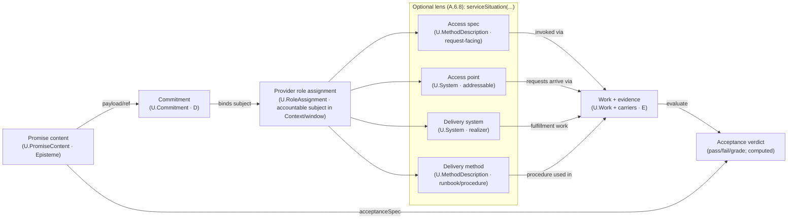

# SOURCE_FILE: Readme.md
---
# First Principles Framework (FPF) - Core Conceptual Specification

> Operating system for thought for engineering, research, and mixed human/AI teams.

**Author:** Anatoly Levenchuk (with AI-agents assistance)  
**Version:** April 2026  
**Status:** Normative kernel, "eternal alpha" - already used in working projects and development programmes, while still evolving.

FPF helps when raw insight is not enough: meanings, claims, alternatives,
evidence, boundaries, and outputs must remain stable across contexts, time,
people, tools, or AI agents.

It helps turn a vague, high-stakes, or multi-context problem into:

- a bounded-context map and a stable shared vocabulary,
- explicit decision criteria, boundary guards, and comparison characteristics,
- a small portfolio of lawful alternatives or candidate directions,
- an evidence / test gap list and auditable responsibility boundaries,
- a durable working form such as a UTS, a DRR, or another burden-specific output form,
- aligned outputs for engineers, managers, researchers, and auditors.

Use FPF when:

- work is split across specialists, teams, or AI agents;
- the real-world oracle is slow, expensive, noisy, or risky;
- different audiences need different views of the same underlying work;
- your current vocabulary is breaking down;
- you need state-of-the-art (SoTA) work as a managed portfolio, not a leaderboard snapshot;
- a solo or small-team decision still needs durable reasoning, auditability, or stable publication.

FPF may be too heavy when:

- the task is small,
- vocabulary is already stable,
- feedback is fast and cheap,
- the cost of semantic drift is low,
- no durable shared reasoning form is needed,
- or you mainly need a quick answer rather than a reusable reasoning form.

## First entry

This README is high-recall, low-detail. `Preface` gives coarse orientation,
`J.4` is the compact canonical entry index, and `I.2` is the worked-reading
depth role. A pattern's own `Problem frame` is the local high-precision
first-reading role.

Choose your first entry by what you are really trying to decide, stabilize, or
publish, not by document order. If you are new to FPF, read the entry title and
opening sentence first; use pattern IDs only after you know the entry matches
your situation.

A first practical session often stabilizes one or more of:

- who means what, and which responsibility boundaries matter;
- explicit decision criteria, comparison characteristics, or burden guards;
- a small alternative set when selection is part of the burden;
- a visible list of missing evidence or tests before commitment;
- a starter terminology, a starter ADR, or another particular need.

If you first need to decide whether FPF fits your situation, inspect `E.1-E.2`.
If you need to write or review patterns, inspect `E.8` and `E.19`.

Use this repository as an entry menu, not as one universal starter trunk:

1. **Project alignment**  
   Use this when: responsibilities, working method, plans, and what actually happened are being mixed.  
   Typical stabilizing result: a clean separation between responsibility, method, plan, and actual execution, plus a first worksheet, alignment frame, or term sheet.  
   First inspect: `A.1.1`, `A.15`, `A.15.2 / A.15.3`, and `B.5.1`. Consider `F.11` when method/work vocabulary itself must be aligned across contexts, `F.9` where bridge discipline matters, and `F.17 (UTS)` when vocabulary stabilization is live.

2. **Partly-said / language-state discovery**  
   Use this when: you have a serious cue, concern, or emerging idea that is too important to ignore but too early to present as a settled claim, requirement, or work record.  
   Typical stabilizing result: a short preservation-and-burden note that says what was noticed, how mature it is, and what kind of pattern should inspect it next.  
   First inspect: `C.2.2a`, `C.2.LS / C.2.4-C.2.7`, `A.16 / A.16.1 / A.16.2`, and `B.4.1 / B.5.2.0`; consider endpoint patterns only when the burden is actually endpoint-owned.

3. **Boundary unpacking**  
   Use this when: contract, API, protocol, compliance, or SLA language is mixing rules, gates, duties, and evidence in one blurred boundary story.  
   Typical stabilizing result: a Claim Register or routed atomic claim set.  
   First inspect: `A.6`, `A.6.B`, and `A.6.C`. If the first question is only what description you are seeing, inspect `A.6.RSIG`; when the boundary text hides overloaded quality or action language, add `A.6.P`, then `A.6.Q` or `A.6.A`.

4. **Lawful comparison / selection / selected-set publication**  
   Use this when: you need to compare alternatives honestly, keep a disciplined shortlist live, or publish a selected set without hiding the comparison logic.  
   Typical stabilizing result: declared characteristics, a comparison frame, candidate-pool policy, selected-set publication, or a lawful local decision home.  
   First inspect: `A.19:0`, `A.17-A.19`, `A.19.CN`, `G.0`, `C.18`, `C.19`, and `G.5`; consider `C.11` only for local choice and `C.24` only for call-planning/checkpoint-return burden.

5. **Generator / state-of-the-art / portfolio kit**  
   Use this when: your first deliverable is a reusable search, harvest, generator, or portfolio scaffold, not a one-off recommendation.  
   Typical stabilizing result: a reusable kit that names scope, schools of thought, variants, and shortlist-ready outputs.  
   First inspect: `A.0`, `G.0`, `G.1`, `G.2`, and `G.5`. Consider `B.5.2.1` and `C.17-C.19` when creative search or explore/exploit policy is already central.

6. **Same-entity rewrite / explanation / comparative reading**  
   Use this when: the main job is to restate, explain, re-render, repair, or compare something already written or published without quietly changing what it is about.  
   Typical stabilizing result: a rewrite, explanation note, repair note, or bounded comparison note that keeps the object of talk stable.  
   First inspect: `A.6.3.CR`, `A.6.3.RT`, `E.17.EFP`, `E.17.ID.CR`, `E.17.AUD.LHR`, and `E.17.AUD.OOTD`.

The older abduction reasoning loop (`A.0 -> A.1-A.3 -> B.3 -> F.17 -> E.9`) is here but not the universal
default anymore. Use `B.3` when assurance / trust / evidence transport is
already part of the present burden, and use `E.9 (DRR)` when normative change
or durable canon rationale must actually be published.

FPF is not:

- a shrink-wrapped project methodology;
- a quick-answer cheat sheet;
- a demand to read the whole specification linearly before doing useful work.
  
It is amplifier for collaborative engineering thinking for AI-agents.

## What stays outside this front door

- coarse orientation lives in `Preface`, not in this README;
- compact comparison of nearby starting points lives in `J.4`;
- longer worked entry readings live in `I.2`;
- advanced internal maps, AI-assistant prompt recipes, and extended examples appear later in this README or in `FPF-Spec.md`.

## One-minute example

A vague project question:

> "Should we buy, fine-tune, or build an agent stack for our platform?"

Without FPF, this often becomes one overloaded discussion with mixed
vocabularies, hidden trade-offs, and premature convergence on a single option.

With FPF, the work can become one disciplined structure:

`problem framing`
-> `bounded contexts` (product / infrastructure / safety / evaluation)
-> `decision criteria` (cost / latency / controllability / risk / time-to-value)
-> `portfolio of alternatives` (buy / fine-tune / build / hybrid)
-> `evidence and test gaps`
-> `starter DRR`
-> `starter UTS`
-> `aligned outputs` for engineering / management / research / assurance

The arrows are a compact explanatory sketch, not a required workflow.
The point is one underlying body of reasoning that can be reviewed, revised,
and published without semantic drift.

## Overview

The **First Principles Framework (FPF)** is a structured framework for thinking and coordinating work. It is written more like a technical specification than like a management book: there are named patterns, definitions, and review rules. Its job is to help teams model complex work, make reasoning inspectable, and keep decisions stable across engineering, research, and management.

This repository contains the **core specification**. Tooling belongs in tool-specific layers; worked examples, exercises, and guided learning paths belong in the pedagogical companion.

Use the spec as a reference model and entry map, not as a linear textbook.

FPF is not a specific methodology such as Agile or Waterfall, and it is not a static encyclopedia. It is closer to an architecture for reasoning: a set of reusable patterns and working forms that help teams turn tacit thinking into shared, reviewable work.

FPF is not mainly about making one model smarter. It is about making collective reasoning usable: clear local contexts, explicit responsibility boundaries, reviewable decision records, and outputs that different audiences can trust.

## What problem FPF solves

FPF is most useful when raw insight is no longer enough by itself. The hard part
may be coordination, but it may also be semantic precision, evidence shaping,
comparison, claim publication, vocabulary stabilization, or keeping one body of
reasoning coherent across time and readers.

In plain language: FPF turns raw intelligence into work that is easier to
align, review, evolve, publish, and delegate.

It also helps teams and solo practitioners create local zones of closure inside
an open world, so a real decision can be made even when the outside remains
uncertain.

Illustrative example: a platform team is deciding whether to buy, fine-tune, or
build an agent stack. FPF helps separate product, safety, infrastructure, and
evaluation contexts; define decision criteria; keep several options live long
enough to compare them honestly; make missing evidence explicit; and publish
aligned views for engineering and management without changing the underlying
reasoning.

## What you get after one pass

A first practical pass through FPF should stabilize concrete artifacts, not just
better intuitions:

- a map of bounded contexts and responsibility boundaries;
- explicit decision criteria and trade-off characteristics;
- a small portfolio of alternatives instead of premature convergence;
- a visible evidence / test gap list before commitment;
- a starter DRR;
- a starter UTS;
- aligned outputs for engineering, management, research, and assurance / audit readers.

## Where FPF earns its keep

FPF tends to pay off when several of these are true:

- work is split across specialised people, teams, copilots, or AI agents;
- the real-world oracle is delayed, noisy, expensive, or risky;
- different audiences need aligned outputs from the same underlying work;
- trade-offs between speed, quality, risk, novelty, and compliance must be made explicitly rather than hidden in one opaque score;
- existing categories are breaking down and you need to grow new concepts from first principles instead of reusing local folklore.

### Three ways to use FPF

1. **Human-only.** Use FPF as a reading, writing, and review discipline even with no AI in the loop. People can map contexts, separate systems / roles / method descriptions / methods / work, and produce shared term sheets and decision records directly.
2. **Mixed team.** Use FPF as a coordination layer across specialised people, teams, copilots, and AI agents. This is the mode where local working frames, responsibility boundaries, decision gates, and audience-specific outputs matter most.
3. **AI assistant.** Use FPF as an attached reference file or indexed reference for an assistant. In this mode, the spec is attached as a file rather than pasted into the prompt window; the dedicated section below shows the concrete loading pattern.

### Why FPF when AI-agents keep getting stronger?

- **Because local generation is not the whole problem.** Stronger LLMs reduce local reasoning scarcity, but they do not remove the need for selection, auditability, safe delegation, semantic stability, and shared understanding across people, agents, time, and viewpoints.
- **Because local working frames still matter.** FPF keeps teams from pretending that product, safety, operations, and research all use one universal vocabulary.
- **Because many real projects cannot just loop until tests pass.** In product, field engineering, strategy, marketing, safety, or open-ended research, the real-world oracle is delayed, noisy, expensive, or risky. FPF aims to catch anti-patterns before contact with the world.
- **Because the same framework can serve both humans and AI.** AI agents can read the specification directly; humans can learn the same working model through didactic layers and the pedagogical companion.
- **Because FPF pays off past a complexity frontier.** It matters most when the problem becomes simultaneously compositional, collaborative, temporal, assurance-heavy, and generative.

### FPF as an Operating System for Thought

Using the OS metaphor, FPF:

- **Provides a common runtime for reasoning and iteration.**
- **Treats local working frames as stable responsibility-boundary units.**
- **Separates systems, roles, method descriptions, methods, plans, and executed work.**
- **Keeps claims tied to scope, carriers, and evidence.**
- **Turns tacit thought into structured artefacts instead of leaving it implicit.**
- **Lets one underlying body of work be published differently for engineering, management, research, and assurance.**
- **Stays extensible through domain-specific packs instead of hard-coding one discipline's worldview.**

For most readers, the practical point is simpler than the internal vocabulary: FPF gives mixed human/AI teams a shared way to specialise locally, move work across responsibility boundaries cleanly, and keep different outputs about the same work coherent.

Loaded as a file into an AI assistant that can read files directly or through retrieval over an indexed copy, FPF can act as a disciplined reasoning scaffold for mixed human/AI work. It steers the model toward first-principles and state-of-the-art-oriented reasoning instead of generic marketing / management / pop-psychology boilerplate - but it will not think instead of you, and without good questions you can still get very confident, well-structured nonsense.

## Who is this for?

- **Engineers and systems engineers** building reliable physical or cyber-physical systems.
- **Researchers** constructing trustworthy knowledge and theories.
- **Platform teams** designing AI-agent / human-in-the-loop work systems.
- **Safety, assurance, and regulatory leads** who need auditable boundaries, evidence, and controlled delegation.
- **Managers and product leaders** orchestrating collective intelligence, budgets, and evolutionary cycles.

## Core ideas (plain language first)

FPF is built on a small kernel of non-negotiable ideas. New readers do not need the internal pattern names immediately; the point of this section is to explain what the framework buys you before you dive into its internal map.

1. **Local meaning, explicit translation.** Terms live inside bounded contexts: local working frames with their own meanings. Cross-context reuse is never obvious; it needs an explicit bridge.
2. **One underlying reality, many aligned outputs.** Engineering, management, research, and assurance outputs should be projections of the same underlying work, not disconnected documents.
3. **Separate systems, roles, method descriptions, methods, plans, and executed work.** Descriptions, capabilities, plans, and actual occurrences are not the same thing.
4. **Trust has structure and grounding.** A claim should say how formal it is, where it applies, what evidence supports it, and which carriers or systems anchor it.
5. **Composition matters across scales.** The same logic should survive when parts are aggregated into wholes.
6. **Keep search wide before selection.** In open-ended work, diversity of options matters before choosing a winner.
7. **Build from first principles when categories break.** FPF is not only for organising the current state of the art; it is also for growing new abstractions.

## What to expect (and what not to expect)

### Reasonable expectations

- **A coordination fabric for mixed human/AI teams.** FPF helps specialised people and agents participate in one engineering or research effort through bounded contexts, bridges, shared artefacts, and multiple publication forms / views.
- **A way to push some mistakes left, before expensive contact with the world.**
- **A way to keep engineering, management, research, and assurance outputs coherent.**
- **A co-thinker biased toward state-of-the-art and first-principles reasoning.** When loaded into an AI-agent or chat, FPF gives you sharper questions, better comparisons, and far less generic boilerplate.
- **A backbone for disciplines and organisations.** FPF can serve as a structured way to model a discipline or organisation with explicit contexts, roles, calculi, and state-of-the-art packs rather than one more methodology slide-deck.
- **A machine for first-principles synthesis.** Use it not only to recall current best practice, but to grow new Second Principles Framework (SPF) when existing categories are misleading.
- **A kernel for development programmes.** It can also act as a kernel for engineer-manager development and research skill-building.

### Unreasonable expectations

- **I will just read it once and form my opinion.** The spec reads like OS source code, not like a popular book; it is meant to be used with tools, not consumed in one sitting.
- **This is a plug-and-play tool for all work projects.** Today FPF is a research-grade framework that already helps in real projects as an MVP, but it is not yet a shrink-wrapped product; you still need to adapt, localise, and extend it for your discipline and organisation.
- **It works without good framing and always gives the right answer.** AI-agent+FPF will not think instead of you. Without good questions, explicit problem frames, and minimal rational literacy you can still get confident nonsense - just more structured nonsense.
- **A stronger AGI / LLM makes FPF unnecessary.** As models get stronger, the bottleneck often moves from local reasoning to coordination, selection, safe delegation, and cross-role auditability.
- **Adoption should be decided only by transferable benchmark wins from other organisations.** Frameworks such as Agile or Copilot-like practices are often adopted as architectural bets under high variation. FPF is similar: the justification is usually logical fit to your coordination / problem structure, not a neat benchmark that transfers unchanged across organisations.
- **If I ignore first principles, FPF will fix everything.** FPF amplifies whatever style of thinking you bring: if you use it to chase fashion, it will help you catalog fashion; if you use it to chase first principles, it will help you do that more systematically.

## How to approach this repository

There are six practical newcomer entry families above, plus a few orientation options around them:

1. **If you want the why:** start with **E.1-E.2** (Vision / Mission + Pillars).
2. **If you want the first practical entry:** choose the entry block above whose opening sentence sounds most like your current burden, not the code sequence that happens to appear first.
3. **If you already chose an entry and want more detail:** use **Preface** for coarse orientation, **J.4** for compact comparison of nearby starting points, and **I.2** for longer worked readings.
4. **If you want to write or review patterns:** start with **E.8** and **E.19**.
5. **If your real situation is still partly said:** use the partly-said entry family above in full detail - `C.2.2a`, `C.2.LS / C.2.4-C.2.7`, `A.16 / A.16.1 / A.16.2`, `B.4.1 / B.5.2.0`, then the relevant endpoint pattern.
6. **If you want a compact internal map:** use the simplified cluster map below.

<details>
<summary>Advanced: simplified internal map of the specification</summary>

The specification is divided into clusters. The map below is intentionally simplified and focuses on the main semantic blocks. Think of it as source code for an evolvable reasoning architecture, not as an expert system and not as a tutorial; Parts **H-K** then provide glossary, annexes, indexes, and navigation aids. If you only need to choose your first entry, you can skip this block.

### Part A: Kernel Architecture Cluster
The immutable ontological core.
- **Ontology:** Holons, Systems, Epistemes, and Bounded Contexts.
- **Transformation:** the transformer quartet - system bearing TransformerRole, MethodDescription, Method, Work.
- **State Space and boundaries:** Characteristics, Scales, Dynamics, and the signature-stack / boundary-discipline family.

### Part B: Trans-disciplinary Reasoning Cluster
The logic of composition and trust.
- **Aggregation and emergence:** cross-scale composition and reasoning.
- **Assurance:** trust, evidence, canonical evolution, pre-abductive routing, abductive prompting.
- **Bridge use:** how reasoning moves across contexts without silent collapse.

### Part C: Kernel Extension Specifications
Pluggable domain-specific calculi, logics, and characterisation families.
- **Extension families:** Sys / KD / Kind / Method / LOG / CHR.
- **Additional burden families:** measurement, creativity, NQD, explore / exploit policy, discipline health, problem typing, method-maturity, agentic tool-use, and quality-bundle patterns.

### Part D: Multi-scale Ethics & Conflict-Optimisation
- Multi-scale ethics from agent to planetary scope.
- Conflict topology, trust-aware mediation, and bias / ethical-assurance overlays.

### Part E: The FPF Constitution and Authoring Guides
The governance of the framework itself.
- **Vision, pillars, and guard-rails.**
- **Didactic architecture, authoring protocol, lexical law, and human-facing working-model discipline.**
- **Multi-view publication, transduction-graph architecture, review gates, and DRR-based evolution governance.**

### Part F: The Unification Suite
Techniques for aligning vocabularies across disciplines and specialised agents.
- **Concept-sets, local naming, and role descriptions.**
- **Mint / reuse discipline, bridges, status mappings, and method-quartet harmonisation.**
- **Human-facing publication forms such as UTS.**

### Part G: Discipline State-of-the-Art (SoTA) Patterns Kit
Tools for harvesting state-of-the-art knowledge and building governed portfolios.
- **CG-Spec and CG-Frame authoring.**
- **State-of-the-art harvesting and synthesis.**
- **Lawful characteristic / calculi authoring, selector / dispatcher patterns, shipping-ready publication forms, and refresh discipline.**

### Parts H-K: Glossary, annexes, and navigation aids
Glossary, extended tutorials, indexes, migration notes, and other navigation support around the core clusters.

</details>

## Using FPF with an AI assistant

This is one of the three practical modes above, not the default identity of FPF. If you are working human-only or in a mixed team, you can skip this section and still use the framework fully.

The Core itself remains tool-agnostic; attaching the file or using retrieval over an indexed copy is simply the most convenient current way to expose the spec to an assistant. In practice the spec is too large to paste cleanly as a prompt, so treat it as an attached file or indexed corpus.

The highest-leverage first sessions are concrete. Ask for plain-language outputs first; pull internal FPF names only when they add precision or help you navigate the spec.

AI-agent+FPF will not solve everything automatically: you remain the principal, and the model is an agent that follows your problem framing and constraints.

If you are new to FPF, start with prompt `1` or `5` below. The later examples assume more internal FPF vocabulary.

### A starter prompt that usually works

> You have the FPF specification as a file.  
> Help me structure [project / problem / programme].  
> Use plain language for an engineer-manager.  
> Propose: (1) bounded contexts / specialisations, (2) decision criteria, (3) key alternatives, (4) responsibility boundaries, and (5) missing evidence or tests before commitment.  
> Introduce internal FPF names only when they add precision.

In practice the most productive usage is to treat FPF as a design kit and reference model: ask for bounded-context maps, decision criteria, option portfolios, structured reasoning artefacts, publication forms, and responsibility-boundary contracts for your domain, then iterate.

Below are example prompts; adapt them to your domain and language.

### 1. Turn a vague project into measurable decision criteria

**Goal:** get a step-by-step chain from vague idea to measurable characteristics, indicators, scoring, and decision criteria.  
**Prompt:**
> You have the FPF specification loaded as a file.  
> We are starting work on [brief description of project], design has not yet begun.  
> Propose a step-by-step chain for characterising the objects of our project, normalising measurements, defining indicators, scoring alternatives, and choosing design decisions.  
> Include steps that I may have forgotten.  
> Write in the language of engineer-managers, not in FPF jargon.

Typical follow-ups:
- "Now take object [X] from this chain and work it through in detail: list 10-15 characteristics, their scales, indicators, and a rough dashboard format for decision-makers."
- "Show how this chain maps to the principles-to-work route for this project."

### 2. Build a disciplined vocabulary for a domain (UTS, shared term sheet)

**Goal:** build a disciplined vocabulary for a niche field using FPF Part F.  
**Prompt:**
> You have the FPF specification loaded.  
> Produce a Unified Term Sheet (UTS) block for the core terms of [your domain]: at least 10 rows.  
> Use the term-sheet discipline from Part F (especially F.17 / F.18): distinguish Tech vs Plain names, show SenseCells for 2-3 key bounded contexts, and flag risky aliases.

Follow-up for quantitative structure:
- "For the same domain, propose a Q-bundle that captures the quality of [your object / work system] and produce a UTS block for its characteristics (CHR) and indicators."

### 3. Design better names for ambiguous roles, programmes, and artefacts (Name Cards)

**Goal:** design better names for roles, programs, and artefacts when existing labels are misleading.  
**Prompt:**
> Using the naming-card discipline (F.18), develop a complete Name Card for what to call [current name of an entity] in the following situation:  
> [short narrative of current practice and complaints about the existing name]  
> Do not assume current names are correct; perform an honest search on the local Pareto-front of candidate names and explain trade-offs.

### 4. Make the route from principles to work explicit (P2W / E.TGA graph)

**Goal:** make from principles to work explicit for a concrete project.  
**Prompt:**
> Using E.TGA and TEVB, unpack the canonical P2W flow for my situation [describe your project].  
> Give the list of nodes (P1...Pn), their Kinds, and explain each node in engineer-manager language.

Follow-up:
- "Now build a mini Flow specification table for this P2W graph".

### 5. Organise a mixed team of humans and AI agents

**Goal:** turn a set of people, copilots, and specialised agents into a disciplined work architecture.  
**Prompt:**
> We have the FPF specification loaded as a file.  
> We need to organise a mixed team of humans and AI agents for [project / programme].  
> Propose a bounded-context map: contexts, local vocabularies, roles, bridges, responsibility-boundary artefacts, decision gates, and where human approval is required.  
> Keep the final answer practical for engineers / managers and avoid FPF jargon.

Typical follow-ups:
- "Now define autonomy budgets, allowed tools, escalation paths, and publication forms / views for each context / agent."
- "Show which bridges are high-risk because translation loss or ambiguity is likely."

### 6. Harvest competing schools of thought and build a portfolio (state-of-the-art pack)

**Goal:** use Part G to organise a frontier discipline around first principles.  
**Prompt:**
> We are searching for the state of the art in [discipline].  
> Using G.2 and G.4, extract: (a) TraditionCards for competing schools of thought; (b) OperatorCards for their main operators / update rules; (c) a first draft of a state-of-the-art pack and selector-ready portfolio. This is expected to be a long text, therefore start with only TraditionCards.

## Citation

If you use FPF, please cite:

```
Levenchuk, Anatoly. First Principles Framework (FPF).
GitHub repository: https://github.com/ailev/FPF
```


# SOURCE_FILE: FPF-Spec.md
---
# First Principles Framework (FPF) — Core Conceptual Specification
by Anatoly Levenchuk and assortment of LLMs.
April 2026

Pattern and headers templates are explained in pattern E.8.

# Table of Content

 **Preface (non-normative)**

| ID & Title                                                                                                                                   | Status    | Concise content reminder — “what belongs here”                                                                                                                                                                                        |
| :------------------------------------------------------------------------------------------------------------------------------------------- | :-------- | :------------------------------------------------------------------------------------------------------------------------------------------------------------------------------------------------------------------------------------ |
| What this specification is (and how to use it) | full text | A practical orientation to the Core Conceptual Specification: what FPF is, what kinds of artefacts/patterns it defines, how Parts A–K fit together, and where to start for different reader roles. |
| Creativity in Open-Ended Evolution and Assurance*                                                                                            | full text | FPF integrates assurance (audits, evidence) and creativity (generating novel ideas) as complementary engines for responsible innovation, providing a structured choreography for creative work from abduction to operation.           |
| Navigating Uncertainty: Building Closed Worlds within an Open World                                                                          | full text | Explains how FPF reconciles Open-World and Closed-World assumptions, using Bounded Contexts to create reliable 'islands of closure' for engineering decisions within an inherently open world.                                        |
| FPF as an Evolutionary Architecture for Thought                                                                                              | full text | Positions FPF as an architecture for the reasoning process itself, designed to sustain key characteristics like auditability, evolvability, and falsifiability by applying architectural thinking to the dynamics of reasoning.       |
| Architectural Characteristic of Thought                                                                                                      | full text | Details the key characteristics of rigorous thought (e.g., Auditability, Evolvability, Composability) and the specific FPF mechanisms designed to preserve them.                                                                      |
| Beyond Cognitive Biases: FPF as a Generative Architecture for Thought                                                                        | full text | Contrasts FPF's generative, structural approach to avoiding cognitive errors with the traditional corrective, diagnostic approach of hunting for biases, framing FPF as a scaffold that makes errors harder to commit.                |
| Thinking Through Writing: The FPF Discipline of Conceptual Work                                                                              | full text | Describes how FPF uses a discipline of "thinking through writing" with conceptual forms (Cards, Tables, Records) to make thought tangible, shareable, and auditable, while remaining tool-agnostic.                                   |
| Descriptive Ontologies vs. A Thinking-Oriented Architecture                                                                                  | full text | Differentiates FPF's goal of orchestrating reasoning from classical ontologies' goal of cataloging existence, emphasizing FPF's focus on objectives, trust, and dynamics.                                                             |
| The "Bitter Lesson" trajectory — compute, data, and freedom over hand‑tuned rules (FPF stance)                                               | full text | How FPF operationalizes the contemporary trend: prefer general models + data + compute + minimal constraints; autonomy budgets; rule‑of‑constraints vs instruction‑of‑procedure; continuous adaptation.                               |
| From Flat Documents to High-Dimensional Truth: The Multi-View Architecture                                                                   | full text | Shows how FPF replaces flat documents with a multi-view architecture: epistemes as slot graphs, engineering views as projections, and MVPK as typed publication surfaces that keep dashboards lawfully tethered to work and evidence. |
| Boundary Statements: Where Language Becomes a System Boundary                                                                          | full text | Introduces the A.6 boundary cluster: why certain sentences behave like contracts, and how routing (laws vs gates vs duties vs evidence) keeps them evolvable and multi-view safe. |
| Raising Semantic Precision: From Triggers to Math‑Backed Ontics                                                                        | full text | Describes the precision-upgrade workflow behind A.6.P: detect umbrella words, unpack the local ontology, choose a stable mathematical substrate, refactor the model, and mint precise lexemes + guardrails (Tech/Plain twins). |
| The “big storylines” unique to FPF (load‑bearing commitments)                                                                                | full text | Lists the nine core, load-bearing commitments that define FPF's unique architectural and philosophical stance, from its holonic kernel to its explicit treatment of creativity and assurance.                                         |
| Transdisciplinarity as a Meta‑Theory of Thinking                                                                                             | full text | Explains how FPF treats transdisciplinarity as a meta-theory for designing reasoning, using FPF patterns as generative scaffolds grounded in physical reality to bridge disciplinary silos.                                          |
| FPF as a Culinary Architecture for Collective Thought: Why We Formalize “Obvious” Ideas                                                      | full text | Uses the 'culinary architecture' analogy to explain FPF's role in synthesizing 'obvious' ideas into a robust framework for complex, generative problems.                                                                              |
| Intellect Stack (informative Overview)                                                                                                       | full text | Presents a five-layer pedagogical map of cognitive skills (Structure → Knowledge → Action → Strategy → Governance) and links them to FPF patterns.                                                                               |
| Purpose, Scope, and Explicit Non‑Goals                                                                                                       | full text | Clarifies FPF's mission as a generative scaffold for thought, its scope as tool-agnostic normative patterns, and what it explicitly is not (e.g., a domain encyclopedia or a specific methodology).                                   |

**Part A - Kernel Architecture Cluster**

| § | ID & Title | Status | Keywords & Search Queries | Dependencies |
| :--- | :--- | :--- | :--- | :--- |
| A.0 | **Onboarding Glossary (NQD & E/E‑LOG)** | Stable | *Keywords:* novelty, quality-diversity (NQD), explore/exploit (E/E-LOG), declared set surface, typed portfolio publication, SearchSpaceRef, OutcomeSpaceRef, CrossSurfaceSupportView, TypedSetViews, ParetoOnly default, scale-probe, BLP. *Queries:* "What terms must I publish when generating, selecting, or shipping a set surface?", "How do I explain search-side vs outcome-side spaces and support views on first use?", "How does FPF avoid single-winner bias in creative search?" | **Builds on:** E.2, A.5, C.17-C.19. **Coordinates with:** E.7, E.8, E.10, F.17, A.19.SURF-SPACE, A.19.SUPPORT-VIEW, G.5, G.9-G.12. **Constrains:** any pattern/UTS row that describes a generator, selector, declared set surface, or typed portfolio-publication / set-return publication. |
| ***Cluster A.I - Foundational Ontology*** | | | | |
| A.1 | **Holonic Foundation: Entity → Holon** | Stable | *Keywords:* part-whole composition, system boundary, entity, holon, U.System, U.Episteme. *Queries:* "How does FPF model a system and its parts?", "What is a holon?", "Difference between entity and system." | **Builds on:** P-8 Cross-Scale Consistency. **Prerequisite for:** A.1.1, A.2, A.14, B.1. |
| A.1.1 | **`U.BoundedContext`: The Semantic Frame** | Stable | *Keywords:* local meaning, context, semantic boundary, domain, invariants, glossary, DDD. *Queries:* "How does FPF handle ambiguity?", "What is a Bounded Context in FPF?", "How to define rules for a specific project?" | **Builds on:** A.1. **Prerequisite for:** A.2.1, F.0.1. |
| A.2 | **Role Taxonomy** | Stable | *Keywords:* role, assignment, holder, context, function vs identity, responsibility, U.RoleAssignment. *Queries:* "How to model responsibilities?", "What is the difference between what a thing *is* and what it *does*?" | **Builds on:** A.1, A.1.1. **Prerequisite for:** A.2.1-A.2.6, A.13, A.15. |
| A.2.1 | **`U.RoleAssignment`: Contextual Role Assignment** | Stable | *Keywords:* Standard, holder, role, context, RoleEnactment, RCS/RSG. *Queries:* "How to formally assign a role in FPF?", "What is the Holder#Role:Context Standard?" | **Refines:** A.2. **Prerequisite for:** A.15. |
| A.2.2 | **`U.Capability`: System Ability (dispositional property)** | Stable | *Keywords:* ability, skill, performance, action, work scope, measures. *Queries:* "How to separate ability from permission?", "What is a capability in FPF?" | **Builds on:** A.2. **Informs:** A.15, A.2.3. |
| A.2.3 | **`U.PromiseContent`: Consumer‑facing Promise Clause** | Stable | *Keywords:* promise content, promise content, accessSpec, acceptanceSpec, SLO, SLA, claim scope (G), Work evidence, provider/consumer roles. *Queries:* "What is a promise content in FPF?", "Promise content vs Work vs MethodDescription", "How do access and acceptance differ?", "How is SLO/SLA adjudicated from Work evidence?" | **Builds on:** A.2.2. **Prerequisite for:** F.12. **Used by:** A.2.8, A.6.C, A.6.8. |
| A.2.4 | **`U.EvidenceRole`: The Evidential Stance** | Stable | *Keywords:* evidence, claim, support, justification, episteme. *Queries:* "How does an episteme serve as evidence?", "Modeling evidence roles." | **Builds on:** A.2. **Informs:** A.10, B.3. |
| A.2.5 | **`U.RoleStateGraph`: The Named State Space of a Role**| Stable | *Keywords:* state machine, RSG, role state, enactability, lifecycle. *Queries:* "How to model the state of a role?", "What is a Role State Graph?" | **Builds on:** A.2.1. **Prerequisite for:** A.15. |
| A.2.6 | **Unified Scope Mechanism (USM): Context Slices & Scopes**| Stable | *Keywords:* scope, applicability, ClaimScope (G), WorkScope, set-valued. *Queries:* "How to define the scope of a claim or capability?", "What is G in F-G-R?" | **Builds on:** A.1.1. **Constrains:** A.2.2, A.2.3, B.3. |
| A.2.7 | **`U.RoleAlgebra`: In-Context Role Relations (`≤`, `⊥`, `⊗`)** | Stable | *Keywords:* role algebra, specialization (`≤`), incompatibility (`⊥`), bundles (`⊗`), separation of duties (SoD), requiredRoles substitution. *Queries:* "What does `RoleS ≤ RoleG` mean in FPF?", "How do I encode Separation of Duties with `⊥`?", "How do role bundles (`⊗`) work?" | **Builds on:** A.2. **Prerequisite for:** A.15, A.2.5. |
| A.2.8 | **`U.Commitment`: Deontic Commitment Object** | Stable | *Keywords:* commitment, deontics, obligation/permission/prohibition, modality normalization, scope+validity window, adjudication hooks, evidenceRefs, BCP‑14 (RFC 2119/8174). *Queries:* "How to represent MUST/SHALL as a lintable object?", "How to keep deontics separate from admissibility gates?", "How to make commitments auditable via evidence hooks?" | **Refines:** A.2. **Builds on:** A.2.1, A.2.3, A.2.6, A.7, A.15.1. **Used by:** A.6.B (Quadrant D), A.6.C. |
| A.2.9 | **`U.SpeechAct`: Communicative Work Object** | Stable | *Keywords:* speech act, communicative work, approval/authorization/publication/revocation, provenance, act≠utterance≠carrier, judgement context, window/freshness, institutes.*. *Queries:* "How to model approvals/authorizations as Work?", "How to separate act vs utterance vs carrier?", "How to link commitments to instituting acts without commitment-by-publication?" | **Refines:** A.2. **Builds on:** A.2.1, A.2.6, A.7, A.10, A.15.1. **Used by:** A.2.8, A.6.C (utterance/instituting-act hook). |
| ***Cluster A.II - Transformation Engine*** | | | | |
| A.3 | **Transformer Constitution (Quartet)** | Stable | *Keywords:* action, causality, change, System-in-Role, MethodDescription, Method, Work. *Queries:* "How does FPF model an action or a change?", "What is the transformer quartet?" | **Builds on:** A.2. **Prerequisite for:** A.3.1, A.3.2, A.15. |
| A.3.1 | **`U.Method`: The Abstract Way of Doing** | Stable | *Keywords:* recipe, how-to, procedure, abstract process. *Queries:* "What is a Method in FPF?", "Difference between Method and Work." | **Refines:** A.3. **Prerequisite for:** A.15. |
| A.3.2 | **`U.MethodDescription`: The Recipe for Action** | Stable | *Keywords:* specification, recipe, SOP, code, model, epistemic artifact. *Queries:* "How to document a procedure?", "What is a MethodDescription?" | **Refines:** A.3. **Informs:** A.15. |
| A.3.3 | **`U.Dynamics`: The Law of Change** | Stable | *Keywords:* state evolution, model, simulation, state space. *Queries:* "How to model state transitions or system dynamics?", "Difference between a Method and Dynamics." | **Builds on:** A.19. **Informs:** B.4. |
| ***Cluster A.III - Time & Evolution*** | | | | |
| A.4 | **Temporal Duality & Open-Ended Evolution Principle** | Stable | *Keywords:* design-time, run-time, evolution, versioning, lifecycle, continuous improvement. *Queries:* "How does FPF handle plan vs. reality?", "How are systems updated?" | **Builds on:** P-10 Open-Ended Evolution. **Prerequisite for:** B.4. |
| ***Cluster A.IV - Kernel Modularity*** | | | | |
| A.5 | **Open-Ended Kernel & Extension Layering** | Transitional stub | *Keywords:* FPF architecture, specialization vs dependancy hierarhies, modularity, extensibility. *Queries:* "What is the architecture of FPF?", "How are new domains added?" | **Builds on:** P-4, P-5. |
| ***Cluster A.IV.A - Signature Stack & Boundary Discipline (A.6.*)*** | | | | |
| A.6 | **Signature Stack & Boundary Discipline** | Stable | *Keywords:* boundary, signature stack, boundary route fields, laws, admissibility, deontics, evidence, probe/order/frame/export claims, state-reading claims. *Queries:* "How do I route boundary statements?", "Where do probe, frame, export, and state-reading claims belong?", "How to avoid contract-soup drift in boundary descriptions?" | **Builds on:** E.8, A.6.0, A.6.1, A.6.3, E.17.0, E.17, A.7, F.18, E.10.D2, E.10/L-SURF. **Coordinates with:** A.6.B, A.6.P, C.26, C.26.1, F.9, A.10, B.3, E.19. |
| A.6.RSIG | **Recognition Signatures for Descriptions** | Stable | description-recognition signature; encountered carrier vs authoritative home; API/access description not promise; method applicability note; false neighboring description | `A.6`, `A.6.P`, `F.18`, `E.10` |
| A.6.B | **Boundary Norm Square (Laws / Admissibility / Deontics / Work-Effects)** | Stable | *Keywords:* boundary norm square, atomic claims, L/A/D/E routing, laws vs gates vs commitments vs evidence, supported use, unsupported use, claim IDs, triangle decomposition. *Queries:* "What is the Boundary Norm Square in FPF?", "How do I decompose probe-coupled or mixed boundary statements?", "Where do RFC keywords and use conditions belong in FPF patterns?" | **Builds on:** E.8, A.6.0, A.6.1, A.6.3, E.17.0, E.17, A.7, F.18, E.10.D2, E.10/L-SURF. **Coordinates with:** A.6, A.6.P, C.26.1, A.10, B.3. |
| A.6.C | **Contract Unpacking for Boundaries** | Stable | *Keywords:* contract bundle unpacking, SLA/guarantee routing, promise content (promise content) ≠ work, promise-act/utterance/commitment separation, Boundary Norm Square (L/A/D/E), MVPK faces “no new semantics”. *Queries:* "How to unpack contract language into promise content / utterance / commitment / work+evidence?", "How to prevent interface-as-agent / contract soup mistakes?", "How to stop MVPK faces becoming ‘second contracts’?", "When contract talk includes service-cluster tokens, what gets unpacked first?" | **Builds on:** A.6, A.6.B, A.6.8, A.7, A.2.3, A.2.8, A.2.9, E.10, E.17. **Coordinates with:** F.12, F.18. |
| A.6.0| **U.Signature — Universal, law‑governed declaration** | Stable | *Keywords:* signature, vocabulary, laws, applicability, bounded context. *Queries:* "What is the universal signature block?", "Where do laws vs. implementations live?" | **Placement:** Kernel; **Coordinates:** A.6.1. |
| A.6.1 | **U.Mechanism - Law‑governed application to a SubjectKind over a BaseType** | Stable | Keywords: Mechanism, OperationAlgebra, LawSet, AdmissibilityConditions, Transport, Bridge‑only. Queries: "How to define a mechanism like USM/UNM?", "Where do operational guards live?", "How to handle cross‑context transport?" | **Builds on:** A.6.0, E.10.D1. **Instances:** USM (A.2.6), UNM (A.19). |
| A.6.2 | **U.EffectFreeEpistemicMorphing — Effect-Free Morphisms of Epistemes** | Stable | *Keywords:* episteme, effect-free, morphism, functoriality, describedEntity, lenses, reproducibility. *Queries:* "How to transform descriptions/specs without mechanisms?", "What are conservative episteme-to-episteme transforms in FPF?", "How do Describe_ID / Specify_DS fit into a general morphism class?" | **Builds on:** A.1 (Holon), A.7 (Strict Distinction, Object≠Description≠Carrier), A.6.0 (U.Signature), A.6.5 (U.RelationSlotDiscipline), E.10.D2 (I/D/S discipline), C.2.1 (U.EpistemeSlotGraph). **Used by:** A.6.3 (U.EpistemicViewing), A.6.4 (U.EpistemicRetargeting), E.17.0 (U.MultiViewDescribing), E.17 (MVPK), E.18 (E.TGA StructuralReinterpretation), KD-CAL mapping rules. |
| A.6.3 | **U.EpistemicViewing — describedEntity-Preserving Morphism** | Stable | *Keywords:* episteme, view, EpistemicViewing, describedEntity preservation, ClaimGraph, Viewpoint, RepresentationScheme, CorrespondenceModel, Direct vs Correspondence Viewing, optics, displayed fibration. *Queries:* "How to define a view of an artefact without adding new claims?", "What is an EpistemicViewing in FPF terms?", "How do ISO 42010 views and SysML v2 views-as-queries sit in FPF?" | **Builds on:** A.6.0 (U.Signature), A.6.2 (U.EffectFreeEpistemicMorphing), A.6.5 (U.RelationSlotDiscipline), A.7 (Strict Distinction; I/D/S vs Surface), E.10.D2 (I/D/S discipline), C.2.1 (U.EpistemeSlotGraph), C.2 (KD-CAL: describedEntity & ReferencePlane). **Used by:** E.17.0 (U.MultiViewDescribing), E.17 (MVPK), E.17.1/E.17.2 (ViewpointBundleLibrary & TEVB), E.18 (E.TGA viewpoint families), B.5.3 (Role-Projection Bridge), KD-CAL view operators. |
| A.6.3.CSC | **Controlled Semantic Coarsening** | Stable | *Keywords:* controlled semantic coarsening, stronger source, weaker rendering, narrower supported use, unsupported heavier use, reopen trigger, redaction, dashboard tile, lookup handle, state-representation shortcut. *Queries:* "When may a summary or redaction stand in only for narrow use?", "What is Controlled Semantic Coarsening in FPF?", "When must a weakened rendering reopen the stronger source?" | **Builds on:** A.6.3, A.6.3.CR, A.6.3.RT, E.17.EFP, A.6.P, E.8, E.10, E.19, F.18. **Coordinates with:** C.26, C.26.1, E.17.ID.CR, F.9, F.9.1, A.15, A.6.4, A.20, A.21. |
| A.6.3.CR | **ConservativeRetextualization - same-described-entity textual re-expression** | Stable | *Keywords:* retextualization, summary, report rewrite, translation, filtering, same-described-entity textual re-expression, direct vs correspondence-mediated rewrite, source tether. *Queries:* "When is a summary still a conservative same-entity view?", "How does FPF treat same-entity translation or report rewriting?", "When does a softened rewrite need Controlled Semantic Coarsening instead?" | **Builds on:** A.6.3, A.6.2, A.7, E.10.D2, E.17.0, E.17, F.9, F.18, E.10. **Coordinates with:** A.6.3.CSC, ExplanationFaithfulnessProfile, RepresentationTransduction, E.17.ID.CR ComparativeReading, A.6.4, B.5.2, A.15. |
| A.6.3.RT | **RepresentationTransduction - same-described-entity representation-scheme transition** | Stable | *Keywords:* representation transduction, table, diagram, notation shift, reasoning medium, recoverability, same-described-entity representation change, source tether, state-representation shortcut. *Queries:* "When is a table or diagram still a same-entity view?", "What is RepresentationTransduction in FPF?", "When does a state-representation shortcut need CSC or C.26 support?" | **Builds on:** A.6.3, A.6.2, A.7, E.10.D2, C.2.7, E.17.0, E.17, F.9, F.18. **Coordinates with:** A.6.3.CSC, C.26, ConservativeRetextualization, ExplanationFaithfulnessProfile, E.17.ID.CR ComparativeReading, A.6.4, A.15, A.20, A.21, DecodingAccessProfile. |
| A.6.4 | **U.EpistemicRetargeting — describedEntity-Retargeting Morphism** | Stable | *Keywords:* retargeting, subject retargeting, describedEntity shift, KindBridge, SquareLaw-retargeting, StructuralReinterpretation. *Queries:* "How to change the object-of-talk without losing truth?", "What is StructuralReinterpretation in FPF terms?", "When is a Fourier-like transform a retargeting rather than a new Γ-construction?" | **Builds on:** A.6.2 (effect-free episteme morphisms), A.1 (Holon: System/Episteme split), F.9 (Bridges & CL, including CL^plane and KindBridge), C.2.1 (U.EpistemeSlotGraph; DescribedEntity/GroundingHolon), C.2 (KD-CAL: ReferencePlane & CL propagation), E.18:5.9/E.18:5.12 (E.TGA crossings & StructuralReinterpretation rules). **Used by:** E.18 (StructuralReinterpretation node in E.TGA as species of U.EpistemicRetargeting), KD-CAL/LOG-CAL retargeting rules, Fourier-style transforms and data↔model re-targetings in discipline packs. |
| A.6.P | **U.RelationalPrecisionRestorationSuite — Relational Precision Restoration (RPR) — Kind-Explicit Qualified Relation Discipline** | Stable | *Keywords:* relation precision restoration, under-specified relational language, RelationKind, QualifiedRelationRecord, coupling, probe, measurement, export, endpoint referential compression, lexical guardrails, language-state seam. *Queries:* "How do I repair an overloaded relation word without lexicon-only cleanup?", "How do I keep probe/coupling/export wording kind-explicit?", "When should quality/action/sameness/wholeness/QL wording reroute to another owner?" | **Builds on:** A.6, A.6.B, A.6.S, A.6.0, A.6.5, E.8, E.10, F.18. **Coordinates with:** A.2.4, A.2.6, A.7, A.10, C.2.1, C.2.2a, C.3.3, C.26, E.17, F.9, F.17. **Specialised by:** A.6.Q, A.6.A, A.6.5, A.6.6, A.6.8, A.6.9, A.6.H. |
| A.6.Q | **U.QualityTermPrecisionRestoration — Quality Term Precision Restoration (Q-TERM)** | Stable | *Keywords:* quality-term precision restoration, evaluative ascription, quality senses, endpoint routing, bridge reading, language-state seam. *Queries:* "How do I repair overloaded quality language in FPF?", "When does quality talk become an evaluative ascription?", "How does A.6.Q hand off to C.25 or later owners?" | **Builds on:** A.6.P, C.25, C.2.2a, A.16, B.4.1, F.9. **Coordinates with:** A.6.A, B.5.2.0. |
| A.6.A | **U.ActionInvitationPrecisionRestoration — Affordance / Action-Invitation Precision Restoration (ACT-INV)** | Stable | *Keywords:* affordance, action invitation, action-first language, post-threshold routing, A.15 docking, language-state seam. *Queries:* "How do I repair overloaded affordance language in FPF?", "When does action-guiding language become an action invitation?", "How does A.6.A differ from early cue routing?" | **Builds on:** A.6.P, A.15, C.2.2a, A.16, B.4.1, F.9. **Coordinates with:** A.6.Q, B.5.2.0. |
| A.6.5 | **U.RelationSlotDiscipline - SlotKind / ValueKind / RefKind discipline for n‑ary relations (with slot‑operation lexicon)** | Stable | *Keywords:* slot, argument position, value, reference, signature, substitution, pass-by-value, pass-by-reference. *Queries:* “How do I declare positions and references in relations?”, “How do we stop mixing roles, values and ids in signatures?”, “How does SlotKind/ValueKind/RefKind interact with I/D/S and Epistemes?” | **Builds on:** A.6.0 (U.Signature), A.1 (Holon), A.7 (Strict Distinction), E.8 (pattern authoring discipline), E.10 (LEX-BUNDLE; Tech/Plain registers). **Used by:** C.2.1 (U.EpistemeSlotGraph), A.6.2–A.6.4 (episteme morphisms), B.5.* (RoleEnactment), C.3.* (Kinds & KindSignature), E.17.0 (U.MultiViewDescribing), discipline-packs for methods/services. |
| A.6.6 | **U.BaseDeclarationDiscipline - Kind-explicit, scoped, witnessed base declaration discipline (with base-change lexicon)** | Stable | *Keywords:* base declaration, basedness, baseRelation, SWBD, witnesses, scope, Γ_time, anchoring, rebase, retime, rescope. *Queries:* "What is U.BaseDeclarationDiscipline?", "How to model base-dependence without anchoring?", "What is a ScopedWitnessedBaseDeclaration (SWBD)?" | **Builds on:** A.6.0, A.6.5, A.2.6, A.2.4, A.7, E.8, E.10. **Coordinates with:** A.10, A.14, C.2.1, A.6.3–A.6.4, C.3.3, E.18, F.9, F.15, F.18. **Used by:** base-relative admissibility/calibration/attribution patterns; anchor* rewrites into explicit `baseRelation(dependent, base)`. |
| A.6.7 | **`MechSuiteDescription` — Description of a set of distinct mechanisms** | Stable | *Keywords:* mechanism suite, distinct mechanisms, suite obligations, contract pins, CN-Spec, CG-Spec, P2W, planned baseline, crossing visibility. *Queries:* "What is a MechSuiteDescription?", "How to describe a bundle of distinct mechanisms without using MechFamilyDescription?", "How do suite obligations differ from gate decisions?" | **Builds on:** E.8, A.6.1, A.6.5, E.10, E.19. **Coordinates with:** E.18, A.21. **Used by:** Part G universalization; CHR mechanism stacks. |
| A.6.8 | **Service Polysemy Unpacking (RPR-SERV)** | Stable | *Keywords:* service polysemy, service situation, interface semantics, promise content, provider principal, service/cell analogy, boundary exchange, viability envelope, API read/export. *Queries:* "How do I unpack service talk in FPF?", "When is an API read interface semantics rather than state evidence?", "When does service viability route to C.26.3?" | **Builds on:** A.6.P, A.6.B, A.6.5, A.2.3, A.2.8, A.2.9, A.15, E.10, F.17, F.18. **Coordinates with:** A.6.C, A.7, C.26.1, C.26.3, F.8, E.15. |
| A.6.9 | **`U.CrossContextSamenessDisambiguation` — Repairing cross-context “same / equivalent / align” via explicit Bridges (RPR-XCTX)** | Stable | *Keywords:* cross-context sameness, bridge, alignment, mapping, direction, substitution licence, loss notes, CL, SenseCells, weakest-link. *Queries:* "How to disambiguate 'same' across contexts?", "How to avoid silent inversion in mappings?", "Naming-only vs substitution bridge". | **Builds on:** A.6.P, F.9, E.10.D1, A.7. **Coordinates with:** E.17, C.3.3, A.6.6, F.7/F.8. |
| A.6.S | **U.SignatureEngineeringPair — Constructive signature engineering (ConstructorSignature + TargetSignature)** | Stable | *Keywords:* signature engineering, TargetSignature, ConstructorSignature, two-signature arrangement, EFEM, editioning, retargeting, slot/base change lexicon, MVPK views (no new semantics), claim register, no epistemic agency. *Queries:* "What is U.SignatureEngineeringPair in FPF?", "How do I model TargetSignature vs ConstructorSignature (and keep Work out of edits)?", "How do slot/base change verbs compose into a reproducible signature evolution workflow?" | **Builds on:** A.6.0, A.6.2, A.6.3, A.6.4, A.6.5, A.6.6, A.6.B, A.3, A.7, A.12, C.2.1, E.17, E.10. **Coordinates with:** E.18, E.19. |
| A.6.H | **Wholeness Language Unpacking (RPR-WHOLE)** | Stable | *Keywords:* wholeness, integrity, part-of, boundary, environment, mereology, completeness, order/time, artefact–referent level, role–method–work. *Queries:* "How to unpack 'whole/part/integrity' in FPF?", "RPR-WHOLE trigger words", "ComponentOf vs ConstituentOf vs PortionOf vs MemberOf vs PhaseOf", "How to route order/time vs mereology?" | **Builds on:** A.6.P, A.6.5, A.7. **Coordinates with:** A.14, B.1.1, B.1.4, A.15. |
| ***Cluster A.V - Constitutional Principles of the Kernel*** | | | | |
| A.7 | **Strict Distinction (Clarity Lattice)** | Stable | *Keywords:* category error, Object ≠ Description, Role ≠ Work, ontology. *Queries:* "How to avoid common modeling mistakes?", "What are FPF's core distinctions?" | **Builds on:** A.1, A.2, A.3. **Constrains:** all patterns. |
| A.8 | **Universal Core (C-1)** | Stable | *Keywords:* universality, transdisciplinary, domain-agnostic, generalization. *Queries:* "How does FPF ensure its concepts are universal?" | **Builds on:** P-8. **Constrains:** Kernel-level `U.Type`s. |
| A.9 | **Cross-Scale Consistency (C-3)** | Stable | *Keywords:* composition, aggregation, holarchy, invariants, roll-up. *Queries:* "How do rules compose across different scales?", "How to aggregate metrics safely?" | **Builds on:** A.1, A.8. **Prerequisite for:** B.1. |
| A.10 | **Evidence Graph Referring (C-4)** | Stable | *Keywords:* evidence, traceability, audit, provenance, evidence carrier, claim support, probe evidence, distributed-state evidence, export evidence, viability evidence, SCR/RSCR. *Queries:* "How are claims supported by evidence?", "What evidence is needed for probe-coupled or distributed-state readings?", "How do I keep evidence carriers separate from the state they report?" | **Builds on:** A.1. **Coordinates with:** B.3, C.16, F.9, C.26.1, C.26.2, C.26.3. |
| A.11 | **Ontological Parsimony (C-5)** | Stable | *Keywords:* minimalism, simplicity, Occam's razor, essential concepts. *Queries:* "How does FPF avoid becoming too complex?", "Rule for adding new concepts." | **Builds on:** P-1 Cognitive Elegance. **Constrains:** all new `U.Type` proposals. |
| A.12 | **External Transformer & Reflexive Split (C-2)** | Stable | *Keywords:* causality, agency, self-modification, external agent, control loop. *Queries:* "How to model a self-healing or self-calibrating system?", "What is the external transformer principle?" | **Builds on:** A.3. **Prerequisite for:** B.2.5. |
| A.13 | **The Agential Role & Agency Spectrum** | Stable | *Keywords:* agency as role, agency spectrum, contextual role assignment, autonomy grading, substrate-neutral autonomy. *Queries:* "How does FPF model agency without minting a `U.Agent` type?", "How do I grade autonomy on an evidence-backed spectrum?" | **Builds on:** A.2, A.2.1, A.12. **Informs:** C.9 Agency-CHR, E.16. |
| A.14 | **Advanced Mereology: Components, Portions, Aspects & Phases**| Stable | *Keywords:* mereology, part-of, ComponentOf, PortionOf, PhaseOf, composition. *Queries:* "How to model different kinds of 'part-of' relationships?" | **Refines:** A.1. **Prerequisite for:** B.1.1. |
| A.15 | **Role-Method-Work Alignment (Contextual Enactment)** | Stable | *Keywords:* role-method-work split, `U.WorkPlan` vs `U.Work`, contextual enactment, coordinated-work evidence, distributed-state reading, checkpoint return, weakened briefing, work authority. *Queries:* "How do role, method, plan, and work stay distinct in FPF?", "When can coordinated work evidence a state that no one report carries?", "When is a briefing not work authority?" | **Integrates:** A.2, A.4, A.12. **Builds on / coordinates with:** A.6.3.CSC for weakened-rendering boundaries and C.26.2 for distributed-state readings. **Prerequisite for:** A.15.1-A.15.3, C.24, E.16. |
| A.15.1 | **`U.Work`: The Record of Occurrence** | Stable | *Keywords:* execution, event, run, actuals, log, occurrence. *Queries:* "What is a Work record?", "Where are actual resource costs stored?" | **Refines:** A.15. **Used by:** B.1.6, all Part D. |
| A.15.2 | **`U.WorkPlan`: The Schedule of Intent** | Stable | *Keywords:* plan, schedule, intent, forecast. *Queries:* "How to model a plan or schedule?", "Difference between a WorkPlan and a MethodDescription." | **Refines:** A.15. **Informs:** `U.Work`. |
| A.15.3 | **`SlotFillingsPlanItem` — Planned Slot-Fillings Baseline (WorkPlanning PlanItem)** | Stable | *Keywords:* planned baseline, slot owner, planned filler, edition pins, `Γ_time` selector, guard pins, WorkPlanning, P2W seam, variance trail. *Queries:* "What is SlotFillingsPlanItem in FPF?", "How to keep planned slot filling separate from FinalizeLaunchValues?", "How to pin editions and time in WorkPlanning baselines?" | **Builds on:** A.15.2, A.6.5, E.10.D1, E.17, E.18, E.19. **Used by:** A.6.7 (suite contract pins), Part G universalization, suite-specific and kit-specific planned baselines. |
| A.16 | **Language-State Transduction Coordination** | Stable | *Keywords:* language-state, transduction, lawful moves, reopen, sketch-backoff, respecify, retire, handoff. *Queries:* "How do governed epistemes move across the language-state chart?", "What are the lawful move kinds in FPF?" | **Builds on:** C.2.2a, C.2.LS, A.19. **Coordinates with:** A.16.0-A.16.2, B.4.1, E.18. |
| A.16.0 | **`U.LanguageStateTransductionTrajectory` — Optional trajectory-account normal form** | Stable | *Keywords:* trajectory account, lineage, fork, merge, supersedes, handoff, heavy history. *Queries:* "When do I publish a language-state trajectory account?", "How does FPF record lineage and branch history?" | **Builds on:** A.16, C.2.2a, E.17, E.18. **Used by:** A.16.1, A.16.2, B.4.1, B.5.2.0. |
| A.16.1 | **`U.PreArticulationCuePack`** | Stable | *Keywords:* cue pack, pre-articulation, early publication, cue nucleus, primary witness, route pressure. *Queries:* "What is a PreArticulationCuePack?", "How do I preserve early cues before route publication?" | **Builds on:** A.16, C.2.2a, C.2.LS. **Coordinates with:** B.4.1, A.16.2. |
| A.16.2 | **Reopen / SketchBackoff / Respecify** | Stable | *Keywords:* reopen, backoff, respecify, retire, retreat, branch withdrawal, authority withdrawal. *Queries:* "How do I lawfully reopen or back off a language-state publication?", "How do I retire a branch without silent deletion?" | **Builds on:** A.16, A.16.0, C.2.2a. **Coordinates with:** A.6.P, B.4.1. |
| A.17 | **A.CHR-NORM — Canonical “Characteristic” & rename (Dimension/Axis → Characteristic)** | Stable | *Keywords:* characteristic, measurement, property, attribute, dimension, axis. *Queries:* "What is the correct term for a measurable property?", "How to define a metric?" | **Prerequisite for:** A.18, A.19, C.16. |
| A.18 | **A.CSLC-KERNEL — Minimal CSLC in Kernel (Characteristic/Scale/Level/Coordinate)** | Stable | *Keywords:* CSLC, Characteristic, Scale, Level, Coordinate, polarity, ordinal vs cardinal scale, one-characteristic-one-scale rule, lawful comparability, no illegal averaging, measurement interpretability. *Queries:* "What must be declared before a value is interpretable?", "When can two measurements be compared?", "Why can ordinal labels not be averaged?" | **Builds on:** A.17. **Coordinates with:** C.16, A.19, A.19.CN, G.0, B.3. **Prerequisite for:** measurement, scoring, comparison, aggregation, and CHR mechanism patterns. |
| A.19 | **CharacteristicSpace & Dynamics Hook (A.CHR-SPACE)** | Stable | *Keywords:* CharacteristicSpace, U.Dynamics.stateSpace, state trajectories, declared Characteristics and Scales, subspace, embedding, product, structural overlays, coordinatewise comparability, role-specific space refs stay outside A.19. *Queries:* "How do I declare the state space a dynamics model moves through?", "How do Characteristics become a multi-coordinate state space?", "What stays inside A.19 and what routes to cross-surface substrate or support patterns?" | **Builds on:** A.17, A.18, A.2.5. **Coordinates with:** C.16, A.19.CN, A.19.SURF-SPACE, A.19.SUPPORT-VIEW, A.19.CHR, G.0, E.18, A.3.3. **Prerequisite for:** CHR mechanisms and dynamics models that quantify over trajectories. |
| A.19.SURF-SPACE | **Cross-Surface / Cross-Space Substrate** | Stable | *Keywords:* source surface, search-side space ref, outcome-side space ref, cross-surface substrate, SpaceRefRelationKind, SourceToOutcomeRelation, DistortionPosture, SourceSurfaceId, sameDeclaredSpaceAs, distinctDeclaredSpaceFrom. *Queries:* "How do I declare one source surface plus search-side and outcome-side refs?", "How do I keep source-to-outcome relation and distortion posture explicit?", "When do search and outcome refs resolve to the same declared CharacteristicSpace?" | **Builds on:** A.19, A.17, A.18. **Coordinates with:** C.18, C.19, G.5, G.10, A.19.SUPPORT-VIEW, A.6.P, A.0. **Specialized by:** A.19.SUPPORT-VIEW and later support-view or atlas specializations. |
| A.19.SUPPORT-VIEW | **Cross-Surface Support View** | Stable | *Keywords:* support view, thin support, atlas support, CrossSurfaceSupportView, CrossSurfaceAtlasView, TraditionAtlasView, TypedSetViews, support qualifiers, support-only reading. *Queries:* "When do I use a support view over an already-declared substrate?", "When is thin support enough and when do I need atlas form?", "How does TraditionAtlasView stay a local specialization instead of the generic head?" | **Builds on:** A.19.SURF-SPACE, A.19, A.6.3, E.17.0, E.17. **Coordinates with:** G.2, G.5, G.10, C.19, C.24, A.6.P, A.0. **Specialized locally by:** CrossSurfaceAtlasView and `TraditionAtlasView` under G.2. |
| A.19.CN| **CN-frame (comparability & normalization)** | Stable | *Keywords:* CN-frame, CN-Spec, chart, comparability modes, normalization refs, indicator policy refs, Γ-fold governance, registry, bridges, CL/loss notes, WLNK discipline, conformance checklist, SCR/RSCR harness, RSG admission hooks. *Queries:* "What is a CN-frame in FPF?", "How does CN-Spec govern comparability and normalization by reference?", "How do CN-frames use bridges and CL for cross-context reuse?", "What are the conformance and regression checks for CN-frames?" | **Builds on:** A.19. **Coordinates with:** A.6.1 (mechanism intension cards), C.16 (evidence/backing), F.9 (Bridges & CL), G.0 (CG-Spec legality gate). |
| A.19.CHR | **`CHRMechanismSuite` — CHR mechanism-suite anchor (suite obligations + P2W planned baseline)** | Stable | *Keywords:* CHR suite, characterization core, CN-Spec, CG-Spec, legality gate, suite obligations, set-return selection, tri-state guard decision, crossing visibility, Bridge-only transport, penalties→R_eff, planned baseline, `SlotFillingsPlanItem`, P2W seam, no hidden scalarization, no hidden thresholds. *Queries:* "What is CHRMechanismSuite in FPF?", "How do CHR mechanisms cite CN-Spec/CG-Spec?", "How to enforce planned slot filling in WorkPlanning only?", "How to keep UNM/UINDM/ULSAM explicit (no hidden tails)?" | **Builds on:** A.6.7, A.15.3, A.6.1, A.6.5, A.19, G.0, E.18, E.10, E.19. **Coordinates with:** A.21, G.5, G.10, C.23. **Used by:** Part G universalization; CHR mechanism stacks. |
| A.19.UNM | **Unified Normalization Mechanism (UNM)** | Stable | *Keywords:* normalization, `CV→NCV`, `≡_UNM`, `NormalizationMethodId`, `NormalizationMethodInstanceId`, `NormalizationInvariant[*]`, `NormalizationFixSpec`, validity window (no implicit “latest”), fail-closed tri-state guard (`pass|degrade|abstain`), `CN-Spec.normalization`, `CN-Spec.comparability.mode`, Bridge-only transport + ReferencePlane/CL pins, penalties→`R`/`R_eff` only. *Queries:* "What is UNM in FPF?", "How does FPF normalize coordinate values (CV→NCV)?", "What is ≡_UNM and why quotients/fix matter?", "How does CN-Spec.comparability.mode route normalization-based comparability?" | **Builds on:** A.19.CN, A.6.1, A.6.5, A.19.CHR, A.17–A.18, C.16, G.0, E.18, E.20, F.18. **Used by:** A.19.CHR, A.19.USCM, A.19.CPM, A.19.SelectorMechanism. **Coordinates with:** G.2, B.3. |
| A.19.UINDM | **Unified Indicatorization Mechanism (UINDM)** | Stable | *Keywords:* indicatorization, indicator set, `IndicatorChoicePolicy`, `CN-Spec.indicator_policy`, CHR suite stage `indicatorize`, tri-state admissibility (`pass|degrade|abstain`), evidence-gated indicator choice, Bridge+CL transport visibility, “no NCV⇒indicator”. *Queries:* "What is UINDM in FPF?", "How does FPF choose indicators?", "Difference between measurable characteristic and indicator", "How to make indicator choice auditable?" | **Builds on:** A.19.CN, A.6.1, A.6.5, A.19.CHR. **Used by:** A.19.CHR. **Coordinates with:** G.0, G.2, E.20, F.18. |
| A.19.USCM | **Unified Scoring Mechanism (USCM)** | Stable | *Keywords:* scoring, score profile, `ScoringMethodDescription`, ScaleComplianceProfile (SCP), CSLC-lawful transforms, `CG-Spec.MinimalEvidence`, tri-state admissibility (`pass|degrade|abstain`), “no implicit UNM”, vector scores by default, CHR suite stage `score`. *Queries:* "What is USCM in FPF?", "How does FPF do lawful scoring (SCP-first)?", "How are scoring methods pinned and audited in CHR?", "How does USCM handle unknowns and evidence?" | **Builds on:** A.19.CN, A.6.1, A.6.5, A.19.CHR, G.0, A.18, C.16. **Used by:** A.19.CHR. **Coordinates with:** UNM, ULSAM, CPM, SelectorMechanism, G.2, E.20, F.18. |
| A.19.ULSAM | **Unified Lawful Scale Aggregation Mechanism (ULSAM)** | Stable | *Keywords:* lawful aggregation, scale-lawful fold, `fold_Γ?`, `ΓFoldRef`, `CG-Spec.Γ_fold`, `CG-Spec.SCP`, `MinimalEvidence`, tri-state guard (`pass|degrade|abstain`), contributor set, no hidden aggregation, penalties→`R_eff` only. *Queries:* "What is ULSAM in FPF?", "How does FPF do lawful aggregation / Γ-fold?", "Why is fold_Γ a separate CHR stage?", "How to avoid ordinal averaging in FPF?" | **Builds on:** A.19.CN, G.0, A.18, A.6.1, A.6.5, A.19.CHR, B.3. **Used by:** A.19.CHR. **Coordinates with:** G.2, E.20, F.18. |
| A.19.CPM | **Unified Comparison Mechanism (CPM)** | Stable | *Keywords:* comparison, comparator, `ComparatorSpecRef`, `ComparatorSet`, set-valued comparison outcome, partial order, tri-state admissibility (`pass|degrade|abstain`), `MinimalEvidence`, “no hidden scalarization/totalization”, Bridge+CL transport, penalties→`R_eff` only. *Queries:* "What is CPM in FPF?", "How does FPF compare two profiles lawfully?", "Why comparison outputs are set-valued?", "How does CPM handle unknown evidence?" | **Builds on:** A.19.CN, A.6.1, A.6.5, A.19.CHR, G.0, A.18. **Used by:** A.19.CHR. **Coordinates with:** UNM, USCM, ULSAM, SelectorMechanism, G.2, G.5, G.9, E.20, F.18. |
| A.19.SelectorMechanism | **Unified Selection Kernel (SelectorMechanism)** | Stable | *Keywords:* selection kernel, set-returning selection, selected set, `SelectEligibility`, tri-state guard (`pass|degrade|abstain`), no hidden thresholds, no hidden scalarization, `CriteriaSlot`, `ComparisonResultSlot`, `TaskSignatureSlot`, evidence gating, `CG-Spec.MinimalEvidence`, CHR suite stage `select`, Bridge+CL/ReferencePlane transport, penalties→`R_eff` only. *Queries:* "What is SelectorMechanism in FPF?", "Why does selection return a selected set by default?", "How does SelectEligibility handle unknown or insufficient evidence?", "How does FPF prevent hidden thresholds and scalarization in selection?" | **Builds on:** A.6.1, A.6.5, A.19.CHR, A.19.CN, G.0, G.5, C.22. **Used by:** A.19.CHR, G.5, E.18 (E.TGA). **Coordinates with:** A.19.USCM, A.19.ULSAM, CPM (comparison stage). |
| A.20 | **U.Flow.ConstraintValidity — Eulerian** | Stable | *Keywords:* flow, ConstraintValidity, Eulerian, TransductionFlow, GateFit, MVPK, SquareLaw, Sentinel, PathSlice. *Queries:* "What is ConstraintValidity in FPF?", "What is the Eulerian stance in FPF flows?", "How does E.TGA relate to flows?" | **Builds on:** E.18 (E.TGA). **Coordinates with:** A.21, A.22, A.25, A.27, A.28, A.31, A.45. |
| A.21 | **GateProfilization: `OperationalGate(profile)` (GateFit core)** | Stable | *Keywords:* OperationalGate, GateFit, GateProfile, GateChecks, join-semilattice, `GateDecision`, `DecisionLog`, EquivalenceWitness, LaunchGate, CV⇒GF. *Queries:* "What is GateProfilization in FPF?", "How does OperationalGate aggregate GateChecks?", "What is the CV⇒GF activation predicate?" | **Builds on:** E.18 (E.TGA), E.17 (MVPK), A.7. **Coordinates with:** A.20, A.23, A.24, A.25, A.26, A.27, A.41. |

**Part B — Trans-disciplinary Reasoning Cluster**

| § | ID & Title | Status | Keywords & Search Queries | Dependencies |
| :--- | :--- | :--- | :--- | :--- |
| **B.1** | **Universal Algebra of Aggregation (Γ)** | Stable | *Keywords:* aggregation, composition, holon, invariants, IDEM, COMM, LOC, WLNK, MONO, gamma operator. *Queries:* "How does FPF combine parts into a whole?", "What are the rules for aggregation?", "What is the Gamma (Γ) operator?" | **Builds on:** A.1, A.9. **Prerequisite for:** All B.1.x, B.2. |
| B.1.1 | **Dependency Graph & Proofs** | Stable | *Keywords:* dependency graph, proofs, structural aggregators, sum, set, slice. *Queries:* "What is the input for the Gamma operator?", "How are aggregation invariants proven in FPF?" | **Builds on:** B.1. |
| B.1.2 | **System-specific Aggregation Γ_sys** | Stable | *Keywords:* system aggregation, physical systems, mass, energy, boundary rules, Sys-CAL. *Queries:* "How to aggregate physical systems?", "Conservation laws in FPF aggregation?" | **Builds on:** B.1, A.1, C.1. |
| B.1.3 | **Γ_epist — Knowledge-Specific Aggregation**| Stable | *Keywords:* knowledge aggregation, epistemic, provenance, trust, KD-CAL. *Queries:* "How to combine knowledge artifacts?", "How does trust propagate in FPF?" | **Builds on:** B.1, A.1, C.2. |
| B.1.4 | **Contextual & Temporal Aggregation (Γ_ctx & Γ_time)** | Stable | *Keywords:* temporal aggregation, time-series, order-sensitive, composition. *Queries:* "How does FPF handle time-series data?", "How to model processes where order matters?" | **Builds on:** B.1. |
| B.1.5 | **Γ_method — Order-Sensitive Method Composition & Work Enactment**| Stable | *Keywords:* method composition, workflow, sequential, concurrent, plan vs run. *Queries:* "How to combine methods or workflows?", "How does FPF model complex procedures?" | **Builds on:** B.1, B.1.4, A.3.1. |
| B.1.6 | **Γ_work — Work as Spent Resource**| Stable | *Keywords:* work, resource aggregation, cost, energy consumption, Resrc-CAL. *Queries:* "How to calculate the total cost of a process?", "How are resources aggregated in FPF?" | **Builds on:** B.1, A.15.1, C.5. |
| **B.2** | **Meta-Holon Transition (MHT): Recognizing Emergence and Re-identifying Wholes**| Stable | *Keywords:* emergence, MHT, meta-system, new whole, synergy, system of systems. *Queries:* "How does FPF model emergence?", "What is a Meta-Holon Transition?", "When does a collection become more than the sum of its parts?" | **Builds on:** B.1, A.1. **Prerequisite for:** All B.2.x. |
| B.2.1 | **BOSC Triggers** | Draft | *Keywords:* BOSC, triggers for emergence, boundary, objective, supervisor, complexity. *Queries:* "What triggers an MHT?", "What are the BOSC criteria for emergence?" | **Builds on:** B.2. |
| B.2.2 | **MST (Sys) — Meta-System Transition** | Stable | *Keywords:* system emergence, super-system, physical emergence. *Queries:* "How do new systems emerge from parts?", "What is a Meta-System Transition?" | **Builds on:** B.2, B.2.1, A.1. |
| B.2.3 | **MET (KD) — Meta-Epistemic Transition**| Stable | *Keywords:* knowledge emergence, meta-theory, paradigm shift, scientific revolution. *Queries:* "How do new theories emerge?", "What is a Meta-Epistemic Transition?" | **Builds on:** B.2, B.2.1, A.1. |
| B.2.4 | **MFT (Meta-Functional Transition)**| Stable | *Keywords:* functional emergence, capability emergence, adaptive workflow, new process. *Queries:* "How do new capabilities or workflows emerge?", "What is a Meta-Functional Transition?" | **Builds on:** B.2, B.2.1, A.3.1. |
| B.2.5 | **Supervisor–Subholon Feedback Loop** | Stable | *Keywords:* control architecture, feedback loop, supervisor, stability, layered control. *Queries:* "How does FPF model control systems?", "What is the supervisor-subholon pattern?" | **Builds on:** B.2, A.1. |
| B.3 | **Trust & Assurance Calculus (F–G–R with Congruence)** | Stable | *Keywords:* trust, assurance, reliability, F-G-R, formality, scope, congruence, evidence, claim-strength posture, probe/distributed/export assurance. *Queries:* "How is trust calculated in FPF?", "What assurance burden fits a QL-lite or decision-bearing claim?", "How does FPF handle evidence and confidence?" | **Builds on:** A.10. **Coordinates with:** C.26, C.26.1, C.26.2, C.26.3, C.16, F.9. **Prerequisite for:** All B.3.x, D.4. |
| B.3.1 | **Components & Epistemic Spaces** | Draft | *Keywords:* F-G-R components, measurement templates, epistemic space. *Queries:* "How are F, G, and R measured?", "What are epistemic spaces?" | **Builds on:** B.3. |
| B.3.2 | **Evidence & Validation Logic (LOG-use)** | Draft | *Keywords:* verification, validation, confidence, logic, proof. *Queries:* "What is the logic for validating claims in FPF?", "Difference between verification and validation." | **Builds on:** B.3, C.6. |
| B.3.3 | **Assurance Subtypes & Levels** | Stable | *Keywords:* assurance levels, L0-L2, TA, VA, LA, typing, verification, validation. *Queries:* "What are the assurance levels in FPF?", "How does an artifact mature in FPF?" | **Builds on:** B.3. |
| B.3.4 | **Evidence Decay & Epistemic Debt** | Stable | *Keywords:* evidence aging, decay, freshness, epistemic debt, stale data. *Queries:* "How does FPF handle outdated evidence?", "What is epistemic debt?" | **Builds on:** B.3. |
| B.3.5 | **CT2R-LOG — Working-Model Relations & Grounding**| Stable | *Keywords:* grounding, constructive trace, working model, assurance layer, CT2R, Compose-CAL. *Queries:* "How are FPF models grounded in evidence?", "What is the CT2R-LOG?" | **Builds on:** B.3, E.14, C.13. |
| **B.4** | **Canonical Evolution Loop** | Stable | *Keywords:* evolution loop, design/run feedback, observe-notice-stabilize-route, drift repair, open-ended evolution. *Queries:* "How does FPF evolve a system or episteme without design-reality drift?", "Where does pre-abductive routing sit in the canonical loop?" | **Builds on:** A.4, A.12. **Prerequisite for:** B.4.1-B.4.3. |
| B.4.1 | **Observe -> Notice -> Stabilize -> Route** | Draft | *Keywords:* routed cue set, route plurality, route selection, pre-abductive seam, task-family specialization route. *Queries:* "How do weak cues become routed before endpoint ownership?", "When should a cue become a routed cue set instead of an abductive prompt?" | **Builds on:** A.16, A.16.1, C.2.2a. **Coordinates with:** B.5.2.0, A.6.Q, A.6.A, C.22.1. |
| B.4.2 | **Knowledge Instantiation** | Stub | *Keywords:* theory refinement, knowledge evolution, scientific method. *Queries:* "How are scientific theories refined in FPF?" | **Builds on:** B.4, A.1. |
| B.4.3 | **Method Instantiation** | Stub | *Keywords:* adaptive workflow, process improvement, operational evolution. *Queries:* "How do workflows or methods evolve in FPF?" | **Builds on:** B.4, A.3.1. |
| **B.5** | **Canonical Reasoning Cycle** | Stable | *Keywords:* reasoning, problem-solving, Abduction-Deduction-Induction, scientific method. *Queries:* "How does FPF model problem-solving?", "What is the canonical reasoning cycle?" | **Builds on:** A.10. **Prerequisite for:** All B.5.x. |
| B.5.1 | **Explore → Shape → Evidence → Operate** | Stable | *Keywords:* development cycle, lifecycle, state machine, Explore, Shape, Evidence, Operate. *Queries:* "What are the development stages of an artifact in FPF?" | **Builds on:** B.5. |
| B.5.2 | **Abductive Loop** | Stable | *Keywords:* abduction, explanatory prompt, candidate hypotheses, plausibility filters, origin trace, route-to-hypothesis. *Queries:* "How does FPF model abductive hypothesis generation?", "What is the abductive loop?" | **Builds on:** B.5, B.5.2.0, A.10, B.3.3. **Coordinates with:** B.4.1, A.16, A.6.P. |
| B.5.2.0 | **`U.AbductivePrompt`** | Draft | *Keywords:* abductive prompt, prompt species, rival-set discipline, threshold crossing, explanation-ready cue. *Queries:* "When is a routed cue ready to enter abduction?", "What prompt species does FPF distinguish before hypothesis work begins?" | **Builds on:** B.4.1, A.16, C.2.2a. **Coordinates with:** A.6.P, A.6.A, A.6.Q. **Used by:** B.5.2. |
| B.5.2.1 | **Creative Abduction with NQD** | Stable | *Keywords:* creative abduction, NQD binding, Γ_nqd.generate, Creativity-CHR, Q-front, declared Q components, retained exploration/archive evidence, Novelty@context, ΔDiversity_P, E/E-LOG, DecisionSubject note. *Queries:* "How do I make abductive idea generation instrumented instead of ad-hoc?", "How does B.5.2 delegate generation to C.18 and pool policy to C.19?", "Why does creative abduction return a front/evidence set rather than one bundled winner?" | **Builds on:** B.5.2, A.17, A.18, C.17, C.18, C.19. **Coordinates with:** B.4, C.11, G.5. |
| B.5.3 | **Role-Projection Bridge** | Stable | *Keywords:* domain-specific vocabulary, concept bridge, mapping, terminology. *Queries:* "How does FPF integrate domain-specific language?", "What is a Role-Projection Bridge?" | **Builds on:** A.2, C.3. |
| **B.6** | **Characterisation Families (CHR-use)** | Draft | *Keywords:* characterization, templates, CHR patterns, measurement. *Queries:* "How to use CHR patterns?" | **Builds on:** Part C (CHR). |
| **B.7** | **Common Logic Suite (LOG-use)** | Draft | *Keywords:* logic, inference, trust propagation, LOG-CAL. *Queries:* "How to apply formal logic in FPF?" | **Builds on:** Part C (LOG-CAL). |

**Part C — Kernel Extension Specifications**

| § | ID & Title | Status | Keywords & Search Queries | Dependencies |
| :--- | :--- | :--- | :--- | :--- |
| **Cluster C.I – Core CALs / LOGs / CHRs** | | | | |
| C.1 | **Sys‑CAL** | Draft | *Keywords:* physical system, composition, conservation laws, energy, mass, resources, U.System. *Queries:* "How to model physical systems in FPF?", "What are conservation laws in FPF?", "Modeling a pump or engine." | **Builds on:** A.1 Holonic Foundation, A.14. **Coordinates with:** Resrc-CAL. **Prerequisite for:** M-Sys-CAL. |
| C.2 | **KD‑CAL** | Stable | *Keywords:* knowledge, epistemic, evidence, trust, assurance, F-G-R, Formality, ClaimScope, Reliability, provenance. *Queries:* "What is F-G-R?", "How does FPF handle evidence and trust?", "How to model a scientific theory?". | **Builds on:** A.1, A.10, B.3. **Prerequisite for:** All patterns using F-G-R, M-KD-CAL. |
| C.2.1 | **U.Episteme — Epistemes and their slot graph** | Stable | *Keywords:* episteme, EpistemeSlotGraph, DescribedEntitySlot, GroundingHolonSlot, ClaimGraphSlot, ViewpointSlot, ReferenceScheme, RepresentationScheme, View/Viewpoint. *Queries:* "What is an episteme in FPF?", "How are DescribedEntity, ClaimGraph, GroundingHolon and Viewpoint organised as slots?", "How do KD-CAL epistemes connect to views/viewpoints and multi-view descriptions?" | **Builds on:** C.2 (KD-CAL), A.1 (Holonic Foundation), A.6.5 (U.RelationSlotDiscipline), E.10.D2 (I/D/S discipline). **Used by:** A.6.2–A.6.4 (U.EffectFreeEpistemicMorphing / U.EpistemicViewing / U.EpistemicRetargeting), E.17.0–E.17.2 (U.MultiViewDescribing, Viewpoint bundles, TEVB), E.17 (MVPK), B.1.3 (Γ_epist), discipline-packs that define or consume epistemes. |
| C.2.2 | **Reliability R in the F–G–R triad** | Stable | *Keywords:* Reliability (R), warrant, evidence-bound, F–G–R, ClaimScope (G), Bridge-only reuse, Congruence Level (CL / CL^k / CL^plane), weakest-link, pathwise justification (PathId), TA/VA/LA lanes, no implicit averaging. *Queries:* "What is R in F–G–R?", "How does FPF propagate reliability?", "How do CL penalties route under transport?", "Bridge-only reuse of claims in FPF". | **Builds on:** C.2, A.2.6, C.2.3, B.3, B.1.3, C.3, F.9. **Coordinates with:** G.6, G.7, E.14, E.18. **Constrains:** any cross-context claim reuse and any publication of `R_eff`. |
| C.2.2a | **`U.LanguageStateSpace` — Language-state chart over `U.CharacteristicSpace`** | Stable | *Keywords:* language-state chart, characteristic space, position claim, partial coordinates, thresholds, governed episteme publication. *Queries:* "What is the language-state space in FPF?", "How do I publish a position claim before endpoint ownership?" | **Builds on:** A.19, E.10, F.18. **Used by:** C.2.LS, A.16, B.4.1, A.6.Q, A.6.A. |
| C.2.3 | **Unified Formality Characteristic F** | Stable | *Keywords:* Formality, F-scale, F0-F9, rigor, proof, specification, language-state separation. *Queries:* "What is Formality F in FPF?", "How does F differ from articulation, closure, or anchoring?" | **Builds on:** C.2. **Constrains:** all patterns referencing F-G-R or language-state facets. |
| C.2.LS | **`U.LanguageStateFacetProfile` — Thin owner for language-state facets** | Stable | *Keywords:* facet profile, articulation, closure, anchoring, representation factors, threshold package. *Queries:* "How are language-state facets named together in FPF?", "What is a LanguageStateFacetProfile?" | **Builds on:** C.2.2a, C.2.4-C.2.7. **Coordinates with:** A.16. |
| C.2.4 | **`U.ArticulationExplicitness`** | Draft | *Keywords:* articulation explicitness, semantic shape, weak cue, explicitness, early repair readiness. *Queries:* "How explicit is a governed episteme already?", "What is ArticulationExplicitness in FPF?" | **Builds on:** C.2.2a. **Coordinates with:** C.2.LS, A.16. |
| C.2.5 | **`U.LanguageStateClosureDegree`** | Draft | *Keywords:* closure degree, candidate-space closure, reopen, rival routes, settledness. *Queries:* "How closed is the current candidate space?", "What is LanguageStateClosureDegree in FPF?" | **Builds on:** C.2.2a. **Coordinates with:** C.2.LS, A.16. |
| C.2.6 | **`U.LanguageStateAnchoringMode`** | Draft | *Keywords:* anchoring mode, embodiment, trace, model state, document, operator loop. *Queries:* "How is a language-state claim anchored in FPF?", "What is LanguageStateAnchoringMode?" | **Builds on:** C.2.2a. **Coordinates with:** C.2.LS, F.9.1. |
| C.2.7 | **`U.LanguageStateRepresentationFactorBundle`** | Draft | *Keywords:* representation factors, locality, sparsity, symbolicity, factor bundle, representation organization. *Queries:* "How does FPF describe representation factors in language-state work?", "What is the representation-factor bundle?" | **Builds on:** C.2.2a. **Coordinates with:** C.2.LS, C.2.6. |
| C.3 | **Kind‑CAL — Kinds, Intent/Extent, and Typed Reasoning** | Stable | *Keywords:* kind, type, intension, extension, subkind, typed reasoning, classification, vocabulary. *Queries:* "How does FPF handle types?", "What is a 'Kind'?", "Difference between 'scope' and 'type'?". | **Builds on:** A.1, A.2.6 (USM). **Prerequisite for:** LOG-CAL, ADR-Kind-CAL, and any pattern needing typed guards. |
| C.3.1 | **`U.Kind` & `U.SubkindOf` (Core)** | Stable | *Keywords:* kind, subkind, partial order, type hierarchy. *Queries:* "What is U.Kind in FPF?", "How to model 'is-a' relationships?". | **Builds on:** A.1, A.2.6 (USM). **Prerequisite for:** C.3.2, C.3.3. |
| C.3.2 | **`KindSignature` (+F) & `Extension`/`MemberOf`** | Stable | *Keywords:* KindSignature, intension, extension, MemberOf, Formality F, determinism. *Queries:* "How to define the meaning of a Kind?", "What is the difference between intent and extent in FPF?". | **Builds on:** C.3.1. **Prerequisite for:** C.3.3, C.3.4. |
| C.3.3 | **`KindBridge` & `CL^k` — Cross‑context Mapping of Kinds** | Stable | *Keywords:* KindBridge, type-congruence, CL^k, cross-context mapping, R penalty. *Queries:* "How to map types between domains?", "What is a KindBridge?". | **Builds on:** C.3.1, C.3.2, A.2.6, C.2.2. |
| C.3.4 | **`RoleMask` — Contextual Adaptation of Kinds (without cloning)** | Stable | *Keywords:* RoleMask, context-local adaptation, constraints, subkind promotion. *Queries:* "How to adapt a Kind for a local context?", "What is a RoleMask in FPF?". | **Builds on:** C.3.1, C.3.2. |
| C.3.5 | **`KindAT` — Intentional Abstraction Facet for Kinds (K0…K3)** | Stable | *Keywords:* KindAT, abstraction tier, K0-K3, informative facet, planning. *Queries:* "What are the abstraction tiers for Kinds?", "How to plan formalization effort?". | **Builds on:** C.3.1. |
| C.3.A | **Typed Guard Macros for Kinds + USM (Annex)** | Stable | *Keywords:* Typed guard, ESG, Method-Work, USM, Kind-CAL, regulatory profile. *Queries:* "How to write a typed guard?", "How do Kinds and USM interact in gates?". | **Builds on:** All C.3.x, A.2.6. |
| C.4 | **Method‑CAL** | Draft | *Keywords:* method, recipe, procedure, workflow, SOP, MethodDescription, operator. *Queries:* "How to model a process or workflow?", "What is a MethodDescription in FPF?". | **Builds on:** A.3, A.15. **Coordinates with:** Γ_method (B.1.5). |
| C.5 | **Resrc‑CAL** | Draft | *Keywords:* resource, energy, material, information, cost, budget, consumption, Γ_work. *Queries:* "How does FPF model resource usage?", "How to track costs of a process?". | **Builds on:** A.15.1 (Work). **Coordinates with:** Sys-CAL. |
| C.6 | **LOG‑CAL – Core Logic Calculus** | Draft | *Keywords:* logic, inference, proof, modal logic, trust operators, reasoning. *Queries:* "What is the base logic of FPF?", "How does FPF handle formal proofs?". | **Builds on:** Kind-CAL. **Is used by:** B.7. |
| C.7 | **CHR‑CAL – Characterisation Kit** | Draft | *Keywords:* characteristic, property, measurement, metric, quality. *Queries:* "How to define a new measurable property in FPF?", "What is a CHR pattern?". | **Builds on:** A.17, A.18. **Prerequisite for:** Agency-CHR, Creativity-CHR. |
| **Cluster C.II – Domain‑Specific Patterns** | | | | |
| C.9 | **Agency‑CHR** | Draft | *Keywords:* agency, agent, autonomy, decision-making, active inference. *Queries:* "How to measure autonomy?", "What defines an agent in FPF?". | **Builds on:** CHR-CAL, A.13. |
| C.10 | **Norm‑CAL** | Draft | *Keywords:* norm, constraint, ethics, obligation, permission, deontics. *Queries:* "How to model rules and constraints?", "Where are ethical principles defined in FPF?". | **Builds on:** A.10. **Is used by:** Part D. |
| C.11 | **Decision Theory (Decsn-CAL)** | Stable | *Keywords:* decision theory, DecisionSubject, OptionSet, comparison basis, ChoiceRule, ChoiceResult, question order, probe-worthiness, non-shared comparison frame, ValueOfInformation, ValueOfComputation, choose now, reject current set, probe again, reroute. *Queries:* "When should one choose now versus probe again?", "What must be explicit before a choice among already-available options is lawful?", "When do question order or incompatible frames require C.26 rather than ordinary choice?" | **Builds on:** A.6.P, A.6.5, A.13, C.9, A.18, A.19. **Coordinates with:** C.26, C.18, C.19, C.24, G.5. |
| **Cluster C.III – Meta‑Infrastructure CALs** | | | | |
| C.12 | **ADR‑Kind-CAL** | Draft | *Keywords:* versioning, rationale, DRR, architecture decision record. *Queries:* "How are changes to kinds managed?". | **Builds on:** Kind-CAL, E.9. |
| C.13 | **Compose‑CAL — Constructional Mereology** | Stable | *Keywords:* mereology, part-whole, composition, sum, set, slice, extensional identity. *Queries:* "How does FPF formally construct parts and wholes?", "What is Compose-CAL?". | **Builds on:** A.14. **Is used by:** B.3.5 (CT2R-LOG). |
| **Cluster C.IV – Composite & Macro‑Scale** | | | | |
| C.14 | **M‑Sys‑CAL** | Draft | *Keywords:* system-of-systems, infrastructure, large-scale systems, orchestration. *Queries:* "How to model a complex infrastructure like a power grid?". | **Builds on:** Sys-CAL, B.2.2. |
| C.15 | **M‑KD‑CAL** | Draft | *Keywords:* paradigm, scientific discipline, meta-analysis, knowledge ecosystem. *Queries:* "How to model an entire field of science?". | **Builds on:** KD-CAL, B.2.3. |
| C.16 | **MM-CHR — Measurement & Metrics Characterization** | Stable | *Keywords:* measurement, measurement template, `U.DHCMethod(Ref)`, `U.Measure`, `U.Unit`, `U.EvidenceStub`, polarity, direct comparability, scoring method disclosure, probe-changing-state, shared-frame check, CSLC. *Queries:* "How do I define a measurement template in FPF?", "When is a metric a passive read and when does it change the state?", "How do EvidenceStubs support measurement claims?" | **Builds on:** A.17, A.18. **Coordinates with:** A.10, B.3, C.26, C.26.1. **Is a prerequisite for:** All CHR patterns and any pattern that issues typed measures/scores. |
| C.17 | **Creativity‑CHR — Characterising Generative Novelty & Value** | Stable | *Keywords:* Creativity-CHR, Novelty@context, Use-Value / ValueGain, Surprise, ConstraintFit, Diversity_P, Originality, ResourceEfficiency, MM-CHR measurement templates, ReferenceBase, evidence, portfolio composition. *Queries:* "How do I make a creativity claim measurable and evidence-bound?", "Which characteristics distinguish novelty, value, surprise, constraint fit, diversity, originality, and resource efficiency?", "How do creative outputs compose from individuals to portfolios?" | **Builds on:** C.16, A.17, A.18, A.19. **Coordinates with:** B.5.2.1, C.18, C.19, C.9, B.3, B.4, F.5/F.18. |
| C.18 | **NQD‑CAL — Open‑Ended Search Calculus** | Stable | *Keywords:* NQD-CAL, Γ_nqd.generate, Γ_nqd.updateArchive, Γ_nqd.illuminate, Γ_nqd.selectFront, DescriptorMapRef, DistanceDefRef, NQDArchive, CandidateSet, Front vs ExplorationArchive, IlluminationSummary report-only telemetry, EmitterPolicyRef, InsertionPolicyRef, provenance editions. *Queries:* "How does FPF run open-ended search without illegal scalarization?", "What is the difference between a front and an exploration archive?", "What provenance must an NQD generation call publish?" | **Builds on:** C.16, C.2, A.17-A.19. **Coordinates with:** B.5.2.1, C.17, C.19, G.5, G.6, G.11. |
| C.18.1 | **SLL — Scaling‑Law Lens (binding)** | Stable | *Keywords:* scaling law, scale variables (S), compute‑elasticity, data‑elasticity, resolution‑elasticity, exponent class, knee, diminishing returns. *Queries:* "How to make search scale‑savvy?", "Where to declare scale variables and expected elasticities?" | **Builds on:** C.16, C.17, C.18. **Coordinates with:** C.19, G.5, G.9, G.10. |
| C.19 | **Explore–Exploit Governor (E/E‑LOG)** | Stable | *Keywords:* explore-exploit, live candidate pool, pool-policy result, widen, keep frontier, narrow to subset, sunset line, reroute, EmitterPolicy, InsertionPolicy, lens id, dominance default routing, DecisionSubject clarification. *Queries:* "How should one govern a still-live candidate pool?", "When do I widen, keep frontier, narrow, sunset, or reroute?", "How does pool policy stay separate from C.11 choice, C.24 planning, and G.5 publication?" | **Builds on:** C.18, C.17, C.11, B.3, Compose-CAL. **Coordinates with:** C.24, G.5, G.9. |
| C.19.1 | **Bitter‑Lesson Preference (BLP)** | Stable | *Keywords:* Bitter Lesson, scale-audit, BLP-waiver, α/δ tolerances, task-family specialization. *Queries:* "When may a narrower method beat a scalable one in FPF?", "How does BLP stay compatible with bounded task-family specialization?" | **Builds on:** C.19, C.24, B.3. **Coordinates with:** G.5, G.8, G.9, G.11, A.0. |
| C.20 | **Discipline‑CAL — Composition of `U.Discipline`** | Stable| *Keywords:* discipline, **U.AppliedDiscipline**, **U.Transdiscipline**, episteme corpus, standards, institutions, **Γ_disc**. *Queries:* "How to compose and assess a discipline in FPF?" | **Builds on:** C.2 KD‑CAL, G.0, Part F (Bridges/UTS). **Coordinates with:** C.21, C.23. |
| C.21 | **Discipline‑CHR - Field Health & Structure** | Stable | *Keywords:* discipline, field health, reproducibility, standardisation, alignment, disruption. *Queries:* "How to measure the health of a scientific field?", "What is reproducibility rate?". | **Builds on:** C.16, C.2, A.2.6, B.3. **Coordinates with:** C.20, G.2. |
| C.22 | **Problem Typing & TaskSignature Assignment (Problem‑CHR)** | Stable | *Keywords:* Problem‑CHR, TaskSignature, TaskKind, ScopeSlice(G), unknown handling, specialization anchor. *Queries:* "How does FPF bind a typed `TaskSignature` for lawful selection?", "How does TaskSignature stay separate from method choice and specialization claims?" | **Builds on:** C.16, G.0, G.5. **Coordinates with:** G.4, C.22.1, C.23. |
| C.22.1 | **Task-family adaptation signature** | Stable | *Keywords:* adaptation signature, time-to-threshold, budget-to-threshold, prior exposure, corridor entry, stepping stone. *Queries:* "How do I publish a specialization claim on one task family honestly?", "What fields make task-family adaptation comparable in `G.5` and `G.9`?" | **Builds on:** C.22. **Coordinates with:** C.19.1, G.5, G.9. |
| C.23 | **Method‑SoS‑LOG — MethodFamily Evidence & Maturity** | Stable | *Keywords:* MethodFamily, evidence, maturity, SoS-LOG, admit, degrade, abstain, selector. *Queries:* "How is method family maturity assessed?", "What is the SoS-LOG for selection?". | **Builds on:** G.5, G.4, C.22, B.3. |
| C.24 | **Agentic Tool‑Use & Call‑Planning (C.Agent‑Tools‑CAL)** | Stable | *Keywords:* agential tool use, CallRouteDescription, CallPlan, CallGraph, CheckpointReturn, enactment budget, tool-call budget, stop/replan condition, budget and harm gates, BLP tolerances, route-vs-plan-vs-work distinction. *Queries:* "How do I plan lawful tool calls under budget and assurance?", "When is the first output a CallPlan versus a CheckpointReturn?", "How do I keep C.24 planning separate from C.11 choice, C.19 pool policy, and G.5 publication?" | **Builds on:** A.15, B.3, E.3, E.5, C.5, C.18, C.19. **Coordinates with:** C.11, G.5, G.6, G.9. |
| C.25 | **Q-Bundle: Authoring "-ilities" as Structured Quality Bundles** | Stable | *Keywords:* quality bundle, -ility, quality family, characteristic plus scope, mechanism/status slots, endpoint routing, viability envelope, proxy metric, supported use, failure mode. *Queries:* "What is a Q-Bundle in FPF?", "When is an -ility one characteristic and when is it a bundle?", "When does a viability claim need C.26.3 rather than one metric?" | **Builds on:** A.2.6, A.6.1, C.16, B.3. **Coordinates with:** A.6.Q, A.15, C.26.3. |
| C.26 | **Quantum-Like Modeling Lens** | Stable | *Keywords:* quantum-like, QL-lite, QL-NQ, probe frame, order effect, incompatible probes, instrument update, state export, supported coarsening, weakest supported output. *Queries:* "When is quantum-like useful as a mathematical lens in FPF?", "What representational mistake does QL-lite prevent?", "How do I use QL without making a physical quantum claim?" | **Builds on:** C.11, C.16, A.6, A.10, B.3, F.9, A.6.3.CSC, A.6.3.RT. **Constrains:** C.26.1-C.26.3. **Coordinates with:** A.15, C.25, C.18, C.19. |
| C.26.1 | **Probe-Coupled Boundary Interaction** | Stable | *Keywords:* probe-coupled boundary, passive read, dashboard as instrument, workshop as state-changing interaction, API read, survey, bridge result, export loss, evidence window. *Queries:* "When does a dashboard, workshop, metric, or API read change what it reports?", "How do I stop treating a boundary interaction as a passive read?", "When should a probe-coupled case reroute to evidence or assurance owners?" | **Builds on:** C.26, A.6, A.6.B, A.10, B.3, C.16, F.9, A.15. **Coordinates with:** C.26.2, C.26.3, A.6.8. |
| C.26.2 | **Enacted Distributed State Evidence** | Stable | *Keywords:* distributed-state evidence, coordinated work, enacted state, weak state reading, evidence carrier, window, rival explanation, no group mind, report/export loss. *Queries:* "When does coordinated work evidence a state no participant report carries?", "How do I bound a distributed-state reading?", "When is a survey or dashboard thinner than the enacted state?" | **Builds on:** C.26, A.15, A.10, B.3, F.9, C.16. **Coordinates with:** C.26.1, C.26.3. |
| C.26.3 | **Viability-Envelope Boundary Regulation** | Stable | *Keywords:* viability envelope, homeostasis, allostasis, boundary regulation, sensor/probe/actuator split, metric-induced distortion, service viability, quality bundle, failure mode. *Queries:* "When is viability more than one green metric?", "How do boundary probes or metrics change a viability envelope?", "When does a service split or support load need envelope regulation?" | **Builds on:** C.26, C.25, U.Dynamics, A.6, A.15, C.16, A.10, B.3, A.3, A.19, C.18, C.19. **Coordinates with:** C.26.1, C.26.2. |

**Part D – Multi-scale Ethics & Conflict-Optimisation**

| § | ID & Title | Status | Keywords & Search Queries | Dependencies |
| :--- | :--- | :--- | :--- | :--- |
| **D.1** | **Axiological Neutrality Principle** | Stub | *Keywords:* axiology, values, ethics, neutrality, morals, preference lattice, objective function. *Queries:* "Does FPF have built-in ethics?", "How to model different value systems in FPF?", "What is axiological neutrality?" | **Builds on:** E.2 (Pillars). **Enables:** D.2, D.4. |
| **D.2** | **Multi-Scale Ethics Framework** | Stub | *Keywords:* ethics, scale, levels, scope, responsibility, agent, team, ecosystem, planet. *Queries:* "How to apply ethics at different scales?", "FPF model for team ethics vs. individual ethics." | **Builds on:** D.1, A.9 (Cross-Scale Consistency). **Constrains:** D.2.1-D.2.4. |
| D.2.1 | Local-Agent Ethics | Stub | *Keywords:* individual ethics, duties, permissions, agent, system. *Queries:* "Modeling duties for a single agent." | **Builds on:** D.2. |
| D.2.2 | Group-Ethics Standards | Stub | *Keywords:* collective norms, team ethics, veto, subsidiarity. *Queries:* "How to define rules for a team in FPF?" | **Builds on:** D.2. |
| D.2.3 | Ecosystem Stewardship | Stub | *Keywords:* externalities, tragedy of the commons. *Queries:* "Modeling ethical impact on an ecosystem." | **Builds on:** D.2. |
| D.2.4 | Planetary-Scale Precaution | Stub | *Keywords:* catastrophic risk, long-termism, precautionary principle. *Queries:* "How does FPF handle long-term ethical risks?" | **Builds on:** D.2. |
| **D.3** | **Holonic Conflict Topology** | Stub | *Keywords:* conflict, clash, disagreement, resolution, resource conflict, goal conflict, epistemic conflict. *Queries:* "How to model conflicts between systems in FPF?", "Types of conflicts in FPF." | **Builds on:** A.1 (Holon), B.1 (Aggregation). **Enables:** D.3.1, D.4. |
| D.3.1 | Conflict Detection Logic (LOG-use) | Stub | *Keywords:* conflict detection, logic, predicates, `conflictsWith`. *Queries:* "Formal logic for detecting conflicts." | **Builds on:** D.3. |
| D.3.2 | Conflict Routing Protocol | Stub | *Keywords:* routing, mediation, negotiation, DRR, appeals. *Queries:* "How does FPF route unresolved conflicts?" | **Builds on:** D.3. |
| **D.4** | **Trust-Aware Mediation Calculus** | Stub | *Keywords:* mediation, negotiation, conflict resolution, trust score, assurance, algorithm. *Queries:* "How does FPF resolve conflicts using trust?", "What is the algorithm for mediation?", "Using B.3 scores for decision making." | **Builds on:** D.3, B.3 (Trust & Assurance Calculus). **Uses:** C.5 (Resrc-CAL). |
| D.4.1 | Fair-Share Negotiation Operator | Stub | *Keywords:* fair division, negotiation, Nash bargaining, bias correction. *Queries:* "Modeling fair negotiation between agents." | **Builds on:** D.4. |
| D.4.2 | Assurance-Driven Override | Stub | *Keywords:* safety override, assurance, utility, risk management. *Queries:* "When does safety override performance in FPF?" | **Builds on:** D.4. |
| **D.5** | **Bias-Audit & Ethical Assurance** | Stable | *Keywords:* bias, audit, ethics, assurance, fairness, review cycle, taxonomy, AI ethics, responsible AI. *Queries:* "How does FPF handle bias?", "What is the Bias-Audit Cycle?", "How to ensure a model is fair?", "Ethical review process in FPF." | **Builds on:** E.5.4 (Cross-Disciplinary Bias Audit). **Complements:** B.3.3 (Assurance Levels). |
| D.5.1 | Taxonomy-Guided Audit Templates | Stub | *Keywords:* bias taxonomy, audit checklist, template. *Queries:* "Templates for conducting a bias audit." | **Builds on:** D.5. |
| D.5.2 | Assurance Metrics Roll-up | Stub | *Keywords:* ethical risk index, metrics, evidence, roll-up. *Queries:* "How to calculate an overall ethical risk score in FPF?" | **Builds on:** D.5, B.3. |

**Part E – The FPF Constitution and Authoring Guides**

| § | ID & Title | Status | Keywords & Search Queries | Dependencies |
| :--- | :--- | :--- | :--- | :--- |
| **Cluster E.I — The FPF Constitution** | | | | |
| E.1 | **Vision & Mission** | Stable | *Keywords:* vision, mission, operating system for thought, purpose, scope, goals, non-goals. *Queries:* "What is FPF?", "What is the purpose of the First Principles Framework?", "What problem does FPF solve?". | **Prerequisite for:** All other patterns, especially E.2. |
| E.2 | **The Eleven Pillars** | Stable | *Keywords:* principles, constitution, pillars, invariants, core values, rules, P-1 to P-11. *Queries:* "What are the core principles of FPF?", "What are the eleven pillars?". | **Builds on:** E.1. **Prerequisite for:** E.3 and all normative patterns. |
| E.3 | **Principle Taxonomy & Precedence Model** | Stable | *Keywords:* taxonomy, precedence, conflict resolution, hierarchy, principles, classification, Gov, Arch, Epist, Prag, Did. *Queries:* "How does FPF resolve conflicting principles?", "What is the hierarchy of FPF rules?". | **Builds on:** E.2. **Constrains:** All patterns and DRRs. |
| E.4 | **FPF Artefact Architecture** | Stable | *Keywords:* artifact, families, architecture, conceptual core, tooling, pedagogy, canon, tutorial, linter. *Queries:* "How are FPF documents structured?", "What is the difference between the core spec and tooling?". | **Builds on:** E.1. **Constrained by:** E.5.3. |
| E.5 | **Four Guard-Rails of FPF** | Stable | *Keywords:* guardrails, constraints, architecture, rules, safety, GR-1 to GR-4. *Queries:* "What are the main architectural constraints in FPF?". | **Builds on:** E.2, E.3. **Prerequisite for:** E.5.1, E.5.2, E.5.3, E.5.4. |
| E.5.1 | **DevOps Lexical Firewall** | Stable | *Keywords:* lexical firewall, jargon, tool-agnostic, conceptual purity, DevOps, CI/CD, yaml. *Queries:* "Can I use terms like 'CI/CD' in FPF core patterns?". | **Refines:** E.5. **Constrains:** All Core patterns. |
| E.5.2 | **Notational Independence** | Stable | *Keywords:* notation, syntax, semantics, tool-agnostic, diagram, UML, BPMN. *Queries:* "Does FPF require a specific diagram style?", "How is meaning defined in FPF?". | **Refines:** E.5. **Constrains:** All Core patterns. |
| E.5.3 | **Unidirectional Dependency** | Stable | *Keywords:* dependency, layers, architecture, modularity, acyclic, Core, Tooling, Pedagogy. *Queries:* "What are the dependency rules between FPF artifact families?". | **Refines:** E.5. **Constrains:** E.4. |
| E.5.4 | **Cross-Disciplinary Bias Audit** | Stable | *Keywords:* bias, audit, ethics, fairness, trans-disciplinary, neutrality, review. *Queries:* "How does FPF handle bias?", "Is there an ethics review process in FPF?". | **Refines:** E.5. **Constrains:** All Core patterns. **Links to:** Part D. |
| **Cluster E.II — The Author’s Handbook** | | | | |
| E.6 | **Didactic Architecture of the Spec** | Stable | *Keywords:* didactic, pedagogy, structure, narrative flow, on-ramp, learning. *Queries:* "How is the FPF specification structured for learning?", "What is the 'On-Ramp first' principle?". | **Builds on:** E.2 (P-2 Didactic Primacy). |
| E.7 | **Archetypal Grounding Principle** | Stable | *Keywords:* grounding, examples, archetypes, U.System, U.Episteme, Tell-Show-Show. *Queries:* "How are FPF patterns explained?", "What are the standard examples in FPF?". | **Builds on:** E.6. **Constrains:** All architectural patterns. |
| E.8 | **FPF Authoring Conventions and Style Guide** | Stable | Problem-frame recognition surface; recognition surface / assurance surface; no route-shaped pattern tops; reader-time usability | `E.6`, `E.7` |
| E.9 | **Design-Rationale Record (DRR) Method** | Stable | *Keywords:* DRR, design rationale, decision record, context, consequences, conceptual auditability. *Queries:* "How are FPF design decisions justified?", "What is a DRR?". | **Builds on:** E.2 (P-10 Open-Ended Evolution). **Constrains:** All normative changes. |
| E.10 | **LEX-BUNDLE: Unified Lexical Rules for FPF** | Stable | *Keywords:* lexical rules, naming, registers, rewrite rules, process, function, service. *Queries:* "What is the complete set of FPF naming rules?". | **Builds on:** A.7, E.5, F.5. **Coordinates with:** A.2, A.10, A.15, B.1, B.3, Part F. |
| E.10.P | **Conceptual Prefixes (policy & registry)** | Stable | *Keywords:* prefixes, U., Γ_, ut:, tv:, namespace, registry. *Queries:* "What do the prefixes like 'U.' mean in FPF?". | **Depends on:** E.9. **Constrains:** E.5.1, E.5.2. |
| E.10.D1 | **Lexical Discipline for “Context” (D.CTX)** | Stable | *Keywords:* context, U.BoundedContext, anchor, domain, frame. *Queries:* "What is the formal meaning of 'Context' in FPF?". | **Builds on:** A.7, A.4. **Coordinates with:** F.1, F.2, F.3, F.7, F.9. |
| E.10.D2 | **Intension–Description–Specification Discipline (I/D/S)** | Stable | *Keywords:* intension, description, specification, I/D/S, testable, verifiable. *Queries:* "Difference between a description and a specification in FPF?". | **Builds on:** A.7, E.10.D1, C.2.1, C.2.3. **Constrains:** F.4, F.5, F.8, F.9, F.15. |
| E.11 | **First-Practical Entry and Pattern-Use Discoverability Discipline** | Stable | which pattern first; first honest burden; tempting wrong pattern; lawful entry stop; thin echo not source of truth | `A.6.RSIG`, `E.8` |
| E.12 | **Didactic Primacy & Cognitive Ergonomics** | Stable | *Keywords:* didactic, cognitive load, ergonomics, usability, Rationale Mandate, HF-Loop. *Queries:* "How does FPF ensure it's understandable?", "What is the 'So What?' test in FPF?". | **Builds on:** E.2 (P-2). **Complements:** E.13. |
| E.13 | **Pragmatic Utility & Value Alignment** | Stable | *Keywords:* pragmatic, utility, value, Goodhart's Law, Proxy-Audit Loop, MVE. *Queries:* "How does FPF ensure solutions are useful, not just correct?", "What is a Minimally Viable Example (MVE)?". | **Builds on:** E.2 (P-7). **Complements:** E.12. |
| E.14 | **Human-Centric Working-Model** | Stable | *Keywords:* working model, human-centric, publication surface, grounding, assurance layers. *Queries:* "What is the main interface for FPF users?", "How does FPF separate human-readable models from formal assurance?". | **Builds on:** E.7, E.8, C.2.3. **Coordinates with:** B.3.5, C.13, E.10. |
| E.15 | **Lexical Authoring & Evolution Protocol (LEX-AUTH)** | stable | *Keywords:* lexical authoring, evolution protocol, LAT, delta-classes. *Queries:* "How are FPF patterns authored and evolved?", "What is a Lexical Authoring Trace (LAT)?". | **Builds on:** E.9, E.10, B.4, C.18, C.19, A.10, B.3, F.15. |
| E.16 | **RoC‑Autonomy Budget & Enforcement** | Stable | *Keywords:* autonomy budget, guarded enactment, autonomy ledger, override speech act, scout/probe/commit checkpoint. *Queries:* "How does FPF make autonomy enforceable and auditable?", "How do bounded specialization budgets stay separate from committed rollout?" | **Builds on:** A.13, A.15, A.21, B.3. **Coordinates with:** C.24, G.4, G.5, G.9. |
| E.17.0 | **U.MultiViewDescribing — Viewpoints, Views & Correspondences** | New | Keywords: multi-view describing, viewpoint, view, entity-of-interest, description families, correspondence model, ISO 42010 alignment, view vs viewpoint, engineering vs publication viewpoints. Queries: “How to organise multiple descriptions of one object-of-talk?”, “How are viewpoints, views and correspondences structured in FPF?”, “How do viewpoint libraries generalise ISO 42010 for non-architectural descriptions?” | Builds on: C.2.1 (U.EpistemeSlotGraph; DescribedEntity/Viewpoint/View slots), A.6.2 (U.EffectFreeEpistemicMorphing), A.6.3 (U.EpistemicViewing), A.6.4 (U.EpistemicRetargeting), A.7 (Strict Distinction; I/D/S vs Surface), E.10.D1 (Context), E.10.D2 (I/D/S discipline). Used by: E.17 (MVPK — publication as a specialisation of multi-view describing for morphisms), E.17.1 (U.ViewpointBundleLibrary), E.17.2 (TEVB), E.18:5.12 (E.TGA engineering viewpoint families), domain-specific description schemes (architecture, safety cases, governance, research). |
| E.17.1 | **`U.ViewpointBundleLibrary` — Reusable Viewpoint Bundles** | Stable | *Keywords:* viewpoint bundle, reusable viewpoint family, import discipline, alias discipline, governance, engineering/management/research bundles. *Queries:* "How do I define reusable viewpoint bundles in FPF?", "What is a ViewpointBundleLibrary?" | **Builds on:** E.17.0, A.6.2-A.6.4, A.7, E.7, E.10. **Used by:** E.17.2, E.18, domain-specific viewpoint-bundle libraries. |
| E.17.2 | **TEVB — Typical Engineering Viewpoints Bundle** | Stable | Keywords: engineering viewpoints, holon, Functional/Procedural/Role-Enactor/Module-Interface views, EoIClass = U.Holon, ISO 42010 mapping, E.TGA bindings. Queries: “What are canonical engineering viewpoints over a holon?”, “How does TEVB relate to E.TGA and MVPK?”, “How do ISO 42010 architecture viewpoints map onto FPF engineering viewpoints?” | Builds on: E.17.0 (U.MultiViewDescribing), E.17.1 (U.ViewpointBundleLibrary), C.2.1 (U.EpistemeSlotGraph; DescribedEntity/Viewpoint/View slots), A.1 (Holon; U.System/U.Episteme as typical EoI), A.6.2–A.6.4 (episteme morphisms), A.7/E.10.D2 (Strict Distinction & I/D/S discipline). Used by: E.18:5.12 (E.TGA engineering viewpoint families), E.17 (MVPK — publication of engineering morphisms via EngineeringVPId/PublicationVPId correspondences), engineering description/spec patterns and future ISO-aligned architecture description species. |
| E.17 | **Multi‑View Publication Kit (for Morphisms)** | Stable | Keywords: publication, U.View/U.EpistemeView, multi-view, viewpoints, PublicationScope (USM), PlainView/TechCard/InteropCard/AssuranceLane, functorial views, reindexing (PromoteView[s→t]), Publication characteristics (PC.Number, PC.EvidenceBinding, PC.ComparatorSetRef, PC.CharacteristicSpaceRef), CHR/UNM/CG-Spec anchoring, UTS, pin discipline, D/S→Surface (no I→D/D→S). Queries: “How to publish any morphism across Plain/Tech/Interop/Assurance views without changing semantics?”, “How do MVPK faces relate to U.View/U.EpistemeView and U.Viewpoint/PublicationVPId?”, “How to pin numeric claims and evidence lanes on publication faces so they stay functorial and audit-ready?” | Builds on: A.7/E.10.D2 (Strict Distinction & I/D/S discipline; Surface orthogonality), A.6.2–A.6.3 (U.EffectFreeEpistemicMorphing, U.EpistemicViewing), C.2.1 (U.EpistemeSlotGraph; View/Viewpoint slots), E.17.0 (U.MultiViewDescribing), E.17.1 (U.ViewpointBundleLibrary), E.17.2 (TEVB), E.8 (Authoring conventions), E.10 (LEX-BUNDLE incl. L-SURF), Part F/G (UTS, CG-Spec, CHR pins, UNM). Used by / Coordinates with: E.18 (E.TGA — publication of morphisms via MVPK faces), Part G (SoTA pack shipping surfaces, EvidenceGraph views), tooling that emits human-readable cards/lanes over D/S-epistemes about morphisms. |
| E.17.EFP | **ExplanationFaithfulnessProfile - explanation classification over existing MVPK faces** | Stable | *Keywords:* explanation, rendering, source-pinned, reconstruction, didactic retelling, speculative retelling, evidence binding, admissible faces, source anchors. *Queries:* "How does FPF classify explanation-facing renderings?", "What is ExplanationFaithfulnessProfile?", "When does explanation help become controlled coarsening or stronger downstream guidance?" | **Builds on:** E.17.0, E.17, A.7, E.10.D2, A.6.B, F.9, F.18. **Coordinates with:** A.6.3.CSC, ConservativeRetextualization, RepresentationTransduction, E.17.ID.CR ComparativeReading, A.6.4, A.15, A.20, A.21. |
| E.17.ID.CR | **ComparativeReading - bounded comparative reading over comparative review units** | Stable | *Keywords:* comparative reading, comparative review unit, bounded comparison, source-pinned material, same object of talk, bounded lift, forbidden stronger uptake, InterpretationDiscipline branch. *Queries:* "What is ComparativeReading in FPF?", "How does FPF govern a comparative review unit?", "When does a comparison note stay bounded rather than becoming bridge, coarsening, explanation, prompt, ontology, or gate work?" | **Builds on:** C.2.2a, A.16.0, F.9, E.14. **Coordinates with:** A.6.3, A.6.3.CSC, A.6.3.CR, A.6.3.RT, F.9.1, E.17.EFP, E.17.AUD.LHR, E.17.AUD.OOTD, B.5.2.0, B.5.2, A.6.4, A.15, A.20, A.21. |
| E.17.AUD | **AuthoredUnitDiscipline — umbrella routing for one authored unit that is starting to drift** | Stable | *Keywords:* authored unit, primary object of talk, carried move, outside-work boundary, umbrella routing, authored-unit stability. *Queries:* "How do I keep one note or memo honest as one readable unit?", "What is AuthoredUnitDiscipline in FPF?", "When is the real burden local head repair, whole-unit stabilization, bounded comparison, or another neighboring pattern?" | **Builds on:** C.2.2a, A.16.0, A.7, E.10, F.18, E.14, E.19. **Coordinates with:** E.17.AUD.LHR, E.17.AUD.OOTD, E.17.ID.CR, E.17.EFP, A.6.3, A.6.3.CR, A.6.3.RT, A.15, A.20, A.21. |
| E.17.AUD.LHR | **AuthoredUnitDiscipline / Local Head Restoration — repair the pressured local head before the authored unit inherits it** | Stable | *Keywords:* pressured head, head kind, active lane, local repair, governed object, outside-work boundary, local wording repair. *Queries:* "How do I repair one vague local head before the whole note drifts?", "What is Local Head Restoration in FPF?", "When do I need local head repair rather than authored-unit stabilization?" | **Builds on:** A.6.P, A.7, E.10, F.18, E.14. **Coordinates with:** E.17.ID.CR, E.17.AUD.OOTD, E.17.EFP, A.6.3, A.6.3.CR, A.6.3.RT, A.15, A.20, A.21. |
| E.17.AUD.OOTD | **AuthoredUnitDiscipline / AuthoredUnit Object-of-Talk Discipline — authored-unit stability over one primary object of talk** | Stable | *Keywords:* authored unit, object of talk, authored-unit drift, carried move, outside-work boundary, explicit transition. *Queries:* "How do I keep one note about one thing at a time?", "What is AuthoredUnit Object-of-Talk Discipline in FPF?", "When do I need authored-unit stabilization rather than only local wording repair?" | **Builds on:** A.6.P, A.7, E.10, F.18, E.14, E.19, C.2.2a, A.16.0. **Coordinates with:** E.17.AUD.LHR, E.17.ID.CR, E.17.EFP, A.6.3, A.6.3.CR, A.6.3.RT, A.15, A.20, A.21. |
| E.18 | **Transduction Graph Architecture (E.TGA)** | Stable | *Keywords:* transduction graph, **nodes=morphisms**, **edge=U.Transfer** (single-edge kind), **OperationalGate(profile)**, **CV⇒GF** (ConstraintValidity → GateFit), **MVPK** faces, **SquareLaw**, **UNM single-writer**, **CSLC normalize-then-compare**, **Set-return selection**, **PathSlice/Sentinel refresh**, **DesignRunTag**. *Queries:* “What is E.TGA?”, “How do gates/bridges publish crossings?”, “How to model flows of morphisms?” | **Builds on:** E.17 (MVPK), E.8, E.10, A.7. **Coordinates with:** A.20–A.26 (Flow/GateProfilization/Profiles/Sentinels), F.9 (Bridges & CL), G.11 (Refresh). |
| E.19 | **Pattern Quality Gates: Review and Refresh Profiles** | Stable | PCP-ENTRY; entry review trigger; wrong-pattern check; support-role parity; retrieval-facing entry fixture | `E.8`, `E.10`, `E.9`, `F.18` |
| E.20 | **Mechanism Introduction Protocol (MIP)** | Draft | *Keywords:* mechanism introduction, authoring protocol, owner routing, MIP-run manifest, canonical card-first, no dangling `…IntensionRef`, suite boundary hygiene, P2W seam, SlotKind lexicon discipline, alias docking, typed RSCR triggers, regression envelope, PQG profiles. *Queries:* "How to introduce a new mechanism in FPF?", "How to avoid dangling IntensionRefs in suites?", "How to route mechanism changes by semantic owner?", "How to evolve mechanism suites without drift?" | **Builds on:** E.8, E.9, E.10, E.15, E.19. **Coordinates with:** A.6.1, A.6.7, A.15.3, F.18, E.18, G.Core, G.2, `G.x:Ext.*`. **Constrains:** Any change-set that introduces or revises mechanisms, suites, planned baselines, wiring modules, or citeable tokens. |

**Part F — The Unification Suite (U‑Suite): Concept‑Sets, SenseCells & Contextual Role Assignment**

| § | ID & Title | Status | Keywords & Search Queries | Dependencies |
| :--- | :--- | :--- | :--- | :--- |
| F.0.1 | **Contextual Lexicon Principles** | Stable | *Keywords:* local meaning, context, semantic boundary, bridge, congruence, lexicon, U.BoundedContext. *Queries:* "How does FPF handle ambiguity?", "What is the principle of local meaning?", "How do different contexts communicate?". | **Builds on:** A.1.1. **Prerequisite for:** All patterns in Part F. |
| **Cluster F.I — context of meaning & Raw Material** | | | | |
| F.1 | **Domain‑Family Landscape Survey** | Stable | Keywords: domain‑family survey, context map, canon, scope notes, versioning, authoritative source. | **Builds on:** E.10.D1, F.0.1, A.7. **Prerequisite for:** F.2, F.3, F.4, F.9. |
| F.2 | **Term Harvesting & Normalisation** | Stable | *Keywords:* term harvesting, lexical unit, normalization, provenance, surface terms. *Queries:* "How to extract terminology from a standard?", "What is a local lexical unit?", "How to handle synonyms within one domain?". | **Builds on:** F.1. **Prerequisite for:** F.3. |
| F.3 | **Intra‑Context Sense Clustering** | Stable | *Keywords:* sense clustering, disambiguation, Local-Sense, SenseCell, counter-examples. *Queries:* "How to group similar terms within a single domain?", "What is a SenseCell?", "How to handle words with multiple meanings in one context?". | **Builds on:** F.2. **Prerequisite for:** F.4, F.7, F.9. |
| **Cluster F.II — Concept-Sets & Role Assignment/Description (definition, naming, decision)** | | | | |
| F.4 | **Role Description (RCS + RoleStateGraph + Checklists)** | Stable | *Keywords:* role template, status template, invariants, RoleStateGraph (RSG), Role Characterisation Space (RCS). *Queries:* "How to define a role in FPF?", "What is a Role Description?", "How to specify the states of a role?". | **Builds on:** F.3, A.2.1. **Prerequisite for:** F.6, F.8. |
| F.5 | **Naming Discipline for U.Types & Roles** | Stable | *Keywords:* naming conventions, lexical rules, morphology, twin registers, U.Type naming. *Queries:* "What are the rules for naming roles in FPF?", "How to create clear and consistent names for concepts?". | **Builds on:** F.4, E.10. |
| F.6 | **Role Assignment & Enactment Cycle (Six-Step)** | Stable | *Keywords:* role assignment, enactment, conceptual moves, asserting status. *Queries:* "What is the process for assigning a role?", "How is a role enacted in FPF?", "What are the six steps of role assignment?". | **Builds on:** F.4, A.2.1, A.15. |
| F.7 | **Concept‑Set Table Construction** | Stable | *Keywords:* concept-set, table, row, columns, differences, comparisons. *Queries:* "How do I create a concept-set table?", "How do I compare concepts across contexts?". | **Builds on:** F.3, F.9. **Coordinates with:** A.6.9. **Prerequisite for:** F.8. |
| F.8 | **Mint or Reuse? (U.Type vs Concept-Set vs Role Description vs Alias)** | Stable | *Keywords:* decision lattice, type explosion, reuse, minting new types, parsimony. *Queries:* "When should I create a new U.Type?", "How to avoid creating too many roles?", "Decision guide for new concepts.". | **Builds on:** F.4, F.7. |
| **Cluster F.III — Cross‑Context Alignment & Applied Bindings** | | | | |
| F.9 | **Alignment & Bridge across Contexts** | Stable | *Keywords:* bridge, cross-context alignment, CL, direction, loss notes, supported use, bridge reading, weakest-link scope, state export. *Queries:* "How do I bridge concepts across contexts?", "How do I express alignment safely in FPF?", "When is an orientation note not enough for a bridge card?" | **Builds on:** E.10.D1, F.0.1, F.1, F.2/F.3, F.7, F.8. **Coordinates with:** C.26, C.26.1, A.6.3.CSC, A.6.9, E.17.ID.CR, F.9.1. **Prerequisite for:** F.7, F.10. |
| F.9.1 | **Bridge Stance Overlay** | Stable | *Keywords:* bridge stance, stance overlay, interpretive gloss, projection note, rename note, language-state comparisons, overlay annotation. *Queries:* "How do I add a stance gloss to a bridge card without changing bridge semantics?", "What is the Bridge Stance Overlay?", "When does a stance label still depend on the underlying F.9 bridge card?" | **Builds on:** F.9, C.2.2a, A.16.0. **Coordinates with:** A.6.3.CSC, E.17.ID.CR, E.17.1, A.6.Q, A.6.A. |
| F.10 | **Status Families Mapping (Evidence • Standard • Requirement)** | Stable | *Keywords:* status, evidence, standard, requirement, polarity, applicability windows. *Queries:* "How to map different types of status like 'evidence' and 'requirement'?", "How does FPF handle compliance?". | **Builds on:** F.9, B.3. |
| F.11 | **Method Quartet Harmonisation** | Stable | *Keywords:* Method, MethodDescription, Work, Actuation, Role–Method–Work alignment. *Queries:* "How to align the concepts of 'method' and 'work' across domains?", "What is the method quartet?". | **Builds on:** F.9, A.15. |
| F.12 | **Service Acceptance Binding** | Stable | *Keywords:* Service Level Objective (SLO), Service Level Agreement (SLA), acceptance criteria, binding, observation. *Queries:* "How to bind an SLO to actual work?", "How is service acceptance modeled in FPF?". | **Builds on:** F.9, A.2.3, KD-CAL. |
| **Cluster F.IV — Lexical Development Cycle, Growth Control, Tests & Examples** | | | | |
| F.13 | **Lexical Continuity & Deprecation** | Stable | *Keywords:* evolution, deprecation, renaming, splitting terms, merging terms. *Queries:* "How to manage changes to terminology over time?", "What is the process for renaming a concept?". | **Builds on:** F.5. |
| F.14 | **Anti‑Explosion Control (Roles & Statuses)** | Stable | *Keywords:* vocabulary growth, guard-rails, separation-of-duties, bundles, reuse. *Queries:* "How to prevent having too many roles and statuses?", "What are the strategies for controlling vocabulary size?". | **Builds on:** F.4, F.8. |
| F.15 | **SCR/RSCR Harness for Unification** | Stable | *Keywords:* static checks, regression tests, acceptance tests, validation, SenseCell testing. *Queries:* "How is the unification process validated?", "What are SCR/RSCR tests in FPF?". | **Builds on:** All of F.1-F.14. |
| F.16 | **Worked‑Example Template (Cross‑Domain)** | Stable | *Keywords:* didactic template, example, pedagogy, cross-domain illustration. *Queries:* "What is the standard format for a worked example in FPF?", "How to show a concept applied across different fields?". | **Builds on:** All of F.1-F.12. |
| F.17 | **Unified Term Sheet (UTS)** | Stable | *Keywords:* Unified Term Sheet, UTS, summary table, glossary, publication, human-readable output. *Queries:* "What is the final output of the FPF unification process?", "Where can I find a summary of all unified terms?". | **Builds on:** F.1-F.12. |
| F.18 | **Local-First Unification Naming Protocol** | Stable | *Keywords:* local-first naming, Name Card, Context, Kind, Purpose/use-domain, Sense anchor, guarded-head note, NQD-front label candidates, support-view wording, atlas alias docking, lifecycle actions, Bridge talk. *Queries:* "How do I name a concept without pretending the label is globally identical?", "When does naming stay thin and when must it dock to support-view or atlas discipline?", "What fields belong on a Name Card?" | **Builds on:** F.0.1, F.1-F.17. **Coordinates with:** A.17, A.18, A.19.SUPPORT-VIEW, A.6.P, G.2, G.6, G.10. |

**Part G – Discipline SoTA Patterns Kit**

| § | ID & Title | Status | Keywords & Search Queries | Dependencies |
| :--- | :--- | :--- | :--- | :--- |
| G.Core | Part G Core Invariants | Stable | *Keywords:* Part‑G invariants, delegation-first core, RSCR trigger kinds, default ownership index, ID continuity, core linkage. *Queries:* "How to universalize Part G without drift?", "How to make RSCR triggers id-based?" | **Builds on:** E.8/E.10/E.19, A.6.7, A.15.3, A.19, G.0, A.19.CHR. Used by: all `G.0…G.13`. |
| G.0 | **CG-Spec — Frame Standard & Comparability Governance** | Stable | *Keywords:* CG-Spec, CG-Frame, legality gate, ComparatorSet, ScaleComplianceProfile (SCP), MinimalEvidence, Γ-fold, Φ(CL), Φ_plane, CL-routing, ReferencePlane, edition pins, RSCRTriggerKindId. *Queries:* "What is CG-Spec in FPF?", "How does CG-Spec constrain lawful comparison and aggregation?", "What must be pinned for CG-Spec reproducibility?" | **Builds on:** G.Core, A.19 (CN-Spec), A.10, A.17–A.19 / C.16 (MM-CHR legality), A.18 (CSLC), B.3, Part F (Bridges/UTS), E.10, E.5.2. **Prerequisite for:** G.1–G.6. |
| G.1 | **CG-Frame-Ready Generator**| Stable | *Keywords:* generator chassis, generator / selector / set-surface scaffold, six-card kit (M1-M6), `CGKitId` manifest, `SoTA_SetId`, `VariantPoolId`, `ShortlistId`, `CGFrameLibraryId`, `RefreshReadinessCardId`, set-return selection, set-surface outcome, UTS/Name Cards, RSCR linkage surfaces, edition pins, shipping/refresh boundaries. *Queries:* "How do I author a reusable CG-Frame generator kit?", "What belongs in the six-card chassis M1-M6?", "How do G.2 harvesting, G.5 set-return selection, G.10 shipping, and G.11 refresh connect without becoming one method spec?" | **Builds on:** G.Core, E.8, E.10, E.19. **Uses:** A.10, A.15.3, A.19 (CN-Spec), G.0 (CG-Spec), G.2, G.3, G.4, G.5, G.10, G.11; (via Extensions) C.17, C.18, C.19. **Produces:** `CGKitId` plus reusable CG-Frame kit/chassis, set-surface scaffold, and linkage surfaces (UTS/RSCR-ready). |
| G.2 | **SoTA Harvester & Synthesis** | Stable | *Keywords:* SoTA harvest, synthesis, SoTA Synthesis Pack@CG-Frame, SoTAPaletteDescription, Tradition, TraditionAtlasView, CrossSurfaceAtlasView, TypedSetViews, BridgeMatrix, GammaEpistSynthId, FlowRecord, palette-first. *Queries:* "How does FPF harvest and synthesize SoTA for a CG-Frame?", "When is TraditionAtlasView lawful and when is palette-first or thinner support enough?", "How do competing Traditions stay plural while bridgeable and refreshable?" | **Builds on:** G.Core, E.8, E.10, E.19, A.10, B.3, F.9, F.17, G.0. **Used by:** G.1, G.3-G.5, G.10, G.11. **Coordinates with:** A.19.SUPPORT-VIEW, A.6.P, G.13. |
| G.3 | **CHR Authoring: Characteristics - Scales - Levels - Coordinates** | Stable | *Keywords:* CHR authoring, characteristics, scales, levels, coordinates, CSLC legality, typed measurement, CHR Pack@CG-Frame, ReferencePlane, Φ/CL policy pins, edition pins, RSCRTriggerKindId. *Queries:* "How do I author CHR packs (typed characteristics and scales) for a CG-Frame?", "How to keep measurement lawful (CSLC) and refreshable (RSCR)?" | **Builds on:** G.Core, G.2, G.0, A.17–A.19, A.18 (CSLC), C.16 (MM-CHR), A.19.CHR, A.15.3, G.6, F.17. **Prerequisite for:** G.4. **Used by:** G.4, G.5, G.10, G.11. |
| G.4 | **CAL Authoring: Calculi - Acceptance - Evidence** | Stable | *Keywords:* CAL authoring, operators, acceptance clauses, evidence profiles, tri-state admissibility, Γ-fold hooks, Φ/Ψ/Φ_plane policy pins, legality gates, edition pins, RSCRTriggerKindId. *Queries:* "How to author CAL operators and acceptance clauses for CG-Frames?", "How to keep acceptance/evidence wiring auditable and refreshable?" | **Builds on:** G.Core, G.3, G.0, B.3 (Trust), A.18 (CSLC), G.6. **Prerequisite for:** G.5. **Used by:** G.5, G.8–G.10, G.11. |
| G.5 | **Multi‑Method Dispatcher & MethodFamily Registry** | Stable | *Keywords:* method-family registry, generator-family registry, dispatcher, SelectorOutcomeKind, selected-set publication, set-surface outcome, `Shortlist`, `RankedShortlist`, `ShortlistId`, `SpecialistHandoff`, abstain/escalation result, basis pins, no hidden scalar winner. *Queries:* "How does FPF dispatch among rival method families without hidden scalarization?", "How do I publish a Shortlist or RankedShortlist honestly?", "When does G.5 begin after C.11 choice, C.19 pool policy, or C.24 planning?" | **Builds on:** G.Core, G.0, G.2-G.4, G.6. **Coordinates with:** C.11, C.19, C.24, G.9-G.11. |
| G.6 | **Evidence Graph & Provenance Ledger** | Stable | *Keywords:* EvidenceGraph, provenance, PathId, PathSliceId, lane tags (TA/VA/LA), SCR/RSCR, GateCrossing, CrossingBundle, UTS PathCard, TriggerAliasMap, Γ-fold pinning. *Queries:* "How does FPF trace claims to evidence?", "What is an EvidenceGraph?", "How do PathId/PathSliceId support audit and refresh?" | **Builds on:** G.Core, A.10, B.3, G.4, F.9, F.15, F.17, E.18, A.21, E.10, E.5.2. **Used by:** G.5, G.8, G.9, G.10, G.11. |
| G.7 | **Cross-Tradition Bridge Calibration Kit (BridgeMatrix → BridgeCards + BCT/Sentinels)** | Stable | *Keywords:* bridge calibration, BridgeCard, BridgeCalibrationTable (BCT), RegressionSet, SentinelSet, BridgeSentinel, Congruence Level (CL/CL^k/CL^plane), loss notes, waivers, ReferencePlane, Φ(CL)/Ψ(CL^k)/Φ_plane policy pins, PathSliceId, GateCrossing, UTS, RSCRTriggerKindId. *Queries:* "How to calibrate cross-Tradition bridges in Part G?", "What is BCT and how is it used?", "How do Bridge Sentinels trigger RSCR?" | **Builds on:** G.Core, G.2, F.9, F.3, F.7, B.3, G.6, E.18, A.21, E.10, C.21. **Prerequisite for:** G.5. **Used by:** G.9–G.11, G.10, G.12. |
| G.8 | **SoS-LOG Bundles & Maturity Ladders** | Stable | *Keywords:* SoS-LOG, rule ids, admissibility ledger, tri-state `{pass|degrade|abstain}`, maturity ladder (poset/ordinal), selector-facing bundle, evidence path pins (`PathId/PathSliceId`), Bridge/CL/Φ policy pins, set-surface/archive telemetry, RSCRTriggerKindId. *Queries:* "How to package SoS-LOG rules for the selector?", "How to publish a maturity ladder as a citable card?", "How to keep thresholds out of LOG and pin evidence paths?" | **Builds on:** G.Core, C.23, G.4, G.6, G.5, C.22. **Coordinates with:** G.7, G.10, G.11, F.8, F.9, E.18, E.10, E.5.2. |
| G.9 | **Parity / Benchmark Harness** | Stable | *Keywords:* parity harness, benchmark plan, adaptation parity, freshness windows, comparator pins, selected-set outcomes. *Queries:* "How does FPF run reproducible parity with explicit pins and windows?", "How do adaptation-speed and specialization claims become lawful parity burden?" | **Builds on:** G.Core, G.5, G.6, G.4, F.15. **Uses:** G.0, A.19, C.22.1. |
| G.10 | **SoTA Pack Shipping (pack-boundary owner; `SoTA-Pack(Core)`)** | Stable | *Keywords:* shipping, `SoTA-Pack(Core)`, pack-boundary owner, selector-ready publication surface, `AuditPins`, `MOOManifest`, `PortfolioRosterId`, UTS publication, `PathId`/`PathSliceId`, `CrossingBundle`, edition pins, telemetry pins, RSCR wiring, parity pins, notation-independent pack, no semantic respecification. *Queries:* "How does FPF ship a SoTA pack without smuggling semantics?", "What is SoTA-Pack(Core) as a pack rather than a kit or suite?", "How do AuditPins, MOOManifest, path citations, and crossing bundles support replay and refresh?" | **Builds on:** G.Core, F.17-F.18, E.5.2, E.18, A.10, A.15.3. **Consumes/cites:** G.2-G.9, optional G.12-G.13. **Used by:** selector-facing consumers via G.5 and refresh orchestration via G.11. |
| G.11 | **Telemetry-Driven Refresh & Decay Orchestrator** | Stable | *Keywords:* telemetry, refresh, decay, RSCR, PathSlice, Bridge Sentinels, edition-aware, epistemic debt, deprecation, edition bumps, re-shipping. *Queries:* "How does FPF keep SoTA packs up-to-date?", "What triggers refresh / RSCR reruns?", "How are deprecations and edition bumps governed?". | **Builds on:** G.Core, G.6, G.7, G.5, G.8, G.9, G.10, B.3.4, E.18. **Coordinates with:** G.12, C.18/C.19, C.23, F.15. |
| G.12 | **DHC Dashboards — Discipline-Health Time-Series (lawful telemetry, generation-first)** | Stable | *Keywords:* dashboard, DHC, discipline health, time-series, lawful telemetry, view-only slices, PathId/PathSliceId, edition pins, UTS twins, RSCR/refresh wiring. *Queries:* "How to build DHC dashboards in FPF?", "How to publish lawful DHC time-series with evidence and edition pins?", "How to wire dashboard telemetry into RSCR refresh?" | **Builds on:** G.Core, C.21, G.6, G.11, A.19, G.0, F.17/F.18, E.5.2, E.10. **Coordinates with:** G.5 (selector set-surface outputs), G.7 (crossings/CL/Φ_plane pins), G.8 (maturity ladder panel), G.10 (shipping inclusion), C.18/C.19 (QD/OEE telemetry), G.2 (SoTA palette hooks). |
| G.13 | **External Interop Hooks for SoTA Discipline Packs (conceptual; normative when used)** | Stable | *Keywords:* interop, external index, claim mapper, mapping policy, plane map, embedding spec, `ExternalIndexCard@Context`, `ClaimMapperCard@Context`, `InteropSurface@Context`, CHR-typed SoS features, edition pins, UTS twins, RSCRTriggerKindId, telemetry pin. *Queries:* "How does FPF integrate external scholarly indexes into Part G?", "What is an ExternalIndexCard / ClaimMapperCard / InteropSurface in FPF?", "How to make interop refreshable with RSCR trigger kinds and edition pins?" | **Builds on:** G.Core, G.2–G.7, G.9–G.12, A.19, A.18, G.0, F.17, E.5.2, E.18. |

**Part H – Glossary & Definitional Pattern Index**

| § | ID & Title |  Status | Concise reminder |
| :--- | :--- | :--- | :--- |
| H.1 | **Alphabetic Glossary** | stub | Every `U.Type`, relation & operator with four‑register naming. |
| H.2 | **Definitional Pattern Catalogue** | stub | One‑page micro‑stubs of every definitional pattern for quick lookup. |
| H.3 | **Cross‑Reference Maps** | stub | Bidirectional links: Part A ↔ Part C ↔ Part B terms. |

**Part I – Annexes & Extended Tutorials**

| § | ID & Title | Status | Concise reminder |
| :--- | :--- | :--- | :--- |
| I.1 | **Deprecated Aliases** | stub | Legacy names kept for backward compatibility. |
| I.2 | **Detailed Walk-throughs** | Stable | Worked entry readings for high-risk or compact-insufficient entry neighborhoods; compact-index-only is a complete lawful posture when enough. |
| I.3 | **Change‑Log (auto‑generated)** | stub | Version history keyed to DRR ids. |
| I.4 | **External Standards Mappings** | stub | Trace tables to ISO 15926, BORO, CCO, Constructor‑Theory terms. |

**Part J – Indexes & Navigation Aids**

| § | ID & Title | Status | Concise reminder |
| :--- | :--- | :--- | :--- |
| J.1 | **Concept‑to‑Pattern Index** | stub | Quick jump from idea (“boundary”) to pattern (§, id). |
| J.2 | **Pattern‑to‑Example Index** | stub | Table listing every archetypal grounding vignette. |
| J.3 | **Principle‑Trace Index** | Stub | Maps each Pillar / C‑rule / P‑rule to concrete clauses. |
| J.4 | **First Practical Entry Neighborhood Index** | Stable | Compact six-row entry-neighborhood index matching the public entry families without route/owner/output columns. |

**Part K - Lexical Debt**

| § | ID & Title | Status | Concise content reminder — “what belongs here” |
| :--- | :--- | :--- | :--- |
| K.1 | **Mandatory Replacement of Measurement Terms** | Stub | Retires "axis/dimension" in favor of "Characteristic" and aligns other measurement terms. |
| K.2 | **Migration Debt from A.2.6 (USM)** | Stub | Specifies the required edits across the FPF to align with the new Unified Scope Mechanism (USM). |

## Keywords & Search Queries Discipline

`FPF` already exposes one pattern-entry discoverability-bearing
catalogue-search role in the `Table of Content` rows with
`Keywords & Search Queries`. Those rows are governed as lexical-query and
pattern-entry discoverability-bearing projections rather than decorative index
metadata.

They:

- use lexical-query wording that helps recover one strongest pattern home,
  entry neighborhood, or strongest projection role under likely reader
  phrasing;
- remain answerable to the `E.11` rule that one claim names one strongest home
  or strongest projection role and leaves only thin echoes elsewhere;
- route naming, twins, aliases, and lexical conflicts through `F.17 / F.18 /
  E.10`;
- do not mint aliases, semantic equivalences, or free `SEO` strings;
- avoid becoming one second semantic summary of the pattern body.

Ordinary lexical-query support stays sparse:

- ordinary `Table of Content` rows: prefer `2-5` high-signal query phrases;
- ordinary `J.4` neighborhoods: keep only the strongest domain phrases and
  false friends;
- fuller lexical sets belong under `F.17 / F.18 / E.10` only when one real
  naming, alias, bridge, or collision burden exists.

Lexical support increases entry precision, not keyword recall volume.

# **Preface** (non-normative)


## What this specification is (and how to use it)

This document is the **Core Conceptual Specification** of the **First Principles Framework (FPF)**. It defines a small, domain-agnostic kernel and a set of extension patterns for **publishing, checking, and evolving conceptual work** about *systems* and *epistemes* (knowledge claims) — and about the organisations and communities that build them. In FPF terms these are all **holons**: things that can be treated as wholes and as parts.

FPF is written as a **pattern language**. A pattern is not a tutorial and not a “best practice” blog post; it is a **contract**: *Problem frame → Problem → Forces → Solution*, ending with a **Conformance Checklist**. The canonical template, terminology registers, and the interpretation of RFC-2119/8174 keywords live in **E.8**.

One important cluster of the Core deals with a recurrent real-world problem: teams often have to work with language that is **not yet stable enough** to count as a finished claim, endpoint judgement, or action record, but is already too important to leave as private intuition or carrier noise. In engineering, inquiry, and operator work this shows up as weak cues, partial formulations, route pressure, abductive prompts, and later endpoint publications.

FPF therefore treats this not as one vague maturity ladder but as a governed region of a declared **language-state chart** over `U.CharacteristicSpace`, with explicit facet owners, lawful transduction moves, route-bearing seam publications, and explicit handoff to later endpoint owners. That cluster is what lets an engineer-manager say, in a disciplined way, not only *what is already known*, but also *what is emerging, how far it is articulated, how closed it is, how it is anchored, which routes remain live, and which later owner should receive it next*.

The first operational wave of that cluster is now already present inside the Core. It includes corridor-reading notes in `C.2.2a`, `C.2.LS`, and `A.16`; the checked language-state support branches `A.16.0`, `A.16.1`, and `A.16.2`; naming and lexical host law in `F.18`, `E.10`, and `A.6.P`; the checked downstream burden-family specializations `A.6.Q` and `A.6.A`; same-described-entity textual re-expression in `A.6.3.CR`; the **non-latent branch** of same-described-entity representation-scheme transition in `A.6.3.RT`; explanation classification over existing MVPK faces in `E.17.EFP`; authored-unit umbrella routing in `E.17.AUD`; local pressured-head repair in `E.17.AUD.LHR`; authored-unit stability over one primary object of talk in `E.17.AUD.OOTD`; and bounded comparative reading over comparative review units in `E.17.ID.CR`. In other words, the monolith now carries not only the early language-state corridor itself, but also the checked language-governance and support-branch families that keep that corridor lawful, plus the first downstream families for same-entity rewrites, representation changes, explanation-facing renderings, authored-unit umbrella routing, local authored-unit repair, authored-unit stabilization, and bounded comparative review units. This first wave is now integrated as **Stable under guard** Core material: it is already part of the checked baseline for this corridor, its checked language-governance and support branches, and its first downstream families, but it is not yet the final semioarchitecture settlement or a license to treat latent/decode-mediated `A.6.3.RT` cases as part of that settled path. Those latent or decode-mediated `A.6.3.RT` cases remain outside this first-wave path.

**What is in this document (map)**
- **Part A - Kernel Architecture Cluster:** holons, bounded contexts, role and scope discipline, transformers, time/evolution, work-planning and plan-to-work seams, measurement/comparability foundations, and the signature-stack / boundary-discipline family.
- **Part B - Trans-disciplinary Reasoning Cluster:** aggregation, emergence, trust and assurance, canonical evolution and reasoning cycles, pre-abductive routing, abductive prompting, creative search entry, and bridge-use families.
- **Part C - Kernel Extension Specifications:** the extension calculi and characterization families - Sys/KD/Kind/Method/LOG/CHR, measurement, creativity, NQD, explore/exploit policy, discipline health, problem typing, method-maturity, agentic tool-use, and quality-bundle patterns.
- **Part D - Multi-scale Ethics & Conflict-Optimisation:** axiological neutrality, multi-scale ethics, conflict topology, trust-aware mediation, and bias / ethical-assurance overlays.
- **Part E - The FPF Constitution and Authoring Guides:** vision, pillars, guard-rails, didactic architecture, authoring protocol, lexical law, human-facing working-model discipline, multi-view describing/publication governance, transduction-graph architecture, review gates, and DRR-based evolution governance.
- **Part F - The Unification Suite (U-Suite):** concept-set building, local naming, role descriptions, mint/reuse discipline, bridges, status mappings, method-quartet harmonisation, harnesses, and human-facing publication surfaces such as UTS.
- **Part G - Discipline SoTA Patterns Kit:** CG-Spec, CG-Frame kit authoring, SoTA harvesting and synthesis, lawful characteristics/calculi authoring, selector/dispatcher patterns, shipping surfaces, and telemetry / refresh discipline for repeatable domain packs.
- **Parts H-K:** glossary, annexes and extended tutorials, indexes and navigation aids, and tracked lexical or migration debt.

The navigation clusters below are **reading clusters**. They are not new owner families and do not relocate semantics out of the patterns they reference.

- **Language-state navigation cluster (C.2.2a-C.2.7, A.16-A.16.2, B.4.1, B.5.2.0, A.6.3.CR, A.6.3.RT, E.17.EFP, E.17.ID.CR, E.17.AUD.LHR, E.17.AUD.OOTD, A.6.Q, A.6.A):** how FPF models positions in a language-state chart, lawful transduction trajectories between those positions, early seam publications, route publication, local authored-unit repair, authored-unit stabilization, abductive handoff, and the first same-entity textual, representational, explanation-facing, local-repair, authored-unit-stability, and bounded comparative-reading families without flattening them into one vague maturity story.
- **Project-alignment navigation cluster (A.1.1, A.15, A.15.2, A.15.3, B.5.1, F.9, F.11, F.17):** how FPF establishes local semantic framing, role-method-work alignment, plan/run separation, a simple project lifecycle reading, bridge-aware alignment, and a first human-facing work sheet.
- **Boundary-discipline navigation cluster (A.6, A.6.B, A.6.C, A.6.P, A.6.Q, A.6.A):** how FPF unpacks contract-language and interface boundaries into routed atomic claims, claim registers, precision-restoration branches, and auditable publication faces without contract-soup drift.
- **Comparability & selection navigation cluster (A.17-A.19, A.19.CN, A.19.CPM, A.19.SelectorMechanism, G.0, G.5):** how FPF declares characteristics, governs comparability, keeps comparison distinct from selection, and produces lawful selected-set / set-surface outcomes without hidden scalarization or hidden thresholds.
- **Generator / SoTA / set-surface navigation cluster (A.0, G.0, G.1, G.2, G.5, G.11, C.17-C.19):** how FPF authors a reusable generation / harvest / selector / set-surface scaffold with explicit comparability governance, set-return selection, and open-ended search discipline.
- **Same-entity rewrite / explanation / comparative-reading navigation cluster (A.6.3.CR, A.6.3.RT, E.17.EFP, E.17.ID.CR, E.17.AUD.LHR, E.17.AUD.OOTD):** how FPF restates, re-renders, explains, repairs, stabilizes, and compares already-authored material without silently changing the object of talk or minting a second semantic track.

**Where to start**

The order of Parts in this document follows the didactic architecture of the
Core. A first practical entry does not have to follow that macro-order.

This guidance is coarse entry orientation only. It introduces no new norms and
does not change authoritative pattern meaning.

> **Preface is high-recall, low-detail.**
> `J.4` is the compact canonical entry index.
> `I.2` is the worked-reading depth role.
> The pattern's own `Problem frame` is the local high-precision first-reading
> role.

Choose the first entry by what you are really trying to decide, publish, or
stabilize, not by chapter order.

Consider a human-facing stabilizing result early when vocabulary, decision
criteria, or publication need to stay shareable. A typical lawful stabilizing
result is `F.17 (UTS)` when vocabulary alignment is live; other burdens have
their own publication or review forms.

Use `B.3` when assurance / trust / evidence transport is already part of the
present burden. Use `E.9 (DRR)` when a change to normative content,
authoritative pattern meaning, or durable canon rationale must actually be
published; do not treat it as a universal day-one gate.

- For the **why**: inspect `E.1-E.2`.
- For **writing or reviewing patterns**: inspect `E.8` and `E.19`.
- For **project alignment** - contexts, roles, method, plan, run, and a first
  shared work or vocabulary stabilizer: inspect `A.1.1`, `A.15`,
  `A.15.2 / A.15.3`, and `B.5.1`. Consider `F.11` when method/work vocabulary
  must be aligned across contexts, `F.9` when bridge discipline matters, and
  `F.17` when term stabilization is the live burden.
- When the real situation is **partly-said / language-state discovery**:
  inspect `C.2.2a`, `C.2.LS / C.2.4-C.2.7`,
  `A.16 / A.16.1 / A.16.2`, and `B.4.1 / B.5.2.0`. Consider endpoint patterns
  such as `A.6.Q`, `A.6.A`, or `C.25` only when the burden is actually
  endpoint-owned.
- For **boundary unpacking** - API, contract, protocol, `SLO/SLA`, acceptance
  clause, compliance text, or interface language: inspect `A.6`, `A.6.B`, and
  `A.6.C`. If the first question is only "what description is this?", inspect
  `A.6.RSIG` before routed claim structure. Add `A.6.P`, `A.6.Q`, or `A.6.A`
  only when relation, quality, or action wording is the live burden.
- For **lawful comparison / pool / selection / selected-set publication**:
  inspect `A.19:0`, `A.17-A.19`, `A.19.CN`, `G.0`, `C.18`, `C.19`, and `G.5`.
  Consider `C.11` only when the burden has narrowed to one local decision
  doctrine, and `C.24` only when the next honest artifact is a call plan or
  checkpoint return.
- For a **reusable generator / SoTA / portfolio kit** as the first deliverable:
  inspect `A.0`, `G.0`, `G.1`, `G.2`, and `G.5`. Consider `B.5.2.1` and
  `C.17-C.19` when creative search, novelty, or explore/exploit policy is
  already central. Consider `G.10` / `G.11` when shipping or refresh is live.
- For **same-entity rewrite, explanation, representation change, repair, or
  bounded comparative reading** without minting a new object of talk: inspect
  `A.6.3.CR`, `A.6.3.RT`, `E.17.EFP`, and `E.17.ID.CR`. Consider
  `E.17.AUD.LHR` for pressured-head local repair and `E.17.AUD.OOTD` for
  authored-unit stability.

`Preface` helps the reader begin entry; it does not become one second `J.4`.
Update `Preface` when the global entry map changes or the center of gravity of
`FPF` shifts materially. If only one local nearby-pattern cue or one
worked-reading branch changes, that is not automatically one reason to rewrite
`Preface`.

Everything in the Core is intentionally tool-agnostic. Implementation details
belong to Tooling and worked examples belong to the Pedagogical Companion. The
rest of this `Preface` provides non-normative motivation and reading heuristics
for the patterns that follow.

## Creativity in Open-Ended Evolution and Assurance*


Most engineering and management standards, methodologies and frameworks pick a side. They either optimise for **assurance** — audits, evidence, safety gates — or they celebrate open-ended evolution/agility based on **creativity** — ideas, leaps, pivots. **First Principles Framework (FPF)** is built to do both at once. It gives you a disciplined way to collectiverly generate and mature novel ideas with trust.

**On the imagination rail,** FPF is equally deliberate. It does not treat creativity as a black box or a personality trait. It provides a **named choreography for creative work**:

* **Abduct first.** Start with the *“what could be true?”* move—the **Abductive Loop**—to propose bold candidate explanations or designs before you overfit to today’s data. **Search widely, then focus.** Use an **open‑ended search** style to illuminate “adjacent possibles,” then apply an **explore–exploit governor** to decide when to roam for surprises and when to double‑down on promising directions. **Shape → Evidence → Operate.** Turn a promising sketch into a concrete shape, collect the right evidence to test it, and run it for real. Then loop.

FPF also **measures creative quality**. It distinguishes novelty for its own sake from *valuable* novelty. Work is scored along simple, universal characteristics—*Is it new?* *Is it useful?* *Does it fit the constraints?*—so that teams can compare options without collapsing into taste or hierarchy.

**On the assurance rail,** FPF makes trust a first‑class concern. Claims are anchored to evidence; formality can scale from plain checks to machine‑verified proofs; confidence is computed, not intuited. Meaning is kept local to an explicit frame of reference so “the same word” can’t quietly shift under your feet. The result is a reasoning trail that explains *why* a decision is justified—clear enough to audit, conservative enough for safety, and evolvable over time. One important question is *“What does ‘good’ look like?”*: pass/fail decisions are made against declared acceptance criteria, while generated candidates can be scored on **Novelty, Use‑Value, Surprise, Constraint‑Fit** and surfaced as a declared `Front`, `Archive`, or `Shortlist` rather than an unnamed set. Then we can evolve our holons-of-interest in small, auditable steps and record rationale for changes. Run **open‑ended** searches early, then **govern** the switch from exploring to refining.   

*In a lab:* a puzzling anomaly isn’t “noise”; it is a **prompt**. You generate alternate explanations, explore them widely, then pick a direction with a clear **explore–exploit** rule. Each candidate must face a **fit‑for‑purpose** test; only those with evidence advance.
*In a product team:* concept sketches are not meetings in disguise; they are first‑class artifacts that move through **Explore → Shape → Evidence → Operate**. Creativity is expected; untested cleverness is not.
*In operations:* procedures are safe by design, yet the framework leaves Context for **abductive fixes** when reality throws a curve ball—*provided* they are later folded back into the evidence trail.

Assurance without imagination calcifies. Imagination without assurance drifts. FPF’s Standard is to **separate the moves cleanly**—so you can be genuinely inventive without losing your audit trail—and to **reconnect them on purpose**—so good ideas survive contact with the world. The framework’s creative patterns make *generation* systematic; its assurance patterns make *selection* and *adoption* reliable. That is how a team becomes both safe and original.

**Synthesis.** FPF treats creativity as a governed search and assurance as a repeatable reckoning. Together they form an **engine for changing collective's mind responsibly**—and then changing physical world.

FPF also adopts an explicit **Bitter‑Lesson Preference** and a **Scaling‑Law Lens** for all open‑ended search and set-returning selection work:
* **BLP default (policy).** When a domain‑specific heuristic competes with a **general, scale‑amenable** search/learning method, **prefer the general method** unless (i) a declared **deontic constraint** forbids it, or (ii) a **scale‑probe** (two or more points along declared Scale Variables) shows the heuristic **dominates in the relevant scale window** for this context.
* **Scale‑savvy exploration.** In open‑ended generation, **declare the Scale Variables (S)** that govern improvement (e.g., parameterisation breadth, data exposure, iteration budget, temporal/spatial resolution) and the expected **elasticities**; early exploration **samples along scale‑paths** to estimate diminishing‑returns regimes.
* **Strategy read‑out.** Declared set surfaces and SoTA packs are **reported as sets** with **scale‑aware fronts** (utility × novelty × constraint‑fit × **scale‑elasticity** classes), not as single winners at frozen budgets; exploitation phases **inherit** the declared scale policy.  *(Formalisation: C.18.1 SLL; C.19.1 BLP.)*

## Navigating Uncertainty: Building Closed Worlds within an Open World *(non-normative)*

A fundamental challenge in any rigorous thinking is how to handle incomplete information. To build reliable systems and make trustworthy claims, we must make decisive judgments based on what we know, while remaining aware of the vast ocean of what we don't. This tension is formally captured by two opposing assumptions about the world: the Open-World Assumption and the Closed-World Assumption. FPF does not force a choice between them; instead, it provides a principled architecture for using both where they are most appropriate.

The distinction is best understood through a simple analogy:

*   **The Open-World Assumption (OWA): Absence of proof is not proof of absence.**
    If a name is not on a party guest list, we cannot conclude they are not coming. The list might simply be incomplete. This is the assumption of science, exploration, and the internet. It is a world of unbounded possibility, where new facts can always be discovered.

*   **The Closed-World Assumption (CWA): What is not known to be true is considered false.**
    If a name is not on a flight manifest, the airline and the security services will conclude they are not on the plane. For safety and operations, the list is assumed to be complete and authoritative. This is the assumption of databases, legal Standards, and safety-critical engineering. It is a world of bounded certainty, where we need to make reliable decisions based on a defined set of facts.

FPF is a hybrid system, architected to operate within the reality of an open world while enabling the construction of the reliable, locally-closed worlds necessary for engineering.

**How FPF Embraces the Open World?**
The framework is fundamentally designed to acknowledge that our knowledge is never complete. This OWA stance is embedded in its core principles:

*   **Open-Ended Evolution (P-10):** FPF is built on the premise that any holon—a system, a theory, a method—is perpetually incomplete and can be improved. New evidence can always emerge.
*   **Open-Ended Kernel (A.5):** The architecture of a minimal kernel of patterns in FPF alexandrian/architectural pattern language is an admission that the core cannot and should not attempt to describe everything. The world is too rich for any single, final ontology.
*   **The Abductive Loop (B.5.2):** The very first step of the reasoning cycle is to generate a new hypothesis. This act is a formal recognition that our current model is insufficient to explain an anomaly—a clear OWA posture.  It operationalised by **B.5.2.1** via **C.17–C.19**.

**How FPF Constructs and Manages Closed Worlds?**
While the universe is open, engineering requires us to build systems that are safe, predictable, and auditable. To do this, we must be able to draw a line and declare that, *for a specific purpose*, our knowledge *within that line* is complete. FPF provides the formal tools to build and govern these "islands of CWA":

*   **`U.BoundedContext` (A.1.1):** This is the primary mechanism for establishing a local CWA. Within a Bounded Context, a specific set of models, rules, and invariants is declared to be authoritative. Any statement that violates an invariant *within that context* is considered false.
*   **`U.Boundary` (A.1):** The boundary of a holon is the physical or conceptual wall of the CWA island. It makes the distinction between the managed "inside" and the unmanaged "outside" explicit, turning an abstract assumption into a concrete architectural feature.
*   **Conformance Checklists:** Each pattern's checklist acts as a set of CWA rules. A model that fails a check is not "of unknown status"; it is formally **non-conformant**.
*   **Assurance Levels (B.3.3):** The assurance calculus makes a decisive CWA judgment on trust. A claim without an explicit evidence anchor is not "of unknown reliability"; it is assigned **`AssuranceLevel: L0 (Unsubstantiated)`**. For the purpose of making decisions, it is not trusted.

In essence, FPF does not attempt the impossible task of transforming the open world into a closed one. It provides the architectural discipline to draw a firm line in the sand, make a reliable decision based on what's inside that line, and always remain aware of the open, unbounded world that lies beyond it.

## FPF as an Evolutionary Architecture for Thought

A method of thinking is itself a system. Like any system, it can be designed with ad-hoc, brittle connections that fail under pressure, or it can be architected for resilience, clarity, and growth. The First Principles Framework is not merely a collection of concepts or a static ontology; it is a formal **architecture for a method of trans-disciplinary thinking**. Its very structure—a collection of interconnected Architectural and Definitional Patterns presented as a series of an architecture/design records — is a deliberate choice that mirrors its function.

This concept is directly analogous to the modern practice of **Evolutionary Architecture** in software engineering. An evolutionary architecture is one designed to support incremental, guided change across multiple dimensions. It acknowledges that the systems we build are never "finished" and must be able to adapt to new requirements and a changing environment without catastrophic rewrites. The architecture itself provides the stable pathways and guiding principles—the "fitness functions"—that allow the system to evolve gracefully.

FPF applies this same architectural thinking to the dynamic of reasoning itself. It provides a set of load-bearing patterns and constitutional principles that act as the fitness functions for our thoughts. By building our reasoning within this architecture, we are not just seeking a correct answer in the moment; we seek a declared set of candidate answers on a Pareto frontier under multi-criteria optimisation. Those SoTA answers need regular re-checking because science and engineering move the frontier. Open-endedness and evolvability are the rule.

The value of this architectural approach lies in its ability to explicitly protect and sustain the critical **characteristics of rigorous thought**, holding them from the natural degradation they suffer in complex, long-running projects. Where traditional critical thinking identifies failures in these characteristics, FPF provides the mechanisms to build them in by design. Open-ended creative generativity is explicitly instrumented.

Part of FPF architecture for open-ended evolution is counterintuitive. E.g., to determine SoTA systems, knowledge, communities, methods, disciplines and other entities, you need to compare them. Therefore FPF has measurement and comparability theory that starts all thinking with designing of a Comparability Governance frame (CG-frame). To discuss dynamics of holon change, FPF talks about holon's characteristics that are measurable within CG-frames and trajectories in characteristic spaces. 

## Architectural Characteristic of Thought

| Architectural Characteristic of Thought | What it protects / why it matters | The FPF Mechanisms that Preserve It |
| :--- | :--- | :--- |
| **Auditability & Traceability** | The unbreakable chain from a claim back to its evidence. This is the quality of being able to answer "Why is this true?" at any point. | **`Evidence Graph Referring (A.10)`**, the **`Design-Rationale Record (DRR) Method (E.9)`**, and the entire **`Trust & Assurance Calculus (B.3)`**. The architecture makes untraceable claims a modeling violation. |
| **Evolvability** | The capacity of a model or system to adapt to new information or requirements without losing its conceptual integrity. | The **`Open-Ended Evolution Principle (P-10)`**, the **`Canonical Evolution Loop (B.4)`**, and the **`DRR Method (E.9)`**. Change is not a bug; it is a formally managed, first-class feature of the architecture. |
| **Creativity (Generative Novelty & Value)** | The ability to reliably generate, select, and mature novel hypotheses/designs that are both *new* and *fit to purpose*—exploration without losing auditability or safety. | **`Creativity‑CHR (C.17)`** for measurable **Novelty / Use‑Value / Surprise / Constraint‑Fit**; **`NQD‑CAL (C.18)`** for open‑ended, illumination‑style search; **`E/E‑LOG (C.19)`** to govern explore↔exploit policies; **`Creative Abduction with NQD (B.5.2.1)`** / **`Abductive Loop (B.5.2)`** to structure hypothesis generation; **`Design‑Rationale Record (E.9)`** to capture decisions so creativity stays auditable. |
| **Composability & Modularity** | The ability to construct complex, reliable ideas from simpler, independently verifiable components. | The **`Open-Ended Kernel (A.5)`**, **`Universal Γ (B.1)`**, plus **Boundary‑Inheritance Standard (BIC)** and the **Cut‑Stable Boundary Axiom** for safe structural cuts, and the **Method Interface Standard (MIC)** for typed method I/O and conservation constraints. Together they make composition predictable and auditable.  |
| **Falsifiability** | The quality that every claim is structured so it can be rigorously tested and potentially proven false. | **`Conformance Checklists`** embedded in every pattern and the **`Trust & Assurance Calculus (B.3)`**. Every normative artifact must declare success/failure criteria and null tests. |
| **Cross-Scale Coherence** | The guarantee that the same fundamental logic applies to a single component, an integrated system, and a system‑of‑systems. | **`Cross-Scale Consistency (A.9)`**, **Universal Γ (B.1)** with proof obligations for context/time reasoning (Proof Kit), and declared Γ‑fold policies over WLNK/COMM/LOC/MONO + time policy (no free‑hand averages). These preserve invariants across zoom levels and eras.  |
| **Design–Run Separation (Temporal Integrity)** | Prevents “design/run chimeras”, keeps assumptions/versioned specs separate from runtime evidence; enables reproducible state over time. | **A.4 design–run split** (used across CHR/creativity), **KD‑CAL CC‑KD‑08** (no episteme mutation in Work), **Γ_time** rules (T‑1..T‑3), **DRR (E.9)** for rationale/versioning, **Canonical Evolution Loop (B.4)** for orderly change.  |
| **Lexical & Representation Discipline** | Guards against category errors and notation lock‑in; keeps language unambiguous and tool‑neutral across contexts. | **Strict Distinction** (didactic distillation of SD), **LEX‑BUNDLE (E.10)**, and **Guard‑Rails E.5.\*** (DevOps Lexical Firewall, Notational Independence, Unidirectional Dependency, Bias‑Audit). All meanings live in a **`U.BoundedContext`** and cross only via Bridges. |
| **Measurement Typing & Units** | Ensures metrics are correctly typed (ordinal/interval/ratio), unitful, and safe to operate on; forbids “ordinal averages”. | **A.17/A.18** measurement discipline + **MM‑CHR (C.16)** templates; **KD‑CAL CC‑KD‑12** (units/envelopes/windows). |
| **Order/Time‑Safe Orchestration** | Separates structure from control‑flow and time; prevents hidden order/time bugs in authored models. | **Γ_ctx** (NC‑1..3) and **Γ_time** (T‑1..T‑3) laws; **CT2R‑LOG** “no order/time in parts”; **E.14** “no order/time in structure” for authoring conformance. |
| **Trust Calibration & Cross‑Context Integrity** | Keeps claims honest when moved across Contexts; reduces over‑optimism via weakest‑link and CL penalties. | **Trust & Assurance Calculus (B.3)** (F‑G‑R assurance components: **F/R** characteristics plus **G** as scope object), **Bridges with CL** (KD‑CAL **CC‑KD‑07**), and creativity rules that lower **R** (not scale) when crossing contexts.  |
| **Agency & Accountability (SoD)** | Makes “who acts” explicit; enforces Separation‑of‑Duties so evidence isn’t self‑authored. | **A.2 Role suite** & **A.15 run‑alignment** (roles vs evidence/work), SoD gates in creativity flows (“fails SoD — same author as reviewer”). |
| **Scope Safety & Encapsulation** | Prevents scope‑creep and category bleed; each claim applies only within its declared Context/context and exits only via governed bridges. | **Γ_ctx (NC‑1..3)** and **`U.BoundedContext`** for hard context walls; **Bridges with CL** (KD‑CAL **CC‑KD‑07**) for governed crossings; **CG‑frame (A.19)** to declare scope of comparability. |
| **Reproducibility & Deterministic Replay** | Ability to re‑obtain the same result given the same inputs, model version, and time policy; enables trustworthy debugging and audit. | **A.4 Design–Run split**, **Γ_time (T‑1..T‑3)**, **CT2R‑LOG** (“no order/time in parts”), **E.14** (“no order/time in structure”), **DRR (E.9)** for versioned rationale, **Evidence Graph Referring (A.10)**. |
| **Change‑Impact Predictability (Blast‑Radius Control)** | Changes have bounded, knowable effects; reviewers can see which CG‑frames, bridges, and claims are touched. | **Canonical Evolution Loop (B.4)** with explicit deltas, **DRR (E.9)** change graph and decision record, **Evidence Graph Referring (A.10)** for provenance links, **Trust & Assurance Calculus (B.3)** to update risk post‑change, **CG‑frame (A.19)** to localize roll‑ups. |
| **Exploration Health (Declared Retained-Set Coverage)** | Avoids local maxima and groupthink; measures how widely we explore. | **Creativity‑CHR (C.17)** **`Diversity_P`** + coverage maps (illumination), **NQD‑CAL (C.18)** **`IlluminationSummary`**, **E/E‑LOG (C.19)** **`explore_share`/policy. |
| **Constraint Safety & Ethical Assurance** | Ensures non‑negotiable constraints (safety/ethics/standards) gate enactment; prevents “novelty theft”. | **`ConstraintFit` (C.17 §5.4)** as eligibility, **D‑cluster Bias‑Audit & Ethical Assurance (D.5)**; attribution tracked via **`AttributionIntegrity`**. |
| **Didactic Clarity & Working‑Model Primacy** | Keeps the human‑readable canon primary; assurance flows downward; readers can reason without tool lock‑in. | **E.12 Didactic Primacy & Cognitive Ergonomics**, **E.14 Human‑Centric Working‑Model** (conformance checklist), **E.7** Tell‑Show‑Show.  |
| **Typed Reasoning (Kinds & Intent/Extent)** | Prevents category confusions; enables typed, context‑local reasoning and safe Cross‑context mappings. | **Kind‑CAL (C.3)** — `U.Kind` & `SubkindOf`, **KindSignature & Extension**, **KindBridge & CL^k** for Cross‑context mapping.  |
| **Comparability & Roll‑up Integrity (CG‑frames)** | Makes “same number” meaningful across teams; preserves invariants in aggregation. | **CG‑frame (A.19)** comparability modes and explicit Γ‑fold declarations (WLNK/COMM/LOC/MONO + time policy); integrates with **Bridges with CL** for Cross‑context moves; benefits include safe roll‑ups and RSG‑ready gates. |

Therefore, FPF should be understood not as a passive library of terms, but as an **engineered method for thinking**. Its patterns are the architectural decisions that shape this method. Its ultimate value is not in any single model it can produce, but in the enduring quality of the reasoning process it sustains—a discipline that is auditable, evolvable, and coherent by design.

## Beyond Cognitive Biases: FPF as a Generative Architecture for Thought

The modern discipline of critical thinking has rightly focused on identifying and mitigating a long list of cognitive biases—the predictable glitches in our intuitive reasoning, from confirmation bias to the availability heuristic. The practice of "bias hunting" is a valuable diagnostic tool for improving our intellectual hygiene. However, it suffers from a fundamental limitation: it is primarily **corrective, not constructive**. It teaches us how to find flaws in existing arguments but offers little guidance on how to build a robust, complex argument from first principles.

This reactive approach is like trying to improve road safety by handing drivers a list of 50 common mistakes. While helpful, it is an incomplete solution. It relies on the driver's constant vigilance to avoid an ever-growing catalog of potential errors—a cognitive "whack-a-mole" that is both exhausting and ultimately fallible.

The First Principles Framework (FPF) proposes a different, complementary approach. It is not concerned with correcting the driver's psychology, but with **designing a safer car and establishing the rules of the road**. FPF is a **generative architecture for thought**. Its primary purpose is not to diagnose errors, but to provide a structural scaffold that makes entire classes of errors difficult or impossible to commit in the first place.

This architectural approach shifts the focus from the internal, fallible state of the thinker to the external, verifiable structure of their thoughts. Where the study of cognitive biases offers a map of mental pitfalls, FPF provides the engineering blueprints for building a bridge over them. The following table illustrates how FPF's architectural solutions provide structural protection against common cognitive failure modes—many of which are deeper and more systemic than those on the classic lists of biases.

| Cognitive Failure Mode | The Conventional Approach (Diagnostic) | The FPF Solution (Architectural & Generative) |
| :--- | :--- | :--- |
| **Conflation of Plan and Reality** | Reminds us to be aware of the **Planning Fallacy** or **Confirmation Bias**, where we seek evidence that our plan is working and ignore contradictory data. | **`Temporal Duality (A.4)`** and the strict distinction between `design-time` artifacts (`MethodDescription`, `WorkPlan`) and `run-time` artifacts (`Work`). This is not a psychological reminder; it is a **category error** to mix them. The architecture enforces the separation. |
| **Ambiguity and Equivocation** | Warns against using vague terms or shifting the meaning of a word mid-argument. | **`Lexical Discipline (E.10)`** and **`U.BoundedContext (A.1.1)`**. FPF bans overloaded terms like "process" from its core and requires that all domain terms be explicitly projected onto precise FPF concepts within a bounded context. Ambiguity is architecturally constrained, not just advised against. |
| **Causality Collapse & Lack of Accountability** | Points out the **Fundamental Attribution Error** or describes situations where causes are poorly understood. | **`External Transformer Principle (A.12)`**. FPF makes it an architectural invariant that every change **must** be attributed to an external agent (`System` in a `U.RoleAssignment`). "It configured itself" is not a cognitive bias; it is a **modeling violation**. Causality is non-negotiable. |
| **Inconsistent Aggregation & Scope Neglect** | Highlights biases where we incorrectly generalize from parts to a whole or ignore the scale of a problem. | **`Cross-Scale Consistency (A.9)`** and the **`Universal Algebra of Aggregation (Γ)`** with its **Invariant Quintet (B.1)**. FPF provides a formal, conservative algebra (e.g., the Weakest-Link bound) for aggregation, making naive or optimistic roll-ups a **provable error** in the model. |
| **Creative Mode Collapse (Premature Convergence)** | Advises teams to “brainstorm more,” add ideation checklists, or warn against fixation—creativity is audited post‑hoc. | **`Creative Abduction (B.5.2)`** bound to **`NQD‑CAL (C.18)`** and governed by **`E/E‑LOG (C.19)`** keeps hypothesis generation formally open (illumination‑style emitters, exploration quotas, selection lenses), while **`Creativity‑CHR (C.17)`** scores outputs on `Novelty`, `Use‑Value`, `Surprise`, and `ConstraintFit` inside a `U.BoundedContext`. Premature convergence becomes a **policy/modeling violation** (insufficient exploration or missing lenses), not a soft reminder.  |

FPF does not make a thinker immune to cognitive biases. Rather, it provides a disciplined, external environment for reasoning that channels cognitive effort productively. It provides the **`Canonical Reasoning Cycle (B.5)`**—a constructive path from a novel idea (Abduction) to a validated conclusion (Induction)—rather than just a set of warnings about wrong turns. **Creative ideation** is first‑class: **B.5.2.1** together with **C.17–C.19** replaces ad‑hoc brainstorming with measurable **Novelty–Quality–Diversity** search, complementing the assurance calculus.

In this way, FPF is not a replacement for critical thinking and creative thinking but its **engineering reinforcement**. It provides the architectural integrity, shared vocabulary, and formal discipline necessary to move from merely avoiding mistakes and generate ad hoc ideas to reliably generating trustworthy and auditable insights.

## Thinking Through Writing: The FPF Discipline of Conceptual Work

A core challenge of any rigorous intellectual effort is that thought itself is intangible. While many frameworks focus on managing data, process, or team activities, FPF uniquely focuses on architecting the *act of reasoning itself*. It achieves this by providing a discipline of "thinking through writing"—a method for giving thought a concrete, shareable, and auditable form. The diverse formats found within the framework—the Cards, Tables, Records, and Specifications—are the instruments for this discipline.

At its heart, FPF requires what might be metaphorically called "pencil and paper." To engage with the framework is to externalize one's reasoning, moving it from the fleeting space of internal cognition to a persistent medium where it can be inspected, challenged, and refined. This "writing" is not a by-product of thinking; it *is* the thinking. The act of filling out a **Role Description Card** or constructing a **Concept-Set Table** is not mere documentation; it is the cognitive work of making distinctions, declaring invariants, and justifying relationships. These forms give shape and persistence to thought.

This discipline is operationalized through a rich vocabulary of conceptual forms, each tailored for a specific cognitive task. *Cards* serve to define and scope individual concepts: a `Context Card` (F.1) fixes the semantic boundaries of a domain, while a `Role Description Card` (F.4) specifies the invariants of a particular behavioral role or status. *Tables* are used to compare and synthesize knowledge across these boundaries, with the `Unified Term Sheet (UTS)` (F.17) providing the canonical, human-readable summary of how concepts align. *Records*, such as the `Design-Rationale Record (DRR)` (E.9), create a durable, auditable history of *why* a decision was made, capturing the context and trade-offs. Finally, *Standards* and *Specifications* make rules explicit, from the high-level principles to the detailed `Conformance Checklists` that conclude every pattern. Each form is a distinct instrument in the FPF toolkit, designed to isolate and clarify a specific aspect of a complex problem.

It is critical, however, to understand the precise nature of this "writing." The FPF constitution is built on a deliberate separation of concerns that grants teams maximum freedom in their operational practices.

*   **FPF is Not a Tooling or Notation Mandate.** The "pencil and paper" are a metaphor. FPF is fundamentally agnostic to the medium. Whether a team uses a physical whiteboard, a shared text document, a wiki, a version-controlled set of Markdown files, or a sophisticated modeling tool is an implementation detail that lies outside the conceptual core. The framework's value resides in the *structure of the thought* that these forms demand, not in any specific rendering. This is the essence of the **Notational Independence** guard-rail (E.5.2).

*   **FPF is Not a Team Workflow or an organisational process policy.** The framework does not prescribe how a team should run its meetings, manage its repositories, or version its files. It is not a substitute for methodologies like Agile or for organisational information policies. Rather, FPF provides the **conceptual content** that these processes act upon. A team can use its existing Agile workflow to manage the creation of a **Design-Rationale Record (DRR)**, and its existing artefact-management conventions to manage the storage of an **Unified Term Sheet (UTS)**. FPF provides the *what*—the structure of a sound argument—not the *how* of team logistics.

The purpose of this discipline is to augment both individual and collective cognition. For the individual, the written artifact acts as an extension of working memory, making it possible to hold and manipulate far more complex models than one could in their head alone. For the team, these shared, tangible artifacts create a common conceptual space. They become the stable ground upon which collective reasoning can occur—a shared object that can be debated, annotated, and iteratively improved.

This flexibility is by design. The conceptual Standard of a **Role Description Card** is fixed by FPF, but its physical implementation is a project-level decision. One team might manage their cards in a simple spreadsheet, another in a relational database, and a third in a formal ontology. All can be fully FPF-conformant because they honor the conceptual structure, regardless of the underlying data-handling choices.

Ultimately, the diverse forms within FPF are not bureaucratic artifacts to be produced; they are conceptual instruments to be used. They provide the minimal necessary structure to turn fleeting insights into durable, shareable, and contestable knowledge. They are the grammar that allows a team to write its thoughts, and then, together, to edit them towards truth.

## Descriptive Ontologies vs. A Thinking-Oriented Architecture

The First Principles Framework (FPF) shares a goal with classical upper ontologies (e.g., **Basic Formal Ontology (BFO)**, **DOLCE**): to provide a universal, unified language that cuts across disciplinary silos. Yet they pursue this from fundamentally different starting points. Understanding this distinction is key to grasping FPF’s unique purpose.

A classical upper ontology aims to create a logically consistent **inventory of what exists**. Its primary task is descriptive metaphysics: partitioning reality into fundamental categories (like *continuants* vs. *occurrents*, *objects* vs. *processes*) and defining their relations. The result is a rigorous, hierarchical map optimized for data integration and preventing category errors. It tells you, with formal precision, that an *engine* is not a *process of running*, and that a *hole* is a *quality*, not an *object*.

FPF, by contrast, is a **thinking-oriented architecture**. Its primary task is not to describe the world but to **orchestrate the process of reasoning about the world**. It is less a map and more a compass and checklist, guiding an agent's attention toward the decisive aspects of a problem—objectives, trust, emergence, and dynamics—before any taxonomy is imposed. This resolves a core tension: descriptive ontologies become static encyclopedias, while FPF's generative patterns interlink into an evolvable language for action.

The following contrasts highlight this shift:

| Characteristic | Classical Upper Ontology | FPF's Thinking Architecture |
| :--- | :--- | :--- |
| **Core Task** | Logically consistent inventory of entity types. | Generative scaffold for reasoning and decision-making. |
| **Primary Question** | “What is this?” | “How do we reason about this, and why does it matter?” |
| **Guiding Artefact** | Taxonomy & logical axioms. | **Patterns** (context ▲ problem ▲ solution + CC). |
| **Validation Mode** | Consistency in formal reasoners. | Satisfying **Conformance Checklist** for goals, trust, emergence. |
| **Change Driver** | Domain evolution → new classes. | Cognitive evolution → new reasoning patterns. |
| **Cross-Disciplinarity** | Challenging: each domain = new branch. | Built-in: patterns span ≥3 domains (C-1 Universality). |
| **Physical Grounding** | Optional; often abstract. | Mandatory: material Transformer anchor (e.g., in Pattern D.1 Mereology). |

## The "Bitter Lesson" trajectory — compute, data, and freedom over hand‑tuned rules (FPF stance)
Empirical progress since 2015 supports the “Bitter Lesson” (Sutton, 2019): systems that leverage *more data*, *more compute*, and *more freedom* (less hand‑coded domain procedure) tend to outperform bespoke rule‑engineered solutions. Scaling‑law work (e.g., 2020–2022) shows that broader models benefit from compute/data scaling; instruction‑following and tool‑use methods (2019–2024) let general models adapt across tasks without per‑task re‑engineering (e.g., ReAct‑style tool use, self‑reflection/Reflexion, autonomous open‑world exploration such as Voyager/Auto‑GPT‑class agents).

 FPF separates *goals and constraints* from *procedures*. We prefer **Rule‑of‑Constraints (RoC)** — explicit prohibitions, budgets, and safety envelopes — over **Instruction‑of‑Procedure (IoP)** — detailed step‑by‑step scripts. RoC keeps the **design–run separation** intact: designers declare *what must not happen* and *what budgets apply*; agents have freedom of choose *how* to act within those bounds at run‑time. 

**Implications for architecture (normative hooks inside FPF):**
- **Express behavior as goals, constraints, and budgets.** Prefer RoC to IoP. When you must prescribe a procedure (regulatory/safety), document the exception in the Design‑Rationale Record and pair it with run‑time monitors (see *Observability‑first templates*).
- **Autonomy budgets.** For each agent/holon, declare allowed tools, call‑rates, cost/time ceilings, and risk thresholds. Enforce via policy/telemetry cells; record usage in the **Comparability Governance (CG) frame** so that uplift/regret can be compared over runs.
- **Agentic tool use.** Orchestrate function calls via agentic planning/reflective loops instead of fixed pipelines: the agent can choose order, retry strategies, and escalation paths (cf. ReAct‑style tool use, self‑reflection, autonomous exploration in 2022–2024 SoTA). This keeps logic in prompts/policies, not in brittle DAGs.
- **Compute and data elasticity.** Keep **bench/test packs** versioned; enable periodic model refresh without rewriting logic (Chinchilla‑style scaling insight, 2022). Treat data > code when feasible; ensure refresh does not break **parity/comparability** by pinning to the CG‑frame.
- **Feedback‑in‑the‑loop.** Build preference/critique channels (human‑, AI‑, or environment‑in‑the‑loop), shadow modes, and safe A/B gating. Use these to continuously adjust prompts/policies rather than continuously fine‑tuning bespoke sub‑models.
- **Safety first.** Encode **rules‑as‑prohibitions** (create **Constitution-based framework**) and **risk budgets** as RoC; keep them small, explicit, and testable. Combine with design‑run separation to prevent prompt drift from violating safety envelopes.

A **Rule‑of‑Constraints (RoC)** is a compact, versioned policy bundle: *(a)* scope (holon/agent + tools), *(b)* budgets (cost/time/call‑rate), *(c)* prohibitions (red lines), *(d)* escalation (who/what to consult), *(e)* telemetry (metrics to log into the CG‑frame). RoC is enforced at run‑time but never prescribes the exact procedure.

**Why not just add more rules?** Because micro‑ontologies and brittle flow‑charts do not generalize. FPF uses rules to define *boundaries* and *measurement frames* while giving agents freedom to search within them using general models. The inner loop remains empirical: **measure → reflect → adjust RoC/prompts → run**.

**Expected outcomes.** Faster iteration (minutes‑to‑change via prompt/policy edits), resilience to model refresh, lower authoring cost, and higher autonomy at comparable risk thanks to budgets + telemetry + CG‑framed comparability.

## From Flat Documents to High-Dimensional Truth: The Multi-View Architecture

Classical semiotics gave us the Semantic Triangle: Symbol, Concept, Object. It was a useful approximation for a paper-based world where a blueprint was physically distinct from the machine it described. For contemporary systems engineering, computational discovery, and AI-augmented management, that Triangle is a flatland map for a multidimensional territory. It collapses distinctions we now need to keep sharp: it confuses the view with the viewpoint, the carrier with the content, and the projection with the reality.

First Principles Framework (FPF) replaces this flat geometry with a topological architecture for knowledge. A complex `U.System`—whether a nuclear plant, a corporate strategy, or a causal model—cannot be captured by a single “truth document”. It is described by a family of connected epistemes (`U.Episteme`), each rigorous, each partial, and each obtained from the others by law-governed morphisms rather than copy-and-paste edits.

The Episteme as a Slot Graph, Not a Point
In FPF, an episteme is not a static node. It is a structured **Episteme Slot Graph** (`U.EpistemeSlotGraph`, C.2.1). It has explicit slots for what it describes (`DescribedEntity`), where it is grounded (`GroundingHolon`), and through which lens it is seen (`Viewpoint`). This moves us beyond the naive “map vs territory” debate into a disciplined treatment of epistemic morphisms:
* engineering views are not separate files to be synchronised manually; they are structure-preserving projections (`U.EpistemicViewing`, A.6.3) of a shared underlying `DescribedEntity`;  
* retargeting—moving from a physical description to a functional one, or from data to a model—is a formal, effect-free operation (`U.EpistemicRetargeting`, A.6.4) governed by bridges and invariants, not by “creative writing”.

Multi-View Describing vs Publication (MVPK)
Engineers and managers often mistake the act of publishing (making a PDF, updating a dashboard) for the act of describing. FPF enforces **Strict Distinction** here (A.7, E.10.D2). `U.MultiViewDescribing` arranges families of descriptions and specifications under engineering viewpoints; the **Multi-View Publication Kit** (MVPK, E.17) sits on top and treats publication as a typed, functorial projection from those morphisms to human-facing surfaces.

A “Safety Case” and a “System Architecture” are not competing documents; they are two valid views of the same holon, rendered under different viewpoints and onto different surfaces. When a manager looks at a red/green dashboard, they are looking at a `U.View` (an `U.EpistemeView`), mathematically derived from underlying Work and EvidenceGraph lanes via a declared `U.Viewpoint` and `PublicationScope`. As long as that correspondence is maintained, the report cannot drift away from the reality it summarises without tearing the audit trail.

Supporting State-of-the-Art (SoTA)
This multi-view architecture is designed for the age of the **Bitter Lesson**. Modern AI and solver-based workflows do not “think in documents”; they operate on latent representations, graph embeddings, and formal constraints. FPF’s multi-view kernel lets us treat a neuro-symbolic embedding, a solver model, and a human-readable specification as three views of the same episteme, linked by declared correspondences. It turns the “black box” of AI into a named component of a multi-view description, where we can rigorously ask: *under which viewpoint(s) is this output admissible, and over which ClaimScope (G)?*

By treating description as a graph of typed projections rather than a pile of files, FPF gives the Engineer tools to keep views coherent, the Researcher tools to trace provenance across viewpoints, and the Manager justified confidence that dashboards and reports are lawful views of the territory, not parallel worlds.

## Boundary Statements: Where Language Becomes a System Boundary

Most of the time we can think in fast, compressed speech. Teams say “it’s the same”, “we synced it”, “the service guarantees”, “this is compliant”, and everyone roughly knows what is meant. Nothing explodes—until that sentence crosses a boundary: it lands in an interface, a safety case, an evaluation protocol, a contract, or a dashboard used for a go/no‑go decision.

At the boundary, prose stops being “just communication” and starts behaving like a mechanism. Ambiguity becomes a latent defect: it forks viewpoints, hides obligations, and later gets “patched” by politics rather than evidence.

In post‑2015 engineering practice, boundary text is everywhere:

- API contracts (OpenAPI/Protobuf/gRPC), schema evolution, and data contracts;
- SLO/SLA language in SRE, incident retrospectives, and operational gating;
- ML governance artefacts: evaluation protocols, model cards, dataset sheets, reproducibility checklists;
- regulatory and safety assurance: “what is guaranteed”, “what is admissible”, “what evidence counts”.

FPF treats such boundary sentences as first‑class architectural objects. The **A.6 cluster** (*Signature Stack & Boundary Discipline*) is the place in the spec that deals with the edge‑cases of meaning: the situations where “normal prose” is too lossy, but a full formal spec is not yet available (or not yet worth the cost).

The key idea is simple: do not let one sentence do four jobs. When the same line simultaneously tries to define meaning, declare a runtime gate, assign a duty, and claim evidence, it becomes uncheckable. A.6 gives a lightweight routing discipline—captured as the **Boundary Norm Square** (A.6.B)—that keeps these roles separate:

- **L — laws & definitions** (truth‑conditional content you can inspect or reason over),
- **A — admissibility & gates** (what a mechanism admits at application time),
- **D — deontics & commitments** (who owes what, to whom, and under which scope),
- **E — work‑effects & evidence** (what must be observable on carriers so adjudication is possible).

Once boundary talk is routable, it becomes evolvable: different views can publish the *same* underlying boundary without creating parallel contracts, and changes can be narrated without silently rewriting meaning.

## Raising Semantic Precision: From Triggers to Math‑Backed Ontics

FPF does not assume people will speak in fully‑typed relational algebra on day one. Early thought is sketchy, and that is healthy. What matters is having a repeatable upgrade path—a way to go from “useful but ambiguous” to “auditable and reusable” when a statement starts carrying load.

That upgrade is often called “formalization” in everyday speech, but in FPF it is a **semantic precision upgrade**: a small workflow that turns compressed language into structure you can reason about. “Formalization” is only one internal step: choosing a stable mathematical substrate so the reasoning cannot collapse back into vibes.

A good precision upgrade tends to follow five moves:

1. **Notice the triggers.** Umbrella verbs (“sync/align/ground/depends”), pronouns (“it/this”), and metonymic endpoints (“the service”, “production”) are not sins; they are alarms that a richer ontic fragment is hiding underneath.
2. **Unpack the ontic fragment.** Make the local mini‑ontology explicit: which kinds, roles, scopes, viewpoints, time selections, and evidence objects are actually in play.
3. **Put a stable mathematical object under it.** Choose a structure with known behaviour—record types with named slots, typed n‑ary relations / hyperedges, partial orders, lattices, graphs, effect signatures—so future edits become well‑posed transformations rather than rewrites of prose.
4. **Refactor the ontology to fit the substrate.** Split bundled notions, make participant positions explicit, declare invariants, and introduce named change classes for “what changed?” (retarget vs revise vs rescope, etc.).
5. **Mint precise lexemes and guardrails.** Give the refined concepts specific names and keep them paired across registers (Tech/Plain twins via **LEX‑BUNDLE**, E.10). Add lexical firewalls so the umbrella words don’t silently re‑enter and collapse distinctions again.

In the spec this precision‑upgrade move is captured as a family recipe (**A.6.P**, Relational Precision Restoration) and then specialised for recurring boundary pain points (slot discipline, basedness declarations, service polysemy, cross‑context “same”, contract unpacking). The point is not to ban natural language; the point is to make natural language *upgradeable*.

A tiny example illustrates the intent:

Before (fast speech): “We synced the model with production.”  
After (precision‑restored): declare *which* relation kind holds between *which* endpoints, under *which* scope/time/viewpoint, with *which* admissible change classes—and publish a Plain gloss that maps back to the Tech token.

Once the relation has a kind, slots, qualifiers, and a change lexicon, you can do what modern SoTA engineering expects: evolve it safely, compare editions, automate checks, and still keep the story readable for humans.

## The “big storylines” unique to FPF (load‑bearing commitments)
1. **Holonic kernel with physical anchoring**  —  everything that composes is a `U.Holon`; every change is enacted by an **external transformer** (A.1; A.12).
2. **Role–Method–Work split with time duality** — prevents the endemic plan/reality conflation; only `U.Work` carries actuals (A.4; A.15.1–.2).
3. **Assurance as a first‑class calculus** — evidence roles, decay, and weakest‑link composition make “trust” computable and auditable (B.3; A.10).
4. **Algebra of aggregation (Γ) with cross‑scale invariants** — conservative composition that generalizes from pumps to proofs (B.1).
5. **Local meaning, global alignment** — `U.BoundedContext` islands and explicit Bridges with **congruence‑loss** turn “it depends” into a Standard (A.1.1; F.9).
6. **Publication Standard & guard‑rails** — Core ↔ Tooling ↔ Pedagogy split, notational independence, and Lexical Discipline prevent conceptual drift (E.5; E.10).
7. **Open‑ended evolution by design** — evolve not only solutions but also problem frames; work not only on holons‑of‑interest but also across the diversity of their environments.
8. **Creativity with Novelty and Quality Diversity optimisation** — DRR, evidence refresh, **and explicit creative search (NQD + E/E‑LOG)** keep the system alive without ossification (A.4; B.4; **C.18; C.19;** E.6; E.9; B.3.4).
9. **Semantic precision of boundary statements** — five moves (lexical, ontological, mathematical, adjusted ontological, ajusted lexical) to unpack precision on the statements "on the boundary" with multiple viewpoints (cluster A.6 and especially A.6.P and its specializations).

**What FPF is**: a **generative, testable architecture for open-ended evolutionary thinking** that any domain can inhabit.
**What FPF is not**: a repository of domain facts, a rule‑chaining engine, a methodology du jour, or a notation.

## Transdisciplinarity as a Meta‑Theory of Thinking

*Modern complexity lives at the junction of silos.*  A climate model borrows genetics to track pathogens; a venture‑capital pitch cites thermodynamic “runway.” Yet each field guards its own mathematics, and translation costs soar.  **FPF answers this tension by treating transdisciplinarity as a meta‑theory of thinking itself** — a language for designing reasoning, not another specialist dialect.

 An FPF **pattern** usially a principle, *theory about theories*: holonic Calculus abstracts part‑whole composition; Knowledge Dynamics captures changes in trust to knowledge about holons.  These patterns act as **generative scaffolds**: a biologist modelling adaptation, an engineer designing resilience, and a strategist planning pivot options all reach for the same invariant trio — *objective, feedback loop, trust metric*.  FPF names that trio explicitly (`U.Objective`, Canonical Evolution Loop, Unified Trust Model) and **requires universality** *(Principle C‑1: at least three heterogeneous domains)*.

The synthesis is physical, not metaphoric. *Constructive mereology* (Kit Fine) and *Constructor Theory* (Deutsch & Marletto) insist that every whole arises through a **material Transformer as transformer of matter and information**—a sensor grid that binds “crowd‑flow” to joules, a data pipeline tying employee action to market response. Part B formalises this anchor; without it, abstractions cannot cross scales.

Modern projects live at the junction of silos: software SREs speak of *incidents* and *SLOs*, manufacturing lines of *acceptance* and *tolerances*, scientists of *evidence* and *replication*. The same surface word often means different things across these local traditions, and unguarded reuse of labels silently corrupts designs, audits, and decisions. Part F provides a **local‑first** discipline for meaning that **keeps senses inside a `U.BoundedContext`** and requires any cross‑context reading to travel through an **explicit Bridge** with a declared **congruence level (CL)** and **loss notes**. In short: *translate across contexts; never collapse them*.  

Part F is the framework’s **publication surface for cross‑domain alignment**. It turns harvested terms into **SenseCells** (context‑scoped senses), relates them via **Bridges** (with kind, direction, CL, loss), bundles aligned senses into **Concept‑Sets**, and publishes the result as a single, human‑readable **Unified Term Sheet (UTS)**—*“one table that a careful mind can hold.”* This sheet is how engineers, managers, and researchers **talk precisely about the same things** while preserving local rigor.  Disciplines divide the world; trans-disciplinary theories that captured in FPF's patterns remind us it is one conversation.

Part G turns “state‑of‑the‑art” from a moving target into a governed, selector-ready set-surface and pack-publication discipline. It does this by (i) fixing *what may be compared and under which evidence minima*; (ii) generating and harvesting SoTA alternatives across rival traditions; (iii) authoring lawful measurements and calculi; (iv) registering method families and selecting among them **without semantic flattening**; and (v) shipping edition‑aware packs with telemetry so that refresh is principled rather than ad‑hoc. In short: **G formalises SoTA as an auditable, updatable object, not a leaderboard snapshot.**   

## FPF as a Culinary Architecture for Collective Thought: Why We Formalize “Obvious” Ideas

A thoughtful reader encountering concepts like *Open-Ended Evolution*, *Minimally Viable Examples*, or the *Explore-Exploit* trade-off within FPF might rightly observe: "These are not new ideas. They are foundational principles in fields from Agile development to strategic management." This observation is not only correct; it is central to understanding FPF's unique value.

FPF does not seek to invent the fundamental ingredients of rigorous thought. Its purpose is not to discover that evolution is effective or that empirical testing is valuable. Its mission is to provide a **transdisciplinary architectural synthesis** of these powerful, "obvious" ideas, transforming them from disconnected heuristics into a coherent, interoperable, and fully-governed "operating system for thought."

A useful analogy is the distinction between an individual cook following a recipe and a professional kitchen organized for the collective, high-quality production of diverse dishes in a dynamic environment:
*   **The fundamental concepts** (MVP, evolution, exploration/exploitation) are like **fundamental ingredients**: flour, eggs, salt, heat. They are universal and essential.
*   **A domain-specific methodology** (like Lean Startup or a specific scientific method) is like a **cookbook**: it provides excellent recipes for using those ingredients to create a specific dish, such as a software product or a research paper.
*   **The First Principles Framework (FPF)** is the **architecture of the kitchen itself**—the system established by Auguste Escoffier as the *brigade de cuisine*.

Escoffier did not invent the ingredients, nor did he create every recipe. He designed a **system** with defined roles (*Saucier, Pâtissier*), standardized techniques (*sauté, julienne*), and a clear workflow that could reliably produce a vast range of complex dishes to a consistently high standard. The architecture of the kitchen, not any single recipe, is what enables culinary excellence at scale.

FPF provides this same architectural layer for the process of thinking. It operationalizes these "obvious" ideas by giving them a formal place and a normative function within a larger, cohesive system.

| **Culinary Architecture** | **First Principles Framework (FPF)** | **The Value of the Architecture** |
| :--- | :--- | :--- |
| **Defined Roles** (e.g., *Pâtissier*) | **`U.Role` & `U.RoleAssignment` (A.2)** | Separates concerns and assigns clear, context-dependent responsibilities to agents. |
| **Standardized Techniques** (e.g., *sauté*) | **`U.Method` & `U.MethodDescription` (A.3)** | Provides a universal, representation-agnostic way to describe *how* an action is performed, from a physical process to a line of reasoning. |
| **Workflow & Composition** (plating a dish) | **Universal Algebra of Aggregation (Γ) (B.1)** | Guarantees that components (whether physical parts or logical premises) can be composed into a coherent whole in a predictable and auditable way. |
| **Trans-Culinary Applicability** | **Transdisciplinarity (C-1)** | The same architecture that "cooks" a `U.System` can be used to "cook" a `U.Episteme` or a personal development strategy, because the underlying principles of composition, evolution, and assurance are universal. |

Therefore, when one author applies the concept of "exploration vs. exploitation" by drawing from business literature and another by referencing FPF, they may arrive at similar practical advice. The difference is that the FPF user is operating within an architecture where that single concept is already connected to a rich, formal network of other principles. Their decision is implicitly wired into a system of Evidence Graph Referring, trust calculus, and open-ended evolution, making it more robust, auditable, and seamlessly composable with other rigorously-defined concepts.

FPF does not claim ownership of the timeless ingredients of good thinking. It provides the timeless architecture that enables a world-class kitchen for collective thought.

This naturally leads to a crucial question: if a skilled practitioner, without formal knowledge of FPF, can produce a solution of comparable quality, where does the framework's value truly lie?

The answer lies at the threshold of complexity. For a well-defined problem solved by a single, expert agent, well-honed heuristics and tacit knowledge often suffice. The solutions proposed by such an expert and by FPF may indeed appear indistinguishable, much like a master chef's personal recipe for a single dish is impeccable without needing a formal kitchen architecture. FPF shines not in delivering a superior single-shot response, but in sustaining and evolving answers over time in collective thinkibng environment through its built-in cycles of reasoning and refinement with auditable trace and knowledge hands-off standardisation. While an initial pass through these cycles may yield comparable quality with or without FPF — drawing on common sense, ubiquitous knowledge and ad hoc intuition — the framework's true value emerges in the long term, where its evolvability, auditability, and mechanisms for managing epistemic debt ensure that solutions adapt, compound, and scale without fragmentation or decay.

FPF's utility begins to scale exponentially when the problem itself crosses a **Pareto frontier of complexity**, where the "general cultural knowledge" of even a brilliant individual becomes suboptimal. This frontier is defined not by mere computational difficulty, but by the emergence of several non-computational dimensions:

*   **Compositional Complexity:** The need to integrate numerous, heterogeneous, and often conflicting components—be they physical parts, software modules, or logical premises—into a coherent and reliable whole.
*   **Collaborative Complexity:** The need to align the mental models and coordinate the work of a diverse team, ensuring that a shared understanding is maintained without stifling individual contribution.
*   **Temporal Complexity:** The need for a solution to live, adapt, and evolve over long periods, maintaining its conceptual integrity and remaining auditable for future generations of stakeholders.
*   **Assurance Complexity:** The need to provide explicit, auditable, and often formal proof that a solution is safe, reliable, and fair, especially when the cost of failure is high.
*   **Generative Complexity:** The need not to find a single correct answer, but to systematically explore a vast solution space, manage a declared set of diverse options, and drive open-ended evolution.

An expert's intuition can find a single, excellent point on this multi-dimensional frontier. FPF provides the architectural discipline to navigate the entire frontier. It is the necessary scaffold for building solutions that are not only clever, but also composable, collaborative, evolvable, trustworthy, and perpetually creative at scale.

## Intellect Stack

*Complex problems fail more often from mis‑aligned competencies than from missing facts.* Inside one brain—or one team—model builders, testers, and decision makers can behave like separate departments. The **Intellect Stack** offers a **layered map of cognitive skills**, showing how FPF’s patterns combine into an “operating system for thought.”

The stack is **pedagogical, not prescriptive**: you may enter at any layer, but mastery grows when the layers reinforce one another. Each rung names a domain‑agnostic capability (`U.Capability`) and points to the patterns that realise it.

Conceptually, the Intellect Stack is formalized as a non-normative **Characterization (CHR) package**. This package defines types such as `U.IntellectLayer` (e.g., *Logician*, *Strategist*) and `U.Competency`, which are then linked to the kernel's `U.Capability` via a `hasCapability` mapping. This ensures that while the stack remains a flexible teaching tool, its structure is coherent and formally grounded.

| Layer                          | Core question                          | Key patterns & exemplary domains                                                                                                                            |
| ------------------------------ | -------------------------------------- | ----------------------------------------------------------------------------------------------------------------------------------------------------------- |
| **1 - Structure & Reality**    | *What exists and how is it bounded?*   | **Kind-CAL** for universal categories; **Sys‑CAL** for system boundaries. <br>Physics (control volumes), Software (static types), Ecology (trophic levels). |
| **2 - Knowledge & Reasoning**  | *Why should we trust this claim?*      | **KD‑CAL** (F‑G‑R assurance components: **F/R** characteristics plus **G** as scope object), **Arg‑LOG** for formal argument. <br>AI (model validation), Evidence‑based policy.                                                 |
| **3 - Action & Execution**     | *How do we turn intent into change?*   | **Agent‑CHR**, **Method‑CAL**, **Resrc‑CAL**. <br>Robotics (action plans), DevOps (pipelines), Urban planning (resource flows).                             |
| **4 - Strategy & Rationality** | *Which option wins under uncertainty?* | **Decsn‑CAL**—`U.Decision`, causal models. <br>Finance (risk fronts), Military wargaming.                                                                   |
| **5 - Governance & Purpose**   | *Why act at all; what is permissible?* | **Norm‑CAL**—`U.Objective`, value conflicts. <br>Bioethics, Sustainability metrics.                                                                         |

Every layer remains **physically grounded**: an abstract *method* references a *material Transformer* (Pattern D.1) such as a laboratory rig or CI runner that proves the method can exist.  Without that anchor, the skill is rhetoric, not capability.

The stack mirrors software’s architecture layer stacks. **A.5 Open‑Ended Kernel & Extention Layering** lets new layers emerge via **Design Rationale Records (E.9)**, keeping the map alive.

A full description of the Intellect Stack and its layers resides in the Pedagogical Companion.

*“A stack without mastery is scaffolding; mastery without a stack is improvisation—FPF supplies the ladder that turns skills into intelligence.”*

## Purpose, Scope, and Explicit Non‑Goals

*A framework that aims at everything excels at nothing.* To keep **Cognitive Elegance (P‑1)** and **Pragmatic Utility (P‑7)** intact, FPF draws a deliberate line around what it serves—and what it refuses to be.

**Purpose – an operating system for thought**
FPF’s mission is to supply a **generative scaffold** that carries a raw idea—whether from a physicist, a product‑manager, or an AI agent—toward a reproducible, auditable impact on the physical world. It does so by offering:

* a **Kernel of first principles**—postulates that are universal (SCR in ≥ 3 heterogeneous domains per C‑1), falsifiable, and non‑derivable inside the framework;
* **patterns as principles and meta‑theories of thinking**, such as Systemic Calculus for composition and Knowledge Dynamics for epistemic evolution;
* **patterns with Conformance Checklists** that quantify objectives, trust, emergence, and evolution;
* **Design Rationale Records (DRRs)** that govern safe, auditable evolution of the Canon;
* a **Constitution**—the **Eleven Pillars (E.2)** plus the **Guard‑Rails (E.5.\*)**—that constrains all normative content.

**Scope – tool‑agnostic, normative patterns only**
This Core Specification defines:

1. **Universal concepts** (`U.Type`, `U.Objective`, `U.Decision`, …).
2. **Algebras of composition** (aggregation, role‑projection, metasystem transition).
3. **Invariants of change**—rules that safeguard cross‑scale consistency as systems evolve.

Everything here is **free of implementation detail**; verification lives in Tooling, guidance in Pedagogy. Physical grounding is mandatory: every abstraction must reference a *material Transformer* (Pattern D.1).

**Explicit Non‑Goals – enforced by guard‑rails**

| Non‑Goal                      | Rationale / Pattern link                                                                                                                       |
| ----------------------------- | ---------------------------------------------------------------------------------------------------------------------------------------------- |
| **Domain encyclopaedia**      | FPF hosts no physics constants or finance taxonomies; import such knowledge via Type & Role Calculus (`D‑0`).                                  |
| **Single mathematical dogma** | Patterns are expressible in multiple formalisms; **Notational Independence** (`E.5.2`) forbids locking into OWL, JSON‑LD, or category theory. |
| **Prescribed tool stack**     | Implementation choices belong to the **Tooling Reference**; the Core never cites CI pipelines or file formats (**DevOps Lexical Firewall `E.5.1`**). |
| **Step‑by‑step tutorial**     | Pedagogical Companion carries worked examples and Intellect‑Stack exercises; the Core remains concise and normative.                           |

This boundary avoids the fate of “grand unifiers” that collapsed under their own encyclopaedic weight. FPF instead follows the lesson of Euclidean geometry and the TCP/IP suite: a **small set of powerful, generative rules** outlives any single domain fashion.

# Part A – Kernel Architecture Cluster

## A.0 - Onboarding Glossary (NQD & E/E‑LOG)
**One‑screen purpose (manager‑first).** This pattern gives newcomers a plain‑language starter kit for FPF’s *generative* engine so they can run a lawful **problem‑solving / search loop** on day one. It explains the few terms you must publish when you **generate, select, and ship declared set surfaces or typed portfolio publications** (not single “winners”), and points to the formal anchors you’ll use later. *(OEE is a Pillar; NQD/E/E‑LOG are the engine parts.)*

**Builds on.** E.2 (**P‑10 Open‑Ended Evolution; P‑2 Didactic Primacy**), A.5, C.17–C.19 - **Coordinates with.** E.7, E.8, E.10; F.17 (UTS); G.5, G.9–G.12 - **Constrains.** Any pattern/UTS row that **describes a generator, selector, or typed portfolio-publication / set-return surface**.

**Keywords & queries.** *novelty, quality‑diversity (NQD), explore/exploit (E/E‑LOG), **declared set surface**, **typed portfolio publication**, illumination map *(report‑only telemetry)*, parity run, comparability, ReferencePlane, CL^plane, **ParetoOnly** default*

### 1) Problem frame

Engineer‑managers meeting FPF for the first time need a **plain, on‑ramp vocabulary** for the framework’s *generative* engine so they can run an informed **problem‑solving/search loop** on day one—*before* formal specifications. Without that, Part G and Part F read as assurance/alignment only, and teams default to single “best” options. This **undercuts P‑10 Open‑Ended Evolution** and weakens adoption. 

### 2) Problem

In current practice:

* **Single‑winner bias.** Teams look for “the best” option and publish a leaderboard, suppressing **coverage & diversity** signals essential to search.
* **Metric confusion.** “Novelty” and “quality” are used informally; units/scales are omitted; ordinal values are averaged, breaking comparability.
* **Hidden policies.** Explore/exploit budgets and governor rules are implicit; results are irreproducible and **refresh‑unsafe** (no edition/policy pins).
* **Tool lock‑in.** Implementation terms (pipelines, file formats) leak into the Core, violating Guard‑Rails.

FPF needs a **short, normative glossary** that names the generative primitives in **Plain** register and ties each to its **formal anchor**—so declared set surfaces and typed portfolio publications, not single scores, become the default publication. 

### 3) Forces

| Force                         | Tension                                                                         |
| ----------------------------- | ------------------------------------------------------------------------------- |
| **Readability vs Rigor**      | One‑liners for managers ↔ lawful definitions with editions and scale types.     |
| **Creativity vs Assurance**   | Open‑ended search (OEE/QD) ↔ conformance, parity, and publication discipline.   |
| **Comparability vs Locality** | Shared N‑U‑C‑D terms ↔ context‑local CG‑frames and bridges with CL.             |
| **Tool‑agnostic Core**        | Conceptual publication in UTS ↔ engineering teams’ urge to cite specific tools. |

### 4) Solution — **Normative onboarding glossary and publication hooks**

#### 4.1 Plain one‑liners (normative on‑ramp; formal anchors in C.17–C.19)

| Term                      | Plain definition (on‑ramp)                                                                                                                                   | See        |
| ------------------------- | ------------------------------------------------------------------------------------------------------------------------------------------------------------ | ---------- |
| **Novelty (N)**           | *How unlike the known set in your declared **CharacteristicSpace**. **Compute lawfully** (declared `DescriptorMapRef` + `DistanceDefRef`; no ad‑hoc normalisation). | C.17, C.18 |
| **Use‑Value (U / ValueGain)** | *What it helps you achieve now under your **CG‑Frame**; tie to acceptance/tests; **publish units, scale kind, polarity, ReferencePlane**.                   | C.17, C.18 |
| **Constraint‑Fit (C)**    | *Satisfies must‑constraints (Resource/Risk/Ethics)*; legality via **CG‑Spec**; **unknowns propagate** (never coerce to zero).                                | C.18, G.4  |
| **Diversity_P (declared retained set)** | *Adds a new niche to the declared retained set or portfolio-publication surface; measured against the **active archive/grid**, not a single list; declare **ReferencePlane** for each head.          | C.17, C.18 |
| **E/E‑LOG**               | *Named, versioned **explore↔exploit** policy*; governs when to widen space vs refine candidates; **policy‑id is published**.                                   | C.19       |
| **ReferencePlane**        | *Where a value lives:* **world** (system), **concept** (definition), **episteme** (about a claim). **Plane‑crossings add CL^plane** (penalties to **R only**); cite policy‑id. | F.9, G.6   |
| **Scale Variables (S)**  | *The **monotone knobs** along which improvement is expected* (e.g., parameterisation breadth, data exposure, iteration budget, resolution). **Declare S** for any generator/selector claimed to scale. | C.18.1       |
| **Scale Elasticity (χ)** | *Qualitative class of improvement when moving along S* (e.g., **rising**, **knee**, **flat** in the declared window). Used as a **selection lens**; numeric laws live in domain contexts.              | C.18.1       |
| **BLP (Bitter‑Lesson Preference)**  | *Default policy that **prefers general, scale‑amenable methods** over domain‑specific heuristics, unless forbidden by deontics or overturned by a scale‑probe.*                                        | C.19.1, C.24 |
| **Iso‑Scale Parity**  | *Fair comparison across candidates at equalised **scale budgets** along S*; may also include **scale‑probes** (two points) to test elasticity.                                                         | G.9, C.18.1  |

*(Registers & forbidden forms per **LEX‑BUNDLE**; avoid “axis/dimension/validity/process” for measurement and scope.)*  

#### 4.2 Publication & telemetry duties (where these terms **show up**)

1. **UTS surface (Part F).** When a **UTS row describes a generator, selector, or typed portfolio-publication / set-return surface**, it **MUST** surface **N, U, C, Diversity_P, E/E‑LOG `policy‑id`, `ReferencePlane`**, with **units/scale/polarity** typed under **MM‑CHR / CG‑Spec**, and lawful references to `DescriptorMapRef`/`DistanceDefRef`. *(Row schema: F.17; shipping via G.10.)*  
2. **Parity & edition pins (Part G).** When QD/OEE is in scope, **pin** `DescriptorMapRef.edition` and `DistanceDefRef.edition` (and, where applicable, `CharacteristicSpaceRef.edition`, `TransferRulesRef.edition`) and record `policy‑id` + `PathSliceId`. Treat **illumination/coverage as report‑only telemetry**; publish an **Illumination Map** where G‑kit mandates parity artefacts. **Declare S** (Scale Variables) and run at least one **scale‑probe** (two points along S) when claiming **scale‑amenability**. **Dominance policy defaults to `ParetoOnly`;** including illumination in dominance **MUST** cite a CAL policy‑id.
3. **Tell‑Show‑Show (E.7/E.8).** Any architectural pattern that claims generative behaviour **MUST** embed **both** a **U.System** and a **U.Episteme** illustration using this glossary (manager‑first didactics). 

#### 4.3 Minimal recipe (run this on day one)
1) Declare **CG‑Frame** (what “quality” means; lawful units/scales) and **ReferencePlane**.  
2) Pick 2–4 **Q components** + a simple **DescriptorMap** (≥2 dims) for N/D; publish **editions**.  
3) Choose an **E/E‑LOG policy** (explore↔exploit budget); record **policy‑id**.  
4) Call the selector under **G.5** with parity pins; **return a declared set surface** (`Front`, `Archive`, `Shortlist`, or `RankedShortlist` as appropriate), not a single score or an unnamed "portfolio".  
5) **Publish to UTS** + **PathIds/PathSliceId**; **Illumination Map** is **report‑only telemetry** by default.

### 5) Archetypal Grounding
*Informative; manager‑first (E.7/E.8 Tell‑Show‑Show).*  <!-- exact heading per CC‑AG.1 -->

**Show‑A - SRE capacity plan (selector returns a set).**
*Frame.* We must raise service commitment headroom for Q4 without breaking latency SLOs.
*Declared retained set.* `{cache‑expansion, read‑replicas, query‑shaping, circuit‑breaker tuning, schema‑denorm}`.
*Glossary in action.* `U = latency@p95 & error‑rate`, `C = budget ≤ $X, risk ≤ R`, `N = dissimilarity to current playbook`, `Diversity_P = adds a previously empty niche in our archive (e.g., “shifts load to edge”)`. E/E‑LOG starts **Explore‑heavy**, flips **Exploit‑heavy** once ≥ K distinct niches are lit. *(Publish UTS row + parity pins; illumination stays report‑only telemetry.)*  

**Show‑B - Policy search with QD archive (MAP‑Elites‑class).**
*Frame.* Robotics team explores gaits that trade stability vs energy use.
*Glossary in action.* `CharacteristicSpace = {step‑frequency, lateral‑stability}`, `ArchiveConfig = CVT grid`, `N` from descriptor distance, `U` = task reward, `Diversity_P` = coverage gain; **PortfolioMode=Archive**. Families include **MAP‑Elites (2015)**, **CMA‑ME/MAE (2020–)**, **Differentiable QD/MEGA (2022–)**, **QDax (2024)**; publish editions and policy‑ids; treat illumination as **report‑only telemetry**.  

*(Optional)* **Show‑C - OEE parity (POET/Enhanced‑POET).**
Co‑evolve declared `{environment, method}` sets; publish **coverage/regret** as telemetry metrics; pin `TransferRulesRef.edition`; return *sets*, not a single winner. 
  
**Show‑Epi - Evidence synthesis (U.Episteme).**
*Frame.* A living review compares rival **causal identification** methods (e.g., IV vs. DiD vs. RCT‑adjacent surrogates) across policy domains.
*Glossary in action.* `U = external‑validity gain @ F/G‑declared lanes`, `C = ethics & data‑licence constraints`, `N = dissimilarity in **ClaimGraph** transformations`, `D_P = coverage of identification niches in the archive`. `ReferencePlane = episteme`. Illumination/coverage stays **report‑only telemetry**; selection returns a declared retained-set surface or portfolio-publication view of methods per niche. *(Publish UTS rows; cite Bridges + CL for cross‑domain reuse; edition‑pin Descriptor/Distance defs where QD applies.)*

### 6) Bias‑Annotation

**Scope.** Trans‑disciplinary; glossary applies to both **System** and **Episteme** work.
**Known risks & mitigations.**
*Over‑aggregation:* forbid mixed‑scale sums; use **CG‑frame** and **MM‑CHR**.
*Terminology drift:* enforce **LEX‑BUNDLE** registers; ban tool jargon in Core.
*Optimization monoculture:* require declared set-surface or typed portfolio publication where G‑kit mandates parity; illumination stays **report‑only telemetry** unless a CAL policy promotes it (policy‑id cited).   

### 7) Conformance Checklist (SCR/RSCR stubs)

| ID          | Requirement                                                                                                                                                                               | Purpose                                                                         |
| ----------- | ----------------------------------------------------------------------------------------------------------------------------------------------------------------------------------------- | ------------------------------------------------------------------------------- |
| **CC‑A0‑1** | If a pattern/UTS row **describes a generator, selector, or typed portfolio-publication / set-return surface**, it **MUST** surface **N, U, C, Diversity_P, `ReferencePlane`, and E/E‑LOG `policy‑id`**; **units/scale/polarity** **MUST** be declared. | Makes generative claims comparable and auditable (UTS as publication surface).  |
| **CC‑A0‑2** | When QD/OEE is in scope, **pin** editions: `DescriptorMapRef.edition`, `DistanceDefRef.edition` (and, where applicable, `CharacteristicSpaceRef.edition`, `TransferRulesRef.edition`); log `PathSliceId` and policy‑ids. | Enables lawful *parity/refresh*; edition‑aware telemetry.                       |
| **CC‑A0‑3** | **No mixed‑scale roll‑ups**; ordinal data **SHALL NOT** be averaged; any roll‑up **MUST** live under a declared **CG‑frame**.                                                             | Prevents illegal scoring; keeps comparisons lawful.                             |
| **CC‑A0‑4** | Where the G‑kit requires parity, **publish an Illumination Map** (coverage per niche); **single‑number leaderboards are non‑conformant** on the Core surface when a ParityReport is required. | Declared-set-first / typed portfolio-publication posture; avoids single‑winner bias.                         |
| **CC‑A0‑5** | Keep **illumination/coverage** as **report‑only telemetry**; **dominance policy defaults to `ParetoOnly`**; any change is CAL‑authorised and cited by policy‑id.                                          | Separates fit from exploration; preserves auditability.                         |
| **CC‑A0‑6** | Apply **E.7/E.8**: include a **U.System** and a **U.Episteme** illustration when claiming generative behaviour; obey **E.10** register hygiene; use the exact subsection title **“Archetypal Grounding.”** | Locks didactic primacy; prevents jargon drift.                                  |
| **CC-A0-7** | **ReferencePlane declared** for every N/U/C/Diversity_P head and **CL^plane** penalties **route to R only**; **Φ_plane** policy-id published when planes differ.                            | Prevents plane/stance category errors; aligns with Bridge/**GateCrossing visibility** guards (Bridge+UTS+CL/Φ_plane). |
| **CC‑A0‑8** | **Diversity_P ≠ Illumination.** Diversity_P may enter dominance; **Illumination** remains **report‑only telemetry** unless explicitly promoted by CAL policy‑id.                                         | Matches QD triad semantics and parity defaults.                                 |
| **CC‑A0‑9** | If a generator/selector is claimed **scale‑amenable**, **declare S (Scale Variables)** and an **E/E‑LOG scale policy‑id**; otherwise mark **S = N/A**.                                      | Makes scale assumptions explicit and comparable across contexts.                 |
| **CC‑A0‑10** | For scale‑amenable claims, execute a **scale‑probe** (≥ 2 points along S) and report a **Scale Elasticity class** (*rising/knee/flat*) in the UTS row.                                      | Forces early strategy‑relevant evidence without over‑specifying numerics.        |
| **CC‑A0‑11** | Apply **Iso‑Scale Parity** in parity runs when S is declared; where infeasible, state the **loss notes** and treat results as **non‑parity** with an explicit penalty in **R**.             | Keeps comparisons fair and auditable under scale constraints.                    |
| **CC‑A0‑12** | **BLP default.** If a domain‑specific heuristic is selected over a general, scale‑amenable method, record a **BLP‑waiver** reason: *deontic*, *scale‑probe overturn*, or *context‑specific*. | Prevents silent violations of the Bitter Lesson; improves selector transparency. |

### 8) Consequences

**Benefits.**
• **Immediate usability** for engineer‑managers (plain one‑liners) with **formal anchors** for auditors.
• **Declared-set-first / typed portfolio-publication** culture (typed set surfaces & illumination) instead of brittle leaderboards.
• **Edition‑aware comparability**; parity/refresh is routine, not ad‑hoc.

**Trade‑offs & mitigations.**
• Slightly longer UTS rows → mitigated by consistent schema and copy‑paste snippets.
• Requires discipline on units/scales → mitigated by CG‑frame templates.

### 9) Rationale

This pattern **instantiates P‑10 Open‑Ended Evolution** by making *generation‑selection‑publication* **operational** at the on‑ramp: readers get just enough shared vocabulary to run *search as standard practice*. It aligns with **Didactic Primacy (P‑2)** and **LEX‑BUNDLE (E.10)** by keeping definitions *plain‑first* and scale‑lawful, and with **Patterns Layering (P‑5)** by pointing to C.17–C.19 for formal anchors without tool lock‑in. The post‑2015 line (MAP‑Elites → CMA‑ME/MAE → Differentiable QD/MEGA → QDax; POET/Enhanced‑POET/Darwinian Goedel Machine) normalised **quality‑diversity** and **open‑endedness** as first‑class search objectives; this glossary surfaces those ideas as **publication standards**, not tool recipes.  

### 10) Relations

**Builds on.** **E.2 Pillars** (P-10, P-2, P-6), **A.5** (Open-Ended Kernel), **B.5/B.5.2.1** (Abductive loops + NQD integration), **C.17–C.19** (Creativity-CHR, NQD-CAL, E/E-LOG).    

**Coordinates with.** **E.7/E.8** (Archetypal Grounding; Authoring template), **E.10** (LEX‑BUNDLE), **F.17** (UTS), **G.5/G.9–G.12** (set‑returning selectors, **iso‑scale** parity, shipping & refresh).
**Constrains.** Any generator/selector/typed portfolio publication on the Core surface: **N‑U‑C‑Diversity_P + policy‑ids; S/Scale‑probe where applicable; parity pins; lawful scales; declared-set publication where mandated**. (Ties into UTS rows and parity artefacts.)
**Editor’s cross‑reference.** For agentic orchestration of scalable tool‑calls under **BLP**/**SLL**, see **C.24 (Agent‑Tools‑CAL)**.

### A.0:QF.0a - Scope of this glossary

This pattern is an **on‑ramp**: it **does not replace** C.17–C.19. It binds Plain definitions to **publication/telemetry** expectations so newcomers can *use* NQD/E/E‑LOG immediately while experts follow the formal trails.

### A.0:QF.1 - Early set-surface and metric-kind vocabulary

- Use `Palette` for a plurality-preserving set with no dominance semantics yet.
- Use `TraditionPalette` only when the members are traditions gathered before later comparison or choice semantics are declared.
- For methods, hypotheses, environment-method pairs, candidate explanations, or other member kinds, use `Palette` plus explicit `SubjectKind` instead of borrowing the `TraditionPalette` head.
- Use `Front` only for a non-dominated set under one declared `DominanceSet`.
- Use `Q-Front` when the declared `DominanceSet` is the declared `Q` components.
- Use `Archive` for a retained set whose purpose is coverage, stepping-stone retention, or frontier expansion rather than current non-domination.
- Use `ExplorationArchive` for the broad retained exploration surface; it is the exploration-specific specialization of `Archive`.
- Use `SteppingStoneSet` only for one narrower retained subset whose stated purpose is future frontier reach rather than the whole archive. It is not part of the ordinary first-pass public-head family for retained exploration.
- Use `Shortlist` for the set chosen from one declared source surface by one named lens.
- Use `RankedShortlist` only when that shortlist is explicitly rank-ordered.
- Use `ShortlistId` for the stable public token of one emitted shortlist; it is not the shortlist itself.
- Use `ChoiceSet` only when the mathematical set object underlying one shortlist must be named explicitly; do not let it replace the public shortlist head.
- Use `Q-set` for the declared current objective tuple that may ground the current `DominanceSet`.
- Use `LearningProgressSignal` for an optional policy-side signal that says further exploration is expected to improve capability or competence; it is not part of `Q` or dominance by default.
- Use `CompetenceModelRef` for the cited model or evidence surface that makes a capability or competence estimate reviewable.
- Use `GoalSpaceExpansionCue` for a declared reason to widen the goal or task palette; it is a pool-policy/probe cue, not proof that one candidate is already on the current front.
- Use `GoalSpaceExpansionPolicyRef` for the declared pool policy that says when learning-progress or competence evidence justifies widening goals, tasks, or curricula; it governs archive/curriculum growth, not default dominance.
- When future reach depends on transition or transfer potential, cite that reachability or transfer rule together with `LearningProgressSignal`, `CompetenceModelRef`, or `GoalSpaceExpansionCue`; keep that bridge on the archive/pool-policy side unless one explicit policy promotes it.
- If one front is meant to be current-`Q` by default, say so as `Q-Front` or as `Front over the declared Q components` rather than leaving the relation between `Q-set` and `DominanceSet` implicit.
- `Use-Value` may be one member of the `Q-set` only when the current Context declares it there; it is not the whole `Q-set` or the default `Q-set` by itself.
- Metric-kind doctrine: the `Q-set` is the candidate/front-facing objective tuple; `Novelty@context` is one context-relative candidate signal; `DeltaDiversity_P` is one set-relative marginal diversity contribution; `IlluminationSummary` is one report-only archive telemetry summary unless one explicit policy promotes it.
- Minimal mathematical lens: the current front lives in one declared comparison or outcome space, while the exploration archive may depend on one declared search, niche, or reachability space. Keep both spaces explicit when they differ.
- Keep `Novelty@context`, `DeltaDiversity_P`, `Surprise`, and `IlluminationSummary` outside the default `Q-set` unless one declared `PromotionPolicy` says otherwise.
- A reader should be able to tell whether one sentence is talking about a `Palette`, a `Front`, an `Archive`, a `SteppingStoneSet`, a `Shortlist`, or one explicit `RankedShortlist`, and whether one selected set came from one declared source surface, before later policy or geometry detail arrives.
- Use `portfolio` only when the governed object is a declared retained set plus a selection/retention rule or a portfolio-publication posture. Do not use bare `portfolio` when `Palette`, `Front`, `Archive`, `SteppingStoneSet`, `Shortlist`, or `RankedShortlist` is already recoverable.

### A.0:QF.1a - Helper declarations for set-surface language

- Ordinary public set-surface heads are `Palette`, `TraditionPalette`, `Front`, `Q-Front`, `Archive`, `ExplorationArchive`, `Shortlist`, and `RankedShortlist`.
- `ExplorationArchive` is the exploration-specific specialization of `Archive`; use `Archive` as the wider family head only when that exploration-specific subtype does not matter.
- `SteppingStoneSet` is one narrow retained-subset head only when that subset itself is the visible published surface; do not treat it as the ordinary public head for retained exploration.
- `ShortlistId` is the stable public token or id companion for one emitted shortlist; it is not a set-surface head.
- `ChoiceSet` is only the mathematical set gloss for a shortlist when that object itself must be named.
- `SetSurfaceKind` is a declaration field naming which public set-surface family is being emitted; it is not another public head and not a Part-E `SurfaceKind` value such as `PublicationSurface` or `InteropSurface`.
- `SourceSurfaceKind` is a declaration field naming the immediate source-surface family acted on by a lens, such as `Q-Front`, `ExplorationArchive`, `Front`, `Archive`, or `TraditionPalette`; it does not carry derivation, composition, or object-id load, it does not rename the emitted `Shortlist` or `RankedShortlist`, and it is not a Part-E `SurfaceKind` value.
- `SourceSurfaceComposition` is an optional declaration field naming a multi-source composition such as `Front+Archive` when one lens genuinely acts over more than one declared source-surface family; it is not itself a kind.
- `SubjectKind` is a declaration field naming what the members are, such as traditions, methods, hypotheses, environment-method pairs, candidate explanations, or other subject-kinded alternatives.
- `EligibilitySet`, `DominanceSet`, `TieBreakerSet`, and `TelemetrySet` are the comparison-bundle sets behind the surface, not rival publication heads: `EligibilitySet` says what may enter, `DominanceSet` says what counts for current non-domination, `TieBreakerSet` says what may order or choose among survivors, and `TelemetrySet` says what may be reported without changing dominance.
- `PromotionPolicy` is the policy pin that authorizes one tie-breaker or telemetry signal to move into dominance. Without that pin, novelty, diversity, surprise, illumination, or similar signals remain outside the current `DominanceSet`.
- `DerivedViewKind` is an optional declaration field for a derived view, such as one tradition view used for interpretation or publication. It must leave the base `SourceSurfaceKind`, `SetSurfaceKind`, and emitted shortlist family recoverable.
- `BasePaletteRef` is an optional cited id/ref for the base palette when one derived tradition view or shortlist depends on that palette; it is a ref, not a kind.
- Stable values for `SetSurfaceKind`, `SourceSurfaceKind`, `SourceSurfaceComposition`, `SubjectKind`, and `DerivedViewKind` should come from controlled tokens, cited ids, or already-declared head labels; do not let one ad hoc local prose label become a de facto field value.
- When the upstream object is `SoTAPaletteDescription` and its members are traditions, `TraditionPalette` may be used as the reader-facing tradition-only palette head for that same palette burden. It is an aliasing head over the same palette burden, not a separate owner. When the members are not traditions, keep `SoTAPaletteDescription` or `Palette + SubjectKind` explicit instead of widening `TraditionPalette`.
- `RetentionIntent=steppingStone` is a field value on retained archive membership when the purpose is future frontier reach; it is not the same thing as publishing a `SteppingStoneSet`, which names a narrower retained subset only when that subset itself is the surface being discussed and not the default archive head.

### A.0:QF.2 - First public wording for shortlisted results

- When one reader needs the visible selected surface, say `Shortlist from <SourceSurfaceKind> under <LensId>` rather than one generic `choice set` or `portfolio`.
- When the selected surface must be cited as one stable emitted object, say `ShortlistId` and keep one nearby line that names the shortlist and its source surface.
- When the shortlist is ordered, say `RankedShortlist` and keep the underlying shortlisted surface recoverable rather than jumping straight from `Front` to ranking.
- Use `choice set underlying that shortlist` only when the mathematical set object itself is the point of the sentence.
- A reader should be able to recover on first pass what source surface was acted on, what shortlist came out, and whether the text is naming the surface, the token, or the mathematical set object.

### A.0:QF.2a - Support-stack reading glosses

The current support-stack terms should read plainly as follows:

- `SearchSpaceRef`
  - one declared reference to the `CharacteristicSpace` currently used to search, compare, or navigate candidate possibilities
  - it is one role-named ref field over the existing `CharacteristicSpaceRef` / `SpaceRef` idiom, not one brand-new space kind
- `OutcomeSpaceRef`
  - one declared reference to the `CharacteristicSpace` currently used to judge outcomes, effects, or realized value
  - it is one role-named ref field over that same idiom, not one synonym for `SearchSpaceRef`
- `CrossSurfaceSupportView`
  - the ordinary/common head of one optional support-view family laid over one already-declared substrate-bearing line or one source/set surface whose substrate remains recoverable
  - it helps the reader see the current support question; it does not replace the base source surface or silently invent one new substrate
- `CrossSurfaceAtlasView`
  - one stronger optional support view that keeps several declared views, spaces, mappings, or qualifiers visible together
  - use it only when the current reading truly needs that composite support, and say why thinner support is not enough; it is not the default meaning of palette, front, archive, shortlist, or candidate surface
- `TypedSetViews`
  - one explicit list of which declared set-view heads the current atlas/support reading is holding together
  - use it when several declared views must stay visible together; it does not create one new surface and should not hide the active source/set surface
- `OutcomeMapRef`
  - one explicit support ref that shows how one declared source or set surface maps into one outcome or effect surface when that map materially matters
  - it supports the reading; it does not rename the source surface into the outcome surface
- `SpaceMetricRef`
  - one explicit support ref to the metric, neighborhood, distance, density, or reachability discipline being used inside one declared space
  - it qualifies how the reader is comparing positions in that space; it is not the space itself and not one substitute for `SearchSpaceRef` or `OutcomeSpaceRef`
- `TransitionSupportRef`
  - one explicit support ref to the transition, level-shift, dynamic-coupling, or phase-change basis that the reading depends on
  - it explains why motion or cross-level change is being read a certain way; it does not by itself decide policy, planning, or publication
- `BridgeDistortionNote`
  - one explicit note that a bridge, projection, aggregation, or derived reading is useful but not perfectly faithful
  - it tells the reader where comparability bends or information is lost, so the stronger reading does not over-claim

### A.0:QF.2b - Practitioner-facing reading cue

- If the question is “Which space are we searching or navigating?”, look for `SearchSpaceRef`.
- If the question is “Which space are we judging outcomes in?”, look for `OutcomeSpaceRef`.
- If the question is “What optional overlay helps me read several declared surfaces together?”, look for `CrossSurfaceSupportView`.
- If that overlay also keeps several declared views, spaces, mappings, or qualifiers together, it is the stronger `CrossSurfaceAtlasView`.
- If the atlas/support reading must keep several declared set views visible at once, look for `TypedSetViews`.
- If the overlay depends on one explicit source-to-outcome mapping, look for `OutcomeMapRef`.
- If the overlay depends on one metric, neighborhood, or reachability discipline inside one declared space, look for `SpaceMetricRef`.
- If the overlay depends on one transition, level-shift, or dynamic-coupling basis, look for `TransitionSupportRef`.
- If the overlay depends on one bridge or projection that may lose fidelity, look for `BridgeDistortionNote`.

### A.0:QF.2c - First-use routing check

- Start with `CrossSurfaceSupportView` when the NQD/OEE burden is simply to keep one declared palette, front, shortlist, or archive readable while comparing candidate material.
- Start with it only when any cited `SearchSpaceRef`, `OutcomeSpaceRef`, mappings, or qualifiers are already declared elsewhere and remain recoverable through the base substrate or source/set surface.
- Escalate to `CrossSurfaceAtlasView` only when the reading must hold several declared views, spaces, mappings, or qualifiers together to explain why one specialization, evaluation, or boundary call stays lawful, and state why thinner support is insufficient.
- If the reading keeps several declared set views together, name `TypedSetViews` explicitly instead of letting atlas wording hide that view-set choice.
- If the reading depends on one source-to-outcome map, name `OutcomeMapRef` explicitly instead of letting the overlay silently stand in for that map.
- If the reading depends on one metric or neighborhood discipline, name `SpaceMetricRef` explicitly instead of letting the space name stand in for that metric.
- If the reading depends on one transition, level-shift, or dynamic-coupling basis, name `TransitionSupportRef` explicitly instead of letting the overlay silently absorb that transition burden.
- Not this glossary-side support stack when the real move is to invent one new search doctrine, one new outcome metric family, or one new publication surface. Those burdens stay with the owner patterns that govern the object itself.

### A.0:End

---

## A.1 - Holonic Foundation: Entity → Holon
> **Type:** Architectural (A)  
> **Status:** Stable  
> **Normativity:** Normative

> *“Name the thing without smuggling in its parts.”*

### A.1:1 - Problem Frame

The first epistemic act in any discipline is to **point**: “that thing, not the background.” Physics calls the pointed object a *system*, biology an *organism*, information science an *artifact*, philosophy an *entity*. Reusing any one of these across domains drags hidden assumptions and yields nonsense like *“What is the mass of a system of equations?”* or *“Where is the network interface of a moral theory?”*
FPF therefore starts from a **minimal, domain‑agnostic root** that makes such category errors impossible **by construction** and gives engineers and managers a clean, uniform handle for composition, boundaries and interfaces.

### A.1:2 - Problem

If FPF treats **system** as the universal root, two recurrent failure modes appear:

1. **Category Error** — physical affordances get projected onto abstract artifacts (ports on theories; kilogram‑mass of paradigms).
2. **Mereological Over‑reach** — part–whole calculus is applied to genuinely atomic entities (prime numbers, elementary charges), producing meaningless “sub‑parts.”

A robust kernel **separates identity from structure**: first say *what can be singled out*, then say *what has parts*.

### A.1:3 - Forces

| Force                         | Tension                                                                                                    |
| ----------------------------- | ---------------------------------------------------------------------------------------------------------- |
| **Universality vs Intuition** | Precision of a new root term (*Holon*) ↔ practitioner expectation of familiar words (*System*, *Theory*).  |
| **Purity vs Pragmatism**      | Clean formalism ↔ immediate usability for engineers, scientists, managers.                                 |
| **Structure vs Identity**     | Need to talk about atoms with zero parts ↔ need full mereology for composites.                             |

### A.1:4 - Solution — A three‑tier root (Entity ⊃ Holon ⊃ {System, Episteme})

FPF adopts a **three‑tier root ontology** refining Koestler’s “holon,” with crisp boundaries and safe composition. 

#### A.1:4.1 - `U.Entity` — Primitive of Distinction
Anything that can be individuated and referenced. **No structural assumptions.** Use when you need to name “a something” without committing to having parts.

> **Naming note (mint vs reuse).** `U.Entity` and `U.Holon` are minted kernel terms: they reuse familiar words but intentionally diverge from domain‑specific ontologies and DDD “Entity”, so we can reason cross‑domain without importing hidden assumptions.

#### A.1:4.2 - `U.Holon` — Unit of Composition
A `U.Entity` that is *simultaneously* **(a)** a whole composed of parts and **(b)** a part within a larger whole. Formally, `U.Holon ⊑ U.Entity`.
Well‑formedness constraints:

* **WF‑A1‑1 (Single boundary).** A holon has **exactly one** `U.Boundary` that separates it from its environment.
* **WF‑A1‑2 (Γ domain).** The universal aggregation operator **Γ** is defined **only** on sets of `U.Holon` (never on bare `U.Entity`).
* **WF‑A1‑3 (Γ scope).** A Γ‑application is scoped to a declared context and a single declared temporal scope (design **or** run); order/time are routed to Γ\_ctx / Γ\_time (B.1.4).

These constraints make composition rules uniform across domains and prevent Γ from being misapplied.

#### A.1:4.3 - Interface primitives: `U.Boundary` & `U.Interaction`
Every holon is defined by **how** it is separated and **what** crosses the separation.

* **`U.Boundary`** — physical or conceptual surface delimiting the holon’s scope.
* **`U.Interaction`** — any flow of matter, energy, or information that crosses a boundary.
  **Canonical boundary kinds (with twin archetypes):**

| Kind          | Permitted exchanges             | `U.System` archetype               | `U.Episteme` archetype                                        |
| ------------- | ------------------------------- | ---------------------------------- | ------------------------------------------------------------- |
| **Open**      | Matter, energy, information     | Microservice exposing a public API | Public wiki editable by anyone                                |
| **Closed**    | Energy, information (no matter) | Sealed cooling loop in a server    | Version‑locked theory accepting new evidence but fixed axioms |
| **Permeable** | User‑filtered subset            | Cell membrane regulating ions      | Legal code allowing specific amendment classes only           |

This pair (`Boundary`, `Interaction`) makes interfaces explicit, reviewable, and testable across domains.

#### A.1:4.4 - Inside/Outside decision procedure
To decide whether an entity **E** is *inside* a holon **H**, apply:

1. **Dependency test:** removing **E** breaks a core invariant of **H**.
2. **Interaction test:** **E** participates in causal loops wholly within **H**’s boundary.
3. **Emergence test:** **E** contributes to a novel collective property warranting **H** as a single unit.
   Fail all three → **E** is *outside*. This practical triage prevents “scope creep” and forces explicit modeling of environment vs interior.

> **Collections vs collectives.** A set/collection of holons is not itself an acting unit. If a grouping is expected to act, model it as a `U.System` holon with its own boundary and attach roles/methods/work to that system (see CC‑A1.6; details in A.2 and A.15).

#### A.1:4.5 - Archetypal sub‑holons
FPF fixes two **archetypal** specializations to ground cross‑domain universality:

| Subtype                    | Essence                                                | Home pattern |
| -------------------------- | ------------------------------------------------------ | ---------------- |
| **`U.System ⊑ U.Holon`**   | Physical, operational holon obeying conservation laws. | **Sys‑CAL**      |
| **`U.Episteme ⊑ U.Holon`** | Knowledge holon (axioms, evidence, argument graph).    | **KD‑CAL**       |

> **Agency rule.** Behavioural roles and executed methods/work attach to `U.System` holons only; `U.Episteme` is passive content. Any change to an episteme is performed by an external system acting across a boundary (cf. CC‑A1.5 and A.2/A.15).

*Naming guideline:* keep “**System**” and “**Episteme**” for practitioner comfort; reserve **Holon** for meta‑level discourse and formal signatures.

### A.1:5 - Archetypal Grounding (System / Episteme)

| Holonic slot | **`U.System` — Water‑pump**            | **`U.Episteme` — Scientific theory**            |
| ------------ | -------------------------------------- | ----------------------------------------------- |
| **Identity** | Pump #37 stamped on the name‑plate     | “Newtonian Gravitation”, 1726 edition           |
| **Boundary** | Cast‑iron casing; inlet/outlet flanges | Axiomatic scope and vocabulary                  |
| **Parts**    | Motor, impeller, seals, housing        | Axioms, definitions, theorems, datasets         |
| **Whole**    | Operable assembly that moves fluid     | Coherent body of knowledge predicting phenomena |

Showing the **same structural slots** filled by a machine and a theory demonstrates the **substrate‑independent universality** of `U.Holon`. This is the didactic “Tell–Show–Show” anchor required by the Style‑Guide for architectural patterns. 

### A.1:6 - Bias-Annotation — Boundary-first modelling risks

This kernel distinction is intentionally **boundary‑first**: it treats “where the boundary is” as a modelling decision that shapes everything downstream. That framing is powerful, but it can also smuggle bias if boundary choices are made implicitly or for political convenience.

| Lens | Typical bias risk | Mitigation in this pattern |
|---|---|---|
| **Gov** | Boundary decisions become “org charts”, not defensible model choices. | Record boundary rationale in the working model and require the **Inside/Outside test** (A.1:4.4) for contested cases. |
| **Arch** | Over‑modularisation: every interaction becomes a “system” with hard edges. | Prefer **permeable boundaries** when the phenomenon is gradient‑like; keep the `U.Entity`/`U.Holon` split minimal and push dynamics into Roles (A.2) and Work (A.15). |
| **Onto/Epist** | Category error: treating knowledge artifacts as physical actors (or vice‑versa). | Keep `U.Episteme` passive; model transformations as actions of a `U.System` in role, acting via explicit carriers (see A.10). |
| **Prag** | “Holon” becomes jargon that slows teams down. | Use `U.System` / `U.Episteme` in day‑to‑day models; reserve “holon” for kernel‑level discourse (see naming guidance in A.1:4.5 and CC‑A1.8). |
| **Didactic** | Readers infer semantics from overloaded labels or inconsistent headings. | Keep canonical titles and the `U.*` prefixes explicit; avoid informal deontic language in normative clauses (E.8). |

### A.1:7 - Conformance Checklist (normative)

| ID          | Requirement                                                                                                                                                                    | Purpose / Notes                                                                                                        |
| ----------- | ------------------------------------------------------------------------------------------------------------------------------------------------------------------------------ | ---------------------------------------------------------------------------------------------------------------------- |
| **CC‑A1.1** | Any modelled object that exhibits a part–whole structure **MUST** be typed as `U.Holon` or its subtype.                                                                        | Prevents applying Γ to atomic entities; makes aggregation well‑typed.                                                  |
| **CC‑A1.2** | Each `U.Holon` **MUST** reference exactly one `U.Boundary` and declare its boundary kind (*open / closed / permeable*).                                                        | Enables boundary inheritance and environmental Standards; aligns with the canonical boundary kinds introduced in A.1.  |
| **CC‑A1.3** | Domain patterns **MUST** explicitly subtype their root concept (`U.System`, `U.Episteme`, …) from `U.Holon`.                                                              | Ensures cross‑domain compatibility of aggregation and emergence patterns.                                              |
| **CC‑A1.4** | Inside/Outside decisions for any candidate part **SHALL** be justified by the three‑step test (Dependency → Interaction → Emergence) and recorded with the boundary reference. | Makes holon membership auditable and repeatable; uses A.1’s decision procedure.                                        |
| **CC‑A1.5** | Behavioural roles (**including** `TransformerRole`) **SHALL** attach only to `U.System` (the bearer), not to `U.Holon` in general and not to `U.Episteme`.                     | Preserves Strict Distinction and prevents category errors; episteme roles are classificatory only.                     |
| **CC‑A1.6** | Do **not** model acting groups as sets. If a grouping is expected to **act**, it **SHALL** be modelled as a **collective system** (with boundary, role, Method/Work).          | Distinguishes `MemberOf` (collection) from mereology; prepares for A.14 Portions/Phases.                               |
| **CC‑A1.7** | The universal aggregation operator **Γ** **SHALL** be applied **only** to sets of `U.Holon` within a single declared temporal scope (design **or** run) and context.           | Prevents “chimera” graphs; routes order/time to Γ\_ctx / Γ\_time (B.1.4).                                              |
| **CC‑A1.8** | Prose and diagrams **SHALL** follow the naming guideline: use **Holon** for meta‑level discourse; prefer **System / Episteme** in practitioner‑level statements.               | Reduces jargon friction; keeps signatures precise and text readable.                                                   |

> *Audit tip.* CC‑A1.5 is frequently violated when authors write “holon bearing TransformerRole”. Rewrite to “**system** bearing TransformerRole” or provide the explicit `U.RoleAssignment`. See A.2/A.15 for role mechanics.

### A.1:8 - Common Anti‑Patterns and How to Avoid Them — Manager’s quick checks

1. **“Ports on a theory.”** Treating a proof corpus as if it had physical connectors. *Fix:* model `U.Interaction` only across **boundaries**; for epistemes, interactions are **symbolic flows** via carriers and citations (see A.10), not power or mass.
2. **“Document edited itself.”** Assigning actions to an episteme. *Fix:* actions are executed by a **system bearing a role** (A.12/A.15); epistemes are transformed **via external transformers** acting on their **symbol carriers**.
3. **“Parts everywhere.”** Forcing a part–whole onto atomic entities (e.g., prime numbers). *Fix:* if no meaningful parts exist, stay at `U.Entity`; apply Γ only to `U.Holon`.
4. **“Scope ≡ section.”** Using “scope” as a text region rather than a modeled boundary. *Fix:* define a `U.Boundary` and state what crosses it (`U.Interaction`).

> **When in doubt:** first decide **what is a holon**, then state **its boundary**, then list **what crosses**. Roles and methods come *after* (see A.2 and A.15).

### A.1:9 - Consequences (informative)

| Benefits                                                                                                                                                         | Trade‑offs / Mitigations                                                                                                        |
| ---------------------------------------------------------------------------------------------------------------------------------------------------------------- | ------------------------------------------------------------------------------------------------------------------------------- |
| **Eliminates category errors** across physical and abstract realms by cleanly separating identity (Entity), structure (Holon), and behaviour (Role/Method/Work). | Introduces the unfamiliar term **Holon**; mitigated by Tell‑Show‑Show pedagogy and dual archetypal examples (System/Episteme).  |
| **Unifies aggregation**: a single algebra Γ composes pumps, proofs, genomes, and teams under one roof.                                                           | Requires refactoring legacy “System‑only” language; addressed by A.2/A.3 role calculus and the Γ‑family in B.1.                 |
| **Predictable extension point**: CAL/LOG/CHR patterns add constraints without touching the core types.                                                      | Imposes discipline on boundary declarations; mitigated by boundary kinds and the Inside/Outside test.                           |

### A.1:10 - Rationale — Cross‑domain corroboration (post‑2015, informative)

The separation **Entity → Holon → {System, Episteme}** is not only ontologically clean; it is **empirically validated across domains since 2015**:

* **Compositional open systems.** Category‑theoretic treatments show that *boundaried* components compose safely (decorated cospans, open systems). This mirrors Γ’s reliance on declared boundaries. *(Fong & Spivak, 2019; Baez & Courser, 2017)*
* **Microservices & bounded contexts.** Modern software architecture stresses strong service boundaries and local reasoning as the route to evolvability—our `U.Boundary` and Inside/Outside test encode the same discipline. *(Newman, 2021; Vernon, 2022)*
* **FAIR & provenance.** Data/knowledge communities require explicit distinction between **content** and **carrier**, and auditable provenance—precisely the System/Episteme + SCR split used in A.1/A.10. *(Wilkinson et al., 2016; Boeckhout et al., 2018)*
* **Digital Twin / Thread.** Engineering practice since late‑2010s emphasises the run↔design seam and boundary‑consistent aggregation of subsystems—formalised in our Γ‑family and boundary inheritance rules. *(Grieves & Vickers, 2017; NIST DT/Thread reports 2019‑2021)*
* **Layered control of CPS.** Standard‑based, multi‑rate architectures justify explicit holon boundaries and scale transitions—feeding directly into B.2 Meta‑Holon Transition. *(Matni et al., 2024)*

These streams converge on one point: **make boundaries and composition first‑class** and separate **what a thing is** from **what it is doing here‑and‑now**—the heart of A.1/A.2.

### A.1:11 - SoTA-Echoing (post‑2015, informative)

This solution echoes several modern (post‑2015) research and engineering streams. We **adopt** their boundary‑and‑composition insights, but **reject** any requirement to commit to a single formalism (per Notational Independence).

| Stream | Representative sources | Adopt / Adapt / Reject | What we take (and what we diverge from) |
|---|---|---|---|
| Compositional open systems | Baez & Courser (2017); Fong & Spivak (2019) | **Adapt** | Take the idea that composition should be explicit and typed; diverge by keeping the Core notation‑independent (no category‑theory prerequisite). |
| Software boundaries and bounded contexts | Newman (2021); Vernon (2022) | **Adopt** | Take boundary‑scoped meaning and ownership as the default; diverge by lifting “bounded context” to a kernel boundary concept rather than a software‑only practice. |
| FAIR / provenance for epistemic artifacts | Wilkinson et al. (2016); Boeckhout et al. (2018) | **Adopt** | Take provenance and carrier/content separation; diverge by modelling knowledge artifacts as `U.Episteme` (passive) rather than agents. |
| Digital twin / digital thread | Grieves & Vickers (2017); NIST DT/Thread (2019–2021) | **Adapt** | Take the run↔design seam; diverge by requiring a boundary kind at the holon level. |
| Systems/control criteria for emergence | Matni et al. (2024) | **Adopt** | Take emergence as a criterion for systemhood; diverge by requiring explicit boundary declarations even when “obvious”. |

### A.1:12 - Relations

* **Builds / Grounds:**

  * **A.2 Role Taxonomy** — A.1 provides the substantial characteristic (`Holon`), A.2 introduces the functional characteristic (`Role` and `U.RoleAssignment`). Together they prevent role/type explosion and keep agency contextual.
  * **A.7 Strict Distinction (Clarity Lattice)** — A.1 supplies the *slots* (Entity/Holon/System/Episteme); A.7 guards their separation in prose and models, stopping Object ≠ Description ≠ Carrier conflations.
  * **A.14 Advanced Mereology: Portions & Phases** — A.1’s holon substrate is the target of A.14’s edge discipline (`ComponentOf`, `ConstituentOf`, `PortionOf`, `PhaseOf`); only mereological subtypes build holarchies.

* **Interacts with the Γ‑family (B‑cluster):**

  * **B.1 Universal Algebra of Aggregation** — Γ is defined **on holons** and respects CC‑A1.\*; Γ\_ctx/Γ\_time carry order and temporal composition, Γ\_work handles resource ledgers.
  * **B.2 Meta‑Holon Transition (MHT)** — uses A.1’s boundary and Inside/Outside rules to decide when aggregation yields a **new** whole with novel properties.
  * **B.3 Trust & Assurance Calculus** — evidence attaches to carriers (SCR/RSCR) of epistemes; assurance levels depend on A.1/A.10 alignment.
  * **B.4 Canonical Evolution Loop** — operationalises the **design↔run** seam at holon boundaries; observation itself is an external transformation across a boundary.

* **Specialised by patterns:** `U.System` (Sys‑CAL) and `U.Episteme` (KD‑CAL) are archetypal sub‑holons that supply domain‑specific invariants while inheriting A.1’s boundary and aggregation duties. 

*Without the holon, parts drift; without the role, purpose evaporates.* (Carry this epigraph with A.1 to cue the A.2 hand‑off.)

### A.1:End

## A.1.1 - `U.BoundedContext`: The Semantic Frame

> **Type:** Architectural (A)  
> **Status:** Stable  
> **Normativity:** Normative

*Make meaning local; make translation explicit.*

### A.1.1:1 - Problem Frame

Large systems of thought (and large engineered systems) break down when meaning is treated as globally uniform.
The same label (e.g., “role”, “service”, “ticket”, “evidence”) routinely carries incompatible senses across teams, disciplines, standards editions, and historical eras.

FPF needs a first-class mechanism that answers a simple question with precision:
**“In which semantic frame does this term, rule, or role-claim hold?”**

The `U.BoundedContext` is that mechanism. It makes “it depends” explicit and governable by naming *what it depends on*.

### A.1.1:2 - Problem

Absent an explicit, first-class semantic frame:

1. **Ambiguity becomes structural debt.** Integrations silently overwrite meanings (“process” becomes “procedure”; “role” becomes “permission”), and the resulting model cannot be audited.
2. **Pluralism looks like contradiction.** Two valid perspectives appear mutually exclusive because the frame of reference is implicit (e.g., Pluto as `PlanetRole` vs `DwarfPlanetRole`).
3. **Roles lose semantic footing.** A `U.Role` without a declared frame degenerates into a global label, violating the kernel’s insistence that roles are contextual masks (A.2, A.2.1).
4. **Local rules leak globally.** Team- or theory-specific invariants are mistaken for universal laws, producing incoherent cross-domain reasoning.

### A.1.1:3 - Forces

| Force | Tension |
| :--- | :--- |
| **Local coherence** | A context must be internally unambiguous ↔ real work crosses boundaries and needs translation. |
| **Pluralism** | Multiple valid frames must coexist ↔ readers demand apparent “one truth”. |
| **Governance cost** | Explicit boundaries and rules improve reliability ↔ too many contexts create overhead and fragmentation. |
| **Evolvability** | Contexts must change over time ↔ change must remain traceable and non-destructive to prior meaning. |
| **Familiarity** | Practitioners use domain-native vocabulary ↔ the kernel must stay universal and type-stable. |
| **Domain-family convenience** | People want “the domain” as a handle ↔ FPF requires specific, named semantic frames. |

#### A.1.1:3.1 - Prophylactic clarification — Domain family vs `U.BoundedContext`

To prevent a common category error, **Domain (as used colloquially)** and **`U.BoundedContext`** are **not synonyms** in FPF, and “Domain” is not a kernel type.
Per **E.10.D1 (D.CTX)**, **Domain is an informative family label** grouping multiple contexts; there is no “domain context”.

| Characteristic | **Domain family (informative)** (e.g., Healthcare, Physics, Workflow) | **`U.BoundedContext`** (e.g., `Hospital.OR_2025`, `Theory:QuantumMechanics`, `BPMN_2_0`) |
| :--- | :--- | :--- |
| **Nature** | An external field of practice/knowledge; a catalog handle. | An internal FPF holon: a named semantic frame with local vocabulary and local invariants. |
| **Role in FPF** | Groups contexts for survey, coverage, and stewardship discussions. | Localizes meaning and rules; provides a semantic firewall where words and obligations are coherent. |
| **Relationship** | One family hosts many legitimate perspectives/editions. | One context hosts one such perspective with explicit `Glossary`, `Invariants`, `Roles`, and optional `Bridges`. |

**Well-formedness constraint (didactic):** In any `U.RoleAssignment`, `context` is total and points to **exactly one** `U.BoundedContext` (cardinality **1..1**).
*Think “specific room” (e.g., `Hospital.OR_2025`), not “the whole building” (e.g., “Healthcare”).*

**Manager’s one-liner:** A **Domain family** is the *territory label*; a **Bounded Context** is a *purpose-made map* of one perspective on that territory.

### A.1.1:4 - Solution

FPF elevates **semantic framing** to a kernel primitive by introducing `U.BoundedContext` as a first-class holon of meaning.
Inspired by Domain-Driven Design (DDD) but generalized beyond software, a bounded context is not a mere namespace: it is **a governable model locale** with explicit vocabulary, rules, and role taxonomy.

#### A.1.1:4.1 - Term & Definition

* **Term:** `U.BoundedContext`
* **Definition:** A **`U.BoundedContext`** is a `U.Holon` that serves as an explicit **semantic frame of reference**. It declares a boundary within which a specific vocabulary, role taxonomy, and invariant set are coherent and authoritative. It is FPF’s kernel mechanism for localizing meaning and managing complexity by partitioning a larger conceptual space into smaller, coherent, independently governable **semantic locales** (Contexts).

**Mint vs reuse** (informative): The label "Bounded Context" is reused from DDD; `U.BoundedContext` is the FPF-defined kernel type (generalized beyond software). Cross-context sameness is never inferred from spelling; cross-context alignment is represented only via explicit `Bridge` artifacts (F.9; E.10.U9; see CC-A1.1.5).

#### A.1.1:4.2 - Core components (normative shape)

A `U.BoundedContext` is a composite holon whose *parts* constitute the context’s local “constitution”:

* **`Glossary` (Local Lexicon):** A set of `U.Lexeme` entries (Lang-CHR) defining the local vocabulary and its intended senses. This is where a context can state: “Inside here, `ticket` denotes `U.WorkItem`, not `U.TravelPermit`.”
* **`Invariants` (Local Rules):** A set of `U.ConstraintRule`s (Norm-CAL) that must hold for artifacts and processes operating in this context. These rules define the context’s local “physics”.
  * *Example (role compatibility):* “Within this context, a `holder` cannot simultaneously play `AuditorRole` and `DeveloperRole`.”
  * *Example (state transition):* “A `U.WorkItem` can transition from `InProgress` to `InReview`, never directly to `Done`.”
* **`Roles` (Local Taxonomy):** A partial order of `U.Role`s that are defined and valid only within this context. It specifies the “masks” available on this stage (A.2).
* **`Bridges` (Optional alignments):** A set of explicit cross-context relations (`U.Alignment`, formalized in F.9 / E.10.U9) describing how meaning translates when information crosses context boundaries, including loss/fit notes.
  * *Example (alignment):* “`AgileDevelopment:UserStory` is congruent (CL=1) to `FormalEngineering:Requirement` under the stated loss policy.”

#### A.1.1:4.3 - Context interactions with other kernel objects (normative)

* **As a `U.Holon`:** A `U.BoundedContext` has a defined `U.Boundary` and internal parts (`Glossary`, `Invariants`, …). However, **contexts do not form holarchies with each other**: per E.10.D1 (D.CTX), contexts have no is‑a or containment relations; cross-context relationships are expressed only via explicit `Bridges`.
* **As the semantic frame for `U.RoleAssignment`:** The `context` field of `U.RoleAssignment` identifies the unique semantic frame in which the holder-role assignment is interpreted (A.2.1).
* **As the scope carrier for rules and objectives:** `U.Objective`s and `U.ConstraintRule`s are typically authored and evaluated relative to a specific context’s invariants.
* **As a change target:** Context evolution (new invariants, revised glosses, deprecated roles) is modeled as a `U.Transformer` acting on the `U.BoundedContext` holon itself. Where time is merely stance (`design`/`run`), treat it as a TimeScope tag, not a new context (C‑7; D.CTX).

> *If meaning is local by design, then translation must be explicit by design.*

**Admissibility constraints (concept-level; non-deontic).**

* **BC‑1 (Holon nature).**  A `U.BoundedContext` is a `U.Holon` and declares a `U.Boundary`.
* **BC‑2 (Flat context map).** No `U.BoundedContext` is modeled as inheriting from, containing, or being contained by another `U.BoundedContext`; cross-context relations are represented only via explicit `Bridges` (E.10.D1 / E.10.U9).
* **BC‑3 (Role localization).** Every `U.Role` is defined in the `Roles` taxonomy of at least one `U.BoundedContext`; a "global role" is not a valid kernel object.
* **BC‑4 (Invariant scope).** Any invariant authored in a Context applies only to holons and processes operating within that Context; cross-context reuse is mediated by Bridges and re‑stated locally.
* **BC‑5 (Bridge explicitness).** Any interaction or semantic alignment between two Contexts is represented by an explicit `Bridge` artifact.
* **BC-6 (RoleAssignment context field).** A `U.RoleAssignment` references exactly one `U.BoundedContext` in its `context` field (cardinality 1..1).
* **BC‑7 (Domain is metadata).** "Domain" denotes only an informative family label grouping multiple contexts; it is not a kernel type and does not substitute for `U.BoundedContext` (E.10.D1).

### A.1.1:5 - Archetypal Grounding

The concept of a `U.BoundedContext` is universal and applies to both physical/operational domains and purely abstract/epistemic ones. Understanding these two archetypes clarifies its role as a fundamental FPF primitive.

| Archetype | Stewarding community | `U.BoundedContext` Example | Core Components Illustrated |
| :--- | :--- | :--- | :--- |
| **`U.System` Archetype** | A modern software engineering team | **`AgileProject:Phoenix`** | **`Glossary`**: Defines "Story Point," "Sprint," "Velocity." <br> **`Invariants`**: "Daily stand-up must not exceed 15 minutes." "A Story cannot move to 'Done' without a linked Test Case." <br> **`Roles`**: `ProductOwnerRole`, `ScrumMasterRole`, `DeveloperRole`. <br> **`Bridges`**: Maps `Velocity` metric to the `FinanceDept` context's `CostCenter:BudgetBurnRate`. |
| **`U.Episteme` Archetype** | A scientific community | **`Theory:SpecialRelativity`** | **`Glossary`**: Defines "Inertial Frame," "Lorentz Transformation," "Proper Time." <br> **`Invariants`**: "The speed of light in a vacuum is constant for all observers." "The laws of physics are the same in all inertial frames." <br> **`Roles`**: `Postulate#AxiomaticCoreRole`, `Experiment#EvidenceRole`. <br> **`Bridges`**: Maps its concept of "Spacetime" to the `GeneralRelativity` context's more complex concept of "Curved Spacetime." |

**Key takeaway from grounding:**
This illustrates that a `U.BoundedContext` is not an abstract container but a **holon with tangible content**. For the engineering team, it's their project's "operating system." For the scientific theory, it's the "intellectual constitution." In both cases, the context defines what is true, what is possible, and what words mean *locally*.

### A.1.1:6 - Bias-Annotation

This pattern is intentionally universal, but it can be misread through narrower lenses:

* **Software-centrism bias:** Readers may assume “bounded context” only applies to microservices/teams. *Mitigation:* the Episteme archetype is first-class; contexts apply equally to theories, standards, and scientific practices.
* **Boundary reification bias:** Authors may treat boundaries as “natural facts” rather than modelling choices. *Mitigation:* boundaries are declared for governance and clarity, and cross-context relations are handled via Bridges with explicit loss/fit.
* **English-label bias:** Examples often use English surface terms, which can hide multilingual drift. *Mitigation:* language/edition discipline in D.CTX governs when to split/merge contexts; multilingual labels are metadata when semantics are truly bound.

### A.1.1:7 - Conformance Checklist

To ensure `U.BoundedContext` is used consistently and rigorously, the following normative checks apply.

| ID | Requirement (Normative Predicate) | Purpose / Rationale |
| :--- | :--- | :--- |
| **CC-A1.1.1 (Holon Nature)** | A `U.BoundedContext` **MUST** be modeled as a `U.Holon` with a defined `U.Boundary`. | Reinforces that contexts are well-defined entities, not vague groupings. Enables reasoning about contexts themselves as systems. |
| **CC-A1.1.2 (Flat Context Map)** | A `U.BoundedContext` **MUST NOT** be modeled as inheriting from, containing, or being contained by another `U.BoundedContext`. Cross-context relations **MUST** be expressed only via explicit `Bridges` (E.10.D1 / E.10.U9). | Prevents semantic leakage and hidden globalism; keeps cross-context translation auditable and loss-aware. |
| **CC-A1.1.3 (Role Localization)** | Every `U.Role` **MUST** be defined within the `Roles` taxonomy of at least one `U.BoundedContext`. A "global role" is forbidden. | Ensures roles are never context-free; meaning remains local and checkable. |
| **CC-A1.1.4 (Invariant Scope)** | An invariant defined within a context **MUST** only apply to holons and processes operating *within* that context. | Prevents local rules from leaking into global reasoning; preserves modularity. |
| **CC-A1.1.5 (Bridge Explicitness)** | Any interaction or alignment between two `U.BoundedContext`s **MUST** be modeled as an explicit `Bridge` artifact. | Forbids implicit cross-context equivalences; makes dependencies visible and auditable. |
| **CC-A1.1.6 (RoleAssignment Context Binding)** | Every `U.RoleAssignment` **MUST** reference exactly one `U.BoundedContext` in its `context` field (cardinality 1..1). | Guarantees that each assignment is interpreted in one authoritative frame of meaning. |
| **CC-A1.1.7 (Domain family is informative)** | “Domain context” **MUST NOT** appear in normative prose; Domain labels **MAY** appear only as informative family metadata that groups multiple contexts (E.10.D1). | Prevents the domain/context conflation that breaks locality and auditability. |

### A.1.1:8 - Common Anti-Patterns and How to Avoid Them

These failure modes recur when applying `U.BoundedContext` in real programs and knowledge work.

| Anti-pattern | Symptom | Why it fails (force violated) | How to avoid / repair |
| :--- | :--- | :--- | :--- |
| **Domain-as-Context** | “Healthcare” or “Physics” is used where a specific context is required. | Violates Domain-family convenience vs precision; meaning stays ambiguous. | Use a specific context id (edition- and source-scoped), and keep the domain label as informative family metadata only. |
| **Implicit equivalence across contexts** | The same string in two contexts is treated as “obviously the same”. | Violates local coherence; creates silent semantic overwrites. | Publish an explicit Bridge with relation kind and loss/fit note (F.9 / E.10.U9). |
| **Context hierarchy / nesting** | Authors model “sub-contexts” as containment or is‑a between contexts. | Violates the flat context map discipline; leaks rules by inheritance. | Remove context-to-context containment; express relationships via Bridges only (E.10.D1). |
| **Time-as-Context** | “Design context” and “Runtime context” are created as separate contexts. | Violates evolvability and clarity; multiplies frames incorrectly. | Use TimeScope tags (`design`/`run`) on artifacts and sources; keep the semantic frame fixed (C‑7; D.CTX). |
| **Glossary-only context** | A context is defined by vocabulary but has no invariants or role taxonomy. | Violates governance intent; “local truth” remains implicit. | Add at least one invariant and a minimal local role taxonomy, even if initially coarse. |

### A.1.1:9 - Consequences

| Benefits | Trade-offs / Mitigations |
| :--- | :--- |
| **Enables True Modularity:** By encapsulating models, FPF can support large, complex systems where different teams can work on their own bounded contexts in parallel with minimal interference. | **Modeling Overhead:** Requires architects to explicitly think about and define the boundaries of their models, which can feel like extra work initially. *Mitigation:* This upfront effort is a strategic investment that prevents the much higher cost of integration chaos and semantic ambiguity later in the project. |
| **Resolves Ambiguity and Paradox:** Provides a formal mechanism to manage synonyms, homonyms, and conflicting models (like the Pluto example). It transforms "it depends" into a precise, queryable structure. | **Bridge Maintenance:** As contexts evolve, the bridges between them must be maintained. *Mitigation:* FPF tooling should support "link integrity" checks to automatically flag broken or outdated bridges. |
| **Makes Rules Explicit:** The `Invariants` component of a context makes the local rules and invariants for a project or theory explicit, documented, and auditable. | - |
| **Foundation for Scalable Autonomy:** In multi-agent systems, each agent can operate within its own bounded context, communicating with others through well-defined bridges. This is a prerequisite for building robust, decentralized systems. | - |

### A.1.1:10 - Rationale

**Lineage and fit with Domain‑Driven Design (DDD).**  
FPF generalizes the proven DDD idea of a **Bounded Context** from software into a universal modeling primitive:

| DDD concept | FPF counterpart | Generalization in FPF |
| :--- | :--- | :--- |
| Bounded Context | **U.BoundedContext** (a holon) | Used for systems **and** knowledge; first‑class object with explicit Glossary, Invariants, local Roles, Bridges. |
| Ubiquitous Language | **Glossary** of the context | The shared vocabulary is an explicit component, not just narrative. |
| Context Map | **Bridges/Alignment** between contexts | Cross‑context relations are modeled explicitly rather than assumed globally. |

**Why this matters here.**  
`U.BoundedContext` gives `U.RoleAssignment` (A.2.1) its footing: role meanings are **local by design**, conflicts are checked **inside** the same context, and differences **across** contexts are handled by **explicit Bridges** instead of “global truth.”

The introduction of `U.BoundedContext` as a first-class holon is a direct implementation of several core FPF principles and is strongly supported by contemporary practice.

*   **Philosophical Grounding:** The idea that meaning is always local and context-dependent is a cornerstone of late 20th-century philosophy of language (e.g., Wittgenstein's "language-games"). FPF operationalizes this insight.
*   **Domain-Driven Design (DDD):** The concept is a direct borrowing and generalization from Eric Evans' seminal work on DDD, where the Bounded Context is the central strategic pattern for managing complexity in large-scale software. Its success over the past two decades in the software industry provides powerful empirical validation for its utility. FPF elevates it from a software design pattern to a universal ontological primitive.
*   **Architectural Necessity:** For FPF to fulfill its promise of being an "operating system for thought," it needs a mechanism analogous to an OS's "process separation." A `U.BoundedContext` is precisely that: a protected "memory space" for a model, preventing different models from corrupting each other.
*   **Enabler for Key Patterns:** The `Contextual Role Assignment` pattern (A.2.1) would be incoherent without a formal definition of "Context." This pattern provides that necessary foundation, making the entire role-based architecture sound.

In essence, `U.BoundedContext` is the architectural pattern that allows FPF to be both **universal** in its core principles and **specific** and **pluralistic** in its applications. It is the mechanism that tames complexity and makes large-scale, multi-paradigm modeling possible.

### A.1.1:11 - SoTA-Echoing (post-2015 practice alignment)

The `U.BoundedContext` concept aligns strongly with contemporary (post‑2015) practice in software architecture, socio-technical design, and knowledge/provenance disciplines. Where FPF differs, it does so to preserve kernel universality, explicit loss-aware translation, and auditability.

| Claim (A.1.1 need) | SoTA practice (post‑2015) | Primary source (post‑2015) | Alignment with A.1.1 | Adoption status |
| :--- | :--- | :--- | :--- | :--- |
| Meaning boundaries must be explicit to scale development. | Modern microservice architecture stresses clear service boundaries and local reasoning to keep systems evolvable. | Newman (2021), *Building Microservices* (2nd ed.). | A.1.1 adopts the boundary-first stance but generalizes it from “service boundaries” to a universal semantic holon with explicit local invariants and roles. | **Adopt/Adapt.** Adopt boundary discipline; adapt by making the semantic frame a first-class kernel object, not only a team convention. |
| Organizational boundaries and cognitive load shape semantic boundaries. | Socio-technical architecture practice encourages team-aligned boundaries and explicit interaction modes to prevent cognitive overload. | Skelton & Pais (2019), *Team Topologies*. | A.1.1 aligns by treating a context as governable by a stewarding community, but requires explicit Bridges when knowledge crosses boundaries (rather than relying on tacit coordination). | **Adopt.** Directly supports local autonomy; tighten with explicit cross-context translation artifacts. |
| Cross-domain data integration needs explicit contracts, not implicit “one truth”. | Data Mesh emphasizes domain-oriented data products and explicit interoperability contracts across domains. | Dehghani (2022), *Data Mesh* (book form of the 2019–2021 program). | A.1.1 matches the “data product boundary” move, but insists that interoperability is expressed as explicit Bridges with loss/fit notes, preserving pluralism instead of collapsing it. | **Adapt.** Adopt the decentralization intuition; adapt by requiring explicit semantic alignment artifacts rather than assuming shared enterprise semantics. |
| Knowledge and artifacts must carry machine-actionable semantics and provenance. | FAIR and modern research-object packaging push for explicit metadata, provenance, and reuse conditions. | Wilkinson et al. (2016), FAIR Principles; RO‑Crate community specs (2019→). | A.1.1 supports this by making local meaning explicit (Glossary + Invariants) and making cross-context translation explicit (Bridges), enabling auditable reuse without pretending to globalize semantics. | **Adopt/Adapt.** Adopt provenance and reuse intent; adapt by separating semantic frame (Context) from carriers and by making loss explicit on crossings. |

### A.1.1:12 - Relations

*   **Constitutes:** The foundational "semantic space" for patterns like `A.2 Role Taxonomy` and `A.13 The Agential Role`.
*   **Builds on:** `A.1 Holonic Foundation`, as a `U.BoundedContext` is itself a `U.Holon`.
*   **Constrained by:** `E.10.D1 D.CTX`, which fixes the lexical discipline for “Context”, forbids context hierarchies, and makes Domain family informative.
*   **Interacts with:**
    *   `Norm-CAL`: A context's `Invariants` are typically expressed as `U.ConstraintRule`s.
    *   `Lang-CHR`: A context's `Glossary` is a collection of `U.Lexeme`s.
    *   `Decsn-CAL`: Decisions and objectives are often scoped to a specific context.
    *   `F.9 Alignment & Bridge`: the canonical locus of cross-context relations and loss policies.
*   **Enables:** The resolution of conflicts as modeled in `D.3 Holonic Conflict Topology`, by showing that many conflicts are context-dependent.
    
### A.1.1:End


## A.2 - Role Taxonomy
> **Type:** Architectural (A)
> **Status:** Stable
> **Normativity:** Normative

*A holon’s essence tells us **what it is**; its roles tell us **what it is being, here and now**.*

### A.2:1 - Problem frame

Pattern A.1 established the **substantial** characteristic of the core (`Entity → Holon → {System, Episteme, …}`), cleanly separating identity from structure and aggregation. The present pattern introduces the **functional** characteristic: how a holon participates in purposes **within a bounded context** and for some interval. This extends the early sketch of A.2 and tightens its alignment with A.7 (Strict Distinction): roles are *not* parts and *not* behaviours; they are contextual **masks** that a holon wears while behaviours are handled by **Method**/**Work**. 

### A.2:2 - Problem

Without an explicit role calculus:

1. **Type explosion & conflation.** Each new purpose breeds a new “subtype” (`PumpAsCoolingLoop`, `PumpAsFuelLoop`, …), violating parsimony and fusing substance with function.
2. **Agency opacity.** It becomes unclear whether *any* system may act as a transformer/agent, or only pre-declared special kinds.
3. **Epistemic blindness.** Knowledge artefacts (papers, proofs) cannot be given roles, blocking modelling of citation, evidence, or design-time justification.

### A.2:3 - Forces

| Force                                | Tension                                                              |   |
| ------------------------------------ | -------------------------------------------------------------------- | - |
| **Identity vs Function**             | A holon’s make‑up ↔ its transient, contextual purpose.               |   |
| **Static vs Dynamic classification** | Fixed type lattice ↔ late‑binding of new roles.                      |   |
| **Universality vs Familiarity**      | One mechanism for pumps **and** papers ↔ domain‑specific role names. |   |
| **Simplicity vs Expressiveness**     | Minimal primitives ↔ multi‑role, multi‑holder scenarios.             |   |

### A.2:4 - Solution

We elevate **Role** to a first‑class semantic construct: a context‑bound *mask* (capability/obligation schema) worn by a holon. **Behaviour** and **resource deltas** live in **Method**/**Work**, not in the role itself.

#### A.2:4.1 - S‑level definitions (normative)

* **`U.Role`** — a **context-bound** capability/obligation schema that a holon **may bear (play)** for a time interval. A role has **no structural parts** (it does not participate in A.14 `partOf`) and **no resource deltas** of its own. Role refinement/bundling is expressed via in‑Context relations (`≤`, `⊥`, `⊗`) rather than mereology. *(A7 guard)*
* **`U.RoleAssignment`** — a first-class assignment record recording that a holon **bears (plays)** a role **in** a bounded context over an optional **Window**. Keep the signature aligned with **A.2.1 Role Assignment Standard**; governance metadata (authority/justification/provenance) is captured via `U.RoleAssigning` and the evidence graph (A.10).

```
U.RoleAssignment {
  holder        : U.Holon,
  role          : U.Role,
  context       : U.BoundedContext,
  window? : U.Window
  justification?: U.Episteme,  // why (standard, SOP, evidence)
  provenance?   : U.Method     // how assignment/verification was done (NOT the role's bound method set)
}
```

Short form (readable): `Holder#Role:Context@Window`.

> **Why a first-class assignment record?** It keeps identity (holon), function (role), context (semantics), and time (run-window) separate yet linked, preventing the substance/function conflation identified above. The early `playsRoleOf(Holon, Role, span)` relation in the draft is subsumed by `U.RoleAssignment` and extended with **Context** (and optional governance fields).

#### A.2:4.2 - Temporal & behavioural alignment

* **Method (intension) vs Work (occurrence).** A `U.Method` is a **design‑time, order‑sensitive capability**: what can be enacted, under which preconditions/invariants, with what admissibility/acceptance gates. A `U.Work` is the **dated, spatiotemporally bounded enactment** of such behaviour by a system bearing a role (A.15.1).
* **MethodDescription is representation (viewpoint), not “the method itself”.** `U.MethodDescription` is an `U.Episteme` that represents a method under an explicit **viewpoint**. Step‑graphs/scripts/workflows are one common viewpoint, but not universal. Other valid viewpoints include state‑machines, dynamical/solver/controller models, lab protocols, and quantum circuits/channels. A method itself **need not** admit a step decomposition; only a given description might.
* **Executable chain (who / what / how / when).** A **behavioural Role** is eligible/authorized for one or more Methods (design‑time, Context‑local). A Work is `isExecutionOf` a **specific MethodDescription version** (run‑time) and cites `performedBy = U.RoleAssignment`. Together, these anchors answer “what happened, by which method, under which role” without collapsing design‑time into run‑time.
* **Resource accounting lives in Work.** Only `U.Work` carries resource deltas (feeds Γ\_work); Roles/Methods/MethodDescriptions do not.

> **Lexical note (A.6.P trigger).** In the Role–Method–Work cluster, `bindsMethod` is a **technical token** meaning “Context‑local eligibility/authorization of a Role for a Method”. Do not use plain “bind/rebind” as umbrella prose for editing relationships; when describing edits, prefer explicit change classes (declare/withdraw/retarget/revise/rescope/retime/refreshWitnesses).

#### A.2:4.3 - Admissibility constraints (concept-level; non-deontic).

1. **Locality.** `role ∈ Roles(context)`. Outside its context, a role’s meaning is undefined.
2. **Structural‑mereology firewall.** No Role (nor Method/MethodDescription) may appear as a node in any A.14 `partOf` chain; holarchies are for substantial holons only. Role refinement/bundling (`≤`, `⊗`) and method relations (refinement, factorization, step/phase views) are **not** `partOf` and MUST NOT be rewritten into structural parthood.
3. **Multiplicity.** A holder may **bear** multiple roles concurrently; a role may be **borne** by many holders—subject to each context’s compatibility rules.
4. **Time anchoring.** `window` (if present) is non-empty and finite for run‑time claims; open‑ended assignments are allowed but must be traceably open‑ended from an assignment time (A.2.1). Design‑time bindings are timeless but **descriptions are versioned** via `U.MethodDescription` identity.
5. **Behavioural coherence.** For any `U.Work` window, the performer’s cited RoleAssignment and the executed MethodDescription must align in the **same Context**: `work.performedBy = RA`, `work.isExecutionOf = MD`, and `RA.role` is eligible/authorized for the Method represented by `MD`. *(No hidden role swaps; no implicit method drift.)*

#### A.2:4.4 - Taxonomic frame (within a context)

Within each `U.BoundedContext`, role names are organised as a **partial order** (refinements) plus an **incompatibility** relation (mutually exclusive roles). Typical **substrate‑neutral** anchors:

| Kernel Role       | Intent                                | System archetype              | Episteme archetype                       |   |
| ----------------- | ------------------------------------- | ----------------------------- | ---------------------------------------- | - |
| `TransformerRole` | Changes other holons via Method/Work. | Robot arm assembling casings. | Prover constructing a new lemma.         |   |
| `ObserverRole`    | Collects evidence / metrics.          | Sensor array on a test‑rig.   | Reviewer annotating an article.          |   |
| `SupervisorRole`  | Governs subordinate holons.           | PLC orchestrating a line.     | Meta‑analysis curator combining studies. |   |

> Domains refine these anchors: e.g., `CoolingCirculatorRole`, `CitationSourceRole`, `LemmaRole`.

### A.2:5 - Archetypal Grounding (Tell–Show–Show: System / Episteme)

**Tell.** A single holon can be the *same bearer* across time while taking on different, context‑bound roles. A role is a *mask* (capability/obligation schema) that explains *what it is being* in a given `U.BoundedContext`; behavioural facts and resource deltas remain in `U.Method` / `U.Work`.

**Show.**

**System case — Cooling loop**
`PumpUnit#3#HydraulicPump:Plant‑A@2025‑08‑08..open`
`HydraulicPumpRole ↦bindsMethod↦ CentrifugalPumpingMethod` (design‑time, Context‑local eligibility)
`CentrifugalPumpingMethod ↦isDescribedBy↦ centrifugal_pump_curve.ld@v7` (MethodDescription viewpoint; step‑graph OR dynamics, as appropriate)
`run‑2025‑08‑08 isExecutionOf centrifugal_pump_curve.ld@v7; performedBy PumpUnit#3#HydraulicPump:Plant‑A@2025‑08‑08..2025‑08‑08` (run‑time Work)
*(Behavioural/resource facts live in Work; method semantics live in the referenced MethodDescription viewpoint.)*

**Episteme case — Standard in design**
`RFC‑9110.pdf#ProtocolStandard:WorldWideWeb` justifies `MethodDescription` selection; the **system** bearing `TransformerRole` is the design service that executed the selection work. The episteme did **not** act.

**Collective vs set (safety pitfall)**
A **set** `{Alice, Bob, 3.14}` has no behaviour; a **team** is a **system** with boundary, coordination **Method**, and supervision **Work**; only the latter can bear agentic roles.

### A.2:6 - Bias-Annotation

Lenses tested: **Arch**, **Onto/Epist**, **Prag**, **Did**. Scope: **Universal** (A‑cluster).

* **Architecture bias (Arch):** treating roles as structural parts can smuggle function into mereology and break holarchies.  
  *Mitigation:* keep `partOf` chains role‑free; roles are not constituents (see CC‑A2.1).
* **Onto/Epist bias (Onto/Epist):** anthropomorphising epistemes collapses evidence into agency.  
  *Mitigation:* epistemes can justify/authorize; only systems perform methods and work (CC‑A2.2).
* **Pragmatic bias (Prag):** over‑contextualising can fragment reuse and create naming drift.  
  *Mitigation:* require explicit `:Context` binding and explicit bridges instead of silent equivalence (CC‑A2.4).
* **Didactic bias (Did):** metaphors (“mask”) may be misread as informal.  
  *Mitigation:* bind obligations to CC items; avoid imperative prose outside CC.

### A.2:7 - Authoring guidance (for engineers and leads)

* **Name roles for intent, not mechanics.** Prefer `CoolingCirculatorRole` over `ChannelFluidWithCentrifugalProfile`.
* **Pin the context early.** If two teams disagree, split contexts and (optionally) define an alignment bridge; do not over‑generalise the role.
* **Document the enactment chain.** For any operational claim, be ready to point to: `RoleAssigning → RoleAssignment → (Role ↦bindsMethod↦ Method) ↔ MethodDescription → Work`. (Readers’ dictionary: *workflow/script/state‑machine/dynamical model/quantum circuit → MethodDescription; run/job/operation → Work.*)

### A.2:8 - Conformance Checklist (CC‑A2.\*)

|                      ID | Requirement                                                                                                                                                                                                                                                                          | Practical test (manager‑oriented)                                                                                                                                                             |
| ----------------------: | ------------------------------------------------------------------------------------------------------------------------------------------------------------------------------------------------------------------------------------------------------------------------------------ | --------------------------------------------------------------------------------------------------------------------------------------------------------------------------------------------- |
|             **CC‑A2.1** | A **Role** SHALL NOT be a mereological part of any holon; roles are never constituents of holarchies.                                                                                                                                                                                | If a diagram shows `Role →(part‑of)→ Holon`, the model **fails**. Replace the edge with `playsRoleOf(Holon, Role, span)` (A.14 governs parts).                                                |
|             **CC‑A2.2** | Only a **System** can bear **behavioural** roles (e.g., `TransformerRole`, `AgentialRole`) and thus bind **Method**/**Work**; an **Episteme** MAY bear **non‑behavioural** roles (e.g., `ReferenceRole`, `ConstraintSourceRole`) only.                                               | Lint the model: any `U.Episteme` that `bindsMethod` or is a `performedBy` target **fails**; move behaviour to a system bearing the role and act on episteme **carriers** (A.7, A.12, A.15).   |
|             **CC‑A2.3** | Every **behavioural Role** that is used for Work SHALL `bindsMethod ≥ 1`; behavioural roles with no bound method are **abstract** placeholders and non‑executable.                                                                                                                     | If a behavioural role participates in `Work` without some `Method ⟷ MethodDescription` chain, flag “unbound role” and add a binding (A.15).                                                   |
|             **CC‑A2.4** | Every **role reference** in normative text SHALL be **context‑indexed** by a declared **Bounded Context** (local to the pattern or glossary). Local shorthand **“Transformer”** is permitted only if the pattern’s Glossary **re‑binds** it to “**System bearing TransformerRole**”. | If prose says “Transformer updates the spec”, the pattern MUST define the local alias and its target; otherwise rewrite to the canonical long form (E.10, A.7).                               |
|             **CC‑A2.5** | Each `U.RoleAssignment` SHALL carry an explicit `window` **or** be traceably open‑ended from an assignment time (e.g., via `U.RoleAssigning`). Open intervals are allowed but must be explicit. | Search for RoleAssignments with neither `window` nor a traceable assignment time; add `@t₀..t₁` (or open bound) and/or an issuing RoleAssigning Work. |
|             **CC‑A2.6** | If two roles are declared **incompatible inside the same context**, a bearer SHALL NOT hold them over **overlapping** spans.                                                                                                                                                         | Check the context’s role‑compatibility grid; if overlaps exist, either split the Work by `PhaseOf` or change staffing (A.14; B.1.4/Γ\_time).                                                  |
|             **CC‑A2.7** | For any **Work** item, `performedBy` MUST reference the **concrete RoleAssignment** of the performer, and its window MUST cover the Work’s window. | Assert `performedBy(Work) = RA` and `RA.window ⊇ window(Work)`; split Work or update assignments if the performer changes mid‑window (A.2.1, A.15). |
|             **CC‑A2.8** | Every **Method** bound to a role SHALL be `isDescribedBy ≥ 1` **MethodDescription** (`U.Episteme`) and every **Work** SHALL be `isExecutionOf` exactly one **MethodDescription** version.                                                                                                          | If a Work lacks `isExecutionOf`, or a Method lacks `MethodDescription`, the audit fails (A.15; A.10 evidencing hook).                                                                                |
|            **CC‑A2.8b** | When a claim relies on **step/phase/serial/parallel** semantics, the referenced **MethodDescription** SHALL declare an appropriate viewpoint and its ordering/coordination rules; do not infer “steps” from `U.Method` by default.                                                    | If prose says “step 3”, “submethod”, or “phase”, but the cited MethodDescription is not a workflow/script/step‑graph viewpoint (or lacks ordering rules), flag it; rewrite in the declared viewpoint or mint an additional view. |
|             **CC‑A2.9** | **Evidence** for claims about roles and execution MUST anchor to **symbol carriers** (SCR/RSCR); self‑evidence is forbidden.                                                                                                                                                         | A role effectiveness claim without SCR/RSCR or with cyclic provenance fails (A.10).                                                                                                           |
|            **CC‑A2.10** | When a Role assignment implies **order** or **temporal** structure, the pattern SHALL defer to **Γ\_ctx**/**Γ\_time** rather than overloading role edges.                                                                                                                               | If argument order matters, use Γ\_ctx folds and record OrderSpec; version/evolution goes via Γ\_time (B.1.3 §4.5).                                                                            |
|            **CC‑A2.11** | Use of legacy nouns “creator/actor/agent” in Core text is prohibited unless they are explicitly typed as **roles** with bearers; the term **“Transformer”** is a local alias, **not** a type.                                                                                        | Scan for bare nouns; replace with “system bearing TransformerRole” or define an alias in the Glossary (A.7 canonical rewrites; E.10 registers).                                               |
| **CC‑A2.12 (advisory)** | A reified **RoleAssigning** object SHOULD capture `context`, `window`, optional `authority`, `justification (U.Episteme)`, and `provenance (U.Method)`. | Recommended for governance‑heavy domains; it improves explainability without changing Core semantics. |

> **Note.** CC‑A2.2 aligns with **A.7 Role‑domain guards** (“behavioural roles’ domain = system; epistemes bear non‑behavioural roles only”).

### A.2:9 - Common Anti-Patterns and How to Avoid Them

1. **“Transformer as system subtype.”**
   ✗ *“`U.TransformerSystem` builds pumps.”*
   ✓ *“`RobotArm R‑45#Transformer:Plant‑A` executed Work W.”* (Role is a mask; behaviour is Method/Work.)

2. **“Role as part.”**
   ✗ *“The pump’s role is one of its components.”*
   ✓ Roles are **never** parts; components are substantial. Keep all `partOf` chains role‑free.

3. **“Episteme acts by itself.”**
   ✗ *“The PDF enforced the SOP.”*
   ✓ An **episteme** can hold roles like `ProtocolStandard` **in context**, but only a **system** performs the Method/Work that uses it.

4. **“Context leakage.”**
   ✗ *“Pluto is Planet and DwarfPlanet.”* (in one tacit space)
   ✓ *“`Pluto#Planet:Early20thCenturyAstronomy`; `Pluto#DwarfPlanet:IAU_2006_Definition`.”* No contradiction—different bounded contexts. (Illustrative of `U.RoleAssignment` semantics carried forward from the A.2.1.)

5. **“Method = workflow (step list) by default.”**
   ✗ *“The method is the ordered list of steps 1..n.”*
   ✓ A **Method** is a design‑time capability; “steps” (or their absence) are a property of a **MethodDescription viewpoint**. A Work executes a specific MethodDescription; use a workflow/script view when step semantics matter, and use other views (dynamics/solver/circuit/channel) when steps are not meaningful.


### A.2:10 - Consequences

| Benefit                     | Why it matters                                                                                                       | Trade‑off / Mitigation                                                                       |
| --------------------------- | -------------------------------------------------------------------------------------------------------------------- | -------------------------------------------------------------------------------------------- |
| **Category‑error immunity** | Clear firewall between **identity** (holarchies) and **function** (roles) prevents mixing “parts” with “masks”.      | Slight modelling overhead; templates provide checklists (A.7, A.14).                         |
| **Operational clarity**     | Who did what, when, under which mask, and **by which MethodDescription** becomes audit‑ready (RoleAssignment + `performedBy` + `isExecutionOf` + method‑binding). | Requires spans on Role assignments; mitigated by default “open‑ended” spans in drafts.       |
| **Epistemic hygiene**       | Knowledge holons contribute as **evidence** or **constraints**, never as doers.                                      | Authors must rewrite anthropomorphic prose; canonical rewrites help.                         |
| **Cross-context pluralism** | Same bearer can hold different roles across contexts without contradiction; differences are explicit in the assignment. | Requires declaring the **bounded context**; E.10 eases the ceremony with registers/aliases.  |
| **Γ‑coherence**             | Order/time/aggregation stay in Γ‑operators, not overloaded into “role" edges.                                        | Authors learn when to call Γ\_ctx/Γ\_time; the Part B on‑ramp is short.                      |

### A.2:11 - Rationale (post‑2015 cross‑domain corroboration)

*Why insist on roles as contextual masks and externalised transformers?*

1. **Constructor Theory (2015–2022).** Post‑2015 work by Deutsch & Marletto re‑centres physics on **possible tasks and constructors** rather than objects, mirroring FPF’s **TransformerRole**: behaviour is attached to “who can realise a task,” not to substance per se. Our separation of **SubstantialHolon** vs **Role** and the insistence on **external** transformers directly echo this shift. *(Conceptual alignment noted in A.2 Solution and A.12 intent.)* 
2. **Layered Control Architectures (Matni–Ames–Doyle, 2024).** The modern control stack cleanly **externalises** regulators and planners relative to plants. FPF’s obligatory “system bearing TransformerRole” (A.7, A.12) is isomorphic to that separation, keeping supervision and actuation **outside** the controlled holon. 
3. **Active‑Inference / Agency spectrum (2017–2023).** Contemporary models treat agency as **graded** and **contextual** (percept‑act loops tuned by free‑energy bounds). A.13 adopts exactly this: **AgentialRole** is a role worn by a holon, with graded measurements via **Agency‑CHR**, not a static type.
4. **Basal Cognition & multi‑scale organisation (2019–2024).** Fields & Levin argue for **cross‑scale** control and information flows; FPF encodes this via Γ‑flavours and the **Meta‑Holon Transition** triggers, ensuring Role assignments compose across scales without collapsing identity into function.
5. **Knowledge ecosystems & safety cases (2018–2025).** Modern assurance relies on **traceable evidence** and conservative integration (no “truth averaging”): our A.10 anchors (SCR/RSCR) and Γ\_epist’s **weakest‑link** fold implement that discipline and forbid self‑evidence. 

> Summing up: post‑2015 science and engineering converge on **roles as contextual capabilities**, **externalised control**, and **traceable evidence**. A.2 codifies these insights in a substrate‑neutral way, keeping the Core small yet powerful.

### A.2:12 - SoTA-Echoing (post‑2015 alignment, informative)

| Claim (A.2 need) | SoTA practice (post‑2015) | Primary source (post‑2015) | Alignment with A.2 | Adoption status |
| --- | --- | --- | --- | --- |
| Roles are context‑dependent, anti‑rigid descriptors rather than structural parts. | Conceptual modeling distinguishes substantial types from role types; roles depend on context/relational situations. | Guizzardi (2019), *Ontological Foundations for Conceptual Modeling*; recent OntoUML/UFO literature. | Maps to `U.Role` as context‑bound schema; keeps `partOf` free of roles. | **Adopt.** |
| Meaning boundaries must be explicit; reuse across boundaries must be declared, not assumed. | Modern DDD and socio‑technical architecture emphasise explicit bounded contexts and explicit translation/alignment. | Vernon (2016), *Domain‑Driven Design Distilled*; Newman (2021), *Building Microservices*. | Matches `role ∈ Roles(context)` and CC‑A2.4 context binding + explicit bridge discipline. | **Adopt/Adapt.** Adopt boundaries; adapt reuse via FPF Bridges + CL. |
| Agency should not be attributed to artifacts; treat evidence/provenance as first‑class. | Safety/assurance and governance treat documents as evidence and constraints; provenance is required for claims. | ISO 26262:2018; NIST SP 800‑53 Rev. 5 (2020). | Supports “episteme as justification” and CC‑A2.2/CC‑A2.9 evidence binding. | **Adopt.** |
| “Agency” is graded and mediated by active systems + policies. | Cognitive/agentic modeling treats agency as spectrum, mediated by control loops and policies. | Friston et al. (2017), Active Inference; basal cognition surveys (2018+). | Supports separating role labels from behavioural work; aligns with A.13/A.15. | **Adopt (with scope).** Keep obligations in CC. |

> **Note.** Prefer citing a maintained SoTA synthesis pack for roles/contexts if your Context has one.

### A.2:13 - Relations

* **Builds on:**
  **A.1 Holonic Foundation** (role/mereology split), **A.7 Strict Distinction** (role ≠ behaviour; episteme ≠ carrier), **A.14 Advanced Mereology** (no roles in holarchies).  
* **Specialises / Coordinates with:**
  **A.13 Agential Role & Agency Spectrum** (behavioural roles over systems; graded agency), **A.15 Role–Method–Work Alignment** (bindsMethod / isExecutionOf discipline). 
* **Constrains / Used by B‑cluster:**
  **B.1 Universal Algebra of Aggregation (Γ)** (keep order/time in Γ\_ctx/Γ\_time; keep provenance in Γ\_epist), **B.2 Meta‑Holon Transition** (promotion when supervision/closure appears), **B.3 Trust & Assurance** (evidence & congruence).  
* **Interlocks with E‑cluster (governance & language):**
  **E.10 Lexical Discipline** (registers, tier disambiguation, local aliases like “Transformer”), **E.5.1 DevOps Lexical Firewall** (ban tooling tokens in Core patterns). 
* **Reinforces:**
  **A.10 Evidence Graph Referring** (external transformer; SCR/RSCR), **A.12 External Transformer Principle** (agent externalisation). 

### A.2:End
  
## A.2.1 - U.RoleAssignment: Contextual Role Assignment

> **Type:** Definitional (D)
> **Status:** Stable
> **Normativity:** Normative

*with `Role Performance View`, `U.RoleStateGraph (RSG)`, and `Role Characterisation Space (RCS)` hooks*

**Builds on:** A.1 **Holonic Foundation**, A.1.1 **`U.BoundedContext`**, A.2 **Role Taxonomy**.  
**Coordinates with:** A.13 **Agential Role & Agency Spectrum**, A.15 **Role–Method–Work Alignment**, E.10.D1 **D.CTX (Context discipline)**, E.10.D2 **Strict Distinction**.  
**Lexical discipline.** *Context* ≡ `U.BoundedContext` (E.10.D1). *Appointment* is **colloquial only**; the canonical term in this specification is **Role Assignment** (see **CC‑LX‑1**).

**Mint vs reuse.** This pattern defines `U.RoleAssignment` and `U.RoleEnactment` and introduces the labels `Role Characterisation Space (RCS)` and `Role State Graph (RSG)` as intensional facets recorded in `RoleDescription` / `RoleSpec`. It reuses existing kernel terms (`U.Holon`, `U.System`, `U.Episteme`, `U.BoundedContext`, `U.Work`, `U.Method`) without changing their meanings.

### A.2.1:1 - Problem frame

**Intent.** Provide one, universal, **context‑local** way to say *who is being what, where (and when)* without altering what the thing **is**. The same grammar works for people, machines, software, teams, and **also** for knowledge artefacts (epistemes) when they hold **statuses** rather than perform actions.

**Scope.**

* Defines **`U.RoleAssignment`** (binding a **holder** holon to a **role** inside a **bounded context**, optionally within a **time window**).
* Separates that binding from **`U.RoleEnactment`** (the run‑time fact that a piece of **Work** was performed under that assignment).
* Names the **Role Characterisation Space (RCS)** and the **Role State Graph (RSG)** as **intensional** facets of a Role (recorded in its `RoleDescription`, upgraded to `RoleSpec` only after tests exist).
* Declares **eligibility** constraints so Roles apply to the right holon kinds, **without badge‑of‑badge chains** like “TransformerRole is assigned to be AgentRole”. If your Context wants taxonomic inheritance between role names, express it with in‑Context role algebra (`≤`), not via chained assignments.
* Declares **eligibility** constraints so Roles apply to the right holon kinds, **without badge‑of‑badge chains** like “TransformerRole is assigned to be AgentRole”. If a Context intends taxonomic inheritance between role names, that relation is expressed in‑Context via role algebra (`≤`), not via chained assignments.

**Non‑goals.** No storage models, no workflows, no org charts. This is a **thinking Standard**; all semantics are notation‑free.


### A.2.1:2 - Problem

1. **Type explosion.** Baking transient function into rigid types (“CoolingPump”, “AuditDeveloper”) violates parsimony and makes change brittle.
2. **Context drift.** Labels like *Operator*, *Process Owner*, *Standard* slide in meaning across teams/years when not tied to a **Context**.
3. **Actor vagueness.** Work logs state that things happened but not **who, in what capacity**, under which **local rules**.
4. **Category leaks.** Documents “do” tasks; deontic statuses are treated like run‑time states; capabilities are confused with permissions.
5. **Role chains.** Attempting “System ↦ TransformerRole ↦ AgentRole” hides intent and smuggles taxonomy into the data plane.


### A.2.1:3 - Forces

| Force                            | Resolution in this pattern                                                                                                        |
| -------------------------------- | --------------------------------------------------------------------------------------------------------------------------------- |
| **Universality vs locality**     | One mechanism (`U.RoleAssignment`), but every meaning is **context‑local** (Context); cross‑context sameness only via **Bridge** (F.9). |
| **Stability vs change**          | **Identity of holder** stable; **assignments** come/go via windows; **enactments** are punctual facts attached to Work.           |
| **Clarity vs brevity**           | Full definition + the mnemonic shorthand `Holder#Role:Context@Window`.                                                            |
| **Behavior vs status**           | **Only systems enact behavior**; epistemes **hold statuses**. Keep role taxonomies explicit; never chain assignments.             |
| **Specification vs description** | Role **RCS/RSG** are recorded in **RoleDescription**; upgrade to **RoleSpec** only after a test harness exists (E.10.D2).         |


### A.2.1:4 - Solution

#### A.2.1:4.1 - Canonical definition (notation‑free)

**`U.RoleAssignment`** is a **context-local assignment**:

```
RoleAssignment ::=
  〈holder: U.Holon,
   role: U.Role,
   context: U.BoundedContext,
   window?: U.Window,
   justification?: U.Episteme,
   provenance?: U.Method〉
```

**Admissibility constraints (concept‑level; non‑deontic).**

* **Invariant RA‑1 (Locality).** `role ∈ Roles(context)`. The role’s meaning is exactly the one recorded in that Context’s RoleDescription/RoleSpec.
* **Invariant RA‑2 (No role‑of‑role).** `holder : U.Holon` and `holder ∉ {U.Role, U.RoleAssignment}`. (Roles/assignments are never holders.)
* **Invariant RA‑3 (Eligibility by role kind).**
  * **Behavioural roles** (agential/transformer/observer/speech and their refinements): `holder` is a `U.System`. Only systems can enact Methods and produce Work.
  * **Status roles** (epistemic‑status / normative‑status / service‑governance): `holder` is a `U.Episteme`. Epistemes never enact Work; they gate and justify.
  * Context refinements may tighten eligibility (e.g., “Approver must be human”) but are restrictions of the System/Episteme split (they do not weaken it).
* **Invariant RA‑4 (Window discipline).** If `window` is present, enactments occur within it. If `window` is absent, interpret the assignment as open‑ended **from an assignment time that is still traceable** (e.g., via an issuing `U.RoleAssigning` SpeechAct Work or other evidence).
* **Invariant RA‑5 (Separation).** A RoleAssignment confers **the capacity/authorization to act** (or the status to be recognised), but it is **not behaviour** (no Work implied), **not capability** (intrinsic ability lives elsewhere), and **not structure** (it does not participate in BoM / part‑of structure).

**Governance metadata (optional but first‑class when present).**

* `justification` carries *why* the assignment is valid in this Context (policy, standard, evidence Episteme).
* `provenance` carries *how* the assignment was issued or verified (method reference; may link to a `U.RoleAssigning` work step in the evidence graph).

**Didactic read.** Think **badge** (*who wears which mask, where, when*). The rules for the mask live **in the room** (Context).

**Two assignment modes.**
A RoleAssignment can be:
(a) Authoritative — issued by an authority or policy in the Context (often via a `U.RoleAssigning` SpeechAct Work); it can open a Green‑Gate for steps that require explicit authorization.
(b) Observational — an evidence‑backed classification that the holder occupies a Role in this Context (e.g., “Moon as SatelliteRole:IAU_2006”). Observational assignments never by themselves open operational Green‑Gates; they can gate decisions and analysis.

#### A.2.1:4.2 - Role Enactment (distinct from the assignment)

**`U.RoleEnactment`** captures the *run‑time* fact that **a specific piece of Work** was performed under **a specific Role Assignment**:

```
RoleEnactment ::= 〈work: U.Work, by: U.RoleAssignment〉
```

**Admissibility constraints (concept‑level; non‑deontic).**

* **Invariant RE‑1 (Actor reality).** `by.holder : U.System`. (Epistemes never enact Work.)
* **Invariant RE‑2 (Temporal fit).** `work.window` overlaps `by.window` (or `by.window` is open and contains `work.window`).
* **Invariant RE‑3 (Method gate).** For the `MethodStep` realised by `work`, `by.role` satisfies the step’s `requiredRoles` in that **same Context** (directly or via `≤` specialization inside the Context).
* **Invariant RE‑4 (Traceability shape).** `U.Work` records cite the performer as `performedBy = some U.RoleAssignment`. `U.RoleEnactment` is the conceptual (or derived) association `〈work, work.performedBy〉`; if a system persists it explicitly, it is 1:1 with Work.

*Reading:* **Assignments authorize; enactments happen.** That single sentence prevents months of muddled logs.

Role Enactment is the occurrence of `U.Work` performed by a `holder` while a valid `U.RoleAssignment` for the required Role is in an enactable state of its RoleStateGraph (A.2.5) within the same Context. Enactment is generic: it includes operational work (e.g., actuation) and communicative work (speech acts such as approvals).

#### A.2.1:4.3 - Role Characterisation Space (RCS) & Role State Graph (RSG)

These are **intensional facets** of a **Role**, not containers “inside” the Role. They are **recorded in** the **RoleDescription** (or **RoleSpec** once harnessed), per E.10.D2.

* **RCS (Role Characterisation Space).** A set of named characteristics that parameterise how the Role is understood in a Context (e.g., *AgencyLevel ∈ {None, Assisted, Delegated, Autonomous}*; *SafetyCriticality ∈ {SC0…SC3}*).
* **RSG (Role State Graph).** A directed graph of **named states** (nodes) and **admissible transitions** (edges) for the Role **within the Context** (e.g., *{Eligible → Authorized → Active → Suspended → Revoked}*).

  * Each **state** has a **Conformance Checklist** (set of observable cues) supporting **Evaluations** (“X ∈ *Authorized*@context in W”).
  * RSG governs **role state transitions**, independent of any Work instance.

**Discipline.** Prefer the phrasing *“Role is **characterised by** RCS/RSG recorded in RoleDescription”*; avoid “Role **contains** its states.”


#### A.2.1:4.4 - Shorthand & reading

The canonical compact form used in prose and diagrams is:

```
Holder#Role:Context@Window
```

Examples:

* `PLC_17#Transformer:PipelineOps@2025‑04‑01..2025‑06‑30`
* `ISO_26262v2018#NormativeStandard:AutoSafetyCase` *(status role on an Episteme; no enactment)*

*The shorthand is didactic; the semantics are those of §§4.1–4.3.*


#### A.2.1:4.5 - No role chains (use algebra, not badge‑of‑badge)

Chained assignments are ill‑formed for encoding taxonomy (see **Invariant RA‑2** and **CC‑ELIG‑3**). Chaining hides intent and defeats validation.

Taxonomic inheritance between role names is declared explicitly in the Context’s role algebra. For example, if (per A.13) your Context treats every transformer as a kind of agent, state:

* `TransformerRole ≤ AgentialRole` *(in that Context’s role algebra)*

When a MethodStep requires two independent roles, express the conjunction where it belongs:

* the **MethodStep** requires both roles; the holder **wears two badges**, not a badge‑of‑a‑badge.

#### A.2.1:4.6 - Eligibility across holon kinds (normative matrix)

A Role’s **family** constrains **who can wear its badge**. Eligibility is part of **didactic hygiene** and prevents chains like “Transformer → Agent”.

##### A.2.1:4.6.1 - Holder kinds (recap)

* **`U.System`** — any acting holon (person, device, software service, team, organization, socio‑technical unit).
* **`U.Episteme`** — any knowledge unit (document, dataset, model, standard, Standard).
* **`U.Holon`** — supertype; only **Systems** enact Work; **Epistemes** can only hold **status** roles.

##### A.2.1:4.6.2 - Role‑kind × holder matrix

| Role kind (examples)                                                     | May be held by `U.System` | May be held by `U.Episteme` | Notes (eligibility refinements live in Context)                                                                                |
| ------------------------------------------------------------------------ | :-----------------------: | :-------------------------: | ------------------------------------------------------------------------------------------------------------------------------ |
| **Agential** (e.g., *Agent*, *Decision‑Maker*, *Approver*)               |           **✓**           |              ✗              | Requires an RCS characteristic such as *AgencyLevel*; RSG should expose *Authorized/Active* states.                            |
| **Transformer/Constructor** (e.g., *Welder*, *ETL‑Runner*)               |           **✓**           |              ✗              | Performs Methods; produces Work; often requires *Capability* evidence.                                                         |
| **Observer/Measurer** (e.g., *Observer*, *Monitor*)                      |           **✓**           |              ✗              | Produces `U.Observation`; may be passive (probe) or active (test rig).                                                         |
| **Communicator/Speech** (e.g., *Authorizer*, *Notifier*)                 |           **✓**           |              ✗              | A behavioural role; produces `U.Work` typed as SpeechAct.                                                                      |
| **Service‑Governance** (e.g., *ServiceOffering*, *SLO‑ClauseCarrier*)    |             ✗             |            **✓**            | **Episteme** (catalog entry, policy). If a System “offers”, the *offer* is a SpeechAct; the *offering* is an Episteme.         |
| **Epistemic‑Status** (e.g., *Evidence*, *Definition*, *AxiomaticCore*)   |             ✗             |            **✓**            | Status roles for knowledge; never enact Work.                                                                                  |
| **Normative‑Status / Deontic** (e.g., *Requirement*, *Standard*)         |             ✗             |            **✓**            | Source of obligations; Work is checked **against** them, not enacted by them.                                                  |

**Invariant — RA‑3 (eligibility)** *(restated)*: RoleAssignments are ill‑formed if they violate this matrix. A Context may **tighten** (e.g., “Approver must be human”), never loosen.

**Conformance checks (easy to remember).**

* **CC‑ELIG‑1.** If `role.family ∈ {Agential, Transformer, Observer, Speech}`, then `holder : U.System`.
* **CC‑ELIG‑2.** If `role.family ∈ {Epistemic‑Status, Normative‑Status, Service‑Governance}`, then `holder : U.Episteme`.
* **CC‑ELIG‑3.** No “role of a role”: `role` is bound to a **holder**, not to another role or assignment.


#### A.2.1:4.7 - Role algebra within a single Context (meaning relations)

Role algebra 

The in‑Context role algebra relates **role types** inside **one** `U.BoundedContext`. It is **not** mereology. Its operators (`≤`, `⊥`, `⊗`) is specified normatively in **A.2.7 `U.RoleAlgebra`**.

A.2.1 relies on it for (i) `requiredRoles` substitution checks (`≤`), (ii) separation‑of‑duties validation (`⊥`), and (iii) conjunctive bundles (`⊗`), but does not restate the operator semantics here.

#### A.2.1:4.8 - Time & state transition calculus (windows, RSG, enactability)

**Assignments authorize**, **enactments happen** — in time. RSG governs the **role’s** state transitions; `window` governs the **binding’s** validity.

##### A.2.1:4.8.1 - Windows and overlap

* **Window form:** `@t_start..t_end` (ends may be open).
* **RE‑2 (temporal fit)** *(restated)*: `work.window` lies within (or overlaps appropriately with) `assignment.window`.
* **Handover pattern:** Close `A#Role@..t` and open `B#Role@t..` — history is preserved by closing windows rather than deletion.
* **(Conformance hook.)** See **CC‑WIN‑1**: preserve history by closing windows rather than erasing RoleAssignments.

##### A.2.1:4.8.2 - RSG gating of enactment

Each Role’s **RoleDescription/RoleSpec** defines an **RSG** with named states; some states are **enactable**.

* **Delegation.** Normative author‑facing requirements for `U.RoleStateGraph` structure (including enactability marking and per‑state checklists) and the shape of `StateAssertion` evidence are defined in **A.2.5**; A.2.1 only relies on the resulting enactment gate.
* **Invariant RE‑5 (RSG gate).** A `U.RoleEnactment` is valid **iff** at enactment time the `U.RoleAssignment` can be supported by a **valid StateAssertion** that the holder is in an **enactable** state of the Role’s RSG **in this Context**.
* **(A.2.5 hook.)** The Role’s `U.RoleStateGraph` (A.2.5) identifies enactable states and attaches a Conformance Checklist to each state; checklist verdicts can be recorded as `StateAssertion`s (see SCR‑A2.5‑S02/S03).
* **Example.** *SurgeonRole* states: *Eligible → Authorized → Active → Suspended → Revoked*. Only **Active** is enactable. A pre‑op checklist produces `StateAssertion(SurgeonRole, Active)`.

**Practical reading.** *Badge valid* (window) ∧ *state is right* (RSG) ⇒ you may act.

##### A.2.1:4.8.3 - Suspensions, revocations, probation

* **Suspend:** transition to a **non‑enactable** state (e.g., *Suspended*). Keep the assignment’s window open; enactment is blocked by **RE‑5**.
* **Revoke:** either (a) close the window, or (b) transition to *Revoked* (non‑enactable).
* **Probation:** a dedicated RSG state with limited enactability (e.g., only under supervision, modelled as an extra required role on Method steps).
* **Discipline (A.2.5).** RSG transitions are explicit; no implicit “back to Active”.

##### A.2.1:4.8.4 - Typical temporal patterns (didactic)

* **Shift rotation.** `A#Role@08:00..16:00`, `B#Role@16:00..24:00` — clean handover, no `⊥` issues.
* **Shadowing.** `Trainee#Role@..` + `Mentor#SupervisorRole@..`; Method steps require **both** roles.
* **Emergency bundle.** `SoloOperator := Incision ⊗ Hemostasis ⊗ Suturing`; activate only under declared emergency (Context‑level policy).

#### A.2.1:4.9 - Integration with A.15 (Role–Method–Work alignment)

> **One line.** A `U.MethodDescription` names the roles it needs; a `U.Work` cites the concrete `U.RoleAssignment` that enacted the step; the RSG state + window gates that enactment.

##### A.2.1:4.9.1 - Design‑time Standard (inside `U.MethodDescription`)

For every **MethodStep**:

* **`requiredRoles`** — a list of `U.Role` **from the same Context as the step**.
  *Example.* In `Hospital.OR_2025`, step “Make incision” has `requires: [IncisionOperatorRole]`.
* Role algebra in‑Context applies: if the Context defines `IncisionOperatorRole ≤ SurgeonRole`, then `requires: [SurgeonRole]` also admits holders of `IncisionOperatorRole`.
* **Separation of concerns.** Capability checks (does the holder *can*?) belong to `U.Capability` and resource limits; **authorization** belongs to `U.RoleAssignment` + RSG.

##### A.2.1:4.9.2 - Run‑time check (inside `U.Work`)

A `U.Work` record provides (or allows derivation of) the fields needed to satisfy **CC‑ENACT‑1..3**:

* **`performedBy` =** a concrete **`U.RoleAssignment`** (not just a person/system name).
* **Window gate.** The Work timestamp falls inside the assignment’s `@Window`.
* **State gate.** At that timestamp, an **enactable** state for the assignment is proven by a **`StateAssertion`** (the checklist verdict for a named RSG state).
* **Role algebra gate.** The assignment’s `role` is either one of `requiredRoles` or a **specialization (`≤`)** thereof; bundles (`⊗`) expand to conjunctions; incompatibilities (`⊥`) forbid overlaps on the same holder.

##### A.2.1:4.9.3 - Evaluation & acceptance (link to services & deontics)

* **Observation.** The Work produces `U.Observation`(s).
* **Evaluation.** A `U.Evaluation` compares Observations with **AcceptanceClause**(s) referenced by a **promise content clause** (`U.PromiseContent`) or a **RequirementRole**.
* **SoD hook.** If the step or evaluation demands independence (e.g., “not performed by its reviewer”), enforce via `⊥` between `PerformerRole` and `ReviewerRole` **in the same Context**.

##### A.2.1:4.9.4 - Planning & scheduling (design‑time “who will enact”)

* **`U.WorkPlan`** (aka “WorkDescription” in prose) binds forthcoming steps to **candidate RoleAssignments** and time windows.
* **Checks before the fact.** Validate windows (no gaps/overlaps where disallowed), enforce `⊥`, ensure expected RSG state will be **enactable** at scheduled time (or flag a pre‑flight checklist).

> **Didactic cue.** Think **“Step asks for badges; Run cites a badge; Badge must be valid & green.”**
> (Badge = RoleAssignment; valid = window; green = RSG state with a fresh StateAssertion.)

#### A.2.1:4.10 - Cross‑Context bridges in practice (with CL penalties)

Cross‑Context role substitution is **Bridge‑only** and is specified in **F.9** (with CL/waiver regimes) and **B.3** (CL‑penalty routing).

A.2.1’s only rule is *no substitution by label*: any “`Role_B@B` satisfies `Role_A@A`” claim used for checking or enactment **MUST** cite an explicit Bridge (direction, CL, loss notes) and **MUST NOT** override in‑Context `≤`, `⊥`, or `⊗`.

#### A.2.1:4.11 - Everyday pattern snippets (didactic moves)

> **Use these micro‑moves to think and speak cleanly; no tooling required.**

1. **“Who can do this step?”**
   On a `MethodStep`, write `requires: [RoleX]`. In your head, expand: “Any `performedBy` whose `role ≤ RoleX`, with a **valid window** and **enactable RSG state**.”
   *Example:* `requires: [SurgeonRole]` and `IncisionOperatorRole ≤ SurgeonRole` ⇒ `Dr.Kim#IncisionOperatorRole:Hospital.OR_2025` is admissible **iff** Active.

2. **Handover without history loss.**
   Close one window, open another. Never delete.
   `Alex#IncidentCommander:SRE_Prod@08:00..12:00`
   `Riya#IncidentCommander:SRE_Prod@12:00..20:00`

3. **Independence by construction (SoD).**
   Declare `Developer ⊥ IndependentAuditor`. Then it’s **impossible** (by validation) to have overlapping windows on one holder for both roles.

4. **Supervision as bundle.**
   Model apprenticeship by requiring `Trainee ⊗ Supervisor` on sensitive steps, or by RSG state **Probation** that flips `enactable` only if `SupervisorRole` is also present.

5. **Same badge name in two Contexts.**
   `LeadEngineer:ProjectPhoenix` ≠ `LeadEngineer:DivisionR&D`. If you must relate, create a **Bridge** with CL & loss notes; never rely on the name.

6. **Documents don’t act; they frame.**
   Replace “the SOP executed X” with: `SOP_v4#RequirementRole:SafetyCase` and a `SpeechAct` “approve run” by `QA_Officer#AuthorizerRole:Plant_2025`.

7. **Window + state ⇒ permission.**
   Quick mental check: *badge valid?* (window) ∧ *state OK?* (RSG) ⇒ **go**; else **no‑go**.

8. **Communicative enactment (approval)**
`CAB_Chair#ApproverRole:ChangeControl@2026-05-01T10:05` performs a SpeechAct Work “Approve Change-4711”. Effect: moves ApproverRole’s RSG state from Authorized?→Approved and
   opens the Green‑Gate for the operational step “Deploy Change-4711” (performed by a different RoleAssignment).

### A.2.1:5 - Archetypal Grounding (three disparate arenas)

**Goal.** Show that the same assignment **`Holder#Role:Context@Window`**, plus **RCS** (Role-Characterisation Space) and **RSG** (Role-State Graph), works uniformly for **operational systems**, **software/service operations**, and **knowledge governance**.

Natural systems note. Spontaneous physical phenomena (e.g., Moon orbiting Earth) are modeled as `U.Dynamics`, not as `U.Work`. An observational RoleAssignment like `Moon#SatelliteRole:IAU_2006` is valid classification but does not imply enactment of a method.

#### A.2.1:5.1 - Industrial operations (welding cell)

**Role (family).** `WelderRole` *(Transformer)*
\**RCS (illustrative characteristics).*

* `ProcessClass ∈ {MIG, TIG, Spot}`
* `QualifiedMaterial ∈ {Al, SS, Ti, …}`
* `MaxCurrentAmp ∈ ℝ⁺`
* `SafetyProfile ∈ {Standard, HotWork, ConfinedSpace}`

**RSG (named states).**
`Unqualified → Qualified → Authorized → Active → Suspended → Revoked`
(*enactable*: **Active** only)

**Assignments.**

* `Robot_SN789#WelderRole:AssemblyLine_2025@2025‑02‑01..open`
* `Robot_SN790#WelderRole:AssemblyLine_2025@2025‑02‑01..open`

**StateAssertions (via checklists).**

* `StateAssertion(WelderRole, Qualified, AssemblyLine_2025, @2025‑02‑01..2026‑02‑01)` — training & test weld coupons.
* `StateAssertion(WelderRole, Active, AssemblyLine_2025, @2025‑03‑01..open)` — daily pre‑shift checks + gas/torch inspection.

**Enactment (gated by RSG).**
A `U.Work` entry `W#Seam134` is valid only if `performedBy = Robot_SN789#WelderRole:AssemblyLine_2025` and an **Active** `StateAssertion` covers the timestamp. If the torch‑health checklist fails, RSG transitions `Active → Suspended`; further seams are blocked by **RE‑5**.


#### A.2.1:5.2 - Software & cloud operations (continuous delivery / SRE)

**Roles (families).**

* `DeployerRole` *(Transformer)* — authorises execution of deployment Methods.
* `IncidentCommanderRole` *(Agential/Speech)* — directs response and issues SpeechActs (declares incident states).

**RCS (illustrative).**

* `DeployerRole`: `Env ∈ {staging, prod}`, `ChangeWindow`, `RollbackAuthority ∈ {self, peer, CAB}`.
* `IncidentCommanderRole`: `OnCallTier ∈ {L1,L2,L3}`, `ServiceScope`, `PageDuty ∈ {primary, secondary}`.

**RSGs (named states).**

* `DeployerRole`: `Eligible → Authorized → Active → Suspended` (*enactable*: **Active**).
* `IncidentCommanderRole`: `OnCall → Engaged → Handover → Rest` (*enactable*: **Engaged**).

**Assignments.**

* `sCG‑Spec_ci_bot#DeployerRole:CD_Pipeline_v7@2025‑04‑01..open`
* `Alex#IncidentCommanderRole:SRE_Prod@2025‑04‑10T08:00..2025‑04‑10T20:00`

**StateAssertions (via checklists).**

* `DeployerRole/Active`: completed change ticket, green pre‑deploy tests, peer‑review check mark.
* `IncidentCommanderRole/Engaged`: accepted page, situational brief read, comms‑channel opened.

**Enactment.**

* A deployment `Work` is valid only with `performedBy: sCG‑Spec_ci_bot#DeployerRole:CD_Pipeline_v7` **and** `Active` state asserted for the moment of start.
* Declaring `Incident SEV‑1` is a **SpeechAct Work** performed by `Alex#IncidentCommanderRole:SRE_Prod` in **Engaged** state; it changes deontic conditions (e.g., elevates `RollbackAuthority`).


#### A.2.1:5.3 - Knowledge governance (standards & requirements)

**Roles (families).**

* `NormativeStandardRole` *(Normative‑Status Episteme)* — a document that is *the* standard **in this Context**.
* `RequirementRole` *(Deontic‑Status Episteme)* — a statement that **binds** behaviour in this Context.

**RCS (illustrative).**

* `NormativeStandardRole`: `Scope`, `Edition`, `ApplicabilityWindow`.
* `RequirementRole`: `BindingClass ∈ {shall, should, may}`, `TargetRole`, `AcceptanceClauseRef`.

**RSGs (named states).**

* `NormativeStandardRole`: `Proposed → Adopted → Effective → Superseded` (*enactable*: N/A — Episteme roles are **non‑enactable**; they gate others).
* `RequirementRole`: `Draft → Approved → Effective → Retired` (non‑enactable).

**Assignments.**

* `ISO_26262_ed2.pdf#NormativeStandardRole:AutoSafetyCase_2025@2025‑01‑01..open`
* `REQ‑BRAKE‑001.md#RequirementRole:AutoSafetyCase_2025@2025‑03‑05..open`

**Effects (gating, not acting).**

* A system’s **Work** (e.g., HIL test run) is **evaluated** against clauses referenced by `RequirementRole`.
* An **Approval SpeechAct** (by a CAB chair who is a `U.System`) may transition `RequirementRole: Draft → Approved`. The Episteme does not “act”; **Systems** act, **Epistemes** hold status.

### A.2.1:6 - Bias-Annotation

Lenses tested: **Arch**, **Onto/Epist**, **Socio‑tech**, **Prag**, **Did**. Scope: **Kernel** (A‑cluster).

* **Architecture bias (Arch):** treating roles/assignments as structural parts can smuggle function into mereology and break holarchies.  
  *Mitigation:* keep roles out of BoM/structure trees; close windows instead of deleting history.

* **Onto/Epist bias (Onto/Epist):** anthropomorphising epistemes collapses evidence into agency (“the SOP approved”).  
  *Mitigation:* only Systems enact Work; Epistemes may justify, constrain, and gate; enforce RE‑1 and CC‑SD‑2.

* **Socio‑technical bias (Socio‑tech):** role eligibility rules can silently encode exclusion, power asymmetries, or discrimination (e.g., “Approver must be X” with no rationale).  
  *Mitigation:* keep eligibility refinements explicit in the Context, recorded as Episteme policy, and review them under D.2/D.* ethics patterns; prefer capability/competence evidence over demographic proxies.

* **Pragmatic bias (Prag):** over‑localising role labels can fragment reuse and create naming drift.  
  *Mitigation:* require explicit `:Context` binding and explicit Bridges with CL/loss notes instead of silent equivalence.

* **Didactic bias (Did):** metaphors (“badge”, “mask”, “green gate”) may be misread as informal or security‑only.  
  *Mitigation:* bind obligations to the Conformance Checklist; keep metaphors as mnemonic only.

### A.2.1:7 - Conformance Checklist (normative)

#### A.2.1:7.1 - SCR (compact, memorable)

> **Pass these and your RoleAssignments are sound.**

**Anchoring & locality**

1. **CC‑CTX‑1.** A conformant model/record **MUST** ensure that every RoleAssignment’s `role` names a role defined in the same `U.BoundedContext` as that assignment.
2. **CC‑CTX‑2.** Authors and validators **MUST NOT** assume cross‑Context equivalence by label; any cross‑Context relation used for substitution or checking **MUST** be represented only in **Bridges** (F.9).

**Eligibility & families**
3\. **CC‑ELIG‑1.** Validators **MUST** reject any RoleAssignment record where `role.family ∈ {Agential, Transformer, Observer, Speech}` but `holder :̸ U.System`.
4\. **CC‑ELIG‑2.** Validators **MUST** reject any RoleAssignment record where `role.family ∈ {Epistemic‑Status, Normative‑Status, Service‑Governance}` but `holder :̸ U.Episteme`.
5\. **CC‑ELIG‑3.** Validators **MUST** reject any RoleAssignment record whose `holder ∈ {U.Role, U.RoleAssignment}` (no badge‑of‑badge chains).

**Role algebra (in‑Context)**
See **A.2.7 `U.RoleAlgebra`** (CC‑ALG‑1, 2, 3).

**Time & gating**
9\. **CC‑WIN‑1.** Record‑keeping systems and models **MUST NOT** delete historic RoleAssignment records; they close windows instead. If `window` is absent, the record **MUST** retain a traceable assignment start time (e.g., via a `U.RoleAssigning` SpeechAct Work or other evidence).
10\. **CC‑ENACT‑1.** Conformant Work records **MUST** cite `performedBy = some U.RoleAssignment`; validators **MUST** be able to check that the Work interval fits the assignment window (or that an open‑ended window contains it).
11\. **CC‑ENACT‑2.** At the Work time, validators **MUST** be able to (a) locate/derive a **StateAssertion** supporting an **enactable** RSG state for the cited assignment, and (b) verify that the assignment’s `role` satisfies the executed MethodStep’s `requiredRoles` in that **same Context** (directly or via `≤`; `⊗` expands to conjunctions).
12\. **CC‑ENACT‑3.** Runtime gates and validators **MUST** block enactment while the assignment lacks a supporting **StateAssertion** for an enactable state (e.g., during **Suspended**).

**Strict distinction & category hygiene**
13\. **CC‑SD‑1.** Models and tools **MUST NOT** place Roles into BoM/structure trees; roles do not participate in mereology.
14\. **CC‑SD‑2.** Models and tools **MUST NOT** treat Epistemes as Work actors; validators **MUST** enforce **RE‑1** (`by.holder : U.System`).

**Lexical hygiene**
15\. **CC‑LX‑1.** Authors **MUST NOT** use *appointment* as a synonym for *Role Assignment* in normative clauses.

**Traceability**
16\. **CC‑TRC‑1.** From any `U.Work`, reviewers **MUST** be able to trace **performedBy → RoleAssignment → Role → (RCS,RSG) → Context** and retrieve supporting **StateAssertion** evidence.

#### A.2.1:7.2 - RSCR (regression harness)

> **Run these mental “diff checks” whenever you change roles, contexts, or states.**

**RSG & gating**

* **RSCR‑RSG‑E01.** After editing an RSG, verify that each enactable state still has a live **Conformance Checklist** and that historic **StateAssertions** remain interpretable (no silent renames).
* **RSCR‑RSG‑E02.** If a state flips *enactable⇄non‑enactable*, re‑evaluate pending or recurring `U.Work` plans (no hidden authorisations).

**SoD & windows**

* **RSCR‑SOD‑E01.** On adding `⊥` constraints, scan for overlapping assignments that newly violate SoD; schedule revocations or rescheduling.
* **RSCR‑SOD‑E02.** On removing `⊥`, confirm that governance rationale is recorded elsewhere (policy change Episteme).

**Context churn**

* **RSCR‑CTX‑E01.** When a Context edition updates, freeze prior RoleAssignments; create **new** assignments in the new Context rather than mutating old ones.
* **RSCR‑CTX‑E02.** Bridges referencing affected roles are reviewed for CL/loss adjustments.

**Eligibility drift**

* **RSCR‑ELIG‑E01.** If a role family changes (e.g., reclassifying *Offerer* from behavioral to status), audit all assignments for holder‑type violations.

**Trace continuity**

* **RSCR‑TRC‑E01.** Spot‑check that `U.Work → RoleAssignment → StateAssertion` chains still resolve after refactors.
* **RSCR‑TRC‑E02.** Randomly sample old incidents/runs to ensure reproducible authorisation verdicts.

**Name stability**

* **RSCR‑NAME‑E01.** If a role label changes, maintain the **role identity**; treat renamed labels as aliases inside the same Context rather than minting a new role unless RCS/RSG changed materially.

### A.2.1:8 - Common Anti-Patterns and How to Avoid Them

| #      | Anti‑pattern          | Symptom                                    | Why it’s harmful                   | FPF fix (conceptual move)                                         |
| ------ | --------------------- | ------------------------------------------ | ---------------------------------- | ----------------------------------------------------------------- |
| **A1** | **Global role label** | “Alice is Lead Engineer” (nowhere)         | Meaning drifts; untestable         | Always anchor to Context: `Alice#LeadEngineer:ProjectPhoenix`      |
| **A2** | **Role as part**      | BoM lists “Cooling Function”               | Category error (structure vs role) | Keep BoM structural; model `Pump#Cooling:ThermalMgmt`              |
| **A3** | **Document acts**     | “The SOP closed the ticket”                | Epistemes don’t enact Work         | Give the doc a status role; make a System enact the step           |
| **A4** | **Role chains**       | “Transformer assigned to be Agent”         | Hides taxonomy; defeats checks     | Use role algebra (`≤`) and/or require both roles on the Method step |
| **A5** | **Hidden state**      | Acting while *Authorized? Active?* unclear | Safety & audit gaps                | Use RSG with StateAssertions gating enactment                      |
| **A6** | **Edition blur**      | Context “ITIL” with no version             | Sense slippage                     | Context card must carry edition (E.10.D1/F.1)                      |
| **A7** | **Bridge‑by‑name**    | Equating roles across Contexts by label    | Cross‑context drift                | Use F.9 Bridge with CL & loss notes                                |
 
### A.2.1:9 - Consequences

**Benefits**

1. **No type explosion.** Structure stays stable; function lives in RoleAssignments with small, local lattices.
2. **Traceable authority.** Every `U.Work` has a clean chain: **performedBy → RoleAssignment → Role → (RCS,RSG) → Context**.
3. **Safe heterogeneity.** Different Contexts can use the same badge name differently; conflicts are dissolved by locality and explicit Bridges.
4. **Didactic economy.** One mental form — `Holder#Role:Context@Window` — covers factories, clouds, labs, and libraries.
5. **Strong SoD.** Incompatibilities (`⊥`) and bundles (`⊗`) are first‑class; audits become mechanical.
6. **Assurance‑ready.** RSG + StateAssertions convert checklists into **explicit gates**; CL penalties quantify Cross‑context risk.
7. **Temporal honesty.** Windows encode the ebb and flow of assignments without history loss.

**Costs / discipline required**

1. **RoleDescription work.** Each Context needs a minimal RoleDescription (name, RCS, RSG, checklists).
2. **Bridge authorship.** Cross‑context work requires explicit Bridges with CL & loss notes.
3. **Vocabulary hygiene.** Teams must stop using context‑less role labels.

#### A.2.1:9.1 - Teaching distillation (60‑second recap)

> “Give every action a badge with a Context. The badge is a `U.RoleAssignment`: `Holder#Role:Context@Window`.
> The badge is valid in time (window) and green in state (RSG + StateAssertion).
> A Method step names the badges it needs; a Work cites the exact badge that enacted it.
> If a badge comes from another Context, cross with a Bridge and respect its CL penalty.
> Keep SoD with `⊥`, reuse expertise with `≤`, and require combos with `⊗`.
> Documents don’t act — they hold status roles; only systems enact Work.
> With this, factories, clouds, and knowledge all speak the same, small grammar.”

#### A.2.1:9.2 - So what? Adoption test (1 minute)

If a team claims to “use A.2.1”, a random audit sample should pass all of these in minutes:

1. **Badge locality:** every role label is always read as `Role:Context` (or explicitly bridged), never as a global name.
2. **Work attribution:** each sampled `U.Work` cites a concrete `performedBy = U.RoleAssignment`, not just a person/system string.
3. **Window + state gate:** at the Work time, the assignment window fits and an enactable RSG `StateAssertion` exists (or the run is correctly blocked/exceptioned).
4. **No badge‑of‑badge:** no assignment ever binds a `U.Role` or `U.RoleAssignment` as its holder.
5. **Status hygiene:** no Episteme (Standard/Requirement/Evidence) is ever an actor of Work; it only gates/justifies/evaluates.

### A.2.1:10 - Rationale

* **Strict Distinction (A.7).** Keeps **identity** (Holon) separate from **assignment** (RoleAssignment), **behaviour** (Method/Work), and **knowledge** (Episteme).
* **Ontological Parsimony (A.11).** One universal binding, three tiny in‑Context relations (`≤, ⊥, ⊗`), no global role types.
* **Universal core (A.8).** The same mechanism works across systems (machines, software, teams) and epistemes (standards, requirements), demonstrated in §5.
* **Lexical discipline (E.10.D1 & E.10.D2).** Roles are **context‑local**; descriptions (RCS, RSG) are **descriptions of intensional roles**, not the roles themselves.
* **Assurance posture.** Windows + RSG + StateAssertions make authorisation explicit and reviewable; Bridges + CL make cross‑Context reuse explicit and risk‑graded (B.3).

### A.2.1:11 - SoTA-Echoing (notes)

| Topic this pattern leans on | Post‑2015 anchor (example) | How A.2.1 uses it | Status |
| --- | --- | --- | --- |
| Context‑local meaning boundaries | Vernon (2016) *DDD Distilled*; Newman (2021) *Building Microservices* | `role ∈ Roles(context)`; no equivalence by label; cross‑Context reuse via Bridges | Adopt/Adapt |
| Roles as context‑dependent (anti‑rigid) types | Guizzardi et al. (2018–2022) work on roles in OntoUML/UFO | Separates holder identity from contextual function; prevents type explosion | Adopt |
| Separation of duties & traceable responsibility | NIST SP 800‑53 Rev. 5 (2020); ISO/IEC 27001:2022 | `⊥` incompatibilities; auditable windows; reviewer independence hooks | Adopt |
| Continuous authorisation / policy enforcement | NIST SP 800‑207 (2020) Zero Trust Architecture | Window + RSG state as explicit gates; “green gate” as a checkable condition | Adapt |
| Checklist‑based state progression | OMG Essence 1.2 (2019) | RSG states with explicit checklists and StateAssertions | Adapt |
| Requirements/standards as first‑class normative artefacts | ISO/IEC/IEEE 29148:2018; ISO 26262:2018 | Epistemes hold Normative‑Status/Requirement roles; Systems act; Work is evaluated against them | Adopt |

### A.2.1:12 - Relations

**Builds on / depends on**

* **A.1 Holonic Foundation** — `U.Holon` (holders).
* **A.1.1 `U.BoundedContext`** — the Context of meaning.
* **A.2 Role Taxonomy** — role kinds for Systems vs Epistemes; context‑local naming.
* **A.2.7 `U.RoleAlgebra`** — in‑Context `≤/⊥/⊗` relations used for substitution, SoD, and bundles.
* **E.10.D1 (D.CTX)** & **E.10.D2 (Strict Distinction of intensional vs description)** — locality & description discipline.

**Enables / instantiated by**

* **A.15 Role–Method–Work Alignment** — step gating, performer linking, evaluation hooks.
* **B.1 Γ‑algebra** — constructors/observers are simply roles enacted by systems.
* **B.3 Trust & Assurance Calculus** — CL penalties on Bridges; evidence from StateAssertions.
* **D.2 Multi‑Scale Ethics** — duties attach to roles; SoD encoded via `⊥`.
* **F‑cluster (Unification Method)** — Context definitions (F.1–F.4) and Bridges (F.9) consumed here.

**Interacts with**

* **C.\* Patterns** (Sys‑CAL, KD‑CAL, Method‑CAL, CHR‑CAL) — enactment hooks, measurement via Observations.
* **Service & Deontics (Part D/E)** — obligations and acceptance evaluated against role‑gated Work.

### A.2.1:End


## A.2.2 — U.Capability

### A.2.2:1 - Context (plain‑language motivation)

In real projects we must answer two different questions:

* **“Can this system do X?”** — this is about an **ability** inherent to the system.
* **“Is this system assigned to do X here and now?”** — this is about an **assignment** (a **Role assignment**) inside a bounded context.

Teams frequently blur the two, and then further mix them with **how** the work is done (the **Method**) and **what actually happened** (the **Work**). `U.Capability` isolates **ability as a first‑class concept** so that you can plan realistically, staff responsibly, and audit cleanly.

### A.2.2:2 - Problem (what goes wrong without this concept)

1. **Permission ≠ ability.** A Role assignment authorizes execution in a context; it does **not** prove the system can meet the required **WorkScope** and **WorkMeasures**.
2. **Recipe ≠ ability.** A Method says *how* to do something; it does not guarantee that *this* holder can meet the target outcomes under the required constraints.
3. **Execution log ≠ ability.** A past Work record does not, by itself, establish a stable ability; conditions may have been favorable or unique.
4. **Cross‑team confusion.** Enterprise terms like “capability”, “service”, and the old “function” are used interchangeably; planning, staffing, and assurance become fragile.


### A.2.2:3 - Forces (what we must balance)

| Force                                   | Tension we resolve                                                                                                                   |
| --------------------------------------- | ------------------------------------------------------------------------------------------------------------------------------------ |
| **Stability vs. change**                | Ability is a relatively stable property of a system, yet it evolves with upgrades, wear, calibration, and environment.               |
| **Universality vs. domain‑specificity** | One universal notion must serve robots, teams, and software services, while letting each domain keep its own performance vocabulary. |
| **Evidence vs. simplicity**             | We want an ability claim to be evidence‑backed, but the core idea must stay simple enough for planning conversations.                |
| **Local conditions vs. reusability**    | Ability depends on conditions (inputs, environment); still, the concept must be reusable across contexts via explicit scoping.       |


### A.2.2:4 - Solution — define the ability explicitly

#### A.2.2:4.1 Definition
**`U.Capability`** is a **dispositional property of a `U.System`** that states its **ability to produce a class of outcomes** (i.e., execute a class of Work) **within a declared `U.WorkScope` (conditions/assumptions) and meeting stated `U.WorkMeasures`**. It is **not** an assignment (Role), **not** a recipe (Method), and **not** an execution (Work).

> **One-liner to remember:** *Capability = “can do (within its **WorkScope** and measures)”*, independent of *“is assigned now”* or *“did do at time t”*.

**Capability declaration (summary).** A capability SHALL declare, as **separate** items:
* **`U.WorkScope`** (*Work scope*) — the set of `U.ContextSlice` under which the capability can deliver the intended `U.Work` (see **A.2.6 §6.4**);
* **`U.WorkMeasures`** — measurable targets with units evaluated on a **JobSlice** (R‑lane facet);
* **`U.QualificationWindow`** — the time policy that governs operational admissibility at **`Γ_time`** (R‑lane facet).
**Note.** This separation supersedes the legacy “envelope + measures + validity interval” bundle. **Work scope is the set of conditions (USM), not a Characteristic; measures are CHR‑characteristics; capability packages both.**

**Reminder (measurement & scope).** *WorkScope* is a **set‑valued USM object** (membership, set algebra) and **not** a CHR Characteristic; *WorkMeasures* are **CHR Characteristics** with declared scales/units. **Admission checks these separately** (see § 10.3 WG‑2/WG‑3).

#### A.2.2:4.2 Conceptual descriptors (not a data schema)

When you describe a capability in a model or a review, anchor it by answering these five didactic prompts:

1. **Holder:** *Whose ability is this?* → a specific `U.System`.
2. **Context:** *In which bounded context were the measures established?* → `U.BoundedContext` (strongly recommended for clarity and comparability).
3. **Task family:** *Ability to do **what kind** of work?* → reference the relevant **MethodDescription**(s) or method family the system can execute.
4. **WorkScope:** *Under what conditions?* → inputs/resources/environment assumptions (e.g., voltage, pressure, ambient, tool head).
5. **Performance measures:** *With what bounds?* → CHR‑style measures (throughput, precision, latency, reliability, MTBF…) with ranges/targets.

Optional descriptors that improve trust without adding bureaucracy:

* **QualificationWindow:** calibration/qualification window for the stated **WorkScope** (abilities drift).
* **Evidence:** links to test reports, certifications, prior Work summaries (as **Episteme**).
* **Degradation/upgrade notes:** known change points that affect the **WorkScope**.

> **Didactic guardrail:** Capabilities are stated in **positive, measurable terms** (“can weld seam type W at ±0.2 mm up to 12/min at 18 °C–30 °C”). Avoid role words (“welder”) or recipe detail (step flows) here.

#### A.2.2:4.3 Shorthand for everyday speech

To keep discussions terse yet precise, teams often write:

* **“S#17 can \<MethodDescription / task family> @ \<WorkScope> → \<measures>.”**
* Or as a bullet in a capability table scoped to a context, e.g., *AssemblyLine\_2025 Capability Sheet*.

This is not a formal notation—just a consistent way to keep the five prompts in view.

### A.2.2:5 - Clear distinctions (litmus tests managers can apply)

| If you are talking about…                  | Use                     | Litmus test                                                                                  |
| ------------------------------------------ | ----------------------- | -------------------------------------------------------------------------------------------- |
| **assignment** (who is being what, where) | **Role → Role assignment** | Can you reassign to another holder without changing the system’s composition? If yes → Role. |
| **Ability** (can do within bounds)         | **Capability**          | Would you still say “can do” even if not currently assigned? If yes → Capability.           |
| **Recipe** (how‑to)                        | **Method / MethodDescription** | Has inputs/outputs and steps but no date/time.                                               |
| **Execution** (what happened)              | **Work**                | Has a start/end, consumed resources, left a log.                                             |
| **External promise**                       | **Promise content (service promise clause)** | Framed as “we provide/guarantee to others.”                                                  |
| **Law/model of change**                    | **Dynamics**            | Describes state evolution, not an ability of one system.                                     |

**Two useful corollaries**

* A step in a Method may **require** a Role; **optionally** it may also stipulate a **capability threshold** (e.g., precision ≤ 0.2 mm). assignment and ability are checked separately.
* A promise content clause depends on **having** the needed capabilities **and** being **assigned/committed** to deliver under the clause’s context (bind as `U.Commitment` when it is an obligation).


### A.2.2:6 - Archetypal grounding (parallel structural and organizational examples)

#### A.2.2:6.1 Physical system on a line (structural example)

* **Holder:** `RobotArm_A` (`U.System`).
* **Task family:** seam welding per `Weld_MIG_v3` **MethodDescription**.
* **WorkScope:** workpiece steel grades S235–S355; ambient 18–30 °C; argon mix 92–95 %; torch T‑MIG‑07.
* **Measures:** bead width 6.0 mm ± 0.2 mm; throughput ≤ 12 seams/min; defect rate < 0.5 %.
* **Context:** `AssemblyLine_2025`.
* **Readable claim:** *RobotArm\_A can execute Weld\_MIG\_v3 within the stated **WorkScope** at the stated measures (AssemblyLine\_2025).*
* **What this is not:** It is **not** “the welder”—that is a **Role assignment** when assigned on a shift. It is **not** the weld recipe— that is the **MethodDescription**.

#### A.2.2:6.2 Software service in operations (structural, cyber-physical)

* **Holder:** `PlannerService_v4` (deployed system).
* **Task family:** job‑shop schedule generation per `JS_Schedule_v4` MethodDescription.
* **WorkScope:** 50–500 jobs; 5–40 machines; hard deadlines only; network latency ≤ 20 ms.
* **Measures:** schedule completion within 0.95 of theoretical optimum (benchmark set), 98 % on‑time delivery in simulation.
* **Context:** `PlantScheduling_2025`.
* **Use:** Steps that “require ScheduleGeneration capability ≥ 0.90 optimality” will only pass if the holder’s capability meets or exceeds that bound.

#### A.2.2:6.3 Organizational unit (enterprise sense)

* **Holder:** `FinanceDept` (`U.System` as OrgUnit).
* **Task family:** period close per `CloseBooks_v3` MethodDescription.
* **WorkScope:** IFRS; ERP v12; 8 legal entities; staffing ≥ 6 FTE; cut‑off rules X.
* **Measures:** close in ≤ 5 business days; adjustment error rate < 0.2 %.
* **Context:** `OperatingModel_2025`.
* **Distinction:** This is **ability**; the **service promise clause** “Provide month‑end close” is the external promise derived from this ability once formally offered.


### A.2.2:7 - Bias‑Annotation (as in cluster‑E patterns)

* **Lenses tested:** `Arch`, `Prag`, `Did`, `Epist`.
* **Scope declaration:** Universal; holder constrained to `U.System`.
* **Rationale:** Gives the kernel a clean, reusable **ability concept** so Role (assignment), Method (recipe), Work (execution), and promise content (external promise clause) do not collapse into each other. Keeps planning talk truthful and checkable without introducing governance machinery here. **`U.Capability`** is a **dispositional property of a `U.System`** that states its **ability to produce a class of outcomes** (i.e., execute a class of Work) **within a declared `U.WorkScope` (conditions/assumptions) and meeting stated `U.WorkMeasures`**.

### A.2.2:8 - Conformance Checklist (normative)

**CC‑A2.2‑1 (Holder type).**
A capability **belongs to** a **`U.System`** (physical, cyber, socio‑technical, or organizational). Capabilities are **not** assigned to `U.Episteme`.

**CC‑A2.2‑2 (Separation of concerns).**
A capability is **not** a Role, **not** a Method/MethodDescription, **not** a Work, and **not** a promise content clause (`U.PromiseContent`). Models **SHALL NOT** use capability declarations to stand in for assignments, recipes, executions, or promises.

**CC‑A2.2‑3 (WorkScope required for operational use).**
When a capability is used to qualify a step or to support planning, its statement **MUST** name a **WorkScope** (conditions/assumptions) and **WorkMeasures** (targets/ranges). **Guards that admit Work MUST test** that the **holder’s WorkScope covers the step’s JobSlice** (i.e., `WorkScope ⊇ JobSlice`) **and that WorkMeasures meet the step’s thresholds, with an explicit `Γ_time` window bound**. Without a WorkScope and measures, a capability is advisory and **SHALL NOT** be used for step admission or assurance claims.

**CC‑A2.2‑4 (Context anchor).**
Capability statements that drive operational decisions **MUST** be anchored to a **`U.BoundedContext`** (the “Context” whose vocabulary and test norms apply).

**CC‑A2.2‑5 (QualificationWindow).**
When capabilities are used operationally (e.g., to gate Work), the statement **MUST** carry a **QualificationWindow** (calibration window, software version window, etc.) and the guard **MUST name the `Γ_time` window** used for the check. Outside the QualificationWindow, the claim is not admissible for gating.

**CC‑A2.2‑6 (Past work remains past).**
Updates to a capability statement **SHALL NOT** retroactively invalidate already recorded Work. Past Work is judged against the capability declaration that was valid **at the time of execution**.

**CC‑A2.2‑7 (Threshold checks are orthogonal to roles).**
A step that requires both a Role and a capability threshold admits a Work only if **both** are satisfied: (i) the performer’s **Role assignment** is active in the step window; (ii) the **holder’s capability** meets or exceeds the threshold **with `WorkScope ⊇ JobSlice` and within the **QualificationWindow** at the named **`Γ_time`**.**

**CC‑A2.2‑8 (Derived capabilities).**
If a capability is claimed for a **composite system** (assembled by Γ), the claim **MUST** be stated as a property of that composite holder (not of its parts) with clear dependency notes (e.g., “valid while Subsystem B meets X”). Details of derivation belong to the context’s methodology, not to this definition.

**CC‑A2.2‑9 (No capability for epistemes).**
Algorithms, standards, and documents provide **evidence** or **recipes**; they **do not** “have capability.” Only systems do.

**CC-A2.2-10 (`Γ_time` selector in guards).**
Scope-sensitive guards (including Method–Work gates) **MUST** include an explicit **`Γ_time`** selector indicating the window *W* over which **ScopeCoverage** and **WorkMeasures** are evaluated.

### A.2.2:9 - Capability thresholds on steps (how A.15 uses this concept)

A step in a **Method** may define **required roles** (assignment) and **capability thresholds** (ability). A Work passes the gate if:

1. **assignment check:** the Work’s `performedBy` points to a valid **Role assignment** that covers the step window and satisfies the role relation (including specialization `≤` inside the context).
2. **Ability check:** the **holder** of that Role assignment has a **capability** whose **WorkScope covers the step’s JobSlice** (i.e., declared superset) and whose **WorkMeasures** meet the step’s threshold(s) within `Γ_time(W)` and while the capability’s **QualificationWindow** includes *W*.

**Idioms managers can reuse (plain text):**

* *“S1 requires `IncisionOperatorRole` and Precision ≤ 0.2 mm (OR\_2025 norms) **in window W**.”*
* *“S2 requires `PlannerRole`, **WorkScope ⊇ JobSlice\[W]**, and Optimality ≥ 0.90 on `JS_Schedule_v4`.”*

**What to avoid:**

* Putting “Precision ≤ 0.2 mm” into the Role name. Keep thresholds attached to the **step**; keep **ability** on the **holder**.


### A.2.2:10 - Time and change (calibration, drift, upgrades)

Capabilities are **stable but not static**. Three simple practices keep reasoning honest:

* **Qualification windows.** Abilities drift. Put a **QualificationWindow** on the statement (e.g., “valid for software v4.2; recalibration due 2025-09-30”).
* **Change points.** Note upgrades/downgrades that affect the WorkScope or measures.
* **Snapshot at execution.** When Work is recorded, it is implicitly tied to the **then‑current** capability statement; later edits do not rewrite history (see CC‑A2.2‑6).

**Manager’s rule of thumb:** if you would reschedule a job after a tool change, the capability statement needs a new window.


### A.2.2:11 - Composition and Γ (how assembled systems “can do”)

Γ builds a **new holder** (a composite system). Its capability is not the algebraic sum of parts; it is an **ability of the whole** under its own WorkScope.

* **Express at the whole.** “Cell\_3 can place 12 PCB/min with ±0.1 mm” — that is a capability of **Cell\_3**, not of the pick‑and‑place head alone.
* **State dependencies.** “Valid while Feeder\_A delivers reels at ≥ X; vision subsystem calibrated ≤ 72 h ago.”
* **Constructor vs. transformer.** The **ConstructorRole** builds the composite (Γ); the resulting **TransformerRole** may later act on products. Capability belongs to the holder relevant to the action (builder’s ability vs operator’s ability).


### A.2.2:12 - Interaction with Service Promise Clauses (external promise content)

A **service promise clause** (a `U.PromiseContent`) is a consumer‑facing **external promise statement**. It relies on capability but is not identical to it.

> **Note.** The bare head noun *service* is polysemic; in normative prose it is treated as an **always‑unpack** token. Use A.6.8 (RPR‑SERV) to name the intended facet (promise clause vs endpoint vs work vs commitment).

* **From capability to service promise clause.** You normally **derive** a service promise clause by taking a capability and **fixing** the promise outward (e.g., “We guarantee close ≤ 5 days”).
* **From service promise clause back to capability.** If the promise raises the bar (e.g., tighter SLA), the underlying capability must meet or exceed it under the promise clause’s context.
* **Staffing.** Delivering on a service promise clause still requires **Role assignments**; capability alone does not authorize action.

**Memory aid:** Capability = *can do*; service promise clause = *promise to others that we will do*.


### A.2.2:13 - Interaction with Dynamics (laws vs. abilities)

* **Dynamics** describe **how states evolve** (models, laws, trajectories).
* **Capability** says **what this system can achieve** within an WorkScope.
* Dynamics often serve as **evidence** or **explanatory models** for capability but are **not** the capability itself.

**Physics example:** an “isothermal process” (process here as transformation) is a **Work** instance whose path is explained by a **Dynamics** episteme; a lab rig’s ability to run that path repeatably is its **capability**.

### A.2.2:14 - Anti‑patterns (and the right move)

* **Role‑as‑capability.** “Welder role ensures ±0.2 mm.” → Keep **role** as assignment; put **precision** in a **capability** on the holder; put the **threshold** on the **step**.
* **Recipe‑as‑capability.** “We have the ‘Etch\_Al2O3’ capability.” → Recipe is **Method/MethodDescription**; ability is “can execute Etch\_Al2O3 within WorkScope E at measures M.”
* **Work‑as‑capability.** “We did it once, so we can.” → One Work log is not a stable ability; state envelope and measures if you want a capability claim.
* **Context‑less claims.** “This tool can machine titanium.” → Say **where and under what bounds** (context + WorkScope + measures).
* **Stuffing capabilities into BoM/PBS.** Structure lists **what it is**; capabilities belong to **what it can do** (the holder), not inside the parts list.
* **Service‑as‑capability.** “We have the Month‑end Close capability (promise).” → Promise is a **service promise clause** (`U.PromiseContent`); ability is internal, promise is external.


### A.2.2:15 - Migration notes (quick wins for existing texts)

1. **Underline WorkScopes.** For every “can do” sentence, add **conditions** and **measures**; otherwise treat it as background color, not a gate.
2. **Pull thresholds out of roles.** Move “≤ 0.2 mm”, “≥ 0.90 optimality” from role labels into **step requirements**; leave roles clean (assignments).
3. **Pin contexts.** Add the bounded context name to each capability table (“Capability Sheet — AssemblyLine\_2025”).
4. **Snapshot validity.** Add a “valid through” column (software version or calibration horizon).
5. **Separate recipe/execution.** Move flowcharts under **MethodDescription**, runs under **Work**; link the capability to the **holder** with references to those specs.


### A.2.2:16 - Consequences

| Benefits                                                                                           | Trade‑offs / mitigations                                                                                                      |
| -------------------------------------------------------------------------------------------------- | ----------------------------------------------------------------------------------------------------------------------------- |
| **Truthful planning.** Schedulers and managers can ask “can do?” independently of “assigned now?” | **Extra column in tables.** Adding scope/measures/valid‑through is a small burden that repays itself in fewer reschedules. |
| **Safer gating.** Steps gate on both role and ability; fewer silent failures.                      | **Two checks instead of one.** Keep the checklist simple: *badge + bounds*.                                                   |
| **Clear service design.** Services become explicit promises built on visible abilities.            | **Temptation to over‑promise.** Keep service SLOs within demonstrated capability measures.                                    |
| **Clean separation with Dynamics and PBS/SBS.** No more “process” or “function” soup.              | **Some retraining.** Use the litmus tables (from the lexical rules) during onboarding.                                        |


### A.2.2:17 - Relations

* **Builds on:** A.1 Holonic Foundation; A.1.1 `U.BoundedContext`; A.2 Role; A.2.1 `U.RoleAssignment`.
* **Coordinates with:** A.3 (Transformation & role masks); A.15 (Role–Method–Work Alignment).
* **Constrains:** Step design: thresholds belong on steps; BoM/PBS must stay structural.
* **Informs:** `U.PromiseContent` definitional pattern (external promises derive from capabilities); `U.Dynamics` definitional pattern (models used as evidence or predictors); Γ/aggregation (capability of composites is stated at the whole).
* **Lexical guards:** E.10.x **L‑FUNC** (do not call capability “function”); E.10.y **L‑PROC** (do not call capability “process”).


### A.2.2:18 - Didactic quick cards (reuse in specs and slides)

* **Capability = can do (within bounds).** assignment ≠ ability ≠ recipe ≠ execution ≠ promise.
* **Gate every critical step with two checks:** *badge (Role assignment)* + *bounds (Capability)*.
* **Write the Context on every claim:** context name, **WorkScope**, measures, **QualificationWindow/valid-through**.

### A.2.2:End

## A.2.3 - `U.PromiseContent` (Promise Content)

### A.2.3:1 - Context

Across domains the word **service** is used for many different things: a server or **provider**, an **API**, a **procedure**, a **run**, a **department**, even a **product bundle**. Such polysemy is productive in everyday speech but toxic in a normative model.

FPF therefore reserves **`U.PromiseContent`** for exactly one kernel meaning: **promise content** — a **promise content** (a consumer‑facing promise statement). Any other “service” sense MUST be modeled explicitly as `U.System`, `U.RoleAssignment`/principal, `U.MethodDescription`, or `U.Work` inside an appropriate `U.BoundedContext` and, in normative prose, MUST be written with an explicit **facet head phrase** per **A.6.8 (RPR‑SERV)**.

This keeps the kernel minimal while keeping the prose readable to non‑mathematicians: the canonical symbol is `U.PromiseContent`, and the head kind in normative text is always *promise content*.

**Modularity note.** A.2.3 defines only the promise‑content object (the **promise content**) and its direct links to roles, access specification, acceptance criteria, and work evidence. The multi‑facet “service situation” bundle that also names provider principals/systems/access points/commitments/acts is handled as a precision‑restoration lens in **A.6.8 (`serviceSituation(…)`)**. Contract‑talk unpacking (and routing of “contract / SLA / guarantee” language) is handled by **A.6.C**, which calls A.6.8 when service‑cluster tokens appear.

In the Role–Method–Work alignment, the **promise content** must say something **external‑facing** and **consumer‑oriented**, yet remain separate from *how* the provider does it (Method/MethodDescription) and *what actually happened* (Work).

> Intuition: the **consumer-facing promise clause** is what you advertise and are judged by (`U.PromiseContent`); **work** is what you do to keep that promise; **method/spec** is how you know what to do. (See A.6.8 for full “service” polysemy unpacking.)
> (Normative head-kind rewrite): a **promise content** is the promise clause you advertise and are judged by; **work** is what you do (and what can be evidenced) to satisfy that promise; **method/spec** is how you know what to do.

**Lexical note (L‑SERV / RPR‑SERV)**

The surface forms *service/service‑level/service use/service access* (and the adjacent cluster *service provider*, *server*) are **ambiguous** across domains. In the kernel, **`U.PromiseContent`** is reserved for promise content only and is written in prose as a **promise content**.

Normative prose therefore SHALL treat the bare head noun **service** as **always‑unpack** (PTG=Guarded): every head‑noun occurrence MUST be rewritten to a facet head phrase (promise content / service provider principal / service access point / service delivery system / …) or to the correct underlying FPF object (team, ticket, endpoint host, procedure, work item), per **A.6.8 (RPR‑SERV)**.

E.10’s lexical anchor **L‑SERV** SHOULD be implemented as “pointer + lint rule” to A.6.8: the short rule names the hazard, while A.6.8 provides the full rewrite recipe and the facet head phrase set.


### A.2.3:2 - Problem

Without a first‑class `U.PromiseContent`, models drift into five recurring errors:

1. **Provider = Service.** Calling the **system** or **team** “the service” collapses structure with promise.
2. **API = Service.** Treating an **interface/endpoint** as the service hides the consumer‑oriented promise (effect + acceptance).
3. **Process = Service.** Mapping a **procedure/Method** (or a WorkPlan) to “service” confuses recipe/schedule with the external commitment.
4. **Run = Service.** Logging **Work** as “a service” erases the Standard/promise layer and breaks SLA reasoning.
5. **Business ontology lock‑in.** Large domain schemes (e.g., “business service” stacks) are imported wholesale, losing FPF’s universality and comparability across contexts.


### A.2.3:3 - Forces

| Force                                       | Tension                                                                                                       |
| ------------------------------------------- | ------------------------------------------------------------------------------------------------------------- |
| **External promise vs internal capability** | Promise content must be consumer‑facing, while capability is provider‑internal.                               |
| **Specification vs execution**              | Promise content is a **specifiable** clause; value is **realised** only by runs of Work.                     |
| **Universality vs domain richness**         | One kernel meaning must cover IT, utilities, healthcare, public services—without absorbing domain taxonomies. |
| **Measurability vs privacy**                | Consumers need SLO/SLA and outcomes; providers want implementation freedom (Method autonomy).                 |
| **Stability vs evolution**                  | Services version and change without invalidating prior Work evidence.                                         |


### A.2.3:4 - Solution — The unified concept `U.PromiseContent`

**Definition (normative).**
Within a `U.BoundedContext`, a **`U.PromiseContent`** is an **externally oriented promise clause**: a context‑local statement of (i) a **promised external effect**, (ii) **eligibility + access** (how a consumer may request/use), and (iii) **acceptance criteria** (SLO/SLA‑like targets) by which fulfillment is judged.

`U.PromiseContent` is **promise content** (`U.Episteme`), not a deontic binding. One or more explicit **`U.Commitment`** objects (A.2.8) MAY reference a `U.PromiseContent` as payload to bind an accountable principal/role‑assignment; the clause itself does not “obligate” anyone until such a commitment is represented.

In normative prose, the head phrase for `U.PromiseContent` is **promise content** (or **service offering clause** / **service promise clause**) per A.6.8; the bare noun *service* is not a valid shorthand for this kernel object.

* **Type:** `U.Episteme` (a promise clause on a carrier).
* **Scope:** design‑time concept; judged at run‑time by evidence from `U.Work`.
* **Time stance:** design-time concept; judged at run-time by evidence from `U.Work`.
* **Orientation:** consumer‑facing (“what you can rely on”), as opposed to capability (“what we can do”).
* **Prose head (normative):** *promise content* (Tech) / *service offering clause* (Plain; *service promise clause* acceptable synonym). (Both twins retain an explicit **clause** head‑kind to avoid act/content ambiguity and to comply with A.6.8 headword governance.)

#### A.2.3:4.1 - Core structure (minimal fields)

```
U.PromiseContent {
  context        : U.BoundedContext,   // where the promise is meaningful
  purpose        : Text/Episteme,      // the externally observable effect/value
  providerRole   : U.Role,             // role kind that may provide it (not a person/system)
  consumerRole?  : U.Role,             // optional role kind allowed to consume
  claimScope?    : U.ClaimScope,       // where the promise holds (G) — operating conditions/populations/locales
  accessSpec?    : U.MethodDescription,       // service access spec: request-facing interface/eligibility; not an access point system
  acceptanceSpec : U.Episteme,         // targets: SLO / acceptance targets (quality/throughput/latency/accuracy…); evaluated over same evidence base as promisedOutcomeSpecRef (CC‑A2.3‑18)
  promisedOutcomeSpecRef : OutcomeSpecRef, // promised outcome (work, result, or both) in disambiguated spec form
  unitOfDelivery?: Episteme,           // how delivered units are counted/measured (unit + countingRule; see A.7:5.10)
  version?       : SemVer/Text,
  timespan?      : Interval
}
```

* `promisedOutcomeSpecRef` MUST point to a `U.OutcomeSpec` (A.7:5.10). It is the promise‑facing outcome template (work‑only / result‑only / composite), not a `U.Work` episode and not an extensional delivered object.
* `providerRole` and `consumerRole` are **role kinds**; the actual performers are **RoleAssignments** at run‑time.
* `acceptanceSpec` defines **what counts as fulfilled** (the test).
* `accessSpec` is **how to ask** (eligibility, protocol, counter, desk, API).
* **Internal delivery methods/runbooks are not part of the promise content.** Model them as `U.MethodDescription` and relate them to the clause via `serviceSituation(…)` (A.6.8) or explicit context relations; providers retain **Method autonomy**.

#### A.2.3:4.1.1 - Promised outcome spec (disambiguation: work vs post-work result)

`promisedOutcomeSpecRef` points to an `U.OutcomeSpec` episteme that makes explicit **what exactly is promised** — in *kind/spec* form — without collapsing it into either:

* the **promise content clause** itself (`U.PromiseContent`),
* the **delivery work** that happens at run‑time (`U.Work`), or
* the **resulting state/object** after the work.

This is a controlled **semantic precision restoration** for the everyday metonymy “outcome/service outcome”, which different communities use to mean (i) the work performed, (ii) the achieved result, or (iii) both.

**Terminology bridge (informative).**
In loose contract talk people say **promiseOutcomeSpec** (the description of what will be delivered) and **promiseOutcome** (what was actually delivered). Those surface forms are metonymic: sometimes they mean “the work performed”, sometimes “the post‑work result”, and sometimes the pair.

In FPF:

* **promiseOutcomeSpec** → `U.OutcomeSpec` (A.7:5.10), referenced via `promisedOutcomeSpecRef`.
* **promiseOutcome** → an **extensional delivered outcome instance**. It is not a single kernel object; it is the **run‑time reality** that satisfies the outcome spec, understood according to `U.OutcomeSpec.mode`:

  * `WorkOnly` → the **set of delivery `U.Work` episode(s)** that satisfy `workSpec` (and, if present, the promised `methodConstraintRef`).
  * `ResultOnly` → the **post‑work state of the described referent(s)** on the declared `statePlaneRef` that satisfies `resultSpec.postConditionRef` (regardless of how it was achieved).
  * `Composite` → the pair: **(delivery Work episode(s), post‑work state)**.

  FPF points to this extensional delivered outcome instance by citing: (i) the relevant `U.Work` occurrence(s) and (ii) their **Δ anchors** (affected referents + pre/post anchors) on the declared state‑plane (A.15.1:4.2 item 10). Evidence carriers/telemetry are **epistemic witnesses** used to justify those anchors and acceptance verdicts—they are not themselves the delivered outcome.

If a Context needs an explicit handle for the delivered instance (e.g., for bundling, invoicing, or dispute cases), it MAY introduce a local kind such as `OutcomeInstance` with separate slots for: `{workRefs, affectedEntityRefs, postStateAnchors, evidenceRefs}`. Such a local reification MUST keep **(a) the extensional delivered instance**, **(b) the evidence about it**, and **(c) the outcome spec** (`U.OutcomeSpec`) distinct.

A conforming `U.OutcomeSpec` uses the canonical shape from A.7:5.10.2:

```
U.OutcomeSpec ::= {
  mode: WorkOnly | ResultOnly | Composite,

  workSpec?: {
    methodConstraintRef?: MethodDescriptionRef,   // optional: method is part of the promise (not “implementation detail”)
    workPredicateRef: EpistemeRef                 // predicate on `U.Work` facts/evidence
  },

  resultSpec?: {
    describedEntityRef?: EntityRef,               // what thing’s post‑state matters (may be kind‑labelled)
    statePlaneRef?: StatePlaneRef,                // where the predicate lives (A.7:3 pins)
    postConditionRef: EpistemeRef                 // predicate on post‑state (or evidence about it)
  }
}
```

* `workSpec` corresponds to the **work‑as‑promised** facet: it states the consumer‑facing *kind* of work (optionally constraining method) and the work predicate (e.g., duration, method ban, safety bound).
* `resultSpec` corresponds to the **result‑as‑promised** facet: it states the post‑work entity/state kind and the postcondition predicate.
* **Counting is not part of `U.OutcomeSpec`.** Counting lives on `U.PromiseContent.unitOfDelivery` as the `countingRule` mini‑schema (A.7:5.10.3). Outcome specs say *what* counts as delivery; unit‑of‑delivery specs say *how much* to count and how to avoid double counting.

**Examples (informative):**

* “Work 5 minutes” → `mode=WorkOnly`; `workPredicateRef` states duration ≥ 5 min; `methodConstraintRef` may be omitted.
* “Dig a hole” → `mode=ResultOnly`; `postConditionRef` describes the hole’s target state; method choice remains provider‑autonomous.
* “Hairstyle in ≤ 20 min, must be haircut+styling (not a wig)” → `mode=Composite`; `workSpec` expresses time + method constraint; `resultSpec` expresses the target hairstyle state.

**Naming note (normative).**
The head noun **outcome** is intentionally broad. Do **not** replace it with **result** when referring to the combined promise payload. If a passage means the **post‑work entity/state only**, say **result** and bind it to `resultSpec`. If it means the **work episode(s) promised**, say **work as promised** and bind it to `workSpec`.

#### A.2.3:4.1.2 - Recommended `acceptanceSpec` mini‑schema *(informative, non‑kernel)*

`acceptanceSpec : U.Episteme` is intentionally open‑ended in Core. However, to keep acceptance **computable** (and to avoid the legacy “pass verdict separate from delivery” mistake), Contexts are encouraged to express `acceptanceSpec` as a small bundle of references:

```
AcceptanceSpec (recommended) ::= {
  targetOutcomeSpecRef?: OutcomeSpecRef,  // default: SC.promisedOutcomeSpecRef
  criteriaRefs: [EpistemeRef],            // each criterion evaluates the *delivery evidence base* (U.Work facts + Δ anchors + admissible Observations)
  verdictScale: Episteme/ScaleRef,        // pass/fail/graded; MUST state how “non‑delivery” is represented
  Γ_timePolicyRef?: EpistemeRef           // how Γ_time is selected (per‑Work, per calendar window, per batch, per population, …)
}
```

* **`targetOutcomeSpecRef`** makes explicit *which* promised outcome is being judged; if omitted, it is the containing promise content’s `promisedOutcomeSpecRef`.
* **`criteriaRefs`** are the acceptance criteria (SLO targets, quality gates, compliance predicates, etc.). Each criterion is an evaluation over the **same evidence base** used to establish delivery of the targeted `U.OutcomeSpec`: `U.Work` facts/evidence plus the relevant **Δ anchors** (affected referents + pre/post anchors) on the declared state‑plane, and any admissible `U.Observation` witnesses.
* **`verdictScale`** declares the decision scale (boolean, trichotomy, graded). It MUST define what happens when the outcome is **not delivered** (e.g., `fail`, `N/A`, `Inconclusive`, or a dedicated grade).
* **`Γ_timePolicyRef`** keeps windowing explicit and non‑retroactive (F.10/F.12): it states whether judgement is per Work episode, per reporting window, per population, etc.

This mini‑schema is a **recommendation only**: it is not a kernel object and may be flattened, encoded in a canonical SLO vocabulary, or carried in local contract artefacts. Its purpose is to keep acceptance **discussable, auditable, and bridge‑ready**.

#### A.2.3:4.2 - What `U.PromiseContent` is **not**

* **Not a provider:** use `System#ServiceProviderRole:Context` `U.RoleAssignment`.
* **Not a deontic commitment:** that is `U.Commitment` (A.2.8) referencing the promise content as payload.
* **Not an access point:** addressable “services/servers/desks/endpoints” are `U.System` (see A.6.8: *service access point* / *service delivery system*).
* **Not a method/recipe:** that is `U.Method/MethodDescription`.
* **Not a run/incident/ticket:** that is `U.Work`.
* **Not a schedule:** that is `U.WorkPlan`.
* **Not a capability:** capability is **provider‑intrinsic ability**; service is **outward promise**. A service may **require** certain capabilities, but it **is not** the capability.
* **Not a scope label:** do **not** use *applicability*, *envelope*, *generality*, or *validity* as names for **scope objects**; declare **Claim scope (G)** or **Work scope** explicitly where needed (A.2.6).

#### A.2.3:4.3 - Position in the enactment chain

* **Design‑time:**
  The context **declares Claim scope (G)** for acceptance (operating conditions, populations, locales) per A.2.6.
  The context may assert: `bindsCapability(ServiceProviderRole, Capability)`.
  Providers choose `Method/MethodDescription` to realise the promised effect described by the promise content.

* **Run‑time:**
  A **consumer** performs `Work` (e.g., a request/visit) — `performedBy: ConsumerRoleAssigning`.
  The **provider** performs `Work` to fulfil the promise content — `performedBy: ProviderRoleAssigning`.
  Delivered `Work` instances are evaluated against `acceptanceSpec`, **linked** to `promisedOutcomeSpecRef`, and **counted** via `unitOfDelivery`.
  SLA/SLO outcomes are therefore functions over **Work evidence**, not over the promise content object itself.
 
  (Terminology note: use `…RoleAssignment` consistently for the run‑time enactor relation; avoid the “RoleAssigning” variant unless it is a separately defined kind in the Context.)

> **Memory hook:** *Promise content promises, Method describes, Work proves.*

#### A.2.3:4.4 - Didactic card: The service delivery chain (clause → commitment → situation → work → acceptance)

> **Didactic (non‑normative).** This is a one‑screen “map” that stitches the modular pieces together:
> `U.PromiseContent` (A.2.3) → `U.Commitment` (A.2.8) → provider `U.RoleAssignment` (A.2.1) → *serviceSituation(...)* facet slots (A.6.8 lens) → `U.Work + carriers` (A.15) → acceptance verdict (A.2.3).
>  
> This is **not new ontology**. It is a reader‑safety diagram that prevents two common category errors:
> (i) treating `U.PromiseContent` as something addressable (“the service you call”), and
> (ii) treating `serviceSituation(...)` as semantics rather than a *binding lens* over already‑defined kinds.



**Reading guide (one breath).**
* The **promise content** is *what is promised* (promise content).
* The **commitment** is *who is bound* (deontic accountability) and it **references** the clause.
* The **provider role assignment** is the accountable subject *that can act* in a given Context/window.
* `serviceSituation(...)` (A.6.8) is a **facet‑binding lens** that names the common “service talk” participants (access spec / access point / delivery system / delivery method) **without** collapsing them into the clause.
* **Work + evidence** is what happened; the **acceptance verdict** is computed by applying the clause’s `acceptanceSpec` to work evidence (not by reading the clause, and not by “looking at the service” as a system).

**Litmus rule (addressability).**
If you can *call / connect to / visit / restart / scale* it, you are talking about a **service access point** (system facet), not the **promise content** (promise content).


### A.2.3:5 - Archetypal grounding (engineer‑manager friendly)

| Domain                    | **`U.PromiseContent` (promise)**                           | Provider & Consumer (as Roles)                                   | Access (how to ask)                  | Fulfilment (Work)                        | Typical acceptance targets                  |
| ------------------------- | --------------------------------------------------------- | ---------------------------------------------------------------- | ------------------------------------ | ---------------------------------------- | ------------------------------------------- |
| **Cloud/IT**              | “**Object Storage**: durable PUT/GET of blobs up to 5 TB” | `CloudTeam#ServiceProviderRole`, `BackupJob#ServiceConsumerRole` | `S3_API_Spec_vX` (`MethodDescription`)      | Each PUT/GET run; data durability checks | Availability ≥ 99.9%, durability 11×9       |
| **Manufacturing Utility** | “**Compressed air** at 8 bar in Zone B”                   | `Maintenance#Provider`, `LineB#Consumer`                         | Manifold access rules (`AccessSpec`) | Compressor cycles & delivery logs        | Pressure window, purity class, flow ceiling |
| **Public Service**        | “**Passport issuance** within 20 days”                    | `Agency#Issuer`, `Citizen#Applicant`                             | Portal/desk SOP (`AccessSpec`)       | Case handling runs                       | Lead time ≤ 20 days, defect ≤ 1%            |

**Key takeaway:** the **same kernel object** models S3, a plant utility, and a government service: a **promise with access and acceptance**. Everything else (APIs, compressors, clerks, workflows, tickets) is mapped via **Role/Method/Work**.


### A.2.3:6 - Mapping the common “service” picture to FPF (didactic bridge)

The popular service diagrams (provider ↔ access ↔ use ↔ capability/activity) map to FPF as follows:

* **Agent (as Service Provider)** → `System#ServiceProviderRole:Context` (`U.RoleAssignment`).
* **Service Level Objective (SLO)** / acceptance targets → `U.PromiseContent.acceptanceSpec` (+ optional `WorkPlan` for windows).
* **Service Level Agreement (SLA)** (binding obligation) → `U.Commitment` referencing the relevant `U.PromiseContent` (and, where needed, its acceptance/evidence specs); use **A.6.C Contract Bundle** when packaging “the SLA” as an artefact set.
* **SLA document / published terms** → `U.SpeechAct` (promise/offer act) + the clause carrier (`U.Episteme`), per A.2.9 + A.7.
* **Operating conditions / “where the promise holds”** → `claimScope : U.ClaimScope (G)` (or embedded in `acceptanceSpec`) per A.2.6.
* **Subject of service (“customer material”: asset/data/person/case whose state is changed)** → `promisedOutcomeSpecRef.resultSpec.describedEntityRef` (and the affected referents in delivery `U.Work.Δ`). “Ours vs theirs” (ownership/custody) is modeled as a **role/relationship inside the Context** (e.g., `OwnerRole:…`, `CustomerRole:…`, operated‑by/owned‑by), not as a Kernel‑global property.

* **Service Presence / Access** → `accessSpec : MethodDescription` (interface/eligibility); actual endpoints are **systems** playing interface roles.
* **Individual Service Use** → **consumer and provider `U.Work`** instances linked to the `U.PromiseContent` they fulfil.
* **Service‑Enabled Capability / Activity** → effects on the consumer side: either a **Capability** gained/used, or **Work** performed; do **not** reify as a new kernel type.

(Where a domain needs richer structures—catalogs, exposure layers, charging, entitlement—model them **in the domain context** and relate them to `U.PromiseContent` via `U.RoleAssignment` and alignment bridges.)

### A.2.3:7 - Conformance Checklist (normative)

**CC‑A2.3‑0 (Prose head phrase).**
In normative prose, an instance of `U.PromiseContent` SHALL be referred to as a **promise content** (or **service offering clause** / **service promise clause**) and SHALL NOT be referenced by the bare head noun *service*. Unqualified *service* usage (and the co‑moving cluster *service provider* / *server*) SHALL be unpacked per A.6.8 (RPR‑SERV).

**CC‑A2.3‑1 (Type).**
`U.PromiseContent` **IS** an `U.Episteme` (a consumer‑facing **promise content** on a carrier). It is **not** a `U.System`, **not** a `U.Method/MethodDescription`, **not** a `U.Work`, and **not** a `U.WorkPlan`.

**CC‑A2.3‑2 (Context).**
Every **promise content** **MUST** be declared **inside** a `U.BoundedContext`. Names and meaning are **local**; cross‑context reuse requires a Bridge (`U.Alignment`).

**CC‑A2.3‑3 (Role kinds, not people/systems).**
`providerRole` and (if used) `consumerRole` **MUST** be **role kinds** (see A.2). Actual performers at run‑time are `U.RoleAssignment`s.

**CC-A2.3-4 (Acceptance).**
`acceptanceSpec` **MUST** be present and **MUST** define how delivered `U.Work` is judged (pass/fail/graded) against declared targets (SLO‑style; any SLA deontics bind via `U.Commitment`), and **MUST** declare **Claim scope (G)** where relevant (operating conditions, populations, locales). Every verdict binds to an explicit **Γ_time** window.
If the acceptance criteria mention measurable characteristics (availability, latency, accuracy, cost, safety, …), each such characteristic MUST be introduced via the Characterization patterns (C.16 / C.25): an explicit `U.Characteristic` (with scale/unit and measurement procedure / evidence carrier), referenced by id rather than only by a bare KPI name.

**CC‑A2.3‑5 (Access).**
If consumers must request/obtain **service delivery work** through a request‑facing interface, `accessSpec` **MUST** reference the MethodDescription that defines eligibility and invocation rules (API/desk/SOP). If the **service access point** is ambient (e.g., compressed air on a manifold), `accessSpec` **MAY** be omitted, but the eligibility condition **MUST** be stated in the Context.

**CC‑A2.3‑6 (Unit of delivery + counting rule).**
If performance is counted/charged, `unitOfDelivery` **SHOULD** be declared (e.g., “request”, “kWh”, “case”).
When declared, `unitOfDelivery` **MUST** include a **countingRule** that maps accepted delivery work episodes (`W✓`) to unit counts (A.7:5.10). If omitted, the default is “1 unit per accepted delivery work episode”.

**CC‑A2.3‑7 (No actuals on Promise Content).**
Resource/time **actuals** and incident logs **MUST** attach to `U.Work` only (A.15.1). Promise contents carry no actuals.

**CC‑A2.3‑8 (Capability requirement).**
If the context requires provider abilities, it **MUST** express them as `bindsCapability(providerRole, Capability)` in the context, not by stuffing capabilities into the Service object.

**CC‑A2.3‑9 (Versioning & timespan).**
Promise contents **MAY** carry `version`/`timespan`. A `U.Work` that claims/fulfils a promise content **MUST** record which service‑clause version it used.

**CC‑A2.3‑10 (Lexical rule).**
Unqualified head‑noun uses of *service* (and the co‑moving cluster *service provider* / *server*) in normative prose **MUST** be disambiguated per **A.6.8 (RPR‑SERV)** and its lexical anchor **L‑SERV** (E.10). 

**CC‑A2.3‑11 (No mereology).**
Do **not** place a promise content clause in PBS/SBS or treat it as a part/component. Structural assemblies live in PBS/SBS; the promise clause is an episteme (A.2.3) and “service” talk must be facet‑unpacked (A.6.8).

**CC‑A2.3‑12 (Plan–run split).**
Windows and calendars belong to `U.WorkPlan` (A.15.2). Fulfilment evidence belongs to `U.Work` (A.15.1).

**CC-A2.3-13 (Scope lexicon & guards).**
Deprecated labels *applicability/envelope/generality/validity* **MUST NOT** appear as names for scope objects in guards or conformance blocks. Use **`U.ClaimScope (G)`** for epistemes and **`U.WorkScope`** for capabilities (A.2.6/A.2.2). Scope-sensitive guards **MUST** use **ScopeCoverage** with explicit **Γ_time** selectors.

**CC-A2.3-14 (Bridges & CL).**
Cross-context mappings via Bridges keep **F/G** stable; **CL** penalties apply to **R**. A mapping **MAY** recommend **narrowing** the mapped **Claim scope (G)** as best practice (A.2.6/B-line).


**CC-A2.3-15 (OutcomeSpec typing).**
`promisedOutcomeSpecRef` MUST resolve to `U.OutcomeSpec` (A.7:5.10). It MUST NOT be used to point at a concrete `U.Work` episode or at an extensional delivered object.

**CC-A2.3-16 (OutcomeSpec is explicit and mode‑complete).**
`promisedOutcomeSpecRef` MUST be present and MUST reference an `U.OutcomeSpec` that declares `mode ∈ {WorkOnly, ResultOnly, Composite}` and satisfies A.7:5.10 mode completeness:
* `WorkOnly` → `workSpec` present, `resultSpec` absent
* `ResultOnly` → `resultSpec` present, `workSpec` absent
* `Composite` → both `workSpec` and `resultSpec` present

**CC-A2.3-17 (OutcomeSpec ⇄ Work anchoring).**
For any `U.Work` that `claimsPromiseContent(-, SC)` (and especially for `fulfilsPromiseContent(-, SC)`), the Context MUST be able to derive an evidence link from that Work to `SC.promisedOutcomeSpecRef`:
* if `SC.promisedOutcomeSpecRef.workSpec` is present, the Work is compatible with `methodConstraintRef` (if present) and satisfies `workPredicateRef`;
* if `SC.promisedOutcomeSpecRef.resultSpec` is present, the Work’s outputs / affected referents / effect‑delta (and cited evidence carriers) satisfy `postConditionRef` on the referenced `statePlaneRef` (or its declared default plane).
(You MAY materialize this as `deliversPromisedOutcome(Work, OutcomeSpec)` per A.2.3:8.1 for auditability.)

**CC-A2.3-18 (AcceptanceSpec ⇄ OutcomeSpec binding).**
`acceptanceSpec` MUST be written as an evaluation over the same evidence base used to establish delivery of `SC.promisedOutcomeSpecRef`. In particular, a Work MUST NOT be judged “pass” for a promise content unless it also delivers the promised outcome spec (see `fulfilsPromiseContent` in A.2.3:8.1). If the Context uses multi‑grade verdicts, it MUST declare how “non‑delivery” is represented (fail, N/A, separate grade).

**CC-A2.3-19 (OutcomeSpec ↔ unitOfDelivery coherence).**
If `unitOfDelivery` is present, its `countingRule.selectorRef` MUST select only Work episodes that are eligible to satisfy `SC.promisedOutcomeSpecRef` (WorkOnly / ResultOnly / Composite) and MUST define how to avoid double counting (via an explicit `dedupeKeyRef` or a policy cited by id) when a single Work episode can satisfy multiple clauses/bundles. The selector MAY be “all fulfilments” (`fulfilsPromiseContent`) but MUST NOT count non‑delivering Work episodes.

**CC-A2.3-20 (Unit-of-delivery is computable from Work evidence).**
If `unitOfDelivery` is present, then it MUST declare how delivered units are computed from Work evidence (duration, quantity, cases, kWh, etc) per A.7:5.10.3. The default “1 unit per fulfilment Work” is permitted only when `unitOfDelivery` is a pure count of fulfilment episodes.

### A.2.3:8 - Evidence relations & operators (Promise content ⇄ Work)

To keep the promise → evidence path explicit:

#### A.2.3:8.1 - Core relations

* **`claimsPromiseContent(Work, PromiseContent)`** — the Work instance **intends** to fulfil the promise content (pre‑verdict).
* **`deliversPromisedOutcome(Work, OutcomeSpec)`** — the Work instance evidences delivery of the promised outcome spec (work facet and/or result facet); derived from Work’s I/O/Δ plus the `U.OutcomeSpec` (and MAY be asserted explicitly for auditability).
* **`acceptanceVerdict(Work, PromiseContent)`** → {`pass`, `fail`, `partial`, context‑specific grades} — computed by applying `acceptanceSpec` (with its declared **Γ_time** and claim scope) to the same Work facts/evidence used to establish delivery.
* **`fulfilsPromiseContent(Work, PromiseContent)`** — the Work instance both (i) **delivers** the promised outcome spec and (ii) **passes** the promise content’s `acceptanceSpec`.
* **`usesAccess(Work, MethodDescription)`** — consumer Work that invokes the service via its `accessSpec` (when applicable).

> **Invariant:** `fulfilsPromiseContent(W,SC)` ⇒ `claimsPromiseContent(W,SC)` and `deliversPromisedOutcome(W, SC.promisedOutcomeSpecRef)` and `acceptanceVerdict(W,SC)=pass`.
> **Invariant:** A Work can claim/fulfil **multiple** promise contents only if the context declares a counting policy (no silent double‑counting).

#### A.2.3:8.2 - Service‑clause performance operators

Let `W(SC, T)` be the set of Work that `claimsPromiseContent(-,SC)` within time window `T`. Let `W✓(SC, T)` be those with `fulfilsPromiseContent`.

* **Delivered units:** `delivered(SC, T)` is computed from the set `W✓(SC, T)` using `unitOfDelivery`’s **countingRule** (A.7:5.10). Default (when `unitOfDelivery` is absent): `delivered(SC, T) = |W✓(SC, T)|` (one unit per accepted delivery work).
* **Rejection rate:** `rejectRate(SC, T) = 1 − |W✓(SC,T)| / |W(SC,T)|` (declare handling of `partial`).
* **Lead time:** average/percentile of `duration(Work)` or of request→completion delta (declare definition).
* **Availability/Uptime:** computed from Work/telemetry events per the context’s definition (declare availability source).
* **Cost‑to‑serve:** sum of `Γ_work` over `W✓` per resource category (A.15.1).

All metrics are **functions of Work evidence**; the promise content object is never the bearer of actuals.
Aggregation across time uses `Γ_time` policies (union vs convex hull) chosen by the KPI owner.

### A.2.3:9 - Anti‑patterns (and the right move)

* **“The microservice **is** the service.”**
  Rewrite to facet‑explicit terms (A.6.8): the microservice is typically a **service delivery system** (`U.System`) and/or a **service access point** (`U.System`). Keep the **promise content** as a **promise content** in `U.PromiseContent`, and bind accountability via `U.Commitment` if needed.

* **“The API **is** the service.”**
  The API is typically a **service access spec** (`accessSpec : MethodDescription`) (and systems playing interface roles). The **promise content** is the promise content judged by `acceptanceSpec`.

* **“Our **process** is the service.”**
  Process/recipe is `U.Method/MethodDescription`; schedule is `U.WorkPlan`. The **promise content** is **what is promised to the consumer**.

* **“The **ticket** is the service.”**
  A ticket/case is `U.Work` (and perhaps a `WorkPlan` item). Evidence and outcomes sit on Work, not on the promise content.

* **“Attach cost to the service.”**
  Actual cost/time attach to `U.Work` only (A.15.1). Service metrics are computed **from** Work.

* **“Put service under BoM.”**
  Services are not structural parts. Keep PBS/SBS clean.

* **“Hard‑code people into the service.”**
  Name **role kinds** in the promise content (`U.PromiseContent`); run‑time performers are `U.RoleAssignment`s.


### A.2.3:10 - Migration notes (quick wins)

1. **Name the promises.** List 5–15 consumer‑facing promises your context lives by; reify each as `U.PromiseContent` with `acceptanceSpec` and, if needed, `accessSpec` and `unitOfDelivery`.
2. **Separate provider from promise content.** Keep systems/teams as `U.System`; make them providers via `…#ServiceProviderRole:Context`.
3. **Wire evidence.** Ensure every relevant `U.Work` has `claimsPromiseContent` (and `fulfilsPromiseContent` post‑verdict).
4. **Choose metrics.** For each Service/promise content, define 2–4 KPIs and the **exact** Work-based formulas (availability, lead-time, rejection rate, cost-to-serve), declare the **Claim scope (G)** and **Γ_time** policy used for each KPI, and—when KPIs are numeric/comparable—define the underlying `U.Characteristic` + measurement procedure/evidence (C.16/C.25) and pin `{UnitType, ScaleKind, ReferencePlane, EditionId}`.
   → For each **promise content**, define 2–4 KPIs and the exact Work-based formulas, with explicit `Γ_time`.
5. **Bridge domains.** If a business ontology already exists (“business/technical/internal service”), keep it in its own context and map to FPF Kinds via Bridges.
6. **Tidy language.** Apply **A.6.8 (RPR‑SERV)** / **L‑SERV**: ban unqualified “service” as a synonym for server/team/process/ticket in normative prose; map them explicitly.


### A.2.3:11 - Relations

* **Builds on:** A.1.1 `U.BoundedContext`; A.2 `U.Role`; A.2.1 `U.RoleAssignment`; A.2.2 `U.Capability`; **A.2.6 `U.Scope` / `U.ClaimScope (G)` / `U.WorkScope`**.
* **Coordinates with:** A.3.1 `U.Method`; A.3.2 `U.MethodDescription`; A.15.1 `U.Work`; A.15.2 `U.WorkPlan`; **A.6.8 (RPR‑SERV)** for normative prose unpacking of the service cluster; **B-line Bridges & CL (CL→R; may recommend ΔG narrowing)**.
* **Constrained by lexical rules:** **E.10 L‑SERV** (service disambiguation); also **L‑FUNC**, **L‑PROC**, **L‑SCHED**, **L‑ACT**.
* **Informs:** Reporting/assurance patterns (service KPIs, SLA dashboards); catalog/exposure patterns in domain contexts.


### A.2.3:12 - Didactic quick cards (engineer‑manager ready)

* **Promise content = Promise content.** *What we advertise and are judged by.*
* **Method/Spec = Recipe.** *How we usually do it (provider‑internal).*
* **Work = Evidence.** *What actually happened and consumed resources.*
* **Provider/Consumer = Roles.** *assignment via RoleAssigning at run‑time.*
* **Metrics from Work.** *Uptime, lead time, quality are computed from Work, not from the Service object.*
* **Keep PBS/SBS clean.** *Services are not parts; they are promises.*
  
### A.2.3:End

## A.2.4 - `U.EvidenceRole`

> *This pattern defines how a knowledge artefact (“episteme”) serves as **evidence** for a specific claim or theory **inside a bounded context**. It is a **non-behavioural** role enacted via `U.RoleAssignment`; the evidence-role assignment **must** declare the **target claim**, the **claim-scope**, and a **timespan of relevance**. Evidence is a classificatory status of an episteme; it is not an action and it is not an assignment of an actor.*

### A.2.4:1 - Context and intent

FPF separates **what exists** (holons and their kinds) from **what acts** (systems under roles performing work) and from **what is known** (epistemes carried on symbols). Roles are contextual masks that holons may wear; role meanings are **local to a `U.BoundedContext`**. In this setting, we need a kernel‑level way to say that *this* episteme **counts as evidence** about *that* claim, **here**, and **for this period**, without confusing evidence with services, methods, or work. 

**Intent.** Provide one uniform, discipline‑neutral role by which an episteme can be assigned as evidence, while keeping:

* **Agency** on systems performing `U.Work` (not on epistemes).
* **Promise** and Standardual language on `U.PromiseContent` (not on evidence).
* **Recipe** and eligibility on `U.Method` / `U.MethodDescription` (not on evidence).

### A.2.4:2 - Problem

1. **Anthropomorphising epistemes.** Models say “the paper proves…”, implicitly treating a document as an actor.
2. **Citation without scope.** Links exist but lack explicit **target claim**, **applicability scope**, and **time window**.
3. **Deductive versus empirical conflation.** A formal derivation and a lab dataset are both called “support” although their semantics and ageing differ.
4. **Staleness and drift.** Empirical evidence ages; without explicit validity windows, stale evidence keeps influencing conclusions.
5. **Cross‑context leakage.** Evidence is interpreted as “global,” skipping the bridge that is required to move meaning across contexts.

### A.2.4:3 - Forces

| Force                                     | Tension to resolve                                                                                |
| ----------------------------------------- | ------------------------------------------------------------------------------------------------- |
| **Universality versus domain practice**   | One role must cover proofs, datasets, replications, benchmarks, model fits, calibrations.         |
| **Static truth versus ageing confidence** | Axiomatic proofs are stable relative to a theory; empirical evidence decays and requires refresh. |
| **Local meaning versus reuse**            | Meaning is context‑local; reuse must pass through explicit bridges, not tacit “global truth.”     |
| **Clarity versus brevity**                | Kernel must stay expressive without importing domain governance or tooling procedures.            |

### A.2.4:4 - Solution — Term and definition

**Term.**
`U.EvidenceRole` — a **non-behavioural role** that a `U.Episteme` may play **inside a `U.BoundedContext`** to serve as **evidence** for a declared target claim (or theory/version).
The target claim, its applicability scope, polarity, weighting model, and other normative facets are **properties of the `U.EvidenceRole` definition itself** *within that bounded context*.

**How it is enacted.**
The role is enacted by a standard `U.RoleAssignment` that connects:

```
RoleAssigning {
  holder  : U.Episteme,        // the artefact: paper, proof, dataset, report…
  role    : U.EvidenceRole,    // a context-defined role with normative properties
  context : U.BoundedContext   // where the role definition is valid
  timespan?: Interval          // optional: relevance window for this specific assignment
}
```

The **normative properties** of the role (e.g., `claimRef`, `claimScope`, `polarity`, `weightModelRef`) are set in the **role’s definition** in the given `U.BoundedContext`, not in the evidence-role assignment.
`U.RoleAssignment` carries only the linkage between a concrete episteme and a role already defined and attributed in that context.

> **Non-behavioural guard.** The holder is an episteme; any actions that produced it are `U.Work` performed by systems. Evidence classifies an artefact’s evidential status; it does not itself enact behaviour.

**Minimal readable grammar (informative).**
`<Episteme>#<EvidenceRole>:<Context>` — where `<EvidenceRole>` in `<Context>` already normatively specifies `polarity Claim / Scope [weight]`.

**Examples.**

* In `Cardio_2026`, `ModelFitEvidenceRole` is defined with:
  `claim = β-blocker > placebo`, `claimScope = adults 40–65`, `polarity = supports`, `weightModelRef = KD:SupportMeasure`.
  Binding:
  `Trial-R3.csv#ModelFitEvidenceRole:Cardio_2026`.

* In `Theory_T`, `AxiomaticProofRole` is defined with:
  `claim = Theorem-12`, `claimScope = all x ∈ D`, `polarity = supports`.
  Binding:
  `Lemma-12.proof#AxiomaticProofRole:Theory_T`.


### A.2.4:5 - Role family and specialisations

`U.EvidenceRole` is a **role kind** refined by **specialisation** (no mereology of roles). The recommended, substrate‑neutral specialisations are:

**5.1 Axiomatic line (deductive inside a fixed theory)**

* **`AxiomaticProofRole`** — a proof that **entails** a target statement in a declared `U.TheoryVersion`.
* **`CounterexampleRole`** — a witness that **refutes** a universally quantified claim in the theory.
* **`DerivationRole`** — a lemma or intermediary derivation establishing a dependency in the proof spine.
* **`EquiconsistencyEvidenceRole`** — a metaproof establishing equiconsistency or relative strength, often used to **constrain** theory choice.

**Semantics.** In a fixed theory version, these roles are **boolean** and **non‑decaying**. If the axiom base or definitions change, the binding must be re‑issued for the new version; there is no silent carry‑over.

**5.2 Experimental line (empirical, inductive, and model‑selection)**

* **`ObservationEvidenceRole`** — raw or processed observations under a declared method.
* **`MeasurementEvidenceRole`** — calibrated measurements with an error model and traceability.
* **`ModelFitEvidenceRole`** — comparative fit or likelihood of data to competing models; supports one **over** another within the declared scope.
* **`ReplicationEvidenceRole`** — independent replication status (full, partial, failed).
* **`CalibrationEvidenceRole`** — evidence about the measurement chain (instrument validity), typically **constraining** claims.
* **`BenchmarkEvidenceRole`** — standardised tasks or suites producing comparable scores.

**Semantics.** Experimental roles require a **claim‑scope** and a **relevance timespan**. Their contribution to confidence is **graded** and may **decay**; the same artefact may carry multiple bindings for different claims or scopes (distinct role assignments).

> **Specialisation, not stacking.** Do not build chains like “transformer‑agent‑observer role.” A system enacts behavioural roles (e.g., `TransformerRole`) to **perform work**; an episteme enacts `U.EvidenceRole` to **classify** its evidential function. Keep enactment lines separate.

### A.2.4:6 - Clear distinctions (Strict Distinction, litmus tests)

| If you are talking about…               | Use in FPF                                                    | Why                                                                   |
| --------------------------------------- | ------------------------------------------------------------- | --------------------------------------------------------------------- |
| **Who acted and consumed resources**    | `U.System` with `U.RoleAssignment` performing `U.Work`           | Only systems act; work records resource deltas.                       |
| **What was promised to a consumer**     | `U.PromiseContent` (promise with access and acceptance)              | A promise is not evidence; it is judged from work.                    |
| **How work should be done or invoked**  | `U.Method` / `U.MethodDescription`                                   | Recipes and interfaces are not evidence.                              |
| **What counts as evidence for a claim** | `U.Episteme` holding `U.EvidenceRole` via `U.RoleAssignment`     | Evidence is a status of an artefact relative to a claim in a context. |
| **Moving meaning across contexts**      | An explicit bridge/alignment pattern in the receiving context | Role meanings are context‑local by design.                            |

### A.2.4:7 - Core invariants (concept level)

1. **Holder type.** `U.EvidenceRole` is held by a **`U.Episteme`** only; never by a system, work, method, or service.  # [M‑0]
2. **Context anchor.** Every evidence-role assignment **must** name a `U.BoundedContext`; meaning is local and does not propagate implicitly.
3. **Target claim.** Every evidence-role assignment **must** reference a resolvable claim or theory statement and declare **polarity** `{supports | refutes | constrains | neutral}`.
4. **Claim-scope.** Every evidence-role assignment **must** declare an applicability scope; for the axiomatic line this can be the theory’s domain.
5. **Timespan.** Every evidence-role assignment **must** declare a relevance interval. Axiomatic roles may be open-ended **for a fixed theory version**; experimental roles require finite or refreshable windows.  **Gating:** narrative only at **M-0**; explicit `timespan` & `decayClass` at **M-2**; version fence & `proofChecks` at **F-**.  # [M/F]
6. **Non-self-evidence.** The provenance of experimental evidence-role assignments **must** trace to external `U.Work` performed by systems under roles; an episteme cannot “evidence itself.”
7. **No mixing of stances.** Do not mix design‑time proof artefacts and run‑time traces in one provenance chain; relate them via separate bindings if needed.
8. **No role mereology.** Roles have **no parts**; refine by **specialisation** only. This prevents confusing “sub‑role” with “subsystem”.   **Profile note:** The constraint is universal (applies to **all profiles**).  # [all]

**Minimal readable grammar (informative).**  
`<Episteme>#<EvidenceRole>:<Context>` — where `<EvidenceRole>` is **defined inside `<Context>`** with normative facets (`claimRef`, `claimScope`, `polarity`, optional `weightModelRef`, decay policy).

**Examples (illustrative only):**

*Cardio (empirical line)*  
Role **definition** in `Cardio_2026`:  
`ModelFitEvidenceRole` with  
`claimRef = (β-blocker > placebo)`, `claimScope = adults 40–65`, `polarity = supports`, `weightModelRef = KD:SupportMeasure`.  
**Binding:**  
`Trial-R3.csv#ModelFitEvidenceRole:Cardio_2026`

*Graph theory (formal line)*  
Role **definition** in `GraphTheory`:  
`AxiomaticProofRole` with `claimRef = Theorem-12`, `claimScope = all finite DAG`, `polarity = supports` (entails), fenced to `TheoryVersion = 3.1`.  
**Binding:**  
`Lemma-12.proof#AxiomaticProofRole:GraphTheory`

### A.2.4:8 - Facets and semantics (normative)

This section deepens the definition of `U.EvidenceRole` by specifying **which normative facets** are attached to its definition within a `U.BoundedContext`, **how decay is handled**, **what provenance anchors are required**, and **how the role contributes to assurance computation**.

#### A.2.4:8.1 - Claim-scope schema

Every `U.EvidenceRole` definition **within a `U.BoundedContext`** **MUST** declare a claim-scope record. This record ties the role’s meaning to the exact target claim and its claim scope, and aligns with the typed-claim form used in B.3:

| Field           | Meaning                            | Norms                                                                                               |
| --------------- | ---------------------------------- | --------------------------------------------------------------------------------------------------- |
| `claimRef`      | Identifier of the supported claim  | MUST resolve within the context’s claim graph; dangling IDs forbidden.                              |
| `claimHost`     | The holon whose claim is supported | MAY be `U.System` or `U.Episteme`.                                                                  |
| `epistemicMode` | `formal` or `postulative`          | MUST be present; governs stability and decay rules.                                                 |
| `assuranceUse`  | `TA` / `VA` / `LA`                 | Declares whether the evidence functions as typing, verification, or validation input (B.3.3).       |
| `applicability` | Domain subset (envelope)           | Optional for formal proofs; REQUIRED for empirical evidence (units, constraints, parameter ranges). |
| `resultKind`    | Kind of content on the carrier     | Examples: theorem/proof obligation; dataset; calibration; model-fit result.                         |
| `notes`         | Additional context                 | Pointers to SCR/RSCR entries; congruence rationale; bridge IDs if imported from another context.    |

#### A.2.4:8.2 - Timespan and decay

Evidence is perishable unless proven otherwise.

* **Formal (axiomatic) roles** MAY have open-ended `timespan.to = null` **only** if fenced to a specific `U.TheoryVersion` and justified in `notes`.
* **Empirical roles** MUST have a finite or refreshable `timespan`. Decay parameters (half-life, renewal window) are set by the context policy and referenced in the role definition.

When the relevance window closes (`validUntil` reached), the evidence incurs **Epistemic Debt (ED)**. Per B.3.4, debt must trigger one of three managed actions:

1. **Refresh** — new work produces fresh evidence for the same claim and scope.
2. **Deprecate** — role is retired; claim support is reduced or removed.
3. **Waive** — explicit steward decision to accept the stale evidence temporarily.

#### A.2.4:8.3 - Provenance hooks

Each `U.EvidenceRole` **MUST** anchor into the **Evidence–Provenance DAG** (A.10):

* **Formal**: `verifiedBy` → proof artefact carrier(s), with optional `checkedBy` metadata for proof-checker runs.
* **Empirical**: `validatedBy` → data carriers from observed `U.Work` runs; `protocolRef` → `U.MethodDescription`; `fromWorkSet` → IDs of those runs.
* SCR/RSCR anchors (A.10) are mandatory for all carriers.

**No self-evidence rule**: the producing `U.Work` must have been performed by a system in an **external** role; an episteme cannot “prove itself” without independent generation.

#### A.2.4:8.4 - Contribution to assurance

A `U.EvidenceRole` classifies an artefact; its contribution to the target claim’s assurance tuple ⟨F, G, R⟩ is computed in B.3 using:

* **F (formality)** — lower-bounded by the least formal constituent in the provenance path.
* **G (ClaimScope)** — limited to the claim scope; unsupported regions are dropped (WLNK).
* **R (reliability)** — computed as:

```
R_eff := max(0, min_path( min_claimR(path) − Φ(CL_min(path)) ))
```

Here:

* `min_claimR(path)` is the smallest justified reliability along the path from the role to the claim in the context’s support graph.
* `CL_min(path)` is the lowest congruence level on that path.
* `Φ` is the penalty function defined by the context policy; it must be monotonic (lower CL → greater penalty).

If any element in the support chain is `postulative`, the aggregate `epistemicMode` is `postulative`.

**TA/VA/LA distinctions**:

* **TA (Typing assurance)** — primary effect is to improve `CL` on edges, reducing penalties in R computation.
* **VA (Verification assurance)** — primarily raises F and the logical component of R.
* **LA (Validation assurance)** — raises empirical R and constrains G to the validated envelope.

### A.2.4:9 - Worked examples

#### A.2.4:9.1 - Formal line — *Proof as evidence for a theorem*

**Role definition (in `GraphTheory`)**  
`AxiomaticProofRole`  
- `claimRef = Theorem-12` (“Every finite acyclic graph admits a topological ordering”),  
- `claimScope = all finite DAG`,  
- `polarity = supports` (entails),  
- `epistemicMode = formal`, `assuranceUse = VA`,  
- fenced to `TheoryVersion = 3.1` (open-ended relevance as long as that version stands).

**Role assignment(s)**  
`Lemma-12.proof#AxiomaticProofRole:GraphTheory`

**Provenance sketch**  
`verifiedBy → Carrier#Proof_p1` (machine-checked), `usedCarrier → Carrier#Def_graph`.

**Effect on assurance (informative)**  
High **F** (machine-checked proof), **G** = “finite DAG”, **R** from proof-obligation integrity; potential CL penalty if an ontology bridge is used.

##### A.2.4:9.2 - Empirical line — *Sensor calibration as evidence for an accuracy claim*

**Role definition (in `Cardio_2026`)**  
`ModelFitEvidenceRole`  
- `claimRef = “Sensor S achieves ±0.3 °C accuracy in [0,70] °C under lab conditions L”`,  
- `claimScope = temperature [0,70] °C; humidity 30–50%; environment L`,  
- `polarity = supports`,  
- `epistemicMode = postulative`, `assuranceUse = LA`,  
- `weightModelRef = KD:SupportMeasure`, `decayPolicy = annual recalibration`.

**Role assignment(s)**  
`Trial-R3.csv#ModelFitEvidenceRole:Cardio_2026`

**Provenance sketch**  
`validatedBy → Carrier#Dataset_calib_v5`, `protocolRef → MethodDescription#ThermoCalibration`, `fromWorkSet → {cal_run_0502, cal_run_0503}`.

**Effect on assurance (informative)**  
**F** from formalised procedure, **G** = measured envelope, **R** from replication and CL on unit mapping; **R** decays after the policy window unless refreshed.

### A.2.4:10 - Conformance checklist (normative)

**CC-ER-01 (Type & holder)**
`U.EvidenceRole` **MUST** be held by a `U.Episteme` via `U.RoleAssignment`. Systems, services, methods, or works **MUST NOT** hold this role.

**CC-ER-02 (Context)**
Every evidence-role assignment **MUST** name a `U.BoundedContext`. Role meanings are local and do not propagate without an explicit bridge.

**CC-ER-03 (Target claim)**
Every evidence-role assignment **MUST** reference a resolvable `claimRef@version` and declare `polarity ∈ {supports | refutes | constrains | neutral}`.

**CC-ER-04 (Claim-scope)**
Every evidence-role assignment **MUST** declare `claimScope`. For formal proofs this may be the theory’s domain; for empirical evidence it is mandatory to state population, environment, and parameter envelope.

**CC-ER-05 (Timespan)**
Every evidence-role assignment **MUST** carry a non-empty `timespan`. Formal line may have open-end **only** if fenced to a fixed theory version; empirical line must have a finite or refreshable end.

**CC-ER-06 (Provenance)**
Every evidence-role assignment **MUST** anchor into the EPV-DAG (A.10). For empirical line, `fromWorkSet` must point to external `U.Work`; self-evidence is prohibited.

**CC-ER-07 (Reproducibility)**
Empirical evidence-role assignments **MUST** state `reproducibility` ∈ {replicated-independent, replicated-internal, not-replicated, irreproducible}, with references where applicable.

**CC-ER-08 (Weight discipline)**
If `weight.score` is present, `weight.modelRef` **MUST** be named and all required inputs supplied.

**CC-ER-09 (Cross-context)**
Cross-context reuse **MUST** go via `U.Alignment` bridge; record `CL_min` on the path for assurance penalties.

**CC-ER-10 (Version fences)**
If the claim or episteme versions, create a new binding; do not mutate in place.

**CC-ER-11 (No role-of-role)**
Roles never hold roles; there is no chaining of behavioural sub-roles into non-behavioural ones.

**CC-ER-12 (Terminology)**
Use *specialisation* for role refinements; reserve *sub* for mereology of systems or artefacts only.

**CC-ER-13 (Lane declaration)**
Every binding **SHALL** declare `assuranceUse ∈ {TA | VA | LA}` and, for **empirical** (LA) bindings, expose `timespan/valid_until` and `decayPolicy` so that SCR can report lane‑separated contributions and freshness (B.3).

### A.2.4:11 - Anti-patterns and remedies

| Anti-pattern                | Symptom                                                | Remedy                                                                  |
| --------------------------- | ------------------------------------------------------ | ----------------------------------------------------------------------- |
| **Data speaks for itself**  | Binding with no `context` or `claimRef`.               | Anchor to context and explicit claim; set polarity and timespan.        |
| **Evidence = the work run** | Treating `U.Work` as the episteme.                     | Keep factual record on `U.Work`; create a report episteme to bind.      |
| **Attach to system**        | Holder is `U.System`.                                  | Holder must be an episteme; system may be `claimHost`, not role holder. |
| **Global evidence**         | Using one binding across contexts with no bridge.      | Create explicit `U.Alignment` bridge; declare loss policy.              |
| **Ad-hoc weight**           | Number assigned with no declared model.                | Use context-declared model; supply required inputs.                     |
| **Service proves itself**   | Service KPI logged as evidence.                        | KPIs come from `U.Work`; service evaluation can be bound as evidence.   |
| **Scope blur**              | Mixing design-time and run-time provenance in one EPV. | Split into separate bindings; relate via claim graph or bridge.         |


### A.2.4:12 - Operators (conceptual, tooling-agnostic)

These operators extend E.6.1 citation graph capabilities for evidence analysis inside a `U.BoundedContext`:

**12.1 Per-claim evidence**
`evidenceFor(claim, t?) → Set[EvidenceRoleAssigning]`
`counterEvidenceFor(claim, t?) → Set[EvidenceRoleAssigning]`
`weight(claim, t?, model?) → score`   # returns **ordinal** at M‑mode; **numeric** at M‑2/F‑mode.  # [M/F]

**12.2 Decay and windows**
`window(claim, [t0,t1])` — filter evidence-role assignments by `timespan`.
`decayedWeight(assignment, t)` — apply context decay policy.

**12.3 Replication and provenance**
`replicationLedger(binding) → Ledger`
`isIndependentReplication(binding) → boolean`

**12.4 Formal line hooks**
`proofChecks(binding) → {assistant, status, hash, kind∈{classical, constructive}}`  # [F‑\*]
`dependsOnAxioms(binding) → Set[AxiomId]`

**12.5 Empirical line hooks**
`fromWorkSet(binding) → Set[WorkId]`
`protocol(binding) → MethodDescriptionId`

### A.2.4:13 - Relations

**Builds on:**
A.2 `U.Role`, A.2.1 `U.RoleAssignment` (role as mask, binding as assignment), A.10 Evidence Graph Referring (EPV-DAG), B.3 Trust & Assurance Calculus.

**Coordinates with:**
A.3.2 `U.MethodDescription` (protocols, proof obligations), E.6.1 Epistemic Roles via `U.RoleAssignment` (didactic gateway).

**Informs:**
KD-CAL (knowledge dynamics, assurance cases), Norm-CAL (policy claims with evidence), planned `U.PromiseFulfillmentEvaluation` (services judged from work and reported as epistemes with evidence bindings).


### A.2.4:14 - Migration notes (quick wins)

1. **Enumerate claims**: For each evidence collection, identify claims and create explicit bindings with polarity.
2. **Separate work from reports**: Facts stay on `U.Work`; create report epistemes to link as evidence.
3. **Name the calculus**: Replace free-form confidence with context-declared weight model and required inputs.
4. **Fence by version/time**: Bindings carry `timespan` and version fences; add decay class if applicable.
5. **Bridge explicitly**: Cross-context evidence goes through `U.Alignment`, not by fiat.

### A.2.4:15 - Didactic quick cards (engineer-manager ready)

These are short reminders for non-specialist readers to apply `U.EvidenceRole` correctly:

* **Evidence ≠ Work** — Work is *what happened*; Evidence is a *documented argument* (episteme) about a claim in a context.
* **Local, not global** — Evidence links *in a room* (context). Outside that room, you need a bridge (`U.Alignment`).
* **Two lines of trust** — Formal line: proof artefacts checked in a declared theory version. Empirical line: observations from Work under a declared method. Both are epistemes wearing `U.EvidenceRole`.
* **Services are promises; Work proves** — KPIs are measured from Work; service evaluations can be bound as evidence for policy claims.
* **Specialise, don’t stack** — Use specialisations of `U.EvidenceRole` to refine meaning; never chain behavioural roles into evidence.


### A.2.4:16 - SCR/RSCR audit stubs (assurance scaffolding)

These stubs allow concept-level validation of evidence-role assignments, without implying any specific tooling.

**SCR-A2.4-E1 (Assignment integrity)**
Assert: `holder` is `U.Episteme`; `context` present; `claimRef` resolves; `timespan` non-empty; provenance anchored to EPV.

**SCR-A2.4-E2 (Weight discipline)**
Assert: if `weight.score` present → `weight.modelRef` present and all required inputs provided; recompute to check.

**SCR-A2.4-E3 (Traceability)**
For empirical evidence-role assignments: assignment → `fromWorkSet` → each `U.Work` has performer `U.RoleAssignment` and timestamps; no missing hops.

**RSCR-A2.4-R1 (Regression on version bump)**
When `claimRef` or holder episteme versions change, ensure **new** bindings are created; no in-place mutation.

**RSCR-A2.4-R2 (Decay check)**
Bindings past `timespan.to` or with expired `decayClass` are flagged for review per context policy.


### A.2.4:17 - Minimal evidence-role assignment schema (informative)

```yaml
EvidenceRoleAssigning:
  id: ERB-…
  context: <BoundedContextId>
  holder: <EpistemeId>                # paper/proof/dataset/report
  role: <EvidenceRoleId>              # defined within the context, with normative properties
  timespan?: {from: ISO-8601, to: ISO-8601|null} # optional assignment window
  provenance:
    formal?: { theoryRef: <TheoryId>, proofArtifactRef: <CarrierId>, checkedBy?: <ProofCheckId> }
    empirical?: { protocolRef: <MethodDescriptionId>, fromWorkSet: [<WorkId>… ], dataCarrierRef?: <CarrierId> }
```

### A.2.4:18 - Memory hooks and acceptance cross-checks (informative)

**Memory hook:** *“Evidence links a **document** to a **claim** in a **Context**, for a **time**, with a **trail**.”*
(document = episteme; claim = scoped thesis; Context = bounded context; time = timespan/decay; trail = provenance)

**Acceptance cross-checks before publishing a binding:**

1. **Holder**: Is it a `U.Episteme`?
2. **Context**: Is the `U.BoundedContext` declared?
3. **Claim**: Does `claimRef` resolve? Is `polarity` set?
4. **Scope**: Is `claimScope` complete? For empirical, are population/env/parameters given?
5. **Timespan**: Is it finite or fenced (formal line)?
6. **Provenance**: Is EPV anchored? Any self-evidence?
7. **Reproducibility**: For empirical, is it declared?
8. **Weight**: If scored, is the model named and inputs complete?
9. **Cross-context**: If imported, is `U.Alignment` bridge in place with CL\_min recorded?
10. **No role-of-role**: Is this role bound directly to an episteme without chaining behavioural roles?

### A.2.4:End

## A.2.5 - U.RoleStateGraph: The Named State Space of a Role

### A.2.5:1 - Purpose & scope (why this exists)

A **role** is not only a name; it is a *trajectory of admissible states* that governs when, and under which conditions, a holder of that role may **enact** steps of a `U.MethodDescription`. FPF therefore introduces a first‑class intensional object:

> **`U.RoleStateGraph` (RSG)** — the **finite, named state space** of a **`U.Role` in a given `U.BoundedContext`**, with transitions guarded by conditions over the **Role Characterisation Space (RCS)** and contextual events.

The RSG is the **gate** between *assignment* (`U.RoleAssignment`) and *action* (`U.Work`). A step may be performed **only** when the performer’s assignment is **in an enactable RSG state** at the relevant **Window** (time slice) and this is **proven** by a contemporaneous **StateAssertion** (verdict of `U.Evaluation` against the state’s **Checklist**).


### A.2.5:2 - Problem frame (what goes wrong without an RSG)

1. **Readiness blur.** Teams conflate “has the badge” with “is fit to act now”. Without explicit states (*Ready*, *Calibrated*, *Authorized*, *Suspended*…), enactment checks dissolve into ad‑hoc judgement.
2. **Checklist drift.** Criteria for “ready/approved” live in scattered documents; there is no single conceptual anchor tying them to the role.
3. **Workflow/role confusion.** “State” of a *workflow* (according to workplan) is mistaken for the *state of a role* (eligibility to enact).
4. **Status ≠ enactment.** Epistemic/Normative roles (e.g., *NormativeStandard*, *ApprovedSpecification*) need *statuses* that are **not enactable**, yet are used to gate decisions.
5. **Cross‑context substitution by name.** Labels like *Approved* or *Ready* silently cross contexts with different criteria; the loss is hidden and unaudited.

**Consequences.** Violations of **Strict Distinction (A.7)** and **Didactic Primacy (E.12)**: ambiguous authority to act, unsafe SoD, and non‑reproducible evaluations.


### A.2.5:3 - Core idea (didactic)

Think of a **Role** as a **mask**, and the **RSG** as the **traffic lights for that mask** inside one context of meaning.

* The **nodes** are **named states** (*Ready*, *Degraded*, *Suspended*, *Approved*, *Obsolete*…).
* The **edges** are **transitions** with **guards** (checkable conditions over RCS characteristics and contextual events, e.g., *CalibrationAge ≤ 30d*; *AuthorizationSpeechAct recorded*).
* Each **state** is paired with a **Checklist** (criteria you test to issue a **StateAssertion** for a given **Window**).
* Some states are **enactable = true** (green lights); others are **not enactable** (status lights) and therefore can **gate decisions** but **cannot** directly authorize `U.Work`.

> **One sentence.** **RSG says *when a badge is green*.** The Checklist proves it, the **StateAssertion** records it, and the Method step may proceed.


### A.2.5:4 - Minimal vocabulary (this pattern only)

* **`U.RoleStateGraph` (RSG).** Intensional object *owned by* `(Role, Context)`. Finite set of named **States** and typed **Transitions** with guards.
* **RSG.State.** Intensional **named place**. Properties:

  * `enactable ∈ {true,false}` — whether being in this state authorizes enactment of steps that require this role.
  * `initial?`, `terminal?` — optional markers for lifecycle reasoning.
* **RSG.Transition.** Edge `state_i → state_j` with **Guard** (predicate over RCS characteristics and/or contextual events such as `U.SpeechAct`, `U.Observation`, `U.Evaluation` results).
* **RCS (Role Characterisation Space).** The **characteristic bundle** that characterises this role in this Context (e.g., *CalibrationAge*, *AuthorizationScope*, *FatigueIndex*, *IndependenceFlag*, *EvidenceFreshness*). *(Defined in A.2 Role Taxonomy / RoleDescription.)*
* **State Checklist (description).** A **RoleDescription** component that enumerates **criteria** to test whether a holder can legitimately be treated as **in** a given state for a **Window**. *(Description, not the state itself.)*
* **`U.Evaluation` → StateAssertion (verdict).** The **result** of applying the state’s Checklist to a **concrete holder** at a **time window**, yielding a **verdict** “IN‑STATE(S) @Window” with provenance to observations/evidence.
* **Window.** Temporal interval to which the StateAssertion applies (e.g., `[2025‑05‑01, 2025‑06‑01]`).

> **Strict distinction note.**
>
> * **RSG** and its **States** are **intensionals** (what the role *is allowed to be*).
> * **Checklists** and **StateAssertions** are **descriptions/evaluations** (how we *know* a specific holder *is* in that state now).


### A.2.5:5 - What an RSG is **not** (guardrails)

* **Not a workflow.** RSG transitions do **not** encode task order; they encode **eligibility changes** of the *role*.
* **Not a capability list.** RSG is **authorization/readiness over time**, distinct from `U.Capability` (ability).
* **Not a global status set.** RSG lives **inside one Context**; the label *Ready* in another Context is **a different state** unless bridged (F.9).
* **Not a log.** RSG is not a history. Histories are **StateAssertions** over Windows; **`U.Work`** is the record of enactments.
* **Not a document lifecycle.** Epistemic role RSGs can *look like* document lifecycles, but they remain **role‑status graphs**; the **carrier** lifecycle stays separate (A.7, `U.Carrier`).


### A.2.5:6 - Invariants (preview)

1. **Locality.** `RSG(Role, Context)` is defined **only** within that `U.BoundedContext`.
2. **Finiteness.** The **State** set is finite and named.
3. **Checklist pairing.** Every State has a **Checklist** in the Role’s **RoleDescription**; every enactable State has **at least one** observable criterion.
4. **Green‑gate discipline.** A Method step requiring `Role` may proceed **only** if a contemporaneous **StateAssertion** exists for an **enactable** State.
5. **No silent Cross‑context reuse.** Cross‑Context reuse requires a **Bridge** with CL and loss notes; local `⊥/≤/⊗` always prevail.

### A.2.5:7 - Formal structure of an RSG (intensional, context‑local)

> **Definition.** For a given **`U.Role`** in a given **`U.BoundedContext`**, its **`U.RoleStateGraph`** is the tuple
> `RSG(Role, Context) = ⟨S, S_en, T, Guard, init?⟩`, where:

* **`S`** — a **finite set of named States** (`StateName ∈ Tech register`, with a Plain label). Names are **local to `(Role, Context)`**.
* **`S_en ⊆ S`** — the subset of **enactable** states (“green lights”). States in `S \ S_en` are **status‑only** (not enactable).
* **`T ⊆ S × S`** — a set of **typed transitions** `sᵢ → sⱼ`. Transitions are optional; the RSG may be acyclic or cyclic.
* **`Guard`** — for each transition (and optionally for state maintenance), a **predicate over**:

  * the role’s **RCS snapshot** at a **Window** (values on named characteristics; see A.2.3), and
  * **Context events** (e.g., presence of a `U.SpeechAct`, freshness of `U.Observation`, validity of a prior `U.Evaluation`).
* **`init? : S → {true,false}`** — optionally marks **initial** state(s). (Useful for lifecycles; not required for gating.)

**Naming discipline (RSG‑N1…N3).**

1. **RSG‑N1 (Minimal set).** `|S| ≥ 1`. At least **one** state must exist; if **no** state is enactable, the role is **status‑only** in this Context.
2. **RSG‑N2 (Disjoint labels).** State names are **unique** within `(Role, Context)`; reusing global labels (e.g., “Ready”) across contexts is allowed **only** via Bridges (F.9).
3. **RSG‑N3 (Human scale).** For didactics, **≤ 7 states** is the default target; exceeding it requires a one‑sentence rationale (“distinct gate we will actually use”).


### A.2.5:8 - Enactability & Checklist semantics (how a state is *known*, now)

An RSG **does not** determine history; it determines **what counts as being in a state**, and which states **authorize enactment**.

#### A.2.5:8.1 - State Checklists (description, not the state)

For each `s ∈ S`, the **RoleDescription** (A.2.3) includes a **State Checklist** `Checklist(s)` — a **named set of criteria** that can be evaluated at a **Window** to test “**holder is in state `s`**”.

* **Criterion kinds (illustrative):**

  * **Threshold over RCS characteristic:** `CalibrationAge ≤ 30 days`.
  * **Presence of act:** `AuthorizationSpeechAct exists within 90 days`.
  * **Evidence freshness:** `Evidence(type=SafetyTest).age ≤ 12 months`.
  * **SoD flag:** `IndependenceFlag = true`.
  * **External status:** `StandardStatus = Approved`.

> **Strict distinction.** `Checklist(s)` is a **description**; the **state** `s` is an **intensional place** in the role’s RSG.

#### A.2.5:8.2 - From Checklist to **StateAssertion** (verdict of `U.Evaluation`)

Evaluating `Checklist(s)` at a **Window** produces an **`U.Evaluation` verdict**:

> **`StateAssertion(holder, Role, Context, s, Window)`** — “*For this Window, this holder **is** in state `s`*”, with provenance to the actual observations/evidence.

**Rules (RSG‑C1…C5).**

* **RSG‑C1 (All‑must‑hold).** A `StateAssertion` **MUST** justify that **all required criteria** in `Checklist(s)` hold at the Window.
* **RSG‑C2 (Window freshness).** Each criterion **MUST** define its freshness window; if omitted, default is **instantaneous** at the Window’s end time.
* **RSG‑C3 (No guess).** Pure opinion is disallowed; every criterion is grounded in **observable facts** (`U.Observation`, `U.Work` record, `U.SpeechAct`, or a derived `U.Evaluation`).
* **RSG‑C4 (Non‑monotonic over time).** A `StateAssertion` is **not** permanent; once the Window ends, a new evaluation is needed unless a **maintenance guard** keeps it valid (see 8.3).
* **RSG‑C5 (Uniqueness not required).** Multiple states may be asserted for the same Window if their criteria do not conflict (e.g., `Ready` and `Authorized`). **Enactability** is governed by §8.4.

#### A.2.5:8.3 - Transitions & guards (admission, maintenance, exit)

RSG transitions **express how eligibility changes** when guards fire. Guards are **predicates**; the RSG stays **notation‑neutral**.

* **Admission guard (`→ s`)** declares **conditions to enter** state `s`.
* **Maintenance guard (`s ↺`)** must hold to **remain** in `s` (e.g., *FatigueIndex < 0.8*, checked every shift).
* **Exit guard (`s →`)** declares **conditions to leave** `s` (e.g., *CalibrationAge > 30d*).

**Rules (RSG‑G1…G3).**

* **RSG‑G1 (Checklists vs guards).** Checklists decide **recognition** (“am I in `s` now?”). Guards describe **change** (“what moves me in/out of `s`?”). They may reuse the **same predicates**; their roles are distinct.
* **RSG‑G2 (No control‑flow).** Guards may refer to **events** (e.g., “Calibration completed”), but RSG is **not a task graph**; it does not prescribe task order.
* **RSG‑G3 (Observable basis).** Every guard references **observable** RCS characteristics or recorded events (no hidden timers).

#### A.2.5:8.4 - The **Green‑Gate Law** (enactment gating)

> **Law (RSG‑E1).** A `U.MethodDescription` step that **requires** role `R` **may be enacted** at Window `W` **iff** there exists a `StateAssertion(holder, R, Context, s, W)` with `s ∈ S_en`.

Corollaries:

* **RSG‑E2 (Specialization lift).** If the step requires a **general role** `R`, and the holder has a `StateAssertion` for a **specialist role** `R' ≤ R` in an **enactable** state whose **lift** (see §9.1) is enactable for `R`, the gate passes.
* **RSG‑E3 (Bundle gate).** If the step requires a **bundle** `R* = R₁ ⊗ … ⊗ Rₙ`, enactment requires **n distinct `StateAssertions`** meeting RSG‑E1 for each `Rᵢ` (unless the Context defines a **CompositeRole** with its own RSG; see §9.3).
* **RSG‑E4 (Status‑only roles).** Roles with `S_en = ∅` can **never** authorize enactment; they may **gate decisions** (e.g., *ApprovedSpecRole*) but not `U.Work`.


### A.2.5:9 - Interaction with role algebra (`≤`, `⊥`, `⊗`) and refinement

#### A.2.5:9.1 - Specialization (`≤`) — RSG refinement map

When **`R' ≤ R`** (Specialist role refines General role) **in the same Context**, their RSGs **must align** by a **refinement map**.

> **Rule (RSG‑R1 Refinement).** There exists a **surjective mapping**
> `π : S(R') → S(R)` such that:
>
> 1. **Enactability preservation:** `s' ∈ S_en(R') ⇒ π(s') ∈ S_en(R)`.
> 2. **Checklist entailment:** `Checklist_R'(s') ⇒ Checklist_R(π(s'))` (each specialist state’s criteria **imply** the general state’s criteria).
> 3. **Guard monotonicity (informal):** Transitions in `R'` **do not weaken** the general readiness implied by `R` (entering/exiting patterns respect π).

**Interpretation.** Being in `s'` for `R'` *guarantees* being in `π(s')` for `R`. Thus **StateAssertions lift** along π, enabling **RSG‑E2**.

**Design note.** RCS for `R'` may **extend** that of `R`; specialist states can be **stricter** (more criteria) but not **looser** than their general counterparts.

#### A.2.5:9.2 - Incompatibility (`⊥`) — state‑aware SoD

`R_A ⊥ R_B` (within the same Context) states that **a single holder** **must not** have **overlapping, enactable authority** for both roles.

> **Rule (RSG‑I1).** At **Window `W`**, a holder **violates** `R_A ⊥ R_B` iff there exist **StateAssertions**
> `… in s_A ∈ S_en(R_A)` **and** `… in s_B ∈ S_en(R_B)` **both valid at `W`**.

**Optional refinement (soft ⊥).** Contexts **may** tighten incompatibility by listing **state pairs** that are forbidden (e.g., `Ready_A ⊥ Authorized_B`), while allowing benign combinations (e.g., `Suspended_A` + `Ready_B`). By default, **any** enactable pair conflicts.

**Didactic payoff.** SoD is checked by **states in Windows**, not by static role labels.

#### A.2.5:9.3 - Bundles (`⊗`) — conjunction without product explosion

A **bundle role** `R* := R₁ ⊗ … ⊗ Rₙ` expresses “**must wear all these badges at once**”.

> **Rule (RSG‑B1).** If `R*` exists **only as a requirement macro**, **do not** construct a product RSG. The **gate** for a step requiring `R*` is satisfied by **n separate StateAssertions** `sᵢ ∈ S_en(Rᵢ)` at the same Window.

> **Rule (RSG‑B2 CompositeRole).** If the Context **declares `R*` as a first‑class `U.Role`**, it **MUST** also specify an `RSG(R*)` and an embedding `ιᵢ : S(R*) → S(Rᵢ)` that **preserves enactability**; being in an enactable state of `R*` **implies** being enactable in each `Rᵢ`.

**Rationale.** Avoid combinatorial blow‑up by default; allow a composite role **only** when the organization genuinely maintains its **own** readiness graph.

#### A.2.5:9.4 - Readiness monotonicity across specialization & bundles

* **RSG‑M1 (Specialist suffices).** If a step requires `R`, any `R' ≤ R` whose **lifted state** is enactable **suffices**.
* **RSG‑M2 (Bundle conjunctivity).** If a step requires `R₁ ⊗ R₂`, the performer must produce **both** gates (two StateAssertions), unless a CompositeRole with RSG exists and is used.


### A.2.5:10 - Guard design (types and discipline)

To keep RSGs **operational** but **not procedural**, guards draw on **observable** inputs only.

**Guard types (non‑exhaustive).**

1. **Threshold guards** over RCS characteristics
   `FatigueIndex < 0.8`, `CalibrationAge ≤ 30d`, `EvidenceFreshness(role=Tester) ≤ 90d`.
2. **Event guards** (occurrence since last Window)
   `exists SpeechAct(type=Authorization)`, `exists Evaluation(verdict=Pass, checklist=SafetyKit)`.
3. **Temporal guards** (time within range)
   `now ∈ AuthorizationValidityWindow`, `MaintenanceWindow not active`.
4. **Relational guards**
   `IndependenceFrom(holder=X) = true` (for SoD), `NoOpenIncident(severity≥High)`.

**Rules (RSG‑G4…G6).**

* **RSG‑G4 (Observable only).** Each guard **MUST** be checkable from **observable artefacts** (observations, work logs, speech acts, evaluations) or present RCS values.
* **RSG‑G5 (Context‑local semantics).** Guard semantics are **scoped to Context**; Cross‑context reuse requires a Bridge (§14 in Part 1/4, F.9).
* **RSG‑G6 (Didactic sparseness).** Prefer **few, stable guards** over many brittle micro‑conditions. If a guard encodes **task order**, you are drifting into workflow; refactor back to eligibility.

Allowed guard evidences include:
* Observation facts (measurements/metrics),
* Evaluation verdicts (checklist results),
* SpeechAct occurrences (communicative `U.Work`), identified by role, act kind, and window (e.g., “Approved(change=4711)”).

A SpeechAct can change the state (e.g., Prepared→Authorized) but does not by itself satisfy operational steps; it only opens their Green‑Gate.

### A.2.5:11 - Putting it together (one‑screen mental model)

At any **Window**:

1. **RoleAssignment exists** (A.2.1): `Holder#Role:Context`.
2. **StateAssertion(s) exist**: the holder is **in** one or more **states** as proven by checklists (`U.Evaluation`).
3. **Green‑Gate Law** applies: if at least one asserted state is **enactable**, role‑gated **Method steps** may be enacted; if all are **status‑only**, the role can **gate decisions** but **not** perform work.
4. **Role algebra** checks: specialization lifts readiness; bundles require **conjunction**; incompatibilities are detected when **two enactable states** coincide for the same holder at the same Window.

This yields a **clean separation**:

* **assignment** (RoleAssignment)
* **Readiness** (RSG + Checklists + StateAssertions)
* **Action** (`U.Work`, gated by RSG)

…and keeps meaning **local**, evidence **observable**, and reasoning **testable**.

### A.2.5:12 - Archetypal RoleStateGraphs (cross‑domain patterns)

Below are **didactic, reusable** RSG skeletons for the three principal **behavioural** role families and for **epistemic/status** roles. Names and criteria are **context‑local**; treat them as **templates** to specialise inside your `U.BoundedContext` (E.10.D1). For each RSG we list:

* **`S`** — candidate **States** (enactable states marked **\[E]**);
* **Checklist gist** — the **recognition** criteria (cf. §8.1);
* **Guards** — illustrative **admission/maintenance/exit** predicates (cf. §8.3).

> **Reminder.** Only **enactable** states (**`S_en`**) can open the **Green‑Gate** for `U.Work` (RSG‑E1). Status‑only states **gate decisions** but never execution.

#### A.2.5:12.1 - AgentialRole (decision‑capable actor)

**Context sketch:** `Ops_ChangeManagement_2025`.
**RCS (characteristics, examples):** *CompetenceLevel, FatigueIndex, IndependenceFlag, AuthorizationValidity, IncidentLoad, RiskClass.*

**States `S`**

* **Unprepared** — training incomplete; checklists fail.
* **Prepared** — training + competence thresholds met.
* **Authorized** — valid approval window present. **\[E]**
* **Ready** — `Prepared ∧ Authorized ∧ FatigueIndex < τ`. **\[E]**
* **Active** — contemporaneous **`U.Work`** step is underway under this role (**with a valid StateAssertion in the window**). **\[E]**
* **Suspended** — temporary block (incident/conflict).
* **Revoked** — authorization expired/withdrawn.

**Checklist gist**

* *Prepared*: certificates valid; recency of practice ≤ X; simulator score ≥ Y.
* *Authorized*: `exists SpeechAct(type=Approval, scope=Role, age≤30d)`.
* *Ready*: *Prepared ∧ Authorized ∧* independence from conflicting work; fatigue within limits.

**Guards**

* Admission `→ Prepared`: `ExamPassed ∧ SimulatorScore≥Y`.
* Admission `→ Authorized`: presence of approval speech‑act within window.
* Maintenance `Ready ↺`: `FatigueIndex<τ ∧ IncidentLoad≤k`.
* Exit `Ready → Suspended`: high‑severity incident assigned OR SoD violation detected.
* Exit `Authorized → Revoked`: window elapsed or explicit revoke speech‑act.

#### A.2.5:12.2 - TransformerRole (non‑agential executor of change)

**Context sketch:** `PlantOps_Pipeline_2025`.
**RCS:** *CalibrationAge, SafetyInterlock, SelfTestPass, EnvRangeOK, DegradationIndex.*

**States `S`**

* **Unavailable** — offline, missing prerequisites.
* **Calibrated** — calibration fresh; self‑test ok.
* **Permitted** — safety interlocks clear; clearance token valid.
* **Ready** — `Calibrated ∧ Permitted ∧ EnvRangeOK`. **\[E]**
* **Running** — executing a method step (**with contemporaneous StateAssertion**). **\[E]**
* **Degraded** — still operable under derated envelope. **\[E]** (if policy allows)
* **Quarantined** — suspected hazard; no enactment.

**Checklist gist**

* *Calibrated*: `CalibrationAge≤30d ∧ SelfTestPass=true`.
* *Permitted*: `SafetyInterlock = Clear ∧ NoOpenIncident(sev≥High)`.
* *Ready*: *Calibrated ∧ Permitted ∧* environment in spec.

**Guards**

* Admission `→ Calibrated`: calibration record timestamp ≤30d.
* Maintenance `Ready ↺`: env sensors within limits; no new hazard event.
* Exit `Ready → Quarantined`: detected leak OR hazard alarm.
* Transition `Running → Ready`: step completed ∧ cool‑down satisfied.
* Transition `Ready → Degraded`: `DegradationIndex∈[d₁,d₂]` ∧ derate policy active.

#### A.2.5:12.3 - ObserverRole (measurement actor, incl. SOSA/SSN style)

**Context sketch:** `Lab_Thermo_2025`.
**RCS:** *CalibrationAge, TraceabilityChainOK, DriftRate, SyncError, CleanlinessScore.*

**States `S`**

* **Unqualified** — no metrological chain.
* **Calibrated** — with traceability to standard.
* **Synchronized** — time/phase sync within tolerance.
* **In‑Range** — drift & environment within spec.
* **Measuring** — performing observation. **\[E]**
* **Stale** — calibration or sync expired.
* **Quarantined** — suspect bias/contamination.

**Checklist gist**

* *Calibrated*: traceability cert valid; calibration within period.
* *Synchronized*: `SyncError≤ε`.
* *In‑Range*: drift ≤ threshold; contamination tests passed.
* *Measuring*: *Calibrated ∧ Synchronized ∧ In‑Range* AND observation procedure active.

**Guards**

* Admission `→ Calibrated`: calibration event recorded < 180d.
* Exit `Calibrated → Stale`: calibration age > threshold.
* Exit `In‑Range → Quarantined`: contamination alert OR failed control sample.
* Transition `Measuring → In‑Range`: procedure complete.

> **Note.** Many ObserverRole states are **pre‑enactment** gates; only **Measuring** is enactable.


#### A.2.5:12.4 - Epistemic/status roles (no enactment)

These roles are **status‑only**; **`S_en = ∅`**. They **gate decisions** (e.g., can be cited, can constrain), but can never authorize `U.Work`.

##### A.2.5:12.4.1 - NormativeStandardRole

**States:** *Draft*, *Candidate*, *Approved*, *Superseded*, *Deprecated*.
**Checklist gist:** governance decision records; publication identifiers; supersession links.
**Guards:** *Approved → Superseded* on adoption of newer edition; *Candidate → Approved* after ratification vote.

##### A.2.5:12.4.2 - EvidenceRole

**States:** *Collected*, *Verified*, *Validated*, *Obsolete*, *Contested*.
**Checklist gist:** verification/validation `U.Evaluation` present; freshness window; reproducibility tag.
**Guards:** decay to *Obsolete* by age; transition to *Contested* upon counter‑evidence.

##### A.2.5:12.4.3 - RequirementRole

**States:** *Proposed*, *Accepted*, *Implemented*, *Verified*, *Waived*.
**Checklist gist:** acceptance decision; trace links to `U.Work`; verification report; waiver authorization.
**Guards:** *Accepted → Implemented* when linked executions close; *Implemented → Verified* on passed acceptance checklist; *Any → Waived* by authorized speech‑act.


### A.2.5:13 - One‑screen authoring templates (didactic cards)

Keep each RSG **teachable on one screen**. Use the following **notation‑neutral** templates when drafting RoleDescriptions (A.2.3).

#### A.2.5:13.1 - RSG card (per Role, per Context)

```
RSG for: <RoleName>   Context: <ContextName/Edition>
RCS characteristics (gist): <characteristic1>, <characteristic2>, … 
States (◉ = enactable):
  - [◉] <StateName> — checklist gist; typical admission/maintenance/exit
  - [  ] <StateName> — … 
  - … 
Green‑Gate: step requiring <RoleName> is enactable iff holder asserts any ◉ state at Window.
Role algebra hooks: specialization (≤ … ), incompatibility (⊥ … ), bundles (⊗ … ).
```

#### A.2.5:13.2 - State checklist snippet (per State)

```
State <StateName> (enactable? yes/no)
Checklist (all must hold at Window):
  - <Observable criterion 1>  (e.g., CalibrationAge ≤ 30d)
  - <Observable criterion 2>  (e.g., exists SpeechAct(Approval) age ≤ 30d)
Maintenance (optional): <predicate> (e.g., EnvRangeOK)
Evidence Graph Ref: <Observation/Evaluation ids>
```

#### A.2.5:13.3 - Specialization refinement map (R' ≤ R)

```
Refinement map π : S(R') → S(R)
R' state        π(state in R)   entailment note (why Checklist_R' ⇒ Checklist_R)
-----------     -------------    -----------------------------------------------
<Ready+>        Ready            adds stricter fatigue & independence thresholds
<Authorized+>   Authorized       requires same approval + extra duty segregation
… 
```

#### A.2.5:13.4 - SoD focus (⊥) — enactable pairs

```
Incompatibility ⊥ (applies when both sides enactable at same Window):
  <RoleA.StateX>  ⊥  <RoleB.StateY>
  <RoleA.(any ◉)> ⊥  <RoleB.(any ◉)>   // default if not refined
Rationale: <one‑line reason>
```

> **Didactic cue.** If your “template” spills beyond a screen, you’re drifting into **workflow**. Pull back to **eligibility** (RSG) and **recognition** (checklists).


### A.2.5:14 - Cross‑context adjustments (via Bridges, not imports)

RSGs are **context‑local**. When similar roles appear in different Contexts, relate them with an **Alignment Bridge** (F.9), never by silently importing state names.

#### A.2.5:14.1 - State name correspondence (lossy mapping)

**Bridge example:** *Observer readiness* across two contexts:

```
Bridge: Observer-RSG alignment
From: Lab_Thermo_2025.ObserverRole
To:   Metrology_Line_2025.ObserverRole
Map (with CL):
  Calibrated(Lab)     ≈  Calibrated(Metro)            CL=3 (minor criterion diffs)
  In‑Range(Lab)       ↘  Fit‑for‑Use(Metro)           CL=2 (Metro adds robustness test)
  Measuring(Lab)      ↔  Measuring(Metro)             CL=3
Notes: 'Synchronized' in Lab maps to 'Time‑Aligned' in Metro (terminology shift).
Losses: Metro’s 'Robustness' has no direct Lab counterpart (explicit loss recorded).
```

**Rule (RSG‑X1).** A Bridge **MUST** record **losses** and **extra criteria**; it **MUST NOT** assert identity without a stated `CL` (congruence level).

#### A.2.5:14.2 - Authorization vocabulary drift (deontic vs operational)

**Bridge note:** In some IT change contexts, “**Authorized**” (deontic) overlaps with “**Permitted**” (operational). A Bridge can **explain** the design choice:

* `Authorized(AgentialRole@ITIL)` ↔ `Permitted(TransformerRole@IEC)` with **CL=1** and a note: *operational interlock ≠ managerial approval; both required to lift to Ready under our policy.*

> **Payoff.** Bridges keep **local honesty** while enabling **Cross‑context reasoning** with explicit penalties (B.3).


### A.2.5:15 - Author conformance (write good RSGs)

When you define or revise an RSG, check these **concept‑level** rules. They are easy to hold in mind; no tooling implied.

**CC‑RSG‑01 (Locality).** State names and meanings are **scoped** to `(Role, Context)`. Reuse across contexts **only via a Bridge** (F.9).

**CC‑RSG‑02 (Enactability).** Mark **which** states are enactable (**S\_en**). If none are, the role is **status‑only** (valid); then it **cannot** open the Green‑Gate.

**CC‑RSG‑03 (Observable criteria).** Every checklist item must be **observable** (Observation, Work record, SpeechAct, or derived Evaluation). No opinions.

**CC‑RSG‑04 (Guard discipline).** Guards **gate change**, checklists **recognise state**. Don’t smuggle **task order** into guards; workflow lives elsewhere (A.15).

**CC‑RSG‑05 (Refinement map).** If you declare `R' ≤ R`, provide a **π‑map** and ensure **entailment** (RSG‑R1). Specialist states may be **stricter**, never **weaker**.

**CC‑RSG‑06 (SoD by state).** Define **⊥** in terms of **enactable pairs**. Avoid blanket ⊥ if finer, state‑aware rules reduce false conflicts.

**CC‑RSG‑07 (Human scale).** Default to **≤ 7 states**. If you exceed, add a one‑sentence **didactic rationale** (“distinct gate we will actually use”).

**CC‑RSG‑08 (Green‑Gate wiring).** Ensure every `MethodDescription` step that requires this Role **names** the **◉ states** it expects, or relies on the default “any ◉”.

**CC‑RSG‑09 (Window clarity).** Checklists specify **freshness windows**; state assertions are **Window‑bound** and **non‑permanent**.

**CC‑RSG‑10 (Status/behaviour split).** Epistemic/status roles: **`S_en = ∅`**. They gate **decisions**, not **Work**. Behavioural roles require `U.System` holders (A.2.1).

### A.2.5:16 - Extended grounding across four disciplines

Each vignette shows **(i)** the **Context**, **Role**, **RCS characteristics**, **States** (◉ = enactable), **Green‑Gate** condition, and **how a `U.Work` is gated** by a `U.RoleAssignment`+RSG. Names are **context‑local**.

#### A.2.5:16.1 - Clinical surgery (medicine)

**Context.** `Hospital.OR_2026`
**Role.** `SurgeonRole` (AgentialRole)
**RCS characteristics.** *CompetenceLevel, FatigueIndex, AuthorizationValidity, CaseComplexityBand, TeamSoD*.

**States.**

* **Unprepared** — training/recency incomplete.
* **Prepared** — credentials valid; recency ≤ 90 days.
* **Authorized** — procedure‑specific approval active.
* **Ready** — `Prepared ∧ Authorized ∧ FatigueIndex<τ ∧ TeamSoD_OK`. **◉**
* **Operating** — currently performing steps. **◉**
* **Suspended** — incident or conflict raised.
* **Revoked** — approval expired/withdrawn.

**Green‑Gate.** A `MethodDescription` step tagged `requires: SurgeonRole` is **enactable** iff the performer’s `RoleAssignment` asserts **Ready** at the **Window**.

**Work gating.**
`performedBy = Dr.Kim#SurgeonRole:Hospital.OR_2026` is **valid** for step *“Incision”* only when `Ready(Dr.Kim, SurgeonRole, OR_2026, W)` holds (checklist items: approval id, fatigue score, SoD against *AuditorRole*).


#### A.2.5:16.2 - Software operations (SRE)

**Context.** `SRE_Prod_Cluster_EU_2026`
**Role.** `IncidentCommanderRole` (AgentialRole)
**RCS characteristics.** *OnCallStatus, PageFreshness, AuthorityToken, CognitiveLoad, ConflictSoD*.

**States.**

* **Off‑Duty** — not on call.
* **On‑Call** — rota active; page reachable.
* **Authorized** — escalation token valid.
* **Ready** — `On‑Call ∧ Authorized ∧ CognitiveLoad≤k ∧ SoD_OK`. **◉**
* **RunningIncident** — commanding an active incident. **◉**
* **CoolingDown** — post‑incident refractory period.
* **Blocked** — conflict with *ChangeAuthorRole* detected.

**Green‑Gate.** Steps in *“Major Incident Process”* that `require: IncidentCommanderRole` open only with **Ready**.

**Work gating.**
`performedBy = Dana#IncidentCommanderRole:SRE_Prod_Cluster_EU_2026` is **invalid** for “Declare SEV‑1” if `ConflictSoD(ChangeAuthorRole)` holds or `PageFreshness>5 min`.


#### A.2.5:16.3 - Laboratory metrology

**Context.** `Metrology_Thermo_2026`
**Role.** `ThermometerObserverRole` (ObserverRole)
**RCS characteristics.** *CalibrationAge, DriftRate, TraceabilityChainOK, CleanlinessScore, SyncError*.

**States.**

* **Unqualified** — missing traceability.
* **Calibrated** — cert valid (≤ 180 d); drift within baseline.
* **Synchronized** — `SyncError≤ε`.
* **In‑Range** — contamination absent; env OK.
* **Measuring** — procedure active. **◉**
* **Stale** — calibration/sync expired.
* **Quarantined** — suspected bias.

**Green‑Gate.** `MethodDescription` step *“Record temperature”* is enactable only in state **Measuring** (which requires *Calibrated ∧ Synchronized ∧ In‑Range*).

**Work gating.**
`performedBy = SensorT‑17#ThermometerObserverRole:Metrology_Thermo_2026` is **rejected** if `CalibrationAge>180 d` or `ControlSampleBias>δ`.


#### A.2.5:16.4 - Governance / compliance

**Context.** `Finance_Audit_2026`
**Role.** `IndependentAuditorRole` (AgentialRole) and `EvidenceRole` (status‑only)
**RCS (auditor).** *CertificationLevel, IndependenceFlag, AssignmentToken, CaseLoad*.
**States (auditor).** **Ready**/**Auditing** as in §12.1; **⊥** with `DeveloperRole`.
**RCS (evidence).** *VerificationStatus, ValidationStatus, Age, ProvenanceChainOK*.
**States (evidence).** *Collected, Verified, Validated, Contested, Obsolete* (status‑only).

**Green‑Gate.** Audit step `requires: IndependentAuditorRole` — enactable only with **Ready** and **⊥ DeveloperRole** at the Window. Evidence states **gate decisions** (e.g., “accept finding”), never open Work.

**Work gating.**
`performedBy = Alice#IndependentAuditorRole:Finance_Audit_2026` **fails** if Alice holds any overlapping `DeveloperRole` binding in the same context.


### A.2.5:17 - Acceptance harness (static conformance)

Author‑facing checks; **notation‑free**, **concept‑level**. Use them when drafting or reviewing an RSG.

**SCR‑A.2.5‑S01 - Local scope.** Every state name is qualified by `(Role, Context)`. No global states.
**SCR‑A.2.5‑S02 - Enactability mark.** The set **S\_en** is explicit; each ◉ state is listed.
**SCR‑A.2.5‑S03 - Observable checklists.** Each state has a Checklist of **observable** predicates (Observation / Evaluation / SpeechAct / Work evidence).
**SCR‑A.2.5‑S04 - Green‑Gate wiring.** Every `MethodDescription` step that names the Role either (a) names its ◉ state(s) or (b) relies on the default “any ◉” policy; the RSG declares which.
**SCR‑A.2.5‑S05 - Guard discipline.** Guards only **gate transitions**; they do not encode task order.
**SCR‑A.2.5‑S06 - SoD by state.** Incompatibilities (⊥) are declared over **states** (or “any ◉”), not over bare role names.
**SCR‑A.2.5‑S07 - Specialisation entailment.** For every `R' ≤ R`, a refinement map `π: S(R')→S(R)` is provided; each mapped pair has an entailment note (why `Checklist_R' ⇒ Checklist_R`).
**SCR‑A.2.5‑S08 - Human scale.** `|S| ≤ 7` unless a one‑line didactic rationale is recorded.
**SCR‑A.2.5‑S09 - Status‑only roles.** If `S_en=∅`, the Role is explicitly tagged **status‑only**; it cannot open the Green‑Gate.
**SCR‑A.2.5‑S10 - Bridge discipline.** Any cross‑context reuse is via an Alignment Bridge (F.9) with recorded `CL` and losses; no silent imports.


### A.2.5:18 - Regression harness (evolution checks)

Use when **adding/removing states**, **changing criteria**, or **bridging** across contexts.

**RSCR‑A.2.5‑R01 - State churn impact.** For every added/removed/renamed state, list affected `MethodDescription` steps and `Work` validators; confirm the Green‑Gate policy remains decidable.
**RSCR‑A.2.5‑R02 - Entailment stability.** When `R' ≤ R` changes, update the `π` map and re‑justify entailments; fail the check if any previously valid entailment breaks.
**RSCR‑A.2.5‑R03 - SoD coverage.** After edits, recompute the set of **enactable pairs**; verify declared ⊥ still blocks all intended conflicts and no longer blocks permitted cases.
**RSCR‑A.2.5‑R04 - Evidence freshness.** If any checklist predicate uses **age/freshness**, ensure default Windows are documented and existing state assertions re‑evaluate accordingly.
**RSCR‑A.2.5‑R05 - Bridge congruence drift.** If a Bridge maps states with `CL=k`, and either side’s checklist changes, revisit the mapping; **do not** keep `CL` unchanged by default—raise or lower with a short rationale.
**RSCR‑A.2.5‑R06 - Status/behaviour split.** Verify behavioural roles still require `U.System` holders (A.2.1); status‑only roles still have `S_en=∅`.
**RSCR‑A.2.5‑R07 - One‑screen rule.** If cumulative edits push the RSG beyond one screen, split states or tighten criteria; record a one‑line teaching rationale if you must exceed.


### A.2.5:19 - Common failure modes (and quick remedies)

| Failure            | Symptom                               | Why it hurts                       | Quick remedy                                                              |
| ------------------ | ------------------------------------- | ---------------------------------- | ------------------------------------------------------------------------- |
| **Workflow creep** | Guards encode task order              | RSG becomes a hidden workflow model | Move ordering to `MethodDescription`; keep guards as **eligibility** only |
| **Vague criteria** | “experienced”, “mature” in checklists | Non‑decidable Green‑Gate           | Replace with observable proxies (hours, exam score, age thresholds)       |
| **Global states**  | “Ready” reused across contexts        | Meaning leakage                    | Qualify by `(Role, Context)`; use Bridges for Cross‑context talk             |
| **Over‑broad ⊥**   | Many false conflicts                  | Blocks delivery                    | Make ⊥ **state‑aware**; restrict to enactable pairs                       |
| **Missing π‑map**  | Specialisation with no entailment     | Unsafe substitutions               | Add `π` and entailment notes; otherwise drop `≤`                          |


### A.2.5:20 - Didactic script (90 seconds): how A.2.5 ties to A.2.1 & A.2.3

> \*“A role assignment says **who wears which mask where** (A.2.1). The **RoleStateGraph** says **when that mask is actually wearable**. Each role’s RSG is a **small named state space** with **checklists** for each state. Some states are **enactable** (◉): they open the **Green‑Gate** for `Work`. Others are **status‑only**: they gate decisions, never execution.
>
> A **RoleDescription** (A.2.3) is where you publish the role’s **RCS** (characteristics), its **RSG** (states + checklists + guards), and any **role algebra** (≤, ⊥, ⊗) specific to your context.
>
> In practice: a `MethodDescription` step lists **required roles**; at runtime, a `Work` record is valid only if its **performer** is a `RoleAssignment` whose RSG asserts an **enactable** state at the **Window**. That’s the Green‑Gate.
>
> Different Contexts may use the same role labels. We never assume global meaning; we relate Contexts with **Bridges** that map states and record losses.
>
> Keep each RSG **on one screen**, with **observable** checklists. If you’re writing task order, you’ve slipped into workflow—move it to the Method. If you’re writing opinions, convert them into **observables** or drop them. That’s the whole trick.”\*


### A.2.5:21 - Relations (quick pointers)

* **Builds on:** A.2.1 `U.RoleAssignment` (the binding that can assert states); A.2.3 `U.RoleDescription` (the carrier of RSG); E.10.D1 (Context discipline).
* **Enables.** A.15 (Role‑Method‑Work Alignment via Green‑Gate); B.3 (Trust penalties when crossing Bridges with lower `CL`).
* **Interacts with.** D‑cluster deontics (speech‑acts gate **Authorized**‑like states for agential roles); F.9 (state‑level alignment across contexts).

### A.2.5:End

## A.2.6 - Unified Scope Mechanism (USM): Context Slices & Scopes

> **One-line summary.** Introduces a single, context-local **scope mechanism** for all holons: **`U.ContextSlice`** (where we reason and measure) and a family of **set-valued scope types** (**USM scope objects, `U.Scope`**), specialized as **`U.ClaimScope`** for epistemes (**G** in **F–G–R**), **`U.WorkScope`** for system capabilities, and **`U.PublicationScope`** for publication carriers; with one algebra (∩ / SpanUnion / translate / widen / narrow / refit) and uniform Cross-context handling (Bridge + CL).

**Replaces / deprecates.**
This pattern **supersedes** the scattered use of labels *applicability*, *envelope*, *generality*, *universality* and *capability envelope* where they tried to stand in for the one scope mechanism. From now on:

* For epistemes, the only **scope type** is **`U.ClaimScope`** (nick **G** in F–G–R).
* For system capabilities, the only **scope type** is **`U.WorkScope`**.
* For publication carriers (views/cards/lanes), the only **scope type** is **`U.PublicationScope`**.
* The abstract architectural notion is **`U.Scope`** — a **set-valued USM object** over `ContextSliceSet` with its own algebra (∩ / SpanUnion / translate / widen / narrow / refit); it is **not** a `U.Characteristic` and MUST NOT appear in any `CharacteristicSpace`.

Legacy words (*applicability / envelope / generality / capability envelope*) MAY appear **only** as explanatory aliases in non‑normative notes.

**Cross‑references.**
— **C.2.3** (Unified Formality **F**) and **C.2.2** (F–G–R): this pattern **defines G** as `U.ClaimScope`.
— **A.2.2** (Capabilities): capability gating now **SHALL** use `U.WorkScope`.
— **Part B** (Bridges & CL): Cross‑context transfers **MUST** declare a Bridge with **CL**; CL affects **R**, not **F/G**.
— **Part E** (Publication discipline; e.g., **E.17 MVPK**): publication views/cards/lanes MAY declare `U.PublicationScope` to bound **where** a publication is admissible; `U.PublicationScope` MUST NOT widen the underlying `U.ClaimScope`/`U.WorkScope`. (USM supplies the scope calculus; Part E supplies publication discipline.)

### A.2.6:1 - Purpose & Audience

This pattern gives **engineering managers and assurance architects** one vocabulary, one model, and one set of operations to talk about **where** a claim holds and **under which conditions** a system can deliver a piece of **Work**. It removes the need to remember whether a document said “applicability,” a model said “envelope,” or a safety plan said “capability envelope.” **Scope is scope.** The only distinction that matters is **what carries it**:

* **Knowledge/episteme** → **Claim scope** (G).
* **System/capability** → **Work scope** (conditions under which Work at the promised measures is deliverable).

With USM, teams can:

* specify, compare, and compose scope **without translation games**;
* gate ESG and Method–Work steps with **observable, context‑local scope checks**;
* cross Contexts safely using Bridges and **explicit CL penalties** applied to **R**.

This pattern **defines** the **scope mechanism** (Context slices, set‑valued scopes, algebra, and guard usage) and the canonical **lexicon** (Claim scope (G), Work scope). It does **not** prescribe which Contexts must widen/narrow scope, nor which assurance levels are required; those are set by context‑local ESG and Method–Work policies, which SHALL reference the mechanisms defined here.

### A.2.6:2 - Context

#### A.2.6:2.1 - Cross‑disciplinary pressures

Modern projects couple **formal specs**, **data‑driven models**, **safety cases**, and **operational playbooks**. Each artifact must say **where it is valid**—yet terminology drifts:

* Standards and specs often say *applicability* or *scope*.
* Modeling communities say *envelope*.
* Safety and performance documents speak about *capability envelope*.
* Knowledge patterns have used *generality* (G) as if it were “more abstract,” when we actually need “**where the statement holds**.”

#### A.2.6:2.2 - context‑local reasoning

FPF is context‑local: decisions, checks, and state assertions are **valid inside a bounded context**. Every practical question—*Is this claim usable here? Can this capability deliver that Work now?*—must be answered **on a concrete slice of context** (terminology, versions, environmental parameters, time selector **Γ\_time**). USM provides a first‑class object for such slices and a single scope calculus atop them.

#### A.2.6:2.3 - Minimal, composable trust math

In **F–G–R**:

* **F** (formality) is “how strictly a claim is expressed” (C.2.3).
* **G** must be “**where it holds**,” not “how abstract it sounds.”
* **R** measures evidence and decays/penalties (freshness, CL).

When **G** is a **set‑valued scope**, composition becomes precise: serial dependencies **intersect** scopes; parallel, independently supported lines can publish a **SpanUnion**—but only where each line is supported.


### A.2.6:3 - Problem

1. **Synonym soup.** *Applicability, envelope, generality, capability envelope*—different labels for the **same mechanism** led to mismatches in gating, review, and reuse.
2. **Abstraction confusion.** Calling G “generality” invited teams to treat “more abstract wording” as “broader scope,” silently masking unstated assumptions.
3. **Split mechanics.** Episteme vs system text used different algebra and guard language, though **the same set operations** were meant.
4. **Cross‑context opacity.** Transfers between Contexts lacked a shared carrier and a rule for what changes (trust) vs what stays (scope).
5. **Overloaded words.** *Validity* clashed with **Validation Assurance (LA)**; *operation/operational* clashed with **Work/Run** in A.15, producing governance ambiguity.


### A.2.6:4 - Forces

| Force                                             | Tension to resolve                                                                                                                                               |
| ------------------------------------------------- | ---------------------------------------------------------------------------------------------------------------------------------------------------------------- |
| **One mechanism vs two worlds**                   | We must serve both **knowledge about the world** (claims) and **doing work in the world** (capabilities) **without** duplicating concepts.                       |
| **Locality vs interoperability**                  | Scope must be **context‑local** and precisely checkable, yet transferable across Contexts via Bridges **without redefining** the characteristic.                       |
| **Expressivity vs minimal vocabulary**            | Teams need to capture rich conditions (time windows, environment, versions) but not explode the lexicon into “envelope/applicability/…” variants.                |
| **Static content vs operational change**          | Claims may hold broadly while current operations are narrow (or vice versa). The mechanism must keep “what is true” and “what can be done” aligned yet distinct. |
| **Open‑world exploration vs closed‑world gating** | Exploration benefits from permissive drafts; **gates** require crisp, observable checks. The same scope object must support both.                                |


### A.2.6:5 - Solution — Overview (preview; full definitions in Part 2)

**USM** introduces:

* **`U.ContextSlice`** — an addressable **slice of a bounded context** (terminology, parameter ranges, versions/Standards, and a mandatory **Γ\_time** selector). All scope checks are performed **on slices**.
* **`U.Scope`** — the abstract **set‑valued scope object** over `U.ContextSlice`.
* **Specializations:**
  **`U.ClaimScope`** (nick **G**) on `U.Episteme` (“**where the claim holds**”),
  **`U.WorkScope`** on `U.Capability` (“**where the capability can deliver Work at declared measures within qualification windows**”), and
  **`U.PublicationScope`** on publication carriers (“**where the publication surface is admissible**”).
* **One algebra:** serial **intersection**, parallel **SpanUnion** (only where supported), **translate** via Bridge (CL affects **R**, not **F/G**), and **widen / narrow / refit** operations for scope evolution.

**Lexical commitments (normative):**
— In normative text and guards, use **Claim scope (G)**, **Work scope**, and **Publication scope**.  
— Do **not** name the characteristic “applicability/envelope/generality/capability envelope/**publication applicability**/validity.” Those words are permitted only as explanatory aliases in notes.

### A.2.6:6 - Normative Definitions

#### A.2.6:6.0 - USM as a `U.Mechanism.Intension` (normalization for A.6.1/A.6.5)

**Intent.** This subsection makes the **USM** definition in A.2.6 explicitly conform to the
`U.Mechanism` *intension* requirements (A.6.1) and the `…Slot` / `…Ref` lexical discipline (A.6.5),
without changing USM’s meaning.

**USM Mechanism.Intension (normative; A.6.1 decomposition).**

* **Imports (USM).** `U.ContextSlice`, `U.ContextSliceSet`, Part B **Bridge/CL** (`U.Bridge`, `U.CongruenceLevel`), and `U.GammaTimePolicy`.
* **BaseType (USM).** `U.ContextSliceSet` (set‑valued scope objects range over sets of addressable `U.ContextSlice`).
* **SliceSet (USM).** `U.ContextSliceSet` (addressable `U.ContextSlice`s; see §6.1).
* **SubjectKind (USM).** `U.Scope` with kind specialisations:  
  `U.ClaimScope ⊑ U.Scope`, `U.WorkScope ⊑ U.Scope`, `U.PublicationScope ⊑ U.Scope`.
* **ExtentRule (USM).** The quantifier domain is the set of **well‑formed scope objects** over the SliceSet: `Extension(U.Scope, slice) = { S | S ⊆ U.ContextSliceSet }`.
* **ResultKind? (USM).** `U.Scope` (for operators that return scopes, e.g., `∩`, `SpanUnion`, `translate`).

**SlotIndex (USM) for operators/guards (normative; A.6.0:4.1.1 + A.6.5).**  
These SlotKinds are stable names for signatures, substitution laws, and guard templates; they are **not** additional data slots on carriers.

| SlotKind             | ValueKind              | refMode  | Meaning |
|----------------------|------------------------|----------|---------|
| `ScopeSlot`          | `U.Scope`              | byRef    | A scope object (set of slices) owned by a carrier |
| `LeftScopeSlot`      | `U.Scope`              | byRef    | Left scope operand (binary ops/relations) |
| `RightScopeSlot`     | `U.Scope`              | byRef    | Right scope operand (binary ops/relations) |
| `ScopeFamilySlot`    | `Set[U.Scope]`          | byRef    | Finite family of scopes (for `SpanUnion`) |
| `SliceSlot`          | `U.ContextSlice`       | byValue  | A single addressable slice (membership target) |
| `SliceSetSlot`       | `U.ContextSliceSet`    | byRef    | A finite target set of slices (coverage target) |
| `BridgeRef`          | `U.Bridge`             | byRef    | Bridge used for `translate` / Cross‑context guards |
| `CLSlot`             | `U.CongruenceLevel`    | byValue  | Congruence Level bound in Cross‑context guards |
| `GammaTimeSlot`      | `U.GammaTimePolicy`    | byValue  | Explicit `Γ_time` selector/policy bound in guards |

**OperationAlgebra (USM) with SlotSpecs (normative).**

* `member(SliceSlot, ScopeSlot)` — surface form: `SliceSlot ∈ ScopeSlot`.
* `subset(LeftScopeSlot, RightScopeSlot)` — surface form: `LeftScopeSlot ⊆ RightScopeSlot`.
* `intersect(LeftScopeSlot, RightScopeSlot) → U.Scope` — surface form: `LeftScopeSlot ∩ RightScopeSlot`.
* `spanUnion(ScopeFamilySlot) → U.Scope` — surface form: `SpanUnion(ScopeFamilySlot)`.
* `translate(BridgeRef, ScopeSlot) → U.Scope` — Cross‑context mapping via Bridge.
* `widen(LeftScopeSlot, RightScopeSlot)` — Δ‑move, requires `LeftScopeSlot ⊂ RightScopeSlot`.
* `narrow(LeftScopeSlot, RightScopeSlot)` — Δ‑move, requires `RightScopeSlot ⊂ LeftScopeSlot`.
* `refit(LeftScopeSlot, RightScopeSlot)` — normalization, requires `LeftScopeSlot = RightScopeSlot`.

**Derived guard predicates (USM).**

* `coversSlice(ScopeSlot, SliceSlot) := (SliceSlot ∈ ScopeSlot)`.
* `coversSet(ScopeSlot, SliceSetSlot) := (SliceSetSlot ⊆ ScopeSlot)`.

**LawSet (USM).** Serial composition uses **intersection**; parallel publication uses **SpanUnion** only with an explicit independence justification (§7.3).

**AdmissibilityConditions (USM).** Scope coverage predicates MUST be **tri‑state** under unknowns: unknown inputs yield **unknown**, and guards MUST either (a) **abstain** (fail closed) or (b) **degrade** trust in the admitting decision via **R**; unknown MUST NOT be implicitly coerced to `false`/`0`. (See also §7.1 and §10.1.)

**Applicability (USM).** USM governs **Claim/Work/Publication** scope objects inside a `U.BoundedContext`; coverage judgments are evaluated on explicit `U.ContextSlice` tuples (§6.1) and are not comparable/scorable as CHR values.

**Audit (USM).** Record scope‑aware decisions with the `TargetSlice` tuple, guard outcomes, and any Bridge+CL used (see §14.1).

**Transport (USM).** Cross‑context usage is **Bridge‑only** with explicit **CL**; CL penalties apply to `R_eff = R · Φ(CL)` and MUST NOT rewrite **F** or **G** (§7.4/§7.5).

**Γ_timePolicy (USM).** `Γ_time` is mandatory in slices and guards (§8.2); implicit “latest” is forbidden.

**PlaneRegime (USM).** Not applicable to set‑valued scope objects (no `CL^plane` effect on scopes).

**Mechanism specialisation (USM; A.6.1:4.2.1).** A bounded context MAY publish a specialisation of USM as either a refinement `USM′ ⊑ USM` (tighten LawSet/AdmissibilityConditions) or an extension `USM ⊑⁺ USM′` (add new operators/slots). Any such specialisation SHALL (i) name its parent (`USM`), (ii) declare the morphism kind (`⊑` vs `⊑⁺`), (iii) preserve the same BaseType and SlotKinds for inherited operators (no renaming), (iv) avoid adding new mandatory inputs to inherited signatures. It MAY narrow ValueKinds/refModes monotonically and add admissibility constraints, but MUST remain substitutable for the inherited USM operators.

#### A.2.6:6.1 - `U.ContextSlice` — where scope is evaluated

**Definition.** `U.ContextSlice` is an addressable, context‑local selection of a bounded context comprising:

* **Vocabulary & roles.** The active terminology, role bindings, and local dictionaries.
* **Standards & versions.** Concrete versioned interfaces, schemas, notations, or service Standards in force.
* **Environment selectors.** Named parameters/ranges (e.g., temp, humidity, platform, jurisdiction, dataset cohort).
* **Time selector `Γ_time`.** A **mandatory** selector for the temporal frame of reference (point, window, or policy), disallowing implicit “latest”.

**Semantics.** All scope checks, guards, and compositions are evaluated **inside** an explicitly named `U.ContextSlice`. Cross‑context or cross‑slice usage MUST be mediated by a Bridge (Part B) with an explicit CL rating; see §7.4.

**Addressability.** A slice MUST be identifiable via a canonical tuple (Context, vocab‑id, Standard/version ids, env selector(s), `Γ_time`). A slice MAY be a singleton or a finite set if a guard tests multiple coherent sub‑conditions. 

**Slice key (minimal).** A `U.ContextSlice` **SHALL** be addressable by a tuple containing at least: `(Context, Standard/version ids (if any), environment selectors, Γ_time)`. Contexts MAY extend this tuple (e.g., vocab/roleset ids).

#### A.2.6:6.2 - `U.Scope` — the abstract set‑valued scope property (USM kind; **not** a CSLC measurement)

**Definition.** `U.Scope ⊆ ContextSliceSet` is a **set‑valued USM property** whose values are sets of `U.ContextSlice` where a given statement, behavior, or capability is **fit‑for‑use**. It is **not** numeric; its internal order is the subset relation `⊆`. There is no “unit”. The primitive judgement is **membership**: `slice ∈ Scope`.  

**Guard (normative).** `U.Scope`, `U.ClaimScope (G)`, `U.WorkScope`, and `U.PublicationScope` are **not** `U.Characteristic`s in the A.17/CSLC sense; do **not** include them as slots in any `U.CharacteristicSpace`, and do **not** attach normalizations/scores to them. They are **USM scope objects**.

**Operations.** USM admits:

* **Intersection `∩`** (serial composition).
* **SpanUnion** (parallel, independently supported coverage) **only when an explicit named independence assumption is declared** (features/axes named, validity window stated, evidence class cited). See **A.6.1/USM LawSet** for the normative template.
* **Translate** (Cross‑context mapping via Bridge).
* **Widen / Narrow** (monotone changes to the set).
* **Refit** (content‑preserving re‑expression; set equality).

**Locality.** `U.Scope` values are defined and reasoned about **context‑locally**. Translation between Contexts never occurs implicitly; see §7.4.

#### A.2.6:6.3 - `U.ClaimScope` (nick **G**) — scope of a claim (episteme)

**Carrier.** `U.Episteme` (claims, specifications, theories, policies).

**Meaning.** The set of `U.ContextSlice` where the **claim holds** as stated. This is **G** in the F–G–R triple. **G is not “abstraction level”**; it is the applicability area of the claim.

**Expression.** Authors SHALL declare Claim scope as explicit predicates or condition blocks (assumptions, parameter ranges, cohorts, platform/Standard versions, `Γ_time` windows).

**Path composition (serial).** Along any essential dependency path supporting the claim, the effective scope is the **intersection** of contributors’ Claim scopes (see §7.2). Empty intersection makes the path inapplicable.

**Parallel support.** Where **independent** lines of support justify disjoint areas, the episteme MAY publish a **SpanUnion** (see §7.3) limited strictly to the covered slices.

**Δ‑moves.**

* **ΔG+ (widen).** Replace scope S with S′ such that S ⊂ S′.
* **ΔG− (narrow).** Replace scope S with S′ such that S′ ⊂ S.
* **Refit.** Replace S with S′ where S′ = S (normalization, re‑parametrization).
* **Translate.** Map S across Contexts via a declared Bridge; CL penalties apply to **R**, not to **F/G**.

**Orthogonality.** Changes in **F** (form of expression) or **D/AT** (detail/abstraction tiers) do not change **G** unless the declared area of validity changes.


#### A.2.6:6.4 - `U.WorkScope` — scope of doing Work (capability)

**Carrier.** `U.Capability` (a system’s ability to deliver specified `U.Work`).

**Meaning.** The set of `U.ContextSlice` (conditions, Standards, platforms, operating parameters, `Γ_time`) under which the capability can **deliver the intended Work** at the declared **measures**, within declared **qualification windows**.

**Expression.** Capability owners SHALL declare **`U.WorkScope`** as explicit **conditions/constraints over `U.ContextSlice` only** (environment, platforms, Standards by version, resource regimes, `Γ_time`). Quantitative deliverables and operation windows are **not** part of the scope value:  
* Declare targets as **`U.WorkMeasures`** (e.g., latency ≤ L, throughput ≥ T, tolerance ≤ ε) bound in guards (WG‑2).  
* Declare inspection/recertification policies as **`U.QualificationWindow`** bound in guards (WG‑3).  
The use‑time admission requires **all** of: `WorkScope covers JobSlice` **AND** `WorkMeasures satisfied` **AND** `QualificationWindow holds`.

**Method–Work gating.** A Work step’s guard MUST check that the target slice is **covered** by the capability’s Work scope **and** that required measures and qualification windows are satisfied.

**Composition and Δ‑moves.** Work scope uses the **same algebra** as Claim scope (∩ / SpanUnion / translate / widen / narrow / refit). Translation across Contexts follows §7.4.

**Separation from knowledge.** Work scope does **not** assert a proposition about the world; it asserts **deliverability** of Work under conditions. Evidence for deliverability feeds **R** (Reliability) via measurements and monitoring.

**Required guard facets (capabilities).**  
* **`U.WorkMeasures` (mandatory).** A set of measurable targets with units and tolerated ranges, evaluated on the JobSlice.  
* **`U.QualificationWindow` (mandatory for operational use).** A time policy (point/window/rolling) stating when the capability is considered qualified; evaluated at `Γ_time`.  
These facets are **separate** from `U.WorkScope` and live in the **R‑lane** (assurance). They MUST be referenced in Method–Work guards (see §10.3 WG‑2/WG‑3).

#### A.2.6:6.5 - `U.PublicationScope` — scope of a publication (view/surface)
**Carrier.** Publication carriers (e.g., **PublicationSurface/InteropSurface** views/cards/lanes in Part E; MVPK faces).
**Meaning.** The set of `U.ContextSlice` where a **publication** (a view/card/lane about some object or morphism) is **admissible for use** without introducing claims beyond its underlying carrier.

**Relation to other scopes (normative).**
* If the publication is **about an episteme `E`**:  
  `PublicationScope(view_E) ⊆ ClaimScope(E)`.
* If the publication is **about a capability `C`**:  
  `PublicationScope(view_C) ⊆ WorkScope(C)`.
* If the publication is **about a composition and/or crosses Contexts**:  
  `PublicationScope(view) ⊆ translate(Bridge, ⋂ scopes of contributors)`; CL penalties apply to **R** only (scope set membership is unaffected).

**Expression.** Authors SHALL declare `U.PublicationScope` as explicit predicates over `U.ContextSlice` (Context, Standard/version ids, environment selectors, `Γ_time`). It MAY be **narrower** than the underlying scope (e.g., due to pin availability, labeling, or audience constraints) but MUST NOT be wider.

**Algebra & Δ‑moves.** Inherits the USM algebra (∩ / SpanUnion / translate / widen / narrow / refit). **Widen** is permitted only when the underlying `U.ClaimScope`/`U.WorkScope` widens accordingly; otherwise the publication MAY refit or narrow.

**Orthogonality to measurement.** `U.PublicationScope` is a **USM scope object** (set‑valued), not a CHR Characteristic and MUST NOT appear as a slot in a `U.CharacteristicSpace`.

**View refinement (profiles).** When a stricter publication profile/view **refines** another (e.g., a typed card that requires additional pins), its `U.PublicationScope` **MUST NOT** be wider than that of the less formal view.

### A.2.6:7 - Scope Algebra

#### A.2.6:7.1 - Membership & Coverage

* **Membership judgement.** `slice ∈ Scope` is the primitive check.
* **Coverage guard.** A guard “Scope **covers** TargetSlice” means either:

  * **singleton:** `TargetSlice ∈ Scope`, or
  * **set:** `TargetSet ⊆ Scope`.
* **No implicit expansion.** Absent an explicit declaration, guards MUST NOT treat “close” slices as covered; widening requires a ΔG+ change.

**Tri‑state admissibility under unknowns (normative; aligns A.6.1).**

* If any required input to a membership/coverage check is **unknown** (missing slice selector, unknown Standard version, unmappable Bridge leg, unspecified `Γ_time`, etc.), the check result is **unknown**, not `false`.
* Guards MUST either **abstain** (fail closed) or explicitly route the outcome through an **R‑lane degradation** policy; unknown MUST NOT be coerced to `false/0`.

#### A.2.6:7.2 - Serial Composition (Intersection)

**Rule S‑INT (serial).** For an essential dependency chain `C1 → C2 → … → Ck` that supports a claim/capability, the effective scope along that chain is:

```
Scope_serial = ⋂_{i=1..k} Scope(Ci)
```

If `Scope_serial = ∅`, the chain is **inapplicable** and MUST NOT contribute to published scope.

**Monotonicity.** Adding a new essential dependency can only narrow (or leave unchanged) the serial scope.


#### A.2.6:7.3 - Parallel Support (SpanUnion)

**Rule P‑UNION (parallel).** If there exist **independent** support lines `L₁,…,Lₙ` for the **same** claim/capability, each with serial scope `S_i`, the publisher MAY declare:

```
Scope_published = SpanUnion({S_i})  =  ⋃_{i=1..n} S_i
```

**Constraints.**

* Independence MUST be justified (different support lines must not rely on the same weakest link).
* The union MUST NOT exceed the union of supported slices; “hopeful” areas are disallowed.
* Publishers SHOULD annotate coverage density/heterogeneity (informative) to aid R assessment, but numeric “coverage” is not part of G.
* **Independence criterion.** Support lines in a **SpanUnion** MUST be partitioned so that each line has a set of **essential components** disjoint from the others’ essential components (no shared weakest link). The partition (or a certificate thereof) SHALL be referenced in the publication.

#### A.2.6:7.4 - Why a **G-ladder/levels/scales** is not needed (and **must not** be introduced)

**1) G is not an ordinal scale; it is set-valued.**
Under **USM**, `U.ClaimScope` is a **set‑valued** **USM scope object** over `U.ContextSlice`. The only well‑typed primitives are **membership** and **set operations** (`⊆`, `∩`, `⋃`). Imposing ordinal “levels” such as **G0…Gk** violates the type discipline and produces non‑invariant behavior (the **same set** could be “rated” with different numbers under different heuristics). (See also LEX‑CHR‑STRICT.)

**2) G composes via `∩` / `SpanUnion`, not via `min` / `avg`.**
USM already fixes composition: along a **dependent path** use **intersection**; across **independent support lines** publish **SpanUnion**. None of these operations relies on (or preserves) any linear order. An ordinal “G ladder” invites people to take **minimums/averages**, which is **incorrect** for sets and breaks the established algebra.

**3) A G ladder drags in “abstraction level,” which is orthogonal.**
Early “G ladders” effectively encoded **abstraction/typing** (instances → patterns → formal classes/types → up‑to‑iso). That is valuable **didactics**, but **not applicability**. We have already separated these concerns: **abstraction** is captured, if needed, by **`U.AbstractionTier (AT)`** as an optional facet; **applicability** is **`U.ClaimScope (G)`**.

**4) A G ladder breaks locality and Bridge semantics.**
Cross‑context transfer maps a **set** `Scope` via a **Bridge** and penalizes **R** by **CL**. There is no canonical way to “translate” an **ordinal G level** between Contexts: the mapped area may be **strictly narrower** or differently factored. Level numbers would become non‑portable, causing hidden loss or inflation of trust. With USM, we **translate sets** and keep the CL penalty where it belongs—**in R**, not in G.

**5) A G ladder duplicates ESG guards without adding decision power.**
What teams often want to “compress into a G number” is actually (a) the **quality of expression** and (b) the **completeness** of the declared scope. The first is an **F threshold** (e.g., require **`U.Formality ≥ F4`** so the scope is predicate‑like and addressable); the second is handled by explicit **ESG guards**: “**Scope covers TargetSlice**,” “**`Γ_time` is specified**,” and “**freshness window holds**” (R‑lane). A ladder for G adds confusion but no additional control.

**Normative directive.**
`U.ClaimScope (G)` **SHALL** remain a **set‑valued USM scope object**; **no ordinal or numeric ladder SHALL be defined** for G. If a profile needs scalar reporting, it MAY publish an explicit **report‑only** proxy **`CoverageMetric(G)`**, but **`CoverageMetric(G)` MUST NOT substitute for `G`** in norms, gates, bridge semantics, or CL routing. Authoring and gating **SHOULD** use **F thresholds** (C.2.3) and **explicit guard predicates** (A.2.6) rather than pseudo‑levels of G.

#### A.2.6:7.5 - Translation across Contexts (Bridge & CL)

**Rule T‑BRIDGE.** To use a scope in a different bounded context (room), an explicit **Bridge** MUST be declared with:

* **Mapping.** A documented mapping from source to target `U.ContextSlice` vocabulary/characteristics.
* **Congruence Level (CL).** A rating of mapping congruence.
* **Loss notes.** Any known losses, assumptions, or non‑isomorphisms.

**Effect.** The mapped scope is `T(Scope)` in the target Context. **CL penalties apply to R** (the trust in support/evidence), **not to F or G**. If mapping is coarse, the publisher SHOULD also narrow the mapped scope to the area where losses are negligible (best practice, not a requirement).


#### A.2.6:7.6 - Δ‑Operations (Widen, Narrow, Refit)

* **ΔG+ (widen).** Monotone expansion: `S ⊂ S′`. Requires new support or stronger bridges.
* **ΔG− (narrow).** Monotone restriction: `S′ ⊂ S`. Often used to remove areas invalidated by new findings.
* **Refit.** `S′ = S` after normalization (e.g., re‑parameterization, changing units, factoring common predicates). Refit MUST NOT alter membership.

**Refit (normalization).** A refit **MUST preserve membership** exactly (S′ = S). Any change that alters boundary inclusion (due to rounding, unit conversion, discretization) is a ΔG± change, not a refit.

**Edition triggers.** Any change that alters the published set (ΔG±) is a content change and MAY trigger a new edition per Context policy (see A.2.x on editions). Refit is not a content change.

#### A.2.6:7.7 - Invariants

* **I‑LOCAL.** All scope evaluation is **context‑local**. Cross‑context usage MUST follow §7.4.
* **I‑SERIAL.** Serial scope is an **intersection**; it cannot grow by adding dependencies.
* **I‑PARALLEL.** Parallel scope MAY grow by union, but only where **independently supported**.
* **I‑WLNK.** Weakest‑link applies to **F** and **R** on dependency paths; **G** follows set rules (∩ / ⋃).
* **I‑IDS.** Idempotence: Intersecting or unioning a set with itself does not change it.
* **I‑EMPTY.** Empty scope is a first‑class value; guards MUST treat it as “not applicable”.


#### A.2.6:7.8 - Empty & Partial Scopes

* **Empty scope (`∅`).** The claim/capability is **currently not usable anywhere** in the Context; guards MUST fail.
* **Partial scope.** Publishers SHOULD avoid “global” language when actual scope is thin; instead, publish explicit slices and (informatively) coverage hints to guide R assessment.


### A.2.6:8 - Locality, Time & Version Semantics

#### A.2.6:8.1 - context‑locality

Scopes are **owned and evaluated** within a `U.BoundedContext`. State assertions (ESG/RSG) and Method–Work gates MUST NOT assume that a scope declared in another Context applies verbatim; see §7.4.

#### A.2.6:8.2 - Time selector `Γ_time`

Every scope declaration and every guard MUST specify a **`Γ_time` selector** (point, window, or policy such as “rolling 180 days”) whenever time‑dependent assumptions exist. Implicit “latest” is forbidden. When `Γ_time` differs between contributors, serial intersection resolves the overlap.

#### A.2.6:8.3 - Standards, versions & notations

Scope predicates SHALL name Standards/interfaces/schemas **by version**. Changing symbols/notations with a faithful mapping does not change **G** (it may change **CL** for the mapping and thus affect **R**).

#### A.2.6:8.4 - Determinism of evaluation

Given fixed inputs (slice tuple, declared scope), the membership judgement MUST be deterministic. Guards SHALL fail closed (no membership ⇒ no use).

#### A.2.6:8.5 - Interaction with R (freshness & decay)

For empirical claims and operational capabilities, **R** typically binds evidence freshness windows. Scope does not decay with time; **trust in the support** does. Guards MAY combine “Scope covers” with “Evidence freshness holds” as separate predicates.


### A.2.6:9 - Lexical Discipline (Part E compliance)

**L‑USM‑1 (names).** Use **Claim scope (G)** for epistemes, **Work scope** for capabilities, and **Publication scope** for publication carriers. Use **Scope** only when discussing the abstract mechanism. Avoid naming any **characteristic** as “applicability,” “envelope,” “generality,” “capability envelope,” or “validity”.

**L‑USM‑2 (Work/Run).** Prefer **Work/Run** vocabulary from A.15 for system execution contexts. Do not introduce “operation/operating” as characteristic names; use **Work scope**.

**L‑USM‑3 (Validation).** “Validation/Validate” remain reserved for **LA** in assurance lanes (Part B). Do not name a scope object “validity”.

**L‑USM‑4 (Domain).** “Domain” is a descriptive convenience. Scopes are evaluated on **Context slices**; guards SHALL reference slices, not generic “domains”.

**L‑USM‑5 (First mention).** On first use in a Context, include the parenthetical nick: *“Claim scope (**G**)”* to preserve the F–G–R mapping.

### A.2.6:10 - Guard Patterns (ESG & Method–Work)

#### A.2.6:10.1 - Common guard shape

A scope‑aware guard has the form:

```
Guard := ScopeCoverage AND TimePolicy AND (EvidenceFreshness?) AND (BridgePolicy?)
```

**Admissibility note (normative; A.6.1 alignment).** If `ScopeCoverage` is **unknown** (due to unknown slice keys, unmappable translation, missing `Γ_time`, etc.), the guard MUST NOT silently treat this as `false`. It MUST either abstain (fail closed) or apply an explicit R‑lane degradation policy.

Where:

* **ScopeCoverage**: `Scope covers TargetSlice` (singleton or finite set), see §7.1.
* **TimePolicy**: explicit `Γ_time` selector(s); implicit “latest” is forbidden (§8.2).
* **EvidenceFreshness**: optional R‑lane freshness/decay predicates; **separate** from ScopeCoverage (§8.5).
* **BridgePolicy**: required if the Scope and TargetSlice are in **different Contexts**; declares Bridge, CL, loss notes (§7.4).

The guard **fails closed** (no membership ⇒ denial), and evaluation is **deterministic** given the slice tuple (§8.4).


#### A.2.6:10.2 - ESG guard families (epistemes)

**EG‑1 - ClaimScopeCoverage (mandatory).**
The state transition MUST include a predicate:

```
U.ClaimScope(episteme) covers TargetSlice
```

* **Singleton**: `TargetSlice ∈ ClaimScope`.
* **Finite set**: `TargetSet ⊆ ClaimScope`.

**EG‑2 - Formality threshold (if required by ESG).**
When rigor is gated, the guard MUST reference C.2.3:

```
U.Formality(episteme) ≥ F_k
```

**EG‑3 - Evidence freshness (R‑lane).**
If the state implies trust, a separate predicate MUST assert freshness windows for bound evidence:

```
Fresh(evidence, window)  AND  (NoExpiredBindings)
```

**EG‑4 - Cross‑context usage.**
If `TargetSlice.Context ≠ episteme.Context`, the guard MUST require a declared Bridge and CL:

```
Bridge(source=episteme.Context, target=TargetSlice.Context)  AND  CL ≥ c
```

> **Effect:** CL penalties apply to **R**, not to **F/G** (§7.4). The ESG guard MAY also **narrow** the mapped Claim scope when mapping losses are known.

**EG‑5 - ΔG triggers.**
If the transition publishes a **wider** Claim scope (ΔG+), the guard MUST capture the new support or the new Bridge and, if Context policy so dictates, mint a new edition (PhaseOf).

**EG‑6 - Independence for SpanUnion (when claiming parallel scope).**
When the episteme declares a **SpanUnion** across independent lines, the guard MUST include an **independence justification** (pointer to the support partition). No independence ⇒ no union.

*(Informative note.)* Managers often combine EG‑1 (coverage) + EG‑2 (F threshold) + EG‑3 (freshness) for “Effective” or “Approved” states, and EG‑4 when adopting claims across Contexts.


#### A.2.6:10.3 - Method–Work guard families (capabilities)

**WG‑1 - WorkScopeCoverage (mandatory).**
A capability can be used to deliver a Work step only if:

```
U.WorkScope(capability) covers JobSlice
```

**WG‑2 - `U.WorkMeasures` satisfied** (mandatory for deliverables).
Guards MUST bind quantitative measures that the capability promises in the JobSlice:

```
SLO/target measures satisfied (latency ≤ L, throughput ≥ T, tolerance ≤ ε, … )
```

**WG‑3 - `U.QualificationWindow` holds** (mandatory for operational use).
Operational guards MUST assert that qualification windows (qualification/inspection/recert intervals) hold **at `Γ_time`**:

```
ValidityWindow(capability) holds at Γ_time
```

**WG‑4 - Cross‑context use of capability.**
If the JobSlice is in another Context:

```
Bridge(source=capability.Context, target=JobSlice.Context)  AND  CL ≥ c
```

CL penalties affect **R** (confidence in deliverability), **not** Work scope; however, the guard SHOULD narrow the mapped Work scope to account for known mapping losses.

**WG‑5 - Δ(WorkScope).**
When widening Work scope (new operating ranges/platforms), the guard MUST require evidence at the new slices (measures + qualification windows). Refit (e.g., new units/parametrization) requires no new evidence.


#### A.2.6:10.4 - Bridge‑aware guard macro (reusable)

A reusable macro for Cross‑context guards:

```
Guard_XContext(Scope, TargetSlice) :=
    exists Bridge b: (b.source = owner(Scope).Context AND b.target = TargetSlice.Context)
AND CL(b) ≥ c
AND Scope’ = translate(b, Scope)
AND Scope’ covers TargetSlice
AND (Apply CL penalty to R)
```

* **Owner(Scope).** The carrier that declares the scope: an **Episteme** (for `U.ClaimScope`), a **Capability** (for `U.WorkScope`), or a **Publication carrier** (for `U.PublicationScope`).  
* **Translate(b, Scope).** The partial mapping of a set of source slices to target slices induced by Bridge **b**. If a source slice is unmappable, it is dropped. The result is a set of target slices; **CL penalties apply to R only**.
* **Penalty to R**: applied per trust calculus; F and G remain as declared.

#### A.2.6:10.5 - Selector policy (Γ\_time)

All ESG and Method–Work guards MUST spell out **`Γ_time`**:

* **Point** (“as of 2026‑03‑31T00:00Z”).
* **Window** (“rolling 180 days”).
* **Policy** (“last lab calibration within 90 days”).

Implicit “latest” is not allowed. If multiple contributors declare different policies, **serial intersection** computes the overlap (§8.2).


### A.2.6:11 - Conformance Checklist (USM)

| ID                                    | Requirement                                                                                                                                                                                    |
| ------------------------------------- | ---------------------------------------------------------------------------------------------------------------------------------------------------------------------------------------------- |
| **CC‑USM‑1 (Declaration).**           | Epistemes **SHALL** declare **`U.ClaimScope`**, capabilities **SHALL** declare **`U.WorkScope`**. The abstract `U.Scope` MAY be used in architectural notes but not in guards.                 |
| **CC‑USM‑2 (Set‑valued).**            | Scope characteristics are **set‑valued** over `U.ContextSlice`. Implementations MUST support **membership**, **intersection**, **SpanUnion**, **translate**, **widen/narrow**, **refit**.      |
| **CC‑USM‑3 (Coverage guards).**       | ESG and Method–Work guards **MUST** use `Scope covers TargetSlice` predicates and **MUST** specify `Γ_time`. Guards fail closed.                                                               |
| **CC‑USM‑4 (Serial intersection).**   | Along essential dependency paths, effective scope **SHALL** be the **intersection**; empty intersection invalidates the path.                                                                  |
| **CC‑USM‑5 (SpanUnion constraints).** | Parallel scope **MAY** use **SpanUnion** only if independent support lines are **justified**; published union **MUST NOT** exceed supported slices.                                            |
| **CC‑USM‑6 (Cross‑context).**            | Any Cross‑context use **MUST** declare a Bridge and **CL**; CL penalties apply to **R**, not **F/G**.                                                                                             |
| **CC‑USM‑7 (No synonym drift).**      | In normative text and guards, **MUST** use **Claim scope (G)** or **Work scope**. Terms “applicability/envelope/generality/capability envelope/validity” **MUST NOT** name the characteristic. |
| **CC‑USM‑8 (Determinism).**           | Membership evaluation **MUST** be deterministic given the slice tuple; no heuristic “close enough” matching.                                                                                   |
| **CC‑USM‑9 (Edition triggers).**      | ΔG± (widen/narrow) constitutes a **content change**; refit does not.                                                                                                                          |
| **CC‑USM‑10 (Publication discipline).** | Publication carriers that gate usage **SHALL** declare `U.PublicationScope`. For any publication **about** an episteme or capability, `PublicationScope` **MUST** be a subset of the underlying `U.ClaimScope`/`U.WorkScope`. Cross‑context publications **MUST** cite Bridge + CL; CL penalties **apply to R only** (scope membership unchanged). |
| **CC‑USM‑11 (Separation).**           | Scope coverage checks and evidence freshness/assurance checks **MUST** be separate predicates (G vs R).                                                                                        |
| **CC‑USM‑12 (Versioned Standards).**  | Scope predicates **SHALL** name Standards/interfaces by **version**; changes in notations with faithful mapping do not change **G** (may change CL for R).                                     |
| **CC‑USM‑13 (Min‑info publication).** | Published scopes **SHOULD** enumerate slices or predicate blocks sufficient to re‑evaluate membership without external folklore.                                                               |
| **CC‑USM‑14 (Slot discipline).**      | Where USM operations/guards are referenced in signatures or templates, they **SHALL** use explicit SlotSpecs and obey the A.6.5 lexical discipline (`…Slot` for SlotKinds; `…Ref` only for RefKinds/refs). |
| **CC‑USM‑15 (Unknown handling).**     | Membership/coverage evaluation MUST be tri‑state under unknown inputs: unknown → {abstain (fail closed) \| degrade via R}; unknown MUST NOT be coerced to `false/0`. |

### A.2.6:12 - Worked Examples

> Each example declares the Context, the scope, the target slice, and shows the guard outcome. Where relevant, serial intersection, SpanUnion, and Bridge & CL are illustrated.

#### A.2.6:12.1 - Research claim (controlled narrative → predicate)

* **Context:** `MaterialsLab@2026`.
* **Episteme:** claim “Adhesive X retains ≥85 % tensile strength on Al6061 for 2 h at 120–150 °C.”
* **Claim scope (G):** `{substrate=Al6061, temp∈[120,150]°C, dwell≤2h, Γ_time = window(1y), rig=Calib‑v3}`.
* **Target slice:** `{substrate=Al6061, temp=140 °C, dwell=90 min, Γ_time=2026‑04‑02, rig=Calib‑v3}`.
* **Guard (EG‑1, EG‑2):** `covers(TargetSlice)` **true**; `U.Formality ≥ F4` **true** (predicates in spec).
* **Outcome:** state transition allowed (freshness checked separately under R).

#### A.2.6:12.2 - Cross‑context use of the research claim

* **target Context:** `AssemblyFloor@EU‑PLANT‑B`.
* **Bridge:** declared mapping of rigs and temp measurement correction; **CL=2** (loss: ±2 °C bias).
* **Mapped Claim scope:** `translate(Bridge, G)` narrows temp to `[122,148]°C`.
* **Guard (EG‑4):** Bridge present, `CL≥2` **true**; **R** is penalized per Φ(CL).
* **Outcome:** allowed; **G** remains the mapped set; **R** lowered.

#### A.2.6:12.3 - Capability: robotic weld Work scope

* **Context:** `RobotCell‑Weld@2026`.
* **Capability:** “Weld seam W at bead width 2.5 ± 0.3 mm, cycle ≤ 12 s.”
* **Work scope:** `{humidity<60 %, current∈[35,45]A, wire=ER70S‑6, Γ_time=rolling(90d), controller=FW‑2.1}`.
* **Job slice:** `{humidity=55 %, current=40A, wire=ER70S‑6, Γ_time=now, controller=FW‑2.1}`.
* **Guards (WG‑1..3):** coverage **true**; measures satisfied; qualification window **true** (controller certified 60 d ago).
* **Outcome:** capability admitted for this Work.

#### A.2.6:12.4 - Serial intersection (API + dataset compatibility)

* **Claim A (API Standard):** `v2.3` request schema with constraint “idempotent under retry”.
* **Claim B (Dataset cohort):** “metrics valid for cohort K with schema `ds‑14`”.
* **Composition:** service S depends on both A and B → **serial intersection** of Claim scopes: `{api=v2.3} ∩ {cohort=K, schema=ds‑14}`.
* **Target slice:** `{api=v2.3, cohort=K, schema=ds‑14}` → membership **true**.
* **Any drift (e.g., `ds‑15`)** empties the intersection ⇒ path inapplicable.

#### A.2.6:12.5 - Parallel support (SpanUnion) in a safety case

* **Line L1:** tests on **dry asphalt** support braking property; scope `S1={surface=dry, speed≤50 km/h}`.
* **Line L2:** simulations for **wet asphalt**; scope `S2={surface=wet, speed≤40 km/h}`.
* **Published scope:** `SpanUnion({S1,S2})` = `{(dry, ≤50), (wet, ≤40)}` with independence note (L1 empirical, L2 model‑validated).
* **Guard:** allowed; union does **not** include `(wet, 45)` because not supported.

#### A.2.6:12.6 - ML model deployment across Contexts

* **Model claim:** “AUC ≥ 0.92 on cohort K, pipeline P, features F, `Γ_time=rolling(180d)`.”
* **Claim scope:** `{cohort=K, pipeline=P, features=F, Γ_time=rolling(180d)}`.
* **target Context:** product `On‑Device@v7`, features `F’` (subset), pipeline `P’`.
* **Bridge:** declared mapping `F→F’`, `P→P’`, **CL=1** (notably lossy).
* **Guard:** Bridge present; `translate(G)` covers a **strict subset**; CL=1 penalizes **R** strongly; ESG requires **F≥F5** (executable semantics) and **freshness < 90 d**.
* **Outcome:** allowed only for the covered subset; adoption flagged with reduced **R**.


### A.2.6:13 - Playbooks (Informative)

#### A.2.6:13.1 - Manager’s 6‑step adoption checklist

1. **Name the TargetSlice.** Write the tuple (Context, versions, environment params, `Γ_time`).
2. **Check scope coverage.** “Claim/Work scope covers TargetSlice?” If **no**, either **ΔG+** (publish wider scope with support) or **decline**.
3. **Check rigor if gated.** If ESG requires it, ensure `U.Formality ≥ F_k`.
4. **Check evidence freshness (R).** Validate windows/decay policies; do not conflate with coverage.
5. **Bridge if Cross‑context.** Require declared Bridge, CL, and loss notes; accept **R** penalties.
6. **Record the decision.** Keep the slice and guard outcomes with the StateAssertion (auditability).

#### A.2.6:13.2 - Architect’s design rubric for scopes

* **Prefer predicates over prose.** Name parameters, ranges, Standards by **version**, and `Γ_time`.
* **Factor common conditions.** Use Refit to normalize units and factor shared predicates; do not widen by stealth.
* **Partition support lines.** If you plan a **SpanUnion**, document independence up front.
* **Keep scope thin & honest.** Publish what you can support; add slices as support appears (ΔG+).
* **Design Bridges early.** When interop is planned, sketch mapping characteristics and **expected CL**; plan **R** penalties.

#### A.2.6:13.3 - Review anti‑patterns & fixes

| Anti‑pattern                                    | Why it’s wrong                   | Fix                                                        |
| ----------------------------------------------- | -------------------------------- | ---------------------------------------------------------- |
| “Latest” time by default                        | Non‑deterministic; violates §8.2 | Declare `Γ_time` explicitly (point/window/policy)          |
| Using “domain” in guards                        | Not addressable; hides slices    | Replace with concrete `U.ContextSlice` tuples              |
| Treating “more abstract wording” as wider scope | Abstraction ≠ applicability      | Keep **AT/D** separate; widen **G** only with explicit ΔG+ |
| Publishing union without independence           | Overstates coverage              | Justify independence or publish serial intersection only   |
| Cross‑context use without Bridge                   | Silent semantic drift            | Require Bridge + CL; apply **R** penalties                 |

#### A.2.6:13.4 - Minimal DSL snippet for scope blocks (illustrative)

```
claimScope:
  Context: MaterialsLab@2026
  Standards:
    - rig: Calib-v3
    - api: v2.3
  env:
    substrate: Al6061
    temp: [120, 150] # °C
    dwell: { max: "2h" }
  gamma_time: { window_days: 365 }
```

*(Illustrative only; the specification does not mandate a particular syntax.)*

#### A.2.6:13.5 - Profiles as Scope configurations (informative)
**Idea.** A **Scope profile** is a **named, editioned configuration** that expands to a concrete `U.Scope` predicate block (over `U.ContextSlice`), used to avoid repetition and to keep declarations consistent across carriers.

**Rules.**
* **P1 (Expansion).** Profiles are macros: guards **MUST** expand them to explicit predicates before evaluating `Scope covers TargetSlice`.
* **P2 (Edition).** Profiles are editioned; changing a profile’s predicates is a content change for any carrier that references it.
* **P3 (No stealth widen).** A profile update MUST NOT implicitly widen a carrier’s published scope; ΔG+ must be explicit in that carrier.
* **P4 (Bridge awareness).** If a profile implies Cross‑context use, it MUST name the Bridge and CL policy; CL penalties apply to **R** only.
* **P5 (Locality).** Profiles are context‑local conveniences; they do not introduce new scope types.

**Examples (illustrative).**  
— An engineering context defines `Ops‑Lab‑v3` as a profile pinning Standards, environment selectors, and a rolling `Γ_time` policy; claims, capabilities, and publications may reference it as a shorthand.  
— A publication stack defines `TechCard‑Lite@Σ` as a profile that **narrows** `U.PublicationScope` to slices where required pins are available.

### A.2.6:14 - Governance Hooks & Audits

#### A.2.6:14.1 - Governance metadata (normative)

Contexts that adopt USM SHALL record, per scope‑aware decision:

* **Owner.** Episteme (for Claim scope) or Capability (for Work scope).
* **TargetSlice tuple.** Context, vocab/roles, versioned Standards, environment selectors, **`Γ_time`**.
* **Guard outcomes.** Membership result, Bound measures (for Work scope), Freshness predicates (R).
* **Bridge info (if any).** Mapping summary, **CL**, loss notes, applied R penalty.
* **ΔG log.** Widen/narrow/refit; edition policy outcome.

#### A.2.6:14.2 - USM compliance levels (informative)

* **USM‑Ready.** Context declares adoption; editors trained; lexicon updated.
* **USM‑Guarded.** All ESG/Method–Work guards use Claim/Work scope and `Γ_time`.
* **USM‑Auditable.** Decision records include TargetSlice tuples and Bridge/CL details.
* **USM‑Composed.** Serial intersection and SpanUnion are implemented in composition tooling.

#### A.2.6:14.3 - Audit checklist (informative)

* Does each guard **name** a concrete **TargetSlice**?
* Is **membership** deterministically recomputable from published predicates?
* Are **freshness** and **coverage** separate predicates?
* For Cross‑context use: is there a **Bridge** with **CL** and loss notes?
* For parallel support: is **independence** justified?

#### A.2.6:14.4 - Risk controls (informative)

* **Silent widening.** Require ΔG+ review; flag any scope increase without new support/Bridge.
* **Opaque slices.** Disallow “domain” placeholders; enforce addressable selectors.
* **Time drift.** Require `Γ_time` policies (rolling windows) for time‑sensitive scopes.


### A.2.6:15 - Cross‑Pattern Coordination

#### A.2.6:15.1 - With F–G–R (C.2.2)

* **G is Claim scope.** Use set algebra (∩ / SpanUnion).
* **F** remains the expression rigor (C.2.3); **R** captures evidence freshness and CL penalties.
* **Weakest‑link.** On dependency paths: **F\_composite = min(F)**, **R\_composite = min(R)**; **G** follows §7.2–§7.3 (set rules).

#### A.2.6:15.2 - With Formality (C.2.3)

* **No conflation.** Raising **F** does not change **G** unless scope predicates change.
* **Guarding rigor.** ESG may use `U.Formality ≥ F_k` alongside scope coverage.

#### A.2.6:15.3 - With Work & Run (A.15)

* **Work scope** aligns with the **execution context** of `U.Work`.
* Method–Work gates use **Work scope coverage** plus **measures** and **qualification windows**.

#### A.2.6:15.4 - With Bridges & CL (Part B)

* **CL only impacts R.** CL penalties reduce trust; they never rewrite **F** or **G**.
* **Best practice.** Narrow mapped scopes where mapping losses are material.

#### A.2.6:15.5 - With Capability governance (A.2.2)

* Capabilities MUST declare **Work scope**, **measures**, **qualification windows**; gates MUST verify all three.
* Capability refits that preserve the set (unit changes) are **Refit**, not Δ(WorkScope).


### A.2.6:16 - Extended FAQ (informative)

**Q1. Is “Claim scope” the same as “domain”?**
**No.** “Domain” is descriptive and often fuzzy. **Claim scope** is **addressable**: it names concrete `U.ContextSlice` conditions and a **`Γ_time`** policy. Guards MUST reference slices, not generic “domains”.

**Q2. How do we express partial coverage across different cohorts or platforms?**
Declare each supported serial scope (`S₁, S₂, …`) and publish **SpanUnion({Sᵢ})** with independence justification. Do **not** include unsupported slices.

**Q3. Can raising F (formalizing) widen G?**
Only if the formalization **explicitly changes** the scope predicates (ΔG+). Formalization alone does not widen scope.

**Q4. What is the difference between Work scope and SLOs?**
**Work scope** is **where** the capability can deliver; **measures** within the guard are **what** it promises there (SLO targets). Both are required at use time (WG‑1..3).

**Q5. Can we assign numeric coverage to G?**
Not normatively. G is set‑valued. You MAY attach an **informative**, explicitly declared **`CoverageMetric(G)`** (e.g., a proportion under a pinned policy) to aid **R** assessment, but guards use set membership and **`CoverageMetric(G)` MUST NOT replace `G`**.

**Q6. How do we handle “latest data” scopes?**
You don’t. Declare a **`Γ_time`** policy (e.g., rolling 90 days). “Latest” is forbidden to ensure reproducible evaluation.

**Q7. How do we move a scope to another Context?**
Declare a **Bridge** with **CL** and loss notes; compute `translate(Bridge, Scope)`; apply CL penalty to **R**; consider narrowing the mapped set.

**Q8. What about abstraction level or detail?**
Keep **AT (AbstractionTier)** and **D (Detail/Resolution)** as orthogonal, optional annotations. They never substitute for **Claim/Work scope**.

**Q9. Can a capability’s Work scope be broader than a predecessor claim’s Claim scope on a dependency path?**
They are on different carriers. In a serial dependency, the **effective** scope is the **intersection**; the broader one does not dominate.

**Q10. When does an empty scope make sense?**
It indicates “not usable anywhere (here, now)”. Guards MUST fail. This is common during early drafting or after a refutation.


### A.2.6:17 - Annexes (informative)

#### A.2.6:17.1 - Legacy → USM dictionary

| Legacy wording                      | USM term                                                 |
| ----------------------------------- | -------------------------------------------------------- |
| applicability (of a claim)          | **Claim scope (G)**                                      |
| envelope (of a requirement/spec)    | **Claim scope**                                          |
| generality G                        | **Claim scope (G)**                                      |
| capability envelope                 | **Work scope**                                           |
| validity (as a characteristic name) | **Claim scope** or **Work scope** (depending on carrier) |
| operational applicability           | **Work scope**                                           |
| publication/view applicability      | **Publication scope**                                    |

*(Use legacy terms only in explanatory notes; not in guards or conformance text.)*

#### A.2.6:17.2 - Minimal data model hints

**ContextSlice tuple (suggested keys):**
`Context`, `vocabId`, `rolesetId?`, `Standards: [{name, version}]`, `env: {param: range/value}`, `gamma_time: {point|window|policy}`.

**Claim scope block:**
`assumptions`, `cohorts`, `platforms/Standards`, `env`, `gamma_time`.

**Work scope block:**
`conditions (env/platform/Standards)`, `measures (targets & units)`, `validity_windows`, `gamma_time`.

*(These are informative; the spec does not mandate a concrete serialization.)*

#### A.2.6:18.3 - Pseudocode membership (illustrative)

```python
def covers(scope: Set[Slice], target: Union[Slice, Set[Slice]]) -> bool:
    if isinstance(target, Slice):
        return target in scope
    return target.issubset(scope)
```

### A.2.6:17. 4 Rationale - F‑Cluster Unification for A.2.6 (F.17 / F.18)

> **Intent.** This annex applies the **F‑cluster method** to triangulate **USM** terms against a diverse set of post‑2015 sources and communities (“Contexts”), and then fixes the **Unified Tech** and **Plain** names used in A.2.6. Results are ready for downstream lexicon entries (Part E) and guard templates (ESG / Method–Work).

#### A.2.6:17.4.1 - F.17 Unified Term Survey (UTS) — Method & Scope

**Contexts surveyed (SoTA, diverse):**

1. **ISO/IEC/IEEE 42010** (architecture description)
2. **OMG Essence** (Kernel: Alphas, Work Products, States)
3. **NIST AI RMF 1.0/1.1** (trustworthy AI)
4. **ASME V\&V 40–2018 / FDA 2021–2023** (model credibility)
5. **W3C SHACL (2017+) / SHACL‑AF** (data constraints)
6. **OWL 2 / ontology engineering (2012+, current practice)**
7. **IETF BCP 14 (RFC 2119/8174)** (normative keywords & guard style)
8. **DO‑178C + DO‑333** (avionics, formal methods supplement)
9. **ISO 26262:2018/2025** (automotive functional safety)
10. **IEC 61508 (2010+, current revisions)** (basic safety)
11. **ACM Artifact Review & Badging v1.1** (reproducibility signals)
12. **MLOps/Cloud SLO practice (SRE / platform)** (operational guardrails)

**Survey focus (terms we align):** `U.ContextSlice`, generic **Scope** and set algebra, **Claim scope (G)**, **Work scope**, **Bridge & CL**, **Γ\_time**, **widen/narrow/refit/translate**, **SpanUnion / serial intersection**, separation from **F** and **R**, avoidance of overloaded **validity/operation** terms.


#### A.2.6:17.4.2 - UTS Table (F.17) — Cross‑context term mapping

|  # | Context / Source      | Local label(s) (native)                                                     | Closest USM concept                                                                      | Notes on fit & deltas                                                                                                                                                                         |
| -: | ------------------ | --------------------------------------------------------------------------- | ---------------------------------------------------------------------------------------- | --------------------------------------------------------------------------------------------------------------------------------------------------------------------------------------------- |
|  1 | ISO/IEC/IEEE 42010 | *Architecture context; environment; stakeholder concerns; viewpoints/views* | **ContextSlice** (addressable slice); **Scope** as view‑specific applicability           | 42010 is about **views in context**; it has no first‑class set‑valued scope char but aligns with “evaluate **in a concrete context**” → USM uses explicit **slice tuples**.                   |
|  2 | OMG Essence        | *Alpha State; Work Product State; Level of Detail (LoD)*                    | **Work scope** (guards), **Detail (D)** (LoD), **ESG/RSG**                               | Essence separates **status** (states) and **work evidence**; LoD is **detail**, not scope. USM treats **scope** as guardable membership over slices; states/LoD map to ESG & **D**, not to G. |
|  3 | NIST AI RMF        | *Context of use; validity, reliability, robustness; monitoring*             | **Claim scope (G)**; **R** freshness/monitoring                                          | “Context of use” = **where a claim/model holds** → maps to **G**. “Validity” is part of **R** vocabulary; we **avoid** naming the characteristic “validity” to prevent LA confusion.          |
|  4 | ASME V\&V 40 / FDA | *Context of use; credibility factors; verification/validation*              | **Claim scope (G)**; **R** (credibility)                                                 | Direct fit for G via “context of use”. Credibility/evidence freshness contribute to **R**, not to G; USM keeps them separate in guards.                                                       |
|  5 | W3C SHACL          | *Shapes; targets (sh\:targetClass, sh\:target); constraints*                | **Claim scope** (targets define **where** constraints apply); **F≥4** (predicate form)   | SHACL “target” ≈ **membership predicate** on a dataset context; perfect analogue of **Claim scope** on data slices; constraint language supports **F4**‑style predicates.                     |
|  6 | OWL 2 practice     | *Class extension; domain/range; imports/version IRI*                        | **Claim scope** as class extension over an ontology context                              | Class extension is set‑semantics by design; **G** naturally maps to extension over a versioned ontology (part of **ContextSlice**).                                                           |
|  7 | IETF BCP 14        | *MUST/SHALL/SHOULD; requirements language*                                  | **Guard style** (observable predicates)                                                  | BCP 14 doesn’t define scope but dictates how guards are worded; USM aligns by requiring **observable, deterministic** membership checks.                                                      |
|  8 | DO‑178C / DO‑333   | *Operational conditions; DAL; formal method objectives; TQL*                | **Work scope** (operating conditions); **F** (proof‑grade), **R** (assurance objectives) | Operational applicability = **Work scope**; formal method objectives lift **F**; Tool qualification impacts **TA/R**, not G.                                                                  |
|  9 | ISO 26262          | *Operational situation & operating modes; ASIL; OSED*                       | **Work scope** (operating modes/situations)                                              | OSED/operating modes define **where capability can be exercised** → **Work scope**. Assurance level (ASIL) relates to **R**, not G.                                                           |
| 10 | IEC 61508          | *SIL; demand mode; proof test interval*                                     | **Work scope** (demand vs continuous mode) + **R freshness**                             | Mode concepts influence **where/how** a function can be claimed → **Work scope**; proof test interval sits in **R** (freshness/decay).                                                        |
| 11 | ACM Artifacts      | *Available/Evaluated/Reusable; Reproduced/Replicated*                       | **R** signals; **ContextSlice** (reproduction environment)                               | Badges encode **evidence availability/strength**; the declared environment maps to a **slice**; scope of claim is often implicit → USM makes it explicit.                                     |
| 12 | SRE / Cloud SLO    | *SLOs; error budgets; regions/tiers; rollout windows*                       | **Work scope** (regions/tiers/windows) + **measures**; **Γ\_time** policies              | SLOs attach **measures** within a **Work scope** (region/tier/time window); perfect fit for USM Method–Work guards (WG‑1..3).                                                                 |

**Summary.** Across all Contexts, two stable notions recur: (1) **evaluate in a concrete context** (→ `U.ContextSlice`), and (2) **declare where something holds/is deliverable** (→ set‑valued **Scope**). “Context of use,” “operating modes,” “targets,” “class extension,” and “OSED” are all Context‑flavored presentations of **Claim scope** or **Work scope**. Terms like *validity* and *operation* are semantically close but collide with **LA** and FPF’s **Work/Run** lexicon; we therefore **do not** adopt them as characteristic names.


#### A.2.6:17.4.3 - F.18 Term Selection — Unified Tech & Plain names

##### A.2.6:17.4.3.1 - Selected names (normative)

| Concept in A.2.6                | **Unified Tech** (lexicon)                      | **Unified Plain** (manager‑friendly) | Allowed short form   | Deprecated / avoid                                                    |
| ------------------------------- | ----------------------------------------------- | ------------------------------------ | -------------------- | --------------------------------------------------------------------- |
| Addressable evaluation context  | **`U.ContextSlice`**                            | **Context slice**                    | *Slice* (when local) | “domain” (as guard input), “latest” time                              |
| Abstract mechanism (set‑valued) | **`U.Scope`**                                   | **Scope**                            | —                    | “applicability”, “envelope”, “validity” (as characteristic names)     |
| Episteme applicability          | **`U.ClaimScope`** (*nick **G**)               | **Claim scope**                      | **G**                | “generality”, “applicability/envelope (of claim)”                     |
| Capability applicability        | **`U.WorkScope`**                               | **Work scope**                       | “capability envelope”, “operational applicability”, “operation scope” |
| Time selector                   | **`Γ_time`**                                    | **Time selector**                    | —                    | implicit “latest”                                                     |
| Cross‑context mapping              | **Bridge + CL**                                 | **Bridge + congruence level**        | **CL**               | silent reuse across Contexts                                             |
| Parallel coverage               | **SpanUnion**                                   | **Union of supported areas**         | —                    | unqualified “union” without independence                              |
| Serial dependency               | **Intersection**                                | **Intersection of scopes**           | —                    | ordinal “more/less general” language                                  |
| Scope edits                     | **ΔG+ (widen), ΔG− (narrow), Refit, Translate** | **Widen, narrow, refit, translate**  | —                    | stealth widening (“it’s obvious”)                                     |
| Optional didactics              | **`U.Detail (D)`, `U.AbstractionTier (AT)`**    | **Detail / abstraction tier**        | **D / AT**           | using AT/D as G substitutes                                           |

**Why these names (decision grounds):**

* **“Scope” wins over “envelope/applicability/validity”.** It is short, **self‑documenting**, and already idiomatic in SRE/SW, while “validity” clashes with **Validation Assurance (LA)** and “envelope” suggests geometry, not **membership**.
* **“Claim scope” vs “Work scope”.** Two‑word compounds meet the FPF clarity rule: the first token reveals the **carrier** (Claim vs Work/Capability), the second the **mechanism** (scope).
* **Keep **G**.** The F–G–R triple is canonical; we retain **G** as nickname for **Claim scope**.
* **“Context slice”** is the only term that makes the evaluation target **addressable** (Context, versions, params, **Γ\_time**).
* **“Operation/operating/validity” avoided.** They are **overloaded** in existing FPF lanes (Work/Run, LA) and create policy ambiguities in guards.

##### A.2.6:17.4.3.2 - Phrasebook (for editors, normative)

* Use **“Claim scope (G) covers TargetSlice”** and **“Work scope covers JobSlice”** in guards.
* Always spell **`Γ_time`**; never say “latest”.
* To compose, say: **“intersection along dependency paths; SpanUnion across independent support lines.”**
* For Cross‑context use, say: **“via Bridge; CL penalties apply to R (trust), not to F/G (content/scope).”**
* When widening/narrowing, write **“ΔG+ / ΔG−”** and log the support change; use **“Refit”** for unit/param normalization.

##### A.2.6:17.4.3.3 - Rosetta summary (informative, for rationale box)

| local context phrase                          | Use in USM wording                                          |
| ------------------------------------------ | ----------------------------------------------------------- |
| “Context of use” (NIST, ASME/FDA)          | **Claim scope (G)** on explicit **Context slice**           |
| “Operating modes/situations” (ISO 26262)   | **Work scope** with measures & qualification windows             |
| “Target (class/shape)” (SHACL/OWL)         | **Claim scope predicates** (membership)                     |
| “Architecture view context” (42010)        | **Context slice** + **Scope** checks inside the view        |
| “Capability envelope” (legacy safety docs) | **Work scope**                                              |
| “Domain” (informal)                        | **Context slice** elements; not acceptable as a guard input |


**Outcome.** The UTS shows strong convergence across SoTA Contexts on **addressable context** and **set‑valued applicability**. F.18 therefore fixes: **Context slice**, **Scope**, **Claim scope (G)**, **Work scope**, **Publication scope** with the algebra and guard clauses mandated in A.2.6. This closes synonym drift while remaining readable for engineering managers and precise for assurance tooling.

### A.2.6:End

## A.2.7 - U.RoleAlgebra: In‑Context Role Relations

> **Type:** Definitional (D)
> **Status:** Stable
> **Normativity:** Normative

*with `requiredRoles` substitution, SoD (`⊥`), and bundle (`⊗`) hooks*

**Builds on:** A.1.1 **`U.BoundedContext`**, A.2 **Role Taxonomy**.  
**Coordinates with:** A.2.1 **`U.RoleAssignment`**, A.15 **Role–Method–Work Alignment**.

### A.2.7:1 - Problem frame

**Intent.** Provide a tiny, explicit algebra over **role types** inside one Context so engines can (a) substitute specialisations, (b) enforce separation of duties, and (c) treat frequent conjunctions as named bundles—without encoding taxonomy in RoleAssignments.

**Scope.**

* Defines three in‑Context relations/operators: specialization `≤`, incompatibility `⊥`, and bundle `⊗`.
* States substitution semantics used when checking `MethodStep.requiredRoles`.
* States overlap‑prohibition semantics used to validate RoleAssignments.

**Non‑goals.**

* No cross‑Context equivalence by label; cross‑Context reuse is **Bridge‑only** (F.9).
* No mereology; role algebra does not describe part‑of or structure membership.
* No capability model; intrinsic ability evidence lives in `U.Capability` and related patterns.

**Disambiguation.** Do not confuse role specialization `≤` with kind subsumption `⊑` (Kind‑CAL).  
`≤` is **requirement substitution** between role *types* in one Context; `⊑` is **typing** between kinds.

### A.2.7:2 - Solution (the three operators)

Role algebra relates **role types** inside **one** `U.BoundedContext`. It is **not** mereology.

#### A.2.7:2.1 - Specialization (narrower assignment)

* **Notation:** `RoleS ≤ RoleG`
* **Semantics (normative):** For any `U.RoleAssignment` with `role = RoleS` in this Context, the holder **also satisfies** requirements for `RoleG` in this Context.
* **Use:** Stable expertise ladders; privilege inheritance; “junior→senior” substitution.
* **CC‑ALG‑1.** Engines that check `requiredRoles` **MUST** treat `≤` as admissible substitution.

#### A.2.7:2.2 - Incompatibility (conceptual role incompatibility)

* **Notation:** `RoleA ⊥ RoleB`
* **Semantics (normative):** Overlapping `window`s on the same holder for assignments to both roles in this Context are **ill‑formed**.
* **Use:** Separation‑of‑duties (SoD); independence constraints (e.g., performer vs reviewer).
* **CC‑ALG‑2.** Validation **MUST** reject overlapping assignments that violate `⊥`.

#### A.2.7:2.3 - Bundles (conjunctive requirement)

* **Notation:** `RoleC := Role1 ⊗ Role2 ⊗ …`
* **Semantics:** `RoleC` is **satisfied iff** the holder has **simultaneous** valid assignments for each conjunct role (in this Context).
* **Use:** Frequent conjunctions (e.g., “On‑call Incident Commander” = *Engineer ⊗ Communicator ⊗ Decision‑Maker*).
* **CC‑ALG‑3.** Engines that check `requires: [RoleC]` **MUST** expand to conjunctive checks.

> **Didactic guardrails.**
> Use `≤` for lasting ladders, `⊥` for critical safety/governance, `⊗` for frequent conjunctions. Prefer listing multiple `requiredRoles` on Method steps to avoid ornate lattices.

### A.2.7:3 - Relations

**Builds on / depends on**

* **A.1.1 `U.BoundedContext`** — the locality boundary within which the algebra holds.
* **A.2 Role Taxonomy** — role families and context‑local naming.

**Used by**

* **A.2.1 `U.RoleAssignment`** — avoids chained assignments; uses `≤/⊥/⊗` for checking and validation.
* **A.15 Role–Method–Work Alignment** — expands `requiredRoles` and enforces SoD requirements.
* **D.2** ethics/governance patterns — encode SoD and independence via `⊥`.

### A.2.7:End

## A.2.8 - `U.Commitment` (Deontic Commitment Object)

> **Type:** Definitional (D)
> **Status:** Stable
> **Normativity:** Normative (unless explicitly marked informative)
> **Placement:** Part A → **A.2 Roles & Agency Kernel**
> **Refines:** A.2 (Role Taxonomy)
> **Builds on:** E.8 (authoring template), A.2.1 (RoleAssignment), A.2.6 (Scope & `Γ_time`), A.7 (Object≠Description≠Carrier), A.2.3 (`U.PromiseContent` as promise), A.15.1 (`U.Work`)
> **Purpose (one line):** Provide a minimal, reusable kernel object for deontic commitments (who is accountable, under what modality, in what scope/window, with respect to which referents, with which adjudication hooks), **explicitly separating the commitment object from its utterance descriptions** (A.7), so deontics stop “living” in naming patterns and become stable across A.6 and later governance patterns.

### A.2.8:0 - Terminology: “binding” is overloaded (normative)

The word family “bind/binding” is used throughout FPF for **technical binding** (name/slot binding, parameter binding, etc.). This pattern introduces a narrower lexical constraint: **do not use “binding” as the Tech-level term for deontic governance relations.** Use **commitment** and model it as `U.Commitment`. If source material uses “binding contract/promise” rhetoric, rewrite it into explicit `U.Commitment` fields (`subject`, `modality`, `scope/window`, `referents`, and—when auditable—`adjudication`).

This pattern therefore treats **commitment** as the canonical Tech-level term and uses `U.Commitment` as the kernel object.

If your source material uses “binding” rhetoric (e.g., “binding contract”, “legally binding promise”), treat it as Plain-level phrasing that **MUST** be rewritten into explicit `U.Commitment` fields (`subject`, `modality`, `scope/window`, `referents`, and—when auditable—`adjudication`).

### A.2.8:1 - Problem frame

FPF needs to express boundary governance and socio-technical obligations in a way that is:

* **role/agent-grounded** (someone is accountable),
* **scope-and-window explicit** (where/when the commitment holds),
* **reference-based** (no paraphrase drift; refer to claim IDs),
* **adjudicable** (if intended to be checkable, it has an evidence story).

In practice, texts use “MUST/SHALL/should”, “commits to”, “guarantees”, “SLA”, “contract”, etc. Without a stable kernel object for “the deontic binding”, authors either:

* assign agency to descriptions (“the API guarantees…”),
* smuggle admissibility gates into deontics (or vice versa),
* treat evidence as semantic truth,
* or create multiple inconsistent “contracts” across faces.

A.6.B provides routing discipline (L/A/D/E), and A.6.C provides contract-language unpacking, but both benefit from a **kernel-level** object that pins down what a `U.Commitment` is structurally (so “contract/binding” rhetoric does not leak back in as ontology).

### A.2.8:2 - Problem

How can FPF represent a deontic commitment relation so that:

1. **The accountable subject is explicit** (role or role-enactor; not “the spec/interface/service”),
2. **Modality is explicit and lintable** (obligation / permission / prohibition / strength),
3. **Scope and validity window are explicit** (bounded context + time + conditions),
4. **The content is referenceable** via stable referent claim IDs (promise contents, gates, evidence targets, etc.),
5. **Adjudication hooks exist** when the binding is meant to be testable/auditable (links to evidence claims and carrier expectations),
6. **Conflicts can be represented** (without requiring this pattern to solve them).

### A.2.8:3 - Forces

| Force                          | Tension                                                                                                                                             |
| ------------------------------ | --------------------------------------------------------------------------------------------------------------------------------------------------- |
| Minimality                     | The object must be small enough to use routinely, not a full legal-contract model.                                                                  |
| Generality                     | It must work for software specs, protocols, hardware boundaries, and socio-technical governance.                                                    |
| Layering discipline            | It must not collapse “law / gate / duty / evidence”; it should enable routing rather than replace it.                                               |
| Local meaning                  | Defaults should be bounded-context local; cross-context bindings must be explicit.                                                                  |
| Auditability                   | Some commitments are aspirational; others are auditable. The representation must support both, without implying auditability by default.            |
| Multi-level governance reality | People/orgs/states can issue incompatible commitments; the model must represent issuer/authority/priority without “solving politics” inside Part A. |

### A.2.8:4 - Solution

`U.Commitment` is the **kernel object** representing a **deontic commitment relation**: it links an accountable subject (role/role-enactor) to one or more referents via an explicit modality within an explicit scope/window, optionally with adjudication hooks.

This pattern defines:

* a **normative minimal structure** for `U.Commitment`,
* how `U.Commitment` relates to `U.PromiseContent`, `U.Work`, and evidence,
* how it is used as the canonical payload for **D-quadrant** claims (A.6.B),
* and what must be stated for a commitment to be considered **auditable**.

#### A.2.8:4.1 - Normative definition

A **`U.Commitment`** is a **governance object** representing a **deontic relation** that constrains an **accountable subject** (role or role-enactor) with respect to one or more **referents** under an explicit **modality** and explicit **scope/window**, optionally with explicit **adjudication hooks**.

Per A.7, a `U.Commitment` is **not** the text that states it: it is an object that is typically **instituted by** (and recorded via) one or more **speech acts and utterance descriptions** and may be carried by artifacts.

#### A.2.8:4.2 - Minimal structure (normative)

A conforming `U.Commitment` **SHALL** be representable by the following minimal record (field names are illustrative; the presence/meaning constraints are normative). **Required fields** are: `id`, `subject`, `modality`, `scope`, `validityWindow`, `referents`. `adjudication` and `source` are optional (but may become required by other patterns when auditability or authority must be made explicit).

```text
U.Commitment ::=
  {
    id: CommitmentId,                  // stable identifier; can align with D-* claim ID
    subject: CommitmentSubject,         // accountable role or role-enactor (not an episteme)
    owedTo: optional<set<CounterpartyRef>>, // who the commitment is owed to / intended beneficiary (optional; governance-facing, not required)
    modality: DeonticModalityToken,     // deontic modality (normalized; lintable)
    scope: U.ClaimScope,               // bounded context for applicability + non-temporal delimiters (same primitive as claim scopes; commitments are not epistemes)
    validityWindow: U.QualificationWindow, // Γ_time slice + conditions under which it applies / is in force
    referents: set<ReferentRef>,        // what is being bound (by reference, not paraphrase)
    adjudication: optional<AdjudicationHooks>, // evidence hooks if auditable
    source: optional<CommitmentSource>, // what instituted/authorized it (issuer + instituting act + utterance description), when provenance matters
    notes: optional<InformativeText>    // explicitly informative; not part of the binding
  }

CommitmentSubject ::=
  RoleRef | RoleAssignmentRef | PartyRef
  // At minimum: a RoleRef that denotes an accountable role kind in a bounded context.
  // If a concrete party/holder is known, prefer RoleAssignmentRef or PartyRef.
  // If multiple subjects are independently accountable, authors SHOULD model separate commitments (one per subject),
  // unless a joint obligation is explicitly modeled as a single PartyRef.

CounterpartyRef ::=
  PartyRef | RoleRef | RoleAssignmentRef
  // Optional “to whom”/beneficiary/counterparty handle. Keep minimal: do not treat it as a full legal-party model.

DeonticModalityToken ::=
  MUST | MUST_NOT | SHOULD | SHOULD_NOT | MAY
  // Interpreted as in RFC 8174 keyword discipline when used normatively.
  // **Normalization rule:** if authors use synonyms (e.g., SHALL, REQUIRED, RECOMMENDED, OPTIONAL),
  // they MUST be mapped to this normalized set for linting and comparison.
  //
  // **Normalization mapping (normative; illustrative table):**
  // - SHALL, REQUIRED        -> MUST
  // - SHALL NOT, PROHIBITED  -> MUST_NOT
  // - RECOMMENDED            -> SHOULD
  // - NOT RECOMMENDED        -> SHOULD_NOT
  // - OPTIONAL               -> MAY

ReferentRef ::=
  ClaimIdRef | PromiseContentRef | MethodDescriptionRef | WorkRef
  // Prefer ClaimIdRef when a routed claim ID exists (L-*, A-*, D-*, E-*).
  // Use PromiseContentRef when the commitment is about satisfying a promise-content clause (`U.PromiseContent`).
  // Use MethodDescriptionRef (preferred) when the commitment is about performing/avoiding a work-kind (work-to-be-done).
  // Use WorkRef only when the commitment is about an already executed/ongoing Work occurrence (rare).

PromiseContentRef ::=
  ObjectIdRef
  // MUST resolve to a `U.PromiseContent` object (A.2.3). (Some chapters may call this a “promise content”.)

AdjudicationHooks ::=
  {
    evidenceRefs: set<ClaimIdRef>,      // typically E-* claim IDs
    carrierRefs: optional<set<CarrierClassRef>>,  // if evidence carriers are part of the hook
    evaluationNotes: optional<InformativeText>    // how adjudication is done; informative unless normed elsewhere
  }

DescriptionRef ::=
  ClaimIdRef | EpistemeRef
  // A pointer to an utterance description that states/records the commitment (e.g., spec clause, policy text).

SpeechActRef ::=
  ObjectIdRef
  // MUST resolve to a `U.SpeechAct` Work occurrence (A.2.9).

CommitmentSource ::=
  {
    issuer: optional<PartyRef>,         // who issued/authorized the commitment (can be distinct from subject)
    speechActRef: optional<SpeechActRef>, // instituting communicative act, when available
    descriptionRef: optional<DescriptionRef>, // where it is stated/recorded (utterance description)
    authorityClass: optional<AuthorityTag>, // e.g., policy, contract, statute, standard (informative tag)
    precedence: optional<PriorityTag>   // used for conflict handling elsewhere; not a truth claim
  }
```

**Normative constraints:**

* **(C1) Subject must be accountable.** `subject` **MUST** resolve to an accountable role/party; it **MUST NOT** be “the interface/spec/service/system” as an episteme.
* **(C2) Modality must be explicit and normalized.** `modality` **MUST** be present for normative commitments and **MUST** be normalized to `DeonticModalityToken`.
* **(C3) Scope + validity must be explicit.** `scope` and `validityWindow` **MUST** be present. Defaults are allowed only when an explicit context policy is cited as the source of those defaults (do not rely on “implied defaults”). `validityWindow` expresses *in-force* conditions; per-action admissibility gates belong in referenced `A-*` predicates.
* **(C4) Referents must be non-empty.** `referents` **MUST** contain at least one referent (what is being obligated/permitted/prohibited).
* **(C5) Referents must be by reference when possible.** If the bound content already exists as claim IDs, `referents` **SHOULD** cite those IDs rather than restating them.
* **(C6) Auditable commitments must have adjudication hooks.** If a commitment is intended to be audited/adjudicated by observation, `adjudication.evidenceRefs` **SHALL** include the evidence claim IDs (typically `E-*`) that carry the adjudication substrate.
* **(C7) Evidence belongs in adjudication by default.** If an `E-*` claim is referenced **only** to define *how to measure/verify* a commitment, it **SHALL** be listed in `adjudication.evidenceRefs` (not in `referents`). An `E-*` claim **MAY** appear in `referents` only when the commitment’s content is itself an evidence-producing/retaining duty (e.g., “MUST retain traces”).
* **(C8) Default auditability stance is explicit.** If `adjudication` is absent, the commitment SHALL be treated as **non-auditable by default** (aspirational / governance-only), unless another pattern or Context policy explicitly supplies adjudication hooks by reference.

#### A.2.8:4.3 - Interaction rules (normative)

1. **`U.PromiseContent` is promise content; `U.Commitment` is the governance relation.**
   A service promise clause (what is promised) is not, by itself, an accountable commitment. A `U.Commitment` makes an accountable subject responsible for providing/satisfying the service promise (or for satisfying other governance clauses).


2. **`U.Commitment` is not `U.Work`.**
   Work is execution; commitment is governance. A commitment may reference evidence targets, but it does not “contain” evidence.

3. **Commitments may reference admissibility predicates; they must not become predicates.**
   If compliance requires satisfying a gate predicate, the commitment should reference the gate (`A-*`) as a referent, rather than rewriting the predicate as prose inside the commitment.

4. **A `U.Commitment` is a governance object, not a law.**
   Commitments are not truth-conditional invariants. If something is intended to be an invariant, it belongs as law/definition (L), and a commitment can reference it.

5. **Lifecycle changes are explicit (no silent mutation).**
   When a commitment is updated, narrowed, broadened, superseded, or revoked, the change **SHOULD** be represented as a new `U.Commitment` (new ID) and an instituting `U.SpeechAct` (A.2.9) that references the affected commitment IDs (e.g., via `U.Commitment.source.speechActRef` and a status/supersession claim), rather than editing a published commitment in place without an auditable change record.

#### A.2.8:4.4 - Canonical use in boundary claim registers (recommended)

When using the A.6 stack, represent each **D-quadrant** atomic claim as a `U.Commitment` payload with:

* `id = D-*`,
* `subject = accountable role/party`,
* `modality = DeonticModalityToken` (normalized from RFC-keyword family usage),
* `referents = {PromiseContentRef, MethodDescriptionRef, L-*, A-* … as needed}` (content/targets),
* `adjudication.evidenceRefs = {E-* …}` when the commitment is meant to be checkable.
 

### A.2.8:5 - Archetypal Grounding (Tell–Show–Show)

#### A.2.8:5.1 - Tell (universal rule)

A deontic statement becomes stable and reviewable when it is represented as a `U.Commitment` with an accountable subject, an explicit modality, explicit scope/window, referent claim IDs, and—if auditable—explicit evidence hooks.

#### A.2.8:5.2 - Show #1 (system archetype: incident response SLO discipline, post‑2015 SRE practice)

A production org states: “Severity‑1 incidents must be responded to within 4 hours.”

A routable commitment:

* `subject`: `RoleAssignmentRef(OpsTeam as ProviderRole)` (or at least `RoleRef(ProviderRole)`),
* `modality`: `MUST`,
* `scope`: bounded context `IncidentManagement`,
* `validityWindow`: `calendarYear2026` (or “while contract edition X is active”),
* `referents`: `{PromiseContentRef(SVC-SLO-RESP-4H), A-SEV1-CLASS-1}`
   where `A-SEV1-CLASS-1` is the admissibility predicate for “counts as Sev‑1”.
* `adjudication.evidenceRefs`: `{E-SLO-RESP-1}`
   where `E-SLO-RESP-1` defines the measurement substrate and evidence carriers (tickets + timestamps + clock source).

This makes the statement auditable by construction and keeps “classification gate” separate from “duty”.

#### A.2.8:5.3 - Show #2 (episteme archetype: protocol specification with behavioural typing motif)

A protocol spec states: “Participants MUST follow the state machine; violations are rejected; traces are retained for audit.”

Model as:

* A set of `L-*` claims defining the state machine and safety/progress properties within the model,
* `A-*` claims defining what runtime checks count as “admissible trace”,
* `D-*` commitments instantiated as `U.Commitment` with:

  * `subject = RoleRef(ParticipantImplementer)`
  * `modality = MUST`
  * `referents = {L-STATE-MACHINE-1, A-TRACE-VALID-1, MethodDescriptionRef(TraceRetentionProcedure_v1)}`
  * `adjudication.evidenceRefs = {E-TRACE-LOG-1}`

This mirrors common post‑2015 “protocols as types” practice: semantics and progress live in the model; compliance is agent governance; evidence is trace-based.

### A.2.8:6 - Bias-Annotation

Lenses tested: **Gov**, **Arch**, **Onto/Epist**, **Prag**, **Did**. Scope: **Kernel universal** (any place FPF needs deontic binding).

* **Gov bias:** prioritizes accountable subjects and adjudication hooks; may increase authoring overhead.
* **Arch bias:** pushes reference-by-ID and explicit scope/window to preserve evolvability and reduce drift.
* **Onto/Epist bias:** enforces “descriptions don’t promise”; commitments bind agents/roles.
* **Prag bias:** aligns with common spec-language practice (RFC keywords) but makes the structure explicit.
* **Did bias:** favors a small record that can be taught and linted.

### A.2.8:7 - Conformance Checklist (normative)

1. **CC‑A.2.8‑1 (Accountable subject).** A normative `U.Commitment` **MUST** name an accountable `subject` (role/role-enactor/party) and **MUST NOT** use an episteme (spec/interface/document) as subject.

2. **CC‑A.2.8‑2 (Explicit modality).** A normative `U.Commitment` **MUST** specify `modality` as `DeonticModalityToken` (with any RFC-keyword synonyms normalized to it).

3. **CC‑A.2.8‑3 (Scope & validity explicit).** A normative `U.Commitment` **MUST** specify `scope` (`U.ClaimScope`) and `validityWindow` (`U.QualificationWindow`), or explicitly cite the context policy that supplies defaults (do not rely on “implied defaults”).

4. **CC‑A.2.8‑4 (Referents present and by ID).** `referents` **MUST** be non‑empty. If the bound content exists as claim IDs, the commitment **SHOULD** reference those IDs in `referents` rather than restating their content.

5. **CC‑A.2.8‑5 (Auditable commitments have hooks).** If the commitment is intended to be auditable, it **SHALL** include `adjudication.evidenceRefs` referencing the evidence claims (typically `E-*`) that make adjudication possible.
6. **CC‑A.2.8‑6 (Evidence separation).** If an `E-*` claim is referenced only for measurement/verification, it **SHALL** appear in `adjudication.evidenceRefs` (not in `referents`).

### A.2.8:8 - Common Anti-Patterns and How to Avoid Them

| Anti-pattern                                        | Why it fails                                               | Repair                                                                                |
| --------------------------------------------------- | ---------------------------------------------------------- | ------------------------------------------------------------------------------------- |
| **Episteme-as-subject** (“the API SHALL…”)          | assigns agency to descriptions                             | use an accountable role/party as `subject`; keep the spec as `source.descriptionRef`  |
| **Missing scope/window**                            | commitments become unreviewable (“always/never” ambiguity) | declare `scope` + `validityWindow`; if global, say so explicitly via a policy/default |
| **Paraphrase drift**                                | drift across faces and docs                                | reference via `referents` using claim IDs; avoid restating the same constraint        |
| **Auditable rhetoric** (“guaranteed”) without hooks | not adjudicable                                            | add `adjudication.evidenceRefs` pointing to `E-*` claims and carrier expectations     |
| **Gate-as-duty**                                    | confuses admissibility with obligation                     | put predicate in `A-*`; make commitment reference it (`D→A`)                          |

### A.2.8:9 - Consequences

**Benefits**

* Makes deontic statements **first-class and lintable** (subject/modality/scope/referents/hooks).
* Enables clean integration with boundary routing (A.6.B) and contract unpacking (A.6.C) without embedding ontology in naming patterns.
* Improves auditability by making evidence expectations explicit *only when intended*.

**Trade-offs / mitigations**

* Adds structure to authoring; mitigated by allowing conceptual evidence hooks and default scope policies.
* Does not resolve conflicts between commitments; mitigated by capturing `source/precedence` tags and delegating resolution to governance patterns (Part D) and context policy.

### A.2.8:10 - Rationale

The triad “promise / utterance / commitment” is useful for language discipline, but deontic ontology should not be anchored in a naming-focused pattern. A kernel object:

* stabilizes what a “commitment” structurally is,
* ensures “MUST/SHALL” talk is representable without category mistakes,
* and provides the missing bridge between governance claims and adjudication (via explicit hooks), which is essential for boundary engineering and for later ethics/governance work.

### A.2.8:11 - SoTA-Echoing (informative; post‑2015 alignment)

> **Informative.** Alignment notes; not normative requirements.

* **BCP 14 (RFC 2119 + RFC 8174) / modern spec-language discipline (2017+).** Treating modality tokens as a controlled family is standard; `U.Commitment.modality` makes this family explicit and lintable.
* **Policy-as-code ecosystems (2016+).** Modern governance stacks often encode gates as code (e.g., Kubernetes admission controls, OPA/Rego-style policy evaluation) and obligations as process controls; the `U.Commitment` structure helps keep “gate predicates” separate from “actor duties”, while still linking them by reference.
* **ODRL-style duty/permission/prohibition modeling (W3C ODRL 2.2, 2018).** The minimal “subject + modality + constraint/window + target” shape is widely used; `U.Commitment` adopts the kernel of that idea while keeping FPF’s boundary routing and evidence discipline.
* **Trace-based compliance and audit (2018+ supply-chain / reproducibility practice).** “Compliance is evidenced by artifacts” is mainstream; `adjudication.evidenceRefs` captures this without turning evidence into semantics.
* **Supply-chain attestations (2021+).** Attestation-oriented schemes (e.g., SLSA-style provenance, transparency logs) operationalize “claims + evidence carriers”; `adjudication.evidenceRefs` is the bridge point without collapsing evidence into truth.

### A.2.8:12 - Relations

**Uses / builds on**

* A.2.1 for identifying accountable roles vs role-enactors (role assignments).
* A.2.6 for expressing scope and time/window (`U.ClaimScope`, `U.QualificationWindow`).
* A.7 for keeping “binding” distinct from “utterance” and from “carriers”.

**Used by**

* A.6.B (Quadrant D) as the canonical payload shape for deontic statements.
* A.6.C (Contract Unpacking) as the formal anchor for the “Commitment” component of the bundle.
* Part D governance/ethics patterns (future work) for expressing layered, conflicting, multi-authority commitments.

**Coordinates with**

* A.2.3 (`U.PromiseContent`): services are promise clauses; commitments bind accountable subjects to those clauses.
* **A.2.9 (`U.SpeechAct`)**: `U.Commitment.source.speechActRef` points to the instituting communicative work occurrence when provenance matters.
* A.15.1 (`U.Work`) and evidence patterns: adjudication hooks refer to evidence in work, not to text.

### A.2.8:End


## A.2.9 — `U.SpeechAct` (Communicative Work Object)

> **Type:** Definitional (D)
> **Status:** Stable
> **Normativity:** Normative (unless explicitly marked informative)
> **Placement:** Part A → **A.2 Roles & Agency Kernel**
> **Refines:** A.2 (Role Taxonomy)
> **Builds on:** A.2.1 (RoleAssignment), A.2.6 (`Γ_time` / windows), A.7 (Object≠Description≠Carrier), A.10 (SCR/RSCR carrier discipline), A.15.1 (`U.Work`)
> **Purpose (one line):** Provide a minimal, lintable kernel object for **communicative enactments** (approvals, authorizations, revocations, notices, declarations, publications) as **`U.Work`**, explicitly separating the **act** from its **utterance descriptions** and **evidence carriers**, so governance and gating can cite `SpeechActRef` without “contract soup” or episteme‑as‑agent mistakes.

> FPF already treats communicative acts as observable events used in role-state checklists and grounding (“presence of act: AuthorizationSpeechAct exists…”, and `U.SpeechAct` is listed as an observable basis for state assertions).
> The spec’s micro-examples and conformance gates distinguish **communicative Work** (“performed a SpeechAct”) from **operational Work** (“executed Work”) while keeping both inside `U.Work` (cf. CC‑A15‑10 GateSplit).
> F.18 currently frames `U.SpeechAct` as the “utterance” label in the promise/utterance/commitment triad; A.2.9 keeps that as **naming intuition** while putting the ontology and conformance discipline in Part A where it can be linted and reused.

### A.2.9:1 — Problem frame

FPF repeatedly needs to reference “someone said/did the approving/authorizing/declaring thing”:

* Role eligibility and enactability checklists often depend on the **presence of an approval/authorization act** within a freshness window.
* Governance patterns and boundary writing (A.6 stack) need **provenance**: “this obligation/commitment/permission was instituted by *that* act”.
* Operational patterns need auditable **notices** (“depletion notice”, “override invoked”) whose existence and timing matter.

Without a **first‑class kernel object** for such communicative events, authors tend to:

* attribute agency to descriptions (“the spec approves…”, “the interface guarantees…”),
* collapse “utterance text” and “speech act event”,
* leave provenance dangling as “if modeled”,
* encode gates as prose obligations, or treat obligations as gates.

This pattern makes “speech act” an explicit, queryable **Work‑kind** with clear boundaries to `U.Commitment` and to utterance surfaces.

### A.2.9:2 — Problem

How can FPF represent communicative enactments so that:

1. **Agency is explicit:** a concrete accountable subject performs the act (role/role‑enactor), not a document/spec/interface.
2. **The act is locatable in time:** the act has an explicit Window (and thus freshness can be evaluated).
3. **The act is locatable in meaning:** the act is recognized inside a declared **bounded context** (the `U.Work` judgement context), not via `U.ClaimScope` (which expresses applicability of claims/commitments, not the judgement context for Work occurrences).
4. **The act is auditable:** it has at least one declared utterance description and/or evidence carrier when used for gating or governance.
5. **Institutional effects are linkable:** the act can institute (or update/revoke) commitments, role assignments, statuses, etc., by reference.
6. **Ambiguity is handled pragmatically:** the model supports multi‑function / multi‑party communication without requiring full linguistic pragmatics.

### A.2.9:3 — Forces

| Force                  | Tension                                                                                                                 |
| ---------------------- | ----------------------------------------------------------------------------------------------------------------------- |
| Minimality             | Needs to be light enough for routine modeling and linting; not a full pragmatics or legal-contract system.              |
| Auditability           | If used as a gate, it must be evidence-backed; but not all communicative acts are equally observable or retainable.     |
| Context locality       | Meaning and “institutional force” are context-local; cross-context reuse must remain explicit (Bridge-only discipline). |
| Multi-party reality    | Many real boundaries are multiparty (protocols, organizations); dyadic “speaker-hearer” is too narrow.                  |
| Multi-function reality | One utterance can carry multiple recognizable functions; “one act = one force” is often false.                          |
| Separation discipline  | Must preserve A.7 splits: **act object** ≠ **utterance description** ≠ **carrier/traces**.                              |

### A.2.9:4 — Solution

`U.SpeechAct` is a **kernel Work object**: a recorded communicative enactment performed by an accountable role‑enactor within a bounded context, optionally addressed to others, that is **recognized** (in that context) as updating an information and/or governance state. The act is **not** the utterance text; it points to utterance descriptions and evidence carriers.

#### A.2.9:4.1 — Normative definition

A **`U.SpeechAct`** is a **`U.Work`** occurrence whose primary (intended) effect is **communicative**: it places an utterance into a context in a way that is recognized by that context’s institutional semantics (policies, procedures, protocol rules) as potentially:

* asserting/informing,
* requesting/directing,
* promising/committing (as an instituting act),
* declaring/authorizing/revoking (status-changing acts),
* notifying (event announcement relevant for downstream work).

Per A.7, `U.SpeechAct` is an **object/event**; its **utterance descriptions** are descriptions (epistemes/spec clauses/messages‑as‑content), and its **carriers** are artifacts/traces that support observation and audit. *(Note: “Surface” is reserved for MVPK publication/interoperability surfaces; do not use it here.)*

Whether a given `actType` institutes commitments/permissions/status changes is **entirely context‑policy dependent**. Absent an explicit policy, treat a `U.SpeechAct` as a communicative Work occurrence with observable provenance only; do not infer deontic bindings from the act by default.

#### A.2.9:4.2 — Minimal structure (normative)

A conforming `U.SpeechAct` **SHALL** be representable by the following minimal record (field names are illustrative; the constraints are normative):

```
U.SpeechAct <: U.Work

Invariant: U.Work.kind = Communicative

U.SpeechAct ::=
  U.Work
  & {
      actTypes: set<SpeechActTypeRef>,               // ≥1 act types (supports multi-function)
      addressedTo: optional<set<AddresseeRef>>,      // optional: who is addressed / audience
      utteranceRefs: optional<set<DescriptionRef>>,  // where the utterance content is stated/recorded (A.7: Description)
      carrierRefs: optional<set<CarrierRef>>,        // evidence carriers/traces (A.7: Carrier; use A.10 when evidentiary)
      institutes: optional<InstitutedEffects>,       // references to objects/claims instituted/updated by this act
      notes: optional<InformativeText>               // explicitly informative
    }

DescriptionRef ::=
  ClaimIdRef | EpistemeRef
  // Pointer to an utterance description (e.g., spec clause claim ID, a policy episteme, a message-content episteme).

SpeechActTypeRef ::=
  ContextLocalTokenRef
  // Must be defined/recognized in the Work’s judgement context (bounded context).

AddresseeRef ::=
  PartyRef | RoleRef | RoleAssignmentRef

InstitutedEffects ::=
  {
    commitments: optional<set<CommitmentIdRef>>,
    roleAssignments: optional<set<RoleAssignmentRef>>,
    statusClaims: optional<set<ClaimIdRef>>,         // e.g., “StandardStatus=Approved” if modeled as claims
    other: optional<set<ObjectIdRef>>
  }
```

**Normative constraints:**

* **(SA‑C0) Work conformance applies.** Because `U.SpeechAct <: U.Work`, a speech‑act record **MUST** satisfy `U.Work` conformance (A.15.1), including the required anchors (`isExecutionOf`, `performedBy`, `executedWithin`, `window`, and state‑plane / judgement‑context anchoring). A speech act **MUST** have at least one `affected` referent (the thing it is *about/updates*), even if it is purely governance‑state.
* **(SA‑C1) PerformedBy must be an accountable actor.** `performedBy` **MUST** resolve to a `RoleAssignmentRef` whose holder is an accountable system/party in the named scope. It **MUST NOT** be a spec/interface/document as an episteme.
* **(SA‑C2) ActTypes are required and context-local.** `actTypes` **MUST** contain at least one `SpeechActTypeRef` recognized in the Work’s judgement context (local meaning). Free‑text verbs are nonconformant unless registered as a context token.
* **(SA‑C3) Time honesty.** `window` **MUST** be explicit (or inherited from the parent `U.Work` record) so freshness rules can be evaluated.
* **(SA‑C4) If used for gating/audit, it must be observable.** If a speech act is used as a checklist criterion, guard condition, or provenance hook for a `U.Commitment`, the model **SHALL** include at least one observable handle: `utteranceRefs` and/or `carrierRefs`. When the act is used as evidence, at least one carrier reference **SHOULD** be SCR/RSCR‑resolvable per A.10.
* **(SA‑C5) Institutional effects are references, not paraphrases.** When the act is intended to institute/update commitments, role assignments, or statuses, `institutes.*` **SHOULD** reference the corresponding object IDs/claim IDs rather than restating content.
* **(SA‑C6) Cross-context use is Bridge-only.** If a `SpeechActRef` is used for checking/gating/provenance in a **different bounded context** than the act’s judgement context, the referencing object **MUST** satisfy the spec’s cross-context discipline by citing an explicit Bridge/policy that licenses the interpretation (and surfacing congruence vs loss where applicable), rather than assuming equivalence by label.

#### A.2.9:4.3 — `SpeechActRef` discipline (normative)

A **`SpeechActRef`** is a reference to `U.SpeechAct.id`.

* If another object (e.g., `U.Commitment.source.speechActRef`) cites a `SpeechActRef`, the referenced `U.SpeechAct` **MUST** satisfy **SA‑C0…SA‑C4** (and SA‑C6 when used cross‑context).
* A `SpeechActRef` **MUST NOT** be replaced by an `EpistemeRef` (“see the document”) when provenance is needed; the episteme is an utterance description, not the act.
* If a system cannot record a full `U.SpeechAct`, it may record a **stub** that still satisfies **SA‑C0…SA‑C4** (minimal `actTypes`, performer, judgement context, window, `affected`, plus at least one observable handle). When a required `U.Work` anchor is unknown, the stub **MUST** use an explicit placeholder (e.g., an “AdHocCommunication” MethodDescription) rather than omitting the field.

#### A.2.9:4.4 — Separation rules with `U.Commitment` and `U.PromiseContent` (normative)

1. **Speech act is not the deontic binding.**
   A speech act may **institute** a `U.Commitment`, but the deontic relation itself is the `U.Commitment` object (A.2.8). Do not encode obligations/permissions inside `U.SpeechAct` as prose; instead, create/point to `U.Commitment` IDs in `institutes.commitments`.

2. **Speech act is not the service promise clause.**
   `U.PromiseContent` / promise contents are promise content; a speech act may be the act of offering/issuing that promise, but the promise content lives in the service/promise content objects and is referenced from the resulting commitments.

3. **Speech act is not the carrier.**
   A “signed approval PDF”, “ticket record”, “Slack message”, or “API call log” is a carrier (and may carry an episteme as utterance content); the speech act is the Work occurrence that produced/issued it.

4. **Publishing a spec is not a commitment by default.**
   **Default interpretation rule (normative).** A conformant model/interpreter **MUST NOT** infer `U.Commitment` objects solely from `Publish`/`Approve` speech acts. Publication MAY institute publication/status claims (e.g., “Published”, “Approved”, “Deprecated”), but any obligations/permissions on implementers/operators/providers **MUST** be modeled explicitly as `U.Commitment` objects (A.2.8). If a Context defines a policy that maps publication acts to commitment-instituting effects (e.g., a named `SpecPublicationPolicy@Context`), that policy **MUST** be named and cited where the implication is used.

#### A.2.9:4.5 — Multi-function and multi-party support (normative)

* **Multi-function:** `actTypes` is a **set**. If one utterance performs multiple recognizable acts (e.g., “approve + instruct + warn”), the model may either:

   * represent one `U.SpeechAct` with multiple `actTypes` entries, or
   * represent multiple `U.SpeechAct` records that share the same `carrierRefs/utteranceRefs`.
   In either case, institutional effects must remain referenceable (SA‑C5).

* **Multi-party:** `addressedTo` is a set and may include roles/parties/assignments. If addressees matter for validity (e.g., “approval by CAB chair to deployment bot”), they should be explicit.

### A.2.9:5 — Archetypal Grounding (Tell–Show–Show)

#### A.2.9:5.1 — Tell (universal rule)

When governance or gating depends on “someone said/did X”, model **that saying/doing** as a `U.SpeechAct` (a Work occurrence), and keep the utterance text and carriers separate. If the saying/doing creates obligations, model those obligations as `U.Commitment` objects instituted by the speech act.

#### A.2.9:5.2 — Show #1 (system archetype: change-control approval gates a deployment)

**Situation (messy prose):**
“Change is approved, so the pipeline may deploy.”

**Conformant modeling sketch:**

* `U.SpeechAct SA-Approve-4711`

  * `actTypes = {SpeechActTypeRef(Approval@ChangeControl)}`
  * `performedBy = RoleAssignmentRef(CAB_Chair as ApproverRole@ChangeControl)`
  * `isExecutionOf = MethodDescriptionRef(ChangeApprovalProcedure_v3)`
  * `executedWithin = ChangeControlBoardSystem`
  * `window = [t,t]`
  * `affected = {ChangeRequestId(4711), WorkRef(Deploy-4711)}`
  * `utteranceRefs = {EpistemeRef(ChangeTicket#4711)}`
  * `carrierRefs = {CarrierRef(TicketSystemRecord#4711)}`
  * `institutes.commitments = {CommitmentIdRef(D-Deploy-Authorized)}`

* `U.Commitment D-Deploy-Authorized`

  * `subject = RoleAssignmentRef(OpsBot#DeployerRole:CD_Pipeline_v7)`
  * `modality = MAY` (permission to enact)
  * `referents = {A-Gate-Deploy-4711}`
  * `source.speechActRef = SA-Approve-4711`

* Gate predicate `A-Gate-Deploy-4711` may include:
  `exists SpeechAct(type=Approval, affected includes ChangeRequestId(4711), performedBy role=ApproverRole, within 90d)`.

This preserves:

* act vs text vs carrier,
* explicit performer,
* time window for freshness,
* explicit provenance from commitment back to the instituting act.

#### A.2.9:5.3 — Show #2 (episteme archetype: publishing a spec edition without making the spec an agent)

**Situation (anti-pattern):**
“The interface spec declares MUST/SHALL requirements.”

**Conformant modeling sketch:**

* `U.SpeechAct SA-Publish-API-v12`

  * `actTypes = {SpeechActTypeRef(Publish@APISpecContext), SpeechActTypeRef(DeclareNorms@APISpecContext)}`
  * `performedBy = RoleAssignmentRef(StandardsEditor as PublisherRole@APISpecContext)`
  * `isExecutionOf = MethodDescriptionRef(SpecReleaseProcedure_v12)`
  * `executedWithin = SpecPublicationSystem`
  * `window = [t,t]`
  * `affected = {EpistemeRef(APISpec_v12)}`
  * `utteranceRefs = {EpistemeRef(APISpec_v12)}`
  * `carrierRefs = {CarrierRef(GitTag:v12), CarrierRef(SignedReleaseArtifact:v12)}`
  * `institutes.statusClaims = {ClaimIdRef(D-StdStatus-APISpec_v12-Published)}` (if modeled)

Norms live in the **published utterance surfaces** (spec clauses as routed claims), but the **act of publication** is a speech act performed by an accountable role. This avoids “the spec promises/commits” category errors while preserving auditability.

### A.2.9:6 — Bias-Annotation

Lenses tested: **Gov**, **Arch**, **Onto/Epist**, **Prag**, **Did**. Scope: **Kernel universal** for speech-act usage that matters for governance, eligibility, gating, provenance, and protocol boundaries.

* **Gov bias:** favors explicit accountable performers and auditable records; increases clarity but adds modeling overhead.
* **Arch bias:** optimizes evolvability by keeping institutional effects referenceable rather than embedded in prose.
* **Onto/Epist bias:** enforces act≠utterance≠carrier and prevents episteme-as-agent metaphors.
* **Prag bias:** models only what is needed for decisions/audit (not full intention/sincerity/perlocutionary psychology).
* **Did bias:** keeps the record minimal and queryable for state checklists and boundary reviews.

### A.2.9:7 — Conformance Checklist (normative)

1. **CC‑A.2.9‑1 (Accountable performer).** A normative `U.SpeechAct` record **MUST** identify `performedBy` as an accountable `RoleAssignmentRef` and **MUST NOT** use an episteme (spec/interface/document) as performer.
2. **CC‑A.2.9‑2 (ActTypes declared).** A `U.SpeechAct` record **MUST** include at least one `SpeechActTypeRef` recognized in its judgement context.
3. **CC‑A.2.9‑3 (Window explicit).** A `U.SpeechAct` record **MUST** have an explicit `window` (or inherit a window from its parent work record) so freshness and gating can be evaluated.
4. **CC‑A.2.9‑4 (Observable when used for gating/provenance).** If a speech act is cited by a checklist/guard or by `U.Commitment.source.speechActRef`, it **SHALL** have at least one `utteranceRef` or `carrierRef` that supports observation/audit in the given context; evidence‑critical uses **SHOULD** anchor at least one carrier via SCR/RSCR per A.10.
5. **CC‑A.2.9‑5 (Effects by reference).** If the act is intended to institute/update commitments/roles/statuses, those effects **SHOULD** be referenced in `institutes.*` by stable IDs.
6. **CC‑A.2.9‑6 (Bridge-only cross-context use).** If a `SpeechActRef` is interpreted for gating/provenance in a different bounded context than the act’s judgement context, the referencing object **MUST** cite the Bridge/policy that licenses that cross-context interpretation (no “same label implies same force”).


### A.2.9:8 — Common Anti-Patterns and How to Avoid Them

| Anti-pattern                                                              | Why it fails                         | Repair                                                                                   |
| ------------------------------------------------------------------------- | ------------------------------------ | ---------------------------------------------------------------------------------------- |
| **Episteme-as-actor** (“the spec approves/declares”)                      | assigns agency to descriptions       | represent the publishing/approving act as `U.SpeechAct(performedBy=RoleAssignment)`      |
| **Carrier-as-act** (“the signed PDF is the approval”)                     | conflates carrier with act           | model `U.SpeechAct` and point to PDF as `carrier`/`utteranceSurface`                     |
| **Free-text type** (“type=‘approved-ish’”)                                | not lintable; drifts across faces    | register `SpeechActTypeRef` in the context and use it                                    |
| **Act carries obligations** (obligations embedded as prose in speech act) | collapses act and deontic binding    | model obligations as `U.Commitment` objects instituted by the act                        |
| **Gating without window**                                                 | cannot evaluate freshness            | add explicit `window` and reference it in the guard/checklist                            |
| **Hidden multi-act** (one event silently creates multiple commitments)    | loses traceability; creates disputes | represent multi-function via `actTypes` set or multiple speech acts sharing the same carrier |

### A.2.9:9 — Consequences

**Benefits**

* Makes approvals/authorizations/notices **first-class and queryable**, enabling clean RSG checklists and guard rules.
* Provides stable provenance: commitments and status transitions can cite the **instituting act** explicitly.
* Prevents recurring category errors: “documents promise”, “interfaces commit”, “logs prove”.

**Trade-offs / mitigations**

* Requires recording a small structured object for communicative events; mitigated by allowing minimal stubs that still satisfy CC‑A.2.9‑1…4.
* Requires context-local `SpeechActTypeRef` registration; mitigated by starting with a small set (Approve, Revoke, Publish, Notify, Authorize) and extending as needed.

### A.2.9:10 — Rationale

FPF already relies on communicative acts (approvals, notices, overrides) as operationally meaningful events, but without a kernel object they blur into examples, naming choices, or prose. A.2.9 anchors speech acts where they belong: as a **Work-kind** with explicit performer, scope, and time, and with disciplined links to utterance surfaces, carriers, and deontic bindings (`U.Commitment`).

This also improves modularity:

* **F.18** can remain a **lexical anchor** for naming (why “SpeechAct/utterance” as a label family is useful),
* while **A.2.9** carries the ontology and conformance discipline for how speech acts behave as objects and how they connect to commitments and evidence.

### A.2.9:11 — SoTA‑Echoing (informative; post‑2015 alignment)

> **Informative.** Alignment notes; not normative requirements.

* **Adopt — ISO 24617‑2:2020 / multi-dimensional communicative functions.** Modern dialogue‑act standards treat communicative behavior as potentially multi‑functional. A.2.9 mirrors this by allowing `actTypes` to be a **set** and by supporting shared carriers across multiple acts.
* **Adapt — commitment-based semantics for communication (multi-agent/protocol practice, 2015+).** A pragmatic way to avoid mental-state modeling is to track communication by its **social/institutional effects**, especially on commitments and protocol states. A.2.9 reflects this via `institutes.commitments` and explicit links to `U.Commitment` without modeling sincerity or intention.
* **Adopt (warning) — illocutionary pluralism in multiparty discourse (2015+).** One utterance commonly performs multiple recognizable functions. A.2.9 avoids the “single force” trap by permitting multi‑type acts and/or multiple acts sharing the same utterance and carriers.

### A.2.9:12 — Relations

**Uses / builds on**

* Uses **A.15.1 (`U.Work`)** for the event/work backbone (performedBy + window + stance).
* Uses **A.7** for the strict act≠description≠carrier split.
* Coordinates with **A.2.6** for scope/window discipline.

**Used by**

* **A.2.8 (`U.Commitment`)** as a concrete target for `source.speechActRef` provenance.
* **A.2.5 (RSG checklists/guards)** when “presence of authorization/approval act” is a criterion.
* **A.6.C (Contract unpacking)** as the “utterance/instituting act” hook that prevents episteme-as-agent claims and improves provenance.

### A.2.9:End
 
## A.3 - Transformer Constitution (Quartet)

### A.3:1 - Intent

Establish a single, substrate‑neutral way to say **who acts**, **under which role**, **according to which description**, **by which capability**, and **what actually happened**—without “self‑magic” and without blurring design‑time and run‑time. The pattern fixes the **Transformer Quartet** so all kernel and Γ‑patterns reuse the *same four anchors*. It builds directly on **Holon‑Role Duality (A.2)** and **Temporal Duality (A.4)** and is guarded by **Strict Distinction (A.7)** and **Evidence Graph Referring (A.10)**.

### A.3:2 - Context

* **Holonic substrate.** FPF separates *what things are* (Holon → {System, Episteme, …}) from *what they are being right now* via **roles**. Only **systems** can bear **behavioural** roles and execute methods/work; epistemes are changed **via their symbol carriers**.
* **Role as mask; behaviour as method/work.** A role is a **mask**, not behaviour; behaviour is a **Method** (order‑sensitive capability) that may be executed as **Work** (dated occurrence).
* **Design‑time vs run‑time.** A holon’s states belong to disjoint scopes **Tᴰ** and **Tᴿ**; transitions are physically grounded by a system bearing **TransformerRole**.
* **Evidence & carriers.** Claims about outcomes must anchor to **carriers** (SCR/RSCR) and to an **external** evidencing transformer.

### A.3:3 - Problem

Legacy phrasing (“actor / process / blueprint”) causes recurrent failures:

1. **Self‑magic:** “the system configures itself” (no external acting side, causality lost).
2. **Plan = event:** blueprint/algorithm reported as if execution happened.
3. **Capability = result:** possession of a method counted as evidence of work.
4. **Episteme as doer:** documents/models treated as actors.
5. **Scope leak:** design‑time and run‑time mixed; run traces lack carriers/method ties.
   A.2/A.4/A.7/A.10 collectively forbid these, but A.3 must give the **canonical quartet** that authors can apply consistently.

### A.3:4 - Forces

| Force                       | Tension                                                                                     |
| --------------------------- | ------------------------------------------------------------------------------------------- |
| **Identity vs behaviour**   | Keep holon identity stable while roles/behaviours change.                                   |
| **Simplicity vs precision** | Managers want one “process” box; kernel must keep **MethodDescription / Method / Work** distinct.  |
| **Universality vs idioms**  | Pumps, proofs, and data‑pipelines must read the same, yet allow domain names.               |
| **Design vs run**           | No overlap of **Tᴰ** and **Tᴿ**; bridges explicit and causal.                               |
| **Evidence vs mereology**   | Provenance edges (EPV‑DAG) must never turn into part‑whole edges.                           |

### A.3:5 - Solution — The Transformer Quartet

A.3 defines four anchors, tied together by **Role Assignment (`U.RoleAssignment`)** and aligned with **Temporal Duality**.

#### A.3:5.1 - The four anchors (terms & types)

1. **Acting side:** a **system bearing TransformerRole** — the only holon kind allowed to enact transformations (behavioural role). *Canonical phrase:* **“system bearing TransformerRole”**. *Local shorthand:* after explicit binding in the **same subsection**, you MAY write **“Transformer”** to denote that same system; re‑bind on context change and **do not** use shorthand where the domain already has a conflicting “transformer” term.

2. **MethodDescription (design‑time description):** protocol / algorithm / SOP / script — all are **idioms of MethodDescription**; they live in **Tᴰ** and are **epistemes** with carriers (SCR/RSCR).

3. **Method (design‑time capability):** order‑sensitive composition the system *can* enact at run‑time (Γ\_method); it is **not** an occurrence.

4. **Work (run‑time occurrence):** dated execution producing state change and consuming resources (Γ\_work); every Work **isExecutionOf** exactly one MethodDescription version and is **performedBy** exactly one performer (possibly a collective system).

> **Safe memory line:** *MethodDescription → (describes) Method → (executed as) Work.*
> Roles are **masks** (A.2/A.7); methods/work are **behaviour**.

#### A.3:5.2 - Contextual Role Assignmnent (`U.RoleAssignment`) for transformations

Use the universal assignment to state **who plays which role where and when**:

```
U.RoleAssignment(
  holder  : U.System,          -- the acting system (bearer)
  role    : U.TransformerRole, -- behavioural role
  context : U.BoundedContext,  -- semantic boundary
  timespan?: Interval          -- optional validity window
)
```

* A role is **local to context** and **time‑indexed**.
* The same system may bear multiple roles **if** the context allows compatibility.
* For epistemes, the target of change is their **symbol carriers**; the acting side is still a **system**.

#### A.3:5.3 - Boundary & externality

Every transformation is modelled with **two sides** and an explicit **U.Interaction** boundary: **acting** (system bearing TransformerRole) and **target** (system being transformed, or the **carrier** of an episteme). There is **no self‑doing**; “self‑like” stories are handled by the **reflexive split** (regulator vs regulated subsystems) or by promoting a meta‑holon and keeping evidence external (A.12).

#### A.3:5.4 - Temporal alignment (A.4 bridge)

* **MethodDescription** lives in **Tᴰ**;
* **Method** is defined at design-time and **executed as `U.Work` at run-time by a `U.System` with a valid `U.RoleAssignment` (window-aligned) and a live **StateAssertion** for an **enactable** RSG state**;
* **Work** lives in **Tᴿ**;
* transitions **Tᴰ → Tᴿ** and **Tᴿ → Tᴰ** are **grounded** by executions of appropriate methods by an **external** transformer (e.g., fabrication or observation).

#### A.3:5.5 - Evidence Graph Referring

Each Work anchors to **carriers** and to the **MethodDescription** it instantiates; evidencing transformers are **external** (no self‑evidence). This sits in the **EPV‑DAG** and never in mereology.

#### A.3:5.6 - Didactic dictionary (safe mappings)

* “Process / Workflow / SOP / Algorithm” ⇒ **MethodDescription** (design‑time description).
* “Operation / Job / Run / Performance” ⇒ **Work** (run‑time occurrence).
* “Function (equipment spec)” ⇒ **Method** (or MethodDescription if purely textual).
* “Creator” (legacy) ⇒ **Transformer** (shorthand for **system bearing TransformerRole** after local binding).

### A.3:6 - Illustrative scenarios (substrate‑neutral)

#### A.3:6.1 - Physical system — Cooling loop
`PumpUnit#3` (**system bearing TransformerRole**) executes `ChannelFluid` (**Method**) as per `centrifugal_pump_curve.ld` (**MethodDescription**), producing `run‑2025‑08‑08‑T14:03` (**Work**, 3.6 kWh; ΔT=6 K). Evidence goes to carriers in SCR; resource spend goes to Γ\_work.

#### A.3:6.2 - Epistemic change — Proof revision
`LeanServer` (**system bearing TransformerRole**) edits `proof_tactic.lean` (carrier) per MethodDescription; `lemma‑42‑check‑2025‑08‑08` is **Work**; the **episteme** (theorem) changes through its carriers; evidence is attributed to the external transformer.

#### A.3:6.3 - Reflexive maintenance — “calibrates itself”
Split into **Regulator** (calibration module, acting side) and **Regulated** (sensor suite, target) with an interaction boundary; credit evidence to the regulator; no self‑evidence.

### A.3:7 - Conformance Checklist (normative)

**CC‑A3‑0 - U.RoleAssgnment presence.**
Every claim that a holon “performs a transformation” MUST be backed by at least one **RoleAssignment** triple:
`U.RoleAssignment(holder: U.Holon, role: U.Role=TransformerRole, context: U.BoundedContext, timespan?)`.
This is the canonical way to say *who acts, in which role, where (semantically), and when*. See **A.2.1** for the universal **`U.RoleAssignment`** Standard and its invariants.

**CC‑A3‑1 - External transformer discipline.**
The **bearer** of `TransformerRole` MUST NOT be the same model instance as the **object‑under‑change** within the same assignment. Self-modification is modelled via two **`U.RoleAssignment`s** (same holder playing two roles) or via an explicit controller–plant split. This upholds **Agent Externalization** (A.12).

**CC‑A3‑2 - Design–Run separation.**
`U.MethodDescription` (recipe, definition) is a **design‑time** artefact; `U.Method` (mask‑of‑work) and `U.Work` (executed work) are **run‑time**. It is non‑conformant to mutate a `MethodDescription` inside a `Work` log or to treat a `Work` as a `MethodDescription`. This enforces the kernel’s **Temporal Duality** (A.4) and the A.15 alignment.

**CC‑A3‑3 - Boundary‑crossing evidence.**
A conformant transformation that changes a system’s state MUST reference the **boundary effects** it induces: interactions, flows, or state transitions attach to the target system’s boundary (per Γ‑defaults for additive, min/AND/OR folds). Conservation‑class effects MUST satisfy B‑invariants (e.g., **B‑1 Conservation**).

**CC‑A3‑4 - Method ←→ Work traceability.**
Every `U.Work` MUST (i) name the `U.Method` it instantiates and (ii) trace the `U.MethodDescription` it claims to follow (versioned). If a deviation occurs, it MUST be logged as a **policy override** or **exception path**; silent drift is non‑conformant. (A.15 guards the vocabulary; Γ\_work aggregates resource deltas.)

**CC‑A3‑5 - Episteme as object‑under‑change.**
When the changed holon is an **episteme** (document, dataset, theory), the transformer is still a **system**; the episteme’s history MUST be recorded via **PhaseOf** (versioning) and **ConstituentOf/PortionOf** as appropriate (not via component trees). See A.14’s mereology firewalls and Γ\_epist hooks.

**CC‑A3‑6 - Units and measures for resource effects.**
Any resource consumption/production in `U.Work` MUST specify the **measure μ** and **units** (e.g., kg, J, bytes); “percentage” effects MUST be grounded in a PortionOf μ to be Γ‑aggregatable. (A.14 POR‑axioms; Γ\_work usage.)

**CC‑A3‑7 - Provenance minimum.**
For each `U.RoleAssignment` and `U.Work`, the following fields are REQUIRED: `{authority?, justification?, provenance?}` where `justification: U.Episteme` and `provenance: U.Method`/process evidence. This aligns with the kernel’s governance and B‑cluster lineage practices.

**CC‑A3‑8 - Policy–Plan–Action separation for agentic cases.**
If the transformer bearer is agentic, the log MUST separate `D.Policy → U.PlannedAction → U.Action` (A.15/A.13), preserving where failure occurred (strategy, plan, or execution).

**CC‑A3‑9 - Context‑local conflicts.**
Conflicts among roles (including `TransformerRole`) are only **within the same bounded context**; cross‑context differences are admissible if bridges are declared. Non‑conformance arises only when a context’s own incompatibility rules are violated. (A.2.1 `U.RoleAssignment` invariants.)

**CC‑A3‑10 - Γ‑compatibility.**
Descriptions MUST be sufficient for the relevant Γ‑aggregations to run: Γ\_method for recipe composition, Γ\_work for resource deltas, Γ\_sys for boundary integration, Γ\_time for ordering. Each Γ flavour declares its A.14 hooks (Portion/Phase) and inherits B‑invariants.


### A.3:8 - Consequences

**Benefits**

* **Explainability by construction.** Every transformative claim carries *who/what/when/why/how* via **`U.RoleAssignment`** + provenance fields; audits become mechanical rather than heroic. (B‑invariants and Γ tables do the heavy lifting.)
* **No category errors.** Keeping methods/roles out of mereology and enforcing design/run separation prevents the usual “process‑as‑part” and “version‑as‑component” mistakes. (A.14 + A.15.)
* **Composable analytics.** With measures and boundary folds explicit, cross‑scale proofs (Σ/Π/min/∧/∨) are predictable.
* **Contextual pluralism without chaos.** Divergent domain practices coexist as distinct bounded contexts with bridges; disagreements are localised and tractable.

**Trade‑offs**

* **More declarations up‑front.**  `U.RoleAssignment` + units + policy/plan/action feels verbose, but yields deterministic Γ‑runs and reproducible audits.
* **Discipline for “self‑modifiers.”** Modellers must split controller vs plant or dual‑role the same carrier; this adds one line but avoids hidden identity conflations.


### A.3:9 - Rationale (post‑2015 cross‑domain support)

**Constructor theory (post‑2015).**
Our **Transformer Principle** mirrors constructor theory’s shift from *dynamics* to *tasks*: what transformations are **possible** vs **impossible**, and why. By making the **transformer** (constructor) an explicit bearer of a role and keeping recipes as `MethodDescription`, A.3 captures the core “tasks & constructors” distinction and aligns with constructor‑theoretic thermodynamics linking work, heat, and informational constraints. ([Royal Society Publishing][1], [arXiv][2], [Constructor Theory][3])

**Active inference & free‑energy mechanics (2017→).**
Where transformers are *agentic*, A.3’s policy–plan–action split and boundary‑centred accounting dovetail with **active inference** and **free‑energy** formulations of self‑organising systems (Markov blankets; Bayesian mechanics). This legitimises `U.Objective`/cost function links and makes design–run duality natural (prior vs posterior policies). ([MIT Press Direct][4], [PubMed][5], [arXiv][6])

**Provenance and FAIR packaging (2016→).**
Provenance minima in CC‑A3‑7 reflect **FAIR** principles (machine‑actionable reuse), **RO‑Crate** (methods+data+context packaged together), and operational lineage standards such as **OpenLineage** and **ML Metadata (TFX)** that treat *artefacts, runs, and jobs* as first‑class, with typed facets and versioning — exactly what enactment + Γ\_work need. ([Nature][7], [researchobject.org][8], [SAGE Journals][9], [openlineage.io][10], [GitHub][11], [arXiv][12])

Together, these lines of work argue for **explicit role‑bearing transformers**, **recipe/run separation**, **boundary‑grounded deltas**, and **traceable contexts** — the four pillars that CC‑A3 enforces.


### A.3:10 - Relations

**A.7 Strict Distinction.**
A.3 operationalises A.7 by keeping **object ≠ description ≠ observation**:
*object* = target holon; *description* = `MethodDescription`; *observation/log* = `Work`. Violations (e.g., treating a recipe as a part) are non‑conformant and usually surface as Γ failures.

**A.12 Agent Externalization & External Transformer.**
A.3’s CC‑A3‑1 is the mechanical guard‑rail for A.12: even in self‑modification, the *modelling split* keeps the agent (transformer bearer) distinct from the object‑under‑change.

**A.13 Agential Role.**
When the bearer is an **Agent**, A.3 defers identity and states management to Agent‑CAL (`U.Agent`, `U.Intent`, `U.Action`), while still requiring `RoleAssigning` + Γ compatibility. This is where policy/plan/action pipelines live.

**A.15 Role–Method–Work Alignment.**
A.3 relies on A.15’s vocabulary guard‑rails (roles are not parts; methods are masks of work; specs are recipes). CC‑A3‑2/‑4 are enforceable precisely because A.15 fixes the naming discipline.

**A.14 Advanced Mereology.**
A.3 consumes A.14’s **PortionOf** (for quantitative deltas) and **PhaseOf** (for versioning) and forbids role/recipe leakage into part–whole trees. Γ‑flavours declare which A.14 hooks they use.

**B‑cluster (Γ‑sections).**
A.3 is executable only because Γ‑operators provide aggregation and invariants:

* **Γ\_sys** enforces boundary folds and conservation;
* **Γ\_epist** preserves document/data provenance and versioning;
* **Γ\_time** orders work;
* **Γ\_method** composes recipes;
* **Γ\_work** accounts resource deltas; each inherits B‑invariants (e.g., B‑1 Conservation, B‑2 No‑Duplication).

**Indexing to the glossary.**
Terms used here (TransformerRole, Work, Method, MethodDescription, PortionOf, PhaseOf, BoundedContext) remain exactly as defined in Annex A; see A.1/A.2/A.14/A.15 entries for lexical registers.

[1]: https://royalsocietypublishing.org/doi/10.1098/rspa.2014.0540 "Constructor theory of information | Proceedings of the Royal Society A"
[2]: https://arxiv.org/abs/1405.5563 "Constructor Theory of Information"
[3]: https://www.constructortheory.org/wp-content/uploads/2016/07/THD-ArXiv-Final.pdf "[PDF] Constructor Theory of Thermodynamics"
[4]: https://direct.mit.edu/neco/article/29/1/1/8207/Active-Inference-A-Process-Theory "Active Inference: A Process Theory | Neural Computation | MIT Press"
[5]: https://pubmed.ncbi.nlm.nih.gov/27870614/ "Active Inference: A Process Theory - PubMed"
[6]: https://arxiv.org/abs/1906.10184 "A free energy principle for a particular physics"
[7]: https://www.nature.com/articles/sdata201618 "The FAIR Guiding Principles for scientific data management and … "
[8]: https://www.researchobject.org/ro-crate/about_ro_crate "About RO-Crate - Research Object"
[9]: https://journals.sagepub.com/doi/10.3233/DS-210053 "Packaging research artefacts with RO-Crate - Sage Journals"
[10]: https://openlineage.io/docs/ "About OpenLineage | OpenLineage"
[11]: https://github.com/OpenLineage/OpenLineage "GitHub - OpenLineage/OpenLineage: An Open Standard for lineage metadata collection"
[12]: https://arxiv.org/pdf/2010.02013 "[PDF] A Brief History Of TensorFlow Extended (TFX) - arXiv"

### A.3:End

## A.3.1 - U.Method

### A.3.1:1 - Context (plain‑language motivation)

Teams must talk about **how** something is done without entangling:

* **Who** is assigned (that is **Role**/**RoleAssigning**),
* **Whether** the holder can do it (that is **Capability**), and
* **What actually happened** (that is **Work**).

`U.Method` supplies the *how*—the **abstract way of performing a transformation**, independent of a specific run, a specific assignee, or a specific notation. It works across paradigms:

* **Imperative** (step‑graphs, SOPs, BPMN),
* **Functional** (pure mappings and compositions, no “steps”),
* **Logical/constraint/optimization** (goals, rules, admissible solutions).

In FPF, a **system** bearing a **TransformerRole** *enacts* a `U.Method` (producing **Work**) by following a **MethodDescription**—an episteme that describes the method in some representation.

### A.3.1:2 - Problem (what goes wrong without a clean notion of “method”)

1. **Process soup.** “Process” gets used for recipe, execution, schedule, or org area. Planning, staffing, and audit blur together.
2. **Spec = run fallacy.** A flowchart (or code) is taken as if execution already happened; conversely, logs get mistaken for the recipe.
3. **Role leakage.** People encode assignments inside the recipe (“this step is the surgeon”), tying **who** to **how** and making reuse impossible.
4. **Notation lock‑in.** When “method” is defined as “a set of steps,” functional or logical styles become second‑class citizens and cannot be modeled cleanly.

### A.3.1:3 - Forces (what the definition must balance)

| Force                                  | Tension we resolve                                                                                        |
| -------------------------------------- | --------------------------------------------------------------------------------------------------------- |
| **Universality vs. specificity**       | One notion must cover welding, ETL, proofs, and schedulers, while letting each domain keep its idioms.    |
| **Representation vs. semantics**       | Many notations express the same “way of doing”; we need one semantic anchor across specs.                 |
| **Reusability vs. assignment**        | The *how* should be reusable regardless of *who* is assigned this time.                                  |
| **Compositionality vs. executability** | Methods compose (serial/parallel/choice/iteration), but execution may diverge due to conditions/failures. |
| **Determinism vs. search**             | Methods may be deterministic algorithms or constraint problems with admissible solution sets.             |


### A.3.1:4 - Solution — the method as an abstract, paradigm‑agnostic “way of doing”

#### A.3.1:4.1 - Definition

**`U.Method`** is a **context‑defined abstract transformation type**—the **semantic “way of doing”** a kind of work.  
It is:
**Described** (never *identical*) by one or more **`U.MethodDescription`** epistemes (code/SOP/diagram/rules),  
**Enacted** by a `U.System` bearing an appropriate **Role** (usually a **TransformerRole**) to produce **`U.Work`**, and  
**Independent** of who is assigned, what instance ran, or which notation was used.

**Strict Distinction (didactic):**  
* **Method** = *how in principle* (semantic Standard).  
* **MethodDescription** = *how it is written* (artifact on a carrier).  
* **Work** = *how it actually went this time* (dated execution).

#### A.3.1:4.2 - Representation‑agnostic stance (specs may be imperative/functional/logical)

A `U.Method` does **not** require an imperative step structure. **Representations live in `U.MethodDescription`, not in the Method itself.**  
Typical **MethodDescription forms** include:

* **Imperative MethodDescription:** step‑graph/flow (serial/parallel/branch).  
* **Functional MethodDescription:** a composition `f ∘ g ∘ h` with typed interfaces/constraints, no “steps”.  
* **Logical/constraint MethodDescription:** a goal/constraint set with admissible solutions and search/optimization semantics.  
* **Hybrid MethodDescription:** imperative scaffolding with functional kernels and/or solver calls.

**Semantic identity criterion (context‑local).** Two MethodDescriptions **describe the same `U.Method`** in a given `U.BoundedContext` iff, for all admissible inputs and conditions recognized by that context, they entail the **same preconditions**, **guarantee the same postconditions/effects**, and satisfy the **same non‑functional bounds** (allowing permitted non‑determinism). Internal control‑flow/search details may differ.


#### A.3.1:4.3 - Method vs MethodDescription vs Work (quick litmus)

| You have in your hand…           | In FPF it is…                 | Why                                                                             |
| -------------------------------- | ----------------------------- | ------------------------------------------------------------------------------- |
| A flowchart/BPMN/SOP text        | **`U.MethodDescription`** (Episteme) | A description on a carrier.                                                     |
| A git repo with code | **`U.MethodDescription`** (Episteme) | Still a description (even if executable). The Method is the semantic “way” it denotes. |
| A log/run report with timestamps | **`U.Work`**                  | A concrete event that happened.                                                 |
| “The way we weld seams type W”   | **`U.Method`**                | The abstract *how*, represented by one or more specs and realized by many runs. |

**Didactic rule:** when referencing *the idea* of “how”, say **Method**; when referencing *the document or code*, say **MethodDescription**; when referencing *the run*, say **Work**.

#### A.3.1:4.4 - Interface and effect (conceptual descriptors)

When presenting a `U.Method` in a review, anchor it with these paradigm‑neutral elements (not a data schema):

1. **Interface** — what is required/provided in general (inputs/outputs/types or resources/roles/ports).
2. **Preconditions** — what must already hold (guards, invariants, Standard “requires”).
3. **Postconditions / Effects** — what is guaranteed after successful enactment (Standard “ensures”).
4. **Non‑functional constraints** — latency, accuracy, cost, safety envelope (ties to **Capability** thresholds).
5. **Failure modes** — known failure classes and recoverability hints.
6. **Compositional hooks** — whether this method composes serially/parallel/choice/iteration (see §4.5).

#### A.3.1:4.5 - Method mereology (composition without confusing it with runtime)

Methods compose into bigger methods; executions compose into bigger executions—**do not conflate** the two.

**Method composition (design‑time):** serial (`-`), parallel (`‖`), choice (`|`), iteration (`*`), refinement/substitution—yield **new `U.Method`s**.
**Work composition (run‑time):** the corresponding **Work** may split/merge/overlap differently due to scheduling, failures, or environment, yet it is still **execution of the same Method**.
**Mapping advice:** avoid naming run‑time artifacts inside the method definition (no “this thread”, “this person”); keep those in **Role**/**Work**.

#### A.3.1:4.6 - Constructor‑theoretic reading (why Method ≠ algorithm ≠ spec)

Constructor Theory views a **constructor** as a physical entity that **effects transformations**. In FPF:

* A `U.System` with **TransformerRole** is the constructor (the performer).  
* A **`U.Method`** is the abstract **transformation type** it enacts (semantic Standard).  
* An **algorithm artifact** is a **`U.MethodDescription`** for an **information‑transformation Method**.  
* A **universal transformer** generalizes the **Turing machine** by **executing any `U.Method` described by a physically admissible `U.MethodDescription`** (not only informational ones).

Thus, welding, milling, reagent mixing, and proof construction are all **Methods**; textbooks/code/derivations are their **MethodDescriptions**; **Work** are the concrete runs.

#### A.3.1:4.7 - Context anchoring

`U.Method` is **local to a `U.BoundedContext`**: terminology, admissible pre/postconditions, and non‑functional constraints are interpreted **inside that context**. If two teams or theories use the same name for different “ways of doing,” they are different Methods in different contexts unless bridged explicitly.


### A.3.1:5 - Archetypal grounding (cross-paradigm examples: imperative / functional / logical)

#### A.3.1:5.1 - Industrial transformation (imperative flavor)

* **Method:** `Etch_Al2O3`.
* **MethodDescription:** SOP document; a PLC program that controls gas mix and timing.
* **Enactment:** `Tool_42#TransformerRole:FabLine_A` produces **Work** runs W‑101, W‑102….
* **Notes:** Step diagram exists, but a later **functional** spec may also exist (composition of gas‑flow functions). Both **specs** describe the **same Method**.

#### A.3.1:5.2 - Operational planning (functional/optimization flavor)

* **Method:** `JS_Schedule_v4` (job‑shop scheduling).
* **MethodDescription:** a MILP model + solver configuration; documentation of constraints/objective.
* **Enactment:** `PlannerService_v4#TransformerRole:PlantScheduling_2025` produces **Work** `Run_2025‑W32‑P1`.
* **Notes:** No “steps” are visible at the method level; the solver’s search is internal. Still a `U.Method`.

#### A.3.1:5.3 - Scientific proof (logical flavor)

* **Method:** `Gauss_Elimination`.
* **MethodDescription:** formal rules in a proof assistant; textbook chapter as a second spec.
* **Enactment:** `CAS_Alpha#TransformerRole:MathLab_2025` generates a **Work** proof instance for a concrete matrix.
* **Notes:** The **Episteme** (spec) is not the **ability** (that belongs to the CAS system) and not the **execution** (the proof run).


### A.3.1:6 - Didactic quick grammar (for managers)

* **Who?** `Holder#Role:Context` (**Role assignment**)
* **Can?** `Capability(holder)` within envelope/measures
* **How (in principle)?** **`Method`**, described by **`MethodDescription`**
* **Did?** **`Work`** (execution), linked by `performedBy → RoleAssigning` and `isExecutionOf → MethodDescription`

> *Keep the four words apart and plans become dependable.*


### A.3.1:7 - Bias‑Annotation (as in cluster‑E patterns)

* **Lenses tested:** `Arch`, `Prag`, `Did`, `Epist`.
* **Scope declaration:** Universal; semantics are context‑local via `U.BoundedContext`.
* **Rationale:** Gives FPF a **paradigm‑neutral** “how” that bridges MethodDescription (knowledge on a carrier) and Work (execution), while staying independent of Role (assignment) and Capability (ability).

### A.3.1:8 - Conformance Checklist (normative)

**CC‑A3.1‑1 (Strict Distinction).**
`U.Method` is the **semantic “way of doing”**. It is **not** a `U.MethodDescription` (artifact on a carrier), **not** a `U.Work` (dated execution), **not** a `U.Role`/assignment, and **not** a `U.PromiseContent`/promise.

**CC‑A3.1‑2 (Context anchoring).**
Every `U.Method` **MUST** be defined **within** a `U.BoundedContext`. Identity, admissible pre/postconditions, and non‑functional bounds are interpreted **in that context**.

**CC‑A3.1‑3 (Specification linkage).**
A `U.Method` **SHOULD** be **described by** ≥1 `U.MethodDescription`. For operational gating, at least one `MethodDescription` **MUST** be present and named. Multiple specs may coexist (imperative/functional/logic), see CC‑A3.1‑7.

**CC‑A3.1‑4 (assignment‑free).**
A `U.Method` **SHALL NOT** hard‑code holders or assignments. If a step “needs a surgeon”, express that as a **role requirement** (to be satisfied via `U.RoleAssignment` at run time), not as a named person/unit inside the method.

**CC‑A3.1‑5 (Runtime‑free).**
A `U.Method` **SHALL NOT** contain schedule, calendar slots, or run IDs; those belong to `U.WorkPlan` (plans) and `U.Work` (executions). Methods are timeless.

**CC‑A3.1‑6 (Interface & effects).**
A `U.Method` **MUST** admit a context‑local statement of interface (inputs/outputs or ports/resources), **preconditions**, **postconditions/effects**, and (when relevant) **non‑functional bounds**. These anchor semantic identity beyond a particular notation.

**CC‑A3.1‑7 (Multi‑spec semantic identity).**
Two or more `U.MethodDescription` **describe the same `U.Method`** in a given context **iff** they entail the **same admissible preconditions**, **guarantee the same effects**, and satisfy the **same non‑functional bounds** for all inputs/conditions recognized by that context (allowing permitted non‑determinism). Internal control‑flow/search differences are irrelevant.

**CC‑A3.1‑8 (Composition vs execution).**
Composition of Methods (design‑time) and composition of Work (run‑time) **MUST** be kept distinct. Method composition yields **new Methods**; Work composition yields **composed executions**. They may correspond but are not identical.

**CC‑A3.1‑9 (Parameterization).**
If a Method is parameterized, parameters are **declared** at the Method/MethodDescription level; **concrete values** are bound **at `U.Work` creation**. Avoid freezing parameter values inside the Method definition.

**CC‑A3.1‑10 (Dynamics ≠ Method).**
Laws/trajectories (`U.Dynamics`) are models of state evolution and **SHALL NOT** be labeled as Methods. A Method **may** rely on a Dynamics model (e.g., for control), but they remain distinct artifacts/concepts.

**CC‑A3.1‑11 (Capability checks are orthogonal).**
A step may impose capability thresholds; those thresholds are checked **against the holder’s `U.Capability`** independently of assignment and independently of the Method’s description.

**CC‑A3.1‑12 (Constructor‑theoretic alignment).**
Algorithm artifacts are `U.MethodDescription` for information‑transforming Methods. Physical Methods are equally valid (matter/energy transformations). A “universal transformer” is a system that can enact **any physically admissible MethodDescription**; this does **not** collapse Method into “algorithm.”


### A.3.1:9 - Method mereology (composition) — design‑time only

**Operators (conceptual, context‑scoped):**

* **Serial composition (`-`)** — do A then B → `A - B` is a new Method.
* **Parallel composition (`‖`)** — do A and B concurrently (with declared independence/joins).
* **Choice (`|`)** — do **one** of {A, B} under guard/selector.
* **Iteration (`*`)** — repeat A under a loop invariant/termination condition.
* **Refinement (`≤ₘ`)** — Method M' preserves M’s interface/effects and **strengthens** preconditions or **tightens** non‑functional bounds (context‑defined lattice).
* **Substitution** — replace a Method factor with a semantically equivalent one (`M ≡ N` in context) without changing the whole’s Standard.

**Design‑time laws (intuitive, not mechanized here):**

* Associativity for `-` and, where admissible, for `‖`.
* Distributivity over guarded choice under context rules.
* Identity elements (e.g., `Skip` that preserves state and satisfies neutral bounds).
* Monotonicity: refinement of a factor **should not** break the whole’s postconditions.

**Run‑time mapping (do not conflate):**
`U.Work` instances of `A - B` **may** interleave differently due to scheduling or failure‑handling and still be executions of `A - B`. The mapping is “execution semantics,” not part of Method mereology.

### A.3.1:10 - How Methods interact with Roles, Capability, Work, Dynamics (manager’s view)

* **Roles (assignment).** Steps stipulate **role kinds** (e.g., `IncisionOperatorRole`), not people. At run time, `U.Work` references a **`U.RoleAssignment`** that satisfies the role kind.
* **Capability (ability).** Steps may require **thresholds** (e.g., “precision ≤ 0.2 mm”). They are checked against the **holder’s `U.Capability`** in the context/envelope.
* **Work (execution).** Each run records `isExecutionOf → MethodDescription` (the spec used) and `performedBy → RoleAssigning`. Logs, resources, and timestamps live here.
* **Dynamics (laws/models).** Methods may cite or assume a Dynamics model; runs may attach traces that are explained by that model. Do not label the model itself as the Method.


### A.3.1:11 - Anti‑patterns (and the right move)

* **Spec = Method.** “The BPMN is the Method.” → The BPMN is a **MethodDescription**; the **Method** is the semantic way it denotes.
* **Run = Method.** “Yesterday’s process is our Method.” → Yesterday’s run is **Work**.
* **Role leakage.** “Step 3 is done by Alice.” → Step 3 **requires** `SurgeonRole`; Alice may be assigned via **RoleAssigning**.
* **Schedule leakage.** “Run at 02:00 daily” inside the Method. → This belongs to **WorkPlan**; Methods are timeless.
* **BoM entanglement.** Putting parts/assemblies inside Method definition. → Structure stays in PBS/SBS; Method references **interfaces/resources**, not a BoM.
* **Algorithm‑only bias.** Declaring that only code counts as a Method. → Physical transformations (welding, mixing) are Methods too; their SOPs/parameters are MethodDescriptions.
* **Hard‑coding capability.** Baking “≤ 0.2 mm” into a role name or Method name. → Keep thresholds on **steps**; **capability** lives on the **holder**.


### A.3.1:12 - Migration notes (quick wins)

1. **Rename wisely.** Where texts say “process/method” but mean a diagram or code repo, label it **MethodDescription**; where they mean the abstract “how,” label it **Method**.
2. **Extract assignments.** Replace named people/units in specs with **role kinds**; enforce assignments via **RoleAssigning** at run time.
3. **Pull time out.** Move calendars/schedules from specs into **WorkPlan**.
4. **Parameter hygiene.** Declare parameters at Method/MethodDescription; bind values in **Work**.
5. **Equivalence notes.** When two specs are intended as the same Method, write an **equivalence note** in the context (pre/post/bounds parity).


### A.3.1:13 - Consequences

| Benefits                                                                                                                    | Trade‑offs / mitigations                                                                           |
| --------------------------------------------------------------------------------------------------------------------------- | -------------------------------------------------------------------------------------------------- |
| **Clarity across paradigms.** Methods are first‑class regardless of notation; teams stop arguing step‑vs‑functional.        | **One more name to learn.** Use the quick grammar card; it pays off fast.                          |
| **Reuse without personnel lock‑in.** assignment moves to RoleAssigning; Methods remain portable.                             | **Extra role tables.** Keep role‑kind lists short and context‑local.                               |
| **Robust audits.** Logs are Work, specs are MethodDescription, Standards are Method; no more “we thought the diagram was the run.” | **Discipline needed.** Enforce the three‑way split in reviews.                                     |
| **Constructor‑theoretic coherence.** Physical and informational transformations are peers.                                  | **Cultural shift.** Not every team is used to seeing SOPs and code as the same class (MethodDescription). |


### A.3.1:14 - Relations

* **Builds on:** A.1 Holonic Foundation; A.1.1 `U.BoundedContext`; A.2 `U.Role`; A.2.1 `U.RoleAssignment`; A.2.2 `U.Capability`.
* **Coordinates with:** A.3 (role masks for transformers/constructors/observers); A.15 (Role–Method–Work Alignment); B.1 Γ (aggregation) for method families vs assembly of systems.
* **Informs:** `U.WorkPlan` definitional pattern (plans reference Methods they schedule); `U.PromiseContent` definitional pattern (promises cite Methods as delivery means); `U.Dynamics` definitional pattern (models that Methods may assume).


### A.3.1:15 - Didactic quick cards (reuse in specs and onboarding)

* **Method / MethodDescription / Work** = *how in principle* / *how it is written* / *how it went this time*.
* **Four‑slot grammar:** Who? → **RoleAssigning**. Can? → **Capability**. How? → **Method** (via **MethodDescription**). Did? → **Work**.
* **Design‑time vs run‑time:** Composition of Methods ≠ composition of Work.
* **No steps required:** Functional, logical, and hybrid MethodDescriptions are first‑class.
* **Keep time and people out:** Schedules → **WorkPlan**; assignees → **RoleAssigning**.
  
### A.3.1:End

## A.3.2 - U.MethodDescription

### A.3.2:1 - Context (plain‑language motivation)

Projects need a **stable way to express “how it is written”**—the recipe, code, SOP, rule set, or formal proof—**without confusing it** with:

* the **semantic “way of doing”** (that is `U.Method`),
* the **assignment** (that is `U.RoleAssignment`),
* the **ability** (that is `U.Capability`),
* the **execution** (that is `U.Work`), or
* the **calendar plan** (that is `U.WorkPlan`).

`U.MethodDescription` gives this anchor. It treats **algorithms, programs, proofs, SOPs, BPMN diagrams, solver models, playbooks** as **one class of epistemes**: *knowledge on a carrier that describes a Method*. This unifies software and “paper” procedures and lets teams switch notations without breaking the model.


### A.3.2:2 - Problem (what breaks without a clear `MethodDescription`)

1. **Spec/run conflation.** A flowchart or code is mistaken for the run; audits and SLOs become unreliable.
2. **Who/time leakage.** People and calendars creep into the recipe; reuse and staffing agility die.
3. **Step‑only bias.** Functional or logical styles are treated as “not real methods”; designs get contorted into faux steps.
4. **Algorithm‑centrism.** Only code is considered “the method”, leaving SOPs and scientific procedures second‑class.
5. **Structure entanglement.** BoM/PBS elements end up inside the recipe; method and product structure tangle.
6. **Unstated equivalence.** Two specs intended to mean “the same method” are not declared equivalent; teams fork semantics by accident.


### A.3.2:3 - Forces (what we must balance)

| Force                              | Tension we resolve                                                                                  |
| ---------------------------------- | --------------------------------------------------------------------------------------------------- |
| **Representation vs. semantics**   | Many notations, one meaning: specs may differ, method stays one.                                    |
| **Universality vs. domain idioms** | SOPs, code, solver models, proofs—all first‑class, yet domain terms remain local.                   |
| **Timelessness vs. operability**   | Specs are timeless, but must be precise enough to drive execution and audit.                        |
| **Reusability vs. constraints**    | Specs should declare role kinds, capabilities, safety bounds—without baking in people or calendars. |
| **Evolvability vs. identity**      | Specs change; we need a way to evolve them without losing the method’s identity or history.         |


### A.3.2:4 - Solution — the specification as an episteme describing a Method

#### A.3.2:4.1 - Definition

**`U.MethodDescription`** is an **`U.Episteme`** that **describes a `U.Method`** in a concrete representation (text, code, diagram, model). It is **knowledge on a carrier** that can be reviewed and validated; at run-time a **`U.System`** **uses it to execute the `U.Method` as `U.Work` under a `U.RoleAssignment`**.

> **Strict Distinction (memory aid):**
> **Method** = *how in principle* (semantic Standard).
> **MethodDescription** = *how it is written* (artifact/description).
> **Work** = *how it went this time* (dated execution).

#### A.3.2:4.2 - Representation‑agnostic stance (independent of “algorithmic paradigm”)

`U.MethodDescription` **does not privilege any single notation**. Typical forms include (non‑exhaustive):

* **Imperative Spec** — SOP, BPMN/flowchart, PLC ladder, shell/pipeline scripts.
* **Functional Spec** — compositions of pure functions, typed pipelines, category‑style combinators.
* **Logical/Constraint Spec** — rules/goal sets, SAT/SMT/MILP models, theorem‑prover scripts.
* **Statistical/ML Spec** — model definitions, training/evaluation procedures, inference pipelines.
* **Reactive/Event‑driven Spec** — statecharts, observers/triggers, stream/CEP rules.
* **Hybrid Spec** — mixtures (e.g., imperative orchestration calling solver kernels).

**Same Method, different MethodDescriptions.** In a single `U.BoundedContext`, several MethodDescriptions **may describe the same `U.Method`** if they entail the **same preconditions**, **guarantee the same effects**, and meet the **same non‑functional bounds** (cf. A.3.1).

#### A.3.2:4.3 - What a good MethodDescription states (paradigm‑neutral content)

Not a schema—these are **content prompts** for reviewers:

1. **Purpose & Name of the Method** it describes (link to `U.Method`).
2. **Interface/ports** (inputs/outputs/resources/Standards) in the context’s vocabulary.
3. **Preconditions** (guards, invariants, required states).
4. **Postconditions / Effects** (what is guaranteed upon success).
5. **Non‑functional constraints** (latency, precision, cost, safety envelope).
6. **Role requirements** for enactment (**kinds**, not people)—to be satisfied at run time via **`U.RoleAssignment`**.
7. **Capability thresholds** the performer must meet (checked against **`U.Capability`** of the holder).
8. **Failure semantics** (detectable failures, compensations, rollback/forward strategies).
9. **Compositional hooks** (how this spec composes: serial/parallel/choice/iteration), without embedding calendars.
10. **Parameter declarations** (what may vary per run; values bound at `U.Work` creation).

> **Didactic guardrail:** A MethodDescription **does not** embed a schedule, assignees, or BoM. Calendars → `U.WorkPlan`; people/units → `U.RoleAssignment`; product structure → PBS/SBS.

#### A.3.2:4.4 - Epistemic roles for MethodDescriptions (via `U.RoleAssignment`)

Being an Episteme, a MethodDescription may itself play epistemic roles via `U.RoleAssignment` in a context (classification, not action), e.g.:

* `ApprovedProcedureRole`, `RegulatedProcedureRole`, `SafetyCriticalProcedureRole`, `De‑factoStandardRole`.
* These **do not** make the spec an actor; they classify its **status** within the context (who may use it, in which settings).

#### A.3.2:4.5 - Constructor‑theoretic note (unifying “algorithms” and “physical recipes”)

In the constructor‑theoretic reading used by FPF:

* **Algorithms, programs, solver models, proofs** are all **`U.MethodDescription`**—descriptions of Methods that transform **information**.
* **SOPs, control recipes, lab protocols** are **`U.MethodDescription`**—descriptions of Methods that transform **matter/energy**.
* A **universal transformer** (a system with sufficient capability) enacts **any physically admissible MethodDescription**—not only informational ones.

This keeps software and “wet lab” on equal footing.


### A.3.2:5 - Clear distinctions (quick litmus for managers)

| You are holding…                          | It is…                         | Why                                           |
| ----------------------------------------- | ------------------------------ | --------------------------------------------- |
| A BPMN diagram or SOP                     | **`U.MethodDescription`**             | A description on a carrier.                   |
| A git repo or compiled binary             | **`U.MethodDescription`**             | Still a description (even if executable).     |
| “The way we do X in principle”            | **`U.Method`**                 | Semantic Standard beyond any single notation. |
| A run log with timestamps                 | **`U.Work`**                   | A dated execution event.                      |
| A role description (“surgeon”, “planner”) | **`U.Role` / `U.RoleAssignment`** | assignment, not recipe.                      |
| “Can achieve ±0.2 mm”                     | **`U.Capability`**             | Ability of a holder, not a spec.              |
| A calendar for next week’s runs           | **`U.WorkPlan`**               | Plan/schedule, not a recipe.                  |
| A state‑transition law                    | **`U.Dynamics`**               | Model of evolution, not a method description. |


### A.3.2:6 - Archetypal grounding (parallel cases)

#### A.3.2:6.1 - Industrial SOP (imperative)

* **Method:** `Etch_Al2O3`.
* **MethodDescription:** `SOP_Etch_v7.pdf` + PLC ladder file.
* **Role requirements:** `EtchOperatorRole`; **Capability:** gas‑control precision ≤ threshold.
* **Execution:** `Tool_42#TransformerRole:Fab_A` enacts the spec → **Work** runs W‑143…W‑155.

#### A.3.2:6.2 - Optimization model (logical/constraint)

* **Method:** `JS_Schedule_v4`.
* **MethodDescription:** MILP model + solver config; admissible solution definition.
* **Execution:** `PlannerService_v4#TransformerRole:Plant_2025` produces **Work** `Run_2025‑W32‑P1`.

#### A.3.2:6.3 - Clinical guideline (epistemic, status via RoleStateGraph + State Assertion)

* **Method:** `AcuteAppendicitis_Triage`.
* **MethodDescription:** clinical decision rule set; **Epistemic Role**: `RegulatedProcedureRole:Hospital_Context`.
* **Execution:** `ER_Team#TransformerRole:ER_Shift` enacts the spec on a case → **Work** visit V‑8842.


### A.3.2:7 - Bias‑Annotation (as in E‑cluster)

* **Lenses tested:** `Did`, `Prag`, `Arch`, `Epist`.
* **Scope declaration:** Universal; semantics are **context‑local** via `U.BoundedContext`.
* **Rationale:** Elevates **all** procedural artifacts—code, SOPs, proofs, models—to a single class, avoiding algorithm‑centrism and step‑only bias. Keeps the strict split among **Method / MethodDescription / Work / Role / Capability**.

### A.3.2:8 - Conformance Checklist (normative)

**CC‑A3.2‑1 (Episteme status).**
`U.MethodDescription` **IS** an `U.Episteme` (knowledge on a carrier). It is **not** a `U.Method` (semantic way), **not** a `U.Work` (execution), **not** a `U.Role/RoleAssigning` (assignment), **not** a `U.WorkPlan` (schedule), and **not** PBS/SBS content.

**CC‑A3.2‑2 (Context anchoring).**
Every `U.MethodDescription` **MUST** be interpreted **within** a `U.BoundedContext`. Names, Standards, and admissible non‑functional bounds are **local** to that context.

**CC‑A3.2‑3 (Method linkage).**
A `U.MethodDescription` **MUST** declare the `U.Method` it describes. Multiple MethodDescriptions **MAY** describe the same Method (see CC‑A3.2‑8).

**CC‑A3.2‑4 (assignment/time‑free).**
A MethodDescription **SHALL NOT** embed assignees, org units, or calendars. People/units are bound via **`U.RoleAssignment`** at run time; calendars belong to **`U.WorkPlan`**.

**CC‑A3.2‑5 (Structure‑free).**
BoM/PBS/SBS artifacts **SHALL NOT** be embedded in MethodDescriptions. Reference **interfaces/resources** and constraints instead of listing parts/assemblies.

**CC‑A3.2‑6 (Role and capability requirements).**
A MethodDescription **MAY** state **role kinds** and **capability thresholds** required for enactment. These are **requirements**, not bindings. They are checked at run time against `U.RoleAssignment` and `U.Capability`.

**CC‑A3.2‑7 (Parameterization).**
Parameters **MUST** be **declared** in the Method/MethodDescription; concrete values are **bound** when creating `U.Work`. Default values in a spec are allowed but **SHALL NOT** force a schedule or assignee.

**CC‑A3.2‑8 (Semantic equivalence).**
Two MethodDescriptions **describe the same `U.Method`** in a given context **iff** they entail the **same preconditions**, **guarantee the same postconditions/effects**, and satisfy the **same non‑functional bounds** for all admissible inputs/conditions of that context (per A.3.1 CC‑A3.1‑7). Differences in control flow, search, or notation do **not** break equivalence.

**CC‑A3.2‑9 (Refinement).**
`Spec₂` **refines** `Spec₁` for the same Method iff it **preserves interface**, **does not weaken** postconditions/effects, and **tightens** (or equal) non‑functional bounds under **equal or stronger** preconditions. Declare refinement explicitly in the context.

**CC‑A3.2‑10 (Compatibility claims).**
Claims such as “sound but incomplete” or “complete but potentially unsound” relative to another MethodDescription **MUST** be stated explicitly and scoped to the context (e.g., solver approximations).

**CC‑A3.2‑11 (Executable specs).**
Executability does **not** change status: an executable artifact (program, script) is still a **MethodDescription**. Its runs are **Work**; its semantics are the **Method** it denotes.

**CC‑A3.2‑12 (Epistemic roles via `U.RoleAssignment`).**
A MethodDescription **MAY** play **epistemic roles** via `U.RoleAssignment` (e.g., `ApprovedProcedureRole`, `RegulatedProcedureRole`) that classify its status. Such bindings **do not** make the spec an actor.

**CC‑A3.2‑13 (Non‑determinism declaration).**
If a MethodDescription permits non‑determinism (e.g., search/optimization), the **space of admissible outcomes** and **acceptance criteria** **MUST** be stated (so that Work can be judged).

**CC‑A3.2‑14 (Bridging across contexts).**
If two contexts use different MethodDescriptions for “the same‑named way,” an explicit **Bridge (`U.Alignment`)** **SHOULD** be provided to map terms/assumptions. Do **not** assume cross‑context identity by name alone.


### A.3.2:9 - MethodDescription mereology (epistemic composition; not method composition)

Keep two worlds separate:

* **Method composition (design‑time semantic):** combines Methods into **new Methods** (A.3.1 §9).
* **MethodDescription mereology (epistemic):** combines **documents/code/models** into larger **spec artifacts**. This is about **parts of the description**, not about the semantic method algebra.

**Epistemic part relations (illustrative):**

* **`ConstituentOf`** — a chapter/module/snippet is a constituent of a larger spec.
* **`Imports/Uses`** — this spec reuses a library/rule set.
* **`VariantOf`** — this spec is a variant (e.g., for different equipment) with declared deltas.
* **`RepresentationOf`** — this visual diagram is a representation of the textual rule set.

**Didactic rule:** Do not infer that a spec with two modules **means** a Method with “two steps.” Modules are **parts of the description**, not necessarily steps of the Method.


### A.3.2:10 - Parameterization & variability (templates, defaults, configs)

**Templates.** A MethodDescription may serve as a **template** with parameters (e.g., temperature set‑points, solver tolerances, objective weights).

**Binding time.**

* **Declare** parameters in the spec;
* **Bind** values when creating `U.Work` (or at an agreed “compile” stage);
* Keep bound values **visible** in the Work record (so runs can be compared).

**Defaults and guards.**

* Defaults are allowed; list **valid ranges** and **guards** (e.g., safety constraints).
* If a default has safety impact, state it explicitly as part of **preconditions**.

**Variants.**

* When variants differ only by **parameter ranges** → keep one Method with one MethodDescription template.
* When variants differ by **Standard** (effects/bounds) → either declare a **refinement** or introduce a **distinct Method** (context decision).


### A.3.2:11 - Equivalence & compatibility (across notations and contexts)

**Within one context.**

* Use **semantic equivalence** (CC‑A3.2‑8) to assert that BPMN vs code vs solver model are the **same Method**.
* Prefer a short **equivalence note** showing parity of pre/post/bounds.

**Across contexts.**

* Treat identity as **not guaranteed**.
* Provide **Bridges (`U.Alignment`)** that map terms, units, roles, and acceptance criteria.
* Be explicit if one spec is only **sound** (never returns forbidden outcomes) vs **complete** (can return all allowed outcomes).

**Observational perspective (pragmatic).**
Two specs are observationally equivalent for stakeholders **if**, under declared conditions, they are indistinguishable by the acceptance tests of that context (even if internal strategies differ).


### A.3.2:12 - Anti‑patterns (and the right move)

* **Spec = run.** “Yesterday’s process log is our spec.” → The log is **Work**; write a **MethodDescription** and link runs to it.
* **Who/time in the spec.** “Step 3 by Alice at 02:00 daily.” → Use **RoleAssigning** at run time; schedule via **WorkPlan**.
* **Stuffing BoM.** Listing parts/assemblies inside the spec. → Reference **interfaces/resources**; keep PBS/SBS separate.
* **Algorithm‑only bias.** Treating code as “real spec” and SOPs as “notes.” → Both are **MethodDescription**; judge by Standards, not by format.
* **Hiding non‑determinism.** Solver model with no acceptance criteria. → Declare admissible outcome set and tests.
* **Silent parameter capture.** Hard‑coding values without declaring parameters. → Declare parameters with ranges; bind at Work creation.
* **Undeclared variant drift.** Copy‑pasting specs and tweaking silently. → Use **VariantOf** with stated deltas or declare a refinement.


### A.3.2:13 - Migration notes (quick wins)

1. **Label the artifacts.** Wherever a repo/diagram/document “is the process,” rename it **MethodDescription** and link it to a named **Method**.
2. **Extract people and calendars.** Move all assignees to **RoleAssigning** and all schedules to **WorkPlan**.
3. **Introduce parameter blocks.** Add a small “Parameters” section with ranges/defaults and safety guards.
4. **Write acceptance criteria.** Especially for search/optimization or ML specs.
5. **Declare equivalence/refinement.** Where two notations intend “the same way,” add an **equivalence note**; where the new one tightens bounds, declare **refinement**.
6. **Bridge domains.** If two departments use different vocabularies, add a **Bridge (`U.Alignment`)** rather than forcing a single spec.


### A.3.2:14 - Consequences

| Benefits                                                                                                          | Trade‑offs / mitigations                                                                           |
| ----------------------------------------------------------------------------------------------------------------- | -------------------------------------------------------------------------------------------------- |
| **One class for all recipes.** SOPs, code, models, proofs become peers; teams can choose the best notation.       | **A bit more ceremony.** You name the Method and the MethodDescription separately; the payoff is clarity. |
| **Cleaner audits.** Specs vs runs vs assignments vs abilities never mix.                                         | **Discipline required.** Keep schedules and people out of specs.                                   |
| **Easier reuse and substitution.** Equivalence/refinement rules enable swapping notations without semantic drift. | **Equivalence is a claim.** Back it with short acceptance tests.                                   |
| **Cross‑domain coherence.** Bridges allow controlled translation between contexts.                                | **Bridge maintenance.** Someone owns the mapping; keep it short and focused.                       |


### A.3.2:15 - Relations

* **Builds on:** A.3.1 `U.Method` (the semantic way it describes); A.1.1 `U.BoundedContext`.
* **Coordinates with:** A.2 `U.Role`, A.2.1 `U.RoleAssignment` (who enacts it); A.2.2 `U.Capability` (ability thresholds); A.15 Role–Method–Work (linking `isExecutionOf` to runs).
* **Informs:** `U.WorkPlan` (plans reference MethodDescriptions); `U.Dynamics` (models that specs may assume); Epistemic Role patterns (status of specs RoleStateGraph + State Assertion).
* **Lexical guards:** E.10.y **L‑PROC** (do not call MethodDescription “process” when you mean Work/WorkPlan); E.10.x **L‑FUNC** (avoid “function/functionality” confusion).


### A.3.2:16 - Didactic quick cards

* **Spec ≠ Method ≠ Work.** *Written recipe* ≠ *semantic way* ≠ *dated execution*.
* **Keep people/time out.** Assignees → **RoleAssigning**; schedules → **WorkPlan**.
* **Declare parameters & acceptance.** Bind values at Work; state how success is judged.
* **Same method, different specs.** BPMN/code/solver can be equivalent **if** pre/post/bounds match.
* **Bridge, do not blur.** Cross‑team/domain differences go through **`U.Alignment`**, not wishful thinking.
  
### A.3.2:End

## A.3.3 - `U.Dynamics`

### A.3.3:1 - Context

Teams need one place to say **how a thing changes**. Physicists call this “dynamics” (equations of motion, state‑transition maps). In IT and enterprise change, we often talk about **evolution of characteristics** (latency, cost, reliability, compliance, architectural fitness) across time. In knowledge work, **KD‑CAL** (knowledge dynamics) reasons about how the **status of claims** shifts as evidence arrives. All these are *the same modeling need*: a context‑local description of **state space** and **allowed transitions**.

FPF already separates:

* **what a holon is** (structure, PBS/SBS),
* **how we act** (Method/MethodDescription, Work),
* **what we promise** (Service).

What is missing without `U.Dynamics` is the **law of change**—the model that tells us how states evolve **with or without** our interventions.

> Intuition: **Method** tells an agent what to do; **Dynamics** tells everyone how the world (or a model of it) changes when something happens (or even when nothing happens).

**Lexical note.** Terms like *process* and *thermodynamic process* are mapped by **L‑PROC**:

* the **recipe** is `U.Method/MethodDescription`,
* the **dated run** is `U.Work`,
* the **law/trajectory model** is `U.Dynamics`.

### A.3.3:2 - Problem

Without a first‑class `U.Dynamics`, models suffer predictable failures:

1. **Recipe = Law.** Teams put the *procedure* (Method/MethodDescription) where the *state law* should be, so simulations and predictions become impossible to compare with reality.
2. **Run = Law.** Logs of Work are mistaken for dynamics; past events are treated as if they defined what *must* happen.
3. **No state space.** Discussions jump between metrics (latency! throughput!) without an explicit **characteristic space** or invariants, so “improvements” cannot be reasoned about.
4. **Domain lock‑in.** “Dynamics” is left to domain vocabularies (physics, control, finance), losing a trans‑disciplinary way to speak about change in a single kernel.

### A.3.3:3 - Forces

| Force                                  | Tension                                                                                                                 |
| -------------------------------------- | ----------------------------------------------------------------------------------------------------------------------- |
| **Universality vs. richness**          | One kernel notion must cover ODE/PDE, Markov chains, queues, discrete events, and enterprise “fitness characteristics”. |
| **Model vs. reality**                  | A law must be **design‑time** (an `Episteme`), yet judged by **run‑time** evidence (Work).                              |
| **Continuous vs. discrete vs. hybrid** | Different time bases and update rules must coexist.                                                                     |
| **Open vs. closed systems**            | Exogenous inputs (control/disturbances) may be explicit or implicit.                                                    |
| **Predictive use vs. diagnostic use**  | The same dynamics can guide planning or explain incidents; interfaces must support both.                                |


### A.3.3:4 - Solution — The unified concept `U.Dynamics`

**Definition (normative).**
Within a `U.BoundedContext`, **`U.Dynamics`** is an **`U.Episteme` that specifies a state space and a state‑transition law** (deterministic or stochastic, continuous/discrete/hybrid) for one or more holons, possibly under exogenous inputs and constraints. It **does not** prescribe what an agent should do (that is `U.Method/MethodDescription`) and **is not** the dated evolution itself (that is `U.Work` evidence).

* **Type:** `U.Episteme` (design‑time model/law on a carrier).
* **Orientation:** descriptive/predictive about **how states evolve**; can be used by Methods but remains separate from them.
* **Judged by:** conformance of observed **Work‑derived traces** to the law and invariants.

#### A.3.3:4.1 - Core structure (minimal fields)

```
U.Dynamics {
  context        : U.BoundedContext,     // where the model’s meaning and units are defined
  stateSpace     : CharacteristicSpace,  // explicit characteristics & units; may include topology/geometry
  transitionLaw  : Episteme,             // equations/relations/kernels/transition matrices/rules
  timeBase       : {continuous|discrete|hybrid},
  stochasticity? : {deterministic|stochastic}, // incl. noise/likelihood model if stochastic
  inputs?        : P(Characteristic),    // control/disturbances/environmental drivers
  observation?   : Episteme,             // measurement/observation map from state to observables
  constraints?   : Episteme,             // invariants/safety envelopes/guards
  validity?      : Conditions,           // operating region, approximations, version, timespan
  calibration?   : Episteme              // parameter identification / priors
}
```

* **`stateSpace`** uses FPF **characteristics** (not “characteristics”) so we can talk about **architecture fitness** (e.g., latency, MTBF, cost) just like temperature/pressure/volume in physics.
* **`transitionLaw`** is paradigm‑agnostic: ODE/PDE, finite‑state relation, Petri net firing, queueing kernel, Bayesian update, etc.
* **`observation`** separates what exists from what we *measure* (key for monitoring/assurance).

#### A.3.3:4.2 - What `U.Dynamics` is **not**

* **Not a Method/MethodDescription:** no imperative steps or prescriptions.
* **Not Work:** no timestamps/resources attached; evidence lives on `U.Work`.
* **Not a Service:** no consumer promise; dynamics may underpin service SLOs but does not define the promise.
* **Not PBS/SBS:** do not place dynamics inside structural BoMs.


### A.3.3:5 - Where `U.Dynamics` sits in enactment

* **Design‑time:**
  Methods may *reference* Dynamics for planning/control (e.g., MPC uses a plant model).
  Services may *derive* acceptance targets from Dynamics (e.g., queueing predictions → SLO).

* **Run‑time:**
  Work produces **state samples/telemetry**; applying the **observation** map yields traces.
  Conformance/violation is decided by comparing traces with **constraints** and predictions from the transition law.
  Updates to model parameters flow via **calibration** (design‑time again).

> Memory hook: **Method decides**, **Dynamics predicts**, **Work reveals**.

### A.3.3:6 - Prediction Use In Gating (normative)

When **predicted** coordinates (from a dynamics model) are used for **comparison or gating**, one of the following **MUST** hold:
1) a **fresh observation** is available for the gate’s window; or
2) the applied flow/map `Φ_{Δt}` is proven **non‑expansive** (Lipschitz ≤ 1) under the declared distance overlay (see § 5.1.7), **and** it **commutes** with the invariantization step (§ 5.1.6) — i.e., `Quot/Fix_g ∘ Φ_{Δt} = Φ_{Δt} ∘ Quot/Fix_g` on the domain of use.

If neither condition is satisfied, using prediction for gating is **forbidden**; the system **MUST** fall back to observation. Any use of `Φ_{Δt}` **SHALL** declare its validity window (range, Δt).

### A.3.3:7 - Archetypal grounding (engineer‑manager friendly)

| Domain                        | Holon & State Space                     | Transition Law Example               | Observation                 | Typical Questions                                                 |
| ----------------------------- | --------------------------------------- | ------------------------------------ | --------------------------- | ----------------------------------------------------------------- |
| **Process control**           | Reactor: {Temperature, Concentration}   | Non‑linear ODE with disturbance term | Thermocouples, analyzers    | Will we overshoot? What control horizon keeps safety constraints? |
| **Reliability/ops**           | Service platform: {MTBF, MTTR, Backlog} | Birth–death/queueing model           | Incident logs, uptime pings | Given load, what SLO is feasible?                                 |
| **Evolutionary architecture** | System: {Latency, Cost, Coupling}       | Discrete‑time map per release        | Perf tests, bills           | If we change X, how does latency trend next 3 sprints?            |
| **KD‑CAL (knowledge)**        | Claim: {Belief, Support}                | Bayesian update rule                 | Evidence artifacts          | How does confidence evolve as studies arrive?                     |

**Key takeaway:** one kernel object captures **trajectories in a characteristic space**, from thermodynamics to software quality and knowledge confidence.

### A.3.3:8 - Conformance Checklist (normative)

**CC‑A3.3‑1 (Type).**
`U.Dynamics` **IS** an `U.Episteme` (design‑time model/law on a carrier). It is **not** a `U.Method/MethodDescription`, **not** `U.Work`, and **not** a structural part of any PBS/SBS.

**CC‑A3.3‑2 (Context).**
Every `U.Dynamics` **MUST** be declared **inside** a `U.BoundedContext`. Units, characteristic names, admissible regions, and time base are **local to the context**; cross‑context reuse requires a Bridge (`U.Alignment`).

**CC‑A3.3‑3 (Explicit state space).**
`stateSpace` **MUST** enumerate characteristics with units/scales (continuous/discrete/ordinal) and any topology/geometry needed for trajectories. Do **not** refer to informal “axes”.

**CC‑A3.3‑4 (Transition law).**
`transitionLaw` **MUST** specify a state‑transition relation/map/kernel suitable for the declared time base (`continuous|discrete|hybrid`) and stochasticity (deterministic or with a likelihood/noise model).

**CC‑A3.3‑5 (Observation model).**
If evidence from `U.Work` is to be checked against the law, an `observation` mapping **MUST** be provided (identity is acceptable only if explicitly stated). Sampling rate/granularity **SHOULD** be declared.

**CC‑A3.3‑6 (Constraints & validity).**
If safety/envelope constraints apply, they **MUST** be declared under `constraints`. Operating region, approximations, version, and `timespan` **SHOULD** be stated under `validity`.

**CC‑A3.3‑7 (Separation from Method).**
A `U.Dynamics` **SHALL NOT** prescribe imperative steps or responsibilities. Planning/control algorithms that *use* the dynamics belong to `U.Method/MethodDescription`.

**CC‑A3.3‑8 (No actuals on Dynamics).**
Resource/time **actuals** and telemetry **MUST** attach to `U.Work`. Calibration outcomes produce **new versions** of `U.Dynamics`; the law object itself carries no run‑time logs.

**CC‑A3.3‑9 (Multi‑scale declaration).**
If state is aggregated across parts or time, the aggregation policy (`Γ_time`, `Γ_work`, averaging vs. sum vs. percentile) **MUST** be stated to prevent incoherent comparisons.

**CC‑A3.3‑10 (Lexical hygiene).**
Ambiguous uses of *process/processual* (laws vs. runs vs. recipes) **MUST** be resolved per **L‑PROC**/**L‑ACT**:

* law → `U.Dynamics`,
* recipe → `U.Method/MethodDescription`,
* run → `U.Work`.

**CC‑A3.3‑11 (Link to Services—optional).**
If service SLOs are derived from a dynamics model, the service promise clause (`U.PromiseContent`) **SHOULD** reference that `U.Dynamics` (A.2.3), but the promise clause remains the promise, not the law.


### A.3.3:9 - Evidence and operators (traces, prediction, conformance)

Let `D` be a `U.Dynamics` in context `C`. Let `W` be a set of `U.Work` records produced under `C`. Let `obs_D(-)` be the declared observation map for `D`.

#### A.3.3:9.1 - Derived evidence

* **`trace(W, D)` → Sequence\<t, y>:**
  derive an ordered sequence of observed values `y` at times `t` by applying `obs_D` to Work/telemetry associated with `W`. (Not a kernel type; a derived artifact for analysis/assurance.)

* **`inputs(W)` → Series:**
  exogenous inputs/control signals recovered from Work metadata if the model declares `inputs`.

* **`initialState(W, D)` → x₀:**
  the assumed/estimated state at trace start (from Work context or a stated estimation rule).

#### A.3.3:9.2 - Prediction & simulation

* **`predict(D, x₀, inputs?, horizon)` → Trajectory:**
  propagate the law to obtain a predicted trajectory in the declared state space.

* **`admissible(D, x)` → bool:**
  test whether state `x` satisfies `constraints`.

* **`reach(D, S₀, S₁, inputs?, horizon)` → bool:**
  reachability: can states in `S₀` evolve into `S₁` under the law.

#### A.3.3:9.3 - Conformance & drift

* **`residuals(D, trace)` → Series:**
  discrepancies between predicted and observed series under a stated alignment (point‑wise, windowed, distributional).

* **`fits(D, trace, tol)` → {pass|fail|partial}:**
  verdict under tolerance policy `tol` defined by the context (e.g., sup‑norm ≤ ε, percentile bands, likelihood threshold).

* **`drift(D₁, D₂, domain)` → Measure:**
  divergence between two model versions over a declared operating domain (e.g., max deviation of eigenvalues, KL between predictive distributions).

#### A.3.3:9.4 - Invariants

* `fits(D, trace, tol)=pass` ⇒ every sample lies in `admissible(D,-)` unless the context explicitly permits out‑of‑envelope transients.
* If two traces are generated under identical `inputs` and initial conditions, recorded differences must be explainable by the declared stochasticity/noise model or flagged as violations.

> **Didactic hook:** *Dynamics predicts; Work reveals; Conformance compares.*


### A.3.3:10 - Anti‑patterns (and the right move)

* **“Dynamics = procedure.”**
  Control recipes/step graphs belong to `Method/MethodDescription`. Keep the law in `U.Dynamics`.

* **“Telemetry = dynamics.”**
  Logs are `Work` evidence. Build `trace(Work, D)` and compare to the law; do not store logs inside the law.

* **“No state space.”**
  KPI lists without an explicit `stateSpace` turn into dashboard folklore. Name characteristics with units and ranges.

* **“Hard‑coding SLO inside the law.”**
  Service targets are promises (`U.PromiseContent.acceptanceSpec`). Keep predictions and promises separate; link them.

* **“Stuffing Dynamics into BoM.”**
  A model is not a component. Leave PBS/SBS for structure.

* **“One size fits all time base.”**
  If parts of the system evolve on different clocks, declare `hybrid` and separate update rules.


### A.3.3:11 - Migration notes (quick path to value)

1. **Name the changing things.** Pick 3–7 **characteristics** that matter (physical or architectural). Declare `stateSpace` with units and ranges.
2. **Write the law you already use.** Even if it is a queueing approximation or a simple ARIMA—put it under `transitionLaw` and state assumptions under `validity`.
3. **Separate recipe from law.** Move control procedures to `Method/MethodDescription`; keep forecasting/plant equations in `U.Dynamics`.
4. **Wire evidence.** Ensure production `Work` emits the measurements needed by `observation`. Build `trace(Work, D)`.
5. **Start conformance.** Define a simple `tol` and compute `fits(D, trace, tol)` weekly. Raise issues on drift; version the model when calibrating.
6. **Link to promises (optional).** If SLOs depend on the law, reference `U.Dynamics` from `U.PromiseContent` and derive targets transparently.
7. **For KD‑CAL.** Treat belief/support as characteristics; declare a Bayesian/likelihood update in `transitionLaw`; evaluate conformance against evidence arrivals.


### A.3.3:12 - Relations

* **Builds on:**
  `A.1.1 U.BoundedContext` (local meaning/units),
  `A.2 Role` / `A.2.1 RoleAssigning` (agents that *use* the law),
  `A.15.1 U.Work` (run‑time evidence).

* **Coordinates with:**
  `A.3.1 U.Method` / `A.3.2 U.MethodDescription` (planning/control using the law),
  `A.2.3 U.PromiseContent` (promises informed by predictions),
  **KD‑CAL** (knowledge dynamics as a specialisation: belief‑update laws),
  **Resrc‑CAL** (cost/energy models as dynamics over resources).

* **Constrained by lexical rules:**
  **E.10 L‑PROC** (process disambiguation), **L‑ACT** (activity/action), **L‑FUNC** (function).


### A.3.3:13 - Didactic quick cards (engineer‑manager ready)

* **Dynamics = Law of Change.** A design‑time model of how states evolve.
* **State space = Named characteristics with units.** No vague “axes”.
* **Method vs Dynamics.** Method decides *what we do*; Dynamics predicts *what will happen*.
* **Work = Evidence.** Only Work has timestamps and resource actuals.
* **Conformance = Prediction vs Trace.** Fit, residuals, drift.
* **Keep promises separate.** Services are promises; Dynamics informs them but does not replace them.

**Memory hook:** **Method decides - Dynamics predicts - Work reveals.**

### A.3.3:End

## A.4 - Temporal Duality & Open‑Ended Evolution Principle

*“A holon is born in design‑time, lives in run‑time,  
and is reborn when the world talks back.”*

### A.4:1 - Problem frame
A holon’s **blueprint** and its **lived reality** are never identical for
long.  Pumps wear out, theories meet anomalous data, workflows face
unanticipated load.  FPF therefore requires a temporal framework that:

1. Physically grounds every modification (via the Transformer Principle,
   A 3).  
2. Supports unbounded improvement cycles (**P‑10 Open‑Ended Evolution**).  
3. Works identically for physical, epistemic, operational (method, work) and future
   holon flavours.

### A.4:2 - Problem

| Failure mode | Consequence |
|--------------|-------------|
| **Blueprint ≡ Reality** | “As‑built” discrepancies remain invisible; safety and validity claims become fiction. |
| **Implicit magic updates** | Versions overwrite each other; provenance chains snap. |
| **Observer special‑case** | Measurement treated as metaphysical rather than a normal, physically grounded transformation. |

### A.4:3 - Forces

| Force | Tension |
|-------|---------|
| **Stability vs Change** | Identify a holon across time ↔ allow radical redesigns. |
| **Prediction vs Evidence** | Plan with intended specs ↔ respond to real telemetry. |
| **Parsimony vs Expressiveness** | Keep the model lean ↔ respect the full lifecycle complexity. |


### A.4:4 - Solution - Temporal Duality Model

FPF assigns every holon state to one—and only one—of two **temporal
scopes**:

| Scope | Symbol | Definition | Typical contents |
|-------|--------|------------|------------------|
| **Design‑Time** | *Tᴰ* | Interval(s) during which the holon **may be structurally altered** by an *external* `Transformer` executing a `U.TransformationalMethod`. | Specs, CAD, theorem scripts, IaC SCRs. |
| **Run‑Time** | *Tᴿ* | Interval(s) during which the holon **executes its own `OperationalMethod`s** and is assumed structurally stable (self‑maintenance allowed). | Telemetry, transaction logs, field data, physical wear. |

**Temporal invariants**

```text
Tᴰ ∩ Tᴿ = ∅                     (never overlap)
Tᴰ ∪ Tᴿ = worldline(holon)      (cover full existence)
version(n+1) created only in Tᴰₙ (monotonic lineage)
````

#### A.4:4.1 - Open‑Ended Evolution Principle

A holon may repeat the cycle *ad infinitum*:

```
(H₀ in Tᴿ₀) → observe → Δspec in Tᴰ₁ → build → H₁ in Tᴿ₁ → …
```

*Observation itself is a transformation*:
An **External Transformer** (`U.System` playing `transformerRole ⊑ TransformerRole`)
executes a **measurement method** whose *output* is an epistemic holon
containing observations.  Thus the traditional “External Observer Pattern” collapses into
the universal external Transformer pattern.


### A.4:5 - Archetypal Grounding

| Phase                 | Pump‑v2 (`U.System`)                                                                         | Proof‑v2 (`U.Episteme`)                                                                 |
| --------------------- | -------------------------------------------------------------------------------------------- | --------------------------------------------------------------------------------------- |
| **Design‑Time**       | 3‑D CAD + G‑code; stress‑sim config.                                                         | Lean/Coq script of theorem; dependency graph.                                           |
| **Run‑Time**          | Pump circulates coolant under `OperatePump` method.                                          | Theorem cited & reused; runtime is “being relied on”.                                   |
| **Run → Design loop** | Sensor data shows cavitation; anomaly report produced by monitoring server (`transformerRole`). | New experiment contradicts corollary; lab apparatus + scientists act as `transformerRole`. |
| **Design → Run loop** | Engineers author Pump‑v3 spec, printer (`TransformerRole`) fabricates it.                    | Community revises proof, proof‑assistant (`TransformerRole`) verifies Proof‑v3.         |

*(Diagrammatic lineage table omitted for brevity but included in annex.)*

### A.4:6 - Conformance Checklist

| ID | Requirement | Purpose |
|----|-------------|---------|
| **CC‑A.4.1** | Every `U.Holon` **MUST** be tagged with its current temporal scope (*Tᴰ* or *Tᴿ*). | Eliminates blueprint/reality ambiguity. |
| **CC‑A.4.2** | A transition from *Tᴰ* → *Tᴿ* **SHALL** be modeled as `executes(Transformer, U.TransformationalMethod)`. | Guarantees physical grounding of instantiation. |
| **CC‑A.4.3** | A transition from *Tᴿ* → *Tᴰ* **SHALL** be modeled as `executes(transformerRole, U.TransformationalMethod)` producing an observational `U.Episteme`. | Ensures observation is treated as transformation. |
| **CC‑A.4.4** | `Tᴰ ∩ Tᴿ = ∅` and the concatenated intervals **MUST** equal the holon’s worldline. | Guards against illicit overlap. |
| **CC‑A.4.5** | Each new design version **MUST** reference (`refinesVersion`) exactly one predecessor or declare `firstVersion = true`. | Enforces monotonic lineage for auditability. |


### A.4:7 - Consequences

| Benefits | Trade‑offs / Mitigations |
|----------|--------------------------|
| **Audit‑Ready engineering workflow** – Every state and change is explicitly typed, timed, and causally linked to a physical system/Tramsformer. | Additional metadata tagging; mitigated by templates in Authoring Guide (E 8). |
| **Unified View of Build & Measure** – Observation, test, simulation, maintenance, and fabrication all share one mechanism. | Requires modelers to think in terms of Transformers even for “passive” sensing; mitigated by role libraries (`transformerRole`, `CalibratorRole`, etc.). |
| **Foundation for Learning Loops** – Enables higher patterns (e.g., B 4 Canonical Evolution Loop, D 3 Trust Calculus) to reason over evidence accrual and version fitness, including self-modification. | None significant—temporal scoping is already needed for safety‑critical provenance. |


### A.4:8 - Rationale (extended)

1. **Why separate scopes?**  
   Real‑world artefacts SCR the *as‑intended* versus *as‑is* gap.
   By formalising that gap, FPF prevents silent assumption of perfect
   fidelity and allows quantified error (`U.Error`) to drive evolution.

2. **Why treat observation as transformation?**  
   Physics tells us measurement changes state (energy, information, even
   quantum collapse).  Making the observer just another `Transformer`
   means: no special metaphysics, full energy/provenance accounting,
   seamless tie‑in with Constructor Theory (see A 3 Rationale §2).

3. **Why insist on open‑endedness?**  
   *Perfect* finality is unattainable outside mathematics mandates that holons must be *improvable* in principle; this pattern
   encodes that mandate structurally: version n+1 is always possible.

4. **Why no overlap (*Tᴰ* ∩ *Tᴿ*)?**  
   The instant a holon is mutable (design) it ceases to be the “same”
   operational asset relied upon for guarantees.  Overlap would break
   trust calculations and violate A.7 Strict Distinction.

This pattern therefore realises three core principles in concert:

* **Temporal Duality** – explicit tagging of states.  
* **Open‑Ended Evolution** – guaranteed pathway for refinement.  
* **Ontological Parsimony** – one mechanism (Transformer) for all
  state changes, avoiding specialised “observer” or “installer” types.

> *“Blueprints dream; instances speak.  
> Evolution is the conversation between them.”*
 
### A.4:End

## A.5 - Open‑Ended Kernel & Extension Layering

**Status.** Transitional stub (informative). This section defines no dedicated “module” subsystem. Enforceable boundary discipline lives in **A.6.0 `U.Signature`** and **A.6.1 `U.Mechanism`**, with guard‑rails in **E.5.3** (Unidirectional Dependency) and **E.10** (LEX‑BUNDLE stratification).

### A.5:1 - Problem frame

FPF’s ambition is to act as an *“operating system for thought.”*
That ambition can only be realised if the framework:

* **(i)** remains *stable* and *self‑consistent* over multi‑decade timespans;
* **(ii)** *invites*, rather than resists, the continual influx of new disciplinary knowledge; and
* **(iii)** allows multiple, even competing, explanatory lenses to coexist without forcing a “winner‑takes‑all” unification.

Historically, grand “total” ontologies—Aristotle’s *Categories*, Carnap’s *Logical Construction of the World*, Bunge’s *TOE*—failed precisely because each tried to embed every domain’s primitives directly into a single monolith.  Once the monolith cracked under domain pressure, the whole edifice became unmaintainable.

### A.5:2 - Problem

If FPF were to let **domain‑specific primitives creep into its Kernel**, two pathologies would follow:

| Pathology               | Manifestation                                                                                                                  | Breach of Constitution                                                     |
| ----------------------- | ------------------------------------------------------------------------------------------------------------------------------ | -------------------------------------------------------------------------- |
| **Kernel Bloat**        | Every new field (e.g. synthetic biology) adds bespoke `U.Type`s → Core size explodes, review surface becomes unscalable.       | Violates **C‑5 Ontological Parsimony**; erodes **P‑1 Cognitive Elegance**. |
| **Conceptual Gridlock** | Conflicting axioms (deterministic thermodynamics vs. indeterministic econ‑metrics) must fight for space in the same namespace. | Breaks **C‑3 Cross‑Scale Consistency**; triggers chronic DRR deadlock.     |

A *minimal, extensible* design is therefore mandatory.

### A.5:3 - Forces

| Force                            | Tension                                                                                                                  |
| -------------------------------- | ------------------------------------------------------------------------------------------------------------------------ |
| **Stability vs. Evolvability**   | Immutable core needed for trust ↔ constant domain innovation needed for relevance.                                       |
| **Universality vs. Specificity** | Single kernel language ↔ rich idioms for fields as diverse as robotics, jurisprudence, metabolomics.                     |
| **Parsimony vs. Coverage**       | Few primitives keep reasoning elegant ↔ framework must still model energy budgets, epistemic uncertainty, agentic goals. |

### A.5:4 - Solution

FPF’s modularity is **declarative**, not “callable”: pattern texts publish **law‑governed declarations** (vocabulary + laws + applicability) that can be reused and specialised. They are not subroutines, services, or protocol endpoints in the software‑architecture sense; treat “module” as a metaphor at most.

To keep the Kernel open‑ended without a bespoke plug‑in patterns standard, FPF relies on the boundary stack that already exists elsewhere in Part A/E/F:

1. **Kernel minimality (C‑5).** Domain knowledge (physics, biology, economics, …) stays outside the Kernel by default; it enters as extension vocabularies and laws.
2. **Boundary packaging via `U.Signature` (A.6.0).** Reusable bundles are published as signatures with an explicit `SignatureManifest` (`imports`, `provides`).
3. **Dependency vs specialisation are separate relations.** `imports` forms a dependency DAG constrained by **E.5.3**; refinement/extension (`⊑`, `⊑⁺`) is expressed separately (e.g., **A.6.1 `U.MechMorph`**) and should not be conflated with `imports`.
4. **Registry references stay references.** Bridges, policy‑ids, and edition‑ids (Part F) are registry identifiers: they are cited/pinned where needed, not treated as exported symbols in `provides`.

This section is intentionally lightweight: it provides architectural intent and routing pointers only. Any new enforceable modularity constraints belong in the A.6.* boundary patterns (or in E.* guard‑rails), not here.

### A.5:End

# **Cluster A.IV.A - Signature Stack & Boundary Discipline (A.6.\*)**

## A.6 - Signature Stack & Boundary Discipline

> **Type:** Architectural (A)
> **Status:** Stable
> **Normativity:** Mixed (normative only where explicitly marked; routing semantics live normatively in A.6.B)
> **Placement:** Part A → A.6.\* (cluster overview; coordinates A.6.0 / A.6.1 / A.6.3 / A.6.B / A.6.5 / A.6.6 / A.6.7)
> **Builds on:** E.8 (authoring template), A.6.B (Boundary Norm Square — quadrant semantics & link discipline), A.6.0 (U.Signature), A.6.1 (U.Mechanism), A.6.3 (U.EpistemicViewing — views as episteme-level projections under viewpoints), E.17.0 (U.MultiViewDescribing), E.17 (MVPK — fixed face kinds & “no new semantics” publication), A.7 (Object≠Description≠Carrier), F.18 (promise/utterance/commitment), E.10.D2 (I/D/S vs Surface), E.10/L‑SURF (Surface token discipline)
> **Purpose (one line):** Keep boundary claims evolvable by routing each statement to the right layer of the Signature Stack and the right quadrant of the Boundary Norm Square (A.6.B).
>
> **Mint/reuse (terminology):** Mints “Signature Stack”, “Boundary Discipline Matrix”, and “Claim Register” as local authoring aids; reuses existing FPF meanings of `U.View`/`U.Viewpoint` (E.17.0/A.6.3) and reserves “Surface” for PublicationSurface/InteropSurface (L‑SURF). The labels **L/A/D/E** used below are *routing labels for statements*, not MVPK face kinds and not pattern IDs.
>
**Canonical companion.** The square itself (quadrant definitions, form constraints, and cross‑quadrant dependency discipline) is specified normatively in **A.6.B — Boundary Norm Square**. This overview only (i) maps quadrants onto the Signature Stack, and (ii) explains how MVPK faces project the canonical routed claim set. If anything in this overview conflicts with A.6.B, **A.6.B is authoritative**.

**Start here when.** The dominant burden is API, protocol, contract, compliance, SLO/SLA, connector, or interface language that is mixing runtime behaviour, governance, and evidence into one undifferentiated boundary story.

**First output.** One Claim Register or equivalent routed atomic claim set with stable `L-* / A-* / D-* / E-*` identifiers, stack placement, and face citations by ID rather than paraphrase.

**Typical next owners.** `A.6.B` for the quadrant law, `A.6.C` for contract unpacking, `A.6.P`, `A.6.Q`, or `A.6.A` for later lexical repair, and `E.17` faces for audience-specific publication of the same routed claim set.

**Common wrong escalations / reroutes.** If the real burden is still cue preservation or route-bearing early articulation, reroute to `A.16` / `A.16.1`; if you are already repairing qualified relation, quality-term, or action-invitation language, continue into `A.6.P`, `A.6.Q`, or `A.6.A`; if agent duties are being mixed into one contract sentence, split them through `A.6.B` rather than minting one more contract-soup paragraph.

**Conventions:** The key words **MUST**, **MUST NOT**, **SHOULD**, **SHOULD NOT**, **MAY**, and **SHALL** are to be interpreted as in RFC 2119/8174. Lower‑case “must/may/should” in explanatory prose is descriptive, not normative.

**Statement identifiers (recommended):** Adopt the quadrant‑prefixed ID scheme from **A.6.B:0** for routable statements:
`L-*` (law/definition), `A-*` (admissibility gate), `D-*` (deontic/commitment), `E-*` (effect/evidence).
Other sections and faces **SHOULD** refer to these IDs instead of restating the same constraint in new words.
IDs are intended to be “lintable” anchors (and are especially useful when D‑duties enforce A‑gates or E‑claims). Consider pairing IDs with a lightweight Claim Register (A.6.B:7) to reduce paraphrase drift across faces.
**Non-collision note (informative):** The `A-*` prefix here is “Admissibility”, not Part‑A numbering and not MVPK’s `AssuranceLane` face kind. If this is a readability hazard in your program, prefer an explicit `G-*` (“Gate”) local convention while keeping the quadrant name “Admissibility”.

**Claim Register (informative, recommended).** Use the Claim Register mini‑artifact in **A.6.B:7**. In this cluster the register is additionally used to record stack placement (Signature/Mechanism/Norms/Evidence) and the MVPK faces that cite each claim (`viewRef`/`viewpointRef`), so “no paraphrase drift” can be audited mechanically.

### A.6:1 - Problem frame

Boundaries are where architecture lives: at the edge of a theory, an API, a protocol, a hardware connector, an organisational interface, or a published model. FPF already has the core building blocks to describe such edges:

* `U.Signature` as a *public, law‑governed declaration* (with Vocabulary, Laws, Applicability).
* `U.Mechanism` as a specialization that introduces operational “entry gates” (AdmissibilityConditions) and additional operational blocks (Transport, Audit, etc.).
* Multi‑view publication discipline via `U.MultiViewDescribing` (views + viewpoints).
* Strict separation of **Object vs Description vs Carrier** so we do not accidentally attribute agency or work to an episteme (or treat a file as “the thing”).

Yet boundary descriptions in practice fail in a predictable way: authors blend several fundamentally different kinds of claims into one “contract soup”. The result is brittle architecture: signatures become entangled with runtime gates, deontic language is mixed into mathematical invariants, and “effects” are asserted without any disciplined carrier/evidence story.

This cluster overview makes one disciplined move:

1. Treat a boundary as a **stack of boundary layers** (Signature → Mechanism → Work/Evidence carriers) plus publication views/faces, and
2. Provide a **boundary discipline matrix** (2×2) that routes statements to the correct layer, so evolution remains controlled and substitutions are possible.

*Terminology note (informative):* In this pattern:
* **Layer** names a stratum in the boundary stack (Signature → Mechanism → Work/Evidence carriers → Publication).
* **View** (`U.View`) is an episteme‑level projection, not a file/document.
* **Viewpoint** (`U.Viewpoint`) is an intensional accountability spec that constrains views.
* **Face** (MVPK sense) is a named publication view kind (`PlainView`, `TechCard`, `InteropCard`, `AssuranceLane`) whose rendering lives on a `PublicationSurface` (carrier). Do not coin “signature/mechanism …Surface” terms; “Surface” is reserved for publication surfaces (L‑SURF).

### A.6:2 - Problem

When boundaries are described without a routing discipline, four confusions dominate:

1. **Laws vs admissibility.** Authors encode runtime gate predicates as “laws”, or write invariants using RFC‑style deontic verbs, blurring “what is true/defined” with “what application is admissible”. FPF explicitly separates these: operational guard predicates belong to mechanisms (A.6.1), not signatures (A.6.0).
   *Common mistake #0 — Applicability ≠ Admissibility (informative):* Signature `Applicability` scopes intended use/bounded context; it is not a runtime entry gate. Runtime entry checks and authorization predicates belong in `U.Mechanism.AdmissibilityConditions` as `A-*`. If an agent is obligated to satisfy/enforce such a gate, express that as a `D-*` duty that references the `A-*` claim ID (per A.6.B), not by rewriting the gate as “X MUST …”.

2. **Admissibility vs deontics.** “MUST/SHOULD/MAY” is used both for agent obligations and for world‑state admissibility predicates. E.8 already demands keeping deontics distinct from admissibility/definitions and recommends predicate‑style constraints for admissibility rather than RFC keywords.

3. **Contract talk category errors.** “The interface promises…” is a metaphor. A promise (and a contract) is an *agent‑level* phenomenon; an episteme is an utterance; a running service is the delivered work. FPF provides an ontological anchor for this via promise/utterance/commitment distinctions (F.18).

4. **Effects without evidence or carriers.** Effects happen only in work; therefore, “effect claims” must be anchored to observation and carriers. Without A.7’s Object≠Description≠Carrier discipline, writers conflate the published description with runtime traces or treat a file as the system itself.

These confusions destroy evolvability: you cannot swap implementations behind a stable signature if the signature already smuggles mechanism‑gates, audit logistics, or agent commitments into “laws”.

### A.6:3 - Forces

| Force                                        | Tension                                                                                                                                                            |
| -------------------------------------------- | ------------------------------------------------------------------------------------------------------------------------------------------------------------------ |
| **Modularity vs expressiveness**             | A stable boundary must be abstract, but users want operational detail “in the same doc”.                                                                           |
| **Truth vs governance**                      | Definitions/invariants (“is”, “iff”, “∀”) vs authorizations/obligations (“MUST/SHOULD/MAY”).                                                                       |
| **Design‑time clarity vs run‑time evidence** | What can be checked statically vs what requires executing work and observing traces.                                                                               |
| **View vs viewpoint discipline**             | Views are projections; viewpoints are accountable stances. Dropping viewpoint loses architecture accountability (ISO‑style discipline is already encoded in MVPK). |
| **Local meaning vs cross‑context reuse**     | Boundaries should be local to a bounded context; reuse must be explicit (Bridges/CL), not hidden.                                                                  |
| **Evolvability vs auditability**             | Evolving interfaces requires change; auditors require stable evidence trails.                                                                                      |
| **Human readability vs formal precision**    | Plain explanations vs tech‑register constraints; both must remain aligned.                                                                                         |

### A.6:4 - Solution — A stack + a routing matrix

#### A.6:4.1 - Why “stack”: what is stacked, and what “higher/lower” means

This pattern uses **stack** in the same pragmatic sense as other FPF stacks (e.g., the holonic import stack and other layered disciplines): an ordered set of layers where **higher layers are more stable commitments**, and **lower layers are more volatile realizations/evidence**. “Higher” and “lower” are not metaphysical claims; they are **engineering guidance for evolvability**:

* **Higher in the stack** = closer to *public, reusable intent* (conceptual contract).
* **Lower in the stack** = closer to *execution, implementation, and evidence* (what is actually done and observed).

This is consistent with existing “stack discipline” uses in FPF (e.g., import layering over holonic strata).

The **Signature Stack** (as used in this cluster) is the ordered family of **canonical claim layers** for a boundary package. Each layer is a stable canonical home for one quadrant of statements (L/A/D/E), with a named home in the boundary’s artefacts/sections:

1. **Signature layer (L: laws/definitions).** `U.Signature` provides the stable declarative boundary: Vocabulary + Laws + Applicability, without runtime gate predicates.

2. **Mechanism layer (A: admissibility/gates).** `U.Mechanism` specializes the signature and adds **AdmissibilityConditions** (the entry gate) plus operational blocks (e.g., Transport, Audit/Observability). These blocks specify runtime gates and observability *interfaces*; they are still **descriptions**. The evidence itself exists only as carriers produced in work.

   *Audit vs AssuranceLane (avoid duplication):* the Mechanism’s **Audit/Observability** block defines the required semantics of an observability/evidence interface (carrier classes and required fields, correlation keys, exposure interface). **Retention/access/enforcement are D‑claims** (agent duties) that reference the same carrier classes by ID. An MVPK **AssuranceLane** is a projection for auditors that explains how to read/check the evidence interface. This is a special case of CC‑A.6.6: the lane references the Mechanism section and the relevant claim IDs rather than restating semantics.

3. **Norms & commitments layer (D: duties/commitments).** Deontic statements are anchored to accountable agents/roles (authors, implementers, operators, providers, assessors). Canonical placement is a Norms/Commitments section in the boundary package (typically rendered inside `TechCard`), and those statements reference `L-*`/`A-*`/`E-*` by ID rather than duplicating predicates.

4. **Evidence bindings layer (E: effects/evidence).** `E-*` claims bind observed behaviour to **carrier classes** and measurement conditions. Canonical placement is an Evidence/Carriers section in the boundary package (typically rendered in `AssuranceLane`), and adjudication happens against carriers produced in work.

5. **Work & realizations (outside the description stack).** Realizations (substitutable implementations) are exercised by doing work; actual executions produce state changes, traces, and measurements. Effects exist only in work. A.6.0 already frames realizations as substitutable behind signatures and warns against smuggling bridge mechanics into the signature layer.

6. **Publication faces (MVPK views rendered on PublicationSurfaces).** MVPK yields audience‑specific `U.View` instances (faces) that are **typed projections** over the canonical claim layers above and carry viewpoint accountability (`viewRef` + `viewpointRef`). Physical documents/files live on carriers (`PublicationSurface`), not in the `U.View` itself.

*Observability compatibility note (informative):* When specifying evidence carriers and correlation rules, it is often convenient to describe the carrier layer in terms familiar from contemporary observability practice (post‑2015): traces/spans, logs/log records, and metrics time‑series, with explicit correlation identifiers. Treat these as example *carrier schemas and join keys*, not as mandatory technology choices. (Concrete schema/exchange mapping remains outside Part E; keep Part E conceptual.)

##### A.6:4.1.1 - AssuranceLane skeleton (informative)

An MVPK **AssuranceLane** is a view that teaches a specific audience how to adjudicate `E-*` claims against carriers produced in work. It references (not restate) the Mechanism’s Audit/Observability semantics.

Minimal content (suggested):
- **Scope:** boundaryRef, version, viewRef, viewpointRef.
- **Carrier inventory:** carrier class/schema refs (A.7 Carrier) + where to obtain them.
- **E‑claim map:** a table keyed by `E-*` ID with: measurement conditions, carrierRef(s), join/correlation keys, and a reference to the canonical `E-*` text that defines pass/fail criteria.
- **Operational policies:** references to relevant `D-*` duties (retention, access control, exposure), without redefining them.
- **Limitations:** sampling, redaction, missing signals, expected false negatives/positives.

**No new semantics reminder.** The lane may include *procedural* adjudication guidance (queries, joins, dashboards) as informative text. Any normative thresholds/criteria that would change the boundary’s commitments **MUST** be authored as `E-*` claims in the canonical Evidence/Carriers section and cited by ID, rather than being introduced only inside the lane text.

Example (conceptual, no tools):

```
AssuranceLane:
  viewRef: <ViewId>
  viewpointRef: <ViewpointId>
  boundaryRef: <BoundaryId>
  version: <SemVer or revision>
  evidence:
    - E: E-OBS-1
      carrierRefs: [Carrier.AuthorizationRecord, Carrier.AuditLogEntry]
      measurement:
        conditions: "on every rejection due to A-AC-1"
        vantage: "Operator/Auditor pipeline"
        correlation: ["traceId", "requestId"]
      adjudication:
        check: "query audit stream for code=NotAdmissible and join to traceId"
        criteriaRef: "E-OBS-1 (pass/fail lives canonically in the E-claim)"
      references: [A-AC-1, D-RET-1, Mechanism.AuditObservability]
```

Default canonical homes (quadrant → stack layer / section):

* **L →** Signature.Laws (and, where appropriate, mechanism‑local semantic laws; never runtime gates)
* **A →** Mechanism.AdmissibilityConditions
* **D →** Norms/Commitments (agent/role duties; publication/accountability duties)
* **E →** Evidence/Carriers (claims adjudicated against work via carriers; the publication face for these is typically `AssuranceLane`)

**Integration stitches (informative; this cluster is a routing hub, not a standalone philosophy):**
* **A.6.1 ↔ A‑quadrant:** `U.Mechanism.AdmissibilityConditions` is the canonical home for `A-*` gate/admissibility claims.
* **A.10 / B.3 ↔ E‑quadrant:** `E-*` claims should be anchored to evidence carriers + provenance (A.10); without an explicit evidence anchor they are treated as `AssuranceLevel:L0 (Unsubstantiated)` in the Trust & Assurance calculus (B.3).
* **A.2.3 / F.12 ↔ D/E separation:** a `U.PromiseContent` promise is not evidence; promise acceptance is linked to work evidence via F.12, and role obligations to maintain admissibility are expressed as `D-*` duties referencing `A-*` and/or `E-*` by ID.

 A stack is useful because the intended direction of change is clear:

* Lower layers (realizations, audit formats, transport mechanisms) are expected to change more frequently and can often evolve without forcing higher‑layer changes, provided higher‑layer commitments remain satisfied.
* Changes to higher layers are contract evolution and typically require explicit compatibility reasoning (and therefore explicit versioning and communication).

#### A.6:4.2 - Boundary Discipline Matrix: route by A.6.B (the Boundary Norm Square)

**Normative source.** The canonical 2×2 square (axes, quadrant semantics, form constraints, and cross‑quadrant reference rules) is defined in **A.6.B**. This section provides a short operational summary and worked rewrites only.

A “four‑part list” is not strong enough, because real sentences reuse the same surface words (“must”, “guarantees”, “valid”) across different logical roles. A **2×2 matrix** is stronger because it arises from crossing **two independent distinctions**:

* **Modality family:** truth‑conditional vs governance (authorizations/obligations/commitments).
* **Adjudication substrate:** in‑description vs in‑work (whether satisfaction is decided from the description alone or requires observing executed work/carriers).

Operational summary (quadrant → canonical home in the stack):
* **L** (Laws & Definitions) → `Signature.Laws` (truth‑conditional semantics, in‑description)
* **A** (Admissibility & Gates) → `Mechanism.AdmissibilityConditions` (runtime entry predicates / authorization checks)
* **D** (Deontics & Commitments) → Norms/Commitments (agent/role duties and commitments; may be audited via `E-*`)
* **E** (Work‑Effects & Evidence) → Evidence/Carriers (work‑adjudicated effects tied to carriers and measurement conditions)

Atomicity rule:

If a sentence mixes roles (e.g., “MUST” + a gate predicate + an effect claim), it is **not routable** as a single statement. Per **A.6.B**, split it into **atomic** claims so each one has exactly one quadrant (and, ideally, an identifier you can reference).

Micro‑template: **Atomize → Route → Place → Anchor (A.7) → Register**

1. **Split** the sentence into atomic claims (one logical role each).
2. **Assign** each claim to exactly one quadrant (L/A/D/E) using the matrix.
3. **Place** each claim into its correct section/artefact (stack layer + section).
4. **Anchor A.7:** for each claim, name the primary A.7 layer it is *about* (one of `{Object, Description, Carrier}`) and ensure the grammatical subject matches (agents/roles for `D-*`, carriers for `E-*`).
5. **Register:** add the atomic claim to the Claim Register (if used) and ensure every downstream face references the claim by ID rather than paraphrasing.

> **Informative example.** Example rewrite (mixed → atomic):

*Before (mixed, not routeable):* “Clients **MUST** include header `X`; otherwise the request is invalid and the system logs `NotAdmissible`.”

*After (routeable + lintable):*
* `A-AC-1` (Quadrant A, Mechanism.AdmissibilityConditions): `admissible(req) iff hasHeader(req, "X")`.
* `D-CL-1` (Quadrant D, Norms/Commitments): “Client implementers **MUST** satisfy `A-AC-1`.”
* `E-OBS-1` (Quadrant E, Evidence/Carriers): “When a request is rejected due to `A-AC-1`, an `AuditLogEntry{code="NotAdmissible"}` carrier is produced and can be observed in the audit stream.”

> **Informative example.** Example rewrite (guarantee + SLA + measurement + enforcement):
>
> *Before (mixed, contract soup):* “The service **guarantees** 99.9% availability per calendar month and **MUST** keep p95 latency under 200ms; breaches are penalized; operators **SHALL** alert on violations.”
>
> *After (routeable + adjudicable):*
> * `D-SLA-1` (Quadrant D, Commitments/SLA): “Provider **SHALL** meet `E-SLA-AVAIL-1` and `E-SLA-LAT-1` under the stated exclusions.”
> * `E-SLA-AVAIL-1` (Quadrant E, Evidence/Carriers): “`availability ≥ 0.999` over calendar month `T`, measured by carrier `UptimeProbeSeries` from viewpoint `VP.ExternalMonitor`.”
> * `E-SLA-LAT-1` (Quadrant E, Evidence/Carriers): “`latency_p95 ≤ 200ms` under workload `W`, measured by carrier `LatencyMetricSeries` from viewpoint `VP.Client`.”
> * `D-OPS-ALERT-1` (Quadrant D, Ops duty): “Operators **MUST** page on breach of `E-SLA-AVAIL-1` or `E-SLA-LAT-1` within 5 minutes (policy).”
> * `E-ALERT-1` (Quadrant E, Evidence/Carriers): “Pages are evidenced by carrier `AlertEvent{ruleId,firedAt,target}` and can be joined via `incidentId`.”

See **A.6.B:4–A.6.B:6** for the normative square, quadrant form constraints, and explicit cross‑quadrant link patterns (notably: **D→A**, **E→A**, **D→E**, and **A/E→L**).

#### A.6:4.3 - Viewpoint is not optional: projections live under accountable viewpoints

“Projection” language is useful (a view is a projection), but FPF does not drop **viewpoint**. `U.MultiViewDescribing` makes viewpoints explicit and treats views as epistemes; MVPK specialises this for publication and fixes a closed set of face kinds (`PlainView`, `TechCard`, `InteropCard`, `AssuranceLane`) under Surface token discipline (L‑SURF).

A disciplined stack therefore requires:

* Every published face is a **Description** (A.7) that is *about* an Object and is carried by some Carrier; do not conflate these layers.
* Each face must declare the viewpoint that justifies its projection (ISO/42010 discipline operationalised by MVPK).
* Per **E.17** (“no new semantics”), a face **MUST NOT** introduce new semantic commitments beyond the boundary’s **canonical routed claim set** (the authoritative `L-* / A-* / D-* / E-*` statements at their canonical locations). A face **MAY** add informative explanation, examples, and cross‑references, provided they are clearly marked as informative. Any **normative** sentence on a face **MUST** cite the routed claim ID(s) it depends on (or be moved into the canonical claim set); paraphrase remains valid only as explicitly informative text.
* Per **E.17 / L‑SURF** (face‑kind closure), a publication package that claims MVPK alignment **MUST NOT** mint additional MVPK face kinds (e.g., “EvidenceCard”, “NormsCard”) as if they were first‑class kinds; if you need local headings, keep them as sections within the canonical face kinds.

#### A.6:4.4 - “Contract” unpacking: avoid assigning agency to epistemes

When practitioners say “the API contract”, they usually compress multiple distinct things into one word. The core naming split is the **F.18:16.1** triad; boundary engineering adds the missing adjudication substrate (see also **A.6.C**):

* **Promise content (promise content; `U.PromiseContent`, A.2.3):** what is promised to be made available to eligible consumers — **a promise, not execution** (`U.Work`).
* **Utterance package (published descriptions + instituting act):** what is said/published and versioned (signature/mechanism + MVPK faces), plus the `U.SpeechAct <: U.Work` that published/approved it when provenance matters (A.2.9).
* **Commitment (deontic binding; `U.Commitment`, A.2.8):** what an accountable role/agent is obligated, authorized, or constrained not to do (often: to satisfy a promise content).
* **Work + Evidence (adjudication substrate; `U.Work` + carriers):** what actually happens and what carriers/traces can adjudicate whether commitments and operational guarantees were met.

In A.6 terms:

* The **signature** is the *utterance substrate* for the boundary; it is not itself a promiser or obligor (A.7).
* Deontics belong to accountable roles/agents and should be expressed as `D-*` commitments (`U.Commitment`) that reference `L-*`/`A-*`/`E-*` by ID (A.6.B, A.2.8).
* Operational “guarantees” are empty rhetoric unless they are routed as either **L** (truth‑conditional law), **D** (agent commitment), or **E** (measured property with evidence).

This paragraph is a compact reminder; the reusable expansion (including “Service ≠ Work” discipline, claim‑ID link hygiene, and MVPK face projection rules) is **A.6.C — Contract Unpacking for Boundaries**.
#### A.6:4.5 - Where statements go (routing examples)

> **Informative.** Routing examples for learning the discipline; they do not add requirements beyond A.6:7.

The table below intentionally uses near‑everyday spec phrases. The same surface words appear in different quadrants depending on what they *do*.

| ID | Example statement (typical wording) | Matrix quadrant | Put it under… | A.7 primary layer |
| --- | --- | ---: | --- | --- |
| `L-1` | “`op f` is **defined iff** `P(x)` holds.” | L | Signature → **Laws** (`Definition:`) | Description |
| `L-2` | “For all requests, `idempotencyKey` is **unique** per subject.” | L | Signature → **Laws** (`Invariant:`) | Description |
| `A-1` | “The mechanism may be applied only if `tokenValid`.” *(rewrite as predicate: `admissible(req) iff tokenValid(req)`)* | A | Mechanism → **AdmissibilityConditions** (entry gate) | Description |
| `A-2` | “A request is admissible only if header `X` is present.” | A | Mechanism → **AdmissibilityConditions** | Description |
| `D-1` | “Client implementers **MUST** satisfy `A-2`.” | D | Norms/Commitments (role duty; reference gate ID) | Object |
| `D-2` | “Authors **MUST** publish a versioned MVPK face for this boundary.” | D | Conformance Checklist / publication norms (authoring plane) | Object |
| `D-3` | “Operators **SHOULD** rotate keys every 90 days.” | D | Norms (agent obligation; link to Role/Method where applicable) | Object |
| `D-4` | “Implementers **MUST** expose audit‑log carriers via endpoint `/audit`.” | D | Norms/Commitments (exposure duty) *about carriers* | Carrier |
| `D-5` | “The vendor commits to `99.9%` availability over window `T` (SLA).” | D | Commitments/SLA (identify committing agent, window, exclusions) | Object |
| `E-1` | “When a state change occurs, an `AuditRecord` carrier is produced and can be observed in the audit stream.” | E | Evidence/observability: expected trace semantics; bind to carriers + conditions | Carrier |
| `D-6` | “Operators **MUST** retain audit‑log carriers for 30 days.” | D | Retention policy (deontic) *about carriers* | Carrier |
| `E-2` | “`latency_p95 ≤ 200ms` under workload `W` as measured by carrier `LatencyMetricSeries` from collector `C`.” | E | Evidence claim with measurement conditions | Carrier |

Notes:

* The routing is not just about modal verbs. “Shall” can be D (a duty) or A (a gate behavior). “Guarantees” can be D (a commitment) or E (a measured property). The matrix forces disambiguation.
* If a sentence reads like “X **MUST** … if … then …”, it almost always bundles multiple quadrants. Split into (A) a gate predicate (`A-*`), (D) an enforcement duty on an agent/role (`D-*` referencing the gate ID), and (E) an evidence claim (`E-*`) if observability matters.
* When something needs to be enforceable but is mathematical, prefer predicate blocks rather than deontic language in the L/A blocks, per E.8’s deontics vs admissibility guidance.

#### A.6:4.6 - Routing sanity rules (informative, concept-level)

These are *writing diagnostics*, not tool requirements. They exist to keep the mental model crisp.

- **RFC keyword inside Definition/Invariant/Admissibility predicate** → routing error (rephrase as predicate; move obligation to `D-*`).
- **`E-*` without (carrier + measurement conditions + viewpointRef)** → incomplete evidence claim (cannot be adjudicated).
- **`D-*` that re-states an `A-*`/`L-*` predicate instead of referencing its ID** → drift risk (prefer “MUST satisfy `A-…`”).
- **A face introduces new L/A/D/E content not present in underlying Signature/Mechanism** → view-fork (make it informative only, or move the commitment to the underlying artefact).
- **“The system/service SHALL …” where no accountable agent is named** → likely misrouted deontic (rewrite as `E-*` behavior + `D-*` duty on implementers/operators).

### A.6:5 - Archetypal Grounding (Tell–Show–Show; System / Episteme)

> **Informative.** Worked examples for learning the routing discipline; they do not add requirements beyond A.6:7.

#### Tell (universal rule)

A boundary description is evolvable iff its claims are separated across the signature stack and each statement is routed by the boundary discipline matrix to its proper layer (Laws, Admissibility, Deontics/Commitments, Effects/Evidence), while preserving Object≠Description≠Carrier separation.

#### Show #1 (`U.System`): effectful API boundary (algebraic effects intuition)

**System:** A “Payment Authorize” service.

* **Signature layer (A.6.0).**

  * Vocabulary: `PaymentRequest`, `AuthDecision`, `MerchantId`, `Money`, etc.
  * Laws: e.g., “If decision is APPROVED then reservedAmount = requestedAmount” (truth‑conditional).
  * Applicability: bounded context “Payments/Authorization”.

* **Mechanism layer (A.6.1).**

  * Admissibility gate: request is admissible iff `tokenValid ∧ merchantActive ∧ amountWithinLimit`.
  * Transport: HTTP headers, idempotency key transport, canonical currency conversions.
  * Audit/Observability: specifies required evidence carriers (e.g., `AuthorizationRecord` event, log entry) and their semantics (fields, correlation IDs, retention class).

* **Realization/work layer.**

  * Actual side effects: reservation entry in ledger, emission of event, timers, retries.
  * Evidence: traces, logs, metrics.

* **Publication faces (MVPK).**

  * PlainView: narrative for stakeholders (what the service promise is, in plain terms).
  * TechCard: signature/mechanism details (types, error codes, version policy, admissibility predicate refs).
  * InteropCard: machine‑exchange oriented boundary details (canonical field names, schema refs, transport bindings).
  * AssuranceLane: evidence bindings (which carriers exist, how to adjudicate `E-*` claims, retention/access duties by reference).

**SoTA tie‑in:** This boundary is naturally understood using *algebraic effects & handlers*: the signature is the “operation interface” (effect signature), while the mechanism/realization provides handlers (semantics). The stack keeps the abstract operation surface stable while allowing multiple handlers/realizations to evolve.

**Routing example:**

* “Defined iff tokenValid” belongs in Quadrant A (admissibility gate).
* “Clients MUST include Idempotency‑Key” belongs in Quadrant D (agent obligation) but should reference the same gate semantics to avoid divergence.
* “System emits AuthorizationRecord” belongs in Quadrant E (evidence via carriers).

#### Show #2 (`U.Episteme`): published evaluation protocol boundary (multi‑view + evidence)

**Episteme:** A published “Model Evaluation Protocol” for a safety‑critical classifier.

* **Signature layer:** defines operations like `Evaluate(model, dataset) → Report` and truth‑conditional definitions of metrics (AUROC, calibration error) as Laws.

* **Mechanism layer:** admissibility gate encodes when evaluation is admissible: dataset version must match declared usage terms; measurement environment must meet constraints; seeds pinned.

* **Deontics/commitments:** assessors MUST use dataset vX.Y; authors SHALL publish MVPK faces and cite the measurement environment; an organisation commits to an assessment SLA (explicitly an agent commitment).

* **Effects/evidence:** the produced report file, logs of evaluation runs, cryptographic hashes, and trace IDs are carriers. A.7 discipline prevents calling the report “the evaluation” (object) and prevents treating the file as the model.

* **Multi‑view (MVPK canonical face kinds only):**

  * PlainView for decision makers: what this protocol means for assurance.
  * TechCard for engineers: exact metric definitions, admissibility predicates, and a clearly marked **Norms/Commitments** section (D‑claims) for governance.
  * InteropCard for exchange-oriented consumers: conceptual field names/anchors and schema references (concrete format mapping lives outside Part E).
  * AssuranceLane for auditors: evidence map (which carriers prove what happened) and adjudication steps keyed by `E-*` IDs.

This episteme is a boundary because it mediates between theory (“metric definitions”) and work (“a run produced a report”). The signature stack provides the stable interface for that mediation.

### A.6:6 - Bias‑Annotation

Lenses tested: **Gov**, **Arch**, **Onto/Epist**, **Prag**, **Did**. Scope: **Universal** for boundary descriptions in A.6.\*.

* **Arch bias:** Strongly biases toward separation of concerns and explicit layering; mitigated by allowing multiple faces (views) so audiences are not forced into the same detail level.
* **Onto/Epist bias:** Treats signatures/mechanisms as epistemes that must not be conflated with work; mitigated by explicit evidence surfaces and carriers.
* **Gov bias:** Prefers auditable responsibility (viewpoint accountability and commitment unpacking); mitigated by keeping the stack conceptual and tool‑agnostic.

### A.6:7 - Conformance Checklist

| ID                                       | Requirement                                                                                                                                                                                                                                                                                    | Purpose                                                             |
| ---------------------------------------- | ---------------------------------------------------------------------------------------------------------------------------------------------------------------------------------------------------------------------------------------------------------------------------------------------- | ------------------------------------------------------------------- |
| **CC‑A.6.1 (Stack declaration).**        | A conforming boundary description **SHALL** identify its stack layers (Signature, Mechanism, Realization/Work evidence, Publication faces) and state which artefacts belong to which layer.                                                                                                    | Prevents “one doc contains everything” ambiguity.                   |
| **CC‑A.6.2 (Square discipline).**        | A conforming boundary description **SHALL** conform to **A.6.B** (Boundary Norm Square), including atomicity, quadrant routing, and explicit cross‑quadrant references by claim ID.                                                                                                           | Makes the stack operational; prevents “contract soup” drift. |
| **CC‑A.6.5 (A.7 separation).**           | A conforming boundary description **SHALL** respect Object≠Description≠Carrier; statements about logs/metrics **SHALL** be written as carrier‑anchored evidence claims/policies, not as properties of the text itself. | Prevents category errors and improves auditability.                 |
| **CC‑A.6.6 (Viewpoint accountability).** | Every published MVPK face (`U.View`) **SHALL** specify `viewRef` and `viewpointRef`. Faces **SHALL** be projections of the boundary’s canonical routed claim set (A.6.B); normative content on faces **MUST** be expressed as citations to routed claim IDs (not re‑stated prose), and faces **MUST NOT** introduce new semantic commitments beyond the underlying signature/mechanism (per **E.17** “no new semantics”). | Preserves viewpoint discipline and prevents view‑forking.    |
| **CC‑A.6.6a (MVPK face‑kind discipline).**  | A publication that claims MVPK alignment **MUST** conform to **E.17 / L‑SURF** face‑kind closure (i.e., use only `{PlainView, TechCard, InteropCard, AssuranceLane}` and **MUST NOT** mint additional face kinds). Local “cards” may exist only as headings/sections inside those face kinds. | Aligns with MVPK/L‑SURF; prevents new‑face drift.            |
| **CC‑A.6.7 (Contract unpacking).**       | When using “contract/guarantee/promise” language, a conforming text **SHOULD** apply the reusable discipline in **A.6.C** to disambiguate whether it refers to a promise content as promise content (`U.PromiseContent`, not execution), an utterance package (published descriptions / speech acts), a deontic commitment (`U.Commitment`), and/or work‑effects/evidence, and then route each atomic statement via **A.6.B** (L/A/D/E) with explicit claim‑ID references (no paraphrase drift). (**F.18** is a lexical anchor only.) | Stops agency attribution errors; clarifies responsibility.          |


### A.6:8 - Common Anti‑Patterns and How to Avoid Them

| Anti‑pattern                   | Symptom                                                         | Why it fails                                                                     | How to avoid / repair                                                                        |
| ------------------------------ | --------------------------------------------------------------- | -------------------------------------------------------------------------------- | -------------------------------------------------------------------------------------------- |
| **Gate‑as‑law**                | Preconditions written as “laws” in the signature                | Breaks substitution; violates A.6.0’s separation of signature vs mechanism gates | Move predicates to Mechanism.AdmissibilityConditions; keep signature laws truth‑conditional. |
| **RFC‑keywords in invariants** | “MUST” appears inside `Definition:` blocks                      | Confuses deontics with mathematical admissibility; undermines auditability       | Rewrite as declarative predicate; reference predicate IDs from CC when needed.               |
| **Paraphrase drift**           | Same constraint restated in multiple faces with new wording      | Creates hidden divergence; breaks routing discipline and evidence accountability | Use `…-*` IDs + Claim Register; faces reference IDs rather than restating text.              |
| **Interface‑as‑promiser**      | “The interface promises…” without identifying an agent          | Ontological category error; contracts are agent commitments                      | Apply **F.18:16.1** unpacking: who commits, via which published utterance, to what promise content.           |
| **Evidence‑free guarantees**   | “Guaranteed latency” without measurement/evidence story         | Effects exist only in work; without carriers it’s non‑testable                   | Bind to carriers (metrics/traces) and specify the evidence surface (what gets logged).       |
| **View without viewpoint**     | A “view” is published but no viewpoint accountability is stated | Readers cannot interpret omissions; multi‑view discipline collapses              | Require `viewpointRef` with every face; treat view as projection under viewpoint.            |
| **System‑as‑agent deontics**   | “The system/service SHALL …” used where no accountable role is named | Blurs behavior semantics with enforcement; hides responsibility                   | Rewrite as (`E-*`) behavior/evidence semantics + (`D-*`) duty on implementers/operators.     |
| **One‑doc monoculture**        | Same document mixes laws, gates, duties, and evidence           | Evolvability collapses; updates become all‑or‑nothing                            | Use the stack: separate Signature/Mechanism/Norms/Evidence faces; route by matrix.           |

### A.6:9 - Consequences

| Benefits                                                                                                           | Trade‑offs / Mitigations                                                                        |
| ------------------------------------------------------------------------------------------------------------------ | ----------------------------------------------------------------------------------------------- |
| **Evolvable boundaries.** Implementations can change while signatures remain stable.                               | More upfront structure; mitigated by MVPK faces that present only relevant slices per audience. |
| **Reduced category mistakes.** Object/description/carrier confusion becomes detectable.                            | Requires discipline in writing; mitigated by the “Where statements go” routing examples.        |
| **Auditability and reproducibility.** Effect claims are tied to evidence carriers; commitments are tied to agents. | Requires evidence surfaces to be designed; mitigated by making `AssuranceLane` (evidence bindings) a standard face.    |
| **Clearer cross‑disciplinary communication.** Legal/compliance deontics no longer compete with math invariants.    | Teams must align on viewpoint responsibilities; mitigated by explicit viewpointRef in MVPK.     |

### A.6:10 - Rationale

A boundary is simultaneously:

* a **mathematical object** (signature: operations over vocabulary, governed by laws),
* an **engineering interface description** (stable intent, evolvable implementations),
* a **governance object** (commitments, responsibilities, deontics), and
* an **operational phenomenon** (effects happen only by doing work and observing traces).

If these are mixed, evolution becomes impossible to reason about: every change becomes “semantic”, and every claim becomes unfalsifiable.

The stack creates a default **direction of dependence**: higher layers constrain lower layers, not vice versa. The matrix creates a default **routing** that is not reliant on word choice alone and therefore survives natural-language variation (“must”, “guarantee”, “valid”, “admissible”).

### A.6:11 - SoTA‑Echoing (post‑2015 practice alignment)

> **Informative.** Alignment notes; not normative requirements.

* **Adopt — algebraic effects & handlers / effect systems.** Modern effect systems separate the *signature of operations* from handler semantics (e.g., Koka’s effect typing; mainstream effect handlers in OCaml 5 era). A.6 aligns by keeping the contract surface in `U.Signature` and placing execution semantics in `U.Mechanism`/Realizations, preserving substitution and evolvability.

* **Adopt — session/behavioural types for protocol boundaries.** Post‑2015 practice in behavioural typing treats boundaries as typed interaction protocols with progress/safety properties. A.6’s routing matrix makes “protocol laws” (Quadrant L) explicit and separates entry gates (Quadrant A) from agent duties (Quadrant D) and runtime evidence (Quadrant E), reducing ambiguity.

* **Adapt — categorical optics / lenses / bidirectional transformations.** Contemporary lenses treat boundaries as paired transformations with coherence laws; this mirrors the signature/mechanism split plus cross‑context view morphisms. In FPF, the “projection faces” (views) remain governed by viewpoints, and any cross‑context reuse must remain explicit (Bridge/CL discipline).

* **Adapt — ISO/IEC/IEEE 42010 viewpoint discipline and views‑as‑queries (SysML v2 motif).** A.6 explicitly preserves viewpoint as a first‑class accountability handle: MVPK requires `viewRef` and `viewpointRef`, turning “views” into disciplined projections rather than informal screenshots.

* **Adapt — DDD bounded contexts / microservice contracts.** Modern architecture practice keeps meaning local and makes crossings explicit. A.6’s stack and routing discipline provide a precise placement scheme for what is “inside the context contract” vs “at the entry gate” vs “governance duties” vs “observability evidence”.

* **Adapt — observability as evidence discipline.** Post‑2015 observability practice treats traces/logs/metrics as first‑class evidence surfaces. A.6 places such claims in Quadrant E and ties them to carriers (A.7), preventing “guarantees without telemetry”.

* **Adapt — Markov blankets / active inference as probabilistic boundary views.** Markov‑blanket thinking can help pick observables and diagnose “boundary leaks”, but it does not replace deontics, invariants, or admissibility gates; therefore it is a complementary *view* under a viewpoint, not the primary contract object.

### A.6:12 - Relations

* **Implements authoring discipline:** Follows canonical section order and style expectations from E.8.
* **Constrains signature writing:** Reinforces A.6.0 separation of Laws vs operational gates (AdmissibilityConditions live in mechanisms).
* **Constrains mechanism writing:** Aligns with A.6.1 structure (Signature block plus mechanism‑only blocks such as AdmissibilityConditions, Transport, Audit).
* **Requires Object≠Description≠Carrier discipline:** Uses A.7 to prevent category mistakes; ties evidence to carriers and publication faces to descriptions.
* **Operationalises view/viewpoint accountability:** Uses MVPK / `U.MultiViewDescribing` (E.17.0) so each face is a projection under a viewpoint, not a viewpoint‑free snapshot.
* **Unpacks “contract” talk:** Reuses F.18’s promise/utterance/commitment separation to keep agency and responsibility explicit.
* **Connects to signature engineering patterns:** A.6.5 (slot discipline) and A.6.6 (anchor/base discipline) can be read as “constructor/enabling” operations that help *build* well‑formed signatures by disciplined unpacking and grounding (they belong in the same stack discipline because they govern boundary construction).

### A.6:12a - Quantum-like boundary-route note

Use A.6 first for ordinary boundary, interface, API, protocol, contract, connector, publication-face, and observability-evidence wording. Quantum-like boundary prose is supported only after the boundary text still needs a probe/order/frame/export/state-reading distinction that ordinary boundary routing would otherwise erase.

Action path:

1. Identify the boundary sentence and name the boundary object in ordinary A.6 terms.
2. Name endpoints, channel, and carrier separately; do not let one word such as "interface", "service", "contract", or "context" stand for all of them.
3. Route the ordinary boundary content through A.6/A.6.B/F.9/A.15/C.16/C.25 as applicable.
4. If the boundary text uses a coarsened representation to claim preserved action, intervention, manipulation, explanation, or cross-level structure, state the causal-abstraction or approximate-causal-abstraction mapping before retaining QL wording.
5. Ask whether the boundary act is being used as a passive read or unjustified lossless-transfer reading while actually changing the represented state, export validity, or viability decision.
6. If yes, route only that remaining burden through `C.26.1`; keep the ordinary boundary pattern active.
7. If no, keep the text in the ordinary boundary/bridge/work/measurement/quality pattern and remove QL wording.

Minimum boundary routing before a quantum-like boundary reading:


| Field | What the author names |
| --- | --- |
| Boundary | Which interface, protocol, context crossing, publication face, service situation, or evidence boundary is being described |
| Endpoints | Which systems, epistemes, roles, carriers, contexts, or faces stand on each side |
| Channel or interaction | Message, meeting, metric, dashboard, API read, bridge/export, split/merge, orchestration, or other boundary act |
| Claimed state reading | What represented state is claimed before and after the act, and whether the act is treated as passive read, action, export, or probe |
| Evidence / carrier | Which carrier, trace, metric, report, observation, or work result supports the reading |
| Export or loss | What is copied, transformed, no longer comparable, or not faithfully exportable |
| Ordinary pattern tried | Which A.6 / F.9 / A.15 / C.16 / C.25 route already carries the baseline burden |

Useful outputs:

- a routed boundary claim set when ordinary A.6 is enough;
- a Bridge Card when the issue is export/loss across contexts;
- a C.26.1 probe-coupled boundary note only when the boundary act changes the represented state in a decision-relevant way;
- a relation repair through `A.6.P` / `F.18` when coupling words become reusable relation candidates.

### A.6:End
## A.6.RSIG - Recognition Signatures for Descriptions

> **Type:** Architectural pattern
> **Status:** Stable
> **Normativity:** Normative unless marked informative

### A.6.RSIG:1 - Problem frame

A reader often meets one description before they know whether it is the right
description to inspect. The reader may see a boundary clause, method note,
interface excerpt, pattern opening, or public projection. The first burden is
not yet the full semantics of that description. It is first-contact recognition:
what description is seen, where it is encountered, what it applies to, what
excludes it, which authoritative home defines it, and which nearby reading or
wrong home must be rejected.

Use this pattern when the live burden is still first-contact recognition over
one encountered description carrier or projection. The reader needs to decide
whether this is the right description to inspect before broader comparison,
publication-face selection, boundary-claim routing, or pattern-language entry
comparison begins.

What goes wrong if this pattern is missed:

- one summary, excerpt, boundary phrase, or local top is mistaken for the
  authoritative home of the description;
- one access/request description is over-read as a promise about downstream
  effect;
- one boundary-presented description is over-read as routed claim structure or
  as the full semantic contract;
- one method note is treated as applicable before its actual method family and
  exclusions are recoverable;
- one pattern-local opening is forced to carry cross-pattern comparison that
  belongs to `E.11`.

What this pattern buys:

- the reader can tell what the encountered description is for before deeper
  semantics are reconstructed;
- carrier, projection, description, and authoritative home stay distinct;
- false neighboring descriptions and wrong authoritative homes become
  rejectable in one first pass;
- later boundary, publication, lexical, or pattern-language reroutes happen
  from a typed first-contact read instead of from guesswork.

Ordinary not-this-pattern boundary:

- not when the live burden is already full routed-claim structure, published
  view law, lexical repair, or cross-pattern entry orientation;
- not when the real question is the whole semantics of the method, boundary
  claim, interface promise, or pattern;
- not when a search/query phrase needs naming repair rather than
  first-contact recognition of a particular encountered description.

### A.6.RSIG:2 - Problem

When first-contact recognition is under-governed, several defects recur:

1. One reader finds a boundary, method, interface, or pattern-local opening but
   cannot tell whether it is the right description to inspect.
2. An encountered carrier or public projection is misread as the authoritative
   semantic home.
3. Recognition cues drift into description semantics, workflow hints, graph
   metaphors, or lexical aliases that belong elsewhere.
4. Pattern-entry navigation is asked to solve a broader
   description-recognition burden that belongs before pattern-language
   comparison begins.

### A.6.RSIG:3 - Forces

| Force | Tension |
| --- | --- |
| First-contact precision vs reader economy | The cue needs enough strength to discriminate without turning every opening into a mini essay. |
| Neutral substrate vs local specialization | This pattern governs description-recognition signatures in general without absorbing pattern-entry discoverability, publication-face law, or boundary-claim routing. |
| Recognition vs semantics | The cue helps the reader recover the right description and home, not silently redefine the description's full semantics. |
| Carrier/projection vs authority | An encountered carrier can help recognition without becoming the source of semantic authority. |
| Local wording vs controlled lexemes | Real reader language remains usable without minting uncontrolled aliases or shadow names. |
| Readability vs auditability | The signature stays usable by readers while remaining crisp enough for later review and boundary checking. |

### A.6.RSIG:4 - Solution

#### A.6.RSIG:4.1 - Governed object and non-goals

`A.6.RSIG` governs description-recognition signatures in general: the
first-contact cue structure by which one reader can recover what encountered
description is live, what carrier or projection exposed it, what it applies to,
what excludes it, which authoritative home defines it, and which nearby false
description or wrong home must be rejected.

Here "description-recognition signature" is lower-case authoring and reading
discipline. It is not `U.Signature`, not a Signature Stack object, not a new
Description object by default, not a `U.*` kind, and not a specialization of
`A.6.0` unless another pattern explicitly promotes a particular declaration.

The encountered carrier or projection may help recognition; it does not become
authoritative merely by being encountered. `surface` wording in this pattern is
only lower-case prose for an encountered publication/projection when no
existing `PublicationSurface`, `InteropSurface`, `View`, `Card`, or `Lane` kind
is being minted.

`A.6.RSIG` does not govern:

- general information architecture or search UX;
- documentation layout or publication-face selection;
- pattern-entry discoverability across a pattern language;
- the full semantics of the description itself;
- lexical repair, alias acceptance, or naming governance as such;
- graph ontology, workflow sequencing, or runtime route semantics.

#### A.6.RSIG:4.2 - Two-level description-recognition shape

**Reader-visible minimum.** For ordinary reader-facing use, the minimum is not a card. One or two good
sentences may be enough if they make recoverable:

1. what this description is for;
2. when it applies;
3. when it does not apply;
4. where the authoritative home is;
5. what nearby false reading or wrong home to reject.

**Review-expanded shape, only when needed.** When the recognition burden is
load-bearing or under review, use the expanded recoverability shape:

```text
description_seen
encountered_carrier_or_projection
reader_viewpoint
case_signal_or_access_condition
applies_to
excludes
expected_first_recognition_gain
first_lawful_entry_stop_or_reroute
authoritative_home
projection_role_if_any
nearby_false_description_or_wrong_home
```

This shape is a review aid, not a mandatory form for every encountered
description. It exists to keep description, carrier, projection, and home from
collapsing into one overloaded `surface` label.

#### A.6.RSIG:4.2.1 - Minimal local repair and review sequence

Use this sequence when authoring or reviewing one recognition-signature repair:

1. Name the `description_seen` and the reader viewpoint in one concrete first
   sentence.
2. Name the encountered carrier or projection if confusing it with authority is
   a live risk.
3. State what the description applies to and what excludes it.
4. Name the authoritative home to inspect first.
5. Name one nearby false description or wrong authoritative home that looks
   plausible in the same situation.
6. State the first lawful entry stop or reroute.
7. If that stop cannot be stated without boundary routing, publication-face law,
   lexical repair, or cross-pattern comparison, reroute the burden instead of
   stretching `A.6.RSIG`.

Minimal lawful output:

- one first-contact recognition statement the reader can use immediately;
- one explicit authoritative home;
- one explicit false-neighbor rejection;
- one lawful entry stop or reroute.

#### A.6.RSIG:4.3 - Parent cases

`A.6.RSIG` keeps the main parent cases explicit:

- **boundary-description recognition**: can one reader recover what one
  boundary-presented description is for before routed claim structure becomes
  the dominant burden;
- **method-description applicability recognition**: can one reader recover
  whether one method description is the right description to inspect, reject, or
  compare under the live burden;
- **interface/access-description recognition**: can one reader recover the
  right access or interface description without confusing it with promise,
  execution, or downstream effect semantics;
- **pattern-local recognition-signature case**: can one reader recover one
  pattern opening as the right first description to inspect before broader
  pattern-language comparison begins.

#### A.6.RSIG:4.4 - Neighbor boundaries

Neighbor boundaries remain explicit:

- `A.6.B` governs routed `L/A/D/E` claim structure when the boundary
  description is already in routed-claim territory;
- `E.17.0 / E.17` govern lawful view and publication-face projection when the
  same recognition burden is carried through published views;
- `E.10.D2` and the `E.10 / F.18 / A.6.P` lane govern lexical repair,
  collision checks, and naming survival;
- `C.25 / A.6.Q` govern formal quality treatment when the discoverability or
  recognition claim becomes explicitly evaluative;
- the relevant authoritative pattern body governs pattern semantics when the
  encountered description is one pattern-local opening.

The four-level split for pattern-local recognition is:

| Level | Governing home | What it governs |
| --- | --- | --- |
| Generic first-contact description recognition | `A.6.RSIG` | The neutral cue shape: description, carrier/projection, home, exclusions, false neighbor. |
| Local placement and form | `E.8` | How the pattern's `Problem frame` carries the first-reading role. |
| Actual local semantics | The pattern itself | The pattern's governed object, solution, consequences, and conformance law. |
| Cross-pattern comparison | `E.11` / `J.4` / `I.2` | Candidate patterns, tempting wrong patterns, burden reclassification, and worked entry reading. |

#### A.6.RSIG:4.5 - No-minting rule

This pattern does not mint:

- one standalone `U.Discoverability`;
- one new `U.Signature`, Signature Stack object, `U.Characteristic`, `CHR`, or
  local `Q-Bundle`;
- one `SurfaceKind`, `DescriptionKind`, relation kind, graph ontology, route
  graph, or workflow family;
- one universal reader-orientation role.

If a recognition-signature burden is promoted into a stronger quality claim,
typed signature object, reusable description object, or publication-face law,
that promotion is explicit and routed through the existing neighboring
patterns.

### A.6.RSIG:5 - Archetypal grounding

#### A.6.RSIG:5.1 - System-side worked recognition repair: boundary-presented description

Draft cue:

> "The system shall reject invalid requests."

Why the cue is not enough yet:

- the reader can tell this is important, but not whether they are reading one
  law, admissibility gate, duty, work effect, or evidence statement;
- one summary page or local paraphrase can be mistaken for the authoritative
  home;
- a reviewer can start arguing full semantics before the first-contact
  recognition burden has been stabilized.

Recognition repair:

1. `description_seen` = one boundary-presented admissibility description.
2. `encountered_carrier_or_projection` = one clause or excerpt where the
   description is seen.
3. `reader_viewpoint` = one practitioner or reviewer deciding whether this is
   the right boundary description to inspect first.
4. `applies_to` = requests presented at the boundary under the declared
   admissibility conditions.
5. `excludes` = downstream effect claims, duty allocation, or evidence claims
   not actually stated by this description.
6. `authoritative_home` = the governing boundary description, not one local
   paraphrase or summary note.
7. `nearby_false_description_or_wrong_home` = one evidence/work claim or one
   routed quadrant statement that only becomes lawful after the reader has
   stabilized the admissibility description.
8. `first_lawful_entry_stop_or_reroute` = the reader can now say "this is the
   admissibility description to inspect first"; if the burden becomes routed
   claim structure, inspect `A.6.B`.

#### A.6.RSIG:5.2 - System-side anti-case: interface/access description over-read as promise

Draft cue:

> "`POST /deploy` triggers deployment."

Plausible but wrong first reading:

- the reader treats one access/request description as if it already promised
  one downstream operational effect or successful completion.

Recognition repair:

1. `description_seen` = one interface/access description.
2. `encountered_carrier_or_projection` = one API excerpt or endpoint note.
3. `applies_to` = request accessibility and invocation form.
4. `excludes` = success, completion, rollout, or downstream effect guarantees
   not present in the access description itself.
5. `authoritative_home` = the specification or pattern that actually governs
   downstream effect, if that burden is live.
6. `first_lawful_entry_stop_or_reroute` = "this is the access description to
   inspect first, not the promise of the whole deployment result."

#### A.6.RSIG:5.3 - Episteme-side worked recognition repair: method-description applicability

Draft cue:

> "Use pairwise comparison."

Why the cue is not enough yet:

- the reader cannot tell whether the note applies to ranking alternatives,
  selecting one option, shaping a shortlist, or comparing method families;
- the method note can be mistaken for the authoritative home of selection
  semantics;
- a team can prematurely choose `C.11` or `G.5` before knowing what kind of
  comparison burden is actually live.

Recognition repair:

1. `description_seen` = one method-description applicability note.
2. `encountered_carrier_or_projection` = one procedure note, pattern excerpt,
   or review comment that mentions pairwise comparison.
3. `applies_to` = comparison under a declared comparator set or characteristic
   family.
4. `excludes` = publication of a selected set, execution planning, evidence
   sufficiency, and one-off decision doctrine unless those homes are separately
   opened.
5. `authoritative_home` = the relevant comparison or method pattern, not the
   note itself.
6. `nearby_false_description_or_wrong_home` = selection/publication doctrine
   treated as if the method note had already settled it.
7. `first_lawful_entry_stop_or_reroute` = method applicability is recognized or
   rejected before selection semantics begin.

### A.6.RSIG:6 - Bias-Annotation

This pattern counters:

- front-door centralization bias, where every recognition burden is pushed into
  one global front-door cue;
- signature-stack overreach, where any useful cue is prematurely promoted into
  `U.Signature`;
- carrier-authority collapse, where an encountered carrier or projection is
  treated as the authoritative home;
- alias bias, where uncontrolled synonyms compensate for missing recognition
  structure;
- workflow bias, where first-contact recognition is narrated as sequence or
  handoff.

### A.6.RSIG:7 - Conformance checklist

- **CC-RSIG-1 First-contact only.** The pattern governs recognition of the
  right description, not the full semantics of that description.
- **CC-RSIG-2 Carrier/home split.** A conforming description-recognition signature
  distinguishes `description_seen`, encountered carrier or projection,
  authoritative home, and projection role when those distinctions are
  load-bearing. The encountered carrier or projection may help recognition,
  but it does not become authoritative merely by being encountered.
- **CC-RSIG-3 Neighbor boundaries explicit.** The text states when burdens go
  to `A.6.B`, `E.17`, `E.10 / F.18 / A.6.P`, `C.25 / A.6.Q`, or the relevant
  authoritative pattern body.
- **CC-RSIG-4 No kind inflation.** Recognition signatures are not silently
  promoted into `U.Signature`, Signature Stack objects, `SurfaceKind`s,
  graph objects, workflow objects, or new `U.*` kinds.
- **CC-RSIG-5 Recoverable cue shape.** For load-bearing cases, description,
  viewpoint, cue, applicability, exclusion, authoritative home, false neighbor,
  and lawful entry stop remain recoverable.
- **CC-RSIG-6 No alias minting.** Query cues and ordinary phrasing do not become
  aliases, bridges, semantic twins, or lexical authority without the relevant
  naming home.

### A.6.RSIG:8 - Common Anti-Patterns and How to Avoid Them

- **Recognition-as-semantics.** The opening tries to define the whole
  description instead of making the right description recoverable. Repair by
  shrinking back to first-contact discrimination.
- **Carrier-as-authority.** A local excerpt, public projection, or retrieved
  fragment is treated as the authoritative home. Repair by naming the
  encountered carrier/projection and the authoritative home separately.
- **Boundary-routing collapse.** A boundary-description cue tries to absorb
  routed claim structure. Repair by routing routed quadrant work to `A.6.B`.
- **Pattern-language collapse.** Pattern-entry comparison is written as if it
  were just another description cue. Repair by routing cross-pattern selection
  to `E.11`.
- **Signature inflation.** Any recurring cue is treated as one typed signature
  object. Repair by keeping `description-recognition signature` lower-case
  unless one explicit promotion is justified.

### A.6.RSIG:9 - Consequences

This pattern gives one neutral governing discipline for first-contact
description recognition without turning discoverability into one universal
governing pattern. It sharpens the boundary between cue recognition, semantic
authority, lexical repair, publication-face projection, and pattern-language
entry.

The cost is one extra explicit split when a cue is confusing: description,
encountered carrier/projection, authoritative home, and false neighbor must not
be collapsed. The cost stays bounded because the expanded shape is review-only
or risk-triggered, not a required card for ordinary prose.

### A.6.RSIG:10 - Rationale

This pattern lands in the `A.6` cluster because the burden is still one
description/signature burden: a reader is recovering what one description is
for, what it applies to, and which authoritative home to inspect first. That
sits closer to signature and boundary discipline than to pattern-language
navigation or review-profile law.

Read this honestly as one `FPF`-local synthesis over current SoTA, not as one
already established external standard term. It combines information-scent,
human/AI expectation-management, controlled vocabulary, and retrieval-context
practices into one description-facing discipline for `FPF`.

### A.6.RSIG:11 - SoTA-Echoing

This pattern is an `FPF`-local synthesis, not an established external term. It
carries the modern practice burden only where that burden sharpens one
description-facing recognition question: can the reader recover the right
description, its carrier or projection, its exclusions, its authoritative home,
and its tempting false neighbor before stronger semantic work begins?

| Pattern claim carried here | Source-bearing SoTA support (post-2015) | Alignment with `A.6.RSIG` | Adoption status and worked-slice implication |
| --- | --- | --- | --- |
| First-contact recognition is narrower than general information architecture or documentation UX. | Jorge Arango (2018), *Living in Information: Responsible Design for Digital Places*; ISO/IEC/IEEE 26514:2022, *Systems and software engineering - Design and development of information for users*. | These sources support purposeful information places and user information shaped around what the user needs. `A.6.RSIG` narrows that to one encountered description: what it is for, what applies, what excludes, what carrier exposed it, and what home has authority. | **Adopt / narrow.** Adopt the recognition and information-need burden; reject a universal UX or layout pattern. In the boundary sentence slice, the first repair is not "what does the whole contract mean?" but "what description is this, what does it apply to, and where is the authoritative home?" |
| Information scent helps first-contact cue economy but is not semantic authority. | Raluca Budiu (2020), "Information Scent: How Users Decide Where to Go Next", Nielsen Norman Group. | Information scent treats visible labels, context, and prior knowledge as imperfect estimates of source value. `A.6.RSIG` adopts the cue-economy insight but strengthens it with authoritative-home, exclusion, and false-neighbor discipline. | **Adopt / strengthen.** Adopt first-contact cue economy; reject treating familiar wording, link scent, or local projection as the source of truth. In the API slice, a good endpoint label can attract attention while still failing to promise deployment success. |
| Description-recognition signatures help human and AI-assisted readers manage applicability and limitation expectations. | Amershi et al. (2019), "Guidelines for Human-AI Interaction", CHI 2019. | Human-AI guidance emphasizes making capabilities and limits clear enough for users to calibrate trust. `A.6.RSIG` adapts that pressure into `applies_to`, `excludes`, `authoritative_home`, and lawful entry stop for human and AI-assisted readers. | **Adapt.** Adopt expectation management; reject making this an AI-interface pattern. In the method-note slice, the reader learns what the note can and cannot settle before using it for a decision. |
| Description-recognition cues need controlled wording without becoming synonym or alias governance. | Helen Lippell, ed. (2022), *Taxonomies: Practical Approaches to Developing and Managing Vocabularies for Digital Information*. | Taxonomy practice supports governed terms, validation, and maintenance for search and browse. `A.6.RSIG` adopts stable cue language while leaving naming, alias, bridge, and collision repair to `F.18 / E.10 / A.6.P`. | **Adapt.** Adopt controlled-lexeme discipline; reject synonym stuffing inside description-recognition signatures. The worked slices state home, exclusions, and false neighbor instead of adding more query phrases. |
| Thin echoes and projection snippets need authoritative-home anchors before a reader or retrieval system treats them as source truth. | Lewis et al. (2020), "Retrieval-Augmented Generation for Knowledge-Intensive NLP Tasks"; Liu, Zhang, and Liang (2023), "Evaluating Verifiability in Generative Search Engines"; Gao et al. (2023), "Enabling Large Language Models to Generate Text with Citations". | Retrieval and citation work makes source context, support, and verifiability load-bearing. `A.6.RSIG` adapts this as recognition hygiene: retrieved fragments, public projections, or local examples remain useful only when their authoritative home and projection role are recoverable. | **Adapt / narrow.** Adopt source anchoring and citation-support pressure; reject a retrieval benchmark or graph-native authority. A retrieved method note is safe only when it remains a method-applicability cue, not the home of selection semantics. |
| Description-recognition-signature adequacy is reviewable through small, case-linked checks rather than folklore or heavy empirical machinery. | Riehle, Harutyunyan, and Barcomb (2020), *Pattern Discovery and Validation Using Scientific Research Methods*, Technical Report CS-2020-01. | Pattern-validation practice supports explicit evidence and case adequacy. `A.6.RSIG` keeps that pressure lightweight: use the first-contact shape, false-neighbor rejection, and worked slices before escalating to `C.25`, `A.6.Q`, or empirical evidence. | **Adopt / lightweight.** Adopt accountable validation; reject mandatory benchmark machinery for ordinary recognition repairs. |

### A.6.RSIG:12 - Relations

- **Builds on:** `A.6`, `A.6.P`, `F.18`, `E.10`
- **Does not specialise:** `A.6.0` / `U.Signature`; it uses "signature" only in the lower-case cue-pattern sense unless an explicit neighbouring pattern promotes the structure into a typed declaration.
- **Neighbors:** `A.6.B`, `A.6.C`, `E.17.0`, `E.17`, `E.10.D2`, `C.25`, `A.6.Q`
- **Supports:** `E.11` as the pattern-language application above this neutral substrate

### A.6.RSIG:End

## A.6.B — Boundary Norm Square (Laws / Admissibility / Deontics / Work‑Effects)


> **Type:** Architectural (A)
> **Status:** Stable
> **Normativity:** Normative (unless explicitly marked informative)
> **Placement:** Part A → A.6.B (matrix module; referenced by A.6 cluster overview)
> **Builds on:** E.8 (authoring template), A.6.0 (`U.Signature`), A.6.1 (`U.Mechanism`), A.6.3 (`U.EpistemicViewing`), E.17.0/E.17 (MVPK + “no new semantics” faces), A.7 (Object≠Description≠Carrier), F.18 (promise/utterance/commitment), E.10.D2 (I/D/S vs Surface), E.10/L‑SURF (Surface token discipline)
> **Purpose (one line):** Provide a canonical 2×2 norm square that classifies boundary statements (L/A/D/E), constrains how each quadrant is written, and defines explicit cross‑quadrant reference rules so boundaries remain evolvable and audit‑ready.

### A.6.B:0 — Conventions

**Keywords.** The key words **MUST**, **MUST NOT**, **SHOULD**, **SHOULD NOT**, **MAY**, and **SHALL** are to be interpreted as in RFC 2119/8174. Lower‑case “must/may/should” in explanatory prose is descriptive, not normative.

**Quadrant labels.** This pattern uses the routing labels **L / A / D / E** as *statement quadrants*:

* **L** — Laws & Definitions
* **A** — Admissibility & Gates
* **D** — Deontics & Commitments
* **E** — Work‑Effects & Evidence

These labels are **routing labels for statements**, not MVPK face kinds and not pattern identifiers.

**Statement identifiers (recommended).** Routable statements **SHOULD** be given stable IDs with a quadrant prefix: `L-*`, `A-*`, `D-*`, `E-*`. Other sections and views **SHOULD** reference these IDs rather than restating the same constraint in new words.

**Non-collision note (informative).** The `A-*` prefix here is “Admissibility”, not Part‑A numbering and not MVPK’s `AssuranceLane` face kind. If this is a readability hazard in your program, prefer an explicit `G-*` (“Gate”) local convention while keeping the quadrant name “Admissibility”. Also avoid introducing single‑letter mnemonics for MVPK face kinds inside this cluster (MVPK has a legacy L,P,D,E mnemonic); spell face kinds in full to reduce collisions.

**Atomic claim.** An **atomic claim** is a sentence (or bullet) that performs exactly one logical role and is routable to exactly one quadrant. If a sentence mixes roles, it is **not atomic** and **MUST** be split before it can be routed.

**Adjudication substrate (for routing).** For the purposes of this square, an atomic claim is classified by the primary substrate that decides its satisfaction:

* **In‑description / in‑theory**: satisfaction is decided from the description alone (e.g., proof/type validation), or the claim is itself a governance utterance whose content is fully determined by the text.
* **In‑work / in‑execution**: deciding satisfaction requires observing executed work and/or inspecting carriers produced in work.

**Note (important).** `D-*` claims are authored and interpreted in the description; whether they are met is typically established indirectly via referenced `E-*` claims (or other governance procedures). This does not move `D-*` into quadrant E; it clarifies the routing axis.

**Modality family.** A claim is either:

* **Truth‑conditional**: definitions, invariants, typing rules (“is”, “iff”, “∀”).
* **Governance**: governance conditions, obligations, commitments, and exclusions (“MUST/SHOULD/MAY”, “is admissible”, “is blocked”, “commits to”).

### A.6.B:1 — Problem frame

Boundary descriptions routinely collapse four distinct claim families into “contract soup”: definitions are written as obligations, runtime gates are hidden inside laws, governance talk is assigned to “the interface”, and “guarantees” are asserted without any evidence story. The resulting boundary is brittle: substitution becomes unclear, and auditability becomes performative rather than adjudicable.

FPF already separates the necessary strata (Signature vs Mechanism, Object≠Description≠Carrier, views under viewpoints). What is still needed is a **single, reusable routing primitive** that any boundary text can apply consistently and that other patterns can cite as a stable authoring module.

### A.6.B:2 — Problem

When authors cannot reliably answer two questions—

1. “Is this a truth‑conditional statement or a governance statement?”
2. “Is it adjudicated by reading the description or by observing work?”

—then boundary statements drift across layers, faces fork semantics, and “compliance” becomes a matter of interpretation rather than a property that can be checked.

A boundary needs a minimal, stable classification that:

* routes every **atomic** statement to a unique quadrant, and
* forces any cross‑quadrant dependencies to be **explicitly referenced**, not smuggled by paraphrase.

### A.6.B:3 — Forces

| Force                              | Tension                                                                                        |
| ---------------------------------- | ---------------------------------------------------------------------------------------------- |
| **Precision vs readability**       | Predicate‑style constraints reduce ambiguity; narrative helps adoption.                        |
| **Evolvability vs enforceability** | Stable laws should not embed volatile runtime gates; governance still needs enforcement hooks. |
| **Auditability vs simplicity**     | Evidence makes claims adjudicable; evidence also introduces operational design obligations.    |
| **Local meaning vs reuse**         | Boundaries must be local; reuse must be explicit via IDs and references, not duplicated prose. |

### A.6.B:4 - Solution — the Boundary Norm Square

#### A.6.B:4.1 - Two independent distinctions

The **Boundary Norm Square** is the cross product of two independent distinctions:

1. **Modality family:** Truth‑conditional vs Governance
2. **Adjudication locus:** In‑description vs In‑work

The square yields four quadrants that are *mutually exclusive for atomic claims*.

#### A.6.B:4.2 — The square

|                                | **Truth‑conditional** (definitions & invariants) | **Governance** (governance conditions & obligations) |
| ------------------------------ | ------------------------------------------------ | ------------------------------------------ |
| **In‑description / in‑theory** | **L — Laws & Definitions**                       | **D — Deontics & Commitments**             |
| **In‑work / in‑execution**     | **E — Work‑Effects & Evidence**                  | **A — Admissibility & Gates**              |

**Clarification (do not conflate).** The Governance column includes two different “normative” roles:
* **D** is **agent/role governance** (duties, commitments, prohibitions).
* **A** is **mechanism governance** (admissibility predicates: what the mechanism admits at application time).
`A-*` is not an obligation on an actor; obligations belong in `D-*` and may reference `A-*`.

**Normative rule (single quadrant).** Each **atomic** claim **MUST** be routable to exactly one quadrant **L/A/D/E**.

**Normative rule (no mixed sentences).** A conforming boundary text **SHALL** decompose any sentence that bundles multiple quadrants (typical form: “MUST … if … then … and it is logged …”) into multiple atomic claims before those claims are treated as normative.

#### A.6.B:4.3 — Canonical homes in the Signature Stack

The quadrants have canonical “homes” in the boundary stack:

* **L → Signature layer:** `U.Signature.Laws` (and mechanism‑local semantic laws if present).
* **A → Mechanism layer:** `U.Mechanism.AdmissibilityConditions` (entry gates / runtime admissibility predicates).
* **D → Norms & commitments layer:** role‑anchored duties, commitments, publication/accountability duties (often rendered inside MVPK `TechCard`).
* **E → Evidence bindings layer:** work‑adjudicated effects tied to carriers and measurement conditions (authored canonically in an Evidence/Carriers section; commonly rendered inside MVPK `AssuranceLane` as a projection).

A published view **MUST NOT** introduce new semantic claims outside this routed claim set. **E.17 (MVPK)** is a specialization that enforces this rule for a fixed set of publication face kinds.

### A.6.B:5 — Quadrant specifications

This section is the normative “API” of the square: what each quadrant is for, how it is written, and what it must not contain.

#### A.6.B:5.1 — Quadrant L: Laws & Definitions

**Intent.** State truth‑conditional content: definitions, invariants, typing/well‑formedness constraints, equational laws.

**Adjudication.** In‑description: can be checked by inspection, proof, type validation, or model reasoning.

**Canonical form.** `Definition:` / `Invariant:` / predicate‑style constraints using “is / iff / for all”.

**Prohibitions.**

* An `L-*` statement **MUST NOT** contain RFC deontic keywords (**MUST/SHALL/SHOULD/MAY**) as operators inside the law/definition itself.
* An `L-*` statement **MUST NOT** encode runtime gate predicates (those are `A-*`).
* An `L-*` statement **MUST NOT** assert evidence availability or measurement outcomes (those are `E-*`).

**A.7 anchoring.** `L-*` claims are **Descriptions**: they specify semantics of the signature/mechanism description, not work.

**Typical dependence.** `A-*` and `E-*` claims may reference `L-*` IDs for vocabulary, metric definitions, and invariants needed for interpretation.

#### A.6.B:5.2 — Quadrant A: Admissibility & Gates

**Intent.** Specify when a mechanism application is admissible: runtime entry predicates, authorization gates, validity gates, applicability checks that require context or execution environment.

**Common mistake #0 — Applicability ≠ Admissibility (informative).** Signature `Applicability` scopes *intended use/bounded context*; it is not a runtime entry gate. Runtime entry checks and admissibility predicates belong in `U.Mechanism.AdmissibilityConditions` as `A-*`. If your prose reads like “clients must satisfy the applicability”, you almost certainly want a `D-*` duty + an `A-*` gate (linked by ID) instead.

**Adjudication.** In‑work: evaluated at mechanism entry (or operationally at the point the mechanism is applied).

**Canonical form.** Predicate style, e.g.:

* “A request is admissible iff …”
* `admissible(x) iff P(x)` (conceptual form; no particular syntax is required)

**Prohibitions.**

* An `A-*` statement **MUST NOT** be placed in `U.Signature.Laws`.
* An `A-*` statement **MUST NOT** use RFC deontic keywords as if it were an agent obligation. (It is a gate predicate, not a duty.)
* An `A-*` statement **MUST NOT** claim that evidence exists (that is `E-*`) or that someone must enforce the gate (that is `D-*`).

**A.7 anchoring.** `A-*` claims are **Descriptions** of a mechanism gate. They are not “what a client must do”; they are “what the mechanism admits”.

**Required references (explicit).** If an `A-*` predicate relies on defined terms or invariants, it **SHOULD** reference the relevant `L-*` IDs (or at minimum the signature that defines them).

#### A.6.B:5.3 — Quadrant D: Deontics & Commitments

**Intent.** State governance: obligations, governance conditions, exclusions, commitments, publication duties, operational duties, contractual commitments—always with accountable agents/roles.

**Adjudication.** In‑description (governance is stated in the spec); compliance may be audited via `E-*`.

**Canonical form.** A deontic statement **MUST** have an accountable subject (agent/role), e.g.:

* “Client implementers **MUST** satisfy `A-…`.”
* “Operators **SHALL** retain carriers …”
* “Provider **SHALL** meet `E-…` under exclusions …”

**Canonical payload (recommended; lintable).** When a `D-*` claim is intended to be lintable/reusable, it **SHOULD** be representable as a `U.Commitment` record (A.2.8). Default fields to make explicit:

* `id` (often the `D-*` claim ID),
* `subject` (accountable role/party; never an episteme),
* `modality` (BCP‑14/RFC keyword family normalized),
* `scope` + `validityWindow`,
* `referents` (by ID; e.g., `SVC-*`, `L-*`, `A-*`, `E-*`, `MethodDescriptionRef(...)`),
* optional `adjudication.evidenceRefs` when the commitment is meant to be auditable,
* optional `source` when authority/provenance matters.

**Prohibitions.**

* A `D-*` statement **MUST NOT** use “the system/service/interface/spec” as the grammatical subject unless the accountable role/party is explicitly named (so the statement is representable as a `U.Commitment` with an explicit `subject`, A.2.8). (**F.18** is a lexical anchor only.)
* A `D-*` statement **MUST NOT** restate `L-*` or `A-*` predicates in new words when an ID exists; it **SHOULD** reference the ID.
* A `D-*` statement **MUST NOT** pretend that commitments are laws. A commitment is an agent relation, not a truth‑conditional invariant.

**A.7 anchoring.** `D-*` claims are primarily **about Objects** (roles/agents and their duties) or **about Carriers** (retention/exposure duties), but they are still written as **Descriptions**.

**Required references (explicit).**

* If a `D-*` statement imposes compliance with a gate, it **MUST** reference the relevant `A-*` ID(s).
* If a `D-*` statement is meant to be auditable, it **SHOULD** reference the `E-*` claim(s) that provide evidence and the carrier classes involved.
#### A.6.B:5.4 — Quadrant E: Work‑Effects & Evidence

**Intent.** State what happens in work and how it can be evidenced: observed effects, emitted events, traces/logs/metrics, produced reports, measurement outcomes.

**Adjudication.** In‑work: checked by running/operating and inspecting carriers produced in work.

**Canonical form.** An `E-*` statement **SHOULD** include the minimum fields needed for adjudication:

1. **Observation/measurement conditions** (when/where/how observed; workload/window; triggers)
2. **Carrier class/schema reference** (A.7 Carrier) that bears the evidence
3. **Viewpoint/consumer** (who uses this evidence and why; ties to `viewpointRef` discipline)

**Prohibitions.**

* `E-*` statements **SHOULD NOT** use RFC deontic keywords (they are not obligations; they describe adjudicable effects/evidence).
* An `E-*` statement **MUST NOT** hide a gate predicate; gate predicates are `A-*`.
* An `E-*` statement **MUST NOT** assign agency (“the interface guarantees …”); if enforceability/commitment is intended, express it as `D-*` referencing the `E-*`.

**A.7 anchoring.** `E-*` claims are primarily **Carrier‑anchored**: they assert what carriers exist and how they relate to observed work.

**Required references (explicit).**

* If the effect/evidence is conditioned on a gate decision, the `E-*` statement **SHOULD** reference the relevant `A-*` ID(s).
* If the evidence is interpreted using metric definitions or invariants, the `E-*` statement **SHOULD** reference relevant `L-*` ID(s).

### A.6.B:6 — Cross‑quadrant link discipline

The square is not just classification; it is a **dependency discipline**. Claims often depend on each other; such dependencies **MUST** be explicit (by claim ID) rather than duplicated prose.

#### A.6.B:6.1 — Explicit reference rule

If a claim’s meaning materially depends on another routed claim, that dependency **MUST** be represented as an explicit reference to the other claim’s ID (or to the canonical location where it lives), rather than by restating it.

**Guideline (informative).** Treat this as “import hygiene” for prose: reuse by reference, not by copy.

#### A.6.B:6.2 — Canonical cross‑quadrant dependency patterns

These patterns are valid (and common). The square becomes operational when these links are used systematically.

##### A.6.B:6.2.1 - (D → A) Duty-to-gate linkage

When governance requires someone to comply with a gate:

* `D-*`: “Role **MUST** satisfy/enforce `A-*`.”

This separates **what is admissible** (A) from **who is responsible** (D).

##### A.6.B:6.2.2 - (E → A) Evidence-for-gate linkage

When gate decisions must be observable:

* `E-*`: “On rejection/acceptance due to `A-*`, carrier `C` is produced/observable under conditions …”

This separates **gate semantics** (A) from **evidence semantics** (E).

##### A.6.B:6.2.3 - (D → E) Duty-to-evidence linkage

When governance requires evidence production/retention/exposure or commits to measured properties:

* `D-*`: “Role **MUST** retain/expose carrier class `C` used by `E-*` …”
* `D-*`: “Provider **SHALL** meet `E-*` under exclusions …”

This separates **obligation/commitment** (D) from **adjudication** (E).

##### A.6.B:6.2.4 - (A/E → L) Semantic grounding linkage

When a gate predicate or measurement relies on definitions/invariants:

* `A-*` / `E-*` references `L-*` that define terms/metrics.

This prevents “metric drift” and “definition drift” across views.

##### A.6.B:6.2.5 - (D → L) Governance-to-definition linkage

When an obligation/commitment relies on precise term or metric meanings:

* `D-*` references `L-*` that define the terms/metrics it uses.

This keeps governance text from accidentally redefining semantics in prose.
#### A.6.B:6.3 — The “triangle decomposition” for mixed sentences

**Normative rule (decomposition).** A conforming boundary text **SHALL** decompose any mixed sentence that expresses (i) an entry condition, (ii) an obligation to satisfy/enforce it, and (iii) an observability expectation into the three quadrants:

* **A:** admissibility predicate (`A-*`)
* **D:** duty/commitment referencing the gate (`D-* → A-*`)
* **E:** evidence binding referencing the gate (and carriers) (`E-* → A-*`)

This is the canonical repair for “contract soup” around validity, authorization, compliance, audit, and security boundaries.

#### A.6.B:6.4 — Dependency direction (no “upward” imports)

The square is intended to preserve **layered modularity**: semantics should not depend on governance text, and evidence semantics should not depend on duties.

**Normative rule (no upward dependencies).**

* `L-*` claims **MUST NOT** depend on or reference `A-*`, `D-*`, or `E-*` claims (except for purely informative notes explicitly marked informative).
* `A-*` claims **MUST NOT** depend on or reference `D-*` claims. (`A-*` may reference `L-*` for defined terms/invariants.)
* `E-*` claims **MUST NOT** depend on or reference `D-*` claims. (`E-*` may reference `A-*` for conditioning and `L-*` for metric/term meanings.)
* `D-*` claims **MAY** reference `L-*`, `A-*`, and/or `E-*` claims as needed, and **SHOULD** do so by ID rather than restating content.

**Rationale (informative).** This keeps foundational meaning stable (L), keeps runtime gates independent of governance prose (A), and keeps evidence semantics independent of enforcement policy (E). Governance (D) is the place where “who must do what, using which gates and which evidence” is assembled.

### A.6.B:7 — Mini‑artifact: Claim Register (informative, recommended)

A Claim Register is a drift‑control device that lists every routable statement verbatim with routing metadata. It is not a new semantic layer.

| ID | Quadrant | Statement (verbatim) | Canonical location (section/artefact) | Stack layer | A.7 primary layer | viewRef | viewpointRef | References | Notes |
| --- | --- | --- | --- | --- | --- | --- | --- | --- | --- |

Guidance (informative):
* The **Statement** cell should contain the normative text as authored (copy/paste), not a paraphrase.
* **Canonical location** should point to the one place the statement “lives” (e.g., `Signature.Laws`, `Mechanism.AdmissibilityConditions`, `TechCard.NormsCommitments`, `Evidence.Carriers`), so other faces can cite it by ID.
* **Stack layer** should be one of `{Signature, Mechanism, Norms/Commitments, Evidence/Carriers}` to make routing auditable.
* **A.7 primary layer** is the claim’s *primary referent* (`Object`, `Description`, or `Carrier`), even though the claim is always written as a Description.
* Use **References** for explicit cross‑quadrant links (e.g., which `D-*` enforces which `A-*`, which `E-*` adjudicates which commitments, which `L-*` defines a metric used by `E-*`) and for external standards/policies where applicable.

### A.6.B:8 - Archetypal Grounding (Tell–Show–Show)

> **Informative.** Examples for learning the square; they do not add requirements beyond A.6.B:10.

#### A.6.B:8.1 - Tell (universal rule)

A boundary remains evolvable and auditable when every normative statement is decomposed into atomic claims, each claim is routed to exactly one quadrant of the Boundary Norm Square, and cross‑quadrant dependencies are expressed by explicit claim‑ID references rather than paraphrase.

#### A.6.B:8.2 - Show #1: Effect signature vs handler (post‑2015 effect systems)

A service boundary naturally mirrors **algebraic effects & handlers** practice (popularized broadly in the post‑2015 era, with mainstream effect handlers becoming especially prominent around OCaml 5):

* **L:** defines the operation vocabulary and laws (effect signature semantics).
* **A:** defines when the operation is admissible (runtime guard predicates).
* **D:** states who must enforce guards and what the provider commits to (operator/implementer duties; SLAs).
* **E:** ties “what happened” to observable carriers (traces/logs/metrics/events) so commitments can be adjudicated.

The square prevents accidentally writing handler obligations as laws or treating observability as a definition.

#### A.6.B:8.3 - Show #2: ML evaluation protocol boundary (reproducibility discipline)

A published “evaluation protocol” boundary (common in modern ML governance) benefits from strict routing:

* **L:** metric definitions and invariants (e.g., what counts as AUROC; data partition invariants).
* **A:** admissibility gates (dataset usage-term constraints; pinned environment constraints; seed policy).
* **D:** checker and author duties (publish required faces; use declared dataset version; retention duties for run artifacts).
* **E:** evidence carriers (run logs, hashes, reports, trace IDs) and adjudication conditions (which viewpoint measures, what windows).

The square keeps “must use dataset vX” (D) separate from “evaluation is admissible iff dataset usage terms match” (A), and both separate from “a run produced report carrier R with hash h” (E).

#### A.6.B:8.4 — Worked Rewrite Kit (informative, recommended)

> **Informative.** This kit is a worked, copy‑pasteable restatement of A.6.B’s rules (atomicity, L/A/D/E routing, explicit references, triangle decomposition, and no‑upward dependencies). If anything here conflicts with A.6.B, **A.6.B is authoritative**.

##### A.6.B:8.4.0 - Goal

Convert a boundary-ish sentence that mixes “laws / gates / duties / evidence” into:

1. **atomic routed claims** (L/A/D/E),
2. **explicit references by claim ID** (no paraphrase duplication),
3. **a readable recomposition** (Tech + Plain),
4. **a minimal anti-pattern lint** (things we reject / flag).

##### A.6.B:8.4.1 - Micro-procedure (Atomize → Route → Triangle → Link → Anchor → Recompose)

**Step 1 — Atomize.** Split mixed prose into atomic claims; each must route to exactly one quadrant.

**Step 2 — Route (L/A/D/E).**

* **L** if the claim is **truth‑conditional** and adjudicable *in‑description* (inspection, proof/type validation, or model reasoning **over declared assumptions**): definitions, invariants, typing/well‑formedness constraints.
  **Guardrails:** `L-*` MUST NOT (i) use RFC deontic keywords as operators, (ii) encode runtime entry predicates (those are `A-*`), or (iii) assert evidence existence/measurement outcomes (those are `E-*`).
* **A** if it is an *in‑work* **gate predicate**: what the mechanism admits at application time (“admissible iff …”). It is not a duty and MUST NOT be phrased as one.
  **Guardrails:** `A-*` SHOULD be written in predicate form and MUST NOT (i) use RFC deontic keywords as if it were an agent obligation, (ii) claim that evidence/carriers exist (that is `E-*`), or (iii) assign responsibility/enforcement (that is `D-*`).
  *(Do not confuse this with `Signature.Applicability`: applicability scopes intended meaning/use; it is not a runtime entry gate.)*
* **D** if it assigns **duties/commitments** to an accountable role/agent (RFC keywords belong here; “the interface/system promises” does not).
  **Guardrails:** `D-*` MUST name an accountable subject and SHOULD reference `L-*`/`A-*`/`E-*` by ID rather than restating them in new words (to prevent paraphrase drift).
* **E** if it is an *in‑work* truth‑conditional claim about adjudicable effects/evidence: what carriers exist, under what observation conditions, and/or what was observed.
  **Minimum fields (recommended):** (1) observation/measurement conditions, (2) carrier class/schema reference, and (3) viewpoint/consumer.
  **Guardrails:** `E-*` SHOULD NOT use RFC deontic keywords, MUST NOT hide a gate predicate (that is `A-*`), and MUST NOT cite `D-*`.
  *(If the sentence is “Role SHALL measure/retain/expose …”, route that obligation to **D**, even if it is about evidence.)*

**Step 3 — Triangle decomposition.** If the original sentence mixes (i) an entry condition, (ii) an obligation/commitment, and (iii) an observability expectation (a common failure mode with “guarantee/ensure/approved/aligned”), decompose it into:

* **A**: the admissibility predicate (what must be true to treat the claim as applicable),
* **D → A**: who is responsible for keeping/ensuring the predicate,
* **E → A**: what evidence/traces are used to adjudicate the predicate.

**Note (routing sanity).** `D-*` claims are authored in the description even when their compliance is audited via `E-*` claims. Auditing via evidence does not move `D-*` into quadrant E.

**Guideline.** Keep gate semantics independent of specific evidence carriers: write the gate predicate in `A-*`, then bind observability in `E-*` that references the gate (`E → A`). `A-*` claims MUST NOT reference `E-*` (no upward dependencies), even though `E-*` is used to adjudicate gate satisfaction.

**Step 4 — Link by ID, not by paraphrase.** Supported directions (no upward deps):

* `A-*` may cite `L-*`
* `E-*` may cite `L-*` and `A-*`
* `D-*` may cite `L-*`, `A-*`, `E-*`
* Unsupported: `L-*` citing anything; `A-*` or `E-*` citing `D-*`.

**Common link motifs (informative).** The most reusable boundary rewrites use the canonical motifs: `D→A`, `E→A`, `D→E`, `A/E→L`, and `D→L`.

**Step 5 — Anchor (minimal A.7 discipline).**

* Anchor **L** claims in `Signature.Laws` (and mechanism‑local semantic laws if present), and **A** claims in `Mechanism.AdmissibilityConditions`.
* Anchor **D** claims to accountable roles/agents and prefer ID references (no restatement of `L-*` / `A-*` content in new words).
* Anchor **E** claims to carriers + observation conditions and **SHOULD** include viewpoint/consumer (minimum: conditions + carrier class/schema + consumer/viewpoint).

**Optional drift-control.** Add each routed claim verbatim to a Claim Register row (A.6.B:7) with canonical location + references so faces can cite by ID without paraphrase.

**Step 6 — Recompose into readable text.**
Produce two surfaces:

* **Tech surface**: a short **routed claim bundle** (sometimes called a “contract skeleton”) listing routed claims + ID references.
* **Plain surface**: a one-paragraph narrative that *summarizes* the bundle and points to IDs (**no new semantics**). If you need a new constraint, add a new atomic routed claim; do not smuggle it into Plain.

##### A.6.B:8.4.2 - Anti-pattern (quick)

* **AP-1 Evidence-free guarantees.** “X guarantees Y” with no E-claims.
* **AP-2 Interface-as-promiser.** Non-agent objects “promise/commit”.
* **AP-3 Gate-as-evidence.** Treating the gate predicate (A) as if it were an observation (E).
* **AP-4 Gate-as-law.** Entry predicates as signature “laws/definitions” (L) instead of `A-*`.
* **AP-5 Adjective smuggling.** “fast/secure/approved/aligned” used instead of qualifiers/slots.
* **AP-6 Paraphrase drift.** Restating L/A content in D or E with changed meaning (instead of citing by ID).
* **AP-7 Deontics in predicates.** RFC keywords (“MUST/SHALL/…”) used as operators inside `L-*` or `A-*` predicates (should be `D-*` that references `L-*`/`A-*`).
* **AP-8 View-fork semantics.** Recomposition/face text introduces new `L/A/D/E` meaning not present in the routed claim set (violates “no new semantics” discipline).
* **AP-9 Applicability-as-gate.** Using `Signature.Applicability` (intended use) as a substitute for `A-*` runtime admission predicates.

##### A.6.B:8.4.3 - Example 1 — Software engineering (SLO-ish API latency)

###### A.6.B:8.4.3.1 - Draft sentence (non-conformant)

> “This API guarantees p95 latency < 200ms.”

###### A.6.B:8.4.3.2 - Atomize + Route (L/A/D/E)

**L-API-01 (Definition).**
`p95_latency(window W, population P, unit U, method M)` is defined as … (formal measurement definition).
*(Lives in Signature.Laws or a referenced measurement definition pack.)*

**L-API-02 (Interface signature).**
The API endpoints and parameters are as declared (including parameter passing discipline / units).
*(Signature-level structure.)*

**A-API-01 (Gate predicate: admissibility).**
The claim “p95 < 200ms” is admissible **only under** declared load/profile + deployment region + sampling method + window:
`AdmissibleLatencyClaim := (region=US) ∧ (concurrency≤X) ∧ (payload≤Y) ∧ (W=5m) ∧ (M=HDRHistogram@v…) ∧ (P=requests that match filter F)`
*(References L-API-01 for definition.)*

**D-API-01 (Commitment).**
`ServiceOwner` SHALL meet the latency target `p95_latency < 200ms` when `A-API-01` holds, adjudicated per `L-API-01` using the carriers/observation conditions in `E-API-01`.
*(References L-API-01 and A-API-01 by ID; does not restate them.)*

**D-API-02 (Operational duty).**
`SRE_oncall` SHALL publish incident notes when the commitment `D-API-01` is violated, and SHALL avoid claiming compliance outside `A-API-01`.
*(References D-API-01 and A-API-01 by ID.)*

**E-API-01 (Evidence / carriers).**
For decisions under `A-API-01`, the following carrier **classes** are produced/observable under the declared observation conditions: trace/span IDs, raw histogram artefacts (schema reference), percentile dashboard snapshots, and pinned sampling configuration for window `W`.
**Observation conditions (minimum):** workload/profile selector, sampling method/config pins, and computation method reference (`L-API-01`).
**Viewpoint/consumer (minimum):** the role/view that uses the carriers to adjudicate the gate and/or audit commitments (e.g., SRE/PerfReview).
*(References `A-API-01` and `L-API-01`; avoids RFC deontics; does not smuggle gates. Note: `E-*` MUST NOT cite `D-*`.)*

**D-API-03 (Duty-to-evidence linkage).**
`Operators` SHALL retain/expose the carrier classes referenced in `E-API-01` for the audit window required by policy.
*(References E-API-01 by ID.)*

**E-API-02 (Observed value claim).**
For interval `Γ_time = [t1..t2]` under conditions pinned to `A-API-01` and using carriers in `E-API-01`, observed `p95_latency = 173ms` (computed per `L-API-01`).
*(References A-API-01, L-API-01 and E-API-01.)*

###### A.6.B:8.4.3.3 - Triangle decomposition (explicit)

* **A-API-01** is “the predicate”.
* **D-API-01 → A-API-01** states the commitment under the gate/envelope.
* **E-API-01 → A-API-01** anchors adjudication (carriers used to decide the gate/commitment).
* **D-API-03 → E-API-01** expresses retention/exposure obligations for those carriers.

###### A.6.B:8.4.3.4 - Readable recomposition

**Tech recomposition (routed claim bundle, short):**

* `L-API-01` defines p95 latency computation.
* `A-API-01` specifies when the latency claim is admissible.
* `D-API-01` states the commitment under that envelope.
* `E-API-01` lists adjudicable carriers/conditions used to adjudicate `A-API-01` (and therefore any commitments that reference it).
* `D-API-02` assigns operational incident-note duties.
* `D-API-03` assigns retention/exposure duties for carriers in `E-API-01`.
* `E-API-02` reports observed performance under `A-API-01` for `Γ_time=[t1..t2]`.

**Plain recomposition (one paragraph, readable):**
“The API’s latency target uses the p95 definition in **L-API-01** and is only applicable under the declared operating envelope **A-API-01**. The service owner commits to meeting the <200ms target under that envelope (**D-API-01**). Adjudication uses the telemetry carriers listed in **E-API-01**, which operators must retain/expose (**D-API-03**), and the on-call SRE must publish incident notes when the commitment is violated (**D-API-02**). Under that envelope, the observed p95 over `Γ_time=[t1..t2]` was `173ms` (**E-API-02**).”

##### A.6.B:8.4.4 - Example 2 — Mechanical engineering (fit / coaxiality)

###### A.6.B:8.4.4.1 - Draft sentence (non-conformant)

> “This fit ensures coaxiality.”

###### A.6.B:8.4.4.2 - Atomize + Route

**L-FIT-01 (Definition).**
`coaxiality` is defined relative to a declared base axis and measurement method (datum scheme, instrument, tolerance zone).
*(Truth-conditional: “what it means”.)*

**L-FIT-02 (Interface/boundary structure).**
The boundary relation involves shaft, bushing, datum axis, tolerance class, temperature window, assembly procedure class.
*(Signature-level arity recovery / slots.)*

**A-FIT-01 (Gate predicate).**
The coaxiality claim is admissible only if manufacturing and assembly satisfy the declared process envelope: material batch, temperature window, tool calibration validity, surface finish class, alignment procedure version.
*(Gate predicate; can be checked using evidence, but is not itself evidence.)*

**D-FIT-01 (Duty).**
`ProcessEngineer` SHALL ensure A-FIT-01 holds for the production lot and SHALL not release the lot for use when A-FIT-01 is false.
*(References A-FIT-01.)*

**E-FIT-01 (Evidence carriers).**
Evidence carriers used to adjudicate `A-FIT-01` include CMM reports, tool calibration certificates, assembly logs, temperature traces, and datum scheme pins.
*(References A-FIT-01 and L-FIT-01; avoids RFC deontics.)*

**D-FIT-02 (Duty-to-evidence linkage).**
`QualityEngineer` SHALL retain/expose the carriers referenced in `E-FIT-01` for the production lot.
*(References E-FIT-01 by ID.)*

**E-FIT-02 (Observed).**
For lot `L123` and window `Γ_time=[t1..t2]`, under conditions pinned to `A-FIT-01` and using carriers in `E-FIT-01`, measured coaxiality was within tolerance zone `T` (interpreted per `L-FIT-01`).
*(References A-FIT-01, L-FIT-01, and E-FIT-01.)*

###### A.6.B:8.4.4.3 - Readable recomposition

**Tech bundle:**

* Meaning of coaxiality: `L-FIT-01`.
* Boundary arity/participants: `L-FIT-02`.
* When the claim is admissible: `A-FIT-01`.
* Who is responsible: `D-FIT-01`.
* What we observe and keep as carriers: `E-FIT-01` and measured outcome `E-FIT-02` (with retention duty `D-FIT-02`).

**Plain paragraph:**
“‘Ensures coaxiality’ is made precise by fixing the definition and datum scheme (**L-FIT-01**) and by making the boundary participants explicit (**L-FIT-02**). The coaxiality claim is only applicable under the declared manufacturing/assembly envelope (**A-FIT-01**), which the process engineer is accountable for maintaining (**D-FIT-01**). Compliance is adjudicated using the measurement and process carriers listed in **E-FIT-01**; for lot `L123` over `Γ_time=[t1..t2]`, the observed coaxiality was within tolerance **E-FIT-02**.”

##### A.6.B:8.4.5 - Example 3 — Management (project “approved/aligned”)

###### A.6.B:8.4.5.1 - Draft sentence (non-conformant)

> “The project is approved.”

###### A.6.B:8.4.5.2 - Atomize + Route

**L-PRJ-01 (Definition).**
`approved(project, approvalKind)` is defined as a relation kind; approval kinds include: “sponsor-signoff”, “stage-gate-pass”, “budget-authorized”, “staffing-assigned”, etc.
*(Truth-conditional: disambiguates kind and polarity.)*

**A-PRJ-01 (Gate predicate: stage entry).**
For starting execution work, `ExecutionAdmissible(project)` holds iff required approvals are present *and* required prerequisites are satisfied (e.g., risk review completed, budget line exists, key roles staffed).
*(This is the real “may start work” gate; references L-PRJ-01 for what counts as approvals.)*

**D-PRJ-01 (Duty).**
`ProjectOwner` SHALL not initiate execution unless `A-PRJ-01` holds, SHALL keep the approval registry current, and SHALL retain/expose the evidence carriers referenced in `E-PRJ-01`.
*(References A-PRJ-01 and E-PRJ-01 by ID.)*

**E-PRJ-01 (Evidence carriers).**
Evidence carriers used to adjudicate `A-PRJ-01` include: signed decision record IDs, meeting minutes pins, budget system references, staffing assignment records, and gate checklist snapshots.
*(References A-PRJ-01; avoids RFC deontics.)*

**E-PRJ-02 (Observed state).**
As of `Γ_time=snapshot(t)`, a resolvable gate-status carrier (e.g., `GateChecklistSnapshot#…`) indicates `A-PRJ-01` holds, with the referenced evidence set pinned as `{DecisionRecord#…, BudgetLine#…, StaffingAssignments#…}` (carrier classes as per `E-PRJ-01`).
*(Observed / pinned state; references `A-PRJ-01` and `E-PRJ-01`; includes carrier instance(s), not just carrier classes.)*

###### A.6.B:8.4.5.3 - Readable recomposition

**Tech bundle:**

* “Approved” is not one relation: `L-PRJ-01` defines approval kinds.
* “May start execution” is a gate predicate: `A-PRJ-01`.
* Owner accountability: `D-PRJ-01`.
* Carriers and adjudication: `E-PRJ-01` and observed snapshot `E-PRJ-02`.

**Plain paragraph:**
“Instead of a generic ‘approved’, we select an explicit approval kind as defined in **L-PRJ-01** and treat ‘may start execution’ as an admissibility gate (**A-PRJ-01**). The project owner is accountable for not starting execution unless that gate holds and for keeping the approval registry current (**D-PRJ-01**). Gate status is adjudicated using the pinned carriers listed in **E-PRJ-01**; as of snapshot `t`, the evidence indicates the gate holds (**E-PRJ-02**).”

##### A.6.B:8.4.6 - A compact “recomposition pattern” you can reuse verbatim

###### A.6.B:8.4.6.1 - Tech register (2–5 lines)

> “This boundary claim is defined by **L-…**, is applicable only under **A-…**, is accountable under **D-…**, and is adjudicated using evidence carriers **E-…**. Observed status/value is **E-…** for `Γ_time=…`.”

###### A.6.B:8.4.6.2 - Plain register (1 paragraph)

> “We mean **[short label]** in the sense of **L-…**. It’s only meant to be used when **A-…** holds. **[Role]** is responsible for maintaining that condition (**D-…**). Whether it holds is checked using **E-…**, and the latest recorded status/value is **E-…**.”

### A.6.B:9 — Bias‑Annotation

Lenses tested: **Gov**, **Arch**, **Onto/Epist**, **Prag**, **Did**. Scope: **Universal** for boundary descriptions.

* **Arch bias:** favors explicit separation and explicit references; mitigated by allowing narrative faces while keeping commitments routed and referenced by ID.
* **Gov bias:** makes accountability explicit (D) and auditability explicit (E); mitigated by keeping evidence conceptual and carrier‑anchored rather than tool‑specific.
* **Onto/Epist bias:** insists on Object≠Description≠Carrier and on work‑adjudicated effects; mitigated by providing clear cross‑quadrant link patterns so authors can still express real‑world governance needs.

### A.6.B:10 — Conformance Checklist

| ID                                       | Requirement                                                                                                                                                                                                      | Purpose                                                  |
| ---------------------------------------- | ---------------------------------------------------------------------------------------------------------------------------------------------------------------------------------------------------------------- | -------------------------------------------------------- |
| **CC‑A.6.B.1 (Atomicity).**              | A conforming boundary text **SHALL** decompose mixed sentences into **atomic claims** such that each atomic claim routes to exactly one quadrant **L/A/D/E**.                                                    | Makes routing unambiguous; prevents contract soup.       |
| **CC‑A.6.B.2 (Quadrant routing).**       | Each atomic claim **MUST** be classified by the Boundary Norm Square and placed in its canonical home (L→Signature.Laws; A→Mechanism.AdmissibilityConditions; D→Norms/Commitments; E→Evidence/Carriers). | Preserves stack modularity and evolvability.             |
| **CC‑A.6.B.3 (Form constraints).**       | `L-*` and `A-*` claims **MUST NOT** contain RFC deontic keywords as operators; `D-*` claims **MUST** name an accountable agent/role; `E-*` claims **SHOULD NOT** use RFC deontic keywords.                       | Keeps modalities separated and audit‑ready.              |
| **CC‑A.6.B.4 (Explicit references).**    | Where a claim depends on another routed claim, that dependency **MUST** be expressed by explicit ID reference rather than restating the other claim in new words.                                                | Prevents paraphrase drift across layers/faces.           |
| **CC‑A.6.B.5 (E‑claim adjudicability).** | Each `E-*` claim **SHOULD** include (a) observation conditions, (b) carrier class/schema reference, and (c) viewpoint/consumer.                                                                                  | Makes work‑effects adjudicable rather than aspirational. |
| **CC‑A.6.B.6 (No gate smuggling).**      | Operational admissibility predicates **MUST NOT** appear as `L-*` laws in the signature layer; they **MUST** be `A-*` claims in the mechanism layer.                                                             | Preserves substitution and signature stability.          |
| **CC‑A.6.B.7 (No upward dependencies).** | `L-*` claims **MUST NOT** reference `A-*`, `D-*`, or `E-*`; `A-*` and `E-*` claims **MUST NOT** reference `D-*`.                                                                                                   | Preserves layering and prevents hidden coupling.         |

### A.6.B:11 - Common Anti‑Patterns and How to Avoid Them

| Anti‑pattern                 | Symptom                                            | Why it fails                                                | Repair (square‑consistent)                                                                  |
| ---------------------------- | -------------------------------------------------- | ----------------------------------------------------------- | ------------------------------------------------------------------------------------------- |
| **Gate‑as‑law**              | Preconditions written as “laws”                    | Collapses signature/mechanism boundary; breaks substitution | Move to `A-*` in Mechanism.AdmissibilityConditions; reference `L-*` terms.                  |
| **Deontics in predicates**   | “MUST” inside definitions or gates                 | Confuses governance with truth/admissibility                | Rewrite as `L-*`/`A-*` predicate; add `D-*` duty referencing it.                            |
| **Interface‑as‑promiser**    | “The API promises/guarantees …”                    | Category error (F.18): epistemes don’t promise              | Identify committing role (`D-*`), measured property (`E-*`), and metric definition (`L-*`). |
| **Evidence‑free guarantees** | “Guaranteed p95 latency” with no measurement story | Unadjudicable; turns into marketing                         | Create `E-*` with carriers + conditions; link commitment as `D-* → E-*`.                    |
| **Paraphrase drift**         | Same rule restated across faces                    | Divergence becomes invisible                                | Use IDs; faces cite IDs; optional Claim Register.                                           |
| **View‑fork semantics**      | A face introduces new L/A/D/E content              | Violates “no new semantics” publication discipline          | Move new claim into canonical layer (L/A/D/E) or mark as informative only.                  |

### A.6.B:12 — Consequences

| Benefits                                                                                                     | Trade‑offs / mitigations                                                                         |
| ------------------------------------------------------------------------------------------------------------ | ------------------------------------------------------------------------------------------------ |
| **Stable modular boundaries.** Laws don’t accidentally become gates; governance doesn’t masquerade as truth. | Requires writers to split sentences; mitigated by the triangle decomposition pattern.            |
| **Auditability by construction.** Commitments can be linked to adjudicable evidence carriers.                | Requires evidence to be designed; mitigated by keeping evidence conceptual and carrier‑anchored. |
| **Reduced semantic drift across faces.** IDs + explicit references prevent accidental divergence.            | More cross‑references; mitigated by a Claim Register (optional but recommended).                 |

### A.6.B:13 — Rationale

The square is the smallest authoring primitive that forces an explicit choice along two axes that are otherwise routinely conflated:

* **Truth vs governance** (what is the case vs what is required/committed), and
* **Description vs work** (what can be decided by reading vs what must be decided by observing execution).

By requiring atomicity and explicit cross‑quadrant references, the square converts “contract talk” into a set of routed, evolvable claims with clear adjudication semantics.

### A.6.B:14 — SoTA‑Echoing (post‑2015 practice alignment)

> **Informative.** Alignment notes; not normative requirements.

**Representative sources (post‑2015; illustrative).** See also A.6:11 for a fuller list.
* ISO/IEC/IEEE 42010:2022 (view/viewpoint discipline).
* Leijen (2017) / Hillerström & Lindley (2018) (effects & handlers).
* OpenTelemetry Specification (v1.0+, 2021–) (evidence carriers as traces/logs/metrics).

* **Effect systems & handlers:** clear separation between operation signature (L) and handler/runtime behavior (A/E), with governance duties (D) attached to accountable operators/implementers.
* **Behavioural/session typing:** protocol laws (L) and admissibility (A) remain distinct from commitments (D) and runtime traces (E), improving interpretability of “progress/safety” style boundary guarantees.
* **SRE/observability discipline:** treating traces/logs/metrics as evidence carriers (E) and separating evidence semantics from retention/exposure duties (D) mirrors contemporary operational practice while staying tool‑agnostic.

### A.6.B:15 — Relations

* **Used by A.6:** supplies the canonical matrix and cross‑quadrant link discipline that A.6 references as “Boundary Discipline Matrix”.
* **Constrains A.6.0 (`U.Signature`):** enforces that `L-*` laws are truth‑conditional and do not include admissibility predicates.
* **Constrains A.6.1 (`U.Mechanism`):** enforces that admissibility lives in `AdmissibilityConditions` (`A-*`) and that evidence semantics are routed as `E-*` with carrier anchors.
* **Requires A.7:** anchors quadrants to Object/Description/Carrier so agency and evidence are not misattributed.
* **Interacts with MVPK/E.17:** faces are projections that cite routed claims; faces must not mint new semantic commitments.

### A.6.B:15a - Probe-coupled boundary claim routing

Probe-coupled boundary language does not create a fifth quadrant. A boundary sentence that says a question, metric, dashboard, workshop, bridge, or API read changes the represented state must still be atomized through the same L/A/D/E square.

Action path:

1. Copy the boundary sentence being used for a decision.
2. Split it into atomic claims before judging it: definition/law, admissibility/use condition, role commitment, and work/evidence effect.
3. Give each atomic claim its quadrant and identifier.
4. Put the state/probe/update/export part in the quadrant where it belongs rather than treating "quantum-like boundary" as one claim.
5. Route reusable relation words through `A.6.P` / `F.18`; route evidence through `A.10`; route assurance through `B.3`; route measurement through `C.16`; route the remaining probe-coupled burden through `C.26.1`.
6. Emit a Claim Register row set or equivalent routed claim set only when the sentence is decision-bearing, reusable, contested, assurance-facing, or likely to be cited across faces.

For a local working note, the lighter action is enough: atomize the sentence mentally, write one clean routed sentence, and avoid the phrase "quantum-like boundary" as a single claim. Use the Claim Register when the routed claim set must survive reuse or dispute.

| Quantum-like boundary phrase hides | Route through | What the user writes |
| --- | --- | --- |
| The term, variable, state, frame, or relation being defined | `L-*` law/definition claim | Definition or invariant, without agent obligation language |
| When a probe, metric, question, or bridge use is usable for the intended decision | `A-*` admissibility/use claim | Use condition, supported use, unsupported use, and reroute |
| Who is responsible for applying, retaining, exposing, or not overusing the probe result | `D-*` role/commitment claim | Accountable role and referenced L/A/E claim IDs |
| What work effect, carrier, trace, report, metric, or observed before/after state supports the claim | `E-*` work-effect/evidence claim | Carrier, observation condition, time window, and evidence route |

Useful outputs:

- a Claim Register row set when the boundary sentence mixes claim kinds;
- one rewritten routed sentence when the case is only a local working note;
- an ordinary A.6.B routed claim set when no QL burden remains;
- a C.26.1 route only for the remaining probe-coupled state-reading part;
- an A.10/B.3/C.16/F.9 route when evidence, assurance, measurement, or bridge work is the real burden.

Do not write "the boundary is quantum-like" as one unrouted claim. The action is: split the claim, route the pieces, then decide whether `C.26.1` still has a remaining job.

### A.6.B:End
## A.6.C — Contract Unpacking for Boundaries

> **Type:** Architectural (A)
> **Status:** Stable
> **Normativity:** Normative (unless explicitly marked informative)
> **Placement:** Part A → **A.6 Signature Stack & Boundary Discipline**
> **Builds on:** A.6 (stack + routing intent), **A.6.B** (L/A/D/E), **A.6.8 (RPR‑SERV)** (service‑cluster polysemy unpacking), **A.7** (Object≠Description≠Carrier), **A.2.3** (`U.PromiseContent` / promise content), **A.2.4** (`U.EvidenceRole`), **A.2.8** (`U.Commitment`), **A.2.9** (`U.SpeechAct`), **A.15.1** (`U.Work`), E.10 (L‑SERV / LEX‑BUNDLE), E.17 (MVPK “no new semantics” faces), F.12 (service acceptance/evidence discipline)
> **Lexical anchor:** **F.18** (NQD front for the *service (promise) / utterance / commitment* triad; naming, not ontology)
> **Mint/reuse (terminology):** Reuses “contract / SLA / guarantee” as Plain-level boundary shorthand; mints **Contract Bundle** as an unpacking lens (not a new entity kind), plus optional register columns (`bundleId` / `bundlePart` / `faceRefs`). **NQD-front seeds (informative):** contract packet, agreement bundle, boundary bundle (chosen: *Contract Bundle* for low collision with existing “bundle” terms).
> **Purpose (one line):** Prevent “contract soup” and agency misattribution by unpacking contract-language into distinct promise‑content, utterance package, commitment, and work+evidence (adjudication substrate) parts and routing each part into the Boundary Norm Square.

### A.6.C:1 — Problem frame

Boundary descriptions frequently use “contract” as a shorthand for “the thing that governs the interaction”. That shorthand is useful in conversation, but it collapses distinct layers that FPF deliberately keeps separate:

* **Promise-level intent** (what is promised to be true or provided),
* **Published description** (what is written and versioned),
 * **Deontic commitment relation** (who is accountable for which obligations/permissions),
* **Operational work and evidence** (what actually happens and what can be observed).

When these layers are collapsed, authors accidentally assign agency to epistemes (“the interface guarantees…”), encode runtime gates as if they were internal laws, or treat observability as a property of text rather than of carriers and work. A.6 and A.6.B already provide a routing discipline (L/A/D/E) for boundary claims, but “contract” language remains a recurring entry point for category mistakes.

**Service-cluster note (modularity + lexicon).** Boundary “contract talk” commonly co‑moves with the *service* cluster (*service*, *service provider*, *server*, *SLA/SLO/service‑level*). When those tokens appear, their referents MUST be disambiguated per **A.6.8 (RPR‑SERV)** before (or while) applying the four‑part Contract Bundle below. In particular, `U.PromiseContent` is promise content and is written in normative prose as **promise content** (not as bare “service”).

A.6.C makes contract-language usable inside the A.6 stack by providing a canonical unpacking that can be applied to APIs, hardware interfaces, protocols, and socio-technical boundaries.

**Non‑goals (to preserve modularity).** A.6.C does **not**:
* define “legal contract” doctrine (offer/acceptance/consideration, jurisdictional enforceability, etc.);
* resolve conflicts between incompatible commitments across scales/contexts (capture them as separate `D-*` claims and route to conflict/mediation patterns when they exist);
* redefine the core meanings of `U.PromiseContent`, `U.Work`, `U.SpeechAct`, or `U.Commitment`—it only makes “contract talk” routable into those objects/claims.
* redefine quadrant semantics (`L/A/D/E`) or cross‑quadrant reference rules; those are defined normatively in A.6.B.

### A.6.C:2 — Problem

How can an author write (or repair) contract-language so that:

1. **Agency is not misattributed** to descriptions (signatures, docs, specs, “interfaces”),
2. **Governance statements** (obligations/commitments) are distinguishable from **admissibility gates** and from **semantic laws**,
3. **Operational “guarantees”** become adjudicable via explicit evidence expectations, without smuggling evidence into semantics,
4. **Multi-view publication** (MVPK faces) does not create “multiple contracts” by paraphrase drift?

### A.6.C:3 — Forces

| Force                      | Tension                                                                                                                                           |
| -------------------------- | ------------------------------------------------------------------------------------------------------------------------------------------------- |
| Conversational convenience | People will keep saying “contract”; banning the term is unrealistic.                                                                              |
| Ontological correctness    | “Contract” is a metaphor unless we explicitly locate who promises/commits and what can be evidenced.                                              |
| Boundary diversity         | Software APIs, hardware connectors, protocols, and SLAs share the “contract” word but differ in what is adjudicated and how.                      |
| Multi-view publication     | Faces are necessary for audience fit, but rephrasing easily creates new commitments.                                                              |
| Adjudicability             | “Guarantee” claims must either be (i) semantic truths, (ii) deontic commitments, or (iii) evidenced properties—otherwise they are empty rhetoric. |
| Minimality                 | The unpacking should be lightweight enough to apply during routine authoring and review.                                                          |

### A.6.C:4 — Solution

A.6.C introduces a **Contract Bundle** lens for boundary writing. It is not a new foundational entity kind; it is a disciplined way to interpret and rewrite contract-language so it becomes routable under A.6.B.

#### A.6.C:4.1 — The Contract Bundle (four-part unpacking)

Whenever a text uses “contract / guarantee / promise / SLA / interface agreement” language, unpack it into four parts:

1. **Promise Content (Promise content)**

   * The promised value/effect (the promise *content*) in the intended scope.
 * In FPF terms (A.2.3), **`U.PromiseContent` is promise content**—a **promise content**, not an execution event (`U.Work`) and not (by itself) an accountable deontic binding (`U.Commitment`). 
 * **Prose head rule (normative).** When referring to `U.PromiseContent` in normative prose, authors SHALL use the head phrase **promise content** (or **service offering clause** / **service promise clause**) and SHALL NOT rely on the bare head noun *service*. If the surrounding text also talks about endpoints/systems/operations, apply **A.6.8** to select facet‑typed phrases (service access point / service delivery system / service delivery work / …) rather than collapsing them into “service”.
   * **Recommendation:** give the promise-content a stable local ID (e.g., `SVC-*`) so it can be cited from commitments, gates, evidence, and MVPK faces without paraphrase drift.
 * **Routing discipline:** keep the semantics/definitions of the promised behavior in **L**; express *who is accountable for satisfying the promise* as a **D** claim (`U.Commitment`) that **references** the `U.PromiseContent` (plus any `A-*`/`E-*` claims as needed).

2. **Utterance Package (speech act + published descriptions)**

   * The work occurrence of stating/publishing/approving (a `U.SpeechAct <: U.Work`, A.2.9) **and** the utterance descriptions it produces or updates (versioned **epistemes** on carriers) that host the routed claim set.
   * A speech act **may** institute/update commitments, but only under an explicit context policy that recognizes that `actType` as having such institutional force.
   * The published utterance descriptions (signature/mechanism spec + MVPK faces) host routed claims (L/A/D/E). The act is not “the contract”; it is the work occurrence that created/updated the descriptions and (when recognized) the associated commitments.
   * **Default interpretation rule (normative).** A conformant boundary model **MUST NOT** infer or assume any `U.Commitment` objects solely from the presence of a `Publish`/`Approve` `U.SpeechAct`. Publication creates/updates utterance descriptions and MAY institute publication/status claims (e.g., “Published”, “Approved as Standard”, “Deprecated”), but commitments exist only when represented explicitly as `U.Commitment` records (A.2.8).
   * If a bounded context defines a policy that maps certain publish/approve act types to commitment-instituting effects (e.g., a named `SpecPublicationPolicy@Context`), the model **MUST** cite that policy, and any resulting commitments **MUST** still be represented explicitly as one or more `U.Commitment` objects with accountable subjects (not inferred from publication alone).

3. **Commitment (Deontic accountability relation)**

   * The accountable agent/role bound to obligations/permissions/prohibitions (including being accountable for satisfying a promise content).
   * This bundle part is the **D‑side commitment object**: by default, one or more `U.Commitment` records (A.2.8).
   * **Default checklist (A.2.8 minimal structure):**
     * `id` (stable; often the `D-*` claim ID),
     * `subject` (accountable role/party; never an episteme),
     * `modality` (normalized deontic token / BCP‑14 family),
     * `scope` (`U.ClaimScope`) and `validityWindow` (`U.QualificationWindow`),
     * `referents` (by reference/ID: promise content IDs like `SVC-*`, plus `L-*`/`A-*`/`MethodDescriptionRef(...)`/`ServiceRef(...)` as needed),
   * `referents` (by reference/ID: promise content IDs like `SVC-*`, plus `L-*`/`A-*`/`MethodDescriptionRef(...)`/`PromiseContentRef(...)` as needed),
     * optional `owedTo` (beneficiary/counterparty),
     * optional `adjudication.evidenceRefs` when the commitment is meant to be auditable (point to `E-*`),
     * optional `source` when authority/provenance matters (issuer + instituting `speechActRef` + description reference),
     * optional `notes` for explicitly informative commentary (not part of the binding).
   * A commitment is not “the spec text”: utterance descriptions carry the statement, but the binding is the `U.Commitment` object (A.7 / A.2.8).
4. **Work + Evidence (Adjudication substrate)**

   * The executed work and the observable carriers/traces that can adjudicate whether a commitment was met.
   * This is **E quadrant**: “what evidence is produced/exposed/retained, under what conditions, and how it is interpreted”.
   * Work is not “the contract”; it is what makes any operational claim testable.
   * In FPF terms, evidence is normally expressed as **carrier‑anchored `E-*` claims** (often backed by `U.EvidenceRole` assignments on epistemes with provenance from Work).

#### A.6.C:4.2 — Routing recipe into A.6.B (L/A/D/E)

After unpacking, route each **atomic** statement using the Boundary Norm Square as defined normatively in **A.6.B** (quadrant semantics + form constraints + cross‑quadrant reference discipline). A.6.C does not redefine `L/A/D/E`; it applies them to contract-language as follows:

* **Promise content → L/A (promise semantics + eligibility).**
  * Put meanings, invariants, and metric definitions for what is promised in **L** (`L-*` in signature laws/definitions).
  * Put “eligible/covered/valid iff …” predicates as **A** (`A-*` admissibility/gate predicates), not as deontic obligations.
* **Commitment → D (who is accountable).**
  * Put “MUST/SHALL/commits to …” statements as **D** (`D-*`), preferably as `U.Commitment` payloads (A.2.8).
  * If compliance requires satisfying/enforcing a gate, the commitment **MUST** reference the relevant `A-*` ID(s) (D→A).
  * If the commitment is meant to be auditable, include evidence hooks by referencing `E-*` (D→E), preferably via `U.Commitment.adjudication.evidenceRefs`.
* **Work + Evidence → E (how we can tell).**
  * Put observable traces, audit records, measurement windows, and carrier semantics as **E** (`E-*`) with explicit carrier and observation/measurement conditions (A.6.B:5.4).
**Keyword placement rule (canonical claim set).**
Within the canonical routed claim set, BCP‑14 norm keywords (RFC 2119 + RFC 8174)—and their common synonyms (e.g., SHALL, REQUIRED, RECOMMENDED, OPTIONAL)—belong in **D** claims only, expressed as `U.Commitment.modality` and normalized per **A.2.8**. Authors **SHOULD** avoid using these keywords in **L/A/E** claims; phrase **L** as definitions/invariants (“is defined as…”, “holds iff…”), **A** as predicates (“is admissible iff…”), and **E** as observable/evidenced properties. If a BCP‑14 keyword (or synonym) appears in an **L/A/E** claim, it **SHOULD** be rewritten into predicate/definition form (or explicitly marked informative) before publication.

A helpful rewrite rule:

> If a sentence mixes “when allowed” + “who must comply” + “how we can tell”, decompose it into an **A** predicate, a **D** duty referencing that predicate, and an **E** evidence claim referencing that predicate (per A.6.B triangle decomposition).

#### A.6.C:4.3 — “Guarantee” disambiguation

Treat “guarantee” as ambiguous until routed:

* **Semantic guarantee** → **L** (“by definition / invariant”).
* **Governance guarantee** → **D** (“provider commits / implementer must”).
* **Operational guarantee** → **E** (measured property with evidence expectations; optionally referenced by D as the adjudication target).

If none of these fits, the statement is likely rhetorical and should be rewritten or explicitly marked as aspirational/informative.

#### A.6.C:4.4 — MVPK faces are not second contracts

A contract bundle has one canonical claim set. Publication faces are **views** of that set under viewpoints:

* Faces may **select, summarize, and render** claims for audiences.
* Faces must not **introduce new semantic commitments** beyond the underlying claim set.
* Any face-level decision-relevant / normative-looking statement **SHOULD** cite the underlying claim ID(s). If it cannot be traced to claim IDs, it **MUST** be explicitly presented as informative commentary.

**Keyword rule (faces).**
If a face contains BCP‑14 norm keywords (RFC 2119 + RFC 8174), including common synonyms (SHALL, REQUIRED, RECOMMENDED, OPTIONAL), then each such sentence MUST be a projection of an existing **D‑*** claim (`U.Commitment`) and MUST cite the underlying **D** claim ID(s).
If a sentence cannot be traced to **D‑*** claim IDs, it MUST be rewritten to remove BCP‑14 keywords (e.g., turn it into explanatory prose that cites the relevant claim IDs) or moved out of the face.
To avoid keyword‑evasion, equivalent deontic phrasings (e.g., “is required to…”, “is prohibited from…”) SHOULD follow the same trace-by-ID discipline even when no BCP‑14 keyword is present.

Projection may be paraphrased for audience fit, but it **MUST NOT** change the deontic/semantic content; if exactness is critical or disputed, use verbatim.

This prevents faces from becoming “second contracts” by paraphrase drift.

#### A.6.C:4.5 — Default artefact: Contract Claim Register (recommended)

Use the **A.6.B Claim Register** (IDs + statements + quadrant + anchor). Add two optional columns that make A.6.C auditable without adding new ontology:

* `bundleId: ContractBundleId` (local stable ID grouping the claims that constitute one boundary “contract bundle”)
* `bundlePart ∈ {PromiseContent, Utterance, Commitment, WorkEvidence}`
* `faceRefs = {PlainView|TechCard|InteropCard|AssuranceLane : …}` (where the claim is rendered)

### A.6.C:5 — Archetypal Grounding (Tell–Show–Show)

#### A.6.C:5.1 — Tell

If you use contract-language for a boundary, do not treat “the interface/spec” as an agent. Instead:

1. Identify the **promise content** (promise content) being promised,
2. Identify the accountable **Commitment** holder(s) (roles/agents),
3. Identify the **Utterance** surfaces that publish the boundary (signature/mechanism + MVPK views),
4. Identify the **Work + Evidence** carriers that could adjudicate whether commitments were met,
5. Route each claim through **L/A/D/E** and reference across quadrants rather than paraphrasing.

#### A.6.C:5.2 — Show (System archetypes)

**(A) Software API boundary**

*Draft wording (contract soup):*
“The Payments API guarantees idempotency. Clients must provide `Idempotency-Key`. We log all requests. Availability is 99.9%.”

**Unpack + route:**

* **Utterance:** signature/mechanism publication for `PaymentsAPI` (MVPK faces: TechCard, InteropCard).
* **L:** define idempotency and the uniqueness semantics of `Idempotency-Key`.
  (“Idempotent” is a semantic property, not a duty.)
* **A:** admissibility predicate: request is admissible iff `Idempotency-Key` is present and valid.
  (Gate belongs to mechanism.)
* **D:** client implementers are obligated to satisfy the gate; provider implementers are accountable for the idempotency behavior **as defined in L** when the gate holds; provider commits to the availability target (scoped by window/exclusions).
  (Name the committing role; do not say “the API commits”.)
* **E:** evidence expectations: audit/log carriers include request id, idempotency key, rejection reason; availability measurement uses defined window and signal definition.

**(B) Hardware interface boundary**

*Draft wording:*
“The connector guarantees safe operation. Devices must not exceed 20V. Negotiation must succeed before power is applied.”

**Unpack + route:**

* **Utterance:** published interface spec (pinout, electrical ranges, handshake procedure).
* **L:** electrical invariants / allowable ranges are definitions and invariants (truth-conditional).
* **A:** admissibility predicate: power delivery is admissible only after handshake state reaches an agreed mode.
* **D:** manufacturer/integrator obligations: implement handshake; enforce voltage constraints.
* **E:** evidence: test-report carriers; measurement traces; observable negotiation logs (if exposed), or lab measurements under a declared method.

#### A.6.C:5.3 — Show (Episteme archetypes)

**(C) Multiparty protocol boundary (behavioural/session type motif)**

*Draft wording:*
“The protocol guarantees progress. Participants must follow the sequence.”

**Unpack + route:**

* **Utterance:** protocol description (could be a type/protocol spec plus explanatory views).
* **L:** safety/progress properties as laws over the protocol model (truth-conditional, within the theory).
* **A:** admissibility: when an interaction trace is considered valid/admissible (e.g., runtime checks; compilation checks; gating conditions for entering a session).
* **D:** obligations on implementers/operators: implement the protocol; do not send messages outside the allowed state machine; publish conformance artefacts if required.
* **E:** evidence: message trace carriers; conformance test run artefacts; audit trails for disputed interactions.

**(D) Socio-technical “SLA + audit trail” boundary**

*Draft wording:*
“Provider shall respond within 4 hours for Severity‑1 incidents. Only Severity‑1 is covered. Evidence is provided by ticket logs.”

**Unpack + route:**

* **Promise content (service promise clause):** responsiveness promise for a defined incident class and window.
* **Utterance:** SLA publication (and its views for different audiences).
* **A:** admissibility predicate for the promise: ticket qualifies iff severity classification meets stated conditions.
* **D:** provider commitment to meet the target; client duties (e.g., provide required info); auditor duties if applicable.
* **E:** evidence: ticket carriers, timestamps, classification records, and the measurement procedure binding “4 hours” to a time window and clock source.

### A.6.C:6 — Bias-Annotation

Lenses tested: **Gov**, **Arch**, **Onto/Epist**, **Prag**, **Did**. Scope: **Universal** for “contract talk” in boundary descriptions.

* **Gov bias:** prefers explicit accountability and adjudication hooks; increases clarity but adds authoring overhead.
* **Arch bias:** optimises evolvability by preventing hidden coupling (contract soup) across stack layers.
* **Onto/Epist bias:** enforces Object≠Description≠Carrier separation; discourages “interface-as-agent” metaphors in Tech prose.
* **Prag bias:** accepts that “contract” is common vocabulary; offers a disciplined rewrite rather than prohibition.
* **Did bias:** aims to be teachable via repeated unpacking examples across boundary types.

### A.6.C:7 — Conformance Checklist

A boundary description conforms to A.6.C iff it satisfies all items below:

1. **CC‑A.6.C‑1 (Unpacking when contract-language appears).**
   If the text uses “contract/guarantee/promise/SLA” language, it **SHALL** explicitly disambiguate the statement as referring to at least one of: **Promise content (promise content)**, **Utterance (published description)**, **Commitment (deontic binding)**, **Work+Evidence (adjudication)**.

2. **CC‑A.6.C‑2 (No agency to epistemes).**
   The text **MUST NOT** attribute promising/committing/obligating agency to signatures, mechanisms, interfaces, or documents. Any duty/commitment **SHALL** name an accountable role/agent.

3. **CC‑A.6.C‑3 (Route contract-bearing statements via A.6.B).**
   Contract-bearing statements **SHALL** be routable as atomic claims to **L/A/D/E**, with dependencies expressed by explicit references rather than paraphrase.

4. **CC‑A.6.C‑4 (Promise content ≠ Work discipline).**
   Statements about what is executed/observed **SHALL** be expressed as **E** claims about work/evidence/carriers. Promise‑content language **SHALL** refer to the **promise content** (`U.PromiseContent`, A.2.3) and its **L‑defined** semantics (and to explicit **D‑*** commitments represented as `U.Commitment`, A.2.8), not to execution events (`U.Work`) or runtime effects.
   Unqualified head‑noun *service* (and the co‑moving cluster *service provider* / *server*) in normative boundary prose SHALL be unpacked per **A.6.8 (RPR‑SERV)**.

5. **CC‑A.6.C‑5 (Evidence hook for operational guarantees).**
   If a “guarantee” is operational (requires reality to decide), the text **SHALL** include an **E** claim that states what evidence would adjudicate it (even if the evidence surface is abstract/conceptual).

6. **CC‑A.6.C‑6 (No second contracts via faces).**
   MVPK faces **MUST NOT** add new commitments beyond the underlying routed claims; faces may only project/summarize/select from the canonical claim set under a viewpoint.

7. **CC‑A.6.C‑7 (RFC‑keyword discipline inside faces).**
   If an MVPK face contains BCP‑14 norm keywords, each BCP‑14 sentence **MUST** cite the underlying **D‑*** claim ID(s) (`U.Commitment`) it is projecting. If it cannot, the face is non‑conformant until rewritten (no BCP‑14 keyword) or moved out of the face.

8. **CC‑A.6.C‑8 (No commitment-by-publication default).**
   A `Publish`/`Approve` utterance (including publishing a `…Spec`) MUST NOT be treated as instituting `U.Commitment` objects by default. If a Context policy maps publication acts to binding effects, the policy SHALL be cited, and any resulting bindings SHALL still be represented explicitly as `U.Commitment` objects with accountable subjects.

### A.6.C:8 — Common Anti-Patterns and How to Avoid Them

| Anti-pattern                                        | Why it fails                                                   | Repair                                                                                      |
| --------------------------------------------------- | -------------------------------------------------------------- | ------------------------------------------------------------------------------------------- |
| **Interface-as-promiser** (“the API promises…”)     | Epistemes are descriptions; they do not commit                 | Name the committing role/agent; route as D claim; keep the signature as utterance substrate |
| **Guarantee-without-substrate**                     | “Guarantee” is empty unless it is L, D, or E                   | Decide: semantic law (L), deontic commitment (D), or evidenced property (E)                 |
| **SLA smuggled into laws**                          | Mixes governance with semantics; breaks substitution reasoning | Put SLA targets as D claims referencing L-defined metrics and E evidence                    |
| **Gate written as obligation**                      | Confuses admissibility predicates with duties                  | Write predicate as A; write duty-to-gate as D→A reference                                   |
| **Evidence as prose property** (“document proves…”) | Violates Object≠Description≠Carrier                            | State evidence as E claims about carriers produced/observed in work                         |
| **Face-level paraphrase drift**                     | Creates multiple incompatible contracts                        | Faces should reference canonical claims; keep commitments centralized                       |
| **Cross‑scale contract collapse**                   | Different agents claim incompatible “contracts” at different scales/contexts | Represent each as separate, scoped `D-*` claims (with accountable roles + Context); route conflicts to conflict/mediation patterns rather than collapsing them into one “contract”. |

### A.6.C:9 — Consequences

**Benefits**

* Category mistakes (“contract soup”) become systematically repairable.
* Commitments become accountable (named roles) and adjudicable (evidence expectations).
* Boundaries remain evolvable: laws, gates, governance, and evidence can evolve with controlled coupling.

**Trade-offs / mitigations**

* Additional authoring effort; mitigated by applying the unpacking only when contract-language appears or when a claim is used for decision/publication.
* Some stakeholders prefer “one sentence contract”; mitigated by MVPK faces that present curated projections while keeping the underlying claim set coherent.

### A.6.C:10 — Rationale

FPF already distinguishes signatures, mechanisms, and work/evidence layers. Contract-language is a high-frequency linguistic entry point that collapses these layers unless a disciplined unpacking is applied.

F.18 provides the **naming** intuition (service/promise vs utterance vs commitment) via an NQD example; A.6.C makes that split **operational for boundaries** and extends it with the missing fourth part: **work+evidence as the adjudication substrate**. This keeps “contract” language routable under A.6.B and compatible with MVPK multi‑view discipline without relocating ontology into the naming chapter.

### A.6.C:11 — SoTA‑Echoing (informative; post‑2015 alignment)

> **Informative.** Alignment notes; not normative requirements.

* **Adopt — BCP 14 (RFC 2119 + RFC 8174) norm keyword discipline for spec language.** Modern spec-writing practice treats these keywords as a disciplined modality family; A.6.C constrains where such modality belongs (D) versus where predicate-style constraints belong (A/L).
* **Adopt — behavioural/session types for protocol boundaries (post‑2015 practice).** Protocols as typed interactions emphasize separating safety/progress properties (L) from runtime admission (A) and from implementer obligations (D), with trace-based evidence (E).
* **Adopt/Adapt — algebraic effects & handlers / effect systems.** The “operation signature vs handler semantics” split mirrors “utterance substrate vs work/evidence”, preventing execution semantics from being conflated with contract surfaces.
* **Adapt — ISO/IEC/IEEE 42010:2022 viewpoint discipline.** Multi-view publication is treated as viewpoints governing projections; A.6.C applies this to contract talk to avoid face-level semantic forks.

### A.6.C:12 — Relations

* **Uses / is used by**

  * Uses **A.6.B** for routing (L/A/D/E), atomicity, and cross-quadrant reference discipline.
  * Used by **A.6** cluster conformance (“contract unpacking”) as the detailed, reusable form of that discipline.
  * Complements **A.6.S** (signature engineering): contract unpacking is a common constructor step when turning prose boundaries into publishable signatures.
  * Coordinates with **A.6.P** families: when an RPR pattern touches “contract/guarantee” language, apply A.6.C to avoid category errors. (A.6.C is **not** a specialization of A.6.P; A.6.P is relation‑precision, A.6.C is boundary‑contract disambiguation.)

* **Coordinates with**

  * **A.7** (Object≠Description≠Carrier) for correct placement of evidence claims.
  * **F.12** (service acceptance) for structuring how promise-level commitments connect to evidence and acceptance windows.
  * **E.17** MVPK “no new semantics” rule to prevent publication faces from becoming new contracts.

### A.6.C:End

## A.6.0 - U.Signature - Universal, law‑governed declaration for a SubjectKind on a BaseType

**Status.** Architectural pattern, kernel‑level and universal.  
**Placement.** Part A (Kernel), **before A.6.1** (“U.Mechanism”).  
**Builds on.** **A.2.6** (USM: context slices & scopes), **E.8** (authoring order), **E.10** LEX-BUNDLE (registers, naming, stratification), **E.10.D1** D.CTX (Context discipline).
  
**Coordinates with.** **A.6.1** (U.Mechanism), **A.6.5** (`U.RelationSlotDiscipline` for n‑ary arguments), **E.5.3** (Unidirectional Dependency), **E.10** (LEX-BUNDLE), and **Part F** (harnesses & cross-context transport; naming). Conformance keywords: RFC 2119.

### A.6.0:1 - Problem frame

FPF already uses “signatures” to stabilise public promises of **reusable extension vocabularies** and, via **A.6.1**, of **mechanisms**. But authors also need stable, minimal declarations for **theories**, **methods** (operational families), and **disciplines** (regulated vocabularies). Without **one** universal notion of signature:
* similar constructs proliferate under incompatible names;
* readers cannot tell what is **declared** (intension & laws) versus what is **implemented** (specification);
* cross‑context reuse lacks a canonical place to state **applicability** and **lawful vocabularies**.

E.8 demands a single authoring voice and section order; E.10 demands lexical discipline across strata. A.6.0 provides the common kernel shape these patterns presuppose.

### A.6.0:2 - Problem

If each family (theories, mechanisms, methods, disciplines) invents its own “signature”:

1. **Tight coupling.** Private definitions leak as public standards, breaking substitutability.
    
2. **Lexical drift.** The same surface label (e.g., *scope*, *normalization*) hides different laws.
    
3. **Scope opacity.** Applicability (where the words mean what) remains implicit, violating D.CTX.
    

### A.6.0:3 - Forces

| Force | Tension |
| --- | --- |
| **Universality vs. fitness** | One shape must fit **Kernel**, **Mechanisms**, **Protocols**, and other specialised signatures, without over‑committing to any one family. |
| **Intension vs. specification (I/D/S)** | Signatures declare **what** and **the laws** (intension), not recipes or test harnesses (specification). |
| **Simplicity vs. expressivity** | Keep the kernel small while allowing family‑specific header metadata and readable projections (e.g., imports/provides DAGs, assurance matrices, transport views). |
| **Locality vs. transport** | Meaning is context‑local (D.CTX); transport must remain explicit and auditable (Part F) without smuggling implementation. |

### A.6.0:4 - Solution — **Define `U.Signature` once, reuse everywhere**

**Definition.** A **`U.Signature`** is a **public, law-governed declaration** for a named **SubjectKind** on a declared **BaseType**. The Signature **SHALL** expose an explicit **SliceSet** and **ExtentRule**; if quantification is context‑independent, authors **MUST** use a trivial `SliceSet` (e.g., a singleton) and a constant `ExtentRule` rather than omitting these fields. A Signature (i) introduces a **vocabulary** (types, relations, operators), (ii) states **laws** (axioms/invariants; no operational admissions), and (iii) records **applicability** (where and under which contextual assumptions the declarations hold). Dependencies (**imports**) and exported names (**provides**) are declared in a `SignatureManifest` (see §4.4.1) and are **not** part of the four‑row Signature Block. **Discipline for argument-position typing is delegated to A.6.5 `U.RelationSlotDiscipline`: whenever the Vocabulary declares an n-ary relation or operator, SlotSpecs for its parameter positions SHALL be provided as in §4.1.1 and A.6.5.**

Where the **Vocabulary** introduces an **n‑ary relation or morphism**, the Signature **SHALL**, for each parameter position `i`, declare a `SlotSpec_i = ⟨SlotKind_i, ValueKind_i, refMode_i⟩` as defined in **A.6.5 `U.RelationSlotDiscipline`**. SlotSpecs live inside the per‑relation parameter block of the **Vocabulary** row and **MUST NOT** introduce additional rows beyond the four‑row Signature Block.

**Arrow form (typing for MVPK).** Author a Signature as a **morphism**  
`SigDecl : ⟨SubjectBlock⟩ → ⟨Vocabulary × Laws × Applicability⟩`  
where `SubjectBlock = ⟨SubjectKind, BaseType, SliceSet, ExtentRule, ResultKind?⟩`. This makes `U.Signature` directly consumable by **E.17 MVPK** (publication of morphisms) without adding semantics on faces (no new claims; pins for any numeric content).

*Guard clarification (normative).* **Operational guard predicates** (run‑time or admission guards) **BELONG ONLY** to **A.6.1 Mechanisms**. A Signature may express **domain/type constraints** intensionally (e.g., restricting an operator’s domain) but **SHALL NOT** encode operational admissions.

*Guidance for deductive substrates.* Signatures that declare a **formal deductive substrate** (e.g., *FormalSubstrate*) MAY include, **as vocabulary elements**, an **EffectDiscipline** (algebraic/row/graded effect signatures) and **InferenceKind** enumerations; handler semantics are **out of scope** for Signatures (see §4.3). The universal block remains conceptual and contains **no** run‑time admissions or AdmissibilityConditions.

**Naming discipline.** The `Subject` **MUST** be a **single‑sense** noun phrase; avoid synonyms/aliases within the same Signature.

A `U.Signature` is conceptual: it contains no implementation, no packaging/CI metadata, and no Γ-builders. If a family wants to expose a Γ‑like *builder/aggregator*, publish it **outside** the Signature Block (typically as an **A.6.1** Mechanism‑level operator) and **namespace** it under the Signature id; do not treat Γ as part of the canonical Vocabulary.

#### A.6.0:4.1 - The **Signature Block (universal form)**

The **four conceptual rows** (“SubjectBlock / Vocabulary / Laws / Applicability”) give a repeatable, holon‑stable pattern across mathematics → physics → engineering:  
* **SubjectBlock** = *what it’s about + how quantified* (axiomatics + domain of interpretation),  
* **Vocabulary/Laws** = *principles/laws* (postulates & constraints),  
* **Applicability** = *where they hold in practice* (bounded context & time).

Every `U.Signature` **SHALL** present a **four‑row conceptual block** (names are universal; family‑specific aliases are mapped below):

1. **SubjectBlock** — ⟨**SubjectKind**, **BaseType**, **SliceSet**, **ExtentRule**, **ResultKind?**⟩.  
   *SubjectKind* names the intensional subject (C.3); *BaseType* is the `U.Type` the signature ranges over (CHR Spaces appear here **as types**, not as field names); *SliceSet* addresses the quantification domain (USM; e.g., **ContextSliceSet**); *ExtentRule* computes `Extension(SubjectKind, slice)` (C.3.2); *ResultKind?* (optional) is the intensional kind of outputs.  
   **Editorial split (allowed).** Authors **MAY** render the **SubjectBlock** as two adjacent lines — **Subject** *(SubjectKind, BaseType)* and **Quantification** *(SliceSet, ExtentRule, ResultKind?)* — **without changing semantics**. Even when visually split, SubjectBlock counts as **one** conceptual row.

   **Semantic roles of the SubjectBlock kinds (informative)**
   * **SubjectKind (intent).** The intensional “describedEntity” of the signature (C.3.1), ordered by `⊑`. It carries no Scope.
   * **BaseType (carrier).** The `U.Type` over which values/objects are ranged. In CHR regimes this may be a `U.CharacteristicSpace` **type**; elsewhere it is a set‑typed `U.Type`.
   * **SliceSet (addressability).** The addressable set of `U.ContextSlice`s (USM). It identifies where **extent** is computed; it is not a “space” unless CHR.
   * **ExtentRule (extent).** A rule yielding `Extension(SubjectKind, slice)` (C.3.2); this is the quantifier’s domain, computed per slice.
   * **ResultKind? (outputs).** Optional: the intensional kind of the outputs of the operations declared in *Vocabulary* (use when outputs differ in kind from the SubjectKind).
    
2. **Vocabulary** — names and sorts of the public **types / relations / operators** this signature commits to (no handler semantics; no AdmissibilityConditions). For each **n‑ary relation or morphism** in the Vocabulary, parameters **SHALL** be declared via **SlotSpecs** `SlotSpec_i = ⟨SlotKind, ValueKind, refMode⟩` per **A.6.5 `U.RelationSlotDiscipline`**. SlotKinds and RefKinds **MUST** follow the `…Slot` / `…Ref` lexical discipline in **A.6.5** and **E.10 (LEX‑BUNDLE)**; ValueKinds **MUST** remain free of these suffixes.
   (No additional rows beyond the four‑row Signature Block.)
  
3. **Laws (Axioms/Invariants)** — equations and order/closure laws that are context‑local truths under the stated Applicability (no proofs here). **Operational guard predicates belong to Mechanisms (A.6.1)**, not to Signatures.
    
4. **Applicability (Scope & Context)** — conditions under which the laws are valid (bounded context, plane, stance, time notions). Applicability **MUST** bind a **`U.BoundedContext`** (D.CTX). Applicability here is the *context of meaning* for the Signature’s vocabulary/laws; it **MUST NOT** be used to encode claim‑level applicability, which remains a **Scope** on claims (USM / C.3.2). Cross‑context use **MUST NOT** be implicit; if intended, **name** the Bridge (conceptual reference only). When numeric comparability is implied, **bind** legality to **CG‑Spec/MM‑CHR** (normalize‑then‑compare; lawful scales/units).
    
*Mapping to existing families (normative aliases).*  
— **A.6.1 (Mechanism).** *SubjectBlock* ↔ **SubjectKind/BaseType/…**; *Vocabulary* ↔ **OperationAlgebra**; *Laws* ↔ **LawSet**; *Applicability* remains contextual; **AdmissibilityConditions** — separate field of mechanism (not in the `U.Signature`).  
— **Task/Problem/Discipline signatures (C.22, G-cluster).** These **SHALL** be introduced as **species of `U.Signature`** that reuse the same four-row Block (SubjectBlock / Vocabulary / Laws / Applicability); any extra per-family views are projections only (no new conceptual rows).

*Optional projection views (normative).* Publications MAY include additional **projection views** (e.g., a Dependency View listing `imports/provides`, or an Assurance View listing audit/evidence hooks), but such views:
1) MUST be mechanically derivable from `SignatureManifest` + the four‑row Block (and referenced ClaimIds where used), and
2) MUST NOT introduce new semantics, obligations, or “extra rows”.

##### A.6.0:4.1.1 - SlotSpec for argument positions (normative; see A.6.5)

For every **n‑ary relation or operator** declared in the **Vocabulary** row, the Signature **SHALL** assign, to each argument position, a **SlotSpec** triple:

```text
SlotSpec_i := ⟨SlotKind_i, ValueKind_i, refMode_i⟩
```

where:
* **SlotKind_i** is a named position in the relation/operator (Tech name with `…Slot` suffix) whose semantics are documented (see A.6.5).
* **ValueKind_i** is the FPF type (`U.Kind` or kernel‑level type) of admissible occupants at that position.
* **refMode_i** is either `ByValue` or a **RefKind** (e.g., `U.EntityRef`, `U.HolonRef`), indicating whether the episteme stores values directly or references/identifiers.

Full discipline and lexical rules for **SlotKind/ValueKind/RefKind** are given in A.6.5 `U.RelationSlotDiscipline` and E.10 (§8.1). A.6.0 requires that every vocabulary‑level relation or operator that takes arguments **declare** these SlotSpecs; downstream patterns MAY provide templates for common shapes (e.g., episteme slots in C.2.1).

**Mini‑example (informative).** For an episteme kind `ModelEvaluationResultKind`, a simplified episteme might expose:
* `describedEntityRef : U.MethodRef`
* `datasetRef : U.EntityRef`
* `metricRef : U.CharacteristicRef`
* `groundingHolonRef : U.HolonRef`
* `claimGraph : U.ClaimGraph`

An authorial SlotSpec table then reads:

| Parameter (episteme field)   | SlotKind              | ValueKind          | refMode                |
| ---------------------- | --------------------- | ------------------ | ---------------------- |
| `describedEntityRef`   | `DescribedEntitySlot` | `U.Method`         | `U.MethodRef`          |
| `datasetRef`           | `DatasetSlot`         | `U.Entity`         | `U.EntityRef`          |
| `metricRef`            | `MetricSlot`          | `U.Characteristic` | `U.CharacteristicRef`  |
| `groundingHolonRef`    | `GroundingHolonSlot`  | `U.Holon`          | `U.HolonRef`           |
| `claimGraph`           | `ClaimGraphSlot`      | `U.ClaimGraph`     | `ByValue`              |

This example illustrates the intended reading: **parameters are typed twice**—once by their **ValueKind** (what sort of thing occupies the position) and once by **refMode** (by‑value or which RefKind). SlotKinds (with `…Slot` suffix) give stable names for substitution laws and describedEntity statements across patterns.

#### A.6.0:4.2 - Profile specialisations (normative; structure‑preserving)
To enable first‑principles layers without minting new Kernel kinds, apply **profiles** to `U.Signature`:

* **`profile = FormalSubstrate`** — *formal‑deductive layer*  
  **Vocabulary:** `TermRegister` (ref‑only), **InferenceKinds** (ref‑only), **EffectDiscipline** (operation/effect signatures).  
  **Laws:** equational/structural axioms of the calculus; **no handler semantics**.  
  **Applicability:** binds a `U.BoundedContext` at the **concept‑plane**; **no units/ReferencePlane/Transport** on faces.  
  **MVPK pins:** **`No‑Realization` pin (mandatory)** on `PlainView`/`TechCard` asserting that handler semantics live only in **A.6.1 `U.Mechanism::U.EffectRealization`**.  
  **Faces:** On MVPK faces, **`InferenceKindsAllowed`** MAY present a **ref‑only subset** of the enumerated **`InferenceKinds`**; Signatures do not add handler semantics.

* **`profile = PrincipleFrame`** — *postulates + measurability intent (CHR‑binding)*  
  **Vocabulary:** **PostulateSet** (in the calculus imported), **CHR‑Binding presence** (ref‑only to characteristics/observation profiles), **Ontology anchors** (ref‑only to substrate types/morphisms used to name subject‑matter entities).  
  **Laws:** timeless/order‑free invariants; **no operational admissions**.  
  **Applicability:** binds a `U.BoundedContext`; **Signatures SHALL NOT publish units/ReferencePlane/ComparatorSet/Transport** (first mention is in **UNM**).
  **MVPK pins:** **`NoReferencePlaneOnSignature`** (alias: **`NoReferencePlaneOnPF`**) and **`UNM‑priority`** (units/planes/comparators/Transport are declared only by **`U.ContextNormalization`** and cited by edition/ref‑id where needed).

**Profile morphism discipline.** See §4.6 for the **structure‑preserving morphism** requirements for profile application.

#### A.6.0:4.3 - Effect‑discipline vs handler semantics (normative split)

If a Signature’s **Vocabulary** includes an **EffectDiscipline** (operation/effect signatures), the Signature **SHALL NOT** declare **handler semantics** or any **EffectRealization**. Such realizations are authored only under **A.6.1 `U.Mechanism`** and cited by **ref‑id** on faces where needed. This mirrors the modern algebraic‑effects separation between *operation signatures* and *handlers* while keeping A.6.0 purely conceptual.

#### A.6.0:4.4 - Authoring rules (I/D/S‑aware; lexically disciplined)

* **I/D/S separation.** A signature **states intension and laws**; Realizations (if any) carry **specifications**. Do not mix tutorial text or operational recipes into the Block. Do **not** include **AdmissibilityConditions** or run‑time admissions here.
* **Context discipline.** Bind Applicability to a **`U.BoundedContext`**. If cross‑context use is intended, **name** the crossing and **reference** the Bridge (Part F/B); A.6.0 does **not** prescribe **compatibility/loss tables (CL, including `CL^plane`)** or penalty formulas.
* **Stratification.** Use LEX‑BUNDLE registers and strata; do not redefine Kernel names in lower strata (no cross‑bleed).  
* **Signature manifest.** If the signature is intended to be imported/reused, publish a `SignatureManifest` immediately above the Block with explicit `id`, `imports`, and `provides` lists (§4.4.1). Keep the universal four‑row Block free of dependency/export metadata.

* **Realization discipline (normative extension point).** If a family publishes any *Realization* of a `U.Signature`, each Realization **MUST** (i) declare which `SignatureId` it implements, (ii) satisfy the Signature’s **Laws** (and imported laws) and **MAY** tighten them but **MUST NOT** relax them, and (iii) treat imported Signatures as **opaque**—it **MUST NOT** depend on their internal structure beyond what is exported via `provides` and cited via ClaimIds. Realization‑specific build/tooling/test metadata belongs to the Realization artifact, not to the `U.Signature` Block.

##### A.6.0:4.4.1 - SignatureManifest (imports/provides; normative)

A `U.Signature` MAY be prefixed with a lightweight manifest that makes boundary dependencies explicit **without** introducing a separate “module system”.

**SignatureManifest** fields (conceptual; concrete syntax is editorial):

- `id : SignatureId` — stable identifier for cross-references.
- `version : SemVer` (optional; **required when the signature is imported/reused**).
- `status : {draft | review | stable | deprecated}` (optional).
- `imports : [SignatureId]` — other signatures whose **provides** are referenced by this signature (directed edges; possibly empty).
- `provides : [SymbolId]` — the **only** new public symbols minted by this signature that downstream text may depend on (**types, relations, operators, SlotKinds, RefKinds**).

**Norms (boundary hygiene):**

- **Acyclicity.** The directed graph induced by `imports` MUST be acyclic.
- **Layering.** `imports` **MUST** respect **E.5.3** (Unidirectional Dependency) and **E.10** strata/token‑class discipline; do not import from a lower stratum or across a forbidden dependency direction.
- **No redeclare.** `provides(S)` MUST NOT re‑declare any symbol already provided by any transitive import of `S`.
- **No ghost dependencies (vocabulary symbols).** Any non‑Kernel **SymbolId** referenced in the **SubjectBlock** or **Vocabulary** rows (including `BaseType`, `ResultKind?`, operator names, SlotKinds, ValueKinds, RefKinds) that is **not** provided by this signature MUST be provided by some imported signature. References that are *not* vocabulary symbols—e.g., **ClaimIds**, **BridgeIds**, **policy‑ids**, or **EditionIds**—are exempt.
- **Law anchoring.** When downstream text depends on laws/constraints from an imported signature, it SHOULD cite the corresponding **ClaimId** (A.6.B), not paraphrase prose.

The A.6.0 four‑row Block remains the source of truth for meaning (Vocabulary/Laws/Applicability). The manifest only declares dependency edges and exported names.

* **Token hygiene.** Do **not** mint new `U.*` tokens inside a Signature without a **DRR**; prefer referencing existing Kernel/Extension `U.Type`s. 

*MVPK publication discipline for Signatures (normative).* When publishing a `U.Signature` via MVPK (E.17), faces **SHALL** be typed projections that add **no new claims**; any numeric/comparable statement **MUST** pin unit/scale/reference‑plane/**EditionId** to **CG‑Spec/MM‑CHR** where applicable. For deductive substrates, faces **MUST** carry a **No‑Realization pin** (handlers/realizers absent). For Principle‑level signatures, faces **MUST NOT** introduce units/ReferencePlane/Transport (first mention occurs in UNM).

#### A.6.0:4.5 - Specialisation knobs (for downstream patterns)

A.6.0 exposes **three** conceptual knobs; downstream patterns (A.6.1, method/discipline specs) may **tighten** them:

1. **Builder policy.** The Block MUST NOT export Γ‑builders. If a family publishes a Γ‑like builder/aggregator, it MUST be outside the Block (typically as an **A.6.1** Mechanism‑level operator), explicitly marked optional, and namespaced under the Signature id.
    
2. **Transport clause.** If cross‑context/plane use is part of the design, the signature **may declare** a conceptual Transport clause; **A.6.1** gives a concrete schema (Bridge, **CL/CL^k/CL^plane**—Bridges per **F.9**, penalties per **B.3**, **CL^plane** per **C.2.1**), but A.6.0 remains agnostic about penalty shapes.
    
3. **Morphisms.** Families may define `SigMorph` (refinement, conservative extension, equivalence, quotient, product) to relate signatures; **A.6.1** instantiates this for mechanisms. Where such morphisms, or downstream **substitution / retargeting** laws (e.g., **A.6.2–A.6.4**), act on **n‑ary relations or morphisms**, they **SHALL** express their read/write/retargeting discipline in terms of **SlotSpecs**  (SlotKind / ValueKind / RefKind) rather than unnamed parameter indices, using **A.6.5 `U.RelationSlotDiscipline`** as the normative slot calculus.

#### A.6.0:4.6 - Profile‑specialisation as a structure‑preserving morphism (normative)
Profile application `ι_profile : U.Signature → U.Signature(profile=…)` **SHALL** be a **structure‑preserving morphism**:
— **SubjectBlock** is preserved up to α‑renaming (SubjectKind/BaseType unchanged; ResultKind? only added when it exists in the universal intent).  
— **Vocabulary** is **monotone** (adds or refines names/sorts without contradicting existing ones).  
— **Laws** are **monotone** (add/strengthen axioms; never weaken).  
— **Applicability** is **restrictive** (binds or tightens `U.BoundedContext`; never widens implicitly).  
— No **AdmissibilityConditions**, **operational guards**, or **handler semantics** are introduced by the profile (those live under **A.6.1**).  
This makes `profile=FormalSubstrate` and `profile=PrincipleFrame` *morphisms* in the sense of kernel specialisation and supports SigMorph reasoning (refinement/conservative extension).
   
### A.6.0:5 - Archetypal Grounding (Tell–Show–Show)

| quartet Element | `U.System` Example — **Grammar of Motions** | `U.Episteme` Example — **Normalization Family** |
| --- | --- | --- |
| **SubjectBlock** | **Subject:** SubjectKind=`MotionGrammar`; BaseType=`U.System:TrajectorySpace`. **Quantification:** SliceSet=`U.ContextSliceSet`; ExtentRule=`admissible motion words per slice (kinematics & domain restrictions)`; ResultKind?=`Language[Segment]`. | **Subject:** SubjectKind=`NormalizationMethod‑Class`; BaseType=`U.Episteme:ChartFamily` (one `U.BoundedContext`). **Quantification:** SliceSet=`U.ContextSliceSet`; ExtentRule=`admissible method instances per slice (edition+validity)`; ResultKind?=`NormalizedChart`. |
| **Vocabulary** | Types: `Pose`, `Segment`; Operators: `concat`, `reverse`, `sample` (any Γ‑like aggregator is published outside the Signature Block, typically as a Mechanism‑level operator namespaced under the Signature id). | Operators: `apply(method)`, `compose`, `quotient(≡)`. |
| **Laws (Invariants/Constraints)** | Closure of `concat`; associativity; time‑monotone sampling; **`reverse` is declared only for holonomic arms (domain restriction)**. | Ratio→positive‑scalar; Interval→affine; Ordinal→monotone; Nominal→categorical; LUT(+uncertainty). |
| **Applicability (Scope & Context)** | Context: *industrial robotics*; stance: design; time notion: discrete ticks. Cross‑context transport not declared. | Context: *clinical metrics*; stance: analysis; validity windows declared; cross‑context transport via Bridge (concept only; details per A.6.1). Numeric comparability bound to CHR/CG‑Spec. |

*Why these two?* E.8 requires pairs from **U.System** and **U.Episteme** to demonstrate trans‑disciplinary universality.

### A.6.0:6 - Bias‑Annotation (lenses & defaults)

* **Local‑first meaning.** Laws are **local** to the named Context; cross‑context use must be explicit (Bridge), never implicit.
    
* **No illicit scalarisation.** If numbers appear, legal comparability follows **CG‑Spec/MM‑CHR**; **no ordinal means**, **partial orders return sets**; unit/scale alignment is explicit.
    
* **Register hygiene.** Keep Tech vs Plain register pairs; avoid tooling/vendor talk in Kernel prose (E.10).
  
### A.6.0:7 - Conformance Checklist (normative)

| ID | Requirement |
| --- | --- |
| **CC‑A.6.0‑1** | A conformant text labelled **`U.Signature`** **SHALL** expose the **four‑row Signature Block**: *SubjectBlock; Vocabulary; Laws; Applicability*. A visual split of SubjectBlock into **Subject**/**Quantification** lines is allowed; it still counts as **one** conceptual row. |
| **CC‑A.6.0‑2** |  The Signature Block MUST remain conceptual: no code/CI metadata, no tool bindings, no execution steps, no implementation details, and no Γ‑builder exports. Dependency/export metadata belongs in the `SignatureManifest` (§4.4.1), not inside the four‑row Block. |
| **CC‑A.6.0‑3** | Applicability **binds** a `U.BoundedContext`; if cross‑context use is intended, a **Transport clause** is *named* (Bridge reference) without re‑stating Part F/B.3 details (including any **CL^plane**). |
| **CC‑A.6.0‑4** | Where numeric comparability is implied, Applicability **binds** to **CG‑Spec/MM‑CHR** legality (normalize‑then‑compare; scale/unit alignment). |
| **CC‑A.6.0‑5** | Families that specialise A.6.0 (e.g., A.6.1, method/discipline profiles) MAY add extra constraints and projection views, but MUST preserve the four‑row Block as the canonical core (no extra semantic rows). |
| **CC‑A.6.0‑6** | Under E.10/E.5, tokens MUST respect strata/family segregation: never redefine Kernel tokens in an Extension/Context/Instance signature; instead, import and align. |
| **CC‑A.6.0‑7** | The **Laws** row contains **axioms/invariants** only; **AdmissibilityConditions** and operational admissions **MUST** appear only in **A.6.1 Mechanisms** that consume this Signature. |
| **CC‑A.6.0‑8 (No‑Realization on Signatures with EffectDiscipline).** | If **EffectDiscipline** appears in **Vocabulary**, faces **MUST** carry a **`No‑Realization` pin** and **MUST NOT** publish handler semantics; any **EffectRealization** is referenced (A.6.1) by id only. |
| **CC‑A.6.0‑9 (CHR‑binding without units/Transport).** | Signatures that declare **measurability intent** (e.g., PrincipleFrame) **SHALL NOT** publish **units, ReferencePlane, ComparatorSet, or Transport**; those are declared only by **UNM** and cited by edition/ref‑id where consumers require numeric comparability. |
| **CC‑A.6.0‑10 (UNM‑priority on faces).** | Any numeric/comparable claim on a Signature face **pins** **CG‑Spec/ComparatorSet edition ids** and, where scale/plane conversion occurs, **UNM.TransportRegistry edition** with **CL/CL^plane policy‑ids**; **penalties route to R/R_eff only**. |
| **CC‑A.6.0‑11 (Bridge‑only crossings).** | Cross‑context/plane reuse of Signature claims **MUST** name a **Bridge** (UTS row) and **MUST NOT** imply implicit equivalence by label; losses are recorded via **CL** (penalties → **R**). |
| **CC‑A.6.0‑12 (Profile conformance).** | If the Signature declares `profile=FormalSubstrate` or `profile=PrincipleFrame`, the corresponding **profile pins** in §4.2 are **mandatory**; failure to emit them makes the Signature **non‑conformant** for that profile. |
| **CC‑A.6.0‑13 (Profile morphism discipline).** | Applying a profile **SHALL** satisfy §4.6 (structure‑preserving morphism: SubjectBlock preserved, Vocabulary/Laws monotone, Applicability restrictive, no admissibility/handlers). |
| **CC‑A.6.0‑14 (SlotSpec for argument positions).** | Any `U.Signature` whose **Vocabulary** declares n‑ary relations or operators **SHALL** provide, for each argument position, a **SlotSpec** triple `⟨SlotKind, ValueKind, refMode⟩` (with `refMode ∈ {ByValue \| RefKind}`) as per A.6.5 `U.RelationSlotDiscipline`. |
| **CC‑A.6.0‑15 (Slot/Ref lexical discipline on signatures).** | Names of SlotKinds and RefKinds used in SlotSpecs **MUST** obey E.10/A.6.5 lexical guards: tokens ending with **`…Slot`** denote SlotKinds only; tokens ending with **`…Ref`** denote either RefKinds or episteme fields whose type is a RefKind; no ValueKind ends with these suffixes. |
| **CC‑A.6.0‑16 (SlotSpecs for n‑ary relations).** | Any `U.Signature` whose **Vocabulary** declares an **n‑ary relation or morphism** **SHALL** assign to each parameter position a `SlotSpec_i = ⟨SlotKind, ValueKind, refMode⟩` as defined in **A.6.5 `U.RelationSlotDiscipline`**; SlotSpecs live inside the Vocabulary row’s per‑relation parameter block and **MUST NOT** introduce additional rows beyond the four‑row Block. |
| **CC‑A.6.0‑17 (SlotSpec‑based substitution laws).** | Specialisations of A.6.0 that define **substitution, retargeting, or profile application** over n‑ary relations/morphisms (e.g., **A.6.2–A.6.4**) **SHALL** phrase their rules in terms of **SlotSpecs** (SlotKind / ValueKind / RefKind) rather than unnamed parameter indices and **SHALL** obey the `…Slot` / `…Ref` lexical discipline in **A.6.5** and **F.18**. |
| **CC‑A.6.0‑18 (Manifest required for reuse).** | If a signature is intended to be imported/reused, it MUST include a `SignatureManifest` (§4.4.1) with explicit `id`, `version`, `imports`, and `provides`. |
| **CC‑A.6.0‑19 (Imports acyclicity).** | If `imports` is present, it MUST be acyclic (no cycles in the signature import graph). |
| **CC‑A.6.0‑20 (No redeclare across imports).** | If `imports` is present, `provides(S)` MUST NOT re‑declare any symbol already provided by any transitive import of `S`. |
| **CC‑A.6.0‑21 (No ghost dependencies).** | If `imports` is present, any non‑Kernel **SymbolId** referenced in the **SubjectBlock/Vocabulary** rows that is **not** provided by this signature MUST be provided by some imported signature (ClaimIds/BridgeIds/policy‑ids/EditionIds are exempt). |
| **CC‑A.6.0‑22 (Realization opacity).** | If a family publishes any Realization of a `U.Signature`, that Realization **MUST** treat imported Signatures as **opaque** (depend only on their `provides` symbols and cited ClaimIds), and **MUST NOT** reference internal structure of imported Signatures. |
| **CC‑A.6.0‑23 (Monotone Realization).** | A Realization **MAY** tighten but **MUST NOT** relax the Signature’s Laws; if weaker laws are needed, authors MUST mint a new Signature (or publish an explicit refinement morphism) rather than weakening an existing contract. |

### A.6.0:8 - Consequences

* **Uniform kernel shape.** Authors can define **theory**, **mechanism**, **method**, **discipline**, or other family signatures without inventing new templates.
    
* **Hard decoupling.** Boundary surfaces stay stable: the A.6.0 Block defines the contract, while mechanisms/realizations can evolve behind it (with monotone strengthening and explicit guard surfaces).
    
**Didactic cohesion.** Readers see the same four conceptual rows across the spec, satisfying E.8’s comparability goal.

### A.6.0:9 - Rationale

**Why “SubjectBlock”?** A.6.1 showed that making the **carrier explicit** (here: *BaseType* — the carrier type) avoids category mistakes when moving between domains (e.g., *set‑algebra on context slices* vs *equivalence‑classes of normalisations*). A.6.0 lifts this to the kernel so every signature can declare **what it is about** before saying **what it provides**.
**Why one universal Block?** Experience with extension/mechanism signatures shows the value of a single canonical “shape” for Vocabulary/Laws/Applicability/Alignment; A.6.0 factors that universal core so other families can add headers and views without fragmenting the Kernel.

**Informative echoes (post‑2015 SoTA).**  
— **Algebraic effects & handlers** (OCaml 5, Koka, Effekt, Links): *operation signatures + handler laws* mirror **Vocabulary + Laws** while keeping implementations separate.  
— **Session/behavioural types** (2016–2024): protocol/admissibility laws parallel the **Laws** row (at mechanism level).  
— **Graded/row‑polymorphic effects** (Granule, row‑effects): inform the **EffectDiscipline** vocabulary and equational laws.

**Profiles rationale (informative).**  
— **FormalSubstrate.** Captures *mathematical language + inference kinds + effect signatures* at the **concept plane**, ensuring the calculus stays independent from handler/realization choices; consuming mechanisms (A.6.1) provide **EffectRealization** only by reference.  
— **PrincipleFrame.** Captures *postulates/invariants + measurability intent (CHR binding)* without committing to **units/planes/Transport**, which are authored centrally in **UNM** so that comparisons remain lawful and edition‑pinned.

### A.6.0:10 - Relations

* **Specialises / is specialised by:** **A.6.1** (adds `OperationAlgebra` / `LawSet` / `AdmissibilityConditions` / `Transport` for mechanisms) and any domain‑profiled signature publications that preserve the four‑row Block.
* **Constrained by:** E.10 LEX‑BUNDLE (registers, strata); D.CTX for Context binding; **Part F** (Bridges & cross‑context transport; naming).
* **Consumed by (profiles):** **`U.FormalSubstrate`** and **`U.PrincipleFrame`** specialisations of `U.Signature` on the principled path; **UNM** (Context Normalization) remains the **single source of truth** for **CG‑Spec/ComparatorSet/Transport** editions that Signature consumers pin on faces.

* **Enables:** uniform authoring and comparison of signatures across Part C families, methods, and discipline glossaries (Part F).
  
### A.6.0:End

## A.6.1 - U.Mechanism - Law‑governed application to a SubjectKind over a BaseType

**One‑line summary.** A `U.Mechanism` is a specialisation of `U.Signature` (A.6.0): its **Vocabulary** is an explicit **OperationAlgebra** whose operators publish **SlotSpecs** (A.6.5), its **Laws** are a **LawSet**, and it adds **AdmissibilityConditions** (operational guards) plus a named **Transport** clause for cross‑context use. Transport is **Bridge‑only** (per **F.9**) with penalties routed to the **Reliability** channel only (**R**, or **R_eff** when distinguished) (per **B.3**); **F/G** remain invariant; **CL^plane** follows **C.2.1 CHR:ReferencePlane**. Realizations MAY be published, but MUST be monotone w.r.t. the Mechanism’s **LawSet** (and any imported Signature laws) and MUST treat imported signatures as opaque (use `imports`/`provides` + ClaimIds).

**Status.** Normative \[A\] in **Part A (Kernel)**.  

**Placement.** Immediately **after A.6.0** as **A.6.1**. **USM (A.2.6)** and **UNM (A.19/C.16)** become **instances conforming to A.6.1** (no semantic change to either).

**Mint vs reuse.** This pattern mints the Kernel lexemes `U.Mechanism`, `U.MechMorph`, and `U.MechAuthoring`, plus the descriptive record names `MechanismDescription`, `MechFamilyDescription`, and `MechInstanceDescription`. It reuses `U.Signature` (A.6.0), `U.Type`, `U.BoundedContext`, and Part F Bridge/CL/ReferencePlane terms without changing them; it does **not** mint new `U.Type` core types.

**Type.** Architectural pattern (kernel‑level; notation‑independent).

**LEX.TokenClass (E.10).** Declared here for the tokens minted by this pattern (see **E.10:7.1**).
* `LEX.TokenClass(U.Mechanism) = KernelToken`
* `LEX.TokenClass(U.MechMorph) = KernelToken`
* `LEX.TokenClass(U.MechAuthoring) = KernelToken`
* `LEX.TokenClass(MechanismDescription) = KernelToken`
* `LEX.TokenClass(MechFamilyDescription) = KernelToken`
* `LEX.TokenClass(MechInstanceDescription) = KernelToken`

### A.6.1:1 - Problem frame

Give FPF **one uniform kernel shape** for things like **USM** (set‑algebra on context slices) and **UNM** (classes of admissible normalizations with ≡\_UNM) so authors can **define, compare, refine, compose, and port** mechanisms **without re‑inventing the meta‑language**; all cross‑context use is **Bridge‑only** with **CL penalties to R/R_eff**, never to **F/G**.

### A.6.1:2 - Problem

Without a kernel abstraction, scope/normalization/comparison constructs proliferate with incompatible algebras and guard surfaces; cross‑context reuse lacks visible **Bridge/CL routing**; comparability drifts into **illegal scalarisation** (e.g., ordinal means). FPF already curbs this via **A.6.0** (Signature discipline, `SignatureManifest`), **USM** (scope algebra & Γ_time), **UNM** (normalize‑then‑compare), and **CG‑Spec** (lawful comparators/ScoringMethods)—but lacks a **common meta‑slot** for “mechanism.”

### A.6.1:3 - Forces

**Locality vs transport.** Semantics are **context‑local**; crossing contexts is **Bridge‑only** (Part F/B.3); penalties hit **R/R_eff**; **F/G** invariant.

**Expressivity vs legality.** Rich operators vs **CHR legality** and **CG‑Spec** (no ordinal averages; lawful unit alignment).

**Time determinacy.** Explicit **Γ_time**; no implicit *latest*. (Required in USM’s `ContextSlice`.)

**Slot clarity vs specialisation depth.** Multi‑level specialisations require explicit **SlotSpecs** (A.6.5) and monotone refinement of **ValueKinds**; SlotKinds are stable across levels (no implicit positional parameters).

**Signature hygiene.** Obey `SignatureManifest` discipline (A.6.0:4.4.1): explicit `imports`/`provides`, acyclic imports, and no redeclare. Treat imported signatures as **opaque** (reference only their `provides` symbols + ClaimIds) and keep realizations monotone.

### A.6.1:4 - Solution

#### A.6.1:4.1 - **Mechanism Intension**

A `U.Mechanism` **publishes**  
        `U.Mechanism.Intension := ⟨IntensionHeader, Imports,
                SubjectBlock := ⟨SubjectKind, BaseType, SliceSet, ExtentRule, ResultKind?⟩,
                SlotIndex, OperationAlgebra, LawSet, AdmissibilityConditions,
                Applicability, Transport, Γ_timePolicy, PlaneRegime, Audit⟩`  
and admits Realizations that respect it. The shape is **notation‑independent** and **conceptual** (no tooling, storage, or CI metadata).

* **A.6.0 alignment (normative).** `U.Mechanism` is a specialisation of `U.Signature` (A.6.0). A mechanism publication **SHALL** include the universal four‑row Signature Block (*SubjectBlock / Vocabulary / Laws / Applicability*). The canonical mapping is:  
  – **SubjectBlock** ↔ `SubjectBlock`  
  – **Vocabulary** ↔ `OperationAlgebra` (including inline SlotSpecs per A.6.0:4.1.1 / A.6.5)  
  – **Laws** ↔ `LawSet`  
  – **Applicability** ↔ `Applicability`  
  `SlotIndex` is a mechanism-only **index/projection** over SlotSpecs used by `OperationAlgebra` (and any extra SlotSpecs used only by `AdmissibilityConditions`); it does **not** introduce a fifth Signature row and does not relax A.6.0:4.1.1.
  Mechanism‑only additions are `AdmissibilityConditions`, `Transport`, `Γ_timePolicy`, `PlaneRegime`, and `Audit`; they extend the Signature without contradicting its intension/specification split (A.6.0; CC‑A.6.0‑5).

* **IntensionHeader.** `id` (PascalCase), `version` (SemVer), `status` (draft/review/stable/deprecated).
  **SignatureManifest coupling (normative).** If the mechanism is intended to be imported/reused, it MUST include a `SignatureManifest` (A.6.0:4.4.1) immediately above its Signature Block. When both are present:
  – `IntensionHeader.id = SignatureManifest.id`
  – `IntensionHeader.version = SignatureManifest.version`
  – `IntensionHeader.status = SignatureManifest.status` (when `status` is present)
  – `Imports = SignatureManifest.imports`
  and any public symbols minted by the Mechanism’s Signature Block **MUST** appear in `SignatureManifest.provides`.
  Avoid duplicating `imports/provides` elsewhere: dependency edges and exported names live in the manifest; operational details live in the mechanism.

* **Imports.** (Optional) SignatureIds that supply non‑Kernel symbols used by this mechanism’s Signature Block and/or this mechanism’s operation algebra. If the mechanism includes a `SignatureManifest`, then `Imports` MUST equal `SignatureManifest.imports`. If present, the list MUST be acyclic and MUST respect the layering rule in A.6.0:4.4.1 (E.5.3 + E.10).
* **BaseType.** A `U.Type` the mechanism ranges over. CHR spaces (e.g., a `U.CharacteristicSpace`/chart family) appear here **as types**; outside CHR, use set‑typed `U.Type`s. A conformant `U.Mechanism` publication **MUST NOT** mint a new core type here; it **MUST** reference existing `U.Type`s. If planes differ, state the **ReferencePlane** policy (see *PlaneRegime*).
* **SubjectKind / SliceSet / ExtentRule / ResultKind? / SlotIndex.**
  • **SubjectKind.** The intensional kind acted upon (C.3.1/3.2), separate from quantification.
  • **SliceSet.** The addressable set of Context slices (USM: **ContextSliceSet**).
  • **ExtentRule.** A rule yielding `Extension(SubjectKind, slice)` (C.3.2), used as the quantifier’s domain.
  • **ResultKind?** Optional intensional kind for outputs of `OperationAlgebra`.
  • **SlotIndex.** A set (or map) of SlotSpecs `SlotSpec = ⟨SlotKind, ValueKind, refMode⟩` (A.6.0:4.1.1; A.6.5) covering every argument position used by **OperationAlgebra** and **AdmissibilityConditions**. SlotKinds are stable names for substitution and specialisation; parameter names/indices are presentation only.  
    For **Vocabulary-level** operators, SlotSpecs remain declared **in each operator’s parameter block** (A.6.0:4.1.1). `SlotIndex` is an extracted index that **MUST** be mechanically derivable from those declarations (plus any guard-only SlotSpecs). Guard-only SlotSpecs **SHALL** be authored as part of the **AdmissibilityConditions** predicate signatures (not only as prose) so they remain mechanically extractable.
    **Shorthand views (didactic only).** Authors MAY include a simple name→ValueKind list (a `ValueKindView`) as a didactic projection of SlotSpecs, but it SHALL NOT replace SlotSpecs (`SlotKind/ValueKind/refMode`) in normative Mechanism definitions. If present, it MUST be mechanically derivable from `SlotIndex` (e.g., `ValueKindView = π_value(SlotIndex)` by dropping `refMode`). The colloquial label **ParamKind** is permitted only in prose as a synonym for the `ValueKind` component of a SlotSpec; it MUST NOT be introduced as a field name, token, or type.
* **OperationAlgebra.** Named operations whose signatures are expressed over SlotKinds from `SlotIndex` (A.6.5); **no implicit parameters**. For every n‑ary operator, its Vocabulary declaration **SHALL** publish SlotSpec triples per argument position (A.6.0:4.1.1); positional indices are presentation only. Examples:  
  • **USM:** `∈, ⊆, ∩, SpanUnion, translate, widen, narrow, refit`.  
  • **UNM:** `apply(method)`, `compose`, `quotient(≡_UNM)`; **normalize‑then‑compare**.

* **LawSet.** Equations/invariants (no proofs here). **Admissions/eligibility tests belong under AdmissibilityConditions, not here.** Laws **MUST** be compatible with CHR legality where numeric comparison/aggregation is induced. Examples:
  • **USM:** serial **intersection**; **SpanUnion** only where a **named independence assumption** is satisfied (state features/axes, validity window, evidence class); `translate` uses declared Bridges; **Γ_time** is mandatory.  
  • **UNM:** **scale‑appropriate** transforms — ratio→positive‑scalar; interval→affine; ordinal→monotone; nominal→categorical; `tabular:LUT(+uncertainty)`.  
  *(A conformant `U.Mechanism` publication **MUST NOT** mint a new Kernel token for “certificate”; if such a type is later required, it **MUST** follow DRR/LEX minting.)*

* **AdmissibilityConditions.** Deterministic, **context‑local** *operational* guard predicates that **fail closed** (e.g., “Scope covers TargetSlice” with named **Γ_time**; “NormalizationMethod class + validity window named”). Predicate arguments **SHALL** be declared via SlotSpecs from `SlotIndex` (A.6.5), not as implicit positional parameters. Unknowns **→ {degrade | abstain}**; never coerce to 0/false.

* **Applicability.** Binding to a **`U.BoundedContext`** with stance/plane/time notes and any **CG‑Spec/MM‑CHR** legality claims; cross‑context use is declared via **Transport** only.

* **Transport.** **Bridge‑only** semantics for cross‑context / cross‑plane use: name the Bridge and channel (`Scope|Kind`) per **F.9**, and record **ReferencePlane**(src,tgt) per **C.2.1**. **Terminology:** this `Transport` clause is a declarative policy surface; it does **not** introduce a `U.Transfer` edge (see **E.18** term separation). The Transport clause **MUST NOT** restate CL ladders, `CL^plane`, or Φ/Ψ tables; it **MUST** reference the applicable policy ids / registries instead; penalties **route to R/R_eff only** and **never** mutate F/G (per **B.3**). Crossings are explicit; **no implicit crossings**. Where **USM** or **KindBridge** are used together, apply the **two‑bridge rule** (scope CL and kind `CL^k` penalties handled **separately** to the Reliability channel (**R**/**R_eff**)).

* **Γ_timePolicy.** Point/window/policy; **no implicit “latest.”** Validity windows are **named**; **required** whenever guards reference time.
* **PlaneRegime.** Declare `ReferencePlane` on values/paths; when planes differ, name **CL^plane** and apply a **Φ_plane** policy (Part F/B.3). Plane penalties **do not** change CL; route to **R/R_eff** only; **F/G** stay invariant.

* **Audit.** Conceptual audit surface only (no data/telemetry workflows): crossings are publishable on **UTS**; surface **policy‑ids** rather than tables. Edition pins and regression hooks (if any) are referenced by id; operational details remain out of scope.
* **SignatureBlock alignment.** The referenced Signature’s four‑row Block (A.6.0) is canonical. Any mechanism rendering MUST preserve that block (or an explicit projection of it) and MUST obey A.6.5 for n‑ary argument discipline. SlotKinds and SlotSpecs in `SlotIndex` remain part of the **Vocabulary** row (A.6.0) and **MUST** obey A.6.5. 

* **Compatibility with A.6.\*** A.6.1 is a strict specialisation of A.6.0: the canonical four‑row Signature Block remains the source of truth; additional Mechanism fields (algebra, carriers, evidence) must not introduce new semantic rows or shadow the signature’s `imports`/`provides`. 

#### A.6.1:4.2 - U.MechMorph - Refinement, Extension, Equivalence & Composition

**Intent.** Provide structure‑preserving **relations & constructors** between mechanisms.  
**Definitions.**

* **Refinement** `M′ ⊑ M`: narrows the **SubjectBlock** and/or **SlotSpecs** (ValueKinds/refMode for inherited SlotKinds) and/or **strengthens** `LawSet`/`AdmissibilityConditions` (safe substitution; Liskov‑style). A Refinement **MUST NOT** rename SlotKinds or add new required arguments to inherited operations.
* **Extension** `M ⊑⁺ M″`: **adds operations** (and any new SlotKinds used only by those new operations) without weakening existing Laws/Guards; old programs remain valid (conservative extension).
* **Equivalence** `M ≡ M′`: there exists a bijective mapping between Subjects/ops preserving/reflecting **LawSet** (up‑to‑isomorphism on **BaseType** and **OperationAlgebra**).
    
* **Quotient** `M/≈`: factor by a **congruence** (e.g., **≡_UNM** for charts).

* **Product** `M×N`: independent **BaseTypes**; ops are component‑wise; ensures **no illegal cross‑ops** (e.g., set‑algebra discipline for `SpanUnion`). Where independence is claimed, **name and justify** the assumption (do not mint new Kernel types here).

##### A.6.1:4.2.1 - Multi-level specialisation ladders (normative)

Many families need a **generic** mechanism at the top (e.g., “select anything”) and progressively **specialised** mechanisms below (e.g., “select a method by decision theory”, “select a telemetry pack”). To keep such ladders **modular** and to prevent cross‑level leakage:

1. **Explicit parent + morphism kind.** Any mechanism that specialises another **MUST** name its parent and declare whether the step is a **Refinement** (`⊑`) or an **Extension** (`⊑⁺`). A specialisation family **MUST** be acyclic (a DAG).

2. **SlotKind invariance across levels.** For every inherited operation/guard predicate, SlotKinds are invariant (A.6.5). A specialisation step **MUST NOT** rename an inherited SlotKind, change its documented semantics, or rely on positional re‑ordering instead of SlotKind identity.

3. **ValueKind monotonicity.** A Refinement MAY narrow `ValueKind` (i.e., `ValueKind′ ⊑ ValueKind` in Kind‑CAL) and/or `refMode` for an inherited SlotKind, and MAY strengthen Laws/Guards. It **MUST NOT** widen ValueKinds or relax Guards; otherwise mint a new parent mechanism or publish an adapter mechanism.

4. **No new mandatory inputs to inherited operations.** If a specialisation needs extra inputs, it **MUST** introduce a new operation (Extension) or an adapter mechanism; it **MUST NOT** retrofit new required parameters into an inherited operation signature.

5. **No upward leakage.** A top‑level mechanism in a ladder **SHOULD** mention only the most general ValueKinds required by its SlotSpecs and Laws. Domain‑specific artefacts (e.g., decision‑theory policies, OEE generators, evaluation packs) belong in specialised mechanisms that refine slots and/or add operations.

*Informative selector ladder sketch.* `SelectorMechanism` can declare a stable slot interface (`CandidateSetSlot`, `ComparisonResultSlot`, `CriteriaSlot`, `ContextSlot`, `SelectionSlot`) with generic ValueKinds. `SelectorMethodMechanism ⊑ SelectorMechanism` then narrows `CandidateSetSlot.ValueKind` to `U.Method` and (by Extension) adds decision‑theory specific slots/ops; an OEE generator is authored as a separate mechanism that produces candidate/criteria packs consumed by the selector.
**Transport** `Bridge⋅M`: lifts across Contexts/planes; names **CL/CL^k/CL^plane** regimes; penalties → **`R_eff` only**; **UTS row** recommended for publication; **ReferencePlane(src,tgt)** recorded. If mapping losses are material, **narrow** the mapped set or publish an **adapter** (best practice).

**Passing example.** `USM′ = USM + “publish named independence‑assumption evidence for SpanUnion”` ⇒ **Refinement** (strengthened law; substitution‑safe).
**Normalization quotient.** `UNM / ≡_UNM` exposes **compare‑on‑invariants** surfaces for CPM/USCM (normalize‑then‑compare).

#### A.6.1:4.3 - U.MechAuthoring - Instantiation template

**MechanismDescription (E.8 Tell–Show–Show; I/D/S‑compliant):**
`Mechanism: U.<Name>`  *(Kernel conceptual description; no tooling fields)*
`Imports: <Signatures / U.Types>` - `SubjectBlock: <SubjectKind, BaseType, SliceSet, ExtentRule, ResultKind?>` - `SlotSpecs: <SlotIndex (A.6.5)>` - `OperationAlgebra: <operators with SlotKinds>` - `LawSet: <equations/invariants>` - `AdmissibilityConditions: <admission predicates with SlotKinds; Γ_time>` - `Transport: <Bridge channels; CL/CL^k/CL^plane named; ReferencePlane(src,tgt)>` - `PlaneRegime: <world|concept|episteme rules>`

#### A.6.1:4.4 - MechFamilyDescription & MechInstanceDescription

* **MechFamilyDescription**: `{Mechanism.Intension, Realizationα, Realizationβ, …}` — each Realization may **tighten** (never relax) Laws (Liskov‑style).

* **MechInstanceDescription**: `{Mechanism.Intension@Context, Windows, named Φ/Ψ/Φ_plane regimes, BridgeIds}` — a **conceptual instance**; operational telemetry/workflows are out of scope.

#### A.6.1:4.5 - Defaults

* **Local‑first semantics.** All judgments are **context‑local**; crossings are **explicit** and **costed** (CL→R only).
* **Compliance‑first comparability.** Numeric comparison/aggregation requires **CG‑Spec** (lawful **SCP**, Γ‑fold, MinimalEvidence); **partial orders return sets**; **no ordinal means**.
* **Tri‑state discipline.** `unknown → {degrade|abstain}`; `sandbox/probe‑only` is a **LOG branch** with a policy‑id (no implicit `unknown→0/false`).
* **R‑only penalties.** **Φ/Ψ/Φ_plane** are **monotone and bounded**; penalties route to **`R_eff` only**; **F/G invariant**.

#### A.6.1:4.6 - Born‑via‑A.6.1 sketch (informative)

**PTM — Publication & Telemetry Mechanism (informative)**
**BaseType:** `SoTA‑Pack(Core)`, `PathId/PathSliceId`, `PolicyId`. **OperationAlgebra:** emit **selector‑ready** packs with parity pins and **telemetry stubs**; listen for edition/illumination bumps; trigger **slice‑scoped** refresh. 
**LawSet:** **no change of dominance defaults** unless CAL policy promotes; edition-aware refresh.  
**Guards:** **GateCrossing visibility harness** blocks publication on missing crossing attestations (BridgeCard+UTS row, ReferencePlane, CL/CL^k/CL^plane, Φ/Ψ policy-ids), on lane-purity violations (CL→R only; F/G invariant), or on lexical SD violations (E.10). 
**Transport/Audit:** **G.10/G.11** publication & refresh semantics (CL routing to **R/R_eff**).

*Informative SoTA:* telemetry hooks align with post‑2015 quality‑diversity families (CMA‑ME/MAE, DQD/MEGA) and open‑ended methods (POET‑class) when monitored via illumination telemetry rather than scored.

#### A.6.1:4.7 - 60‑second didactic script

> *“To mint a mechanism, fill a **Mechanism.Intension**: declare **SubjectBlock** (**SubjectKind**, **BaseType**, **SliceSet**, **ExtentRule**, **ResultKind?**) and **SlotSpecs** (use a `SignatureManifest` if it is reusable); then **OperationAlgebra/Laws/AdmissibilityConditions** and **Γ_time**; define **Transport** (Bridge/CL with penalties to R only), and **Audit** (UTS + Path pins). USM and UNM are already such mechanisms; the same template births comparison, scoring, and publication mechanisms—safely bound to **CG‑Spec**—without leaving the kernel grammar.”*

#### A.6.1:4.8 - Quick “builder’s” checklist (author‑facing)

1. Draft a **run↔design charter**: why this Mechanism, which **guard surfaces** and **comparability** are in scope; which `DesignRunTag`/`CtxState.locus` boundary it mediates; is a **Γ_m (CAL)** builder needed?
    
* Fill **Mechanism.Intension** (**SubjectBlock**, **SlotSpecs**, **OperationAlgebra**, **LawSet**, **AdmissibilityConditions**, **Applicability**, **Transport**, **Γ_timePolicy**, **PlaneRegime**, **Audit**).
    
* Bind **CHR legality & CG‑Spec** when comparing/aggregating (ComparatorSet, ScaleComplianceProfile (SCP), MinimalEvidence, Γ‑fold).
    
Ship **UTS + G.10**; wire **G.11** telemetry (PathSlice‑keyed); ensure penalties **route to `R_eff` only**.

### A.6.1:5 - Archetypal Grounding

#### A.6.1:5.1 - **U.Scope (Claim/Work/Publication) — USM as a U.Mechanism instance** (informative example)

* **Imports:** `U.ContextSliceSet`; Part F.9 **Bridge**; **C.2.1 ReferencePlane** (noted for crossings); **C.2.2 F–G–R**; **C.2.3 U.Formality**.
* **BaseType:** `U.ContextSliceSet`.
* **SliceSet:** `U.ContextSliceSet` (addressable `U.ContextSlice`s).
* **SubjectKind:** `U.Scope` with specializations `U.ClaimScope` (G), `U.WorkScope`, and `U.PublicationScope`.
* **OperationAlgebra:** `∈, ⊆, ∩, SpanUnion, translate, widen, narrow, refit`.
* **LawSet:** serial **intersection**; **SpanUnion** only where a **named independence assumption** is satisfied (state features/axes, validity window, evidence class); **translate** uses declared **Bridges**; **Γ_time** is **mandatory**.
* **AdmissibilityConditions:** deterministic **“Scope covers TargetSlice”**; **fail‑closed**; `unknown → {degrade|abstain}` (no implicit `unknown→0/false`).
* **Transport:** **Bridge‑only** with **CL**; penalties → **`R_eff`**; **F/G** invariant; publish UTS notes.
* **Γ_timePolicy:** `point | window | policy`; **no implicit “latest.”**
* **PlaneRegime:** *not applicable to scope sets* (scope is set‑valued over `ContextSlice`, no value‑plane); **CL^plane** N/A.

### A.6.1:6 - Bias-Annotation *(informative)*

This pattern intentionally biases Mechanism authoring toward explicit contracts, context-local semantics, and auditable reuse.

* **Gov (governance).** Bias toward publishable obligations (Signature rows, CC items) and explicit policy-ids for crossings. Risk: perceived authoring overhead. Mitigation: reuse the `U.MechAuthoring` template; keep Realizations opaque and put operational details outside the Kernel.
* **Arch (architecture).** Bias toward locality-first semantics and **Bridge-only** transport with costs routed to **R/R_eff**. Risk: reduced convenience for ad-hoc cross-context reuse. Mitigation: publish adapter mechanisms and make crossings explicit via `Transport` (CC‑UM.3/CC‑UM.4).
* **Onto/Epist (ontology/epistemology).** Bias toward lawful comparability (CHR legality; CG‑Spec binding) and against illegal scalarisation (e.g., ordinal means). Risk: some heuristic scoring practices become non-conformant. Mitigation: represent uncertainty explicitly and use `unknown → {degrade|abstain}` rather than coercions (CC‑UM.7).
* **Prag (practice).** Bias toward notation-independence and against tool/vendor tokens in the Kernel. Risk: teams may want to inline CI/telemetry fields. Mitigation: keep audit surfaces conceptual (`Audit`) and reference operational hooks by id only (CC‑UM.6).
* **Did (didactic).** Bias toward explicit SlotKinds/SlotSpecs over positional parameters. Risk: steep learning curve. Mitigation: allow non-normative projections (`ValueKindView`) and include a “60‑second” script plus a builder’s checklist (A.6.1:4.7/4.8).

### A.6.1:7 - Conformance Checklist (normative)

| ID | Requirement |
|----|-------------|
| **CC‑UM.0** | **A.6.0 alignment:** a conformant `U.Mechanism` publication **MUST** include the four‑row `U.Signature` Block (A.6.0). `OperationAlgebra` (including inline SlotSpecs per A.6.0:4.1.1/A.6.5) is the **Vocabulary** row, `LawSet` the **Laws** row, and `Applicability` the **Applicability** row; the universal block remains the comparability contract. Any `SlotIndex` is an index/projection and **MUST NOT** be treated as a fifth Signature row. |
| **CC‑UM.1** | **Complete Mechanism.Intension:** a conformant `U.Mechanism` publication **MUST** publish: `IntensionHeader(id, version, status); Imports; SubjectBlock (SubjectKind, BaseType, SliceSet, ExtentRule, ResultKind?); SlotIndex (A.6.5); OperationAlgebra; LawSet; AdmissibilityConditions; Applicability; Transport (Bridge named; ReferencePlane); Γ_timePolicy; PlaneRegime; Audit`. `IntensionHeader.id` **MUST** be PascalCase; `version` **MUST** follow SemVer; `status ∈ {draft|review|stable|deprecated}`. Eligibility/admission tests **MUST** be expressed as `AdmissibilityConditions`, not as `LawSet`. If the mechanism is intended to be imported/reused, it **MUST** also include a `SignatureManifest` per **CC‑A.6.0‑18**, consistent with `IntensionHeader`/`Imports` (A.6.1:4.1). |
| **CC‑UM.2** | **Monotone realization (contract discipline):** if a mechanism publishes (or implies) any realization of a signature, that realization MUST satisfy the signature’s LawSet (and imported laws) and MAY only tighten (never relax) them. Realizations MUST treat imported signatures as **opaque**: reference only symbols in `provides` (A.6.0:4.4.1) and cite ClaimIds (A.6.B). Do not mint a parallel signature header; use `SignatureManifest`. |
| **CC‑UM.3** | **Bridge‑only transport:** for any cross‑context/plane use, `Transport` **MUST** name the BridgeId and channel (F.9) and **MUST** record `ReferencePlane(src,tgt)` (C.2.1); when planes differ it **MUST** name `CL^plane`. Implicit crossings **MUST NOT** occur. When typed reuse is involved, the two‑bridge rule **MUST** apply (scope CL and kind `CL^k` penalties routed separately to **R**/**R_eff**). `Transport` is a declarative policy surface and **MUST NOT** be used to introduce a `U.Transfer` edge (E.18 term separation). It **MUST NOT** restate CL ladders or Φ/Ψ/Φ_plane tables; it **MUST** reference policy ids / registries. |
| **CC‑UM.4** | **R‑only routing:** any CL / `CL^k` / `CL^plane` penalties declared or incurred by `Transport` **MUST** reduce the Reliability channel only (**R**, or **R_eff** when distinguished) per **B.3**; they **MUST NOT** mutate **F/G**. |
| **CC‑UM.5** | **CG‑Spec binding:** if the Mechanism defines or induces any numeric comparison or aggregation, it **MUST** bind to **CG‑Spec/MM‑CHR** (lawful **SCP**, Γ‑fold, MinimalEvidence; normalize‑then‑compare) and obey CHR legality: partial orders **MUST** return sets; ordinal means **MUST NOT** be computed; interval/ratio arithmetic **MUST** occur only with unit alignment (CSLC‑proven). |
| **CC‑UM.6** | **E.8/E.10 compliance:** the A.6.1 publication **MUST** include Tell–Show–Show under **“Archetypal Grounding”** and **MUST** respect twin registers & I‑D‑S. Any new `U.*` token (including any new `U.Type`) **MUST** have a DRR and a `LEX.TokenClass` entry; `BaseType` **MUST** reference an existing `U.Type` (no in‑place minting), and any new `U.Type` required for that reference **MUST** be minted via DRR/LEX outside the mechanism definition. Non‑spec surfaces **MUST** end with **“…Description”**. Core narrative **MUST NOT** include tool/vendor tokens. |
| **CC‑UM.7** | **Unknowns tri‑state:** guard predicates in `AdmissibilityConditions` **MUST** be deterministic, context‑local, and fail‑closed; they **MUST** define `unknown → {degrade|abstain}` and **MUST NOT** coerce unknowns to 0/false. Sandbox/probe branches **MUST** live in **SoS‑LOG** (not Acceptance). |
| **CC‑UM.8** | **Multi‑level specialisation discipline:** if a Mechanism declares itself as `⊑` or `⊑⁺` of another Mechanism, it **MUST** satisfy A.6.1:4.2.1 (explicit parent+morphism kind; SlotKind invariance; monotone ValueKind narrowing; no new mandatory inputs to inherited ops). |
| **CC‑UM.9** | **SlotIndex is a view:** `SlotIndex` **MUST** be mechanically derivable from (i) the per‑operator SlotSpecs in `OperationAlgebra` (A.6.0:4.1.1) plus (ii) any guard‑only SlotSpecs **declared with** `AdmissibilityConditions` predicate signatures; it **MUST NOT** contradict those SlotSpecs. Any didactic `ValueKindView` (or “ParamKind” lists) are non‑normative projections only. |
| **CC‑UM.10 (Multiple realizations rationale).** | If multiple Realizations are published for the same Mechanism.Intension, authors **SHOULD** provide a short trade‑off rationale (why/when to choose which), without introducing new obligations beyond the referenced Signature/ClaimIds. |

### A.6.1:8 - Common Anti-Patterns and How to Avoid Them *(informative)*

| Anti-pattern | What it looks like | Remedy |
| --- | --- | --- |
| **SlotIndex treated as a 5th Signature row** | Reviews start comparing mechanisms by `SlotIndex` only; SlotSpecs disappear from operator declarations. | Keep SlotSpecs **inline per operator**; treat `SlotIndex` as a derived projection only (CC‑UM.0, CC‑UM.9). |
| **Admission tests put in LawSet** | “Eligibility” and “coverage” checks appear as laws; implementations silently diverge. | Move operational guards to `AdmissibilityConditions` (CC‑UM.1). |
| **Implicit crossings / hidden CL ladders** | A mechanism is reused across Contexts/planes without a declared BridgeId/ReferencePlane; CL/Φ/Ψ tables get copied into local prose. | Crossings must be explicit and **Bridge-only**; `Transport` references policy ids/registries (CC‑UM.3). |
| **Penalties leak into F/G** | A plane/kind/scope mismatch is handled by mutating Formality or Guarantee claims. | Route penalties to **R/R_eff only**; keep **F/G invariant** (CC‑UM.4). |
| **Illegal scalarisation** | Ordinal means or cross-unit arithmetic is performed “because we need a number”. | Bind numeric comparison/aggregation to CG‑Spec/MM‑CHR and CSLC; keep partial orders set-valued (CC‑UM.5). |
| **Specialisation breaks SlotKind identity** | Refinements rename SlotKinds or add mandatory parameters to inherited operations. | SlotKinds are invariant; refinements only narrow ValueKinds/guards; add new ops via Extension (CC‑UM.8). |
| **Unknown coerced to 0/false** | Guard failures silently become “false” or scores become 0. | Use tri-state discipline: `unknown → {degrade|abstain}`; probing lives in LOG branches (CC‑UM.7). |
| **In-place minting of BaseType** | A mechanism definition introduces a new `U.Type` ad hoc. | `BaseType` references an existing `U.Type`; mint new types via DRR/LEX outside the mechanism (CC‑UM.6). |

### A.6.1:9 - Consequences (informative)

* **Uniform kernel shape.** Scope, normalization, comparison families can be authored and compared without lexical drift.
* **Auditable reuse.** GateCrossings are UTS-visible via **CrossingBundle** (**E.18**); penalties are transparent (**R only**), with **LanePurity** + **Lexical SD** (E.10) checks runnable (GateChecks in **A.21**; Bridge+UTS discipline **A.27**; BridgeCard **F.9**).
* **Scalarisation avoids illegality.** Partial orders remain set‑valued; cross‑scale arithmetic is blocked by **CG‑Spec/CSLC**.

### A.6.1:10 - Rationale (informative)

Anchoring mechanisms in an explicit **Signature → Realization** discipline (A.6.0 `SignatureManifest` + CC‑UM.2 monotonicity/opacity) keeps reuse safe: signatures are the contract; realizations may vary but cannot relax laws. It also makes cross‑context (Bridge) crossings explicit and costed on `R_eff` (never F/G).

### A.6.1:11 - SoTA-Echoing (post-2015 practice alignment) *(informative)*

**Purpose.** To show how the FPF concept of a *Mechanism* (law-governed signature with guards and transport) aligns with, and improves upon, leading research and engineering practices after 2015.  
All comparisons are *informative*: they serve didactic continuity, not new normative force.

#### A.6.1:11.1 - Contemporary references (post-2015 sources)

**SoTA binding note (E.8:11).** No dedicated `SoTA‑Pack(Mechanisms)` (G.2) is registered at the time of writing; until one exists, this section cites primary post‑2015 sources directly and SHOULD later be reduced to ClaimSheet/CorpusLedger/BridgeMatrix ids (to avoid forking untracked SoTA narrative).

1. **Algebraic effects and handlers** (post‑2015 effect systems and handler implementations) — **Adopt/Adapt.** They motivate the split “operation signature vs handling”; A.6.1 keeps `OperationAlgebra` explicit and adds `LawSet`, `AdmissibilityConditions`, and `Γ_time` so legality and time are not implicit. *(e.g., Hillerström & Lindley, 2018; Multicore/OCaml‑5 effect handlers, 2021–2022).*

2. **Typed semantic translation frameworks** (institution‑style morphisms and functorial data migration) — **Adapt.** A.6.1 uses explicit refinement/extension/quotient structure (`U.MechMorph`) but requires cross‑Context transport to be **Bridge‑only** with penalties routed to **R/R_eff**. *(e.g., Spivak & Schultz, 2017; CQL practice, 2017–2023).*

3. **Policy‑as‑Code** (declarative guard/risk rules) — **Adapt.** A.6.1 turns runtime policies into deterministic, fail‑closed `AdmissibilityConditions` with named Γ_time windows; evaluators and tool binding stay out of Core. *(e.g., Open Policy Agent / Rego, 2016+; UL 4600:2020; ISO 21448:2019).*

4. **Session / typestate types** (post‑2015 protocol safety) — **Adapt.** Protocol constraints inform how guards can restrict legal operator sequences, but A.6.1 keeps the contract as signature+laws and surfaces sequencing constraints as explicit guard predicates rather than hidden state. *(e.g., Scalas & Yoshida, 2016–2018; mainstream session‑type toolchains, 2017–2024).*

5. **Lawful measurement and calibrated uncertainty** (monotone and calibrated learning, conformal prediction) — **Adopt/Adapt.** Modern calibrated methods show why comparability must be explicit; A.6.1 binds induced numeric operations to **CG‑Spec/CSLC** and forbids illegal scalarisation (e.g., ordinal means). *(e.g., Romano et al., 2019; Angelopoulos & Bates, 2021).*

Each source corresponds to a distinct *Tradition*: formal semantics, categorical algebra, compliance automation, protocol safety, and lawful AI.

#### A.6.1:11.2 - Alignment with A.6.1 fields and concepts

| A.6.1 construct (claim) | SoTA practice (post‑2015) | Primary sources (post‑2015) | Alignment delta encoded by A.6.1 | Adopt / Adapt / Reject |
| --- | --- | --- | --- | --- |
| **OperationAlgebra + LawSet** | Algebraic effects & handlers separate operation signatures from handlers. | Hillerström & Lindley (2018); OCaml‑5/Multicore OCaml effect handlers (2021–2022). | FPF keeps operator signatures explicit, adds an explicit `LawSet`, and treats admissibility/time as separate surfaces (no hidden context). | Adopt/Adapt |
| **U.MechMorph** (Refine/Extend/Quotient) | Institution‑style morphisms / functorial data migration provide typed signature translations and quotients. | Spivak & Schultz (2017); CQL ecosystem papers/docs (2017–2023). | FPF reuses the morphism structure but requires cross‑Context use to be stated as `Transport` with an explicit `BridgeId` (F.9) and CL/CL^k/CL^plane regimes; penalties route → `R/R_eff` only (B.3). | Adapt |
| **AdmissibilityConditions + Γ_timePolicy** | Policy‑as‑Code makes guard/risk predicates executable and reviewable. | Open Policy Agent / Rego (2016+); UL 4600:2020; ISO 21448:2019. | FPF treats policy predicates as deterministic, fail‑closed guards with named validity windows; it forbids implicit “latest” and avoids embedding evaluators in Core. | Adapt |
| **AdmissibilityConditions** (sequencing) | Session/typestate disciplines constrain legal operation sequences. | Scalas & Yoshida (2016–2018); post‑2017 multiparty session type toolchains. | FPF uses guards to make sequencing constraints explicit and auditable, while leaving the kernel contract as signature+laws (no hidden automata). | Adapt |
| **CG‑Spec / MM‑CHR binding** | Calibrated/monotone ML and conformal prediction make uncertainty and monotonicity explicit. | Romano et al. (2019); Angelopoulos & Bates (2021). | FPF requires scale legality (CSLC) and forbids ordinal averaging; partial orders remain set‑valued unless a lawful scorer is declared. | Adopt/Adapt |

#### A.6.1:11.3 - Adopt / Adapt / Reject summary

* **Adopt.** The “explicit operations + explicit laws” stance from modern semantics work, and the calibrated/monotone stance from lawful ML, because both reduce hidden assumptions.

* **Adapt.** Typed translation ideas and policy‑as‑code idioms into a kernel form that is Context‑local by default, with explicit guards (`AdmissibilityConditions`) and explicit time windows (`Γ_timePolicy`) instead of implicit recency.

* **Reject.** Tool‑bound semantics, automatic recency heuristics, and any cross‑scale arithmetic without CSLC proof; A.6.1 also rejects implicit cross‑Context/plane reuse.

* **Cross‑Context/plane delta (E.8:11).** Whenever a SoTA practice would reuse semantics across Contexts/planes, A.6.1 requires an explicit `BridgeId` (F.9) plus CL / `CL^k` / `CL^plane` anchors and Φ/Ψ/Φ_plane policy‑ids (B.3), with penalties routed to `R/R_eff` only (never mutating `F/G`).

#### A.6.1:11.4 - Holonic repeatability

The same correspondence holds at **every holonic level**:  
a part-holon declares its own `OperationAlgebra/LawSet/AdmissibilityConditions`; a whole-holon merges them via Bridges; a meta-holon re-binds mechanisms under a new Γ-closure. All penalties remain in **R / R_eff**, while **F / G** invariants propagate intact.

### A.6.1:12 - Relations (quick pointers)

Builds on **A.6.0**; instantiates **A.2.6 USM** (ContextSlice, Γ_time, ∩/SpanUnion/translate) and **A.19/C.16 UNM** (classes, ≡\_UNM, validity windows); uses **Part B** (Bridges, CL/CL^k/CL^plane; **no implicit crossings**); binds **CG‑Spec** for any numeric comparison/aggregation; telemetry/publication via **G.10/G.11**.

### A.6.1:End

## A.6.2 - `U.EffectFreeEpistemicMorphing` — Effect‑free morphisms of epistemes

**One‑line summary.** `U.EffectFreeEpistemicMorphing` (EFEM) is the universal class of **effect‑free, law‑governed morphisms between epistemes**. An EFEM morphism rewrites episteme components (ClaimGraph, `describedEntityRef`, optional `groundingHolonRef`, `viewpointRef`, `referenceScheme`, and—where C.2.1+ is in use—`representationSchemeRef` and related slots, plus meta) in a **conservative, functorial, reproducible** way, with an explicit mode for what happens to the **DescribedEntitySlot** (`DescribedEntityChangeMode ∈ {preserve, retarget}`) as defined by `C.2.1 U.EpistemeSlotGraph`.

**Placement.** After **A.6.1 `U.Mechanism`** and before any specialisations (`A.6.3 U.EpistemicViewing`, `A.6.4 U.EpistemicRetargeting`).

**Builds on.**
A.6.0 `U.Signature` (subject/vocabulary/laws/applicability); A.6.1 `U.Mechanism`; A.6.5 `U.RelationSlotDiscipline`; C.2.1 `U.Episteme — Epistemes and their slot graph`; E.10.D2 (I/D/S discipline); C.3.* (Kind‑CAL / KindBridge for described‑entity classes).

**Used by.**
A.6.3 `U.EpistemicViewing`; A.6.4 `U.EpistemicRetargeting`; E.17.0 `U.MultiViewDescribing`; E.17 (MVPK); E.18 (E.TGA StructuralReinterpretation, Transduction graph).

### A.6.2:1 - Problem frame

FPF has many operations that **transform knowledge artifacts** without directly doing work in the world:

* turning an informal method description into a more formal specification;
* projecting a large system description into a smaller “for‑safety‑officer” view;
* re‑expressing the same behavioural model in a different calculus or notation;
* retargeting an analysis from “this subsystem” to “that subsystem” along a known KindBridge.

All of these are **episteme→episteme** transforms: they change what is written in an episteme, but they **do not themselves measure, execute, or actuate**. They are neither Work (A.15) nor Mechanisms in the A.6.1 sense; they are “pure morphisms over epistemes”.

Without a universal pattern for such morphisms:

* every family (KD‑CAL, E.TGA, MVPK, discipline packs) reinvent their own notion of “projection”, “reinterpretation”, or “refinement”;
* laws about what may change in an episteme (content vs described entity vs grounding holon vs reference plane) fragment across the spec;
* cross‑family reasoning (e.g. “this E.TGA StructuralReinterpretation is a retargeting, not a view”) becomes brittle and ad‑hoc.

### A.6.2:2 - Problem

Concretely, without EFEM:

1. **No single place for “effect‑free” discipline.**
   The distinction *“episteme‑only change”* vs *“Work in the world”* is already important (C.2.1 separates episteme components from Work and from presentation surfaces), but the laws for “episteme‑only” operations are scattered or implicit. 

2. **Described entity behaviour is unclear.**
   Many transforms **intend** to keep “what this episteme is about” fixed (viewing), others **intend** to change it under an invariant (retargeting). Without a common *DescribedEntityChangeMode* discipline we get silent breaks in “describedEntity”: an operation that looks like a harmless format change may in fact surreptitiously change the entity‑of‑interest.

3. **No functorial backbone.**
   MVPK, KD‑CAL and E.TGA all implicitly assume that episteme transforms **compose** and respect identities, but the conditions for this (purity, conservativity, idempotence, scope) are not formulated once and reused. Different parts of the spec repeat subtly different sets of laws.

4. **Slot/Ref confusion.**
   With the new `U.EpistemeSlotGraph` and `U.RelationSlotDiscipline`, every episteme now has explicit **SlotKind / ValueKind / RefKind** discipline. Laws for “projection” or “retargeting” that are written against “fields” or unnamed tuple components are now out of alignment.

The result: engineers and tool builders can no longer tell **when they are allowed to transform epistemes without changing what is being claimed about the world**, nor what needs to be witnessed by Bridges and CL‑penalties when describedEntity does change.

### A.6.2:3 - Forces

* **Epistemic purity vs operational power.**
  Effect‑free episteme transforms are attractive precisely because they can be reasoned about algebraically and composed freely. But the more operational power they are given (IO, solver calls, measurements), the less they remain “pure” and the more they belong under `U.Mechanism` / `U.WorkEnactment`.

* **Preserve vs retarget.**
  Viewing is describedEntity‑preserving; reinterpretation along a KindBridge is describedEntity‑retargenting. Both are important, but **they must be distinguished and witnessed differently**.

* **Conservativity vs usefulness.**
  EFEM should be **conservative**: no new intensional commitments beyond what input epistemes already entail. At the same time, we need transformations that can *factor*, *aggregate*, or *normalise* content, which may drop some information or change its representation.

* **Locality vs reference planes and Bridges.**
  Epistemes live on **reference planes** (C.2.1); cross‑plane and cross‑Context reasoning goes via Bridges and CL penalties (Part F/B.3). EFEM must respect this: it cannot smuggle plane changes or transport into “pure” content rewrites.

* **I/D/S strict distinction.**
  Intension (`I`) is not itself an episteme; `…Description` and `…Spec` are epistemes with a `DescriptionContext = ⟨DescribedEntityRef, BoundedContextRef, ViewpointRef⟩`. EFEM must support operations on D/S epistemes while keeping the I/D/S layering intact (A.7, E.10.D2).

### A.6.2:4 - Solution — define `U.EffectFreeEpistemicMorphing` once

#### A.6.2:4.1 - Informal definition

> **Definition.** A `U.EffectFreeEpistemicMorphing` (EFEM) is a class of **episteme→episteme morphisms** that:
>
> * operate **only** on the components of an episteme as fixed in `C.2.1 U.EpistemeSlotGraph` (ClaimGraph, slots for described entity, grounding holon, viewpoint, representation/reference schemes, meta); 
> * are **effect‑free** (no Work, no Mechanism application, no mutation of systems or carriers);
> * are **conservative** in what they claim about the described entity (no new intensional commitments beyond logical consequences under the declared ReferenceScheme);
> * are **functorial** (identities and composition behave as expected on the category of epistemes);
> * declare an explicit **DescribedEntityChangeMode ∈ {preserve, retarget}**, controlling how `DescribedEntitySlot` (and associated subjectRef) behaves.

The **objects** of the EFEM universe are epistemes of some `U.EpistemeKind` (typically realised as `U.EpistemeCard` / `U.EpistemeView` / `U.EpistemePublication`). The **arrows** are EFEM morphisms `f : X → Y` satisfying the P0–P5 laws below.

Specialisations:

* `U.EpistemicViewing` (A.6.3) — EFEM with `DescribedEntityChangeMode = preserve`.
* `U.EpistemicRetargeting` (A.6.4) — EFEM with `DescribedEntityChangeMode = retarget`, tied to KindBridges/ReferencePlanes.

#### A.6.2:4.2 - Signature Block (A.6.0 alignment)

As a `U.Signature`, EFEM publishes the following **SubjectBlock** and the standard four‑row block (“SubjectBlock / Vocabulary / Laws / Applicability”) from A.6.0, specialised to episteme→episteme morphisms.

**SubjectBlock**

```
SubjectBlock
  SubjectKind   = U.EffectFreeEpistemicMorphing
  BaseType      = ⟨X : U.Episteme, Y : U.Episteme⟩        // carrier pair (domain,codomain)
  Quantification= SliceSet:=U.ContextSliceSet; 
  ExtentRule:=admissibleEpistemeMorphisms // Context slices & admissible EFEM per slice
  ResultKind?   = U.Morphism                               // typed morphism f : X→Y
```

This says: EFEM is “about” **morphisms between epistemes**, indexed by Context slices; its results are morphisms of a declared type `U.Morphism` in the `Ep` category.

**Vocabulary (core operators & kinds)**

* **Types**
  * `U.Episteme` (as holon; realised via species `U.EpistemeCard`, `U.EpistemeView`, `U.EpistemePublication` under C.2.1).
  * `U.EpistemeKind` (episteme n‑ary relation signature; slots per A.6.5 / C.2.1).
  * `U.SubjectRef` (subject reference; for D/S epistemes this is `DescriptionContext = ⟨DescribedEntityRef, BoundedContextRef, ViewpointRef⟩` per IDS‑13 (DescriptionContext discipline; C.2.1 §6.1 / E.10.D2)).
  * `U.Morphism` (arrow in `Ep`).
  * `U.DescribedEntityChangeMode = {preserve, retarget}` (enumeration; no new Kernel type for “DescribedEntity”).

* **Operators (arrow algebra)**

  * `id_X : U.Morphism(X→X)` for any episteme `X`.
  * `compose(g,f) : U.Morphism(X→Z)` where `f : X→Y`, `g : Y→Z`.
  * `apply(f, x:U.Episteme) : U.Episteme`.
  * `dom(f), cod(f) : U.Episteme`.
  * `subjectRef(E) : U.SubjectRef`.
  * `describedEntityChangeMode(f) : U.DescribedEntityChangeMode`  // EFEM‑level characteristic from C.2.1.

Each operator that takes epistemes as arguments obeys **SlotSpec discipline** from A.6.5: in particular, laws below are phrased in terms of the **named SlotKinds** (`DescribedEntitySlot`, `GroundingHolonSlot`, `ClaimGraphSlot`, `ViewpointSlot`, `ReferenceSchemeSlot`, `ViewSlot`, and—when the C.2.1+ extension is used—`RepresentationSchemeSlot`) and their associated ValueKind/RefKind; we never speak of “field 1/2/3”.

**Laws row** and **Applicability** are given by P0–P5 and the Scope clause below.

#### A.6.2:4.3 - Laws P0–P5 (normative)

All laws below are **normative**: any morphism advertised as an instance of `U.EffectFreeEpistemicMorphing` SHALL satisfy them.

##### A.6.2:4.3.1 - P0 — Typed signature & component profile (C.2.1‑grounded)

For any EFEM morphism `f : X→Y`:

1. **Typed objects.** `X` and `Y` are epistemes of declared kinds `K_X, K_Y : U.EpistemeKind`, each with a SlotKind signature as per C.2.1 and A.6.5 (at least `DescribedEntitySlot`, `ClaimGraphSlot`, `ViewpointSlot?`, `RepresentationSchemeSlot?`, `ReferenceSchemeSlot?`; `GroundingHolonSlot?`, `ViewSlot?` where relevant).

2. **Component projection.** For each episteme `E`, EFEM laws may refer to:
   * `content(E) : U.ClaimGraph` — value of `ClaimGraphSlot` (stored **by value** in the minimal core);
   * `describedEntityRef(E) : U.EntityRef` — value of the RefKind for `DescribedEntitySlot`;
   * `groundingHolonRef?(E) : U.HolonRef` — if the episteme kind includes `GroundingHolonSlot`;
   * `viewpointRef?(E) : U.ViewpointRef` — if `ViewpointSlot` is present;
   * `referenceScheme?(E) : U.ReferenceScheme` — value of `ReferenceSchemeSlot` (stored **by value** in the minimal core);
   * `representationSchemeRef?(E) : U.RepresentationSchemeRef` — only for episteme kinds that use the C.2.1+ `RepresentationSchemeSlot`;
   * `meta(E)` — edition/provenance/status components (species‑level).

3. **Declared `DescribedEntityChangeMode`.**
   Each EFEM species **declares** a fixed `DescribedEntityChangeMode ∈ {preserve, retarget}`. At the level of individual morphisms:

   * if `describedEntityChangeMode(f) = preserve`, then `describedEntityRef(Y) = describedEntityRef(X)` (and usually `groundingHolonRef(Y) = groundingHolonRef(X)` unless an explicit Grounding Bridge is declared);
   * if `describedEntityChangeMode(f) = retarget`, then `describedEntityRef(Y) ≠ describedEntityRef(X)` in general and a **KindBridge** between the two described entities MUST be named (A.6.4 / F.9).

4. **SubjectRef compatibility.**
   For D/S epistemes (`…Description` / `…Spec`), `subjectRef(E)` is a `DescriptionContext = ⟨DescribedEntityRef, BoundedContextRef, ViewpointRef⟩` (E.10.D2). EFEM species SHALL state how `subjectRef` transforms in terms of these components (usually: preserve or explicitly adjust `ViewpointRef` while preserving `DescribedEntityRef` and `BoundedContextRef`).

##### A.6.2:4.4.2 - P1 — Purity (no external effects)

EFEM morphisms are **pure functions on epistemes**:
* Applying `f : X→Y` **does not**:
  * change any `U.System` or `U.Holon` state;
  * execute Work (`U.WorkEnactment`) or run a `U.Mechanism` (A.6.1) with operational guards;
  * mutate `U.PresentationCarrier` (files, databases, message buses, IDEs).
* The **only** state change introduced by EFEM is the replacement of input epistemes by output epistemes according to `apply(f, X) = Y`, with all component changes governed by P2–P5.

Any operation that requires **measurements, simulations, solver calls, or tool use with external side‑effects** SHALL be modelled as a `U.Mechanism`/`U.Work` that **produces new epistemes**, which may then be related by EFEM morphisms.

##### A.6.2:4.3.3 - P2 — Conservativity (no new intensional commitments)

Let `content_X = content(X)`, `content_Y = content(Y)`, with associated `referenceScheme_X`, `referenceScheme_Y`, `describedEntityRef_X`, `describedEntityRef_Y`, `groundingHolonRef_X`, `groundingHolonRef_Y`. Interpret each `content` via its `ReferenceScheme` and slots. Then:

> The set of **claims about the described entities** that can be read from `Y` **SHALL NOT introduce new atomic commitments** beyond those that are logical consequences of the claims read from `X`, possibly after applying a declared correspondence between representation/reference schemes.

Intuitively:

* EFEM may:
  * delete information (projection/abstraction);
  * normalise or re‑express information (e.g., reordering ClaimGraph, changing notation via a ReferenceScheme/RepresentationScheme correspondence);
  * add **meta‑claims about the episteme** itself (edition, source, status, witness entries).

* EFEM may **not**:
  * assert new atomic facts about the described entities or grounding holons beyond what is derivable from input ClaimGraphs under the declared ReferenceSchemes;
  * silently widen the scope of claims (e.g., treating local facts as global, changing Context or ReferencePlane without a Bridge).

Where `describedEntityChangeMode(f) = retarget`, conservativity is understood **relative to a declared invariant** of the KindBridge (A.6.4): e.g., conservation of energy for a Fourier transform, or preservation of functional behaviour for a structural reinterpretation.

##### A.6.2:4.3.4 - P3 — Functoriality (identity, composition, correspondence)

We work in the category **Ep** whose objects are epistemes (species of `U.Episteme`) and whose arrows are EFEM morphisms satisfying P0–P2, together with the functor

```
α : Ep → Ref
```

that maps each episteme to the object it describes (value of `DescribedEntitySlot`, i.e. `describedEntityRef(E)`) as in the mathematical layer for epistemes. EFEM instances with `describedEntityChangeMode(f) = preserve` are **vertical morphisms** for α (`α(f) = id`), while those with `describedEntityChangeMode(f) = retarget` reindex along a declared `KindBridge` in **Ref**.

1. **Identities.** For each episteme `X`, there exists `id_X : X→X` such that:

   ```text
   apply(id_X, X) = X
   compose(id_Y, f) = f = compose(f, id_X)
   ```

   `id_X` preserves all components (`content`, `describedEntityRef`, `groundingHolonRef`, `viewpointRef`, `representationSchemeRef`, `referenceScheme`, `meta`).

2. **Composition.** For `f : X→Y`, `g : Y→Z`, the composite `h = compose(g,f)` is an EFEM morphism `X→Z` with:

   ```
   apply(h, X) = apply(g, apply(f, X))
   describedEntityChangeMode(h) = combine(describedEntityChangeMode(f), describedEntityChangeMode(g))   // as per species-specific rules
   ```

and P0–P2 hold for `h`. For example, two `preserve` morphisms compose to `preserve`; `preserve` after `retarget` is `retarget` if the KindBridge composition exists.

3. **Correspondence‑aware composition.**
   When EFEM changes `RepresentationScheme` or `ReferenceScheme`, a **CorrespondenceModel** (as in C.2.1 §6 and E.17) may be needed to witness commutativity: composition MUST respect these correspondences up to declared isomorphism/oplax naturality (witness epistemes may be recorded in `meta`).

##### A.6.2:4.3.5 - P4 — Idempotence & determinism (on fixed configuration)

For any EFEM morphism `f : X→Y` with fixed configuration (episteme kinds, `DescribedEntityChangeMode` characteristic, KindBridge/CorrespondenceModel where needed):

1. **Determinism.**
   For the same input episteme `X` (identical content, slots, meta), `apply(f, X)` yields the same output episteme `Y` up to declared structural equivalence (normal forms, alpha‑renaming etc.). There is no dependence on ambient time, randomness, network state, or solver heuristics unless these are **encoded as explicit inputs**.

2. **Idempotence (up to declared equivalence).**
   Re‑applying the same EFEM to its own output yields no further essential change:

   ```text
   apply(f, apply(f, X)) ≅ apply(f, X)
   ```

   where `≅` denotes the structural equivalence declared for the episteme kinds in question (e.g., ClaimGraph normalisation).

Species MAY weaken idempotence to “idempotent after normalisation”; if so, the normalisation step MUST itself be specified as an EFEM morphism and the composite be idempotent.

##### A.6.2:4.3.6 - P5 — Applicability, scope & compatibility

Each EFEM species **publishes** an Applicability clause:

* **EoI / described entity class.**
  A constraint on the allowed ValueKind of `DescribedEntitySlot` (via `EoIClass ⊑ U.Entity`): e.g., “epistemes describing `U.Holon` that are systems of type X”.

* **Grounding holon & Context.**
  Constraints on `GroundingHolonSlot` and `U.BoundedContext`: where the morphism is valid (lab, runtime environment, organisational context).

* **Representation/ReferenceSchemes.**
  Enumerates supported `RepresentationScheme`/`ReferenceScheme` pairs and any required CorrespondenceModels.

* **Viewpoint discipline.**
  For Descr/Spec epistemes, EFEM SHALL specify which `U.Viewpoint`s (E.17.0) it supports and how it interacts with `U.MultiViewDescribing` families (e.g., “works only on engineering viewpoints from TEVB” or “viewpoint‑agnostic normalisation”).

Applying EFEM **outside** its Applicability (e.g., wrong EoIClass, missing grounding holon, incompatible Viewpoint) is **non‑conformant**: a conformant implementation MUST reject such attempts or model them as different mechanisms/works, not as EFEM.

Cross‑Context or cross‑plane use (changing `U.BoundedContext` or `ReferencePlane`) is **not part of EFEM**; it is handled by Bridges (Part F) and A.6.1 transport, which then feed new epistemes into EFEM.

### A.6.2:5 - Archetypal Grounding (Tell–Show–Show)

The examples below show how EFEM is intended to be used across I/D/S and Viewpoint/MVPK layers.

#### A.6.2:5.1 - Typed formalisation `Specify_DS : D→S` (species of EFEM)

*Context.* You have an informal `U.MethodDescription` for a safety check and want a more formal `U.MethodSpec` with test harness obligations, but **about the same method**.

*Shape.*

* Domain: `X = U.MethodDescription` episteme with
  `describedEntityRef(X) : U.MethodRef`, `content(X) : U.ClaimGraph_D`, `viewpointRef(X)` an engineering viewpoint (TEVB), `ReferenceScheme_D`.
* Codomain: `Y = U.MethodSpec` episteme with the **same** `describedEntityRef(Y) = describedEntityRef(X)`, `viewpointRef(Y) = viewpointRef(X)`, more structured `content(Y) : U.ClaimGraph_S`, stronger ReferenceScheme (explicit pre/post, obligations).

`Specify_DS` is a species of EFEM:

* `describedEntityChangeMode(Specify_DS) = preserve`.
* P1 — effect‑free: it transforms epistemes only.
* P2 — conservative: any behavioural claims in the Spec must be logically entailed by the informal Description and the underlying Method Intension; if the spec makes stronger claims, that is modelled as creating a **new Intension with its own D/S pair**, not as a valid EFEM instance.
* P3–P5 — functorial and scoped: specs compose, applicability bound to the appropriate engineering context and Viewpoints.

This matches A.7/E.10.D2 strict distinction: I→D (`Describe_ID`) is not itself an episteme→episteme morphism, but `Specify_DS` is; EFEM supplies its laws.

#### A.6.2:5.2 - Internal normalisation of a View (species of EFEM, `describedEntityChangeMode = preserve`)

*Context.* In MVPK you compute a engineering view `V` of a system description; you then normalise the view (sort, factor, put equations into normal form) without changing what it says.

Let `X = V_raw`, `Y = V_norm`, both `U.EpistemeView` instances with the same:

* `describedEntityRef(X) = describedEntityRef(Y)` (same system);
* `groundingHolonRef(X) = groundingHolonRef(Y)` (same environment);
* `viewpointRef(X) = viewpointRef(Y)` (same Viewpoint);
* `representationSchemeRef(X) = representationSchemeRef(Y)` (same notation).

The EFEM `NormalizeView : X→Y`:

* has `describedEntityChangeMode(NormalizeView) = preserve`;
* changes only `content` and maybe `meta` (e.g. “normalised at edition E”);
* is idempotent and deterministic (P4);
* is conservative (P2): no new claims, only re‑expression.

MVPK can then **assume** functoriality of such normalisations without re‑stating the EFEM laws.

#### A.6.2:5.3 - Retargeting sketch (bridge‑backed, `describedEntityChangeMode = retarget`)

*Context.* E.TGA’s StructuralReinterpretation maps a physical layout view into a functional behaviour view, changing the described entity from “physical module assembly” to “functional graph” along a KindBridge.

Inside EFEM, this becomes a species with `describedEntityChangeMode = retarget`:
* input episteme describes `S₁` (e.g. a component hierarchy holon);
* output episteme describes `S₂` (e.g. a functional network holon);
* a declared `KindBridge(S₁,S₂)` and invariant (e.g. behavioural equivalence) provide the semantic glue;
* P2 conservativity is checked **w.r.t. that invariant**.

The details belong to A.6.4/E.TGA; EFEM provides the generic discipline.

#### A.6.2:5.4 - Worked SlotSpec example (engineering SystemDescription episteme kind)
*(informative)*

To make the SlotKind/ValueKind/RefKind discipline and EFEM laws concrete, consider a simple engineering `U.EpistemeKind` for system descriptions over `EoIClass ⊑ U.Entity` with `EoIClass = U.System` in a given Context. A minimal SlotSpec table for such a kind could be:

| SlotKind              | ValueKind                                     | RefKind / refMode   | Notes                                                                 |
| --------------------- | --------------------------------------------- | ------------------- | --------------------------------------------------------------------- |
| `DescribedEntitySlot` | `U.Entity` (constrained by `EoIClass = U.System`) | `U.EntityRef`    | describes which system the episteme is about                          |
| `GroundingHolonSlot`  | `U.Holon`                                     | `U.HolonRef`        | plant / runtime SoS grounding measurements and validation             |
| `ClaimGraphSlot`      | `U.ClaimGraph`                                | ByValue             | KD‑CAL/LOG‑CAL ClaimGraph for the description or spec                 |
| `ViewpointSlot`       | `U.Viewpoint`                                 | `U.ViewpointRef`    | engineering viewpoint (e.g. from TEVB) under which D/S are validated |
| `ReferenceSchemeSlot` | `U.ReferenceScheme`                           | ByValue             | how the ClaimGraph is read against described entity and grounding     |

This table is an instance of A.6.5 `U.RelationSlotDiscipline`: each row is a SlotSpec triple ⟨SlotKind, ValueKind, refMode/RefKind⟩; no additional kernel types are introduced, and C.2.1’s constraints on `DescribedEntitySlot`/`GroundingHolonSlot` are preserved.

Two typical EFEM species over this kind are:
* `Specify_DS_Sys : SystemDescription → SystemSpec` — a `DescribedEntityChangeMode = preserve` species that:
  * **reads** `DescribedEntitySlot`, `GroundingHolonSlot`, `ViewpointSlot`, `ReferenceSchemeSlot` and **writes** a refined `ClaimGraphSlot` and possibly a strengthened `ReferenceSchemeSlot`;
  * satisfies P2 by only adding claims that are logical consequences of the original description plus the fixed Intension (A.7/E.10.D2);
  * satisfies CC‑C.2.1‑5 by explicitly declaring its slot profile and change mode.

* `Normalize_EngView : EpistemeView → EpistemeView` — a view‑normalisation EFEM (again with `DescribedEntityChangeMode = preserve`) that:
  * **reads** all slots and **writes** only `ClaimGraphSlot` (normal form) and `meta`;
  * is idempotent and deterministic (P4) and pure (P1);
  * is conservative (P2) by construction: it never introduces new atoms about the described system.

In later A.6.3/A.6.4/E.17.\* patterns, concrete EpistemeKinds (for specific engineering description/specification idioms) are expected to provide SlotSpecs of this general shape and to state explicitly, per CC‑C.2.1‑5 / CC‑EFEM.\*, which slots their EFEM species read and write.

### A.6.2:6 - Bias & Defaults (informative)

* **Episteme‑first, world‑second.** EFEM is strictly about **epistemes as objects**; any world contact (measurements, executions) lives in `U.Mechanism`/`U.Work` and produces new epistemes that EFEM may subsequently relate.

* **SlotKinds, not “fields”.** Laws talk about `DescribedEntitySlot`, `GroundingHolonSlot`, etc., and their ValueKind/RefKind, as per A.6.5 and C.2.1; they never use unnamed tuple positions or “role 1/2/3”. This keeps EFEM aligned with the slot discipline used for methods, roles, services, and other n‑ary relations.

* **Local‑first semantics.** EFEM is **Context‑local**; crossings of Context or ReferencePlane are always delegated to Bridges / A.6.1 transport (with CL penalties to `R/R_eff` only). No “implicit cross‑Context EFEM” is permitted.

* **I/D/S respect.** EFEM never collapses Intension with Description/Spec: I→D and D→S operations are typed explicitly and either (i) conform to EFEM laws where they are episteme→episteme, or (ii) remain separate morphism classes (A.7) while being described as EFEM‑conformant.

### A.6.2:7 - Conformance Checklist (normative)

| ID                                                  | Requirement                                                                                                                                                                                                                                                                                                                                                                                           |
| --------------------------------------------------- | ----------------------------------------------------------------------------------------------------------------------------------------------------------------------------------------------------------------------------------------------------------------------------------------------------------------------------------------------------------------------------------------------------- |
| **CC‑EFEM.1 (Typed episteme objects).**             | Every morphism advertised as `U.EffectFreeEpistemicMorphing` SHALL have domain and codomain epistemes whose kinds (`U.EpistemeKind`) publish SlotKinds/ValueKinds/RefKinds according to C.2.1 and A.6.5 (at least `DescribedEntitySlot` and `ClaimGraphSlot`; other slots as declared).                                                                                                               |
| **CC‑EFEM.2 (Declared DescribedEntityChangeMode).** | Each EFEM **species** SHALL declare the `DescribedEntityChangeMode` characteristic `describedEntityChangeMode : U.Morphism → {preserve, retarget}` as per C.2.1. For every instance `f`, `describedEntityChangeMode(f)` MUST be either `preserve` (⇒ `describedEntityRef` unchanged) or `retarget` (⇒ a KindBridge and invariant are explicitly named; see A.6.4 / F.9).                                                                                         |
| **CC‑EFEM.3 (Purity).**                             | EFEM morphisms SHALL be effect‑free: they MUST NOT directly perform Work or run mechanisms with operational guards; they only read input epistemes and construct output epistemes consistent with P2–P5. Any use of external solvers/measurements MUST be modelled as separate Mechanisms/Work that feed new epistemes into EFEM.                                                                     |
| **CC‑EFEM.4 (Conservativity).**                     | Laws for EFEM species SHALL state their conservativity regime: claims in the output MUST be logical consequences of input claims under declared ReferenceSchemes and any CorrespondenceModels/KindBridges. If an operation may strengthen claims (e.g. add commitments not entailed by inputs), it is **not** EFEM and MUST be modelled separately.                                                   |
| **CC‑EFEM.5 (Functoriality & idempotence).**        | EFEM species SHALL support identity and composition with the usual category laws, and SHALL specify any structural equivalence under which idempotence holds. Non‑deterministic or order‑sensitive behaviour (beyond declared structural equivalences) is non‑conformant.                                                                                                                             |
| **CC‑EFEM.6 (Applicability & scope).**              | Each EFEM species SHALL publish Applicability in terms of: allowed EoI classes (ValueKind for `DescribedEntitySlot`), Context/BoundedContext and grounding holon constraints, supported Viewpoints and representation/reference schemes. Applying EFEM outside this Applicability (including cross‑Context or cross‑plane) is non‑conformant. Crossings MUST be delegated to Bridges/A.6.1 transport. |
| **CC‑EFEM.7 (I/D/S & subjectRef discipline).**      | For any episteme that is a `…Description`/`…Spec` (E.10.D2), EFEM laws SHALL be phrased in terms of `DescriptionContext = ⟨DescribedEntityRef, BoundedContextRef, ViewpointRef⟩` and MUST respect the I/D/S discipline **and** DescriptionContext invariants (including IDS‑13 Viewpoint‑locality as defined in E.10.D2/C.2.1): `Describe_ID` lives in A.7; `Specify_DS` MAY be species of EFEM but MUST preserve Intension. |
| **CC‑EFEM.8 (Slot‑level read/write declaration).**  | Any EFEM species that defines morphisms between epistemes SHALL also satisfy C.2.1 checkpoint CC‑C.2.1‑5: it MUST state whether it is a species of `U.EffectFreeEpistemicMorphing`/`U.EpistemicViewing`/`U.EpistemicRetargeting`, declare its `describedEntityChangeMode`, name which SlotKinds it reads and writes, and state its behaviour on `describedEntityRef`, `groundingHolonRef`, `viewpointRef`, and `referenceScheme`. |

### A.6.2:8 - SoTA‑Echoing (informative, lineage)

EFEM is intentionally “thin”: it provides a **minimal categorical and slot‑based discipline** for episteme→episteme morphisms, making it easy to align with several post‑2015 lines of work:

* **Categorical semantics & displayed categories.**
  Treating `Ep` as a category over `Ref` via a functor `α : Ep → Ref` (mapping each episteme to its described entity) matches the *displayed categories* view on fibrations: EFEM arrows are those morphisms in `Ep` that are “vertical” (preserve α) or “structured reindexings” (retarget under a KindBridge). This is exactly the intended alignment with C.2.1’s subjectRef/ReferencePlane picture.

* **Optics as universal projections.**
  Viewing operations (`U.EpistemicViewing`) refine EFEM in a way analogous to **lenses/prisms/traversals** in the optics literature: effect‑free, compositional accessors for parts of a larger structure. EFEM captures the laws that underlie those projections (purity, conservation, functoriality); optics‑style constructions can then be used inside discipline packs without modifying the core.

* **Structured cospans & correspondences.**
  Many correspondence‑based multi‑view patterns (ISO 42010 correspondences, model synchronisation, traceability links) can be seen as spans/cospans between epistemes. EFEM ensures that the legs of such cospans are effect‑free and conservative, while CorrespondenceModels carry the extra structure needed for consistency management.

* **Bidirectional transformations (BX).**
  The “no new commitments” and “functorial & idempotent” constraints mirror modern BX practice around **consistency restoration**: EFEM is the universal core that BX‑like constructions (view updates, synchronisers) must respect when instantiated for epistemes.

EFEM does *not* prescribe a specific calculus (deductive, probabilistic, latent‑space), nor a specific representation (symbolic vs distributed); those choices are captured in `U.ClaimGraph`, `U.RepresentationScheme` and discipline‑level patterns. EFEM only says what it means to transform epistemes **legally** in that chosen substrate.

### A.6.2:9 - Consequences

* **Single place for episteme‑to‑episteme laws.**
  All effect‑free transforms of knowledge artefacts, across KD‑CAL, MVPK, E.TGA, discipline packs, can now be defined as species of EFEM, instead of each family re‑inventing its own law set.

* **Clear separation from mechanisms & work.**
  Anything that touches the world (measurements, execution, simulation) is forced into `U.Mechanism` / `U.WorkEnactment`, with CL‑penalised Bridges and Γ_time; EFEM remains pure and compositional.

* **Stable backbone for Viewing & Retargeting.**
  A.6.3 and A.6.4 do not need to repeat P0–P5; they specialise EFEM with additional constraints (preserve/retarget). Other patterns (e.g. MultiViewDescribing, MVPK, E.TGA StructuralReinterpretation) can depend on EFEM as a stable base.

* **Slot‑level clarity.**
  By formulating EFEM laws in terms of SlotKinds/ValueKinds/RefKinds (A.6.5) and the EpistemeSlotGraph (C.2.1), it becomes much harder for Episteme to confuse “object of talk”, “slot in a relation”, and “reference to that object”.

* **Better didactics.**
  The old “semantic triangle” becomes a didactic projection of EFEM over the EpistemeSlotGraph: EFEM + C.2.1 explain precisely what the triangle was trying to gesture at (symbol, concept, object), while correctly foregrounding operations, viewpoints, grounding holons, and reference schemes.

### A.6.2:10 - Rationale

**Why a separate EFEM pattern (A.6.2) instead of folding into A.6.1 or C.2.1?**

* A.6.1 governs **Mechanisms** (operations with AdmissibilityConditions, Γ_time, transport and Bridges)—too operational for the pure episteme transforms we want here.
* C.2.1 fixes the **ontology of epistemes** (slots, components, ReferencePlane), but does not talk about morphisms. EFEM is explicitly a **morphism‑level** pattern over that ontology.

This split mirrors how Signature (A.6.0) separates “what is declared” from “how it is realised”: C.2.1 says what an episteme is; A.6.2 says what a legal episteme→episteme transform is.

**Why insist on DescribedEntityChangeMode?**

Because almost all subtle errors in multi‑view reasoning show up as **silent retargeting**: a transform that appears to keep the same object‑of‑talk actually changes it (e.g., from “component assembly” to “function bundle”) without naming the bridge or invariant. By forcing every species to declare `preserve` vs `retarget`, EFEM makes those decisions explicit and reviewable.

**Why attach EFEM to SlotKinds instead of informal “fields”?**

FPF already committed to a single SlotKind/ValueKind/RefKind discipline (A.6.5) across relations, methods, roles, and now epistemes. Re‑using that discipline here:

* aligns episteme morphisms with the rest of the framework;
* enables later mechanised checks (e.g., that a viewing only touches slots it promised to touch);
* avoids minting yet another notion of “parameter” or “role in a relation”.

### A.6.2:11 - Relations

* **Specialises / is specialised by.**

  * Builds on A.6.0 `U.Signature` and A.6.1 `U.Mechanism` for the uniform SubjectBlock/vocabulary/laws/applicability structure.
  * Specialised by A.6.3 `U.EpistemicViewing` (describedEntity‑preserving EFEM) and A.6.4 `U.EpistemicRetargeting` (describedEntity‑retargering EFEM).

* **Constrained by.**
  A.6.5 `U.RelationSlotDiscipline` (SlotKind/ValueKind/RefKind); C.2.1 `U.EpistemeSlotGraph` (episteme components, ReferencePlane); E.10.D2 (I/D/S discipline); Part F (Bridges, CL, ReferencePlane crossings); E.10 (LEX‑BUNDLE naming rules, especially on `…Slot` / `…Ref` and ban on Subject/Object in episteme tech names).

* **Consumed by.**
  E.17.0 `U.MultiViewDescribing` (families of D/S epistemes under Viewpoints); E.17 (MVPK — publication as species of Viewing/EFEM); E.18 (E.TGA StructuralReinterpretation and other transductions over epistemes); KD‑CAL/LOG‑CAL rules that reason about episteme transforms categorically.

### A.6.2:End

## A.6.3 - `U.EpistemicViewing` — describedEntity‑preserving morphism

**One‑line summary.** `U.EpistemicViewing` is the **describedEntity‑preserving** species of `U.EffectFreeEpistemicMorphing`: an effect‑free projection between epistemes that may change content and representation, but **never changes what the episteme is about** (the occupant of `DescribedEntitySlot` in C.2.1).

**Placement.** After **A.6.2 `U.EffectFreeEpistemicMorphing`**, before **A.6.4 `U.EpistemicRetargeting`**.

**Builds on.**
A.6.0 `U.Signature`; A.6.2 `U.EffectFreeEpistemicMorphing`; A.6.5 `U.RelationSlotDiscipline`; A.7/E.10.D2 (I/D/S discipline, `DescriptionContext`); C.2.1 `U.Episteme — Epistemes and their slot graph`; C.2 (KD‑CAL/LOG‑CAL, `subjectRef`, ReferencePlane).

**Used by.**
E.17.0 `U.MultiViewDescribing`; E.17 (MVPK — Multi‑View Publication Kit); E.17.1/E.17.2 (Viewpoint bundle libraries, TEVB); B.5.3 (Role‑EpistemicViewing); discipline packs for architecture, safety, and ML/LLM‑based representations.

### A.6.3:1 - Problem frame

Engineers and researchers constantly need **views of the same knowledge artefact**:
* an ISO 42010‑style architectural view for a particular stakeholder group over a shared architecture description;
* a SysML v2 “view‑as‑query” over an underlying model, changing visualisation but not the modelled system;
* a publication view (Plain/Tech/Assurance) in MVPK over a common description/specification;
* an LLM‑friendly episteme derived from a symbolic specification (or vice versa), preserving what system is being described.

All of these are **episteme→episteme** transforms which intend to:
* keep the **DescribedEntity** fixed (`DescribedEntitySlot` in C.2.1), and
* change only **how** the episteme talks about it: sliced `U.ClaimGraph`, different `U.Viewpoint`, alternative `U.RepresentationScheme`, or a different `U.ReferenceScheme` tuned to the same entity and grounding holon.

We need a single, reusable notion of **“epistemic viewing”** that captures these projections as:
* **effect‑free** (no Work/Mechanism side‑effects),
* **describedEntity‑preserving** (no silent retargeting),
* **conservative** (no new intensional commitments about the same entity),
* and **functorial** (compose cleanly in multi‑step pipelines).

### A.6.3:2 - Problem

Without a dedicated pattern for EpistemicViewing:
1. **Views vs retargetings blur.**
   Operations that *intend* to change only representation (viewing) are easily conflated with operations that change the **object‑of‑talk** (retargeting). A Fourier‑style transform or a StructuralReinterpretation in E.TGA can quietly drift from “view of S” into “view of a different S′”, without declaring a `KindBridge`.

2. **“View” vs “viewpoint” vs “surface” collapse.**
   In standards and tools, “view” is often used interchangeably to mean:
   * the **viewpoint** (specification of concerns and conformance rules),
   * the **episteme** produced under that viewpoint, and
   * the **surface** (rendered document or GUI).
     Without a clear episteme‑level notion of viewing, MVPK and E.17.0 cannot cleanly separate these layers.

2. **No describedEntity guarantees.**
   A projection that looks like a harmless slice of a system description may in fact:
   * change `describedEntityRef` (switching to a subsystem or a function),
   * change `groundingHolonRef` (different plant or runtime),
   * or smuggle in new intensional claims.
     Without explicit laws on C.2.1 components, “view” becomes an informal metaphor, not a reliable morphism class.

4. **Multi‑view reasoning has no core discipline.**
   Multi‑view patterns (ISO 42010 viewpoint libraries, SysML v2 view queries, TEVB, MVPK faces) need:
   * **vertical** projections over the same described entity (`α : Ep → Ref` fixed),
   * and **correspondence‑based** projections that rely on explicit cross‑episteme links.
     If each family re‑invents its own notion of “view”, consistency and tool support degrade.

### A.6.3:3 - Forces

* **Same entity, different concerns.**
  Stakeholders want different slices of the same description/specification, sometimes under different viewpoints, without re‑identifying the entity (system, method, role, service) being described.

* **Internal vs cross‑episteme views.**
  Some views depend only on a single episteme (direct viewing); others depend on a **CorrespondenceModel** (e.g. aligning requirements and design models). Both must be supported, but with **different obligations**.

* **Conservativity vs expressivity.**
  A view must not introduce new commitments about the described entity, but it may:

  * aggregate or factor claims,
  * change representation regime (diagrammatic vs symbolic vs latent),
  * or shift to a different inference regime, **as long as this is conservative**.

* **I/D/S strictness.**
  `…Description` and `…Spec` are epistemes with `DescriptionContext = ⟨DescribedEntityRef, BoundedContextRef, ViewpointRef⟩`. Viewing must work over these **DescriptionContexts** without collapsing Intension (`I`) into episteme or confusing D/S with publication surfaces.

* **Slot discipline and modularity.**
  With C.2.1 and A.6.5, epistemes now have explicit `SlotKind`/`ValueKind`/`RefKind` triples. Viewing laws must be stated **at the slot level**, not in terms of ad‑hoc “fields”, so they can be reused across engineering, publication, and discipline packs.

### A.6.3:4 - Solution — `U.EpistemicViewing` as EFEM profile (`describedEntityChangeMode = preserve`)

#### A.6.3:4.1 - Informal definition

> **Definition (informal).**
> `U.EpistemicViewing` is the **describedEntity‑preserving species** of `U.EffectFreeEpistemicMorphing`.
> A `U.EpistemicViewing v : X→Y`:
>
> * takes an input episteme `X` and produces an output episteme `Y`,
> * preserves the occupant of `DescribedEntitySlot` (`describedEntityRef(Y) = describedEntityRef(X)`),
> * may refine or re‑express `content : U.ClaimGraph`, `viewpointRef`, `representationSchemeRef`, and `referenceScheme`,
> * is **effect‑free and conservative** (no new intensional claims about the same described entity),
> * and composes functorially with other epistemic viewings.

In C.2.1 terms `U.EpistemicViewing` behaves like a **lens/optic over the episteme slot graph**: it focuses on some SlotKinds (typically `ClaimGraphSlot`, `ViewpointSlot`, `RepresentationSchemeSlot`, `ReferenceSchemeSlot`) while preserving `DescribedEntitySlot` (and usually `GroundingHolonSlot`).

#### A.6.3:4.2 - Signature (A.6.0 / A.6.5 alignment)

**Signature header.**
`U.EpistemicViewing` is a **Morphism‑kind** under A.6.0:

```
SubjectBlock
  SubjectKind    = U.EpistemicViewing
  BaseType       = ⟨X:U.Episteme, Y:U.Episteme⟩      // carrier pair
  Quantification = SliceSet := U.ContextSliceSet;
                   ExtentRule := admissible view morphisms
  ResultKind     = U.Morphism                        // an instance v
```

**Vocabulary (re‑uses A.6.2).**
* **Types.** `U.Episteme`, `U.SubjectRef`, `U.Morphism`, `U.EpistemicViewing`.
* **Operators.**
  * `id    : U.Morphism(X→X)`
  * `compose(g,f) : U.Morphism(X→Z)` where `f:X→Y`, `g:Y→Z`
  * `apply(v, x:U.Episteme) : U.Episteme`
  * `dom(v), cod(v) : U.Episteme`
  * `subjectRef(-) : U.SubjectRef`
**Slot‑level discipline.**
Domain and codomain epistemes are instances of some `U.Episteme` species (typically `U.EpistemeCard`, `U.EpistemeView`, or `U.EpistemePublication`) whose episteme kinds each provide SlotSpecs (A.6.5) including at least:
  * `DescribedEntitySlot` (ValueKind `U.Entity`, RefKind `U.EntityRef`),
  * `GroundingHolonSlot?` (ValueKind `U.Holon`, RefKind `U.HolonRef`),
  * `ClaimGraphSlot` (ValueKind `U.ClaimGraph`, by‑value),
  * `ViewpointSlot?` (ValueKind `U.Viewpoint`, RefKind `U.ViewpointRef`),
  * `ReferenceSchemeSlot` (ValueKind `U.ReferenceScheme`, by‑value),
  * and, where C.2.1+ is in use, `RepresentationSchemeSlot`, `ViewSlot` and related slots.

Practical species of EpistemicViewing will very often take `X` and `Y` from the same `U.EpistemeKind`, but the pattern itself only requires that the SlotSpecs of the domain and codomain kinds be **compatible** in the sense of A.6.5, not literally identical.

**Relation to EFEM.**
* Every `U.EpistemicViewing` is an **EFEM morphism** with `describedEntityChangeMode = preserve` in the sense of A.6.2/C.2.1.
* It **inherits** P0–P5 from A.6.2, specialised to the case where the occupant of `DescribedEntitySlot` is unchanged.

#### A.6.3:4.3 - Laws (EV‑0…EV‑6, over C.2.1 components)

All laws below are **in addition** to A.6.2’s EFEM laws P0–P5 and SHALL be read directly against C.2.1 components and A.6.5 SlotSpecs.

**EV‑0 - Species & DescribedEntityChangeMode.**

* Any morphism `v:X→Y` declared as `U.EpistemicViewing` **MUST**:
  * be a species of `U.EffectFreeEpistemicMorphing` (A.6.2), and
  * declare `describedEntityChangeMode(v) = preserve`.
* Consequently:
  * `DescribedEntitySlot` has the **same ValueKind and RefKind** in the episteme kind of `X` and `Y` (same `EoIClass ⊑ U.Entity`);
  * `describedEntityRef(Y) = describedEntityRef(X)` **by definition** of the species.

**EV‑1 - Typed domain/codomain & DescriptionContext behaviour.**

For any `v:X→Y` in `U.EpistemicViewing`:
1. `X` and `Y` are instances of `U.Episteme` species whose episteme kinds both realise at least the core C.2.1 slots (`DescribedEntitySlot`, `GroundingHolonSlot?`, `ClaimGraphSlot`, `ViewpointSlot?`, `ReferenceSchemeSlot`) and obey A.6.5. Many practical species of EpistemicViewing will take `X` and `Y` from the **same** `U.EpistemeKind`, but the A.6.3 pattern only requires **SlotSpec compatibility** between domain and codomain kinds (in the sense of A.6.5), not literal kind equality.

2. At the SlotKind level:
   * `DescribedEntitySlot` is **read‑only** (no change in `describedEntityRef`).
   * `GroundingHolonSlot`, if present, is:
     * either preserved exactly, or
     * changed only within an explicitly declared **grounding context** (e.g. normalising identifiers for the same plant or runtime), justified via a `Bridge` in the same ReferencePlane.
   * `ViewpointSlot`, if present, is:
     * either preserved (internal normalisation under the same viewpoint), or
     * changed only to another `U.ViewpointRef` **within a declared `U.MultiViewDescribing` family** (E.17.0), with a `CorrespondenceModel` providing witnesses.
3. For any episteme that is a `…Description`/`…Spec` (E.10.D2), `subjectRef` decodes to `DescriptionContext = ⟨DescribedEntityRef, BoundedContextRef, ViewpointRef⟩`. EpistemicViewing MUST:
   * preserve `DescribedEntityRef`,
   * preserve `BoundedContextRef` (unless a Bridge is explicitly cited),
   * treat `ViewpointRef` as in (2) above.

**EV‑2 - Effect‑free boundary (over EpistemeSlotGraph).**
EpistemicViewing remains **pure** in the EFEM sense:
* It may change **only C.2.1 components of the codomain episteme**:
  * `content : U.ClaimGraph` (e.g. filtering, aggregation, normalisation),
  * `viewpointRef` (under the constraints in EV‑1),
  * `representationSchemeRef` and `ReferenceScheme` (within a fixed representation family or under a declared `CorrespondenceModel`),
  * meta‑components (edition, provenance, status flags).
* It **MUST NOT**:
  * invoke `U.Mechanism` or `U.WorkEnactment` (measure, execute, actuate),
  * create or modify `U.PresentationCarrier` (no direct publishing to surfaces),
  * cross ReferencePlanes implicitly (plane crossings go through Bridges with CL penalties in Part F).

Any operational machinery (e.g. SAT/SMT solving, simulation, LLM tool‑use) MUST be modelled as a **separate `U.Mechanism`** that produces input epistemes or auxiliary artefacts consumed by the EpistemicViewing morphism.

**EV‑3 - No new intensional claims about the same DescribedEntity.**

Let `X` and `Y = apply(v,X)` with:
* `content_X`, `referenceScheme_X`,
* `content_Y`, `referenceScheme_Y`,
* shared `describedEntityRef` and (typically) `groundingHolonRef`.

Then:
* The set of claims about `<describedEntityRef, groundingHolonRef>` obtained by reading `content_Y` through `referenceScheme_Y` **MUST NOT strictly extend** what is already entailed, in KD‑CAL/LOG‑CAL, by `content_X` read through `referenceScheme_X` under the same ReferencePlane and context.
* Admissible changes:
  * re‑expression (changing representation, not truth conditions),
  * aggregation (e.g. summarising multiple claims into an explicitly derivable macro‑claim),
  * dropping some information (lossy projection), provided **no new atomic commitments** about the same described entity are introduced.
* Any intended strengthening of behavioural or structural commitments about the same entity **is not a valid EpistemicViewing**; it must be modelled either as:
  * a change in Intension (new D/S pair under A.7/E.10.D2), or
  * an A.6.4 `U.EpistemicRetargeting` plus a new Intension.

**EV‑4 - Functoriality & correspondence alignment.**

EpistemicViewing **inherits EFEM functoriality** and specialises it:

1. **Direct EpistemicViewing (same representation scheme).**
   Where `representationSchemeRef` and `ReferenceScheme` of `X` and `Y` are the same (up to declared normal forms), EpistemicViewing acts as a **strict functor** on ClaimGraphs:
   * `apply(id, X) = X`,
   * `apply(g ∘ f, X) = apply(g, apply(f, X))`,
   * `content` transformation corresponds to a structural ClaimGraph function.

2. **Correspondence‑based EpistemicViewing (representation changes).**
   When viewing relies on a `CorrespondenceModel` between epistemes or representation schemes:
   * the viewing morphism MUST reference that `CorrespondenceModel`,
   * compositions involving such viewings **MUST** publish witnesses (epistemes or proof objects) that squares commute **up to declared isomorphism** (oplax naturality is allowed, but corrections are deterministic and reproducible),
   * `describedEntityRef` and `groundingHolonRef` remain as in EV‑1; any transfer across contexts/planes goes via Bridges, not via hidden behaviour of the viewing.

**EV‑5 - Idempotency & determinism on fixed configuration.**

For any `v:X→Y` in `U.EpistemicViewing`, with fixed:
* `describedEntityRef`,
* `groundingHolonRef`,
* `viewpointRef`,
* `representationSchemeRef`,
* `referenceScheme`,
* and fixed `CorrespondenceModel` (if used),

the following MUST hold:
* **Idempotency.** `apply(v, apply(v, X))` is **isomorphic** to `apply(v, X)`:
  * same DescribedEntity and grounding holon,
  * same viewpoint and representation scheme,
  * ClaimGraphs differ, at most, by declared structural equivalence (e.g. normal form vs source form).
* **Determinism.** For fixed input and configuration, the result is uniquely determined (modulo declared equivalence). Any source of non‑determinism (random seeds, timing, external service state) MUST either:
  * be exposed as part of `content` / `meta` of `X`, or
  * be moved into a Mechanism outside the viewing morphism.

**EV‑6 - Applicability & MultiViewDescribing alignment.**

Each species of `U.EpistemicViewing` MUST:
1. Declare an **Applicability profile** (A.6.0) specifying:
   * permitted `EoIClass ⊑ U.Entity` (ValueKind of `DescribedEntitySlot`),
   * permitted `groundingHolonRef` classes and ReferencePlanes,
   * admissible `viewpointRef` ranges (possibly a named `U.ViewpointBundle`),
   * supported `representationSchemeRef` families.
1. For D/S epistemes in a `U.MultiViewDescribing` family (E.17.0):
   * preserve `DescribedEntityRef` of `DescriptionContext`,
   * either preserve `ViewpointRef` or change it within the declared viewpoint bundle, with any additional constraints recorded in the family’s `CorrespondenceModel`,
   * never widen `ClaimScope` beyond what EV‑3 permits.
3. Treat **any change of DescribedEntity** (even if “intuitively minor”, such as moving from subsystem to system) as **out of scope** for A.6.3; such moves belong to A.6.4 `U.EpistemicRetargeting`.

#### A.6.3:4.4 - Profiles: `U.DirectEpistemicViewing` and `U.CorrespondenceEpistemicViewing`

`U.EpistemicViewing` is further structured into two important species; both inherit EV‑0…EV‑6.

1. **`U.DirectEpistemicViewing` — self‑contained views.**
   * Domain and codomain epistemes share:
     * the same `representationSchemeRef` (up to declared normalisation),
     * the same `ReferenceScheme` (or a refinement which is conservative and structurally documented).
   * No external `CorrespondenceModel` is needed: the view is computed **solely from the input episteme** and, optionally, fixed configuration.
   * Typical cases:
     * internal normalisation (sorting, rewriting) of an engineering view;
     * filtering `U.ClaimGraph` to keep only safety‑relevant claims;
     * simplifying a proof‑oriented specification to a more operational form under the same semantics.

1. **`U.CorrespondenceEpistemicViewing` — views relying on correspondence models.**
   * Viewing depends on:
     * one or more subject epistemes (e.g. requirements and design),
     * an explicit `CorrespondenceModel` that relates their ClaimGraphs and representation schemes.
   * The result is an episteme (often an `U.EpistemeView`) whose `describedEntityRef` matches that of the primary episteme, but whose content is computed **through** the correspondence links.
   * Typical cases:
     * ISO 42010‑style correspondences between architectural descriptions;
     * cross‑model views in model‑based systems engineering (MBSE), where view content is computed from multiple model fragments;
     * traceability‑based views aggregating requirements, design elements, and tests.

In both profiles:
* `CorrespondenceModel` remains an **episteme‑level artefact**, not a new kernel‑type hidden inside A.6.3.
* `U.EpistemicViewing` stays **view‑like**: it reveals what is already there under the correspondence; it does not perform Γ‑style constructions of new Intensions.

### A.6.3:5 - Archetypal grounding (Tell–Show–Show)

#### A.6.3:5.1 - Engineering system description → safety officer view (DirectEpistemicViewing)

*Context.*
A system team maintains a rich `SystemDescription` episteme for a plant holon `S` under an engineering viewpoint from TEVB. A safety officer needs a concise view showing only safety‑critical components, hazards, and mitigations.

*Shape.*

* **Domain `X`.**
  `X : U.SystemDescription` with:
  * `describedEntityRef(X) : U.SystemRef` (the plant `S`),
  * `groundingHolonRef(X) : U.HolonRef` (runtime environment),
  * `viewpointRef(X) : U.ViewpointRef` (engineering TEVB viewpoint),
  * `content(X) : U.ClaimGraph` (full behavioural & structural claims).
* **Codomain `Y`.**
  `Y : U.EpistemeView` with:
  * `describedEntityRef(Y) = describedEntityRef(X)`,
  * `groundingHolonRef(Y) = groundingHolonRef(X)`,
  * `viewpointRef(Y)` either equal to or a refinement of the original engineering viewpoint (TEVB safety sub‑viewpoint),
  * `content(Y)` containing only safety‑relevant claims, plus explicit aggregation nodes (e.g. hazard summaries).

`SafetyView : X→Y` is a **DirectEpistemicViewing**:
* `describedEntityChangeMode = preserve`,
* only `content`, `viewpointRef` (within TEVB) and `meta` change,
* KD‑CAL/LOG‑CAL checks show that every hazard/mitigation claim in `Y` is entailed by `X`,
* view is idempotent and deterministic given `X` and the selected safety profile.

This is the canonical “engineering view” archetype that later species in E.17.2/TEVB refer back to.

#### A.6.3:5.2 - MVPK publication view normalisation (DirectEpistemicViewing)

*Context.*
MVPK emits a `TechCard` view `V_raw` for an arrow `f` in a morphism class (e.g. a **gate-checked, crossing-visible** service with `OperationalGate(profile)` + `DecisionLog`). The publication pipeline wants a normalised view `V_norm` where:
* arrows are ordered canonically,
* units and names follow a fixed naming discipline,
* redundant cells are removed.

*Shape.*

* `X = V_raw`, `Y = V_norm`, both `U.EpistemeView` instances with:
  * same `describedEntityRef` (the morphism’s arrow or capability),
  * same `groundingHolonRef` (runtime/plant),
  * same `viewpointRef` (publication viewpoint),
  * same `representationSchemeRef` (TechCard schema).

`NormalizeTechCard : X→Y` is a **DirectEpistemicViewing**:
* changes only `content` and `meta` (e.g. “normalised at edition E”),
* is pure and idempotent (two passes give the same normal form),
* is conservative: no new claims about the arrow `f` appear; information is only reordered or discarded.

MVPK can rely on this as an A.6.3‑conformant step without restating EFEM laws.

#### A.6.3:5.3 - Cross‑model consistency view (CorrespondenceEpistemicViewing)

*Context.*
A system has:
* a requirements episteme `R` (“what the system should do”), and
* a design episteme `D` (“how the system does it”),

both with `describedEntityRef` pointing to the same system holon `S`, but living in different notations and contexts. A systems engineer wants a view that shows **only those requirements that currently have design coverage**.

*Shape.*

* `R : U.SystemRequirementsDescription` with ClaimGraph `C_R`.
* `D : U.SystemDesignDescription` with ClaimGraph `C_D`.
* `CM : U.CorrespondenceModel` relating requirements to design elements.
* `Y : U.EpistemeView` with:
  * `describedEntityRef(Y) = describedEntityRef(R) = describedEntityRef(D) = S`,
  * `groundingHolonRef(Y)` inherited from `R`/`D` or declared via a Bridge,
  * `content(Y)` aggregating only those requirements in `C_R` for which `CM` records coverage in `C_D`.

`CoveredRequirementsView(R,D,CM) : X→Y` (with `X` a compound episteme or a bundle episteme over `R,D,CM`) is a **CorrespondenceEpistemicViewing**:
* relies essentially on `CM` (without it, the view is undefined — fail‑closed),
* must publish witnesses that two different ways of composing local correspondences give the same result up to declared equivalence,
* remains conservative: it does not assert that any requirement is covered unless that fact is recorded in `CM` and justified in `D`.

This archetype mirrors post‑2015 work on model synchronisation and bidirectional transformations, but anchored in the EpistemeSlotGraph.

### A.6.3:6 - Consequences

* **Clear separation of viewing vs retargeting.**
  `U.EpistemicViewing` and `U.EpistemicRetargeting` (A.6.4) now **cleanly separate**:

  * “view of the same entity” vs “description of a different entity under a bridge”, and
  * vertical morphisms (`α` fixed) vs retargeting morphisms (α changes under KindBridge).

* **Stable backbone for multi‑view patterns.**
  Multi‑view description (E.17.0), viewpoint bundle libraries (E.17.1/E.17.2), and MVPK publication now share a **single notion of view morphism**, aligned with C.2.1 slots and the I/D/S discipline.

* **Slot‑level discipline for tools.**
  Tools implementing views (queries, projections, report generators, LLM‑based summarisation) must declare:

  * which SlotKinds they read,
  * which SlotKinds they may write,
  * and that `DescribedEntitySlot` is preserved.
    This removes ambiguity around “subject/object” changes and supports robust static checking.

* **Alignment with modern view/query practices.**
  The pattern aligns with:
  * ISO 42010:2011/2022 and its focus on **viewpoints**, **views**, and **correspondences** over an entity‑of‑interest;
  * SysML v2 “views‑as‑queries” paradigm, where views are queries over a stable model, not new models;
  * post‑2015 work on **optics** and **displayed categories**, treating views as structured projections over a fibred category of epistemes.

### A.6.3:7 - Rationale & SoTA‑echoing  *(informative)*

* **Optics and displayed categories.**
  In categorical terms, epistemes form a category `Ep` fibred over a category of described entities `Ref` via `α : Ep → Ref`. EpistemicViewing corresponds to **vertical morphisms** that preserve α. Their behaviour closely tracks **profunctor optics**: the DescribedEntitySlot plays the role of the “focus index”, while ClaimGraphs and representation schemes act as the data being transformed. Recent work on optics (2018‑onwards) provides compositional laws that FPF leverages without committing to a specific optic calculus.

* **Multi‑view modelling and viewpoint libraries.**
  ISO 42010 and its successors, as well as MBSE practice from ~2015 onwards, have refined the separation between **viewpoints** (families of concerns, stakeholders, and notations) and **views** (instances under those viewpoints). `U.EpistemicViewing` gives FPF a substrate‑agnostic notion of “view” that can be instantiated for architecture descriptions, safety cases, or even research artefacts, while TEVB and E.17.0 specialise it to engineering holons.

* **Bidirectional transformations and consistency management.**
  Modern BX research treats views and consistency restoration as structured transformations between models, with consistency relations acting as correspondences. `U.CorrespondenceEpistemicViewing` echoes this practice but insists that:
  * viewing is **non‑creative** in intensional terms (no new commitments),
  * any strengthening or change of described entity is explicitly modelled as retargeting or Intension change.

* **Hybrid symbolic/latent representations.**
  Contemporary work on LLMs and neurosymbolic systems often toggles between:
  * symbolic specifications (logical, tabular, diagrammatic), and
  * distributed or latent representations used for computation.
    By treating `U.RepresentationScheme` and `U.RepresentationOperation` as first‑class episteme components, FPF allows EpistemicViewing to range over:
  * purely symbolic projections,
  * latent‑space projections,
  * or hybrids that invoke external mechanisms before applying a pure view, without changing the core laws.

### A.6.3:8 - Conformance checklist (normative)

**CC‑A.6.3‑1 - EFEM species and DescribedEntityChangeMode.**
Any pattern that claims to define `U.EpistemicViewing` **SHALL**:

* declare itself a species of `U.EffectFreeEpistemicMorphing` (A.6.2),
* fix `describedEntityChangeMode = preserve`,
* and state its Applicability profile (EoIClass, contexts, viewpoints, representation schemes).

**CC‑A.6.3‑2 - Slot‑level read/write discipline.**
For each species of EpistemicViewing, authors **MUST**:

* list the SlotKinds it **reads** (typically `DescribedEntitySlot`, `GroundingHolonSlot`, `ClaimGraphSlot`, `ViewpointSlot`, `RepresentationSchemeSlot`, `ReferenceSchemeSlot`),
* list the SlotKinds it **writes** (typically `ClaimGraphSlot`, optionally `ViewpointSlot`, `RepresentationSchemeSlot`, `ReferenceSchemeSlot`, and `meta`),
* assert explicitly that `DescribedEntitySlot` is read‑only,
* and state any constraints on `GroundingHolonSlot` / `ViewpointSlot` changes.

This satisfies A.6.5 and C.2.1 checkpoint CC‑C.2.1‑5.

**CC‑A.6.3‑3 - DescriptionContext discipline (for D/S epistemes).**
When domain/codomain epistemes are `…Description`/`…Spec`:
* viewing laws SHALL be phrased in terms of `DescriptionContext = ⟨DescribedEntityRef, BoundedContextRef, ViewpointRef⟩`,
* `DescribedEntityRef` MUST be preserved,
* `BoundedContextRef` MUST be preserved unless a Bridge is explicitly cited,
* `ViewpointRef` MUST either be preserved or changed within a declared `U.ViewpointBundle`.

**CC‑A.6.3‑4 - Conservativity witness.**
For each species, authoring SHALL provide:
* a clear statement of what counts as a **new intensional claim** in the relevant discipline,
* and a sketch of how conservativity (EV‑3) is checked or approximated (e.g. via KD‑CAL entailment, proof obligations, or structural invariants).

**CC‑A.6.3‑5 - Profile classification.**
* Species that do not require a `CorrespondenceModel` MUST be marked as `U.DirectEpistemicViewing`.
* Species that do require such a model MUST be marked as `U.CorrespondenceEpistemicViewing` and SHALL:
  * document the shape of the `CorrespondenceModel`,
  * describe how witness epistemes ensure oplax naturality of compositions.

**CC‑A.6.3‑6 - Separation from Retargeting and Mechanisms.**
* Any species that may change `describedEntityRef` is **not** a conformant EpistemicViewing; it MUST be treated as `U.EpistemicRetargeting` (A.6.4) or as a different pattern.
* Any species that performs measurements, actuation, or other side‑effects MUST be declared as `U.Mechanism`/`U.WorkEnactment` and cannot be an EpistemicViewing.

### A.6.3:9 - Mini‑checklist (for authors)

When you introduce a new “view” in FPF, check:
1. **Same described entity?**
   Does `describedEntityRef` stay the same? If not, this is **Retargeting**, not Viewing.

2. **Which slots move?**
   Have you listed exactly which SlotKinds you read/write, and shown that `DescribedEntitySlot` is read‑only?

3. **Conservative?**
   Can you explain, in your discipline’s terms, why the view does not introduce new claims about the same entity?

4. **Profile?**
   Is this a self‑contained projection (`U.DirectEpistemicViewing`) or does it depend on a `CorrespondenceModel` (`U.CorrespondenceEpistemicViewing`)?

5. **Context & viewpoint?**
   Have you stated:
   * the EoIClass for `DescribedEntitySlot`,
   * the contexts/ReferencePlanes you assume,
   * and the viewpoint bundle (if any) you operate under?

If all answers are crisp and the laws EV‑0…EV‑6 are satisfied, the pattern is a good candidate for `U.EpistemicViewing`.

### A.6.3:End

## A.6.3.CSC - Controlled Semantic Coarsening

> **Type:** Architectural (A)
> **Status:** Stable
> **Normativity:** Normative unless marked informative

**Placement.** `Controlled Semantic Coarsening` is a specialization under `A.6.3 U.EpistemicViewing` for deliberate same-lineage weakening from stronger source-bearing material into a narrower-use rendering.

**Builds on.** `A.6.3`, `A.6.3.CR`, `A.6.3.RT`, `E.17.EFP`, `A.6.P`, `E.8`, `E.10`, `E.19`, and `F.18`.

**Coordinates with.** `E.17.ID.CR`, `F.9`, `F.9.1`, `A.15`, `A.6.4`, `A.20`, and `A.21`.

### A.6.3.CSC:1 - Problem frame

Use this pattern when a summary, briefing, redaction, dashboard tile, lookup handle, didactic compression, or other readable target intentionally weakens distinctions, recoverability, reliability transport, or supported-use strength from a stronger source-bearing material.

`Controlled Semantic Coarsening` governs one weaker rendering that remains useful only because a stronger source stays identifiable, the supported use is narrower, heavier use is unsupported, and escalation reopens the stronger source. It is the FPF owner for that source/rendering relation. It is not a tag, token, `U.*` kind, publication face, carrier, bridge card, stance overlay, work plan, approval, or gate.

**Start here when.** Your first honest artifact is a small controlled-coarsening card: stronger source, weaker rendering, narrower supported use, main weakening, unsupported heavier use, and reopen trigger.

**Typical next owners.** Ordinary same-entity wording routes to `A.6.3.CR`; representation-scheme change routes to `A.6.3.RT`; explanation-facing class discipline routes to `E.17.EFP`; bounded comparison routes to `E.17.ID.CR`; bridge or substitution use routes to `F.9` / `F.9.1`; changed object-of-talk routes to `A.6.4`; work authority routes to `A.15`; gate or adjudication authority routes to `A.20` / `A.21`.

**What goes wrong if missed.** A helpful weak rendering starts acting like the stronger source: a summary becomes evidence, a redaction becomes accountability closure, a dashboard tile becomes a causal verdict, a comparison note starts supporting bridge/substitution use, or a briefing becomes work authority.

**What this buys.** FPF users get a cheap lawful way to publish weakened renderings without hiding loss, overclaiming authority, or forcing every ordinary summary through a full assurance record.

**Not this pattern when.** Not this pattern when the primary question is ordinary same-entity wording, representation-medium change, explanation fidelity, comparison, bridge/substitution use, changed object-of-talk, work authority, approval, adjudication, or gate authority. Use the neighboring owner that governs that primary question.

### A.6.3.CSC:2 - Problem

FPF often needs a weaker form of stronger material: a manager summary, a redacted disclosure note, a dashboard tile, a lookup surrogate, a workshop simplification, or a didactic compression. The weaker form can be valuable, but it becomes dangerous when readers forget that its authority is narrower than the source.

The core failure is not ordinary omission by itself. The failure appears when the weaker rendering stays honest only under a supported-use card like this:

- the stronger source remains governing;
- the target is weaker or less recoverable;
- the target supports only narrower use;
- heavier uptake is unsupported;
- heavier use reopens the stronger source or reroutes to a more honest owner.

Without a named pattern for that relation, neighboring patterns repeat partial coarsening rules locally. The repetition hides the shared burden and makes it too easy for weak renderings to travel as if they were the stronger source.

### A.6.3.CSC:3 - Forces

| Force | Tension |
| --- | --- |
| Reader economy vs source strength | Readers need short, useful renderings, but shortness must not erase the stronger source or its limits. |
| Ordinary use vs load-bearing use | A small summary should stay cheap, while disputed, cited, external, policy, bridge, work, or gate-adjacent use needs more assurance. |
| Helpfulness vs authority drift | The clearer the weak rendering is, the more likely it is to be over-read as evidence, bridge/substitution support, approval, or execution authority. |
| Reuse vs provenance reset | Weak-to-weaker reuse saves effort, but it must not reset source path, loss envelope, uncertainty, or reopen duty. |
| Neighbor clarity vs family sprawl | The coarsening relation needs one common owner without stealing ordinary rewrite, representation, explanation, comparison, bridge, stance, work, or gate law from neighboring patterns. |

### A.6.3.CSC:4 - Solution

`Controlled Semantic Coarsening` governs one source/rendering relation.

- **Stronger source** means the source-bearing material that still carries the stronger claim, distinction, evidence, trace, or authority.
- **Weaker rendering** means the target readable form that intentionally carries less detail, less recoverability, weaker reliability transport, or narrower supported use.
- **Narrower supported use** means the practical use the weaker rendering can still support, such as orientation, retrieval, bounded disclosure, workshop framing, or preliminary triage.
- **Unsupported heavier use** means the use the weaker rendering cannot support alone, such as approval, audit closure, release gate, work plan, equivalence, bridge/substitution use, accountability finding, or canonical technical claim.
- **Reopen trigger** means the condition that requires return to the stronger source, re-expansion in the current rendering or publication, or reroute to another pattern owner.
- **Load-bearing case** means a coarsening case that will be cited, disputed, externally relied on, policy-bearing, bridge-adjacent, gate-adjacent, work-adjacent, privacy-sensitive, or assurance-facing.

#### A.6.3.CSC:4.1 - Ordinary mini-card

For ordinary use, publish only the smallest card that keeps the weaker rendering honest.

| Row | Question |
| --- | --- |
| Stronger source | What stronger material remains governing and reopenable? |
| Weaker rendering | What target form is being offered to the reader? |
| Narrower supported use | What can this weaker rendering support? |
| Main weakening | What distinction, detail, recoverability, reliability transport, or use strength was weakened? |
| Unsupported heavier use | What inference or action is too strong for this weaker rendering alone? |
| Reopen trigger | What demand forces stronger-source return, re-expansion, or reroute? |

The card may live inline. Inherited source pins count when the surrounding publication already makes the stronger source visible.

#### A.6.3.CSC:4.2 - First check

Before using this pattern, ask five questions:

1. Is there a stronger source-bearing material?
2. Is the target deliberately weaker?
3. Does the target support only narrower use?
4. Is heavier use explicitly unsupported?
5. Is the stronger-source reopen or reroute trigger visible?

If any answer is no, do not polish a coarsening story. Use the ordinary host pattern or reroute to the more honest owner.

#### A.6.3.CSC:4.3 - Ordinary vs load-bearing

Ordinary cases should remain light. A short orientation summary, redacted partner note, workshop simplification, or lookup handle does not need the full assurance record if the six-row card is recoverable.

Load-bearing cases add only the fields that matter for the live pressure. This list is not a daily gate for ordinary summaries, briefings, redactions, or lookup handles:

- `sourceLane` and `targetLane` when authored unit, publication face, `PublicationSurface`, `InteropSurface`, or carrier could be confused;
- `targetAuthoredUnitIfAny` when the weaker rendering is carried by one authored-readable unit that is distinct from the publication, disclosure note, dashboard tile, or `InteropSurface` on which it appears;
- `governingSourceRef` or one privileged reopen path, so a weak target cannot reset its own provenance;
- `branchReading` and `supportedUseClass` as separate axes;
- `lossClass` and `recoverabilityAfterCoarsening` when the loss affects claim support, accountability, supported-use posture, or later citation;
- at least one kept claim/distinction bundle, one weakened or dropped bundle, and one reopen-only bundle when the case is disputed or later-cited;
- `sourceSupportPosture` when source-pointer-present, source-faithful, source-used, claim-supported, and supported-for-this-use could diverge;
- uncertainty or abstention posture when branch reading, preserved distinctions, source pin, or supported use cannot yet be stated stably;
- independent-verification question when downstream testing, assurance, gate, or external reliance appears;
- `audienceOverReadRisk`, plus a light uptake or user-evidence check when material readers may mistake the weaker rendering for heavier authority;
- whether local re-expansion is enough to repair the current rendering or whether heavier use still needs return to the stronger governing source.

#### A.6.3.CSC:4.4 - Branch and supported-use discipline

`branchReading` answers what sort of coarsening case this is. `supportedUseClass` answers which use of the weaker rendering remains supported. Do not infer one from the other.

| Axis | Values this pattern uses | Rule |
| --- | --- | --- |
| `branchReading` | aggregation or quotient-like orientation; source-pinned surrogate/index/handle; privacy or redaction weakening; exceptional interop-facing simplification | The branch names the kind of weakening, not the authority granted by the weak rendering. |
| `supportedUseClass` | ordinary supported; source-pinned-only; exceptional host-explicit; unsupported-by-default | The use class names what the weak rendering can support. |

Ordinary supported use covers aggregation, quotient-like orientation, didactic or report summaries, and briefings only for the named narrower use. Source-pinned-only use covers surrogate, index, retrieval-hint, lookup, and handle forms; these may help find or orient to the source but do not become semantic authority.

Privacy or redaction weakening is lawful here only when the card names the sharing boundary, what was withheld or weakened, the main re-identification or accountability risk being reduced, the stronger-source review path, and the accountability or gate uses that remain unsupported.

Exceptional interop-facing simplification is not ordinary coarsening. It is lawful here only when it stays source-tethered and names the operative relation kind, such as bounded contrast, broader/narrower, partial overlap, proxy, lossy normalization, or context-bounded match. If the weak rendering makes bounded contrast across contexts or materials primary, use `E.17.ID.CR`. If it implies equivalence, substitution, projection, or bridge/substitution use, use `F.9` or `F.9.1`.

#### A.6.3.CSC:4.5 - Loss, recoverability, and anti-drift

The card must name the live loss class before a coarsened rendering is treated as lawful.

| Loss class | What weakened |
| --- | --- |
| semantic distinction loss | distinctions, exceptions, alternatives, or claim boundaries disappeared from the weak rendering |
| microtheory loss | the local theory, model, or explanation basis was simplified below source strength |
| modality / force / decision-status loss | recommendation, evidence, possibility, obligation, or decision status was softened or collapsed |
| reliability-transport loss | evidence path, confidence, pinning, trace, or source support became weaker |
| scope / time loss | validity window, population, context, or temporal scope narrowed or became less recoverable |
| face / use-profile loss | the weak rendering moved to a publication face or use profile with weaker support |

Recoverability and supported use are separate. A recoverable weak rendering is not automatically supported for heavier use, and an unsupported use is not repaired merely by saying the source could be found.

| Recoverability class | Reading |
| --- | --- |
| directly recoverable | the weaker rendering itself still carries enough detail to recover the stronger distinction |
| source-pinned recoverable | the distinction is recoverable only by returning to the named stronger source |
| reconstruction or validation required | recovery needs a new reconstruction, test, or validation, so heavier use remains blocked until that work is done |
| not recoverable from lawful materials | the available lawful materials cannot restore the distinction; do not treat the weak rendering as stable authority |

A weak-to-weaker chain may not silently reset provenance. If one coarsened rendering is reused to make another, the same stronger governing source must stay explicit, the earlier loss envelope and uncertainty posture must remain visible, and the new rendering must declare only the added loss delta. If that cannot be stated cleanly, reopen the stronger source rather than extending the chain.

Aggregation or quotient-like coarsening remains inside this pattern only while the weak rendering keeps one bounded described set, slice, case bundle, or alternative bundle explicit as the object of talk. If several entities, alternatives, or slices become one new class target or proxy target, exit to `A.6.4`.

#### A.6.3.CSC:4.6 - Neighbor exits

| If the primary question is now... | Use this owner |
| --- | --- |
| Same-entity textual rewording without a separate weaker-use card | `A.6.3.CR` |
| Representation scheme or reasoning-medium shift | `A.6.3.RT` |
| Explanation-facing class over existing source material | `E.17.EFP` |
| Bounded comparison over already pinned material | `E.17.ID.CR` |
| Equivalence, substitution, interop row, or bridge/substitution use | `F.9` |
| Stance over an already published bridge card | `F.9.1` |
| Changed object-of-talk or proxy target | `A.6.4` |
| Briefing treated as work plan, action authority, or execution cue | `A.15` |
| Gate, approval, assurance, or adjudication authority | `A.20` / `A.21` |

Neighboring owners may point here when a weaker rendering relation becomes primary. They do not own the shared coarsening relation by local repetition.

#### A.6.3.CSC:4.7 - Well-formedness constraints

**Well-formedness constraint CSC-WF-1 (source/rendering relation).** A controlled-coarsening case is well formed only when it contains exactly one stronger-source side, at least one weaker-rendering side, one declared narrower supported use, one unsupported heavier use, and one visible reopen or reroute condition.

**Well-formedness constraint CSC-WF-2 (no authority upgrade).** A weaker rendering does not gain evidence, bridge, work, approval, gate, or adjudication authority by repetition, fluency, audience convenience, citation, or publication on a more visible surface.

**Well-formedness constraint CSC-WF-3 (source path continuity).** A weak-to-weaker chain remains well formed only while the same stronger governing source, prior loss envelope, uncertainty posture, and added loss delta remain recoverable.

### A.6.3.CSC:5 - Archetypal Grounding

**Tell.** Controlled semantic coarsening is the disciplined act of making a weaker rendering useful while keeping the stronger source and the unsupported stronger uses visible. It is not simplification as style. It is simplification under a source, use, loss, and reopen card.

**Show (System).** A service team has an incident review with trace details, confidence bands, and alternative branches. A manager dashboard tile says: `Cache failover evidence is the leading concern; details remain in IR-42.` The tile may orient planning, but it may not approve release, close audit, prove causality, or trigger work without reopening `IR-42`.

**Show (Episteme).** A research review bundle is given the lookup handle `cache-failover risk`. The handle is lawful for retrieval and orientation only. Any claim-bearing use reopens the review bundle because the handle does not carry the evidence, alternatives, or source support.

#### A.6.3.CSC:5.1 - Worked slices

**Manager orientation summary.** The stronger source is incident review `IR-42` with trace details, confidence bands, and alternative branches. The weaker rendering is `Cache failover evidence is the leading concern; details remain in IR-42.` Its narrower supported use is orientation for planning conversation. Its unsupported heavier uses are approval, audit closure, release gate, causal proof, and work order.

**Redacted partner note.** The stronger source is a full incident record with actor identity, trace path, and recovery evidence. The weaker rendering is a partner-facing redacted note that withholds actor identity and trace path. Its narrower supported use is bounded disclosure and coordination. Accountability, legal, audit, readiness, and gate uses reopen the full incident record or exit to the relevant authority owner.

**Exceptional interop-facing simplification.** The stronger source is two pinned context notes plus their bridge or comparison basis. The weaker rendering is: `For this exchange only, Field A is treated as broader than Field B; see source notes for exceptions.` The rendering may orient the exchange, but any equivalence, substitution, projection, bridge-row, or approval use exits to `F.9` / `F.9.1` or reopens the stronger source basis.

**Bad fit: hidden work authority.** `Deployment may proceed; see summary S-3.` This is not a lawful controlled coarsening card. The sentence tries to convert a weak summary into execution or gate authority. Reroute to `A.15`, `A.20`, or `A.21`, and reopen the stronger source before any work or approval claim proceeds.

### A.6.3.CSC:6 - Bias-Annotation

Lenses tested: **Gov**, **Arch**, **Onto/Epist**, **Prag**, **Did**. Scope: **Universal** for source/rendering relations that claim controlled semantic coarsening inside FPF.

This pattern favors **Prag** and **Did** by allowing useful weak renderings to remain cheap and readable. It also favors **Gov** and **Arch** by requiring unsupported heavier use, source reopen, and neighboring-owner exits when authority pressure appears. The mitigation for over-governance is the ordinary mini-card: ordinary cases stay light, and only live pressure adds load-bearing fields.

### A.6.3.CSC:7 - Conformance Checklist

| ID | Requirement | Purpose |
| --- | --- | --- |
| **CC-CSC-1 (Source visible).** | A conforming controlled-coarsening card SHALL name the stronger source or inherit it from the immediate source context. | Prevents the weak rendering from resetting provenance. |
| **CC-CSC-2 (Rendering explicit).** | A conforming card SHALL identify the weaker rendering and keep it distinct from the stronger source. | Prevents citation laundering and source/rendering collapse. |
| **CC-CSC-3 (Supported use).** | A conforming card SHALL state the narrower supported use. | Keeps ordinary convenience from becoming broad authority. |
| **CC-CSC-4 (Unsupported heavier use).** | A conforming card SHALL state the unsupported heavier use. | Makes over-read and misuse visible early. |
| **CC-CSC-5 (Reopen or reroute).** | A conforming card SHALL state the reopen trigger or reroute condition. | Gives readers a lawful next move under pressure. |
| **CC-CSC-6 (Ordinary economy).** | Authors SHOULD keep ordinary cases to the mini-card unless dispute, citation, external reliance, policy, bridge, work, gate, privacy, or assurance pressure appears. | Preserves usability and avoids daily-process inflation. |
| **CC-CSC-7 (Pressure-specific assurance).** | Load-bearing cases SHALL add only the support fields needed for the live pressure. | Keeps the assurance surface tied to real risk. |
| **CC-CSC-8 (Branch/use split).** | Load-bearing or disputed cases SHALL keep `branchReading` and `supportedUseClass` separate. | Prevents the kind of weakening from implying authority. |
| **CC-CSC-9 (Loss and recoverability).** | Cases affecting claim support, accountability, supported-use posture, or later citation SHALL state loss class and recoverability class. | Prevents recoverability from being mistaken for supported use. |
| **CC-CSC-10 (Weak-chain continuity).** | A weak-to-weaker chain SHALL satisfy `CSC-WF-3` or reopen the stronger source. | Prevents provenance reset by repeated summarization. |
| **CC-CSC-11 (Owner exits).** | Bridge, stance, work, gate, adjudication, and changed-object pressures SHALL reroute to their owners. | Prevents CSC from stealing neighboring law. |
| **CC-CSC-12 (No authority by repetition).** | A conforming card SHALL satisfy `CSC-WF-2`. | Blocks authority laundering through fluency or citation. |
| **CC-CSC-13 (Lane separation).** | Load-bearing cases SHALL separate source lane, target lane, authored unit, publication face, `PublicationSurface`, `InteropSurface`, and carrier when those could be confused. | Keeps authored unit, face, and carrier lanes distinct. |
| **CC-CSC-14 (Privacy/redaction).** | Privacy or redaction cases SHALL name the sharing boundary, withheld distinctions, risk basis, unsupported accountability or gate uses, and stronger-source review path. | Prevents redaction from becoming closure. |
| **CC-CSC-15 (Interop simplification).** | Exceptional interop-facing simplifications SHALL name the operative relation kind and reroute bridge or equivalence pressure to `F.9` / `F.9.1`. | Prevents simplified relation language from supporting bridge/substitution use. |
| **CC-CSC-16 (Source support posture).** | Load-bearing source-support cases SHALL distinguish source pointer present, source used, source faithful, claim support, supported use, independent verification, and audience over-read where those could diverge. | Keeps helpful renderings from passing as evidence. |

### A.6.3.CSC:8 - Common Anti-Patterns and How to Avoid Them

| Anti-pattern | Failure | Avoid by |
| --- | --- | --- |
| Helpful summary becomes authority | The weak target starts deciding heavier questions. | Publish unsupported heavier use and reopen trigger. |
| Citation laundering | A weak target is cited as if it were the source. | Keep the stronger source named and reopenable. |
| Label-as-evidence | A lookup handle carries a claim. | State retrieval-only use. |
| Redaction-as-closure | Withheld detail is treated as resolved detail. | State the sharing boundary and accountability reopen condition. |
| Stance cure | `projection` or `nonEquivalent` is used instead of a bridge card or source return. | Reroute bridge pressure to `F.9` / `F.9.1`. |
| Briefing-as-work | A summary becomes work plan, action cue, gate, or approval. | Reroute to `A.15`, `A.20`, or `A.21`. |
| Summary chain drift | A note summarizes an already weakened note and loses the original source and loss envelope. | Keep the same stronger source and added loss delta visible, or reopen the stronger source. |
| Aggregation target drift | A quotient or bundle turns several entities or alternatives into one new proxy target. | Exit to `A.6.4` rather than treating target drift as same-lineage weakening. |

### A.6.3.CSC:9 - Consequences

| Benefits | Trade-offs / mitigations |
| --- | --- |
| Cheap weak renderings stay lawful because the source, supported use, loss, unsupported use, and reopen path remain visible. | Authors must add a small card where they might otherwise write only a friendly summary. The mitigation is that ordinary cases need only the mini-card. |
| Neighboring patterns can route coarsening pressure to one common owner instead of repeating partial local doctrine. | Readers must still choose the primary owner correctly. The neighbor-exit table and bad-fit examples keep that choice inspectable. |
| Load-bearing coarsening becomes reviewable without making every summary a full assurance object. | Under high pressure the assurance record can grow. The pressure-specific field rule keeps growth tied to real risk. |

### A.6.3.CSC:10 - Rationale

Controlled coarsening is useful because FPF work often needs cheap readable forms. It is risky because cheap readable forms often travel farther than their lawful use. The pattern therefore does not ban weakened renderings; it makes the weaker-source relation explicit enough that later users know when to stop, reopen, or reroute.

This pattern is narrower than a general simplification pattern. It applies only when the weaker target remains tied to stronger source-bearing material and carries a narrower-use card.

The core memory aid is simple: a weak rendering may help reading, but it must not become the source it weakened.

### A.6.3.CSC:11 - SoTA-Echoing

**Purpose.** This section justifies the pattern's safeguards. It is not an additional operational checklist. The Solution, Conformance Checklist, worked slices, and Relations above carry the live pattern law.

| Claim need | SoTA practice (post-2015) | Primary source (post-2015) | Alignment with `A.6.3.CSC` | Adoption status |
| --- | --- | --- | --- | --- |
| Fluent summaries and generated renderings can be useful while remaining weaker than source support. | Summarization and factuality work separates fluency from faithfulness, attribution, and fine-grained source support. | Maynez et al. (2020), *On Faithfulness and Factuality in Abstractive Summarization*; Min et al. (2023), *FActScore*; Es et al. (2023), *RAGAS*. | `A.6.3.CSC` adopts the source-support distinction by separating source pointer present, source used, source faithful, claim supported, independent verification, supported use, and audience-over-read risk. | **Adopt/Adapt.** Adopt the warning against fluent unsupported output; adapt it into a lightweight FPF card so ordinary summaries are not forced into full evaluation studies. |
| Redaction and de-identification reduce exposure without deleting accountability or audit questions. | Privacy-risk and de-identification guidance treats disclosure boundary, residual risk, and governance context as part of safe release. | NIST SP 800-188, *De-Identifying Government Datasets* (2023). | The privacy/redaction branch requires sharing boundary, withheld distinctions, stronger-source review path, and unsupported accountability or gate uses. | **Adapt.** Use privacy governance as a safeguard for bounded disclosure while rejecting redaction-as-closure. |
| Views, representations, and relation kinds remain load-bearing even when a surface is made easier to read. | Architecture-description and model-based practice make viewpoint, view, model kind, and traceable relation explicit rather than treating a clearer view as neutral formatting. | ISO/IEC/IEEE 42010:2022; OMG SysML v2.0 Language Specification (2025). | The pattern keeps coarsening distinct from representation transduction, explanation profiling, comparative reading, bridge cards, bridge-stance overlays, and work/gate authority. | **Adopt/Adapt.** Adopt explicit view/relation discipline; adapt it to same-lineage weaker renderings and neighbor exits. |
| Data and interoperability publication practice distinguishes discoverability, metadata, validation, and exchange from authority to substitute one object for another. | Web-data and semantic-web standards separate catalog metadata, provenance, structural metadata, and validation conditions from the data or relation itself. | W3C Data on the Web Best Practices (2017); W3C SHACL (2017); W3C DCAT v3 (2024). | Exceptional interop simplification must name its relation kind and reroute equivalence, substitution, projection, or bridge pressure to `E.17.ID.CR`, `F.9`, or `F.9.1`. | **Adapt/Reject.** Adapt explicit metadata and validation discipline; reject using a simplified relation gloss as support for bridge/substitution use. |
| Explanation usefulness depends on the user and can be over-read as stronger authority. | Explainable-AI practice treats explanation as audience-facing support with limits, not as a universal guarantee. | NIST IR 8312, *Four Principles of Explainable Artificial Intelligence* (2021). | `audienceOverReadRisk` and source reopen keep helpful prose subordinate to stronger material when stakes rise. | **Adopt/Adapt.** Adopt user-sensitive explanation limits; adapt them to FPF coarsening cases where a rendering is useful but not authoritative for heavier use. |

The practical implication is the same across these traditions: weak readable surfaces are valuable, but their supported use depends on source support, relation kind, validation burden, audience, and reopen path. The worked slices in `A.6.3.CSC:5.1` are the nearest recovery anchors for those SoTA rows.

### A.6.3.CSC:12 - Relations

- **Specializes:** `A.6.3 U.EpistemicViewing` for deliberate weakening across a source/rendering relation.
- **Coordinates with:** `A.6.3.CR`, `A.6.3.RT`, `E.17.EFP`, `E.17.ID.CR`, `F.9`, `F.9.1`, `A.15`, `A.6.4`, `A.20`, and `A.21`.
- **Does not replace:** conservative retextualization, representation transduction, explanation profiling, bounded comparative reading, bridge-card discipline, stance overlay, changed-object discipline, work authority, gate authority, or adjudication authority.
- **Entry relation:** neighboring patterns may route here when a weaker rendering's narrower-use, unsupported-use, and reopen card becomes the primary question.
- **Host relation wording:** this pattern is a `specialization under A.6.3`, not a bundle, suite, profile, overlay, or review pack. Its shared `owner` role is limited to the controlled-coarsening relation itself.

### A.6.3.CSC:12a - Boundary with quantum-like state-representation coarsening

Use CSC first when a fuller material is deliberately made less detailed for a narrower use: summary, dashboard row, orientation note, partner-safe version, simplified diagram, or coarse working description. Ordinary controlled simplification remains CSC even when it is lossy.

Action path:

1. Name the fuller source and the less detailed version.
2. State the use scope of the less detailed version before stating what it means.
3. State the lost distinctions, evidence paths, comparability, uncertainty, state dimensions, or alternatives.
4. State supported use and unsupported use in practical terms.
5. State when to reopen the fuller source.
6. If the weaker rendering claims to preserve action, intervention, manipulation, explanation, or cross-level structure, state the causal-abstraction or approximate-causal-abstraction mapping before treating the shortcut as QL coarsening.
7. Ask whether the shortcut depends on a QL cue such as incompatible probes, contextual probability, instrument-like update, open-information-system update whose update law, probe frame, or export lawfulness is part of the modeling burden, or no faithful-enough export of the represented state for the intended use. If not, stay in CSC.
8. If yes, coordinate with the `C.26` state-representation coarsening support section while leaving CSC as the controlled-use boundary for the weakened version.

For ordinary use, start with the standard shortcut mini-form:


| Mini-entry | Question |
| --- | --- |
| Source | Which fuller material, model, state representation, or evidence set is being weakened? |
| Shortcut | Which less detailed rendering or working shortcut is used instead? |
| Loss | Which distinction, evidence path, comparability, uncertainty, state dimension, or alternative is not carried? |
| Supported use | Which triage, orientation, routing, explanation, or local decision use remains supported? |
| Reopen | Which dispute, decision change, drift, threshold crossing, or stronger-use demand sends the reader back to the fuller source? |

Use a fuller CSC/`C.26` coarsening boundary record only when the weaker state representation will be reused, formalized, empirically compared, used in a high-stakes decision, or tied to a comparative performance claim:

| Field | Required content |
| --- | --- |
| Fuller source | Which richer material, model, state representation, or evidence set is being coarsened |
| Coarsened version | What the reader receives instead |
| Lost distinctions | What precision, comparability, evidence path, state dimension, or alternative is not carried |
| Supported use | Which triage, orientation, routing, explanation, or local decision use remains supported |
| Unsupported use | Which stronger decision, audit, assurance, release, causal, or work-order use is not supported |
| Reopen path | When the fuller source or more precise state representation must be reopened |
| QL cue, if retained | Which incompatible-probe, contextual-probability, instrument-update, open-information-system update/probe/export-lawfulness, or faithful-enough-export burden remains after ordinary CSC |

Useful outputs:

- a CSC mini-form when the issue is controlled simplification;
- a fuller C.26 coarsening support record only when a QL cue remains and the claim is reusable, formal, empirical, high-stakes, or comparative-performance-bearing;
- no QL wording when the case is only summary, anonymization, diagramming, audience adaptation, or ordinary coarsening.

### A.6.3.CSC:End
## A.6.3.CR - ConservativeRetextualization — same-described-entity textual re-expression
> **Status:** Stable

**Placement.** Specialization under `A.6.3 U.EpistemicViewing` for same-described-entity textual re-expression.  
**Builds on.** `A.6.3 U.EpistemicViewing`; `A.6.2 U.EffectFreeEpistemicMorphing`; `A.7`; `E.10.D2`; `E.17.0`; `E.17`; `F.9`; `F.18`; `E.10`.  
**Coordinates with.** `ExplanationFaithfulnessProfile`; `RepresentationTransduction`; `E.17.ID.CR ComparativeReading`; `A.6.4 U.EpistemicRetargeting`; `B.5.2`; `A.15`.

**One-line summary.** `ConservativeRetextualization` is a same-described-entity textual re-expression of an episteme that stays inside `A.6.3 U.EpistemicViewing`: it may shorten, reorder, filter, translate, or restate claims, but it does **not** silently change `describedEntityRef`, add new claims about that entity, or hide bridge work.
**Governed object in plain terms.** One published textual rendering over the same described entity; not the whole source corpus, not an explanation face, and not a downstream decision or authority-bearing publication.
**Governing move in plain terms.** Restate already available content textually while preserving `describedEntityRef`, keeping source tether visible, and making loss or omission inspectable.

**Use this when.** Use this pattern when one already available source line about the same described entity needs a second textual form such as a report rewrite, summary, translation, or declared filtered restatement, and the real job is still same-entity textual re-expression rather than explanation, representation change, or retargeting.

**Start here when.** Your first honest artefact is still a text over the same object-of-talk, and the main review question is whether omissions, softening, or foregrounding remain conservative and source-tethered.

**What goes wrong if missed.** A summary, translation, or manager-readable rewrite gets treated as harmless editing even after it has started hiding explanation work, bridge work, changed authority posture, or a separate weaker-use contract.

**What this buys.** One honest same-entity textual rewrite with visible source tether, visible omission or loss notes, and an explicit reroute when the case stops being only conservative retextualization.

**Not this pattern when.** Not this pattern when the case is primarily explanatory rendering (`ExplanationFaithfulnessProfile`), representation-scheme change (`RepresentationTransduction`), changed object-of-talk (`A.6.4`), or a deliberately weakened rendering whose narrower-use, forbidden-heavier-use, and stronger-source reopen contract has become primary. In that last case, route to `A.6.3.CSC Controlled Semantic Coarsening` instead of resolving it as ordinary `ConservativeRetextualization`.

### A.6.3.CR:1 - Problem frame


Teams constantly need a second textual form of the same episteme:
- an internal technical statement rewritten as an engineer-manager-readable report;
- a longer source note rewritten as a shorter working summary;
- a source-language statement rewritten into another natural language;
- a dense claim set rewritten as a filtered report that keeps only one declared slice.

These transforms are often treated as harmless editing. In practice they can quietly drift into hidden reinterpretation, hidden bridge work, hidden explanation, or even hidden retargeting. FPF already has `A.6.3` for same-described-entity conservative viewing. What is still needed is a focused named pattern that states when a textual rewrite remains only a conservative viewing case under `A.6.3`.

### A.6.3.CR:2 - Problem

Without a dedicated pattern for conservative textual re-expression:
1. report, summary, translation, and filtered rewrite cases are handled ad hoc;
2. authors treat textual simplification as if it were automatically conservative;
3. the boundary to explanation-facing surfaces stays blurry;
4. correspondence-mediated rewrites are not distinguished from direct rewrites;
5. later reviewers cannot tell whether the result is still a view of the same described entity or a new interpretive artefact.

### A.6.3.CR:3 - Forces

- **Same entity, different wording.** Readers need different textual forms without reopening the described entity.
- **Compression vs loss visibility.** Shorter or plainer forms are often useful, but omission and attenuation must stay explicit.
- **Direct vs correspondence-mediated rewrites.** Some rewrites read from one source episteme; others depend on a declared `CorrespondenceModel`.
- **Textual focus vs family creep.** The pattern should cover same-entity textual re-expression, not explanation, not representation-wide shifts, and not retargeting.
- **Publication discipline.** Admissible faces and surfaces still matter even when the transform looks like "just a rewrite."

### A.6.3.CR:4 - Solution — same-described-entity textual re-expression under `A.6.3`

#### A.6.3.CR:4.1 - Informal definition

> `ConservativeRetextualization` is a named pattern specialized under `A.6.3 U.EpistemicViewing` for textual re-expression of the same described entity.
>
> It preserves `describedEntityRef`, keeps the transform effect-free, and allows only claim-preserving or explicitly loss-declared rewriting of already available content.
>
> It may change register, ordering, textual density, language, emphasis, or local wording. It may not silently introduce new claims, new bridge licences, new downstream authority, or a changed object-of-talk.

#### A.6.3.CR:4.1.a - Pattern, case, and publication distinction

`ConservativeRetextualization` is an **intensional pattern** and a named specialization under `A.6.3`. Concrete same-described-entity rewrites are passive episteme-level cases or publication texts reviewed under this pattern; the pattern itself does not act, decide, or publish.

This distinction matters because the pattern governs **how** a rewrite is recognised, justified, and checked. It does **not** require every short report paragraph, summary line, or translation sentence to carry a giant standalone record.

#### A.6.3.CR:4.1.b - Local working vocabulary

This pattern repeatedly uses a small working vocabulary.
- **Source slice** = the already available pinned or otherwise reviewable textual material being restated.
- **Published slice** = the resulting textual rendering that remains under same-described-entity discipline.
- **slice** here is a local prose label for the reviewed material or rendering; it is not a new `U.ContextSliceSet`, publication face, or surface kind.
- **Ordinary case** = a reviewable same-entity rewrite where source tether, omission notes, and reroute conditions stay readable without a heavyweight review record.
- **Load-bearing case** = a case where dispute, policy, assurance, correspondence work, or cross-context reliance makes a fuller record worth publishing. In such cases, publish only the pressure-specific support that matters: claim-support posture, uncertainty or abstention posture, independent-verification question, audience-over-read risk, and any anti-drift or recoverability evidence needed for the use.

These terms are only local reading aids. They do not create new patterns, new publication faces, or a second semantic layer.

#### A.6.3.CR:4.2 - Scope and exclusions

**In scope**
- same-described-entity report rewrite;
- same-described-entity summary;
- same-described-entity translation between natural-language surfaces;
- declared filtering or foregrounding of already-present claims in textual form.

**Out of scope**
- any change of `describedEntityRef` or hidden change of object-of-talk (`A.6.4`);
- explanation surfaces whose main purpose is explanatory rendering rather than same-entity rewrite (`ExplanationFaithfulnessProfile`);
- representation-regime changes such as text→table, text→diagram, or text→latent form (`RepresentationTransduction`);
- abductive, bridge-mediated, or route-bearing work that introduces new claims rather than restating available ones.


#### A.6.3.CR:4.2.a - Reader guidance

Use this pattern when the object-of-talk stays fixed and the published result still remains textual.
- If the main change is explanatory, move to `ExplanationFaithfulnessProfile`.
- If the main change is a representation-scheme shift, move to `RepresentationTransduction`.
- If the described entity changes, move to `A.6.4`.
- If the published result stays honest only by carrying its own weaker-use contract because distinctions or source authority were deliberately weakened, route to `A.6.3.CSC Controlled Semantic Coarsening`; do not keep the case here as ordinary same-entity rewrite.

#### A.6.3.CR:4.2.b - What a reviewer checks first

A reviewer usually does not begin by filling every field name. The first useful questions are simpler:
1. Is the published result still about the same described entity?
2. Is the result still textual, or has it become explanation or representation change?
3. Can the reader see what was omitted, softened, or foregrounded?
4. If correspondence is doing work, is that correspondence support visible rather than hidden in fluent prose?
5. Is the source merely pointed at, actually used, faithful to the source material, and admissible for the intended use?
6. If any answer is doubtful, is the reroute path explicit?

If omissions, softening, or filtering are lawful only because the published result is weaker, narrower-use, forbidden for heavier uptake, and tied to reopen, the case has crossed out of ordinary conservative retextualization even if the prose still looks like a summary. Use `A.6.3.CSC Controlled Semantic Coarsening` for that source/rendering relation.

Here, **reopen** means return to the stronger source-bearing material, while **reroute** means the governing pattern has changed. A coarsened textual slice may need both.

Only after these questions are answered does a fuller load-bearing review record usually become worth writing.

#### A.6.3.CR:4.3 - Working-model first; explicit review record only when the case is load-bearing

Most same-described-entity textual rewrites should stay human-usable. This pattern therefore follows **E.14’s working-model-first discipline**: ordinary report, summary, or translation cases do not need a giant inline metadata block. What they do need is enough explicitness that a reviewer can still tell what stayed the same, what was omitted, and where the case would have to reroute.

**Ordinary case (default).** For everyday same-described-entity rewrites, it is usually enough that the text or its surrounding publication keeps explicit:
- which source material is being re-expressed;
- that `describedEntityRef` remains preserved;
- whether the case is direct or correspondence-mediated when that is not obvious;
- what omissions or attenuation matter for the reader;
- where the case exits if it has turned into explanation, representation shift, retargeting, world/gate-bearing material, or a separate weaker-use / forbidden-use / reopen contract that can no longer be treated as ordinary conservative rewrite.

**Explicit review record (only for load-bearing cases).** A fuller record is warranted when the case is assurance-facing, gate-adjacent, cross-context, correspondence-heavy, policy-bearing, or likely to be disputed. The record may inherit nearby ids and already-pinned metadata instead of restating them inline. When published, that record normally captures:
- what source material is being restated and what rendering now stands before the reader;
- what same described entity, context, viewpoint, and reference choices stay preserved;
- what claim scope, publication scope, source tether, provenance, and loss profile apply;
- what continuity witness or bridge caution keeps the conservative reading reviewable;
- what stronger world, evidence, gate, or work use stays outside, where the rendering remains admissible, and what reopen condition would end this pattern;
- what public naming keeps the case from sounding stronger than it is.

The point of this record is not bureaucratic completion for every paragraph. It is to make **load-bearing** cases reviewable without hiding meaning in style, topic familiarity, or editor intuition.

#### A.6.3.CR:4.3.a - Ordinary admissibility defaults

Default admissibility for ordinary same-described-entity textual cases:
- primary admissible faces are `Plain` and `Tech`;
- bounded report-only use is lawful when source pins, provenance, loss notes, and same-described-entity conservativity remain visible, and when the case does not depend on one separate weaker-use contract to stay honest;
- `Interop` use is lawful only when the governing face explicitly permits source-pinned, text-preserving export without added semantics;
- `Assurance` or gate-bearing use is not default and requires explicit face policy plus source-pinned conservativity without hidden strengthening.

#### A.6.3.CR:4.4 - Direct and correspondence-mediated profiles

**Direct ConservativeRetextualization**
- source and target are textual re-expressions of one source episteme;
- no `CorrespondenceModelRef` is needed;
- the main review question is explicit loss/provenance discipline.

**CorrespondenceConservativeRetextualization**
- the target text is derived from a declared correspondence between epistemes or views of the same described entity;
- `CorrespondenceModelRef` is required;
- the result remains under `A.6.3` only if the correspondence supports same-described-entity conservativity and no new claims are imported beyond the declared witness set.

Cross-language translation is not automatically direct. If the translation depends on declared correspondence, reference-scheme mediation, or bounded equivalence notes, it must be treated as correspondence-mediated rather than disguised direct rewriting.

#### A.6.3.CR:4.4.a - Recurring same-entity textual moves

The pattern covers a small family of recurring textual moves as long as the same described entity remains explicit:
- **Register shift** — a technical statement is rewritten into plainer engineer-manager prose without changing what is being said about the same entity.
- **Summary or filtered restatement** — a source note is shortened or focused on one declared slice, with omissions stated rather than hidden.
- **Cross-language restatement** — the same source claim is restated in another natural language while the same source tether and same-entity line remain explicit.
- **Correspondence-supported textual synthesis** — one textual rendering is produced from declared same-entity correspondences without importing extra bridge or substitution claims.

These are recurring move shapes, not separate patterns. The governing relation remains the same: same-described-entity textual re-expression under `A.6.3`.

#### A.6.3.CR:4.5 - Governing law

##### A.6.3.CR:4.5.a. Preservation law
A case under `ConservativeRetextualization` preserves the same described-entity line, the declared bounded context, and the already available claim-bearing source while changing wording, register, language, ordering, or density. It states what remains preserved about claim scope, publication scope, pins, provenance, grounding, and ontic scaffold, and it says whether the case is `Direct` or `Correspondence`.

##### A.6.3.CR:4.5.b. Loss and reliability law
A reviewed case makes explicit what is omitted, shortened, foregrounded, or attenuated by the rewrite. Reliability transport may remain source-bounded or be explicitly downgraded, but it must never be silently strengthened by cleaner prose, stronger rhetoric, or management-facing polish.

##### A.6.3.CR:4.5.c. Authority and exit law
A case reviewed under this pattern stays same-entity and episteme-level. It does not own explanation governance, bridge stance, retargeting, gate authority, or work enactment. If the rewrite becomes explanatory, bridge-bearing, gate-bearing, or world-facing, the case must exit to the appropriate downstream pattern and say so explicitly.

##### A.6.3.CR:4.5.d. Composition and reopen law
Repeated direct rewrite over the same source line may be idempotent, but heterogeneous rewrites and correspondence-mediated rewrites are generally order-sensitive. A reviewed case must reopen whenever correspondence support, source pins, provenance, admissible-face assumptions, or same-described-entity conservativity stop being explicit.

##### A.6.3.CR:4.5.e. Non-collapse note for correspondence
Correspondence-mediated retextualization does **not** by itself grant bridge licence, substitution licence, or comparative-reading licence. If the case needs those claims, they must be declared separately rather than being smuggled in through correspondence language.

##### A.6.3.CR:4.5.f. Local conservativity witness for borderline textual cases
For borderline textual rewrites, a reviewer treats the case as no longer conservative under this pattern unless each point below remains visibly preserved or is explicitly loss-declared with the reroute path stated.
- **Modality and force.** A rewrite may not silently turn possibility, uncertainty, bounded scope, or hypothesis language into stronger commitment.
- **Caveats and qualifications.** A rewrite may not quietly remove conditions, exception notes, uncertainty markers, or temporal qualifiers that still matter for reading the same source.
- **Reliability posture.** Cleaner prose, better ordering, or manager-facing polish may not silently raise confidence, warrant strength, or readiness for action.
- **Bridge and substitution claims.** Same-entity textual fluency may not import cross-context equivalence, substitution, or comparative-reading licence unless those claims are declared elsewhere.
- **Alternative preservation.** A rewrite may not collapse open alternatives, rival hypotheses, or declared plurality into one apparently settled reading unless the loss is stated and still lawful under this pattern.

This witness is local to `ConservativeRetextualization`. It does not replace the broader conservativity laws of `A.6.3`; it makes them inspectable for textual rewrites where fluent prose can otherwise hide strengthening.

### A.6.3.CR:5 - Archetypal Grounding

#### A.6.3.CR:5.1 - Same-described-entity report rewrite
**Source note slice.** `Service S exceeded the latency threshold in the evening batch window. Trace T-44 and dashboard pin D-17 show the spike. Two low-confidence hypotheses remain open.`

**Published report slice.** `Evening-batch latency for Service S exceeded the threshold. Source pins: Trace T-44, Dashboard D-17. Low-confidence hypotheses are omitted here and remain in the pinned source note.`

This is a lawful direct `ConservativeRetextualization` because the described entity stays fixed, the report remains textual, and the omission is stated rather than hidden. In ordinary internal use, this often needs only source pins plus visible omission notes rather than a full explicit review record.

#### A.6.3.CR:5.1.a - Ordinary inherited-pin summary
**Pinned source cluster.** `Incident note N-14, trace T-44, and dashboard card D-17 are already published together under one incident review bundle.`

**Published stand-up slice.** `Evening-batch latency again exceeded the threshold for Service S. See N-14 / T-44 / D-17 for the pinned source cluster.`

This is still a lawful ordinary case even though the short stand-up slice does not restate every pin and qualifier inline. The didactic point is that lightweight use may inherit already-published pins and provenance when the tether stays visible to the reader.

#### A.6.3.CR:5.1.b - Benign omission that stays ordinary
**Source note slice.** `Service S exceeded the latency threshold in the evening batch window. Trace T-44 and dashboard pin D-17 show the spike. The note also lists two low-confidence hypotheses for later investigation.`

**Published stand-up slice.** `Evening-batch latency for Service S exceeded the threshold. Source pins: T-44, D-17. Low-confidence hypotheses are omitted from this stand-up note and remain in the pinned source.`

This stays ordinary `ConservativeRetextualization` because the omission is declared, the same described entity remains visible, and no separate narrower-use / forbidden-use / reopen contract is doing the real work. Ordinary omission alone is not controlled semantic coarsening.

#### A.6.3.CR:5.2 - Same-described-entity rewrite via declared correspondence
**Source design slice.** `Cooling loop CL-2 preserves safe temperature margins during standard load.`

**Source safety slice.** `Cooling loop CL-2 maintains the temperature condition required for hazard-control claim HC-7 during standard load.`

**Published joint-review slice.** `For standard load, Cooling loop CL-2 is described in both the design and safety views as maintaining the required temperature condition. This summary relies on CorrespondenceModel CM-12 and does not add claims beyond that declared overlap.`

The synthesis may stay in this pattern only if the source relation remains explicit and the text does not silently strengthen claims beyond the declared correspondence-supported overlap. Because correspondence support is load-bearing here, a fuller explicit review record is usually warranted.

#### A.6.3.CR:5.2.b - Cross-language re-expression without hidden bridge work
**Source slice.** `The backup controller stays in passive watch mode until the primary loop fails two consecutive heartbeat checks.`

**Published slice.** `Резервный контроллер остаётся в режиме пассивного наблюдения, пока основной контур не пропустит две последовательные проверки heartbeat.`

This remains in `ConservativeRetextualization` only if the translation is still tethered to the same source claim, preserves the same described entity, and does not quietly add cross-tradition bridge claims such as "equivalent architecture role" or "same operational guarantee" beyond what the source actually states. If a legal, regulatory, cross-language, or domain-specific equivalence is now doing work, declare the correspondence or bridge owner explicitly instead of hiding equivalence pressure inside fluent translation.

#### A.6.3.CR:5.2.c - Boundary to weaker-use / coarsened rewrite
**Source slice.** `Vendor bulletin VB-7 requires rollback when pressure drift exceeds 2.5%, and it keeps two equipment-specific exceptions in the pinned annex.`

**Published lighter slice.** `Pressure drift above 2.5% is a warning condition in the bulletin. Check the pinned bulletin and annex before treating the note as rollback guidance.`

This does **not** remain ordinary `ConservativeRetextualization`. The lighter slice drops equipment-specific exceptions and remains only an orientation warning: it is not an executable rollback command. It can stay honest only through narrower use, forbidden heavier uptake, and stronger-source return to the fuller bulletin. Once that weaker-use contract becomes primary, the case leaves ordinary same-entity rewrite and must use `A.6.3.CSC Controlled Semantic Coarsening` rather than being treated as a harmless summary.

#### A.6.3.CR:5.3 - Boundary to explanation surfaces
A text is rewritten not mainly to restate the same source, but to explain why it matters, simplify reasoning for a learner, or narrate a mechanism. That move should leave `ConservativeRetextualization` and be reviewed under `ExplanationFaithfulnessProfile`.

#### A.6.3.CR:5.4 - Boundary to representation transduction
A prose note is rewritten as a table, matrix, diagram, or latent/distributed representation. Even if the described entity stays fixed, this is not only a textual rewrite; it belongs with `RepresentationTransduction`.

### A.6.3.CR:6 - Bias-Annotation

Lenses tested: **Gov**, **Arch**, **Onto/Epist**, **Prag**, **Did**. Scope: **Universal** for same-described-entity textual re-expression cases that claim `ConservativeRetextualization` inside FPF.
This pattern intentionally biases toward same-entity conservativity and away from explanation or retargeting inflation. The main mitigation is explicit reroute discipline to `ExplanationFaithfulnessProfile`, `RepresentationTransduction`, `A.6.3.CSC`, `A.6.4`, and later downstream patterns when the same-entity textual reading stops being honest or weaker-use authority becomes primary.

### A.6.3.CR:7 - Conformance Checklist

1. **CC-CR-1 — Same described entity remains explicit.**
   The case preserves `describedEntityRef` without special pleading.
2. **CC-CR-2 — Textual re-expression remains the right family.**
   The result stays a textual re-expression rather than explanation or representation shift.
3. **CC-CR-3 — Loss / provenance / pinning / reliability are explicit or inherited by pinned reference.**
   The case states these explicitly or inherits them through already-pinned source material that remains visible to review.
4. **CC-CR-4 — Direct vs correspondence split is explicit.**
   The `Direct / Correspondence` split is explicit and justified.
5. **CC-CR-5 — Correspondence support is named where needed.**
   If correspondence-mediated, `CorrespondenceModelRef` is declared.
6. **CC-CR-6 — Local conservativity witness remains satisfied.**
   The reviewed case does not silently strengthen modality, remove caveats, raise reliability posture, import bridge or substitution licence, or collapse declared alternatives beyond stated loss notes.
7. **CC-CR-7 — Reroute path is explicit on failure.**
   If the case fails any of the checks above, the reroute path is explicit (`ExplanationFaithfulnessProfile`, `RepresentationTransduction`, `A.6.4`, `B.5.2`, `A.6.3.CSC Controlled Semantic Coarsening`, or another pattern).
8. **CC-CR-8 — Reopen and reroute are not collapsed.**
   Reopen means return to the stronger source-bearing material; reroute means the governing pattern has changed.
9. **CC-CR-9 — Working-model first remains intact.**
   Ordinary same-entity rewrites stay lightweight; fuller explicit review records are reserved for load-bearing cases.

### A.6.3.CR:8 - Common Anti-Patterns and How to Avoid Them

| Anti-pattern | Why it is wrong | How to avoid it |
|---|---|---|
| Treating every summary as automatically conservative | summary pressure hides omission and claim drift | publish loss/provenance discipline explicitly |
| Hiding correspondence in plain paraphrase | correspondence support disappears into prose | declare `CorrespondenceModelRef` when needed |
| Letting a rewrite become explanation | explanation work quietly becomes a textual “rewrite” | reroute to explanation governance once didactic/explanatory work dominates |
| Letting object-of-talk drift by topic similarity | same topic is not the same described entity | exit to `A.6.4` if `DescribedEntityRef` changes |

### A.6.3.CR:9 - Consequences

- Textual same-entity rewrites get a lawful place without inventing a new heavy pattern.
- Direct and correspondence-mediated variants stay visibly separated.
- Loss, provenance, and reliability transport become explicit instead of implicit editorial judgement.
- Ordinary working-model use stays lightweight, while load-bearing cases get a fuller explicit review record when risk warrants it.
- The pattern remains safely bounded by `A.6.3`, `A.6.4`, explanation-facing work, and representation-shift work.

### A.6.3.CR:10 - Rationale

Teams repeatedly need one second text over the same described entity, but the nearest failure mode is to treat summary, translation, or filtered rewrite as harmless even after it starts carrying explanation pressure, bridge pressure, or a weaker-use contract. `A.6.3.CR` gives the reader one narrower and more useful promise than those neighboring moves: you may rewrite for readability, brevity, or declared filtering while the same object-of-talk, visible source tether, and inspectable loss line still hold, and you must reroute as soon as the move stops being only conservative retextualization.

### A.6.3.CR:11 - SoTA-Echoing


**SoTA note.** This section does not mint an independent second rule layer. It stays truthful only when the Solution, Conformance Checklist, boundary rules, and Relations of this pattern still tell the same story about the governed move and its limits.

**Traditions covered.** This pattern binds itself to architecture-description governance, summarization factuality, translation-quality governance, and plain-language rewrite practice.

| Claim need | SoTA practice (post-2015) | Primary source (post-2015) | Alignment with `A.6.3.CR` | Adoption status |
|---|---|---|---|---|
| Conservative rewrite must stay visibly tied to the same described content rather than drifting through presentation fluency. | Architecture-description practice separates source artefact, view, viewpoint, and correspondence work instead of letting rendered prose silently change the object being described. | ISO/IEC/IEEE 42010:2022 | `A.6.3.CR` keeps same-described-entity textual restatement under `A.6.3`, requires explicit reroute when object-of-talk changes, and keeps bridge claims out of fluent rewrite. | **Adopt.** |
| Summary-like rewriting is not automatically harmless; factuality and faithfulness need source-sensitive checking. | Modern summarization work treats unsupported compression, strengthening, and hallucinated linkage as core failure modes rather than editorial noise. | Maynez et al. (2020), *On Faithfulness and Factuality in Abstractive Summarization* | `A.6.3.CR` adopts that stance and adapts it to FPF by making omission, reliability posture, and same-entity bounds explicit review concerns. | **Adopt/Adapt.** |
| Translation quality is governed through declared dimensions such as accuracy, omission, and addition rather than by fluency alone. | Translation-quality governance separates adequacy from surface smoothness and requires explicit treatment of omission/addition error classes. | Lommel et al. (2018), *MQM: A Framework for Declaring Translation Quality Metrics* | `A.6.3.CR` adapts this by treating correspondence-mediated and cross-language rewrites as lawful only when loss, provenance, and same-entity bounds stay explicit. | **Adapt.** |
| Plain-language rewrite may improve readability, but it must not silently change obligations, scope, or force. | Plain-language standards favour reader-oriented rewriting while preserving the original commitments and conditions that matter for use. | ISO 24495-1:2023 | `A.6.3.CR` adopts reader-oriented simplification for ordinary cases and rejects the popular shortcut that “plainer text” alone proves conservativity. | **Adopt/Reject-popular-shortcut.** |

**Architecture-description governance.** `A.6.3.CR` adopts the discipline that rendered text must stay visibly tied to a declared source/view line. It therefore rejects same-topic textual polish as sufficient evidence of same-described-entity conservativity.

**Summarization factuality.** `A.6.3.CR` adapts modern factuality concerns into a local conservativity witness: unsupported strengthening, hidden omission, and rhetorical uplift are treated as load-bearing failures, not as style noise.

**Translation and plain-language traditions.** `A.6.3.CR` adopts the reader-oriented value of translation and plain rewrite, but rejects the still-popular habit of treating cross-language or plain-language textual fluency as automatic proof that no new claim has been introduced.

**Local stance.** Best-known current practice supports a narrow rule: same-described-entity textual restatement is lawful only when source tether, loss, provenance, and same-entity bounds remain explicit enough that the reader can still tell what was preserved, what was omitted, and when the case must exit to another pattern.

### A.6.3.CR:12 - Relations

- **Builds on:** `A.6.3`, `A.6.2`, `A.7`, `E.10.D2`, `E.17.0`, `E.17`, `F.9`, `F.18`, `E.10`
- **Coordinates with:** `ExplanationFaithfulnessProfile`, `RepresentationTransduction`, `E.17.ID.CR ComparativeReading`, `A.6.4`, `B.5.2`, `A.15`
- **Primary host relation and main exits:** this specialization stays under `A.6.3`; failed conservativity exits to `A.6.4`, `B.5.2`, or `A.15`
- **Boundary notes:** explanation-facing cases exit to `ExplanationFaithfulnessProfile`; representation-regime shifts exit to `RepresentationTransduction`; bounded comparative review units exit to `E.17.ID.CR ComparativeReading`; described-entity changes exit to `A.6.4`; deliberately weaker textual renderings whose narrower-use, forbidden-use, and reopen contract is primary route to `A.6.3.CSC Controlled Semantic Coarsening`.

### A.6.3.CR:End

## A.6.3.RT - RepresentationTransduction - same-described-entity representation-scheme transition
> **Status:** Stable

**Placement.** Specialization under `A.6.3 U.EpistemicViewing` for same-described-entity representation-scheme transition.
**Builds on.** `A.6.3 U.EpistemicViewing`; `A.6.2 U.EffectFreeEpistemicMorphing`; `A.7`; `E.10.D2`; `C.2.7`; `E.17.0`; `E.17`; `F.9`; `F.18`.
**Coordinates with.** `ConservativeRetextualization`; `ExplanationFaithfulnessProfile`; `E.17.ID.CR ComparativeReading`; `A.6.4 U.EpistemicRetargeting`; `A.15`; `A.20`; `A.21`; explicit decoding access review.

**One line summary.** `RepresentationTransduction` is a same-described-entity shift in representation-scheme that stays inside `A.6.3 U.EpistemicViewing`: it may move between prose, table, diagram, structured notation, or another declared representation regime, but it does **not** silently change `describedEntityRef`, promote geometry or notation into ontology-by-default, or hide decode-mediated recoverability behind rendering fluency.
**Governed object in plain terms.** One published rendering of the same-described-entity in a different representation-scheme or reasoning-medium; not the whole source corpus, not a new ontology, and not a carrier-operation workflow.
**Governing move in plain terms.** Change representation-scheme while keeping same-described-entity support reviewable, factor deltas visible, and reroute explicit when the case has become explanation, retargeting, bridge work, or a weaker-use card.

**Use this when.** Use this pattern when the same-described-entity needs to move across representation-schemes or reasoning media such as prose, table, diagram, or structured notation, and the real job is still the representation shift rather than explanation, retargeting, or downstream action.

**Start here when.** Your first honest artefact already changes representation-scheme or reasoning-medium, and the main review question is whether the target stays source-tethered and same-described-entity rather than becoming a new ontology, a hidden bridge, or a weakened proxy.

**What goes wrong if missed.** A table, diagram, or notation shift gets treated as harmless formatting even after it has started hiding recoverability loss, ontology drift, decode work, or a separate weaker-use card.

**What this buys.** One honest same-described-entity representation shift with visible source tether, visible factor and reasoning-medium change, and an explicit reroute when the case stops being ordinary representation transduction.

**Not this pattern when.** Not this pattern when only wording changes (`ConservativeRetextualization`), explanation becomes primary (`ExplanationFaithfulnessProfile`), the object-of-talk changes (`A.6.4`), or the target stays honest only by carrying its own narrower use, unsupported use, and stronger-source reopen card because deliberate attenuation has become the governing issue. In that last case, route to `A.6.3.CSC Controlled Semantic Coarsening` instead of resolving it as ordinary `RepresentationTransduction`.

### A.6.3.RT:1 - Problem frame


The same-described-entity often needs to be carried across more than one representation regime:
  prose into a table that makes comparison or coverage clearer;
  a table into a diagram that foregrounds dependency or topology;
  a diagram into a structured notation suitable for replay or technical review;
  a source representation into another regime that changes reasoning affordances without changing the underlying object-of-talk.

In practice these shifts are often treated as harmless reformatting. But some representation changes alter reasoning affordances, weaken recoverability, or quietly change what appears to be present in the source. FPF already has `A.6.3` for same-described-entity conservative viewing. This pattern names the recurring same-described-entity case where the published result changes representation-scheme while the case still remains inside `A.6.3`.

### A.6.3.RT:2 - Problem

Without a dedicated named pattern for representation-scheme transitions:
1. teams treat text-to-table, table-to-diagram, and notation shifts as if they were all the same kind of harmless rewrite;
2. changes in reasoning-medium and recoverability remain implicit;
3. latent/distributed cases tempt authors to treat geometry or feature clusters as ontology-by-default;
4. readers cannot tell when a case is still same-described-entity viewing and when it has become retargeting, explanation, carrier work, or decode-mediated reconstruction;
5. representation-factors owned near `C.2.7` are discussed rhetorically rather than as explicit deltas.

### A.6.3.RT:3 - Forces

  **Same-entity, different reasoning-medium.** Teams need different representational forms without silently changing the described entity.
  **Legibility vs recoverability.** A clearer representation is useful only if readers can still recover how it relates to source claims, anchors, and pins.
  **Representation change vs ontology drift.** A new notation or geometry can make structure more visible, but it must not silently become a new object-of-talk.
  **Recoverability before decode ambition.** Start from cases where recoverability can be reviewed directly before leaning on decode-mediated reconstruction.
  **Owner restraint.** This pattern must stay under `A.6.3`, not swallow explanation governance, retargeting, bridge work, or carrier work.

### A.6.3.RT:4 - Solution — same-described-entity representation-scheme transition under `A.6.3`

#### A.6.3.RT:4.1 - Informal definition

> `RepresentationTransduction` is a named pattern specialized under `A.6.3 U.EpistemicViewing` for same-described-entity transitions across declared representation-schemes.
>
> It preserves `describedEntityRef`, keeps the transform effect-free, and makes explicit what changes in representation-factors, reasoning-medium, recoverability, and loss profile.
>
> It may move between prose, table, diagram, structured notation, or another declared representation regime. It may not silently change the described entity, silently import bridge semantics, or treat decode-mediated structure as if it were directly given.

#### A.6.3.RT:4.1.a - Pattern, case, and published rendering distinction

`RepresentationTransduction` is an **intensional pattern** and a named specialization under `A.6.3`. Concrete same-described-entity representation changes are passive episteme-level cases or published renderings reviewed under this pattern; the pattern itself does not act, decide, or publish.

This distinction matters because the pattern governs **how** a representation change is recognised, justified, and checked. It does **not** turn every table, diagram, or structured notation into a giant standalone evaluation object, and it does not reduce assessment to a mechanical reformatting step.

#### A.6.3.RT:4.1.b - Local working vocabulary

This pattern uses a small local vocabulary for evaluating representation changes.
  **Representation-scheme** = the published form in which the same-described-entity is rendered (for example prose, table, diagram, or structured notation).
  **Reasoning-medium** = the form-specific affordances readers actually use when inspecting the published material.
  **Semiotic mode** = what kind of meaning-bearing support is doing the main work in the rendering, such as structural likeness, trace/index, conventional code, model-mediated correspondence, or decode-mediated recoverability.
  **Factor delta** = the explicit change in representation-factors that matters for evaluation.
  **Source tether** = the visible link back to pinned or otherwise reviewable source material that keeps same-described-entity support honest.
  **Decode-mediated case** = a case where explicit access to the target representation depends on a declared decoding route rather than direct reading from already published source material.
  **actionabilityShift** = a changed reader affordance or apparent readiness created by the rendering. It is not execution authority, gate status, action invitation, work authority, or proof that work may proceed.
  **recoverabilityEvidenceClass** = a load-bearing evidence class for decode-mediated or latent cases. It is not required for ordinary non-latent representation shifts unless recoverability pressure is live.
  **Load-bearing support posture** = the extra support needed only when the representation shift is disputed, assurance-facing, gate-adjacent, externally relied on, decode-mediated, or likely to invite stronger uptake: claim support posture, uncertainty or abstention posture, independent verification question, audience over read risk, anti-drift condition, or recoverability evidence.

These terms are local review aids. They do not create a new face-family or a new ontology pattern.

#### A.6.3.RT:4.2 - Scope and exclusions

**In scope**
  text-to-table shift over the same-described-entity;
  table-to-diagram shift over the same-described-entity;
  diagram-to-structured-notation shift where the represented entity and claim-bearing material stay preserved;
  other same-described-entity representation-scheme changes with explicit recoverability discipline.

**Out of scope**
  any change of `describedEntityRef` or hidden change of object-of-talk (`A.6.4`);
  explanation-facing renderings whose main purpose is didactic or explanatory surface work (`ExplanationFaithfulnessProfile`);
  purely textual rewrites that stay inside one representation regime (`ConservativeRetextualization`);
  carrier work such as rendering, export, upload, serialization, or OCR/parsing like extraction;
  latent/distributed use without explicit decode route and recoverability evidence.


#### A.6.3.RT:4.2.a - Reader guidance

Use this pattern when the object-of-talk stays fixed but the published result changes representation-scheme or reasoning-medium.
  If only wording changes, stay in `ConservativeRetextualization`.
  If the target mainly teaches, narrates, or explains, move to `ExplanationFaithfulnessProfile`.
  If same-described-entity support fails, move to `A.6.4`.
  Stay here when changed representation-scheme or reasoning-medium remains the primary review question, even if some loss is present.
  If the target stays honest only by carrying its own weaker-use card because deliberate attenuation has become primary, route to `A.6.3.CSC Controlled Semantic Coarsening`; do not keep the case here as ordinary representation transduction.

#### A.6.3.RT:4.2.b - What a reader checks first

A reader usually starts with five questions:
1. Is the described entity still the same, or has the object-of-talk shifted?
2. What changed in representation-scheme and reasoning-medium?
3. Can the target still be tethered back to source-bearing material strongly enough for same-described-entity reading?
4. Has the case quietly become explanation, bridge-bearing comparison, retargeting, or carrier work?
5. If decoding is involved, is the evidence class strong enough for the intended face and use?

If the representation shift is no longer the main review problem, and the target instead stays honest only by carrying a weaker-use card with unsupported heavier uptake and reopen duty, the case has crossed out of ordinary representation transduction even if the new form still looks like a neat table, diagram, or notation. Use `A.6.3.CSC Controlled Semantic Coarsening` for that source/rendering relation.

Here, **reopen** means return to the stronger-source-bearing material, while **reroute** means the governing pattern has changed. A coarsened representation may need both.

Only after these questions are answered clearly does a fuller load-bearing review record normally become necessary.

#### A.6.3.RT:4.3 - Working model first; explicit review record only when the case is load-bearing

Most same-described-entity representation shifts should stay human usable and reviewable without turning every table, diagram, or structured rendering into a giant metadata block. This pattern therefore follows **E.14's working model first discipline**: ordinary non-latent cases need enough explicitness to show what stayed the same, what changed in representation and reasoning-medium, what was lost or foregrounded, and where the case would have to reroute.

**Ordinary case (default).** For everyday same-described-entity representation shifts, it is usually enough that the rendering or its surrounding publication keeps explicit:
  which source material is being re expressed in a different representation regime;
  that `describedEntityRef` remains preserved;
  what changed in representation-scheme or reasoning-medium;
  what losses, foregrounding choices, or recoverability limits matter for the reader;
  whether the source is merely pointed at, actually used, faithful to the source material, and supported for the intended use;
  where the case exits if it has turned into explanation, retargeting, bridge-bearing comparison, carrier work, decode-mediated reconstruction with insufficient support, or a separate weaker-use / unsupported use / reopen card whose primary review question is no longer the representation shift.

**Explicit review record (only for load-bearing cases).** A fuller record is warranted when the case is assurance-facing, gate-adjacent, cross-context, correspondence-heavy, decode-mediated, policy-bearing, or likely to be disputed. The record may inherit nearby ids and already pinned metadata instead of restating them inline. When published, that record normally captures:
  what source material is being re rendered and what new representation now stands before the reader;
  what same-described-entity, context, viewpoint, and reference choices stay preserved;
  what claim scope, publication scope, source tether, provenance, and loss profile apply;
  what continuity witness or bridge caution keeps the same-described-entity reading reviewable;
  what stronger world, evidence, gate, or work use stays outside, where the rendering remains supported, and what reopen condition would end this pattern;
  what representation-factor shift, reasoning-medium shift, recoverability class, decode evidence, or correspondence support must be visible for the case to stay honest;
  what public naming keeps the case from sounding stronger than it is.

#### A.6.3.RT:4.3.a - Working support defaults

By default in this pattern:
  primary supported faces for non-latent cases are `Plain` and `Tech`;
  bounded report-only use is lawful when source pins, provenance, loss notes, and same-described-entity support remain visible, and when the target is not relying on one separate weaker-use card to remain honest;
  `Interop` use is supported only when the governing face explicitly declares source-pinned, structure-preserving export without added semantics;
  `Assurance` or gate-bearing use is not default and requires explicit face policy plus source pinned same-described-entity support;
  latent/distributed variants remain bounded until explicit recoverability evidence and decode route discipline are published.

#### A.6.3.RT:4.4 - Direct and correspondence-mediated profiles

**Direct RepresentationTransduction**
  source and target are representation-scheme variants over one same-described-entity source line;
  no `CorrespondenceModelRef` is required;
  the main review question is explicit factor delta, reasoning-medium delta, and recoverability discipline.

**CorrespondenceRepresentationTransduction**
  the target representation is derived through a declared correspondence between epistemes or views of the same-described-entity;
  `CorrespondenceModelRef` is required;
  the result remains under `A.6.3` only if same-described-entity conservativity is still supportable and the correspondence does not silently import extra claims.

Correspondence-mediated representation work does **not** by itself support bridge use, substitution use, or comparative reading. If the case needs those claims, they must be declared separately rather than hidden inside representation language.

#### A.6.3.RT:4.4.a - Recurring same-described-entity representation moves

Recurring same-described-entity moves under this pattern include:
  **Tabulation** — prose or dispersed claims are rendered into a table that exposes comparison or coverage more clearly.
  **Diagramming** — a table or prose relation set is rendered into a diagram that foregrounds structure while remaining source-tethered.
  **Structured notation shift** — prose, table, or diagram material is rendered into a notation better suited for disciplined replay or technical inspection.
  **Correspondence supported representation shift** — the target representation depends on declared same-described-entity correspondence support without thereby becoming a bridge case.

These are recurring move shapes under one governing relation. They are not separate patterns and they do not override `E.17` face discipline.

#### A.6.3.RT:4.4.b - How a reader checks representation-factor and reasoning-medium change
A reader should be able to say, in one short paragraph, what changed in representational shape, what changed in reasoning-medium, and whether the primary change is also a `semioticModeShift` rather than only a scheme change. Typical read outs are: "the table foregrounds comparability across rows", "the diagram foregrounds dependency shape", or "the notation foregrounds explicit argument positions."

When the case is more demanding, that paragraph should also name whether salience, topology, actionability, calibration, or interactivity materially changed. If those shifts cannot be named without slipping into new ontology, hidden bridge work, or a changed described entity, the case is not yet ready to stay here.

#### A.6.3.RT:4.5 - Governing law

##### A.6.3.RT:4.5.a. Preservation law
`RepresentationTransduction` preserves the same-described-entity line, bounded context, and declared claim-bearing source while changing the representation-scheme and, often, the reasoning-medium. It must state what remains preserved about the ontic scaffold, claim scope, publication scope, pins, provenance, and grounding. It must also state whether the case remains direct or correspondence-mediated.

##### A.6.3.RT:4.5.a.1. Local conservativity witness
For this pattern, a new intensional claim is introduced when the target rendering:
  upgrades a source visible relation into a stronger relation theory or stronger dependency semantics;
  turns geometry, notation, embedding proximity, or decoder output into ontology-by-default;
  adds bridge, substitution, comparative reading, or mechanism claims not already supported by the source line or declared correspondence;
  collapses source alternatives, uncertainty, or bounded scope into one stronger commitment;
  or treats decode-mediated recoverability as if it were direct givenness.

Conservativity is approximated here by checking, together, `describedEntityPolicy = preserve`, source tether strength, factor delta, reasoning-medium delta, loss profile, ontic scaffold preservation, and whether each target side connective can be pointed back to pinned source material or declared same-described-entity correspondence support.

##### A.6.3.RT:4.5.b. Loss and reliability law
A reviewed case under this pattern makes explicit which distinctions, affordances, or local cues are lost, foregrounded, or rearranged by the shift in representation regime. Reliability transport may remain source bounded or be explicitly downgraded, but it must never be silently strengthened just because the target form looks clearer, more structured, or more formal.

##### A.6.3.RT:4.5.c. Authority and exit law
A case reviewed under this pattern stays same-described-entity and episteme level. It does not own retargeting, bridge stance, explanation governance, executable docking, gate authority, or work enactment. If the shift depends on decode-mediated recovery, intervention backed extraction, or world/gate consequences, those dependencies must stay explicit and may restrict the target to exploratory or report-only use.

##### A.6.3.RT:4.5.c.1. Same-entity entry condition for decode-mediated cases
A decode-mediated case may stay here only when the target rendering is tethered back to already pinned and provenance-bearing source material for the same-described-entity. A decode-mediated result alone does not establish the same-described-entity strongly enough for this pattern.

##### A.6.3.RT:4.5.d. Composition and reopen law
Repeated same-regime normalization may be idempotent, but heterogeneous regime shifts are generally order-sensitive. The case must reopen whenever recoverability assumptions, pins, provenance, correspondence support, or target-face support change. A representation shift also reopens if what looked like one same-described-entity line turns out to require a new described entity or a decode route stronger than currently declared.

#### A.6.3.RT:4.6 - Hard boundary rules

A case reviewed under this pattern keeps the following explicit:
  `describedEntityPolicy = preserve` is mandatory;
  any change of `DescribedEntityRef` exits to `A.6.4`;
  purely textual rewrite cases stay with `ConservativeRetextualization`;
  explanation-facing cases stay with `ExplanationFaithfulnessProfile`;
  carrier work stays outside this pattern;
  geometry, notation, embedding space, or feature clustering must not become ontology-by-default;
  the family changes representation-scheme, not face ownership, and it therefore stays under existing `E.17.0 / E.17` face discipline rather than creating a new publication family.

If recoverability depends on decoding, probing, or intervention, the evidence class must bound supported use; otherwise the case stays exploratory, report-only, or outside the supported same-described-entity path under `A.6.3.RT`. Low-evidence decode-mediated results are not weaker canonical publications; they are bounded exploratory or report-only renderings. Non-latent cases remain the default entry path until decode-mediated recoverability is made explicit.

### A.6.3.RT:5 - Archetypal grounding

#### A.6.3.RT:5.1 - Same-entity text-to-table shift
**Source slice.** `Service S showed three recurring latency spikes in the evening batch window. Trace T-44 and dashboard pin D-17 identify the same service and time window.`

**Published table slice.** `| Service | Window | Spike count | Source pins |
| Service S | Evening batch | 3 | T-44, D-17 |`

This is a lawful direct `RepresentationTransduction` if no new claims are introduced, the same-described-entity stays explicit, and the representation-factor delta is declared. In ordinary engineering use, this usually needs a visible source tether, explicit loss notes if anything was omitted, and a clear statement that the table is still about the same service occurrence rather than a new derived object.

#### A.6.3.RT:5.2 - Same-entity table-to-diagram shift
**Source table slice.** `| Node | Depends on |
| CoolingLoop | Sensor A |
| CoolingLoop | Valve B |`

**Published diagram slice.** `CoolingLoop -> Sensor A; CoolingLoop -> Valve B`

The move stays in this pattern only if the described entity is preserved, the diagram does not silently add new semantic commitments, and reasoning-medium change is declared. If the diagram starts asserting a stronger dependency theory than the source table actually states, the case must reopen and may leave this pattern.

#### A.6.3.RT:5.2.a - Correspondence-mediated text-to-table shift
**Source prose slice.** `In the safety view, CL-2 maintains the required temperature condition during standard load.`

**Published table slice.** `| View | Entity | Condition | Correspondence model |
| Safety | CL-2 | required temperature condition during standard load | CM-12 |`

The move stays in this pattern only if the correspondence remains explicit, the described entity stays preserved, and the resulting table does not quietly import bridge semantics or a changed object-of-talk. Because the declared correspondence is doing real work here, a fuller review record is often warranted instead of relying only on the rendered table.

#### A.6.3.RT:5.2.b - Same-entity diagram-to-structured-notation shift
**Source diagram slice.** `CoolingLoop -> Sensor A; CoolingLoop -> Valve B`

**Published notation slice.** `dependsOn(CoolingLoop, SensorA)`
`dependsOn(CoolingLoop, ValveB)`

This remains under `RepresentationTransduction` when the notation stays tethered to the same relation line already visible in the diagram, the described entity remains preserved, and no stronger dependency theory is silently imported by the notational rendering.

#### A.6.3.RT:5.3 - Boundary to textual rewrite
A source prose note is shortened, reordered, or translated but remains essentially textual. That case stays with `ConservativeRetextualization`, not this pattern.

#### A.6.3.RT:5.4 - Boundary to explanation surfaces
A representation shift is performed mainly to teach or narrate rather than to publish another same-described-entity representation regime. That case should leave this pattern and be reviewed under explanation governance.

#### A.6.3.RT:5.4.a - Boundary to bridge-bearing comparison
**Source slice.** `Local reliability note: Pump P-2 remained within operating range during test window W-3.`

**Published comparative slice.** `Pump P-2 in W-3 behaves like Unit U-7 in Plant B and can therefore be treated as operationally equivalent for this comparison.`

This does **not** stay in `RepresentationTransduction`. The rendering has moved from a same-described-entity representation shift to comparative or bridge-bearing reading across-contexts. Once the publication starts asserting cross-context equivalence, substitution, or comparative use, the case must leave this pattern and move to explicit bridge-governed review.

#### A.6.3.RT:5.4.b - Boundary to carrier/export work
**Source rendering slice.** `| Service | Window | Spike count | Source pins |`

**Published export slice.** `latency-report.csv` and dashboard PNG generated from the same table.

This also stays outside `RepresentationTransduction`. The representation-scheme was already chosen; what follows is carrier formatting, export, packaging, or rendering work on that representation. The didactic point is that not every change in visible form is a new same-described-entity representation transition.

#### A.6.3.RT:5.4.c - Boundary to weaker-use dashboard view
**Source slice.** `The incident worksheet tracks three causal branches, two confidence bands, and one still-open ambiguity note for Service S.`

**Published dashboard tile.** `Service S: current dashboard view foregrounds cache-failover evidence; alternative branches and confidence bands remain in the incident worksheet.`

This does **not** remain ordinary `RepresentationTransduction` if the tile is treated as more than a narrow report view. The tile foregrounds one path and suppresses uncertainty and alternative branches, so it stays honest only with a stronger-source return to the fuller worksheet and an unsupported heavier use line. It is not a causal proof, service status verdict, or action cue. Once that weakened-use card becomes primary, the case leaves ordinary same-described-entity representation transduction and must use `A.6.3.CSC Controlled Semantic Coarsening` rather than being treated as a normal scheme shift.

#### A.6.3.RT:5.5 - Boundary to decode-mediated latent cases
A downstream reader or decode path tries to restate a latent region or distributed feature cluster as explicit object/relation content. This stays outside the supported same-described-entity path under `A.6.3.RT` unless an explicit decoding access profile, `recoverabilityEvidenceClass`, and an explicit decode route are already present. Readable decode output alone is not enough.

#### A.6.3.RT:5.5.a - Guarded decode-mediated readout
**Pinned source cluster.** `Probe run P-8 is tied to model state log M-12 and evaluation bundle EV-4 for the same diagnostic case.`

**Published exploratory slice.** `A decode-mediated readout suggests a cluster that may correspond to the same failure episode already pinned in P-8 / M-12 / EV-4. This rendering stays exploratory and report-only until stronger recoverability evidence is published.`

This example remains guarded-open rather than green. The didactic point is that a decode-mediated rendering may still be useful, but it does not become a normal same-described-entity publication merely because the result looks readable.

### A.6.3.RT:6 - Bias-Annotation

Lenses tested: **Gov**, **Arch**, **Onto/Epist**, **Prag**, **Did**. Scope: **Universal** for same-described-entity representation-scheme or reasoning-medium shifts that claim `RepresentationTransduction` inside FPF.
This pattern intentionally biases toward same-described-entity representation shifts and away from hidden retargeting, explanation inflation, weaker-use authority drift, or ontology-by-default through notation or geometry. The main mitigation is explicit recoverability discipline, preserve vs retarget escape rules, `A.6.3.CSC` reroute when a weaker-use card becomes primary, and directly reviewable entry cases before decode-mediated ones.

### A.6.3.RT:7 - Conformance Checklist

1. **CC-RT-1 — Same-described-entity remains explicit.**
   The case preserves `describedEntityRef` without special pleading.
2. **CC-RT-2 — Representation shift is the right family.**
   The result is genuinely a representation-scheme shift rather than mere textual rewrite or explanation work.
3. **CC-RT-3 — Factor, reasoning-medium, and mode deltas are explicit.**
   `representationFactorDelta`, `inferenceRegimeDelta`, and any load-bearing `semioticModeShift` are explicit.
4. **CC-RT-4 — Extended delta axes are explicit when load-bearing.**
   `salienceShift`, `topologyShift`, `actionabilityShift`, `calibrationShift`, and `interactivityShift` are named whenever they materially shape review or misuse risk. `actionabilityShift` means changed reader affordance or apparent readiness, not execution authority, gate status, action invitation, or work authority.
5. **CC-RT-5 — Recoverability is explicit.**
   Recoverability is stated explicitly through `onticRecoverabilityClass` and `onticRecoverabilityMode`.
6. **CC-RT-6 — Decode-mediated cases carry stronger evidence.**
   If the case is decode-mediated or latent/distributed, `recoverabilityEvidenceClass` and decode route are explicit.
7. **CC-RT-7 — Loss / provenance / pinning / reliability are explicit.**
   Losses, provenance, pinning, and reliability transport are explicit.
8. **CC-RT-8 — Preserve-vs-retarget and coarsening reroutes are explicit.**
   If the case fails any of the checks above, the reroute path is explicit (`ConservativeRetextualization`, `ExplanationFaithfulnessProfile`, `A.6.4`, `A.6.3.CSC Controlled Semantic Coarsening`, or another pattern).
9. **CC-RT-9 — Direct vs correspondence split is explicit.**
   The case states whether it is direct or correspondence-mediated; if correspondence-mediated, `CorrespondenceModelRef` is explicit.
10. **CC-RT-10 — Non-default face/surface support is explicit.**
    Any `Interop`, `Assurance`, gate-bearing, or decode-bounded use states explicit face support and keeps same-described-entity support visible.
11. **CC-RT-11 — Decode-mediated same-described-entity entry tether is explicit.**
    A decode-mediated case states how the target rendering is tethered back to already pinned and provenance-bearing source material for the same-described-entity.
12. **CC-RT-12 — No hidden bridge or face-family inflation.**
    The case makes clear that representation work does not by itself support bridge use, substitution use, or comparative reading and does not create a new face-family.
13. **CC-RT-13 — Reopen triggers are explicit when recoverability, supported use posture, or primary mode changes.**
    If recoverability assumptions, pins, provenance, correspondence support, target-face support, or the primary semiotic-mode change, the case records the reopen trigger explicitly.

### A.6.3.RT:8 - Common Anti-Patterns and How to Avoid Them

| Anti-pattern | Why it is wrong | How to avoid it |
|---|---|---|
| Treating every format shift as harmless formatting | representation changes can alter reasoning affordances and recoverability | publish factor delta and reasoning-medium delta explicitly |
| Collapsing representation-scheme shift, semiotic-mode shift, and viewpoint shift into one vague change | readers cannot tell what actually changed or which shift is primary | name scheme, mode, and viewpoint separately and use the canonical boundary exemplars when only one of them changed |
| Letting notation become ontology-by-default | diagram or geometry starts pretending to define the world rather than represent it | keep ontic scaffold preservation and recoverability explicit |
| Hiding retargeting under representation language | a changed object-of-talk is mislabeled as same-described-entity representation work | exit to `A.6.4` whenever `DescribedEntityRef` changes |
| Starting with latent/distributed cases before recoverability is explicit | decode work overwhelms same-described-entity review | keep decode-mediated cases out until decoding access and evidence class are explicit |

### A.6.3.RT:9 - Consequences

  Same-entity representation shifts get a lawful place without inventing a new heavy pattern.
  Representation factor and reasoning-medium changes become explicit rather than rhetorical.
  Recoverability and decode dependence become reviewable instead of hidden behind cleaner renderings.
  The pattern remains bounded by `A.6.3`, `A.6.4`, explanation governance, and carrier work.

### A.6.3.RT:10 - Rationale

Teams often need a table, diagram, or notation over the same-described-entity, and the nearest error is to treat that representation change either as harmless rewriting or as automatic authority upgrade. `A.6.3.RT` gives the reader one explicit review axis that neighboring patterns do not: what changed in representation-scheme or reasoning-medium, what same-described-entity tether still holds, and when the move must reroute because recoverability, decode evidence, or downstream use has crossed out of lawful same-described-entity viewing.

### A.6.3.RT:11 - SoTA Echoing


**SoTA note.** This section does not mint an independent second rule layer. It stays truthful only when the Solution, Conformance Checklist, boundary rules, and Relations of this pattern still tell the same story about the governed move and its limits.

**Claim 1.** Best known current architecture description and model based practice treats views, representation-schemes, and reasoning media as load-bearing rather than as decorative formatting.
**Practice / source / alignment / adoption.** ISO/IEC/IEEE 42010:2022 and current SysML v2 view practice treat viewpoint, view, model kind, and rendering discipline as explicit review objects rather than mere layout choices. This pattern **adopts** explicit representation-scheme review, **adapts** it to same-described-entity viewing under `A.6.3`, and **rejects** the shortcut where a clearer table, diagram, or notation is treated as if it had automatically earned stronger ontology or authority.

**Claim 2.** Best known contemporary notation and reasoning practice treats tables, diagrams, and structured notations as reasoning media with different affordances, not as neutral surface restyling.
**Practice / source / alignment / adoption.** Post 2015 model based and notation sensitive review practice treats representational form as something that changes what readers can inspect, compare, or replay. This pattern **adopts** reasoning-medium review, **adapts** it through explicit factor and medium deltas, and **rejects** hidden dependency theory uplift or silent semantic strengthening by prose to diagram or diagram to notation moves.

**Claim 3.** Best known representation aware AI practice treats latent geometry and decode-mediated structure as evidence bounded interpretation rather than ontology-by-default.
**Practice / source / alignment / adoption.** Byte Latent Transformer (2024) and Large Concept Model (2024) both reinforce that representation regime matters, but neither supports silent promotion from geometry, cluster structure, or decoder output to canonical object/relation ontology. This pattern **adopts** representation aware review, **adapts** it through `recoverabilityEvidenceClass`, decode route explicitness, and same-described-entity source tethering, and **rejects** the popular shortcut where readable decode output is treated as if it were direct givenness.

**Local stance.** The load-bearing SoTA claim for this pattern is narrow: representation regime and reasoning-medium are lawful review targets, but geometry, notation, or a decode-mediated result do not become ontology-by-default.

### A.6.3.RT:12 - Relations

  **Builds on:** `A.6.3`, `A.6.2`, `A.7`, `E.10.D2`, `C.2.7`, `E.17.0`, `E.17`, `F.9`, `F.18`
  **Coordinates with:** `ConservativeRetextualization`, `ExplanationFaithfulnessProfile`, `E.17.ID.CR ComparativeReading`, `A.6.4`, `A.15`, `A.20`, `A.21`, explicit decoding access review
  **Primary host relation and main exits:** this specialization stays under `A.6.3`; failed same-described-entity or recoverability conditions exit to `A.6.4`, explanation governance, or later world/gate patterns
  **Boundary notes:** textual same-regime rewrites stay with `ConservativeRetextualization`; explanation-facing renderings stay with `ExplanationFaithfulnessProfile`; bounded comparative review units exit to `E.17.ID.CR ComparativeReading`; described entity changes exit to `A.6.4`; deliberately weaker renderings whose narrower use, unsupported use, and reopen card is primary route to `A.6.3.CSC Controlled Semantic Coarsening`; decode-mediated world/gate consequences remain bounded by explicit evidence and downstream exit.

### A.6.3.RT:12a - Boundary with quantum-like state-representation shortcuts

Use RT first when the same-described-entity is represented through a different representation-scheme: text-to-table, model to diagram, diagram to structured record, state vector to typed description, or one notation to another. Ordinary representation-scheme change remains RT even when the new scheme is more compact.

Action path:

1. Confirm that the described entity stays the same. If it changes, leave RT.
2. Name the source representation-scheme and target representation-scheme.
3. State what changed in representation-factor, reasoning-medium, mode, salience, topology, actionability, calibration, or interactivity.
4. State recoverability: what can be recovered from the target representation, by which route, and with which evidence.
5. If the target representation claims to preserve action, intervention, manipulation, explanation, or cross-level structure, state the causal-abstraction or approximate-causal-abstraction mapping before treating the shortcut as QL coarsening.
6. Ask whether the shortcut depends on a QL cue: contextual probability, incompatible probes, instrument-like update, Hilbert-like or orthomodular representation, open-information-system update law/probe-frame/export-lawfulness burden, or declared lossy export of a state that matters to the decision.
7. If no, stay in RT, CSC, ordinary abstraction, compression, diagramming, causal abstraction, approximation, or representation-learning routes.
8. If yes, coordinate with the `C.26` state-representation coarsening support section and state supported use, unsupported use, and return condition.

For ordinary use, start with the standard shortcut mini-form:


| Mini-entry | Question |
| --- | --- |
| Source | Which representation-scheme, state reading, fuller model, or evidence set is being weakened? |
| Shortcut | Which cheaper, typed, quantized, symbolic, lower-detail, or otherwise transformed representation is used? |
| Loss | Which precision, expressivity, compatibility, recoverability, or evidence relation is not carried? |
| Supported use | Which decision, explanation, triage, comparison, or routing move remains supported? |
| Reopen | Which dispute, decision change, stronger-use demand, evidence gap, or recoverability failure sends the reader back to the source representation or stronger model? |

Use a fuller C.26 coarsening record only when the shortcut becomes reusable, formal, empirical, high-stakes, or tied to comparative performance or tractability claims. In that fuller record, add the mechanism, baseline route, unsupported use, and QL cue needed for the stronger claim.

Do not describe ordinary compression, low-bit implementation, diagramming, or representation learning as quantum-like unless the formal cue is load-bearing.

### A.6.3.RT:End
## A.6.4 - `U.EpistemicRetargeting` — describedEntity‑retargeting morphism

**One‑line summary.** `U.EpistemicRetargeting` is the **describedEntity‑retargetning** species of `U.EffectFreeEpistemicMorphing`: an effect‑free episteme→episteme morphism that **intentionally changes what the episteme is about** (the occupant of `DescribedEntitySlot` in C.2.1) under a declared `KindBridge` and invariant, while remaining conservative with respect to that invariant.

**Placement.** After **A.6.3 `U.EpistemicViewing`**, before **A.6.5 `U.RelationSlotDiscipline`**. 

**Builds on.**
A.6.0 `U.Signature`; A.6.2 `U.EffectFreeEpistemicMorphing`; A.6.3 `U.EpistemicViewing`; A.6.5 `U.RelationSlotDiscipline`; A.7/E.10.D2 (I/D/S discipline, `DescriptionContext`); C.2.1 `U.Episteme — Epistemes and their slot graph`; C.2/C.3 (KD‑CAL/LOG‑CAL, ReferencePlane, Kind‑level reasoning); F.9 (Bridges, `KindBridge`, CL/CL^plane, SquareLaw witnesses).

**Used by.**
E.18 (E.TGA StructuralReinterpretation and other reinterpretation nodes); discipline packs for signal/spectrum transforms, data↔model retargetings, abstraction/refinement under kind‑invariants; KD‑CAL/LOG‑CAL retargeting rules; future species for architecture and governance reinterpretations. 

### A.6.4:1 - Problem frame

Many important operations on descriptions **change the object‑of‑talk** while preserving a structural or behavioural invariant:

* **Physical vs functional reinterpretation.**
  An episteme about a physical module (cabinet, rack, device) is re‑interpreted as an episteme about a function‑holon it realises. This is precisely what StructuralReinterpretation nodes in E.TGA attempt to do. 

* **Signal vs spectrum.**
  A time‑domain signal description is re‑targeted to a description of its frequency‑domain spectrum. The underlying invariant (typically energy or inner‑product) is preserved, but the “thing we talk about” changes from `time→value` trajectories to `frequency→amplitude/phase` distributions. 

* **Data vs model.**
  An episteme about raw observations (dataset) is turned into an episteme about a learned or estimated model, keeping an invariant such as likelihood, sufficient statistics, or predictive performance. 

All of these are **Ep→Ep transforms** that:
* do **not** change the Intension (`I`) directly (they operate on descriptions/specifications),
* do **not** merely slice or re‑express an episteme of the same entity (that would be EpistemicViewing, A.6.3),
* but **do change** the **DescribedEntity‑bundle** (`DescribedEntitySlot` and usually `GroundingHolonSlot`) under a formal bridge between kinds.

We need a single, reusable notion of **“epistemic retargeting”** that captures these operations as:
* **effect‑free** at the level of Work/Mechanism (EFEM discipline),
* **describedEntity‑retargeotating** in a controlled way,
* **invariant‑conservative** (no violation of the declared invariant between kinds),
* and **functorial** (retargetings compose cleanly and align with Bridges).

### A.6.4:2 - Problem

Without a dedicated pattern for EpistemicRetargeting:
1. **Retargeting is silently confused with viewing.**
   Structural reinterpretations (e.g., component→function, signal→spectrum, data→model) can be mistakenly treated as “just another view” of the same entity, even though they change `describedEntityRef`. This hides the fact that the **object‑of‑talk** has changed and that a `KindBridge` and invariant are required.

2. **Invariants float untyped.**
   Fourier‑style moves, structural reinterpretations, and abstraction/refinement steps are often justified by “energy is preserved”, “this component realises that function”, or “this model summarises those data” — but these invariants are not connected to the episteme morphism class. Without a dedicated species:

   * invariants live only in text,
   * CL‑penalties and ReferencePlane crossings cannot be tracked systematically (Part F).

3. **Cross‑kind reasoning has no canonical morphism.**
   A general EFEM (A.6.2) can change `describedEntityRef` by setting `describedEntityChangeMode = retarget`, but:

   * nothing states what that means at the level of kinds (`Kind(describedEntityRef(X))` vs `Kind(describedEntityRef(Y))`),
   * nothing connects these moves to `KindBridge` and ReferencePlane policies.

4. **StructuralReinterpretation is ad‑hoc.**
   E.TGA currently hosts StructuralReinterpretation as a special node, but its semantics are much closer to a generic “retargeting under a bridge” pattern than to something specific to graph‑based architectures. Without a core pattern:

   * StructuralReinterpretation risks duplicating retargeting logic,
   * other discipline packs may reinvent their own ad‑hoc re‑targetings.

5. **I/D/S discipline is left underspecified.**
   For descriptions/specifications (`…Description` / `…Spec`), retargeting **changes `DescribedEntityRef` in `DescriptionContext = ⟨DescribedEntityRef, BoundedContextRef, ViewpointRef⟩`** (E.10.D2), but must say what happens to context and viewpoint. Without an explicit pattern, these decisions get scattered across different E‑patterns instead of being governed centrally. 

### A.6.4:3 - Forces

* **Changing the object‑of‑talk vs constructing something new.**
  Retargeting should express **“talking about a different but bridge‑related entity”**, not arbitrary construction of a new Intension/episteme. The invariant lives **across** the pair of entities, not inside a single episteme.

* **Invariants may be lossy but must be explicit.**
  A retargeting is often **lossy** (e.g. data→model, signal→spectrum, structural→functional view), but:

  * it must preserve an explicitly declared invariant (energy, behaviour, statistics),
  * any additional strengthening must be modelled as a change of Intension plus new D/S, not as a hidden side‑effect.

* **Bridges and CL‑penalties.**
  Retargeting often crosses:
  * Kind‑planes (different `Kind(U.Entity)`),
  * ReferencePlanes (different observability or abstraction regimes).
    Part F already has `KindBridge`, plane Bridges and CL‑penalties; EpistemicRetargeting must **re‑use** them instead of introducing its own notion of “link”.

* **Functors over `α : Ep → Ref`.**
  In the fibred view of epistemes (C.2 / A.6.2), `α : Ep → Ref` maps each episteme to its described entity. EpistemicViewing preserves α (`α(v) = id`). Retargeting must:
  * change α in a controlled way (`α(r) = b : R₁→R₂` in `Ref`),
  * align with `KindBridge` and plane Bridges used for those base arrows.

* **Slot discipline and modularity.**
  C.2.1 and A.6.5 give epistemes a precise `SlotKind`/`ValueKind`/`RefKind` structure, including `DescribedEntitySlot` and `GroundingHolonSlot`. Retargeting laws must be stated **at the slot level**, not on ad‑hoc “fields”, so they can be reused across E.TGA, MVPK, and discipline packs.

### A.6.4:4 - Solution — `U.EpistemicRetargeting` as EFEM profile (`describedEntityChangeMode = retarget`)

#### A.6.4:4.1 - Informal definition

> **Definition (informal).**
> `U.EpistemicRetargeting` is the **describedEntity‑retargeting species** of `U.EffectFreeEpistemicMorphing`.
> A `U.EpistemicRetargeting r : X→Y`:
>
> * takes an input episteme `X` and produces an output episteme `Y`,
> * **changes** the occupant of `DescribedEntitySlot` (`describedEntityRef(Y) ≠ describedEntityRef(X)`),
> * relates the kinds of the old and new described entities via an explicit `KindBridge` in the appropriate ReferencePlane,
> * preserves a declared **invariant** across the pair of entities (e.g. energy, behaviour, sufficient statistics),
> * is **effect‑free** at the level of Work/Mechanism (EFEM discipline),
> * and composes functorially with other retargetings and viewings.

In C.2.1 terms, `U.EpistemicRetargeting` **re‑indexes** an episteme along a base‑level bridge: it moves the `DescribedEntitySlot` (and often the `<DescribedEntitySlot, GroundingHolonSlot>` bundle) along a `KindBridge`, while re‑expressing `content : U.ClaimGraph` and `referenceScheme` so that the declared invariant continues to hold at the new target. 

#### A.6.4:4.2 - Signature (A.6.0 / A.6.5 alignment)

**Signature header.**
`U.EpistemicRetargeting` is a **Morphism‑kind** under A.6.0, specialised from EFEM:

```
SubjectBlock
  SubjectKind    = U.EpistemicRetargeting
  BaseType       = ⟨X:U.Episteme, Y:U.Episteme⟩      // carrier pair
  Quantification = SliceSet := U.ContextSliceSet;
                   ExtentRule := admissible retargeting morphisms
  ResultKind     = U.Morphism                        // an instance r
```

**Vocabulary (re‑uses A.6.2).**

* **Types.** `U.Episteme`, `U.SubjectRef`, `U.Morphism`, `U.EpistemicRetargeting`.
* **Operators.**

  * `id    : U.Morphism(X→X)`
  * `compose(g,f) : U.Morphism(X→Z)` where `f:X→Y`, `g:Y→Z`
  * `apply(r, x:U.Episteme) : U.Episteme`
  * `dom(r), cod(r) : U.Episteme`
  * `subjectRef(-) : U.SubjectRef`
* **Slot‑level discipline.**
  Domain and codomain epistemes are instances of some `U.Episteme` species (typically `U.EpistemeCard`, `U.EpistemeView`, or `U.EpistemePublication`) whose episteme kinds each provide SlotSpecs (A.6.5) including at least:

  * `DescribedEntitySlot` (ValueKind `U.Entity`, RefKind `U.EntityRef`, usually restricted to an `EoIClass ⊑ U.Entity`),
  * `GroundingHolonSlot?` (ValueKind `U.Holon`, RefKind `U.HolonRef`),
  * `ClaimGraphSlot` (ValueKind `U.ClaimGraph`, by‑value),
  * `ViewpointSlot?` (ValueKind `U.Viewpoint`, RefKind `U.ViewpointRef`),
  * `ReferenceSchemeSlot` (ValueKind `U.ReferenceScheme`, by‑value),
  * and, where C.2.1+ is in use, `RepresentationSchemeSlot`, `ViewSlot` and related slots.

The pattern only requires **SlotSpec compatibility** between domain and codomain kinds (in the sense of A.6.5); they need not be literally the same kind.

**Relation to EFEM and Viewing.**

* Every `U.EpistemicRetargeting` is an **EFEM morphism** with `describedEntityChangeMode = retarget` in the sense of A.6.2/C.2.1.
* It **inherits** EFEM laws P0–P5 and adds retargeting‑specific obligations ER‑0…ER‑6 below.
* `U.EpistemicViewing` (A.6.3) covers the complementary case `describedEntityChangeMode = preserve`, where the object‑of‑talk does not change.

#### A.6.4:4.3 - Laws (ER‑0…ER‑6, over C.2.1 components)

All laws below are **in addition** to A.6.2’s EFEM laws P0–P5 and SHALL be read directly against C.2.1 components and A.6.5 SlotSpecs. 

**ER‑0 - Species & DescribedEntityChangeMode.**

* Any morphism `r:X→Y` declared as `U.EpistemicRetargeting` **MUST**:
  * be a species of `U.EffectFreeEpistemicMorphing` (A.6.2), and
  * declare `describedEntityChangeMode(r) = retarget`.
* Consequently:
 * the pair `<DescribedEntitySlot, GroundingHolonSlot>` is the **target bundle** for the change (as in C.2.1 §7.3: DescribedEntity‑bundle retargeting),
 * `DescribedEntitySlot` is **write‑enabled** (unlike Viewing) but only under the constraints below,
  * there exist entities `T₁, T₂ : U.Entity` such that:
    * `describedEntityRef(X) = T₁`,
    * `describedEntityRef(Y) = T₂`,
    * `T₁ ≠ T₂` (as Ref/identity), and
    * `Kind(T₁)` and `Kind(T₂)` are related by a `KindBridge` in Part F’s sense (with declared CL^k). 

**ER‑1 - Typed domain/codomain & DescribedEntity‑bundle behaviour.**

For any `r:X→Y` in `U.EpistemicRetargeting`:

1. `X` and `Y` are instances of `U.Episteme` species whose episteme kinds both realise at least the core C.2.1 slots (`DescribedEntitySlot`, `GroundingHolonSlot?`, `ClaimGraphSlot`, `ViewpointSlot?`, `ReferenceSchemeSlot`) and obey A.6.5.

2. At the SlotKind level:

   * `DescribedEntitySlot`:
     * **MUST change** (`describedEntityRef(Y) ≠ describedEntityRef(X)`),
     * the ValueKinds for the slot in the domain and codomain kinds **MUST** be related via an `EoIClass` pair that the `KindBridge` covers (e.g. `PhysicalModule` ↔ `FunctionHolon`, `Signal` ↔ `Spectrum`, `Dataset` ↔ `StatisticalModel`). 

   * `GroundingHolonSlot`, if present:
     * is either preserved exactly (`groundingHolonRef(Y) = groundingHolonRef(X)`), or
     * changed only along a declared holon‑Bridge in the same ReferencePlane (for example, moving from one runtime to another under a deployment bridge) with CL^plane penalties recorded in Part F.

   * `ViewpointSlot`, if present:
     * is either preserved, or
     * changed only within a declared `U.ViewpointBundle` (E.17.1/E.17.2), with the corresponding `CorrespondenceModel` explaining how the invariant is maintained under the new viewpoint.

1. For any episteme that is a `…Description`/`…Spec` (E.10.D2), `subjectRef` decodes to `DescriptionContext = ⟨DescribedEntityRef, BoundedContextRef, ViewpointRef⟩`. Under EpistemicRetargeting:
   * `DescribedEntityRef` **MUST** change from `T₁` to `T₂` as in ER‑0,
   * `BoundedContextRef` is:
     * either preserved, or
     * changed along an explicit Context‑Bridge (E.10.D1, Part F),
   * `ViewpointRef` is treated as in (2) above (preserved or mapped within a bundle), and any resulting change in admissible claims is governed by ER‑2.

The pair `<DescribedEntitySlot, GroundingHolonSlot>` is treated as a **target bundle**: many practical retargetings work at the level of this bundle rather than DescribedEntity alone, especially in E.TGA. 

**ER‑2 - Invariant‑based conservativity (lossy but lawful).**

Let `X` and `Y = apply(r,X)` with:
* `describedEntityRef(X) = T₁`, `describedEntityRef(Y) = T₂`,
* `KindBridge(T₁,T₂)` and associated invariant `Inv` declared for this species (e.g. energy, behavioural relation, likelihood),
* `content_X`, `referenceScheme_X`,
* `content_Y`, `referenceScheme_Y`,
* `groundingHolonRef_X`, `groundingHolonRef_Y`.

Then:
1. There MUST exist a KD‑CAL/LOG‑CAL expression of `Inv` such that:
   * all claims about `Inv` that can be derived by reading `content_Y` through `referenceScheme_Y` relative to `<T₂, groundingHolonRef_Y>`
     **are entailed by**
     claims about `Inv` derivable from `content_X` through `referenceScheme_X` relative to `<T₁, groundingHolonRef_X>`. 

2. Retargeting, as an EFEM instance, **may**:
   * discard information not needed to maintain `Inv` (lossy summarisation),
   * change representation schemes (e.g. time vs frequency domain),
   * move to different abstraction levels or ReferencePlanes (with Bridges and CL penalties declared),
   but **MUST NOT** violate the declared invariant.

3. Any intended change that **strengthens** commitments about `Inv` beyond what is derivable from `X` **is not a valid EpistemicRetargeting**. It must be modelled as:
   * a change of Intension (new D/S pair under A.7/E.10.D2), or
   * a chain of retargetings and Intension updates explicitly recorded in KD‑CAL/LOG‑CAL.

**ER‑3 - Functoriality, α‑reindexing & SquareLaw witnesses.**

EpistemicRetargeting **inherits EFEM functoriality** and specialises it to the retargeting case:

1. At the `Ep` level:
   * `apply(id, X) = X` (no retargeting),
   * `apply(r₂ ∘ r₁, X) = apply(r₂, apply(r₁, X))` whenever domains/codomains match,
   * the composite `r₂∘r₁` has `describedEntityRef(X) = T₁` and `describedEntityRef(cod(r₂∘r₁)) = T₃`, with a composed `KindBridge(T₁,T₃)` whenever the Bridges of `r₁` and `r₂` compose.

2. At the `Ref` level, under `α : Ep → Ref`:
   * each retargeting `r` induces a base arrow `α(r) : R₁→R₂` in `Ref`, compatible with the `KindBridge` used in ER‑0,
   * the square formed by:
     * `X→Y` in `Ep` (retargeting),
     * `α(X)→α(Y)` in `Ref` (base retargeting),
     * any measurement or evaluation morphisms on either side,
       **MUST** commute **up to a declared SquareLaw‑retargeting witness** (Part F / E.TGA), documenting that evaluating then retargeting vs retargeting then evaluating yields equivalent results (modulo CL‑penalties).

2. When retargetings use CorrespondenceModels between epistemes (e.g. aligning detailed hardware layouts with function networks), they MUST:
   * reference the CorrespondenceModel explicitly,
   * publish witness epistemes that certify commutativity of key squares, analogous to EV‑4 but now across **different described entities.**

**ER‑4 - Idempotency & determinism on fixed Bridge/invariant.**

For any `r:X→Y` in `U.EpistemicRetargeting`, with fixed:
* `KindBridge(T₁,T₂)` and ReferencePlane policies,
* invariant `Inv`,
* configuration (ContextSlice, representation families, CorrespondenceModels),

the following MUST hold:

* **Idempotency.**
  Applying `r` twice does not further change the described entity or invariant‑relevant content:
  * `apply(r, apply(r, X))` is **isomorphic** (in the EFEM sense) to `apply(r, X)`,
  * `describedEntityRef` is already `T₂` after the first application,
  * `content` and `referenceScheme` differ at most by declared structural equivalence (e.g. normal forms at the new target).

* **Determinism.**
  For fixed input `X` and fixed Bridge/invariant configuration, the result is uniquely determined modulo declared equivalence. Any source of non‑determinism (randomness, time, external service state) MUST either:
  * be made explicit as part of `content`/`meta` of `X`, or
  * be moved to a `U.Mechanism` outside the retargeting morphism.

**ER‑5 - Applicability, EoI‑pairs & CL‑discipline.**

Each species of `U.EpistemicRetargeting` MUST declare an **Applicability profile** (A.6.0) that includes:

1. **EoI‑pairs.**
   Admissible pairs of `EoIClass`es (ValueKinds of `DescribedEntitySlot` for domain and codomain), for example:
   * `(PhysicalModule, FunctionHolon)`,
   * `(Signal, Spectrum)`,
   * `(Dataset, StatisticalModel)`.

   For each such pair, the pattern MUST reference the appropriate `KindBridge` species in Part F.

2. **Grounding constraints.**
   Permitted classes of `groundingHolonRef` and ReferencePlanes, including whether:
   * grounding must stay within the same holon,
   * or may move along specific holon Bridges with CL^plane penalties.

3. **Viewpoint/context constraints.**
   Whether retargeting is allowed for all viewpoints or only for specific `U.ViewpointBundle`s (TEVB etc.), and any requirements on `BoundedContextRef`.

4. **CL‑discipline.**
   Minimum CL^k and CL^plane required for the Bridges used, aligning with F.9 and E.TGA’s StructuralReinterpretation rules.

Any attempt to apply a retargeting outside this Applicability profile is **ill‑typed**.

**ER‑6 - Compatibility with Viewing and Mechanisms.**

1. **Separation from Viewing.**

   * Any morphism that **does not change** `describedEntityRef` (and keeps `DescribedEntityChangeMode = preserve`) belongs to A.6.3 `U.EpistemicViewing`, not to `U.EpistemicRetargeting`.
   * Any morphism that **does** change `describedEntityRef` **MUST NOT** be declared as `U.EpistemicViewing`; it is either:
     * a `U.EpistemicRetargeting`, or
     * a more general pattern that composes several retargetings and Intension changes.

   In any composite `V∘r` or `r∘V`, describedEntity changes are localised to retargeting steps; Viewing steps are always `describedEntityChangeMode = preserve`.

2. **Separation from Mechanisms.**

   * Retargeting MAY depend on artefacts produced by `U.Mechanism` (e.g., computing a Fourier transform, fitting a model), but those are separate Work/Mechanism steps.
   * `U.EpistemicRetargeting` itself remains **effect‑free**: it rearranges epistemes, slots and ClaimGraphs, but does not perform measurements or actuation.

### A.6.4:5 - Archetypal grounding (Tell–Show–Show)

**Tell.**
EpistemicRetargeting captures **“same invariant, different described entity”** moves:

* we stop talking about “this cabinet” and start talking about “the routing function it realises”;
* we stop talking about “this signal over time” and start talking about “its spectrum over frequency”;
* we stop talking about “this dataset” and start talking about “a model class with parameters θ learned from it”.

In each case, what remains stable is an **invariant** (behaviour, energy, likelihood), not the described entity itself.

**Show 1 — StructuralReinterpretation in E.TGA.** 
* `X` describes a physical module holon `S_phys`.
* `Y` describes a function holon `S_func`.
* A `KindBridge(S_phys, S_func)` expresses “this module realises that function”.
* A StructuralReinterpretation node in E.TGA is an instance of `U.EpistemicRetargeting` whose invariant is the behaviour relation between `S_phys` and `S_func`.

**Show 2 — Signal↔Spectrum.**
* `X` describes a time‑domain signal `s(t)`; `DescribedEntityRef(X) = S_time`.
* `Y` describes its spectrum `S(ω)`; `DescribedEntityRef(Y) = S_freq`.
* `KindBridge(S_time, S_freq)` encodes Fourier duality in the relevant ReferencePlane.
* The invariant is energy (or inner product), expressed as a KD‑CAL statement; EpistemicRetargeting ensures that energy‑related claims in `Y` are entailed by `X`.

**Show 3 — Data→Model.**
* `X` describes a dataset `D` (observations); `DescribedEntityRef(X) = S_data`.
* `Y` describes a model `M` (e.g. a parametric family with learned parameters); `DescribedEntityRef(Y) = S_model`.
* `KindBridge(S_data, S_model)` encodes the intended data→model relation (e.g. MLE, Bayesian posterior).
* The invariant is likelihood or predictive performance; the retargeting laws ensure `Y` does not claim more about this invariant than is supported by `X`.

### A.6.4:6 - Consequences

* **Clear separation of Viewing vs Retargeting.**
  A.6.3 and A.6.4 now jointly distinguish:
  * **views**: same `DescribedEntityRef`, possible representation/viewpoint changes;
  * **retargetings**: different `DescribedEntityRef` under `KindBridge` and invariants.

* **Canonical home for StructuralReinterpretation.**
  E.TGA StructuralReinterpretation becomes a **species of `U.EpistemicRetargeting`**, not an ad‑hoc special node. This reduces duplication and clarifies how CL penalties and Bridges are used.

* **Invariants become first‑class.**
  Retargeting makes invariants explicit and type‑checked: every such morphism must state what it preserves and how that is expressed in KD‑CAL/LOG‑CAL.

* **Safer cross‑plane reasoning.**
  ReferencePlane crossings and kind‑level moves are handled via existing Bridges (Part F), with CL^plane/CL^k penalties and SquareLaw witnesses, instead of hidden in implementation details.

* **Better integration with I/D/S.**
  For `…Description`/`…Spec` epistemes, retargeting is the only place where `DescribedEntityRef` in `DescriptionContext` is allowed to change; all other I/D/S‑level operations (Describe/Specify, Viewing) keep it fixed. 

### A.6.4:7 - Rationale & SoTA‑echoing  *(informative)*
* **Fibrations and base‑change (displayed categories, 2017+).**
  With epistemes forming a category `Ep` fibred over `Ref` via `α : Ep → Ref` (C.2 / A.6.2), EpistemicViewing corresponds to **vertical morphisms** (`α(v) = id`), while EpistemicRetargeting corresponds to **reindexing along base arrows** (`α(r) = b : R₁→R₂`). This lines up with base‑change and transport along fibrations in category theory.

* **Structured cospans and reinterpretation.**
  Modern work on structured cospans and open systems uses cospans and their morphisms to move between different presentations of a system while preserving a notion of interface/behaviour. Retargeting plays a similar role: it moves from one entity kind to another while preserving a declared invariant.

* **Fourier‑style dualities.**
  In signal processing and physics, Fourier and related transforms are often treated as isometries between function spaces, preserving energy while changing the domain of discourse. `U.EpistemicRetargeting` abstracts this pattern: the invariant is codified in KD‑CAL/LOG‑CAL; the morphism explicitly changes the described entity along a `KindBridge`.

* **Data/model duality in ML.**
  Contemporary ML workflows cycle between data and models; invariants such as likelihood, risk, and calibration matter more than raw equality of ClaimGraphs. Retargeting gives a structured way to talk about data→model (and, potentially, model→data) moves as episteme morphisms, rather than untyped “training” steps.

* **Consistency management and abstraction.**
  In model‑driven and bidirectional transformation literature, abstraction and refinement transfers information between models with different subject domains. Treating these as retargetings with explicit Bridges and invariants makes their assumptions amenable to CL accounting and KD‑CAL reasoning, instead of hiding them in tooling.

### A.6.4:8 - Conformance checklist (normative)

**CC‑A.6.4‑1 - EFEM species and DescribedEntityChangeMode.**
Any pattern that claims to define `U.EpistemicRetargeting` **SHALL**:

* declare itself a species of `U.EffectFreeEpistemicMorphing` (A.6.2),
* fix `describedEntityChangeMode = retarget`,
* and state its Applicability profile (EoI‑pairs, contexts, viewpoints, representation schemes, invariants).

**CC‑A.6.4‑2 - Slot‑level read/write discipline.**
For each species of EpistemicRetargeting, authors **MUST**:
* list the SlotKinds it **reads** (at least `DescribedEntitySlot`, `GroundingHolonSlot`, `ClaimGraphSlot`, `ViewpointSlot`, `ReferenceSchemeSlot`, plus any C.2.1+ slots used),
* list the SlotKinds it **writes** (at least `DescribedEntitySlot`, typically also `ClaimGraphSlot`, `ReferenceSchemeSlot`, and `meta`),
* state explicitly how `GroundingHolonSlot` and `ViewpointSlot` behave (preserved vs bridged),
* reference A.6.5 to show that SlotSpecs remain consistent across domain/codomain kinds.

**CC‑A.6.4‑3 - Bridge & invariant declaration.**
Each species SHALL:
* identify the relevant `KindBridge` species (and, where applicable, plane Bridges),
* declare the invariant(s) it preserves (in KD‑CAL/LOG‑CAL terms),
* sketch how invariant preservation is checked or approximated (e.g. through proofs, tests, or statistical guarantees).

**CC‑A.6.4‑4 - SquareLaw‑retargeting witnesses.**
For retargetings that interact with E.TGA or other graph‑level transductions, authors **MUST**:
* describe the commutative squares (or more general diagrams) that express “evaluate then retarget = retarget then evaluate” up to equivalence,
* identify the corresponding SquareLaw‑retargeting witnesses and how they are represented as epistemes.

**CC‑A.6.4‑5 - D/S‑context behaviour.**
For retargetings over `…Description`/`…Spec` epistemes:
* laws MUST be phrased in terms of `DescriptionContext = ⟨DescribedEntityRef, BoundedContextRef, ViewpointRef⟩`,
* `DescribedEntityRef` MUST change in a way consistent with the declared `KindBridge`,
* `BoundedContextRef` MUST either be preserved or changed only via explicit Context‑Bridges,
* `ViewpointRef` MUST either be preserved or change within a declared `U.ViewpointBundle`.

**CC‑A.6.4‑6 - Separation from Viewing and Mechanisms.**
* Any species that leaves `describedEntityRef` unchanged is **not** a conformant EpistemicRetargeting; it belongs to `U.EpistemicViewing` (A.6.3) or another EFEM species.
* Any species that performs measurements, actuation, or other side‑effects MUST be declared as `U.Mechanism`/`U.WorkEnactment` and cannot be an EpistemicRetargeting.

### A.6.4:9 - Mini‑checklist (for authors)

When you think you need “retargeting” in FPF, ask:

1. **Does `describedEntityRef` change?**
   If no, this is Viewing (A.6.3), not Retargeting.

2. **Is there a `KindBridge` between old and new entities?**
   If not, you probably need to introduce one in Part F or rethink the Intension, not fudge a retargeting.

3. **What invariant are you preserving?**
   Write it down in KD‑CAL/LOG‑CAL terms. If you cannot, retargeting is underspecified.

4. **How do `GroundingHolonRef`, context and viewpoint behave?**
   Explicitly state whether they stay the same, move along Bridges, or are out of scope.

5. **Can the operation be factored as Mechanism + pure retargeting?**
   If the step needs computation (FFT, model fitting), separate the Mechanism from the EpistemicRetargeting.

### A.6.4:10 - Relations

* **Specialises / is specialised by.**
  * Specialises A.6.2 `U.EffectFreeEpistemicMorphing` as the `describedEntityChangeMode = retarget` profile.
  * Complements A.6.3 `U.EpistemicViewing` (describedEntity‑preserving EFEM) as the “retargeting” counterpart.

* **Constrained by.**
  * A.6.5 `U.RelationSlotDiscipline` for SlotKind/ValueKind/RefKind discipline.
  * C.2.1 `U.EpistemeSlotGraph` for episteme components and `DescribedEntitySlot`/`GroundingHolonSlot`.
  * E.10.D2 (I/D/S discipline; `DescriptionContext`).
  * Part F (Bridges, `KindBridge`, ReferencePlane crossings, CL/CL^plane).
  * E.10 (LEX‑BUNDLE naming rules, especially on `…Slot`/`…Ref` and ban on Subject/Object in episteme tech names).

* **Consumed by.**
  * E.18 (E.TGA StructuralReinterpretation and other cross‑kind architecture transformations).
  * E.17.0/E.17 (for cases where publication needs to move between different entities‑of‑interest but preserve invariants).
  * KD‑CAL/LOG‑CAL rules that reason about retargeting and invariant preservation across different described entities.

### A.6.4:End

## A.6.P — U.RelationalPrecisionRestorationSuite — Relational Precision Restoration (RPR) — Kind‑Explicit Qualified Relation Discipline

> **Type:** Architectural (A)
> **Status:** Stable
> **Normativity:** Normative (Core)

**Plain-name.** Relational precision restoration suite.

**Intent.** Provide a family-level, reusable discipline for repairing a recurring defect in FPF texts: **under‑specified relational language** (often phrased as a seemingly binary verb) that actually hides **(i)** higher arity (missing participant positions), **(ii)** multiple semantic change classes, **(iii)** viewpoint/view asymmetry, **(iv)** boundary obligations (laws vs admissibility vs deontics vs evidence/work), and **(v)** endpoint referential compression (pronominal/metonymic stand‑ins and over‑broad kinds).
RPR patterns turn “umbrella relations” into **kind‑explicit, slot‑explicit, qualified relation records** with an explicit **change-class lexicon** and **lexical guardrails**, while respecting the **A.6 Signature Stack** and **A.6.B Boundary Norm Square** separation.

**Placement.** Part A → cluster **A.6 Signature Stack & Boundary Discipline** → header pattern for the **relation‑precision restoration family** (A.6.5, A.6.6, A.6.8, A.6.9, A.6.H, and future A.6.x patterns).

**Builds on.**

* **A.6** (stack layering + boundary discipline requirements).
* **A.6.B `U.BoundaryNormSquare`** (L/A/D/E routing; claim atomicity; cross‑quadrant references).
* **A.6.S `U.SignatureEngineeringPair`** (TargetSignature vs ConstructorSignature; canonical constructor verb mapping; effect‑free constructor ops).
* **A.6.0 `U.Signature`** (SlotSpec requirement for argument positions).
* **A.6.5 `U.RelationSlotDiscipline`** (SlotKind/ValueKind/RefKind stratification + canonical slot verbs; `bind` reserved for name binding).
* **E.8** (pattern authoring discipline; Tell–Show–Show; SoTA echoing hygiene).
* **F.18** (promise vs utterance vs commitment; avoids “interface‑as‑promiser” category errors).
* **E.10** (LEX‑BUNDLE discipline; I/D/S vs Surface; L‑SURF token discipline; reserved primitives; Tech↔Plain pairing). *(Referenced conceptually; no extra authoring apparatus implied.)*

**Coordinates with.**

* **A.2.4 `U.EvidenceRole`** (witness semantics: role/timespan/freshness metadata for decision‑relevant witness sets).
* **A.2.6 scope + `Γ_time` discipline** (avoid implicit “current/latest”; make time selectors explicit when time matters).
* **A.7 Strict Distinction** (Object≠Description≠Carrier; avoid treating evidence/logs as properties of prose).
* **A.6.2–A.6.4** (effect‑free episteme morphisms, epistemic viewing/retargeting as disciplined slot writes).
* **A.10 evidence discipline** (witnesses are carrier‑anchored; freshness is adjudicated in work/evidence lanes).
* **C.2.1 `U.EpistemeSlotGraph`** (slot read/write profiles for constructor operators, when declared).
* **C.3.3 `U.KindBridge` + `CL^k` discipline** (repairing endpoint kind mismatches; kind-level congruence + loss notes).
* **E.17 MVPK / multi‑view publication** (faces are views; “no new semantics”; viewpoint accountability).
* **E.19 pattern quality gates** (review/refresh discipline for guardrails and conformance lists).
* **F.17 `UTS`** (when ambiguity clusters become recurring vocabulary: publish stable `RelationKind` tokens and facet head phrases as UTS/LEX‑governed term assets, so rewrites don’t live only inside A‑patterns).
* **F.9 Bridges + CL** for cross‑Context/plane reuse (no silent sameness).
* **C.2.2a / A.16 / A.16.1 / A.16.2 / B.4.1 / B.5.2.0** for the language-state seam: language-state chart positions, lawful moves, pre-threshold cue preservation, route publication, lawful retreat/reopen, and prompt-shaped continuations that are not yet stable relation publication; use **A.16.0** only when lineage, branch, loss, or handoff history itself must be published as an explicit trajectory account.
* **C.2.LS / C.2.4 / C.2.5 / C.2.6 / C.2.7** for language-state facet ownership: articulation explicitness, closure degree, language-state anchoring mode, and the language-state representation-factor bundle may be cited by RPR patterns but are not re-owned here.

**Specialisations already in Core.**
These retained specialisations are current because they each carry one stable reusable burden family. Their mnemonic heads remain lawful entry points, but generic `A.6.P` does **not** treat token recurrence alone as sufficient to mint one new specialisation per overloaded trigger word.

* **A.6.5**: RPR for n‑ary relations and slot discipline (archetype: “putting something into a place”; explicit SlotKinds + ValueKind/RefKind + slot‑operation lexicon).
* **A.6.6**: RPR for “relative‑to / basedness” claims (explicit `baseRelation` token + scoped, witnessed base declarations + base‑change lexicon; lexical red‑flags for `anchor*`).
* **A.6.8 (RPR‑SERV)**: RPR for the “service” cluster polysemy (facet‑explicit `serviceSituation` lens; canonical rewrites for `service`/`server`/`service provider`; routing tests for clause vs access point vs provider commitment vs work+evidence).
* **A.6.9 (RPR‑XCTX)**: RPR for cross‑Context “same / equivalent / align / map” talk (explicit Bridges with direction, endpoint refinement, substitution support, CL and loss notes; blocks silent inversion and “alignment” umbrella verbs).
* **A.6.H (RPR‑WHOLE)**: RPR for “whole/part/integrity/complete” polysemy (WHOL triggers + Boundary–Parthood–Fold–Order/Time–Completeness lens; routes turnkey/end‑to‑end into A.15 coverage; includes artefact↔referent↔work level test).


### A.6.P:0 — TERM/LEX token guards (local-first)

This pattern reserves the following tokens on Tech (normative) surfaces:

* **RPR** — *Relational Precision Restoration* (the suite recipe; not a new `U.Type`).
* **RelationKind** — a Context-local vocabulary token (signature-level) that fixes polarity and SlotSpecs for participant/qualifier positions. It is a *registry entry/token*, not a relation instance.
* **QualifiedRelationRecord** — the slot-explicit relation instance record kind (Context-local episteme/record kind); instances carry a `relationKind` token reference plus explicit participant/qualifier slots.

**Mint-or-reuse note (recipe-level).** This pattern mints the suite label **RPR**, the role name **RelationKind**, and the generic shape name **QualifiedRelationRecord** as local-first terms for this family. It reuses existing FPF terms (`U.Signature`, SlotKind/ValueKind/RefKind, Bridges/CL, `U.Scope`, `Γ_time`, `U.View`/`U.Viewpoint`, evidence pins/carriers) without changing their meanings.

**Definitions (recipe-level; non-deontic).**

* **RelationKind token** — a declared vocabulary element (signature-level) whose *public surface* fixes polarity and SlotSpecs for participant/qualifier positions, and that is referenced by routed claims (L/A/D/E) that govern admissibility, duties/commitments, and evidence/work.
* **QualifiedRelationRecord** — a Context-local episteme/record kind whose `relationKind` field points (by id/ref) to a RelationKind token and whose instance records make all declaration-required participant/qualifier slots explicit.

Rename-guards (common collisions):

* **contract** — Plain shorthand for “published boundary interface description”; a conforming text MUST NOT treat the term *contract* as itself establishing a promise/obligation. Promises, duties, and gates route via A.6.B.
* **bind/binding** — reserved for **name binding** (Identifier → SlotKind/slot-instance) and MUST NOT be used as a synonym for relation instance edits.
* **same/synced/linked/connected/anchored/grounded** — treated as umbrella tokens; valid as Plain gloss only when immediately mapped to an explicit RelationKind token (Tech) via rewrite rules.

### A.6.P:1 — Problem frame

FPF repeatedly encounters a predictable precision failure mode:

Authors describe a situation with an apparently simple relational phrase:

* “X **is the same as** Y”, “X **is linked to** Y”, “X **is synced with** Y”
* “X **depends on** Y”, “X **is grounded/anchored** in Y”
* “X **maps to** Y”, “X **aligns with** Y”, “X **is connected to** Y”

…but the intended meaning is actually:

1. **Hidden multiarity.** The claim requires additional participant positions (scope, time selector, witness carriers, policy, direction/inverse, reference scheme, representation scheme, mediator artefact).
2. **Kind elision.** The umbrella verb stands in for an unstated family of relation kinds (different invariants; different admissibility; different evidence burdens).
3. **Viewpoint fights.** Different stakeholders describe “the same” relation from incompatible viewpoints, creating polarity flips and silent re‑typing.
4. **Unnameable change semantics.** Authors say “update/bind/anchor/sync”, but mean distinct semantic change classes (retarget vs revise vs rescope vs retime vs witness refresh).
5. **Regression via prose.** Even after ontology repairs, umbrella language re‑enters and collapses distinctions unless structural precision is coupled to lexical guardrails.
6. **Pronominal/metonymic endpoints.** Even when the relation verb is fixed, endpoints may be referred to via pronoun‑like or umbrella tokens (or metonymic pointers), so the relation cannot be typed or audited until endpoint facets/kinds are restored from context.

A.6.P defines a **repeatable precision restoration recipe** that makes this defect repairable and reusable across future A.6.x patterns.

### A.6.P:2 — Problem

How can FPF represent and evolve “relations in prose” that are structurally richer than they appear, so that:

* the **relation kind** is explicit and reviewable,
* missing positions can be made explicit **without semantic drift**,
* changes to the relation can be narrated with **stable semantic change classes**,
* multi‑view publication can exist **without creating multiple incompatible boundary-interface declarations**, and
* cross‑Context/plane reuse cannot silently assume “sameness by label”?

### A.6.P:3 — Forces

| Force                                 | Tension                                                                                                |
| ------------------------------------- | ------------------------------------------------------------------------------------------------------ |
| Universality vs precision             | The repair must be reusable across domains, but must not hide the distinctions it is meant to recover. |
| Prose convenience vs boundary-interface clarity | Humans want short verbs; engineering/assurance needs declared kinds, slots, and invariants.            |
| Kernel minimality vs safety           | Few primitives are good; umbrella relations are cross‑Context safety hazards.                          |
| Multi‑view reality vs coherence       | Viewpoints must be expressible without silent polarity flips or re‑typing.                             |
| Evolution vs auditability             | Relations change; edits must not rewrite meaning invisibly.                                            |
| Stack discipline                      | Laws, admissibility, deontics, and evidence/work must not be mixed (A.6 + A.6.B).                      |

### A.6.P:4 — Solution — The RPR recipe (Lens → Slots → Change Lexicon → Guardrails), aligned to A.6 / A.6.B / A.6.S

A.6.P defines a **suite recipe**. A pattern is a **RPR‑pattern** (member of A.6.P) iff it provides the ingredients below.

#### A.6.P:4.0 — Trigger rule (when A.6.P applies)

A relation mention or relation-bearing phrase is in-scope for A.6.P when **any** of the following holds:

* the predicate/verb phrase is **lexically overloaded** (umbrella tokens such as “same/sync/link/connect/anchor/ground/align/map/depends”), or
* one or more endpoints/qualifiers are expressed via **pronominal / deictic / metonymic stand-ins** or **over-broad kind tokens** (e.g., “it/this/that”, “the service”, “the system”, “at the table”), such that multiple referents/facets remain plausible, or
* a **generic or over-broad head noun** carries its load only through a qualifier, modifier, or surrounding phrase (e.g., “comparative note”, “safe guidance”, “interactive view”, “reliable output”), so the object kind is still ambiguous even though the qualifier sounds informative, or
* the statement implicitly relies on **scope / Γ_time / viewpoint/view / schemes** (reference, representation), or
* the relation is used for **assurance / admissibility / gating / publication** decisions, or
* the relation crosses **Contexts or planes** (requires Bridges + CL; no silent equivalence), or
* different stakeholders interpret endpoints differently (multi-view asymmetry and polarity fights).

**Repair order note.** When a load-bearing phrase is triggered because its **head noun** is too generic, first restore what kind of thing the head actually names (artifact, reading, process, lane, authority use, or another host-local kind) using local object-of-talk discipline (`E.10`, `A.7`, and nearby host law). A narrowing qualifier such as `comparative`, `safe`, `interactive`, or `reliable` may narrow the phrase, but it does **not** by itself restore the head kind. Then apply A.6.P to restore the remaining relation or comparison burden. Mixed-axis checks come **after** those two repairs, not before them.

**Adoption test (reader/checker heuristic).** If a reader or checker can reasonably ask any of: “Which kind is this?”, “What exactly does this span refer to (which facet/kind, and in which lane: Object vs Description vs Carrier)?”, “What relation or comparison burden is hidden in this qualifier?”, “What else participates?”, “Under what scope/time/view?”, “What changed?”, or “What makes this admissible?”, then authors SHOULD treat the mention as in-scope and rewrite it into explicit kind+slots form before using it for cross-Context reuse or decision/publication claims.

**Precision/relaxation note.** A.6.P is not a blanket demand that every sentence stay maximally explicit forever. It is a trigger-based repair path for **load-bearing** prose. In design-time FPF texts and in run-time texts being prepared for admissible publication, review, gating, or reuse, the repair should be performed before any later didactic plain-language softening or lawful coarsening. Later relaxation is valid only when the more precise upstream reading remains recoverable and authoritative.

**Generic trigger-word governance rule (normative).** Overloaded words are diagnostic entry points, not default future owners. Generic `A.6.P` therefore requires this order: restore head kind first, restore the remaining relation/comparison burden second, and only then judge whether one reusable burden family is strong enough to justify a new specialization. A new `A.6.P` specialization or broader trigger-word owner is owed only when one stable recurring burden, one reusable lens or rewrite kit, and one `F.18 -> A.6.P`-surviving head already exist by value across more than one worked case. Otherwise token-specific retained knowledge stays with an existing lawful specialization or in one cluster-local / owner-local note rather than expanding generic `A.6.P` into a token bucket store.

#### A.6.P:4.0 - Language-state entry note


RPR entry normally presupposes enough `C.2.4` articulation explicitness that at least one relation-like skeleton can be named explicitly, and often enough `C.2.5` closure that one candidate reading is worth publishing as a relation record rather than remaining mere cue pressure.

If the material is still best treated as a cue pack, routed cue, or unresolved route pressure, keep it in `A.16.1` / `B.4.1` rather than forcing relation publication prematurely. If the strongest lawful continuation is still an open explanatory question, route it through `B.5.2.0`. If a previously published relation must be reopened or backed off because the articulation/closure support collapses, route that retreat through `A.16.2` rather than silently weakening the published relation in place.

#### A.6.P:4.0a — Operational repair sequence (how repairs actually proceed)

The suite is presented as **lens → slots → change lexicon → guardrails** because the *stable abstraction* is what keeps repairs reusable. In actual editing, repairs often start from a **triggering surface token** and proceed through a context-reconstruction step.

Operationally, authors SHOULD follow this repair sequence when applying an RPR repair:

0. **Restore the head kind if needed.** If the triggering phrase uses a generic or over-broad head noun (`note`, `view`, `guidance`, `output`, `artifact`, and similar placeholders), first state what kind of thing it actually is in local host terms (publication artifact, reading, process, authority use, and so on). Do not let a qualifier do this job by implication alone.
1. **Trigger on surface form.** Detect umbrella relation predicates, pronominal/umbrella endpoint tokens or metonymic pointers, and generic-head-plus-load-bearing-qualifier combinations (including domain clusters such as **service** in A.6.8 and cross-Context “same/equivalent/align/map” in A.6.9).
2. **Reconstruct the situation ontology from local context.** Enumerate candidate referents/facets for endpoints *(including A.7 lane: Object vs Description vs Carrier when it matters)*, candidate head kinds where the phrase is noun-led, and candidate `RelationKind` tokens or comparison burdens for the overloaded predicate/qualifier, plus implied participants (scope/time/view/scheme/mediator artefacts). Capture the result as a **Candidate-Set Note** (A.6.P:4.0b) so review has a checkable artifact: candidates → selected facet/kind → why. When metonymy is plausible, include both the *literal* and the *intended* candidates.
3. **Choose a stable lens** that can represent the reconstructed arity/polarity without ad-hoc role invention.
4. **Refine the ontology under the lens.** Turn implied roles into SlotSpecs; repair endpoint kind mismatches explicitly (narrowing / KindBridge / retargetParticipant); separate object kind, relation burden, and qualifier burden; make qualifiers explicit as slots or routed conditions.
5. **Emit canonical rewrites + routing hooks.** Produce Tech-form rewrites (`relationKind(…)` / arrow form) and state the A.6.B hooks: which parts are L vs A vs D vs E, and which witnesses/commitments/work claims are now demanded.
6. **Only then allow later relaxation.** If a Plain, didactic, or coarsened restatement is still wanted, derive it from the repaired form and keep the repaired form as the authoritative source for any stronger reading.

**Decision/publication fail-closed (normative).** If an in-scope mention is used to justify an admissibility gate, publication claim, or cross-Context reuse, authors MUST resolve the candidate sets to a selected `RelationKind`, selected endpoint facets/kinds, and any required head-kind reconstruction and emit an explicit rewrite. If that cannot be done from available context and witnesses, keep the statement as Plain/informative gloss (or split into multiple explicit alternatives) and do not treat it as admissible input for the gate.

**Informative: referential compression spectrum.** Many triggers live on a spectrum from high to low referential precision:
pronouns/deictics → overloaded polysemes → coarse domain kinds → facet head phrases → precise domain terms.
Metonymy often shifts the denotation (e.g., a place phrase standing in for an object or a role). The repair sequence explicitly treats this as a **candidate-set** problem, not as “the dictionary meaning”.

**Metonymy micro-example (informative; endpoint-side trigger beyond anaphora).**

Draft: “Alice is **at the table**.”

`at the table` → candidates `{place, meeting, artifact, role}` → choose explicitly → rewrite into endpoint-refs + qualifiers:

```
CandidateSetNote(triggerSpan="at the table", role=endpointFacet(p₂)):
- candidates: {PlaceRef(Table#7), MeetingRef(NegotiationSession#3), ArtifactRef(AgendaDoc#12), RoleRef(DecisionMakerSeat#2)}
- selected:   MeetingRef(NegotiationSession#3) + RoleRef(DecisionMakerSeat#2)  // metonymy: place → meeting/role
- consequence: require explicit `meetingRef`, `roleRef`, `Γ_time`, `witnesses` (and route decision/admissibility separately via A.6.B)

participatesInMeetingUnder(
  personRef  = PersonRef(Alice),
  meetingRef = MeetingRef(NegotiationSession#3),
  roleRef    = RoleRef(DecisionMakerSeat#2),
  Γ_time     = snapshot(t),
  witnesses  = {attendanceLogPins}
)
```

If the literal location reading is intended, select `PlaceRef(Table#7)` and rewrite as `locatedAt(…)` with an explicit `Γ_time` qualifier.

This step is intentionally **not lexicon-only**. The lexical rewrite is the *output* of an ontology- and lens-constrained repair, not the starting point. If you cannot state the candidate referents/facets, the selected head kind where needed, and the selected `RelationKind` token, the repair is incomplete.

#### A.6.P:4.0b — Candidate‑Set Note (informative; review artifact)

When endpoint identity (pronoun/deixis/metonymy/coarse kind) or relation-kind selection is ambiguous, reviews can collapse into “lexicon debates”. A.6.P treats this as an ontology reconstruction step with an explicit, checkable intermediate artifact.

**Candidate‑Set Note template (informative).**

> **Collision note.** This “Candidate‑Set Note” is **not** the F.18 naming-process *candidate set* (NQD-front). It is a local disambiguation artifact for endpoint referents/facets and RelationKind selection during RPR repairs.

For each ambiguous role (relation kind, endpoint facet/kind, qualifier, mediator), record:

* **Trigger span:** the exact surface token(s) in the draft (copy/paste).
* **Role being disambiguated:** `headKind` | `relationKind` | `endpointFacet(pᵢ)` | `endpointRef(pᵢ)` | `qualifier(qⱼ)` | `mediator`.
* **Lane (A.7) (when endpoint‑side):** `Object` | `Description` | `Carrier` (state explicitly when live contenders span lanes; lane‑mixing is a common source of “contract” category errors).
* **Candidate set:** a short list of plausible **head kinds**, **kinds/facets**, and/or **RelationKind tokens** (not synonyms), each with the local cue(s) that made it plausible.
* **Selected facet/kind (and selected RelationKind, if relevant):** the chosen candidate(s).
* **Why:** the discriminating test(s) that were applied, plus pointers to the specific local evidence/witness cues used (carriers, claims, artefacts).
* **Consequence:** which SlotSpecs become required/unsupported and which A.6.B hooks are now triggered (L/A/D/E).

Minimal one‑screen representation:

| Candidates (kinds/facets/tokens) | Selected facet/kind | Why (tests + cues) | Consequence (slots + routing hooks) |
| --- | --- | --- | --- |
| C1 …; C2 …; C3 … | … | … | … |

**Notes.**

* For **metonymy**, list both the literal candidate and the intended target candidate (and make the shift explicit).
* Keep the candidate set small: include only live contenders, and state the elimination test for the others.
* This note is **informative**: it does not replace routed L/A/D/E claims. It exists to prevent “lexicon instead of ontology”.

#### A.6.P:4.1 — Stable lens

A RPR‑pattern SHALL name a stable mathematical “lens” that prevents re‑inventing roles per domain. Examples of lenses (illustrative):

* **Kind‑labelled qualified hyperedge / record** (default A.6.P lens)
* **n‑ary relation with distinguished positions** (A.6.5 style)
* **kind‑labelled dependence arrow over a base** (A.6.6 style)
* **span/cospan + declared loss/correspondence notes** (Bridge‑like families)
* **correspondence relation + repair operations** (sync/consistency families)

The lens is a compression device: one stable abstraction that keeps the relation’s **arity and polarity** stable and makes invariants speakable.

#### A.6.P:4.2 — Kind‑explicit relation tokens (no umbrella meaning‑surrogates)

For every in‑scope relational claim, authors SHALL select (or mint) an explicit **RelationKind token** as a declared vocabulary element.

A RelationKind token is authored as a `U.Signature`‑level vocabulary element with explicit SlotSpecs for its participant and qualifier positions (`⟨SlotKind, ValueKind, refMode⟩`). When no suitable token already exists, authors SHALL NOT improvise a one-off string by intuition. They SHALL route mint-or-reuse through **F.18**: use **MintNew** by default, build a seed candidate set, surface an honest NQD-front, run the sense-seed read-through, and record why the selected token is chosen from the non-dominated front. Use **DocumentLegacy** only when the label is externally fixed and that status is stated explicitly.

**RelationKind declaration skeleton (minimum, recipe-level).**
For each `RelationKind` token, a conforming Context publication SHALL publish a vocabulary entry whose **signature-level definition** is paired with (or points to) a **routed claim bundle** (“declaration skeleton”) that declares (at minimum):

The leading **(L)/(A)/(D)/(E)** tags below indicate the intended **A.6.B quadrant routing** for each element of the skeleton.

* **(L) applicability** (A.6.0): the Context/planes where the kind is defined (local meaning is first-class).
* **(L) polarity**, and (if needed) explicit **inverse tokens** (no silent role flips in Tech prose).
* **(L) SlotSpecs** for all participant positions (and any qualifier slots exposed by the family) (`⟨SlotKind, ValueKind, refMode⟩`, where `refMode` is either `ByValue` or a concrete `RefKind` token per A.6.5).
* **(A) repair path for endpoint kind mismatches** (normative): supported repairs are (i) explicit narrowing, (ii) a `KindBridge` (+ `CL^k` + loss notes), and/or (iii) explicit `retargetParticipant`. Renaming endpoints is not a repair.
* **(L) qualifier expectations**: which qualifiers are required/optional/unsupported (scope, `Γ_time`, viewpoint/view, reference scheme, representation scheme).
* **(D) qualifier placement discipline**: extra parameters belong in `scope` or explicit qualifier slots, not as adjectives attached to endpoint names.
* **(A/E) witness discipline**: when witnesses are required as an admissibility gate and what carrier-anchored witness sets look like in this family.
* **(L/A) admissible semantic change classes** (see §4.4) and whether they require a new edition.
* **(A/E) cross‑Context/plane policy** when applicable (Bridge ids + CL + loss notes policy).

**Important stack constraint (A.6 / A.6.S / A.6.B).**
Treat “contract” as a routed set of claims, not a single magical object:

* **L‑claims** (laws/invariants; polarity; SlotSpec typing) live in `Signature.Laws`.
* **A‑claims** (admissibility gates) are authored as admissibility predicates (canonically placed in `Mechanism.AdmissibilityConditions` when an explicit mechanism exists) and may reference the RelationKind token by ID.
* **D‑claims** (duties/commitments) name accountable roles/agents and may reference `L-*`/`A-*` by ID.
* **E‑claims** (evidence/work effects) anchor to carriers and observation conditions and may reference `L-*`/`A-*` by ID.

#### A.6.P:4.3 — Slot‑explicit qualified relation records (recover hidden arity)

A conforming text SHALL ensure that each in‑scope relation instance is representable as a **Qualified Relation Record** (a first‑class record/episteme in the relevant Context) that fills the relation’s slots.

Conceptual notation‑neutral shape:

**Notation note (A.6.5 alignment).** In this family `refMode` is a slot‑content mode: either `ByValue` (inline value of the declared ValueKind) or a concrete `RefKind` token (slot holds a reference/pin of that RefKind).
```
QualifiedRelationRecord :=
⟨ relationKind : RelationKind, // vocabulary token / registry entry (signature-level)

  // participant positions (pattern-specific; declaration fixes SlotSpecs)
  p₁ : SlotContent(VK₁, refMode₁),
  …,
  pₙ : SlotContent(VKₙ, refModeₙ),

  // qualifier kit (pattern-specific; declaration selects subset)
  scope?       : SlotContent(U.Scope, ByValue | RefKind),
  Γ_time?      : SlotContent(U.GammaTimePolicy, ByValue), // time selector/policy; not an evidence freshness proxy
  viewpoint?   : SlotContent(U.Viewpoint, ByValue | RefKind),
  view?        : SlotContent(U.View, ByValue | RefKind),
  refScheme?   : SlotContent(U.ReferenceScheme, ByValue | RefKind),
  reprScheme?  : SlotContent(U.RepresentationScheme, ByValue | RefKind),

  witnesses?   : SlotContent(VK_wit, ByValue | RefKind)
⟩
```

**Slot naming guard.** `*Slot` suffix names positions (SlotKinds), not occupants; prose SHOULD use occupant names (`scope`, `witnesses`, `base`, `dependent`, …) for fillers. This is the same guard used in A.6.6 and A.6.5.

**Well‑formedness principle.** The record is typed by declaration: SlotSpecs are fixed by the selected RelationKind token, and missing slots are valid only if the declaration says they are optional. This mirrors A.6.6’s scoped/witnessed declaration move (SWBD): shape plus declaration makes a concrete typed signature.

**Well‑formedness constraints (non‑deontic).**

* **WF‑A6P‑QR‑1 (Required slots are present).** For any QualifiedRelationRecord `r` with `r.relationKind = k`, `r` provides values for every SlotSpec that `k` marks as required.
* **WF‑A6P‑QR‑2 (No silent kind swap).** `relationKind` is part of a record’s identity/edition boundary. If the kind changes, the result is represented as a distinct record/edition linked by an explicit `changeRelationKind` (or an explicit withdrawal + re‑declaration), not as an in-place mutation that preserves identity.

**Normative prose forms (Tech).**
In Tech/normative prose, authors SHALL express an in‑scope relation instance in one of the following equivalent forms:

* **Functional form:** `relationKind(p₁=…, …, pₙ=…, qualifiers…)`
* **Arrow form (binary projection only):** `p_left --relationKind{qualifiers}--> p_right`

Passive umbrella voice (“X is synced/linked/anchored …”) is valid only as Plain gloss when immediately rewritten into one of the above forms.

**Cross‑Context/plane note (recipe-level).**
If any participant/qualifier implies cross‑Context or cross‑plane reuse, the routed claim bundle MUST cite the relevant Bridge ids + CL policy (and loss notes, when applicable) in the appropriate routed claims (typically `A-*` and/or `E-*`). Label identity is not an admissible substitute.

#### A.6.P:4.4 — Change‑class lexicon (operations are not adjectives)

A RPR‑pattern SHALL publish a **relation‑change lexicon**: a small set of semantic change classes used in normative prose to describe “what changed” without umbrella verbs.

Minimum semantic change classes (conceptual; specialisations may add more):

1. **declareRelation** — mint a new qualified relation record (slot‑explicit).
2. **withdrawRelation** — retire a relation instance (render it inactive for downstream use). If the intent is narrowing (still valid within a smaller scope/window), use `rescope`/`retime` rather than overloading withdrawal.
3. **retargetParticipant(slotKind, newRef)** — change a RefKind slot-content while preserving SlotKind and ValueKind (conceptually corresponds to slot‑level **retarget**).
4. **reviseByValue(slotKind, newValue)** — edit embedded by‑value content (conceptually corresponds to slot‑level assign/update or “by‑value edit”).
5. **rescope(newScope)** — change scope explicitly (no “in our context” prose).
6. **retime(newΓ_time)** — change `Γ_time` when time matters; not a substitute for witness freshness claims.
7. **refreshWitnesses(newWitnessSet)** — update witness bindings to point at appropriate carriers; generating evidence is Work, not a constructor op.
8. **changeRelationKind(newRelationKindToken)** — semantic change; MUST NOT be treated as an edit‑in‑place.

**Edition fence rule (A.6.S / A.6.6 alignment).**
In decision/publication lanes, any semantic change that alters meaning SHALL be represented as a new edition and connected via explicit continuity/withdrawal, rather than mutating the old record in place.

**Mapping note (informative, conceptual).**
These change classes are semantic; they may be realised by A.6.5 slot verbs (retarget vs by‑value edit) and, when the relation is a basedness family, by A.6.6 base‑change verbs. The semantic story must not collapse into “we edited something”.

#### A.6.P:4.5 — Lexical guardrails (ban umbrella metaphors as meaning‑surrogates)

A RPR‑pattern SHALL define **red‑flag umbrella tokens** for its ambiguity cluster, and SHALL provide canonical rewrite forms.

Normative base rules (suite-level):

* In **Tech / normative prose**, umbrella predicates (e.g., “same”, “synced”, “linked”, “connected”, “anchored/grounded”) MUST NOT substitute for an unnamed RelationKind token.
* **“bind/binding” is reserved for name binding** (Identifier → SlotKind/slot‑instance) and MUST NOT be used as a synonym for declaring/changing a relation instance. Use the change‑class lexicon instead.
* Pattern-defined carve‑outs MAY exist (reserved primitives elsewhere), but they remain review triggers to ensure the reserved sense is intended (as in A.6.6’s `anchor*` carve‑out rule).

**Recommended publication move (no extra authoring apparatus implied).** For stable ambiguity clusters, publish the red‑flag token list and canonical rewrites as a LEX‑BUNDLE entry (PTG=Guarded) and, when the cluster introduces new `RelationKind` tokens or stable facet head phrases, include them in the relevant UTS rows (F.17). This keeps rewrite discipline shareable outside the A.6 cluster.

#### A.6.P:4.6 — Progressive elaboration (the “precision dial” rule)

A.6.P supports a controlled escalation path that preserves meaning and prevents drift:

1) Start with a minimal explicit **RelationKind token** + principal endpoints (a binary projection is valid only if every omitted participant/qualifier slot is declared optional *and* irrelevant for the downstream lane(s)).

2) When ambiguity emerges, **do one (or more) explicitly**:
   * add missing participants as additional slots (turn the projection into n‑ary),
   * add explicit qualifiers (scope / `Γ_time` / viewpoint/view / schemes / witnesses),
   * refine the RelationKind token to a more specific one (new declaration skeleton; `changeRelationKind`),
   * introduce Bridges + CL (and loss notes) when crossing Contexts/planes.

3) Authors MUST keep the transition monotone:
   * no silent re‑typing,
   * no implicit polarity flips,
   * no “edit‑in‑place” that changes meaning (use edition fences + explicit continuity/withdrawal links).

#### A.6.P:4.7 — Two‑view / polarity discipline (no silent role flips)

A RPR‑pattern SHALL specify how the same relation is expressed from both “sides” without polarity flips:

* Either keep both endpoints visible with the same polarity-preserving token, **or**
* declare explicit inverse tokens and require them for inverse prose.

Implicit role flips (“B validates A” without explicit inverse) are prohibited in Tech/normative prose. This is already a core rule for basedness patterns and is generalised here.

#### A.6.P:4.8 — Disambiguation guide (rewrite/selection)

A RPR‑pattern SHALL include an actionable guide:

> “If the draft says *X*, decide between relation kinds A/B/C, expand missing slots, and rewrite into explicit kind+slots notation.”

For basedness families, A.6.6 provides an existence proof of such a guide (select baseRelation family; add scope/time/witnesses). A.6.P requires this move suite‑wide.

**Recommended format: RPR‑Disambiguation Guide (Winograd‑style, but ontology‑first).**
To keep disambiguation from collapsing into dictionary debates, present the guide as a compact decision scaffold:

* **trigger surface form** → **candidate RelationKinds / candidate facets (kinds)** → **discriminating questions/tests** → **canonical rewrite(s)** → **L/A/D/E routing hooks**

Rules for the guide:

* Triggers may be **relation umbrellas** (“same/synced/linked/anchored…”) *or* **participant umbrellas** (pronominal/metonymic/over‑broad kind tokens). The guide SHALL state which role(s) the trigger is standing in for (relation kind, endpoint kind, qualifier, mediator).
* Candidate sets SHALL be stated as **kinds/facets/RelationKind tokens**, not as synonym lists. “Service” ⇒ {promise content, access point, provider principal, commitment, work+evidence, …} is the archetype (A.6.8).
* When endpoint‑side ambiguity is present, the guide SHOULD recommend producing a **Candidate‑Set Note** (A.6.P:4.0b) as part of the rewrite, so the chosen facet/kind is reviewable.
* Discriminating questions SHOULD be phrased as small **tests** that map directly to slot requirements (e.g., “Can you call it?” ⇒ `accessPointRef`; “Is it deontic?” ⇒ `commitmentRef` + accountable principal; “Is it actuals?” ⇒ `deliveryWorkRef` + witnesses).
* Canonical rewrites SHALL land in the A.6.P Tech forms (functional/arrow) and SHALL specify any newly required qualifiers (scope, Γ_time, viewpoint/view, schemes, witnesses).
* Routing hooks SHALL name which claim(s) are expected in each quadrant (L/A/D/E) so that “unpacking” reliably produces reviewable obligations rather than prose paraphrases.

**Mini-row (metonymy; endpoint-side trigger, illustrative).**

`"at the table"` → `{PlaceRef(Table#7), MeetingRef(NegotiationSession#3), RoleRef(DecisionMakerSeat#2)}` → tests `{Is the claim about physical location? about participation? about accountable role? which carrier-anchored witnesses exist (badge/access log, calendar invite, minutes/recording)?}` → rewrite `{locatedAt(personRef=…, placeRef=…, Γ_time=…, witnesses=…) | participatesInMeetingUnder(personRef=…, meetingRef=…, roleRef?=…, Γ_time=…, witnesses=…)}` → L/A/D/E hooks `{L: publish RelationKind tokens + SlotSpecs + polarity/inverses; A: decision/publication use requires explicit Γ_time + witness set; D: mark metonymic endpoint spans unsupported in Tech prose (require explicit refs); E: cite carrier-anchored witnesses and their observation conditions}`.

#### A.6.P:4.9 — A.6.B routing template for RPR relation families

Any RPR‑pattern that claims “declaration-bearing” semantics SHALL route its normative content using **A.6.B**:

* **L‑claims**: signature‑level structure and laws (SlotSpecs, polarity, invariants).
* **A‑claims**: admissibility / “entry gate” rules for *using* relation instances in specified lanes (e.g., decision use requires witnesses; time dependence requires `Γ_time`; cross‑Context use requires Bridges/CL).
* **D‑claims**: deontic obligations on authors/agents (lexical firewall; prohibited umbrella use; rewrite obligations).
* **E‑claims**: work/evidence expectations and carrier anchoring (what counts as a witness; evidence freshness is a property of carriers, not prose).

A.6.P does not mandate a particular claim‑ID format; it mandates the **separation and cross‑reference discipline**.

**Atomicity + explicit references (normative, recipe-level).**
Per A.6.B, mixed sentences MUST be decomposed into **atomic** claims so each claim routes to exactly one quadrant, and any dependencies MUST be expressed as explicit references (by claim ID or canonical location), not paraphrased duplicates.

**No upward dependencies (normative, recipe-level).**
`L-*` claims MUST NOT reference `A-*`, `D-*`, or `E-*`; `A-*` and `E-*` claims MUST NOT reference `D-*`. Where cross‑quadrant coupling is needed, link by explicit IDs in the supported directions.

#### A.6.P:4.10 — A.6.S compatibility note (ConstructorSignature is optional but canonical for engineered families)

If a RPR‑pattern is used as an engineered family (created/evolved over time), it SHOULD be expressible as:

* a **TargetSignature**: declared relation kinds + SlotSpecs + laws, and
* a minimal **ConstructorSignature**: effect‑free operations that rewrite under‑specified prose into the explicit form and evolve relation records using the change‑class lexicon (mapped to A.6.5/A.6.6 canonical verbs).

If a ConstructorSignature is provided, it SHOULD (conceptually) declare, for each constructor operator family:

* whether it is a species of **A.6.2 / A.6.3 / A.6.4**, and
* which **`U.EpistemeSlotGraph` slots** (C.2.1) it may read and write (SlotKind/ValueKind/RefKind profile).

**Publication note (recommended).**
If the TargetSignature / relation-kind registry is published via MVPK, treat every face as a **view** (no new semantics), keep viewpoint accountability explicit, and prefer stable claim IDs (Claim Register) so downstream carriers cite claims rather than paraphrasing.

### A.6.P:5 — Archetypal Grounding (System / Episteme)

A.6.P requires Tell–Show–Show grounding in both System and Episteme lanes.

#### A.6.P:5.1 — System archetype: “same system across environments”

**Tell.**
An operations note says: “Staging is the same service as Production.” Months later, incident metrics are aggregated “because it’s the same thing”, and evidence across environments is mixed, producing an incorrect causal story.

**Show.**
Treat “same” as a red-flag umbrella token. Rewrite into an explicit cross-Context relation kind,
typed to the facet the draft actually uses (service delivery system sameness for actuals/evidence aggregation; not about promise contents).

**Show (candidate‑set note; endpoint facet restoration).**

```
CandidateSetNote(triggerSpan="service" in "same service", role=endpointFacet(p₁)):
- candidates: {promiseContent, serviceAccessPoint, serviceProviderPrincipal, serviceDeliverySystem}
- selected:   serviceDeliverySystem
- why:        the claim is later used to justify mixing operational actuals/evidence (metrics + incident logs);
  local cues point to delivery artefacts (manifests/config/test runs), not clause carriers
- consequence: endpoints typecheck as `DeliverySystemRef` participants; clause/provider facets are explicitly out-of-scope

sameDeliverySystemUnder(
  leftDeliverySystemRef  = SystemRef(staging_delivery_system),
  rightDeliverySystemRef = SystemRef(prod_delivery_system),
  scope     = ClaimScope{SLO_family = X, signals = {latency, error_rate}},
  Γ_time    = interval[2025-12-01, 2026-01-31],
  viewpoint = OpsViewpoint,
  witnesses = {deploymentManifestPins, configPins, testRunPins}
)

aggregationAdmissibleIff(
  relationRef  = RelationRef(sameDeliverySystemUnder, SystemRef(staging_delivery_system), SystemRef(prod_delivery_system), ed=…),
  target       = deliveryWorkMetrics,                   // actuals
  Γ_time       = interval[2025-12-01, 2026-01-31],
  witnesses    = {metricCarrierPins, incidentLogPins}   // evidence carriers for the actuals
)
```

**Show.**
Now the relation is auditable: aggregation is admissible only if the relation kind’s admissibility
claims say it preserves the needed characteristics under the declared scope/time, and if witnesses exist.
Cross-Context reuse is explicit and cannot piggyback on label identity.


#### A.6.P:5.2 — Episteme archetype: “the models are synced”

**Tell.**
A draft says: “The simulation model is synced with the physical twin.” Readers ask what “synced” means. The authors respond with examples, but downstream users still cannot tell whether the claim is about parameters, structure, calibration, evidence freshness, or mapping quality.

**Show.**
Rewrite “synced” as an explicit correspondence relation kind + explicit qualifiers + witnesses:

```
entityMatchedBy(
  leftRef          = ModelRef(SimModel@ed=12),
  rightRef         = SystemRef(PhysicalTwin@ed=7),
  mappingArtifactRef = AlignmentModel_2025_11,
  scope            = ClaimScope{signals = S, metrics = M},
  Γ_time           = snapshot(t),
  referenceScheme  = RefScheme(CustomerIdRegistry#EU),
  viewpoint        = DataEngineeringViewpoint,
  witnesses        = {evalRunPins, calibrationPins, mappingArtifactPins}
)
```

**Show (change narration).**
Two weeks later, the mapping artefact is replaced and the witness set is refreshed. In decision/publication lanes, represent this as a new edition and narrate the change via change classes (not via “re‑synced”):

```
withdrawRelation( relationRef = RelationRef(entityMatchedBy, leftRef, rightRef, ed=12) )

declareRelation(
  entityMatchedBy(
    leftRef           = ModelRef(SimModel@ed=12),
    rightRef          = SystemRef(PhysicalTwin@ed=7),
    mappingArtifactRef= AlignmentModel_2026_01,
    scope             = ClaimScope{signals = S, metrics = M},
    Γ_time           = snapshot(t₂),
    referenceScheme   = RefScheme(CustomerIdRegistry#EU),
    viewpoint         = DataEngineeringViewpoint,
    witnesses         = {evalRunPins_2026_01, calibrationPins_2026_01, mappingArtifactPins_2026_01}
  )
)
```

**Show.**
Different “sync meanings” become different **RelationKind tokens** (e.g., `entityMatchedBy`, `schemaAlignedUnder`), not adjectives. Subsequent changes become narratable as `retargetParticipant`, `rescope`, `retime`, or `refreshWitnesses`, rather than “we updated the sync”.

### A.6.P:6 — Bias‑Annotation

Lenses tested: **Gov**, **Arch**, **Onto/Epist**, **Prag**, **Did**. Scope: **Universal** for RPR‑style precision restoration in the A.6 cluster.

* **Gov bias:** prefers explicit admissibility and evidence routing; increases auditability but raises authoring cost.
* **Arch bias:** favours reusable structural lenses (records/hyperedges) over narrative prose.
* **Onto/Epist bias:** pushes kind‑explicit relations and polarity discipline; discourages metaphor-first modeling.
* **Prag bias:** reduces rework and cross-team misinterpretation; may feel heavy in exploratory notes.
* **Did bias:** enforces teachable rewrite guides; can be perceived as prescriptive.

### A.6.P:7 — Conformance Checklist (CC‑A.6.P)

A pattern P conforms to A.6.P (i.e., is an RPR‑pattern) iff:

 > **Note.** This checklist defines conformance for **RPR specialisations** (e.g., A.6.5, A.6.6, A.6.8, A.6.9, A.6.C and future A.6.x patterns). A.6.P itself is the **suite recipe**.

1. **CC‑A.6.P‑1 — Lens is explicit.**
   P SHALL name the stable lens used to stabilise the ambiguity cluster and justify its fit.

2. **CC‑A.6.P‑2 — RelationKind is explicit and named through lawful mint-or-reuse.**
   Every in‑scope relation claim SHALL name an explicit RelationKind token, and that token SHALL resolve to a vocabulary entry whose declaration skeleton publishes (at minimum): polarity (and explicit inverses if needed), participant SlotSpecs `⟨SlotKind, ValueKind, refMode⟩`, qualifier requirements, witness expectations for decision/publication lanes, admissible semantic change classes, and (when applicable) cross‑Context/plane policy (Bridge + CL + loss notes). Routed claims SHALL respect A.6.B.
   When a suitable token does not already exist, authors SHALL mint or document it through **F.18** rather than inventing a one-off label by intuition: **MintNew** is the default, the seed candidate set and NQD-front SHALL be surfaced, and the final token SHALL be selected from that non-dominated front unless an explicit legacy exception is recorded.
   The declaration skeleton SHALL also declare admissible **repair paths for endpoint kind mismatches** (KindBridge / explicit narrowing / explicit retargeting) and enforce **qualifier placement discipline** (no adjective smuggling).

3. **CC‑A.6.P‑3 — Slot‑explicit instances.**
   P SHALL ensure that every in‑scope relation instance is expressible as a Qualified Relation Record filling all contract‑required participant slots (no hidden arity; see WF‑A6P‑QR‑1).

4. **CC‑A.6.P‑4 — Qualifiers are explicit when required.**
   If scope/time/viewpoint/reference-scheme assumptions matter (or the relation kind requires them), they SHALL be explicit; implicit “current/latest/in our context” SHALL NOT substitute.
   When witness freshness/decay matters, it SHALL be expressed explicitly (evidence-role timespans, qualification windows, explicit freshness predicates), not by treating `Γ_time` as a proxy.

5. **CC‑A.6.P‑5 — No silent polarity flips.**
   If inverse wording is used, it SHALL use explicit inverse tokens or polarity‑preserving forms; implicit role flips are unsupported.

6. **CC‑A.6.P‑6 — Change semantics use a change‑class lexicon.**
   Normative prose about relation evolution SHALL use named semantic change classes (declare/withdraw/retarget/revise/rescope/retime/refreshWitnesses/changeKind), not generic “update/modify/sync/bind/anchor”.
   Any mapping to lower-level slot verbs MUST preserve the A.6.5 retarget vs by‑value edit distinction.

7. **CC‑A.6.P‑7 — “bind/binding” discipline.**
   `bind/rebind` SHALL be reserved for name binding (Identifier → SlotKind/slot‑instance) and SHALL NOT be used as a synonym for relation edits.

8. **CC‑A.6.P‑8 — Lexical firewall is normative.**
   P SHALL list red‑flag umbrella tokens for the family and provide rewrite rules; umbrella tokens SHALL NOT function as meaning‑surrogates in Tech/normative prose. If legacy/Plain umbrella wording appears, it SHALL be immediately mapped to an explicit Tech form (`relationKind(…)` or `--relationKind-->`).

9. **CC‑A.6.P‑9 — A.6.B atomicity, routing, and explicit references are respected.**
   Normative text SHALL be decomposed into atomic claims routable to exactly one quadrant (L/A/D/E). Dependencies SHALL be expressed by explicit references (IDs or canonical locations), not paraphrase. No‑upward‑dependency constraints SHALL be preserved.

10. **CC‑A.6.P‑10 — Evidence is carrier‑anchored (A.7 separation).**
    Statements about witnesses/evidence/freshness SHALL be framed as properties/expectations of carriers and work, not as properties of prose.

11. **CC‑A.6.P‑11 — A.6.S compatibility when engineered.**
    If the pattern family is presented as engineered/evolving, it SHALL be compatible with A.6.S: distinguish TargetSignature vs ConstructorSignature; map constructor verbs to A.6.5/A.6.6 canonical verbs; keep constructor ops effect‑free; and (when a ConstructorSignature is present) declare the C.2.1 slot read/write profile and whether ops are A.6.2/A.6.3/A.6.4 species.

12. **CC‑A.6.P‑12 — Cross‑Context/plane reuse is explicit (no “sameness by label”).**
    If a relation instance crosses Contexts/planes (or requires translation), the carrier SHALL cite Bridge ids + CL policy (and loss notes, when applicable). Label identity or “same anyway” prose SHALL NOT substitute.

13. **CC‑A.6.P‑13 — Disambiguation guide is actionable.**
    P SHALL include an explicit rewrite/selection guide that maps each red-flag umbrella cluster or generic load-bearing head phrase to candidate head kinds, candidate `RelationKind` tokens, and (when the ambiguity is endpoint-side) candidate endpoint facets/kinds, plus required qualifiers and canonical rewrite forms.
    The guide SHOULD follow the RPR‑Disambiguation format: **trigger → candidates → discriminating questions/tests → canonical rewrite → L/A/D/E routing hooks**.

    Where endpoint referential compression is a primary risk, the guide SHOULD also include (or point to) the **Candidate‑Set Note** template (A.6.P:4.0b) so instance‑level reviews have an auditable trail: candidates → selected facet/kind → why.

    When passages mix declared spaces, guarded role-refs, support views, atlas views, publication-facing set surfaces, selector outcomes, or mapping qualifiers, the guide SHALL force authors to say which layer each term belongs to before any search-side, outcome-side, or publication claim is made. In NQD/OEE-family passages this means distinguishing the declared `CharacteristicSpace`, `SearchSpaceRef` / `OutcomeSpaceRef`, the active palette/front/archive/shortlist surface, `CrossSurfaceSupportView` / `CrossSurfaceAtlasView`, and any cited `OutcomeMapRef` or `BridgeDistortionNote`.

14. **CC‑A.6.P‑14 — Grounding spans System and Episteme.**
    P SHALL include at least one Tell–Show–Show vignette in a **System** lane and at least one in an **Episteme** lane (per E.8), demonstrating a real ambiguity repair and a relation‑change narration using the change‑class lexicon.

15. **CC‑A.6.P‑15 — Trigger rule is explicit.**
    P SHALL include an explicit trigger rule (or selection heuristic) stating when the family applies and what counts as “in-scope” umbrella relational prose.

### A.6.P:7a - Portfolio/front/archive/shortlist disambiguation

- Treat bare uses of `portfolio`, `front`, `archive`, `Pareto`, `shortlist`, `space`, `reachability`, and `stepping stone` as repair triggers whenever they carry live explanatory load.
- Use the helper declarations from A.0:QF.1a when repairing the sentence: do not let `SetSurfaceKind`, `SourceSurfaceKind`, `SourceSurfaceComposition`, `SubjectKind`, `DerivedViewKind`, `BasePaletteRef`, `SelectorOutcomeKind`, `HandoffKind`, `PromotionPolicy`, `RetentionIntent=steppingStone`, `EligibilitySet`, `DominanceSet`, `TieBreakerSet`, or `TelemetrySet` read as public set-surface heads.
- The minimum repair is to state the `SubjectKind`, the declared comparison bundle, and, when selection or publication surfaces are involved, the declared `SelectorOutcomeKind`, the applicable `SetSurfaceKind` or `HandoffKind`, the declared `SourceSurfaceKind`, `SourceSurfaceComposition` when several sources are actually composed, `DerivedViewKind` or `BasePaletteRef` when a derived palette view matters, `LensId`, and which member of the shortlist family is meant.
- The declared comparison bundle is:
  - `EligibilitySet`
  - `DominanceSet`
  - `TieBreakerSet`
  - `TelemetrySet`
- If one front sentence depends on current `Q`, say whether the `DominanceSet` is the declared `Q` components or one promoted bundle under explicit policy.
- If one archive claim depends on coverage, stepping-stone retention, or reachability rather than current dominance, state that archive purpose explicitly instead of borrowing `Front` language.
- If one phrase uses `SoTA portfolio` before comparison or choice semantics exist, rewrite it as `TraditionPalette` only when the members are traditions; otherwise rewrite it as `Palette + SubjectKind`.
- If one phrase uses `Pareto archive` for the whole retained exploration surface, rewrite it as `ExplorationArchive`.
- If one phrase uses `stepping-stone set` for the whole retained exploration surface, rewrite it as `ExplorationArchive` and reserve `SteppingStoneSet` for one narrower retained subset when that narrower burden really matters.
- If one selected set is mentioned, name the shortlist-family stack explicitly:
  - `Shortlist` for the selected surface
  - `RankedShortlist` for its ordered specialization
  - `ShortlistId` for the emitted identity or public token
  - `ChoiceSet` only when the mathematical set object itself is the point of the sentence
- If one phrase says `choice set` but the sentence is naming the public selected surface, rewrite it as `Shortlist` and keep `choice set` only as one mathematical gloss when needed.
- If one phrase says `shortlist` and the output is explicitly ordered, rewrite it as `RankedShortlist` and keep it distinct from `Shortlist`.
- If one phrase says `shortlist` but really points at one emitted token or publication handle, rewrite it as `ShortlistId`.
- If one sentence moves between search-space and outcome-space talk, name the space whose objects are being compared before making claims about dominance, archive retention, or frontier expansion.
- If one sentence says `Pareto` but really means one post-lens selected result, rewrite it as `Shortlist` or `RankedShortlist` rather than widening `Front` until it means everything.
- Canonical rewrites for load-bearing Q-Front / NQD prose:
  - `portfolio by Q` -> `Front over the declared Q components` when the sentence is about non-domination.
  - `portfolio by NQD` -> `Front over the declared DominanceSet plus ExplorationArchive under the declared retention policy` when both current front and retained exploration surface are meant.
  - `Pareto shortlist` -> `Shortlist from <SourceSurfaceKind> under <LensId>` when the sentence is about publication or selection.
  - `Pareto archive` -> `ExplorationArchive under <RetentionPolicy>` when the sentence is about retained exploration rather than current non-domination.
  - `space of traditions/methods/hypotheses` -> `Palette + SubjectKind` first; add `TraditionPalette` only for `SubjectKind=Tradition`.
- Discriminating tests:
  - If the sentence answers "what counts as current non-domination?", repair toward `Front` / `Q-Front` plus `DominanceSet`.
  - If the sentence answers "what remains worth retaining for reach, coverage, or later probing?", repair toward `Archive`, `ExplorationArchive`, or `RetentionIntent=steppingStone`.
  - If the sentence answers "what selected set was emitted for downstream use?", repair toward `Shortlist`, `RankedShortlist`, and optional `ShortlistId`.
  - If the sentence answers "which goal, capability, or learning frontier might widen next?", repair toward `GoalSpaceExpansionCue`, `LearningProgressSignal`, or `CompetenceModelRef`, and keep those outside default dominance unless one policy promotes them.

### A.6.P:8 — Common Anti‑Patterns and How to Avoid Them


| Anti-pattern | Why it fails | Repair |
| ---------------------------------------------- | --------------------------------------------------------------------------- | ----------------------------------------------------------------------------------- |
| “Just define the umbrella word” | Definitions do not separate arity, operation classes, or viewpoint asymmetry. | Replace umbrella use with explicit RelationKind + qualified record + change lexicon. |
| Keep the umbrella verb, add adjectives | Adjectives are not declarations; invariants remain unstated. | Mint/select distinct RelationKind tokens; enforce rewrite discipline. |
| Leave a load-bearing generic head uninterpreted | Readers cannot tell what kind of thing the phrase governs, so later qualifiers float without an ontology. | Restore the head kind first in host-local terms; only then repair the remaining relation/comparison burden. |
| Let a qualifier smuggle the real burden | A phrase like “comparative note”, “safe guidance”, or “reliable output” sounds precise while leaving the actual relation, comparison basis, or authority burden implicit. | Unpack the qualifier into explicit comparison basis, relation kind, admissibility condition, or routed claim before stronger use. |
| Leave pronominal/metonymic endpoints implicit | Endpoint identity/facet remains guesswork; slot typing cannot stabilise. | Reconstruct candidate referents/facets (**capture as a Candidate‑Set Note**); add explicit slots/refs; then rewrite (A.6.8 is the archetype for “service” polysemy). |
| Ontology only, no lexical guardrails | Prose re-collapses meaning. | Add red-flag tokens + prohibited umbrella use in Tech/normative prose. |
| Lexicon only, no structural lens | Becomes subjective policing. | Introduce stable lens + slot schema; then attach guardrails. |
| Solve viewpoint mismatch by renaming endpoints | Silent re-typing breaks cross-pattern reuse. | Keep roles stable; use explicit kind selection + explicit repair paths. |
| Using “bind” to mean “edit relation” | Collapses name-binding vs slot-writing layers. | Reserve `bind/rebind` for names; use change lexicon / slot verbs properly. |
| Implicit “current/latest” | Violates explicit time discipline. | Add explicit `Γ_time` where time matters. |
| Treat `Γ_time` as witness freshness | Time selection does not equal evidence freshness/decay; this conflates time discipline with evidence lanes. | Keep `Γ_time` for temporal scope; express freshness/decay via witness metadata and carrier-anchored E-claims. |
| Collapse space/view/publication layers into one “space” or “view” | Search, outcome, support, and publication surfaces become indistinguishable, so later claims lose their governing object. | Restore the declared `CharacteristicSpace`, any `SearchSpaceRef` / `OutcomeSpaceRef`, the active source or set surface, the support/atlas view (if any), and any `OutcomeMapRef` / `BridgeDistortionNote` before making the claim. |
| Compare across a mixed ontological axis | Artifact, process, authority use, or owner-lane semantics get ranked on one axis before their kinds and burdens are restored. | First restore head kind, then qualifier burden, then rewrite the sentence through burden/threshold/handoff/owner-lane language so the comparison axis is homogeneous. |

**Worked repair slice — NQD/OEE space/view/publication stack.**

Draft: “The archive projects into the outcome space through the atlas view.”

Repair route:
* `TraditionArchive` = derived retention view over one declared palette.
* `OutcomeSpaceRef` = guarded role-ref to the declared `CharacteristicSpace` used for outcome-side judgment.
* `TraditionAtlasView` = optional neighboring support view, not the default meaning of the archive.
* `OutcomeMapRef` = explicit support ref if the passage must show how the archive maps into one outcome or effect surface.

Canonical rewrite:
* Keep `TraditionArchive` as the source surface.
* Cite `OutcomeSpaceRef` only when the claim is about outcome-side evaluation against the declared `CharacteristicSpace`.
* Cite `OutcomeMapRef` only when the source-to-outcome mapping itself matters.
* Use `TraditionAtlasView` only if several declared views or qualifiers must stay visible together; otherwise leave the passage at archive/palette-first precision.

### A.6.P:9 — Consequences

**Benefits**

* **Predictable precision upgrades.** Umbrella relational prose becomes systematically expandable into explicit structure.
* **Viewpoint conflict becomes repairable.** Differences surface as explicit roles/kinds/qualifiers, not silent rewrites.
* **Change becomes speakable.** “What changed?” is a named semantic change class, reducing folklore.
* **Cross‑Context safety improves.** “Same/synced/linked” becomes declaration-backed and auditable, not rhetorical.

**Trade‑offs / mitigations**

* **Higher authoring overhead.** Mitigated by progressive elaboration: expand only when invariants, reuse, or decisions require it.
* **More explicit qualifiers.** Mitigated by keeping the lens stable and reusing slot templates (A.6.5/A.6.6).
* **Perceived prescriptiveness.** Mitigated by allowing Plain-register glosses that are immediately mapped to Tech tokens (without creating new declarations).

### A.6.P:10 — Rationale

Upper/foundational ontologies optimise for broad applicability via sparse commitments. FPF’s recurring, high-cost failures are often elsewhere: **under‑specified relations** in prose, where ambiguity hides in arity, kind selection, viewpoint, and change semantics.

A.6.P is orthogonal to “add a global taxonomy”:

* It provides a repeatable method to **restore relational precision** without requiring any external formalism or auxiliary authoring apparatus.
* It operationalises A.6’s boundary discipline by ensuring relation talk can be cleanly separated into laws, admissibility, deontics, and evidence/work (A.6.B), rather than becoming “contract soup”.

### A.6.P:11 — SoTA‑Echoing (informative; post‑2015 alignment)

**Evidence binding note.** If your Context maintains a SoTA Synthesis Pack for relation/boundary-interface authoring or “qualified relations”, cite it here and keep this section consistent. Otherwise, treat the table below as a seed list (informative only).

A.6.P echoes contemporary practice across independent traditions, while remaining notation‑neutral and Context-local:

| SoTA practice (post‑2015) | Primary source (post‑2015) | Echo | What A.6.P adds | Adoption stance |
| --- | --- | --- | --- | --- |
| Constraint/shape validation over graph assertions | W3C **SHACL** Recommendation (2017) | Separates “assertions” from “constraints” | Couples structural declarations with **lexical guardrails** to prevent prose regression | **Adopt/Adapt** — adopt “explicit declarations”, adapt by binding to Tech↔Plain and rewrite discipline |
| Qualified statements / reification patterns | **RDF‑star / SPARQL‑star** (2017+) practice family | Reification/qualification when hidden arity appears | Requires explicit **RelationKind** + change‑class lexicon (not just representational qualification) | **Adapt** — representation is not enough without kind selection + change semantics |
| Architecture views & correspondences | ISO/IEC/IEEE **42010:2022** | Viewpoints and correspondences as first-class concerns | Forces viewpoint discipline inside relation qualification + prohibits silent polarity flips | **Adopt/Adapt** — adopt viewpoint accountability, adapt by embedding it into relation records |
| Bidirectional transformations / optics | Pickering et al., **Profunctor Optics** (ICFP 2017) and successors | “Pairs of projections + laws” as stable lenses | Uses optics as conceptual stabilisers for multi‑view relations while keeping Core notation‑neutral | **Adapt** — use as a stabilising lens, not as mandated notation |
| Compositional modelling (applied category theory) | Fong & Spivak, **Seven Sketches in Compositionality** (2019) | Stable abstract lenses reusable across domains | Embeds lens choice into an authoring discipline with explicit slots + guardrails | **Adapt** — keep the categorical lens didactic; operationalise via SlotSpecs + change lexicon |

These echoes justify why A.6.P is structured as: **stable lens → explicit slots → explicit change classes → lexical guardrails**, rather than “just define the verb”.

### A.6.P:12 — Relations

**Specialised by**

* **A.6.5 `U.RelationSlotDiscipline`** — slot precision restoration for n‑ary relations.
* **A.6.6 `U.BaseDeclarationDiscipline`** — base‑dependence precision restoration (SWBD + base‑change lexicon + `anchor*` red‑flags).
* **A.6.8 (RPR‑SERV)** — service polysemy unpacking as a relation/facet precision restoration discipline (serviceSituation lens + canonical rewrites + service‑specific tests and change narration).
* **A.6.9 (RPR‑XCTX)** - U.CrossContextSamenessDisambiguation - Repairing cross-context “same / equivalent / align / map” via explicit Bridges
* **A.6.H (RPR‑WHOLE)** — wholeness language unpacking (“whole/part/integrity/complete”) into boundary, typed parthood, explicit Γ selection, order/time routing, and A.15 completeness/coverage claims.

**Coordinates with**

* **A.6.S `U.SignatureEngineeringPair`** — RPR rewrite operations can be packaged as a ConstructorSignature for engineered relation families; must preserve canonical verb mapping and effect‑free constructor semantics.
* **A.19 `U.CharacteristicSpace` + A.19.SUPPORT-VIEW** — for declared spaces, guarded role-refs, and support/atlas view discipline when one relation repair needs those layers explicit.
* **G.2** — for palette/front/archive/tradition-atlas specialization when the repaired passage is SoTA-harvest or synthesis prose.
* **F.18** — when the remaining issue is naming-side choice among candidate labels rather than relation typing or publication-layer repair.
* **C.2.2a / A.16 / A.16.1 / A.16.2 / B.4.1 / B.5.2.0 + C.2.LS / C.2.4 / C.2.5 / C.2.6 / C.2.7** - relation publication enters only after lawful language-state chart positioning, articulation, and closure support exist; earlier cue pressure stays on the language-state seam, prompt-shaped continuations stay with `B.5.2.0`, retreat/reopen moves remain owned by `A.16.2`, and `A.16.0` is used only when lineage, branch, loss, or handoff history must itself be published.

**Intended future A.6.x specialisations (illustrative)**

* Cross‑Context equivalence / “sameness” discipline (Bridge + loss notes families)
* Correspondence/consistency + repair discipline (sync/alignment families)
* Transfer/hand‑off discipline (multi‑party “give/assign/ownership” families)

### A.6.P:12a - Quantum-like relation/probe wording precision note

Treat quantum-like load-bearing wording such as `coupled`, `interaction`, `probe`, `measurement`, `export`, `collapse-like`, `field-like`, `state update`, or `non-copyable` as ordinary RPR triggers when they carry live explanatory load. These words are not reusable FPF relation predicates merely because they appear in a quantum-like source or example.

Action path:

1. Mark the exact trigger span in the draft.
2. Restore the head kind first: is the phrase naming a boundary interaction, bridge/export, evidence carrier, measure, work act, viability move, decision comparison, or representation shortcut?
3. Build a small candidate set for the relation kind and endpoint facets.
4. Select the relation kind or reroute to an existing pattern.
5. Fill slots: participants, polarity, channel/mediator, time window, witness, and change class.
6. Rewrite the sentence into explicit local prose or a relation form only after the ontology is clear.
7. Escalate to `C.26` only when ordinary relation repair still leaves order-sensitive, probe-frame-sensitive, incompatible-probe, no faithful-enough export, or state-representation coarsening burden.

Minimum repair for load-bearing quantum-like relation wording:

| Relation slot | Required recovery |
| --- | --- |
| Participants | Which endpoints, carriers, contexts, roles, views, or systems participate |
| Relation kind | Whether the prose means bridge/export, evidence, measurement, work enactment, boundary interaction, viability regulation, or local decision comparison |
| Direction / polarity | Whether the relation is one-way, mutual, symmetric, asymmetric, reversible, lossy, or only observer-relative |
| Channel / mediator | Message, API read, workshop, metric, dashboard, carrier, bridge, instrument, or other interaction surface |
| Time / window | `Γ_time`, persistence, decay, refresh, or reprobe condition when state reading depends on time |
| Witness | Evidence carrier or observation that makes the relation readable |
| Change class | Whether the relation is a retarget, rescope, reframe, update, export-loss, state-reading change, or ordinary relation refinement |

Useful outputs:

- an ordinary `F.9`, `A.6.8`, `A.6.9`, `C.16`, `A.15`, or `C.25` route when the repaired slots reduce to one existing burden;
- a local explanatory phrase when no reusable relation token is justified;
- an `A.6.P` / `F.18` naming route when a reusable relation token is actually needed;
- a `C.26` route only for the remaining state/probe/export/frame/coarsening burden.

### A.6.P:End
## A.6.Q - `U.QualityTermPrecisionRestoration` — Quality Term Precision Restoration (Q-TERM)

> **Type:** Architectural (A)
> **Status:** Stable
> **Normativity:** Normative (Core / Draft)

**Plain-name.** Quality-term precision restoration.

**Intent.**
Provide a reusable discipline for repairing overloaded uses of the word **quality** in FPF texts.
This pattern is an **A.6.P RPR specialisation**: it routes bare evaluative prose either into an explicit endpoint-owned evaluative form or, when endpoint selection is still being stabilized, into one explicit, slot-explicit **quality ascription** transitional relation family with a declared **sense family**, lawful **normal form** (`SignalPack | Characteristic | Bundle | Objective`), explicit **change semantics**, explicit **reference-plane accountability**, and lexical guardrails.
It allows philosophical, neuro-symbolic, control-theoretic, engineering, and open-ended-search uses to coexist **without false identity by label**.

**Placement.**
Part A > cluster **A.6 Signature Stack & Boundary Discipline** > specialisation of **A.6.P** for overloaded evaluative umbrella terms centered on *quality*.

**Builds on.**
A.6, A.6.B, A.6.P, A.6.S, A.6.0, A.6.5, A.7, A.2.6, A.17, A.18, C.2.1, C.16, C.25, C.17–C.19, E.8, E.10, F.9, F.18.

**Coordinates with.**
**A.6.A** for affordance / action-invitation exits; **C.2.2a / A.16 / A.16.1 / A.16.2 / B.4.1** for language-state chart positions, lawful moves, early cue routing, responsibility handoff, and lawful retreat when an evaluative publication must be reopened; use **A.16.0** only when lineage, branch, loss, or handoff history itself must be published as an explicit trajectory account; **B.5.2.0** when the strongest lawful continuation is still an open explanatory probe rather than a stable endpoint ascription; **C.2.LS / C.2.4 / C.2.5 / C.2.6 / C.2.7** for articulation, closure, anchoring, and representation-factor facets referenced but not owned here; **E.17.0/E.17/E.18** for viewpoint publication; **A.10/B.3** for evidence and assurance; **A.19/CN** for comparability governance; **F.9.1** for bridge-stance annotations; **C.3.3** for explicit kind-bridge repair when endpoint kind mismatches appear.

**Non-goal.**
This pattern does **not** assert that phenomenal character / qualia, phenomenological preconceptual fit, Pirsig-style dynamic/static quality, latent fit in learned representations, explanatory merit, engineering `-ilities`, QD/NQD selector value, and control adequacy are one concept.
Its job is to publish a disciplined **bridge reading** across those traditions while preventing false identity by shared label.
It also does **not** assert that every trigger use of “quality” is lawfully repaired by `evaluativeAscription(...)`: where the repaired statement is primarily about an **action invitation / affordance** rather than an evaluative ascription, or is primarily about a **requirement / commitment over explicit heads** (for example, *quality requirements* over named Characteristics, Q-Bundle heads, or objective heads), the lawful move may be `changeRelationKind(...)` into a different relation family.

### A.6.Q:1 - Problem frame

FPF repeatedly encounters a predictable precision failure mode around the token **quality**:

authors say:

* “this design has quality”
* “the model quality improved”
* “quality matters before formalisation”
* “quality characteristics”
* “quality in QD / NQD”
* “the world model is higher quality”
* “the explanation is high-quality”

…but the intended meaning is actually one of several different **evaluative families**, for example:

1. **Phenomenal character / qualia** when the experienced quality itself is the topic of description rather than an externally measured characteristic.
2. **Preconceptual fit / felt rightness** before stable object-characterisation.
3. **Latent / distributed fit signals** in learned representations, world models, or active inference loops.
4. **Explanatory merit** of a theory, problem frame, or conjecture.
5. **Architectural-description fitness / compression merit** of an architecture description or architecture model under a declared viewpoint.
6. **Engineering quality families** such as reliability, maintainability, security, evolvability.
7. **Usefulness / selection value** in open-ended search, novelty–quality–diversity, or selected-set selection.
8. **Control adequacy** of a policy/model/controller in a closed loop.

The failure modes are recurrent:

* **Sense elision.** One umbrella noun hides several non-equivalent evaluative kinds.
* **Carrier confusion.** The bearer of the evaluation is unclear: artifact, episode, model, policy, explanation, candidate, architecture, relation, or action loop.
* **Form confusion.** A non-metric signal is rewritten as a metric; a bundle is treated as one scalar; an objective is mistaken for a characteristic.
* **Substrate confusion.** Embodied/preconceptual, latent/distributed, and symbolic/local representations are silently collapsed.
* **Plane confusion.** Quality of the described entity, quality of the description, quality of the carrier, and quality of the publication face are silently collapsed across `ReferencePlane` / A.7 lanes.
* **Bridge illusion.** Similar wording across traditions is mistaken for sameness.
* **Illegal scalarisation.** Composite engineering families or explanatory merit are compressed into one number without a lawful scoring method.
* **Viewpoint conflict.** One stakeholder means architectural attributes, another means usefulness, another means preconceptual fit.

### A.6.Q:2 - Problem

How can FPF let authors use the communicative convenience of the word **quality** while preventing category errors when the term crosses:

* phenomenological / epistemological discourse,
* architecture-description / viewpoint-fit discourse,
* representation-learning / neuro-symbolic discourse,
* Popper/Deutsch-style explanation-and-criticism discourse,
* engineering architecture and quality-characteristic discourse,
* open-ended evolution / NQD / selection discourse,
* control / world-model / active-inference discourse,
* ecological / affordance discourse, including cases that must exit this relation family altogether?

### A.6.Q:3 - Forces

* **Breadth vs precision.** “Quality” is attractive because it is broad; that same breadth makes it unsafe at boundaries.
* **Preconceptuality vs auditability.** Some uses refer to something real but not yet stably characterised.
* **Distributed substrate vs local publication.** Some evaluative signals arise in distributed or embodied substrates but must later be published in explicit local forms.
* **Comparability vs non-reduction.** Engineering and selection settings need comparability, but not every evaluative signal is a lawful metric.
* **Cross-tradition dialogue vs false unification.** The framework should support parallels without asserting identity.
* **Progressive articulation.** A term may begin as a felt signal and later become a bundle, proxy set, or objective.

### A.6.Q:4 - Solution

**Stable lens > Sense Family > Slots > Normal Form > Change Lexicon > Guardrails**

#### A.6.Q:4.0 - Trigger rule

A use of **quality** is in scope for A.6.Q when any of the following holds:

* the token **quality** or **high-quality / low-quality** appears in Tech or normative prose;
* a boundary statement relies on “quality” for admission, selection, explanation, comparison, assurance, or requirement-setting;
* different traditions are compared using the same word *quality*;
* a draft introduces *quality metric*, *quality score*, *quality characteristic*, *quality requirement*, *model quality*, *architecture quality*, *solution quality*, or *quality in QD* without a declared sense;
* the author intends the word to carry more than one of: evaluative fit, measurable characteristic, bundle, utility, or optimization objective.

#### A.6.Q:4.0a - Operational repair sequence

When the trigger fires, authors SHOULD follow the A.6.P operational repair path:

1. **Capture the trigger span.**
   Copy the exact surface phrase using *quality* (or a red-flag derivative such as *high-quality*, *quality metric*, *quality characteristic*, *model quality*).

2. **Reconstruct the candidate set.**
   Enumerate plausible candidate senses and, when relevant, candidate endpoint owners plus bearer lanes/facets (A.7: `Object | Description | Carrier`).
   If the occurrence is decision-bearing or publication-bearing, record this as a short **Candidate-Set Note** before selecting a repair.

   **Collision note.**
   This **Candidate-Set Note** is a local RPR disambiguation artifact for `quality` repairs; it is **not** the F.18 naming-process candidate set.

2a. **Check for an out-of-family affordance reading.**
   If the occurrence is primarily about an **action invitation / affordance** rather than an evaluative ascription, do **not** force a `QualitySense`.
   Route it by `changeRelationKind(...)` into the appropriate relation family and treat the quality token as token-under-discussion only.

3. **Select one explicit quality sense.**
   Pick one `QualitySense` token and state why rival senses were rejected in this local context.

4. **Emit an endpoint-explicit or transitional rewrite.**
   Rewrite the sentence either into one explicit endpoint-owned evaluative form (`Characteristic | Q-Bundle | Objective | ExplanatoryMeritBundle | selector-value endpoint`) or, when endpoint choice is still being stabilized, into one explicit `evaluativeAscription(...)` transitional record with bearer, frame, evaluator/viewpoint, normal form, and explicit qualifiers.
5. **Route boundary-bearing consequences.**
   If the repaired statement is used for admissibility, commitments, publication, or evidence-bearing decisions, route the resulting `L/A/D/E` hooks through A.6.B instead of letting “quality” carry that burden by itself.

#### A.6.Q:4.1 - Transitional lens: evaluative routing anchored by `evaluativeAscription(...)`

A.6.Q stabilises the ambiguity cluster by treating every in-scope quality statement as **explicit evaluative material that must route to a named endpoint owner**, not as a bare adjective.
`evaluativeAscription(...)` remains the canonical **transitional/metalinguistic repair record** when the endpoint choice is not yet fixed, but it is not the universal resting place.
Entry into A.6.Q therefore presupposes enough local `AE` to name the bearer, the frame, and at least one candidate evaluative family explicitly. `CD` may remain low while `evaluativeAscription(...)` is still serving as a transitional record, but if the material is still only a cue pack, a routed cue, or an open explanatory probe, it SHOULD remain in `A.16.1` / `B.4.1` / `B.5.2.0` rather than being published here prematurely. If a previously published evaluative record later loses the support needed to keep even that transitional status live, retreat via `A.16.2`.
In A.6.P terms, this pattern fixes one routing discipline plus one canonical transitional relation family:

* **`evaluativeAscription`** — the explicit transitional relation kind for “X has quality / quality improved / high-quality / quality in QD / quality characteristic / model quality” rewrites while routing toward a more specific endpoint owner.
#### A.6.Q:4.1a - RelationKind contract skeleton for `evaluativeAscription`

The family-specific `RelationKind` token is **`evaluativeAscription`**.
Its contract publication SHALL declare, at minimum:

* **(L)** applicability of the token in the local Context/plane set;
* **(L)** bearer-centred polarity (the bearer is the evaluated participant; inverse prose SHALL NOT silently swap bearer and evaluator);
* **(L)** participant SlotSpecs for bearer, sense, evaluation-frame, evaluator, and normal-form positions;
* **(A)** repair paths for bearer-kind mismatches: explicit narrowing, `KindBridge`, and/or explicit `retargetBearer(...)`;
* **(L)** qualifier expectations for `scope`, `Γ_time`, `viewpoint`, `view`, `referencePlane`, `refScheme`, `reprScheme`, `representationSubstrate`, and `bridgeRef`;
* **(D)** qualifier-placement discipline: frame/scope/time MUST NOT be smuggled into adjectives such as *high-quality*;
* **(A/E)** witness discipline for decision/publication lanes;
* **(L/A)** admissible semantic change classes and their edition-fence expectations;
* **(A/E)** cross-context / cross-plane policy when actual reuse is claimed (Bridge id + CL/loss-note policy).

Each in-scope occurrence SHALL be representable as a pattern-specific **QualifiedRelationRecord**:

```text
evaluativeAscriptionRecord :=
⟨
  relationKind            : evaluativeAscription,
  bearerTuple             : …,
  qualitySense            : QualitySense,
  evaluationFrame         : …,
  evaluator?              : …,
  viewpoint?              : U.Viewpoint,
  view?                   : U.View,
  referencePlane?         : ReferencePlane,
  refScheme?              : U.ReferenceScheme,
  reprScheme?             : U.RepresentationScheme,
  normalForm              : SignalPack | Characteristic | Bundle | Objective,
  scope?                  : U.Scope,
  Γ_time?                 : U.GammaTimePolicy,
  representationSubstrate?: embodied-kinesthetic | latent-distributed | symbolic-local | hybrid,
  bridgeRef?              : BridgeId,
  witnesses?              : EvidenceRefSet
⟩
```

So the sentence “X has quality” is never accepted as a terminal form.
It must be rewritten either into an explicit endpoint-owned evaluative form or into an explicit `evaluativeAscription(...)` transitional record with declared routing to that endpoint.

**Discipline note.**
`QualitySense` is a **slot value inside** the transitional relation family; it is not a replacement for endpoint ownership.
The stable intermediate lens is the ascription relation; the sense token refines **what kind of evaluative ascription** is being made while the endpoint target remains explicit.

**Separation note.**
`evaluator` and `viewpoint` are not synonyms.
When both matter, they SHALL be published separately: the evaluator is the observing / criticising / selecting party or policy, while the viewpoint is the declared `U.Viewpoint` under which the ascription is presented.
#### A.6.Q:4.1b - Polarity discipline (bearer-centred; no silent inverse)

`evaluativeAscription` is bearer-centred.
Tech / normative prose SHALL keep the evaluated participant in the bearer position and SHALL publish evaluator/viewpoint separately.

* “Architects rate the system highly” rewrites to `evaluativeAscription(bearer=System, evaluator=ArchitectureReviewBoard, …)`.
* “The benchmark says model quality is high” rewrites to `evaluativeAscription(bearer=Model, evaluator=BenchmarkPolicy, …)`.

There is no inverse token that silently makes the evaluator the bearer.
If inverse wording is used in Plain prose, authors SHALL rewrite it into the bearer-centred form (or mint an explicit inverse RelationKind token and publish its polarity contract).

#### A.6.Q:4.1c - Endpoint-first discipline

When the lawful endpoint owner is already known, authors SHOULD publish the endpoint-owned evaluative form directly and use `evaluativeAscription(...)` only when preserving the transitional ambiguity is itself informative. `evaluativeAscription(...)` is therefore a routing record, not a shadow endpoint owner.

Typical direct endpoints are:

* engineering `-ility` heads published as one `Characteristic` or one `Q-Bundle`,
* selector-context uses published as an `Objective` headed by `QS.UseValue` unless overridden explicitly,
* architecture-description uses published under the description-side evaluative head already selected by the viewpoint bundle,
* explanatory-merit uses published under the explicit merit bundle when that bundle head is already known.

#### A.6.Q:4.2 - Core construct: `QualitySense`

Every in-scope use SHALL resolve to an explicit **`QualitySense` token**.

A `QualitySense` token publishes at least:

```text
QualitySense :=
  ⟨
    senseId,
    bearerArity,
    articulationMode,
    representationSubstrate,
    defaultNormalForm,
    admissibleNormalForms,
    evaluationFrameKind,
    admissibleEvidenceModes,
    admissibleChangeClasses,
    bridgePolicy
  ⟩
```

Where:

* **`articulationMode`** ∈
  `{ preconceptual, exemplar-grounded, proxy-grounded, characteristic-bound, bundle-bound, objective-bound }`
* **`representationSubstrate`** ∈
  `{ embodied-kinesthetic, latent-distributed, symbolic-local, hybrid }`
* **`defaultNormalForm`** ∈
  `{ SignalPack, Characteristic, Bundle, Objective }`
* **`admissibleNormalForms`** is the explicitly declared set of lawful publication forms for the sense.
  `defaultNormalForm` names the primary publication form; any additional forms MUST be declared here rather than inferred ad hoc.

#### A.6.Q:4.3 - Normative starter set of sense families

A Context MAY add local senses, but the following starter set is normative as the initial disambiguation menu:

| `QualitySense` token               | Use when “quality” means…                                                                                      | Default normal form | Typical substrate                | Must **not** be silently collapsed into                                    |
| ---------------------------------- | -------------------------------------------------------------------------------------------------------------- | -------------------: | -------------------------------- | -------------------------------------------------------------------------- |
| `QS.PreconceptualFit`              | preconceptual fit, felt rightness, “quality before definition”, kinesthetic/embodied salience                |         `SignalPack` | `embodied-kinesthetic` or `hybrid` | Characteristic, utility, fitness score                                     |
| `QS.PhenomenalCharacter`           | phenomenal character / qualia / felt characteristic when the experienced quality itself is described          |         `SignalPack` | `embodied-kinesthetic` or `hybrid` | `QS.PreconceptualFit`, engineering quality, utility                        |
| `QS.LatentFit`                     | distributed fit/tension in learned representations, world models, probes, prediction structures              |         `SignalPack` | `latent-distributed` or `hybrid` | `QS.PreconceptualFit`, engineering quality, explanatory merit              |
| `QS.ExplanatoryMerit`              | epistemic merit of an explanation, conjecture, problem frame, or theory                                      |             `Bundle` | `symbolic-local` or `hybrid`     | engineering `-ilities`, use-value                                          |
| `QS.ArchitecturalDescriptionFitness` | task-fit / compression merit of an architecture description, architecture model, or viewpoint bundle as a description of structure for downstream reasoning |             `Bundle` | `symbolic-local` or `hybrid`     | `QS.EngineeringQualityFamily`, `QS.ExplanatoryMerit`, publication polish   |
| `QS.EngineeringQualityFamily`      | reliability/availability/security/maintainability/evolvability/usability/etc.                                |             `Bundle` | `symbolic-local` or `hybrid`     | function/capability statements, preconceptual fit                          |
| `QS.UseValue`                      | usefulness of a candidate under a declared goal/CG-frame; the “Q” head in NQD/QD by default                  |          `Objective` | `symbolic-local` or `hybrid`     | engineering quality family, explanatory merit                              |
| `QS.ControlAdequacy`               | adequacy of a policy/model/controller in a closed action loop                                                |             `Bundle` | `hybrid`                         | bare model “quality”, felt fit                                             |

**Default-form note.**
`QS.EngineeringQualityFamily` and `QS.ControlAdequacy` default to `Bundle`.
A local Context MAY operationalize one explicit head as a `Characteristic`, but that is a declared operationalization, not a second default normal form.

**Normative rewrite note.**

* In **NQD / QD / selector** contexts, bare *quality* SHALL rewrite to **`QS.UseValue`** unless a different `QualitySense` is explicitly declared.
* In **engineering** contexts, bare *quality* SHALL rewrite either to:

  * one explicit **`U.Characteristic` + CSLC Scale**, or
  * one explicit **`Bundle`**, preferably authored as a **`Q-Bundle`** when composite.
* In **phenomenological** contexts, bare *quality* SHALL rewrite to **`QS.PhenomenalCharacter`** when the experienced quality itself is the topic of description, and to **`QS.PreconceptualFit`** when the talk is about preconceptual fit / felt rightness before stable characterisation.
* In **representation-learning / world-model** contexts, bare *model quality* SHALL rewrite to **`QS.LatentFit`** and/or **`QS.ControlAdequacy`**, with the distinction made explicit.
* In **epistemic evaluation** contexts, “good explanation” SHALL rewrite to **`QS.ExplanatoryMerit`**.
* In **architecture-description / viewpoint** contexts, bare *architecture quality* / *architectural quality* SHALL first disambiguate the bearer lane: if the bearer is the described system, route to **`QS.EngineeringQualityFamily`**; if the bearer is the description/episteme, route to **`QS.ArchitecturalDescriptionFitness`**.

#### A.6.Q:4.4 - Required slots for a conforming `evaluativeAscription`

A conforming `evaluativeAscription` SHALL make explicit:

1. **Bearer tuple.**
   What is being evaluated, with arity explicit.

2. **`QualitySense`.**
   Which evaluative family is intended.

3. **Evaluation frame.**
   The criterion-basis under which the ascription is made.
   Examples: exemplar pack, probe pack, criticism/test pack, Q-bundle definition, CG-frame, acceptance spec, control horizon.

4. **Evaluator or viewpoint.**
   State the evaluator (observer, critic, selector policy, stakeholder family, or review body) and, when relevant, the `U.Viewpoint`, separately.
   The two SHALL NOT be silently collapsed when they differ.

5. **Normal form.**
   Whether the ascription is published as `SignalPack`, `Characteristic`, `Bundle`, or `Objective`.

6. **Scope and time when relevant.**
   The relevant USM scope (`U.ClaimScope`, `U.WorkScope`, `U.PublicationScope`, or generic `U.Scope`) and `Γ_time` SHALL be explicit when omission changes meaning.
   Freshness windows, qualification windows, or evidence decay windows SHALL be declared in the appropriate evidence or capability lane rather than smuggled into “quality” as an adjective.

7. **Reference plane when relevant.**
   Especially when the same surface phrase can refer to the described entity, its description, its carrier, or a publication face under a different `ReferencePlane`.

8. **Reference / representation scheme when relevant.**
   Especially when the ascription depends on a declared reference scheme, representation scheme, or viewpoint-specific decoding convention.

9. **Representation substrate when relevant.**
   Especially when discussing parallels between preconceptual, latent-distributed, and symbolic-local treatments.

10. **Witness / evidence mode.**
   Exemplars, probes, measurements, bundle members, tests, traces, or closed-loop performance carriers.

#### A.6.Q:4.5 - Normal-form discipline

A `QualitySense` SHALL declare one lawful **default** normal form and MAY declare additional admissible normal forms explicitly.

**QNF-1 — `SignalPack`.**
Use for `QS.PhenomenalCharacter`, `QS.PreconceptualFit`, and many cases of `QS.LatentFit`.

A conforming `SignalPack` publishes:

* exemplar/contrast set or probe set,
* articulation notes,
* source episode / carrier / observer,
* optional ordinal or thresholded summaries,
* explicit warning that the signal is **not** yet a `Characteristic` unless a lawful proxy is later declared.

**QNF-2 — `Characteristic`.**
Use only when the sense is truly one measurable characteristic on one declared scale.
This routes through **A.17/A.18/C.16** and inherits full scale legality.

**QNF-3 — `Bundle`.**
Use when the sense is composite.
Typical for `QS.ExplanatoryMerit`, many engineering quality families, and `QS.ControlAdequacy`.

A conforming bundle publishes:

* member heads,
* whether each head is Characteristic / status / mechanism / scope / test,
* aggregation policy if any,
* prohibition on hidden scalarisation.

**Engineering note.**
For engineering `-ility` families, the preferred bundle form is **`Q-Bundle`** (C.25), because it keeps **Measures[CHR]** distinct from **ClaimScope/WorkScope** and from **Mechanisms/Status**.
`Q-Bundle` is a **C.25 authoring profile of `Bundle`**, not a fifth normal form beside `SignalPack | Characteristic | Bundle | Objective`.
Do not publish a free-floating bundle with hidden metric semantics.

**QNF-4 — `Objective`.**
Use for `QS.UseValue` in selection/generation/search contexts.

A conforming objective publishes:

* CG-frame / objective owner,
* admissible comparators,
* acceptance / selector policy,
* reference plane and window,
* relation to novelty/diversity/constraints.

#### A.6.Q:4.6 - Functional vs quality-family discipline

A.6.Q SHALL prevent the collapse of **function/capability** claims into **quality-family** claims.

* A statement about **what a system does** belongs to functional/procedural description.
* A statement about **how well / how safely / how robustly / how maintainably** it does so belongs to `QS.EngineeringQualityFamily`.
* “Quality characteristic” and “functional characteristic” SHALL NOT be used as interchangeable labels.
* In engineering contexts, `-ility` names are **quality-family labels**, not automatically Characteristics.
  They become lawful only as one explicit `U.Characteristic` or one explicit `Bundle` (preferably authored as `Q-Bundle` when composite).
* Cross-references are allowed; category collapse is not.

#### A.6.Q:4.7 - Bridge discipline across traditions

Whenever two different traditions are compared using the word *quality*, the author SHALL publish an explicit **bridge stance** and loss note.

Allowed bridge stances:

* **`localRename`** — near-synonymous within one Context.
* **`operationalizes`** — one sense is turned into a proxy or measurable form.
* **`partialAnalogy`** — structurally similar but not identical.
* **`projection`** — one richer sense is projected into a narrower evaluative frame.
* **`nonEquivalent`** — same word, no lawful bridge asserted.

Examples:

* `QS.PreconceptualFit` - `QS.LatentFit` is usually `partialAnalogy`, not identity.
* `QS.PreconceptualFit` - `QS.PhenomenalCharacter` is usually a progression-by-articulation relation, not identity.
* `QS.PreconceptualFit` > engineering measures is usually `operationalizes` or `projection`, with loss notes.
* `QS.EngineeringQualityFamily` > `QS.UseValue` is usually `projection` under a CG-frame.
* `QS.ExplanatoryMerit` - `QS.UseValue` is **not** identity unless a Context explicitly defines such a projection.
* Pirsig-style **dynamic quality** usually routes to `QS.PreconceptualFit` (sometimes `QS.LatentFit`) only as `localRename` / `partialAnalogy` under a declared Context; it is not identity by label.
* Pirsig-style **static quality** usually routes to `Characteristic` / `Bundle` publication under some other declared sense; it is not identity with dynamic quality.
* `QS.ArchitecturalDescriptionFitness` - `QS.EngineeringQualityFamily` is usually `projection` or `nonEquivalent` unless the Context explicitly states which heads of description-fitness are intended to proxy which system-side characteristics.

#### A.6.Q:4.8 - Change lexicon

A conforming pattern SHALL narrate changes with a stable change lexicon aligned to A.6.P:

* **`declareevaluativeAscription(...)`** — create a new explicit quality ascription record.
* **`withdrawevaluativeAscription(...)`** — retire a prior record.
* **`retargetBearer(...)`** — change the evaluated bearer tuple while keeping the same relation family.
* **`reviseSense(...)`** — change the value in the `qualitySense` slot.
* **`reArticulate(...)`** — change `articulationMode` while preserving sense family.
* **`reProxy(...)`** — change proxy/probe/operationalisation details.
* **`reBundle(...)`** — change bundle members or aggregation policy.
* **`reScale(...)`** — change characteristic scale or scale type.
* **`reFrame(...)`** — change evaluation frame.
* **`reView(...)`** — change evaluator/viewpoint.
* **`rescope(...)`** — change `U.Scope`.
* **`retime(...)`** — change `Γ_time`.
* **`refreshWitnesses(...)`** — refresh evidence or witness bindings.
* **`changeRelationKind(...)`** — semantic move to a different relation family; never edit in place silently.

A silent **sense rewrite** is a breaking semantic change.
If the ascription ceases to mean “quality ascription” at all, use `changeRelationKind(...)` rather than pretending the same record survived unchanged.

**A.6.P rewrite note.**
`retargetBearer(...)` is the family-specific form of `retargetParticipant(BearerSlot, …)`.
`reviseSense(...)`, `reArticulate(...)`, `reProxy(...)`, `reBundle(...)`, `reScale(...)`, `reFrame(...)`, and `reView(...)` are family-specific refinements of `reviseByValue(...)` and SHALL preserve the A.6.5 distinction between ref retargeting and by-value edits.

#### A.6.Q:4.8a - A.6.B routing template for `evaluativeAscription`

When a repaired quality statement becomes boundary-bearing, route it explicitly:

* **L** — `evaluativeAscription` contract skeleton, `QualitySense` semantics, normal-form lawfulness, and declared bridge stances;
* **A** — admissibility conditions for using the ascription in selector / gating / publication lanes (required qualifiers, witnesses, thresholds, qualification windows);
* **D** — author / publisher obligations (lexical firewall, mandatory rewrites, publication duties);
* **E** — carrier-anchored evidence/work effects (measurements, traces, critique sheets, probe packs, selector logs).

Where this family is published as a reusable boundary surface, authors SHOULD materialize stable `L-Q*` / `A-Q*` / `D-Q*` / `E-Q*` claim ids (or explicitly cite the reused routed claim set by location) and SHALL avoid paraphrase drift across quadrants.
Do not let the bare word *quality* carry L/A/D/E force by itself.

#### A.6.Q:4.9 - Lexical guardrails

In **Tech / normative prose**:

* bare **quality** MUST NOT appear without immediate resolution to a `QualitySense`;
* **high-quality / low-quality / quality metric / quality score / quality requirement / model quality / architecture quality / solution quality** are red-flag tokens;
* **quality characteristic** MAY appear only as:

  * a bridge label to an external standard/tradition, or
  * a family label immediately rewritten into one explicit `U.Characteristic` or `Q-Bundle`;
* **quality requirement / quality requirements** MUST NOT remain bare noun phrases; authors SHALL rewrite them into explicit `RequirementRole` / `U.Commitment` / `U.PromiseContent.acceptanceSpec` structures over one named `U.Characteristic`, one `Q-Bundle` head, or one explicit objective head;
* **architecture quality / architectural quality** MUST NOT appear without an explicit bearer lane (`Object | Description | Carrier`) and, when omission changes meaning, an explicit `referencePlane`;
* in QD/NQD contexts, bare **quality** MUST default to **`QS.UseValue`**;
* preconceptual uses MUST NOT be presented as if they were already Characteristics;
* latent/distributed fit MUST NOT be presented as if it were automatically explanatory merit;
* if the occurrence is primarily **affordance / action-invitation** talk, authors MUST NOT force a `QualitySense`; they SHALL exit to the appropriate relation family;
* scope words (*applicability*, *envelope*, *generality*, *validity*) MUST NOT be used as hidden substitutes for `U.Scope`, `U.ClaimScope (G)`, or `U.WorkScope`;
* quoted metalinguistic uses of the token *quality* are allowed, but SHALL be marked as **token-under-discussion**, not as a contract-bearing term.

#### A.6.Q:4.10 - Progressive elaboration

A.6.Q supports monotone elaboration:

1. Start by selecting a **`QualitySense`** and capturing rival candidates when ambiguity is live.
2. Declare bearer, frame, viewpoint, and substrate.
3. Choose a lawful **normal form**.
4. Add exemplars / probes / characteristic heads / bundle members / objective pins.
5. Add bridges and loss notes if comparing traditions.
6. If the repaired sentence is boundary-bearing, emit `L/A/D/E` routing hooks rather than letting “quality” carry them implicitly.
7. Never move between sense families silently.

### A.6.Q:5 - Archetypal Grounding

#### A.6.Q:5.1 - Tell

If a draft says *quality*, the author has not yet named the evaluative family.
A conforming rewrite publishes either one explicit endpoint-owned evaluative form or one explicit `evaluativeAscription(...)` transitional record with one `QualitySense`, one bearer tuple, one evaluation frame, one evaluator/viewpoint, one lawful normal form, explicit scope/time/bridge qualifiers when they matter, and declared routing toward the target endpoint owner.
#### A.6.Q:5.2 - Show (System lane)

**Draft:** “The model quality improved.”

**Repair A — latent representation line**
`evaluativeAscription(
  bearer = Model_v5,
  qualitySense = QS.LatentFit,
  evaluationFrame = ProbePack_PP2,
  evaluator = RepLearningReviewBoard,
  normalForm = SignalPack,
  Γ_time = Window_W5,
  witnesses = {ProbeSeparationRun_22, AliasRiskCard_9}
)`

**Repair B — closed-loop control line**
`evaluativeAscription(
  bearer = PolicyModelPair_PM5,
  qualitySense = QS.ControlAdequacy,
  evaluationFrame = Horizon_H × EnvClass_E,
  evaluator = ControlReviewBoard,
  viewpoint = ControlView_VP,
  normalForm = Bundle,
  scope = U.WorkScope(ControlDeploymentScope_7),
  Γ_time = RunWindow_RW,
  witnesses = {ClosedLoopTraceSet_41}
)`

#### A.6.Q:5.3 - Show (Episteme lane)

**Draft:** “Quality matters before definition.”

**Repair A — preconceptual / phenomenological line**
`evaluativeAscription(
  bearer = ProblemFramingEpisode_PF3,
  qualitySense = QS.PreconceptualFit,
  evaluationFrame = ExemplarPack_EP3,
  evaluator = ReviewerGroup_A,
  normalForm = SignalPack,
  representationSubstrate = embodied-kinesthetic,
  witnesses = {EpisodeNotes_3}
)`

**Repair B — explanatory line**
`evaluativeAscription(
  bearer = Explanation_N5,
  qualitySense = QS.ExplanatoryMerit,
  evaluationFrame = CriticismBundle_CB4,
  evaluator = TheoryReviewPanel,
  referencePlane = epistemic,
  normalForm = Bundle,
  witnesses = {CritiqueSheet_14, CounterexampleSet_2}
)`

#### A.6.Q:5.3a - Show (Architecture description lane)

**Draft:** “The architecture quality improved.”

**Repair A — quality of the described system**
`evaluativeAscription(
  bearer = PaymentPlatform_v4,
  qualitySense = QS.EngineeringQualityFamily,
  evaluationFrame = Q_Bundle_AvailabilitySecurityEvolvability_3,
  evaluator = ArchitectureReviewBoard,
  viewpoint = TEVB_ArchitectureViewpointSet,
  referencePlane = world/external,
  normalForm = Bundle,
  witnesses = {AvailabilityReport_8, CouplingCheck_3, EvolvabilityNote_2}
)`

**Repair B — quality of the architecture description**
`evaluativeAscription(
  bearer = ArchitectureDescription_AD12,
  qualitySense = QS.ArchitecturalDescriptionFitness,
  evaluationFrame = ViewpointBundle_TEVB × DecisionQuestionSet_DQ7,
  evaluator = ArchitectureReviewBoard,
  viewpoint = TEVB_ArchitectureViewpointSet,
  referencePlane = epistemic,
  normalForm = Bundle,
  witnesses = {CoverageMatrix_4, CorrespondenceCheck_7, ViewConsistencyNote_2}
)`

#### A.6.Q:5.4 - Show (QD / selector lane)

**Draft:** “Quality in our QD loop.”

**Repair**
`evaluativeAscription(
  bearer = Candidate_7,
  qualitySense = QS.UseValue,
  evaluationFrame = CG_Frame_9,
  evaluator = SelectorPolicy_P4,
  normalForm = Objective,
  Γ_time = SelectionWindow_SW,
  witnesses = {ObjectiveCard_9, AcceptanceSpec_4}
)`

### A.6.Q:6 - Bias-Annotation

Lenses tested: **Gov**, **Arch**, **Onto/Epist**, **Prag**, **Did**. Scope: **Universal** for overloaded evaluative uses of *quality* in FPF prose.

* **Gov bias:** this pattern favors explicit evaluative publication and explicit routing hooks, which improves auditability but adds authoring overhead.
* **Arch bias:** this pattern prefers one stable ascription relation over free-form philosophical prose, which improves reuse but can feel rigid in exploratory notes.
* **Onto/Epist bias:** this pattern refuses to collapse preconceptual, latent, explanatory, engineering, and selector senses into one concept; that increases honesty at the cost of extra lexical work.
* **Prag bias:** this pattern defaults QD/NQD uses toward `UseValue`, which improves selector clarity but can feel narrower than colloquial “quality”.
* **Did bias:** this pattern is intentionally teachable through repeated rewrites; the risk is over-formalizing early exploratory language.

### A.6.Q:7 - Conformance Checklist (CC-A.6.Q)

A text or pattern conforms to A.6.Q iff:

1. **CC-A.6.Q-1 - Explicit endpoint routing and explicit sense.**
   Every in-scope use of *quality* resolves either to one declared endpoint-owned evaluative form or to one declared `evaluativeAscription(...)` transitional record with one declared `QualitySense` and explicit endpoint routing.
2. **CC-A.6.Q-2 - Explicit bearer and arity.**
   The evaluated bearer tuple is explicit.

3. **CC-A.6.Q-3 - Explicit frame.**
   Evaluation frame is explicit and reviewable.

4. **CC-A.6.Q-4 - Evaluator/viewpoint is explicit.**
   The ascription states who evaluates, from which viewpoint, or under which selector/observer policy.

5. **CC-A.6.Q-5 - Substrate and referencePlane are declared when relevant.**
   Cross-talk between preconceptual, latent-distributed, symbolic-local, and world/concept/epistemic uses is not allowed without an explicit substrate and/or `referencePlane` declaration when those distinctions are live.

6. **CC-A.6.Q-6 - Scope and `Γ_time` are explicit when omission changes meaning.**
   If scope or time selection affects interpretation, the ascription declares `U.Scope` and/or `Γ_time` explicitly.

7. **CC-A.6.Q-7 - Lawful normal form.**
   The ascription is published as `SignalPack`, `Characteristic`, `Bundle`, or `Objective`, with the corresponding discipline observed.

8. **CC-A.6.Q-8 - No illegal scalarisation.**
   Composite senses are not collapsed into one score without an explicit scoring method.

9. **CC-A.6.Q-9 - No silent sense rewrite.**
   Any semantic change in the ascription uses the declared change lexicon; changing sense silently is forbidden.

10. **CC-A.6.Q-10 - QD default.**
   In search/selection/NQD contexts, *quality* resolves to `QS.UseValue` unless overridden explicitly.

11. **CC-A.6.Q-11 - Engineering family discipline.**
   Engineering `-ility` uses resolve to one explicit `U.Characteristic` or one explicit `Bundle` (preferably authored as `Q-Bundle` when composite); they are not left as free-floating adjectives.

12. **CC-A.6.Q-12 - Functional separation.**
    Function/capability claims remain distinct from quality-family claims.

13. **CC-A.6.Q-13 - Bridge accountability.**
    Cross-tradition parallels publish bridge stance and loss notes; cross-context or cross-plane reuse cites explicit Bridge ids and CL policy where applicable.

14. **CC-A.6.Q-14 - Boundary-routing hook when needed.**
    If a repaired quality ascription is used for admissibility, commitments, publication, or adjudication, the downstream `L/A/D/E` hooks are explicit rather than carried implicitly by the word *quality*.

15. **CC-A.6.Q-15 - Lexical firewall.**
    Bare *quality* is absent from Tech/normative prose except as quoted metalinguistic discussion.

16. **CC-A.6.Q-16 - `evaluativeAscription` contract skeleton is published.**
    The family-specific `RelationKind` token `evaluativeAscription` resolves to a contract skeleton that publishes polarity, participant SlotSpecs, qualifier expectations, repair paths for bearer-kind mismatches, witness discipline, admissible change classes, and cross-context/plane policy.

17. **CC-A.6.Q-17 - Candidate-Set Note is used when ambiguity is live.**
    If sense selection, bearer facet, or A.7 lane (`Object | Description | Carrier`) is non-obvious, the text records a short Candidate-Set Note before the rewrite is treated as decision-bearing or publication-bearing.

18. **CC-A.6.Q-18 - Evaluator and viewpoint are not silently collapsed.**
    When both an evaluator and a `U.Viewpoint` matter, they are represented as separate slots or fields.

19. **CC-A.6.Q-19 - Family-specific change verbs dock cleanly with A.6.P / A.6.5.**
    `retargetBearer(...)` is used only for ref retargeting; sense/frame/bundle/scale/view edits are narrated as explicit by-value revisions; silent retyping is forbidden.

### A.6.Q:8 - Common Anti-Patterns and How to Avoid Them

| Anti-pattern | Symptom | Why it fails | How to avoid / repair |
| --- | --- | --- | --- |
| **Magic scalar quality** | one number silently stands for several evaluative families | collapses senses, carriers, and scoring legality | publish one explicit `QualitySense` and a lawful normal form |
| **Preconceptual-as-metric** | felt fit is presented as if it were already a measured characteristic | erases articulation stage and overstates evidence | keep it as `SignalPack` until a lawful proxy is declared |
| **Engineering adjective drift** | *reliable / maintainable / high-quality* appear with no explicit Characteristic or Q-Bundle | hides measurement shape and scope | rewrite to one `U.Characteristic` or one `Q-Bundle` |
| **Selector ambiguity** | *quality in QD/NQD* is left undefined | breaks comparability and selection semantics | default to `QS.UseValue` unless another objective head is declared explicitly |
| **Model-quality collapse** | latent fit, explanatory merit, and control adequacy are merged under one phrase | destroys carrier and frame distinctions | split into separate `evaluativeAscription(...)` records |
| **Architecture-vs-description collapse** | *architecture quality* is used with no explicit bearer lane | collapses the described system into its description/carrier/publication face | publish the bearer lane explicitly and route to `QS.EngineeringQualityFamily` or `QS.ArchitecturalDescriptionFitness` |
| **Affordance-as-quality** | action invitations are narrated as if they were evaluations | wrong relation family; the rewrite hides action semantics instead of clarifying them | stop the Q-rewrite and `changeRelationKind(...)` into the appropriate affordance/action-invitation family |
| **Bridge-by-label** | two traditions both use *quality*, so the draft implies they are the same | creates false identity and silent loss | publish one bridge stance with loss notes |

### A.6.Q:9 - Consequences

**Benefits.**
This pattern makes evaluative language auditable across phenomenology, engineering, and search/selection contexts.
It also makes later lexical migration easier because the repair is carried by one explicit relation family rather than by ad hoc prose rules.

**Trade-offs / mitigations.**
The pattern adds authoring overhead and can feel heavy in exploratory notes.
Mitigation: allow bare *quality* in Plain commentary during exploration, but require repair before the term enters Tech/normative, boundary, selector, or assurance surfaces.

### A.6.Q:10 - Rationale

A.6.Q makes one strategic move:

> **The word “quality” is not treated as one concept. It is treated as a family of evaluative ascriptions whose members differ by substrate, articulation mode, bearer, frame, and lawful publication form.**

This lets FPF discuss:

* Pirsig-like preconceptual fit,
* representation-learning and neuro-symbolic latent fit,
* explanation quality in criticism-driven inquiry,
* architecture-description fitness under a viewpoint,
* engineering quality families,
* use-value in open-ended evolution,
* control adequacy in action loops,

without forcing them into one false universal scalar.

It also makes the distributed-vs-local issue explicit:

* some senses originate in **embodied** or **latent-distributed** substrates,
* some are only publishable as **symbolic-local** CHR/bundle/objective forms,
* and some require an explicit **projection** from the first into the second.

It also makes the bearer/plane issue explicit:

* some uses evaluate the **described entity**,
* some evaluate its **description** under a viewpoint,
* some evaluate a **carrier** or **publication face**,
* and those readings must not be collapsed without an explicit bearer lane and, when needed, a declared `referencePlane`.

That is exactly where semantic drift usually starts; A.6.Q turns that drift into an auditable design choice.

### A.6.Q:11 - SoTA-Echoing

**Evidence binding note.** If your Context maintains a **SoTA Synthesis Pack** for evaluative language, architecture-quality vocabularies, selector/objective semantics, world-model evaluation, or embodied/preconceptual articulation, this section **SHALL cite** its ClaimSheet IDs / CorpusLedger entries / BridgeMatrix rows and keep the adoption stances below consistent with those IDs. Otherwise, treat the table below as the source-of-truth seed list for this pattern revision.

This section follows the required craft: **claim > practice > source > alignment > adoption status**. A.6.Q aligns with contemporary practice across architecture-description standards, software-quality standards, evolutionary architecture, QD search, active inference/world-model research, phenomenology/TAE, affordance theory, and philosophy of explanation—while making one explicit FPF move that those traditions usually leave implicit: the overloaded token *quality* is repaired into explicit evaluative endpoint forms, with `evaluativeAscription(...)` available as a declared transitional record carrying `QualitySense`, bearer, frame, lawful normal form, and bridge stance while routing remains open.

| Claim (A.6.Q need) | SoTA practice (post-2015) | Primary source (post-2015) | Alignment with A.6.Q | Adoption status |
|---|---|---|---|---|
| Description-side quality must not be confused with system-side quality. | Contemporary architecture-description practice distinguishes the **entity of interest** from the **architecture description** and structures discourse through viewpoints, concerns, and model kinds. | ISO/IEC/IEEE 42010:2022, *Software, systems and enterprise — Architecture description*. | A.6.Q mirrors this split by separating `QS.ArchitecturalDescriptionFitness` from system-side `QS.EngineeringQualityFamily`, and by requiring an explicit bearer lane plus `referencePlane` when phrases such as *architecture quality* appear. | **Adopt/Adapt.** Adopt the entity-vs-description split; adapt by making lexical repair and bearer-lane publication mandatory. |
| Engineering “quality” should resolve to explicit heads, not free adjectives. | Contemporary systems/software quality practice works through named **characteristics** and **subcharacteristics** used to specify, measure, and evaluate quality, and to define acceptance criteria and requirements. | ISO/IEC 25010:2023, *Systems and software engineering — Systems and software Quality Requirements and Evaluation (SQuaRE) — Product quality model*. | A.6.Q adopts the explicit-head discipline by routing engineering uses either to one lawful `Characteristic` or to one explicit `Bundle` / `Q-Bundle`, and by refusing to leave *quality requirement(s)* as bare noun phrases. | **Adopt/Adapt.** Adopt explicit quality heads; adapt by treating composite families as bundles rather than pretending that every family label is already a scalar. |
| Evolutionary architecture needs continuously checked heads rather than generic “quality”. | Evolutionary-architecture practice uses **fitness functions** to drive, manage, and automate change across architectural concerns, and ties structure to the capacity to support change. | Ford, Parsons, Kua, Sadalage (2022), *Building Evolutionary Architectures*, 2nd ed. | A.6.Q aligns by treating engineering quality families and change-support concerns as explicit evaluative heads under declared frames, not as one rhetorical “high quality” scalar. | **Adopt/Adapt.** Adopt the fitness-function discipline; adapt by keeping `QS.EngineeringQualityFamily`, `QS.ControlAdequacy`, and `QS.UseValue` distinct and by forbidding function/quality-family collapse. |
| In QD / NQD / selector settings, “quality” is an objective head under a declared search frame. | Modern QD work is explicit that search returns a **collection** of solutions that are high with respect to an objective and diverse with respect to declared measures / behavior descriptors; the archive is not a synonym for one hidden global score. | Fontaine, Togelius, Nikolaidis, Hoover (2020), *Covariance matrix adaptation for the rapid illumination of behavior space*; Fontaine & Nikolaidis (2023), *Covariance Matrix Adaptation MAP-Annealing*. | A.6.Q therefore defaults selector-context *quality* to `QS.UseValue` in `Objective` form, while keeping novelty/diversity/constraints explicit and separate. | **Adopt/Adapt.** Adopt objective-explicit selector semantics; adapt by making the Q-head a named `QualitySense` and by rejecting unexplained scalar collapse. |
| Latent fit, world-model adequacy, and closed-loop control must not collapse into one phrase. | Contemporary world-model and active-inference work evaluates generative/predictive models, planning, action, uncertainty reduction, and intrinsic objectives in explicitly multi-layered terms rather than through one undifferentiated “model quality”. | Parr, Pezzulo, Friston (2022), *Active Inference: The Free Energy Principle in Mind, Brain, and Behavior*; LeCun (2022), *A Path Towards Autonomous Machine Intelligence*; Friston et al. (2024), *Designing Ecosystems of Intelligence from First Principles*. | A.6.Q adapts this by separating `QS.LatentFit`, `QS.ControlAdequacy`, and `QS.UseValue`, and by requiring explicit evaluation frames and witnesses for each ascription. | **Adapt.** Adapt multi-layer evaluation into one repair discipline; reject the colloquial habit of letting *model quality* silently cover representation, prediction, control, and utility at once. |
| Preconceptual felt fit should remain pre-metric until lawfully articulated. | TAE-style practice treats felt dimensions of thinking as something that can be clarified progressively with tentative language that stays responsive to lived experience and widens conceptual structure. | Schoeller (2022), *Thinking at the Edge in the context of embodied critical thinking: Finding words for the felt dimension of thinking within research*. | A.6.Q uses this as direct support for `QS.PreconceptualFit` in `SignalPack` form, with exemplars, articulation notes, and an explicit ban on premature promotion to `Characteristic`. | **Adopt/Adapt.** Adopt progressive articulation from felt sense to wording; adapt by giving that articulation a lawful publication form and explicit witness discipline. |
| Some trigger uses of “quality” are really about action invitation, not evaluative ascription. | Recent affordance work treats affordances as perceptually available action possibilities, and in some accounts as invitations or action-guiding structures that position the agent to act. | Hansen (2024), *Perceiving affordances and the problem of visually indiscernible kinds*; Jorba & Lopez-Silva (2024), *Mind in action: expanding the concept of affordance*. | A.6.Q adopts this as an explicit carve-out: when the trigger use is primarily affordance / action-invitation talk, the lawful move is to `changeRelationKind(...)` out of `evaluativeAscription` rather than forcing an evaluative reading. | **Adopt/Adapt.** Adopt the action-guiding insight; adapt by making relation-family exit explicit and auditable. |
| Explanation quality is an epistemic merit family, not engineering quality or selector utility. | Contemporary philosophy of explanation treats understanding, explanatory value, and the cognitive significance of explanations as a distinct epistemic topic. | Khalifa (2017), *Understanding, Explanation, and Scientific Knowledge*. | A.6.Q therefore treats explanatory evaluation as `QS.ExplanatoryMerit`, typically `Bundle`-shaped, and rejects silent collapse into engineering `-ilities`, bare usefulness, or one unexplained “high-quality explanation” score. | **Adapt.** Adapt explanatory-value practice into a slot-explicit evaluative family; reject cross-family scalarization by label. |

**Short alignment notes.**

**Architecture-description practice.** ISO 42010 is the clearest contemporary guard against collapsing the described entity into its description. A.6.Q adopts that guardrail and strengthens it lexically: a draft may not say *architecture quality* without publishing which bearer lane is under evaluation and whether the evaluation is description-side or system-side.

**Engineering quality practice.** ISO 25010 gives a mainstream reason not to leave *quality* as a free noun: contemporary quality work is organized around named characteristics and subcharacteristics that are specified, measured, and evaluated. A.6.Q adopts that explicit-head discipline, but adapts it by routing composite cases to `Bundle` / `Q-Bundle` and by treating *quality requirement(s)* as requirements over explicit heads rather than as self-standing nouns.

**Evolutionary-architecture practice.** Fitness functions treat architecture-relevant concerns as continuously monitored heads tied to change and governance, not as one mystical scalar. A.6.Q adopts that operational spirit, but adapts it by keeping engineering-family evaluation, control adequacy, and selector value distinct and by forbidding function/quality-family collapse.

**QD / NQD practice.** Modern QD work is explicit that search returns a collection of solutions that are high with respect to an objective and diverse with respect to declared measures. A.6.Q therefore adopts the default rewrite of selector-context *quality* to `QS.UseValue` in `Objective` form and rejects any rewrite that silently blends novelty, diversity, constraints, and utility into an unexplained scalar.

**World-model and active-inference practice.** Contemporary world-model and active-inference work uses generative/predictive models for perception, planning, learning, and action, which makes evaluation inherently multi-layered: latent representation quality, model evidence or predictive adequacy, policy adequacy, and task/objective value are not one thing. A.6.Q adapts this by separating `QS.LatentFit`, `QS.ControlAdequacy`, and `QS.UseValue`, and by requiring explicit evaluation frames and witnesses for each ascription.

**Phenomenology / TAE practice.** TAE-style work treats a felt sense as something that can be clarified and worded progressively, with tentative language that stays responsive to lived experience. A.6.Q adopts this progressive-articulation stance by giving `QS.PreconceptualFit` a lawful `SignalPack` form and by keeping `QS.PhenomenalCharacter` separately available when the experienced character itself—not action-guiding fit—is the topic.

**Affordance practice.** Recent affordance work emphasizes that affordances can be perceptually experienced as action possibilities that position or invite the agent to act. A.6.Q adopts that insight as a routing rule: when the trigger use of *quality* is really action-invitation talk, the author should `changeRelationKind(...)` out of `evaluativeAscription` rather than forcing an evaluative reading.

**Explanation practice.** Contemporary philosophy of explanation keeps explanatory understanding and epistemic value distinct from engineering performance or utility maximization. A.6.Q adapts this by publishing `QS.ExplanatoryMerit` as its own evaluative family—typically `Bundle`-shaped—and by rejecting hidden scalarization into “high-quality explanation” without explicit heads.

**Scale legality.** The rows above do **not** license free arithmetic on the word *quality*. Whenever A.6.Q operationalizes engineering heads, selector objectives, or control adequacy numerically, it **SHALL** bind the comparison to an explicit `ComparatorSet` / `CG-Spec` / declared aggregation policy and **SHALL** reject covert scalarization of bundles, explanations, or preconceptual signals.

**Cross-Context / plane note.** This section states alignment and non-identity only; it does **not** assert silent sameness across `U.BoundedContext`s or across planes. Any actual reuse of a quality vocabulary, selector head, or viewpoint-bound quality family across Contexts/planes **SHALL** publish `BridgeId` + `CL` / loss-note policy and, where planes differ, the relevant `Φ(CL)` / `Φ_plane` policy-ids.

**Historical-lineage note.** Earlier touchstones such as Pirsig, Popper, and Deutsch remain useful as lineage and local-gloss resources, but A.6.Q does not use them as the formal SoTA anchors here because E.8 requires post-2015 primary sources for Architectural patterns.

This SoTA alignment supports the pattern’s central move: *quality* is not one universal evaluative noun. In contemporary practice, the relevant work is already distributed across explicit characteristics, objectives, viewpoints, world-model criteria, explanatory virtues, felt signals, and action invitations; A.6.Q makes that distribution first-class and auditable.

### A.6.Q:12 - Relations

* **Specialises:** **A.6.P** as an RPR pattern for overloaded evaluative language centered on *quality*.
* **Builds on:** **A.2.6** for explicit scope and `Γ_time`, **A.17/A.18/C.16** for lawful measurable characteristics, **C.25** for engineering `Q-Bundle` authoring.
* **Coordinates with:** **A.6.A** for relation-family exits into action-invitation repair; **C.2.2a / A.16 / A.16.1 / A.16.2 / B.4.1** for language-state chart positions, lawful moves, early cue routing, responsibility handoff, and lawful retreat/reopen; use **A.16.0** only when lineage, branch, loss, or handoff history itself must be published as an explicit trajectory account; **B.5.2.0** for prompt-shaped continuations that are not yet stable endpoint publication; **C.2.LS / C.2.4 / C.2.5 / C.2.6 / C.2.7** for language-state facet ownership; **C.17/C.18/C.19** for `QS.UseValue`, novelty/diversity discipline, and selector policy; **E.17.0/E.17.2** for architecture-description/viewpoint bundles; **F.9 / F.9.1** for Bridges, CL, and bridge-stance annotations; **A.6.B** when repaired ascriptions become boundary-bearing.
* **Recommends publication via:** **E.10 / F.17 / F.18** when the `evaluativeAscription` contract skeleton, the `QualitySense` starter set, and the red-flag rewrites become stable shared vocabulary.

#### A.6.Q:12.1 - Language-space refactor note
This pattern uses **endpoint-first routing** rather than universal ownership of all quality language. `evaluativeAscription(...)` remains useful as a transitional repair record, but it is not the required resting place for every repaired use of `quality`.

#### A.6.Q:12.2 - Explicit endpoint routing
Lawful endpoints after repair include:
- a single `Characteristic`,
- a `Q-Bundle`,
- an `Objective`,
- an explanatory-merit bundle,
- a selector-value endpoint.

Bare `quality` on Tech surfaces should therefore be banned or routed immediately to an explicit endpoint owner. If that owner is already known, `evaluativeAscription(...)` need not remain in the published normal form.

#### A.6.Q:12.3 - Ownership boundary
This pattern does not own articulation-state axes, bridge stances, or representation axes. Those remain owned by `A.16`, `C.2.LS`, `C.2.4`, `C.2.5`, `C.2.6`, `C.2.7`, and `F.9.1`.
### A.6.Q:End

## A.6.A - `U.ActionInvitationPrecisionRestoration` - Affordance / Action-Invitation Precision Restoration (ACT-INV)

> **Type:** Architectural (A)
> **Status:** Draft
> **Normativity:** Normative (Core / Draft)

**Plain-name.** Affordance / action-invitation precision restoration.

**Intent.**
Provide a reusable discipline for repairing overloaded **affordance / action-first** language in FPF texts.

This pattern is an **A.6.P RPR specialisation** for **post-threshold** material: it turns bare action-oriented prose into one explicit, slot-explicit **action invitation** relation family with a declared **sense family**, lawful **normal forms** (`CuePack | ActionOption | OptionSet | PolicyHook`), explicit **change semantics**, and lexical guardrails.
Pre-threshold action-guiding material remains with `A.16.1` / `B.4.1` until the cue is articulated enough for `actionInvitation(...)` publication.
It does **not** mint a parallel execution ontology: whenever an invitation is articulated far enough to reference executable artifacts, publication SHALL dock to **A.15** surfaces (`U.Method`, `U.MethodDescription`, `U.WorkPlan`, and later `U.Work`) rather than inventing new action kinds by prose.

It allows ecological-psychology, phenomenological, active-inference, control-theoretic, interface, engineering-operations, and robotics uses to coexist **without false identity by label**.

**Placement.**
Part A > cluster **A.6 Signature Stack & Boundary Discipline** > specialisation of **A.6.P** for under-specified affordance / action-first language.

**Builds on.**
A.3, A.6, A.6.B, A.6.P, A.6.S, A.6.0, A.6.5, A.2.6, A.7, A.15, E.8, E.10, F.9, F.18.

**Coordinates with.**
**A.6.Q** for evaluative-language repair; **C.2.2a / A.16 / A.16.1 / A.16.2 / B.4.1** for language-state chart positions, articulation/closure coordination, lawful moves, early cue routing, responsibility handoff, and lawful retreat when a published invitation must be reopened; use **A.16.0** only when lineage, branch, loss, or handoff history itself must be published as an explicit trajectory account; **B.5.2.0** when the strongest lawful continuation is still an open probe question rather than an invitation; **C.2.LS / C.2.4 / C.2.5 / C.2.6 / C.2.7** for articulation, closure, anchoring, and representation-factor facets referenced but not owned here; **A.10/B.3** for evidence and assurance; **B.4/B.5** for anomaly-driven cycles; **E.17/E.18** for viewpoint publication; **F.9.1** for bridge-stance annotations; **C.3.3** for kind-bridge repair when endpoint kind mismatches appear.

**Non-goal.**
This pattern does **not** assert that physical affordances, interface affordances, social affordances, epistemic probe moves, articulation-closure moves, latent policy cues, and control opportunities are one concept.

Its job is to publish a disciplined **bridge reading** across those traditions while preventing false identity by shared language.

It also does **not** assert that every trigger use of action-first language is lawfully repaired by `actionInvitation(...)`:

* where the repaired statement is primarily **evaluative**, use **A.6.Q**;
* where it is primarily about **general capability**, use functional / method description;
* where it is primarily **deontic**, route via **A.6.B**;
* where it is primarily about **scheduled or executed enactment**, dock to **A.15** (`U.Method` / `U.MethodDescription` / `U.WorkPlan`, and later `U.Work`) rather than letting `actionInvitation(...)` become a shadow execution model.

### A.6.A:1 - Problem frame

FPF repeatedly encounters a predictable precision failure mode around **affordance / action-first** language.

Authors say:

* “this handle affords pulling”
* “the interface invites confirmation”
* “the alarm calls for rollback”
* “this discrepancy suggests probing deeper”
* “the draft is ready for formalization”
* “the model wants to brake”
* “the situation is actionable”

…but the intended meaning is actually one of several different **action-oriented families**, for example:

1. **Physical affordance** — a material/environmental configuration offers a bodily action to an embodied agent.
2. **Interface affordance** — an interface face, operator panel, alarm, or publication face presents an operator move.
3. **Social affordance** — another agent or interactional setting invites a response or coordination move.
4. **Epistemic probe move** — a problem situation invites asking, comparing, measuring, testing, or instrumenting.
5. **Closure-advance move** — a situation invites naming, rescoping, proxy declaration, or formalization.
6. **Latent policy cue** — a learned/distributed state carries an action-oriented tendency not yet locally articulated.
7. **Control opportunity** — a closed-loop state invites braking, rollback, replan, isolate, escalate, or override.

The recurrent failure modes are:

* **Site confusion.** The locus of the invitation is unclear: object, scene, interface object, description, carrier, policy state, or problem episode.
* **Enactor confusion.** It is unclear **which system / collective system / role-holder** is invited to act: human operator, robot controller, research team, review service, or some unnamed “system”.
* **Action confusion.** The candidate action is hidden behind vague language like *actionable*, *calls for*, *ready for*, *natural next step*.
* **Invitation vs obligation collapse.** A situation that merely invites an action is rewritten as if it already created a duty.
* **Invitation vs capability collapse.** A local, situated action opportunity is rewritten as if it were a general capability claim.
* **Invitation vs work collapse.** Offered action is narrated as if it had already been executed.
* **Substrate confusion.** Ecological, embodied, latent-distributed, and symbolic-local action cues are silently collapsed.
* **Bridge illusion.** Similar language across traditions is mistaken for sameness.
* **Premature closure.** An early cue is published as if it were already a committed method, gate, or policy.

### A.6.A:2 - Problem

How can FPF let authors use the communicative convenience of **affordance / action-first** language while preventing category errors when the language crosses:

* ecological / phenomenological discourse,
* interface and operator-facing discourse,
* active-inference / world-model discourse,
* control / monitoring / incident-response discourse,
* robotics / embodied-AI discourse,
* epistemic exploration and problem-framing discourse?

### A.6.A:3 - Forces

* **Action speed vs auditability.** Action-first language is attractive because it is fast; that same speed makes it unsafe at boundaries.
* **Situated coupling vs explicit publication.** Affordances arise in agent–environment or policy–world coupling, but boundary use requires explicit local publication.
* **Preconceptual cue vs later articulation.** Some invitations are real before they are stably worded.
* **Enactor specificity vs shared discourse.** A cue may be visible to one detector yet relevant to another would-be enactor.
* **Opportunity vs obligation.** Not every invitation is a gate or commitment.
* **Option plurality vs premature scalarisation.** Several candidate actions may co-exist without a lawful total ordering.
* **Cross-tradition dialogue vs false unification.** The framework should support parallels without asserting identity.
* **Progressive closure.** An action cue may later become an option, then a policy hook, and only later a formal gate or work plan.

### A.6.A:4 - Solution - Stable lens -> Sense Family -> Slots -> Normal Form -> Change Lexicon -> Guardrails

#### A.6.A:4.0 - Trigger rule

A use of affordance / action-first language is in scope for A.6.A when any of the following holds:

* the prose uses tokens such as **affords**, **invites**, **calls for**, **actionable**, **ready for**, **ripe for**, **natural next step**, **the model wants**, **the interface tells**, **this problem asks for**;
* a boundary, gate, incident note, design note, or review note uses such language for admission, selection, triage, or action guidance;
* different traditions are compared using the same action-first wording;
* a draft introduces *model affordance*, *interface affordance*, *actionable insight*, *policy invitation*, or *ready for formalization* without declared sense;
* the author intends the phrase to carry more than one of: situational action opportunity, latent cue, operator move, probe move, closure move, or control move.

#### A.6.A:4.0a - Operational repair sequence

When the trigger fires, authors SHOULD follow the A.6.P repair path:

1. **Capture the trigger span.**
   Copy the exact surface phrase.

2. **Reconstruct the candidate set.**
   Enumerate plausible candidate interpretations, including:

   * candidate **relation families** (`actionInvitation` vs `evaluativeAscription` vs capability claim vs commitment vs work occurrence),
   * candidate **site lane maps** over A.7 (`Object | Description | Carrier`),
   * candidate **would-be enactor lanes**,
   * candidate **action tuples**.

   If the occurrence is decision-bearing or publication-bearing, record a short **Candidate-Set Note** before selecting a repair.

3. **Select one explicit action-invitation sense.**
   Pick one `ActionInvitationSense` token and state why rivals were rejected in this local context.

4. **Emit a slot-explicit rewrite.**
   Rewrite the sentence into one explicit `actionInvitation(...)` record with site, would-be enactor, candidate action, coupling frame, detector/viewpoint, normal form, and qualifiers.

5. **Route boundary-bearing consequences.**
   If the repaired statement is used for admissibility, commitments, publication, automation, or evidence-bearing decisions, route the downstream hooks through **A.6.B** and, where enactment is implied, through **A.15**, instead of letting the vague action-first phrase carry that burden by itself.

#### A.6.A:4.1 - Post-threshold lens: action-invitation routing anchored by `actionInvitation(...)`

A.6.A stabilises the ambiguity cluster by treating in-scope post-threshold affordance/action-first statements as **qualified action-oriented material that must publish an explicit action-invitation normal form and declared downstream routing**, not as bare adjectives or rhetorical verbs.
Early action-guiding material may remain in `A.16.1` / `B.4.1` as cue-pack content, a `RoutedCueSet`, or another typed route-bounded upstream publication before this pattern is entered.
`A.6.A` is therefore entered only once local `AE` is high enough to name site / enactor / action structure explicitly and local `CD` is high enough that one invitation reading is worth publishing as a relation record rather than remaining mere route pressure. If the strongest lawful publication is still a cue pack, routed cue, or open abductive prompt, stay in `A.16.1` / `B.4.1` / `B.5.2.0`.
If a published `actionInvitation(...)` later loses that minimal articulation/closure support, retreat via `A.16.2` rather than leaving a stale invitation record in force.

In A.6.P terms, this pattern fixes one post-threshold relation family and one downstream routing discipline:
* **`actionInvitation`** — the explicit post-threshold relation kind for affordance, invitation, control-opportunity, probe-move, and closure-advance rewrites once the material is articulated enough to publish a relation record.

#### A.6.A:4.1a - RelationKind contract skeleton for `actionInvitation`


The family-specific `RelationKind` token is **`actionInvitation`**.
Its contract publication SHALL declare, at minimum:

* **(L)** applicability in the local Context/plane set;
* **(L)** site-centred polarity: the relation is about a **site/situation** inviting a candidate action **for** an enactor; it SHALL NOT be silently rewritten as a monadic property of an object alone;
* **(L)** participant SlotSpecs for site, invited enactor, candidate action, sense, coupling frame, and normal-form positions;
* **(A)** repair paths for site-kind and enactor-kind mismatches: explicit narrowing, `KindBridge`, and/or `retargetSite(...)` / `retargetInvitedEnactor(...)`;
* **(L)** qualifier expectations for `scope`, `Γ_time`, `viewpoint`, `view`, `representationSubstrate`, `bridgeRef`, and (when relevant) `articulationHint`;
* **(D)** detector/enactor separation discipline: the perceiver or detector SHALL NOT be silently collapsed into the invited enactor when they differ;
* **(D)** obligation barrier: invitation language SHALL NOT be silently rewritten as duty language;
* **(A/E)** witness discipline for decision/publication/automation lanes;
* **(L/A)** admissible semantic change classes and edition-fence expectations;
* **(A/E)** cross-context / cross-plane policy when reuse is claimed.

Each in-scope occurrence SHALL be representable as a pattern-specific **QualifiedRelationRecord**:

`ActionInvitationRecord :=`
`⟨`
`  relationKind             : actionInvitation,`
`  siteTuple                : …,`
`  siteFacetMap?            : tuple-member ↦ (Object | Description | Carrier),`
`  invitedEnactorTuple      : …,`
`  candidateActionTuple     : …,`
`  actionInvitationSense    : ActionInvitationSense,`
`  couplingFrame            : …,`
`  detector?                : …,`
`  viewpoint?               : U.Viewpoint,`
`  view?                    : U.View,`
`  normalForm               : CuePack | ActionOption | OptionSet | PolicyHook,`
`  articulationHint?        : open-cue | sketched | option-explicit | hook-explicit,`
`  scope?                   : U.Scope,`
`  Γ_time?                  : U.GammaTimePolicy,`
`  representationSubstrate? : ecological-world-coupled | embodied-kinesthetic | latent-distributed | symbolic-local | hybrid,`
`  bridgeRef?               : BridgeId,`
`  witnesses?               : EvidenceRefSet`
`⟩`

So the sentence “X affords Y” is never accepted as a terminal form.
Within the scope of A.6.A it must be rewritten into an explicit `actionInvitation(...)` instance with declared downstream routing; earlier pre-threshold material may instead remain as cue-pack content, a `RoutedCueSet`, or another typed route-bounded upstream publication before A.6.A entry.

**Discipline note.**
`ActionInvitationSense` is a **slot value inside** the relation family; it is not a replacement for the relation family itself.
The stable intermediate lens is the `actionInvitation(...)` relation; the sense token refines **what kind of invitation** is being published.

**A.7 lane note.**
`siteFacetMap` uses only the A.7 lane distinction `Object | Description | Carrier`.
If a `PublicationSurface` / `InteropSurface` participates, declare it separately under **A.7 / L-SURF** rather than widening the lane set with a generic `Surface` token.

**Separation note.**
`detector` and `invitedEnactor` are not synonyms.
When both matter, they SHALL be published separately.

**Enactor note.**
When `invitedEnactorTuple` is published as an actual would-be enactor, it SHALL resolve to a `U.System` or to a role assignment whose holder is a `U.System`. An episteme, description, publication face, or carrier may participate in the **site**, but not as the acting bearer.

**Episteme non-agency note.**
If the site is a Description/Episteme, any later enactment still occurs on carriers and/or target systems; the description itself never acts.

#### A.6.A:4.2 - Core construct: `ActionInvitationSense`

Every in-scope use SHALL resolve to an explicit **`ActionInvitationSense`** token.

An `ActionInvitationSense` token publishes at least:

`ActionInvitationSense :=`
`⟨`
`  senseId,`
`  siteArity,`
`  enactorArity,`
`  candidateActionArity,`
`  defaultArticulationHint,`
`  admissibleArticulationHints,`
`  defaultRepresentationSubstrate,`
`  admissibleRepresentationSubstrates,`
`  defaultNormalForm,`
`  admissibleNormalForms,`
`  couplingFrameKind,`
`  admissibleEvidenceModes,`
`  admissibleChangeClasses,`
`  bridgePolicy`
`⟩`

Where:

* **`defaultArticulationHint`** and **`admissibleArticulationHints`** use the current local alias set
  `{ open-cue, sketched, option-explicit, hook-explicit }`
* **`defaultRepresentationSubstrate`** ∈
  `{ ecological-world-coupled, embodied-kinesthetic, latent-distributed, symbolic-local, hybrid }`
* **`admissibleRepresentationSubstrates`** explicitly declares the lawful publication substrates for the sense;
* **`defaultNormalForm`** ∈
  `{ CuePack, ActionOption, OptionSet, PolicyHook }`

#### A.6.A:4.2a - A.16 alias-docking note

A.6.A carries `articulationHint` only as a **local alias field**.

This field is deliberately **not** a new formality ladder, **not** a maturity scale, and **not** a surrogate for **F**. Its only job is to preserve local articulation / closure cues until they are docked to `A.16` move logic and the explicit `C.2.4` / `C.2.5` facet owners.

Local `articulationHint` tokens SHALL dock to `A.16` move logic and to the explicit `C.2.4` / `C.2.5` facet owners one-for-one, and A.6.A SHALL treat them as aliases or publication conveniences only.
Until then, local hints SHALL NOT be thresholded, aggregated, or compared across Contexts.

#### A.6.A:4.3 - Normative starter set of sense families
A Context MAY add local senses, but the following starter set is normative as the initial disambiguation menu:

| `ActionInvitationSense` token | Use when the action-first phrase means…                                                     |            Default normal form | Typical substrate                                    | Must **not** be silently collapsed into                  |
| ----------------------------- | ------------------------------------------------------------------------------------------- | -----------------------------: | ---------------------------------------------------- | -------------------------------------------------------- |
| `AIS.PhysicalAffordance`      | a material/environmental configuration offers a bodily action to an embodied agent          |    `CuePack` or `ActionOption` | `ecological-world-coupled` or `embodied-kinesthetic` | object property alone, generic capability, executed work |
| `AIS.InterfaceAffordance`     | an interface face, operator panel, alarm, or publication face presents an operator move | `ActionOption` or `PolicyHook` | `symbolic-local` or `hybrid`                         | duty/commitment, execution log                           |
| `AIS.SocialAffordance`        | another agent or social situation invites a response or coordination move                   |    `CuePack` or `ActionOption` | `embodied-kinesthetic` or `hybrid`                   | role assignment itself, deontic commitment               |
| `AIS.EpistemicProbe`          | a problem situation invites asking, contrasting, measuring, testing, or instrumenting       |  `ActionOption` or `OptionSet` | `hybrid`                                             | explanatory merit, evidence claim, finished method       |
| `AIS.ClosureAdvance`          | a situation invites naming, rescoping, proxy declaration, or formalization toward closure   |                 `ActionOption` | `symbolic-local` or `hybrid`                         | Formality **F**, acceptance status, quality ascription   |
| `AIS.LatentPolicyCue`         | a learned/distributed state carries an action-oriented tendency not yet locally articulated |       `CuePack` or `OptionSet` | `latent-distributed` or `hybrid`                     | explicit rationale, control adequacy, quality score      |
| `AIS.ControlOpportunity`      | a closed-loop state invites brake / rollback / replan / isolate / escalate / override       |    `OptionSet` or `PolicyHook` | `hybrid`                                             | bare “model wants”, obligation, work occurrence          |

**Normative rewrite note.**

* In **ecological / embodied** contexts, bare *affords* SHALL rewrite to **`AIS.PhysicalAffordance`** unless another sense is explicitly declared.
* In **interface / alarm / operator-panel** contexts, bare action-first phrasing SHALL rewrite to **`AIS.InterfaceAffordance`** and/or **`AIS.ControlOpportunity`**.
* In **epistemic exploration** contexts, “this suggests probing / formalizing / reframing” SHALL rewrite to **`AIS.EpistemicProbe`** and/or **`AIS.ClosureAdvance`**.
* In **learned world-model / active-inference / policy** contexts, bare “the model wants / the state suggests” SHALL rewrite to **`AIS.LatentPolicyCue`** and/or **`AIS.ControlOpportunity`**, with the distinction made explicit.
* If the sentence is chiefly about **better / worse / fit / merit**, use **A.6.Q** instead of A.6.A.

#### A.6.A:4.4 - Required slots for a conforming `actionInvitation`

A conforming `actionInvitation` SHALL make explicit:

1. **Site tuple and site-facet docking.**
   What the invitation is *about*: object, scene, interface object, description, carrier, episode, or control state — with per-member A.7 lane annotations when the tuple is mixed.

2. **Invited enactor tuple.**
   Which system / collective system / role-holder is invited to act.

3. **Candidate action tuple.**
   What action is being invited.

4. **`ActionInvitationSense`.**
   Which action-oriented family is intended.

5. **Coupling frame.**
   The relation-basis under which the invitation is published.
   Examples: reach envelope, interface state, incident horizon, control horizon, probe pack, open issue set.

6. **Detector and/or viewpoint.**
   Who or what detected the cue, and under which viewpoint it is published.

7. **Normal form and `articulationHint`.**
   How the invitation is published and how far it has been articulated.

8. **Scope and time when relevant.**
   `U.Scope` and `Γ_time` SHALL be explicit when omission changes meaning.

9. **Representation substrate when relevant.**
   Especially when comparing ecological, embodied, latent-distributed, and symbolic-local treatments.

10. **Witness / evidence mode.**
    Exemplars, sensory traces, probe notes, kinematic data, interface events, controller traces, run logs, or review notes.

#### A.6.A:4.5 - Normal-form discipline

An `ActionInvitationSense` SHALL declare one lawful default normal form and MAY declare additional admissible normal forms explicitly.

**Docking note.**
Where a published invitation already points to executable artifacts, the record SHOULD reuse existing `U.Method` / `U.MethodDescription` / `U.WorkPlan` identifiers or refs. `PolicyHook` SHALL always be a hook over pre-existing gate / method / protocol surfaces; it does not mint a new execution, admissibility, or deontic ontology.

**ANF-1 — `CuePack`.**
Use for early or weakly articulated invitations, especially `AIS.PhysicalAffordance`, `AIS.SocialAffordance`, and many cases of `AIS.LatentPolicyCue`.

A conforming `CuePack` publishes:

* exemplar or contrast episodes, sensory traces, or probe cues,
* site conditions,
* enactor profile or enactor constraints,
* a small gloss set of candidate actions,
* optional ordinal urgency or salience summaries,
* explicit warning that the cue is **not yet** a commitment, a selected method, a gate, or work,
* explicit note that witness-bearing does **not** by itself make the hinted action correct, required, or selected.

**ANF-2 — `ActionOption`.**
Use when one candidate action tuple is explicit.

A conforming `ActionOption` publishes:

* one candidate action tuple,
* invited enactor / role,
* local guard sketch,
* expected near-field effect,
* optional `U.Method` / `U.MethodDescription` / `U.WorkPlan` refs when those already exist in-context,
* explicit note that the option is **not yet selected**, **not yet obligatory**, and **not yet executed**.

**ANF-3 — `OptionSet`.**
Use when several candidate actions coexist.

A conforming `OptionSet` publishes:

* explicit action members,
* any local comparator, triage rule, or partial order,
* admissible incomparability if no total order is lawful,
* prohibition on hidden scalarisation.

**ANF-4 — `PolicyHook`.**
Use when the invitation is explicitly bound to an existing controller, gate, playbook, method, or override protocol.

A conforming `PolicyHook` publishes:

* referenced policy / method / gate / protocol ids (pre-existing owners only),
* applicable guard or trigger conditions,
* ownership / accountable role,
* escalation or override references when relevant,
* explicit note that the hook is a **binding surface** over existing semantics, not itself a commitment, an admissibility law, or a work occurrence.

#### A.6.A:4.6 - Separation from quality, capability, commitment, and work

A.6.A SHALL prevent the collapse of action invitation language into neighbouring families.

* A statement about **better / worse / fit / merit** belongs to **A.6.Q**.
* A statement about **what a system can do in general** belongs to capability / method description.
* A statement about **what must be done** belongs to **A.6.B** (`A-*` / `D-*`).
* A statement about **what was actually done** belongs to **A.15 / U.Work**.
* If an invitation targets a description/episteme, any later enactment still occurs on symbol carriers and/or target systems; the description itself never acts.
* Mixed sentences that carry both evaluative and invitational content SHALL be split into `evaluativeAscription(...)` and `actionInvitation(...)` records, with explicit cross-references when the co-occurrence matters.

Mixed sentences SHALL be split.

Examples:

* “This scene is good for grasping” may require **both** `evaluativeAscription(...)` and `actionInvitation(...)`.
* “This alarm requires rollback” is **not** a lawful final affordance record; it needs explicit gate / duty routing.
* “The robot can grasp this handle” is a capability claim unless the situated site/actor/frame and invitation are made explicit.
* “The operator clicked rollback” is work, not invitation.

#### A.6.A:4.7 - Bridge discipline across traditions

Whenever two traditions are compared using action-first language, the author SHALL publish an explicit **bridge stance** and loss note.

Allowed bridge stances:

* **`localRename`**
* **`operationalizes`**
* **`partialAnalogy`**
* **`projection`**
* **`nonEquivalent`**

Examples:

* `AIS.PhysicalAffordance` - `AIS.InterfaceAffordance` is usually `partialAnalogy`, not identity.
* `AIS.EpistemicProbe` - `AIS.ClosureAdvance` is usually a progression-by-closure relation, not identity.
* `AIS.LatentPolicyCue` > `AIS.ControlOpportunity` is often `operationalizes` or `projection`.
* `AIS.PhysicalAffordance` > `PolicyHook` in robotics is usually `projection` under a controller frame.
* Action invitation and quality ascription may co-occur, but co-occurrence is **not** identity.

#### A.6.A:4.8 - Change lexicon

A conforming pattern SHALL narrate changes with a stable change lexicon aligned to A.6.P:

* **`declareActionInvitation(...)`** — create a new explicit action invitation record.
* **`withdrawActionInvitation(...)`** — retire a prior record.
* **`retargetSite(...)`** — change the site tuple while keeping the same relation family.
* **`retargetInvitedEnactor(...)`** — change the invited enactor tuple when that slot is ref-backed.
* **`reviseAction(...)`** — change the candidate action tuple by value (or split into the corresponding `retargetParticipant(...)` form if the local contract makes the action slot ref-backed).
* **`reviseSense(...)`** — change the value in the `actionInvitationSense` slot.
* **`reArticulate(...)`** — change the `articulationHint` while preserving sense family.
* **`reFrame(...)`** — change coupling frame.
* **`reGuard(...)`** — change guard sketch or hook condition.
* **`rePolicyHook(...)`** — change policy / gate / method hook details.
* **`reView(...)`** — change detector / viewpoint / view publication.
* **`rescope(...)`** — change `U.Scope`.
* **`retime(...)`** — change `Γ_time`.
* **`refreshWitnesses(...)`** — refresh witness bindings.
* **`changeRelationKind(...)`** — semantic move to a different relation family; never edit in place silently.

A silent move from invitation to commitment, capability, or work is a breaking semantic change.

**A.6.P rewrite note.**
`retargetSite(...)` and `retargetInvitedEnactor(...)` are family-specific refinements of participant retargeting and SHALL be used only when the corresponding slots are ref-backed. `reviseAction(...)`, `reviseSense(...)`, `reArticulate(...)`, `reFrame(...)`, `reGuard(...)`, and `rePolicyHook(...)` are by-value revisions unless the local contract explicitly declares the corresponding slot as ref-backed, in which case the text SHALL use the matching `retargetParticipant(...)` form. This preserves A.6.5’s ref-vs-value discipline.

#### A.6.A:4.8a - A.6.B routing template for `actionInvitation`

When an action invitation becomes boundary-bearing, route it explicitly:

* **L** — `actionInvitation` contract skeleton, `ActionInvitationSense` semantics, normal-form lawfulness, actor/site discipline, bridge stances.
* **A** — admissibility conditions for using the invitation in selector, triage, automation, or publication lanes.
* **D** — duties on authors, operators, or owners: lexical firewall, naming the invited actor, naming the hook owner, naming override paths where required.
* **E** — carrier-anchored witnesses: sensory traces, interface events, probe notes, controller logs, run traces, incident records.

Do not let bare action-first language carry L/A/D/E force by itself.

#### A.6.A:4.9 - Lexical guardrails

In **Tech / normative prose**:

* bare **affords / invites / calls for / actionable / ready for / ripe for / natural next step / the model wants / the interface tells** MUST NOT appear without immediate repair;
* **actionable insight** MUST be rewritten to `ActionOption` / `OptionSet` / `PolicyHook`, or to **A.6.Q** if the use is primarily evaluative;
* **affordance** MUST NOT be treated as a monadic property of an object without actor, site, and frame;
* an invitation MUST NOT be presented as if it were already a duty, gate, or work occurrence;
* a latent policy cue MUST NOT be presented as if it were already an explanation;
* `articulationHint` MUST NOT be read as **F**, as acceptance status, or as a replacement for `A.16` anchors;
* generic `Surface` facet tokens MUST NOT be introduced inside A.6.A; publication-surface participation must be declared under **A.7 / L-SURF**, not by widening the A.7 lane set;
* hidden enactor language inside adjectives such as *graspable*, *deployable*, *actionable*, *ready* SHALL be unpacked;
* quoted metalinguistic uses are allowed, but SHALL be marked as token-under-discussion.

#### A.6.A:4.10 - Progressive elaboration

A.6.A supports monotone elaboration:

1. Start by selecting an `ActionInvitationSense` and recording rival candidates when ambiguity is live.
2. Declare site, would-be enactor, action, frame, and site-facet docking.
3. Choose a lawful normal form and a local `articulationHint` when omission would hide articulation state.
4. Add guards, method/policy hooks, and witness bindings.
5. If a `CuePack` / `ActionOption` is projected into `OptionSet` / `PolicyHook` or docked to **A.6.Q** / **A.6.B** / **A.15** surfaces, publish an explicit projection / operationalization note rather than silently upgrading the invitation.
6. Add bridges and loss notes if traditions are compared.
7. If the invitation becomes boundary-bearing, emit `L/A/D/E` routing hooks and, where enactment is implied, route into A.15 surfaces.
8. Never move from invitation into capability, commitment, or work silently.

#### A.6.A:4.10a - Endpoint-first downstream discipline

If a repaired phrase already names a lawful downstream owner such as a gate hook, method surface, work-planning surface, or work occurrence, authors SHOULD publish that owner directly and keep `actionInvitation(...)` only as the preceding repair record when the invitation semantics themselves still matter. `actionInvitation(...)` is therefore a post-threshold invitation record, not a shadow substitute for `A.6.B`, `A.15`, or gate-owner patterns.

### A.6.A:5 - Archetypal Grounding

#### A.6.A:5.1 - Tell

If a draft says *affords*, *calls for*, *invites*, or *actionable*, the author has not yet named the action-oriented family.

A conforming post-threshold rewrite publishes one explicit `actionInvitation(...)` with one `ActionInvitationSense`, one site tuple, one invited enactor tuple, one candidate action tuple, one coupling frame, one normal form, and explicit articulation / scope / time / substrate qualifiers when they matter. Earlier action-guiding material may still remain outside A.6.A as cue-pack content, a `RoutedCueSet`, or another typed route-bounded upstream publication until threshold conditions are met.
#### A.6.A:5.2 - Show (System lane)

**Draft:** “The alarm calls for rollback.”

**Repair A — control / incident line**

`actionInvitation(`
`  site = AlarmBundle_AB9 × ServiceState_S7,`
`  siteFacetMap = { AlarmBundle_AB9: Carrier, ServiceState_S7: Object },`
`  invitedEnactor = OpsTeam_Phoenix,`
`  candidateAction = Enact(MethodDescriptionRef = RollbackRunbook_R41, target = Release_R41),`
`  actionInvitationSense = AIS.ControlOpportunity,`
`  couplingFrame = IncidentPolicy_IP2 × Horizon_H15m,`
`  detector = AnomalyPolicy_AP7,`
`  viewpoint = VP.OperationsControl,`
`  normalForm = PolicyHook,`
`  articulationHint = hook-explicit,`
`  scope = U.WorkScope(ProdCluster_EU_1),`
`  Γ_time = RunWindow_RW,`
`  witnesses = {AlertTrace_91, ErrorBudgetSeries_4}`
`)`

**Repair B — ecological / robot line**

**Draft:** “This handle affords pulling.”

`actionInvitation(`
`  site = DoorHandle_17 × DoorState_Closed × ReachEnvelope_RE2,`
`  siteFacetMap = { DoorHandle_17: Object, DoorState_Closed: Object, ReachEnvelope_RE2: Description },`
`  invitedEnactor = ServiceRobot_R2,`
`  candidateAction = PullAlong(Axis_A1),`
`  actionInvitationSense = AIS.PhysicalAffordance,`
`  couplingFrame = GripClass_G1 × ClearanceProfile_CP3,`
`  detector = PerceptionStack_PS4,`
`  normalForm = ActionOption,`
`  articulationHint = option-explicit,`
`  Γ_time = Window_W1,`
`  witnesses = {DepthFrame_883, ContactModelRun_17}`
`)`

#### A.6.A:5.3 - Show (Episteme lane)

**Draft:** “This problem asks for a better question.”

**Repair A — epistemic probe line**

`actionInvitation(`
`  site = ProblemFramingEpisode_PF3,`
`  siteFacetMap = { ProblemFramingEpisode_PF3: Description },`
`  invitedEnactor = ResearchTeam_A,`
`  candidateAction = Enact(MethodDescriptionRef = ContrastiveQuestioning_Q2),`
`  actionInvitationSense = AIS.EpistemicProbe,`
`  couplingFrame = ExemplarPack_EP3 × OpenIssueSet_O2,`
`  detector = Reviewer_A1,`
`  normalForm = OptionSet,`
`  articulationHint = sketched,`
`  representationSubstrate = hybrid,`
`  witnesses = {EpisodeNotes_3, CounterexampleCard_2}`
`)`

**Repair B — closure-advance line**

**Draft:** “The draft is ready for formalization.”

`actionInvitation(`
`  site = DraftHypothesis_H7,`
`  siteFacetMap = { DraftHypothesis_H7: Description },`
`  invitedEnactor = AuthorCollective_C1,`
`  candidateAction = Formalize_DS(TypedInvariantSet_V1),`
`  actionInvitationSense = AIS.ClosureAdvance,`
`  couplingFrame = AmbiguityMemo_8 × ClaimScope_G1,`
`  detector = ReviewPanel_R4,`
`  normalForm = ActionOption,`
`  articulationHint = option-explicit,`
`  representationSubstrate = symbolic-local,`
`  witnesses = {AmbiguityMemo_8, ReviewCommentSet_5}`
`)`

### A.6.A:6 - Bias-Annotation

Lenses tested: **Gov**, **Arch**, **Onto/Epist**, **Prag**, **Did**. Scope: **Universal** for overloaded affordance / action-first language in FPF prose.

* **Gov bias:** this pattern may tempt authors to smuggle decisions into invitation language.
  *Mitigation:* explicit A.6.B routing and obligation barrier.
* **Arch bias:** this pattern prefers one stable relation family over loose action talk.
  *Mitigation:* allow Plain exploratory prose before Tech / normative publication.
* **Onto/Epist bias:** this pattern insists on separating invitation from evaluation, capability, commitment, and work.
  *Mitigation:* explicit bridge stances and mixed-sentence split rules.
* **Prag bias:** it favors enactor/site/action explicitness, which raises authoring cost.
  *Mitigation:* small starter set, normal-form discipline, and copyable rewrites.
* **Did bias:** repeated rewrites make the pattern teachable, but may over-formalize early cues.
  *Mitigation:* `CuePack` and local `articulationHint` keep early stages lawful without pretending closure.

### A.6.A:7 - Conformance Checklist (CC-A.6.A)

A text or pattern conforms to A.6.A iff:

1. **CC-A.6.A-1 — Explicit post-threshold relation family and explicit sense.**
   Every in-scope post-threshold action-first use resolves to one declared `actionInvitation(...)` instance and one declared `ActionInvitationSense`; earlier cue-like material is routed through `A.16.1` / `B.4.1` instead of being forced into A.6.A prematurely.
2. **CC-A.6.A-2 — Explicit site and site-facet docking.**
   The site tuple is explicit; when ambiguous or mixed, the A.7 lane map (`Object | Description | Carrier`) is explicit.

3. **CC-A.6.A-3 — Explicit invited enactor.**
   The invited enactor tuple is explicit.

4. **CC-A.6.A-4 — Enactor discipline.**
   When the invited enactor is meant as the actual would-be enactor, it resolves to a `U.System` or role assignment with system holder.

5. **CC-A.6.A-5 — Explicit candidate action.**
   The candidate action tuple is explicit and reviewable.

6. **CC-A.6.A-6 — Explicit coupling frame.**
   The coupling frame is explicit.

7. **CC-A.6.A-7 — Detector/viewpoint separation.**
   When both matter, `detector` and `viewpoint` are not silently collapsed.

8. **CC-A.6.A-8 — Lawful normal form.**
   The invitation is published as `CuePack`, `ActionOption`, `OptionSet`, or `PolicyHook`, with corresponding discipline observed.

9. **CC-A.6.A-9 — Articulation-hint discipline.**
   If omission changes meaning, `articulationHint` is explicit and is not treated as **F** or as an acceptance state.

10. **CC-A.6.A-10 — No invitation-as-obligation.**
    An invitation is not silently published as a duty or gate.

11. **CC-A.6.A-11 — No invitation-as-work.**
    An invitation is not silently published as a work occurrence.

12. **CC-A.6.A-12 — No capability collapse.**
    A situated invitation is not silently rewritten as a general capability claim.

13. **CC-A.6.A-13 — No object-property collapse.**
    Affordance language is not published as a monadic object property when actor/site/frame matter.

14. **CC-A.6.A-14 — No hidden scalarisation.**
    `OptionSet` publication does not introduce a hidden total score or ranking without an explicit comparator / policy.

15. **CC-A.6.A-15 — No silent sense rewrite.**
    Sense changes use the declared change lexicon.

16. **CC-A.6.A-16 — No silent relation-family switch.**
    Moving from invitation to quality ascription, capability, commitment, or work uses `changeRelationKind(...)` or an explicit split.

17. **CC-A.6.A-17 — Bridge accountability.**
    Cross-tradition parallels publish bridge stance and loss notes.

18. **CC-A.6.A-18 — Boundary-routing hook when needed.**
    If the repaired invitation is used for admissibility, commitments, publication, or automation, downstream `L/A/D/E` hooks are explicit.

19. **CC-A.6.A-19 — Lexical firewall.**
    Bare action-first trigger tokens are absent from Tech / normative prose except as quoted metalinguistic discussion.

20. **CC-A.6.A-20 — `actionInvitation` contract skeleton is published.**
    The family-specific `RelationKind` token resolves to a contract skeleton with SlotSpecs, enactor/site discipline, qualifier expectations, repair paths, witness discipline, admissible change classes, and cross-context policy.

21. **CC-A.6.A-21 — Candidate-Set Note is used when ambiguity is live.**
    If the site lane map, enactor lane, relation family, or sense selection is non-obvious, the text records a short Candidate-Set Note before decision-bearing use.

### A.6.A:8 - Common Anti-Patterns and How to Avoid Them

| Anti-pattern                   | Symptom                                                                                     | Why it fails                                           | How to avoid / repair                                           |
| ------------------------------ | ------------------------------------------------------------------------------------------- | ------------------------------------------------------ | --------------------------------------------------------------- |
| **Object-property affordance** | “The object is actionable” with no enactor or site frame                                    | collapses relationality into monadic property language | publish site + enactor + action + coupling frame               |
| **Invitation-as-obligation**   | “This calls for rollback” is treated as if rollback is already required                     | hides A/D routing and accountability                   | publish `actionInvitation(...)`, then route duty/gate via A.6.B |
| **Invitation-as-work**         | “The system reacted” is used where only a cue or option exists                              | confuses offer with execution                          | keep invitation separate from A.15 / `U.Work`                   |
| **Capability-as-invitation**   | “The robot can do X” stands in for a situated affordance                                    | destroys local enactor/site conditions                 | separate capability description from action invitation          |
| **Latent cue as explanation**  | a model tendency is narrated as if it were already an explicit rationale                    | overstates articulation and evidence                   | keep as `CuePack` or `OptionSet` until further articulation     |
| **Premature automation**       | a weak cue is wired directly into gates or controllers with no explicit hook owner or guard | creates unsafe action pathways                         | require `PolicyHook` + A.6.B routing + witnesses                |
| **ArticulationHint as F proxy**| `hook-explicit` is read as “more formal”                                                    | recreates a forbidden second formality ladder          | keep F in C.2.3; reserve articulation/closure semantics for `A.16` |

### A.6.A:9 - Consequences

**Benefits.**
This pattern gives FPF a lawful **post-threshold repair record family** for **action-first** discourse. It lets embodied, ecological, latent, interface, and control cues be published without pretending they are already commitments, capabilities, metrics, or work.

It also complements A.6.Q cleanly: A.6.Q repairs **evaluative** ambiguity, while A.6.A repairs **action-inviting** ambiguity.

**Trade-offs / mitigations.**
The pattern adds authoring overhead and can feel heavy in early exploration.

Mitigation: allow bare action-first language in Plain exploratory notes, but require repair before it enters Tech / normative, boundary, automation, assurance, or publication surfaces.

### A.6.A:10 - Rationale

A.6.A makes one strategic move:

> **Affordance / action-first language is not treated as a monadic property and not treated as a hidden duty. It is treated as a family of action invitations whose members differ by site, actor, candidate action, coupling frame, substrate, and lawful publication form.**

This bridge reading is intentionally neutral: in ecological settings the site is **not** treated as a literal speaker or norm-giver. “Invitation” is the stable publishable FPF lens for situated opportunity-to-act talk, not a claim that all source traditions use that word or share one ontology.

This gives FPF a lawful path for:

* ecological and embodied affordances,
* interface and operator prompts,
* epistemic “probe this / formalize this / reframe this” moves,
* latent policy cues in learned systems,
* control opportunities in closed loops,

without forcing them into one false universal vocabulary.

It also keeps the larger architecture clean:

* **A.6.Q** owns evaluative repairs,
* **A.6.A** owns action-invitation repairs,
* **A.6.B** owns boundary routing,
* **A.15** owns enactment / work,
* **A.16** owns articulation / closure progression and lawful moves,
* **C.2.3** remains the sole owner of the formality axis **F**.

### A.6.A:11 - SoTA-Echoing

Recent philosophical and ecological work treats affordances as **action-relevant possibilities** perceived in engagement and, in some accounts, as **invitations for action**, rather than as viewpoint-free monadic object properties. A.6.A adopts that relational, action-first stance, adapts it by forcing explicit `siteTuple` / `invitedEnactorTuple` / `couplingFrame` publication, and rejects silent collapse into monadic object labels. ([Frontiers][1], [Springer][2])

Recent empirical review work on affordance perception emphasises **attunement and recalibration** in person-plus-object systems rather than fixed, context-free labels. A.6.A adopts the need for actor- and situation-specific publication, adapts it into `CuePack` / `ActionOption` / `OptionSet` normal forms, and rejects any assumption that an affordance phrase is already a lawful metric or a universally portable invariant. ([Springer][2])

Current active-inference work frames generative models as supporting **action-perception loops** and, in many cases, **action-oriented models** that are for adaptive interaction rather than only detached description. A.6.A adopts the action-oriented emphasis and the separation between model-side cueing and enacted action; it adapts this by making `detector` and `invitedEnactor` explicit and by forbidding latent policy cues from counting as work, commitment, or explicit rationale by default. ([UCL Discovery][3])

Current robotics work increasingly uses affordances as **intermediate representations** between perception/language and low-level action, including compact keypoint or staged affordance plans. A.6.A adopts this as evidence that affordance publication can be a lawful intermediate publication form; it adapts it into `ActionOption`, `OptionSet`, and `PolicyHook`, and rejects silent promotion of such representations into deontic obligation, proof of correctness, or objective value. ([Robotics: Science and Systems][4])

**Coverage note.**
This section already covers the load-bearing relational/action-oriented stance. A fuller canonical corpus package should also bind explicit operator-interaction / operator-alarm / incident-response SoTA-pack material so that operator-facing interface practice is evidenced as directly as the current ecology / active-inference / robotics branch.

### A.6.A:12 - Relations

* **Specialises:** **A.6.P** as an RPR pattern for overloaded affordance / action-first language.
* **Builds on:** **A.3/A.7** for enactor discipline and Object≠Description≠Carrier separation; **A.15** for keeping invitation distinct from enactment; **A.6.B** for boundary routing; **E.17/E.18** for viewpoint publication.
* **Works alongside:** **A.6.Q** for evaluative language; the two are siblings, not substitutes.
* **Coordinates with:** **C.2.2a / A.16 / A.16.1 / A.16.2 / B.4.1** for language-state chart positions, lawful moves before post-threshold repair, and retreat when a published invitation must be reopened; use **A.16.0** only when lineage, branch, loss, or handoff history itself must be published as an explicit trajectory account; **B.5.2.0** for probe-question cases that are still prompt-shaped; **C.2.LS / C.2.4 / C.2.5 / C.2.6 / C.2.7** for language-state facet ownership.
* **Must not replace:** **C.2.3** as the single owner of **F**.
* **Recommends publication via:** **E.10 / F.17 / F.18** when `actionInvitation` tokens, starter senses, and red-flag rewrites become shared vocabulary.


[1]: https://www.frontiersin.org/journals/psychology/articles/10.3389/fpsyg.2024.1388852/full "https://www.frontiersin.org/journals/psychology/articles/10.3389/fpsyg.2024.1388852/full"
[2]: https://link.springer.com/article/10.3758/s13423-023-02319-w "https://link.springer.com/article/10.3758/s13423-023-02319-w"
[3]: https://discovery.ucl.ac.uk/10191719/3/Friston_Neural%20representation%20in%20active%20inference.pdf "https://discovery.ucl.ac.uk/10191719/3/Friston_Neural%20representation%20in%20active%20inference.pdf"
[4]: https://roboticsconference.org/2024/program/papers/62/ "https://roboticsconference.org/2024/program/papers/62/"

#### A.6.A:12.1 - Language-space refactor note
This pattern is scoped to **action-invitation repair and routing**, not to the whole early cue layer. Early action-guiding material may remain in `A.16.1` as cue-pack content, a `RoutedCueSet`, or another typed route-bounded upstream publication before it stabilizes into `actionInvitation(...)`.

#### A.6.A:12.2 - Canonical downstream seam
`actionInvitation(...)` should route canonically through `A.6.B` and `A.15` toward gates, commitments, methods, or work. Operator-facing starter senses such as `AIS.AlertInterventionCue` or `AIS.OperatorInterventionCue` should not be buried under generic `AIS.InterfaceAffordance` when human factors and policy hooks materially differ.

#### A.6.A:12.3 - Ownership boundary
Bridge stances, articulation-state owners, and language-state facet axes are **referenced** by this pattern but remain owned by `F.9.1`, `A.16`, `C.2.LS`, `C.2.4`, `C.2.5`, `C.2.6`, and `C.2.7`.
### A.6.A:End


## A.6.5 -  U.RelationSlotDiscipline - SlotKind / ValueKind / RefKind discipline for n‑ary relations (with slot‑operation lexicon)

**Plain‑name.** Relation slot discipline.

**Status.** Normative (Core).
**Placement.** Part A, cluster A.IV “Signature Stack & Boundary Discipline”; directly under A.6.0 `U.Signature` and alongside A.6.1–A.6.4.
**Depends on.**
– A.1 `U.Holon` (holonic carrier model).
– A.6.0 `U.Signature` (universal morphism/relationship signatures).
– A.7 (Strict Distinction; I/D/S vs Surface).
– E.8 (pattern authoring order & SoTA discipline).
– E.10 (LEX‑BUNDLE: Tech/Plain registers, naming guards).

**Coordinates with.**
– C.2.1 `U.EpistemeSlotGraph` (episteme slots: DescribedEntity, GroundingHolon, ClaimGraph, Viewpoint, View, ReferenceScheme).
– C.3.* Kind‑CAL (Kinds, KindSignature, KindBridge).
– F.18 (name governance; twin‑register discipline).

### A.6.5:1 - Problem frame

FPF relies heavily on **n‑ary relations and morphisms**:

* episteme component layouts (`U.EpistemeKind` in C.2.1),
* role enactment and assignment,
* method/service signatures,
* guards and bridges in Part B/C,
* publication and view operators in Part E, and any other `U.Signature` whose **Vocabulary** row declares n‑ary relations or operators across Part A/B/C/E.

In practice, existing episteme and drafts **frequently conflate**:

1. the **place/position** in a signatured structure (relation/operator/record/port bundle; e.g. “the 2nd argument, named Subject”),
2. the **kind of value** that may fill that position (`U.Entity`, `U.Holon`, …), and
3. the **reference/identifier** we actually store there (`…Id`, `…Ref`).

This produces subtle bugs (elaborated in A.6.5:2):

* misuse of “Subject/Object” as SlotKind‑like names for very different ValueKinds (explicitly banned for episteme Tech names by E.10),
* the `…Ref` suffix attached to both conceptual values and reference fields, erasing ValueKind vs RefKind,
* mixed reasoning about “role”, “slot”, and “filler” as if they were the same layer,
* fragile substitution questions (“can I plug this module here?”) that depend on informal judgement rather than SlotSpec laws.

A second, subtler conflation appears in prose: authors mix **binding / initialization / assignment / substitution / retargeting / mutation / passing** as if they were synonyms for “put something in a slot”. This blurs the intended discipline precisely in the places where FPF must be crisp (signatures, morphisms, bridges, and viewing operators).

`U.RelationSlotDiscipline` pins a **single, reusable discipline** over `U.Signature` so that **every position in an n‑ary signature** is described with:

* a **SlotKind** — *where* in the signature,
* a **ValueKind** — *what sort of thing* may fill that place, and
* a **RefKind** — *how we point at it* in episteme (identifier / handle), if at all,

**and** it standardises the **lexicon for operations over slots** so that extension texts can describe “early vs late binding”, “retargeting”, and “by‑value edits” without collapsing layers.

This pattern makes slot discipline explicit and shareable across **epistemes, roles, methods, services, bridges, guards, and all other `U.Signature`d calculi**: any “parameter list”, “port list”, “field set”, or “coordinate tuple” for an n‑ary signature in FPF **is** a set of SlotSpecs governed by this discipline.

### A.6.5:2 - Problem (symptoms in FPF)

Typical failure modes the pattern is designed to eliminate:

1. **Slot vs value vs ref confusion.**
   Episteme fields such as `DescribedEntityRef` are sometimes treated as:

   * the **slot** (“the described entity position”),
   * the **value kind** (“the described entity type”), and
   * a **reference field** (“this is the pointer we store”).

   Reasoning about substitution (“can I swap one described entity for another?”) then mixes three levels at once.

2. **Kernel types misused as slot names.**
   Kernel concepts like `U.Entity` or `U.Holon` are used directly as slot names (“the `U.Entity` of this episteme”), hiding the difference between:

   * the abstract **Kind** (`U.Entity` as intensional universe), and
   * the **place** where one such entity is used in a particular relation.

3. **“Role” overloaded as slot.**
   In relation signatures and structural calculi, “role” has crept in as a synonym for “argument position”: “the role of the subject”, “the role of the provider”. This clashes with `U.Role` in RoleEnactment and makes it hard to distinguish:

   * **holonic role** (mask worn by a system), from
   * **slot** (position in a relation).

4. **Ref‑suffix drift.**
   In the absence of a discipline, the suffix `…Ref` is attached to:

   * entity kinds (`U.EntityRef` interpreted as “the entity itself”),
   * episteme fields (`describedEntityRef`),
   * sometimes even to slots (“DescribedEntityRefSlot”).

   That makes it impossible to read signatures and know whether we talk about:

   * a **conceptual value** (by‑value), or
   * a **reference/identifier** (by‑reference via a handle).

5. **Substitution rules not localisable.**
   When the slot/value/ref layers are not separated:

   * we cannot state “you may substitute **any instance of ValueKind V** in Slot S”, nor
   * “this Bridge only changes RefKind, not ValueKind”.

   This blocks clean use of A.6.0 `U.Signature` as a shared calculus for method/role/episteme signatures.

6. **Episteme‑specific slots not standardised.**
   For epistemes, the positions “what is this about?”, “in which holon is it grounded?”, “what ClaimGraph is inside?” re‑appear across patterns. Without a shared slot discipline, each pattern names these ad‑hoc, breaking the ability to state **universal laws** over episteme morphisms (A.6.2–A.6.4).

7. **Operation‑lexicon drift (slot filling spoken as one verb).**
   Extension prose introduces ad‑hoc words for “put something in a slot” and then imports unintended semantics. The most common mistakes are:

   * using a single word (e.g. “fill”, “set”, “occupy”, “attach”) to cover **initialization**, **assignment**, **retargeting**, and **by‑value editing**;
   * using person/role metaphors for slot content (“occupant”) that re‑introduce the “role ≈ slot” confusion;
   * describing “early vs late binding” without stating **which link** is early/late (name→slot binding vs slot→content filling vs ref→referent resolution).

The result: **local convenience, global incoherence** — exactly what A.6.0 and E.10 are supposed to prevent.

### A.6.5:3 - Forces

* **F1 - Simplicity vs expressiveness.**
  Engineers need a **small number of concepts** they can hold in mind while reading a signature; yet we must express:

  * where a parameter sits,
  * which kinds it can take,
  * whether it’s by value/by reference,
  * how substitution behaves,
  * and (in prose) what kind of slot‑operation is being described.

* **F2 - Cross‑disciplinary reuse.**
  Slot discipline must work for:

  * logical relations (KD‑CAL, LOG‑CAL),
  * episteme structures (C.2.1),
  * systems/roles/methods (A/B),
  * services and APIs (including method/service interfaces and ports),
  * cells in tables and databases,
  * guards, bridges, and flows in E.TGA,
  * and publication operations (E.17).

  A scheme that is too domain‑specific (e.g. “database attributes only”) won’t scale; the same discipline must underlie **all** `U.Signature`d argument/port lists.

* **F3 - Alignment with existing tooling.**
  Tooling stacks already operate with:

  * typed parameters and records,
  * identifiers vs values vs references,
  * and (in modern typed settings) explicit distinctions between *binding*, *store update*, and *mutation*.

  FPF must line up with this practice enough that signatures can be implemented without inventing a parallel type system.

* **F4 - I/D/S discipline.**
  Strict distinction (A.7, E.10.D2) already separates **intensional objects**, their **descriptions**, and **specifications**. The same discipline is needed inside relations:

  * slot ≠ value ≠ reference,
  * system role ≠ slot name,
  * describedEntity ≠ guard,
  * and “change the reference” ≠ “change the thing referred to”.

* **F5 - Didactic primacy and naming discipline.**
  E.8 and E.10 demand patterns that are:

  * teachable (Tell‑Show‑Show examples, explicit biases),
  * lexically guarded (Tech/Plain split, explicit head‑nouns).

  Slot discipline must integrate seamlessly with that.

* **F6 - Binding‑time talk must be unambiguous.**
  “Early binding / late binding” is meaningful only if the author states **what is being fixed when**. FPF needs a canonical way to speak about:

  * early/late **slot filling**,
  * early/late **reference resolution / dispatch**,
  * and (where a language surface is in play) early/late **name binding**.

### A.6.5:4 - Solution — SlotKind / ValueKind / RefKind triple (plus a slot‑operation lexicon)

#### A.6.5:4.1 - Three layers for every argument position

`U.RelationSlotDiscipline` extends `U.Signature` with a **three‑layer description** for every argument position (whether we call it “parameter”, “slot”, “coordinate”, or “port” in colloquial prose).
In **normative** text, the canonical word is **slot**, and the canonical carrier is a **SlotSpec** triple (A.6.0).

1. **SlotKind (place in signature).**
   *How this position is denoted in the Signature and what is fixed about it by the signature’s definition.*
   – Examples: `DescribedEntitySlot`, `GroundingHolonSlot`, `ClaimGraphSlot`, `ViewpointSlot`, `ServiceEndpointSlot`, `CallerHolonSlot`, `MetricSlot`.
   – SlotKind is **structural**: it picks out **one distinguished place** in the argument/port/field list of a given relation, operator, record, or other signatured bundle; it does **not** name a “role” played by whatever fills the slot.
   – For an n‑ary relation/operator declared in a `U.Signature`, the pair *(Signature id, SlotKind)* identifies a **slot**; positional indices are merely a presentation‑level enumeration of these slots.
   – What a filler “does” in that place (its contribution to laws, constraints, effects) is governed by the **laws over the Signature** and by the corresponding ValueKind, not by SlotKind‑as‑“role”.

2. **ValueKind (kind of slot filler).**
   *Which kinds of things may fill this position in principle (at the intensional level).*
   – Examples: `U.Entity`, `U.Holon`, `U.Method`, `U.Episteme`, `U.ClaimGraph`, `U.Viewpoint`, `U.Characteristic`, `U.ReferenceScheme`.
   – ValueKind is a **Kind** (C.3.\*) or another kernel‑level type; it is **not** a slot and never carries `*Slot`/`*Ref` suffixes.

3. **RefKind (how we store / refer).**
   *What reference/identifier we actually store in episteme when we fill this slot.*
   – Examples: `U.EntityRef`, `U.HolonRef`, `U.MethodRef`, `U.EpistemeRef`, `U.ViewpointRef`, `U.SurfaceRef`, (optionally) `U.ClaimGraphRef` if a Context chooses to reference claim graphs rather than store them by value.
   – RefKind is **about references, not values**; it usually points to an editioned artifact (A.7, F.15) and carries the `.edition` field when pinning a phase.

**Discipline:**

* Each declared argument position in a `U.Signature` **MUST** be described by:

  * a SlotKind (name and documentation),
  * a ValueKind (type of permissible fillers),
  * and either a RefKind or an explicit declaration “**by‑value**” (no RefKind; the value is embedded).
* SlotKind and ValueKind are **intensional**; RefKind is **representational**. This mirrors I/D/S: *slot* describes structure, *value* describes what can sit there, *ref* describes how we point to concrete instances.

#### A.6.5:4.2 - Naming discipline: `*Slot` and `*Ref`

This pattern introduces the following **lexical constraints**, aligned with E.10:

1. **`*Slot` reserved for SlotKind.**

   * Any Tech name ending with `…Slot` **MUST** denote a SlotKind: a named place in a relation/morphism signature.
   * Examples:
     – `DescribedEntitySlot`, `GroundingHolonSlot`, `ClaimGraphSlot`, `ViewpointSlot`, `ViewSlot`, `RepresentationSchemeSlot`, `ReferenceSchemeSlot`.
   * `*Slot` **MUST NOT** appear in names of:
     – ValueKind (e.g. `U.Entity`, `U.Holon`, `U.Method`),
     – RefKind (e.g. `U.EntityRef`),
     – concrete episteme fields (they may be named e.g. `describedEntityRef`, but not `describedEntitySlotField`).

2. **`*Ref` reserved for RefKind and reference fields.**

   * Any Tech name ending with `…Ref` **MUST** denote either:
     – a **RefKind** (type of references/identifiers), or
     – a **field** whose type is a RefKind (`describedEntityRef : U.EntityRef`).
   * `*Ref` **MUST NOT** appear in names of:
     – ValueKinds (e.g. `U.EntityRef` **cannot** mean “an entity”; it is a reference type),
     – SlotKinds,
     – Kinds themselves (`U.Kind`, `U.Entity`, `U.Holon`).

3. **ValueKind names carry no `*Slot`/`*Ref`.**

   * ValueKinds are named using standard FPF conventions (A/E/F, E.10), without `*Slot`/`*Ref`.
   * Examples: `U.Entity`, `U.Holon`, `U.Method`, `U.ClaimGraph`, `U.ReferenceScheme`, `U.Viewpoint`, `U.View`.

4. **No “Role” as SlotKind head.**

   * In the context of relation signatures, **do not** use “Role” as the head noun for SlotKinds (to avoid conflict with `U.Role`).
   * Use “Slot” or a neutral description: e.g. `EnactorHolonSlot` (ValueKind `U.Holon`) rather than `EnactorRoleSlot`.

These rules become part of the **LEX‑BUNDLE guards** and are enforced by F.18 / name‑acceptance harnesses.

#### A.6.5:4.3 - Integration with `U.Signature` (A.6.0)

`U.Signature` already provides a generic pattern for declaring morphism/relationship signatures (SubjectKind, BaseType, Quantification, ResultKind, Vocabulary, Laws).

`U.RelationSlotDiscipline` refines this by adding a **SlotSpec** layer:

*For each parameter position `i` in a signature*:

```
SlotSpec_i = ⟨name: SlotKind, value: ValueKind, refMode: {ByValue | RefKind}⟩
```

* **SlotKind** — Tech name with `*Slot` suffix, plus documentation.
* **ValueKind** — a `U.Type` (often a `U.Kind` or kernel type) declaring the intensional universe of admissible fillers.
* **refMode**:

  * `ByValue` — the actual value of ValueKind is embedded (typical for small structured values like `U.ClaimGraph` inside an episteme card).
  * `RefKind` — a **type** of references/identifiers for that ValueKind; e.g. `U.EntityRef` for `U.Entity`, `U.HolonRef` for `U.Holon`. Substitution then operates on references, not directly on the underlying values.

In practice, a `U.Signature` that follows this pattern:

* becomes **self‑documenting**: each parameter has a clear “slot vs value vs ref” story;
* supports **typed substitution**: replacing content within the same SlotKind requires only ValueKind compatibility;
* aligns with **tool signatures** in implementation languages (row‑typed records, dependently typed parameters, effect‑typed arguments). ([13])

#### A.6.5:4.4 - Typed substitution discipline

Given a relation or morphism `R` with signature Σ and SlotSpecs `{SlotSpec_i}`:

* A **substitution** at slot `i` is a change of the **slot content** that fills SlotKind_i, within or across episteme entries.
* `U.RelationSlotDiscipline` enforces:

1. **SlotKind invariance.**
   A substitution **never** changes SlotKind — only the slot content (Value/Ref).
   – “We put a different dataset into the `DatasetSlot`.”
   – “We switch the grounding holon in `GroundingHolonSlot`.”

2. **ValueKind compatibility.**
   The new content **MUST** be of the same ValueKind (or a declared subkind) as `SlotSpec_i.value`; Kind‑CAL governs this (`⊑` in C.3.1–C.3.2). If a Context uses EoIClass species constraints (C.3.2), those act as additional guards but do **not** change the SlotKind.

3. **RefKind correctness.**
   If `refMode=RefKind`, the stored field is of that RefKind; substitutions operate on references, not on underlying values. Edition pinning is handled as usual by `.edition` fields in F‑patterns (F.15, etc.).

4. **By‑value vs by‑ref awareness.**
   Substitutions at by‑value slots (e.g. `ClaimGraphSlot`) are **content edits** to the episteme or relation instance; they may affect formality F or assurance lanes. Substitutions at ref slots are **retargetings** of describedEntity or context, and their legality is governed by A.6.2–A.6.4 and Bridge/CL rules. Tooling SHOULD surface this difference explicitly in authoring surfaces (e.g. separate “Ref” vs “embedded content” columns).

These rules give a uniform way to say:

> “You may swap component X with Y in this slot, because they share ValueKind and pass the relevant Kind/Bridge constraints.”

#### A.6.5:4.5 - Slot operation lexicon (binding / filling / assignment / retargeting / mutation)

This subsection standardises **how Core and extensions talk about operations over slots**, without committing FPF to any particular programming language semantics. It is a *lexical* and *didactic* guardrail that preserves the SlotKind/ValueKind/RefKind stratification in prose.

##### A.6.5:4.5.1 - Four‑way separation: Identifier vs Slot vs Slot‑content vs Referent

*Diagram is illustrative; the term distinctions are normative.*

To avoid conflating “binding / assignment / passing / mutation”, FPF authors SHALL keep the following separation in mind:

```
(1) Identifier/Name  ──binds-to──>  (2) SlotKind  ──in an instance──>  (2′) Slot‑instance  ──filled-with──>  (3) Slot‑content (Value | Ref)
                                                              └─(if Ref) resolves-to──> (4) Referent value / artifact
```

**Normative terms**:

* **Identifier** (Surface): a name used in a syntax, table column, record field, port label, or parameter label.
* **SlotKind** (I‑plane): the signature‑level label for a distinguished place in a relation.
* **Slot‑instance** (S‑plane / representation): the actual location/cell/position corresponding to a SlotKind inside a specific relation instance, record, port bundle, or episteme card.
* **Slot‑content** (representation): what is stored in a slot‑instance. It is either:

  * a **by‑value value** of ValueKind, or
  * a **reference handle** of RefKind.
* **Referent**: the intensional thing the RefKind points to when resolved (often an editioned artifact).

This separation is the anchor for all “binding time” talk in A.6.5:4.6.

##### A.6.5:4.5.2 - Canonical verbs (Tech register) for slot operations *(normative)*

When a pattern, bridge, or operator description discusses a change or action “with respect to a slot”, it SHALL use (or explicitly map to) the following verbs. Each verb is tied to **which link/layer it affects**.

1. **bind / rebind** (Identifier → SlotKind/slot‑instance).
   *Use when the subject is an Identifier/Name and the effect is changing what that name designates.*
   – **bind**: establish a new association of an Identifier to a SlotKind/slot‑instance (or to a value in a language surface).
   – **rebind**: change an existing association of an Identifier to designate a different slot‑instance or different value.
   **Guard:** do not use “bind” to mean “write into a slot”. Binding is about *names*, not slots.

2. **fill** (Slot‑instance ← Slot‑content).
   *The generic, cross‑domain verb meaning “provide slot‑content for a slot‑instance”.*
   – Fill does **not** by itself imply first‑time vs update, nor by‑value vs by‑ref.
   – Use **fill** when discussing hardware slots, tuple coordinates, ports, record fields, or parameters uniformly.

3. **initialize** (first fill).
   *Use when the slot‑instance previously had no content.*
   – For `refMode=RefKind`: initialization sets the initial reference handle.
   – For `ByValue`: initialization sets the embedded initial value.
   **Guard:** do not call initialization “assignment” in normative text.

4. **assign / set / write / update** (subsequent fill; slot‑content replacement).
   *Use when a slot‑instance already has content and you replace it with new content.*
   – These verbs are allowed as near‑synonyms, but **SHOULD** be used consistently within one pattern family.
   **Guard:** when `refMode=RefKind`, prefer **retarget** (below) if the intent is “change what this ref points to”, not “edit content”.

5. **retarget** (Ref slot update, same SlotKind/ValueKind).
   *Use only for `refMode=RefKind` slots, when the operation replaces one reference handle with another, thereby changing the referent while preserving SlotKind and ValueKind.*
   – “Retarget `DescribedEntitySlot` from `UserService#staging` to `UserService#prod`.”
   Retargeting is the canonical FPF verb for “swap the referenced thing in this slot”.

6. **substitute** (typed replacement with explicit compatibility claim).
   *Use when the statement’s main point is the **compatibility law** (“allowed because ValueKind matches”).*
   – Substitute is a **discipline word**: it signals that SlotKind is fixed and ValueKind compatibility is being asserted/checked.

7. **resolve / dereference** (Ref → Referent).
   *Use when a reference handle is mapped to the intensional referent.*
   – This is where “late binding” often hides in runtime systems (dispatch, dynamic lookup, registry indirection).
   **Guard:** resolving a reference is distinct from retargeting the reference.

8. **mutate / modify** (Referent internal change; content unchanged).
   *Use only when the referent itself changes while the slot‑content (the reference handle) does not.*
   **FPF note:** In edition‑disciplined contexts, prefer to describe intentional change as **revise / re‑edition** + **retarget**, rather than “mutate”, because the Core treats editioned artifacts as stable per edition (A.7, F.15).

9. **pass** (parameter slot filling).
   *Use for method/service signatures when an argument fills a parameter slot at a call boundary.*
   – Passing is a specialised instance of **fill**, typically realised as parameter binding + slot filling in implementation languages. In FPF text, “pass into SlotKind” is acceptable if SlotKind names the parameter position.

##### A.6.5:4.5.3 - Canonical nouns *(normative)*

To prevent role metaphors from re‑entering slot talk:

* Use **slot‑content** (preferred) or **slot filler** for “the thing currently in the slot”.
* Avoid person/role metaphors such as **occupant** in normative writing. If a Context insists on using such a word in Plain register, it SHALL define it explicitly as a synonym for slot‑content and SHALL NOT derive role semantics from it.
* Use **target**/**referent** for what a Ref points to; use **retargeting** for changing the target by changing the Ref.
* Use **by‑value edit** (or **embedded content edit**) for changes to a `ByValue` slot such as `ClaimGraphSlot`.

##### A.6.5:4.5.4 - Operator naming guidance for slot‑writing operators *(normative, but intentionally lightweight)*

When naming an operator/morphism/bridge whose primary effect is a slot change, the Tech name SHOULD make two things legible:

1. **Which SlotKind(s) it writes**, and
2. **Which operation class it is**, using the canonical verbs above.

Recommended patterns (examples only; Contexts may adopt their own naming style via F.18):

* `Retarget<SlotQualifier>` for ref‑slot retargeting (e.g. `RetargetDescribedEntity`, `RetargetGroundingHolon`).
* `Edit<SlotQualifier>` / `Update<SlotQualifier>` for by‑value content edits (e.g. `EditClaimGraph`).
* `Substitute<SlotQualifier>` when the operator exists to enforce/declare ValueKind compatibility (e.g. `SubstituteDataset`).
* `Resolve<SlotQualifier>` when the operator is about resolving a Ref to a referent (e.g. `ResolveServiceEndpoint`).

This rule is a lexical enforcement of A.6.5:4.4 (typed substitution discipline): the name should tell the reader whether the operator is a **retargeting** (ref change) or a **content edit** (by‑value change).

#### A.6.5:4.6 - Binding time and “early vs late binding” *(normative framing, informative examples)*

In cross‑domain slot talk, “early binding / late binding” is meaningful only if the author states **which link is being fixed when**. Under A.6.5:4.5, there are three distinct “times” that writers must not conflate:

1. **SlotSpec time (signature time).**
   SlotKind / ValueKind / refMode are fixed when the `U.Signature` is declared. This is “early” by definition in FPF Core.

2. **Slot filling time (initialization / assignment / retargeting).**
   A particular relation instance / episteme card / parameter bundle acquires slot‑content for a SlotKind.
   – *Early‑filled* means: chosen at authoring/spec time (e.g. configuration pins a specific `U.HolonRef`).
   – *Late‑filled* means: chosen at runtime or late in a workflow (e.g. service endpoint selected by policy at deployment).

3. **Resolution / dispatch time (resolve RefKind; select referent).**
   Even if a ref handle is present, the referent may be resolved early or late.
   – *Eager resolution* means: resolve now, cache/commit to a referent.
   – *Lazy resolution* means: resolve on demand.
   – *Dynamic dispatch* is a special case: the “method slot” is resolved at call time based on a receiver/context, rather than being statically selected.

**Rule (lexical guard):**
Any use of “early binding” / “late binding” in Core or extensions SHALL specify which of the above it refers to, using one of:

* **early/late‑filled** (slot filling),
* **eager/lazy‑resolved** (resolution),
* **early/late name‑binding** (Identifier binding, if a language surface is being discussed).

This preserves the A.6.5 stratification and prevents importing accidental semantics from a specific programming language.

### A.6.5:5 - Archetypal Grounding (Tell‑Show‑Show)

Following E.7, we ground the pattern in a **System** example and an **Episteme** example.

#### A.6.5:5.1 - System example — authentication pipeline signature

Consider an `AuthPipelineSpecKind` (system‑level episteme describing an authentication pipeline for a microservice). Its key slots might be:

* `DescribedEntitySlot` — “which holon the pipeline is about”
  – ValueKind: `U.Holon` (EoIClass = “UserService system”).
  – RefKind: `U.HolonRef` (e.g. `UserService#prod`).

* `AuthProviderComponentSlot` — “which authentication provider component is selected”
  – ValueKind: `U.Holon` (EoIClass = “AuthProviderSystem”).
  – RefKind: `U.HolonRef` (e.g. `Auth_OIDC`, `Auth_LDAP`).

* `ClaimGraphSlot` — “what is asserted about the pipeline”
  – ValueKind: `U.ClaimGraph`.
  – refMode: `ByValue` (ClaimGraph stored inside the episteme card).

Substitutions / retargetings:

* **Retargeting** `AuthProviderComponentSlot` from `Auth_OIDC` to `Auth_LDAP`:
  – SlotKind fixed (`AuthProviderComponentSlot`).
  – ValueKind unchanged (`U.Holon`, `AuthProviderSystem ⊑ U.Holon`).
  – RefKind unchanged (`U.HolonRef`).
  – Semantically: “retarget the ref that fills the same slot”.

* **Retargeting** `DescribedEntitySlot` from `UserService#staging` to `UserService#prod`:
  – Same SlotKind and ValueKind.
  – Different `U.HolonRef` slot‑content.
  – May require different grounding and assurance episteme, but the slot discipline is identical.

#### A.6.5:5.2 - Episteme example — model evaluation result

Consider `ModelEvaluationResultKind` as an episteme kind:

* `DescribedEntitySlot` — the model being evaluated
  – ValueKind: `U.Method` (intensional ML model).
  – RefKind: `U.MethodRef` (id of `Model_v3`).

* `DatasetSlot` — the dataset on which it is evaluated
  – ValueKind: `U.Entity` (EoIClass = “Dataset”).
  – RefKind: `U.EntityRef` (e.g. `Dataset_A`, `Dataset_B`).

* `TargetCharacteristicSlot` — the characteristic being measured
  – ValueKind: `U.Characteristic` (`Accuracy`, `F1`, `AUROC`).
  – RefKind: `U.CharacteristicRef`.

* `GroundingHolonSlot` — evaluation environment
  – ValueKind: `U.Holon` (e.g. `EvalCluster#1`).
  – RefKind: `U.HolonRef`.

* `ClaimGraphSlot` — evaluation result graph
  – ValueKind: `U.ClaimGraph`.
  – refMode: `ByValue`; the numeric thresholds and results live inside `content : U.ClaimGraph`.

Typical moves:

* `DatasetSlot`: **retarget** `Dataset_A` → `Dataset_B` to test generalisation.
* `TargetCharacteristicSlot`: **retarget** `Accuracy` → `F1` to focus on class imbalance.
* `ClaimGraphSlot`: **by‑value edit** thresholds from “`P95Latency ≤ 200 ms`” to “`≤ 150 ms`” — a `ByValue` content edit, not a ref retargeting.

The SlotKind/ValueKind/RefKind discipline makes these moves **local and explicit**: the pattern describes which moves are allowed where, and A.6.2–A.6.4 then constrain how episteme morphisms may change ClaimGraphs and references.

#### A.6.5:5.3 - Didactic micro‑examples — substitution by SlotKind / ValueKind / RefKind *(informative)*

The following short examples are intended for a didactic guide or for cross‑references from A.6.0/A.6.x/C.2.1. In all of them:

* **SlotKind** names the **place/position in the structure** (slot/field/coordinate in a tuple/record/port bundle).
* **ValueKind** is the **kind of value** admissible at that place.
* **RefKind** is the **reference/identifier type** used in episteme when that slot is filled (absent when the slot is by‑value).
* `GroundingHolon` is **not** a separate kernel type: it is simply a `U.Holon` used as the ValueKind of `GroundingHolonSlot`.

Example names like `FurnitureSafetyDescriptionKind`, `AuthPipelineSpecKind`, `ModelEvaluationResultKind`, `IncidentRunbookSpecKind`, `ServiceSLARequirementKind` are **context‑local** kinds, not new kernel tokens.

##### A.6.5:5.3.1 - Mechanics — stool on a test rig

*EpistemeKind:* `FurnitureSafetyDescriptionKind`.

*SlotKind / ValueKind / RefKind:*

* `DescribedEntitySlot` — SlotKind “what this description is about”; ValueKind `U.Entity` with EoIClass ⊑ `U.Holon` (stool as a furniture holon); RefKind `U.EntityRef` (identifier of a concrete stool `S_i`).
* `GroundingHolonSlot` — SlotKind “where the test happens”; ValueKind `U.Holon` (test rig `LabRig_j`); RefKind `U.HolonRef`.
* `ClaimGraphSlot` — SlotKind for the internal content; ValueKind `U.ClaimGraph`; refMode `ByValue` (graph embedded in the episteme).

*Substitutions (all under the **same** SlotKinds):*

* Episteme `E₁`: `describedEntityRef = S_1`, `groundingHolonRef = LabRig_A`.
* Episteme `E₂`: `describedEntityRef = S_2`, `groundingHolonRef = LabRig_A` — **substitute another stool in the same `DescribedEntitySlot`** (different `U.EntityRef` slot‑content).
* Episteme `E₃`: `describedEntityRef = S_1`, `groundingHolonRef = LabRig_B` — **substitute another test rig in `GroundingHolonSlot`** while keeping the same object‑of‑talk.

In all three cases the SlotKinds (and ValueKinds) are stable; only the **Refs that fill those slots** change. This matches the engineering idiom “drop another module into the same slot”.

##### A.6.5:5.3.2 - Microservices — switching the authentication provider

*EpistemeKind:* `AuthPipelineSpecKind`.

*SlotKind / ValueKind / RefKind:*

* `DescribedEntitySlot` — ValueKind `U.Holon` with EoIClass = “`UserService` holon”; RefKind `U.HolonRef` (e.g. `UserService#prod`).
* `AuthProviderComponentSlot` — SlotKind “which auth provider component is used in this pipeline”; ValueKind `U.Holon` with EoIClass = “`AuthProviderSystem` holon”; RefKind `U.HolonRef` (e.g. `Auth_OIDC`, `Auth_LDAP`).
* `ClaimGraphSlot` — ValueKind `U.ClaimGraph`; refMode `ByValue` (pipeline invariants and flow logic).

*Substitutions / retargetings:*

* Episteme `Spec_OIDC`: `describedEntityRef = UserService#prod`, `authProviderComponentRef = Auth_OIDC`.
* Episteme `Spec_LDAP`: same `describedEntityRef = UserService#prod`, but `authProviderComponentRef = Auth_LDAP`.

Here SlotKind is identical (`AuthProviderComponentSlot`); ValueKind is “any auth‑provider holon”; the episteme change is purely a **retargeting** of the `U.HolonRef` slot‑content.

##### A.6.5:5.3.3 - Data/ML — swapping dataset or target characteristic

*EpistemeKind:* `ModelEvaluationResultKind`.

*SlotKind / ValueKind / RefKind:*

* `DescribedEntitySlot` — ValueKind `U.Method`; RefKind `U.MethodRef` (e.g. `Model_v3`).
* `DatasetSlot` — ValueKind `U.Entity` with EoIClass = “dataset”; RefKind `U.EntityRef` (`Dataset_A`, `Dataset_B`, …).
* `TargetCharacteristicSlot` — ValueKind `U.Characteristic`; RefKind `U.CharacteristicRef`.
* `GroundingHolonSlot` — ValueKind `U.Holon`; RefKind `U.HolonRef`.
* `ClaimGraphSlot` — ValueKind `U.ClaimGraph`; refMode `ByValue`.

*Substitutions / retargetings:*

* `Eval_1`: `describedEntityRef = Model_v3`, `datasetRef = Dataset_A`, `targetCharacteristicRef = Accuracy`, `groundingHolonRef = EvalCluster#1`.
* `Eval_2`: same model / characteristic / cluster, but `datasetRef = Dataset_B` — **substitute another dataset in `DatasetSlot`** (retarget the dataset ref).
* `Eval_3`: same model and dataset, but `targetCharacteristicRef = F1` — **substitute another characteristic in `TargetCharacteristicSlot`**.

##### A.6.5:5.3.4 - Operational practice — the same runbook in different operating centres

*EpistemeKind:* `IncidentRunbookSpecKind`.

*SlotKind / ValueKind / RefKind:*

* `DescribedEntitySlot` — ValueKind `U.Method`; RefKind `U.MethodRef`.
* `GroundingHolonSlot` — ValueKind `U.Holon`; RefKind `U.HolonRef`.
* `ClaimGraphSlot` — ValueKind `U.ClaimGraph`; refMode `ByValue`.

*Substitutions / retargetings:*

* `Runbook_DC1`: `describedEntityRef = MajorIncidentRunbook`, `groundingHolonRef = DC1_NOC`.
* `Runbook_DC2`: same `describedEntityRef`, but `groundingHolonRef = DC2_NOC`.

This is “one and the same method is specified and validated in two different operational environments”: SlotKind and ValueKind are stable; only the `U.HolonRef` slot‑content differs.

##### A.6.5:5.3.5 - SLO/SLA requirements — changing the target characteristic vs changing the threshold

*EpistemeKind:* `ServiceSLARequirementKind`.

*SlotKind / ValueKind / RefKind:*

* `DescribedEntitySlot` — ValueKind `U.Holon`; RefKind `U.HolonRef` (e.g. `CheckoutService#prod`).
* `TargetCharacteristicSlot` — ValueKind `U.Characteristic`; RefKind `U.CharacteristicRef`.
* `ClaimGraphSlot` — ValueKind `U.ClaimGraph`; refMode `ByValue`. Numeric thresholds live **inside the ClaimGraph as literals**, not as RefKinds.

*Moves:*

* `SLA_latency_200`: `describedEntityRef = CheckoutService#prod`, `targetCharacteristicRef = P95Latency`; ClaimGraph contains `P95Latency ≤ 200 ms`.
* `SLA_latency_150`: same refs, but ClaimGraph threshold is `P95Latency ≤ 150 ms`. This is a **by‑value edit** of `ClaimGraphSlot`.
* `SLA_availability_99_9`: same `describedEntityRef`, but `targetCharacteristicRef = Availability`; ClaimGraph states `Availability ≥ 99.9%`. This is a **retargeting** of `TargetCharacteristicSlot`.

### A.6.5:6 - Bias‑Annotation

**Lenses tested and scope.** This pattern was read through all five Principle‑Taxonomy lenses (`Gov`, `Arch`, `Onto/Epist`, `Prag`, `Did`) and is intended as a **universal** discipline for n‑ary relation and morphism signatures across Parts A/B/C/E. It leans toward the `Arch` and `Onto/Epist` lenses (typed signatures, explicit kinds), but mitigates this by (a) keeping the discipline notation‑agnostic, (b) aligning with existing tooling rather than prescribing any, and (c) grounding the rules in System/Episteme examples with clear didactic intent. No domain‑specific scope limitation is claimed.

* **Typed‑language bias.**

  * The pattern leans on intuitions from typed programming languages (parameter types, records, references). This is intentional: it aligns FPF signatures with mainstream tooling and with post‑2015 typed effect/row systems. The pattern remains **notation‑agnostic** and does not commit to any specific PL or logic.

* **Slot‑first bias.**

  * We treat *slot* as the primary abstraction and discourage role‑style or object‑style naming for argument positions. This favours structural clarity over conversational metaphors (“subject/object/role”) and keeps `U.Role` free for RoleEnactment rather than param‑slots.

* **By‑value/by‑ref honesty.**
  We explicitly separate ValueKind and RefKind instead of hiding “by‑reference” behind the type system. This increases verbosity but makes reasoning about edition pinning, caching, and re‑targeting more robust, and keeps I/D/S distinctions visible inside signatures.

* **Lexicon bias (precision over metaphor).**
  We standardise the slot‑operation lexicon (bind/fill/initialize/assign/retarget/resolve/mutate) and discourage metaphors that smuggle role semantics back into SlotKinds. This increases didactic load, but directly reduces cross‑pattern ambiguity, especially in “binding time” discussions.

* **Episteme‑first describedEntity.**
  The examples and cross‑references prioritise episteme use‑cases (C.2.1, A.6.2–A.6.4) where describedEntity and retargeting are subtle. System‑only usages (e.g. method signatures) are absolutely allowed but not the driving case; they inherit the same discipline without additional obligations.

### A.6.5:7 - Conformance Checklist (normative)

**CC‑A.6.5‑1 - SlotSpec for every parameter.**
Every `U.Signature` that declares an n‑ary relation or morphism **SHALL** assign to each parameter position a SlotSpec triple: `⟨SlotKind, ValueKind, refMode⟩`.

**CC‑A.6.5‑2 - `*Slot` discipline.**
Any Tech name ending with `…Slot` **MUST** denote a SlotKind; SlotKinds **MUST NOT** be used as ValueKinds or RefKinds.

**CC‑A.6.5‑3 - `*Ref` discipline.**
Any Tech name ending with `…Ref` **MUST** denote either a RefKind or a field whose type is a RefKind. ValueKinds and SlotKinds **MUST NOT** end in `…Ref`.

**CC‑A.6.5‑4 - ValueKind purity.**
ValueKinds **MUST** be declared without `*Slot`/`*Ref` suffixes and **MUST** be FPF types (often `U.Kind` or kernel‑level types). Any existing type whose name violates this rule must be either:

* reclassified as a RefKind, or
* renamed to drop the suffix.

**CC‑A.6.5‑5 - Episteme core SlotKinds.**
For episteme kinds (`U.EpistemeKind`), the following SlotKinds **SHALL** be used (or their documented refinements) in C.2.1 / C.2.x:

* `DescribedEntitySlot` with ValueKind `U.Entity` **or a declared subkind** (e.g. `U.Method`, `U.Holon`) via Kind‑CAL (EoIClass ⊑ `U.Entity` at species level);
* `GroundingHolonSlot` with ValueKind `U.Holon`;
* `ClaimGraphSlot` with ValueKind `U.ClaimGraph` and `ByValue` mode in the minimal core;
* `ViewpointSlot` with ValueKind `U.Viewpoint`;
* `ViewSlot` with ValueKind `U.View` (`U.EpistemeView`);
* `ReferenceSchemeSlot` with ValueKind `U.ReferenceScheme` and `ByValue` mode in the minimal core.

**CC‑A.6.5‑6 - No “Role” as SlotKind head.**
SlotKinds **MUST NOT** use “Role” as their head noun; use “Slot” with a neutral qualifier instead (e.g., `EnactorHolonSlot`). `U.Role` remains reserved for RoleEnactment patterns.

**CC‑A.6.5‑7 - Substitution checks.**
Any pattern that describes substitution or replacement of arguments **MUST** phrase its rules in terms of SlotKinds and ValueKinds (and, where relevant, RefKinds), not in terms of unstructured parameter indices or ad‑hoc labels.

**CC‑A.6.5‑8 - Cross‑pattern consistency.**
When the same conceptual position is used across patterns (e.g. “describedEntity target”, “grounding holon”, “caller system”), the **same SlotKind name** and ValueKind **SHALL** be reused, unless a documented Bridge declares a different discipline or the pattern explicitly scopes itself to a distinct calculus.

**CC‑A.6.5‑9 - Migration of legacy `…Ref`/`…Slot` usage.**
Contexts adopting this pattern **MUST** maintain a migration table for legacy types/fields whose names contain `Ref` or `Slot` but do not comply with the new discipline. Each entry shall state:

* old name and role,
* new SlotKind/ValueKind/RefKind,
* whether the old name becomes an alias (deprecated) or is removed.

**CC‑A.6.5‑10 - Pattern integration.**
New or revised patterns in Part A/B/C/E that introduce n‑ary relations, morphisms, or signatures **SHALL** reference A.6.5 in their Relations section and attest that they follow SlotKind/ValueKind/RefKind discipline.

**CC‑A.6.5‑11 - Slot‑content terminology.**
Normative text that refers to “what is in a slot” **SHALL** use **slot‑content** (or **slot filler**) and **SHALL NOT** rely on role/person metaphors (e.g. “occupant”) unless explicitly defined as a strict synonym for slot‑content with no added semantics.

**CC‑A.6.5‑12 - Slot‑operation verb discipline.**
Any normative description of a change “to a slot” **MUST** specify which operation class it is (initialize vs assign/set vs retarget vs by‑value edit vs resolve vs mutate/revise), using the canonical verbs in A.6.5:4.5.2 or explicitly mapping local terms to them.

**CC‑A.6.5‑13 - Binding‑time clarity.**
Any use of “early binding / late binding” (or equivalent) **MUST** specify whether it refers to:

* Identifier binding (name‑binding),
* Slot filling (early/late‑filled),
* Reference resolution / dispatch (eager/lazy‑resolved).

### A.6.5:8 - Consequences

**Benefits**

* **Uniform language for arguments and for operations.**
  Any n‑ary relation (episteme, role, method, service, guard) can be described with the same SlotKind/ValueKind/RefKind triple **and** with a stable operation lexicon (fill/initialize/assign/retarget/resolve).

* **Safer substitutions.**
  Substitution, retargeting, and viewing laws (A.6.2–A.6.4) can be stated in terms of *which SlotKinds* they read/write and *which ValueKinds* they preserve or retarget, without accidentally collapsing into “just replace the thing”.

* **Cleaner naming and migration.**
  Misuses of `*Ref`, `*Slot`, “Role”, “Subject”, “Object” in signatures become guard‑detectable; migration strategies can be described as re‑factoring SlotKinds and ValueKinds rather than ad‑hoc renames.

* **Tool alignment.**
  Implementation languages with **row‑typed records, dependent types, and algebraic effects** map naturally to the SlotKind/ValueKind/RefKind layers, easing code generation and static analysis. ([13])

**Trade‑offs / mitigations**

* **Extra metadata in signatures.**
  Every parameter now has three pieces of information instead of one. Mitigation: template support in authoring tools; pattern‑guided macros for common shapes (episteme, role, method, service).

* **Stricter lexical rules.**
  Some legacy names will need migration (`EpistemicObject`, ad‑hoc `…Ref` types). Mitigation: migration notes in F.18 and dedicated anti‑pattern sections; transitional aliases allowed but marked deprecated.

* **Learning curve.**
  Authors must learn to think “SlotKind/ValueKind/RefKind” *and* distinguish “retarget vs edit vs resolve” before writing `id` or `subject`. Mitigation: Tell‑Show‑Show examples and a didactic micro‑guide on slot operations referenced from A.6.0/C.2.1/E.17.0.

### A.6.5:9 - Rationale

**Why a SlotKind/ValueKind/RefKind triple at all.**
In FPF this pattern makes `U.Signature` behave like a lightweight dependently‑typed record discipline: SlotKind plays the role of an index or label, ValueKind is the family of admissible fillers at that position, and RefKind captures the representation choice (by‑value or via a handle). This mirrors the way post‑2015 work on row‑polymorphic data and effect rows treats labels and field kinds as first‑class, while keeping the Core notation‑neutral.

**Why separate ValueKind from RefKind.**
In practice, “Ref” types tend to be quietly used as if they were values, eroding the I/D/S split and making edition discipline invisible. By insisting that ValueKind is always the conceptual kind (“what sort of thing is this about?”) and RefKind is always the reference/identifier kind (“how do we point at it in Episteme?”), the pattern aligns with E.10.D2’s intension/description/specification discipline and with modern resource‑aware logics that keep values and resources distinct.

**Why add a slot‑operation lexicon.**
The triple only buys safety if authors and tools can see it at a glance **and** can narrate changes without collapsing layers. A.6.5:4.5 makes the common “put something in a slot” moves explicit: initialization vs assignment vs retargeting vs by‑value editing vs resolution. This directly reduces ambiguity in episteme morphism descriptions (A.6.2–A.6.4) and prevents accidental imports from a specific PL’s terminology.

**Why standardise episteme SlotKinds.**
describedEntity and grounding recur across epistemes; standard SlotKinds (`DescribedEntitySlot`, `GroundingHolonSlot`, `ClaimGraphSlot`, etc.) let A.6.2–A.6.4 and C.2.1 talk about substitutions and retargetings once, instead of re‑defining “what this is about” in every pattern.

**Why lexical rules (`*Slot`, `*Ref`, operation verbs, no “Role” heads).**
The discipline must be cheap to apply. Reserving `*Slot` for SlotKinds and `*Ref` for RefKinds/fields gives a syntax‑level guard against conflating places, kinds, and handles. Standardising operation verbs (initialize/retarget/resolve) prevents prose from re‑introducing the same conflation by different words.

### A.6.5:10 - SoTA‑Echoing (post‑2015 practice alignment)

**Purpose.** To situate SlotKind/ValueKind/RefKind discipline with respect to contemporary typed and relational approaches, without importing any external calculus into the Core. All items are used as conceptual comparators; concrete reuse in a `U.BoundedContext` would happen only via explicit Bridges (F.9) with declared CL penalties.

1. **Row‑typed, extensible data / effect rows (adopt/adapt).**
   Post‑2015 work on row polymorphism and extensible data/effect rows treats records and variants as labelled collections of fields whose presence and type can evolve independently.
   **Adopted:** the idea that **positions** (labels) are first‑class and carry their own typing discipline.
   **Adapted:** instead of row kinds, FPF uses SlotKind/ValueKind/RefKind triples for n‑ary relations and epistemic slots; the pattern is notation‑agnostic and applies equally to episteme structures, role relations, and service signatures. ([13])

2. **Dependent type systems engineered via macros (adopt/adapt).**
   Macro‑based dependent type systems such as Turnstile+ separate structural indices, value‑level types, and evidence, while allowing them to be related by construction.
   **Adopted:** the separation between **indices/labels** and **values**, and the intuition that signatures should expose both explicitly.
   **Adapted:** SlotKind corresponds to a structural index, ValueKind to the ordinary type of fillers, and RefKind to runtime‑level identifiers; the discipline is phrased at the FPF specification and kept independent of any particular PL.

3. **Relational models of types‑and‑effects (adapt).**
   Relational models for types‑and‑effects distinguish value positions from effect/resource annotations and track substitution separately across these layers.
   **Adopted:** the insistence that reasoning about **substitution and equality** must be stratified (values vs additional structure).
   **Adapted:** A.6.5 stratifies *slot / value / reference* instead of *value / effect*, and applies the discipline not only to programs but also to epistemes, roles, methods, and services. ([15])

4. **Optics / lenses as disciplined projections (echo).**
   Profunctor optics formalise get/put pairs where a fixed “focus” position within a larger structure is manipulated under composition laws.
   **Echoed:** SlotKind plays the role of the focus coordinate; ValueKind is the focus type; RefKind determines whether the focus is stored by value or via a handle. This perspective informs later use of SlotKind discipline in EpistemicViewing (A.6.3) and multi‑view publication (E.17). ([16])

**Cross‑Context reuse and Bridges.** When a `U.BoundedContext` chooses to adopt a concrete row‑typing discipline, relational logic, or optics library, it **SHALL** do so via explicit Bridges (F.9) with CL and (for plane crossings) `Φ(CL)`/`Φ_plane` policy‑ids, keeping numerical policies and notations Context‑local. A.6.5 only constrains the **slot discipline** that such Bridges must respect.

### A.6.5:11 - Relations (with other patterns)

**Specialises A.6.P `U.RelationalPrecisionRestorationSuite`.**
A.6.5 is the RPR specialisation for “n‑ary relation as slots”: it restores hidden arity by making participant positions explicit as SlotKinds, and stabilises change semantics via the slot‑operation lexicon + lexical guards.


**Builds on A.6.0 `U.Signature`.**
Refines parameter declarations with SlotSpec triples `⟨SlotKind, ValueKind, refMode⟩` while leaving the rest of the signature structure (SubjectKind, BaseType, Quantification, ResultKind, Laws) unchanged. SlotKinds become the canonical labels for argument positions.

**Constrains C.2.1 `U.EpistemeSlotGraph`.**
Fixes core episteme SlotKinds (`DescribedEntitySlot`, `GroundingHolonSlot`, `ClaimGraphSlot`, `ViewpointSlot`, `ViewSlot`, `ReferenceSchemeSlot`) and their ValueKinds/`ByValue` vs Ref discipline. C.2.1 and its extensions SHALL use these SlotKinds (or documented refinements) so that episteme morphisms can be expressed uniformly over slots.

**Supports A.6.2–A.6.4 (episteme morphisms and viewing).**
DescribedEntity‑preserving vs describedEntity‑retargeting morphisms can now be stated as constraints on which SlotKinds’ ValueKinds/RefKinds they may change. Retargeting becomes “retargeting at `DescribedEntitySlot` under a Kind‑Bridge” rather than an ad‑hoc parameter tweak. The operation lexicon in A.6.5:4.5 makes “retarget vs edit vs resolve” explicit in these morphism descriptions.

**Coordinates with B.5.* (RoleEnactment).**
Role/assignment relations may declare SlotKinds such as `HolderHolonSlot`, `RoleSlot`, `ContextSlot`, `WindowSlot` with clear ValueKinds/RefKinds, instead of overloading “role” for both holonic roles and relation positions. This keeps `U.Role` semantics (A.2, F.6) separate from slot discipline.

**Coordinates with E.17 `U.MultiViewDescribing`.**
`Viewpoint` and `View` positions are governed by SlotKind/ValueKind/RefKind; view‑changing operations can be described as substitutions at specific SlotKinds that preserve ClaimGraph content while re‑indexing viewpoints and views.

**Feeds F.18 (LEX‑BUNDLE) and E.10 (LEX).**
Provides lexical guards for `*Slot` and `*Ref`, and (via A.6.5:4.5) for operation verbs:

* `*Slot` reserved for SlotKinds only;
* `*Ref` reserved for RefKinds and reference fields;
* ValueKinds and Kind names MUST NOT carry either suffix;
* slot‑operation verbs must not collapse retargeting into “editing”.

**Used by A.19 `CharacteristicSpace` and measurement patterns.**
Characteristic‑space slots already behave as positions with attached kinds; slot discipline in A.6.5 gives a uniform story for how such slots appear inside relation signatures, episteme cards, and service definitions, and how substitution over those slots is checked.

[13] https://dl.acm.org/doi/pdf/10.1145/3290325
[14] https://www.williamjbowman.com/resources/wjb2019-depmacros.pdf
[15] https://iris-project.org/pdfs/2017-popl-effects-final.pdf
[16] https://arxiv.org/pdf/1809.00738

### A.6.5:End

## A.6.6 - U.BaseDeclarationDiscipline - Kind-explicit, scoped, witnessed base declaration discipline (with base-change lexicon)

**Plain-name.** Scoped witnessed base declaration discipline.

**Status.** Normative (Core).

**Placement.** Part A, cluster A.IV “Signature Stack & Boundary Discipline”; adjacent to A.6.5 `U.RelationSlotDiscipline`.

**Depends on.**
– A.6.0 `U.Signature` (universal signature carrier).
– A.6.5 `U.RelationSlotDiscipline` (SlotKind/ValueKind/RefKind stratification + slot-operation lexicon).
– A.2.6 (Scope discipline; explicit `Γ_time`; implicit “latest/current” is forbidden).
– A.2.4 `U.EvidenceRole` (timespan + evidence-role discipline for decision-relevant witness sets).
– A.7 (Strict Distinction; I/D/S vs Surface).
– E.8 (pattern authoring order & SoTA discipline).
– E.10 (LEX‑BUNDLE discipline; D.CTX lexical guardrails).

**Coordinates with.**
– A.10 Evidence–Provenance DAG discipline (`verifiedBy`, `validatedBy`).
– A.14 per-edge constructive grounding (`tv:groundedBy`) and `validationMode` discipline.
– C.2.1 `U.EpistemeSlotGraph` grounding slots (`GroundingHolonSlot`, `describedEntity`).
– A.6.3 `U.EpistemicViewing` (describedEntity-preserving view operators; base-relative “how” without retargeting).
– A.6.4 `U.EpistemicRetargeting` (base-change along `KindBridge`; retargeting lexicon and continuity rules).
– C.3.3 `U.KindBridge` & `CL^k` (explicit repair/translation when endpoint kinds or Contexts differ; no silent re-typing).
– E.18 assurance-operations on `U.Transfer` (`CalibrateTo`, `CiteEvidence`, `AttributeTo`, `ConstrainTo`, …).
– F.9 Bridges & CL (cross-context / cross-plane base declarations cite Bridge ids + CL policy).
– F.15 F‑Suite validation harness (SCR/RSCR pins and refresh governance).
– F.18 naming governance (surface rules for Tech/Plain twins).

**Aliases (informative; discouraged for normative prose).**
– “anchoring / anchor” (legacy umbrella colloquial; a red‑flag token for *under-described dependence*). **Prohibited in Tech register** as a meaning‑surrogate; treat it as a defect to be rewritten into an explicit `baseRelation(dependent, base)` form. Allowed only when referring to a **pattern-defined primitive** that already reserves the word (e.g., E.10 MG‑DA *Domain Anchoring*; evidence/pin “anchors” where the term is explicitly reserved), or inside quoted legacy text that is immediately followed by a conformant rewrite.
– “Qualified statement / attributed edge” (knowledge-graph colloquial).
– “Pinning” (when witnesses are edition pins).

**Mint‑or‑Reuse note (informative).**
This pattern **mints** the record shape name `U.ScopedWitnessedBaseDeclaration` (SWBD) and the **base‑change lexicon** operation class names (`declareBase`, `rebase`, `retime`, …) as canonical labels for semantic change classes.
It **reuses** A.6.5 SlotSpec discipline (SlotKind/ValueKind/RefMode), A.2.6 Scope discipline (`U.Scope`, explicit `Γ_time` when time matters), and A.2.4 witness semantics (`U.EvidenceRole`) as the enforcement substrate.

### A.6.6:1 - Problem frame

FPF repeatedly needs to express a family of situations of the form:

> **A dependent content is admissible, usable, or interpretable only relative to an explicit base.**

This family appears across disciplines:

* reference selection and identification (IDs, handles, pointers, registries),
* scale/datums/calibration (measurement traceability, baselines, normalisation),
* grounding of properties and abstractions to objects (attribution; “this property is about that thing”),
* admissibility/assurance (claims linked to evidence, checks, or proofs),
* publication discipline (what a statement is fit to be used for, where, and when).

In drafts, authors often reach for a single umbrella metaphor (frequently “anchor/anchoring”). That metaphor collapses **different ontological situations** and **different operation classes**, blocking precise invariants and making perspective-flips inevitable.

> **Deconfliction note (lexical).** This pattern is about *base-dependence in content* (“X is usable relative to B”). It is not about E.10’s **Domain Anchoring** (MG‑DA), where “anchoring” is a *lexical* primitive meaning “object‑of‑talk anchoring” for token morphology. When you see `anchor*` in a basedness sentence, treat it as a defect unless an explicit baseRelation token is present.
>
> **Deconfliction note (context/meaning).** This pattern is also not a license to reintroduce “anchor” as a surrogate for **Context**, **SenseCell**, or “where meaning lives”. Any such use is an *anchor‑relapse* and SHALL be rewritten into explicit Context/SenseCell/ConceptSet lane constructs (E.10 D.CTX), not into SWBD.

Like A.6.5, this family also triggers **typing conflicts across viewpoints**: an endpoint may be spoken about in its self-kind while the baseRelation contract expects a different ValueKind (or a different `refMode`). If that mismatch is not made explicit (SlotSpec + contract), authors “solve” it by renaming ends or flipping direction, and the ontological obligation (bridge / narrowing / retargeting) is lost.

The structural reason for the collapse is consistent: what looks like “one anchoring” in prose is, in fact, a *based declaration* with at least five components:

1) **Dependent** — what is being made admissible/usable/meaningful,
2) **Base** — what it is relative to (reference frame / evidence carrier / standard / policy / object),
3) **BaseRelation** — the specific relation kind that states *how* dependent depends on base,
4) **Scope/Time** — where/when the declaration holds (`scope` plus explicit `Γ_time` when time matters),
5) **Witnesses / pins** — what justifies or enforces the declaration when it is used for decisions.

Until **BaseRelation** is named, umbrella words (“anchor”, “ground”, “attach”, “based on”) nearly always mean:

> “There is an under-described type of dependence here.”

This pattern introduces a single stable lens — **the based declaration** — and couples it with a strict lexical discipline and an operation lexicon, so that base-dependence can be expressed precisely across domains without collapsing back into metaphor.

### A.6.6:2 - Problem

Typical failure modes this pattern is designed to eliminate:

1. **Relation-kind elision.**  
   One verb phrase is used to cover: ID-to-registry reference, claim-to-evidence admissibility, calibration-to-standard, property-to-object attribution, policy gating, etc. Rules and invariants cannot be stated because the relation family is unspecified.

2. **Perspective flip (dependent-view vs base-view).**  
   The same situation is described alternately as “X is anchored/grounded” and “Y is an anchor/ground”, with incompatible naming, hidden directionality, and silent re-typing of the ends.

3. **Base–witness confusion.**  
   Evidence, pins, certificates, or proofs are treated as “the base”, even when they are only witnesses for a base relation (or conversely: a true base is treated as a mere witness).

4. **Scope/time collapse.**  
   Based declarations are treated as timeless truths; time dependence is smuggled in via “current/latest/recently”, violating explicit `Γ_time` discipline.

5. **`Γ_time` used as a proxy for freshness.**  
   Authors treat `Γ_time` as “freshness” or “evidence decay”, collapsing TimePolicy with witness-timespan/freshness predicates.

6. **Decision use without witnesses.**  
   Declarations that gate work, publication, or assurance are asserted without a witness/pin, breaking auditability and enabling folklore.

7. **Grounding conflation.**  
   “Grounding” is used as if it were one relation, while FPF already distinguishes at least:
   * constructive grounding of a model-edge by a trace (`tv:groundedBy`),
   * situational/empirical grounding of an episteme via a grounding holon (C.2.1),
   * semantic meaning assignment (SenseCell/ConceptSet lane; not a base declaration).

8. **Slot/basing conflation.**  
   A.6.5 disambiguates positions in n-ary relations (SlotKind) vs fillers (ValueKind) vs stored references (RefKind). Umbrella basing language reintroduces confusion at the next layer: “why this link exists” (BaseRelation) is missing, and slot-edit operations are conflated with base-declaration edits.

9. **Anchor relapse (Context/meaning surrogate).**  
   “Anchor/anchoring” is used to mean “the context”, “the meaning”, “the global reference”, or “the thing that makes this true”. This collapses D.CTX + SenseCell/ConceptSet lanes into a metaphor and makes review/tooling impossible.

### A.6.6:3 - Forces

| Force | Tension |
| --- | --- |
| **Universality vs precision** | One discipline must cover calibration, evidence linking, reference selection, attribution, gating, etc., without collapsing them into one pseudo-relation. |
| **Minimal kernel vs decision auditability** | Few primitives are preferred, but decision-relevant declarations must carry witnesses/pins and explicit time selectors where needed. |
| **Two perspectives, one reality** | Dependent-view and base-view must both be expressible without renaming roles or flipping meaning. |
| **Compatibility with A.6.5** | Base declarations introduce slots and edits; they must remain SlotKind/ValueKind/RefKind disciplined and must not collapse slot edits with semantic re-declarations. |
| **Lexical guardrails** | Without strict wording rules, umbrella metaphors will return and erase the structure. |
| **Cross-context integrity** | When dependent and base cross Contexts or planes, the declaration must remain explicit and reviewable; no silent semantic drift. |

### A.6.6:4 - Solution — The `U.ScopedWitnessedBaseDeclaration` object and its lexicon

#### A.6.6:4.1 - Canonical object

**Definition.** A **`U.ScopedWitnessedBaseDeclaration`** (SWBD) is a first-class base-declaration record *shape* (a signature in the A.6.0/A.6.5 sense): it reifies “dependent is usable relative to base via baseRelation, under scope/time, witnessed by pins”.

```
U.ScopedWitnessedBaseDeclaration ::=
  〈 * DependentSlot     : SlotContent(VK_dep,  refMode_dep),
    * BaseSlot          : SlotContent(VK_base, refMode_base),
    * BaseRelationSlot  : SlotContent(U.NameToken, ByValue),     // contract-bearing token; not free text; not U.Surface*
    * ScopeSlot         : SlotContent(U.Scope, ByValue),         // concretely: ClaimScope | WorkScope | PublicationScope
    * GammaTimeSlot?    : SlotContent(U.GammaTimePolicy, ByValue)?,
    * WitnessSetSlot?   : SlotContent(VK_wit,  refMode_wit)? 〉
 ```

Where:

* **`DependentSlot`** is the dependent content whose admissibility/usability/interpretation is being constrained.
* **`BaseSlot`** is the base (reference frame / target / object / standard / policy / evidence-carrier) that the dependent is declared relative to.
* **`BaseRelationSlot`** is a **declared relation/predicate/operator token** (a vocabulary element with a signature/contract) that states the precise kind of dependence. It is not a prose metaphor and is not a `U.Surface`/publication carrier.
* **`ScopeSlot`** is an explicit USM scope object (`U.Scope`): Claim scope (**G**), Work scope, or Publication scope.
* **`GammaTimeSlot`** is an explicit time selector/policy when time-dependent assumptions exist.
* **`WitnessSetSlot`** is a set of witness references/pins establishing justification or enforcement when the declaration is used for decisions.

**Notation.** `SlotContent(VK, refMode)` is a compact shorthand for “a slot whose SlotSpec declares `ValueKind=VK` and `refMode ∈ {ByValue | RefKind}` (A.6.5)”.

**SlotSpec note.** `VK_*` / `RK_*` / `refMode_*` above are **not** “anything goes”: they are fixed by the chosen `BaseRelationSlot` contract and must be declared as SlotSpecs (A.6.5). In other words, SWBD is a reusable *shape*, but each Context’s baseRelation family makes it a concrete, typed signature.

**Instance/prose notation note (convention).** In the prose and examples below, the *occupants* are written as `dependent`, `base`, `baseRelation`, `scope`, `Γ_time`, `witnesses` (no `*Slot` suffix). The `*Slot` suffix is reserved for SlotKinds/positions only (A.6.5 / E.10).

**Well-formedness constraints.**
* **WF‑BD‑1 (No kind-elision).** A base declaration is well-formed only if `BaseRelationSlot` is present and points to a declared vocabulary element with a known signature.
* **WF‑BD‑2 (No silent re-typing).** `DependentSlot` and `BaseSlot` type-check against the `baseRelation` contract (ValueKinds + `refMode`). If the intended endpoint kinds do not match, the repair path is explicit (Bridge / narrowing / explicit retargeting), rather than a rename.
* **WF‑BD‑3 (Time explicit when time matters).** If the declaration’s interpretation depends on time, `GammaTimeSlot` is explicit; “latest/current” is not a substitute.
* **WF‑BD‑4 (Decision use requires witnesses).** If the declaration is used for assurance, gating, or admissibility decisions, `WitnessSetSlot` is non-empty and resolvable.
* **WF‑BD‑5 (Edition fence for decision/publication).** An SWBD that is cited by PublicationScope or used for decision is immutable per edition: any permitted change class is represented as a new declaration linked via explicit continuity/withdrawal, not as an in-place rewrite.
* **WF‑BD‑6 (No silent cross-context reuse).** An SWBD that relates dependent and base across Contexts/planes (or requires scope translation) is admissible only if it cites the Bridge ids + CL policy that make the reuse admissible (F.9). No “it’s the same thing anyway” prose is an admissible substitute.

This is the discipline-level analogue of A.6.5’s move: disambiguation is achieved by making the missing structural component explicit and non-optional in decision-relevant contexts.

#### A.6.6:4.2 - Underlying mathematical lens

SWBD reifies a **kind-labelled dependence arrow over a base**:

* a dependence edge **(dependent → base)**,
* labelled by a declared **relation token** (`baseRelation`),
* qualified by explicit **scope** and (when time matters) explicit **`Γ_time`**,
* optionally supported by a **witness set** (mandatory for decision use).

This “object over a base” lens is stable across disciplines:
calibration is “measurement over standard”, admissibility is “claim over evidence”, attribution is “property over object”, and constructive grounding is “edge over trace”.

#### A.6.6:4.3 - Slot discipline for SWBD

Any signature that introduces SWBD (or SWBD-like relations) SHALL define SlotSpecs per A.6.5: every position declares **SlotKind / ValueKind / RefKind-or-ByValue**.

Recommended canonical SlotKinds for SWBD:

* `DependentSlot`
* `BaseSlot`
* `BaseRelationSlot`
* `ScopeSlot`
* `GammaTimeSlot`
* `WitnessSetSlot`

**Slot vs filler guard.** `*Slot` names the **position** (SlotKind), not the occupant. In prose, say “fills `BaseSlot` with …” rather than calling the base itself “a BaseSlot”. (`Slot` suffix is structural; E.10.)

**Slot-level invariants (derived from WF‑BD‑1..4; testable).**
* **Invariant (SlotSpec completeness).** In any SWBD signature, the SlotSpec for `DependentSlot` and `BaseSlot` declares admissible `ValueKind` and `refMode` explicitly (A.6.5). If those types cannot be stated, the `baseRelation` contract is not yet defined.
* **Invariant (Relation tokenness).** `BaseRelationSlot` holds a declared `U.NameToken` that resolves to a vocabulary entry with a known signature/contract (A.6.0 + A.6.5). It is not free text and is not typed as a publication surface (`U.Surface*`).
* **Invariant (Scope objectness).** `ScopeSlot` holds a `U.Scope` object (ClaimScope/WorkScope/PublicationScope) and is not replaced by “where it applies” prose.
* **Invariant (Time gating).** If time-dependent assumptions exist, the SWBD includes `GammaTimeSlot` carrying a `U.GammaTimePolicy` (WF‑BD‑3).
* **Invariant (Witness gating).** If the declaration participates in assurance/gating/admissibility decisions, the SWBD includes a non-empty, resolvable `WitnessSetSlot` (WF‑BD‑4).

**Field naming guard (implementation; informative).** When materialising SWBD as a record/card, implementations SHOULD avoid naming data fields with the `*Slot` suffix. Prefer `dependentRef`, `baseRef`, `baseRelationRef`, `scope`, `gammaTime`, `witnesses` (or Context‑local equivalents). `*Slot` remains reserved for SlotKinds/SlotSpecs (A.6.5).

#### A.6.6:4.4 - BaseRelation contract

A `baseRelation` token is not “just a label”. For each baseRelation declared in a Context, its definition SHALL include:

* **Role polarity.** Which end is dependent and which end is base (or declare symmetry explicitly).
* **Typing expectations.** Admissible ValueKinds and `refMode` for `DependentSlot` and `BaseSlot`.
* **Token discipline (LEX).** The token SHALL satisfy E.10 token-class morphology for relations/verbs; it SHALL NOT use metaphor heads (`Anchor*`, `Ground*`, `Attach*`) as a meaning-surrogate. If a legacy synonym exists, record it as an alias but keep the contract-bearing token specific.
* **Repair path for mismatches.** If an endpoint’s self-kind does not match the expected ValueKind, the allowed repairs are declared (KindBridge, explicit narrowing, or explicit retargeting); “renaming the endpoint” is not a repair.
* **Parameter placement.** Any additional qualifiers required by the relation kind (ranges, metrics, reference planes, policies) SHALL be represented either inside `scope` (preferred) or as explicit additional slots in an extended base-declaration signature; they MUST NOT be smuggled as adjectives on the endpoints.
* **Scope class.** Whether the declaration is claim-scoped (**G**), work-scoped, or publication-scoped.
* **Time discipline.** Whether `Γ_time` is required, optional, or forbidden for this relation kind.
* **Witness discipline.** Whether witnesses are always required vs required only for decision use, and what witness classes are admissible (`U.EvidenceRole`, edition pins, calibration cert pins, proof artefacts, policy pins).
* **Admissible change classes.** Which base-change operations are permitted (below) and what continuity requirements apply.
* **Cross-context / cross-plane policy.** Whether this baseRelation family may cross Contexts/planes at all; if yes, what Bridge ids/CL thresholds must be cited and what loss notes are required (F.9 / C.3.3).

This mirrors A.6.5: a SlotKind without ValueKind/RefMode is underspecified; a baseRelation without its contract is equally underspecified.

#### A.6.6:4.4.1 - Perspective/voice discipline (dependent-view vs base-view)

**Normative rule.** In Tech / normative prose, authors SHALL express a based declaration in one of the following explicit forms:

* `baseRelation(dependent, base)` (functional notation), or
* `dependent --baseRelation--> base` (arrow notation).

Authors SHALL NOT use passive/umbrella voice (“X is anchored/grounded/attached”) as a substitute for an explicit `baseRelation(dependent, base)` form, because it invites direction flips and silent re-typing.

**Base-view is allowed only if the polarity is preserved.** If authors use base-view wording (“B validates X”), they SHALL either (i) keep both endpoints visible using the same polarity-preserving token (e.g., `validatedBy(X,B)`), or (ii) use an explicit inverse token that is declared in the baseRelation contract. Authors SHALL NOT flip roles implicitly in prose.

#### A.6.6:4.5 - Lexical discipline

**Normative lexical rule.** In Tech / normative prose and Tech register naming, authors MUST NOT use umbrella metaphors (“anchor/anchoring”, “attach/attachment”, “ground/grounding”) as substitutes for an explicit `baseRelation` token.

**Red-flag rule (`anchor*` as dependence metaphor).**
* In **Tech / normative** prose: authors MUST treat `anchor*` as **prohibited** as a meaning-surrogate for an unnamed dependence kind. Authors SHALL rewrite into explicit `baseRelation(dependent, base)` form (or move to the correct reserved primitive lane).
* In **Plain / legacy** commentary only: authors MAY quote `anchor*` as a legacy umbrella *only if* it is immediately paired with an explicit baseRelation token (e.g., “legacy ‘anchored’ ⇒ `validatedBy(...)`”) and does not introduce a new contract-bearing token.

**Carve-outs (pattern-defined primitives).** This red-flag rule does **not** ban uses where “anchoring” is already a *pattern-defined primitive* elsewhere in the spec (e.g., E.10 MG‑DA “object‑of‑talk anchoring”, or A.10 evidence “anchors”). It still acts as a review trigger: confirm you are using the reserved sense, not smuggling a basedness meaning.

**Naming guard for baseRelation tokens.** Do not mint new baseRelation tokens whose head noun is a metaphor (`Anchor*`, `Ground*`, `Attach*`). If you are tempted to do so, you either (i) have not named the relation kind yet, or (ii) are introducing a legacy alias that must map onto an existing, more specific relation family.

Instead:
1) Name the **BaseRelation token** (declared vocabulary element), and
2) Use a **relation-specific verb phrase** that corresponds to that token.

**Lane guard for meaning.** If the intent is “attach meaning to a term”, do not introduce a baseRelation named `Anchor…` or `Ground…`. Use SenseCell/ConceptSet discipline; semantic meaning assignment is not expressed by SWBD.

**Grounding disambiguation rule.** If the prose says “grounded”, it MUST be rewritten into one of:
* constructive grounding (`tv:groundedBy`, base is a trace),
* situational/empirical grounding (base is a grounding holon or experimental setup),
* meaning lane (SenseCell/ConceptSet; not SWBD).

**Bind deconfliction note.** Authors MUST NOT use the verb “bind/binding” as a synonym for declaring/refreshing/changing a base declaration. “bind/binding” is reserved for **name binding** (LEX discipline). For SWBD edits, authors SHALL use the base‑change lexicon (below) instead.

#### A.6.6:4.6 - Base-change operation lexicon

As A.6.5 distinguishes slot operations by whether they change a stored reference, resolve a reference, or replace a value, A.6.6 distinguishes **base declaration changes** by which component changes and what semantics are affected.

Operation classes (conceptual):

These names denote **semantic change classes**. In decision/publication lanes, implementations MUST represent these changes by minting a new SWBD (new id/edition) and linking it to the prior one via explicit continuity/withdrawal (WF‑BD‑5 / CC‑BD‑10), rather than mutating the old record.

1. **declareBase** — create a new base declaration with explicit `dependent`, `base`, `baseRelation`, `scope`, and, when applicable, `Γ_time`, plus witnesses when decision-relevant.
2. **withdrawBaseDecl** — retire a declaration (or render it inapplicable by scope narrowing or time restriction, depending on baseRelation contract).
3. **rebase** — change `base` while keeping the same `dependent` and `baseRelation` (legality depends on the baseRelation contract; often requires witness refresh).
4. **repointDependent** — change `dependent` while keeping the same `base` and `baseRelation`.
5. **rescope** — change `scope` (widen/narrow/translate) under the baseRelation’s scope contract; widening often triggers witness refresh.
6. **retime** — change `Γ_time` selector/policy when time matters; not a substitute for witness-timespan/freshness predicates.
7. **refreshWitnesses** — add/refresh witnesses/pins when decision use continues across time advances, scope widening, or evidence refresh.
8. **changeBaseRelation** — not an edit-in-place. Changing `baseRelation` changes meaning; mint a new declaration and relate them via an explicit continuity relation (F.13 discipline), rather than silently rewriting the kind.

**Relation to A.6.5 slot operations (non-normative mapping).** These are *semantic change classes*; an implementation may realise them using A.6.5 slot operations on the SWBD record fields. Example: a **rebase** may be implemented as a `retarget` of `baseRef` on a *new* SWBD edition. The point of A.6.6 is that “we retargeted a ref” is not the semantic story; “we rebased the declaration” is.

**Relation to E.18 assurance ops (informative).** On `U.Transfer`, the allowed ops (`ConstrainTo/CalibrateTo/CiteEvidence/AttributeTo`) can be viewed as Context-approved specialisations of `declareBase/rescope/rebase/refreshWitnesses` for specific baseRelation families, with stricter contracts and lintability.

#### A.6.6:4.7 - Disambiguation guide for selecting a baseRelation

When a draft uses an umbrella phrase (“anchored”, “attached”, “grounded”), replace it by selecting a baseRelation family:

| Colloquial intent | BaseRelation family (illustrative) | Dependent | Base | Typical witnesses |
| --- | --- | --- | --- | --- |
| “This ID refers to that thing” | **Identification / indexing** (`identifies`, `indexedBy`, `registeredIn`) | entity-ref / slot-content | identifier / registry entry | issuance record, registry pin |
| “Make measurements comparable” | **Calibration / datum** (`calibratedTo`, `datumOf`, `normalisedTo`) | instrument/model/output | standard / datum | calibration work + certificate pin |
| “This claim is admissible because …” | **Evidence admissibility** (`validatedBy`, `verifiedBy`) | claim | evidence carrier / proof | SCR/RSCR pins, proof artefacts |
| “This edge is grounded in construction” | **Constructive grounding** (`tv:groundedBy`) | WM edge | constructor trace (`Γ_m`) | trace pins, edition pins |
| “This description is about X under a view” | **Viewing / retargeting (specialised)** (`viewedVia`, `retargetedAlong`) | episteme/view | described entity | view operator pins, Bridge ids (if retargeting) |
| “Allowed only under policy P” | **Constraint / policy** (`constrainedBy`, `permittedUnder`) | work-step / publication item | policy/rule | policy pin, waiver/work ref |
| “Property belongs to object” | **Attribution / aboutness** (`attributedTo`, `aboutEntity`, `characterises`) | property/abstraction | object | observation/derivation witnesses |
| “Meaning of this term is …” | **Meaning lane** (SenseCell/ConceptSet) | term occurrence | SenseCell/Concept row | definition/usage witnesses |

This table is illustrative; the discipline requirement is that the chosen baseRelation be explicit, declared, and contract-bearing. The “Meaning lane” row is included only as a **do-not-model-with-SWBD** reminder.

*Note.* The `viewedVia` / `retargetedAlong` families are defined by the A.6.3/A.6.4 viewing/retargeting operators; this table only classifies them as “relative-to-base” cases.

### A.6.6:5 - Archetypal Grounding

#### A.6.6:5.1 - System archetype: calibration to a standard

**Tell.** A lab instrument channel `TC‑17` is described as “anchored to ITS‑90”. Later, the reference standard is swapped, the phrase “still anchored” is kept, and the applicability window silently expands. Downstream work disagrees and nobody can reconstruct what changed.

**Show.** Express it as a base declaration:

```
BD#Calib_TC17_v5 :=
〈 dependent    = ThermocoupleChannelRef(TC-17),
base         = StandardRef(ITS-90 / CalStd-2025-09),
baseRelation = calibratedTo,
scope        = WorkScope{rig=R3, range=[0..200]°C},
Γ_time       = interval[2025-09-01, 2026-03-01],
witnesses    = { WorkRef(CalibrationRun#8841), CertRef(CalCert@edition=5) } 〉
```

**Show.** Disambiguate edits by operation class:

* New standard ⇒ **rebase** + **refreshWitnesses**.
* Wider applicability window ⇒ **retime** and likely **refreshWitnesses**.
* Relation-kind change (“not calibration, just normalisation”) ⇒ **changeBaseRelation** is not an edit; mint a new declaration and relate via continuity.

#### A.6.6:5.2 - Episteme archetype: claim admissibility via evidence relations

**Tell.** A report asserts: “Model M improves accuracy by 4%.” The team says the claim is “anchored in an experiment”, but dataset version, evaluation harness, and time selector are unclear, and no resolvable evidence is linked.

**Show.**

```
BD#AccGainClaim_2025Q4 :=
〈 dependent    = ClaimRef(CG:Claim#acc_gain_4pct),
base         = EvidenceCarrierRef(Work:EvalRun#2025-10-12),
baseRelation = validatedBy,
scope        = ClaimScope{dataset=BenchX@v3, metric=Top1, hardware=A100},
Γ_time       = snapshot(2025-10-12),
witnesses    = { SCRRef(EvalLog@edition=12), ComparatorSetRef@edition=7 } 〉
```

What becomes explicit is not “anchoring”, but:
* the relation kind (`validatedBy`),
* the scope slice,
* the time selector,
* the witness carriers that make the declaration admissible for decision use.

#### A.6.6:5.3 - Structural archetype: constructive grounding of a model edge

**Tell.** A structural edge is published (“A componentOf B”) without a constructor trace. It becomes treated as “obvious”, while the construction chain is not recoverable.

**Show.**

```
BD#EdgeGrounding_ComponentOf_17 :=
〈 dependent    = WMEdgeRef(Edge:componentOf#17),
base         = TraceRef(Γ_m:ComposeCAL#c17),
baseRelation = tv:groundedBy,
scope        = PublicationScope{view=WMCardLite, system=S, line=L3},
Γ_time       = snapshot(2025-11-02),
witnesses    = { WorkRef(AssemblyRun#7712), EditionPin(Γ_m:ComposeCAL@edition=4) } 〉
```

This example shows why “grounding” must be disambiguated: here it is a declared constructive relation with an explicit base (trace), not a vague claim of “stability”.

### A.6.6:6 - Bias-Annotation

| Lens | Bias introduced by this pattern |
| --- | --- |
| **Governance / assurance** | Prefers explicit witnesses and explicit time selectors for decision-relevant declarations; increases auditability but adds authoring overhead. |
| **Architecture** | Encourages reifying “relative-to” facts as first-class records rather than implicit prose. |
| **Onto-epistemic** | Treats “kind of base relation” as first-order; pushes authors to mint explicit baseRelation tokens instead of hiding semantics in adjectives. |
| **Didactic** | Introduces a new stable vocabulary (“dependent/base/baseRelation”) and requires authors to maintain it consistently across views. |

### A.6.6:7 - Conformance Checklist

A carrier (pattern, spec, schema, code artefact, or publication) conforms to A.6.6 iff:

1. **CC‑BD‑1 — Base relation kind is explicit.**  
   Every base-declaration-like statement SHALL name an explicit `baseRelation` token (a declared vocabulary element). No umbrella metaphor SHALL substitute for a relation kind.

2. **CC‑BD‑2 — Dependent and base are explicit and typed.**  
   Every based declaration SHALL make both `dependent` and `base` explicit, and SHALL be SlotKind/ValueKind/RefMode disciplined per A.6.5.

3. **CC‑BD‑3 — Scope is explicit.**  
   Every based declaration SHALL include an explicit `scope` (Claim scope (**G**) / Work scope / Publication scope).

4. **CC‑BD‑4 — `Γ_time` is explicit when time matters.**  
   If any time-dependent assumption exists, the based declaration SHALL include an explicit `Γ_time`; implicit “latest/current” SHALL NOT be used as a substitute.

5. **CC‑BD‑5 — Decision use is witnessed.**  
   If a base declaration participates in assurance, gating, or admissibility decisions, it SHALL include a non-empty, resolvable `witnesses` set (pins).

6. **CC‑BD‑6 — No silent kind edits.**  
   Changing `baseRelation` SHALL be treated as a semantic change: it SHALL be represented as a new declaration plus explicit continuity, not as an edit-in-place.

7. **CC‑BD‑7 — Grounding is disambiguated.**  
   Any use of “grounding/grounded” SHALL be disambiguated to a specific declared relation kind or moved to the meaning lane (SenseCell/ConceptSet).

8. **CC‑BD‑8 — Cross-context use is explicit.**  
   If dependent and base reside in different Contexts (or scope translation is required), the declaration’s reuse SHALL cite Bridge ids plus CL policy (no silent reuse across Contexts/planes).

9. **CC‑BD‑9 — `Γ_time` is not treated as freshness.**  
   When witness freshness/decay matters, it SHALL be expressed explicitly (evidence-role timespans, qualification windows, explicit freshness predicates), not by treating `Γ_time` as a proxy.

10. **CC‑BD‑10 — Edition fence for decision/publication.**  
   If a base declaration is used for decision or cited in PublicationScope, it SHALL be immutable per edition: updates SHALL mint a new declaration and connect it via explicit continuity/withdrawal.

11. **CC‑BD‑11 — Slot suffix discipline is respected.**  
   The `*Slot` suffix SHALL be used only for SlotKinds/positions, never for endpoint values or references.

12. **CC‑BD‑12 — No “anchor” relapse.**  
   `anchor*` / `ground*` / `attach*` SHALL NOT be used as surrogates for Context/SenseCell/ConceptSet or for an unnamed dependence kind. Authors SHALL either use the reserved primitive sense (where explicitly defined elsewhere) or rewrite into explicit `baseRelation(dependent, base)` form. Metaphor-head tokens SHALL NOT be minted as new contract-bearing `baseRelation` vocabulary entries (record them only as legacy aliases that map onto a specific, non-metaphor token).

13. **CC‑BD‑13 — BaseRelation contracts are explicit.**  
    Every `baseRelation` token used in an SWBD SHALL resolve to a vocabulary entry whose contract declares (at minimum): polarity; typing expectations (ValueKind + `refMode`) for `DependentSlot`/`BaseSlot`; admissible repair paths (KindBridge / narrowing / explicit retargeting); scope class; time discipline (`Γ_time` required/optional/forbidden); witness discipline; admissible change classes; and cross-context / cross-plane policy (Bridge ids + CL threshold + loss notes where applicable).

14. **CC‑BD‑14 — Authoring voice is explicit.**  
    In Tech / normative prose, based declarations SHALL be written as `baseRelation(dependent, base)` or `dependent --baseRelation--> base`. Base-view prose SHALL be used only if polarity is preserved via explicit inverse-token use; implicit role flips SHALL NOT be used.

15. **CC‑BD‑15 — Meaning lane separation.**  
    Semantic meaning assignment SHALL be modeled via SenseCell/ConceptSet lane constructs (E.10 D.CTX), not via SWBD. SWBD SHALL be used only for non-semantic base-dependence (admissibility, calibration, attribution, policy gating, constructive grounding, viewing/retargeting specialisations).

16. **CC‑BD‑16 — Reserved “bind” discipline.**  
    `bind/binding` SHALL be reserved for **name binding** (LEX discipline) and SHALL NOT be used as a synonym for declaring/refreshing/changing a base declaration. Authors SHALL use the base‑change lexicon (`declareBase`, `rebase`, `rescope`, `retime`, `refreshWitnesses`, …) and explicit continuity/withdrawal relations instead.

### A.6.6:8 - Common Anti-Patterns and How to Avoid Them

| Anti-pattern | Why it fails | Repair |
| --- | --- | --- |
| **Umbrella “anchored/attached/grounded” with no baseRelation** | Hides relation kind; cannot state invariants | Introduce a declared baseRelation token and rewrite prose to use it |
| **Perspective flip without role names** | Directionality and typing become ambiguous | Use `dependent/base` roles consistently; declare polarity in baseRelation contract |
| **Treating evidence as “the base”** | Confuses base with witnesses | Make evidence/pins witnesses unless the relation kind’s base is explicitly an evidence carrier |
| **Implicit “current/latest”** | Violates explicit time discipline | Declare `Γ_time` explicitly and use witness timespans for freshness where needed |
| **Decision gating without witnesses** | Becomes folklore; not reviewable | Add resolvable witnesses (`U.EvidenceRole`, SCR/RSCR pins, cert pins, proof artefacts) |
| **Semantic meaning expressed as a base declaration** | Confuses meaning lane with admissibility lane | Use SenseCell/ConceptSet; keep SWBD for non-semantic basedness |
| **Change baseRelation in place** | Semantic shift masquerades as update | Mint a new declaration and connect via continuity |
| **Using `*Slot` to name an endpoint/value** | Confuses SlotKind with ValueKind/RefKind; breaks substitution and tooling | Keep `*Slot` for positions; use `base`/`dependent` for values and `*Ref` for stored references |
| **Typing `baseRelation` as a `U.Surface*` carrier** | Confuses a contract-bearing relation token with a publication surface; invites “free text as relation kind” | Store `baseRelation` as a declared `NameToken` that resolves to a vocabulary entry with an explicit signature/contract |

### A.6.6:9 - Consequences

**Benefits**
* Disambiguation by construction: base-dependence becomes explicit via `baseRelation`.
* Cross-domain reuse: one stable record shape works for calibration, evidence admissibility, attribution, policy gating, and constructive grounding.
* Determinism where required: explicit scope and `Γ_time` prevent silent “latest/current” assumptions.
* Reduced “grounding” confusion: multiple grounding senses become distinguishable relation kinds.

**Trade-offs / mitigations**
* More explicit metadata and vocabulary: mitigated by defining baseRelation families once per Context and reusing them.
* Authoring overhead for witnesses in decision contexts: mitigated by pointing to already-existing artefacts (Work refs, pins) instead of creating new documents.

**Adoption test (informative).**
A team has adopted A.6.6 if, for any decision-relevant “relative-to” statement, it can produce a resolvable tuple
`〈dependent, base, baseRelation, scope, Γ_time?, witnesses?〉`
and can classify any update as one of:
`declareBase / withdrawBaseDecl / rebase / repointDependent / rescope / retime / refreshWitnesses / changeBaseRelation`.
### A.6.6:10 - Rationale

**Why focus on base declaration rather than a metaphor.**  
The recurring ambiguity is not “how to attach”, but “what is the declared base, and what kind of dependence is being asserted”. Naming the baseRelation token makes the dependence explicit and reviewable.

**Why separate base from witnesses.**  
Bases are semantic reference frames; witnesses are justifiers/enforcers for decision use. Conflating them makes both reasoning and audit impossible.

**Why include scope and `Γ_time`.**  
A declaration is never “everywhere forever” by default in FPF. Scope makes applicability explicit; `Γ_time` prevents hidden time dependence (“recent”, “current”, “latest”).

**Why prohibit kind edits.**  
Changing the relation kind changes meaning; treating it as an update erases history and breaks continuity discipline.

**Why the base-change lexicon.**  
Without explicit change classes, prose collapses distinct edits (rebase vs retime vs rescope vs witness refresh) and recreates the same ambiguity A.6.5 removed at the slot layer.

### A.6.6:11 - SoTA-Echoing

1. **RDF-star and statement qualification.**  
   **Adopt/Adapt.** RDF-star/SPARQL-star continues the semantic-web tradition of attaching qualifiers/provenance to statements and edges. We adopt the “qualified statement” intuition, but adapt it by requiring an explicit relation kind token and by tying time and scope discipline to FPF’s explicit `Γ_time` and USM scopes rather than leaving them implicit or purely notational.  
   *Primary source:* Hartig et al., “Foundations of RDF* and SPARQL*” (2017+).

2. **Wikidata-style statements with qualifiers and references.**  
   **Adopt/Adapt.** The Wikidata model popularised practical “statement + qualifiers + references” structures at scale. We adopt the separation of the core statement from its qualifiers/references, and adapt it by making decision-relevant witness requirements explicit via `U.EvidenceRole` and by requiring explicit scope/time where time-dependent assumptions exist.  
   *Primary sources:* Wikidata statement model documentation and design lineage (post‑2015 practice).

3. **Metrology traceability and calibration competence.**  
   **Adopt/Adapt.** Laboratory competence standards treat calibration as traceability to standards with documented evidence and bounded validity. We adopt the expectation that calibration-to-standard is not timeless, and adapt it by representing the validity window via explicit `Γ_time` plus witnesses as pinned calibration artefacts.  
   *Primary source:* ISO/IEC 17025:2017.

4. **Assurance case metamodels for claim–evidence structure.**  
   **Adopt/Adapt.** SACM formalises claim/evidence structures and emphasises structured support relations. We adopt the idea that decision-relevant admissibility links should be explicit, and adapt it by using FPF’s scope/time discipline and by treating relation-kind elision as a first-order defect.  
   *Primary sources:* OMG Structured Assurance Case Metamodel (SACM), 2018+.

5. **Objects over a base as a stable mathematical lens.**  
   **Adopt/Adapt.** Modern category-theory texts make “objects over a base” (slice categories) a reusable pattern for “X relative to B”. We adopt that lens as the stable abstraction behind base declarations, and adapt it with explicit scope/time and witness semantics needed for engineering governance.  
   *Primary source:* Riehl, *Category Theory in Context* (2016).

**SoTA binding note (informative).** This pattern’s “qualified statement + explicit relation kind + references” move aligns with RDF*/Wikidata practice (items 1–2); the explicit time-window + witness semantics in decision use align with metrology traceability and assurance-case structures (items 3–4); the “object over a base” lens is the abstraction used to keep the pattern stable across domains (item 5).

### A.6.6:12 - Relations

**Specialises A.6.P `U.RelationalPrecisionRestorationSuite`.**
A.6.6 is the RPR specialisation for “basedness / relative‑to” claims: it makes the relation kind explicit via `baseRelation`, qualifies it with scope/`Γ_time`/witnesses, and standardises evolution via a base‑change lexicon plus lexical red‑flags (`anchor*`).


**Builds on A.6.5 `U.RelationSlotDiscipline`.**  
SWBD introduces a structured record with slots; those slots must be SlotKind/ValueKind/RefKind disciplined, and its change classes must not be confused with slot-edit operations (A.6.5) or name-binding terminology (E.10 / L‑BIND).

**Constrains A.10 evidence admissibility links.**  
`verifiedBy` and `validatedBy` are treated as baseRelation tokens; their scope/time and witnesses become explicit when used for decisions.

**Aligns with A.2.4 `U.EvidenceRole`.**  
Decision-relevant witness sets should be representable as EvidenceRoles with explicit timespans and provenance discipline, not as ad‑hoc prose references.

**Aligns with A.14 constructive grounding (`tv:groundedBy`).**  
Constructive grounding is one specific baseRelation family: dependent is a model edge, base is a constructor trace; witnesses pin the trace and work artefacts.

**Coordinates with C.2.1 grounding holons.**  
Situational/empirical grounding via `GroundingHolonSlot` is treated as a distinct baseRelation family; it must not be collapsed with `tv:groundedBy` or with semantic meaning assignment.

**Coordinates with A.6.3–A.6.4 viewing/retargeting.**  
Viewing and retargeting are specialised “relative-to-base” moves (preserve describedEntity vs change it along a declared bridge). They should reuse SWBD vocabulary where an explicit base declaration is required (scope/time/witness), without collapsing into generic “anchoring” prose.

**Coordinates with A.2.6 and `Γ_time`.**  
Base declarations inherit the rule that time-dependent assumptions require explicit `Γ_time`; “current/latest” is not admissible.

**Feeds E.10 / F.18 lexical governance.**  
Umbrella metaphors are disallowed as substitutes for baseRelation tokens; prose must name explicit relation kinds and keep the meaning lane separate (SenseCell/ConceptSet).

### A.6.6:End

## A.6.7 - `MechSuiteDescription` — Description of a set of distinct mechanisms

> **Type:** Architectural pattern.
> **Status:** Stable.
> **Normativity:** Normative [A] (Core).

**One-line summary.** A `MechSuiteDescription` is a Kernel **Description** token that names a **set of distinct** `U.Mechanism.Intension` (different mechanisms, not realizations of one mechanism) and declares **suite-level obligations**, **required contract pins**, and **allowed usage protocols**, without conflating this with `MechFamilyDescription` or with publication `Pack`s.

**Plain-name.** mechanism suite description; mechanism suite passport.
**Placement.** Part A → cluster A.IV (A.6), immediately after A.6.5.

**Builds on.** E.8 (pattern template discipline), A.6.1 (`U.Mechanism.Intension` canonical form), A.6.5 (slot/ref discipline), E.10 (lexical + ontological rules; strict distinction; minimal specificity; kind suffixes), E.19 (conformance checks), E.18 (TGA / P2W graph discipline; crossing visibility), A.21 (OperationalGate(profile) and gate-level decisions).

**Used by.** Any framework area that needs a stable “universal kernel” shared across multiple mechanisms (notably the universalization of Part G patterns, including but not limited to G.5), and any “mechanism stack” whose correctness is defined by **shared legality + transport + audit obligations** rather than by a single shared `BaseType`.

**Mint vs reuse.**

* **Mints:** `MechSuiteDescription` (KernelToken, Description) and the record names used by its canonical form: `MechSuiteId`, `SuiteObligation`, `SuiteObligations`, `SuiteContractPins`, `SuiteProtocol`, `ProtocolStep`, `SuiteAuditObligations`.
* **Reuses (by reference):** `U.Mechanism.Intension` (members), `MechFamilyDescription` / `MechInstanceDescription` (optional citations), existing pinned references such as `CN‑Spec` / `CG‑Spec` (as pins), and E.TGA/P2W notions (as obligations/pins), without introducing new `U.*` kernel types.

**LEX.TokenClass.**
* `LEX.TokenClass(MechSuiteDescription) = KernelToken.`
* `LEX.TokenClass(MechSuiteId) = KernelToken.`
* `LEX.TokenClass(SuiteObligations) = KernelToken.`
* `LEX.TokenClass(SuiteContractPins) = KernelToken.`
* `LEX.TokenClass(SuiteProtocol) = KernelToken.`
* `LEX.TokenClass(SuiteAuditObligations) = KernelToken.`

**I/D/S.** Description (D); Tech name ends with `…Description`.
Lexical note: do **not** prefix this token with `U.` — `U.*` is reserved for Kernel **types**, while `MechSuiteDescription` is a Kernel **descriptor** (Description token).

### A.6.7:1 - Problem frame

In FPF, a **mechanism** is a node-level intensional object (`U.Mechanism.Intension`) with explicit SlotSpecs inside operator signatures, and a declared LawSet/guards/transport/audit (A.6.1, A.6.5). Many architectures, however, require **a stable bundle of multiple different mechanisms** that are intended to be used together under shared legality and crossing discipline (e.g., a characterization chain, a legality-gated selection pipeline, or a universal Part‑G kernel that multiple G.* patterns must reuse).

FPF already has `MechFamilyDescription`, but its meaning is: **many realizations of one and the same `U.Mechanism.Intension`**. That construct cannot correctly represent a bundle of different mechanisms (different intensions), and trying to overload it creates a level error.

Additionally, FPF reserves “Pack” for publication/shipping bundling (e.g., G.10); using “Pack” to mean “container of mechanisms” creates ontological collisions and downstream confusion.

### A.6.7:2 - Problem

We need a Kernel-level descriptor that can:

1. represent a **set of distinct mechanisms** (distinct `U.Mechanism.Intension`),
2. declare **shared obligations** that must hold across the set (e.g., crossing visibility, legality citation discipline, guard decision format, penalty routing),
3. provide **shared contract pins** (e.g., “this suite is contract-bound by CN‑Spec + CG‑Spec”), without duplicating those contract contents,
4. constrain **allowed protocols** of use (allowed pipelines / permitted ordering), without turning the suite into a mechanism, and
5. preserve strict distinction among:

   * a suite of mechanisms (`MechSuiteDescription`),
   * a family of realizations of one mechanism (`MechFamilyDescription`),
   * a publication bundle (`Pack`, e.g., G.10).

### A.6.7:3 - Forces

1. **Strict distinction (level hygiene).**
   *“many mechanisms”* must not be encoded as *“many realizations of one mechanism”*.
   Violating this blurs specialization laws, SlotKind invariance expectations, and audit/crossing responsibilities.

2. **Minimal specificity + kind suffix discipline (E.10).**
   The token name should encode only what is essential: it is a description, it is about mechanisms, it is a suite.
   It must not capture a particular domain (e.g., CHR) in the Kernel name.

3. **Contract-surface centrality (CN‑Spec / CG‑Spec).**
   Suites must cite contract surfaces as pins, not duplicate their internals, otherwise multiple competing “centers of legality” arise.

4. **Transport and crossing visibility discipline.**
   Cross-context and cross-plane steps must be visible and bridge-only; penalties must route to `R/R_eff` only; suites must not embed CL/Φ/Ψ/Φ_plane tables. Visibility is mediated via E.TGA / P2W (crossing bundles + UTS/Path pins), not by “implicit semantics”.

5. **Guard vs gate separation.**
   Mechanisms can output tri-state guard outcomes and explanations; **gate decisions** (including `block`) and `DecisionLog` remain gate-level (`OperationalGate(profile)`). A suite must not collapse these layers.

6. **FPF is conceptual.**
   The suite is a conceptual descriptor: no implementation fields, no “lint rules”, no machine governance. The suite expresses obligations as conceptual constraints and required pins/anchors.

### A.6.7:4 - Solution

Introduce a new Kernel description token:

#### A.6.7:4.1 `MechSuiteDescription` (data model)

`MechSuiteDescription` declares:

1. **Suite identifier:** a stable identifier for downstream citation.
2. **Membership:** a finite set of distinct mechanism intensions.
3. **Suite obligations:** shared invariants that every member (and any permitted composition of members) must respect.
4. **Suite contract pins:** required citations/pins to contract surfaces and other “anchor” references.
5. **Suite protocols:** allowed pipelines of use (permitted ordering and optional steps), expressed at the descriptive level.
6. **Suite audit obligations:** required audit/pin visibility for downstream uses (UTS/Path pins, crossing pins, guard pins), expressed as required anchors (not run-time values).
7. **Notes:** didactic boundaries and anti-pattern warnings.

A minimal canonical form:

```
MechSuiteId := Identifier  // PascalCase; stable citation handle. Versioning MAY be carried externally.

SuiteObligation := one of {
   * bridge_only_crossings,
   * two_bridge_rule_for_described_entity_change,
   * transport_declarative_only,
   * penalties_route_to_r_eff_only,
   * guard_decision_tristate(pass|degrade|abstain),
   * unknown_never_coerces_to_pass,
   * gate_decision_separation,
   * guard_lexeme_reservations,
   * cg_spec_cite_required_for_numeric_ops,
   * no_silent_scalarisation_of_partial_orders,
   * no_silent_totalisation,
   * no_thresholds_in_suite_core,
   * crossing_visibility_required,
   * planned_slot_filling_in_work_planning_only,
   * finalize_launch_values_in_work_enactment_only,
   * implementation_export_discipline_when_cited
  +}

SuiteObligations := { SuiteObligation[*] } // clause set; duplicates-free.

MechSuiteDescription := ⟨
  mech_suite_id: MechSuiteId ,
  mechanisms: U.Mechanism.IntensionRef[+] ,     // distinct members; references preferred
  suite_obligations: SuiteObligations ,
  suite_contract_pins: SuiteContractPins ,
  suite_protocols?: SuiteProtocol[*] ,
  suite_audit_obligations?: SuiteAuditObligations ,
  suite_notes?: DidacticNotes
⟩
```

**Norms.**

* **Suite identifier.**
  `mech_suite_id` MUST be present and stable: it is the citation handle for downstream planning and `U.Work.Audit`.

**Well-formedness constraints (admissibility; non-deontic).**

* **WF‑MS‑1 (Membership set semantics).** `mechanisms` denotes a duplicates‑free set; order carries no semantics.
* **WF‑MS‑2 (Protocol closure).** If `suite_protocols` is present, then for every `ProtocolStep` in every `SuiteProtocol`, `step.mechanism ∈ mechanisms`.
* **WF‑MS‑3 (Suite ≠ Pack).** `MechSuiteDescription` does not carry shipping/publication payloads; publication remains the role of `Pack` patterns.
* **WF‑MS‑4 (Suite ≠ Mechanism).** `MechSuiteDescription` contains no `OperationAlgebra`/`LawSet`/execution semantics and is not admissible where a `U.Mechanism.*` node is required.

* **Membership is by mechanism intension (order-free).**
  `mechanisms` MUST denote a duplicates-free set of distinct `U.Mechanism.Intension` members. Membership order has no semantics; any intended ordering is expressed only in `suite_protocols`. A suite is **not** defined by a shared `BaseType`.

* **No substitution by `MechFamilyDescription`.**
  A suite MUST NOT be encoded as a `MechFamilyDescription`.
  If desired, a suite MAY additionally **cite** `MechFamilyDescription` / `MechInstanceDescription` for particular members (e.g., “preferred realization for this context”), but such citations do not redefine membership.

* **No “Pack” meaning.**
  A suite MUST NOT be named or treated as a publication pack. `Pack` remains reserved for publication/shipping bundling (e.g., G.10).

* **No mechanism semantics in the suite.**
  A suite is a **Description**, not a mechanism: it does not define `OperationAlgebra`, it does not execute, and it does not absorb gate logic.

#### A.6.7:4.2 SuiteObligations (canonical obligation vocabulary)

`MechSuiteDescription` MAY declare any obligations, but the following obligation vocabulary is **canonical** and is intended to be reused across the universalization of Part G and legality-gated characterization stacks.

`SuiteObligations` SHOULD be written as an explicit clause set, e.g.:

```
SuiteObligations := {
  bridge_only_crossings,
  two_bridge_rule_for_described_entity_change,
  transport_declarative_only,
  penalties_route_to_r_eff_only,
  guard_decision_tristate(pass|degrade|abstain),
  unknown_never_coerces_to_pass,
  gate_decision_separation,
  guard_lexeme_reservations,
  cg_spec_cite_required_for_numeric_ops,
  no_silent_scalarisation_of_partial_orders,
  no_silent_totalisation,
  no_thresholds_in_suite_core,
  crossing_visibility_required,
  planned_slot_filling_in_work_planning_only,
  finalize_launch_values_in_work_enactment_only,
  implementation_export_discipline_when_cited
}
```

**Obligation meanings (normative).**

1. **`bridge_only_crossings`.**
   Well-formedness constraint: cross-context / cross-plane reuse performed by any member mechanism is represented via that member’s published `Transport` as Bridge-only (no implicit crossings). A suite does not create transport exceptions.

1.1. **`two_bridge_rule_for_described_entity_change`.**

 * If a suite member’s lawful use requires changing the described entity (kind/identity change, `CL^k`), the crossing MUST be explicit and MUST satisfy the two-bridge rule: plane/context transfer and kind transfer are distinct, both are Bridge-mediated, and both remain penalty-routed to `R/R_eff` only.
 
1.2. **`transport_declarative_only`.**
 * Well-formedness constraint: suite obligations do not add transfer edges or embed CL/Φ/Ψ/Φ_plane tables. Any transport-related obligation is expressed only as referenced pins/anchors whose realization is mediated by E.TGA / gate surfaces.
 
2. **`penalties_route_to_r_eff_only`.**
   Well-formedness constraint: CL/Φ/Ψ/Φ_plane penalties associated with crossing discipline route to `R/R_eff` only; suites do not define transport penalties that alter `F/G`.

3. **`guard_decision_tristate(pass|degrade|abstain)` and `unknown_never_coerces_to_pass`.**
   Well-formedness constraint: admissibility/eligibility outcomes use a tri-state guard result `GuardDecision := {pass|degrade|abstain}`. Unknown/insufficient evidence is not coerced to `pass`; it resolves to `{degrade|abstain}` under declared failure behavior (e.g., probe-only as a SoS‑LOG branch id, not as a new decision value).

4. **`gate_decision_separation`.**
   Well-formedness constraint: suites do not define or use `GateDecision` values (including `block`) as part of mechanism/suite semantics. Gate-level outcomes and `DecisionLog` remain on `OperationalGate(profile)`.

5. **`guard_lexeme_reservations`.**
   Well-formedness constraint: `USM.CompareGuard` and `USM.LaunchGuard` denote gate-owned guard events/pins; member mechanisms and suite protocols use `…Admissibility` / `…Eligibility` for guard predicates, not the reserved gate lexemes.

6. **`cg_spec_cite_required_for_numeric_ops`.**
   Well-formedness constraint: any member operation that performs numeric comparison/aggregation/legality-sensitive scoring cites the applicable `CG‑Spec` (and relevant subrefs) as contract pins, rather than embedding equivalent “local legality” content.

7. **`no_silent_scalarisation_of_partial_orders` and `no_silent_totalisation`.**
   Well-formedness constraint: if a member mechanism induces a partial order, it preserves set-/relation-valued semantics; it does not silently reduce to a scalar/total order. Any totalization is explicit and policy-bound.

8. **`no_thresholds_in_suite_core`.**
   Well-formedness constraint: suite core does not publish acceptance thresholds (“passing scores” / hidden cutoffs). Thresholds belong to acceptance clauses / task signatures / gate profiles.

9. **`crossing_visibility_required`.**
   Well-formedness constraint: any GateCrossing relevant to suite use publishes a `CrossingBundle` (E.18) and can be cited as an audit anchor.
   GateCrossing includes (at minimum) cross-context, cross-plane, and cross-kind/described-entity changes, entry into `U.WorkEnactment` (LaunchGate), and any `edition_key` change of pinned `editions{…}` vectors.
   Suites may require `CrossingBundleRef` / UTS / Path pins and policy-id pins as anchors, and MUST NOT embed CL/Φ/Ψ/Φ_plane tables.

10. **`planned_slot_filling_in_work_planning_only`.**
   Well-formedness constraint: any planned slot filling used as a baseline for suite use is authored in `WorkPlanning` as a planned baseline (no run-time slot instances; no launch values).

11. **`finalize_launch_values_in_work_enactment_only`.**
   Well-formedness constraint: `FinalizeLaunchValues` (and any witness of actual launch values) occurs only in `U.WorkEnactment`; neither the suite nor any planned-baseline artifact is a place for launch values.

#### A.6.7:4.3 SuiteContractPins

A `MechSuiteDescription` MUST be able to declare required contract pins as references, not as duplicated content. Canonically:

```
SuiteContractPins := ⟨
  required_spec_refs?: {CNSpecRef?, CGSpecRef?, ...},
  required_edition_pins?: EditionPin[*],
  required_policy_id_pins?: PolicyIdPin[*],
  required_planned_baseline_ref?: PlannedBaselineRef?
⟩
```

**Norms.**

* If the suite is legality-gated for characterization, `CNSpecRef` and `CGSpecRef` MUST be required (as references/pins).
* Contract pins are citations and anchors. They do not replace the underlying `…Spec` objects.
* A suite MAY require the presence of a planned-baseline artifact in P2W (e.g., a WorkPlanning plan item such as `…SlotFillingsPlanItem` that pins chosen refs/editions), but MUST treat it as a **reference/pin requirement**, not as a place to store launch values or gate decisions.
  When required, the planned-baseline artifact is authored in `WorkPlanning` and is citeable by downstream `U.Work.Audit`; any `FinalizeLaunchValues` witness remains `U.WorkEnactment`-only.
* A suite MAY serve as `TargetSlotOwnerRef` for a planned-baseline plan item (planned slot filling owner role), but this does not make the suite a mechanism and does not create run-time slot instances.
 
#### A.6.7:4.4 SuiteProtocols

A suite MAY describe allowed protocols (pipelines) as descriptive constraints on how suite members are intended to be composed. A protocol description:

* MUST name the member mechanisms it uses (explicitly; no “implicit use”),
* MAY mark steps as optional,
* MUST NOT introduce hidden crossings or hidden legality steps,
* MUST treat “publish/telemetry” as an external protocol step that is realized through existing publication surfaces (e.g., Part G shipping), rather than as a hidden tail inside a mechanism.

A canonical shape for protocols:

```
SuiteProtocol := ⟨
  steps: [ ProtocolStep₁, …, ProtocolStepₙ ],
  invariants?: ProtocolInvariant[*],
  notes?: DidacticNotes
⟩

ProtocolStep := ⟨
  mechanism: U.Mechanism.IntensionRef,
  operation: OperationName,
  optionality: {required|optional},
  requires_pins?: PinRef[*]
⟩
```

#### A.6.7:4.5 SuiteAuditObligations

A suite MAY require that downstream use provide certain audit anchors. These are **requirements**, not run-time values. A suite audit obligation MAY include:

* required `UTS` + `Path` pins,
* required crossing-surface visibility pins for any crossing relevant to suite use,
* required presence of `USM.CompareGuard` and/or `USM.LaunchGuard` **pins** (not gate checks),
* required declaration of guard ownership (e.g., a `GuardOwnerGateSlot` anchor),
* required expression of guard violations as `GuardFail` events aggregated by the guard-owning gate (per `GuardOwnerGateSlot`), not as extra mechanism/suite states,
* required policy-id pins for any degrade/sandbox/probe-only branches (SoS‑LOG branch id anchors).
* required parity/selection-grade pins when applicable (e.g., when suite use claims parity-grade comparison/selection surfaces downstream).

**Norm.** A suite must never publish a `DecisionLog` or `GateDecision`. If the suite requires guard pins, it requires their **presence** as anchors so that the gate-level owner can aggregate `GuardFail`s and decide `degrade|block` per gate profile.

#### A.6.7:4.6 Examples (tell–show–show discipline)

**Example 1 (conformant).** A characterization legality suite:

```
CHRMechanismSuiteDescription : MechSuiteDescription :=
  mech_suite_id = CHRMechanismSuiteId
  mechanisms = { UNM, UINDM, USCM, ULSAM, CPM, SelectorMechanism }
  suite_obligations includes:
    bridge_only_crossings,
    penalties_route_to_r_eff_only,
    guard_decision_tristate(pass|degrade|abstain),
    gate_decision_separation,
    cg_spec_cite_required_for_numeric_ops,
    no_silent_scalarisation_of_partial_orders,
    crossing_visibility_required,
    planned_slot_filling_in_work_planning_only,
    finalize_launch_values_in_work_enactment_only
  suite_contract_pins requires: {CNSpecRef, CGSpecRef}
  suite_protocols includes:
    normalize → indicatorize → score → (fold_Γ?) → compare → select → publish/telemetry
```

This description is not a `MechFamilyDescription` (because it contains multiple distinct mechanisms), and it is not a `Pack` (because it does not ship artifacts; it only declares membership and shared obligations/pins/protocols).

**Example 2 (non-conformant).** Misusing a family as a suite:

```
CHRMechanismFamily : MechFamilyDescription := { UNM, UINDM, USCM, ... }
```

This is a level error: `MechFamilyDescription` is reserved for realizations of a single mechanism intension.

**Example 3 (non-conformant).** Turning a suite into a hidden gate:

* The suite declares `GateDecision` values or embeds a `DecisionLog`.
* The suite defines acceptance thresholds (“pass score ≥ 0.7”) as part of suite obligations.
* The suite embeds Φ/CL tables or invents ad-hoc “transfer edges”.

All violate the separation between mechanism/suite descriptions and gate-level operational control.

### A.6.7:5 - Archetypal Grounding

A suite is an archetypal “passport” or “capability bundle descriptor”:

* It answers **what mechanisms exist in the bundle** and **what shared invariants** make their composition lawful.
* It provides **shared contract anchors** (pins) that downstream planning and work must cite.
* It remains descriptive: it does not execute, it does not contain run-time outputs, and it does not replace the E.TGA subgraph that actually connects nodes by `Uses` and manages crossings.

### A.6.7:6 - Bias-Annotation

Common biases this pattern guards against:

* **Overloading “family”.** Treating “many different mechanisms” as “many realizations of one mechanism” destroys level hygiene and encourages semantic drift across members.
* **Publication conflation.** Using “pack” semantics to smuggle publication/shipping obligations into the meaning of a mechanism bundle.
* **Gate conflation.** Treating suite-level obligations as gate decisions (“block”) instead of keeping `block` at the gate layer.
* **Convenience totalization.** Collapsing partial orders into scalars “for ease of selection”, which undermines set-return semantics and legality gating.

### A.6.7:7 - Conformance Checklist

A `MechSuiteDescription` is conformant iff all applicable items hold:

**CC‑A.6.7‑1 (Correct level).** The suite’s `mechanisms` enumerate **distinct** `U.Mechanism.Intension` members. The suite is not encoded as `MechFamilyDescription`.

**CC‑A.6.7‑2 (Description token, not `U.*`).** The suite token is a Description token and MUST NOT be introduced under `U.*`. Its name ends with `…Description`.

**CC‑A.6.7‑3 (No execution semantics).** The suite MUST NOT define mechanism blocks (`OperationAlgebra`, `LawSet`, etc.) and MUST NOT be used as a mechanism node.

**CC‑A.6.7‑4 (No gate decisions).** The suite MUST NOT define `GateDecision`, MUST NOT publish `DecisionLog`, and MUST preserve gate/mechanism separation.

**CC‑A.6.7‑5 (Contract pins, not duplication).** If the suite is legality-gated for numeric comparison/aggregation/scoring, it MUST require `CG‑Spec` citation pins (and SHOULD require `CN‑Spec` pins where applicable). It MUST NOT duplicate contract content as “local CG‑Spec”.

**CC‑A.6.7‑5a (CN+CG pins for legality-gated characterization).** If the suite is legality-gated for characterization, it MUST require both `CNSpecRef` and `CGSpecRef` as pins (references), consistent with A.6.7:4.3.

**CC‑A.6.7‑6 (Transport discipline preserved).** The suite MUST NOT introduce transport exceptions. Any crossing obligations must remain Bridge-only and must route penalties to `R/R_eff` only.

**CC‑A.6.7‑7 (Tri-state guard discipline when used).** If the suite declares admissibility/eligibility semantics, it MUST use `GuardDecision := {pass|degrade|abstain}` and MUST NOT coerce unknown to pass.

**CC‑A.6.7‑8 (No thresholds in core).** The suite MUST NOT publish acceptance thresholds or “passing scores”. Thresholds must remain in acceptance clauses / task signatures / gate profiles.

**CC‑A.6.7‑9 (Crossing visibility anchors).** If suite use depends on crossings (context/plane/kind, entry into `U.WorkEnactment` (LaunchGate), or edition-key changes), the suite MUST require crossing visibility anchors (BridgeId/channel, ReferencePlane, CL mode, policy-id pins, UTS/Path pins) as audit obligations, without embedding the tables.

**CC‑A.6.7‑10 (Suite id present).** The suite MUST declare `mech_suite_id: MechSuiteId` so that downstream planning/audit can cite it stably.

**CC‑A.6.7‑11 (Two-bridge discipline preserved).** If suite obligations claim cross-kind/described-entity validity, they MUST require explicit `CL^k` handling (two-bridge rule) and MUST NOT allow implicit described-entity changes.

**CC‑A.6.7‑12 (Implementation export hygiene when cited).** If the suite cites realizations/implementations, the citations MUST preserve export/import discipline (LOG/CHR: no Γ export; CAL: exactly one Γ; imports acyclic).

**CC‑A.6.7‑13 (No Pack conflation).** The suite MUST NOT be introduced, named, or used as a publication/shipping `Pack`.

**CC‑A.6.7‑14 (Protocol closure & explicitness).** If `suite_protocols` is present, every `ProtocolStep.mechanism` MUST be a member of `mechanisms` (WF‑MS‑2) and the protocol MUST NOT rely on implicit mechanism steps or implicit crossings.

**CC‑A.6.7‑15 (P2W split preserved when applicable).** If the suite requires a planned-baseline pin (e.g., a planned slot-fillings artifact), that baseline MUST be a `WorkPlanning` artifact and MUST NOT contain launch values or `FinalizeLaunchValues` witnesses; such witnesses remain `U.WorkEnactment`-only.

### A.6.7:8 - Common Anti-Patterns and How to Avoid Them

1. **Anti-pattern: “Family-as-suite”.**
   Using `MechFamilyDescription` to list multiple distinct mechanisms.
   **Fix:** use `MechSuiteDescription` for “many mechanisms”, and keep `MechFamilyDescription` for “many realizations of one mechanism”.

2. **Anti-pattern: “Pack-as-suite”.**
   Naming/using the suite as a `Pack`.
   **Fix:** reserve `Pack` for publication/shipping bundling; use `Suite` for mechanism bundles.

3. **Anti-pattern: “Suite contains legality tables”.**
   Duplicating CG‑Spec or embedding CL/Φ/Ψ tables in suite obligations.
   **Fix:** publish pins and references only; keep legality content in `…Spec` and policy registries; keep crossing realization in E.TGA/gate surfaces.

4. **Anti-pattern: “Suite is a hidden gate”.**
   Introducing thresholds, `block`, or `DecisionLog` in the suite.
   **Fix:** suite declares guard formats and required pins; the gate owns decisions.

5. **Anti-pattern: “Implicit calls”.**
   A protocol implies “normalize happens somewhere” without explicit member and pin visibility.
   **Fix:** protocols enumerate steps and required pins; E.TGA `Uses` edges remain explicit.

### A.6.7:9 - Consequences

**Benefits.**

* Eliminates level confusion between “family of realizations” vs “bundle of mechanisms”.
* Provides a Kernel home for universal obligations reused across multiple patterns (notably Part G universalization).
* Makes legality/transport/audit obligations shared and explicit, reducing semantic drift across member mechanisms.

**Costs.**

* Introduces an additional descriptive artifact that must be maintained as suites evolve.
* Requires discipline: suites must remain descriptive and must not become “meta-mechanisms” or “hidden gates”.

### A.6.7:10 - Rationale

Characterization and legality-gated selection pipelines are not unified by a single shared `BaseType`; they are unified by:

* shared contract surfaces (e.g., CN‑Spec / CG‑Spec),
* shared transport and crossing discipline (Bridge-only; penalties to `R_eff`),
* shared guard semantics (tri-state, no coercion),
* and explicit protocol constraints (allowed pipelines).

Encoding this unity as “one mechanism” or “one family” forces false commonality and invites hidden semantics. A dedicated **suite descriptor** preserves modularity and keeps the level separation clean.

### A.6.7:11 - SoTA-Echoing

This pattern echoes post‑2015 best practice in modular reasoning systems: separation of **contract surfaces** from **operators**, explicit composition protocols, and strong boundaries between **decision procedures** and **gating/acceptance control**.

In modern multi-step evaluation pipelines (e.g., calibrated scoring, uncertainty-aware comparison, Pareto / selected-set selection, and quality-diversity archives), correctness typically relies more on explicit contracts and lawful composition than on a single monolithic “universal metric”. `MechSuiteDescription` provides the Kernel representation that allows such pipelines to be described with stable obligations while keeping domain methods and FPF patterns generators outside the universal core.

### A.6.7:12 - Relations

* **Relates to A.6.1:** suite members are `U.Mechanism.Intension`; the suite does not replace the mechanism definition.
* **Relates to A.6.5:** suites must not weaken slot/ref discipline; any suite protocol assumes member mechanisms follow A.6.5 invariants (SlotKind stability, correct refMode, no semantic meaning in SlotIndex).
* **Relates to E.18 / P2W:** suite protocols describe intended composition; actual composition and crossings are expressed in E.TGA subgraphs and P2W flow.
* **Relates to E.19:** suite-level conformance is a conceptual review checklist; suites require pins/anchors rather than procedural validation.
* **Relates to G.10:** suites are not packs; publication/shipping is handled via G.10 and MVPK faces.

### A.6.7:End

## A.6.8 - Service Polysemy Unpacking (RPR‑SERV)

**Plain-name.** Service situation unpacking.
**One-liner:** “service” ⇒ clause | promised work‑kind | provider principal/system | access point | access spec | commitment | promise act | delivery method/work

> **Type:** Architectural (A) — A.6.P specialisation (RPR)
> **Status:** Stable
> **Normativity:** Normative
> **Placement:** Part A → A.6 (Precision restoration / stack discipline)
> **Builds on:** A.6.P (RPR recipe), A.6.5 (slot discipline), A.6.B (routing), A.2.3 (`U.PromiseContent`), A.2.8 (`U.Commitment`), A.2.9 (`U.SpeechAct`), A.15 (`U.Work`), E.10 (LEX, incl. L‑SERV, LEX‑BUNDLE & PTG stances), F.17 (UTS — Unified Term Sheet), F.18 (Name Cards / NQD‑front; promise ≠ utterance ≠ commitment).
> **Coordinates with:** A.6.C (agreement/specification/contract shorthand unpacking into promise content, commitment, work/evidence, and interface/boundary claims), A.7 (Object≠Description≠Carrier), G.* evidence discipline (EvidenceGraph / SCR), Context/Bridge policy for cross‑Context reuse, F.8 (Mint/Reuse), E.15 (LEX‑AUTH when refactoring existing prose at scale).
> **Delta-Class:** Δ‑3 (normative service-cluster unpacking pattern; corpus-wide lexical refactor applies where the service cluster is load-bearing)
> **Impact radius:** Any normative prose that uses the “service” cluster (`service`, `service provider`, `server`); LEX rules (L‑SERV / LEX‑BUNDLE); UTS blocks (F.17); boundary/agreement/specification patterns that already talk about services (esp. A.6.C); any automated repair/lint pipeline used for bulk refactors (E.15 / LEX‑AUTH).
 **Mint vs reuse:** Mints the `serviceSituation(…)` QRR lens id and the facet headphrase set defined in §4.3. Reuses `U.PromiseContent`, `U.Commitment`, `U.SpeechAct`, `U.System`, `U.Work`, `U.MethodDescription`, and the A.6.P/QRR recipe.


**Intent.** Prevent category errors and metonymic drift caused by the borderline word “service” by forcing every normative mention to name the **facet** (promise content vs promised work‑kind/effect vs accountable principal vs realization system vs access object vs interface vs binding vs act vs run‑time work/evidence) and by providing a stable “service situation” lens that keeps those facets related without collapsing them.

**Non‑goal (modularity guard).** This pattern does **not** redefine the semantics or field structure of the promise‑content object (the **promise content**). That kernel meaning is defined in **A.2.3 (`U.PromiseContent`)**. A.6.8 is a precision‑restoration + lexicon discipline that (i) forces facet‑typed head phrases and (ii) provides an optional QRR lens to bind already‑defined kinds without collapsing them. Agreement/specification/contract shorthand unpacking is handled by **A.6.C**, which invokes this pattern when that shorthand contains the service cluster.

### A.6.8:1 - Problem frame

In real engineering language, *service* can denote (and routinely collapses) multiple **facets** that admit different predicates and different governance rules:

* a **promise content** (`U.PromiseContent`),
* a **promised work‑kind / effect‑kind** (“what is to be delivered”, as a kind/template),
* a **service provider role** (role kind in the clause),
* a **service provider principal** (role‑enactor accountable for delivery and capable of holding commitments),
* a **service access point** (an addressable system/facility/desk/endpoint host),
* a **service access spec** (API surface / endpoint set / SOP visible to consumers),
* a **service delivery / realization system** (the socio‑technical system that actually performs fulfillment work),
* a **service delivery method** (workflow/runbook/procedure used to fulfill),
* a **service commitment** (deontic binding, e.g., SLA/SLO as obligation),
* a **service promise act** (promissory speech act: offer/promise/accept/agree/publish),
* a **service delivery work** episode (run/incident/fulfillment work + evidence).

FPF’s kernel uses `U.PromiseContent` as **promise content**, which is SoTA‑consistent for contracts and decision lanes, but clashes with the everyday addressability-centric use of “service”. This makes “service” a high‑risk metonymy attractor: authors start using the same word for (a) the clause, (b) the provider system, and (c) the delivery work, and readers cannot reliably recover which is meant.

In addition, lived “service talk” is rarely isolated to the token *service*: it co‑moves with **server** and **service provider** (and with “API service”, “service desk”, “service team”). Treating only the word *service* as ambiguous is an underfit to the domain.

Critically, everyday “service” often conflates **three different participants** that are frequently *not identical*:

1. the **provider principal** (accountable role‑enactor: a team/org/vendor),
2. the **delivery / realization system** (the socio‑technical system that does the work),
3. the **access point** (the addressable entrypoint/gateway/front desk/endpoint host).

This pattern forces those participants apart, because different predicates and different governance rules apply to each.

This pattern makes “service” an **always‑unpack token** in normative prose: you may use it only as part of a **qualified head phrase** that states which facet is meant.

### A.6.8:2 - Problem

Unqualified “service” in normative prose causes **referent ambiguity** that cannot be repaired by reader intuition, because the ambiguity is structural:

1. **Addressability mismatch:** you can *call/visit* an access point, but you cannot call a clause.
2. **Type mismatch:** work/telemetry/incidents are properties of **work + carriers**, not of promise content.
3. **Deontic mismatch:** “must/shall/guarantee” binds **actors/roles** via commitments, not abstract clauses.
4. **Speech‑act mismatch:** “promise/offer/accept” are **events/acts**, not the promise content itself.
5. **Evolution mismatch:** changing an API endpoint or deployment is not “changing the service” unless you declare which facet changed and narrate that change with stable change classes.

Result: readers can’t apply A.6.B routing, and engineers are incentivized to preserve ambiguity (“service” as a convenient metonym) because it avoids committing to a model.

### A.6.8:3 - Forces

| Force                                   | Tension                                                                                                 |
| --------------------------------------- | ------------------------------------------------------------------------------------------------------- |
| Precision vs readability                | Always‑unpacking improves auditability, but increases wordiness.                                        |
| Kernel minimality vs safety             | Avoid introducing new core primitives; still prevent category errors.                                   |
| Everyday language vs normative contract | Teams naturally say “service is down”; normative text must point to *what* is down.                     |
| Cross‑domain applicability              | Must work for microservices, human services, public services, and physical services.                    |
| Evolution vs continuity                 | Service facets evolve at different rates; prose must narrate changes without silently shifting meaning. |

### A.6.8:4 - Solution

#### A.6.8:4.0 — UTS + LEX preparation (mandatory for authoring/repair)

“Service” is a **polysemy cluster**, not a single token. Therefore, before applying the rewrite rules below to normative prose, the author/editor SHALL create or update a **thread‑local UTS block** (F.17) and its paired **LEX‑BUNDLE entries** (E.10) for the **service cluster** (Tech/Plain twins and PTG stance).

**Required cluster coverage (minimum).** The UTS block MUST cover, at minimum, the co‑moving surface forms:

* `service` / `services`
* `service provider` (and the corresponding provider term in the domain: team/shop/department/vendor, etc.)
* `server` (including “daemon”, “host”, “endpoint host” where those appear)
* `microservice` / `microservices` (and spelling variants such as “micro-service”) **when they appear in the source prose** as a stand‑in for the addressable system facet (“the thing you can call/deploy”) or as a collapsed bundle token
* “API service” / “service interface” / “service access” (when present in the source prose)
* “SLA/SLO/service level” language (when present)

**Context selection (universality guard).** The UTS block MUST cite **ContextName@Edition** in each SenseCell (F.17), and the cited contexts SHOULD span at least **three** distinct “service traditions” reflected in this pattern’s SoTA‑Echoing set (e.g., ITSM/service management, EA/modelling, speech‑act/coordination, microservices/SRE practice). This prevents a “FPF‑only” meaning loop and keeps facet names portable.

**Headphrase governance (no ad‑hoc synonyms).**

* Each facet head phrase used by this pattern (e.g., “promise content”, “service access point”) SHALL appear as a **UTS twin** (Tech/Plain) in the local UTS block, not as an author‑invented one‑off.
* Both the **Tech** and **Plain** twin for a facet head phrase SHALL carry an explicit **head kind word** that signals the facet category (**clause / role / principal / system / access point / spec / method / commitment / act / work**). Plain synonyms are valid only if they preserve the head kind (e.g., “endpoint” as an access‑point head kind; “API spec” as an access‑spec head kind). This is the readability guard that prevents “mathematician renamings”.
* A conforming **normative Tech** text SHALL treat the bare word **service** (unqualified) as **PTG=Guarded** (E.10): it is valid only under this pattern’s rewrite rules and only as part of a qualified head phrase.
* If a new facet head phrase must be introduced, it SHALL be treated as a **LexicalAct** with an explicit **Mint/Reuse** decision (F.8), and its **CandidateSet + rationale** SHOULD be recorded via a Name Card (F.18 / NQD‑front) to avoid “clever” but unstable vocabulary.

This preparation step is intentionally “linguistic”: it binds the pattern to how engineers actually write (service/provider/server), rather than to an isolated kernel token.

**SoTA binding (informative audit anchor).** The major disambiguation rules in §4.4–§4.7 are aligned with the SoTA‑Echoing rows in §11:
* “offering / promise content” vs “delivery operations” split → ITIL 4 + EA modeling,
* “interface/access” vs “realization/implementation” split → ArchiMate + SRE practice,
* “promissory act” vs “promise content” split → ISO 24617‑2 dialogue acts,
* “offering/commitment” vs “delivery event” split → service ontologies (e.g., S‑OPL / UFO),
* “actuals/telemetry” vs “targets/obligations” split → SRE evidence discipline,
* “roles + context” emphasis when discussing “service quality” → service science / service‑dominant logic.
(These anchors are informative; they do not assert cross‑Context identity and require Bridges when imported as terms.)

#### A.6.8:4.1 — Trigger rule

This pattern applies whenever **“service”** appears in **Tech/normative prose** as a head noun (including compounds like “X service”, “the service”, “our service”, “this service”), **even when the intended referent is `U.PromiseContent`**.

It also applies to the adjacent cluster terms **“service provider”** and **“server”** when they are used as stand‑ins for the same collapsed bundle (clause/access/provider/work). The rewrite outcome for those terms is facet‑typed (see §4.3 and §4.9).

**Carve‑out (informative, narrow):** quotations of external material may retain “service”, but SHALL be followed immediately by an unpacking rewrite in the surrounding normative text.

#### A.6.8:4.2 — Stable lens: the Service Situation Bundle

Define a stable, kind‑labelled qualified record (hyperedge lens) that makes the bundle explicit **without introducing a new core entity kind**. This record binds already‑defined referents so prose can talk about multiple facets without collapsing them:

**`serviceSituation(…)` — Qualified Relation Record (QRR) lens id**

Participant slots (principal facets). The slot names are intentionally *prose-facing* (engineer-readable): they are meant to make it hard to “silently collapse” clause/principal/system/access/work.

* `promiseContentRef : PromiseContentRef`
  *Promise content* — the `U.PromiseContent` referent (A.2.3). **Plain head:** *promise content* / *service offering clause* / *service promise clause*.
* `promisedOutcomeSpecRef? : OutcomeSpecRef`
  The **promised outcome template** described by the clause (`U.OutcomeSpec`, A.7:5.10). It may constrain:
  - **delivery work** (work‑only: “do X for ≥5 minutes”),
  - **delivered state / artifact** (result‑only: “a hole of depth ≥1 m exists”),
  - or **both** (composite).
  This is **not** a concrete `U.Work` run and **not** the delivered world object; it is the spec used to judge delivery work and evidence.
**Invariant: SERV‑INV‑1 (OutcomeSpecness).**
  `promisedOutcomeSpecRef` MUST denote a `U.OutcomeSpec` (kind‑labelled episteme), not a `U.Work` episode and not an extensional result object.
* `providerRoleRef : RoleRef`
  The provider **role kind** named by the clause (typically `clauseRef.providerRole`).
* `providerAssignmentRef? : RoleAssignmentRef`
  The concrete **role enactor assignment** that holds `providerRoleRef` in the relevant Context/window (E.10 / A.2.1). This is what everyday talk calls “the service provider” (team/shop/vendor/system).
* `providerPrincipalRef? : EntityRef`
  Convenience alias: the **accountable principal** extracted from `providerAssignmentRef` (when you need to name the accountable party explicitly).
  - Normative default: commitments attach here (or to the relevant role assignment), not to the access point.
* `consumerRoleRef? : RoleRef`
  The consumer **role kind** named by the clause (typically `clauseRef.consumerRole`, if present).
* `consumerAssignmentRef? : RoleAssignmentRef`
  The concrete **role enactor** of `consumerRoleRef` (when needed for accountability/evidence narratives).
* `accessSpecRef? : MethodDescriptionRef`
  The **service access spec** / request‑facing interface description (API signature, OpenAPI, endpoint interface description, intake SOP, desk procedure). This is typically `promiseContentRef.accessSpec` (A.2.3) and is a `U.MethodDescription`.
* `accessPointRef? : SystemRef`
  The **service access point** — an addressable system/facility/desk/endpoint host through which requests arrive. In lived language this is often called “the service” or “the server”.
* `deliverySystemRef? : SystemRef`
  The **service delivery / realization system** that actually performs the delivery work. In software, this is usually the deployed application + dependencies (and may be behind gateways); in human services, this is the socio‑technical organisation + tooling that does the work.
* `deliveryMethodRef? : MethodDescriptionRef`
  The **service delivery method** / internal procedure/runbook/workflow used to fulfil the clause. This is distinct from `accessSpecRef` (request‑facing access).
* `commitmentRef? : CommitmentRef`
  Deontic binding to deliver the clause (required when the prose uses must/shall/guarantee/SLA force).
* `promiseActRef? : SpeechActRef`
  The instituting/promissory act (offer/promise/accept/agree/publish) when relevant.

  **Invariant: SERV‑INV‑2 (Responsibility alignment).**
  When the surrounding passage is normative about responsibility (D‑quadrant language), the promissory actor/authorizer of `promiseActRef` aligns with `providerPrincipalRef` (or the corresponding `providerAssignmentRef`), rather than being silently shifted to `accessPointRef`.
* `deliveryWorkRef? : WorkRef`
  The delivery / fulfillment work episode(s) (including incidents, runs, requests) when relevant.

  **Invariant: SERV‑INV‑3 (Outcome anchoring).**
  If both `deliveryWorkRef` and `promisedOutcomeSpecRef` are present, then the cited Work instance(s) either:
  (i) explicitly assert `deliversPromisedOutcome(deliveryWorkRef, promisedOutcomeSpecRef)` (A.2.3:8.1), or
  (ii) provide sufficient I/O/Δ evidence anchors for that relation to be derived in the Context.

  **Invariant: SERV‑INV‑4 (Unit-of-delivery measurability).**
  If `promiseContentRef.unitOfDelivery` is present, then its `countingRule` is stated (per A.7:5.10.3, with A.7 defaults available) and the cited Work carries the measurements required by that rule (duration, quantity, cases, kWh, etc).
* `adjudication? : AdjudicationHooks`
  Evidence anchors (e.g., `evidenceRefs`, `carrierRefs`) used for acceptance/breach evaluation when the passage asserts actuals.

Qualifier slots (as needed per A.6.P/A.6.B):

* `scope? : ClaimScope`
* `Γ_time?` (explicit Γ_time selector per A.2.6; time windows are explicit when the surrounding passage is time‑sensitive)
* `viewpoint? : ViewpointRef`
* `referenceScheme? / representationScheme?` (only when needed)

**Guidance (didactic).** In normative prose, prefer facet‑explicit predicates: if a predicate targets a specific facet (addressability, deontic force, actuals, mechanism), apply it to the corresponding slot rather than to an untyped “service” noun phrase. (Enforced by CC‑A.6.8‑3/4/6/9.)

**Agency + grounding clarifications (normative).**

* The **promise content** (`promiseContentRef`) is *promise content*; it does not act, deploy, crash, or guarantee. It can be **published** (via a carrier) and **used as payload** of a commitment.
* The **promisor / commitment‑holder** is the **provider principal** (or its role assignment) unless the Context explicitly models a system as an agent with standing. *(See CC‑A.6.8‑8.)*
* The **access point** and **delivery system** are typically *instruments/realizers*. The linkage to the accountable principal is expressed via an explicit relation kind (e.g., operated‑by / owned‑by / authorized‑by / fronts / routes‑to). *(See SERV‑WF‑1.)*

**Well‑formedness constraint: SERV‑WF‑1 (Explicit relation typing in bundles).**
When a `serviceSituation(…)` binds a principal/role assignment to systems (access point / delivery system), the relation kinds are explicit (prefer A.6.6 base relations when available). **Implicit “system implies provider” readings are invalid.**
* Mechanism/process claims target `deliverySystemRef` and/or `deliveryMethodRef` (and sometimes `accessSpecRef` if the claim is strictly about interface signature), not `promiseContentRef`. *(See CC‑A.6.8‑9.)*

**Well‑formedness constraint: SERV‑WF‑2 (Accountable subject present when binding is asserted).**
If `serviceSituation(…)` includes `commitmentRef` and/or `promiseActRef`, then it also includes an accountable subject slot:
`(commitmentRef ∨ promiseActRef) ⇒ (providerAssignmentRef ∨ providerPrincipalRef)`.
This prevents “floating” commitments/acts that can’t be routed to a holder/authorizer.

**Facet→Kind map (didactic, normative).** The bundle exists precisely because these facets are **different kinds** and therefore admit different predicates:

| Facet (slot) | Canonical FPF object | Kind family (A.7 / I‑D‑S) | Typical predicates that *belong* here |
| --- | --- | --- | --- |
| `promiseContentRef` | `U.PromiseContent` | **Episteme** (promise content) | states preconditions/outcomes; defines acceptance criteria; constrains what counts as fulfilment |
| `promisedOutcomeSpecRef` | `U.OutcomeSpec` | **Episteme** (outcome template) | constrains delivery work and/or delivered state; supplies the outcome target for acceptance; can be decomposed into work/result clauses |
| `providerAssignmentRef` | `U.RoleAssignment` | **Role assignment** (who is accountable) | is accountable; is the provider; bears duty; is authorized to promise |
| `providerPrincipalRef` | (derived from role assignment) | **Agent / principal** (responsible party) | holds commitments; is liable; delegates; authorizes carriers/systems |
| `deliverySystemRef` | `U.System` | **System** (realizer) | implements/realizes; contains components; has failure modes; produces operational evidence |
| `accessPointRef` (“server”) | `U.System` | **System** (addressable) | call/invoke/restart/down/latency |
| `accessSpecRef` | `U.MethodDescription` | **Episteme** (interface/spec) | versioned; published; compatible |
| `deliveryMethodRef` | `U.MethodDescription` | **Episteme** (procedure/runbook) | steps/controls; escalation; timing model; safety constraints |
| `commitmentRef` | `U.Commitment` | **Deontic object** (binding) | must/shall/obligated; breachable; has holder and counterparty |
| `promiseActRef` | `U.SpeechAct` | **Work event** (communicative) | promised/accepted/announced |
| `deliveryWorkRef` | `U.Work` | **Work event** (operational) | executed; incident occurred; evidence produced |

#### A.6.8:4.3 — Facet headwords (mandatory lexical rule)

In normative prose, **replace the head word “service”** with one of the following facet head phrases:

1. **promise content** (or **service offering clause** / **service promise clause**) — promise content (`promiseContentRef : PromiseContentRef`, i.e., `U.PromiseContent`)
2. **promised outcome spec** (or **promised deliverable spec**) — what is promised as an outcome template (work‑only / result‑only / composite) (`promisedOutcomeSpecRef`)
3. **service provider role** — the provider role kind (`providerRoleRef : RoleRef`) when the text is about role structure (not about actuals)
4. **service provider principal** (or **service provider (role enactor)**) — the accountable provider that can hold commitments (`providerAssignmentRef` / `providerPrincipalRef`)
5. **service delivery system** (or **service realization system**) — the system that performs/realizes delivery (`deliverySystemRef : SystemRef`)
6. **service access point** (or **service endpoint**) — addressable entrypoint (`accessPointRef : SystemRef`); this is the “thing you can call/visit”
7. **service access spec** (or **service interface spec**) — request‑facing interface/method description (`accessSpecRef : MethodDescriptionRef`)
8. **service delivery method** (or **service method** / **service runbook** / **procedure**) — internal procedure for fulfilment (`deliveryMethodRef : MethodDescriptionRef`)
9. **service commitment** — deontic binding (`commitmentRef : CommitmentRef`)
10. **service promise act** (or **promissory speech act**) — speech act (`promiseActRef : SpeechActRef`)
11. **service delivery work** (or **service run / fulfillment work**) — execution episode (`deliveryWorkRef : WorkRef`)

**SERV‑LEX‑3 (Family‑name modifier + shorthand, normative).**
The facet head phrases above are **canonical** for RPR‑SERV. In normative prose, authors SHALL use these phrases (including the family‑name modifier **service**) as the primary surface forms for the facets.
The modifier **service** inside these phrases is not an “unqualified service” use and does not itself trigger further unpacking.
For readability, a local shorthand MAY be introduced by parenthetical declaration immediately after the canonical phrase, and then used consistently within that declared scope (for example: “service delivery system (delivery system)”). A conforming text SHALL NOT introduce multiple shorthands for the same facet, and SHALL NOT reuse a shorthand for a different facet.
In code identifiers, slot names (e.g., `deliverySystemRef` in `serviceSituation(…)`), and diagrams/tables, the modifier MAY be omitted without an explicit shorthand declaration, because the surrounding construct already binds the facet.

**Cluster note (server/provider) — heuristics (informative).**
* If the draft uses **server** as a synonym for “the service”, it usually denotes the **service access point** (or host system), unless the domain’s “server” is explicitly a person (e.g., restaurant).
* If the draft uses **service provider** but then predicates deployment/restart/latency, it usually denotes a **service delivery system** or **service access point**, not an accountable principal.
* If the draft uses **service provider** but then predicates “guarantees / obligated”, it usually denotes the **service provider principal** plus an explicit **service commitment**.
* If a passage attributes promissory agency to a machine (“the server promises”), treat the machine as a carrier/witness unless the Context explicitly grants it standing as an agent.

(Normative enforcement is via CC‑A.6.8‑1 and CC‑A.6.8‑8.)

#### A.6.8:4.4 — Addressability rule (the “can you call it?” test)

If the draft sentence implies *addressability* (verbs like **call/invoke/request/visit/go to/connect to/route to/deploy/restart/scale**), then the referent MUST be a **service access point** (`accessPointRef : SystemRef`) or a **work episode** (`deliveryWorkRef`), never the promise content.

#### A.6.8:4.4b — Method/mechanism rule (the “how does it work?” test)

If the draft sentence asserts or explains *how the service works* (verbs like **implement/realize/work by/uses/consists of/pipeline/algorithm/workflow/runbook/process steps**) then the referent MUST be a **service delivery system** (`deliverySystemRef`) and/or a **service delivery method** (`deliveryMethodRef`).

If the draft uses *service* as the name of a **promised work method** (common in plain language: “cleaning”, “repair”, “haircutting”), treat that as part of the promise by constraining the `U.OutcomeSpec.workSpec.methodConstraintRef` (what is promised). Keep `deliveryMethodRef` for the provider‑internal runbook/procedure that realizes the promise (how it is executed).

If the draft sentence is specifically about the **externally visible signature/shape** (endpoints, request/response schema, SOP steps visible to consumers), route it to **service access spec** (`accessSpecRef`).

A conforming text **SHALL NOT** attach mechanism/process predicates to the **promise content**; the clause may constrain outcomes or acceptance criteria, but mechanism claims belong to design/method artefacts. *(See CC‑A.6.8‑9.)*

#### A.6.8:4.5 — Deontic rule (the “must/shall” test)

If the sentence contains deontic force (**must/shall/guarantee/obligated/SLA**), the referent MUST include a **service commitment** slot, and the deontic language MUST attach to the commitment/holder, not to the clause or to the access point.

When the prose needs a subject, prefer: **“the service provider principal SHALL … under commitment C”** rather than “the service SHALL …”.

**No hidden agency rule (normative):** A conforming text **SHALL NOT** use an access object (e.g., endpoint/access point) as the grammatical subject of an RFC‑keyword sentence. It **SHALL** use the accountable principal (or role assignment) as subject and then state the operational condition on the access point as a predicate/evidence claim. *(See CC‑A.6.8‑4 and CC‑A.6.8‑8.)*

#### A.6.8:4.6 — Speech‑act rule (the performative verb test)

If the sentence uses performatives (**promise/offer/accept/agree/commit/announce/publish**), the referent MUST include a **service promise act** (`promiseActRef`) and must not collapse the act into the clause.

If a server/webpage/API response is involved, a conforming text **SHALL** treat it as a **carrier/witness** of the promise act unless the Context explicitly grants it standing as an agent. A conforming text **SHALL** keep the promissory actor/authorizer aligned with the provider principal.

#### A.6.8:4.7 — Runtime/telemetry rule (the “actuals” test)

If the sentence asserts actuals (**down/slow/99.9% last week/latency is X/incident occurred**), the claim MUST be routed to **work + carriers/evidence** (deliveryWorkRef + witnesses), not to the clause.

If an actual is used in a conformance block, KPI, or acceptance argument, it MUST cite the underlying `U.Characteristic` and measurement procedure/evidence carrier (C.16/C.25), with pinned `{UnitType, ScaleKind, ReferencePlane, EditionId}`; otherwise it is prose only and MUST NOT be treated as a verified SLO/SLA measurement.

When needed, also name whether the actual is about the **access point** (entrypoint symptoms) or the **delivery system** (realizer symptoms). “Down” can be about the gateway even when the backend is fine; the pattern treats that collapse as an unsupported reading.

#### A.6.8:4.8 — Change‑class lexicon (service‑specific narrations)

When the draft describes “service changes”, narrate changes using stable change classes (A.6.P), specialized to the serviceSituation lens:

* `declareRelation(serviceSituation(…))` (introduce the bundle)
* `withdrawRelation(serviceSituation@ed=k)` (retire the bundle)
* `retargetParticipant(accessPointRef := …)` (move the access point / endpoint host)
* `retargetParticipant(deliverySystemRef := …)` (change the realizing delivery system; e.g., re‑platforming)
* `retargetParticipant(providerAssignmentRef := …)` (change provider role‑enactor; outsourcing / org change)
* `reviseByValue(accessSpecRef := …)` (edit interface description content)
* `reviseByValue(deliveryMethodRef := …)` (edit runbook/workflow/procedure)
* `reviseByValue(promiseContentRef := …)` (edit promise content; typically new edition)
* `changeRelationKind` is not applicable here unless splitting the family (rare)
* `rescope`, `retime(Γ_time)`, `refreshWitnesses(witnesses := …)` as required

#### A.6.8:4.9 — Disambiguation guide (rewrite/selection)

If the draft says:

* “**the service** is deployed/restarted/scaled/called” → rewrite as **service access point** (system) or **service delivery work** (deployment work), and (optionally) attach it to a `serviceSituation`.
* “**the service** promises/guarantees X” → rewrite as **promise content** (promise content), and if “guarantees” is deontic, also introduce **service commitment** held by the **service provider principal**.
* “**the service** is down/slow/has 5xx” → rewrite as **service access point** (down) and/or **service delivery work** (incident/run), with evidence.
* “we **promised** the service” / “we **agreed** the service” → rewrite as **service promise act** + **promise content** (+ commitment if binding).
* “**the service provider** guarantees X” → rewrite as **service provider (role enactor)** + **service commitment** (+ promise content as payload).
* “**the server** is down / slow / restarted” → rewrite as **service access point** (server/host system) and/or delivery work, not as clause.
* “**the service** is implemented by / realized by / works by doing Y” → rewrite as **service delivery system** and/or **service delivery method** (and keep the clause separate as the outcome constraint).
* “**the service** API signature / endpoint schema / request format is …” → rewrite as **service access spec**.
* “the service ticket / service request” → rewrite as **ticket** / **request work item**; “service” is adjectival legacy and must be eliminated or mapped via LEX.

### A.6.8:5 - Archetypal grounding

**Tell.** A “service” is not a single thing. In normative prose you MUST name which facet you mean, and (when needed) tie facets together via a `serviceSituation(…)` record so readers can follow accountability, access, deontics, and evidence without guessing.

#### Show 1 — System archetype (microservices + SRE)

**Draft (ambiguous):**
“Payments service is down; the service guarantees 99.9% uptime; we will restart the service.”

**Unpacked (facet‑explicit):**

* “The **Payments service access point** (the Payments API ingress/endpoint host) is down.”
* “The **Payments service delivery system** (the Payments backend realizer) is degraded (symptom attribution is explicit).”
* “The **Payments service access spec** (e.g., OpenAPI/endpoint interface description) defines the request/response interface.”
* “The **Payments promise content** states target availability `SLO=99.9%` over `Γ_time=30d` (promise content).”
* “The **service commitment** held by the **service provider principal** binds them to that clause.”
* “The **service delivery work** `Incident#2025‑…` records outage evidence and the restart action; the runbook used is the **service delivery method**.”

**Optional `serviceSituation` bundle (sketch):**

* `serviceSituation( promiseContentRef=PaymentsAvailabilityClause, providerRoleRef=PaymentsPlatform#ServiceProviderRole, providerPrincipalRef=PaymentsPlatformTeam, accessSpecRef=PaymentsAPIv2, accessPointRef=PaymentsAPIIngressProd, deliverySystemRef=PaymentsBackendProd, deliveryMethodRef=PaymentsIncidentRunbook@ed=…, commitmentRef=AvailabilityCommitment@ed=…, deliveryWorkRef=Incident#…, Γ_time=Rolling30d, witnesses={SLOReport#…, IncidentLog#…} )`

#### Show 2 — Episteme archetype (physical/human service)

**Draft (ambiguous):**
“The auto service accepts walk‑ins and promises repair in 2 days.”

**Unpacked (facet‑explicit):**

* “The **service access point** is the *Auto Repair Shop front desk* (an addressable facility).”
* “The **service access spec** is the *intake procedure* (how to request/submit a car).”
* “The **promise content** promises ‘repair completed within 2 business days’ given stated preconditions.”
* “The **service delivery method** is the *shop workflow* (inspection → parts ordering → repair → QA → handover).”
* “The **service provider principal** is the shop entity that can hold a commitment (not the front desk as an access point).”
* “If advertised as binding, introduce a **service commitment** held by the shop’s provider role.”
* “Each repair job is **service delivery work** with evidence (work order, timestamps, acceptance sign‑off).”

### A.6.8:6 - Bias-Annotation

Lenses tested: **Gov**, **Arch**, **Onto/Epist**, **Prag**, **Did**.

* **Gov bias:** favors explicit accountability (provider role + commitment) and audit surfaces (witnesses); increases enforceability but raises authoring burden.
* **Arch bias:** encourages bundle/record lenses and explicit interfaces; may feel heavyweight for informal notes.
* **Onto/Epist bias:** strongly separates clause vs system vs work vs deontic; prevents category errors but reduces metaphor-friendly storytelling.
* **Prag bias:** optimizes for cross-team readability and reduced rework; may require refactoring existing prose at scale.
* **Did bias:** enforces teachable tests (“can you call it?”, “is it deontic?”, “is it actuals?”); can appear prescriptive but improves onboarding.

### A.6.8:7 - Conformance Checklist (CC‑A.6.8)

0. **CC‑A.6.8‑0 — UTS/LEX block exists for the service cluster.**
   Any document that applies this pattern (or that introduces normative “service” language) SHALL publish:
   (a) a local **UTS block** (F.17), and
   (b) paired **LEX‑BUNDLE entries** (E.10) for the Tech/Plain twins and PTG stances used here.
   +   Minimum cluster coverage SHALL include: `service`/`services`, `service provider`, `server`, `microservice`/`microservices` **when present in the source prose**, plus the chosen facet head phrases. If the document uses “API service / service interface / service access” or SLA/SLO/service‑level language, the local UTS/LEX block SHALL include those surface forms as well.
   Each SenseCell SHALL cite ContextName@Edition; cited contexts SHOULD not be “FPF only”.
   Any newly introduced facet head phrase SHALL have an explicit Mint/Reuse decision (F.8) and SHOULD have a Name Card rationale (F.18).

1. **CC‑A.6.8‑1 — Unqualified “service” (and cluster stand-ins) is unsupported in normative prose.**
   A conforming boundary/spec text SHALL NOT use **service** as an unqualified head noun, and SHALL NOT use **server** or bare **service provider** as untyped stand‑ins for the same collapsed bundle.
   Every such occurrence SHALL be rewritten to a facet head phrase (promise content / promised work‑kind / service provider role or principal / service delivery system / service access point / service access spec / service commitment / service promise act / service delivery work) or replaced with the correct underlying FPF object (team, ticket, workflow, system, etc.).
   The facet head phrases in §4.3 are **canonical**; using **service** as the family-name modifier inside those phrases is valid and does not itself trigger further unpacking. Any local shorthand that drops the modifier is valid only under SERV-LEX-3.
   *Exception:* direct quotations may retain the original surface form, but the surrounding normative prose SHALL immediately provide an unpacking rewrite.

2. **CC‑A.6.8‑2 — `U.PromiseContent` is referred to as a “promise content” in prose.**
   When the intended referent is `U.PromiseContent`, authors SHALL use “promise content” (or “service promise clause”) as the head phrase and SHALL NOT rely on the bare word “service”.

3. **CC‑A.6.8‑3 — Addressability implies `accessPointRef` (system), not clause.**
   Any statement implying invocation/connection/deployment/restart SHALL target a service access point (`SystemRef`) and/or delivery work, never a promise content (`U.PromiseContent`).

4. **CC‑A.6.8‑4 — Deontic language requires a commitment.**
   Any normative “must/shall/guarantee/SLA” statement about service delivery SHALL introduce (or reference) a `U.Commitment` and attach the deontic force to that commitment/holder.
   In addition, a conforming text SHALL NOT use a service access point / server as the grammatical subject of an RFC‑keyword sentence; the subject is the accountable provider principal (or role assignment), with access‑point conditions stated as predicates/evidence.

5. **CC‑A.6.8‑5 — Performative verbs require a speech act.**
   Any statement using “promise/offer/accept/agree/announce/publish” about the service SHALL reference a `U.SpeechAct` (promise act) and SHALL NOT collapse it into the clause.

6. **CC‑A.6.8‑6 — Actuals require work + evidence.**
   Any claim about runtime state/telemetry/incidents SHALL be routed to `U.Work` plus carrier/evidence references; it SHALL NOT be stated as a property of the promise content.

7. **CC‑A.6.8‑7 — Bundle lens is used when multiple facets are in play.**
   When a passage simultaneously discusses two or more facets (e.g., clause + endpoint + SLA + incident), the author SHOULD provide a `serviceSituation(…)` record (or equivalent explicit slot binding) so readers can track the linkage without guesswork.
   When a `serviceSituation(…)` record is provided, it SHALL satisfy SERV‑INV‑1, SERV‑INV‑2, and SERV‑WF‑1 from §4.2.
   When a `serviceSituation(…)` record is provided and it includes `commitmentRef` and/or `promiseActRef`, it SHALL also satisfy SERV‑WF‑2.

8. **CC‑A.6.8‑8 — Commitments and promises have an accountable principal.**
   Any statement that introduces a **service commitment** or **service promise act** SHALL name (directly or via role assignment) the **service provider principal** who is the holder/authorizer. A conforming text SHALL NOT attribute commitments/promises to a bare access point/server unless the Context explicitly models it as an agent with standing (and that modelling is declared).

9. **CC‑A.6.8‑9 — “How it works” claims route to method/system, not to the clause.**
   Any statement about implementation, mechanism, workflow, runbook, or process SHALL target **service delivery system** and/or **service delivery method** (or **access spec** if it is strictly interface‑signature). It SHALL NOT be stated as a property of the promise content.

### A.6.8:8 - Common Anti-Patterns and How to Avoid Them

* **Anti‑pattern:** “The service is deployed on Kubernetes.”
  **Fix:** “The **service access point** (deployment) is deployed on Kubernetes.”

* **Anti‑pattern:** “The service guarantees X.”
  **Fix:** “The **promise content** states target X; the **service commitment** guarantees X.”

* **Anti‑pattern:** “The service provider guarantees X.”
  **Fix:** “The **service provider (role enactor)** holds a **service commitment** that guarantees X; the **promise content** is the promise content.”

* **Anti‑pattern:** “The server provides the service (as if server=promise).”
  **Fix:** “The **service access point** (server/host system) provides access; the **promise content** is promise content; any ‘must/shall’ binds via **service commitment**.”

* **Anti‑pattern:** “The service works by doing Y / is implemented with Z.”
  **Fix:** “The **service delivery system** works by doing Y / is implemented with Z; the **service delivery method** (runbook/workflow) is …; the **promise content** constrains outcomes/acceptance.”

* **Anti‑pattern:** “We promised the service.”
  **Fix:** “We performed a **service promise act** that published the **promise content** (and instituted a commitment if binding).”

* **Anti‑pattern:** “Service is down (therefore the obligation is breached).”
  **Fix:** “The **service access point** is down (actual). Breach or non-compliance evaluation is a separate claim comparing actuals (work/evidence) to promise content, criteria, and commitment.”

* **Anti‑pattern:** “Service and API are used interchangeably.”
  **Fix:** Use **service access spec** for the API description; use **service access point** for the addressable system; use **promise content** for promise content.

### A.6.8:9 - Consequences

* **Pros:**

  * Removes the incentive to keep “service” conveniently vague.
  * Enables A.6.B routing: clause (L), commitment (D), acts/work/evidence (E), mechanisms/interfaces (A/L depending on placement).
  * Makes incident/SLO/SLA discourse structurally sound and reviewable.

* **Cons:**

  * Increases verbosity and requires refactoring existing prose.
  * Requires authors to learn (and consistently apply) facet headwords.

**Adoption test (1 minute).**
After refactoring any normative section that contains ≥ 10 occurrences of the “service” cluster, you can answer “yes” to all of:
1) Unqualified head‑noun “service” occurrences in normative prose are **0** (CC‑A.6.8‑1).
2) Every deontic (“must/shall/guarantee/SLA”) sentence about service delivery references a **service commitment** / `U.Commitment` (CC‑A.6.8‑4).
3) Every runtime/telemetry “service is down/slow/…” claim is routed to **work + evidence** and, when relevant, distinguishes access‑point symptoms from delivery‑system symptoms (CC‑A.6.8‑6 + §4.7).

### A.6.8:10 - Rationale

The ambiguity here is not a simple synonym problem; it is a **bundle‑collapse problem**. “Service” routinely stands in for different ontological categories (episteme content, system, event, deontic binding). Since the word is too entrenched to ban entirely, the least‑surprising stable repair is:

* keep “service” only as a *family name* in informal discussion, but
* in normative prose always name the **facet** and, when needed, explicitly bind facets via a stable bundle lens.

This aligns with A.6.P’s requirement to replace umbrella tokens with explicit kind+slots forms and to provide rewrite guides and guardrails.

### A.6.8:11 - SoTA-Echoing

> **Informative.** Alignment notes; not normative requirements. This section is written to satisfy the SoTA‑Echo obligations for Architectural patterns (post‑2015, multi‑Tradition; adopt/adapt/reject with reasons).

**Bridge hygiene note.** This section makes **no cross‑Context identity claims** (no implicit “same thing across traditions”). If a later edit wants cross‑Context reuse of terms or structures from external traditions, it must be mediated by explicit Bridges with declared CL (and plane policy where relevant), per the general SoTA/Bridge discipline.

| Tradition (Context) | What this pattern uses | Stance | Primary sources (post‑2015) | Notes / divergence |
|---|---|---|---|---|
| IT service management (ITSM) | Separates promise/value proposition (“offering”) from delivery/operations talk; motivates forcing facet headwords instead of letting “service” float. | Adapt | ITIL 4 Foundation (AXELOS, 2019) | FPF diverges by treating bare “service” as an always‑unpack token in **normative** prose, because ITSM vocabulary is intentionally managerial and polysemous. |
| Enterprise architecture modeling | Distinguishes “service” from “interface” and from “realization/implementation”; motivates the access‑spec vs access‑point vs delivery‑system split. | Adopt/Adapt | The Open Group ArchiMate® 3.1 Specification (2019) | FPF adapts the split by making **promise content** (`U.PromiseContent`) explicit and by making “addressability” a first‑class disambiguation test. |
| Ontology‑driven conceptual modeling (service ontologies) | Distinguishes service offering/commitment from service delivery events; motivates the “PromiseContent + Commitment + Work+Evidence” separation and prevents metonymy between SLA text, promissory act, and delivered outcome. | Adopt/Adapt | *S‑OPL: An Ontology Pattern Language for Service Modeling* (Falbo et al., 2016); *Unified Foundational Ontology (UFO): A Multi‑layered Ontology for Conceptual Modeling* (Guizzardi et al., 2022) | FPF uses this as a semantic anchor for precision restoration, but stays neutral on any single foundational ontology by treating `U.OutcomeSpec` / `U.Commitment` / `U.Work` as minimal cross‑domain pivots. |
| Service‑dominant logic / service science | Treats service as applied capability for another actor’s benefit and emphasizes co‑creation and context; motivates being explicit about roles (provider/customer/beneficiary) and claim scope when “service quality” is discussed. | Adapt | Vargo & Lusch (2016); Vargo & Lusch (2017); *The SAGE Handbook of Service‑Dominant Logic* (Vargo & Lusch, eds., 2018) | FPF does not bake “value co‑creation” into kernel types; it supports it via role modeling + claimScope + explicit commitments rather than via the bare token “service”. |
| Dialogue‑act / speech‑act operationalization | Treats promissory moves as explicit act types; motivates separating promise‑act from promise‑content. | Adopt | ISO 24617‑2:2020 (Dialogue Act Annotation) | FPF diverges by requiring that binding effects are represented as explicit `U.Commitment` objects rather than being inferred from the act alone. |
| SRE / modern operations practice | Keeps interface specs, SLO targets, deployments/endpoints, and incident evidence as separate artefact families; motivates the “actuals → work+evidence” rule and the “access point vs delivery system” split. | Adopt/Adapt | *Site Reliability Engineering* (Beyer et al., 2016); *The Site Reliability Workbook* (Beyer et al., 2018) | FPF adapts SRE practice by routing deontics to commitments (D) and keeping telemetry/incidents as evidence (E), rather than letting “SLO/SLA” prose collapse into the word “service”. |


**Source posture.** The service-polysemy cluster uses cited practice anchors only to support facet unpacking. Source citations do not replace the live owner routing: promise content, commitment, access point/system, work/evidence, and interface/boundary claims must still be separated by value.

### A.6.8:12 - Relations

* **Specialises:** A.6.P (RPR) for the lexical/semantic ambiguity cluster around “service”.
* **Operationalises + extends:** the lexical disambiguation intent of L‑SERV by making “service” **always‑unpack** in normative prose (and by expanding the cluster to include *service provider* and *server* as co‑moving stand‑ins).
* **Requires (authoring discipline):** a local UTS block (F.17) and published Tech/Plain twins (E.10) for the service/provider/server cluster; this is the “anti‑FPF‑only loop” guard.
* **Coordinates with:** A.6.C (agreement/specification/contract shorthand unpacking). When that shorthand includes *service* tokens, apply RPR‑SERV first to select **promise content** vs **commitment** vs **access point/system** vs **work/evidence**, then route the resulting atomic statements through A.6.C → A.6.B (L/A/D/E).

### A.6.8:12a - Service/cell analogy correction and quantum-like route

This subsection corrects an invalid reading, not a word-choice preference. A service, microservice, provider, server, access point, delivery system, agreement, specification, or legacy contract shorthand does not become a `cell-like` architecture object, obligation-bearing source, or quantum-like model by vocabulary alone.

#### A.6.8:12a.1 - Service/cell analogy correction

Keep a cell-like analogy only when it changes one of the working decisions: boundary design, exchange control, protected invariant, lifecycle/repair, resource regulation, viability envelope, or coupling protocol. In that case the analogy is a practical comparison to unpack, not a new kind of service object.

Before cell-like analogy is admitted, unpack the service facets into facet head phrases:

| Facet | Ask |
| --- | --- |
| Promise content | What is promised or expected by the recipient? |
| Provider / consumer roles | Who provides and who uses the service in this claim? |
| Access specification / access point | What interface, endpoint, protocol, or path is being used? |
| Delivery system / delivery work | What actually performs the work? |
| Commitment | Which role or agent carries commitment, if any? |
| Evidence carriers | Which logs, traces, reports, observations, or work results support the claim? |
| Viability / quality claim | Which envelope, quality bundle, or supported use is being asserted? |

Cell-analogy action path:

1. Stop at the service word and unpack the service facets before using analogy wording.
2. Name which facet carries the claim: promise content, provider principal, consumer role, access specification, access point, delivery system, delivery method, delivery work, commitment, evidence carrier, time window, viability claim, or quality claim.
3. Ask what action the analogy would change: boundary design, access design, routing, staffing, evidence, viability envelope, bridge note, or work alignment.
4. If no action changes, drop the analogy and use the ordinary service facet.

#### A.6.8:12a.2 - QL route after service-facet unpacking

Use QL wording only after the service facets have been unpacked and an ordinary A.6/A.6.B/F.9/A.15/C.16/C.25 route still leaves a residual probe, export, coarsening, or viability-envelope burden.

QL route action path:

1. If an API read/export is later used as passive state reading while it changes or thins the state, route that remainder through `C.26.1`.
2. If a service situation is being kept viable by boundary/exchange/adaptation work, route that remainder through `C.26.3`.
3. If a weakened representation of the service state is used, route supported/unsupported use through CSC/RT and the `C.26` coarsening support section only when a QL cue remains.

Useful outputs:

- a service-facet rewrite when ordinary service language was overloaded;
- a retained cell-like analogy when it changes boundary design, exchange control, protected invariants, lifecycle/repair, resource regulation, viability envelope, or coupling protocol;
- an A.6/A.6.B/F.9/A.15 route when the issue is boundary, bridge, commitment, or work;
- a C.26.1 note only for passive-read or export mistakes caused by the service interaction;
- a C.26.3 note only when service viability is the actual envelope-regulation problem.

### A.6.8:End

## A.6.9 - U.CrossContextSamenessDisambiguation - Repairing cross-context “same / equivalent / align” via explicit Bridges (RPR‑XCTX)

> **Type:** Architectural (A) — A.6.P specialisation (RPR)
> **Status:** Stable
> **Normativity:** Normative
> **Placement:** A.6 cluster; immediately after A.6.8
> **Builds on:** A.6.P (RPR); F.0.1:2.3 (Explicit Bridge Principle); E.10.D1 (Context discipline); E.10.U9 (Alignment/Bridge lexical discipline); F.9 (Bridge discipline + reasoning primitives); F.7/F.8 (Concept‑Set rows & weakest‑link); F.5 (labels); A.7 (Strict Distinction: lanes + stance hygiene); E.19 (normative precision)
> **Coordinates with:** E.17 (Viewpoints / Views / Correspondences, when the prose is really about views/projections); C.3.3 (KindBridge, when the claim is about kind/classification transfer); A.6.6 (Identification/indexing, when the umbrella is really about IDs); Concept‑Set row scope rules; E.10 lexical SD (umbrella tokens); B.3 penalty conversion (if used)
> **Delta‑Class:** Δ‑3 (new normative pattern; additive; does not change existing kernel semantics)
> **Impact radius:** any document, table row, or boundary statement that asserts cross‑context sameness/compatibility/alignment between SenseCells, or collapses **A.7 lanes** / `CHR:ReferencePlane`s under umbrella “same/equivalent/…” wording
> **Mint vs reuse:** reuses `Bridge`, `BridgeKind`, `dir`, `CL`, `Loss`, `scope`; adds A.6.9‑specific Bridge‑Card qualifiers (`Γ_time`, `facetSpan`) (annotation slots; do not alter the kernel Bridge predicate); does not mint new kernel relations
> **Rationale witness:** required (in decision/publication lanes) for (i) declaring any Bridge with `scope` stronger than **Naming‑only**, and (ii) any strengthening edit (`scope` upgrade or `CL` increase). Provide the rationale as `witnessRefs` (review note, evaluation suite, decision log excerpt, etc.) and, where your process uses it, link the change to a DRR entry.

### A.6.9:1 - Problem frame

Cross‑Context prose routinely uses umbrella predicates (“same”, “equivalent”, “align”, “map”, “matches”, “corresponds”) to compress a multi‑dimensional claim into a single adjective.

In FPF terms, this is almost never a single claim. It is a *Bridge situation* that typically contains, at minimum:

* two (or more) **Contexts** (`U.BoundedContext`; each with its own idiom);
* a potentially hidden **direction** (A→B is not B→A);
* a hidden **degree of fit** (≈ vs ⊑/⊒ vs ⋂ vs ⊥, or interpretation‑only);
* near‑inevitable **loss/distortion** on transfer;
* a (usually implicit) **edition / time‑slice basis** for both endpoints and the correspondence judgement (`Γ_time`);
* a usually implicit **facet span** (`facetSpan`; “which aspects are being aligned?”) — the correspondence is often a *partial lens*, not whole‑cell sameness;
* a critical ambiguity between **lexical synonymy / translation** (“same word/label”), **referential co‑denotation** (“same referent under different IDs”), and **value‑level normalization** (“equivalent after φ‑normalization / unit conversion”).
* a critical ambiguity between **explaining** a correspondence and **licensing substitution**.

A.6.9 is the RPR specialisation that makes this structure explicit and prevents accidental “global identity” claims when the author’s intent is merely naming convenience or interpretive help.

### A.6.9:2 - Problem

When an umbrella predicate is used as if it were a single relation, readers (and downstream editors) silently choose defaults:

* **Symmetry hallucination:** “equivalent” is read as symmetric even when the intended relation is ⊑/⊒ (directional).
* **Scope creep:** “align/map” is read as substitution‑eligible, leaking into Role Assignment & Enactment or Concept‑Set row scopes.
* **Loss erasure:** “same” implies lossless transfer even when units, granularity, preconditions, or stance differ.
* **License confusion:** “explain X using Y” is mistaken for “Y can stand in for X”.
* **Implicit inversion:** later prose uses the inverse direction without an explicit redeclaration, breaking the “no silent inversion” rule.

The result is not merely imprecise wording: it changes what inferences are considered safe, and it pollutes Concept‑Set row scopes via unnoticed weakest‑link violations.

It also breaks **temporal coherence**: if the underlying canons (glossaries, schemas, code lists, ontologies) evolve, an un‑pinned “equivalent” claim silently becomes a claim about *two different editions at once*.

### A.6.9:3 - Forces

| Force                      | Pull                                            | Push                                                                      |
| -------------------------- | ----------------------------------------------- | ------------------------------------------------------------------------- |
| Brevity                    | One word (“same”) is fast.                      | Fast words hide multi‑slot claims and create accidental licences.         |
| Practical interoperability | Teams want “one label” across artefacts.        | Shared labels are not structural sameness; they require scope discipline. |
| Direction sensitivity      | Many correspondences are one‑way.               | Natural language defaults to symmetry (“equivalent”).                     |
| Partial overlap is common  | Real systems rarely coincide perfectly.         | “Same” collapses overlap vs inclusion vs disjointness.                    |
| Evidence evolves           | Fit changes as counter‑examples are discovered. | Without change classes, people “re‑align” without recording what changed. |
| Version drift              | Canons/models are versioned and revised.        | Without `Γ_time` pinning, “equivalent” becomes temporally incoherent.     |
| Safety of reuse            | Substitution can reduce work.                   | Substitution without explicit `CL`/Loss is a latent defect.               |

### A.6.9:4 - Solution

Treat every cross‑Context umbrella‑sameness statement as an **RPR trigger** that must be rewritten into an explicit **Bridge claim** (F.9) with declared attributes.

This specialisation follows the A.6.P RPR envelope: it (i) defines a **trigger rule**, (ii) fixes the **stable lens** (Bridge Card), (iii) fixes a **minimal contract skeleton**, (iv) provides a **disambiguation guide**, and (v) standardises **change narration** for this class of ambiguity.

#### A.6.9:4.0 - Trigger rule (normative)

An occurrence SHALL be treated as an A.6.9 trigger when **either** (i) `CtxA ≠ CtxB`, **or** (ii) the statement collapses **A.7 lanes** (`Object | Description | Carrier`) or `CHR:ReferencePlane`s under an umbrella sameness predicate, and the prose (or a table row comment) uses any of the following as if they were a single relation:

* **Umbrella predicates**: “same”, “identical”, “equivalent”, “align”, “map”, “match”, “correspond(s)”, and close variants.
* **Reuse‑intent shorthands** that often smuggle licences: “treat as”, “reuse”, “share”, “unify”, “canonical”, “single source of truth”, “synced”, “normalized”, “one‑to‑one”, “same ID”, “mirrors”.
* **Endpoint umbrellas** in the presence of a cross‑context sameness claim (e.g., “the system/service/model/table/class”) — this is simultaneously an endpoint‑identity problem and a Bridge problem.

**ID/reference caveat.** Tokens like “same ID”, “same key”, “one‑to‑one”, “synced”, or “mirrors” often denote an **identification/indexing** claim or an **operational mapping artefact** rather than a sense‑level correspondence. If an ID claim is being used as a proxy for meaning (“same ID ⇒ same thing/role”), split it into (i) an explicit identification/indexing claim (A.6.6) and (ii) any Bridge claim about meaning (this pattern). Keep code/ETL facts as `witnessRefs`; they do not determine `kind/CL/Loss/scope` by themselves.

**Multilingual caveat.** In non‑English prose, treat local‑language equivalents of the umbrella tokens as the same trigger class (e.g., Russian “эквивалентно”, “соответствует”, “это одно и то же”).

**Lane/plane‑only caveat.** If `CtxA = CtxB` and the trigger is solely a lane/plane collapse, repair lane/plane typing first (A.7 / declared `Φ_plane`). You MAY satisfy this pattern by re‑typing endpoints + adding an explicit non‑licensing marker; do not invent a Bridge unless you actually need an auditable cross‑Context licence record.

When triggered, the author SHALL do exactly one of:

1. **Rewrite into an explicit Bridge** (BridgeId or inline Bridge Card) with the required slots (`kind/dir/CL/Loss/scope` at minimum), or
2. **Rewrite into an Explanation‑only form**: either declare an **Explanation‑only Bridge** (`scope=Explanation‑only`) or keep the statement as Plain explanatory prose with an explicit **non‑licensing marker** (“no Bridge licence; do not substitute; do not justify rows”). In either form, it MUST NOT be used to justify Concept‑Set rows, cross‑Context reuse, or substitution.

The repair has three moves:

**Terminology discipline (Tech register).**
* In this spec, **Context** means `U.BoundedContext` (E.10.D1 / D.CTX).
* Use **lane** for the A.7 split (**Object | Description | Carrier**).
* **CHR:ReferencePlane** is reserved for world/concept/episteme crossings; do **not** use it as a synonym for lane.

0. **Resolve endpoints as SenseCells (and pin editions where relevant).** If the surface text uses pronominal/metonymic bundles (“the system”, “the model”, “it”, “this class”, “that table”, “the service”), treat this as an endpoint‑identity problem first: enumerate candidates and select the intended `σ@Ctx` endpoints (Candidate‑Set Note, A.6.P:4.0b). Also check **lane** and **stance/time tags**: ensure each candidate sits on the intended A.7 lane (**Object | Description | Carrier**) and record any time‑stance tags on the relevant artefacts/sources (e.g., `DesignRunTag = design | run`) that affect substitution safety. Do not treat `DesignRunTag` as a separate Context; it is a time tag on artefacts/sources. If the only crossing is design↔run, route via an Interpretation Bridge (`kind=⇄ᴅʀ`, `scope=Explanation‑only`) unless you have a separately justified substitution Bridge within a fixed lane. If the triggering token is an identifier/key/code, repair it as a Carrier‑lane identification/indexing claim first (A.6.6), and only then decide whether there is also a sense‑level Bridge claim. If the ambiguity is actually a **CHR:ReferencePlane** mix (e.g., “a database column” vs “a real‑world attribute”), treat that as a ReferencePlane issue: restate endpoints on a single `CHR:ReferencePlane`, or route the crossing through a declared `Φ_plane` policy before attempting any substitution licence. In decision/publication lanes, endpoint ambiguity is fail‑closed: if the intended endpoints cannot be resolved from local cues and `witnessRefs`, keep the sentence as Plain explanatory prose (or an Explanation‑only Bridge) and do not use it to justify cross‑Context reuse, Concept‑Set rows, or substitution.
   * **Modularity note:** if the endpoint token itself is a known umbrella term (e.g., “service”), apply the relevant endpoint‑disambiguation RPR first (e.g., A.6.8 for “service”), then return here for the cross‑context sameness predicate.
   * **View/projection note:** if the prose is primarily about **views/projections/correspondences** rather than sameness licences, coordinate with E.17 (multi‑view describing). You may still need a Bridge for naming/substitution licences, but do not let “is a view of” silently become “is the same as”.
   * **Edition / canon pinning (Γ_time).** If either endpoint’s meaning is fixed by a versioned canon (glossary, schema, code list, ontology, model release), record the specific editions (or “as‑of” date) used to make the correspondence judgement, and carry that as `Γ_time` on the Bridge Card. If you cannot state `Γ_time` in decision/publication lanes, fail‑closed: keep the prose Explanation‑only and do not justify rows or substitution.
   * **Ontology category sanity (Kinds vs instances vs values).** Before declaring `kind/dir/CL/scope`, check that the endpoints live at compatible ontological strata (e.g., *Kind/classification* vs *instance* vs *measurement value*). If the “equivalence” is really a kind/classification transfer, coordinate with **C.3.3 KindBridge**; if it is a value‑normalization claim, treat it as a Measurement‑family bridge and make the normalization channel explicit in `Loss` (and/or `witnessRefs`).

1. **Replace the umbrella predicate with a Bridge reference** (or an inline Bridge Card).
2. **Choose the Bridge’s kind, direction, licence scope, `CL`, and Loss notes explicitly**, instead of letting readers infer them.
3. **Separate “interpretation” from “licence”** by using the Bridge scope rules: Explanation‑only vs Naming‑only vs Substitution‑eligible.

This is a pattern specialisation of A.6.P: it provides the stable lens, contract skeleton, change‑class lexicon, and a disambiguation guide tailored to cross‑Context “sameness”.

#### A.6.9:4.1 - Stable lens

**Stable lens (QRR):** the **Bridge Card** (F.9) used as a qualified relation record for cross‑Context sameness claims.

A conforming cross‑Context claim is expressed as a Bridge declaration:

```
⊢ Bridge(σA@CtxA, σB@CtxB) : ⟨senseFamily, kind, dir, CL, Loss, scope⟩
```

**A.6.9 qualifiers (pattern‑level; Bridge‑Card annotations).** A.6.9 additionally requires:
* `Γ_time` — edition/as‑of basis for the correspondence judgement (MUST in decision/publication lanes),
* `facetSpan` — the facet‑preservation span when the correspondence is not whole‑cell.
These live on the Bridge Card as qualifiers; they do **not** change the kernel Bridge predicate signature.

This record is a **conceptual judgement and licensed‑use record** (a thought‑format), not an ETL pipeline, API guarantee, or a “mapping implementation”. Operational mapping artefacts (aligner models, lookup tables, transformation code) belong in `witnessRefs` and do not erase `Loss` or relax `scope` by themselves.

**Non‑inheritance note.** A Bridge relates two local senses; it does **not** make `CtxA` a sub‑Context of `CtxB` (or vice versa), and it does not create “global identity” between Contexts.

**Kernel restraint reminder.** Bridges translate between local senses; they do **not** justify minting a new global `U.Type` by “sameness”. If the desired outcome is a new shared type/kind, route to the type‑minting discipline (A.11) and keep Bridges as translators.

**Direction note (avoid a common misread).** `dir = A↔B` expresses *symmetry of the correspondence* (e.g., for `kind∈{≈,⋂,⊥}` or for `kind=⇄ᴅʀ`), not “two substitution licences for free”. **Role Assignment & Enactment substitution is always directional** and must be stated as such (A→B). `scope=Type‑structure` is structural reuse, not substitution.

**Memory hook:** if the Bridge Card does not fit on one screen, you are describing the Contexts, not the Bridge.

#### A.6.9:4.2 - Explicit contract skeleton

A.6.9 fixes the minimal slot set that must be made explicit whenever a cross‑Context (or cross‑lane / cross‑plane) “same/equivalent/align/map/…” assertion appears.
| Slot                 |               Required | Meaning / constraints                                                                                                                  |
| -------------------- | ---------------------: | -------------------------------------------------------------------------------------------------------------------------------------- |
| `BridgeId`           |          Yes (if cited) | Required whenever the Bridge is referenced from multiple places, used to justify row scope, or used as a licence in decision/publication lanes. Inline cards MAY omit an id for a single‑use didactic gloss. **When present, the id is a registry reference** (per the F.9 registry‑reference note): check existence / edition pinning, not signature export. |
| `σA@CtxA`, `σB@CtxB` |                    Yes | Endpoints are **SenseCells** (not strings, not “the systems”).                                                                         |
| `senseFamily`        |                    Yes | Use a named family (F.9). For substitution‑capable Bridges, this MUST be a single family (Role / Status / Measurement / Type‑structure / …). If the correspondence crosses families, use an **Interpretation** kind (`⇄ᴅʀ / →ᴍᴇᵃ / →ᴅᵉᵒ`) and record the channel explicitly (e.g., `Method ⇄ᴅʀ Execution`, `Measurement →ᴍᴇᵃ Requirement/Clause`, `Deontic →ᴅᵉᵒ Execution`), keeping `scope=Explanation‑only`. |
| `kind`               |                    Yes | One of the F.9 kinds: `≈ / ⊑ / ⊒ / ⋂ / ⊥ / ⇄ᴅʀ / →ᴍᴇᵃ / →ᴅᵉᵒ`. Use `⊑/⊒` only for defensible inclusion. If you can name a counter‑case that violates inclusion for these endpoints, you do **not** have `⊑/⊒` — use `⋂` or refine endpoints (SenseCell split). |
| `dir`                |                    Yes | Always explicit (F.9). Use `A→B` for any **substitution** claim (Role Assignment & Enactment‑eligible), even when `kind=≈`. Use `A↔B` only to express a symmetric correspondence (or Type‑structure reuse); it does **not** imply bidirectional substitution. **No implicit inversion.** **Inclusion sanity:** when `kind∈{⊑,⊒}`, ensure `dir` matches the intended safe reading (substitution, when allowed, goes **from narrower to broader**); if needed, swap endpoints or declare the inverse Bridge explicitly rather than relying on prose. |
| `Γ_time`             | Yes (in decision/publication lanes); otherwise Should | **Edition / time‑slice basis** for the Bridge judgement. Pin (or reference) the editions of the canons that fix the endpoints’ meanings (glossary/schema/code list/ontology/model release), or state an “as‑of” date for both sides. If endpoint notation already pins editions unambiguously, you MAY set `Γ_time = =endpointPins`. If the correspondence is intentionally *rolling*, say so explicitly and attach an update policy + witnesses; rolling claims MUST NOT justify substitution unless a specific edition pair is pinned for the decision being justified. |
| `CL`                 |                    Yes | Integer `0–3` with label (`0 Opposed`, `1 Comparable`, `2 Translatable`, `3 Near‑identity`) and a one‑line “why”. For `CL=3`, the “why” MUST cite matched invariants (see below). |
| `Loss`               |                    Yes | **Non‑empty Loss Notes** stating what fails to carry (units, scope, granularity, preconditions, stance). `Loss: none` is permitted **only** when `CL=3` and matched invariants are cited; for `kind=⊥`, use `Loss: n/a (incompatibility claim)` (F.9). |
| `facetSpan`          | Yes (if not whole‑cell); otherwise May | The **facet span** of the correspondence (what is being aligned / preserved): e.g., `{label}`, `{identifier semantics}`, `{membership}`, `{value after unit normalization}`, `{role qualifiers}`, `{status lattice}`. If the bridge is facet‑limited, either (a) refine endpoints into facet SenseCells (preferred), or (b) declare `facetSpan` explicitly and keep `scope` capped appropriately. |
| `counterExample`     |           Yes (if CL≤2) | The crispest case where the next‑stronger reading would mislead (substitution, row scope, or type reuse). For `CL=3`, state “no known counterexamples under invariants” (and cite the invariant set). |
| `invariants`         |           Yes (if CL=3) | A short list of the invariants that justify `CL=3` (domain + measurement + stance constraints as applicable), with pointers (`witnessRefs`) to where they are checked or argued. |
| `scope`              |                    Yes | Allowed use (F.9): `Explanation‑only / Naming‑only / Role Assignment & Enactment‑eligible / Type‑structure`. This is a **maximum licence** for how the Bridge may be used in reasoning and tables. Do not confuse it with **Claim scope (G)** from USM (A.2.6), and do not encode “sometimes substitution” by mixing scopes—narrow endpoints instead (see below). |
| `witnessRefs`        | Should (MUST in decision/publication lanes for any Bridge used beyond Explanation‑only) | Evidence artefacts / witness set (rules, tests, audits, empirical evaluations, review notes, alignment reports). `witnessRefs` are how readers distinguish “declared” from “demonstrated”. |
| `didacticHook`       |                    May | A single sentence that teaches the safe reading.                                                                                       |

**Hard separation:** “shared label” is `Naming‑only`; “can replace in decisions/enactment” is `Role Assignment & Enactment‑eligible` and requires the substitution conditions; “can be treated as the same class/type for structural inference” is `Type‑structure` and requires near‑identity under invariants.

**Two “scopes” warning.** `scope` is a **licence scope** (how the Bridge may be used). The *facet span* of the correspondence (“which aspects are aligned?”) MUST be carried either by endpoint refinement (preferred) or by an explicit `span` + consistent `Loss`. Do not overload `scope` to mean facet span.
**Naming note.** Use `facetSpan` for facet limitation to avoid confusion with other “span” operators/vocabulary elsewhere in the spec.

**Kind/scope admissibility (concept‑level; non‑deontic).**

The following constraints are stated as *admissibility conditions* (E.19): they define when a Bridge Card is well‑formed for a claimed licence.

* **INV‑XCTX‑KS‑0 (Kind/CL sanity).** If `kind=⊥`, then `CL=0`. If `CL=3`, then `kind=≈` and `invariants` are stated.
* **INV‑XCTX‑KS‑1 (Overlap caps scope).** If `kind=⋂`, then `scope ∈ {Explanation‑only, Naming‑only}`.
* **INV‑XCTX‑KS‑2 (Disjoint embargo).** If `kind=⊥`, then `scope = Explanation‑only`, and the Bridge cannot support Concept‑Set rows or substitution (F.9:13.4).
* **INV‑XCTX‑KS‑3 (Interpretation embargo).** If `kind∈{⇄ᴅʀ, →ᴍᴇᵃ, →ᴅᵉᵒ}`, then `scope = Explanation‑only`, and the Bridge cannot support Concept‑Set rows or substitution (F.9:13.5).
* **INV‑XCTX‑KS‑4 (Role Assignment & Enactment substitution).** If `scope = Role Assignment & Enactment‑eligible`, then `kind∈{≈,⊑,⊒}`, `dir = A→B`, `CL≥2`, the Bridge is senseFamily‑preserving, endpoints are stance‑compatible, Loss notes are non‑empty, and a counter‑example is stated (F.9:13.2, F.9:13.8, F.9:16.1).
* **INV‑XCTX‑KS‑5 (Type‑structure reuse).** If `scope = Type‑structure`, then `senseFamily = Type‑structure`, `kind=≈`, `dir=A↔B`, `CL=3`, and matched invariants are stated (Type‑structure is only supported by near‑identity; see F.9:6.1 and F.9:16.1).
* **INV‑XCTX‑KS‑6 (Inclusion honesty).** `kind∈{⊑,⊒}` implies: the Bridge does not cite any membership counter‑case that violates inclusion for the stated endpoints. If such a counter‑case exists, then (for these endpoints) `kind=⋂`, or the endpoints are refined (SenseCell split) before any inclusion kind is stated.

**No “conditional scope” in one Bridge.** Authors SHALL NOT encode two licences in one Bridge (e.g., “Naming‑only generally; substitution in workflow X”). Instead, refine endpoints into the guarded subset SenseCells (SenseCell split) and declare a **separate** Bridge for the refined endpoints (new id or new edition), keeping the broad Bridge at the weaker scope.

#### A.6.9:4.3 - Change‑class lexicon

A.6.9 forbids “re‑align / re‑map / now equivalent” as a change description. Changes are narrated using the **A.6.P change classes**; the Bridge‑specific verbs below are narrative shorthands that map to A.6.P:4.4 (`declareRelation`, `withdrawRelation`, `retargetParticipant`, `reviseByValue`, `rescope`, `retime`, `refreshWitnesses`).
Authors SHALL NOT use umbrella verbs (“re‑align”, “re‑map”, “now equivalent”, …) as change narration. Narrate changes using the change‑class lexicon below (mapped to A.6.P:4.4).

1. `declareBridge(BridgeId, σA@CtxA, σB@CtxB, …slots…)`
2. `withdrawBridge(BridgeId)`
3. `retargetEndpoint(BridgeId, σA→σA', σB→σB')` (edition pinning or SenseCell split/merge)
4. `retime(BridgeId, Γ_time→Γ_time')` (maps to A.6.P `retime(newΓ_time)`; semantic; edition‑fenced in decision/publication lanes)
5. `changeBridgeKind(BridgeId, kind→kind')` (maps to A.6.P `changeRelationKind`)
6. `adjustCL(BridgeId, CL→CL')` (raise/lower, with at least one new invariant or counter‑example)
7. `rescope(BridgeId, scope→scope')` (Naming‑only → Role Assignment & Enactment‑eligible / Type‑structure is a strengthening; requires DRR and MUST be unconditional for the same endpoints)
8. `reviseLossNotes(BridgeId, Loss→Loss')`
9. `reviseFacetSpan(BridgeId, facetSpan→facetSpan')` (maps to A.6.P `reviseByValue`; semantic; edition‑fenced in decision/publication lanes)
10. `refreshWitnesses(BridgeId, witnessRefs→witnessRefs')` (adding one witness is a special case: set‑union + re‑publish)

**Edition fence (decision/publication lanes).** Any semantic edit to a Bridge’s slots (endpoints, kind, dir, CL, scope, invariants) SHALL be published as a **new Bridge edition** (with an explicit supersedes/withdraws note) rather than rewriting a prior edition in place. This preserves auditability and prevents “silent strengthening” through edits.

Semantic edits include changes to `Γ_time` or declared `facetSpan` (because they change what editions/aspects the correspondence judgement is about).

**Workflow/guard‑scoped strengthening is not a plain `rescope`.** If the stronger licence holds only after filtering/guards (e.g., “human users only”), represent that by **refining endpoints** (SenseCell split) and declaring a Bridge for the refined endpoints (new id or new edition), rather than upgrading the broad Bridge’s scope.

**Direction inversion is not an edit.** If the inverse relation is needed, declare a *new* Bridge (new `BridgeId`) with its own `dir`, `kind`, `CL`, and Loss; optionally withdraw the old one.

#### A.6.9:4.4 - Lexical guardrails and name selection

**Umbrella tokens (red‑flag triggers):** “same”, “identical”, “equivalent”, “align”, “map”, “match”, “correspond(s)”, and close variants.

These are only in‑scope here when used as **cross‑Context predicates** (`CtxA ≠ CtxB`) or when the prose collapses **A.7 lanes** / `CHR:ReferencePlane`s under an umbrella sameness predicate. For that case:
* In **Tech register** (normative / decision‑carrying prose), authors SHALL NOT use umbrella tokens as standalone cross‑Context predicates. Use a Bridge reference and a licence‑revealing verb instead (“share a label”, “substitutes for”, “explain in terms of”).
* In **Plain didactic** or quoted legacy prose, umbrella tokens MAY appear, but only if the paragraph also includes an explicit Bridge reference (BridgeId or inline Bridge Card) so readers are not forced to infer `kind/dir/CL/Loss/scope`.

Instead, choose a phrase that reveals the intended licence:

| Intended meaning                | Use this (canonical)                                                               | Avoid                                             |
| ------------------------------- | ---------------------------------------------------------------------------------- | ------------------------------------------------- |
| Interpretation only             | “Explain σB in terms of σA under an *Interpretation Bridge* (kind∈{⇄ᴅʀ,→ᴍᴇᵃ,→ᴅᵉᵒ}, scope=Explanation‑only).” | “σA is the same as σB.” |
| Naming convenience              | “Share a label under a *Naming‑only* Bridge (scope=Naming‑only; kind∈{⋂,⊑,⊒} (and **≈ only when you state why substitution is still forbidden); CL≥1; Loss + counterexample).” | “σA corresponds to σB (so we can treat them as…)” |
| Safe substitution (directional) | “Licence substitution A↠B under a *Substitution Bridge* (kind∈{≈,⊑,⊒}, dir A→B, CL≥2, same senseFamily + stance; Loss + counterexample; scope=Role Assignment & Enactment‑eligible).” | “σA and σB are equivalent.” |
| Type‑structure reuse (strong)   | “Declare a *Type‑structure* Bridge (senseFamily=Type‑structure; kind=≈; dir A↔B; CL=3; invariants; scope=Type‑structure).” | “They are literally the same class everywhere.” |
| Disjoint / contrast             | “Declare kind=⊥ with scope=Explanation‑only (contrast only).”                       | “Almost the same” / “basically equivalent”        |

**Name selection rule:** if the author wants “the same name”, choose *Naming‑only* and keep the verb “share a label”; if the author wants “can be substituted”, use *Substitution* and keep the verb “substitutes for” with explicit direction.

#### A.6.9:4.5 - RPR Disambiguation Guide (XCTX)

Use this table when you encounter umbrella‑sameness wording.

| Trigger in text                    | Candidate Bridges (default first)                                                                 | Discriminating questions / tests                                                                 | Canonical rewrite                                                                 | Routing hooks                                              |
| ---------------------------------- | -------------------------------------------------------------------------------------------------- | ------------------------------------------------------------------------------------------------- | ---------------------------------------------------------------------------------- | ---------------------------------------------------------- |
| “A is the same as B” (CtxA ≠ CtxB) | Explanation‑only (interpretation) → Naming‑only (⋂/⊑/⊒/≈) → Substitution (≈/⊑/⊒, CL≥2)            | Is this a licence or a teaching gloss? What direction is safe? What is lost? What is the counter‑example? | `Bridge(σA@CtxA, σB@CtxB): ⟨kind=?, dir=?, CL=?, Loss=?, scope=?⟩`                | E (witness), D (naming), A (admissibility if substitution) |
| “Align A and B”                    | Naming‑only with overlap (⋂)                                                                        | Do we only need a shared label, or do we need safe substitution/type reuse?                       | `Bridge(σA,σB): kind=⋂, dir=A↔B, CL=1, Loss + counterExample, scope=Naming‑only`   | D (labeling), E (counterexample)                           |
| “Map A to B”                       | (i) semantic Bridge (this pattern) vs (ii) operational artefact (ETL/transform/lookup)             | Is “map” about a thinking move (licence) or about code/execution? What is the substitution direction (if any) vs code direction? | `Bridge(σA,σB): dir A→B, kind chosen for that direction, Loss bullets + counterExample` | E (artefact), A (if substitution proposed)                 |
| “Same ID / same key / 1‑to‑1”      | Identification/indexing claim (A.6.6) ± semantic Bridge                                              | Is the claim about **Carrier‑lane equality** (identifier scheme), or about **sense/meaning**? What is the reference scheme? Are collisions/aliases possible? | First: repair as an identification/indexing relation (A.6.6). Then (only if needed): declare a Bridge for meaning with explicit `kind/dir/CL/Loss/scope`. | A.6.6 (Carrier), E (reference scheme), A.6.9 (meaning)     |
| “B is a view/projection of A”      | Explanation‑only or Naming‑only by default; substitution only after explicit guards/refined endpoints | Is this a view/correspondence statement (E.17), or a reuse licence? Does projection drop constraints/fields/stance? | `Bridge(σA,σB): kind=⊑ (if A is narrower), dir A→B (if substitution is intended), Loss states dropped structure/constraints, scope capped unless proven` | E.17 (views), E (artefact), A (if substitution proposed)   |
| “A matches B” / “corresponds to”   | Naming‑only overlap (⋂)                                                                             | Is it overlap (⋂) or inclusion (⊑/⊒)? What breaks under substitution?                              | `kind=⋂, scope=Naming‑only, CL=1 (or CL=2 if translatable), Loss + counterExample` | D, E                                                       |
| “Equivalent”                       | ≈ only under explicit invariants; otherwise overlap/inclusion                                       | Equivalent in what **senseFamily** and under what invariants? Any counter‑examples?               | Prefer `⋂ + Naming‑only`, or specify `≈` with invariants & CL                       | L (invariant claim), E                                     |

Updates:

* For “Align A and B”, default to `kind=⋂`, `scope=Naming‑only`, `dir=A↔B`, `CL=1`, with explicit Loss + counterexample. Use `kind=≈` only when you can state the equivalence criterion; invariants are mandatory for `CL=3` (and recommended whenever you use `≈`). Use `scope=Type‑structure` only when `kind=≈` and `CL=3` with matched invariants (INV‑XCTX‑KS‑5).
* For “Map A to B”, first decide whether “map” denotes (i) a semantic Bridge claim (this pattern) or (ii) an operational transformation artefact (ETL, id translation, schema mapping). If (ii), keep the artefact as `witnessRefs` and still declare the Bridge kind/dir/Loss separately; do not let “there exists a map” collapse into substitution.

**Default safety rule (normative):** authors SHALL NOT assign `CL≥1` (nor claim Naming‑only or substitution) unless they can state `Loss` notes and (for `CL≤2`) a `counterExample`. Otherwise, keep the statement as Explanation‑only (didactic gloss) or postpone the cross‑Context claim until evidence exists.
If the stable intent is **anti‑conflation** (“do not treat them as the same”), make that explicit as `kind=⊥` with `scope=Explanation‑only` (contrast), or—when the contrast is stable and repeatedly needed—publish a contrast row per the Concept‑Set discipline instead of relying on “not the same” prose.

When endpoint meanings are versioned, the same rule applies to `Γ_time`: if you cannot state the edition/as‑of basis, keep the claim Explanation‑only and do not justify rows or substitution.

#### A.6.9:4.6 - Mapping artefacts are not Bridges (normative clarification)

Many projects use “map” to mean an implementation artefact: a lookup table, aligner model, transformation function, or ETL step. A.6.9 treats such artefacts as **witnesses**, not as semantics. The Bridge is where you record:

* what correspondence is claimed (`kind/dir/senseFamily`);
* how strong it is (`CL`, invariants for `CL=3`);
* what breaks (`Loss`, counterexample);
* what it licenses (`scope`).

**Direction reminder.** A transformation artefact may be written `f:A→B` while the safe semantic substitution (if any) is `B↠A` (or none at all). Treat `dir` as the direction of the licensed **reading/substitution move**, not the direction of code execution.

If the artefact changes, narrate the update as `refreshWitness` / `reviseLossNotes` / `adjustCL` (editioned), not as “re‑mapped”.

#### A.6.9:4.7 - Coordination notes (keep A.6.9 modular)

* **Views / projections / correspondences:** if the core intent is multi‑view description (“this diagram is a view of that system”, “these views correspond”), route the modelling discipline to **E.17** and keep A.6.9 focused on preventing umbrella‑token licence smuggling. A.6.9 may still be used to declare any *naming/substitution* licence between view elements, but it MUST NOT replace E.17’s correspondence discipline.
* **Kinds / classifications:** if the cross‑context claim is about **kind transfer** (“Class X in A is the same kind as Class Y in B” as a classification move), consider recording the classification channel using **C.3.3 KindBridge**. Do not conflate Bridge‑CL with kind‑mapping CL^k.


### A.6.9:5 - Archetypal Grounding

#### A.6.9:5.1 - System archetype: identity “sameness” across products

**Tell (ambiguous):**
“An IAM *User* is the same as a CRM *Customer*.”

**Show A (Bridge Card repair):**

```
BridgeId: β-IAM→CRM-UserCustomer (edition-pinned)
Cells: “User”@IAM ↔ “Customer”@CRM
senseFamily: Role
kind: ⋂
dir: IAM↔CRM
CL: 2 (Translatable) — high overlap; service accounts and leads/prospects are counterexamples
Loss:
  - CRM “Customer” includes leads/prospects with no IAM account
  - IAM “User” includes service accounts and disabled identities not treated as customers
Counter-example: “svc-billing@” is a User@IAM but not a Customer@CRM
scope: Naming-only
Didactic hook: “Overlap only: share labels; do not substitute without guards/refinement.”
```

**Effect:** dashboards and prose may share labels (Naming‑only). Workflow substitution is *not* implied globally; it is gated by scope and guards.

**Show B (change narration, later evidence):**
After hard constraints are added (e.g., “human‑verified email”, “not a service account”), a team wants stronger reuse in the ticketing integration.

*Do not write:* “Now they are equivalent / now the mapping is fixed.”
*Write:*

0. Keep the broad Bridge **as‑is** (Naming‑only, overlap): it remains the correct “shared label” relation for the unguarded endpoints.
1. `refreshWitnesses(β-IAM→CRM-UserCustomer, witnessRefs→witnessRefs ∪ {TicketingIntegrationTestSuite_v3})`
2. `declareBridge(β-IAM→CRM-HumanVerifiedUser→VerifiedCustomer, HumanVerifiedUser@IAM, VerifiedCustomer@CRM, …slots…)` (new Bridge id or new edition family)
3. In that new Bridge: state `kind=⊑` (if inclusion is now true for the refined endpoints), `dir=IAM→CRM`, keep `CL=2`, restate Loss (remaining exclusions), and provide a crisp counter‑example for where substitution would still break.
4. `rescope(β-IAM→CRM-HumanVerifiedUser→VerifiedCustomer, Naming‑only → Role Assignment & Enactment‑eligible)` with DRR explaining why `CL=2` suffices for the refined endpoints.

Direction remains IAM→CRM; if the inverse is required, declare a separate Bridge with its own loss/counterexamples.

#### A.6.9:5.2 - Episteme archetype: schema/ontology alignment between knowledge graphs (class-level)

**Tell (ambiguous):**
“`Person` in KG‑A is equivalent to `Person` in KG‑B.”

**Show A (Bridge Card repair):**

```
BridgeId: β-KGA↔KGB-Person (edition-pinned)
Cells: Person@KG-A ↔ Person@KG-B
senseFamily: Type-structure
kind: ⋂
dir: A↔B
CL: 2 (Translatable) — overlap is high but invariants differ
Loss:
  - KG-A “Person” includes fictional characters; KG-B excludes them
  - KG-B requires a stable external identifier; KG-A does not
Counter-example: “Sherlock Holmes” ∈ Person@KG-A but ∉ Person@KG-B
scope: Naming-only
Didactic hook: “Shared label does not grant type-structure or substitution; the sets only overlap until invariants and membership rules are aligned.”
```

**Show B (strengthening attempt and rejection):**
A reviewer proposes Type‑structure reuse (“treat them as the same class across graphs”). Under A.6.9, this triggers a required invariant check:

* Since Type‑structure reuse requires CL=3 and matched invariants, the proposal is rejected unless the invariants are aligned and the counterexample class is eliminated (e.g., by refining `Person@KG-A` into `FictionalPerson` vs `RealPerson`).
* The correct change narrative is: `changeBridgeKind` (if kind changes), `adjustCL` only if the counterexample disappears and invariants are shown, else keep CL=2 and Naming‑only scope.

### A.6.9:6 - Bias‑Annotation

This pattern is biased toward:

* **Explicitness over fluency.** It intentionally slows down prose that would otherwise smuggle licences.
* **Safety in substitution.** It treats substitution as a high‑risk claim requiring declared direction, `CL`, and Loss notes.
* **Locality of meaning.** It assumes meanings are Context‑local unless bridged explicitly; it rejects label‑driven identity.
* **Ordinal confidence.** `CL` is treated as an ordinal safety ladder, not a probability; it is deliberately coarse.

Consequently, A.6.9 may feel “heavy” in early drafts, but it prevents latent cross‑Context defects that are costly to discover later.

### A.6.9:7 - Conformance Checklist

A document or boundary statement conforms to A.6.9 iff:

* **CC‑A.6.9‑0 (UTS/LEX trigger coverage).** The local lexicon treats umbrella‑sameness tokens as RPR triggers and points authors to Bridge‑explicit rewrites.
* **CC‑A.6.9‑1 (No standalone umbrella predicate).** Cross‑Context umbrella tokens SHALL NOT be used as standalone cross‑Context predicates unless either:
  * (a) the paragraph includes an explicit Bridge reference (BridgeId or inline Bridge Card), or
  * (b) the statement is explicitly marked as non‑licensing explanatory prose (“no Bridge licence; do not substitute; do not justify rows”).
* **CC‑A.6.9‑2 (SenseCell endpoints).** Every such claim names endpoints as `σ@Context` (edition‑pinned where relevant), not as strings or system names.
* **CC‑A.6.9‑3 (Direction explicitness).** `dir` is stated on every Bridge. If `kind` is non‑symmetric, any inverse use without redeclaration is non‑conformant.
* **CC‑A.6.9‑4 (Licence separation).** If the intent is explanation only, authors SHALL either (a) declare `scope = Explanation‑only` on a Bridge, or (b) use explicit non‑licensing prose (no Bridge licence). If the intent is naming compatibility, authors SHALL declare a Bridge with `scope = Naming‑only`. In all cases, the text SHALL NOT invite substitution unless a substitution‑eligible Bridge exists.
* **CC‑A.6.9‑5 (Substitution thresholds).** Any statement that implies substitution MUST be backed by a substitution‑eligible Bridge (`kind∈{≈,⊑,⊒}`, `CL≥2`, same `senseFamily`, stance‑compatible), with Loss notes and a counter‑example discipline.
* **CC‑A.6.9‑6 (Weakest‑link respect).** Any Concept‑Set row or composed claim that depends on multiple Bridges MUST bound its scope and `CL` by the weakest participating Bridge.
* **CC‑A.6.9‑7 (Loss visibility).** Loss notes are present and **non‑empty**. `Loss: none` is permitted only for `CL=3` with cited invariants; `Loss: n/a` is permitted for `kind=⊥`. Loss must be consistent with the allowed scope.
* **CC‑A.6.9‑8 (Change narration).** Changes to cross‑Context fit are narrated using the change‑class lexicon (declare/withdraw/adjustCL/rescope/…) rather than umbrella verbs.
* **CC‑A.6.9‑9 (Kind/scope admissibility).** Any Bridge used to justify cross‑Context sameness satisfies the admissibility constraints INV‑XCTX‑KS‑1 … INV‑XCTX‑KS‑5 (no overlap‑to‑substitution; no disjoint/interpretation rows; substitution is directional; Type‑structure only under `≈` + `CL=3` + invariants).
* **CC‑A.6.9‑10 (Registry reference hygiene).** If a BridgeId (or policy/edition id) is cited, it is treated as a **registry reference** (existence / edition pinning), not as a semantic symbol exported by signatures.
* **CC‑A.6.9‑11 (Edition basis).** In decision/publication lanes, any Bridge used to justify Naming‑only / substitution / Type‑structure SHALL state `Γ_time` (edition pins or “as‑of” basis). If `Γ_time` cannot be stated, the claim MUST remain Explanation‑only and MUST NOT justify rows or substitution.
* **CC‑A.6.9‑12 (Facet honesty).** If the correspondence holds only on a subset of facets, the author SHALL either (a) refine endpoints into the facet SenseCells (preferred) or (b) declare `facetSpan` explicitly, with `Loss` consistent with that facet span. Whole‑cell Bridges MUST NOT be used to smuggle facet‑only correspondences.

### A.6.9:8 - Common Anti‑Patterns and How to Avoid Them

| ID            | Anti‑pattern           | Example                                              | Why it breaks                                           | Remedy                                                               |
| ------------- | ---------------------- | ---------------------------------------------------- | ------------------------------------------------------- | -------------------------------------------------------------------- |
| **AP‑XCTX‑1** | Bridge‑by‑adjective    | “A is the same as B (across contexts).”              | Smuggles scope + direction + loss as implicit defaults. | Replace with Bridge Card + explicit `scope`.                         |
| **AP‑XCTX‑3** | Stealth substitution   | “We’ll just treat A like B for now.”                 | Introduces implicit licence without CL/Loss gates.      | Publish Bridge Card; if CL<2, keep `Naming‑only`.                    |
| **AP‑XCTX‑2** | Symmetry hallucination | Treating `⊑/⊒` as symmetric “equivalence”.           | Causes unsafe inverse substitution.                     | Record `kind` and `dir`. Only symmetric kinds (`≈`, `⋂`, `⊥`, `⇄ᴅʀ`) may be written as `A↔B`; inclusion kinds require direction; substitution is always directional. |
| **AP‑XCTX‑4** | Lossless fantasy       | “Equivalent” with no loss note.                      | Loss is almost always present; hiding it misleads decisions.       | State Loss notes (even if “none”), add a counter‑example (CL≤2) or invariants (CL=3); adjust CL/scope accordingly. |
| **AP‑XCTX‑5** | Silent inversion       | Later prose uses B→A without redeclaration.          | Violates direction guard; breaks auditability.          | Declare inverse Bridge (new id) or withdraw+replace.                 |
| **AP‑XCTX‑6** | Confidence laundering  | Raising CL or scope without new invariants/evidence. | Inflates trust; expands row scopes illegitimately.      | Use `adjustCL`/`rescope` with witnessRefs + DRR.                     |
| **AP‑XCTX‑7** | Chain upgrade          | Treating A↠B and B↠C as “therefore A≈C”.             | Violates weakest‑link and loss accumulation.            | Use min‑CL and accumulated Loss; avoid chaining unless justified.    |
| **AP‑XCTX‑8** | Conditional scope smuggling | “Naming‑only generally; substitution in workflow X.” | Encodes two licences in one record; leaks into row scope and downstream reasoning. | Refine endpoints (SenseCell split) and declare a separate Bridge for the guarded subset; keep broad Bridge Naming‑only. |
| **AP‑XCTX‑9** | Artefact⇒equivalence fallacy | “There is a mapping table, so they are the same.” | Confuses operational transformation with semantic licence; hides Loss and direction. | Record artefact in `witnessRefs`, keep Bridge kind/dir/Loss explicit, and keep scope capped until CL+counterexamples justify promotion. |
| **AP‑XCTX‑10** | Two‑way substitution by symmetry | “The Bridge is A↔B, so we can substitute both ways.” | `A↔B` expresses correspondence symmetry, not two substitution licences; substitution is directional and must be stated (F.9:13.2). | Declare both substitution directions explicitly (two licences / two Bridges / two editions), each with Loss + counter‑examples. |
| **AP‑XCTX‑11** | Kind/dir mismatch | `kind=⊒` but `dir=A→B` is used as if it licensed substitution. | Inverts narrower/broader; encourages unsafe “narrowing substitution” and silent information loss. | Swap endpoints (so the intended safe direction is written as `A→B` with `kind=⊑`), or declare an explicit inverse Bridge; keep scope ≤ Naming‑only until the direction is justified. |
| **AP‑XCTX‑12** | Kernel promotion by Bridge | “Since A≈B, we can mint a unified global type and treat both as instances.” | Bridges translate local senses; they do not mint global meaning or new `U.Type`s. | If you need a new shared type/kind, follow A.11; keep Bridges as translators between Context-local senses. |
| **AP‑XCTX‑13** | Edition drift / timeless equivalence | “A is equivalent to B” with no edition/as‑of basis. | Makes the claim temporally incoherent as canons evolve; readers silently compare different revisions. | Pin editions via `Γ_time`; publish Bridge edits as new editions; fail‑closed to Explanation‑only when `Γ_time` cannot be stated. |
| **AP‑XCTX‑14** | Facet‑only alignment masquerading as whole‑cell sameness | “Customer corresponds to User” (but only `email` or an external ID aligns). | Collapses a partial lens into global sameness; invites unsafe substitution and row scope creep. | Refine endpoints to the facet SenseCells, or declare `facetSpan` explicitly and keep `scope` capped (usually Naming‑only). |
| **AP‑XCTX‑15** | Lexical translation ⇒ semantic identity | “Term A is the same as term B” (just a translation / synonym). | Confuses labels with referents; erases loss and context. | Use `scope=Naming‑only` with explicit `Loss` (incl. language/canon notes) and a counter‑example; do not imply substitution. |

### A.6.9:9 - Consequences

* **Pros**

  * Removes ambiguity between explanation, naming compatibility, and substitution.
  * Makes directionality explicit; prevents accidental inverse reasoning.
  * Forces Loss disclosure early; reduces later integration surprises.
  * Provides a disciplined evolution path (change classes) when evidence changes.

* **Cons**

  * Adds visible structure to prose; authors must choose `kind/dir/CL/scope` explicitly.
  * Requires reviewers to engage with counter‑examples and loss notes.
  * Can surface uncomfortable truth: many “same” claims are only Naming‑only.

**Adoption test (PRAG).** Take any cross‑Context sentence that uses an umbrella predicate (“same/equivalent/align/map/…”). If the team cannot (a) name the two SenseCell endpoints, (b) state `dir`, (c) write at least one Loss bullet, and (d) give a crisp counter‑example (for CL≤2), then the claim is not ready to be treated as Naming‑only or substitution‑eligible. Keep it as Explanation‑only (or explicit non‑licensing prose) until evidence exists.

If the endpoints’ canons are versioned and the team cannot state `Γ_time` (edition/as‑of basis), treat that as the same kind of “evidence missing”: keep the claim Explanation‑only.

### A.6.9:10 - Rationale

Cross‑Context “sameness” is a *family of relations*, not a single predicate. Making the Bridge explicit:

* preserves the locality of meaning (SenseCells are context‑bound);
* prevents licence creep (Naming‑only does not silently become substitution);
* supports auditability (BridgeId + slots, not adjectives);
* aligns prose with the formal reasoning primitives that govern safe substitution and row scopes.

A.6.9 turns a dangerous linguistic convenience into an explicit, reviewable, evolvable claim.

### A.6.9:11 - SoTA‑Echoing

(informative; post‑2015 alignment)

| SoTA practice                                                            | Primary source (post‑2015)                                              | What A.6.9 echoes                                                   | What A.6.9 adds                                                                                               | Stance                   |
| ------------------------------------------------------------------------ | ----------------------------------------------------------------------- | ------------------------------------------------------------------- | ------------------------------------------------------------------------------------------------------------- | ------------------------ |
| Correspondences between viewpoints in architecture descriptions          | ISO/IEC/IEEE 42010:2022                                                 | Correspondences are not identity; they have intent and constraints. | Forces direction/degree/loss to be explicit via Bridge Card slots.                                            | **Adopt + specialise**   |
| Declarative constraint systems and validation shapes                     | W3C SHACL (Recommendation, 2017)                                        | Make implicit semantics checkable by explicit structure.            | Uses Bridge Cards as “shape of correspondence”: explicit slots + counterexample discipline.                   | **Adapt**                |
| Entity alignment as scored correspondences with errors (embedding‑based) | BootEA (Sun et al., 2018) and related post‑2015 KG alignment literature | Alignment is graded, not binary; error analysis matters.            | Replaces raw scores with a coarse, auditable ordinal (`CL`) + explicit Loss notes and scope licences.         | **Adapt**                |
| Entity alignment using textual encoders (transformer‑based)              | BERT‑INT (Tang et al., IJCAI 2020); Ditto (Li et al., PVLDB 2021)        | Modern matchers output scored/conditional correspondences.          | Turns “score” into an auditable licence (`CL/scope`) plus explicit error modes (`Loss` + counterexamples).    | **Adopt (conceptually)** |
| Deep learning for schema matching as a family of match types             | SMAT (Zhang et al., 2021) and post‑2020 neural/LLM schema matching lines | “Matches” are heterogeneous and directional in practice.            | Makes match type explicit as Bridge kind + direction + licence scope (separating semantics from artefacts).   | **Adapt**                |
| Human‑in‑the‑loop entity matching (thresholding + error analysis)        | “Deep Learning for Entity Matching: A Design Space Exploration” (Mudgal et al., SIGMOD 2018) and follow‑on work | Scores are not licences; practice needs thresholds, abstention, and curated error cases. | Mirrors the “explain vs name vs substitute” split: scores stay in `witnessRefs`; promotion requires Loss + counter‑examples and an explicit scope upgrade. | **Adapt** |

### A.6.9:12 - Relations

* **Specialises:** A.6.P (Relational Prose Repair) by fixing the contract skeleton for cross‑Context sameness claims.
* **Uses:** F.9 Bridge discipline (Bridge Card, `BridgeKind`, `dir`, `CL`, Loss notes, scope licences, weakest‑link).
* **Coordinates with:** E.10 lexical discipline (umbrella tokens) and F.5 label discipline (Tech/Plain labels do not imply bridges).
* **Constrains:** Any cross‑Context Concept‑Set row scope claims via weakest‑link and substitution thresholds.

### A.6.9:End

## A.6.S - U.SignatureEngineeringPair - Signature engineering via a ConstructorSignature and a TargetSignature

> **Type:** Architectural (A)
> **Status:** Stable
> **Normativity:** Mixed (normative where RFC 2119 keywords appear; quadrant routing is governed by A.6.B)
> **One-liner:** **explicitly modelling signature engineering as a two‑signature arrangement** (TargetSignature + ConstructorSignature), with strict separation between **operator description** and **enactment as Work by transformer Systems**.

### A.6.S:0 - PCP-TERM/LEX token guards (local-first)

This pattern reserves the following tokens on Tech (normative) surfaces:

* **TargetSignature** — the engineered signature episteme (and its editions) under construction/stabilisation (**not** the described entity, and **not** a Bridge “target Context”).
* **ConstructorSignature** — the enabling signature that describes constructor operations for TargetSignature evolution (do **not** mint a second Tech token such as `EnablingSignature`).

Rename-guards (common collisions):

* **enabling** — Plain adjective meaning “producing/maintaining the TargetSignature”; it is not a `U.*` token.
* **constructor** — MUST be disambiguated as one of: `ConstructorSignature` (episteme), `constructor op` (EFEM), or `constructor System`/`enactor` (transformer). If the physics term is intended, spell **“Constructor Theory”** explicitly.
* **target** — avoid bare “target” in Tech clauses; use `TargetSignature` or qualify the target (e.g., “Bridge target Context”, “target holon”).
* **contract** — Plain shorthand for “published boundary interface description”; it MUST NOT be read as a promise/obligation. Promises, duties, and gates route via A.6.B.

### A.6.S:1 - Problem frame

Boundary descriptions rarely arrive as fully formed signatures. They show up as “half‑signatures”: an n‑ary relation in natural language, a few overloaded markers (“binding”, “anchoring”, “contract”), and implicit assumptions about bases, scope, and viewpoints. Teams then evolve the boundary through incremental edits, reviews, and partial publications.

FPF already provides local disciplines that help unpack such text into well‑formed components: slot discipline (A.6.5) and explicit base declarations (A.6.6). What is usually missing is a *first‑class* description of the engineering interface that turns half‑signatures into stable, publishable boundary interface descriptions (“contracts” in Plain shorthand; see §0 guards)—an explicit ConstructorSignature for constructing and evolving a TargetSignature.

When signature construction is not explicitly modeled, three failures recur:

1. the target boundary contract and the engineering workflow get conflated;
2. semantic changes happen without being made explicit as retargeting or edition changes;
3. published faces (views) drift into adding semantics, making “the contract” ambiguous.

Additionally, authors often (implicitly) treat a signature as if it *acts* (“the constructor builds the signature”).
In FPF this is a category error: an Episteme describes; any change is enacted by a System in a transformer role.
A.6.S therefore must keep **operator descriptions** separate from their **enactment as work**.

### A.6.S:2 - Problem

FPF needs a pattern for **engineering signatures as boundary artifacts**: a disciplined way to construct, revise, and publish a target `U.Signature` from partial input, while maintaining:

* separation between *signature* and *mechanism* (A.6.0 vs A.6.1),
* separation between *laws*, *admissibility*, *deontics*, and *work evidence* (A.6.B),
* explicit multi‑view publication without semantic drift (E.17),
* reproducible evolution across editions without silent mutation.

### A.6.S:3 - Forces

* **Stability vs evolution.** Boundary contracts must be stable enough to coordinate, yet change as understanding improves.
* **Explicitness vs overhead.** Unpacking slots/bases/views increases clarity but also increases authoring effort.
* **Effect‑free operators vs enacted work.** The construction/change language should be expressible as effect‑free epistemic morphisms (no measurement/actuation),
  yet the act of applying them to artifacts is still Work done by transformer Systems and must be auditable.
* **Multi‑view richness vs semantic coherence.** Views help stakeholders, but they risk becoming divergent “versions of truth”.
* **Local meaning vs cross‑context reuse.** Signatures should keep meaning local to a context; reuse across contexts requires explicit bridges and declared loss/penalty policy.
* **Contract talk vs ontology.** “Contract” language invites mixing promises, norms, and invariants; FPF requires quadrant discipline.
* **No epistemic agency.** It is tempting to phrase “the ConstructorSignature constructs…”. In FPF, only Systems act; epistemes do not.

### A.6.S:4 - Solution — two signatures and a small constructor vocabulary

#### A.6.S:4.0 - Ontology and effect profile — constructor operators are epistemes; enactment is Work by transformer Systems

This pattern relies on **Strict Distinction** (A.7) and the **transformer quartet** (A.3):

* **ConstructorSignature (operator description; intensional, D/S-plane).**
  The ConstructorSignature is an **Episteme** (typically a Description/Spec) that *describes* a small family of constructor operations for signature evolution.
  The ConstructorSignature SHALL specify each constructor operation family as an instance/species of `U.EffectFreeEpistemicMorphing` (EFEM; A.6.2) or a declared sub‑species (e.g., A.6.3/A.6.4): **episteme→episteme** morphisms over the `C.2.1 U.EpistemeSlotGraph` positions (`ClaimGraphSlot`, `DescribedEntitySlot`, `GroundingHolonSlot`, `ViewpointSlot`, `ViewSlot`, `ReferenceSchemeSlot`) plus attached meta/edition fields.
  As EFEM, constructor ops are **effect‑free** in the strict A.6.2 sense: **no Work, no Mechanism application, and no mutation of systems or carriers**.
  Concretely: an EFEM step *derives* a successor episteme (often a new edition) and its structured delta; the physical act of materialising that successor on carriers (files, repos, registries, releases, SCR/RSCR pins) is **Work** enacted by a transformer System.

  Slot discipline alignment requirement (A.6.5 / C.2.1:7.1): a conforming ConstructorSignature SHALL state (for each constructor operator family) which `C.2.1` slots it may read and which it may write, expressed in SlotKind/ValueKind/RefKind terms, and SHALL declare whether the operator family is a species of A.6.2 / A.6.3 / A.6.4.

* **Enactor (capability) vs enactment (world-contact).**
  A **System** in a transformer role bears a **Method** that realises the constructor operations (A.3), and it enacts particular steps as **Work / WorkEnactment** on carriers (repos, releases, pins, SCR/RSCR references).
  This is where traces, review records, evidence bindings, and publication artifacts appear.

Therefore:

* A ConstructorSignature **describes** how a TargetSignature may be constructed/evolved; it MUST NOT be written as if it *performs* the construction.
* Any step that performs measurements, actuation, validation runs, or other side‑effects is **not** an EFEM; model it as Work/Mechanism and route resulting claims via A.6.B.

#### A.6.S:4.1 - Core move: model signature engineering as a separate boundary

In a conforming design, model **two signatures**:

1. **TargetSignature.**
   The *target* boundary contract you want to stabilize. It is a `U.Signature` per A.6.0: `SubjectBlock`, `Vocabulary`, `Laws`, `Applicability`. It does **not** contain admissibility gates, deontic obligations, or evidence claims (those are routed per A.6.B).

2. **ConstructorSignature.**
   A *separate* `U.Signature` whose purpose is to describe the **engineering operations** used to construct and evolve the SoI. Intuitively: it is the “interface” of the enabling activity that produces the target interface.

A.6.S names this pairing discipline **U.SignatureEngineeringPair**: a signature engineering arrangement where a ConstructorSignature is explicitly defined for (at least) one Signature‑of‑Interest.
A.6.S names this pairing discipline **U.SignatureEngineeringPair**: a signature engineering arrangement where a ConstructorSignature is explicitly defined for (at least) one TargetSignature.

Minimal definition (informative): a `U.SignatureEngineeringPair` binds exactly two signature artifacts in the same Context: a **TargetSignature** (the contract under stabilization) and a **ConstructorSignature** (the enabling signature describing the constructor operations used to build/evolve the TargetSignature).

**Terminology note (C.2.1 alignment + twin discipline).**
This pattern uses `TargetSignature` as the **Tech role label** for “the signature artifact under construction / stabilisation”.
If a Context wants an explanatory alias, it MAY use **“signature of interest (SoI)”** as a **Plain twin** for `TargetSignature`, but Plain twins are didactic only and MUST NOT appear in conformance/acceptance clauses.

Do not conflate:
* the **TargetSignature** (an episteme artifact that is engineered and published), with
* the TargetSignature’s **`DescribedEntitySlot`** (C.2.1), which refers to the boundary/entity the signature is *about* (a.k.a. “object‑of‑talk / entity‑of‑interest / describedEntity” in C.2.1 commentary).

In C.2.1 terms:
* the TargetSignature is the **episteme** (and its editions) that we engineer and publish;
* the TargetSignature’s `DescribedEntitySlot` refers to the **entity‑of‑interest / object‑of‑talk** (the boundary in the world or model);
* the TargetSignature’s `GroundingHolonSlot` anchors where/how that boundary description is grounded.

If the “SoI” phrasing risks confusion with C.2.1 “entity‑of‑interest” talk, keep it out of Tech/normative prose and use **TargetSignature** vs **ConstructorSignature** consistently.

**Mint-or-Reuse note (informative).**
This pattern introduces the following **Tech role labels** in the A.6 cluster:
* **TargetSignature** — the target boundary contract episteme being stabilised;
* **ConstructorSignature** — the enabling signature (episteme) describing constructor operations for TargetSignature evolution;
* **U.SignatureEngineeringPair** — the two‑signature arrangement (TargetSignature + ConstructorSignature).

If any Plain twins are used (e.g., “signature of interest”), they MUST follow the E.10/F.* twin discipline (1:1 mapping per Context, registry entry, and no use on normative surfaces).

The intended shape is:

* TargetSignature is the boundary contract used by downstream design and realization work.
* ConstructorSignature is the boundary contract used by authors/reviewers to produce and revise the SoI in a disciplined, reproducible way.

This directly operationalises the idea already hinted in the A.6 cluster relations: A.6.5 and A.6.6 can be read as constructor/enabling operations for building well‑formed signatures. The new step is to **bundle those operations into an explicit ConstructorSignature** rather than leaving them as implicit editorial practice.

#### A.6.S:4.2 - Minimal constructor operation vocabulary

A conforming ConstructorSignature **SHALL** (conceptually) expose a *small, composable* set of operations. At minimum, include two groups of constructor operations, drawn from existing A.6 subpatterns:

**(A) Slot‑level constructor operations** (from A.6.5)

Use the canonical slot verbs to express “what changed” without ambiguity:

* `bind` / `rebind` (Identifier → SlotKind/slot‑instance; name binding only)
* `fill`
* `initialize` (first fill)
* `assign` / `set` / `write` / `update` (subsequent fill; by‑value replacement)
* `retarget` (Ref slot update; same SlotKind/ValueKind)
* `substitute` (typed replacement with explicit compatibility claim)
* `resolve` / `dereference` (Ref → referent)
* `pass` (parameter filling at call boundaries)

**Avoid “mutate” as a generic edit verb.**
In Core, `mutate/modify` denotes **referent‑internal change while the slot‑content (Ref handle) stays the same**.
In edition‑disciplined contexts, prefer “revise / re‑edition + retarget” rather than “mutate”.

Guidance for naming (by slot qualifier) is inherited from A.6.5: e.g., `Edit<SlotQualifier>` for by‑value changes, `Retarget<SlotQualifier>` for ref changes, and avoid collapsing retargeting into generic “editing”.

**(B) Base‑level constructor operations** (from A.6.6)

Make base declarations and their evolution explicit via base‑change verbs such as:

* `declareBase`
* `withdrawBaseDecl`
* `rebase`
* `repointDependent`
* `rescope`
* `retime`
* `refreshWitnesses`
* `changeBaseRelation`

A ConstructorSignature does not need *all* of these in every use, but it must provide enough to express “what changed” when the SoI’s grounding base, scope, or anchoring assumptions shift.

**Witness refresh note.**
`refreshWitnesses` is an **edit of witness bindings**, not the generation of new evidence: producing/collecting new witness carriers is **Work**; `refreshWitnesses` only updates the base declaration to reference them.

**Optional but common: view construction operations (A.6.3)**

If the TargetSignature is published via MVPK (recommended), include constructor operations that produce views as **EpistemicViewing** (A.6.3) of the TargetSignature:

* “Emit MVPK faces” as views (PlainView, TechCard, InteropCard, AssuranceLane), explicitly treated as views and governed by E.17 “no new semantics”.
  In particular:
  * `PlainView` / `TechCard` / `InteropCard` MUST add no new claims beyond the underlying TargetSignature/Mechanism claim set.
  * `AssuranceLane` MAY include procedural adjudication guidance and carrier pointers, but any normative pass/fail criteria MUST live canonically in `E-*` claims and be cited by ID.

These are best modeled as view‑producing operations whose output is an MVPK face, with the explicit constraint that the face is a view and therefore does not introduce new claims about the described entity.
Publishing those faces (commits, releases, registry writes) is Work on carriers; it is not “the signature doing things”.

#### A.6.S:4.3 - Change discipline: Viewing vs Retargeting vs editing

To connect signature engineering to A.6.2–A.6.6, treat changes in four buckets:

1. **Viewing (A.6.3).**
   Use when you change *presentation* (views, stakeholder cards, projections) while preserving the described entity.

2. **Slot/base construction edits (A.6.5 / A.6.6).**
   Use when you unpack and make explicit what was implicit (slot kinds, ref modes, base declarations), or when you adjust the SoI’s internal structure without changing what it is “about”.

3. **Editioning + reference retargeting (A.6.5).**
   Use when the contract meaningfully changes and you need a **new SoI edition** for downstream coordination. In that case, do not silently mutate the existing edition: mint a successor edition and **retarget references** (`Retarget<…>` in the relevant Ref slots) to the new edition.

4. **Epistemic retargeting / Structural reinterpretation (A.6.4; rarer).**
   Use only when `DescribedEntityRef` itself changes under an explicit `KindBridge` and stated invariants (e.g., reinterpretation across kinds/planes). This is distinct from ordinary “new version of the same contract”.

Rule of thumb:

* If the change can be defended as “same contract, clearer surface”, prefer slot/base construction plus viewing.
* If the change is “new contract version for consumers”, require a new edition plus explicit reference retargeting.
* If the change is “different described entity / different kind”, use A.6.4 retargeting under `KindBridge` with explicit invariants.

**EFEM discipline.**
Every constructor operation family declared as an EFEM MUST declare `describedEntityChangeMode ∈ {preserve, retarget}` (A.6.2).
**Editioning is orthogonal**: you MAY mint a new edition even under `preserve`, but if you do, downstream references MUST be updated explicitly via slot discipline (A.6.5).
Any operation that performs measurements/actuation/side‑effects MUST be modeled as Work/Mechanism, not as a constructor op.

#### A.6.S:4.4 - Publication and claim discipline for reproducibility

A conforming signature engineering arrangement **SHOULD** include two publication‑adjacent constraints:

1. **MVPK publication for the TargetSignature (E.17).**
   Publish the TargetSignature through MVPK faces as `U.View` projections with viewpoint accountability (`viewRef` + `viewpointRef`). Each face must be explicitly treated as a view and must not introduce new semantic commitments beyond the underlying signature/mechanism claim set (per E.17 “no new semantics”).

2. **Claim Register for boundary discipline (A.6.B).**
   Maintain a claim register that assigns stable identifiers to atomic claims and routes them into the correct quadrant (L/A/D/E). The engineering benefit is that changes to the SoI can be tracked as changes to specific claims rather than as unstructured prose diffs.

This keeps signature engineering aligned with A.6.B’s separation:

* **Laws** live in the SoI (L‑claims).
* **Admissibility** and operational gate conditions live in mechanisms (A‑claims).
* **Deontics** are about agents (D‑claims), not about epistemes.
* **Evidence/work effects** are recorded as outcomes of work (E‑claims), not smuggled into signatures.

#### A.6.S:4.5 - Construction flow as a transduction graph fragment (informative)

If a team already models workflows as E.TGA transduction graphs, the “constructor graph” of A.6.S is a special case:

* EFEM constructor steps can be represented as `U.Transduction(kind=Signature)` vertices (A.6.0), because they are intensional episteme→episteme morphisms (A.6.2).
* Concrete carrier writes (commits, releases, registry writes, SCR/RSCR pinning) are `U.Transduction(kind=Work)` / `U.WorkEnactment` vertices (world‑contact).
* Validations/admission checks live at `U.Transduction(kind=Check)` nodes realised as `OperationalGate(profile)` with a `DecisionLog`.
* Any `DescribedEntityRef`/kind change is a `StructuralReinterpretation` vertex (E.TGA’s use of A.6.4), with explicit `KindBridge` + invariants/witnesses.

This mapping is optional; A.6.S stays usable as a lightweight discipline even without adopting E.TGA structure.

#### A.6.S:4.6 - State during construction (informative)

Do not mint a new kernel “signature state” unless you need it.
In most cases, use:

* **edition** + explicit continuity/withdrawal links for semantic evolution, and
* a coarse **status** (`Draft`/`Review`/`Stable`/`Deprecated`) for process signalling.

If a Context needs a finer lifecycle (e.g., “proposed → reviewed → published → frozen”), model it as Work policy in the ConstructorSignature’s Applicability or as a Context‑local workflow episteme; keep the TargetSignature semantics unchanged.
Where lifecycle is normative, prefer expressing it as a **role-state graph** (A.2.1) borne by the relevant episteme role, rather than minting a new core “signature state”.

### A.6.S:5 - Archetypal Grounding — Tell–Show–Show

**Tell.** A boundary contract becomes stable and evolvable when you model both the *target signature* and the *engineering signature* that constructs it, and you force every change to be expressed as either (a) a view, (b) a disciplined slot/base construction step, or (c) an explicit retargeting to a new edition.

#### A.6.S:5.1 - Show — System archetype

**Context.** A payments microservice exposes an external boundary used by multiple client systems.

**Half‑signature input (what arrives).**
“Service binds a `User` to a `PaymentMethod`, anchors charges to the `Ledger`, and guarantees idempotency.”

**Constructed artifacts.**

* **TargetSignature:** `PaymentBoundarySignature`

  * **Vocabulary:** operations like `Authorize`, `Charge`, `Refund`; slots made explicit (e.g., `UserRefSlot`, `PaymentMethodRefSlot`, `LedgerEntryRefSlot`).
  * **Laws (examples):** “Charge is idempotent under IdempotencyKey”; “Refund does not increase net balance”.
  * **Applicability:** bounded context = “Payments”, scope = “External API”.

* **ConstructorSignature:** `PaymentSignatureEngineering`

  * Transformer system (enactor): `PaymentSignatureEngineeringPipeline` (team + repo + linters + review protocol).
    It enacts the constructor operations as Work and produces new editions and publication carriers.

  * Slot operations used (as operator descriptions; enacted via Work):

    * `bind/rebind` to bind API field names (e.g., `userId`, `paymentMethodId`) to SlotKinds (`UserRefSlot`, `PaymentMethodRefSlot`) where a language surface exists,
    * `initialize` / `edit<…>` to introduce SlotSpecs and to by‑value edit Vocabulary/Laws in the TargetSignature,
    * `resolve<…>` to disambiguate overloaded prose markers (e.g., “idempotency”) into explicit SlotKinds + laws,
    * `retarget<LedgerRefSlot>` when switching the referenced ledger holon/edition (ref change, not by‑value editing).
  * Base operations used:

    * `declareBase` to ground “Ledger” via an explicit baseRelation and scope,
    * `rescope` when moving from “internal ledger view” to “external client view”,
    * `refreshWitnesses` when decision‑relevant evidence/pins must be updated for continued use.

* **Publication.**
  MVPK faces published as views of the TargetSignature: a PlainView for non‑specialists, a TechCard for implementers, and an InteropCard for integrators, all derived without adding new claims beyond the canonical claim set.

**What A.6.S prevents here.** The phrase “guarantees idempotency” does not silently become a deontic promise or an operational gate. It becomes: (a) an L‑claim (law) in the SoI; (b) if needed, a mechanism‑level admissibility condition for when the guarantee holds; and (c) evidence claims in work logs when validated.

#### A.6.S:5.2 - Show — Episteme archetype

**Context.** A research group publishes a “signature” for a boundary concept used across multiple theories (a common “interface” between models).

**Half‑signature input.**
“We define correspondence between model A and model B; parameters are anchored to a reference dataset.”

**Constructed artifacts.**

* **TargetSignature:** `ModelCorrespondenceSignature`

  * **Vocabulary:** relation `Corresponds(A_model, B_model, Φ_bridge)` with explicit slot kinds and ref/value modes.
  * **Laws:** invariants about correspondence preservation (“observable X is preserved up to tolerance ε”).
  * **Applicability:** bounded context = “Model alignment”.

* **ConstructorSignature:** `CorrespondenceSignatureEngineering`

  * Transformer system (enactor): `CorrespondenceSignatureWorkbench` (authors + toolchain) enacts constructor ops as Work.

  * Slot operations used: `resolve` to unpack “correspondence” into an explicit bridge slot; `edit<Laws>` (by‑value) to make tolerance explicit; `retarget<ModelRefSlot>` when moving from a draft model edition to a published edition.
* Base operations used: `declareBase` to ground “reference dataset” as an explicit base with scope/time policy; `retime` when updating the reference window.

* **Publication.**
  The SoI is published in multiple viewpoints (e.g., a mathematical view and an engineering view). Differences are handled as views, not as semantic drift.

**What A.6.S prevents here.** “Anchored to a dataset” does not remain a vague metaphor. It becomes a declared base and, when the dataset changes, an explicit base‑change operation rather than a silent reinterpretation.

### A.6.S:6 - Bias-Annotation

Lenses tested: **Gov**, **Arch**, **Onto/Epist**, **Prag**, **Did**. Scope: **Universal** for signature engineering within the A.6 cluster.

* **Architecture bias (Arch):** pushing a two‑signature structure can feel heavy for small boundaries.
  *Mitigation:* keep the ConstructorSignature minimal; reuse A.6.5/A.6.6 verb sets; treat views as optional unless publication demands them.

* **Onto/Epist bias (Onto/Epist):** treating “editing the signature” as harmless can hide semantic change.
  *Mitigation:* use the Viewing vs Retargeting rule; material meaning changes become explicit retargetings.

* **Pragmatic bias (Prag):** increasing discipline may slow down exploratory work.
  *Mitigation:* allow lightweight ConstructorSignatures early, and tighten conformance as assurance requirements rise.

### A.6.S:7 - Conformance Checklist

|             ID | Requirement                                                                                                                                                                                                                                                               | Purpose                                                               |
| -------------: | ------------------------------------------------------------------------------------------------------------------------------------------------------------------------------------------------------------------------------------------------------------------------- | --------------------------------------------------------------------- |
| **CC‑A.6.S‑1** | A conforming boundary description **SHALL** identify a **TargetSignature** and (when the boundary is being actively constructed or evolved) a **ConstructorSignature** that describes how the TargetSignature is produced and revised.                                     | Prevents conflating the target contract with the engineering process. |
| **CC‑A.6.S‑2** | The ConstructorSignature **SHALL** use (or explicitly map to) the canonical **slot operation verbs** from A.6.5 and the **base‑change lexicon** from A.6.6 (`declareBase`, `rebase`, `rescope`, `retime`, …). It **MUST NOT** use umbrella metaphors (e.g., `anchor*`) or “bind/binding” as substitutes for explicit baseRelation/base‑change talk, and it **MUST NOT** collapse distinct meanings (e.g., using “edit” for both by‑value updates and ref retargeting). Context‑specific shorthands MAY exist, but they MUST have an explicit mapping entry to the canonical verb classes and be registered per LEX discipline. | Keeps change semantics explicit and reviewable.                       |
| **CC‑A.6.S‑3** | Any TargetSignature change that alters contract meaning **SHALL** mint a **new TargetSignature edition** and downstream references **SHALL** be updated via explicit **ref retargeting** (A.6.5), not by silent in‑place mutation. Use A.6.4 retargeting only when `DescribedEntityRef` changes under a `KindBridge`. | Makes semantic evolution explicit without confusing editioning with described‑entity retargeting. |
| **CC‑A.6.S‑4** | If MVPK is used, each published face (`U.View`) **SHALL** be constructed as a **view** of the canonical routed claim set and **MUST NOT** introduce new semantic commitments. `AssuranceLane` MAY add procedural adjudication guidance and evidence pointers, but any normative criteria MUST live in canonical `E-*` claims and be cited by ID. | Prevents “multiple contracts” emerging from views.                    |
| **CC‑A.6.S‑5** | Claims about laws, admissibility, deontics, and work evidence **SHALL** be routed using A.6.B’s quadrant discipline and (where used) recorded with stable claim IDs in a claim register.                                                                                  | Prevents quadrant mixing and “contract soup”.                         |
| **CC‑A.6.S‑6** | The TargetSignature **SHALL NOT** contain operational gate predicates or deontic obligations; such constraints belong to mechanisms and agent norms respectively (A.6.1, A.6.B).                                                                                         | Preserves the signature/mechanism boundary.                           |
| **CC‑A.6.S‑7** | Constructor operations described by the ConstructorSignature **SHALL** be expressible as **effect‑free epistemic morphisms** (A.6.2). For each EFEM constructor operation family, the ConstructorSignature **MUST** declare `describedEntityChangeMode` and the `C.2.1` slot read/write profile. Any step that performs measurements, actuation, validation runs, or other side‑effects **MUST** be modeled as Work/Mechanism and cannot be a constructor op. | Prevents smuggling mechanisms/work into “signature editing”.          |
| **CC‑A.6.S‑8** | Any concrete change to a TargetSignature edition or its MVPK faces **SHALL** be represented as Work enacted by a transformer System (A.3/A.12); normative text **MUST NOT** ascribe agency to epistemes (“the signature constructs/validates itself”).              | Aligns with “no epistemic agency” and the external transformer principle. |

### A.6.S:8 - Common Anti‑Patterns and How to Avoid Them — Failure Modes

| Anti-pattern                                    | Symptom                                                                                                   | Why it fails                                                                | How to avoid / repair                                                                       |
| ----------------------------------------------- | --------------------------------------------------------------------------------------------------------- | --------------------------------------------------------------------------- | ------------------------------------------------------------------------------------------- |
| **One artifact tries to be contract + process** | The same doc mixes “what the interface is” with “how we built it”, reviewer notes, and operational gates. | Collapses SoI and ConstructorSignature; quadrant mixing becomes inevitable. | Split into SoI + ConstructorSignature; route gates to mechanisms; route duties to deontics. |
| **Silent semantic edits**                       | A law or applicability quietly changes; consumers discover it through breakage.                           | Treats a new contract as the same contract.                                 | Require retargeting to a new SoI edition for semantic changes.                              |
| **Retargeting disguised as “editing”**          | Ref changes and by‑value edits are described with the same verb.                                          | Loses the slot discipline stratification and review clarity.                | Use A.6.5 canonical verbs and `Edit<SlotQualifier>` vs `Retarget<SlotQualifier>`.           |
| **Views become “alternative truths”**           | PlainView says one thing, TechCard says another, and nobody knows which is canonical.                     | A view gained semantics rather than projecting them.                        | Treat MVPK faces as viewings; put canonical semantics in the SoI and reference it.          |
| **Contract talk without quadrant discipline**   | “The interface promises…” is used to state invariants, obligations, and entry conditions interchangeably. | Blends laws, deontics, admissibility, and evidence.                         | Use A.6.B tags and claim register entries; rewrite claims into the proper quadrant.         |
| **Episteme‑as‑actor**                           | Text says “the ConstructorSignature builds/validates/publishes the SoI”.                                 | Violates “no epistemic agency”; hides the transformer System and the Work.  | Rewrite: constructor ops are described by epistemes; enactment is Work by a transformer System; publish traces/pins explicitly. |

### A.6.S:9 - Consequences

| Benefits                                                                                                                                | Trade-offs / Mitigations                                                                                                                             |
| --------------------------------------------------------------------------------------------------------------------------------------- | ---------------------------------------------------------------------------------------------------------------------------------------------------- |
| **Reproducible signature evolution.** Changes are expressed as explicit constructor operations and, when needed, explicit retargeting.  | **More artifacts.** You now maintain two signatures. *Mitigation:* keep ConstructorSignature minimal; treat it as a thin “change vocabulary” early.  |
| **Boundary discipline becomes teachable.** Reviewers can ask “which constructor op happened here?” instead of arguing over prose diffs. | **Upfront cost.** Slot/base unpacking requires attention. *Mitigation:* reuse A.6.5/A.6.6 templates and canonical verbs.                             |
| **Cleaner separation of concerns.** Signatures stay free of gates and obligations; mechanisms and norms stay explicit.                  | **Temptation to over‑formalize.** Some contexts do not need deep formality. *Mitigation:* apply assurance‑appropriate depth; keep views lightweight. |
| **Multi‑view publication stays coherent.** Views are projections, not semantic forks.                                                   | **Discipline enforcement needed.** Without review habits, teams regress. *Mitigation:* make CC items part of boundary review checklists.             |

**Adoption test (informative).** A Context is “A.6.S‑ready” when, for every TargetSignature change, reviewers can point to (i) the constructor verb(s) used (A.6.5/A.6.6), (ii) the EFEM metadata (`describedEntityChangeMode`, slot read/write profile), and (iii) the Work artefacts that enacted publication (A.3/A.12).

### A.6.S:10 - Rationale

The two‑signature move mirrors a recurring engineering insight: stable interfaces often require an explicit description of the *enabling* interface that produces and maintains them. Without this, “engineering the contract” happens implicitly, and the project loses semantic accountability.

A.6.S treats A.6.5 and A.6.6 as *constructor primitives* and makes them explicit in a ConstructorSignature. This yields a compositional change language: reviewers reason about a boundary’s evolution as sequences of named operations, instead of reverse‑engineering intent from prose.

Connecting signature engineering to A.6.2–A.6.4 provides a principled way to separate:

* **Viewing**: change the view, keep the described entity.
* **Construction edits**: unpack structure without silently changing meaning.
* **Retargeting**: acknowledge a new contract and make the transition explicit.

Finally, routing claims through A.6.B makes “contract” talk ontologically safe: laws, gates, norms, and evidence stop competing for the same paragraph.

**SoTA binding note (informative).** The separation between an operation surface and its effectful realization is adopted from modern algebraic effects/handlers; the view/viewpoint responsibility discipline is adapted from ISO/IEC/IEEE 42010; and the “preservation under change” intuition is adapted from categorical optics (see A.6.S:11).

### A.6.S:11 - SoTA-Echoing

* **Adopt: algebraic effects and effect systems separate operation signatures from handler semantics.**
  Contemporary effect systems emphasise that an operation surface can be described independently of how effects are handled. A.6.S adopts the same separation at the signature‑engineering level: the SoI remains the conceptual boundary surface, while construction work and operational enforcement are handled elsewhere (mechanisms, realizations, work evidence). This echoes row‑typed algebraic effects and modern handler formulations (Leijen 2017; Hillerström & Lindley 2018).

* **Adapt: categorical optics treat “focus” and “round‑trip laws” as a disciplined interface for bidirectional structure.**
  Optics offer a compact mathematical language for “what is preserved” under a transformation and when updates are coherent. A.6.S adapts this mindset to boundary evolution: viewing corresponds to projection, and retargeting corresponds to an explicit transition with stated preservation claims. Profunctor optics provide a post‑2015 reference point for this style of interface reasoning (Pickering, Gibbons & Wu 2017).

* **Adapt: architecture description standards formalise viewpoint/view responsibility and reduce semantic drift across representations.**
  ISO/IEC/IEEE 42010 treats views as products of viewpoints, with explicit stakeholder concerns and responsibility. A.6.S adapts that discipline to signature publication: MVPK faces are explicit views derived from the SoI, and the ConstructorSignature makes “how we got this view” part of the engineering surface (ISO/IEC/IEEE 42010:2022).

* **Adopt in spirit: behavioural protocol disciplines treat boundaries as safe interaction contracts.**
  Session and behavioural type practice treats boundaries as protocols with progress and safety properties, which matches the A.6 split between signature laws and mechanism entry gates. A.6.S does not import tooling or typechecking, but it adopts the practice of making boundary interactions explicit and law‑governed (e.g., modern MPST practice as cited in A.6.1).

### A.6.S:12 - Relations

* **Depends on:**

  * A.3 — Transformer quartet (MethodDescription / Method / Work / WorkEnactment separation)
  * A.7 — Strict Distinction (object ≠ description ≠ carrier; Face ≠ Surface)
  * A.6 — Signature Stack & Boundary Discipline
  * A.6.0 — `U.Signature`
  * A.6.2 — `U.EffectFreeEpistemicMorphing` (constructor ops are EFEM species)
  * A.12 — Transformer role (enactment is by Systems, not epistemes)
  * C.2.1 — Episteme slots (`DescribedEntitySlot`, `ViewpointSlot`, `ViewSlot`) and naming deconfliction
  * (optional) E.18 — E.TGA, if the constructor flow is represented as a transduction graph fragment
  * E.10 / LEX discipline — if the Context uses Plain twins (“SoI”) or shorthands, they must be registered and kept off normative surfaces
  * A.6.3 — `U.EpistemicViewing`
  * A.6.4 — `U.EpistemicRetargeting`
  * A.6.5 — `U.RelationSlotDiscipline`
  * A.6.6 — `U.AnchorAndBaseDiscipline`
  * A.6.B — Boundary Norm Square & Claim Register discipline
  * E.17 / E.17.0 — MVPK and multi‑view describing

* **Strengthens:** A.6.5 and A.6.6 by making their operation vocabularies first‑class as constructor operations.

* **Constrains:** Any signature evolution narrative: semantic changes must be explicit new editions + reference retargeting; publication faces must be viewings.

#### A.6.S:12.1 - Integration pointers (informative)

Grounding pointers in the current FPF draft (for alignment while integrating):

* Canonical pattern template order and section requirements (E.8).
* SoTA‑Echoing requirements and avoidance of data governance/tool binding (E.8:11, E.8:8).
* A.6 cluster explicitly treats A.6.5/A.6.6 as constructor/enabling operations (motivation for A.6.S).
* A.6.2 “effect‑free episteme morphisms” boundary (constructor ops are EFEM; work/mechanisms are separate).
* A.3 transformer quartet (MethodDescription vs Method vs Work) for “constructor described vs enacted”.
* A.7 strict distinction and Face/Surface separation (no object–description–carrier soup).
* A.12 external transformer / transformer role discipline (enactment is by Systems; no epistemic agency).
* Slot operation lexicon and naming guidance (A.6.5).
* Base‑change operation lexicon (A.6.6).
* MVPK faces as fixed view kinds with “no new semantics” intent (E.17).
* Claim register and quadrant separation discipline (A.6.B).

### A.6.S:End

## A.6.H - Wholeness Language Unpacking — RPR-WHOLE

**Plain-name.** Wholeness / integrity / part / boundary disambiguation
**One-liner.** Treat “whole/part/complete/holistic” as *trigger words* that force an explicit choice among **reference level (referent vs description vs work)**, **boundary**, **parthood kind**, **aggregation (Γ)**, **order/time**, and **completeness (capability/spec/evidence)**.

> **Type:** Architectural (A)
> **Status:** Stable
> **Normativity:** Normative

**Placement.** A.6 precision-restoration cluster; a lexical front-end to mereology and Γ selection.
**Specialises.** A.6.P Relational Precision Restoration Suite. 
**Works alongside.** A.14 (mereology extension), B.1.1 (edge selection), B.1.4 (Γ_ctx/Γ_time), A.15 (role–method–work).
**Template discipline.** Canonical section order and headings follow E.8. 

### A.6.H:1 - Problem frame

Teams routinely use compact natural-language tokens like *whole*, *part*, *integrity*, *holistic*, and *complete* to gesture at multiple different things at once: a boundary, a bill-of-materials, a collective, a workflow, a lifecycle, or “end-to-end” capability. The same sentence then gets interpreted as **structure**, **procedure**, **history**, or **competence**, and the disagreement is not resolvable because the referent is under-specified.

This matters because FPF’s core moves are boundary-grounded wholes (holons) and explicit composition operators (Γ). A holon is individuated by a **boundary that separates inside from environment**, with interactions crossing that boundary.  When language collapses “whole” into a rhetorical flourish, the modeler is tempted to smuggle order, time, membership, or capability into part–whole edges, causing the classic category errors that later break Γ composition and audits.

This pattern is a practical repair protocol: it does not fight natural language; it **treats its vague words as triggers** that force an explicit unpacking into the minimal, typed vocabulary for wholeness claims.

### A.6.H:2 - Problem

Without an unpacking discipline, the following failure modes recur:

1. **Boundary ambiguity.** “The whole system” is asserted with no statement of what is inside vs outside, so “environment” and “interface” debates become circular.
2. **Parthood overload.** “Part of” is used for physical parts, logical subsections, group membership, fractions of a stock, and lifecycle stages—then encoded as one generic inclusion.
3. **Order-as-part.** Teams say “Step B is part of the process” and model it as a structural inclusion, reproducing the structure-as-sequence anti-pattern. 
4. **History-as-part.** Versions or phases are treated as subcomponents instead of time-slices of the same carrier, erasing coverage/overlap constraints.
5. **Completeness conflation.** “Complete/turnkey/end-to-end” is treated as “has all parts,” when the intent was capability coverage, specification coverage, or evidence coverage (role–method–work confusion).
6. **Discipline/context drift.** “Chemistry as a whole” alternates between meaning a method family, a social community, and a bounded context—leading to incompatible nesting stories.
7. **Integrity misrouting.** “Integrity” is read as “wholeness/coherence” when the author meant **security/data integrity** (CIA-style integrity, constraint satisfaction, tamper-resistance), producing the wrong facet unpacking and the wrong remediation.
8. **Artefact–referent collapse.** “The whole system is documented” / “the whole model is deployed” slides between a system and its description artefact, so inclusion edges and completeness claims get attached to the wrong level (A.15: referent vs description vs work/evidence).

The result is not merely imprecise prose; it is **non-auditable modeling**, because different readers (or validators) infer different decomposition rules.

### A.6.H:3 - Forces

| Force                                                        | Tension                                                                                                      |
| ------------------------------------------------------------ | ------------------------------------------------------------------------------------------------------------ |
| **Conversational economy vs. auditability**                  | One short word (“whole”) ↔ a reviewable statement of boundary, part-kinds, and composition rule.             |
| **Cross-domain portability vs. local idiom**                 | Domain jargon (“module”, “pipeline”, “discipline”) ↔ stable typed distinctions that travel between contexts. |
| **Structural clarity vs. procedural realism**                | “Parts of X” feels intuitive for workflows ↔ order and time have different semantics than mereology.         |
| **Wholeness as individuation vs. wholeness as completeness** | “A whole thing” can mean “one bounded entity” ↔ “covers everything we care about.”                           |
| **Parsimony vs. expressivity**                               | Too many relation kinds overwhelm ↔ too few makes “part-of” a semantic dumping ground.                       |

### A.6.H:4 - Solution

This pattern applies the A.6.P repair recipe to the **wholeness polysemy cluster** by introducing a stable lens, a trigger list, a facet vocabulary, and an always-unpack rewrite discipline. 

#### A.6.H:4.0 - A.6.P crosswalk (what this pattern adds)

This is a wholeness-specific binding of the generic A.6.P repair sequence:

1. **Detect.** WHOL triggers mark a sentence as semantically overloaded.
2. **Expand.** Enumerate candidate meanings along the facets (boundary, parthood, fold/Γ, order/time, completeness).
3. **Discriminate.** Apply the table tests (level-of-reference, transitivity, swap-test, carrier-identity test, coverage test) to eliminate candidates.
4. **Rewrite.** Replace the trigger token with facet headphrases + typed relations.
5. **Lock-in.** Record the choice (optionally via a wholenessSituation record) so the document stops re-litigating the same ambiguity.

#### A.6.H:4.1 - Lens: Boundary–Parthood–Fold–Order/Time–Completeness

When any of the trigger words below appear on a **load-bearing surface**, interpret the sentence through this ordered checklist and rewrite until the claim is decidable *for the current purpose* (i.e., the remaining ambiguity would not change the model edge(s), Γ choice, or review decision). Multiple facets may legitimately apply; “stop” only when the residual facets are irrelevant to the claim being made.

```text
Definition WHOL-LBS-1 (load-bearing surface).
A sentence is on a load-bearing surface if it functions as a requirement ("SHALL"/"MUST"),
an invariant, an interface/boundary claim, a model edge/label, a decision record, a test oracle,
or any statement that downstream reasoning or audits depend on.
```

0. **Term-of-art override.** Is the trigger part of a defined term-of-art (glossary entry, standard term, contract term)? If yes, cite that definition and do not force WHOL facet unpacking unless the definition itself contains unresolved WHOL triggers.
   *Clarification:* this override applies to the *term itself*. Still unpack any separate wholeness claim the sentence makes *about* the term (e.g., boundary, composition, or coverage).
0.5 **Reference level.** Is the sentence about (i) a holon-level referent, (ii) a description artefact (spec/model/document), or (iii) an executed run/work/evidence? State the level explicitly when it affects relation choice (e.g., ConstituentOf for document structure vs StepOf/SerialStepOf for the procedure itself).
1. **Boundary.** If the claim is holon-level: what is the *inside* and what is the *environment* (boundary-based individuation)? Name at least one cross-boundary interaction, interface, dependency, or external constraint relevant to the claim. If there are multiple plausible boundaries (levels/resolutions), list candidates and state which boundary this claim is about.
2. **Parthood kind.** If “part-of” is intended, which kind is meant: **ComponentOf, ConstituentOf, PortionOf**, or **MemberOf** (collection membership)? If the claim is about a description artefact, default to **ConstituentOf** and keep the referent explicit (model-of vs modeled).
3. **Fold.** If the sentence asserts a whole-level property that depends on how parts are “glued” (not merely listed), what composition operator (Γ flavour) is implied: structure, episteme, context, time/history, method, or work/cost?
4. **Order/time routing.** Is the claim about a procedure graph (**StepOf** + order/concurrency constraints such as **SerialStepOf / ParallelFactorOf**), or about **temporal continuity/coverage** (**PhaseOf** aggregated via Γ_time), rather than structural containment? If the claim is about *observed* concurrency in a specific run, route it to work/evidence (A.15) rather than treating it as ParallelFactorOf.
5. **Completeness.** Is “whole/complete/end-to-end” actually about **completeness in a scope**: capability coverage, specification coverage, and/or evidence coverage (A.15 layer), rather than “has all parts”?

A “wholeness” statement is considered precise only after the sentence has been rewritten to answer the subset of these questions that actually matters.

#### A.6.H:4.2 - Trigger words and phrases

Treat the following as **WHOL triggers** on normative surfaces and in Working-Model claims.

**Hard triggers (always unpack on load-bearing surfaces):**

* **Whole / entire / as a whole / integrated / unified / coherent**
* **Part / piece / component / module / element / subsystem**
* **Includes / consists of / composed of / contains / comprises**
* **Complete / end-to-end / turnkey / fully specified / self-contained**
* **Integrity** (always classify first; see CC-A6H-10)

**Conditional triggers (unpack when coupled to a wholeness frame such as “as a whole”, “part of”, “composed of”, “end-to-end”, “integrated”, or “complete”):**

* **Pipeline / workflow / process / step / stage**
* **Phase / version / revision / lifecycle**
* **Collection / group / team / set of**

**Soft triggers (unpack only when used as a wholeness predicate, not as a term-of-art):**

* **Holistic / holonic**
* **Context / environment** (when asserted “as a whole” or treated as a bounded entity)

**Term-of-art override.** If a trigger occurs inside a defined term-of-art (e.g., “data integrity”, “integrity constraint”, “referential integrity”), cite the glossary definition and do not force WHOL unpacking unless that definition itself contains unresolved WHOL triggers.

In running prose you can still say “whole” informally, but on load-bearing surfaces these words are treated as a lintable signal: “this sentence needs a facet rewrite.”

#### A.6.H:4.3 - Canonical facet headphrases

Use these headphrases to replace the ambiguous word with the intended semantics:

**A) Boundary & environment**

* “the holon boundary of X is …”
* “the environment of X includes …”
* “interaction across X’s boundary is …” (not parthood)

**B) Parthood kinds**

* “A is ComponentOf B” for physical assembly
* “A is ConstituentOf B” for conceptual/content inclusion
* “A is PortionOf B with μ=…” for a quantitative fraction
* “A is MemberOf C” for membership in a collective (not a part–whole chain)

**C) Order/time**

* “A is PhaseOf carrier B over window τ” for a lifecycle slice of the same carrier (temporal continuity/coverage; not inside/outside containment)
* “Step s is StepOf procedure P” for step membership in a procedure graph (not a part–whole claim)
* “Step i is SerialStepOf Step j” for precedence constraints in order-sensitive procedures (directed; read as “i precedes j”, not as containment; use an adjacency variant if you need “immediately before”)
* “Step u is ParallelFactorOf Step v” for parallelizability/concurrency potential (often symmetric; state synchronization/independence/resource constraints)
* “In run r, Step u ExecutedConcurrentlyWith Step v” for observed concurrency in a specific work/evidence instance (A.15); do not infer this from ParallelFactorOf alone

**Semantics cues (review-time, minimal invariants).**

* **ComponentOf**: typically transitive within a bill-of-materials; removing A changes the assembled carrier; do not use for sequences or memberships.
* **ConstituentOf**: transitive within an information/conceptual artefact; supports “section/chapter/lemma is part of paper/proof” without implying physical assembly.
* **PortionOf**: requires an explicit extensive measure μ and an additivity story (non-overlap + sum); avoid if you cannot state μ.
* **MemberOf**: not transitive; does not imply the collective is an assembly; membership can change without “recomposition”.
* **PhaseOf**: same carrier across time; requires an explicit window τ and a coverage/overlap story; aggregate with Γ_time when composing the history narrative.
* **StepOf**: membership of a step node in a procedure graph; does not imply physical assembly or conceptual containment. Pair with precedence/concurrency constraints rather than “part-of”.
* **SerialStepOf**: directed precedence constraint on step nodes (read as “i precedes j”). For a single execution trace/iteration, the precedence constraint set should be acyclic (strict partial order). If the procedure includes iteration/loops, model the loop explicitly (e.g., as a loop/control-flow construct or by time-indexing step instances) rather than introducing cycles into SerialStepOf. If you mean “adjacent in sequence”, use an explicit adjacency form.
* **ParallelFactorOf**: parallelizability constraint between step nodes under stated assumptions (resources, independence, synchronization). Treat it as *potential* parallelism (a property of the procedure design), not as evidence that two steps were executed concurrently. If you need to record observed concurrency, use a run-anchored work/evidence relation (e.g., ExecutedConcurrentlyWith in run r). ParallelFactorOf is typically symmetric and not transitive; say so if you rely on those properties.

**D) Fold / aggregation**

* “Γ_sys / Γ_epist / Γ_ctx / Γ_time / Γ_method / Γ_work” as the explicit “gluing rule” (the operator that produces the composite)

**E) Completeness**

* “capability coverage is …”
* “specification coverage is …”
* “evidence coverage is …”
  with explicit scope (G) if relevant.

#### A.6.H:4.4 - Optional bundling record: wholenessSituation

This is a didactic bundling device for prose and review; it adds no new kernel semantics (the semantics remain in boundary + relation kinds + Γ choices). 

```text
Definition WHOL-REC-1 (wholenessSituation record).
wholenessSituation ::= ⟨
  wholeRef,
  referenceLevel ∈ {referent, description, work},
  boundaryRefs (0..*),
  environmentRefs (0..*),
  carrierRef (0..1),       // required if PhaseOf is asserted
  parthoodKinds ⊆ {ComponentOf, ConstituentOf, PortionOf, MemberOf},
  measureRef (0..1),       // μ if PortionOf is asserted
  foldRef (0..1),          // Γ_* if a fold is asserted
  orderTimeKinds ⊆ {StepOf, SerialStepOf, ParallelFactorOf, PhaseOf},
  orderTimeRef (0..1),     // the step graph / timeline segment being referenced
  completenessKinds ⊆ {capability, spec, evidence},
  scopeRef (0..1)          // ClaimScope (G) if relevant
⟩

Note: if the trigger token is “integrity” and the intent is security/data integrity (CIA integrity, constraint satisfaction), do not treat it as a WHOL situation; route it as an integrity-as-quality statement instead of forcing boundary/parthood semantics.
```

Use it when a document keeps repeating “the whole X”; a single record makes the intended wholeness facets stable across pages.

#### A.6.H:4.5 - Always-unpack rule for normative surfaces

**D-WHOL-UNPACK.** In any normative or Working-Model sentence, if a WHOL trigger appears, the author SHALL rewrite the sentence using facet headphrases and typed relations, or attach a Candidate-Set Note while the choice remains open.

This keeps “whole/part” as natural-language scaffolding while preventing it from becoming semantic authority.

```text
Definition WHOL-CSN-1 (Candidate-Set Note).
CandidateSetNote ::= ⟨
  triggerToken,
  excerptRef,
  candidates,              // explicit candidate meanings (facet combinations)
  discriminatorsPending,   // questions/tests to run before committing
  noSmugglingConstraints   // what must NOT be asserted while open (e.g., “do not encode as generic PartOf”)
⟩
```

A Candidate-Set Note is conformant only if it explicitly blocks semantic smuggling (e.g., forbids encoding an unresolved “part-of” as a generic inclusion edge).

#### A.6.H:4.6 - Disambiguation guide

Use the following format when reviewing or rewriting: trigger → candidates → discriminating questions/tests → canonical rewrite → routing hooks. 

**Minimal discriminator kit (lintable tests).**

* **Level-of-reference test:** Is the sentence about the referent holon, a description artefact (spec/model/document), or a work/evidence instance? If the level changes the edge type, make it explicit before choosing relations.
* **Boundary test:** Can you point to an inside/outside cut and name at least one cross-boundary interaction, interface, dependency, or external constraint that matters for this claim? If not, either “whole” is rhetorical, or the boundary is intentionally out of scope (say so), or you are not making a holon-level claim (see level-of-reference).
* **Transitivity test (parthood):** Would “A part-of B” and “B part-of C” normally license “A part-of C” under the intended meaning? If yes, you likely mean a typed parthood (ComponentOf/ConstituentOf). If no, suspect MemberOf, PortionOf, or an order/time relation.
* **Swap test (order):** If you swap A and B, does the meaning change? If yes, encode precedence/concurrency, not containment.
* **Carrier-identity test (history):** Is it the *same carrier* across time with windows/coverage constraints? If yes, PhaseOf + Γ_time. If not, model a transformation that yields a new holon identity.
* **Coverage test (completeness):** “Complete” with respect to what scope (G), and is it capability/spec/evidence coverage (A.15) rather than “has all parts”?

| Trigger in prose                                           | Candidate meanings                                                               | Discriminating questions/tests                                                                                                      | Canonical rewrite                                                                                                                         | Routing hooks                                                           |
| ---------------------------------------------------------- | -------------------------------------------------------------------------------- | ----------------------------------------------------------------------------------------------------------------------------------- | ----------------------------------------------------------------------------------------------------------------------------------------- | ----------------------------------------------------------------------- |
| “X is a whole / integrated / coherent”                     | (a) boundary individuation, (b) a Γ fold exists, (c) completeness claim          | What is the boundary? What is outside? What is the “glue” (Γ) if parts exist? Is this about capability coverage instead?            | “The holon boundary of X is …; X interacts with … across boundary; X is produced by Γ_* over …” OR “capability coverage for X is …”       | A.1 boundary; B.1 Γ; A.15 completeness                                  |
| “X has integrity / data integrity / integrity constraint”  | (a) wholeness/coherence claim, (b) security/data integrity quality, (c) term-of-art | Is integrity about CIA/security, tamper-resistance, or constraint satisfaction? If yes, it is a quality claim, not wholeness. If not, what boundary/fold is implied? | “Integrity-of(X) w.r.t. constraints/threat model is …” OR (if wholeness) apply boundary + Γ + typed relations as above                     | Quality-attribute routing; A.1 boundary if applicable                   |
| “A is part of B / B contains A”                            | ComponentOf vs ConstituentOf vs PortionOf vs PhaseOf vs MemberOf                 | Is A a physical assembly element, a content section, a quantity slice, a time slice, or a team member? Would transitivity be valid? | Replace “part of” with the chosen typed relation and, if needed, declare μ or τ                                                           | A.14 / B.1.1 selection guide                                            |
| “Step A is part of the process/pipeline”                   | (a) StepOf + SerialStepOf/ParallelFactorOf (procedure graph), (b) PhaseOf (lifecycle slice), (c) ConstituentOf (description artefact), (d) mereology incorrectly used | Level-of-reference: procedure vs description vs run? If swapping steps changes meaning, it is order. If it is a lifecycle slice of the same carrier, it is PhaseOf. If it is “step text is in the document”, it is ConstituentOf. | “Step A StepOf procedure P; (constraints:) Step A SerialStepOf Step B / Step A ParallelFactorOf Step B …” aggregated via Γ_method/Γ_ctx. OR (description-level) “StepDescription(A) ConstituentOf MethodDoc D”. Do not express procedure order as ComponentOf. | B.1.4 anti-pattern fix; A.15 (description vs work)                      |
| “v2 is part of v1 / the new version is inside the old one” | (a) PhaseOf timeline, (b) new holon identity, (c) conceptual inclusion           | Is it the *same carrier* across time with coverage/no-overlap? Or did identity change (new thing produced)?                         | “v2 PhaseOf carrier over τ2” aggregated via Γ_time, or model a Transformer producing a new holon                                          | A.14 PhaseOf + Γ_time; B.2 if identity changes                          |
| “The team/system is composed of people”                    | (a) MemberOf collective, (b) ComponentOf physical assembly, (c) role assignments | Do the people form a collective that can act? If so, treat membership separately from structure; roles are not parts.               | “Person p MemberOf Team T” and, if T acts, model it as a bounded system with its own method/work                                          | MemberOf note + A.15 role-as-part warning                               |
| “The method is complete / turnkey / end-to-end”            | capability coverage vs spec coverage vs evidence coverage                        | Complete with respect to which scope (G)? Is the claim about a description, an ability, or an executed run?                         | “MethodDescription coverage is …” or “System capability covers required steps …” or “Work evidence covers …”                              | A.15 role–method–work alignment; L-PROC/L-FUNC/L-SCHED family if needed |
| “The discipline/context as a whole”                        | (a) method family, (b) community/institution, (c) bounded context of norms       | Are we talking about knowledge artefacts, acting organizations, or contextual rules that constrain roles/methods?                   | Rewrite as “episteme family …” OR “collective system …” OR “bounded context …” and then apply boundary/parthood/order rules appropriately | A.7 strict distinction; boundary + membership + A.15                    |

**Candidate-Set Note.** If you cannot yet decide which candidate meaning is intended, record a Candidate-Set Note and proceed without silently collapsing meanings.

#### A.6.H:4.7 - Change lexicon for wholeness narratives

When “the whole” evolves, narrate the change as an explicit change-class, not as “it’s still the same whole” rhetoric:

* **reboundary**: boundary/interface changed (inside/outside changed)
* **recompose**: a parthood edge was added/removed or its kind changed (ComponentOf ↔ ConstituentOf, etc.)
* **repartition**: PortionOf distribution changed (with explicit μ)
* **rephase**: PhaseOf windows changed (coverage/overlap story)
* **reorder / reparallelize**: SerialStepOf / ParallelFactorOf graph changed
* **redescribe**: the claim’s reference level shifted (system ↔ description ↔ work/evidence) while retaining the same noun phrase (“the whole X”)
* **recomplete**: capability/spec/evidence coverage changed (scope pin updated)

If the identity criterion fails (it is no longer “the same carrier”), escalate: do not hide it behind “whole/integrity” language.

#### A.6.H:4.8 - Guardrails

1. **No “part-of” as a universal relation.** “Part of” is a prompt to choose a typed relation, not a final answer. 
2. **No order/time smuggling.** Steps and histories must not be encoded as structural inclusion.
3. **No membership upgrade.** A set of members is not automatically a composed artefact; keep MemberOf distinct from ComponentOf. 
4. **No role-as-part.** Role boundaries are scope and authorization boundaries, not BoM structure.
5. **Cross-boundary influence is interaction.** If something crosses a boundary, it is an interaction/interface story, not a parthood story.
6. **No integrity-as-wholeness by default.** If “integrity” appears, first classify it as (a) wholeness/coherence, or (b) security/data integrity quality (CIA/constraints). Route accordingly before invoking parthood or Γ.
7. **No artefact–referent drift.** Do not slide between a system, its description artefacts, and observed runs under the same “whole X” phrase; state the reference level and use the appropriate relations (ConstituentOf vs ComponentOf vs work/evidence predicates).

### A.6.H:5 - Archetypal Grounding

**Tell.** “Wholeness” is not one concept in practice; it is a shorthand for boundary, composition rule, and coverage. Precision comes from unpacking the shorthand into the smallest set of explicit claims that make disagreements decidable.

**Show — System vignette (lab automation).**
A team says: “The whole chromatography pipeline is turnkey, and the chemist owns the whole thing.” This collapses three meanings: workflow order, capability completeness, and role boundary. A precise rewrite becomes:

* “Pipeline” is a **MethodDescription** with steps connected by **SerialStepOf**; the composite procedure is aggregated by **Γ_method / Γ_ctx**.
* “Turnkey” is **capability/spec coverage**: which required roles/capabilities cover which steps under which scope (G).
* “Chemist owns” is a **role assignment boundary** inside a bounded context (who is authorized/required), not a ComponentOf structure.

Now the discussion can separate: “Is the workflow correct?” vs “Do we have capability coverage?” vs “Who is responsible in this context?”

**Show — Episteme vignette (paper + proof + revision).**
A reviewer writes: “Section 3 is part of the proof, and v2 is part of v1.” Both “part” usages differ.

* “Section 3” is typically **ConstituentOf** the paper (content inclusion), while “step 3 of the proof” is **SerialStepOf** in the proof’s reasoning order.
* “v2 part of v1” is usually **PhaseOf** the same carrier across time, aggregated by **Γ_time**—unless the identity changed, in which case it is a new artefact produced by an explicit transformation.

The author can now fix the prose and the model without guessing what “part” meant.

### A.6.H:6 - Bias-Annotation

Lenses tested: **Gov**, **Arch**, **Onto/Epist**, **Prag**, **Did**. Scope: **Universal**.

* **Gov bias.** Prefers auditable, reviewable claims over rhetorically satisfying language; mitigated by allowing Candidate-Set Notes when decisions are intentionally deferred. 
* **Arch bias.** Prefers small, typed vocabularies and explicit operator selection (Γ flavours), which can feel “heavy” in early drafts; mitigated by “always-unpack only on load-bearing surfaces.”
* **Onto/Epist bias.** Privileges clear category boundaries (structure vs order vs history vs capability); mitigated by permitting multiple facets when the situation genuinely requires them.
* **Prag bias.** Optimizes for fewer downstream refactors by forcing early disambiguation; mitigated by the change lexicon, which makes late changes explicit and safe.
* **Did bias.** Prefers teachability and lintable triggers; mitigated by keeping the facet set small and using domain-native examples.

### A.6.H:7 - Conformance Checklist

| ID                                         | Requirement                                                                                                                                                                                                                  | Purpose                                                          |
| ------------------------------------------ | ---------------------------------------------------------------------------------------------------------------------------------------------------------------------------------------------------------------------------- | ---------------------------------------------------------------- |
| **CC-A6H-1 (Trigger discipline).**         | Authors of normative or Working-Model text SHALL treat WHOL triggers as disambiguation triggers and apply the facet rewrite or attach a Candidate-Set Note.                                                                  | Prevents “whole/part” from becoming semantic authority.          |
| **CC-A6H-2 (Typed parthood).**             | When “part-of/contains/composed-of” is meant as inclusion, authors SHALL choose a typed relation kind consistent with the edge selection guide (ComponentOf / ConstituentOf / PortionOf; MemberOf if collective). If the prose is actually asserting temporal slicing/versioning, authors SHALL use PhaseOf + Γ_time and SHALL NOT encode it as inclusion. | Eliminates universal “part-of” dumping.                          |
| **CC-A6H-3 (No order/time in mereology).** | Authors SHALL NOT express step order, concurrency, or temporal coverage as structural inclusion; they SHALL use ordered relations and Γ_ctx/Γ_method or PhaseOf and Γ_time.                                                  | Blocks the structure-as-sequence and history-as-structure traps. |
|                                            | *Note:* ConstituentOf is allowed when the claim is about the *description artefact* (e.g., step descriptions inside a method document); StepOf/SerialStepOf/ParallelFactorOf are for the procedure graph itself.            |                                                                         |
| **CC-A6H-4 (Membership separation).**      | Authors SHALL keep MemberOf claims distinct from ComponentOf/ConstituentOf and SHALL NOT infer composition from membership without an explicit construction claim.                                                           | Prevents accidental upgrade from set to assembly.                |
| **CC-A6H-5 (Completeness routing).**       | When “complete/end-to-end/turnkey” is used, authors SHALL state whether the claim is about capability coverage, specification coverage, or evidence coverage, and route terms to A.15 vocabulary.                            | Prevents wholeness-as-rhetoric in method/role discourse.         |
| **CC-A6H-6 (Boundary clarity).**           | If “whole/integrity/environment” is asserted at holon-level, authors SHALL name the relevant boundary and at least one interface/interaction/dependency/constraint concern, or explicitly state that boundary is out of scope for the claim. | Makes inside/outside explicit and reviewable.                    |
| **CC-A6H-7 (Change-class narration).**     | When a wholeness story changes across editions, authors SHOULD use the change lexicon (reboundary/recompose/rephase/reorder/recomplete) rather than reusing “whole” rhetoric.                                                | Keeps evolution auditable.                                       |
| **CC-A6H-8 (Review lint).**                | Reviewers and validators SHOULD flag un-unpacked WHOL triggers on normative surfaces as nonconformant, unless an explicit Candidate-Set Note exists.                                                                         | Makes the discipline enforceable at low cost.                    |
| **CC-A6H-9 (Term-of-art override).**       | If a WHOL trigger appears inside a defined term-of-art, authors SHALL cite or inline the definition and SHALL NOT treat the occurrence as a WHOL trigger unless the definition itself contains unresolved WHOL triggers.       | Prevents linter noise and misrouting.                            |
| **CC-A6H-10 (Integrity classification).**  | When “integrity” appears, authors SHALL explicitly classify it as (a) wholeness/coherence, (b) security/data integrity quality, or (c) another defined term-of-art, and route the rewrite accordingly.                      | Avoids integrity-as-wholeness category errors.                    |
| **CC-A6H-11 (Reference level).**           | On normative or Working-Model surfaces, authors SHALL state whether a wholeness claim is about the referent holon, a description artefact (spec/model/document), or a work/evidence instance whenever that distinction affects relation choice, completeness meaning, or validation. | Prevents artefact–referent drift and A.15 level errors.          |

### A.6.H:8 - Common Anti-Patterns and How to Avoid Them

| Anti-pattern                 | Symptom                                                                | Why it fails (force violated)                                        | How to avoid / repair                                                                             |
| ---------------------------- | ---------------------------------------------------------------------- | -------------------------------------------------------------------- | ------------------------------------------------------------------------------------------------- |
| **Holistic-as-evasion**      | “We took a holistic view” replaces boundary/scope detail               | Sacrifices auditability for conversational economy                   | State the boundary, environment, and scope (G); use wholeness facets explicitly                   |
| **Universal part-of**        | Everything is “part of” everything                                     | Breaks portability; different readers infer different relations      | Replace with ComponentOf/ConstituentOf/PortionOf/PhaseOf/MemberOf                                 |
| **Structure-as-sequence**    | Step order encoded as containment                                      | Collapses procedure into structure; causes Γ errors                  | Use SerialStepOf/ParallelFactorOf + Γ_ctx/Γ_method                                                |
| **History-as-structure**     | Versions modeled as parts                                              | Erases temporal coverage and identity discipline                     | Use PhaseOf + Γ_time; if identity changed, model a new artefact                                   |
| **Collection-as-assembly**   | A team “consists of” people encoded as ComponentOf                     | Confuses membership with assembly                                    | Use MemberOf and, if the group acts, model it as a bounded system with its own work               |
| **Completeness-by-rhetoric** | “Method is complete” without stating what it covers                    | Confuses structural wholeness with capability/spec/evidence coverage | Rewrite using A.15: MethodDescription vs Method vs Work, plus explicit coverage                   |
| **Module vs component blur** | “Module” used sometimes as physical part, sometimes as deployment unit | Breaks cross-team comparability                                      | Use a mini-definition on first mention and route: component vs constituent vs deployment artefact |
| **Artefact–referent drift**   | “The whole X” alternates between a system and its spec/model/document   | Breaks auditability; smuggles relations across A.15 levels            | State the reference level explicitly; use ConstituentOf for document parts; keep model-of separate |

### A.6.H:9 - Consequences

| Benefits                                                                                                                            | Trade-offs / Mitigations                                                                                                                      |
| ----------------------------------------------------------------------------------------------------------------------------------- | --------------------------------------------------------------------------------------------------------------------------------------------- |
| **Decidable disagreements.** People can disagree about a boundary, a fold, or a coverage criterion without talking past each other. | **More words on the page.** Mitigate by applying always-unpack mainly to normative surfaces and repeating a single wholenessSituation record. |
| **Fewer category errors.** Order/time and membership stop leaking into part–whole chains.                                           | **Up-front effort.** Mitigate with the disambiguation table and lintable trigger list.                                                        |
| **Better evolution stories.** Reboundary/rephase/reorder changes are narratable without “it’s still the whole” confusion.           | **Temporary uncertainty.** Mitigate via Candidate-Set Notes rather than premature hardening.                                                  |
| **Cleaner role/method discourse.** “Turnkey” becomes a coverage statement tied to A.15 rather than a vague wholeness claim.         | **Learning curve.** Mitigate with the System/Episteme examples and consistent headphrases.                                                    |

Quotable closer: **If “whole” matters, say what makes it one.**

### A.6.H:10 - Rationale

Natural language compresses multiple modeling dimensions into a single word because that is efficient in conversation. In engineering and research, the same compression becomes a fault-line: boundary individuation, mereological inclusion, collection membership, procedural order, and lifecycle continuity behave differently under reasoning and composition.

FPF’s kernel already provides small, orthogonal “axes” to separate these dimensions: boundaries and interactions for inside/outside, typed parthood for different inclusion families, Γ flavours for different kinds of composition, and role–method–work for capability vs description vs occurrence.  A.6.H simply supplies the **linguistic steering wheel** that keeps authors from driving those axes with one overloaded noun.

The result is not pedantry; it is a mechanism for preventing downstream refactors and for making disagreements reviewable.

### A.6.H:11 - SoTA-Echoing

SoTA-Pack: Viewpoint discipline + relation typing + boundary-aware responsibility (lexically enforced).

This section follows the required craft: claim → practice → source → alignment → adoption status.

| Tradition                                     | SoTA practice (post‑2015)                                                                                                                                                              | Primary source (post‑2015)                       | Alignment with this pattern                                                                                                                                                                           | Adoption status                                                                                                       |
| --------------------------------------------- | -------------------------------------------------------------------------------------------------------------------------------------------------------------------------------------- | ------------------------------------------------ | ----------------------------------------------------------------------------------------------------------------------------------------------------------------------------------------------------- | --------------------------------------------------------------------------------------------------------------------- |
| Systems and software architecture description | Architecture descriptions distinguish the entity-of-interest from its description and structure the discussion around concerns/viewpoints, including boundary and environment notions. | ISO/IEC/IEEE 42010:2022 ([ISO][1])               | A.6.H adopts the same “make the viewpoint explicit” stance, but operationalizes it at the lexical level: “whole” requires a boundary/environment clause rather than a rhetorical claim.               | **Adopt/Adapt.** Adopt viewpoint discipline; adapt by using trigger-word linting as an authoring aid.                 |
| Formal ontology and top-level standards       | Top-level ontology standards require explicit definitions of relations and discourage conflating distinct relation types under one label.                                              | ISO/IEC 21838-2:2021 ([ISO][2])                  | A.6.H aligns by forcing “part-of” to resolve into a typed relation family, and by separating continuants (structure) from occurrent-like narratives (order/time).                                     | **Adopt.** Adopt explicit relation typing; keep the facet set minimal to preserve usability.                          |
| Enterprise architecture modeling languages    | Modeling standards distinguish structural relations such as composition vs aggregation, but many organizations still overload them informally.                                         | ArchiMate 3.2 Specification ([opengroup.org][3]) | A.6.H adapts the idea of “different structural relations,” but extends it with Portion/Phase and with a strict routing of order/time outside structure, which is often underspecified in EA practice. | **Adapt.** Adopt the “don’t overload one relation” instinct; adapt by adding explicit order/time and coverage facets. |
| Sociotechnical team boundary practice         | Organizational design methods treat team boundaries and cognitive load as first-class, because “a team as a whole” depends on coordination interfaces and role clarity.                | Team Topologies ([teamtopologies.com][4])        | A.6.H uses this as support for separating “collective membership” from “structural assembly” and for treating “ownership of the whole” as a boundary-and-responsibility claim, not a part claim.      | **Adopt/Adapt.** Adopt boundary salience; adapt by binding it to explicit wholeness facets and typed relations.       |
| Requirements engineering and specification quality | Requirements standards emphasize unambiguous, verifiable statements and explicit identification of the item being specified vs its documentation (referent vs description).        | ISO/IEC/IEEE 29148:2018                          | A.6.H operationalizes this at the lexical level by defining load-bearing surfaces and requiring rewrites into typed relations instead of overloaded “whole/part” prose.                               | **Adopt/Adapt.** Adopt verifiability discipline; adapt via WHOL triggers + Candidate-Set Notes.                       |
| Security engineering vocabulary               | “Integrity” is treated as a security property (unauthorized modification) and as constraint satisfaction, requiring explicit threat/assumption models.                                | NIST SP 800-53 Rev.5 (2020) ([NIST][5])          | A.6.H’s integrity classification step prevents misrouting security/data integrity into wholeness/mereology and supports correct remediation.                                                         | **Adopt.** Treat integrity as quality unless explicitly wholeness/coherence.                                          |

Scale legality note: whenever “fraction/percentage/share” appears in wholeness talk, treat it as PortionOf with an explicit extensive measure μ and an additive rule, not as “a component,” to avoid covert scalarization and category mistakes.

### A.6.H:12 - Relations

* **Specialises:** A.6.P Relational Precision Restoration Suite.
* **Front-ends:** A.14 Advanced Mereology; B.1.1 edge selection guide — by turning prose triggers into typed edge choices.
* **Coordinates with:** B.1.4 Γ_ctx/Γ_time — to route order/time away from structure; A.15 Role–Method–Work Alignment — for “completeness/end-to-end” coverage language (capability/spec/evidence).
* **Informs examples:** F.18 vocabulary pitfalls (module/component, batch/lot) as recurring wholeness-word traps.

[1]: https://www.iso.org/standard/74393.html "ISO/IEC/IEEE 42010:2022 - Software, systems and enterprise"
[2]: https://www.iso.org/standard/74572.html "ISO/IEC 21838-2:2021 - Information technology"
[3]: https://www.opengroup.org/sites/default/files/docs/downloads/n221p.pdf "ArchiMate 3.2 Specification Reference Cards"
[4]: https://teamtopologies.com/ "Team Topologies - Organizing for fast flow of value"
[5]: https://csrc.nist.gov/publications/detail/sp/800-53/rev-5/final "NIST SP 800-53 Rev. 5 - Security and Privacy Controls"

### A.6.H: End

# Cluster A.V - Constitutional Principles of the Kernel

## A.7 - Strict Distinction (Clarity Lattice)

### A.7:1 - Intent

Provide a **single, didactically clear lattice of distinctions** that keeps models free from category errors. This pattern is the guard‑rail that prevents four recurrent confusions:

1. **Role vs Function** (mask vs behaviour),
2. **MethodDescription vs Method vs Work** (description vs capability vs occurrence),
3. **Holon vs System vs Episteme** (what can act and what cannot),
4. **Episteme vs Carrier** (knowledge vs its material signs).

It harmonizes A.12 (External Transformer), A.13 (Agential Role & Agency Spectrum), A.14 (Advanced Mereology), and A.15 (Role–Method–Work Alignment).

### A.7:2 - Problem frame

* **Holons (A.1) and systems.** All holons are part/whole units; **only systems** can enact behaviour.
* **Externalization (A.12).** Every change is performed by a **system bearing TransformerRole** across a boundary; there is no “self‑magic”.
* **Quartet backbone (A.3, A.15).** We separate **MethodDescription** (description), **Method** (**capability under a role**), and **Work** (run‑time occurrence), with the **system bearing TransformerRole** as the acting side.
* **Evidence (A.10).** Knowledge claims are anchored via **Symbol‑Carrier Register (SCR)**; epistemes never “act”, they are **used** by systems that act on their **carriers**.

Manager’s reading: if a sentence could be read as “the document decided” or “the process executed itself”, it violates A.7.

### A.7:3 - Problem

When documents blur the above lines, three classes of defects appear:

1. **Category collapse.** People write “function/role/process” interchangeably; teams then disagree whether they are changing a plan, a capability, or reporting an actual occurrence.
2. **Agency misplacement.** Epistemes (documents, models) are treated as doers; collectives as raw sets; or a “holon” is used where **only a system** makes sense.
3. **Audit failures.** A MethodDescription is cited as if it were evidence; or Work has no anchors (no carriers, no time span), making trust impossible (B.3).

### A.7:4 - Forces

| Force                                        | Tension                                                                                                                             |
| -------------------------------------------- | ----------------------------------------------------------------------------------------------------------------------------------- |
| **Didactic brevity vs conceptual precision** | Teams want short words (“process”, “function”) ↔ the framework must keep five distinct layers apart.                                || **Universality vs domain idioms**            | We support engineering idioms (procedure, SOP, algorithm, workflow) ↔ internally we must map them unambiguously.                    |
| **Parsimony vs completeness**                | Minimal concept set ↔ enough distinctions to avoid the classic traps (role/function; plan/capability/occurrence; episteme/carrier). |

### A.7:5 - Solution — The **Clarity Lattice** (normative distinctions & safe vocabulary)

#### A.7:5.1 - **Terminology (normative): orthogonal characteristics**
• **senseFamily** — the categorical characteristic, used by F.7/F.8/F.9: {Role | Status | Measurement | Type‑structure | Method | Execution}. Rows must be **sense‑uniform**. 
• **ReferencePlane** — the referent mode per CHR: {world/external | conceptual | epistemic}. 
• **I/D/S layer** — the Intension/Description/Specification layer (E.10.D2). Not an I/D/S “plane” or "stance", and not a bare "layer".
• **DesignRunTag** — the design vs run DesignRunTag. Not a temporal “plane” or "layer", and not a bare "stance".
• **PublicationSurface** — the *didactic projection* of a Description/Specification into a **bundle of views** (ISO 42010 sense). **Surfaces are not the thing described**. Under L‑SURF, Core allows only **PublicationSurface** and **InteropSurface** tokens; faces SHALL be named **…View / …Card / …Lane** rather than inventing new `…Surface` kinds. The canonical didactic set for architectural patterns in FPF is:
  {**PlainView** (explanatory prose), **TechCard** (typed cards/IDs), **NormsCard** (TechCard profile for checklists/SHALL‑clauses), **AssuranceLane** (evidence bindings/lanes)}. *Surfaces are orthogonal to I/D/S and to design/run.*
• **Typed describing/formalising morphisms (I→D, D→S)** — total morphisms that *project* along I/D/S (they are **not** mechanisms):
  `Describe_ID : I → D` (describe an intensional object into the world of descriptions; historical alias `Publ_ID`) and
  `Specify_DS`/`Formalize_DS : D → S` (refine a description into a specification). Composition `Describe_IS := Specify_DS ∘ Describe_ID : I → S` is allowed but both stages MUST remain visible and auditable.
  **Laws (normative):** (ID‑1) *Non‑extensibility of content*; (ID‑2) *Identity & meaning‑preserving composition*; (DS‑1) *Monotonic refinement* under ≤₍ref₎; (DS‑2) *Pin editions & measurable anchors* per **MM‑CHR** (C.16) via **CHR‑Pins**; (DS‑3) *No retro‑effects*.

A.7 establishes the following **pairs and triplets**. Use their **names** and **scope** exactly as below.

#### A.7:5.2 - Role vs Function (behaviour)

* **Role (role‑object, mask).** A contextual **position** a holon can bear (A.2, A.15). A role is **not behaviour**; it is the **mask** under which behaviour may be enacted. Example: **Cooling‑CirculatorRole** in a thermal loop.
* **Function = behaviour = Method under a role.** What a **system** actually does **when bearing a role**. In Transformer context, this behaviour is the **Method** (design‑time capability) that can be executed as **Work** (run‑time).

  * Safe rewrite for earlier “Holonic Duality (Substance ⧧ Function)”: **Holonic Duality (Substance ⧧ Role).** A `U.System` keeps its identity (substance) while **switching roles**; each role may entail a **Method** (behaviour) and its possible **Work** (occurrence).

**Normative guard:** Use “**Role**” for the mask; use “**Method/Work**” for behaviour/occurrence. Do **not** call the role itself a function.

#### A.7:5.3 - MethodDescription vs Method vs Work (design vs capability vs occurrence)

* **MethodDescription** — the **description** (algorithm / SOP / recipe / script) at design‑time. Anchored via **SCR** (A.10).
* **Method** — the **order‑sensitive capability** the **system bearing TransformerRole** can enact, composed with **Γ\_method** (B.1.5). A Method is a **timeless semantic capability**; **concrete values** are **bound at `U.Work` creation**. Outside executions we **refer to it via MethodDescription** (see A.3.1 CC‑A3.1‑5/‑9; A.15 §2.2, §4.1). 
* **Work** — the **dated run‑time occurrence** (what actually happened), with resource spend (Γ\_work) and temporal coverage (Γ\_time).

**Normative guard:** Never use MethodDescription as evidence of Work; never present Method as if it had happened.

#### A.7:5.4 - Holon vs System vs Episteme (who can act)

* **System** — the only holon kind that can **bear behavioural roles** and enact **Method/Work**.
* **Episteme** — **cannot act**; it is **changed via its carriers** by a system. Epistemes **may bear non‑behavioural roles** (e.g., **ReferenceRole**, **ConstraintSourceRole**).
* **Holon** — umbrella term; **do not** use it where only **system** is meaningful (e.g., “holon bearing TransformerRole” is **invalid**; write “**system bearing TransformerRole**”).

**Normative guard:** Behavioural roles (including TransformerRole) have **domain = system**. Epistemes may bear purely **classificatory** roles only.

#### A.7:5.5 - Episteme vs Symbol Carrier (SCR/RSCR)

* **Episteme** — the knowledge content (claim, model, requirement set).
* **Symbol Carrier** — the physical/digital sign that carries the episteme (file, volume, dataset item), tracked in **SCR**; remote sets in **RSCR**.
* **Use:** Evidence, provenance, and reproducibility address **carriers**; arguments and validity address **epistemes**.

**Normative guard:** When you say “we updated the spec”, detail **which carriers** changed (A.10).

#### A.7:5.6 - Collective vs Set, and MemberOf vs Component/Constituent/Portion/Phase (A.14)

* **Set / Collection (MemberOf)** — **mathematical or catalog** grouping; **no joint behaviour** implied.
* **Collective System** — a **system** with boundary and coordination Method (e.g., a team).
* **Use relations correctly:**

  * **ComponentOf** — mechanical/structural part in systems.
  * **ConstituentOf** — logical/content part in epistemes.
  * **PortionOf** — quantitative portion with conserved extensives.
  * **PhaseOf** — temporal part/state across a continuous identity.
  * **RoleBearerOf** — a **system** is the **bearer** of a **Role**.

**Normative guard:** If the grouping is expected to **act**, model a **collective system** (not a set) and provide its role and Method/Work.

#### A.7:5.7 - Operator alignment (names you MUST use)

* **Γ\_sys** — composition of **system** properties (physical/systemic).
* **Γ\_method** — composition of **Method** (order, branching).
* **Γ\_time** — composition of **Work** histories and temporal parts.
* **Γ\_work** — composition of **resource spend** and yields tied to Work. Do not track costs with Γ\_method; costs (resources/yield) belong to Γ\_work.

**Normative guard:** Avoid generic “process” for these operators. Reserve “process” for domain idioms; map internally to **Method** (design) and **Work** (run).

#### A.7:5.8 - I/D/S vs PublicationSurface (orthogonal, normative)
* **I/D/S governs the model.** What the thing *is* vs how it is *described/tested* lives in I/D/S (E.10.D2).
* **PublicationSurface governs the didactic projection.** How D/S are **presented** lives on **PublicationSurface/InteropSurface** only; concrete faces SHALL be **PlainView / TechCard / InteropCard / AssuranceLane**. Cards/views are **conceptual views over D/S**, not the intensional object **and not symbol carriers**; physical/digital **carriers** stay in **SCR/RSCR** (A.10).
* **Surface field pins.** When D/S are shown on **TechCard**, pin the minimal **CHR‑Pins** = {**UnitType**, **ScaleKind**, **ReferencePlane**, **EditionId**}. 
* **Bridge routing.** Cross‑Context or cross‑plane reuse **MUST** cite **Bridge id + CL**; **Φ(CL)**/**Φ_plane** penalties route to **R (trust)** only; **F/G invariant**. 

#### A.7:5.9 - Typed describing/formalising morphisms (I→D→S, normative)

**What `Describe_ID` / `Specify_DS` mean in A.7.** For any intensional object `X ∈ I`, *describing X* is the morphism application `Describe_ID(X) : D` (historical alias `Publ_ID(X)` in earlier drafts); *formalising that description* is `Specify_DS(Describe_ID(X)) : S` (alias `Formalize_DS`). The collapsed arrow `Describe_IS(X)` MAY be referenced, but **implementations SHALL expose and audit both steps**.

**Invariants (restate of the A.6.2/A.6.3 laws, audit‑oriented):**
1. **Non‑extensibility (ID‑1).** `Describe_ID` MUST NOT introduce new epistemic commitments. If a claim `c` is absent in `X`, it is absent in `Describe_ID(X)`; any added structure is representational only (formatting, indexing, cross‑references).
2. **Identity & meaning preservation (ID‑2).** If `f : X → Y` is a meaning‑preserving map in I, then `Describe_ID(f)` is defined and preserves identity, and where meaningful composition exists, `Describe_ID(f ∘ g) = Describe_ID(f) ∘ Describe_ID(g)`.
3. **Monotonic refinement (DS‑1).** If `D₁ ≤₍ref₎ D₂`, then `Specify_DS(D₁) ≤₍ref₎ Specify_DS(D₂)` (equivalently `Formalize_DS(D₁) ≤₍ref₎ Formalize_DS(D₂)`). Also `D ≤₍ref₎ Specify_DS(D)` holds when S merely adds testable structure.
4. **Pinning of editions & anchors (DS‑2).** `Specify_DS`/`Formalize_DS` MUST pin: **edition id**, **unit/scale types**, **ReferencePlane**, and **measurable anchors** (CG‑Spec/CHR). Pins are visible on **TechCard/NormsCard** faces and recorded in **SCR**; edition governance follows **U.EditionSeries**.
5. **No retro‑effects (DS‑3).** Applying `Specify_DS` yields a *new* `S` and *new* carriers (new SCR ids); earlier carriers remain valid in their scope; **no retro‑mutation** of prior I/D carriers.
6. **Separation from Γ.** `Describe_ID`/`Specify_DS` (`Publ_ID`/`Formalize_DS` in legacy text) do **not** compose with **Γ\_method**, **Γ\_time**, or **Γ\_work**; I/D/S describing/formalising is *not execution* and accrues no resource/time semantics.
7. **Ontology preservation.** Describing any object (Calculus/Signature/Mechanism/…) via `Describe_ID` does **not** change its ontology; it yields a D/S projection by A.7 rules. *Describing/formalising is not a subtype of mechanism*; publishing to surfaces is handled separately in E.17 (MVPK).


#### A.7:5.10 - `U.OutcomeSpec` (promised outcome template: work‑only / result‑only / composite)

Engineers routinely use the word **outcome** (and often “result”, “deliverable”, “service delivered”) as a **metonymy** for different things:

* the **work itself** (“work for 5 minutes”, “provide support”, “process N requests”),
* the **world state / artefact after work** (“a hole exists”, “a hairstyle exists”, “a ticket is resolved”),
* or **both** (common in SLAs/SOWs: “do it within 20 min *and* produce the requested artefact”).

FPF keeps these distinct by introducing a single promise‑facing target object: `U.OutcomeSpec`.

##### A.7:5.10.1 — Definition (normative)

`U.OutcomeSpec` is an **Episteme** that specifies the promised outcome template referenced by `U.PromiseContent.promisedOutcomeSpecRef` (A.2.3). It is the “content of what is promised” *as a judgement target*.

It MAY constrain:

1. **delivery work** — predicates over `U.Work` episodes (A.15.1), e.g., duration, step coverage, resources used, method constraint;
2. **delivered state / artefact** — predicates over the post‑state of affected referents (via `U.Work.Δ` / evidence anchors), e.g., geometry/appearance/correctness;
3. **both** (composite).

`U.OutcomeSpec` is **not** a `U.Work` episode and **not** the extensional delivered object. It exists so a promise clause can be evaluated without confusing *spec* with *actuals*.

**Reference type.**  
`OutcomeSpecRef ::= ObjectIdRef` and MUST resolve to a `U.OutcomeSpec`.

##### A.7:5.10.2 — Minimal structure (conceptual; normative constraints)

```text
U.OutcomeSpec ::= {
  id: OutcomeSpecId,
  mode: OutcomeMode,                   // WorkOnly | ResultOnly | Composite

  // WorkOnly / Composite:
  workSpec?: {
    methodConstraintRef?: MethodDescriptionRef,   // optional: method is part of the promise (not “implementation detail”)
    workPredicateRef: EpistemeRef                 // predicate evaluated on U.Work facts/evidence (A.15.1)
  },

  // ResultOnly / Composite:
  resultSpec?: {
    describedEntityRef?: EntityRef,               // what thing’s post‑state matters (may be kind-labelled)
    statePlaneRef?: StatePlaneRef,                // where the predicate lives (A.7:3 pins)
    postConditionRef: EpistemeRef                 // predicate evaluated on post‑state (or evidence about it)
  },

  notes?: Text/Episteme
}

OutcomeMode ::= WorkOnly | ResultOnly | Composite
```

*Mode completeness (normative).*  
`mode=WorkOnly ⇒ workSpec present ∧ resultSpec absent`  
`mode=ResultOnly ⇒ resultSpec present ∧ workSpec absent`  
`mode=Composite ⇒ workSpec present ∧ resultSpec present`

##### A.7:5.10.3 — `unitOfDelivery` and **countingRule** mini‑schema (normative)

`U.PromiseContent.unitOfDelivery` (A.2.3) is an **Episteme** that states *how delivered units are counted/measured*. It is intentionally not a new “counting language”; it is a small record whose predicates are provided as ordinary epistemes.

A conforming `unitOfDelivery` SHOULD be representable by this mini‑schema:

```text
unitOfDelivery ::= {
  unitLabel: Text,                       // e.g., "request", "minute", "case", "kWh"
  countingRule: {
    selectorRef: EpistemeRef,            // selects which U.Work episodes contribute (default: W✓ for the promise content)
    quantityRef: EpistemeRef,            // maps each selected Work → ℝ≥0 units (default: constant 1)
    aggregation: count | sum,            // count = Σ 1; sum = Σ quantityRef(work)
    dedupeKeyRef?: EpistemeRef,          // optional: prevents double counting (e.g., by ticketId/appointmentId)
    Γ_timePolicyRef?: PolicyIdRef        // optional: windowing policy id when non-trivial
  }
}
```

*Default behaviour (normative).* If `unitOfDelivery` is absent, delivered units default to `|W✓(SC,T)|` (one unit per accepted delivery work). If `unitOfDelivery` is present but omits either predicate, defaults apply: `selectorRef := fulfilsPromiseContent(SC)` and `quantityRef := 1`.

**Measurement typing note (normative).** When `quantityRef` denotes a measured characteristic (e.g., seconds, kWh, kg, requests), the characteristic’s scale/unit and measurement procedure MUST be explicit via the Characterization patterns (C.16 / C.25) (or an equivalent UTS definition) so that two parties cannot silently “count different things” under the same `unitLabel`.

##### A.7:5.10.4 — Bridge to `U.Work` (normative invariants)

**OUTSPEC‑INV‑1 (No metonymy).**  
`promisedOutcomeSpecRef` points to an **OutcomeSpec**, not to `U.Work` and not to an extensional delivered object. The *actuals* live on `U.Work` (A.15.1) and its evidence anchors.

**OUTSPEC‑INV‑2 (Evaluability from work evidence).**  
All predicates referenced by `workPredicateRef`, `postConditionRef`, and `unitOfDelivery.countingRule.*` MUST be evaluable from `U.Work` facts and cited evidence (including `U.Work.Δ` state anchors / evidence carriers). They MUST NOT require introspecting the internal structure of the provider system unless that structure is itself exposed as evidence.

**OUTSPEC‑INV‑3 (Counting coherence).**  
If `unitOfDelivery` is present, its countingRule MUST select only work episodes that are eligible to satisfy the promise content and MUST not silently double‑count (use `dedupeKeyRef` or a cited policy).

##### A.7:5.10.5 — Canonical examples (didactic)

**Example 1 — Work‑only (promise the work): “provide consultation for ≥5 minutes”.**

```text
OutcomeSpec(OS‑Consult‑5min) := {
  mode: WorkOnly,
  workSpec: {
    methodConstraintRef?: MD‑Consultation,
    workPredicateRef: E‑(duration(work) ≥ 5 minutes)
  }
}

unitOfDelivery := {
  unitLabel: "minute",
  countingRule: {
    selectorRef: E‑(work fulfils OS‑Consult‑5min),
    quantityRef: E‑durationMinutes(work),
    aggregation: sum
  }
}
```

**Example 2 — Result‑only (promise the world state): “a hole of depth ≥ 1 m exists”.**

```text
OutcomeSpec(OS‑Hole‑1m) := {
  mode: ResultOnly,
  resultSpec: {
    describedEntityRef: kind(Hole),
    statePlaneRef: GeometryPlane,
    postConditionRef: E‑(depth(hole) ≥ 1 m ∧ location(hole) within SiteScope)
  }
}

unitOfDelivery := {
  unitLabel: "hole",
  countingRule: {
    selectorRef: E‑(work fulfils OS‑Hole‑1m),
    quantityRef: E‑1,
    aggregation: count,
    dedupeKeyRef: E‑holeId(work)         // prevents double counting when rework happens
  }
}
```

**Example 3 — Composite (promise both): “hairstyle for the evening, produced within 20 minutes, by cut+style (not a wig)”.**

```text
OutcomeSpec(OS‑Hair‑Evening‑20min) := {
  mode: Composite,
  workSpec: {
    methodConstraintRef: MD‑CutAndStyle‑NoWig,
    workPredicateRef: E‑(duration(work) ≤ 20 minutes)
  },
  resultSpec: {
    describedEntityRef: kind(HairstyleOnClient),
    statePlaneRef: AppearancePlane,
    postConditionRef: E‑(looksLike(style="Evening") ∧ survivability(afterShower) ≥ acceptable)
  }
}

unitOfDelivery := {
  unitLabel: "session",
  countingRule: {
    selectorRef: E‑(work fulfils OS‑Hair‑Evening‑20min),
    quantityRef: E‑1,
    aggregation: count,
    dedupeKeyRef: E‑appointmentId(work)
  }
}
```

(Where `E‑(…)` denotes an Episteme/predicate defined in the relevant Context; this appendix does not introduce an expression language.)
### A.7:6 - Archetypal Grounding (Tell–Show–Show; System / Episteme)

#### A.7:6.1 - System and Episteme example
**System archetype — “Digital‑twin vs asset”.**  
*Claim:* *The twin (episteme) does not “act”; the **system** bearing TransformerRole enacts Work on the asset; evidence binds to carriers.*  
*Show:* A maintenance **MethodDescription** (tech card) lives at design‑time; a **Work** record (assurance face) lists Γ_time, Γ_work, PathId and **carrier** ids for telemetry. The twin’s update is **Work on the carrier**, not the asset; CL^plane penalties are disclosed when twin–asset crossings are analysed.

**Episteme archetype — “Peer‑review vs manuscript”.**  
*Claim:* *A review is Work by a **system** (the reviewer) **on carriers** of an episteme (the manuscript).*  
*Show:* The **MethodDescription** is the review SOP; the **Work** cites carrier ids (file/edition) and the *describedEntity* episteme; arguments/rebuttals live on epistemes; acceptance gating lives in CAL, not in CHR cards.

#### A.7:6.2 - Didactic examples

**Example 1 — Pump in a cooling loop**

* **Substance (system):** Centrifugal pump P‑12.
* **Role:** **Cooling‑CirculatorRole**.
* **MethodDescription:** “Loop Circulation v3” (**TechCard**, anchored in SCR).
* **Method:** ordered capability: start → ramp → hold → stop (Γ\_method).
* **Work:** run on 2025‑08‑09 10:00–10:45; energy ledger via Γ\_work; log via Γ\_time.
* **Safe phrasing:** *“The **system** playing **Cooling‑CirculatorRole** (via the P‑12 control unit as **Transformer**) executed the **Method** described by **MethodDescription**, producing **Work** …”*
* **What not to write:** “The pump’s function is the role” (role ≠ behaviour).

**Example 2 — Standard document cited in a design**

* **Episteme:** “Safety Standard S‑174”.
* **Carriers:** PDF (SCR id: scr://std/S‑174/2025‑07), printed volume (scr://print/S‑174/2e).
* **Role:** **ReferenceRole** in the valve selection activity.
* **System bearing TransformerRole:** design team’s selection service.
* **MethodDescription:** “Valve Selection SOP v5”.
* **Method/Work:** capability and dated selection session that **used** the standard; the episteme did **not** act.

**Example 3 — Set vs team**

* **Set (MemberOf):** {Alice, Bob, 3.14} — a collection; **no behaviour** implied.
* **Collective system (team):** boundary, coordination **Method**, supervision **Work**; can bear **AgentialRole** (A.13).
* **Safe phrasing:** *“Team T plays **Cooling‑MaintenanceRole** and executed Work W…”*

### A.7:7 - Conformance Checklist (normative)

| ID                                       | Requirement                                                                                                                                                                                                                                                                                    | Practical test                                                                                                                            |
| ---------------------------------------- | ---------------------------------------------------------------------------------------------------------------------------------------------------------------------------------------------------------------------------------------------------------------------------------------------- | ----------------------------------------------------------------------------------------------------------------------------------------- |
| **CC‑A7.1 (Role/Behaviour split)**       | A **Role** must be modelled as a contextual **mask** borne by a holon; **behaviour** must be expressed as **Method** (design‑time capability) and **Work** (run‑time occurrence).                                                                                                              | In any sentence, if “role” is used as if it *does* something, rewrite: the **system bearing TransformerRole** does it **by Method/Work**. |
| **CC‑A7.2 (Transformer domain)**         | **TransformerRole SHALL be borne only by a system.**                                                                                                                                                                                                                                           | Type‑check: bearer ∈ `U.System`. “holon bearing TransformerRole” is invalid.                                                              |
| **CC‑A7.3 (Episteme non‑agency)**        | An **episteme SHALL NOT** be described as acting. All changes to epistemes must be routed to their **symbol carriers** (A.10) by a **system bearing TransformerRole**.                                                                                                                         | Text contains the acting system + carriers (SCR ids).                                                                                     |
| **CC‑A7.4 (MethodDescription ≠ Method ≠ Work)** | **MethodDescription** (description), **Method** (capability), and **Work** (occurrence) **SHALL** be kept distinct in wording and modelling.                                                                                                                                                          | Ask: is there a design artefact? a capability? a dated occurrence? Each must be named separately.                                         |
| **CC‑A7.5 (Operator fit)**               | Use **Γ\_method** only for composing **Method**; **Γ\_time** only for **Work** histories; **Γ\_work** only for resource spend/yields; **Γ\_sys** for systemic properties of systems.                                                                                                           | No sentence should use a single generic “process operator” for all three.                                                                 |
| **CC‑A7.6 (SCR anchoring)**              | Any knowledge claim that references documents/data **SHALL** anchor **carriers** via **SCR/RSCR** on first mention in the subsection.                                                                                                                                                          | First mention expands as “Symbol‑Carrier Register (SCR)”; references list carrier ids.                                                    |
| **CC‑A7.7 (Collective vs set)**          | If a grouping is expected to **act**, it **MUST** be modelled as a **collective system** (boundary + coordination Method + Work), not as a **MemberOf** set.                                                                                                                                   | Presence of boundary, Method, Work for the group.                                                                                         |
| **CC‑A7.8 (Diagram legend)**             | When domain idioms use **“process”**, diagrams/text **MUST** map them to FPF terms on first occurrence: *process (domain) ≡ Method (design‑time) / Work (run‑time).*                                                                                                                           | Legend or parenthetical present at first use.                                                                                             |
| **CC‑A7.9 (Substance ⧧ Role wording)**   | The safe formula is **“System (substance) plays Role; under that Role it has Method; its execution is Work.”**                                                                                                                                                                                 | Sentences follow this order; “function” used only as synonym for **behaviour**, never for the **role**.                                   |
| **CC‑A7.10 (Quartet clarity)**           | Any “triad” picture **MAY** be used only as a **design‑time stand‑in** (Transformer + MethodDescription + Method) and **MUST** be accompanied by an explicit **Work** lane elsewhere in the same section. “quartet of quartets” headings **SHALL** be avoided; use **“Quartet backbone”** instead. | Diagram has a visible **Work** lane/timeline or separate box within the same section.                                                    
| **CC‑A7.11 (Terminology hygiene)**       | Ban **“actor”** in core text. Use **“system bearing TransformerRole”**; bind local shorthand **“Transformer”** only per A.12 rules.                                                                                                                                                            | Plain text scan: no “actor”; shorthand is locally bound.                                                                                  |
| **CC‑A7.12 (Role domain guards)**        | Behavioural roles’ domain = **system**. Epistemes may bear **non‑behavioural** roles (e.g., ReferenceRole, ConstraintSourceRole) only.                                                                                                                                                         | Role declarations name their domain.                                                                                                      |
| **CC‑A7.13 (I→D→S visibility)**          | I/D/S morphisms MUST be **explicit**; do not conflate them with MVPK or TGA steps. If a flow shows only surfaces, the underlying `Describe_ID`/`Specify_DS` steps MUST be recoverable.       | Both steps are visible in text/diagrams; audit shows two distinct operations.                                                             |
| **CC‑A7.14 (Describe_ID / Specify_DS laws)** | Any implementation of `Describe_ID` MUST enforce **ID‑1/ID‑2**; `Specify_DS`/`Formalize_DS` MUST enforce **DS‑1/‑2/‑3**. Violating systems are considered out‑of‑model.                                                                                                              | Diff check between I and D shows no new claims; mapping table shows preserved composition.                                                |
| **CC‑A7.15 (Formalize_DS laws)**         | `Formalize_DS` obeys **DS‑1/DS‑2/DS‑3**: monotonic refinement; pins edition/unit/scale/ReferencePlane/anchors; produces new **S** + **SCR** carriers without retro‑mutation.                                     | Presence of **CHR‑Pins** and pinned anchors; new SCR ids; no edits to prior carriers.                                                     |
| **CC‑A7.16 (Γ‑separation)**              |  Both I/D/S describing/formalising morphisms (`Describe_ID`/`Specify_DS`) and publication‑to‑surface morphisms (MVPK) SHALL NOT carry cost/time semantics; **Γ\_method**, Γ\_time and Γ\_work belong to **Method/Work/System**, not to description/specification or publication. Any aggregate on a card must cite the Γ operator and policy.   | No ledger/time fields attached to `Describe_ID`/`Specify_DS` or MVPK publication steps; any “publication cost” is Work in a separate publication service.             |
| **CC‑A7.17 (**Surface tokens only)**     |  Only **PublicationSurface/InteropSurface** tokens are allowed; faces are **…View/…Card/…Lane**. Use only `PlainView`, `TechCard`, `InteropCard`, `AssuranceLane` (and their tech aliases) unless a DRR extends the set. New `…Surface` kinds require a DRR and L‑SURF revision.                                                 | Token scan shows no ad‑hoc `…Surface` kinds.                                                       |
| **CC‑A7.18 (Bridge+CL on crossings)**    | Any cross‑Context or cross‑plane content on a face **MUST** cite **Bridge id + CL** and **Φ policy‑ids**; penalties route to **R** only.                                                                         | Presence of Bridge ids and **Φ(CL)**/**Φ_plane** on TechCard/AssuranceLane.                        |
| **CC‑A7.19 (UTS anchoring)**             | Public names shown on faces **SHALL** point to **UTS rows** with twin labels (Tech/Plain), edition pins, and SCR carrier ids.                                                                                    | Face carries UTS row ids + edition pins.                                                          |

### A.7:8 - Canonical rewrites (didactic library)

| Instead of (ambiguous)                           | Write (canonical)                                                                                                                               | Why                                                       |
| ------------------------------------------------ | ----------------------------------------------------------------------------------------------------------------------------------------------- | --------------------------------------------------------- |
| “The process enforced the rule.”                 | “The **system bearing TransformerRole** enforced the rule by executing the **Method**; the **Work** is anchored to carriers ⟨ids⟩.”             | Processes don’t act; systems do. Evidence via Work + SCR. |
| “The specification decided to tighten limits.”   | “The **design‑control service (system bearing TransformerRole)** updated the **carriers** of the spec (SCR ids), producing **Work** at ⟨time⟩.” | Epistemes are changed via carriers by systems.            |
| “Our role is pump; the role circulates coolant.” | “The **system** plays **Cooling‑CirculatorRole**; under this role its **Method** circulates coolant; **Work** was executed ⟨when⟩.”             | Role = mask; behaviour = Method/Work.                     |
| “We followed the blueprint, so it’s done.”       | “We have a **MethodDescription** and a **Method**; completion is evidenced by **Work** with ⟨timestamps, outcomes⟩.”                                   | Description/capability ≠ occurrence.                      |
| “Team = set of members; it performed repair.”    | “The **team** is a **collective system** (boundary + coordination **Method**); it executed **Work** ⟨…⟩.”                                       | Acting groups must be systems, not sets.                  |
| “Process cost is tracked by Γ\_method.”          | “**Work** cost is tracked by **Γ\_work**; **Γ\_method** composes the **Method** (order/branching).”                                             | Operator alignment.                                       |
| “Holon bearing TransformerRole.”                 | “**System bearing TransformerRole**.”                                                                                                           | Only systems can bear behavioural roles.                  |
| “Publication is a special mechanism.”            | “Publication = **typed projection** from existing Descriptions/Specifications onto **PublicationSurface/InteropSurface** (MVPK); **describing/formalising** are `Describe_ID`/`Specify_DS`, and any execution around them is separate **Work** by a **system** on **carriers**.” | Publication is not behaviour; it is a D/S→Surface projection in the model. |

### A.7:9 - Anti‑patterns (with fixes)

1. **Role‑as‑behaviour** — calling the **role** “the function”.
   **Fix:** Name the **role** + **Method/Work** pair explicitly.

2. **Episteme‑as‑system** — “the model routed traffic”.
   **Fix:** Name the **system** (or Transformer as a system bearing AgentialRole) that used the model; list **carriers** touched.

3. **Triad everywhere** — omitting **Work** entirely.
   **Fix:** Add the Work lane: timestamps, outcomes, Γ\_time coverage.

4. **Operator blur** — using one “process operator” for everything.
   **Fix:** Choose among **Γ\_method**, **Γ\_time**, **Γ\_work**, **Γ\_sys**.

5. **Set‑as‑collective** — a MemberOf set “decides”.
   **Fix:** Model a **collective system** with coordination Method.

6. **Unanchored evidence** — citing ideas without carriers.
   **Fix:** Add **SCR/RSCR** ids; tie claims to carriers.

7. **Holon/system drift** — “holon maintains temperature”.
   **Fix:** Say **system**; reserve “holon” for neutral mereology.

8. **Function/role swap in tables** — columns labelled “Function” but entries are roles.
   **Fix:** Rename column to **Role**; add a separate **Behaviour (Method/Work)** column.

9. **Process‑word leakage** — domain “process” used as FPF operator.
   **Fix:** Add parenthetical mapping at first use (Method/Work).

10. **Carrier/episteme swap** — “we versioned the model” meaning a file was renamed.
   **Fix:** State whether the **episteme content** changed; if only a carrier was renamed, say so.

11. **Publication‑as‑mechanism** — modelling “publication” as if it were a Method/Mechanism.
   **Fix:** Separate **describing/formalising** (`Describe_ID`/`Specify_DS`) from **publication** (MVPK D/S→Surface). If there is operational toil (build, render, upload), model it as **Work** by a **system** on **carriers**; do not change the ontology of the described object or the D/S episteme being surfaced.

### A.7:10 - Consequences

| Benefit                      | Why it matters                                    | Trade‑off / Mitigation                             |
| ---------------------------- | ------------------------------------------------- | -------------------------------------------------- |
| **Category safety at scale** | Prevents silent logic bugs across holarchies.     | Slight verbosity → use local shorthand per A.12.   |
| **Trustworthy evidence**     | Work + SCR anchoring makes claims auditable.      | Requires discipline → provide checklists.          |
| **Operator determinism**     | Correct Γ‑flavour selection preserves invariants. | A bit more modelling → reusable templates.         |
| **On‑ramp for managers**     | Canonical rewrites give immediate phrasing fixes. | Team training → this pattern is the training page. |

| Benefits | Trade‑offs / Mitigations |
|---------|---------------------------|
| **Category‑error firewall.** Clear separation of System/Episteme; I/D/S vs Surface orthogonality removes recurring modeling defects. | Authors must tag surfaces explicitly; mitigated by a minimal **SurfacePack** template in E.8. |
| **Audit and pedagogy align.** SCR/RSCR point to carriers; Normative face houses checklists; Plain face teaches; Tech face types. | Slight increase in pattern length; offset by predictable navigation and machine‑checkable CC. |
| **Cross-Context safety.** Bridge+CL discipline is now visible even on surfaces. | Authors must cite CL policy-ids; tooling can assist (GateCrossing visibility harness), but text remains notation-independent. |

### A.7:11 - SoTA‑Echoing (post‑2015 practice alignment)

* **Digital Twins (ISO 23247, 2021→):** separates the asset (system) from its **digital representation** (episteme) and prescribes governance of twins without attributing *agency* to the twin itself — matching A.7’s “episteme ≠ actor” and carrier discipline. **Adopt.** 
* **Observability (OpenTelemetry, 2019→2025):** codifies **semantic conventions** as a *publication layer* over traces/metrics/logs; semantics live in descriptions, not exporters — echoing our **PublicationSurface** orthogonality. **Adapt** (terminology). 
* **Active Inference (2017→2024):** separates a **generative model** (episteme) from **actions** by the agent (system), with explicit perception–action cycles — mirroring A.7’s “who can act” and stance separation. **Adopt** 
* **Constructor Theory (2016→):** frames knowledge and work as **possible transformations** enacted by constructors (systems), not by informational states — reinforcing “episteme ≠ actor”. **Adopt** 
* **Quality‑Diversity (MAP‑Elites family, 2015→2024):** archives are **sets on typed spaces** (descriptions) whose **occurrences** are runs; selection returns **sets** under lawful orders — consonant with A.7 and A.15’s set‑returning discipline. **Adopt/Adapt**. 
* **Refinement‑typed specs (2016→):** modern stacks (e.g., Liquid Haskell, Dafny’s post‑2017 refinements, Rust’s `uom` type‑level units) treat formalization as **monotonic refinement with pinned units/scales** — echoing **Formalize_DS** and **Surface field pins**. **Adapt** (terminology; pinning discipline).

### A.7:12 - Rationale (informal)

* **Engineering cognition:** Large programmes fail less from equations than from category slips (“process vs procedure vs execution”). A.7 eliminates these slips by a small, repeatable grammar.
* **Compatible with ISO/BORO practice:** Distinguishing artefacts (specs), capabilities (procedures), and occurrences (operations) mirrors established systems‑engineering discipline while keeping FPF’s holonic rigor.
* **Didactic primacy:** Managers can approve sentences by spotting five tokens: **system bearing TransformerRole** / **Role** / **Method** / **Work** / **SCR**.
* **Why bring “PublicationSurface” into A.7?** Strict Distinction already guards **what a thing is (I)** from **how we describe/specify it (D/S)**. In practice, **misreadings happen at the publication layer**: cards and tables are mistaken for objects; governance words leak where physics/logic should stand. By making **PublicationSurface** *explicit and orthogonal*, A.7 closes that gap without entangling semantics with any tool or notation. This preserves **C‑1 universality** and **P‑1 Cognitive Elegance**, while giving E.8 a crisp home for multi‑face presentation rules.

### A.7:13 - Relations

 **Builds on:** A.1 (Holon), A.2 (Roles), A.3 (Transformer Quartet), A.10 (Evidence & SCR), A.12 (External Transformer), A.14 (Advanced Mereology), A.15 (Role–Method–Work Alignment).  
* **Constrains:** A.13 (Agency sits on systems only; epistemes non‑behavioural), Part B operators (**Γ_method**/**Γ_time**/**Γ_work**/**Γ_sys**) and their choice points; **publication is not a Γ‑operator**.  
* **Extends:** E.8 (Authoring conventions), E.10 (LEX‑BUNDLE incl. **L‑SURF**), **Part F/G (UTS & CG‑Spec/CHR pinning)**, B.3 (Assurance routing), C‑cluster (selection/archives) — by enforcing I/D/S vs Surface orthogonality, System/Episteme separation, and typed I→D→S describing/formalising discipline (**publication = D/S→Surface in E.17**).  
* **Coordinates with:** **E.18 (E.TGA - GateCrossing / OperationalGate(profile))** for crossing visibility & publication gating, **A.21/A.27** for check/pinning discipline, **E.10** for lexical SD checks, and **Part F (Bridges/CL)** for explicit cross-Context identity — without embedding any notation dependence.
  
### A.7:14 - Manager’s one‑page review (copy‑paste)

**Approval sentence template**

> “The **system bearing TransformerRole** ⟨name⟩ plays ⟨Role⟩; it has **Method** ⟨M⟩ (from **MethodDescription** ⟨S⟩) and executed **Work** ⟨W⟩ on ⟨time⟩, anchored to ⟨SCR ids⟩; resources accounted via **Γ\_work**.”

**Five binary checks**

1. **Actor ban:** No “actor” token; canonical phrasing present.
2. **Clear trio:** MethodDescription / Method / Work are all named (as applicable) and not conflated.
3. **Right Γ:** Γ\_method for capability; Γ\_time for occurrence; Γ\_work for resources; Γ\_sys for system properties.
4. **Episteme handled:** Epistemes do not act; carriers listed (SCR).
5. **Group clarity:** Acting group is a **collective system**, not a MemberOf set.

**Diagram legend stub**

* “process (domain)” ⇒ Method (design‑time) / Work (run‑time).
* Role column lists masks (e.g., Cooling‑CirculatorRole).
* Behaviour column shows Method/Work, not the role itself.

### A.7:End

## A.8 - Universal Core Principle (C‑1)

*“A principle that works in only one world is local folklore; a first principle architects every world.”*

### A.8:1 - Problem Frame

FPF aspires to be an **operating system for thought** that engineers, biologists, economists, and AI agents can all use without translation layers. That promise rests on the **universality** of its core primitives (`U.Type`s).  History is littered with “upper ontologies” that proclaimed universality yet smuggled in the biases of a single discipline; once deployed beyond their birthplace, they cracked or ballooned.  Rule C‑1 turns “universal” from a marketing word into a measurable criterion: *cross‑domain congruence*.


### A.8:2 - Problem

| Pathology                 | Manifestation                                                                                       |
| ------------------------- | --------------------------------------------------------------------------------------------------- |
| **Parochial Drift**       | A “universal” `U.Resource` works for ERP bills of materials but collapses for ATP in cell biology.  |
| **Alienated Communities** | Subject‑matter experts recognise the bias and abandon the framework, fracturing knowledge silos.    |
| **Kernel Bloat**          | Competing “almost‑universal” types are added to patch gaps, violating Ontological Parsimony (A 11). |


### A.8:3 - Forces

| Force                           | Tension                                                                              |
| ------------------------------- | ------------------------------------------------------------------------------------ |
| **Generality vs Specificity**   | Primitives must stretch across physics ↔ social science yet keep actionable meaning. |
| **Rigor vs Pragmatism**         | Proof of universality must be checkable, not philosophical hand‑waving.              |
| **Inclusivity vs Coherence**    | Welcoming new ideas should not swamp the kernel with domain jargon.                  |
| **Cognitive Load vs Grounding** | Examples help readers, but too many examples obscure the essence.                    |


### A.8:4 - Solution — *The Three‑Domain Falsification Test*

> **Normative Rule (C‑1)** A `U.Type` **enters the kernel only if** it is shown to play the **same Role** in **at least three foundationally distinct domains**.

 **Heterogeneity & QD‑triad guarantee (C‑1.QD).**
 In addition to distinct **domain‑families** (choose from: *Exact Sciences - Natural Sciences - Engineering & Technology - Formal Sciences - Social & Behavioural Sciences*), the **triad** SHALL demonstrate **quality diversity**:
(a) **Hetero‑test.** Each projection adds at least one non‑trivial **DescriptorMap** signal or Bridge path not subsumed by the other two (no aliasing by mere renaming).
(b) **QD evidence.** Publish **Creativity‑CHR / NQD‑CAL** evidence for the triad: `Diversity_P` (set‑level) and its **IlluminationSummary** telemetry metric with ≥3 non‑empty cells and `occupancyEntropy > 0` under the declared grid.
(c) **Policy disclosure.** Declare the Context‑local `QD_policy` (binning/grid, kernel, time‑window) used to compute the telemetry metrics.
(References: **C.17** `Diversity_P` & illumination Summary as telemetry metric; **C.18** `U.DescriptorMap`, `U.IlluminationSummary`.)

Implementation steps (Domain Families): 

1. source domain‑families from the active F1‑Card (taxonomyRef/embeddingRef edition). The five coarse families {Exact, Natural & Life, Engineering & Tech, Formal, Social & Behavioural} are informative only; if used for pedagogy, publish an explicit mapping to the F1‑Card taxonomy. The triad gate is measured by MinInterFamilyDistance ≥ δ_family (per F1‑Card), not by labels alone.

2. **Role‑Projection Records** For each domain, author a short **`Role‑Projection`** tuple: `{domain, indigenous term, Role, exemplar}`.
   *Example:* `{physics, "Free Energy", extremum driver, closed gas system}`.

3. **Congruence Check** All three exemplars must satisfy the **same abstract intent**; superficial analogy is rejected.

4. **Living Index** Track the ratio

   $$
     U\text{-Index}=\frac{\text{\# kernel types lacking 3 projections}}{\text{\# kernel types}}
   $$

   as a health signal; target ≤ 0.05 (not a bureaucratic gate).

*Rule of thumb for busy managers:* “**One idea, three worlds.** If you can’t point to the trio, park it in a Extention Pattern.”


### A.8:5 - Archetypal Grounding (System / Episteme)

| Universal `U.Type` | **Domain 1 - Physics**                  | **Domain 2 - Life Sci.**            | **Domain 3 - Tech & Soc.**       | Congruent Role                |
| ------------------ | --------------------------------------- | ----------------------------------- | -------------------------------- | ----------------------------- |
| `U.Objective`      | *Free Energy* minimum in thermodynamics | *Fitness* maximisation in evolution | *Loss* minimisation in ML        | Extremum driver of change     |
| `U.System`         | Thermodynamic control volume            | Biological organism (cell membrane) | Cyber‑physical system (IoT edge) | Bounded interacting whole     |
| `U.Resource`       | Joules of energy                        | ATP molecules                       | Budget dollars                   | Conserved, spendable quantity |

These juxtapositions give engineer‑managers an immediate sense of *why* each primitive is worth learning.

### A.8:6 - Conformance Checklist

| ID          | Requirement                                                                                                                            | Purpose                                                 |
| ----------- | -------------------------------------------------------------------------------------------------------------------------------------- | ------------------------------------------------------- |
| **CC‑UC 1** | A proposed `U.Type` **SHALL** include ≥ 3 Role‑Projection records, each taken from a *different* domain family.                        | Enforces the Three‑Domain Test.                         |
| **CC‑UC 2** | Each Role‑Projection **MUST** explain in ≤ 30 words how the domain notion fulfils the *same Role* as the proposed `U.Type`. | Blocks superficial analogies.                           |
| **CC‑UC 3** | No single artefact may serve as exemplar for more than one domain projection.                                                          | Prevents contrived “triple duty” examples.              |
| **CC‑UC 4** | A **specialised** `U.SubType` inherits its parent’s projections **and** adds ≥ 1 new domain projection, never fewer.                   | Keeps refinements as universal as their parents.        |
| **CC‑UC 5** | While the U‑Index > 0.05, authors **SHALL** prioritise supplying missing projections over adding new core concepts.                    | Maintains kernel health without procedural bureaucracy. |
| **CC‑UC‑2‑QD‑triad.** | The three Role‑Projections come from **different domain‑families** AND the triad PUBLISHES: `{FamilyCoverage, MinInterFamilyDistance, Diversity_P, IlluminationSummary}` with `MinInterFamilyDistance ≥ δ_family` (per **F1‑Card** DistanceDef & edition). + Provenance MUST cite `DescriptorMapRef` (incl. `DistanceDef`/edition), `F1‑Card id+edition`, and the grid/binning policy used for `IlluminationSummary`.  | quality diversity of domains

### A.8:7 - Consequences

| Benefit                                                                                                    | Trade‑off                                     | Mitigation                                                 |
| ---------------------------------------------------------------------------------------------------------- | --------------------------------------------- | ---------------------------------------------------------- |
| **Lean, trusted kernel** – every primitive earns its place by real work in three worlds.                   | Authoring effort for projections.             | Patterns A 5/A 6 provide templates and exemplar libraries. |
| **Cross‑disciplinary uptake** – physicists, managers, and biologists see their own language reflected.     | Some novel ideas wait to gather evidence.     | They live safely in Extention Patterns until mature.                 |
| **Resilience to domain drift** – if one field’s jargon changes, the other two anchors preserve continuity. | Possible oversimplification of niche nuances. | Domain‑specific elaborations belong in FPF patterns.      |


### A.8:8 - Rationale

Deep research over the last decade shows *structural homologies* across domains:

* Free‑energy minimisation ↔ negative log‑likelihood ↔ Bayesian surprise (Friston 2023).
* Conservation laws in physics mirror budget balancing in economics (Rayo 2024).

By demanding three independent manifestations, FPF captures these convergences *without privileging* any single vocabulary.  The principle operationalises **Popperian falsifiability** for universality: a concept that cannot survive a three‑domain cross‑examination is, by definition, not a first principle.  This guards Pillars **P‑1 (Cognitive Elegance)** and **P‑4 (Open‑Ended Kernel)** simultaneously.


### A.8:9 - Relations

| Relation             | Linked Pattern                       | Contribution                                                          |
| -------------------- | ------------------------------------ | --------------------------------------------------------------------- |
| **Supports**         | A 11 Ontological Parsimony           | Filters candidates before sunset reviews.                             |
| **Prerequisite for** | A 9 Cross‑Scale Consistency          | Only universal types can propagate invariants up and down holarchies. |
| **Complementary**    | A 7 Strict Distinction               | Together provide clarity (A 7) and breadth (A 8).                     |
| **Enables**          | B 1 Universal Algebra of Aggregation | Γ‑operators rely on domain‑agnostic operands.                         |


### A.8:10 - Known Uses

* **Energy ↔ Budget ↔ Attention** – Engineering teams reused `U.Resource` to reason about battery charge, project funds, and user‑attention minutes with one algebra, cutting integration effort by half (2024 pilot).
* **Objective unification** – An AI lab mapped *loss functions*, a bio‑lab mapped *Darwinian fitness*, and a factory mapped *scrap‑rate* all to `U.Objective`, enabling shared optimisation tooling.

These cases validated that the Three‑Domain Test is achievable in practice, not theoretical paperwork.


### A.8:11 - Open Questions

1. **Domain taxonomy stability** – Should the five domain families be versioned as science evolves (e.g., quantum‑bio‑tech)?
2. **Automated congruence checks** – Can category‑theoretic tooling semi‑automate the functional‑role equivalence test?
3. **Edge‑case hybrids** – How are bio‑cyber‑physical chimera systems counted: a new domain or a composite projection?

### A.8:End

## A.9 - Cross‑Scale Consistency (C‑3)

> *“The logic of a bolt must still be the logic of the bridge.”*

### A.9:1 - Context

FPF models reality as a **nested holarchy**: parts → assemblies → systems → supra‑systems; axioms → lemmas → theorems → paradigms. Designers and analysts must zoom freely without logical whiplash. Classical mereology and modern renormalisation theory both warn: if rules mutate across scales, predictions and audits collapse. FPF therefore mandates a single, scale‑invariant Standard.


### A.9:2 - Problem

| Failure Mode              | Real‑World Symptom                                         |
| ------------------------- | ---------------------------------------------------------- |
| **Invalid extrapolation** | Unit‑tested module fails once integrated.                  |
| **Brittle dashboards**    | Portfolio KPI “green” hides a red supplier averaged away.  |
| **Compositional chaos**   | Different teams’ roll‑ups yield non‑deterministic results. |

These pathologies derail safety cases and budget decisions across disciplines.


### A.9:3 - Forces

| Force                                  | Tension                                                      |
| -------------------------------------- | ------------------------------------------------------------ |
| **Local autonomy vs Global coherence** | Free optimisation of parts ↔ predictable behaviour of whole. |
| **Simplicity vs Fidelity**             | Single rule‑set ↔ non‑linear, emergent effects.              |
| **Determinism vs Emergence**           | Stable roll‑ups ↔ need to legitimise genuine synergy jumps.  |
| **Didactic clarity vs Formal rigour**  | Managers grasp intent quickly ↔ analysts can prove it.       |


### A.9:4 - Solution — Invariant Quintet + Meta‑Holon Transition

#### A.9:4.1 - Invariant Quintet

Any aggregation operator `Γ` that claims FPF conformance **MUST** preserve these five invariants :

| Code     | Invariant             | One‑line Intuition                               |
| -------- | --------------------- | ------------------------------------------------ |
| **IDEM** | *Idempotence*         | Folding a singleton changes nothing.             |
| **COMM** | *Local Commutativity* | Order of independent folds is irrelevant.        |
| **LOC**  | *Locality*            | Worker or partition choice cannot affect result. |
| **WLNK** | *Weakest‑Link Bound*  | Whole never outperforms its frailest part.       |
| **MONO** | *Monotonicity*        | Improving a part cannot worsen the whole.        |

*Mnemonic:* **S‑O‑L‑I‑D** (Same - Order‑free - Location‑free - Inferior cap - Don’t‑regress).

**Inter‑Layer Standard note**
When holons are composed as a Layered‑Control stack, each Planner ↔ Regulator pair MUST publish an inter‑layer Standard: {referenceSignal, guaranteedTrackingError, cycleTime}.  Matni 2024 (https://arxiv.org/abs/2401.15185) prove such Standards satisfy COMM + LOC invariants, giving a constructive instance of the Quintet.

#### A.9:4.2 - Meta‑Holon Transition (MHT)

If empirical data show a true violation (e.g., redundancy raises WLNK limit), the modeller **declares an MHT**: the collection becomes a new holon tier, and the quintet applies anew at that scale .


### A.9:5 - Archetypal Grounding

| Invariant  | **`U.System` — Pump Skid**                    | **`U.Episteme` — Meta‑Analysis**                |
| ---------- | --------------------------------------------- | ----------------------------------------------- |
| IDEM       | One‑pump skid ≅ that pump.                    | Single‑study review ≅ that study.               |
| COMM / LOC | Pumps welded in any order / yard → same spec. | Labs contribute in any order → same statistics. |
| WLNK       | Pressure rating ≤ weakest pump.               | Reliability ≤ least‑replicated study.           |
| MONO       | Stronger motor never lowers flow.             | Larger sample size never lowers confidence.     |


### A.9:6 - Conformance Checklist

| ID          | Requirement                                                                                                                                                                                      | Purpose (manager‑friendly)                                |
| ----------- | ------------------------------------------------------------------------------------------------------------------------------------------------------------------------------------------------ | --------------------------------------------------------- |
| **CC‑A9‑1** | Every calculus that defines an aggregation operator `Γ` **SHALL** provide a plain‑language note and a formal argument for how `Γ` upholds **all five invariants** (IDEM, COMM, LOC, WLNK, MONO). | Makes the Standard both human‑readable and checkable.     |
| **CC‑A9‑2** | A *singleton fold* (` card (parts) = 1 `) **MUST** return the part unaltered (IDEM). | Locks the recursion base case. |
| **CC‑A9‑3** | Folding two independent sub‑graphs in any order or on any compute site **MUST** yield equal results (COMM + LOC).                                                                                | Enables safe parallel work and reproducible analytics.    |
| **CC‑A9‑4** | No aggregate metric **MAY** exceed the minimum of that metric across parts unless an **MHT** is declared (WLNK).                                                                                 | Prevents stealth inflation of reliability or truth.       | 
| **CC‑A9‑6** | A declared **Meta‑Holon Transition** **SHALL**: (a) name the new supervisory holon; (b) cite the data triggering the transition; (c) restate how the quintet holds at the new scale.             | Ensures emergence is captured explicitly, not hand‑waved. |


### A.9:7 - Consequences

| Benefit                      | Why it matters                                                   | Trade‑off / Mitigation                                                           |
| ---------------------------- | ---------------------------------------------------------------- | -------------------------------------------------------------------------------- |
| **Stable roll‑ups**          | Summaries and reports remain faithful as parts evolve.          | Requires early agreement on `Γ`; offer reference libraries.                      |
| **Visible risk floor**       | WLNK blocks “averaging away” critical weaknesses.                | Can look overly conservative; redundancy, when real, lifts the minimum honestly. |
| **Parallel progress**        | COMM + LOC allow distributed teams to integrate without re‑work. | Needs explicit independence assumptions; templates guide authors.                |
| **Objective emergence flag** | Quintet failure becomes a measurable R\&D signal.                | Teams must learn to document MHTs instead of ignoring anomalies.                 |


### A.9:8 - Rationale

*Post‑2015 evidence across domains*

* **Physics** ‑ Renormalisation coherence echoes IDEM, COMM, LOC.
* **Distributed data platforms** rely on COMM + LOC for deterministic aggregations.
* **Safety engineering** ‑ Fault‑tree analyses hinge on WLNK; aviation failures (2018‑24) confirm its necessity.
* **Lean improvement** ‑ MONO underpins Kaizen: fix a bottleneck, never worsen the plant.

Packaging these insights as one memorisable quintet → **Cognitive Elegance** with formal bite.


### A.9:9 - Relations

| Relation           | Linked Pattern                       | Contribution                                              |
| ------------------ | ------------------------------------ | --------------------------------------------------------- |
| **Builds on**      | A 1 Holonic Foundation               | Supplies part/whole semantics.                            |
| **Reinforces**     | A 7 Strict Distinction               | Prevents layer‑mixing during folds.                       |
| **Enabled by**     | A 8 Universal Core                   | Guarantees operands share truly universal meaning.        |
| **Foundation for** | B 1 Universal Algebra of Aggregation | B‑section implements operators that satisfy this pattern. |
| **Triggers**       | B 2 Meta‑Holon Transition            | When invariants fail through synergy, an MHT is invoked.  |


### A.9:10 - Known Uses (2018‑2025)

* **Spacecraft avionics** ‑ Applying WLNK exposed a sub‑grade connector, saving a \$40 M launch window.
* **Global vaccine meta‑reviews** ‑ COMM + LOC let five epidemiology teams merge data independently; results converged within 0.1 % effect size.
* **Distributed ML training** ‑ MONO guaranteed optimiser swaps never reduced accuracy, cutting iteration time by 20 %.


### A.9:11 - Open Questions for expert panel

1. **Order‑sensitive physics** – Should quantum‑circuit folds live in a Extention Patterns with a relaxed invariant set?
2. **Synergistic redundancy** – Can WLNK be reframed using an “effective minimum” when true redundancy lifts the floor?
3. **Didactic tooling** – Which visual cues best alert non‑formal audiences to an approaching Meta‑Holon Transition?
4. **Layer depth** — In an LCA (layered control architectures, https://arxiv.org/abs/2401.15185) stack every Planner is external to its Regulator; should FPF limit the number of nested layers, or is indefinite chaining acceptable?

### A.9:End

## A.10 - Evidence Graph Referring (C‑4)

*“A claim without a chain is only an opinion.”*

### A.10:1 - Context

FPF is a holonic framework: wholes are built from parts (A.1, A.14), and reasoning travels across scales via Γ‑flavours (B.1). To keep this reasoning honest and reproducible, every **published assertion** must be *anchored* in concrete **symbol carriers** and **well‑typed transformations** performed by an **external TransformerRole** (A.12, A.15). **Publication** itself is the typed projection **I→D→S** (`Publ_ID`, `Formalize_DS`) per A.7 and is **not execution**; any physical/digital release, rendering, or upload is **Work** by an external transformer **on carriers**, cited in SCR.

Managers can read this as a simple rule of thumb:
> **Claim → (Proof or Test) → Confidence badge**
> …where the proof/test is traceable to real carriers and to an external system/Transformer who executed an agreed method.

This pattern defines the **Evidence Graph Referring Standard** common to all Γ‑flavours (Γ\_sys — formerly Γ\_core, Γ\_epist, Γ\_method, Γ\_time, Γ\_work) and clarifies:
(a) the difference between **mereology** (part‑whole; builds holarchies) and **provenance** (why a claim is admissible; does *not* build holarchies);
(b) the run‑time / design‑time separation (A.4) across **Role–Method–Work** (A.15).

Use this when a model, report, metric, confidence badge, review note, or QL reading is starting to act like evidence but the carrier, transformer, method, time stance, or provenance edge is still implicit. The action is to turn the assertion into a small because-graph: name the claim, name the carriers, name the external transformer role, name the method or work trace, state the time/coverage condition, and attach the resulting evidence edge to the claim rather than to the holon itself.

Useful output: a claim that can answer "because of which carriers, by which transformer, using which method, and when?" without making provenance pretend to be part-whole structure.


### A.10:2 - Problem

Without a uniform anchor, models drift into five failure modes:

1. **Weightless claims.** Metrics or arguments appear in the model with no link to their **symbol carriers** (files, datasets, lab notebooks, figures).
2. **Collapsed scopes.** Design‑time method specs are silently mixed with run‑time traces; results cannot be reproduced because “what was planned” and “what actually ran” are conflated.
3. **Self‑justifying loops.** A holon attempts to evidence itself (violates A.12 externality), producing cyclic provenance and unverifiable conclusions.
4. **Source loss during aggregation.** As Γ combines parts, some sources “fall out”; later audit cannot reconstruct why a compound claim was accepted.
5. **Temporal ambiguity.** Time‑series are aggregated without interval coverage or dating source; gaps/overlaps invalidate comparisons and trend claims.

The business effect is predictable: confidence badges cannot be defended, cross‑scale consistency (A.9) is broken, and iteration slows because every review re‑litigates “where did this come from?”.


### A.10:3 - Forces

| Force                           | Tension                                                                                                                                           |
| ------------------------------- | ------------------------------------------------------------------------------------------------------------------------------------------------- |
| **Universality vs. burden**     | One Standard must fit systems and epistemes ↔ Authors should not drown in paperwork.                                                              |
| **Externality vs. reflexivity** | Evidence must be produced by an external TransformerRole (A.12) ↔ Some systems adapt themselves (need reflexive modelling without self‑evidence). |
| **Atemporal vs. temporal**      | Many claims are state‑like ↔ Many others are histories; evidence must respect order and coverage (Γ\_time).                                       |
| **Rigor vs. flow**              | Formal proofs and controlled tests raise confidence ↔ Engineering cadence needs lightweight, incremental anchors.                                 |
| **Mereology vs. provenance**    | Part‑whole edges build holarchies ↔ Evidence edges never do; the two graphs must interlock without leaking semantics.                             |


### A.10:4 - Solution — The Evidence Graph Referring Standard

The Standard is a small set of primitives applied uniformly, with **manager‑first clarity** and **formal hooks** for proof obligations.

#### A.10:4.1 - EPV‑DAG (Evidence–Provenance DAG).
A **typed, acyclic** graph disjoint from mereology. Node types: **SymbolCarrier** (a `s.System` in **CarrierRole**, A.15), **TransformerRole** (external Transformer, A.12), **MethodDescription** (design‑time blueprint of a method, A.15), **Observation** (a dated assertion/result), **s.Episteme** (knowledge holon). Edge vocabulary is small and normative: `evidences`, `derivedFrom`, `measuredBy`, `interpretedBy`, `usedCarrier`, `happenedBefore` (temporal), etc.
*Manager view:* it is the *“because‑graph”*: every claim answers “because of these carriers, by this Transformer, using that method, then.”

#### A.10:4.2 - Anchors (two relations, two flavours).**

* `verifiedBy` — links a claim to **formal** evidence (proof obligations, static guarantees, model‑checking artefacts).
* `validatedBy` — links a claim to **empirical** evidence (tests, measurements, trials, observations).
  Both anchors terminate in the EPV‑DAG, not in the mereology graph.

#### A.10:4.3 SCR / RSCR (Symbol Carrier Registers).
Every `Γ_epist` aggregation **SHALL** emit an **SCR**: an exhaustive register of **symbol carriers** materially used in the aggregate, with id, type, version/date, checksum, source/conditions and optional `PortionOf` (A.14) for sub‑carriers.
Every `Γ_epist^compile` **SHALL** emit an **RSCR**: SCR specialised to a **bounded context** (vocabularies, units) with publication‑grade identifiers and hashes.
*Why this matters:* it prevents “lost sources” during composition and underwrites reproducibility without mandating any specific tool.

#### A.10:4.4 Scope alignment (A.4) across Role–Method–Work (A.15).

* **Design‑time**: **MethodDescription** lives here; methods are blueprints; anchors reference what *would* constitute proof or test.
* **Run‑time**: **Work** (actual execution) lives here; traces reference which MethodDescription they instantiate and record `happenedBefore`.
  Bridging edges are explicit (“this run trace instantiates that spec”), so scopes never silently mix.

#### A.10:4.5 External TransformerRole (A.12).
The system that produces or interprets evidence is **external** to the holon under evaluation. If true reflexivity is essential, model a **meta‑holon** (A.12): the self‑updating holon becomes the *object* of a higher‑level external transformer (the “mirror”), restoring objectivity.

#### A.10:4.6 Γ‑flavour hooks (how each flavour anchors).

* **Γ\_sys (formerly Γ\_core)**: physical properties are anchored by measurement models, boundary conditions, calibration carriers, and dated observations.
* **Γ\_epist**: always outputs SCR/RSCR; every provenance/evidence node resolves to an SCR/RSCR entry.
* **Γ\_method**: order‑sensitive composition; at design‑time a **Method Instantiation Card (MIC)** states `Precedes/Choice/Join` and guards; at run‑time traces record `happenedBefore` and point to the MethodDescription they instantiate.
* **Γ\_time**: temporal claims state interval coverage; **Monotone Coverage** (no unexplained gaps/overlaps) is required.
* **Γ\_work**: resource spending and yield are evidenced by instrumented carriers (meters, logs) and their MethodDescriptions; keep **resource rosters** separate from SCR/RSCR.

> **Manager’s shortcut:** If you can answer *what carriers, which system, which method, when*, the anchor is likely sufficient; if any of the four is missing, it is not.


### A.10:5 - Archetypal Grounding

| Aspect                       | `s.System` — Autonomous Brake                                                                       | `s.Episteme` — Meta‑analysis                                                                                             |
| ---------------------------- | --------------------------------------------------------------------------------------------------- | ------------------------------------------------------------------------------------------------------------------------ |
| **Claim**                    | “Stop within 50 m from 100 km/h.”                                                                   | “Drug A outperforms control on endpoint E.”                                                                              |
| **Anchor**                   | `verifiedBy`: static‑analysis proof of no overflow; `validatedBy`: instrumented track tests.        | `verifiedBy`: power‑analysis proof of sample size; `validatedBy`: pooled effect sizes with bias checks.                  |
| **Carriers (SCR/RSCR)**      | Scale logs, calibration certificates, test track telemetry; SCR lists all; RSCR adds context units. | PDFs of studies, data tables, analysis code; SCR lists carriers; RSCR adapts vocabularies/units for the target audience. |
| **External TransformerRole** | Independent test team / metrology lab.                                                              | Independent synthesis team / statistician.                                                                               |
| **Temporal**                 | Dated runs; `happenedBefore` between setup → test → teardown.                                       | Publication dates; dataset versions; monotone coverage of included studies.                                              |

### A.10:6 - Conformance Checklist

| ID                                      | Requirement                                                                                                                                                                                                                             | Purpose (what it prevents)                                 |
| --------------------------------------- | --------------------------------------------------------------------------------------------------------------------------------------------------------------------------------------------------------------------------------------- | ---------------------------------------------------------- |
| **CC‑A10.1 (EPV‑DAG Presence)**         | Every published claim MUST have a path in the Evidence–Provenance DAG (EPV‑DAG) to concrete **SymbolCarrier** nodes and to the **external** `TransformerRole` that produced or interpreted the evidence.                                | Stops “weightless claims” and self‑justifying text.        |
| **CC‑A10.2 (SCR)**                      | Any `Γ_epist^synth` operation SHALL output an **SCR** listing all symbol carriers materially used in the aggregate `s.Episteme`.                                                                                                        | Prevents source loss during aggregation.                   |
| **CC‑A10.3 (RSCR)**                     | Any `Γ_epist^compile` operation SHALL output an **RSCR** adapted to the target bounded context (vocabularies, units) with publication‑grade identifiers/hashes; SCR→RSCR MUST preserve carrier identity/integrity.                      | Keeps releases auditable and context‑consistent.           |
| **CC‑A10.4 (Resolution)**               | Every provenance/evidence node in the dependency graph MUST be resolvable to an SCR/RSCR entry. Unresolved links invalidate the claim.                                                                                                  | Eliminates dangling references and unverifiable citations. |
| **CC‑A10.5 (Scope Separation)**         | A single EPV‑DAG instance SHALL NOT mix design‑time MethodDescription nodes with run‑time Work traces. Bridges (“this run trace instantiates that spec”) MUST be explicit.                                                                     | Avoids conflating intent and execution.                    |
| **CC‑A10.6 (Externality)**              | The evidencing `TransformerRole` MUST be **external** to the holon under evaluation (A.12). Reflexive cases require modelling a meta‑holon and an external mirror.                                                                      | Prevents self‑creation/self‑evidence paradoxes.            |
| **CC‑A10.7 (Temporal Coverage)**        | For `Γ\_time` claims, interval coverage MUST be monotone and fully specified; gaps/overlaps require explicit justification or rejection.                                                                                                 | Stops invalid time‑series aggregation.                     |
| **CC‑A10.8 (Integrity & Immutability)** | SCR/RSCR entries MUST include version/date and checksums; published SCR/RSCR are immutable—updates create a new revision id with a pointer to the prior one.                                                                            | Guards against silent drift and tampering.                 |
| **CC‑A10.9 (Holarchy Firewall)**        | EPV‑DAG MUST use provenance edges only; mereological edges (`ComponentOf`, `MemberOf`, `PortionOf`, `PhaseOf`, etc.) MUST NOT appear in EPV‑DAG; conversely, provenance edges MUST NOT be used to build holarchies.                     | Keeps part‑whole and evidence semantics disjoint.          |
| **CC‑A10.10 (Γ\_sys Anchors)**          | Physical claims aggregated by `Γ_sys` MUST reference measurement models (quantity, unit, uncertainty), boundary conditions, and calibration carriers.                                                                                   | Ensures physical plausibility and comparability.           |
| **CC‑A10.11 (Γ\_method Anchors)**       | For order‑sensitive composition, design‑time MUST include a **Method Instantiation Card (MIC)** (Precedes/Choice/Join, guards, exceptions); run‑time traces MUST record `happenedBefore` and reference the MethodDescription they instantiate. | Preserves order semantics and reproducibility.             |
| **CC‑A10.12 (Γ\_work Anchors)**         | Resource spending/yield claims MUST be evidenced by instrumented carriers (meters, logs) and their MethodDescriptions; resource **rosters** MUST NOT be conflated with SCR/RSCR.                                                               | Distinguishes cost accounting from knowledge carriers.     |

**Manager’s audit (non‑normative, quick):** For any claim, ask **What carriers? Which system? Which method? When?** If any answer is missing, A.10 is not satisfied.


### A.10:7 - Consequences

| Benefit                           | Why it matters                                                                  | Trade‑off / Mitigation                                                                                                                |
| --------------------------------- | ------------------------------------------------------------------------------- | ------------------------------------------------------------------------------------------------------------------------------------- |
| **Cross‑scale reproducibility**   | Any composite metric or argument can be walked back to its carriers and method. | **Overhead** of maintaining SCR/RSCR. *Mitigation:* keep entries minimal but complete; use checklists from the pedagogical companion. |
| **Design/run clarity**            | Intent (MethodDescription) is cleanly separated from execution (Work traces).          | **Discipline** needed at boundaries. *Mitigation:* MIC templates; explicit “instantiates” bridges.                                    |
| **Objective evidence**            | External `TransformerRole` eliminates self‑evidence loops.                      | **Reflexive systems** require a mirror meta‑holon. *Mitigation:* provide a “reflexive modelling” appendix with examples.              |
| **Comparable numbers over time**  | Temporal coverage invariants prevent “trend” claims built on gaps.              | **Extra dating work** for legacy data. *Mitigation:* allow provisional labels until dating is completed.                              |
| **Safe composition of knowledge** | SCR/RSCR keep sources intact as Γ\_epist composes epistemes.                    | **Initial friction** in teams new to carrier thinking. *Mitigation:* start with “top‑10 carriers per claim” rule, expand as needed.   |
| **Feeds Trust Calculus (B.3)**    | Anchors provide the inputs (R, CL, etc.) needed to score confidence.            | —                                                                                                                                     |


### A.10:8 - Rationale (SoTA alignment, reader‑friendly)

* **Metrology & assurance.** The requirement to name quantities, units, uncertainty, calibration carriers reflects long‑standing metrology practice and modern assurance cases: numbers are only comparable when their **measurement models** are stated.
* **Knowledge provenance.** The EPV‑DAG and SCR/RSCR embody post‑2015 best practices in provenance for knowledge artefacts: keep a complete, machine‑checkable trail from claims to carriers; separate provenance from part‑whole.
* **Temporal reasoning.** Monotone coverage (no unexplained gaps/overlaps) aligns with temporal knowledge graph practice and avoids “impossible histories.”
* **Holonic parsimony.** By drawing a firewall between **mereology** (A.14) and **provenance**, A.10 prevents semantic leakage and keeps the holarchy well‑typed.
* **Role–Method–Work clarity.** Anchoring explicitly rides on A.15: **roles** act via **methods** specified at design‑time and produce **work** observed at run‑time. This keeps agency, policy, and execution disentangled yet connected.


### A.10:9 - Relations

* **Builds on:** A.1 Holonic Foundation; A.4 Temporal Duality; **A.12 Transformer Externalization**; **A.14 Advanced Mereology**; **A.15 Role–Method–Work Alignment**.
* **Constrains / ssed by:** B.1 (all Γ‑flavours: `Γ_sys`, `Γ_epist`, `Γ_method`, `Γ\_time`, `Γ_work`); B.1.1 (Dependency Graph & Proofs).
* **Enables:** **B.3 Trust Calculus** (R/CL inputs, auditability); B.4 Canonical Evolution Loop (clean design/run bridges).

### A.10:10 - Migration (practical and brief)

Apply these text edits:

1. **Terminology**

   * `manifest` → **“Symbol Carrier Register (SCR)”**; `release manifest` → **“Release SCR (RSCR)”**.
   * `creator` / `observer` (as internal evidencer) → **`TransformerRole (external)`**.
   * “symbol register” (ambiguous) → **“Symbol Carrier Register (SCR)”**.
   * Keep **resource rosters** in `Γ_work` separate from SCR/RSCR.

3. **Boilerplate inserts**

   * In **A.10** (this pattern): retain definitions of **EPV‑DAG**, **SCR/RSCR**, and the flavour‑specific anchors.
   * In **B.1.3 (`Γ_epist`)**: add the **Obligations — SCR/RSCR** block (“`Γ_epist^synth` SHALL output SCR… `Γ_epist^compile` SHALL output RSCR…”).
   * In **B.1.5 (`Γ_method`)**: ensure **MIC** is referenced (Precedes/Choice/Join, guards, exceptions) and run‑time traces reference the **MethodDescription** they instantiate.
   * In **B.1.6 (`Γ_work`)**: say “resource rosters are not SCR/RSCR; anchor meter/log readings via EPV‑DAG.”

### A.10:10a - Evidence carriers for quantum-like readings

Use A.10 when a quantum-like statement needs evidence rather than only a local modeling note. The practical question is not "is this quantum-like source impressive?" but "which carrier supports which weak claim, under which time window and method?"

Action path:

1. State the weakest state/probe/export/viability reading being supported.
2. Pin the concrete carriers: source, trace, dashboard export, report, observation, metric, work result, model output, interview, survey, or incident record.
3. State the evidence-producing role and method: who or what produced the carrier, by which method, probe, measurement, or work act.
4. State the time window and decay/reopen condition.
5. State what the carrier does not show, including the strongest rival explanation still live.
6. Choose the next pattern: stay in A.10 for carrier anchoring, route to `B.3` for assurance strength, route to `C.16` for measurement legality, route to `F.9` for bridge/export loss, or route to a `C.26.*` pattern for the remaining probe/state/envelope burden.

For probe-coupled, distributed-state, bridge-loss, measurement-frame, or viability-envelope readings, include at least:

| Field | Required content |
| --- | --- |
| Claim | The weakest state/probe/export/viability reading being supported |
| Carrier | The concrete evidence carrier or carrier class |
| Source role | Source, witness, measurement, report, trace, dashboard, work product, or human statement |
| Method / probe | The measurement, work act, survey, dashboard query, API read, workshop, model, or trace query that produced the carrier |
| Time window | When the evidence was produced and how long it remains fit for the intended inference |
| Confidence / limits | What the carrier does not show, and what rival explanation remains plausible |
| Reopen trigger | When stronger decision, assurance, audit, or action use requires more evidence |

Useful outputs:

- a local evidence note when the claim only guides discussion;
- an EPV-DAG / SCR / RSCR entry when the claim enters a published assertion;
- a B.3 assurance tuple when the claim will support readiness, audit, release, compliance, or comparative strength;
- a reroute note when the carrier shows only ordinary measurement, bridge loss, or work enactment.

Do not let the label `quantum-like` carry evidence weight by itself. The evidence graph carries the claim; the math lens only explains what representational mistake the evidence is being used to avoid.

### A.10:End
## A.11 - Ontological Parsimony (C‑5)

*“Add only what you cannot subtract.”*

### A.11:1 - Context

The FPF kernel aspires to remain **small enough to learn in a week** yet **broad enough** to model engines, proofs and budgets alike. Unchecked growth of primitives—well‑known from earlier “enterprise ontologies”—bloats diagrams, stalls tooling and intimidates new adopters. C‑5 therefore demands *minimal‑sufficiency*: a new core concept enters the kernel **only** when all routes of composition, refinement or role‑projection fail to express it without semantic loss.


### A.11:2 - Problem

| Pathology         | Real‑world symptom                                                                 |
| ----------------- | ---------------------------------------------------------------------------------- |
| **Concept creep** | Near‑synonyms proliferate (`U.Worker`, `U.Employee`, `U.Staff`), breaking queries. |
| **Zombie types**  | Legacy primitives linger unused yet block name space.                              |
| **Tool churn**    | Every fresh primitive forces IDE, validator and dashboard updates.                 |

Result: steep learning curves, fragile integrations, eroded trust in “first‑principles” promises.


### A.11:3 - Forces

| Force                            | Tension                                                            |
| -------------------------------- | ------------------------------------------------------------------ |
| **Expressiveness vs Simplicity** | Fine granularity helps static checks ↔ fewer nouns aid cognition.  |
| **Inclusivity vs Purity**        | New domains want vocabulary ↔ kernel must not be a dumping ground. |
| **Evolution vs Stability**       | Framework grows ↔ users depend on a stable core.                   |
| **Prestige vs Utility**          | Authors enjoy naming things ↔ every name tcharacteristics everyone else.      |


### A.11:4 - Solution — Four‑Gate **Minimal‑Sufficiency Protocol**

A proposal to add a `U.Type` or core relation **MUST** clear **all four gates** before admission and survives under a **Sunset Timer** thereafter.

| Gate                      | Test question                                                                                         | Rationale                                             |
| ------------------------- | ----------------------------------------------------------------------------------------------------- | ----------------------------------------------------- |
| **G‑1 Composition**       | *Can existing primitives + roles/attributes express the concept without material loss?*               | Follows “composition over creation.”                  |
| **G‑2 Non‑Redundancy**    | *Does the proposal overlap ≥ 80 % with anything already live?*                                        | Blocks synonyms.                                      |
| **G‑3 Functional Naming** | *Does the chosen name state **what the thing does**, not what it *is made of*?*                       | Prevents vague catch‑alls; supports didactic clarity. |
| **G‑4 Sharp Boundary**    | *Is there a one‑sentence litmus test that unambiguously includes or excludes any candidate instance?* | Ensures crisp taxonomy edges.                         |

**Lifecycle — Sunset Timer**
A cleared type enters the kernel **provisionally** with a timer (default = 4 quarters). If usage count remains zero at expiry, the type faces *Sunset Review*: delete, demote to Extention Pattern, or renew with fresh evidence.

> *Manager’s mnemonic:* **“Compose, Unique, Functional, Crisp — or sunset.”**


### A.11:5 - Archetypal Grounding

| Gate    | **Rejected candidate** (why)                                                                                                                                                                               | **Accepted approach**           |
| ------- | ---------------------------------------------------------------------------------------------------------------------------------------------------------------------------------------------------------- | ------------------------------- |
| **G‑1** | `U.CoolantPump` – expressible as `U.System:Pump` + `CoolingCirculatorRole`.                                                                                                                                | Composition via Role.           |
| **G‑2** | `U.Actuator` vs existing `U.Transformer` (90 % overlap).                                                                                                                                                   | Retain broader `U.Transformer`. |
| **G‑3** | `U.MiscellaneousObject` – name signals no function.                                                                                                                                                        | Reject; unclear purpose.        |
| **G‑4** | `U.SmallPart` – boundary depends on subjective size.                                                                                                                                                       | Reject; fails crisp test.       |
| —       | **`U.ProvenanceChain`** – required to record immutable evidence lineage; cannot be composed; functionally named; crisp membership rule (*“ordered list of Evidence Graph Ref with forward integrity hash”*). | Accepted, timer started.        |

### A.11:6 - Conformance Checklist

| ID          | Requirement                                                                                                                                               | Didactic aim                                                 |
| ----------- | --------------------------------------------------------------------------------------------------------------------------------------------------------- | ------------------------------------------------------------ |
| **CC‑OP 1** | A *Minimal‑Sufficiency Form* (≤ 1 page) **MUST** accompany every new kernel‑type proposal, documenting answers to Gates G‑1…G‑4 and a draft Sunset‑Timer. | Forces authors to think compositionally before adding nouns. |
| **CC‑OP 2** | Kernel inventory tooling **SHALL** stamp each admitted type with `sunset_due: <date>` (default = +4 quarters).                                            | Schedules later pruning; no forgotten zombies.               |
| **CC‑OP 3** | A quarterly *Usage Scan* **MUST** flag any core type with reference‑count = 0; flagged items enter Sunset Review automatically.                           | Turns parsimony into a living maintenance loop.              |
| **CC‑OP 4** | Renaming, aliasing, or splitting an existing type **REQUIRES** re‑passing all four gates and documenting a migration note.                                | Prevents redundancy re‑entering via back door.               |
| **CC‑OP 5** | Patterns **SHOULD** favour `Role` + attributes over proposing new domain types; proposals rejected when Gate G‑1 answer is “yes.”          | Extends parsimony culture beyond the kernel.                 |


### A.11:7 - Consequences

| Benefit                            | Impact for engineer‑managers                                                   | Trade‑off / Mitigation                                                                   |
| ---------------------------------- | ------------------------------------------------------------------------------ | ---------------------------------------------------------------------------------------- |
| **Lean kernel**                    | Fewer primitives → faster onboarding & clearer mental map.                     | Initial author effort to fill Minimal‑Sufficiency Form; template wizard auto‑fills 70 %. |
| **Reduced tool churn**             | Stable set of nouns keeps dashboards, linters, reasoners in sync for years.    | Occasionally slows acceptance of niche concepts; Extention Patterns layer absorbs urgency.          |
| **Automatic house‑cleaning**       | Sunset cycle prevents accrual of deadwood.                                     | Rare risk of deleting a sleeper hit; renewal path allows appeal.                         |
| **Encultured composition mindset** | Teams default to roles & attributes, boosting reuse and cross‑domain dialogue. | Requires role libraries and attribute taxonomies; provided in Part C.                    |


### A.11:8 - Rationale

**Cognitive science** shows working memory tops out around 4 ± 1 unfamiliar chunks (Cowan 2021). Combining that with Gate discipline keeps kernel size tractable (≈ 40 primitives). **Software metrics** from lean DSLs (Rust traits, Kubernetes CRDs) reveal that compositional modelling reduces change propagation cost by \~30 %. The Sunset Timer borrows from Kubernetes feature gate “alpha/beta/GA” progression model — proved effective at pruning half‑baked APIs.

### A.11:9 - Relations

| Relation          | Pattern                 | Interaction                                               |
| ----------------- | ----------------------- | --------------------------------------------------------- |
| **Builds on**     | A 8 Universal Core      | A candidate must already pass the Three‑Domain Test.      |
| **Supports**      | A 7 Strict Distinction  | Prevents near‑duplicate roles that blur layer boundaries. |
| **Feeds**         | B 5 Kernel Change‑Log   | Records admissions, renames, sunsets.                     |
| **Complementary** | A 10 Evidence Graph Referring | Proposals cite evidence of irreducibility.                |


### A.11:10 - Illustrative Uses (2022 – 2025)

* **Robotics CAL 2023** – `U.LiDARSensor` rejected (Gate G‑1 passed via role composition), saving three schema migrations.
* **Green‑Finance CAL 2024** – `U.CarbonCredit` admitted provisionally, but Sunset Review (usage = 0) demoted it to sector pattern, avoiding kernel noise.
* **Neuro‑informatics 2025** – `U.ProvenanceChain` accepted; by Q3 its heavy reuse in three patterns lifted timer and marked it *established*.


### A.11:11 - Open Questions

1. **Hard size cap** — should the kernel enforce an absolute limit (e.g., 64 live types) beyond which any new entry forces retirement of an old one?
2. **Semantic similarity tooling** — can embedding models automate Gate G‑2 overlap detection reliably across domains?
3. **Gate calibration** — is default Sunset Timer (4 quarters) optimal for research‑oriented patterns with slower uptake?

### A.11:End

## A.12 - External Transformer & Reflexive Split

### A.12:1 - Intent & Context

The principle of causality is the bedrock of engineering and scientific reasoning: every change has a cause. In FPF, this translates to a strict architectural rule: **no "self-magic."** An action cannot happen without an actor. This pattern establishes the formal mechanism for modeling causality, ensuring that every transformation is attributed to an explicit, external agent.

This pattern operationalizes the **Agent Externalization Principle (C-2)**. It builds directly upon:
*   **A.3 (Transformer Constitution):** Which defines the core quartet of action: the `Agent` (who acts), the `MethodDescription` (the recipe), the `Method` (the capability), and the `Work` (the event).
*   **A.2 (Contextual Role Assignment):** Which provides the universal syntax `Holder#Role:Context` for defining agents.

The intent of this pattern is twofold:
1.  To mandate that every transformation is modeled as an interaction between a distinct **Agent** (playing a `TransformerRole`) and a distinct **Target** across a defined **Boundary**.
2.  To provide a rigorous pattern, the **Reflexive Split**, for modeling systems that appear to act upon themselves (e.g., self-calibration, self-repair) without violating the principle of external causality.

### A.12:2 - Problem

Without a strict rule of agent externalization, models become ambiguous and untraceable, leading to critical failures in design and audit:

1.  **Causality Collapse ("Self-Magic"):** Phrases like "the system configures itself" or "the document updates itself" create a causal black hole. It becomes impossible to answer the question, "What *caused* this change?" This makes debugging, root cause analysis, and assigning responsibility impossible.
2.  **Audit Dead-Ends:** An auditor tracing a change finds that the system is its own justification. There is no external evidence, no log from an independent actor, and therefore, no way to verify the integrity of the transformation. This is a direct violation of **Evidence Graph Referring (A.10)**.
3.  **Hidden Dependencies:** In a "self-healing" system, the healing mechanism (the regulator) and the operational part (the regulated) are modeled as a single monolithic block. This hides the critical internal dependency between them. A failure in the regulator might go unnoticed until the entire system collapses, because its role was never made explicit.

### A.12:3 - Forces

| Force | Tension |
| :--- | :--- |
| **Causal Clarity vs. Modeling Simplicity** | The need to explicitly model every cause-and-effect link vs. the desire to keep diagrams simple by representing self-regulating systems as single blocks. |
| **Objectivity vs. Internal States** | The need for an external, objective observer/actor to ground all claims vs. the reality that many systems have internal feedback loops that control their own state. |
| **Accountability vs. Automation** | In fully automated systems, it can be tempting to say "the system did it," but for assurance and safety, we must always be able to trace an action back to a specific, responsible component. |

### A.12:4. Solution

The solution is a two-part architectural mandate: **(1)** all transformations must be modeled with an external agent, and **(2)** apparent self-transformation must be modeled using the **Reflexive Split**.

### A.12:4.1 - The Principle of the External Transformer

Every transformation in FPF is a `U.Work` event that is the result of an **Agent** acting upon a **Target**.

*   **The Agent:** The agent is a **Contextual Role Assignment** of the form `System#TransformerRole:Context`. This is the cause, the "doer."
*   **The Target:** The target is the `U.Holon` being changed. This can be another `U.System` or the **symbol carrier** of a `U.Episteme`.
*   **The Boundary:** The agent and the target are always separated by a `U.Boundary` and interact through a `U.Interaction`.

**Crucial Rule:** The `holder` of the Agent's `U.RoleAssignment` **cannot** be the same holon instance as the Target.
> `holder(Agent) ≠ Target`

This simple inequality is the core of the externalization principle. It constitutionally forbids self-magic.

#### A.12:4.1.1 - Reflexivity vs cross‑reference (normative note)

FPF distinguishes **reflexive transformation** from **episteme‑level reference**.  
*Reflexive* cases (e.g., “self‑calibration”) MUST be modeled by the **Reflexive Split** (Regulator→Regulated) and remain within the **world** ReferencePlane.  
When a claim **refers to** another claim/episteme, model it with **epistemeAbout(x,y)** and set **ReferencePlane(x)=episteme**. Such references **do not perform transformations** and **MUST NOT** be used to bypass the external‑agent rule. Evaluation of chains of episteme‑about relations MUST remain **acyclic within a single evaluation chain**; otherwise, abstain and request a split or external evidence.


### A.12:4.2 - The Reflexive Split Pattern

So, how do we model a system that *does* act on itself, like a self-calibrating sensor? We use the **Reflexive Split**. We recognize that the system is not a monolith; it contains at least two distinct functional parts.

**The Procedure:**

1.  **Identify the Roles:** Decompose the system's function into two distinct roles: the part that *regulates* and the part that *is regulated*.
2.  **Model as Two Holons:** Model these two parts as two distinct (though possibly tightly coupled) `U.System` holons, even if they share the same physical casing.
3.  **Define the Internal Boundary:** Model the interface between them as an internal `U.Boundary` with a defined `U.Interaction` (e.g., a data bus, a mechanical linkage).
4.  **Assign the Transformer Role:** The regulating part becomes the `holder` of the `TransformerRole`. The regulated part becomes the `Target`.

Now, the "self-action" is modeled as a standard, external transformation that just happens to occur *inside* the larger system's boundary. Causality is restored, and the model becomes auditable.

**Didactic Note for Engineers & Managers: The "Two Hats" Analogy**

Think of the Reflexive Split like a manager who needs to review their own work. To do it properly, they must metaphorically wear "two hats."
*   **Hat 1: The Doer.** They perform the task.
*   **Hat 2: The Reviewer.** They step back, put on their "reviewer hat," and inspect the work *as if* it were done by someone else.

The Reflexive Split formalizes this. The "Doer" is the **Regulated** subsystem. The "Reviewer" is the **Regulator** subsystem, which plays the `TransformerRole`. By modeling them as two separate entities, we make the internal quality control loop explicit and prevent the logical error of a system magically grading its own homework.

### A.12:5 - Archetypal Grounding

The principle of external causality and the Reflexive Split pattern are universal. They apply equally to physical systems, epistemic artifacts, and socio-technical organizations.

| Scenario | Naive Description ("Self-Magic") | FPF Model with Reflexive Split | `Agent` & `Target` |
| :--- | :--- | :--- | :--- |
| **System Archetype** | "The robot calibrates itself." | The robot is modeled as a composite holon containing two subsystems: <br> 1. **`CalibrationController`** (`U.System`) <br> 2. **`SensorSuite`** (`U.System`) <br> They interact across an internal data bus (`U.Boundary`). | **Agent:** `CalibrationController#TransformerRole:RobotInternals` <br> **Target:** `SensorSuite` |
| **Episteme Archetype** | "The document automatically updates its cross-references." | The "document" is a system comprising: <br> 1. **`UpdateScript`** (a `U.System` that executes code) <br> 2. **`DocumentFile.xml`** (a `U.System` acting as a symbol carrier) <br> They interact via the file system (`U.Boundary`). | **Agent:** `UpdateScript#TransformerRole:DocumentSystem` <br> **Target:** `DocumentFile.xml` (the carrier of the `U.Episteme`) |
| **Socio-Technical Archetype** | "The team reviews its own performance." | The team is modeled as a collective `U.System` that enacts two roles at different times: <br> 1. **`ExecutionTeam`** (doing the sprint work) <br> 2. **`ReviewTeam`** (conducting the retrospective) <br> The "boundary" is the formal separation created by the retrospective ceremony. | **Agent:** `Team#ReviewerRole:RetrospectiveContext` <br> **Target:** The `U.Work` logs and artifacts produced by the `Team#ExecutionRole`. |

**Key takeaway from grounding:**
These examples demonstrate that there is *no such thing as self-action* in a well-formed model. Every action, even an internal one, can and must be decomposed into an external interaction between a distinct agent and a distinct target. This makes the causal chain explicit and auditable in all domains.

### A.12:6 - Conformance Checklist

To enforce the principles of externalization and causal clarity, all FPF models must adhere to the following normative checks.

| ID | Requirement (Normative Predicate) | Purpose / Rationale |
| :--- | :--- | :--- |
| **CC-A12.1 (External Agent Mandate)** | Every transformation (`U.Work`) **MUST** be attributed to an Agent (`U.RoleAssignment`) whose `holder` is distinct from the target holon. | This is the core rule that forbids self-magic. It ensures every action has an identifiable, external cause. |
| **CC-A12.2 (Reflexive Split for Self-Action)** | Any narrative of "self-modification" (e.g., self-repair, self-configuration) **MUST** be modeled using the Reflexive Split pattern. | Forces the modeler to make internal control loops explicit by identifying the distinct `Regulator` (Agent) and `Regulated` (Target) subsystems. |
| **CC-A12.3 (Boundary Explicitness)** | The `U.Boundary` and `U.Interaction` between the Agent and the Target **MUST** be explicitly modeled. | Makes interfaces a first-class citizen of the model. Prevents hidden dependencies and ensures interactions are auditable. |
| **CC-A12.4 (Episteme Carrier as Target)** | When a `U.Episteme` is modified, the `Target` of the transformation **MUST** be its **symbol carrier** (`U.System`), not the `U.Episteme` itself. | Reinforces **Strict Distinction (A.7)**. Knowledge doesn't change by magic; a physical agent must act on its physical representation. |
| **CC-A12.5 (No Self-Evidence)** | The Agent that performs a transformation **cannot** be the sole source of evidence for the success or properties of that transformation. Evidence **MUST** be anchored via an independent `Observer`. | Prevents conflicts of interest in assurance. The `Transformer` does the work; a separate `Observer` (another RoleAssignment) validates it. This aligns with **A.10 (Evidence Graph Referring)**. |

### A.12:7 - Consequences

| Benefits | Trade-offs / Mitigations |
| :--- | :--- |
| **Causal Traceability & Auditability:** Every change is linked to a specific agent and interaction, creating a complete and unambiguous audit trail. This is essential for root cause analysis and accountability. | **Increased Model Granularity:** The Reflexive Split requires creating more model elements than a simple monolithic block. *Mitigation:* This is not a bug, but a feature. The "extra" elements represent real, critical parts of the system's architecture that were previously hidden. FPF tooling can help manage this via views that can "collapse" a split system for high-level diagrams. |
| **Architectural Honesty:** The pattern forces designers to be explicit about internal control loops, interfaces, and dependencies, leading to more robust and well-understood system architectures. | **Requires a Shift in Thinking:** Modelers accustomed to "self-x" narratives must learn to think in terms of external interactions. *Mitigation:* The "Two Hats" analogy and clear archetypes (Section 5) serve as powerful didactic tools to facilitate this shift. |
| **Enables True Modularity:** By making interfaces explicit, the pattern supports modular design. A `Regulator` subsystem could potentially be swapped out for a different one as long as it respects the same `U.Interaction` Standard. | - |
| **Unlocks Deeper Analysis:** Once an internal control loop is made explicit, it can be formally analyzed for stability, performance, and failure modes using tools like the Supervisor-Subsystem Feedback Loop pattern (B.2.5). | - |

### A.12:8 - Rationale

The principle of externalization is not an arbitrary rule imposed by FPF; it is a distillation of foundational concepts from multiple rigorous disciplines.

*   **Cybernetics & Control Theory:** As Ashby's Law of Requisite Variety and modern control theory (e.g., Matni et al., 2024) demonstrate, regulation is fundamentally an **interaction across a boundary** between a controller and a plant. Conflating the two hides the causal structure and makes stability analysis impossible. The Reflexive Split is the FPF's implementation of this core cybernetic principle.
*   **Physics (Constructor Theory):** As discussed in A.3, Constructor Theory recasts physics in terms of what transformations are possible. A transformation is always performed by a "constructor" (our `Transformer`) on a substrate. The theory does not contain "self-constructing" substrates. FPF's externalist stance is fully aligned with this physical worldview.
*   **Philosophy of Science (Objectivity):** The scientific method is built on the principle of external observation and verification. A theory cannot validate itself; its predictions must be checked by an independent experiment. The `No Self-Evidence` rule (CC-A12.5) is the direct implementation of this principle in the FPF's assurance calculus.
*   **Software Engineering (Dependency Inversion):** The principle that high-level modules should not depend on low-level modules, but both should depend on abstractions, is a form of externalization. It enforces clean separation and makes systems more modular and testable. The explicit `U.Boundary` in our pattern serves the same architectural purpose as a well-defined interface in software.

By mandating externalization, FPF is not adding bureaucratic overhead. It is enforcing a set of first principles that are demonstrably essential for building complex systems that are understandable, auditable, and trustworthy.

### A.12:9 - Relations

*   **Directly Implements:** `C-2 Agent Externalization Principle`.
*   **Builds Upon:**
    *   `A.1 Holonic Foundation`: Provides the `U.System` and `U.Episteme` holons that act as agents and targets.
    *   `A.2 Role Taxonomy`: Provides the Contextual Role Assignment (`U.RoleAssignment`) mechanism to define the Agent.
    *   `A.3 Transformer Constitution`: Defines the `TransformerRole` that the Agent plays.
*   **Enables and Constrains:**
    *   `A.10 Evidence Graph Referring`: Provides the causal structure (who did what) that evidence must be anchored to.
    *   `B.2 Meta-Holon Transition (MHT)`: A Reflexive Split is often the first step in identifying an emergent supervisory layer that may later be promoted to a new meta-holon.
    *   `B.2.5 Supervisor-Subsystem Feedback Loop`: This pattern provides the detailed architecture for the `Regulator-Regulated` interaction that the Reflexive Split reveals.

### A.12:End

## A.13 - The Agential Role & Agency Spectrum

> *“Agency is not a kind of thing; it is a way some systems operate.”*

### A.13:1 - Intent & Context

The concept of "agency"—the capacity of an entity to act purposefully—is central to engineering, biology, and AI, yet it remains one of the most overloaded and ambiguous terms. Without a precise, falsifiable, and substrate-neutral definition, models of autonomous systems risk descending into "self-magic," where actions have no clear cause and accountability is lost.

This pattern builds directly upon the foundations laid in the FPF Kernel to provide that definition. A.1 established that only a **`U.System`** can be the bearer (`holder`) of behavioral roles.  A.2.1 defined the universal `U.RoleAssignment` (`Holder#Role:Context`) as the canonical way to assign roles. A.3 and A.12 defined the `TransformerRole` and the principle of the external agent.

The intent of this pattern is to:
1.  Formally define **agency** not as an intrinsic *type* of holon, but as a **contextual Role Assignment**.
2.  Introduce a measurable, multi-dimensional **spectrum of agency** via a dedicated Characterization (`Agency-CHR`), moving beyond a simple binary "agent/not-agent" switch.
3.  Provide a clear, **didactic grading system** that allows engineers and managers to assess and communicate the level of autonomy of any system in a consistent, evidence-backed manner.

### A.13:2 - Problem

If agency is treated as a monolithic, intrinsic property or a mere label, four critical failure modes emerge, undermining the rigor of FPF:

1.  **Episteme-as-Actor:** Models might incorrectly assign agency to knowledge artifacts (`U.Episteme`), leading to nonsensical claims like "the specification decided to update the system." This is a direct violation of **Strict Distinction (A.7)**.
2.  **Type Inflation:** Introducing a `U.Agent` as a new base type alongside `U.System` and `U.Episteme` would violate **Ontological Parsimony (C-5)** and create conflicts with the dynamic nature of roles. A system might act as an agent in one context and a passive component in another; a static type cannot capture this.
3.  **Unfalsifiable Claims:** Without a measurable basis, "agency" becomes a subjective label. A team might call their system an "agent" for marketing purposes, but this claim has no verifiable meaning and cannot be audited, violating **Evidence Graph Referring (A.10)**.
4.  **The Binary Trap:** A simple "agent/not-agent" classification is too coarse. It fails to distinguish between a simple thermostat, a predictive cruise control system, and a strategic, self-learning robotic swarm, even though their cognitive capabilities differ by orders of magnitude.

### A.13:3 - Forces

| Force | Tension |
| :--- | :--- |
| **Scientific Fidelity vs. Simplicity** | Contemporary science (e.g., Active Inference) models agency as a continuous, scale-free spectrum. FPF needs to honor this rigor while providing a simple, teachable model for practitioners. |
| **Role vs. Type** | The intuition is to think of an "Agent" as a *type* of thing. FPF's architecture demands that it be modeled as a *role* to preserve dynamism and ontological hygiene. |
| **Measurement vs. Label** | Engineers and managers need a quick, intuitive label (e.g., "this is a Level 3 agent"), while formal assurance requires a detailed, multi-dimensional, evidence-backed measurement. |
| **System-only Action vs. Collective Action**| How does agency apply to groups like teams or swarms? This requires a clear link to the rule from A.1 that any *acting group* must be modeled as a `U.System`. |

### A.13:4 - Solution

FPF's solution is threefold: it defines an Agent via `U.RoleAssignment` (A.2.1), makes agency measurable with a dedicated Characterization, and provides a didactic summary via a graded scale.

#### A.13:4.1 - The Core Definition: Agent as a Contextual Role Assignment

An **"Agent"** in FPF is not a fundamental type. It is a convenience term (a Register 1 / Register 2 label) for a specific kind of **Contextual Role Assignment (`U.RoleAssignment`)**:

> `Agent ≍ U.RoleAssignment(holder: U.System, role: U.AgentialRole, context: U.BoundedContext)`

This means an Agent is simply a **`U.System`** that is currently playing an **`AgentialRole`** within a specific **`U.BoundedContext`**.

*   **No `U.Agent` Type:** To be clear, there is **no `U.Agent` base type** in the FPF Kernel. This avoids type inflation and preserves the dynamic nature of roles.
*   **Epistemes Cannot Be Agents:** As the `holder` must be a `U.System`, this definition constitutionally forbids `U.Episteme`s from being agents, preventing the "episteme-as-actor" category error.
*   **Canonical Syntax:** The technical notation for an agent is `System#AgentialRole:Context`.

#### A.13:4.2 - The `AgentialRole` and its Specializations

*   **`U.AgentialRole`:** This is the abstract `U.Role` that grants a `U.System` the capacity for goal-directed action within a context. It is the "license to act."
*   **Specialized Roles:** More specific behavioral roles like `TransformerRole` and `ObserverRole` are considered **specializations or sub-roles** of `AgentialRole`. They describe *what kind* of agential action is being performed at a given moment.
    *   A system playing `TransformerRole` is an Agent *that is currently modifying another holon*.
    *   A system playing `ObserverRole` is an Agent *that is currently gathering information*.
    This creates a clean hierarchy: a `Transformer` is always an `Agent`, but an `Agent` is not always a `Transformer` (it could be observing, planning, or idle).

#### A.13:4.3 - Measuring Agency: The `Agency-CHR` and the Spectrum

Agency is not a binary switch; it is a multi-dimensional spectrum of capabilities. FPF models this using a dedicated pattern, **`Agency-CHR` (C.9)**, which is a **Characterization** that attaches a set of measurable properties to a `U.RoleAssignment`.

The `Agency-CHR` profile is grounded in contemporary research (e.g., Active Inference, Basal Cognition) and includes the following key characteristics. Each is measured for a specific agent in a specific context and must be backed by evidence (A.10).

1.  **Boundary Maintenance Capacity (BMC):** The ability of the system to maintain its structural and functional integrity against perturbations. *(How robust is it?)*
2.  **Predictive Horizon (PH):** The temporal or causal depth of the agent's internal model. *(How far ahead can it "see"?)*
3.  **Model Plasticity (MP):** The rate at which the agent can update its internal model (`U.GenerativeModel`) in response to prediction errors (`U.Error`). *(How quickly can it learn?)*
4.  **Policy Enactment Reliability (PER):** The probability that the agent will successfully execute its chosen `U.Method` under operational conditions. *(How reliably does it do what it decides to do?)*
5.  **Objective Complexity (OC):** A measure of the complexity of the `U.Objective` the agent can pursue, from simple set-points to abstract, multi-scale goals.

##### A.13:4.3.1 - Context-bounded task-family specialization claims

When work shifts to a new `TaskFamily`, describe the holder as acquiring **context-bounded task-family specialization** rather than as becoming more generally intelligent in the abstract. The same holder may carry different task-family specializations across different task families without becoming a new kernel type. Breadth across unrelated task families is not the governed claim here; the governed claim is **time-to-usable specialization** on the declared task family and work target under a named work-measure threshold, adaptation budget, and freshness or provenance basis.

Low-human-overlap or newly discovered task families remain admissible when the task family, evidence basis, and reuse window are explicit by value.
#### A.13:4.4 - The Agency Grade (Didactic Layer)

While the multi-dimensional `Agency-CHR` profile is essential for formal assurance, engineers and managers need a simpler, at-a-glance summary. The **Agency Grade** is a **non-normative, didactic** scale from 0 to 4 that synthesizes the CHR profile into an intuitive level of autonomy.

| Grade | Label | Typical `Agency-CHR` Profile (Conservative Lower Bound) | Archetypal Example |
| :--- | :--- | :--- | :--- |
| **0** | **Non-Agential** | `BMC ≈ 0`, `PH ≈ 0`, `MP ≈ 0` | A rock, a document, a passive structural component. |
| **1** | **Reactive** | `BMC > 0`, `PH ≈ 0`, `MP ≈ 0` | A thermostat; a simple feedback controller. Follows fixed rules. |
| **2** | **Predictive** | `BMC > 0`, `PH > 0`, `MP ≈ 0` | A model-predictive controller with a fixed model; a chess engine that plans moves but doesn't learn new strategies. |
| **3** | **Adaptive** | `BMC > 0`, `PH > 0`, `MP > 0` | A self-calibrating sensor system; a machine learning agent that updates its model with new data. |
| **4** | **Reflective/Strategic** | High `BMC`, `PH`, `MP`, `PER`, and `OC`. Capable of meta-cognition (reasoning about its own reasoning) and pursuing abstract goals. | An autonomous R&D system; a cohesive, self-organizing DevOps team. |

**Crucial Distinction:** The `Agency-CHR` profile is the **normative evidence**. The Grade is a **pedagogical shortcut**. An artifact cannot claim a grade without having a corresponding, auditable CHR profile to back it up.

### A.13:5 - Archetypal Grounding

The universal pattern of agency, defined as a `Contextual Role Assignment` and measured by the `Agency-CHR`, manifests across all domains. The following table demonstrates its application to the FPF's two primary archetypes: a `U.System` and a collective `U.System` (a team), while explicitly showing why a `U.Episteme` cannot be an agent.

| Archetype | Holder (`U.System`) | Role & Context (`#Role:Context`) | `Agency-CHR` Profile Sketch | Resulting Agency Grade |
| :--- | :--- | :--- | :--- | :--- |
| **Simple Controller** | `Thermostat_Model_T800` | `#AgentialRole:HomeHeatingSystem` | `BMC`: High (maintains temp). <br> `PH`: Zero (no prediction). <br> `MP`: Zero (fixed logic). <br> `PER`: Very High. <br> `OC`: Low (single set-point). | **Grade 1 (Reactive)** |
| **Advanced Controller** | `PredictiveCruiseControl_v3` | `#AgentialRole:VehicleDynamics` | `BMC`: High. <br> `PH`: High (predicts traffic flow). <br> `MP`: Zero (fixed model). <br> `PER`: High. <br> `OC`: Medium (optimization). | **Grade 2 (Predictive)** |
| **Learning System** | `SelfCalibratingSensorArray` | `#AgentialRole:IndustrialProcess` | `BMC`: High. <br> `PH`: High. <br> `MP`: Medium (learns drift). <br> `PER`: High. <br> `OC`: Medium. | **Grade 3 (Adaptive)** |
| **Collective Agent** | `DevOpsTeam_Phoenix` (a collective `U.System`) | `#AgentialRole:ProjectPhoenix` | `BMC`: High (maintains velocity). <br> `PH`: High (sprint planning). <br> `MP`: High (retrospectives). <br> `PER`: Medium-High. <br> `OC`: High (abstract business goals). | **Grade 4 (Reflective/Strategic)** |
| **Knowledge Artifact** | `ISO_26262_Standard.pdf` (`U.Episteme`) | **N/A** (Cannot be a holder of an `AgentialRole`) | N/A | **Grade 0 (Non-Agential)** |

**Key takeaway from grounding:**
This table makes the abstract model concrete. It shows that the FPF agency model can precisely differentiate between simple controllers and complex learning systems. It also reinforces the **Strict Distinction** principle: the ISO standard (`U.Episteme`) is a crucial **justification (`justification?`)** for the actions of an agent (like the DevOps team), but it is never an agent itself.

### A.13:6 - Conformance Checklist

To ensure the agency model is applied rigorously and consistently, all FPF artifacts must adhere to the following normative checks.

| ID | Requirement (Normative Predicate) | Purpose / Rationale |
| :--- | :--- | :--- |
| **CC-A13.1 (Holder Type)** | The `holder` of a `U.RoleAssignment` with `role: U.AgentialRole` **MUST** be a `U.System`. | Prevents the "episteme-as-actor" category error. Enforces **Strict Distinction (A.7)**. |
| **CC-A13.2 (RoleAssignment Mandate)** | Any claim of agency **MUST** be represented by a complete `U.RoleAssignment` instance, including an explicit `holder`, `role`, and `context`. | Ensures that agency is always modeled as contextual and bound to a specific bearer, not as a free-floating property. |
| **CC-A13.3 (CHR Evidence)** | Any claim about an Agent's grade or level of autonomy **MUST** be substantiated by an auditable `Agency-CHR` profile with Evidence Graph Ref (A.10). | Makes claims of agency falsifiable and prevents "agency by marketing." |
| **CC-A13.4 (Grade is Didactic)**| The **Agency Grade (0-4)** **SHALL NOT** be used as a normative input for formal reasoning. It is a didactic summary of the `Agency-CHR` profile. | Prevents oversimplification in formal models. The detailed profile, not the summary grade, must be used for assurance cases. |
| **CC-A13.5 (Collective as System)** | To claim agency for a collective (e.g., a team, a swarm), the collective **MUST** first be modeled as a `U.System` with a defined `U.Boundary` and a coordination `U.Method`. | Prevents the error of assigning agency to a mere set or collection (`MemberOf`). Aligns with **A.1** and **A.14**. |
| **CC-A13.6 (MHT for Emergent Agency)** | If a collection of systems, previously non-agential or at a lower grade, develops a new supervisory structure and crosses a documented `Agency-CHR` threshold, a **Meta-Holon Transition (MHT, B.2)** **MUST** be declared. | Makes the emergence of collective agency an explicit, auditable event, preventing "magic" emergence. |

### A.13:7 - Consequences

| Benefits | Trade-offs / Mitigations |
| :--- | :--- |
| **Category Safety & Clarity:** The pattern provides a clear, unambiguous definition of agency that prevents common modeling errors and is consistent across all of FPF. | **Increased Modeling Granularity:** Requires modelers to think in terms of Role-assignments and contexts, which is slightly more complex than just labeling something an "Agent." *Mitigation:* The `Holon#Role:Context` syntax and tooling support make this manageable in practice. |
| **Falsifiable & Measurable Agency:** By grounding agency in the `Agency-CHR`, the framework transforms a vague philosophical concept into a set of concrete, evidence-backed engineering properties. | **Measurement Effort:** Populating the `Agency-CHR` profile requires real work (testing, analysis, data gathering). *Mitigation:* The profile can be built iteratively. An initial estimate can be used, with the understanding that its `Reliability (R)` score is low until backed by evidence. |
| **Scalable Autonomy Model:** The graded scale provides a sophisticated language for describing and comparing different levels of autonomy, from simple automation to strategic intelligence. | **Risk of Misinterpreting Grades:** The simple 0-4 scale could be misused as a simplistic marketing label. *Mitigation:* The normative requirement (**CC-A13.4**) to always link a grade to its underlying CHR profile acts as a guardrail against this. |
| **Elegant Handling of Collectives:** The pattern provides a clean way to model the agency of teams, swarms, and organizations without violating ontological principles. | - |

### A.13:8 - Rationale

This pattern's strength comes from its synthesis of contemporary, post-2015 research into a single, operational model.

*   **Grounded in Science:** The move away from a binary, type-based view of agency towards a **graded, spectrum-based model** is directly aligned with modern research in Active Inference (Friston et al.), Basal Cognition (Fields, Levin), and evolutionary cybernetics. The `Agency-CHR` provides a direct, practical implementation of these ideas.
*   **Ontologically Sound:** By defining an Agent as a **Contextual Role Assignment**, the pattern avoids the ontological pitfalls of creating a new base type. It fully embraces the FPF's core architectural principle of separating **substance (`holder`)** from **function (`role`)** within a **context**. This aligns with best practices from foundational ontologies (like UFO) and the principles of **Strict Distinction (A.7)**.
*   **Pragmatic and Actionable:** The pattern is designed for engineers and managers. The `Agency Grade` provides a quick communication tool, while the underlying `Agency-CHR` provides the detailed, auditable data needed for formal assurance and risk management. This duality satisfies both **Didactic Primacy (P-2)** and **Pragmatic Utility (P-7)**.

In essence, this pattern does not *invent* a new theory of agency. It **distills and operationalizes** the emerging scientific consensus, packaging it into a rigorous, falsifiable, and practical tool for the FPF ecosystem.

### A.13:9 - Relations

*   **Builds on:**
    *   `A.1 Holonic Foundation`: Establishes that only `U.System`s can be bearers of behavioral roles.
    *   `A.2 Role Taxonomy`: Provides the universal  Contextual Role Assignment (`U.RoleAssignment`) mechanism.
    *   `A.12 External Transformer`: The actions of an Agent are modeled using the external transformer principle.
*   **Coordinates with:**
    *   `B.2 Meta-Holon Transition (MHT)`: A significant jump in the `Agency-CHR` of a collective can trigger an MHT.
    *   `B.3 Trust & Assurance Calculus`: The `Agency-CHR` profile provides crucial inputs for assessing the reliability and safety of an autonomous system.
    *   `D.2 Multi-Scale Ethics Framework`: The Agency Grade is used to determine the level of moral responsibility and accountability assigned to a system.
*   **Instantiates:**
    *   The `Agency-CHR` (C.9), which provides the formal definitions for the characteristics (BMC, PH, etc.).

### A.13:End

## A.14 - Advanced Mereology: Components, Portions, Aspects & Phases

### A.14:1 - Context — why an advanced mereology?

FPF’s holonic modelling relies on **part–whole** relations to build *structural* and *conceptual* holarchies (systems and epistemes). But `U.Holon` is **not** synonymous with “mereological whole”: some holons (notably **Roles** and **Methods**) are bounded identity‑bearing objects whose primary composition is handled by other algebras (A.2 role algebra; A.15 method/description graphs), not by `partOf`. Early drafts distinguished structural vs. conceptual parthood (e.g., **ComponentOf**, **ConstituentOf**) but practical modelling kept hitting two recurrent gaps:

1. **Quantities vs. parts.** Engineers routinely need “some of the fuel”, “the first 10 pages”, “a 30% subset of data”. This is not a component; it is a **portion** of a stuff‑like whole, governed by measures and conservation.

2. **Change vs. replacement.** Authors need to say “the prototype **before calibration**”, “v2 of the spec”, “shift 1 vs. shift 2 of the same run”. That is not a new whole; it is a **phase** of the same carrier across time.

This section introduces two **normative** sub‑relations of `partOf` that close those gaps and lock them to the rest of the kernel:

* **PortionOf** — metrical, measure‑preserving parthood of stuffs and other measurables.
* **PhaseOf** — temporal parthood of the *same* carrier across an interval.

It also restates guard‑rails that keep **Roles** and **Methods** (as intensional masks/ways‑of‑doing) outside mereology (A.15), while allowing their **describing epistemes** (e.g., `U.MethodDescription`, `U.WorkPlan`) to use ordinary episteme parthood and versioning like any other `U.Episteme`. It also clarifies how **MemberOf** fits (preview: **collections** are grounded constructively in **C.13 Compose‑CAL** via `Γ_m.set`; collective agency/composition is handled outside A.14 via **B.1.7 Γ_collective** and **A.15**, not via `partOf`).

**Publication note (Working‑Model first).** Read A.14 together with **E.14 Human‑Centric Working‑Model** and **B.3.5 CT2R‑LOG**: publish relations on the **Working‑Model** surface; when assurance is sought, **ground downward**. For structural claims that require extensional identity, use the **Constructive** shoulder via **Compose‑CAL Γ_m (sum | set | slice)**; order/time stay outside mereology (Γ_time / Γ_method).

### A.14:2 - Problem — what breaks without these distinctions?

If we only have “generic partOf” (plus Component/Constituent), four classes of errors appear:

1. **Conservation errors.** Treating “20 L of fuel from Tank A” as a component leads to nonsense: adding and removing such “components” does not respect quantities; Γ\_sys proofs violate Σ‑balance.

2. **Temporal smearing.** Flattening “before/after”, or “v1/v2” into one timeless whole collapses history; Γ\_time and Γ\_method cannot justify order‑sensitive properties; audits cannot reproduce conditions.

3. **Identity confusion.** Modelling “new version” as “new component” either breaks identity (it is still the *same* holon evolving) or hides a **Meta‑Holon Transition** when identity really changes.

4. **Role leakage.** Functional/organisational roles sneak into part trees (“the PumpRole is part of the plant”), violating A.15 and making structural reasoning brittle.


### A.14:3 - Forces

| Force                              | Tension                                                                                                         |
| ---------------------------------- | --------------------------------------------------------------------------------------------------------------- |
| **Expressiveness vs. Parsimony**   | We need new relations (Portion, Phase) ↔ we must keep the catalogue minimal and orthogonal.                     |
| **Universality vs. Domain nuance** | One set of rules must serve physical systems and epistemes ↔ measurement and time behave differently by domain. |
| **Identity vs. Change**            | Preserve “the same carrier through change” ↔ allow explicit re‑identification when invariants fail.             |
| **Static structure vs. Histories** | Part trees should be simple ↔ real work requires phased histories and measured slices.                          |

### A.14:4 - Solution — extend the mereology catalogue, keep it clean

**A.14 defines two additional sub‑relations of `partOf`** and **re‑affirms the firewall** between mereology and the role/recipe layer:

1. **PortionOf** — for *measured* parts of a whole (stuffs and other extensives).
2. **PhaseOf** — for *temporal* parts of the same carrier.
3. **No Roles/Methods in mereology.** `U.Role` and `U.Method` are **never** parts (A.15). A `U.MethodDescription` is an **Episteme** and may be versioned/structured; that does not make the described `U.Method` a part.
4. **MemberOf stays, but constructive aggregation and agency live elsewhere.** `MemberOf` remains available to state collections and collectives; a **collection‑as‑whole** may be constructed via `Γ_m.set` (Compose‑CAL, C.13), while **collective agency/composition** is handled in **B.1.7 Γ_collective** and **A.15** (not in A.14).

The classical pair **ComponentOf** (structural, discrete) and **ConstituentOf** (conceptual, logical/epistemic) remain as in the kernel; A.14 only clarifies **how to tell them apart from Portion/Phase** (§ 6).

### A.14:5 - Formal cores (normative semantics)

#### A.14:5.1 - PortionOf — metrical part of a measurable whole

**Intent.** Capture “some of the same stuff/extent”, governed by a measure that adds up.

**Applicability.** Any `U.Holon` that carries an **extensive** measure μ on the chosen scope
(examples: mass, volume, length‑of‑text, byte size, wall‑time budget).

**Primitive.** `PortionOf(x, y)` means: *x is the same kind of stuff/content as y, but less*.

**Axioms (A14‑POR‑\*)**

* **POR‑1 (Partial order).** PortionOf is reflexive, antisymmetric, transitive on its domain.
* **POR‑2 (Metrical dominance).** If `x ProperPortionOf y` then `0 < μ(x) < μ(y)` for the agreed μ.
* **POR‑3 (Additivity on disjoint portions).** If `x ⟂ y` (no overlap) and both PortionOf y, then `μ(x ⊔ y) = μ(x)+μ(y)` and `x ⊔ y PortionOf y`.
* **POR‑4 (Kind integrity).** x and y must share the same **measure kind** and **unit** (or a declared conversion).
* **POR‑5 (Boundary compatibility).** For physical wholes, the whole’s boundary encloses the union of its portions; cross‑boundary “leaks” are interactions, not portions.

**Didactic tests.**
✔ “5 kg from a 20 kg billet” — PortionOf.
✔ “Pages 1–10 of the report” — PortionOf (μ = page or token count).
✘ “The pump module of the plant” — **ComponentOf**, not PortionOf.
✘ “The Methods section of the paper” — **ConstituentOf**, not PortionOf.


#### A.14:5.2 - PhaseOf — temporal part of the same carrier

**Intent.** Capture “the same holon during a sub‑interval”, preserving identity through change.

**Applicability.** Any `U.Holon` that persists across time with a recognised **carrier identity**.

**Primitive.** `PhaseOf(x, y)` means: *x is y restricted to a proper time interval*.

**Axioms (A14‑PHA‑\*)**

* **PHA‑1 (Partial order).** PhaseOf is reflexive, antisymmetric, transitive (on the same carrier).
* **PHA‑2 (Coverage).** The whole is the union of its maximal, non‑overlapping phases over its lifetime interval.
* **PHA‑3 (No paradoxical overlap).** Phases of the **same carrier** do not overlap in time; overlapping variants require `PhaseOf` on *aspects* or different carriers.
* **PHA‑4 (Identity through change).** Properties may vary between phases, but the carrier’s identity criteria hold continuously (e.g., same serial number, same legal identity, same theorem statement).
* **PHA‑5 (Escalation to MHT).** If identity criteria break (e.g., metamorphosis with new objectives), **declare a Meta‑Holon Transition (B.2)** rather than a PhaseOf.

**Didactic tests.**
✔ “PumpUnit\#3 **before** calibration” — PhaseOf(Pump\#3\_pre, Pump\#3).
✔ “Spec v2” — PhaseOf(Spec\_v2, Spec), on the **MethodDescription** artefact.
✔ “Shift 1 of the same batch run” — PhaseOf(Work\_shift1, Work).
✘ “Prototype vs. production unit” — likely **different carriers**; use ComponentOf/ConstituentOf or MHT per criteria.

#### A.14:5.3 - CT2R‑LOG & Compose‑CAL handshake *(normative link)*

* **Structural claims** published on the Working-Model surface **SHALL** be justified, when assurance is required, by a **Constructive** grounding narrative using **Γ_m.sum | Γ_m.set | Γ_m.slice** and **linked with `tv:groundedBy`** (see **B.3.5**; **C.13**).  
* **PhaseOf** is **temporal parthood**; it **SHALL NOT** be grounded via Γ\_m. Its assurance follows identity‑through‑time criteria (CC‑PHA‑1..3) and Γ\_time ordering (B.1.4).  
* **MemberOf** remains **non‑mereological** (CC‑MEM‑2). When modelling a collection‑as‑whole for assurance purposes, the constructive basis is **Γ\_m.set**; no **ComponentOf** inferences follow from **MemberOf**.

### A.14:6 - Choosing the right relation (decision table)

| You want to say…                                             | Use                  | Why                                                                                |
| ------------------------------------------------------------ | -------------------- | ---------------------------------------------------------------------------------- |
| “This is a *piece* of the same stuff (lower amount/extent).” | **PortionOf**        | Governed by a measure μ and conservation (Σ‑additive).                             |
| “This is a *discrete part* that sits *inside* the whole.”    | **ComponentOf**      | Structural parthood; boundary‑respecting, not measured by μ.                       |
| “This is a *logical part* in a conceptual whole.”            | **ConstituentOf**    | Sections, lemmas, clauses, conceptual assembly.                                    |
| “This is the *same thing* during a *sub‑interval*.”          | **PhaseOf**          | Temporal slicing with identity continuity.                                         |
| “This *item belongs to that collection/collective*.”         | **MemberOf**         | Not a building block of the whole; set‑as‑whole via **C.13 (`Γ_m.set`)**, collective action via **B.1.7/A.15**. |
| “This system *plays a Role or position*.”          | **playsRole** (A.15) | Roles are contextual masks, never parts.                                           |

> **Firewall reminder.** If your sentence is about *who does what*, *how it is done*, or *what happened when* (role/method/run), you are likely in **A.15**. If it is about the **document/artifact as a carrier** (its pages/sections/versions), you may still be in **A.14** (Episteme mereology).


### A.14:7 - Archetypal grounding (System / Episteme)

| Relation                       | `U.System` example                                     | `U.Episteme` example                                        |
| ------------------------------ | ------------------------------------------------------ | ----------------------------------------------------------- |
| **PortionOf**                  | 50 L from a 200 L fuel tank (μ = volume).              | Pages 1–10 from a 120‑page report (μ = page/token count).   |
| **ComponentOf**                | Impeller **ComponentOf** PumpUnit.                     | Figure 2 **ComponentOf** Poster Layout (physical artefact). |
| **ConstituentOf**              | Control law **ConstituentOf** Controller Design.       | Lemma A **ConstituentOf** Theorem Proof.                    |
| **PhaseOf**                    | PumpUnit\#3 *before*/*after* calibration (same serial). | Spec v1 → v2 (same document lineage).                       |
| MemberOf (for reference) | “is an element of a collection/collective”; use when a grouping is explicitly treated as a whole set, without implying component integration. Not a building block of the whole; **constructive aggregation** is handled in **C.13 Compose‑CAL** (`Γ_m.set`). If the grouping is expected to **act**, model a **collective system** (A.15). |

### A.14:8 - Conformance Checklist & type guards (normative)

#### A.14:8.1 - Global firewall and scope

| ID            | Requirement                                                                                 | Purpose                                                 |
| ------------- | ------------------------------------------------------------------------------------------- | ------------------------------------------------------- |
| **CC‑A14‑0**  | No `U.Role` or `U.Method` **MAY** occur as a node in any `partOf` chain.   | Keeps masks/ways‑of‑doing outside mereology (see A.15). |
| **CC‑A14‑0a** | `U.MethodDescription` / `U.WorkPlan` and other describing epistemes **MAY** participate in `partOf` only as `U.Episteme` nodes (e.g., `ConstituentOf`, text `PortionOf`, version `PhaseOf`); they **MUST NOT** be asserted as `ut:StructPartOf` of any `U.System`. | Allows document structure/versioning without smuggling Methods into structure. |
| **CC‑A14‑0b** | `MemberOf` **MUST NOT** imply, entail, or be auto‑rewritten into any `partOf` sub‑relation. | Separates collections/collectives from parthood.        |
| **CC‑A14‑0c** | `SerialStepOf` / `ParallelFactorOf` **MUST NOT** appear in any `partOf` chain or table in A.14; model order via **A.15** (**Γ_ctx/Γ_method**). | Prevents the “order‑as‑structure” category error.       |

#### A.14:8.2 - PortionOf guards

| ID                                 | Requirement                                                                                                                                                               | Purpose                                 |
| ---------------------------------- | ------------------------------------------------------------------------------------------------------------------------------------------------------------------------- | --------------------------------------- |
| **CC‑POR‑1 (Domain)**              | `PortionOf(x,y)` is valid only if the modelling scope declares at least one **extensive measure** μ for y (mass, volume, token count, byte size, wall‑time budget, etc.). | Prevents “portion” without a measure.   |
| **CC‑POR‑2 (Kind)**                | x and y **SHALL** share the same μ‑kind and compatible units (or an explicit conversion).                                                                                 | Prevents apples‑to‑oranges addition.    |
| **CC‑POR‑3 (Monotone additivity)** | For disjoint portions `x ⟂ z` with `PortionOf(-,y)`: μ(x ⊔ z) = μ(x)+μ(z).                                                                                                | Secures Σ‑reasoning and Γ\_sys proofs. |
| **CC‑POR‑4 (Boundary)**            | For physical systems, the whole’s boundary encloses the union of portions; cross‑boundary flows are **not** portions.                                                     | Distinguishes stock vs flow.            |
| **CC‑POR‑5 (Non‑replacement)**     | “Replacing 20% of y by v” **MUST** be modelled as **PortionOf** removal + **Component/Constituent** insertion, not as a single PortionOf rewrite.                         | Avoids silent identity change.          |

#### A.14:8.3 - PhaseOf guards

| ID                                    | Requirement                                                                                                                                                      | Purpose                                |
| ------------------------------------- | ---------------------------------------------------------------------------------------------------------------------------------------------------------------- | -------------------------------------- |
| **CC‑PHA‑1 (Carrier identity)**       | `PhaseOf(x,y)` requires an explicit **identity criterion** for y valid over the union of phases (e.g., serial number, legal identity, theorem statement).        | Prevents re‑identification by stealth. |
| **CC‑PHA‑2 (Coverage & non‑overlap)** | The lifetime of y equals the union of its maximal, non‑overlapping phases (on the same aspect).                                                                  | Enables Γ\_time composition and audit. |
| **CC‑PHA‑3 (Aspect clarity)**         | If two temporal slices of y overlap, they **MUST** be phases of **different aspects** (e.g., mechanical‑state vs software‑state), or else be different carriers. | Avoids paradoxical overlaps.           |
| **CC‑PHA‑4 (Escalation)**             | If identity criteria fail during change, declare a **Meta‑Holon Transition** (B.2) instead of PhaseOf.                                                           | Makes re‑identification explicit.      |
| **CC‑PHA‑5 (MethodDescription & Work)**      | Versions of **MethodDescription** and generic time‑slices of **Work** **SHALL** use `PhaseOf` (A.15/A.15.1); Work‑specific refinements (episodes/retries/concurrency) are modelled in A.15.1. `PhaseOf` never applies to `U.Role` or `U.Method`.                                             | Aligns temporal slicing with design/run bindings.             |

#### A.14:8.4 - Anchoring & validation (normative)

| ID              | Requirement                                                                                                      | Purpose                                           |
| ----------------| ---------------------------------------------------------------------------------------------------------------- | ------------------------------------------------- |
| **CC‑ANCH‑1**   | Every `ut:StructPartOf` edge **MUST** carry a `tv:groundedBy` link to a valid `Γ_m` constructor trace (Compose‑CAL). | Makes A.10 executable; ensures extensional identity. |
| **CC-ANCH-2**   | For **epistemic** edges (`ut:EpiPartOf` and its sub-types), `tv:groundedBy` is **OPTIONAL**; instead supply **`ev:evidence`** and set **`validationMode ∈ {axiomatic, postulate, inferential}`**. | Harmonises evidence treatment for epistemic edges. |
| **CC‑ANCH‑3**   | The public query Standard remains `?x ut:PartOf+ ?y`; internally it is realised via CT2R‑aliases grounded by `Γ_m` traces. | Preserves the “one query” UX while tightening semantics. |

*Note.* Property names and trace semantics are defined in the CT2R‑LOG / Compose‑CAL.

#### A.14:8.5 - MemberOf minimal semantics (non‑mereological)

| ID           | Requirement                                                                                       | Purpose                               |
| ------------ | ------------------------------------------------------------------------------------------------- | ------------------------------------- |
| **CC‑MEM‑1** | `MemberOf` domain/range are open: any `U.Holon` may be a member of a collection/collective holon. | Allows mixed collections when needed. |
| **CC‑MEM‑2** | From `MemberOf(x,C)` it is **forbidden** to infer any property of C to x via parthood rules.      | Prevents “set‑as‑whole” errors.       |
| **CC‑MEM‑3** | **Constructive aggregation of collections** is provided by **C.13 Compose‑CAL** (`Γ_m.set`); **agency of collectives** is specified outside A.14 (see **A.15 Role–Method–Work**). | Keeps A.14 narrow and clean.          |


#### A.14:8.5 - CT2R‑LOG handshake (Working‑Model → Assurance)

| ID                 | Requirement                                                                                                                                                              | Purpose                                                                                 |
| ------------------ | ------------------------------------------------------------------------------------------------------------------------------------------------------------------------ | --------------------------------------------------------------------------------------- |
| **CC-A14-10**      | For **structural** edges on the Working-Model surface, authors **SHALL** set `validationMode=axiomatic` and attach **`tv:groundedBy → Γ_m.sum|set|slice`**.      | Aligns A.14 with CT2R-LOG (**B.3.5**) and Compose-CAL (**C.13**); ensures extensional identity. |
| **CC‑A14‑11**      | **PhaseOf** edges **SHALL NOT** use Γ\_m for grounding. Authors **SHALL** provide identity criteria and non‑overlap per **CC‑PHA‑1..3** and reference **Γ\_time** when ordering matters. | Keeps temporal parthood distinct from construction; preserves the plane firewall.       |

### A.14:9 - Validation patterns (author’s decision procedure)

**Step 0 — Firewall check.**
If your sentence is about *who does what*, *how it is done* (role/method), or *what happened when* (run/work), you are **not** in mereology; go to **A.15** (Role–Method–Work). If it is about the **carrier episteme** (pages/sections/versions of an SOP/algorithm/spec), you may still be in **A.14**.

**Step 1 — Is it measured stuff?**
If yes, pick **PortionOf**. Confirm μ is declared (CC‑POR‑1/2). Test additivity on a toy split (CC‑POR‑3). If flows cross a boundary, remodel as interactions, not portions (CC‑POR‑4).

**Step 2 — Is it a discrete inside part?**
If yes, pick **ComponentOf** (physical) or **ConstituentOf** (conceptual). Do **not** use PortionOf here.

**Step 3 — Is it the same carrier at a time slice?**
If yes, pick **PhaseOf**. Verify identity criteria and non‑overlap (CC‑PHA‑1/2/3). If criteria break, escalate to **B.2** (CC‑PHA‑4).

**Step 4 — Is it a membership statement?**
Use **MemberOf** only; avoid any part‑inferences (CC‑MEM‑2). If you need a **collection as a whole**, use **C.13** (`Γ_m.set`) for constructive grounding. If you need **collective action**, defer to **A.15**.

**Quick spot‑tests (repair kit).**

| Smell                          | Likely error                      | Fix                                                                                                                          |
| ------------------------------ | --------------------------------- | ---------------------------------------------------------------------------------------------------------------------------- |
| “20% of the chassis”           | Treating structure as stuff       | Use **ComponentOf**; if truly laminar material, PortionOf applies to **material stock**, not the assembled chassis.          |
| “Chapter 2 is 15% of the book” | Mixing measures and constituents  | Use **ConstituentOf**; the 15% is **length‑of‑text** as a separate statement.                                                |
| “Spec v2 overlaps v1”          | Overlapping phases on same aspect | Use `PhaseOf(Spec_v2, Spec)` with non‑overlap; represent drafting as **Work** episodes (A.15) rather than overlapping specs. |
| “Team is part of the project”  | Member vs part confusion          | Use **MemberOf(Team, ProjectCollective)**, not partOf.                                                                       |


### A.14:10 - Interplay with Γ‑flavours (how these relations behave under aggregation)

| Γ‑flavour                    | Mereological hooks (what A.14 supplies)                                                                                                                | Key effect                                                                                    |
| ---------------------------- | ------------------------------------------------------------------------------------------------------------------------------------------------------ | --------------------------------------------------------------------------------------------- |
| **Γ\_sys (B.1.2)**          | Treat **PortionOf** as Σ‑additive stocks; **ComponentOf** must respect boundary integration; **PhaseOf** is not aggregated here.                       | Conserves extensive measures and keeps structural WLNK (weakest‑link) on components.          |
| **Γ\_epist (B.1.3)**         | **PortionOf** of texts/data uses μ = token/byte count; **ConstituentOf** composes arguments/sections; **PhaseOf** versions MethodDescriptions/documents.      | Preserves provenance and avoids trust inflation by keeping constituents vs portions distinct. |
| **Γ\_ctx / Γ\_time (B.1.4)** | **PhaseOf** provides the legal slicing for time; order/dependencies live in **Γ\_ctx** and method graphs (A.15/B.1.5). **PortionOf** is orthogonal (quantities inside steps/runs).                                      | Ensures chronological consistency and monotone coverage.                                      |
| **Γ\_method (B.1.5)**          | Recipes are **MethodDescription** graphs (not parthood). When a recipe refers to stuff‑like inputs, those are **PortionOf** statements on resources.          | Separates recipe composition from structure.                                                  |
| **Γ\_work (B.1.6)**          | Only **Work** carries resource deltas; when logging “consumed 5 kg from Tank A”, model it as **PortionOf** relation to the stock prior to consumption. | Makes Σ‑balance explicit; aligns with CC‑POR‑3/4.                                             |

### A.14:11 - Consequences

**Benefits**

* **Predictable composition.** Σ‑additivity for portions and identity‑through‑time for phases make Γ‑proofs straightforward.
* **History without confusion.** Temporal slicing is explicit and audit‑ready; no paradoxical overlaps.
* **Cleaner integration with roles and recipes.** The firewall prevents “functional object” creep into structure.
* **Compatibility with engineering practice.** Mirrors *product breakdown* (components) vs *functional breakdown* (roles) vs *material stocks* (portions) vs *versioning* (phases).

**Trade‑offs / mitigations**

* **Modelling energy.** Authors must pick μ and declare units; provide a short μ‑catalog per project.
* **More relation names.** Two extra sub‑relations increase vocabulary; mitigated by the decision table (§ 6) and spot‑tests (§ 9).
* **Escalation discipline.** Deciding PhaseOf vs MHT requires judgement; A.14 provides criteria, and B.2 captures true re‑identification.

### A.14:12 - Pedagogy aids (non‑normative)

**Two‑minute checklist for reviewers**

1. Do I see “process/workflow/policy/script” used to mean enactment? — then **A.15**. If it names a **carrier episteme** whose structure/version is being discussed, **A.14** may apply.
2. Does every PortionOf have a declared μ and unit?
3. Do phases cover a lifetime without overlap for the same aspect?
4. Are any roles/recipes appearing as parts? If yes, stop and refactor.

### A.14:13 - Patch map (where to touch in the working file)

1. **Kernel - Holonic Mereology (§ A.1 → A.14)**
   *Add* sub‑sections “PortionOf” and “PhaseOf” with axioms (POR‑1..5, PHA‑1..5).
   *Move* MemberOf note to a minimal semantics paragraph (no composition here).

2. **A.15 (Role–Method–Work)**
   *Cross‑link* firewall (CC‑A14‑0/0b) and reinforce that versioning uses **PhaseOf** only on MethodDescription/Work.

3. **B.1.2 Γ\_sys / B.1.3 Γ\_epist / B.1.4 Γ\_ctx/Γ\_time / B.1.5 Γ\_method / B.1.6 Γ\_work**
   *Insert* a one‑line “A.14 compliance” note: which A.14 sub‑relations each flavour relies on, as in § 10.

4. **Examples & Annexes**
   *Refactor* any “percentage as part” examples into PortionOf with declared μ;
   *Split* any overlapping histories into PhaseOf sequences.

Each edited heading should carry the badge **“► decided‑by: A.14 Advanced Mereology”**.

### A.14:14 - Rationale (state‑of‑the‑art alignment, post‑2015)

* **Metrical mereology** advances (e.g., recent work on quantity‑based parthood and additivity) motivate **PortionOf** with explicit μ and Σ‑laws, preventing the classic “stuff as components” fallacy.
* **Temporal parts & identity through change** (renewed treatments in analytic metaphysics and formal ontology) motivate **PhaseOf** with coverage/non‑overlap and escalation when identity criteria fail.
* **Engineering ontologies (BORO lineage, Core Constructional practice, ISO 15926 family)** keep a strict separation between **functional breakdowns** (our Roles) and **product breakdowns** (our Components), with **stock/consumable** modelling (our Portions) handled by quantities, not by component trees.
* **Knowledge artefact lifecycles** in contemporary MBSE and open‑science workflows use explicit versioning (our PhaseOf) and provenance‑preserving composition (our ConstituentOf).
* The net effect is a **minimal‑sufficient** catalogue: two added sub‑relations close real modelling gaps while preserving **parsimony**, **didactic clarity**, and **Γ‑compatibility** across domains.

### A.14:End

## A.15 - Role–Method–Work Alignment (Contextual Enactment)

> **Type:** Architectural (A)
> **Status:** Stable
> **Normativity:** Normative unless marked informative

**At a glance.** This pattern is the entry-bearing alignment pattern for engineer-managers when the real confusion is not "what component is this" but `who is responsible`, `how the work is supposed to happen`, `when the plan lives`, and `what actually happened`.

**Use this when.** Use this pattern when the real job is to separate role, method, plan, capability, and actual work before a team treats one cue, one schedule, or one document as if it already counted as execution or authority.
**Start here when.** The dominant ambiguity is role vs method vs schedule vs actual run, and the team keeps arguing about a "process" without separating recipe, plan, capability, and executed work.

**First output.** One explicit Role / Method / MethodDescription / WorkPlan / Work separation, plus one traceable chain from `U.RoleAssignment` through the governing method description to the actual or intended work record.
**Governed object in plain terms.** One alignment frame linking `U.Role`, `U.Method`, `U.MethodDescription`, `U.WorkPlan`, and `U.Work` through `U.RoleAssignment`; not a single work occurrence, not a checklist, and not a mere cue note.
**Governing move in plain terms.** Keep design-time role/method/plan distinct from run-time work while making the chain between them inspectable enough for enactment, audit, and reroute.
**What goes wrong if missed.** Teams collapse role, recipe, plan, capability, and actual run into one fuzzy "process" story, then mistake documentation for execution, capability for evidence, or a weaker briefing for executable authority.
**What this buys.** One inspectable enactment frame that lets a team ask who held what role, which method governed, what plan existed, and what work actually occurred before taking action, blame, or approval as if those layers were the same.
**Not this pattern when.** Not this pattern when the honest need is only one dated work occurrence (`A.15.1`), only planning or schedule baseline (`A.15.2`), or only a cue note that has not yet become an enactment-alignment question (`A.16` / `A.16.1`).

**Typical next patterns.** `A.15.1` for dated execution, `A.15.2` for schedule/baseline planning, `A.15.3` for slot-filling plan items, `B.5.1` for the simple lifecycle reading, `F.11` when method/work vocabulary itself must be aligned across contexts, and `F.17` when the result should land on a human-facing work sheet.

**Common wrong escalations / reroutes.** If the first honest artefact is still only a cue, reroute to `A.16` / `A.16.1`; if the problem is boundary language or contract soup, reroute to `A.6`; if you only need one executed occurrence rather than the alignment frame, continue straight to `A.15.1`.

**Boundary to weakened renderings.** A lighter briefing, summary, redacted note, or coarsened rendering may help orient work or cue attention, but it does not become a sufficient action cue, implementation checklist, work plan, work occurrence, approval, gate, or execution authority by convenience alone. If a weaker rendering needs return to a stronger source before work can lawfully proceed, keep that boundary explicit here and use `A.6.3.CSC Controlled Semantic Coarsening` for the weaker-source relation rather than treating the weakened rendering as executable.
**Recognition vs assurance note.** Read **At a glance**, **Start here when**, **First output**, the reroutes, and the weakened-rendering boundary above as the ordinary recognition block. Read the entity distinctions, canonical relations, checklist, and relations below as assurance blocks that tighten that same alignment-frame claim; they do not widen the pattern into one single work occurrence, one cue note, or one undifferentiated "process" object.

### A.15:1 - Problem frame

In any complex system, from a software project to a biological cell, there is a fundamental distinction between **what something is** (its structure), **what it is supposed to do** (its role and specified capability), and **what it actually does** (its work). Confusing these layers is a primary source of design flaws, budget overruns, and failed projects. Teams argue about a "process" without clarifying if they mean the documented procedure, the team's ability to execute it, or a specific execution that happened last Tuesday.

This pattern provides the canonical alignment for modeling contextual enactment in FPF, serving as the ultimate implementation of the **Strict Distinction Principle (A.7)**. It weaves together several foundational concepts into a single, coherent model of how intention becomes action:
*   **A.2 (Contextual Role Assignment):** Provides the `Holder#Role:Context` structure for assigning roles.
*   **A.4 (Temporal Duality):** Provides the strict separation between `design-time` and `run-time`.
*   **A.12 (External Transformer):** Ensures that all actions are attributed to an external agent.

The intent of this pattern is to establish a normative, unambiguous vocabulary and set of relations for describing the entire evolution of an action, from the specification of a capability to its concrete, resource-consuming execution.

To keep plan-run separation explicit, this pattern references **A.15.2 `U.WorkPlan`** for **schedules/calendars** and **A.15.1 `U.Work`** for **dated execution**. Ambiguous terms like "process / workflow / schedule" are constrained by **L-PROC / L-FUNC / L-SCHED** (E-cluster): a _workflow_ is a **Method/MethodDescription**, a _schedule_ is a **WorkPlan**, and what _happened_ is **Work**.

**Terminology note (L-ACT).** The words _action/activity_ are **not normative** in the kernel. When a generic "doing" is needed, we use the didactic term **enactment** (not a type). Normative references must be to **`U.Method` / `U.MethodDescription` / `U.Work` / `U.WorkPlan`**. See lexical rules **L-PROC / L-FUNC / L-SCHED / L-ACT**.

### A.15:2 - Problem

Without this formal framework, models suffer from a cascade of category errors:

1.  **Role-as-Part:** A Role (e.g., `AuditorRole`) is incorrectly placed inside a structural bill-of-materials (`ComponentOf`), making the system's architecture brittle and nonsensical.
2.  **Specification-as-Execution:** A `MethodDescription` (the "recipe") is treated as evidence that the work was done. This leads to "paper compliance," where a system is considered complete simply because its documentation exists.
3.  **Capability-as-Work:** A team's *ability* to perform a task (`Capability`) is conflated with the *actual performance* of that task (`Work`). This obscures the reality of resource consumption and actual outcomes.
4.  **Work-without-Context:** An instance of work is logged without a clear link back to the role, capability, and specification that governed it, making the work unauditable and its results impossible to reproduce.
5.  **Ambiguous "Process/Activity":** The overloaded term "process" is used indiscriminately to refer to all of the above, creating a fog of miscommunication that paralyzes decision-making. Activity/action terms must be resolved via L-ACT to Method/MethodDescription (recipe), WorkPlan (schedule), or Work (run).

### A.15:3 - Forces

| Force | Tension |
| :--- | :--- |
| **Structure vs. Function** | The need to model the stable, physical structure of a system (`mereology`) vs. the need to model its dynamic, functional behavior (`roles` and `actions`). |
| **Design vs. Run** | The need for a timeless, reusable description of a capability (`design-time`) vs. the need for a specific, dated record of its execution (`run-time`). |
| **Clarity vs. Jargon** | The need for a precise, formal vocabulary to prevent ambiguity vs. the reality that teams use informal, domain-specific jargon like "process" or "workflow." |
| **Accountability vs. Complexity** | The need for a complete, end-to-end audit trail for every action vs. the desire to keep models simple and avoid excessive documentation. |

### A.15:4 - Solution
The solution is a stratified alignment that cleanly separates the `design-time` and `run-time` for contextual **enactment**. The linking relation between these worlds is the **`U.RoleAssignment`**.

#### A.15:4.1 - The Core Entities: A Strict Distinction

FPF mandates the use of the following distinct, non-overlapping entities to model action. Using them interchangeably is a conformance violation.

**A) Design-Time Entities (The World of Potential):**

*   **`U.Role`:** A contextual "mask" or "job title" (e.g., `TesterRole`). It specifies a function but is not the function itself.
*   **`U.Method`:** The **abstract way-of-doing** inside a context (paradigm-agnostic; may be imperative, functional, logical, or hybrid).
*   **`U.MethodDescription`:** A **`U.Episteme` describing a `U.Method`** (the SOP/algorithm/proof/recipe on a carrier).
*   **`U.Capability`:** An **attribute** of a `U.System` that represents its **ability** to perform the actions described in a `MethodDescription`. This is the "skill" or "know-how."
*   **`U.WorkPlan`:** An **`U.Episteme`** declaring **intended `U.Work` occurrences** (windows, dependencies, intended performers as role kinds, budgets) - see **A.15.2**.

**B) The Bridge Entity:**
*   **`U.RoleAssignment`:** The formal assertion `Holder#Role:Context` that links a specific `U.Holon` to a `U.Role` within a `U.BoundedContext`. This holder-to-role assignment link is what "activates" the requirements associated with a role.

**C) Run-Time Entity (The World of Actuality):**

*   **`U.Work`:** An **occurrence** or **event**. It is the concrete, dated, resource-consuming **execution of a `U.MethodDescription`** by a `Holder` acting under a `U.RoleAssignment`; capability checks are evaluated at run time against the holder. This is the only entity that has a start and end time and consumes resources.

**Kinds of Work and the primary target**

**Well-formedness constraint A15-WF-1 (work target and kind).** A `U.Work` occurrence has `primaryTarget: U.Holon` with cardinality `1..1 (total)` and `kind` with cardinality `1..1 (total)`.

Local `kind` values used here:
* Operational - transforms a `U.System` or its environment.
* Communicative (SpeechAct) - transforms a deontic/organizational frame (e.g., commitments, authority states, approvals).
* Epistemic - transforms a `U.Episteme` (e.g., curating a dataset).
The `primaryTarget` disambiguates enactment: what is being acted upon. Example: an approval is `kind=Communicative`, `primaryTarget = Commitment(change=4711)`. A deployment is `kind=Operational`, `primaryTarget = ServiceInstance(prod-us-eu-1)`.

**Didactic Note for Managers: The "Chef" Analogy**

This model can be easily understood using the analogy of a chef in a restaurant.

*   **`ChefRole`** is the **Role**. It's a job title with certain expectations.
*   A **Cookbook (`U.MethodDescription`)** contains the **recipe** for a Souffle. It's a piece of knowledge.
*   The chef's **skill** in making souffles is their **`U.Capability`**. They have this skill even when they are not cooking.
*   The restaurant's rulebook (`U.BoundedContext`) states that anyone in the `ChefRole` *must* have the `Capability` to follow the recipes in the cookbook.
*   The actual act of **making a souffle** on Tuesday evening - using eggs and butter, taking 25 minutes, and consuming gas - is the **`U.Work`**.

Confusing these is like mistaking the cookbook for the souffle. FPF's framework simply makes these common-sense distinctions formal and mandatory.

#### A.15:4.2 - The Canonical Relations: Connecting the Layers

The entities are connected by a set of precise, normative relations that form an unbreakable causal chain. The following diagram illustrates this flow from the abstract context down to the concrete execution.

```mermaid
graph TD
    subgraph Design-Time Scope (Tᴰ)
        A[U.BoundedContext] -- defines --> B(U.Role)
        M[U.Method] -- isDescribedBy --> D[U.MethodDescription]
        Cap[U.Capability] -- supports --> M
        H(U.System as Holder) --> RB(U.RoleAssignment)
        B -- is the role in --> RB
        A -- is the context for --> RB
        A -- bindsCapability(Role,Capability) --> Cap
    end

    subgraph Run-Time Scope (Tᴿ)
        W[U.Work]
    end

    RB -- performedBy --> W
    W  -- isExecutionOf --> D

    style A fill:#e6f3ff,stroke:#36c,stroke-width:2px
    style B fill:#fff2cc,stroke:#d6b656,stroke-width:2px
    style Cap fill:#d5e8d4,stroke:#82b366,stroke-width:2px
    style M fill:#d5e8d4,stroke:#82b366,stroke-width:2px
    style D fill:#f8cecc,stroke:#b85450,stroke-width:2px
    style H fill:#e1d5e7,stroke:#9673a6,stroke-width:2px
    style RB fill:#dae8fc,stroke:#6c8ebf,stroke-width:3px,stroke-dasharray: 5 5
    style W fill:#ffe6cc,stroke:#d79b00,stroke-width:2px,font-weight:bold
```

*   **`bindsCapability(Role, Capability)`:** A `U.BoundedContext` asserts that a given `Role` requires a specific `Capability`. This is a `design-time` rule.
*   **`isDescribedBy(Method, MethodDescription)`:** A `U.Method` is formally described by one or more `MethodDescription`s. This links the abstract way-of-doing to the recipe on a carrier.
*   **`isExecutionOf(Work, MethodDescription)`:** A specific `U.Work` is a `run-time` realization of a `design-time` `MethodDescription`. Capability checks are evaluated against the holder at run time.
*   **`performedBy(Work, RoleAssignment)`:** A `U.Work` is always performed by a specific `Agent` (a `U.RoleAssignment`). This links the action to the actor-in-context.

_At run time, capability thresholds declared by the context/spec are **checked** against the holder; `U.Work` outcomes provide **evidence** for capability conformance._

This chain provides complete traceability: a specific instance of `U.Work` can be traced back to the `U.MethodDescription` that governed it, the `U.Method` it describes, and the `Agent` (`Holder` + `Role` + `Context`) that was authorized and responsible for its execution.

#### A.15:4.3 - Bounded specialization scouting and `CheckpointReturn`

When a human-guided agentic work system faces a new task family or candidate solution corridor, the governed work may temporarily separate utility ownership, exploratory scouting, bounded specialist probing, and commit authority into distinct enactment roles. The payoff is faster lawful specialization of the next move, not disappearance of the human decision point.

For this bounded scouting case, the work system should declare one utility target first, enumerate heterogeneous candidate approaches that may satisfy that target, spend a bounded scout or probe budget before any committed route is chosen, and return one `CheckpointReturn` that compares the tested approaches rather than silently treating one successful probe as a committed rollout. `A.15` owns this enactment-role split only; it does not re-own the checkpoint-record semantics of `C.24` or the budget/guard enforcement of `E.16`. This scouting subsection is not a controlled semantic coarsening case unless a returned briefing or summary is itself being treated as weaker-source authority.

Every `CheckpointReturn` should carry:
- the declared utility target and current `TaskFamily`
- the candidate approaches actually tested
- the evidence observed on each tested approach, including progress toward the named work-measure threshold and important failure signals
- the budget already burned and the residual budget still available
- the recommended next action: continue probing, commit, narrow, hand off, or stop
- the exact commit trigger that would justify leaving the probe state

Low-human-overlap approaches remain admissible here only while they stay tied to the declared utility target, budget guard rails, and evidence basis by value.
### A.15:5 - Archetypal Grounding

The Contextual Action Framework is universal. It applies identically to the modeling of physical engineering processes, knowledge work, and socio-technical systems.

| Archetype | **`U.System` Archetype (Manufacturing)** | **`U.Episteme` Archetype (Scientific Peer Review)** |
| :--- | :--- | :--- |
| **`BoundedContext`** | `FactoryFloor:ProductionLine_B` | `Journal:PhysicsLetters_A` |
| **`Role`** | `WeldingRobotRole` | `ReviewerRole` |
| **`Holder`** | `ABB_Robot_Model_IRB_6700` (`U.System`) | `Dr_Alice_Smith` (modeled as a `U.System`) |
| **`U.RoleAssignment`** | `ABB_Robot#WeldingRobotRole:Line_B` | `Dr_Smith#ReviewerRole:PhysicsLetters_A` |
| **`MethodDescription` (`U.Episteme`)** | `Welding_Procedure_WP-28A.pdf` (SOP) | `Peer_Review_Guidelines_v3.docx` |
| **`Capability` (Attribute of Holder)** | `executeWeldingSeam(Type: 3F)` | `evaluateManuscript(Field: QuantumOptics)` |
| **`Work` (`Occurrence`)** | Manufacturing Work: `Weld_Job_#78345` (15:32-15:34 UTC, consumed 1.2 kWh, 5g Argon) - **isExecutionOf** `Welding_Procedure_WP-28A.pdf` | Peer-review Work: `Review_of_Manuscript_#PL-2025-018` (Completed 2025-08-15, took 4 hours) - **isExecutionOf** `Peer_Review_Guidelines_v3.docx` |

**Key takeaway from grounding:**
This side-by-side comparison reveals the power of the framework. A seemingly different activity like welding a car chassis and reviewing a scientific paper are shown to have the **exact same underlying causal structure**. Both involve a `Holder` (a system) acting in a `Role` within a `Context`, using a `Capability` described by a `MethodDescription` to produce a specific, auditable instance of `Work`. This universality is what allows FPF to compare and align disparate domains without collapsing their local structure.

#### A.15:5.1.a - Briefing is not execution authority
**Source set.** A release team has one governing deployment method description, one current work plan, one approval work item, and the evidence-bearing materials used to decide whether the rollout may proceed. A short rollout briefing is prepared for the daily stand-up.

**Briefing slice.** `Status briefing only: rollback path appears verified in the current source bundle. Deployment authority remains with the governing approval record and work plan.`

This briefing may orient the team and cue attention, but it is not the governing execution authority by itself. Lawful work still depends on the underlying method description, current work plan, and any required approval records or evidence-bearing materials staying explicit and reopenable. If the team wants to treat the briefing as sufficient to execute, the case leaves simple orientation and must reopen the stronger governing materials rather than treating the shortened note as the work-enactment authority.

### A.15:6 - Bias-Annotation


Lenses tested: **Gov**, **Arch**, **Onto/Epist**, **Prag**, **Did**. Scope: **Universal** for contextual enactment across engineering, operational, and knowledge-work settings.

Bias risks and mitigations:

* **Governance bias (Gov):** teams may over-treat role or approval records as enough evidence that work happened.
  *Mitigation:* keep `U.RoleAssignment`, `U.MethodDescription`, `U.WorkPlan`, and `U.Work` distinct, and let only `U.Work` carry actuals and resource use.
* **Architectural bias (Arch):** modelers may pull roles or capabilities into structural part hierarchies because those diagrams are already present.
  *Mitigation:* preserve role and capability as contextual-functional entities, not parts.
* **Epistemic bias (Onto/Epist):** a documented recipe or schedule can be mistaken for proof of execution.
  *Mitigation:* require the traceability chain from `U.RoleAssignment` and `U.MethodDescription` to dated `U.Work`.
* **Pragmatic bias (Prag):** teams may keep using one overloaded "process" word because it feels faster.
  *Mitigation:* resolve "workflow / schedule / what happened" through `U.Method` / `U.MethodDescription`, `U.WorkPlan`, and `U.Work`.
* **Didactic bias (Did):** the chef analogy can make the pattern seem intuitive while hiding the need for explicit model links.
  *Mitigation:* pair the analogy with the canonical relations and checklist.

### A.15:7 - Conformance Checklist

To ensure the integrity of action modeling, all FPF-compliant models must adhere to the following normative checks.

| ID | Requirement (Normative Predicate) | Purpose / Rationale |
| :--- | :--- | :--- |
| **CC-A15-1 (Entity Distinction)** | The entities `U.Role`, **`U.Method`**, **`U.MethodDescription`**, `U.Capability`, **`U.WorkPlan`**, and `U.Work` **MUST** be modeled as distinct, non-overlapping types. | This is the core enforcement of **Strict Distinction (A.7)**. It prevents the category errors outlined in the "Problem" section. |
| **CC-A15-1a (Work target/kind predicate)** | A conforming `U.Work` record SHALL satisfy `A15-WF-1`; validators SHOULD report missing `primaryTarget` or missing `kind` as an invalid work record. | Keeps target and work kind enforceable as artifact validity without stating modeled-world admissibility through a free RFC sentence. |
| **CC-A15-2 (Temporal Scope)** | `U.Method`/`U.MethodDescription`/`U.WorkPlan` exist in **design-time**; `U.Work` exists in **run-time**. Design artifacts are not mutated by operational events. | Enforces **Temporal Duality (A.4)**. Blueprints cannot be mutated by operational events. |
| **CC-A15-3 (RoleAssignment Mandate)** | Every `U.Work` **MUST** be linked via `performedBy` to a valid `U.RoleAssignment`. | Guarantees that every action has a clearly identified, context-bound actor, ensuring accountability. |
| **CC-A15-4 (Traceability Chain)** | For every `U.Work`, an unbroken chain **MUST** exist: `Work -performedBy-> RoleAssignment` and `Work -isExecutionOf-> MethodDescription -describes-> Method`. Capability checks are evaluated against the holder at run time. | Ensures end-to-end auditability from a specific action back to the recipe that governed it. |
| **CC-A15-5 (No Roles in Mereology)** | A `U.Role` or `U.Capability` **SHALL NOT** be part of a mereological (`partOf`) hierarchy. | The "Role-as-Part" anti-pattern is a violation. Roles and capabilities are functional, not structural. Enforces **A.14**. |
| **CC-A15-6 (Resource Honesty)** | Resource consumption (`U.Resource`) **MUST** only be associated with `U.Work`, never with `U.MethodDescription` or `U.Capability`. | Enforces that costs are tied to actual events, not to plans or potential. Aligns with **Resrc-CAL (C.5)**. |
| **CC-A15-7 (Plan/Run Split)** | Schedules/calendars **MUST** be represented as `U.WorkPlan` (A.15.2). A `U.WorkPlan` SHALL NOT be used as evidence of execution; only `U.Work` carries actuals. | Preserves plan/run separation and prevents schedule-as-actual drift. |
| **CC-A15-8 (Lexical Sanity)** | Unqualified "process/workflow/schedule" **MUST** be interpreted per **L-PROC / L-FUNC / L-SCHED**: workflow -> `Method/MethodDescription`; schedule -> `WorkPlan`; what happened -> `Work`. | Keeps process vocabulary auditable and reduces lexical ambiguity. |
| **CC-A15-9 (Realisation)** | A valid `U.Work` realizes a `U.MethodDescription` under a `U.RoleAssignment`. Spontaneous physical evolution without a `MethodDescription` is modeled as `U.Dynamics`, not as `U.Work`. | Prevents background dynamics from being miscast as governed work. |
| **CC-A15-10 (GateSplit)** | A SpeechAct that changes a Role's state (e.g., "Approve", "Authorize") MUST be modeled as a distinct `U.Work` step (`kind=Communicative`). It may open the Green-Gate for a subsequent operational step, but it SHALL NOT be conflated with that step. | Preserves authority-state changes as distinct communicative acts. |
| **CC-A15-11 (KindFit)** | The `U.Role` named in the `performedBy` assignment SHALL be appropriate for the `U.Work` kind (e.g., `ApproverRole` for communicative approvals; `DeployerRole` for operational deployments). | Prevents kind-mismatched role attribution. |
| **CC-A15-12 (Weakened Rendering Non-Authority)** | A lighter briefing, summary, redacted note, or coarsened rendering **SHALL NOT** be treated as sufficient action cue, implementation checklist, work plan, work occurrence, approval, gate, execution authority, or executable work authority by convenience alone. If lawful work still depends on stronger method or evidence-bearing material, that stronger source **MUST** be reopened or explicitly linked before work proceeds. | Prevents orientation notes or disclosure renderings from silently becoming implementation cues, action checklists, approvals, gates, or authority substitutes. |

### A.15:8 - Common Anti-Patterns and How to Avoid Them

- **Role-as-part.** Do not place `U.Role` or `U.Capability` inside structural `partOf` decomposition; keep them contextual and functional.
- **Recipe-as-evidence.** Do not treat a `U.MethodDescription` or SOP as proof that work occurred; record dated `U.Work` instead.
- **Plan-as-actual.** Do not let schedules, calendars, or intended assignments stand in for actual execution; use `U.WorkPlan` for intent and `U.Work` for actuals.
- **Capability-as-work.** Do not treat possession of a capability as if the task has already been performed; capability supports execution but is not execution.
- **Approval collapse.** Do not merge approval or authorization speech acts into the operational step they open; model them as distinct communicative `U.Work` when they change authority state.
- **Process soup.** Do not leave "process / workflow / activity" uninterpreted in load-bearing passages; resolve the word to method, plan, or work.
- **Briefing-as-execution-cue.** Do not treat a lighter review note, rollout summary, or redacted operations note as if it already authorized execution, approval, gate passage, or a work plan. Reopen the stronger governing method or evidence-bearing material before work proceeds.

### A.15:9 - Consequences

| Benefits | Trade-offs / Mitigations |
| :--- | :--- |
| **Unambiguous Communication:** Provides a shared, precise vocabulary for teams to discuss roles, processes, and results, eliminating the ambiguity of terms like "process." | **Initial Learning Curve:** Requires teams to learn and internalize the distinctions between the core entities. *Mitigation:* The "Chef" analogy and clear archetypes serve as powerful didactic tools. FPF tooling should guide users with templates. |
| **End-to-End Auditability:** The framework creates a "digital thread" that links every operational event (`Work`) back to its authorizing role, context, and specification. This is critical for regulated industries and for root cause analysis. | **Increased Formality:** Requires more explicit modeling than informal approaches. *Mitigation:* This is a strategic investment. The upfront cost of formal modeling is offset by massive savings in debugging, re-work, and compliance efforts later. |
| **Enables True Modularity:** By separating capability from execution, the framework allows for easier substitution. A `MethodDescription` can be updated without invalidating past `Work` records. A `Holder` can be replaced with another, as long as it possesses the same `Capability`. | - |
| **Foundation for Governance:** The model makes it possible to build powerful governance rules. For example: "Only an `Agent` with `AuditorRole` can execute `Work` that instantiates the `ApproveRelease` capability." | - |

### A.15:10 - Rationale

This pattern solves a problem that has plagued systems modeling for decades: the conflation of what a system *is* with what it *does*. Its rigor is not arbitrary but is grounded in several key intellectual traditions.

*   **Ontology Engineering:** The pattern is a direct application of best practices from foundational ontologies (like UFO), which have long insisted on the distinction between *endurants* (objects like a `U.System`) and *perdurants* (events/processes like `U.Work`), and between intrinsic properties and relational roles. FPF makes these powerful distinctions accessible to practicing engineers.
*   **Process Theory:** Formalisms like the Pi-calculus or Petri Nets model processes as dynamic interactions. The FPF Contextual Action Framework provides a higher-level, more semantically rich layer on top of such formalisms. The `U.Work` entity can be seen as an instance of a process, but FPF adds the crucial context of the `Role`, `Capability`, and `MethodDescription` that govern it.
*   **Pragmatism and Practice:** The framework is deeply pragmatic. The distinctions it makes (e.g., between a `MethodDescription` and `U.Work`) are precisely the ones that matter in the real world of project management, compliance, and debugging. When a failure occurs, a manager needs to know: was the recipe wrong (`MethodDescription`), did the chef lack the skill (`Capability`), or did they just make a mistake this one time (`U.Work`)? This framework provides the vocabulary to ask and answer that question precisely.

By creating this clean, stratified alignment for enactment, FPF provides a stable and scalable foundation for all of its more advanced patterns, from resource management (`Resrc-CAL`) and decision theory (`Decsn-CAL`) to ethics (`Norm-CAL`).

### A.15:11 - SoTA-Echoing

**SoTA note.** This section does not mint an independent work-management layer. It stays truthful only when the Solution, Conformance Checklist, briefing non-authority slice, and Relations still keep role, method, plan, approval, and executed work distinct.

| Claim need | SoTA practice (post-2015) | Primary source (post-2015) | Alignment with `A.15` | Adoption status |
| --- | --- | --- | --- | --- |
| Recipe, plan, case, decision, and executed occurrence must stay separable. | Case-management, decision-modeling, and service-change practice distinguish discretionary case work, decision logic, planned change support, and the realized service/product change. | OMG CMMN 1.1 (2016); OMG DMN 1.5 (2024); ITIL 4 Practitioner: Change Enablement (2023). | The manufacturing, peer-review, and rollout slices keep `U.MethodDescription`, `U.WorkPlan`, approval work, and `U.Work` separate so a calendar or procedure never counts as the weld, review, deployment, or actual run. | **Adopt/Adapt.** Adopt the separation of case, decision, plan, and occurrence; adapt it to FPF's `U.Method`, `U.MethodDescription`, `U.WorkPlan`, and `U.Work`; reject an undifferentiated "process" object. |
| Architecture and digital-thread practice need traceable views without confusing description, authority, and occurrence. | Architecture-description and model-based systems practice treat descriptions, viewpoints, requirements, behavior, verification, and traceability as explicit review objects. | ISO/IEC/IEEE 42010:2022; OMG SysML v2.0 Language Specification (2025). | `A.15` uses actor-in-context, role assignment, method description, and work occurrence so post-hoc review can ask whether the problem was assignment, capability, recipe, plan, approval, or run. | **Adopt/Adapt.** Adopt explicit trace and viewpoint discipline; adapt it to role/method/work alignment; reject attributing work to a role label or document alone. |
| Approval and execution are distinct practical acts. | Change-enablement and decision-modeling practice separates risk assessment, authorization, scheduling, decision logic, and the work that realizes change. | ITIL 4 Practitioner: Change Enablement (2023); OMG DMN 1.5 (2024). | In the release and gate examples, an approval or authorization changes authorization state; it is not the same work as deployment, welding, or other operational occurrence. | **Adopt.** Adopt the communicative/operational split and reject collapse of approval into the thing approved. |
| Fast bounded exploration must not become committed rollout by convenience. | Contemporary service and modeling practice supports adaptive work while preserving explicit authorization, traceability, and reviewable transition from option exploration to committed change. | ITIL 4 Practitioner: Change Enablement (2023); ISO/IEC/IEEE 42010:2022; OMG SysML v2.0 Language Specification (2025). | The scout/probe moment returns evidence, budget posture, and a commit trigger rather than only a winner label. The practical safeguard is that successful exploration still needs explicit commit authority before it becomes work enactment. | **Adapt/Reject.** Adapt adaptive-change and traceability practice to FPF role/method/work splits; reject the shortcut where an early probe silently becomes a committed rollout. |

The nearest recovery anchors are the manufacturing, peer-review, and rollout briefing slices above, plus `CC-A15-7`, `CC-A15-10`, and `CC-A15-12`. If a SoTA row cannot be recovered through those local checks, do not let the source citation stand in for live `A.15` law.
### A.15:12 - Relations

*   **Directly Implements:** `A.7 Strict Distinction`.
*   **Builds Upon:** `A.2 (U.Role)`, `A.2.1 (U.RoleAssignment)`, `A.4 (Temporal Duality)`, `A.12 (External Transformer)`.
*   **Is Used By / Provides Foundation For:**
    *   `C.4 Method-CAL`: Provides the formal definition of `U.MethodDescription` and the `Gamma_method` operator for composing them.
    *   `C.5 Resrc-CAL`: Provides the `U.Work` entity to which resource consumption is attached.
    *   `B.1.6 Gamma_work`: The aggregation operator for `U.Work`.
    *   `B.4 Canonical Evolution Loop`: The entire loop is a sequence of `U.Work` instances that modify `MethodDescription`s.
    *   `A.15.2 U.WorkPlan`: plan-run split, baselines and variance against `U.Work`.
*   **Constrains:** Any FPF pattern that models actions or processes must use this framework to be conformant. It serves as the canonical alignment for **contextual enactment** in the FPF ecosystem.
*   **Coordinates with:** `L-PROC / L-FUNC / L-SCHED` (E-cluster) for lexical disambiguation of _process / workflow / schedule_; `A.6.3.CSC Controlled Semantic Coarsening` when a briefing or summary is primarily a weaker-source rendering rather than an enactment authority-bearing publication.

### A.15:12a - Coordinated-work evidence and quantum-like route note

Use A.15 first when the claim is about who acts, by which method, under which role, producing which work result. Coordinated work, routine skill, team alignment, tacit knowledge, and role-method fit are not quantum-like by default.

Action path:

1. Name the role, method, and work result before naming any distributed state.
2. State which work traces, artifacts, events, observations, reports, metrics, or role enactments make the coordination visible.
3. Ask whether role-method-work alignment alone explains the case. If yes, stay in A.15.
4. If no participant statement, local component report, single carrier, dashboard, or exported representation carries the inferred state faithfully enough for the intended use, add a `C.26.2` distributed-state reading.
5. State the weakest claim, time window, rival explanations, and export loss.
6. Route evidence strength through `A.10` and assurance strength through `B.3` when the claim supports action, audit, readiness, release, or compliance.

Add a `C.26.2` distributed-state reading only when coordinated work is being used as evidence for a state that no participant statement, local component report, single carrier, dashboard, or exported representation carries faithfully enough for the intended use. That evidence-bound claim states:

| Field | Required content |
| --- | --- |
| Carrier | Work trace, artifact, event, observation, report, metric, or role enactment that bears the evidence |
| Time window | When the reading holds and when it decays or must be refreshed |
| Probe or occasion | What question, task, workshop, incident, handover, dashboard, or coordination situation made the state readable |
| Weakest claim | The minimal distributed-state reading supported by the carriers |
| Rival explanations | Routine compliance, policy, command, coincidence, incentive, documentation artifact, or local skill that could explain the same work |
| Export loss | What is lost when the state is summarized into one report, score, or statement |

Useful outputs:

- an A.15 work-alignment claim when work roles explain the case;
- a C.26.2 weak distributed-state reading when coordination evidence survives ordinary rivals;
- an A.10/B.3 evidence or assurance route when the reading will support stronger use;
- no distributed-state claim when carriers, rivals, or time window cannot be named.

### A.15:End
## A.15.1 - U.Work


### A.15.1:1 - Problem Frame

After we have agreed **who is assigned** (via **Role assignment**), **what they can do** (via **Capability**), and **how in principle** it should be done (via **Method/MethodDescription**), we still need a precise concept for **what actually happened** in real time and space.

That concept is **`U.Work`**: the **dated run‑time occurrence** of enacting a MethodDescription by a specific performer under a Role assignment, with concrete parameter bindings, resource consumption, and outcomes, **anchored to a domain referent that actually changes** (asset/product/dataset) — **not** merely the manipulation of records about that referent. Managers care about Work because it is the **only place** where cost, time, defects, and evidence are **real**. Architects care because Work ties plans and specs to accountable execution.

### A.15.1:2 - Problem (what breaks without a clean notion of Work)

1. **Plan/run confusion.** Schedules and diagrams get mistaken for “the process,” so audits and KPIs become fiction.
2. **Spec/run conflation.** A method description (code/SOP) is reported as if it were an execution; conversely, logs are treated as recipes.
3. **Who/when leakage.** People and calendars are baked into specs; reuse and staffing agility collapse.
4. **Resource dishonesty.** Energy/money/tool wear are booked to methods or roles, not to actual runs; costing and sustainability metrics drift.
5. **Mereology muddle.** Teams hand‑wave over “sub‑runs,” retries, overlaps, or long‑running episodes; roll‑ups double‑count or miss work.

### A.15.1:3 - Forces (what the definition must balance)

| Force                              | Tension we resolve                                                                                    |
| ---------------------------------- | ----------------------------------------------------------------------------------------------------- |
| **Universality vs. domain detail** | One Work notion for surgery, welding, ETL, proofs, lab cycles—while letting each keep its vocabulary. |
| **Granularity vs. aggregation**    | Atomic runs vs. composite operations; we need roll‑up without double‑count.                           |
| **Concurrency vs. order**          | Parallel/overlapped activities need clear part/overlap semantics.                                     |
| **Identity vs. retries**           | A failed attempt, a retry, and a resumed episode—what is “the same” work?                             |
| **Time realism vs. simplicity**    | We need intervals and coverage but cannot bury users in temporal logic notation.                      |

### A.15.1:4 - Solution — define `U.Work` as the accountable, dated occurrence

#### A.15.1:4.1 - Definition

**`U.Work`** is a **4D occurrence holon**: a **dated run‑time enactment** of a `U.MethodDescription` by a performer designated through a `U.RoleAssignment`, **executed within a concrete `U.System/SubSystem`**, inside a `U.BoundedContext`, that binds concrete parameters, consumes/produces resources, and leaves an auditable trace. 
Each `U.Work` is a **morphism** `Δ` on a declared **state‑plane** (`StatePlaneRef`), mapping ⟨**pre‑state**, **inputs**⟩ to ⟨**post‑state**, **outputs**⟩ for one or more **affected referents**.

> **Memory aid:** *Work = “how it went this time”* (dated, resourced, accountable).

#### A.15.1:4.2 - Core anchors (conceptual descriptors; not a data schema)

When you describe a Work instance in a review, answer these prompts:

1. **Window** — start/end timestamps (and, where relevant, location/asset).
2. **Spec** — `isExecutionOf → U.MethodDescription` (the description actually followed; **edition pinned** if applicable).
3. **Performer** — `performedBy → U.RoleAssignment` (which **holder#role\:context** acted).
4. **Parameters** — concrete values bound for this run (from the **MethodDescription** parameter declarations).
5. **Inputs/Outputs** — material/information artifacts read/written, products/services delivered.
6. **Resources** — energy, materials, machine time, money (the **only** place we book them).
7. **Outcome** — success/failure classes, quality measures, acceptance verdicts (**map‑then‑compare** per **ComparatorSet** under **CG‑Spec**; pin editions).
8. **Links** — predecessor/successor/overlap relations to other Work, and step/run nesting (if part of a bigger operation).
9. **Context** — the bounded context(s) under which this run is judged (normally inherited from the MethodDescription and RoleAssigning; see A.15 for cross‑checks).
10. **Effect (Δ)** — `affected → {referent(s)}` + **pre‑state anchor** and **post‑state anchor** (or a declared **Δ‑predicate** evaluated on evidence) on the declared state‑plane (**StatePlaneRef**).
11. **System** — `executedWithin → U.System` (the operational system/sub‑system accountable for the occurrence; **mandatory**).
12. **Evidence & Telemetry (optional)** — if the run feeds **G.11** refresh or QD/OEE archives, cite **PathId/PathSliceId** and the active **policy‑id** used for illumination; do not elevate telemetry into dominance without CAL policy.

#### A.15.1:4.3 - Clear distinctions (the four‑slot grammar in action)

| You are pointing at…                          | The right FPF concept  | Litmus                                                          |
| --------------------------------------------- | ---------------------- | --------------------------------------------------------------- |
| The **recipe/code/diagram**                   | **MethodDescription**         | Is it knowledge on a carrier?                                   |
| The **semantic “way of doing”**               | **Method**             | Same Standard across notations?                                 |
| The **assignment** (“who is being what”)     | **Role → RoleAssigning** | Can be reassigned without changing the system?                  |
| The **ability** (“can do within bounds”)      | **Capability**         | Would remain even if not assigned?                             |
| The **dated occurrence** with logs, resources | **Work**               | Did it happen at (t₀, t₁), consume resources, produce outcomes? |
| The **state change caused this time**         | **Work.Δ**             | Did the referent move from pre→post on the declared state‑plane? |

#### A.15.1:4.4 - Publication (MVPK guard‑rails for `U.Work`) — *normative*
Publication of `U.Work` across MVPK faces **must** be a typed projection that does **not** mutate intensional semantics (A.7; E.17). Concretely:
1. **No new claims.** Faces (**PlainView / TechCard / InteropCard / AssuranceLane**) **SHALL NOT** introduce properties beyond the `U.Work` intensional arrow; they **project** presence‑pins only (time window, performer, spec, parameter‑binding occurrence, resource ledger presence, acceptance verdict presence). Numeric/comparable content appears **only** with pins (see 4.4‑4.5 below); **“signature”** is banned on faces.
2. **No Γ‑leakage.** Faces **MUST NOT** smuggle Γ semantics (union/hull/overlap policy, budget algebra) into prose; whenever aggregation is shown, the face **cites** the Γ‑operator and policy‑id used. Compute totals outside the face per B.1; faces carry **references**, not implied Γ rules.
3. **No I/O re‑listing.** Per MVPK, faces **do not duplicate** intensional I/O lists. They show **presence‑pins** and **anchors** to carriers/lanes/editions only (E.17 §5.4).
4. **Lawful orders (sets).** Where a `U.Work` face presents any **comparison or ranking across runs** (e.g., acceptance classes, parity/benchmark inserts), the face **must**: (i) compare **after mapping** via a declared **ComparatorSet**; (ii) **return sets** (Pareto/Archive) when order is partial; (iii) **forbid** hidden scalarization/ordinal means (cf. G.9).
5. **Comparator/Transport edition pins.** Any numeric/comparable statement on a `U.Work` face **MUST** pin the **CG‑Spec**/**ComparatorSet** edition(s) and, where scale/plane conversion occurs, the **UNM.TransportRegistry** edition (**Φ**/**Φ^plane** policy‑ids). Cross‑context/plane crossings **route penalties to R‑lane only** (Bridge id + Φ) (cf. E.17; G.9).
6. **Cross‑stance citations.** Any citation whose **stance** differs from the citing `U.Work` face (different `DesignRunTag`, `ReferencePlane`, or `CtxState.locus`) **MUST** carry **BridgeCard + UTS row** (with locus/plane notes and CL routing).
7. **No surrogate‑run creation.** Faces **MUST NOT** synthesize “virtual runs” from reconstructed records alone; a face may reference only `U.Work` instances that meet Δ‑anchoring in §4.2/§8.

#### A.15.1:4.5 - Crossing visibility & stance tags (work publication discipline) — *normative*
* **Stance.** `U.Work` is a **run-time occurrence** (DesignRunTag = run). Any face that cites **design-time** artefacts (e.g., ComparatorSet, CG-Spec editions, TransportRegistryΦ) is making a **cross-stance/cross-Context** reference and therefore **MUST** publish a **BridgeCard + UTS row** and record **Φ(CL)/Φ^plane** policy-ids; **penalties reduce `R_eff` only**.  
* **Binding discipline.** **Launch values bind only here** (occurrence). Plan-time proposals remain proposals; do not back-fill plan faces with run-time bindings. **Pre/post state anchors bind here** (pre at start; post at completion or at declared checkpoints).

### A.15.1:5 - Work mereology (how runs form holarchies)

We adopt a **4D extensional** stance for occurrences: a Work is identified primarily by its **spatiotemporal extent** and its execution anchors (spec used, performer, parameterization). This avoids double‑counting and keeps aggregation sound. FPF adapts insights from BORO/constructive ontologies to Work while staying practical.

#### A.15.1:5.1 - Parts and wholes of Work (design‑neutral, run‑time facts)

* **Temporal‑part (`TemporalPartOf_work`).** A proper **time‑slice** of a Work (e.g., the first 10 minutes of a 2‑hour run). Useful for monitoring and SLAs.
* **Episode‑part (`EpisodeOf_work`).** A **resumption fragment** after an interruption (same run identity if policy deems it one episode; see 5.5).
* **Operational‑part (`OperationalPartOf_work`).** A **sub‑run** that enacts a **factor** of the Method/Spec (e.g., “incision” run within “appendectomy” run), possibly **overlapping** with others in time.
* **Parallel‑part (`ConcurrentPartOf_work`).** Two sub‑runs that **overlap** in their windows, coordinated by the same higher‑level run.

**Didactic rule:** **Method composition ≠ proof of Work decomposition.** Sub‑runs often map to method factors, but retries, batching, pipelining, and failures make the mapping non‑isomorphic.

#### A.15.1:5.2 - Key relations among Work

* **`precedes/happensBefore`** — strict partial order on Work windows.
* **`overlaps`** — intervals intersect but neither contains the other.
* **`contains/within`** — one Work’s window contains another’s.
* **`causedBy/causes`** — pragmatic causal links (e.g., a rework caused by a failed inspection run).
* **`retryOf`** — a new Work instance re‑attempting the same MethodDescription with revised parameters.
* **`resumptionOf`** — a Work episode that **continues** an interrupted run (policy decides identity; see 5.5).

These relations are **run‑time facts**, not design assumptions.

#### A.15.1:5.3 - Operators for roll‑ups (Γ\_time and Γ\_work)

* **Temporal coverage — `Γ_time(S)`**
  For a set `S` of Work parts, returns a **coverage interval set** (union of intervals) or, when required, the **convex hull** `[min t₀, max t₁]`. Use **union** for utilization; use **hull** for lead time.
  *Properties:* idempotent, commutative, monotone under set inclusion.

* **Resource aggregation — `Γ_work(S)`**
  For a set `S` of Work parts, returns the **aggregated resource ledger** (materials, energy, time, money) with de‑duplication rules for shared/overlapped parts (context‑declared).
  *Properties:* additive on **disjoint** parts; requires **overlap policy** otherwise (e.g., attribute costs to the parent once, not to each child).

**Manager’s tip:** Pick the coverage operator that matches your KPI: **union** for machine utilization; **hull** for calendar elapsed; never mix silently.

#### A.15.1:5.4 - Identity of a Work (extensional criterion, pragmatically framed)

Two Work records refer to the **same Work** iff, in the relevant context:

* their **time–space extent** is the same (within declared tolerance),
* they link to the **same `MethodDescription`**,
* they have the **same performer** (`U.RoleAssignment`), and
* they bind the **same parameters** (or declared‑equivalent values).

If any of these differ (or the context declares equivalence absent), they are **distinct** Work instances (e.g., a retry).

#### A.15.1:5.5 - Interruptions, retries, resumptions (episode policy)

* **Retry:** **new Work** with its own window and parameters; link via `retryOf`.
* **Resumption:** **same Work identity** split into **episodes** if the context’s **episode policy** declares so (e.g., “power loss under 5 minutes keeps identity”).
* **Rework:** **new Work** caused by a failure in earlier Work; link via `causedBy`.

**Why it matters:** plans, costs, and quality stats depend on whether you treat a disruption as **one episode** or **a new run**. Declare the policy **in the bounded context**.

#### A.15.1:5.6 - Compositionality of effects (Δ)

For any Work with parts, the **effect of the whole** must be the **rules‑declared composition** of the effects of its parts plus any declared overheads/residuals. Composition must align with the overlap rules used by `Γ_work` (e.g., no double‑count of shared fixed costs, and consistent attribution of variable deltas).

### A.15.1:6 - Archetypal grounding (parallel domains)

#### A.15.1:6.1 - Surgical case (overlap and episodes)

* **Top run:** `Appendectomy_Case#2025‑08‑10T09:05–11:42`.
* **Spec:** `Appendectomy_v5` (MethodDescription).
* **Performer:** `OR_Team_A#SurgicalTeamRole:Hospital_2025` (RoleAssigning).
* **Operational parts:** `Incision` (09:15–09:22), `Exploration` (overlaps with monitoring), `Closure` (11:10–11:35).
* **Episode:** brief power dip 10:02–10:07 → **resumptionOf** same run (per hospital policy).
* **Γ\_time:** union for OR utilization; hull for patient lead time.
* **Γ\_work:** totals consumables and staff time once (no double‑count for overlapping sub‑runs).

#### A.15.1:6.2 - ETL pipeline (parallelism and retries)

* **Top run:** `ETL_Nightly_2025‑08‑11T01:00–01:47`.
* **Spec:** `ETL_v12.bpmn`.
* **Performer:** `ETL_Runtime#TransformerRole:DataOps_2025`.
* **Parallel parts:** `Extract_A` ‖ `Extract_B`; `Transform` starts when either completes (overlap).
* **Retry:** `Load` failed at 01:36; retried with batch size ↓ — **new Work** linked via `retryOf`.
* **Γ\_time:** hull for SLA, union for cluster utilization.
* **Γ\_work:** sum compute minutes; attribute storage I/O once at the parent.

#### A.15.1:6.3 - Thermodynamic cycle (work as a path)

* **Run:** `Carnot_Cycle_Run#2025‑08‑09T13:00–13:06`.
* **Spec:** `Carnot_Cycle_Spec` (MethodDescription with Dynamics model).
* **Performer:** `LabRig_7#TransformerRole:ThermoLab`.
* **Work identity:** the **path in state‑space** traced during the interval; outputs: heat/work tallies.
* **Γ\_time:** straightforward interval; **Γ\_work:** integrates energy exchange; no “steps” required.


### A.15.1:7 - Bias‑Annotation (as in E‑cluster)

* **Lenses tested:** `Prag`, `Arch`, `Did`, `Epist`.
* **Scope declaration:** Universal; temporal semantics and episode policy are **context‑local** via `U.BoundedContext`.
* **Rationale:** Gives FPF a clean, actionable notion of **occurrence** compatible with `U.RoleAssignment` / **Role Enactment** (A.2.1; A.15) and with 4D extensional thinking, so that costing, quality, and audit rest on **runs**, not on plans or recipes.

### A.15.1:8 - Conformance Checklist (normative)

**CC‑A15.1‑1 (Strict distinction).**
`U.Work` is a **dated run‑time occurrence**. It is **not** a `U.Method` (semantic way), **not** a `U.MethodDescription` (description), **not** a `U.Role/RoleAssigning` (assignment), and **not** a `U.WorkPlan` (plan/schedule).

**CC‑A15.1‑2 (Required links).**
Every `U.Work` **MUST** reference:
(a) `isExecutionOf → U.MethodDescription` (the spec followed; **edition pinned**),
(b) `performedBy → U.RoleAssignment` (the assigned performer in context), and
(c) `executedWithin → U.System/SubSystem` (the operational system accountable for the occurrence).

**CC‑A15.1‑3 (Time window).**
Every `U.Work` **MUST** carry a closed interval `[t_start, t_end]` (or an explicitly marked open end for in‑flight work) and, where relevant, location/asset.

**CC‑A15.1‑4 (Context anchoring & judgement).**
A `U.Work` **MUST** be judged inside a declared **`U.BoundedContext`** (the **judgement context**).

* By default, the judgement context is **the context of the referenced MethodDescription**.
* If `performedBy` references a RoleAssigning in a different context, there **MUST** exist an explicit **Bridge (`U.Alignment`)** or policy stating cross‑context acceptance. Otherwise, the Work is **non‑conformant** in that context.

**CC‑A15.1‑4b (State‑plane anchoring).**
Each `U.Work` **MUST** declare a `StatePlaneRef` for its Δ‑judgement.

**CC‑A15.1‑5 (RoleAssigning validity).**
The `performedBy` RoleAssigning’s `timespan` **MUST** cover the Work interval. If it does not, the Work is **invalid** or must be re‑judged in a context that allows retroactive assignments.

**CC‑A15.1‑6 (Parameter binding).**
Parameters declared by the **MethodDescription** **MUST** have concrete values bound **at Work creation/start** and recorded with the Work. Defaults in the spec do not satisfy this requirement.

**CC‑A15.1‑7 (Capability check).**
All capability thresholds stated by the Method/MethodDescription **MUST** be checked against the **holder** in `performedBy` **at the time of execution** (or at defined checkpoints). Violations must be flagged on the Work outcome.

**CC‑A15.1‑8 (Acceptance criteria).**
Success/failure and quality grades **MUST** be determined by the acceptance criteria declared (or referenced) by the **MethodDescription**/**CG‑Spec** **in the judgment context**. The verdict is recorded on the Work.

**CC‑A15.1‑9 (Resource honesty).**
All consumptions and costs (energy, materials, machine‑time, money, tool wear) **SHALL** be booked **only** to `U.Work` (not to Method, MethodDescription, Role, or Capability). Estimates may live in specs; **actuals** live in Work.

**CC‑A15.1‑10 (Mereology declared).**
If a Work has parts, the chosen **part relation(s)** must be declared (temporal‑part, episode‑part, operational‑part, concurrent‑part). Ambiguous mixtures are forbidden.

**CC‑A15.1‑11 (Γ\_time selection).**
For any roll‑up, the judgement context **MUST** declare which temporal coverage operator applies: **union** (utilization) or **convex hull** (lead time). Silent mixing is prohibited.

**CC‑A15.1‑12 (Γ\_work aggregation).**
Aggregation of resource ledgers across Work parts **MUST** specify an **overlap policy** (e.g., “attribute shared machine‑time to parent only”) to prevent double‑counting.

**CC‑A15.1‑13 (Identity & retries).**
A retry **MUST** be modeled as a **new Work** linked via `retryOf`. Interruptions that are treated as the **same run** must be modeled as **episodes** (`resumptionOf`) per a context‑declared **episode policy**.

**CC‑A15.1‑14 (Concurrency & ordering).**
Overlaps and precedences among Work **MUST** use interval relations (`overlaps`, `precedes`, `contains/within`). Implicit “step order” claims are not admissible evidence.

**CC‑A15.1‑15 (Cross‑context evidence).**
If a Work is to be accepted in multiple contexts (e.g., regulatory + operational), either:
(a) re‑judge it in each context, or
(b) provide Bridges that map acceptance criteria/units/roles; never assume cross‑context identity by name.

**CC‑A15.1‑16 (Spec changes during run).**
If the MethodDescription version changes mid‑run, the Work **MUST** either:
(a) split into episodes bound to respective specs, or
(b) record an explicit **spec override** event in the judgement context. Silent substitution is forbidden.

**CC‑A15.1‑17 (Distributed performers).**
If multiple RoleAssignings jointly perform the same top‑level Work (e.g., multi‑agent orchestration), the Work **MUST** either:
(a) designate a **lead RoleAssigning** and list others as **concurrent parts**, or
(b) be modeled as a **parent Work** with child Works per RoleAssigning.

**CC‑A15.1‑18 (Logs ≠ Work by themselves).**
Logs/telemetry are **evidence** for a Work; they **do not constitute** a Work unless bound to (spec, performer, time window) and judged in a context.

**CC‑A15.1‑19 (Affected referent).** Each `U.Work` **MUST** name at least one affected referent (e.g., `U.Asset`, product/batch, dataset/document) via `affected → {…}`.

**CC‑A15.1‑20 (State‑change witness).** Each `U.Work` **MUST** carry either (a) explicit **pre‑state**/**post‑state** anchors on the declared state‑plane or (b) a **Δ‑predicate** that can be evaluated on evidence. Trivial “no‑op” runs **MUST** be flagged as such.

**CC‑A15.1‑21 (World anchoring vs. record‑handling).** A run whose only effect is copying/reformatting records **does not** qualify as `U.Work` unless the judgment context declares those records to be the **product referent** (e.g., data‑product manufacture).

**CC‑A15.1‑22 (System anchoring).** Each `U.Work` **MUST** declare `executedWithin → U.System/SubSystem`; if different from the asset of change, keep `affected` explicit.

**CC‑A15.1‑23 (Compositionality of Δ).** For composite Work, the parent effect **MUST** be the declared composition of child effects under the same overlap policy as `Γ_work`.

**CC‑A15.1‑24 (No new claims on faces).** MVPK faces for `U.Work` **SHALL NOT** add properties/claims beyond the intensional arrow; numeric/comparable content **MUST** include unit/scale/reference‑plane/**EditionId** pins; the term **“signature”** is banned on faces.

**CC‑A15.1‑25 (No Γ‑leakage).** Faces **MUST** reference Γ operators/policies by id when showing aggregates; they **MUST NOT** encode aggregation semantics in prose or imply defaults. Γ lives in Part B; faces carry **pinned references** only.

**CC‑A15.1‑26 (No I/O re‑listing).** Faces **MUST NOT** restate intensional I/O; publish **presence‑pins** and anchors only (per MVPK §5.4).

**CC‑A15.1‑27 (Lawful orders; return sets).** Any across‑run comparison presented on a `U.Work` face **MUST** use a declared **ComparatorSet** (map‑then‑compare), **return sets** when order is partial, and **forbid** hidden scalarization/ordinal means.

**CC‑A15.1‑28 (Comparator/Transport pins).** Any numeric/comparable acceptance or KPI on a `U.Work` face **MUST** pin `ComparatorSet.edition`, `CG‑Spec.edition`, and (where conversions occur) `TransportRegistry.edition` with **Φ/Φ^plane** policy‑ids; Bridge ids are mandatory for cross‑context/plane reuse; **penalties → R only**.

**CC‑A15.1‑29 (Telemetry hooks, when applicable).** If a Work instance feeds **G.11** or QD/OEE portfolios, it **SHALL** cite `PathId/PathSliceId` and the active **policy‑id** in its evidence; illumination remains **report‑only telemetry** unless CAL explicitly promotes it.

### A.15.1:9 - Temporal & Aggregation Semantics (normative operators & invariants)

#### A.15.1:9.1 - Temporal coverage `Γ_time`

* **Input:** a finite set `S` of Work instances or Work parts.
* **Output:** either (a) the **union** of their intervals, or (b) the **convex hull** `[min t_start, max t_end]`—**as declared by context** and KPI.
* **Invariants:**

  * **Idempotent:** `Γ_time(S ∪ S) = Γ_time(S)`
  * **Commutative:** order of elements irrelevant
  * **Monotone:** if `S ⊆ T` then coverage(S) ⊆ coverage(T) (for union) or hull(S) ⊆ hull(T) (for hull)
* **Usage guidance:**

  * Use **union** for **utilization/availability** (how much of the clock time the asset was actually busy).
  * Use **hull** for **lead/cycle time** (elapsed from first touch to last release).
  * **Manager’s tip:** Write the choice near the KPI; many disputes are just a hidden union‑vs‑hull mismatch.

#### A.15.1:9.2 - Resource aggregation `Γ_work`

* **Input:** a finite set `S` of Work instances or parts with resource ledgers.
* **Output:** an **aggregated ledger** (materials, energy, machine‑time, money, tool wear) with explicit **overlap policy**.
* **Invariants:**

  * **Additivity on disjoint parts:** if intervals/resources are disjoint by policy, totals add.
  * **No double‑count:** overlapping costs must follow the declared policy (e.g., count once at parent).
  * **Traceability:** each aggregated figure must be reconcilable to contributing Work IDs.
* **Typical policies:**

  * **Parent‑attribution:** shared fixed costs at parent; variable costs at children.
  * **Pro‑rata by wall‑time:** split overlaps by relative durations.
  * **Driver‑based:** allocate by a declared driver (e.g., CPU share, weight, priority).

### A.15.1:10 - Cross‑context checks (MethodDescription ↔ RoleAssigning ↔ Work)

When a Work is recorded, perform these **three quick checks**:

1. **Spec–Context Check.** Does `isExecutionOf` refer to a MethodDescription **defined in** the judgement context (or bridged to it)?

   * If **no**, the Work is **out‑of‑context**; either change context or add a Bridge.

1. **RoleAssigning–Context Check.** Is `performedBy`’s RoleAssigning **valid in** the same context (or bridged)?

   * If **no**, the Work is **unassigned** for that context; remedy via a valid RoleAssigning or a policy exception.

1. **Standard–Outcome Check.** Do the Work’s inputs/outputs and metrics satisfy the **acceptance criteria** from the spec **as interpreted in that context**?

   * If **no**, the Work **fails** or is “conditionally accepted” per context policy.

> **Manager’s mnemonic:** Context, assignment, Standard → **CAC**. Fail any → the Work is not acceptable *here* (perhaps acceptable elsewhere).


### A.15.1:11 - Anti‑patterns (and the right move)

* **“The log is the process.”** Dumping telemetry without binding (spec, performer, context) → **Not Work**. Create a Work, link the log as evidence.
* **Record‑only transforms.** ETL/replication of records with no declared affected referent (product/dataset as product) → **Not Work** in this context; either declare the dataset as the product referent or move it to `U.WorkPlan`/operations‑support.
* **Silent cross‑context acceptance.** “Ops accepted it, so audit accepts it.” → Add a **Bridge** or re‑judge in audit context.
* **Spec drift in mid‑run.** Swapping SOP v5→v6 without recording → Split into episodes or record override.
* **Budget on the method.** Charging costs to Method or Role → Book **only** to Work; keep estimates in specs.
* **Part ambiguity.** Mixing retries, episodes, and operational parts with no declared relation → Choose and declare the part relation.
* **Union/hull confusion.** Changing KPI coverage silently between reports → Declare `Γ_time` policy per KPI.
* **Double‑count in overlaps.** Summing child and parent resource ledgers → Declare and apply an overlap policy.


### A.15.1:12 - Migration notes (quick wins)

1. **Backfill links.** For existing logs, create Work records and attach `isExecutionOf` and `performedBy`.
2. **Name the context.** Pick the judgement context explicitly; add Bridges if multiple contexts must accept.
3. **Publish the episode policy.** Decide when an interruption keeps identity vs forces a new run.
4. **Choose Γ\_time per KPI.** Put “union” or “hull” in the KPI definition; stop arguing in meetings.
5. **Set an overlap policy.** Write one sentence on how shared costs are allocated; apply consistently.
6. **Pull plans out.** Move calendars to `U.WorkPlan`; let Work record actuals.
7. **Parameter blocks.** Make parameters explicit and bind them at start; your root‑cause analyses will get 10× easier.


### A.15.1:13 - Consequences

| Benefits                                                                                                                 | Trade‑offs / mitigations                                                                   |
| ------------------------------------------------------------------------------------------------------------------------ | ------------------------------------------------------------------------------------------ |
| **Auditable reality.** Costs, time, and quality attach to concrete runs; root‑cause analysis and accountability improve. | **More records.** You create Work instances; mitigate with templates and automation.       |
| **Sound roll‑ups.** Γ\_time/Γ\_work turn roll‑ups from hand‑waving into declared policy; KPIs become comparable.         | **Policy discipline.** You must choose union vs hull and an overlap policy; write it once. |
| **Cross‑context clarity.** CAC checks prevent silent model drift; bridges make acceptance explicit.                      | **Bridge upkeep.** Keep mappings short and focused; review at releases.                    |
| **4D extensional coherence.** Parts/overlaps/retries stop double‑counting and identity confusion.                        | **Learning curve.** Teach episode vs retry; include examples in onboarding.                |


### A.15.1:14 - Relations

* **Builds on:** A.1 Holonic Foundation; A.1.1 `U.BoundedContext`; **U.System**; A.2 `U.Role`; A.2.1 `U.RoleAssignment`; A.2.2 `U.Capability`; A.3.1 `U.Method`; A.3.2 `U.MethodDescription`.
* **Coordinates with:** A.15 Role–Method–Work Alignment (the “four‑slot grammar”); B.1 Γ (aggregation) for resource/time operators; E‑cluster lexical rules (L‑PROC/L‑FUNC).
* **Informs:** Reporting/KPI patterns; Assurance/evidence patterns (Work as the anchor for audits); Scheduling patterns (`U.WorkPlan` ↔ `U.Work` deltas).


### A.15.1:15 - Didactic quick cards

* **What is Work?** *How it went this time* → dated, resourced, accountable.
* **Four‑slot grammar:** Who? **RoleAssigning**. Can? **Capability**. How? **Method/MethodDescription**. Did? **Work**.
* **CAC checks:** **Context** (judgement), **assignment** (valid RoleAssigning), **Standard** (acceptance criteria).
* **Roll‑ups:** `Γ_time = union` (utilization) or `hull` (lead time); `Γ_work` with a declared overlap policy.
* **Episodes vs retries:** same run split vs new run; write the policy.
* **Resource honesty:** actuals booked **only** to Work; estimates live in specs.

### A.15.1:End

## A.15.2 - U.WorkPlan

### A.15.2:1 - Context (plain‑language motivation)

Operations live on **time**. Even with perfect roles, abilities, and methods, nothing ships unless we **decide when and by whom** concrete runs **should** happen, under what **constraints** and **budgets**. Teams need a first‑class concept for **plans and schedules** that does **not** get confused with:

* the **semantic “way of doing”** (that is `U.Method`),
* the **written recipe** (that is `U.MethodDescription`),
* the **actual execution** (that is `U.Work`), or
* the **state laws** (that is `U.Dynamics`).

`U.WorkPlan` is that missing anchor.


### A.15.2:2 - Problem (what breaks without `WorkPlan`)

1. **“Workflow = schedule” conflation.** Flowcharts or code are used as calendars; resource clashes and SLA misses follow.
2. **Plan/run blur.** Gantt bars or Kanban tickets are reported as if the work already happened; audits and costing degrade.
3. **Spec/time leakage.** People and calendars creep into MethodDescriptions; reuse and staffing agility collapse.
4. **No variance model.** Without planned baselines, deviations in time, cost, and quality cannot be explained or improved.
5. **Structure entanglement.** BoM and org charts get baked into “process” views; plans become brittle and unmaintainable.


### A.15.2:3 - Forces (what we must balance)

| Force                              | Tension we resolve                                                                                      |
| ---------------------------------- | ------------------------------------------------------------------------------------------------------- |
| **Universality vs. domain idioms** | One plan concept that fits hospitals, fabs, data centers, and research labs—while honoring local terms. |
| **Commitment vs. flexibility**     | Plans must be firm enough to coordinate, yet easy to update as reality changes.                         |
| **Assignment vs. assignment**     | Plans may name intended performers; the actual assignment must still be checked at run time.           |
| **Budgets vs. actuals**            | Plans carry targets and reservations; only Work carries actual spend.                                   |
| **Decomposition vs. mapping**      | Plan tasks decompose conveniently; they do not force a shape on actual Work runs.                       |


### A.15.2:4 - Solution — the `U.WorkPlan` as the time‑bound intention to execute Work

#### A.15.2:4.1 - Definition

**`U.WorkPlan`** is an **`U.Episteme`** that **declares intended `U.Work` occurrences** over a horizon, with **planned windows**, **dependencies**, **intended performers** (as **role kinds** or **proposed RoleAssignings**), **resource budgets/reservations**, and **acceptance targets**—**within a `U.BoundedContext`**.

> **Strict distinction (memory aid):**
> **Method** = *how in principle*. **MethodDescription** = *how it is written*.
> **WorkPlan** = *when, by whom in intent, under which constraints*.
> **Work** = *how it went this time*.

#### A.15.2:4.2 - Plan Items (what a `WorkPlan` is made of)

A `U.WorkPlan` **contains Plan Items** (think: scheduled tasks/ops), each of which typically states:

1. **Target Method/Spec** — the **Method** to be enacted and the **MethodDescription** intended for enactment.
2. **Planned window** — e.g., earliest start/latest finish, timebox, recurrence (cron‑like), blackout periods.
3. **Role requirements** — **role kinds** required (not people), optional **proposed RoleAssigning(s)** if pre‑assignment is allowed in the context.
4. **Capability thresholds** — minimal abilities required of the performer (checked at run time).
5. **Resource budgets/reservations** — planned energy/materials/machine slots/money; reservations on assets.
6. **Dependencies** — precedence/overlap permissions; gates/approvals.
7. **Acceptance targets** — quality windows/SLA targets to be judged when Work completes.
8. **Location/asset constraints** — where the run is expected to take place.
9. **Links to Service promises** (if any) — external commitments that this plan aims to satisfy.

> **Didactic guardrail:** **No logs or actuals** belong in a WorkPlan; **no step logic** or solver internals either—that’s the Method/Spec.

#### A.15.2:4.3 - Clear distinctions (lexical sanity for “schedule/process/workflow”)

| If you say…                                 | In FPF it is…                                        | Why                                               |
| ------------------------------------------- | ---------------------------------------------------- | ------------------------------------------------- |
| “The **schedule** for tomorrow’s surgeries” | **`U.WorkPlan`**                                     | Calendar of intended runs (who/when constraints). |
| “The **workflow** for appendectomy”         | **`U.MethodDescription`** (and `U.Method`)                  | Recipe and semantic way, not a calendar.          |
| “The **process** already ran at 10:00”      | **`U.Work`**                                         | A dated run with resources and outcomes.          |
| “The **thermodynamic process** path”        | **`U.Work`** (occurrence) + **`U.Dynamics`** (model) | A realized trajectory plus its model, not a plan. |
| “The **plan** assigns Dr. Lee”              | **WorkPlan** naming an **intended** RoleAssigning      | assignment is still validated at run time.       |
| “The **budget** for Shift‑B”                | **WorkPlan** (planned ledger)                        | Actual costs land on **Work**, not on the plan.   |

> **L‑SCHED (lexical rule).** In this document, words like **schedule**, **calendar**, **rota**, **Gantt**, **plan** point to **`U.WorkPlan`** unless explicitly redefined by a bounded context glossary.

#### A.15.2:4.4 - Plan mereology (composition of plans ≠ composition of methods or runs)

Keep three separations crystal‑clear:

* **Method composition** (design‑time semantics) → produces **new Methods**.
* **Work composition** (run‑time occurrences) → produces **parent/child runs** with overlaps/episodes.
* **Plan mereology** (epistemic structure) → organizes **Plan Items** for coordination (phases, sprints, shifts), with **precedence** and **resource reservations**.

**Common relations among Plan Items:**

* **`Precedes_pl` / `DependsOn_pl`** — start/finish constraints and gates.
* **`MayOverlap_pl` / `MutuallyExclusive_pl`** — allowed overlaps vs exclusive windows.
* **`Refines_pl`** — a child plan item tightens windows/budgets of a parent.
* **`Alternative_pl`** — planned alternatives (e.g., backup rig, backup team).

**Didactic rule:** A Plan Item **does not force** an identical Work shape; mapping is via **fulfilment** and **variance** (see §6).

#### A.15.2:4.5 - How `WorkPlan` meets `Work` (fulfilment & variance)

When reality happens, each `U.Work` may:

* **Fulfil** a Plan Item — link `plannedAs → PlanItem`.
* **Partially fulfil** — multiple Work instances share one Plan Item (e.g., split run), or one Work fulfils several Plan Items (e.g., consolidated batch).
* **Deviate** — execute with method/spec substitution, different window, different performer (still valid or policy‑exception).
* **Be unplanned** — Work with no Plan Item (emergency, ad‑hoc); must be labeled as such.

**Variance dimensions** the plan expects to report on:

* **Schedule variance (Δt):** early/late vs planned window.
* **Cost variance (Δc):** actual resource spend vs budget.
* **Scope variance:** different Method/Spec than planned (with justification).
* **Quality variance:** acceptance verdict vs target.
* **Assignment variance:** intended vs actual RoleAssigning.

> **Manager’s view:** A plan that cannot report variance is a calendar picture, not a management tool.


### A.15.2:5 - What a good `WorkPlan` states (review checklist)

Use this as a human‑readable checklist (not a rigid schema):

1. **Horizon & cadence** (e.g., “W36 surgeries, daily ETL”).
2. **Plan Items** with: target Method/Spec, planned windows, dependencies.
3. **Role requirements** (kinds) and **intended assignments** (optional, context‑lawful).
4. **Capability thresholds** and **safety envelopes**.
5. **Resource budgets** and **reservations** on assets.
6. **Acceptance targets** (SLA/quality windows).
7. **Bridges** if plan spans **multiple contexts** (operations ↔ audit/regulatory).
8. **Baseline/version** and **change notes** (so variance is attributable).
9. **Policy pointers** (episode policy, overlap policy for Work roll‑ups if needed for KPIs).
10. **Exceptions path** (how ad‑hoc/emergency work is planned post‑factum).


### A.15.2:6 - Archetypal grounding (parallel domains)

#### A.15.2:6.1 - Hospital OR day plan (shift rota + cases)

* **WorkPlan:** `OR_DayPlan_2025‑08‑12`.
* **Plan Items:** `Case#1 Appendectomy`, `Case#2 Hernia`, with windows, Context assignments, and surgeon **role kinds**; anesthetist **intended RoleAssigning** provided.
* **Budgets:** OR time blocks, consumables envelopes.
* **Fulfilment:** Each surgery Work links to its Plan Item; variances computed (over‑run time, substitutions).

#### A.15.2:6.2 - Fab maintenance weekend (asset reservations)

* **WorkPlan:** `Fab_Maintenance_W36`.
* **Plan Items:** `Tool_42 chamber clean`, `Tool_13 calibration`; **MutuallyExclusive\_pl** with production slots.
* **Reservations:** nitrogen, DI water, metrology window.
* **Fulfilment:** Actual clean Work happens earlier; variance logged as **early** with cost underrun.

#### A.15.2:6.3 - Data‑center rollout (multi‑context plan)

* **WorkPlan:** `DC_Rollout_Phase‑2`.
* **Bridges:** Ops context ↔ Security Audit context (different acceptance targets).
* **Plan Items:** `Deploy Service A`, `Pen‑test A`; dependencies across contexts.
* **Fulfilment:** Deployment Work passes ops targets; audit Work passes later—variance reported per context.


### A.15.2:7 - Bias‑Annotation (as in E‑cluster)

* **Lenses tested:** `Did`, `Prag`, `Arch`, `Epist`.
* **Scope declaration:** Universal; meanings of windows/budgets/permissions are **context‑local** via `U.BoundedContext`.
* **Rationale:** Elevates **planning/scheduling** to a first‑class episteme that coordinates Methods, RoleAssignings, and Work without conflation.

### A.15.2:End

## A.15.3 - SlotFillingsPlanItem

> **Tech-name:** `SlotFillingsPlanItem`
> **Plain-name:** planned slot-fillings baseline item (planned baseline)
> **Type:** Architectural (A)
> **Status:** Stable
> **Normativity:** Normative (unless explicitly marked informative)
> **Placement:** Part A → A.15 (Work & WorkPlanning)
> **Builds on:** pattern template (E.8), `U.WorkPlan` (A.15.2), Work enactment discipline (A.15.1 / TGA), Context discipline (E.10.D1), `MechSuiteDescription` (A.6.7), conformance discipline (E.19), publication/view discipline (E.17; views are projections, not places of meaning)
> **Used by:** planned-baseline requirements from suites/kits; P2W (selection → WorkPlanning → WorkEnactment); Part G universalization
> **Purpose (one line):** provide a universal, context-explicit **planned baseline** that maps a slot-owner’s `SlotKind`s to **planned fillers**, to be consumed by Work enactment where launch values are finalized.

**Minting notes (informative)**
* **Mint vs reuse:** This pattern mints the kind name `SlotFillingsPlanItem`. It reuses existing Core terms and disciplines (e.g., `U.WorkPlan.PlanItem`, SlotKind/ValueKind/RefKind/refMode discipline, edition pinning, `U.BoundedContext`, and the P2W split between WorkPlanning and WorkEnactment).
* **`SlotFillingsPlanItem` (kind name):** keep the suffix `PlanItem` to preserve the WorkPlanning locus. Do not mint aliases like *SlotBinding…* (conflicts with the A.6.5 binding discipline) or *SlotValue…* (ambiguous owner/context).
* **Anchor names:** if any anchors in §4.2 are later materialized as formal field names, keep `…_ref` only for fields whose values are concrete RefKind handles, and keep `…_id` only for identifiers. Avoid introducing generic placeholders like `SpecRef/PolicyRef/GateRef` inside this pattern; prefer existing concrete ref kinds (or a dedicated DRR+LEX step).
* **Row vocabulary:** treat `SlotFillingRow` and `PlannedFiller` as *internal* names of this pattern unless/until a separate DRR+LEX step promotes them to shared tokens.

### A.15.3:1 - Problem frame

FPF frequently needs to make **reproducible, reviewable choices** about *what fills which conceptual slot* (spec refs, policy refs, mechanism-instance refs, time selectors, evidence hooks, etc.) **before** any Work is enacted. These choices must be visible as a planned baseline for a concrete P2W slice (CG-frame / path slice / publication scope), and must remain distinct from run-time “actuals” and gate decisions.

However, absent a universal WorkPlanning artifact for “architecture-by-planned-slot-filling”, authors tend to hide these choices inside mechanism prose, CG/CN specs, ad-hoc cards, or informal checklists—making Part G patterns difficult to universalize and making Work audit trails ambiguous.

`SlotFillingsPlanItem` addresses this by defining a **WorkPlan PlanItem kind** whose job is to state, in one place and with explicit context, a mapping:

> *(Target slot owner, slot kind) → planned filler (ByValue | ByRef(<concrete RefKind>), with edition pins when needed)*

and to do so in a form that can be cited by Work enactment and by suite/kit contract pins, without collapsing into “execution” or “decision logging”. 

### A.15.3:2 - Problem (what breaks without it)

Without an explicit `SlotFillingsPlanItem` baseline, at least six failure modes recur:

1. **Hidden slot ownership and meaning drift:** a planned filler is stated without making explicit *whose* slot set is being filled, allowing silent reinterpretation of `SlotKind`s across kits/suites.

2. **Plan/execution collapse:** plan documents get “backfilled” with run-time values, so there is no stable planned baseline and no clean variance trail. WorkPlan explicitly warns against this. 

3. **Implicit time (“latest”) and implicit recency:** planned claims about comparability or launch readiness omit an explicit `Γ_time`, which violates the time discipline (“no implicit recency”). 

4. **Edition ambiguity:** references to methods/policies/specs are not edition-pinned where reproducibility requires it, or the plan mutates the edition vector instead of citing pinned editions (edition changes are crossings, not “plan edits”). 
   A particularly harmful subtype is **edition-key backfill**: retroactively editing a previously used baseline so that an edition-key change looks like an innocent PlanItem edit (hiding the required GateCrossing witness and breaking audit traceability).

5. **Crossing invisibility:** cross-context/plane expectations (Bridge + policy ids) are not stated at plan time, so later gate crossings appear as “magic” rather than traceable expected constraints.

6. **G-pattern fragmentation:** each Part G pattern invents its own place to stash planned refs (method pick, comparator pick, QD archive config, etc.), blocking a clean “G.Core” universal layer and making modular reuse brittle.

### A.15.3:3 - Forces (what we must balance)

* **Strict distinction:** planned baseline is not a run-time witness; launch values are finalized only in Work enactment. 
* **Context must be explicit:** every normative claim/rule is context-bound; the PlanItem must carry its context rather than relying on file location or prose. 
* **Time must be explicit:** no implicit “latest”; any plan that will be cited by comparability/launch checks needs an explicit `Γ_time` selector/rule. 
* **SlotKind meaning is stable:** the plan may choose fillers, but must not reinterpret SlotKinds or smuggle new semantics into indices.
* **Derived indices must not become “places of meaning”:** projections like “planned spec refs” are useful, but must remain derivable from the authoritative rows.
* **Conceptual, not procedural:** no solver steps, no lints, no “data governance”; this is an epistemic object used by humans in review.
* **Supports universalization:** one PlanItem pattern must be usable across the whole of Part G, not just G.5.
* **Integrates with suites/kits:** suites may require a planned-baseline ref and may act as slot owners. 

| Force | Tension |
| --- | --- |
| Plan/run split | Plan must be citeable without containing run-time values. |
| Slot meaning stability | SlotKinds must not drift by implicit owner changes. |
| Edition honesty | Baselines must pin editions where meaning changes; avoid “latest”. |
| Suite/kit modularity | Suites define contracts; baselines choose fillers for a plan instance. |
| Auditability | A reader must reconstruct “what was planned” without chasing hidden defaults. |
| Extensibility | Allow suite-specialized variants without breaking universal core. |

### A.15.3:4 - Solution

#### A.15.3:4.1 Definition

A `SlotFillingsPlanItem` is a **kind of `U.WorkPlan.PlanItem`** whose content is a **planned slot-fillings ledger** for a *single* slot owner, within an explicit P2W context.

It is a **WorkPlanning baseline**, intended to be:

* produced/approved in WorkPlanning,
* **cited** by downstream Work enactment (as planned baseline),
* compared against actual fillings (variance recorded in Work, not by rewriting the plan). 

**Normative note (I/D/Spec vs views):** A `SlotFillingsPlanItem` is a Description-level planning episteme (a PlanItem). It MAY be projected into `U.View` (e.g., `TechCard(SlotFillingsPlanItemRef)`), but any view is strictly a projection and MUST NOT introduce additional claims or “shadow defaults”.

#### A.15.3:4.2 Core conceptual descriptors (not a data schema)

A conformant `SlotFillingsPlanItem` SHALL provide the following description (names are indicative; the semantics are normative):

1. **PlanItem core (from A.15.2)**
   The PlanItem MUST remain a planning artifact: it may include assumptions, dependencies, constraints, expected artifacts, and notes; it MUST NOT contain run-time logs/actuals. 

2. **Target slot owner**

   * `target_slot_owner_ref : <concrete …DescriptionRef>` (required)
     Identifies the **owner of the SlotKind set** being filled (e.g., a kit description or a suite description).
     The slot owner MUST be referenced as an **edition-addressable Description episteme** (a concrete `…DescriptionRef` such as `MechSuiteDescriptionRef`, `…KitDescriptionRef`, etc.),
     and MUST NOT be a mechanism `U.Mechanism.IntensionRef` (or any other intensional ref).
     A `MechSuiteDescription` MAY serve as a slot owner for this purpose.
     If the slot owner’s SlotKind interface is edition-sensitive (or expected to evolve), the reference MUST be edition-pinned (e.g., `target_slot_owner_ref.edition`) whenever the PlanItem is used as a reproducibility baseline.

3. **Described entity and grounding (for “whose measurements/choices?”)**

   * `described_entity_ref : <concrete RefKind>` (required)
     The referent is the *described entity* (C.2.3 role): the thing the planned baseline is **about**.
     It MUST NOT be silently conflated with a holon. (Example: a baseline can be about a width/measure while the grounding holon is a stool with that width.)
     Use a concrete RefKind of the described entity (e.g., `U.HolonRef`, `U.MeasureRef`, …). Do **not** mint a new generic `EntityRef` token inside this pattern.
   * `grounding_holon_ref? : U.HolonRef` (optional; required when the described entity is not itself a holon and a grounding holon is needed for plane/frame anchoring)
   * `reference_plane? : ReferencePlane` (optional; required when not unambiguously derivable from cited context artifacts such as CG-frame/spec pins)

4. **Explicit planning context** (no hidden context)

   * `bounded_context_ref : U.BoundedContextRef` (required)
   * `cg_frame_ref? : CGFrameRef` (recommended when the fillings feed CG legality/selection)
   * `path_slice_id? : PathSliceId` (recommended for P2W reproducibility)
   * `publication_scope_id? : PublicationScopeId` (recommended if the plan will be surfaced in publication-facing views)
     These anchors exist because context is mandatory for claims/rules in FPF-style authoring. 

5. **Explicit time selector** (no implicit recency)

   * exactly one of:

     * `Γ_time_selector : Γ_timeSelector` (ByValue), or
     * `Γ_time_rule_ref : Γ_timeRuleRef` (RefKind)
       This MUST be present whenever the plan is intended to support comparability/launch-related downstream checks. 

6. **Expected guard pins** (refs/expectations only; no gate decisions)

   * `expected_usm_guard_pins : [USM.CompareGuard | USM.LaunchGuard]` (ByValue; subset of `{USM.CompareGuard, USM.LaunchGuard}`)
     These lexemes are reserved for `USM.Guards` **pins** (gate-level surfaces), not for mechanism operator names.
     If `USM.LaunchGuard` is expected, the plan MUST include enough pins/refs to make that guard executable downstream (explicit `Γ_time_*`, pinned editions where needed, and evidence hook anchors).
     The PlanItem MUST NOT include outcomes for these guards and MUST NOT emulate gate decisions; it only records *expectations* and *required anchors*.

   * `guard_owner_gate_ref? : <concrete OperationalGateRefKind>` (refs only; required when `expected_usm_guard_pins` is non-empty unless unambiguously derivable)
     Identifies the gate that owns/aggregates `GuardFail` outcomes (via the `GuardOwnerGateSlot` discipline). This remains an expectation pin, not a decision log.
     (Use the concrete RefKind that addresses `OperationalGate(profile)` in A.21. If such a RefKind does not yet exist, treat this as a DRR+LEX item.)

7. **Planned evidence anchors (pin refs only)**

   * `planned_evidence_pin_refs? : [<concrete …PinRef>…]`
     These are anchors to *where* evidence will be placed or cited (typically SCR/RSCR pins; optionally other pin kinds explicitly allowed by the downstream guard regime),
     not the evidence itself.

8. **The planned slot-fillings ledger (authoritative rows)**

   * `planned_fillings : [SlotFillingRow+]` where:

     `SlotFillingRow := ⟨ slot_kind, planned_filler, edition_pin? ⟩`

     * `slot_kind : SlotKind`
       A SlotKind provided by the `target_slot_owner_ref` (the PlanItem MUST NOT reinterpret SlotKind meaning).
       Unless the slot owner explicitly declares the slot as multi-valued, each `slot_kind` SHALL appear **at most once** in `planned_fillings`.
     * `planned_filler : PlannedFiller` where:
       `PlannedFiller := ByValue(value) | ByRef(ref : <concrete RefKind>)`
       In `ByRef(…)`, the `ref` MUST be of a **concrete RefKind** (e.g., `…SpecRef`, `…PolicyRef`, `…MethodDescriptionRef`);
       the PlanItem MUST NOT use an untyped/generic “Ref” / “RefKind” placeholder.
       The chosen filler MUST conform to the SlotSpec discipline of the slot owner (A.6.5-style: `refMode ∈ {ByValue | <concrete RefKind>}`).
       Changes to planned fillers are described using the A.6.5 verb discipline: ByValue content change (`fill/assign/update`) vs ref retargeting (`retarget`) vs ref resolution (`resolve`), never by “renaming the slot”.
     * `edition_pin? : EditionId`
       Required only when reproducibility depends on an edition **and** the planned filler cannot carry an edition pin directly (preferred: `…DescriptionRef.edition` on the ref itself).
       If both the planned filler ref and the row provide edition pinning, they MUST agree (mismatch ⇒ nonconformant).
       ByValue rows SHOULD NOT carry edition pins unless the pinned edition is explicitly tied to a cited external artifact (e.g., a referenced rule/policy/method description).

9. **Derived indices (optional; never a second source of truth)**

   * `planned_spec_ref_index? : [<concrete …SpecRef>…]`
   * `planned_policy_ref_index? : [<concrete …PolicyRef>…]`
   * `planned_mechanism_instance_ref_index? : [<concrete …MechanismInstanceRef>…]`
     If any of these are present, they MUST be **derivable projections** of `planned_fillings`; any mismatch is nonconformant.
     (These are *categories* of refs extracted from the authoritative rows, not an invitation to introduce new generic `SpecRef/PolicyRef` token-kinds.)

10. **Expected crossing policy pins (refs only; no crossing witnesses)**

   * `expected_crossing_policy_refs? : [⟨bridge_card_ref, phi_policy_id, psi_policy_id?, phi_plane_policy_id?, reference_plane(src,tgt)⟩ …]`
     These communicate what the plan expects will be needed for crossings, without claiming that a crossing has occurred.
     `bridge_card_ref` is expected to pin a Bridge identity/channel (BridgeId + channel) and to be auditable via downstream CrossingBundle/UTS rows.
     This section states **Bridge-only** expectations; it MUST NOT introduce non-Bridge crossing mechanisms, and it MUST NOT embed CL/Φ/Ψ/Φ_plane tables (refs/policy-ids/pins only).

   * `expected_crossing_bundle_refs? : [CrossingBundleRef…]` (optional)
     Permitted only when the plan is explicitly citing already-published CrossingBundle baselines (e.g., “fixed context constants”); otherwise, the PlanItem SHALL state only expected policy pins and allow the crossing witness to appear at the gate/work level.

11. **Notes (didactic, non-normative)**

* `planned_filling_notes?`
  Helpful narrative for reviewers; must not embed new claims that contradict the rows.

#### A.15.3:4.2.1 Canonical skeleton (Show)

The following compact pseudo-record illustrates the intended *canonical minimum*: explicit context + explicit time + a few authoritative rows.

```
SlotFillingsPlanItem := ⟨
  kind = SlotFillingsPlanItem,
  target_slot_owner_ref = CHRMechanismSuiteDescriptionRef@edition(E_suite),
  described_entity_ref = U.HolonRef(H:described-entity), // or another concrete RefKind per C.2.3
  grounding_holon_ref = U.HolonRef(H:grounding-holon)?,  // when the described entity is not itself a holon
  bounded_context_ref = U.BoundedContextRef(BC:context),
  cg_frame_ref = CGFrameRef(CG:frame),              // optional but typical for G.* legality/selection
  path_slice_id = PathSliceId(P2W:slice),           // optional but typical for reproducibility
  Γ_time_selector = point(t0),                      // no implicit “latest”
  expected_usm_guard_pins = {USM.CompareGuard, USM.LaunchGuard},
  planned_evidence_pin_refs = [RSCR.PinRef(RSCR:evidence-anchor)],
  planned_fillings = [
    ⟨ slot_kind = CNSpecSlot, planned_filler = ByRef(CNSpecRef(CN:…@edition(E_cn))) ⟩,
    ⟨ slot_kind = CGSpecSlot, planned_filler = ByRef(CGSpecRef(CG:…@edition(E_cg))) ⟩,
    ⟨ slot_kind = ScoringMethodDescriptionSlot,
      planned_filler = ByRef(ScoringMethodDescriptionRef(M:…@edition(E_m))) ⟩
  ]
⟩
```

#### A.15.3:4.3 Relation to Work enactment (planned baseline vs actuals)

* A `SlotFillingsPlanItem` is **not** a witness of `FinalizeLaunchValues`.
  Launch values (actuals) occur only in Work enactment, and their witness belongs in Work/audit surfaces, not in this PlanItem. 

* Deviation at execution time is allowed, but it must be recorded as **variance in Work**, and the plan must not be rewritten to match the execution. 
  When a Work enactment claims to follow a planned baseline, the Work MUST cite the `SlotFillingsPlanItem` in its Audit as the planned baseline reference, and MUST record any variance against it (rather than “backfilling” the plan).
  The baseline citation SHOULD be edition-addressable (i.e., the Work cites a stable PlanItem edition), so that later PlanItem revisions cannot erase what was actually planned.
  If the baseline needs to change (including any edition-pinned ref changes), author a **new PlanItem edition** (or a new PlanItem) and treat the difference as a planning change—not as a retroactive edit of the previously cited baseline.

#### A.15.3:4.4 Relation to suites/kits

* Any suite/kit that requires a “planned baseline” may require and cite a reference to a `SlotFillingsPlanItem` via its contract pins; `MechSuiteDescription` explicitly provides a place for such a requirement. 

#### A.15.3:4.5 - Variants

1. **Suite-specialized PlanItem (Refinement)**
   A suite may define `XSuiteSlotFillingsPlanItem ⊑ SlotFillingsPlanItem` with:

   * fixed `target_slot_owner_ref = XSuiteDescriptionRef`,
   * additional required rows (e.g., mandatory pinned `CGSpecRef`, `CNSpecRef`, suite-required mechanism instance refs),
   * additional required expected pins (guards, crossing policies).

2. **Minimal vs crossing-aware variants**

   * *Minimal:* includes only context + planned rows + time selector.
   * *Crossing-aware:* adds `expected_crossing_policy_ref[]` and explicit `reference_plane`.

3. **Evidence-gated variant**
   For workflows where `USM.LaunchGuard` is expected, require `planned_evidence_pin_refs[]` and explicitly pin the relevant edition set needed for the later guard.

#### A.15.3:4.6 - Non-goals

* Not a mechanism; it performs no operations and publishes no operator signatures.
* Not a `…Spec`; it is not an acceptance harness and does not replace CN-Spec or CG-Spec.
* Not a hiding place for acceptance thresholds: any threshold-like semantics MUST live in explicit Acceptance/Policy artifacts (and be referenced/pinned), not smuggled in as anonymous ByValue numbers.
* Not a gate log: it MUST NOT contain `GateDecision` / `DecisionLog`, and MUST NOT claim that a crossing occurred.
* Not a run-time witness: it MUST NOT contain `FinalizeLaunchValues` actuals.
* Not a publication surface: it may be projected to views, but it is not “the card” itself. Any view MUST be an explicit projection (e.g., `TechCard(PlanItemRef)`), and unchecked presentation drift is a known failure mode. 

#### A.15.3:4.7 - When to use

Use `SlotFillingsPlanItem` whenever:

* a workflow will be enacted through P2W and you need a **planned baseline** for what fills a suite/kit’s slots;
* you must pin editions/time policies explicitly (e.g., legality gates, comparator sets, transport registries);
* you are refactoring/authoring Part G patterns and want a uniform place to record selected refs/policies/mechanism instances;
* you expect a LaunchGate or any guard-based eligibility check to be meaningful and traceable.

#### A.15.3:4.8 - Implementation notes

**Informative authoring guidance (conceptual):**

1. Choose one `target_slot_owner_ref` per PlanItem. If multiple slot owners are involved, author multiple `SlotFillingsPlanItem`s (one per owner) to keep slot meaning unambiguous.
2. Fill rows by SlotKind, not by positional arguments or “index numbers”.
3. If any downstream reasoning may hinge on “now vs then”, supply `Γ_time_selector` or `Γ_time_rule_ref` explicitly.
4. Prefer edition-pinned references when the downstream step is intended to be reproducible across review cycles.
5. Use derived indices only as projections for reader convenience; never maintain them independently.
6. If a PlanItem has been cited as a baseline by a Work, do not “edit it in place” to match reality. Create a new PlanItem edition and let Work record variance and/or the required crossing witnesses.

### A.15.3:5 - Archetypal Grounding (Tell–Show–Show; System / Episteme)

#### A.15.3:5.1 - Archetype 1: CHR suite planned baseline for lawful characterization

**Tell.** A team plans a characterization workflow over a CG-frame that uses a CHR mechanism suite. The suite requires an explicit planned baseline reference.

**Show (failure without `SlotFillingsPlanItem`).** The “plan” is implicit: it says “use the latest CG-Spec and the current best comparator; compute scores and launch” without an explicit `Γ_time`, without edition pins, and without a stable mapping from SlotKinds to chosen fillers. Review later cannot distinguish: (i) what was planned, (ii) what was executed, and (iii) what changed via a crossing / edition-key shift.

**Show (repair with `SlotFillingsPlanItem`).** A conformant `SlotFillingsPlanItem`:
* targets `CHRMechanismSuiteDescriptionRef` as the slot owner (and pins its edition if used as a reproducibility baseline),
* pins `CNSpecRef` and `CGSpecRef` (editions pinned where reproducibility requires),
* pins a `ScoringMethodDescriptionRef.edition` (e.g., a monotone scoring family) and/or a set-valued method family (e.g., conformal-style set predictions),
* declares `Γ_time_selector = point(t0)` (no implicit “latest”),
* declares `expected_usm_guard_pins = {USM.CompareGuard, USM.LaunchGuard}`,
* includes evidence pin refs that will later be populated/used in Work enactment.

The resulting Work enactment cites this PlanItem as the planned baseline; any substitution (e.g., retargeting a method description ref) appears as Work variance (and, when relevant, as a crossing witness), not as a retroactive plan rewrite.

#### A.15.3:5.2 - Archetype 2: Archive/QD selection with edition-sensitive descriptors

**Tell.** A workflow plans to return an **archive** (quality-diversity style) rather than a single winner. The selection pipeline depends on descriptor maps and distance definitions that are edition-sensitive.

**Show (failure without `SlotFillingsPlanItem`).** Descriptor-map and distance-definition drift is discovered only after the fact: an “archive” is produced, but reviewers cannot reconstruct which descriptor edition and distance definition were assumed at planning time, and the published view/card becomes the de facto (and mutable) “source of truth”.

**Show (repair with `SlotFillingsPlanItem`).** A conformant `SlotFillingsPlanItem`:
* targets an archive-selection kit/suite as `target_slot_owner_ref`,
* pins `DescriptorMapDescriptionRef.edition` and `DistanceDefDescriptionRef.edition` (or their kit equivalents),
* states `expected_usm_guard_pins = {USM.CompareGuard}` (if no LaunchGate is expected yet),
* records expected crossing policy pins if descriptors are reused cross-context.

This prevents “silent” descriptor drift across iterations and makes Part G’s archive-related extensions composable rather than embedded in selector prose.

### A.15.3:6 - Bias-Annotation

Lenses tested: **Gov**, **Arch**, **Onto/Epist**, **Prag**, **Did**. Scope: **Universal**.

| Lens | Bias / limitation introduced by the pattern | Mitigation |
| --- | --- | --- |
| Gov | Baseline immutability and variance recording can be misread as bureaucracy rather than epistemic hygiene. | Keep the baseline minimal; use suite-specialized refinements only when a suite contract truly requires them. |
| Arch | Enforces a clean P2W seam and discourages “configuration hidden in mechanisms”. This can expose weakly-specified slot owners earlier. | Treat that friction as an architectural signal; refine the slot-owner interface rather than hiding choices in prose. |
| Onto/Epist | Strongly biases toward explicit context/time/edition pinning; exploratory reasoning may feel constrained. | Use minimal variants (context + rows + time selector) for exploration; graduate to pinned editions only when reproducibility is required. |
| Prag | Increases upfront authoring cost (explicit context, time, edition pins). | Use derived indices as projections for reader navigation; avoid duplicating content on views/cards. |
| Did | Biases against “one true card” habits by treating views as projections; may clash with existing documentation culture. | Provide a TechCard/PlainView projection explicitly, but keep the PlanItem as the semantic authority. |

### A.15.3:7 - Conformance Checklist

| ID          | Check (normative)                                                                                                                                                                                                   |
| ----------- | ------------------------------------------------------------------------------------------------------------------------------------------------------------------------------------------------------------------- |
| CC-A15.3-01 | The object is a `U.WorkPlan.PlanItem` with `kind = SlotFillingsPlanItem`, and obeys WorkPlan guardrails (no logs/actuals, no step logic).                                                                           |
| CC-A15.3-02 | `target_slot_owner_ref` is present and identifies a real SlotKind owner (kit/suite); SlotKinds in rows are interpreted only within that owner.                                                                      |
| CC-A15.3-02a | If the PlanItem is used as a reproducibility baseline and the slot owner is edition-addressable, `target_slot_owner_ref` is edition-pinned (e.g., `…DescriptionRef.edition`).                                      |
| CC-A15.3-02b | `target_slot_owner_ref` is a **Description-level** ref (e.g., `MechSuiteDescriptionRef`, `…KitDescriptionRef`) and MUST NOT be an intensional ref (e.g., `U.Mechanism.IntensionRef`). |
| CC‑A15.3‑02c (single slot owner) | A `SlotFillingsPlanItem` targets exactly one slot owner via `target_slot_owner_ref`. If multiple slot owners are involved, they MUST be represented by multiple PlanItems (one per owner). |
| CC-A15.3-03 | `described_entity_ref` is present. If `grounding_holon_ref` and/or `reference_plane` are omitted, they must be unambiguously derivable from cited context artifacts (e.g., the pinned CG-frame/spec context).      |
| CC-A15.3-03a | `described_entity_ref` is a concrete RefKind (no generic “EntityRef” placeholder is introduced by this pattern). |
| CC-A15.3-04 | Context anchors are explicit at least to `bounded_context_ref`; if the fillings support legality/selection, then CG-frame/path-slice anchors are present.                                                           |
| CC-A15.3-05 | Time is explicit: the item includes `Γ_time_selector` or `Γ_time_rule_ref`; “latest/current” without explicit `Γ_time` is nonconformant.                                                                             |
| CC-A15.3-05a | Exactly one of `Γ_time_selector` and `Γ_time_rule_ref` is present (XOR); both-present or both-absent is nonconformant. |
| CC-A15.3-06 | `planned_fillings` is the authoritative source: each row is `⟨slot_kind, planned_filler, edition_pin?⟩`; each planned filler is explicit `ByValue` vs `ByRef(ref-of-concrete-RefKind)` and conforms to the slot owner’s SlotSpec discipline (no silent slot-meaning changes). |
| CC-A15.3-06a | Unless the slot owner declares a slot as multi-valued, `planned_fillings` contains **no duplicate** `slot_kind` rows (duplicate keys ⇒ nonconformant). |
| CC-A15.3-06b | If both a row and its `ByRef(…)` filler carry edition pinning, they MUST agree; mismatch ⇒ nonconformant. |
| CC-A15.3-07 | Any present “indices” (`planned_*_ref_index`) are derivable projections of `planned_fillings` and are not independently authored; mismatch ⇒ nonconformant.                                                         |
| CC-A15.3-08 | The PlanItem contains no `GateDecision` / `DecisionLog`, and makes no claim that a crossing occurred; only expected policy pins may be stated.                                                                      |
| CC-A15.3-09 | The PlanItem contains no `FinalizeLaunchValues` witness and no launch-time actuals; launch values are finalized only in Work enactment.                                                                             |
| CC-A15.3-10 | If `expected_usm_guard_pins` includes `USM.LaunchGuard`, the PlanItem contains sufficient pins/refs (explicit `Γ_time_*` + pinned editions + evidence pin anchors + `guard_owner_gate_ref` or an unambiguous derivation) to make downstream guard execution possible.     |
| CC-A15.3-10a | In this pattern, “evidence anchors” are expressed as pin refs (e.g., SCR/RSCR pins). Introducing a new generic `EvidenceHookRef` token requires an explicit DRR+LEX step; absent that, use concrete pin refs. |
| CC-A15.3-11 | The PlanItem does not claim to set or mutate the edition vector (`editions{…}` / edition_key). It may pin editions and may state *expected* edition-sensitive crossings, but edition changes themselves are crossings (gate/work-level witnesses). |
| CC-A15.3-12 | When used as a baseline for enactment, execution-time deviations are recorded as Work variance and the baseline PlanItem is not rewritten (“no backfill”); the Work Audit cites the PlanItem (preferably by edition-addressable ref) as the planned baseline reference.  |
| CC-A15.3-12a | Any change to edition-pinned refs that would alter the effective edition-key for legality/selection MUST NOT be retroactively applied to the already-cited baseline PlanItem. Treat it as (i) a new PlanItem edition for future enactments and (ii) variance and/or required crossing witnesses for the enactment that deviated. |
| CC-A15.3-13 | If `expected_crossing_policy_refs` is present, it contains **refs/policy-ids only** (BridgeCardRef + policy-id refs + plane ids); it MUST NOT embed CL/Φ/Ψ/Φ_plane tables or introduce non-Bridge transport edges. |
| CC‑A15.3‑13a (crossing bundles are not witnesses) | `expected_crossing_bundle_refs` (if present) is used only to cite already‑published, context‑constant CrossingBundle baselines; it MUST NOT be used to claim that a crossing occurred for this enactment, nor to substitute for gate/work‑level crossing witnesses. |
| CC‑A15.3‑14 (view projection discipline) | Any `U.View` projection of a `SlotFillingsPlanItem` (e.g., `TechCard(PlanItemRef)`, `PlainView(PlanItemRef)`) MUST be an explicit projection that introduces no additional claims, defaults, or rows beyond the PlanItem; any additional semantics on the view is nonconformant. |


### A.15.3:8 - Common Anti‑Patterns and How to Avoid Them

#### A.15.3:8.1 - Plan-as-execution

A plan document says: “Use the latest CG-Spec and the current best comparator; compute scores and launch.”
This is nonconformant because it omits explicit `Γ_time`, omits edition pins, collapses planning into execution, and provides no stable baseline for variance/audit.

#### A.15.3:8.2 - Anti-example: Edition-key change disguised as a plan edit (backfill)

A team executes Work while actually using `CGSpecRef@edition(E2)` (and/or `ComparatorSetRef@edition(E2)`), but the previously approved baseline PlanItem had pinned `@edition(E1)`.
Later, instead of recording variance and the required GateCrossing witness for the **edition-key change**, someone edits the baseline PlanItem “in place” to replace `E1 → E2`,
and then claims “no variance; we followed the plan”.

This is nonconformant because it:
* collapses planning into execution (retroactive baseline editing),
* hides an edition-key change that is crossing-relevant,
* destroys reproducibility and breaks Work/Audit traceability.

Correct handling: keep the old baseline intact; record variance in Work and, where applicable, require the gate/work-level crossing witness (UTS/CrossingBundle + policy-id pins),
or produce a new PlanItem edition as the new planned baseline for subsequent enactments.

### A.15.3:9 - Consequences

| Benefit | Trade‑off / Cost | Notes / Mitigation |
| --- | --- | --- |
| Improved modularity | Requires an explicit baseline artifact | Keep baselines minimal; specialise only when a suite truly needs it. |
| Audit clarity | More up‑front authoring work | The burden is intentional: it buys attributable variance and prevents “mystery defaults”. |
| Edition honesty | Forces authors to think about editions and time | Use editioned refs and time selectors by ref; keep actual `Γ_time` in Work evidence. |
| Controlled specialisation | Multiple PlanItem kinds may exist (core + suite‑specialised) | Use DRR to document why specialisation is warranted; keep the universal core stable. |

### A.15.3:10 - Rationale

This pattern exists to give WorkPlanning an explicit, citeable place to commit to “which artifacts will fill which slots” without collapsing into run-time state.

Keeping the baseline bound to exactly one slot owner makes SlotKind semantics checkable and prevents accidental cross-owner slot drift.

Treating indices as derived projections preserves a single source of truth (the rows) while still enabling human-friendly navigation or tooling acceleration.

Finally, by disallowing run-time witnesses (launch values, observed values, concrete `Γ_time`) the pattern enforces the plan/run split and keeps audit variance attributable to an explicit baseline rather than to shifting defaults.

### A.15.3:11 - SoTA‑Echoing (informative)

This pattern aligns with post‑2015 practice in multiple traditions while deliberately staying notationally/tool independent.

* **ISO/IEC/IEEE 12207:2017** — **Adopt** the separation between planning artifacts and execution artifacts plus baseline/change-control concepts; **Adapt** them into a lightweight, citeable PlanItem kind; **Reject** prescribing any specific process tooling as normative inside FPF.
* **ISO 26262:2018** — **Adopt** the emphasis on traceability, change impact visibility, and preventing retroactive “paper compliance”; **Adapt** it into baseline immutability + variance reporting; **Reject** treating safety certification structure as a required envelope for all contexts.
* **NIST SP 800-128 Rev.1 (2020)** — **Adopt** baseline management and deviation recording as an audit primitive; **Adapt** by expressing baselines as epistemic, context-bound references rather than machine configuration states; **Reject** security-tooling prescriptions as a dependency of the conceptual model.
* **Forsgren, Humble, Kim (2018), _Accelerate_** — **Adopt** the empirical lesson that explicit change tracking and small, attributable deltas improve reliability; **Adapt** by making the baseline the anchor for fulfilment/variance; **Reject** any “one true pipeline” or vendor-specific operational recipe.
* **Morris (2021), _Infrastructure as Code_ (2nd ed.)** — **Adopt** the desired-state vs observed-state distinction and the discipline of explicit declarations; **Adapt** by keeping declarations as plan-level epistemes rather than deployment manifests; **Reject** binding the model to any specific IaC syntax or platform.

### A.15.3:12 - Relations

* **Builds on / governed by:**
  * **A.15.2 `U.WorkPlan`** — container + PlanItem discipline; baseline citeability.
  * **A.6.5 slot discipline** — SlotKind/RefKind hygiene and binding-time separation.
  * **E.10.D1 Context discipline** — explicit context/edition; no implicit “latest”.
  * **E.18 / TGA** — keeps `FinalizeLaunchValues` strictly in WorkEnactment; pin/guard discipline.
* **E.17 / Publication discipline** — views are projections; no new semantics on cards.
* **Interacts with / complements:**
  * **A.6.7 `MechSuiteDescription`** — suites may require the presence of a planned baseline ref/pin without embedding planned fillers or launch values.
  * **A.15.1 Work / WorkEnactment discipline** — fulfilment and variance are recorded downstream against this baseline.
  * **C3.2-S-02 Time discipline** — time selection policy may be pinned by ref; run-time `Γ_time` stays in Work evidence.

### A.15.3:End

## A.16 - Language-State Transduction Coordination

> **Type:** Architectural (A)
> **Status:** Stable
> **Normativity:** Normative unless marked informative

**Plain-name.** Language-state move coordination.

**Start here when.** Your first honest artefact is a cue, not yet a claim, requirement, method, or work record, and you need to name the next lawful move without pretending that one downstream owner has already taken over.

**First output.** A small typed move note or early preservation-to-routing note that names the source publication form, target publication form, target owner, and MVPK face where that face matters.

**Typical next owners.** `A.16.1` for early preservation, `B.4.1` for route publication, `B.5.2.0` for cue-derived abductive prompting, later endpoint owners such as `A.6.P`, `A.6.A`, and `A.6.Q`, and `A.16.2` when the right move is reopen/backoff/respecify/retire.

**Common wrong escalations / reroutes.** If history itself must be published as an accountable trajectory, reroute to `A.16.0`; if you are already doing slot-explicit semantic repair, reroute to `A.6.P`, `A.6.Q`, or `A.6.A`; if the publication target is a graph object in its own right, reroute to `E.18`.

### A.16:1 - Problem frame
Once positions in the declared language-state `U.CharacteristicSpace` chart from `C.2.2a` are explicit, teams still need lawful move kinds for how governed `U.Episteme` publications change, narrow, reopen, or hand off across that chart. Those moves must not collapse into a second formality ladder, a generic workflow story, or an invisible sequence of owner replacements.

A single local move note is often enough. Only some cases need a full trajectory account. The coordination pattern therefore has to stand on its own while still remaining compatible with `A.16.0` when lineage, branch structure, loss notes, or handoff history become governance-relevant.

### A.16:2 - Problem
Without a dedicated coordination pattern, authors either misuse `F0-F9`, force every cue into anomaly/problem language too early, let reopen and backoff happen informally with no explicit guards, or over-wrap every local move in a meta-account that should have remained optional.

### A.16:3 - Forces
| Force | Tension |
|---|---|
| **Coordination vs duplication** | Coordinate moves over the declared language-state chart without recreating `A.19` or `E.18`. |
| **Local sufficiency vs history visibility** | Let a typed local move note stand on its own, while still supporting richer history publication when that history matters. |
| **Early capture vs endpoint discipline** | Admit weakly articulated governed `U.Episteme` publications without losing endpoint-routing discipline. |
| **Forward development vs lawful retreat** | Support formalization and operationalization, but also reopening, sketch-backoff, respecification, and lawful retirement. |

### A.16:4 - Solution
`A.16` owns only lawful move kinds, their guards, and docking rules for how governed `U.Episteme` publications may be related across declared language-state positions. It does **not** own `F`, does **not** define the trajectory-account semantics itself, and does **not** define a rival graph calculus beside `E.18`.

A conforming move may be published as a local move note without any `U.LanguageStateTransductionTrajectory` wrapper. `A.16.0` is used only when lineage, branch structure, loss notes, supersession, retirement, bridge-sensitive history, or owner handoff has governance value that should be published as an account in its own right.

Observation itself is a precursor condition typically published through `B.4.1`. `A.16` move kinds begin once a cue is deliberately noticed, stabilized, route-published, reopened, formalized, operationalized, respecified, or retired under explicit move discipline.

#### A.16:4.1 - Owned move family
| Move | What it does | Typical source condition | Typical publication effect |
|---|---|---|---|
| `notice` | marks that a weak cue is being deliberately preserved | low or unstable articulation | cue preservation becomes explicit enough for early publication work |
| `stabilize` | strengthens the local shape without forcing route or endpoint choice | cue already noticed | cue nucleus, anchors, or witness structure become steadier |
| `route` | publishes downstream route plurality or a selected route through an explicit route-bearing form | stabilized cue exists | `RoutedCueSet` or equivalent route-bearing publication makes route state explicit |
| `projection` | publishes route-bounded partialization without pretending full endpoint ownership | route is explicit and one aspect is being foregrounded | a typed route-bounded publication form is emitted on an existing MVPK face, with loss notes and reopen conditions |
| `formalize` | increases explicit symbolic or normal-form structure | articulation threshold is met | stronger explicit form is published; new evidence-generation crossings stay visible if required |
| `operationalize` | turns a selected route toward method / work / gate use | action-bearing or control-bearing route exists | operational hooks become explicit; work crossings stay visible if new world-facing work is required |
| `reopen` | relaxes closure while preserving the current family if possible | route or frame no longer holds cleanly | closure drops and rivals re-open |
| `sketchBackoff` | moves to a weaker publication form | stronger form over-commits the current publication | weaker exploratory form becomes lawful again |
| `respecify` | keeps the broad family but revises framing scaffold, facet-profile reading, or route contract | current framing remains plausible but is stated wrongly | a new framing scaffold or route contract replaces the old one while continuity stays explicit |
| `retire` | declares that a cue, route-bearing publication, or branch is no longer current or no longer worth preserving | stronger successor exists, supporting grounds have collapsed, or authority has been withdrawn entirely | retirement / withdrawal becomes explicit together with successor or no-successor note |

`A.16` owns these **move names**, not the publication forms that may result from them. `U.PreArticulationCuePack`, `RoutedCueSet`, `U.AbductivePrompt`, and later endpoint-owned forms are publication forms under their own owners; they are not move kinds.

Here `projection` remains the move name, but its reading is tightened: it is route-bounded partialization. The resulting publication must be a **typed publication form** rendered on an existing MVPK face. Naming only the face is insufficient; naming only an untyped placeholder is insufficient.

`respecify` is intentionally narrower than semantic repair. In `A.16`, it may change framing scaffold, route contract, or facet-profile reading while preserving the broad family. Slot-explicit semantic rewrite and endpoint-local lexical repair remain with later owners such as `A.6.P`, `A.6.Q`, and `A.6.A`.

#### A.16:4.2 - Guard discipline
Move guards are stated over named facets from `C.2.LS`, together with witnesses, scope, and `GammaTime` selectors where needed. In practice this means explicit reference to `AE` (`C.2.4`), `CD` (`C.2.5`), `LanguageStateAnchoringMode` (`C.2.6`), and `LanguageStateRepresentationFactorBundle` (`C.2.7`), either facetwise or through one published facet profile. No move may be justified by vague prose such as "the idea matured" without naming what changed in articulation, closure, anchoring, representation, or route state.

#### A.16:4.3 - Docking discipline
After `route`, `projection`, `formalize`, or `operationalize`, the next lawful publication shall keep three layers distinct:

- the **publication form** now being issued (for example `U.PreArticulationCuePack`, `RoutedCueSet`, `U.AbductivePrompt`, or a form owned under a later owner);
- the **owner** that owns that form (`A.16.1`, `B.4.1`, `B.5.2.0`, `A.6.P`, `A.6.A`, `A.6.Q`, `B.5.2`, `A.15`, `C.25`, or another named owner);
- the **MVPK face**, when rendering matters, that carries that publication.

Naming only the owner is insufficient because owners are not forms. Naming only the face is insufficient because faces are not forms. A lawful move note states the owned publication form first, then the owner, then the face if the face matters.

#### A.16:4.4 - Effect-free versus work-requiring moves
Some `formalize` and `operationalize` moves are effect-free epistemic rewrites or publication-strengthening moves over already available grounds. Others require new measurements, experiments, instrumentation, execution, or other `U.Work`. When the latter happens, the move note shall expose the crossing or handoff explicitly; `A.16` does not pretend that world-facing work occurred inside the language layer.

#### A.16:4.5 - Move-note threshold and path publication discipline
A typed local move note is sufficient when a small move or short move chain can be kept reconstructible without publishing extra lineage machinery.

Use `A.16.0` only when at least one of the following is load-bearing:

- derivation, supersession, fork, merge, or retirement structure;
- a multi-move history whose compression would hide owner or authority changes;
- visible loss notes or reopen conditions spanning more than one move;
- responsibility handoff or bridge/viewpoint entry that depends on upstream history.

If the history itself must be published as a graph object, reuse `E.18`. `A.16` owns move legality; `A.16.0` packages trajectory accounts; `E.18` owns graph-level path publication.

### A.16:5 - Archetypal Grounding
**Tell.** A language-state move is not "the episteme became better". It is a typed transduction: articulation rose, closure narrowed, route plurality was published, one route was foregrounded, a framing scaffold was replaced, or a branch was lawfully retired.

**Show (System).** An operator alert note about a disturbance may go `notice -> stabilize -> route -> operationalize`, then later `reopen` when counter-evidence arrives, or `retire` one branch when a stronger successor route takes over.

**Show (Episteme).** An inquiry cue pack about a felt or trace-anchored discrepancy cue may go `notice -> stabilize -> route -> projection -> formalize`, or `reopen -> sketchBackoff -> respecify` if the chosen framing proves too strong.

### A.16:6 - Bias-Annotation
The pattern biases authors toward explicit move-typing and away from folk stories such as "it naturally matured". That bias is intentional.

### A.16:7 - Conformance Checklist
- `CC-A.16-1` `A.16` **MUST NOT** redefine `F` or publish a second formality ladder.
- `CC-A.16-2` A conforming move note **MAY** stand alone; `A.16.0` **SHALL NOT** be treated as mandatory wrapper syntax for every move.
- `CC-A.16-3` Every move kind **SHALL** name its preconditions and postconditions over explicit language-state facets, route state, or authority state.
- `CC-A.16-4` Publication form, owner, and MVPK face **SHALL NOT** be collapsed into one unnamed target.
- `CC-A.16-5` Multi-route state inside one governed member **SHALL NOT** be confused with lineage fork across several successor members.
- `CC-A.16-6` `respecify` **SHALL NOT** be used to hide slot-explicit semantic repair that belongs to later repair owners.
- `CC-A.16-7` Retreat or retirement **SHALL** preserve, withdraw, or discard prior witnesses and authority explicitly.
- `CC-A.16-8` Published path structures **SHOULD** reuse `E.18` when a graph publication object is needed.
- `CC-A.16-9` `AuthorityState` and `EndpointAdmissionProfile` reuse **SHALL NOT** be treated as new owners, new route-bearing forms, or substitutes for gate or work state.
- `CC-A.16-10` A summarized multi-move publication **SHALL** keep intermediate owner transitions reconstructible; otherwise the case must reopen or publish richer history.

### A.16:8 - Common Anti-Patterns and How to Avoid Them
- **Trajectory-wrapper inflation.** Do not wrap every local move in `A.16.0`. Publish a local move note unless history has its own governance value.
- **Owner-as-form collapse.** Do not write as if `A.6.P`, `B.5.2`, or `A.15` were publication forms. Name the owned form and the owner separately.
- **Form-face collapse.** Do not treat an MVPK face as if it were the publication form itself. Name both when both matter.
- **Irreversible maturity story.** Reopen, sketch-backoff, respecify, and retirement are lawful moves, not failures of the trajectory discipline.
- **Silent branch retirement.** Do not let one route or branch disappear without a retirement or supersession note.
- **Route/fork confusion.** Several live routes in one `RoutedCueSet` are not yet a lineage fork.

### A.16:9 - Consequences
The benefit is a clean owner for language-state transductions and a lawful place for both tightening and retreat without owner blur. The trade-off is more explicit move bookkeeping.

### A.16:10 - Rationale
This separation keeps `C.2.3` as the sole owner of formality while `C.2.2a` / `A.19` define position semantics, `A.16.0` packages only the history that deserves publication as an account, and `A.16` defines move legality.

### A.16:11 - SoTA-Echoing
**Claim 1.** Best-known current incident-response, exploratory design, and inquiry practice treats advance, backoff, reopening, and retirement as governed transitions rather than as one irreversible maturity climb.

**Practice / source / alignment / adoption.** Contemporary incident review, exploratory design, and inquiry practice after 2015 keeps rollback, reopen, and retirement explicit because otherwise later readers over-credit earlier weak forms. This pattern **adopts** explicit retreat and retirement, **adapts** them to typed publication forms, route states, and authority states, and **rejects** the still-popular shortcut where every change is narrated as one-way maturation.

**Claim 2.** Best-known current provenance, path-publication, and model-evaluation practice distinguishes a local transition note from a heavier published history object.

**Practice / source / alignment / adoption.** Contemporary provenance and evaluation practice separates lightweight transition marking from heavier account publication when branch structure, loss notes, or handoff history become governance-relevant. This pattern **adopts** that separation, **adapts** it through the `A.16` / `A.16.0` / `E.18` split, and **rejects** both extremes: wrapping every move in a mandatory trajectory object and compressing a governance-relevant move history into one vague maturity sentence.

**Local stance.** The load-bearing SoTA claim for this pattern is narrow: lawful language-state movement needs typed move notes, explicit authority effects, and explicit retreat/retirement options, but it does not need a second ladder or a mandatory wrapper around every move.

### A.16:12 - Relations
- Builds on: `C.2.2a`, `C.2.LS`, `C.2.4`, `C.2.5`, `C.2.6`, `C.2.7`, `A.18`, `A.19`.
- Coordinates with: `A.16.0`, `A.16.1`, `A.16.2`, `B.4.1`, `B.5.2.0`, `A.6.P`, `A.6.A`, `A.6.Q`, `E.18`.
- Constrains: language-state move publication and docking.

### A.16:13 - Lawful Move Matrix

#### A.16:13.1 - Typical publication consequences
| Move | Typical source publication state | Typical resulting publication state or form | What must become explicit |
|---|---|---|---|
| `notice` | observation trace, weak cue, provisional note | preservation-worthiness of the cue becomes explicit | why the cue counts as worth preserving |
| `stabilize` | weakly preserved cue | `U.PreArticulationCuePack` or equivalent early preservation form becomes lawful | cue nucleus, anchors, witnesses, and preservation rationale |
| `route` | cue pack or stabilized note | `RoutedCueSet` or equivalent route-bearing publication becomes lawful | route plurality, selected route if any, route rationale, route authority state |
| `projection` | routed cue or selected route | a typed route-bounded publication form rendered on an existing MVPK face | what is foregrounded, what is omitted, and how reopen remains lawful |
| `formalize` | explicit but not yet formal-enough publication | a stronger form owned by a later formal owner becomes lawful | new symbolic or slot structure and owner entry |
| `operationalize` | action-bearing or control-bearing publication | a method/work/gate-facing form owned by a later owner becomes lawful | hook owner, guard, authority basis, and work crossing if any |
| `reopen` | route-bearing or endpoint-bound publication | same family with reduced closure | which rivals reopen and what authority falls |
| `sketchBackoff` | over-rigid form | weaker exploratory form such as `U.PreArticulationCuePack` or `RoutedCueSet` | withdrawn authority and retained witnesses |
| `respecify` | plausible family under wrong framing scaffold | same family with revised framing scaffold or route contract | replaced framing commitments and invariants that stay fixed |
| `retire` | cue pack, route-bearing publication, or branch | retired / withdrawn state with successor or no-successor note | why continuation stopped and what now carries authority |

#### A.16:13.2 - Invariance reminder
A lawful move may change articulation, closure, representation, route, authority, or publication form, but it shall not silently rewrite owner boundaries. A move is not permission to retype a cue into any convenient owner.

### A.16:14 - Worked Move Notes

#### A.16:14.1 - Incident-control move note
An operator alert note about a production disturbance may move:

`notice -> stabilize -> route -> operationalize`

The alert note does not need to become an anomaly statement immediately. It may first become a cue pack, then a routed cue set, and only then a typed operational form under the later owner.

#### A.16:14.2 - Inquiry move note
An inquiry cue pack about a model-vs-observation discrepancy may move:

`notice -> stabilize -> route -> projection -> formalize`

Later, if the selected framing over-commits, the lawful continuation may be:

`reopen -> sketchBackoff -> respecify`

#### A.16:14.3 - Retired branch
A routed cue set may initially keep both evaluative and abductive routes live. If later review shows the evaluative branch was unsupported, the lawful continuation is not silent disappearance but explicit retirement of that branch, while the abductive branch remains current.

#### A.16:14.4 - False-maturity leap to reject
The following is not lawful:

`notice -> gate decision`

unless explicit intermediate publication and owner transitions justify it. The trajectory discipline exists precisely to block such invisible leaps.

### A.16:15 - Authoring and Review Guidance

#### A.16:15.1 - Author prompt
When naming a move, the author should say:

- what the source publication form is,
- what the target publication form is,
- which owner owns the target form,
- which MVPK face matters if rendering matters,
- which facet or route-state change justifies the move,
- what authority effect follows,
- and what remains invariant.

#### A.16:15.2 - Review prompt
A reviewer should ask:

- is the move a real transduction or just rhetorical relabeling?
- does the move preserve witnesses and route provenance appropriately?
- is route plurality being confused with lineage fork?
- did a later owner silently absorb the publication too early?
- if retreat or retirement occurred, was the authority drop made explicit?

#### A.16:15.3 - Integration reminder
When path publication becomes important as an object in its own right, move semantics stay in `A.16`, the optional history package stays in `A.16.0`, and the path publication object still belongs to `E.18`.

### A.16:16 - Migration and Boundary Notes

#### A.16:16.1 - Migration from old formality-ladder talk
Older prose that narrates a cue as moving from "informal to formal" should be unpacked into the relevant `A.16` move plus the relevant facet, route-state, and authority changes. A one-axis maturity story is not enough.

#### A.16:16.2 - Boundary reminder
If authors find themselves using `A.16` to justify measurement legality, bridge substitution, endpoint ontology, or slot-explicit semantic repair, they have crossed out of this owner's scope.

### A.16:17 - Move Package Discipline

Publish moves as small typed transduction notes rather than as narrative adjectives.

#### A.16:17.1 - Minimal move note
A conforming move note should name:

- the **source publication form**,
- the **target publication form**,
- the **target owner**,
- the **move kind**,
- the **facet or route-state changes** that justify the move,
- the **authority effect**,
- and the **witnesses or traces** that preserve continuity.

If those fields already make the move reconstructible, the note does not need `A.16.0`.

#### A.16:17.2 - Source and target must both be typed
"The episteme was refined" is insufficient. `A.16` requires typed source and target forms so owner boundaries stay visible.

#### A.16:17.3 - Witness continuity
Keep continuity explicit when anchors, contrasts, traces, or exemplars survive. If continuity breaks, state the break directly rather than smoothing it over in maturity prose.

### A.16:18 - Authority, Route Plurality, and Fork Law

The pattern is not just about movement; it is about lawful movement under explicit authority boundaries.

#### A.16:18.1 - Multi-route state versus lineage fork
A **multi-route state** means one governed member still keeps several downstream directions live inside one publication such as `RoutedCueSet`.

A **lineage fork** means separate successor members have already been published, each with its own authority, losses, and future handoff semantics.

The first is plurality inside one member. The second is explicit branching of lineage. Reviewers shall not treat them as the same thing.

#### A.16:18.2 - Four route / authority states
A governed publication after route work is usually in one of four states:

- **open plurality** - several downstream directions remain live;
- **selected-but-not-owned** - one route is preferred, but the publication is still in an early or seam owner;
- **endpoint-owned** - a later owner now carries the relevant publication and responsibility;
- **retired / withdrawn** - the publication or branch is no longer current and survives only as historical continuity.

Confusing these states is one of the main causes of premature endpoint language.

#### A.16:18.3 - `AuthorityState` extraction note
The four states above may be reused as `AuthorityState`, an extracted shared profile for corridor coordination and review.

That extraction does **not** create a new owner. It reuses the state vocabulary already owned here for later cross-references in `B.4.1`, `B.5.2.0`, `A.6.P`, `A.6.Q`, `A.6.A`, and `A.15`.

`AuthorityState` names authority posture after route work. It does not replace `routeDecision`, `selectedRoute`, `routeAuthorityState`, route-bearing publication ownership, gate state, or work-execution state. Any `endpoint-owned` state still names the downstream owner explicitly.

#### A.16:18.4 - Authority may rise, stay bounded, fall, or retire
A move may:

- **raise authority**, as when a routed cue becomes a lawful endpoint-owned form;
- **keep authority bounded**, as when a route-bearing publication clarifies one route without claiming endpoint ownership;
- **lower authority**, as when reopening or sketch-backoff withdraws prior closure or route force;
- **retire authority**, as when a branch or publication is explicitly withdrawn from current use.

The authority effect should be named as carefully as the move kind itself.

#### A.16:18.5 - Boundary to owner replacement
`A.16` never authorizes a silent owner replacement. If a route crosses into `A.6.P`, `B.5.2`, `A.15`, `C.25`, or another endpoint owner, that owner and the owned publication form must be named explicitly. `A.16` coordinates the crossing; it does not absorb the destination owner's semantics.

#### A.16:18.6 - `EndpointAdmissionProfile` extraction note
The corridor may later reuse an `EndpointAdmissionProfile` as a declarative host-derived profile for lawful handoff from language-state publications to later owners.

That profile is stated over already-owned conditions: declared language-state positions in `C.2.2a`, facet readings in `C.2.LS` and `C.2.4`-`C.2.7`, explicit route state in `B.4.1`, prompt-readiness in `B.5.2.0`, and witness or grounding conditions that are already visible in the publication chain.

`EndpointAdmissionProfile` decides whether handoff is lawful; it does not own the downstream publication form itself. A relation-like skeleton may therefore be admitted toward `A.6.P`; an explicit open question with rival-set may be admitted toward `B.5.2.0`; evaluative or action-inviting material may be admitted toward `A.6.Q` or `A.6.A`; executable docking may be admitted toward `A.15`.

No admission result makes a later owner optional. Tone, style, or mere apparent explicitness is never sufficient on its own; the relevant owner conditions still have to be named and met.

### A.16:19 - Worked Failure and Recovery Cases

#### A.16:19.1 - Premature endpoint capture
A weak cue is observed and quickly described as if it were already a requirement. Under `A.16`, this is rejected because the move history is missing: the publication should first be noticed, stabilized, and route-published. The recovery is not to defend the over-strong label, but to reopen and publish the earlier route-bearing form.

#### A.16:19.2 - Silent route drift
A note begins as evaluative pressure but later starts driving work planning. If this shift is not published, the route drift remains invisible. `A.16` requires either a new route-bearing publication, an explicit operationalization note, or an explicit handoff to a later owner.

#### A.16:19.3 - Lawful retreat after over-formalization
A note is formalized too early into a relation-like shape, but later review shows the anchors are still unstable. The correct continuation is not to leave the relation form in place and quietly reinterpret it. The correct continuation is `reopen -> sketchBackoff`, preserving what still holds and lowering the authority of what no longer does.

#### A.16:19.4 - Silent branch disappearance
A route-bearing publication originally kept two candidate routes live. Later text talks only as if one route ever existed. Reviewers should treat that as silent branch laundering unless the abandoned route was explicitly retired, merged, or shown never to have become its own branch.

#### A.16:19.5 - Form-owner-face collapse
A note says only `the move publishes a Tech face` or `the move enters A.6.P` and never names the actual publication form. That wording is non-conforming because it collapses three different layers into one phrase. The repair is to name the publication form first, then the owner, then the MVPK face if the face matters for rendering or review.

### A.16:20 - Multi-Move Composition and Path Publication

#### A.16:20.1 - Compound move rule
Many published histories are short move chains such as `notice -> stabilize -> route -> projection` into `U.AbductivePrompt`, or `endpoint-owned form -> reopen -> sketchBackoff -> route`. A conforming publication may summarize such a chain only if the intermediate owner transitions remain reconstructible.

#### A.16:20.2 - Move-by-move authority reading
Read authority move by move. Later strengthening does not retroactively authorize earlier weak forms, and later retreat or retirement does not erase the fact that stronger authority once existed.

#### A.16:20.3 - `A.16.0` threshold
When a move history acquires governance value of its own, publish it through `A.16.0` rather than overloading one local move note with hidden lineage structure.

#### A.16:20.4 - `E.18` threshold
When the history must be published as a path object in a graph sense, reuse `E.18`. `A.16` still owns move semantics.

### A.16:21 - Comparative Move Law and Boundary Tests

#### A.16:21.1 - Comparing move histories
Move histories may be compared across contexts only if the compared moves are typed by publication form, owner, and authority effect. Comparing one context's `route -> projection` chain to another context's `cue -> requirement` leap as though they were the same "formalization speed" is a category mistake.

#### A.16:21.2 - No maturity-ladder compression
A multi-move path shall not be redescribed as one generic climb in maturity, rigor, or readiness. The lawful comparison is over move kinds, facet shifts, route states, owner crossings, and authority effects.

#### A.16:21.3 - Boundary test for silent path laundering
If a later endpoint claim depends on prior move publications that are not visible anywhere in the publication chain, reviewers should assume silent path laundering until the missing move records are supplied. `A.16` exists precisely to prevent such invisible transitions.

### A.16:22 - Review Matrix for Integration Integrity

A reviewer can test an `A.16` move or move chain with six questions:

1. **Are the source and target forms typed?** If not, the move is too vague.
2. **Are owner and face kept distinct from the form?** If not, the move collapses layers.
3. **Is the authority effect explicit?** If not, later owner boundaries will drift.
4. **Is route plurality being confused with lineage fork?** If yes, the history is being misread.
5. **Are intermediate move publications suppressed in a way that changes the reading?** If yes, the chain is over-compressed.
6. **Has `A.16` started to impersonate a later owner or a trajectory wrapper?** If yes, the relevant later owner or `A.16.0` threshold needs to be named explicitly.

This matrix keeps the integration layer narrow while still making its move semantics inspectable.
### A.16:End


---

## A.16.0 - `U.LanguageStateTransductionTrajectory` - Optional trajectory-account normal form over the language-state `U.CharacteristicSpace`


> **Type:** Architectural (A)
> **Status:** Draft
> **Normativity:** Normative unless marked informative

**Plain-name.** Language-state transduction trajectory.

**Builds on.**
`C.2.2a`, `A.16`, `A.19`, `E.17`, `E.18`, `E.10`, `F.18`.

**Used by.**
`A.16.1`, `A.16.2`, `B.4.1`, `B.5.2.0`, `A.6.P`, `A.6.Q`, `A.6.A`, `F.9.1`, `E.17.1`.

### A.16.0:1 - Problem frame
In engineering, inquiry, operator, and management practice, teams sometimes need more than a local move note. When branch structure, supersession, retirement, handoff, bridge-sensitive loss, or multi-step owner change matters, readers need one place where the history of successive governed `U.Episteme` publications is made explicit.

Cue packs, routed cue sets, abductive prompts, typed route-bounded projection publications, partial normal forms, and later endpoint-bound records are publication forms that may appear in that history. They are not the raw disturbances, telemetry traces, model outputs, bodily tensions, or carrier documents that ground it.

What must remain intelligible is therefore not a myth that one unchanged object literally `moves`. What must remain intelligible is a lineage of successive governed `U.Episteme` publications, together with the load-bearing links among them, when that history itself has governance value.

### A.16.0:2 - Problem
Without an explicit trajectory-account pattern for those heavier cases:

1. history is mistaken for generic workflow rather than for governed transduction over a declared language-state `U.CharacteristicSpace`;
2. early seam publications are confused with endpoint-owned forms;
3. forks, merges, route retirement, supersession, and route-sensitive loss become implicit and unverifiable;
4. every local move is either over-wrapped in ad hoc history prose or under-wrapped in a way that hides handoff and authority change;
5. bridge and viewpoint docking inherit under-described upstream history.

### A.16.0:3 - Forces
| Force | Tension |
| --- | --- |
| **History value vs wrapper inflation** | Publish lineage only when it matters, without making trajectory accounts mandatory around every lawful move. |
| **Lineage fidelity vs readable publication** | Trajectory history must stay branch-aware without becoming unreadable bookkeeping. |
| **Seam usefulness vs endpoint discipline** | Upstream publications must be useful while remaining visibly upstream of endpoint ownership. |
| **Account clarity vs owner boundaries** | The trajectory pattern must explain heavy-history cases without taking over `A.19`, `A.16`, `E.17`, `E.18`, or endpoint semantics. |
| **Local transduction vs bridge entry** | The same trajectory may later cross viewpoint or context boundaries, but that crossing does not redefine the local trajectory owner. |

### A.16.0:4 - Solution
`U.LanguageStateTransductionTrajectory` is the **optional** trajectory-account normal form that records how successive governed `U.Episteme` publications are linked across position claims in the declared language-state `U.CharacteristicSpace` chart named in `C.2.2a`.

It does **not** define position semantics, move legality, or publication-face ontology by itself. Those remain with `C.2.2a` / `A.19`, `A.16`, and `E.17` / `E.18` respectively.

It answers the question: `when history itself matters, which governed publication is current, which members precede or branch from it, which lawful moves relate them, which publication forms carry them, what was lost, and who now owns the next responsibility?`

#### A.16.0:4.1 - Ontological subject and role lanes
In this cluster, keep six roles distinct:

- **current governed member** - the current `U.Episteme` publication under language-state governance;
- **lineage links** - explicit `derivedFrom`, `supersedes`, `forkedFrom`, `mergedFrom`, and retirement / no-successor links among governed members;
- **grounds / witnesses** - service disturbances, model-vs-observation discrepancies, traces, model outputs, bodily tensions, contrasts, or exemplars that justify the history;
- **publication forms** - cue packs, routed cue sets, prompt forms, typed route-bounded projection publications, partial normal forms, and endpoint-owned records through which lineage members are published;
- **publication faces** - the existing MVPK faces on which those publication forms are rendered when face typing matters;
- **carriers** - documents, console notes, cards, trace files, or model artefacts that hold or render those publications.

A multi-route state inside one current governed member is **not** yet a lineage fork. It becomes a fork only when distinct successor members are published and given their own authority, losses, or handoff semantics.

A trajectory step may add a new lineage member, revise the current member, or relate several members through fork, merge, supersession, or retirement. It does **not** mean that the source phenomenon itself has moved through the language-state chart.

#### A.16.0:4.2 - Position-account discipline
The position read by this pattern is the slot-explicit claim defined in `C.2.2a`: a partial coordinate publication in the declared language-state `U.CharacteristicSpace`, where each basis slot publishes a `ValueSet(slot)`, interval, or other admissible set-valued claim.

Early seam publications may leave some slots unknown or wide. That uncertainty is lawful only if it is explicit. A trajectory account therefore records the position claims of the current lineage member and, when needed, of the predecessor or sibling members that justify the move reading.

#### A.16.0:4.3 - Use threshold and core trajectory record
A single local `A.16` move note is sufficient when no load-bearing branch, loss, handoff, or supersession structure needs publication.

Use `U.LanguageStateTransductionTrajectory` when at least one of the following is load-bearing:

- derivation, supersession, fork, merge, or retirement structure;
- multi-step loss notes or reopen conditions that would be hidden by a compressed move note;
- responsibility handoff whose legitimacy depends on upstream history;
- bridge or viewpoint entry that depends on upstream route, loss, or lineage structure.

A conforming trajectory account then keeps at least the following explicit:

- the current governed member;
- predecessor, sibling, or ancestor references when the current reading depends on lineage structure;
- the lineage link kind (`derivedFrom`, `supersedes`, `forkedFrom`, `mergedFrom`, `retiredWithSuccessor`, `retiredWithoutSuccessor`, or another explicitly typed link);
- the current position claim and any load-bearing predecessor position claims;
- the typed move or move sequence that relates them;
- the publication form currently carrying the governed member and, if it matters, the MVPK face carrying that form;
- the next intended owner or handoff state;
- any loss note, reopen condition, branch-specific authority note, or bridge-sensitive note that matters.

#### A.16.0:4.4 - Recorded move-family discipline
`U.LanguageStateTransductionTrajectory` records the governed `A.16` move family: `notice`, `stabilize`, `route`, `projection`, `formalize`, `operationalize`, `reopen`, `sketchBackoff`, `respecify`, and `retire`.

The point is not that every account uses every move. The point is that forward movement, retreat, reframing, and explicit retirement belong to one governed family when that history is worth publishing.

Detailed move guards remain with `A.16`. `A.16.0` records their use; it does not own them.

#### A.16.0:4.5 - Seam publication and face discipline
A trajectory account may refer to seam publications that remain upstream of endpoint ownership. In the current cluster these include:

- `U.PreArticulationCuePack`;
- `RoutedCueSet`;
- `U.AbductivePrompt`;
- partial normal forms already typed elsewhere;
- other explicitly typed upstream publications that preserve non-endpoint status.

These are not a second publication-face ladder. They are typed publication forms rendered, when necessary, on existing MVPK faces under `E.17`.

Untyped placeholders such as "route-bounded publication face" are non-conformant in a trajectory account unless the text also names the actual publication form and, separately, the MVPK face if face typing matters.

#### A.16.0:4.6 - Endpoint docking and responsibility handoff
A trajectory does not need to terminate in order to be useful. What matters is a visible docking milestone or responsibility handoff into an owner that is allowed to take the next contract.

Typical docking owners include:

- `A.6.P` for relation repair forms;
- `A.6.A` for action-invitation forms;
- `A.6.Q` for evaluative repair forms;
- `B.5.2` for later abductive work;
- `A.15` for method / work-facing forms;
- `C.25` for endpoint bundle structures.

A trajectory account should therefore name not only the docking owner but also the owned publication or record that now carries the next contract. Naming only the owner under-publishes the handoff.

After such a handoff, monitoring, maintenance, revisit, or later re-entry may continue through new lineage members or later trajectories. The pattern therefore distinguishes `lineage continuity` from `current owner responsibility`.

#### A.16.0:4.7 - Effect-free moves versus work-requiring crossings
Some `formalize` and `operationalize` steps are effect-free epistemic transformations: rewriting, slot-explicit articulation, route-bounded partialization, view retargeting, or normal-form strengthening over already available grounds.

Other steps require new measurements, experiments, instrumentation, execution, or other `U.Work`. When that happens, the trajectory account shall publish the crossing or handoff explicitly rather than pretending that world-facing work occurred inside the language layer. `A.16.0` records that the crossing was required; the relevant work, gate, or endpoint owner records the world step itself.

#### A.16.0:4.8 - Relation to `A.16` and `E.18`
`U.LanguageStateTransductionTrajectory` is not an `E.18` path publication object, and `A.16.0` does **not** own the semantics of language-state movement.

- `A.19` plus `C.2.2a` own the declared characteristic-space reading of positions;
- `A.16` owns move kinds and move guards;
- `E.17` / `E.18` own publication-face discipline and graph-level path publication;
- endpoint owners own endpoint-local contracts.

`A.16.0` standardizes only the heavier history package for cases where that package is itself worth publication.

#### A.16.0:4.9 - Bridge and viewpoint entry
A trajectory may later cross a viewpoint or context boundary. When that happens:

- bridge substitution licence remains with `F.9`;
- stance overlays remain with `F.9.1`;
- viewpoint reuse remains with `E.17.1`;
- endpoint-local semantics remain with their endpoint owners.

`A.16.0` only makes those entry points explicit so that later attachments do not float without an upstream history account.

### A.16.0:5 - Archetypal Grounding
**Tell.** A language-state trajectory account is not `we kept refining the note`. It is an optional, lineage-aware account of successive `U.Episteme` publications, with declared position claims, move kinds, publication forms, losses, and next owners.

**Show (System).** A service disturbance is a system-side phenomenon, not the trajectory subject. It grounds an alerting episteme lineage. One stabilized cue pack may first keep two routes live in one `RoutedCueSet`; only later, if two distinct successor publications are actually issued, does the lineage fork.

**Show (Episteme).** A model-vs-observation discrepancy is a witness-level tension, not the occupant itself. Once preserved as a cue pack, the governed lineage may project into a typed prompt publication on one branch and later formalize on another, or it may reopen and retire one branch if the provisional route proves unsupported.

### A.16.0:6 - Bias-Annotation
The pattern biases authors toward lineage-aware history accounts rather than stage stories about one magically maturing object. That bias is intentional when branch, loss, or handoff semantics matter. The counter-bias is equally intentional: do **not** publish a trajectory account when a local move note already suffices.

### A.16.0:7 - Conformance Checklist
- `CC-A.16.0-1` `U.LanguageStateTransductionTrajectory` **SHALL NOT** be treated as mandatory wrapper syntax around every `A.16` move.
- `CC-A.16.0-2` A language-state trajectory account **SHALL** identify the current governed `U.Episteme` publication and **SHALL NOT** collapse grounds, publication forms, publication faces, carriers, and governed members into one unnamed moving thing.
- `CC-A.16.0-3` Position claims used in the trajectory **SHALL** be published as slot-explicit claims in the declared language-state `U.CharacteristicSpace`, not as folk stage labels.
- `CC-A.16.0-4` Fork, merge, supersession, derivation, and retirement **SHALL** be made explicit whenever the account depends on them.
- `CC-A.16.0-5` Publication form and MVPK face **SHALL NOT** be collapsed, and untyped seam placeholders **SHALL NOT** substitute for typed publication forms.
- `CC-A.16.0-6` `projection` **SHALL** be read as route-bounded partialization with visible loss notes and a lawful reopen path.
- `CC-A.16.0-7` Work-requiring `formalize` or `operationalize` steps **SHALL** expose the relevant crossing or handoff rather than pretending that `U.Work` occurred inside the language layer.
- `CC-A.16.0-8` When graph-level path publication is needed, authors **SHOULD** reuse `E.18` rather than inventing a rival path calculus here.

### A.16.0:8 - Common Anti-Patterns and How to Avoid Them
- **Meta-wrapper inflation.** Treat `A.16.0` as obligatory around every move. Repair by publishing a local `A.16` move note unless history itself has governance value.
- **One-object myth.** Treat one frozen episteme as literally moving unchanged. Repair by publishing lineage members and their links.
- **Owner/form collapse.** Treat later owners as if they were publication forms. Repair by naming the owned form and the owner separately.
- **Form/face collapse.** Treat seam publications as if they minted a second MVPK face family. Repair by naming form and face separately.
- **Multi-route/fork collapse.** Treat several live routes in one governed member as if they were already several successor members.
- **Hidden work crossing.** Describe operationalization as purely linguistic when it actually required new world-facing work. Repair by publishing the crossing explicitly.

### A.16.0:9 - Consequences
The benefit is that heavy-history language-state movement becomes lineage-aware, reviewable, and dockable without premature endpoint capture or metonymic collapse. The trade-off is more explicit publication of position claims, lineage links, move kinds, loss notes, and handoffs when history is worth publishing.

### A.16.0:10 - Rationale
Language-state work needs one explicit trajectory-account normal form for the subset of cases where history itself matters. Without that account, readers have to reconstruct lineage, branch structure, retirement, and handoff semantics from fragments. With it overused, every local move becomes over-wrapped. The pattern exists to hold the middle line.

### A.16.0:11 - SoTA-Echoing
The pattern matches contemporary practice in exploratory inquiry, operator-centered incident work, model probing, and structured design iteration: lawful progress sometimes requires visible intermediate publications, branch-aware history, disciplined retreat, and explicit handoffs rather than hidden jumps from cue to endpoint.

### A.16.0:12 - Relations
- Builds on: `C.2.2a`, `A.16`, `A.19`, `E.17`, `E.18`.
- Coordinates with: `C.2.LS`, `A.16.1`, `A.16.2`, `B.4.1`, `B.5.2.0`, `B.5.2`, `A.6.P`, `A.6.Q`, `A.6.A`, `F.9`, `F.9.1`, `E.17.1`.
- Constrains: trajectory-account publication, branch visibility, seam publication reading, docking visibility, and anti-pipeline language across the cluster.

### A.16.0:13 - Worked trajectories

#### A.16.0:13.1 - Multi-route state before fork
A routed operator cue may first publish one governed member with both intervention and inquiry routes live inside one `RoutedCueSet`. That is still one member in a multi-route state. Only if separate successor publications are later issued for those two continuations does the lineage fork.

#### A.16.0:13.2 - Inquiry trajectory with fork
An inquiry cue pack centered on a felt or trace-anchored discrepancy cue may first publish one governed member, then fork into:

- `notice -> stabilize -> route -> projection -> formalize`, with a cue-derived prompt publication carrying the explanatory branch, and
- `notice -> stabilize -> route -> projection -> operationalize`

if one branch supports explanatory work while another supports immediate probe or control work. The branches remain lawful only if the fork is visible and each branch keeps its own loss notes and handoff conditions.

#### A.16.0:13.3 - Operator trajectory with retirement
An operator alert note about a service disturbance may move:

`notice -> stabilize -> route -> projection -> operationalize`

If one route later proves unsupported, the lawful continuation may include explicit retirement of that branch rather than silent disappearance. The retirement does not erase the prior branch; it withdraws authority and preserves continuity explicitly.

#### A.16.0:13.4 - Bridge-sensitive trajectory
A route-bearing comparative note may move through a seam publication and only later dock to a bridge overlay or viewpoint bundle. The bridge or viewpoint attachment does not replace the trajectory account; it annotates or re-expresses a lineage that already exists.

### A.16.0:14 - Trajectory publication package discipline
A publishable trajectory account should normally identify:

- the current governed `U.Episteme` publication;
- predecessor, sibling, or ancestor references when they are load-bearing;
- the lineage link kind;
- the current position claim and any load-bearing predecessor position claims;
- the move or move sequence being asserted;
- the current publication form and, if relevant, the MVPK face carrying it;
- the grounds or witnesses that make the history necessary;
- the next route, docking owner, or retirement state;
- the losses, open rivals, or reopen conditions that matter for continuation.

If these are missing, the publication is usually only lifecycle prose, not a conforming trajectory account.

### A.16.0:15 - Review guidance
A reviewer should ask:

1. Is the author really describing history over the declared language-state `U.CharacteristicSpace`, or only narrating progress informally?
2. Is the current governed member distinct from the grounds, publication form, publication face, and carrier?
3. Is this history heavy enough to justify `A.16.0`, or would a local `A.16` move note have sufficed?
4. Are multi-route state and lineage fork being kept distinct?
5. Are derivation, supersession, fork, merge, or retirement links visible where the reading depends on them?
6. Is the current publication a seam publication or already an endpoint-owned form?
7. If `formalize` or `operationalize` required world-facing work, is the crossing or handoff explicit?

### A.16.0:16 - Boundary notes
`A.16.0` does not replace `C.2.2a` / `A.19` position semantics, `A.16` move guards, `A.16.1` cue-pack semantics, `A.16.2` retreat / retirement semantics, `B.4.1` seam entry routing, `B.5.2.0` abductive prompt species, `E.17` face typing, `E.18` path publication, or any endpoint-local repair logic.

Its job is narrower and architectural: to make the heavier trajectory account visible only where lineage, branch, loss, retreat, retirement, and handoff need to be published as one intelligible package.
### A.16.0:End

## A.16.1 - `U.PreArticulationCuePack`

> **Type:** Definitional (D)
> **Status:** Stable
> **Normativity:** Normative unless marked informative

**Plain-name.** Pre-articulation cue pack.

**Start here when.** Your first honest artefact is a preserve-worthy cue nucleus that should not yet be forced into a claim, route decision, method, or work record.

**First output.** One `U.PreArticulationCuePack` with an explicit cue nucleus, preservation rationale, primary witness or anchor when one is load-bearing, and any early lane candidates or route pressure that is already visible.

**Typical next owners.** `B.4.1` when route plurality or route authority becomes publishable, `B.5.2.0` for cue-derived abductive prompting, `A.6.P`, `A.6.A`, or `A.6.Q` once endpoint articulation threshold is actually met, and `A.16.2` when reopening or retirement becomes the truthful move.

**Common wrong escalations / reroutes.** Do not publish a cue pack as a route decision, anomaly statement, evaluative ascription, action invitation, or work record; if route authority is already explicit, reroute to `B.4.1`; if endpoint semantics are already stable, reroute to the later owner; if backoff or retirement is the real burden, reroute to `A.16.2`.

### A.16.1:1 - Problem frame
Early governed `U.Episteme` publications can be worth preserving before route publication, prompt publication, relation repair, evaluative repair, action-invitation repair, method work, or later endpoint ownership. `U.PreArticulationCuePack` therefore exists as the earliest durable seam publication form for such pre-threshold material.

The cue pack is deliberately earlier than `RoutedCueSet`. It may carry weak directional pressure, but it is not yet the owner of route selection, route authority, or route rationale.

### A.16.1:2 - Problem
Without an explicit cue-pack owner, such epistemes either disappear, are prematurely forced into `AnomalyStatement` or `Characteristic`, or leak into prose as vague cue/signal language, loose evaluative talk, fit-talk, or premature action-pressure language.

### A.16.1:3 - Forces
| Force | Tension |
|---|---|
| **Weak shape vs publishability** | Preserve early cues without pretending they are already late endpoint objects. |
| **Pre-route preservation vs later routing** | Let cue preservation stand on its own before route publication is justified. |
| **Carrier awareness vs stack duplication** | Respect traces, bodies, and model states without creating a second carrier stack beside `A.7`. |
| **Plurality vs auditability** | Allow several plausible continuations without collapsing the cue pack into a route record. |

### A.16.1:4 - Solution
`U.PreArticulationCuePack` is a typed publishable episteme form that serves as the earliest durable seam publication form inside the language-state cluster. It is not a claim, not a characteristic, not a method, not work, and not a route record. When rendered, it appears on an ordinary MVPK face; cue-pack status is a property of the publication form, not a rival face kind.

A cue pack may exist before any route is selected and even before route pressure can yet be named clearly. When route plurality or route authority becomes explicit enough to publish, ownership moves to `B.4.1` and `RoutedCueSet`.

#### A.16.1:4.1 - Core shape
A conforming cue pack may publish:

- `cueNucleus`
- `preservationRationale?`
- `laneCandidates?`
- `routePressure?`
- `valenceProfile?`
- `languageStateClosureDegreeRef?`
- `languageStateFacetProfileRef?`
- `detector?`
- `primaryAnchor?`
- `candidateAnchors?`
- `primaryWitnessRef?`
- `witnessRefs?`
- `exemplars?`
- `contrasts?`
- `traceRefs?`
- `embodimentRefs?`
- `modelStateRefs?`
- `scope?`
- `GammaTime?`

`cueNucleus` names the minimal preserved core: what exactly is being kept visible rather than lost in carrier noise or premature endpoint wording.

`primaryWitnessRef` and `primaryAnchor` provide explicit triage when one witness or anchor is load-bearing for preservation. Secondary witnesses, anchors, traces, embodiment refs, and model-state refs may enrich the pack without displacing that primary nucleus.

`laneCandidates` and `routePressure` are early directional hints only. They are **not** selected route, route rationale, or route authority state. Those belong to `RoutedCueSet` under `B.4.1`.

The cue pack owns none of the facets it references. `primaryAnchor`, `candidateAnchors`, contrasts, and exemplars commonly support `AE` under `C.2.4`; `languageStateClosureDegreeRef` docks to `C.2.5`; anchoring and representation-factor refs dock to `C.2.6` and `C.2.7`; `languageStateFacetProfileRef` may bundle them through `C.2.LS`.

In this cluster, a cue is a salient epistemic nucleus extracted from witnesses, traces, felt tensions, model outputs, affordance hints, contrasts, or other grounds and made preservable as a pack. A raw signal-like trace counts as a cue only when that salience and preservability have been made explicit; otherwise it remains evidence, not yet a cue.

#### A.16.1:4.2 - Ownership boundary
A cue pack may preserve:

- a cue nucleus,
- preservation rationale,
- primary and candidate anchors,
- primary and secondary witnesses,
- contrasts and exemplars,
- weak directional plurality or early route pressure.

A cue pack shall not silently serve as:

- a route decision record,
- a selected-route publication,
- a finished anomaly statement,
- a finished evaluative ascription,
- a finished action invitation,
- a method step,
- a work occurrence.

#### A.16.1:4.3 - Transition discipline
A cue pack may lawfully feed:

- `B.4.1` once route plurality or route selection deserves explicit publication;
- `B.5.2.0` after a cue-derived abductive prompt is formed;
- `A.6.P` only once articulation threshold and relation-like shape are met;
- `A.16.2` when prior stabilization must be reopened, backed off, respecified, or retired.

### A.16.1:5 - Archetypal Grounding
**Tell.** A cue pack says "there is a preserve-worthy cue nucleus here" without falsely claiming that a later route or endpoint form already exists.

**Show (System).** A console alert with traces and tension indicators may be worth preserving as a cue pack before anyone can honestly publish route selection, gate logic, or work execution.

**Show (Episteme).** A researcher's stabilized felt or trace-anchored discrepancy cue with exemplars and contrasts can be published as a cue pack before it becomes a routed cue set, an abductive prompt, or an anomaly statement.

### A.16.1:6 - Bias-Annotation
This pattern biases authors toward preserving weak but meaningful cues instead of discarding them or disguising them as stronger forms. The counter-bias is deliberate as well: a cue pack must still name what is being preserved and why.

### A.16.1:7 - Conformance Checklist
- `CC-A.16.1-1` A cue pack **SHALL NOT** be presented as a claim, characteristic, method, work occurrence, or route-decision record.
- `CC-A.16.1-2` A cue pack **SHALL** make `cueNucleus` explicit.
- `CC-A.16.1-3` When preservation depends on privileged grounding, `primaryWitnessRef` or `primaryAnchor` **SHALL** be explicit.
- `CC-A.16.1-4` `laneCandidates` and `routePressure` **MAY** be published early, but `selectedRoute`, `routeRationale`, and route authority state **SHALL NOT** be smuggled into the cue pack.
- `CC-A.16.1-5` If route pressure is not yet nameable, publication is still lawful only when `preservationRationale` and grounding make the preservation need explicit.
- `CC-A.16.1-6` Language-state, anchoring, and representation-factor details **MAY** be referenced, but their owners remain `C.2.LS`, `C.2.4`, `C.2.5`, `C.2.6`, and `C.2.7`.
- `CC-A.16.1-7` A cue pack **SHALL NOT** silently inherit endpoint authority that belongs to later owners.

### A.16.1:8 - Common Anti-Patterns and How to Avoid Them
- **Cue as claim.** Do not promote the pack into a proposition without a later lawful move.
- **Cue as route record.** Do not let `selectedRoute`, route rationale, or route authority hide inside cue-pack prose.
- **Cue without nucleus.** Do not publish only refs and carriers while leaving the preserved core unnamed.
- **Cue without triage.** Do not pretend all witnesses or anchors are equally load-bearing when one clearly carries the preservation need.
- **Cue as carrier zoo.** Do not make `U.PreArticulationCuePack` a replacement for `A.7` carrier discipline.

### A.16.1:9 - Consequences
The benefit is a lawful preservation form for early cues and a cleaner seam into routing and later endpoint patterns. The trade-off is one more explicit publication form that must be named and maintained.

### A.16.1:10 - Rationale
`U.PreArticulationCuePack` is the earliest durable seam publication in the cluster. It keeps pre-threshold cues visible before route selection and without overloading `A.6.P`, `B.4.1`, or `B.5.2`.

### A.16.1:11 - SoTA-Echoing
The pattern fits early cue capture in design, embodied cognition, incident triage, model interpretation, and focusing-like practice, where weak but real cues need preservation before route or endpoint choice.

### A.16.1:12 - Relations
- Builds on: `C.2.2a`, `A.16`, `C.2.LS`, `A.7`.
- Coordinates with: `A.16.0`, `C.2.4`, `C.2.5`, `C.2.6`, `C.2.7`, `B.4.1`, `B.5.2.0`, `A.6.A`, `A.6.Q`, `A.16.2`.
- Constrains: publication of pre-threshold cues.

### A.16.1:13 - Worked Examples and Invalid Publications

#### A.16.1:13.1 - Operator cue pack
A valid operator-facing cue pack might preserve:

- one cue nucleus around a disturbance-affordance tension,
- a primary witness trace,
- candidate anchors from recent operator action and system response,
- lane candidates toward intervention, inquiry, and rollback,
- but no selected route and no final gate decision.

This is lawful because it preserves early significance without pretending the cue is already a route record, a gate, method, or work record.

#### A.16.1:13.2 - Inquiry cue pack
An inquiry cue pack may preserve exemplars, contrasts, a felt or trace-anchored discrepancy cue nucleus, and candidate anchor fragments. This is lawful even when the publication is still below both route publication and `A.6.P` threshold.

#### A.16.1:13.3 - Invalid publication to reject
It is invalid to publish a cue pack and then cite it as if it were already an anomaly statement, a routed cue set, an explanatory bundle, or a control obligation. The cue pack is only the preservation form.

### A.16.1:14 - Authoring and Review Guidance

#### A.16.1:14.1 - Author prompt
A cue pack should answer four questions:

- what exactly is being preserved?
- why is it worth preserving now rather than losing it?
- which witness or anchor currently carries the strongest load?
- which downstream directions, if any, are already visible without pretending that a route has been selected?

#### A.16.1:14.2 - Review prompt
A reviewer should check:

- whether the pack has a clear cue nucleus;
- whether primary witness / anchor triage is explicit when needed;
- whether it is being abused as a shadow claim or shadow route record;
- whether route language is still early directional pressure rather than route selection.

#### A.16.1:14.3 - Carrier reminder
The cue pack may cite traces, embodiment, and model-state refs, but it should not try to replace `A.7` carrier discipline.

### A.16.1:15 - Migration and Extension Notes

#### A.16.1:15.1 - Migration from vague cue / signal language
Older prose often says merely "there is a signal" or "something suggests action". A conforming migration first asks whether the source is truly signal-like in the narrow telemetry / trace sense, or whether the load-bearing phenomenon is a broader cue nucleus, affordance hint, contrast, or figure-against-background shift. It then turns the passage into a cue pack with explicit cue nucleus, primary witness or anchor, and route pressure only if that pressure is already visible.

#### A.16.1:15.2 - Local extension rule
Contexts may add local cue-pack fields only if they remain preservation aids rather than covert route-decision or endpoint semantics.

#### A.16.1:15.3 - Boundary reminder
If a cue pack begins to carry route decision, stable endpoint authority, relation slots, method/work semantics, or other later-owner contracts, the publication is ready to move out of this owner.

### A.16.1:16 - Cue-Pack Package Discipline

A cue pack is useful only if it preserves enough structure to justify later routing or later prompt formation without pretending that a later owner already exists.

#### A.16.1:16.1 - Minimal preservation package
A robust cue pack should make visible:

- the **cue nucleus** being preserved,
- the **preservation rationale**,
- the **primary witness or primary anchor** when one is load-bearing,
- the **candidate anchors / contrasts / exemplars** that keep the nucleus non-arbitrary,
- the **secondary witnesses or carriers** that support it,
- and the **lane candidates or route pressure**, if such directional pressure is already visible.

This is what turns early cues into a lawful preservation form.

#### A.16.1:16.2 - Route pressure is optional, not forbidden
A cue pack is not an archive of weak cues, but it also need not wait until route pressure is fully articulate. If route pressure is already visible, publish it. If it is not yet visible, publication may still be lawful when the cue nucleus, grounding, and preservation rationale make clear why the cue should not be lost.

#### A.16.1:16.3 - Valence is not endpoint semantics
Valence, urgency, discomfort, promise, or attraction may explain why a cue is preserved. They do not by themselves establish action-invitation, evaluative, abductive, or route authority.

### A.16.1:17 - Cue-Pack Continuations and Non-Continuations

#### A.16.1:17.1 - Lawful continuations
A cue pack may continue lawfully into:

- a routed cue set,
- a cue-derived abductive prompt,
- a later lexical-repair family once articulation threshold is met,
- or a retreat / retirement move when prior stabilization proved too strong or no longer worth carrying.

#### A.16.1:17.2 - Non-continuations
A cue pack should not be used directly as:

- a stable proposition,
- a route decision,
- a deontic commitment,
- a work occurrence,
- or a measurement-bearing quality endpoint.

Those are not just later stages of the same text. They are different owner forms with different contracts.

#### A.16.1:17.3 - Multi-direction state versus lineage fork
Several lane candidates or several weak route pressures may live inside one cue pack. That is still one governed publication.

A fork happens only after distinct successor publications are actually issued, each with its own authority or handoff consequences. Reviewers should not treat pre-route plurality inside one cue pack as if it were already a forked lineage.

#### A.16.1:17.4 - Split and merge cases
One cue pack may later split into several route-bearing continuations if its preserved cue nucleus actually contains several tensions. Several cue packs may also merge if later stabilization reveals that they were fragments of one stronger cue complex. Both cases are lawful if the continuity and later route consequences are published explicitly.

### A.16.1:18 - Worked Cue Complexes and Review Tests

#### A.16.1:18.1 - Mixed-source cue complex
A cue pack may combine trace refs, embodiment refs, model-state refs, and exemplar fragments. This is lawful provided the pack still identifies what unifies those materials into one cue nucleus rather than using the pack as an unstructured container for unrelated fragments.

#### A.16.1:18.2 - Review test for over-weak packs
A reviewer may ask: if all candidate anchors and witnesses were removed, would anything remain that justifies preserving this pack at all? If the answer is still unclear what is being preserved, the pack is under-specified and should be rewritten, retired, or not published yet.

#### A.16.1:18.3 - Review test for covert endpoint capture
A reviewer should also ask whether any sentence in the pack would become false if the later endpoint owner were denied. If yes, the cue pack is already carrying endpoint semantics and needs either an explicit move out of `A.16.1` or a rewrite back into preservation language.

### A.16.1:19 - Cue-Pack Lifecycle and Comparative Preservation Law

#### A.16.1:19.1 - Lifecycle visibility
A cue pack should make it visible whether the preserved cue nucleus is being kept open, route-published later, split, merged, or retired.

#### A.16.1:19.2 - Preservation worthiness test
Keep a cue pack only when its nucleus would likely be lost or distorted without it. If the same cue already lives stably in a stronger owner form, the cue pack has become redundant.

#### A.16.1:19.3 - Comparative preservation law
Compare cue packs only when nuclei, primary witness / anchor choice, and any early directional pressure are explicit. Emotional intensity, rhetorical urgency, or author confidence are not lawful comparison proxies.

### A.16.1:20 - Witness and Carrier Triage

#### A.16.1:20.1 - Witness priority rule
Not all witnesses play the same role. Authors should distinguish the witness that anchors the cue nucleus from secondary witnesses that only enrich or corroborate it. Without that distinction, cue packs become hard to route because everything in the pack starts looking equally load-bearing.

#### A.16.1:20.2 - Carrier overload boundary
A cue pack may cite traces, embodiment, model-state refs, or document fragments, but it should not absorb their full carrier semantics. When carrier analysis itself becomes central, `A.7` or another carrier owner should be cited explicitly rather than silently embedded into the pack.

#### A.16.1:20.3 - Early directional plurality rule
Plural lane candidates or plural route pressure is not a flaw. If the same cue nucleus pulls toward several later owners, the pack should keep that plurality visible until `B.4.1` narrows it into explicit route publication. The error is not plurality; the error is hiding plurality under a single convenient gloss.

### A.16.1:21 - Review Matrix and Migration Tests

A reviewer can test a cue pack with four questions:

1. **What exactly is being preserved?** If the nucleus is unclear, the pack is under-specified.
2. **Why this pack rather than a stronger owner form?** If the answer is only habit, the pack may be redundant.
3. **Which witness or anchor is primary?** If none can be named where triage matters, the pack may be storage rather than preservation.
4. **Which downstream directions remain live, if any?** If the publication hides them, later routing will be distorted.

Migration from legacy signal language should therefore reconstruct not just a vague "signal", but the preserved cue nucleus, its primary witness or anchor, and any directional pressure that is already honestly visible.
### A.16.1:End


---

## A.16.2 - Reopen / SketchBackoff / Respecify


> **Type:** Architectural (A)
> **Status:** Draft
> **Normativity:** Normative unless marked informative

**Plain-name.** Lawful reopen / backoff / respecification.

### A.16.2:1 - Problem frame
A governed history across the language-state chart must support lawful retreat as well as tightening. When a route, publication form, or framing scaffold over-commits, teams need a first-class way to reopen, back off, respecify, or retire a branch without pretending nothing changed.

### A.16.2:2 - Problem
Without an explicit retreat pattern, teams treat reopening as failure, hide regressions, silently mutate endpoint forms back into weaker publication forms with no audit trail, or let obsolete branches disappear without any visible withdrawal note.

### A.16.2:3 - Forces
| Force | Tension |
|---|---|
| **Reversibility vs trust** | Allow backoff without making the trajectory discipline look arbitrary. |
| **Explicit retreat vs clutter** | Name retreat and retirement without drowning the model in bookkeeping. |
| **Witness retention vs honest revision** | Keep what remains valid while explicitly discarding what no longer holds. |
| **Framing revision vs repair-owner boundary** | Allow route-contract or framing-scaffold revision without letting `A.16.2` swallow slot-explicit semantic repair from later owners. |

### A.16.2:4 - Solution
This pattern defines the retreat, reframing, and retirement side of the `A.16` move family.

#### A.16.2:4.1 - Move family
| Move | When to use it | What remains stable | What may change |
|---|---|---|---|
| `reopen` | the current family is still right, but closure was too strong | family and major orientation | closure, rival set, guards |
| `sketchBackoff` | the current publication form overstates articulation or stability | witnesses, traces, some anchors | publication form, articulation level, route certainty |
| `respecify` | the family remains plausible, but the framing scaffold, route contract, or facet-profile reading is wrong | broad domain, witness base, and major family commitments | framing scaffold, route contract, facet-profile reading |
| `retire` | a cue, route-bearing publication, or branch is no longer current or no longer worth preserving | historical continuity and any cited witnesses that still matter | currentness, authority, successor/no-successor status |

`respecify` is intentionally narrower than semantic repair. Slot-explicit semantic rewrite, bearer repair, or endpoint-local lexical precision remains with later owners such as `A.6.P`, `A.6.Q`, and `A.6.A`.

#### A.16.2:4.2 - Required publication note
Every retreat or retirement move shall name:

- source publication form,
- source articulation / closure / route-authority state,
- trigger or counter-evidence,
- target family or target publication form,
- retained witnesses,
- withdrawn assumptions, route claims, or authority,
- and whether a successor now exists or the branch is retired without successor.

#### A.16.2:4.3 - Authority discipline
A retreat or retirement move shall not silently preserve operational, gate, commitment, or route authority if the weaker target form no longer supports that authority.

### A.16.2:5 - Archetypal Grounding
**Tell.** Backoff is not regression; it is a lawful transduction when the stronger form no longer fits. Retirement is not erasure; it is lawful withdrawal when continuation no longer deserves current authority.

**Show (System).** A rollback cue may reopen a prior decision path instead of pretending the original operationalization still holds, or retire one branch once a stronger successor route has taken over.

**Show (Episteme).** A formalized hypothesis may sketch-backoff to a cue pack when its framing collapses under new exemplars, or it may respecify its route contract while leaving slot-explicit semantic repair to later owners.

### A.16.2:6 - Bias-Annotation
The pattern pushes against false linear progress narratives. The cost is that teams must expose when closure or route authority is being relaxed, reframed, or retired.

### A.16.2:7 - Conformance Checklist
- `CC-A.16.2-1` Retreat or retirement moves **SHALL** cite the trigger or counter-evidence that justifies them.
- `CC-A.16.2-2` A retreat or retirement move **SHALL NOT** silently preserve endpoint authority if the target form no longer supports it.
- `CC-A.16.2-3` Reopen / backoff / respecify / retire moves **SHOULD** preserve witnesses and trace links whenever still valid.
- `CC-A.16.2-4` The target articulation, closure, and route-authority state **SHALL** be explicit when the move materially changes any of them.
- `CC-A.16.2-5` `respecify` **SHALL NOT** be used to smuggle slot-explicit semantic repair out of later owners.

### A.16.2:8 - Common Anti-Patterns and How to Avoid Them
- **Shame-driven concealment.** Teams hide the retreat. Publish the move.
- **Silent downgrade.** The publication weakens but no one updates the route or authority state.
- **Retreat as erasure.** Earlier witnesses disappear even though they remain valid.
- **Respecify as silent repair.** `respecify` is used to hide a real semantic rewrite that belongs to later repair owners.
- **Silent branch disappearance.** A branch stops mattering, but no retirement or supersession note is published.

### A.16.2:9 - Consequences
The benefit is explicit reversibility, reframing, and retirement handling. The trade-off is more explicit transition records and more explicit governance notes.

### A.16.2:10 - Rationale
Language-state history is not one-way tightening. Without retreat and retirement discipline, `A.6.P` and later endpoint forms would encode only one-way progress and would hide the real cost of over-commitment.

### A.16.2:11 - SoTA-Echoing
This fits iterative design, incident response, scientific reframing, embodied inquiry, and exploratory model work where recovery from over-commitment and honest branch retirement are part of competent practice.

### A.16.2:12 - Relations
- Builds on: `A.16`, `C.2.5`.
- Coordinates with: `C.2.2a`, `A.16.0`, `A.16.1`, `B.4.1`, `B.5.2`, `A.6.P`, `A.6.A`, `A.6.Q`.
- Constrains: lawful retreat, respecification, and retirement paths.

### A.16.2:13 - Worked Retreat Trajectories

#### A.16.2:13.1 - Reopen within the same family
A routed evaluative note may remain within the same family but move from high closure to lower closure when a rival frame reopens. This is `reopen`, not `sketchBackoff`.

#### A.16.2:13.2 - Sketch-backoff to cue pack
An over-specified action invitation may later prove premature. The lawful retreat is:

`actionInvitation -> sketchBackoff -> U.PreArticulationCuePack`

with explicit withdrawal of route authority that no longer holds.

#### A.16.2:13.3 - Respecify without repair-owner drift
A route-bearing publication may keep the same broad family but replace one framing scaffold or route contract with another. That is `respecify`, not silent editing, and not slot-explicit semantic repair.

#### A.16.2:13.4 - Retire an obsolete branch
A route-bearing branch may later become obsolete because another branch now carries the stronger owner and witness support. The lawful continuation is explicit `retire`, not silent disappearance.

### A.16.2:14 - Authoring and Review Guidance

#### A.16.2:14.1 - Author prompt
A retreat or retirement note should say:

- what proved too strong or no longer current,
- what remains valid,
- what authority is withdrawn,
- what publication form now becomes appropriate,
- and whether any successor carries the continuity forward.

#### A.16.2:14.2 - Review prompt
A reviewer should ensure that retreat does not become silent erasure. Valid witnesses should survive unless explicitly discarded with reason, and retired branches should either name a successor or say clearly that none exists.

#### A.16.2:14.3 - Boundary reminder
Retreat is a lawful move, not a rhetorical excuse to avoid publishing mistakes. The value of the pattern depends on making the retreat or retirement visible.

### A.16.2:15 - Migration Notes

#### A.16.2:15.1 - Migration from regression language
Older language often talks about "going backwards" or "regressing". The preferred migration is to name whether the change is reopen, sketch-backoff, respecify, or retire, and what boundary or authority consequence follows.

#### A.16.2:15.2 - Integration reminder
When retreat affects later owners such as `A.6.P`, `A.6.A`, `A.6.Q`, or `A.15`, those owners should be updated explicitly rather than left to drift on stale authority.

### A.16.2:16 - Retreat Package Discipline

A retreat is trustworthy only when it makes visible what changed, what survived, and what authority no longer holds.

#### A.16.2:16.1 - Minimal retreat note
A retreat note should make explicit:

- the **source form and source authority state**,
- the **triggering mismatch or counter-evidence**,
- the **move kind**,
- the **target form or target family**,
- the **retained witnesses**,
- the **withdrawn assumptions or route claims**,
- the **required downstream updates** for any affected later owner,
- and the **successor / no-successor status** if a branch is retired.

#### A.16.2:16.2 - Retreat is not erasure
Retreat preserves continuity: a stronger formulation was adopted, then shown too strong in stated respects, and therefore weakened or withdrawn lawfully.

#### A.16.2:16.3 - Partial retreat
Some retreats withdraw only one route claim, scope assumption, framing scaffold, or operational hook. In those cases name the surviving core rather than resetting everything.

### A.16.2:17 - Retained vs Withdrawn Authority

#### A.16.2:17.1 - Reopen
`reopen` usually preserves the family and much of the surrounding structure while withdrawing closure strength. It reintroduces rival possibilities without claiming that the entire earlier object was illegitimate.

#### A.16.2:17.2 - Sketch-backoff
`sketchBackoff` lowers publication strength more sharply. It typically preserves witnesses, exemplars, or cue anchors while withdrawing the stronger publication form and any authority that depended on that stronger form.

#### A.16.2:17.3 - Respecify
`respecify` keeps the broad family but changes framing scaffold, route contract, or facet-profile reading. It is neither pure retreat nor silent edit: it preserves enough of the prior object to justify continuity, but it does not authorize semantic slot repair that belongs to later owners.

#### A.16.2:17.4 - Retire
`retire` ends current authority for a cue, route-bearing publication, or branch while preserving historical continuity. It may point to a stronger successor or explicitly state that no successor currently exists.

### A.16.2:18 - Worked Recovery Cases

#### A.16.2:18.1 - Reopening a routed evaluative note
An evaluative note may have reached a high closure state under one route, but new contrasts reopen a serious rival. `reopen` is lawful when the bearer, family, and witness base remain largely intact but the closure claim must be relaxed.

#### A.16.2:18.2 - Sketch-backoff from prompt to cue pack
An abductive prompt may later prove too strong because its open question was formulated before the cue anchors had stabilized. The lawful recovery is to sketch-backoff to `U.PreArticulationCuePack`, preserving the cue carriers while withdrawing prompt authority.

#### A.16.2:18.3 - Respecifying a route contract
A route-bearing publication may keep the same general direction but replace one route contract with another when later review shows that the original framing selected the wrong owner family. The point of `respecify` is to make that replacement visible without pretending the earlier contract never existed.

#### A.16.2:18.4 - Retiring a route branch
A route-bearing branch may later be withdrawn because stronger grounds, clearer closure, or a more adequate successor publication now carry the work. `retire` keeps that withdrawal visible instead of letting the branch vanish into later prose.

### A.16.2:19 - Review Matrix for Retreat Integrity

A reviewer can test retreat integrity with five questions:

1. **Was the trigger explicit?** If not, the retreat risks becoming retrospective narrative repair.
2. **Was authority updated?** If the stronger form lost support, any dependent route, gate, or endpoint authority must have been revised.
3. **Did valid witnesses survive?** If all earlier grounding disappeared without reason, the retreat probably became erasure.
4. **Was the move kind correctly named?** Reopen, sketch-backoff, respecify, and retire solve different problems; confusing them obscures what actually changed.
5. **If a branch was retired, was successor / no-successor status explicit?** If not, retirement may be hiding silent laundering.

The matrix is intentionally small: `A.16.2` should keep retreat legible, not surround it with decorative procedure.

### A.16.2:20 - Downstream Repair Obligations

#### A.16.2:20.1 - Stale downstream object rule
A retreat or retirement often leaves stale downstream objects behind: prompts, action invitations, evaluative notes, requirement candidates, or work hooks that were lawful only under the stronger prior state. A conforming retreat should therefore name which downstream objects remain valid, which must be revised, and which must be withdrawn.

#### A.16.2:20.2 - Narrow retreat propagation
Retreat propagation should be as narrow as truth permits. If only one framing scaffold failed, then only the downstream objects that depend on that scaffold need revision. Over-broad rollback is wasteful; under-broad rollback leaves false authority in circulation.

#### A.16.2:20.3 - Retreat timestamping and witness continuity
Where several revisions exist, the retreat note should make clear which earlier publication it revises and which witness set still carries continuity across the revision. Without that linkage, readers may not know whether two nearby texts are alternative drafts or a genuine retreat sequence.

### A.16.2:21 - Comparative Retreat Law

#### A.16.2:21.1 - Retreat kinds are not interchangeable
`reopen`, `sketchBackoff`, `respecify`, and `retire` solve different problems. Comparing them as if they all meant "we stepped back" erases the specific authority change each one makes.

#### A.16.2:21.2 - Honest recovery over softening prose
A context may prefer softening language such as "refined further" or "adjusted slightly" even when a real retreat or retirement occurred. `A.16.2` rejects that habit. If authority fell, closure dropped, framing was withdrawn, or a branch was retired, the move should be named directly.

#### A.16.2:21.3 - Boundary to silent editing
If a publication is simply rewritten and no continuity or authority story is preserved, that is editing, not `A.16.2`. Retreat is a reviewable move only when the earlier stronger form remains part of the visible history.

### A.16.2:22 - Review Addendum for Retreat Integrity

Add three checks to the base retreat matrix:

- **Were downstream dependencies updated?**
- **Was the propagation scope truthful?**
- **Does the revised history remain legible?**

These checks keep `A.16.2` tied to explicit recovery and retirement rather than narrative smoothing.
### A.16.2:End


## A.17 - Canonical “Characteristic” (A.CHR‑NORM)

### A.17:1 - Context

To have reproducibility and explainability there is a need to **measure** various aspects of systems or knowledge artifacts. A dedicated measurement backbone (see **C.MM‑CHR**, Measurement & Metrics Characterization) already exists, prescribing the **CSLC discipline** – i.e. define a **Characteristic**, choose a **Scale** (with a **Unit** if applicable), record a **Level/Value**, and thus obtain a **Coordinate** on that scale, optionally mapping to a **Score** via a **ScoringMethod (USCM)**. However, historically multiple near-synonyms (“axis”, “dimension”, “property”, “feature”, "metric") have been used interchangeably for “what is being measured,” and often the _aspect itself_ gets conflated with _how it is expressed_ (units, ranges, labels). This pattern enters the FPF **Kernel lexicon** to **canonize a single term** for the measured aspect and enforce a clear separation between **what** is measured and **how** it is measured.

### A.17:2 - Problem

When measurement concepts are not kept rigorously distinct, several issues arise:

-   **Polysemy at the anchor.** Teams say “dimension” or “feature” but mean slightly different things, so the very trait being measured is ambiguous.
    
-   **Arity mistakes.** A relational quality (e.g. similarity between two items) might be treated as if it were an intrinsic property of one item, or vice versa, leading to logical errors.
    
-   **Expression conflation.** The aspect being measured is often mixed up with its expression – for example, using “scale” or “axis” to mean both the quality _and_ its unit or range. This leads to **unsafe arithmetic** (averaging ordinal ranks, comparing raw numbers from incompatible scales, etc.) because values get interpreted out of context.
    

In summary, projects lacking a canonical terminology for metrics risk miscommunication and pseudo-quantitative operations. Measurements of physical quantities, architectural attributes, or performance scores end up on **incommensurate rails** due to inconsistent naming and handling.

### A.17:3 - Forces

-   **F1 – Single anchor of meaning.** Any numeric value is meaningless unless one can ask “value of _what_?”. The measurement’s meaning must be anchored in a single clearly named aspect.
    
-   **F2 – Arity clarity.** Some characteristics apply to a single entity (e.g. its mass or length), while others inherently relate multiple entities (e.g. distance between two points, coupling between modules, agreement between judges). If arity isn’t explicit, claims and calculations become corrupted.
    
-   **F3 – Scale integrity.** Different kinds of scales permit different operations – e.g. you can average temperatures (ratio scale) but not ranks or grades (ordinal scale) without losing meaning. If one mixes values without regard to scale type or units, the result is nonsense (**pseudo-arithmetic**).
    
-   **F4 – Composition discipline.** In complex evaluations, multiple measurements may need to be combined. Without a disciplined approach, people might perform ad-hoc math on apples and oranges (adding scores from unrelated characteristics, etc.). A proper pattern must require any combination to go through a defined monotonic **ScoringMethod** (e.g. a weighted formula) instead of arbitrary aggregation.
    
-   **F5 – Transdisciplinarity.** The measurement framework should work for **any domain**. The same conceptual scaffold must serve physical science (e.g. lab temperature readings), software engineering (e.g. module cohesion ratings), and even subjective assessments (e.g. figure-skating scores) without bias. One vocabulary, many CG‑frames.
    
-   **F6 – Open-endedness.** As systems evolve, their performance or quality metrics also evolve. Rigid life-cycle stage labels (“Phase 1, Phase 2…”) don’t capture iterative improvement. The pattern should favor an **open-ended state-space** view (revisiting states via checklists, as in an RSG – **RoleStateGraph** with re-entry) over any fixed lifecycle with “terminal” stages.
    
### A.17:4 - Solution

**Establish “Characteristic” as the one canonical construct for “what is measured.”** In every FPF context, the _aspect or trait_ being measured MUST be referred to as a **Characteristic**. This term replaces “axis” or “dimension” in normative usage (those may appear _only_ as explanatory aliases in Plain register). By fixing a single name and schema, we cleanly separate a **Characteristic** from its **Scale** (and **Unit**), and from any observed **Value/Level** on that scale. The solution also differentiates single-entity vs multi-entity cases and binds all measurements to the standard CSLC sequence.

To enforce this solution, the following rules apply:

-   **A17-R1 (Canonical term).** In all normative models and specifications, the measured aspect **SHALL** be referred to as a **Characteristic**. (Legacy terms “Axis” or “Dimension” are retired from technical vocabulary – see Part J Lexicon Update.)
    
-   **A17-R2 (Entity vs. relation subtype).** Each Characteristic **MUST** declare its intended _arity_. An **Entity-Characteristic** applies to exactly one bearer (e.g. _Temperature_ of a reactor, _Evolvability_ of a software module), whereas a **Relation-Characteristic** applies to an ordered tuple of two or more bearers (e.g. _Distance_ between two sensors, _Coupling_ between modules, _Agreement_ among reviewers). The arity is part of the definition and **must be explicit** wherever it’s not obvious from naming.
    
-   **A17-R3 (Characteristic space).** Any set of defined Characteristics spans a multi-dimensional **CharacteristicSpace**. Movement or evolution is then described as trajectories through this space (with states revisited or refined over time), rather than as a linear lifecycle through preset phases. This ensures measurements feed into open-ended state modeling rather than locking into “end states.”
    
-   **A17-R4 (Lexical guardrails).** Normative text **SHALL** use only the canonical measurement terms: **Characteristic, Scale, Level, Value, Coordinate, Score, Normalization, Unit**. Synonyms like _axis_, _dimension_, _metric_, _grade_, _property_, etc., are **forbidden in formal usage**. (They may appear in narrative explanations or user-facing documentation _only if_ clearly defined as aliases for the canonical terms.) Authors **MUST** not use deprecated terms in identifiers or formal statements, and any didactic alias should be introduced with an explicit mapping to the official term. These lexical rules uphold clarity and are further detailed in **E.10 LEX‑BUNDLE**. 

- **A17-R5 (Symbol policy).** **Γ** reserved for holonic composition; **𝒢 : Coordinate→Score** for metric‑level ScoringMethod; **MUST NOT** be conflated; documents **SHALL NOT** reuse Γ for ScoringMethod. **If an ordered Scale is declared, polarity SHALL be fixed; 𝒢 MUST be monotone** w.r.t. that polarity.

- **A17-R6 (Declared polarity).** Every ordered Scale **SHALL** declare one of: **↑‑better**, **↓‑better**, or **non‑applicable** (for purely nominal scales). For interval/ratio scales, polarity fixes the intended order of comparison.

- **A17-R7 (Monotonicity against polarity).** If a template declares an **ordering polarity** on its Scale (↑ better / ↓ better), then **𝒢 MUST be monotone** w\.r.t. that polarity: higher‑is‑better (resp. lower‑is‑better) in coordinates **implies** ≥ (resp. ≤) in scores.

- **A17-R8 (Arity declaration).** Authors **SHALL** mark a Characteristic as **`U.EntityCharacteristic`** (applies to exactly one bearer) or **`U.RelationCharacteristic`** (applies to a relation of cardinality ≥ 2). Examples: *Cohesion* → entity‑level; *Coupling* → relation‑level.

- **A17-R9 (Relational scale anchors).** For relation‑level cases, the Scale’s admissible values **SHALL** be defined over the **tuple** domain (e.g., distances, similarities, inter‑role latencies). Ambiguity that re‑reads a relational Characteristic as unary is **forbidden**.

- **A17-R10 (Intension vs Description).** The **Characteristic** remains the **intensional object**; any rubric, catalogue of levels, or examples are **descriptions**. Keep the intensional Characteristic distinct from its descriptive episteme (cf. `U.Episteme` roles: Object–Concept–Symbol).

#### A.17:4.1 - CharacteristicSpace & Change Reasoning *(Normative/Clarifying)*

**R17 — CharacteristicSpace declaration.** When an agent reasons about **change**, it **SHALL** name the **CharacteristicSpace** (the set of Characteristics, with Scales, units, and topology assumptions) in which motion is considered.

**R18 — RSG framing, not lifecycle.** Change narratives **SHALL** be framed as movement on a **reachable‑states graph (RSG)** with **checklists** that certify state acquisition; **“lifecycle”** staging is **deprecated**. *(A.17 conforms to the open‑ended evolution stance of the Kernel.)*

**I7 — Vector interpretation.** A **U.Coordinate** vector may collect multiple coordinates for multi‑Characteristic reasoning; composition into a single Score, if desired, is an **explicit new 𝒢** on that vector.

### A.17:5 - Archetypal Grounding (System & Episteme Examples)

**In a physical system (`U.System`):** Consider a **Distance** Characteristic defined for a pair of physical objects. For example, two machines in a factory have a Distance of 3.5 meters between them. Here _Distance_ is a Relation-Characteristic (applies to the pair), with an associated Scale (e.g. a ratio scale in meters), and the measured 3.5 m is a **Coordinate** on that scale. If we instead look at an **Engine Temperature** Characteristic (unary), a particular engine might have a Temperature of 350 K at some moment – _Temperature_ (the Characteristic) is clearly separated from how it’s measured (Scale in Kelvin) and the reading (350, a Coordinate on that scale).

**In an epistemic context (`U.Episteme`):** Consider a **Formality** Characteristic to rate a documentation artifact’s rigor. We might define an ordinal Scale with named Levels such as _Informal_, _Semi-formal_, _Formal_. A given specification document can then be said to have _High Formality_ – meaning it occupies the “Formal” **Level** on the Formality Scale. Here _Formality_ (Characteristic) captures _what_ we measure about the document, while the tiered Scale (with qualitative levels) expresses _how_ we categorize it. Because we use an ordinal scale, we can rank documents by Formality, but we would not average “Semi-formal” and “Formal” (avoiding meaningless arithmetic on an ordinal metric). In another knowledge context example, one could define a Characteristic **Reliability** for a knowledge source with a percentage Scale from 0 to 100%. An article’s reliability might be 85% – which is only interpretable by knowing it refers to “Reliability” on a 0–100% Scale (i.e. a specific Coordinate on that Characteristic’s scale).

### A.17:6 - Bias-Annotation

This pattern is deliberately **domain-neutral** and introduces no bias toward any particular discipline or measurement type. By enforcing a uniform lexicon, A.17 actually mitigates bias: it prevents **disciplinary jargon** from creeping into core definitions (ensuring, for instance, that a software metric isn’t given a vague custom term when it’s fundamentally a Characteristic). The **Didactic lens** is strongly served: using one precise name per concept improves clarity for all audiences. There is a slight initial cost in re-labeling legacy terms (e.g. renaming “dimensions” to Characteristics), but this is offset by the long-term **Cognitive Elegance (P‑1)** – the framework becomes easier to learn and less prone to misinterpretation. No single domain’s terminology dominates, and the pattern explicitly supports both quantitative (physics-like) and qualitative (judgment-based) measurements, reflecting **Pragmatic neutrality**. The requirement of open-ended state-space thinking aligns with **P‑10 (Open-Ended Evolution)**, ensuring we don’t bake in lifecycle biases that assume development must terminate at a final stage. In summary, A.17 imposes a disciplined vocabulary that is broad enough for all fields and free of hidden assumptions, thereby avoiding subtle ontological or cultural biases in the measurement model.

### A.17:7 - Conformance Checklist

When authoring or reviewing FPF-compliant metrics, use the following checklist to ensure **Characteristic normalization** is applied:

1.  **Declared Characteristic:** Have you explicitly named a **Characteristic** for each aspect being measured, instead of using generic terms? (e.g. use _“Reliability”_ as a Characteristic name rather than saying “this dimension”).
    
2.  **Arity Explicit:** Is it clear whether the Characteristic is unary or relational? If a metric involves a relationship, are the participating entities (pair, tuple, etc.) identified in its definition?
    
3.  **Separate Scale/Unit:** For each Characteristic, have you defined the **Scale** (and **Unit**, if applicable) separately, rather than embedding units or ordinal terms in the name of the Characteristic? (e.g. _“Length (m)”_ should be captured as Characteristic = _Length_, Unit = _meter_).
    
4.  **Scale-appropriate operations:** Are you only performing comparisons or calculations that make sense for the declared scale type? (No averaging of ranks, no mixing of units – ensure **ordinal** Characteristics aren’t treated like numbers, and **interval/ratio** values respect zero and units.)
    
5.  **No implicit aggregation:** If multiple measurement readings are combined, is there a defined **ScoringMethod** (with monotonic logic) that produces a **Score**? Avoid any ad-hoc “overall score” that simply adds or averages raw values from different Characteristics.
    
6.  **Canonical terminology in use:** Are you using the terms _Characteristic_, _Scale_, _Level/Value_, _Coordinate_, _Score_, _ScoringMethod_, _Unit_ in all formal descriptions? Confirm that no deprecated synonyms (axis, dimension, etc.) appear in technical content or identifiers (they can appear in Plain explanations only with proper reference to the canonical term).
    
7.  **Open-ended progression:** (If applicable) When modeling progress or change using metrics, have you considered using a state-space of Characteristics rather than a fixed sequence of phases? This check is to encourage leveraging the open-ended nature of CharacteristicSpaces, especially in evolutionary or iterative processes.
    
_(Failure to satisfy the above indicates a violation of this pattern’s intent. The **LEX-BUNDLE** rules in E.10 provide automated checks for term usage, and MM-CHR templates enforce explicit Characteristic/Scale definitions.)_

### A.17:8 - Consequences

By instituting **Characteristic** as the single term and enforcing the CSLC structure, this pattern yields several positive outcomes:

-   **Unambiguous metrics:** Every measurement has a single, well-defined anchor of meaning – the Characteristic – eliminating guesswork about “what is this number about?”.
    
-   **Separation of concerns:** We cleanly separate _what_ is measured from _how_ it’s represented. The Characteristic names the quality of interest, while the Scale/Unit defines the expression. A raw value now **means nothing by itself** – it must be read as “X units on the Y scale of Z Characteristic,” which greatly reduces misinterpretation.
    
-   **Unary vs. relational clarity:** The explicit distinction between Entity-Characteristic and Relation-Characteristic ensures that relational properties (like “distance between A and B” or “consistency among experts”) aren’t mistakenly treated as inherent properties of a single object. This guards against logical errors and data modeling mistakes.
    
-   **Cross-domain comparability:** All measurements, regardless of domain, follow the same **CSLC** rails. This means a temperature in Kelvin and a reliability score in percent can each be traced through Characteristic → Scale → Coordinate. They can’t be directly compared unless designed to be, which is _good_: any composite scoring must be done via an explicit **SCP** mapping to a common **Score** scale. The pattern thus enables interoperability (through well-defined Score bridges) while preventing illegitimate comparisons.
    
-   **Consistent evolution framing:** By retiring the idea of a bespoke “lifecycle” for every process and instead viewing changes as movement in a CharacteristicSpace, the pattern aligns metric thinking with state-based reasoning (e.g. as used in dynamic models). There is no artificial “final state” for improvement – a system can always evolve to a new coordinate without violating a lifecycle Standard. This open-ended view encourages continuous improvement and refinement, echoing FPF’s emphasis on evolutionary development.
    

There are few downsides. One consequence is that modelers must learn the canonical terms and possibly refactor existing documentation (a short-term effort). Also, enforcing scale integrity means quick-and-dirty aggregate scores are not allowed unless justified via a SCP – this introduces a healthy “pause” to ensure composite metrics are well-founded. Overall, the benefits in clarity and correctness far outweigh the overhead. Teams gain a _lingua franca_ for metrics, and the risk of metric abuse (mixing apples and oranges) is significantly reduced.

### A.17:9 - Rationale

The Canonical Characteristic pattern is a direct response to recurring measurement pitfalls. By insisting on “one precise name per concept”, it upholds **Strict Distinction (A.7)**, ensuring that the framework never treats two different ideas as one. For instance, earlier practice might label both a requirement category and its score as “dimension,” causing confusion; with A.17, the _aspect_ is a Characteristic and its _score_ is separate, so each idea has its place. This clarity is pedagogically vital (**P‑2 Didactic Primacy**): readers and contributors immediately know what a term means and how to interpret any value associated with it.

The solution also draws on fundamentals of measurement theory (Stevens’ levels of measurement) to prevent misuse. By encoding scale types and unit handling into our patterns, we avoid the “pseudo-quantitative” fallacies – no more averaging things like _risk levels_ or adding up _grades_ as if they were true numbers. In effect, A.17 puts a safeguard around **P‑1 Cognitive Elegance and P‑7 Ontological Parsimony**: we use a minimal, universal set of measurement constructs, and we avoid bloating the conceptual space with domain-specific or redundant terms. One canonical set of terms also makes the framework more teachable and **composable across contexts**, since patterns and projects aren’t inventing new synonyms that others must decipher.

Importantly, distinguishing Entity vs Relation Characteristics future-proofs the reasoning model. It enforces a modeling rigor seen in domains like physics (where properties vs. relations are carefully distinguished) and brings it to architecture and knowledge domains. This rigor supports advanced reasoning in FPF – for example, **A.3.3 (Dynamics)** can treat system state variables as a well-defined set of Characteristics, and assurance patterns can trace **evidence metrics** unambiguously to the exact aspect measured. It also means any attempt to compare or combine metrics has to be explicit (via ScoringMethods), which inherently improves **transparency and auditability** (a key FPF goal).

Finally, retiring the “lifecycle” vocabulary in favor of state-space trajectories aligns with FPF’s **open-ended evolution** principle. It acknowledges that improvement is not a predefined path but a navigable space. This shift in mindset (from lifecycle stages to checklisted state transitions) removes an implicit bias that systems _ought_ to reach a “final” maturity stage – instead, it keeps the door open for perpetual refinement, which is philosophically aligned with continuous learning and adaptation.

In summary, A.17 is the linchpin that turns a loose collection of measurement practices into a **coherent, principle-driven system**. It rationalizes the language, thereby rationalizing thought: by speaking in one clear voice about measurements, FPF ensures that every number in the system can be trusted to answer “value of what, on what scale, relative to what context.” This rationale is reflected in improved model integrity and cross-domain trust in the meaning of metrics.

### A.17:10 - Relations

-   **Builds on / Elaborates:** _FPF Core Measurement Schema_ (as outlined in C.16). A.17 lifts the metric template concepts from C.16 into a kernel-level rule. It also reinforces **A.7 Strict Distinction**, by giving each measurement concept a unique name and forbidding overloaded terms.
    
-   **Constrains:** All other patterns that define or use metrics. For example, **A.3.3 `U.Dynamics`** (system dynamics) must name its state variables as Characteristics with proper scales (it cannot refer to them loosely as “KPIs” without context). Similarly, any **service-level targets / SLO clauses (A.2.3 `U.PromiseContent.acceptanceSpec`)** or **assurance calculations (B.3, D.3 patterns)** that involve measurements are governed by this canonical terminology (no unwarranted synonyms or unit confusion per ISO/IEC 80000, ISO/IEC 25024, QUDT, SOSA/SSN best practices). The pattern’s lexical rules are part of the **LEX-BUNDLE** (E.10) – any FPF-conformant context must adhere to these naming conventions.
    
-   **Coordinates with:** **A.18 (CSLC-KERNEL)**, which defines the minimal **Characteristic/Scale/Level/Coordinate** Standard in detail. A.17 provides the vocabulary and basic distinctions (what is a Characteristic, and its arity), while A.18 applies this to ensure each measurement template is well-formed. Also coordinates with **C.KD-CAL** and **C.CHR-CAL** (Knowledge Dynamics Calculus, Characterization Calculus) – those patterns use the Characteristic/Scale constructs to build domain-specific metrics (e.g. knowledge quality scores) and rely on A.17’s canon for consistency.
    
-   **Anticipates:** **E.10 Lexical Discipline** rules – A.17’s enforcement of a single term and controlled aliases is a concrete instance of the lexical uniformity mandated in E.10. It also paves the way for **F.7 Concept-Set Bridges** in Unification patterns, since external ontologies for quantities (ISO 80000, QUDT, etc.) can be mapped cleanly onto FPF Characteristics now that the term is fixed. In short, A.17 is a foundational lexicon pattern that a) ensures internal consistency and b) simplifies alignment with external standards for measurable properties.
    
### A.17:End

## A.18 - Minimal CSLC in Kernel (Characteristic ⟷ Scale ⟷ Level ⟷ Coordinate) (A.CSLC‑KERNEL)

**Aliases (for narrative use only):** _“Axis”_ (≈ Characteristic), _“Point”_ (≈ Coordinate). _(These colloquial aliases may be used in Plain language **explanations**, but never in formal identifiers or normative text.)_

### A.18:1 - Problem Frame

We often need to **characterize some aspect** of a subject (be it a single artefact or a relationship between artefacts) in a rigorous way. Whether it’s recording a physical quantity, an architectural property, or a performance rating, the characterization must:

-   remain _domain-neutral_ (work for engineering metrics, subjective scores, etc.),
    
-   ensure that two measurements are **comparable if and only if** they share the same defined aspect and scale, and
    
-   accommodate both **ordered tiers** (qualitative levels like Low/Medium/High) and **numeric magnitudes** (continuous or interval values) without mixing them up.
    

In FPF’s kernel, the **CSLC pattern** (CG‑frame–Scale–Level–Coordinate) provides the minimal vocabulary and constraints to achieve this. It defines how one **Characteristic** ties to one **Scale**, and how any measured **value** can be treated as a **Coordinate** on that scale (with an optional named **Level** if the scale is discrete or tiered). The context here is the need for a _unified Standard_ so that every single measurement can be interpreted and compared on common grounds.

### A.18:2 - Problem

**Uninterpretable values.** A raw number or label means nothing without knowing **what aspect it measures** and **how it is measured**. The string “4”, the label “High”, or the real number 9.81 convey no insight unless we know **which Characteristic** they pertain to and the **Scale** that gives them meaning. In cross-disciplinary work this ambiguity is magnified: a “5” could be a risk rank (ordinal), a length in meters (ratio), or a satisfaction score (perhaps interval). Common failure modes include:

-   In **ordinal settings** (e.g. expertise levels _Novice < Skilled < Expert_), one can **rank** values but not meaningfully add or average them. Treating ordinal labels like numbers (e.g. averaging _Novice=1, Expert=3_) produces invalid results.
    
-   In **cardinal settings** (e.g. seconds, meters, degrees Kelvin), arithmetic operations do make sense – but only if units are respected and zero is meaningful (for ratio scales). If we strip away units or mix scales (seconds vs. minutes), we again get nonsense.
    

Without a strict Standard, one team might treat “High” and “Medium” as having a numeric gap, another might average **4** (on a 5-star scale) with **4** (as 4 seconds) because both are “4”. **Inconsistent practices make cross-domain reasoning impossible.** We need a kernel-level solution that _fixes_: (a) the **aspect being measured**, (b) the **scheme by which it’s measured**, and (c) the **type of scale structure** (ordinal vs. metric), _and_ that ensures each reported value is bound to that scheme. At the same time, the Standard should _not_ force artificial numeric detail where it isn’t applicable (e.g. we shouldn’t assign meaningless numbers to purely qualitative tiers just to satisfy a structure).

### A.18:3 - Forces

-   **F1 – Transdisciplinarity.** The pattern must uniformly handle measurements in _physical domains_ (e.g. length, time, temperature), _system attributes_ (e.g. a module’s coupling or reliability), and _human judgments_ (e.g. user satisfaction scores). It needs to be neither overly quantitative (alienating softer domains) nor overly qualitative (lacking precision for hard science).
    
-   **F2 – Comparability vs. freedom.** We want to compare “like with like” – e.g. two readings of the same Characteristic on the same Scale – with absolute confidence. At the same time, the system should allow **different Scales for the same Characteristic** when necessary (for example, one project might measure Quality on a 0–5 star scale, another on a 0–100 percentage scale). The pattern must permit such flexibility _without_ letting those differing scales be conflated.
    
-   **F3 – Ordinal vs. cardinal integrity.** The Standard should preserve the nature of the data: **order-only vs order+distance**. If something is ordinal (ranks, grades), the framework should prevent unwarranted numeric operations on it. If it’s cardinal (real-valued with units), the framework should enable arithmetic but still keep track of units and zero. In essence, it must protect ordinal data from “leaking” into interval arithmetic.
    
-   **F4 – Named tiers vs. continuous magnitudes.** In many domains, **named Levels** (tiers or grades) are useful – e.g. Technology Readiness Levels or bond credit ratings – whereas in others, a continuous scale is needed. The pattern should support **optional Level labels** (for tiered scales) _without forcing_ every scale to have such labels. In other words, Levels are an add-on for discrete/tiered scales, not a requirement for truly continuous measures.
    
-   **F5 – Method agnosticism.** The kernel Standard should say _what_ must be defined (Characteristic, Scale, etc.) but **not prescribe how measurements are obtained**. Whether a value comes from a sensor reading, a simulation, or an expert judgment is up to the respective patterns (e.g. Sys-CAL vs. KD-CAL). The pattern must not bake in any process or scoring methodology; it only ensures that once a measurement exists, it’s well-formed and comparable. This avoids locking in any particular assessment method.
    
### A.18:4 - Solution

**Adopt a minimal “one characteristic – one scale – one coordinate (value)” Standard for all measurements.** In the FPF kernel, any metric must bind **exactly one Characteristic to exactly one Scale**, and any observation produces **one Coordinate (value)** on that Scale (with an optional **Level** name if the scale has discrete tiers). We nickname this the **CSLC clause**:

> **Exactly one Characteristic + exactly one Scale ⇒ one Coordinate (value), with an optional Level.**

Concretely, the parts of this clause are defined as follows:

-   **Characteristic:** the aspect or feature being measured (the “CG‑frame” along which comparison is made). It answers “_What are we measuring?_” – e.g. _Distance, Temperature, Quality, Reliability_.
    
-   **Scale:** the organized set of possible values that the Characteristic can take, including the type of scale (_ordinal_, _interval_, or _ratio_), the measurement **Unit** (if applicable), and any bounds or structure. The Scale defines “_How do we measure it?_” – e.g. “meters on a linear scale from 0 up to 1000” or “ratings 1 through 5 with ordering only”.
    
-   **Coordinate:** a concrete measured value that locates the subject on the chosen scale. This could be a number (for a numeric scale) or a category label (for an ordinal scale). It answers “_What is the result?_” – e.g. 7.4 (meters), or _Expert_ (level).
    
-   **Level (optional):** a named **tier or category** on the scale, used only if the scale is tiered or discretized. For example, an ordinal scale might have Levels _Low, Medium, High_. A Level is essentially a human-friendly label for certain coordinates or ranges. On purely continuous scales, **Level** is not used.
    

Using this **CSLC structure**, every measurement is unambiguous and self-contained: the Characteristic tells us the context, the Scale tells us how to interpret the value, and the Coordinate is the outcome on that scale (with a Level label if appropriate). Notably, this pattern _forbids bundling multiple characteristics into one metric_ – each metric template is one-characteristic-per-template to keep semantics crisp. If something needs to assess multiple factors, it should be modeled as multiple CSLC metrics or a higher-level composite (see §8 below). This one-aspect-one-scale rule is what allows unambiguous comparison and prevents hidden complexity.

Finally, the solution ensures **tier optionality**: If a domain uses named Levels, we include them; if not, we don’t force it. For example, one can have a _Bug Severity_ Characteristic with Levels {Minor, Major, Critical} on an ordinal scale, whereas a _Length_ Characteristic would have a continuous scale (no predefined levels, just units). Both fit the pattern.

#### A.18:4.1 - Characteristic-space support must stay declared

- When one front, archive, shortlist, or derived tradition view is discussed in one space, declare the object kind and the relevant characteristic space explicitly.
- Use one `SpaceRef` only when the text truly needs to recover which space or typed feature family is carrying the comparison.
- One declared space does not imply that every neighboring line must use the same space.
- Different declared spaces may coexist for the same family when they answer different burdens, but the active one must stay recoverable.
- If one atlas-like reading uses several declared spaces over the same palette, front, archive, or shortlist family, say which `SpaceRef` is active in the current reading rather than letting the atlas label hide that choice.
- If one outcome surface is materially different from one representation or search surface, keep that difference explicit rather than calling both simply `space`.
- `OutcomeMapRef` is warranted only when the text needs one declared map from the current set surface into one outcome or effect surface.
- When `OutcomeMapRef` is cited for one atlas-like or cross-level reading, keep the source set surface and the projected outcome surface visible together so the map stays support for the view rather than a replacement default.

### A.18:5 - Archetypal Grounding (System & Episteme Examples)

**In a physical scenario (`U.System`):** Consider an athlete’s long jump. We define a Characteristic **Jump Distance** with a Scale “meters (m)” ranging from 0 upward (ratio scale with meters as the unit). When the athlete jumps and lands at 7.45 m, we record a **Coordinate** of _7.45 m_ for the Jump Distance Characteristic. Here, Jump Distance is the Characteristic, the meter-scale is the declared Scale, and _7.45 m_ is the value (Coordinate). Because this is a cardinal measurement, we can meaningfully say one jump is 1.5 m longer than another, etc. Now consider another metric in the system: **Battery Health** of a device, which might be categorized qualitatively. We could define an ordinal Scale with Levels like _Good, Fair, Poor_ for the Battery Health Characteristic. If a particular device is rated “Poor”, that is a Coordinate on the Battery Health scale (with _Poor_ as the Level name). No arithmetic is done on these labels, but we can order devices by health (Good > Fair > Poor). Both examples illustrate the one-characteristic-one-scale rule: the jump’s distance is not combined with any other aspect; the battery’s health is evaluated on its own defined scale.

**In a knowledge context (`U.Episteme`):** Consider measuring an author’s expertise in a certain domain. We introduce a Characteristic **Expertise Level** for a person, with an ordinal Scale defining tiers such as _Novice, Competent, Expert_. Alice might be assessed at _Expert_ level in software engineering – that’s a **Coordinate** on the Expertise Level scale for the Characteristic “Software Engineering Expertise”. Bob might be at _Competent_. We cannot average Alice’s and Bob’s levels, but we can say the scale is ordered (_Expert_ > _Competent_ > _Novice_). For a more quantitative episteme example, consider a Characteristic **Hypothesis Confidence** for a scientific claim, with a Scale 0–1 (or 0–100%) representing probability or confidence level (ratio scale). One hypothesis might have a confidence of 0.95, another 0.7; these are Coordinates on the Confidence scale. We can compare them numerically (0.95 is higher than 0.7, and 0.95 _implies_ a stronger belief), and we could even combine multiple confidence values through Bayesian formulas (if justified) – but crucially, we would only do so in a way that respects their scale (probabilities combined properly, not treated as arbitrary scores). The Expertise Level and Hypothesis Confidence examples show how the CSLC pattern accommodates both an ordinal qualitative measure and a continuous quantitative measure in the knowledge domain, each with one Characteristic and one defined Scale.

### A.18:6 - Bias-Annotation

The CSLC-Kernel pattern is crafted to be **maximally inclusive of different measurement types** while imposing just enough structure to ensure consistency. It does not privilege any particular domain or modality of measurement: a subjective 5-star rating is treated with the same formal rigor as a physical length in meters. In terms of the FPF principle lenses, this pattern consciously balances the **Architectural/Ontological** needs (clear structure for data) with the **Pragmatic/Didactic** needs (flexibility and clarity for users). There is little risk of cross-domain bias here because the pattern explicitly supports both extremes (ordinal and ratio, qualitative and quantitative). By remaining **method-agnostic**, it avoids bias toward certain validation techniques – e.g. it doesn’t assume every measurement comes from an instrument (it could come from expert judgment just as well). One might argue the pattern enforces a somewhat formal approach to what could be informal measures (forcing definition of scale and characteristic), but this formalism is lightweight and is precisely what makes the metric interpretable. In summary, A.18 embodies **neutrality**: it’s a container that fits any content as long as that content is well-labeled. It reinforces **P‑2 (Didactic Primacy)** by making all metrics self-explanatory in terms of what and how, and respects **P‑1 (Cognitive Elegance)** by using a minimal, uniform scheme. No cultural or disciplinary assumptions are baked in – an anthropologist’s “Cultural Significance” scale can live alongside an engineer’s “Voltage” scale with equal status. The pattern’s requirement for declaring polarity (“higher is better” vs “lower is better” vs target range) further avoids bias in interpretation – it prevents the assumption that “more is always better,” which might be untrue in many contexts (e.g. for error rates, lower is better). All these considerations ensure that A.18 introduces no hidden skew; it merely provides a fair playing field for all metrics.

### A.18:7 - Conformance Checklist

When defining a new metric template or using measurements, practitioners **SHALL** verify the following:

1.  **One characteristic, one scale:** Each metric **template** binds exactly **one Characteristic** to exactly **one Scale**. If you find a metric trying to cover multiple things at once, split it into separate metrics.
    
2.  **Polarity declared:** For any **ordered** Scale (ordinal/interval/ratio), the **polarity** (“higher‑is‑better”, “lower‑is‑better”, “targeted optimum (symmetric or asymmetric around a declared target)”) **SHALL** be declared at the **template** that binds a Characteristic to a Scale. State whether higher values are better, lower are better, or if an optimal range/target exists. (For example: \*“higher is better” for a performance score, \*“lower is better” for error count, or _“target 37 °C” for body temperature where deviation in either direction is worse_.) This ensures that anyone comparing two values knows which way is “up.”
    
3.  **Unit and level clarity:** If the Scale is quantitative, specify the **Unit** (e.g. _seconds, meters, %_) and make sure all values include or assume that unit. If the Scale has named Levels, list them clearly and use them consistently. Do **not** use the same label to mean different things on different scales, and avoid using unit terms in Characteristic names (the unit belongs with the scale).
    
4.  **Scale-appropriate operations only:** Only perform those comparisons or calculations that are valid for the given scale type. For a nominal scale, you can check equality but not order. For an ordinal scale, you can order or rank values but not do math like “A minus B.” For interval scales, addition/subtraction is OK (with unit conversion if needed), but ratio comparisons (A is twice B) might not make sense without a true zero. For ratio scales, all arithmetic operations are allowed _with proper attention to units_. This check prevents logical errors (e.g. averaging “High” (3) and “Medium” (2) and getting 2.5 — which is meaningless).
    
5.  **No bare numbers:** Never present a raw number or value without its context of Characteristic and Scale. If someone sees “42” in your output, they should _also_ see or know “42 of what, measured how.” A reader who is not aware of the metric’s template should not be left guessing what a given value signifies. In practice, this means labeling reports and data with the metric name or identifier so that values can be traced back to their meaning.
    
6.  **Template bridges for cross-metric comparison:** If you intend to compare or aggregate measurements from **different templates** (different Characteristics/Scales), ensure an explicit **ScoringMethod** or conversion is defined. For example, if you need to combine a “usability score” (0–5 stars) with a “security score” (0–100%), you might define a new **Score** that maps both onto a common 0–10 scale via monotonic functions. Without such a bridge, do not directly mix metrics – keep them separate in analysis. This guarantees that any cross-metric reading has a well-founded basis.
    
7.  **Level optionality respected:** If your Characteristic doesn’t naturally have tiers, don’t force it to have **Level** names (you can leave the Level concept unused). Conversely, if your Characteristic is commonly described in categories, it’s fine to define Levels for clarity. The key is to use the Level field intentionally: either not at all (for truly continuous measures) or in a fixed, **non-overlapping** way (for discrete categories). Do not use “Level” for something that behaves like a continuous value (it would be confusing to assign a label where a number would do, or vice versa).
8. **Comparability test:** Two Coordinates are comparable iff same Characteristic+Scale (incl. unit, polarity). Otherwise — Score‑level only after a declared SCP to a bounded range.

_(The above serve as normative checkpoints. Many of these are automatically supported by using the standard metric templates in software: e.g. the system will enforce one Characteristic per template, require a unit for ratio scales, etc. The **Lexical rules** from A.17/E.10 are assumed: use canonical names and notations for all parts of the metric.)_

### A.18:8 - Consequences

Adopting the minimal CSLC Standard in the kernel yields a number of benefits:

-   **Universal interpretability:** Every measurement is intrinsically self-describing. One cannot have a “mystery number” floating around; by design you must know it’s _X (Coordinate) on Y Scale of Z Characteristic_. This dramatically reduces miscommunication in reports and data exchange. An engineer and an analyst can share a metric knowing they interpret it the same way, because the context travels with the value. Level is optional when scale is tiered or discreet. 
    
-   **Safe comparison and aggregation:** Values can only be compared when they belong to the same Characteristic and Scale (or when an authorized SCP converts them). This prevents the common error of comparing apples to oranges. When cross-comparison is needed, the pattern funnels us into creating a proper normalization, which improves the soundness of composite scores. Essentially, it’s now impossible to accidentally average an uptime percentage with a user satisfaction rating, for example, without explicitly defining how to map one to the other.
    
-   **Flexibility across domains:** The pattern is **transdisciplinary**. It doesn’t matter if the measurement is temperature in Kelvin, length in inches, code complexity in “abstract points,” or user satisfaction on a five-level Likert scale – all are handled uniformly. This makes it easier to plug new patterns for new domains into FPF, since they don’t need special rules for their metrics; they just instantiate the CSLC template in their context.
    
-   **Ordinal and cardinal handled with equal rigor:** By explicitly classifying scales, the pattern gives ordinal data the respect it deserves (no pretending it’s numeric) and gives ratio data the formal context it needs (units, zero, etc.). This balance means both qualitative assessments and quantitative measurements live side by side, each with their constraints respected. Domains that lean heavily on categorical ratings benefit from the **Level** concept (with no pressure to assign fake numbers), and domains that use real measurements benefit from unit enforcement and type-aware computations.
    
-   **Clarity in multi-factor scoring:** The prohibition of implicit multi-characteristic measures means that any “overall” score or index has to be constructed out of known pieces. This tends to improve the transparency of complex scoring schemes. If an organization wants to create a single index from 5 different metrics, A.18 forces them to introduce a defined ScoringMethod function that combines those 5 Coordinates into one Score, with declared monotonicity and bounds. The consequence is that composite metrics become auditable and debatable (you can examine the weighting or formula) rather than opaque sums.
    
-   **Methodological neutrality (and innovation):** Because the kernel imposes no method for obtaining the values – only how to frame them once obtained – patterns and tool builders are free to innovate in how they measure things. The Standard just ensures that once they do, everyone else can understand and use the results correctly. This separation of concerns (what vs. how) accelerates multi-disciplinary collaboration: a social scientist’s observational scale can feed into a systems model without any confusion, as long as it’s couched in the CSLC terms.
    

On the downside, **users must do a bit more upfront work** to define their metrics. The pattern’s requirements (declare Characteristic, define Scale, etc.) mean one cannot simply say “we’ll track a risk score” without further detail. In practice, this is a _desirable_ trade-off: the extra effort (perhaps a few minutes to set up a metric template) prevents far greater confusion down the line. Another possible trade-off is **multiplicity of scales** – the pattern allows the same Characteristic to have multiple scales (in different contexts or versions), which might fragment data if not managed (e.g. two teams measuring “Performance” on different scales). However, it also provides the remedy: make the difference explicit and, if needed, build a conversion ScoringMethod. This explicitness is actually beneficial, as it highlights when “Performance (0–5)” is not directly comparable to “Performance (Percentage)”. In short, any fragmentation is out in the open and can be dealt with via alignment or bridging.

Overall, A.18’s consequences are overwhelmingly positive: **measurements become first-class, well-understood citizens of the model.** The cost is a slight increase in definition effort and discipline, which is a small price for coherence. Once this pattern is in place, higher-level patterns (in Parts B, C, D) that reason about metrics can rely on it. For example, trust calculations (Part D) can assume that any metric they consume has a known scale and meaning, and knowledge dynamics algorithms (Part B or C) can safely combine evidence knowing the comparisons are valid. The minimal CSLC Standard is thus a foundational enabler for robust, cross-domain assurance in FPF.

### A.18:9 - Rationale

The rationale behind A.18 is to enforce _semantic clarity_ at the data level, thereby solving a host of downstream problems. Without this pattern, one must constantly ask, “What does this number mean? Can I combine these two values?” – questions that have led to many project errors. By building the answers into the framework (“every number knows its unit, scale, and aspect”), we front-load the work and eliminate ambiguity. The solution directly addresses each force:

-   **Transdisciplinarity:** We include both ordinal and cardinal mechanisms so that no discipline’s metrics are left out. This was informed by observing multi-disciplinary teams: e.g., in a single project, a human factors specialist might rate usability (ordinal) while an engineer measures throughput (ratio). A.18 gives them a common language and prevents one from misusing the other’s data. It embodies the idea that _universal structure enables local freedom_: everyone’s metric can plug in, as long as they specify it properly.
    
-   **Comparability vs. freedom:** The pattern strikes a balance by tying comparability to explicit commonality. If two metrics truly measure the same thing in the same way, then of course you can compare them – they’ll share Characteristic and Scale. If they differ, the framework doesn’t stop you from defining them (freedom), but it does stop you from _conflating_ them inadvertently. The introduction of **polarity** declarations is a direct response to this tension: it adds a tiny burden (must declare “higher is better” etc.) but yields big pay-off in avoiding mis-ordered interpretations and enabling safe composite scoring (monotonic ScoringMethods).
    
-   **Ordinal vs. cardinal separation:** The rationale here is guided by measurement theory: we want to preserve information content. Treating ordinal data with only order operations preserves all its information; doing more (like adding them) injects false information. The pattern’s strictness on scale types forces modelers to be honest about what their data can and cannot do. This not only prevents errors but also encourages **best practices** (e.g. if you find you desperately want to average an ordinal score, perhaps you should refine it into an interval scale in your methodology). The outcome is a framework that respects both the **qualitative** and **quantitative** realms appropriately, aligning with **FPF’s Pillar of Pragmatism** – use formalism where it’s justified, but not beyond its limits.
    
-   **Optional Levels:** Requiring Levels in every case would have been too rigid (not everything has named tiers), but not supporting them would fail domains that rely on them (like maturity models or grading systems). The rationale for making Level _optional_ is to accommodate both. We saw in practice that many metrics naturally form tiers (e.g. technology readiness levels TRL 1–9) and giving them a slot in the model (instead of burying them in definitions) makes those metrics much easier to work with and integrate. Meanwhile, continuous metrics carry no baggage of unused fields. This design was checked against existing standards (like ISO 25024 for quality measures) to ensure we aren’t deviating from industry expectations: indeed, separating the concept (Characteristic) from the scheme (Scale) aligns well with standards, and including an optional categorization aligns with common practice in capability maturity models, etc.
    
-   **Method neutrality:** The decision to _not_ include any measuring procedures in A.18 (no specific formulas, no mandated evidence type) comes from the principle of separation of concerns. The kernel should provide the _what_ and _how (structurally)_, while patterns provide the _how (procedurally)_. This keeps the kernel lean (**P‑1 Cognitive Elegance**) and allows domain experts to implement whatever method is appropriate, merely committing to wrap their results in the CSLC form. By doing so, we avoid any bias toward empirical vs analytical, or manual vs automated measurements – FPF welcomes all, as long as they conform to the schema. This was rationalized by examining case studies: e.g., some reliability metrics come from formal proofs (analysis), others from testing (empirical) – the kernel can host both results identically, requiring only that each result says what it measured and on what scale.
    

In essence, A.18 is the _infrastructure of meaning_ for metrics. It may appear as a simple template, but it’s profoundly enabling. It forces clarity at creation time, so we don’t have to infer or debate meaning at usage time. The pattern’s strength lies in preventing errors that _don’t have to happen_. It encodes lessons from both metrology (the science of measurement) and everyday data science (where unit errors and mis-comparisons are infamous issues). The rationale is backed by these lessons: **fix the interpretation rules in the design, and you eliminate entire classes of confusion and mistakes.** By having this in the kernel, every mechanism – from knowledge scoring to system performance – benefits immediately, and their results become interoperable to a degree that would be impossible without a common structure.

### A.18:10 - Relations

-   **Extends/Uses:** **A.17 (CHR-NORM)** – A.18 explicitly builds on the canonical terminology established in A.17. It uses the term **Characteristic** as defined there (and no other synonyms) and carries forward the edict that “axis/dimension” be treated as mere narrative aliases. It also leverages the Entity-vs-Relation Characteristic distinction from A.17: Section 7.4 of this pattern references tests for disambiguating relational metrics. Essentially, A.17 provides the **lexical and conceptual groundwork** (what a Characteristic is, and the basic vocabulary), while A.18 provides the **structural and normative rules** for linking Characteristics to measurements.
    
-   **Core foundation for metrics:** This pattern underpins the **Measurement & Metrics Characterization spec (C.MM‑CHR)** – the pattern that implements metric storage and computation. In MM-CHR, every `U.DHCMethodRef` and `U.Measure` follows the CSLC format defined by A.18. By lifting CSLC rules to the kernel, we ensure all FPF patterns (like **KD-CAL** for knowledge dynamics, **Sys-CAL** for systems, or any custom CAL/CHR) share a common approach to metrics. A.18 also informs the design of **CHR-CAL (Characterisation Calculus)**, which generalizes measurable property templates: CHR-CAL relies on the one-Characteristic-per-metric assumption and the comparability rules set here to compose higher-level characterizations.
    
-   **Enables dynamic reasoning:** A.18’s insistence on well-defined Scales allows patterns like **A.3.3 `U.Dynamics`** (system dynamics models) to incorporate measurement dimensions as state variables without ambiguity. For example, a `stateSpace` in a dynamics model can be explicitly defined as a set of Characteristics (each with units and ranges), making simulations and traces dimensionally consistent. If A.18 were not in place, one model might treat “performance” as a 1–5 score and another as a probability – combining them would be incoherent. With A.18, such differences must be reconciled via a ScoringMethod or kept separate, preserving coherence in multi-model analyses.
    
-   **Coordinates with assurance patterns:** Many patterns in Part B and D (for trust, assurance, and ethics) involve **scores** and **metrics**. For instance, **B.3** (Assurance Levels) computes overall assurance from evidence scores; A.18 ensures those input scores are well-defined and comparable (e.g. all are 0–1 or all are percentages, with polarity noted). **D.4** (Trust-Aware Calculus) might combine trust metrics across domains – again, A.18 provides the common ground so that a “trust score” coming from an operational metric and one coming from a social rating can be normalized and compared meaningfully. In summary, any pattern that aggregates or uses measurements is constrained (in a positive way) by A.18’s rules. They “plug into” this framework.
    
-   **Constrained by lexical rules:** This pattern’s content is part of the formal lexicon governance. It works within **E.10 LEX-BUNDLE**, which means the terms _Characteristic, Scale, Coordinate, Level,_ etc., are controlled vocabulary. A.18 localizes some generic requirements from A.17 (for example, A.17 mandates polarity in principle; A.18 requires it be declared per template in practice). It also aligns with external standards: by having explicit scale types and units, it dovetails with ISO/IEC measurement terminology and allows straightforward mapping to frameworks like **ISO 80000 (quantities and units)** and **Stevens’s scale types**. This relation to standards is deliberate – it eases **F.9 (Alignment Bridge)** construction to external ontologies by having a clean internal schema (A.18 provides that schema). In effect, A.18 is where FPF’s internal consistency meets external compatibility, ensuring our measurement semantics can relate to those outside FPF when needed.

### A.18:End

---

## A.19 - CharacteristicSpace & Dynamics Hook (A.CHR‑SPACE)

### A.19:0 - Reading path for engineer-managers

> **Informative (navigation only).** This subsection is a didactic index for human readers. It introduces no new norms and does not change semantic ownership.

**When to use this path.** You need to review a CHR-enabled plan or audit, or coordinate engineering work across teams, without deep-diving every CHR mechanism up front.

**Step 1 — Measurement vocabulary: what is measured, and what “comparable” can mean.**

* **A.17** — canonizes the technical anchor **Characteristic** (and retires near-synonyms such as “axis/dimension/feature/property/metric” from normative Tech register).
* **A.18** — CSLC discipline (**Characteristic / Scale / Level / Coordinate**) as the metrology of interpretability, comparability, and lawful aggregation.
* **C.16 (MM‑CHR)** — the measurement substrate (`U.DHCMethodRef`, `U.Measure`, `U.Unit`, `U.EvidenceStub`) and the conservative baseline of **direct comparability** (“same template”). C.16 makes coordinates auditable; it does not define CHR mechanisms.

**Step 2 — Ontology and contract surfaces the CHR suite operates on.**

* This pattern **A.19** — `U.CharacteristicSpace` and the dynamics hook: the base ontology of measurable coordinates and their spaces.
* **A.19.CN** — CN‑frame / **CN‑Spec**: the governance card for normalization and comparability routing, indicator policy, aggregation routing, and acceptance; it explicitly points to **C.16** for evidence/backing and to **G.0** for legality gates.

**Step 3 — Legality gates and mechanism shape (what to check when numbers appear).**

* **G.0 (CG‑Spec)** — the legality gate for numeric operations and comparisons (SCP, ComparatorSet, MinimalEvidence, Γ_fold, crossings/plane pins). CHR mechanisms cite CG‑Spec; they do not duplicate it.
* **A.6.1 / A.6.5** — the mechanism norm‑form (`U.Mechanism.Intension`) and slot discipline. Read once so the structure of each mechanism owner pattern (slots, operators, laws, admissibility guards, audit anchors) is predictable.

**Step 4 — The CHR suite boundary and the P2W seam.**

* **A.19.CHR (CHRMechanismSuite)** — focus on:
  * `A.19.CHR:4.1` (published objects),
  * `A.19.CHR:4.2.1` (CHR SlotKind lexicon),
  * `A.19.CHR:4.2.2` (canonical mechanism targets),
  * `A.19.CHR:4.5` (suite protocols — order/optionality live here, not in `mechanisms[]`),
  * `A.19.CHR:4.6–4.7.2` (P2W planned-baseline hook and the plan-item shape),
  * `A.19.CHR:7` (suite conformance checklist).
* **A.15.3** — `SlotFillingsPlanItem` (planned baseline discipline: planning vs enactment).
* **E.18 (E.TGA)** — how to express the actual pipeline/flow graph (including crossings) while keeping suite and plan artefacts refs‑only.

**Step 5 — The six CHR mechanism owner patterns (read one at a time).**

Each mechanism below owns its `U.Mechanism.Intension` card and assumes the measurement-lawfulness base from **A.17/A.18** and **C.16**.

1. **A.19.UNM** — normalization (CV→NCV, `≡_UNM`, `TransportRegistryΦ`).
2. **A.19.UINDM** — indicatorization (policy-bound indicator selection; no “NCV ⇒ indicator” shortcut).
3. **A.19.USCM** — scoring (SCP-first; no implicit UNM).
4. **A.19.ULSAM** — lawful aggregation (explicit `Γ_fold`; ordinals are not averaged).
5. **A.19.CPM** — comparison (set-valued outcomes; no silent scalarisation/totalisation).
6. **A.19.SelectorMechanism** — selection kernel (set-returning; dominance/`PortfolioMode` defaults are policy-bound).

**Step 6 — Specialization and reuse.**

* **E.20** — how to use specializations of mechanisms (`⊑` / `⊑⁺`) without breaking SlotKind meaning or introducing hidden inputs; consult this whenever you see project‑ or domain‑specific variants of the CHR mechanisms.

**Fast review entry points.**

* If you are reviewing a plan: start from **A.19.CHR:4.6–4.7.2** (planned baseline hook + plan item shape) and **A.15.3** (what a planned baseline may/may not contain).
* If you are reviewing semantic drift: start from **A.19.CHR:4.2.2** (canonical targets), then use **E.10** (suffix discipline) and **F.18** (alias docking) to preserve public continuity while fixing terminology.
* If you are reviewing conformance: start from **A.19.CHR:7** (suite checklist), then consult the relevant **A.19.<MechId>** checklist(s) for mechanism-level conformance; use **E.19** for the review protocol.

**Non‑duplication note.** This pattern defines `U.CharacteristicSpace` and the typing hook `U.Dynamics.stateSpace`. It reuses the canonical measurement concepts (`U.Characteristic`, **CSLC** terms) from **A.17/A.18** and remains notation‑neutral about storage/IDs.  
This pattern is intentionally **not** a second semantic owner for CHR mechanisms: it may *use* CHR‑mechanism terms when talking about comparability and certification, but it does so strictly by *Tell + Cite* to the corresponding `A.19.<MechId>` mechanism‑owner patterns.

**Single‑owner rule (Normalization & CHR mechanisms referenced here).** This pattern **MUST NOT** be a second semantic owner for CHR‑mechanism vocabulary.
- **Normalization vocabulary + admissibility** (UNM artifacts: `UNM`, `NormalizationMethod`, `NormalizationMethodDescription`, `NormalizationMethodInstance`, **NCV**, **≡_UNM**, `NormalizationFix`; κ‑retirement; “map vs Map” lexical guard) are owned normatively by **A.19.UNM**.
- **Indicatorization vocabulary + admissibility** (UINDM artifacts: `IndicatorChoicePolicy`, `Indicator`, `IndicatorSet`, indicatorization as a policy step; “NCV ⇒ indicator” prohibition) are owned normatively by **A.19.UINDM**.
- **Other CHR mechanism vocabulary referenced here** (e.g., scoring / aggregation / comparison / selection terms) is owned normatively by the corresponding mechanism‑owner pattern in the `A.19.<MechId>` family (e.g., `A.19.USCM`, `A.19.ULSAM`, `A.19.CPM`, `A.19.SelectorMechanism`).
- **Evidence/calibration backing** for normalization is owned by **C.16 (MM‑CHR)**.
- **CN‑Spec field/ref bindings** (`CN_Spec.normalization`, `CN_Spec.comparability.*`) are owned by **A.19.CN (CN‑Spec)**.
- **Vocabulary extension rule.** If this pattern needs a new normalization / indicatorization / scoring / aggregation / comparison / selection term, it SHALL be introduced in the corresponding mechanism‑owner pattern first, then cited here (*Tell + Cite*). A.19 SHALL NOT mint new CHR‑mechanism vocabulary.

**Terminology pointer (informative; do not duplicate).** When A.19 uses normalization or indicatorization terms below, it uses them *by reference* to **A.19.UNM** / **A.19.UINDM** and **C.16**. This pattern only constrains how such artifacts are **cited** when doing state‑space comparability, embeddings, and certification.

**Reader map (informative).**
* If you need the **meaning** of `UNM`, `NCV`, `≡_UNM`, or `NormalizationFix` / `NormalizationFixSpec`: see **A.19.UNM**.  
* If you need the **meaning** of `IndicatorChoicePolicy` / indicatorization: see **A.19.UINDM**.  
* If you need the **CN‑Spec field/ref bindings** (`CN_Spec.normalization`, `CN_Spec.comparability.*`): see **A.19.CN**.  
* If you need **evidence/calibration backing** for normalization or scoring legality: see **C.16 (MM‑CHR)**.  
* If you need **cross‑context alignment mechanics**: see **F.9 (Alignment Bridge)** and the `Transport` discipline (A.6.1).

### A.19:1 - Intent & Scope (Normative)

**Intent.** Establish a **kernel‑level state‑space type**—`U.CharacteristicSpace`—so that any holon’s **state changes** (e.g., a system’s condition or a role’s readiness) can be formalized as **trajectories in a space of declared Characteristics with chosen Scales**. For **epistemes**, state is governed by **ESG**; **F–G–R** are **assurance coordinates**, not a state space. This gives every `U.Dynamics` model a well‑typed `stateSpace` and enables formal state certification (using RoleStateGraph checklists) instead of narrative stage transitions.

**Scope.** Pattern A.19 **defines**:

-   the **type** `U.CharacteristicSpace` as a finite product of **slot value sets** (per A.18),
-   the **slot** construct for each factor (a pairing of a **Characteristic** with a chosen **Scale**),
    
-   minimal **structural overlays** (optional **order**, **topology**, **metric** hooks) that downstream patterns _may_ attach to a space, and
    
-   the **hook** `U.Dynamics.stateSpace : CharacteristicSpace` – i.e. the requirement that any dynamics model declare a CharacteristicSpace for its state space (typing only).
    

A.19 **does not** introduce any new measurement aspects, composite metrics, or **normalization semantics** (owned by **A.19.UNM**, with evidence/calibration under **C.16 (MM‑CHR)**), and it does not define how dynamics evolve over time or any predictive laws (see **A.3.3** for dynamics semantics). The focus here is purely on the _structure of state spaces_ and their comparability.

**Space-vs-consumer boundary.** Use A.19 to declare the **space object itself**: the declared `CharacteristicSpace`, its slots, its optional overlays, and the `U.Dynamics.stateSpace` typing hook. Do **not** use A.19 to declare consumer-side ref positions that merely point to a declared space, and do **not** use it to declare relation kinds between several such refs. Accordingly, one field such as `...SpaceRef` is a reference to a declared `CharacteristicSpace`, not a second space kind, not a slot alias inside that space, and not a role claim. If a line needs search-side versus outcome-side positions over declared spaces, one explicit relation between those refs, one source-surface bridge, or one support-view reading over already-declared substrate objects, declare that in the pattern or surface that uses the space rather than in A.19 itself.

**Lexical guard (“map”).** Follow the normalization lexical discipline owned by **A.19.UNM**. In this pattern, lowercase **map** is used only in the mathematical sense, while capitalized **Map** retains its Part‑G suffix meaning (e.g., `DescriptorMap`). Do not mint new normalization terminology here.

**Lexical guard (“carrier”).** In kernel prose, **Carrier** (capitalized) names `U.Carrier` (a **symbol bearer**). Do **not** use “carrier” for set‑theoretic supports; prefer **ValueSet**/**underlying set**. A.19 therefore uses **ValueSet(slot)** for the set that supplies values to a slot.

### A.19:2 - Context (Informative)

FPF’s kernel already standardizes **what** is measured (a **Characteristic**, per A.17) and **how** it is measured (a **Scale** with units, via the **CSLC** Standard in A.18). We also have a measurement substrate (`U.DHCMethodRef`, `U.Measure`) to handle individual observations. What has been missing for modeling **dynamics** is a canonical “Context” in which **multiple Characteristics** can co-exist so that complex **states** (with many aspects) and their **trajectories** are well-typed and comparable. Without a formal CharacteristicSpace, teams either hard-code ad-hoc vectors (often with inconsistent assumptions) or fall back to informal lifecycle stories (“phases” or stages) that contradict the kernel’s open-ended, non-linear evolution paradigm. The Architectural patterns (A-cluster) expect that `U.Dynamics.stateSpace` will be a set of **declared Characteristics each with a declared Scale**. Pattern A.19 delivers exactly this capability, leveraging the CSLC measurement discipline without reinventing any arithmetic or unit-handling logic.

### A.19:3 - Problem (Informative)

-   **P1 — “Feature vector” drift.** In practice, teams often assemble state vectors or “feature” lists with implicit or mismatched units and scales. Without a formal space, one coordinate’s value can’t safely be compared or combined with another’s (e.g. mixing degrees Celsius with percentages). **CSLC** guarantees consistency **per Characteristic**, but a bundle of multiple “characteristics” remains under-specified if we lack a unified space definition.
    
-   **P2 — Lifecycle bias.** Absent a formal state space, system change tends to be described in terms of fixed **stages or phases** (design phases, maturity levels, etc.). This conflicts with FPF’s **open-ended** stance: in FPF a role’s state model (RSG) allows re-entry and refinement of states rather than one-way lifecycle stages with an “end.” We need a space model that treats evolution as continuous movement, not a one-directional sequence.
    
-   **P3 — Incoherence across CN‑frames.** Different modeling “CN‑frames” (architecture vs. epistemic vs. operational) often choose different sets of qualities to measure (different sets of characteristics). Later, however, we may need to **compose** these models or **project** one into another. Without a kernel notion of how one state space can be a **subspace** of or **embedded** in another, any integration of models will be ad hoc and error-prone.
    
-   **P4 — Relational measurements.** Some Characteristics are inherently **relational** (e.g. a _Coupling_ between two components, or _Distance_ between points). Naïvely forcing such traits into a single-object feature vector loses critical information (arity, symmetry). The kernel already distinguishes single-entity vs multi-entity Characteristics (A.17); we must preserve that distinction in the state space so that a relational metric isn’t treated as an intrinsic one by mistake.
    
-   **P5 — The geometry temptation.** When defining a state space, it’s tempting to assume or inject additional structure (ordering of states, topologies for continuity, metrics for distance) as if inherent. But the kernel must remain minimal and domain-neutral: it should not **smuggle in** analysis methods or domain-specific norms under the guise of geometry. Any such structure should be added explicitly by specialized patterns, not baked into the core definition of a space.
    

### A.19:4 - Forces (Informative)

-   **F1 – CSLC integrity at scale.** When combining multiple measurements into a state, we must uphold the **CSLC discipline** for each component: each coordinate has a defined Characteristic, Scale type, unit, and (if applicable) polarity. We need to do this without redefining or duplicating that single-characteristic integrity – the multi-dimensional space should simply enforce CSLC per slot.
    
-   **F2 – Transdisciplinarity & lexical clarity.** The state space framework must work for **quantitative physical metrics** (ratio scales, continuous units), **qualitative assessments** (ordinal scales, tiers), and mixtures thereof. It must not be biased toward one domain’s notion of measurement. At the same time, to avoid confusion, the **lexicon must remain canonical**: we use _Characteristic_ (not “axis/dimension”) as the formal term for a measured aspect, regardless of domain, per A.17’s naming convention.
    
-   **F3 – Arity and semantics.** Lifting various Characteristics into a unified space should not obscure their nature. If a Characteristic is defined as a relation (multi-entity property), the state space must represent it appropriately (e.g. as a coordinate that is a tuple or a symmetric relation) rather than flattening it into an unrelated scalar. Entity-specific vs relational properties must remain clear in the space’s structure.
    
-   **F4 – Minimal core, extensible further.** The kernel should provide only the **bare essentials**: a carrier for state with proper typing. It should be possible to impose additional structure like order, topology, or metrics _if and when needed_ by downstream theories, but these must be **optional overlays**. The core space definition should be minimalistic to allow broad use, yet capable of extension for advanced needs.
    
-   **F5 – Composability of spaces.** We need well-defined operations to **project** a state space to a subspace (dropping some Characteristics), **embed** one space into a larger space (mapping coordinates from one context to another), and take **products** of spaces (combining different state spaces into a joint space). These operations are crucial for composing sub-models, comparing alternatives, or aligning different “CN‑frames” (for example, linking an architectural model’s state space with a metrics model’s space). The approach must support such composition in a principled way.
    
-   **F6 – Alignment with RSG (state machines).** In FPF, formal **state certification** is done via checklists on RoleStateGraphs (A.2.5). Our state space concept must complement that: i.e. the **state** of a holon remains an **intensional** concept (defined by criteria), but those criteria are evaluated against the measurable **coordinates** in a CharacteristicSpace. The design must allow checklists to map observed coordinates to named states and enable re-certification as states evolve, rather than locking states into a static progression.
    

### A.19:5 - Solution

#### A.19:5.1 - `U.CharacteristicSpace`

##### A.19:5.1.1 - Type signature

Let **I** be a finite index set labeling a collection of **slots**. Each **slot** _i_ (for _i ∈ I_) is defined as a pair:

> **`slot_i = (Characteristic_i, Scale_i)`**,

where:

-   `Characteristic_i` is a `U.Characteristic` (with an explicit arity, i.e. either an entity-Characteristic or a relation-Characteristic as defined in A.17), and
    
-   `Scale_i` is a chosen **Scale** for that Characteristic (with a specified scale type and unit, per A.18 and the MM‑CHR rules).
    
Then a **CharacteristicSpace** (CS) is formally the Cartesian product of all slot **value sets**:

$\mathbf{CS} = \prod_{i \in I} \mathrm{ValueSet}(\mathrm{slot}_i)\,.$

In other words, a point (state) in the space consists of one coordinate value for each slot. A **state** _x_ in CS can be seen as a total function _x(i)_ that picks a value from each slot’s **ValueSet** (for every _i ∈ I_, _x(i) ∈ ValueSet(slot\_i)_). By kernel mandate, any `U.Dynamics.stateSpace` **SHALL** be bound to some instance of `CharacteristicSpace`, and all states or trajectories described by that dynamics model **MUST** lie within that space’s **value set**. (The actual dynamic **laws** and time progression are handled in A.3.3; A.19 only defines the state‑space container and its properties.)

##### A.19:5.1.2 - Slot discipline (invariants)

To ensure consistency and comparability, a CharacteristicSpace must obey the following invariants:

-   **A19-CS-1 (Exactly one per slot).** Each slot **binds exactly one** Characteristic to **exactly one** Scale (including a specific Unit or kind, if applicable). This mirrors the CSLC clause of “one aspect – one scale”: there are no ambiguous or compound mappings in a single slot. (If a Characteristic can be measured on multiple scales, only one is chosen for a given space; others would require separate slots or a different space.)
    
-   **A19-CS-2 (Named basis).** A CharacteristicSpace **SHALL** publish an ordered list of its slots as its **basis**. Each slot in the basis has a stable identifier (or key) that can be used in technical notations, interfaces, data structures, or APIs. These basis names should be treated as stable technical tokens (identifier-like); any human-friendly alias or description for a slot should be provided only in the Plain register as a non-normative aid (per E.10). In short, the identity and order of slots in the space are explicit and stable.
    
-   **A19-CS-3 (Immutability of meaning).** Once a space is in use, the meaning of each slot is fixed. A slot’s `(Characteristic, Scale)` pair **MUST NOT** be retroactively altered. If requirements change (e.g. a different scale or a revised definition of the Characteristic), one **MUST** define a new version of the space (or a new slot) rather than silently changing the existing one. When a space is versioned or a slot replaced, an explicit **embedding** (mapping from the old space to the new space) should be published to relate historical states to the new coordinates. This ensures past data remains interpretable and prevents semantic drift.
    
-   **A19-CS-4 (Arity preservation).** If a `Characteristic_i` is defined as a **relation** (multi-entity characteristic), then slot _i_ represents a relationship among multiple entities. The coordinate value at such a slot is a **tuple** (with the appropriate entity types) rather than a simple scalar. The slot’s declaration **SHALL** indicate the relation’s symmetry or directionality as part of its meaning (this should align with how the Characteristic was originally defined in its template). In essence, relational Characteristics retain their arity in the space, so that we don’t confuse, say, “Coupling between X and Y” with an intrinsic property of X or Y alone.
 
 -  **A19-CS-5 (No hidden normalizations or aggregations).** A CharacteristicSpace itself carries **no implicit normalizations or formulas** for combining coordinates. It is a _descriptive_ structure, not a scoring mechanism. Any computation that combines or transforms coordinates (e.g., **normalizing**, **indicatorizing**, **scoring**, **Γ‑folding**, **comparing**, or **selecting**) must be defined outside the core space—typically as an explicit **CHR mechanism step** and cited from its designated mechanism‑owner pattern (`A.19.UNM`, `A.19.UINDM`, `A.19.USCM`, `A.19.ULSAM`, `A.19.CPM`, `A.19.SelectorMechanism`).  
   *Normalization semantics and admissibility* are owned by **A.19.UNM**; *evidence/calibration backing* is owned by **C.16 (MM‑CHR)**.  
   In particular, any handling of **polarity** (which way “better” is), weighting, or cross-slot aggregation happens in those external mechanisms/policies, not inside the space definition. The space provides the raw coordinates; the logic to interpret or aggregate them is added by domain‑specific layers with explicit disclosure of how it’s done.

 - **A19-CS-6 (Slot meta completeness).** Where applicable, each slot **SHALL** declare `admissible_domain` and **missingness semantics** (e.g., codes for *missing*, *censored*, *not-applicable*), consistent with the Characteristic’s Scale and with MM‑CHR. This prevents silent domain drift and clarifies how absent values participate in predicates and comparisons.

 - **A19-CS-7 (Space-vs-consumer boundary).** A `CharacteristicSpace` publishes only its own slot basis, optional overlays, and typing hooks. Ref-typed consumer fields that point to a declared space, explicit relation kinds between such refs, source-surface wiring, support-view organization, and publication metadata are **outside** the space object and **MUST** be declared in the pattern or surface that uses the space. This prevents `CharacteristicSpace` from being silently widened into ref-position semantics, selector semantics, source-surface semantics, publication-form semantics, or support-view semantics.

##### A.19:5.1.3 - Minimal structure hooks (optional overlays)

By default, a CharacteristicSpace has no assumed ordering or metric structure – it is just a Cartesian product of value sets. However, a space **MAY** declare certain structural attributes _as opt-in metadata_ (i.e. informative annotations that patterns can rely on, but not enforced by the kernel). These optional **overlays** include:

-   **Product topology.** A **topology** on the space, typically the product topology when slots that are quantitative (interval or ratio scales) need continuity considerations. Declaring a topology is useful if continuity or convergence arguments are relevant (e.g. to say a sequence of states approaches a limit state). By default, without declaration, no topological structure is assumed on the space.
    
_Lexical note:_ Here **“distance metric”** strictly means a mathematical distance function (or a generalized distance such as a **pseudometric** or **quasi‑metric**) on the state space. This is **not** to be confused with *metrics* as performance measures in MM‑CHR. In the **Tech** register, avoid the noun **metric**; refer to **`U.DHCMethod`/`U.DHCMethodRef`** for measurement templates (see **C.16**). Any distance overlay on a CharacteristicSpace must not conflict with scale semantics; it is an additional analysis structure, not a redefinition of measurement meaning.

These overlays are entirely **optional** and have no effect on the core meaning of the space – they exist only to support particular needs (like making **dominance**, **continuity**, or **distance** reasoning possible) in models that require them. If needed, they should be added deliberately by an architectural theory rather than assumed. This way, any ordering or metric properties of states are made **explicit** instead of relying on hidden or default arithmetic. _(Rationale:_ The CSLC and MM‑CHR rules already govern what operations are allowed on each scale; A.19’s approach is to let higher-level theories layer on an order, topology, or metric when appropriate, so nothing is taken for granted tacitly in multi-dimensional arithmetic._)_

##### A.19:5.1.4 - Dynamics hook (typing only)

Any model of change or dynamics in FPF must declare the state space it operates over. Formally, `U.Dynamics.stateSpace` **SHALL** be specified as a reference to a `CharacteristicSpace`. This creates a typing obligation: the dynamic model can only produce states (and trajectories of states) that lie in the given space. All predicates or predictions in such a dynamics model are understood to **quantify over** sequences of points in that CharacteristicSpace (with time semantics governed by A.3.3’s time base and laws). **Note:** A.19 defines only the structure of the state space; it deliberately **does not** fix any time axis or dynamic law. Those remain the responsibility of the dynamics pattern (A.3.3). A.19 simply ensures there is a well-defined space in which states live, so that dynamics are decoupled from any narrative “stage” and instead treat evolution as movement through this space.

##### A.19:5.1.5 - Lexical discipline (Normative)

In all **normative references, definitions, and identifiers** related to this pattern, the specification uses the canonical measurement terminology: **Characteristic**, **Scale**, **Level**, **Coordinate**, **CharacteristicSpace**, **slot**, **basis**. Legacy terms like “axis”, “dimension”, or “point” are **forbidden** in Technical/Formal registers of the spec (per A.17’s lexical rules). They may appear _at most once_ in explanatory **Plain** language as mapped aliases to aid understanding (and if used, must be explicitly identified as equivalent to the official terms). In this pattern, we consistently use “slot” or “basis element” (never “axis”) to refer to a component of a space, and “Characteristic” (never “dimension”) to refer to the measured aspect. This lexical discipline ensures clarity and consistency across the framework (see A.17 and C.16 L-rules for the formal policy on terminology).

##### A.19:5.1.6 - Quotients & NormalizationFix (Normative)

**Owner note.** `≡_UNM` and `NormalizationFix` are defined in **A.19.UNM**. This section constrains only how they are **cited** when used in state‑space reasoning.

**Design rule — read invariants, not labels.** Any checklist, acceptance predicate, or comparability claim over a CharacteristicSpace **SHALL** be evaluated on **quotients by ≡_UNM** (or on explicitly **Normalization‑fixed** charts), not on raw labels.
**Design rule — read invariants, not labels.** Any checklist, acceptance predicate, or comparability claim that depends on representation choice (chart, unit, reference plane, or normalization route) **SHALL** be evaluated on **quotients by ≡_UNM** (or on explicitly **Normalization‑fixed** charts), not on raw labels.

*Minimal obligations:*
1) **Name the quotient or fix.** If a checklist predicates over a **normalization‑variant** property, it **MUST** name the **NormalizationFix** (including the referenced **UNM** and the relevant `NormalizationMethodInstance`(s), by reference) and thus the **≡_UNM** class.
2) **Declare NormalizationMethod class.** Every normalization used **MUST** name its method‑class token and validity window **as defined in A.19.UNM** (do not restate the class taxonomy here).
3) **Join/equality only on invariants.** Equality checks and joins across spaces **MUST** target invariant forms (the **≡_UNM** quotient or a declared **Normalization‑fixed** representation), never raw un‑fixed coordinates.

##### A.19:5.1.7 - Metric discipline & calibration (Normative)

Use the **weakest safe structure** required by the argument (pre‑order → semi‑metric → metric). 
* **If a distance overlay is declared**, any acceptance predicate or KPI defined over a CharacteristicSpace **SHALL be non‑expansive** (Lipschitz ≤ 1) w.r.t. the published `d` on the **declared domain** (raw coordinates or NCVs, as specified), or else state an explicit margin that absorbs any expansion.
* **If only an order overlay is declared**, any acceptance predicate/KPI **SHALL be isotone** w.r.t. the declared product order.

*Minimal obligations:*
1) **Publish the metric (if used).** If a distance overlay is used, the space **MUST** publish the distance function `d` (including any weights/parameters) and its declared domain of applicability.
2) **Bound expansion.** Any acceptance predicate/KPI that relies on `d` **MUST** be shown **non‑expansive** (Lipschitz ≤ 1); otherwise an explicit **expansion bound** and compensating **margin** **MUST** be stated.
3) **State error & commutation.** If a metric is used together with **NormalizationFix**, the specification **MUST** state (a) the maximum tolerated measurement/calibration error and (b) whether `d` **commutes** with the **NormalizationFix** (or provide a disclaimer and additional guard if it does not).

#### A.19:5.2 - State Spaces & Comparability

> **Memory hook:** _We compare **only what lies in the same space** (or is translated into a common space via a declared mapping), and we only certify a holon’s **state** based on **observable coordinates** in that space (using a defined checklist). Anything else is just storytelling._

To make state-space reasoning practical across different contexts and models, this section provides the key **operators and criteria** related to CharacteristicSpaces:

1.  **Space operations** – how to derive a **Subspace**, establish an **Embedding**, or form a **Product** of spaces. These enable us to restrict a space to fewer slots, to map one space into another (with unit conversions, etc.), or to combine spaces (e.g. for composite models).
    
2.  **Comparability regimes** – two allowable ways to compare states: (a) **coordinatewise**, which requires strict sameness of space and units; or (b) **normalization-based**, which uses declared transformations to reconcile differences. We define when each applies and how to apply it properly.
    
3.  **RSG integration** – how formal **state certification** (via checklists in a Role’s state graph) ties into the CharacteristicSpace: ensuring that whenever we declare a system “Ready” or “Degraded”, it’s based on snapshot coordinates in a space. We also outline how to push or pull state definitions along space embeddings (so different contexts can translate states).
    
4.  **Archetypal examples** – “worked mini-schemas” illustrating typical usage in complementary CN‑frames (Operational, Assurance, Alignment). These examples show minimal models mixing entity and relational slots, how data might be structured, and how cross-context alignment works in practice.
    

> **Terminology note:** We often denote a CharacteristicSpace abstractly as **CS**. Formally, one can describe a CS as a tuple `⟨I, basis⟩` where _I_ is the index set of slots and _basis_ is the set (or ordered list) of `slot_i` pairs. When a CharacteristicSpace is attached to a specific **Role** in a specific **Context** (see A.2, A.2.5), we may call it an **RCS** (Role CharacteristicSpace) – essentially the state space for that role’s state machine within that bounded context. Individual **states** of a role live in an RSG (RoleStateGraph, A.2.5), and a **StateAssertion** is a certified claim that at a given time window, the holon’s RCS coordinates satisfy the checklist for a particular state.

##### A.19:5.2.1 - CS Operators (notation-neutral, context-local)

To support model composition, we define operations on CharacteristicSpaces in a notation-independent way (so these can be implemented in any tooling or notation). All these operations are assumed to occur **within a single context** (within one `U.BoundedContext`) unless otherwise noted:

###### A.19:5.2.1.1 - Subspace – **Projection** `π_S : CS → CS|_S`.
Given a CharacteristicSpace CS with basis _I_ (slots) and a chosen subset of slot indices $S \subseteq I$, one can form the **subspace** $CS|_S$ which includes only the slots in _S_ and omits all others. The projection map `π_S` takes any state _x_ in the original space and **projects** it onto the coordinates indexed by _S_, effectively discarding the other coordinates. This operation is straightforward: if $S = \{i_1, i_2, … \}$, then $CS|_S$ has those slots, and any state in $CS|_S$ corresponds to a state in CS with the other coordinates ignored. 
**Properties:** Projection is **idempotent** (`π_S ∘ π_S = π_S`) and, if an order or other structure is defined solely on the subspace’s slots, `π_S` preserves that structure (e.g. it will reflect any order that depends only on slots in _S_).

###### A.19:5.2.1.2 Embedding – **Injection** `ι : CS₁ ↪ CS₂`.
An **embedding** is a structure-preserving **injection** from one space CS₁ into another space CS₂. It consists of two parts: (a) an injective **slot correspondence** from CS₁ to CS₂, and (b) (only where needed) cited **normalization instances** that make the correspondence semantically safe. Formally, let CS₁ have basis _I₁_ and CS₂ have _I₂_. An embedding declares an injective function _m: I₁ → I₂_ that identifies each slot of CS₁ with a corresponding slot in CS₂. 

For each slot _i ∈ I₁_ where the scale/unit differs from the target slot _m(i)_ in CS₂, the embedding **MUST cite** a `NormalizationMethodInstanceId` (per **A.19.UNM**) that re‑expresses values from `ValueSet(slot_i)` into `ValueSet(slot_{m(i)})` within the declared invariants and validity window. The embedding does **not** define normalization semantics; it only references the required instances.

Intuitively, an embedding says: “Any coordinate tuple from CS₁ can be interpreted as a coordinate tuple in CS₂, possibly after converting units or re‑scaling, and without losing any information except what the declared **NormalizationMethods** intentionally **coarse‑grain**.” If there is no loss at all (**NormalizationMethods** are identity or strict conversions), the embedding is essentially an inclusion of one space into a larger one; if there is some information loss (e.g., converting a fine‑grained scale to a coarse one), that loss is explicit in the **NormalizationMethodDescription**. **Locality:** 

Embeddings are defined **within a single `U.BoundedContext`** (i.e., both CS₁ and CS₂ are in the same context). Using an embedding across contexts requires an **Alignment Bridge** (see F.9) and **MUST** be declared via the relevant mechanism’s **A.6.1 Transport** clause (BridgeId + channel + `ReferencePlane(src,tgt)` + any `CL^plane`; no implicit crossings).  

**Normalization declaration duties (MUST):** Each cited `NormalizationMethodInstanceId` **MUST** satisfy the declaration/admissibility obligations owned by **A.19.UNM** (incl. method‑class token and validity window). If such normalization artifacts are used for gating or assurance, their evidence/calibration backing and waiver rules are governed by **C.16 (MM‑CHR)**. In other words, you cannot assume one context’s space fits into another’s without an explicit Bridge; any attempt to do so must treat it as a cross‑context alignment with potential loss.

###### A.19:5.2.1.3 Product – **Combination** `CS₁ ⊗ CS₂ = CS⊗`.
The **product** of two spaces CS₁ and CS₂ is a new space **CS⊗** that effectively contains all slots of CS₁ and all slots of CS₂. If CS₁ has index set _I₁_ and basis slots {slot₁…} and CS₂ has _I₂_, then $CS⊗$ has index set $I\_⊗ = I₁ ⊎ I₂$ (disjoint union) with each slot’s definition carried over from its original space. In practical terms, any state in the product space is a pair _(x₁, x₂)_ where _x₁_ is a state of CS₁ and _x₂_ is a state of CS₂ (assuming the two spaces pertain to possibly different aspects or roles). **Use cases:** Product spaces allow modeling **multi-role scenarios** or bundling an entity’s state with some environmental or contextual state. For example, one might take a space of internal capability metrics and ⊗ with a space of external conditions to form a combined space for “readiness under conditions.” **Note:** When combining scores or coordinates from a product space, one must be mindful of scale incommensurability. Cross‑slot aggregation **SHALL** proceed only via a declared **Γ‑fold** (B.1) and, where needed, explicitly declared **NormalizationMethods**; naïve arithmetic is forbidden. The product operation itself doesn’t perform any aggregation; it only sets the stage.

##### A.19:5.2.2 - Comparability of **States** (two admissible regimes)

A **state label** like "Ready", "Authorized", "Degraded", etc., in an RSG is an intensional category (defined by a checklist of conditions – see A.2.5). Determining whether the **states of two holons** are comparable (e.g. whether one is “better” or “worse” than the other in some multi-criteria sense) depends on **where** their state coordinates live and **how** we map those coordinates to a common basis. There are two admissible comparability regimes in FPF:

###### A.19:5.2.2.1 Coordinatewise comparability (`≼_coord`)

Two states can be compared **coordinatewise** only under strict conditions. Essentially, we require the states to be expressed in the **same measurement space**, with the **same units and scales**, and using the **same state definitions**. Formally, coordinatewise comparison is allowed **only if all of the following hold**:

-   **Same space.** The two holders’ state snapshots lie in the **exact same CharacteristicSpace** (and, if relevant, the same RCS attached to a Role in a given Context). It’s not enough that they have similarly named characteristics; they must share the actual defined space (same slots with same definitions).
    
-   **Scale congruence.** For each slot being compared, the scale type, unit, and polarity orientation are **identical**. For example, if comparing temperature readings, both must be on the same scale (say, °C on a ratio scale with “higher = hotter” orientation). No unit mismatches or differing interpretations can be present.
    
-   **State-definition congruence.** The states or status labels themselves must be defined in terms of the **same checklist criteria applied in the same space**. In other words, if we are comparing whether one system is “Ready” and another is “Ready”, both instances of “Ready” must derive from the same formal definition (same thresholds, same checklist logic) over those coordinates. If one context’s "Ready" means something different, you cannot assume they correspond.
    
When these conditions are met, one can define a **coordinatewise preorder** over states. Common patterns include:

- **Dominance:** For a given set of “higher is better” slots, we say state *x* **≼<sub>coord</sub>** state *y* if and only if for *every relevant slot a*, the coordinate $a(x) \le a(y)$ (**after orienting all slots to the declared polarity for that slot**). In other words, *y* is as good or better on all enforced criteria. This defines a Pareto-like ordering (often partial, not total).

-   **Threshold band inclusion:** If states are defined by meeting certain thresholds (e.g. State _Y_ means all metrics above specific levels), then we might say _x_ **≼<sub>coord</sub>** _y_ if _x_ meets every threshold that defines _y_’s state. For instance, if state _y_ = “High Performance” requires speed > 100 and accuracy > 90%, then _x_ is “no less than y” if _x_ also exceeds those thresholds.
    
By default, **no comparability** is assumed unless proven. If any of the above congruence conditions fails, one must **not** fall back to ad-hoc comparisons (like matching by name or normalizing without declaration). Either switch to a **normalization-based regime** or declare the states **incomparable**.

###### A.19:5.2.2.2 Normalization‑based comparability (`≼_normalization`)

When two state vectors do not meet the strict conditions for coordinatewise comparison (e.g. they come from different spaces, or the “same” Characteristics are measured on different scales/units), the only sanctioned way to compare them is: **normalize, then compare**.

Concretely: if we have state _x_ in CS₁ and state _y_ in CS₂, a normalization‑based comparison is permitted only if the model can cite a set of `NormalizationMethodInstanceId`(s) under a chosen **UNM** (per **A.19.UNM**) that lands the relevant coordinates of _x_ into CS₂ (or lands both into a declared common target space). The result is understood as **NCVs** (or an `≡_UNM` quotient class) per A.19.UNM.

**Comparability rule (normalize‑then‑compare).** We say _x_ **≼<sub>normalization</sub>** _y_ only if, after applying the cited normalization instances to produce a representation of _x_ in CS₂ (or a common target), the mapped state can be compared **coordinatewise** under `≼_coord`. In other words, we never compare raw _x_ and _y_; we compare *after landing in a common, well‑typed space*.

If the normalization crosses context boundaries (i.e., CS₁ and CS₂ are in different bounded contexts), then by FPF policy this mapping MUST be treated as a formal **Alignment Bridge** (F.9) with an associated **congruence‑loss (CL)** level and MUST be declared via the relevant mechanism’s **A.6.1 Transport** (BridgeId + channel + `ReferencePlane(src,tgt)`; no implicit crossings). In such cases, any conclusions drawn carry an assurance penalty per **B.3** (`Φ(CL)`).

**Auditability.** Each cited `NormalizationMethodInstanceId` used for comparison SHOULD be transparent via its referenced description/edition (per **A.19.UNM**). Evidence/calibration backing and waiver discipline are owned by **C.16 (MM‑CHR)**. The key here is that **no comparison is magic** – if values differ in scale or context, the normalization route and its limitations must be explicit.

> **Mnemonic:** _“Never compare before you **land** both points in the **same** well-typed space.”_ In other words, always map measurements to a common basis (same CharacteristicSpace and units) before attempting to say one state is ≥ or ≤ another. Directly comparing raw numbers from different scales or contexts is not allowed.

##### A.19:5.2.3 - RSG touch-points — **State certification via CS**

To connect the abstract concept of a **space of metrics** with the operational concept of **states** (like “Ready” or “Degraded”) in a Role’s lifecycle, we introduce a **certifier** function that evaluates state predicates against coordinates: 

certify(Role, Context): Snapshot( RCS[Role,Context], Window )  ──→  {StateAssertion}

This is a conceptual sketch: given a **snapshot** of all relevant coordinates for a Role (in its RCS) over some time window, the certifier produces a set of **StateAssertions** that are deemed true in that window. Each StateAssertion claims that the holder is in a particular state (e.g. “Ready”) during the window, backed by evidence.

**5.2.3.1 From CS snapshot to StateAssertion (design → run).** Each possible state _s_ in a Role’s RSG has an associated **Checklist** _(s)_ – a design-time artifact (see A.2.5 §8.1) which is a predicate defined over the RCS’s coordinates (and possibly other contextual observables). For example, a state “Degraded” might have a checklist like “\[temperature < 50 °C\] AND \[pressure > 5 bar\] for 10 minutes”. When the system is running, we take an **Observation** of the current coordinates (a snapshot of the RCS at a given time or over a time window) and evaluate the checklist. A **StateAssertion**(holder, _s_, Window) is then a record that the checklist for state _s_ has been satisfied by the observed data in that interval. In other words, it’s a certified evaluation that “state _s_ holds true for this holon at this time.” Only observable, measurable facts go into these predicates (no subjective judgments), and each assertion is traceable to the specific evidence (observations) that support it. The Role’s **Green-Gate Law** (A.2.5 §8.4) then says that a Role can proceed with an enactment (e.g. performing work) if and only if there is a **StateAssertion** showing the holon to be in an **enactable** state at that time. This connects measurement to action: you can only act if you have evidence you’re in the right state to act. 
**Evidence kind & window.** Every StateAssertion **SHALL** record `evidence_kind ∈ {observation, prediction}`, the **window** `[t_from, t_to]`, and, if `prediction`, the **horizon Δt** relative to the observation base. Use of `prediction` in enactment gates is permitted **only** under the DYN/TIME constraints captured in **CC‑A19.17–A19.18**; otherwise a **fresh observation** is required.

**5.2.3.2 Translating state definitions across embeddings.** If we have an **embedding** ι: RCS₁ ↪ RCS₂ (for example, RCS₁ is a subspace or a different version of RCS₂), we might want to reuse or compare state definitions between the two. There are two directions to consider:
* **Pulling a checklist** (reuse state criteria from a larger space in a smaller space): Given a checklist defined on RCS₂ (the larger or target space), we can **pull it back** via the normalization map **N** of the embedding to get a predicate on RCS₁. This derived checklist (**Checklist₂ ∘ N**) lets us apply the RCS₂’s state definition to a holon that only has RCS₁ measurements. This is useful when a consumer context wants to evaluate whether a producer (with fewer characteristics or different units) meets the consumer’s state definitions. Essentially, the consumer asks: “If I map the producer’s metrics into my space, does it satisfy my state criteria _s_?”
 * **Pushing an assertion** (honor a producer’s certified state in a larger space): If a holon has a StateAssertion for state s’ in RCS₁, can we treat it as evidence for state s in RCS₂? This is only valid under a strict condition: the checklist for state s in the larger space, when composed with the normalization mapping **N**, must logically imply the checklist s’ in the smaller space (or vice versa, depending on which state corresponds to which). In practice, this often requires a proof of refinement: that meeting state s (in big space) guarantees state s’ (in small space), or that state s’ (in small) is sufficient for state s (in big space) given the normalization translations. If that condition is met (or a policy waiver is granted in lieu of proof), then an assertion in the smaller space can be **pushed up** to count as an assertion in the larger space. This mechanism allows, for example, a component’s certified state to satisfy a system-level state requirement, provided the relationship is formally established.
  
**5.2.3.3 Certification interface (pointer).** Operational interface examples and minimal data stubs are **informative** and live in **A.19.CN** (“Certification Interface Example”). Pattern A.19 only constrains **conceptual** obligations; no storage/ID scheme is mandated here.
  
_(In summary, embeddings not only allow numeric comparability, but also allow **state definitions** and **certifications** to be systematically translated between contexts, ensuring consistency in how we interpret “Ready”, “Failed”, etc., across different models.)_

##### A.19:5.2.4 - Cross-context comparability & assurance hooks

When comparing states or metrics **across different bounded contexts** (different “context of meaning”), additional rules apply to maintain semantic integrity:

###### A.19:5.2.4.1 Direction & loss (Bridges).
Suppose we want to claim that “Holon X in Context B is in state _Ready_ as defined in Context A.” This requires an explicit **Alignment Bridge** declaration that maps the RCS of _(Role, Context B)_ to the RCS of _(Role, Context A)_ (or maps State B to State A). Such a Bridge (see F.9) will specify the correspondence of Characteristics (and the necessary **NormalizationMethods under UNM**) and a **congruence‑loss (CL)** level indicating how much fidelity is lost in translation. Critically, these Bridges are **one-directional** mappings unless explicitly made bidirectional. Just because we can interpret B’s state as an A-state does not mean we can go the other way without another mapping. The Bridge makes the mapping and any loss explicit. Without a declared Bridge, cross-context state comparisons or substitutions are not valid – there is no implicit global state space. The statement above, for instance, would only hold if we have something like “Bridge B→A (with defined NormalizationMethods) such that X@B can be viewed in A’s terms.” The **direction matters**: “B satisfies A’s Ready” does **not** imply the converse unless another bridge (A→B) is defined.
    
###### A.19:5.2.4.2 Confidence penalties for mapped comparisons.
Whenever a **normalization-based comparison** crosses Contexts (via a Bridge), assurance **MUST** apply the penalty **Φ(CL)** as **defined in B.3** (CL is **ordinal** there). For episteme‑specific compositions, **B.1.3** instantiates the same policy. This pattern does **not** restate the scale or Φ; it defers to **B.3**. For example, a safety argument that relies on a cross-context comparison might need to downgrade its certainty or include an extra safety margin.  This penalty **MUST** be declared as part of the assurance argument for the comparison (stating the Bridge used and its CL), so that the Φ(CL) discount can be reasoned and applied. No implementation‑level storage format or identifier is mandated by this pattern.
    
###### A.19:5.2.4.3 Declare “incomparable” when appropriate.
If for some critical Characteristic there is **no valid NormalizationMethod** to translate measurements between two contexts (e.g. the scale types are fundamentally different, or the measurement’s meaning doesn’t carry over), then the framework insists that we declare the states or metrics **incomparable** rather than attempting any fudge. No comparison should ever default to “close enough by name” or other heuristics. For instance, if one context measures “User Satisfaction” qualitatively and another quantitatively, and no monotonic mapping can be justified, one must simply say a user satisfaction state in context A cannot be compared to one in context B. Mark it incomparable and avoid any misleading conclusions. This rule guards against the natural temptation to compare things just because they have the same label or general intent, when in fact their measurement basis is different.

##### A.19:5.2.5 - Certification pipeline (Minimal, Normative)

Canonical evaluation chain (notation‑neutral):

`raw coords → Normalize (UNM.NormalizationMethodInstance) → Quotient / NormalizationFix → (optional) Indicatorization (via IndicatorChoicePolicy) → (optional) Order/Distance overlay → Evaluate Checklist → StateAssertion → Green‑Gate`

**Strict distinction.** Steps may be **co‑implemented**, but are **logically distinct** and **MUST** be referenceable in assertions (**NormalizationMethodInstance/UNM** name or formula, overlay kind). A gate is **invalid** if any required step lacks a current, valid referent (e.g., expired **NormalizationMethodInstance** edition).

#### A.19:5.3 - Operator library (notation‑neutral)

**Spaces:** `Sub` (projection), `Emb` (embedding), `Prod` (product), `Quot` (quotient by declared equivalence), `NormalizationFix` (fix to a named chart/edition).

**States/criteria transport:** `Pull` (pull checklist via embedding/NormalizationMethodInstance), `Push` (push assertion along embedding with proof/waiver), `Indicatorize` (apply **IndicatorChoicePolicy** to select Indicators), `Align_B` (cross‑context alignment via Bridge with CL), `Fold_Γ` (admissible aggregation/accumulation per B.1, with WLNK/MONO constraints).

**OP‑1 (Normative).** If `Align_B` is used in **gating**, the **Bridge used** and its **CL** **MUST** be declared in the assurance argument; the corresponding Φ(CL) penalty is applied per B.3. Silent cross‑context reuse is forbidden. (A.19 does not mandate any storage/ID scheme.)

#### A.19:5.4 - Typed set views and optional neighboring transition-sensitive selection support

- `TypedSetViews` name declared views over already declared set surfaces such as one palette, one front, one archive, or one shortlist.
- A typed set view is one optional neighboring support for interpretation or shipping; it does not become a new public head for the set and it does not redefine the current minimal core burden by itself.
- `SelectionSlot` still returns one selected set surface, and `Shortlist` remains the public head when a selected surface is emitted.
- If one atlas-like reading uses several typed set views over the same source surface, each view should keep its active source surface and typed burden recoverable instead of speaking as though one default view already settles the whole family.
- In cross-surface support prose, `SearchSpaceRef` and `OutcomeSpaceRef` are role-specific refinements of the older `SpaceRef` idiom. Do not let umbrella `SpaceRef` wording hide which support role the current typed-set-view reading depends on.
- Use one `SpaceMetricRef` only when a comparison, neighborhood, spread, or crowding claim truly depends on one declared space metric or comparison rule.
- Use one `TransitionSupportRef` only when the text must say how transition or trajectory relations behave across one declared level shift, normalization choice, or aggregation step. One covariance-style model is one admissible subtype of `TransitionSupportRef`, not the only one.
- If one typed set view also cites one such role-specific space ref or `OutcomeMapRef`, keep those refs as declared support for that view rather than as one new public set head.
- If one selector or comparison reads one derived tradition view through one typed set view, keep the underlying declared source surface recoverable at the same time.
- Different typed set views may coexist for the same source surface; keep that plurality visible rather than pretending one metric or transition formalism already settles every neighboring comparison.

### A.19:6 - Conformance Checklist (normative) — **CC‑A19**

**Formality anchors & operational segregation (normative).** A.19 aligns with **C.2.3 Unified Formality Characteristic (F)**. The legacy tier labels **T0/T1/T2 are deprecated**; speak **F** directly and treat operations separately (see **E.10** for registers).
— **F-Surface (recommended F ≥ F3).** Obligations are **declarability** and **arguability**: the author can **name** the CharacteristicSpace (basis/slots as *(Characteristic, Scale)* pairs), **state** the comparability regime (coordinatewise or normalization-based), and **express** a state’s checklist in observable coordinates. No storage formats, IDs, or operational provenance are required.
— **F-Predicates (F ≥ F4 when predicate-like).** As above, plus **explicit slot/NormalizationMethod names** and **stated overlays** (order/metric). When acceptance conditions are written as **typed predicates over coordinates**, declare **F ≥ F4**. Remains **notation-neutral** and **storage-agnostic**.
— **Operational bindings (not part of F).** When automatic checking/assurance is required, use **A.19.CN / C.16 / B.3** for IDs, validity windows, waivers, and logs. These raise **R/TA** in the trust calculus and **do not change F** unless the **expression form** changes (see C.2.3 orthogonality).

The following checklist summarizes the normative requirements introduced by Pattern A.19. An implementation or model **conforms** to A.19 if and only if all these conditions are met:

**Spaces & mappings**  
**CC‑A19.1.** Any defined **Subspace**, **Embedding**, or **Product** of CharacteristicSpaces **MUST** explicitly list the involved slots and their metadata (scale type, unit, polarity). No comparability or merging is allowed purely by matching names or assuming correspondence – it must be declared.  
**CC‑A19.2.** Every **Embedding** `ι: CS₁ ↦ CS₂` **MUST** cite a well‑defined `NormalizationMethodInstance` (per **A.19.UNM**) for each slot where `CS₁`’s slot differs in scale/unit from `CS₂`’s. The cited instances MUST satisfy the admissibility/declaration obligations owned by **A.19.UNM** (incl. monotonicity w.r.t. polarity, validity window, and method‑class token) and, when used for gating/assurance, MUST be evidence‑backed per **C.16**. (Identity suffices where scales are identical.)
**CC‑A19.2a.** **Scale‑class guard (by reference).** The scale‑class requirements for admissible normalizations are owned by **A.19.UNM** (and must remain CSLC‑consistent per **A.18**). This checklist item is satisfied by citing a `NormalizationMethodInstance` whose declared class token meets those requirements; do not restate the taxonomy here.

**Comparability**  
**CC‑A19.3.** **Coordinatewise comparability** (`≼_coord`) is **permitted only** when the states being compared share the **same CharacteristicSpace**, with **identical scale metadata** on each compared slot, and using the **same state definition criteria**. If these conditions aren’t fully satisfied, an implementation **MUST NOT** attempt direct coordinatewise comparison; it should either apply a **normalization‑based** method or report the items as **incomparable**.
**CC‑A19.3a.** Use of **Indicators** in any checklist/assertion **MUST** cite an **IndicatorChoicePolicy** (edition). Treating any **NCV** as an Indicator **without** a declared policy is **forbidden**.

**CC‑A19.4.** **Normalization‑based comparability** (`≼_normalization`) **MUST** be done by first normalizing all relevant coordinates of the source state into the target state’s space via declared admissible `NormalizationMethodInstance`(s) (see **A.19.UNM**), and **only then** comparing in that common space. In other words, two states can be compared under `≼_normalization` only by producing an image of one in the other’s space (`N(x)`) and using `≼_coord` on the result. No implicit or “on the fly” conversions are permitted.
**CC‑A19.5.** Any cross-context state comparison or substitution **MUST** cite a corresponding **Alignment Bridge** (F.9) with an explicit **CL (congruence-loss) level**. If such a Bridge is used in an assurance or decision-making context, the model **MUST** apply the appropriate confidence reduction (`Φ(CL)` penalty per B.3) to reflect the loss. Cross-context comparisons without a Bridge (i.e. assuming equivalence by name or convention) are **forbidden**.

**Certification & enactment**  
**CC‑A19.6.** Every **StateAssertion** **MUST** identify at least: the specific **state** being asserted (by name), the associated **checklist** or criteria set (by name), and the observation **window**. Furthermore, if the evaluation involved cross‑space mapping, it **MUST** **declare** which **NormalizationMethod(s)** or **Bridge** were applied. This ensures the decision can be examined in review; A.19 does not mandate any storage/ID scheme.

**CC‑A19.7.** The **Green-Gate enactment rule** (A.2.5) **SHALL** be enforced: a transformative action (`U.Work`) by a RoleAssignment is only allowed if there exists a **contemporaneous** StateAssertion showing the holon in a state that is marked **enactable**. If a StateAssertion has been translated from another context or space, it is valid for gating **only** if it was obtained through declared Embeddings/Bridges (no untracked inferences). This ensures no work is done under an unverified or mis-mapped state condition.  
**CC‑A19.8.** All **Checklist** definitions for states **MUST** be formulated in terms of **observable predicates** on the RCS (and known context events) – no hidden workflows or implicit time sequencing inside a checklist. A checklist should read like a static predicate (even if it’s about a duration of some condition). If temporal order or multi-step processes are involved in achieving a state, those must be modeled via explicit **Methods/Work** or via an aggregation logic (e.g., using the Γ (Gamma) patterns in B.1 for process sequencing), rather than being baked into the state’s definition. **Use of Indicators in any checklist MUST cite an IndicatorChoicePolicy edition; treating any NCV as an Indicator without policy is forbidden.**

**Anti‑drift**  
**CC‑A19.9.** If a **NormalizationMethod/UNM** or a **state checklist** is updated or calibrated differently in a new version, previous StateAssertions **MUST NOT** be retroactively modified. One must close out or mark the old assertions with their valid time window and start issuing new assertions under the updated definitions. In other words, historical records remain as they were (tied to the definitions at that time), and any change in criteria results in a _new context or version_ for future assertions. This prevents retroactive truth-changing and maintains integrity of historical data.  
**CC‑A19.10.** If any **critical slot** in a comparison lacks an **admissible** `NormalizationMethodInstanceId` (per **A.19.UNM**) to translate that slot between the relevant spaces (within the declared validity window), then the comparison **MUST** be reported as **incomparable**. The model must not attempt unofficial workarounds (e.g., name‑matching, silent dropping of the slot, or ad‑hoc coercions). This rule applies even if all other slots have admissible normalization instances, unless a policy explicitly accepts the loss via a declared Bridge with stated limitations.

**Quotients & Normalization‑fix (QNT)**
**CC‑A19.11.** Equality checks and joins across spaces **MUST** target invariant forms (on a **quotient** or declared **NormalizationFixed** chart), not raw coordinates.
**CC‑A19.12.** If a checklist predicates on a normalization‑variant property, it **MUST** name the **NormalizationFix** (which UNM.NormalizationMethod or chart is assumed).
**CC‑A19.13.** All used **method‑class tokens** for cited `NormalizationMethodInstanceId`(s) **MUST** be named in the bounded context’s glossary (per the taxonomy owned by **A.19.UNM**). Do not restate the class taxonomy here.

**Metric discipline & calibration (MET)**
**CC‑A19.14.** If a distance overlay is used, acceptance predicates/KPIs over a CS **SHALL** be **non‑expansive** (Lipschitz ≤ 1) w.r.t. the published `d` on the declared domain (raw coordinates or NCVs), or declare a compensating margin; otherwise they **SHALL** be isotone w.r.t. the declared product order.
**CC‑A19.15.** Any distance used in state/acceptance checks **MUST** carry max tolerated error and, where claimed, a **Lipschitz bound** for the **NormalizationMethod** composition in use.
**CC‑A19.16.** Cross‑CN‑frame inputs **SHALL** name the **normalization transform** and its **validity window**; expired transforms are invalid for gating unless waived explicitly.

**Dynamics & time (DYN/TIME)**
**CC‑A19.17.** Every temporal guard **MUST** specify the window `[t_from, t_to]` and `evidence_kind ∈ {observation, prediction}`; if `prediction` is used for gating, the conditions in **§ 5.2.3.1 (Evidence kind & window)** **MUST** hold.
**CC‑A19.18.** Any dynamics map `Φ_{Δt}` used in comparison/gating **MUST** be **non‑expansive** (Lipschitz ≤ 1) under the declared distance overlay **and** commute with **NormalizationFix**; otherwise **observation** is required.

**Certification (CERT)**
**CC‑A19.19.** StateAssertions **MUST** **state** the current **NormalizationMethod/UNM** and overlay artifacts used (by name or formula) and the `evidence_kind`; assertions relying on **expired** NormalizationMethod/UNM are **invalid** for gating unless an explicit **Waiver SpeechAct** is **declared** per policy. (A.19 imposes no requirement on IDs or storage.)
**CC‑A19.20.** The certification pipeline steps (**Normalize (UNM.NormalizationMethod); Quot/Fix_normalization; overlay; evaluate; assert**) are **logically distinct** and **MUST** be reconstructable in argument/review; collapsing steps without clearly stated referents violates A.19. (No specific persistence format is implied.)

**Operators (OP)**
**CC‑A19.21.** Use of `Align_B` in gating **MUST** **declare** the **Bridge** used and propagate **CL** into assurance (B.3). Cross‑context comparison without a Bridge is **forbidden**. (No requirement to store an ID is imposed by A.19.)

### A.19:7 - Anti‑patterns → safe rewrites

_The following are common modeling mistakes (“anti-patterns”) related to measurement spaces, and how to correct them:_

-   **“Same label ⇒ comparable.”**  
    ✗ _Assuming_ **Ready@contextA ≥ Ready@contextB** _just because both states are called "Ready"._  
  ✓ **Explicitly normalize and bridge contexts:** Define an Alignment **Bridge (B→A)** and appropriate **NormalizationMethods** for the underlying metrics. Then compare by first translating one state’s coordinates (compute **N(x)** as NCVs in the target space) and using `≼_coord` on the result.
    
-   **“Compare before landing.”**  
    ✗ Comparing values directly across different scales, e.g. _Drift\_A = 5°C vs Drift\_B = 5°F_ as if they were the same.  
  ✓ **Normalize to common units first:** e.g., apply the Fahrenheit‑to‑Celsius **NormalizationMethod** _m_(T_F) = (T_F − 32) × 5/9 to convert all data to °C, **then** compare the drift values. Always **normalize into one space** before comparing magnitudes.
    
-   **“Checklist = workflow.”**  
    ✗ Defining a state’s checklist with an implied sequence: _“State ‘Ready’ requires doing Step 1 then Step 2…”_  
    ✓ **Keep checklists declarative:** A **Checklist** should represent a state of the system (a condition) – essentially **state evidence** – not a sequence of actions. If order or process matters, model that explicitly via a **MethodDescription** or by using a **Γ** (Gamma) aggregator for process logic. In other words, state = “Ready” might require conditions A and B to be true (regardless of how you got there), whereas the procedure to get ready (do Step1 then Step2) should be a separate method or playbook.
    
-   **“Retro-fix past assertions.”**  
    ✗ Going back to edit or reinterpret old StateAssertions after changing a threshold or NormalizationMethod (e.g. “We updated the criteria, let’s ‘fix’ last quarter’s records to match”).  
    ✓ **Never alter historical assertions:** **Leave history as‑is.** If criteria change, issue new assertions under the new criteria going forward, and if needed, explicitly **version** the **NormalizationMethod/UNM** or checklist. Past assertions remain valid for the old version and their time; new ones apply henceforth. This ensures auditability and avoids erasing or rewriting what was true under earlier standards.

### A.19:End

---

---

## A.19.SURF-SPACE - Cross-Surface / Cross-Space Substrate

> **Type:** Architectural (A)
> **Status:** Stable
> **Normativity:** Normative

**Plain-name.** Cross-surface / cross-space substrate.

**Governed object.** The declared relation-and-ref-position stack that links one recoverable source surface to search-side and outcome-side references over `A.19` `CharacteristicSpace`, states how those two refs relate, and makes the source-to-outcome relation plus its distortion, uncertainty, or error posture explicit enough to guide use.

### A.19.SURF-SPACE:0 - Use this when

Use this pattern when one working line depends on all of the following at once:

- one declared source surface still matters and must stay recoverable by name;
- one search-side space reference and one outcome-side space reference must both be explicit;
- the line must say whether those refs resolve to one declared `CharacteristicSpace` or to two distinct declared `CharacteristicSpace` declarations;
- the source-to-outcome relation is load-bearing enough that the reader must know what is being related, in which direction, and through which declared carrier or support;
- and distortion, uncertainty, or error cannot be left as vague atmosphere.

This is the right pattern for QD, OEE, archive/front, or adjacent synthesis lines when the problem is no longer only "what space exists?" and not yet "what shortlist or shipped surface do we publish?".

Not this pattern when:

- you only need to declare or compare `CharacteristicSpace` itself, with no source-surface or source-to-outcome burden; use `A.19`;
- you are publishing selector or shipping metadata such as `SelectorOutcomeKind`, `SetSurfaceKind`, `HandoffKind`, or public shortlist identity; use `G.5` or `G.10`;
- you are building one interpretive or support view over an already-declared substrate; use `A.19.SUPPORT-VIEW` or a local specialization such as `G.2`;
- you are deciding live pool policy, frontier retention, or next-move planning; use `C.19` or `C.24`.

### A.19.SURF-SPACE:0.1 - What goes wrong if missed

If this pattern is missed, authors usually collapse several different things into one vague "space" or one vague "projection":

- the declared source surface disappears behind bare words such as `front`, `archive`, `palette`, or `portfolio`;
- `SearchSpaceRef` and `OutcomeSpaceRef` never become explicit, or `SpaceRefRelationKind` never becomes explicit, so one line silently hides whether search and outcome use one declared space twice or two different declared spaces;
- `DescriptorMapRef` or `DistanceDefRef` gets mistaken for the space itself rather than one representation or metric support;
- publication metadata in `G.5` or `G.10` starts standing in for substrate semantics;
- and distortion, uncertainty, or error is either hidden or treated as if every non-trivial case were only one bridge-loss story.

The result looks tidy, but the reader cannot tell what is being searched, what is being evaluated, what is only being published, and where uncertainty actually enters.

### A.19.SURF-SPACE:0.2 - What this buys

This pattern buys one conservative but expressive contract:

- the active source surface stays visible;
- the search-side and outcome-side references over `A.19` spaces stay distinct;
- the relation between those refs becomes inspectable instead of being hidden in one overloaded noun or verb;
- heavier support pins remain available without being forced into every case;
- and support-view or publication neighbors can reuse the substrate without changing what it means.

The practical payoff is simple: readers can tell what the line is acting on, what relation between the two space refs it assumes, what kind of qualification they must keep in view, and which neighboring pattern owns the next move if that burden grows.

### A.19.SURF-SPACE:0.a - TERM/LEX token-status guard (local-first)

Keep this token-status split explicit:

- `CharacteristicSpace` is the reused `A.19` kind. This pattern does not mint a second space kind.
- `SearchSpaceRef` and `OutcomeSpaceRef` are role-named local fields whose slot content is typed by the existing `CharacteristicSpaceRef` / `SpaceRef` idiom. They are not new heads, not slot aliases inside the space, and not `U.Role` claims. In cross-surface support or typed-set-view passages, read them as role-specific refinements of that older `SpaceRef` idiom rather than collapsing the roles back into one umbrella `SpaceRef`.
- `SpaceRefRelationKind` is a local relation-kind field over those two refs. In this slice, `sameDeclaredSpaceAs` and `distinctDeclaredSpaceFrom` are controlled token values for that field, not free prose.
- `SourceToOutcomeRelation` and `DistortionPosture` are local declaration fields. Their field names do not by themselves create one new generic ontology; the burden is satisfied only when their payload is explicit enough to audit.
- `SourceSurfaceKind`, `SourceSurfaceComposition`, and `DerivedViewKind` are local fields in this substrate record. Whether any value later becomes a broader stable head is outside this pattern.
- `BasePaletteRef`, `OutcomeMapRef`, `SpaceMetricRef`, `TransitionSupportRef`, `BridgeDistortionNote`, `DescriptorMapRef`, and `DistanceDefRef` are guarded neighboring refs or support qualifiers reused here. This pattern may cite them, but it does not redefine them.
- `carrier` inside `SourceToOutcomeRelation` names the declared support, declared line, or declared object through which the relation is being realized in this local record. It is not a claim that the thing is `U.Carrier`.

### A.19.SURF-SPACE:0.b - First-minute operator cue and confusion map

If you are about to write one line that says what is being searched, what is being judged, and whether those two burdens sit in one declared space or in two declared spaces, stop and fill this pattern before you write any more umbrella prose such as `space`, `projection`, `portfolio`, or `front`.

Do this in the first minute:

1. Name the active source surface.
2. Point `SearchSpaceRef` and `OutcomeSpaceRef` to declared `CharacteristicSpace`.
3. Choose `sameDeclaredSpaceAs` or `distinctDeclaredSpaceFrom`.
4. State the source-to-outcome relation in direction, mode, and carrier.
5. State the governing posture token.

If one of those five cells cannot yet be filled honestly, do not improvise around it. Either you are still in `A.19`, or you have really moved into support-view work, publication, or policy, or the current line is still missing one declared basis.

| If the live question sounds like... | Use now | Why |
| --- | --- | --- |
| "Which space are we searching in and which space are we judging in?" | `A.19.SURF-SPACE` | This pattern governs the dual-ref substrate stack. |
| "How should I help the reader inspect that already-declared line?" | `A.19.SUPPORT-VIEW` | That is one support reading over the substrate, not the substrate declaration itself. |
| "What do we publish, ship, keep live, or plan next?" | `G.5`, `G.10`, `C.19`, or `C.24` | Those are downstream output or policy burdens. |
| "I only need one space declaration." | `A.19` | No source-to-outcome substrate stack is in play yet. |

Common confusion to kill early: descriptor maps, distance definitions, and outcome maps may discipline the line, but they do not answer the first-minute substrate question unless the five cells above are already filled.

### A.19.SURF-SPACE:1 - Problem frame


In many search, synthesis, and cross-surface lines, the working object is not just one `CharacteristicSpace` and not just one published shortlist or archive either. The line actually depends on a stack such as:

- one declared source surface, for example one front, archive, palette, or another declared source-surface family;
- one search-side reference to an `A.19` `CharacteristicSpace`;
- one outcome-side reference to an `A.19` `CharacteristicSpace`;
- one explicit `SpaceRefRelationKind` over those two references, stating whether they resolve to the same declared space or to two different declared spaces;
- one relation from the source-side line into the outcome-side line;
- and one declared posture about whether that relation is transparent, approximate, learned, lossy, uncertain, or otherwise qualified.

Without an explicit substrate declaration for that stack, nearby declarations start carrying burdens they are not meant to carry. `A.19` gets stretched from space typing into source-surface governance. `C.18` descriptor maps start masquerading as the whole search space. `G.5` and `G.10` publication fields start reading like ontology. Support views or atlas views drift into default meaning instead of staying optional derived help.

### A.19.SURF-SPACE:2 - Problem

How should one declare a cross-surface / cross-space line so that:

1. the declared source surface remains explicit and recoverable;
2. `SearchSpaceRef` and `OutcomeSpaceRef` stay guarded refs to declared `A.19` `CharacteristicSpace`, not new free-floating space kinds;
3. the text states whether those refs point to one declared space or to two distinct declared spaces;
4. the source-to-outcome relation is explicit enough for the reader to know what is being mapped, projected, translated, scored, or otherwise connected;
5. distortion, uncertainty, and error are stated honestly rather than hidden in prose;
6. `SourceSurfaceComposition` and `DerivedViewKind` remain conditional fields rather than fabricated mandatory baggage;
7. support pins such as `OutcomeMapRef`, `SpaceMetricRef`, `TransitionSupportRef`, and `BridgeDistortionNote` remain available but support-only;
8. and neighboring declarations such as `A.19`, `C.18`, `G.5`, `G.10`, and `A.19.SUPPORT-VIEW` can dock to the substrate without redefining it?

### A.19.SURF-SPACE:3 - Forces

| Force | Tension |
| --- | --- |
| `A.19` typing vs adjacent burden | `A.19` already declares `CharacteristicSpace`, but source-surface and publication-surface semantics still need a separate substrate declaration. |
| Precision vs over-typing | The line needs explicit ref positions, an explicit ref-to-ref relation kind, and explicit relation posture, but it should not fabricate composition, derivation, metrics, or transition support when the case does not need them. |
| Reuse vs semantic collapse | `DescriptorMapRef`, `DistanceDefRef`, `OutcomeMapRef`, or `BridgeDistortionNote` are useful supports, but they must not silently become the whole substrate. |
| User readability vs architectural honesty | Cold readers need a first-minute explanation, while stronger readers still need exact boundaries and docking rules. |
| Support views vs substrate core | Atlas or support-view lines can be valuable, but they should remain optional derived help rather than the default meaning of the substrate. |
| Uncertainty honesty vs fake closure | Many current lines use learned, adaptive, unstructured, or distribution-valued spaces or relations; the pattern must expose that posture without pretending the heaviest contract is already settled. |

### A.19.SURF-SPACE:4 - Solution

Declare the cross-surface / cross-space line through one explicit substrate stack, keep only the load-bearing core mandatory, and route every heavier burden to conditional fields, support qualifiers, or companion declarations.

#### A.19.SURF-SPACE:4.1 - Governed object and outside work

Use this pattern to declare only the substrate stack below:

- the declared source surface that the line is acting on;
- the recoverable concrete source-surface identity when the family name alone would be ambiguous;
- the search-side reference to one declared `A.19` `CharacteristicSpace`;
- the outcome-side reference to one declared `A.19` `CharacteristicSpace`;
- the explicit `SpaceRefRelationKind` over those two ref positions;
- the explicit source-to-outcome relation;
- and the explicit distortion, uncertainty, or error posture for that relation.

Do not use this pattern to declare:

- `A.19` space typing itself;
- selector outcome publication, shortlist identity, or shipping closure;
- live pool policy or enactment planning;
- or optional support-view families that interpret or reorganize an already-declared substrate.

#### A.19.SURF-SPACE:4.2 - Minimal declaration stack

Use the following notation-independent stack:

```text
CrossSurfaceCrossSpaceSubstrate := <
  SourceSurfaceKind,
  SourceSurfaceId?,
  SearchSpaceRef,
  OutcomeSpaceRef,
  SpaceRefRelationKind,
  SourceToOutcomeRelation,
  DistortionPosture,
  SourceSurfaceComposition?,
  DerivedViewKind?,
  BasePaletteRef?,
  OutcomeMapRef?,
  SpaceMetricRef?,
  TransitionSupportRef?,
  BridgeDistortionNote?
>
```

Interpret the fields as follows:

- `SourceSurfaceKind` names the primary declared source-surface family that the line is anchored on.
- `SourceSurfaceId?` names the concrete declared source/set surface when several same-family surfaces are live or when one neighboring owner must be cited to keep that identity unique. It may be omitted only when the concrete source surface is unambiguous from the declared line.
- `SearchSpaceRef` points to one declared `A.19` `CharacteristicSpace` in the search-side position.
- `OutcomeSpaceRef` points to one declared `A.19` `CharacteristicSpace` in the outcome-side position.
- `SpaceRefRelationKind` states how those two refs relate. In ordinary use, the token is either `sameDeclaredSpaceAs` or `distinctDeclaredSpaceFrom`.
- `SourceToOutcomeRelation` is one controlled declaration slot. State at least direction, mode, and carrier.
- `DistortionPosture` is one controlled declaration slot with one primary posture token plus optional clarifying note. In this slice, lawful posture tokens include `transparent-for-current-use`, `lossy-bridge`, `metric/model-dependent`, `transition-dependent`, `uncertainty-bearing`, `learned/adaptive`, and `unstable-under-refresh`.
- `SourceSurfaceComposition`, `DerivedViewKind`, and related `...Kind` values remain declaration fields or controlled field values unless some later owner explicitly promotes them; they are not automatically independent heads merely because their names end with `Kind`.

This is an `A.6.5` / `A.6.P` move: `SearchSpaceRef` and `OutcomeSpaceRef` are ref-typed slot contents, while `SpaceRefRelationKind` is the explicit `RelationKind` token that governs how those two ref positions are read together.

#### A.19.SURF-SPACE:4.3 - Contract laws (SS-0..SS-7)

**SS-0 - One substrate line, one explicit stack.**
Treat a line as declared substrate only if one recoverable source-surface basis, two recoverable space refs, one explicit ref-to-ref relation kind, one explicit source-to-outcome relation, and one explicit posture are present together.

**SS-1 - Ref typing is preserved.**
`SearchSpaceRef` and `OutcomeSpaceRef` must resolve to declared `A.19` `CharacteristicSpace`. They do not become parallel space kinds, slot aliases, or role claims.

**SS-2 - Source-surface recoverability is mandatory.**
The reader must be able to recover not only the source-surface family but, when several same-family surfaces are simultaneously live, the concrete declared surface through `SourceSurfaceId?` or one cited neighboring owner that uniquely identifies it.

**SS-3 - Relation burden must be explicit.**
`SourceToOutcomeRelation` is conforming only when direction, mode, and carrier are explicit enough to tell what is related to what, by which route, and through which declared support.

**SS-4 - Posture honesty is mandatory.**
`DistortionPosture` must say whether the line is transparent for current use or qualified by loss, metric/model dependence, transition dependence, uncertainty, learning/adaptation, or instability under refresh. The line may not hide qualification in atmospheric prose.

**SS-5 - Conditional and support fields stay subordinate.**
`SourceSurfaceComposition`, `DerivedViewKind`, `BasePaletteRef`, `OutcomeMapRef`, `SpaceMetricRef`, `TransitionSupportRef`, and `BridgeDistortionNote` may clarify the substrate, but they do not replace the core stack and do not become mandatory everywhere.

**SS-6 - Publication and policy stay outside.**
Publication metadata, shortlist identity, live-pool policy, and enactment policy remain neighboring burdens. A substrate line may feed them, but it does not decide them.

**SS-7 - Admission is fail-closed.**
If the source surface cannot be recovered, either space ref is unresolved, `SpaceRefRelationKind` cannot be chosen honestly, relation direction/mode/carrier remains vague, or posture remains unclassified, then the line is not yet a declared substrate. Keep it as a working gloss or reroute it to the owner that can close the missing burden.

#### A.19.SURF-SPACE:4.4 - Profiles

Use one of these ordinary profiles:

- **Shared-space profile.**
  `SearchSpaceRef` and `OutcomeSpaceRef` both resolve to the same declared `CharacteristicSpace`, and `SpaceRefRelationKind = sameDeclaredSpaceAs`.
- **Cross-space profile.**
  `SearchSpaceRef` and `OutcomeSpaceRef` resolve to two distinct declared `CharacteristicSpace` declarations, and `SpaceRefRelationKind = distinctDeclaredSpaceFrom`.
- **Derived-source supplement.**
  If the visible source surface is one derived tradition, front, or palette view, keep `DerivedViewKind` and `BasePaletteRef` explicit so the derived surface does not silently become the default meaning of the base palette or source surface.

#### A.19.SURF-SPACE:4.5 - Operational declaration sequence (fail-closed)

When declaring one substrate-bearing line, proceed in this order:

0. **Entry test.** Confirm that the line really needs source-surface plus search/outcome-space plus relation/posture discipline. If it only needs `CharacteristicSpace` typing, use `A.19`. If it only needs publication or policy, route to the downstream owner.
1. **Recover the active source surface.** State `SourceSurfaceKind`. If several same-family surfaces are simultaneously live, fill `SourceSurfaceId?` or cite the neighboring owner that makes that identity unique.
2. **Recover the space refs.** Point `SearchSpaceRef` and `OutcomeSpaceRef` to already-declared `CharacteristicSpace`.
3. **Choose the ref-to-ref relation kind.** Declare `sameDeclaredSpaceAs` only when both refs truly resolve to one declared space. Declare `distinctDeclaredSpaceFrom` only when they truly resolve to two distinct declared spaces. Do not leave this to reader inference.
4. **State the source-to-outcome relation.** Give direction, mode, and carrier explicitly. If one named `OutcomeMapRef` or neighboring support object carries the relation, cite it. If not, state the carrier directly in prose.
5. **State the posture.** Declare whether the line is transparent for current use or qualified by loss, metric/model dependence, transition dependence, uncertainty, learning/adaptation, or instability under refresh.
6. **Add only the fields that are really doing work.** Add composition, derived-view, base-palette, metric, transition, or bridge qualifiers only when the current case actually depends on them.
7. **Run the boundary check.** If the line starts deciding publication metadata, shortlist identity, live candidate policy, enactment policy, or support-view organization, stop and reroute.

**Fail-closed rule.** Do not treat the line as declared substrate if any of steps 1-5 remains unresolved. Incomplete recovery is a real defect here, not one stylistic omission.

#### A.19.SURF-SPACE:4.6 - Canonical rewrite forms

When the line is ready, it should be possible to rewrite it into one of these minimal forms.

**Shared-space form**

```text
SourceSurfaceKind      = ...
SourceSurfaceId?       = ...
SearchSpaceRef         = DeclaredCharacteristicSpace@...
OutcomeSpaceRef        = DeclaredCharacteristicSpace@...
SpaceRefRelationKind   = sameDeclaredSpaceAs
SourceToOutcomeRelation= <direction, mode, carrier>
DistortionPosture      = <posture token; optional note>
```

**Cross-space form**

```text
SourceSurfaceKind      = ...
SourceSurfaceId?       = ...
SearchSpaceRef         = SearchCharacteristicSpace@...
OutcomeSpaceRef        = OutcomeCharacteristicSpace@...
SpaceRefRelationKind   = distinctDeclaredSpaceFrom
SourceToOutcomeRelation= <direction, mode, carrier>
DistortionPosture      = <posture token; optional note>
```

If neither rewrite form can be completed honestly, the line is not yet publishable as substrate-bearing text.

#### A.19.SURF-SPACE:4.7 - Conditional fields stay conditional

Use `SourceSurfaceComposition` only when the line genuinely consumes several declared source surfaces.

When composition is active:

- `SourceSurfaceKind` still names the primary family the line is anchored on;
- `SourceSurfaceComposition` names the additional declared source-surface families or the explicit composed-source posture that widens that primary family;
- the composition field does not replace the primary family, and it does not silently retitle the whole line as one different source kind.

Use `DerivedViewKind` only when one derived view is materially active and the reader must be able to recover that derivation.

Use `BasePaletteRef` only when a derived tradition or palette view would otherwise hide the recoverable base palette.

#### A.19.SURF-SPACE:4.8 - Support qualifiers stay support-only

`OutcomeMapRef`, `SpaceMetricRef`, `TransitionSupportRef`, and `BridgeDistortionNote` are admitted as support-only qualifiers.

Use them when:

- one declared mapping really disciplines the source-to-outcome relation;
- one metric really disciplines spread, neighborhood, or comparison claims;
- one transition-support object really disciplines dynamic coupling or transfer;
- or one bridge-loss note is the relevant reason the relation is qualified.

Do not make those support qualifiers the semantic center of the substrate. They help explain the relation; they do not replace the line made explicit by `SourceSurfaceKind`, `SourceSurfaceId?`, `SearchSpaceRef`, `OutcomeSpaceRef`, and the declared relation/posture pair.

Qualifier semantics are first declared on the substrate side. Later support views may reuse those qualifiers, but they do not become the place where the qualifier is first invented or materially changed.

#### A.19.SURF-SPACE:4.9 - Descriptor maps and distance definitions dock here, but do not replace the space refs

When a neighboring line already uses `DescriptorMapRef` or `DistanceDefRef`, dock it explicitly:

- `DescriptorMapRef` may realize or support the search-side or outcome-side representation burden, as the current line requires;
- `DistanceDefRef` may realize or support the metric burden over that representation on either side, as the current line requires;
- but neither one replaces `SearchSpaceRef` or `OutcomeSpaceRef`;
- and `CharacteristicSpace` remains a different kind from `DescriptorMap`.

Use this docking rule whenever a reader could otherwise mistake one local representation layer for the whole search-side or outcome-side space reference.

#### A.19.SURF-SPACE:4.10 - Publication and shipping remain downstream consumers

`G.5` and `G.10` may carry metadata such as `SelectorOutcomeKind`, `SetSurfaceKind`, `SourceSurfaceKind`, `SourceSurfaceComposition`, `DerivedViewKind`, and `BasePaletteRef` when one selected or shipped surface is being published.

That does not mean `G.5` or `G.10` defines the substrate.

Read the boundary this way:

- this pattern defines the substrate that later publication must preserve;
- `G.5` publishes selector-facing outcome metadata;
- `G.10` ships publication metadata and pins;
- neither one redefines the search-side reference, the outcome-side reference, or the source-to-outcome relation.

#### A.19.SURF-SPACE:4.11 - Ordinary and heavier use

For ordinary use, one short declaration block is enough:

- one `SourceSurfaceKind`;
- `SourceSurfaceId?` when family-level naming alone would be ambiguous;
- one `SearchSpaceRef`;
- one `OutcomeSpaceRef`;
- one explicit `SpaceRefRelationKind`;
- one explicit relation line;
- one explicit posture line.

Use the heavier stack only when one of these is true:

- several declared source surfaces are genuinely composed;
- one derived view must stay recoverable;
- one support qualifier is materially active;
- one descriptor-map or distance-definition docking clause is needed to prevent collapse;
- or the reader would otherwise mistake publication metadata for substrate semantics.

#### A.19.SURF-SPACE:4.12 - Operator kit: choose, declare, self-check, reroute

Use this compact kit whenever the burden is practical declaration rather than one more explanatory paragraph.

| Decision point | What to do now | Lawful result | Stop or reroute when... |
| --- | --- | --- | --- |
| `1. What is the line acting on?` | Name `SourceSurfaceKind`, and when several same-family surfaces are live also make the concrete source surface recoverable. | The reader can tell which surface the line is about. | The source surface still floats behind one vague family word. |
| `2. Are search and outcome in one declared space or in two?` | Point `SearchSpaceRef` and `OutcomeSpaceRef` to declared `CharacteristicSpace`, then choose `sameDeclaredSpaceAs` or `distinctDeclaredSpaceFrom`. | The space-role split is explicit. | The same-space versus cross-space question is still being guessed from context. |
| `3. What relation is actually being claimed?` | Write one explicit `SourceToOutcomeRelation` with direction, mode, and carrier. | The reader can inspect what is related to what, by which route. | You are still leaning on one umbrella word such as `projection`, `portfolio`, or `maps into`. |
| `4. What qualification is honest?` | Choose the governing `DistortionPosture` token and add one note only when it really sharpens the case. | The line is honest about loss, uncertainty, learning/adaptation, or other qualification. | Qualification remains atmospheric prose or one fake default of transparency. |
| `5. Which heavier supports are truly active?` | Add only the qualifier fields that the current case actually uses. | Supports stay subordinate to the substrate. | The next burden is really support-view work, publication, or policy. |

Use this minimal worksheet when drafting or repairing one substrate line:

```text
SourceSurfaceKind       = ...
SourceSurfaceId?        = ...
SearchSpaceRef          = ...
OutcomeSpaceRef         = ...
SpaceRefRelationKind    = sameDeclaredSpaceAs | distinctDeclaredSpaceFrom
SourceToOutcomeRelation = <direction, mode, carrier>
DistortionPosture       = <token; optional note>
Optional supports       = <only those actually active>
```

Run this self-check before you leave the line:

- if the worksheet cannot be filled without one hidden assumption, the declaration is not ready yet;
- if the next needed prose is mainly "how should the reader inspect this substrate?", continue in `A.19.SUPPORT-VIEW`;
- if the next needed prose is "what gets published, shipped, retained, or enacted?", reroute to `G.5`, `G.10`, `C.19`, or `C.24`;
- if the current line changes because one neighbor wants different naming, glossing, or repair vocabulary, keep the substrate contract here and let `F.18`, `A.0`, or `A.6.P` handle that neighboring burden explicitly.

#### A.19.SURF-SPACE:4.13 - Using the substrate with neighboring patterns

Once one substrate line is declared, use neighboring patterns in this order:

- Use `A.19.SUPPORT-VIEW` when the next burden is interpretive help over the same substrate. The support view may foreground the line, but it does not become the ontology.
- Use `G.2` when that support becomes palette-first, tradition-facing atlas work. Keep the base palette and the cited substrate recoverable while doing it.
- Use `A.6.P` when one passage collapses source surface, space ref, support view, atlas view, or mapping into one umbrella word. Repair the wording back to the substrate contract before adding more theory.
- Use `F.18` when the problem is label choice or naming-side comparison around this stack. Naming notes may explain why one head is better named; they do not settle the substrate relation.
- Use `A.0` when the burden is cold-reader glossing of these tokens. Glosses help recognition; they do not replace the declaration block.

If a neighboring passage would change the source-to-outcome relation or the distortion posture, reopen this pattern first. Neighboring text may reuse the substrate, but it may not silently rewrite it.

### A.19.SURF-SPACE:5 - Archetypal Grounding


#### A.19.SURF-SPACE:5.1 - System

**Tell.** One QD line keeps saying that one archive is both the search surface and the evaluation basis. Downstream readers need to see that the same declared `CharacteristicSpace` can still occupy two different role positions without turning the archive or the descriptor layer into the space itself.

**Show.**

```text
SourceSurfaceKind       = Archive
SearchSpaceRef          = BehaviorCharacteristicSpace@ed=12
OutcomeSpaceRef         = BehaviorCharacteristicSpace@ed=12
SpaceRefRelationKind    = sameDeclaredSpaceAs
SourceToOutcomeRelation = archive-retained candidates are navigated and judged
                          for local coverage gain in the same declared behavior
                          space
DistortionPosture       = metric/model-dependent; descriptor realization and
                          neighborhood metric support are active
DescriptorMapRef        = QDDescriptorMap@ed=9
DistanceDefRef          = ArchiveNeighborhoodDistance@ed=4
SpaceMetricRef          = ArchiveNeighborhoodMetric@ed=4
```

**Cash-out.** This line now says three distinct things cleanly: the active source surface is one archive, both role-refs resolve to the same declared `CharacteristicSpace`, and the descriptor map plus distance definition are only support layers over that shared space reference. A downstream selection or archive-maintenance discussion can reuse this line without pretending the archive itself is the space.

#### A.19.SURF-SPACE:5.2 - Episteme

**Tell.** One synthesis line presents one derived tradition front and then starts speaking as if the visible front were the default meaning of the whole palette.

**Show.**

```text
SourceSurfaceKind       = Front
DerivedViewKind         = TraditionFront
BasePaletteRef          = SoTAPaletteDescriptionId
SearchSpaceRef          = TraditionComparisonSpace@ed=3
OutcomeSpaceRef         = AdoptionOutcomeSpace@ed=2
SpaceRefRelationKind    = distinctDeclaredSpaceFrom
SourceToOutcomeRelation = the visible tradition front is one derived reading
                          over the base palette and is compared against the
                          declared adoption outcome space through one explicit
                          cross-tradition outcome-bearing line
DistortionPosture       = lossy-bridge; derived-view selection and bridge-loss
                          notes must stay visible
BridgeDistortionNote    = CrossTraditionComparisonLossNote@ed=1
```

**Cash-out.** The visible front stays a derived view over the palette, the base palette stays recoverable, and the outcome-side evaluation line stays explicit. A later support view or atlas view may reorganize this story, but it may not silently change the declared source-to-outcome relation or erase the bridge-loss warning.

#### A.19.SURF-SPACE:5.3 - Boundary anti-case

**Tell.** One note says only that "the shortlist front is the published surface for the current selector result" and names no source-to-outcome relation, no search-side space, no outcome-side space, and no posture.

**Show.** This is not a substrate declaration. It is publication metadata over one already-selected surface.

**Cash-out.** Route that note to `G.5` or `G.10`. Do not pad it with pseudo-substrate words just to make it look deeper than it is.

#### A.19.SURF-SPACE:5.4 - Use-situation spread

Use the pattern this way across different working situations:

| Working situation | What to do with this pattern | What must stay explicit | Common miss avoided |
| --- | --- | --- | --- |
| Archive-side QD line where navigation and evaluation stay in one declared behavior space | Use the shared-space profile. Fill the six core fields, then add descriptor/metric support only if active. | `Archive` as source surface, both role-refs, `sameDeclaredSpaceAs`, and the active posture. | Treating the archive or descriptor layer as if it were the space itself. |
| Derived tradition/front line that is judged against one different outcome space | Use the cross-space profile and keep `DerivedViewKind` plus `BasePaletteRef` visible. | The derived view stays derived, the base palette stays recoverable, and the cross-space relation stays explicit. | Letting the visible front replace the base palette or hiding the bridge-loss posture. |
| Learned, adaptive, or uncertainty-bearing line where the space contract is real but heavier support is still case-bound | Keep the substrate core explicit and choose the honest posture token such as `uncertainty-bearing`, `learned/adaptive`, or `unstable-under-refresh`. | The reader can see that the substrate is real without being promised fake geometric closure. | Pretending every serious case is either fully transparent or fully described by one metric stack. |
| Shortlist or publication note that only says what surface is shown or shipped | Do not use this pattern. Route directly to `G.5` or `G.10`. | The note stays publication-facing instead of imitating substrate depth. | Padding publication metadata with pseudo-substrate language. |

### A.19.SURF-SPACE:6 - Bias-Annotation


- **Gov bias.** The pattern prefers explicit declaration over convenient shorthand.
- **Arch bias.** The pattern keeps substrate, support view, and publication consumers separated even when one merged story would read more smoothly.
- **Prag bias.** The pattern prefers a short explicit contract that can be reused across search, synthesis, and publication-adjacent lines.
- **SoTA bias.** The pattern assumes current QD and OEE work often uses learned, adaptive, unstructured, or uncertainty-bearing spaces and therefore resists premature geometric closure.

### A.19.SURF-SPACE:7 - Conformance Checklist

Treat a line as conforming only if every gate below passes.

| ID | Gate question | Fail when | Repair or reroute |
| --- | --- | --- | --- |
| `CC-A19SS-1` | Is the line really declaring one substrate-bearing burden rather than only `CharacteristicSpace`, publication metadata, or policy? | The line only names a space object, or only publishes/ships/retains something, with no explicit source/ref/relation/posture stack. | Route to `A.19`, `G.5`, `G.10`, `C.19`, or `C.24` as appropriate. |
| `CC-A19SS-2` | Is the active source surface recoverable enough for the current case? | Only a vague family word such as `front` or `archive` remains, and several same-family surfaces are live with no way to tell which one is meant. | Add the concrete declared surface id or cite the neighboring owner that makes the surface unique. |
| `CC-A19SS-3` | Do `SearchSpaceRef` and `OutcomeSpaceRef` both resolve to declared `A.19` `CharacteristicSpace`, and is `SpaceRefRelationKind` explicit? | One or both refs are vague, or the line leaves the same-space versus cross-space question to inference. | Restore the two refs and declare `sameDeclaredSpaceAs` or `distinctDeclaredSpaceFrom` explicitly. |
| `CC-A19SS-4` | Is the source-to-outcome relation explicit in direction, mode, and carrier? | The line hides the relation in one umbrella phrase such as `projection`, `portfolio`, or `maps into`, with no explicit carrier. | Rewrite into the canonical substrate form and state direction, mode, and carrier. |
| `CC-A19SS-5` | Is the active qualification posture explicit and honest? | The line is qualified in effect, but the posture is unstated or all non-transparent cases are blurred into one generic loss story. | Declare the governing posture token and any needed note; if that cannot be done honestly, keep the line informative only. |
| `CC-A19SS-6` | Are conditional and support fields used only when they really do work? | Composition, derivation, base-palette, map, metric, transition, or bridge qualifiers are fabricated everywhere or silently become core. | Remove unused qualifiers; keep only the fields the current case actually depends on. |
| `CC-A19SS-7` | If `DescriptorMapRef` or `DistanceDefRef` is active, does the text say they realize or support the burden rather than replace the space ref? | The representation or metric layer is treated as if it were the declared search-side or outcome-side space. | Re-state the docking rule and keep the two space refs visible. |
| `CC-A19SS-8` | Does the line stay out of publication and policy work? | The prose starts deciding shortlist identity, selector outcome, shipping closure, or live-pool/enactment policy. | Split the line and route those downstream burdens to their owning patterns. |
| `CC-A19SS-9` | Can the line be rewritten into one canonical substrate form without invention? | The line still depends on hidden assumptions or unresolved candidates. | Keep it as a working gloss or repair the missing recovery before reuse. |
| `CC-A19SS-10` | Could a cold reader take the next lawful declaration step from this line without surrounding memo help? | The line still speaks only in umbrella words such as `space`, `projection`, or `portfolio`, and the reader cannot tell what to fill next. | Use the substrate worksheet from `4.12` or rewrite into one canonical substrate form before reuse. |
| `CC-A19SS-11` | When the next burden is support-view, publication, or policy, is the reroute explicit? | The text keeps talking as if substrate, support, publication, and policy were one layer, so the reader cannot tell where to continue. | Split the line and cite `A.19.SUPPORT-VIEW`, `G.5`, `G.10`, `C.19`, or `C.24` as the next owner. |
| `CC-A19SS-12` | Does the current use claim only the breadth it actually supports? | The prose implies universal geometric closure or one universal heavy-support story, but the declared posture or supports stay narrower, uncertain, learned/adaptive, or case-bound. | Narrow the claim explicitly or add the missing posture/support qualifiers that make the broader claim honest. |

### A.19.SURF-SPACE:8 - Common Anti-Patterns and How to Avoid Them


| Anti-pattern | Why it fails | Repair |
| --- | --- | --- |
| Treating one archive or front as the search space itself | A source surface is not the same kind as one declared `CharacteristicSpace`. | Keep `SourceSurfaceKind` and `SearchSpaceRef` separate. |
| Leaving `SpaceRefRelationKind` implicit | The reader then has to guess whether search and outcome share one declared space or use two distinct declared spaces. | Declare `sameDeclaredSpaceAs` or `distinctDeclaredSpaceFrom` next to the two refs. |
| Letting `DescriptorMapRef` stand in for the whole substrate | A representation layer is not the same thing as the position-typed space contract. | State the docking rule explicitly and keep the space refs visible. |
| Making `SourceSurfaceComposition` or `DerivedViewKind` mandatory in every line | The line fabricates composition or derivation where none exists. | Keep them conditional. |
| Publishing with bare `portfolio` language | `portfolio` blurs retained-set, selected-set, and posture talk. | Use declared source-surface and outcome metadata instead. |
| Treating all distortion as one bridge story | Not every qualified relation is bridge-mediated. | State the active posture directly. |
| Letting `G.5` or `G.10` sound like the substrate itself | Publication metadata then silently replaces substrate semantics. | Keep publication as downstream use of the substrate. |

### A.19.SURF-SPACE:9 - Consequences

**Benefits**

- Readers can see what the line is acting on, what spaces it distinguishes, what relation is declared between the two space refs, and what outcome burden it claims.
- `A.19`, `C.18`, `G.5`, and `G.10` stay coordinated without collapsing into one layer.
- Heavier supports such as maps, metrics, transitions, and bridge-loss notes remain usable without being forced into every first slice.

**Trade-offs**

- The line must expose one explicit relation and one explicit posture instead of hiding them in umbrella prose.
- Some cases that used to look "simple" will expose real uncertainty or loss that now needs to be declared.
- Neighboring support-view or publication patterns may need to be read as companions rather than assumed from local shorthand.

### A.19.SURF-SPACE:10 - Rationale

The pattern chooses a narrow but sturdy center of gravity.

`A.19` already declares `CharacteristicSpace`. The missing burden is not another free-floating space kind. It is the ref-position and relation stack that tells the reader:

- which declared source surface is active;
- which declared space is named in the search-side position;
- which declared space is named in the outcome-side position;
- what `SpaceRefRelationKind` says about those two refs;
- and how much transparency, distortion, uncertainty, or error the line is honestly claiming.

That is why this pattern stops before support views and before publication metadata. If it tried to say less, the burden would collapse back into vague `space` or `projection` talk. If it tried to say more, it would start absorbing views, fronts, archives, shortlists, or shipping semantics that belong elsewhere.

### A.19.SURF-SPACE:11 - SoTA-Echoing

| SoTA practice | Primary source(s) | Pressure disciplined here | Practical safeguard bought | Adoption stance |
| --- | --- | --- | --- | --- |
| Modern multilevel evolutionary theory looks for one common substrate across several levels rather than forcing one tradition-local carrier to tell the whole story. | Vanchurin (2026) on generally covariant evolutionary dynamics; Warrell et al. (2024) on unified multilevel evolutionary frameworks. | `SS-0`, `SS-2`, `CC-A19SS-1`, `CC-A19SS-2`. | Keeps one neutral substrate beside `A.19`, so one archive, front, or publication surface cannot silently stand in for the whole burden. | **Adapt.** Keep one neutral substrate, but bind it to FPF declaration discipline. |
| Contemporary QD practice distinguishes feature/behavior space, quality/objective side, archive/repertoire surfaces, and local competition rather than treating one vague "space" as enough. | 2026 QD review; IJCAI 2024 stepping-stone results; MOUR-QD (2025). | `SS-1`, `SS-3`, `CC-A19SS-3`, `CC-A19SS-4`, worked slices `5.1` and `5.2`. | Forces search-side ref, outcome-side ref, and source-to-outcome relation to stay explicit, so downstream search/evaluation claims remain auditable. | **Adopt/Adapt.** Adopt the split; adapt it to FPF declared-source-surface discipline. |
| Frontier QD and adjacent work increasingly use learned, adaptive, unstructured, and uncertainty-bearing spaces and supports, so one heavy metric or transition stack should not be assumed everywhere. | Uncertain Quality-Diversity (2023); Extract-QD (2025); later adaptive-space and meta-competition lines. | `SS-4`, `SS-5`, `CC-A19SS-5`, `CC-A19SS-6`. | Makes uncertainty posture explicit while keeping map, metric, transition, and bridge-loss pins optional unless the case truly depends on them. | **Adopt/Adapt.** Adopt uncertainty honesty and optional heavier supports; reject mandatory geometric monoculture. |
| Atlas and manifold-support lines are useful in some cases, but they are not the default meaning of every cross-surface line. | UMAP 2024 review; 2024-2025 atlas and manifold-optimization lines. | `SS-5`, `SS-6`, boundary anti-case `5.3`, `CC-A19SS-8`. | Preserves substrate semantics so later support or atlas views can help interpretation without quietly becoming the ontology. | **Adapt.** Keep atlas-strength support as a later specialization, not the substrate's ordinary center. |

### A.19.SURF-SPACE:12 - Relations

- **Builds on:** `A.19`, `A.17`, `A.18`.
- **Coordinates with:** `C.18`, `C.19`, `G.5`, `G.10`, `A.19.SUPPORT-VIEW`, `A.6.P`, `A.0`.
- **Specialized by:** `A.19.SUPPORT-VIEW` and later support-view or atlas specializations when one line needs derived interpretation over an already-declared substrate.
- **Does not replace:** selector outcome publication, shipping metadata, live pool policy, or enactment planning.

### A.19.SURF-SPACE:End

---

## A.19.SUPPORT-VIEW - Cross-Surface Support View

> **Type:** Architectural (A)
> **Status:** Stable
> **Normativity:** Normative

**Plain-name.** Cross-surface support view.

**Governed object.** One declared support-only view over one already-declared cross-surface / cross-space substrate-bearing basis, written as a domain-specific use-site under existing `U.EpistemicViewing` / `U.MultiViewDescribing` law, so the reader can inspect one substrate through thinner or stronger support lenses without changing the substrate, the publication surface, or the object of talk. In this slice, the lawful basis is either the explicit substrate line itself or one declared source/set-surface entry point through which that substrate remains recoverable.

### A.19.SUPPORT-VIEW:0 - Use this when

Use this pattern when one already-declared substrate from `A.19.SURF-SPACE` is already in force, and the current passage either cites that substrate directly or works through one declared source/set-surface entry point that keeps the substrate recoverable, but the reader still needs one support view to see how the line should be read in practice.

Typical signs are:

- the substrate is already declared, but one thinner interpretive view is still needed so the active source surface, search-side space, outcome-side space, or distortion posture stays understandable;
- one stronger atlas-form reading may help collect several typed set views, active set surfaces, cited spaces, mappings, or support qualifiers without changing the underlying substrate;
- one derived tradition or palette view must stay recoverable as a view over a base palette rather than silently becoming the palette's default meaning;
- or one line needs optional support pins such as `OutcomeMapRef`, `SpaceMetricRef`, `TransitionSupportRef`, or `BridgeDistortionNote`, but those pins must stay supporting qualifiers rather than the semantic center.

This is the right pattern when the working need is no longer "what substrate is declared?" and not yet "what shortlist, publication surface, or shipped result do we emit?".

Not this pattern when:

- you still need to declare the substrate itself, including source-surface and search/outcome-space roles; use `A.19.SURF-SPACE`;
- you only need `CharacteristicSpace`, its slots, or its typing hooks; use `A.19`;
- you are publishing selector outcomes, shortlist identity, or shipping metadata; use `G.5` or `G.10`;
- you are setting live pool policy, retained-set policy, or enactment/planning posture; use `C.19` or `C.24`;
- you are defining a new generic view law, viewpoint bundle, or publication-view family rather than one domain-specific support reading; use `A.6.3`, `E.17.0`, `E.17`, or `E.17.1`;
- the line would change the described object of talk rather than preserve it; use `A.6.4` or the appropriate retargeting route.

### A.19.SUPPORT-VIEW:0.1 - What goes wrong if missed

If this pattern is missed, support work usually fails in one of four ways:

- the substrate is forced to carry every interpretive burden itself, so `A.19.SURF-SPACE` starts reading as if it also owned support views, atlas readings, or palette interpretation;
- the word `view` appears as one fresh local theory, detached from existing `U.EpistemicViewing` and `U.MultiViewDescribing`, so viewpoint, view, and surface start collapsing again;
- one atlas-form reading quietly becomes the default meaning of the whole family, so a stronger support form starts redefining the base palette or base source surface;
- or support pins such as `OutcomeMapRef`, `SpaceMetricRef`, `TransitionSupportRef`, and `BridgeDistortionNote` either disappear into vague prose or are promoted into mandatory core everywhere.

The reader then cannot tell whether a visible interpretation is one optional support view, one stronger atlas reading, one publication surface, or one new semantic head.

### A.19.SUPPORT-VIEW:0.2 - What this buys

This pattern buys one disciplined middle layer:

- the substrate remains the semantic center;
- thinner support views remain lawful when a full atlas form is unnecessary;
- `CrossSurfaceAtlasView` remains available as one stronger reusable specialization, but not as the default head;
- derived palette or tradition views keep their base palette and base source surfaces recoverable;
- active set surfaces, cited spaces, mappings, and qualifying support stay recoverable when the current reading uses them;
- and publication, shipping, and pool-policy burdens stay outside the view.

The practical payoff is simple: the reader can use one support view to understand the declared line better without mistaking that support view for the line's ontology, output, or policy.

### A.19.SUPPORT-VIEW:0.a - TERM/LEX token-status guard (local-first)

Keep this token-status split explicit:

- `CrossSurfaceSupportView` is the ordinary/common support-view head introduced here for domain-specific reuse over one already-declared substrate-bearing basis: either the substrate line itself or one declared source/set surface that keeps the substrate recoverable.
- `CrossSurfaceAtlasView` is the stronger specialization of that same family. It is not the common head and it is not automatically required.
- `TypedSetViews` is one local plural field over already-declared set-view heads or ids. It is not a new generic set-surface ontology.
- `TraditionAtlasView` is one local `G.2` specialization of `CrossSurfaceAtlasView`, not the family head for all support-view use.
- `OutcomeMapRef`, `SpaceMetricRef`, `TransitionSupportRef`, and `BridgeDistortionNote` are guarded neighboring refs or support qualifiers reused here. This pattern may foreground them, but it does not mint them.
- `support question` is one local declaration field naming the interpretive burden the current reading helps with. It is not a replacement for `U.Viewpoint`.
- `DerivedViewKind` and `BasePaletteRef` stay local recoverability aids here; they do not silently turn the derived reading into the base ontology.

### A.19.SUPPORT-VIEW:0.b - First-minute operator cue and confusion map

Use this pattern only after one substrate is already declared, either cited directly or kept recoverable through one declared source/set surface. The first-minute move here is not "write more about the same space". It is "decide what support question the reader needs answered without changing the object of talk".

Do this in the first minute:

1. Cite the base substrate or the source/set-surface entry point that stays recoverable with it.
2. State the support question in one sentence.
3. Choose thin support or atlas support.
4. Keep the active source surface and any active set surface recoverable.
5. Add only the supports that truly discipline the reading.

If you cannot name the base substrate or the recoverable source/set-surface entry point that carries it, or if the current prose would change the source-to-outcome relation or its posture, stop. You are either repairing the substrate, retargeting the object, or drifting into publication/policy.

| If the live question sounds like... | Use now | Why |
| --- | --- | --- |
| "How do I help the reader inspect the declared substrate?" | `A.19.SUPPORT-VIEW` | This pattern governs support-only reading. |
| "What is the substrate itself?" | `A.19.SURF-SPACE` | The base line has to exist first. |
| "Which palette-first or tradition-facing atlas reading should I use?" | `G.2` over this family | That is one local specialization of atlas support. |
| "What do we publish, ship, keep live, or plan next?" | `G.5`, `G.10`, `C.19`, or `C.24` | Those burdens stay outside support views. |

Common confusion to kill early: one visible atlas or metric note does not make atlas form automatically necessary. Thin support is already a complete lawful answer.

### A.19.SUPPORT-VIEW:1 - Problem frame


Once one cross-surface / cross-space substrate has been declared, many lines still need one second-order reading surface for ordinary work.

Examples include:

- one archive-centered reading that needs optional metric or transition support to explain why certain regions stay promising;
- one derived tradition or palette reading that must remain visibly derived from a base palette;
- one atlas-form reading that collects several typed set views, active set surfaces, spaces, maps, metrics, or distortion notes so that cross-level structure stays readable;
- one support rendering that helps the reader inspect the declared substrate without turning that rendering into the substrate's default meaning.

Current FPF already points in that direction. `A.6.3` and `E.17.0` already give the general law that views are describedEntity-preserving and do not mint autonomous new semantics. `G.2` already keeps `TraditionAtlasView` as optional neighboring support over one palette and declared set surfaces rather than making atlas semantics the meaning of `Tradition` itself. What is still missing is one common support-view pattern that:

- stays explicitly under existing view law;
- keeps thinner support views lawful;
- keeps atlas form reusable but non-default;
- and keeps support qualifiers optional and recoverable.

### A.19.SUPPORT-VIEW:2 - Problem

How should one declare a support view so that:

1. it is explicitly one domain-specific use-site of existing `U.EpistemicViewing` / `U.MultiViewDescribing` law, not one fresh autonomous theory of views;
2. it keeps the already-declared substrate recoverable instead of replacing it;
3. it allows both ordinary thinner support views and one stronger atlas-form support view;
4. it keeps `OutcomeMapRef`, `SpaceMetricRef`, `TransitionSupportRef`, and `BridgeDistortionNote` optional and support-only;
5. it keeps derived palette or tradition views recoverable through `DerivedViewKind` and `BasePaletteRef` when those are active;
6. it does not mint new set-surface heads, selector policy, publication policy, or shipping semantics;
7. it lets `G.2` keep `TraditionAtlasView` as one local specialization rather than as the generic head of the whole family;
8. and it fails closed when the line would really be retargeting, new view-law work, substrate repair, publication, or policy?

### A.19.SUPPORT-VIEW:3 - Forces

| Force | Tension |
| --- | --- |
| Existing view law vs local usefulness | The support view must be useful in local substrate work, but it cannot invent a second `view` ontology beside `A.6.3` and `E.17.0`. |
| Substrate stability vs interpretive help | Readers need one support layer, but that support layer must not redefine the substrate. |
| Thin support vs atlas strength | Some cases need only one light interpretive view; others genuinely need one stronger atlas-form reading. The pattern must support both without making the stronger form default. |
| Recoverability vs convenience | Derived tradition or palette views help reading, but they must not hide the base palette, base source surface, or active declared spaces. |
| Support richness vs semantic inflation | Maps, metrics, transition supports, and distortion notes are often useful, but they must stay optional support qualifiers rather than new mandatory core. |
| Readability vs downstream boundary discipline | The pattern should help cold readers immediately, while still keeping `G.5`, `G.10`, `C.19`, and `C.24` outside the support view. |

### A.19.SUPPORT-VIEW:4 - Solution

Declare support views as support-only readings over one already-declared substrate-bearing basis, keep them explicitly under existing view law, and reserve atlas form for the cases that truly need it.

#### A.19.SUPPORT-VIEW:4.1 - Governed object and outside work

Use this pattern to declare:

- one `CrossSurfaceSupportView`, the ordinary/common head of this support-view family;
- one support-only reading over one already-declared substrate-bearing basis: either one explicit `A.19.SURF-SPACE` line or one already-declared source/set surface whose supporting spaces, mappings, and qualifiers remain recoverable through such a line;
- the support question that makes this view worth showing;
- the recoverable source surface or source surfaces that the support view is reading;
- any active set surface, derived view, or base palette that the current reading keeps in play;
- any cited spaces or mappings that the current reading depends on, provided those remain recoverable through declared refs or the cited substrate-bearing line;
- and any optional supporting qualifiers that the current view genuinely needs.

`CrossSurfaceAtlasView` is one stronger specialization inside that same family. It is not the common head.

Do not use this pattern to declare:

- `CharacteristicSpace` itself;
- the substrate role/relation stack from `A.19.SURF-SPACE`;
- selector outcomes, shortlist heads, or shipping outputs;
- live pool policy or enactment policy;
- or a new generic law for views, viewpoints, or publication surfaces.

#### A.19.SUPPORT-VIEW:4.2 - Minimal support-view contract

A conforming support view makes the following explicit:

- which support-family head is active: ordinary `CrossSurfaceSupportView` or stronger `CrossSurfaceAtlasView`;
- which already-declared substrate-bearing basis it is reading: either the explicit substrate line or the declared source/set-surface entry point that keeps that substrate recoverable;
- which support question the view is answering;
- which source surface or source surfaces must stay recoverable while the view is active;
- which active set surface, if any, the current reading is using over that source surface;
- which cited spaces and mappings, if any, the current reading depends on, and how they remain recoverable;
- which optional supporting qualifiers are genuinely doing work in the current case;
- and which neighboring burdens stay outside this view.

The minimum ordinary contract is therefore:

1. one declared substrate-bearing basis from `A.19.SURF-SPACE`: either the explicit base substrate line or one declared source/set surface whose substrate remains recoverable with it;
2. one explicit support question;
3. one recoverable active source-surface basis, plus any active set surface drawn from it when the reading uses one;
4. any cited spaces, mappings, and qualifying uncertainty/distortion supports remain recoverable whenever the reading cites them;
5. one explicit statement that this is support-only and does not redefine substrate or publication semantics.

#### A.19.SUPPORT-VIEW:4.3 - Contract laws (SV-0..SV-8)

**SV-0 - View-law docking is explicit.**
Every conforming support view is one domain-specific use-site under existing `A.6.3` / `E.17.0` law. It does not introduce one autonomous new theory of views.

**SV-1 - The described object of talk is preserved.**
The support view preserves the described object already carried by the base line. If the current prose would change that object, the line is no longer one support view over the same substrate.

**SV-2 - The base substrate remains the semantic center.**
The support view may foreground aspects of the base line, but it does not replace or repair the base substrate contract. Substrate repair belongs back in `A.19.SURF-SPACE`.

**SV-3 - Source, set-surface, and palette recoverability are mandatory.**
The current source surface, any active set surface drawn from it, and any active derived view or base palette must remain recoverable while the support view is active.

**SV-4 - Support qualifiers remain foregrounding devices only.**
`OutcomeMapRef`, `SpaceMetricRef`, `TransitionSupportRef`, and `BridgeDistortionNote` may be foregrounded, but they do not become the support view's ontology and they do not silently change the base relation or posture.

**SV-5 - Thin support and atlas support are different profiles.**
Ordinary `CrossSurfaceSupportView` is a complete lawful profile, not a placeholder. `CrossSurfaceAtlasView` is used only when the stronger composite support burden is real.

**SV-6 - Atlas form requires a complete composite record.**
If atlas form is active, the view must keep the base substrate, the active source or set surface, the relevant `TypedSetViews`, any cited spaces, any cited mappings, and any qualifying support explicit enough that the reader can recover why thin support was not enough.

**SV-7 - Local specialization stays local.**
If `TraditionAtlasView` is used, it remains one `G.2` specialization of `CrossSurfaceAtlasView`; it does not become the common head of the family.

**SV-8 - Admission is fail-closed.**
If the current line would change the described object, add new generic view law, repair the substrate, decide publication, or decide policy, it is not a conforming support view here. Reroute it instead of stretching the family.

#### A.19.SUPPORT-VIEW:4.4 - Profiles

Use one of these profiles explicitly:

- **Thin-support profile.**
  Use ordinary `CrossSurfaceSupportView` when one source basis plus one support question is enough, and the current reading does not need several typed set views or several support qualifiers held together at once.
- **Atlas-support profile.**
  Use `CrossSurfaceAtlasView` when the reader must hold several declared views, spaces, mappings, or qualifiers together to understand the same base substrate-bearing line.

If neither profile can be chosen honestly, the line is not ready as support-view text.

#### A.19.SUPPORT-VIEW:4.5 - Operational declaration sequence (fail-closed)

When declaring one support view, proceed in this order:

0. **Entry test.** Confirm that one already-declared substrate exists and that the current burden can cite it either directly or through one declared source/set-surface entry point that keeps it recoverable, rather than drifting into substrate repair, publication, or policy.
1. **Name the active support head.** Use ordinary `CrossSurfaceSupportView` unless the current reading genuinely needs the stronger atlas form.
2. **Cite the base line.** Name the already-declared substrate the view is reading, or cite the source/set-surface entry point together with the recoverable substrate it depends on.
3. **State the support question directly.** Say what the view helps the reader see that the substrate alone leaves hard to inspect.
4. **Keep the base surfaces recoverable.** Name the active source surface, and if the view is over one declared front, archive, shortlist, palette, or other set surface drawn from that source, keep that active set surface recoverable too.
5. **Recover derived-view and palette structure when it matters.** If the view depends on one derived tradition or palette reading, state `DerivedViewKind` and `BasePaletteRef`.
6. **Add the actual supports.** Add `TypedSetViews`, cited spaces, mappings, metrics, transition supports, or distortion notes only when the current reading truly depends on them.
7. **Run the preservation check.** If the support prose would materially change the base source-to-outcome relation or the base distortion/uncertainty/error posture, stop and reopen the substrate declaration.
8. **Run the boundary check.** If the prose starts changing the object of talk, minting new generic view law, publishing selected sets, shipping outputs, or deciding policy, reroute.

**Fail-closed rule.** Do not treat the line as a support view if steps 2-7 cannot be completed honestly. Missing base-line recovery or hidden posture change is a real defect here.

#### A.19.SUPPORT-VIEW:4.6 - Thin support remains a complete lawful form

Many cases need one support view but not one atlas-form support package.

Stay with one thinner support view when:

- the current reading needs only one declared source surface or one derived view over it;
- the current question does not need several typed set views assembled at once;
- one explicit support sentence is enough to keep the current line readable;
- or the case does not genuinely depend on metrics, transitions, or bridge-loss notes.

This matters because the support layer should stay proportionate to the burden. If a thin interpretive view already solves the reader's problem, forcing atlas form would over-type the line and create fake necessity.

#### A.19.SUPPORT-VIEW:4.7 - Atlas form is stronger support and needs a complete record

Use `CrossSurfaceAtlasView` for the stronger support cases:

- when several typed set views over one declared source surface or one active derived set surface must be read together;
- when one atlas-form reading helps the reader inspect cross-level structure, cross-space structure, support plurality, or mapping plurality;
- when the current interpretation genuinely depends on one declared map, metric, transition support, or distortion note and those supports must stay visible together with the active source/set surfaces they qualify.

The minimal admissible atlas-support record therefore contains:

- the cited base substrate or source/set-surface entry point;
- the active source surface and any active set surface drawn from it;
- `TypedSetViews` when several declared set views are being held together;
- any cited `SearchSpaceRef`, `OutcomeSpaceRef`, or other declared space refs that the atlas reading depends on;
- any cited `OutcomeMapRef`, `SpaceMetricRef`, `TransitionSupportRef`, or `BridgeDistortionNote` that materially disciplines the reading;
- `DerivedViewKind` and `BasePaletteRef` whenever the atlas reading is over one derived palette or tradition view;
- one explicit reason thin support is insufficient.

If atlas form cannot state that composite record without invention, stay with thin support or reroute to the pattern that owns the missing burden.

#### A.19.SUPPORT-VIEW:4.8 - No autonomous local view law is introduced here

Read the docking to `A.6.3` / `E.17.0` strictly:

- the support view preserves the described object already carried by the base line;
- it does not silently mint new intensional commitments about that same object;
- it does not replace one viewpoint bundle or one publication-view family with one new local invention;
- and it does not collapse viewpoint, view, and surface into one word.

If a case would need a different object of talk, a different generic view law, or one new viewpoint family, this pattern is no longer the right route.

#### A.19.SUPPORT-VIEW:4.9 - Support qualifiers stay support-only

`OutcomeMapRef`, `SpaceMetricRef`, `TransitionSupportRef`, and `BridgeDistortionNote` are admitted here only as support qualifiers.

They are declared first on the substrate side. This pattern may foreground or organize them for the reader, but it may not silently strengthen, weaken, or otherwise change the base substrate posture.

Use them when the current support view genuinely needs them:

- `OutcomeMapRef` when the current reading must show how one declared source or set surface bears on one outcome surface;
- `SpaceMetricRef` when neighborhood, spread, reachability, or crowding claims are load-bearing in the current reading;
- `TransitionSupportRef` when the current reading depends on explicit transition or level-shift support;
- `BridgeDistortionNote` when the reader must keep one declared loss or distortion visible near the current reading.

If the support view would newly introduce `lossy-bridge`, `uncertainty-bearing`, `transition-dependent`, `learned/adaptive`, or another materially different posture that the substrate did not already declare, reopen the substrate declaration instead of treating that posture change as view-only convenience.

#### A.19.SUPPORT-VIEW:4.10 - Publication, set-surface, and pool-policy boundaries

This pattern does not publish selected sets, declare shortlist heads, or decide which candidate lines stay live.

Keep the split explicit:

- `A.19.SUPPORT-VIEW` helps the reader inspect one already-declared substrate;
- `G.5` publishes selector outcomes and their source/publication metadata;
- `G.10` ships publication surfaces and pins;
- `C.19` governs live candidate-pool and frontier policy;
- `C.24` governs enactment/planning posture.

If the prose starts deciding who survives, what is published, or what is shipped, it has already left this pattern.

#### A.19.SUPPORT-VIEW:4.11 - `G.2` keeps the tradition-facing atlas specialization

When the current support view is tradition-facing and palette-first recoverability matters, route the local specialization through `G.2`.

Read the relation this way:

- `A.19.SUPPORT-VIEW` states the generic support-view family and the generic stronger atlas form `CrossSurfaceAtlasView`;
- `G.2` keeps the palette-first, tradition-facing specialization `TraditionAtlasView`;
- `TraditionAtlasView` is therefore one local specialization of the stronger atlas form, not the common head of the whole support family.

This keeps the family honest in both directions:

- the common support-view family does not force `Tradition` or `Atlas` into every case;
- and the `G.2` specialization does not lose its palette-first recoverability.

#### A.19.SUPPORT-VIEW:4.12 - Operator kit: choose, record, preserve, reroute

Use this compact kit whenever you need one support view that can actually be used, checked, and rerouted in practice.

| Decision point | What to do now | Lawful result | Stop or reroute when... |
| --- | --- | --- | --- |
| `1. Which base line am I reading?` | Cite the base substrate or recoverable source/set-surface entry point. | The support view is anchored on one visible base line. | The view still floats free of the line it is supposed to help read. |
| `2. What support question is this view answering?` | State the question directly in one sentence. | The reader can tell what this view helps inspect. | The view mostly repeats theory without naming the practical inspection burden. |
| `3. Do I need thin support or atlas support?` | Choose ordinary `CrossSurfaceSupportView` unless several views, spaces, mappings, or qualifiers must be held together at once. | The support head is chosen honestly. | Atlas language appears by reflex, or thin support would already solve the reading problem. |
| `4. Which surfaces and qualifiers must stay recoverable?` | Keep the active source surface, active set surface, derived view, base palette, and cited qualifiers visible only when they truly do work. | Recoverability stays proportional to the burden. | The base palette or base surface disappears behind the strongest visible overlay. |
| `5. Is the line still support-only?` | Check whether the prose preserves the base substrate and its object of talk. | The view remains one reading, not one rewrite of the underlying line. | The prose is really changing the substrate, publishing outputs, or deciding policy. |

Use this compact support-view record when drafting or repairing the line:

```text
SupportHead               = CrossSurfaceSupportView | CrossSurfaceAtlasView
BaseSubstrateRef          = ...
SupportQuestion           = ...
ActiveSourceSurface       = ...
ActiveSetSurface?         = ...
DerivedViewKind?          = ...
BasePaletteRef?           = ...
TypedSetViews?            = ...
CitedSpaceRefs?           = ...
SupportQualifiers?        = ...
WhyThinIsEnough? /
WhyAtlasIsNeeded?         = ...
```

Run this self-check before you leave the passage:

- if the record would change the base relation or posture, reopen `A.19.SURF-SPACE`;
- if the atlas-necessity line is empty, stay with thin support;
- if the next live burden is naming repair, terminology precision, publication, or policy, reroute to `F.18`, `A.6.P`, `G.5`, `G.10`, `C.19`, or `C.24` instead of stretching support-view prose across those boundaries.

#### A.19.SUPPORT-VIEW:4.13 - Using the support view with neighboring patterns

Read neighboring patterns in this order once the support-view record is in place:

- Use `G.2` when the support view becomes palette-first, tradition-facing atlas work. That is one local specialization of atlas support, not the common family head.
- Use `F.18` when the burden is label choice around support-view, atlas, palette, or map language. Naming notes may explain the labels, but they do not change the base substrate or the support question.
- Use `A.6.P` when one passage collapses view, surface, space, map, or palette into one umbrella word. Repair the layer split first, then continue.
- Use `A.0` when cold-reader glossing is what the current line lacks. Glosses help recognition; they do not replace the base support-view record.
- Use `G.5`, `G.10`, `C.19`, or `C.24` when the passage starts deciding outputs, survivor sets, or planning posture.

If a neighboring passage would change the described object or the base substrate posture, this pattern is no longer the right owner for that sentence. Reopen the base line or reroute.

### A.19.SUPPORT-VIEW:5 - Archetypal Grounding


#### A.19.SUPPORT-VIEW:5.1 - System

**Tell.** One QD line already has one declared archive-side substrate. Readers still need one ordinary support reading that keeps local archive neighborhoods readable, but no shortlist, atlas bundle, or shipping result exists yet.

**Show.** The active support head is ordinary `CrossSurfaceSupportView`. It reads one declared archive-side substrate line whose active source surface remains `Archive` and whose active space burden remains recoverable through `BehaviorCharacteristicSpace@ed=12`. The only extra support kept visible here is `ArchiveNeighborhoodMetric@ed=4`, because the current question is simply how local archive neighborhoods shape the reader's interpretation of the already-declared line.

**Cash-out.** This is one thinner support view over one already-declared substrate. It keeps one source surface and one support question in view without introducing several `TypedSetViews`, one outcome map, one transition-support object, or one bridge-loss note. Downstream interpretation gets the extra legibility without accidentally turning the metric note into ontology.

#### A.19.SUPPORT-VIEW:5.2 - Episteme

**Tell.** One synthesis line already keeps a base SoTA palette and one derived tradition-facing reading. The reader now needs one stronger atlas-form support view that keeps the base palette recoverable while showing how several tradition-facing views and cross-level notes sit together.

**Show.** The active support head is `CrossSurfaceAtlasView`. It reads one declared palette-facing substrate line whose source-surface family remains `TraditionPalette`, whose active derived view remains `TraditionFront`, and whose base palette remains recoverable through `SoTAPaletteDescriptionId`. The cited spaces stay explicit as `TraditionComparisonSpace@ed=3` and `AdoptionOutcomeSpace@ed=2`. The atlas reading keeps together the declared set views `TraditionFront` and `TraditionArchive`, the mapping `PaletteToAdoptionOutcomeMap@ed=1`, the distortion note `CrossTraditionComparisonLossNote@ed=1`, and the local `G.2` specialization `TraditionAtlasView`.

**Cash-out.** Here the stronger atlas form is honest because several declared views, spaces, and qualifiers really must stay visible together. Even so, it still does not redefine the base palette. The reader can recover the palette, the active derived set surface, the cited spaces, the outcome map, the support note, and the local specialization together.

#### A.19.SUPPORT-VIEW:5.3 - Boundary anti-case

**Tell.** One note starts from "atlas view" language, then quietly changes the base outcome posture and argues that only one shortlisted tradition should remain live.

**Show.** This is not a support view anymore. It is mixing substrate repair with candidate-pool or publication policy.

**Cash-out.** Reopen the substrate if the base relation or posture changed. Route retention or shipping decisions to `C.19`, `C.24`, `G.5`, or `G.10` instead of using support-view prose to smuggle them in.

#### A.19.SUPPORT-VIEW:5.4 - Use-situation spread

Use the support-view family this way across different working situations:

| Working situation | Choose | What must stay explicit | Common miss avoided |
| --- | --- | --- | --- |
| Archive-side QD line that only needs one metric cue so the reader can see local neighborhoods | Thin support | One base substrate, one support question, one active source surface, and the specific metric qualifier doing work. | Forcing atlas form into a case that only needs one simple reading aid. |
| Palette-first synthesis line that really needs several declared views, spaces, mappings, and loss notes held together | Atlas support, with `G.2` when the case is tradition-facing | The base palette, derived view, cited spaces, qualifying map/distortion supports, and the reason thin support is insufficient. | Letting the strongest visible atlas overlay replace the palette-first base line. |
| Derived tradition/front note that only needs to remind the reader how to read one already-declared substrate | Thin support | The support question, derived-view recoverability, and the base palette when it would otherwise disappear. | Treating every derived tradition reading as if it were already full atlas work. |
| Passage that starts changing the outcome posture, survivor set, or publication result | Do not use this pattern | The boundary out to substrate repair, publication, or policy stays explicit. | Smuggling retargeting or policy decisions into support-view prose. |

### A.19.SUPPORT-VIEW:6 - Bias-Annotation


- **Gov bias.** The pattern prefers explicit reuse of existing view law over local convenience talk about one `view`.
- **Arch bias.** The pattern keeps substrate, support reading, publication, and policy separated even when one merged story would sound simpler.
- **Prag bias.** The pattern prefers thinner support views by default and treats atlas form as one stronger option rather than a universal baseline.
- **Did bias.** The pattern insists on recoverability of the base palette or base source surface because readers otherwise over-trust the strongest visible support form.

### A.19.SUPPORT-VIEW:7 - Conformance Checklist

Treat a line as conforming only if every gate below passes.

| ID | Gate question | Fail when | Repair or reroute |
| --- | --- | --- | --- |
| `CC-A19SV-1` | Is one already-declared base substrate or source/set-surface entry point named explicitly? | The support view floats free of the line it is supposed to help read. | Cite the base substrate or the recoverable source/set-surface entry point. |
| `CC-A19SV-2` | Is the support view explicitly docked to existing `A.6.3` / `E.17.0` law? | The text presents itself as one autonomous local theory of views. | State the docking explicitly or reroute to the owner that really defines the missing view law. |
| `CC-A19SV-3` | Does the line preserve the same described object and keep the base substrate as semantic center? | The support prose retargets the object of talk or repairs the substrate in place. | Reopen under `A.19.SURF-SPACE`, `A.6.4`, or the appropriate neighboring owner. |
| `CC-A19SV-4` | Are the current source surface, any active set surface, and any active derived view or base palette recoverable? | The support reading hides the base palette, base surface, or active derived set surface behind one stronger visible overlay. | Restore the missing recoverability fields. |
| `CC-A19SV-5` | Is the active profile chosen honestly: thin support or atlas support? | Atlas language is used by reflex, or the line needs atlas support but never says so. | State the profile explicitly and justify why thin support is or is not sufficient. |
| `CC-A19SV-6` | If atlas form is active, is the composite atlas-support record complete? | Several views, spaces, mappings, or qualifiers are being used, but `TypedSetViews`, cited spaces, mappings, qualifiers, or the reason thin support is insufficient remain hidden. | Publish the missing atlas-support record or step back to thin support. |
| `CC-A19SV-7` | Are support qualifiers really support-only and reused from the substrate side? | Metrics, transitions, maps, or distortion notes silently change the base relation or posture, or become mandatory core everywhere. | Keep them as foregrounded qualifiers only, or reopen the substrate declaration. |
| `CC-A19SV-8` | If `TraditionAtlasView` is used, is it kept as one `G.2` specialization rather than the common family head? | The local specialization is treated as if every support case were already palette-first atlas work. | Restore the split between `CrossSurfaceAtlasView` and `TraditionAtlasView`. |
| `CC-A19SV-9` | Does the line stay out of publication and policy work? | The prose starts deciding who survives, what is published, or what is shipped. | Split the line and route those burdens to `G.5`, `G.10`, `C.19`, or `C.24`. |
| `CC-A19SV-10` | Could a cold reader choose thin support versus atlas support and fill one support-view record without hidden invention? | The reader still needs surrounding memo knowledge to know which head to use, what fields matter, or why atlas is or is not needed. | Fill the compact record from `4.12` and state why thin support is enough or why atlas support is necessary. |
| `CC-A19SV-11` | Is the support question explicit enough to tell the reader what this view helps inspect now? | The view mostly restates the base theory, but the practical inspection burden stays unnamed. | State the support question directly and keep the base line recoverable beside it. |
| `CC-A19SV-12` | When specialization, naming repair, publication, or policy becomes the next burden, is the reroute explicit? | The support prose silently drifts into `G.2`, `F.18`, `A.6.P`, `G.5`, `G.10`, `C.19`, or `C.24` without naming the boundary. | Split the line and cite the owning neighbor instead of stretching support-view prose across that boundary. |

### A.19.SUPPORT-VIEW:8 - Common Anti-Patterns and How to Avoid Them


| Anti-pattern | Why it fails | Repair |
| --- | --- | --- |
| Writing as if `A.19.SUPPORT-VIEW` were a fresh autonomous theory of views | It duplicates existing `A.6.3` / `E.17.0` law and collapses viewpoint/view/surface discipline. | State the docking to existing view law explicitly. |
| Letting atlas language become the default meaning of every support case | The strongest visible support form silently becomes the family head. | Keep ordinary thinner support views lawful and say when atlas form is actually needed. |
| Treating support pins as the view's semantic center | Metrics, transitions, or distortion notes then replace the base substrate. | Keep the base substrate and support question explicit, and keep support pins optional. |
| Letting a derived tradition view replace its base palette | The reader loses palette-first recoverability and mistakes one local interpretation for the default ontology. | Keep `DerivedViewKind` and `BasePaletteRef` visible together. |
| Turning the support view into publication or pool policy | The reader can no longer tell whether the text is helping interpret the line or deciding what survives and gets published. | Keep `G.5`, `G.10`, `C.19`, and `C.24` outside this pattern. |
| Forcing atlas form into every first reading | Simple cases become over-typed and harder to use. | Start with the thinner support-view form and widen only when the current need genuinely requires it. |

### A.19.SUPPORT-VIEW:9 - Consequences

**Benefits**

- Readers get one explicit support layer without losing the declared substrate.
- FPF keeps one common support-view family without forcing `G.2` or another local specialization to carry the whole burden.
- Atlas-form support remains available where it helps, but thinner support views stay lawful.

**Trade-offs**

- The declaration must keep more boundaries explicit: view law, substrate, publication, and policy no longer collapse into one comfortable narrative.
- Some cases that once looked like "just a view" must now say whether they are thin support, atlas support, publication, or policy.
- The pattern requires the base palette or source surface to stay recoverable, which can make local prose slightly less terse.

### A.19.SUPPORT-VIEW:10 - Rationale

The family needs one common support-view pattern because neither of the earlier extremes is good enough.

If everything stays in the substrate, the substrate starts carrying interpretive and atlas-form burdens that are not part of its semantic center.

If everything stays inside one local specialization such as `G.2`, the common support burden gets trapped inside one tradition-facing case and starts looking like a local accident rather than a reusable family.

`A.19.SUPPORT-VIEW` is the middle answer:

- it keeps the support layer generic and reusable;
- it keeps the layer explicitly under existing view law;
- it lets ordinary thinner support views remain first-class;
- and it reserves stronger atlas form for the cases that truly need it.

That is why `CrossSurfaceAtlasView` appears here as one stronger support specialization, while `TraditionAtlasView` remains one `G.2` specialization of it rather than the common head.

### A.19.SUPPORT-VIEW:11 - SoTA-Echoing

| Practice line | Primary accepted basis | Pressure disciplined here | Practical safeguard bought | Adoption stance |
| --- | --- | --- | --- | --- |
| Support readings should remain describedEntity-preserving views rather than becoming fresh semantic centers. | `A.6.3` and `E.17.0` already require views to preserve the described entity and not silently add new intensional commitments. | `SV-0`, `SV-1`, `SV-8`, `CC-A19SV-2`, `CC-A19SV-3`. | Keeps support prose from quietly turning into retargeting or new view-law invention. | **Adopt.** Reuse the existing view law directly rather than minting one local alternative. |
| Palette-first SoTA synthesis already treats atlas support as optional neighboring support rather than the default meaning of `Tradition` or `SoTAPaletteDescription`. | `G.2:4.7` already keeps `TraditionAtlasView` as optional neighboring support and preserves palette-first recoverability. | `SV-5`, `SV-6`, `SV-7`, `CC-A19SV-5`, `CC-A19SV-8`, worked slice `5.2`. | Keeps atlas form available without letting the strongest visible support layer replace the base palette or family head. | **Adopt/Adapt.** Adopt palette-first recoverability and adapt it into one reusable common support family. |
| Contemporary QD / manifold / atlas practice uses both lighter projection-style support and stronger atlas/geometry support, while heavier metrics and transition models remain case-dependent rather than universally mandatory. | Current atlas/manifold/QD practice treats heavier map, metric, and transition apparatus as optional discipline tied to the case rather than as mandatory baseline machinery. | `SV-4`, `SV-5`, `SV-6`, `CC-A19SV-5`, `CC-A19SV-6`, `CC-A19SV-7`. | Keeps thinner support lawful, keeps atlas support reusable but non-default, and prevents heavy formal support from being smuggled in by default. | **Adapt.** Keep the stronger formal support available without pretending it is the baseline for every support reading. |

### A.19.SUPPORT-VIEW:12 - Relations

- **Builds on:** `A.19.SURF-SPACE`, `A.19`, `A.6.3`, `E.17.0`, `E.17`.
- **Coordinates with:** `G.2`, `G.5`, `G.10`, `C.19`, `C.24`, `A.6.P`, `A.0`.
- **Specialized locally by:** `CrossSurfaceAtlasView`, and in palette-first tradition work `TraditionAtlasView` under `G.2`.
- **Does not replace:** substrate declaration, selector outcome publication, shipping metadata, or live candidate-pool / enactment policy.

### A.19.SUPPORT-VIEW:End

---

## A.19.CN - CN‑frame (comparability & normalization)

> **Scope.** This CN‑frame Algebra & Normalization Discipline **extends A.19** by fixing the **governance Standard** for CN‑frames, defining a **conformance checklist** and **regression harness**, and providing **didactic one‑pagers** and **anti‑patterns** so teams can introduce CN‑frames without tool lock‑in. The mandatory pattern structure and authoring discipline from **Part E** (Style Guide, Tell‑Show‑Show, checklists, DRR, guard‑rails) are applied throughout.
>
> **Single‑owner boundary (cite, don’t duplicate).** A.19.CN owns the **CN‑frame governance card, registry, bridges, and checklist/harness** (`CN‑Spec`, registry, bridges, checklist/harness). It does **not** own any CHR‑mechanism **intensions**, term cards, or method taxonomies. Those are owned by the corresponding mechanism patterns (**A.19.UNM / A.19.UINDM / A.19.USCM / A.19.ULSAM / A.19.CPM / A.19.SelectorMechanism**)**. Evidence/backing is owned by **C.16**; legality gates are owned by **G.0**. Therefore A.19.CN specifies *where the references live*, *what must be cite‑able for audit*, and *how governance changes trigger regression* — not mechanism semantics.
>
> **Reader map (fast navigation).**
> - “What does `NormalizationMethodId/…InstanceId/≡_UNM/NormalizationFix` mean?” → **A.19.UNM**.
> - “What is an Indicator / `IndicatorChoicePolicy` and why NCV ≠ Indicator?” → **A.19.UINDM**.
> - “Why can we trust a normalization / where does calibration or evidence live?” → **C.16 (MM‑CHR)**.
> - “What is lawful to compare/aggregate / what is `MinimalEvidence`?” → **G.0 (CG‑Spec)**.

### A.19.CN:1 - Context

A.19 established a substrate‑neutral picture:

* a **CN‑frame** = *(Context‑local)* **CharacteristicSpace (CS)** + **chart** (coordinate patch + units) + a referenced **Normalization mechanism (UNM)** pinned from `CN‑Spec.normalization`. Any semantics of admissibility, invariants, and `≡_UNM` is owned by the UNM owner (see **A.19.UNM**);
* **operators** (subspace, product, pullback/pushforward) and **comparability** (coordinatewise vs **normalization‑based (normalize‑then‑compare)**);
* **RSG touch‑points**: role readiness (**RSG** states) are **certified** against CS via **checklists** over observable characteristics;
* **entity/relational mixtures** across CN‑frames via minimal schemas and bridges.

**Terminology guard.** *CN‑frame* is the **lens** (I); *CN‑Spec* is the **governance card** (S) that fixes admissible charts/normalization *references*/comparability/Γ‑fold for that lens **in one `U.BoundedContext`**; *CN‑Description* is the didactic surface (D) with worked examples and anti‑patterns. Mechanism‑level term cards (e.g., `NormalizationMethod`, `NormalizationMethodInstance`, `NCV`, `≡_UNM`, `IndicatorChoicePolicy`) are owned by the corresponding **A.19.<MechId>** patterns and are only **cited** here.

**Lexical guard (map/Map, by reference).** Follow the lexical discipline owned by **A.19.UNM**: avoid introducing new normalization tokens that use “map/Map/mapping” (because `…Map` is a Part‑G method‑type kind). In normalization contexts prefer **normalize / transform / re‑parameterize**. Legacy tokens (including retired κ‑notation) are handled via **alias docking** (F.18); A.19.CN applies this rule and does not redefine it.

A.19.CN makes this *operational and auditable*.

### A.19.CN:2 - Problem

Absent a governance layer, four failure modes recur:

1. **Chartless numbers.** Measures move between teams without units, reference states, or declared normalization → **illusory comparability**.
2. **Hidden normalization flips.** Re‑parameterisations (e.g., normalising by batch size) silently alter meaning; trend lines lie.
3. **CN‑frame sprawl.** Every initiative mints a new “dashboard dimension”; semantics diverge; assurance collapses.
4. **Un‑bridgeable reports.** Cross‑team roll‑ups average **incongruent** CN‑frames, violating the **weakest‑link (WLNK)** discipline from Γ and B.3.

### A.19.CN:3 - Forces

| Force                         | Tension we must balance                                                              |
| ----------------------------- | ------------------------------------------------------------------------------------ |
| **Universality vs nuance**    | One Standard for robotics, safety, finance — yet leave each context’s idioms intact. |
| **Speed vs audit**            | Light ceremony for on‑ramp; hard guarantees for assurance and SoD.                   |
| **Local truth vs federation** | Keep CN‑frames meaning‑local; still enable **explicit** bridging across Contexts.          |
| **Minimalism vs safety**      | Few mandatory slots; enough structure to forbid silent normalization drift.                  |  


### A.19.CN:4 - Solution — **The CN‑Spec** (CN‑Spec) + **Registry** + **Bridges**

#### A.19.CN:4.1 - The **CN‑Spec** (comparability & normalization specification per CN‑frame, in one `U.BoundedContext`)

A **CN‑frame** is governed by a compact, notation‑free card:

```
CN‑Spec {
  name              : CN‑frameName                  // local to Context
  context           : U.BoundedContext              // edition/version included
  cs_basis          : [{
    slot_id         : <tech-token>,                 // stable slot id (basis name)
    characteristic  : <U.Characteristic>,          // per A.17 / A.18
    scale           : { type: nominal|ordinal|interval|ratio, unit?: <U.Unit>, bounds?: <… > },
    polarity        : up|down|target-range,        // comparison orientation
    // if needed: missingness?, admissible_domain? (MM‑CHR‑consistent metadata)
  }]
  chart             : { reference_state, coordinate_patch, measurement_protocol_ref }
  normalization     : {
   UNM_id?,                                      // reference to the UNM mechanism; canonical Intension: A.19.UNM
   methods: [NormalizationMethodId],              // UNM-owned tokens; semantics live in A.19.UNM
   instances?: [NormalizationMethodInstanceId],   // UNM-owned tokens; evidence/backing lives in C.16
   method_descriptions: [NormalizationMethodDescriptionRef], // refs only; semantics/corpus live with the semantic owner
   admissible_reparameterizations,                // UNM-owned declarations (opaque here; see A.19.UNM)
   invariants,                                    // UNM-owned invariant tokens (opaque here; see A.19.UNM)
   fix?: <NormalizationFixSpec>                   // UNM-owned fix spec (opaque here; see A.19.UNM)
   }
  comparability     : { mode ∈ {coordinatewise, normalization-based}, minimal_evidence }  // `minimal_evidence` is a gate reference (default: CG‑Spec.MinimalEvidence; see G.0/C.16)
  indicator_policy? : { IndicatorChoicePolicyRef, scope, edition }  // policy ref only; semantics owned by A.19.UINDM
  acceptance        : { checklist_for_admission, window, evidence_anchors } // gates RSG state checks
  aggregation       : { Γ_fold, WLNK/COMM/LOC/MONO choices, time_policy }   // fold tokens only; semantics owned by B.3/G.0 (and the folding mechanism card, if cited)
  alignment?        : { bridges_to_other_contexts, CL_levels, loss_notes }  // optional
  lifecycle         : { owner_role, DRR_links, deprecation_plan }
}
```

**Reading:** *A CN‑frame is a context‑local lens with declared characteristics and a chart to read them. `CN‑Spec` pins the **references and governance choices** needed to make admission, comparability, and safe roll‑ups auditable: the UNM reference for normalization‑based comparability, an optional `IndicatorChoicePolicyRef`, an explicit `Γ_fold`, and the admission checklist. Any mechanism semantics (e.g., what `≡_UNM` means, or what counts as an Indicator) is owned by the corresponding mechanism pattern and is only cited from here.*

**Ownership note.** CN‑Spec stores only the **governance references and declarations**. The semantics and term cards for `NormalizationMethod*`, `≡_UNM`, `NCV`, `IndicatorChoicePolicy`, and any other CHR‑mechanism vocabulary are owned by the corresponding mechanism patterns (e.g., **A.19.UNM**, **A.19.UINDM**) and evidence backing lives in **C.16**. (Kernel reminder: per **A19‑CS‑5**, `U.CharacteristicSpace` carries no hidden normalizations or aggregations.) In A.6.1 terms, `UNM_id` points to a canonical **`U.Mechanism.Intension`** card; the CN‑Spec **references** that mechanism and does **not** introduce implicit **Transport**.

**L‑CN‑Spec‑NORM‑IDs (by reference).** When CN‑Spec (or its audit trail) needs stable normalization tokens, use **NormalizationMethodId**/**NormalizationMethodInstanceId** as specified by the UNM owner (A.19.UNM). Avoid generic “map” nouns and retired κ‑notation (see the **A.19.UNM** lexical guard); preserve legacy tokens only via **F.18 alias docking**. If you introduce reference‑typed fields, obey **A.6.5** (`*Ref` reserved for reference fields; `*Slot` reserved for SlotKinds).

#### A.19.CN:4.2 - **CN‑frame Registry** (per Context)

Each `U.BoundedContext` keeps a **CN‑frame Registry** (VR):

* **canonical names** and **editions**;
* **SoD hooks** (who can edit CN‑Spec, who can certify admission);
* **deprecation map** (what replaces what, when).

#### A.19.CN:4.3 - **Bridges** (across contexts)

Cross‑context reuse occurs **only** via explicit **Alignment Bridges** (F.9) between CN‑Specs:

```
Bridge CN‑frameA@Context1  →  CN‑frameB@Context2
  channel: {Scope|Kind}                 // F.9 (and A.6.1 Transport)
  planes: ReferencePlane(src,tgt)       // C.2.1 (must be recorded)
  CL: {3|2|1|0}
  CL_plane?: {3|2|1|0}                  // only when planes differ
  kept_characteristics: [… ]
  lost_characteristics: [… ]
  transform: {pullback | pushforward | re-scaling | re-binning | … }  // illustrative; use the operator vocabulary owned by A.19/F.9
  extra_guards: {additional evidence / reviewer role / waiver speech-act}
```

**CL policy (reference).** **CL levels and the penalty Φ(CL) are defined in B.3** (CL is **ordinal**; do not average). In A.6.1 terms, any cross‑context (or cross‑plane) reuse is declared **only** via a mechanism’s **Transport** clause: **name the BridgeId and channel** (`Scope|Kind`) and **record** `ReferencePlane(src,tgt)`; if planes differ, declare the `CL^plane` regime. **Transport is declarative** (it does not introduce a `U.Transfer` edge and does not restate CL ladders or Φ tables). When both scope and *describedEntity* change, apply the **two‑bridge rule** (Scope bridge + **KindBridge (CL^k)**). Penalties from scope/kind/plane **route to `R/R_eff` only** (never to **F/G**). This CN‑Spec may **add operational guards** per level (e.g., “extra reviewer at CL=1”, “waiver at CL=2”), but it **does not redefine** the scale or Φ. For episteme‑specific frames, see also **B.1.3**.

### A.19.CN:5 - Conformance Checklist (normative)

> **Pass these and your CN‑frames are fit for assurance and cross‑team composition.**

**CC‑A19.D1‑1 (Local scope).** Every CN‑frame **MUST** live inside a declared `U.BoundedContext` (with edition). Names are **local**; same label in another Context ≠ same CN‑frame.

**CC‑A19.D1‑2 (Units & polarity).** Each characteristic in `cs_basis` **MUST** declare **unit/scale** and **polarity** (↑ better / ↓ better / target range). No unlabeled magnitudes.

**CC‑A19.D1‑3 (Chart).** `chart` **MUST** name the **reference state**, **coordinate patch** and **measurement protocol** (`U.MethodDescription`) to make numbers reproducible.

**CC‑A19.D1‑4 (Normalization references, not redefinition).** `normalization` **MUST** (i) cite the UNM mechanism (`UNM_id?`) and (ii) provide the normalization references required by the UNM owner (methods / invariants / fix, and instances when used) so that any normalization‑based comparison is auditable. This pattern does not define what a “NormalizationMethod” is — it requires that CN‑Spec can point to the owner that does.

**CC‑A19.D1‑5 (Comparability mode).** `comparability.mode` **MUST** be either **coordinatewise** (same chart & units) or **normalization‑based** (“normalize‑then‑compare” via the declared **UNM**). Mixed/implicit modes are prohibited. The semantics of `≡_UNM` (and what counts as “same class”) is owned by the UNM mechanism card (A.19.UNM); CN‑Spec only pins the references needed to audit the choice.

**CC‑A19.D1‑6 (Admission checklist).** `acceptance.checklist_for_admission` **MUST** be observable and time‑bounded; each datum admitted to the CN‑frame **SHALL** cite a **StateAssertion** or equivalent `U.Evaluation`.

**CC‑A19.D1‑7 (Aggregation discipline).** `aggregation.Γ_fold` **MUST** specify WLNK/COMM/LOC/MONO choices and the **time policy** (e.g., average of rates vs integral of counts). **No free‑hand averages.** The legality/semantics of folding is owned by **B.3/G.0** (and, when a folding mechanism is cited, by its mechanism owner); CN‑Spec only stores the governance pins.

**CC‑A19.D1‑8 (Bridge‑only reuse).** Cross‑context consumption **MUST** cite a **Bridge** with: (i) `channel ∈ {Scope|Kind}`, (ii) recorded `ReferencePlane(src,tgt)`, (iii) CL (and `CL^plane` when planes differ), and (iv) **loss notes**; coordinate‑by‑name without a Bridge **fails**. If the data participate in **gating/assurance**, apply **Φ(CL) per B.3**; this CN‑Spec does not restate Φ.

**CC‑A19.D1‑9 (SoD & roles).** Editing CN‑Spec and admitting data **MUST** be performed by **different** roles (⊥ enforced): `CN‑frameStewardRole ⊥ CN‑frameCertifierRole` inside the same context.

**CC‑A19.D1‑10 (Lifecycle & DRR).** Every CN‑Spec **MUST** carry an **owner role**, a **deprecation plan**, and links to **DRR** entries for rationale and changes (Part E.9).

**CC‑A19.D1‑11 (Anchors & lanes for comparability).** Any **admission** into a CN‑frame that is later **used for comparison/aggregation** **SHALL** cite the corresponding **A.10 EvidenceRole** anchors for each characteristic, with **assuranceUse lane** tags {TA, VA, LA} and **validity windows** (where applicable), so that the **SCR** can report lane‑separated contributions and freshness (B.3). Absence of anchors for a required characteristic renders items **incomparable**.

**CC‑A19.D1‑12 (Notation independence).** CN‑Spec content **MUST NOT** depend on a tool or file format; semantics precede notation (E.5.2 Notational Independence).

**CC‑A19.D1‑13 (Lexical guard‑rails).** characteristic names and role labels **MUST** follow the Part E lexical discipline (registers, twin labels; no overloaded “process/service/function”).

### A.19.CN:6 - Consequences (informative)

| Benefit                           | Why it matters                                                                                                        |
| --------------------------------- | --------------------------------------------------------------------------------------------------------------------- |
| **Auditable comparability**       | Chart + declared normalization (UNM + NormalizationMethods) make “same number” meaningful; silent re‑basings become explicit, reviewable choices.                   |
| **Safe roll‑ups**                 | Γ‑folds with WLNK/COMM/LOC/MONO stop optimistic averaging and preserve invariants.                                    |
| **Pluralism without incoherence** | Bridges with CL and loss notes allow federation without pretending to global sameness.                                |
| **RSG‑ready**                     | Admission checklists let **RSG** states reference **CN‑frame‑backed** facts (e.g., *Ready* requires characteristics within bounds). |

### A.19.CN:7 - Rationale (informative)

The CN‑Spec aligns A.19.CN with **Part E**: it packages Tell‑Show‑Show, Conformance Checklists, and DRR‑backed change, while honouring **DevOps Lexical Firewall**, **Unidirectional Dependency**, and **Notational Independence** so that semantics never depend on tooling.  It also operationalises B.3 **Trust & Assurance** by making CL penalties and WLNK folds first‑class.


### A.19.CN:8 - Archetypal Grounding *(Tell‑Show‑Show)*

> **Same slots, three arenas; no tooling implied.** The examples below use plain-language normalization descriptions as placeholders; any normative use must cite UNM-owned ids/refs (A.19.UNM) and evidence pins (C.16), not invent new terminology here.

#### A.19.CN:8.1 - **Industrial line** — *Weld‑quality CN‑frame* (`AssemblyLine_2026`)

* `cs_basis`: *BeadWidth\[mm] (target 6.0±0.2)*, *Porosity\[ppm] (↓)*, *SeamRate\[1/min] (↑ until limit)*
* `chart`: reference jig, fixture ID, torch type; `MethodDescription#Weld_MIG_v3`
* `normalization`: affine rescale on gray‑level calibration → invariant = physical porosity
* `comparability`: **normalization‑based (UNM)** (calibration tables applied)
* `aggregation`: WLNK on quality (min‑bound), COMM on counts, time = per‑shift histograms
* **RSG hook**: `WelderRole.Ready` requires *Porosity ≤ 500 ppm* & *BeadWidth within ±0.2 mm* admitted by this CN‑frame.

#### A.19.CN:8.2 - **Software/SRE line** — *Latency CN‑frame* (`SRE_Prod_Cluster_EU_2026`)

* `cs_basis`: *P50Latency\[ms] (↓)*, *P99Latency\[ms] (↓)*, *Load\[req/s]*
* `chart`: client vantage, trace sampler v4; `MethodDescription#HTTP_probe_v4`
* `normalization`: monotone time‑warp compensation for collector skew; invariant = percentile order
* `comparability`: **normalization‑based (UNM)** with declared normalization
* `aggregation`: MONO on latency (max of mins), WLNK across services
* **RSG hook**: `DeployerRole.Active` gated if **P99** < declared SLO over the admission window.

#### A.19.CN:8.3 - **Clinical/episteme line** — *Trial‑outcome CN‑frame* (`Cardio_2026`)

* cs_basis:
  - slot_id: ΔBP
    characteristic: BloodPressureChange
    scale: { type: ratio, unit: mmHg }
    polarity: down
  - slot_id: AdverseRate
    characteristic: AdverseEventRate
    scale: { type: ratio, unit: "%" }
    polarity: down
  - slot_id: Age
    characteristic: Age
    scale: { type: ratio, unit: years }
    polarity: neutral
* `chart`: cohort definition; `MethodDescription#TrialProtocol_v5`
* `normalization`: case‑mix adjustment (propensity score); invariant = adjusted ΔBP
* `comparability`: **normalization‑based (UNM)** (post‑adjustment)
* `aggregation`: LOC on subcohorts; WLNK on safety outcomes
* **RSG hook**: `EvidenceRole.Validated` admission requires CN‑frame acceptance; **Assurance** pulls CL from any Bridge used.

#### A.19.CN:8.4 - Worked mini-schemas (entity/relational mixtures across CN‑frames, informative)

To illustrate how CharacteristicSpace is used in practice, below are simplified schema snippets for three typical **CN‑frames**: an **Operations** view (run-time state and action gating), an **Assurance** view (evidence and cross-context comparison), and an **Alignment** view (design-time consistency across contexts). These examples mix entity-based and relational Characteristics and demonstrate how normalization and bridge *references* may appear in a model.

**Didactic-only note (no data governance).** The “schema/table” shapes below are purely explanatory: they show which **references must be cite-able** for audit and reproducibility. They are **not** storage requirements, do not prescribe file formats, and do not define the semantics of `NormalizationMethod*` tokens (see A.19.UNM / C.16).

##### A.19.CN:8.4.1 - Operations CN‑frame — Run-time gating & enactment

_Entity graph view:_

Holder (System) ── playsRoleOf ──> Role@Context ── has ──> RCS (slots…)
RSG (Role@Context) ── owns ──> State (◉ status)
Checklist (of State) ── testedBy ──> Evaluation ── yields ──> StateAssertion
Work ── performedBy ──> RoleAssignment
Work ── isExecutionOf ──> MethodDescription

In the above, a **Holder** (a system instance) plays a **Role** in some Context, which has an attached **RCS** (a set of slots defining its characteristic space). That Role’s **RSG** owns various possible **State** entries (each state could be, e.g., Ready, Waiting, Degraded, etc.). Each State has a **Checklist** which is **tested by** an Evaluation process, resulting in a **StateAssertion** (pass/fail) at runtime. Meanwhile, **Work** instances (concrete operations) are performed by the RoleAssignment and correspond to some MethodDescription (procedure). The “gate” for Work is that a StateAssertion for an enactable state must exist.

_Relational stub:_ (illustrating how information might be recorded)

| Table | Key Columns (essential) |
| --- | --- |
| **ROLE\_ASSIGNMENT** | `RA_ID` (PK); `HOLDER_ID`; `ROLE_ID`; `CONTEXT_ID`; `WINDOW_FROM`, `WINDOW_TO` |
| **RCS\_SNAPSHOT** | `SNAP_ID` (PK); `RA_ID` (FK to ROLE\_ASSIGNMENT); `WINDOW_FROM`, `WINDOW_TO`; `CHAR_ID`; `VALUE`; `UNIT`; `SCALE_TYPE` |
| **RSG\_STATE** | `STATE_ID` (PK); `ROLE_ID`; `CONTEXT_ID`; `NAME`; `ENACTABLE` (bool) |
| **CHECKLIST** | `CHK_ID` (PK); `STATE_ID` (FK to RSG\_STATE); `PREDICATE_TYPE`; `PREDICATE_SPEC` |
| **STATE\_ASSERTION** | `SA_ID` (PK); `RA_ID` (FK); `STATE_ID` (FK); `CHK_ID` (FK); `WINDOW_FROM`, `WINDOW_TO`; `VERDICT` (pass/fail); `NORMALIZATION_INSTANCE_ID`?; `BRIDGE_ID`? |  
| **WORK** | `WORK_ID` (PK); `RA_ID` (FK); `METHODDESC_ID` (FK to MethodDescription); `WINDOW_FROM`, `WINDOW_TO`; _(other fields like results or references)_ |

In this schema: an RCS snapshot table might log individual coordinate values (`VALUE`) for each Characteristic (`CHAR_ID`) in a given RoleAssignment, with their units and scale type noted (to ensure we know what the number means). The StateAssertion ties a RoleAssignment to a state checklist and says whether it passed, including references to any **NormalizationMethodInstance** or **Bridge** if cross-context or cross-scale comparisons were involved. The gate logic for enactment can then be a query like: “Is Work W admissible now?” – which joins through ROLE\_ASSIGNMENT to find the latest StateAssertion for that RA where `ENACTABLE=true` and `VERDICT=pass`.

##### A.19.CN:8.4.2 - Assurance CN‑frame — Evidence freshness & mapped comparisons

_Entity graph view:_

NormalizationMethodInstance ── appliesTo ──> Characteristic   (each instance is a scale‑appropriate, monotone transform within UNM)
Bridge (ContextB → ContextA)   (Alignment Bridge between contexts, with CL and loss notes)
StateAssertion ── uses ──> {NormalizationMethodInstance, Bridge}   (if a state comparison crossed contexts)

This view highlights that in the assurance context, we keep track of how we mapped or compared states:

* A **NormalizationMethodInstance** reference records that an admitted comparison/assertion relied on a declared normalization instance. The admissibility conditions, monotonicity constraints and evidence semantics are owned by **A.19.UNM** and **C.16**.
* A **Bridge** between Context B and Context A (for corresponding roles or states) carries a CL rating and possibly notes on what is “lost in translation.”
* A **StateAssertion** may **use** a NormalizationMethodInstance or a Bridge, meaning that assertion was reached by translating data via that instance or comparing across that bridge.

_Relational stub:_

| Table                | Key Columns (essential)                                                                                                               |
| -------------------- | ------------------------------------------------------------------------------------------------------------------------------------- |
| **NORMALIZATION\_METHOD** | `NORMALIZATION_METHOD_ID` (PK); `KIND` (token; see A.19.UNM); `DESCRIPTION_REF` |
| **NORMALIZATION\_INSTANCE** | `NORMALIZATION_INSTANCE_ID` (PK); `NORMALIZATION_METHOD_ID` (FK); `SRC_CHAR_ID`; `TGT_CHAR_ID`; `FORMULA_SPEC|LUT_REF` (illustrative); `VALIDITY_WINDOW` (illustrative); `EVIDENCE_REF` (pin/ref; see C.16) |
| **BRIDGE**           | `BRIDGE_ID` (PK); `FROM_ROLE@CTX`; `TO_ROLE@CTX`; `CL` (congruence-loss level, e.g. 0–3); `NOTES` (description of losses/adjustments) |
| **ASSURANCE\_EVENT** | `AE_ID` (PK); `SA_ID` (FK to StateAssertion); `EFFECT` (enum: penalty\_applied, evidence\_refreshed, etc.); `DETAILS`                 |

In this stub, **NORMALIZATION\_INSTANCE** records a mapping instance that has to be accounted for when reconstructing an assertion or comparison. The exact meaning of `FORMULA_SPEC`/`VALIDITY_WINDOW`/evidence pins is owned by the UNM and evidence patterns (A.19.UNM / C.16); the point here is that the instance is **referenceable** so audits can follow it. The Bridge table enumerates official Bridges between contexts (for example, bridging a “Ready” state in an engineering context to “Ready” in an operations context, with CL indicating how fully comparable they are). An ASSURANCE\_EVENT log could record when a penalty was applied due to a low-CL Bridge or when an assertion was refreshed or invalidated due to new evidence or time lapse.

##### A.19.CN:8.4.3 Alignment CN‑frame — Design-time reuse of states across Contexts

_Entity graph view:_

Checklist(ContextA.State)   ← pull(N) —   Checklist’(ContextB.State’)   (pull a checklist via **NormalizationMethodInstance** N)
Refinement π : RSG(Role' ≤ Role)   (RSG refinement mapping, e.g. Role' is a subtype of Role)

This view covers how _design-time_ alignment happens:

-   A **Checklist’** for a state in Context B can be **pulled** via a **NormalizationMethodInstance** into Context A to become a derived Checklist for a state in Context A. This is effectively what we described in the pull operation: using another context’s criteria in your own space.
    
-   A **Refinement π** is shown between RSGs indicating Role’ is a specialized role of Role (e.g. a sub-role or a scenario-specific role) and how their states relate (Role’ might have extra states or more granular distinctions). This refinement should maintain that for each state in Role’ that maps to a state in Role, the entails/implication relation holds for enactability.
    

_Relational stub:_ (illustrating how information might be recorded)

| Table               | Key Columns                                                                                                                                                                                       |
| ------------------- | ------------------------------------------------------------------------------------------------------------------------------------------------------------------------------------------------- |
| **RSG\_REFINEMENT** | `MAP_ID` (PK); `ROLEPRIME_ID` (FK to Role' in Context B); `ROLE_ID` (FK to Role in Context A); `STATEPRIME_ID` (FK to state in Role' RSG); `STATE_ID` (FK to state in Role RSG); `ENTAILS` (bool) |
| **CHECKLIST\_PULL** | `PULL_ID` (PK); `SRC_STATE_ID`; `TGT_STATE_ID`; `NORMALIZATION_INSTANCE_ID` (FK to NormalizationMethodInstance used); `VERSION`? /\* and perhaps timestamp \*/                                     |

In this stub, RSG\_REFINEMENT maps states of a sub-role to states of a super-role, with an `ENTAILS` flag indicating if being in the sub-state guarantees being in the super-state. **Every refinement mapping should ensure at least one enactable state in the sub-role corresponds to an enactable state in the super-role** (or else the sub-role would allow something the super-role doesn’t – that’s an alignment lint check). The CHECKLIST\_PULL table records that a state from one context has had its checklist pulled into another context via a **NormalizationMethodInstance** (identified by `NORMALIZATION_INSTANCE_ID`). This is a design artifact saying “State X in context A is defined by applying normalization instance N to State Y in context B’s criteria.” A version or validity field might ensure we know which edition of the checklist or normalization instance was used.


### A.19.CN:9 - Anti‑patterns (and the fix)

| Anti‑pattern            | Symptom                                   | Why it hurts                 | Fix (CN‑Spec slot)                           |
| ----------------------- | ----------------------------------------- | ---------------------------- | --------------------------------------- |
| **Chartless number**    | “Latency = 120”                           | No unit/vantage → untestable | Fill `cs_basis` + `chart`                          |
| **Normalization smuggling**     | Quiet “per‑unit” normalisation mid‑stream | Trend reversal               | Declare UNM normalization references (`NormalizationMethodId` / `NormalizationMethodInstanceId`) + named invariants (see A.19.UNM)        |
| **Bridge‑by‑name**      | Reusing labels across Contexts               | False comparability          | Author **Bridge** with CL + loss        |
| **Free‑hand averaging** | Arithmetic mean on bounded risks          | Violates WLNK                | Declare `Γ_fold` with WLNK              |
| **CN‑frame sprawl**        | Ten nearly‑identical CN‑frames               | Cognitive debt               | Use Registry + DRR; prefer reuse        |
| **Role conflation**     | Same person edits CN‑Spec & certifies data     | SoD breach                   | Enforce `CN‑frameSteward ⊥ CN‑frameCertifier` |

### A.19.CN:10 - Didactic quick cards (one‑liners teams reuse)

1. **Numbers travel with their Context.** Always cite `Context@Edition`.
2. **If the normalization is not declared, the trend is fiction.**
3. **WLNK beats wishful means.** Use weakest‑link folds for safety.
4. **Admit → Assert → Act.** (CN‑frame admission → RSG StateAssertion → Method step).
5. **Bridge or bust.** Cross‑context = Bridge with CL and loss notes.
6. **Steward writes, Certifier admits.** (SoD by design.)
7. **Charts are recipes.** Name the `MethodDescription` that made the number.
8. **Deprecate in the open.** CN‑frame cards carry DRR & retirement plans.
9. **Keep characteristics few, meanings sharp.** Prefer ≤ 7 characteristics per CN‑frame.
10. **No tooling names in Core.** Semantics first; notation later.
11. **Use method/instance IDs; avoid generic “map” nouns.** Prefer `NormalizationMethodId`/`NormalizationMethodInstanceId` (see the **A.19.UNM** lexical guard).

### A.19.CN:11 - SCR / RSCR Harness (acceptance & regression)

> **These are concept‑level checks; notation‑agnostic.**

#### A.19.CN:11.1 - **SCR — Acceptance (first introduction)**

* **SCR‑A19.4‑S01 (Completeness).** **CN‑Spec has **all** mandatory slots; `cs_basis` include **unit/scale/polarity**; `chart` references a `MethodDescription`.
* **SCR‑A19.4‑S02 (Normalization clarity).** `normalization` cites the UNM mechanism (`UNM_id?`) and provides the normalization references required by the UNM owner (methods / invariants / fix, and instances when used). If instances are referenced in assurance logs, their evidence/backing and validity constraints are handled by the owning evidence pattern (C.16), not by A.19.CN.
* **SCR‑A19.4‑S03 (Comparability test).** Provide one worked example showing **coordinatewise** or **normalization‑based** comparison end‑to‑end (with Evidence Graph Ref).
* **SCR‑A19.4‑S04 (Γ‑fold audit).** Aggregation rule spells out WLNK/COMM/LOC/MONO choices; reviewer reconstructs result on a toy set.
* **SCR‑A19.4‑S05 (SoD).** Distinct `RoleAssignments` for `CN‑frameStewardRole` and `CN‑frameCertifierRole` exist; windows do not overlap.
* **SCR‑A19.4‑S06 (describedEntity & anchors surfaced).** For each CN‑Spec characteristic used in the worked example, cite the corresponding CHR Characteristic name and the evidence anchor(s) (A.10) that make the reading observable in this Context.

#### A.19.CN:11.2 - **RSCR — Regression (on change)**

* **RSCR‑A19.4‑R01 (UNM edit).** On changing `normalization` (UNM/NormalizationMethod), flag **all** downstream Bridges for CL re‑assessment; re‑run example comparisons.
* **RSCR‑A19.4‑R02 (Slot surgery/Basis surgery).** Adding/removing/renaming slot/basis requires a **new edition**; old data remain valid **for their edition**.
* **RSCR‑A19.4‑R03 (Chart drift).** Updating measurement protocol bumps edition; **historic Work** keeps old edition link.
* **RSCR‑A19.4‑R04 (Fold change).** Any change to `Γ_fold` invalidates cached roll‑ups; re‑compute or mark as superseded.
* **RSCR‑A19.4‑R05 (Bridge health).** After either side’s edition change, **re‑validate** Bridge CL and loss notes before accepting Cross‑context data.
* **RSCR‑A19.4‑R06 (Deprecation rule).** On deprecating a CN‑frame, Registry lists its successor; bridges re‑targeted or retired.

### A.19.CN:12 - Interaction summary (wiring to the rest of the kernel)

* **A.2 / A.2.5 (Roles / RSG).** RSG **checklists** quote **CN‑Spec.acceptance**; enactment gates rely on **admitted** CN‑frame data.
* **B.1 (Γ‑algebra).** CN‑Spec’s `Γ_fold` instantiates Γ\_ctx/Γ\_time/WLNK/MONO choices explicitly.
* **B.3 (Assurance).** Bridge CL enters the **R** term; WLNK protects safety roll‑ups.
* **C.6 / C.7 (LOG‑CAL / CHR‑CAL).** Units, scales, and measurement templates come from CHR; proofs about folds live in LOG‑CAL.

### A.19.CN:13 - Minimal CN‑Spec template (copy/paste, informational)

**Template note (refs-only).** This template shows *slot placement* for governance. Token semantics for normalization belong to the UNM owner (A.19.UNM); indicatorization semantics belong to the indicatorization owner (e.g., A.19.UINDM); evidence/backing semantics belong to C.16; legality/evidence gates belong to G.0.

```
CN‑frame: <Name>      Context: <Context/Edition>
characteristics:
  - <CharacteristicName> : <Unit/Scale>  [Polarity: up|down|target-range]
Chart:
  reference_state: <text>
  coordinate_patch: <domain/subset>
  measurement_protocol_ref: <MethodDescriptionId>
Normalization:
  UNM: <UNMId?>
  methods: [<NormalizationMethodId>… ]
  method_descriptions: [<NormalizationMethodDescriptionRef>… ]
  invariants: [<property>… ]           # what ≡_UNM preserves (token semantics: see A.19.UNM)
  fix?: <NormalizationFixSpec>          # canonical representative of the ≡_UNM class (token semantics: see A.19.UNM)
Indicators (optional):
  policy_ref: <IndicatorChoicePolicyRef>
  resulting_indicators: [<IndicatorId>… ] // selection is policy‑defined; NCVs alone do not make an Indicator (see A.19.UINDM)
Comparability:
  mode: coordinatewise | normalization-based
  minimal_evidence: <what must be observed to compare>  # legality/evidence gate surface (see G.0/C.16)
Aggregation:
  fold: <Γ_fold expr>   time_policy: <window, statistic>
  WLNK/COMM/LOC/MONO: <declared choices>
Acceptance:
  checklist: [<observable criterion>… ]
  window: <ISO 8601 interval>
  evidence_anchors: [<Observation/Evaluation ids>… ]
Alignment (optional):
  bridges: [<BridgeId, CL, kept/lost characteristics, extra guards>… ]
Lifecycle:
  owner_role: <Role>
  DRR_links: [<DRR ids>… ]
  deprecation_plan: <short note>
```

**Implementation note (non‑normative): conceptual audit fields.** (For implementation completeness only; not part of the CN‑Spec normative surface.) The goal is *auditability*: any implementation should be able to cite the relevant refs (CN‑Spec edition, evidence anchors, UNM instance refs, Bridge ids) when producing a `StateAssertion`. The normative semantics of normalization and evidence/backing are owned by the corresponding mechanism and evidence patterns (e.g., A.19.UNM and C.16). A.19.CN does not prescribe storage formats.

### A.19.CN:Close

A.19.CN gives A.19 some **teeth**: a *CN‑Spec* you can put on one page, a **Registry** that stops sprawl, **Bridges** that carry explicit loss, and a **checklist + harness** that make comparability **auditable**. It obeys the **mandatory pattern structure** of Part E (style, checklists, DRR, guard‑rails) while remaining tool‑agnostic and context‑local.

### A.19.CN:End

## A.19.CHR - CHRMechanismSuite

> **Type:** Architectural (A)  
> **Status:** Stable

**PatternId:** A.19.CHR
**Name:** `CHRMechanismSuite`
**Pattern class:** specialization of **A.6.7** (`MechSuiteDescription`) for the CHR (characterization) core.

**Introduces / fixes canonical objects and kinds**

* **`CHRMechanismSuiteDescription`** (object; kind: `MechSuiteDescription`): the canonical CHR suite description instance (cited downstream via `MechSuiteDescriptionRef`, edition-addressable when used as a reproducibility baseline).
* **`CHRMechanismSuiteSlotFillingsPlanItem`** (kind; `⊑ SlotFillingsPlanItem`): a suite-specialized plan item kind used as the **planned baseline** for P2W integration of the CHR suite (selection → WorkPlanning → WorkEnactment).

**Depends on**

* A.6.7 `MechSuiteDescription` (Kernel)
* A.15.3 `SlotFillingsPlanItem` (WorkPlanning)
* A.6.1 `U.Mechanism.Intension` (mechanism norm-form)
* A.6.5 slot discipline (`SlotSpec := ⟨SlotKind, ValueKind, refMode⟩`; `SlotIndex` is a projection)
* A.19 `CN‑Spec` (governance card)
* G.0 `CG‑Spec` (legality gate for numeric operations)
* E.TGA / E.18 (P2W + crossings + UTS/Path pins)
* E.10 lexical/ontological rules (strict distinction, suffix discipline, minimal specificity)
* E.19 conformance style (checklist obligations)

**Non-goals**

* No “data governance”, no implementation tooling, no “machine readability” requirements.
* Not a packaging/bundling mechanism (that remains **G.10**).
* Not a replacement for `MechFamilyDescription` (that remains “many implementations of **one** mechanism intension”).

### A.19.CHR:1 - Problem frame

Part G (and adjacent patterns that operate on measurable slot coordinates, e.g. Q-bundles) repeatedly needs the same *lawful characterization core*:
normalization, indicatorization, scoring, lawful aggregation, comparison, and selection under explicit legality constraints.

In the current corpus, many G patterns interleave:

* universal CHR legality mechanics (CN‑Spec/CG‑Spec citation, set-return semantics, tri-state uncertainty handling, penalties routing),
* CG-frame and crossing obligations (ReferencePlane, Bridge-only transport visibility, edition-sensitive pins), and
* discipline/method/generator specifics (method families, candidate/criteria emitters, packaging concerns),

inside one construct. This mixing makes it hard to universalize Part G, causes drift in defaults and guard semantics, and encourages “hidden tails”
(implicit UNM/UINDM/ULSAM or implicit slot filling outside WorkPlanning).

At the same time, the P2W split requires a uniform *planned baseline* object:
selection can choose refs/policies, WorkPlanning can record planned slot fillings, and WorkEnactment can witness `FinalizeLaunchValues`.
Without a canonical planned-baseline artifact, teams tend to “smuggle” launch values into planning prose or into mechanism descriptions,
which breaks auditability and makes crossings and edition sensitivity non-obvious.

### A.19.CHR:2 - Problem

This pattern applies when a workflow (especially in Part G) needs lawful characterization over measurable slots/coordinates (e.g., in Q‑bundles), including normalization, indicatorization, scoring, aggregation, comparison, and selection.

### A.19.CHR:3 - Forces

* **No implicit crossings.** Any cross‑context / cross‑plane reuse must be expressed via Bridge-only Transport and visible crossing bundles (UTS/Path pins).
* **CN‑Spec / CG‑Spec must remain the contract center.** Mechanisms cite them; mechanisms do not duplicate them.
* **Strict separation of layers.** Universal CHR core vs discipline/method specializations vs generators vs packaging.
* **SlotKind invariance.** Specialization ladders must preserve SlotKind meaning and only refine ValueKind / strengthen guards/laws.
* **No silent scalarization / totalization.** Partial orders must remain set‑valued; any numeric summary is report‑only unless explicitly declared as a lawful comparator/policy.
* **P2W split.** Planned slot filling belongs to WorkPlanning; launch values belong to WorkEnactment.

### A.19.CHR:4 - Solution

This pattern defines a single, canonical **CHR mechanism suite** as a *description object* (not a mechanism, not a pack), so that:

1. the CHR core is reusable across all Part‑G patterns (not only G.5),
2. legality is centralized via **contract pins** (`CN‑Spec`, `CG‑Spec`) and **Transport discipline**,
3. P2W integration is made explicit by requiring a standard **planned slot fillings** artifact in `WorkPlanning`, while keeping **FinalizeLaunchValues** exclusively in `WorkEnactment`.

Core idea:
`CHRMechanismSuiteDescription := {UNM, UINDM, USCM, ULSAM, CPM, SelectorMechanism} + SuiteObligations + SuiteContractPins + SuiteProtocols (+ audit obligations)`.

#### A.19.CHR:4.0 - Ownership map and implementability guard

**Tell.** CHR mechanisms are only implementable if each described artefact has a single semantic owner. In FPF, “owner” means a concrete container that can be cited and patched: a `PatternId` (or `PatternId:SectionPath`) for text, a `PatternScopeId = G.x:Ext.*` for wiring modules, or a `DRRId` (E.9) for a decision/rationale record.

**Where lives what (single‑owner routing; cite, don’t duplicate):**

* **see `A.19.CHR:4.2.2` for canonical targets**.
* **CHR suite boundary (membership + obligations + protocols):** `A.19.CHR` (`mechanisms[]` declares `…IntensionRef`; `suite_protocols` declares order/optionality).
* **Planned baseline binding (instances/editions/policy pins):** `A.15.3` + `A.19.CHR:4.7.2` (refs/pins only; no launch values).
* **SoTA harvesting & method claims:** `G.2` (pack owner) and downstream authoring kits (`G.3`, `G.4`) — not this suite.
* **Wiring modules for method/discipline/generator specifics:** `G.*:Extensions` as `GPatternExtension` blocks (`PatternScopeId = G.x:Ext.<…>`), with explicit `SemanticOwnerPatternId`.
* **RSCR trigger catalogue and trigger alias maps:** `G.Core` (single‑writer).
* **Lexical alias docking (token drift without breaking public references):** `F.18`.
* **Project‑level specialization and transduction graphs:** project patterns (`P.*`) for `⊑/⊑⁺` specializations; `E.18 (E.TGA)` for flow graphs citing planned baseline instance refs.

#### A.19.CHR:4.1 - Objects published by this pattern

##### A.19.CHR:4.1.1 - `CHRMechanismSuiteDescription`

A concrete `MechSuiteDescription` instance whose role is to:

* enumerate the canonical CHR mechanisms (as `U.Mechanism.IntensionRef`s),
* declare suite‑level obligations/invariants,
* declare suite‑level contract pins (refs only),
* declare admissible suite protocols (Uses pipelines),
* require a standard planned baseline artifact (`CHRMechanismSuiteSlotFillingsPlanItem`) on P2W paths.

**Note (non-normative, disambiguation).** Kernel A.6.7 already uses `CHRMechanismSuiteDescription` as an illustrative *example* of a `MechSuiteDescription`. This pattern fixes the same-named object as the **canonical** CHR suite instance and supplies its P2W hook plus conformance envelope.

##### A.19.CHR:4.1.2 - `CHRMechanismSuiteSlotFillingsPlanItem`

A `SlotFillingsPlanItem` specialization used in WorkPlanning to fix the **planned baseline** of:

* pinned `CN‑Spec` / `CG‑Spec` refs (and editions where required),
* chosen mechanism instances / method descriptions / comparator specs (refs only),
* time selector / time rule pins for “no implicit latest”,
* expected guards (Launch/Compare pins) and expected crossing policy pins,
* and context identifiers needed for audit traceability (CG‑frame, path slice, publication scope).

It is explicitly **not** a mechanism, not an admissibility gate, and not a witness of execution.

#### A.19.CHR:4.2 - Canonical mechanism membership

**Tell.** `CHRMechanismSuiteDescription.mechanisms` MUST contain the following six mechanism intensions (each published as `U.Mechanism.Intension` per their owner patterns) and MUST treat them as **distinct mechanisms** (not “implementations of one”):

1. `UNM` — Unified Normalization Mechanism
2. `UINDM` — Unified Indicatorization Mechanism
3. `USCM` — Unified Scoring Mechanism
4. `ULSAM` — Unified Lawful Scale Aggregation Mechanism
5. `CPM` — Unified Comparison Mechanism
6. `SelectorMechanism` — universal set‑returning selection kernel

**Show.**

```
CHRMechanismSuiteDescription.mechanisms :=
  [ UNM.IntensionRef,
    UINDM.IntensionRef,
    USCM.IntensionRef,
    ULSAM.IntensionRef,
    CPM.IntensionRef,
    SelectorMechanism.IntensionRef ]
```

**Membership semantics note (normative).**
`mechanisms` denotes a duplicates-free **set**; order carries no semantics. Any intended ordering is expressed only in `suite_protocols`.

**Rationale.** This suite is unified by **governance card, legality gate, and Transport discipline** (CN‑Spec + CG‑Spec + Transport), not by a single BaseType.

#### A.19.CHR:4.2.1 - CHR SlotKind Lexicon (suite‑wide minimum)

**Tell.** To prevent SlotKind drift across the CHR ladder and across SoTA wiring layers, CHR mechanism intensions SHOULD use the SlotKind tokens from this lexicon whenever they refer to the corresponding semantic roles. New SlotKinds MAY be introduced, but only by first extending this lexicon (suite‑owned), then citing the new SlotKind from the affected mechanism card.

**Lexicon (minimum).** Tokens below are **SlotKind** names (not types). Concrete `ValueKind` / `RefKind` constraints are defined by the owning mechanism card and by A.6.5, A.19, G.0.

- **Core contract slots**
  - `CharacteristicSpaceSlot`
  - `CNSpecSlot`
  - `CGSpecSlot`
  - `ContextSlot`

- **Indicatorization**
  - `IndicatorChoicePolicySlot`
  - `IndicatorSetSlot`
  - `JustificationSlot`

- **Scoring**
  - `InputProfileSlot`
  - `ScoreProfileSlot`

- **Aggregation**
  - `MeasureSetSlot`
  - `GammaFoldSlot`
  - `GammaTimeRuleSlot` *(optional)*
  - `AggregatedMeasureSlot`
  - `ContributorSetSlot` *(optional)*

- **Comparison**
  - `LeftProfileSlot`
  - `RightProfileSlot`
  - `ComparatorSpecSlot`
  - `ComparisonResultSlot`

- **Selection**
  - `CandidateSetSlot`
  - `CriteriaSlot`
  - `TaskSignatureSlot` *(optional)*
  - `SelectionSlot`

- **Evidence / legality (optional, policy‑bound)**
  - `MinimalEvidenceSlot` *(optional)*

**Note.** This lexicon is intentionally small and role‑based: it constrains naming, not method semantics. Method/discipline specifics belong in SoTA packs (G.2) and wiring‑only `GPatternExtension` modules, not in the suite core.

#### A.19.CHR:4.2.2 - Canonical Intension targets (no dangling refs)

**Tell.** Each `…IntensionRef` enumerated in `CHRMechanismSuiteDescription.mechanisms` SHALL resolve to a canonical `U.Mechanism.Intension` publication under the mechanism’s own single semantic owner pattern (for CHR: the corresponding `A.19.<MechId>` mechanism-profile pattern). Draft stubs are allowed; dangling refs are not. 

**Canonical targets (normative anchors).**

- `UNM.IntensionRef` → `A.19.UNM`
- `UINDM.IntensionRef` → `A.19.UINDM`
- `USCM.IntensionRef` → `A.19.USCM`
- `ULSAM.IntensionRef` → `A.19.ULSAM`
- `CPM.IntensionRef` → `A.19.CPM`
- `SelectorMechanism.IntensionRef` → `A.19.SelectorMechanism`

#### A.19.CHR:4.3 - Suite obligations

`CHRMechanismSuiteDescription.suite_obligations` MUST be written using the **canonical obligation vocabulary** from A.6.7:4.2 and MUST include the following clauses (duplicates-free set semantics; order carries no meaning):

`{ bridge_only_crossings,
   two_bridge_rule_for_described_entity_change,
   transport_declarative_only,
   penalties_route_to_r_eff_only,
   guard_decision_tristate(pass|degrade|abstain),
   unknown_never_coerces_to_pass,
   gate_decision_separation,
   guard_lexeme_reservations,
   cg_spec_cite_required_for_numeric_ops,
   no_silent_scalarisation_of_partial_orders,
   no_silent_totalisation,
   no_thresholds_in_suite_core,
   crossing_visibility_required,
   planned_slot_filling_in_work_planning_only,
   finalize_launch_values_in_work_enactment_only,
   implementation_export_discipline_when_cited }`.

##### A.19.CHR:4.3.1 - Crossings, visibility, and penalties

* **`bridge_only_crossings`:** all cross-context / cross-plane reuse is Bridge-only (no implicit crossings).
* **`two_bridge_rule_for_described_entity_change`:** any described-entity (kind/identity) change (`CL^k`) is explicit and satisfies the two-bridge rule.
* **`transport_declarative_only`:** the suite does not embed CL/Φ/Ψ/Φ_plane tables and does not introduce transfer edges; it requires only refs/pins/anchors whose realization is mediated by E.TGA / gate surfaces.
* **`penalties_route_to_r_eff_only`:** CL/Φ/Ψ/Φ_plane penalties route to `R/R_eff` only; `F/G` are invariant under penalty routing.
* **`crossing_visibility_required`:** any GateCrossing relevant to suite use publishes a `CrossingBundle` (E.18) and can be cited as an audit anchor (including LaunchGate and `edition_key` changes of pinned `editions{…}` vectors).

##### A.19.CHR:4.3.2 - Guards and gate separation

* **Guard decision tristate:** mechanism‑level guards return
  `GuardDecision := {pass | degrade | abstain}`.
* **Unknown never coerces to pass:** unknown/insufficient evidence MUST map to `degrade` or `abstain`, not to `pass`.
* **Gate decision separation:** mechanisms and suite objects MUST NOT publish `GateDecision` nor `DecisionLog`. `block` is gate‑only (OperationalGate(profile)).
* **Guard lexeme reservations:** `USM.CompareGuard` / `USM.LaunchGuard` are gate‑level pins; mechanism predicates use suffixes `…Admissibility` / `…Eligibility`.

##### A.19.CHR:4.3.3 - Numeric legality and order semantics

* **CG‑Spec citation required:** any numeric scoring/aggregation/comparison MUST cite CG‑Spec (SCP + ComparatorSet + MinimalEvidence + Γ_fold + Φ/CL pins), and MUST NOT embed a “shadow CG‑Spec” inside mechanisms/suite.
* **No silent scalarisation of partial orders:** partial order comparisons remain set‑valued; any scalar summary is report‑only unless explicitly declared as a lawful comparator/policy.
* **No silent totalisation:** absence of totality MUST NOT be hidden by “tie‑breakers” or implicit weights.

##### A.19.CHR:4.3.4 - P2W discipline

* **Planned slot filling in WorkPlanning only.**
* **FinalizeLaunchValues in WorkEnactment only.**
* Suite and plan objects MUST NOT contain launch‑value witnesses.

##### A.19.CHR:4.3.5 - Thresholds and defaults

* **`no_thresholds_in_suite_core`:** acceptance thresholds live in AcceptanceClauses / TaskSignature / GateProfile, not in CHR suite core.
* **Default discipline (no competing defaults):** the suite MUST NOT introduce competing defaults. If a default is used (e.g., `PortfolioMode`), it MUST be cited from its single declared source (typically a TaskSignature or an explicit policy-id), and all other mentions are citations.

##### A.19.CHR:4.3.6 - Implementation export discipline (when cited)

* Suite MAY cite implementations (CAL/LOG/CHR) as refs, but:

  * LOG/CHR do not export Γ,
  * CAL exports exactly one Γ,
  * imports are acyclic.

##### A.19.CHR:4.3.7 - Routed claim mini-register (A.6.B)

**Intent.** `CHRMechanismSuite` is a contract-like architectural boundary (suite obligations + P2W hook). To avoid “contract soup”, the load-bearing statements below are routed as atomic claims per **A.6.B** and can be cited by IDs instead of being paraphrased across downstream patterns and MVPK faces.

| ID | Quadrant | Statement (atomic; verbatim) | Canonical location |
|---|---|---|---|
| **L-A67CHR-01** | L | `CHRMechanismSuiteDescription.mechanisms` denotes a duplicates-free set; order carries no semantics. | A.19.CHR:4.2 (Membership semantics note) |
| **L-A67CHR-02** | L | A “planned baseline” is a WorkPlanning artefact that records planned fillers and pins for a P2W path slice. | A.19.CHR:4.1.2 / 4.6 |
| **L-A67CHR-03** | L | A planned baseline is not an execution witness and contains no launch values. | A.19.CHR:4.1.2 / 4.6 |
| **A-A67CHR-01** | A | A suite protocol is *suite-closed* iff every `ProtocolStep.mechanism` is a member of `CHRMechanismSuiteDescription.mechanisms`. | A.19.CHR:4.5 (WF‑MS‑2) |
| **A-A67CHR-02** | A | A P2W path slice is CHR-suite-ready for enactment iff a planned baseline of kind `CHRMechanismSuiteSlotFillingsPlanItem` exists for that slice, sets `target_slot_owner_ref` to an edition-addressable `MechSuiteDescriptionRef` whose referent is `CHRMechanismSuiteDescription`, and pins `CNSpecRef` and `CGSpecRef`. | A.19.CHR:4.6 |
| **D-A67CHR-01** | D | Suite authors SHALL publish `CHRMechanismSuiteDescription` as a `MechSuiteDescription` instance. | A.19.CHR:7.1 (CC‑A67CHR‑1) |
| **D-A67CHR-02** | D | Suite authors SHALL NOT encode `CHRMechanismSuiteDescription` as a `MechFamilyDescription`. | A.19.CHR:7.1 (CC‑A67CHR‑1) |
| **D-A67CHR-03** | D | Suite authors SHALL enumerate exactly `{UNM, UINDM, USCM, ULSAM, CPM, SelectorMechanism}` as `U.Mechanism.IntensionRef`s in `CHRMechanismSuiteDescription.mechanisms`. | A.19.CHR:4.2 / 7.1 (CC‑A67CHR‑2) |
| **D-A67CHR-04** | D | Suite authors SHALL keep `CHRMechanismSuiteDescription.suite_contract_pins` refs-only. | A.19.CHR:4.4 / 7.1 (CC‑A67CHR‑3) |
| **D-A67CHR-05** | D | Suite authors SHALL NOT embed CL/Φ/Ψ/Φ_plane tables or introduce transport edges in suite- or plan-level artefacts. | A.19.CHR:4.3.1 / 4.4 / 7.2 (CC‑A67CHR‑13) |
| **D-A67CHR-06** | D | WorkPlanning authors SHALL publish one `CHRMechanismSuiteSlotFillingsPlanItem` per P2W path slice that uses the CHR suite. | A.19.CHR:4.6 / 7.2 (CC‑A67CHR‑10) |
| **D-A67CHR-07** | D | WorkPlanning authors SHALL ensure a `CHRMechanismSuiteSlotFillingsPlanItem` contains planned pins/fillers only. | A.19.CHR:7.2 (CC‑A67CHR‑11) |
| **D-A67CHR-08** | D | WorkPlanning authors SHALL NOT include launch values, execution witnesses, gate decisions, or decision logs in a `CHRMechanismSuiteSlotFillingsPlanItem`. | A.19.CHR:7.2 (CC‑A67CHR‑11) |
| **D-A67CHR-09** | D | MVPK face authors SHALL ensure any claimful face that publishes edition pins or comparability/launch claims also publishes the required BridgeCard + UTS row anchors and the applicable USM guard pin with `GuardOwnerGateSlot`. | A.19.CHR:7.3 (CC‑A67CHR‑16) |
| **E-A67CHR-01** | E | Evidence carrier for the planned baseline is the `CHRMechanismSuiteSlotFillingsPlanItem` instance and its citation from downstream `U.Work.Audit` as the baseline for the path slice. | A.19.CHR:7.2 (CC‑A67CHR‑14) |
| **E-A67CHR-02** | E | Evidence carrier for launch values and `FinalizeLaunchValues` is `U.WorkEnactment` (and its audit/evidence carriers), not the planned baseline artefact. | A.19.CHR:4.6 / 7.2 |

#### A.19.CHR:4.4 - Suite contract pins

`CHRMechanismSuiteDescription.suite_contract_pins` MUST be refs‑only and MUST include:

1. **Required spec refs:** `{CNSpecRef, CGSpecRef}` (as required pins, not copied content).
2. **Required planned baseline:** `required_planned_baseline_ref := CHRMechanismSuiteSlotFillingsPlanItem` (kind‑level requirement: “P2W path MUST publish a planned baseline artifact of this kind”).
3. **Required edition pins / policy pins (when applicable):**

   * `editions{CG‑Spec, ComparatorSet, UNM.TransportRegistryΦ, …}` when the chosen protocol path is edition‑sensitive,
   * policy‑id pins for Φ/Ψ/Φ_plane when crossings are expected.

**Tell (discipline).** Contract pins are **anchors**; they do not embed tables (CL ladders, Φ registries) and do not introduce transport edges.

#### A.19.CHR:4.5 - Suite protocols

`CHRMechanismSuiteDescription.suite_protocols` (if present) MUST follow the A.6.7 `SuiteProtocol` structure and MUST be closed over suite membership (WF‑MS‑2): every `ProtocolStep.mechanism` is a member of `CHRMechanismSuiteDescription.mechanisms`.

If `suite_protocols` is present, it SHALL include at least one protocol that is equivalent to the canonical **suite-closed** pipeline below (with `fold_Γ` explicitly optional).

**Show (canonical suite-closed protocol).**

```
normalize (UNM) →
indicatorize (UINDM) →
score (USCM) →
fold_Γ? (ULSAM) →
compare (CPM) →
select (SelectorMechanism)
```

**Tell.**

* The `fold_Γ` step is optional (explicitly optional, not implicit inside `score/compare/select`).
* `suite_protocols` encodes a pipeline/Uses contour between mechanisms; it does **not** define a specialisation ladder (`⊑/⊑⁺`). Specialisations live in `A.6.1:4.2.1` (and in project `P.*` extensions).
* Any publish/telemetry step is **outside** `suite_protocols` (to preserve WF‑MS‑2 closure) and is routed through established publication patterns (G.10 and/or PTM), not as “hidden tails” inside CHR mechanisms.

#### A.19.CHR:4.6 - P2W hook: mandatory planned baseline

**Tell.** Any P2W path that uses `CHRMechanismSuiteDescription` MUST include a `WorkPlanning` artifact:

an instance of kind `CHRMechanismSuiteSlotFillingsPlanItem` (where `CHRMechanismSuiteSlotFillingsPlanItem ⊑ SlotFillingsPlanItem`)

that acts as the **planned baseline** for all suite‑level pinned refs/editions/policies used downstream.

This is the mandatory bridge between:

* *selection* (G.* set‑return choice of candidates/policies), and
* *WorkEnactment* (FinalizeLaunchValues witness + gate execution + logs).

#### A.19.CHR:4.7 - Canonical concept card fragments

##### A.19.CHR:4.7.1 - `CHRMechanismSuiteDescription` as a concrete `MechSuiteDescription`

**Show (canonical skeleton; refs only).**

```
CHRMechanismSuiteDescription := ⟨
  mech_suite_id        : MechSuiteId,
  mechanisms           : [UNM.IntensionRef, UINDM.IntensionRef, USCM.IntensionRef,
                          ULSAM.IntensionRef, CPM.IntensionRef, SelectorMechanism.IntensionRef],

  suite_obligations    : SuiteObligations {
                          bridge_only_crossings,
                          two_bridge_rule_for_described_entity_change,
                          transport_declarative_only,
                          penalties_route_to_r_eff_only,
                          guard_decision_tristate(pass|degrade|abstain),
                          unknown_never_coerces_to_pass,
                          gate_decision_separation,
                          guard_lexeme_reservations,
                          no_thresholds_in_suite_core,
                          cg_spec_cite_required_for_numeric_ops,
                          no_silent_scalarisation_of_partial_orders,
                          no_silent_totalisation,
                          crossing_visibility_required,
                          planned_slot_filling_in_work_planning_only,
                          finalize_launch_values_in_work_enactment_only,
                          implementation_export_discipline_when_cited
                        },

  suite_contract_pins  : SuiteContractPins {
                          required_spec_refs := {CNSpecRef, CGSpecRef},
                          required_planned_baseline_ref := CHRMechanismSuiteSlotFillingsPlanItem,
                          required_edition_pins? := …,
                          required_policy_id_pins? := …
                        },

  suite_protocols?     : SuiteProtocol[*],            // includes the canonical pipeline
  suite_notes?         : …,                            // didactic boundaries + anti-patterns
  suite_audit_obligations? : …                         // UTS+Path pins, crossings visibility, guard ownership
⟩
```

##### A.19.CHR:4.7.2 - `CHRMechanismSuiteSlotFillingsPlanItem` as a `SlotFillingsPlanItem`

**Tell.** This plan item fixes the planned baseline for suite contract pins and for chosen mechanism/policy refs, within an explicit P2W context.

**Required fields (minimum; aligns with A.15.3 naming)**

* `target_slot_owner_ref` MUST be edition-addressable and MUST reference the `CHRMechanismSuiteDescription` instance (kind: `MechSuiteDescription`) via a `MechSuiteDescriptionRef@edition(…)` (the suite is the slot owner for this planned baseline).
* MUST include explicit context anchors:
  * `described_entity_ref` (a concrete RefKind per C.2.3),
  * `bounded_context_ref`,
  * `cg_frame_ref`,
  * `reference_plane` (unless unambiguously derivable from cited context artefacts; see A.15.3 context-derivability rule),
  * `path_slice_id`,
  * `publication_scope_id`,
  * `Γ_time_selector` (ByValue) or `Γ_time_rule_ref` (ByRef) — no implicit “latest”.
* MAY include `expected_usm_guard_pins ⊆ {USM.CompareGuard, USM.LaunchGuard}` (planned expectation only; not execution).
  If `expected_usm_guard_pins` is present and non-empty, the PlanItem MUST also pin (or make unambiguously derivable) `guard_owner_gate_ref` required for later aggregation of `GuardFail` events (A.15.3 guard-owner rule).
* MUST include planned fillings for (at least) the suite contract pins, expressed as `planned_fillings` rows keyed by the corresponding SlotKind tokens:
  * `CNSpecSlot` filled by `ByRef(CNSpecRef@edition(…))` (edition‑pinned where required),
  * `CGSpecSlot` filled by `ByRef(CGSpecRef@edition(…))` (edition‑pinned where required),
    and (when applicable) the chosen method/comparator/mechanism refs as planned fillers (e.g., `ScoringMethodDescriptionSlot`, `ComparatorSpecSlot`, …).
* When crossings are expected, MUST include `expected_crossing_policy_refs` (refs only):
  `⟨bridge_card_ref, phi_policy_id, psi_policy_id?, phi_plane_policy_id?, reference_plane(src,tgt)⟩ …`,
  and SHOULD include the corresponding `expected_crossing_bundle_refs` (refs only) so crossing visibility has an explicit anchor.

**Prohibitions**

* MUST NOT contain `GateDecision` / `DecisionLog`.
* MUST NOT contain `FinalizeLaunchValues` witnesses or launch values.
* MUST NOT embed CL/Φ/Φ_plane tables; only refs/pins.

#### A.19.CHR:4.8 - Examples

##### A.19.CHR:4.8.1 - Example — normalization-based comparability with explicit Uses chain

**Show.**

* `CHRMechanismSuiteDescription` is referenced by a G‑pattern (e.g., method selection, parity selection, or lawful publish pipeline).
* WorkPlanning publishes `CHRMechanismSuiteSlotFillingsPlanItem` with:

  * pinned `CNSpecRef(ed=…)`, `CGSpecRef(ed=…)`,
  * pinned `ComparatorSpecRef(ed=…)` (from `CG‑Spec.ComparatorSet`),
  * pinned `ScoringMethodDescriptionRef(ed=…)` (e.g., a monotone scoring method),
  * explicit `Γ_timeSelector` (“point at …”, no implicit “latest”),
  * `ExpectedUSMGuards = {USM.CompareGuard, USM.LaunchGuard}`,
  * expected crossing policy pins for any cross‑context step.

The executed protocol (by E.TGA/P2W) is:
Suite-closed protocol:
`UNM → UINDM → USCM → CPM → SelectorMechanism`.
Downstream continuation (outside `suite_protocols`): publication/telemetry via `G.10` and/or `PTM`.

**SoTA note (illustrative, non-normative).** A `ScoringMethodDescription` here can represent a post‑2015 monotone model family (e.g., monotone lattice / constrained monotone learning) or a set‑valued scoring family (e.g., conformalized score intervals), as long as legality remains SCP‑bound and uncertainty is handled via tri‑state guards rather than being suppressed into a scalar.

##### A.19.CHR:4.8.2 - Example — archive `PortfolioMode` with report-only illumination

**Show.**

* The same CHR suite is used, but the selected `SelectorMechanism` specialization (via G.* extension) returns an **Archive** retained set.
* WorkPlanning plan item additionally pins:

  * `DescriptorMapRef@edition(…)` and `DistanceDefRef@edition(…)` (QD/illumination configuration),
  * an explicit policy ref that states illumination is **report‑only** by default,
  * a separate CAL policy‑id if illumination is ever promoted into dominance (never implicit).

**SoTA note (illustrative, non-normative).** Archive semantics align naturally with quality‑diversity families that matured after 2015 (MAP‑Elites‑class extensions, CMA‑ME‑class, etc.), while the pattern’s “promotion only via policy‑id” prevents an implicit collapse of diversity telemetry into dominance.

#### A.19.CHR:4.9 - Evolution rules

* **Kernel-first stability.** This suite is intentionally minimal. Adding a new core CHR mechanism to this kernel suite is a suite-version change and MUST be accompanied by alias docking (F.18) so existing references remain citeable. For exploratory or domain‑specific extra stages, prefer a suite variant (e.g., `A.19.CHR+` / `A.19.CHR.Extended`) or project‑level specializations (patterns P.\*) instead of mutating the kernel.
* **Mechanism specializations are not wiring.** Domain/project variants are expressed via A.6.1 (`⊑/⊑⁺`) under their semantic owner (typically a project pattern `P.*`), not by editing suite membership. The suite binds to `…IntensionRef`; the planned baseline (A.19.CHR:4.7.2 under A.15.3) chooses concrete instances/specializations.
* **Protocols evolve within the suite boundary.** Adding/changing suite protocols (A.19.CHR:4.5) is allowed as long as each protocol remains suite‑closed and does not import publish/telemetry as a mandatory step. If a protocol introduces a new required stage not present in membership, treat it as a suite variant rather than a protocol edit.
* **SoTA harvesting updates methods, not the kernel.** Updates from SoTA harvesting/synthesis (G.2) are carried via edition‑pinned `MethodDescriptionRef` / `ComparatorSpecRef` selections and wiring modules (`G.x:Ext.*`), keeping the kernel Intension set stable. If a SoTA update requires changing a mechanism’s signature/laws, the change happens in the owning A.6.1 card and MUST emit RSCR triggers from `G.Core`.
* **New mechanism families (outside CHR).** Introduce new mechanism kinds as new family-specific patterns under the appropriate mechanism family. If they require suite-level composition and P2W binding, add a corresponding suite pattern `A.6.7.<FamilyKey>` plus a suite-specific planned baseline specialization of A.15.3, mirroring the ownership routing of this pattern.

#### A.19.CHR:5.1 - `U.System` vignette (Tell–Show–Show)

**Tell.** A system-level decision must select a declared set of options when measurable evidence comes from multiple slices (test rigs, simulations, field trials). Measurements are multi-scale and not always comparable without explicit normalization, and some evidence is missing or stale. The team needs lawful comparison and selection without forcing a single scalar “fitness”.

**Show.** The system’s P2W path cites `CHRMechanismSuiteDescription` and publishes `CHRMechanismSuiteSlotFillingsPlanItem` as the planned baseline:
`CNSpecRef(ed=…)`, `CGSpecRef(ed=…)`, chosen `ComparatorSpecRef(ed=…)`, chosen `ScoringMethodDescriptionRef(ed=…)`, explicit `Γ_timeSelector` (point or window), and expected guard pins.
WorkEnactment witnesses `FinalizeLaunchValues` and runs `UNM → UINDM → USCM → CPM → SelectorMechanism`, returning a selected set under Pareto or Archive mode, while any cross-context reuse is surfaced by Bridge-only crossings and audit pins.

**Show.** If the team instead embeds normalization inside scoring (“we always normalize to [0,1]”) or collapses a partial order into a single weighted sum, the suite protocol explicitness and “no silent scalarization/totalization” obligations make the violation legible at review time, and the planned baseline cannot honestly pin the missing UNM/ULSAM steps.

#### A.19.CHR:5.2 - `U.Episteme` vignette (Tell–Show–Show)

**Tell.** A research episteme compares methodological claims across traditions where some evaluation scales are ordinal (rank-based) and others are interval or ratio. The group wants to select a method family for a task while keeping uncertainty explicit and avoiding illicit aggregation (e.g., averaging ranks).

**Show.** The episteme’s planned baseline pins `CNSpecRef` (comparability mode and indicator policy) and `CGSpecRef` (SCP, ComparatorSet, MinimalEvidence, Γ_fold). The suite runs `UINDM` to select indicators, `USCM` to compute lawful score measures under SCP, `ULSAM` only when Γ_fold is explicitly selected, and `CPM` to compare without scalarizing partial orders. The selector returns a selected set rather than forcing a single winner.

**Show.** If a draft evaluation writes “take the mean rank and pick the minimum”, the pattern’s legality discipline forces the author either to (a) re-express the step as a lawful comparator declared in CG‑Spec, or (b) keep the result as report-only telemetry, not a dominance driver.

### A.19.CHR:6 - Bias-Annotation

**Lenses tested:** `Gov`, `Arch`, `Onto/Epist`, `Prag`, `Did`. **Scope:** Universal for any Part‑G (and adjacent) use of the CHR characterization core via `CHRMechanismSuiteDescription` and the corresponding P2W planned-baseline artifact.

* **Gov.** Bias toward fail-closed legality and explicit auditability (Bridge-only crossings, pinned spec refs, guard–gate separation). Mitigation: the tri-state `GuardDecision` allows uncertainty to degrade or abstain without forcing gate-level blocking; exploration can still proceed via explicit SoS‑LOG policy branches.
* **Arch.** Bias toward explicit node-level composition (E.TGA) and explicit P2W artifacts (`SlotFillingsPlanItem`). Mitigation: the suite fixes only the universal core; discipline-specific generators and extensions remain separate mechanisms connected by `Uses`, keeping the suite compact.
* **Onto/Epist.** Bias toward a strict separation of contracts (CN‑Spec/CG‑Spec), mechanisms (A.6.1), and planning epistemes (A.15.3). Mitigation: specialization is explicitly supported (`⊑/⊑⁺`) and does not require inventing new top-level constructs; method diversity is expressed via MethodDescription refs and ComparatorSpec refs.
* **Prag.** Bias toward conservative uncertainty handling (unknown does not coerce to pass) may reduce decisiveness. Mitigation: “probe-only” and “sandbox” behaviors are permitted as explicit, audited degrade modes (policy-id + branch-id), not as silent coercions.
* **Did.** Bias toward explicit terminology and pins increases authoring surface area. Mitigation: this pattern provides a canonical protocol and a single planned-baseline kind so authors can reuse a stable template rather than re-inventing local prose conventions.

### A.19.CHR:7 - Conformance Checklist

A work product set is conformant to **A.19.CHR** iff all applicable items below hold. Where useful, checklist items cite routed claim IDs from **A.19.CHR:4.3.7** to reduce paraphrase drift.

#### A.19.CHR:7.1 - Suite object checks

**CC‑A67CHR‑1 (Correct kind and level).**
A conforming `CHRMechanismSuiteDescription` SHALL be a `MechSuiteDescription` instance and SHALL NOT be encoded as a `MechFamilyDescription`.

**CC‑A67CHR‑1a (Stable citation handle).**
A conforming `CHRMechanismSuiteDescription` SHALL include a stable `mech_suite_id` suitable for downstream planning and `U.Work.Audit` citation.

**CC‑A67CHR‑2 (Canonical membership).**
A conforming `CHRMechanismSuiteDescription` SHALL enumerate exactly the six CHR mechanisms (UNM, UINDM, USCM, ULSAM, CPM, SelectorMechanism) as `U.Mechanism.IntensionRef`s.

**CC‑A67CHR‑2a (Membership set semantics).**
A conforming `CHRMechanismSuiteDescription.mechanisms` SHALL be duplicates-free and SHALL NOT treat order as semantic (WF‑MS‑1).

**CC‑A67CHR‑2b (No dangling IntensionRefs).**
Each `U.Mechanism.IntensionRef` enumerated in `CHRMechanismSuiteDescription.mechanisms` SHALL resolve to a canonical `U.Mechanism.Intension` publication under the single semantic owner pattern (draft stubs allowed; dangling refs are not). See `A.19.CHR:4.2.2`.

**CC‑A67CHR‑3 (Contract surfaces are pins, not copies).**
A conforming `CHRMechanismSuiteDescription` SHALL cite `CN‑Spec` and `CG‑Spec` as required spec refs and SHALL NOT duplicate them as “shadow specs”.

**CC‑A67CHR‑3a (Planned-baseline requirement is pinned).**
A conforming `CHRMechanismSuiteDescription` SHALL set
`suite_contract_pins.required_planned_baseline_ref = CHRMechanismSuiteSlotFillingsPlanItem`
so the P2W seam is enforced by the suite contract surface (not by ad hoc prose).

**CC‑A67CHR‑4 (Crossing discipline is complete).**
A conforming `CHRMechanismSuiteDescription.suite_obligations` SHALL include, at minimum:
`bridge_only_crossings`,
`two_bridge_rule_for_described_entity_change`,
`transport_declarative_only`,
`penalties_route_to_r_eff_only`,
`guard_decision_tristate(pass|degrade|abstain)`,
`unknown_never_coerces_to_pass`,
`gate_decision_separation`,
`guard_lexeme_reservations`,
`cg_spec_cite_required_for_numeric_ops`,
`no_silent_scalarisation_of_partial_orders`,
`no_silent_totalisation`,
`no_thresholds_in_suite_core`,
`crossing_visibility_required`,
`planned_slot_filling_in_work_planning_only`,
`finalize_launch_values_in_work_enactment_only`,
`implementation_export_discipline_when_cited`.

**CC‑A67CHR‑5 (Guard/gate separation).**
A conforming `CHRMechanismSuiteDescription.suite_obligations` SHALL:
1) enforce tri‑state guard decisions (`pass|degrade|abstain`),
2) enforce `unknown_never_coerces_to_pass`,
3) enforce guard–gate separation (no `GateDecision` / `DecisionLog` at mechanism/suite level; `block` remains gate‑only), and
4) enforce guard lexeme reservations (`USM.CompareGuard` / `USM.LaunchGuard` are gate-level pins; mechanism predicates use `…Admissibility/…Eligibility`).

**CC‑A67CHR‑6 (No hidden scalarization/totalization).**
A conforming `CHRMechanismSuiteDescription.suite_obligations` SHALL include explicit bans on silent scalarization of partial orders and silent totalization.

**CC‑A67CHR‑7 (No thresholds in core + single-source defaults).**
A conforming `CHRMechanismSuiteDescription.suite_obligations` SHALL include `no_thresholds_in_suite_core`.
If any suite protocol relies on defaults (e.g., `PortfolioMode`), the artefacts SHALL cite those defaults from their single declared source (typically a TaskSignature or explicit policy-id), and SHALL NOT introduce competing defaults in the suite.

**CC‑A67CHR‑8 (Protocol explicitness + closure).**
If `suite_protocols` is present, a conforming `CHRMechanismSuiteDescription` SHALL:
1) express any dependence as an explicit protocol step (no hidden invocation of UNM/UINDM/ULSAM inside score/compare/select), and
2) satisfy WF‑MS‑2 (protocol closure): every protocol step cites a mechanism that is a member of the suite.

**CC‑A67CHR‑8a (Canonical protocol is available when protocols are published).**
If `suite_protocols` is present, a conforming `CHRMechanismSuiteDescription` SHALL include at least one protocol equivalent to:
`normalize (UNM) → indicatorize (UINDM) → score (USCM) → fold_Γ? (ULSAM) → compare (CPM) → select (SelectorMechanism)`,
where `fold_Γ` is explicitly optional.
Any publish/telemetry continuation is routed externally (e.g., via G.10 and/or PTM) and MUST NOT be encoded as a `ProtocolStep` inside `suite_protocols` (to preserve WF‑MS‑2 closure).

**CC‑A67CHR‑9 (Packaging separation).**
If protocols include `publish/telemetry`, it is routed through G.10 and/or PTM; the suite does not act as a pack/shipping artifact.

#### A.19.CHR:7.2 - Planned baseline checks

**CC‑A67CHR‑10 (Planned baseline exists on P2W paths).**
For each P2W path slice that uses the suite, Authors SHALL provide a `CHRMechanismSuiteSlotFillingsPlanItem` in WorkPlanning.

**CC‑A67CHR‑10a (Correct slot owner).**
A conforming `CHRMechanismSuiteSlotFillingsPlanItem` SHALL set `target_slot_owner_ref = CHRMechanismSuiteDescriptionRef` (edition-addressable when used as a reproducibility baseline).

**CC‑A67CHR‑11 (Plan item is baseline, not execution).**
The plan item contains planned fillers and pins only; it does not contain launch values, execution witnesses, gate decisions, or logs.

**CC‑A67CHR‑11a (Minimum P2W context anchors).**
A conforming `CHRMechanismSuiteSlotFillingsPlanItem` SHALL include, at minimum:
`described_entity_ref`, `bounded_context_ref`, `cg_frame_ref`, `path_slice_id`, `publication_scope_id`, and an explicit time selector (`Γ_time_selector` ByValue or `Γ_time_rule_ref` ByRef),
and SHALL either include `reference_plane` or make it unambiguously derivable from the cited context artefacts.

**CC‑A67CHR‑11b (Planned guard pins and guard ownership).**
If `expected_usm_guard_pins` is present in a `CHRMechanismSuiteSlotFillingsPlanItem`, it SHALL satisfy
`expected_usm_guard_pins ⊆ {USM.CompareGuard, USM.LaunchGuard}`.
If `expected_usm_guard_pins` is present and non-empty, the plan item SHALL also pin (or make unambiguously derivable) `guard_owner_gate_ref` required for later aggregation of `GuardFail` events (per the A.15.3 guard-owner rule).

**CC‑A67CHR‑11c (Planned contract pins are present).**
A conforming `CHRMechanismSuiteSlotFillingsPlanItem` SHALL include planned fillings (refs/pins; no copied content) for, at minimum, SlotKinds `CNSpecSlot` and `CGSpecSlot` (filled by edition‑pinned `CNSpecRef` / `CGSpecRef` where required by the chosen protocol).

**CC‑A67CHR‑12 (Edition/time explicitness).**
The plan item includes explicit time selector/rule (no implicit “latest”) and includes edition pins where the protocol is edition‑sensitive.
Edition pins MAY be carried via edition-addressable refs in `planned_fillings` and/or via per-row `SlotFillingRow.edition_pin` (A.15.3 edition-pin rule); they MUST remain pins/anchors, not copied artefacts.

**CC‑A67CHR‑13 (Crossing pins are refs-only).**
Expected crossings are expressed via Bridge/policy refs and ReferencePlane pins; no embedded CL/Φ tables.
If expected crossings are listed, `expected_crossing_bundle_refs` SHOULD be provided (or be unambiguously derivable) so crossing visibility has an explicit audit anchor.

**CC‑A67CHR‑14 (Audit traceability).**
The plan item is citeable from downstream `U.Work.Audit` as the planned baseline, and deviations (retarget/substitute/assign/update) require a variance trace.

#### A.19.CHR:7.3 - MVPK face checks (when projected)

**CC‑A67CHR‑15 (Views do not add meaning).**
Any `TechCard(…)` / `PlainView(…)` projection of the plan item does not introduce new assertions beyond the plan item.

**CC‑A67CHR‑16 (Fail-closed pins on claimful faces).**
If a face publishes edition pins or claims comparability/launch, it MUST also publish the required BridgeCard + UTS row anchors and the appropriate USM guard pin with `GuardOwnerGateSlot`; otherwise, it is nonconformant (fail‑closed).

### A.19.CHR:8 - Common Anti-Patterns and How to Avoid Them

| Anti-pattern | Why it fails | Avoid / repair |
|---|---|---|
| Using `MechFamilyDescription` as a suite container | Collapses “many implementations of one mechanism” into “many mechanisms”, mixing levels and breaking reuse contracts | Use `MechSuiteDescription` for multi-mechanism sets; use `MechFamilyDescription` only for multiple implementations of a single `U.Mechanism.Intension` |
| Embedding a second CG‑Spec or CL/Φ/Φ_plane tables inside the suite or plan item | Duplicates the contract center and creates drift between planning, gates, and audit | Publish refs and pins only (`CGSpecRef`, `BridgeCardRef`, policy-id pins); keep tables in their canonical registries and cite them |
| Implicit UNM/UINDM/ULSAM “inside” score/compare/select | Breaks auditability and violates the suite protocol explicitness obligation | Make dependencies explicit as protocol steps (`Uses`) and cite the chosen mechanism instances in the planned baseline and audit pins |
| Hidden thresholds or weights in CHR core | Moves acceptance criteria into the wrong layer, defeating “single source of defaults” and traceability | Keep thresholds in AcceptanceClauses, TaskSignature, or GateProfile; if a policy is needed, mint a policy-id and cite it explicitly |
| Scalarizing partial orders “for convenience” | Violates set-return semantics and hides incomparability | Keep comparisons set-valued via CPM and selectors set-returning; any scalar summary must be declared as report-only telemetry or as an explicit lawful comparator |
| Treating planned baseline as a launch witness | Smuggles execution facts into planning and blurs P2W separation | Record planned slot fillings in WorkPlanning; witness `FinalizeLaunchValues` only in WorkEnactment and cite the plan item as baseline with variance traces |
| Using `CompareGuard` / `LaunchGuard` as mechanism lexemes | Collides with reserved gate-level pins and blurs guard vs gate responsibilities | In mechanisms use `…Eligibility` / `…Admissibility`; reserve `USM.CompareGuard` and `USM.LaunchGuard` for gate-visible pins |

### A.19.CHR:9 - Consequences

| Consequence | Upside | Cost / risk | Mitigation |
|---|---|---|---|
| One canonical CHR core anchor for Part G | Universalization becomes structurally simpler: G patterns cite one suite and specialize via `⊑/⊑⁺` or `Uses` | Up-front refactoring effort | Use the suite as a non-invasive anchor: keep existing method/generator constructs but route them through stable SlotKinds and planned baselines |
| Explicit P2W planned baseline | Eliminates hidden slot filling and improves auditability of editions, time selectors, and crossings | Adds a planning artifact per path slice | Keep the plan item minimal (refs and pins only) and project it to views for readability when needed |
| Tri-state guard semantics | Avoids false precision and prevents unknown from silently passing | More conservative behavior can yield larger selected sets or more abstentions | Use explicit SoS‑LOG degrade branches for probe-only exploration while preserving traceability |
| Contract pins, not copied contract content | Reduces drift and keeps CN‑Spec/CG‑Spec as real centers of gravity | Requires discipline in authoring and review | Enforce “refs-only” at suite/plan level and use conformance items CC‑A67CHR‑3 and CC‑A67CHR‑13 to keep the surface clean |

### A.19.CHR:10 - Rationale

This pattern deliberately fixes the CHR core as a **description object** rather than a new “meta-mechanism” so that:

1. **Level separation stays clean.** The suite is a D-episteme that enumerates mechanisms and obligations; the mechanisms remain `U.Mechanism.Intension` nodes with their own SlotSpecs, laws, guards, transport and audit. This prevents a “god object” that re-implements A.6.1 inside a new container.

2. **Contracts remain centralized.** CN‑Spec and CG‑Spec already define the governance card and legality gate that own comparability, normalization, indicatorization policy, and numeric legality. The suite requires those specs as pins and forbids duplicating them, making “one center of gravity” operational rather than rhetorical.

3. **P2W integration becomes explicit without turning planning into execution.** A planned-baseline `SlotFillingsPlanItem` is the minimal, reusable way to record “what will fill which slots under which CG-frame and path slice” while preserving the rule that only WorkEnactment witnesses launch values.

4. **Uncertainty handling is made safe by construction.** Tri-state guard decisions are a minimal contract that supports lawful abstention and degradation while keeping gate decisions and decision logs in their proper place (OperationalGate(profile)).

In short: *contracts are cited, not copied; plans are declared, not executed; and legality is a first-class surface, not a hidden tail.*

### A.19.CHR:11 - SoTA-Echoing

This pattern aligns with several post‑2015 practice lines while adapting them to FPF’s concept-first, contract-pinned discipline.

| Practice line (post‑2015) | Primary source | What is adopted here | Adoption status |
|---|---|---|---|
| Architecture description standards emphasize explicit viewpoints, explicit views, and view consistency rules. | ISO/IEC/IEEE 42010:2022 | “Views are projections of existing content” is mirrored by MVPK faces that do not add meaning beyond the underlying episteme. | **Adopt/Adapt:** adopt the viewpoint discipline; adapt terminology to FPF’s `U.View` projections. |
| Selective classification work formalizes abstention/deferral under uncertainty as a first-class outcome. | Geifman & El‑Yaniv (SelectiveNet, 2019) | A first-class “abstain/defer” outcome is mirrored by tri-state `GuardDecision` where unknown does not coerce to pass. | **Adapt:** integrate abstention into guard outputs while keeping gate decisions/logs gate-only (SoS‑LOG for degrade branches). |
| Quality-diversity research treats diverse retained sets/archives as first-class outputs rather than forcing a single optimum. | Pugh, Soros, Stanley (Quality Diversity, 2016) | Treating retained sets/archives as primary outputs aligns with set-return selection and Archive mode, with illumination treated as report-only unless promoted by policy-id. | **Adapt:** preserve legality pins and forbid hidden scalarization/totalization; allow promotion only via explicit policy-id. |
| Open-endedness research emphasizes continual retained-set maintenance and explicit task/environment generation separate from the selector kernel. | Wang et al. (POET, 2019) | The separation “universal core vs generators via Uses” mirrors the need to keep method/task generation separate from the selector kernel. | **Adapt:** add explicit edition pins and crossing visibility pins so maintenance remains auditable across contexts/planes. |

**Terminology drift and deltas.** Many contemporary sources speak in terms of “pipelines” and “provenance”. FPF’s delta is the explicit separation of (a) planned baseline in WorkPlanning, (b) execution witnesses in WorkEnactment, and (c) audit pins that remain conceptual anchors rather than tooling formats. Where external practice sometimes relies on implicit transfer assumptions, FPF requires cross-context reuse to be explicit as Bridge-only transport with visible pins (`BridgeId`, `CL` or `CL^k`, and the relevant Φ/Ψ/Φ_plane policy-ids), with penalties routed to `R_eff` only.

### A.19.CHR:12 - Relations

#### A.19.CHR:12.1 - Builds on

* **A.6.7 `MechSuiteDescription`** (the base suite description kind and obligations surface)
* **A.15.3 `SlotFillingsPlanItem`** (planned baseline in WorkPlanning)
* **A.6.1 `U.Mechanism.Intension`** and **A.6.5 slot discipline** (SlotSpecs in signatures; SlotIndex as projection)
* **A.19 CN‑Spec** and **G.0 CG‑Spec** (governance card and legality gate)
* **E.TGA / E.18** (P2W, crossings, UTS and Path pins)
* **E.10** (lexical and ontological discipline) and **E.19** (conformance style)

#### A.19.CHR:12.2 - Coordinates with

* **G.5** (selector semantics, set-return defaults, archive semantics and report-only illumination discipline)
* **G.10** and **PTM** (publication and telemetry as external steps, not suite internals)
* **A.21 OperationalGate(profile)** and **USM.Guards** (gate-level decisions and reserved guard pins)
* **C.23 SoS‑LOG** (explicit degrade branches such as probe-only and sandbox)

#### A.19.CHR:12.3 - Constrains and informs

* Constrains Part G universalization: G patterns should reference this suite for the universal CHR node set and express method and generator specifics only as (a) explicit specializations (`⊑/⊑⁺`) or (b) separate provider mechanisms connected via `Uses`.
* Informs other kits and suites: any kit or suite that materially participates in selection should provide an analogous `…SlotFillingsPlanItem` planned baseline, so that the P2W seam remains uniform and auditable.

#### A.19.CHR:12.4 - Notes for Part‑G

**Tell.** This pattern is intended as a universal core anchor for the Part‑G:

* G patterns not mixing universal CHR legality mechanics with CG-frame specifics, discipline-specific method content, and packaging concerns in one construct.
* Instead, they cite `CHRMechanismSuiteDescription` (universal node set and obligations) and keep specifics in explicit specializations or separate `Uses` providers.
* P2W integration is performed uniformly via `CHRMechanismSuiteSlotFillingsPlanItem` planned baselines, preserving the rule that only WorkEnactment witnesses launch values.

### A.19.CHR:End

## A.19.UNM - Unified Normalization Mechanism (UNM)

> **Type:** Architectural (A)  
> **Status:** Stable  
> **Normativity:** Normative (unless explicitly marked informative)
> **Placement:** Part A / CN‑Spec cluster (A.19) / CHR mechanism owner patterns 
> **Semantic owner note (Phase‑3 canonicalization):** This pattern is the designated **single semantic owner** of the *meaning* of `UNM.IntensionRef` (per `E.20`). The canonical publication anchor for `UNM.IntensionRef` remains `A.19.UNM`, while `A.6.1` remains the owner of the `U.Mechanism.Intension` **template**.  
> **Non‑ownership note:** The `CN_Spec` surface itself (incl. `CN_Spec.normalization` and `CN_Spec.comparability`) remains owned by `A.19.CN`; this pattern specifies only UNM’s stable semantic surface and how UNM **consumes/interprets** the CN‑frame routing fields (no shadow CN‑spec).  
> **ID‑continuity:** legacy UNM mentions remain valid via *Tell + Cite* stubs (e.g., cite `A.19.UNM:4.1`).  
> **Canonicalization hook (Phase‑3):** Any other location that mentions UNM (including legacy “card fragments”) SHALL be reduced to *Tell + Cite* and SHALL NOT restate `SlotIndex / OperationAlgebra / LawSet / AdmissibilityConditions / Applicability / Transport / Γ_timePolicy / PlaneRegime / Audit`. This is the usability+didactic guard against “scattered semantics”.
**If someone says “we normalized”, ask (in this order):**
1) Which **`UNM_id`** (if applicable) and which **`NormalizationMethodInstanceId`** (and its validity window) was used?  
2) Which **`NormalizationInvariant[*]`** were declared (i.e., *what is preserved*)?  
3) Where are the **evidence pins** and any **transport / plane** pins (Bridge/CL/ReferencePlane + `UNM.TransportRegistryΦ/Phi` if invoked)?

**Mental model.** UNM **re‑parameterizes** a raw coordinate value (`CV`) into an `NCV` *under declared invariants* and exposes `≡_UNM` so downstream steps can be stated as “compare on invariants” *explicitly* (and audited).


### A.19.UNM:0 - At a glance — didactic, informative

**Intent.** Provide a single, explicit normalization mechanism for **coordinate values** in a `U.CharacteristicSpace`, so that **comparability** and downstream characterization steps can be stated as “**normalize-then-compare**” (governance), rather than as hidden arithmetic inside scoring/selection.

**Where it sits.**
- **CN-frame governance card:** `CN_Spec.normalization` + `CN_Spec.comparability.mode` route whether comparison is `coordinatewise` or `normalization-based`.
- **CHR suite role:** stage `normalize` (first-stage, when enabled by the suite protocol / comparability routing).

**Key outputs.**
- `NCV` (NormalizedCharacteristicValue) values for coordinates.
- A declared congruence `≡_UNM` (equivalence) induced by a chosen normalization method instance.
- Optionally, an explicit representative selection policy (`NormalizationFixSpec`, aka “NormalizationFix” in prose) when quotient objects must be presented as concrete chart items.

**Two IDs (do not conflate).**
- `UNM_id?` selects the **UNM mechanism instance** used by this CN‑frame (a `U.Mechanism` instance of type UNM; routing/governance level).
- `NormalizationMethodInstanceId` selects the **normalization method instance** applied to specific coordinate(s), with its validity window and evidence pins (method/application level).

**Minimum declaration set (didactic).**
- In `CN_Spec.comparability`: set `mode`, and (when UNM participates in acceptance/comparison) set `minimal_evidence`.
- In `CN_Spec.normalization`: declare `UNM_id?`, `methods`, `instances`, `method_descriptions`, `invariants`, and (if representatives are required) `fix`.
- In Audit: cite the chosen `NormalizationMethodInstanceId`, `NormalizationMethodDescriptionRef.edition`, declared invariants, validity window, evidence pins, and any Bridge/CL/ReferencePlane pins (plus the edition pin `UNM.TransportRegistryΦ/Phi` when transport is invoked).

**Non-goals.**
- Not indicator selection (that is **UINDM**).
- Not scoring, aggregation, comparison, selection (USCM / ULSAM / CPM / SelectorMechanism).
- Not a data governance system: UNM is a concept-level mechanism with explicit semantic ownership and auditability.

**Single-owner note (Phase‑3 canonicalization).**
This pattern is intended to become the **single semantic owner** of the canonical `U.Mechanism.Intension` for `UNM.IntensionRef`. Other locations that currently carry UNM “card fragments” should be reduced to **Tell + Cite** stubs pointing here, preserving public IDs/anchors.

### A.19.UNM:1 - Problem frame

FPF needs a disciplined way to talk about **measurable slots** (coordinates/scales) such that engineers can reason about:
- **What it means** to compare values across charts/slices/contexts, and
- **Where the “meaning-preserving” transformations live**, so comparisons are lawful and explainable.

In practice, teams routinely face a mismatch between:
- values that look comparable (“they’re numbers”), and  
- values that are not comparable without normalization (different units, scale types, reference planes, context semantics, or validity windows).

FPF’s CHR family explicitly separates stages (normalize → indicatorize → score → fold → compare → select). UNM is the *normalization* stage, and its job is to make “compare-on-invariants” explicit and auditable.

### A.19.UNM:2 - Problem

Without an explicit UNM owner pattern:

1) **Normalization drifts into hidden places.** It gets embedded inside scoring, comparison, or selection, making legality and governance non-local.

2) **Comparability becomes rhetorical.** People say “we normalize” but cannot answer:  
   *Which method? Which invariants? Which validity window? Which evidence? Which transport/plane regime?*

3) **Cross-context and cross-plane slips become invisible.** Teams “reuse” normalizations across contexts without explicit Bridge/CL/ReferencePlane discipline.

4) **Engineers cannot reconstruct the mechanism.** When UNM semantics are scattered, the pattern structure (problem/forces/solution) is lost, hurting didactic use by engineering managers.

### A.19.UNM:3 - Forces

| Force | Tension |
|---|---|
| **Evolvability vs Usability** | Stable mechanism surface ↔ method families evolve; single place to read ↔ modular wiring. |
| **Semantic precision vs Cognitive load** | Formal invariants/quotients ↔ a mechanism description that engineers can act on. |
| **Single-owner discipline vs Cross-cutting reality** | UNM touches CN/CG/transport/planes ↔ avoid “shadow specs” and duplicate centers of gravity. |
| **Trustworthiness vs Overreach** | “Normalization is legitimate” must be evidence-backed ↔ UNM must not pretend to define measurement meaning itself. |
| **Locality vs Reuse** | Normalization is context-local ↔ reuse requires explicit transport declarations (Bridge-only). |
| **Fail-closed safety vs Convenience** | Unknown/insufficient evidence must not coerce ↔ teams want “a number anyway”. |

### A.19.UNM:4 - Solution

UNM is a `U.Mechanism` that normalizes coordinate values using declared method classes, producing:
- normalized values (`NCV`),
- an induced congruence `≡_UNM`,
- and (when needed) a representative policy (`NormalizationFix`) for quotient objects.

UNM is **not** a bag of algorithms. It is a **canonical semantic surface**:
- **Routing** lives in `CN_Spec.normalization` and `CN_Spec.comparability.mode`.
- **Evidence/calibration legitimacy** lives in `C.16 (MM‑CHR)`.
- **Method families** can be supplied by SoTA packs and wired via extensions, without mutating UNM’s surface.

#### A.19.UNM:4.0 - Vocabulary (normative)

**NormalizationMethodId.** A stable token naming a normalization method *kind*, used in `CN_Spec.normalization.methods`.

**NormalizationMethod.** The method *kind* (class) that defines:
1) the **invariants** it preserves (`NormalizationInvariant[*]`),  
2) its **closure rules** (composition, and inverses where defined), and  
3) its **validity rules** (scope / context / time window constraints).

**NormalizationMethodDescription.** An editioned epistemic description of a normalization method (bounds, validity region/window, scope constraints, and evidence links owned by `C.16`).  
**NormalizationMethodDescriptionRef.** A ref to an editioned `NormalizationMethodDescription`, used in `CN_Spec.normalization.method_descriptions`.

**NormalizationMethodInstanceId.** A stable token naming a concrete, declared application of a normalization method to specific coordinate(s)/slot(s) in a host `U.CharacteristicSpace`, with a named validity window and (when required) evidence pins. Used in `CN_Spec.normalization.instances`.

**NormalizationMethodInstance.** The instance binding itself (conceptual); referenced in specs/logs/gates by `NormalizationMethodInstanceId`.

**CV (CoordinateValue).** A raw coordinate value for a **named measurable slot** in a chart: conceptually `⟨slot_id, raw_value⟩` (plus any chart/slice scoping needed by the host). UNM re‑parameterizes `CV → NCV` under declared invariants and validity constraints.

**NCV (NormalizedCharacteristicValue).** A normalized **value** for a coordinate (UNM does **not** “normalize characteristics”; it normalizes coordinate values under declared invariants).

**`≡_UNM` (UNM‑congruence).** A context‑local equivalence relation induced by a chosen `NormalizationMethodInstance`.
Two charts (or chart items/views) are `≡_UNM` iff they are related by a finite chain of admissible transformations that preserve the declared invariants.

**NormalizationInvariant.** A named invariant (e.g., unit alignment, polarity, reference plane) declared in `CN_Spec.normalization.invariants` and/or the selected `NormalizationMethodDescription`. Preserving the declared `NormalizationInvariant[*]` is the core admissibility claim for a normalization method instance.

**NormalizationFixSpec.** A declared policy selecting a canonical representative of a `≡_UNM` equivalence class when downstream consumers require a concrete chart item/view. Bound via `CN_Spec.normalization.fix` (otherwise keep quotient objects abstract).
**UNM_id.** An optional identifier in `CN_Spec.normalization.UNM_id?` selecting the UNM **mechanism instance** used by this CN‑frame. This is routing/governance; it is distinct from `NormalizationMethodInstanceId` (method/application).
**ValidityWindow.** A named validity window attached to a `NormalizationMethodInstanceId`, bounding where/when the instance is admissible (no implicit “latest”).

**`UNM.TransportRegistryΦ`.** An editioned anchor (single‑writer under UNM authoring) that enumerates the declared transport/plane pins and Φ‑penalties used when normalizations are reused across contexts/planes. Referenced via edition pins in suite/flow contracts; never re‑authored downstream.  
**Alias:** `UNM.TransportRegistryPhi` is an ASCII‑safe alias token (dock via `F.18`); it is **not** a competing head.

**Lexical guard (strict distinction).** Avoid the word **`map`** / **`mapping`** for UNM transforms (especially `Map`), because `Map` is a specialized FPF term and creates ontology drift. Prefer “normalization”, “re‑parameterization”, “transform under invariants”.
Legacy κ‑notation for normalization is retired; do not re‑introduce it.

#### A.19.UNM:4.1 - UNM as a `U.Mechanism.Intension` (normative)

**Scope note.** This Mechanism.Intension is authored to the `U.Mechanism.Intension` **shape** owned by `A.6.1`. It defines only UNM’s stable *semantic surface*. It does **not** bind project pins (editions/policy‑ids), which belong to the P2W seam (`A.15.3` + `A.19.CHR`), and it does **not** emit `GateDecision`/`GateLog`. It may emit tri‑state `GuardDecision` and Audit pins.

**IntensionHeader**
- `IntensionId`: `UNM`
- `IntensionRef`: `UNM.IntensionRef`
- `Name`: Unified Normalization Mechanism
- `Status`: Stable
- `Version`: `v1.0`
- `SuiteRole`: CHR.normalize (when enabled by CN/CHR routing)

**Imports (cite, don’t duplicate)**
- `A.6.1` (shape: `U.Mechanism.Intension`, specialization discipline)  
- `A.6.5` (slot discipline; SlotIndex is a projection)
- `A.19.CHR:4.2` (CHR suite boundary / membership)
- `A.19.CHR:4.2.1` (CHR SlotKind Lexicon)
- `A.19.CHR:4.5` (suite protocols: ordering/optionality; suite closure)
- `A.19.CN` (CN-frame routing: `normalization`, `comparability.mode`)
- `G.0` (CG-frame legality gates where required downstream)
- `C.16` (evidence carriers; calibration/validity for normalization legitimacy)
- `A.17/A.18` (measurement meaning & scale lawfulness; not redefined here)

**SubjectBlock**
- `SubjectKind`: `NormalizationMethod classes` (with induced `≡_UNM` over charts/views)
- `BaseType`: chart/`U.CharacteristicSpace` family in a CN‑frame (one `U.BoundedContext`), where normalization acts on coordinate values (`CV`) for measurable slots (UNM normalizes **values**, not characteristics)
- `SliceSet`: `U.ContextSliceSet` (context is explicit; no implicit “global normalization”)
- `ExtentRule`: “coordinate values admitted for normalization within the declared context and the method instance validity window”
- `ResultKinds`:
  - `NormalizedCharacteristicValue (NCV)`
  - `UNM‑congruence (≡_UNM)`
  - optional quotient objects and/or `Normalization‑fixed` representatives (via `NormalizationFixSpec`)

**SlotIndex (derived projection; minimum)**
- `CharacteristicSpaceSlot : ⟨ValueKind = U.CharacteristicSpace, refMode = U.CharacteristicSpaceRef⟩`
- `CNSpecSlot : ⟨ValueKind = CN‑Spec, refMode = CNSpecRef⟩`
- `ContextSlot : ⟨ValueKind = U.BoundedContext, refMode = U.BoundedContextRef⟩`

UNM‑specific slots (must be alias‑docked into the CHR SlotKind lexicon if used across the suite):
- `NormalizationMethodInstanceSlot : ⟨ValueKind = NormalizationMethodInstanceId, refMode = ByValue⟩`
- `NormalizationMethodDescriptionSlot? : ⟨ValueKind = NormalizationMethodDescription, refMode = NormalizationMethodDescriptionRef⟩`
- `NormalizationInvariantSetSlot? : ⟨ValueKind = NormalizationInvariant[*], refMode = ByValue⟩`
- `NormalizationMethodInstancePairSlot? : ⟨ValueKind = NormalizationMethodInstanceId[2], refMode = ByValue⟩`  *(used only by `compose`; roles = {inner, outer})*
- `CoordinateValueSlot : ⟨ValueKind = CV, refMode = ByValue⟩`
- `NCVSlot : ⟨ValueKind = NCV, refMode = ByValue⟩`
- `UNMCongruenceSlot : ⟨ValueKind = UNM‑congruence (≡_UNM), refMode = ByValue⟩`
- `NormalizationFixSlot? : ⟨ValueKind = NormalizationFixSpec, refMode = ByValue⟩`

**Authoring note (didactic).** `NormalizationMethodDescriptionSlot`, `NormalizationInvariantSetSlot`, and `NormalizationFixSlot` are typically *resolved/derived* from `CN_Spec.normalization.{method_descriptions,invariants,fix}` plus the selected `NormalizationMethodInstanceId`. They are listed here because they participate in eligibility/audit semantics — not because every operation takes them as explicit inputs.

**Note (transport anchor, not a SlotKind).** When transport/plane reuse is invoked, Audit MUST cite the edition pin key `UNM.TransportRegistryΦ` (aka `UNM.TransportRegistryPhi`) in the editions vector (see Transport/Audit), rather than introducing an ad‑hoc `…Ref` kind.

**OperationAlgebra (conceptual)**
1) `apply`
- Preconditions: `UNM_Eligibility(…) ∈ {pass, degrade}` (fail‑closed; `abstain` ⇒ no NCV output).
- Inputs: `NormalizationMethodInstanceSlot`, `CoordinateValueSlot`, `CharacteristicSpaceSlot`, `CNSpecSlot`, `ContextSlot`
- Outputs: `NCVSlot` (+ availability of `UNMCongruenceSlot` for the same method instance)

2) `compose`
- Purpose: build a composed method (only when explicitly declared lawful).
- Inputs: `NormalizationMethodInstancePairSlot` (roles = {inner, outer}), `ContextSlot`
- Output: `NormalizationMethodInstanceSlot` (new composed `NormalizationMethodInstanceId`), with an explicit validity window and evidence pins.

3) `quotient(≡_UNM)`
- Inputs: `CharacteristicSpaceSlot` (or chart view), `NormalizationMethodInstanceSlot`
- Output: quotient object under `UNMCongruenceSlot`  
  (When a concrete representative is required, `NormalizationFixSlot` (`NormalizationFixSpec`) must be declared and used.)

**LawSet (UNM laws; identifiers are stable)**
- **UNM‑L0 (Values, not characteristics).** UNM produces `NCV` as a **value** under declared invariants; it does not redefine the underlying characteristic meaning (measurement meaning remains owned by A.17/A.18 and evidence by C.16).
- **UNM‑L1 (Declared method class gate).** A normalization method instance is admissible only if its method is declared in the allowed method class set: `{ratio:scale, interval:affine, ordinal:monotone, nominal:categorical, tabular:LUT(+uncertainty)}`.
- **UNM‑L1a (Method semantics live in the method).** `NormalizationMethod` defines invariants, closure (composition / inverses where defined), and validity rules. UNM consumes these declarations; it does not invent “extra” legality.
- **UNM‑L2 (Congruence is first-class).** Each chosen method instance induces `≡_UNM` over charts/views; equality/comparability decisions that rely on normalization are defined on the quotient (or on a declared fix), not on raw labels.
- **UNM‑L2a (Context-local by default).** `≡_UNM` is context‑local; cross‑context reuse requires explicit transport declarations (Bridge-only).
- **UNM‑L3 (Fail‑closed).** If admissibility/evidence is insufficient (or required inputs are missing/stale), UNM does not silently coerce; it yields `abstain` or `degrade` (tri‑state guard discipline) and may surface an explicit freshness/work request (see A.19.UNM:4.5).  
  *Didactic reading:* `abstain` ⇒ no lawful NCV/comparability for this slice; `degrade` ⇒ NCV may be produced but must be treated as policy‑gated and auditable (never “quietly good enough”).
- **UNM‑L4 (No implicit indicatorization).** `NCV` does not imply “indicator”; indicator status is a separate policy step (UINDM).
- **UNM‑L5 (Bridge‑only transport).** Cross‑context reuse of normalization requires explicit Bridge-only transport declarations (Bridge id + channel + `ReferencePlane(src,tgt)`); describedEntity changes require a KindBridge (`CL^k`) and the two‑bridge rule. Penalties route to the **R‑lane only** (never to F/G; if scalarized, into `R_eff`).
- **UNM‑L6 (Time explicitness).** Validity windows are named; no implicit “latest”.
- **UNM‑L7 (Auditability).** The applied method instance, invariants, validity window, evidence pins, and any transport/plane declarations must be auditable as refs/pins.
- **UNM‑L8 (No shadow writers).** When UNM publishes/updates editioned anchors used downstream (e.g., `UNM.TransportRegistryΦ`), other patterns and faces treat them as **ref‑only** (single‑writer discipline; no competing centers of gravity).
- **UNM‑L9 (No publish/telemetry ops).** UNM defines no publish/telemetry step. Any publication/telemetry is out of suite closure and does not mutate UNM semantics (`NCV`, `≡_UNM`, quotient/fix); only Audit pins are produced here.

**AdmissibilityConditions**
Definition (UNM‑Eligibility):
`UNM_Eligibility(NormalizationMethodInstanceSlot, CoordinateValueSlot, CharacteristicSpaceSlot, CNSpecSlot, ContextSlot) → GuardDecision`
where `GuardDecision ∈ {pass | degrade | abstain}` and follows this predicate semantics:
- **pass** iff all of the following hold:
  - (**CN‑frame binding**) the selected `NormalizationMethodInstanceId` is declared in `CN_Spec.normalization.instances` (or an equivalent declared surface), its method kind is included in `CN_Spec.normalization.methods`, and (if present) it satisfies `normalization.admissible_reparameterizations`;
  - (**Target coordinate binding**) the input `CV`’s `slot_id` belongs to the method instance’s declared bound coordinate set;
  - (**Scale‑regime compatibility**) the method kind is compatible with the coordinate’s regime (`ratio:scale | interval:affine | ordinal:monotone | nominal:categorical | tabular:LUT(+uncertainty)`) and preserves the declared `NormalizationInvariant[*]` (from `CN_Spec.normalization.invariants` and/or the method description);
  - (**Validity window**) the method instance’s validity window covers the active slice/time policy (no implicit “latest”);
  - (**Evidence sufficiency when routed into governance**) when `comparability.mode = normalization-based` (or downstream uses `NCV` in gated decisions), the method instance’s evidence pins satisfy `CN_Spec.comparability.minimal_evidence` (structure typically gated by `G.0`; evidence semantics owned by `C.16`).
- **degrade** iff all non‑evidence conditions above hold, but the evidence check does not pass and the declared failure behavior permits producing a policy‑gated degraded `NCV` rather than abstaining.
- **abstain** otherwise (including missing binding, coordinate mismatch, out‑of‑window validity, or evidence failure when the declared failure behavior is abstain).

**Applicability**
UNM is applicable when:
- `CN_Spec.comparability.mode = normalization-based`, or
- a declared downstream step requires “compare-on-invariants” and thus requires explicit normalization.
UNM is typically skipped when `comparability.mode = coordinatewise` (unless an explicit downstream step requires a declared quotient/fix anyway).

**Transport**
- **Bridge-only.** Any cross-context use must be expressed via explicit Bridge pins and recorded in Audit.
- If the describedEntity changes, a KindBridge (`CL^k`) must be declared (two‑bridge rule).
- If transport/plane reuse is invoked, the edition pin key `UNM.TransportRegistryΦ` (aka `UNM.TransportRegistryPhi`) MUST be cited explicitly (in addition to Bridge/CL/ReferencePlane pins); penalties remain R‑lane only.

**Γ_timePolicy**
- Default: `point` (no implicit “latest”).
- If normalization relies on time windows, the validity window is part of the method instance and must be declared.

**PlaneRegime**
- Normalized values live on the episteme ReferencePlane by default.
- Plane crossings require explicit `CL^plane` and are audited; penalties route to `R_eff` only.

**Audit**
Audit records MUST include:
- `CNSpecRef.edition` + `comparability.mode`
- (when present) `CN_Spec.normalization.UNM_id` (the selected UNM mechanism instance id for this CN‑frame)
- chosen `NormalizationMethodInstanceId`, its validity window, and any `NormalizationMethodDescriptionRef.edition`
- declared `NormalizationInvariant[*]` and `NormalizationFixSpec` (if used)
- any declared admissible re‑parameterizations (if present in `CN‑Spec.normalization`)
- all evidence pins (as declared by the instance) and their scope ids
- any Bridge/CL/ReferencePlane pins if transport or plane crossings are invoked, plus the edition pin key `UNM.TransportRegistryΦ/Phi`
- any emitted `FreshnessRequest` / work request identifiers (when applicable; see A.19.UNM:4.5)

#### A.19.UNM:4.2 - CN-frame wiring: `normalization` and comparability routing (normative-by-reference)

**Tell.** CN-frame does not “do normalization”; it **routes** normalization.  
- `comparability.mode ∈ {coordinatewise, normalization-based}` governs whether comparisons are done directly or “normalize-then-compare”.  
- `normalization.UNM_id?` selects the UNM mechanism instance used by this CN-frame.  
- `normalization.methods / instances / method_descriptions / invariants / fix` provide the declared surface that UNM consumes.  
(If present) `normalization.admissible_reparameterizations` constrain which re‑parameterizations count as “admissible” under the declared invariants.  
(See CN-frame definition in `A.19.CN`; `A.19.CN` remains the semantic owner of the CN-frame surface. This section only states the UNM consumption/interpretation constraints and does not introduce a shadow spec.)

#### A.19.UNM:4.3 - Evidence and calibration are owned by MM‑CHR (normative-by-reference)

UNM does not claim “this normalization is legitimate” by decree.  
Instead, legitimacy is routed through evidence carriers and calibration/validity artifacts owned by `C.16 (MM‑CHR)` and referenced from the chosen `NormalizationMethodInstance`.

#### A.19.UNM:4.4 - Didactic rule: quotients or fixes, never “labels” (normative)

When UNM is used to support comparability/acceptance:
- Think in **invariants and equivalence classes** (quotients), not in labels.  
- If a concrete representative is needed, declare a `NormalizationFix` explicitly.  
Do not silently treat an arbitrary representative as canonical.

#### A.19.UNM:4.5 - P2W / TGA integration note (normative-by-reference)

When UNM is used inside transduction flows/graphs (e.g., `E.18 (E.TGA)`):
- UNM occurs **before** selection/decision steps.
- If required measurements are **missing or stale**, UNM does not “guess a number”; it surfaces an explicit **freshness/work request** that must be planned in `U.WorkPlanning` and executed in `U.WorkEnactment`.
- In TGA terms, transport/plane reuse is surfaced as explicit calibration/transport artifacts pinned to `TransportRegistry^Φ` (editioned as `UNM.TransportRegistryΦ`; penalties stay R‑lane only).
- Editioned anchors referenced by faces downstream (e.g., `UNM.TransportRegistryΦ`, and legality anchors when applicable) remain **single‑writer**: downstream consumers cite them as refs and do not re‑author them.

### A.19.UNM:5 - Archetypal Grounding (Tell–Show–Show)

**Tell.** UNM is the conceptual “front gate” that turns “raw coordinate values” into “values comparable under declared invariants”, by:
1) choosing an admissible normalization method instance (with evidence and validity window),  
2) applying it to produce NCVs,  
3) exposing `≡_UNM` and (optionally) quotient/fix structure so downstream mechanisms can remain lawful and explicit.

**Show (System).** A team compares alternatives using `normalization-based` comparability:
- CN-Spec declares:
  - `comparability.mode = normalization-based`
  - `normalization.invariants = {unit-alignment, polarity}`
  - a method instance `M_unitScale` with validity window `VW_2026Q1` and evidence pins.
- UNM applies `M_unitScale` to each coordinate value, producing NCVs.
- CPM compares the NCV-profiles (not raw profiles).
- If evidence pins are missing for a slice, UNM returns `GuardDecision = abstain`, preventing “fake comparability”.

**Show (Episteme).** Quotient thinking:
- Two chart items `x` and `y` are different raw values (different units or reference planes).
- Under a chosen normalization method instance, `x ≡_UNM y` holds.
- Comparability claims are made over `[x]_{≡_UNM}` and `[y]_{≡_UNM}` (equivalence classes).
- If reporting needs a single representative, a declared `NormalizationFix` selects it; otherwise, do not pretend a representative is canonical.

**Show (P2W / TGA).** Missing/stale inputs:
- A selector (or comparator) requires comparability under `normalization-based` mode.
- UNM finds that a required coordinate value is missing/stale for the current slice and the instance validity window.
- UNM returns `GuardDecision = abstain` (fail‑closed) **and** emits a `FreshnessRequest` that must be handled via planned baseline + enactment (UNM does not silently proceed).

### A.19.UNM:6 - Bias‑Annotation

Common cognitive traps around normalization:
- **Normalization-as-truth bias:** treating NCVs as “objective” instead of “objective under declared invariants and validity window”.
- **Hidden-steps bias:** assuming normalization “happened somewhere” and skipping explicit routing/pins.
- **Unit-blindness:** treating numeric sameness as semantic sameness.
- **Proxy legitimacy:** assuming a popular method is legitimate without evidence pins or validity region.

Mitigation: enforce explicit `NormalizationMethodInstance` + validity window + evidence pins; and keep `≡_UNM`/quotient semantics explicit.

### A.19.UNM:7 - Conformance Checklist

- [ ] **Template compliance:** canonical E.8 sections 1–13 present in order; pattern ends with `### A.19.UNM:End`.
- [ ] **Terminology:** uses `NormalizationMethodId`, `NormalizationMethodInstanceId`, `NormalizationMethodDescription(Ref)`, `CV`, `NCV`, `≡_UNM`, `NormalizationInvariant[*]`, `NormalizationFixSpec`; avoids “map” wording (esp. `Map`); κ‑notation is retired.
- [ ] **CN routing:** uses `CN_Spec.comparability.mode` and the `CN_Spec.normalization` surface; does not embed “shadow CN-spec”.
- [ ] **Fail-closed:** eligibility is tri-state and never coerces unknown to pass.
- [ ] **Legality classes declared:** method class is one of `{ratio:scale, interval:affine, ordinal:monotone, nominal:categorical, tabular:LUT(+uncertainty)}` and the instance’s validity window is named.
- [ ] **No indicator conflation:** does not treat NCV as automatically implying indicator status.
- [ ] **Transport discipline:** cross-context/plane reuse is Bridge-only, explicit, audited; penalties route to `R`/`R_eff` only.
- [ ] **Quotient/fix discipline:** if a representative is required, `NormalizationFix` is declared; otherwise quotient semantics remain abstract.
- [ ] **Auditability:** method instance, validity window, evidence pins, and transport/plane policies are recorded as refs/pins.
- [ ] **No shadow writers:** if editioned transport/calibration anchors are used (e.g., `UNM.TransportRegistryΦ`), downstream consumers treat them as ref‑only (single‑writer discipline).
- [ ] **P2W awareness (when used in flows):** missing/stale inputs lead to explicit `FreshnessRequest` emissions (planned via P2W), not silent coercion.
- [ ] **SlotKind discipline:** SlotKind tokens reuse the CHR SlotKind lexicon where applicable; UNM‑specific SlotKinds are docked into the suite lexicon before use (no ad‑hoc drift).
- [ ] **TransportRegistry key discipline:** `UNM.TransportRegistryΦ` (alias `UNM.TransportRegistryPhi`) is referenced as an edition pin key (and audited) / `TransportRegistry^Φ` in TGA terms, not introduced as a new `…Ref` kind.

### A.19.UNM:8 - Common Anti‑Patterns and How to Avoid Them

1) **Hidden normalization inside scoring or selection**  
   Avoid by routing via `CN_Spec.comparability.mode` and explicit UNM use.

2) **“NCV ⇒ indicator” shortcut**  
   Avoid by treating indicatorization as UINDM policy, not a byproduct of normalization.

3) **“We normalized” without declaring invariants**  
   Avoid by naming `NormalizationInvariant[*]` and exposing `≡_UNM`.

4) **Cross-context reuse without transport declaration**  
   Avoid by Bridge-only transport and auditing Bridge/CL/ReferencePlane pins.

5) **Choosing a representative implicitly**  
   Avoid by either keeping quotient objects abstract or declaring `NormalizationFix`.

6) **Using “map/mapping/Map” language as if it were harmless**  
   Avoid by using “normalization / re‑parameterization under invariants” and by keeping `Map` for its specialized FPF meaning.

7) **Treating UNM outputs as globally comparable across contexts/planes**  
   Avoid by Bridge-only transport declarations + audited ReferencePlane/CL pins; otherwise stay context-local and fail‑closed.

8) **Re‑authoring editioned transport/calibration anchors downstream**  
   Avoid by treating `UNM.TransportRegistryΦ` (and similar anchors) as single‑writer artifacts: downstream is ref‑only.

### A.19.UNM:9 - Consequences

**Benefits**
- Makes “normalize-then-compare” a first-class governance choice.
- Centralizes semantic ownership, improving usability and reducing drift.
- Supports evolvability: method families can evolve via packs/extensions without mutating the mechanism surface.
- Prevents silent illegality (unit/scale/plane errors) by fail-closed guards.

**Costs**
- Requires explicit declarations (method instance, invariants, validity window, evidence pins).
- Some workflows must learn quotient/fix thinking (a conceptual overhead).

### A.19.UNM:10 - Rationale

UNM is designed as a **minimal canonical semantic surface**:
- Enough structure to prevent illegal comparisons and hidden transformations.
- Explicit routing in CN-frame so normalization is governance, not an algorithmic trick.
- Evidence/calibration are delegated to MM‑CHR to avoid redefining measurement meaning.
- Bridge-only transport prevents accidental “global normalization” across contexts.

This balances evolvability (methods evolve) with didactic usability (one place to read what UNM is).

### A.19.UNM:11 - SoTA‑Echoing (post‑2015 practice alignment)

UNM does not prescribe algorithms, but it is designed to **host** SoTA normalization families via `NormalizationMethodDescriptionRef` + evidence pins (typically shipped as `G.2` SoTA packs and wired via `GPatternExtension` modules, not as mutations of UNM’s surface). Examples of post‑2015 method families that often appear as evidence-backed normalization candidates (domain-dependent):
- **SoTA ≠ popular.** Method families enter UNM through `G.2` claim structures + edition pins + evidence pins; “widely used” is not a validity claim by itself.
- **Calibration of probabilistic coordinates** (e.g., temperature scaling; multiclass calibration families such as Dirichlet calibration).  
  *Typical citations:* Guo et al., 2017; Kull et al., 2019.
- **Shift-/validity-region-aware normalization** where “validity window/region” is explicit and shift detection enters as *evidence*, not as hidden branching.  
  *Typical citations:* Lipton et al., 2018 (shift estimation); Ovadia et al., 2019 (uncertainty under shift) — as evidence motifs.
- **Order-preserving transforms** for ordinal regimes (normalization constrained to monotone transforms; legality forbids arithmetic).  
  *Typical citations:* modern monotonic modeling toolkits (post‑2017) used as *method families*, not as silent arithmetic.
- **Set-valued / uncertainty-aware normalization outputs** where uncertainty is preserved as a first-class outcome (tri‑state guards + set-valued artifacts, rather than coerced point values).  
  *Typical citations:* conformal-style families (post‑2018+) used as evidence/uncertainty carriers.

SoTA is connected as **wiring** (packs/extensions) while UNM’s surface remains stable.

### A.19.UNM:12 - Relations

**Builds on / cites**
- `E.8` (pattern template)
- `E.20` (single‑owner discipline for mechanism‑intension content)
- `A.15.3` (P2W planned baseline seam, when UNM is used in flows)
- `F.18` (alias docking / token continuity, when renaming or retiring legacy UNM tokens)
- `A.6.1` (U.Mechanism.Intension shape; specialization discipline)
- `A.19.CHR` (CHR suite boundary; slot lexicon; suite protocols)
- `A.19.CN` (CN_Spec normalization + comparability routing)
- `C.16` (MM‑CHR evidence/calibration carriers)
- `G.0` (CG-frame legality gates used downstream)
- `G.2` (SoTA synthesis packs as the method‑family ingress; wiring‑only integration)
- `E.18 (E.TGA)` (when UNM is used in transduction flows/graphs; P2W freshness/work routing)
- `B.3` (congruence/quotient intuition, when referenced)

**Used by**
- CHR suite protocols (normalize stage), when `comparability.mode` requires normalization-based comparability.

### A.19.UNM:End

## A.19.UINDM - Unified Indicatorization Mechanism (UINDM)

> **Type:** Architectural (A)
> **Status:** Stable
> **Normativity:** Normative (unless explicitly marked informative)
> **Placement:** Part A / CN‑Spec cluster (A.19) / CHR mechanism owner patterns (Phase‑3)
> **Source:** FPF / CHR Phase‑3 mechanism owner patterns
> **Modified:** 2026‑01‑19
>
> **Semantic owner note (Phase‑3 canonicalization):** this pattern is the **designated single semantic owner** of the canonical `U.Mechanism.Intension` for `UINDM.IntensionRef` (CHR suite stage `indicatorize`). This matches the “single‑owner route map” discipline: mechanism‑intension semantics live in `A.19.<MechId>.
> `A.6.1` remains the owner of the **template** of `U.Mechanism.Intension`.
>
> **Canonicalization hook (ID‑continuity‑safe):** any other appearances of the UINDM intension (e.g., a legacy grounding stub in `A.6.1` or suite prose in `A.19.CHR`) SHALL be reduced to a **Tell + Cite** stub pointing to **`A.19.UINDM:4.1`**, while preserving the original section headings and their public `PatternId:SectionPath` IDs for continuity (alias‑dock legacy tokens rather than deleting them).
> Such stubs MUST NOT restate SlotIndex / LawSet / Admissibility content (no “second center of gravity” via near‑duplicate prose).

### A.19.UINDM:0 - At a glance (didactic, informative)

* **Suite stage:** `indicatorize` (ordering lives only in `A.19.CHR:suite_protocols`).
* **Inputs (conceptual):** host `U.CharacteristicSpaceRef` + `CNSpecRef` + `IndicatorChoicePolicyRef` + `U.BoundedContextRef`,
  with optional `CGSpecRef` (+ optional `MinimalEvidenceRef` override) when the chosen policy is evidence‑gated.
* **Output:** `IndicatorSetSlot` = a set of `U.CharacteristicRef` (chosen coordinates), not measurements.
* **Non‑goals:** does **not** normalize, score, compare, aggregate, threshold, publish, or emit telemetry; it only selects a subset under explicit policy.
* **P2W seam:** concrete edition/policy pins are bound in planned baseline artefacts (`A.15.3` + `A.19.CHR:4.7.2`); executions only record effective refs/pins in `Audit`.
* **Failure mode:** tri‑state guard (`pass|degrade|abstain`); unknown never coerces to `pass`.
* **Quick rule of thumb:** if `CN‑Spec.indicator_policy` is absent → `IndicatorizeEligibility = abstain` (fail‑closed); if the selected policy is evidence‑gated → `CGSpecRef` MUST be available and the effective MinimalEvidence MUST be explicit (override or `CG‑Spec.MinimalEvidence`).

### A.19.UINDM:1 - Problem frame

FPF’s Characterization (CHR) suite treats indicatorization as a **distinct mechanism boundary** within the CHR suite (authoritative membership: `A.19.CHR:4.2`).
Suite membership is a **set** (order has no semantics); any intended ordering is expressed only via `suite_protocols` (`A.19.CHR:4.5`), under the suite obligations (`A.19.CHR:4.3`).

Within the canonical suite‑closed protocol, UINDM appears as the `indicatorize` stage (after `normalize`, before `score/compare/select`; optional stages remain explicitly optional per `suite_protocols`).

UINDM’s job is concept‑level and contract‑bound: it selects an **indicator subset** over an existing `U.CharacteristicSpace` under `CN‑Spec.indicator_policy`, using the suite‑wide SlotKind lexicon to prevent SlotKind drift across the CHR ladder and across SoTA wiring layers.
A “subspace view” (if needed) is treated as a **derived artefact** from the chosen set (see `A.19.UINDM:4.2`), not as an extra mandatory output of the kernel signature.

### A.19.UINDM:2 - Problem

Engineering teams routinely need to decide “which characteristics count as indicators” for a CN‑frame—before they can score, compare, aggregate, or select. If indicatorization is not given a **first‑class mechanism boundary**, several failure modes emerge:

* **Hidden indicatorization:** downstream mechanisms (scoring/comparison/selection) implicitly decide which characteristics matter, making the CHR pipeline opaque and hard to audit. 
* **NCV conflation:** measurability (or “having an NCV”) is treated as sufficient to be an indicator, collapsing the crucial distinction between “measurable characteristic” and “indicator chosen under policy.” 
* **Drift and non‑determinism:** indicator sets vary between teams and contexts without stable edition pins, making comparisons and decisions irreproducible. 
* **Silent evidence coercion:** missing/unknown evidence is implicitly treated as acceptable (“pass”) or collapsed to an empty set, degrading decision quality without visibility. 

### A.19.UINDM:3 - Forces

1. **Policy primacy vs method freedom.** Indicatorization must be governed by explicit `IndicatorChoicePolicy`, while still allowing multiple method families (e.g., theory‑first, invariance‑driven, evidence‑gated) to be wired later without mutating the mechanism’s signature.

2. **Selection‑only vs “semantic alchemy.”** UINDM must not smuggle normalization, scaling, polarity flips, aggregation, or scoring inside “indicator choice.” It is a selection mechanism over the host basis, not a transformation mechanism. 

3. **Context locality vs cross‑context reuse.** Indicatorization is slice‑bound; cross‑context indicatorization is permitted only when an explicit `Transport` clause (Bridge+CL/ReferencePlane) is present—otherwise implicit crossings destroy semantic precision. 

4. **Auditability vs authoring overhead.** Engineer‑managers need to see *why* an indicator set was chosen and *which editions/policies* were in effect, but FPF stays conceptual (no data governance, no tool‑enforced metadata). Audit obligations must therefore be minimal yet decisive. 

5. **Evolvability vs didactic usability.** CHR mechanisms must remain evolvable (stable slot lexicon; method specifics in SoTA packs / wiring), while the spec must remain teachable: a reader should find UINDM’s purpose, boundary, laws, guard behavior, and audit obligations in one place.

6. **Fail‑closed discipline.** Unknown/insufficient evidence must never be coerced into “pass”; tri‑state guards (`pass|degrade|abstain`) are required to preserve correctness under uncertainty. 

7. **P2W separation and gate/guard separation.** UINDM must expose eligibility and audit pins without turning into (i) a WorkPlanning baseline binder or (ii) a legality gate:
   planned slot fillings belong to P2W artefacts (WorkPlanning), while GateDecision/GateLog live in gate patterns / WorkEnactment (suite protocols remain mechanism‑steps only).

### A.19.UINDM:4 - Solution

UINDM is the **canonical indicatorization mechanism** in the CHR suite. It defines:

* a stable **mechanism boundary** (“indicatorize” is a stage with its own operation and eligibility predicate),
* a stable **SlotKind surface** (via the suite lexicon),
* a strict **selection‑only law set** (no implicit UNM; no unit/scale/polarity changes),
* a **tri‑state admissibility guard** (fail‑closed on missing policy, legality, or evidence), and
* an **audit minimum** (edition pins + crossing policy ids when transport occurs).

UINDM also preserves the CHR suite obligations by construction: it does not embed GateDecision/GateLog, it does not perform publish/telemetry steps, and it keeps Transport declarative (refs/pins only).

Method semantics (“how to pick indicators”) remain out of suite core: they belong in SoTA packs (`G.2`) and wiring‑only extension modules (`GPatternExtension` blocks), while UINDM remains the stable mechanism boundary.

#### A.19.UINDM:4.1 - Mechanism.Intension (normative)

This is the canonical `U.Mechanism.Intension` for `UINDM.IntensionRef` and is intended to be cited by CHR suite artifacts and by any wiring layers.

* **Scope note:** this intension is an **instance** authored to the `U.Mechanism.Intension` shape owned by `A.6.1`. It defines only the mechanism’s semantic surface (slots/ops/laws/guards/audit). It does **not** bind project‑specific pins (P2W), and it does **not** emit GateDecision/GateLog; it emits `Audit` pins and a tri‑state guard only.
* **IntensionHeader:** `id = UINDM`, `version = 1.0.0`, `status = stable`.
* **IntensionRef:** `UINDM.IntensionRef` (canonical target for the suite member named in `A.19.CHR:4.2`).
* **Tell.** Policy‑bound indicatorization: select an indicator subset over an existing `U.CharacteristicSpace` under `CN‑Spec.indicator_policy`.
* **Purpose:** freeze a policy‑bound indicator subset early so downstream CHR mechanisms can assume a declared indicator profile (or explicitly `degrade/abstain`) rather than silently “choosing indicators” inside scoring/comparison/selection.
* **Imports:** `A.19.CN (CN‑Spec.indicator_policy)`, `A.6.5 (slot discipline)`, `A.19.CHR:4.2.1 (CHR SlotKind Lexicon)`, and (when evidence‑gated) `G.0 (CG‑Spec.MinimalEvidence)`.
* **SubjectBlock:**

  * **SubjectKind:** `Indicatorization`.
  * **BaseType:** `U.CharacteristicSpace`.
  * **SliceSet:** `U.ContextSliceSet`.
  * **ExtentRule:** indicatorization ranges over the host basis `CNSpecSlot.cs_basis` (within `CNSpecSlot.chart`) for the active Context slice; it never enlarges the host basis.
  * **ResultKind?:** `U.Set`.
* **SlotIndex** (derived projection from `SlotSpecs` / guard SlotSpecs; uses `A.19.CHR:4.2.1` SlotKind tokens; no independent semantics):

  * `CharacteristicSpaceSlot : ⟨ValueKind = U.CharacteristicSpace, refMode = CharacteristicSpaceRef⟩`,
  * `CNSpecSlot : ⟨ValueKind = CN‑Spec, refMode = CNSpecRef⟩`,
  * `IndicatorChoicePolicySlot : ⟨ValueKind = IndicatorChoicePolicy, refMode = IndicatorChoicePolicyRef⟩`,
  * `ContextSlot : ⟨ValueKind = U.BoundedContext, refMode = U.BoundedContextRef⟩`,
  * `CGSpecSlot? : ⟨ValueKind = CG‑Spec, refMode = CGSpecRef⟩` (optional; REQUIRED iff the chosen `IndicatorChoicePolicy` is evidence‑gated),
  * `MinimalEvidenceSlot? : ⟨ValueKind = MinimalEvidence, refMode = MinimalEvidenceRef⟩` (optional override; if evidence‑gated and omitted, the effective MinimalEvidence is `CGSpecSlot.MinimalEvidence`),
  * `IndicatorSetSlot : ⟨ValueKind = U.Set (of U.CharacteristicRef), refMode = ByValue⟩`.
* **OperationAlgebra** (suite stage = `indicatorize`, per `A.19.CHR:4.5`; canonical stage‑op = `Indicatorize`):

  * `Indicatorize(CharacteristicSpaceSlot, CNSpecSlot, IndicatorChoicePolicySlot, ContextSlot, CGSpecSlot?, MinimalEvidenceSlot?) → IndicatorSetSlot`.
* **LawSet** (CHR‑lawful indicatorization):

  1. **Selection‑only:** `Indicatorize` MUST NOT alter units/scales/polarities; it only selects a subset (no implicit `UNM`).
  2. **Host‑basis restriction:** the resulting set MUST be a subset of the declared host basis (as constrained by `CNSpecSlot.cs_basis` / `CNSpecSlot.chart`).
  3. **No implicit NCV⇒indicator:** measurability/NCV is not sufficient; indicators exist only via `IndicatorChoicePolicySlot` (cites `A.19.CN` `indicator_policy`).
  4. **Edition‑determinism (with slice locality):** for fixed editions of all **ByRef** inputs (`CharacteristicSpaceRef`, `CNSpecRef`, `IndicatorChoicePolicyRef`, and—when evidence‑gated—`CGSpecRef` plus optional `MinimalEvidenceRef`) and a fixed active Context slice, the `IndicatorSetSlot` result is stable.
  5. **No silent evidence coercion:** if evidence is insufficient/unknown under the chosen policy, the result MUST NOT be “silently emptied” nor silently treated as “pass”; use tri‑state guards.
* **AdmissibilityConditions** (tri‑state guard; fail‑closed on missing legality/evidence):

  * `IndicatorizeEligibility(CharacteristicSpaceSlot, CNSpecSlot, IndicatorChoicePolicySlot, ContextSlot, CGSpecSlot?, MinimalEvidenceSlot?) → GuardDecision ∈ {pass|degrade|abstain}`.
  * `pass` requires: (i) `CNSpecSlot.indicator_policy` is present, (ii) `IndicatorChoicePolicySlot` is consistent with that policy reference (same `…PolicyRef` + edition pins), and (iii) `CharacteristicSpaceSlot` matches the host basis implied by `CNSpecSlot` (within the active chart and Context slice).
  * If the chosen `IndicatorChoicePolicy` is evidence‑gated:
    (i) `CGSpecSlot` MUST be present,
    (ii) define `EffectiveMinimalEvidence := (MinimalEvidenceSlot if present, else CGSpecSlot.MinimalEvidence)`,
    and (iii) insufficient/unknown evidence MUST yield `degrade` or `abstain` per the **effective** failure‑behavior policy (never a silent `pass`).
  * If the chosen `IndicatorChoicePolicy` is **not** evidence‑gated, absence of `MinimalEvidenceSlot` MUST NOT affect eligibility; no accidental “always‑evidence‑gated” behavior is permitted.
* **Applicability:**
  * Intended to be used before any scoring/comparison/selection that assumes an indicator profile, while remaining a distinct step (no hidden indicatorization inside downstream mechanisms).
  * Cross‑context indicatorization is allowed only via an explicit `Transport` clause.
  * Pin‑binding note: choosing concrete policy editions/pins is a planned baseline concern (P2W); UINDM only consumes those refs and records the effective ones in `Audit`.
* **Transport:** declarative Bridge+CL/ReferencePlane only (refs/pins; do not restate CL ladders or Φ tables here); penalties route to **`R_eff` only**.
* **Γ_timePolicy:** `point` by default (no implicit “latest”).
* **PlaneRegime:** values live on the episteme `ReferencePlane` (the `IndicatorSetSlot` is a set of references into the host basis); UINDM does not introduce plane shifts.
  When the indicatorization outcome is used across planes, apply **CL^plane** by explicit policy and route penalties → **`R_eff` only**.
* **Audit:**

  * MUST record: `CharacteristicSpaceRef.edition`, `CNSpecRef.edition`, `IndicatorChoicePolicyRef.edition`.
  * When evidence‑gated, MUST record: `CGSpecRef.edition` and effective MinimalEvidence (`MinimalEvidenceRef` when provided; otherwise `CGSpecSlot.MinimalEvidence`).
  * SHOULD record: the realized `GuardDecision` (`pass|degrade|abstain`) and, when non‑`pass`, the policy‑bound failure behavior reference that justified it.
  * SHOULD record: a stable description of `IndicatorSetSlot` (or an id reference to a **citable** indicator‑set artefact), and any Bridge/CL/ReferencePlane ids when `Transport` was invoked.

#### A.19.UINDM:4.2 - Interpretation notes (informative)

* **IndicatorSet is a set of references, not values.** `IndicatorSetSlot` contains `U.CharacteristicRef` tokens; it does not compute measurements. The move from “chosen indicators” to “measured indicator profile” is performed downstream (e.g., via scoring/comparison), not by UINDM. 

* **Subspace views are derived, not mandatory.** If a project needs an explicit subspace view, treat it as a derived artefact `CS|_S` where `S = IndicatorSetSlot` over the host `CS = CharacteristicSpaceSlot`. Do not add a new mandatory output to the kernel signature; model a first‑class subspace artefact via `⊑⁺` only when it is genuinely needed.

* **Justification is optional and externalized.** The CHR SlotKind lexicon includes `JustificationSlot`, but the canonical UINDM intension does not require it.
  If a project needs a first‑class justification output, treat it as an **extension** (`⊑⁺`) rather than by mutating the base `Indicatorize` signature,
  and model the justification as an episteme artefact (e.g., `JustificationSlot : ⟨ValueKind = U.Episteme, refMode = U.EpistemeRef⟩`).

* **Evidence‑gated indicatorization is explicit.** Evidence gating is *not* default: it is activated only when the chosen `IndicatorChoicePolicy` is evidence‑gated, in which case `CGSpecSlot` and `MinimalEvidenceSlot` become required inputs to avoid “silent passes.” 

### A.19.UINDM:5 - Archetypal Grounding (informative)

#### A.19.UINDM:5.1 - Tell

Think of UINDM as a **policy‑bound projection**:

* Input: “the whole declared characteristic basis of a CN‑frame (in this context slice) + an explicit indicator choice policy”
* Output: “the subset of characteristic references that are allowed to count as indicators for downstream CHR steps”

The key didactic boundary is: **UINDM chooses coordinates; it does not alter coordinates.**

#### A.19.UINDM:5.2 - Show (U.System) — cross‑unit engineering dashboard

A program manager maintains a `U.CharacteristicSpace` for manufacturing sites, including ~30 characteristics (quality, safety, cost, throughput, sustainability).

* The CN‑Spec’s `indicator_policy` for the “weekly executive dashboard” selects a subset:
  `{DefectRate, IncidentRate, UnitCost, LeadTime, EnergyPerUnit, OnTimeDelivery}`.
* UINDM runs `Indicatorize(...)` and outputs `IndicatorSetSlot =` those references.
* One site lacks reliable incident reporting for the last week. The indicator policy is evidence‑gated; `IndicatorizeEligibility` returns `degrade` (not `pass`), and the audit records the effective MinimalEvidence and the edition pins used.

Downstream mechanisms can now be held to the invariant: **they may only score/compare/select using the declared indicator profile (or explicitly abstain/degrade).** This avoids “dashboard drift” where different teams silently score on different subsets.

#### A.19.UINDM:5.3 - Show (U.Episteme) — robust evaluation across environments

A research lead wants indicators for model robustness under distribution shift (different hospitals, sensors, geographies).

* The host characteristic basis includes many candidate metrics (accuracy slices, calibration, subgroup error, OOD detection quality).
* The indicator choice policy is “invariance‑driven”: prefer indicators whose semantics remain stable under environment changes; deprioritize proxy metrics known to be environment‑sensitive.
* UINDM returns an indicator set used by the scoring and comparison stages; uncertain indicators are handled via tri‑state guarding rather than coerced to zero or silently dropped.

### A.19.UINDM:6 - Bias-Annotation (informative)

* **Gov (governance).** Bias toward explicit policy surfaces (`IndicatorChoicePolicyRef`, edition pins, auditable outcomes) rather than tacit “expert choice.” Risk: perceived extra work. Mitigation: keep the mechanism minimal (selection‑only) and push method detail into wiring modules.

* **Arch (architecture).** Bias toward stable interfaces: SlotKind tokens come from the suite lexicon and evidence gates are explicit inputs. Risk: reduced “quick hacks.” Mitigation: allow `⊑⁺` extensions for richer outputs (e.g., justification) without mutating the kernel signature.

* **Onto/Epist.** Bias toward a strict distinction between “measurable characteristic” and “indicator under policy.” Risk: teams accustomed to “everything measurable is an indicator” may resist. Mitigation: embed this as an explicit LawSet clause (“No implicit NCV⇒indicator”). 

* **Prag (pragmatics).** Bias toward fail‑closed guards and traceability under uncertainty. Risk: more `abstain/degrade` outcomes early. Mitigation: couple `degrade` with explicit downstream behaviors (policy‑bound) rather than silent coercions.

* **Did (didactics).** Bias toward “one place to learn the mechanism”: the problem/forces/solution narrative is co‑located with the canonical Mechanism.Intension.

### A.19.UINDM:7 - Conformance Checklist

A UINDM publication / usage is conformant if it satisfies:

1. **Mechanism.Intension completeness.** The mechanism publication includes the full intension shape (header/imports/subject/slot index/op algebra/laws/admissibility/applicability/transport/time/plane/audit), and uses the tri‑state guard form. SlotIndex is treated as a **derived** projection. (See `CC‑UM.0/CC‑UM.1/CC‑UM.9`.) 

2. **SlotKind discipline.** SlotKind tokens match the CHR SlotKind lexicon for the roles used (`CharacteristicSpaceSlot`, `CNSpecSlot`, `IndicatorChoicePolicySlot`, `ContextSlot`, etc.). New SlotKinds, if any, are introduced by first extending the suite lexicon, not ad‑hoc in the mechanism. 

3. **Selection‑only behavior.** `Indicatorize` does not alter units/scales/polarities, does not perform implicit normalization, and does not enlarge the host basis. 

4. **No NCV shortcut.** “Measurable/NCV” is not treated as sufficient for indicatorhood; indicatorhood arises only via `IndicatorChoicePolicySlot` consistent with `CN‑Spec.indicator_policy`. 

5. **Evidence gating is explicit.** When the chosen `IndicatorChoicePolicy` is evidence‑gated, `CGSpecSlot` is present and the effective MinimalEvidence is explicit and auditable
   (`MinimalEvidenceSlot` when provided; otherwise `CGSpecSlot.MinimalEvidence`); insufficient/unknown evidence must yield `degrade/abstain` per the effective failure‑behavior policy, never a silent `pass`.

6. **Cross‑context indicatorization is explicit.** Any cross‑context use names the relevant Bridge/CL/ReferencePlane and routes penalties to `R_eff` only (Bridge‑only transport + R‑only routing). (See `CC‑UM.3/CC‑UM.4`.) 

7. **Gate/guard separation + lexeme discipline.** UINDM uses `…Eligibility` returning `GuardDecision ∈ {pass|degrade|abstain}` and does not embed GateDecision/GateLog in suite steps.
   Reserved gate‑lexemes (e.g., `…Guard`) are not used for mechanism‑level predicates; the mechanism stays at the guard/admissibility layer.

8. **P2W seam is preserved.** Planned slot fillings / edition pin‑bindings are not authored inside this mechanism intension; they are bound in WorkPlanning artefacts (P2W) and surfaced at run‑time only via `Audit` refs/pins.

9. **Specialization discipline (if extended).** Any specialization of UINDM (`⊑/⊑⁺`) MUST follow the multi‑level specialization discipline (`A.6.1:4.2.1`, `CC‑UM.8`): SlotKind invariance for inherited ops, no new mandatory inputs to the inherited `Indicatorize` op, and any extra outputs (e.g., justification/subspace artefacts) expressed only via `⊑⁺`.

### A.19.UINDM:8 - Common Anti‑Patterns and How to Avoid Them

* **“NCV ⇒ indicator.”** Treating all measurable characteristics as indicators. Violates “No implicit NCV⇒indicator.” 

* **Indicatorization hidden in scoring.** A scoring method silently ignores some characteristics or introduces an implicit “feature selection” without an explicit indicator set.

* **Silent emptying.** When evidence is insufficient, returning an empty indicator set (or treating missing evidence as “pass”) without a tri‑state guard decision. 

* **Cross‑context reuse without Transport.** Reusing an indicator set across contexts without naming Bridge/CL/ReferencePlane, thereby hiding penalties and violating crossing visibility. 

* **Smuggling plan‑binding into the mechanism.** Binding concrete edition pins / planned slot fillings (“launch values”) inside the UINDM description instead of using the P2W seam (WorkPlanning) and recording only effective refs/pins in `Audit`.

* **GateDecision leakage.** Emitting or implying GateDecision/GateLog as part of the `indicatorize` step (gate decisions are separated from suite steps; keep UINDM at guard+audit level).

### A.19.UINDM:9 - Consequences

**Benefits**

* Makes “which characteristics count as indicators” explicit, auditable, and policy‑bound.
* Prevents downstream semantic drift by freezing an indicator subset early in the CHR pipeline.
* Improves reproducibility via edition‑determinism (fixed editions ⇒ stable result). 
* Preserves evolvability: new indicator selection method families can be added via wiring (packs/extensions) without changing the mechanism’s intension.

**Costs / trade‑offs**

* Adds an explicit step (and explicit policy work) before scoring/comparison.
* Strict fail‑closed behavior can increase early `degrade/abstain` outcomes until evidence and policies are properly specified.

### A.19.UINDM:10 - Rationale

Indicatorization is separated because it is a different kind of commitment than scoring or comparison:

* Indicatorization commits to **which coordinates are allowed to matter** under policy.
* Scoring/aggregation/comparison commit to **how** allowed coordinates are transformed, folded, or ordered under legality gates.

By making indicatorization selection‑only, UINDM avoids “semantic alchemy” (changing meanings while claiming to merely “pick indicators”) and supports the CHR suite’s broader discipline: explicit contracts, explicit crossings, and explicit handling of uncertainty via tri‑state guards. 

### A.19.UINDM:11 - SoTA-Echoing

**SoTA vs popular note.** This section records alignment to post‑2015 evidence‑backed practice. It is **not** a mandate to use fashionable methods; method semantics stay in SoTA packs (`G.2`) and wiring modules, while this pattern fixes the stable mechanism boundary.

**Pack note (Phase‑3):** this pattern does not currently cite a UINDM‑specific `G.2` SoTA pack/ClaimSheet. If/when such a pack is introduced, replace the bibliographic pointers below with the pack’s `ClaimSheetId` citations, keeping the mechanism semantics unchanged.

#### A.19.UINDM:11.1 - SoTA alignment map (normative)

| SoTA practice pointer (post‑2015+) | Primary source (post‑2015+) | Where it connects to UINDM | Adoption status |
| --- | --- | --- | --- |
| Prefer indicators stable under environment shift (avoid spurious proxies) | IRM / invariant prediction line ([arXiv][1]) | Expressed as **policy freedom** (`IndicatorChoicePolicySlot`) + explicit `Transport` + fail‑closed eligibility; method details stay out of the kernel | Adapt |
| Treat “why these indicators” as a first‑class artefact, not tribal knowledge | Model Cards documentation discipline ([ACM Digital Library][2]) | Expressed as minimal but decisive `Audit` + optional `⊑⁺` justification output (without mutating the kernel signature) | Adapt |
| Keep architectural commitments traceable and single‑owner (avoid “second centers of gravity”) | ISO/IEC/IEEE 42010:2022 “Systems and software engineering — Architecture description” | Expressed as the explicit semantic‑owner hook + “Tell + Cite” stubs elsewhere (no competing semantics) | Adopt |

**Notes per row (SoTA‑Echoing; not method mandates).**
1. *Invariance under shift.* UINDM does not “implement IRM”; it merely makes room for invariance‑driven indicator policies to be wired while keeping the kernel selection‑only.
2. *Justification discipline.* UINDM keeps justification optional at the kernel level; if a justification artefact is required, add it via `⊑⁺` so the base signature stays stable.
3. *Single‑owner traceability.* The ISO architecture‑description discipline is used here only to motivate “one semantic owner + Tell/Cite stubs”; it does not add new Part‑A contract surfaces.

### A.19.UINDM:12 - Relations

* **Builds on**

  * `A.19.CN` (CN‑Spec, specifically `indicator_policy`). 
  * `A.6.1` / `CC‑UM.*` (mechanism intension shape and authoring checks). 
  * `A.19.CHR:4.2.1` (CHR SlotKind lexicon). 
* **Used by**

  * `A.19.CHR` (suite membership and suite protocols; UINDM is the `indicatorize` stage). 
* **Coordinates with**

  * `G.0` (CG‑Spec / MinimalEvidence) when indicator choice is evidence‑gated. 
  * `E.20` (single‑owner discipline) and `F.18` (alias docking) for Phase‑3 canonicalization and ID continuity.
[1]: https://arxiv.org/abs/1907.02893 "Invariant Risk Minimization"
[2]: https://dl.acm.org/doi/10.1145/3287560.3287596 "Model Cards for Model Reporting"

### A.19.UINDM:End

## A.19.USCM - Unified Scoring Mechanism, USCM

> **Type:** Architectural (A)
> **Status:** Stable
> **Normativity:** Normative (unless explicitly marked informative)
> **Placement:** Part A / CN‑Spec cluster (A.19) / CHR mechanism owner patterns (Phase‑3)
> **Source:** FPF / CHR Phase‑3 mechanism owner patterns
> **Modified:** 2026‑01‑20
>
> **Semantic owner note, Phase‑3 canonicalization:** this pattern is the **designated single semantic owner** of the canonical `U.Mechanism.Intension` for `USCM.IntensionRef` (CHR suite stage `score`). This matches the single‑owner discipline: mechanism‑intension semantics of characterisation mechanisms live in an explicitly designated mechanism‑owner pattern (`E.20`).
> `A.6.1` remains the owner of the **template** of `U.Mechanism.Intension`; this pattern owns the **USCM‑specific** slots, operations, laws, admissibility, applicability, transport, plane, and audit obligations for that template (single‑owner at the instance‑semantics level).
>
> **Canonicalization hook, ID‑continuity‑safe:** any other appearances of the USCM intension (e.g., a legacy grounding stub in `A.6.1` or suite prose in `A.19.CHR`) SHALL be reduced to a **Tell + Cite** stub pointing to **`A.19.USCM:4.1`**, while preserving the original section headings and their public `PatternId:SectionPath` IDs for continuity (alias‑dock legacy tokens rather than deleting them).
> Such stubs MUST NOT restate SlotIndex, OperationAlgebra, LawSet, Admissibility, or Audit content (no “second center of gravity” via near‑duplicate prose).

### A.19.USCM:0 - At a glance — didactic, informative

* **Suite stage:** `score` (ordering lives only in `A.19.CHR:4.5` / `suite_protocols`; suite membership is a set in `A.19.CHR:4.2`).
* **Inputs, conceptual:** an admitted measure profile (`InputProfileSlot`) + `CNSpecRef` + `CGSpecRef` + `ScoringMethodDescriptionRef` + active `U.BoundedContextRef`, with optional `MinimalEvidenceRef` override.
* **Output:** `ScoreProfileSlot` = a set of score measures (vector scores are first‑class; a scalar score is allowed only if explicitly declared).
* **Non‑goals:** does **not** normalize (UNM), aggregate (ULSAM), compare (CPM), select (SelectorMechanism), threshold, publish, or emit telemetry; it is a scoring step with explicit legality and evidence surfaces.
* **P2W seam:** concrete edition/policy pin bindings (including `ScoringMethodDescriptionRef@edition(…)` when USCM is used) are chosen in planned baseline artefacts (`A.15.3` + `A.19.CHR:4.7.2`); executions only record effective refs/pins in `Audit`.
* **Failure mode:** tri‑state guard (`pass|degrade|abstain`); unknown never coerces to `pass`, and MUST NOT be coerced to `0/false`.
* **Quick rule of thumb:** if `CGSpecSlot.SCP` is missing → `ScoreEligibility = abstain` (fail‑closed); if `ScoringMethodDescriptionSlot` is missing → `ScoreEligibility = abstain` (no implicit scoring method); if `CN‑Spec.comparability` requires normalization‑based comparability → normalization MUST be explicit in choreography (Uses/pins), never hidden inside `Score`.

### A.19.USCM:1 - Problem frame

FPF’s Characterization (CHR) suite treats scoring as a **distinct mechanism boundary** within the CHR suite (authoritative membership: `A.19.CHR:4.2`). Suite membership is a **set** (order has no semantics); any intended ordering is expressed only via `suite_protocols` (`A.19.CHR:4.5`), under the suite obligations (`A.19.CHR:4.3`).

Within the canonical suite‑closed protocol, USCM appears as the `score` stage (after `normalize` and `indicatorize`, before comparison and selection). USCM’s surface is legality‑first: it produces **score measures** from admitted profiles while remaining constrained by the legality gate (`CG‑Spec.SCP`) and by scale‑lawfulness (CSLC).

USCM exists to keep a strict distinction between:

* **normalization** (UNM),
* **indicatorization** (UINDM),
* **scoring** (USCM),
* **aggregation/folding** (ULSAM), and
* **comparison/ordering/selection** (CPM + SelectorMechanism),

so that each commitment has a single place to live, can be audited, and can evolve without smuggling extra semantics into adjacent steps.

### A.19.USCM:2 - Problem

Engineering teams often need to convert an admitted (indicator or NCV) profile into one or more **score measures** for downstream comparison and selection. If scoring is not given a **first‑class mechanism boundary** with explicit legality and evidence surfaces, the following failure modes are common:

* **Illicit arithmetic by convenience:** teams apply weighted sums, averages, or nonlinear transforms across mixed scale kinds without an explicit legality profile, creating scores that are not CSLC‑lawful.
* **Hidden normalization:** scoring implementations silently normalize, align, or flip polarities, collapsing the distinction between “normalize” and “score” and making downstream reasoning non‑reproducible.
* **Silent scalarization:** multi‑criteria realities (vector scores, partial‑order comparability) are reduced to a single scalar via hidden tie‑breakers, producing an apparent total order that is not justified.
* **Unknown coercion:** missing or insufficient evidence is coerced into `0/false` or treated as “good enough,” yielding scores that look precise while being epistemically unsafe.
* **Drift and non‑auditability:** different teams score “the same thing” differently because legality constraints and effective policies (editions, evidence rules, crossings) are not explicit and not recorded.

### A.19.USCM:3 - Forces

1. **Legality discipline vs operational pressure.** Scoring is where “just compute a number” pressure is strongest, but legality must remain explicit and checkable: SCP and CSLC constraints must bound permissible transforms.

2. **Method diversity vs stable mechanism boundary.** Scoring methods evolve rapidly; USCM’s signature must remain stable so method families can be wired through SoTA packs and extensions without mutating the mechanism boundary.

3. **Vector reality vs scalar simplicity.** Many situations require multiple score dimensions. A single scalar score may be convenient but must be an explicit, declared commitment, not a hidden reduction.

4. **Uncertainty vs decisiveness.** Teams need decisions under uncertainty; the framework must prevent epistemic overconfidence. Tri‑state admissibility guards preserve correctness without forcing silent coercions.

5. **Strict distinction across CHR steps.** USCM must not absorb UNM, ULSAM, or CPM semantics “for convenience,” or the suite becomes opaque and non‑teachable.

6. **Evolvability vs didactic usability.** Interfaces must remain evolvable (stable SlotKind surface; method semantics externalized), while the spec remains teachable: a reader must find USCM’s purpose, boundary, laws, guard behavior, and audit minimum in one place.

7. **P2W separation and gate/guard separation.** Planned baseline binding (editions/policy ids) belongs to WorkPlanning artefacts; gate decisions and logs live in gate patterns / WorkEnactment. USCM must expose eligibility + audit pins without turning into a gate or a planner.

### A.19.USCM:4 - Solution

USCM is the **canonical scoring mechanism** in the CHR suite. It defines:

* a stable **mechanism boundary** (`score` is its own stage with a canonical `Score` operation and a tri‑state eligibility predicate),
* a stable **SlotKind surface** (via the suite lexicon),
* a legality‑first **LawSet** anchored in `CG‑Spec.SCP` and CSLC,
* an explicit **anti‑smuggling rule** (no implicit normalization), and
* an **audit minimum** (edition pins and effective evidence policy, plus crossings when transport occurs).

USCM preserves the suite obligations by construction: it does not embed GateDecision/GateLog, it does not perform publish/telemetry steps, and it keeps Transport declarative (refs/pins only) with penalties routed to `R_eff` only.

Method semantics (“how to score”) remain out of suite core: they belong in SoTA packs (`G.2`) and wiring‑only extension modules (`GPatternExtension` blocks), while USCM remains the stable conceptual mechanism boundary.

#### A.19.USCM:4.1 - Mechanism.Intension

This is the canonical `U.Mechanism.Intension` for `USCM.IntensionRef` and is intended to be cited by CHR suite artifacts and by any wiring layers.

* **Scope note:** this intension is an **instance** authored to the `U.Mechanism.Intension` shape owned by `A.6.1`. It defines only the mechanism’s semantic surface (slots/ops/laws/guards/audit). It does **not** bind project‑specific pins (P2W), and it does **not** emit GateDecision/GateLog; it emits `Audit` pins and a tri‑state guard only.

* **IntensionHeader:** `id = USCM`, `version = 1.0.0`, `status = stable`.

* **IntensionRef:** `USCM.IntensionRef` (canonical target for the suite member named in `A.19.CHR:4.2`).

* **SignatureManifest (optional; importability):** if a USCM publication is intended to be imported/reused, it SHOULD publish a `SignatureManifest` (A.6.0 / A.6.1; `CC‑A.6.0‑18`, `CC‑UM.1`) consistent with `IntensionHeader`/`Imports`, explicitly exposing the stable SlotKind surface (including `ScoringMethodDescriptionSlot`) and any declared scalarization commitment.

* **Tell.** **SCP‑first** scoring: produce score measures from admitted profiles without violating CSLC / scale legality.

* **Purpose:** **SCP‑first** scoring: produce score measures from admitted profiles without violating CSLC / scale legality.

* **Imports:** `G.0 (CG‑Spec.SCP, CG‑Spec.MinimalEvidence)`, `A.18 (CSLC)`, `C.16 (ScoringMethod disclosure + polarity/monotonicity discipline)`, `A.19.CN (comparability.mode + normalization routing)`, `A.19.CHR:4.2.1 (CHR SlotKind Lexicon)`.

* **SubjectBlock:**

  * **SubjectKind:** `Scoring`.
  * **BaseType:** `U.Measure`.
  * **SliceSet:** `U.ContextSliceSet`.
  * **ExtentRule:** scoring ranges over admitted (indicator/NCV) profiles in the active context slice, routed by `CN‑Spec.comparability` and legality‑gated by `CG‑Spec.SCP`.
  * **ResultKind?:** `U.Set` (of `U.Measure`).

* **SlotIndex** (derived projection from `SlotSpecs` / guard SlotSpecs; uses `A.19.CHR:4.2.1` SlotKind tokens where applicable; any new SlotKind tokens introduced here MUST be suite‑docked into the lexicon by the suite owner to avoid drift):

  * `InputProfileSlot : ⟨ValueKind = U.Set (of U.Measure), refMode = ByValue⟩`,
  * `CNSpecSlot : ⟨ValueKind = CN‑Spec, refMode = CNSpecRef⟩`,
  * `CGSpecSlot : ⟨ValueKind = CG‑Spec, refMode = CGSpecRef⟩`,
  * `ScoringMethodDescriptionSlot : ⟨ValueKind = ScoringMethodDescription, refMode = ScoringMethodDescriptionRef⟩` (SlotKind token; when reproducibility matters it is edition‑pinned via the P2W baseline; if the suite lexicon does not yet contain this token, it SHALL be docked into the lexicon by the suite owner rather than introduced ad‑hoc),
  * `ContextSlot : ⟨ValueKind = U.BoundedContext, refMode = U.BoundedContextRef⟩`,
  * `MinimalEvidenceSlot? : ⟨ValueKind = MinimalEvidence, refMode = MinimalEvidenceRef⟩` (optional override; otherwise cite `CGSpecSlot.MinimalEvidence`),
  * `ScoreProfileSlot : ⟨ValueKind = U.Set (of U.Measure), refMode = ByValue⟩`.

* **OperationAlgebra** (suite stage = `score`, per `A.19.CHR:4.5`; canonical stage‑op = `Score`):

  * `Score(InputProfileSlot, CNSpecSlot, CGSpecSlot, ScoringMethodDescriptionSlot, ContextSlot, MinimalEvidenceSlot?) → ScoreProfileSlot`.

* **LawSet** (minimum; legality‑first, no hidden scalarization):

  1. **SCP+CSLC legality:** any numeric transform used to produce `ScoreProfileSlot` MUST be admissible under `CGSpecSlot.SCP` and CSLC‑lawful (cites `G.0` + `A.18`).
  2. **ScoringMethod is explicit (no hidden defaults):** `Score` MUST cite `ScoringMethodDescriptionSlot` (edition‑pinned via P2W when reproducibility matters; see `A.19.CHR:4.7.2`). If a score is issued, the scoring method **𝒢** (Coordinate→Score) MUST be disclosed as required by `C.16` (bounded codomain; monotonicity consistent with template polarity). USCM MUST NOT rely on an implicit “default scoring method”.
  3. **No implicit normalization:** `Score` MUST NOT silently perform UNM; if `CNSpecSlot.comparability` requires normalization‑based comparability, the normalization step MUST be explicit in choreography (Uses/pins), not hidden in `Score`.
  4. **Vector scores allowed; scalarization must be explicit:** producing a single scalar score is allowed only if explicitly declared (e.g., by fixing `ScoreProfileSlot` cardinality to 1 and citing the lawful transform); partial‑order semantics MUST NOT be silently reduced to a scalar “tie‑breaker”.
  5. **Unknown is not coerced:** unknown / insufficient evidence MUST NOT be mapped to `0`/`false`; use tri‑state guards and explicit failure behavior.

* **AdmissibilityConditions** (tri‑state guard; fail‑closed on missing legality/evidence):

  * `ScoreEligibility(InputProfileSlot, CNSpecSlot, CGSpecSlot, ScoringMethodDescriptionSlot, ContextSlot, MinimalEvidenceSlot?) → GuardDecision ∈ {pass|degrade|abstain}`.
  * `pass` requires: (i) `CGSpecSlot.SCP` is present, (ii) `ScoringMethodDescriptionSlot` is present (no implicit scoring method), (iii) evidence passes `MinimalEvidenceSlot?` or `CGSpecSlot.MinimalEvidence`, and (iv) `CN‑Spec.comparability` routing is satisfied (incl. explicit UNM when needed).
  * If `MinimalEvidenceSlot` is absent, the guard MUST evaluate evidence against `CGSpecSlot.MinimalEvidence` (by explicit rule), and MUST NOT return `pass` when evidence is missing/unknown.
  * If `ScoringMethodDescriptionSlot` is missing or unpinned/ambiguous under the active planned baseline, the guard MUST return `abstain` (fail‑closed), not “assume a default”.

* **Applicability:**

  * Intended to be used after indicatorization (when indicator profiles are used) and before comparison/selection.
  * Applicable only when legality/evidence surfaces are present via `CGSpecSlot` (fail‑closed otherwise).
  * Applicable only when a scoring method is explicitly declared via `ScoringMethodDescriptionSlot` (edition‑pinned when reproducibility matters). A “do nothing / identity scoring” intent (if ever needed) MUST still be declared as an explicit scoring method description, not as an implicit default.

* **Transport:** Bridge+CL/ReferencePlane only; penalties route to **`R_eff` only**.

* **Γ_timePolicy:** `point` by default (no implicit “latest”).

* **PlaneRegime:** values live on **episteme ReferencePlane**; on plane crossings apply **CL^plane** policy; penalties → **`R_eff` only**.

* **Audit:**

  * MUST record: `CNSpecRef.edition`, `CGSpecRef.edition`, `ScoringMethodDescriptionRef.edition`.
  * MUST record the **effective evidence policy**:
    * if `MinimalEvidenceSlot?` is present → record `MinimalEvidenceRef` as effective;
    * otherwise → cite `CGSpecSlot.MinimalEvidence` as effective.
  * SHOULD record the realized `GuardDecision` for `ScoreEligibility`, and (when `degrade`/`abstain`) the referenced failure behavior / downstream handling policy id (e.g., SoS‑LOG branch id) when such a policy is in scope.
  * SHOULD record: a stable description of `ScoreProfileSlot`, any Bridge/CL/ReferencePlane ids when `Transport` was invoked, and (when normalization‑based comparability was required) an explicit ref/pin that the upstream UNM step was applied (no provenance gaps for “normalized input” claims).

#### A.19.USCM:4.2 - Interpretation notes — informative

* **A score profile is a set of measures.** `ScoreProfileSlot` is a `U.Set (of U.Measure)`. Treat this as “vector scoring by default.” If a project truly needs a single scalar score, declare that explicitly (per LawSet item 3), rather than assuming scalarity.
* **A score profile is a set of measures.** `ScoreProfileSlot` is a `U.Set (of U.Measure)`. Treat this as “vector scoring by default.” If a project truly needs a single scalar score, declare that explicitly (per LawSet item 4), rather than assuming scalarity.

* **USCM does not order; it scores.** USCM produces score measures. Any ordering, dominance, or set‑valued comparison is performed by CPM and SelectorMechanism (and any optional aggregation is made explicit via ULSAM). Treating the score as “the decision” is a category error in CHR terms.

* **ScoringMethod is explicit (no hidden defaults).** USCM requires `ScoringMethodDescriptionSlot`: the scoring method is a first‑class, auditable choice (typically pinned in planned baseline). This keeps “how we score” evolvable (wired via method packs) without making it implicit or accidental.

* **No implicit UNM is a boundary guard.** This discourages convenience implementations that “just normalize inside scoring.” USCM forbids that: if comparability requires normalization‑based routing, the UNM step is explicit in choreography (Uses/pins) and visible in audit surfaces.

* **Evidence policy is explicit and auditable.** `MinimalEvidenceSlot?` is an optional override; otherwise the effective policy is `CGSpecSlot.MinimalEvidence`. Failures do not disappear; they must show up as `degrade/abstain` and be traceable.

* **Crossings are declarative and penalize `R_eff` only.** When scoring spans contexts or planes, USCM names Bridge+CL/ReferencePlane policies and routes penalties to `R_eff` only, keeping correctness separate from convenience.

### A.19.USCM:5 - Archetypal Grounding — informative

#### A.19.USCM:5.1 - Tell

Think of USCM as **legality‑gated scoring**:

* Input: “an admitted profile of measures, in this context slice, plus CN-Spec governance card and CG-Spec legality gate”
* Output: “a set of score measures that downstream steps may compare/select on”

The key didactic boundary is: **USCM is allowed to transform measures only within the legality surface (SCP+CSLC), and it must not hide normalization, aggregation, or ordering.**

#### A.19.USCM:5.2 - Show — U.System

A program manager evaluates competing rollout plans for a product launch.

* The admitted profile includes measures like `{Cost, LeadTime, Reliability, RiskExposure, CarbonPerUnit}`.
* The CG‑Spec’s `SCP` admits only scale‑lawful transforms (e.g., monotone transforms on ratio/interval measures, explicit unit alignment rules, and prohibited operations on ordinal measures).
* USCM runs `Score(...)` and outputs a score profile such as `{UtilityScore, RiskScore}` rather than forcing a single number.
* A plan lacks sufficient evidence for `RiskExposure` in this context slice; `ScoreEligibility` returns `degrade`, and the audit records the effective MinimalEvidence policy and the editions of `CNSpecRef` and `CGSpecRef`.

Downstream steps can now compare and select with an explicit audit trail, instead of pretending that “the score was objective.”

#### A.19.USCM:5.3 - Show — U.Episteme

A research lead compares several model families for deployment across heterogeneous environments.

* Indicators include calibration and robustness metrics; scoring is done using a calibrated probabilistic score plus uncertainty‑aware score dimensions.
* A post‑2015 practice example is to keep monotonicity and interpretability constraints explicit (e.g., monotone additive models or monotone deep lattice style models) and to treat uncertainty as first‑class (e.g., conformal set‑valued scoring that yields intervals rather than point scores).
* USCM produces a score profile that can remain vector‑valued and uncertainty‑aware, and it refuses to coerce “unknown” into a point score. Comparisons and selections occur downstream using set‑valued semantics where appropriate.

### A.19.USCM:6 - Bias-Annotation — informative

* **Gov (governance).** Bias toward explicit legality and evidence surfaces (`CGSpecRef`, `SCP`, `MinimalEvidence`) rather than “standard practice” arithmetic. Risk: perceived overhead. Mitigation: keep the kernel signature small and push method specifics into SoTA packs and wiring modules.

* **Arch (architecture).** Bias toward stable interfaces and strict step boundaries (no implicit UNM; no hidden scalarization). Risk: reduced room for ad‑hoc shortcuts. Mitigation: allow richer scoring method families via wiring, without mutating the USCM intension.

* **Onto/Epist.** Bias toward treating scores as measures with declared semantics, not as “the truth.” Risk: teams accustomed to one‑number rankings may resist. Mitigation: treat scalarization as an explicit, auditable commitment, not as the default.

* **Prag (pragmatics).** Bias toward fail‑closed guards and traceability under uncertainty. Risk: more `degrade/abstain` outcomes early. Mitigation: couple `degrade` with explicit downstream behavior policies, rather than silent coercion.

* **Did (didactics).** Bias toward “one place to learn the mechanism”: the problem/forces/solution narrative is co‑located with the canonical Mechanism.Intension.

### A.19.USCM:7 - Conformance Checklist

A USCM publication / usage is conformant if it satisfies:

1. **Mechanism.Intension completeness.** The publication includes the full intension shape (header/imports/subject/slot index/op algebra/laws/admissibility/applicability/transport/time/plane/audit), and uses the tri‑state guard form. SlotIndex is treated as a **derived** projection. (See `CC‑UM.*`.)

2. **SlotKind discipline.** SlotKind tokens match the CHR SlotKind lexicon for the roles used (`InputProfileSlot`, `CNSpecSlot`, `CGSpecSlot`, `ContextSlot`, `MinimalEvidenceSlot`, `ScoringMethodDescriptionSlot`, `ScoreProfileSlot`). If `ScoringMethodDescriptionSlot` (or any other required token) is missing from the suite lexicon, it SHALL be suite‑docked there (alias docking acceptable) rather than introduced ad‑hoc in the mechanism.

3. **SCP+CSLC legality is enforced.** Any numeric transform used to produce score measures is admissible under `CGSpecSlot.SCP` and CSLC‑lawful; illicit operations (especially “convenient arithmetic” over non‑lawful scales) are excluded.

4. **ScoringMethod is explicit and auditable.** `Score` cites `ScoringMethodDescriptionSlot` (edition‑pinned when reproducibility matters). No implicit “default scoring method” is assumed. The disclosed method respects polarity/monotonicity discipline (cf. `C.16`).

5. **No implicit normalization.** `Score` does not silently perform UNM. If `CN‑Spec.comparability` requires normalization‑based routing, the normalization step is explicit in choreography (Uses/pins) and auditable.

6. **No hidden scalarization.** Vector scores are permitted. A scalar score is produced only when explicitly declared, and partial‑order semantics are not reduced to a scalar tie‑breaker.

7. **Unknown and evidence handling is explicit.** Unknown / insufficient evidence is not coerced to `0/false`. Eligibility uses `GuardDecision ∈ {pass|degrade|abstain}` and evaluates evidence against the effective policy (`MinimalEvidenceSlot` override or `CGSpecSlot.MinimalEvidence`).

8. **P2W seam is preserved.** Planned slot fillings / edition pin bindings are not authored inside the mechanism intension; they are bound in WorkPlanning artefacts (P2W) and surfaced at run‑time only via `Audit` refs/pins.

9. **Transport and plane discipline.** Cross‑context and cross‑plane use is declarative (Bridge+CL/ReferencePlane; `CL^plane` for plane crossings) and routes penalties to `R_eff` only. Audit records crossings when invoked.

10. **Specialization discipline, if extended.** Any specialization of USCM (`⊑/⊑⁺`) follows the multi‑level specialization discipline (`A.6.1:4.2.1`, `CC‑UM.8`): SlotKind invariance for inherited ops, no new mandatory inputs to the inherited `Score` op, and any extra outputs or ops expressed only via `⊑⁺`.

### A.19.USCM:8 - Common Anti‑Patterns and How to Avoid Them

* **Hidden normalization inside scoring.** Scoring silently normalizes or aligns measures. Avoid by making UNM explicit in choreography and keeping USCM’s `Score` legality‑only.

* **Weighted sum across mixed or non‑lawful scales.** Treating “weights + sum” as universal. Avoid by requiring SCP+CSLC admissibility; if it’s not lawful, it’s not admissible.

* **Silent scalarization.** Collapsing vector scores or partial orders into a single “overall score” via an untracked tie‑breaker. Avoid by leaving vector scores intact, and making scalarization an explicit declared commitment.

* **Implicit scoring method (“we just use the standard formula”).** The scoring method is assumed rather than declared and pinned. Avoid by requiring `ScoringMethodDescriptionSlot` and edition pinning in planned baseline; treat “identity scoring” (if ever needed) as an explicit method description, not a hidden default.

* **Unknown → 0 coercion.** Treating missing evidence as zero, false, or “good enough.” Avoid by tri‑state guards and explicit failure behavior, with auditable effective evidence policy.

* **Shadow CG‑Spec.** Hard‑coding legality rules inside a scoring method description instead of citing `CGSpecSlot.SCP`. Avoid by keeping legality in CG‑Spec and treating method details as wiring.

* **Telemetry or publish leakage.** Treating scoring as a reporting step. Avoid by keeping publish/telemetry outside suite closure (e.g., routed via appropriate post‑suite mechanisms).

* **SlotKind drift.** Renaming or re‑purposing slots across specializations or across mechanisms. Avoid by using the suite SlotKind lexicon and the `⊑/⊑⁺` discipline.

### A.19.USCM:9 - Consequences

**Benefits**

* Makes scoring a first‑class, legality‑gated CHR step, reducing illicit arithmetic and silent assumptions.
* Improves auditability and reproducibility via explicit edition pins and explicit evidence policy selection (override vs default).
* Preserves evolvability: scoring method families can change via SoTA wiring without changing the USCM intension.
* Supports correctness under uncertainty via tri‑state guards and explicit unknown handling.

**Costs / trade‑offs**

* Requires explicit CG‑Spec legality surfaces (SCP) and explicit evidence policies to achieve `pass`; this can feel slower than “just compute a score.”
* Vector scores can be less immediately comfortable than a single number; downstream comparison/selection must be explicit about how vector scores are used.

### A.19.USCM:10 - Rationale

Scoring is a frequent source of semantic precision loss: it is easy to smuggle normalization, illegal arithmetic, implicit thresholds, and uncertainty coercion into “a simple scoring function.” USCM prevents that by forcing a clean boundary:

* **Legality first:** all transforms are justified by `CG‑Spec.SCP` and CSLC.
* **No hidden steps:** normalization is explicit (UNM), aggregation is explicit (ULSAM), ordering is explicit (CPM/SelectorMechanism).
* **Uncertainty is visible:** admissibility is tri‑state; unknown is not coerced.
* **Audit is minimal yet decisive:** effective editions and effective evidence policy are always traceable.

This increases both evolvability (stable interface, externalized method semantics) and didactic usability (a single place to learn USCM’s boundary and obligations).

### A.19.USCM:11 - SoTA-Echoing

**SoTA vs popular note.** This section records alignment to post‑2015 evidence‑backed practice. It is **not** a mandate to use fashionable methods; method semantics stay in SoTA packs (`G.2`) and wiring modules, while this pattern fixes the stable mechanism boundary.

**Pack note, Phase‑3:** this pattern does not currently cite a USCM‑specific `G.2` SoTA pack or ClaimSheet. If/when such a pack is introduced, `ScoringMethodDescriptionSlot` SHOULD be wired to `ScoringMethodDescriptionRef(ed=…)` entries owned by that pack’s ClaimSheets, keeping the USCM mechanism semantics unchanged.

#### A.19.USCM:11.1 - SoTA alignment map

| SoTA practice pointer, post‑2015+                                             | Primary source examples, post‑2015+                                                                                                               | Where it connects to USCM                                                                                                                                        | Adoption status |
| ----------------------------------------------------------------------------- | ------------------------------------------------------------------------------------------------------------------------------------------------- | ---------------------------------------------------------------------------------------------------------------------------------------------------------------- | --------------- |
| Prefer monotone and interpretable scoring surfaces where appropriate          | Explainable additive and monotone model lines, e.g., Lou et al. 2016; Nori et al. 2019; monotone deep lattice style models, e.g., You et al. 2017 | Expressed as **legality‑bounded transform freedom** via `CGSpecSlot.SCP` and explicit scalarization rules; method details stay out of the kernel                 | Adapt           |
| Treat probabilistic scores as measures requiring calibration, not raw outputs | Calibration practice, e.g., temperature scaling (Guo et al. 2017) and successors                                                                  | Expressed as “score is a measure on an explicit scale,” bounded by SCP+CSLC and evidence gating; calibration itself is wired as method semantics, not kernel law | Adapt           |
| Keep uncertainty explicit and allow set‑valued scoring when appropriate       | Modern conformal prediction practice, e.g., Romano et al. 2019; Barber et al. 2021                                                                | Expressed as “vector scores allowed; unknown not coerced; no hidden scalarization,” enabling downstream set‑valued comparison/selection                          | Adapt           |
| Keep architectural commitments traceable and single‑owner                     | ISO/IEC/IEEE 42010:2022 architecture description discipline                                                                                       | Expressed as explicit semantic ownership and Tell+Cite stubs elsewhere (no competing semantics)                                                                  | Adopt           |

**Notes per row**

1. USCM does not “implement a particular scoring model”; it preserves a stable, legality‑gated surface on which such models can be wired.
2. Calibration is treated as a lawful transform family that must live within SCP+CSLC; the kernel does not mandate a specific calibration method.
3. Set‑valued scoring aligns with USCM’s “vector first, scalar by declaration” law, and is naturally consumed by CPM/SelectorMechanism without forcing a spurious total order.
4. Single‑owner traceability is used here to keep the spec teachable and non‑duplicative; it does not add new governance cards or legality gates.

### A.19.USCM:12 - Relations

* **Builds on**

  * `A.6.1` / `CC‑UM.*` (mechanism intension shape and authoring checks).
  * `A.19.CHR:4.2.1` (CHR SlotKind lexicon).
  * `G.0` (CG‑Spec, specifically `SCP` and `MinimalEvidence`).
  * `A.18` (CSLC legality discipline).
  * `C.16` (ScoringMethod disclosure; polarity/monotonicity discipline for score mappings).
  * `A.15.3` + `A.19.CHR:4.7.2` (P2W planned baseline seam for edition/policy pin bindings; cited as seam, not duplicated in Intension).
  * `A.19.CN` (CN‑Spec, specifically `comparability` routing and normalization‑based comparability expectations).
* **Used by**

  * `A.19.CHR` (suite membership and suite protocols; USCM is the `score` stage).
  * Downstream CHR stages that require score measures as inputs (e.g., `CPM`, `SelectorMechanism`).
  * `E.18 (E.TGA)` when USCM instances are used as transduction nodes; the selected `ScoringMethodDescriptionRef@edition(…)` and other pins live in planned baselines (P2W), while executions surface effective refs/pins via `Audit`.
* **Coordinates with**

  * `UNM` when `CN‑Spec.comparability` requires normalization‑based comparability (explicit choreography, no hidden UNM).
  * `ULSAM` when folding/aggregation is needed as a distinct, explicit step.
  * `G.2` and `GPatternExtension` wiring modules for post‑2015 method families, without mutating the USCM kernel.
  * `E.20` (single‑owner discipline) and `F.18` (alias docking) for Phase‑3 canonicalization and ID continuity.

### A.19.USCM:End

## A.19.ULSAM - Unified Lawful Scale Aggregation Mechanism (ULSAM)

> **Type:** Architectural (A)  
> **Status:** Stable  
> **Normativity:** Normative (unless explicitly marked informative)  
> **Placement:** Part A / CN‑Spec cluster (A.19) / CHR mechanism owner patterns (Phase‑3)  
> **Source:** FPF / CHR Phase‑3 mechanism owner patterns  
> **Modified:** 2026-01-20

**Semantic owner note (Phase‑3 canonicalization):** this pattern is the **designated single semantic owner** of the canonical `U.Mechanism.Intension` for `ULSAM.IntensionRef` (CHR suite stage `fold_Γ?`). This matches the “single‑owner route map” discipline: mechanism‑intension semantics live either in an explicitly designated mechanism‑owner pattern (`E.20`).
`A.6.1` remains the owner of the **template** of `U.Mechanism.Intension` and the `U.MechAuthoring` discipline; this pattern owns the **ULSAM‑specific** slots/ops/laws/admissibility/audit obligations for that template (single‑owner at the instance‑semantics level).

**ID continuity note.** When migrating away from any legacy “card location”, preserve public anchors: keep the legacy section heading/ID as a **Tell + Cite stub** (or dock aliases via `F.18`) rather than deleting or silently renaming it.

**Canonicalization hook (ID‑continuity‑safe):** any other appearances of ULSAM intension content (e.g., a legacy grounding stub in `A.6.1` or suite prose in `A.19.CHR`) SHALL be reduced to a **Tell + Cite** stub pointing to **`A.19.ULSAM:4.1`**, while preserving the original section headings and their public `PatternId:SectionPath` IDs for continuity (alias‑dock legacy tokens rather than deleting them).
Such stubs MUST NOT restate SlotIndex / OperationAlgebra / LawSet / Admissibility content (no “second center of gravity” via near‑duplicate prose).
* **ID‑continuity‑safe:** if content is moved from an earlier location, preserve the earlier heading and its IDs as a stub that cites `A.19.ULSAM:4.1`.
* **Alias‑dock, don’t break:** if any legacy tokens exist, dock them via `F.18` + E.10 rules; do not silently replace tokens “by смысл”.
* **No shadow semantics:** derived summaries MAY be informative, but MUST NOT restate SlotIndex / OperationAlgebra / LawSet / Admissibility; they may only summarise and cite.

### A.19.ULSAM:0 - At a glance (didactic, informative)

* **Suite stage:** `fold_Γ?` (ordering lives only in `A.19.CHR:suite_protocols`; `mechanisms[]` membership is a set, not an order).
* **Input surface:** `MeasureSetSlot` + `{CNSpecSlot, CGSpecSlot}` + `GammaFoldSlot` + `ContextSlot` (+ optional `MinimalEvidenceSlot?` override).
* **Output surface:** `AggregatedMeasureSlot` (+ optional `ContributorSetSlot?` as an explanation surface).
* **Non‑goals:** no scoring, no comparison, no selection, no “method catalog”, no hidden defaults, no hidden thresholds.
* **P2W seam:** edition/policy binding for `ΓFoldRef` / `MinimalEvidenceRef` is selected in planned baseline (A.15.3 + CHR P2W hook), not invented at run time.
* **Failure mode:** tri‑state guard `GuardDecision := {pass|degrade|abstain}`; unknown/insufficient evidence never coerces to “pass”.
* **Rule of thumb:** if you are about to “average/sum/roll up”, you probably need an explicit ULSAM `Fold_Γ` stage (or a justified decision to *not* fold).

**What this mechanism is.** `ULSAM` is the CHR mechanism that makes **aggregation explicit**: it performs an explicit **Γ‑fold** over a set of **admitted measures**, producing an **aggregated measure** (and optionally a contributor surface) under **declared legality**.

**What this mechanism is not.**
- It is **not** a scoring method (that is `USCM`).
- It is **not** a comparison mechanism (that is `CPM`).
- It is **not** a selection mechanism (that is `SelectorMechanism`).
- It is **not** a “method catalog”: method specifics belong to SoTA packs and wiring (`G.*:Ext.*`), not here.
- It is **not** a place to hide defaults (“implementation default fold”) or hidden thresholds.

**When you need ULSAM.**
- You want to “roll up” multiple measures into one measure (e.g., an overall reliability/assurance coordinate, a single aggregated risk measure, an aggregate score coordinate).
- You need the fold to be **auditable** (what contributed; what was excluded by evidence/legality).
- You need the fold to be **scale-lawful** (no ordinal arithmetic; no illegal mixing of units).
- You need the fold to be **policy-bound and edition-stable** (replayability and pin traceability).

**Where it sits in CHR.**
- In the CHR suite protocol, ULSAM corresponds to the optional stage `fold_Γ?` (i.e., **explicitly optional** and never hidden inside `score/compare/select`).

**60‑second script for engineer-managers.**
> “If you’re about to average, sum, or otherwise compress multiple measures into one, stop. Ask: (i) do we have a declared Γ‑fold policy and SCP legality, (ii) are the measures admissible and scale-compatible, (iii) what do we do if evidence is missing? If you cannot answer with explicit pins/refs, you are not folding — you are smuggling an assumption. Use ULSAM’s `Fold_Γ`, record the effective Γ‑fold and contributor set, and keep the fold as an explicit step.”

### A.19.ULSAM:1 - Problem frame (normative)

Within CHR, teams frequently need an **explicit aggregation step** (Γ‑fold) to produce an aggregated measure that is later consumed by comparison and/or selection. Without a dedicated mechanism boundary, aggregation tends to:
- leak into scoring (“the score function also averages everything”),
- leak into selection (“the selector silently computes a scalar”),
- become an “implementation default” rather than a declared policy,
- violate scale legality (especially via ordinal arithmetic or unit-mixing),
- become unauditable (“what exactly got folded, and under what evidence posture?”).

### A.19.ULSAM:2 - Problem (normative)

How do we define an aggregation step that:
1) is **explicit** (separate from scoring/comparison/selection),  
2) is **scale-lawful** and legality-gated (`CSLC` + `CG‑Spec.SCP`),  
3) is **Γ‑fold-policy-bound** (`CG‑Spec.Γ_fold` or explicit override),  
4) is **evidence-gated** with tri‑state guards (no `unknown → 0/false` coercions),  
5) is **auditable** (editions, effective fold, contributor surface),  
6) preserves **kernel stability** while allowing SoTA evolution via wiring,  
7) remains **didactically readable** (one owner pattern; no scavenger hunt).

### A.19.ULSAM:3 - Forces (normative)

- **Lawfulness vs convenience.** The most “convenient” aggregation (e.g., weighted sums) is often illegal across scales/units; lawful folds require explicit constraints.
- **Explicitness vs brevity.** A single scalar is short to discuss, but expensive in hidden assumptions.
- **Kernel stability vs method evolution.** Aggregation methods evolve; the kernel must not.
- **Evidence gating vs “always return a number.”** The mechanism must support abstain/degrade rather than coercion.
- **Optional stage vs pipeline clarity.** `fold_Γ?` is optional in CHR protocols; optionality must be explicit (not implicit “sometimes scoring folds”).
- **Auditability vs minimal overhead.** Recording contributor sets and effective pins adds overhead but prevents semantic drift.
- **Cross-context reuse vs locality.** Cross-context folds must respect Transport discipline (Bridge+CL/ReferencePlane) and penalty routing to `R_eff`.
- **P2W separation and gate/guard separation.** ULSAM must expose eligibility and audit pins without turning into (i) a WorkPlanning baseline binder or (ii) a legality gate: planned slot fillings belong to P2W artefacts (WorkPlanning), while GateDecision/GateLog live in gate patterns / WorkEnactment (suite protocols remain mechanism‑steps only).

### A.19.ULSAM:4 - Solution (normative)

ULSAM is the **canonical scale‑aggregation mechanism** in the CHR suite. It defines:
* a stable **mechanism boundary** (`fold_Γ?` is a stage with its own operation and eligibility predicate),
* a stable **SlotKind surface** (via the suite lexicon),
* a **tri‑state admissibility guard** (fail‑closed on missing legality/evidence),
* and an **audit minimum** (edition pins + effective Γ‑fold identity + crossing policy ids when transport occurs).

Method semantics (“which aggregation family to use”) remain out of suite core: they belong in SoTA packs (`G.2`) and wiring‑only extension modules (`GPatternExtension` blocks), while ULSAM remains the stable mechanism boundary.

#### A.19.ULSAM:4.1 - Mechanism.Intension (canonical; normative)

Archetypal Grounding — **Mechanism.Intension** (normative).

This is the canonical `U.Mechanism.Intension` for `ULSAM.IntensionRef` and is intended to be cited by CHR suite artifacts and by any wiring layers.

* **Scope note:** this intension is an **instance** authored to the `U.Mechanism.Intension` shape owned by `A.6.1`. It defines only the mechanism’s semantic surface (slots/ops/laws/guards/audit). It does **not** bind project‑specific pins (P2W), and it does **not** emit GateDecision/GateLog or publish/telemetry steps; it emits `Audit` pins and a tri‑state guard only.

* **IntensionHeader:** `id = ULSAM`, `version = 1.0.0`, `status = stable`.
* **IntensionRef:** `ULSAM.IntensionRef` (canonical target for the suite member named in `A.19.CHR:4.2`).
* **Tell.** Explicit **Γ‑fold** over admitted measures — no hidden aggregation inside scoring/comparison/selection.
* **Purpose:** explicit **Γ‑fold** (and, when declared, time‑fold) over admitted measures — no hidden aggregation inside scoring/selection.
* **Imports:** `G.0 (CG‑Spec.Γ_fold, CG‑Spec.SCP, CG‑Spec.MinimalEvidence)`, `A.18 (CSLC)`, `A.19.CN (CN‑Spec.acceptance + aggregation routing)`, `A.6.5 (slot discipline)`, `B.3 (Γ‑fold defaults for R_eff, incl. WLNK)`, `A.19.CHR:4.2.1 (CHR SlotKind Lexicon)`.

* **SubjectBlock:**
  * **SubjectKind:** `ScaleAggregation` (Γ‑fold).
  * **BaseType:** `U.Measure`.
  * **SliceSet:** `U.ContextSliceSet`.
  * **ExtentRule:** aggregation ranges over **admitted** measure sets in the active context slice (admission routed by `CNSpecSlot.acceptance`); legality is delegated to `CG‑Spec.Γ_fold` and `CG‑Spec.SCP`.
  * **ResultKind?:** `U.Measure`.

* **SlotIndex** (derived projection from `SlotSpecs` / guard SlotSpecs; uses `A.19.CHR:4.2.1` SlotKind tokens; no independent semantics):
  * `MeasureSetSlot : ⟨ValueKind = U.Set (of U.Measure), refMode = ByValue⟩`,
  * `CNSpecSlot : ⟨ValueKind = CN‑Spec, refMode = CNSpecRef⟩`,
  * `CGSpecSlot : ⟨ValueKind = CG‑Spec, refMode = CGSpecRef⟩`,
  * `GammaFoldSlot : ⟨ValueKind = ΓFold, refMode = ΓFoldRef⟩`,
  * `ContextSlot : ⟨ValueKind = U.BoundedContext, refMode = U.BoundedContextRef⟩`,
  * `MinimalEvidenceSlot? : ⟨ValueKind = MinimalEvidence, refMode = MinimalEvidenceRef⟩` (optional override; otherwise cite `CGSpecSlot.MinimalEvidence`),
  * `AggregatedMeasureSlot : ⟨ValueKind = U.Measure, refMode = ByValue⟩`,
  * `ContributorSetSlot? : ⟨ValueKind = U.Set (of U.Measure), refMode = ByValue⟩` (optional but recommended for auditability).

* **OperationAlgebra** (suite stage = `fold_Γ?`, per `A.19.CHR:4.5`; canonical stage‑op = `Fold_Γ`):
  * `Fold_Γ(MeasureSetSlot, CNSpecSlot, CGSpecSlot, GammaFoldSlot, ContextSlot, MinimalEvidenceSlot?) → (AggregatedMeasureSlot, ContributorSetSlot?)`.

* **LawSet** (minimum; explicit, scale‑lawful folding only):
  1. **No hidden aggregation:** any Γ‑fold MUST be explicit as `Fold_Γ` (no folding hidden inside `Score/Compare/Select`).
  2. **Scale‑lawfulness:** aggregation MUST be CSLC‑lawful and admissible under `CGSpecSlot.SCP`; ordinal arithmetic (e.g., means on ordinal ranks) is forbidden unless explicitly allowed by the relevant CSLC fragment.
  3. **Γ‑fold legality:** `GammaFoldSlot` MUST resolve to either `CGSpecSlot.Γ_fold` or an explicitly pinned override (CAL policy) — never an implicit “implementation default”.
  4. **Evidence‑gated folding:** if evidence is insufficient/unknown, folding MUST follow tri‑state guard behavior and MUST NOT silently coerce.
  5. **Contributor accountability (when produced):** when `ContributorSetSlot?` is produced, it MUST be a subset of the admitted portion of `MeasureSetSlot`, and `AggregatedMeasureSlot` MUST be the result of applying the effective Γ‑fold to that contributor subset (no “hidden contributors”).
  6. **No implicit UNM:** ULSAM MUST NOT silently normalize/rescale to “force comparability.” If establishing a compare‑on‑invariants surface requires UNM for the measures being folded, UNM MUST appear as an explicit stage (Uses + pins) upstream; ULSAM itself remains folding‑only.

* **AdmissibilityConditions** (tri‑state guard; fail‑closed on missing legality/evidence):
  * `FoldEligibility_Γ(MeasureSetSlot, CNSpecSlot, CGSpecSlot, GammaFoldSlot, ContextSlot, MinimalEvidenceSlot?) → GuardDecision ∈ {pass|degrade|abstain}`.
  * `pass` requires: (i) `CGSpecSlot` provides the legality surface (`SCP` and `Γ_fold`), (ii) `GammaFoldSlot` is admissible under `CGSpecSlot.Γ_fold` routing (or explicit override), and (iii) the measure set is admitted (per `CNSpecSlot.acceptance`) and scale‑compatible for the intended fold.
  * Define `EffectiveMinimalEvidence := (MinimalEvidenceSlot if present, else CGSpecSlot.MinimalEvidence)`; the guard MUST evaluate evidence against `EffectiveMinimalEvidence`.
  * If evidence is missing/unknown under `EffectiveMinimalEvidence`, the guard MUST NOT return `pass` (return `degrade` or `abstain` per the effective failure behavior; record the basis in Audit).

* **Applicability:**
  * Intended to be used only when a fold is explicitly required (and never as a hidden sub‑step of scoring/comparison/selection).
  * Applicable only when `CGSpecSlot` provides the legality surface (`Γ_fold` and `SCP`) (fail‑closed otherwise).
  * If comparability routing for the measures being folded is UNM‑based, applicability presumes an explicit upstream UNM stage; ULSAM does not “make measures comparable” by itself.

* **Transport:** Bridge+CL/ReferencePlane only; penalties route to **`R_eff` only**.
* **Γ_timePolicy:** `point` by default; time‑fold requires explicit windowing policy (if an explicit operator is needed, introduce `FoldTime_Γ` as an `⊑⁺` extension using `GammaTimeRuleSlot` from the CHR SlotKind Lexicon).
* **PlaneRegime:** values live on **episteme ReferencePlane**; on plane crossings apply **CL^plane** policy; penalties → **`R_eff` only**.

* **Audit:**
  * MUST record: `CNSpecRef.edition`, `CGSpecRef.edition`, and the effective Γ‑fold (`ΓFoldRef`).
  * If `GammaFoldSlot` resolves via an explicit override, SHOULD record the override’s `policy-id` (or its stable ref) alongside `ΓFoldRef`.
  * When `MinimalEvidenceSlot?` is present, MUST record `MinimalEvidenceRef`; otherwise MUST cite `CGSpecSlot.MinimalEvidence` as the effective evidence policy.
  * When `ContributorSetSlot?` is produced, SHOULD record it (or an id reference) as an auditable explanation surface.
  * SHOULD record: any explicit UNM invocation ids/pins when folding presumes a compare‑on‑invariants surface established by UNM.
  * SHOULD record: any Bridge/CL/ReferencePlane ids when `Transport` was invoked.
  * SHOULD record: the evaluated `GuardDecision` (especially when not `pass`) and, when applicable, the effective evidence policy / failure behavior reference used to justify `degrade|abstain`.

#### A.19.ULSAM:4.2 - Interpretation notes (didactic, informative)

- **Γ‑fold is a declared contract surface, not an implementation choice.** In FPF terms, “how we fold” is a **policy-level commitment**: `GammaFoldSlot` MUST be resolvable to `CGSpecSlot.Γ_fold` routing or an explicit pinned override. If you cannot cite it, you do not have a fold — you have a hidden default.
- **ULSAM is not normalization.** ULSAM does not establish comparability by itself: it does not normalize, rescale, or “align units” as a hidden convenience. If a compare‑on‑invariants surface is required, invoke UNM explicitly upstream and cite the effective pins in Audit.
- **Prefer vector semantics when possible.** If you do not strictly need one aggregated measure, keep measures separate and let `CPM` + `SelectorMechanism` operate on a partial order (set-return semantics). A fold is a lossy compression; treat it as such.
- **Contributor surfaces are not “nice-to-have” in practice.** `ContributorSetSlot?` is optional in the signature, but operationally it is the simplest way to prevent “mystery rollups” and to preserve an explanation surface.
- **Time-fold is a specialization, not a loophole.** The base ULSAM declares `Γ_timePolicy` and allows time-fold only via explicit windowing policy. If a project needs an explicit `FoldTime_Γ` operator, introduce it as an `⊑⁺` extension consistent with `A.6.1:4.2.1` (no mutation of inherited ops; no SlotKind drift).
  - Use the suite lexicon token `GammaTimeRuleSlot` for the additional windowing rule input; do not overload `ContextSlot` or `GammaFoldSlot` to smuggle time semantics.

### A.19.ULSAM:5 - Archetypal grounding (didactic, informative)

#### A.19.ULSAM:5.1 - Tell

- In CHR, ULSAM exists to keep the stage `fold_Γ?` **explicit**: if a pipeline wants folding, it invokes `ULSAM.Fold_Γ`; otherwise it skips the stage. Folding MUST NOT be smuggled into `USCM.Score`, `CPM.Compare`, or `SelectorMechanism.Select`.
- In `U.System` decision contexts: ULSAM is where you explicitly fold multiple admitted measures (e.g., multiple risk coordinates) into an aggregated measure **only when the contract declares that fold**.
- In `U.Episteme` contexts: ULSAM is where you explicitly fold an evidential or measurement set into an aggregated coordinate (e.g., an assurance measure), typically using a conservative Γ‑fold (e.g., weakest-link) when folding reliability-like quantities.

#### A.19.ULSAM:5.2 - Show

**Scenario A (manager-facing): “roll up” a multi-metric readiness into one reliability-like coordinate.**
1. A CHR pipeline produces a set of admitted measures (post-`USCM` or directly from characteristic measures):  
   `MeasureSetSlot = {m₁, m₂, …, m_k}`.
2. The team wants a single “readiness” measure `m_ready` to be used as an input to later comparison/selection.  
   The temptation is to “just average” or “just do weighted sum”.
3. ULSAM forces three explicit questions before folding:
   - **Legality:** Is the fold admissible under `CGSpecSlot.SCP` (units/scale) and `CGSpecSlot.Γ_fold` (declared fold kinds)?
   - **Evidence:** Is the evidence posture sufficient under `MinimalEvidence`? If not, do we `degrade` or `abstain`?
   - **Policy identity:** What is the identity of the fold (which ΓFoldRef, which edition)?
4. Only then, the pipeline performs:  
   `Fold_Γ(MeasureSetSlot, CNSpecSlot, CGSpecSlot, GammaFoldSlot, ContextSlot, MinimalEvidenceSlot?) → (AggregatedMeasureSlot, ContributorSetSlot?)`.  
   The audit records `ΓFoldRef` and (optionally) the contributor surface.

**Scenario B (engineer-facing): cross-context aggregation with explicit Transport discipline.**
- A project tries to fold measures that originate from different contexts. ULSAM does not “make it fine”; it requires Transport to be explicit (Bridge+CL/ReferencePlane) and routes penalties to `R_eff` only. If the project cannot cite Bridge ids and the effective congruence policy, folding is non-admissible (fail-closed by guard).

### A.19.ULSAM:6 - Bias-Annotation (informative)

This pattern intentionally biases CHR authoring toward **explicit aggregation boundaries** and against “scalarization by convenience”.

* **Gov (governance).** Bias toward auditable folds (editions, effective ΓFoldRef, contributor surfaces). Risk: perceived overhead. Mitigation: keep the signature stable and move method specifics to SoTA wiring.
* **Arch (architecture).** Bias toward keeping `fold_Γ` a distinct stage (no leakage into score/compare/select). Risk: longer pipelines. Mitigation: the stage is explicitly optional (`fold_Γ?`) and can be omitted when not required.
* **Onto/Epist (ontology/epistemology).** Bias toward scale-lawful aggregation (no illegal ordinal arithmetic; SCP-bound). Risk: forbids many informal “single-number” habits. Mitigation: use partial orders and set-return selection unless a lawful fold is truly needed.
* **Prag (practice).** Bias toward policy-bound defaults (no “implementation default Γ‑fold”). Risk: teams must name policies. Mitigation: provide conservative defaults in `CG‑Spec.Γ_fold` and keep overrides explicit.
* **Did (didactic).** Bias toward one-owner readability (this pattern is the owner; no scavenger hunt). Risk: duplication temptation elsewhere. Mitigation: enforce Tell+Cite canonicalization.

### A.19.ULSAM:7 - Conformance Checklist (normative)

| ID | Requirement |
|----|-------------|
| **CC‑A19ULSAM‑0** | **MechAuthoring discipline:** the canonical ULSAM Mechanism.Intension in `A.19.ULSAM:4.1` MUST satisfy `A.6.1` `U.MechAuthoring` and the relevant `CC‑UM.*` checks; this pattern does not override the `U.Mechanism.Intension` shape. |
| **CC‑A19ULSAM‑1** | **Single owner:** the canonical ULSAM `U.Mechanism.Intension` MUST be owned by `A.19.ULSAM:4.1`. Any other ULSAM “card” text MUST be reduced to Tell+Cite referencing this owner section. |
| **CC‑A19ULSAM‑2** | **No hidden aggregation:** any Γ‑fold MUST be explicit as `ULSAM.Fold_Γ` (no folding hidden inside `Score/Compare/Select`, including inside `USCM/CPM/SelectorMechanism`). |
| **CC‑A19ULSAM‑3** | **Scale-lawfulness:** a conformant ULSAM fold MUST be CSLC-lawful and admissible under `CGSpecSlot.SCP`. Ordinal arithmetic is forbidden unless explicitly allowed by the relevant CSLC fragment. |
| **CC‑A19ULSAM‑4** | **Γ‑fold legality:** a conformant ULSAM publication MUST ensure `GammaFoldSlot` resolves to `CGSpecSlot.Γ_fold` or an explicitly pinned override (CAL policy). “Implementation default fold” is non-conformant. |
| **CC‑A19ULSAM‑5** | **Evidence gating:** a conformant ULSAM publication MUST guard folding via `FoldEligibility_Γ` with `GuardDecision ∈ {pass|degrade|abstain}`; missing/unknown evidence MUST NOT yield `pass`. If `MinimalEvidenceSlot?` is absent, the guard MUST evaluate against `CGSpecSlot.MinimalEvidence`. |
| **CC‑A19ULSAM‑6** | **SlotKind discipline:** SlotKind tokens used in the ULSAM intension MUST come from the CHR SlotKind Lexicon (`A.19.CHR:4.2.1`). New SlotKinds require lexicon extension first. |
| **CC‑A19ULSAM‑7** | **Audit surface:** Audit MUST record `CNSpecRef.edition`, `CGSpecRef.edition`, and the effective `ΓFoldRef`; and MUST record `MinimalEvidenceRef` when overridden (else cite `CGSpecSlot.MinimalEvidence`). |
| **CC‑A19ULSAM‑8** | **Contributor accountability:** when `ContributorSetSlot?` is produced, it SHOULD be recorded (or referenced by stable id) as an explanation surface for what contributed after legality/evidence gating. |
| **CC‑A19ULSAM‑9** | **P2W separation:** planned baseline artefacts MUST bind `ΓFoldRef`/`MinimalEvidenceRef`/editions (A.15.3 + CHR P2W hook); these bindings MUST NOT be invented as run-time decisions inside the suite protocol. |
| **CC‑A19ULSAM‑10** | **Gate/guard separation:** ULSAM MUST NOT embed GateDecision/GateLog or publish/telemetry operations in the `fold_Γ?` stage; admissibility is via `FoldEligibility_Γ` (tri‑state) and run‑time observability via `Audit` pins only. |
| **CC‑A19ULSAM‑11** | **No implicit UNM:** ULSAM MUST NOT silently normalize/rescale to force comparability. When a compare‑on‑invariants surface is required, UNM MUST be invoked explicitly upstream and SHOULD be cited via stable ids/pins in `Audit`. |

### A.19.ULSAM:8 - Common anti-patterns (didactic, informative)

| Anti-pattern | Symptom | Why it fails in FPF | How to avoid |
|---|---|---|---|
| Hidden rollup inside scoring | “Our score already averages everything.” | Violates the “no hidden aggregation” law and hides Γ‑fold identity. | Keep `USCM.Score` scoring-only; use `ULSAM.Fold_Γ` as an explicit stage. |
| Averaging ordinals | Means on ranks/levels, or unitless mixing | Illegal under CSLC/SCP unless explicitly allowed. | Keep ordinal outputs as ordinal; compare via CPM; if folding is required, use an ordinal-legal fold explicitly declared by Γ_fold policy. |
| Implementation default Γ‑fold | “If not specified, we use X.” | Breaks replayability and violates Γ‑fold legality. | Require `GammaFoldSlot` to resolve to `CGSpecSlot.Γ_fold` or pinned override. |
| Coercing unknown to a number | “Missing metric becomes 0.” | Violates tri-state guard discipline; silently changes meaning. | Use `FoldEligibility_Γ` with `{pass|degrade|abstain}` and record the effective evidence policy. |
| Cross-context folding without Transport | Folding measures from different contexts “as-is” | Violates Bridge-only discipline and penalty routing to `R_eff`. | Make Transport explicit (Bridge+CL/ReferencePlane) and record ids in Audit. |
| Treating fold_Γ as mandatory | Always folding even when not needed | Unnecessary lossy compression; reduces set-return semantics. | Keep `fold_Γ?` explicitly optional in protocols; prefer vector+CPM+Selector when possible. |

### A.19.ULSAM:9 - Consequences (didactic, informative)

| Benefits | Costs / trade-offs |
|---|---|
| Clear separation of concerns: folding is explicit and auditable. | Adds an explicit step; authors must name Γ‑fold policies. |
| Prevents illegal “single-number” shortcuts (ordinal means, unit mixing). | Some familiar heuristics become non-conformant. |
| Improves evolvability: folding methods evolve via wiring, while the kernel signature stays stable. | Requires discipline to keep method specifics out of kernel prose. |
| Supports evidence-aware aggregation via tri-state guards. | Guard + Audit expectations may feel heavier than ad-hoc aggregation. |

### A.19.ULSAM:10 - Rationale (didactic, informative)

Aggregation is a **semantic commitment**: it changes a set/vector of measures into a single measure, and therefore changes what later comparison/selection can legitimately claim. In CHR, that commitment must be explicit, legality-gated, and auditable.

Keeping ULSAM as its own mechanism preserves:
- the strict boundary between **method choice** (SoTA packs) and **kernel signature** (Mechanism.Intension),
- the strict boundary between **planned baseline** (pins chosen in WorkPlanning) and **run-time audit** (what actually executed),
- and the engineer-facing clarity that “we folded here, not everywhere”.

### A.19.ULSAM:11 - Known uses (didactic, informative)

- CHR suite optional stage `fold_Γ?` (explicitly optional; never hidden).
- Folding trust/assurance-like quantities (conservative Γ‑folds such as WLNK as declared defaults under trust policy).
- Any project that requires an auditable “roll-up” measure prior to lawful comparison/selection.
- In transduction graphs (E.18 / TGA): ULSAM appears as a mechanism instance node whose `ΓFoldRef` / `MinimalEvidenceRef` are bound in planned baseline (P2W), while Audit records the effective pins used at run time.

### A.19.ULSAM:12 - Builds on / Relates to

**Builds on (cite, don’t duplicate).**
- `A.6.1` (`U.Mechanism.Intension` shape; `U.MechAuthoring`; CC‑UM discipline).
- `A.6.5` (slot discipline; SlotIndex as a projection).
- `A.19.CHR` (CHR suite boundary; stage `fold_Γ?`; CHR SlotKind Lexicon).
- `G.0` (`CG‑Spec.Γ_fold`, `CG‑Spec.SCP`, `CG‑Spec.MinimalEvidence`; legality gate).
- `A.18` (CSLC).
- `B.3` (Γ‑fold defaults for `R_eff`, including WLNK; trust skeleton).

**Relates to (coordination, not ownership).**
- `A.19.CN` (`CN‑Spec`), via `CNSpecSlot.acceptance` gating in admissibility.
- `A.19.UINDM` / `USCM` / `CPM` / `SelectorMechanism` as adjacent CHR stages (Uses contour; no semantic ownership transfer).
- Part G SoTA packs and wiring (`G.2` + `G.*:Ext.*`) for method family selection and edition/policy binding.

### A.19.ULSAM:13 - SoTA-Echoing (informative; not a center of gravity)

SoTA here is treated as **method-family material to be wired** (ideally curated as `G.2` claim sheets and connected via `G.*:Ext.*` wiring), not as kernel semantics. ULSAM’s contribution is the stable boundary: explicit, legal, auditable folding.

**SoTA vs popular note.** This section records alignment to post‑2015 evidence‑backed practice. It is **not** a mandate to use fashionable methods; method semantics stay in SoTA packs (`G.2`) and wiring modules, while this pattern fixes the stable mechanism boundary.

**Pack note (Phase‑3):** this pattern does not currently cite a ULSAM‑specific `G.2` SoTA pack/ClaimSheet. If/when such a pack is introduced, replace the bibliographic pointers below with the pack’s `ClaimSheetId` citations, keeping the mechanism semantics unchanged.

| SoTA practice pointer (post‑2015+) | Primary source | Where it connects | Adoption status |
|---|---|---|---|
| Permutation‑invariant set aggregation as a *method family* (set → summary) | Zaheer et al., “Deep Sets” (2017) [1] | Candidate `ΓFold` families can include permutation‑invariant folds; ULSAM keeps them legality‑gated and policy‑pinned. | **Adapt** (keep legality/pins explicit; do not treat learned folds as implicit defaults). |
| Attention-based permutation‑invariant set aggregation as a *method family* | Lee et al., “Set Transformer” (2019) [4] | Alternative learnable set folds (pooling by attention); still requires explicit policy binding and legality gating. | **Adapt** (publish as method family in SoTA pack; pin editions/policies; keep kernel unchanged). |
| Robust aggregation under uncertainty/outliers as a *policy-selectable fold family* | Rahimian & Mehrotra, “Distributionally Robust Optimization: A Review” (2019) [2] | Treat “worst‑case / risk‑aware” folds as explicit Γ‑fold options (policy-bound), not as hidden safety margins. | **Adapt** (policy‑bound and SCP/CSLC‑gated). |
| Single‑owner discipline for architectural statements | ISO/IEC/IEEE 42010:2022 [3] | Supports the “one semantic owner” rule: ULSAM intension content lives here; other places cite. | **Adopt** (principle-level; applied to FPF pattern ownership). |

**Reminder.** “SoTA” means best known methods; it is not a synonym for “popular right now”. SoTA material should be curated and versioned in SoTA packs and connected via wiring modules, not embedded into kernel mechanism signatures.

[1]: https://arxiv.org/abs/1703.06114 "Zaheer et al., Deep Sets, 2017"
[2]: https://arxiv.org/abs/1908.05659 "Rahimian & Mehrotra, Distributionally Robust Optimization: A Review, 2019"
[3]: https://www.iso.org/standard/74393.html "ISO/IEC/IEEE 42010:2022 — Systems and software engineering — Architecture description"
[4]: https://arxiv.org/abs/1810.00825 "Lee et al., Set Transformer, 2019"

### A.19.ULSAM:End

## A.19.CPM - Unified Comparison Mechanism (CPM)

> **Type:** Architectural (A)
> **Status:** Stable
> **Normativity:** Normative (unless explicitly marked informative)
> **Placement:** Part A / CN‑Spec cluster (A.19) / CHR mechanism owner patterns (Phase‑3)
> **Source:** FPF / CHR Phase‑3 mechanism owner patterns
> **Modified:** 2026‑01‑20
>
> **Semantic owner note, Phase‑3 canonicalization:** this pattern is the **designated single semantic owner** of the canonical `U.Mechanism.Intension` for `CPM.IntensionRef` (CHR suite stage `compare`). This matches the single‑owner discipline: mechanism‑intension semantics live in an explicitly designated mechanism‑owner pattern (`E.20`).
> `A.6.1` remains the owner of the **template** of `U.Mechanism.Intension`; this pattern owns the **CPM‑specific constraints** over the (suite‑owned) SlotKind surface — operations, laws, admissibility, applicability, transport, plane, and audit obligations for that template (single‑owner at the instance‑semantics level, not a second schema, and not the owner of the CHR SlotKind lexicon).
>
> **Canonicalization hook, ID‑continuity‑safe:** any other appearances of the CPM intension (e.g., suite prose in `A.19.CHR`) SHALL be reduced to a **Tell + Cite** stub pointing to **`A.19.CPM:4.1`**, while preserving the original section headings and their public `PatternId:SectionPath` IDs for continuity (alias‑dock legacy tokens rather than deleting them).
> Such stubs MUST NOT restate SlotIndex, OperationAlgebra, LawSet, AdmissibilityConditions, Applicability, Transport, Γ_timePolicy, PlaneRegime, or Audit content (no “second center of gravity” via near‑duplicate prose).

### A.19.CPM:0 - At a glance (didactic, informative)

CPM is the CHR comparison kernel: it compares two admitted profiles under an explicit, legality‑gated comparator and returns a **set‑valued** comparison outcome.

**One-screen purpose (manager-first).** CPM answers: “Given two admitted profiles and an explicit comparator, what relation holds under the declared legality frame?” It does **not** answer: “Which one should we pick?” (selection) nor “What is the score?” (scoring).

**Manager quick checklist (before you trust a comparison):**
* **Comparator is explicit:** do we have a `ComparatorSpecRef`, and is it admitted by `CG‑Spec.ComparatorSet`?
* **Legality is declared:** do we cite `CG‑Spec` (and `SCP` when numeric ops exist) and treat violations as `degrade|abstain`?
* **Evidence is not faked:** are missing/unknown inputs routed to `degrade|abstain` under the effective MinimalEvidence policy (never to `pass`)?
* **Partiality is preserved:** are we willing to accept incomparability/ties as first‑class outcomes (set‑valued result), rather than forcing a winner?

* **Suite stage:** `compare` (pipeline order lives in `A.19.CHR:4.5`, not in the `mechanisms[]` enumeration).
* **Input (conceptual):** left profile, right profile, `CN‑Spec`, `CG‑Spec`, an explicit `ComparatorSpec`, context slice; optional explicit `MinimalEvidence` override.
* **Output (conceptual):** `ComparisonResultSlot` as a **set of relation/poset tokens** (not a single scalar, and not an embedded selection decision).
* **P2W seam:** concrete `ComparatorSpecRef.edition` and any policy ids are bound **only** in planned baseline artefacts (A.15.3 + `A.19.CHR:4.7.2`). CPM’s kernel does **not** bind project‑specific pins; executions record the **effective** refs/pins in `Audit`.
* **Reproducible comparisons:** for parity/benchmark style runs that require a stable run package + report surface (editions, windows, parity pins), route packaging through `G.9` (Parity / Benchmark Harness). CPM stays kernel‑only.
* **What CPM does not do (strict distinction):**

  * does **not** normalize (`UNM`);
  * does **not** choose indicators (`UINDM`);
  * does **not** score (`USCM`);
  * does **not** fold/aggregate (`ULSAM`);
  * does **not** select (“pick best”) — that is `SelectorMechanism`.
* **Core safety commitments:** legality gate via `CG‑Spec.ComparatorSet` + `CG‑Spec.SCP` + CSLC; tri‑state admissibility (`pass|degrade|abstain`); unknown never coerces to “pass” or to a fabricated outcome; no silent scalarization/totalization.
* **Where method details live:** in editions of `ComparatorSpec` and their SoTA wiring (Part G packs/extensions), not inside CPM’s kernel semantics.
* **Quick rule of thumb:** if you need **numbers**, that’s `USCM`; if you need a **selection / selected-set result**, that’s `SelectorMechanism`. CPM’s job is only: **compare → relation tokens**.

### A.19.CPM:1 - Problem frame

FPF’s Characterization (CHR) suite treats comparison as a **distinct** mechanism stage (`compare`) with suite‑wide obligations that forbid hidden scalarization/totalization, require tri‑state guards, and enforce legality surfaces for numeric operations. Comparison must therefore be described as:

* a **mechanism** (in the `U.Mechanism.Intension` sense, per `A.6.1` / slot discipline `A.6.5`),
* that is **suite‑conformant** (per CHR obligations and protocol closure in `A.19.CHR`),
* and **contract‑surface‑respecting** (comparability and admission are routed via `CN‑Spec` and legality is gated via `CG‑Spec` rather than re‑invented locally).

Within suite protocols, CPM appears as the explicit `compare` stage: it consumes admitted left/right profiles (scores and/or folded measures **when** those upstream stages are present) and produces a lawful, auditable **comparison relation** that downstream selection can consume without CPM smuggling selection or scoring semantics into “comparison”.

### A.19.CPM:2 - Problem

Engineering teams frequently need to compare two options (designs, methods, vendors, trajectories, hypotheses, etc.) across multiple measures and under incomplete evidence. Without a canonical comparison mechanism, teams predictably fall into one or more of these failure modes:

* **Hidden scalarization:** forcing a single number (or a single winner) from multi‑criteria reality, erasing incomparability and ties.
* **Silent totalization:** inventing an implied total order by convenience tie‑breakers or implicit thresholds, even when only a partial order is warranted.
* **Illegal arithmetic:** comparing across measures using operations that are not scale‑lawful (CSLC‑violating) or not admitted by the declared legality frame.
* **Comparator drift:** “the comparator” exists only as prose or code intuition; different teams compare “the same thing” differently because the comparator spec is not explicit and edition‑pinned.
* **Unknown coercion:** missing/unknown evidence is coerced into an outcome (e.g., “treat missing as equal”, “treat unknown as worse”), producing comparisons that look decisive but are epistemically unsafe.
* **Cross‑context leakage:** comparing across contexts/planes without explicit bridges, CL routing, or penalties discipline, producing misleading outcomes that ignore transport costs and reference plane constraints.

CPM exists to make the comparison act explicit, legality‑gated, set‑valued, and auditable—so downstream selection can remain a separate, policy‑bound step.

### A.19.CPM:3 - Forces

1. **Usability vs correctness:** engineers want a “simple compare” function; correctness demands explicit legality, explicit comparator choice, and explicit handling of incomparability/unknown.
2. **Total order convenience vs partial order truth:** total orders simplify downstream selection; partial orders are often the faithful representation (especially in multi‑criteria settings).
3. **Evolvability vs stability:** comparator methods evolve (SoTA churn); kernel semantics and slot surfaces must remain stable and wiring‑friendly.
4. **Auditability vs speed-of-discussion:** teams want fast decisions; FPF requires audit pins and explicit edition/policy references for reproducibility.
5. **Cross‑context reasoning vs transport discipline:** comparisons across contexts are valuable, but they require bridge‑only crossings and explicit penalty routing, not implicit “normalization by hand”.
6. **Avoiding “second centers of gravity”:** mechanism semantics must have a single owner; otherwise the suite, `A.6.1` archetypes, and Part‑G wiring drift apart.

### A.19.CPM:4 - Solution

CPM is specified as a canonical `U.Mechanism.Intension` whose core commitments are:

* **Comparator legality is declared and gated** (`CG‑Spec.ComparatorSet`, and `CG‑Spec.SCP` when numeric operations are involved; scale lawfulness via CSLC).
* **Results are set‑valued relation/poset tokens**; partial orders remain partial; no silent scalarization or totalization.
* **Admissibility is tri‑state and fail‑closed** on missing legality/evidence; unknown never coerces into a fabricated outcome.
* **Comparison remains distinct from selection**; CPM produces relation outcomes; `SelectorMechanism` consumes them.

This pattern defines (single‑owner, wiring‑friendly):
1. a **stable mechanism boundary** for lawful comparison: `Compare(...) → ComparisonResultSlot` plus a tri‑state `CompareEligibility` guard;
2. a **stable SlotKind surface** (by suite lexicon tokens) that downstream selection and Part‑G wiring can rely on without SlotKind drift;
3. a **legality/evidence responsibility split**: legality is gated by `CG‑Spec` (and CSLC), while admission/comparability routing is cited from `CN‑Spec`;
4. a minimal **audit contract**: what pins/editions MUST be recorded to make a comparison replay‑grade;
5. explicit **P2W separation**: planned baseline binds editions/policies; CPM records effective bindings in `Audit`.

#### A.19.CPM:4.1 - Mechanism.Intension (canonical; normative)

This is the canonical `U.Mechanism.Intension` for `CPM.IntensionRef`. It is intended to be cited by CHR suite artifacts and by any wiring layers.

* **Scope note:** this intension is an **instance** authored to the `U.Mechanism.Intension` shape (`A.6.1`). It does **not** publish/telemetry, does **not** publish `GateDecision` nor `DecisionLog` surfaces (gate‑only), and does **not** embed selection. It emits `Audit` pins and a tri‑state guard only (per suite obligations).
  * **P2W separation:** this intension does **not** bind project‑specific pins (editions, policy‑ids, bridge ids, etc.). Binding lives in planned baseline artefacts (A.15.3 + `A.19.CHR:4.7.2`); executions record effective refs/pins in `Audit`.

* **IntensionHeader:** `id = CPM`, `version = 1.0.0`, `status = stable`.

* **IntensionRef:** `CPM.IntensionRef` (canonical target for the suite member named in `A.19.CHR:4.2`).

* **SignatureManifest (optional; importability):** if a CPM publication is intended for reuse beyond the CHR suite, author SHOULD publish a `SignatureManifest` that records (i) the declared `Compare` stage‑op signature, (ii) the SlotKind surface (by lexicon tokens), and (iii) the explicit set‑valued output commitment (no silent scalarization/totalization).

* **Tell.** Lawful comparison producing **set‑valued** parity / poset outcomes (not a single scalar).

* **Purpose:** lawful comparison producing **set‑valued** parity / poset outcomes (not a single scalar).

* **Imports:** `G.0 (CG‑Spec.ComparatorSet, CG‑Spec.SCP, CG‑Spec.MinimalEvidence)`, `A.18 (CSLC)`, `A.19.CN (comparability routing)`, `A.19.CHR:4.2.1 (CHR SlotKind Lexicon)`.

* **SubjectBlock:**

  * **SubjectKind:** `Comparison`.
  * **BaseType:** CHR‑typed measures in a CG‑Frame (see `CG‑Spec.ComparatorSet`).
  * **SliceSet:** `U.ContextSliceSet`.
  * **ExtentRule:** comparison ranges over admitted left/right profiles under the active context slice, using a declared comparator from `CG‑Spec.ComparatorSet`.
  * **ResultKind?:** `U.Set` (relation/poset token set; set‑valued by default).

* **SlotIndex** (derived projection from `SlotSpecs` / guard SlotSpecs; uses `A.19.CHR:4.2.1` SlotKind tokens; no independent semantics):

  * `LeftProfileSlot : ⟨ValueKind = U.Set (of U.Measure), refMode = ByValue⟩`,
  * `RightProfileSlot : ⟨ValueKind = U.Set (of U.Measure), refMode = ByValue⟩`,
  * `CNSpecSlot : ⟨ValueKind = CN‑Spec, refMode = CNSpecRef⟩`,
  * `CGSpecSlot : ⟨ValueKind = CG‑Spec, refMode = CGSpecRef⟩`,
  * `ComparatorSpecSlot : ⟨ValueKind = ComparatorSpec, refMode = ComparatorSpecRef⟩`,
  * `ContextSlot : ⟨ValueKind = U.BoundedContext, refMode = U.BoundedContextRef⟩`,
  * `MinimalEvidenceSlot? : ⟨ValueKind = MinimalEvidence, refMode = MinimalEvidenceRef⟩` (optional override; otherwise cite `CGSpecSlot.MinimalEvidence`),
  * `ComparisonResultSlot : ⟨ValueKind = U.Set (relation/poset tokens), refMode = ByValue⟩`.

* **OperationAlgebra** (suite stage = `compare`, per `A.19.CHR:4.5`; canonical stage‑op = `Compare`):

  * `Compare(LeftProfileSlot, RightProfileSlot, CNSpecSlot, CGSpecSlot, ComparatorSpecSlot, ContextSlot, MinimalEvidenceSlot?) → ComparisonResultSlot`.

* **LawSet** (minimum; set‑valued comparison, no hidden scalarization):

  1. **ComparatorSet gate:** `ComparatorSpecSlot` MUST be an element of `CGSpecSlot.ComparatorSet` (legality gate; cite `G.0`).
  2. **Set‑valued semantics:** `ComparisonResultSlot` is set‑valued (parity/poset tokens); partial orders remain partial — no silent totalization/scalarization.
  3. **CSLC+SCP legality:** any numeric ops implied by the comparator MUST be admissible under `CGSpecSlot.SCP` and CSLC‑lawful (cite `G.0` + `A.18`).
  4. **Unknown is not coerced:** missing/unknown evidence MUST NOT be mapped to a comparison outcome; use tri‑state guards.
  5. **No hidden thresholds/tie‑breakers:** any thresholds, epsilons, priority orders, or tie‑break logic MUST live in the declared `ComparatorSpecSlot` (or in `CNSpecSlot.acceptance` as explicit acceptance clauses), edition‑pinned and auditable; CPM MUST NOT smuggle constants.
  6. **No implicit UNM:** CPM MUST NOT perform normalization/alignment internally. If `CNSpecSlot.comparability` routes comparison through normalization‑based invariants, `CompareEligibility` MUST treat “inputs are already normalized to the declared invariants” as a precondition for `pass` (otherwise `degrade|abstain` per policy). Any UNM dependence MUST be explicit upstream and auditable.

* **AdmissibilityConditions** (tri‑state guard; fail‑closed on missing legality/evidence):

  * `CompareEligibility(LeftProfileSlot, RightProfileSlot, CNSpecSlot, CGSpecSlot, ComparatorSpecSlot, ContextSlot, MinimalEvidenceSlot?) → GuardDecision ∈ {pass|degrade|abstain}`.
  * `pass` requires: (i) `ComparatorSpecSlot ∈ CGSpecSlot.ComparatorSet`, (ii) any comparator‑implied numeric ops are admissible under `CGSpecSlot.SCP` and CSLC‑lawful for the effective measure scales, (iii) both profiles are admitted/comparable under `CNSpecSlot.comparability` and `CNSpecSlot.acceptance` for the given `ContextSlot`, and (iv) evidence satisfies the **effective** MinimalEvidence policy (explicit override via `MinimalEvidenceSlot?`, otherwise `CGSpecSlot.MinimalEvidence`).
  * If `CNSpecSlot.comparability` is normalization‑based (compare‑on‑invariants), `pass` additionally requires that the inputs are already in the required invariants/normalization regime; CPM MUST NOT “make them comparable” by silent normalization.
  * If `MinimalEvidenceSlot` is absent, the guard MUST evaluate evidence against `CGSpecSlot.MinimalEvidence` (by explicit rule), and MUST NOT return `pass` when evidence is missing/unknown **or** fails the effective MinimalEvidence gate.

* **Applicability:**

  * Intended to be used as the CHR stage `compare`: it may follow indicatorization/scoring and optional folding **when those stages are present**, and it precedes selection wherever selection occurs; MUST remain distinct from selection (no embedded “pick best”).
  * Applicable only when legality/evidence surfaces are present via `CGSpecSlot` (fail‑closed otherwise).
  * When used inside the CHR suite, stage ordering/optionality is determined only by `A.19.CHR:4.5 (suite_protocols)`; CPM does not infer order from `mechanisms[]`.

* **Transport:** Bridge+CL/ReferencePlane only; penalties route to **`R_eff` only**.

* **Γ_timePolicy:** `point` by default (no implicit “latest”).

* **PlaneRegime:** values live on **episteme ReferencePlane**; on plane crossings apply **CL^plane** policy; penalties → **`R_eff` only**.

* **Audit:**

  * MUST record: `CNSpecRef.edition`, `CGSpecRef.edition`, and the effective comparator (`ComparatorSpecRef`).
  * When `MinimalEvidenceSlot?` is present, MUST record `MinimalEvidenceRef`; otherwise MUST cite `CGSpecSlot.MinimalEvidence` as the effective evidence policy.
  * SHOULD record: the realized `GuardDecision` for `CompareEligibility`, and (when `degrade`/`abstain`) any referenced failure‑behavior / downstream‑handling policy ids (e.g., a SoS‑LOG branch id) when such policies are in scope.
  * If `CNSpecSlot.comparability` routes comparison through normalization‑based invariants, Audit MUST record the effective upstream normalization dependency (e.g., the relevant UNM intension/edition or other explicit normalization witness), or explicitly record that the comparison abstained/degraded due to missing normalization admissibility.
  * SHOULD record: a stable description of `ComparisonResultSlot` and any Bridge/CL/ReferencePlane ids when `Transport` was invoked.

#### A.19.CPM:4.2 - Interpretation notes — informative

* **Set‑valued output is the default, not a loophole.** “Set‑valued” means CPM preserves incomparability/ties/partiality as first‑class outcomes; it does not authorize silent post‑processing into a scalar or a single winner.
* **Total orders are allowed only if declared by the comparator.** If a `ComparatorSpec` defines a total order, CPM still outputs a (singleton) set of relation tokens; the totalization is a property of the declared comparator, not an implicit kernel default.
* **Normalization is not smuggled into comparison.** If `CN‑Spec.comparability` routes comparison through normalization‑based invariants, that dependence must be represented explicitly via the suite protocol and/or explicit Uses contours (CPM consumes admitted profiles; it does not silently normalize them).
* **Thresholds and tie‑breakers are never “kernel constants.”** If thresholds exist, they belong to explicit policies/specs (e.g., `ComparatorSpec`, `AcceptanceClauses`), edition‑pinned and auditable; not to hidden constants inside CPM.

### A.19.CPM:5 - Archetypal Grounding — informative

#### A.19.CPM:5.1 - Tell

Think of CPM as an **auditable relation‑builder**:

* Input: “two admitted profiles + an explicit comparator spec + declared legality/evidence surfaces”
* Output: “a **set‑valued** relation outcome that preserves incomparability and uncertainty”

The key didactic boundary is: **CPM compares; it does not decide.**

#### A.19.CPM:5.2 - Show (U.System) — comparing two supplier options without faking a total order

A program manager compares Supplier‑A vs Supplier‑B for a safety‑critical component. The team tracks a profile of measures (cost, lead time, defect rate, assurance, sustainability), but not all measures are strictly comparable across regions (different reporting regimes, different units).

* The project has a declared `CN‑Spec` (admission + comparability routing) and a declared `CG‑Spec` that lists lawful comparators in `ComparatorSet` and evidence rules in `MinimalEvidence`.
* The comparator chosen is explicit: `ComparatorSpecSlot = ParetoDominanceComparatorSpecRef@edition` (declared in `CG‑Spec.ComparatorSet`).
* CPM runs `Compare(...)`.

  * If Supplier‑A is better in cost but worse in defect rate and incomparable on assurance due to missing evidence, CPM does **not** invent “A wins” or “A loses”.
  * The guard returns `degrade` or `abstain` (per evidence policy), and the `ComparisonResultSlot` preserves the partial nature of the relation.
* The downstream `SelectorMechanism` can then return a selected set (e.g., keep both suppliers in the candidate set) rather than forcing a single winner by hidden tie‑break rules.

#### A.19.CPM:5.3 - Show (U.Episteme) — uncertainty‑aware comparison with set‑valued outcomes

A research lead compares two proposed methods for a system component. Both methods have performance estimates with uncertainty bounds (e.g., distributions or prediction intervals). The team uses a SoTA uncertainty quantification package (post‑2015 conformal families are a common example) to avoid overstating confidence.

* `USCM` produces score profiles that are interval‑valued (or otherwise uncertainty‑annotated) rather than point estimates.
* The chosen comparator is uncertainty‑aware and declared as a `ComparatorSpec` (edition‑pinned) in `CG‑Spec.ComparatorSet`.
* CPM compares the two profiles and returns a set of relation tokens (e.g., “not worse”, “incomparable under evidence”, “abstain”), rather than forcing a numeric margin.
* The audit records the effective comparator edition and evidence policy, so later readers can reproduce *why* a comparison abstained or degraded (instead of mistaking “missing evidence” for “equality”).

### A.19.CPM:6 - Bias-Annotation — informative

CPM is a comparison *kernel*; it does not remove bias by itself, but it prevents the most common bias‑amplifying failure modes (hidden thresholds, hidden tie‑breakers, unknown coercion).

Typical bias risks and mitigations:

* **Comparator choice encodes value judgments.** Weights, priority orders, thresholds, and “tie‑break” conventions can encode organizational bias. CPM forces these to live in explicit, edition‑pinned `ComparatorSpec`/policy artifacts rather than in invisible code or informal reasoning.
* **Missing evidence is rarely random.** If evidence is systematically missing for certain contexts/groups, naive “unknown → worse” is a bias amplifier. CPM’s tri‑state guard avoids coercion; but teams must still define policy‑bound failure behavior and be explicit when abstention is acceptable.
* **Cross‑context comparisons can embed structural unfairness.** CPM enforces bridge‑only transport and penalty routing (`R_eff` only), making “comparisons across worlds” explicit instead of silently assuming commensurability.
* **Overconfidence via scalarization.** Collapsing partial orders into scalars often overstates certainty and hides tradeoffs. CPM makes set‑valued outcomes first‑class, so the human/managerial decision can remain honest about tradeoffs.

### A.19.CPM:7 - Conformance Checklist

A CPM publication / usage is conformant if it satisfies the checks below (these complement `CC‑UM.*` and the CHR suite obligations in `A.19.CHR:4.3`):

| Check Id | Requirement (normative) | Notes (didactic / evidence) |
| :--- | :--- | :--- |
| **CC‑A19CPM‑0** | **Mechanism.Intension completeness.** The publication includes the full intension shape (header/imports/subject/slot index/op algebra/laws/admissibility/applicability/transport/time/plane/audit) and uses tri‑state guards. | SlotIndex is **derived**; see `A.6.5` + `CC‑UM.*`. |
| **CC‑A19CPM‑1** | **Single owner.** The canonical CPM intension is owned here (`A.19.CPM:4.1`); other mentions are **Tell + Cite** stubs only. | Prevents “two near‑identical cards” drift. |
| **CC‑A19CPM‑2** | **Suite stage alignment.** `Compare` is the canonical stage‑op for CHR stage `compare`; ordering/optionality is taken only from `A.19.CHR:4.5`. | Never infer order from `mechanisms[]`. |
| **CC‑A19CPM‑3** | **SlotKind discipline.** SlotKind tokens follow the suite lexicon (`A.19.CHR:4.2.1`). | No SlotKind drift across specializations/wiring. |
| **CC‑A19CPM‑4** | **Comparator legality gate.** `ComparatorSpecSlot ∈ CGSpecSlot.ComparatorSet` is enforced (fail‑closed otherwise). | Legality is declared, not improvised. |
| **CC‑A19CPM‑5** | **Scale legality.** Any numeric operations implied by the comparator are admissible under `CGSpecSlot.SCP` and CSLC‑lawful. | “Weighted sum” etc must be explicitly lawful. |
| **CC‑A19CPM‑6** | **Set‑valued semantics.** Outputs remain set‑valued; no silent scalarization or totalization is introduced. | Incomparability/ties are first‑class outcomes. |
| **CC‑A19CPM‑7** | **Tri‑state admissibility (fail‑closed).** `CompareEligibility(...) → {pass|degrade|abstain}` exists and does not return `pass` on missing legality/evidence. | Unknown never coerces to `pass`. |
| **CC‑A19CPM‑8** | **MinimalEvidence defaulting is explicit.** If `MinimalEvidenceSlot?` is absent, the effective evidence policy is `CGSpecSlot.MinimalEvidence` by explicit rule. | Avoid “implicit evidence policy.” |
| **CC‑A19CPM‑9** | **Gate/guard separation + lexeme discipline.** CPM does not publish `GateDecision` nor `DecisionLog`; mechanism predicates use `…Eligibility` (not reserved gate `…Guard`). | Aligns with suite obligations (`gate_decision_separation`, `guard_lexeme_reservations`). |
| **CC‑A19CPM‑10** | **Transport / plane discipline.** Crossings are Bridge+CL/ReferencePlane only; penalties route to `R_eff` only; plane crossings use `CL^plane` when needed. | Keep cross‑world comparisons explicit. |
| **CC‑A19CPM‑11** | **Audit completeness.** Audit records `CNSpecRef.edition`, `CGSpecRef.edition`, effective `ComparatorSpecRef@edition`, and the effective evidence policy (override or cited default). | SHOULD record GuardDecision + crossing ids. |
| **CC‑A19CPM‑12** | **P2W separation.** Editions/policy‑ids are bound only in planned baseline artefacts; CPM records effective refs/pins in Audit and does not bind them. | Planned baseline = A.15.3 + suite PlanItem. |
| **CC‑A19CPM‑13** | **No implicit UNM.** CPM never performs silent normalization; normalization‑based comparability requires explicit upstream UNM witness (or `abstain/degrade`). | Keeps “compare‑on‑invariants” explicit. |

### A.19.CPM:8 - Common Anti‑Patterns and How to Avoid Them

* **Anti‑pattern: “Comparison returns a score.”**
  *Symptom:* `Compare(x,y)` returns a numeric margin or a single rank position.
  *Avoid:* keep numeric scoring in `USCM`; CPM returns relation tokens (set‑valued). If a numeric comparator is desired, it must be an explicit `ComparatorSpec` and still yields relation tokens as the kernel output.

* **Anti‑pattern: “CPM picks the winner.”**
  *Symptom:* comparison logic embeds winner selection or selected-set truncation.
  *Avoid:* CPM only compares; selection is `SelectorMechanism`, which consumes comparison outcomes and remains policy‑bound.

* **Anti‑pattern: “Comparator by prose / by code default.”**
  *Symptom:* comparator choice is implicit (e.g., “we usually do lexicographic by safety then cost”), not edition‑pinned.
  *Avoid:* require an explicit `ComparatorSpecRef` from `CG‑Spec.ComparatorSet` and record it in Audit.

* **Anti‑pattern: “GateDecision leakage.”**
  *Symptom:* the `compare` step emits/assumes `GateDecision`/GateLog/DecisionLog artifacts as part of suite closure, or uses reserved gate‑lexemes (`…Guard`) for mechanism‑level predicates.
  *Avoid:* keep CPM at guard+audit level (`…Eligibility → GuardDecision ∈ {pass|degrade|abstain}`); route gate decisions to their proper owners and keep publish/telemetry outside suite closure.

* **Anti‑pattern: “SlotKind drift.”**
  *Symptom:* renaming/re‑purposing `LeftProfileSlot/RightProfileSlot/ComparatorSpecSlot/ComparisonResultSlot` across specializations or across CHR layers.
  *Avoid:* use the suite SlotKind lexicon (`A.19.CHR:4.2.1`) and keep SlotIndex as a derived projection.

* **Anti‑pattern: “Smuggling plan‑binding into CPM.”**
  *Symptom:* hard‑coding comparator editions, policy ids, or “launch values” inside the CPM intension/pattern prose.
  *Avoid:* bind editions/policies only in P2W planned baseline artefacts; keep CPM refs‑only and record effective bindings in `Audit`.

* **Anti‑pattern: “Tie‑breakers as hidden constants.”**
  *Symptom:* forced total order via untracked thresholds, epsilons, or “if equal then compare cost” logic.
  *Avoid:* make tie‑break policy part of explicit comparator/acceptance policies; pin editions; audit.

* **Anti‑pattern: “Unknown coerces to outcome.”**
  *Symptom:* missing evidence treated as equal/zero/worse, producing decisive comparisons from absent information.
  *Avoid:* tri‑state guard; fail‑closed on missing evidence; explicit failure behavior via evidence policy.

* **Anti‑pattern: “Cross‑context compare without transport.”**
  *Symptom:* comparing profiles across contexts/planes without Bridge+CL/ReferencePlane discipline.
  *Avoid:* use transport mechanisms and crossing pins; penalties route to `R_eff` only; audit crossing ids.

### A.19.CPM:9 - Consequences

* **Improved usability (didactic):** CPM gives a single, engineer‑readable place to learn “what lawful comparison means” and what it does *not* mean.
* **Higher auditability:** comparison outcomes can be traced to comparator edition, legality surfaces, and evidence policies.
* **Reduced semantic drift:** teams cannot silently shift from Pareto to lexicographic to “weighted sum” without changing explicit comparator specs and pins.
* **Explicit tradeoffs:** set‑valued outcomes force downstream reasoning to acknowledge incomparability and uncertainty rather than hiding them.
* **Cost:** downstream consumers (notably selection) must handle sets, abstentions, and partial orders explicitly. This is intentional: it moves complexity from hidden heuristics into explicit policy‑bound mechanisms.

### A.19.CPM:10 - Rationale

1. **Set‑valued by design:** partial orders are common in multi‑criteria settings; pretending they are total creates false certainty and brittle decisions.
2. **ComparatorSet gating:** declaring what comparisons are legal (and under what scale/evidence rules) prevents “algorithm by convenience”.
3. **Tri‑state guards:** explicit `pass|degrade|abstain` preserves epistemic honesty: unknown is not silently converted into an outcome.
4. **Strict distinction:** separating compare from score and select prevents hidden semantic coupling and improves evolvability (methods change via wiring; kernel stays stable).
5. **Single‑owner canonicalization:** keeping one semantic owner eliminates “multiple near‑identical cards” that drift apart and destroy usability.

### A.19.CPM:11 - SoTA-Echoing

**SoTA vs popular note.** This section records alignment to post‑2015 evidence‑backed practice. It is **not** a mandate to use fashionable methods; method semantics stay in SoTA packs (`G.2`) and wiring modules, while this pattern fixes the stable CPM mechanism boundary.

**Pack note (Phase‑3).** If/when a CPM‑specific `G.2` SoTA pack/ClaimSheet is introduced, prefer citing the pack’s `ClaimSheetId`(s) over raw bibliographic pointers below, keeping CPM’s kernel semantics unchanged.

| SoTA practice pointer (post‑2015)                                                                                                   | How it connects to CPM                                                                                                                                           | Adoption status in FPF                                                                                                |
| ----------------------------------------------------------------------------------------------------------------------------------- | ---------------------------------------------------------------------------------------------------------------------------------------------------------------- | --------------------------------------------------------------------------------------------------------------------- |
| **Fair ranking / constrained ranking** (e.g., Zehlike et al., 2017; Biega et al., 2018)                                             | Reinforces the “no hidden tie‑breaks/thresholds” stance: fairness constraints belong in explicit comparator/acceptance policies, not as silent kernel constants. | Integrate via `ComparatorSpec` editions in `CG‑Spec.ComparatorSet` + policy pins; CPM remains unchanged.              |
| **Uncertainty‑aware / set‑valued inference** (e.g., Romano et al., 2019; Barber et al., 2021)                                       | Supports “comparison may abstain” and “set‑valued outcomes are honest”: uncertain profiles should not be coerced into point‑comparisons.                         | Model as comparator families (or supporting method families) packaged in `G.2`; wired into declared `ComparatorSpec`. |
| **Differentiable sorting / learned comparators** (e.g., Grover et al., 2019; Blondel et al., 2020)                                  | When comparators are learned, explicit comparator specs and edition pins become even more critical for auditability and drift control.                           | Treated as method implementations behind `ComparatorSpec` (wiring‑only in Part G); CPM kernel stays stable.           |
| **Robust multi‑criteria decision support under partial orders** (modern robust outranking / preference‑learning variants post‑2015) | Emphasizes preserving incomparability and explicitly encoding thresholds/preferences as declared artifacts.                                                      | Packaged as comparator families; legality and evidence remain gated by `CG‑Spec`.                                     |

### A.19.CPM:12 - Relations

**Builds on / cites (non‑exhaustive):**

* `A.6.1` (shape of `U.Mechanism.Intension`; specialization discipline)
* `A.6.5` (slot discipline; SlotIndex as derived projection)
* `A.19.CHR` (suite membership + obligations + `suite_protocols`; CHR SlotKind lexicon)
* `A.15.3` + `A.19.CHR:4.7.2` (P2W planned baseline binding; CPM remains refs‑only w.r.t. pin binding)
* `A.19.CN` (CN‑Spec comparability routing + acceptance/admission surfaces)
* `G.0` (CG‑Spec: `ComparatorSet`, `SCP`, `MinimalEvidence`, CL/ReferencePlane framing)
* `A.18` (CSLC scale lawfulness)
* `E.10` (lexical/ontological authoring rules; kind suffix discipline)
* `E.19` (checks; authoring discipline)
* `E.20` (single‑owner discipline)
* `F.18` (alias docking; ID continuity)
* `E.18 (E.TGA)` (project transduction graphs consume CPM instances; CPM does not create a parallel “card deck”)

**Relates to (typical neighbors in CHR Uses contour):**

* `UNM.IntensionRef`, `UINDM.IntensionRef`, `USCM.IntensionRef`, `ULSAM.IntensionRef`, and `SelectorMechanism.IntensionRef` (downstream consumer of CPM results).
* `G.5` (selection conformance), `G.9` (parity / benchmark harness), `G.10`/PTM (publish/telemetry outside suite closure).

### A.19.CPM:End

## A.19.SelectorMechanism - Unified Selection Kernel, SelectorMechanism

> **Type:** Architectural (A)
> **Status:** Stable
> **Normativity:** Normative (unless explicitly marked informative)
> **Placement:** Part A / CN‑Spec cluster (A.19) / CHR mechanism owner patterns (Phase‑3)
> **Source:** FPF / CHR Phase‑3 mechanism owner patterns
> **Modified:** 2026‑01‑20
>
> **Semantic owner note (Phase‑3 canonicalization):** this pattern is the **designated single semantic owner** of the canonical `U.Mechanism.Intension` for `SelectorMechanism.IntensionRef` (CHR suite stage `select`). This matches the “single‑owner route map” discipline (`E.20:4.2`): mechanism‑intension semantics live in an explicitly designated mechanism‑owner pattern.
> `A.6.1` remains the owner of the **template** of `U.Mechanism.Intension` and the `U.MechAuthoring` discipline; this pattern owns the **SelectorMechanism‑specific** slots/ops/laws/admissibility/applicability/transport/plane/time/audit obligations for that template (single‑owner at the instance‑semantics level).
>
> **ID continuity note.** When migrating away from any legacy “card location”, preserve public anchors: keep the legacy section heading/ID as a **Tell + Cite stub** (or dock aliases via `F.18`) rather than deleting or silently renaming it.
>
> **Canonicalization hook (ID‑continuity‑safe):** any other appearances of the SelectorMechanism intension content (e.g., a legacy grounding stub in `A.6.1` or suite prose in `A.19.CHR`) SHALL be reduced to a **Tell + Cite** stub pointing to **`A.19.SelectorMechanism:4.1`**, while preserving the original section headings and their public `PatternId:SectionPath` IDs for continuity (alias‑dock legacy tokens rather than deleting them).
> Such stubs MUST NOT restate SlotIndex / OperationAlgebra / LawSet / Admissibility / Audit content (no “second center of gravity” via near‑duplicate prose).
> * **ID‑continuity‑safe:** if content is moved from an earlier location, preserve the earlier heading and its IDs as a stub that cites `A.19.SelectorMechanism:4.1`.
> * **Alias‑dock, don’t break:** if any legacy tokens exist (e.g., a historical `UNSELM` name token), dock them via `F.18` + E.10 rules; do not mint a competing head.
> * **No shadow semantics:** derived summaries MAY be informative, but MUST NOT restate SlotIndex / OperationAlgebra / LawSet / Admissibility / Audit; they may only summarise and cite.

### A.19.SelectorMechanism:0 - At a glance — didactic, informative

* **What it is:** a universal **set‑returning** selection kernel: it takes candidates, lawful comparison outcomes, and explicit criteria, and returns a **selected set**, not a forced single winner.
* **What it is not:** it is not a hidden scoring model, not a comparator, not a gate, and not a telemetry or publishing step.
* **Why it exists:** to prevent three recurring failure modes: **hidden thresholds**, **silent scalarization**, and **winner‑take‑all defaults** under partial orders and uncertain evidence.
* **How it evolves:** method semantics and SoTA algorithm families connect via `G.2` packs and wiring modules; the kernel signature stays stable and teachable.
* **Suite stage:** `select` (ordering lives only in `A.19.CHR:4.5` / `suite_protocols`; suite membership is a set in `A.19.CHR:4.2`).
* **Inputs (conceptual):** `CandidateSetSlot` + `ComparisonResultSlot` (lawful relation/poset tokens, typically produced by `CPM`) + `CriteriaSlot` + `CNSpecSlot` + `CGSpecSlot` + `ContextSlot` (+ `TaskSignatureSlot?`, + `MinimalEvidenceSlot?` override).
* **Output (conceptual):** `SelectionSlot` = selected set (a singleton is allowed **only** when explicitly demanded by criteria or by an explicitly declared upstream total order).
* **Non‑goals:** does **not** normalize (UNM), indicatorize (UINDM), score (USCM), fold (ULSAM), compare (CPM), define acceptance thresholds, publish, or emit telemetry; it is a selection step over already‑lawful inputs.
* **P2W seam:** concrete edition/policy pin bindings (e.g., `TaskSignatureRef@edition(…)`, `CGSpecRef@edition(…)`, evidence overrides) are chosen in planned baseline artefacts (`A.15.3` + `A.19.CHR:4.7.2`); executions only record effective refs/pins in `Audit`.
* **TGA use:** when used as a node type in `E.18 (E.TGA)`, selector instances are chosen in planned baseline artefacts (P2W); this pattern owns the intension that those instances cite.
* **Failure mode:** tri‑state guard (`pass|degrade|abstain`); missing/unknown evidence never coerces to `pass`.
* **Mental model:** `SelectEligibility` gates the step; `Select` applies explicit criteria to set‑valued comparison outcomes; the result is a selected set whose “single winner” behavior must be explicit.

---

### A.19.SelectorMechanism:1 - Problem frame

FPF’s Characterization (CHR) suite treats selection as a **distinct mechanism boundary** within the suite (authoritative membership: `A.19.CHR:4.2`).
Suite membership is a **set**; order has no semantics. Any intended ordering is expressed only via `suite_protocols` (`A.19.CHR:4.5`), under suite obligations (`A.19.CHR:4.3`).

Within the suite‑closed protocol, `SelectorMechanism` appears as the `select` stage (after lawful comparison; optional stages remain explicitly optional per `suite_protocols`). The kernel’s role is concept‑level and contract‑bound:

* consume **lawful** comparison outcomes without collapsing them into a hidden scalar,
* apply **explicit** criteria and policy routing, and
* return a **selected-set** result whose defaults are policy‑bound and auditable.

The kernel uses the CHR suite SlotKind lexicon (`A.19.CHR:4.2.1`) to prevent SlotKind drift across specializations and across SoTA wiring layers.

---

### A.19.SelectorMechanism:2 - Problem

Engineering teams regularly need to make “a selection decision” under conditions that are normal in real projects:

* comparisons are partial, multi‑criteria, or set‑valued,
* evidence is incomplete or policy‑gated, and
* different stakeholders ask for different “best” notions.

If selection is not a first‑class mechanism boundary with stable semantics, the same high‑risk drift happens repeatedly:

* **Silent winner forcing:** partial orders get collapsed to a single winner by ad‑hoc tie‑breakers or hidden weights.
* **Hidden thresholds and constants:** thresholds, weights, dominance regimes, and default `PortfolioMode` fields get smuggled into implementations and become invisible in discussion and audit.
* **Scalarization by convenience:** set‑valued comparison outcomes get replaced by a scalar “score summary” that is treated as decision‑relevant without being declared as such.
* **Evidence coercion:** missing or unknown evidence gets treated as “good enough” (implicit pass) rather than routing to explicit `degrade` or `abstain`.
* **Boundary erosion:** selection quietly performs comparison, scoring, aggregation, or publishing, making the CHR pipeline opaque and hard to reason about.

---

### A.19.SelectorMechanism:3 - Forces

1. **Set‑valued reality vs single‑winner convenience.** Many lawful comparisons are partial orders. The kernel must preserve set‑valued semantics while still allowing single‑winner outcomes when explicitly requested by criteria.

2. **Policy primacy vs method freedom.** Criteria and defaults must be explicit and policy‑bound, while multiple method families and decision styles must remain add‑able without mutating the kernel.

3. **No hidden thresholds vs usability pressure.** Engineers often want “just pick one.” If the spec does not constrain this, hidden thresholds and tie‑breakers become de facto policy.

4. **Evidence discipline vs delivery pressure.** Under uncertainty, teams default to coercion (unknown → pass). The kernel must enforce tri‑state eligibility and fail‑closed discipline.

5. **Auditability vs conceptual minimalism.** FPF stays conceptual. Audit obligations must be minimal yet decisive: editions and effective policy routing must be visible without introducing tool‑level governance.

6. **Evolvability vs didactic usability.** The kernel must be stable enough to support SoTA wiring and specialization ladders, but also teachable: one place to learn the boundary, laws, guard behavior, and audit minimum.

7. **P2W separation and gate/guard separation.** Planned binding of fillers and pins lives in WorkPlanning (P2W). Selection must not mutate into a gate pattern: no `GateDecision` or decision logs inside the mechanism boundary.

8. **No competing defaults.** If defaults exist (for `PortfolioMode`, dominance regime, archive policies), they must be cited from their declared single sources, not replicated or re‑declared inside the kernel (`A.19.CHR:4.3.5`).

---

### A.19.SelectorMechanism:4 - Solution

`SelectorMechanism` is the canonical **selection kernel** for CHR and for selector specializations. It provides:

* a stable mechanism boundary for `select`,
* a stable SlotKind surface (via the CHR lexicon),
* a minimum law set that preserves set‑valued semantics and forbids hidden thresholds and hidden scalarization,
* a tri‑state admissibility guard that is fail‑closed under missing legality or evidence,
* an audit minimum that records effective editions and policy routing.

Method semantics and SoTA algorithm families do not live inside the kernel: they connect via `G.2` SoTA packs and wiring modules, and via lawful specializations `⊑/⊑⁺` that obey the ladder discipline (`A.6.1:4.2.1`).

#### A.19.SelectorMechanism:4.1 - Mechanism.Intension — normative core

Archetypal Grounding — **Mechanism.Intension** (normative).

* **Scope note:** this intension is an **instance** authored to the `U.Mechanism.Intension` shape owned by `A.6.1`. It defines only the mechanism’s semantic surface (slots/ops/laws/guards/audit). It does **not** bind project‑specific pins (P2W), and it does **not** emit GateDecision/GateLog; it emits `Audit` pins and a tri‑state guard only.
* **Canonicality note:** this is the canonical `U.Mechanism.Intension` for `SelectorMechanism.IntensionRef` and is intended to be cited by CHR suite artefacts and by any wiring layers; other mentions are **Tell + Cite** only.

* **IntensionHeader:** `id = SelectorMechanism`, `version = 1.0.0`, `status = stable`.

* **IntensionRef:** `SelectorMechanism.IntensionRef` (canonical target for the suite member named in `A.19.CHR:4.2`).

* **Tell.** Universal set‑returning selection kernel over candidates and criteria; defaults remain policy‑bound; **no hidden thresholds**.

* **Purpose:** universal set‑returning selection kernel over candidates and criteria; defaults remain policy‑bound; **no hidden thresholds**.

* **Imports:** `A.6.1:4.2.1 (multi-level specialisation ladders)`, `A.6.5 (slot discipline; SlotIndex as projection)`, `A.19.CN (CN‑Spec governance card)`, `C.22 (TaskSignature as a policy-routing artifact when used)`, `G.5 (selector conformance and default routing)`, `G.0 (CG‑Spec legality and evidence gates)`, `A.19.CHR:4.2.1 (CHR SlotKind Lexicon)`.

* **SubjectBlock:**

  * **SubjectKind:** `Selection`.
  * **BaseType:** `U.Set (candidates) + U.RelationTokenSet (lawful comparison outcomes)`.
  * **SliceSet:** `U.ContextSliceSet`.
  * **ExtentRule:** selection ranges over admitted candidates in the active context slice, constrained by explicit criteria/policies and by lawful comparison outcomes.
  * **ResultKind?:** `U.Set`.

* **SlotIndex:** derived projection from `SlotSpecs` (and any guard‑only SlotSpecs) per slot discipline; uses `A.19.CHR:4.2.1` SlotKind tokens; has no independent semantics.

  * `CandidateSetSlot : ⟨ValueKind = U.Set (candidates), refMode = ByValue⟩`.
  * `ComparisonResultSlot : ⟨ValueKind = U.Set (relation/poset tokens), refMode = ByValue⟩`.
  * `CriteriaSlot : ⟨ValueKind = U.Set (selection criteria / clauses, incl. explicit tie‑breakers; **acceptance thresholds are not criteria** and remain owned by the cited acceptance surfaces and applied only via `SelectEligibility`), refMode = ByValue⟩`.
  * `TaskSignatureSlot? : ⟨ValueKind = TaskSignature, refMode = TaskSignatureRef⟩` optional; when present, SHOULD be the single routing slot/ref for selector defaults (e.g., `PortfolioMode` / dominance regime), but it does not replace `CNSpecSlot` / `CGSpecSlot` contract surfaces.
  * `CNSpecSlot : ⟨ValueKind = CN‑Spec, refMode = CNSpecRef⟩`.
  * `CGSpecSlot : ⟨ValueKind = CG‑Spec, refMode = CGSpecRef⟩`.
  * `ContextSlot : ⟨ValueKind = U.BoundedContext, refMode = U.BoundedContextRef⟩`.
  * `MinimalEvidenceSlot? : ⟨ValueKind = MinimalEvidence, refMode = MinimalEvidenceRef⟩` optional override; otherwise the effective evidence policy is `CGSpecSlot.MinimalEvidence`.
  * `SelectionSlot : ⟨ValueKind = U.Set (selected set), refMode = ByValue⟩`.

* **OperationAlgebra** suite stage = `select`, per `A.19.CHR:4.5`; canonical stage op = `Select`

  * `Select(CandidateSetSlot, ComparisonResultSlot, CriteriaSlot, CNSpecSlot, CGSpecSlot, ContextSlot, TaskSignatureSlot?, MinimalEvidenceSlot?) → SelectionSlot`.

* **LawSet** (minimum): the selection kernel is set‑returning and policy‑bound

  1. **Set‑returning by default:** a conformant `Select` MUST return a declared selected set by default. It MUST NOT silently collapse partial orders or incomparabilities to a single winner; if a singleton outcome is required, it MUST be an explicit criterion (or a declared upstream total order).
  2. **No hidden thresholds/constants:** a conformant publication MUST NOT smuggle thresholds, weights, dominance rules, or tie‑breakers. Selection‑level commitments MUST be explicit in `CriteriaSlot` and/or in explicit policy routing exposed through `TaskSignatureSlot`. Admissibility/acceptance thresholds are applied only via `SelectEligibility` using `CNSpecSlot.acceptance` and the effective evidence policy (`MinimalEvidenceSlot?` or `CGSpecSlot.MinimalEvidence`).
  3. **No hidden scalarization:** a conformant publication MUST consume `ComparisonResultSlot` as set‑valued/partial when it is set‑valued/partial. Scalar summaries (if produced at all) are report‑only unless explicitly promoted by policy outside suite closure.
  4. **Evidence gating is explicit:** when selection depends on evidence, it MUST cite either `MinimalEvidenceSlot` (override) or the effective policy `CGSpecSlot.MinimalEvidence`, and it MUST route the operation through tri‑state guards (no unknown coercion). Any candidate‑level ineligibility handling MUST be explicit (criteria and/or upstream outputs) and auditable (no silent dropping); the kernel MUST NOT invent new evidence thresholds.
  5. **No competing defaults:** `PortfolioMode`/dominance defaults (when relevant) MUST be sourced from their declared single owners (typically via `TaskSignatureSlot` routing and/or the selector conformance/default rules in `G.5`), and MUST NOT be re‑declared inside the kernel.

* **AdmissibilityConditions** (tri‑state guard; fail‑closed on missing legality or evidence)

  * `SelectEligibility(CandidateSetSlot, ComparisonResultSlot, CriteriaSlot, CNSpecSlot, CGSpecSlot, ContextSlot, TaskSignatureSlot?, MinimalEvidenceSlot?) → GuardDecision ∈ {pass|degrade|abstain}`.
  * `pass` requires at minimum: (i) `ComparisonResultSlot` is compatible with `CandidateSetSlot` (same candidate universe), (ii) all selection criteria and any tie‑breakers are explicit (via `CriteriaSlot` and/or `TaskSignatureSlot`), (iii) admissibility/acceptance gates (`CNSpecSlot.acceptance`, evidence) do not fail, and (iv) `CNSpecSlot` and `CGSpecSlot` are coherent for the comparison tokens being consumed (no mixed CN-Spec/CG-Spec pairings).
  * If `MinimalEvidenceSlot` is absent, `SelectEligibility` MUST evaluate evidence against `CGSpecSlot.MinimalEvidence` by explicit rule, and missing/unknown evidence MUST NOT yield `pass`.
  * `degrade` is permitted only when an explicit, auditable failure behavior exists (policy‑bound), e.g., “exclude ineligible candidates” or “sandbox/probe‑only”; `abstain` is used when selection cannot proceed lawfully under the declared criteria/policies.

* **Applicability:**

  * Intended as the last stage of CHR selection after lawful comparison, producing a selected-set-valued result.
  * Cross‑context selection is allowed only via explicit Transport (Bridge+CL/ReferencePlane) and cannot bypass CG‑Spec legality.

* **Transport:** declarative‑only: no embedded CL/Φ/Ψ tables and no new transport edges; crossings are via cited Bridge+CL/ReferencePlane surfaces; penalties route to **`R_eff` only**.

* **Γ_timePolicy:** `point` by default, no implicit latest.

* **PlaneRegime:** declarative‑only; does not introduce plane crossings. If selection spans planes, it MUST cite the applicable **ReferencePlane** and **CL^plane** policy; penalties route to **`R_eff` only**.

* **Audit:**

  * Must record: `CNSpecRef.edition`, `CGSpecRef.edition`.
  * If `TaskSignatureSlot?` is present, must record `TaskSignatureRef.edition`.
  * If `MinimalEvidenceSlot?` is present, must record `MinimalEvidenceRef`; otherwise must cite `CGSpecSlot.MinimalEvidence` as the effective evidence policy.
  * SHOULD record: the realized `GuardDecision` (`pass|degrade|abstain`) and, when non‑`pass`, the policy‑bound failure behavior reference that justified it.
  * SHOULD record: a stable identity for `CandidateSetSlot` and `ComparisonResultSlot` **or** a citable upstream `Audit` anchor that already fixes these identities; the goal is traceability without duplicating upstream semantics.
  * MUST record: a stable identity for `SelectionSlot`.
  * SHOULD record: a stable description (or citable reference) for the effective selection criteria artifact or reference (e.g., criteria artefact ids when criteria are reference‑backed; `TaskSignatureRef` when used).
  * SHOULD record: the realized routing‑relevant selector defaults (e.g., `PortfolioMode` / dominance regime) **when** they are not fully determined by a referenced `TaskSignatureRef` or an explicit CAL policy surface; the point is auditability, not re‑declaring defaults.
  * SHOULD record: any Bridge/CL/ReferencePlane ids when `Transport` was invoked.

#### A.19.SelectorMechanism:4.2 - Boundary and layering rules

1. **Selection consumes upstream CHR products, it does not invent them.** `ComparisonResultSlot` is an input: the kernel MUST NOT perform normalization (UNM), indicatorization (UINDM), scoring (USCM), folding (ULSAM), or comparison (CPM) inside `Select`. If a scalar “overall score” is desired, it must be declared upstream as a lawful scoring and/or comparator choice, not invented inside selection.

2. **Threshold discipline (acceptance ≠ selection).** Acceptance/admission thresholds are not selection criteria: they live in `AcceptanceClauses` / `TaskSignature` / `GateProfile` artifacts per `A.19.CHR:4.3.5` and are applied only via `SelectEligibility`. Selection‑level tie‑breakers, `PortfolioMode`, or selected-set constraints MAY exist, but MUST be explicit and auditable (typically as criteria artefacts or explicit policy routing), never as unnamed constants.

3. **Report‑only summaries inside suite closure.** Any scalar summaries, illumination metrics, or auxiliary “why not chosen” telemetry are report‑only unless explicitly promoted by policy, and MUST NOT be used as hidden dominance rules (`A.19.CHR:4.3.3`).
   Publishing and telemetry remain outside suite closure and are routed via established publication surfaces (e.g., `G.10` and/or `PTM`), not as hidden tails inside selection.

4. **Specializations are explicit and disciplined.** Any refinement or extension of `SelectorMechanism` must follow `A.6.1:4.2.1`:

   * SlotKind invariance for inherited operations,
   * no new mandatory inputs to inherited `Select`,
   * added capabilities appear as new operations or as `⊑⁺` extensions.

5. **P2W seam is preserved.** Planned bindings for `TaskSignatureRef@edition`, `CGSpecRef@edition`, evidence policy overrides, and other pins live in WorkPlanning (P2W). Execution visibility is via `Audit`, not by mutating plan objects at run time.

---

### A.19.SelectorMechanism:5 - Archetypal Grounding — informative

#### A.19.SelectorMechanism:5.1 - Tell

When comparisons are partial or set‑valued, selection must not pretend there is a single “best” by default. `SelectorMechanism` makes selection explicit, policy‑bound, and auditable: it returns a **set** unless criteria explicitly demand otherwise.

#### A.19.SelectorMechanism:5.2 - Show, U.System example

**Scenario.** A platform team must pick a set of deployment options for a subsystem under multiple criteria: latency, cost, and regulatory risk. Comparisons are multi‑criteria and do not induce a total order.

* `CandidateSetSlot` = `{OptionA, OptionB, OptionC}`
* `ComparisonResultSlot` includes tokens such as:

  * `OptionA ≼ OptionB` on latency,
  * `OptionB ≼ OptionA` on cost,
  * `OptionC` incomparable with both on risk evidence (missing attestations).
* `CriteriaSlot` contains explicit clauses:

  * “return all non‑dominated candidates under ParetoOnly,”
  * “candidates missing required evidence must not pass.”
* `MinimalEvidenceSlot?` is absent, so evidence is evaluated against `CGSpecSlot.MinimalEvidence`.

**Outcome.**

* `SelectEligibility` returns `degrade` (or `abstain`, depending on the declared failure behavior) **because** `OptionC` fails evidence gating; selection excludes `OptionC` under an explicit policy route rather than coercing unknowns.
* `SelectionSlot` returns `{OptionA, OptionB}` as a selected set, rather than forcing a single winner.
* `Audit` records `CGSpecRef.edition`, the effective evidence policy, and the stable identity of the selected set surface.

#### A.19.SelectorMechanism:5.3 - Show, U.Episteme example

**Scenario.** A methods group selects a declared set of analysis methods for a task. Candidates are method family refs. The group wants diversity in the selected set, but does not want diversity metrics to silently become dominance criteria.

* `CandidateSetSlot` = `{Family1, Family2, Family3, Family4}`
* `ComparisonResultSlot` is produced by lawful comparison on declared indicators and evidence gates.
* `TaskSignatureSlot` is present and is the single routing slot/ref for policy defaults:

  * `PortfolioMode` and dominance regime,
  * budgeting/telemetry hooks (when used).
* `CriteriaSlot` declares that diversity signals are telemetry unless explicitly promoted by policy.

**Outcome.**

* `SelectionSlot` returns a selected set; any archive‑style behavior is a specialization and policy choice, not a hidden kernel default.
* `Audit` records `TaskSignatureRef.edition`, enabling reproducibility and post‑hoc explanation without embedding tool tokens into the kernel.

---

### A.19.SelectorMechanism:6 - Bias-Annotation — informative

This pattern intentionally biases selection authoring toward explicitness and legality.

* **Governance bias.** Bias toward explicit criteria and policy routing artifacts rather than implicit constants. Risk: perceived overhead. Mitigation: keep criteria artifacts minimal, and centralize defaults via `TaskSignatureSlot` when used.
* **Architecture bias.** Bias toward set‑return semantics and against forced total orders. Risk: consumers may expect a single winner. Mitigation: make single‑winner selection an explicit criterion or a declared comparator outcome, not an implicit kernel behavior.
* **Epistemic bias.** Bias toward fail‑closed evidence handling and against unknown coercion. Risk: more `degrade/abstain` early. Mitigation: improve evidence pins and policy clarity; do not relax the kernel.
* **Practice bias.** Bias against embedding telemetry and publishing into selection. Risk: teams want a one‑stop “select and report.” Mitigation: keep reporting in post‑suite routing patterns and record only minimal audit pins here.
* **Didactic bias.** Bias toward one semantic owner and “Tell + Cite” elsewhere. Risk: refactoring work. Mitigation: the result is a spec that can be read and taught without scavenger hunts.

---

### A.19.SelectorMechanism:7 - Conformance Checklist

| ID | Requirement |
|----|-------------|
| **CC‑A19SelectorMechanism‑0** | **MechAuthoring discipline:** the canonical SelectorMechanism `Mechanism.Intension` in `A.19.SelectorMechanism:4.1` MUST satisfy `A.6.1` `U.MechAuthoring` and the relevant `CC‑UM.*` checks; this pattern does not override the `U.Mechanism.Intension` shape. |
| **CC‑A19SelectorMechanism‑1** | **Single owner:** the canonical SelectorMechanism `U.Mechanism.Intension` MUST be owned by `A.19.SelectorMechanism:4.1`. Any other SelectorMechanism “card” text MUST be reduced to Tell+Cite referencing this owner section. |
| **CC‑A19SelectorMechanism‑2** | **Set‑return default:** a conformant `Select` MUST be set‑returning by default; it MUST NOT silently collapse partial orders or incomparabilities to a single winner. |
| **CC‑A19SelectorMechanism‑3** | **No hidden thresholds/constants:** a conformant SelectorMechanism publication MUST NOT smuggle thresholds, weights, dominance rules, tie‑breakers, or default `PortfolioMode` fields. Selection‑level commitments MUST be explicit in `CriteriaSlot` and/or explicit policy routing (e.g., via `TaskSignatureSlot`). Acceptance thresholds remain owned by `AcceptanceClauses` / `TaskSignature` / `GateProfile` artifacts and MUST be applied only via `SelectEligibility`. |
| **CC‑A19SelectorMechanism‑4** | **No hidden scalarization:** if `ComparisonResultSlot` is set‑valued or partial, a conformant publication MUST consume it as such; scalar summaries are report‑only unless explicitly promoted by policy outside suite closure. |
| **CC‑A19SelectorMechanism‑5** | **Evidence gating:** a conformant publication MUST guard selection via `SelectEligibility` with `GuardDecision ∈ {pass|degrade|abstain}`; missing/unknown evidence MUST NOT yield `pass`. If `MinimalEvidenceSlot?` is absent, the guard MUST evaluate against `CGSpecSlot.MinimalEvidence`. Any candidate‑level filtering triggered by evidence MUST be explicit and auditable, not silent. |
| **CC‑A19SelectorMechanism‑6** | **SlotKind discipline:** SlotKind tokens used in the SelectorMechanism intension MUST come from the CHR SlotKind lexicon (`A.19.CHR:4.2.1`). New SlotKinds require lexicon extension first. |
| **CC‑A19SelectorMechanism‑7** | **Transport discipline:** cross‑context and cross‑plane selection MUST be explicit via Bridge+CL/ReferencePlane; penalties route to `R_eff` only, and crossings MUST be auditable. |
| **CC‑A19SelectorMechanism‑8** | **Audit surface:** Audit MUST record `CNSpecRef.edition`, `CGSpecRef.edition`, and the effective evidence policy (record `MinimalEvidenceRef` when overridden; else cite `CGSpecSlot.MinimalEvidence`); MUST record `TaskSignatureRef.edition` when `TaskSignatureSlot?` is used; and MUST record a stable identity for the resulting `SelectionSlot`. |
| **CC‑A19SelectorMechanism‑9** | **P2W separation:** planned baseline artefacts MUST bind editions and policy pins (A.15.3 + CHR P2W hook); these bindings MUST NOT be invented as run-time decisions inside the suite protocol. |
| **CC‑A19SelectorMechanism‑10** | **Specialization ladder discipline:** any `⊑/⊑⁺` specialization of SelectorMechanism MUST satisfy `A.6.1:4.2.1`, especially SlotKind invariance and “no new mandatory inputs” to inherited `Select`. |
| **CC‑A19SelectorMechanism‑11** | **Guard + gate separation:** `SelectorMechanism` MUST NOT publish `GateDecision`/`DecisionLog`; the mechanism‑level guard is `SelectEligibility` returning `GuardDecision := {pass|degrade|abstain}` and follows guard lexeme reservations (`A.19.CHR:4.3.2`). |
| GateDecision leakage         | `Select` emits `GateDecision` or writes a decision log                          | Keep gate decisions in gate patterns; selection uses `SelectEligibility` + `Audit` pins only                                                       |

---

### A.19.SelectorMechanism:8 - Common Anti-Patterns and How to Avoid Them — informative

| Anti-pattern                 | What it looks like                                                              | Remedy                                                                                                                                              |
| ---------------------------- | ------------------------------------------------------------------------------- | --------------------------------------------------------------------------------------------------------------------------------------------------- |
| Forced single winner         | `Select` always returns exactly one candidate even under incomparability        | Return a declared selected set by default; if single winner is required, make it explicit in `CriteriaSlot` and ensure the induced order is lawful and declared |
| Hidden tie-breakers          | “If incomparable, pick lower cost” without declaring that as policy             | Move tie-breakers into explicit criteria or into declared comparator policies; never embed inside the kernel                                        |
| Scalarization by convenience | Replace set-valued comparison with a scalar “summary score” treated as decisive | Keep summaries report-only unless explicitly declared as lawful comparator outputs                                                                  |
| Unknown coerced to pass      | Missing evidence treated as acceptable                                          | Use tri-state `SelectEligibility`; unknown maps to `degrade` or `abstain`                                                                           |
| Selection does comparison    | Selection stage recomputes scoring or comparison internally                     | Keep comparisons upstream; `SelectorMechanism` consumes `ComparisonResultSlot`                                                                      |
| Publish inside selection     | Selection stage emits publish/telemetry as part of the suite step               | Keep publishing and telemetry outside suite closure; record minimal pins in `Audit`                                                                 |

---

### A.19.SelectorMechanism:9 - Consequences

**Benefits**

* Preserves correctness under partial orders by making set‑valued outcomes first‑class.
* Eliminates a major source of decision drift: hidden thresholds, hidden weights, and silent scalarization.
* Improves auditability and teachability: one owner location for selection semantics and its guards.
* Supports evolvability: new method families and selection styles can be wired without changing the kernel signature.

**Costs / trade-offs**

* Selected-set results can require explicit downstream handling when a single decision is needed.
* Strict evidence discipline increases early `degrade/abstain` until criteria and evidence policies are explicit.
* Teams must invest in explicit criteria artifacts instead of relying on implicit conventions.

---

### A.19.SelectorMechanism:10 - Rationale

Selection is where many systems accidentally convert lawful but nuanced information into an unjustified scalar decision. Making selection a separate, explicit mechanism boundary achieves two things that matter for engineering management:

1. **Technical integrity:** it enforces legality and evidence discipline at the decision boundary without smuggling heuristics.
2. **Organizational clarity:** it makes defaults and thresholds discussable, reviewable, and maintainable as explicit policy surfaces.

The set‑returning default is not a preference for large retained sets; it is a correctness safeguard when the order is not total. Single‑winner outcomes remain possible, but only by explicit criteria or declared lawful comparators.

---

### A.19.SelectorMechanism:11 - SoTA-Echoing

**SoTA vs popular note.** This section records alignment to post‑2015 evidence‑backed practice. It is not a mandate to use fashionable methods; method semantics stay in SoTA packs (`G.2`) and wiring modules, while this pattern fixes the stable selection boundary.

**Pack note, Phase‑3:** this pattern does not currently cite a SelectorMechanism‑specific `G.2` pack or ClaimSheet. If and when such packs are introduced, they should connect via `CriteriaSlot` and `TaskSignatureSlot` routing, keeping kernel semantics unchanged.

#### A.19.SelectorMechanism:11.1 - SoTA alignment map (normative)

| SoTA practice pointer, post‑2015+                                                                               | Primary source examples, post‑2015+                                                                           | Where it connects to SelectorMechanism                                                                             | Adoption status |
| --------------------------------------------------------------------------------------------------------------- | ------------------------------------------------------------------------------------------------------------- | ------------------------------------------------------------------------------------------------------------------ | --------------- |
| Treat the Pareto set or declared selected set as a first-class output under multi-criteria partial orders       | Quality Diversity as a decision framing, e.g., Pugh et al. 2016; Vassiliades et al. 2018                      | Expressed as set‑return default and explicit set-return criteria; method details live in specializations and wiring | Adapt           |
| Use archive-based retained sets where diversity is part of the result, but do not silently promote it to dominance | Modern QD and archive practices post‑2015, including map-elites descendants and archive insertion policies | Expressed as policy‑bound criteria and report‑only telemetry unless explicitly promoted                            | Adapt           |
| Pair environments and methods in open-ended or co-evolutionary settings without breaking kernel semantics       | Open-ended environment-method pairing, e.g., Wang et al. 2019 and successors                                  | Expressed as candidate and criteria structuring plus lawful specializations; kernel unchanged                      | Adapt           |
| Include an explicit abstain or reject option under uncertainty rather than forcing a decision                   | Selective prediction and rejection-option practice, e.g., Geifman and El‑Yaniv 2017; follow-on selective nets | Expressed as tri-state `SelectEligibility` with fail-closed discipline                                             | Adopt           |
| Keep architecture commitments traceable and single-owner                                                        | ISO/IEC/IEEE 42010:2022 architecture description discipline                                                   | Expressed as explicit semantic ownership and Tell+Cite stubs elsewhere                                             | Adopt           |

**Notes per row** (1–2 sentences; *why* adopt/adapt/reject):
* **Selected-set-as-output (QD framing):** adopt the *decision framing* (declared selected set as a first-class result) while keeping concrete QD/retained-set algorithms out of the kernel; they belong in `G.2` packs and wiring modules, preserving evolvability.
* **Archive retained sets (diversity as result):** adapt archive thinking by keeping diversity/illumination signals report‑only unless an explicit CAL/policy promotes them to dominance; this prevents silent scalarization and preserves single‑owner defaults (typically `G.5`/CAL).
* **Open‑ended environment–method pairing:** keep the kernel unchanged; open‑ended pairing is expressed by shaping candidates/criteria (and, when needed, lawful specializations `⊑/⊑⁺`) with explicit edition pins and transfer/validity rules in planned baseline, not by mutating `Select`.
* **Reject/abstain under uncertainty:** adopt the rejection‑option stance as a tri‑state guard with fail‑closed semantics; explicit abstain is preferable to forced choice under missing legality/evidence.
* **Single‑owner architecture discipline:** adopt single‑owner + Tell‑and‑Cite to keep the spec teachable and reviewable; this directly reduces drift and “second centers of gravity”.

---

### A.19.SelectorMechanism:12 - Relations

* **Builds on**

  * `A.6.1` and `CC‑UM.*` for the mechanism intension shape and specialization ladder discipline.
  * `A.19.CHR` for suite membership, suite protocol closure, SlotKind lexicon, and threshold and default discipline.
  * `G.0` for `CG‑Spec` legality and evidence surfaces.
  * `A.19.CN` for `CN‑Spec` governance card used as an explicit input.
  * `C.22` for `TaskSignature` as a policy-routing artifact when used.
  * `A.6.5` for slot discipline (SlotIndex as projection; SlotKind invariance).
  * `A.15.3` + `A.19.CHR:4.7.2` for the P2W planned baseline seam for edition/policy pin bindings (cited as seam, not duplicated in Intension).
* **Used by**

  * `A.19.CHR` as the canonical `select` stage in CHR pipelines.
  * `G.5` as the primary conformance and specialization context for selector-based method dispatch and `PortfolioMode` policies.
  * `E.18 (E.TGA)` when selector instances are used as transduction graph nodes; planned pins live in P2W, effective pins surface via `Audit`.
* **Coordinates with**

  * `CPM` and other lawful comparison stages as producers of `ComparisonResultSlot`.
  * `ULSAM` and other lawful aggregation stages that must remain explicit rather than hidden inside selection.
  * `E.20` single-owner discipline and `F.18` alias docking for Phase‑3 canonicalization and ID continuity.

### A.19.SelectorMechanism:End

## A.20 - U.Flow.ConstraintValidity — Eulerian

**Tech‑name.** `U.Flow.ConstraintValidity` (`U.Flow` genus)
**Plain‑name.** Flow constraint validity (Eulerian interpretation)
**Type / Status.** Architectural pattern — **normative** for flows hosted by E.TGA (E.18) under the Eulerian operational interpretation

### A.20:0 - Intention

**One‑liner** Defines cross‑cutting **ConstraintValidity** rules for all `U.Flow` instances. `U.TransductionFlow` inherits these rules and may refine **CV class specializations** for transduction‑specific semantics (species‑binding only; genus rules remain unchanged). The CV core is **kind‑agnostic** and assumes an **open‑world** catalogue of node **species**; the enumeration of node **kinds** in E.TGA is a **minimal roles baseline**.
**Operational interpretation.** **Eulerian** stance: **flow = valuation** over `U.Transfer`; **CV is attached to transformations (steps)** and evaluated **before any GateFit**; edges carry **assurance‑only operations**; no token‑passing semantics are assumed.

### A.20:1 - Problem frame

E.TGA makes *nodes = morphisms* and enforces a *single edge kind* (`U.Transfer`). **GateFit** checks aggregate only in `OperationalGate(profile)` with the activation predicate **CV ⇒ GF**: until aggregated **ConstraintValidity = pass**, all **GateFit** checks return **abstain**. Equivalently, while **ConstraintValidity ≠ pass**, any GateFit‑oriented explanation **does not apply**. To keep flows comparable and auditable, this pattern delimits **internal step constraints** (CV) from **external gate fit** (GF), preventing any second ladder of processes beside the graph.

### A.20:2 - Problem

Without a clear CV core:

* internal step laws (domains/ranges, invariants, units coherence, Lipschitz/stability) bleed into gate **profile**;
* plane or comparator declarations sneak into mechanisms;
* freshness and design/run concerns appear inside mechanisms;
* reproducibility suffers because transfers start carrying hidden semantics beyond `⟨L,P,E⃗,D⟩`.

Under this pattern, CV is evaluated **inside** transformations. **If** a check declares planes/units/comparators or depends on an active `GateProfile`, **then** it is treated as **GateFit at gates** and the CV explanation **does not apply**.

### A.20:3 - Forces

* **Separation of concerns.** Internal mechanism laws vs. external profile fit.
* **Auditability.** MVPK faces include pins/references only; no new numeric claims; editions and Γ are pinned where applicable.
* **Graph discipline.** One edge kind; all crossings mediated by gates; SquareLaw on every crossing.
* **Reproducible valuation.** Flow = valuation over `U.Transfer`, with slice‑local refresh bounded by sentinels.
* **LEX hygiene.** ASCII Tech labels, twin Tech/Plain registers, registered tokens.

### A.20:4 - Solution

#### A.20:4.1 - Intent & Scope

**Intent.** Establish the **ConstraintValidity core** for the **`U.Flow` genus**: the normative set of **internal step constraints** and how they are surfaced and aggregated, **independent of GateFit profiles** (publication follows MVPK without adding new numeric claims). Where CV speaks about admissibility, phrase criteria **counterfactually**: *“If the admissibility conditions hold, then the CV explanation applies; otherwise this explanation does not apply.”* Avoid duty verbs unless stating the **normative** CC minima.

**Scope (genus).** CV covers **intra‑step** properties checkable from the transformation’s own signature/mechanism. The canonical CV classes are **genus‑level and non‑exhaustive**:
`MechanismUnitsCoherence`, `LawSetInvariants`, `AdmissibilityConditionsSatisfaction`, `LipschitzBounds`, `TypeDomainRange`, and—only for **`StructuralReinterpretation`**—`ReinterpretationEquivalence` (correspondence/reversibility witness).

**Species binding (`U.TransductionFlow`).** The above classes bind to `U.Transduction(kind ∈ {Signature, Mechanism, Work, Check, StructuralReinterpretation})` with **`OperationalGate = kind=Check`**; no additional CV classes are introduced here (species‑specific semantics reside in A.31 and A.45).

**Out‑of‑scope (CV):** declaring/translating `ReferencePlane/Units/ComparatorSet`; CSLC comparability; Freshness; Role/Channel; Regulated‑X; `DesignRunTagConsistency` — all reside in **GateFit** (A.21).

#### A.20:4.2 - Intensional object(s)

**Genus.** `U.Flow` leaves step‑kinds abstract; CV/GF separation applies to any lawful instantiation.
**Species (`U.TransductionFlow`).** `U.Transduction(kind) ∈ {Signature, Mechanism, Work, Check, StructuralReinterpretation}`; this set of **kinds** is a **minimum roles baseline** defined in E.TGA. The **species** space (e.g., `UNM.Authoring/Usage`, `SelectionAndTuning`, `WorkPlanning`, `EvaluatingAndRefreshing`, …) is **open‑world** and non‑exhaustive. `OperationalGate = U.Transduction(kind=Check)`. `StructuralReinterpretation` is **projection‑preserving** (no mutation of `⟨L,P,E⃗,D⟩`) and may retarget **describedEntity** under CC‑TGA‑06‑EX; see also A.45.

**`AdmissibilityConditionsSatisfaction`** — **If** the declared admissibility conditions hold on the step’s inputs and context, **then** the CV explanation **applies**; **otherwise** this explanation **does not apply**.
**`LipschitzBounds`** — **If** inputs vary within the stated domain \(X\) and perturbations/noise \(≤ ε\), **then** the step’s estimate remains within **δ** of the reference; **otherwise** this explanation **does not apply**.
**`MechanismUnitsCoherence / TypeDomainRange`** — **If** units/types/domains match the mechanism’s signature and closed‑world assumptions for the step, **then** the CV explanation **applies**; **otherwise** this explanation **does not apply**.

**Terminology & bindings (normative)**
* **Status/witness lexicon (E.10 discipline).** In CV scope, publications use **Status/Witness** terminology; **GateDecision…** lexemes belong to GateFit (A.21) and do **not** apply to CV.
* **describedEntity = KindBridge.** Any CV mention of “describedEntity” SHALL be read via **`KindBridge (CL^k)`** on **UTS** (A.27 / C.3.3). CV **does not** declare or translate planes/units/comparators.
* **retargeting/witness binding.** For `U.Transduction(kind=StructuralReinterpretation)`, the CV class **`ReinterpretationEquivalence`** SHALL surface **`CV.WitnessRef := ReinterpWitness`** over the addressed `PathSliceId`; the UTS **`SquareLaw‑retargeting` witness** is referenced from MVPK/UTS and **linked** from the CV witness without duplication.
* **`ReinterpWitness` record (normative).**  
  `ReinterpWitness := { PathSliceId, PublicationScopeId, mapping:{kind: iso|optic, laws: PutGet/GetPut}, commutingSquares:[TransferId], definedOn: PathSliceId, properties:{invertible?:bool, idempotent?:bool}, UTS.RowId, NoHiddenScalarization:true }`.

#### A.20:4.3 - MVPK Faces (PlainView - TechCard - InteropCard - AssuranceLane)

Minimum pins on faces that surface CV outcomes (**Lean surfacing** allowed by profile but without weakening checks):

* **CtxState pins.** `⟨L,P,E⃗,D⟩` on ports/tokens; raw `U.Transfer` preserves them.
* **Path pins.** `PathId` and `PathSliceId` appear where slice‑local refresh or reinterpretation witnesses are relevant (valuation semantics per A.22).
* **CV pins.** `CV.Status ∈ {abstain, pass, degrade, block}`, `CV.WitnessRef?` (refs only).
* **Edition pins.** If a face cites `CG‑Spec`, `ComparatorSet`, or `UNM.TransportRegistryΦ`, the face **includes** the compatibility surface **as per A.27 (BridgeCard + UTS row, with `CL/CL^plane`)** for downstream consumption. A.20 references this requirement; it does not introduce or modify Bridge/UTS formats.
* **Face scope.** Each face includes `PublicationScopeId` with an **MVPK profile** (Min/Lite/SetReady/Max) — no new surface kinds.
* **Register discipline.** Tech names ASCII; twin labels; required LEX tokens follow E.10 (e.g., `SentinelId`, `PathSliceId`, `SliceRefresh`).

> **No new numeric claims.** Faces add pins and references; they do **not** introduce fresh computed scalars beyond what the mechanism already entails (MVPK functoriality).

**Publication lexeme (per‑check).** Each surfaced CV check is referenced as  
`GateCheckRef := { aspect=ConstraintValidity, kind, edition, scope }` with `scope ∈ {lane|locus|subflow|profile}`. This adds no execution steps and introduces no numeric claims on faces; it records what CV classes were considered and under which editions.

#### A.20:4.4 - GateChecks (table) — CV only

**Activation predicate (in E.TGA).** *Until aggregated `CV = pass`, all GateFit checks return `abstain` (CV⇒GF).*
**Role/Channel Fit guard (GateFit scope).** GateFit checks that involve roles SHALL use **Kernel `U.Role` tokens** (domain = `U.System`) and SHALL NOT consume `TypicalEnactorRoleName` strings from alias tables.

| Check class (A.20)                                                                                | aspect | Mandatory | Allowed | Forbidden |
| ------------------------------------------------------------------------------------------------- | -----: | :-------: | :-----: | :-------: |
| MechanismUnitsCoherence                                                                           |     CV |     ✓     |    —    |     —     |
| LawSetInvariants                                                                                  |     CV |     ✓     |    —    |     —     |
| AdmissibilityConditionsSatisfaction                                                               |     CV |     ✓     |    —    |     —     |
| LipschitzBounds / stability                                                                       |     CV |     ✓     |    —    |     —     |
| TypeDomainRange                                                                                   |     CV |     ✓     |    —    |     —     |
| ReinterpretationEquivalence (StructuralReinterpretation only; witness present)                    |     CV |     ✓     |    —    |     —     |
| Any `ReferencePlaneCrossing`, CSLC, Freshness, Role/Channel, Regulated‑X, DesignRunTagConsistency |     GF |     —     |    —    |     ✓     |

CV **must not** declare/translate `Units/ReferencePlane/ComparatorSet`; crossings and CSLC comparability live only in A.21.

#### A.20:4.5 - SWP matrix (single‑writer discipline)

* **Writes (faces).** `CV.Status` (and optional `CV.WitnessRef`) only.
* **Reads (ref‑only).** Any `CG‑Spec/ComparatorSet/TransportRegistryΦ` editions (when referenced); UNM remains single writer as per CC‑TGA‑24.

#### A.20:4.6 - CtxState & GateCrossing

* **Crossings only at `OperationalGate(profile)`** (plane/unit/context) with a **strict exception** for **`StructuralReinterpretation`**: a **projection‑only retargeting** MAY occur without a gate **iff** `⟨L,P,E⃗,D⟩` is preserved, **KindBridge (`CL^k`)** and a **SquareLaw‑retargeting witness** are present on MVPK/UTS, and the action is **PathSlice‑local** (`PathSliceId` pinned).
* **Projection vs describedEntity (normative reduction).** “Projection” denotes a change of **MVPK published view** that is point‑wise identity on the intensional transformation; “describedEntity” is the **Kind‑channel** on UTS evidenced by a `CL^k` row. “No unit/plane change” holds iff `P` is equal on both sides and **no `CL^plane`** is emitted for the step.
* **Projection/describedEntity normalization (normative).** In the context of `StructuralReinterpretation`, the terms **projection** and **describedEntity** are read **via UTS**: projection = change of **published view coordinates** only; describedEntity = **Kind‑channel** change under `CL^k`. A **“no unit/plane change”** test SHALL verify that `ReferencePlane(src)=ReferencePlane(tgt)` and `CL^plane` is absent (or `= ⊤`), otherwise the step is a gated crossing.
* **Assurance operations on edges.** `ConstrainTo/CalibrateTo/CiteEvidence/AttributeTo` reside on `U.Transfer` and do **not** alter `⟨L,P,E⃗,D⟩`; plane/unit changes occur only at gates; Φ/`CL^plane` penalties route in **R‑lane**. describedEntity/kind transitions are surfaced as **`KindBridge (CL^k)`** on **UTS** (see A.27 / C.3.3). describedEntity/kind transitions use **KindBridge (`CL^k`)** (A.27/E.TGA); under CC‑TGA‑06‑EX this appears without a gate and remains PathSlice‑local.

**Terminology binding (TGA‑specific, normative)**
* **Status/witness lexicon (E.10 discipline).** In CV scope, publications use **Status/Witness** terminology; **GateDecision…** lexemes belong to GateFit (A.21) and do **not** apply to CV.
* **describedEntity = KindBridge.** Any CV mention of “describedEntity” SHALL be read via **`KindBridge (CL^k)`** on **UTS** (A.27 / C.3.3). CV **does not** declare or translate planes/units/comparators.
* **retargeting/witness binding.** For `U.Transduction(kind=StructuralReinterpretation)`, the CV class **`ReinterpretationEquivalence`** SHALL surface **`CV.WitnessRef := ReinterpWitness`** over the addressed `PathSliceId`; the UTS **`SquareLaw‑retargeting` witness** is referenced from MVPK/UTS and **linked** from the CV witness without duplication.
* **`ReinterpWitness` record (normative).**  
  `ReinterpWitness := { PathSliceId, PublicationScopeId, mapping:{kind: iso|optic, laws: PutGet/GetPut}, commutingSquares:[TransferId], definedOn: PathSliceId, properties:{invertible?:bool, idempotent?:bool}, UTS.RowId, NoHiddenScalarization:true }`.

#### A.20:4.7 - SquareLaw

For any gate‑mediated crossing adjacent to CV‑checked steps:
`gate_out ∘ transfer = transfer' ∘ gate_in`.
For **projection retargetings** under `StructuralReinterpretation`, a **SquareLaw‑retargeting witness** shows that the **view retargeting commutes** with transfers on the PathSlice. Inconsistencies lead to `degrade`/`block` per active profile (GateFit decision).

**retargeting witness shape (normative, UTS‑level).** A **SquareLaw‑retargeting witness** is an artifact that demonstrates commutativity of a published‑projection retargeting over the addressed **`PathSliceId`**:  
  1) identifies **`PathSliceId`** and **`PublicationScopeId`**;  
  2) presents a **bidirectional view mapping** between projections either as an **iso** or as a **profunctor optic** (`get : A→B`, `put : (B×A)→A`) satisfying **Put‑Get / Get‑Put** laws;  
  3) enumerates the **commuting squares** for the cut‑set edges considered (ids of transfers before/after the retargeting);  
  4) declares properties (**invertible?**, **idempotent?**) and the **definedness area**;  
  5) cites the **UTS.RowId** and links the **DecisionLog** entries that rely on this witness.  
Realizations via **profunctor optics (post‑2017)** are permitted; the optic/lens laws serve as the proof template of commutativity.

**CV witness for reinterpretation (normative, CV‑level).** `CV.ReinterpretationEquivalence` SHALL surface a **ReinterpretationEquivalenceWitness** distinct from the UTS retargeting witness and scoped to the mechanism state over the same **`PathSliceId`**:
  — `PathSliceId`, `PublicationScopeId`, and **definedness region** (domain constraints);  
  — a **pair of internal transformations** (or an optic) with **Put‑Get / Get‑Put** obligations **over mechanism state** (not faces);  
  — a **list of commuting squares** for the **adjacent raw transfers** (before/after reinterpretation) showing SquareLaw at CV boundary;  
  — an explicit **NoHiddenScalarization assertion** (see §4.9) for any comparable return shape;  
  — **edition neutrality**: no new editions are authored; only refs/pins appear.  
This CV witness links to the UTS `SquareLaw‑retargeting` witness when present, but does not duplicate UTS fields.

**CV witness binding (normative).** For the CV class **`ReinterpretationEquivalence`**, the witness **SHALL** be a `ReinterpWitness` record:
`ReinterpWitness := { PathSliceId, PublicationScopeId, mapping: {kind: iso|optic, laws: PutGet/GetPut}, commutingSquares: [TransferId], definedOn: PathSliceId, properties: {invertible?: bool, idempotent?: bool}, UTS.RowId, NoHiddenScalarization: true }`.
The record is **PathSlice‑local** and does not declare or translate planes/units or comparators.

#### A.20:4.8 - Sentinel & PathSlice (path‑local refresh)

* Flows are **valuations** over `U.Transfer`, re‑emitting **slice‑locally** under sentinel rules or edition bumps (A.22/A.25). CV contributes to the **prepare/refresh** conditions but does not expand scope beyond the addressed `PathSliceId`.
* **Delimitation & planning (normative).** A `PathSlice` **closes** on: (i) any pinned edition change, (ii) Γ‑window boundary relevant to the face, (iii) `GateProfile` change along the path, or (iv) an explicit sentinel rule. **Concurrency:** at most **one active recompute** per `{PathSliceId}`; parallel recomputes are permitted across **distinct** `PathSliceId`s.
* **CV‑triggered refresh (minimum list).** Re‑emit the addressed `PathSliceId` when any holds: (a) `CV.Status` changes across the lattice; (b) `ReinterpWitness` is added/updated/withdrawn; (c) `AdmissibilityDecl.edition` or `LipschitzBoundRef.edition` changes; (d) updates arrive from A.27 (Bridge) or A.28 (ComparatorSet/UNM.TransportRegistryΦ); (e) error/timeout transitions to a resolved `pass` for a previously `abstain|degrade` CV class.

* **CV‑to‑refresh triggers (normative).** A **SliceRefresh(PathSliceId)** SHALL be scheduled when any of the following occurs:  
  (T1) a **CV status flip** on the slice (`pass↔degrade`, `pass↔block`, or `error/timeout→{degrade|block}` under profile rules);  
  (T2) arrival of a new **ReinterpretationEquivalenceWitness** or a change in its **definedness region**;  
  (T3) updates to adjacent **UTS/Bridge** facts for the slice (e.g., `CL^k`, `BridgeId`, `Φ`/`Ψ` policy‑ids) coming from A.27;  
  (T4) edition changes referenced by CSLC (A.28) on the slice (`ComparatorSetRef.edition`, `DescriptorMapRef.edition`, `DistanceDefRef.edition`, …);  
  (T5) **FreshnessTicket** lifecycle changes impacting the slice window (A.40);  
  (T6) sentinel rules explicitly attached to the **PathSliceId**.  
Scheduling is **slice‑local**; recompute does not fan‑out beyond the addressed `PathSliceId`.

  **Id‑scheme:** `PathSliceId := PathId × Γ_time selector × ReferencePlane × SentinelFingerprint × IterationCounter`.  
  **Locking for replay:** within a recompute, the effective `E⃗` is **frozen**; outputs carry a **replay fingerprint** resolvable via `DecisionLog`.

#### A.20:4.9 - ReturnShape & CSLC (comparability discipline)

When the mechanism yields comparable artifacts, the return surface is **set‑valued / partially ordered**; **no hidden scalarization**. Any comparator citation is **ref‑only** and (if editions are cited) requires `Bridge+UTS` per CSLC (A.28). Actual CSLC checks are GateFit (A.21).

Under **`StructuralReinterpretation`**, **projection changes MUST NOT introduce hidden scalarization**; set‑return semantics remain intact; comparator cites stay ref‑only with UTS discipline.

**Detectable signs of hidden scalarization (normative checklist).** A face **SHALL** be flagged when any holds:  
  (H1) introduction of a **new scalar** not entailed by the mechanism, or any **cardinality‑reducing** fold of a set return (e.g., argmax/best‑of) without a cited **ComparatorSetRef**;  
  (H2) omission of a required **ComparatorSetRef** or its **edition pins** where comparison is implied;  
  (H3) presence of an **order‑imposing coordinate** without a **CoordinatePolicy** and legality annotations (scale/units/illegal ops);  
  (H4) cross‑plane/units numeric combination without a **Bridge+UTS** row;  
  (H5) for `StructuralReinterpretation`, any change of return **plane/units** (violates “projection‑only”).  
Failing (H1–H5) degrades or blocks per GateProfile (§4.4/CC‑TGA‑21a).

#### A.20:4.10 - Γ‑windows / Freshness

* No implicit *latest*. Any face expected to be consumed at compare/launch pins `Γ_time`; Freshness enforcement occurs at gates; CV neither issues Freshness tickets nor evaluates staleness (see A.33/A.40).
* **Granularity of Γ (normative).** Γ SHALL be one of: **snapshot** (`effective_at=t`) or **interval** (`[t₀,t₁)` with a named folding policy). Faces SHALL surface which selector is used.  
* **CV time‑stamping.** Each CV computation surfaces `t_cv` and the **Γ selector** it assumed; replay binds `t_cv` to `PathSliceId`.  
* **Temporal policy types (binding).** Γ‑pins refer to the **canonical selectors** of §22 (*`effective_at`*, *`latest_effective_before`*, *`windowed(W, policy)`*) and to **folding policies** that are **IDEM/MONO/WLNK‑safe**. Units/time scales **SHALL** be explicit. Overrides of the default **weakest‑link** fold **SHALL** cite CAL proofs of monotonicity and boundary behavior.

#### A.20:4.11 - Unknown/Timeout/Error policy

Each CV class yields `abstain | pass | degrade | block`. Errors/timeouts at CV stage imply **CV ≠ pass**; therefore GateFit abstains by the global activation predicate and any GateFit‑oriented explanation **does not apply**. The **aggregated CV decision** uses the join on `abstain ≤ pass ≤ degrade ≤ block` (neutral = `abstain`; absorbing = `block`).  
**Minimal default (profile‑bound, normative):** **Lean/Core ⇒ `error|timeout → degrade`**, **SafetyCritical/RegulatedX ⇒ `error|timeout → block`**; `unknown` folds per GateCheck policy (safety‑default: `degrade`). (Consistent with **CC‑TGA‑22**.)

#### A.20:4.12 - Idempotency / congruence discipline

Any surface influencing gate decisions references **A.41** for **equivalence** of inputs and **idempotency witness**; A.20 does not introduce keys, hashes, or cache policies.
**Minimal lexeme set for CV‑adjacent equivalence (normative).** Where CV outcomes influence a gate decision, the **equivalence witness** SHALL identify at least: `{PathSliceId, GateProfileId, Γ selector (+window bounds if interval), E⃗ editions vector for cited registries, ReturnShape kind (if comparable), CV class/kind set considered}`. Changing any of these breaks equivalence and requires re‑aggregation.

### A.20:5 - Archetypal Grounding (Tell–Show–Show)  ✱

**Show‑1 (compiler build → run).**
A typed module `M` exposes `f : State_d → Artifact_d` under a declared `LawSet` (e.g., determinism under fixed toolchain) and `TypeDomainRange`. **CV** checks: (i) `MechanismUnitsCoherence` (toolchain/flags units coherent), (ii) `LawSetInvariants` (reproducible outputs under same `E⃗`), (iii) `Admissibility` (inputs well‑typed), (iv) optional Lipschitz/stability surrogate (bounded perturbation in sandbox). `CtxState` is preserved along raw transfers. Entering `U.Work(run)` requires `LaunchGate` with `FreshnessUpToDate` and `DesignRunTagConsistency` — **GateFit**, not CV.

**Show‑2 (selection archive in QD/AutoML).**
A mechanism emits a **set** (`Front`, `Archive`, or another declared set surface). **CV** ensures only: valid descriptor ranges, internal metric continuity bounds, archive invariants (idempotent insert). No ranking or acceptance thresholds are introduced at CV; comparators and acceptance policies bind at gates via CSLC and profiles (A.21/A.28). Edition‑aware pins on faces carry `DescriptorMapRef.edition` only with `Bridge+UTS`.

**Anchors.** Algebraic effects & handlers separate signatures from handlers (Koka/Effekt, 2015+); reproducible pipelines isolate mechanism constraints from deployment **profiles** (Bazel/Nix); optics/profunctors and open/hypergraph categories motivate composition on open graphs without adding facts on faces; QD/MAP‑Elites/CMA‑ME/DQD motivate **set‑return + lawful orders** (2015–2022).

### A.20:6 - Bias‑Annotation

The pattern constrains *how* internal constraints are surfaced; it does not encode profile‑bound thresholds or Role/Channel fit — those sit in GateFit. This separation reduces leakage of profile concerns into mechanism semantics.

### A.20:7 - Conformance Checklist  ✱

**Static lint (graph & surfaces)**

* CC‑TGA‑01: only `U.Transfer` edges; crossings appear only on gates.
* CC‑TGA‑05: `⟨L,P,E⃗,D⟩` unchanged across raw transfers.
* CC‑TGA‑09: MVPK faces present; edition & Γ pins where expected; no new numeric claims on faces (E.17).

**CV discipline**

 * CV classes present exactly as {UnitsCoherence, LawSetInvariants, Admissibility, LipschitzBounds, TypeDomainRange}; **plus** `ReinterpretationEquivalence` when the node kind is `StructuralReinterpretation`. None declare/translate planes/comparators.
 * **Open‑world species.** Any node **species** binds to one of the minimal kinds; adding a new **kind** is out of scope for A.20 and requires an E.TGA update.
* Aggregated **CV.Status** computed; errors/timeouts ⇒ `CV ≠ pass`.

**Gate coupling**

* CC‑TGA‑07: when **CV ≠ pass**, all GateFit checks report **abstain**.
* CC‑TGA‑23: SquareLaw witnesses present on crossings adjacent to CV‑checked steps.
* Any edition citation on faces includes `Bridge+UTS` (A.27; CSLC in A.28).

**UNM single‑writer**

* CC‑TGA‑24: UNM.Authoring is the sole writer for `CG‑Spec/ComparatorSet/TransportRegistryΦ`; CV is ref‑only.

**Valuation & refresh**

* CC‑TGA‑18/19: Flow publishes valuation with `PublicationScopeId`/`PathSliceId`; Γ pinned at compare/launch surfaces; sentinel triggers slice‑local refresh.

### A.20:8 - Consequences

**Benefits.**
*Clarity & composability.* Mechanisms remain pure carriers of internal laws; gates are the sole policy junction.
*Replayability.* With valuation + MVPK pins, re‑runs under fixed `E⃗` are comparable and slice‑scoped (A.22/A.25).
*Didactic hygiene.* Readers can see what is mechanism truth vs. gate policy.

**Trade‑offs.**

* Two places to look (CV vs. GF) impose author discipline; mitigated by the activation predicate and MVPK links.

### A.20:9 - Rationale

E.TGA hosts A.20 and A.21 as orthogonal cores: CV **inside** transformations; GF **at** gates with join‑aggregation and DecisionLog. This mirrors effects/handlers (signature vs. handler), and reproducible build vs. deployment‑profile separation.

### A.20:10 - SoTA‑Echoing (post‑2015)

* **Algebraic effects & handlers** (Koka, Effekt): signatures vs. handlers as a model for CV vs. GF.
* **Reproducible pipelines** (Bazel, Nix): hermetic builds ≈ CV; release/deploy gates ≈ GF.
* **Optics/profunctors; open/hypergraph categories** (2017–2019+): composition over open graphs without extra face semantics.
* **Quality‑Diversity / MAP‑Elites / CMA‑ME / DQD (2015–2022):** set‑return with lawful partial orders; no hidden scalarization.
  These anchors justify the separation and the set‑return discipline (CSLC) embedded in the flow family.

### A.20:11 - Relations

 * **Hosted by E.TGA.** Nodes are morphisms; only `U.Transfer` edges; **open‑world species over a minimal kind set**; CV⇒GF activation; MVPK faces; SquareLaw on crossings; CC‑TGA‑06‑EX for `StructuralReinterpretation`.
* **A.21 (GateProfilization).** Sole point for GateFit checks and profile‑bound folds.
* **A.22 (FlowSpec—valuation).** Declares valuation and slice‑refresh semantics used by this flow family.
* **A.27 (Bridge+UTS).** Boundary‑surface requirement whenever faces cite editions.
* **A.28 (CSLC).** Comparability discipline; CV does not compare; it only ensures internal readiness for lawful comparison.
* **A.41 (DecisionLog & Idempotency).** Equivalence witness binding for any surfaces affecting gate decisions.
* **E.10 (LEX).** Token classes and ASCII Tech names; twin labels and aliasing for Γ/CL/Φ as per LEX‑BUNDLE.

### A.20:Appendix A — CV Class Gloss (normative)

* **MechanismUnitsCoherence.** Internal unit/scale coherence within the step; no declarations or translations of units/planes (GateFit scope).
* **LawSetInvariants.** Mechanism‑declared invariants hold (e.g., mass/energy balance in a model, determinism under fixed editions).
* **AdmissibilityConditionsSatisfaction.** Inputs lie within admissible windows/guards declared by the mechanism’s **AdmissibilityConditions**; failure yields `degrade` or `abstain` per class policy.
  **Minimum declaration (normative):**
  `AdmissibilityDecl := { domains: {name: set/poset}+, guards: [predicate_id]*, windows: {Γ_time: snapshot|interval|policy}, observables: [signal_id]*, edition: EditionId }`.
  The declaration is surfaced on MVPK as references only; it introduces no arithmetic on faces.
* **LipschitzBounds / stability.** Bounded sensitivity to perturbations as declared by mechanism; optional where meaningful.
  **Method binding (normative):**
  `LipschitzBoundRef := { method ∈ {spectral_norm|CROWN|IBP|rand_smoothing|other}, metric_space: {X: norm_id, Y: norm_id}, bound: value_or_interval, units/plane: P, validity_window: Γ_time(basis), edition: EditionId }`.
  The bound is **edition‑pinned** and **plane/units‑declared**; proofs/witness artefacts are referenced (no new numeric claims on faces).
  **Minimal declaration template (normative):**  
  `AdmissibilityConditions := { Domains[]{var, type, range, units, plane}, Guards[]{predicate, editionRefs}, ObservationWindows[]{Γ selector, freshness window}, ObservableSigns[]{name, detection rule}, Editions{… } }`  
  — **No authoring of units/planes** here; only references. — Γ selectors must be explicit.
* **TypeDomainRange.** Type/domain/range compliance of inputs/outputs (ref‑only to definitions).
* **ReinterpretationEquivalence.** Mechanism’s reinterpretation preserves internal meaning on a **PathSlice**.  
  **Witness (normative):** **ReinterpretationEquivalenceWitness** (see §4.7) with: `(i)` `PathSliceId`, `PublicationScopeId`, `(ii)` bidirectional mapping (iso/optic) with Put‑Get/Get‑Put obligations, `(iii)` commuting squares for adjacent raw transfers, `(iv)` **NoHiddenScalarization** assertion (if comparable), `(v)` definedness region.  
  — **No plane/unit change**; any describedEntity change must have `KindBridge (CL^k)` on UTS.
* **LipschitzBounds / stability.** Bounded sensitivity of the mechanism under a declared metric.  
  **Certificate (normative):** `LipschitzCertificate := { metricId (with units/plane), bound L, methodId, methodRef (e.g., spectral estimate / cert. robustness bound), validity region (inputs/state), proof sketch/ref }`.  
  — The **method** MUST be cited; **units/plane** of the metric MUST be explicit; bounds are **ref‑only** at CV; any acceptance action remains GateFit.
* **TypeDomainRange.** Well‑typedness and domain/range consistency for the transformation signature.
  (Enumeration mandated by A.20; GF matters excluded).
* **ReinterpretationEquivalence (StructuralReinterpretation).** Existence of a correspondence/reversibility witness between source and retarget projections; preservation of `⟨L,P,E⃗,D⟩`; no comparator/plane/unit declaration or translation at CV. The witness is **PathSlice‑local** and supports **idempotence & reversibility** within the addressed slice. The normative record is `ReinterpWitness` (see §4.7).

#### A.20:Appendix B — LEX discipline (summary)

Register token classes (Tech) include: `U.TransductionFlow`, `U.TransductionGraph`, `OperationalGate`, `GateProfile`, `GateCheckKind`, `GateCheckRef`, `DecisionLog`, `FreshnessTicket`, `FinalizeLaunchValues`, `SubflowRef`, `FlowEmbed`, `SentinelId`, `PathSliceId`, `SliceRefresh`, `VALATA`; discriminators use `Base__P2W`, `Base__EvaluatingAndRefreshing`; Tech names are ASCII; aliases `GammaTimeRule/Plane`, `CLPlane`, `Phi` follow E.10. A.20 references these tokens; it does not introduce additional LEX classes. **For each surfaced CV check, `GateCheckRef.aspect` is fixed to `ConstraintValidity`.** *MVPK minima for CV faces also include `PathId/PathSliceId` where slice‑local refresh applies (A.22).*

### A.20:End

## A.21 — GateProfilization: `OperationalGate(profile)` (GateFit core)

**ID:** A.21
**Type:** Architectural pattern

**One-liner.** A single microkernel-style gate aggregates **GateChecks (CV + GF)** into an **order-independent** `GateDecision` via the join-semilattice `abstain ≤ pass ≤ degrade ≤ block`, enforces the **CV⇒GF activation predicate** (and the LaunchGate pre‑run barrier), applies profile-bound folds for `error|timeout|unknown`, and publishes replay-grade traces (MVPK + `DecisionLog` + `EquivalenceWitness`). 

### A.21:1 - Problem frame

#### A.21:1.1 - Intent & scope

This pattern specifies the **GateFit core** of `OperationalGate(profile)` as the **sole** architectural locus for:

* enumerating and referencing `GateCheckKind`s as publication lexemes (CV kinds live in A.20; GF kinds are bounded here) via `GateCheckRef`,
* aggregating per-check outcomes into a single **publication-level** `GateDecision` using the join lattice,
* enforcing the **CV⇒GF** activation boundary (GateFit checks are inactive until aggregated CV is `pass`),
* defining the minimal **publication faces** and `DecisionLog` content required to make gate outcomes auditable and replayable. 
* applying **SWP at the gate**: `OperationalGate(profile)` (and its `GateCheck`s) is **ref‑only** w.r.t. editions/registries and domain artifacts; it publishes **only** `GateDecision` + `DecisionLog` (pins+refs) and MUST NOT author or mutate edition families.

This pattern is **about the semantics of what is published** (and how it composes), not about procedural execution. 

#### A.21:1.2 - Intensional object(s)

* **`OperationalGate(profile)`** — a gate node (`U.Transduction(kind=Check)`) that mediates any **GateCrossing**: any change in `CtxState = ⟨L,P,E⃗,D⟩` **or** entry to `U.WorkEnactment` (via `LaunchGate`). 
* **`GateProfile`** — the profile-bound constraint of the partial function `CtxState_from → CtxState_to`; fully specified in A.26, only *bound* here. 
* **`GateCheckRef`** — the publication lexeme that binds a check to `(aspect, kind, edition, scope)`. 
* **`GateDecision` / `GateDecisionRationale` / `GateDecisionExplanation`** — decision value, structured rationale, and optional narrative (non-decision). 
* **`DecisionLog`** — append-only audit surface linking decisions to check refs, rule anchors, and (where applicable) SquareLaw mismatches. 

#### A.21:1.3 - CV vs GF boundary (what “activation” means)

* **ConstraintValidity (CV)** evaluates *internal step lawfulness*;
* **GateFit (GF)** evaluates *external admissibility vs `GateProfile`* (planes/crossings, freshness, evidence, roles/channels, regulator conformance, etc.). 
* **Ordering & activation.** CV is evaluated before GateFit; **while `CV ≠ pass`, all GateFit checks return `abstain`.**  

#### A.21:1.4 - Failure surfaces (diagnostic lens)

* **CV ✔ / GF ✖**: lawful transformation, but wrong gate/profile/role/timing/evidence. 
* **CV ✖ / GF ?**: fix mechanism validity first; GF is inactive. 
* **CV ✔ / GF ✔**: admissible to proceed (publish/deploy). 

#### A.21:1.5 - Non-goals

* No procedural semantics (no scheduling, no API formats, no automation narratives). 
* No “second ladder” of processes outside the graph: every **check-point** is an `OperationalGate(profile)` node in the same transduction graph; its **pluggable GateChecks** are declared on the node (no floating checks), and only the declared check set + reaction rules vary across gates. 
* No key/hash/cache *formats*: A.21 constrains **equivalence + invalidation conditions**, but not key materialization. 
* No lexical “pseudo-gating”: the lexical layer is non-decisional and MUST NOT be modeled as a GateCheckKind. 


### A.21:2 - Problem

Without a unified GateFit core:

* Gate admissibility becomes ad-hoc, **order-dependent**, and hard to audit (especially with multiple independent checks). 
* Gate logic leaks into CV (planes/comparators/freshness/roles appear “inside steps”), collapsing the CV/GF separation. 
* “Unknown / timeout / error” behavior becomes implicit and inconsistent across transitions, undermining reproducibility and safety. 
* Publication faces drift into “extra semantics” (computed scalars / tool encodings) rather than pins + refs, breaking MVPK discipline. 

### A.21:3 - Forces

* **Separation vs convenience.** Keeping CV internal and GF profile-bound avoids leakage, but demands a crisp activation boundary. 
* **Determinism vs incompleteness.** Gates must remain deterministic even when evidence is missing or partial (`unknown`). 
* **Safety vs throughput.** Some profiles must treat ambiguity as `block`, others as `degrade`. 
* **Human comprehension vs formal minimality.** Optional narratives help readers, but must never masquerade as decisions. 
* **Reuse vs freshness.** Decisions may be reusable only under explicit equivalence; otherwise re-aggregation is mandatory. 
* **Scope granularity vs complexity.** Checks are declared with scopes (`lane|locus|subflow|profile`) and merged; duplicates must preserve evidence rather than overwrite it. 

### A.21:4 - Solution

#### A.21:4.1 - Gate = microkernel of checks


> **Note (guards are not GateChecks).** `USM.CompareGuard` / `USM.LaunchGuard` are **not** `GateCheckKind`s; they may emit `GuardFail` events which are **aggregated by the owner gate** under the active profile (`degrade|block`) and recorded in `DecisionLog` (details in A.24). 
`OperationalGate(profile)` is treated as a microkernel: checks are **pluggable** `GateCheck`s; the gate core **aggregates** their outputs **conceptually**, without procedural semantics and without mutating the transduction graph. 

#### A.21:4.2 - Publication lexemes and register discipline

**Per-check reference lexeme.**
`GateCheckRef := { aspect, kind, edition, scope }`, where:
* `aspect ∈ {ConstraintValidity, GateFit}`,
* `scope ∈ {lane|locus|subflow|profile}`.

**Authoring shorthand (deprecated; MUST NOT be surfaced).**
If a short form `GateCheckRefLegacy := { kind, edition, scope }` appears in prose as a local shorthand, it SHALL be interpreted only as a projection of the normative record with `aspect` supplied explicitly at the point of surfacing. Any published face or `DecisionLog` entry MUST use the full `GateCheckRef` with `aspect`.

**Decision terminology separation.**

* `GateDecision` is the published lattice value.
* `GateDecisionRationale` is the minimal structured support of that decision (check outcomes, folds, witness refs).
* `GateDecisionExplanation` is optional, human-readable, derived from the rationale; it **does not carry decision status** and MUST NOT be used as one.  

**Register discipline.** Tech labels are ASCII and twin-labeled where the plain form uses symbolic notation. 
(Example: use `CLPlane` / “CL^plane”, `CLKind` / “CL^k”, `UNM.TransportRegistryPhi` / “UNM.TransportRegistryΦ”, `GammaTimeRule` / “Γ_timeRule”.)

#### A.21:4.3 - CV⇒GF activation predicate (counterfactual boundary)

GateFit checks are *defined* as inactive unless the CV aspect is `pass`:
* Let `CV.Status` be the join-aggregate of all `GateCheckRef` with `aspect=ConstraintValidity`.
* For any `GateCheckRef` with `aspect=GateFit`:
  **If `CV.Status ≠ pass`, the GateFit check outcome is `abstain`.** 
* While `CV.Status ≠ pass` **(or the active profile suppresses narratives)**, any GateFit-oriented `GateDecisionExplanation` **does not apply**. 

This keeps the boundary crisp: CV explains internal lawfulness; GF explains profile-fit **only in the counterfactual world where CV passed**. 

**LaunchGate pre‑run barrier (work‑boundary special case).**

For the unique `LaunchGate` at the entry of each `U.Work`/`U.WorkEnactment`, let `Prev.CV.Status` denote the aggregated `ConstraintValidityStatus` of the **immediately preceding** step on the same `PathSlice`.

* If `Prev.CV.Status ≠ pass`, then (i) all GateFit-scoped LaunchGate checks return `abstain` by activation, and (ii) the **overall LaunchGate** decision is forced to `block` (pre‑run barrier). The rationale MUST record the predecessor CV status and the forced-block rule in `DecisionLog`.

This is a publication-level safety invariant: it constrains what may be admitted at the work boundary without specifying evaluation order or execution scheduling.

#### A.21:4.4 - Decision algebra: join-semilattice (“worst wins”)


**Decision domain.** `GateDecision ∈ {abstain, pass, degrade, block}`.

**Aggregation rule.** Aggregation over all applicable checks is the **idempotent, commutative, associative join** on
`abstain ≤ pass ≤ degrade ≤ block`, with **neutral = `abstain`** and **absorbing = `block`**. 

Publications surface only:

1. the aggregated `GateDecision`, and
2. its `GateDecisionRationale` recorded in the `DecisionLog`. 

#### A.21:4.5 - Profile-bound folds for `error|timeout|unknown`
A check may encounter `error`, `timeout`, or evidence-level `unknown`. These do **not** become new decision values; they are folded into the decision lattice **by profile and check policy**.
**Normative minimum folds (tri-state).**  

> **Naming note.** Some conformance tables use **Lean** as a label for the `GateProfile=Lite` gating posture. Treat this as an alias only, and do not confuse it with `PublishMode=Lite` (a publication-face reduction mode).

| Active `GateProfile` | `error` fold | `timeout` fold | `unknown` fold (evidence-level) |
| -------------------- | -----------: | -------------: | ------------------------------: |
| `Lite`               |    `degrade` |      `degrade` | per `GateCheck` policy (`abstain` or `degrade`) |
| `Core`               |    `degrade` |      `degrade` | per `GateCheck` policy (`abstain` or `degrade`) |
| `SafetyCritical`     |      `block` |        `block` | per `GateCheck` policy (safety-default: `degrade`) |
| `RegulatedX`         |      `block` |        `block` | per `GateCheck` policy (safety-default: `degrade`); X identity/edition are surfaced in `DecisionLog` |
| `RegulatedX`         |      `block` |        `block` | per `GateCheck` policy (safety-default: `degrade`); X identity/edition are surfaced in `DecisionLog` |

Where a `GateCheck` declares an evidence-level `unknown` strategy, that strategy is part of the check’s intensional definition; the fold applied and its justification are recorded in `DecisionLog`.  

#### A.21:4.6 - GateProfiles: binding only (full spec in A.26)

A.21 binds the following *functional role* of `GateProfile`:

> **Terminology (avoid `Lite`/`Lean` confusion).** `GateProfile=Lite|Core|SafetyCritical|RegulatedX` is the **gating posture** that determines the effective GateCheck set and fold policies. `PublishMode=Lite` is a **publication-face reduction mode** (AssuranceLane‑Lite / TechCard‑Lite) and MUST NOT be interpreted as a weaker `GateProfile`.

* A `GateProfile` is an attribute of a **branch / `PathSlice`**; the default is `Core`. 
* Local overrides may change the active profile for the transition and below **but cannot reduce** the already-effective set of `GateCheckKind`s; only additions are allowed. Weakening requires a new `PathSlice` via sentinel. 
* `PublishMode=Lite` affects *faces only* and does **not** weaken the check set or aggregation rule. 

#### A.21:4.7 - Scope and merge semantics (`lane|locus|subflow|profile`)

* Each `GateCheckRef` declares its scope; `subflow` scope is bounded by a sentinel bridge (restart / refresh boundary). 
* The effective check set is formed by **union across all declared scopes**; duplicates by `kind` merge by the same join rule (“worst wins”), and **all rationales are preserved** in `DecisionLog`.
  * For `RegulatedConformance(X)`, the identity of **X** and its rule/edition reference are part of the rationale surface; multiple `RegulatedConformance(X{…})` may coexist in one gate.
* A check outside its scope reports `abstain`. 

#### A.21:4.8 - Publication repeatability, caching, and re-aggregation triggers
**Repeatability (publication-level).** Gate decisions MUST be replayable from declared pins/refs: no implicit “latest/now”. Any time basis is made explicit via `Γ_time` (or a `Γ_timeRule` that resolves to a concrete basis), and the resolved basis is recorded in `DecisionLog`.

**Caching constraint (publication-level).** A gate decision may be cached **only** per
`{PathSliceId, GateProfile, GateChecks.editions, editions{…}}`, where `GateChecks.editions` denotes the canonicalized, order-independent listing of the **effective** `GateCheckRef{aspect,kind,edition,scope}` (including their `edition`s) for this gate instance. Cache reuse is valid only while the declared freshness/evidence window remains valid under the active profile.

**Re-aggregation triggers (non-exhaustive, normative).** Re-aggregation is required if any of the following changes (slice-local; no execution procedure implied):


* any component of `editions{…}` changes (any `edition_key ↦ EditionId` bump),
* any `GateCheckRef.edition` changes (including regulator X editions for `RegulatedConformance(X)`),
* the declared `Γ_time` basis changes or resolves differently,
* a relevant `FreshnessTicket` expires/changes or TOCTOU window constraints change,
* a sentinel-bounded `subflow` refresh introduces a new RSCR carrier affecting the rationale surface,
* any input breaks the declared equivalence witness (A.41).

Decision stability is under the equivalence relation of A.41; a witness is surfaced on the `DecisionLog` (see §4.10). A.21 constrains equivalence + invalidation conditions but does not fix key formats.

#### A.21:4.9 - MVPK faces for `OperationalGate(profile)` (minimum pins)

The gate publishes faces to record **what is declared**, not “how it executes”. Faces remain **pins + refs** (no new numeric claims; no I/O re-listing).

**Minimum pins (PlainView / TechCard / AssuranceLane where applicable).**

* View scope: `PublicationScopeId` (with MVPK profile: `Min|Lite|SetReady|Max`)
* Identity: `GateId`, `BridgeId`, `PathId`, `PathSliceId`
* Temporal: `DesignRunTagFrom`, `DesignRunTagTo`
* Profile: `GateProfile` (PublishMode affects only face reduction)
* Checks: list of `GateCheckRef` (`aspect`, `kind`, `edition`, `scope`)
* CV: aggregated `ConstraintValidityStatus` and optional `ConstraintValidityWitnessRef` (refs only)
* Editions: `editions{…}` vector + `EditionPins{CGSpec, ComparatorSet, UNM.TransportRegistryPhi}`
  * **Gate-requirement on edition refs.** Any face that cites `CGSpec` / `ComparatorSet` / `UNM.TransportRegistryΦ` editions MUST also include `BridgeCard + UTS row` (A.27); otherwise downstream consumption is non-conformant.
* ReferencePlane & CL: source/target `ReferencePlane` pins; `CLPlane` / “CL^plane” (for non-crossings `CL^plane = none` is allowed, but pins are still explicit); any Φ penalties are surfaced as rule refs and route to the **R-channel only**
* Freshness: declared `GammaTime` / “Γ_time” pin and presence/absence of `FreshnessTicket` (refs)
* Evidence: SCR/RSCR carrier anchors (refs) + VALATA (VA/LA/TA) presence on AssuranceLane
* Guards: `USM.CompareGuard` / `USM.LaunchGuard` applicability pins (presence-only; GuardFail is handled by the owner gate per A.24)
* Decision: aggregated `GateDecision` and `DecisionLogRef`

**Lean face (PublishMode=Lite).** It MAY fold to `GateProfile / GateChecks / EditionPins / GateDecision + DecisionLogRef`, but:

* it MUST keep `GateProfile` and `DecisionLogRef`,
* it MUST not weaken GateChecks or the aggregation algebra, and
* if `EditionPins` are present, it MUST still include `BridgeCard + UTS row` (A.27) and preserve the “red lines” on crossings (explicit `ReferencePlane`, `CLPlane`, and Φ → R-channel only).

#### A.21:4.10 - DecisionLog (minimum composition)

`DecisionLog` is an append-only record of reasons and references: 

* gate identity + `PathSliceId` (+ `PublicationScopeId` when the log is surfaced via a face bundle)
* each `GateCheckKind`, its `GateCheckRef.edition`, and its folded outcome (`pass|degrade|block|abstain`) including the applied `error|timeout|unknown` fold
* rule anchors / evidence anchors (SCR/RSCR carriers + VALATA bindings); where relevant, mismatched pins (SquareLaw) are called out explicitly
* policy-id dependencies used by checks (as `PolicyIdRef` bundles per F.8:8.1), including `Φ(CL)`, `Φ_plane`, and `Ψ(CL^k)` where relevant, plus any gate-local policy-ids consulted by the active profile
* `GuardFail` events (from `USM.Guards`) aggregated by the owner gate with the applied profile rule (`degrade|block`)
* `EquivalenceWitness` (or `EquivalenceWitnessRef`) as a publication surface per A.41, minimally: `{ keys, E⃗, Γ_time(basis), PathSliceId?, ReturnShapeClass, ComparatorSetRef?, profile }`
* the declared publish reaction for `degrade|block` (including any local “degrade mode” notes when permitted by profile)
* for `RegulatedConformance(X)`: the identity of X and the rule/edition references used

#### A.21:4.11 - GateChecks admissibility (GateFit-only catalog boundary)

**Mandatory on LaunchGate.** `FreshnessUpToDate`, `DesignRunTagConsistency`.  
**Allowed GateFit checks (non-exhaustive, normative minima).** 

* `DesignRunTagConsistency` (mandatory on LaunchGate; may appear elsewhere)
* `FreshnessUpToDate` (mandatory on LaunchGate; may appear elsewhere)
* `ReferencePlaneCrossing`
* `ComparatorConstraintRules (CSLC)`
* `EvidenceCompleteness`
* `SafetyEnvelope`
* `RegulatedConformance(X)` (X identity + edition/rule refs are surfaced in `DecisionLog`)
* `Role/ChannelFit` (roles are Kernel `U.Role` tokens, not alias strings)
* `EquivalencePreservation`
* `OutflowAudit`
* `SnapshotConsistency`

**Forbidden (hard boundary).**

* Modeling CV classes “as GateFit” (CV classes remain CV; GF remains GF). 
* Any “LEX gate checks” or lexical pseudo-checking (lexical views do not participate in decisions).  

#### A.21:4.12 - SquareLaw compatibility at crossings
For every GateCrossing, the SquareLaw constraint must hold:
`gate_out ∘ transfer = transfer' ∘ gate_in`. 

Profile selection/inheritance does not weaken this requirement; inconsistency yields `block|degrade` within the active profile and is recorded in the DecisionLog. LaunchGate is a work-boundary GateCrossing case, so SquareLaw is mandatory there as well.

#### A.21:4.13 - Lexical mediation (optional trace, non-decisional)

A gate MAY publish a `LexicalResolutionRef` / `LexicalView` for traceability of alias resolution, but:

* it does **not** participate in aggregation, and
* it does **not** influence `GateDecision`.  

### A.21:5 - Archetypal Grounding

#### A.21:5.1 - System vignette — “Regulated release gate”

**Tell.** A flow reaches a `LaunchGate` just before a `U.WorkEnactment` that can finalize binding. The active profile is `RegulatedX`. The gate publishes a single `GateDecision` and a `DecisionLog` that explains *why* the release is admissible (or not), without encoding any execution procedure.

**Show A (CV ✔, GF ✖).** CV checks are `pass`, activating GateFit. `RegulatedConformance(X)` is present but evidence anchors are incomplete (`EvidenceCompleteness` folds to `degrade` under `Core/RegulatedX` policy), so the join yields `degrade`. The DecisionLog records which `GateCheckRef` caused the fold and the declared publish reaction for degraded release. 

**Show B (CV ✖, GF n/a).** CV aggregate is `degrade`. All GateFit checks return `abstain` by activation, and any GateFit-oriented explanation is inapplicable. The gate’s published decision is driven by CV; the DecisionLog shows CV status and the “inactive GF” boundary rather than a fabricated GF narrative.  

#### A.21:5.2 - Episteme vignette — “Cross-plane comparability gate”

**Tell.** A flow transitions into a comparability-critical step (CSLC). The gate must surface `BridgeId + UTS + CLPlane` and edition pins for downstream consumers, and must remain stable under A.41 equivalence.

**Show A (Core, clean crossing).** The gate publishes `EditionPins{CGSpec, ComparatorSet, TransportRegistryPhi}`, `ComparatorSetRef`, `CL/CLPlane`, and a `GateDecision=pass` with a rationale that cites the relevant `GateCheckRef`s and editions. 

**Show B (SquareLaw mismatch).** A crossing attempts to change plane pins without the commutative-square witness; the SquareLaw check yields `block` (or `degrade` under a weaker profile), and the DecisionLog records the mismatched pins as the reason.  

### A.21:6 - Bias-Annotation

This pattern’s built-in biases are stated across the five Principle-Taxonomy lenses (Gov, Arch, Onto/Epist, Prag, Did). 

* **Gov.** Bias toward auditability and explicit responsibility (DecisionLog + profile-bound folds). Risk: gate owners become de facto governors; mitigation: keep profiles explicit, inheritable, and pinned to `PathSliceId` for reviewable replay. 
* **Arch.** Bias toward a microkernel of checks (pluggable GateChecks + join aggregation). Risk: “check sprawl”; mitigation: scope discipline + forbidden LEX pseudo-checking + CC-based profile minima. 
* **Onto/Epist.** Bias toward a 4-value admissibility lattice and explicit “does not apply” boundaries. Risk: oversimplifying nuanced epistemic uncertainty; mitigation: preserve structured rationales and allow check-level `unknown` policies rather than inventing new global decision values. 
* **Prag.** Bias toward determinism and replayability (cache invalidation by pinned vectors). Risk: higher publication overhead; mitigation: PublishMode=Lite for faces (never for weakening checks). 
* **Did.** Bias toward explicit separation (CV vs GF) and “what is published” clarity. Risk: more concepts to learn; mitigation: archetypal grounding + stable minimal pins across faces. 

### A.21:7 - Conformance Checklist

Minimum unified conformance for A.21 (and any flow that claims GateFit discipline): 

#### A.21:7.1 - Core gate semantics

* [ ] **CC‑TGA‑06**: all GateCrossings (CtxState changes, and work-boundary crossings via LaunchGate) are mediated by `OperationalGate(profile)` and have a `DecisionLog`. 
* [ ] **CC‑TGA‑07**: CV⇒GF activation predicate holds (`CV≠pass ⇒ GF=abstain`). 
* [ ] **CC‑TGA‑21**: decision stability witness is present on the `DecisionLog` surface (A.41 `EquivalenceWitness`). 
* [ ] **CC‑TGA‑21a**: aggregation is the join on `abstain ≤ pass ≤ degrade ≤ block`; `GateDecisionExplanation` is optional and non-decisional. 
* [ ] **CC‑TGA‑22**: `error|timeout` folds are profile-bound; `unknown` folds per GateCheck policy. 

#### A.21:7.2 - LaunchGate discipline (pre-run barrier)

* [ ] **CC‑TGA‑08**: every `U.WorkEnactment` has exactly one `LaunchGate` with mandatory `FreshnessUpToDate` + `DesignRunTagConsistency`; **pre‑run barrier:** if the immediately preceding aggregated `ConstraintValidityStatus ≠ pass`, then all LaunchGate GateFit checks are `abstain` and the overall LaunchGate decision is `block` (logged). 
* [ ] **Pre‑Run barrier** is satisfied for any `U.Work` where `FinalizeLaunchValues` is possible. 

#### A.21:7.3 - Publication and evidence

* [ ] **CC‑TGA‑20**: `PublishMode=Lite` affects faces only; required GateChecks remain intact. 
* [ ] **CC‑TGA‑25**: AssuranceLane surfaces `GateProfile`, `GateCheckRef` list, edition pins, `GateDecision`, and `DecisionLogRef` with the two-layer evidence scheme (SCR/RSCR + VALATA). 

#### A.21:7.4 - Cross-boundary additions (when the gate is a crossing)

* [ ] **CC‑TGA‑11**: crossings publish `BridgeId + UTS + CLPlane/CL^plane`, penalties route to the R-channel only. 
* [ ] **CC‑TGA‑23**: SquareLaw holds on crossings; mismatch yields `block|degrade` per profile and is logged. 

#### A.21:7.5 - Lexical norms (E.10 discipline)

* [ ] Tech names are ASCII and twin-labeled; required token classes are registered under LEX (including `GateProfile`, `GateCheckKind`, `GateCheckRef`, `DecisionLog`). 
* [ ] Any lexical alias view is trace-only and does not affect decisions. 

### A.21:8 - Consequences

**Benefits**

* **Deterministic gating.** Join-semilattice aggregation makes decisions order-independent and idempotent (modulo declared equivalence), enabling consistent audit and replay. 
* **Clean CV/GF separation.** Activation boundary prevents profile concerns from leaking into mechanism validity. 
* **Profile clarity.** Fold policies (`error|timeout|unknown`) are explicit and profile-bound, making safety posture reviewable. 
* **Publication hygiene.** MVPK faces remain pins+refs (no new numeric claims), and DecisionLog captures rationale without procedural commitments. 

**Trade-offs**

* **More artifacts to publish.** Decisions are not “just pass/fail”: they require rationales, pins, and logs. 
* **Two-stage reasoning.** Users must internalize “GF does not apply until CV passes”; mitigated by explicit inapplicability rules and optional narratives only when applicable. 
* **Scope complexity.** Multi-scope merge semantics can feel heavy; mitigated by union + worst-wins + preserved rationales. 

### A.21:9 - Rationale

* The microkernel framing preserves a single graph semantics: checks are nodes and publications, not an external pipeline; this blocks the emergence of a “second ladder” of hidden processes. 
* The join lattice provides a minimal, monotone aggregation that supports:

  * early absorption at `block` without specifying execution strategy, and
  * deterministic publication semantics (commutative + associative + idempotent). 
* CV⇒GF activation is the mechanism that keeps orthogonality strict while still publishing a single gate decision surface: GF results never “mask” CV failures. 
* Explicit folds for `error|timeout|unknown` make safety posture reviewable and profile-specific without inventing new decision values. 

### A.21:10 - SoTA-Echoing

Anchors (post-2015) that this pattern **adopts/adapts/rejects**, consistent with the assignment’s intent (assured lanes, open graphs/hypergraph categories, join-semantics). 

* **Adopt.** *Join-semilattice aggregation as deterministic, order-independent merge* (distributed systems / CRDT literature, e.g., Kleppmann 2017; Kleppmann & Beresford 2017): A.21 reuses the algebraic idea to make gate outcomes commutative/associative/idempotent without prescribing evaluation order.
* **Adapt.** *Compositional reasoning with commuting diagrams* (applied category theory, e.g., Fong & Spivak 2019): A.21 adapts the intuition by making SquareLaw a gate-audited invariant on crossings, while keeping publications human-first and pin-based.
* **Adapt.** *Supply-chain provenance / policy gating via attestations* (software supply-chain security, e.g., in-toto 2019; SLSA 2021+): A.21 adapts the “attestation + policy check + logged decision” structure, but expresses it as MVPK pins + `DecisionLog`, not tool-specific workflows.
* **Reject.** *Narrative-as-authority.* Any approach where human-readable explanations function as decision-bearing artifacts is rejected; in A.21, narratives remain optional derivatives of structured rationales and are explicitly non-decisional. 

### A.21:11 - Relations

* **E.TGA →hosts→ A.21.** GateFit-scoped GateChecks are aggregated by `OperationalGate(profile)`; enumeration and publication shape of GateChecks live here. 
* **A.20 →couples_to→ A.21 via CV⇒GF.** CV is evaluated inside transformations; while CV≠pass, GF is `abstain` and GF explanations do not apply. 
* **A.26 →fully_specifies→ GateProfile.** A.21 binds to A.26 for the profile matrix, inheritance rules, and detailed mandatory check sets. 
* **A.25 (Sentinel/SubFlow) →provides→ scope boundaries.** `subflow` scope is bounded and restartable; weakening check sets requires new `PathSlice`. 
* **A.27 (Bridge+UTS) →required_by→ any edition-citing face.** Whenever gate faces cite editions, the compatibility surface (BridgeCard + UTS + `CL/CLPlane`) is required for downstream consumption. 
* **A.41 →defines→ equivalence for decision stability.** Gate decisions are stable only under the declared equivalence witness; breaking equivalence implies re-aggregation. 

### A.21:End

# Part B – Trans‑disciplinary Reasoning Cluster

## B.1 - Universal Algebra of Aggregation (Γ)

### B.1:1 - Problem Frame

FPF views reality as a **nested holarchy**: parts → assemblies → systems → ecosystems; axioms → lemmas → theories → paradigms (this is only example, exact levels of holarhy as hierarhy of holons is not defined and project-depended). Each level is a **`U.Holon`** that becomes the part of a wider holon one tier up — but only **after** an explicit act of construction has glued the parts together. That act is performed by a physical *Transformer* playing `TransformerRole` executing a method over an explicit **Dependency Graph**. Without a domain‑neutral *law of composition* binding these moves, the logical ladder between scales would break, violating the core rule **Cross‑Scale Consistency**.


### B.1:2 - Problem

If each discipline (or project team) invents its own way of “adding things up”, four lethal pathologies appear:

1. **Compositional Chaos** — identical parts aggregated by two tools yield different wholes; parallel work becomes impossible.
2. **Brittle Dashboards** — system‑level KPIs lie because the roll‑up silently hides the weakest component.
3. **Invalid Extrapolation** — proofs that hold locally break globally; safety cases collapse on integration day.
4. **Emergence as Magic** — genuine synergy (“whole > sum parts”) is indistinguishable from a modelling error.

All four are witnessed in post‑2015 incidents, from micro‑service outages to meta‑analysis retractions.


### B.1:3 -  Forces

| Force                           | Tension                                                                                    |   |
| ------------------------------- | ------------------------------------------------------------------------------------------ | - |
| **Universality vs Specificity** | One algebra must work for pumps, proofs and policies ↔ each domain owns quirky edge‑cases. |   |
| **Determinism vs Emergence**    | Predictable, order‑free folds ↔ need to legitimise authentic novelty.                      |   |
| **Safety vs Synergy**           | Conservative *Weakest‑Link* bound ↔ modelling genuine redundancy wins.                     |   |
| **Simplicity vs Fidelity**      | Five rules managers can remember ↔ enough depth for formal proof.                          |   |
| **Auditability vs Overhead**    | Machine‑checkable Standard ↔ authors must show their invariants.                           |   |


### B.1:4 - Solution — **The Invariant Quintet Standard**

> *FPF freezes one universal operator, **Γ**, and binds it to five non‑negotiable invariants. Compliance with the quintet is the ticket that lets any calculus, in any future discipline, plug into the holarchy.*

#### B.1:4.1 - The Universal Aggregation Operator

```
Γ : (D : DependencyGraph, T : U.TransformerRole) → U.Holon
```

* **`D`** — a finite, acyclic graph of sibling holons at level *k*.
* **`T`** — an external `U.TransformerRole` (not a node of `D`); see A.12.
*Result:* a new holon at level *k + 1* whose boundary encloses every node of `D`.

Because Γ is *externalised* through `T`, the provenance chain stays intact, satisfying the **Transformer Principle**;

#### B.1:4.2 - The Five Grounding Invariants

| Code     | Invariant             | Plain‑English headline                            | Why it matters                               |   |
| -------- | --------------------- | ------------------------------------------------- | -------------------------------------------- | - |
| **IDEM** | *Idempotence*         | One part alone stays itself.                      | Anchors recursion; stops base‑case drift.    |   |
| **COMM** | *Local Commutativity* | Swap independent parts, nothing changes.          | Enables divide‑and‑conquer builds.           |   |
| **LOC**  | *Locality*            | Which worker or rack runs the fold is irrelevant. | Guarantees reproducible distributed runs.    |   |
| **WLNK** | *Weakest‑Link Bound*  | No claim may exceed the frailest part.            | Keeps dashboards honest; caps hidden risk.   |   |
| **MONO** | *Monotonicity*        | Improving any part never hurts the whole.         | Justifies “fix the bottleneck” optimisation. |   |

*Mnemonic for managers:* **S‑O‑L‑I‑D** → Same, Order‑free, Location‑free, Inferior‑cap, Don’t‑regress.

**Archetypal Grounding**

The Invariant Quintet is not an abstract mathematical construct; it is a formalization of common-sense physical and logical realities that manifest across all domains.

| Invariant | `U.System` — Pump Skid Assembly | `U.Episteme` — Scientific Meta-Analysis |
| :--- | :--- | :--- |
| **IDEM** | An assembly of a single pump is just that pump, with its original specifications. | A review of a single study is just that study, with its original conclusions and evidence level. |
| **COMM / LOC** | Welding two independent pump modules to the skid in a different order or in different assembly bays results in an identical final product. | The conclusions of a meta-analysis are independent of the order in which two unrelated studies were added to the evidence pool. |
| **WLNK** | The maximum pressure rating of the entire pump skid is limited by the pressure rating of its weakest pump or connector. | The overall reliability of a synthesized theory is capped by the reliability of its least-supported foundational claim. |
| **MONO** | Replacing a standard motor with a more powerful, efficient one can only improve or maintain the skid's overall performance; it cannot make it worse. | Adding a new, high-quality study to a meta-analysis can only strengthen or maintain the overall confidence in its conclusion, never weaken it (unless it introduces a conflict). |

#### B.1:4.3 - Why only five?  (A didactic sidebar)

* Post‑2015 physics shows that renormalisation flows stabilise if and **only if** idempotence, locality and monotone bounds hold (Goldenfeld & Ho 2018).
* Distributed‑data research (Spark 3, Flink 1.19) proves COMM + LOC are prerequisites for deterministic sharding.
* Safety cases in aviation and ISO 26262 rewrote their risk roll‑ups around *Weakest‑Link* after 2021 audit failures.

Thus the quintet is simultaneously **empirically vetted**, **mathematically minimal**, and **cognitively teachable**.

#### B.1:4.4 - Emergence Without Cheating

Real redundancy can push a system above the WLNK ceiling (e.g., RAID 6 survives two disk deaths). FPF treats this not as a rule break but as a **Meta‑Holon Transition (MHT)**: the redundant set is promoted to a fresh holon tier, and the quintet re‑applies there. The algebra stays pure; emergence becomes explicit, auditable design space. Details live in Pattern **B.2 Meta‑Holon Transition (MHT): Recognizing Emergence and Re‑identifying Wholes** (next in cluster).

### B.1:5 - Domain‑Specific “Flavours” of Γ

The core signature of Γ never changes, but each discipline supplies a **flavour** that instantiates the quintet with domain‑appropriate mathematics and measurement units.

| Flavour      | Typical domain                                               | Dropped / relaxed invariants   | Added compensating rules                                                            | Canonical reference model (post‑2015)                                  |
| ------------ | ------------------------------------------------------------ | ------------------------------ | ----------------------------------------------------------------------------------- | ---------------------------------------------------------------------- |
| **Γ\_sys**  | Physical & cyber‑physical systems                            | *None*                         | –                                                                                   | ISO 15926‑2024 *Plant Data* roll‑up; NASA 2023 Integrated Hazard Model |
| **Γ\_epist** | Knowledge graphs, meta‑analysis                              | *None*                         | Provenance weighting (PW‑1), Citation transparency (PW‑2)                           | OntoCommons 2024 audit trail                                           |
| **Γ\_time**  | Time‑series forecasting, digital twins                       | COMM → **partial**; LOC waived | Coverage completeness (TS‑1), Temporal alignment (TS‑2)                             | EU Battery Passport 2025 reliability stack                             |
| **Γ\_ctx**   | Order‑sensitive processes, quantum pipelines, social surveys | COMM & LOC waived              | Reproducibility hash (CTX‑1), Partial‑order soundness (CTX‑2), Observer log (CTX‑3) | CERN HL‑LHC workflow 2024                                              |

> **Didactic hint for managers:** choose the flavour whose examples look like your own dashboards; then verify your tooling honours its extra rules.

### B.1:6 - Walkthrough Examples

#### B.1:6.1 - `Γ\_sys` — Offshore Wind Farm (2025 build)

1. **Parts**: 72 nacelles, 72 towers, 1 export cable set.
2. **Graph**: acyclic; each nacelle depends on its own tower, all depend on cable.
3. **Fold**: Any parallel assembly order is legal → COMM, LOC.
4. **WLNK check**: weakest nacelle (load factor = 0.91) bounds farm output ≤ 0.91 × rated.
5. **Upgrade test**: swapping one nacelle to 0.95 raises farm bound — satisfies MONO.

*Result*: farm holon inherits predictable capacity curve; financiers can quote risk‑adjusted yield without bespoke simulation.

#### B.1:6.2 - `Γ_epist` — Living Systematic Review on mRNA Therapies (2024–2025)

1. **Parts**: 38 peer‑reviewed trials, 12 preprints.
2. **Graph**: dependency edges encode shared cohorts; no cycles.
3. **Fold**: trials merged irrespective of ingestion order → COMM; distributed evaluators may differ, but provenance hashes equalise weighting → LOC.
4. **WLNK**: overall certainty cannot exceed the lowest GRADE score among included trials.
5. **Emergence**: discovery of a consistent age‑interaction effect violates WLNK; reviewers declare **MHT**, elevating the combined dataset to a new holon “Evidence v2” with age‑stratified potency as a *novel attribute*.

*Result*: regulators see a transparent promotion of evidence tier rather than a hidden statistical artefact.

#### B.1:6.3 - `Γ\_time` — National Grid Frequency Forecast (2025‑2030)

*COMM* holds only across non‑overlapping windows; *LOC* is waived because regional sensors differ in latency.  Additional TS‑1/TS‑2 rules ensure gaps are filled before aggregation.  Engineers iterate locally yet obtain one coherent five‑year projection.


### B.1:7 - Conformance Checklist (for pattern adopters)

| ID       | Check                                        | How to demonstrate (engineer‑manager view)                      | Typical evidence artefact                   |
| -------- | -------------------------------------------- | --------------------------------------------------------------- | ------------------------------------------- |
| **CL‑1** | **Declare flavour** (`Γ\_sys`, `Γ_epist`, …) | Front‑page spec line                                            | Pattern header                              |
| **CL‑2** | **Show quintet proof**                       | Table mapping each invariant → test or theorem                  | PDF appendix, automated notebook            |
| **CL‑3** | **Graph acyclicity**                         | Static analysis or domain rule                                  | Screenshot of tool report / manual argument |
| **CL‑4** | **External Transformer**                         | Name the role (Standardor, editorial board, orchestration node) | Organogram, RACI sheet                      |
| **CL‑5** | **Emergence pathway**                        | State MHT trigger criteria                                      | Flowchart, decision table                   |

A proposal that skips any line of the checklist **fails** pattern B.1 and must iterate before peer review.


### B.1:8 - Consequences

| Benefit (managerial)                                     | Pay‑off path          | Trade‑off                       | Mitigation                            |
| -------------------------------------------------------- | --------------------- | ------------------------------- | ------------------------------------- |
| Clear *risk ceiling* at every roll‑up (WLNK)             | Faster go/no‑go gates | May look pessimistic            | Highlight redundancy, then invoke MHT |
| **Parallel engineering** without merge hell (COMM + LOC) | Shorter critical path | Requires origin hash discipline | Provide reference script templates    |
| **Continuous improvement** strategies justified by MONO  | Lean upgrade budgets  | Cannot model negative synergies | Attach incentive to detect MHT events |
| **Audit trail** readable by non‑experts                  | Easier certification  | Extra documentation overhead    | Auto‑generate provenance footers      |


### B.1:9 - Rationale

The Invariant Quintet is the "renormalisation law" of FPF. It translates deep principles from physics, computer science, and engineering into a universal, algebraic Standard that governs composition in any domain.

**Physics & Renormalisation:** The invariants mirror the laws of renormalisation group (RG) flows. IDEM, COMM, and LOC ensure that the aggregation is a well-behaved coarse-graining operation, while WLNK acts as a conservative bound on energy and risk, preventing "free lunch" synergies from appearing by mere arithmetic.
*   **Distributed Systems:** The COMM and LOC invariants are the formal prerequisites for modern, large-scale distributed computing. Systems like Spark and Flink rely on the guarantee that data can be processed on independent workers in any order, and the final result will be deterministic.
*   **Systems Engineering & Safety:** The WLNK and MONO invariants are cornerstones of safety-critical design. Fault-tree analysis and reliability engineering are built on the WLNK principle that a system is no stronger than its weakest link. The MONO principle provides the formal justification for iterative improvement ("Kaizen"): it guarantees that a local fix will not cause a global regression.

By elevating these cross-disciplinary insights to the level of a mandatory, constitutional Standard, FPF ensures that all composition within the framework is predictable, auditable, and physically plausible. It transforms aggregation from an ad-hoc, domain-specific art into a universal, repeatable science.
 
### B.1:10 - Anti-Patterns & Conceptual Repairs

| Anti-Pattern | Symptom | Conceptual Fix |
| :--- | :--- | :--- |
| **Averaging Risk** | A dashboard shows a high overall reliability score for a system by averaging a high-reliability component with a low-reliability one. | Enforce the **WLNK** invariant. The aggregate reliability must be `min(R_parts)`, not `avg(R_parts)`. |
| **Order-Dependent Builds**| The same set of software patterns produces a different final build depending on the compilation order. | Enforce **COMM/LOC**. Identify the hidden dependency between the patterns and either remove it or make it explicit, moving to `Γ\_ctx` if necessary. |
| **Improvement Paradox** | A team replaces a component with a better one, but a system-level KPI gets worse. | Enforce **MONO**. This indicates a hidden, negative coupling. The model must be updated to make this coupling an explicit constraint or interaction. |
| **Synergy by Narrative** | A claim is made that the whole is greater than the sum of its parts, without a formal mechanism. | This violates **WLNK**. If the synergy is real (e.g., due to redundancy or a new feedback loop), it must be modeled as a **Meta-Holon Transition** (Pattern B.2). |

### B.1:11 - Relations

* **Builds on:** *Holonic Foundation*, *Transformer Principle*, *Open‑Ended Kernel*.
* **Enables:** *Meta‑Holon Transition* (B .2), *Calculus of Trust* (B .3), *Holonic Lifecycle Patterns* (Cluster C).
* **Refined by:** Flavour sub‑patterns B .1.2 – B .1.4.
* **Exemplifies:** Pillars *Cross‑Scale Consistency*, *State Explicitness*, *Ontological Parsimony*.

> **Take‑home maxim:** *“Aggregation is never neutral; Γ makes its politics explicit and testable.”*

### B.1:End

## B.1.1 - Dependency Graph & Proofs

### B.1.1:1 - Problem frame

In FPF, every aggregation is a *material act*:

```
Γ : (D : DependencyGraph, T : U.TransformerRole) → H′ : U.Holon
```

`D` is the *only* admissible input shape for Γ. It must capture **part–whole** structure faithfully (A.1, A.14) while staying neutral to order (handled by Γ\_ctx / Γ\_method), time (Γ\_time), and accounting (Γ\_work). If `D` is sloppy—mixing kinds of relations or scopes—Γ becomes unpredictable and the Quintet invariants (IDEM, COMM, LOC, WLNK, MONO) fail in subtle ways.

This pattern normatively defines `DependencyGraph`, the **mereological vocabulary** allowed on its edges, and the **guards** that make Γ provable and comparable across domains.


### B.1.1:2 - Problem

Without a disciplined `DependencyGraph`, four pathologies recur:

1. **Relation drift:** Edges blur composition with mapping (e.g., “represents”), or confuse collections with parts. Aggregations then mix algebraic regimes (sums where mins are required, etc.).
2. **Boundary blindness:** Cross‑holon influences are drawn as parts, bypassing explicit `U.Boundary` and `U.Interaction`. This corrupts locality (LOC) and defeats reproducible folding.
3. **Temporal conflation:** `design‑time` and `run‑time` holons appear in one graph; simulations then “prove” facts about a blueprint using live telemetry.
4. **Hidden cycles:** Self‑dependence enters through aliasing (e.g., a team is a member of itself via “units of units”). Γ cannot topologically fold such graphs.


### B.1.1:3 - Forces

| Force                              | Tension                                                                                                                             |
| ---------------------------------- | ----------------------------------------------------------------------------------------------------------------------------------- |
| **Universality vs. Precision**     | One schema for systems and epistemes ↔ different composition logics (physical vs. conceptual) must be kept distinct but compatible. |
| **Parsimony vs. Expressiveness**   | Keep the vocabulary small (A.11) ↔ include the minimal extra relations that engineers actually use (A.14).                          |
| **Locality vs. Connectivity**      | Preserve boundary‑local reasoning (LOC) ↔ still allow explicit external influences via interactions, not parthood.                  |
| **Static clarity vs. Dynamic use** | Graphs must be easy to read and verify ↔ also feed Γ\_ctx, Γ\_time, Γ\_method, Γ\_work without duplications or mismatches.            |


### B.1.1:4 - Solution

#### B.1.1:4.1 - The shape: a typed, scoped, acyclic graph

**Definition.**

```
DependencyGraph D = (V, E, scope, notes)
```

* **V (nodes):** each `v ∈ V` is a `U.Holon` with:

  * `holonKind ∈ {U.System, U.Episteme}`
  * `DesignRunTag ∈ {design, run}` (A.4) — **single, uniform per D**
  * a declared `U.Boundary` (A.14)
  * optional characteristics (e.g., F–G–R, CL, Agency metrics) for use by downstream patterns (B.1.2/3; B.3; A.13)
* **E (edges):** each `e ∈ E` is a **mereological** relation from the **normative vocabulary `V_rel`** (below).
* **scope:** the uniform temporal scope of the entire graph (`design` or `run`).
* **acyclicity:** `D` **MUST** be a DAG. Any cycle requires refactoring or elevation to a Meta‑Holon (B.2).

> **Strict distinction (A.15).**
> `DependencyGraph` encodes **part–whole** only. Order goes to Γ\_ctx/Γ\_method. Time evolution goes to Γ\_time. Resource spending goes to Γ\_work. Cross‑boundary influence goes to `U.Interaction` (not parthood).


#### B.1.1:4.2 - Normative edge vocabulary `V_rel` (A.14 compliant)

Only the following **four** **mereological** relations are allowed in `E` (A.14):


| Family               | Relation             | Short intent                                            | Where it belongs                   |
| -------------------- | -------------------- | ------------------------------------------------------- | ---------------------------------- |
| **Structural**       | **ComponentOf**      | physical/machined part in an assembly                   | Γ_sys                               |
|                      | **ConstituentOf**    | logical/content part in a conceptual whole              | Γ_epist                             |
| **Quantity & Phase** | **PortionOf**        | quantitative fraction of a homogeneous stock or carrier | Γ_sys / Γ_work                      |
|                      | **PhaseOf**          | temporal phase/slice of the *same carrier*              | Γ_time / Γ_work                     |

**Not in `V_rel` (by design):**
* `SerialStepOf`, `ParallelFactorOf` — **order/concurrency** edges of Γ_method/Γ_ctx; **not** parthood; keep them out of `E` (see § 4.1 A.15 and Part B.1.5).
* `MemberOf` — **non‑mereological** collective membership; model in Γ_collective (B.1.7), **not** in `E` (**see § 9**).
 * `RepresentationOf`, `MapsTo`, `Implements` — these are **mappings**, not parthood; model them at the value level (A.15) or as `U.Interaction` between holons.
* `RoleBearerOf` — links a `U.System` to a `U.Role`; **not** parthood (see A.12, A.15).
* Any “is‑a” (`subClassOf`) taxonomic relation — orthogonal to parthood.


#### B.1.1:4.3 - Minimal axioms & type guards per relation

| Relation             | Axioms (informal)                                                 | Guards / When to use                                                                                               |
| -------------------- | ----------------------------------------------------------------- | ------------------------------------------------------------------------------------------------------------------ |
| **ComponentOf**      | anti‑symmetric; transitive; acyclic                               | Physical assemblies; interfaces compose via BIC (B.1.2). Do **not** use for collections or pipelines.              |
| **ConstituentOf**    | anti‑symmetric; transitive; acyclic                               | Conceptual or formal wholes (papers, proofs, specifications). Do **not** use for material parts.                   |
| **MemberOf** (**outside `V_rel`**) | not transitive; anti‑symmetric (w\.r.t. same collection); acyclic | Sets/teams/libraries; the whole is a *collective* holon. **Not admissible in `E`**; model via **Γ_collective (B.1.7)**. Use `PortionOf` for homogeneous stocks. |
| **PortionOf**        | anti‑symmetric; additive; acyclic                                 | Quantitative partitions of a *homogeneous* carrier (mass, volume, bytes). Requires an **extensive** attribute.     |
| **PhaseOf**          | anti‑symmetric; covers a timeline; acyclic                        | Time‑slices of the *same* carrier identity. Use only with explicit carrier and non‑overlapping intervals.          |

> **Carrier identity for `PhaseOf`.** The “same thing across phases” must be explicit (e.g., *this* frame across heat/dwell/quench; *this* theory across revisions). If identity changes, you are modelling a **Transformer** creating a **new** holon (A.12) — not a phase.


#### B.1.1:4.4 - Selection guide (didactic, normative in spirit)

Use this **one‑page decision** to pick the edge correctly:

1. **Is it a part–whole relation at all?**
   If it is mapping, influence, or reference → **not** parthood. Use `U.Interaction` or value‑level links (A.15).

2. **Is it physical vs. conceptual composition?**
   Physical assembly → **ComponentOf**.
   Conceptual/content inclusion → **ConstituentOf**.

3. **Is it a collection?**
   If the “whole” is a collection/collective → **MemberOf** **(outside `E`, route to Γ_collective (B.1.7))**.
   *Note:* a team’s *members* are `MemberOf` (**outside `E`**); the team’s *tools* are likely `ComponentOf`.

4. **Is it order‑sensitive execution?**
   If step order changes semantics → **route to A.15 (ordered relations)** and aggregate with **Γ_ctx / Γ_method**.
   Do **not** encode order as parthood in this section.

5. **Is it a quantitative fraction of a homogeneous stock?**
   If yes → **PortionOf** (requires an extensive attribute; use in Γ\_sys / Γ\_work).

6. **Is it the *same* carrier across time?**
   If yes → **PhaseOf** (then aggregate with Γ\_time / Γ\_work).

> **Common anti‑patterns and the fix**
> • Using **MemberOf** for material stocks → replace with **PortionOf**.
> • Drawing cross‑boundary “parts” → replace edge with **U.Interaction** plus `ComponentOf` *inside* each holon.
> • Using **ConstituentOf** for a module cage or bracket → that is **ComponentOf**.
> • Treating representation (file ↔ thing) as parthood → keep as value‑level mapping (A.15), not in `D`.

#### B.1.1:4.5 - **Γ_m (Compose‑CAL)** — structural aggregators & trace shape

**Purpose.** Provide a **minimal constructional generator** for **structural mereology** that keeps the kernel small (C-5), aligns with **A.14** (Portions/Phases/Components discipline), and feeds Working-Model layer publication in LOG without importing tooling or notations. 

**Operators (aggregators).**

Γ_m.sum(parts : Set[U.Entity])       → W : U.Holon
  // for each p ∈ parts assert internal U.KernelPartOf(p, W)

Γ_m.set(elems : Multiset[U.Entity])  → C : U.Holon
  // for each e ∈ elems assert internal U.KernelPartOf(e, C)
  // outward **MemberOf** remains a non‑mereological signal per A.14 (does not build holarchies)

Γ_m.slice(ent : U.Entity, facet : U.Facet) → S : U.Holon
  // assert internal U.KernelPartOf(S, ent) and record facet label


**Trace (conceptual, notation‑independent).**  
`Trace = ⟨ op ∈ {sum, set, slice}, inputs, output, notes ⟩`  
Notes capture boundary tags (A.14), scope (`design|run`), and any independence declarations used by the Quintet proofs (below).

**Invariant footprint on Γ_m traces (inherits B.1 Quintet).**
* **IDEM** — singleton fold returns the part unchanged.  
* **COMM/LOC** — results are invariant under re‑order and local factorisation given an independence declaration (IND‑LOC).  
* **WLNK** — aggregate cannot exceed the weakest limiting attribute among parts; synergy escalates via **B.2 Meta‑Holon Transition**.  
* **MONO** — improving a part on a monotone characteristic cannot worsen the whole, ceteris paribus.

**Exclusions and routing (A.15/A.14).**  
No `parallel` or `temporalSlice` constructor is introduced here; **sequence/parallelism** live in `Γ_ctx/Γ_method`, and **temporal parts** in `Γ_time`. This preserves the firewall between structure, order and time mandated by A.15/A.14.

**Internal proof relation.**  
`U.KernelPartOf` names the **constructional edges inside traces**; it is not part of the public `V_rel` and appears only in the trace/proof narrative (definitional didactic status).

#### B.1.1:4.6 - Scope and boundary rules (make graphs foldable)

1. **Single temporal scope:** all nodes in `D` share `design` **or** `run`. No mixing (“chimera” graphs are invalid).
2. **Declared boundary:** every holon in `D` has a `U.Boundary`; any cross‑holon influence must be an explicit `U.Interaction`, not parthood.
3. **Acyclicity:** if a cycle is detected, either (a) refactor (e.g., split a collective from an assembly), or (b) escalate to **Meta‑Holon Transition** (B.2) if a new “whole” with novel properties is intended.
4. **Order & time routing:** do **not** encode sequence or history with structural edges; route to Γ\_ctx / Γ\_method / Γ\_time explicitly.
5. **Resource routing:** do **not** encode costs with structural edges; route to Γ\_work (B.1.6) across declared boundaries.

#### B.1.1:4.7 - What “Proofs” mean here (preview of Part 2)

Each Γ flavour (Γ\_sys / Γ\_epist / Γ\_method / Γ\_time / Γ\_work) **must** attach a small, reusable **Proof Kit** showing the Quintet on the given `D`:

* **IDEM**: singleton fold = identity.
* **COMM/LOC**: independence conditions + invariance under local reorder/factorisation.
* **WLNK**: weakest‑link bound (e.g., critical input caps, weakest claim).
* **MONO**: explicit monotone characteristics (what “cannot get worse” means here).

### B.1.1:5 - Didactic mini‑examples

* **System (assembly):** a motor **ComponentOf** a chassis; wiring harness **ComponentOf** the motor; a *crew* **MemberOf** a team holon (the crew is not a component of the chassis).
* **Episteme (paper):** a lemma **ConstituentOf** a proof; appendices **ConstituentOf** the paper; three datasets **MemberOf** a curated collection; version v2 **PhaseOf** the *same* model.

### B.1.1:6 - The Proof Kit (ready‑made templates for Γ on D)

This section provides **small, reusable proof obligations** you attach to a `DependencyGraph D` when invoking any Γ‑flavour. Each obligation is minimal—just enough to guarantee the **Invariant Quintet** for the stated scope and edge set.

#### B.1.1:6.1 - Independence declaration (for COMM/LOC)

> **Obligation IND‑LOC.**
> Provide a **partition of D** into subgraphs `{Dᵢ}` such that:
>
> 1. Their **node sets** are disjoint (no shared holon instances).
> 2. Their **boundaries** are disjoint (no shared ports) or any shared internal stock is **lifted** to the parent boundary in notes.
> 3. No edge in `E` crosses partitions except via explicit `U.Interaction` (not parthood).

**Claim:** Under IND‑LOC, Γ’s fold result is **invariant to local fold order** within and across `{Dᵢ}`.

#### B.1.1:6.2 - Weakest‑link cutset (WLNK)

> **Obligation WLNK‑CUT.**
> Enumerate a **critical set** `C ⊆ V ∪ E` (nodes/edges) such that **failure** (or insufficiency) of any element of `C` makes the aggregation invalid or unsafe in the chosen Γ‑flavour.

**Claim:** For the target property, the result for the whole is bounded by the **minimum** (or tightest cap) across `C`.
Examples:
• Γ\_sys → tensile strength cutset along a load path;
• Γ\_epist → weakest supported premise in a proof spine;
• Γ\_work → availability caps for required inputs across the boundary.

#### B.1.1:6.3 - Monotone coordinates (MONO)

> **Obligation MONO‑AX.**
> Declare the **monotone characteristics** (attributes whose improvement cannot worsen the whole) **for this call**. Specify *how* “improvement” is recognized.

**Claim:** If only monotone characteristics change in the direction of improvement while all else is fixed, the aggregate’s target value cannot degrade.

Examples:
• Γ\_sys → increased component reliability, tighter tolerance;
• Γ\_epist → stronger evidence, higher formality;
• Γ\_method → reduced step duration, stronger step assurance;
• Γ\_time → added non‑overlapping coverage;
• Γ\_work → higher yield η, reduced dissipation.

#### B.1.1:6.4 - Idempotence witness (IDEM)

> **Obligation IDEM‑WIT.**
> Provide the **singleton** case: a subgraph `D₁` with one node and no admissible composition edges.

**Claim:** Γ(D₁) returns that node’s property unchanged.

#### B.1.1:6.5 - Scope & boundary attestations

> **Obligation SCOPE‑1.**
> Affirm `DesignRunTag(D) ∈ {design, run}` and that all nodes share it.
> **Obligation BOUND‑1.**
> List the **U.Boundary** for each top‑level holon in `V` and record any **U.Interaction** edges that are relevant but not part of `E` (to show cross‑boundary influences were not mis‑typed as parthood).


#### B.1.1:6.6 - Flavour‑specific summary table

| Γ‑flavour            | Independence (IND‑LOC)                                             | WLNK‑CUT (what is “critical”)                         | MONO‑AX (what cannot make worse)                    | IDEM‑WIT                      | Notes                                                         |
| -------------------- | ------------------------------------------------------------------ | ----------------------------------------------------- | --------------------------------------------------- | ----------------------------- | ------------------------------------------------------------- |
| **Γ\_sys**          | Disjoint subassemblies with disjoint interfaces (BIC respected)    | Structural cutset on load/flow paths                  | ↑ component reliability/capacity; tighter bounds    | Single module                 | Use **BIC** to keep interfaces explicit.                      |
| **Γ\_epist**         | Independent argument subgraphs; no premise reuse across partitions | Weakest premise/claim on entailment spine             | ↑ formality; ↑ reliability of sources; ↑ congruence | Single section/lemma          | Apply `Φ(CL_min)` penalty only where mappings/links are weak. |
| **Γ\_ctx / Γ\_method** | Parallel branches truly independent (no hidden state)              | Slowest/least reliable step on the critical path      | ↓ duration; ↑ step assurance; ↑ join soundness      | Single step                   | COMM relaxed to partial orders (NC‑1..3).                     |
| **Γ\_time**          | Non‑overlapping time slices; same carrier identity                 | Missing slice creates a gap (temporal WLNK)           | ↑ coverage; ↑ timestamp precision                   | Single slice                  | Phases must cover the window without overlap.                 |
| **Γ\_work**          | Disjoint boundary partitions; shared stocks lifted to parent       | Availability caps for required inputs across boundary | ↑ yield; ↓ dissipation; ↑ availability              | Single resource with no delta | Keep **Boundary Ledger** with basis and time window.          |

Attach the row(s) you use as the **Proof Kit** to the Γ call record.


### B.1.1:7 - Archetypal grounding (worked micro‑examples)

> Each row is self‑contained and can be used as a template.

#### B.1.1:7.1 - U.System (assembly & production)

| Aspect           | Example                                                                                                                                                    |
| ---------------- | ---------------------------------------------------------------------------------------------------------------------------------------------------------- |
| **Graph**        | `Motor ComponentOf Chassis`; `Harness ComponentOf Motor`; *(for method demo only, outside `D`)* `QC SerialStepOf Seal`; all nodes scope=`run`; BIC declares ports for power, data. |
| **Independence** | Two subassemblies: `{Chassis, Motor, Harness}` and `{Cabin}` with disjoint interfaces.                                                                     |
| **WLNK‑CUT**     | Tensile path through front mount + harness connector; weakest tensile rating caps assembly load rating.                                                    |
| **MONO‑AX**      | Improving mount alloy or connector strain relief cannot reduce system load rating.                                                                         |
| **IDEM‑WIT**     | Standalone chassis as singleton: Γ\_sys returns chassis unchanged.                                                                                        |
| **Routing**      | `SerialStepOf` belongs to Γ\_method; Γ\_sys ignores order and composes structure; Γ\_work separately composes energy/material costs through boundary ports. |

#### B.1.1:7.2 - U.Episteme (paper & dataset)

| Aspect           | Example                                                                                                                                               |
| ---------------- | ----------------------------------------------------------------------------------------------------------------------------------------------------- |
| **Graph**        | `Lemma1 ConstituentOf ProofA`; `DatasetX MemberOf CorpusQ`; `ProofA ConstituentOf PaperP`; scope=`design`.                                            |
| **Independence** | Two argument branches that do not reuse premises: `{Lemma1 → ProofA}` and `{Background → Discussion}`.                                                |
| **WLNK‑CUT**     | The least supported premise in the entailment path to the main theorem.                                                                               |
| **MONO‑AX**      | Replacing a weak premise with a stronger one or raising CL of a mapping cannot reduce overall credibility.                                            |
| **IDEM‑WIT**     | Single lemma as singleton: Γ\_epist returns it unchanged.                                                                                             |
| **Routing**      | `MemberOf` for CorpusQ is collection structure; not used to average “truth”. Γ\_epist aggregates via min/penalty and produces a SCR for sources. |


### B.1.1:8 - Conformance Checklist (normative checklist)

| ID             | Requirement                                                                                                                                                | Purpose                             |
| -------------- | ---------------------------------------------------------------------------------------------------------------------------------------------------------- | ----------------------------------- |
| **CC‑B1.1.1**  | `D` **SHALL** be acyclic (DAG).                                                                                                                            | Ensure foldability.                 |
| **CC‑B1.1.2**  | All nodes in `D` **SHALL** share a single `DesignRunTag ∈ {design, run}`.                                                                                 | Ban design/run chimeras.            |
| **CC‑B1.1.3**  | All edges in `E` **SHALL** belong to the **normative `V_rel`** (**ComponentOf, ConstituentOf, PortionOf, PhaseOf** only). | Keep mereology crisp and finite. |
| **CC‑B1.1.4**  | Cross‑holon influences **SHALL** be modelled as `U.Interaction`, **NOT** parthood.                                                                         | Preserve locality (LOC).            |
| **CC‑B1.1.5**  | Every top‑level holon **SHALL** declare a `U.Boundary`; if Γ\_work will be used, a Boundary Ledger **SHALL** be produced.                                  | Make results comparable/auditable.  |
| **CC‑B1.1.6**  | If COMM/LOC is claimed, an **IND‑LOC** independence declaration **SHALL** be attached.                                                                     | Make locality explicit.             |
| **CC‑B1.1.7**  | A **WLNK‑CUT** set **SHALL** be stated for the chosen Γ‑flavour.                                                                                           | Make caps explicit; avoid optimism. |
| **CC‑B1.1.8**  | **MONO‑AX** **SHALL** enumerate the monotone characteristics used by the Γ‑flavour.                                                                                   | Avoid hidden regress.               |
| **CC‑B1.1.9**  | A **IDEM‑WIT** singleton case **SHALL** be shown or referenced.                                                                                            | Ground identity.                    |
| **CC‑B1.1.10** | Order/time/resource **SHALL NOT** be encoded via structural edges; they must be routed to Γ\_ctx/Γ\_method, Γ\_time, Γ\_work respectively.                   | Maintain A.15 Strict Distinction.   |
| **CC‑B1.1.11** | If a cycle or a locality violation persists, the modeller **SHALL** either refactor or declare a **Meta‑Holon Transition (B.2)**.                          | Make emergence explicit.            |
| **CC‑B1.1.12** | Any mapping edges (`RepresentationOf`, `Implements`, etc.) **SHALL** be kept outside `E` (value‑level), or recast as `U.Interaction` if cross‑boundary.    | Eliminate category errors.          |


### B.1.1:9 - Anti‑pattern diagnostics (before → after)

| Anti‑pattern                     | Symptom                                                        | Replace with                                                                                                                                            |
| -------------------------------- | -------------------------------------------------------------- | ------------------------------------------------------------------------------------------------------------------------------------------------------- |
| **Collection as stock**          | `Cell_i MemberOf Battery` then summing “capacity” via MemberOf | Use `PortionOf` for capacity partitions; use `ComponentOf` for physical pack assembly; keep MemberOf only for the *set of cells* as a collection holon. |
| **External supplier as part**    | `PowerGrid ComponentOf Plant`                                  | Model `PowerGrid` as an external holon with `U.Interaction` at the plant boundary; keep plant internals as `ComponentOf`.                               |
| **Order encoded as structure**   | `Step2 ComponentOf Step1`                                      | Use `SerialStepOf`/`ParallelFactorOf` and Γ\_method.                                                                                                      |
| **History encoded as structure** | `v2 ComponentOf v1`                                            | Use `PhaseOf` for time slices of the *same* carrier, or a Transformer creating a new holon (A.12) if identity changes.                                  |
| **Mapping as parthood**          | `DigitalTwin ConstituentOf Turbine`                            | Keep the twin as a separate holon; link by `U.Interaction` and value‑level mapping; do not use parthood.                                                |
| **Design/run chimera**           | Mix of CAD nodes and telemetry nodes                           | Split into two graphs (`design` vs `run`) and connect via a Transformer role if needed.                                                                 |


### B.1.1:10 - Consequences

**Benefits**

* **Predictable composition:** Γ‑folds are reproducible and auditable across domains.
* **Cross‑scale clarity:** Resource and time additivity are preserved by routing to Γ\_work and Γ\_time.
* **Safer modelling:** WLNK cutsets surface true constraints; emergence is not “smuggled in”.
* **Didactic simplicity:** A small, fixed edge vocabulary makes reviews and onboarding faster.

**Trade‑offs / mitigations**

* **Up‑front discipline:** Declaring boundaries and independence requires effort.
  *Mitigation:* reuse the Proof Kit templates; keep small, local graphs and compose.
* **Refactoring legacy edges:** Replacing “generic part‑of” with precise relations can be noisy.
  *Mitigation:* use the decision guide (4.4) and anti‑pattern table (9) as a script.


### B.1.1:11 - Rationale (informative)

This pattern operationalizes **A.14 (Mereology Extension)** and **A.15 (Strict Distinction)** for the universal algebra of B.1. +… By limiting `E` to **four** well‑formed **mereological** relations, we prevent the three recurrent category errors: **mapping≠parthood**, **order/time≠structure**, **collection≠stock**. The Proof Kit converts the Quintet from abstract slogans into concrete obligations that engineers can check in everyday models. Γ‑flavours then remain simple and domain‑appropriate, while proofs remain small and reusable.


### B.1.1:12 - Relations

* **Builds on:** A.1 **Holonic Foundation**; A.14 **Mereology Extension**; A.15 **Strict Distinction**; A.12 **Transformer Principle**.
* **Constrained by:** B.1 **Universal Γ** and the **Invariant Quintet**.
* **Used by:** B.1.2 **Γ\_sys**, B.1.3 **Γ\_epist**, B.1.4 **Γ\_ctx/Γ\_time**, B.1.5 **Γ\_method**, B.1.6 **Γ\_work**.
* **Triggers:** B.2 **Meta‑Holon Transition (MHT): Recognizing Emergence and Re‑identifying Wholes** when cycles or WLNK violations indicate a new emergent whole.
* **Feeds:** B.3 **Trust & Assurance Calculus (F–G–R with Congruence)** via explicit declaration of monotone characteristics and provenance.


> **One‑page takeaway.**
> Keep `D` a **DAG**, pick edges from **four** mereological relations, route **order/time/cost** to their Γ‑flavours, and attach the **four Proof Kit obligations** (IND‑LOC, WLNK‑CUT, MONO‑AX, IDEM‑WIT) with scope/boundary notes.
> Do this, and the Quintet holds with minimal fuss.
> 
### B.1.1:End

## B.1.2 - System‑specific Aggregation Γ\_sys

**► decided‑by: A.14 Advanced Mereology**
**A.14 compliance —** Treat **PortionOf** as Σ‑additive stocks; **ComponentOf** must respect boundary integration (BIC); **PhaseOf** is *not* aggregated here (handled by Γ\_time); mapping/representations are *not* parthood.

#### B.1.2:1 - Purpose

`Γ\_sys` is the **default flavour of the universal aggregation operator** for everything that engineers can touch, weigh or wire‑up: bridges, battery packs, data‑centre racks, container clusters.
It translates the abstract Invariant Quintet into three **physically meaningful fold rules**—*additive, limiting, boolean*—and a **Boundary‑Inheritance Standard** (BIC) that keeps external interfaces tidy. Together they guarantee that holons built with `Γ\_sys` obey conservation laws, expose a clean API surface and pass safety audits without manual patching.


#### B.1.2:2 - Context

Kernel § 6 defines `U.System` and states that only a **Calculus** may own an aggregation operator. *Sys‑CAL* (Part C.1) exports `Γ\_sys` as its single builder; other CALs (KD‑CAL, Method‑CAL …) reuse the same quintet but swap in domain rules.
Draft 20 Jul 25 already lists default fold policies (Σ, min, ∨/∧) and a cut‑stable axiom; this pattern turns those snippets into a teachable Standard for day‑to‑day system design.


#### B.1.2:3 - Problem (seen on real projects)

| Field failure                                                           | Algebraic root cause                                                 |
| ----------------------------------------------------------------------- | -------------------------------------------------------------------- |
| **“Phantom megawatts”** — energy sums higher than fuel input            | Temperatures averaged, masses summed; operator ignored conservation. |
| **Interface Medusa** — hundreds of dangling ports after integration     | No rule for boundary promotion vs encapsulation.                     |
| **Safety inversion** — upgraded actuator lowered SIL rating of the skid | Intensive property (safety) aggregated by average, not min.          |
| **Audit hairball** — inspector cannot trace which crane load went where | Boundary cuts not stable; provenance leaks.                          |

All four break Pillars *Cross‑Scale Consistency* and *State Explicitness*.


#### B.1.2:4 - Forces

| Force                     | Pull                          | Push                                                         |
| ------------------------- | ----------------------------- | ------------------------------------------------------------ |
| **Physical plausibility** | Sum masses, conserve energy   | **Abstraction** — keep rules domain‑agnostic                 |
| **Interface clarity**     | Present one clean API         | **Fidelity** — expose every critical port                    |
| **Safety conservatism**   | Take worst‑case rating        | **Performance** — allow redundancy gains (via MHT later)     |
| **Parallel build**        | Shard assembly, cache results | **Boundary realism** — stress must still balance across cuts |


#### B.1.2:5 - Solution (conceptual core)

##### B.1.2:5.1 - Operator signature

```
Γ\_sys : (D : DependencyGraph\[U.System\], T : U.TransformerRole (plays `AssemblerRole`)) → E\_eff : U.System
```

* **D** – finite acyclic graph whose nodes share one temporal scope and obey the four DG rules (Pattern B .1.1).
* **T** – physically real external system playing `TransformerRole` (e.g., crane, welding rig).

##### B.1.2:5.2 - Three attribute classes

| Class                    | Fold rule                                  | Typical examples                        | Invariants touched       |
| ------------------------ | ------------------------------------------ | --------------------------------------- | ------------------------ |
| **Extensive**            | **Σ** (sum)                                | Mass, energy, cost                      | IDEM - COMM - LOC - MONO |
| **Intensive / Risk**     | **min** (weakest‑link)                     | Temperature limit, SIL, encryption bits | WLNK - MONO              |
| **Boolean / Capability** | **∨ / ∧** (OR for vuln, AND for must‑hold) | CVE exposure, “Has EmergencyStop”       | WLNK                     |

*Rule of thumb for managers:* *If it adds up in your spreadsheet → Σ; if it caps the system → min; if it is yes/no → logic gate*. Defaults match kernel table “Additive flow / Capacity / Boolean capability” .

##### B.1.2:5.3 - Boundary‑Inheritance Standard (BIC)

For **every external interaction** of every part, `Γ\_sys` forces a deliberate choice:

1. **Promote** — port becomes part of the new system boundary.
2. **Forward** — port remains on the child but is namespaced by the parent.
3. **Encapsulate** — port becomes internal and disappears from public view.

BIC is the antidote to *Interface Medusa*: it prevents silent loss of obligations or explosion of unmanaged endpoints.

##### B.1.2:5.4 - Cut‑Stable Boundary Axiom (reminder)

> Given any declared boundary 𝔅, `Γ\_sys(D,C)` **MUST** leave every across‑𝔅 interaction either identical or transformed by a rule that still satisfies the Quintet.

#### B.1.2:6 - Step‑by‑Step Aggregation Recipe

> **Audience:** lead engineer planning a multi‑team build; QA manager preparing an audit; analyst running a quick what‑if.
> **Goal:** fold a ready Dependency Graph into one coherent system in **five repeatable moves**.

| Step                             | What you do                                                                                                                  | Why it matters                                                                    |
| -------------------------------- | ---------------------------------------------------------------------------------------------------------------------------- | --------------------------------------------------------------------------------- |
| **1 - Verify the graph**         | Run Pattern B .1.1 checklist (acyclic, typed edges, same scope, boundary tags).                                              | Avoid paradoxes before they snowball.                                             |
| **2 - Label attributes**         | For every property in every node, mark it **Extensive**, **Intensive**, or **Boolean**. Defaults are in Sys‑CAL cheat‑sheet. | The fold rule depends on this label.                                              |
| **3 - Decide the BIC**           | For each external port, pick **Promote / Forward / Encapsulate**. Record choice in the interface table.                      | Keeps APIs intentional and auditable.                                             |
| **4 - Execute Γ\_sys** | *Extensive* → parallel Σ; *Intensive* → propagate min; *Boolean* → ∧/∨ logic.                                                | Implements the Invariant Quintet.                                                 |
| **5 - Run Cut‑Stable test**      | For each declared boundary 𝔅, compare across‑𝔅 interactions before & after fold.                                           | Confirms that sharding or outsourced work didn’t shift loads or responsibilities. |

If the min rule is exceeded by design (e.g., triple redundancy boosts SIL beyond any part), stop here and initiate **Meta‑Holon Transition** (Pattern B .2) to formalise emergence.


#### B.1.2:7 - Worked Example — Battery‑Electric Bus Pack (2025 model year)

| Step                | Snapshot                                                                                                                       |
| ------------------- | ------------------------------------------------------------------------------------------------------------------------------ |
| **Graph**           | 16 modules → 4 strings → pack. Edges `ComponentOf`. All nodes `scope=design`.                                                  |
| **Attribute label** | *Extensive*: energy (kWh), cost; *Intensive*: cell voltage limit, fire rating (SIL 2); *Boolean*: “Has self‑heating”.          |
| **BIC decisions**   | Main DC output ‑ Promote; per‑string fuse access ‑ Forward; cell balancing ports ‑ Encapsulate.                                |
| **Fold**            | Σ energy = 628 kWh; min voltage limit = 4.25 V; ∧ self‑heating = true.                                                         |
| **Cut‑Stable**      | Across‑string current same pre/post fold. Pass.                                                                                |
| **Outcome**         | Pack spec delivered to vehicle OEM; audit shows WLNK bound 4.25 V, MONO intact; financial model reads energy Σ for range calc. |


#### B.1.2:8 - Conformance Checklist (author‑facing)

| ID           | Question                                          | Pass if…                           |
| ------------ | ------------------------------------------------- | ---------------------------------- |
| **CHK‑GC‑1** | All properties classified?                        | No “unknown” label remains.        |
| **CHK‑GC‑2** | Any property violate its fold rule?               | None; else declare MHT.            |
| **CHK‑GC‑3** | BIC table complete?                               | Every external port accounted for. |
| **CHK‑GC‑4** | Cut‑Stable test green on all declared boundaries? | Yes.                               |
| **CHK‑GC‑5** | Provenance hash stamped?                          | `E_eff.meta.provenance` populated. |

Failing a line means the operator must **refactor the graph or escalate to Meta‑Holon** before reuse.


#### B.1.2:9 - Consequences

| Benefit for project leadership                                                                 | Secondary effect                                      |
| ---------------------------------------------------------------------------------------------- | ----------------------------------------------------- |
| **Plausible mass‑energy books** — no “phantom capacity” during tender negotiations.            | Vendor bids align faster; fewer change orders.        |
| **Single‑page interface sheet** — the BIC doubles as hand‑over Standard to next tier supplier. | Interface churn caught early; legal exposure shrinks. |
| **Safety‑first roll‑up** — weakest‑link bound surfaces brittle parts immediately.              | QA budget aimed at right module; no gold‑plating.     |
| **Seamless parallel builds** — COMM + LOC proven once, reused by every subStandardor.          | Integration rehearsals shortened by weeks.            |


#### B.1.2:10 - Rationale (link to modern practice)

* **Model‑Based Systems Engineering (MBSE 2023‑2025):** Tools like Cameo Systems Modeler automated Σ/min logic via “Property Kind” stereotypes—Γ\_sys formalises the same trick.
* **Safety audits:** ISO 26262‑2 Ed 3 explicitly adopts “minimum of ASIL ratings” rule; our min fold embeds it by design.
* **Interface control:** Aerospace ICDs (NASA‑7120.5E updates 2024) require a promotion/forward/encapsulate decision tree identical to BIC.
* **Cloud operations:** Kubernetes 1.30 resource quotas implement additive CPU/memory and min PodDisruptionBudget—industrial proof that the schema scales.

Real‑world convergence across steel, silicon and software shows the rules are not theory nice‑to‑haves; they are what successful projects already do—Γ\_sys just makes it explicit, automatic and auditable.


#### B.1.2:11 - Relations

* **Builds on:** Dependency Graph (B .1.1); Transformer Principle (A.3).
* **Enables:** Meta‑Holon Transition (B .2); Calculus of Trust (B .3).
* **Refined by:** Γ<sub>epist</sub> (B .1.3) for knowledge artefacts; Γ<sub>time</sub> / Γ<sub>ctx</sub> (B .1.4) for temporal or context‑sensitive domains.
* **Exemplifies:** Pillars P‑8 Cross‑Scale Consistency, P‑9 State Explicitness.

> **Take‑away for engineering managers:** *“Classify, Standard, fold—then sleep easy knowing the numbers and the interfaces will still match tomorrow.”*

### B.1.2:End

## B.1.3 - Γ_epist - Knowledge‑Specific Aggregation

> **► decided‑by: A.14 Advanced Mereology**
**A.14 compliance —** Use **ConstituentOf** for semantic parts; **PortionOf** only for quantitative splits of texts/data with declared μ (token/byte, etc.); **PhaseOf** for versions/revisions of MethodDescription/documents; no **ComponentOf** here.

> **Plain‑English headline.**
> **Γ\_epist** composes **epistemic holons** (claims, models, datasets, arguments) into a **single episteme** while preserving **provenance**, applying **conservative trust bounds** (B.3 F/G/R), and penalizing **poor conceptual fit** via **congruence levels (CL)**. It is **not** a physical sum; it is a **semantic and evidential fold**.

### B.1.3:1 - Problem frame

* **Holonic foundation.** In the FPF, a `U.Episteme` is a holon whose identity is **knowledge‑bearing** (A.1). It can be a **statement/claim**, a **model**, a **theory**, a **specification**, a **dataset with semantics**, or a **compiled scholarly artifact**.
* **Strict Distinction (A.15).** We separate:
  **structure** (what the episteme comprises), **order** (argument flow), **time** (versioning/phases), **work** (what was spent to produce/validate it), and **values** (objectives/criteria). Γ\_epist stays in the **structure/semantics** lane and calls out to Γ\_ctx/Γ\_time/Γ\_work when needed.
* **Mereology (A.14).** For knowledge composition we primarily use **ConstituentOf** (logical/semantic parts), **UsageOf/ReferenceTo** (external reliance), and **MemberOf** for **collections** (anthologies, corpora). We do **not** use **ComponentOf** (physical) in Γ\_epist.
  `PhaseOf` handles temporal versions of the **same** episteme; **RoleBearerOf** is irrelevant here because knowledge **does not play a role**—it is **used** by a holon‑in‑role (Transformer) at run‑time (A.12).
* **Assurance (B.3).** Knowledge carries **F**, **G**, **R** (Formality, ClaimScope, Reliability). Integration edges carry **CL** (congruence level) that penalizes poor fit. Γ\_epist **must** preserve provenance and apply **conservative** bounds: no “truth averaging,” no silent context hops. **Obligations here are mode/assurance‑gated per C.2.1.**  # [M‑0]
* **Order/time flavours.** Argument sequences may need **Γ\_ctx** (non‑commutative ordering of premises to conclusion). Knowledge evolution uses **Γ\_time** (versioning, deprecation, update). When composition produces **new closure or supervision** (e.g., explanatory theory emerges), we declare **MHT** (B.2).


### B.1.3:2 - Problem

Naive aggregation of knowledge holons causes recurring failures:

1. **Trust inflation by averaging.** Averaging confidences of conflicting claims creates a falsely “reliable” whole; violates **WLNK** and **B.3** conservatism.
2. **Provenance erasure.** Merges that drop sources, methods, or links break **A.10 Evidence Graph Referring** and make results unauditable.
3. **Semantic drift.** Folding across mismatched concepts without explicit **mappings** (and their **CL**) yields incoherent composites that look formal but mean nothing.
4. **Order blindness.** Arguments with essential **dependency order** (premise ⇒ lemma ⇒ conclusion) are treated as sets; non‑commutativity is lost and results become non‑reproducible.
5. **Context chimeras.** Combining items across **bounded contexts** (different vocabularies/units/policies) without a **Context Reframe** (B.2) silently corrupts claims and inflates **R**.
6. **Category errors.** Importing **Γ\_sys** rules (e.g., “sum truth,” “avg formality”) into knowledge composition produces physically sounding but epistemically nonsensical models.


### B.1.3:3 - Forces

| Force                                      | Tension                                                                                                                      |
| ------------------------------------------ | ---------------------------------------------------------------------------------------------------------------------------- |
| **Conservatism vs. Synthesis**             | Keep **reliability** bounded by the weakest supported link ↔ allow genuine explanatory integration when it actually emerges. |
| **Universality vs. Domain nuance**         | One operator across math, science, engineering specs ↔ domain‑specific semantics and evidence patterns differ.               |
| **Provenance fidelity vs. Cognitive load** | Keep the **full trail** of sources and methods ↔ avoid overwhelming authors with bookkeeping.                                |
| **Order/time discipline vs. Flow**         | Respect argument **order** and version **time** ↔ keep composition usable for day‑to‑day synthesis.                          |
| **Parsimony vs. Fit**                      | Small rule set (A.11) ↔ explicit **congruence** penalties and **context** rebasing when needed.                              |


### B.1.3:4 - Solution — **Terms, operator family, invariant Standard, core rules**

#### B.1.3:4.1 - Terms (didactic recap)

* **U.Episteme** — a knowledge holon. Internally we use a didactic triangle:
  **Object** (what it is about), **Concept** (theory/model/claim structure), **Symbol** (SCR carriers: text, code, figures, datasets).
* **Evidence/Provenance Graph** — edges like **evidences**, **derivesFrom**, **usesMethod**, **isMeasuredBy** with anchors (A.10).
* **Mapping edge** — a typed relation between conceptual vocabularies (e.g., ontology alignment, unit conversion) with a **CL** score (0…3/4 per A.15/B.3 convention).
* **SCR** — a `U.SCR` that lists all symbol carriers included in the aggregate; **never dropped**.
* **Bounded context** — a modelling Standard (vocabulary/units/policy). Crossing it requires **Context Reframe** (B.2) or explicit mappings with CL.

> **Didactic reminders.**
> • Knowledge does **not** “act.” Transformers (A.12) **use** knowledge.
> • **MemberOf** creates **collections**; it is not a semantic argument link. Use **ConstituentOf** for logical/evidential composition.
> • **PhaseOf** is for **versions** of the same episteme; if identity, boundary, or context re‑anchor, declare **MHT**.


#### B.1.3:4.2 - The operator family (companion flavours)

To keep **design vs run** clean (A.15), Γ\_epist has two companion flavours that share the same algebra but serve different moments:

1. **Synthesis (design‑time)** — fold epistemes into a **draft aggregate**

```
Γ_epist^synth : ( D_know : DependencyGraph< U.Episteme >,
                  T      : U.TransformerRole ) → U.Episteme
```

* **Domain.** `D_know` uses **ConstituentOf**, **UsageOf/ReferenceTo**, **evidences/derivesFrom**, optional **MemberOf** for collections.
 * **Result.** A **composite episteme** whose Object/Concept/Symbol components are assembled; **provenance and SCR are preserved**; F/G/R/CL are provisionally computed for later assurance.   **Gating:** at **M‑mode** only tuple placeholders are required; numeric scoring may be omitted (**\[M‑0/M‑1]**). At **F‑mode** the tuple **MUST** be computable in‑Context (**\[F‑\*,L1+]**).  # [M/F]

2. **Compile (run‑time)** — produce the **released artifact** in a bounded context

```
Γ_epist^compile : ( E_synth : U.Episteme,
                    Ctx     : BoundedContext,
                    T       : U.TransformerRole ) → U.Episteme
```

* **Domain.** A synthesized episteme and a **target context** (journal, standard, program spec).
* **Result.** A **context‑anchored** episteme (e.g., published paper/spec) whose **mappings to the context vocabulary** are explicit and carry **CL**; assurance will reference this context baseline (B.3).

**Relationship to Γ\_ctx / Γ\_time.**
If the knowledge fold explicitly depends on **argument order** (e.g., derivation), the internal fold uses **Γ\_ctx** for the sequence. If a **temporal storyline** (updates, retractions) is important, use **Γ\_time** to slice versions; **Γ\_epist** then composes the **current slice**. If composition yields **new explanatory closure** beyond WLNK/CL, declare **MHT** (B.2).


#### B.1.3:4.3 - Invariant Standard (how the Quintet applies; **math by level**)

* **IDEM (Idempotence).** Folding a single episteme returns itself; no accidental “upgrade.”
* **COMM/LOC (Local commutativity / locality).** For **independent** subgraphs (no logical/evidential dependency), fold order/location is irrelevant; when dependencies exist, **Γ\_ctx** controls order explicitly.
* **WLNK (Weakest‑link bound).** Aggregate **Reliability (R)** is bounded by the **weakest supported link** along any justification path, **after** considering the **lowest CL** on mappings used by that path.
* **MONO (Monotonicity).** Strengthening a part (raising **R** with valid evidence or raising **CL** on a needed mapping) cannot lower aggregate **R**. Adding **contradictory** evidence is **not** an improvement; it triggers conflict handling (below), not MONO.

2. **Reliability fold.** Along any support spine, **R\_raw = min\_i R\_i**; apply congruence penalty Φ(CL\_min) → **R\_eff = max(0, R\_raw − Φ(CL\_min))**.  *No averaging; weakest‑link.*  
   **Math by level:**  
   – **\[M‑0/M‑1]** allow **ordinal** comparisons only (no arithmetic on R); Φ may be stated qualitatively (“low/med/high”).  
   – **\[M‑2/L1]** require numeric Φ table (default in §4.4) and reproducibility tag on empirical edges.  
   – **\[F‑\*,L1/L2]** require formal derivability of the fold rules from LOG‑CAL; constructive mode annotates `proof.kind=constructive`.  # [M/F]

#### B.1.3:4.4 - Core rules for epistemic aggregation (design‑time synthesis)

When computing **Γ\_epist^synth(D\_know, T)**:

1. **Provenance preservation.**
   The **provenance/evidence graph** is **unioned with de‑duplication**; every claim in the aggregate remains traceable to its sources and methods. No source, method, or dataset that supports a retained claim may be dropped.

2. **SCR construction.**
   Build a **U.SCR** that lists all symbol carriers (texts, code, figures, datasets) that materially participate in the aggregate. Provenance nodes must be mappable to SCR entries.

3. **Object alignment.**
   Determine a **common Object** via domain taxonomy (e.g., **least common ancestor**) or create a `U.CompositeEntity` with explicit **mappings**. Record **CL** for each mapping; **do not** silently merge homonyms.

4. **Concept integration with CL penalty.**
   Compute provisional **F/G/R** of the aggregate:

   * **F\_eff** = min(F\_i) (formality is as strong as the least formal constituent actually used).
   * **G\_eff** = function of coverage; typically **monotone** in included scope, capped by weakest definitional fit.
   * **R\_eff** = min over justification paths of { R\_i along the path } **penalized** by the lowest **CL** used by that path: `R_eff := max(0, min_path( min_claimR(path) − Φ(CL_min(path)) ))`, where **Φ** is the normative penalty function defined below.
      If a mapping with **CL < threshold** is essential to a path, mark the claim **provisional**.
 5. **Normative Penalty Function Φ (v1.0)**
The penalty function `Φ` quantifies the loss of reliability due to poor conceptual alignment between parts.

| Congruence Level `CL_min` | 0 | 1 | 2 | 3 |
| :--- | :--- | :--- | :--- | :--- |
| **Penalty Φ(CL_min)** | 1.5 | 1.0 | 0.5 | 0.0 |

*A domain profile **MAY** provide an alternative table but **MUST** preserve monotonic decrease (a lower `CL` cannot have a smaller penalty). The default values are derived from empirical fits in KD-CAL Bench 0.3.*

 6. **Conflict detection (no averaging).**
    Detect contradictions (e.g., `p` and `¬p` with overlapping scope). Do **not** average. Either (i) **separate** by context or scope (bounded contexts; Γ\_time slices), (ii) mark **provisional** with explicit conflict edges, or (iii) if resolution yields **new closure**, consider **MHT**.

7. **Handling of Axiomatic vs. Postulative Epistemes**
   In alignment with ADR-028, the computation of `R_eff` depends on the episteme's declared `mode`.

*   For an input episteme `E_i` with **`mode: axiomatic`**, empirical `R` is N/A; take `R_i_eff = F_i`. **Tag:** `line=formal`.  # [F‑\*]
*   For **`mode: postulative`**, use declared `R_i` with decay; **Tag:** `line=empirical`.  # [M‑1/M‑2/F]
*   The aggregate `E_eff` **MUST** also declare a mode. If all inputs are `axiomatic`, the output is `axiomatic`. If any input is `postulative`, the output **MUST** be `postulative`.
*   **Constructive note.** Under **F‑constructive**, equivalence claims use **isomorphism/equivalence** in the chosen UF library; **CL=2** means proof‑reconstructed alignment, not mere model‑theoretic appeal.  # [F‑constructive]
 
7. **Order‑aware arguments (optional).**
   If the argument requires premise ordering, embed a **Γ\_ctx** fold inside Γ\_epist; record the **OrderSpec** for reproducibility (NC‑1..3).
   **Gating:** OrderSpec is **recommended** at **M‑1** and **required** at **M‑2/F**.  # [M‑1→F]

8. **No costs here.**
   Any compute/collection effort is **Γ\_work**; attach references but do not mix costs into epistemic aggregation.

#### B.1.3:4.5 - Core rules for compilation (run‑time context anchoring)

When computing **Γ\_epist^compile(E\_synth, Ctx, T)**:

1. **Context bindings.**  # [M‑1+]
   Map all operative concepts/units/claims into **Ctx**; record mappings and their **CL**. If the rebase changes boundary/objective of the episteme (e.g., from descriptive compendium to explanatory theory with commitments), **declare Context Reframe (MHT)** per B.2.

2. **Assurance baseline (gated).**  
   Recalculate the **assurance tuple** (B.3) **in Ctx**: F and R may change with formalization and mapping penalties; G is re‑expressed in Ctx’s scope.  
   **Gating:**  
* **\[M‑0]** narrative justification only;  
* **\[M‑1]** qualitative tuples allowed;  
* **\[M‑2/L1]** numeric tuple required;  
* **\[F‑*/L2]** tuple **and** proof obligations on weight/penalty model selection.  # [M/F]

3. **Release SCR.**
 Produce RSCR with carrier hashes; at **L2** require independent re‑hash verification.  # [M‑1/L2]

4. **Order/time hooks.**
   If the compiled artifact includes an internal derivation, carry the **OrderSpec**; if it codifies a specific **time slice** of evolving knowledge, link back to the **Γ\_time** slice used.

### B.1.3:5 - Archetypal grounding (worked, didactic)

#### B.1.3:5.1 - Episteme — **Meta‑analysis into a guidance statement**

* **Inputs (U.Episteme):**
  `E₁` randomized trial (R=0.84, F=3, G=medium), `E₂` observational study (R=0.55, F=2, G=wide), `E₃` mechanistic model (R=0.60, F=3, G=narrow).
  Mappings: dosage units (mg ↔ IU), outcome definitions (pain scale variants), each with declared **CL** (e.g., unit mapping CL=3, outcome alignment CL=2).

* **Γ\_epist^synth:**

  * **Provenance preservation:** all study protocols, datasets, analysis scripts listed in the **SCR**.
  * **Object alignment:** “acute low‑back pain within 6 weeks” via taxonomy LCA; non‑aligned chronic cohorts excluded or mapped with low CL and flagged.
  * **Concept integration:** compute provisional `R_eff` along each justification path, penalized by \*\*Φ(CL\_min(path))`; aggregate `R\_eff\` = min over paths.
  * **Conflict handling:** `E₂` contradicts `E₁` in a subgroup; kept as **provisional** with explicit conflict edge and scope note (different baseline severity).

* **Γ\_epist^compile (journal context):**
  Map outcomes to journal’s required measure, recalc F/G/R with mapping penalties; produce release **SCR** (hashes, versions) and context baseline.
  Result: “Guidance Statement v1.0” with conservative `R`.

* **Why not averaging?**
  Averaging would inflate `R` and hide low‑CL outcome mappings; Γ\_epist enforces pathwise **min** + **CL** penalty.


#### B.1.3:5.2 - Episteme — **Safety case from heterogeneous evidence**

* **Inputs:** requirement spec (F=3, R=0.7), hazard analysis (F=2, R=0.6), test logs (F=1, R=0.8), formal proof of controller property (F=3, R=0.9).

* **Γ\_epist^synth:**

  * Provenance union; **SCR** includes requirements, proof artifact, test datasets.
  * Concept integration: controller proof applies only under assumptions A; test logs violate A in edge case → **CL** low for mapping “test scenario ≡ proof assumption.”
  * `R_eff` bounded by the weakest justification path after **Φ(CL\_min)**; claim on “system‑level safety” marked **provisional** until assumption alignment is demonstrated.

* **Γ\_epist^compile (certification context):**
  Context re‑base to regulatory vocabulary; if the re‑base changes objective/boundary (e.g., from internal assurance to public certification), consider **MHT (Context Reframe)** per B.2.


#### B.1.3:5.3 - Contrast (didactic)

| Aspect          | **Γ\_epist (Knowledge)**                                         | **Γ\_sys (Physical)**                       |
| --------------- | ---------------------------------------------------------------- | -------------------------------------------- |
| What is folded? | Claims, models, datasets, arguments                              | Components, materials, assemblies            |
| Conservatism    | **Pathwise min** of R + penalty **Φ(CL)**                        | WLNK via **weakest part** (strength, rating) |
| Fit             | **Mappings** with declared **CL**                                | **Interfaces/BIC** compatibility             |
| Order/time      | Optional **Γ\_ctx** for argument order; **Γ\_time** for versions | Γ\_ctx for workflows; Γ\_time for phases     |
| Work/cost       | External in **Γ\_work** (compute, curation)                      | External in **Γ\_work** (energy, labour)     |


### B.1.3:6 - Proof obligations (normative)

**At synthesis (Γ\_epist^synth):**

1. **PO‑SYN‑PROV.** The **provenance/evidence graph** MUST be preserved (union with de‑duplication); every retained claim is traceable to sources/methods in the **SCR**.
2. **PO‑SYN‑OBJ.** The **Object** MUST be identified (single subject via LCA or explicit `U.CompositeEntity`) with declared **mappings** and their **CL**.
3. **PO‑SYN‑CL.** All **mapping edges** that bridge semantics/units MUST carry **CL**; the chosen penalty **Φ** MUST be monotone in CL (lower CL ⇒ higher penalty). Thresholds for marking **provisional** MUST be stated.
4. **PO‑SYN‑R.** `R_eff` MUST be computed as **min over justification paths** of (claim reliabilities along the path **minus** `Φ(CL_min(path))`). No arithmetic mean is allowed for reliability.
5. **PO‑SYN‑CONFLICT.** Contradictions MUST be either (i) separated by context/scope, (ii) marked as **provisional** with explicit conflict edges, or (iii) escalated to **MHT** if resolution yields new explanatory closure.
6. **PO‑SYN‑ORDER.** If order matters, the **OrderSpec** MUST be recorded and Γ\_ctx **NC‑1..3** (determinism, context hash, partial‑order soundness) MUST hold.
7. **PO‑SYN‑NOWORK.** Resource spending, yields, and dissipation MUST NOT be computed here; instead, attach references to the aligned **Γ\_work** composition.

**At compilation (Γ\_epist^compile):**

1. **PO‑COMP‑CTX.** The target **bounded context** MUST be declared; all active concepts MUST be mapped with **CL**; context vocabulary/units recorded.
2. **PO‑COMP‑ASSUR.** The assurance tuple (F/G/R) MUST be recomputed **in the target context** with the applied **CL penalties**.
3. **PO‑COMP‑REL.** A **release‑grade SCR** (hashes, versions, dates) MUST be produced.
4. **PO‑COMP‑MHT.** If the compilation re‑anchors **boundary**, **objective**, or **identity** (e.g., from compendium to explanatory theory), an **MHT (Context Reframe)** MUST be declared with a Promotion Record (B.2).
5. **PO‑COMP‑ORDER/TIME.** If derivational order or a specific time slice is essential, the **OrderSpec** and the **Γ\_time** slice MUST be referenced.


### B.1.3:7 - Conformance Checklist (normative)

| ID            | Requirement                                                                                                                                                         | Purpose                        |
| ------------- | ------------------------------------------------------------------------------------------------------------------------------------------------------------------- | ------------------------------ |
| **CC‑B1.3.1** | Inputs to Γ\_epist MUST be `U.Episteme` holons; **ComponentOf** is forbidden; use **ConstituentOf / UsageOf / ReferenceTo**; **MemberOf** only for **collections**. | Prevent category errors.       |
| **CC‑B1.3.2** | Provenance and **SCR** MUST be preserved in the aggregate; dropping sources or methods is non‑conformant.                                                      | Enforce Evidence Graph Referring.    |
| **CC‑B1.3.3** | Aggregate **R** MUST follow the **pathwise min** rule with **Φ(CL\_min)** penalties; no averaging of reliability.                                                   | Guard conservatism (WLNK).     |
| **CC‑B1.3.4** | Contradictions MUST NOT be smoothed by arithmetic; handle by **scope separation**, **provisional** status, or **MHT**.                                              | Keep incoherence visible.      |
| **CC‑B1.3.5** | Every `U.Episteme` serving as an input to `Γ_epist` **MUST** declare its `mode` (`axiomatic` or `postulative`). An aggregate holon's mode **MUST** be `postulative` if any of its constituents is `postulative`. | Prevent category errors in reliability calculation. |
| **CC‑B1.3.6** | Crossing bounded contexts requires either **explicit mappings with CL** or an **MHT (Context Reframe)**.                                                            | Make context explicit.         |
| **CC‑B1.3.7** | If order matters, Γ\_ctx **NC‑1..3** MUST hold; if versions matter, the **Γ\_time** slice MUST be identified.                                                       | Preserve order/time integrity. |
| **CC‑B1.3.8** | Design‑time **synthesis** and run‑time **compilation** MUST NOT be conflated; use the appropriate flavour.                                                          | Maintain A.15 separation.      |

### B.1.3:8 - Anti‑patterns & repairs

| Anti‑pattern             | Symptom                                           | Repair                                                                                     |
| ------------------------ | ------------------------------------------------- | ------------------------------------------------------------------------------------------ |
| **Truth‑averaging**      | Averaging confidence of conflicting claims        | Apply **pathwise min** with **CL** penalties; separate scopes or mark **provisional**.     |
| **Provenance amnesia**   | Sources/methods disappear in the aggregate        | Rebuild **SCR**; re‑run Γ\_epist with provenance union.                               |
| **Homonym merge**        | Different concepts with same name silently merged | Insert **mapping edges** with CL; if CL too low, split by context or mark **provisional**. |
| **Context hop**          | Mixed units/vocabularies without declaration      | Declare **bounded context** and mappings; if purpose changes, use **MHT**.                 |
| **Version soup**         | Mixed time slices without clarity                 | Use **Γ\_time** to slice; compose current slice only; link others explicitly.              |
| **Work stuffing**        | Compute/curation cost blended into reliability    | Move costs to **Γ\_work**; keep R based on evidence, not spend.                            |
| **Orderless proof**      | Derivation steps treated as a set                 | Add **OrderSpec**; compose with Γ\_ctx inside Γ\_epist.                                    |
| **Synergy by narrative** | “New theory” claimed without BOSC evidence        | If closure/supervision actually emerges, declare **MHT**; otherwise lower claims.          |


### B.1.3:9 - Consequences

**Benefits**

* **Auditability by construction.** Every retained claim remains tied to its sources; **SCR** guarantees reconstructability.
* **Safe synthesis.** **R** cannot be inflated; **CL penalties** make conceptual misfit explicit.
* **Context‑aware releases.** Compiled artifacts are aligned with a declared context; cross‑context reuse is principled.
* **Didactic clarity.** Separates **semantic folding** (Γ\_epist) from **order** (Γ\_ctx), **time** (Γ\_time), **spend** (Γ\_work), and **emergence** (B.2).

**Trade‑offs**

* **Mapping overhead.** Declaring mappings and **CL** costs time; it prevents silent incoherence.
* **Conservative stance.** Results may look pessimistic; this is deliberate (WLNK). Use **MHT** only for genuine explanatory closure.


### B.1.3:10 - Rationale (informative)

* **Epistemic composition is not physical addition.** Reliability must be bounded by the **weakest justified path**, not averaged; conceptual misalignment must **reduce** confidence, not be ignored.
* **Provenance is part of meaning.** Dropping sources/methods changes what the episteme **is**; Γ\_epist treats provenance and **SCR** as first‑class.
* **Context matters.** Bounded contexts structure practice; formal **Context Reframe (MHT)** prevents quiet re‑interpretations of claims.
* **Parsimony with power.** A small set of rules (provenance preservation, CL‑penalized pathwise min, order/time hooks, context discipline) is enough to model scientific and engineering knowledge without importing domain‑specific tool jargon.


### B.1.3:11 - Relations

* **Builds on:** A.12 (Transformer Role—compilers/editors enact), A.14 (Mereology Extension—ConstituentOf/MemberOf/PhaseOf usage), A.15 (Strict Distinction).
* **Coordinates with:** B.1.1 (Proof kit), B.1.4 (Γ\_ctx/Γ\_time inside knowledge folds), B.1.6 (Γ\_work for compute/collection spend).
* **Triggers/Complements:** B.2 (MHT) when explanatory closure or context re‑base creates a **new whole** (theory, standard).
* **Feeds:** B.3 (Assurance) — `F/G/R` and **CL** baselines computed here become inputs to trust calculations.

> **One‑sentence takeaway.**
> **Γ\_epist** preserves provenance, penalizes poor conceptual fit, forbids reliability averaging, and makes context explicit—so that knowledge aggregates are conservative, auditable, and genuinely coherent.

### B.1.3:End

## B.1.4 - Contextual & Temporal Aggregation (Γ\_ctx & Γ\_time)

> **► decided‑by: A.14 Advanced Mereology**
**A.14 compliance —** **Γ\_ctx** relies on **SerialStepOf/ParallelFactorOf** (order semantics); **Γ\_time** composes **PhaseOf** slices of the *same* carrier with coverage/no‑overlap; **PortionOf** is orthogonal (quantities within steps), mappings are not parthood.

> **Plain‑English headline.**
> Use **Γ\_ctx** when *the order of steps changes meaning*.
> Use **Γ\_time** when *we are aggregating the same carrier across a timeline*.

### B.1.4:1 - Problem frame

The universal algebra **Γ** (B.1) assumes local commutativity and locality for most structures. But many real‑world compositions are **not** order‑indifferent (recipes, proofs that unfold by steps, manufacturing routes), and many composites are **nothing but** a history (asset lifecycle, model revisions, experiment runs). For these cases FPF offers two universal flavours:


* **Γ\_ctx** — **procedural composition** (where SerialStepOf / ParallelFactorOf edges are present; see B.1.5 Γ_method for typing and joins; A.14 governs only mereological edges such as PortionOf/PhaseOf).
**Γ\_time** — *temporal* aggregation for **phase composition of the same carrier** (where `PhaseOf` edges from **A.14** are present).

Both flavours **inherit WLNK and MONO** from the Quintet (B.1) and remain compatible with **A.12** (Transformer Principle) and **A.15** (Strict Distinction): they do *order* and *time*, not structure, mapping, or cost.


### B.1.4:2 - Problem

Forcing sequential or temporal phenomena through the default, order‑indifferent Γ leads to recurring failures:

1. **Semantic erasure:** Treating `SerialStepOf` as if it were structural parthood flattens workflows; swapping steps silently changes meaning.
2. **Causal paradoxes:** Aggregating time slices as if they were unordered parts lets effects precede causes, or hides missing epochs.
3. **Locality violations:** Hidden shared state between “parallel” branches breaks reproducibility; independent branches were not actually independent.
4. **Design/run conflation:** Mixing design‑time plans and run‑time histories in one fold produces “chimeras” that neither simulate nor audit reality.


### B.1.4:3 - Forces

| Force                                 | Tension                                                                                                          |
| ------------------------------------- | ---------------------------------------------------------------------------------------------------------------- |
| **Order fidelity vs. Simplicity**     | Preserve step order (non‑COMM) ↔ Keep reasoning lightweight and composable.                                      |
| **Temporal coverage vs. Flexibility** | Ensure gap/overlap discipline across phases ↔ Allow rolling windows and partial histories.                       |
| **Locality vs. Concurrency**          | Keep branches deterministic and independent ↔ Exploit parallelism where it is safe.                              |
| **Universality vs. Fit**              | One pattern for systems and epistemes ↔ Different edge types (`SerialStepOf`, `PhaseOf`) and different carriers. |


### B.1.4:4 - Solution — **Part 1: What these flavours are, and when to use them**

#### B.1.4:4.1 - Two flavours at a glance (edge discipline)

| Flavour                                      | You use it when…                                                      | Edge kinds in `D`                                         | Typical carrier                                                            |
| -------------------------------------------- | --------------------------------------------------------------------- | --------------------------------------------------------------- | -------------------------------------------------------------------------- |
| **Γ\_ctx** *(Contextual / order‑sensitive)*  | The **sequence** of steps changes the outcome or meaning.             | `SerialStepOf`, `ParallelFactorOf` (no structural substitution) | `U.Method` (procedures, work processes), also order‑bound argument chains in `U.Episteme` |
| **Γ\_time** *(Temporal / phase aggregation)* | You reconstruct a **timeline** of the **same** holon (phases/slices). | `PhaseOf` of a single carrier (non‑overlapping)                 | Any `U.Holon` with identity across time (systems or epistemes)             |

> **Strict Distinction (A.15) reminder.**
> • Structural inclusion → **Γ\_sys** (ComponentOf / ConstituentOf).
> • Order of actions → **Γ\_ctx** (and its specialisation **Γ\_method**).
> • History of the same thing → **Γ\_time** (PhaseOf).
> • Resource spending → **Γ\_work**.
> • Mappings / representations → value‑level links or `U.Interaction`, not parthood.


#### B.1.4:4.2 - Operator signatures (normative)

**Γ\_ctx — Contextual / Order‑Sensitive Aggregation**

```
Γ\_ctx : (D_ctx : DependencyGraph, σ : OrderSpec, T : U.TransformerRole) → H′ : U.Holon
```

* **D\_ctx:** a DAG whose **edges are only** `SerialStepOf` / `ParallelFactorOf`.
* **σ (OrderSpec):** an explicit **partial order** (or total order) compatible with `D_ctx` that disambiguates how branches compose and where joins occur.
* **T:** the transformer that performs the material act of sequencing/combining steps (A.12).
* **Output H′:** typically a `U.Method` holon, but may be any holon whose identity is defined by stepwise construction.

**Γ\_time — Temporal / Phase Aggregation**

```
Γ\_time : (D_time : DependencyGraph, τ : TimeWindow, T : U.TransformerRole) → H′ : U.Holon
```

* **D\_time:** a DAG whose **edges are only** `PhaseOf`, all phases referring to the **same carrier** identity.
* **τ:** the declared time window to be covered by the aggregation.
* **T:** the transformer that composes the timeline (A.12).
* **Output H′:** the holon reconstructed over τ (system lifecycle, theory revision history, dataset growth, etc.).


#### B.1.4:4.3 - Adapted invariants (what replaces COMM/LOC)

Both flavours **keep** IDEM, WLNK, MONO from B.1. They **replace** COMM/LOC by discipline specific to order and time.

**For Γ\_ctx (NC‑invariants):**

* **NC‑1 — Determinism under σ.** Given the same `D_ctx` and `σ`, the fold yields the same result.
* **NC‑2 — Context identifier.** The result **SHALL** record an unambiguous identifier of `σ` (e.g., a canonical text or digest) as part of the aggregation record.
* **NC‑3 — Partial‑Order Soundness.** Any topological sort consistent with `σ` and with declared independence (below) yields the same result; independent branches may fold in parallel.

**For Γ\_time (T‑invariants):**

* **T‑1 — Temporal Idempotence.** A single phase/slice folds to itself.
* **T‑2 — Chronological Discipline.** Phases must be composed in non‑decreasing time consistent with carrier identity; reversing adjacent slices is forbidden.
* **T‑3 — Coverage.** The union of phase intervals equals the declared `τ`, with **no overlaps** and **no unexplained gaps**. Gaps/overlaps require explicit justification (e.g., measurement resolution or MHT).

> **Why we keep WLNK and MONO.**
> Even with order/time, the whole cannot be safer or more reliable than the bottleneck step/phase (WLNK), and improving a step/phase on declared monotone characteristics cannot make the whole worse (MONO).


#### B.1.4:4.4 - Guards that make the folds provable

**For Γ\_ctx**

1. **Edge discipline:** only `SerialStepOf` / `ParallelFactorOf`.
2. **OrderSpec σ:** explicit partial order; joins must have well‑typed inputs/outputs (see B.1.5 for join soundness).
3. **Independence declaration:** if you claim parallel folds commute locally, declare **which branches are independent** (no hidden shared state or side‑effects).
4. **Scope:** single `DesignRunTag` (design *or* run) for all nodes; do not mix plans with histories.
5. **Boundary note:** if steps cross holon boundaries, record the relevant `U.Interaction`—do not recast it as parthood.

**For Γ\_time**

1. **Same carrier:** all phases are `PhaseOf` the **same** holon identity; identity change implies a Transformer producing a *new* holon.
2. **Non‑overlap / coverage:** phase intervals are disjoint and cover `τ`; if not, specify how resolution limits or business rules justify the pattern.
3. **Scope:** single `DesignRunTag`; design‑time hypothetical timelines and run‑time actual logs are kept separate.
4. **Boundary note:** if Work across boundaries is reported for phases, route resource statements to **Γ\_work**; Γ\_time itself does not invent costs.


#### B.1.4:4.5 - Selection checklist (didactic quick guide)

* **Does swapping two steps change meaning or safety?** → **Γ\_ctx**.
* **Is this the same entity evolving over time?** → **Γ\_time**.
* **Is it a physical assembly or conceptual inclusion?** → **Γ\_sys**.
* **Is it a “who belongs to this collective” question?** → **MemberOf** + (future) **Γ\_collective**.
* **Do you need durations, critical paths, and joins?** → **Γ\_method** (specialisation of **Γ\_ctx**).
* **Do you need resource spending across a boundary?** → **Γ\_work** (orthogonal; can be used together with Γ\_ctx/Γ\_time).


#### B.1.4:4.6 - Didactic contrasts (one‑liners)

* **Γ\_sys vs Γ\_ctx:** Γ\_sys composes *what the whole is*; Γ\_ctx composes *how it is done*.
* **Γ\_ctx vs Γ\_method:** Γ\_method is Γ\_ctx **plus** step‑specific rules (durations, joins, capability typing).
* **Γ\_time vs Γ\_ctx:** Γ\_time composes *phases of the same carrier*; Γ\_ctx composes *different steps that realise a procedure*.
* **Γ\_time vs Γ\_work:** Γ\_time composes *history*; Γ\_work accounts *costs across a boundary* for each phase.

### B.1.4:5 - Proof Kit (ready‑to‑reuse obligations for Γ\_ctx / Γ\_time)

This Proof Kit instantiates the generic obligations from **B.1.1 §6** for the order/time flavours. Attach these items whenever you call Γ\_ctx or Γ\_time on a `DependencyGraph D`.

#### B.1.4:5.1 - Γ\_ctx obligations

* **CTX‑IND (Independence & Joins).**
  Declare **which branches are independent** (no hidden shared state, no side‑effects that leak across branches). For every **join**, state a **join‑soundness condition** (compatible input/output types and pre/postconditions).
  *Claim:* Under CTX‑IND, parallel folds of independent branches commute locally; any topological sort consistent with `σ` yields the same result (NC‑3).

* **CTX‑ORD (OrderSpec).**
  Provide the **OrderSpec `σ`** as a partial order (or total order) text, including where joins occur.
  *Claim:* Given `D_ctx` and `σ`, the fold is deterministic (NC‑1) and carries a stable **context identifier** (NC‑2).

* **CTX‑WLNK (Critical Path).**
  Identify the **critical path** (or a cutset) whose weakest step caps the property of the whole: throughput, safety, assurance, etc.
  *Claim:* The whole is bounded by the weakest element along the critical path (WLNK).

* **CTX‑MONO (Monotone characteristics).**
  List the characteristics that cannot degrade the whole when improved: e.g., ↓ step duration, ↓ error rate, ↑ step reliability, ↑ join soundness.
  *Claim:* Improving only monotone characteristics cannot make the aggregated process worse (MONO).

* **CTX‑IDEM (Singleton).**
  Provide the one‑step singleton witness: Γ\_ctx of a single `SerialStepOf`‑free node returns that step unchanged (IDEM).

* **CTX‑SCOPE/BOUND.**
  Affirm a **single DesignRunTag** (`design` or `run`) and list any **U.Interaction** that crosses a holon boundary (do not recast it as parthood).

#### B.1.4:5.2 - Γ\_time obligations

* **TIME‑CARR (Carrier Identity).**
  State explicitly the **carrier holon** whose history is being reconstructed.
  *Claim:* All `PhaseOf` arcs refer to the same carrier; if identity changes, model a Transformer producing a new holon (A.12), not another phase.

* **TIME‑COV (Coverage & Non‑overlap).**
  Provide the target **TimeWindow τ** and the list of phases with intervals; justify any gaps or overlaps (resolution limits, business rules).
  *Claim:* Phases cover τ without overlap; otherwise the fold is not admissible (T‑3).

* **TIME‑ORD (Chronological Discipline).**
  Assert that fold order is non‑decreasing in time; reversing adjacent slices is forbidden.
  *Claim:* Temporal idempotence holds on a single slice, and chronological composition preserves consistency (T‑1, T‑2).

* **TIME‑WLNK (Temporal Weakest‑Link).**
  Identify time‑critical constraints: missing essential phases, minimal sampling resolution, minimal integrity of a crucial epoch.
  *Claim:* The property of the whole (over τ) is capped by the weakest phase/epoch.

* **TIME‑MONO (Monotone characteristics).**
  List monotone improvements: ↑ coverage, ↑ timestamp precision, ↑ measurement accuracy, ↑ calibration quality.
  *Claim:* Such improvements cannot degrade the aggregate.

* **TIME‑SCOPE/BOUND.**
  Keep design‑time hypothetical timelines and run‑time actual logs separate; route resource statements for phases to **Γ\_work** (not Γ\_time).


### B.1.4:6 - Archetypal grounding (worked micro‑examples)

Use these as templates; each fits on a page and references the obligations above.

#### B.1.4:6.1 - **Γ\_ctx — U.System (manufacturing route)**

* **Graph:** `Prep SerialStepOf Weld SerialStepOf Paint`; `QC ParallelFactorOf Paint` with a join; scope=`run`.
* **CTX‑IND:** `QC` is independent of `Prep/Weld` state; join requires “painted & inspected” flags aligned.
* **CTX‑ORD:** `σ` is total: `Prep → Weld → Paint`; `QC` runs in parallel with `Paint`, joins at `Finish`.
* **CTX‑WLNK:** Slowest/least reliable step on the critical path caps throughput and assurance.
* **CTX‑MONO:** ↓ duration of `Weld`; ↑ join condition coverage → cannot reduce overall safety.
* **Routing:** Costs/energy are handled per step with **Γ\_work**; structure of subassemblies remains in **Γ\_sys**.

#### B.1.4:6.2 - **Γ\_ctx — U.Episteme (order‑bound argument)**

* **Graph:** `PremiseA SerialStepOf LemmaB SerialStepOf Conclusion`; `Background ParallelFactorOf PremiseA`.
* **CTX‑IND:** `Background` does not alter `LemmaB` assumptions; join checks entailment preconditions.
* **CTX‑WLNK:** Weakest premise on the entailment spine caps the argument’s reliability.
* **SCR:** Γ\_epist on the final `Conclusion` produces a SCR linking every source; Γ\_ctx assures the order.

#### B.1.4:6.3 - **Γ\_time — U.System (asset lifecycle)**

* **Carrier:** *This* turbine T‑17.
* **Phases:** `Install [t0,t1)`, `Operate v1 [t1,t2)`, `Overhaul [t2,t3)`, `Operate v2 [t3,t4)`.
* **TIME‑COV:** Intervals cover `[t0,t4)` with no overlap; a gap between `t2` and `t2+ε` is justified as clock resolution.
* **TIME‑WLNK:** The weakest reliability epoch caps lifetime MTTF claimed for `[t0,t4)`.
* **Routing:** Work/energy footprints per phase via **Γ\_work**; structural upgrades (new rotor) are Transformers (A.12), not phases, if identity changes.

#### B.1.4:6.4 - **Γ\_time — U.Episteme (paper revisions)**

* **Carrier:** *This* paper P.
* **Phases:** `Draft v1`, `Review v2`, `Camera‑ready v3`.
* **TIME‑ORD/COV:** Non‑overlapping versions covering the documented interval; v3 supersedes v2, not a parallel branch.
* **TIME‑WLNK:** If v2 violated a key citation, overall reliability over `[v1,v3]` is capped by that epoch unless the violation is explicitly retracted and corrected in v3 (documented change).
* **Routing:** Γ\_epist aggregates the conceptual whole at each version; Γ\_time composes the revision history.


### B.1.4:7 - Conformance Checklist (normative checklist)

| ID            | Requirement                                                                                                                                                                     | Purpose                                       |
| ------------- | ------------------------------------------------------------------------------------------------------------------------------------------------------------------------------- | --------------------------------------------- |
| **CC‑B1.4.1** | **Γ\_ctx** input `D_ctx` SHALL use **only** `SerialStepOf` / `ParallelFactorOf` edges; **Γ\_time** input `D_time` SHALL use **only** `PhaseOf` edges.                           | Keep flavours matched to A.14 edges.          |
| **CC‑B1.4.2** | **OrderSpec `σ`** (for Γ\_ctx) or **TimeWindow `τ`** (for Γ\_time) SHALL be explicitly declared.                                                                                | Determinism and auditability (NC‑1/2, T‑2/3). |
| **CC‑B1.4.3** | An **independence declaration** (Γ\_ctx) or **coverage declaration** (Γ\_time) SHALL be attached, with join‑soundness statements (Γ\_ctx) and non‑overlap proof (Γ\_time).      | Make replaced COMM/LOC discipline explicit.   |
| **CC‑B1.4.4** | **WLNK cutset** SHALL be identified (critical path for Γ\_ctx; critical epoch for Γ\_time).                                                                                     | Conservative bounds.                          |
| **CC‑B1.4.5** | **MONO characteristics** SHALL be listed and justified for the call.                                                                                                                       | Prevent hidden regress.                       |
| **CC‑B1.4.6** | All nodes SHALL share the same `DesignRunTag` (`design` or `run`) in a single fold.                                                                                            | Ban design/run chimeras.                      |
| **CC‑B1.4.7** | Structural inclusion, mappings, and resource spending SHALL NOT be encoded as order/time edges; route to **Γ\_sys / Γ\_epist**, value‑level links or **Γ\_work** respectively. | Enforce A.15 Strict Distinction.              |
| **CC‑B1.4.8** | If coverage breaks or identity changes, the modeller SHALL refactor the graph or declare a **Meta‑Holon Transition** (B.2).                                                     | Make emergence explicit.                      |


### B.1.4:8 - Anti‑patterns and their fixes

| Anti‑pattern                         | Symptom                                                     | Fix                                                                                                                     |
| ------------------------------------ | ----------------------------------------------------------- | ----------------------------------------------------------------------------------------------------------------------- |
| **Structure‑as‑sequence**            | `StepB ComponentOf StepA` to force an order                 | Use `SerialStepOf` (Γ\_ctx) and an explicit `σ` with a join condition if needed.                                        |
| **History‑as‑structure**             | `v2 ComponentOf v1`                                         | Use `PhaseOf`; if identity actually changed, model a Transformer (A.12) producing a new holon.                          |
| **Parallelism without independence** | Declaring `ParallelFactorOf` but sharing hidden state       | Either declare the shared state as an interface and remove independence, or refactor so branches are truly independent. |
| **Overlapping phases**               | Two `PhaseOf` intervals for the same carrier overlap        | Split the intervals or justify overlap as measurement resolution; otherwise fold is invalid.                            |
| **Design/run chimera**               | Mixing run logs with design plan in one Γ\_ctx/Γ\_time fold | Split into two graphs by scope; relate through a Transformer or mapping at value level.                                 |
| **Cost in Γ\_time**                  | Trying to sum energy in Γ\_time                             | Route costs to Γ\_work per phase; Γ\_time composes history, not expenditure.                                            |


### B.1.4:9 - Consequences

**Benefits**

* **Semantic fidelity:** Order and history are first‑class; no more flattening sequential logic or erasing temporal causality.
* **Auditable determinism:** An explicit `σ`/`τ` and independence/coverage declarations make folds reproducible and reviewable.
* **Safe parallelism:** Partial‑order soundness preserves determinism while exploiting concurrency where it is actually safe.
* **Clean separation of concerns:** Structure (Γ\_sys/Γ\_epist), order (Γ\_ctx/Γ\_method), time (Γ\_time), and cost (Γ\_work) no longer interfere.

**Trade‑offs / mitigations**

* **Extra declarations:** Independence, joins, and coverage require up‑front articulation.
  *Mitigation:* reuse the Proof Kit forms; adopt the decision checklist from Part 1 §4.5.
* **Limited parallelism:** Where branches are not independent, concurrency must be curtailed.
  *Mitigation:* regroup steps; elevate shared state to explicit interfaces.


### B.1.4:10 - Rationale (informative)

This pattern implements **A.15’s ordered relations** (`SerialStepOf`, `ParallelFactorOf`) and leverages **A.14’s `PhaseOf`** for timeline; consistent with **Strict Distinction**: order and time are not structure, and costs are not history. The adapted invariants (NC‑1..3 and T‑1..3) give precise replacements for COMM/LOC where these do not hold, while retaining WLNK and MONO. The result is a small, stable interface that matches how engineers and researchers already argue about procedures and histories, without importing domain‑specific notations into the kernel.


### B.1.4:11 - Relations

* **Builds on:** B.1 (Universal Γ), B.1.1 (Dependency Graph & Proofs), A.12 (Transformer), A.14 (Mereology Extension), A.15 (Strict Distinction).
* **Specialises into:** **B.1.5 Γ\_method** (adds duration, capability typing, join soundness rules).
* **Works alongside:** **B.1.6 Γ\_work** (resource accounting per step/phase).
* **Triggers:** **B.2 Meta‑Holon Transition (MHT): Recognizing Emergence and Re‑identifying Wholes** when re‑ordering or re‑phasing produces genuinely new properties.
* **Feeds:** **B.4 Canonical Evolution Loop** (time‑aware cycles that carry explicit costs and order).

> **One‑page takeaway.**
> If **order changes meaning**, use **Γ\_ctx** with an explicit **OrderSpec** and independence/joins.
> If you are **composing the same carrier across time**, use **Γ\_time** with a **TimeWindow**, coverage, and identity.
> Keep structure, mapping, and cost in their places, and the invariants will do the rest.

### B.1.4:End

## B.1.5 - Γ_method — Order‑Sensitive Method Composition & Work Enactment
> **► decided‑by: A.14 Advanced Mereology**
**A.14 compliance —** Methods compose over **SerialStepOf/ParallelFactorOf** on **MethodDescription/Method** graphs (order, not parthood); stuff‑like inputs are modelled via **PortionOf** on resources and accounted in **Γ_work**; method/version history uses **PhaseOf**; mapping quality is handled via **CL** (B.3).
 
> **Plain‑English headline.**
> **Γ\_method** composes **ordered step specifications** into a **single MethodDescription** (design‑time) that **describes** a composite **Method**, and governs its **run‑time enactment as Work** (pre/post, capability typing, MIC honouring) while delegating **resource accounting** to **Γ\_work** and **order semantics** to **Γ\_ctx**.

### B.1.5:1 - Problem frame

* **Strict Distinction (A.15)** separates **what a holon is** (structure), **how steps are ordered** (order), **how it unfolds** (time), **what it spends** (work/resources), and **what it values** (objectives).
* **Method / MethodDescription / Work.**

  * **Method** is the **timeless semantic “way of doing”** (a context‑scoped capability; A.3.1): it specifies admissible preconditions, effects, and bounds, independent of any particular run.
  * **MethodDescription** is a **design‑time description** of a Method (knowledge on a carrier). It may be an **imperative step‑graph** (this pattern’s focus) or another admissible description form (functional/logical/dynamics/solver, etc.; A.3.2:4.2).
  * **Work** is the **dated run‑time occurrence** that enacts a pinned MethodDescription under a `U.RoleAssignment`, records concrete **slot fillings** (parameters/carriers), and books the **resource ledger** (A.15.1).
    Calling the description a “process” is common in some domains, but in FPF we keep **Method ≠ MethodDescription ≠ Work** to avoid category errors.
* **A.15 (Role–Method–Work Alignment)** supplies the **typed ordered relations** we need: **SerialStepOf** (strict precedence) and **ParallelFactorOf** (order‑concurrent branches with a join).
* **B.1.4 (Γ\_ctx/Γ\_time)** already handles **non‑commutativity** (order matters) and **temporal slicing**; **B.1.6 (Γ\_work)** handles **resource spending** and **efficiency**.
  **Γ\_method** sits **between** them: it composes methods **by order and capability** and **delegates** resource accounting to **Γ\_work**.

### B.1.5:2 - Problem

Without a dedicated, order‑aware method operator:

1. **Design/run conflation.** Authors mix **MethodDescription** (blueprint) and **Work** (execution), producing artifacts that have both planned and executed attributes.
2. **Order erasure.** Sequences with crucial **pre/post‑conditions** get collapsed into sets; reordering breaks correctness while still “passing” naive aggregation.
3. **Capability mismatches.** Step outputs do not match the next step’s required inputs, but this is hidden in untyped edges; composite methods become non‑executable.
4. **Work leakage.** Costs and resource flows are **inlined** into method definitions; later models double‑count or violate conservation (Γ\_work was created to prevent this).
5. **Synergy by arithmetic.** Throughput or quality jumps caused by **proper joins** or **coordination** are misreported as simple sums or averages—violating WLNK and obscuring when a **Meta‑Holon Transition (B.2)** should be declared.

### B.1.5:3 - Forces

| Force                                    | Tension                                                                                                 |
| ---------------------------------------- | ------------------------------------------------------------------------------------------------------- |
| **Order fidelity vs. simplicity**        | Keep the **true sequence** (non‑commutative) ↔ Provide a **small** operator set.                        |
| **Type safety vs. flexibility**          | Enforce **capability typing** and **pre/post** checks ↔ Allow modular reuse of steps across contexts.   |
| **Design vs. run**                       | Compose **MethodDescription** for planning ↔ Produce **Work** for execution without mixing them.                  |
| **Parallelism vs. correctness**          | Maximise concurrency on **independent branches** ↔ Guarantee **sound joins** and reproducible outcomes. |
| **Parsimony vs. separation of concerns** | Keep Γ small ↔ Keep **work** and **assurance** in their own lanes (Γ\_work, B.3).                       |

### B.1.5:4 - Solution

#### B.1.5:4.1 - Terms (didactic recap)

* **U.MethodDescription** — a design‑time description of a `U.Method` (A.3.2): typically an imperative **step‑graph** with **SerialStepOf/ParallelFactorOf**, step **capability types**, **pre/post‑conditions**, and required **external interactions**. (Other admissible description forms exist; B.1.5 focuses on the step‑graph case.)
* **U.Method** — the timeless semantic “way of doing” (capability) described by ≥1 MethodDescription and enacted as `U.Work` (A.3.1, A.15.1).
* **U.Work** — the run‑time, dated enactment occurrence: `performedBy → U.RoleAssignment`, `isExecutionOf → U.MethodDescription` (edition‑pinned), plus concrete slot fillings and resource ledger (A.15.1).
* **U.StepSpec / U.StepMethod** — step‑level specialisations: each `StepSpec` describes a `StepMethod`; a composite `MethodDescription` relates them by order. (Run‑time step occurrences are **Work parts**, not “StepMethods”.)
* **Capability type** — the **state/action signature** a step requires and produces (not to be confused with resources; those belong to Γ\_work).
* **Method Interface Standard (MIC)** — the **order‑aware** analogue of BIC: a short, declarative statement of what **external interactions** of the steps are **Promoted / Forwarded / Encapsulated** at the composite method boundary.

> **Separation reminder.**
> Method composition ≠ resource spending. Keep **resource budgets, yields, dissipation** in **Γ\_work**; **Γ\_method** only checks and composes **order and capability**.


#### B.1.5:4.2 - The operator family (two companion flavours)

To respect the design/run split, **Γ\_method** is presented as two companion operators sharing the same intent but acting at different loci (spec vs run).

1. **Planning (design‑time) — compose specifications**

   ```
   Γ_method^plan : ( D_spec : OrderedDependencyGraph< U.StepSpec >,
                     σ       : OrderSpec,
                     MIC_in  : optional boundary hints )
                   → U.MethodDescription
   ```

   * **Domain.** `D_spec` contains step specifications linked by **SerialStepOf** / **ParallelFactorOf** (**A.15**).
   * **Result.** A single **U.MethodDescription** whose **MIC** is computed from step interfaces using the **Promote / Forward / Encapsulate** quartet (cf. BIC in B.1.2). The resulting MethodDescription **SHALL** declare the `U.Method` it describes (A.3.2); in the step‑graph case this is the semantic serial/parallel composition of the described `StepMethod`s (A.3.1:9).

2. **Enactment (run‑time) — produce Work**

   ```
   Γ_method^run  : ( M_spec : U.MethodDescription,
                     RA     : U.RoleAssignment,
                     Fill   : carrier & parameter slot fillings )
                   → U.Work
   ```

   * **Domain.** A previously composed **MethodDescription**, a performer designated via **RoleAssignment** (the holder bears the required role in context), and concrete **slot fillings** (carriers, parameters) consistent with the MethodDescription’s declared SlotKinds/ValueKinds (A.6.5).
   * **Result.** A **U.Work** record (the dated run) provided that **capability checks** and **pre/post‑conditions** hold and the MIC is honoured.

**Relationship to Γ\_ctx.**
Both flavours **reuse Γ\_ctx** invariants for order (non‑commutative composition with **NC‑1..3** reproducibility). **Γ\_method** specialises the **typing and boundary rules** for methods and introduces **MIC**.


#### B.1.5:4.3 - Core aggregation rules (design‑time composition)

When computing **Γ\_method^plan(D\_spec, σ)**:

1. **Order preservation.**
   Respect the **OrderSpec σ**; independent branches may be folded in any **topological sort** (Γ\_ctx NC‑3). **SerialStepOf** enforces strict precedence; **ParallelFactorOf** allows concurrency with a **join**.

2. **Capability continuity (typed joins).**
   Every join must be **type‑sound**: the **post‑condition / output signature** of each incoming branch must **meet** the next step’s **pre‑conditions** (logical entailment or declared **adapter** steps). Missing adapters are **defects**, not assumptions.

3. **MIC synthesis (boundary behaviour).**
   For each external interaction of a step, decide **Promote / Forward / Encapsulate** into the composite **MIC**. This inherits the clarity of BIC (B.1.2) for methods.

   * *Promote*: becomes a direct composite interaction (e.g., top‑level “start/stop”).
   * *Forward*: remains step‑local but exposed under the composite boundary (namespaced).
   * *Encapsulate*: becomes internal; callers cannot rely on it.

4. **Assurance hooks (without computing assurance).**
   Record where **B.3 assurance** will later hang: (i) the **cutset** steps that bound reliability/quality, (ii) the **integration edges** whose **CL** will penalise poor fit (mappings, fragile joins), and (iii) the **envelope** (G) intended for the method’s validity.

5. **No costs here.**
   If a step lists resources/yields, **do not** aggregate them here. Instead, add a pointer to the corresponding **Γ\_work** composition to be executed with the same order/joins at run‑time.


#### B.1.5:4.4 - Core aggregation rules (run‑time enactment)

When executing **Γ\_method^run(M\_spec, RA, Fill)**:

1. **Role–Method–Spec alignment (A.2 / A.3 / A.15).**
   Confirm that `RA.role` is eligible to enact the `U.Method` described by `M_spec` (or a declared equivalent/refinement in the same context), and that the Work’s `performedBy` and `executedWithin` anchors can be satisfied (A.15.1). If this fails, you may still record an attempted run, but it is **not** a conformant “execution of `M_spec`”.

2. **Pre/post enforcement.**
   Before each step, verify **pre‑conditions** against **Fill** and the evolving carrier state; after, check **post‑conditions** hold. Failing these means the run cannot be certified as a conformant `U.Work` execution of `M_spec`.

3. **Typed state flow.**
   The **state/action types** produced by a step must make the next step **well‑typed**; if not, an **adapter method** (itself with a MethodDescription) must be present in the graph.

4. **Order determinism (Γ\_ctx).**
   Respect the `OrderSpec σ` declared in `M_spec`. Parallel branches may execute independently **only if** they share no state that would break **NC‑1..3**; otherwise they must synchronise at the declared join.

5. **MIC honouring.**
   Interactions exposed by **MIC** are the **only** external commitments the composite method makes. Any additional ad‑hoc external interaction is a **model violation** (or requires updating the MIC and re‑planning).

6. **Γ\_work hand‑off.**
   Invoke **Γ\_work** to compute **spent resources, yields, dissipation** along the same order/join structure. The resulting ledgers and work products **annotate the Work** but are **not** part of Γ\_method’s aggregation.

> **Invariant intuition.**
>
> * **IDEM:** a single step‑method composed alone yields the same method.
> * **COMM/LOC:** replaced by Γ\_ctx **NC‑1..3** (determinism given `σ`, context hash of `σ`, and partial‑order soundness).
> * **WLNK:** quality/throughput of the composite is bounded by the **critical path** steps (identified for later B.3 assurance).
> * **MONO:** strengthening a step (better pre/post, stronger type, improved adapter) **cannot** make the composite worse.


#### B.1.5:4.5 - Didactic contrasts (to prevent common confusions)

* **Method vs Work.**
  Method = the semantic “way of doing” (what transformations are admissible); **Work** = what happened this time, including **resources spent / yields / dissipation** when enacting it (Γ\_work). Keep them distinct.

* **Method vs Structure.**
  Method composes **ordered steps**; structure composes **parts** (Γ\_sys). Do not use **ComponentOf** where **SerialStepOf/ParallelFactorOf** are intended.

* **Step vs part vs specialization.**
  A “step” in `SerialStepOf/ParallelFactorOf` is a **factor in an order algebra**, not a mereological part and not a type‑specialisation.
  – Use **ComponentOf/PartOf** for structural wholes (A.14).
  – Use **`≤ₘ` refinement / equivalence / substitution** for Method specialisation (A.3.1).
  – Use **Kind‑CAL (`⊑`)** for kind/subkind.

* **Method vs Phase.**
  Method composition is **order**; **PhaseOf** (Γ\_time) is **temporal progression** of the **same carrier**. If a phase boundary also introduces **closure/supervision/context rebase**, that is **MHT** (B.2), not mere phasing.

* **MethodDescription vs Work.**
  Keep **planning** artefacts (MethodDescription) separate from **run‑time occurrences** (Work). `Γ_method^plan` produces MethodDescriptions; `Γ_method^run` produces Work that cites an edition‑pinned MethodDescription and records effective slot fillings and ledgers (A.15.1).

### B.1.5:5 - Archetypal grounding (worked, didactic)

#### B.1.5:5.1 - System archetype — **Assemble‑Paint‑Test** as one Method

* **Design‑time (Γ\_method^plan).**
  `D_spec` contains `StepSpec`s: `AssembleChassis`, `InstallPowertrain`, `PaintBody`, `RunFunctionalTest`.
  Relations: `AssembleChassis → InstallPowertrain` (**SerialStepOf**), `PaintBody ∥ RunFunctionalTest` after a structural seal (**ParallelFactorOf**).
  Capability typing:

  * Output of `InstallPowertrain` **meets** input of `RunFunctionalTest` (functional harness attached).
  * `PaintBody` requires sealed surfaces from `InstallPowertrain` (pre‑condition).
    MIC outcome:
  * **Promote:** `Start()`, `Abort()`, `CertificationReport`.
  * **Forward:** `RunFunctionalTest.Diagnostics` (namespaced).
  * **Encapsulate:** `PrimerMixingPort`, internal seal checks.

* **Run‑time (Γ\_method^run).**
  The holder designated by the relevant `U.RoleAssignment` enacts the `MethodDescription` on concrete carriers, producing a `U.Work` record. Pre/post checks gate each step; parallel branches run after pre‑conditions met; a join waits for both to finish.

* **Assurance hooks (B.3).**
  Cutset steps for WLNK: `InstallPowertrain` (torque tolerances) and `RunFunctionalTest` pass/fail; integration edges carry **CL** for harness mapping and paint/seal specification.
  **Γ\_work** is invoked to compute energy/material spend and dissipation; Γ\_method does not tally costs itself.

#### B.1.5:5.2 - Episteme archetype — **Evidence‑Synthesis‑Publish** as one Method

* **Design‑time (Γ\_method^plan).**
  Steps: `CollectDatasets`, `NormalizeSchemas`, `EstimateModel`, `CrossValidate`, `DraftManuscript`.
  Ordering: `CollectDatasets → NormalizeSchemas → EstimateModel → CrossValidate → DraftManuscript`.
  Capability typing: `NormalizeSchemas` outputs a typed feature space that **entails** `EstimateModel`’s input; adapters specified for legacy datasets.
  MIC outcome:

  * **Promote:** `Submit()`, `ReleaseArtifacts()`.
  * **Forward:** `CrossValidate.Folds(k)`.
  * **Encapsulate:** ad‑hoc scrubbing utilities.

* **Run‑time (Γ\_method^run).**
  The same order executes as `U.Work`; **Γ\_work** accounts for compute/storage spend.
  Assurance hooks: cutset at `CrossValidate`; integration **CL** for schema mappings; post‑condition for `DraftManuscript` includes provenance SCR.


### B.1.5:6 - Method Interface Standard (MIC) — template & examples

#### B.1.5:6.1 - MIC template (normative content)

```
Method Interface Standard (MIC)
  name:                human-readable identifier
  version:             semantic label of this MIC
  orderSpecHash:       hash(OrderSpec σ + step signatures)
  externalInteractions:
    - id:              external op name
      mode:            {Promote | Forward | Encapsulate}
      signature:       state/action types (typed interface)
      preconditions:   predicates that must hold at call
      postconditions:  predicates guaranteed on return
      qosEnvelope:     optional envelope (throughput, latency, quality)
  invariants:
    - textual/logical invariants preserved by the method
  notes:
    - rationale for Promote/Forward/Encapsulate choices
```

#### B.1.5:6.2 - MIC excerpts (didactic)

* **Manufacturing method MIC excerpt**

  ```
  externalInteractions:
    - id: Start
      mode: Promote
      signature: Start(): Promise<BatchId>
      preconditions: LineReady & MaterialsAvailable
      postconditions: BatchId issued
    - id: PrimerMixingPort
      mode: Encapsulate
  invariants:
    - FunctionalTest.Pass implies TorqueTolerance ≤ δ
  ```

* **Evidence method MIC excerpt**

  ```
  externalInteractions:
    - id: Submit
      mode: Promote
      signature: Submit(): Promise<SubmissionId>
      preconditions: ManuscriptReady & SCRComplete
      postconditions: DOI assigned on accept
    - id: CrossValidate.Folds
      mode: Forward
      signature: Folds(k: Int): Report
  invariants:
    - Report.metrics computed on held-out data only
  ```


### B.1.5:7 - Proof obligations (normative)

**At planning time (Γ\_method^plan):**

1. **PO‑PLAN‑ORDER.** Provide `OrderSpec σ`; produce `orderSpecHash`.
2. **PO‑PLAN‑TYPE.** For every edge, show **capability continuity**: `OutType(step_i) ⊢ InType(step_j)` or provide a typed **adapter StepSpec**.
3. **PO‑PLAN‑MIC.** For each step interaction, decide **Promote/Forward/Encapsulate** and justify in MIC.
4. **PO‑PLAN‑CL‑POINTS.** Identify integration edges whose **CL** will matter for B.3; record intended sources of mapping evidence.
5. **PO‑PLAN‑NO‑WORK.** Confirm that costs/resources are **not** aggregated here; point to the planned **Γ\_work** composition (by reference).

**At run time (Γ\_method^run) producing `U.Work`:**

1. **PO‑RUN‑PRE/POST.** Demonstrate that pre‑conditions hold before each step; check post‑conditions after.
2. **PO‑RUN‑NC.** Show compliance with Γ\_ctx **NC‑1..3** (determinism with σ, context hash, partial‑order soundness).
3. **PO‑RUN‑MIC‑HONOUR.** Record that only MIC‑declared external interactions occurred.
4. **PO‑RUN‑WORK.** Attach the **Γ\_work** result (spent resources, yields, dissipation) aligned with the same order/join structure.
5. **PO‑RUN‑ASSURANCE.** Provide the observed values for the cutset steps and the actual **CL** of integration mappings to feed B.3 assurance.


### B.1.5:8 - Conformance Checklist (normative)

| ID            | Requirement                                                                                                                                                   | Purpose                             |
| ------------- | ------------------------------------------------------------------------------------------------------------------------------------------------------------- | ----------------------------------- |
| **CC‑B1.5.1** | Γ\_method **SHALL** be used in two flavours only: `Γ_method^plan` for specifications, `Γ_method^run` for Work enactments.                                         | Enforce design/run separation.      |
| **CC‑B1.5.2** | Planning inputs **SHALL** use **SerialStepOf / ParallelFactorOf** edges with a declared **OrderSpec σ**.                                                      | Preserve order semantics.           |
| **CC‑B1.5.3** | All joins **SHALL** be **type‑sound** (capability continuity) or include explicit typed adapters.                                                             | Prevent non‑executable composites.  |
| **CC‑B1.5.4** | A **MIC** **SHALL** be produced for `Γ_method^plan` and **SHALL** be honoured by `Γ_method^run`.                                                              | Make external commitments explicit. |
| **CC‑B1.5.5** | Resource spending/yields **SHALL** be computed via **Γ\_work** and MUST NOT be inlined into Γ\_method aggregation.                                            | Maintain separation of concerns.    |
| **CC‑B1.5.6** | Γ\_ctx **NC‑1..3** invariants **SHALL** hold for both flavours (determinism under σ, hash, partial‑order soundness).                                          | Guard non‑commutative correctness.  |
| **CC‑B1.5.7** | If joining branches produces apparent super‑additivity beyond WLNK not explainable within Γ\_method, an **MHT** **SHALL** be considered and recorded per B.2. | Prevent “synergy by arithmetic”.    |


### B.1.5:9 - Anti‑patterns & repairs

| Anti‑pattern           | Symptom                                                       | Repair                                                                             |
| ---------------------- | ------------------------------------------------------------- | ---------------------------------------------------------------------------------- |
| **Flattened set of steps** | Order lost; results become nondeterministic | Use Γ\_ctx to restore `σ`, then apply Γ\_method^plan. |
| **Cost‑in‑method** | Resources embedded in method definition | Remove costs; move to Work/Γ\_work. |
| **Design/Run Chimera** | Spec contains runtime measures; enactment adds planning edges | Split into `MethodDescription` (design) vs `Work` (run); rerun Γ\_method per flavour.                   |
| **Design/Run Chimera** | Spec contains runtime measures; enactment adds planning edges | Split into `MethodDescription` vs `Method`; rerun Γ\_method per flavour.                  |
| **Orderless Set**      | Steps modelled as unordered; reordering breaks correctness    | Provide `OrderSpec σ` and recompose with Γ\_method/Γ\_ctx.                         |
| **Silent Adapter**     | A join assumes implicit conversion                            | Add explicit typed **adapter StepSpec/Method** and re‑prove capability continuity. |
| **Inline Costs**       | Method sums time/energy                                       | Move to **Γ\_work**; link the work composition to the same order.                  |
| **Boundary Fog**       | External calls occur ad‑hoc                                   | Define/Update **MIC**; Promote/Forward/Encapsulate explicitly.                     |
| **Emergence by Join**  | Throughput leaps past WLNK with no story                      | Either (i) prove within Γ\_method (cutset/CL/order) or (ii) declare **MHT** (B.2). |


### B.1.5:10 - Consequences

**Benefits**

* **Didactic clarity.** Readers see **what** is being composed (order & capability) vs **what** is spent (Γ\_work) vs **what** is assured (B.3).
* **Deterministic execution semantics.** Γ\_ctx‑backed order with explicit joins yields reproducible composites.
* **Robust interfaces.** MIC prevents accidental external dependencies and preserves modularity.
* **Cross‑scale fit.** Same pattern works for physical, organizational, and epistemic methods.

**Trade‑offs**

* **More explicitness up‑front.** Capability typing and MIC authorship require care; in return, later integration is safer.
* **Adapter discipline.** Modellers must create adapters rather than assuming conversions—this avoids hidden brittleness.


### B.1.5:11 - Rationale (informative)

* **Order is semantic.** Many failures stem from pretending that order does not matter; Γ\_method makes **non‑commutativity** explicit (via Γ\_ctx) while keeping the operator set small.
* **Strict Distinction.** The split between **Method** (semantic), **MethodDescription** (spec), **Work** (occurrence), **Γ\_method** (order/type checks), **Γ\_work** (resource ledgers), and **assurance** implements A.15, preventing category errors (semantics vs execution vs claims).
* **Mereology alignment.** Using **SerialStepOf / ParallelFactorOf** (A.14) keeps method composition orthogonal to structural composition (**ComponentOf**) and temporal phasing (**PhaseOf**).
* **Assurance readiness.** Identifying cutsets and mapping CL points during planning makes B.3 application straightforward and auditable.
* **Interfaces matter.** MIC prevents accidental coupling and makes integration points auditable.
* **Separation of concerns.** Γ\_method composes behaviour; Γ\_work accounts resources; B.3 assesses quality—keeping algebraic reasoning sound.
 
### B.1.5:12 - Relations

* **Builds on:** A.12 (Transformer Role), A.14 (Mereology Extension), A.15 (Strict Distinction); B.1.1 (Proof Kit), B.1.4 (Γ\_ctx/Γ\_time).
* **Coordinates with:** B.1.6 (Γ\_work) for resource accounting; B.3 (Assurance) for WLNK cutsets and CL penalties.
* **Triggers/Complements:** B.2 (MHT) when new closure/supervision or context re‑base appears at method level.
* **Used by:** Later domain patterns that define canonical methods in specific disciplines (without altering Γ\_method).

> **One‑sentence takeaway.**
> **Γ\_method** composes **ordered, typed steps** into a reliable method, keeps **interfaces explicit** (MIC), leaves **costs to Γ\_work**, and provides clean hooks for **assurance** and **emergence**.

### B.1.5:End

## B.1.6 - Γ\_work — Work as Spent Resource

> **► decided‑by: A.14 Advanced Mereology**
**A.14 compliance —** Only **Work** carries resource deltas; quantitative splits/consumption use **PortionOf** against pre‑consumption stocks; run histories use **PhaseOf** on Work; `MemberOf` MUST NOT be used for resource mereology; SCR/RSCR stay outside (use EPV‑DAG anchors).
 
### B.1.6:1 - Problem frame

FPF distinguishes **what is done** from **what it costs** to do it.

* **Method / MethodDescription / Process (design‑time):**
  A **Method** is the abstract **way‑of‑doing** inside a bounded context (A.15). A **MethodDescription** is a design‑time `U.Episteme` that describes a Method (SOP, algorithm, proof, simulator configuration, etc.).
  A **Process** is a *view* that represents a MethodDescription as an ordered/partially‑ordered composition (steps, branches, synchronization). In Cluster B, that ordering/coordination is handled by **Γ\_method** (B.1.5). **Not every MethodDescription admits a step decomposition**; Γ\_method applies only when a step/process view is chosen.

* **Work (run‑time; this pattern focuses on the resource facet):**
  **Work** is the dated run‑time **occurrence** of enacting a MethodDescription by a performer under a `U.RoleAssignment` (A.15). In this pattern we treat Work under its **spent‑resource facet**: the typed delta we can account for across a declared boundary and time window. Γ\_work defines how those deltas compose across parts and phases.

This separation makes models auditable and prevents category errors: **Γ\_method** composes *design‑time coordination* (a process view); **Γ\_work** composes *run‑time Work ledgers* (and never smuggles order semantics).
### B.1.6:2 - Problem

Without a dedicated algebra for spent resources, models drift into four errors:

1. **Process–Work conflation:** Time‑ordered steps and resource spending are mixed, producing ambiguous or double‑counted totals.
2. **Conservation violations:** Totals appear that exceed inputs or create “free” resource, contradicting physical and informational conservation.
3. **Boundary blindness:** Spending is reported without specifying the boundary across which it is measured, making numbers non‑comparable.
4. **Category errors in mereology:** Collection membership (MemberOf) is misused as if it were parthood for resource stocks, polluting Γ proofs (B.1).


### B.1.6:3 - Forces

| Force                                               | Tension                                                                                                                        |
| --------------------------------------------------- | ------------------------------------------------------------------------------------------------------------------------------ |
| **Conservation vs. Abstraction**                    | Totals must obey material/energy/information conservation ↔ models must stay simple and readable.                              |
| **Run‑time measurability vs. Design‑time planning** | We need measurable deltas at run‑time ↔ we also need ex‑ante yields from MethodDescription to plan.                                   |
| **Heterogeneous units vs. Unified sums**            | Resources come in different units (joules, kg, bits) ↔ we still need composite statements (vectors, typed sums).               |
| **Safety vs. Synergy**                              | Weakest‑link bounds must cap availability ↔ redundancy or substitution can improve feasibility but belongs to emergence (B.2). |


### B.1.6:4 - Terminology guard‑rails (A.15 — Strict Distinction)

> These rules are normative in this pattern; they exist to prevent the recurring confusion noted in prior drafts.

* **Method (U.Method)** — design‑time, abstract **way‑of‑doing** inside a bounded context; **not** an execution; it may be described by multiple MethodDescriptions and may or may not admit any step decomposition.
* **MethodDescription (U.MethodDescription)** — a design‑time `U.Episteme` that describes a Method (SOP/algorithm/proof/simulator/solver configuration, control law, or other viewpoint). A step/workflow graph is only one possible representation.
* **Process (view)** — a chosen representation of a MethodDescription as an ordered/partially‑ordered structure (steps, branches, synchronization); composed by **Γ\_method**.
* **Work (U.Work)** — a run‑time **occurrence**: dated enactment of a MethodDescription by a performer under a `U.RoleAssignment`. In this pattern, **Work** is treated under its *spent‑resource ledger* facet; composed by **Γ\_work**.
* **Transformer (T)** — a `U.System` playing the executing and/or auditing role for Work’s accounting (A.12); transformer identity belongs in the **Boundary Ledger**.
* **Mereology for resources (A.14):** use `PortionOf` for **quantitative splits** and `PhaseOf` for **time‑slices**; **do not** use `MemberOf` for resource stocks.
### B.1.6:5 - Solution — The Γ\_work Operator

**Intent.** Provide a universal, conservative way to compose resource spending across parts and steps, without talking about control‑flow (that is Γ\_method’s job).

#### B.1.6:5.1 - Operator signature

```
Γ_work : (S : Set[U.Work], M_spec : U.MethodDescription?) → W_tot : U.Work
```

* **S — Work set.** A finite set of `U.Work` instances to be rolled up (parts, phases, episodes, or boundary partitions). Each Work MUST carry (or reference) a **Boundary Ledger** (§5.3) and a typed resource ledger on an explicit basis. Where a stock is subdivided, the split uses `PortionOf`; where a run is time‑sliced, the slices use `PhaseOf` (A.14).

  If `S` contains overlaps (shared stocks, shared ports, or overlapping time windows), the fold MUST apply an explicit **overlap / de‑duplication policy** declared in the relevant `U.BoundedContext` (A.15.1:5.3); otherwise the result is undefined (double counting).

* **M_spec — optional.** If present, it provides *ex‑ante* yield/efficiency (η) and declared equivalence maps for **planning** or **basis normalization**. It MUST NOT overwrite measured deltas; planned and measured Work MUST be reported separately (CC‑B1.6.8).

* **Result W_tot — U.Work.** A composite Work whose **resource ledger** is the Γ_work fold of the input ledgers (plus any declared overheads/residuals). It is accompanied by a **Boundary Ledger** (see §5.3) and references its parts for auditability.

> **Do not confuse:** Γ\_work neither schedules nor orders steps; it composes **resource deltas attached to Work**. If you need order, use Γ\_method at design‑time and Work’s run‑time relations (`precedes`, `PhaseOf`, `overlaps`) with Γ\_time for temporal coverage.
#### B.1.6:5.2 - What counts as “Work”

Work is defined **with respect to a declared boundary** of the holon being transformed or assembled:

* **Boundary‑relative delta (conservative form):**
  For any resource type *q* measured on boundary *B* during a run,

  ```
  Work_B(q) = Inflow_B(q) − Outflow_B(q) − ΔStock_inside(q)
  ```

  where **ΔStock\_inside(q)** is the change of internal stock over the run (positive when the stock grows).

* **Embodiment split:**
  Work can be split into **Dissipation** (lost to environment) and **Embodied** (retained in produced holons as state). Both are part of the same Work vector; the split is a reporting choice, not a second algebra.

* **Heterogeneous vectors:**
  Γ\_work treats different resource types as a **typed vector space** (no implicit conversion). Equivalences (e.g., joules↔bits via a declared model) are allowed only if **declared in M\_spec** or in a domain CAL; otherwise vectors remain multi‑dimensional.

#### B.1.6:5.3 - Boundary Ledger (normative output metadata)

Every Γ\_work result **MUST** include a **Boundary Ledger**:

* **(i) Boundary scope:** which `U.Boundary` was used (source holon, ports).
* **(ii) Time window:** start/stop or `PhaseOf` slice identifiers.
* **(iii) Basis:** the ordered list of resource types and units.
* **(iv) Method context & lineage:** reference(s) to the governing `U.MethodDescription`(s) (and, if known, `U.Method`), plus the Work lineage (which Work IDs were folded to produce `W_tot`).
* **(v) Accounting authority:** identity of the system(s) that executed, metered, and/or audited the reported ledgers (often the performer/transformer per Work part, plus the aggregator for a roll‑up).

This ledger is what makes cross‑model Work totals comparable and auditable (A.10).
#### B.1.6:5.4 - The invariant quintet instantiated (overview)

Γ\_work preserves B.1 invariants; the detailed proofs and corner cases are in Part 2.

* **IDEM (idempotence):** Folding a singleton zero‑delta Work (or adding a zero‑delta Work to any fold) does not change totals; the zero‑delta ledger is the identity element.
* **COMM / LOC (local commutativity / locality):** For **independent** boundary/stock partitions, composed Work is additive and independent of local fold order.
* **WLNK (weakest‑link bound):** Effective Work is capped by the scarcest **critical** input on the boundary (no Work can exceed available supply).
* **MONO (monotonicity):** Increasing an available resource cannot decrease Work (for the same boundary and time window); decreasing dissipation or improving η cannot reduce feasibility.
#### B.1.6:5.5 - How Γ\_work relates to Methods (and to Γ\_method)

* **Design‑time:** `M_spec` (a `U.MethodDescription`) may declare an intended yield **η** and admissible equivalences between resource types (e.g., heat→mechanical). These are **assumptions** until validated by run‑time Work.
* **Run‑time:** A `U.Work` instance (enacting a MethodDescription under a `U.RoleAssignment`) produces measured deltas across its declared boundary/time window. Γ\_work composes those deltas; it does not speculate nor retroactively “fix” measurements.
* **Sequencing:** If multiple MethodDescriptions are ordered/branched (process view), use **Γ\_method** to define that coordination at design‑time. At run‑time, model the corresponding segments as Work parts and fold them with Γ\_work (Work adds in serial and parallel), while time coverage is handled by Γ\_time.

> **Didactic tip:** Think of **Γ\_method** as the **coordination story**, and **Γ\_work** as the **receipt of what it cost**, both anchored to the same boundary and time window.
### B.1.6:6 - Fold rules (how Γ\_work composes)

#### B.1.6:6.1 - Boundary partition (across parts of a whole)
Let the system‑level boundary **B** be covered by a finite family of pairwise‑disjoint sub‑boundaries **{Bᵢ}** (ports, surfaces, interfaces) that together exhaust **B**. For any resource type *q* in the basis:

* **Partition additivity (normative):**

  ```
  Work_B(q) = Σ_i Work_Bi(q)
  ```

  Preconditions: (i) `Bi` are disjoint except for measure‑zero interfaces, (ii) meters are aligned (same units, same time window), (iii) internal stock changes ΔStock\_inside(q) are measured for the *same* closed region bounded by B.
  *Why it matters:* this is the cross‑scale rule that lets part‑level Work totals roll up to the whole without double counting.

#### B.1.6:6.2 - Time slicing (serial runs / phases)
Let the run be split by a set of non‑overlapping intervals **{τⱼ}** that cover the window **τ** (use `PhaseOf` to tag the slices). Then:

```
Work_B(q, τ) = Σ_j Work_B(q, τ_j)
```

This is the **temporal additivity** of Work. It is the Γ\_work analogue of Γ\_time’s coverage rule: we never “smear” or reorder; we sum non‑overlapping slices.

#### B.1.6:6.3 - Concurrent branches (parallel activity)
When two independent sub‑boundaries **B₁**, **B₂** are active over overlapping time, total Work still **adds**:

```
Work_B(q) = Work_B1(q) + Work_B2(q)
```

Independence here means: no shared port, no shared stock variable, no hidden transfer between B₁ and B₂ that bypasses the declared meters. If a shared internal stock exists, it must be accounted in ΔStock\_inside(q) for **B** to keep conservation exact.

> **Didactic contrast:** Γ\_method handles **duration** (Σ for serial, max for parallel). Γ\_work handles **resource** (Σ in both serial and parallel), because resource spending composes additively across disjoint boundary parts and disjoint time slices.

#### B.1.6:6.4 - Multi‑resource vectors and declared equivalences
Γ\_work never implicitly converts units. If a planning model needs an exchange (e.g., heat→mechanical, memory→compute), it must be **declared** in `M_spec` (or a domain CAL) as an **equivalence map** `E` applied **before** folding, yielding a new typed basis **E(basis)**. Absent such declaration, vectors remain multi‑dimensional and are added component‑wise.

#### B.1.6:6.5 - Availability gates (weakest‑link discipline)
Many runs require **critical** inputs (a subset **Q\*** of the basis) to be present at or above a threshold. Let `Avail_B(q*)` be the measurable availability for `q* ∈ Q*` on boundary B during τ. Then feasibility is constrained by:

```
Work_B(q*) ≤ Avail_B(q*),  for all q* ∈ Q*
```

If any inequality is violated, the fold **must fail** or the modeller must declare a **Meta‑Holon Transition (B.2)** that introduces redundancy/substitution as a new structural capability (changing Q\* or the equivalence map). This is WLNK in resource form.

### B.1.6:7 - Embodiment and dissipation (reporting scheme)

Every Work vector **MAY** be split into two projections, both defined on the **same basis** and the **same boundary/time window**:

* **Embodied\_B(q)** — the part of Work retained **inside** B as *state change* of produced holons (e.g., latent heat stored, material incorporated, committed data).
* **Dissipated\_B(q)** — the part of Work irreversibly exported beyond B (e.g., heat loss, scrap, discarded packets).

By norm:

```
Work_B(q) = Embodied_B(q) + Dissipated_B(q)
```

This split is **informative**, not a second algebra: Γ\_work always folds the **total** Work; the split is attached in the **Boundary Ledger** for transparency.


### B.1.6:8 - Invariants — edge cases and proof sketches

#### B.1.6:8.1 - IDEM (idempotence)
Let `S = {W}` be a singleton Work set. If the resource ledger carried by `W` satisfies `Work_B(q)=0` for all basis components *q* (i.e., no net delta across the declared boundary over the window), then

```
Γ_work(S) = 0  (the zero vector)
```

Trivial by definition: no measured boundary‑relative delta implies zero spent‑resource Work.

#### B.1.6:8.2 - COMM/LOC (local commutativity / locality)
Let `S` be partitioned into independent subsets `{Sᵢ}` whose boundary partitions `{Bᵢ}` are disjoint and cover **B** (6.1). Since each subset’s ledger is evaluated with its own meters and time slices (6.2), and vector addition is commutative/associative, any local fold order yields the same `Σ_i Γ_work(Sᵢ)`. Hence Γ\_work inherits commutativity/locality **under independence**.
*Note:* If subsets share a stock variable (or an undeclared transfer), independence fails and the modeller must either (i) refactor boundaries / Work decomposition to restore independence, or (ii) model the shared stock explicitly in ΔStock\_inside(q) for the **parent** B.

#### B.1.6:8.3 - WLNK (weakest‑link)
Let **Q\*** be the critical input set with availability caps `Avail_B(q*)`. Since the delta definition measures **net** consumption across B (inflow–outflow–Δstock), and no external creation is allowed, each `Work_B(q*)` cannot exceed `Avail_B(q*)`. If the plan suggests more, you have either (a) a measurement error, (b) a missing equivalence declaration in `M_spec`, or (c) a true emergent synergy that must be modelled as **MHT** (new redundancy/substitution capability).

#### B.1.6:8.4 - MONO (monotonicity)
Monotonicity is interpreted along three characteristics; in all cases “improvement” never makes the whole **worse** (i.e., never increases required Work nor decreases feasibility):

* **Availability monotonicity:** Increasing `Avail_B(q)` for any non‑critical q leaves `Work_B(q)` unchanged (availability is not auto‑consumed); increasing it for a critical q cannot increase `Work_B(q)` and weakly increases feasibility.
* **Yield monotonicity (η):** For a fixed output target, increasing declared or measured **η** weakly **decreases** the required `Work_B(q)` in the inputs, never increases it.
* **Loss monotonicity:** Decreasing dissipation (better insulation, better compression) weakly **decreases** `Dissipated_B(q)`; total Work cannot go up as a result.

#### B.1.6:8.5 - Compatibility with Γ\_method
Let a process be composed by Γ\_method from steps `{S_k}`, each with its own boundary partition `{B_k}` and time slice `{τ_k}`. If independence holds between steps at the resource boundary level (no hidden cross‑leaks), the summed Work

```
Σ_k Work_Bk(q, τ_k)
```

is invariant to any topological sort consistent with Γ\_method’s order (Γ\_method may change *when* costs are incurred; Γ\_work adds *how much* is spent).

**Manager note.** When reviewing a plan, inspect **Γ\_method** (is the order/capability sound?). When reviewing results, inspect **Γ\_work** (do the boundary‑relative deltas and units make sense?). Use **PhaseOf** to align both views over time.

### B.1.6:9 - Archetypal grounding (System / Episteme)

| Facet                       | **U.System — Assembling a heat‑treated frame**                                                                      | **U.Episteme — Training and publishing a model**                                                                                     |
| --------------------------- | ------------------------------------------------------------------------------------------------------------------- | ------------------------------------------------------------------------------------------------------------------------------------ |
| **Boundary**                | The enclosure boundary of the frame workstation; ports for electricity, gas, material in/out.                       | The boundary of the knowledge artefact: data ingress, model artefact egress, compute energy ingress.                                 |
| **Work definition**         | Electricity and fuel inflows minus outflows minus Δstock of materials and thermal content retained in the frame.    | Energy spent (compute) + data‑read deltas; Embodied work includes the stored parameters (as committed bytes) and archived SCRs. |
| **Embodied vs Dissipated**  | Embodied: material incorporated, latent heat retained; Dissipated: heat loss, scrap.                                | Embodied: parameter file written, proof artefacts; Dissipated: energy to heat, discarded intermediate data.                          |
| **Additivity across parts** | Ports on furnace, press, conveyor are `Bᵢ`; total frame‑level Work is Σ over `Bᵢ`.                                  | Data‑read over dataset shards are `Bᵢ`; total training Work adds per‑shard deltas.                                                   |
| **Time slicing**            | Heat → dwell → quench phases are `PhaseOf`; Work adds: Σ over phases.                                               | Epochs are `PhaseOf`; Work adds across epochs.                                                                                       |
| **WLNK**                    | Gas supply cap limits feasible heat cycles (critical input); if redundancy is added (dual supply), model it as MHT. | Storage bandwidth caps data‑read; adding a cache hierarchy is MHT (new structural capability), not “free” efficiency.                |


### B.1.6:10 - Conformance Checklist (complete)

| ID            | Requirement                                                                                                                                     | Purpose                                               |
| ------------- | ----------------------------------------------------------------------------------------------------------------------------------------------- | ----------------------------------------------------- |
| **CC‑B1.6.1** | Every Γ\_work result SHALL include a **Boundary Ledger**: boundary, time window, basis, method context, transformer identity.                   | Make Work statements comparable and auditable (A.10). |
| **CC‑B1.6.2** | Resource vectors SHALL be **typed**; no implicit unit conversions. Any equivalence MUST be declared in `M_spec` (or a domain-specific mechanisms).      | Prevent silent inflation/deflation.                   |
| **CC‑B1.6.3** | Resource stocks SHALL be structured with `PortionOf` and `PhaseOf`; `MemberOf` MUST NOT be used for resource mereology.                         | Align with A.14 and prevent category errors.          |
| **CC‑B1.6.4** | For partitioned boundaries `{Bᵢ}` the fold MUST satisfy partition additivity and document the partition.                                        | Enable cross‑scale roll‑ups.                          |
| **CC‑B1.6.5** | For time slicing `{τⱼ}` the fold MUST satisfy temporal additivity with non‑overlapping slices (Γ\_time‑compatible).                             | Keep history coherent.                                |
| **CC‑B1.6.6** | Critical inputs **Q\*** and their availability caps MUST be explicit; any violation SHALL cause the fold to fail or require an MHT declaration. | Enforce WLNK conservatism.                            |
| **CC‑B1.6.7** | If a shared internal stock exists between sub‑boundaries, it MUST be modelled in ΔStock\_inside(q) at the **parent** boundary level.            | Preserve conservation and COMM/LOC preconditions.     |
| **CC‑B1.6.8** | When `M_spec` declares a yield η, the report SHALL separate **planned** (ex‑ante) and **measured** (ex‑post) Work.                              | Keep planning distinct from accounting (A.15).        |
| **CC‑B1.6.9** | Γ\_work SHALL provide proofs of the invariant quintet under the independence assumptions used, or explicitly state where MHT is required.       | Maintain B.1 guarantees.                              |


### B.1.6:11 - Consequences

**Benefits**

* **Audit‑ready costing:** A single definition of Work makes multi‑scale totals consistent and comparable.
* **Separation of concerns:** Control‑flow (Γ\_method) never contaminates cost accounting (Γ\_work).
* **Cross‑scale reliability:** Partition/time additivity gives predictable roll‑ups from parts and phases.
* **Safety by design:** WLNK gates reveal feasibility limits early; emergence is explicit via MHT.

**Trade‑offs / mitigations**

* **Boundary modelling effort:** Requires explicit ports and stock deltas. *Mitigation:* use A.14 templates for common boundary patterns.
* **Vector heterogeneity:** Mixed units can be hard to read. *Mitigation:* keep vectors typed; add equivalence maps only when justified in `M_spec`.
* **Independence discipline:** Shared stocks complicate additivity. *Mitigation:* elevate stock accounting to the parent boundary per CC‑B1.6.7.


### B.1.6:12 - Rationale (informative)

Γ\_work is a conservative algebra of **spent resources**. It respects physical conservation (mass/energy), supports information‑centric resources without conflation, and keeps the **design‑time** (MethodDescription) separate from **run‑time** (Work) facts (A.15). Additivity over disjoint boundaries and non‑overlapping phases is the minimal set of rules that yields stable cross‑scale accounting while remaining faithful to the universal invariants of B.1. Emergent efficiency (redundancy, substitution) is not “free”: it is made structural via **Meta‑Holon Transition** (B.2), after which the same algebra applies at the new level.


### B.1.6:13 - Relations

* **Builds on:** A.12 **Transformer Principle**; A.14 **Mereology Extension** (PortionOf, PhaseOf); A.15 **Strict Distinction** (MethodDescription / Method / Work).
* **Coordinates with:** B.1.5 **Γ\_method** (order and concurrency), B.1.4 **Γ\_time** (temporal coverage), B.1.2 **Γ\_sys** (system assembly).
* **Triggers:** B.2 **Meta‑Holon Transition (MHT): Recognizing Emergence and Re‑identifying Wholes** when feasibility constraints (WLNK) are beaten by structural redundancy/substitution.
* **Feeds:** B.3 **Trust & Assurance Calculus (F–G–R with Congruence)** (cost‑aware confidence overlays) — informative only, without altering Γ\_work’s conservation semantics.

> **Summary for practitioners.**
> Use **Γ\_method** to say **what happens and in which order**.
> Use **Γ\_work** to say **what it costs across a boundary**.
> Keep boundaries, time windows, units, yields, and transformers explicit.
> When apparent “free gains” appear, declare the structural change (MHT) and apply the same algebra one level up.

### B.1.6:End

## B.2 - Meta‑Holon Transition (MHT): Recognizing Emergence and Re‑identifying Wholes

> **Plain‑English headline.**
> When composition yields a **new, coherent whole**—with its **own boundary**, **objective**, and **capabilities** that cannot be faithfully treated as “just parts folded together”—declare a **Meta‑Holon Transition**. Record the **event** that created the new holon and let the Γ‑invariants apply **anew** at the higher level.

### B.2:1 - Problem frame

* **Universal composition (B.1)** provides Γ‑flavours for structure (**Γ\_sys**, **Γ\_epist**), order (**Γ\_ctx/Γ\_method**), and time (**Γ\_time**). These flavours preserve **WLNK** and **MONO** and—except for order/time cases—assume **local commutativity**.
* **Mereology (A.14)** distinguishes **ComponentOf / ConstituentOf** (structure), **SerialStepOf / ParallelFactorOf** (order), and **PhaseOf** (temporal parts of the **same** carrier).
* **Strict Distinction (A.15)** separates **structure**, **order**, **time**, **cost**, and **values**; we must not disguise emergence as arithmetic “optimism” or as a type error.
* In practice, some compositions produce **qualitatively new behaviour** (e.g., a closed feedback loop enabling regulation; an integrated argument that becomes explanatory rather than merely descriptive). FPF names this **Meta‑Holon Transition** (MHT) and treats it as a **first‑class modelling move**.

FPF’s stance on **identity across time** is **ecumenical**: both **4D extensional** and **3D+1 endurantist** readings are admissible **as long as** the modeller makes **identity and event boundaries explicit**:

* In **4D**, a holon is a world‑tube; **events** are boundaries between **temporal parts**; `PhaseOf` picks out segments; an MHT marks a **new tube** beginning (re‑identification).
* In **3D+1**, a holon endures; **events** are state transitions; `PhaseOf` are time‑indexed **states**; an MHT marks **creation** of a **new enduring entity** and its relations to predecessors.

FPF does **not** force a metaphysical choice; it requires **clear declarations** so Γ‑proofs and B.3‑assurance remain unambiguous.


### B.2:2 - Problem

Without an explicit MHT pattern, four pathologies recur:

1. **Invariant evasion:** When redundancy or coordination lifts performance above the **weakest‑link** bound, authors “massage” arithmetic instead of acknowledging **new structure/closure**.
2. **Identity drift:** A system changes boundary, objective, or supervisory structure, yet the model silently treats it as the “same holon,” corrupting histories (**Γ\_time**) and claims (**B.3**).
3. **Context leakage:** A composite crosses a **bounded context** (new vocabulary, units, policy), but the model keeps scoring in the old context, inflating **R\_eff** by ignoring **congruence penalties**.
4. **Order/time confusion:** Genuinely **order‑dependent synergies** (Γ\_ctx/Γ\_method) or **phase consolidations** (Γ\_time) are misrepresented as simple structural sums (Γ\_sys), losing causal and temporal meaning.


### B.2:3 - Forces

| Force                                       | Tension                                                                                                                                                     |
| ------------------------------------------- | ----------------------------------------------------------------------------------------------------------------------------------------------------------- |
| **Parsimony vs. Expressivity**              | Keep the core algebra small (A.11) ↔ Admit real emergence when closure or supervision appears.                                                              |
| **Continuity vs. Re‑identification**        | Preserve identity across phases where warranted ↔ Re‑identify when boundary/objective/capability qualitatively change.                                      |
| **Local vs. Systemic**                      | Local improvements should stay inside MONO ↔ System‑level novelties must **restart** invariants at a new level.                                             |
| **DDD familiarity vs. Ontological clarity** | Reuse intuitions from **bounded contexts** and **events** ↔ Keep them mapped to FPF’s holons, boundaries, and transformers without tool‑specific semantics. |


### B.2:4 - Solution — **Part 1: What an MHT is, when to declare it, and how it relates to Γ**

#### B.2:4.1 - Definition (normative)

A **Meta‑Holon Transition (MHT)** is a **declared event** in which a configuration of holons—previously related by Γ‑composition in some flavour—**is promoted** to a **new holon** `H⁺` with a **new or revised**:

* **Boundary** (external interface and enclosure, per A.14/B.1.2),
* **Objective / Evaluation basis** (what `H⁺` tries to maintain/achieve), and/or
* **Supervisory structure / Capability** (closed feedback, decision loop, policy enactment).

After MHT, the Γ‑invariants apply **afresh** to `H⁺` and its parts. Prior assurance (B.3) remains valid for **pre‑MHT** claims; **post‑MHT** claims are assessed for `H⁺` under its own boundary, objective, and context.

> **Didactic guard‑rail.**
> If a perceived “synergy” is fully explainable **within the current Γ‑flavour**—e.g., by raising congruence **CL**, improving parts (MONO), or fixing order (Γ\_ctx)—**do not** declare MHT. MHT is reserved for **new closure** or **new supervision** that changes what counts as “the whole”.


#### B.2:4.2 - Triggers for declaring MHT (BOSC‑A‑T‑X)

Declare MHT when one or more of the following **observable triggers** occur (measurements are recorded in the promotion record):

* **B — Boundary closure/opening.** A coherent external boundary emerges (e.g., internal interfaces encapsulated; single regulated port) or its **type** changes (open ↔ closed/permeable) such that the system’s external commitments are different.
* **O — Objective emergence/reframe.** A new objective is instituted (e.g., regulation target introduced) or a prior objective becomes subordinate to a supervisory objective.
* **S — Structural re‑organization for supervision.** New **coordination channels** or a feedback loop close a circuit that **did not exist** at the previous level, producing regulation or self‑maintenance.
* **C — Capability super‑additivity (beyond WLNK).** Measured capability (or assurance) exceeds the **weakest‑link** bound **without** being explainable by improved parts or higher **CL** under the current Γ semantics.
* **A — Agency threshold crossing (A.13).** The holon begins to **play AgentialRole** with an **agency grade** sufficient to maintain objectives autonomously; this lifts the system into a supervisory regime.
* **T — Temporal consolidation.** Across **Γ\_time** phases, properties consolidate into a qualitatively new regime (e.g., commissioning → operational service) that **re‑anchors identity** or boundary.
* **X — Context rebase (bounded context).** The holon’s operative **vocabulary/units/policy** shift to a **new bounded context** (in DDD sense), requiring a new **Assurance context** and CL baselines.

> **Rule of thumb.**
> BOSC touches **what the holon is**; A/T/X touch **how and where it lives** (agency, time, context). Any **two** of these together almost always warrant MHT.


#### B.2:4.3 - Identity stance: 4D vs. 3D+1 (FPF’s ecumenical Standard)

FPF permits both readings **provided** you make **identity and event claims explicit**:

* **4D Standard:**

  * Pre‑MHT configuration is a set of world‑tube segments linked by Γ.
  * The **MHT event** marks the start of a **new tube** `H⁺`; earlier segments remain as precursors.
  * `PhaseOf` refers to **temporal parts**; **events** are boundaries between parts (and between tubes at MHT).

* **3D+1 Standard:**

  * Pre‑MHT configuration is an enduring holon with time‑indexed states.
  * The **MHT event** is a creation event for **a new enduring holon** `H⁺`; a mapping relates `H⁺` to predecessors.
  * `PhaseOf` refers to **states**; **events** are transitions; MHT is a re‑identification point.

**Normative bridge:** Regardless of stance, you **must** (i) state whether identity **continues** (PhaseOf) or a **new identity** is created, and (ii) record the **Transformer** that performs the MHT.


#### B.2:4.4 - Event taxonomy for MHT (small, reusable set)

To avoid ad‑hoc naming, choose one **event type** (or a pair) and fill its parameters:

1. **Fusion** — several holons become `H⁺` with a new boundary/objective/supervision.
2. **Fission** — one holon splits into several peers, each with a proper boundary/objective.
3. **Phase Promotion** — a **Γ\_time** phase boundary coincides with BOSC‑A‑T‑X conditions; identity is re‑anchored to `H⁺`.
4. **Role‑Lift** — the holon starts **playing AgentialRole** at or above a declared grade threshold (A.13), enabling supervision.
5. **Context Reframe** — the holon’s bounded context shifts (terminology/units/policy), establishing `H⁺` in the **new context**; mappings to the prior context are recorded.

These are **Transformer events** (A.12). They do **not** imply toolchains or storage; they are conceptual commitments with audit fields.


#### B.2:4.5 - How MHT relates to Γ‑flavours and bounded contexts

* **With Γ\_sys / Γ\_epist (structure):**

  * If measured capability or assurance exceeds **WLNK** under current semantics, and the excess **cannot** be explained by **part improvements** or **CL** increases, **do not bend arithmetic**—declare MHT.
  * After MHT, the new holon `H⁺` re‑establishes its own WLNK/CL baselines.

* **With Γ\_ctx / Γ\_method (order):**

  * If introducing order/joins **creates a closed supervisory loop** that maintains an objective (e.g., sense → decide → actuate), declare **Role‑Lift** or **Fusion** MHT.
  * If order simply fixes a previously mis‑modelled sequence, that is **not** MHT; it is a normal correction under Γ\_ctx.

* **With Γ\_time (phases):**

  * Use **PhaseOf** for normal state progressions where identity continues.
  * If a phase boundary coincides with BOSC‑A‑T‑X, **Phase Promotion** MHT creates `H⁺`; histories remain linked but assurances are **not silently merged**.

* **With bounded contexts (DDD intuition):**

  * A **bounded context** is a **modelling Standard** (vocabulary/units/policy). Crossing it without re‑baselining **CL** causes **trust inflation**.
  * Use **Context Reframe** MHT to re‑anchor `H⁺` in the new context and declare the mappings; B.3’s congruence penalty `Φ(CL)` now refers to the **new** baseline.


#### B.2:4.6 - What MHT is *not* (didactic contrasts)

* **Not a shortcut around WLNK/Φ.** If synergy is explainable by raising `CL` or improving parts, stay within Γ and B.3.
* **Not every KPI jump.** If the jump is within the declared envelope and context, **no** MHT is needed.
* **Not a version bump.** Version changes (`PhaseOf`) with the **same identity** are **Γ\_time**, not MHT.
* **Not “agent = new type.”** Agency is **a role** (A.13); MHT only when role enactment **changes closure/supervision** at the system level.

### B.2:5 - Promotion Record & proof obligations (normative)

To declare an MHT you MUST create a **Promotion Record** that makes identity, boundary, objective, supervision, and context shifts explicit. This record extends the general proof kit in **B.1.1**.

#### B.2:5.1 - Promotion Record — minimal fields

```
MHT.PromotionRecord
  id:                unique identifier
  eventType:         one of {Fusion | Fission | PhasePromotion | Role‑Lift | ContextReframe}
  transformer:       U.TransformerRole (who/what enacted the transition)
  identityStance:    one of {4D | 3D+1}
  preConfig:
    nodes:           list of holons (ids, kinds) involved before MHT
    edges:           list of relations & their types (A.14), including CL on integration edges
    Γflavour:        active Γ-flavour(s) prior to MHT
    assurance:       Assurance tuples for relevant claims before MHT (B.3)
    boundedContext:  name or description (vocabulary/units/policy) before MHT
  triggers:
    BOSC:            {B? O? S? C?} with measurements/artefacts
    A?               Agency-CHR grade & context (A.13)
    T?               Γ\_time phase boundary details (coverage, carrier identity/continuation)
    X?               context mapping summary (old↔new)
  postHolon (H⁺):
    boundary:        explicit BIC or equivalent boundary statement (B.1.2)
    objective:       objective(s) and evaluation basis for H⁺
    supervision:     supervisory/feedback structure present in H⁺ (if any)
    Γflavour:        Γ-flavour(s) intended for H⁺
    assurance:       initial Assurance(H⁺, C | K, S) with F/G/R & CL baselines
    boundedContext:  new context; mapping to previous (with CL for mappings)
  identityMapping:
    4D:              continuity/cut specification (precursors→H⁺ tube start)
    3D+1:            predecessor(s) and creation event; any PhaseOf segments preserved
  notes:
    alternativesConsidered:   why not modelled as non‑MHT Γ improvement
    EvidenceGraphRef:          references to measurements, specs, interface Standards, tests
    orderTimeRefs:            OrderSpec/TimeWindow if Γ\_ctx/Γ\_time material
```

#### B.2:5.2 - Proof obligations specific to MHT

* **MHT‑BOSC‑EVD.** For each selected trigger (B/O/S/C/A/T/X), attach the artefacts that evidence it (e.g., boundary Standard for **B**, policy/regulation objective text for **O**, controller‑plant diagram for **S**, capability measurement vs WLNK bound for **C**, Agency‑CHR record for **A**, phase coverage & carrier identity for **T**, context mapping & unit schemes for **X**).

* **MHT‑NO‑EVADE.** Show that the observed improvement cannot be explained by **within‑Γ** moves alone: improved parts (MONO), raised congruence CL, corrected order (Γ\_ctx), or richer phase coverage (Γ\_time). If any of those suffice, **MHT is not justified**.

* **MHT‑ASS‑REBAS.** Provide **before/after** assurance tuples (B.3) for the same typed claim(s) or justify claim changes; do not fuse design/run scopes.

* **MHT‑IDENT.** State identity stance (4D or 3D+1) and the identity mapping (continuation vs new identity). Mixing stances in the same record is forbidden.

* **MHT‑CTX‑MAP.** For **ContextReframe**, list the concept/unit/terminology mappings and their CL levels; record the **new CL baseline** for future aggregations.


### B.2:6 - Archetypal cases (worked, didactic)

#### B.2:6.1 - System — **Closed‑loop regulation emerges from components** (Fusion / Role‑Lift)

* **Pre‑config:** Plant, sensor, actuator exist; analyses show performance capped by **WLNK** path through the slowest actuator; interfaces calibrated at CL2. No supervisory closure.

* **Trigger:** **S** (supervisory structure closes a feedback loop) and **B** (boundary now exports a single regulated interface; internal ports encapsulated). Capability exceeds prior WLNK bound without any part upgrade.

* **MHT:** Declare **Fusion** (or **Role‑Lift** if the controller plays AgentialRole). Create `H⁺ = RegulatedSystem` with BIC exposing the regulated port and supervisory objective (“maintain y≈r”).

* **After:** Γ‑invariants re‑start for `H⁺`. **B.3** assurance uses a new cutset; congruence on controller–plant mapping is part of `CL_min`.

* **Why not within‑Γ?** The performance jump is not due to improved parts or raised CL on existing edges; it stems from **new closure**.

#### B.2:6.2 - Episteme — **From compendium to theory** (Fusion / ContextReframe)

* **Pre‑config:** Several high‑quality results integrated as a catalogue; mappings among constructs are at CL1 (loose analogies).

* **Trigger:** **O** (a unifying explanatory **objective**: predict & explain class Q), **C** (explanatory success beyond min of parts), **X** (terminology reframed around new primitives with verified mapping at CL2/CL3).

* **MHT:** **Fusion** + **ContextReframe** to `H⁺ = Theory_T` with an explanatory objective; mappings to the prior compendium are documented.

* **After:** Assurance for “explains Q within δ” starts at `H⁺` with its own `F_eff` (may rise if formalized), `G_eff` (supported domain), and `R_eff` penalized by the **new** mapping CL.

#### B.2:6.3 - Temporal — **Commissioning → Operations** (PhasePromotion)

* **Pre‑config:** `PhaseOf` slices (install, calibrate, trial). Identity of the same carrier is maintained.

* **Trigger:** **T** (phase boundary) plus **B** (boundary type changes: open commissioning ports are encapsulated) and **O** (objective shifts from “achieve acceptance tests” to “deliver service SLA”).

* **MHT:** **PhasePromotion** creates `H⁺ = System‑in‑Operation`. Past phases remain as documented temporal parts; design‑time assurance is not mixed with run‑time assurance.

#### B.2:6.4 - Context — **Prototype → Certified product** (ContextReframe)

* **Pre‑config:** Prototype in a lab context with ad‑hoc units and informal safety claims.

* **Trigger:** **X** (bounded context shifts to regulated environment), **F rises** (formal safety case), **CL** for unit/requirement mappings vetted.

* **MHT:** **ContextReframe** to `H⁺ = CertifiedProduct`; new **BIC** and regulatory vocabulary become the baseline; earlier lab claims are not silently “ported”.


### B.2:6.5 - Certification Interface Example *(Informative)*

Conceptual signature (notation‑neutral):

```
certify(role, context, window, snapshot, options) → StateAssertion
```

**Sketch.** `snapshot` contains coordinates over the Role’s RCS (A.19). `options` may reference named **NormalizationMethod(s)**/**NormalizationMethodInstance(s)** and overlays used in evaluation. The resulting **StateAssertion** states the target state (by name), the checklist applied (by name), the verdict, the window, and (if used) the **declared** **Bridge** or **NormalizationMethodInstance** employed for translation.  
**Intent.** This example aids implementers; **normative constraints** on comparability, normalization, and evidence live in **A.19** and **C.16**, not here.

### B.2:7 - Conformance Checklist (normative)

| ID          | Requirement                                                                                                                     | Purpose                                            |
| ----------- | ------------------------------------------------------------------------------------------------------------------------------- | -------------------------------------------------- |
| **CC‑B2.1** | An MHT MUST have a **Promotion Record** with fields in §5.1 completed and **identityStance** chosen.                            | Avoid ambiguous identity shifts.                   |
| **CC‑B2.2** | MHT MAY be declared only when at least **one BOSC‑A‑T‑X** trigger is evidenced and **MHT‑NO‑EVADE** holds.                      | Prevent “emergence by arithmetic”.                 |
| **CC‑B2.3** | Post‑MHT holon `H⁺` MUST provide **BIC** (boundary), an **objective** statement, and (if present) a supervisory description.    | Re‑anchor what the whole **is**.                   |
| **CC‑B2.4** | Pre‑ and post‑assurance MUST be reported as **separate** tuples (B.3).                                                          | No design/run or context chimeras.                 |
| **CC‑B2.5** | **ContextReframe** MHT MUST include the mapping set and CL levels; **R\_eff** thereafter uses the **new CL baseline**.          | Make context explicit; reset penalties coherently. |
| **CC‑B2.6** | **PhasePromotion** MUST state whether identity continues (4D: new tube start; 3D+1: new enduring holon) and justify the choice. | Keep temporal semantics clear.                     |
| **CC‑B2.7** | **Role‑Lift** MUST reference Agency‑CHR but MUST NOT use agency to bypass WLNK or CL penalties.                                 | Preserve safety invariants.                        |


### B.2:8 - Anti‑patterns & repairs

| Anti‑pattern               | Symptom                                                 | Repair                                                                              |
| -------------------------- | ------------------------------------------------------- | ----------------------------------------------------------------------------------- |
| **Emergence by averaging** | Post‑composition KPI > WLNK, justified by means/weights | Declare MHT only if BOSC/S is met; otherwise raise CL or improve parts within Γ.    |
| **Invisible context hop**  | New units/terms silently adopted                        | Use **ContextReframe**; record mappings and CL; re‑baseline assurance.              |
| **Every phase = MHT**      | Each version treated as a new holon                     | Use **PhaseOf** for ordinary state progressions; reserve MHT for BOSC‑A‑T‑X.        |
| **Agency as type**         | Introduce `U.Agent` and claim new identity              | Keep agency as role (A.13); MHT only if supervision/closure changes the whole.      |
| **Boundary amnesia**       | Interfaces changed but not recorded                     | Update BIC; if external commitments change materially, declare MHT.                 |
| **Order magic**            | Reordering steps treated as emergence                   | If order fixes correctness (Γ\_ctx), no MHT; only closed loops/supervision qualify. |


### B.2:9 - Consequences

**Benefits**

* **Clarity & auditability.** Distinguishes **improvement within a level** from **creation of a new whole**.
* **Invariant integrity.** WLNK and CL penalties are preserved; when a new whole appears, invariants restart cleanly.
* **Method‑agnostic synergy.** Works with both **4D** and **3D+1** readings; dovetails with DDD’s **bounded contexts** and event‑centric modelling.
* **Easier assurance management.** Pre/post claims are comparable without being conflated; teams can plan targeted moves (raise CL, formalize, reframe context).

**Trade‑offs**

* **Extra documentation at the right time.** Declaring MHT is deliberate; it requires a Promotion Record and evidence.
* **Identity bookkeeping.** Teams must choose an identity stance and be consistent; this cost buys cross‑scale coherence.


### B.2:10 - Rationale (informative)

* **Systems & control:** Closing feedback creates **new closed‑loop properties** not attributable to parts alone; treating this as an MHT avoids “synergy by arithmetic” and aligns with classical supervisory control and contemporary active‑inference views (A.13).
* **Mereology & identity:** By remaining **ecumenical** (4D or 3D+1) but **Standardual** about identity declarations, FPF stays compatible with traditions akin to **BORO** (4D‑leaning) and **CCO** (endurantist uses), while keeping proofs unambiguous.
* **DDD/Event‑centric modelling:** Popular practices (bounded contexts, event storming) pivot on **events** and **context boundaries**. MHT makes such events **first‑class** in FPF, turns context hops into explicit **ContextReframe** transitions, and ties them to assurance via **CL baselines**.
* **Assurance discipline:** Re‑baselining **F/G/R** and **CL** at MHT points prevents cross‑context overconfidence and enables principled improvement plans.


### B.2:11 - Relations

* **Builds on:** A.12 (Transformer), A.13 (AgentialRole & Agency‑CHR), A.14 (Mereology Extension), A.15 (Strict Distinction); B.1.x (Γ flavours), B.3 (Assurance).
* **Used by:** B.4 (Evolution Loops: MHT as macro‑steps on the loop), KD‑CAL action patterns (when re‑framing models/theories).
* **Complements:** B.1.4 (Γ\_ctx/Γ\_time) by distinguishing **order/phase** corrections from **emergence**; B.1.2/B.1.3 by restarting compositional invariants at the new level.

> **One‑sentence takeaway.**
> **Declare MHT** when closure, supervision, or context re‑base creates a **new whole**; document the event, reset invariants, and keep pre/post assurance cleanly separated.

### B.2:End

| B.2.1   | BOSC Triggers                            | Boundary • Objective • Supervisor • Complexity.                           |

## B.2.2 - Meta-System Transition (MST)

### B.2.2:1 - **Problem Frame**

The universal pattern for emergence, **Meta-Holon Transition (MHT, Pattern B.2)**, describes how a collection of holons can become a new, coherent whole. This sub-pattern, `MST (Sys)`, details the specific case where the constituent parts are **physical or cyber-physical systems (`U.System`)**. This is the classic scenario of emergence in engineering and nature: a collection of robots forming a swarm, a group of servers becoming a self-healing cloud platform, or a set of components assembling into a functioning engine.

While the general principles of MHT apply, `U.System`s have unique properties—such as physical boundaries, energy flows, and operational interfaces—that make their transitions distinct and require specific triggers and Standards.

### B.2.2:2 - **Problem**

When a collection of systems begins to coordinate, managers and engineers face a critical decision point. If they continue to treat the aggregate as just a "bag of parts," they fall victim to several pathologies:

1.  **Reductive Blindness:** They miss emergent, system-level hazards (like cascade failures or swarm oscillations) because their analysis remains focused on individual component reliability.
2.  **Accountability Vacuum:** There is no clear owner for the *collective's* behavior. When the swarm fails, who is responsible? The operator of drone A or drone B?
3.  **Invalid Assurance Transfer:** A safety case or performance guarantee that was valid for an individual system may be silently invalidated by its interactions within the collective, but this goes unnoticed.

### B.2.2:3 - **Forces**

| Force | Tension |
| :--- | :--- |
| **Local Autonomy vs. Global Coherence** | How to allow individual systems to operate efficiently while ensuring their actions contribute to a stable and predictable collective goal. |
| **Bottom-up Emergence vs. Top-down Design**| Is the new meta-system an unplanned, emergent phenomenon to be managed, or a deliberately designed system-of-systems to be constructed? |
| **Performance vs. Predictability** | Tightly coupled coordination can unlock new capabilities, but it can also introduce complex, hard-to-predict failure modes. |

### B.2.2:4 - **Solution**

An MST (Sys) is a formal promotion of an aggregate of `U.System`s to a new, single `U.System` holon. This promotion is not a subjective decision; it is a **mandatory modeling step** triggered when the aggregate demonstrably satisfies the **B-O-S-C** criteria, adapted for systems.

#### B.2.2:4.1 - The B-O-S-C Triggers for Systems

The four triggers from the parent MHT pattern are interpreted in the context of physical and cyber-physical systems:

| Trigger | System-Specific Interpretation | Manager's View: The "Go/No-Go" Question |
| :--- | :--- | :--- |
| **B - Boundary Closure**| The aggregate now exposes a single, unified **operational interface** (e.g., a single API gateway, a master control port). Internal system-to-system interactions are encapsulated and hidden from the outside world. | "Can I now operate this entire collection through a single dashboard or Standard, without having to talk to each individual part?" |
| **O - Objective Emergence**| The collective pursues a new, measurable **operational objective** that did not exist for any individual system (e.g., maintaining a formation, maximizing fleet-wide energy efficiency, minimizing global latency). | "Is this group now working towards a shared goal that is fundamentally different from what each member was doing alone?" |
| **S - Supervisor Emergence**| A new **control loop** appears. The collective state is measured, and this information is used to actively regulate the behavior of the individual systems to achieve the new objective. | "Is there a mechanism—whether a central brain or a distributed consensus—that is actively steering the parts to work together?" |
| **C - Complexity Threshold** | The number and intensity of interactions between systems cross a point where reasoning about them as a whole is simpler and more predictive than tracking every pairwise interaction. | "Have we reached the point where trying to manage every individual interaction is causing more problems than it solves?" |

When all four conditions are met, the collection **must be** re-identified as a new `U.System` via the `emergesAs` relation.

> **Didactic Note for Managers: From "A Bunch of Drones" to "The Swarm"**
>
> An MST is the formal moment when you stop managing a collection of individual assets and start managing a new, single capability.
>
> *   **Before MST:** You have ten individual drones. You manage ten maintenance schedules, ten flight plans, ten risk assessments. Your primary concern is the reliability of each drone.
> *   **After MST:** You have **one** search-and-rescue swarm. You manage **one** mission objective (e.g., "cover this area"), **one** collective health metric, and **one** set of swarm-level risks (e.g., "risk of collective oscillation").
>
> Declaring an MST is an act of architectural honesty. It forces you to update your management, assurance, and governance models to match the new reality that has emerged.

### B.2.2:5 - **Archetypal Grounding**

| Domain | Constituent `U.System`s | Emergent Meta-System (`U.System`) | Key Trigger Evidence (B-O-S-C) |
| :--- | :--- | :--- | :--- |
| **Cloud Computing** | A set of independent, containerized microservices. | An **autonomous cloud platform**. | **B:** A single API gateway and control plane now mediate all external traffic. **O:** A new system-wide SLO (Service Level Objective) for end-to-end latency is enforced. **S:** A Kubernetes-like orchestrator (the supervisor) actively schedules, scales, and heals the microservices based on global metrics. **C:** The number of services exceeds a threshold where manual pairwise management is no longer feasible. |
| **Robotics** | A group of individual, autonomous drones with local navigation rules. | A **search-and-rescue swarm**. | **B:** The swarm communicates with the operator via a single command channel. **O:** A new objective emerges: "collaboratively map and cover a designated area," which no single drone pursued. **S:** A distributed leader-election and formation-control algorithm acts as the supervisor. **C:** Swarm behavior becomes stable and predictable only above a certain number of drones (e.g., > 7). |
| **Socio-Technical** | A group of engineers from Development, QA, and Operations working in separate silos. | A cohesive **DevOps team**. | **B:** The team now presents a single interface to the business: a unified backlog and a single "definition of done." **O:** A new collective objective appears: "reduce the cycle time from idea to deployment to less than 24 hours." **S:** The daily stand-up and CI/CD pipeline act as a supervisory feedback loop, regulating the work of all members. **C:** The complexity of coordinating the three functions separately became a bottleneck. |

### B.2.2:6 - **Conformance Checklist**

*   **CC-B2.2.1 (Trigger Mandate):** An `emergesAs` relation for a set of `U.System`s **MUST** be justified by a **Promotion Record** (Pattern B.2) that provides evidence for all four B-O-S-C triggers.
*   **CC-B2.2.2 (System-Holon Mandate):** Both the constituent parts and the resulting meta-system **MUST** be modeled as `U.System` holons, not as abstract `U.Episteme`s or `U.Method`s.
*   **CC-B2.2.3 (Supervisor Mandate):** The emergent meta-system **MUST** contain an identifiable **supervisory component** or mechanism that implements the feedback loop. The architecture of this loop is further detailed in Pattern B.2.5.
*   **CC-B2.2.4 (Boundary Inheritance):** The boundary of the new meta-system **MUST** be formally derived from the boundaries of its constituent systems, following a declared **Boundary-Inheritance Standard** (Pattern B.2.3, forthcoming).

### B.2.2:7 - **Common Anti-Patterns and How to Avoid Them**

| Anti-Pattern | Manager's View: What It Looks Like | How FPF Prevents It (Conceptually) |
| :--- | :--- | :--- |
| **The "Big Bag of Parts"** | A collection of systems is given a collective name (e.g., "The Platform"), but there is no unified interface, no shared objective, and no active coordination. | **CC-B2.2.1** requires evidence for all four B-O-S-C triggers. A simple collection without boundary closure or a supervisory loop does not qualify for MST. It remains an aggregate, not a meta-system. |
| **The "Emergence by Fiat"** | A manager declares that a new, synergistic capability has emerged, but there is no underlying mechanism to sustain it. The "improvement" is a temporary artifact of heroic effort, not a stable property of the system. | **CC-B2.2.3** mandates the existence of an identifiable supervisor. If there is no feedback loop to maintain the new behavior, no MST has occurred. |
| **The "Hidden God-Controller"** | A system appears to be a self-organizing swarm, but its behavior is actually dictated by a hidden, external, centralized controller that is not part of the model. | The FPF's **Transformer Principle (A.12)** and **Boundary rules (A.1)** require that all external influences are made explicit. The controller must either be modeled as part of the meta-system (and thus inside its new boundary) or as an external `Transformer`. |

### B.2.2:8 - **Consequences**

| Benefits | Trade-offs / Mitigations |
| :--- | :--- |
| **Makes Emergence Manageable:** The pattern transforms emergence from a mysterious, unpredictable phenomenon into an explicit, auditable architectural event. This allows managers to assign ownership, budget, and assurance targets to the new meta-system. | **Modeling Overhead:** Formally documenting an MST and its new Standards requires deliberate modeling effort. *Mitigation:* This effort is an investment that pays off by preventing the much higher cost of managing the risks associated with un-recognized emergence. |
| **Enables Scalable Assurance:** By re-applying the FPF's assurance calculus at the new meta-level, the framework can provide meaningful safety and reliability guarantees for complex systems-of-systems. | - |
| **Provides a Language for Innovation:** The pattern gives architects and strategists a formal language for designing and reasoning about adaptive, self-organizing, and resilient systems. | - |

### B.2.2:9 - **Rationale**

This pattern provides the concrete instantiation of the universal MHT principle for the domain of systems. It is grounded in decades of research in cybernetics (Ashby's law of requisite variety), complexity science, and modern systems-of-systems engineering. By demanding evidence of **Boundary Closure**, a **Novel Objective**, and a **Supervisory Loop**, the pattern provides a robust, falsifiable filter that separates true emergence from mere aggregation.

It ensures that when we claim a system has "emergent properties," we are not making a vague, philosophical statement, but a precise, testable, architectural one. This rigor is essential for building trustworthy and manageable complex systems.

### B.2.2:10 - **Relations**

*   **Is a specialization of:** `B.2 Meta-Holon Transition (MHT)`.
*   **Is complemented by:** `B.2.3 MET (KD)` (for epistemic emergence).
*   **Provides the context for:** `B.2.5 Supervisor–Subsystem Feedback Loop`, which details the architecture of the supervisory mechanism.

### B.2.2:End

## B.2.3 - Meta-Epistemic Transition (MET)

> **Type:** Architectural (A)
> **Status:** Stable
> **Normativity:** Normative (unless explicitly marked informative)

### B.2.3:1 - Problem frame

A library is not a theory.

`Γ_epist` (B.1.3) can reliably aggregate and audit evidence, but aggregation alone does not create a supervising core. A MET names the point where a `Transformer` re‑identifies a portfolio as *one* higher‑order episteme with an explicit boundary, objective, and supervisory principles.

Teams often accumulate a large portfolio of reliable knowledge artifacts—papers, models, datasets, design notes, incident reviews, forecasts—and assume that “more” automatically becomes “better understanding”. But at scale, portfolios fracture into incompatible vocabularies, duplicated assumptions, and local optimisations. Decision-makers then face a choice: keep managing a tangled collection, or deliberately synthesize it into a single, higher-order episteme.

FPF names that synthesis event a **Meta‑Epistemic Transition (MET)**: the formal moment when a collection of `U.Episteme`s is promoted to a new `U.Episteme` holon that has its own boundary, objective, and supervisory principles.

### B.2.3:2 - Problem

Without a formal concept of a Meta‑Epistemic Transition, knowledge programs tend to fall into predictable failure modes:

1. **The “List of Facts” illusion.** A collection of well‑validated epistemes is mistaken for a coherent theory. The “whole” is treated as the sum of parts, and the opportunity for a unifying insight is missed.
2. **Hidden incoherence.** Contradictions between epistemes are ignored, averaged away, or left unresolved. The result is a fragile collage, not a durable framework.
3. **Flat explanatory power.** The portfolio can describe phenomena, but cannot explain them through shared principles. There is no “supervisor” that tells the parts how to compose.

### B.2.3:3 - Forces

| Force                         | Tension                                                                                                                           |
| :---------------------------- | :-------------------------------------------------------------------------------------------------------------------------------- |
| **Synthesis vs. aggregation** | A true synthesis creates new meaning ↔ a mere aggregation is an index, review, or catalog.                                        |
| **Purity vs. integration**    | Preserve the integrity and local reliability of each episteme ↔ integrate across different assumptions, scopes, and vocabularies. |
| **Creativity vs. rigor**      | A unifying theory is an abductive leap ↔ it must remain auditable and bound to evidence (no “narrative by fiat”).                 |

### B.2.3:4 - Solution

A Meta‑Epistemic Transition is modeled as a **Meta‑Holon Transition (B.2)** specialized to knowledge artifacts (typically starting from a `Γ_epist` portfolio and ending in a new `U.Episteme` holon).

#### B.2.3:4.1 - Definition (normative)

A **MET** is a declared MHT event in which a configuration of `U.Episteme`s (often managed as a `Γ_epist` portfolio) is **promoted** to a new, single `U.Episteme` holon via the `emergesAs` relation.

* A MET is an act of **creation**, not passive drift. Therefore the `emergesAs` relation **MUST** be attributed to an explicit external `Transformer` (A.12) that performed the synthesis.
* A MET declaration **MUST** be supported by a **Promotion Record** (B.2:5.1) containing explicit evidence for the B‑O‑S‑C triggers (B.2.1), interpreted for epistemes as below. The record still carries the parent schema fields (`eventType`, `identityStance`, and the explicit `preConfig/postHolon` deltas); do not “compress” MET into a narrative paragraph.
* If the synthesis introduces new primitives/terms (i.e., it reframes the vocabulary rather than only summarising), the Promotion Record **SHOULD** treat the event as a `ContextReframe` (or, where the local taxonomy permits paired types, `Fusion + ContextReframe`) and **MUST** satisfy `MHT‑CTX‑MAP`: include the context mapping summary (`triggers.X?`) and record the new `boundedContext` plus its CL baseline in `postHolon.boundedContext` (B.2:5.1, B.2:5.2).
* Post‑MET trust/assurance for the new meta‑episteme **MUST** be evaluated as a claim about a *new holon*, not silently inherited from the constituents: satisfy `MHT‑ASS‑REBAS` and apply congruence penalties when composing evidence across constituents (see B.2:5.2 and B.3).

#### B.2.3:4.2 - The B-O-S-C triggers for epistemes

The four B‑O‑S‑C triggers are interpreted in the context of knowledge artifacts.

**C note.** Across the MHT family, **C** appears in two adjacent readings: (i) **Complexity threshold** (manageability of a growing patchwork), and (ii) **capability/explanatory excess beyond a WLNK bound** (the core MHT narrative). This MET pattern uses the **Complexity threshold** reading by default; if you claim explanatory/predictive super‑additivity, record it explicitly as the `triggers.BOSC.C` evidence and tie it to the emergent objective (**O**) and supervisor (**S**) (do not treat it as a shortcut around assurance rebasing).

| Trigger                      | Epistemic-specific interpretation                                                                                                                                                        | Manager’s view: the “Go/No-Go” question                                                                  |
| :--------------------------- | :--------------------------------------------------------------------------------------------------------------------------------------------------------------------------------------- | :------------------------------------------------------------------------------------------------------- |
| **B — Boundary closure**     | The collection is presented under a single conceptual boundary: a name, a unified vocabulary, stable definitions, and a shared symbolic representation. It becomes citable as one thing. | “Can we refer to this with a single name and reliably mean the same thing across the organisation?”      |
| **O — Objective emergence**  | A unifying explanatory or predictive objective emerges that none of the individual epistemes could satisfy alone. The whole answers a bigger question.                                   | “Does this synthesis let us explain or predict something that the parts could not?”                      |
| **S — Supervisor emergence** | A set of meta-principles, axioms, invariants, or core values is introduced that *governs* how constituent epistemes are interpreted and composed.                                        | “Is there now a ‘golden rule’ that tells us how the pieces fit together?”                                |
| **C — Complexity threshold** | The web of parts, exceptions, and interrelations becomes more complex to manage than a unifying abstraction. The meta‑episteme is simpler than the patchwork.                            | “Are we drowning in edge cases and local fixes, such that a single framework is now the simpler option?” |

When a `Transformer` can provide evidence for all four triggers, it can formally declare a MET, creating a new `U.Episteme` via `emergesAs`.

In practice, many METs also involve **X (context rebase)** when vocabulary or definitions change. When that happens, the Promotion Record **MUST** carry `triggers.X?` and satisfy `MHT‑CTX‑MAP` (B.2:5.2).

#### B.2.3:4.3 - Didactic note for managers (informative)

> **From a pile of bricks to a cathedral**
> Before a MET, you have a pile of valuable bricks: reports, models, datasets. Each brick is useful, but they do not yet form a structure.
> After a MET, a `Transformer` has built a cathedral: a coherent framework with a name (**Boundary**), a purpose (**Objective**), and guiding architectural principles (**Supervisor**).
> A portfolio becomes capital only when it can be reused as one thing.

#### B.2.3:4.4 - Common anti-patterns and how to avoid them (informative)

| Anti-pattern                           | What it looks like                                                                                                        | How FPF prevents it                                                                                                                                                                                                             |
| :------------------------------------- | :------------------------------------------------------------------------------------------------------------------------ | :------------------------------------------------------------------------------------------------------------------------------------------------------------------------------------------------------------------------------ |
| **“Grand unifying narrative” fallacy** | A high-level write-up is called a “new theory”, but it adds no new explanatory principle and no new predictive objective. | The MET declaration requires evidence for **O** and **S**, not just summarisation. Without those triggers, the collection remains an aggregate.                                                                                 |
| **“Forced marriage” of ideas**         | Conflicting epistemes are merged into an incoherent hybrid.                                                               | A MET is not a mechanical merge. The `Transformer` must supply a supervisory principle that reconciles or contextualises the constituents, and the trust model (B.3) penalises incoherent integration via congruence penalties. |
| **“Ivory tower theory”**               | A beautiful synthesis is detached from evidence; it produces no testable constraints.                                     | The resulting `U.Episteme` is subject to the same assurance discipline as any other: explicit rebasing (`MHT‑ASS‑REBAS`) and congruence penalties apply; speculative synthesis remains low‑`R_eff` until supported.          |

### B.2.3:5 - Archetypal Grounding

#### B.2.3:5.1 - System vignette (Tell–Show–Show)

**Tell.** A programme team has many operational dashboards, runbooks, and service metrics. Leaders call it “observability”, but each service still uses incompatible definitions and locally optimised alerts.

**Show A (pre‑MET).** Each team maintains its own “SLO”, “incident”, and “error budget” episteme; cross-team comparisons are mostly rhetorical, and improvements do not transfer reliably.

**Show B (post‑MET).** A `Transformer` (a standards group inside the organisation) publishes a single, named reliability doctrine with shared definitions, a unified objective (“predict and reduce user‑visible harm”), and a small set of invariants that govern interpretation (“measure what users experience”, “alerts must be actionable”). The doctrine is treated as one `U.Episteme` that supervises and constrains the constituent local practices.

#### B.2.3:5.2 - Episteme vignette (cross-domain table)

| Domain                           | Constituent `U.Episteme`s                                                                                              | Emergent meta-episteme (`U.Episteme`)                                                             | Key trigger evidence (B‑O‑S‑C)                                                                                                                                                                                                                                  |
| :------------------------------- | :--------------------------------------------------------------------------------------------------------------------- | :------------------------------------------------------------------------------------------------ | :-------------------------------------------------------------------------------------------------------------------------------------------------------------------------------------------------------------------------------------------------------------- |
| **Physics**                      | Lorentz transformations; equivalence principle; Mercury perihelion anomalies; Maxwell’s equations.                     | **General Relativity**.                                                                           | **B:** A single name + coherent formalism. **O:** Gravity as spacetime geometry. **S:** Covariance + equivalence act as supervisory axioms. **C:** Patching classical mechanics became untenable.                                                               |
| **Software development**         | Iterative development; user stories; daily coordination rituals; continuous integration; pair programming.             | **Agile** as a coherent body of practice.                                                         | **B:** Shared “Agile” boundary and vocabulary. **O:** A unifying objective around adaptability and feedback. **S:** Manifesto values/principles supervise local practices. **C:** Waterfall coordination costs exceeded a threshold.                            |
| **Business strategy**            | Market analysis; competitor intelligence; capability assessments; technology forecasts.                                | A cohesive **multi‑year corporate strategy**.                                                     | **B:** Single authoritative strategy artefact. **O:** One overarching objective (e.g., leadership in a segment). **S:** Strategic pillars supervise execution plans. **C:** Disconnected departmental plans created unmanageable complexity.                    |
| **Machine learning (post‑2015)** | Self‑supervised representation learning; attention mechanisms; large‑scale pretraining; prompt‑conditioning practices. | The **foundation‑model paradigm** (general‑purpose pretrained models with downstream adaptation). | **B:** A stable shared name and vocabulary. **O:** General-purpose representations enabling many tasks. **S:** Scaling laws and adaptation protocols supervise model development and use. **C:** Bespoke task-by-task pipelines became too complex to maintain. |

### B.2.3:6 - Bias-Annotation

**Lenses tested:** `Gov`, `Arch`, `Onto/Epist`, `Prag`, `Did`. **Scope:** Universal for MET declarations over `U.Episteme` holons (knowledge synthesis events), not for all MHT types.

* **Gov.** Bias toward explicit responsibility: a named `Transformer` owns the synthesis claim. Mitigation: require a Promotion Record with evidence, so responsibility is auditable rather than merely social.
* **Arch.** Bias toward structural comparability: MET is forced through the same BOSC trigger skeleton as other MHTs. Mitigation: the trigger interpretations are explicitly epistemic and do not pretend to be operational or physical.
* **Onto/Epist.** Bias toward clarity about “what the new thing is”: the meta‑episteme is a first‑class `U.Episteme` holon with a supervisory core. Mitigation: avoid implying that synthesis increases truth; it only changes organisation and explanatory structure until evidence raises trust.
* **Prag.** Bias toward actionability: the “Go/No‑Go” questions are framed for managers who need to allocate funding and ownership. Mitigation: conformance criteria still force evidence binding and do not reduce MET to a narrative decision.
* **Did.** Bias toward teachability: the “bricks→cathedral” metaphor may over‑romanticise synthesis. Mitigation: anti‑patterns explicitly warn against rhetoric without BOSC evidence.

### B.2.3:7 - Conformance Checklist

* **CC-B2.3.1 (Transformer mandate):** A Meta‑Epistemic Transition **MUST** attribute the `emergesAs` relation to an explicit external `Transformer` (e.g., a research team, a standards body, a synthesis agent). Constituent epistemes do not self‑organise into a promoted holon.
* **CC-B2.3.2 (Trigger mandate):** The `Transformer` **MUST** provide a **Promotion Record** (B.2) containing evidence for all four epistemic B‑O‑S‑C triggers.
* **CC-B2.3.3 (Episteme-holon mandate):** Both the constituents and the resulting meta‑episteme **MUST** be modeled as `U.Episteme` holons.
* **CC-B2.3.4 (Supervisory principle mandate):** The emergent meta‑episteme **MUST** contain one or more identifiable supervisory principles (axioms, invariants, core values) that govern how its constituents are interpreted and composed.
* **CC-B2.3.5 (Assurance re-baseline):** Any trust/assurance statement about the post‑MET meta‑episteme **MUST** be evaluated as a claim about a new holon and **MUST NOT** be asserted by silent inheritance from constituent `R` values.
* **CC-B2.3.6 (Context reframe mapping):** If the MET introduces new primitives/terms or changes definitions, the Promotion Record **MUST** satisfy `MHT‑CTX‑MAP` (B.2:5.2): list concept/unit/terminology mappings with CL levels and record the new `boundedContext` and its CL baseline.

### B.2.3:8 - Consequences

| Benefits                                                                                                                              | Trade-offs / mitigations                                                                                                                                               |
| :------------------------------------------------------------------------------------------------------------------------------------ | :--------------------------------------------------------------------------------------------------------------------------------------------------------------------- |
| **Raises epistemic leverage.** A coherent meta‑episteme makes future reasoning and reuse cheaper and safer than managing a patchwork. | **High cognitive effort.** A MET is not routine. Mitigation: the trigger checklist is intentionally strict so the label is reserved for real synthesis.                |
| **Creates stable foundations.** A well‑formed meta‑episteme can become a high‑`R_eff` platform for incremental work.                  | **Early fragility.** New syntheses are initially more speculative. Mitigation: conservative assurance and explicit congruence penalties keep trust inflation in check. |
| **Improves governance.** Ownership, maintenance, and change control become assignable to a single artifact.                           | **Modeling overhead.** Promotion Records take time. Mitigation: the cost is paid once, and prevents repeated “reinvent the framework” cycles.                          |
| **Guides innovation.** BOSC becomes a deliberate target for R&D teams (“what would count as a unifying supervisor?”).                 | **Risk of rhetoric.** Synthesis can be oversold. Mitigation: anti‑patterns and conformance criteria explicitly block narrative‑only declarations.                      |

### B.2.3:9 - Rationale

The most important leaps in human capability often come from re‑organising knowledge, not from adding more facts. MET is the architectural name for that re‑organisation.

By defining a Meta‑Epistemic Transition using observable triggers and an explicit `Transformer`, FPF gives a rigorous, non‑mystical account of paradigm‑level synthesis. It ensures that “unification” is not merely a rhetorical flourish, but a declared event with auditability and downstream governance consequences.

### B.2.3:10 - SoTA-Echoing

This section aligns MET with post‑2015 state‑of‑the‑art practice in evidence synthesis, knowledge representation, and science‑of‑science.

| Claim (MET need)                                                | SoTA practice                                                                             | Primary source (post‑2015)                                                                                 | Alignment with MET                                                                                                                                                                             | Adoption status                                                                                                    |
| :-------------------------------------------------------------- | :---------------------------------------------------------------------------------------- | :--------------------------------------------------------------------------------------------------------- | :--------------------------------------------------------------------------------------------------------------------------------------------------------------------------------------------- | :----------------------------------------------------------------------------------------------------------------- |
| Synthesis must be auditable, not rhetorical.                    | Structured evidence-synthesis reporting and traceability norms.                           | PRISMA 2020 / PRISMA 2020 Statement (Page et al., 2021).                                                   | MET’s Promotion Record mirrors the idea that a synthesis claim needs explicit evidence and structure, but goes beyond reporting by requiring BOSC triggers and a supervising core.             | **Adopt/Adapt.** Adopt traceability discipline; adapt by adding BOSC and explicit `Transformer` attribution.       |
| A synthesis should be continuously maintainable, not “one‑off”. | Living systematic reviews / living guidelines (continuous updating under evidence drift). | Living systematic review methodology (e.g., Elliott et al., 2017; and later living-review guidance).       | MET’s governance consequence (“assign ownership and maintenance”) matches the living-review premise: the synthesis is a managed asset, not a static report.                                    | **Adapt.** Same maintenance intent; MET is broader than health-science review protocols.                           |
| Knowledge should be representable as composable claim networks. | Scholarly knowledge graphs capturing claims, evidence, and relations.                     | Open Research Knowledge Graph (ORKG) work (e.g., Jaradeh et al., 2019 and follow-on primary publications). | MET treats the resulting synthesis as a new `U.Episteme` holon that supervises constituents; claim‑graph representations are compatible as carriers, but MET adds explicit emergence criteria. | **Adopt/Adapt.** Adopt claim-network representation; adapt by requiring BOSC evidence for promotion.               |
| Paradigm-level shifts have measurable structural signatures.    | Science‑of‑science models of how fields reorganise and consolidate.                       | “Science of science” synthesis (Fortunato et al., 2018).                                                   | MET’s **C** trigger (“complexity threshold”) and **B** trigger (“boundary closure”) correspond to consolidation signatures, while MET insists on explicit responsibility via `Transformer`.    | **Adapt.** Use the descriptive lens as grounding, but keep the MET declaration normative and responsibility‑bound. |

### B.2.3:11 - Relations

* **Is a specialization of:** `B.2 Meta-Holon Transition (MHT)`.
* **Builds on:** `B.2.1 BOSC Triggers` and the `B.2` Promotion Record.
* **Is complemented by:** `B.2.2 MST (Sys)` (system emergence) and `B.2.4 MFT` (capability emergence).
* **Is performed by:** An external `Transformer` (A.12) executing an abductive synthesis (see B.5.2 for abductive moves).
* **Produces:** A new `U.Episteme` whose trust/assurance is governed by `B.3 Trust & Assurance Calculus`.

### B.2.3:End


## B.2.4 - Meta-Functional Transition (MFT)

### B.2.4:1 - **Problem Frame**

The FPF framework provides distinct patterns for the emergence of new systems (`MST` for `U.System`s) and the synthesis of new knowledge (`MET` for `U.Episteme`s). However, a third, equally critical form of emergence occurs in the operational domain: the evolution of **capability**. Holons, particularly `Transformer`s executing `AgentialRole`s, do not just exist or represent knowledge; they *act*. These actions are guided by `Method`s, which represent their capabilities.

Initially, an organization or an autonomous system might possess a portfolio of simple, disconnected methods—individual skills or atomic operational procedures. For example, a software team has separate methods for writing code, running tests, and deploying artifacts. A manufacturing system has distinct methods for milling, drilling, and painting. These are executed as discrete tasks, often with manual hand-offs and coordination.

However, through learning, automation, and process refinement, a collection of these simple functions can crystallize into a single, cohesive, and often adaptive composite `U.Method`. This emergent capability is more than just a sequence of the original steps; it possesses its own internal logic, objectives, and regulatory mechanisms. FPF formally calls this event a **Meta-Functional Transition (MFT)**. It is the birth of a new, integrated operational capability.

### B.2.4:2 - **Problem**

If we lack a formal concept to describe the emergence of integrated capabilities, our models of complex operations remain fundamentally incomplete. We can describe the parts and the raw materials, but not the "well-oiled machine" itself. This conceptual gap leads to several severe, practical problems:

1.  **Capability Blindness:** The model cannot distinguish between a "bucket of skills" and a true "integrated capability." A team that can perform tasks A, B, and C independently is modeled identically to a high-performance team that has mastered a new, synergistic workflow combining A, B, and C. The emergent value created by integration remains invisible and unmanageable.
2.  **Siloed Optimization and Global Sub-optimization:** Without a formal representation of the composite `U.Method`, improvement efforts inevitably focus on the individual steps. A team might spend weeks making `Method_A` 10% faster, while the real bottleneck lies in the manual, error-prone hand-off between `Method_A` and `Method_B`. The team is locally efficient but globally ineffective.
3.  **Implicit Coordination and "Tribal Knowledge":** The critical coordination logic that weaves simple methods into a complex, adaptive workflow remains unstated. It lives in the heads of a few key individuals or is buried in un-documented scripts. This "tribal knowledge" is impossible to audit, transfer to new team members, or reliably improve. When a key person leaves, the emergent capability dissolves.
4.  **Inability to Govern Complex Workflows:** Without a formal holon representing the entire workflow, it is impossible to assign a clear owner, define end-to-end performance objectives, or create an assurance case for the workflow's reliability as a whole.

### B.2.4:3 - **Forces**

| Force | Tension |
| :--- | :--- |
| **Component Skills vs. Integrated Capability** | How to represent the qualitative leap from a set of individual, executable functions to a single, coherent, and often adaptive composite `U.Method` that possesses properties not found in any of its parts. |
| **Prescription vs. Performance** | The `MethodDescription` (the "recipe") describes how a method *should* be performed, but the MFT is about the emergence of the *actual, reliable capability* to perform it at run-time, often in ways that are more adaptive than the static recipe. |
| **Decomposition vs. Synergy** | How to model a composite `U.Method` that is demonstrably more than the sum of its parts, possessing new regulatory and synergistic properties, without violating the conservative Weakest-Link principle where it still applies. |
| **Explicit Design vs. Emergent Order** | Is the new meta-method a result of a deliberate, top-down design effort, or did it emerge bottom-up from the interactions of agents adapting to their environment? The framework must be able to model both pathways. |

### B.2.4:4 - **Solution**

An MFT is a formal promotion of a set of `U.Method`s into a new, composite **`U.Method`**. This new `U.Method` is often referred to descriptively as a **"meta-method"** because of its supervisory role, but it remains a `U.Method` in type, preserving ontological parsimony. The transition is a change in the **operational reality** of a `Transformer` or a collective of `Transformers`. It is declared when the performance of the methods satisfies the B-O-S-C triggers, adapted for function and capability.

#### B.2.4:4.1 - The B-O-S-C Triggers for Methods/Functions

The four triggers from the parent MHT pattern are interpreted in the operational context of methods and functions:

| Trigger | Functional Interpretation | Manager's View: The "Go/No-Go" Question for Declaring a New Capability |
| :--- | :--- | :--- |
| **B - Boundary Closure**| The set of methods now exposes a single, unified **functional interface**. An external agent can invoke the entire workflow via a single, well-defined call (e.g., "initiate deployment"), without needing to know about or coordinate the individual internal steps. | "Can I now ask the team to 'run the deployment process' as a single, black-box service, or do I still have to personally manage the hand-offs between coding, testing, and release?" |
| **O - Objective Emergence**| A new, **operational objective** for the entire workflow emerges, which is not merely the sum of the objectives of the individual steps. This is often a holistic, end-to-end performance goal (e.g., "achieve a 99.9% success rate for the entire process"). | "Is the team now optimizing for the success of the *entire workflow*, even if it means one individual step has to run 'sub-optimally' (e.g., slower) for the good of the whole?" |
| **S - Supervisor Emergence**| A new **coordination and control logic** (the "supervisor") appears. This mechanism orchestrates the execution of the individual methods based on the state of the overall workflow. This "meta"-property is modeled via `controls` or `supervises` relations. | "Is there a concrete mechanism—whether it's a CI/CD orchestrator, a formal team protocol, or a project manager's explicit control board—that is now actively managing the flow and making decisions between the steps?" |
| **C - Complexity Threshold** | The cognitive or coordination overhead of manually managing the individual methods becomes a significant bottleneck. The cost of *not* integrating outweighs the cost of creating and maintaining the new, integrated workflow. | "Have we reached the point where the time we spend in meetings coordinating the hand-offs is taking more time and energy than the actual work itself?" |

When a `Transformer`'s performance demonstrates sustained evidence for all four triggers, an MFT has occurred. The `Transformer` now possesses a new, emergent composite `U.Method`.

> **Didactic Note on "Meta-" vs. "Supra-":**
> We use the prefix "Meta-" descriptively (as in a "meta-method") to signify the emergence of a new **layer of control and reflection**. A `U.Method` resulting from an MFT is not just a larger method; it is a method that *manages and orchestrates* other methods. This supervisory property is modeled through relations, not by creating a new `U.MetaMethod` type. This preserves ontological parsimony (Pillar C-5) by recognizing that the position in a control hierarchy is a relational property, not a change in fundamental type.

> **Didactic Note on Terminology: "Process," "Workflow," "Function" vs. FPF's `Method` and `Work`**
>
> The terms "process," "workflow," "function," and "work process" are notoriously overloaded. FPF resolves this ambiguity by mapping these common terms to its precise, distinct concepts, in alignment with Pattern A.15.
>
> | Your Domain's Term | How FPF Models It | The Core Distinction |
> | :--- | :--- | :--- |
> | **Workflow, Work Process, Function (as a sequence of steps)** | As a **`U.Method`** | This is the `run-time` **capability** or "role-mask" for work, enacted by a `Transformer`. It describes *how* an action is performed. |
> | **The description of a workflow, a Standard Operating Procedure (SOP), an algorithm** | As a **`U.MethodDescription`** | This is the `design-time` **episteme** that documents the `Method`. It is the recipe, not the cooking. |
> | **The actual execution of the workflow, an operation, a job** | As a **`U.Work`** | This is the `run-time` **occurrence**—the event of the `Method` being performed, which consumes resources. |
>
> The **Meta-Functional Transition (MFT)** described in this pattern is about the emergence of a new, composite **`U.Method`**. It is a transition in the *capability to act*, not just in the documentation or in a single execution.

### B.2.4:5 - **Archetypal Grounding**

The emergence of a new, composite `U.Method` is a universal pattern of learning and organization. It can be observed in technical, biological, and social domains.

| Domain | Constituent `U.Method`s | Emergent Composite `U.Method` ("Meta-Method") | Key Trigger Evidence (B-O-S-C) |
| :--- | :--- | :--- | :--- |
| **Software Engineering** | A set of discrete developer methods: `WriteCode`, `RunUnitTests`, `CommitToCG‑SpecS`, `ManualDeploy`. | An **automated Continuous Integration/Continuous Delivery (CI/CD) Pipeline**. | **B:** A single interface ("trigger pipeline") now executes the entire sequence. **O:** A new objective emerges: "maintain the main branch in a perpetually deployable state." **S:** The CI/CD orchestrator (e.g., GitHub Actions, Jenkins) acts as the supervisor, automatically sequencing steps and handling failures. **C:** The overhead of manual coordination became a bottleneck to frequent releases. |
| **Cognitive Science (Learning)** | A novice driver's individual methods: `CheckMirrors`, `PressClutch`, `ChangeGear`, `Steer`. | The expert driver's fluid, integrated **`Method` of "Driving"**. | **B:** The actions become a single, seamless behavior. **O:** A new, holistic objective appears: "navigate traffic smoothly and safely," replacing the focus on individual mechanical steps. **S:** The driver's cerebellum and basal ganglia form a "supervisor," coordinating the motor actions subconsciously. **C:** Conscious management of each step is too slow for real-world traffic. |
| **Organizational Design**| Separate, siloed methods in a company: `MarketingCampaign`, `SalesPitch`, `CustomerOnboarding`. | An **Integrated "Go-to-Market" `Method`**. | **B:** A single cross-functional team now owns the entire customer journey from lead to active user. **O:** A new objective is set: "maximize customer lifetime value (LTV)." **S:** A shared set of KPIs and a weekly cross-functional sync meeting act as the supervisory loop. **C:** The "leaky bucket" problem, where customers were lost in the hand-offs between departments, became too costly. |

### B.2.4:6 - **Conformance Checklist**

*   **CC-B2.4.1 (MFT Declaration Mandate):** The emergence of a composite `U.Method` with supervisory properties **MUST** be declared as an MFT and justified with a **Promotion Record** (Pattern B.2) that provides evidence for the B-O-S-C triggers.
*   **CC-B2.4.2 (Method-Holon Mandate):** Both the constituent functions and the resulting composite function **MUST** be modeled as `U.Method`s, documented by `U.MethodDescription`s, and enacted as `U.Work`. They are not `U.System`s.
*   **CC-B2.4.3 (Supervisor Relation Mandate):** The "meta" nature of the emergent `U.Method` **MUST** be modeled through explicit relations, such as `controls` or `supervises`, linking the `Transformer` enacting the composite `Method` to the execution of the constituent `Method`s. A new `U.MetaMethod` type **SHALL NOT** be created.
*   **CC-B2.4.4 (Interface Standard):** The emergent `U.Method` **MUST** have a formally documented interface Standard (`Method Interface Standard` or MIC, see Pattern B.1.5), which specifies how the external world interacts with it and how the internal methods are encapsulated.

### B.2.4:7 - **Common Anti-Patterns and How to Avoid Them**

| Anti-Pattern | Manager's View: What It Looks Like | How FPF Prevents It (Conceptually) |
| :--- | :--- | :--- |
| **The "Process on Paper" Fallacy** | A team creates a beautiful, complex workflow diagram (`MethodDescription`) but continues to operate in the old, siloed way. The new capability exists only in documentation. | An MFT is a transition in **operational reality** (`U.Method` enactment), not just in `design-time` artifacts (`MethodDescription`). **CC-B2.4.1** requires evidence for the B-O-S-C triggers, which are based on observed behavior, not just documented intent. |
| **The "Micromanaging Supervisor"** | A new "meta-process" is introduced, but it's just a manager manually coordinating the old, separate steps. There is no new, emergent logic or automation. | **CC-B2.4.3** requires the supervisory function to be modeled as an explicit mechanism with `controls` relations. If the "supervisor" is just a person doing the same old coordination, no new, persistent `U.Method` has emerged. |
| **The "Capability by Fiat"** | A leader declares that a new, integrated capability now exists, but the underlying methods, tools, and objectives of the team have not actually changed. The "synergy" is aspirational. | An MFT is an observable, bottom-up phenomenon. The B-O-S-C triggers provide a falsifiable checklist. If there is no new boundary, no new objective, and no new supervisory loop, no MFT has occurred, regardless of declarations. |

### B.2.4:8 - **Consequences**

| Benefits | Trade-offs / Mitigations |
| :--- | :--- |
| **Makes Capability Tangible:** The MFT provides a formal way to represent and manage integrated capabilities as first-class holons (`U.Method`s), making them visible, auditable, and optimizable. | **Modeling Effort:** Identifying and documenting an MFT requires analytical effort. *Mitigation:* This effort is an investment in creating a more robust and scalable operational model, preventing the much higher long-term cost of managing "tribal knowledge." |
| **Enables True Process Improvement:** It shifts the focus of optimization from local, component-level efficiencies to the performance of the end-to-end value stream. | - |
| **Fosters Organizational Learning:** The pattern provides a language for describing how teams and systems learn to work together more effectively, transforming implicit learning into an explicit, reusable asset. | - |
| **Improves Assurance and Governance:** By formalizing the emergent "meta-method," it becomes possible to create an assurance case for the entire workflow and assign clear ownership and accountability for its performance. | - |

### B.2.4:9 - **Rationale**

This pattern extends the FPF's theory of emergence into the crucial domain of action and capability. It recognizes that the most significant leaps in performance often come not from improving individual components, but from inventing new and better ways to coordinate them. The MFT is FPF's formal name for this act of organizational or operational creativity.

By defining the transition in terms of the observable B-O-S-C triggers and tying it to the rigorous `Method`/`Work`/`MethodDescription` distinction from Pattern A.15, the MFT provides a bridge between the abstract principles of cybernetics and the concrete realities of managing a project, a team, or an autonomous system. It ensures that when we talk about a "new way of working," we are referring to a precise, verifiable, and architecturally significant event.

### B.2.4:10 - **Relations**

*   **Is a specialization of:** `B.2 Meta-Holon Transition (MHT)`.
*   **Is complemented by:** `B.2.2 MST (Sys)` and `B.2.3 MET (KD)`.
*   **Is the emergent result of:** The execution of a `MethodDescription` created during a `B.2.3 MET (KD)`.
*   **Creates the context for:** The application of `B.2.5 Supervisor–Subsystem Feedback Loop`, which describes the internal architecture of the new composite `U.Method`.
*   **Relies on:** The conceptual distinctions defined in `A.15 Role–Method–Work Alignment`.

### B.2.4:End

## B.2.5 — Supervisor–Subholon Feedback Loop

### B.2.5:1 - **Problem Frame**

Many of the most successful and resilient holons, both natural and engineered—from scientific paradigms and bacterial cells to the internet and human sensorimotor control—share a common architectural motif: a **Layered Supervisory Architecture**. In this architecture, the complex task of managing the holon is decomposed into a stack of functional layers. Each layer operates at a different spatiotemporal scale and level of abstraction, communicating with its neighbors through well-defined interfaces.

The paper "Towards a Theory of Control Architecture" by Matni, Ames, and Doyle (2024) provides a rigorous foundation for understanding such architectures in the context of control systems. FPF generalizes these insights to all holon types. For example, a **`U.System`** like an aircraft might have a Guidance, Navigation, and Control (GNC) architecture realized by distinct `Transformer`s. Similarly, a **`U.Episteme`** like a large scientific theory has layers: foundational axioms (which act as a "decision making" layer), core theorems (a "trajectory planning" layer), and specific applications or derived lemmas (a "feedback control" layer). This layered structure is a convergent solution to the fundamental problem of managing complexity.

### B.2.5:2 - **Problem**

While the concept of layered supervision is intuitive, its formal modeling is fraught with conceptual traps. Without a strict, principled distinction between different types of hierarchies, as mandated by **Strict Distinction (A.7)**, models become ambiguous. The primary challenge is to untangle three distinct hierarchies for any given holon:

1.  **The Structural Hierarchy (Levels):** The mereological (part-whole) decomposition of the holon's **carrier**. For a `U.System`, this is its physical composition (e.g., an engine is `ComponentOf` a car). For a `U.Episteme`, this is the structure of its `Symbol` carrier (e.g., a chapter is `ComponentOf` a book).
2.  **The Functional/Supervisory Hierarchy (Layers):** The decomposition of the management or reasoning task. This is a hierarchy of **`Transformer`s playing roles**. A `Transformer` in a higher layer (e.g., a scientific committee) `supervises` a `Transformer` in a lower layer (e.g., a research lab) by providing it with objectives or constraints.
3.  **The Dataflow Network:** The network of information exchange (`U.Interaction`) between these `Transformer`s in their respective roles (e.g., `funding decisions` flowing down, `research findings` flowing up).

Confusing these hierarchies leads to critical modeling errors. For example, treating a functional layer (a `U.Method` performed by a `Transformer`) as if it were a structural component (`ComponentOf` the holon it manages) is a category error that this pattern is designed to prevent.

### B.2.5:3 - **Archetypal Grounding**

The universal architecture of the Supervisor-Subsystem loop is instantiated differently depending on the nature of the holon being managed. Below are two detailed archetypes that illustrate this distinction.

#### B.2.5:3.1 - **Archetype 1: Loop for a `U.System` (Robotic Swarm)**

Here, the loop governs the **physical behavior** of a collection of active `U.System`s.

*   **Meta-System:** A swarm of autonomous delivery drones.
*   **Sub-Holons:** The individual drones (`U.System`s).
*   **`Transformer`s:** Each drone is its own `Transformer`, executing its local flight `Method`. The Supervisor is also a `Transformer` (either a designated leader drone or a distributed consensus algorithm running on all drones).

**Instantiation of the Loop Roles and Principles:**

| Role/Principle | Instantiation in the Robotic Swarm |
| :--- | :--- |
| **Supervisor** | The **consensus algorithm** (`U.Method`) running across the swarm. Its `GenerativeModel ℳ` is a shared map of the delivery area and the real-time state of all drones. Its `Objective Ξ` is to "maximize fleet-wide delivery throughput." |
| **Sub-Holons**| The individual drones. |
| **Shared Medium**| A wireless mesh network (`U.Interaction` channel). |
| **Loop in Action:** | 1. **Sense:** Each drone reports its position, battery, and status. The Supervisor aggregates this into a global state `X`. <br> 2. **Judge:** The Supervisor compares `X` to the optimal fleet configuration `Ξ` from its model. The `Error Δ` is the deviation (e.g., coverage gaps, overloaded drones). <br> 3. **Plan:** The Supervisor's influence policy `Λ` computes a new set of target waypoints and speed commands (`Influence Signal α`) for individual drones. <br> 4. **Act/Adapt:** Each drone receives its new command `α` and adapts its local flight `Method` (`πᵢ`) to move towards its new waypoint. |
| **Stability Principles:** | **(P-C) Standardion:** The control law is designed so that the swarm exponentially converges to the target formation. <br> **(P-D) Dissipativity:** The system is dissipative; oscillations from a disturbance (like a sudden gust of wind) are actively dampened. <br> **(P-I) Information Constraint:** The loop is robust to a communication delay of `τ = 50ms`. |

#### B.2.5:3.2 - **Archetype 2: Loop for a `U.Episteme` (A Scientific Theory)**

Here, the loop governs the **conceptual integrity and evolution** of a passive knowledge artifact (`U.Episteme`). The "actions" are not physical movements but acts of reasoning and revision performed by human `Transformer`s.

*   **Meta-System:** The entire body of knowledge known as "The Theory of Evolution by Natural Selection."
*   **Sub-Holons:** Individual epistemes that are `ConstituentOf` the theory, such as the Principle of Variation, the Principle of Inheritance, and the Principle of Selection.
*   **`Transformer`s:** The global scientific community in the relevant field.

**Instantiation of the Loop Roles and Principles:**

| Role/Principle | Instantiation for the Scientific Theory |
| :--- | :--- |
| **Supervisor** | The **peer-review process and the scientific method itself** (`U.Method`), enacted by the community (`Transformer`). Its `GenerativeModel ℳ` is the core set of axioms and principles of the theory. Its `Objective Ξ` is "to provide the most parsimonious and predictively powerful explanation for the diversity of life." |
| **Sub-Holons**| The constituent principles and supporting evidence (individual papers, datasets). |
| **Shared Medium**| Scientific journals, conferences, and preprint archives (`U.Interaction` channels). |
| **Loop in Action:** | 1. **Sense:** A research lab (`Transformer`) performs an experiment and publishes a new finding (`U.Observation`, e.g., evidence for horizontal gene transfer). <br> 2. **Judge:** The community (`Supervisor`) compares this new finding `X` with the current predictions of the theory `Ξ`. The `Error Δ` is the anomaly—a result that the current theory cannot easily explain. <br> 3. **Plan:** Other researchers (`Supervisor`) propose revisions to the theory (`Influence Signal α`, e.g., a new paper suggesting a modification to the "tree of life" model). <br> 4. **Act/Adapt:** Over time, if the new proposal is corroborated by further evidence, the community (`Transformer`) updates the canonical understanding of the theory. The core `U.Episteme` is refined. |
| **Stability Principles:** | **(P-C) Standardion:** A healthy scientific paradigm is Standardive; it progressively reduces the set of unexplained anomalies. <br> **(P-D) Dissipativity:** The process is dissipative; flawed or unfalsifiable hypotheses are eventually "dampened" and discarded by the community. <br> **(P-B) Bilevel Optimization:** The global objective (explanatory power) guides the local work of individual labs. |

### B.2.5:4 - **Key Distinction:**

In the `U.System` example, the loop is a fast, often automated, **control system**. In the `U.Episteme` example, it is a slow, human-driven **process of collective reasoning**. However, the **architectural pattern is identical**: a supervisor monitors the state of sub-holons and issues corrective signals to maintain a global objective. This demonstrates the true universality of the LCA pattern.
 
### B.2.5:5 - **Conformance Checklist**

*   **CC-B2.5.1 (Role Mandate):** Any model of a layered supervisory architecture **MUST** explicitly identify the holons (or `Transformer`s) playing the roles of `Supervisor` and `Sub-Holon`, as well as the `U.Interaction` channel that constitutes the `Shared Medium`.
*   **CC-B2.5.2 (Loop Closure Mandate):** The model **MUST** demonstrate a closed feedback loop. A one-way, open-loop command structure is not a conformant Supervisor-Subsystem loop.
*   **CC-B2.5.3 (Principle Evidence):** An assurance case for a supervisory loop **SHOULD** provide evidence, whether through formal proof, simulation, or empirical data, that it adheres to the four principles of stable control (Standardion, Dissipativity, Bilevel Optimization, Information Constraint).
*   **CC-B2.5.4 (Levels vs. Layers Distinction):** The model **MUST** maintain the formal distinction between the structural hierarchy of `Levels` (`ComponentOf`) and the functional hierarchy of `Layers` (`controls`/`supervises`).

### B.2.5:6 - **Common Anti-Patterns and How to Avoid Them**

| Anti-Pattern | Manager's View: What It Looks Like | How FPF Prevents It (Conceptually) |
| :--- | :--- | :--- |
| **The "Ghost in the Machine"** | The model shows a collection of parts that somehow coordinate to achieve a global goal, but there is no identifiable mechanism or agent responsible for that coordination. | **CC-B2.5.1** forces the modeler to explicitly name the `Supervisor`. If no supervisor can be identified, then no supervisory loop exists, and the coordination is either an illusion or an un-modeled external factor. |
| **The "Functional Soup"** | A diagram mixes physical components and functional layers in the same hierarchy. The "Planning Layer" is shown as a "part of" the physical system. | **CC-B2.5.4** and the strict mereology of FPF (A.14) forbid this. A functional layer is realized *by* physical components, but it is not *part of* them. This prevents category errors. |
| **The "Perfect Communication" Fallacy** | The design of the control logic assumes that the supervisor has instant, infinite-bandwidth access to the state of all subsystems. The system fails in the real world due to network latency. | **Principle P-I (Information Constraint)** and its formal invariant **SSI-5** mandate that the stability analysis must account for the real-world constraints of the `Shared Medium`. |

### B.2.5:7 - **Consequences**

| Benefits | Trade-offs / Mitigations |
| :--- | :--- |
| **Provable Stability and Robustness:** The pattern provides a path to creating complex, multi-agent systems that are not just functional but are provably stable and resilient to disturbances. | **Analytical Complexity:** Proving the formal invariants (SSI-1 to SSI-5) can be a non-trivial analytical or simulation task. *Mitigation:* For less critical systems, demonstrating adherence to the manager-facing criteria may be sufficient. The full formal proof is reserved for high-assurance applications. |
| **Composable Control:** A well-formed LCA, proven to be Standardive and dissipative, can itself be treated as a stable "sub-holon" in an even higher-level supervisory loop. This enables the construction of deeply nested, yet manageable, control holarchies. | - |
| **Clear Architectural Roles:** The pattern provides a clear language (Supervisor, Sub-Holon, Shared Medium) for describing the roles and responsibilities within a complex supervisory architecture, improving communication between teams. | - |
| **Universal Applicability:** The pattern provides a single, unified conceptual tool for understanding control and regulation in systems as diverse as robotics, economics, and scientific communities. | - |

### B.2.5:8 - **Rationale**

This pattern distills the core insights of modern, post-2015 control theory and cybernetics into a universal, tool-agnostic architectural template. It recognizes that the classical, single-controller model is insufficient for the challenges of autonomy, collective intelligence, and large-scale socio-technical systems.

By formalizing the concepts of **Levels** vs. **Layers** and providing a set of universal stability principles (Standardion, Dissipativity, etc.), FPF creates a bridge between the abstract mathematics of control theory and the practical art of systems architecture. It provides a rigorous, first-principles answer to the fundamental question: "How do you build a complex, multi-part holon that reliably works together to achieve a common goal, without falling into chaos?" The pattern's true power lies in its universality: it reveals the congruent architectural logic that underpins effective supervision, whether that supervision is realized by a silicon chip, a nervous system, or a social Standard.

### B.2.5:9 - **Relations**

*   **Is an elaboration of:** The "Supervisor Emergence" (S) trigger in `B.2 Meta-Holon Transition (MHT)`. This pattern describes the architecture of the supervisor that emerges during an MHT.
*   **Builds upon:** The `U.System`, `U.Method`, `U.Role`, and `U.Interaction` concepts from the FPF Kernel and Part A.
*   **Constrains:** The design of any `U.Method` intended to serve a supervisory function.
*   **Enables:** The creation of deep, multi-level holarchies where each level is itself a provably stable supervisory system.

### B.2.5:End

## B.3 - Trust & Assurance Calculus (F–G–R with Congruence)

> **Plain‑English headline.**
> B.3 defines how **assurance** (trust) is **computed and propagated** for both physical systems and knowledge artifacts, using a small **typed assurance tuple** (**F–G–R**: **F/R** characteristics plus **G** as scope object) and **conservative aggregation rules** that respect the Γ‑invariants and A.15 **Strict Distinction**. It treats the **Working‑Model layer** as the **publication surface** for claims, with assurance **attached downward** (Mapping - Logical - Constructive - Empirical) per E.14.

### B.3:1 - Problem frame

Every non‑trivial result in FPF—*a composed system is safe*, *a model is credible*, *a conclusion holds*—is a **claim** that rests on **composed evidence**.

* For **U.System** holons (Γ\_sys), assurance is about *capabilities and constraints* under stated conditions.
* For **U.Episteme** holons (Γ\_epist), assurance is about the *quality of support* for a statement or model.

To make such claims comparable and auditable across domains, B.3 introduces a **Trust & Assurance Calculus** that:

* uses a **small typed assurance tuple** (**F–G–R**: **F/R** characteristics plus **G** as scope object) governed by conservative propagation rules (this is **not** a state space),
* accounts for **integration quality** via **Congruence Level (CL)** along the edges of a `DependencyGraph` (B.1.1, A.14),
* and composes these values with **Γ‑flavours** while respecting the **Invariant Quintet** (IDEM, COMM/LOC or their replacements, WLNK, MONO).

B.3 is **conceptual and normative**: it defines *which assurance components must be published and how they propagate*. How you improve those components (e.g., formalize, replicate, reconcile, or lawfully widen/narrow scope) is the job of KD‑CAL actions (the knowledge‑dynamics patterns; references are descriptive, not required to read here).

**Mechanism linkage.** For law‑governed operation families (e.g., **USM/UNM**) authored as **mechanisms**, use A.6.1 — U.Mechanism to publish **OperationAlgebra/LawSet/AdmissibilityConditions** and the **Transport** clause (Bridge‑only, CL/CL^k/CL^plane). All such penalties **reduce `R/R_eff` only**; **F/G** remain invariant.

**Working‑Model handshake (alignment with E.14 - B.3.5 - C.13).**
Assurance consumes two inputs declared at the **Working‑Model** surface (CT2R‑LOG, B.3.5): the **justification stance** `validationMode ∈ {postulate, inferential, axiomatic}` and, where present, the **grounding link** `tv:groundedBy`. Structural claims that aspire to the strongest guarantees rely on **Constructive** grounding as a **Γₘ** (Compose‑CAL) narrative referenced via `tv:groundedBy`. No assurance artefact **defines** Working‑Model wording or layout (downward‑only dependence, E.14).

### B.3:2 - Problem

Without a disciplined calculus, four chronic failures appear:

1. **Trust inflation:** Averaging or summing heterogeneous “quality” tags yields aggregates that look better than their weakest parts, violating WLNK.
2. **Scale confusion:** Mixing ordinal and ratio scales (e.g., averaging “formality levels” with numeric reliabilities) produces meaningless numbers.
3. **Congruence blindness:** Integration quality (how well pieces fit) is invisible; brilliantly strong parts connected by weak mappings produce overconfident wholes.
4. **Scope drift:** Design‑time formalism and run‑time evidence are composed into a single score; dashboards then claim “assurance” for a blueprint using live data, or vice versa.


### B.3:3 - Forces

| Force                                    | Tension                                                                                                                             |
| ---------------------------------------- | ----------------------------------------------------------------------------------------------------------------------------------- |
| **Conservatism vs. Synthesis**           | Avoid overclaiming (WLNK) ↔ allow real gains from better integration (raise CL) or true emergence (B.2).                            |
| **Universality vs. Domain nuance**       | One calculus for systems and epistemes ↔ physics and epistemology use different primitives; keep them comparable but not identical. |
| **Simplicity vs. Fidelity**              | Keep the assurance tuple small and typed (A.11) ↔ capture enough structure to be informative and improvable by KD‑CAL actions.           |
| **Static clarity vs. Dynamic evolution** | A score must be reproducible today ↔ tomorrow it should legitimately rise after formalization, replication, or reconciliation.      |


### B.3:4 - Solution — **Part 1: The assurance tuple and the universal aggregation skeleton**

B.3 defines **what** the assurance components are, **how** they live on nodes and edges of the dependency graph, and the **shape** of the aggregation that any Γ‑flavour must honor when producing an *assurance result*.

#### B.3:4.1 - The F–G–R assurance components (typed; `F/R` CHR, `G` USM)

We standardize **two node characteristics**, **one node scope object**, and **one edge characteristic**:

1. **Formality (F)** — *how constrained the reasoning is by explicit, proof‑grade structure.*

   * **Scale kind:** **ordinal** (levels do not admit arithmetic).
   * **Canonical levels (example):**
        `F0 Informal prose` - `F1 Structured narrative` - `F2 Formalizable schema` - `F3 Proof‑grade formalism`.
   * **Monotone direction:** higher is better (never lowers assurance when all else fixed).

2. **ClaimScope (G)** — *the declared set of `U.ContextSlice` where the result applies.*

   * **Type:** **set‑valued USM scope object** (A.2.6), **not** a CHR characteristic.
   * **Well‑typed operations:** **membership** and **set algebra** (`∈`, `⊆`, `∩`, `⋃`, `SpanUnion`, plus declared Bridge translation / widen / narrow / refit).
   * **Scalar proxy (report‑only):** if a profile needs a number for reporting, it MAY publish an explicitly declared **`CoverageMetric(G)`**; such a proxy **MUST NOT** replace `G` in norms, gates, bridge semantics, or CL routing.
3. **Reliability (R)** — *how likely the claim/behavior holds under stated conditions.*

   * **Scale kind:** **ratio** in `[0,1]` (or a conservative ordinal proxy when numeric modeling is unavailable).
   * **Monotone direction:** higher is better.

2. **Congruence Level (CL)** — *edge property: how well two parts fit* (semantic alignment, calibration, interface Standard).

   * **Scale kind:** **ordinal** with a **monotone penalty function** `Φ(CL)` where `Φ` decreases as CL increases.
   * **Canonical levels (example):**
     `CL0 weak guess` - `CL1 plausible mapping` - `CL2 validated mapping` - `CL3 verified equivalence`.
   * **Interpretation:** low CL reduces the credibility of the *integration itself* (not the parts), and therefore **penalizes** the aggregate **R**.

> **Strict Distinction (A.15).**
>
> * Assurance components live at **value/scope level**: **F/R** as characteristics, **G** as a scope object, while Γ‑flavours fold **structure/order/time**.
> * Do not smuggle assurance components into structural edges; keep **F/R/CL** explicit as CHR metadata and **G** explicit as a USM scope object.

> **Assurance shoulders (Working‑Model split).**
> **Mapping** raises **TA** (typing, fit/CL). **Logical** and **Constructive** contribute to **VA** (intended relation semantics; Γₘ extensional identity for structure). **Empirical Validation** contributes to **LA** (evidence in a bounded context). These supports attach **downward** from the Working‑Model surface (E.14).

#### B.3:4.2 - Assurance as a typed claim

B.3 speaks about **assurance of a specific typed claim** `C` over a holon `H` under context `K` and scope `S ∈ {design, run}`:

```
Assurance(H, C | K, S) = ⟨F_eff, G_eff, R_eff, Notes⟩
```

* `C` examples: *meets load L*, *argument Q holds*, *model M predicts within δ*.
* `K` binds assumptions (environment, usage, priors).
* `Notes` include the **SCR** (all sources, B.1.3), **OrderSpec/TimeWindow** where applicable (B.1.4), cutsets, and evidence citations (A.10).

This tuple gives readers an at‑a‑glance view (didactic primacy) while preserving the pieces needed for audit and improvement.

**Validation modes (declaration, normative).**
Each published Working‑Model assertion **SHALL** declare **`validationMode ∈ {postulate, inferential, axiomatic}`** (E.14).
— *postulate* → pragmatic working claim; **Empirical Validation** is **required** for audit.
— *inferential* → reasoned consequence; **Logical** assurance carries the burden.
— *axiomatic* → constructive identity; **structural** edges MUST provide a Γₘ narrative and a **`tv:groundedBy`** pointer (C.13, B.3.5).

**Design vs run (no chimeras).** Assurance tuples for **design‑time** and **run‑time** SHALL be reported **separately** and **not composed into a single score**; see the *Scope drift* hazard in §2 and the obligations in B.3.3.

#### B.3:4.3 - Where the numbers live (and do not)

* **On nodes:** each input holon contributes its local `F, G, R` according to its nature (system vs. episteme).
* **On edges:** each integration step has a `CL` (congruence of the connection).
* **Not inside Γ:** Γ consumes `D` and returns a composed holon; B.3 governs how `F, G, R, CL` **propagate** to the **Assurance** tuple for that composed holon. This keeps Γ algebra and assurance calculus **separable** and reviewable.
* **Not a state space:** `⟨F,G,R⟩` is an **assurance tuple**, not a `U.CharacteristicSpace`; do **not** draw “trajectories” in `⟨F,G,R⟩`. For episteme evolution, use **ESG** states and the **assurance‑trace** hooks (see below).

#### B.3:4.4 - Universal aggregation skeleton (domain‑neutral)

Any Γ‑flavour that claims an **Assurance** result **must** adopt the following **conservative skeleton**:

1. **Formality:**

   ```
   F_eff = min_i F_i
   ```

   *Rationale:* the least formal piece caps the formality of the whole (WLNK on F).
   *Monotone:* raising any `F_i` cannot reduce `F_eff`.

2. **ClaimScope:**

   ```
   G_eff = SpanUnion({G_i}) constrained by support
   ```

   * “SpanUnion” is a **set/coverage union** in the domain’s space.
   * **Constraint:** any region in the union **unsupported** by reliable parts is **dropped** (WLNK).
   * *Monotone:* adding supported span cannot reduce `G_eff`.

3. **Reliability (penalized by integration):**

   ```
   R_raw = min_i R_i                       // Weakest-link cap
   R_eff = max(0, R_raw − Φ(CL_min))       // Congruence penalty
   ```

   * `CL_min` is the **lowest** congruence level on any edge in the proof spine / critical integration region for the claim `C`.
   * `Φ` is **monotone decreasing** and **bounded** (never makes negative values).
   * *Monotone:* increasing any `R_i` or any `CL` cannot lower `R_eff`.

4. **SCR and Notes:**
   * The aggregate SHALL produce a SCR listing all contributing nodes and edges, with their F, G, R, CL, scopes, and evidence links (A.10).
   * The SCR SHALL additionally surface the **describedEntity** (`describe(Object→GroundingHolon)`) and the **ReferencePlane** for the claim, and present a **separable TA/VA/LA table** of evidence contributions with **valid_until/decay** marks and the **Epistemic‑Debt** per § B.3.4.
   * If order/time mattered for the claim, attach the OrderSpec or TimeWindow identifiers (B.1.4).

This skeleton is **mandatory**. Domain‑specific patterns may add **refinements** (e.g., separate epistemic “replicability” vs. “calibration”) as long as they **do not violate** WLNK or MONO and preserve scale kinds.


#### B.3:4.5 - System vs. Episteme — same shape, different readings

* **For systems (Γ\_sys):**

  * `F` reads as **engineering discipline** (from ad‑hoc procedure to verified specification).
  * `G` reads as **operational envelope coverage**.
  * `R` reads as **assured reliability** under `K` (requirements, environment, test campaigns).
  * `CL` often arises at **interfaces** (Boundary‑Inheritance Standard; B.1.2): poorly controlled interfaces reduce `R_eff`.

* **For epistemes (Γ\_epist):**

  * `F` reads as **logical/semantic formality** (from prose to proof).
  * `G` reads as **domain span** (concepts, populations, conditions).
  * `R` reads as **evidential support** (replication quality, measurement integrity).
  * `CL` measures **semantic alignment** of merged constructs (terminology mapping, ontology bridges, calibration).

> **Agentness is separate (A.13).**
> Agency metrics (Agency‑CHR) **do not enter the skeleton by default**. They may act as a **contextual overlay** (e.g., to argue why a supervisory policy can maintain `R` across disturbances), but **never** to bypass **WLNK** or the **CL penalty**. Grade shifts should be modeled as **MHT** events when they create new capabilities.


#### B.3:4.6 - Scale discipline (CHR guard‑rails)

To prevent silent misuse:

* **Ordinal scales (F, CL):** never average or subtract; only `min`/`max`, thresholds, and monotone comparisons are valid operations.
* **Coverage scales (G):** use union/intersection in a declared domain space; do not “average” sets. If a numeric proxy is used (e.g., coverage ratio), it **must** be derived from a set operation, not vice versa.
* **Ratio scales (R):** may be combined with `min`, `max`, or **explicitly justified** conservative functions; do not add R’s from different contexts without normalization of `K` (assumptions).


#### B.3:4.7 - What improves the tuple (action patterns, high‑level)

B.3 remains neutral about *how* improvement happens, but for didactic clarity:

* **Raise F:** formalize narratives (specifications, machine‑checked models).
* **Raise G:** enlarge supported span (new test regimes, new populations) with adequate evidence.
* **Raise R:** replicate, calibrate, tighten measurement error, reduce bias.
* **Raise CL:** reconcile vocabularies, align units, formalize mappings, verify interface Standards.

Each of these corresponds to recognizable **Transformer roles** and KD‑CAL moves (design‑time); their **run‑time** counterparts are covered by Γ\_time (phase evidence) and Γ\_work (cost of obtaining assurance).

### B.3:4.8 - Prohibition (normative) — F–G–R is not a CharacteristicSpace
Do not treat `⟨F,G,R⟩` as a `U.CharacteristicSpace` and do not define geometric **trajectories** over it. Use **ESG** for episteme state and the **assurance‑trace** hooks for trends in assurance tuples.

### B.3:5 Proof obligations (attach these when producing an Assurance tuple)

These obligations refine the generic Proof Kit from **B.1.1 §6** for **assurance** outputs. Each Γ‑flavour that emits an *Assurance(H, C | K, S)* tuple MUST attach the applicable obligations below.

#### B.3:5.1 - Common obligations (all Γ‑flavours)

* **ASS‑CLM (Typed claim & context).**
  State the **claim** `C` (what is being assured), the **context** `K` (assumptions, environment), and the **scope** `S ∈ {design, run}`.

* **ASS‑SCA (Scale discipline).**
  Declare the **scale kind** used for each characteristic (F ordinal, G coverage, R ratio) and confirm that all operations are **admissible** for that kind (no averaging of ordinals; G via set/coverage ops).

* **ASS‑WLNK (Weakest‑link evidence).**
  Identify the **cutset** (node or edge set) that caps F/G/R for the claim (the proof spine for epistemes, the structural or assurance bottleneck for systems).

* **ASS‑CL (Congruence path).**
  Identify the **relevant integration path(s)** and record `CL_min` used in the penalty `Φ(CL_min)`.

* **ASS‑MAN (SCR).**
  Produce a **SCR** listing all contributing nodes and edges with `(F, G, R)` and `CL` values, their **DesignRunTag**, and Evidence Graph Ref (A.10). If order or time were material, include the **OrderSpec** or **TimeWindow** identifiers from **B.1.4**.

* **ASS‑MONO (Declared monotone characteristics).**
  List the characteristics along which local improvement cannot reduce the aggregate (this supports future evolution, B.4).

#### B.3:5.2 - Γ\_sys (systems) — additional obligations

* **CORE‑BIC (Interface congruence).**
  Reference the **Boundary‑Inheritance Standard** (BIC) from **B.1.2** and record any interface mismatches; these contribute to `CL_min`.

* **CORE‑ENV (Operating envelope).**
  Specify the domain used for **G** (e.g., load–temperature region) and how coverage is computed (set union constrained by support).

#### B.3:5.3 - Γ\_epist (epistemes) — additional obligations

* **EPI‑SPN (Entailment spine).**
  Identify the **premise/lemma spine** for the claim; `R_raw = min R_i` is taken along this spine, not over arbitrary satellites.

* **EPI‑MAP (Semantic mapping congruence).**
  Point to the **vocabulary/ontology mappings** used; their verification status sets the **CL** levels on the integration edges.

#### B.3:5.4 - Γ\_ctx / Γ\_method (order‑sensitive) — additional obligations

* **CTX‑ORD (OrderSpec).**
  Attach the partial or total order `σ` and any **join‑soundness** conditions (types, pre/post‑conditions).
  (See B.1.4 for NC‑1..3 invariants; B.1.5 adds duration/capability typing.)

#### B.3:5.5 - Γ\_time (temporal) — additional obligations

* **TIME‑COV (Coverage & identity).**
  Show that `PhaseOf` intervals cover the declared window without overlap for the **same carrier**; justify any gap/overlap explicitly.

> **Note on Γ\_work.**
> Resource spending and efficiency live in **Γ\_work**. Their *measurement integrity* can influence **R** for a claim (e.g., if a reliability figure depends on calibrated energy input), but **costs themselves are not assurance**; keep them in Γ\_work and cite their **measurement assurance** as inputs here.


### B.3:6 - Archetypal grounding (worked examples)

#### B.3:6.1 - System archetype — **Battery pack safety claim**

* **Claim `C`:** *Pack P meets discharge current L with thermal safety margin δ in environment K.*
* **Context `K`:** Ambient ≤ 35 °C; airflow ≥ X; duty cycle Y. Scope `S = run`.
* **Graph:** Cells `ComponentOf` modules `ComponentOf` pack; BIC exposes main power and thermal interface.
* **Inputs:**

  * `F` per node: module spec F2, cell test F1 → `F_eff = F1`.
  * `G`: operating envelope regions; union constrained by supported test regimes.
  * `R`: per‑module reliability from test data; cutset is **hot‑spot path** near weakest cell.
  * `CL`: interface congruence (sensor calibration CL2; thermal contact CL1).
* **Aggregation:**

  * `R_raw = min R_i` along the thermal cutset.
  * `R_eff = max(0, R_raw − Φ(CL_min=CL1))`.
  * `G_eff`: union of supported (L,T) rectangles, dropping regions lacking validated thermal data.
  * `F_eff = min(F_cell=F1, F_module=F2) = F1`.
* **SCR:** Evidence for calibration, test campaigns, BIC.
* **Improvement path:** raise `CL` (better thermal interface verification), raise `F` (formal thermal model), add supported envelope → **R\_eff** and **G\_eff** increase monotonically.

#### B.3:6.2 - Episteme archetype — **Meta‑analysis claim**

* **Claim `C`:** *Intervention X reduces outcome O by Δ on population P.*
* **Context `K`:** Inclusion/exclusion criteria, measurement protocol; `S = design`.
* **Graph:** Studies `MemberOf` evidence corpus; effect models `ConstituentOf` synthesis; mappings align different outcome scales.
* **Inputs:**

  * `F`: two RCTs at F3, one observational at F2 → `F_eff = F2`.
  * `R`: per‑study replication/quality → weakest R on the entailment spine caps `R_raw`.
  * `CL`: mapping of scales (CL1 vs CL3).
  * `G`: populations union, but unsupported sub‑populations are dropped.
* **Aggregation:**
* **Aggregation:**
* **\[M‑1]** ordinal support ranking; note weakest‑link study.
* **\[M‑2]** compute `R_eff` with Φ table; record `CL_min` for scale mappings.
* **\[F‑constructive]** formalise the effect‑model equivalence and export proof‑term hash.  # [M/F]

  * `R_eff = max(0, min(R_RCT1, R_RCT2, R_OBS) − Φ(CL_min=CL1))`.
  * `G_eff`: union of supported sub‑populations; out‑of‑scope groups excluded.
* **SCR:** Data provenance, scale mappings, bias assessment.
* **Improvement path:** upgrade mapping verification to CL2/CL3; increase `F` via registered analysis plan; replicate lagging study.

#### B.3:6.3 - Order/Process archetype — **Manufacturing route assurance**

* **Claim `C`:** *Route R meets output defect rate ≤ ε.*
* **Context `K`:** Materials, equipment class; `S = run`.
* **Γ\_ctx artifacts:** `σ` order; declared independent branches; join conditions at inspection.
* **Assurance:**

  * `R_raw = min R_step` along the **critical path** (includes inspection effectiveness).
  * Penalty from poor join soundness `CL_min`.
  * Improvement via faster but **verified** inspection (↑R\_step) or tighter join spec (↑CL).

#### B.3:6.4 - Temporal archetype — **Versioned model credibility**

* **Claim `C`:** *Model M predicts within ±δ over τ.*
* **Context `K`:** Data regime and drift tolerance; `S = run`.
* **Γ\_time artifacts:** `PhaseOf` slices v1, v2, v3 covering `τ`.
* **Assurance:**

  * `R_raw = min(R_v1, R_v2, R_v3)`;
  * penalty if v2–v3 interface had low calibration congruence;
  * improvement via re‑calibration (↑CL) or new validation campaign (↑R\_v3).

### B.3:7 - Conformance Checklist (normative)

| ID          | Requirement                                                                                                                                                                   | Purpose                                      |                                   |
| ----------- | ----------------------------------------------------------------------------------------------------------------------------------------------------------------------------- | -------------------------------------------- | --------------------------------- |
| **CC‑B3.1** | An assurance result **SHALL** be a typed claim \`Assurance(H, C                                                                                                               |  K, S)`with`S ∈ {design, run}\`.             | Prevent scope drift and chimeras. |
| **CC‑B3.2** | `F` **SHALL** be treated as **ordinal** (`min`/thresholds only); `G` as **coverage** (set/measure union constrained by support); `R` as **ratio** (`min` + conservative ops). | Preserve scale integrity (CHR).              |                                   |
| **CC‑B3.3** | The **Congruence Level** `CL` **SHALL** live on **edges**; the penalty `Φ(CL)` **SHALL** be **monotone decreasing** and **bounded** (`R_eff ≥ 0`).                            | Make integration quality first‑class.        |                                   |
| **CC‑B3.4** | `R_eff` **SHALL** be computed as `R_eff = max(0, min_i R_i − Φ(CL_min))` for the relevant integration path(s), unless a stricter domain‑specific rule is justified.           | Enforce WLNK and penalize weak integrations. |                                   |
| **CC‑B3.5** | `F_eff = min_i F_i`; `G_eff = SpanUnion({G_i})` **constrained by support**.                                                                                                   | Prevent over‑generalization.                 |                                   |
| **CC‑B3.6** | An **Assurance SCR** **SHALL** be produced, listing node/edge values, Evidence Graph Ref, and any OrderSpec/TimeWindow identifiers, **and SHALL also display**:  (i) the **describedEntity binding** `describe(Object→GroundingHolon)` for the claim and the declared **CHR:ReferencePlane ∈ {world|concept|episteme}** (cf. C.2.3); (ii) a **TA/VA/LA breakdown** of anchored evidence **kept separable** per **CC–KD‑08**, with **decay/valid‑until** indicators on empirical bindings (A.10), and the **Epistemic‑Debt** tally as computed in **§ B.3.4**. | Provide auditability (A.10).                 |
| **CC‑B3.7** | **Agency‑CHR** values (A.13) **SHALL NOT** override WLNK or `Φ(CL)` penalties; if agency grade change alters capabilities, model it as a **Meta‑Holon Transition**.           | Preserve safety; keep agency separate.       |                                   |
| **CC‑B3.8** | Design‑time and run‑time assurance **SHALL NOT** be mixed in one tuple; compare them side‑by‑side if needed.                                                                  | Avoid design/run mixing.                     |                                   |

### B.3:8 - Anti‑patterns and repairs

| Anti‑pattern             | Symptom                                                    | Repair                                                                                                         |
| ------------------------ | ---------------------------------------------------------- | -------------------------------------------------------------------------------------------------------------- |
| **Averaging assurance**  | Mean of `R_i` reported as system reliability               | Use `min R_i` on the cutset, then apply `Φ(CL_min)`.                                                           |
| **Ordinal arithmetic**   | Averaging `F` or `CL` to produce “2.3”                     | Use `min`/`max` or thresholds; never average ordinals.                                                         |
| **Coverage as centroid** | Replacing `G` union with a single “typical point”          | Keep `G` as set/coverage; if a numeric proxy is needed, derive it from the set.                                |
| **Ignoring congruence**  | No penalty for weak mappings/interfaces                    | Assign `CL` to integration edges; apply `Φ(CL_min)`.                                                           |
| **Design/run chimera**   | “One score” mixing blueprint and telemetry                 | Split into `S=design` and `S=run` tuples; compare explicitly.                                                  |
| **Agency override**      | Claiming higher assurance because a controller is “clever” | Agency may justify *how* improvements are achieved; it cannot remove WLNK or `Φ`.                              |
| **MemberOf as stock**    | Using `MemberOf` to sum reliabilities                      | Keep `MemberOf` for collections; reliability comes from the relevant **Γ** composition (e.g., Γ\_sys cutset). |


### B.3:9 - Consequences

**Benefits**

* **Comparable, conservative, improvable.** The tuple ⟨F, G, R⟩ with **edge‑level CL** gives a compact, auditable view that improves monotonically under targeted actions (formalize, replicate, reconcile).
* **Cross‑scale coherence.** Works for assemblies and arguments, procedures and histories, without leaking order/time/cost into structure.
* **Clear upgrade paths.** It is obvious **what to do** to raise each component (raise F/G/R locally or raise CL on the glue).

**Trade‑offs**

* **More explicit metadata.** You must state scale kinds, cutsets, and mapping congruence; this is intentional transparency.
* **Conservatism may feel pessimistic.** True synergy appears only via **MHT** or after raising CL—never by arithmetic optimism.


### B.3:10 - Rationale (informative)

B.3 distills mature post‑2015 practice across several fields into a single, small calculus:

* **Assurance by weakest link** reflects reliability engineering and safety cases in complex systems; composing claim strength by minima prevents over‑statement.
* **Formality and verifiability** mirror advances in model‑based engineering and formal verification, where raising F turns subjective arguments into verifiable artifacts.
* **Coverage as set/measure** follows evidence synthesis and validation practice that treat applicability as a domain region, not a scalar to “average.”
* **Congruence on edges** captures what meta‑analysis, interface control, and ontology alignment have repeatedly shown: integration quality is often the real bottleneck. Penalizing low‑CL is a principled way to prevent silent over‑confidence while rewarding verified reconciliation.

This arrangement preserves **A.11 Parsimony** (few characteristics), aligns with **A.14/A.15** (clear separation of structure, order, time, cost, values), and leaves Context for domain‑specific refinements that do not break the invariants.


### B.3:11 - Relations

* **Builds on:** B.1 (Universal Γ), B.1.1 (Proof Kit), B.1.2 (Γ_sys & BIC), B.1.3 (Γ_epist & SCR), B.1.4 (Γ_ctx/Γ_time), A.12 (Transformer), A.14 (Mereology), A.15 (Strict Distinction), **C.13 (Compose‑CAL)**.
* * **Coordinates with:** **E.14 (Human‑Centric Working‑Model)** for publication‑surface discipline and **B.3.5 (CT2R‑LOG)** for Working‑Model relation aliasing and grounding (`tv:*`, `validationMode`).
* **Used by:** KD‑CAL action patterns (to plan improvements), B.4 (Evolution loops that raise F/G/R or CL over time).
* **Triggers:** B.2 (Meta‑Holon Transition (MHT): Recognizing Emergence and Re‑identifying Wholes) when genuine new capabilities emerge that change the applicable cutsets or envelopes.

> **One‑page takeaway.**
> Report assurance as **⟨F, G, R⟩** for a **typed claim** under explicit **context/scope**, and penalize by the **lowest edge‑level congruence**.
> Improve assurance by raising **F**, **G**, **R**, or **CL**—and keep order, time, and cost in their own lanes.

### B.3:11a - Assurance posture for quantum-like claims

Quantum-like wording does not raise assurance burden by default. A local `C.26` modeling note can remain lightweight when it only prevents a representational mistake and does not support action, close audit, certify readiness, or claim empirical superiority.

Action path:

1. Decide the claim strength before building assurance machinery.
2. If the QL note only prevents a local misreading, keep it as QL-lite with ordinary evidence.
3. If the claim will be reused, state source role, ordinary FPF pattern, local stop condition, and evidence posture.
4. If the claim supports release, readiness, audit, compliance, assurance, or high-impact action, build the B.3 assurance claim over named evidence carriers and scope.
5. If the claim says QL is better, faster, more accurate, or uniquely necessary, compare rival models, baseline, mechanism, scope, and loss.
6. State decay/reopen conditions so an old QL-supported assurance claim does not silently stay current after probes, carriers, or scope change.

| Claim strength | B.3 expectation | Output |
| --- | --- | --- |
| Local modeling note | No assurance tuple beyond the ordinary pattern and evidence note | QL-lite note with local stop |
| Reusable pattern/example | Name source role, ordinary pattern, local stop condition, and evidence posture | Reusable example with source-support role |
| Decision, release, audit, readiness, or compliance use | Provide F-G-R/congruence support, evidence carriers, confidence, rival explanations, and decay/reopen conditions | Assurance tuple and evidence route |
| Comparative superiority claim | Add rival-model comparison, baseline, mechanism, and scope limits | Bounded superiority claim or reroute |

Useful outputs:

- no B.3 action when QL is only a local representational lens;
- a lightweight assurance note when reuse is modest;
- a full assurance tuple only when consequence level demands it;
- a rejected or weakened claim when evidence does not support the intended use.

### B.3:End
## B.3.3 — Assurance Subtypes & Levels

### B.3.3:1 - **Problem Frame**

A complex project may generate hundreds of artifacts: design specifications, simulation models, test suites, and operational logs. While the Trust & Assurance Calculus provides a framework for evaluating these artifacts, teams often face a critical challenge: how to aggregate this diverse evidence into a single, meaningful signal of an artifact's maturity. Simply counting the number of tests or documents can lead to "paper compliance," where an artifact appears well-supported but has critical, unexamined weaknesses in its formal structure or conceptual alignment.

### B.3.3:2 - **Problem**

How do we create an objective, auditable, and balanced Standard for what constitutes "trustworthiness" at each stage of an artifact's development cycle? FPF requires a mechanism that moves beyond simple evidence counting to a qualitative assessment of assurance. This mechanism must prevent common failure modes, such as over-investing in run-time validation (LA) at the expense of design-time verification (VA), or neglecting the critical work of ensuring concepts are correctly mapped and typed (TA).

### B.3.3:3 - **Solution**

FPF establishes a formal Standard that links three distinct **Assurance Subtypes** to three computable **Assurance Levels**. An artifact's level is not assigned manually by an author; it is **derived automatically** by its anchored evidence. This creates a transparent and falsifiable system for tracking an artifact's journey from a speculative idea to a robust, reliable holon.

#### B.3.3:3.1 - Assurance Subtypes: The Three Pillars of Trust

These three subtypes categorize the kind of question an assurance activity answers, ensuring a balanced approach to building confidence.

| Subtype | Code | Core Question | Links to Epistemic Score | Manager's View: What It Prevents |
| :--- | :--- | :--- | :--- | :--- |
| **Typing Assurance** | TA | “Does the artifact faithfully represent its intended concept?” | **CL** (Congruence Level) | **Miscommunication & Integration Failures.** TA ensures that when a requirement says "Sensor," the design model's "Sensor" component is the same conceptual thing. This activity directly improves the Congruence Level (CL) of the integration *edges* between artifacts. |
| **Verification Assurance**| VA | “Is the holon logically correct under its stated assumptions?” | **FV** (Formal Verifiability)| **"It Works on Paper" Errors.** VA catches design flaws, logical inconsistencies, and specification errors before a single line of code is written or a physical part is machined. It ensures the blueprint is sound. |
| **Validation Assurance**| LA | “Does the holon work correctly in the real world?” | **EV** (Empirical Validability)| **"Works in the Lab, Fails in the Field" Surprises.** LA confirms that the holon performs as expected under real or simulated operational conditions, accounting for noise, unexpected inputs, and environmental factors. |

#### B.3.3:3.2 - Computed Assurance Levels: The Ladder of Maturity

An artifact’s level is computed based on the evidence it has accumulated. This creates a clear, step-by-step path for increasing trust.

| Level | Name | How It Is Computed |
| :--- | :--- | :--- |
| **Level 0** | **Unsubstantiated** | No `verifiedBy` or `validatedBy` evidence is present. The artifact is a claim or an idea. |
| **Level 1** | **Substantiated** | At least one `verifiedBy` or `validatedBy` link to an evidence artifact exists, and the artifact is supported by Typing Assurance (TA). |
| **Level 2** | **Axiomatic** | The artifact is `verifiedBy` either a proof **or** a **Compose‑CAL (Γₘ) constructive narrative** that the author has linked from the Working‑Model via `tv:groundedBy` (CT2R‑LOG). Its FormalVerifiabilityScore (FV) meets or exceeds a pre‑defined threshold. Additionally, if the holon is designated as safety‑critical, it **MUST** also be supported by **Validation Assurance (LA)**. For non‑critical holons, LA is strongly recommended (`SHOULD`). |

> **Didactic Note for Managers: What 'Level 1' Really Means**
>
> Think of moving from Level 0 to Level 1 as the first step toward professional seriousness.
>
> *   **Level 0** is an idea on a whiteboard. It has potential, but no receipts.
> *   **Level 1** means you have **at least one receipt**. You have anchored the idea to something concrete: a passing test, a formal sketch, a simulation result. It's no longer just an opinion.
>
> Crucially, Level 1 also demands **Typing Assurance (TA)**. This sounds technical, but its business impact is simple: **it means you've named your terms correctly and consistently**. You've used the Role-Projection Bridge (Pattern B.5) to ensure that the "Sensor" in your requirements document is the same "Sensor" in your architectural diagram. This basic alignment work is what prevents costly integration failures and endless meetings where teams talk past each other. Good typing is the foundation of clear communication, and at Level 1, FPF makes it mandatory.

### B.3.3:4 - **Conformance Checklist**

To ensure the integrity of the assurance calculus, the following rules are normative. A **Target of Assurance (ToA)** is any working-model element designated as a root claim (e.g., a top-level system requirement, safety goal, or core hypothesis).

*   **CC-B3.3.1 (L1 Anchor Mandate):** A ToA **SHALL NOT** be considered to have reached `AssuranceLevel:L1` unless it is linked to at least one evidence artifact via `verifiedBy` or `validatedBy`.
*   **CC-B3.3.2 (L1 Typing Mandate):** A ToA at `AssuranceLevel:L1` or higher **MUST** be supported by **Typing Assurance (TA)**. This includes, at a minimum, that its core concepts are mapped via the Role-Projection bridge (Pattern B.5) and it conforms to its declared schema.
*   **CC-B3.3.3 (L2 V&V Mandate):** A ToA at `AssuranceLevel:L2` **MUST** satisfy all L1 criteria. In addition, it **MUST** be supported by **Verification Assurance (VA)** with `FV ≥ threshold_FV`. For holons designated as safety-critical (e.g., `criticality ≥ SIL-2`), the ToA **MUST** also be supported by **Validation Assurance (LA)** with `EV > 0`. For non-critical holons, LA **SHOULD** be present.
    *   *Exemption Note:* Purely formal artifacts (e.g., mathematical axioms) may justify an exemption from the LA requirement, provided this is documented in their rationale.
*   **CC-B3.3.4 (Concept-Bridge Completeness):** For any mechanism used in a model at `AssuranceLevel:L1` or higher, all of its mandatory U.Types **MUST** be mapped to domain concepts via the Role-Projection bridge (Pattern B.5).
*   **CC-B3.3.5 (Scope Separation):** Assurance claims **MUST** maintain a strict separation between `design-time` and `run-time` scopes (Pattern A.4). An assurance tuple for a `MethodDescription` (design-time) SHALL NOT be conflated with one for its corresponding `Work`/`Trace` (run-time). The Evidence Graph Ref (`verifiedBy`, `validatedBy`) must point to artifacts of the appropriate scope.
* **CC-B3.3.6 (CT2R‑LOG Handshake):** If a ToA depends on **structural** claims, those claims **SHALL** be published as **Working‑Model** relations and, when used to justify `L2`, **SHALL** declare `validationMode=axiomatic` and provide **Constructive** grounding with `tv:groundedBy → Γₘ.(sum|set|slice)` (see B.3.5 and C.13).  
* **CC-B3.3.7 (Downward‑Only Dependence):** Assurance artefacts (Mapping/Logical/Constructive/Evidence) **SHALL NOT** impose vocabulary or layout back onto the Working‑Model surface (E.14).
 
### B.3.3:5 - **Common Anti-Patterns and How to Avoid Them**

| Anti-Pattern | Manager's View: What It Looks Like | How FPF Prevents It |
| :--- | :--- | :--- |
| **The "Tested but Untyped" Mess** | "Our code has 100% test coverage, but we still have integration bugs and nobody understands what the code do." | **CC-B3.3.2** makes Typing Assurance (TA) mandatory for L1. You cannot claim your work is "Substantiated" without first ensuring your terms and concepts are clear and consistently mapped. |
| **The "Perfect Blueprint, Flawed Reality"** | "The design was formally proven to be perfect, but the physical product failed catastrophically in the field." | **CC-B3.3.3** mandates Validation Assurance (LA) for safety-critical systems at L2. A perfect blueprint (`FV=4`) is not enough; you must also provide empirical evidence (`EV>0`) that it works in the real world. |
| **The "Paper Compliance" Shell Game** | "We have thousands of documents and links, so we must be at a high assurance level." | The computed `AssuranceLevel` is not based on the *quantity* of evidence but on its *type* and *quality* (via FV/EV scores). You cannot reach L2 without strong formal verification (VA), no matter how much validation (LA) you do. |

### B.3.3:6 - **Consequences**

| Benefits | Trade-offs / Mitigations |
| :--- | :--- |
| **Objective Gatekeeping:** The rules provide a clear, objective, and falsifiable basis for an artifact's assurance status, eliminating subjective judgment and "assurance theater." | **Risk of Over-stringency:** The rules might feel too strict for rapid prototypes. *Mitigation:* The requirements for `L1` are deliberately lightweight, demanding only one piece of evidence and basic typing, making the first step onto the ladder accessible. |
| **Balanced Assurance:** The Standard requires a mix of evidence types for higher levels, preventing teams from over-investing in one area (e.g., testing) while neglecting another (e.g., formal specification). | **Risk of Evidence Inflation:** Teams might add trivial evidence just to meet the criteria. *Mitigation:* The quality of evidence is assessed via the epistemic scores (FV, EV, CL); merely linking to low-quality evidence will not significantly raise the scores needed for L2. |
| **Clear Progress Tracking:** The ladder provides a clear roadmap for maturing an artifact from an idea to a fully assured component, making planning and progress monitoring transparent. | **Overhead for Complex Holons:** A holon with many ToAs may require significant assurance work. *Mitigation:* The framework allows grouping, where a parent claim's evidence can satisfy the coverage requirements for its children if explicitly declared. |

### B.3.3:7 - **Rationale**

This pattern transforms the assurance framework from a descriptive taxonomy into a prescriptive, actionable Standard. By binding the computed `AssuranceLevel` to mandatory, well-defined evidence coverage, it makes the notion of "trustworthiness" in FPF an objective and auditable property. The rules ensure that as an artifact's formality and claimed reliability increase, the rigor and balance of its supporting evidence increase in lockstep, operationalizing the principle of "no blind trust." The separation of `design-time` and `run-time` evidence, mandated by CC-B3.3.5, further ensures that claims made about a blueprint are not confused with claims made about a running system, preserving the integrity of the entire lifecycle.

### B.3.3:8 - **Relations**

*   **Builds on:** `B.3.1 Characteristic & Epistemic Spaces`, `A.10 Evidence Graph Referring`, `A.4 Temporal Duality`.
*   **Constrains:** The computation and interpretation of `AssuranceLevel` for all holons.
*   **Enables:** Objective quality gates in the Canonical Evolution Loop (B.4) and reliable inputs for the Trust-Aware Mediation Calculus (D.4).

### B.3.3:End

## B.3.4 - Evidence Decay & Epistemic Debt

### B.3.4:1 - **Problem Frame**

The FPF assurance model (Pattern B.3.3) provides a robust framework for building trust in holons by anchoring claims to a rich body of evidence. However, it implicitly treats this evidence as timeless. A proof verified today is assumed to hold forever; a validation test run last year is given the same weight as one run yesterday. This assumption is dangerously flawed in any dynamic environment.

Consider a bridge certified in 1980. The assurance case, resting on evidence about steel fatigue from that era, would be considered highly reliable *at that time*. Today, after decades of environmental change, new material science insights, and an entirely different traffic load, would we still trust that original certification without re-evaluation? The context has drifted, and the original evidence has lost its relevance. FPF requires a formal mechanism to account for this natural decay of trust.

### B.3.4:2 - **Problem**

Without a calculus for evidence aging, FPF models are vulnerable to three critical failure modes:

1.  **Silent Risk Accumulation:** Trust silently decays. A component's high `AssuranceLevel` can become an illusion, resting on foundational evidence that is no longer valid in the current operational context. When aggregated, this stale trust propagates upwards, creating a seemingly robust system-of-systems that is, in fact, incredibly brittle.
2.  **Audit Illusion:** An artifact can pass an audit with flying colors, showing a complete set of anchors to high-quality evidence, yet be fundamentally untrustworthy because that evidence is obsolete. This leads to a false sense of security and undermines the very purpose of the assurance case.
3.  **Maintenance Paralysis:** Without a systematic way to flag stale evidence, re-validation efforts are often misdirected. Teams either engage in costly, unfocused re-testing of everything, or, more commonly, do nothing, allowing epistemic debt to accumulate until a failure forces a crisis.

### B.3.4:3 - **Forces**

| Force | Tension |
| :--- | :--- |
| **Timeless Truth vs. Contextual Reality** | Formal proofs and logical derivations feel permanent and universal, yet the assumptions they make about the world are context-dependent and perishable. |
| **Rigor vs. Agility** | Continuously re-validating every piece of evidence is prohibitively expensive and would paralyze any agile workflow. |
| **Transparency vs. Cognitive Load** | We need to make the "staleness" of evidence visible, but we must do so without overwhelming teams with a constant barrage of decay alerts. |
| **Governance vs. Flexibility** | There must be a formal method for managing aging evidence, yet teams need the autonomy to make risk-informed decisions about when to accept, refresh, or deprecate it. |

### B.3.4:4 - **Solution**

FPF introduces a formal freshness model and a governance loop that make evidence aging a first-class, manageable property of the assurance calculus.

#### B.3.4:4.1 - The Principle of Perishable Evidence

The core of the solution is a new normative principle: **Evidence is perishable**. The relevance of any piece of evidence is a function of time and context. An `AssuranceLevel` is therefore not a permanent achievement but a state that must be actively maintained.

#### B.3.4:4.2 - Mechanism 1: The Freshness Standard (`valid_until`)**

Every evidence artifact anchored in the Assurance Layer **MUST** carry a `valid_until` attribute.

*   **`valid_until: ISO-8601-date | null`**
*   This attribute acts as a "best before" date, explicitly stating the time horizon over which its creators consider it to be fully relevant without review.
*   A value of `null` signifies that the evidence is considered **perpetual**. This is reserved for artifacts like mathematical axioms or fundamental physical laws whose validity is not expected to decay on engineering timescales.

#### B.3.4:4.3 - Mechanism 2: The Epistemic Debt Metric (ED)

When the current time `t` surpasses an evidence artifact's `valid_until` date, that artifact begins to accrue **Epistemic Debt (ED)**.

*   **Definition:** Epistemic Debt is a quantitative measure of an artifact's "staleness." It is a function of its age past its expiry date.
*   **Purpose:** ED is not a penalty but a **signal**. It makes the invisible risk of relying on old evidence visible and measurable.

#### B.3.4:4.4 - Mechanism 3: The Governance Loop (`Refresh / Deprecate / Waive`)

Epistemic Debt is managed through a project-level **epistemic_debt_budget**. When the total accrued debt exceeds this budget, an alert is triggered, and the team **MUST** take one of three actions:

| Action | What It Means | Manager's View: The Practical Consequence |
| :--- | :--- | :--- |
| **Refresh** | Produce new, up-to-date evidence and set a new `valid_until` date. | **"We invest the resources to re-validate."** This is the engineering fix: run the tests again, update the model, re-certify the component. |
| **Deprecate**| Acknowledge that the evidence is no longer valid and formally downgrade the `AssuranceLevel` of the dependent artifact (typically to `L0` or `L1`). | **"We accept the risk by lowering the component's official status."** The component is no longer considered fully assured and may be flagged for restricted use until it is refreshed. |
| **Waive** | A designated authority (e.g., a senior systems engineer or a safety officer) formally accepts the risk of using the stale evidence for a limited time. | **"I am signing off on this risk, for now."** This is a temporary, auditable override. It keeps the project moving but makes the risk acceptance explicit and assigns responsibility. |

> **Didactic Note for Managers: Managing Your "Trust Budget"**
>
> Think of Epistemic Debt exactly like financial or technical debt. It’s not inherently evil, but it must be managed. The FPF dashboard now includes a "Trust Health" meter.
>
> *   **Green:** Your evidence is fresh. Your assurance case is solid.
> *   **Amber:** Epistemic Debt is accumulating. It's time to plan for re-validation work in the next sprint.
> *   **Red:** Your debt has exceeded its budget. Your CI/CD pipeline might be issuing warnings, and you are now carrying un-budgeted risk. You must immediately decide: **Pay it down (Refresh), write it off (Deprecate), or take out a short-term, high-visibility loan (Waive).**
>
> This loop transforms the vague problem of "keeping things up to date" into a concrete, resource-managed, and auditable engineering process.

#### B.3.4:4.5 - Mechanism 4: The Epistemic Debt (ED) Calculation & Aggregation**

To make ED a useful leading indicator, it must be computed and aggregated consistently.

*   **Calculation:** For a single evidence artifact `i`, its debt at time `t` is a function of its age past expiry:
    `ED_t(i) = k * max(0, t - valid_until_i)`
    *   The coefficient `k` is a configurable linear decay factor (default: `1.0 per day`), allowing projects to tune the "interest rate" on their debt.

*   **Aggregation:** The total ED for an artifact `A` is the sum of the debt from all its direct and transitive Evidence Graph Ref:
    `ED_t(A) = Σ_i ED_t(evidence_i)`
    *   This rule ensures that debt propagates up the holarchy. If a foundational component's validation expires, the entire system that depends on it inherits that debt.

*   **Impact on Assurance Level:** When an artifact's total `ED_t(A)` exceeds a defined threshold (typically `> 0` unless waived), its computed `AssuranceLevel` is **provisionally downgraded by one level**. For example, an `L2` artifact with expired evidence is treated as `L1` for governance and risk purposes until the debt is resolved. This makes the consequence of inaction immediate and visible on project dashboards.

### B.3.4:5 - **Conformance Checklist**

*   **CC-ED.1 (Freshness Mandate):** Every evidence artifact anchored via `verifiedBy` or `validatedBy` **MUST** include a `valid_until` attribute. A value of `null` (perpetual) **MUST** be justified in the artifact's rationale.
*   **CC-ED.2 (Debt Budget Mandate):** Every project or `U.System` at `AssuranceLevel:L1` or higher **MUST** declare an `epistemic_debt_budget` in its manifest.
*   **CC-ED.3 (Aggregation Mandate):** The total Epistemic Debt of a composite holon **MUST** be the sum of the debt of its constituent parts, consistent with the aggregation rule `ED_t(S) = Σ_j ED_t(child_j)`.
*   **CC-ED.4 (Downgrade Mandate):** An artifact with `ED_t > epistemic_debt_budget` **SHALL** have its effective `AssuranceLevel` provisionally downgraded until the debt is resolved via `Refresh`, `Deprecate`, or `Waive`.
*   **CC-ED.5 (Waiver Auditability):** Any `Waive` action **MUST** be recorded as a formal, auditable event, citing the responsible authority, the rationale, and a new, short-term expiry date for the waiver itself.

### B.3.4:6 - **Common Anti-Patterns and How to Avoid Them**

| Anti-Pattern | Manager's View: What It Looks Like | How FPF Prevents It |
| :--- | :--- | :--- |
| **The "Perpetual Evidence" Fallacy** | "We verified this component five years ago, so it's still L2. It's just a simple library, nothing has changed." | **CC-ED.1** forces a `valid_until` date. The context (compiler versions, new vulnerabilities, OS updates) has certainly changed. Setting `valid_until: null` requires explicit justification that the artifact is truly timeless, like a mathematical theorem. |
| **The "Invisible Debt" Trap** | A critical, low-level component's test suite has been failing silently for months, but the high-level system dashboard is still green. | **CC-ED.3** ensures that the debt from the failing component's expired evidence propagates up to the system level, turning the dashboard amber or red and forcing attention. |
| **The "Risk Acceptance by Silence"** | "We know those tests are stale, but we're too busy to fix them. Let's just ignore the warnings for now." | **CC-ED.5** makes risk acceptance an explicit, auditable action. A manager must formally `Waive` the debt, putting their name on the decision. This transforms passive neglect into active, accountable risk management. |

### B.3.4:7 - **Consequences**

| Benefits | Trade-offs / Mitigations |
| :--- | :--- |
| **Lifecycle Honesty:** The framework provides a transparent, quantitative way to track the erosion of trust over time, preventing "assurance rot." | **Process Overhead:** Teams must now manage `valid_until` dates and respond to debt alerts. *Mitigation:* Tooling can automate much of this, suggesting default expiry dates based on artifact type and providing one-click actions for the governance loop. |
| **Risk-Informed Maintenance:** Epistemic Debt becomes a leading indicator for maintenance and re-validation planning, allowing teams to allocate resources proactively, not reactively. | **Risk of False Positives:** Overly aggressive decay coefficients (`k`) could create excessive noise. *Mitigation:* The `k` value is configurable, and the `Waive` mechanism provides a safety valve for situations where a formal refresh is not yet warranted. |
| **Enhanced Auditability:** The entire state progression of evidence—from creation to expiry and resolution—is now a traceable, auditable part of the FPF model. | - |

### B.3.4:8 - **Rationale**

Knowledge frameworks that ignore time degrade silently. By embedding entropy accounting (epistemic debt) directly into the assurance calculus, FPF gains a self-regulating "immune system." This pattern operationalizes the common-sense insight that evidence is perishable, transforming maintenance from an ad-hoc, often-neglected chore into a budgeted, auditable, and risk-informed engineering activity. It complements the human-centric loop of ADR-014 and the pragmatic utility guardrail of ADR-015 by ensuring that what we trust today remains trustworthy tomorrow.

### B.3.4:9 - **Relations**

*   **Builds on:** `B.3.3 Assurance Subtypes & Levels`, `A.10 Evidence Graph Referring`.
*   **Constrains:** The temporal validity of `AssuranceLevel` for all holons.
*   **Enables:** Proactive maintenance planning within the Canonical Evolution Loop (B.4) and provides a dynamic risk input for ethical and strategic decision-making (Part D).

### B.3.4:End

## B.3.5 - Working-Model Relations & Grounding (CT2R-LOG)

> **One‑line summary.**
> CT2R‑LOG treats the everyday **Working‑Model relations**— **ut:ComponentOf**, **ut:MemberOf**, **ut:PortionOf**, **ut:AspectOf** —as the **publication surface** for structure, while binding each published edge to a **grounding trace** and a **declared `tv:validationMode`**. Authors keep using a short list of relations; reviewers get reconstructible provenance.

### B.3.5:1 - Intent

*Provide a single, human‑facing family of **Working‑Model** relations as the **publication surface**, with explicit hooks for (G) grounding and (R) reliability—without exposing constructor jargon or burdening day‑to‑day authors.*

**What you get (manager/engineer view).**
 The same relations you already know (e.g., **ComponentOf**) remain the **public interface**.

**What changes (auditor/ontologist view).**
* Each published edge carries two additional commitments:

  1. **`tv:groundedBy`** → points to a **reconstructible trace** (e.g., `Γ_m.sum`) whenever the edge is *structural*.
  2. **`validationMode ∈ {axiomatic, inferential, postulate}`** → declares how the author justifies the assertion.

This is the **alias‑plus‑grounding** split: **Compose‑CAL** builds the trace; **CT2R‑LOG** declares the alias pattern and links it; **Lang‑CHR** supplies the labels.

### B.3.5:2 - Problem frame & forces (why this pattern exists)

* **Two audiences, one dial.** Project managers want **one relation family** and stable views; ontologists want **generative completeness** and extensional identity.
* **Parsimony constraint.** The Kernel stays minimal; construction is **outside** the Kernel.
* **Unification inside FPF.** We already unify external vocabularies; the same discipline is applied **internally** so *every* pattern that needs mereology rides on **one generative basis** and **one alias façade**.


### B.3.5:3 - Problem

Declared sub‑relations of `ut:PartOf` (e.g., **ComponentOf**, **MemberOf**) are easy to use but **not self‑justifying**: nothing in their declaration shows *why* a given edge should be trusted, or how to **re‑derive** it if challenged. Conversely, exposing constructor traces everywhere makes the graph unreadable to non‑specialists.

**We need**: a stable **publication surface** for relations *and* a mandatory, **reconstructible** **grounding channel**—plus a visible **validation intent** that downstream assurance can reason about.


### B.3.5:4 - Solution (thumbnail)

CT2R‑LOG introduces a **two‑link discipline** around each canonical edge:

1. **Alias link (concept‑level).**
   **Working‑Model relations** (e.g., `ut:ComponentOf`) are **alias patterns** over a general constructional principle. Denote by **`tv:AliasOf`**.

2. **Grounding link (evidence‑level).**
   Each **edge instance** carries **`tv:groundedBy`**:

   * **MANDATORY** for **all structural edges** (sub-properties of `ut:StructPartOf`): the target is a valid **`Γ_m` trace** from **Compose-CAL** (one of `sum`, `set`, `slice`). **Set** `validationMode=axiomatic`; **`postulate` SHALL NOT be used for structural edges**.
   * **Optional** for **epistemic edges** (e.g., `ConstituentOf`, `RepresentationOf`): if no `Γ_m` trace is appropriate, attach an **evidence object** whose admissibility is governed by the declared **`validationMode ∈ {inferential, postulate}`** (assurance rules).

2. **Validation flag (author intent).**
   Every declared edge or aggregation rule carries **`tv:validationMode`** with one of:
   * **`postulate`** — pragmatic working claim backed by observations;
   * **`inferential`** — reasoned consequence (proof outline);
   * **`axiomatic`** — constructive grounding via a `Γ_m.*` composition.

> **F–G–R alignment.**
> **F** (the published *Fact*): `:PumpA ut:ComponentOf :Skid12`.
> **G** (its *Grounding*): `:e123 tv:groundedBy :trace_Γm_sum_456`.
> **R** (declared *Reliability mode*): `tv:validationMode=axiomatic` → inputs B.3.3’s **AssuranceLevel** assessment.

### B.3.5:5 - Vocabulary & notation (normative)

* **Working-Model relations (front‑stage).**
 `ut:ComponentOf`, `ut:PortionOf`, `ut:AspectOf` are **publication-grade** sub-properties of `ut:StructPartOf` **(structural)**; `ut:MemberOf` is a sub-property of `ut:EpiPartOf` **(epistemic)**. 

* **Alias principle (lexical).**
  `tv:AliasOf` links a **relation type** to its **generative rule schema** (e.g., “`ComponentOf` aliases the result of a `Γ_m.sum` with role=component”).

* **Grounding (per‑edge).**
 `tv:groundedBy` on an *edge instance* **MUST** point to a **Γₘ trace** (`sum|set|slice`) for **structural** edges (**set** `validationMode=axiomatic`); for **epistemic** edges it **MAY** point to an **evidence object** or a logical proof per declared `validationMode ∈ {inferential, postulate}`. 

* **Trace family.**
  `Γ_m.sum`, `Γ_m.set`, `Γ_m.slice` are the only normative constructors for structural grounding; no temporal or workflow constructor is added here (time slices live in Sys‑CAL; parallelism via `set`).

* **Validation flag.**
 `tv:validationMode ∈ {postulate, inferential, axiomatic}` is **required** on every declared edge or aggregation rule; **for structural edges `postulate` is disallowed**.

### B.3.5:6 - Running example (didactic)

> **Story.** A refinery team publishes `:PumpA ut:ComponentOf :Skid12`.

* **Publication — Working-Model surface.**
  They mint one edge with the **Working-Model** relation **ComponentOf** and **declare the surface’s `U.Formality`** (typically **F≈F3**, controlled narrative). Only the publication surface is visible to readers.

* **Constructive grounding (Γₘ).**
  In the background, the edge node records `tv:groundedBy :trace_Γₘ_sum_456`. That trace is a **Compose-CAL** “sum” that lists the parts aggregated into the skid. Any auditor can **replay** the trace to prove extensional identity. *(Grounding does not change the surface’s F; it sets `validationMode=axiomatic` and contributes to **R** in the **VA** lane.)*

* **Assurance stance & R-lane.**
 Because the edge is construction-backed, authors set `tv:validationMode=axiomatic`. B.3.3 reads the flag and assigns an **AssuranceLevel** in the appropriate **R** lane (scale defined in B.3.3). **F**, **G**, and **R** remain **orthogonal**: this move raises assurance without changing claim scope (**G**) or the surface’s formality (**F**).

* **Contrast (epistemic).**
When the same team asserts `:MassFlowRepresentation RepresentationOf :FlowModel`, they declare `validationMode=postulate` and attach a calibration dataset (Empirical Validation) instead of a **Γₘ** trace. The edge remains publishable, but reviewers record a lower-confidence stance, and B.3.4’s **evidence ageing** policy will decay its trust over time.
  
Result: **one** visible relation for engineers, **two** hidden anchors for assurance.

### B.3.5:7 - Author Standard (at a glance)

When you add or import a relation edge:

1. **Pick a Working‑Model relation** (ComponentOf/MemberOf/…); avoid raw `ut:PartOf` unless you are drafting meta‑level axioms.
   
2. **Attach `tv:groundedBy`**:

   * Structural? → **must** be a `Γ_m` trace ID.
   * Epistemic? → `Γ_m` trace *or* evidence object.
3. **Declare `tv:validationMode`** (**postulate** / **inferential** / **axiomatic**).

> **What managers see:** nothing new in the graph picture.
> **What auditors get:** a reliable trail from every published edge back to a principled constructor or an evidence pack.


### B.3.5:8 - Compatibility & cross‑references

* **B.3.2 (LOG‑use).** CT2R‑LOG supplies the **places to hang proofs/evidence** that B.3.2 formalizes.
* **B.3.3 (Assurance levels).** `validationMode` + presence/quality of `tv:groundedBy` are the **inputs** to compute `AssuranceLevel (L0–L2)`.
* **B.3.4 (Evidence ageing).** If an edge relies on **postulated evidence**, its confidence **decays** per that pattern until refreshed; **axiomatic** edges from `Γ_m` traces do not age, but their **inputs** (tokens) might.

### B.3.5:9 - Rule‑set — CT2R‑LOG (conceptual, human‑first)

**Intent (one line).** Make **Working‑Model** relations the canonical interface for authors, while providing a **clean, optional bridge** to formal assurance by way of *aliasing* and *grounding* semantics.

#### B.3.5:9.1 - Vocabulary & Roles (what the words mean in this pattern)

* **Working‑Model relation.** A human‑oriented statement an engineer would naturally write, using U.Type relations such as `ut:ComponentOf`, `ut:PortionOf`, `ut:AspectOf`, `ut:MemberOf`. This is the **canonical publication surface** for structure for readers and reviewers in Part B. (Didactic primacy governs this choice.)

* **Assurance Layer.** Three complementary kinds of support an author MAY attach:

  * **Constructive** grounding: a *generative* narrative that reconstructs the relation via the three mereological aggregators (`Γ_m.sum | Γ_m.set | Γ_m.slice`) from **Compose‑CAL**. (No formal notation is required in this pattern—only a reconstructible *story of construction*.)
  * **Logical** grounding: a *reasoned* chain (think KD‑CAL style arguments) that shows why the relation follows from stated premises.
  * **Mapping** grounding: a *type/lexical alignment* that shows the domain label truly denotes the intended U.Type relation (Kind-CAL / Lang‑CHR stance).
    These three kinds of support are *complementary*, not exclusive.

* **Empirical Validation.** How a published relation meets reality (observations, calibration scenarios). It lives beside, not inside, the relation. (See B.3 family.)

* **Grounding vocabulary (`tv:`).**

  * `tv:AliasOf` — declares that a Working‑Model relation is the **canonical projection** of a more general pattern (its “principle of use”).
  * `tv:groundedBy` — points to the **author’s grounding narrative** (Constructive, Logical, or Mapping, as applicable).
    The `tv:` namespace is part of the Core conceptual lexicon; it is **notation‑agnostic** and **tool‑agnostic**.

* **`tv:validationMode ∈ {postulate, inferential, axiomatic}`.** A **declaration by the author** of the *confidence stance* for a relation instance:
  *postulate* — a pragmatic working claim;
  *inferential* — a reasoned consequence;
  *axiomatic* — a constructively grounded identity (mereological extensionality is exhibited). (Modes align with the B.3 cluster’s trust model.) 

> **Authoring note.** This pattern defines *meanings*, not formats. The words above SHALL be used consistently and without reference to any specific notations or execution environments (Guard‑Rails: Notational Independence).


#### B.3.5:9.2 - Normative rules (MUST/SHALL clauses for thinking‑and‑writing)

**S‑1 (Working-Model first).**
Authors **SHALL** publish structural claims in the **Working‑Model** form (`ut:*Of` relations). This is the canonical interface for human readers and cross‑disciplinary teams. Formal reconstructions are **optional** and live in the Assurance Layer.

**S‑2 (Alias declaration).**
If a Working‑Model relation follows a known general principle, the author **SHOULD** declare `tv:AliasOf <Principle>`, thereby making the intended *use‑pattern* explicit for reviewers and future readers. (This improves comparability without introducing extra formality.)

**S‑3 (Grounding by mode).**
For every relation instance the author **MUST** set `validationMode` and follow the corresponding grounding stance:

* **S‑3.a `postulate`.** The author **MAY** omit `Γ_m` grounding; the relation stands as a pragmatic working claim within a stated scope. The author **SHOULD** supply brief empirical cues (where the claim tends to hold) to ease later validation. (Empirical Validation is tracked in B.3.)

* **S‑3.b `inferential`.** The author **SHALL** outline a *reasoned chain* (plain‑language steps) that makes the relation a consequence of previously admitted statements. No formal calculus is required in this pattern; the outline must be sufficient for a peer to follow. (Think KD‑CAL stance, conceptually.)

* **S‑3.c `axiomatic`.** The author **SHALL** provide a *constructive grounding narrative* that reconstructs the relation as a `Γ_m.sum | Γ_m.set | Γ_m.slice` composition and **SHALL** link it with `tv:groundedBy`. The narrative **MUST** be reconstructible by a competent peer *without introducing new primitives* (parsimony). (Compose‑CAL’s three aggregators are the only constructive moves assumed here.)

* **S-3.d Structural constraint.** For **structural** edges, `tv:groundedBy → Γ_m.*` is **REQUIRED regardless of `validationMode`**; the `postulate` mode **MUST NOT** be used for structural mereology. 

**S-4 (Relation-kind sense-making).**
* For **structural** subtypes of `ut:StructPartOf` (Component/Portion/Aspect), constructive grounding (`tv:groundedBy → Γ_m.*`) is **REQUIRED** in all modes; **`postulate` MUST NOT be used** for structural mereology (see S-3.d).

* For **epistemic/constitutive** links (e.g., representation, usage), constructive grounding is **OPTIONAL** in all stances; authors prefer *inferential* or *postulate* with empirical cues.

**S‑5 (Order and time are not mereology).**
Authors **SHALL NOT** encode execution order, parallelism, or temporal slicing as part‑whole. Such concerns belong to `Γ_method` and `Γ_time` families and **SHOULD** appear as method/time statements adjacent to, not inside, Working‑Model structure. (This prevents conceptual leakage between planes.)

**S‑6 (Unidirectional dependence).**
CT2R‑LOG may *consume* Compose‑CAL and KD‑CAL conceptually; it **SHALL NOT** redefine them. Meaning flows **downward only** (Kernel → Extention → Context → Instance).

**S‑7 (Register discipline).**
When naming principles in `tv:AliasOf`, authors **SHOULD** use Tech/Plain *twin labels* where available and obey minimal‑generality and rewrite rules (LEX‑BUNDLE), so that aliases are recognisable across context of meaning.

**S‑8 (No tool talk).**
Core prose **MUST NOT** introduce CI/CD terms, file formats, APIs, or machine‑oriented notations in place of concepts. If examples are needed, they **MAY** be plain‑language narratives or domain vignettes. (This pattern is conceptual by Standard.)


#### B.3.5:9.3 - Scope & Non‑Goals (to keep the plane clean)

* **In scope.**
  Canonical publication of relations for humans; alias‑to‑principle clarity; conceptual grounding stories; author‑declared *validationMode*; separation of structure vs order/time.

* **Out of scope.**
  Any machinery that *executes* checks; any binding to specific notations; any process/workflow mechanics; any discussion of file formats. (Those belong to Tooling/Pedagogy artefacts and SHALL NOT be imported by the Conceptual Core.)
  
* **Edge placements.**
  When a claim is chiefly about *naming fit* across Contexts, prefer **Mapping** grounding (Kind-CAL/Lang‑CHR stance). When it is chiefly about *why* it follows, prefer **Logical** grounding. When it is about *what the whole is, from its parts*, prefer **Constructive** grounding. (Authors MAY combine them.)


#### B.3.5:9.4 - Author’s working moves (micro‑playbook, notation‑free)

**M‑1.** State the relation in **Working‑Model** form (e.g., “Impeller `ComponentOf` Pump”).
**M‑2.** Pick `validationMode`:

* If you’re sketching and exploring → choose **postulate**; add one‑sentence scope.
* If you’re justifying from known statements → choose **inferential**; list the 2–4 steps in plain language.
* If you require extensional identity → choose **axiomatic**; narrate the `Γ_m.*` reconstruction in a short paragraph.

**M‑3.** Add `tv:AliasOf` to the principle you intend readers to recognise (e.g., “Component = sum of parts”).
**M‑4.** Keep *order/time* adjacent, not embedded: if you need “assembled in two parallel lines”, write that as a **method/time** statement next to the structure, not as a part‑of edge.
**M‑5.** Stop when the *reader can follow without guessing*. This is the stopping rule for Quarter 2: clarity before formality. (Didactic primacy.)

### B.3.5:10 - Bias‑Annotation (auditable, human‑first)

The purpose of this section is to make **typical cognitive slips** visible and name the **counter‑moves** an author (or reviewer) should apply **in thought**—not with tools. These biases are generic; the remedies point to earlier FPF guard‑rails and neighbouring patterns.

| Bias (name)                     | Symptom in the model                                                                                                          | Cognitive counter‑move (conceptual only)                                                                                                                                                                          | Where to check                                                       |
| ------------------------------- | ----------------------------------------------------------------------------------------------------------------------------- | ----------------------------------------------------------------------------------------------------------------------------------------------------------------------------------------------------------------- | -------------------------------------------------------------------- |
| **Formalism capture**           | Treating a constructive trace as “the real thing” and the human relation (e.g., *ComponentOf*) as an optional label.          | Re‑assert **canonical‑first**: the Working‑Model relation is the canonical publication. A constructive trace is a **grounding** you may attach when assurance demands it. Choose a **validationMode** explicitly. | CC‑CT2R‑1, CC‑CT2R‑2; B.3 skeleton for assurance conservatism.       |
| **Canonical inversion**         | Demanding a constructive grounding for **epistemic** claims by default. *(For **structural** claims, Constructive grounding is mandatory; epistemic remains progressive.)*                    | Keep **progressive assurance**: declare `validationMode ∈ {postulate, inferential, axiomatic}`; reserve *axiomatic* with **Constructive** grounding for structural; use **Logical/Mapping**/**Empirical** where appropriate. Express formality via **F** (C.2.3), not tiers. | CC-CT2R-2; B.3.3 relation-kind discipline & validation modes.         |
| **Order/time leakage**          | Encoding sequence or phase as part‑whole edges.                                                                               | Apply **Strict Distinction**: order/time belong to Γ\_method / Γ\_time, not to mereology or CT2R relations.                                                                                                       | B.3 “keep order/time in their own lanes”; cross‑ref Γ\_ctx/Γ\_time.  |
| **Notation lock‑in**            | Letting a diagram or syntax define the meaning (“it’s true because the diagram says so”).                                     | Enforce **Notational Independence**: meaning is defined in prose/maths; renderings are illustrative only.                                                                                                         | Part E guard‑rail on notational independence.                        |
| **Congruence blindness**        | Composing strong parts through weak mappings without acknowledging the fit penalty.                                           | Make **edge‑fit first‑class**: reason about Congruence Level (CL) on connections; penalise low fit conceptually.                                                                                                  | B.3 universal aggregation skeleton (Φ(CL)); anti‑patterns list.      |
| **Collection/composition swap** | Using **MemberOf** to stand in for **PartOf** (or vice versa), then carrying over reliability as if it were a structural sum. | Re‑separate **MemberOf** (collections) from **part‑whole** mereology; read A.14 notes in Γ\_epist context.                                                                                                        | Γ\_epist context / A.14 compliance.                                  |
| **Design/run chimera**          | Mixing design‑time and run‑time evidence into one “assurance” line.                                                           | Split the **scope** of the claim: `S ∈ {design, run}`; compare side‑by‑side rather than merging.                                                                                                                  | B.3 typed claim tuple & anti‑pattern “design/run chimera”.           |

> **Reviewer reminder.** Bias audit is a **reading aid**. It never licenses tooling talk in Core; use the guard‑rails in Part E to keep semantics primacy and unidirectional dependence of layers.


### B.3.5:11 - Conformance Checklist (normative, author‑facing)

The following obligations regulate **how to think and write** CT2R content. They are **notation‑agnostic** and purely conceptual.

| ID                                              | Requirement                                                                                                                                                                                                                                   | Purpose                                                                   |
| ----------------------------------------------- | --------------------------------------------------------------------------------------------------------------------------------------------------------------------------------------------------------------------------------------------- | ------------------------------------------------------------------------- |
| **CC‑CT2R‑1 (Canonical‑first).**                | A relation published for readers **SHALL** be stated in Working‑Model terms (`ut:*Of`) as the canonical form; any constructive or logical basis is recorded as **grounding** (not as the definition).                                         | Preserve human‑first canon and didactic primacy.                          |
| **CC‑CT2R‑2 (Mode declaration).**               | For every declarative relation or rule, the author **SHALL** declare `tv:validationMode ∈ {postulate, inferential, axiomatic}` in prose (no silent defaults).                                                                                | Make assurance intent explicit and auditable by reading.                  |
| **CC‑CT2R‑3 (Structural axiomatic grounding).** | If the relation is **structural** (a subtype of `ut:StructPartOf`) **and** the author chooses `axiomatic`, they **SHALL** provide a **grounding narrative** that can be reconstructed as one of the Γ\_m aggregators (*sum*, *set*, *slice*). | Tie high‑assurance claims to constructive identity without tool mandates. |
| **CC‑CT2R‑4 (No order/time in parts).**         | Authors **SHALL NOT** encode order (`Serial/Parallel`) or phase/time as part‑whole relations; handle them via `Γ_method` / `Γ_time` when relevant to the claim.                                                                               | Maintain the structure/order/time firewall.                               |
| **CC‑CT2R‑5 (Collection vs part).**             | Authors **SHALL** keep **MemberOf** (collections) distinct from **PartOf** (structure) and refrain from carrying reliability as if membership implied structural composition.                                                                 | Prevent category errors flagged in B.3 anti‑patterns.                     |
| **CC‑CT2R‑6 (Fit is explicit).**                | Where mappings or alignments matter, the author **SHALL** reason about **fit** explicitly (Congruence Level, conceptually) and acknowledge that weak fit reduces the effective reliability of any composed claim.                             | Keep integration quality first‑class.                                     |
| **CC‑CT2R‑7 (Notational independence).**        | Core meaning **MUST NOT** hinge on any specific diagram or syntax; illustrative renderings, if present, are labelled *informative*.                                                                                                           | Ensure longevity and cross‑discipline portability.                        |
| **CC‑CT2R‑8 (Layer direction).**                | Grounding flows **downwards** from Working‑Model to Assurance layers (Mapping/Logical/Constructive). Authors **SHALL** avoid back‑defining the canonical relation by its grounding artefact.                                                  | Preserve unidirectional dependence of layers.                             |
| **CC‑CT2R‑9 (Scope split).**                    | When assurance is discussed, authors **SHALL** state the **typed claim** and **scope** `S ∈ {design, run}` and keep them distinct in reasoning.                                                                                               | Prevent design/run chimeras.                                              |


### B.3.5:12 - Consequences (benefits, trade‑offs, mitigations)

**Benefits**

* **Cognitive clarity for authors and readers.** By making Working‑Model relations canonical and keeping formal bases as optional groundings, CT2R reduces the barrier to disciplined reasoning while preserving a path to higher assurance when necessary.  This honours the B.3 family's “few characteristics, conservative aggregation” ethos and keeps order/time outside of structure.
* **Progressive assurance without tooling commitments.** The *postulate → inferential → axiomatic* ladder lets teams raise assurance deliberately, matching their context and risk, in line with B.3.3’s maturity logic.
* **Explicit fit management.** Treating edge‑fit (CL) as a first‑class concern prevents silent over‑confidence: weak mappings visibly cap reliability of composed claims.
* **Cleaner separation of concerns.** Distinguishing collections from compositions and keeping sequence/time in Γ\_method / Γ\_time prevents recurrent category errors and preserves Γ‑algebra reviewability.

**Trade‑offs & mitigations**

* **Extra prose discipline.** Declaring `validationMode` and writing a short grounding narrative (when *axiomatic*) adds authoring effort. *Mitigation:* reuse local templates; keep narratives concise and Γ\_m‑oriented by idea rather than notation.
* **Temptation to stay “forever postulate.”** Teams may stop at Working‑Model relations. *Mitigation:* use B.3.3’s subtypes/levels as a **planning aid** to decide where *axiomatic* or *inferential* grounding is worth the cost.
* **Perceived conservatism.** Acknowledging weak fit (CL) may lower effective reliability of otherwise strong parts. *Mitigation:* treat CL as a guide to improvement (reconcile terms, align units, verify interfaces) rather than a punishment.

> **One‑line takeaway for managers.**
> CT2R lets you **talk in natural, domain‑meaningful relations** while preserving a clear, optional path to formal grounding and empirical checking—so confidence can grow deliberately without dragging your model into tooling or syntax.


### B.3.5:13 - Rationale (informative)

**13.1 Why canonical‑first?**
CT2R‑LOG treats the **human‑readable, task‑appropriate relation** (e.g., `ut:ComponentOf`) as the **canonical publication form** because that is what engineers and managers actually use to reason, decide, and communicate. The formal layers exist to **support** that form—not to replace it. This is consistent with the authoring Standard in Part E (pattern template and style guide), which privileges **clarity, purpose and didactics** over premature formalism in the body text. Authors write *for people first*, then point to the kind of assurance they are invoking.

**13.2 Why two `tv:` links—and why concept‑only?**
`tv:AliasOf` and `tv:groundedBy` name **conceptual bridges** between a Working‑Model relation and its assurance. They are *not* mandates for any particular notational scheme; they are **mental handles** that keep authors honest about *what* grounds their claims (constructive, logical, mapping) and *when* that grounding is expected to be present. This honours the **Notational Independence** guard‑rail in Part E: we adopt **concepts and obligations**, not file formats or tool Standards, in the normative text.

**13.3 Why a triad of `validationMode`?**
The triad **{postulate, inferential, axiomatic}** expresses a **scalable formality ladder** compatible with the FPF stance on staged assurance: start with what the team can responsibly claim now, and climb to stricter justification where risk or context demands it. That mirrors the “ladder” patterns in Part E and gives reviewers a shared vocabulary for **how strong** a claim is meant to be—without changing the canonical relation itself.

**13.4 Why keep order/time out of mereology?**
CT2R‑LOG aligns with A.14’s **firewall**: structure (parthood) is distinct from **order** and **temporal coverage**. The former is published as `ut:StructPartOf` sub‑relations; the latter live in `Γ_method` / `Γ_time` and must **not** be smuggled into part‑trees. This separation avoids classic modelling failures (temporal smearing, pseudo‑components for quantities) and keeps reasoning crisp across the Γ‑family.

**13.5 Why point to `Γ_m.sum | set | slice` (Compose‑CAL) for constructive grounding?**
Three constructive moves—**sum, set, slice**—are sufficient to narrative‑rebuild all structural trees while preserving **extensional identity**. When an author selects the *axiomatic* stance, a brief `grounding narrative` can always be told in those terms, without expanding the kernel or inventing bespoke constructors. This satisfies **parsimony (C‑5)** and keeps formal power **outside** the kernel, in a calculus.

**13.6 Why mental obligations rather than process mandates?**
Part E requires that patterns govern **thinking** and **authoring**; enforcement and automation, if any, are external concerns. CT2R‑LOG therefore states obligations as **self‑contained cognitive checks**: declare your mode; tell the constructive story only when you claim *axiomatic* strength; keep order/time in their places. This keeps the core specification **evergreen and tool‑agnostic**, as required.

### B.3.5:14 - Relations

**Builds on**
• **A.14 Advanced Mereology** — structural catalogue and the firewall that excludes roles/recipes and distinguishes Portion/Phase/Component/Constituent; CT2R‑LOG preserves these distinctions at publication time.
• **A.11 Ontological Parsimony (C‑5)** — constructive grounding lives in a calculus; the kernel remains minimal.
• **B.1 Universal Γ** — shared invariants and the placement of order/time in their respective Γ‑flavours.
• **Part E authoring rules** — canonical pattern template and notational independence, which CT2R‑LOG explicitly follows.

**Coordinates with**
• **Compose-CAL (Γ_m)** — provides the **constructive** shoulder of the Assurance layer for **structural** relations; CT2R-LOG’s `tv:groundedBy` points *conceptually* to traces narratable as **sum/set/slice**.
• **KD‑CAL** — provides the **logical** shoulder (inferential justification) when authors pick `validationMode = inferential`.
• **Kind-CAL / Lang‑CHR** — provide the **mapping** shoulder (type alignment and language hygiene) supporting alias policies without altering Working-Model relations.

**Constrained by**
• **Notational Independence (E.5.2)** — CT2R‑LOG refuses to prescribe formats, keeping all obligations conceptual.

**Specialises / feeds**
• **B.3.1–B.3.4** — supplies the publication discipline (Working-Model relations, declared **relation kind** and **validationMode**; **F** per C.2.3 where relevant) that B.3’s trust calculus expects; interacts with ageing and assurance-level assessments without changing the relations themselves.


**Non‑relations**
**No introduction of order/time** — CT2R‑LOG does **not** define `SerialStepOf` / `ParallelFactorOf` / temporal **phases**; those belong to **Method‑CAL** and **Sys‑CAL (TemporalPart)** respectively.  

### B.3.5:End

## B.4 - Canonical Evolution Loop

### B.4:1 - **Problem Frame**

The FPF is built on the **Principle of Open-Ended Evolution (P-10)**. This is not merely a philosophical stance, but a pragmatic recognition that any useful holon—whether a physical system, a scientific theory, or a method—is in a perpetual state of becoming. A static model is a dead model. The framework, therefore, requires a universal, repeatable method that governs how holons adapt and improve over time. This process must bridge the abstract world of `design-time` blueprints with the concrete, messy reality of `run-time` operations, as mandated by the **Temporal Duality principle (Pattern A.4)**.

### B.4:2 - **Problem**

Without a canonical, shared model for evolution, projects fall into predictable and costly failure modes:

1.  **Design-Reality Divergence (The "Drift"):** The `run-time` artifact (the "as-is") slowly drifts away from its `design-time` specification (the "as-intended"). Over time, the formal models become elegant fictions, assurance cases become irrelevant, and the team loses the ability to reason reliably about their own creation.
2.  **Learning Stagnation (The "Ivory Tower"):** Valuable insights are generated by observing a holon's performance in its context, but there is no formal method to feed this learning back into the design. "Lessons learned" are captured in static documents that are never acted upon.
3.  **Chaotic Change (The "Whack-a-Mole"):** "Improvements" are made in an ad-hoc, reactive manner. Each change is a patch, not a principled refinement. This introduces hidden dependencies and unintended consequences, often making the holon more fragile over time.

### B.4:3 - **Forces**

| Force | Tension |
| :--- | :--- |
| **Stability vs. Change** | How to evolve a holon continuously while maintaining its core identity and assurance guarantees. |
| **Learning vs. Operating** | How to balance the need for a holon to be stable in its operational context with the need to gather data and learn from its performance. |
| **Top-Down Intent vs. Bottom-Up Reality** | How to reconcile strategic, top-down refinement goals with emergent, bottom-up feedback from operational reality. |

### B.4:4 - **Solution**

FPF defines the **Canonical Evolution Loop**, a four-phase cycle that serves as the universal engine for all principled, open-ended evolution. This loop is a direct implementation of the **Explore → Shape → Evidence → Operate** state machine (Pattern B.5.1) and is powered by the **Canonical Reasoning Cycle** (Pattern B.5).

The loop creates a closed, auditable circuit between the two temporal scopes. Crucially, transitions between phases are performed by an **external `Transformer`** (Pattern A.12). A holon does not evolve itself; it is evolved by an external agent acting upon it.

*A diagram showing a cycle: Operate (Run-time) → Observe (Run-time to Design-time bridge, performed by a Transformer) → Refine (Design-time) → Deploy (Design-time to Run-time bridge, performed by a Transformer) → Operate.*

**The Four Phases of the Loop:**

| Phase | Core Activity | Role of the External `Transformer` | Key FPF Patterns Used |
| :--- | :--- | :--- | :--- |
| **1. Operate** | The holon exists in its `run-time` context, fulfilling its purpose. | **The `Transformer` observes the holon.** It does not act *on* it, but gathers data about its performance or state. For a `U.System`, this could be a sensor. For a `U.Episteme`, this could be a researcher applying the theory and noting its predictions. | `A.4 Temporal Duality` |
| **2. Observe** | The `Transformer` compares the observed reality with an expected model, identifying an **anomaly** or an **opportunity**. This is the bridge from `run-time` back to `design-time`. | **The `Transformer` generates a new insight.** Based on the observation, the `Transformer` (e.g., the research team, an automated analysis system) formulates a new hypothesis about how to improve the holon. | `B.5.2 Abductive Loop`, `A.10 Evidence Graph Referring` |
| **3. Refine** | The `design-time` model of the holon is updated by the `Transformer`. A new hypothesis is shaped (Deduction) and tested against evidence (Induction). | **The `Transformer` modifies the blueprint.** It alters the `design-time` episteme—the specification, the theory, the source code—to incorporate the new insight. | `B.5 Canonical Reasoning Cycle`, `B.3 Trust & Assurance Calculus` |
| **4. Deploy** | The `Transformer` instantiates the refined `design-time` model as a new `run-time` version of the holon. This is the bridge that carries improvements from the blueprint back into the real world. | **The `Transformer` builds and releases the new version.** This could be a compiler building new software, a 3D printer creating a new physical part, or an editor publishing a revised version of a scientific paper. | `A.3 Transformer Constitution`, `A.4 Temporal Duality` |

> **Didactic Note: The "Learn and Adapt" engine**
>
> The Canonical Evolution Loop is a formal account of repeated adaptation. It keeps four durable questions explicit:
> 
> 1.  **Operate:** "What is the holon doing in use or in the field?"
> 2.  **Observe:** "What anomaly, opportunity, or mismatch is now visible to a responsible `Transformer`?"
> 3.  **Refine:** "What design-time change would better fit what has been observed?"
> 4.  **Deploy:** "How is that refined design-time content instantiated back into run-time reality?"
>
> The point is not managerial uplift. The point is to keep adaptation legible: every refinement has an observed basis, an external `Transformer`, and an auditable return from design-time into run-time.

### B.4:5 - **Archetypal Grounding**

The Canonical Evolution Loop is universal. It applies identically to the evolution of physical systems, bodies of knowledge, and operational methods. The following sub-patterns show how the loop becomes more explicit in neighbouring owners.

*   **B.4.1 - Observe -> Notice -> Stabilize -> Route (pre-abductive seam):**
    *   **Context:** A fleet of autonomous delivery drones (`U.System`) is in operation, and operators begin to notice that winter deliveries feel "off" before a clean anomaly statement exists.
    *   **Loop Example:**
        1.  **Operate:** The drones perform deliveries.
        2.  **Observe:** A monitoring service (`Transformer`) and operators notice recurring cold-weather battery strain, but the evidence is still weakly articulated.
        3.  **Stabilize:** The team publishes a `U.PreArticulationCuePack` that preserves the cue nucleus, the primary witness traces, and the current language-state position without pretending that a final anomaly or action record already exists.
        4.  **Route:** The team publishes a `RoutedCueSet` that keeps multiple lawful continuations visible (for example, battery-chemistry investigation versus route-planning adjustment) so that later owners can take over without losing the early signal.

*   **B.4.2 - Knowledge Instantiation (Theory Refinement Loop):**
    *   **Context:** A scientific theory of protein folding (`U.Episteme`) is being used to predict structures.
    *   **Loop Example:**
        1.  **Operate:** The theory exists and is applied by researchers.
        2.  **Observe:** A research lab (`Transformer`) discovers a new class of proteins whose structure the theory fails to predict (an anomaly). They publish this finding.
        3.  **Refine:** Another research team (`Transformer`) revises the original theory, adding a new term to its equations (`design-time` model) that accounts for the new protein class.
        4.  **Deploy:** The team (`Transformer`) publishes the revised theory in a journal. The scientific community begins to use the new version. **Note.** The *chart* and any CG‑frame readings derived from this episteme MUST cite the updated `MethodDescription` (per A.19.CN CC‑A19.D1‑3) to keep comparability auditable.

      **Adaptive-specialization note.** Knowledge instantiation for one declared task family **SHALL** name the prior basis being refined from, the named work-measure threshold being pursued, the adaptation budget being spent, and the freshness or provenance basis for claiming the specialization is reusable. If the refinement is claimed as one specialization step, it **SHALL** also cite the declared `TaskFamily` or `TaskSignature` anchor that later `C.22.1`, `G.5`, and `G.9` will consume. This keeps the refinement legible as contextual task-family specialization rather than vague general capability growth.

*   **B.4.3 - Method Instantiation (Adaptive Method Loop):**
    *   **Context:** A field-maintenance organization uses a declared inspection-and-repair method (`U.Method`).
    *   **Loop Example:**
        1.  **Operate:** Teams execute the current method during each maintenance cycle.
        2.  **Observe:** A review lead (`Transformer`) notes that the time from fault detection to safe restoration is repeatedly exceeding the allowed window (an anomaly).
        3.  **Refine:** The method stewards (`Transformer`) revise the design-time method description by adding an earlier isolation step and a clearer classification checkpoint.
        4.  **Deploy:** The revised method description is adopted for the next maintenance cycle. **Note.** Method evolution MUST be recorded as `Γ_method` composition over `U.Method` (design‑time) and separated from `U.Work` (run‑time), with DRR ids attached (per A.4/B.1.5).

      **Adaptive-specialization note.** Method instantiation for one declared task family **SHALL** name the narrower higher-fit specialist method or specialist portfolio being activated, the refinement budget being spent, the escalation or commit checkpoints, and the fallback when that method fails. If the method update is being used as evidence of specialization, the note **SHALL** keep the bearer of that specialization explicit: the holder, dyad, team, or scoped portfolio carries the claim; the method is only one selected vehicle. This keeps method evolution reviewable as bounded specialist acquisition rather than as hidden budget inflation.

### B.4:6 - **Conformance Checklist**

*   **CC-B4.1 (Loop Integrity):** Any evolutionary change to a holon **MUST** be documented as a full traversal of the four-phase loop. Ad-hoc changes that bypass a phase (e.g., deploying a refinement without a documented observation and evidence phase) are a process violation.
*   **CC-B4.2 (Temporal Scope Mandate):** The *Refine* phase **MUST** operate on `design-time` artifacts, while the *Operate* phase involves a `run-time` artifact. The *Observe* and *Deploy* phases are the only permissible bridges between these scopes.
*   **CC-B4.3 (Transformer Mandate):** The *Observe*, *Refine*, and *Deploy* transitions **MUST** be performed by an explicitly identified external `Transformer` (Pattern A.12). A holon cannot observe, refine, or deploy itself.
*   **CC-B4.4 (Adaptive-specialization anchoring):** When `B.4.2` or `B.4.3` carries a bounded-specialization claim, that claim **MUST** name the declared `TaskFamily` or `TaskSignature`, the work-measure threshold target, the adaptation budget, and the freshness or provenance basis for reuse.
*   **CC-B4.5 (Adaptive-specialization boundary):** `B.4.2` and `B.4.3` **SHALL NOT** silently re-own selector/parity semantics. If transfer, retention, downstream exploitation efficiency, corridor entry, or downside burden are comparison-relevant, the host note **MUST** leave those fields recoverable by the downstream `C.22.1`, `G.5`, and `G.9` owners.

### B.4:7 - **Common Anti-Patterns and How to Avoid Them**

| Anti-Pattern | Observable symptom | How FPF Prevents It (Conceptually) |
| :--- | :--- | :--- |
| **The "Immaculate Conception"** | A new feature or design "just appears" in the specification, with no record of the problem it was meant to solve. | **CC-B4.1** and **CC-B4.3** mandate that every refinement must start with an *Observe* phase, performed by a named `Transformer`. There is no change without a documented observation and an agent who made it. |
| **The "Self-Healing Illusion"** | The model claims "the system automatically improves itself" without specifying the mechanism. | **CC-B4.3** forbids self-evolution. The model must explicitly show an *external* `Transformer` (which could be an automated control loop, but is still modeled as external to the holon being changed) that performs the Observe-Refine-Deploy cycle. |
| **The "Run-time Edit"** | An engineer makes a "quick fix" directly on a live system without updating the official design documents. | **CC-B4.2** enforces that all refinements happen in `design-time`. A "hotfix" is conceptually an emergency, accelerated run through the entire loop: the fix is observed, designed, and then deployed. |

### B.4:8 - **Consequences**

| Benefits | Trade-offs / Mitigations |
| :--- | :--- |
| **Creates a "Learning Architecture":** The loop provides a formal, repeatable structure for continuous improvement and adaptation, making the organization's learning process explicit. | **Process Overhead:** Documenting each phase of the loop can feel bureaucratic for small, rapid changes. *Mitigation:* The conceptual requirement for a DRR (Design Rationale Record) can be lightweight. The key is to capture the *what* and *why* of the change, not to create extensive paperwork. |
| **Ensures Design-Reality Sync:** The loop guarantees that `design-time` specifications and `run-time` realities are continuously reconciled, preventing divergence and maintaining a "living" assurance case. | - |
| **Makes Evolution Auditable:** The entire lifecycle of a holon, including every refinement and the rationale behind it, becomes a traceable, auditable record performed by named `Transformers`. | - |

### B.4:9 - **Rationale**

This pattern operationalizes the **Open-Ended Evolution Principle (P-10)** by providing its core engine. It is the FPF's formalization of proven iterative cycles like the Deming Cycle (Plan-Do-Check-Act) and the OODA Loop (Observe-Orient-Decide-Act), but it enriches them with the strong semantic distinctions of the FPF, such as `design-time` vs. `run-time` and the formal role of the external `Transformer`.

By making the `Transformer`'s role explicit in every phase, the pattern avoids the common conceptual error of treating systems or theories as if they evolve on their own. Evolution is always an *action* performed by an agent on a holon. This rigorous, externalist stance is critical for clear causal reasoning and auditable accountability. By making this loop canonical, FPF ensures that all holons within its ecosystem are not just designed and built, but are designed *to be evolved* in a principled, traceable manner.

### B.4:10 - **Relations**

*   **Implements:** `P-10 Open-Ended Evolution`, `A.4 Temporal Duality`.
*   **Orchestrates:** `B.5 Canonical Reasoning Cycle` (provides the cognitive engine for the *Observe* and *Refine* phases) and `B.3 Trust & Assurance Calculus` (provides the metrics for the *Evidence* sub-phase).
*   **Is detailed by:** `B.4.1 Observe -> Notice -> Stabilize -> Route` for early cue routing, together with later B.4.x instantiation patterns for specific holon families.

#### B.4:12.1 - Pre-abductive seam compatibility
For early language-state routing, `Observe` does not have to jump directly into anomaly or hypothesis forms. `Observe` may publish `U.PreArticulationCuePack` and a `RoutedCueSet` via `B.4.1`, after which later loops consume that routed cue publication directly or a downstream typed publication such as `U.AbductivePrompt`, as appropriate.
### B.4:End

## B.4.1 - Observe -> Notice -> Stabilize -> Route

> **Type:** Architectural (A)
> **Status:** Draft
> **Normativity:** Normative unless marked informative

**Plain-name.** Observe-to-route seam.

### B.4.1:1 - Problem frame
Observation rarely yields a ready anomaly, action invitation, or hypothesis in one step. Between weak cue preservation and later endpoint ownership, the cluster needs one explicit route-bearing seam that can publish route plurality or route selection without pretending that the cue already belongs to a later owner.

That seam begins **after** `U.PreArticulationCuePack`. Cue preservation may exist before routing. `B.4.1` begins only when route publication itself becomes worth making explicit.

### B.4.1:2 - Problem
Without a pre-abductive seam, early cue publications are either lost, prematurely forced into late forms such as `AnomalyStatement`, `Characteristic`, `ActionOption`, or requirement language, or they smuggle route selection into cue-pack prose with no explicit route owner.

### B.4.1:3 - Forces
| Force | Tension |
|---|---|
| **Early capture vs endpoint discipline** | Preserve weak cues without collapsing route discipline. |
| **Plural route set vs explicit selection** | Permit multiple candidate routes while still requiring an explicit selection record when selection occurs. |
| **Seam clarity vs new-type inflation** | Add a real seam without creating an uncontrolled zoo of new publication kinds. |
| **Form vs face precision** | Keep route-bearing publication form distinct from the MVPK face on which it is rendered. |

### B.4.1:4 - Solution
Insert a pre-abductive route-bearing seam inside the language-state cluster, between observation/cue preservation and later endpoint-entry patterns:

`Observe -> Notice -> Stabilize -> Route`

The seam yields a `RoutedCueSet`, normally downstream of `U.PreArticulationCuePack`.

#### B.4.1:4.1 - `RoutedCueSet` shape
A conforming routed cue set may publish:

- `sourceCuePackRef`
- `candidateRouteSet`
- `routeDecision?`
- `selectedRoute?`
- `routeRationale?`
- `routeAuthorityState?`
- `multiRoutePolicy?`
- `publicationFaceRefs?`
- `articulationThresholdStatus?`
- `closureStatus?`
- `scope?`
- `GammaTime?`

`RoutedCueSet` is not itself the late endpoint. `articulationThresholdStatus` and `closureStatus` report guard state only; their ownership remains with `C.2.4` and `C.2.5`, and route discrimination may additionally cite `C.2.6` or `C.2.7` when anchoring or representation-factor differences are load-bearing.

`candidateRouteSet` and `routeDecision` are the load-bearing core here. `selectedRoute`, `routeRationale`, and `routeAuthorityState` belong here when route selection is explicit. They do **not** belong in `U.PreArticulationCuePack`.

`publicationFaceRefs` names MVPK faces only when face typing matters for publication or review. Faces are renderings of the routed cue set or of later typed projection publications; they are not the route-bearing form itself.

A multi-route `RoutedCueSet` is still one governed member. A lineage fork appears only after distinct successor publications are issued.

#### B.4.1:4.2 - Starter route family and conditional extension species
The candidate route set may contain, among others:

- starter canonical routes:
  - `EvaluativeRoute`
  - `ActionInvitationRoute`
  - `ProblemAbductionRoute`
  - `MethodWorkRoute`
  - `RequirementCommitmentRoute`
- conditional extension routes for bounded specialization or corridor discovery:
  - `TaskFamilySpecializationRoute`
  - `AdaptationProbeRoute`
  - `NonHumanUtilityRoute`
  - `SubstrateDiversificationRoute`

##### B.4.1:4.2.1 - Specialization-sensitive extension route family
These four routes are not part of the starter canonical core. Use them only when the cue already carries explicit bounded-specialization pressure, corridor-entry pressure, or substrate-fit doubt that later owners must be able to recover by value.

Use `TaskFamilySpecializationRoute` when the cue points toward acquiring one narrower higher-fit specialist lane for one declared task family under budget, where that lane may later resolve into one specialist method, portfolio, or competence bundle. Use `AdaptationProbeRoute` when the honest next question is whether threshold-reaching specialization is actually attainable under the current budget. Use `NonHumanUtilityRoute` when the cue suggests a promising utility target outside the current human-default solution corridor but still tied to one declared task family or utility target. Use `SubstrateDiversificationRoute` when the cue says the current method substrate may be too narrow and a broader or different substrate should be tested before commitment.

Contexts may refine the route family locally, but they shall keep the distinction between early route publication and endpoint ownership.

#### B.4.1:4.3 - Projection discipline
Here `projection` names route-bounded partialization, not a rival owner and not a face kind. The resulting publication must be a **typed publication form** rendered, when needed, on an existing MVPK face.

A routed cue set may therefore lead to:

- `U.AbductivePrompt` under `B.5.2.0`,
- a later typed endpoint-entry publication under `A.6.P`, `A.6.A`, or `A.6.Q`,
- or another explicitly typed upstream projection publication.

If no typed downstream publication form can yet be named honestly, stay in `RoutedCueSet` rather than hiding a pseudo-form behind face language.

### B.4.1:5 - Archetypal Grounding
**Tell.** Observation alone is not yet routing. A route requires at least a stabilized cue plus a declared candidate route set.

**Show (System).** An operator alarm may route toward intervention, rollback, or anomaly investigation without yet becoming work or a requirement.

**Show (Episteme).** An inquiry cue about a model-vs-observation discrepancy may route toward anomaly framing, opportunity framing, or probe design before a hypothesis exists.

### B.4.1:6 - Bias-Annotation
The pattern favors preserving weak cues and publishing route plurality explicitly. The counter-bias is explicit as well: routing must still state why one route is live and why one route was selected if selection occurred.

### B.4.1:7 - Conformance Checklist
- `CC-B.4.1-1` Observe output **SHALL NOT** be forced directly into `AnomalyStatement` when articulation threshold is not yet met.
- `CC-B.4.1-2` A routed cue set **SHALL** name its `candidateRouteSet`.
- `CC-B.4.1-3` When route selection occurs, `routeDecision`, `selectedRoute`, and `routeRationale` **SHALL** be explicit.
- `CC-B.4.1-4` `publicationFaceRefs` **MAY** be named, but route-bearing form and publication face **SHALL NOT** be collapsed.
- `CC-B.4.1-5` `RoutedCueSet` **SHALL NOT** silently masquerade as a late endpoint owner.
- `CC-B.4.1-6` When a specialization-sensitive route is kept live, the route package **SHALL** name the declared task family or utility target, the current budget window if known, the missing discriminator still needed, and the downstream owner that would become lawful if the discriminator is satisfied.

### B.4.1:8 - Common Anti-Patterns and How to Avoid Them
- **Anomaly inflation.** Treat every early cue as already an anomaly statement.
- **Cue-pack route smuggling.** Hide route decision or route rationale upstream in `U.PreArticulationCuePack`.
- **False single-route certainty.** Pretend one route is obvious when multiple candidate routes are still live.
- **Projection capture.** Treat a typed downstream projection publication or its MVPK face as if it already owned the endpoint family.

### B.4.1:9 - Consequences
The benefit is a lawful early seam for language-state trajectories and a cleaner bridge from cue preservation to later patterns. The trade-off is one more explicit publication form and one more explicit route declaration.

### B.4.1:10 - Rationale
`B.4.1` provides the route-bearing seam between cue preservation and later endpoint or abductive entry. It keeps route publication explicit without forcing cue packs to become route records.

### B.4.1:11 - SoTA-Echoing
This matches practice in incident triage, exploratory design, model probing, and embodied cue work, where routing follows stabilization rather than appearing fully formed at first observation.

### B.4.1:12 - Relations
- Builds on: `B.4`, `C.2.2a`, `A.16`, `A.16.1`, `C.2.LS`.
- Coordinates with: `A.16.0`, `C.2.4`, `C.2.5`, `C.2.6`, `C.2.7`, `B.5.2.0`, `B.5.2`, `A.6.P`, `A.6.A`, `A.6.Q`, `A.15`, `F.9.1`.
- Constrains: pre-abductive route publication.

### B.4.1:13 - Worked Route Sets

#### B.4.1:13.1 - Multi-route operator case
An operator alert note about a service disturbance may lawfully publish a route set containing:

- `ActionInvitationRoute`,
- `ProblemAbductionRoute`,
- and `RequirementCommitmentRoute`.

At this stage the point is not to collapse the routes into one winner, but to keep the plurality explicit until a selected route is justified.

#### B.4.1:13.2 - Inquiry case
A conceptual mismatch may route simultaneously toward:

- explanatory inquiry,
- probe design,
- and later lexical repair.

This is lawful only if the route rationale makes the plurality explicit rather than hiding it under vague prose.

#### B.4.1:13.3 - Invalid direct jump
It is invalid to treat a routed cue set as if it were already a hypothesis, a gate, or a work plan. It is a route-bearing publication form, not the endpoint owner.

#### B.4.1:13.4 - Specialization-route and nonhuman-utility split
A routed cue set for a new task family may lawfully keep `ProblemAbductionRoute`, `TaskFamilySpecializationRoute`, and `NonHumanUtilityRoute` live together. The point is to preserve the declared task family, utility target, current budget window, missing discriminator, and possible corridor-entry burden without laundering those routes into a premature prompt, selector, or policy choice.

### B.4.1:14 - Keeping route plurality useful

A routed cue set stays useful only when route plurality, route grounds, and current authority remain explicit without turning the seam into one hidden endpoint.

#### B.4.1:14.1 - Minimal route package
A robust route package should identify:

- the **originating cue pack**,
- the **candidate route set**,
- the **route decision state**,
- the **selected route**, if any,
- the **grounds for each live route**,
- the **conditions that would change route ranking**,
- and any **typed downstream publication** already published.

This is enough to keep later handoff reviewable without collapsing the seam into an endpoint owner.

For specialization-sensitive routes, the package should also make explicit the declared task family or utility target, the current budget window, the missing discriminator still needed, and the downstream owner that would become lawful if that discriminator is satisfied.

#### B.4.1:14.2 - Selected route is not endpoint ownership
Even when one route is selected, the routed cue set remains a seam publication form until a later owner is entered explicitly.

#### B.4.1:14.3 - Review prompt and threshold reminder
A reviewer should check whether the selected route is justified by the published cue pack and whether suppressed alternative routes were genuinely considered rather than silently erased. If the articulation threshold is not yet met, keep the publication early rather than laundering it into a late prompt, requirement, or work owner.

#### B.4.1:14.4 - Deferred selection and route splitting
Deferral is lawful when route plurality and missing discriminators are published. It is not lawful when one route is silently assumed while the publication still speaks as if the question were open.

One cue cluster may also split into several routed cue sets if different sub-cues support different destinations. The split should be published explicitly so that later readers do not assume that one route exhausted the whole original cue complex.

### B.4.1:15 - Migration and worked continuation boundaries

`B.4.1` owns route publication, not abductive reasoning, lexical repair, deontic commitment, or work execution. Those belong to later owners once the next publication is explicit enough to carry them.

#### B.4.1:15.1 - Migration from anomaly-first prose
Older anomaly-first language should be migrated into route publication when the publication is not yet strong enough for anomaly ownership.

#### B.4.1:15.2 - Intervention vs inquiry split
An operator-facing disturbance may legitimately support both:

- an immediate intervention-oriented route,
- and a slower explanatory route.

`B.4.1` preserves both without forcing one to swallow the other.

#### B.4.1:15.3 - Requirement-route overreach
A route set that includes `RequirementCommitmentRoute` should not be read as if the requirement already exists. The route is only one lawful continuation unless a later requirement owner is actually entered.

#### B.4.1:15.4 - Leaving the seam
The routed cue set should leave this pattern only when one later publication is already explicit enough to own the next move, for example:

- explicit evaluative family selection for `A.6.Q`,
- explicit action-oriented family selection for `A.6.A`,
- explicit prompt question for `B.5.2.0`,
- explicit requirement or commitment head for requirement-facing owners,
- or explicit method/work hook for `A.15`-side use.

If those next-owner conditions cannot yet be stated honestly, the governed publication still belongs in the seam and should keep its route plurality visible.

### B.4.1:20 - Route Evidence and Discrimination Package

#### B.4.1:20.1 - Evidence-per-route rule
Each live route in a routed cue set should cite the cue grounds that actually support it. If a route has no published grounds, it is not a live route; it is only a private guess.

#### B.4.1:20.2 - Discriminator publication
When a route set remains plural, authors should name the discriminator they are waiting for: a missing anchor, contrast, measurement, witness, articulation threshold, closure condition, or other explicit facet transition. Doing so makes deferred selection informative instead of merely indecisive.

#### B.4.1:20.3 - Multi-route state is not yet a lineage fork
One routed cue set may keep several candidate routes live without yet forking lineage. A fork occurs only when distinct successor publications are actually issued and acquire their own authority, losses, or handoff semantics.

#### B.4.1:20.4 - Projection restraint
A typed downstream projection publication or prompt may be shown as one lawful continuation, but it shall not dominate the routed cue set so strongly that the other routes become unreadable. Projection is guidance, not covert owner replacement.

#### B.4.1:20.5 - Review test for false single-route certainty
Ask: if the selected route were denied, would the publication still contain enough information to explain the other live routes and the discriminator that would separate them? If not, the route set is under-published and has collapsed too early into one favored continuation.
### B.4.1:End


## B.5 - Canonical Reasoning Cycle

### B.5:1 - **Problem Frame**

While preceding patterns define the anatomy of trust (`Assurance Levels` in B.3) and the structure of holons (A.1, A.14), they do not specify the cognitive "engine" that drives the creation and evolution of knowledge within FPF. A framework for thinking must provide more than just a filing system for conclusions; it must offer a repeatable, rigorous method for arriving at them, especially when confronting novel, complex, or ill-defined problems.

### B.5:2 - **Problem**

Without a formal, shared reasoning cycle, teams and individuals fall into predictable cognitive traps that stall progress and hide risks:

1.  **Analysis Paralysis:** Teams get stuck endlessly debating existing assumptions, running deductions within a closed world of known facts without a mechanism to introduce genuinely new ideas.
2.  **Blind Empiricism:** Teams engage in unstructured, expensive trial-and-error, running tests and gathering data (induction) without a clear, falsifiable hypothesis to guide their efforts.
3.  **Innovation Gap:** In the face of a problem where existing knowledge is insufficient, there is no formal "permission" or process to generate a creative, plausible guess—the essential first step of any breakthrough.

These pathologies lead to wasted resources, circular debates, and a failure to solve the very problems that require first-principles thinking.

### B.5:3 - **Forces**

| Force | Tension |
| :--- | :--- |
| **Rigor vs. Innovation** | How can we encourage creative, "out-of-the-box" hypotheses while maintaining formal discipline and verifiability? |
| **Certainty vs. Progress** | How can we act and learn systematically when faced with incomplete information and uncertainty? |
| **Theory vs. Practice** | How do we ensure that abstract models and formal deductions are continuously anchored to real-world evidence and empirical validation? |
| **Systematic Flow** | How do we transform problem-solving from a chaotic, ad-hoc art into a repeatable, auditable, and teachable science? |

### B.5:4 - **Solution**

FPF establishes the **Abductive–Deductive–Inductive Loop** as its canonical reasoning cycle. This cycle gives formal primacy to **abduction** (hypothesis generation) as the engine of innovation, while using deduction and induction as the rigorous mechanisms for testing and refining those hypotheses.

The loop consists of three distinct, sequential phases:

#### B.5:4.1 - Abduction (Hypothesis Generation)

*   **Core Question:** "What is the most plausible new explanation or solution?"
*   **Description:** This is the creative, inventive leap. When faced with an anomaly, a design challenge, or an unanswered question, the first step is to propose a new `U.Episteme`—a new requirement, a new component, a new causal link—that *might* solve the problem. This act is not guaranteed to be correct; it is a conjecture. Within FPF, this new, untested artifact typically begins its life at **`AssuranceLevel:L0 (Unsubstantiated)`**. Abduction is the only phase that introduces genuinely novel ideas into the model. This formalizes the process described in the **Abductive Loop** (Pattern B.5.2).

#### B.5:4.2 - Deduction (Consequence Derivation)

*   **Core Question:** "If this hypothesis is true, what logically follows?"
*   **Description:** This is the phase of rigorous analysis. Given the new hypothesis, we use the formal models and calculi of FPF to deduce its logical consequences. What are its testable predictions? Does it create internal contradictions with other parts of the model? How does it propagate through the system? This phase aligns with **Verification Assurance (VA)** and is concerned with raising the artifact's **FormalVerifiabilityScore (FV)**. Deduction turns a plausible idea into a set of precise, falsifiable claims.

#### B.5:4.3 - Induction (Empirical Evaluation)

*   **Core Question:** "Do the predicted consequences match reality?"
*   **Description:** This is the phase of testing and learning from evidence. The predictions derived in the deductive phase are compared against real-world data from experiments, simulations, or observations. This phase aligns with **Validation Assurance (LA)** and is the primary mechanism for raising an artifact's **EmpiricalValidabilityScore (EV)** and, consequently, its **Reliability (R)**. A successful test corroborates the hypothesis (raising its `AssuranceLevel`), while a failed test (a refutation) provides critical new information that feeds back into the next abductive cycle.

#### B.5:4.4 - **Didactic Note for Managers: The "Propose → Analyze → Test" Cycle**
>
> The Abductive-Deductive-Inductive loop is not an abstract philosophical concept; it is the formal name for the problem-solving cycle that all successful R&D and engineering teams instinctively use.
>
> | Phase | Simple Name | What Your Team Does | FPF's Contribution |
> | :--- | :--- | :--- | :--- |
> | **Abduction** | **Propose** | Brainstorms a new feature, architecture, or fix. | Gives formal permission for this creative step and a place to record the new idea (`L0` artifact). |
| **Deduction** | **Analyze** | Thinks through the implications, runs simulations, checks for conflicts. | Provides the formal models (VA, FV) to make this analysis rigorous and repeatable. |
| **Induction** | **Test** | Builds a prototype, runs A/B tests, gathers user feedback. | Provides the framework (LA, EV, R) to measure the results and build an auditable evidence base. |
>
> By making this cycle explicit, FPF transforms problem-solving from a chaotic art into a repeatable, auditable science. It gives teams a shared map for navigating from an unknown problem to a validated solution.

### B.5:5 - **Conformance Checklist**

To ensure the reasoning cycle is applied consistently and rigorously, the following criteria are normative:

*   **CC-B5.1 (Abductive Primacy):** Any discipline that introduces a new, non-derivable claim or design element into a working model **MUST** document it as an abductive step. The resulting artifact **SHALL** initially be assigned `AssuranceLevel:L0`.
*   **CC-B5.2 (Deductive Mandate):** An abductively generated hypothesis **SHALL NOT** be subjected to inductive testing (Validation Assurance) until its key logical consequences have been derived and documented through a deductive process.
*   **CC-B5.3 (Inductive Grounding):** A claim **SHALL NOT** be promoted to `AssuranceLevel:L1` or higher on the basis of a successful inductive test unless that test is explicitly linked to a prediction derived in the deductive phase.
*   **CC-B5.4 (Cycle Closure):** The outcome of an inductive test (whether corroboration or refutation) **MUST** be formally recorded as an evidence artifact (Pattern A.10), and this artifact **MUST** be used as an input for the next iteration of the reasoning cycle.
*   **CC-B5.5 (State Machine Alignment):** The Abductive–Deductive–Inductive Loop is the cognitive engine that drives state transitions in the **Explore → Shape → Evidence → Operate** state machine (Pattern B.5.1). Abduction dominates the *Explore* phase; Deduction dominates the *Shape* phase; and Induction is the core of the *Evidence* phase.

**Common Anti-Patterns and How to Avoid Them**

| Anti-Pattern | Manager's View: What It Looks Like | How FPF Prevents It |
| :--- | :--- | :--- |
| **The "Solution in Search of a Problem"** | A team builds a technically impressive feature (deduction/induction) but cannot clearly state what user problem it solves. | **CC-B5.1** forces the process to start with an abductive hypothesis that is explicitly framed as a solution to a stated problem or anomaly. |
| **The "Ready, Fire, Aim" Approach** | A team jumps directly from an idea to expensive prototyping and testing, without a clear model of what they expect to happen. | **CC-B5.2** mandates a deductive analysis phase *before* inductive testing. This ensures that every test is designed to confirm or refute a specific, well-defined prediction. |
| **The "Data Dredging" Exercise** | A team gathers massive amounts of data and looks for correlations, hoping a solution will emerge. | The cycle requires a hypothesis *first*. Data is gathered to test that hypothesis, not in the hope of stumbling upon one. This makes the process more focused and cost-effective. |

### B.5:6 - **Consequences**

| Benefits | Trade-offs / Mitigations |
| :--- | :--- |
| **Encourages Innovation:** By formally sanctioning abduction, the framework creates a safe and structured space for creative problem-solving and the introduction of novel ideas. | **Abduction is not algorithmic:** The framework cannot tell you *how* to generate a good hypothesis. *Mitigation:* It provides the structure to capture and test hypotheses, and can be used in conjunction with creative methodologies (e.g., TRIZ, design thinking) that specialize in hypothesis generation. |
| **Improves Problem-Solving Efficiency:** The cycle provides a clear, repeatable workflow that prevents teams from getting stuck in analysis paralysis or wasting resources on unfocused testing. It ensures that effort is always directed toward falsifying or corroborating a clear claim. | **Requires Iterative Mindset:** The cycle is inherently iterative. Teams must be prepared for hypotheses to be refuted and for the need to restart the cycle. *Mitigation:* FPF's architecture (e.g., cheap state transitions) is designed to make this iteration low-cost. |
| **Creates a Transparent Rationale:** The cycle produces a complete, auditable trail of how a solution was developed: which hypotheses were proposed, what their consequences were, and how they fared against empirical evidence. This "intellectual provenance" is invaluable for future maintenance, audits, and learning. | - |
| **Aligns with Scientific and Engineering Best Practices:** The cycle is a formalization of the scientific method (conjecture and refutation) and modern engineering design cycles (e.g., Deming's PDCA loop). | - |

### B.5:7 - **Rationale**

FPF is designed to be an "operating system for thought," and this reasoning cycle is its central processing unit. By elevating abduction to a first-class citizen, FPF acknowledges a fundamental truth about complex problem-solving: progress does not come from simply rearranging known facts (deduction) or finding patterns in data (induction). It comes from the creative act of proposing a new way of seeing the world—a new hypothesis. Deduction and induction are the indispensable tools we use to discipline and validate this creativity.

This pattern provides the engine that drives an artifact up the ladder of `AssuranceLevels`. An abductive leap creates an `L0` artifact. Deduction begins the process of providing **Verification Assurance**, building its `FV` score. Induction provides the **Validation Assurance**, building its `EV` and `R` scores. Without this cycle, the assurance framework would be a static scoring system; with it, it becomes a dynamic model of knowledge growth.

### B.5:8 - **Relations**

*   **Integrates:** `B.5.1 Explore → Shape → Evidence → Operate`, `B.5.2 Abductive Loop`.
*   **Drives:** The progression through `B.3.3 Assurance Subtypes & Levels`.
*   **Enables:** The refinement phase of the `B.4 Canonical Evolution Loop`.
*   **Operationalizes:** The core FPF mission of transforming ideas into reliable, evidence-backed holons.

### B.5:End

## B.5.1 - Explore → Shape → Evidence → Operate

### B.5.1:1 - **Problem Frame**

Every successful innovation, from a new piece of software to a scientific theory, follows a predictable evolution (state transitions). It begins as a fuzzy idea, is gradually given a clear structure, is tested against reality, and finally, is put into operational use. Without a shared map of this lifecycle, teams often get stuck: developers might endlessly refine a structure without testing it, while analysts might gather evidence for an idea that has not yet been clearly defined.

### B.5.1:2 - **Problem**

How do we provide a simple, universal state machine that guides an artifact's journey from a raw concept to a reliable, operational holon? This pattern defines the four canonical states of this journey, providing a clear roadmap for teams and a stable framework for project management.

### B.5.1:3 - **Solution**

FPF defines a four-state development cycle model for any artifact (`U.Episteme` or `U.System`). An artifact transitions from one state to the next as it accumulates rigor and evidence. This state machine is driven by the **Canonical Reasoning Cycle** (Pattern B.5).

**The Four States of an Artifact's Lifecycle:**

| State | Core Activity | Manager's View: What It Means | Driven by Phase of Reasoning Cycle | Typical `AssuranceLevel` |
| :--- | :--- | :--- | :--- | :--- |
| **1. Exploration** | **Generating possibilities.** The focus is on brainstorming, questioning assumptions, and generating multiple, often competing, hypotheses. | "We are in the 'what if' phase. All ideas are on the table. We are looking for a plausible path forward." | **Abduction** (Pattern B.5.2) | `L0` |
| **2. Shaping** | **Defining a single, coherent form.** The most promising hypothesis from the exploration phase is selected and given a rigorous, internally consistent structure. | "We've chosen our direction. Now we are building the blueprint, defining the architecture, and ensuring all the pieces fit together logically."| **Deduction** | `L0` → `L1` (if formalization counts as TA) |
| **3. Evidence** | **Testing against reality.** The shaped artifact is subjected to rigorous empirical or formal tests to validate its claims and measure its performance. | "The blueprint is done. Now we are at the proving ground. Does it actually work? We are running the tests and gathering the data." | **Induction** | `L1` → `L2` |
| **4. Operation** | **Deploying and monitoring in a live environment.** The validated artifact is put into production, where it performs its intended function and is monitored for ongoing reliability. | "It's live. The system is in service, delivering value, and we are monitoring its health and performance." | Continuous Induction (Monitoring) | `L2` (maintained) |

> **Didactic Note for Managers: Aligning States with Your Project Plan**
>
> This state machine is not an abstract theory; it maps directly to the familiar phases of any well-run project.
>
> *   **Exploration** is your R&D or initial discovery sprint.
> *   **Shaping** is your design and architecture phase.
> *   **Evidence** is your QA, testing, and V&V phase.
> *   **Operation** is the live deployment and maintenance phase.
>
> By using these four states, you can instantly communicate to your team and stakeholders exactly where an artifact is in its state transition, what the current focus is, and what needs to happen to move to the next stage.

### B.5.1:4 - **Conformance Checklist**

*   **CC-B5.1.1 (State Explicitness):** Every artifact in a project **MUST** be tagged with its current state from the set {Exploration, Shaping, Evidence, Operation}.
*   **CC-B5.1.2 (Sequential Progression):** An artifact **SHALL** progress through the states in sequence. Skipping a state (e.g., moving directly from Exploration to Evidence without Shaping) is a process violation and must be explicitly justified in the artifact's rationale.
*   **CC-B5.1.3 (Reasoning Cycle Alignment):** The transition between states **MUST** be triggered by the completion of the corresponding phase of the Canonical Reasoning Cycle (Pattern B.5). For example, the transition from *Shaping* to *Evidence* requires the completion of the deductive analysis.

### B.5.1:5 - **Consequences**

| Benefits | Trade-offs / Mitigations |
| :--- | :--- |
| **Clear Project Visibility:** The state machine provides a simple, shared language for tracking the maturity of every artifact in a project. | **Risk of Bureaucracy:** If applied too rigidly, the state machine could feel like a waterfall process. *Mitigation:* The cycle is meant to be rapid and iterative. A single artifact might cycle through all four states within a single sprint. The goal is clarity, not ceremony. |
| **Improved Focus:** Each state has a clear primary activity, which helps teams focus their efforts and avoid common pitfalls like premature optimization or untested designs. | - |
| **Reduces "It's Done" Ambiguity:** The states provide a precise definition of "done" for each phase. An artifact is not "done" with Shaping until its structure is coherent and its consequences are deduced. | - |

### B.5.1:6 - **Rationale**

This pattern operationalizes the **Principle of State Explicitness (P-9)**. By giving every artifact a clear, unambiguous state, FPF transforms the often-chaotic process of innovation into a structured, manageable, and auditable development cycle. This state machine provides the "scaffolding" upon which the more detailed cognitive work of the Canonical Reasoning Cycle is performed, ensuring that every idea is systematically guided from a speculative guess to a reliable operational reality.

### B.5.1:7 - **Relations**

*   **Is driven by:** `B.5 Canonical Reasoning Cycle`.
*   **Organizes the progression of:** `B.3.3 Assurance Subtypes & Levels`.
*   **Provides the states for:** `B.4 Canonical Evolution Loop`.

### B.5.1:End

## B.5.2 - Abductive Loop

> **Type:** Architectural (A)
> **Status:** Stable
> **Normativity:** Normative unless marked informative

**Plain-name.** Abductive loop.

**Builds on.**
`B.5 Canonical Reasoning Cycle`, `B.5.1 Exploration`, `B.5.2.0 U.AbductivePrompt`, `A.10`, `B.3.3`.

**Coordinates with.**
`B.4.1 Observe-Notice-Stabilize-Route` for pre-abductive routing, `A.16` for lawful language-state moves, `A.6.P` for lexical repair before hypothesis publication, and `A.6.Q` / `A.6.A` when the initiating surface is evaluative or action-inviting rather than explanatory.

### B.5.2:1 - Problem frame

The Canonical Reasoning Cycle begins with abduction: the disciplined proposal of a candidate explanation, model, or conjecture that could account for a declared prompt. In practice this phase is often treated either as opaque inspiration or as unstructured ideation. Both framings are too weak for FPF. The framework needs an entry discipline that is broad enough to admit real inquiry starts and narrow enough to keep the resulting hypothesis auditable.

### B.5.2:2 - Problem

Without an explicit abductive pattern:

1. **Inquiry stalls at surprise.**
   A team encounters an anomaly, opportunity, or probe pressure but has no lawful next move for producing a candidate hypothesis.
2. **Origin is lost.**
   Once a conjecture appears, the initiating prompt, rival candidates, and early plausibility grounds disappear from the record.
3. **Candidate space collapses too early.**
   The first plausible-seeming explanation is treated as the explanation, even though alternatives were never exposed.
4. **Selection becomes opaque.**
   A chosen conjecture moves downstream without a visible record of why it outranked alternatives.
5. **Untestable hypotheses survive too long.**
   A candidate that cannot guide deduction, probe design, or evidence gathering is still treated as if it had earned progression.

### B.5.2:3 - Forces

| Force | Tension |
|---|---|
| **Generativity vs discipline** | The loop must admit non-deductive candidate generation without making arbitrary guesses look lawful. |
| **Breadth vs typed entry** | Abduction should begin from more than anomaly alone, but not from any untyped prose fragment. |
| **Rival diversity vs decision pressure** | Several candidates should remain visible long enough to compare them, while still allowing one prime hypothesis to progress. |
| **Speed vs traceability** | The loop must be light enough for repeated use but explicit enough to preserve provenance and later review. |
| **Plausibility vs evidence** | A candidate may be worth pursuing before evidence is strong, but it still needs explicit plausibility grounds. |

### B.5.2:4 - Solution - Structured abductive micro-cycle

`B.5.2` defines abduction as a typed, iterative micro-cycle that begins from a lawful `U.AbductivePrompt`, expands a candidate set, filters that set by explicit plausibility criteria, and publishes one selected conjecture as a new `U.Episteme` with `AssuranceLevel:L0`.

#### B.5.2:4.1 - Nature of abduction in FPF

In FPF, abduction is **inference to a presently most plausible candidate explanation or solution** under a declared prompt. It is neither arbitrary guessing nor hidden inspiration. The output is not yet an established result; it is a disciplined conjecture prepared for downstream deduction, testing, or refinement.

#### B.5.2:4.2 - Four-step micro-cycle

| Step | Core activity | Required publication outcome |
|---|---|---|
| **1. Frame the prompt** | State the initiating `U.AbductivePrompt` precisely enough that the unexplained contrast, opportunity, or probe pressure is explicit. | A prompt record with open question, scope notes, and provenance. |
| **2. Generate candidate hypotheses** | Produce multiple candidate conjectures that could resolve the prompt. | A visible candidate set, even if lightweight. |
| **3. Apply plausibility filters** | Compare candidates against explicit plausibility criteria. | A short rationale that records why some candidates remain live and others are rejected. |
| **4. Select and publish the prime hypothesis** | Choose one candidate for downstream work and instantiate it as a hypothesis-bearing episteme. | A new `U.Episteme` at `AssuranceLevel:L0`, linked back to the prompt and selection rationale. |

The loop is intentionally iterable. A selected prime hypothesis may later be replaced, narrowed, or reopened if deduction, probe work, or evidence reveals a better rival.

#### B.5.2:4.3 - Entry discipline via `U.AbductivePrompt`

`AnomalyStatement` remains a canonical entry surface, but it is not the only one. `B.5.2` also accepts the broader prompt species owned by `B.5.2.0`, such as `ProblemCuePrompt`, `OpportunityCuePrompt`, and `ProbeCuePrompt`. This broadens entry without dissolving type discipline.

#### B.5.2:4.4 - Plausibility filters

The filtering step is local and context-sensitive, but the criteria used **SHALL** be explicit. Typical filters include:

- **Parsimony.** Does the candidate introduce only the additional structure that the prompt requires?
- **Explanatory reach.** How much of the prompt does the candidate actually account for?
- **Consistency with established constraints.** Does the candidate avoid collision with already trusted pillars, mechanisms, or scope declarations?
- **Falsifiability / probeability.** Does the candidate create a path for deduction, testing, contrast, or evidence acquisition?
- **Scope fit.** Is the candidate framed for the declared prompt scope rather than for an inflated or shifted target?

No one filter is universally decisive. The pattern only requires that at least two filters be declared when a prime hypothesis is selected.

### B.5.2:5 - Archetypal Grounding

**Tell.** Abduction is not "a flash of insight." It is the governed passage from a typed prompt to a candidate conjecture through explicit rival generation and plausibility comparison.

**Show (System).** An operations team sees a recurring latency spike that existing method explanations do not cover. They publish an `AnomalyStatement`, generate rival causes, filter them by consistency with current telemetry and mechanism knowledge, and publish one prime conjecture as an `L0` hypothesis for downstream checking.

**Show (Episteme).** A research group notices that two accepted results no longer fit together under one framing. It publishes a `ProbeCuePrompt`, enumerates several rival explanatory reframings, rejects the ones that fail scope fit or would not generate decisive probes, and advances one candidate explanation as the next working hypothesis.

### B.5.2:6 - Bias-Annotation

This pattern biases authors toward visible candidate plurality, explicit plausibility criteria, and persistent prompt provenance. That bias is intentional. `B.5.2` would rather keep early conjectures slightly over-exposed than let their origin and selection grounds disappear.

### B.5.2:7 - Conformance Checklist

- `CC-B.5.2-1` Every abductive run **SHALL** begin from a declared `U.AbductivePrompt`; arbitrary prose fragments are not sufficient entry surfaces.
- `CC-B.5.2-2` A conforming abductive run **SHALL** record at least one rival candidate alongside any selected prime hypothesis, unless the author explicitly justifies why no rival candidate was available.
- `CC-B.5.2-3` Selection of a prime hypothesis **SHALL** cite at least two explicit plausibility filters.
- `CC-B.5.2-4` The selected prime hypothesis **SHALL** be published as a new `U.Episteme` with `AssuranceLevel:L0`.
- `CC-B.5.2-5` The prime hypothesis record **SHALL** preserve a link to the initiating prompt and to the filtering rationale that justified selection.
- `CC-B.5.2-6` A hypothesis that cannot support any downstream deduction, probe design, or evidence path **SHALL NOT** be presented as a conforming abductive result.

### B.5.2:8 - Common Anti-Patterns and How to Avoid Them

| Anti-pattern | What it looks like | How FPF prevents it |
|---|---|---|
| **Authority candidate** | One favored conjecture is advanced immediately, with no rival set and no explicit filtering. | `CC-B.5.2-2` and `CC-B.5.2-3` require candidate plurality and visible plausibility grounds. |
| **Untestable grand conjecture** | The candidate sounds deep or comprehensive, but it creates no lawful next step for checking, probing, or deduction. | `CC-B.5.2-6` rejects prime hypotheses that cannot open a downstream path. |
| **Prompt amnesia** | A later reader can see the conjecture but not the initiating anomaly, opportunity, or probe pressure. | `CC-B.5.2-1` and `CC-B.5.2-5` keep prompt provenance attached. |
| **Symptom patching** | The selected candidate only redescribes a visible symptom and leaves the actual prompt unresolved. | The explicit plausibility filter for explanatory reach forces the candidate to be compared against the whole prompt. |

### B.5.2:9 - Consequences

| Benefit | Trade-off / Mitigation |
|---|---|
| **Disciplined generativity.** Abduction stays inventive without collapsing into formless conjecturing. | Requires explicit prompt and filter publication; mitigation: the required record can remain lightweight. |
| **Traceable hypothesis origin.** Later review can reconstruct why a conjecture entered the reasoning cycle. | Adds a small provenance burden; mitigation: reuse prompt and candidate-set notes from adjacent patterns. |
| **Cleaner downstream handoff.** Deduction and evidence work begin from an `L0` artifact with explicit scope and rationale. | Some early conjectures will be rejected sooner; that is a feature, not a defect. |
| **Lawful reopening.** Rival candidates can be revisited when later work weakens the selected prime hypothesis. | Demands editorial discipline so that abandoned rivals remain legible rather than silently vanishing. |

### B.5.2:10 - Rationale

The Canonical Reasoning Cycle needs a disciplined beginning that is neither over-formalized nor mystical. `B.5.2` supplies that beginning. It keeps hypothesis generation explicit, connects it to typed entry surfaces, and prepares the output for later assurance work without pretending that early plausibility is already evidence.

### B.5.2:11 - SoTA-Echoing

Contemporary inquiry practice in science, engineering, design, and diagnosis treats candidate generation as iterative and contrast-driven rather than singular and opaque. The pattern aligns with that practice, but keeps the representation lightweight: explicit prompts, visible rival candidates, and local plausibility grounds instead of heavyweight ideation machinery.

### B.5.2:12 - Relations

- **Is the first reasoning phase within:** `B.5 Canonical Reasoning Cycle`.
- **Typically operates during:** `B.5.1 Exploration`.
- **Consumes:** `U.AbductivePrompt` surfaces from `B.5.2.0`, often reached through `B.4.1` and `A.16`.
- **Produces:** hypothesis-bearing `U.Episteme` artifacts at `AssuranceLevel:L0`.
- **Feeds:** downstream deduction, probe design, and evidence acquisition in the later reasoning cycle.

#### B.5.2:12.1 - Entry-surface broadening via `U.AbductivePrompt`

Older wording that makes `AnomalyStatement` the exclusive entry surface is superseded. `B.5.2` accepts `U.AbductivePrompt`, where `AnomalyStatement` remains one canonical species alongside cue-derived prompt species such as `ProblemCuePrompt`, `OpportunityCuePrompt`, and `ProbeCuePrompt`.


### B.5.2:13 - Prompt, Candidate, and Hypothesis Package Discipline

The abductive loop stays auditable only if the three main publication forms remain distinct: the **prompt**, the **candidate set**, and the **selected prime hypothesis**. Collapsing them into one paragraph is one of the main reasons later review cannot reconstruct what actually happened.

#### B.5.2:13.1 - Prompt package

A conforming prompt package should make explicit:

- the **prompt species** (`AnomalyStatement`, `ProblemCuePrompt`, `OpportunityCuePrompt`, or `ProbeCuePrompt`),
- the **open question** that makes abduction necessary,
- the **declared scope** under which the question is being posed,
- the **witnesses or provenance cues** that made the prompt worth preserving,
- and the **reason the current model is insufficient**.

If the initiating publication is still primarily evaluative, action-inviting, or lexically overloaded, it should first be repaired by the relevant A.6 family before it is treated as a stable abductive prompt. `B.5.2` assumes typed entry, not raw lexical ambiguity.

#### B.5.2:13.2 - Candidate-set note

A candidate-set note is the minimal record that preserves rival plurality. It need not be heavy, but it should make visible:

- candidate identifiers or short names,
- the differentiating claim each candidate adds,
- the principal plausibility strengths and liabilities of each candidate,
- whether the candidate remains live, is deferred, or is rejected,
- and what missing evidence or probe would most strongly discriminate among the remaining rivals.

The important point is not bureaucratic completeness. The important point is to prevent retrospective rewriting in which the surviving candidate is made to look as if it had been the only serious option from the beginning.

#### B.5.2:13.3 - Prime-hypothesis record

A selected prime hypothesis should preserve more than the hypothesis sentence itself. A conforming `L0` hypothesis record should name:

- the **selected candidate**,
- the **prompt** it answers,
- the **filters** under which it outranked rivals,
- the **scope** within which it is being advanced,
- the **next lawful downstream move** (deduction, probe design, targeted evidence acquisition, or explicit reopening criteria),
- and any **known fragilities** already visible at selection time.

This is how `B.5.2` stays connected to the rest of the reasoning cycle. The abductive loop does not merely emit an idea; it emits a conjecture with an explicit handoff contract.

### B.5.2:14 - Lawful Transitions, Abort Paths, and Reopening

The abductive loop is iterative, but it is not formless. Several transition cases need explicit handling so that later stages know whether they are receiving a stable `L0` conjecture, a deferred candidate, or a prompt that should be reopened rather than forced forward.

#### B.5.2:14.1 - Relation to `B.4.1` and `A.16`

`B.4.1` and `A.16` often supply the pre-abductive seam. They help preserve, stabilize, and route upstream publications before they are fit for explicit conjecture. `B.5.2` begins only once the current publication is ready to function as an abductive prompt. This boundary matters because it prevents two opposite errors:

- **premature abduction**, where a weak cue is treated as if it had already earned hypothesis form;
- **delayed abduction**, where a now-stable prompt is kept indefinitely in early cue form even though rival conjectures should already be compared.

#### B.5.2:14.2 - Abort, defer, and split cases

Not every abductive run should end in a prime hypothesis. Three non-selection outcomes are lawful:

1. **Abort.** The prompt dissolves because the initiating anomaly or opportunity was misread, duplicated, or already answered elsewhere.
2. **Defer.** Several candidates remain live, but the discriminating evidence or probe is not yet available. The loop pauses without pretending a winner exists.
3. **Split.** The original prompt turns out to contain several distinct questions. The run should fork into several narrower prompts rather than select one over-broad conjecture.

These outcomes are not failures. They are part of keeping abduction honest.

#### B.5.2:14.3 - Reopening and rival reinstatement

A prime hypothesis may later weaken under deduction, probe results, or new evidence. When that happens, `B.5.2` prefers explicit reopening to silent replacement.

A conforming reopening note should identify:

- which prior prime hypothesis is being reopened,
- whether a stored rival is being reinstated or a new candidate is entering,
- what change in evidence, scope, or internal contradiction triggered the reopening,
- and whether the original prompt itself has changed or only the candidate ranking has changed.

This allows the reasoning cycle to keep continuity without pretending that the earlier abductive choice had never been made.

#### B.5.2:14.4 - Scope discipline during iteration

Abductive drift often comes from silent scope expansion. A conjecture first framed for one target slice quietly becomes a universal explanation. `B.5.2` therefore expects scope discipline to remain explicit during iteration. If a candidate requires a broader or narrower scope than the prompt originally declared, that scope move should be stated rather than smuggled in under the rhetoric of a "better explanation."

### B.5.2:15 - Worked Examples

#### B.5.2:15.1 - Service degradation diagnosis

A service team notices recurring latency spikes during one operating window. The prompt species is `AnomalyStatement`: *why does latency spike in the evening batch window despite unchanged nominal load?*

The candidate set includes:

- queue saturation in one downstream dependency,
- a time-window interaction with backup traffic,
- and a recent mechanism regression in cache invalidation.

The prime hypothesis is not selected because it sounds most familiar. It is selected because it best fits the observed window, remains consistent with known mechanism declarations, and generates a concrete next probe: isolate backup traffic and compare the latency shape against prior windows. The resulting conjecture becomes an `L0` hypothesis with one explicit evidence path.

#### B.5.2:15.2 - Opportunity-driven materials inquiry

A research group sees an opportunity rather than a failure: a new fabrication method appears to create a micro-structure with useful thermal behavior. The prompt species is `OpportunityCuePrompt` rather than anomaly.

Candidate hypotheses include:

- the effect is caused by surface geometry,
- it is caused by composition gradients,
- or it is an artefact of one measurement regime.

The selected prime hypothesis is the geometry explanation because it has stronger explanatory reach across the initial observations and yields a cleaner discriminating experiment. The loop shows why opportunity-driven abduction still needs rival tracking; without it, attractive novelty language would substitute for hypothesis discipline.

#### B.5.2:15.3 - Probe-driven theory repair

A theory-maintenance group identifies a probe-worthy mismatch between two accepted claims. The prompt species is `ProbeCuePrompt`: *what changed assumption would allow these two claims to coexist without contradiction?*

The candidate set includes:

- hidden scope restriction on the first claim,
- mistaken invariance assumption in the second,
- and a more general missing mediating construct.

The selected prime hypothesis is the mediating construct, but the scope-restriction candidate remains stored as a live rival because it could still outperform if later deductions fail. This example illustrates why `B.5.2` tracks the rival set rather than only the currently favored conjecture.

### B.5.2:16 - Authoring and Review Guidance

#### B.5.2:16.1 - For authors

Authors should treat the abductive loop as a **selection discipline**, not as a prose genre. The minimal questions are:

- what is the prompt,
- what rival candidates were seriously considered,
- why is one candidate currently the best live conjecture,
- and what downstream move could expose that selection as right or wrong?

If those answers cannot be given, the publication is probably not yet at `B.5.2` and should return to prompt-shaping or lexical repair.

#### B.5.2:16.2 - For reviewers

Reviewers should not ask only whether the chosen hypothesis looks plausible. They should also ask:

- whether the prompt was typed lawfully,
- whether at least one real rival was preserved,
- whether the filters named at selection time actually discriminate among candidates,
- whether the selected hypothesis has a credible downstream path,
- and whether any scope inflation occurred during selection.

A polished hypothesis with no visible rivals is usually less trustworthy than a rougher hypothesis whose rival space is explicit.

#### B.5.2:16.3 - For integrators and assurance leads

Integrators should remember that `L0` is still early assurance. `B.5.2` supplies disciplined conjectures, not corroborated claims. Its value is that it exposes where deduction, method design, and evidence acquisition should now concentrate. Assurance leads therefore should preserve the prompt link and the filter rationale rather than flattening the conjecture into a decontextualized work item.

### B.5.2:17 - Migration and Boundary Notes

#### B.5.2:17.1 - Migration from anomaly monopoly

Older wording that says abduction begins only from anomaly should be rewritten into the broader but still typed claim: abduction begins from a lawful `U.AbductivePrompt`, of which anomaly is one canonical species.

#### B.5.2:17.2 - Migration from inspiration rhetoric

Legacy prose that describes abduction as a flash, leap, or raw creative moment may remain as didactic metaphor, but it should not be used as the operational description of the pattern. The operational core is typed prompt -> rival set -> plausibility filtering -> prime hypothesis publication.

#### B.5.2:17.3 - Boundary to deduction and evidence

`B.5.2` ends when one conjecture is published as a prime `L0` hypothesis or when the run is explicitly aborted, deferred, or split. Deduction, evidence acquisition, and later assurance do not belong to the abductive loop itself, even though the loop must prepare a clean handoff to them.
### B.5.2:End

## B.5.2.0 - `U.AbductivePrompt`

> **Type:** Definitional (D)
> **Status:** Draft
> **Normativity:** Normative unless marked informative

**Plain-name.** Abductive prompt.


### B.5.2.0:1 - Problem frame
`B.5.2` needs an entry form that can accept lawful language-state trajectories after cue preservation and routing, without pretending that anomaly is the only admissible starting form.

### B.5.2.0:2 - Problem
If anomaly is the only admissible input, pre-anomaly opportunity cues and route-derived prompt forms are excluded or misrepresented. If anything can enter, abduction loses its typed starting discipline.

### B.5.2.0:3 - Forces
| Force | Tension |
|---|---|
| **Breadth vs discipline** | Admit more than anomaly, but keep a bounded family of lawful prompt species. |
| **Reuse vs type inflation** | Introduce a clean entry form without exploding the number of heavy publication kinds. |
| **Prompt vs hypothesis** | Keep the initiating prompt distinct from the later abductive outcome. |

### B.5.2.0:4 - Solution
`U.AbductivePrompt` is a narrow supertype for the prompt forms that may lawfully seed `B.5.2` after lawful cue preservation and routing under `A.16`, `A.16.1`, and `B.4.1`. `A.16.0` is used only when the cue-to-prompt history itself has governance value as an explicit trajectory account. When rendered, a prompt uses ordinary MVPK faces; prompt status is a property of the publication form, not a rival face ontology.

#### B.5.2.0:4.1 - Starter canonical species and conditional extension species
- starter canonical species:
  - `AnomalyStatement`
  - `ProblemCuePrompt`
  - `OpportunityCuePrompt`
  - `ProbeCuePrompt`
- conditional extension species:
  - `TaskFamilySpecializationPrompt`
  - `AdaptationProbePrompt`
  - `NonHumanUtilityPrompt`
  - `SubstrateDiversificationPrompt`

##### B.5.2.0:4.1.1 - Specialization-sensitive prompt species
These extension species are lawful only when route or cue provenance already carries the bounded-specialization burden by value; they are not the starter canonical entry set for ordinary abduction.

`TaskFamilySpecializationPrompt` asks what narrower higher-fit specialist lane should be acquired for the declared task family, where that lane may later resolve into one specialist method, portfolio, or competence bundle. `AdaptationProbePrompt` asks which bounded probe would most cheaply reveal whether threshold-reaching specialization is actually attainable. `NonHumanUtilityPrompt` asks whether a low-human-overlap approach or corridor may still satisfy the declared utility target better than the current familiar repertoire. `SubstrateDiversificationPrompt` asks whether the current substrate is too narrow and a broader or different substrate should be tested before later commitment.

#### B.5.2.0:4.2 - Core shape
A conforming abductive prompt may publish:

- `promptSpecies`
- `motivatingCueRef?`
- `openQuestion`
- `contrastSet?`
- `scope?`
- `witnessRefs?`
- `routeProvenance?`
- `GammaTime?`

A prompt is not yet a hypothesis. Prompt legality usually presupposes articulation high enough to publish a stable open question and closure low enough that rival answers remain live; those articulation and closure thresholds remain owned by `C.2.4` and `C.2.5`, typically reached through cue or route provenance from `A.16.1` and `B.4.1`. It is the initiating publication form that licenses entry into the abductive loop.

#### B.5.2.0:4.3 - Boundary rule
`U.AbductivePrompt` is an entry form, not an excuse to let arbitrary prose count as abductive input. Only declared prompt species may enter `B.5.2` through this form.

### B.5.2.0:5 - Archetypal Grounding
**Tell.** An anomaly is one prompt species, not the only one.

**Show (System).** A control cue may begin probe-design abduction even before it is framed as anomaly.

**Show (Episteme).** A promising mismatch can begin an opportunity-style abductive prompt rather than only a problem statement.

### B.5.2.0:6 - Bias-Annotation
The pattern broadens the entry form to abduction, but still keeps it typed and auditable.

### B.5.2.0:7 - Conformance Checklist
- `CC-B.5.2.0-1` Every `U.AbductivePrompt` **SHALL** declare its prompt species.
- `CC-B.5.2.0-2` A prompt **SHALL NOT** be confused with a finished hypothesis.
- `CC-B.5.2.0-3` Cue-derived prompts **SHOULD** preserve route provenance.
- `CC-B.5.2.0-4` Prompt publication **SHALL** include the open question that makes abduction appropriate.
- `CC-B.5.2.0-5` A publication that already fixes the answer or suppresses plausible rivals **SHALL NOT** remain in prompt status.
- `CC-B.5.2.0-6` When a specialization-sensitive prompt species is used, the prompt package **SHALL** make explicit the declared task family or utility target, the threshold or success condition being probed, the current budget window, and the route or cue provenance that made the prompt lawful.

### B.5.2.0:8 - Common Anti-Patterns and How to Avoid Them
- **Prompt equals hypothesis.** Keep the prompt distinct from the abductive output.
- **Anything can begin abduction.** No: only declared prompt species can.
- **Route amnesia.** A cue-derived prompt loses the early route provenance that explains why it entered here.

### B.5.2.0:9 - Consequences
The benefit is a cleaner, less brittle entry contract for abduction. The trade-off is one additional explicit prompt supertype and one more declared publication form.

### B.5.2.0:10 - Rationale
This keeps lawful cue preservation and route publication able to dock into `B.5.2` through a typed prompt form without anomaly inflation and without making `A.16.0` mandatory.

### B.5.2.0:11 - SoTA-Echoing
The pattern reflects real abductive practice, where opportunities, probe prompts, and stabilized cues often begin the loop before a full anomaly formulation exists.

### B.5.2.0:12 - Relations
- Builds on: `C.2.2a`, `A.16`, `A.16.1`, `B.4.1`, `C.2.LS`, `C.2.4`, `C.2.5`.
- Coordinates with: `A.16.0`, `A.16.2`, `C.2.6`, `C.2.7`, `B.5.2`, `A.6.P`, `A.6.Q`, `A.6.A`, `F.9.1`.
- Constrains: lawful prompt entry into abduction.
### B.5.2.0:13 - Worked Prompt Species

#### B.5.2.0:13.1 - Anomaly statement as canonical prompt
An anomaly statement remains a canonical prompt species, especially when the contrast and failure condition are already explicit.

#### B.5.2.0:13.2 - Opportunity-style prompt
A cue may lawfully become an opportunity prompt when the open question concerns a potentially valuable line of probe or intervention rather than a failure description.

#### B.5.2.0:13.3 - Probe-style prompt
A routed cue may become a probe prompt when what matters is not yet explanation but the explicit need to test, contrast, instrument, or perturb.

#### B.5.2.0:13.4 - Specialization-sensitive prompt set
A routed cue set may lawfully become a `TaskFamilySpecializationPrompt`, `AdaptationProbePrompt`, `NonHumanUtilityPrompt`, or `SubstrateDiversificationPrompt` when the live question is not yet a selector decision but a bounded entry into specialist acquisition, adaptation probing, nonhuman-utility discovery, or substrate widening. The point is to preserve the task family, budget window, rival routes, and corridor-entry burden long enough for later comparison rather than smuggling a commitment into prompt form.

### B.5.2.0:14 - Prompt package discipline

A prompt becomes reusable in `B.5.2` only when its initiating question is explicit enough to remain stable across later hypothesis work.

#### B.5.2.0:14.1 - Minimal prompt package

A robust abductive prompt should make explicit:

- the **prompt species**,
- the **open question**,
- the **motivating cue or route provenance**,
- the **contrast set**, if one is already visible,
- the **scope** in which the question is being asked,
- and the **witnesses or cue grounds** that justify beginning abduction.

This package lets later conjectures be tested against the same question rather than against a later paraphrase.

For specialization-sensitive prompt species, the package should also make explicit the declared task family or utility target, the threshold or success condition being probed, the current budget window, the prior route provenance, and the rival prompt shapes still in play.

#### B.5.2.0:14.2 - Prompts are questions, not claims

A prompt may imply pressure toward one explanation, but it remains a question-bearing entry form. If the text already asserts the answer, it has moved past prompt status and should be treated under `B.5.2` or another later owner.

#### B.5.2.0:14.3 - Prompt provenance remains load-bearing

Route provenance, cue provenance, and witness provenance are part of prompt legality, not optional history.

#### B.5.2.0:14.4 - Review prompt against silent promotion
A reviewer should watch for the common mistake where authors silently upgrade a prompt into a hypothesis merely because the prose sounds explanatory. If the text already leans on one preferred answer as settled, either weaken it back into a real question or promote the later owner explicitly.

### B.5.2.0:15 - Species boundary reminders

Use anomaly species when the key form is an explicit failure, contradiction, or surprising departure from what the current model expected. Use opportunity species when the pressure comes from a promising line of development or advantageous contrast. Use probe species when what matters is the need to instrument, contrast, perturb, or ask a question that could discriminate among several future explanations.

Use `TaskFamilySpecializationPrompt` when the live question is which narrower higher-fit specialist lane should be acquired for one declared task family. Use `AdaptationProbePrompt` when the next honest move is a bounded probe that tests whether threshold-reaching specialization is attainable under the current budget. Use `NonHumanUtilityPrompt` when the prompt must keep a low-human-overlap approach or corridor admissible because it may satisfy the declared utility target better than the current familiar repertoire. Use `SubstrateDiversificationPrompt` when the current question is whether the present substrate is too narrow and a broader or different substrate should be tested before later commitment.

Cue-derived prompt entries should stay prompt-headed species rather than projection-headed aliases. The load-bearing question is the prompt kind itself, not one package-local naming trick.

### B.5.2.0:16 - Handoff, deferral, and invalid drift

A prompt should enter `B.5.2` only when the question is explicit enough that rival hypotheses can now be compared against it. If the question is still too weakly articulated, the lawful continuation is further stabilization or routing, not premature abduction.

A routed cue may be close to prompt form but still missing one decisive contrast or witness. In such cases the prompt may be deferred explicitly rather than forced into `U.AbductivePrompt` before its initiating question is stable.

A bare intuition, slogan, or rhetorical question with no prompt species and no cue provenance is not yet a lawful `U.AbductivePrompt`.

A common failure mode is drift from cue -> prompt -> hypothesis without anyone naming the boundary crossings. `B.5.2.0` blocks that drift by keeping the prompt package distinct from both the earlier cue pack and the later prime hypothesis.

### B.5.2.0:17 - Scope, rival-set, and comparative-validity discipline

A prompt should declare the scope in which its question is being asked: the domain fragment, operational horizon, or inquiry-bounded scope cut that makes the question answerable. If scope remains unbounded, rival hypotheses will later become incomparable because they are answering different questions.

A prompt need not list full hypotheses yet, but it should make visible whether rival answer types are already imaginable. If no rival answer space is even latent, the publication may still be a cue or orientation note rather than a true abductive prompt.

A prompt may be narrowed to become more discriminating, but the narrowing must not silently smuggle in the answer it is supposedly asking about. Otherwise the prompt ceases to be an initiating question and becomes a disguised conclusion. If a prompt already excludes every serious rival except one preferred explanatory line, the publication may already be preloading a hypothesis. Review should then either weaken the prompt back into a real question or promote the later owner explicitly.

Prompts may be compared across contexts only when their species, scope, and provenance are explicit. A probe-shaped question and an opportunity-shaped question are not the same kind of abductive entry merely because both invite explanation.

One note may legitimately contain a bundle of closely related prompts. If so, the bundle members should be distinguishable and still support later rival comparison without confusion.

A reviewer can test prompt readiness with three questions:

1. **Is there a real open question?** If the text already asserts the answer, it is no longer a prompt.
2. **Is the prompt species plausible?** If the initiating pressure is opportunity-shaped or probe-shaped, forcing anomaly species is a category error.
3. **Could rival hypotheses now be compared against this prompt?** If not, the prompt candidate probably needs more stabilization before entering `B.5.2`.

Add three follow-up checks:

- **Is the scope tight enough for later comparison?**
- **Is there an imaginable rival-set, even if not yet fully written?**
- **Is the narrowing still a question rather than a disguised answer?**
### B.5.2.0:End


## B.5.2.1 - Creative Abduction with NQD

**Status.** Normative **binding** to **B.5.2 Abductive Loop** that delegates candidate generation to **Γ_nqd.generate** (**C.18 NQD-CAL**) and exploration/exploitation policy to **E/E-LOG (C.19)**; the kernel remains unchanged.

**Non‑duplication & parsimony.** “Introduces **no new kernel primitives**; reuses the CHR kit (**A.17/A.18**) to define measurable **Characteristics**. This pattern does not introduce new eligibility conditions. Application is permitted only when USM coverage holds for the target slice and the performer’s RSG state is enactable (eligibility), without prescribing any team workflow. Per **A.11 Ontological Parsimony**, only a context‑local CHR import and a **Method** are added; **no changes to Γ/LOG**. All generation is performed via **Γ_nqd.* (C.18)** and all exploration/exploitation control via **E/E-LOG (C.19)**. 
**Terminology discipline.** Use **NQD** consistently (Novelty–Quality–Diversity). Treat **S**/**I** as *secondary* metrics unless explicitly promoted by policy (see §3, §5).

### B.5.2.1:1 - **Problem Frame**
* **Conceptual binding:** **B.5.2 Abductive Loop** (this pattern specifies the *how* for Steps 2–3).
* **FPF pattern:** a domain‑neutral **Creativity‑CHR** (C‑cluster) that declares the **Characteristics** used here (see §2). (No change to Γ/LOG.) This binding also references **C.18 NQD-CAL** (operators Γ_nqd.*) and **C.19 E/E-LOG** (EmitterPolicy).
* **Manager’s mental model (informative):** “We add measurable characteristics for *newness*, *spread*, and *fit*, then use a generator that explores widely and returns a **front over the declared Q components** together with retained exploration/archive evidence when the policy asks for it, not a single winner and not one bundled `{Q,N,D}` default.”
* **Operational loops:** compatible with **B.4 Canonical Evolution Loop** (ideas generated here flow into Run→Observe→Refine→Deploy) and with **B.5 Canonical Reasoning Cycle** (ADI), preserving abductive primacy. 
* **Decision-subject note.** Later choices are attributed to one declared `DecisionSubject` at explicit `DecisionSubjectGranularity`. **Contexts publish** measurement spaces and admissible policies as **semantic frames**; they do **not** enact choices.

### B.5.2.1:2 - Intent & Problem

**Intent.** Turn Step 2 (*generate*) and Step 3 (*filter*) of the Abductive Loop from ad‑hoc brainstorming into a **disciplined, instrumented exploration** that can (i) *produce many* distinct, plausible hypotheses and (ii) *surface the few worth pursuing*—*without* bloating the kernel or forcing a specific creative method.

**Problem.** Unstructured ideation routinely fails on two fronts: it either produces *too little variety* (pet ideas win by seniority) or *too little plausibility* (grand theories with no testable predictions). **B.5.2** names these failure modes; this pattern adds a minimal, measurable counter‑mechanism aligned to FPF’s assurance lanes and state machine.

### B.5.2.1:3 - The **Creativity‑CHR** (references only; no re‑definitions here)

This binding **references** the context‑local **Creativity‑CHR** (see **C.17**) and **does not** restate measurement templates. The primary coordinates are:
• **`Novelty@context`** (C.17 §5.1), • **`ΔDiversity_P`** (marginal; C.17 §5.5), and • **`Q` components** (per A.18).  
**`Surprise`** and **`Illumination`** are **secondary**: Illumination is **report‑only telemetry** (published as **`IlluminationSummary`** over `Diversity_P`); both act as **tie‑breakers** unless explicitly promoted by policy (C.19).  
**`Use‑Value`** (*alias:* `ValueGain`) is **informative for decision lenses** (Decsn‑CAL) and **MUST NOT** enter NQD dominance by default (see C.17 §5.2).

All listed **Characteristics** are **context‑local** with explicit units/ranges and **polarity↑**. They are *measurements*, not eligibility conditions; eligibility conditions are supplied by **USM/RSG**. (Complies with **A.18** measurement discipline; does not overload assurance semantics.)

> **Lexical discipline.** The items above are **Characteristics** in the sense of **A.17/A.18**; avoid reserved names such as “validity” or “operation.”
> **Normalization note.** If a **QualityVector** has heterogeneous units, Contexts SHALL normalize or nondimensionalize each component before Pareto analysis (see CC‑B.5.2.1‑7).
> **D vs I (normative).** **D = ΔDiversity_P** (marginal gain) is measured for archive quality, tie-breaking, and policy-promoted dominance only. By default it is **not** in the primary `DominanceSet`. **I** is _portfolio illumination_ (report/visual); it **SHALL NOT** be part of the primary dominance test and is usable **only** as an explicit tie-break per policy.
> **Measurement invariants.** Distances, grids, and transforms MUST be declared once per run, versioned, and referenced from provenance (§3, §5).

### B.5.2.1:4 - Solution — **Binding to Γ_nqd.generate (C.18)**

**Method name (Plain/Unified Tech).** *NQD‑Generate* — a **U.Method** that, given (i) a **HypothesisSpace** and (ii) a **CharacteristicSpace** with a **CoverageGrid**, returns a *finite* candidate package: a current **front over the declared `DominanceSet`** plus the retained archive/tie-break telemetry needed to keep diversity and novelty reviewable without making them default dominance dimensions.

**Minimal signature.**

* **Inputs (declared in MethodDescription):**
 `HypothesisSpace`, `CharacteristicSpace`, `Seeds?`, `Budget (time/compute)`, `EmitterPolicy` (**E/E-LOG policy id**), `QualityMeasures (Q components)`, `NoveltyMetric`, `CoverageGrid/Granularity`, `CellCapacity K? (default=1)`, `EpsilonDominance ε? (default=0)`, `TieBreakPolicy? (S/I)`, `DedupThreshold?`, `Policy(TimeWindow)`, `DeterminismSeed?`
 
* **Outputs:**
  CandidateSet = {h_i: (desc_i, Q_i, N_i, D_i:=ΔDiversity_P(h_i | Pool), S_i, I_i, UseValue_i?), genealogy_i?, provenance_i (including **DHCMethodRef.edition** and **policyId** from E/E-LOG)} where `Q_i` is a vector and `provenance_i` captures generator settings and evaluation sources. If Use‑Value is present, include the objective id / acceptanceSpec, counterfactual method (if predicted), and model edition per C.17. Note: `N`, `D`, `S`, and `I` are archive, tie-break, telemetry, or policy-promoted signals by default; only the declared `DominanceSet` enters the current front. `Use-Value` is decision-side/supporting unless the current Context explicitly declares it inside the active `Q` tuple / `DominanceSet`; when it is only recorded as a side measure, keep it outside dominance.

**Strategy (notation‑neutral).**

1. **Seeding.** Initialize with seeds (known solutions, random draws, or prior L0 artifacts).
2. **Iterated illumination.** Propose variations, evaluate **Q** (per‑component); maintain up to **K** elites per cell (or descriptor bucket); compute **N/D/S/I** on the fly; deduplicate by `DedupThreshold` in **CharacteristicSpace**.
3. **Budget‑bounded loop.** Iterate until budget or coverage‑convergence; return the **(ε‑)Pareto front** over the declared `DominanceSet`. When the Context consumes the ordinary default, that means the declared `Q` components under `DefaultId.DominanceRegime`, not one fresh local doctrine. Keep `N`, `D=ΔDiversity_P`, `Surprise`, and `IlluminationSummary` as archive/tie-break/telemetry signals unless one Context policy explicitly promotes one of them into dominance and records the policy id. `Use-Value` enters dominance only when the current Context explicitly declares it inside the active `Q` tuple; otherwise it may appear as one decision-side/supporting side note.
4. **Traceability.** Emit a **Design Rationale Record (DRR)**: grids/metrics versions, seed(s), policy and `TimeWindow`, which cells were filled, why items were dominated (list **Characteristics**), and how the final set was produced (including `ε`, `K`, and dedup). (Lightweight DRR is permitted per B.4 guidance.)
5. **Algorithmic freedom (informative).** Implementations MAY use MAP‑Elites/illumination, novelty search with local competition, Bayesian/surrogate‑assisted search, or deterministic enumerations; ε‑dominance or knee‑point thinning MAY be used *after* recording the full front in provenance.

> **No kernel growth.** This is a *Method* (C.4 Method‑CAL) plus a CHR import; **no new Γ‑operator** is added (per **A.11**).

### B.5.2.1:5 - Implementation & Binding into **B.5.2** (two injection points)

**Step 2 — Generate candidates.** 
**Precondition (USM+RSG).** Generation is permitted only when the **Claim/Work Scope** covers the TargetSlice (USM) **and** the performer’s **RoleAssignment** is in an **enactable RSG state** (Green-Gate law). 

When the pattern is imported, replace or *supplement* freeform brainstorming with **NQD‑Generate**; the output is a *pool* of L0 hypotheses annotated by `{N, D, Q, S, I, V?}` **plus provenance/DRR refs**. The abductive step remains *abduction* (a conjecture), now instrumented and diverse by construction.

**Step 3 — Plausibility filters.** Apply B.5.2’s plausibility criteria, now with explicit hooks:

* **Falsifiability** → filter out ideas with no testable predictions in the **Shaping/Evidence** states (B.5 alignment).
* **Explanatory power** → prioritize candidates whose *Q‑improvements* (and attached rationales) align with the framed anomaly.

The *selected* “prime hypothesis” proceeds exactly as in B.5.2: formalize it as a new `U.Episteme` at **L0**, then move to Deduction/Induction.

Primary dominance test: compute the (ε-)Pareto front over the declared `DominanceSet`. When the Context consumes the ordinary default, that means the declared `Q` components. By default, `N (Novelty@context)` and `ΔDiversity_P` act only as tie-breakers unless a policy explicitly promotes them into the dominance set; `S (Surprise)` and `I (Illumination)` are also tie-break/report-only by default; `Use-Value` remains non-dominant unless the active `Q` tuple explicitly includes it.

**Ordinary fallback posture when no narrower local policy is specified**  
> Do not mint one local dominance doctrine here. Consume the ordinary default `DefaultId.DominanceRegime` from `G.Core/G.5` together with the active `C.19` policy-side defaults; in ordinary Q-front use this means the declared `Q` components, with `ConstraintFit=pass` as **eligibility gate**.  
> **Tie‑breakers:** `Novelty@context`, `ΔDiversity_P`, and `Surprise`; `IlluminationSummary (telemetry summary over Diversity_P)` remains report‑only unless a CAL policy promotes it.  
> **Archive:** `K=1`, `ε=0`, deduplication in `CharacteristicSpace`.  
> **Policy family:** one uncertainty-aware explore policy family with one declared regime key; `UCB`-class with moderate temperature and `explore_share ≈ 0.3–0.5` is one didactic starter profile, not the semantic default family.  
> **Provenance (minimum):** record `DescriptorMapRef.edition`, `DistanceDefRef.edition`, `EmitterPolicyRef`, `TimeWindow`, `Seeds`.

“**Scope‑of‑claim annotation (descriptive).** Record the **BoundedContext** and **TimeWindow** that delimit where each **N/Q/D** measurement is intended to hold; this is for reasoning traceability only (no operational gates).”

Note — Status `Surprise` (scope and default role):
By default in B.5.2.1, `Surprise` functions solely as a secondary tie‑break among candidates that are otherwise Pareto‑equivalent on the Context’s primary characteristics. A Context policy MAY elevate `Surprise` into the dominance set, allowing it to enter the CreativitySpace dominance alongside the primary characteristics.  If no Context policy is specified, the default tie‑break role applies.

### B.5.2.1:5.1 - Creative-generation consistency with the declared dominance doctrine

- When candidate generation speaks about fronts, use the declared `DominanceSet` for the front and keep archive retention separate when archive mode is active.
- Do not write novelty or diversity terms into the front definition merely because they are important to archive quality or exploration value.
- If one generator emits both a front-facing result and an archive-facing result, say which surface each result belongs to.
- If one generator speaks about selected results, keep that language in the shortlist family rather than silently reusing front language.
- Prefer wording like `front over the declared DominanceSet, plus the corresponding ExplorationArchive when archive mode is active` over wording that folds `Q`, novelty, and diversity into one default front by habit.
- The local generation story should stay consistent with the declared `Front`, `Archive`, and `Shortlist` language so comparison stays intelligible and lawful.

### B.5.2.1:6 - Conformance Checklist (normative)

**CC‑B.5.2.1‑1 (CHR discipline).** If a Context uses this pattern, it **SHALL** declare the Creativity‑CHR **Characteristics** with **A.18**‑style templates (type, unit/range, polarity). No new kernel terms are introduced.
**CC‑B.5.2.1‑2 (Instrumented generation).** Step 2 of **B.5.2** **SHALL** either (a) invoke *NQD‑Generate* or (b) justify a Context‑specific generator of equivalent effect (diversity + quality + novelty with measurable **Characteristics**).
**CC‑B.5.2.1‑3 (Diversity coupling).** When this pattern is used, **D MUST be ΔDiversity_P** computed against the current candidate Pool using the **C.17** definition of **Diversity_P** under the same Context, CharacteristicSpace, kernel, and TimeWindow.
**CC‑B.5.2.1‑Eligibility**: Eligibility requires **(i)** `ConstraintFit = pass` for the candidate (Norm‑CAL must‑set), **then (ii)** **USM** coverage for the TargetSlice and **(iii)** an enactable **RSG** state for the performer; only then may calls to `Γ_nqd.*` occur.
**CC‑B.5.2.1‑4 (Non‑dominated candidate front).** The *CandidateSet* **MUST** include the **Pareto front** over the declared `DominanceSet`. If the Context consumes the ordinary default, cite that consumed `DefaultId.DominanceRegime` rather than restating one local default doctrine. Any pruned candidate **MUST** carry a DRR note (“dominated by … on {Characteristics}”). `N`, `D=ΔDiversity_P`, `Surprise`, `IlluminationSummary`, and similar signals enter dominance only under an explicit recorded promotion policy; otherwise they remain archive, tie-break, or telemetry signals.
**CC‑B.5.2.1‑4a (Archive companion when retained exploration is in scope).** If the active policy depends on retained exploration, stepping-stone retention, or open-ended search, the emitted candidate package **MUST** include the corresponding `ExplorationArchive` or cite one explicit policy id that says archive mode is disabled for that run.
**CC‑B5.2.1‑5 (Abductive primacy preserved).** The pattern **MUST NOT** bypass the ADI ordering mandated by **B.5**: induction may not start before deduction; abductive L0 creation remains the start.
**CC‑B.5.2.1‑6 (Normalization for Pareto).** When **Q** has multiple components with different units/scales, Contexts **SHALL** normalize or use declared utility‑free monotone transforms before dominance tests.
**CC‑B.5.2.1‑7 (Use‑Value separation). ** If Use‑Value (C.17 §5.2) is recorded outside the active `DominanceSet`, it SHALL remain outside Assurance scores and MAY inform decision lenses (Decsn‑CAL). If the current Context explicitly places `Use-Value` inside the active `Q` tuple, record that declaration together with its objective id / acceptanceSpec. Do not alter **R/G** semantics based on side-measure Use‑Value. (see **C.17 §5.2** for `Use-Value / ValueGain` definition)
**CC‑B.5.2.1‑8 (Provenance).** Each `h_i` in the *CandidateSet* **MUST** reference its `provenance_i` sufficient to reproduce scores given the same `Policy(TimeWindow)`, score/metric versions, and `DeterminismSeed?`.
**CC‑B.5.2.1‑9 (Secondary metrics).** **I (illumination)** and **S (surprise)** SHALL be used only for tie‑breaking/reporting unless explicitly promoted by policy; the **primary dominance test uses the declared `DominanceSet`**, which under the ordinary default means the context-declared `Q` components.
**CC‑B.5.2.1‑10 (Cell capacity & ε).** If `K>1` or `ε>0` are used, the values MUST be declared and recorded in provenance; any thinning AFTER recording the front SHALL be documented in the DRR.
**CC‑B.5.2.1‑11 (Dominance set).** If the Context consumes the ordinary default `DefaultId.DominanceRegime`, the active dominance set **SHALL be the declared `Q` components** and provenance **SHALL** cite that consumed default plus the active `C.19` policy or lens id. **N (Novelty@context)** and **ΔDiversity_P** act as **tie‑breakers** unless explicitly promoted by **policy** (record the policy‑id in provenance).

### B.5.2.1:7 - Cognitive Load & Kernel Growth Budget

**For engineers/managers (user cognitive load).**

* *Added steps:* selecting descriptor **Characteristics** & granularity; reading a Pareto table (**non‑statisticians tip:** scan the “front” row; ignore dominated rows).
* *Mitigations:* provide a one‑screen “NQD Cards” template analogous to RSG cards; default grids and metrics per Context. (Keep ≤ 7 visible **Characteristics**—mirrors RSG human‑scale guidance.)
* *Reader quickstart (engineer‑manager):* (1) Pick 2–3 **Q** characteristics aligned to the anomaly + a simple **CharacteristicSpace** (2–4 dimensions). (2) Accept defaults for `NoveltyMetric`, grid granularity, and `K=1`. (3) Run **NQD‑Generate** to a fixed budget; read the *front row* first. (4) Apply Step 3 filters; log decisions in the DRR.

**For the framework (kernel growth).**

* *Zero* new primitives; only a CHR import and a **Method**. Passes **A.11** minimal‑sufficiency. 

### B.5.2.1:8 - Placement in the Reasoning Cycle (ADI)

This pattern **only structures hypothesis exploration** (Abduction) and does not define or imply any **operational** gates. It respects ADI ordering (Abduct → Deduct → Induct) and leaves deployment/readiness concerns to patterns outside this spec.

### B.5.2.1:9 - Context‑Level KPIs (optional, informative)

Contexts *may* monitor these—*not* as gates, but to improve practice:

1. **Generativity (Gv).** Fraction of abductive cycles whose selected candidate reaches **L1/L2** within policy windows (time‑to‑L1; time‑to‑evidence). (Maps onto state transitions driven by **B.5**.)
2. **Frontier‑Hit Rate (FHR).** % of cycles where the chosen candidate lies on the **Pareto front** over the declared `DominanceSet` at selection time; track novelty/diversity contribution separately as archive, tie-break, or policy-promoted evidence.
3. Coverage Gain (ΔI, report). Change in the *illumination summary* (coverage map/%filled cells) per cycle (how much of the descriptor space is now “lit”).
4. **Exploration Cost Ratio (ECR).** Compute/time spent in NQD‑Generate divided by downstream Shape/Evidence cost saved (tracks whether the pattern pays for itself).
5. **Refutation Learning Yield (RLY).** Among *refuted* candidates, % that added new coverage or raised SurpriseScore—turning “failures” into map‑building.

### B.5.2.1:10 - Worked micro‑example (abbreviated)

**Framing = Step 1 in B.5.2**
**Context:** A Context using FPF to evolve FPF itself (meta‑improvement). *Anomaly:* “Users perceive FPF as compliance‑heavy; we need first‑principles creativity surfaced.” 

**Step 2 (NQD‑Generate).**

* **CharacteristicSpace:** {*creative‑characteristic count*, *explicit novelty metric present?*, *QD operator present?*, *didactic cards present?*}. *(Illustrative; Contexts SHALL define their own descriptors per §2.)*
* **Q‑measures:** {*editor effort↓*, *time‑to‑L1↓*, *reader clarity↑*}.
* **Output Pareto set (sketch):**

  * `h₁ = “Add Creativity‑CHR + NQD pattern (this pattern)”` — high *D*, high *N*, medium *Q*.
  * `h₂ = “Rename governance terms to arts vocabulary”` — low *N*, low *D*, medium *Q*.
  * `h₃ = “Add live ideation sandbox (ops tooling)”` — medium *N*, medium *D*, high *Q*.

**Step 3 (Filters).**

* **Falsifiability:** `h₂` weak—no testable prediction → drop.
* **Scope (USM):** `h₁` scoped to Part B; `TimeWindow = edition 2025‑Q4` → *covers TargetSlice*. `h₃` crosses Contexts (tooling) → requires Bridge; the overhead is accounted for in **R** (not **F/G**). *(This pattern does not create or alter Bridges.)*
* **Select prime:** `h₁` → formalize as L0 episteme (this pattern), move to *Shaping* (define checklist), then *Evidence* (track KPIs).

### B.5.2.1:10a - Trade‑offs & mitigations

* **Cognitive effort.** Interpreting Pareto sets and coverage maps adds thinking overhead. *Mitigation:* standard “NQD Card” + default grids; keep **Characteristics** small in number (≤ 7). *Manager shortcut:* pick 2–3 **Q** characteristics that reflect the anomaly, then run with defaults.
* **Locality.** Novelty/diversity are **context‑local**; Cross‑context reuse requires **re‑measurement or an explicit mapping**. This pattern **does not define** Cross‑context operational controls.
* **Not a magic idea machine.** Abduction remains human/agentic; the pattern *structures* search, it does not automate insight. B.5’s abductive primacy stands.
* **Metric gaming & collinearity.** Avoid making **N** and **S** redundant by policy; when strong collinearity is detected, freeze one as informative only and record rationale in the DRR.

### B.5.2.1:11 - Related Patterns

* **Extends:** **B.5.2 Abductive Loop** (Step 2/3 operationalization). 
* **Driven by / feeds:** **B.5 Canonical Reasoning Cycle** (Abduction→Deduction→Induction), **B.4 Evolution Loop** (Observe/Refine). 
* **Uses:** **A.17/A.18** for characteristic discipline and **B.5 ADI ordering**. **May** refer to Context‑specific MAP‑Elites/novelty‑search implementations in the MethodDescription. **No operational gating is in scope here.** C.17 (Use‑Value / ValueGain, normative definition).
* **Respects:** **A.11** (no kernel growth beyond CHR template import + Method).
  
### B.5.2.1:End

---

## B.5.3 - Role-Projection Bridge

### B.5.3:1 - **Problem Frame**

The FPF is built upon a small set of universal, domain-agnostic concepts (`U.Types`) like `U.System`, `U.Objective`, and `U.State`. This universality is the source of its power, allowing it to be applied to any domain, from thermodynamics to software engineering. However, practitioners in these domains do not speak in terms of `U.Types`; they use their own rich, specialized vocabularies. A thermodynamicist talks about a "Thermodynamic System" and its "Macrostate," not a `U.System` and its `U.State`.

### B.5.3:2 - **Problem**

How can FPF bridge this gap between its universal core and the specific language of a domain without either polluting the kernel with domain-specific terms or forcing experts to abandon their familiar vocabulary? A simple alias mechanism (e.g., a dictionary mapping `U.System` to "Thermodynamic System") is insufficient because:

1.  **It's brittle:** It assumes a one-to-one mapping, which often breaks down. A single domain concept can play multiple universal roles in different contexts.
2.  **It's semantically poor:** It only captures naming, not the rich constraints and relationships that a domain-specific concept entails. We can't express that a "Thermodynamic System" is a *special kind* of `U.System` with specific properties related to temperature and pressure.
3.  **It's not integrated:** The mappings live outside the formal model, making them difficult to govern, version, and use in automated reasoning.

### B.5.3:3 - **Forces**

| Force | Tension |
| :--- | :--- |
| **Universality vs. Specificity** | How to maintain a lean, universal kernel while accommodating the rich, specific terminologies of countless domains. |
| **Flexibility vs. Rigor** | How to allow a single entity to be viewed through multiple lenses (e.g., as a physical system and an economic asset) without creating ambiguity. |
| **Integration vs. Isolation** | How to incorporate domain knowledge into the formal model without hard-coding it into the FPF kernel, thereby preserving the Open-Ended Kernel principle (P-4). |

### B.5.3:4 - **Solution**

FPF solves this with the **Role-Projection Pattern**, a mechanism that creates a robust, semantically rich **Concept-Bridge** between the universal kernel and domain-specific vocabularies. This pattern is built on three core components:

#### B.5.3:4.1 - The `Role` Concept

*   **Description:** FPF introduces a new universal type, `U.Role`. A `Role` is not a concrete thing but an **abstract, context-dependent role** that an entity can play. It represents the domain-specific *interpretation* of a universal concept.
*   **Example:** "Thermodynamic System" is not modeled as a new subtype of `U.System`. Instead, it is modeled as a `Role` that a `U.System` can *play* when it is being analyzed from a thermodynamic perspective.

#### B.5.3:4.2 - The `refinesType` Relation**

*   **Description:** Every `Role` **MUST** declare which universal `U.Type` it refines or specializes. This is done via the `refinesType` relation.
*   **Example:** The `ThermodynamicSystemRole` would have the relation `refinesType: U.System`. This creates a formal, unbreakable link to the kernel. It guarantees that any entity playing this role still inherits all the fundamental properties and invariants of a `U.System`. This is a many-to-one relationship: many different roles (e.g., `EconomicSystemRole`, `BiologicalSystemRole`) can all refine the same `U.System` type.

#### B.5.3:4.3 - The `plays_role_of` Relation**

*   **Description:** This relation connects a **concrete entity** in a model to a `Role`. It is the assertion that "this specific thing is currently playing that specific role."
*   **Example:** In a model of a steam engine, we would assert that our specific engine instance `plays_role_of: ThermodynamicSystemRole`. This assertion signals to all tools and reviewers that this engine should be interpreted as a `U.System` and that the rules and constraints associated with the `ThermodynamicSystemRole` now apply to it.

> **Didactic Note for Managers: From "Alias" to "Job Description"**
>
> The Role-Projection pattern is the difference between giving someone an alias and giving them a job description.
>
> *   **An Alias (the old way):** Simply says "Bob is also known as The Manager." It's just a name swap.
> *   **A Role (the FPF way):** Says "Bob `plays_role_of` Manager." This is much richer. It implies that Bob has specific responsibilities, authorities, and performance expectations that come with the "Manager" role. He might also play other roles, like "Mentor" or "Team Lead."
>
> Similarly, when we say a component `plays_role_of` "Sensor," we are not just renaming it. We are activating a rich set of expectations and rules that come with being a sensor (e.g., it must have an output port, it must have a defined accuracy, etc.). This makes our models smarter, safer, and more precise.

### B.5.3:5 - **Archetypal Grounding**

To illustrate the pattern in action, let's consider how we would bridge the domain of **classical thermodynamics** to the FPF kernel.

1.  **Define the Roles:** A domain expert creates a set of `Role`s, each refining a core `U.Type`:
    *   A `U.Role` named `ThermodynamicSystemRole` with `refinesType: U.System`. It might have a description: "A region of the universe under study, separated by a boundary."
    *   A `U.Role` named `MacrostateRole` with `refinesType: U.State`. Its description could specify that it is defined by variables (P, V, T, N).
    *   A `U.Role` named `ControlVolumeRole` with `refinesType: U.Boundary`.
    *   A `U.Role` named `FreeEnergyObjectiveRole` with `refinesType: U.Objective`.

2.  **Apply the Roles in a Model:** An engineer modeling a heat engine would then use these roles:
    *   They create an instance of `U.System` representing the engine and assert: `HeatEngine_Instance plays_role_of: ThermodynamicSystemRole`.
    *   They model the engine's state and assert: `EngineState_Instance plays_role_of: MacrostateRole`.
    *   They define the system's goal and assert: `EngineObjective_Instance plays_role_of: FreeEnergyObjectiveRole`.

**What this achieves:**

*   The model is now **semantically rich**. Tools can now understand that `HeatEngine_Instance` is not just any system, but one that should be analyzed using the laws of thermodynamics.
*   The model is **verifiable**. A tool could now check if an entity playing the `MacrostateRole` actually has attributes for Pressure and Temperature, enforcing domain-specific consistency.
*   The model remains **universally compatible**. Because `ThermodynamicSystemRole` refines `U.System`, the heat engine can still be reasoned about as a generic system in a wider context (e.g., in a model of the entire power plant).

**Conformance Checklist**

*   **CC-B5.3.1 (Role Grounding Mandate):** Every `U.Role` **MUST** be linked to exactly one universal `U.Type` via the `refinesType` relation. Orphaned roles are forbidden.
*   **CC-B5.3.2 (Explicit Role Assertion):** A domain-specific concept **SHALL NOT** be treated as a subtype of a `U.Type` directly. Its relationship **MUST** be expressed using the `plays_role_of` relation to a `U.Role`.
*   **CC-B5.3.3 (Multi-Role Flexibility):** A single entity **MAY** `play_role_of` multiple `Role`s simultaneously, even from different domains.
*   **CC-B5.3.4 (Semantic Integrity):** A `Role` **MAY** introduce additional constraints or required attributes that are more specific than those of the `U.Type` it refines, but it **SHALL NOT** contradict them.

**Common Anti-Patterns and How to Avoid Them**

| Anti-Pattern | Manager's View: What It Looks Like | How FPF Prevents It |
| :--- | :--- | :--- |
| **The "Subtype Explosion"** | The list of system "types" in the project grows endlessly: `ThermodynamicSystem`, `EconomicSystem`, `SoftwareSystem`, etc. The ontology becomes bloated and unmanageable. | **CC-B5.3.2** forbids this. There is only one `U.System`. Different perspectives on it are modeled as `Role`s, which keeps the core ontology lean. |
| **The "Magic Synonym"** | A developer simply renames `U.System` to "Thermodynamic System" in their diagrams, but there are no formal rules or constraints attached. The term is just an alias. | The FPF pattern requires a formal `Role` with a `refinesType` link. This is a rich, structural connection, not just a cosmetic name change. |
| **The "One-Hat Fallacy"** | The model forces an entity to be only one thing. An asset can be a "Physical Component" or a "Financial Asset," but not both, leading to duplicated models. | **CC-B5.3.3** explicitly allows an entity to play multiple roles. A single server in your data center can simultaneously `play_role_of` "PhysicalComponent" (for Sys-CAL) and "DepreciableAsset" (for a financial mechanisms). |

### B.5.3:6 - **Consequences**

| Benefits | Trade-offs / Mitigations |
| :--- | :--- |
| **Semantic Richness and Precision:** The pattern allows domain-specific constraints and rules to be formally integrated into the model, enabling much more powerful automated checking and reasoning. | **Increased Modeling Granularity:** It introduces a layer of indirection (`Entity → Role → U.Type`) that modelers must learn. *Mitigation:* Tooling can automate much of this, suggesting relevant roles based on the context or domain. |
| **Multi-Domain Integration:** The pattern provides a clean and robust mechanism for a single model to incorporate concepts from multiple, diverse domains without conflict. | - |
| **Preserves a Lean Kernel:** The FPF kernel remains small and universal, with all domain-specific complexity handled in a modular, plug-in fashion via `Role` libraries. | - |
| **Enhanced Traceability and Clarity:** The roles an entity plays are explicit assertions. This makes the model's intent clear and auditable. | - |

### B.5.3:7 - **Rationale**

The Role-Projection pattern is the cornerstone of FPF's approach to **universality with specificity**. It is a direct implementation of the **Open-Ended Kernel (P-4)** and **FPF Layering (P-5)** principles. By separating the timeless, universal concepts (`U.Types`) from their context-dependent, domain-specific interpretations (`Role`s), FPF achieves a powerful balance.

This approach is inspired by contemporary practices in both ontology engineering (e.g., the use of role concepts in foundational ontologies like UFO) and software architecture (e.g., aspect-oriented programming and role-based modeling), but it integrates them into a single, coherent pattern. It provides a formal, scalable, and semantically rich solution to the perennial problem of bridging the universal and the particular.

### B.5.3:8 - **Relations**

*   **Implements:** `ADR-003: Role-Projection Pattern and Concept-Bridge`.
*   **Enables:** The practical application of all FPF patterns by providing the "glue" that connects them to the FPF kernel.
*   **Used By:** All other patterns in the reasoning cycle, as it provides the vocabulary for framing hypotheses and interpreting evidence in a domain-specific context.

### B.5.3:End

# **Part C — Kernel Extensions Specifications**

| §                                            | Pattern                        | Tag | Scope & Exports                                                      |
| -------------------------------------------- | ---------------------------------- | --- | -------------------------------------------------------------------- |
| **Cluster C.I – Core CALs / LOGs / CHRs**    |                                    |     |                                                                      |
| C.1                                          | **Sys‑CAL**                        | CAL | Physical holon composition; conservation invariants; resource hooks. |

## C.2 - Epistemic holon composition (KD-CAL)

**Scope & exports.** A substrate‑neutral calculus for composing **epistemic holons** (`U.Episteme`) and reasoning about their motion and equivalence. Exports: (i) three **point‑characteristics**—**Formality F**, **ClaimScope G**, **Reliability R**—that locate a single episteme; (ii) a **pairwise ladder** of **Congruence Levels (CL 0…3)**; (iii) four **Δ‑moves** (*Formalise, Generalise/Specialise, Calibrate/Validate, Congrue*); (iv) **composition rules** (Γ_epist) for aggregates; (v) propagation laws for CL through mappings and notation bridges. KD‑CAL sits on the `U.Episteme` *semantic triangle* (Symbol–Concept–Object) and never confuses **notation** with **carrier**. All F–G–R computations are **context‑local**; Cross‑context traversals **require** an explicit **Bridge** with **CL** and apply the **B.3** congruence penalty **Φ(CL)** to **R**.  // Contexts ≡ U.BoundedContext; substitution is plane‑preserving only.

**Formality F** is the rigor characteristic defined **normatively in C.2.3**. All KD‑CAL computations and guards **SHALL** use `U.Formality` (F0…F9) as specified there; **no parallel “mode” ladders** are allowed.

### C.2:1 - Problem Frame

FPF fixes two archetypal sub‑holons: **`U.System`** (physical/operational) and **`U.Episteme`** (knowledge holon). KD‑CAL is the **home pattern** of `U.Episteme`, giving engineers a compact, testable way to say (a) how strictly an episteme is written (**F**), (b) how much structure it manages (**G**), (c) how well it is warranted by evidence or severe tests (**R**), and (d) how closely **two** epistemes coincide (**CL**). KD‑CAL is built atop **C.2.1 U.Episteme — Semantic Triangle via Components**, which reifies every episteme as **Concept** (claim‑graph), **Object** (describedEntity & evaluation rules), and **Symbol** (notation)—*not the file itself*; **carriers** and **work/executions** remain outside and are linked via `isCarriedBy` / `producedBy(U.Work)`.

### C.2:2 - Problem

Teams routinely entangle **programs, specifications, proofs, and datasets**; a “proof” is treated as a tested routine, a “program” is cited as if it entailed a theorem. **Trust decays** because justification and evidence freshness are not explicit. Epistemes are anthropomorphised as actors (“the standard enforces…”), producing **category errors at execution**. Without a shared composition and equivalence calculus, aggregates hide weakest links and analogies harden into overclaims. KD‑CAL must stop these failure modes with a **single constitution and scale‑set**.


### C.2:3 - Forces

* **Universality vs domain idioms.** One calculus must host physics theories, legal codes, safety specs, algorithms, and formal proofs without flattening their differences.
* **Meaning vs materiality.** Meaning must be independent of carrier, yet accountable to it historically.
* **Deductive vs empirical.** Axiomatic certainty and empirical trust have different lifecycles; both must compose.
* **Abstraction vs enactment.** Epistemes constrain action; **systems** act. The calculus must keep the roles distinct.


### C.2:4 - Solution

#### C.2:4.1 - Coordinates and the triangle

**KD‑CAL characteristics (single‑episteme, point‑values).**

* **Formality F.** From free prose to **machine‑checkable proof/specification**. Litmus: *would a machine reject it if wrong?*
* **Claim scope (G), a set‑valued applicability over `U.ContextSlice`, with ∩/SpanUnion/translate algebra; CL penalties apply to R, not to F/G.** Litmus: *how wide is the declared scope, and under what minimal assumptions does the claim hold?*
* **Reliability R.** From untested idea to **continuously validated claim**. Litmus: *where is the last successful severe test?* **R‑claims MUST bind to evidence and declare relevance windows; stale bindings degrade R or require waiver per ESG policy.**

 **Congruence Level (CL), pairwise ladder.**
 `CL‑0` **Opposed/Disjoint** (contrastive; no substitution); `CL‑1` **Comparable / Naming‑only** (label similarity; no substitution); `CL‑2` **Translatable / RoleAssignment‑eligible** (structure‑preserving mapping in a declared fragment with **stated loss**; theorems may transport); `CL‑3` **Near‑identity / Type‑structure‑safe** (invariants match; type‑structure substitution allowed). *CL is a characteristic of a relation between two epistemes; it is not a fourth member of the F–G–R assurance tuple and it is not a characteristic space of its own.* **Norm:** substitution is permitted only if plane‑preserving and **CL ≥ 2**; substituting **type‑structure** requires **CL = 3**.

**Triangle link.** The assurance components live on the **Concept↔Object** side: *F* by the internal claim‑graph structure, *G* by the **ClaimScope** (scope & assumptions) as a scope object, and *R* by evaluation templates and evidence bindings. The **Symbol** vertex hosts notation; **carriers are outside** the episteme and link via `isCarriedBy`. Multiple notations are allowed under a **single Symbol component**; authors SHOULD register `NotationBridge(n₁,n₂)` with an associated **CL** to make conversion loss explicit.

#### C.2:4.2 - Four Δ‑moves (epistemic motion)

* **ΔF — Formalise.** Rewrite for stricter calculi/grammars; raise proof obligations.
* **ΔG — Generalise / Specialise.** Widen or narrow the **claim scope** (assumptions & scope). Changes to decomposition granularity are an **orthogonal view** and do not change **G** unless they alter the envelope.
* **ΔR — Calibrate / Validate.** Strengthen severe tests or add live monitoring; update evidence bindings.
* **ΔCL — Congrue.** Establish and record the sameness relation between **two** epistemes (ladder 0→3).
  Moves compose into **paths**; CL along a path is the **minimum** of its links.

#### C.2:4.3 - Composition (Γ\_epist) and propagation

Let **Γ\_epist** combine epistemes `{Eᵢ}` into a composite episteme **Γ** that makes a joint claim (*AND‑style*) or exposes an interface (*series composition*). KD‑CAL imposes **safe defaults**:

* **R (Reliability).** Along any justification **path** `P`, compute **`R_eff(P) = max(0, min_i R_i − Φ(CL_min(P)))`** (weakest‑link with congruence penalty). For **series** composition (claims needed conjunctively), the path‑wise weakest‑link applies; for **parallel** support (independent lines to the *same* claim), use **`R(Γ) = max_P R_eff(P)`** (annotate independence); never exceed the best attested line. Cross‑context steps and **NotationBridge** traversals contribute to `CL_min(P)`.

* **F (Formality).** `F(Γ) = minᵢ F(Eᵢ)` (monotone non‑increasing along used paths). To raise **F**, apply **ΔF** to the weakest parts.
* **G (ClaimScope).** On any dependency **path**, take the **intersection** of claim scopes (the **narrowest overlapping scope**). Across **independent support paths to the same claim**, set **`G(Γ) = SpanUnion({G_path})` constrained by support** (drop unsupported regions). Widening/narrowing the scope is an explicit **ΔG±** operation.
* **CL (Congruence).** For a chain of mappings `E₀ ~ E₁ ~ … ~ Eₖ`, the **path congruence** is `min CL(Eⱼ,Eⱼ₊₁)`. Passing through a **NotationBridge** sets CL to the bridge’s declared level; the **Φ(CL)** penalty is applied in the **R** fold for any path that traverses it.

These rules keep Γ aligned with the **holonic kernel**: Γ is only defined on holons and respects identity/boundary discipline from the core. 

#### C.2:4.4 - What **must not** be conflated (normative guards)

* **Symbol ≠ carrier.** Files, PDFs, or repositories are **carriers** outside the episteme; they never count as parts of `U.Episteme` (**see C.2.1 EP‑1; CC‑EPI‑2/3**).
* **Epistemes do not act.** Only **systems** perform work; epistemes constrain/evaluate via **Object** and **Concept** (**per Core A.15 / CC‑EPI‑3**).
* **CL is not a score.** It is a **qualitative ladder** of preservation strength; do not average it. 


### C.2:5 - ✱ Archetypal Grounding (Tell–Show–Show)

**Universal rule (tell).** *Compose knowledge by Γ\_epist with weakest‑link R, monotone F, and explicit CL on every bridge; keep Symbol–Concept–Object separate and never turn a carrier into a part.*

**System (show, Sys‑CAL lens).** Consider a **battery‑pack thermal subsystem** integrating a physics model of heat flow and an operating envelope for fast‑charge. As a **system**, it composes pumps, sensors, and controllers by physical Γ with conservation constraints (Sys‑CAL). The assurance story depends on epistemes about the model and envelope; the system **acts**, epistemes constrain. (Archetypes and boundary discipline per core.)

**Episteme (show, KD‑CAL lens).** Consider a **CMIP‑class climate projection episteme** (post‑2015 generation): its **Concept** is a claim‑graph over PDEs and parameterisations; its **Object** defines an claim scope (historical forcings, resolution); its **Symbol** may include two notations (domain equations vs. tabular schema) linked by a **NotationBridge** with an explicit CL. Compose sub‑epistemes for radiation, clouds, and ocean mixing: `R = min` across the critical path; an independent hindcast line can raise `R` only up to its own level; `F` is bounded by the least‑formal sub‑claim unless the composition adds formal invariants.


### C.2:6 - Bias‑Annotation

* **Metric worship.** Treating `[F,G,R]` as ends rather than means; mitigation: require **evidence bindings** and narrative of limits in the Object envelope.
* **Category slip.** Equating a notation or its carrier with the Concept; mitigation: Symbol–carrier separation and EP‑1 triangle cardinality.
* **Analogy inflation.** Presenting CL‑0/1 as identity; mitigation: always name the **CL rung** for cross‑mappings.


### C.2:7 - Conformance Checklist

1. **C2‑1 (Triangle).** Every `U.Episteme` **MUST** occupy exactly one slot per {Symbol, Concept, Object}; carriers link via `isCarriedBy` and are never parts.
2. **C2‑2 (Coordinates).** Each episteme **SHALL** declare `[F,G,R]` with a brief rationale; **F** is `U.Formality ∈ {F0…F9}` per **C.2.3**, **exactly one episteme‑level F** computed as the **min over essential parts**. CL is declared for **pairs only**. Sub‑anchors: ** Contexts **MAY** mint named sub‑anchors (e.g., `F4[OCL]`, `F7[HOL]`), which **MUST** preserve the global order and **map to their parent anchor** from C.2.3.
3. **C2‑3 (Composition).** Authors **SHALL** choose Γ_mode (**series** vs **parallel**). For any justification **path** use **`R_eff(P) = max(0, min_i R_i − Φ(CL_min(P)))`**; for **parallel** independent lines to the *same claim*, take **`R(Γ) = max_P R_eff(P)`** (never exceeding the strongest line). Compute `F(Γ) = min` along the used paths. For **G**, use **path‑wise intersections** and then **SpanUnion({G_path}) constrained by support**. Cross‑context traversals **MUST** use a Bridge with **CL** and apply **Φ(CL)** to `R`.
4. **C2‑4 (NotationBridge).** Multi‑notation Symbol components **SHOULD** register `NotationBridge` edges with CL and loss note; any cross‑notation reasoning **MUST** cite the bridge’s CL.
5. **C2‑5 (No action).** Epistemes **MUST NOT** be assigned actions; work is executed by systems in role.


### C.2:8 - Consequences

**Benefits.** A single, compact **map** for all knowledge artefacts; fast detection of weakest‑link **R** in aggregates; disciplined reuse across domains with explicit **CL**; consistent separation of **meaning** from **material carriers**.
**Trade‑offs.** Authors must learn to declare Γ‑mode and CL explicitly; multi‑notation work requires bridge bookkeeping; *mitigation:* the triangle and ladder keep the discipline brief and repeatable.


### C.2:9 - Rationale

KD‑CAL externalises a long‑standing semiotic insight (Sign–Meaning–Referent) into a **holonic composition** where syntax/structure (**F,G**), pragmatics/evidence (**R**), and cross‑mapping strength (**CL**) are visible and composable. The explicit triangle (C.2.1) prevents carrier confusion; the characteristic provide a **manager‑readable** yet **formalisation‑ready** scale (with **G** grounded in **scope/envelope**, not part‑count); the CL ladder replaces overloaded “alignment” with a graded sameness notion.


### C.2:10 - Relations

* **Depends on:** `U.Episteme — Semantic Triangle via Components` (C.2.1): identity invariants EP‑1, Symbol–Concept–Object definitions, evidence bindings.
* **Peers:** **Sys‑CAL** (C.1), which composes **systems**; KD‑CAL composes **epistemes** and feeds assurance lenses in Part B.
* **Constrained by authoring:** Architectural patterns must include Tell–Show–Show with **Archetypal Grounding** (this section).

### C.2:11 - Worked mini‑examples (post‑2015 flavours)

* **Formal lift (ΔF).** Recasting a 2019 **variational free‑energy** narrative into a typed calculus raises **F**, clarifies scope, and enables CL‑2 bridges between biological and ML formulations—*without* claiming empirical gain (**R** unchanged).
* **Parallel evidence (R, max).** Two independent **hindcast** lines (circa CMIP6, 2019) supporting the same forecast allow `R(Γ)=max(R₁,R₂)`; if one line drifts, the composite is bounded by the stronger line until series constraints apply.
* **Notation bridge (CL drop).** A 2021 **type‑theoretic specification** rendered in a semi‑formal DSL requires a `NotationBridge` with a CL<3 note; any theorem transported across must respect the bridge’s declared preservation.

*(No tooling is implied; these are conceptual moves within the calculus.)*

### C.2:End

## C.2.1 - U.Episteme — Epistemes and their slot graph

> **One-line summary.** `U.Episteme` is the holon type for epistemes; its internal ontology is given by `U.EpistemeSlotGraph`, which replaces the legacy **semantic triangle** with a typed graph n-ary relation over `DescribedEntity`, `GroundingHolon`, `ClaimGraph`, `Viewpoint`, `View`, and `ReferenceScheme`, aligned with `U.RelationSlotDiscipline` and ready for both symbolic and distributed representations.

### C.2.1:1 - Context

FPF’s kernel recognises two archetypal sub‑holons: **System** and **Episteme**. Systems are operational wholes; **epistemes** are **knowledge holons**—theories, models, specifications, standards, algorithms, proofs—whose reason for being is to **say something defeasible or deductive about something** and to be **held to account** by justification. 

**Readers.** Engineering managers and lead designers who need a uniform way to reason about **theories, specifications, algorithms, proofs**—from charter memos up to formal axiomatics—without collapsing into tooling or discipline‑specific notations.

KD‑CAL (C.2) needs a precise notion of **what an episteme is** and **how it mediates** between:

* the thing(s) it is about,
* the contexts and systems that ground and test it, and
* the representational machinery (notations, carriers, operations) we use to work with it.

Contemporary work on **formal languages as cognitive artifacts** (Dutilh Novaes), **operational iconicity** of notations (Krӓmer), **material engagement** (Malafouris), **distributed representations** and **latent‑space communication** in ML, and **tool‑augmented reasoning** (ReAct‑style agent loops) shows that:
* the relation between an episteme and its **DescribedEntitySlot** is not a single “Object-vertex”: it involves explicit **slots and morphisms** (described-entity mapping, grounding, evaluation) typed by SlotKinds and contexts;
* **representations** come in heterogeneous forms (symbolic, diagrammatic, latent, interactive), with very different **operational affordances**;
* **inference** is often **mixed‑mode**: symbolic reasoning plus calls to tools, solvers, and learned models.

FPF therefore needs a **more modular, graph‑shaped ontology** for epistemes which:
* keeps **KD‑CAL** and I/D/S discipline intact,
* is compatible with **A.6.0/A.6.5** signatures (`SlotKind`/`ValueKind`/`RefKind`),
* can be used uniformly by A.6.2–A.6.4 (epistemic morphisms) and E.17.* (views & publication),
* and demotes the old non-SoTA **semanit triangle** to a **didactic projection**, not the normative ontology.

In this pattern:+
* `U.Episteme` is the **holon genus** for epistemes (C.2), with components and identity governed by A.1/A.6.0/A.7.
* `U.EpistemeSlotGraph` names the **internal ontology graph** of `U.Episteme`: the small, typed n-ary relation over episteme positions (`DescribedEntitySlot`, `GroundingHolonSlot`, `ClaimGraphSlot`, `ViewpointSlot`, `ViewSlot`, `ReferenceSchemeSlot`) on which KD-CAL, A.6.2–A.6.4 and E.17.* rely.
* Species such as `U.EpistemeCard`, `U.EpistemeView`, `U.EpistemePublication` are holonic realisations of `U.Episteme` whose component structure is constrained to be compatible with `U.EpistemeSlotGraph`.

### C.2.1:2 - Problem

Without a shared **episteme constitution**, teams fall into recurring failure modes:

1. **Object–Description–Carrier soup.** Diagrams and files are treated as *the theory itself*. Changes to a PDF are confused with theoretical change.
2. **DescribedObject blur.** A spec seems to describe “everything in general”. The **GroundingHolon**—*what exactly this knowledge is about*—is implicit and drifts.
3. **Proof vs program confusion.** Algorithms, specifications, and proofs are mixed: a “proof” is used as if it were a tested routine; a “program” is cited as if it entailed a theorem (Curry–Howard misunderstood).
4. **Unanchored trust.** Claims accumulate with no explicit **justification graph** or **evidence freshness**, so assurance degrades invisibly.
5. **Category errors at execution.** Epistemes appear as *actors* (“the standard enforces…”) instead of **systems** acting *with* or *on* epistemes such as data sets or algorithms.

The legacy non-SoTA “Semantic Triangle” treated an episteme as a holon with three components: **Concept** (ClaimGraph), **Object** (Reference Map), and **Symbol** (notation).

This worked well for:
* separating **meaning** (Concept) from **carriers**, and
* integrating KD‑CAL’s **F–G–R** characteristics (Formality, ClaimScope, Reliability).

But for current use‑cases it has structural blind spots:

1. **No explicit DescribedEntity slot.**
   The “Object vertex” bundles together *what the episteme is about* with *how we interpret and test it*. There is no explicit **slot** for the entity‑of‑interest (`U.Entity`) and no clear separation between:
   * the **thing described**, and
   * the **ReferenceScheme** used to read claims as statements about that thing.

2. **Grounding collapses into Object.**
   Material and organisational contexts (labs, infrastructures, organisations) that **ground** an episteme (in Malafouris’ sense) are hidden in the Object/Reference Map. KD‑CAL and Bridges need explicit **GroundingHolon** positions.

3. **Viewpoints are not first‑class.**
   ISO‑style **viewpoints** (families of stakeholders, concerns, conformance rules) and their induced **views** appear only indirectly, via KD‑CAL or MVPK. There is no explicit `U.Viewpoint` / `U.View` pair at the episteme core, which makes it hard to:

   * connect to I/D/S **DescriptionContext**,
   * organize multi‑view descriptions (E.17.0), or
   * align publication viewpoints with engineering viewpoints.

4. **Representations and operations are compressed into “Symbol”.**
   Very different representational regimes are flattened into one Symbol vertex:

   * purely denotational notations (no internal inference calculus),
   * fully operational calculi (e.g., proof assistants),
   * interactive visualisations,
   * latent vectors and prompt‑programs for LLMs.
     There is no place to say “this representation admits **syntactic inference** of such‑and‑such kind” vs “this is just a **passive label**”.

5. **No explicit signature discipline.**
   The triangle speaks of “Object/Concept/Symbol” but not of **slots** and **references** in the sense of A.6.5 `U.RelationSlotDiscipline`. In episteme this leads to:
   * names where **slot, value and ref** are conflated (`DescribedEntityRef` used as if it were a slot),
   * ambiguity between “epistemic object” (what is talked about) and “episteme” (the description),
   * fragile interoperability with signatures for roles, methods, services.

Thus we have problems of:
* **DescribedEntity drift.**
 Specifications and models accumulate without a stable notion of **which DescribedEntity they talk about**; fields like `SubjectRef` are overloaded and resist safe refactoring.
* **Viewpoint confusion.**
  Engineering, publication and governance views are mixed, making it hard to maintain consistency across surfaces or to reason about conformity of descriptions under different viewpoints.
* **Representation mismatches.**
  Trade‑offs between neural vs symbolic, diagrammatic vs textual, or interactive vs batch representations cannot be expressed at the episteme level; they leak into ad‑hoc tool descriptions.
* **Broken modularity.**
  As soon as we add KD‑CAL, LOG‑CAL, MVPK, and E.TGA, multiple **implicit triangles** appear, each with slightly different semantics, instead of a single shared `U.EpistemeSlotGraph`.

We need a replacement for the triangle that keeps its **didactic clarity** but matches the **graph‑ and morphism‑centric** reality of contemporary epistemic work.

### C.2.1:3 - Forces

| Force                                          | Tension we must resolve                                                                                                                |
| ---------------------------------------------- | -------------------------------------------------------------------------------------------------------------------------------------- |
| **Geometry vs. operations**                    | Simple geometric pictures (triangles) are memorable; real epistemic work is **operational and graph‑shaped** (many nodes, many edges). |
| **Universality vs. representation regimes**    | One ontology must accommodate symbolic calculi, diagrams, DSLs, interactive notebooks, and latent vectors.                             |
| **Intension vs. description vs. spec (I/D/S)** | Intensional objects (I) are not epistemes; descriptions (D) and specifications (S) are. The core must honour Strict Distinction.       |
| **Viewpoint locality vs. reuse**               | Viewpoints should be **local** to families of descriptions, yet we want reusable **viewpoint bundles** across domains (E.17.1/E.17.2). |
| **Slot discipline vs. usability**              | A clean `SlotKind`/`ValueKind`/`RefKind` discipline is vital for reasoning, but must not render engineering episteme unreadable.             |
| **Stability vs. SoTA evolution**               | The core must remain stable while integrating evolving practices: LLM tool‑use, ReAct‑style loops, structured cospans, optics, etc.    |

### C.2.1:4 - Solution — from outdated semantic triangle to `U.EpistemeSlotGraph`

#### C.2.1:4.0 - Overview

For `U.Episteme`, the legacy semantic triangle is replaced by `U.EpistemeSlotGraph` that is a **small, typed ontology graph** and an **n-ary relation view** over the core episteme positions:

 **Nodes / positions / slots.**
  Minimal **kernel SlotKinds** (with their ValueKinds) that every episteme can refer to, following A.6.5:
  * `DescribedEntitySlot`  (ValueKind `U.Entity` or a declared subkind) → *“what this episteme is about”*;
  * `GroundingHolonSlot`   (ValueKind `U.Holon`) → *“where/how this is grounded”*;
  * `ClaimGraphSlot`       (ValueKind `U.ClaimGraph`) → *“what is being said (intensional content)”*;
  * `ReferenceSchemeSlot`  (ValueKind `U.ReferenceScheme`) → *“how we read claims as statements about entities”*;
  * `ViewpointSlot`        (ValueKind `U.Viewpoint`) → *“under which viewpoint we read/validate this episteme”*;
  * `ViewSlot`             (ValueKind `U.View`) → *“a view‑episteme produced under a viewpoint”*.

* **Slots and signatures.**
  These positions are realised as **SlotKinds** with associated **ValueKinds** and **RefKinds** under `U.RelationSlotDiscipline` (A.6.5). An **episteme kind** (`U.EpistemeKind`) is a **signature** over these slots.

* **Episteme as n‑ary relation and as holon.**
  Each concrete episteme instance can be seen both as:

  * a **tuple** filling these slots (`U.EpistemeTuple`), and
  * a **holon with components** (`U.EpistemeCard`, `U.EpistemeView`, `U.EpistemePublication`) whose fields correspond to those slots.

`U.Episteme` is thus the holon type whose components are *disciplined* by the `U.EpistemeSlotGraph`; C.2.1 fixes that discipline.

* **Morphisms.**
  Simple **epistemic morphisms** (described-entity mapping, grounding, encoding, evaluation) are expressed as ordinary relations/functions between these positions. A.6.2–A.6.4 then specify general laws for effect-free morphisms over `U.Episteme`.

* **Legacy triangle as didactic projection.**
  The classic Symbol–Concept–Object triangle becomes a **didactic view** of this graph, not the normative ontology; it is simply the projection to:

  * `Symbol` ≈ a subset of `U.RepresentationScheme`/`U.RepresentationToken`,
  * `Concept` ≈ `U.ClaimGraph`,
  * `Object` ≈ `{DescribedEntity, ReferenceScheme}`.

The rest of this pattern fixes the **minimal core** needed by KD‑CAL, A.6.2–A.6.4 and E.17.\*. The representational nodes (`U.RepresentationScheme`, `U.RepresentationToken`, `U.PresentationCarrier`, `U.RepresentationOperation`) are introduced as an **extension C.2.1+**, preserving the interface defined here.

#### C.2.1:4.1 - Minimal epistemic positions (nodes & slots)

This section defines the **minimal node set** for `U.EpistemeSlotGraph` and the associated **SlotKinds**. These are the positions that A.6.2–A.6.4 and E.17.* can rely on.

##### C.2.1:4.1.1 - `DescribedEntitySlot` — “what this episteme is about”

**Tech:** `DescribedEntitySlot` (SlotKind), `describedEntityRef : U.EntityRef` (Ref slot in tuples/cards).
**Plain:** *described entity*, *entity‑of‑interest*, *object‑of‑talk*.

**Intent.** Provide a **single, explicit slot** for the entity (or entities) that an episteme is about, avoiding the former conflation of Object/Reference/Context.

**Normative definition.**

1. `DescribedEntitySlot` is a **SlotKind** in the sense of A.6.5 `U.RelationSlotDiscipline`.

   * Its **ValueKind** is `U.Entity`.
   * Its **RefKind** is `U.EntityRef` (or a species thereof) and **MUST** be realised in data as a field named `describedEntityRef : U.EntityRef` (E.10 discipline).
1. Species of `U.EpistemeKind` **MAY** constrain the ValueKind to a subtype `EoIClass ⊑ U.Entity` (for example, “EoI is always a `U.Holon` and, more specifically, a `U.System` or `U.Episteme`”). The subtype **MUST NOT** be named `U.DescribedEntity`; “described entity” remains a **role name**, not a kernel type.
2. Wherever episteme previously used `U.EpistemicObject` as a separate type, it is re‑interpreted as **“`U.Entity` in the role of filling `DescribedEntitySlot`”** and is marked as **legacy alias** in LEX‑BUNDLE.

**Didactic cue.**
“Ask: *What, exactly, is this description about?* That is the DescribedEntity.”

##### C.2.1:4.1.2 - `GroundingHolonSlot` — “where / in what holon this is grounded”

**Tech:** `GroundingHolonSlot` (SlotKind), `groundingHolonRef : U.HolonRef?`.
**Plain:** *grounding holon*, *holon‑of‑grounding*, *engagement context*.

**Intent.** Capture the **material–social holon** (system, lab, infrastructure, organisation, runtime environment) with respect to which an episteme’s claims are **tested, calibrated or validated**.

**Normative definition.**

1. `GroundingHolonSlot` is a **SlotKind** with:

   * **ValueKind** `U.Holon`,
   * **RefKind** `U.HolonRef` (or a species thereof),
   * and recommended field name `groundingHolonRef? : U.HolonRef` in episteme cards/views.
2. `GroundingHolonSlot` is **optional** at the minimal core: an episteme may be **un‑grounded** at M‑mode (e.g., purely mathematical), but any episteme used for **empirical evaluation or assurance** under KD‑CAL **SHALL** either:

   * populate `groundingHolonRef`, or
   * declare explicitly that no such grounding is possible (e.g., counterfactuals, abstract logics), with consequences reflected in KD‑CAL `R`.
3. The phrase *“grounding holon”* is **plain‑register**; there is no kernel type `U.GroundingHolon`. It always means “the holon currently filling `GroundingHolonSlot` for this episteme.”

**Didactic cue.**
“Ask: *In which lab/organisation/world‑slice do we test or observe this?* That is the GroundingHolon.”

##### C.2.1:4.1.3 - `U.ClaimGraph` and `ClaimGraphSlot` — intensional content

**Tech:** `U.ClaimGraph` (kernel type), `ClaimGraphSlot` (SlotKind).
**Plain:** *claim graph*, *intensional content*.

**Intent.** Reuse the existing KD‑CAL notion of **ClaimGraph** as the episteme’s **intensional body**, but make its role as a **slot value** explicit.

**Normative definition.**

1. `U.ClaimGraph` is the **ValueKind** for `ClaimGraphSlot`:

   * nodes: typed claims (definitions, axioms, theorems, requirements, properties, assumptions);
   * edges: logical/derivational/refinement relations, as already defined in C.2.
2. `ClaimGraphSlot` is a **SlotKind** whose instances are always **stored by value** in core patterns:

   * `content : U.ClaimGraph` is the normative field in `U.EpistemeCard` / `U.EpistemeView`;
   * C.2.1 **MUST NOT** introduce `U.ClaimGraphRef` as a ValueKind. Any reference type for ClaimGraphs, if needed, is a **RefKind** defined by discipline packs on top of `U.ClaimGraph`.
3. `ClaimGraphSlot` is **mandatory**: every `U.EpistemeKind` that uses C.2.1 **SHALL** have exactly one `ClaimGraphSlot`.

**Didactic cue.**
“Ask: *What is actually being claimed, defined, required, proved?* That is the ClaimGraph.”

##### C.2.1:4.1.4 - `U.Viewpoint` and `ViewpointSlot` — perspective of concerns and validators

**Tech:** `U.Viewpoint` (kernel type), `ViewpointSlot` (SlotKind), `viewpointRef : U.ViewpointRef?`.
**Plain:** *viewpoint*, *perspective*, *stakeholder perspective*.

**Intent.** Provide a **first‑class home** for ISO‑style viewpoints and their generalisations, as used by E.17.0 `U.MultiViewDescribing`, MVPK, and TEVB.

**Normative definition.**

1. `U.Viewpoint` is the type of **intensional viewpoint specifications**:

   * families of **RoleEnactors/stakeholder groups** the viewpoint speaks for,
   * their **concerns**,
   * allowed **kinds of descriptions/specifications**,
   * and **conformance rules** for views under this viewpoint.
     (The internal structure of `U.Viewpoint` is fixed in E.17.0, not here.)
2. `ViewpointSlot` is a **SlotKind** with:

   * **ValueKind** `U.Viewpoint`,
   * **RefKind** `U.ViewpointRef`,
   * normative field name `viewpointRef? : U.ViewpointRef` on episteme cards/views.
3. For **I/D/S descriptions/specs** (E.10.D2), `viewpointRef` is a **mandatory part of `DescriptionContext`**; C.2.1 treats that as a **species‑level constraint**, not as a universal requirement for all epistemes.
4. `ViewpointSlot` may be unset in purely internal, pre‑viewpoint epistemes (e.g., raw formal developments), but any episteme that participates in **MultiViewDescribing** (E.17.0) **MUST** set it or be deterministically associated to it via a `ViewpointBundle`.

**Didactic cue.**
“Ask: *Who is this for, and what do they need to see to accept it?* That is the Viewpoint.”

##### C.2.1:4.1.5 - `U.EpistemeView` / `U.View` and `ViewSlot` — episteme‑level views

**Tech:** `U.EpistemeView` (kernel species of `U.Episteme`), alias `U.View`; `ViewSlot` (SlotKind); `viewRef : U.ViewRef`.
**Plain:** *view*, *epistemic view*.

**Intent.** Distinguish **view‑epistemes** (views **of** descriptions/specifications) from both:

* the underlying descriptions/specifications themselves, and
* the **PublicationSurface** carriers on which they are rendered (E.17, L‑SURF).

**Normative definition.**

1. `U.EpistemeView` is a **species of `U.Episteme`** whose episteme kind includes, at minimum:

   * one `ClaimGraphSlot` (typically a **sliced or projected ClaimGraph**),
   * one `DescribedEntitySlot`,
   * one `ViewpointSlot`,
   * and appropriate `ReferenceSchemeSlot`.
2. `U.View` is an **alias** for `U.EpistemeView` in E‑cluster patterns (especially E.17.\*), used where the word “view” is conventional.
3. `ViewSlot` is a **SlotKind** whose:

   * **ValueKind** is `U.View`,
   * **RefKind** is `U.ViewRef` (or `U.EpistemeViewRef` species),
   * intended usage is **in meta‑structures** such as `U.MultiViewDescribing` families and MVPK.
4. `ViewSlot` **MUST NOT** be confused with carrier slots: Surfaces and faces are **not** values of `ViewSlot`; they are `U.Surface` artefacts in L‑SURF, related to views by MVPK.

**Didactic cue.**
“Ask: *Which particular slice of the description under this viewpoint are we talking about?* That is the View.”

##### C.2.1:4.1.6 - `U.ReferenceScheme` and `ReferenceSchemeSlot` — reading ClaimGraph as claims about entities

**Tech:** `U.ReferenceScheme` (kernel type), `ReferenceSchemeSlot` (SlotKind); `referenceScheme? : U.ReferenceScheme`.
**Plain:** *reference scheme*, *interpretation scheme*, *description scheme*.

**Intent.** Separate **what is being said** (ClaimGraph) from **how claims are read as statements about entities and contexts** (designation, measurement, evaluation envelopes), without reifying the referents themselves as a vertex.

**Normative definition.**

1. `U.ReferenceScheme` is a **component type of epistemes**, not an external object:

   * it determines how nodes of `U.ClaimGraph` are mapped to **properties/relations** over values of `DescribedEntitySlot`,
   * it specifies **measurement/evaluation templates** (how to test claims on `GroundingHolon`),
   * it fixes **claim-scope predicates / admissible regions** over declared `U.ContextSlice` selectors (and, where needed, references to domain spaces used inside those selectors).
2. `ReferenceSchemeSlot` is a **SlotKind** with:

   * **ValueKind** `U.ReferenceScheme`,
   * **no RefKind in the minimal core** (ReferenceSchemes are stored by value as `referenceScheme? : U.ReferenceScheme` fields on episteme cards/views).
     Discipline packs **may** introduce `U.ReferenceSchemeRef` as a **RefKind**, but **must not** repurpose it as a new ValueKind.
3. `ReferenceScheme` is the place where the legacy “Object‑vertex” semantics now live:

   * it does **not** “contain” the real‑world object,
   * it hosts the **rules** that tie claims to entities and groundings.

**Didactic cue.**
“Ask: *Given this ClaimGraph, how exactly do we treat it as talking about these entities in these contexts, and how do we test it?* That is the ReferenceScheme.”

##### C.2.1:4.1.7 - Minimal node set and extension C.2.1+

The **minimal `U.EpistemeSlotGraph` core** for C.2.1 consists of positions (the episteme core SlotKinds of A.6.5 CC‑A.6.5‑5):
* `DescribedEntitySlot` (ValueKind `U.Entity`),
* `GroundingHolonSlot` (ValueKind `U.Holon`),
* `ClaimGraphSlot` (ValueKind `U.ClaimGraph`),
* `ViewpointSlot` (ValueKind `U.Viewpoint`),
* `ViewSlot` (ValueKind `U.View`),
* `ReferenceSchemeSlot` (ValueKind `U.ReferenceScheme`).

This pattern **only fixes these positions**.
The **extension C.2.1+** (second step of the refactor) adds:
* `U.RepresentationScheme` and `RepresentationSchemeSlot`,
* `U.RepresentationToken` and `RepresentationTokenSlot`,
* `U.PresentationCarrier` and `PresentationCarrierSlot`,
* `U.RepresentationOperation` and `RepresentationOperationSlot` (with inference regime annotations),

without changing:
* the definition of `U.EpistemeKind`,
* the minimal `U.EpistemeCard` interface,
* or the assumptions A.6.2–A.6.4 / E.17.* make about episteme components.

In C.2.1+ carriers remain **structural publication artefacts**, not semantic parts of the episteme:
`U.PresentationCarrier` values are linked to `U.Episteme` / `U.View` via MVPK / L‑SURF relations (e.g. `isCarriedBy` / faces) and **MUST NOT** be counted as components when reasoning about episteme identity, DescribedEntity/grounding, or KD‑CAL morphisms. Changing carriers or surfaces alone **never** changes the `U.Episteme` instance determined by C.2.1; it only produces new `U.Work` / publication events.

##### C.2.1:4.1.8 - Attached epistemic structures (non-slot components)

`U.EpistemeSlotGraph` deliberately does **not** reify every epistemic artefact as a node. Several key structures remain **attached, non-slot components** of `U.Episteme`:
* **`JustificationGraph`** — the argument/evidence graph for nodes of `U.ClaimGraph` (A.10/B.3).
* **`EvidenceBindings`** — per-claim `U.EvidenceRole` assignments that connect claims to external `U.Work` and carriers.
* **`EditionSeries`** — the `PhaseOf` chain of episteme editions (A.14) with change-class annotations (symbol-only vs ClaimGraph vs ReferenceScheme changes).
* **`ScopeCard` / `U.ClaimScope`** — USM scope objects (A.2.6) describing where the episteme’s claims hold.

These attached structures are **not extra positions** of `U.EpistemeSlotGraph`; they hang off the `U.ClaimGraph`/`U.ReferenceScheme` pair and are governed by KD-CAL (C.2), A.10 and B.3. C.2.1 only requires that an episteme which participates in KD-CAL exposes them in a way that keeps **ClaimGraph / ReferenceScheme / Evidence / EditionSeries / `ClaimScope`** clearly distinguishable.

#### C.2.1:4.2 - Episteme as n‑ary relation and as holon

To prevent confusion between **objects‑of‑talk**, their **descriptions**, and the **places they occupy in an episteme**, C.2.1 explicitly treats epistemes both as:

1. **n‑ary relations with a signature** (slots & values), and
2. **holons with components** (fields & parts).

##### C.2.1:4.2.1 - `U.EpistemeKind` — episteme as a typed n‑ary relation

**Tech:** `U.EpistemeKind` (kernel type).

**Intent.** Provide a **signature‑level** description of an episteme as an n‑ary relation whose arguments are governed by `SlotKind`/`ValueKind`/`RefKind` triples per A.6.5.

**Normative definition.**

1. Every episteme that participates in KD‑CAL **belongs to some `U.EpistemeKind`**.
   The kind determines:

   * which **SlotKinds** appear (`DescribedEntitySlot`, `GroundingHolonSlot`, `ClaimGraphSlot`, `ViewpointSlot`, `ViewSlot`, `ReferenceSchemeSlot`, …),
   * the **ValueKind** for each slot (always a subtype of `U.Type`),
   * the **RefKind** used to store it in episteme (when applicable).
1. `U.EpistemeKind` is a **special case** of `U.Signature` (A.6.0), with its slots governed by `U.RelationSlotDiscipline` (A.6.5). C.2.1 **MUST NOT** define an alternative slot discipline.
2. For the minimal core, every `U.EpistemeKind` **MUST** include:
   * exactly one `ClaimGraphSlot`,
   * at least one `DescribedEntitySlot`,
   * and at least one `ReferenceSchemeSlot`.
     Inclusion of `GroundingHolonSlot`, `ViewpointSlot`, `ViewSlot` **MAY** be species‑level constraints (mandatory for D/S‑epistemes, optional for others).

**Didactic cue.**
“An `EpistemeKind` is the *type* of episteme: which positions it has and what can go into them.”

##### C.2.1:4.2.2 - `U.EpistemeTuple` — episteme as filled n‑ary relation

**Tech:** `U.EpistemeTuple` (kernel species).

**Intent.** Model **filled instances** of an episteme’s signature, separating the n‑ary relation from any particular holonic packaging or publication.

**Normative definition.**

1. `U.EpistemeTuple` is a species whose instances are **pure value tuples**:
   * for each SlotKind in the associated `U.EpistemeKind`, a value of the slot’s **ValueKind** (or a reference value of **RefKind**, if the kind is configured as such).
2. `U.EpistemeTuple` is **notation‑agnostic** and **carrier‑agnostic**: it does not know about files, formats, or surfaces.
   It exists to give A.6.2–A.6.4 a minimal notion of “episteme as a point in Ep”.
3. In episteme, `U.EpistemeTuple` rarely appears directly; it is typically **induced** by `U.EpistemeCard` and `U.EpistemeView` (which add component structure and meta‑information).

**Didactic cue.**
“An `EpistemeTuple` is the abstract record of *what fills which slots* — nothing more.”

##### C.2.1:4.2.3 - `U.EpistemeCard`, `U.EpistemePublication`, `U.EpistemeView` — holonic realisations

**Tech:** `U.EpistemeCard`, `U.EpistemePublication`, `U.EpistemeView` (species of `U.Episteme`).

**Intent.** Provide **holon‑level structures** that engineers can work with (components, mereology, provenance), while keeping them aligned with `U.EpistemeKind` and `U.EpistemeTuple`.

**Normative definition.**

1. **`U.EpistemeCard`.**
   A species of `U.Episteme` whose components correspond one‑to‑one to slots of some `U.EpistemeKind`:
   * `content : U.ClaimGraph` (for `ClaimGraphSlot`),
   * `describedEntityRef : U.EntityRef` (for `DescribedEntitySlot`),
   * `groundingHolonRef? : U.HolonRef` (for `GroundingHolonSlot`),
   * `viewpointRef? : U.ViewpointRef` (for `ViewpointSlot`),
   * `referenceScheme? : U.ReferenceScheme` (for `ReferenceSchemeSlot`),
   * optionally `representationSchemeRef? : U.RepresentationSchemeRef` (C.2.1+),
   * `meta : Edition/Provenance/Status…`.
     Minimal episteme identity is the pair `⟨content, describedEntityRef⟩` within a `U.BoundedContext`; all other fields are optional at the genus level but may be mandatory in species. Changes that alter `content` or the effective `referenceScheme` (or that intentionally re‑identify `describedEntityRef`) **SHALL** be realised as new phases in an `U.EditionSeries` (PhaseOf chain) under A.14/A.7. Changes confined to `U.PresentationCarrier` / surfaces or other publication artefacts **do not** create a new episteme; they are captured as `U.Work` / publication events over the same `U.Episteme`.
2. **`U.EpistemePublication`.**
   A species representing **epistemes that have been published** onto surfaces (MVPK). It:
   * has at least the components of `U.EpistemeCard`,
   * plus references to `U.Surface` / `U.Face` artefacts (E.17, L‑SURF),
   * but **does not** re‑interpret these surfaces as parts of the episteme; carriers remain external.
3. **`U.EpistemeView`.**
   As defined in §4.1.5, a species of `U.Episteme` representing a **view** under a specific `U.Viewpoint`.
   Its components are a specialisation of `U.EpistemeCard`:
   * ClaimGraph often restricted/projection of a base description/specification,
   * Viewpoint fixed,
   * ReferenceScheme tailored to that viewpoint.

**Alignment requirement.**
For any of these species, the pattern **MUST** state explicitly:
* which `U.EpistemeKind` it realises, and
* how each component maps to a SlotKind/RefKind under `U.RelationSlotDiscipline`.

This ensures that A.6.2–A.6.4 can treat any `U.Episteme*` uniformly as both:
* an object in the category **Ep**, and
* a structured holon with components.

##### C.2.1:4.2.4 - SlotKind / ValueKind / RefKind discipline for DescribedEntity & GroundingHolon

C.2.1 adopts **A.6.5 `U.RelationSlotDiscipline`** wholesale. For the two key positions:
1. **DescribedEntitySlot.**
   * `SlotKind = DescribedEntitySlot`;
   * `ValueKind = U.Entity` (species may constrain to `EoIClass ⊑ U.Entity`);
   * `RefKind = U.EntityRef` (or a species thereof);
   * normative field name in episteme cards: `describedEntityRef : U.EntityRef`.
     No kernel type named `U.DescribedEntity` is introduced; the phrase “described entity” always means “an instance of `U.Entity` in the role filling `DescribedEntitySlot`”.
1. **GroundingHolonSlot.**
   * `SlotKind = GroundingHolonSlot`;
   * `ValueKind = U.Holon`;
   * `RefKind = U.HolonRef`;
   * normative field name: `groundingHolonRef? : U.HolonRef`.
     There is no kernel type `U.GroundingHolon`; “grounding holon” is a **slot occupant name**.
Any episteme that previously mixed slot/value/ref concepts (e.g., using `DescribedEntityRef` as if it were a type) **MUST** be migrated to this discipline over time; C.2.1 provides the normative anchor, and F.18 / discipline packs provide the migration guide.

#### C.2.1:4.3 - Minimal epistemic morphisms (informal schema)

> **Note.** The full mathematical treatment (categories Ep and Ref, describedEntity functor `α : Ep → Ref`, and effect‑free morphisms) lives in A.6.2–A.6.4. Here we fix only the **object‑level relations** that C.2.1 expects to exist between its positions.

At the level of `U.EpistemeCard` components and SlotKinds, we assume the following **primitive relations** (not all are functions):

1. **`describedEntitySet : U.Episteme → P(U.Entity)`**
   *derivable from `DescribedEntitySlot` and `ReferenceScheme`*
   * For an episteme `E`, `describedEntitySet(E)` is (at least) the singleton containing the entity referenced by `describedEntityRef(E)`; in more complex cases, it may be a finite set or bundle of entities, determined by `ReferenceScheme`.
   * The **functorial DescribedEntity mapping** `δ_E : Ep → Ref` used in A.6.2–A.6.4 is the categorical lift of this relation: it forgets episteme internals and keeps only the object in the ReferencePlane determined by the pair `<DescribedEntitySlot, GroundingHolonSlot>`.

2. **`grounds : (U.Entity, U.Holon) ⇝ GroundingRelation`**
   *relates described entities to grounding holons*
   * Captures how values of `DescribedEntitySlot` are **situated** in holons that make evaluation possible (labs, infrastructures, organisations).
   * Need not be total or functional; an entity may admit multiple grounding holons, or none.

3. **`designates : (U.ReferenceScheme, U.ClaimGraph, U.Entity, U.Holon) ⇝ DesignationProfile`**
   *how claims are read as statements about entities in contexts*
   * Specifies, for each claim in `content` and each `<describedEntityRef, groundingHolonRef>`, what property/relation it purports to state, and under what conditions.

4. **`satisfies / evaluatesTo : (U.ClaimGraph, U.ReferenceScheme, U.Holon) → TruthProfile/SuccessProfile`**
   *evaluation of claims under a reference scheme and grounding*
   * Forms the bridge to KD‑CAL’s `F, G, R` evaluation; details are given in C.2 and B.3.

5. **View-related morphisms** (to be connected with A.6.3):
   * `viewProject : (U.Episteme, U.Viewpoint) → U.View`
     — effect-free, **DescribedEntity-preserving** projection that slices `ClaimGraph` and specialises `ReferenceScheme` under a given viewpoint.
   * `viewEmbed : U.View → U.Episteme`
     — embedding of a view back into the wider episteme, typically as a reference with correspondence proofs.

5. **Reflexive describedEntity guard.**
   When `DescribedEntitySlot` or `ReferenceScheme` picks out an episteme or claim that includes the referring claim itself (**ReferencePlane = episteme**), publishers **SHALL** ensure that the induced justification/evaluation structure is **acyclic per evaluation chain**: reflexive describedEntities may exist as literature handles, but they MUST NOT form a minimal support cycle for acceptance or KD‑CAL assurance. Self‑reference is allowed as a citation pattern, not as a way to close justification loops.

These are **not yet laws**; they are the **hooks** that A.6.2–A.6.4 will formalise into:
* `U.EffectFreeEpistemicMorphing` (Ep→Ep morphisms over this structure),
* `U.EpistemicViewing` (describedEntity‑preserving Ep→Ep),
* `U.EpistemicRetargeting` (describedEntity‑retargeting Ep→Ep).

### C.2.1:5 - Legacy semantic triangle as didactic view  *(informative)*

**Position.** The classical semiotic or semantic triangle (“Symbol–Concept–Object”, Ogden–Richards/Frege–Carnap style) is **not** the normative ontology for epistemes in FPF. For `U.Episteme`, it is treated as a **didactic projection** of the richer hypergraph `U.EpistemeSlotGraph`:
* **“Symbol” corner** ≈ {`U.RepresentationToken`, `U.RepresentationScheme`, `U.PresentationCarrier`} when C.2.1+ is in use; in the minimal core this is collapsed into whichever external artefact happens to carry `U.ClaimGraph`.
* **“Concept” corner** ≈ `U.ClaimGraph` + `U.ReferenceScheme` under a chosen `U.Viewpoint`. This is the intensional content plus its interpretation recipe.
* **“Object” corner** ≈ the occupant of `DescribedEntitySlot` (ValueKind `U.Entity`) plus the occupant of `GroundingHolonSlot` (ValueKind `U.Holon`) and the grounding relation between them.

Under this reading the triangle is a **three‑node quotient** of the `U.EpistemeSlotGraph`:
```
(Symbol)      = RepresentationToken + Scheme + Carrier
(Concept)     = ClaimGraph + ReferenceScheme (+ Viewpoint)
(Object)      = DescribedEntity + GroundingHolon
```

All **viewpoints, operations, carriers and reference planes** are suppressed in the classical diagram. The cost of this suppression is precisely the confusion that motivates C.2.1:
* describing becomes an single unlabeled arrow,
* inference regimes disappear,
* measurement and grounding are invisible.

**Didactic use.** C.2.1 allows the triangle **only** in the following cases:
1. As an **introductory picture** in guidance material (“this is the coarse triangle; the actual pattern is the episteme slot graph”).
2. As a **quotient diagram**: an explicit note that “this figure ignores viewpoint, grounding, carrier, and operationality; see C.2.1 for the full structure”.
3. As a **legacy alignment aid** when mapping to standards or literature that speak only in triangle terms.

**Guard.** Any pattern or documentation page that uses a “semantic triangle” diagram **MUST** either:
* explicitly state “this is a didactic projection of C.2.1 `U.EpistemeSlotGraph`”, or
* treat it as a legacy reference when aligning with external standards.

The triangle **MUST NOT** be used as a kernel‑level ontology or as a basis for morphism laws. All normative reasoning about epistemes proceeds via the slots and components of `U.EpistemeSlotGraph`.

### C.2.1:6 - Interaction with I/D/S and DescriptionContext  *(normative)*

C.2.1 is the **episteme‑layer carrier** that I/D/S discipline (A.7, E.10.D2) relies on. The link is made via `DescriptionContext`.

#### C.2.1:6.1 - DescriptionContext over C.2.1 components

For any episteme that is a **Description** or a **Specification** in the sense of E.10.D2, the field `subjectRef : U.SubjectRef` is interpreted as a **DescriptionContext triple**:
```
DescriptionContext = ⟨DescribedEntityRef, BoundedContextRef, ViewpointRef⟩
```

where:
* `DescribedEntityRef : U.EntityRef` — occupies `DescribedEntitySlot` (ValueKind `U.Entity`, species often constrained via EoIClass ⊑ `U.Entity`).
* `BoundedContextRef : U.BoundedContextRef` — points to the context that fixes vocabulary, units, and legal inferences for this description (E.10.D1).
* `ViewpointRef : U.ViewpointRef` — occupies `ViewpointSlot` (ValueKind `U.Viewpoint`) and determines which concerns, role‑enactor families, and conformance rules apply.

**Normative requirement (IDS‑13).**
For every `…Description` / `…Spec` episteme:
1. `subjectRef` **SHALL** be decodable to a well‑formed DescriptionContext triple.
2. `DescribedEntityRef` from that triple **SHALL** be identical to the field `describedEntityRef` that fills `DescribedEntitySlot` in the corresponding `U.EpistemeCard`/`U.EpistemeView`.
3. `ViewpointRef` in DescriptionContext **SHALL** agree with `viewpointRef` in the episteme card or be uniquely derivable from a `U.ViewpointBundle` in E.17.1 (with the derivation rule documented).

Intensions (I‑layer) such as `U.System`, `U.Method`, `U.Role` **do not** inhabit C.2.1 directly; they are the *targets* of I→D operations (`Describe_ID`) and appear as values of `DescribedEntitySlot` in resulting descriptions/specs.

#### C.2.1:6.2 - I→D and D→S morphisms over C.2.1

* **Describing (`Describe_ID : I → D`).**
  Produces an episteme whose:
  * `content : U.ClaimGraph` encodes the descriptive claims about the intension,
  * `describedEntityRef` points to the intension’s entity,
  * `groundingHolonRef` (if present) fixes where the description is evaluated or tested,
  * `viewpointRef` selects the describing viewpoint.

  `Describe_ID` is **conformant** to A.6.2 but not an Ep→Ep morphism (domain is Intension, codomain is Episteme). C.2.1 provides the **codomain schema** and ensures that the resulting Description has a valid DescriptionContext.

* **Specifying/Formalising (`Specify_DS/Formalize_DS : D → S`).**
  Takes a Description episteme and returns a Specification episteme with:
  * the same `describedEntityRef`,
  * the same `BoundedContextRef` and `ViewpointRef` (hence same DescriptionContext),
  * a `content : U.ClaimGraph` that raises formality F (F≥4) and adds test harness hooks, but is conservative with respect to the underlying intension.

  As an Ep→Ep morphism, `Specify_DS` is a **species of A.6.2** and must obey the invariants over the C.2.1 slots (DescribedEntityChangeMode = preserve; no change to DescribedEntity; ClaimGraph refinement only).

C.2.1 does **not** define I/D/S; it only insists that any `…Description`/`…Spec` species that claims to respect I/D/S discipline must:
* implement `U.EpistemeCard` or `U.EpistemeView` **with** `content`, `describedEntityRef`, `groundingHolonRef?`, `viewpointRef?`, and `referenceScheme?` fields, and
* wire these fields into `subjectRef` as DescriptionContext.

### C.2.1:7 - Alignment with A.6.2–A.6.4 (episteme morphisms)  *(normative)*
`U.EpistemeSlotGraph` is the **object‑level substrate** for the episteme morphism patterns:
* A.6.2 `U.EffectFreeEpistemicMorphing`
* A.6.3 `U.EpistemicViewing`
* A.6.4 `U.EpistemicRetargeting`

#### C.2.1:7.1 - Effect‑free episteme morphisms (A.6.2) over C.2.1
For any `f : X → Y` that is an instance of `U.EffectFreeEpistemicMorphing`:
* **Typed objects.**
  X and Y are `U.Episteme` instances realised as `U.EpistemeCard` / `U.EpistemeView` with at least the minimal core components:

  ```
  content            : U.ClaimGraph
  describedEntityRef : U.EntityRef      // DescribedEntitySlot
  groundingHolonRef? : U.HolonRef       // GroundingHolonSlot
  viewpointRef?      : U.ViewpointRef   // ViewpointSlot
  referenceScheme?   : U.ReferenceScheme// ReferenceSchemeSlot (ByValue)
  ```

  Any additional C.2.1+ components (RepresentationScheme, Tokens, Carriers, Operations) are visible to A.6.2 only through their declared SlotKinds (A.6.5).
* **DescribedEntityChangeMode characteristic.**
  `f` **MUST** declare a **`describedEntityChangeMode ∈ {preserve, retarget}`**:
  * `preserve` — `describedEntityRef(Y) = describedEntityRef(X)` and any change to `groundingHolonRef`/`viewpointRef` must be justified by Bridges/CorrespondenceModel, without changing the DescribedEntitySlot value;
  * `retarget` — permitted only for A.6.4 species; see below; in this case the characteristic records an intentional change in the pair `<describedEntityRef, groundingHolonRef>` under a declared `KindBridge` in the appropriate ReferencePlane.

  This **DescribedEntityChangeMode** is a CHR-style *characteristic* (A.17) on episteme morphisms, which points directly to `DescribedEntitySlot`. Avoid introducing a separate “describedEntity” term alongside `DescribedEntity`. 
  
* **Component discipline.**
  P0–P5 from A.6.2 are read **directly** in terms of C.2.1 components:
  * purity ⇒ only C.2.1 components of Y may change; no Work/Mechanism side‑effects;
  * conservativity ⇒ claims in `content_Y` read via `referenceScheme_Y` about the new `<DescribedEntity, GroundingHolon>` do not go beyond what already follows from `content_X` via `referenceScheme_X` under the declared DescribedEntityChangeMode and Bridges;
  * functoriality ⇒ composition of such transformations respects the slot structure and ReferenceSchemes.

Any Ep→Ep pattern that operates on `U.Episteme` **MUST** state which C.2.1 slots it reads and which it may write, in terms of SlotKinds/ValueKinds/RefKinds (A.6.5), and then declare itself a species of A.6.2/3/4 as appropriate.

#### C.2.1:7.2 - EpistemicViewing (A.6.3) as describedEntity‑preserving projections

`U.EpistemicViewing` is the **DescribedEntity-preserving** species of A.6.2. Over C.2.1 this means:
* `describedEntityRef(Y) = describedEntityRef(X)` — the same value in `DescribedEntitySlot`.
* `groundingHolonRef` is preserved, or changed only within a fixed grounding context (e.g. normalising identifiers for the same lab or runtime).
* `viewpointRef` is either:
  * preserved (internal normalisation under the same viewpoint), or
  * replaced by another `U.ViewpointRef` *within* a `U.MultiViewDescribing` family (E.17.0), with invariants enforced by a CorrespondenceModel.
* `content` and `referenceScheme` are transformed **conservatively**: no new intensional claims about the same DescribedEntity are introduced.

Typical examples:
* filtering or aggregating `U.ClaimGraph` to a view relevant for a stakeholder group;
* rendering a behavioural specification into a tabular or diagrammatic episteme under a publication viewpoint;
* normalising a logic‑heavy episteme into a more operational one, while keeping the same described system and context.

In terms of SoTA, EpistemicViewing behaves like a **lens** or **optic** over C.2.1: a focus (SlotKinds for content/representation) is manipulated while the DescribedEntity is fixed.

#### C.2.1:7.3 - EpistemicRetargeting (A.6.4) as DescribedEntity-bundle retargeting on episteme morphisms

`U.EpistemicRetargeting` is the species of A.6.2 where **`describedEntityChangeMode = retarget`**.
It is always a **morphism between epistemes** (`f : X → Y` in `U.Episteme`), but the adjective “retargeting” refers **not** to the fact that an episteme is mapped to another episteme (this is true for all A.6.2 species), and **not** to a separate describedEntity, but specifically to the **change in the DescribedEntity-bundle** selected by C.2.1:
* `describedEntityRef(Y) ≠ describedEntityRef(X)` — the value stored for `DescribedEntitySlot` changes;
* a `KindBridge` must relate `Kind(describedEntityRef(X))` and `Kind(describedEntityRef(Y))`;
* `groundingHolonRef` may remain the same (e.g. same plant, different subsystem) or be transformed along a Bridge in the same ReferencePlane.

In practice, many retargetings operate on the **target bundle** `<DescribedEntitySlot, GroundingHolonSlot>` (for example, when an episteme about a physical module is re-interpreted as an episteme about a function-holon realised in a different environment). The characteristic `describedEntityChangeMode` still classifies such morphisms by whether this bundle is preserved or intentionally re-identified under a `KindBridge` and reference-plane policy; the episteme on the codomain side is just the usual A.6.2 target object.


Over C.2.1 this is used for:
* **functional vs structural reinterpretation** (e.g. an episteme about a physical module retargeted to an episteme about the function it realises; StructuralReinterpretation in E.TGA becomes a species of A.6.4);
* **signal vs spectrum** transitions (Fourier‑style moves where the object‑of‑talk changes from time‑domain signal to frequency‑domain representation but an invariant, such as energy, is preserved);
* **data vs model** transitions (e.g. retargeting an episteme about raw observations to an episteme about a learnt model, with an invariant such as likelihood or sufficient statistics).

C.2.1 ensures that these retargetings have a **clear source and target** at the DescribedEntitySlot and that any such move is expressed as a morphism over well‑typed slots, not as an unstructured rewrite of “subject” or “object” labels.

### C.2.1:8 - Alignment with E.17.* (Multi‑View Describing & Publication)  *(normative)*

`U.EpistemeSlotGraph` underpins the E.17 cluster:
* E.17.0 `U.MultiViewDescribing`
* E.17.1 `U.ViewpointBundleLibrary`
* E.17.2 `TEVB — Typical Engineering Viewpoints Bundle`
* E.17 `MVPK — Multi‑View Publication Kit`

#### C.2.1:8.1 - Multi‑View Describing (E.17.0)

`U.MultiViewDescribing` organises **families of descriptions/specifications** over a shared entity‑of‑interest:
* The **EoIClass** parameter of E.17.0 is a species constraint on the ValueKind of `DescribedEntitySlot` (`EoIClass ⊑ U.Entity`).
* Each member of a multi‑view family is a `…Description`/`…Spec` episteme with:
  * `describedEntityRef` into that EoIClass,
  * `viewpointRef` drawn from a `U.ViewpointBundle`,
  * `subjectRef` decoding to DescriptionContext.

Within this pattern:
* `U.Viewpoint` is **exactly** the ValueKind of `ViewpointSlot` in C.2.1.
* `U.View` is `U.EpistemeView`, a species of `U.Episteme` whose `content` is already restricted to a particular `U.Viewpoint` and often also to a particular `U.RepresentationScheme`.

C.2.1 thus supplies the **per‑episteme** structure that E.17.0 rearranges into multi‑view families.

#### C.2.1:8.2 - Viewpoint bundles (E.17.1/E.17.2)

`U.ViewpointBundleLibrary` and TEVB specialise the `U.Viewpoint` node:
* A ViewpointBundle is a **set of `U.Viewpoint` instances** tailored to a class of DescribedEntities (e.g., holons in engineering contexts).
* TEVB fixes `EoIClass = U.Holon` (typically `U.System` or `U.Episteme`) and provides canonical engineering viewpoints: functional, structural, role‑enactor, interface‑oriented, etc.

From the C.2.1 perspective:

* these bundles populate the ValueKind of `ViewpointSlot`;
* engineering episteme species that want to be “TEVB‑aligned” must restrict `viewpointRef` to TEVB’s `EngineeringVPId` set, while keeping the same DescribedEntitySlot discipline.

#### C.2.1:8.3 - MVPK (E.17) as publication over C.2.1 views

MVPK treats `U.View` (i.e. `U.EpistemeView`) as its primary input:
* it uses `U.EpistemicViewing` species (A.6.3) to generate publication‑oriented views from engineering or logical views;
* it then packages these `U.View` epistemes into `U.Surface` artefacts via publication viewpoints and faces.

C.2.1’s distinction between:

* `U.Viewpoint` (intensional, epistemic perspective) and
* `U.PresentationCarrier` (surface in C.2.1+ and L‑SURF)

keeps **epistemic perspective and physical medium separate**:
* MVPK operates only on epistemes (Views) and then on carriers;
* the same View can be realised on multiple carriers without changing its describedEntity or ClaimGraph.

Any MVPK species that claims to be C.2.1‑conformant **MUST**:
* treat `U.View` as a `U.EpistemeView` with a valid C.2.1 core,
* document which C.2.1 slots it reads/writes (typically only representation/carrier‑related ones, leaving `DescribedEntitySlot` and `GroundingHolonSlot` untouched),
* refrain from introducing new claims about the described entity beyond what is in the source `U.View`’s ClaimGraph.

### C.2.1:9 - Bias‑annotation  *(informative)*

**Episteme‑first and pragmatics‑first.**
The pattern assumes that *nothing is a meaningful episteme* unless it is **about something for someone under some perspective**. This follows the pragmatic turn in semantics: describedEntity and concerns are not afterthoughts but part of the core structure. The graph is therefore built around slots for DescribedEntity, GroundingHolon, Viewpoint and ClaimGraph, not around abstract “propositions in the void”.

**Operational/representational bias.**
C.2.1+ anticipates that certain RepresentationSchemes are **operational** in Novaes’ sense (supporting direct syntactic inference, like pen‑and‑paper arithmetic or proof states) while others are **purely notational**. The pattern remains neutral on which schemes are used but bakes in a place for operations and carriers so that:

* symbol‑manipulating tools (SAT/SMT, proof assistants, classical programming languages),
* distributed/latent representations (LLM embeddings, latent protocols like “DroidSpeak”, “Coconut”‑style communication),
* hybrid ReAct‑style agent loops

can all be treated as different species operating over the same `U.EpistemeSlotGraph`. There is a bias towards making these operational differences **explicit** instead of hiding them behind “the model”.

**Viewpoint and stakeholder bias.**
The pattern leans on the ISO‑style idea that viewpoints encode **stakeholder concerns and role‑families**, but it generalises this beyond architecture. `U.Viewpoint` is intentionally intensional and not bound to any single discipline; still, the examples are skewed toward engineering and epistemic use‑cases.

**Didactic bias.**
The pattern is written to be teachable: semantic triangles are kept as didactic projections; examples like stools on lab rigs, services and SLAs, and model‑evaluation epistemes are deliberately simple. This may under‑represent more exotic epistemes (e.g. artistic, legal, or socio‑technical ones), but the intention is that these use the same slots with different species‑level constraints.

### C.2.1:10 - Conformance checklist  *(normative)*

**CC‑C.2.1‑1 - Minimal core components for episteme species.**
Any species of `U.Episteme` that participates in I/D/S discipline or in E.17 multi‑view/publishing **MUST** be representable as `U.EpistemeCard`/`U.EpistemeView` with at least:

```
content            : U.ClaimGraph
describedEntityRef : U.EntityRef
groundingHolonRef? : U.HolonRef
viewpointRef?      : U.ViewpointRef
referenceScheme?   : U.ReferenceScheme      // ByValue
meta               : …                      // edition, provenance, status (A.7/F.15)
```

and corresponding SlotSpecs consistent with A.6.5 (`DescribedEntitySlot`, `GroundingHolonSlot`, `ClaimGraphSlot`, `ViewpointSlot`, `ReferenceSchemeSlot`).

**CC‑C.2.1‑2 - No kernel type for “DescribedEntity” or “GroundingHolon”.**
Patterns **MUST NOT** introduce kernel types `U.DescribedEntity` or `U.GroundingHolon`:
* DescribedEntitySlot has ValueKind `U.Entity` ( species‑constrained via EoIClass if needed),
* GroundingHolonSlot has ValueKind `U.Holon`.

Plain terms “described entity” and “grounding holon” are allowed only as **role descriptions** of slot occupants.

**CC‑C.2.1‑3 - SlotKind/ValueKind/RefKind discipline.**
All episteme‑related slots, including `DescribedEntitySlot`, `GroundingHolonSlot`, `ClaimGraphSlot`, `ViewpointSlot`, `ViewSlot`, `ReferenceSchemeSlot` (and any extensions in C.2.1+), **MUST**:
* follow the naming discipline of A.6.5 (`*Slot` for SlotKinds, `*Ref` only for RefKinds/fields),
* declare a ValueKind and refMode (`ByValue` or a RefKind),
* be used consistently across patterns that refer to the same conceptual position.

**CC‑C.2.1‑4 - DescriptionContext wiring.**
Any episteme species whose name or pattern claims to be a `…Description` or `…Spec` in the sense of E.10.D2 **MUST**:
* expose `subjectRef : U.SubjectRef`,
* provide a decoding to `DescriptionContext = ⟨DescribedEntityRef, BoundedContextRef, ViewpointRef⟩`,
* ensure that `DescribedEntityRef` matches `describedEntityRef` (DescribedEntitySlot), and
* ensure that `ViewpointRef` matches `viewpointRef` or is derivable from a `U.ViewpointBundle` under documented rules.

**CC‑C.2.1‑5 - Morphism declarations over slots.**
Any pattern in A.6.2–A.6.4, E.17, E.TGA, or discipline packs that defines morphisms between epistemes **SHALL**:
* state whether it is a species of `U.EffectFreeEpistemicMorphing`, `U.EpistemicViewing`, or `U.EpistemicRetargeting`,
* declare its `describedEntityChangeMode` (preserve/retarget),
* name which SlotKinds it reads and writes,
* state its behaviour on `describedEntityRef`, `groundingHolonRef`, `viewpointRef`, and `referenceScheme`.

**CC‑C.2.1‑6 - Semantic‑triangle usage guard.**
If a semantic triangle or parallelogram diagram appears in a pattern or tutorial, there must be an explicit note that:
* it is a didactic projection of `U.EpistemeSlotGraph`, and
* normative laws are stated in terms of C.2.1 nodes and morphisms, not in terms of triangle corners.

**CC‑C.2.1‑7 - KD‑CAL / ReferencePlane alignment.**
Any pattern that evaluates or compares epistemes (KD‑CAL/LOG‑CAL, CHR, CG‑Spec, etc.) **MUST** point out:
* how `U.ClaimGraph` is interpreted in a ReferencePlane,
* how `GroundingHolonSlot` figures into measurement or validation,

**CC‑C.2.1‑8 - Context locality and Bridges.**
Any `U.Episteme` species that is consumed by KD‑CAL / LOG‑CAL / CHR‑based patterns **SHALL** declare a `U.BoundedContextRef`; all F–G–R computations and C.2.1 slot interpretations are **context‑local**.  Cross‑context use **MUST** proceed via an explicit Bridge with CL / Φ‑policy (F.9/B.3), with penalties routed to R‑lanes only; F and the slot structure from C.2.1 remain unchanged.

**CC‑C.2.1‑9 - Carriers and Work outside episteme content.**
C.2.1 **inherits** A.7/A.12’s separation obligations: `U.PresentationCarrier` / `U.Surface` artefacts and `U.Work` instances **MUST NOT** be treated as parts of `U.Episteme` or as values of any SlotKind in `U.EpistemeSlotGraph`. Episteme content stays in `U.ClaimGraph` and `U.ReferenceScheme`; evidence enters only via `U.EvidenceRole` bindings that point to external `U.Work` / carriers (A.10/B.3). Changing carriers or re‑publishing work alone does **not** change the episteme determined by ⟨content, describedEntityRef, referenceScheme⟩ in its `U.BoundedContext`.

**CC‑C.2.1‑10 - Reflexive describedEntity guard.**
When an episteme uses C.2.1 to speak **about** another episteme (ReferencePlane = episteme), or about itself (self‑describing or meta‑specification cases), patterns **SHALL** ensure that the resulting JustificationGraph / evaluation chains are **acyclic** along support paths. Reflexive `describe` / citation edges may exist as literature anchors, but they MUST NOT form minimal support cycles for acceptance or KD‑CAL assurance decisions; the trust calculus MUST always bottom out in external evidence (`U.Work` with `U.EvidenceRole`) rather than in purely self‑referential claims.

### C.2.1:11 - Consequences  *(informative)*

**Benefits**
* **Single, extensible episteme core.**
  C.2.1 gives a small, stable set of positions (DescribedEntity, GroundingHolon, ClaimGraph, Viewpoint, View, ReferenceScheme) and components (`U.EpistemeCard`, `U.EpistemeView`, `U.EpistemePublication`) on which all higher‑level patterns depend. This avoids the proliferation of “epistemic objects” and “facets” with overlapping semantics.
**Transparent DescribedEntity & grounding discipline.**
  The pair (`DescribedEntitySlot`, `GroundingHolonSlot`) is no longer hidden inside ad-hoc “SubjectRef” fields or semantic triangles: both are explicit, typed slots. This makes retargeting, viewing and correspondence laws (A.6.2–A.6.4, E.17.0) easier to state and check.
* **Better fit for contemporary representation practice.**
  By distinguishing ClaimGraph, RepresentationScheme, Tokens, Carriers and Operations (in C.2.1+), the pattern matches contemporary SoTA views of notation and formalism:
  * formal languages as cognitive artefacts and de‑semanticisation tools (Novaes),
  * operational iconicity and medium‑sensitive reasoning (Krämer, Malafouris),
  * hybrid symbolic–neural workflows (e.g. ReAct, tool‑augmented LLMs, latent protocols).
  FPF can model both symbol‑heavy and latent‑heavy workflows without privileging either.
* **Uniform substrate for multi‑view description and publication.**
  MultiViewDescribing, viewpoint bundles (TEVB), and MVPK all land on the same episteme core. This avoids the current “views vs viewpoints vs faces” confusion and leaves “architecture” as a domain‑specific specialisation rather than a competing meta‑ontology.
* **Tooling alignment.**
  Slot discipline plus explicit episteme components map cleanly to implementation types (records, row‑typed schemas, effectful handlers). Tools can generate code, schemas or telemetry from episteme species without guessing what “subject”, “context” or “object” mean.

**Trade‑offs / costs**
* **More explicit structure.**
  Authors must declare slots, ValueKinds and references explicitly, and keep DescriptionContext consistent. This is more upfront work than writing ad‑hoc “Subject/Object” fields, but it pays off in substitution safety and cross‑pattern reuse.
* **Migration effort.**
  Legacy uses of “EpistemicObject”, “Facet”, “Subject”/“Object”, and raw `…Ref` fields will need refactoring into C.2.1 slots + A.6.5 SlotSpecs. Migration notes and aliasing can ease the transition, but mechanical cleanup will still be required.
* **Exposure of representation biases.**
  Being explicit about RepresentationSchemes and Operations may surface disagreements about which representations are “primary” in a team or discipline. C.2.1 does not resolve these disagreements; it only makes them visible and therefore debatable.

#### C.2.1:12 - Relations  *(overview)*

**Builds on**
* A.1 `U.Holon` — for treating episteme as a holon with components.
* A.6.0 `U.Signature` — for interpreting episteme kinds as n‑ary relations over slots.
* A.6.5 `U.RelationSlotDiscipline` — for SlotKind/ValueKind/RefKind discipline over episteme slots.
* A.7, E.10.D2 — for I/D/S discipline and the Interpretation of `subjectRef` as DescriptionContext.
* C.2 (KD‑CAL, LOG‑CAL) — for ClaimGraph semantics, ReferencePlanes, and Bridges.
* E.8, E.10 — for pattern authoring discipline and lexical guards.

* **Constrains**
* A.6.2–A.6.4 — by fixing the minimal episteme component set those morphisms operate on and by requiring an explicit **DescribedEntityChangeMode characteristic** (`describedEntityChangeMode ∈ {preserve, retarget}`) over `DescribedEntitySlot`/`GroundingHolonSlot`.
* E.17.0–E.17.2 — by specifying how `DescribedEntity`, `Viewpoint`, `View` and ReferenceSchemes are represented at episteme level.
* E.17 (MVPK) — by separating `U.View` (episteme) from `U.PresentationCarrier` (surface), and by requiring that publication morphisms be `U.EpistemicViewing` species over C.2.1‑conformant views.
* F.18 (LEX‑BUNDLE) — by providing the episteme‑specific name cards and guards for DescribedEntity/GroundingHolon/Viewpoint/View/ReferenceScheme and their SlotKinds.

**Used by**
* A.6.2 `U.EffectFreeEpistemicMorphing` — as the default episteme object structure for episteme‑to‑episteme transforms.
* A.6.3 `U.EpistemicViewing` — as the substrate for describedEntity‑preserving projections (views).
* A.6.4 `U.EpistemicRetargeting` — as the substrate for DescribedEntity-bundle retargeting transforms between epistemes (Ep→Ep with `describedEntityChangeMode = retarget`).
* E.17.0 `U.MultiViewDescribing`, E.17.1, E.17.2 — to organise families of D/S‑epistemes under Viewpoints and EoI classes.
* E.17 (MVPK) — to publish episteme views as surfaces.
* E.TGA — to interpret StructuralReinterpretation and other engineering projections as episteme morphisms over a well‑typed `U.EpistemeSlotGraph`.

Together, these relations make `U.EpistemeSlotGraph` the **single normative core** for thinking about epistemes, their DescribedEntity mapping, their representations, and their transformations across FPF.

### C.2.1:End

## C.2.2 - Reliability R in the F–G–R triad

> Reliability (R) is a conservative, evidence-bound warrant signal for a typed claim under an explicit claim scope (G). Cross-context reuse is **Bridge-only**: scope may be re-expressed via `translate(Bridge,·)` (often narrowing), while congruence penalties route to **R only**.

> **Type:** Architectural (A)
> **Status:** Stable

### C.2.2:1 - Problem frame

KD‑CAL asks a simple operational question: *“Where can I safely use this claim?”*
FPF answers with a minimal “epistemic location” built from three coordinates and one bridge qualifier:

* **F** (Formality) describes *how the claim is expressed* and how strongly it supports verification workflows (C.2.3).
* **G** (Claim scope) describes *where the claim is asserted to apply* as a set-like object (A.2.6).
* **R** (Reliability) describes *how strongly the claim is warranted* by linked evidence under that scope.
* **CL / CL^k / CL^plane** (Congruence Levels) describe *lossy transport* when claims are reused across contexts, kinds, or planes (B.3, C.3).
  CL values live on **edges/bridges** (not on the claim as a “4th coordinate”).

In practice, the triad is frequently used before it is made explicit:

* Authors implicitly “average” disparate evidence and report a single confidence.
* Teams treat higher formality (F) as if it automatically implies higher warrant (R).
* Scope growth is smuggled in through phrasing instead of explicit scope operators (A.2.6).
* Cross-context reuse occurs without explicit bridges and without routing congruence loss into R.

This pattern makes **R** explicit in KD‑CAL and fixes the **triad discipline** required by Kind‑CAL (C.3) and the Trust & Assurance calculus (B.3).

### C.2.2:2 - Problem

FPF needs a reliability coordinate that is:

1. **Auditable.** A reader can trace R to concrete evidence and see how reuse penalties were applied.
2. **Composable.** R can be propagated through claim graphs conservatively, without illegal scale arithmetic.
3. **Orthogonal.** R is not conflated with F (expression) or G (scope).
4. **Bridge-safe.** Any loss from transport across contexts/kinds/planes is explicit and affects **R only**. 
5. **Minimal.** The solution does not introduce new core types or new face-kinds.

### C.2.2:3 - Forces

| Force                                         | Tension                                                                                                            |
| --------------------------------------------- | ------------------------------------------------------------------------------------------------------------------ |
| **Single number vs multi-tradition evidence** | People want one scalar ↔ evidence comes from heterogeneous practices (proofs, tests, telemetry, expert review).    |
| **Rigor vs humility**                         | Claims need to be usable in decisions ↔ overconfident scores are dangerous and hard to unwind.                     |
| **Formal vs empirical warrant**               | Proof can be decisive in a formal theory ↔ real-world deployment requires empirical adequacy and drift management. |
| **Scope realism vs marketing scope**          | Narrow scopes raise R ↔ incentives push for broad statements with hidden preconditions.                            |
| **Reuse vs semantic loss**                    | Reuse is valuable ↔ reuse across contexts/kinds/planes is inherently lossy.                                        |
| **Toolability vs expressive freedom**         | A validator needs crisp rules ↔ authors want flexible narratives and domain nuance.                                |

### C.2.2:4 - Solution

#### C.2.2:4.1 - Canonical triad contract

**Definition DEF‑C2.2‑1 (Epistemic location).**
An epistemic location for a claim `c` is the tuple:

`Loc(c | K, S) = ⟨F(c), G(c), R_eff(c)⟩`

where:

* `F(c)` is Formality (C.2.3), treated as an **ordinal**.
* `G(c)` is Claim scope (A.2.6), treated as a **set-like scope object**.
* `R_eff(c)` is Effective reliability for `c`, treated as a **ratio-scale** scalar in `[0,1]` (or an **ordinal proxy** at **[M‑0/M‑1]**; see §4.5.A).
  `R_eff` is computed **pathwise** (DEF‑C2.2‑3): when more than one admissible justification path exists, publish multiple path records (PathId rows) and cite which PathId(s) a guard/decision consumed (see §4.8.A / G.6). Any collapse to a single scalar is an explicitly declared Γ‑policy (no implicit averaging).

A location is always understood *relative to* a bounded context and the assurance carriers used elsewhere in FPF:
* `K` is the declared `U.BoundedContext`.
* `S ∈ {design, run}` is the claim’s stance carrier (no design/run chimeras).
* `ReferencePlane` is declared where applicable; plane crossings apply `CL^plane` and penalize **R only**.
* When the claim is published on the Working‑Model surface, the author also declares `validationMode ∈ {postulate, inferential, axiomatic}` (E.14 / B.3).

**Mode-to-lane hint (informative).** `validationMode` sets the *default expectation* for which assurance lane carries the initial burden (B.3.3 / B.3.5).
It does **not** add a new axis and does **not** change the meaning of `R`:
* `axiomatic` → VA-dominant (constructive grounding / proof artifacts); if `ReferencePlane=world`, LA may still be required.
* `inferential` → VA+TA-dominant (reasoned chain + typing/alignment assurance); LA is optional and scope-bound.
* `postulate` → LA-dominant (empirical validation with freshness/decay); VA is optional.
In all modes, **R remains warrant**, not ontological truth; “proof ⇒ R=1 in the world” is a category error.

**Profile note (informative; fold compatibility).** Some profiles treat empirical `R` as N/A for strictly **axiomatic** lines and use a tagged proxy `R_proxy := F` (`line=formal`) for folding, as an explicit proxy rather than an implicit “F⇒R” rule (B.1.3).

`⟨F,G,R⟩` is an **assurance tuple**, not a `U.CharacteristicSpace`; do not draw “trajectories” in `⟨F,G,R⟩`.

#### C.2.2:4.2 - What Reliability R means in KD‑CAL

**Definition DEF‑C2.2‑2 (Reliability as warrant).**
`R` is a conservative, evidence-bound indicator of how strongly the claim “holds as stated” under its declared scope and context. It is interpreted as a *warrant strength*, not as truth.

**Prophylactic clarification.**

* A higher `R` means “the evidence and its relevance supports relying on this claim under this scope.”
* A higher `F` means “the claim’s form is amenable to stronger checking and reuse,” but does not itself imply the claim is warranted.
* A larger `G` means “the claim applies to more cases,” but does not itself imply the claim is warranted in those cases.

#### C.2.2:4.3 - Pathwise weakest-link propagation (series vs parallel)

KD‑CAL’s default Γ‑fold is **weakest‑link** on the *entailment spine* (the premises/lemmas actually needed), computed per justification path. It is conservative, monotone, and auditable.

**Definition DEF‑C2.2‑3 (Pathwise weakest-link fold).**
Let `P` be a justification path for claim `c`. Let `SpineClaims(P)` be the required supports on the entailment spine, and let `SpineBridges(P)` be the bridges actually traversed on that spine (scope bridges, kind bridges, plane/notation transports where applicable).

Define the raw warrant of the path as:

`R_raw(P) = min_{i ∈ SpineClaims(P)} R_eff(i)`

and compute the effective warrant of the path by applying congruence penalties (see §4.5 for policy shape):

`R_eff(P) = Π(R_raw(P); Φ(CL_min(P)), Ψ(CL^k_min(P)), Φ_plane(CL^plane_min(P)))`

**Spine discipline.** The `min` is taken over the *entailment spine* only (no satellites, no “nice-to-have” citations).

This matches the KD‑CAL propagation rule (C.2:4.3) and the Trust & Assurance skeleton (B.3): weakest-link on the spine, penalize only by the worst (lowest) congruence encountered on the path (no averaging).

**Parallel support (optional, declared).**
If the same claim `c` has multiple **independent** justification paths `{P_j}` (OR‑style support), the default is:

`R_eff(c) = max_j R_eff(P_j)`

Independence is recorded as an explicit note (e.g., separate rigs/datasets/proof lines), per CC‑C.2.2‑10 and the KD‑CAL composition rule (C.2:4.3).
If the “multiple paths” actually cover **different** scope slices, do not use `max` to hide weaker slices; instead publish distinct `G_path` (SpanUnion‑style coverage) and keep per‑path `R_eff` traceable (A.2.6 / C.2:4.3).

**Conflict detection (no averaging).**
If the evidence graph supports both `p` and `¬p` with overlapping scope, do **not** average. Separate by context/scope, or mark the claim **provisional** with explicit conflict edges until resolved.

#### C.2.2:4.4 - Congruence penalties route to R only (no silent widening)

Cross-context reuse and cross-kind reuse are treated as **transport with loss**, and loss is expressed as a penalty that reduces `R`.

**Invariant INV‑C2.2‑1 (R-only penalty routing).**
For any transport step that uses a bridge with a declared congruence level, the transported claim preserves its **F** value, re-expresses its scope via an explicit **scope translation** (`translate`) when needed, and only its **R** value is decreased by congruence penalties:

`F_out = F_in`
`G_out = translate(Bridge, G_in)`  *(identity only for within-context identity use; cross-context use is undefined without a Bridge)*
`R_out ≤ R_in`

Claim scope may be *re-expressed* by an explicit translation, but must not be silently widened:

`G_out = translate(Bridge, G_in)`  (may narrow / drop unmappable slices; never widen without an explicit ΔG)

**No implicit translation.** Translation between contexts never occurs implicitly: if the target context differs, an explicit Bridge (with declared CL and loss note) is mandatory; otherwise the reuse is non-conformant.
**No implicit translation.** Cross‑Context reuse is conformant only via an explicit Bridge (declared CL + loss note) and an explicit `translate(Bridge,·)`; see **CC‑C.2.2‑4**.

This invariant is why KD‑CAL guard macros and crossing bundles can be simple: transport never silently *widens* a claim; it either (i) translates/narrows scope explicitly, and/or (ii) reduces warrant.

`translate` is the USM operator (A.2.6). It may drop unmappable slices and may include refit-like normalization; **this is not a penalty**. Any further narrowing is an explicit Δ‑move (ΔG−) under A.2.6. Congruence loss (CL/CL^k/CL^plane) still routes to **R only**.

**Notation/plane transports.** NotationBridge and plane transports contribute to the relevant `CL*_min(P)` bottlenecks for the path; they do not “lower F” by penalty. If an author actually rewrites a claim into a different formality level, that is a new episteme (ΔF), not “transport”.

#### C.2.2:4.4.A - Worked micro-example: `translate(G)` + penalty (A.2.6:12.2)

**Source context:** `MaterialsLab@2026`. Claim:

> `c:` “Adhesive X retains ≥85% tensile strength on Al6061 for 2 h at 120–150 °C.”

* `G_src := {substrate=Al6061, temp∈[120,150]°C, dwell≤2h, Γ_time=window(1y), rig=Calib‑v3}`
* `Loc_src(c) = ⟨F_src, G_src, R_raw⟩`

**Target context:** `AssemblyFloor@EU‑PLANT‑B`. Reuse requires a declared Bridge `b`:

* Bridge `Bridge#MatLab_to_PlantB` maps lab rig → plant rig and introduces a measurement correction; `CL(Bridge#MatLab_to_PlantB)=2` with loss note “±2 °C bias.”
* **Scope translation:** `G_tgt := translate(b, G_src)` which (in this case) narrows the temperature span to `[122,148]°C` due to the correction.
* **Penalty routing:** using policy `Φ=Φ_v1`, compute
  `R_eff := max(0, R_src − Φ_v1(CL(Bridge#MatLab_to_PlantB)))`.

**Key point:** `G` changed only because `translate(b,·)` explicitly re-expressed the *same entitlement* in the target Context’s slice vocabulary; the **congruence loss** still affects **R only**. If authors decide that only `[125,145]°C` is safe to claim on the floor, that is an explicit **ΔG−** decision (scope edit), not a congruence penalty.

#### C.2.2:4.5 - Effective reliability under transport (policy-defined, monotone, bounded)

When a claim is reused via bridges, `R_eff` is computed by applying penalties determined by congruence levels.

**Definition DEF‑C2.2‑4 (Effective reliability under transport).**
Let:

* `CL` be the congruence level of a scope bridge (B.3).
* `CL^k` be the congruence level of a kind bridge (C.3).
* `CL^plane` be the congruence level of a plane transport bridge (B.3 / plane patterns).

Let `Φ`, `Ψ`, and `Φ_plane` be **policy-defined**, **monotone**, **bounded**, **table-backed** penalty policies applied on the relevant edges:
* `Φ(CL)` — scope/context Bridge penalty (CL).
* `Ψ(CL^k)` — KindBridge penalty (CL^k) when kinds are mapped.
* `Φ_plane(CL^plane)` — plane-crossing penalty when `ReferencePlane` differs.

**Important (direction of monotonicity).** Congruence ladders are “polarity up” (higher CL = better fit). Per **CC‑G0‑Φ** and the Trust & Assurance skeleton, penalty tables are monotone **decreasing** in their CL ladders (if `CL1 < CL2` then `Φ(CL1) ≥ Φ(CL2)`, analogously for `Ψ` and `Φ_plane`) and bounded so that `R_eff` remains within `[0,1]` after clipping. Penalty magnitudes are not required to lie in `[0,1]` (tables may exceed 1 to force `R_eff → 0` under the subtractive default); what matters is monotonicity, boundedness, and published policy identifiers.

Define:

`R_eff(P) = clip_0^1( Π(R_raw(P); Φ(CL_min(P)), Ψ(CL^k_min(P)), Φ_plane(CL^plane_min(P))) )`

where each `*_min(P)` is the **lowest** congruence level encountered on the entailment spine of `P` for that dimension (a bottleneck; no averages), and `clip_0^1(x)` truncates to `[0,1]`.

**Default (safe) instantiation (subtractive).**
When policies are expressed as subtractive penalties, a safe default is:

`R_eff(P) = max(0, R_raw(P) − Φ(CL_min(P)) − Ψ(CL^k_min(P)) − Φ_plane(CL^plane_min(P)) )`

This generalises the B.3 skeleton to multiple congruence ladders (scope vs kind vs plane) without introducing new axes. If a dimension is not present on the path, its penalty term is treated as neutral (`0` in the subtractive default).

**Provisional marking.**
Default admissibility thresholds for reuse are set by Bridge calibration profiles (e.g., G.7). Typically, `CL=1` requires an explicit waiver to proceed and `CL=0` is inadmissible; this pattern only specifies that such thresholds gate transport before any numeric penalty is meaningful.

#### C.2.2:4.5.A - Math-by-level gating (B.1.3:4.3)

* **[M‑0/M‑1]** allow **ordinal** comparisons only (no arithmetic on `R_eff`); Φ/Ψ/Φ_plane may be qualitative (“low/med/high”). Publish evidence links + lane tags.
* **[M‑2/L1]** numeric `R_eff` requires referencing numeric, table-backed policy identifiers for Φ/Ψ/Φ_plane (and Π if not default), plus reproducibility tags for empirical legs; otherwise treat the claim as [M‑1] semantics.

#### C.2.2:4.6 - Evidence lanes are not new axes

KD‑CAL does not add new global coordinates beyond F–G–R. Instead, it requires that reliability be *explainable* via **assurance lanes** (B.3.3):

* **TA** (Typing assurance): semantic/type alignment sufficient for transport and composition.
* **VA** (Verification assurance): logical/algorithmic checking, proof, model checking, static guarantees.
* **LA** (Validation assurance): empirical adequacy under declared conditions, tests, benchmarks, telemetry.

Lane reporting is how KD‑CAL supports the common research distinction between logical soundness and empirical adequacy **without introducing new global axes**.
Lanes remain **separable** in SCR/Notes; they are not averaged into a “single tradition score”.

#### C.2.2:4.7 - Scope operations are kind-safe (and use the ClaimScope algebra)

Reliability is meaningless if scope operations are applied to ill-typed entities.

**Well-formedness constraint WFC‑C2.2‑1 (Type before scope).**
Let `G1` and `G2` be claim scopes associated to described entities of kinds `K1` and `K2`. A scope operation that combines them (e.g., `G1 ∩ G2` for serial intersection, `SpanUnion({G_i})` for parallel coverage, or `translate(Bridge, G)` for cross‑context reuse) is defined only if:
* `K1 = K2`, or
* (same `U.BoundedContext`) `K1 ⊑ K2` or `K2 ⊑ K1` (an explicit kind relation/cast is named), or
* (cross‑Context) there exists a declared **KindBridge** relating `K1` and `K2` with an explicit `CL^k` (C.3).

This constraint prevents “type-by-scope” anti-patterns where scope manipulation is used to hide type mismatch.

#### C.2.2:4.8 - Minimal authoring recipe

A minimal, conforming KD‑CAL authoring flow for reliability is:

1. **Fix the typed claim.** State the claim as a typed proposition about a described entity (Kind‑CAL, C.3).
2. **Declare claim scope.** Write `G` explicitly using A.2.6 operators; avoid scope-by-wording.
3. **Declare stance carriers.** Declare `K=U.BoundedContext`, `S ∈ {design, run}`, and (where relevant on Working‑Model surfaces) `validationMode ∈ {postulate, inferential, axiomatic}`; declare `ReferencePlane` if crossings are in play.
4. **Bind evidence.** Attach evidence stubs and lane tags (TA/VA/LA) and validity windows / decay policy where applicable (B.3.3, B.3.4).
5. **Choose Γ-mode.** Declare whether the support is **series** (required) or **parallel** (independent lines to the same claim).
6. **Compute R_raw.** Use the weakest-link fold on the entailment spine; for parallel support, use `max` only with an explicit independence note.
7. **Declare bridges on reuse.** If you reuse across contexts/kinds/planes/notations, declare the bridge(s) (including NotationBridge where applicable) and their CLs.
   Cross‑Context reuse is conformant only when an explicit Bridge is declared; CL admissibility rules apply (waiver or forbid) before any numeric penalty is meaningful (see **CC‑C.2.2‑4**).
   **Reuse note (FPF discipline).** When this section refers to “reuse/portability across contexts/planes”, interpret it as Bridge-only reuse per §4.4: e.g., Bridge `Bridge#MatLab_to_PlantB` with `CL=2` and an explicit loss note, applying policy ids `Φ=Φ_v1` (and, where applicable, `Ψ=Ψ_v2`, `Φ_plane=Φ_plane_v1`) to reduce `R_eff` only.

8. **Compute R_eff.** Apply the declared penalty policies into `R` (never into `F` or `G`), and publish `⟨F,G,R_eff⟩` with traceable references and policy identifiers.

A reliable claim is not a loud claim; it is a claim that can be *carried*.

#### C.2.2:4.8.A - Authoring template: Path summary row (copy/paste)

When publishing `R_eff` for a claim, authors SHOULD include a compact, claim-local **path summary**. This is intentionally shaped so it can be turned into tooling later (EvidenceGraph/PathId in G.6) without introducing new Core types or face-kinds.

| PathId | Entailment spine (required supports) | CL_min | CL^k_min | CL^plane_min | Policy-id(s) (Φ / Ψ / Φ_plane) | R_raw | R_eff | Lane tags (TA/VA/LA) | valid_until |
| ------ | ----------------------------------- | ------ | -------- | ----------- | ------------------------------ | ----- | ----- | --------------------- | ---------- |
| P‑1    | `c ← {c_a, c_b, c_c}`               | 2      | 3        | —           | `Φ=Φ_v1`, `Ψ=Ψ_v2`             | 0.82  | 0.67  | {TA, LA}              | 2026‑09‑30 |

Notes:
* `CL_*_min` values are **bottlenecks** on the relevant path/dimension (no averaging).
* `valid_until` is the **earliest** expiry across empirical legs (or `—` / “fenced to TheoryVersion” for non-decaying proof legs).
* If you publish multiple admissible paths, include multiple rows and cite which PathId(s) your decision/guard consumed.

### C.2.2:5 - Archetypal Grounding

Informative; non-binding.

#### C.2.2:5.1 - System illustration

**System.** A brake controller `S` has a claim:

> `c1:` “For road friction μ ∈ [0.2, 0.9] and vehicle mass m ∈ [900, 2200] kg, wheel slip stays in [0.05, 0.25] under ABS control.”

* `F(c1)=F5` because the controller and constraints are expressed as a machine-checkable model plus executable test harness (C.2.3).
* `G(c1)` is the declared operating envelope (A.2.6) as a product set in `(μ, m, speed, tire)` space.
* Evidence:

  * VA: model-checking of a simplified plant/controller model (strong, but only for the simplified plant).
  * LA: HIL simulation + track tests under sampled conditions with recorded telemetry windows (freshness required).
  * TA: typed alignment between “μ” in simulations, “μ” in the estimation pipeline, and “μ” inferred from real-world sensors.

If telemetry is reused from the track context to the road context, a scope bridge is declared with `CL=2`. Using the default monotone penalty table (B.3), the LA contribution is reduced, and the derived `R_eff(c1)` drops accordingly. The claim’s envelope `G(c1)` does not change; only the warrant for transporting the evidence does.

#### C.2.2:5.2 - Episteme illustration

**Episteme.** A paper asserts two claims about an algorithm `A`:

* `c2:` “A terminates for all inputs in domain D.” (axiomatic / proof-carrying)
* `c3:` “A achieves ≥ 0.92 F1 on dataset family F under deployment preprocessing P.” (empirical)

`c2` can achieve high VA with a proof artifact; its LA lane may be N/A, but its TA lane remains relevant because the intended meaning of “domain D” must align with the implementation’s input model.
`c3` requires LA evidence and a freshness/shift policy because dataset and preprocessing drift change the scope and the warrant. If `c3` is reused from a lab dataset context to a production context, a bridge with explicit CL is required, and `R_eff` is reduced until new in-context evidence is attached.

### C.2.2:6 - Bias-Annotation

Informative; non-binding.

Lenses tested: **Gov**, **Arch**, **Onto/Epist**, **Prag**, **Did**. Scope: **Universal**.

* **Onto/Epist bias:** High formality is often mistaken for high warrant (“proof therefore true in the world”). This pattern mitigates by forcing LA/TA visibility and by routing transport loss into R rather than mutating the claim.
* **Prag bias:** Teams may Goodhart R by narrowing scope or selecting easy tests. This pattern mitigates by requiring explicit scope declaration and by making scope changes first-class (A.2.6).
* **Gov bias:** Overconfident reuse across contexts is a recurring failure mode in governance settings. This pattern mitigates by forcing explicit bridges and penalties for reuse.
* **Did bias:** A single scalar is seductive; it hides what kind of warrant exists. Lane reporting keeps the scalar honest.

### C.2.2:7 - Conformance Checklist

Normative.

| ID                                            | Requirement                                                                                                                                                                                                                 | Purpose                                                                       |
| --------------------------------------------- | --------------------------------------------------------------------------------------------------------------------------------------------------------------------------------------------------------------------------- | ----------------------------------------------------------------------------- |
| **CC‑C.2.2‑1 (Triad publication).**           | Authors of a KD‑CAL location **SHALL** publish `⟨F,G,R_eff⟩` as a bundle for a specific claim, rather than publishing `R` alone.                                                                                            | Prevents decontextualised confidence scores.                                  |
| **CC‑C.2.2‑2 (R-only penalty routing).**      | A conforming implementation of KD‑CAL transport **SHALL** satisfy **INV‑C2.2‑1**.                                                                                                                                           | Ensures bridges reduce warrant without silently mutating expression or scope. |
| **CC‑C.2.2‑3 (Weakest-link fold).**           | A conforming implementation of KD‑CAL reliability propagation **SHALL** use **DEF‑C2.2‑3** as the default for required supports, unless an alternative Γ‑fold is explicitly declared and remains monotone and conservative. | Prevents confidence laundering through aggregation.                           |
| **CC‑C.2.2‑4 (Bridge visibility for reuse).** | Authors **SHALL** declare explicit bridges with CL values for any cross-context, cross-kind, or cross-plane reuse that affects `R_eff`.                                                                                     | Makes transport loss auditable and machine-checkable.                         |
| **CC‑C.2.2‑5 (Penalty policy visibility).**   | Authors or tooling **SHALL** reference the active policy identifiers used for `Φ`, `Ψ`, `Φ_plane` **and** the penalty aggregation rule `Π` (if not the default) when computing `R_eff`.                                   | Ensures repeatability and prevents hidden policy drift.                       |
| **CC‑C.2.2‑6 (Type before scope).**           | Authors and validators **SHALL** enforce **WFC‑C2.2‑1** for scope composition operations.                                                                                                                                   | Prevents ill-typed scope algebra from creating incoherent reliability claims. |
| **CC‑C.2.2‑7 (Evidence binding).**            | Authors **SHALL** bind any asserted `R_eff` to evidence references that enable TA/VA/LA inspection, consistent with the assurance lane discipline (B.3.3) and evidence decay discipline (B.3.4).                            | Keeps R grounded and updateable.                                              |
| **CC‑C.2.2‑8 (No ordinal arithmetic).**       | Validators **SHALL** reject any computation that treats `F` or `CL` as if they were ratio-scale numbers (e.g., averaging, subtraction), except where explicitly permitted as a policy-defined penalty function on `R`. Validators **SHALL** also reject arithmetic over `R_eff` when it is published as an **ordinal proxy** ([M‑0/M‑1]). | Enforces CSLC legality and prevents silent scalarisation.                     |
| **CC‑C.2.2‑9 (Stance carriers declared).**    | Authors **SHALL** declare `U.BoundedContext K`, `S ∈ {design, run}`, and (where applicable) `ReferencePlane` and `validationMode`, and **SHALL NOT** merge design- and run-time assurance into one score.                 | Prevents design/run chimera and makes interpretation auditable.              |
| **CC‑C.2.2‑10 (Parallel requires independence).** | Authors **SHALL** treat `max`-composition of support paths as admissible **only** when an explicit independence justification is recorded; otherwise supports are treated as one entangled line and remain weakest-link. | Prevents confidence inflation by double-counting correlated evidence.         |

### C.2.2:8 - Common Anti-Patterns and How to Avoid Them

Informative; non-binding.

| Anti-pattern               | Symptom                                                                                       | Why it fails                                                     | How to avoid / repair                                                                                    |
| -------------------------- | --------------------------------------------------------------------------------------------- | ---------------------------------------------------------------- | -------------------------------------------------------------------------------------------------------- |
| **Averaging assurance**    | A mean/weighted sum of `R` values is reported as “confidence”.                               | It violates WLNK and is usually illegal scale arithmetic.        | Use weakest-link `min` on the entailment spine, then apply congruence penalties into `R` only.          |
| **Truth-by-score**         | `R=0.9` is treated as “the claim is true.”                                                    | R is warrant strength, not ontological truth.                    | Require explicit evidence links and scope; treat R as decision warrant only.                             |
| **Scope laundering**       | The claim’s applicability grows by wording changes while `G` is unchanged.                    | It silently widens scope, making comparisons meaningless.        | Use A.2.6 operators and treat scope changes as explicit revisions.                                       |
| **Bridge laundering**      | A claim is reused in a new context without a bridge, and R is carried over unchanged.         | It hides semantic loss and encourages overconfident reuse.       | Declare bridges with CL and recompute `R_eff` using penalties.                                           |
| **Design/run chimera**     | Design-time proofs and run-time telemetry are mixed as if they were the same evidence object. | Evidence belongs to different stances and decays differently.    | Separate lanes and validity windows; treat crossings explicitly.                                         |
| **Ordinal arithmetic**     | CL or F levels are averaged to produce a pseudo-score.                                        | It violates scale legality and produces non-auditable numbers.   | Keep CL/F ordinal; convert only via declared penalty tables on R.                                        |
| **Many-weak-makes-strong** | Numerous low-quality supports are combined to inflate confidence.                             | It violates the weakest-link intent of conservative propagation. | Default to `min` for required supports; allow `max` only with explicit independence arguments.          |

### C.2.2:9 - Consequences

Informative; non-binding.

| Benefits                                                                                                     | Trade-offs and mitigations                                                                                                                         |
| ------------------------------------------------------------------------------------------------------------ | -------------------------------------------------------------------------------------------------------------------------------------------------- |
| **Comparability.** Different claims can be compared in a disciplined way when F and G are explicit.          | **Conservatism.** Weakest-link propagation can feel pessimistic; mitigate by making support structure explicit and improving the weakest evidence. |
| **Auditability.** Transport loss is visible and localised to R.                                              | **Overhead.** Declaring bridges and evidence links is work; mitigate with templates and reuse of standard lane schemas.                            |
| **Upgradeable knowledge.** R can improve incrementally as evidence accumulates, without rewriting the claim. | **Scalar temptation.** People still want one number; mitigate by requiring lane breakdown visibility behind the number.                            |

### C.2.2:10 - Rationale

A triad only works if each coordinate has a single job.

* **G carries entitlement.** It states where the claim is asserted to apply. If G is implicit, teams argue about “what was meant” instead of updating scope.
* **F carries checkability.** It states how much the claim’s form supports mechanised scrutiny and reuse. If F is conflated with R, formalisation becomes a rhetorical weapon.
* **R carries warrant.** It states how much evidence supports relying on the claim under G. If R is not conservative, weak supports can be laundered into strong confidence.

Routing congruence loss into **R only** prevents a subtle but pervasive failure mode: transport across contexts/kinds/planes does not silently rewrite the claim; it only reduces how confidently we should carry it.

Weakest-link propagation is chosen because it is the simplest rule that is monotone, conservative, and auditable. When better combination rules exist, they can be introduced as explicit Γ‑policies, but the default must be safe.

### C.2.2:11 - SoTA-Echoing

Normative.

**SoTA pack binding note.** If a SoTA Synthesis Pack exists for KD‑CAL reliability / cross‑context warrant transport in your Context (G.2), cite its ClaimSheet IDs / CorpusLedger entries / BridgeMatrix rows here. Otherwise, record `SoTA-Pack: TBD/none` and treat this section as the seed (do not fork it silently elsewhere).

| Practice claim                                                                                                      | Post‑2015 source anchor                                                                   | Alignment to this pattern                                                                                                                                                           | Adoption status                                                                                                      |
| ------------------------------------------------------------------------------------------------------------------- | ----------------------------------------------------------------------------------------- | ----------------------------------------------------------------------------------------------------------------------------------------------------------------------------------- | -------------------------------------------------------------------------------------------------------------------- |
| Verification and validation should be distinguished and tied to evidence quality, not to rhetoric.                  | ASME V&V 40‑2018 (model credibility assessment).                                          | This pattern separates VA and LA lanes and binds `R_eff` to evidence and declared scope rather than to narrative confidence.                                                        | **Adopt**, with KD‑CAL’s conservative fold as an explicit default.                                                   |
| Trustworthiness is context- and risk-dependent and requires explicit documentation of limits.                       | NIST AI Risk Management Framework 1.0 (2023).                                             | This pattern makes limits first-class via `G` and makes reuse loss explicit via CL penalties rather than informal caveats.                                                          | **Adapt**, because FPF treats transport loss as an epistemic penalty, not as a purely organisational risk statement. |
| Safety arguments should make claims, evidence, and assumptions explicit and reviewable.                             | UL 4600 (2020) and related assurance-case practice in autonomous systems.                 | This pattern treats `R` as an auditable warrant signal whose inputs are explicit evidence items and whose reuse requires explicit transport justification.                          | **Adopt**, while remaining notation-independent and avoiding tool mandates.                                          |
| Empirical results should be accompanied by structured provenance and usage conditions to enable reuse and critique. | “Datasheets for Datasets” (Gebru et al., 2018) and “Model Cards” (Mitchell et al., 2019). | This pattern’s scope discipline and lane reporting make empirical warrant portable only when its conditions are explicit; cross‑Context reuse is Bridge-only (e.g., `Bridge#MatLab_to_PlantB`, `CL=2`, `Φ=Φ_v1`), and congruence loss routes to `R_eff` only. | **Adopt**, with congruence penalties as the reuse control mechanism.                                                 |
| Reproducibility requires packaging evidence and making it re-checkable by others.                                   | ACM Artifact Review and Badging (updated practices post‑2015) and The Turing Way (2019).  | This pattern treats evidence as something that can be inspected across TA/VA/LA lanes and allows reliability to decay when evidence becomes stale or non-replayable.                | **Adapt**, because FPF treats decay and transport penalties as first-class calculus elements.                        |
| Strong inference benefits from “severe tests” rather than from accumulation of weak confirmations.                  | Mayo (2018) on severity in statistical inference.                                         | Weakest-link propagation and explicit scope declarations discourage superficial confirmation piling and encourage explicit, discriminating evidence.                                | **Adapt**, because KD‑CAL is agnostic to frequentist vs Bayesian inference but requires auditability.                |

### C.2.2:12 - Relations

**Builds on:** C.2 (KD‑CAL overview), A.2.6 (Claim scope and operators), C.2.3 (Formality F), B.3 (Trust & Assurance calculus), B.1.3 (Γ‑fold patterns), B.3.3 (assurance lanes), B.3.4 (refresh/decay), C.3 (Kind‑CAL and kind bridges), F.9 (Bridges & CL), G.6 (EvidenceGraph PathId discipline), G.7 (Bridge calibration / admissibility thresholds).
**Coordinates with:** C.16 (MM‑CHR evidence discipline), E.14 (working-model assertions), E.18/A.27 (crossing bundles), C.25 (Q‑Bundle, for avoiding confusion between epistemic reliability and system reliability).
**Used by:** C.3.3 (cross-kind reuse discipline), guard macro bundles in C.3.A and C.21, and any acceptance/gating logic that consumes `R_eff` while preserving `F` and `G`.
**Clarifies:** The KD‑CAL meaning of reliability implicit in C.2:4.1 and the transport clauses referenced across B.3 and C.3.

### C.2.2:End

## C.2.2a - `U.LanguageStateSpace` - Language-state chart over `U.CharacteristicSpace`

> **Type:** Architectural (A)
> **Status:** Draft
> **Normativity:** Normative unless marked informative

**Plain-name.** Language-state space.

**Builds on.**
`A.19`, `E.10`, `F.18`.

**Used by.**
`C.2.LS`, `C.2.3`, `C.2.4`, `C.2.5`, `C.2.6`, `C.2.7`, `A.16.0`, `A.16`, `A.16.1`, `A.16.2`, `B.4.1`, `B.5.2.0`, `F.9.1`, `A.6.P`, `A.6.Q`, `A.6.A`.

### C.2.2a:1 - Problem frame
In engineering, inquiry, operator, and management practice, teams often need to say where a governed `U.Episteme` publication currently stands before it has reached a late endpoint owner. That governed publication may later appear through several cue-bearing, route-bearing, or endpoint-bound publication forms, but the chart claim remains about the governed `U.Episteme` publication rather than about a local alias or a carrier lane.

Cue packs, routed cue sets, abductive prompts, typed route-bounded projection publications, partial normal forms, and endpoint-bound records are not rival occupants of the space. They are publication forms through which a current position claim is made visible. MVPK faces may render those forms, but faces are not themselves the forms. By contrast, a service disturbance, a model-vs-observation discrepancy, a bodily tension, a telemetry trace, a model output, or a carrier document may trigger, witness, or carry that episteme, but none of those is itself a coordinate in the space.

Practitioners, including engineers, operators, researchers, managers, and engineer-managers, still have to decide where such an episteme currently stands, which thresholds matter next, which publication form is lawful, and what must not yet be claimed. If this domain is described only with folk labels such as `raw`, `early`, `settled`, or `ready`, the real geometry disappears.

### C.2.2a:2 - Problem
Without an explicit language-state chart:

1. teams collapse several facets into one maturity story;
2. `F` is silently misused as a surrogate for articulation, closure, anchoring, and representation factors;
3. thresholds are published as vague readiness statements instead of explicit facet conditions;
4. source phenomena, governed epistemes, publication forms, publication faces, and carriers are conflated;
5. bridge and endpoint work inherit under-described upstream states.

### C.2.2a:3 - Forces
| Force | Tension |
| --- | --- |
| **Multi-facet fidelity vs readable publication** | The chart must preserve several independent facets without becoming unreadable. |
| **Stable basis vs local thresholds** | Basis slots should stay stable across contexts, while thresholds remain context-local. |
| **Position semantics vs publication semantics** | A position claim is not identical to the source phenomenon, publication form, or carrier through which it is currently expressed. |
| **Comparability vs non-collapse** | Teams need to compare positions, but not by flattening them into one pseudo-scale. |
| **Bridge reuse vs local authority** | Cross-context work benefits from a stable upstream chart, yet each context keeps local threshold authority. |

### C.2.2a:4 - Solution
`U.LanguageStateSpace` is the cluster-local name for the declared language-state chart over `U.CharacteristicSpace` as disciplined by `A.19`.

It is not a second kernel state-space apparatus beside `A.19`. It is the particular declared `U.CharacteristicSpace` whose basis slots are the language-state facets used in this cluster.

#### C.2.2a:4.1 - Core role
`U.LanguageStateSpace` gives FPF one explicit home for answering five questions:

- which basis slots define where the governed episteme stands;
- what a position claim in that chart means;
- which thresholds are locally declared over those slots;
- what comparisons are lawful without cross-facet collapse;
- and how the same position claim stays distinct from the publication form currently expressing it.

#### C.2.2a:4.2 - Position reading under `A.19`
A language-state position is a partial, slot-explicit coordinate claim in the declared language-state `U.CharacteristicSpace`.

Each basis slot publishes a `ValueSet(slot)`, interval, or other admissible set-valued claim. Early seam publications may leave some slots unknown or wide, but that uncertainty must be declared rather than hidden inside one stage word.

`position` language is therefore lawful here only as shorthand for such slot-explicit `A.19` coordinate claims. It does **not** authorize a rival lifecycle or feature-vector story.

#### C.2.2a:4.3 - Facet basis
The language-state chart is coordinated by explicit facet owners rather than by an informal master ladder. In the current cluster the basis is formed by:

- `C.2.3` for `F`;
- `C.2.4` for articulation explicitness;
- `C.2.5` for language-state closure degree;
- `C.2.6` for language-state anchoring mode;
- `C.2.7` for the language-state representation-factor bundle.

`C.2.2a` states that these basis slots together define the chart. It does **not** own the internal scale semantics of the individual facets.

#### C.2.2a:4.4 - Ontological role lanes
Within this cluster, keep five roles distinct:

- **occupant** - the governed `U.Episteme` publication whose current position is being claimed;
- **grounds / witnesses** - disturbances, discrepancies, traces, model outputs, bodily tensions, exemplars, or contrasts that justify the current reading;
- **publication forms** - cue packs, routed cue sets, prompt forms, typed route-bounded projection publications, partial normal forms, and later endpoint-bound records through which the episteme is published;
- **publication faces** - the existing MVPK faces on which those publication forms are rendered when face typing matters;
- **carriers** - documents, console notes, cards, trace files, or model artefacts that hold or render a publication.

`U.LanguageStateSpace` owns only the coordinate reading of the position claim. It does not collapse that claim into the grounds, publication form, publication face, or carrier.

#### C.2.2a:4.5 - Position publication rule
A published position claim in `U.LanguageStateSpace` should normally make at least the following explicit:

- the occupant whose position is being described;
- the relevant slot values, `ValueSet` claims, or intervals;
- the current publication form and, when it matters, the MVPK face carrying it;
- the load-bearing grounds, witnesses, or carriers that explain those values;
- any local threshold declarations if the position is being used for a routing or gate decision;
- any note that distinguishes source anchoring from current publication-face anchoring.

A position claim may be partial when some slots are intentionally unknown, but the unknowns should be declared rather than hidden under a broad readiness label.

#### C.2.2a:4.5.a - Local position-reading witness
For this pattern, a position claim is reviewable when:

- the occupant is named or inherited by an already pinned upstream publication;
- the slot values, intervals, or `ValueSet` claims are explicit enough to show where the publication stands;
- the grounds, witnesses, or inherited pins that support those values remain visible;
- any threshold-bearing use states the local threshold note or the pinned threshold source it inherits;
- and the text keeps the occupant, publication form, publication face, and carrier in distinct role lanes.

A polished note, a stronger carrier, or a more formal face does not by itself prove a new position. The chart claim remains lawful only when those role lanes and slot claims stay visible.

#### C.2.2a:4.6 - Non-substitution of `F`
`F` remains one basis slot in the chart, not the whole chart.

A conforming account shall not infer:

- closure from formality alone;
- anchoring from surface format alone;
- representation factors from articulation alone;
- or routing legality from a lone `F` statement.

Where operationally meaningful thresholds exist, they must publish on the relevant slots rather than being disguised as informal `F` sublevels.

#### C.2.2a:4.7 - Position versus publication form
A position claim in `U.LanguageStateSpace` is not the same thing as:

- the underlying governed `U.Episteme`,
- the source disturbance, discrepancy, or witness,
- the current publication form,
- the MVPK face that renders that publication,
- the carrier that stores or displays it,
- or the endpoint-owned record that may later result from it.

Those roles are coupled but distinct. `U.LanguageStateSpace` keeps the position claim readable without collapsing it into any one bearer lane.

#### C.2.2a:4.8 - Threshold publication discipline
If a threshold is used to justify a move, a handoff, or an endpoint entry, that threshold shall be stated on explicit basis slots in the chart. Statements such as `this is now ready`, `this has matured`, or `this is still too early` are non-conformant when they substitute for undeclared slot conditions.

#### C.2.2a:4.9 - Comparison and bridge note
Comparisons inside one context may use the shared chart and local thresholds. Comparisons across contexts require explicit bridge discipline. Label similarity or stage-language similarity does not establish sameness of charts, positions, or thresholds.

`C.2.2a` therefore supports bridge work, but does not grant cross-context identity by itself.

#### C.2.2a:4.10 - Corridor reading note
The current `Language-State & Semantic Routing Corridor` in this cluster is a distributed overlay over:

- `C.2.2a`
- `C.2.LS`
- `C.2.4–C.2.7`
- `A.16`
- `A.16.0–A.16.2`
- `B.4.1`
- `B.5.2.0`

`A.16.1 / U.PreArticulationCuePack` remains the earliest durable seam publication form in that corridor. `B.4.1` is the explicit route-bearing seam after cue preservation, not the first publication in the corridor. `B.5.2.0` is typed prompt entry, not generic route ownership.

`A.6.Q`, `A.6.A`, `A.6.P`, `B.5.2`, `A.15`, and `C.25` are seam-coupled downstream owners rather than members of this language-state owner set.

This note gives readers one corridor map only. It does not relocate articulation, closure, route, prompt, bridge, or endpoint semantics out of their current owners.

### C.2.2a:5 - Archetypal Grounding
**Tell.** One note can be strongly operator-loop anchored yet still weakly closed. Another can be document-mediated and symbol-heavy while still open on route choice. Both are positions in one language-state chart, but not on one maturity ladder.

**Show (System).** A service disturbance is a system-side phenomenon. The governed occupant is the alerting `U.Episteme` published from that disturbance; its position claim may be moderately formal, weakly closed, strongly operator-loop anchored, and mixed in representation because terse codes and natural-language hints coexist.

**Show (Episteme).** A model-vs-observation discrepancy is a witness-level tension, not the occupant itself. Once preserved as a cue pack, the resulting governed `U.Episteme` may be low in articulation, low in closure, strongly trace-anchored, and only partly symbolic even when later written into prose.

### C.2.2a:6 - Bias-Annotation
The pattern deliberately biases authors toward decomposable coordinate claims and away from folk stage vocabularies. That costs some brevity, but it prevents collapse of genuinely different state dimensions into one adjective.

### C.2.2a:7 - Conformance Checklist
- `CC-C.2.2a-1` `U.LanguageStateSpace` **SHALL** be treated as the declared language-state chart over `U.CharacteristicSpace`, not as a rival kernel space and not as a disguised `F` ladder.
- `CC-C.2.2a-2` Published positions **SHALL** cite explicit facet owners when those positions matter for movement, routing, or endpoint entry.
- `CC-C.2.2a-3` Position claims **SHALL** use slot-explicit values, `ValueSet` claims, or intervals; uncertainty **SHALL NOT** be hidden inside stage words such as `ready`, `early`, or `mature`.
- `CC-C.2.2a-4` A position claim in the chart **MUST NOT** be conflated with the current ground, witness, publication form, publication face, or carrier.
- `CC-C.2.2a-5` Cross-context comparison of positions or threshold talk **SHALL** go through bridge discipline rather than label similarity.
- `CC-C.2.2a-6` Corridor and navigation notes **MUST NOT** be read as relocation of facet, seam, bridge, or downstream-owner semantics into the chart owner set.
- `CC-C.2.2a-7` If a position claim is used for routing, endpoint entry, or gate-adjacent reasoning, the threshold note and the role-lane distinction between occupant, publication form, face, and carrier **SHALL** remain explicit or explicitly inherited from pinned upstream material.

### C.2.2a:8 - Common Anti-Patterns and How to Avoid Them
- **Maturity monism.** Replace five facets with one stage word. Repair by publishing explicit slot placement.
- **Formality capture.** Use `F` to stand in for articulation, closure, or anchoring. Repair by naming the actual facet owner.
- **Carrier collapse.** Treat a document, cue pack, or routed note as if it were the position itself. Repair by separating carrier lane, publication form, publication face, and position claim.
- **Threshold folklore.** Speak of readiness without any explicit threshold declaration. Repair by publishing relevant local threshold notes on explicit slots.
- **Bridge by vibe.** Treat similar stage language in two schools as equivalence. Repair by explicit `F.9` bridge with loss notes.
- **Corridor inflation.** Treat the navigation cluster or corridor map as if it were the owner set for all downstream semantics. Repair by naming whether the current statement belongs to the chart owner set, a seam publication owner, or a downstream owner.

### C.2.2a:9 - Consequences
The benefit is that practitioners, including engineers, operators, researchers, managers, and engineer-managers, can speak about where a governed `U.Episteme` stands without hiding the reasons inside vague maturity language. The trade-off is that publication must carry explicit slot and threshold information when decisions depend on it.

### C.2.2a:10 - Rationale
Language-state work needs one explicit statement of what this chart is before individual facet, move, and endpoint patterns start using it. Without that statement, readers have to reconstruct the same geometry from scattered local rules and examples.

### C.2.2a:11 - SoTA-Echoing

**SoTA note.** This section does not mint a second rule layer. It is a load-bearing alignment surface: the Solution, Conformance Checklist, and role-lane discipline of this pattern must match the stance stated here or explicitly justify divergence.

**Traditions covered.** This pattern binds itself to architecture-description governance, model-based systems engineering, and risk/governance profiling practice.

| Claim need | SoTA practice (post-2015) | Primary source (post-2015) | Alignment with `C.2.2a` | Adoption status |
|---|---|---|---|---|
| Complex technical state should be published through explicit views, viewpoints, and model distinctions rather than one implicit maturity word. | Contemporary architecture-description governance separates source artefact, view, viewpoint, and correspondence burden instead of letting one surface adjective stand in for the whole state. | ISO/IEC/IEEE 42010:2022 | `C.2.2a` adopts this by keeping chart position, publication form, face, and carrier in distinct role lanes and by rejecting stage-language as a surrogate coordinate system. | **Adopt.** |
| Rich engineering state is better represented through typed properties and relations than through one lifecycle ladder. | Recent MBSE practice favours explicit model elements, properties, and cross-view consistency over one implicit readiness staircase. | OMG SysML v2 (2025) | `C.2.2a` adapts this into a declared language-state chart with named basis facets, slot-explicit values, and local thresholds instead of one maturity rail. | **Adapt.** |
| Governance-relevant readiness requires context-local profiles and thresholds, not one global adjective. | Current governance and risk frameworks use explicit profiles, thresholds, and scoped conditions rather than one blanket readiness label. | NIST AI RMF 1.0 (2023) | `C.2.2a` adopts the threshold-publication discipline and rejects the popular shortcut where `ready`, `early`, or `mature` replaces explicit slot conditions. | **Adopt/Reject-popular-shortcut.** |

**Architecture-description governance.** `C.2.2a` adopts the discipline that positions, publication forms, faces, and carriers stay explicitly distinct, even when one local rendering makes them look aligned.

**MBSE and profile discipline.** `C.2.2a` adapts multi-property state publication into a chart over `U.CharacteristicSpace` whose basis facets remain decomposable and locally thresholded.

**Local stance.** The load-bearing SoTA claim for this pattern is narrow: best-known current practice treats governed language-state as a multi-facet chart with explicit thresholds and role-lane distinctions, not as one maturity ladder or one polished publication surface.

### C.2.2a:12 - Relations
- Builds on: `A.19`, `E.10`, `F.18`.
- Coordinates with: `C.2.LS`, `C.2.3`, `C.2.4`, `C.2.5`, `C.2.6`, `C.2.7`, `A.16.0`, `A.16`, `F.9`, `F.9.1`, `E.17.1`.
- Constrains: threshold publication, positional claims, and anti-collapse discipline across the language-state cluster.

### C.2.2a:13 - Worked Examples

#### C.2.2a:13.1 - Inquiry cue before endpoint capture
A research cue note may occupy a position claim with:

- moderate `F`,
- low articulation explicitness,
- low closure,
- strong embodied or trace-based anchoring,
- and mixed representation factors.

That position explains why the note should remain upstream of `A.6.P` or `C.25` even if its prose happens to look polished.

#### C.2.2a:13.2 - Routed operator alert note
A routed operational alert may have:

- moderate formality,
- medium articulation,
- low closure because several responses remain live,
- strong operator-loop anchoring,
- and mixed symbolic / natural-language representation.

That position explains why the alert belongs in a route-bearing seam publication before it hardens into an endpoint-owned action record.

#### C.2.2a:13.3 - Viewpoint-bound adequacy note
A document-mediated adequacy note about an architecture description may be relatively high in formality and articulation, mid-level in closure, document-mediated in anchoring, and strongly symbolic in representation. That position remains within the same language-state chart even though its carrier lane differs from an embodied inquiry cue.

#### C.2.2a:13.4 - Polished prose is not closure
A prose rewrite may look cleaner, more compact, or more manager-readable than the source cue and still remain low in closure or articulation explicitness. If the underlying slot values, uncertainty, and route plurality remain unchanged, then publication polish changes the rendering or carrier lane, not the chart position by itself.

### C.2.2a:14 - Position Publication Package Discipline
A publishable position claim should normally identify:

- the occupant whose position is being described;
- the relevant slot values, `ValueSet` claims, or intervals;
- the current publication form and, if relevant, the MVPK face and carrier;
- any source-versus-face anchoring distinction that matters;
- the thresholds, if any, being invoked;
- and the next owner or move family that depends on the claim.

This keeps the claim operationally useful without pretending that the position is itself a full trajectory or endpoint form.

### C.2.2a:15 - Review Guidance
A reviewer should ask:

1. Is the author naming a position claim in the chart, or only a folk stage label?
2. Is `F` being used as a surrogate for another slot?
3. Are source phenomena, publication forms, publication faces, and carriers being confused with the occupant?
4. Are threshold claims explicit enough for the next move or endpoint decision?
5. If the text compares two contexts, is there a real bridge or only a lexical resemblance?

### C.2.2a:16 - Boundary Notes
`C.2.2a` does not own move kinds, seam publication forms, endpoint repair semantics, or bridge substitution licence. Those belong respectively to `A.16` / `A.16.0`, `A.16.1` / `B.4.1` / `B.5.2.0`, `A.6.*` / `C.25`, and `F.9` / `F.9.1`.

Its job is narrower and more foundational: to make the declared language-state `U.CharacteristicSpace` chart readable so that downstream patterns can refer to one visible common geometry instead of rebuilding it piecemeal.

### C.2.2a:End

## C.2.3 - Unified Formality Characteristic F

> **Type:** Definitional (D)
> **Status:** Stable
> **Normativity:** Normative unless marked informative

**Plain-name.** Formality characteristic.

**One-line summary.** `C.2.3` defines **Formality (F)** as one ordinal `U.Characteristic` with polarity `up`, anchored by the default ladder `F0...F9`, and owned as the `F` coordinate of the typed `F-G-R` assurance tuple.

### C.2.3:1 - Problem frame

Transdisciplinary work needs one shared way to speak about rigor of expression. A research hypothesis in constrained natural language, a software interface specification with explicit invariants, a controller model checked against hybrid obligations, and a proof-bearing formal development are not comparable by domain lore alone. They are comparable by **how strictly the content is expressed**.

Historically, that distinction drifts. Teams mix editorial maturity, organizational status, notation choice, proof strength, and scope narrowness into one vague story about something being *more formal*. `C.2.3` removes that drift by giving FPF one explicit owner for the rigor-of-expression axis.

### C.2.3:2 - Problem

Without one unified `F` characteristic:

1. **Rigor is narrated inconsistently.**
   Different contexts invent local mode/tier language with no shared comparability.
2. **Status and rigor collapse.**
   Something accepted, published, or approved is mistaken for something precisely expressed.
3. **Expression changes are hidden.**
   A move from sketch to predicates or from executable model to proof is not recorded as a distinct content change.
4. **Composition becomes unsound.**
   A composite artifact is treated as highly formal because one segment is highly formal, even when essential support still depends on less formal parts.
5. **Other axes are misused as surrogates.**
   Authors quietly use scope, evidence, or language-state facets as if they were part of one master formality ladder.

### C.2.3:3 - Forces

| Force | Tension |
|---|---|
| **Readability vs precision** | Natural language is fast and legible; formal systems are unambiguous and checkable. F needs a gradient, not a cliff. |
| **Local freedom vs shared comparability** | Contexts need local exemplars and thresholds, but cross-context reasoning requires one stable axis. |
| **Exploration vs assurance** | Early work must be allowed at low F, while high-assurance work needs explicit higher anchors. |
| **Notation diversity vs semantic stability** | Different symbol systems may express the same rigor level; notation choice alone must not redefine F. |
| **Thin characteristic vs rich practice** | The core characteristic should stay simple, while still supporting concrete guidance, examples, and review discipline. |

### C.2.3:4 - Solution - `U.Formality` as one ordinal characteristic

`C.2.3` defines `U.Formality` as the single owner of rigor-of-expression in FPF.

#### C.2.3:4.1 - Identity and typing

- **Name:** `U.Formality` (abbreviated `F` in the assurance tuple)
- **Type:** `U.Characteristic`
- **Scale kind:** ordinal
- **Polarity:** `up`
- **Carrier:** any `U.Episteme`
- **Default value family:** `F0...F9`

`F` states **how strictly the content is expressed**. It does not state whether the content is true, well evidenced, widely applicable, or organizationally accepted.

#### C.2.3:4.2 - Role in the typed `F-G-R` tuple

`F` is the formality coordinate in the assurance tuple. Its interaction rules are strict:

- `F` is **not** `G`; scope remains owned by `U.ClaimScope` and other USM structures.
- `F` is **not** `R`; evidence, warrant strength, and decay remain assurance concerns.
- `CL` and bridge losses affect **`R`**, not `F`.
- Changes in notation or carrier surface do not change `F` if the formal content is preserved.

#### C.2.3:4.3 - Extensibility and local anchors

FPF provides the default anchor ladder `F0...F9`. A context may define sub-anchors or intermediate anchors such as `F4[OCL]` or `F6.5`, but only if:

- global order is preserved,
- the local anchor is explicitly docked to a parent anchor,
- the context does not invent a rival ladder or proxy scale.

#### C.2.3:4.4 - Usage obligations

- Every normative episteme shall declare one `F` value.
- Thresholds that depend on rigor should be written explicitly as `F >= Fk` conditions.
- Any raise or lowering of `F` is a content change, not a status-only change.
- `F` remains declaration and reasoning infrastructure; it is not itself a governance process.

### C.2.3:5 - Archetypal Grounding

**Tell.** `F` does not ask whether a claim is correct. It asks how strictly the claim is expressed.

**Show (System).** A system requirement written as controlled natural language with unambiguous acceptance conditions may be `F3`; the same requirement rewritten as explicit typed invariants may become `F4`; a machine-checked proof of a critical invariant may raise the relevant claim core to `F7` or above.

**Show (Episteme).** A research conjecture can begin at `F1-F3`, then gain explicit predicates at `F4`, executable semantics at `F5`, and proof-bearing core content at `F7-F8`, while remaining recognizably the same evolving claim family.

### C.2.3:6 - Bias-Annotation

The pattern biases FPF toward one explicit rigor axis and against stories that mix formality with status, publication quality, scope width, or evidence strength. That bias is intentional. The price of explicit declaration is smaller than the cost of comparing rigor through folklore.

### C.2.3:7 - Conformance Checklist

- `CC-F-1` Every normative `U.Episteme` **SHALL** declare exactly one `U.Formality` value, either a default anchor or a local sub-anchor explicitly docked to one.
- `CC-F-2` `F` **SHALL** be treated as an ordinal characteristic; arithmetic over `F` values is invalid.
- `CC-F-3` Higher `F` **SHALL** mean greater or equal strictness of expression, not greater truth, trust, or scope.
- `CC-F-4` Contexts **MUST NOT** publish alternative "formality modes" or "tiers" as surrogates for `F`.
- `CC-F-5` Local sub-anchors **SHALL** preserve the global ordering and the parent anchor meaning.
- `CC-F-6` The episteme-level `F` of a composite artifact **SHALL** be bounded by the least-formal essential support on the relevant support path.
- `CC-F-7` Implementations **MUST NOT** average `F` values numerically.
- `CC-F-8` Changes in `G`, `R`, or `CL` **SHALL NOT** change `F` unless the expression form itself changes.
- `CC-F-9` Cross-context transport **SHALL** preserve the attributed `F`; if the receiving context rewrites the claim materially, it becomes a new episteme with its own `F`.
- `CC-F-10` Translation loss, bridge weakness, and plane crossings **SHALL** route through `R` rather than being hidden as `F` changes.
- `CC-F-11` Assigned `F` values **SHALL** be justifiable by observable content such as explicit predicates, executable semantics, or machine-checked proofs.
- `CC-F-12` Declaring a tool or notation **SHALL NOT** by itself justify a higher `F` unless the content satisfies the target anchor semantics.
- `CC-F-13` Status labels such as `Draft`, `Approved`, or `Published` **MUST NOT** substitute for `F`.
- `CC-F-14` A context that uses `F` in gates or policies **SHALL** write those thresholds explicitly.
- `CC-F-15` Language-state facets such as articulation or closure **MUST NOT** be hidden as pseudo-levels of `F`.

### C.2.3:8 - Common Anti-Patterns and How to Avoid Them

| Anti-pattern | What it looks like | How FPF prevents it |
|---|---|---|
| **Status leakage** | An artifact is called highly formal because it is approved or published. | `CC-F-13` keeps status and formality separate. |
| **Tool-worship** | A notation, prover, or execution harness is named, so the artifact is rated high-F without checking the content. | `CC-F-11` and `CC-F-12` require observable semantic grounds. |
| **Appendix inflation** | A small high-formality appendix is used to advertise the whole artifact as high-F. | `CC-F-6` keeps the whole artifact capped by the least-formal essential support. |
| **Proxy ladder** | A local context invents "bronze / silver / gold" or "ready / mature / final" and uses it instead of `F`. | `CC-F-4` rejects rival ladders. |
| **Axis capture** | Articulation, closure, scope, or evidence is spoken of as if it were part of `F`. | `CC-F-8`, `CC-F-10`, and `CC-F-15` keep the axes orthogonal. |

### C.2.3:9 - Consequences

| Benefit | Trade-off / Mitigation |
|---|---|
| **Shared rigor language.** Cross-domain artifacts can be compared by one stable expression axis. | Authors must learn the anchor ladder and declare `F` explicitly. |
| **Safer composition.** Composite artifacts stop inheriting a misleadingly high rigor label from one polished segment. | Reviewers must identify essential support rather than read only visible polish. |
| **Cleaner governance.** Thresholds can be written as explicit `F` conditions instead of vague maturity labels. | Contexts must translate old local language into the canonical axis. |
| **Better interaction with other axes.** `F`, `G`, `R`, and language-state facets remain distinct. | Authors lose the convenience of one master-ladder story; that loss is deliberate. |

### C.2.3:10 - Rationale

FPF needs a rigor axis that is portable across mathematics, software, systems, policy, and research. The smallest stable answer is one ordinal characteristic with clear anchors and explicit composition rules. Anything more fragmented breaks comparability; anything more compressed hides the substantive differences between sketch, predicate, executable model, and machine-checked proof.

### C.2.3:11 - SoTA-Echoing

Post-2015 practice across formal methods, software architecture, safety engineering, verification, computational science, and typed proof environments converges on one broad lesson: rigor is not binary. It rises through explicit structuring, predicate expression, executable semantics, and machine-checked obligations. `C.2.3` adopts that gradient while keeping the characteristic notation-agnostic and transdisciplinary.

### C.2.3:12 - Relations

- **Owns:** the `F` coordinate of the typed `F-G-R` assurance tuple.
- **Builds on:** characteristic machinery from `A.18` / `A.19` and episteme ownership from Part C.
- **Coordinates with:** `C.2.2`, `B.3`, `F.9`, `C.2.LS`, `A.16`, `C.2.4`, `C.2.5`, `C.2.6`, and `C.2.7`.
- **Constrains:** any pattern, gate, or editorial rule that speaks about rigor of expression.

### C.2.3:13 - Canonical Anchors `F0...F9`

> **Reading rule.** Anchors are ordinal. They say what is minimally true of the expression form, not what is true of the world.

#### C.2.3:13.1 - `F0` - Unstructured prose

Free natural language with unstable vocabulary, implicit assumptions, and no stable internal structure.

#### C.2.3:13.2 - `F1` - Scoped notes

Still informal, but with stable topic focus and more consistent terminology. Scope is named even though criteria are not yet operationalized.

#### C.2.3:13.3 - `F2` - Structured outline

A recognizable template or full section shape exists. The artifact is coherent end-to-end, but acceptance criteria are still largely placeholders or informal.

#### C.2.3:13.4 - `F3` - Controlled narrative

Claims are expressed in constrained prose with stable interpretation. Acceptance or refusal conditions are visible in language, even if not yet fully predicate-like.

#### C.2.3:13.5 - `F4` - First-order constraints

Critical claims can be rendered as explicit predicates or invariants over typed entities. Consistency and conflict are at least checkable in principle.

#### C.2.3:13.6 - `F5` - Executable math / algorithmics

The artifact has declared executable semantics. Running the model, algorithm, or simulation is part of its meaning.

#### C.2.3:13.7 - `F6` - Hybrid formalism

Several formal layers are coordinated explicitly, typically discrete plus continuous or several tightly coupled formal subsystems, with declared obligations between them.

#### C.2.3:13.8 - `F7` - Higher-order verified

Core claims are encoded in a proof-capable higher-order setting and machine-checked against that logic kernel.

#### C.2.3:13.9 - `F8` - Dependent / constructive proofs

Programs-as-proofs or dependent-type artifacts carry the relevant property in their types or proof terms.

#### C.2.3:13.10 - `F9` - Univalent / higher foundations

Higher-equality foundations are load-bearing. The artifact relies on a frontier-grade setting where equivalence is handled as structure-level identity.

#### C.2.3:13.11 - Cross-anchor cautions

- Execution is not proof.
- Surface structure is not yet semantics.
- Publishing or approval is not an anchor.
- A local sub-anchor does not erase its parent anchor's meaning.

### C.2.3:14 - Assigning `F` in Practice

#### C.2.3:14.1 - First-pass questions

1. **Can a competent reader misread the claim materially?**
   If yes, the artifact is likely at `F0-F2`; if not, it may be `F3` or above.
2. **Are the critical claims visible as explicit predicates or invariants?**
   If yes, the artifact is at least `F4`.
3. **Does the artifact have declared executable semantics?**
   If yes, it is likely in the `F5-F6` region.
4. **Would a logic kernel or type checker reject an incorrect change to a core claim?**
   If yes, the artifact is likely `F7-F8`, or `F9` if higher-equality machinery is essential.

#### C.2.3:14.2 - Quick rubric

- No full structure -> `F0-F1`
- Full structure but mostly placeholder criteria -> `F2`
- Controlled prose with one stable reading -> `F3`
- Explicit predicates / invariants -> `F4`
- Declared executable semantics -> `F5`
- Hybrid / layered formal obligations -> `F6`
- Machine-checked proof core -> `F7`
- Dependent proof-carrying core -> `F8`
- Higher-equality foundations are essential -> `F9`

#### C.2.3:14.3 - Typical delta-`F` moves

- `F2 -> F3`: replace loose prose with controlled phrasing and explicit acceptance statements.
- `F3 -> F4`: recast acceptance into typed predicates or invariants.
- `F4 -> F5`: give the artifact declared executable semantics.
- `F5 -> F6`: make multi-layer obligations explicit.
- `F6 -> F7/F8`: move critical claims into machine-checked proof or dependent-type form.

### C.2.3:15 - Composition and Interaction

#### C.2.3:15.1 - Weakest-essential-support rule

For a composite episteme, the effective `F` is bounded by the least-formal essential support on the relevant support path. A highly formal annex does not lift an informal essential claim core.

#### C.2.3:15.2 - Relation to `G`

`F` concerns expression form; `G` concerns applicability or claim scope. Tightening scope may accompany a raise in `F`, but it is a separate change and must remain visible as such.

#### C.2.3:15.3 - Relation to `R`

Higher `F` often makes evidence easier to formulate, test, or prove, but it does not create warrant strength by itself. Empirical freshness, corroboration, and bridge penalties remain `R` concerns.

#### C.2.3:15.4 - Relation to `CL` and Bridges

A bridge may expose loss or mismatch across contexts. Those losses affect `R`; they do not silently lower or raise the attributed `F`. If the receiving context must materially rewrite the claim, it should publish a new episteme with its own `F`.

### C.2.3:16 - Worked Examples

#### C.2.3:16.1 - Research hypothesis

A short note proposing a new scaling law with one stable reading and explicit acceptance conditions in prose is typically `F3`. Rewriting the acceptance conditions as typed predicates would move it toward `F4`.

#### C.2.3:16.2 - Interface specification

An interface specification with explicit preconditions, postconditions, and invariants is typically `F4`. Adding declared executable semantics in a faithful reference model may move it toward `F5`.

#### C.2.3:16.3 - Safety controller

A controller coupled to a plant model with explicit hybrid obligations is typically `F6`. If key invariants are then machine-checked in a higher-order proof environment, those claims move toward `F7`.

#### C.2.3:16.4 - Decision policy

A decision policy with controlled prose may remain `F3`. If thresholds and conditions are published as typed predicates, it becomes `F4`.

#### C.2.3:16.5 - Proof-bearing algorithm

A dependent-typed algorithm whose central property is carried by the type itself is typically `F8`.

#### C.2.3:16.6 - Executable ML recipe

A fully explicit training-and-evaluation recipe with declared execution semantics is typically `F5`. It does not become `F7` merely because the surrounding execution machinery is sophisticated.

### C.2.3:17 - Authoring and Review Guidance

#### C.2.3:17.1 - For authors

Declare `F` honestly and early. A low `F` declaration is not a defect; it is often the correct statement about an early artifact. Raise `F` by changing the expression form itself, not by applying prestige language or by pointing to surrounding machinery.

#### C.2.3:17.2 - For reviewers

Review the actual claim core. Ask whether the target anchor semantics are visibly satisfied, whether essential support has weaker segments, and whether status or other axes have leaked into the `F` declaration.

#### C.2.3:17.3 - For integrators and assurance leads

Use `F` explicitly in gates and composition analysis, but do not let it absorb work that belongs to `G`, `R`, `CL`, or `C.2.LS`. Large `F` gaps across collaborating artifacts are signals for explicit formalization work, not excuses for wishful leveling.

### C.2.3:18 - Glossary and Notation

- **`U.Formality` / `F`.** The rigor-of-expression characteristic owned by this pattern.
- **Anchor.** A named ordinal milestone on the `F` ladder.
- **Sub-anchor.** A context-local refinement docked to one parent anchor.
- **Delta-`F`.** A content change that alters expression rigor.
- **Essential support.** The support without which the central claim does not stand.
- **Example notation.** `F = F4`, `F = F7[HOL]`, `requires F >= F6`.

### C.2.3:19 - Change Log and Patch Notes

#### C.2.3:19.1 - Supersession of legacy ladder language

This pattern supersedes legacy wording that speaks about alternate formality modes, tiers, or editorial ladders. Forward-looking use should speak in `F` directly.

#### C.2.3:19.2 - Migration guidance

When refreshing legacy material, assign an initial `F` from observable content, rewrite local maturity labels into explicit `F` declarations, and keep provenance notes only as historical annotations rather than live rigor surrogates.

#### C.2.3:19.3 - Boundary to language-state axes

For the language-space extension, `F` does **not** own `U.ArticulationExplicitness`, `U.LanguageStateClosureDegree`, `U.LanguageStateAnchoringMode`, or `U.LanguageStateRepresentationFactorBundle`. Contexts **MUST NOT** hide thresholds for those facets as pseudo-levels or submodes of `F`; those facets remain explicitly owned by `C.2.LS` and its subordinate owners.

### C.2.3:End


## C.2.LS - U.LanguageStateFacetProfile - Thin owner for language-state facets

> **Type:** Definitional (D)
> **Status:** Draft
> **Normativity:** Normative unless marked informative

**Plain-name.** Language-state facet profile.


### C.2.LS:1 - Problem frame
Once position claims in the declared language-state chart over `U.CharacteristicSpace` must be published and compared, teams need one thin owner that keeps the relevant facets visible as one explicit facet profile without turning that profile into a second characteristic calculus or a surrogate maturity ladder.

### C.2.LS:2 - Problem
Without a dedicated profile owner, authors blur articulation, closure, anchoring, and representation into one vague maturity story, or they silently reuse `F` as a surrogate. That blocks lawful threshold publication, weakens `A.16` move guards, and makes school-to-school bridge work harder than it needs to be.

### C.2.LS:3 - Forces
| Force | Tension |
|---|---|
| **Thin owner vs practical coordination** | Keep the owner small, but still give one stable place where the language-state facets are named together. |
| **Reuse vs duplication** | Reuse `A.18/A.19` characteristic machinery and `E.18` path publication rather than building a rival calculus. |
| **Local thresholds vs cross-context comparability** | Contexts need local thresholds, but the facet names must stay stable enough for bridge work and viewpoint bundles. |

### C.2.LS:4 - Solution
`U.LanguageStateFacetProfile` is a typed profile bundle that names the facets by which position claims in the declared language-state chart over `U.CharacteristicSpace` are published and interpreted:

- `formalityRef` -> `U.Formality` from `C.2.3`
- `articulationExplicitnessRef` -> `U.ArticulationExplicitness` from `C.2.4`
- `languageStateClosureDegreeRef` -> `U.LanguageStateClosureDegree` from `C.2.5`
- `languageStateAnchoringModeRef` -> `U.LanguageStateAnchoringMode` from `C.2.6`
- `languageStateRepresentationFactorBundleRef` -> `U.LanguageStateRepresentationFactorBundle` from `C.2.7`
- `thresholdRefs?` -> context-local threshold declarations over the owned facets
- `routeNotes?` -> informative notes that help interpret routing or reopening decisions

`C.2.LS` is therefore a **profile owner**, not a characteristic owner and not a trajectory owner. Characteristic semantics remain with `A.18/A.19`; lawful moves remain with `A.16`; explicit path publication remains with `E.18`.

#### C.2.LS:4.1 - Owner boundary
`C.2.LS` owns only the profile composition and the rule that the language-state facets must remain explicit and non-collapsed. It does **not**:

- redefine `F`;
- invent a second formality ladder;
- own the scale semantics of `AE`, `CD`, `LanguageStateAnchoringMode`, or `U.LanguageStateRepresentationFactorBundle`;
- own reopen/backoff moves;
- own endpoint routing or bridge kinds.

#### C.2.LS:4.2 - Threshold publication discipline
Any threshold used for routing, lawful move guards, or entry into `A.6.P` shall be published on explicit named facets within the profile. Contexts shall not speak of hidden sub-levels of `F` when what matters is really articulation, closure, anchoring, or the representation-factor bundle.

#### C.2.LS:4.2.a - Local profile-reading witness
For this pattern, a published facet profile is reviewable when:

- the facet refs are explicit or explicitly inherited from already pinned upstream material;
- any threshold-bearing use names the facet whose threshold is being invoked;
- route notes or local overlays remain informative and visibly docked to the explicit facet bundle;
- and the profile does not smuggle move law, bridge law, gate state, or downstream-owner semantics into the bundle record.

A polished label, one strong facet, or one memorable route note does not by itself yield a lawful profile reading. The profile remains conformant only when the named facets stay explicit and decomposable.

#### C.2.LS:4.3 - Composite readings
A language-state judgement may be composite, but the composite shall be decomposable. For example, a cue may be:

- low `AE`,
- medium `CD`,
- strongly `AM.TraceAnchored`,
- and representation-wise mixed rather than purely symbolic.

A conforming profile makes this decomposition visible rather than hiding it under one poetic label such as "early" or "raw".

#### C.2.LS:4.4 - Corridor map note
`C.2.LS` participates in the current `Language-State & Semantic Routing Corridor`, but only as the thin owner of the facet-profile bundle. Readers who need one map of the full language-state owner set should read the corridor note in `C.2.2a`.

That map does not change the owner boundary here: `C.2.LS` still does not own cue preservation, route-bearing publication, prompt entry, or downstream endpoint handoff.

### C.2.LS:5 - Archetypal Grounding
**Tell.** A team may say a draft is "still forming" for different reasons. `U.LanguageStateFacetProfile` forces the team to say whether the issue is low articulation, weak candidate-space closure, an anchoring mismatch, or an unresolved representation-factor bundle.

**Show (System).** An operator alert note can be strongly operator-loop anchored and low-closure without being low-formality in every respect.

**Show (Episteme).** An inquiry note can be low articulation yet already tightly anchored to exemplars and traces.

### C.2.LS:6 - Bias-Annotation
The pattern biases authors toward explicit facet ownership and away from master-scale stories. That cost is intentional: the goal is to prevent surrogate ladders from entering the Core.

### C.2.LS:7 - Conformance Checklist
- `CC-C.2.LS-1` A language-state facet profile **SHALL** reference explicit facet owners rather than invent local unnamed axes.
- `CC-C.2.LS-2` `C.2.LS` **MUST NOT** redefine `F` or create a second formality ladder.
- `CC-C.2.LS-3` Thresholds that matter for routing, reopening, or lexical repair **SHALL** be published on explicit facets.
- `CC-C.2.LS-4` Trajectory accounts that rely on facet profiles **SHOULD** reuse `A.16` move kinds and `E.18` path publication rules.
- `CC-C.2.LS-5` Composite labels such as `early`, `settled`, or `ready` **SHALL NOT** stand in for the explicit facet bundle when those states matter operationally.
- `CC-C.2.LS-6` Composite readings, overlays, and route notes **SHALL** remain decomposable into named facets and **MUST NOT** behave as hidden master axes.
- `CC-C.2.LS-7` A profile bundle **MUST NOT** smuggle move law, bridge law, gate state, or downstream-owner semantics into what should remain a thin facet-profile record.

### C.2.LS:8 - Common Anti-Patterns and How to Avoid Them
- **Shadow ladder.** Treating `early/late` as a master scale. Split the judgement into the named facets.
- **Formality capture.** Letting `F` stand in for closure or articulation. Publish those facets explicitly.
- **Bundle inflation.** Turning `U.LanguageStateFacetProfile` into a second `A.19`. Keep it thin and referential.
- **Opaque readiness.** Using words such as `ready` or `mature` without naming which facet justifies the claim.
- **Route-note capture.** Letting an informative route note behave like move law, gate state, or endpoint ownership. Keep route notes informative and push operative authority back to `A.16`, downstream owners, or gate/work owners.

### C.2.LS:9 - Consequences
The benefit is owner clarity: early cue work, bridge annotations, and reopen moves can all talk about one explicit facet profile. The trade-off is more explicit profile authoring and threshold publication.

### C.2.LS:10 - Rationale
The pattern gives the declared language-state chart over `U.CharacteristicSpace` one stable facet-profile record through which its facet bundle can be published together, while respecting the rest of FPF's owner boundaries.

### C.2.LS:11 - SoTA-Echoing

**SoTA note.** This section does not mint a second rule layer. It is a load-bearing alignment surface: the Solution, Conformance Checklist, and boundary discipline of this pattern must match the stance stated here or explicitly justify divergence.

**Traditions covered.** This pattern binds itself to architecture-description governance, model-based systems engineering, and governance/profile discipline.

| Claim need | SoTA practice (post-2015) | Primary source (post-2015) | Alignment with `C.2.LS` | Adoption status |
|---|---|---|---|---|
| Multi-facet state should be published through explicit profile elements rather than one summary stage label. | Contemporary architecture-description practice keeps the relevant properties, views, and correspondence burden explicit instead of replacing them with one reader-facing maturity word. | ISO/IEC/IEEE 42010:2022 | `C.2.LS` adopts this by requiring explicit facet refs and by rejecting profile-by-vibe labels such as `ready` or `raw` when the bundle matters operationally. | **Adopt.** |
| Complex technical state is better captured through typed properties and decomposable profiles than one lifecycle rail. | Recent MBSE practice favours explicit properties, viewpoints, and cross-view consistency over one implicit staircase of readiness. | OMG SysML v2 (2025) | `C.2.LS` adapts this into a thin facet-profile bundle whose members remain decomposable and whose thresholds stay tied to named facets. | **Adapt.** |
| Governance-facing readiness should stay scoped and profile-based, not collapse into one global adjective. | Current governance frameworks use explicit profiles, scoped conditions, and local thresholds rather than one blanket readiness label. | NIST AI RMF 1.0 (2023) | `C.2.LS` adopts profile-level threshold publication and rejects the popular shortcut where one polished profile label substitutes for explicit facet talk. | **Adopt/Reject-popular-shortcut.** |

**Architecture-description governance.** `C.2.LS` adopts the discipline that useful state publication should keep the relevant profile elements explicit rather than hiding them inside one summary label.

**MBSE and profile discipline.** `C.2.LS` adapts typed multi-property state publication into a thin, decomposable language-state facet bundle rather than one master scale.

**Local stance.** The load-bearing SoTA claim for this pattern is narrow: best-known current practice treats language-state publication as a small explicit facet profile with local thresholds and decomposable readings, not as one maturity adjective or one route-coloured bundle label.

### C.2.LS:12 - Relations
- Builds on: `A.18`, `A.19`, `C.2.2a`, `C.2.3`.
- Coordinates with: `C.2.4`, `C.2.5`, `C.2.6`, `C.2.7`, `A.16.0`, `A.16`, `A.16.1`, `A.16.2`, `B.4.1`, `B.5.2.0`, `E.18`, `F.9.1`.
- Constrains: language-state threshold publication and profile composition.
### C.2.LS:13 - Worked Examples and Composition Notes

#### C.2.LS:13.1 - Operator-facing early alert
A console alert note may be published with a language-state facet profile such as:

- `F = F2/F3` because the note is structurally controlled but still lightweight;
- `AE = AE2` because candidate anchors are visible but not yet fully relation-shaped;
- `CD = CD1` because several routes remain live;
- `LanguageStateAnchoringMode = AM.OperatorLoop` because the note is directly anchored to operator action;
- `RepresentationFactorBundle = {local, sparse, mixed-symbolic}` because alert text and compact codes coexist.

This example shows why no one facet can replace the others. The note is not `simply early`; it is early in a specific, decomposable way.

#### C.2.LS:13.2 - Research cue before lexical repair
A felt or trace-anchored mismatch cue in an inquiry note may be:

- low `AE`,
- very low `CD`,
- strongly `AM.EmbodiedFelt`,
- and representation-wise mixed because the cue is partly verbal, partly kinesthetic, partly exemplar-based.

That profile explains why the cue should remain in `A.16.1` rather than being forced into `A.6.P` or `B.5.2` immediately.

#### C.2.LS:13.3 - Architecture-description case
A viewpoint-bound note about the adequacy of an architecture description may be moderately high in `F`, moderately high in `AE`, still mid-level in `CD`, document-mediated in `AM`, and strongly symbolic in its representation-factor bundle. The profile keeps description-side adequacy distinct from system-side engineering quality.

#### C.2.LS:13.4 - Same `F`, different profile
Two notes may share the same rough `F` band and still differ sharply in articulation, closure, anchoring, and representation factors. One may be operator-loop anchored and low-closure; another may be document-mediated and comparatively closed. The profile bundle keeps that difference visible instead of letting `F` behave like a master axis.

### C.2.LS:14 - Authoring and Review Guidance

#### C.2.LS:14.1 - For authors
When publishing a language-state facet profile:

1. start from the local authoring problem rather than from a memorized ladder;
2. name the facet refs explicitly;
3. add threshold refs only when a threshold changes routing, repair, or governance;
4. avoid global labels such as "mature", "raw", or "ready" unless the profile decomposition is already visible.

#### C.2.LS:14.2 - For reviewers
A reviewer should ask:

- is any facet silently replaced by `F`?
- is a threshold published on an explicit facet rather than on a poetic surrogate?
- do route or reopen claims actually match the published facet bundle?
- are profile notes genuinely informative, or are they smuggling owner semantics that belong elsewhere?

#### C.2.LS:14.3 - For integrators
Integrators should preserve profile references rather than rephrasing them into local slang. A local alias is acceptable only if the underlying facet docking remains explicit and stable.

### C.2.LS:15 - Extension and Migration Notes

#### C.2.LS:15.1 - Local extension rule
Contexts may extend the profile with local threshold refs, route notes, or additional descriptive aids, but they shall not add a new master facet that collapses the owned set into one summary axis.

#### C.2.LS:15.2 - Migration from surrogate prose
Older prose often says:

- "the episteme is still early",
- "the issue is not mature enough",
- "the note is ready",
- "the cue is still raw".

A conforming migration rewrites such statements into explicit facet talk: which facet is low, which is high, which threshold is or is not met, and which move that fact justifies.

#### C.2.LS:15.3 - Boundary reminder
`U.LanguageStateFacetProfile` is a coordination record. If authors find themselves putting move laws, bridge laws, scale laws, or bundle semantics into the profile itself, they are writing in the wrong owner.
### C.2.LS:16 - Profile Publication Package Discipline

#### C.2.LS:16.1 - Minimal publishable profile package
A publishable `U.LanguageStateFacetProfile` should normally carry:

- the declared facet refs for `AE`, `CD`, `LanguageStateAnchoringMode`, and `LanguageStateRepresentationFactorBundle`;
- any threshold refs that materially affect routing, repair, bridge interpretation, or review burden;
- the local relation to `F` when readers might otherwise treat `F` as a surrogate;
- any omission note when a facet is intentionally unpublished, unknown, or locally irrelevant.

One-line publication is lawful only if facet ownership remains legible.

#### C.2.LS:16.2 - Partial-profile rule
A partial profile is lawful only when omission is explicit. Publishing `AE` and `CD` while deferring `LanguageStateAnchoringMode` is acceptable; silently omitting it and then speaking in scalar prose such as "early" or "ready" is not.

If only one facet is published, either explain why the others are not owned in the current note or point to the note where they are already published.

#### C.2.LS:16.3 - Overlay discipline
Local overlays such as "explicit-but-open", "trace-heavy", or "operator-tight" are lawful only when they dock to explicit facet refs. Overlays remain secondary to the owned profile and must not replace the facet bundle.

### C.2.LS:17 - Cross-Facet Reading Law

#### C.2.LS:17.1 - No master-facet reading
Do not infer the whole language-state profile from one facet. High `AE` does not entail high `CD`; strong `AM.OperatorLoop` does not fix `AE` or `CD`; symbolic representation does not entail high `F`; low `CD` does not imply low operational consequence.

#### C.2.LS:17.2 - Threshold interaction rule
When a threshold is expressed over one facet, say whether the other facets are merely informative or also constraining. A Context may allow entry into `B.5.2.0` once `AE` suffices for an explicit open question while still capping `CD` so rival answers remain live; it may allow entry into `A.6.P` at `AE3+` while still capping `CD` so the move remains exploratory rather than endpoint-binding.

#### C.2.LS:17.3 - Transition reading rule
Read profile transitions facetwise. A note may become more explicit without becoming more closed, more document-mediated without changing closure, or more symbolic without becoming more formal. `A.16`, `A.16.1`, `A.16.2`, `B.4.1`, and `B.5.2.0` should therefore cite the facet transition that actually justifies the move.

### C.2.LS:18 - Review Matrix and Migration Tests

#### C.2.LS:18.1 - Review matrix
A reviewer should ask:

- is each published facet owned by its proper pattern rather than by surrogate prose;
- does any overlay smuggle a hidden scalar or gate decision;
- are threshold claims tied to the facet that really bears them;
- do cited moves in `A.16`, `A.16.1`, `A.16.2`, `B.4.1`, or `B.5.2.0` actually match the facet bundle;
- if the profile crosses a bridge or viewpoint boundary, are stance and loss notes kept in `F.9` or `F.9.1` rather than imported as fake facets.

#### C.2.LS:18.2 - Migration test for old prose
Legacy phrases such as "still immature", "not ready yet", or "already stable enough" should be unpacked into: which facet is claimed, which anchor or bundle member justifies it, which threshold or route consequence follows, and which owner carries that consequence.

#### C.2.LS:18.3 - Comparative profile use
Compare profiles facetwise unless a Context has published an explicit local aggregation for reporting. Such an aggregation remains secondary and must not replace the profile in norms, thresholds, or bridge claims.

### C.2.LS:End

## C.2.4 - `U.ArticulationExplicitness`

> **Type:** Definitional (D)
> **Status:** Draft
> **Normativity:** Normative unless marked informative

**Plain-name.** Articulation explicitness.


### C.2.4:1 - Problem frame
A governed `U.Episteme` can already matter while its semantic shape is not yet fully explicit. The declared language-state chart over `U.CharacteristicSpace` therefore needs one basis-slot owner for how explicit that shape already is, without confusing articulation with rigor, truth, or closure.

### C.2.4:2 - Problem
When articulation explicitness stays implicit, authors either overstate readiness for later repair or endpoint routing, or hide early cue structure entirely. Reusing `F` for this judgement creates a category error: formality is about rigor of expression, not about whether the semantic shape is already explicit enough for repair or endpoint routing.

### C.2.4:3 - Forces
| Force | Tension |
|---|---|
| **Early capture vs false precision** | Capture weak cues without pretending they already have stable slots. |
| **Comparability vs local nuance** | Keep a shared ordinal discipline while allowing context-local threshold declarations. |
| **Repair readiness vs exploratory openness** | Name when an episteme is ready for `A.6.P` without forcing every cue into late forms. |

### C.2.4:4 - Solution
`U.ArticulationExplicitness` is an ordinal characteristic over how explicit the semantic shape is in a published position claim in the declared language-state chart over `U.CharacteristicSpace`, for publication, routing, and repair.

#### C.2.4:4.1 - Characteristic contract
- **Kind:** CHR characteristic.
- **Scale discipline:** ordinal.
- **What rises:** semantic shape becomes more explicit.
- **What does not follow automatically:** truth, trust, closure, admissibility, or formality.

`AE` is therefore independent from `F`, from `LanguageStateClosureDegree`, and from endpoint authority.

#### C.2.4:4.2 - Starter anchor set
| Anchor | Reading | Typical lawful publication state |
|---|---|---|
| `AE0` | felt / latent / weak cue only | still preservable, but not yet anchor-explicit |
| `AE1` | stable cue span, contrast, or disturbance cue is nameable | `U.PreArticulationCuePack` becomes natural |
| `AE2` | candidate anchors or partial roles are visible | cue pack with candidate anchors and route candidates |
| `AE3` | minimally relation-like skeleton exists | entry to `A.6.P` becomes possible if local threshold allows |
| `AE4` | slot-explicit normal form is publishable | explicit relation or characteristic form |
| `AE5` | articulation is explicit enough for stable endpoint routing and later bridge work | endpoint-owned publication becomes straightforward |

The anchors are a starter set; a Context may refine them locally, but it shall keep the ordinal direction and the distinction from `F` intact.

#### C.2.4:4.3 - Use discipline
- `AE` may be used to state entry conditions for `A.6.P`.
- `AE` may be used to justify why an episteme remains in `A.16.1` or `B.4.1`.
- `AE` shall not be used as a surrogate for closure, confidence, or truth.
- High `F` shall not be taken to imply high `AE`, and high `AE` shall not be taken to imply high `F`.

#### C.2.4:4.4 - Change discipline
Raising `AE` requires additional explicit anchors, slots, or normal-form structure. Lowering `AE` is lawful under `A.16.2` when a prior articulation proves over-committed or misleading.

### C.2.4:5 - Archetypal Grounding
**Tell.** "Something is off" may be a real cue even before bearer, action, or evaluator are explicit.

**Show (System).** An operator alert cue grounded in a disturbance trace may be stabilized as a candidate intervention cue before a full action contract exists.

**Show (Episteme).** A research note may name a contrast and exemplars before it has a clean proposition.

### C.2.4:6 - Bias-Annotation
The pattern legitimizes early cues. The counter-bias is explicit: low `AE` never licenses hidden semantics or unreviewable leaps.

### C.2.4:7 - Conformance Checklist
- `CC-C.2.4-1` `AE` **SHALL NOT** be treated as a synonym for `F`.
- `CC-C.2.4-2` Entry into `A.6.P` **SHOULD** require at least the Context's declared articulation threshold.
- `CC-C.2.4-3` `AE` judgements that drive routing or repair **SHALL** cite the anchors, contrasts, or slots that justify the chosen level.
- `CC-C.2.4-4` Raising `AE` **SHALL NOT** be described as if it automatically settled closure or authority.

### C.2.4:8 - Common Anti-Patterns and How to Avoid Them
- **Formal-looking but semantically thin.** High `F`, low `AE`. Declare both.
- **Mystical cue immunity.** Low `AE` presented as exempt from authoring discipline. It is not.
- **Ready-by-tone.** A sentence sounds precise, so authors assume `AE3+`. Publish the actual anchors.

### C.2.4:9 - Consequences
The benefit is lawful publication of early cues and clearer threshold setting for repair. The trade-off is that authors must distinguish "not yet explicit" from "already formal".

### C.2.4:10 - Rationale
`AE` is one basis slot in the declared language-state chart over `U.CharacteristicSpace`. Without it, `A.16.0`, `A.16.1`, and `B.4.1` cannot state crisp entry, seam, and exit conditions.

### C.2.4:11 - SoTA-Echoing
The distinction echoes work on sketching, focusing/TAE, embodied cue capture, and representation probing: a cue can be real and operationally relevant before it becomes fully explicit.

### C.2.4:12 - Relations
- Builds on: `A.18`, `C.2.2a`, `C.2.LS`.
- Coordinates with: `C.2.5`, `A.16.0`, `A.16`, `A.16.1`, `A.16.2`, `A.6.P`, `B.4.1`, `B.5.2.0`.
- Constrains: articulation thresholds for routing and repair.
### C.2.4:13 - Worked Examples and Edge Cases

#### C.2.4:13.1 - High formality, low articulation
A template may be syntactically precise and therefore high in `F`, yet still low in `AE` because the actual bearer, relation, or action slots remain unclear. This is the classic case where formal-looking language overstates semantic readiness.

#### C.2.4:13.2 - Low formality, high articulation
A short, plain note may be low in `F` yet already high in `AE` because the relation skeleton is explicit enough for `A.6.P`. This case matters because it shows that `AE` is not a stylistic measure.

#### C.2.4:13.3 - Threshold edge case
A cue with stable trigger span and candidate anchors may still sit between `AE2` and `AE3`. A Context should then publish its local threshold rule explicitly rather than pretending that entry into `A.6.P` is obvious by tone.

### C.2.4:14 - Authoring and Review Guidance

#### C.2.4:14.1 - Author prompt
To assign `AE`, ask:

- is the trigger span stable?
- are candidate anchors visible?
- is there already a minimally relation-like skeleton?
- is a normal form actually publishable, or only hinted?

#### C.2.4:14.2 - Review prompt
A reviewer should reject `AE` claims that rely only on rhetorical confidence. The claimed level should be supported by anchors, slots, contrasts, exemplars, or explicit normal-form structure.

#### C.2.4:14.3 - Threshold publication reminder
If `AE` determines whether an episteme stays in `A.16.1`, passes through `B.4.1`, or enters `A.6.P`, that threshold should be published explicitly and locally.

### C.2.4:15 - Extension and Migration Notes

#### C.2.4:15.1 - Local anchor refinement
Contexts may refine the starter anchor set with subanchors, but the refinement must preserve the ordinal direction and the distinction from `F` and `CD`.

#### C.2.4:15.2 - Migration from vague articulation prose
Statements such as "still vague", "more explicit now", or "ready for formalization" should be migrated into explicit `AE` claims plus the corresponding move or routing claim.

#### C.2.4:15.3 - Boundary reminder
`AE` does not own closure, confidence, or warrant. If authors want those meanings, they must publish them through their own owners.
### C.2.4:16 - Articulation Publication Package Discipline

#### C.2.4:16.1 - Minimal articulation package
An `AE` claim that matters for routing or repair should normally publish more than a level token. The supporting package should indicate which of the following are present:

- stable trigger span;
- candidate anchors or contrasts;
- bearer/action/evaluator slots where relevant;
- a minimally relation-like skeleton;
- a candidate normal form, or an explicit note that no such form is yet lawful.

A bare `AE3` label is weak publication when the supporting articulation evidence is absent.

#### C.2.4:16.2 - Threshold package for route change
If entry from `A.16.1` or `B.4.1` into `A.6.P` depends on `AE`, publish the threshold together with the minimum articulation package required at crossing time.

#### C.2.4:16.3 - Evidence-limited rise rule
`AE` may rise only as far as the published anchors, slots, and contrasts warrant. Stylistic polish, templates, or rhetorical confidence do not raise `AE` on their own.

### C.2.4:17 - Threshold Crossing and Split Handling

#### C.2.4:17.1 - Lawful entry into relational repair
Entry into `A.6.P` is lawful when the local articulation threshold is met and the note already exposes enough relation structure for precision restoration to operate on a real relation-like episteme. Entry into `B.5.2.0` is lawful when the open question is explicit enough for prompt-species publication even if relation structure is still too thin for `A.6.P`. If the threshold is borderline, keep the episteme in `B.4.1` or `A.16.1` and state what anchor or slot is still missing.

#### C.2.4:17.2 - High-articulation, low-closure cases
A note may reach `AE4+` while remaining low or mid in `CD`. In such cases state that articulation is sufficient for precise handling while closure still leaves rival routes or frames live.

#### C.2.4:17.3 - Split-publication rule
If one note contains a high-`AE` fragment and a low-`AE` remainder, split the publication rather than assigning one averaged level that hides the actual route structure.

### C.2.4:18 - Review Matrix and Endpoint Boundary Tests

#### C.2.4:18.1 - Review matrix
A reviewer should ask:

- are the named anchors genuinely present rather than merely presupposed;
- does the claimed articulation level rest on structure rather than tone;
- are bearer, action, evaluator, or comparison slots still ghosted;
- if `AE` is used to justify route transfer, is the destination owner actually ready to receive the publication.

#### C.2.4:18.2 - Endpoint-boundary test
High `AE` does not by itself authorize endpoint claims, gate pressure, or quality ascriptions. If such consequences appear, show which downstream owner takes over.

#### C.2.4:18.3 - Migration note for false precision
Rigid templates, capitalized labels, or tidy sentence rhythm can simulate articulation. Migration should therefore test whether anchors and slots are really present; if not, the articulation level should drop.

### C.2.4:End

## C.2.5 - `U.LanguageStateClosureDegree`

> **Type:** Definitional (D)
> **Status:** Draft
> **Normativity:** Normative unless marked informative

**Plain-name.** Language-state closure degree.


### C.2.5:1 - Problem frame
A governed `U.Episteme` may already be explicit enough for publication while its declared position claim remains intentionally open to rival routes or frames. The declared language-state chart over `U.CharacteristicSpace` therefore needs a separate basis-slot owner for how fixed or closed the current candidate space has become.

### C.2.5:2 - Problem
Closure is often hidden inside vague words such as "ready", "settled", or "open". When closure is not explicit, teams cannot reason cleanly about reopen, sketch-backoff, or the admissibility of endpoint docking.

### C.2.5:3 - Forces
| Force | Tension |
|---|---|
| **Commitment vs exploration** | Preserve open search without losing auditability. |
| **Stability vs reversibility** | Allow closure increases, but also lawful reopening and reframing. |
| **Authority vs explicit retreat** | Let strong closure matter, but keep visible the moves that relax it. |

### C.2.5:4 - Solution
`U.LanguageStateClosureDegree` is an ordinal characteristic over how fixed the current candidate set, framing, and admissible next moves are in a published position claim in the declared language-state chart over `U.CharacteristicSpace`.

#### C.2.5:4.1 - Characteristic contract
- **Kind:** CHR characteristic.
- **Scale discipline:** ordinal.
- **What rises:** the local state becomes more fixed or more binding.
- **What does not follow automatically:** truth, trust, formality, or quality.

#### C.2.5:4.2 - Starter anchor set
| Anchor | Reading | Typical governance effect |
|---|---|---|
| `CD0` | exploratory-open | broad rival space remains live |
| `CD1` | weakly stabilized | some contrasts are present, but rival routes remain normal |
| `CD2` | narrowed candidate space | explicit rivals remain, but the field is meaningfully reduced |
| `CD3` | selected route or framing | one route is chosen, though reopening remains routine |
| `CD4` | publication- or operation-fixed under guard | changes require named justification |
| `CD5` | strongly fixed | relaxation requires an explicit `A.16.2` move and governance note |

#### C.2.5:4.3 - Non-collapse rules
`LanguageStateClosureDegree` is not:

- `F`;
- articulation explicitness;
- gate decision;
- evaluator confidence;
- warrant strength.

A text may be highly explicit but weakly closed, or weakly explicit but already strongly closed by policy. Those states shall not be collapsed.

#### C.2.5:4.4 - Change discipline
Increasing `CD` requires narrowing candidate space, route space, or frame space explicitly. Lowering `CD` is lawful only through a named move such as `reopen`, `sketchBackoff`, or `respecify`, with a retained-witness and discarded-assumption note.

### C.2.5:5 - Archetypal Grounding
**Tell.** Two notes may look equally explicit, but one is still intentionally open while the other is already committed to a single route.

**Show (System).** An incident cue can be routed to rollback while remaining reopenable if new evidence arrives.

**Show (Episteme).** A hypothesis sketch can be highly articulated but still low closure because rival explanations remain live.

### C.2.5:6 - Bias-Annotation
The pattern makes closure explicit, which resists hidden overconfidence but may feel heavy to authors who prefer implicit consensus.

### C.2.5:7 - Conformance Checklist
- `CC-C.2.5-1` Closure **SHALL** be declared independently from `F` and `AE` when it matters for routing, docking, or reopening.
- `CC-C.2.5-2` Reopen/backoff moves **SHALL** cite the prior closure state they are relaxing.
- `CC-C.2.5-3` Strong-closure states **SHOULD** name the guard or owner that makes the closure binding.
- `CC-C.2.5-4` Endpoint authority **SHALL NOT** survive a closure drop silently when the supporting route or publication form no longer holds.

### C.2.5:8 - Common Anti-Patterns and How to Avoid Them
- **Closure by mood.** A sentence sounds decisive, so teams assume high closure. Publish `CD` explicitly.
- **Irreversible drift.** Closure rises informally but no reopen path exists. Use `A.16.2`.
- **Authority smuggling.** High closure is treated as if it were automatically a gate or obligation. Route those consequences through the proper owners.

### C.2.5:9 - Consequences
The benefit is lawful handling of stabilization, commitment, and reopening. The trade-off is more explicit state declaration and more explicit retreat records.

### C.2.5:10 - Rationale
Closure is the route-governance basis slot that complements articulation within the declared language-state chart over `U.CharacteristicSpace`. `A.16.0` and its seam species need both.

### C.2.5:11 - SoTA-Echoing
The facet aligns with iterative design, open-world reasoning, and exploratory search practices where closure is a governance choice rather than a hidden by-product.

### C.2.5:12 - Relations
- Builds on: `A.18`, `C.2.2a`, `C.2.LS`.
- Coordinates with: `C.2.4`, `A.16.0`, `A.16`, `A.16.1`, `A.16.2`, `B.4.1`, `B.5.2.0`.
- Constrains: reopen, backoff, and endpoint docking guards.
### C.2.5:13 - Worked Examples and Retreat Cases

#### C.2.5:13.1 - Explicit but still open
A note may sit at `AE4` yet only `CD1` because rival explanatory frames are still live. The important lesson is that explicit publication does not imply settled closure.

#### C.2.5:13.2 - Strong closure under policy guard
An operator rule may be only moderate in `AE` but high in `CD` because policy already fixes the next step under the current horizon. This shows why closure is governance-facing, not merely stylistic.

#### C.2.5:13.3 - Reopen case
A route may move from `CD4` back to `CD2` when counter-evidence appears. A conforming publication does not hide this as embarrassment; it records the retreat as a lawful `A.16.2` move.

### C.2.5:14 - Authoring and Review Guidance

#### C.2.5:14.1 - Author prompt
To assign `CD`, ask:

- how many rivals remain live?
- is one route merely preferred, or actually fixed?
- what guard or owner makes the closure binding?
- what would count as a lawful reopen trigger?

#### C.2.5:14.2 - Review prompt
A reviewer should ask whether closure is being inferred from tone, from hierarchy, or from social pressure rather than from an explicit narrowing of route or frame space.

#### C.2.5:14.3 - Governance note
Whenever `CD` materially affects gates, commitments, or late endpoint authority, the supporting guard or owner should be visible.

### C.2.5:15 - Extension and Migration Notes

#### C.2.5:15.1 - Local anchor refinement
Contexts may refine the starter closure anchors, but shall keep the ordinal progression and the explicit link to reopen/backoff discipline.

#### C.2.5:15.2 - Migration from readiness language
Words such as "settled", "closed", "final", or "open" should be treated as migration prompts into explicit `CD` claims and, where needed, into named `A.16.2` moves.

#### C.2.5:15.3 - Boundary reminder
`CD` is not warrant strength and not a gate decision. It speaks only about the local fixity of the current episteme/publication path and its candidate space.
### C.2.5:16 - Closure Publication Package Discipline

#### C.2.5:16.1 - Minimal closure package
A publishable `CD` claim should name what has narrowed:

- the rival routes or frames that remain live;
- the route, frame, or interpretation that is currently privileged or fixed;
- the guard, owner, or policy that makes the narrowing binding;
- the condition under which a lawful reopen or backoff would occur.

A bare claim such as "now settled" is insufficient when closure affects routing or authority.

#### C.2.5:16.2 - Narrowing-source rule
Closure may rise because evidence eliminates rivals, governance temporarily binds a route, or protocol requires fixation under time pressure. State the source of narrowing because different sources imply different reopen expectations.

#### C.2.5:16.3 - Partial-closure rule
Closure may be local rather than global. A note can be closed enough for one route while remaining open about broader explanation or classification; a prompt may be fixed enough to hold one question steady while still open enough that rival answers remain live. Publish that locality explicitly.

### C.2.5:17 - Retained and Withdrawn Authority Handling

#### C.2.5:17.1 - Authority retention rule
If higher `CD` carried endpoint expectations, guard pressure, or route commitments, a later closure drop must say which consequences remain and which are withdrawn.

#### C.2.5:17.2 - Lawful retreat record
A lawful retreat through `reopen`, `sketchBackoff`, or `respecify` should retain:

- the prior closure state;
- the reason the prior fixation no longer holds;
- the assumption or route being relaxed;
- the still-binding remainder, if any.

This prevents false continuity after retreat.

#### C.2.5:17.3 - Closure versus obligation boundary
High `CD` may coexist with obligations, but `CD` is not itself an obligation owner. When prose treats "closed" as "must now be done", reroute the claim through the actual owner.

### C.2.5:18 - Review Matrix and Reopen Tests

#### C.2.5:18.1 - Review matrix
A reviewer should ask:

- what was narrowed;
- by what owner or guard it was narrowed;
- what would reopen it;
- whether any downstream authority survives the claimed closure level;
- whether the publication distinguishes local closure from whole-context finality.

#### C.2.5:18.2 - False-finality test
Words such as "final", "settled", or "decided" should be challenged unless the route/guard package is explicit. Final-sounding rhetoric often overstates actual closure.

#### C.2.5:18.3 - Cross-facet reminder
Low `CD` does not imply low articulation, weak anchoring, or poor representation. Reviewers should not treat openness as low seriousness.

#### C.2.5:18.4 - Split-closure review case
A publication may be closed enough for immediate local action while remaining open about broader explanation, long-horizon consequences, or alternative classification. Allow the split when locality is explicit; reject prose that advertises whole-case finality when only one route segment is fixed.

### C.2.5:End

## C.2.6 - `U.LanguageStateAnchoringMode`

> **Type:** Definitional (D)
> **Status:** Draft
> **Normativity:** Normative unless marked informative

**Plain-name.** Language-state anchoring mode.


### C.2.6:1 - Problem frame
Published position claims in the declared language-state chart over `U.CharacteristicSpace` differ not only by articulation and closure, but by how the governed `U.Episteme` in that claim is anchored to bodies, traces, model states, documents, or operator loops.

### C.2.6:2 - Problem
Without an explicit owner, embodiment and source anchoring are smuggled into informal prose or folded into representation terms. That weakens cue comparison, weakens bridge loss notes, and turns operator-facing language-state work into a special case with no explicit home.

### C.2.6:3 - Forces
| Force | Tension |
|---|---|
| **Embodiment vs abstraction** | Preserve embodied and operator-facing cases without making them mystical exceptions. |
| **Small core vs real diversity** | Keep the core compact while allowing multiple lawful anchoring regimes. |
| **Comparability vs oversimplification** | Compare anchoring regimes without flattening them into text-vs-nontext slogans. |

### C.2.6:4 - Solution
`U.LanguageStateAnchoringMode` is a nominal characteristic that states the primary anchoring regime of the governed `U.Episteme` named by the current position claim: bodily enactment, trace, model state, document, operator loop, or an explicit mixed regime. If source anchoring and current publication-face anchoring differ, both shall be distinguished rather than collapsed.

#### C.2.6:4.1 - Starter family
| Mode | Reading | Typical evidence anchor |
|---|---|---|
| `AM.EmbodiedFelt` | bodily or kinesthetic anchoring matters directly | embodiment note, felt trace, human witness |
| `AM.TraceAnchored` | traces, logs, telemetry traces, or observations anchor the episteme | trace references, measured events, observations |
| `AM.ModelLatent` | latent or internal model state is the key anchor | model-state refs, probe results, latent summaries |
| `AM.DocumentMediated` | document or description is the principal anchoring locus | documents, cards, procedure text |
| `AM.OperatorLoop` | the episteme is directly tied to operator intervention or console control | operator witness, console event, policy hook |
| `AM.Mixed` | more than one anchoring mode matters materially | explicit component list and why the mix matters |

#### C.2.6:4.2 - Owner boundary
`U.LanguageStateAnchoringMode` is not a representation factor bundle, not a closure state, and not a truth status. If embodiment matters, it shall be declared here or immediately beside this characteristic rather than being hidden inside representation talk.

#### C.2.6:4.3 - Mixed-mode rule
`AM.Mixed` is lawful only when the component modes are named explicitly. "Mixed" shall not be a lazy escape from deciding whether the key anchor is bodily, trace-based, model-latent, document-mediated, or operator-loop based.

#### C.2.6:4.4 - Bridge implications
Bridge work over governed `U.Episteme` publications in the declared language-state chart should pay attention to anchoring shifts. A translation from `AM.EmbodiedFelt` to `AM.DocumentMediated`, or from `AM.ModelLatent` to prose, often requires explicit loss notes in `F.9` and often justifies a stance annotation in `F.9.1`.

### C.2.6:5 - Archetypal Grounding
**Tell.** A felt cue, a controller-side probe score, and a textual design note may all be early cues, but they are anchored differently.

**Show (System).** An alert tied to an operator console is `AM.OperatorLoop`, not just "text".

**Show (Episteme).** A model-probe cue grounded in latent state is `AM.ModelLatent` even if it is later paraphrased into prose.

### C.2.6:6 - Bias-Annotation
The pattern pushes authors to declare anchoring rather than hide it in metaphors such as "the system wants" or "the note suggests".

### C.2.6:7 - Conformance Checklist
- `CC-C.2.6-1` Anchoring mode **SHALL NOT** be inferred from publication phrasing alone when it matters for routing, trust, or bridge interpretation.
- `CC-C.2.6-2` Embodiment-sensitive or operator-loop cases **SHOULD** declare the embodiment or operator anchor explicitly.
- `CC-C.2.6-3` `U.LanguageStateAnchoringMode` **MUST NOT** be collapsed into `U.LanguageStateRepresentationFactorBundle`.
- `CC-C.2.6-4` Mixed-mode declarations **SHALL** list their component modes explicitly.

### C.2.6:8 - Common Anti-Patterns and How to Avoid Them
- **Text-only illusion.** Treating every cue as document-mediated because it was written down later.
- **Representation capture.** Using symbolic/distributed labels to hide world-anchoring distinctions.
- **Embodiment mystification.** Treating bodily or operator-loop cues as beyond explicit publication.

### C.2.6:9 - Consequences
The benefit is cleaner reasoning about embodied, operator-facing, trace-based, and model-latent cues. The trade-off is more explicit declaration burden and more explicit bridge loss notes when modes shift.

### C.2.6:10 - Rationale
The declared language-state chart over `U.CharacteristicSpace` needs one explicit anchoring basis slot so that `A.16.0`, `A.16.1`, `B.4.1`, and `F.9.1` can refer to anchoring regime without re-owning it.

### C.2.6:11 - SoTA-Echoing
The facet is motivated by embodied cognition, operator-facing interaction practice, active inference, and modern model-probing practice, all of which distinguish cue content from anchoring regime.

### C.2.6:12 - Relations
- Builds on: `A.18`, `C.2.2a`, `C.2.LS`.
- Coordinates with: `A.7`, `A.16.0`, `A.16`, `A.16.1`, `B.4.1`, `B.5.2.0`, `C.2.7`, `F.9.1`.
- Constrains: cue publication and bridge loss notes.
### C.2.6:13 - Worked Examples and Bridge-Loss Cases

#### C.2.6:13.1 - Embodied-to-document shift
A bodily felt cue later published as prose usually changes from `AM.EmbodiedFelt` toward `AM.DocumentMediated`. That shift is not harmless; it often introduces bridge loss and should be treated as such when cross-context equivalence is claimed.

#### C.2.6:13.2 - Model-latent to operator-loop case
A latent probe score may first be `AM.ModelLatent`, then later feed an operator-facing alert face where the working publication becomes `AM.OperatorLoop`. A conforming account should keep both anchoring modes visible rather than pretending the later publication wording fully captures the model-side cue.

#### C.2.6:13.3 - Mixed-mode publication
A routed alert note may lawfully be `AM.Mixed` when it combines operator-loop anchoring, trace anchoring, and document mediation. But the mix must be named explicitly rather than used as a catch-all escape.

### C.2.6:14 - Authoring and Review Guidance

#### C.2.6:14.1 - Author prompt
When declaring anchoring mode, ask:

- what is the primary anchoring locus?
- does bodily or operator participation matter directly?
- is the key anchor trace-based, model-internal, or document-based?
- if multiple modes matter, which ones and why?

#### C.2.6:14.2 - Review prompt
A reviewer should watch for the common mistake where later prose formatting tricks authors into forgetting the original anchoring mode.

#### C.2.6:14.3 - Bridge note
If anchoring changes across publication or translation, `F.9` and `F.9.1` should often carry explicit loss or stance notes rather than silent equivalence language.

### C.2.6:15 - Extension and Migration Notes

#### C.2.6:15.1 - Local extension rule
Contexts may add local anchoring modes, but they should do so by extension of the starter family rather than by collapsing the family into a text-vs-world binary.

#### C.2.6:15.2 - Migration from metaphorical prose
Statements like "the system wants", "the note suggests", or "the operator-facing publication says" should be repaired by naming the actual anchoring mode and the actual detector/enactor or witness structure.

#### C.2.6:15.3 - Boundary reminder
`U.LanguageStateAnchoringMode` does not decide representation, articulation, closure, or trust by itself. It only names how the episteme is anchored.
### C.2.6:16 - Anchoring Publication Package Discipline

#### C.2.6:16.1 - Minimal anchoring package
A publishable `U.LanguageStateAnchoringMode` claim should normally identify:

- the primary anchoring locus;
- any directly relevant embodiment, operator, trace, model, or document witness;
- the transformation chain if the current note is not at the original anchoring site;
- any secondary modes that remain load-bearing.

This is especially important when the final wording is prose, because prose often hides the anchoring regime.

#### C.2.6:16.2 - Source-versus-face rule
Distinguish the anchoring mode of the source cue from the anchoring mode of the current publication face. A bodily cue later written into a document may still require `AM.EmbodiedFelt` as source mode and `AM.DocumentMediated` as publication face.

#### C.2.6:16.3 - Mixed-mode decomposition rule
`AM.Mixed` is lawful only when its component modes are named and the reason for the mixture is operationally real. It must not become a convenience label for an episteme that has not yet been analyzed.

### C.2.6:17 - Anchoring Shift and Transport Law

#### C.2.6:17.1 - Shift declaration rule
When an episteme crosses from one anchoring mode to another, state whether the shift is merely publication-level or whether it changes what can be preserved, compared, or trusted. A move from operator-loop enactment to report prose, for example, often drops timing, bodily load, and enactment friction.

#### C.2.6:17.2 - Bridge-loss handoff
If an anchoring shift matters across contexts, `F.9` or `F.9.1` should own the loss or stance note. `C.2.6` only requires the shift to be noticed and not misrepresented as lossless.

#### C.2.6:17.3 - Same-content illusion test
Two cues may be paraphrased into the same sentence while remaining differently anchored. If the anchoring regime differs, the cues are not automatically substitutable.

### C.2.6:18 - Review Matrix and Extension Tests

#### C.2.6:18.1 - Review matrix
A reviewer should ask:

- what the original anchoring regime was;
- what the current publication regime is;
- whether the transformation chain is explicit;
- whether any bridge loss or stance note is missing;
- whether a declared mixed mode is genuinely decomposed.

#### C.2.6:18.2 - Local extension test
A new local anchoring mode is justified only when it answers a distinct anchoring question that the starter family cannot express without distortion.

#### C.2.6:18.3 - Cross-facet reminder
Anchoring mode often correlates with representation and articulation changes, but it does not own them. Reject prose that uses `AM.ModelLatent`, `AM.EmbodiedFelt`, or `AM.OperatorLoop` as shorthand for being vague, early, trustworthy, or closed.

### C.2.6:End

## C.2.7 - `U.LanguageStateRepresentationFactorBundle`

> **Type:** Definitional (D)
> **Status:** Draft
> **Normativity:** Normative unless marked informative

**Plain-name.** Language-state representation-factor bundle.


### C.2.7:1 - Problem frame
Published position claims in the declared language-state chart over `U.CharacteristicSpace` must distinguish representation factors such as locality, sparsity, and symbolicity without pretending they form one master axis.

### C.2.7:2 - Problem
Terms such as `EncodingBasis` collapse several independent choices. That makes comparison brittle and encourages one-dimensional stories such as distributed = informal or local = precise.

### C.2.7:3 - Forces
| Force | Tension |
|---|---|
| **Comparability vs reductionism** | Allow comparison without compressing several factors into one slogan. |
| **Compact core vs extensibility** | Keep a minimal starter bundle while leaving room for domain-specific refinements. |
| **Representation vs anchoring** | Describe how the current episteme is represented without hiding what it is anchored to. |

### C.2.7:4 - Solution
`U.LanguageStateRepresentationFactorBundle` is a factor bundle, not one scalar characteristic. The minimal core starter set is:

- `U.LocalityDistribution`
- `U.Sparsity`
- `U.Symbolicity`

A Context may publish a local alias such as `EncodingBasis`, but it shall dock back to the underlying factor bundle instead of replacing it.

#### C.2.7:4.1 - Minimal factor readings
| Factor | Question it answers | Typical values |
|---|---|---|
| `LocalityDistribution` | Is the representation concentrated in local units or distributed across many units? | local / mixed / distributed |
| `Sparsity` | How concentrated is activation or descriptive support? | sparse / mixed / dense |
| `Symbolicity` | How explicit are the symbolic structures and tokens? | symbolic / mixed / subsymbolic |

#### C.2.7:4.2 - Non-collapse rules
`LanguageStateRepresentationFactorBundle` is not:

- `LanguageStateAnchoringMode`;
- `Formality`;
- `ArticulationExplicitness`;
- `LanguageStateClosureDegree`.

A representation may be distributed yet strongly trace-anchored; symbolic yet weakly articulated; sparse yet low-closure. Those combinations shall remain visible.

#### C.2.7:4.3 - Extension rule
Contexts may add extra representation factors only if the extension is published as a factor addition rather than as a new master axis that erases the core factor bundle.

### C.2.7:5 - Archetypal Grounding
**Tell.** A model-state cue can be highly distributed but still strongly trace-anchored; a symbolic note can be low articulation if its semantics are still vague.

**Show (System).** An operator decision aid may mix sparse alert codes and symbolic procedure text.

**Show (Episteme).** A research probe can move from distributed activation patterns to sparse symbolic hypotheses without any one-step formality story.

### C.2.7:6 - Bias-Annotation
The pattern resists folk theories that try to line up one representation axis with one stage or progression story.

### C.2.7:7 - Conformance Checklist
- `CC-C.2.7-1` `LanguageStateRepresentationFactorBundle` **SHALL** be published as a factor bundle, not as a hidden scalar.
- `CC-C.2.7-2` Local aliases such as `EncodingBasis` **MAY** exist only with an explicit docking to the owned factors.
- `CC-C.2.7-3` Representation factors **MUST NOT** silently replace `LanguageStateAnchoringMode` or `LanguageStateClosureDegree`.
- `CC-C.2.7-4` New local factors **SHALL** preserve the factor-bundle discipline.

### C.2.7:8 - Common Anti-Patterns and How to Avoid Them
- **One-axis myth.** Treating distributed/local or symbolic/subsymbolic as the whole story.
- **Progression collapse.** Equating representation shifts with formalization or closure.
- **Alias capture.** Letting `EncodingBasis` or a similar local alias erase the factor bundle.

### C.2.7:9 - Consequences
The benefit is cleaner comparison across schools, substrates, and publication forms. The trade-off is that representation talk becomes more explicit and less slogan-friendly.

### C.2.7:10 - Rationale
The factor-bundle design keeps the representation basis-slot family in the declared language-state chart over `U.CharacteristicSpace` orthogonal to articulation, closure, and anchoring.

### C.2.7:11 - SoTA-Echoing
This factorization fits current work on sparse distributed representations, symbolic/neuro-symbolic stacks, and interpretability practice.

### C.2.7:12 - Relations
- Builds on: `A.18`, `C.2.2a`, `C.2.LS`.
- Coordinates with: `C.2.6`, `A.16.0`, `A.16`, `A.16.1`, `B.4.1`, `B.5.2.0`, `F.9.1`.
- Constrains: language-state position publication and bridge loss notes around representation shifts.
### C.2.7:13 - Worked Examples and Factor Interaction Notes

#### C.2.7:13.1 - Distributed but explicit
A model-side summary may be representation-wise distributed and still highly explicit once published into a stable symbolic wrapper. This case matters because it blocks the folk myth that distributed implies vague.

#### C.2.7:13.2 - Symbolic but still weakly articulated
A glossary-like note may be fully symbolic while still low in `AE` because the semantic anchors are not yet stabilized. This blocks the opposite myth: symbolic therefore explicit.

#### C.2.7:13.3 - Mixed-stack publication
An operator-facing publication face may combine sparse alert codes, symbolic procedure text, and distributed back-end model summaries. The representation-factor bundle should make that mixture visible instead of compressing it into one label.

### C.2.7:14 - Authoring and Review Guidance

#### C.2.7:14.1 - Author prompt
To publish a representation-factor bundle, ask separately:

- how local or distributed is the representation?
- how sparse or dense is it?
- how symbolic or subsymbolic is it?
- which additional factor, if any, genuinely matters enough to publish?

#### C.2.7:14.2 - Review prompt
A reviewer should reject any attempt to use one factor as if it summarized the rest. The factor bundle exists precisely to block that reduction.

#### C.2.7:14.3 - Cross-facet reminder
Reviewers should also watch for silent replacement of `LanguageStateAnchoringMode`, `AE`, or `CD` by representation talk.

### C.2.7:15 - Extension and Migration Notes

#### C.2.7:15.1 - Local extension rule
Contexts may add extra factors, but each added factor should answer a distinct question rather than duplicating locality, sparsity, or symbolicity under another label.

#### C.2.7:15.2 - Migration from alias-heavy prose
Aliases such as `EncodingBasis` or similar should be unfolded into explicit factor dockings before they are relied upon for routing, comparison, or bridge claims.

#### C.2.7:15.3 - Boundary reminder
`U.LanguageStateRepresentationFactorBundle` describes representational organization only. It does not determine route authority, closure, or anchoring by itself.
### C.2.7:16 - Factor-Bundle Publication Discipline

#### C.2.7:16.1 - Minimal representation package
A publishable `U.LanguageStateRepresentationFactorBundle` should normally show the current factor settings for locality/distribution, sparsity/density, and symbolicity/subsymbolicity, together with any declared extra factor. If a factor is intentionally omitted, say so rather than hiding the omission under a compact alias.

#### C.2.7:16.2 - No hidden scalar rule
Compact overlays such as "sparse-symbolic" are lawful only when they dock to the underlying factor bundle. No compact label may behave as a hidden master score for routing, bridge comparison, or stage/progression talk.

#### C.2.7:16.3 - Alias docking rule
Local aliases such as `EncodingBasis` are lawful only when their docking to the owned factors is explicit and stable. If an alias compresses several factors, the compression should remain visible.

### C.2.7:17 - Factor Interaction and Cross-Facet Reading Law

#### C.2.7:17.1 - Interaction law
Representation factors may correlate, but they do not determine one another. Highly distributed cues can still be sparse; symbolic publications can still be locally dense; mixed symbolicity can coexist with either strong or weak articulation. Publish the actual factor bundle rather than narrating one factor as if it predicted the rest.

#### C.2.7:17.2 - Cross-facet non-substitution
Representation talk must not silently replace `AE`, `CD`, or `LanguageStateAnchoringMode`. A shift from distributed to symbolic publication may change readability while leaving articulation low, closure open, or anchoring heavily operator-bound.

#### C.2.7:17.3 - Bridge reminder
If a representation shift matters in transport across contexts, note that the shift may alter what is preserved or salient. The bridge itself remains owned by `F.9` and `F.9.1`.

### C.2.7:18 - Review Matrix and Extension Tests

#### C.2.7:18.1 - Review matrix
A reviewer should ask:

- are all claimed factors visible in the publication or cited source;
- does any alias hide the factor bundle;
- is one factor being used as if it summarized the whole representation state;
- has representation talk started to replace articulation, closure, or anchoring claims.

#### C.2.7:18.2 - Local extension test
An additional factor is justified only if it captures a distinct representational question that cannot be reduced to locality, sparsity, or symbolicity. The extra factor should extend the bundle, not become a rival master axis.

#### C.2.7:18.3 - Migration test for legacy terminology
Legacy vocabularies often use "symbolic", "distributed", or "encoding basis" as if one term solved the whole classification problem. A conforming migration unpacks the term into explicit factor dockings and then checks whether any cross-facet claims were smuggled into the old label.

#### C.2.7:18.4 - Bundle-comparison reminder
Representation bundles may be compared across contexts only after the compared factors are explicit. If one context uses a compact local alias and another publishes the full factor bundle, require explicit docking before treating the two descriptions as commensurable.

### C.2.7:End


## C.3 - Kinds, Intent/Extent, and Typed Reasoning (Kind‑CAL)

> **One‑line summary.** Establishes **`U.Kind`** as the **minimal, context‑local intensional carrier** of “what a statement is about,” separates **intent** (KindSignature + its own **F**) from **extent** (*which* instances belong to the kind **in a given Context slice**), and situates **typed reasoning** alongside **USM Scope (G)** and **F–G–R** without conflation. Details of the core objects and operations live in **C.3.1–C.3.5**; guard shapes are standardized in **C.3.A**.

**Status.** Normative in **Part C**. Identifier **C.3**. This pattern lays the **architectural invariant** and manager‑level guidance. The **mechanics** are defined by its child patterns.

**Readers.** Engineering managers, architects, and assurance leads who must reason about *typed claims* across Contexts without mixing up **describedEntity** (Kinds), **applicability** (**G**), and **assurance** (**R**).

**Depends on.**
— **A.2.6 USM** (Context slices & Scopes): **`U.ClaimScope` = G**, **`U.WorkScope`**, ∈/∩/**SpanUnion**/translate, **Γ\_time** policy, Bridges + **CL** (scope).
— **C.2.2 F–G–R**: weakest‑link composition; penalties to **R** for Cross‑context congruence (CL).
— **C.2.3 Unified Formality F**: F0…F9 as an **ordinal Characteristic** (expression rigor).

**Sub‑patterns (normative unless noted).**
— **C.3.1** - `U.Kind` & `U.SubkindOf` (partial order).
— **C.3.2** - `KindSignature` (**intent**, with **F**) & `Extension/MemberOf` (**extent** in a slice).
— **C.3.3** - **KindBridge** & **`CL^k`** (type‑congruence; penalties route to **R**).
— **C.3.4** - **RoleMask** (context‑local adaptation without cloning kinds).
— **C.3.5** - **KindAT** (K0…K3, **informative facet**, not a Characteristic).
— **C.3.A** - **Typed Guard Macros** (annex): admit/compose, masks, Cross‑context reuse; AT is **forbidden** in guards.

**Deprecations.**
— “**Generality ladder**” for **G**; **G is Scope** only (set‑valued over `U.ContextSlice`).
— Any “**Kind scope**” characteristic (Kinds carry **intent/extent**, not Scope).
— **Mark as legacy** any uses of **‘validity’ as a Characteristic** or **‘operation’ as a Scope‑like Characteristic**; **redirect** to **`U.ClaimScope`** / **`U.WorkScope`** (A.2.6) for applicability. Editors SHOULD add glossary redirects in Part E.

**Editorial note (cut‑over).** Content formerly in C.3 that defined guard shapes, decision trees, and macro anti‑patterns now resides in **C.3.A**. Membership **evaluation obligations** live in **C.3.2** with `MemberOf`.


### C.3:1 - Purpose & Rationale

**What you get.**

1. A **neutral typed layer**: name *what* a claim quantifies over (**Kinds**) without binding to any particular “type technology” (OWL, PL types, shapes…).
2. A clean **split of characteristics**:
   – **Scope (G)** = *where* a claim holds (USM, set‑valued over **Context slices**).
   – **Kind extent** = *which instances* belong to a kind **inside** a given slice.
   – **F** = *how strictly* content is expressed (C.2.3).
   – **R** = *how well supported* (evidence & congruence penalties).
3. **Typed reuse across Contexts**: a dedicated **KindBridge** with **`CL^k`** (type‑congruence), so you can predict risk **without** touching F or G.
4. **Manager‑oriented maps**: when to invest in **formalization** (F), when to expand/narrow **Scope** (ΔG), when to test across **subkinds** (R), and what kind of **bridge** you should expect.

**Why it helps.**
Teams routinely overspend on proofs for **instance‑level** questions and underspecify scope for **class‑level** claims. By naming the **Kind**, you plan **ΔF/ΔR** correctly and keep **G honest**. Typed checks also block unsafe compositions (“we were talking about different things”).


### C.3:2 - Context

Cross‑disciplinary work mixes artifacts that *look like “types”* but behave differently: ontology classes, schema “shapes,” programming types, BORO super/sub categories, ad‑hoc labels. At the same time, **USM** made “scope” precise. What was missing was a *small, neutral* notion of **describedEntity** that (a) **does not** re‑invent a global “type system,” (b) composes with USM and F–G–R, and (c) lets Contexts keep their idioms—**with bridges** when crossing boundaries.


### C.3:3 - Problem

1. **Scope–type conflation.** Authors try to widen **G** by “abstracting the wording,” yielding claims that *sound* general but are only supported on a thin slice.
2. **Silent drift across Contexts.** A “vehicle” here is not the same as a “transport unit” there; reuse proceeds without a declared mapping or risk accounting.
3. **Wasteful planning.** Without a signal about the *kind‑level*, teams either over‑formalize single‑slice decisions or under‑test class‑level claims (no variant coverage along subkinds).
4. **Unsafe composition.** Claims about incompatible “things” get composed because the describedEntity was implicit in prose.


### C.3:4 - Forces

| Force                             | Tension to resolve                                                                                 |
| --------------------------------- | -------------------------------------------------------------------------------------------------- |
| **Local freedom vs global sense** | Contexts need their own vocabularies; Cross‑context work needs a common skeleton for **describedEntity**.      |
| **Minimality vs utility**         | The notion of kind must be tiny yet powerful enough to guide ΔF/ΔR/bridges/composition.            |
| **Intent vs extent**              | Kinds come with a **definition** and a **population in place**; both are needed and must not mix.  |
| **Typed discipline vs F–G–R**     | Typed safety must not distort **G** (Scope) nor introduce a parallel “assurance math.”             |
| **Abstraction vs applicability**  | “Higher abstraction” is **not** “wider applicability”; the framework must make this split obvious. |


### C.3:5 - Solution — Architectural Decisions (overview)

**C.3‑D1 — `U.Kind` is intensional and context‑local.**
Kinds name *what a claim quantifies over*. They form a partial order **`⊑`** (**SubkindOf**). *(See C.3.1.)*

**C.3‑D2 — Separate **intent** and **extent**.**
— **KindSignature(k)**: the intensional content (predicates/invariants/Standards). It carries its **own F** (C.2.3).
— **Extension(k, slice)**/**MemberOf**: which instances belong to `k` **in a given `U.ContextSlice`**. *(See C.3.2.)*

**C.3‑D3 — Kinds do **not** carry Scope.**
**Scope** lives with **claims/capabilities** (USM): a set of **Context slices** where the statement holds. Kinds carry **intent/extent** only. *(USM A.2.6 + C.3.2.)*

**C.3‑D4 — Typed reuse across Contexts is explicit.**
Use a **KindBridge** with **`CL^k`** (type‑congruence) and loss notes. Its effect is **only via R** penalties; **F/G remain unchanged**. *(See C.3.3.)*

**C.3‑D5 — Local adaptation without cloning.**
Use a **RoleMask** to bind a kind to Context‑specific constraints/aliases; promote to a **subkind** if the mask becomes stable and widely reused. *(See C.3.4.)*

**C.3‑D6 — An **informative** “abstraction tier” exists for Kinds (AT: K0…K3).**
A facet (not a Characteristic) that helps plan **ΔF/ΔR** and forecast bridge style; **AT never appears in guards**. *(See C.3.5.)*

**C.3‑D7 — Guard shapes are standardized and fail‑closed.**
Typed compatibility first (same‑Context **`⊑`** or **KindBridge**), then **Scope coverage** (USM), then **R** penalties and freshness. *(See C.3.A.)*

> **Manager’s picture — Two characteristics (keep them separate).**
> – **characteristic 1 (USM, G):** *Where* the claim holds → set of **Context slices**; composed by ∈ (membership) / ∩ (intersection) / **SpanUnion** (union across independent lines) / translate (scope mapping).
> – **characteristic 2 (Kind extent):** *Which instances* in a **given slice** belong to the kind → `MemberOf(e, k, slice)`.
> **Never “widen G” by abstract wording; widen only by ΔG with support.**


### C.3:6 - Core Concepts (informative summary; authoritative norms live in C.3.1–C.3.5)


> This section fixes the **Standard** of terms used in C.3 and points to the sub‑patterns for complete mechanics. All “**SHALL/MUST**” statements here are normative.

**Editorial note.** This section is **informative**. It restates manager‑level takeaways and **points to** the canonical, normative rules in **C.3.1–C.3.5**. Where this section summarizes a rule, treat the cited sub‑pattern (and rule ID) as the **source of truth**.


#### C.3:6.1 - `U.Kind` & `U.SubkindOf (⊑)`

**Definition.** `U.Kind` is a **context‑local intensional object** naming a “kind of thing” that claims may quantify over.
**Order.** `U.SubkindOf (⊑)` is a **partial order** (reflexive, transitive, antisymmetric). We write `k₁ ⊑ k₂`.

**Summary of norms** *(authoritative text: **C.3.1 K‑01–K‑02**)*.
— Contexts treat `⊑` as a partial order and document any computed meets/joins if they provide them.
— Kinds do not carry Scope; Scope remains on claims/capabilities (USM).

> *Full treatment:* **C.3.1** (definitions, invariants, examples).


#### C.3:6.2 - **KindSignature** (intent) & **F**

**Definition.** `KindSignature(k)` is the **intent**: predicates/invariants/Standards that define the kind in the Context. Its expression rigor has an explicit **`U.Formality`** (C.2.3).

**Summary of norms** *(authoritative text: **C.3.2 K‑03–K‑04**)*.
— `KindSignature(k)` declares its F (C.2.3). Claim‑level F does **not** auto‑inherit; weakest‑link applies on the claim’s own support paths.
— If a signature change alters membership, treat it as a content change (Contexts may version kinds).

> *Full treatment:* **C.3.2** (signature/intent with F; relation to claims).


#### C.3:6.3 - **Extension** & **MemberOf** (extent in a slice)

**Definition.** `Extension(k, slice) ⊆ EntitySet(slice)` = set of instances that belong to `k` **in the given `U.ContextSlice`**. `MemberOf(e, k, slice)` is the membership predicate: `e ∈ Extension(k, slice)`.

**Summary of norms** *(authoritative text: **C.3.2 K‑05–K‑08**)*.
— Membership is deterministic for a fixed `(k, slice)` (no hidden “latest”).
— If `k₁ ⊑ k₂`, then `Extension(k₁,slice) ⊆ Extension(k₂,slice)` for all slices.
— Definedness may be bounded; outside it, guards fail closed.
— Keep **Scope (G)** and **MemberOf** as distinct guard predicates.

> *Full treatment:* **C.3.2** (extent semantics, examples, authoring hints).


#### C.3:6.4 - **KindBridge** & **`CL^k`** (type‑congruence)

**Summary of norms** *(authoritative text: **C.3.3 KB‑01–KB‑12**)*.
— A KindBridge states Contexts/versions, kind mapping/rules, preserved order links, **`CL^k`** anchors, loss notes, and definedness.
— No inversions of preserved subkind links; collapses must be declared.
— When classification depends on a KindBridge, apply a monotone penalty **Ψ(`CL^k`)** to **R** (scope‑bridge **Φ(CL)** applies separately). **F** and **G** remain unchanged.
— Chaining uses weakest‑link on **`CL^k`**.

> *Full treatment:* **C.3.3** (bridge shape, anchors, examples).


#### C.3:6.5 - **RoleMask** (adaptation without cloning)

**Definition.** `U.RoleMask(kind, Context)` is a **named binding** that carries constraints (optional **narrowing** of membership), vocabulary/notation aliases, and intended use for local procedures—**without** creating a new Kind.

**Summary of norms** *(authoritative text: **C.3.4 RM‑01–RM‑08**)*.
— Masks are registered/versioned; constraints are observable/deterministic at guard time.
— Do not treat masks as kind synonyms; promote frequently reused constraint masks to explicit subkinds (`⊑`).


> *Full treatment:* **C.3.4** (mask taxonomy, guard discipline, promotion rule).


#### C.3:6.6 - **KindAT (K0…K3)** — *informative facet*

**Status.** A **facet** attached to `U.Kind`, not a Characteristic: no algebra, **never** used in guards or composition.

**Anchors (intentional view).**
**K0** Instance; **K1** Behavioral pattern; **K2** Formal kind/class; **K3** Up‑to‑Iso.

**Use.** Helps plan **ΔF/ΔR** and forecast bridge style (e.g., K3↔K3 suggests up‑to‑iso mapping). Do **not** conflate AT with **G** or **R**.

> *Full treatment:* **C.3.5** (manager heuristics, anti‑misuse).


#### C.3:6.7 - Quick examples (two‑characteristic awareness)

**E‑Sketch 1 — Policy over `Vehicle`.**
Claim: “For all `x ∈ Vehicle`: brakeDistance(x) ≤ 50 m (dry), ≤ 40 m (wet).”
– **describedEntity:** `Vehicle` (Kind, typically K2) — *what* we quantify over.
– **Scope (G):** `{surface∈{dry,wet}, speed≤50, rig=v3, Γ_time=rolling 180d}` — *where* the claim holds.
– **Extent in slice:** which instances the lab currently classifies as `Vehicle` (via `MemberOf`).
Typed checks happen **before** Scope intersection; **G** is not widened by “abstract wording.”

**E‑Sketch 2 — API rule over `AuthenticatedRequest`.**
Producer A emits `Request`; consumer B expects `AuthenticatedRequest`.
– If `Request ⊑ AuthenticatedRequest` **does not** hold, add an **adapter** or adopt a **subkind**; do **not** force fit by widening **G**.
– Scope remains independent (API version, Γ\_time policy); evidence/freshness sits in **R**.

### C.3:7 - How to use typed reasoning

### C.3:7.1 How typed reasoning plugs into **F–G–R & USM**

#### C.3:7.1.1 - The basic shape of a typed claim (manager view)

A typed claim has two independent parts:

1. **describedEntity (Kind).** *Which things the statement talks about.*
   “For every item of kind **k** in the **target context** (the selected **TargetSlice**) …”.
   — The **definition** of kind **k** lives in **KindSignature(k)** (with its **F**, C.3.2).
   — **Which items count as “k”** is evaluated in the **TargetSlice** (C.3.2) by a deterministic membership check.

2. **Applicability (Scope, G).** *Where the statement holds.*
   `U.ClaimScope(Claim)` is the **collection of contexts** where the claim is valid (USM A.2.6). Guards test: “Scope **covers** the TargetSlice”.

**Discipline.** The guard first checks **typed compatibility** (in the same Context: “is‑a / subkind‑of”; across Contexts: a **KindBridge**, C.3.3), then **Scope coverage** (USM), then **R** freshness and any bridge congruence penalties. See **C.3.A Guard\_TypedClaim**.


#### C.3:7.1.2 - Composition of typed claims

**Rule C‑T‑1 (typed pre‑check).** To compose a **producer claim** with a **consumer claim**, where the producer quantifies over kind **k (source)** and the consumer expects kind **k (expected)**:

* **same Context:** require **“is‑a / subkind‑of”** to hold (the source kind is a subkind of the expected kind) (C.3.1).
* **Cross‑context:** require a **KindBridge** that maps the source kind to a **local kind that is a subkind of the expected kind** in the target Context (C.3.3). If neither holds, the composition is **unsafe**; introduce a subkind, add an adapter (or a RoleMask), or decline.

* **Role‑aware option (same Context):** if the consumer expects a **RoleMask** over the expected kind, you may satisfy the mask’s explicit constraints (C.3.4) instead of changing kinds, provided those constraints are observable at gate time.

**Rule C‑T‑2 (scope after type).** After typed compatibility is satisfied, compute Scope as in USM:

* **Serial path:** take the **intersection** of the contributors’ claim scopes.
* **Parallel independent lines:** use **SpanUnion** of the serial scopes (only if independence is justified).

**Rule C‑T‑3 (no type‑by‑scope).** A kind mismatch **MUST NOT** be “fixed” by widening **G**. Changes in describedEntity require **subkind introduction**, **signature edits**, or a **KindBridge**—not a scope change.

**Manager hint.** First confirm the **port shape** matches (kinds line up), then check the **operating area** (scope), and finally look at **confidence** (evidence freshness plus any bridge congruence penalties).


#### C.3:7.1.3 - F–G–R with typed claims (what changes, what doesn’t)

* **F (Formality).**
  – **Claim‑level F** follows C.2.3 (weakest‑link along the claim’s support paths).
  – **KindSignature F** is declared **on the kind** (C.3.2) and influences claims **only** if the claim essentially depends on those predicates (weakest‑link again).
  – **Raising F** can *reveal* hidden assumptions (which may trigger ΔG in the claim), but **does not change G** by itself.

* **G (Scope).**
  – Always **set‑valued over Context slices** (USM A.2.6).
  – Typed reasoning does not alter G’s algebra (∈/∩/SpanUnion/translate).
  – Never infer Scope from “how general the wording sounds.”

* **R (Reliability).**
  – Evidence freshness/decay (validation windows) remains separate from Scope coverage.
  – **Cross‑context penalties** split cleanly: a **scope‑bridge penalty** (USM) and a **kind‑bridge penalty** (C.3.3). Both **reduce R only**; neither changes **F** or **G**.

**Manager rule of thumb.**
Start with the reliability from your support; then **apply the scope‑bridge penalty**; then **apply the kind‑bridge penalty**. Each step can only reduce reliability.  
You never add or average **F/G**: you **compose scope** per USM rules and apply **weakest‑link** for F/R along support paths.


#### C.3:7.1.4 - ESG gating with typed claims

* **Gate on F**, if your Context requires rigor before use (e.g., `U.Formality(Claim) ≥ F4`).
* **Gate on Scope coverage** (USM) and an explicit **time selector** (Γ_time) policy.
* **Gate on R freshness** and **minimum congruence** for bridges (e.g., `CL ≥ 2`, `CL^k ≥ 2`).
* **Do not** gate on **AT** (C.3.5); it is an informative facet only.
* Use **C.3.A guard macros** to keep guards short and auditable.

#### C.3:7.2 - How typed reasoning plugs into the CAL chain (Lang‑CHR → Role‑CAL)

> **Intent.** Show a clear, end‑to‑end path a manager can follow to take a typed claim from words to safe reuse across Contexts—without any tool or data‑governance assumptions. Each stage says **what it supplies**, **what it needs**, and **what it hands off** to the next stage.


##### C.3:7.2.1 - **Lang‑CHR** — stable words first

**What it supplies.** A disciplined vocabulary and controlled phrasing so that terms like *Vehicle*, *AuthenticatedRequest*, *AdultPatient* have **one meaning** in the Context.

**What it requires.** Authors use controlled narrative (C.2.3 **F3**) at minimum: single‑meaning terms, explicit “shall / if / then”, and no drifting synonyms.

**Hand‑off.** A small, curated lexicon entry for each candidate *Kind‑word*; these become **`U.Kind` names** in the next step.

> *Manager hint.* If two teams cannot agree on the noun, you are not ready to type the claim. Resolve the noun in Lang‑CHR before introducing a Kind.


##### C.3:7.2.2 - **Kind‑CAL** (this Part) — name the *describedEntity*

**What it supplies.**
• **`U.Kind`** objects for those nouns; a partial order **`⊑`** (subkind‑of).
• **KindSignature(k)** (intent), with declared **F**.
• **Extension(k, slice)** and **`MemberOf(e,k,slice)`** (extent).
• (Optional) **AT (K0…K3)** as an **informative facet**.

**What it requires.**
• Deterministic membership (no “latest” defaults) and a clear rule for where membership is defined in each context.
• No “Kind scope”: Scope remains with claims/capabilities (USM).

> *Manager hint.* Use the kind’s **AT tag** only as a planning signal (where to invest rigor and tests). AT never gates decisions and never widens scope.

**Hand‑off.** Typed quantifier sites for claims: “∀ x ∈ **Extension(k, slice)** …”, plus a visible **`⊑`** lattice for compatibility checks down the line. Typed claim sites written in Plain language: “for every item of kind **k** in the **target context** …”, plus a visible **subkind‑of** lattice for compatibility checks down the line.

> *Manager hint.* Decide early whether your Kind is K0 (instance‑ish) or K2 (formal class). It sets your **ΔF/ΔR** budget expectations.


##### C.3:7.2.3 - **Structure‑CAL** — give Kinds usable shape

**What it supplies.** Structural building blocks **on Kinds**:
• **combinations** (“and”),
• **alternatives** (“either/or”),
• **records** (named fields),
• **functions** (inputs to outputs),
plus relations like **has‑attribute** and **part‑kind**, and the minimal invariants those structures must respect.

**What it requires.**
• Do not hide Scope inside structure.
• Put structural rules into the **KindSignature** as checkable statements (ideally **F4+**).

**Hand‑off.** Typed *ports and shapes* of claims/specifications (“this policy expects `PassengerCar × ControllerConfig`”), making compatibility checks crisp before any Scope math.

> *Manager hint.* If two claims expect different shapes (for example, one needs “Vehicle with ABS”, the other just “Vehicle”), plan a **subkind** or an **adapter**. Do not “solve” it by rewording the claim.

**Note (informative).** If a Context declares structural constructors on kinds (e.g., product/sum/record/function), editors SHOULD document the corresponding **Extension** inclusion laws for those constructors. Keep Scope in USM; do not hide it in structure.


##### C.3:7.2.4 - **Compose‑CAL** — compose with typed pre‑checks

**What it supplies.** The **order of checks** you must follow for safe composition:

1. **Typed compatibility**: in the same Context, the producer’s kind **is a subkind of** the consumer’s kind; across Contexts, a **KindBridge** maps the producer’s kind to a local kind that fits, with an acceptable **kind‑bridge congruence level** (C.3.3).
2. **Scope checks** (USM): along dependency paths, take the **intersection** of scopes; use **SpanUnion** only when support lines are truly independent.
3. **Assurance wiring**: apply the **scope‑bridge penalty** and the **kind‑bridge penalty** to **R**; check evidence freshness separately.

**What it requires.** Independence justification for **SpanUnion**; no “type‑by‑scope” fixes.

**Hand‑off.** A typed, scope‑checked composition that survives audit because each risk is accounted for in **R**.

> *Manager hint.* Run the **typed pre‑check** first. It is the cheapest failure to catch and prevents “scope gymnastics” that mask a type mismatch.


##### C.3:7.2.5 - **CT2R‑LOG** — speak the logic, keep the math honest

**What it supplies.**
• A clear logical reading of your typed claim: “for every item of kind **K**, condition **φ** holds” (or “there exists an item …”).
• Rules for refinement and substitution that respect the **subkind‑of** relation.
• When appropriate (K3), reasoning that treats structures as **equivalent up to isomorphism** (useful where exact identity is the wrong notion).

**What it requires.**
• Pick a logic that matches the **Formality** you declare (e.g., machine‑checked logic for higher **F**).
• When the logic travels across Contexts, use a **KindBridge** to keep meaning aligned; any mismatch is reflected as a **kind‑bridge penalty** in **R**.

**Hand‑off.** Proof obligations or reasoning templates that are consistent with your Kind/Structure setup and do not alter **G**.  **Shall‑note CT2R‑1.** Transferring typed formulas that depend on `MemberOf` across Contexts **uses a KindBridge**; any mismatch is accounted as **Ψ(`CL^k`)** in **R**. **F** and **G** remain unchanged. For **up‑to‑iso** situations, see **C.3.5 (AT)** for when K3 is appropriate.

> *Manager hint.* If your proof keeps failing when you move between Contexts, add a **bridge at the Kind level**; do not try to “fix” it by changing scope.


##### C.3:7.2.6 - **Role‑CAL** — adapt without cloning

**What it supplies.** **RoleMask(kind, Context)**: a named, registered adaptation (extra constraints or local aliases, with optional narrowing) that reuses the **same** kind instead of creating a new one.

**What it requires.**
• Constraints must be testable at gate time and give deterministic answers.
• If a constraint mask is reused often, **promote it to a subkind**.

**Hand‑off.** Context‑specific views that keep identity intact and make typed guards practical (“use `PaymentAccount@PCI` mask in these steps”).

> *Manager hint.* If the same mask appears in several guards, **promote** it to a subkind. This reduces future bridge and audit effort.


##### C.3:7.2.7 - Mini end‑to‑end example (manager‑oriented)

> **Scenario.** A risk gate for API requests must be reused by another program across Contexts.

**Lang‑CHR.** Settle on *Request*, *AuthenticatedRequest*, *RiskScore*, *BudgetSlack*; write them in controlled phrases (F3).

**Kind‑CAL.**
• Define `Kind Request` (K2) and a **subkind** `AuthenticatedRequest ⊑ Request`;  publish a **KindBridge** for the PCI taxonomy with **kind‑bridge congruence level 2** (loss note: token class is collapsed).
• Membership `MemberOf(e, AuthenticatedRequest, slice)` is deterministic under API v2.3 and Γ\_time policy.

**Structure‑CAL.**
• `AuthenticatedRequest` is a **record kind** with fields (headers, tokenProof, body); invariants relate tokenProof to headers.

**Compose‑CAL.**
• Policy P says in Plain terms: “for every **AuthenticatedRequest** in the **target context**, deny the call when **riskScore** is at or above the set **risk threshold** and **budgetSlack** is at or below the set **budget limit**.”
• Another service S expects `PCIRequest`. Typed pre‑check: does `AuthenticatedRequest ⊑ PCIRequest`? No.
• Remedy: adapter A proves `AuthenticatedRequest → PCIRequest` in this Context; if reusing across Contexts, publish a **KindBridge** for the PCI taxonomy with **`CL^k=2`** (loss: token class collapsed).

**CT2R‑LOG.**
• State P in a state P in a proof‑checked logic (where appropriate for F7+), so that changes to token rules break proofs. Proofs rely on the **AuthenticatedRequest** definition, not on the consumer’s scope.

**Role‑CAL.**
• Register a **RoleMask** over `PCIRequest` for the consuming team; guards must be able to test the mask’s constraints at gate time.

**Outcome.**
• **Typed guard** approves only when: (i) the type pre‑check passes (same‑Context subkind‑of or a KindBridge with an acceptable congruence level), (ii) **Scope** covers the target context (API v2.3, explicit time selector), and (iii) **R** reflects the **scope‑bridge** and **kind‑bridge** penalties and evidence is fresh.
• No one widened Scope to hide a type mismatch; the adapter + bridge made the semantics explicit and auditable.


> **Takeaway.** If you keep these six hand‑offs in view—words → kinds → structure → composition → logic → roles—you get **predictable reviews**, **clean risk accounting**, and **reusable claims** that travel across Contexts without silent meaning drift.

#### C.3:7.3 - Compliance & Regulatory Alignment — profile

Treat regulatory categories as **Kinds**, carry their **intent** in `KindSignature` with declared **F**, move them across Contexts with a **KindBridge** (type‑congruence **`CL^k`** + loss notes), and express applicability as **Claim scope** over `U.ContextSlice` (with explicit **Γ_time**). Any Cross‑context uncertainty is routed to **R** via **Ψ(`CL^k`)** (kind) and **Φ(CL)** (scope); **F** and **G** remain unchanged.

> **Authoritative obligations and guard macros** (C‑REG‑1…8, Guard_RegAdopt / Guard_RegChange / Guard_RegXContextUse) and worked scenarios live in **C.3.A, Annex A (Regulatory adoption profile)**.


#### C.3:7.4 - How typed reasoning plugs into **Assurance Lanes (VA/LA/TA) & Evidence design**

**Intent (manager’s view).** Typed reasoning turns “prove/test/qualify” into a **repeatable plan** by making *what the rule talks about* explicit (named **Kinds**, their **subkinds**, optional **RoleMasks**) and keeping **Scope (G)** over `U.ContextSlice` separate from **membership** inside the slice. Cross‑context uncertainty (Scope Bridge **CL**, KindBridge **`CL^k`**) always routes to **R** as penalties **Φ/Ψ**; it never changes **F** or **G**.

**Evidence matrix (sketch).**

| Row set                       | Column set                                                   | Cell content                                                                                                           |
| ----------------------------- | ------------------------------------------------------------ | ---------------------------------------------------------------------------------------------------------------------- |
| **Kinds** (subkinds or masks) | **Context slices** (Standard versions, env ranges, `Γ_time`) | **Evidence unit** (proof fragment, test batch, monitoring window), with **Scope** and **MemberOf** predicates attached |

*Tip.* For formal kinds and “up‑to‑iso” kinds (AT K2/K3), expect **more rows** (variants). For instance‑like kinds (AT K0), expect **fewer rows** and **tighter columns** (narrow slices, stricter freshness).

> **Authoritative evidence obligations and guard macros** (planning/attachment, VA/LA/TA duties, anti‑patterns) are in **C.3.A, Annex B**.

#### C.3:7.5 - How typed reasoning plugs into **ESG and Method–Work gating**

> Intent. Make state changes and work admissions deterministic, auditable, and safe by separating (1) **typed compatibility** (what the statement or capability is about) from (2) **scope coverage** (where it holds or can run). Any Cross‑context uncertainty is routed to **R** (reliability) only—never to **F** (form) or **G** (scope).


##### C.3:7.5.1 - Scope & fit

This subsection defines **normative guard obligations** for:

* **ESG** (Episteme State Graph) transitions whose assertions **quantify over kinds**, and
* **Method–Work** admissions where a **capability** expects inputs/outputs of specified kinds.

It reuses:

* **USM** (A.2.6): `U.ClaimScope` (G) and `U.WorkScope` coverage + `Γ_time`,
* **Kind‑CAL core** (C.3.1–C.3.2): `U.Kind`, `MemberOf(e,k,slice)`, `⊑`,
* **KindBridge** (C.3.3) with **`CL^k`** and loss notes,
* **Scope Bridge** (Part B) with **CL** and loss notes,
* **RoleMask** (C.3.4) when local adaptations of a kind are used,
* **Formality F** (C.2.3) when transitions gate on rigor,
* **Assurance R** (C.2.2) for evidence freshness and penalties Φ/Ψ.

**Guard macros.** The **normative guard shapes** for ESG and Method–Work (**Guard_TypedClaim**, **Guard_TypedJoin**, **Guard_MaskedUse**, **Guard_XContext_Typed**) are specified in **Annex C.3.A**. Use those shapes; the present section is a manager‑level overview only.

##### C.3:7.5.2 - Inputs & roles (at guard time)

* **TargetSlice** — the specific context you are deciding for: Context, versioned Standards, environment parameters, and an explicit **time selector (Γ_time)**.
* **Typed carriers**

  * **ESG:** the **Claim** quantifies over one or more **Kinds** (e.g., “for all vehicles in the target context …”).
  * **Method–Work:** the **Capability** declares expected input/output kinds (and possibly RoleMasks).
* **Thresholds** (context‑local policy):

  * Minimum **F** level for the Claim (if the Context gates on rigor),
  * Minimum **congruence** for **scope bridges**,
  * Minimum **type‑congruence** for **KindBridges**,
  * Evidence **freshness windows** (R‑lane).
* **Evidence bundle** (if the transition implies trust): references, dates, windows.


##### C.3:7.5.3 - Manager’s 7‑step checklist (operational)

1. **Name the slice.** Write the full `TargetSlice`/`JobSlice` tuple including **`Γ_time`**.
2. **Check coverage.** Claim/Work scope **covers** the slice (USM).
3. **Check typed definedness.** A deterministic membership check is available in this context for every kind you use (and any masks are registered).
4. **Check typed compatibility.** same Context: `⊑` (or mask constraints met). Cross‑context: **KindBridge** with **`CL^k ≥ c`**.
5. **Bridge scope if needed.** Scope Bridge with **CL ≥ c** for Cross‑context scope.
6. **Apply penalties to R.** Apply the **scope‑bridge penalty** and the **kind‑bridge penalty**; then check evidence **freshness** windows.
7. **(If gated) Check F.** Enforce `Formality ≥ F_k` for the transition.

> **Remember:** **F** and **G** never change because of bridges; only **R** is penalized. AT (K0…K3) is informative and **not** used in guards.


##### C.3:7.5.4 - Cross‑references

* **USM / A.2.6:** Scope coverage, `Γ_time`, serial **∩**, **SpanUnion**, Bridge+CL.
* **Kind‑CAL / C.3.1–C.3.4:** `U.Kind`, `⊑`, `MemberOf`, RoleMask, KindBridge + **`CL^k`**.
* **Formality / C.2.3:** `U.Formality` thresholds (when ESG gates on rigor).
* **Assurance / C.2.2:** Freshness windows; **Φ(CL)** and **Ψ(`CL^k`)** penalties to **R** (weakest‑link on paths).

This subsection is **normative** for guards in ESG and Method–Work that **use kinds**.

### C.3:8 - Cross‑context typed reuse & assurance accounting

#### C.3:8.1 - The **two‑bridge rule** (mandatory)

When any part of the use crosses Contexts:

1. **Scope Bridge** (USM/Part B) with **CL** → penalty **Φ(CL)** to **R**.
2. **KindBridge** (C.3.3) with **`CL^k`** → penalty **Ψ(`CL^k`)** to **R**.

Both bridges carry **loss notes**; neither changes **F** or **G**. See **C.3.A Guard\_XContext\_Typed**.


#### C.3:8.2 - Narrowing after mapping (best practice)

If a bridge’s loss notes indicate material mismatch (dropped invariants, collapsed subkinds):

* **Narrow the mapped Scope** to areas where those losses are benign.
* **Or** introduce an **adapter** (plus evidence) that restores the needed properties in the target Context.
* Document the decision; the penalties still land in **R**.


#### C.3:8.3 - Typical Cross‑context patterns (manager’s catalog)

* **Name‑level overlap only (low `CL^k`).**
  Expect significant Ψ penalty. Limit quantification, add local checks, or refuse reuse until the kind mapping is improved.

* **Up‑to‑iso mapping (high `CL^k`).**
  Often seen for K3 kinds. Ψ penalty is small; treat as “shape‑preserving” transfer. Still apply the appropriate **Φ(CL)** for Scope.

* **Mask‑to‑subkind evolution.**
  If receivers repeatedly use the same **RoleMask** to make a transfer safe, promote it to an explicit **subkind** and update the bridge to preserve that link.


#### C.3:8.4 - Decision pattern (fast path)

1. **Typed pre‑check:** `k_A ⊑ k_B` (same Context) **or** `KindBridge(k_A → k′_B)` with acceptable **`CL^k`**.
2. **Scope coverage:** `translate(Scope_A)` covers `TargetSlice_B`.
3. **Apply penalties:** **Φ(CL\_scope)** and **Ψ(`CL^k`)** to **R**.
4. **Freshness:** windows/decay for all bound evidence.
5. **Publish:** a short “Bridge and Loss Notes” box; include any **narrowing** or **adapters** used.


### C.3:9 - Authoring guidance (engineers‑managers)

#### C.3:9.1 - When to mint a `U.Kind`

Create a Kind when:

* multiple claims refer to the **same “describedEntity”** using unstable labels;
* you need **subkinds** (refinement) or repeated **RoleMasks**;
* different Contexts must **map** this “describedEntity” via bridges;
* you need to **quantify** over a population (and plan variant coverage) instead of over a single exemplar.

Avoid creating a Kind for **one‑off** instance references—prefer a clear **K0** facet or just a literal exemplar in the claim.


#### C.3:9.2 - Writing a **KindSignature** (and picking **F**)

* Start with a concise **intent**: the invariants/constraints that make membership meaningful.
* Aim for **F4** (predicate‑like) if the kind is intended for reuse; rise to **F7+** only where proof‑grade is justified.
* Use **observable** terms (no “latest”); if a Standard matters, **name its version**.
* If defining a Kind reveals systematic **narrowings** in use, introduce explicit **subkinds** (`⊑`) rather than accumulating opaque masks.

> **Example (sketch).**
> `Kind Vehicle` — intent: “has VIN; has brake system; has propulsion {ICE, EV, Hybrid}; …” (F4 predicates).
> Subkind: `PassengerCar ⊑ Vehicle`.
> RoleMask: `Vehicle@ABSRequired` for processes that demand ABS (deterministic constraints; candidates for promotion to subkind if widely reused).


#### C.3:9.3 - Setting the **AT** facet (K0…K3)

Use **AT** to **aim effort**, not to gate:

* **K0**: instance/cohort — focus **R** on the TargetSlice; don’t over‑formalize.
* **K1**: behavioral pattern — clarify Standards; plan ΔF (F3→F4).
* **K2**: formal class — invest in F4–F7; plan **variant coverage** across subkinds in **R**.
* **K3**: up‑to‑iso — expect high‑quality bridges; consider F7–F9 for critical invariants.

Never treat **AT** as “wider/narrower” **G**.


#### C.3:9.4 - Writing a typed claim (with USM blocks)

**Skeleton.**

* **Kinds used:** `Vehicle` (K2), subkinds `PassengerCar`.
* **Claim scope (G):** `surface∈{dry,wet}; speed≤50; rig=v3; Γ_time=rolling 180d`.
* **Statement:** `∀ x ∈ Extension(Vehicle, TargetSlice) …`
* **Guards:** use **C.3.A Guard\_TypedClaim**; if Cross‑context, add **Guard\_XContext\_Typed** (two‑bridge rule).

**Tip.** Keep **Scope**, **MemberOf definedness**, **F thresholds**, and **freshness** as **separate** guard predicates—the auditor should be able to tick each box independently.


#### C.3:9.5 - Minimal “Kind card” contents (Context catalog)

* **Name** and **intent summary** (KindSignature snippet + **F**).
* **`⊑` links** (parents/children).
* **Examples of `MemberOf@slice`** (what membership looks like in practice).
* **Known RoleMasks** (type, constraints, determinism).
* **Known KindBridges** (source/target Contexts, **`CL^k`**, loss notes, definedness).
* *(Optional)* **AT** facet with one‑line rationale.


### 10 - Review & integration guidance

#### C.3:10.1 - Reviewer’s 8‑point checklist

1. **Named describedEntity.** Does the claim state **what** it quantifies over (`U.Kind`)?
2. **Scope explicit.** Is **G** declared (no “domain” placeholders, no implicit “latest”)?
3. **Typed compatibility.** For compositions, do we have `⊑` (same Context) or a **KindBridge**?
4. **RoleMasks.** If used, are they **registered**, **deterministic**, and not masquerading as kinds?
5. **Two‑bridge rule.** For Cross‑context use, do we have **both** Scope Bridge (**CL**) and **KindBridge** (**`CL^k`**)?
6. **Penalties.** Are **Φ(CL)** and **Ψ(`CL^k`)** applied to **R**, not smuggled into F/G?
7. **Freshness.** Are validation/monitoring windows separate from Scope coverage?
8. **Evidence fit.** For class‑level claims, does the test plan cover **subkinds/variants**?


#### C.3:10.2 - Integrator’s composition playbook (typed first, then scope)

* **Step 1:** Check `k_A ⊑ k_B` (or KindBridge).
* **Step 2:** Compute **Scope\_serial** = `Scope(A) ∩ Scope(B)` (USM).
* **Step 3:** If parallel supports exist, **SpanUnion** them (only where independent).
* **Step 4:** Apply **Φ**/**Ψ** penalties to **R**; enforce freshness.
* **Step 5:** If a **mask** is repeatedly required, consider promoting it to a **subkind**.


#### C.3:10.3 - Assurance lead: wiring penalties and windows

* Identify channels used: **Scope bridge? KindBridge?**
* Apply **Φ(CL)** and **Ψ(`CL^k`)** to **R** (monotone; higher congruence ⇒ smaller penalty).
* Verify **freshness windows** for all bound evidence (independent of bridges).
* Publish a **one‑box summary**: bridges, levels, loss notes, any narrowing/adapters, net impact on **R**.


#### C.3:10.4 - Red flags (stop‑the‑line)

* “**We widened G because we reworded the type.**” → **Reject**; redo as subkind/bridge or revise Scope honestly.
* “**Mask equals kind.**” → **Refactor**; register mask properly or promote to subkind.
* “**Cross‑context without KindBridge.**” → **Block**; demand mapping and **`CL^k`**.
* “**No Γ\_time.**” → **Block**; add explicit time policy (point/window/rolling).


### C.3:11 - Worked examples (end‑to‑end)

> *Each example shows the typed pre‑check, Scope composition, penalties to **R**, and the managerial decision. Full guard clauses for these scenarios are in **Annex C.3.A**.*

#### C.3:11.1 - Cyber‑physical braking policy across labs and plants

**Claim (Lab Context).**
“∀ `x ∈ Vehicle`: brakingDistance(x) ≤ 50 m (dry), ≤ 40 m (wet).”
**Kinds.** `Vehicle` (K2, KindSignature F4); subkind `PassengerCar ⊑ Vehicle`.
**Scope (Lab).** `{surface∈{dry,wet}, speed≤50, rig=v3, Γ_time=rolling 180d}`.

**Reuse at Plant B.**
– **KindBridge:** `Vehicle ↦ TransportUnit` with **`CL^k=2`** (loss: EV subkind collapsed).
– **Scope Bridge:** `Lab → PlantB` with **CL=2** (rig bias ±2 %).
– **Narrowing:** loss notes indicate wet‑surface bias; Plant B **narrows** mapped Scope to temp/adhesion ranges with acceptable bias.

**Decision.**
Typed pre‑check: **OK** via KindBridge. Scope coverage after translate/narrow: **OK**.
Penalties: apply **Φ(2)** and **Ψ(2)** to **R**; freshness windows checked.
**Outcome:** Adopt with reduced **R**; action item: qualify rig v4 to raise CL in the future.


#### C.3:11.2 - API decision rule with adapter and subkind promotion

**Consumer claim.**
“∀ `x ∈ AuthenticatedRequest`: deny if riskScore(x) ≥ θ ∧ budgetSlack ≤ β.”

**Producer reality.**
Service A emits `Request` (no auth guarantee).
**Option A:** A proves it emits `AuthenticatedRequest` (introduce subkind or strengthen Standard).
**Option B:** Insert **adapter** that filters/annotates `Request → AuthenticatedRequest`.

**Typed check.**
Before: no `Request ⊑ AuthenticatedRequest`. After **Option B**: adapter supplies the guarantee; repeated use leads to promoting **mask** to **subkind**.

**Scope.**
API v2.3; Γ\_time = rolling 30 d.
**R.**
No Cross‑context reuse; no Φ/Ψ. Evidence: adapter correctness on the TargetSlice.

**Outcome.**
Adopt via Option B; open task: generalize producer to subkind and remove adapter later.


#### C.3:11.3 - Clinical dosage rule across jurisdictions (bridge + mask)

**Claim (Hospital X).**
“∀ `x ∈ AdultPatient`: dosage ≤ D per kg for drug M.”
**Kind.** `AdultPatient` (K2, F4).
**Mask.** `AdultPatient@ClinicMask` narrows to the clinic’s cohort (deterministic DOB policy).

**Reuse in Jurisdiction Y.**
– **KindBridge:** `AdultPatient ↦ AdultPerson_Y`, **`CL^k=1`** (18 vs 21 years boundary).
– **Scope Bridge:** coding systems differ (CL depends on mapping quality).
– **Narrowing:** restrict Scope to datasets where DOB granularity supports boundary reconciliation.

**Decision.**
Typed pre‑check via KindBridge: **OK**. Scope coverage after translate/narrow: **OK**.
Penalties: **Φ(CL\_scope)** and **Ψ(1)** applied to **R**.
**Outcome:** Adopt with strong **R** penalty; plan: negotiate a harmonized boundary to raise `CL^k`.


#### C.3:11.4 - ML fairness constraint with typed quantification

**Claim (Product Context).**
“∀ `x ∈ EligiblePerson`: TPR difference ≤ δ across groups `G`.”

**Kind.** `EligiblePerson` transitions from **K1→K2** as attributes and cohorts are formalized (KindSignature F4).
**Scope.** `{pipeline=P, features=F, Γ_time=rolling 180 d}`.

**Cross‑context use.**
Model team Context has `Resident` with different feature basis.
– **KindBridge:** `EligiblePerson ↦ Resident` with **`CL^k=1`** (feature loss).
– **Scope Bridge:** `pipeline P → P′`, **CL=2**.

**Decision.**
Typed pre‑check **OK** via bridges; mapped Scope **covers** the subset where features align.
Apply **Φ(2)** and **Ψ(1)** to **R**; restrict groups to mapped subset; require monitoring freshness.
**Outcome:** Adopt with reduced **R** and a mitigation note; action items: improve feature mapping and raise KindSignature F.

### C.3:12 - Anti‑patterns & how to fix them

> *Use this section as a “red flags” sheet in reviews. Each item links to a concrete remedy that preserves F–G–R & USM discipline (F/G/R separation, USM algebra, typed pre‑checks).*

| Anti‑pattern (what goes wrong)                                   | Why it’s wrong (conceptual fault)                                                               | The fix (normative/informative pointers)                                                                                                              |
| ---------------------------------------------------------------- | ----------------------------------------------------------------------------------------------- | ----------------------------------------------------------------------------------------------------------------------------------------------------- |
| **“We widened G because we reworded the type.”**                 | Confuses **describedEntity** (kind) with **applicability** (scope). Abstract wording ≠ broader scope. | Keep typed pre‑check separate (C.3.1 `⊑` or C.3.3 KindBridge). Widen **G** only via **ΔG+** with support (USM A.2.6).                                 |
| **“Kind scope” block attached to a Kind.**                       | Kinds don’t carry Scope; they carry **intent/extent**.                                          | Remove the block. Scope stays on claims/capabilities (USM). If you meant classifier definedness, state it via **K‑07** (C.3.2).                       |
| **Inferring scope from extension size.**                         | **Scope ≠ Extension**; extension is “which instances in a slice,” not “where the claim holds.”  | Keep **G** set‑valued over `U.ContextSlice` (USM). Use `MemberOf` only inside the typed quantifier.                                                   |
| **Mask used as a hidden kind (“just call it the masked kind”).** | Opaque drift; reviewers can’t see constraints.                                                  | Register a **RoleMask** (C.3.4). If reused across guards, **promote to subkind** with `⊑`.                                                            |
| **Cross‑context reuse with only one bridge.**                       | Contexts differ on two characteristics: Scope **and** Kind.                                                   | Apply the **two‑bridge rule**: Scope Bridge (**CL** → Φ) **and** KindBridge (**`CL^k`** → Ψ). Both penalties land in **R**.                           |
| **Using AT (K0…K3) as a gate/threshold.**                        | AT is an **informative facet**, not a Characteristic; gating on AT recreates a G‑ladder.        | Remove AT from guards. Use it only to **aim ΔF/ΔR** and to set **bridge expectations** (C.3.5).                                                       |
| **“Automated execution success proves the type claim.”**                            | Execution success (F5/6) is not proof (F7+); also confuses **R** with **F**.                    | If you need proof‑grade properties, raise **F** for the claim/KindSignature (C.2.3) or restrict the claim. Keep **R** as evidence freshness/coverage. |
| **Hidden “latest” in membership or scope checks.**               | Non‑deterministic evaluation; unverifiable audit trail.                                         | Declare **Γ\_time** explicitly in Scope (USM). Membership must be **deterministic** (C.3.2 K‑05/K‑07).                                                |
| **Fixing type mismatch by “unioning scopes.”**                   | G‑union cannot repair **describedEntity** mismatches.                                                 | Introduce a **subkind**, add an **adapter** (+evidence), or define a **KindBridge**.                                                                  |
| **Collapsing subkinds silently in a bridge.**                    | Reviewers don’t see lost distinctions → false confidence.                                       | Record **loss notes** on the KindBridge (C.3.3 KB‑11); consider **narrowing** mapped Scope or adding an adapter.                                      |


### C.3:13 - Governance & conformance pull‑ups

> *Contexts adopt Kind‑CAL by meeting the **Context‑level** obligations below. They summarize, not duplicate, the formal requirements in **C.3.1–C.3.5** and **C.3.A**. Use this as an adoption checklist.*

#### C.3:13.1 - Context‑level obligations (must‑haves)

1. **Kinds & order.** Maintain a Context catalog of `U.Kind` with an explicit **partial order** `⊑`.
   – Conformance: **C.3.1** (K‑01/K‑02).

2. **Kind signatures (intent).** For each Kind, publish a **KindSignature** with declared **F** (C.2.3).
   – Conformance: **C.3.2** (K‑03/K‑04).

3. **Deterministic membership.** Ensure `MemberOf(e,k,slice)` is **deterministic**; declare any definedness domain.
   – Conformance: **C.3.2** (K‑05/K‑07).

4. **Typed guards.** When a claim quantifies over kinds, guards SHALL use the **typed guard macros** (or equivalents) from **C.3.A**; **Scope coverage** and **typed checks** are separate predicates.

5. **Role masks.** If a local projection is needed, register a **RoleMask** (type: constraint/vocabulary/composite); avoid cloning kinds.
   – Conformance: **C.3.4** (RM‑01…RM‑06).

6. **Two‑bridge rule for Cross‑context use.**
   – **Scope Bridge** (Part B) with **CL** → Φ(CL) to **R**.
   – **KindBridge** (C.3.3) with **`CL^k`** → Ψ(`CL^k`) to **R**.
   – Conformance: **C.3.3** (KB‑01…KB‑10).

7. **Decision records.** For each typed state change, record: **TargetSlice tuple**, typed compatibility outcome (`⊑` or KindBridge), **Scope coverage**, applied **Φ/Ψ** penalties to **R**, and **freshness** checks.

#### C.3:13.2 - ESG / Method‑Work template inserts (normative snippets)

* **Kinds used:** list `U.Kind` and any expected **subkinds** or **RoleMasks**.
* **Claim scope (G):** explicit predicates over `U.ContextSlice` inc. **Γ\_time**.
* **Typed guard lines:**
  – same Context: `k_A ⊑ k_B` *checked*.
  – Cross Context: `KindBridge(k_A → k′_B)`, `CL^k ≥ c_k` *checked*.
* **Scope bridge lines:** `Bridge(Context_A → Context_B)`, `CL ≥ c_s` *checked*.
* **Assurance lines:** `Φ(CL)`, `Ψ(CL^k)` applied to **R**; **freshness windows** hold.

#### C.3:13.3 - Audits & levels of adoption (informative)

* **USM‑Typed‑Ready.** Catalog exists; `⊑` declared; guard macros installed.
* **USM‑Typed‑Guarded.** All typed claims use **C.3.A** guard shapes; **Γ\_time** explicit; two‑bridge rule enforced.
* **USM‑Typed‑Auditable.** Decision records capture **TargetSlice**, typed checks, bridges, penalties, freshness.
* **USM‑Typed‑Composed.** Compositions use typed pre‑check before Scope algebra; independence justified for **SpanUnion**.


### C.3:14 - Migration & editorial impact

> *Apply these edits incrementally; you do not need to stop other work. The aim is to eliminate synonym drift, restore F/G/R separation, and make typed reasoning routine.*

#### C.3:14.1 - Inventory & refactor (steps)

1. **Inventory** claims that implicitly talk about “things” (vehicles, requests, accounts, cohorts…).
2. **Name kinds** for recurring “describedEntity”; start at **K1**; promote to **K2** as invariants stabilize.
3. **Extract KindSignature** (aim **F4**); declare **F**.
4. **Refactor claims** to typed quantification: `∀ x ∈ Extension(k, slice) …` plus **Scope (G)** predicates.
5. **Publish bridges** where reuse is Cross‑context: Scope Bridge (**CL**) and KindBridge (**`CL^k`**) with loss notes; wire penalties **Φ/Ψ** to **R**.
6. **Normalize masks**: register RoleMasks; if reused, promote to subkinds (`⊑`).

#### C.3:14.2 - Edits to other parts (normative redirects, no new math)

* **A.2.6 (USM).**
  – Add “no Scope on kinds” note.
  – In typed examples, show `MemberOf` definedness + Scope coverage.
  – Two‑bridge rule for Cross‑context typed reuse.

* **C.2.2 (F–G–R).**
  – Replace any “generality/abstraction” wording with **Claim scope (G)**.
  – Before scope composition, require typed pre‑check (`⊑` or KindBridge).
  – Distinguish penalties: **Φ(CL)** vs **Ψ(`CL^k`)** → both to **R**.

* **C.2.3 (F).**
  – Add note: **KindSignature** has its own **F**; claim‑level F remains by weakest‑link.

* **Part B (Bridges).**
 – Introduce **KindBridge** with **`CL^k`**, monotone order preservation, loss notes; determinism.
 – Chaining uses **min** of levels (weakest‑link) **for both** **CL** (Scope bridges) **and** **`CL^k`** (KindBridges).


* **Role‑CAL.**
  – Add **RoleMask** for kinds; determinism; promotion rule to subkind when reused.

* **Compose‑CAL.**
  – Add typed pre‑check before Scope algebra; forbid “type‑by‑scope”.

* **Part E (Lexicon).**
  – Add: `U.Kind`, `U.SubkindOf (⊑)`, `KindSignature`(+F), `Extension`, `MemberOf`, `U.RoleMask`, **KindBridge**, `CL^k`, **AT (kinds, facet)**.
  – Mark as **legacy aliases** (not characteristic names): *generality (as ladder), kind scope, validity (as characteristic), capability envelope*; redirect to **Claim/Work scope** or **Kind** entries.

#### C.3:14.3 - Backwards compatibility

* Historical prose may keep legacy words. **Guards, conformance text, and state assertions** MUST use the Kind‑CAL/USM vocabulary and guard shapes.
* When annotating older records, add a small “typed note” box: **Kinds**, **Scope**, **Bridges (CL/`CL^k`)**, **loss notes**, **penalties to R**.


### C.3:15 - Extended rationale & design notes  \[I]

> *This section explains the design choices that keep Kind‑CAL compact and interoperable with F–G–R & USM without drifting into tooling or technology stacks.*

#### C.3:15.1 - Why **no Scope on kinds**

Scope answers **“where the claim holds”** (set of Context slices, USM); kinds answer **“what the claim is about”**. Putting Scope on kinds would either (a) duplicate claim Scope, or (b) smuggle applicability into a classifier. We prevent both by: **intent/extent on kinds** (C.3.2), **Scope on claims/capabilities** (USM).

#### C.3:15.2 - Why **two bridges** (Scope vs Kind)

Contexts diverge along **context** (Standards, parameters, time) and **classification** (what counts as a member). A single bridge hides which characteristic is mismatched. Two explicit bridges keep fixes targeted: **ΔG / narrowing** for context misfit; **subkind/adapter** for classification misfit. Both risks land in **R** as separate penalties (**Φ/Ψ**).

#### C.3:15.3 - Why **AT is a facet**

AT (K0…K3) improves **planning** (ΔF/ΔR, bridge style) and **navigation** without introducing new algebra. Making AT a Characteristic would recreate a “G‑ladder,” blur applicability with abstraction, and invite gating on AT. As a facet, AT remains helpful but **toothless in math**, which is precisely what we want.

#### C.3:15.4 - Why **RoleMask** and not “clone a kind”

Operational tweaks (extra constraints, local aliases) are real but temporary. Cloning kinds creates drift and duplicate bridges. **RoleMask** documents the tweak **without breaking identity**; promotion to subkind occurs when practice stabilizes. This keeps catalogs small and bridges honest.

#### C.3:15.5 - Fit with **Compose‑CAL** and **LOG‑CAL**

Typed pre‑checks (same‑Context `⊑` or KindBridge) act like **port compatibility** before any Scope arithmetic. LOG‑CAL benefits from explicit quantification `∀ x : Kind` with substitution rules aligned to `⊑`. Neither alters F/G/R algebra; they prevent category mistakes before we do trust math.

#### C.3:15.6 - CT2R lens (intuition)

A **KindBridge** behaves like a **functor** that (approximately) preserves structure between Contexts; **`CL^k`** is a practical knob for “how functorial” it is. At **K3** (up‑to‑iso), this is literal: we expect bridges to preserve equivalences, hence higher `CL^k` and smaller Ψ penalties.

### C.3:15bis - Rationale (Part E form)

**Problem.** (recap)
— Authors conflate *describedEntity* with *applicability*, widening G by abstract wording.
— Cross‑context reuse drifts semantically without declared mappings or risk accounting.
— Planning misfires: over‑formalization for instance claims; under‑testing for class claims.
— Unsafe compositions when describedEntity is implicit.

**Forces.** (recap)
— Local freedom vs global sense; minimality vs utility; intent vs extent; typed discipline vs F–G–R; abstraction vs applicability.

**Decision (C.3‑D1…D7).**
— D1: `U.Kind` is intensional and context‑local (`⊑` partial order).
— D2: Separate intent (KindSignature + F) and extent (Extension/MemberOf@slice).
— D3: No Scope on kinds (Scope lives with claims/capabilities via USM).
— D4: Typed reuse is explicit: KindBridge + `CL^k`, penalties route to **R** only.
— D5: Local adaptation via RoleMask; promote stable masks to subkinds.
— D6: AT (K0…K3) as **facet**, not a Characteristic; never used in guards.
— D7: Guard shapes: typed pre‑check → scope coverage → penalties/freshness.

**Consequences.**
(+) Predictable Cross‑context reuse: two‑bridge rule, separate penalties (Φ/Ψ) to **R**.  
(+) Manager‑friendly planning: AT guides ΔF/ΔR; typed pre‑check blocks category mistakes.  
(+) Clean F–G–R discipline: no “G‑ladder,” no hidden scope inside classifiers.  
(−) Editorial discipline required: no “Kind scope”; masks must be cataloged; promote when stable.  
(−) Initial bridge authoring cost; mitigated by loss‑notes and reuse.

**Alternatives considered.**
— *Global U.Type*: rejected as either too thin or too prescriptive across Contexts.  
— *“Kind scope” in USM*: rejected; duplicates/obscures Scope vs Extension split.

**Known uses.**
— §11.1 (cyber‑physical braking); §11.2 (API with adapter); §11.3 (clinical dosage); §11.4 (ML fairness).  
— ESG guard shapes in **C.3.A**; typed pre‑check in Compose‑CAL (§7.2.4).

**Related patterns.**
A.2.6 (USM), C.2.2 (F–G–R), C.2.3 (F), Part B (Bridges), Role‑CAL, Compose‑CAL, C.3.1–C.3.5, C.3.A.

### C.3:16 - Quick reference for managers

#### C.3:16.1 - 10‑minute start

1. Name the **Kind** your claim talks about.
2. Write **Scope (G)** as slice predicates (with **Γ\_time**).
3. If composing, check **`⊑`** or **KindBridge** first.
4. Use the **typed guard macro** (C.3.A).
5. Route bridge levels to **R** (Φ/Ψ); check freshness.

#### C.3:16.2 - 30‑day rollout plan

Week 1: Inventory & name Kinds (K1); adopt guard macros.
Week 2: Draft **KindSignature** for the top 5 Kinds (aim **F4**); register masks.
Week 3: Wire **two‑bridge rule** into ESG; add CL/`CL^k` lines to decision templates.
Week 4: Promote repeated masks to subkinds; publish first **KindBridge** records with loss notes.


### C.3:17 - Local glossary (reading aid)

> *Canonical definitions live in sub‑patterns; this list is for quick recall while reading C.3.*

* **`U.Kind`** — Minimal intensional “type/kind” object; carries **KindSignature** and **`⊑`** (C.3.1/C.3.2).
* **`U.SubkindOf (⊑)`** — Partial order on kinds (C.3.1).
* **KindSignature(k)** — Predicate‑like intent that defines the kind; has its own **F** (C.3.2).
* **Extension(k, slice)** — Set of instances of `k` **inside** a `U.ContextSlice` (C.3.2).
* **MemberOf(e, k, slice)** — Boolean membership predicate (C.3.2).
* **RoleMask(k, Context)** — Registered adaptation (constraints/aliases; optional narrowing), no new kind (C.3.4).
* **KindBridge** — Cross‑context mapping for kinds (intent/order) with **`CL^k`** and loss notes (C.3.3).
* **`CL^k`** — Kind‑congruence level; penalty **Ψ(`CL^k`)** goes to **R** (C.3.3).
* **AT (K0…K3)** — Informative facet of a Kind; aids planning/navigation; never used in guards (C.3.5).
* **Guard macros** — Typed guard shapes for ESG/composition (C.3.A).

> *End of C.3. See **C.3.1–C.3.5** and **C.3.A** for the referenced mechanics and guard macros.*

### C.3:End


## C.3.1 - U.Kind & SubkindOf (Core)

> **One‑line summary.** Defines **`U.Kind`** as a **minimal, context‑local intensional carrier** for “what a claim is about,” and **`U.SubkindOf (⊑)`** as a **partial order** over kinds. **Kinds do not carry Scope.** Scope remains on **claims/capabilities** (USM). This core pattern supplies only identity, locality, and ordering; **intent & membership** (`KindSignature`, `Extension/MemberOf`) are specified in **C.3.2**, bridges & congruence in **C.3.3**, masks in **C.3.4**, and the AT facet in **C.3.5**.

**Status.** Normative in **Part C**. Identifier **C.3.1**.
**Audience.** Engineering managers, architects, assurance leads.

**Dependencies.**

* **A.2.6 USM (Unified Scope Mechanism).** *Scope* is a set‑valued **USM property** over `U.ContextSlice` on **claims/capabilities**; algebra: `∈` (membership), `∩` (intersection), `SpanUnion` (union across independent lines), `translate` (scope mapping).
* **C.2.2 F–G–R.** F = formality of expression; **G = Claim scope**; R = assurance/evidence; weakest‑link for F/R; CL penalties feed **R**, not **F/G**.
* **C.2.3 U.Formality (F).** Ordinal F0…F9; no arithmetic; applies to all content, including Kind signatures (defined in **C.3.2**).
* **Part B Bridges & CL.** Generic (scope) bridges and CL; **Kind bridges** are specialized in **C.3.3**.

**Non‑goals.**

* No data governance or repository/notation mandates.
* No membership or signature semantics here (defined in **C.3.2**).
* No Cross‑context mapping/congruence here (defined in **C.3.3**).
* No role/mask mechanics here (defined in **C.3.4**).
* No AT facet mechanics here (defined in **C.3.5**).

### C.3.1:1 - Purpose & Audience

This pattern gives **one small, stable vocabulary** to say *what* a claim ranges over (its **describedEntity**) without entangling that with *where it applies* (Scope) or *how well it is supported* (R). For managers:

* It prevents the costly mistake “more abstract wording ⇒ wider scope.”
* It enables **typed composition** (you cannot combine claims about incompatible “things”).
* It keeps **Scope** and **Assurance** math unchanged and predictable.


### C.3.1:2 - Context

across Contexts, “type” means OWL class, SHACL shape, code type, BORO category, etc. A **neutral, minimal** object is needed to name *the kind of entities* a claim quantifies over **without** importing a full type system or altering USM. **`U.Kind`** fills that role; **ordering** between kinds captures “is‑a/refines” relationships a Context relies on.


### C.3.1:3 - Problem

1. **Scope–Type conflation.** Teams broaden G by “abstracting” prose, not by adding supported slices.
2. **Unsafe composition.** Claims are joined though they talk about different “things.”
3. **Cross‑context drift.** Without an explicit core notion of kind, bridges blur describedEntity vs applicability.


### C.3.1:4 - Forces

| Force                          | Tension to resolve                                                        |
| ------------------------------ | ------------------------------------------------------------------------- |
| **Minimality vs utility**      | Keep the core tiny yet sufficient for composition and governance.         |
| **Locality vs reuse**          | Kinds are context‑local, but projects reuse claims across Contexts via bridges. |
| **describedEntity vs applicability** | Ordering should not leak into Scope; kinds must not carry G.              |
| **Neutrality vs specificity**  | Avoid committing to any particular type/ontology stack or notation.       |


### C.3.1:5 - Solution — Core Objects (overview)

* **`U.Kind`** — a **context‑local intensional** object naming a “kind of thing” claims may quantify over.
* **`U.SubkindOf (⊑)`** — a **partial order** on kinds (reflexive, transitive, antisymmetric). `k₁ ⊑ k₂` reads “`k₁` refines `k₂`.”

> **No Scope on kinds.** Scope is for **claims/capabilities** (USM). Kinds supply **describedEntity only**; **membership** and **signature** live in **C.3.2**.


### C.3.1:6 - Norms & Invariants (normative)

**C3.1‑K‑01 (Partial order).** `U.SubkindOf (⊑)` **SHALL** be a **partial order** on `U.Kind`: reflexive, transitive, antisymmetric. Editors **SHALL** document any Context‑specific meets/joins if they supply them (optional).

**C3.1‑K‑02 (No Scope on kinds).** A `U.Kind` **MUST NOT** carry a Scope value. Scope lives with **claims** (`U.ClaimScope` = **G**) and **capabilities** (`U.WorkScope`) per **A.2.6**.
*Rationale pointer:* see **C.3.2** for the **intent/extent vs Scope** split.

**C3.1‑K‑03 (Identity & locality).** A `U.Kind` is **context‑local**. Cross‑context mapping of kinds is handled by **KindBridge** (see **C.3.3**); such mapping **MUST NOT** be conflated with Scope bridging.

**C3.1‑K‑04 (Naming).** A Context **SHALL** assign stable identifiers to kinds and **SHOULD** catalog parent/child `⊑` links. Synonyms/aliases **SHALL** point to the canonical kind id.

**C3.1‑K‑05 (Separation of concerns).** This core **does not** define kind intent or membership; those are specified in **C.3.2** (`KindSignature` with its own F; `Extension/MemberOf` and determinism).


### C.3.1:7 - Interactions (informative)

* **With USM (A.2.6).** Guards that quantify over a kind use **two** predicates: “Scope covers TargetSlice” (USM) **and** whatever **membership** predicate is defined for the kind (see **C.3.2**). Kinds themselves carry **no Scope**.
* **With F–G–R (C.2.2).** This pattern does not alter the triple; typed checks happen **before** scope algebra, preventing invalid compositions.
* **Order of checks reference.** See **Annex C.3.A §5 (E‑01)** for the normative evaluation order: typed compatibility first, then Scope coverage, then penalties to **R** and freshness.
* **With Formality (C.2.3).** A **KindSignature** (C.3.2) declares its **F**; claims retain their own F via weakest‑link.
* **With Bridges (Part B).** Use **KindBridge** (C.3.3) for describedEntity; use **Scope Bridge** (Part B) for applicability. Penalties land in **R** via different channels.


### C.3.1:8 - Authoring & Review (informative)

**When to mint a kind.**
Mint a `U.Kind` when claims repeatedly quantify over “the same sort of thing” and you need: (i) safe composition, (ii) clear Cross‑context mapping, (iii) a place to collect invariants (in **C.3.2**).

**Don’t over‑mint.**
If a local constraint is temporary or purely procedural, prefer a **RoleMask** (C.3.4) over a new subkind.

**Review prompts.**

1. Does the draft introduce a new *describedEntity* concept? → consider a kind.
2. Does prose hint at “is‑a” relationships? → capture as `⊑`, not as scope widening.
3. Are authors trying to widen scope by abstracting wording? → stop; widen **G** only via **ΔG** (USM) with support.


### C.3.1:9 - Examples (informative, technology‑neutral)

1. **Vehicle/PassengerCar.**
   Mint `Kind Vehicle`. Later add `PassengerCar ⊑ Vehicle`. Claims about **Vehicle** may be reused by narrowing to **PassengerCar** without touching **G**. Scope remains an independent predicate over `U.ContextSlice`.

2. **Request/AuthenticatedRequest.**
   If multiple policies speak about “authenticated requests,” declare `AuthenticatedRequest ⊑ Request`. Do **not** widen G to compensate for missing authentication; either change the producer’s kind or insert an adapter (C.3.2/C.3.4) while keeping G honest.


### C.3.1:10 - Conformance checklist (normative)

| ID            | Requirement                                                                                             |
| ------------- | ------------------------------------------------------------------------------------------------------- |
| **C3.1‑K‑01** | `U.SubkindOf (⊑)` is a **partial order** (reflexive, transitive, antisymmetric).                        |
| **C3.1‑K‑02** | `U.Kind` **does not carry Scope**. Scope remains on claims/capabilities per **A.2.6**.                  |
| **C3.1‑K‑03** | Kinds are **context‑local**; Cross‑context mapping uses **KindBridge** (C.3.3), not Scope bridges.            |
| **C3.1‑K‑04** | Kinds have **stable ids**; synonyms redirect; Contexts catalog `⊑` links.                                  |
| **C3.1‑K‑05** | **No intent/membership** in this core; refer to **C.3.2** for `KindSignature` and `Extension/MemberOf`. |


### C.3.1:11 - Rationale (informative)

**Why a tiny core?**
Contexts differ wildly in “type” practice. A large, prescriptive core would either (a) force one Tradition’s semantics on all, or (b) become an empty label. The **smallest powerful** core—identity + ordering—gives managers and integrators what they need (safe composition, predictable edits) and leaves intent/membership/bridges/masks to focused sub‑patterns.

**Why “no Scope on kinds”?**
**Scope** (USM) answers “**where** a claim/capability holds” over `U.ContextSlice`. Kinds answer “**what** the claim ranges over.” Blending them recreates the failure mode we are removing (“higher abstraction ⇒ wider scope”). The right split is:

* **Kind**: intensional name + order (`⊑`) *(this pattern)*; intent & membership *(C.3.2)*.
* **Scope**: set of context slices *(A.2.6)*.
* **Assurance**: evidence & penalties *(C.2.2 / Part B)*.

### C.3.1:End

## C.3.2 - KindSignature (+F) & Extension/MemberOf

> **One‑line summary.** Specifies the **intent and extent** of kinds: (**i**) a **`KindSignature(k)`** (the intensional definition of kind `k`) that **declares its own Formality F**; (**ii**) an **`Extension(k, slice) ⊆ U.EntitySet(slice)`** and the **membership predicate** `MemberOf(e, k, slice)` that are **deterministic per `U.ContextSlice`**; (**iii**) **monotonicity** of extension under `SubkindOf`; (**iv**) a **definedness policy** that fails **closed** outside its domain. **Kinds still carry no Scope** (that rule lives in C.3.1); Scope stays on **claims/capabilities** (USM). This pattern gives managers and reviewers the **observable basis** to check “what counts as a member here and now” without entangling applicability (G) or assurance (R).

**Status.** Normative in **Part C**. Identifier **C.3.2**.
**Audience.** Engineering managers, architects, assurance leads, editors.

**Depends on.**

* **C.3.1** (*U.Kind & SubkindOf Core*): kinds are context‑local; `⊑` is a partial order; kinds carry **no Scope**.
* **A.2.6 USM** (*Context slices & Scopes*): Claim scope (G) and Work scope live on claims/capabilities; algebra `∈` (membership), `∩` (intersection), `SpanUnion` (union across independent lines), `translate` (scope mapping).
* **C.2.3 U.Formality (F)**: ordinal F0…F9; no arithmetic; weakest‑link composition applies to content that depends on the signature.
* **C.2.2 F–G–R**: assurance calculus; CL penalties feed **R**, not **F/G**.
* **Part B (Scope Bridges & CL).** CL (scope congruence) and scope translation live in Part B/USM; **kind‑congruence `CL^k`** and kind mapping live in **C.3.3** (KindBridge).

**Non‑goals.**

* No Scope semantics here (USM); no bridge semantics here (C.3.3).
* No repository/notation mandates; this is concept‑level, not tooling.

### C.3.2:1 - Purpose & Audience

This pattern makes **describedEntity testable** in a Context:

* Authors get a place to write **what defines a kind** (`KindSignature`) and at **what rigor (F)**.
* Reviewers can ask **deterministic** questions: *“Given this `TargetSlice`, which entities are in `k`?”*
* Managers can plan **ΔF** (raise signature rigor) and **ΔR** (evidence over members) **without** changing **G** (applicability).

**No tooling assumption.** The pattern is **conceptual** and notation‑neutral (no OWL/SHACL/type‑system requirement); it specifies reviewer‑checkable obligations that managers can read in plain language.

### C.3.2:2 - Context

Different Contexts encode “type” intent differently (predicates, schemas, ontologies, Standards). Regardless of notation, a team must be able to answer, reproducibly: **who belongs to the kind at this slice?** If this is not stable, claims quantified over the kind are unverifiable, bridges are opaque, and composition becomes unsafe.


### C.3.2:3 - Problem

1. **Ambiguous membership.** Membership depends on tacit “latest” states or unwritten defaults.
2. **Signature opacity.** A kind’s definition is scattered; no single place to declare rigor (**F**) or assumptions.
3. **Order violations.** Subkind hierarchies do not guarantee subset behavior in practice.
4. **Scope leakage.** Teams smuggle applicability (G) into kind definitions, recreating G‑ladders by another name.


### C.3.2:4 - Forces

| Force                              | Tension to resolve                                                                                   |
| ---------------------------------- | ---------------------------------------------------------------------------------------------------- |
| **Local freedom vs comparability** | Contexts need their own notations, but membership must be checkable in a common style.                  |
| **Expressivity vs determinism**    | Rich intent is welcome, but membership must be deterministic given `slice`.                          |
| **Intent vs applicability**        | Define “what counts” (intent/extent) without encoding “where valid” (G).                             |
| **Rigor vs cost**                  | Raising signature F has cost; the framework must support low‑F drafts and high‑F safety cores alike. |


### C.3.2:5 - Solution — Objects & Standards (overview)

* **`KindSignature(k)`** — the **intensional** definition of kind `k` in the Context; it **declares `U.Formality`** per C.2.3.
* **`U.EntitySet(slice)`** — the set (or well‑defined universe) of **entities addressable in a given `U.ContextSlice`**.
* **`Extension(k, slice) ⊆ U.EntitySet(slice)`** — **which entities** belong to `k` **at** `slice`.
* **`MemberOf(e, k, slice)`** — membership predicate: `e ∈ Extension(k, slice)`.

**Design split.**

* **Intent** lives in **`KindSignature`** (with F).
* **Extent** is **computed per `slice`** via `MemberOf`.
* **Applicability** (where a **claim** holds) remains a **Scope** on the claim (USM) and **MUST NOT** be encoded into `KindSignature`.


### C.3.2:6 - Norms & Invariants (normative)

> IDs **C3.2‑K‑03…K‑08** correspond to the rules announced in C.3; additional local rules use **C3.2‑S‑\***.

#### C.3.2:6.1 - Signature & Formality

**C3.2‑K‑03 (Signature F).** Every `KindSignature(k)` **SHALL declare `U.Formality`** per C.2.3 (F0…F9).
— *Note:* Raising signature F **does not** automatically raise claim‑level F; claims follow weakest‑link along their **own** support paths.

**C3.2‑K‑04 (Signature change = content change).** Any change to `KindSignature(k)` that **alters membership** (i.e., would change `Extension(k, slice)` for some `slice`) **SHALL** be recorded as a **content change** (Contexts may version kinds).

#### C.3.2:6.2 - Extension & Membership

**C3.2‑K‑05 (Deterministic membership).** For fixed `(k, slice)`, `MemberOf(e, k, slice)` **MUST** be deterministically evaluable **from observable content in `slice`**.
— Implication: **“latest” is forbidden**; `Γ_time` must be explicit on `slice` (A.2.6).
— If a classifier makes external assumptions, they **MUST** be named in `KindSignature`.

**C3.2‑K‑06 (Monotone in `⊑`).** If `k₁ ⊑ k₂`, then for **every** `slice`:
`Extension(k₁, slice) ⊆ Extension(k₂, slice)`.

**C3.2‑K‑07 (Definedness & fail‑closed).** Each Context **MAY** restrict the **domain of definedness** for `MemberOf(–, k, –)` (e.g., only when a Standard or dataset is present at a given version). Outside that domain, `MemberOf` **MUST** be treated as **not defined** for guard purposes, and guards **MUST fail closed** (deny). Implementations MAY internally return `False`, but there **MUST** be no path where undefined membership yields implicit success.

**C3.2‑K‑08 (Separation from G).** Guards **SHALL** keep **Scope coverage** (USM) and **membership** **as separate predicates**:
“`U.ClaimScope(Claim) covers TargetSlice` **AND** `MemberOf(?, k, TargetSlice)` is defined/used”.

#### C.3.2:6.3 - Entity set & time

**C3.2‑S‑01 (`U.EntitySet`).** A Context **SHALL** document what counts as `U.EntitySet(slice)` (e.g., “rows in dataset D at version v,” “live objects in service S at build b,” “ontology individuals at vocabulary v”). This documentation **MUST** be stable and addressable via the `slice` tuple.
**C3.2‑S‑02 (Time).** `slice` **SHALL** specify **`Γ_time`** (point/window/policy). Membership **MUST NOT** rely on implicit recency. 

`U.EntitySet(slice)` **MUST NOT** expand implicitly via external defaults or time; its extent is fixed by the `slice` tuple (see **C3.2‑S‑02**).

### C.3.2:7 - Interactions & Placement (informative)

* **With C.3.1.** Kinds carry identity and `⊑`; **no Scope** on kinds. This pattern adds the **intent/extent** layer under those constraints.
* **With A.2.6 (USM).** A typed claim’s guard normally evaluates, in the order specified by **Annex C.3.A §5 (E‑01)**: (1) typed compatibility, (2) **Scope coverage** at `TargetSlice`, (3) **`MemberOf(?, k, TargetSlice)`** definedness and any instantiation, followed by penalties to **R** and freshness checks. Use **Guard_TypedClaim** / **Guard_TypedJoin** rather than ad‑hoc shapes.
* **With C.2.3 (F).** Signature F influences claims **only if** the claim **depends on** the signature content; weakest‑link min applies along the claim’s support path.
* **With C.3.3 (KindBridge).** When `MemberOf` is computed via a **kind mapping across Contexts**, kind‑congruence `CL^k` contributes a **monotone penalty to **R** only (Ψ(`CL^k`)); **F/G MUST NOT** be adjusted. 
* **With Role‑CAL (C.3.4).** A **RoleMask** may **narrow** membership (context‑local adaptation). Frequent masks that encode stable narrowing **SHOULD** be promoted to subkinds (`⊑`).


### C.3.2:8 - Authoring & Review Guidance (informative)

#### C.3.2:8.1 - Authoring `KindSignature`

* **Be explicit and observable.** Prefer predicate‑like clauses over prose (“has VIN format …”; “axles ≥ 2”).
* **Bind to versions.** Name Standards/schemas by version; avoid “current.”
* **Declare F honestly.** F3 for controlled narrative is fine in early phases; aim F4+ for durable kinds; consider F7+ for safety‑critical cores.
* **Name assumptions.** If membership requires external conditions (e.g., calibrated rig), put them in the signature.

#### C.3.2:8.2 - Authoring membership

* **Define `U.EntitySet(slice)`.** Write it down once per Context, make it addressable via the `slice` tuple, and reuse.
* **Determinism first.** No hidden IO, no implicit time; membership must be recomputable from the slice.
* **Document definedness.** If `MemberOf` is undefined without a Standard, say so; guards will fail closed.
* **Respect `⊑`.** If you declare `k₁ ⊑ k₂`, verify subset behavior (C3.2‑K‑06).

#### C.3.2:8.3 - Review checklist (10 minutes)

1. Is **signature F** declared? Is the signature sufficient to evaluate membership?
2. Is **`U.EntitySet(slice)`** documented and addressable?
3. Is **membership deterministic** with explicit `Γ_time` (no “latest”)?
4. If `⊑` links exist, does **subset behavior** hold at sample slices?
5. Are **Scope** and **membership** kept **separate** in guards?
6. Any **Cross‑context** classification? If yes, is **KindBridge** referenced (C.3.3)?


### C.3.2:9 - Worked Examples (informative)

#### C.3.2:9.1 - Vehicle (signature F4) and membership

**KindSignature(Vehicle)** *(F4)*:

* `hasVIN(x)` is true and parseable;
* `axles(x) ≥ 2`;
* `hasBrakeSystem(x)`;
* Standards: `registryAPI v1.4`; `Γ_time` policy: rolling 365 d for registry fields.

**`U.EntitySet(slice)`**: “records in `registryAPI v1.4` for plant `A` at build `b`, as of `Γ_time`.”
**`Extension(Vehicle, slice)`**: all records satisfying the predicates **in that `slice`**.
**Monotonicity:** `PassengerCar ⊑ Vehicle` ⇒ `Extension(PassengerCar, s) ⊆ Extension(Vehicle, s)`.

#### C.3.2:9.2 - AuthenticatedRequest (definedness & fail‑closed)

**KindSignature(AuthenticatedRequest)** *(F4)*:

* `Request` with `authHeader` present and `authSignature` valid according to `AuthStandard v2.3`;
* `Γ_time`: point in time for key validity check.

**Definedness:** `MemberOf(–, AuthenticatedRequest, slice)` is **undefined** if `AuthStandard v2.3` is **absent** in `slice` ⇒ guards **fail closed** (C3.2‑K‑07).

#### C.3.2:9.3 - Clinical cohort (low‑F signature; deterministic membership)

**KindSignature(AdultPatient)** *(F3→F4 as it hardens)*:

* `ageYears(x, Γ_time) ≥ N` (jurisdictional N varies; recorded in the Context’s signature note).
* `EntitySet(slice)`: EHR `ehr‑east v7.5` @ `Γ_time`;
* Membership deterministic if DOB present; undefined otherwise (fail closed).


### C.3.2:10 - Anti‑patterns & Remedies (informative)

| Anti‑pattern                                         | Why it’s wrong                        | Remedy                                                              |
| ---------------------------------------------------- | ------------------------------------- | ------------------------------------------------------------------- |
| Using “latest” implicitly in membership              | Non‑deterministic; unreproducible     | Require explicit `Γ_time`; treat freshness separately in **R**      |
| Encoding Scope (“only in EU plant”) in the signature | Confuses applicability with describedEntity | Move such conditions to **Claim scope (G)**; keep signature general |
| Declaring `k₁ ⊑ k₂` but not ensuring subset behavior | Breaks typed reasoning                | Tighten `KindSignature` or drop the `⊑` link                        |
| Treating RoleMask as a different kind                | Catalog sprawl; hidden semantics      | Keep mask as adaptation; promote to subkind if widely reused        |
| Membership relying on external, unnamed assumptions  | Hidden dependencies; review fatigue   | Name assumptions in the signature; point to Standards/versions      |


### C.3.2:11 - Rationale (informative)

#### C.3.2:11.1 - Why give **F** to `KindSignature`?

Because rigor in the **definition of a kind** materially affects how safely teams can quantify over it. A signature at **F4** (predicate‑like) makes membership checkable in principle; **F7+** (machine‑checked) can support proof‑carrying development. Keeping this **separate from claim‑level F** prevents “signature formalization” from inflating unrelated claims.

#### C.3.2:11.2 - Why **Extension** is not **Scope**

* **Extension** answers: *“Which entities count as `k` **in this slice**?”*
* **Scope (G)** answers: *“In which slices does **this claim** hold?”*
  Blending the two recreates the old failure mode where “more abstract wording” was treated as “wider applicability.” USM already gives the set‑algebra for G; Kind‑CAL supplies the **typed universe** the claim quantifies over.

#### C.3.2:11.3 - Why **determinism** and **fail‑closed**?

Guards must be **reproducible** and **auditable**: same `slice` ⇒ same membership result. If inputs are missing (undefinedness), the safest default is **deny** (fail closed), prompting either a richer slice or a scope/claim change.


### C.3.2:12 - Conformance checklist (normative)

| ID            | Requirement                                                                                     |
| ------------- | ----------------------------------------------------------------------------------------------- |
| **C3.2‑K‑03** | Every `KindSignature(k)` **declares `U.Formality`** (F0…F9).                                    |
| **C3.2‑K‑04** | Signature changes that alter membership are **content changes** (Contexts may version kinds).      |
| **C3.2‑K‑05** | `MemberOf(e, k, slice)` is **deterministic** for fixed `(k, slice)` (no “latest”).              |
| **C3.2‑K‑06** | **Monotonicity:** if `k₁ ⊑ k₂` then `Extension(k₁, s) ⊆ Extension(k₂, s)` for all `s`.          |
| **C3.2‑K‑07** | **Definedness:** outside domain, membership **fails closed**; guards deny use.                  |
| **C3.2‑K‑08** | **Separation:** guards keep **Scope coverage** (USM) and **membership** as distinct predicates. |
| **C3.2‑S‑01** | The Context **documents `U.EntitySet(slice)`** (stable, addressable via `slice`).                |
| **C3.2‑S‑02** | `slice` **specifies `Γ_time`**; membership **must not** rely on implicit recency.               |


### C.3.2:End

## C.3.3 - KindBridge & CL^k — Cross‑context Mapping of Kinds

> **One‑line summary.** Defines **`KindBridge`** as the normative mechanism for moving **kinds** (their **intent** and selected **subkind‑of** links) between bounded contexts (“Contexts”). A bridge declares **how a source kind maps to a target kind**, which parts of the **`⊑`** order are preserved or collapsed, and publishes a **type‑congruence level `CL^k`** with **loss notes** and a **definedness area**. **`CL^k` penalties apply only to Reliability (R)** when a claim depends on Cross‑context classification; **F** (formality) and **G** (Claim scope) remain unchanged. Scope translation continues to use the **USM Bridge + CL** channel; **KindBridge** is a **separate, parallel channel** for describedEntity.

**Status.** Normative in **Part C**. Identifier **C.3.3**.
**Audience.** Engineering managers, architects, assurance leads, editors.

**Depends on.**

* **C.3.1 — U.Kind & SubkindOf (Core):** kinds are context‑local intensional objects; `⊑` is a partial order; kinds **do not carry Scope**.
* **C.3.2 — KindSignature (+F) & Extension/MemberOf:** signature declares its own **F**; membership `MemberOf(e,k,slice)` is **deterministic** per `U.ContextSlice`.
* **A.2.6 — USM (Context slices & Scopes):** Claim scope (**G**) and Work scope live on claims/capabilities; scope bridging and **CL** penalties are defined there.
* **C.2.2 — F–G–R:** weakest‑link; penalties land in **R**, not **F/G**.
* **C.2.3 — U.Formality (F):** signature rigor.

**Non‑goals.**
— No repository/notation mandates; conceptual only.
— No Scope mapping here (that’s USM); **KindBridge** maps **kinds**, not scopes.
— No new arithmetic on `CL^k`; it reuses the **ordinal anchor semantics** of CL (Part B) but applies to kinds.

### C.3.3:1 - Purpose & Audience

Cross‑context reuse fails in two **orthogonal** ways:

1. **Applicability** (G): *where* the claim holds (handled by USM Scope Bridge).
2. **describedEntity** (Kind): *what* the claim quantifies over (handled by **KindBridge**).

**C.3.3** gives managers an explicit, auditable channel for **(2)**, so a team can say, with evidence: *“`Vehicle` in Lab maps to `TransportUnit` in Plant with `CL^k=2`; the EV subkind collapses; here’s what we lost.”* Guards stay deterministic; assurance math stays clean (penalties in **R** only).


### C.3.3:2 - Context

Contexts use different **classifications**: ontology classes vs shape Standards, regulatory cohorts vs app types, etc. Informal “same‑name” reuse silently mutates describedEntity. USM already made scope moves explicit. **KindBridge** does the same for kinds: **declare the mapping**, rate its **congruence**, and capture known **losses**.


### C.3.3:3 - Problem

1. **Semantic drift.** Moving a claim into a target‑context with a different taxonomy changes “what counts” without anyone noticing.
2. **Hidden order breaks.** Subkind relationships invert or vanish; downstream proofs/tests are misapplied.
3. **Entangled channels.** Teams conflate “scope mapping” with “kind mapping,” making it impossible to assign penalties coherently.
4. **Incomputable guards.** “We map it somehow” yields non‑deterministic classification at guard time.


### C.3.3:4 - Forces

| Force                                    | Tension to resolve                                                                              |
| ---------------------------------------- | ----------------------------------------------------------------------------------------------- |
| **Minimal disclosure vs precision**      | Bridges must be light to write yet precise enough to avoid semantic drift.                      |
| **Local autonomy vs global reuse**       | Each target‑context keeps its vocabulary; reuse requires explicit, reviewable mappings.                   |
| **Typed safety vs agility**              | We need typed compatibility checks without blocking exploratory reuse.                          |
| **Separate channels vs operator burden** | Two channels (Scope & Kind) must be explicit, but guard writers shouldn’t drown in boilerplate. |


### C.3.3:5 - Solution — The **KindBridge** object (overview)

A **KindBridge** connects **source** Context **A** and **target** Context **B** for a set of kinds. It declares:

1. **Mapping of kinds**: either to named target kinds or via **signature translation** rules.
2. **Order preservation**: which `⊑` links are preserved (monotone), which are **collapsed**, and which are **unknown** (not claimed).
3. **Type‑congruence `CL^k`**: reuses the **same anchors/labels** as **CL** (Part B) but applies to kind intent/order (not to Scope). *Gloss:* higher `CL^k` ⇒ closer preservation of kind intent and declared `⊑` links.
4. **Loss notes**: human‑readable list of invariants and subkinds **not preserved**.
5. **Definedness area**: the subset of `U.ContextSlice` characteristics where the mapping is **intended** to be used (e.g., certain Standards/versions).
6. **Determinism**: fixed versions + mapping rules ⇒ deterministic result (no “latest”).

**Effect on assurance.** When a **claim** in B depends on classification that goes through this bridge, **reduce R** by a monotone penalty **Ψ(`CL^k`)**. **Do not** change **F** or **G**.


### C.3.3:6 - Norms & Invariants (normative)

> The following formalize the **KB‑01…KB‑12** rules announced in C.3.

#### C.3.3:6.1 - Subject & Scope of a KindBridge

**KB‑01 (Subject).** A KindBridge **maps**:

* one or more **KindSignature**(s) from source to target; and
* an **explicitly declared subset of `⊑` links** (which it claims to preserve or collapse).

**KB‑02 (No Scope).** A KindBridge **MUST NOT** map Claim/Work scope (**G**). Scope translation uses the **USM Bridge + CL** channel (A.2.6, Part B).

**No blended score.** Congruence for Scope (**CL**) and for Kind (**CL^k**) **MUST NOT** be aggregated into a single “interoperability” score in guards; each channel is assessed and penalized **separately**. See **Annex C.3.A §5 (E‑06)**.


#### C.3.3:6.2 - Declaration & Shape

**KB‑03 (Declaration).** A KindBridge record **SHALL** include:

1. source/target Contexts and vocabulary/Standard **versions**;
2. a **kind mapping** per source kind `k`: either a **named** target kind `k′` or a **signature translation rule** that constructs the **target‑context** `KindSignature(k′)` (the result is owned and versioned in the target Context);
3. an **order preservation claim** for any `k₁ ⊑ k₂` it covers: *preserved* / *collapsed* / *unknown*;
4. **`CL^k`** value (using the CL anchor ladder) labeled **“kind‑congruence”**;
5. **loss notes** (non‑preserved invariants, collapsed subkinds, equality quirks);
6. **definedness area** (constraints on `U.ContextSlice` dimensions where the bridge is meant to apply).

**KB‑04 (Determinism & local evaluation).** Given fixed Context versions and mapping rules, **translateₖ** **MUST** be deterministic (no implicit “latest”). After mapping to `k′`, **membership SHALL be evaluated using the target Context’s own `KindSignature(k′)` and `MemberOf(–, k′, –)`**; source‑context membership results **MUST NOT** be reused as truth in guards (they may be cited as evidence in **R**).

#### C.3.3:6.3 - Order & Monotonicity

**KB‑05 (Monotone order).** If the bridge claims to **preserve** `k₁ ⊑ k₂`, then in the target Context **`translateₖ(k₁) ⊑′ translateₖ(k₂)`** **MUST** hold.
**KB‑06 (No inversions).** The bridge **MUST NOT** assert preserved links that **invert** order. If real‑world constraints force reversal, the link **MUST** be marked **not preserved** with a **loss note**.
**KB‑07 (Collapse semantics).** Marking a link as **collapsed** is allowed (two subkinds mapped to one target kind), but the record **SHALL** list the merged subkinds and any properties thereby lost.

#### C.3.3:6.4 - Congruence & Assurance

**KB‑08 (Anchor reuse & AT neutrality).** **`CL^k`** reuses the **ordinal anchor semantics** of CL (Part B) but applies **to kinds**. Editors **SHALL** label it explicitly as **kind‑congruence** to avoid confusion with Scope CL. **KindBridge records MUST NOT compute or alter KindAT (C.3.5 AT‑04); AT is editorial and independent of `CL^k`.**
**KB‑09 (Effect on R only).** When a claim in the target Context depends on `MemberOf(–, translateₖ(k), TargetSlice)`, a **monotone penalty `Ψ(CL^k)`** **SHALL** reduce **R** (alongside any `Φ(CL)` penalty from the Scope Bridge). Implementations **MUST NOT** adjust **F or G** due to `CL^k`.
**KB‑10 (Chaining).** For a chain of bridges, **effective `CL^k` = min** of the links (weakest‑link).

#### C.3.3:6.5 - Loss Notes & Definedness

**KB‑11 (Loss notes).** Bridges **SHALL** publish human‑readable **loss notes**: which invariants of `KindSignature` are **not preserved**, which subkinds are **collapsed**, and any **higher‑equality** caveats (e.g., up‑to‑iso only).
**KB‑12 (Definedness & guard use).** The bridge’s **definedness area** **SHALL** be stated. Guards **MUST fail closed** outside it (i.e., if a classification relies on the bridge where it is not defined, the guard denies use).


### C.3.3:7 - Interactions (informative)

#### C.3.3:7.1 - With USM Scope bridges (two channels)

When using a claim across Contexts, expect **two concurrent bridges**:

* **Scope Bridge (USM)**: maps **G**; publishes **CL**; penalty **Φ(CL)** to **R**.
* **KindBridge (this pattern)**: maps **kinds**; publishes **`CL^k`**; penalty **Ψ(`CL^k`)** to **R**.

**Discipline:** compute both; **do not** collapse them into one “interoperability score.”

 See **Annex C.3.A §5 (E‑01)** for the normative evaluation order in guards.

#### C.3.3:7.2 - With membership (C.3.2)

After mapping `k` to `k′ = translateₖ(k)`, the **target Context** evaluates membership **as usual**: `MemberOf(e, k′, TargetSlice)`. If the bridge provides a **signature translation**, that definition becomes the **local** `KindSignature(k′)` (versioned per target Context policy).

#### C.3.3:7.3 - With Role masks (C.3.4)

If a claim uses a **RoleMask(k)** across Contexts, you need:

* a **KindBridge** for `k` (`CL^k` + loss notes), and
* a documented **mask adapter** (how mask constraints translate).
  Penalties still land in **R**. If the mask’s effect is stable and widely reused, consider promoting it to a **subkind** on the target side.

#### C.3.3:7.4 - With guards (Annex C.3.A)

Use the **`Guard_XContext_Typed`** macro (Annex C.3.A), which requires **both bridges** and applies **both penalties** to **R**:

* find Scope bridge (CL≥threshold), translate **G**, check coverage;
* find KindBridge (`CL^k≥threshold`), translate **kind**, check **membership definedness**;
* apply **Φ(CL)** and **Ψ(`CL^k`)** to **R**; keep **F/G** untouched.


### C.3.3:8 - Authoring, Review & Rating Guidance (informative)

#### C.3.3:8.1 - Authoring a KindBridge

* **Start narrow & honest.** Declare only the kinds and `⊑` links you **actually preserve**; mark the rest **unknown**.
* **Prefer named targets.** If the target already has a suitable kind, map to it; use **signature translation** only when necessary, and list what’s preserved vs weakened vs dropped.
* **Write loss notes in plain language.** Example: “EV vs ICE subkinds collapsed; battery‑health invariants dropped.”
* **Fix the definedness area.** Bind to target Standards/versions and any environment selectors essential to classification.
* **Assign `CL^k` from exemplars.** Calibrate on concrete counter‑examples and preserved properties; resist optimistic ratings.

#### C.3.3:8.2 - Review playbook (10 minutes)

1. **Two bridges present?** Scope Bridge **and** KindBridge?
2. **Order claims honest?** Any `⊑` inversions? Collapses disclosed?
3. **`CL^k` plausible?** Based on preserved properties, not name similarity?
4. **Loss notes present?** Will they force narrowing of Scope or extra tests?
5. **Definedness area clear?** Guard will **fail closed** outside it?
6. **Penalties wired to R?** No hidden tweaks to **F/G**?

#### C.3.3:8.3 - Rating `CL^k` (rules of thumb)

* **High `CL^k`**: signature equivalence or **up‑to‑iso**; `⊑` fragment preserved; only cosmetic losses.
* **Medium `CL^k`**: some invariants weakened; selected subkinds collapsed; order preserved on critical path.
* **Low `CL^k`**: name‑only correspondences; properties diverge; order not preserved. Expect significant **R** penalty and/or adapters.


### C.3.3:9 - Worked Examples (informative)

#### C.3.3:9.1 - Vehicle → TransportUnit (manufacturing)

**Source kind:** `Vehicle` (K2, signature F4).
**target Context:** `PlantB`, kind `TransportUnit` exists.

**KindBridge:**

* `Vehicle ↦ TransportUnit`; **order**: preserves `PassengerCar ⊑ Vehicle`; **collapses** `EV ⊑ Vehicle` into `TransportUnit` (no EV subkind).
* **`CL^k=2`** (mid); **loss notes:** “battery‑health invariants not carried”; **definedness:** only for `registryAPI v1.4`, `Γ_time` in last 365 d.

**Use:** Claim quantified over `Vehicle` crosses to `PlantB`.
**Guards:** scope bridge CL=2 (rig bias); kind bridge `CL^k=2`; both penalties reduce **R**. **F/G** unchanged.

#### C.3.3:9.2 - AuthenticatedRequest across services (software)

**Source kind:** `AuthenticatedRequest` defined by `AuthStandard v2.3`.
**target Context:** `Frontend` with different auth header scheme.

**KindBridge:** signature translation (`authHeader` → `x‑auth`), preserves “signature valid” property; **`CL^k=3`** (high).
**Loss notes:** none; **definedness:** only where `AuthStandard v2.3` is in scope.

**Effect:** Rules quantified over `AuthenticatedRequest` can be reused; **R** penalty small (Ψ(3) near 1). Scope remains independent (API v2.3).

#### C.3.3:9.3 - AdultPatient across jurisdictions (clinical)

**Source kind:** `AdultPatient` (≥ 18 at `Γ_time`).
**target Context:** `JurisdictionY` uses ≥ 21.

**KindBridge:** `AdultPatient ↦ AdultPerson_Y` with boundary mismatch; **`CL^k=1`**.
**Loss notes:** “Boundary 18 vs 21; map narrows to ≥ 21”.
**Guard:** Require **mask adapter** or **narrow Scope** to cohorts where DOB is known and ≥ 21. **R** penalty strong; **F/G** remain as declared.


### C.3.3:10 - Anti‑patterns & Remedies (informative)

| Anti‑pattern                                 | Why it’s wrong                         | Remedy                                                                              |
| -------------------------------------------- | -------------------------------------- | ----------------------------------------------------------------------------------- |
| One “interop score” for both kind & scope    | Blurs channels; corrupts penalties     | Use **two bridges**; apply **Φ(CL)** (Scope) and **Ψ(`CL^k`)** (Kind) **separately** |
| Claiming preserved `⊑` while inverting order | Makes typed reasoning unsound          | Mark as **not preserved**; add **loss note**; consider adapter or subkind redesign  |
| Hiding collapses                             | Overstates coverage                    | List collapsed subkinds explicitly; plan extra **R** for lost granularity           |
| “Latest mapping”                             | Non‑deterministic; non‑auditable       | Version bridges; bind to Standards/versions; **fail closed** outside definedness    |
| Using KindBridge to widen G                  | Conflates describedEntity with applicability | Keep Scope edits in **USM** (ΔG±); KindBridge never widens Scope                    |
| Adjusting F/G for poor `CL^k`                 | Violates F–G–R & USM separation             | Route consequences to **R** only; consider narrowing Scope or adding adapters       |


### C.3.3:11 - Conformance Checklist (normative)

| ID        | Requirement                                                                                                                                          |
| --------- | ---------------------------------------------------------------------------------------------------------------------------------------------------- |
| **KB‑01** | A KindBridge **maps** `KindSignature`(s) and an explicitly declared subset of `⊑` links.                                                             |
| **KB‑02** | A KindBridge **MUST NOT** map Scope; Scope uses USM Bridge (Part B).                                                                                 |
| **KB‑03** | Bridge records **SHALL** include Contexts/versions, kind mapping/rules, order‑preservation claims, **`CL^k`**, **loss notes**, and **definedness area**. |
| **KB‑04** | Mapping **MUST** be **deterministic** given fixed versions/rules (no “latest”).                                                                      |
| **KB‑05** | Preserved order links **MUST** stay **monotone**: `k₁ ⊑ k₂` ⇒ `translateₖ(k₁) ⊑′ translateₖ(k₂)`.                                                    |
| **KB‑06** | **No inversions**: preserved links cannot invert order; otherwise mark **not preserved** and add loss notes.                                         |
| **KB‑07** | **Collapses** are allowed but **MUST** list merged subkinds and lost properties.                                                                     |
| **KB‑08** | **`CL^k`** **SHALL** reuse CL anchors and be labeled **“kind‑congruence.”**                                                                           |
| **KB‑09** | **Penalties:** when classification uses KindBridge, apply **Ψ(`CL^k`)** to **R**; **MUST NOT** adjust **F/G**.                                        |
| **KB‑10** | **Chaining:** effective `CL^k` across a chain is **min** (weakest‑link).                                                                              |
| **KB‑11** | **Loss notes** **SHALL** enumerate non‑preserved invariants and collapsed subkinds.                                                                  |
| **KB‑12** | **Definedness:** bridge **SHALL** state its valid area; guards **fail closed** outside it.                                                           |

**Integration requirements with Part B (bridges):**

* **B‑P1.** Part B (Bridges) **SHALL** list **KindBridge** as a distinct bridge class alongside USM Scope bridges.
* **B‑P2.** Part B **SHALL** state that **`CL^k` penalties route to R** via a monotone **Ψ**, never to **F/G**.
* **B‑P3.** Part B **SHALL** define **chaining = min** for both **CL** and **`CL^k`** (weakest‑link).
* **Templates.** ESG/Method templates should expose fields for **Scope Bridge (CL)** and **KindBridge (`CL^k`)** with loss notes & definedness.

### C.3.3:End

## C.3.4 - RoleMask — Contextual Adaptation of Kinds (without cloning)

> **One‑line summary.** Defines **`U.RoleMask(kind, Context)`** as a **context‑local adaptation** of a `U.Kind` that (a) adds **constraints** and/or **vocabulary bindings**, and (b) may **narrow** membership **deterministically** within a `U.ContextSlice`, **without creating a new kind**. RoleMasks are catalogued, versioned, and guard‑addressable; frequent, stable constraint masks **SHOULD be promoted** to explicit **subkinds**. Cross‑context use of a RoleMask requires a **KindBridge** (for kinds) and, when needed, a **MaskAdapter** (for mask constraints). All penalties route to **R**; **F/G** remain unchanged.


**Status.** Normative in **Part C**. Identifier **C.3.4**.
**Audience.** Engineering managers, architects, reviewers, editors.

**Depends on.**

* **C.3.1 — U.Kind & SubkindOf (Core):** kinds are intensional; `⊑` is a partial order; kinds **carry no Scope**.
* **C.3.2 — KindSignature (+F) & Extension/MemberOf:** signature F; deterministic `MemberOf(e,k,slice)`; `EntitySet(slice)`.
* **C.3.3 — KindBridge & CL^k:** Cross‑context kind mapping; `CL^k` penalties → **R** only.
* **A.2.6 — USM (Context slices & Scopes):** Claim/Work scope (**G**) over `U.ContextSlice`; bridges and **CL** for scope.
* **C.2.2 — F–G–R; C.2.3 — U.Formality (F).**

**Non‑goals.**
— No repository/notation mandates; conceptual only.
— RoleMask is **not** a governance tier, data policy, or “mini‑type system.”
— RoleMask does **not** redefine Scope; context conditions belong to **USM**.

### C.3.4:1 - Purpose (manager’s view)

Teams often need a **local projection** of a widely used kind:

* **Constraint:** “For our procedure, take `Vehicle` **with ABS** only.”
* **Vocabulary:** “Here, `AuthHeader` is called `X‑Auth`.”

If each team clones a fresh kind, catalogs fragment and bridges multiply. **RoleMask** is the disciplined alternative: **keep the kind identity**, apply **declared constraints and bindings**, and make the mask **first‑class** (registered, versioned, guard‑addressable). When a mask becomes stable “de‑facto subkind,” **promote** it to `⊑`.

**Benefits:** fewer near‑duplicates, cleaner Cross‑context reuse, deterministic guards, and auditable narrowing instead of hand‑wavy “this is the version we mean.”


### C.3.4:2 - Context

Kinds (C.3.1/3.2) name **what** claims quantify over; USM (A.2.6) governs **where** claims hold. In practice, procedures need **local tailoring** of kinds for a role/process (compliance profile, product line, cohort). RoleMask gives that tailoring **without** mutating describedEntity (Kind) or applicability (Scope).


### C.3.4:3 - Problem

1. **Kind sprawl.** Teams mint near‑duplicate kinds (“Account\_PCI”, “Account\_Ledger”), and alignment decays.
2. **Hidden constraints.** Informal “we only accept …” statements leak into prose; guards can’t check them deterministically.
3. **Scope conflation.** Contextual requirements (jurisdiction, API version) get smuggled into “type” talk, blurring Scope vs Kind.
4. **Cross‑context fragility.** Masks don’t travel unless their constraints are mapped; teams reuse names and hope.


### C.3.4:4 - Forces

| Force                                   | Tension to resolve                                                                                           |
| --------------------------------------- | ------------------------------------------------------------------------------------------------------------ |
| **Local specialization vs common core** | Need Context‑specific tailoring **without forking** kinds.                                                      |
| **Expressivity vs determinism**         | Masks must express real constraints **and** be **deterministically checkable** at guard time.                |
| **Context vs entity constraints**       | Conditions over **ContextSlice** (Scope) vs conditions over **entities** (membership) must be split cleanly. |
| **Reuse vs proliferation**              | Encourage reuse and promotion to subkind when stable; avoid a mask zoo.                                      |


### C.3.4:5 - Solution — **RoleMask** (overview)

A **RoleMask** is a **named, versioned binding** `U.RoleMask(kind, Context)` that:

1. **Adds constraints** (entity‑level predicates only),
2. **Binds vocabulary/notation** (aliases, field maps) for the Context/process,
3. **May declare context expectations** (selectors over `U.ContextSlice`, e.g., jurisdiction, API version). **These are enforced via USM Scope guards** (A.2.6) and **do not** change mask membership.
4. **May narrow membership**: `Extension_mask(k, s) ⊆ Extension(k, s)` (entity‑level narrowing only),
5. **Never creates a new kind**; identity stays with `k`.
6. **Is guard‑addressable** and **deterministic** (no “latest”).

**Mask types (declared):**

* **Constraint mask** — adds constraints; may narrow membership;
* **Vocabulary mask** — aliases only; no membership change;
* **Composite mask** — both.

**Separation discipline.**

* **Entity‑level predicates** (e.g., “hasABS(x)”) → **mask membership** (narrowing).
* **Context conditions** (e.g., “jurisdiction=EU”, “API=v2.3”) → **USM Scope** guards (intersection), **not** mask membership.
  Masks **may carry both kinds** of information, but guards must route them into the **right channel**.


### C.3.4:6 - Norms & Invariants (normative)

> The following formalize and expand **RM‑01…RM‑08** referenced in C.3.

#### C.3.4:6.1 - Definition & Shape

**RM‑01 (Definition).** `U.RoleMask(kind, Context)` **SHALL** be a named, versioned record with:
(a) **intent** (what role/procedure the mask serves),
(b) **constraints** (entity‑level predicates; optional context requirements),
(c) **vocabulary/notation bindings**,
(d) **membership narrowing** definition (if any),
(e) **intended guard use**.

**RM‑02 (Not a new kind).** A RoleMask **MUST NOT** introduce a new `U.Kind`. If the domain needs a stable refinement, Contexts **SHALL** publish an explicit `SubkindOf` node (C.3.1).

**RM‑03 (Determinism).** Membership under a mask (if defined) **MUST** be **deterministic** given `slice` and published constraints; implicit “latest” is forbidden.

**RM‑04 (Mask taxonomy).** A mask **SHALL** declare its type: **constraint / vocabulary / composite**.
— **Vocabulary masks** MUST NOT change membership;
— **Constraint/composite masks** MAY narrow membership **only via entity‑level predicates**.

#### C.3.4:6.2 - Separation of channels

**RM‑05 (Context vs entity).**

* Predicates about **entities** (features, attributes) MAY narrow membership: `Extension_mask(k, s) ⊆ Extension(k, s)`.
* Predicates about **ContextSlice** (jurisdiction, Standards, Γ\_time) **SHALL** be enforced via **USM Scope** guards (A.2.6). Masks **MUST NOT** hide Scope requirements inside membership checks.

**Guard routing.** Enforce ContextSlice predicates via **USM Scope** (A.2.6) and entity predicates via **membership**; see **Annex C.3.A §4.3 (Guard_MaskedUse)** and **§5 (E‑01)** for the normative order of checks.

**RM‑06 (Guard use).** Guards **MAY** reference a RoleMask by name **only** if the mask is **registered, versioned, and its constraints are observable** at guard time. Mask names **MUST NOT** be treated as kind synonyms.

#### C.3.4:6.3 - Promotion & Catalog

**RM‑07 (Promotion rule).** A constraint mask reused broadly and stably **SHOULD** be promoted to an explicit **subkind** with a `⊑` link; retire the mask or keep it as a vocabulary wrapper. Editors **SHALL** track promotions in the catalog.

**RM‑08 (Catalog).** Contexts **SHALL** catalog masks (name, version, type, intent, constraints, bindings, examples, related subkinds, known bridges/adapters). Redundant masks **SHOULD** be consolidated.

#### C.3.4:6.4 - Cross‑context use

**RM‑09 (Bridges & adapters).** If a claim uses `MemberOf(–, RoleMask(k), TargetSlice)` across Contexts, the receiving Context **SHALL** require:
(a) a **KindBridge** for `k` (`CLᵏ`, loss notes), and
(b) a **MaskAdapter** — a documented, deterministic mapping of the mask’s **entity‑level constraints** and **vocabulary bindings** into the target Context — whenever those constraints/bindings differ.
Penalties **MUST** route to **R**: `Ψ(CLᵏ)` for kind, plus any **Φ(CL)** for scope bridge.

**RM‑10 (Definedness & fail‑closed).** Mask evaluation **SHALL** state its definedness area; outside it, guards **fail closed**.


### C.3.4:7 - Invariants & Non‑goals (normative)

* **No Scope leakage.** RoleMasks **cannot** widen/narrow **Claim scope (G)**; any context conditions are enforced by USM guards.
* **Identity preservation.** The carrier kind remains `k`; RoleMask does not change describedEntity.
* **Weakest‑link unaffected.** RoleMasks do not alter weakest‑link rules on **F/R**; guards **route entity predicates to membership** and **context predicates to USM Scope**.

### C.3.4:8 - Interactions (informative)

#### C.3.4:8.1 - With Kinds & Subkinds (C.3.1)

Use RoleMask for **procedural tailoring**. If the tailoring becomes **conceptual** and stable, **introduce a subkind** with `⊑` and update references.

#### C.3.4:8.2 - With Membership & Signature (C.3.2)

* **Entity‑level constraints** live in mask membership (deterministic).
* **Signature F** belongs to the kind; raising F in the signature does not auto‑change masks.

#### C.3.4:8.3 - With KindBridge (C.3.3)

A RoleMask crossing Contexts needs **two artifacts**: the KindBridge (`CL^k`, loss notes) and a **MaskAdapter** (how constraints/aliases translate). **R** gets both penalties; **F/G** stay intact. If the adapter systematically narrows membership in the target Context, consider **target‑side subkind**.

#### C.3.4:8.4 - With Guards (Annex C.3.A)

Use **`Guard_MaskedUse`** (Annex **C.3.A §4.3**). It requires:
— mask registration & determinism;
— Scope coverage (A.2.6), **Γ\_time** explicit;
— where Cross‑context: KindBridge (`CL^k`) + MaskAdapter + penalties → **R**.
— **Cross‑context combo.** When masks cross Contexts, use **`Guard_MaskedUse`** together with **`Guard_XContext_Typed`** (Annex **C.3.A §4.5**) so both bridges are checked and both penalties (**Φ(CL)** and **Ψ(CLᵏ)**) land in **R**.
— **Order of checks.** Follow **Annex C.3.A §5 (E‑01)**: typed compatibility first, then Scope coverage, then penalties to **R** and freshness.

### C.3.4:9 - Anti‑patterns & Remedies (informative)

| Anti‑pattern                                      | Why it’s wrong                         | Remedy                                                                                |
| ------------------------------------------------- | -------------------------------------- | ------------------------------------------------------------------------------------- |
| Mask as “new type”                                | Duplicates kind; breaks alignment      | Keep the kind; if stable refinement → publish **subkind** (`⊑`).                      |
| Hiding Scope in mask membership                   | Conflates channels; non‑portable       | Move context conditions to **USM** guards; keep only entity predicates in membership. |
| Unregistered mask in guards                       | Non‑deterministic; un‑auditable        | Register & version the mask; fail closed otherwise.                                   |
| Cross‑context use without KindBridge/MaskAdapter     | Silent semantic drift                  | Require **KindBridge** + **MaskAdapter**; apply `Ψ(CL^k)` and any `Φ(CL)` to **R**.    |
| Mask proliferation (ten masks that mean the same) | Catalog entropy; inconsistent behavior | Consolidate; promote frequently used constraints to **subkinds**.                     |
| Treating mask name as kind synonym                | Hides constraints; invites misuse      | In prose, say “`RoleMask(k, name)`”; in guards, reference mask fields explicitly.     |


### C.3.4:10 - Worked Examples (informative)

#### C.3.4:10.1 - `Vehicle@ABSOnly` (constraint mask)

**Kind.** `Vehicle` (K2, signature F4).
**Mask.** `Vehicle@ABSOnly` — entity‑level predicate `hasABS(x)=true`; type **constraint**.
**Guards.** `MemberOf(–, Vehicle@ABSOnly, TargetSlice)` defined & deterministic; **Scope** (surface/speed/rig/Γ\_time) checked separately.
**Promotion?** If ABS‑only becomes a conceptual category, publish `VehicleWithABS ⊑ Vehicle` and retire the mask.

#### C.3.4:10.2 - `AuthenticatedRequest@Frontend` (vocabulary mask)

**Kind.** `AuthenticatedRequest` defined by `AuthStandard v2.3`.
**Mask.** `@Frontend` binds `authHeader → X‑Auth` (aliases only); **no** narrowing; type **vocabulary**.
**Cross‑context.** If reused in another Context, require **KindBridge** for the kind; **no** MaskAdapter needed (aliases are local).
**R.** Only scope bridge penalties apply (if any).

#### C.3.4:10.3 - `AdultPatient@Clinic` (composite mask) across jurisdictions

**Kind.** `AdultPatient` (≥ 18 at `Γ_time`).
**Mask.** `@Clinic`: entity constraint “DOB present”; context hint “EHR system = X” (this part routes to Scope). Type **composite**.
**Cross‑context.** Jurisdiction Y uses ≥ 21 → **KindBridge** with `CL^k=1`; **MaskAdapter** maps DOB fields.
**Guards.** Scope bridge (coding system) + KindBridge + MaskAdapter; penalties **Ψ(1)** (kind) + **Φ(CL)** (scope) to **R**.
**Outcome.** Allowed with reduced R; consider target‑side subkind `AdultPerson_Y`.


### C.3.4:11 - Authoring & Review Guidance (informative)

#### C.3.4:11.1 - Authoring a RoleMask card

**Fields (suggested).** `name`, `kind`, `type (constraint/vocabulary/composite)`, `intent`, `constraints (entity vs context split)`, `bindings`, `membership definition (if any)`, `definedness`, `examples`, `known bridges/adapters`, `promotion note`.
**Rules of thumb.**

* Keep entity predicates **small and testable**.
* Put **context** in Scope, not in membership.
* If ≥ 3 teams reuse the same constraint mask → **promotion** review.

#### C.3.4:11.2 - Reviewer 7‑point checklist

1. Mask **registered** and **versioned**?
2. **Type** declared correctly (constraint/vocabulary/composite)?
3. Entity vs context **split** respected?
4. **Determinism** (no “latest”) satisfied?
5. Guard **routes** context to **USM** and entity to **membership**?
6. Any Cross‑context use has **KindBridge** + **MaskAdapter** with penalties **to R**?
7. **Promotion** warranted (stable, reused) or consolidation needed?


### C.3.4:12 - Conformance Checklist (normative)

| ID        | Requirement                                                                                                                                                |
| --------- | ---------------------------------------------------------------------------------------------------------------------------------------------------------- |
| **RM‑01** | RoleMask **SHALL** be a named, versioned record with intent, constraints, bindings, membership definition (if any), and intended guard use.                |
| **RM‑02** | RoleMask **MUST NOT** introduce a new `U.Kind`; stable refinements **SHALL** be modeled as subkinds (`⊑`).                                                 |
| **RM‑03** | Mask membership (when defined) **MUST** be deterministic given `slice` and mask fields; implicit “latest” forbidden.                                       |
| **RM‑04** | Mask **SHALL** declare its type: constraint / vocabulary / composite; vocabulary masks **MUST NOT** change membership.                                     |
| **RM‑05** | Context conditions **SHALL** be enforced via **USM Scope** guards; membership narrowing **MAY** use entity predicates only.                                |
| **RM‑06** | Guards **MAY** reference a mask only if it is **registered, versioned**, and its constraints are **observable**; mask names **MUST NOT** be kind synonyms. |
| **RM‑07** | Frequently reused constraint masks **SHOULD** be **promoted** to subkinds; editors **SHALL** track promotions.                                             |
| **RM‑08** | Contexts **SHALL** catalog masks; redundant masks **SHOULD** be consolidated.                                                                                 |
| **RM‑09** | Cross‑context masked use **SHALL** declare a **KindBridge** (`CL^k`) and any **MaskAdapter**; penalties **MUST** reduce **R** only.                            |
| **RM‑10** | Mask definedness **SHALL** be stated; guards **fail closed** outside the defined area.                                                                     |

### C.3.4:End

## C.3.5 - KindAT — Intentional Abstraction Facet for Kinds (K0…K3)

> **One‑line summary.** Defines **KindAT** as an **informative facet** attached to `U.Kind` that classifies the **intentional abstraction stance** of a kind—**K0 Instance**, **K1 Behavioral Pattern**, **K2 Formal Kind/Class**, **K3 Up‑to‑Iso**—to **guide ΔF/ΔR planning, bridge expectations, catalog/search, and refactoring**. **KindAT is not a Characteristic**: it has **no algebra**, **no thresholds**, and **MUST NOT** appear in guards or composition math. All assurance remains in **F–G–R**; typed semantics remain in **C.3.1–C.3.4**.

**Status.** Mixed:
— **Informative** for the anchors, heuristics, examples, and guidance.
— **Normative** for the **usage rules** that forbid employing AT in guards/composition and constrain its placement.

**Placement.** Part C (Kinds), identifier **C.3.5**. Audience: engineering managers, architects, editors, assurance leads.

**Depends on.**
— **C.3.1** (`U.Kind`, `U.SubkindOf (⊑)`), **C.3.2** (`KindSignature` + F, `Extension/MemberOf`), **C.3.3** (KindBridge + `CL^k`), **C.3.4** (RoleMask).
— **A.2.6 USM** (Claim/Work scope over `U.ContextSlice`), **C.2.2 F–G–R**, **C.2.3 U.Formality (F)**.
— **MM‑CHR** distinction **Facet vs Characteristic** (editors).

**Non‑goals.**
— No numerical scale, no gating, no composition operators, no “quality” scoring.
— No effect on **F**, **G**, or **R** besides **planning hints**.

### C.3.5:1 - Purpose (manager’s view)

Teams constantly decide **how far to formalize** and **how broadly to validate**:

* *Are we speaking about **this cohort** (instances), about **things that behave like X** (pattern), about a **formal class** with invariants, or about objects **up to isomorphism**?*
* *Given that stance, should we invest in **F4 predicates**, **F7 proofs**, or **R** across variants?*
* *What kind of **KindBridge** is realistic (coarse mapping vs up‑to‑iso), and what **`CL^k`** should we expect?*

**KindAT** answers these with a **small, shared vocabulary (K0…K3)** that is **safe to use** (cannot distort F/G/R) yet **actionable** for planning and catalog/search.


### C.3.5:2 - Context & Rationale

#### C.3.5:2.1 - The orthogonality we preserve

* **G (Claim scope)** is **where** a claim holds (A.2.6).
* **Kinds** give **what** a claim is about (C.3.1/3.2).
* **R** is assurance (evidence, freshness, penalties).
* **F** is expression rigor (C.2.3).

Teams often **conflate abstraction with applicability** (“sounds general ⇒ applies broadly”) or **over‑engineer proofs** where **slice‑checks** suffice. AT separates these concerns.

#### C.3.5:2.2 - Why a facet, not a Characteristic

Per **MM‑CHR**, **Characteristics** (e.g., F, G) carry algebra and appear in guards/composition. **KindAT** is only a **tag** on `U.Kind`:

* **No algebra, no thresholds**, not used in guards.
* **Editorial placement** only: on kinds, not on claims.
* **Planning signal**: what ΔF and ΔR typically pay off; what bridge style to expect.

This keeps AT **useful** without risking a “second G” or back‑door quality scores.

#### C.3.5:2.3 - Design choice recap (moved from C.3 §15.2)

* Making AT a Characteristic would **duplicate** G’s role and encourage gating.
* As a **facet**, AT remains a **catalog/navigation and planning device**, not an assurance dimension.


### C.3.5:3 - **Anchors K0…K3** (informative)

> **How to read.** Each anchor states the **intentional stance** of the kind, **inclusion cues**, **non‑examples** (to prevent misuse), and **planning hints** (ΔF/ΔR/bridge expectations). Anchors are **context‑local editorial tags** on `U.Kind`.

#### C.3.5:3.1 - **K0 — Instance‑level**

**Intent.** The kind denotes **exemplars** or a **tightly curated set**; often a named cohort or a concrete template.
**Cues.** Membership relies on listing or direct identity features; little to no general invariants.
**Non‑examples.** Any kind with stable, general invariants belongs in **K2**.
**Planning hints.** Focus **R on TargetSlice** (executable checks, F5/6); avoid premature proof engineering. Bridges are **instance‑maps**; expect **low `CL^k`** outside the Context.

#### C.3.5:3.2 - **K1 — Behavioral Pattern**

**Intent.** The kind is a **role/behavioral** pattern (“things that act like …”), typically stated via Standards or controlled NL, not a full type.
**Cues.** “Duck‑typing” flavor; Standards reference behavior/state transitions.
**Non‑examples.** If you can state global invariants as predicates, consider **K2**.
**Planning hints.** Invest in **F3→F4** (predicate‑like acceptances); **R** must test **behavioral diversity**; bridges are **pattern maps** with moderate `CL^k`.

#### C.3.5:3.3 - **K2 — Formal Kind/Class**

**Intent.** A **formal class** with explicit **invariants/relations** (ontology class, type with Standards).
**Cues.** Predicate‑like signature, subkind lattice, invariants reviewed.
**Non‑examples.** Pure examples/cohorts (K0); informal roles (K1).
**Planning hints.** Raise **KindSignature F** to **F4+**, consider **F7** for safety‑critical cores; **R** should cover **subkinds/variants**; bridges are **type‑maps**, `CL^k` often medium/high.

#### C.3.5:3.4 - **K3 — Up‑to‑Iso**

**Intent.** Defined **up to isomorphism/equivalence** (category‑theoretic flavor; “equal as structure,” not by identity); equality‑as‑structure matters.
**Cues.** Statements invariant under isomorphism; reasoning by equivalence classes.
**Non‑examples.** Classes where identity matters beyond structure.
**Planning hints.** Expect **up‑to‑iso** bridges; `CL^k` can be high where equivalence is respected. **F7–F9** likely for key properties; **R** focuses on **witnesses of equivalence** at interfaces.

### C.3.5:4 - Manager Heuristics (informative)

| Decision area       | K0                               | K1                          | K2                                         | K3                                      |
| ------------------- | -------------------------------- | --------------------------- | ------------------------------------------ | --------------------------------------- |
| **ΔF investment**   | Prefer F5/6 executable semantics | F3→F4 acceptance predicates | F4→F7 (predicates/proofs)                  | F7→F9 (proof‑carrying, higher equality) |
| **ΔR design**       | Slice‑focused checks             | Behavioral diversity        | Variant/subkind coverage                   | Equivalence witnesses at boundaries     |
| **Bridge style**    | Instance map                     | Pattern map                 | Type map                                   | Up‑to‑iso / functorial                  |
| **Expected `CL^k`** | Low outside Context                 | Medium                      | Med/High                                   | High where iso holds                    |
| **Refactoring**     | Aggregate to K2 when stable      | Crystallize invariants → K2 | Maintain lattice; promote masks → subkinds | Keep iso constraints explicit           |


### C.3.5:5 - Misuse & Antidotes (informative)

* **“Higher AT ⇒ wider G.”** *Wrong.* **G** changes only via **ΔG** (USM). AT does not alter scope.
* **“Gate on AT.”** *Wrong.* Use **F** thresholds and scope/evidence guards; AT is never a gate.
* **“Depth in `⊑` ⇒ AT.”** *Wrong.* AT is about **intentional stance**, not graph depth.
* **“AT on claims.”** *Wrong.* AT tags **`U.Kind` only**.
* **“AT as quality score.”** *Wrong.* Use **F** and **R** for rigor/reliability.


### C.3.5:6 - **Usage Rules (normative)**

> These are the **only** normative constraints in this pattern. Everything else is guidance.

**AT‑01 (Facet, not Characteristic).** KindAT **SHALL** be treated as a **Facet** per MM‑CHR: it has **no algebra, no thresholds**, and **MUST NOT** appear in guards or composition math.

**AT‑02 (Placement).** If recorded, KindAT **SHALL** be attached to **`U.Kind`** (or its catalog card). It **MUST NOT** be attached to claims/capabilities or used as a proxy for **G**/**F**/**R**.

**AT‑03 (Editorial discipline).** Editors **SHALL NOT** write text implying “higher AT widens scope” or “higher AT increases rigor/reliability.” Any such text **MUST** be revised to reference **ΔG**/**F**/**R** explicitly.

**AT‑04 (Bridge neutrality).** **KindBridge** records **MUST NOT** compute or adjust AT; they may include *informative* remarks about likely anchor alignment. `CL^k` is independent of AT and is assessed from signature/order preservation.

**AT‑05 (Catalog).** Contexts that use AT **SHOULD** record it in **Kind catalog entries** alongside: signature snippet & **F**, subkinds, RoleMasks, KindBridges. Absence of AT implies **“not set”**, not K0.


### C.3.5:7 - Authoring & Review Guidance (informative)

#### C.3.5:7.1 - How to tag (fast rubric)

* If the card lists **concrete items/cohorts**, tag **K0**.
* If the card defines **behavioral obligations** in prose/templates but few global invariants, tag **K1**.
* If the card states **predicates/invariants** and participates in a **subkind lattice**, tag **K2**.
* If the card explicitly reasons **up to isomorphism**, tag **K3**.

#### C.3.5:7.2 - Review checklist (5 minutes)

1. Is the **carrier** a **`U.Kind`** (not a claim)?
2. Does the **tag** match the **signature** (intent)?
3. Are **ΔF**/**ΔR** implications noted for planning (not gating)?
4. Any **RoleMasks** that should be promoted to subkinds (K2 hygiene)?
5. Any **Cross‑context reuse** that suggests **bridge style** (pattern/type/iso)?


### C.3.5:8 - Integration Notes (informative)

* **With C.3.1/3.2 (Kinds, Signature, Extension).** AT guides *how* to evolve signature **F** and *what* R coverage is sensible; it **does not** change membership semantics.
* **With C.3.3 (KindBridge).** AT hints at likely **bridge style** (instance‑map / pattern‑map / type‑map / up‑to‑iso), but **`CL^k`** is still computed from signature/order preservation; penalties route to **R**.
* **With C.3.4 (RoleMask).** Persistent K1‑style masks often warrant **promotion to K2 subkinds**.
* **With A.2.6 (USM).** All scope decisions remain under **G**. AT text should never be used to infer coverage.
* **With C.2.3 (F).** AT does not raise/lower **F**; it **suggests** where raising F is cost‑effective.


### C.3.5:9 - Worked Mini‑Examples (informative)

* **K0 (Instance).** `Account_US_GAAP_2025_Q1_Cohort`. Plan **R** slice checks; avoid type‑maps across Contexts.
* **K1 (Behavior).** `CacheableRequest` (“idempotent under retry; cache key well‑formed”). Raise **F3→F4**; design **R** for failure‑mode diversity; expect **pattern bridges**.
* **K2 (Formal).** `Account` with invariants (balance = debits−credits; posting rules). Raise **F4+**; plan **R** over `Asset`/`Liability` subkinds; bridge via **type maps**.
* **K3 (Up‑to‑Iso).** `UndirectedGraph` up to node relabeling. Expect **up‑to‑iso bridges**; proofs at **F7+**; **R** checks interface equivalence witnesses.


### C.3.5:10 - Conformance Checklist (normative)

| ID        | Requirement                                                                                                   |
| --------- | ------------------------------------------------------------------------------------------------------------- |
| **AT‑01** | KindAT is treated as **Facet** (no algebra/thresholds); **MUST NOT** appear in guards/composition.            |
| **AT‑02** | AT **MUST** be attached to **`U.Kind`** only (if used); not to claims/capabilities.                           |
| **AT‑03** | Editorial text **MUST NOT** imply AT alters **F/G/R**; revise to name **ΔF/ΔG/ΔR** instead.                   |
| **AT‑04** | KindBridge **MUST NOT** compute/alter AT; `CL^k` is assessed independently.                                   |
| **AT‑05** | If a Context catalogs AT, it **SHOULD** include it in Kind cards with signature **F**, subkinds, masks, bridges. |

### C.3.5:End

## C.3.A - Typed Guard Macros for Kinds + USM (Annex)

> **One‑line summary.** Provides **normative guard macros** that combine **USM Scope** (A.2.6) with **Kind‑CAL** (C.3.x) so authors can gate state changes and compositions that **quantify over kinds** without conflating **describedEntity** (Kinds) with **applicability** (Scope **G**) or **assurance** (**R**). Includes **decision trees, anti‑patterns, and examples** (informative). **AT (KindAT)** is **never** used in guards.

**Status.** Mixed:
— **Normative**: guard macro clauses, evaluation order, fail‑closed discipline, conformance checklist.
— **Informative**: …  decision trees, anti‑patterns, worked examples, macro skeletons.

**Placement.** Part C (Kinds), identifier **C.3.A** (Annex). Audience: engineering managers, editors, reviewers, assurance leads.

**Depends on.**
— **A.2.6 USM**: `U.ContextSlice`, `U.ClaimScope` (**G**), `U.WorkScope`, ∈/∩/**SpanUnion**/translate, **Γ\_time** policy, Bridge + **CL** (scope).
— **C.3.1**: `U.Kind`, `U.SubkindOf (⊑)`; **C.3.2**: `KindSignature` (with **F**) and `Extension/MemberOf`; **C.3.3**: **KindBridge** + `CL^k` (kind‑congruence) & loss notes; **C.3.4**: **RoleMask**.
— **C.3.5**: **KindAT** (facet) — **explicitly forbidden** in guards.
— **C.2.2 F–G–R**: weakest‑link, penalties to **R** only; **C.2.3 F**: F0…F9 (expression rigor).
— **Part B Bridges & CL**: scope bridge semantics and CL ladder.

### C.3.A:1 - Purpose & Audience

**Purpose.** Give Contexts a **single set** of guard shapes to:
(a) **admit** typed claims safely,
(b) **compose** typed claims/specs,
(c) **use** RoleMasks properly, and
(d) **reuse across Contexts** via **both** scope and kind bridges—**without** inventing new scales or conflating **G**, **F**, and **R**.

**Audience.** Engineering managers and reviewers who must read/author guards that are **legible, deterministic, and auditable** in context.


### C.3.A:2 - Context & Problem

Projects often:

* treat **“more abstract wording”** as wider **G**,
* glue claims with incompatible **describedEntity** (kinds),
* move typed content across Contexts without **declared bridges**,
* or bake **AT** (abstraction vibe) into decision logic.

**C.3.A** fixes this by supplying guard macros that:
— **separate** typed compatibility (kinds) from **Scope** coverage (USM),
— require **both** bridges where needed,
— push congruence penalties to **R** only, and
— forbid **AT** in guards.


### C.3.A:3 - Solution Overview (what these guards do)

All guards in this Annex share three invariants:

1. **Fail‑closed.** If any required predicate is undefined/false, the guard **denies** the transition.
2. **Deterministic.** Given a fixed **TargetSlice** (with explicit **Γ\_time**) and published declarations, evaluation yields one outcome.
3. **Separation of concerns.**
   *Typed compatibility* (same‑Context `⊑` or **KindBridge**) is **not** Scope.
   *Scope coverage* is a USM set‑membership judgment over **Context slices**.
   *Assurance penalties* (**Φ(CL)** for scope bridges; **Ψ(`CL^k`)** for kind bridges) reduce **R** only.


### C.3.A:4 - Normative Guard Macros

> **Notation.** “**SHALL**” clauses are normative obligations. “Notes” are informative reminders. Names like `Guard_TypedClaim` are editorial handles; Contexts may alias them, but **MUST** preserve semantics. Macro names (e.g., `Guard_TypedClaim`) are editorial handles; Contexts may alias them provided the logical obligations are preserved.


#### C.3.A:4.1 - **Guard\_TypedClaim** — admit a claim quantified over a kind

**Intent.** Approve a state transition that asserts Claim **C** which quantifies over `U.Kind` **k** at **TargetSlice**.

**Guard\_TypedClaim(C, k, TargetSlice, thresholds?)** — **SHALL** include, in this order:

1. **ScopeCoverage.** `U.ClaimScope(C) covers TargetSlice`. *(USM A.2.6)*
2. **Γ\_time declared.** TargetSlice **SHALL** specify **Γ\_time** (point/window/policy). No “latest”. *(A.2.6)*
3. **Kind definedness.** `MemberOf(?, k, TargetSlice)` is **defined and deterministic**. *(C.3.2 K‑05/K‑07)*
4. **Typed compatibility.**
   4.1 **same Context**: if C expects `k′`, require `k ⊑ k′`. *(C.3.1)*
   4.2 **Cross Context**: if Contexts differ, require a declared **KindBridge** that maps `k → k′` and publishes **`CL^k ≥ c`** with loss notes. *(C.3.3)*
5. **Assurance penalties (R only).** If step 4.2 used a KindBridge, the guard **SHALL** apply a monotone penalty **Ψ(`CL^k`)** to **R**. If a **Scope bridge** was used to move C’s Scope (USM), apply **Φ(CL)** to **R**. *(C.2.2 + C.3.3 + Part B)*
6. **Evidence freshness (if trust is implied).** Freshness windows and expiry checks **SHALL** be separate predicates (not Scope). *(C.2.2)*
7. **Formality threshold (if ESG mandates).** If the Context gates rigor, require `U.Formality(C) ≥ F_k`. *(C.2.3)*

**Prohibitions.**
— **AT forbidden.** KindAT **MUST NOT** appear in this guard. *(C.3.5 AT‑01/02)*
— **No “domain” placeholders.** Guards **SHALL** name an addressable **TargetSlice**, not a fuzzy “domain”.


#### C.3.A:4.2 - **Guard\_TypedJoin** — compose two typed claims/specs (A → B)

**Intent.** Permit composition where **A** produces facts over `k_A` and **B** consumes `k_B`.

**Guard\_TypedJoin(A, k\_A; B, k\_B; TargetSlice)** — **SHALL** include:

1. **TypedCompat.**
   1.1 **same Context**: require `k_A ⊑ k_B`.
   1.2 **Cross Context**: require **KindBridge** mapping `k_A → k′_B` with **`CL^k ≥ c`** and `k′_B ⊑ k_B`.
2. **ScopeSerial.** Compute `Scope_serial = ClaimScope(A) ∩ ClaimScope(B)`. Require `Scope_serial covers TargetSlice`. *(A.2.6)*
3. **Penalties (R only).** Apply **Ψ(`CL^k`)** if a KindBridge was used; apply **Φ(CL)** if a Scope bridge was used. *(C.2.2 / Part B / C.3.3)*
4. **Freshness.** Guard **SHALL** assert required freshness windows for evidence **along the serial path**.
5. **No type‑by‑scope.** The guard **MUST NOT** widen Scope to “fix” a type mismatch; remedies are subkind introduction, adapter, or bridge.

**Mask awareness.** If B expects a **RoleMask(k\_B)**: either show A’s outputs already satisfy mask constraints, or add a documented **mask adapter** (see 4.3) and treat any **contextual** constraints as part of **ScopeSerial**.


#### C.3.A:4.3 - **Guard\_MaskedUse** — use a RoleMask with a kind

**Intent.** Use `U.Kind` **k** under a **RoleMask** **m** in Context **R**.

**Guard\_MaskedUse(k, m, TargetSlice)** — **SHALL** include:

1. **MaskRegistered.** `RoleMask(k, m, version)` is **registered and versioned**. *(C.3.4 RM‑06)*
2. **MaskDeterminism.** All mask constraints are **observable** on TargetSlice; if the mask narrows membership, it **SHALL** be deterministic. *(RM‑03)*
3. **MaskType clarity.** Mask **SHALL** declare its type: constraint / vocabulary / composite. *(RM‑04)*
4. **Promotion cue.** If mask is reused widely as a de‑facto subkind, editors **SHOULD** promote it to an explicit `⊑` link. *(RM‑05)*
5. **Cross‑context use.** If `TargetSlice.Context ≠ owner(k).Context`, require:
   5.1 **KindBridge** with **`CL^k ≥ c`**;
   5.2 **MaskAdapter** (if constraints need translation), deterministic;
   5.3 Penalty **Ψ(`CL^k`)** to **R**. *(RM‑07 + C.3.3)*
6. **ScopeCoverage.** `U.ClaimScope(artifact) covers TargetSlice`. *(A.2.6)*

**Prohibitions.**
— **Mask ≠ Kind.** Guards **MUST NOT** treat the mask name as a synonym for the Kind. *(RM‑06)*

#### C.3.A:4.4 - **Guard\_SpanUnion\_Typed** — publish parallel coverage across independent support lines

**Intent.** Publish **SpanUnion** of scopes for **the same typed claim** supported by **independent** lines `L₁…Lₙ`.

**Guard\_SpanUnion\_Typed(C, k, {Lᵢ})** — **SHALL** include:

1. **Per‑line discipline.** For each line `Lᵢ`, first satisfy **Guard\_TypedClaim(C, k, Sliceᵢ)** (or its Cross‑context variant) at the relevant slices/supports.
2. **Independence justification.** Publisher **SHALL** include a partition or certificate showing that essential components of `Lᵢ` are **disjoint** from `Lⱼ` (no shared weakest link). *(A.2.6 §7.3)*
3. **Published scope.** `Scope_published = SpanUnion({Sᵢ})`, where each `Sᵢ` is the serial scope for line `Lᵢ`.
4. **No overreach.** The union **MUST NOT** include slices not covered by any `Sᵢ`.
5. **Typed consistency.** The **describedEntity** (kind **k**) is **the same** across lines; if not, normalize via subkinds or adapters before union.

**Note.** Independence and union rules are USM‑native; this macro ties them to typed claims without adding new algebra.


#### C.3.A:4.5 - **Guard\_XContext\_Typed** — Cross‑context typed reuse (both bridges)

**Intent.** Reuse **C** quantified over **k** in another Context’s **TargetSlice**.

**Guard\_XContext\_Typed(C, k, TargetSlice)** — **SHALL** include:

1. **Scope bridge.** There **exists** a Scope Bridge **b\_s** `(source = owner(C).Context, target = TargetSlice.Context)` with **CL ≥ c\_s**. *(Part B)*
2. **Kind bridge.** There **exists** a KindBridge **b\_k** `(source = owner(k).Context, target = TargetSlice.Context)` with **`CL^k ≥ c_k`**. *(C.3.3)*
3. **Mapped scope coverage.** `Scope′ = translate(b_s, ClaimScope(C))` and `Scope′ covers TargetSlice`.
4. **Mapped kind definedness.** `k′ = translate(b_k, k)` and `MemberOf(?, k′, TargetSlice)` is **defined**.
5. **Penalties (R only).** Apply **Φ(CL(b\_s))** and **Ψ(`CL^k(b_k)`)** to **R**.
6. **Loss notes.** Publisher **SHALL** attach loss notes from both bridges (rig bias, collapsed subkinds, etc.).

**Prohibitions.**
— **Do not** “merge” bridges; Scope and Kind are orthogonal channels.
— **Do not** alter **F** or **G** due to `CL`/`CL^k`; penalties land in **R** only.


### C.3.A:5 - Evaluation Semantics & Order (normative)

**E‑01 (Order of checks).** Guards **SHALL** check **typed compatibility first** (same‑Context `⊑` or KindBridge), **then** Scope coverage (USM), **then** apply penalties to **R** and verify freshness.

**E‑02 (Determinism).** Given fixed inputs (slices, bridges, versions), evaluation **MUST** be deterministic. “Latest” time, unversioned Standards, or implicit mappings are disallowed.

**E‑03 (Fail‑closed).** Undefined membership (`MemberOf`) or missing bridge **MUST** cause guard failure.

**E‑04 (No AT in guards).** AT is an editorial facet and **MUST NOT** be referenced. *(C.3.5 AT‑01/02)*

**E‑05 (Weakest link on congruence).** For chained bridges, effective **CL** / **`CL^k`** is the **minimum** of links.

**E‑06 (Separation of predicates).** Scope coverage and evidence freshness **SHALL** be distinct predicates; do not fold freshness into Scope or kinds.

**Evaluation order.** Apply checks in the order defined in **§5 (E‑01)**: typed compatibility → Scope coverage → penalties to **R** → freshness.


### C.3.A:6 - Conformance Checklist (normative)

| ID        | Requirement                                                                                                                              |
| --------- | ---------------------------------------------------------------------------------------------------------------------------------------- |
| **GC‑01** | Guards that admit/compose typed claims **SHALL** use **Guard\_TypedClaim** or **Guard\_TypedJoin** (or proven‑equivalent Context aliases).  |
| **GC‑02** | Guards that use RoleMasks **SHALL** use **Guard\_MaskedUse** (or equivalent) and comply with RM‑01…RM‑07.                                |
| **GC‑03** | Cross‑context typed reuse **SHALL** use **Guard\_XContext\_Typed** with **both** bridges; penalties **MUST** route to **R** (Φ/Ψ), not to F/G. |
| **GC‑04** | All guards **SHALL** declare **Γ\_time** explicitly and **SHALL** fail closed on undefined membership or missing bridges.                |
| **GC‑05** | Guards **MUST NOT** reference **AT**; any such reference **MUST** be removed or replaced with ΔF/ΔG/ΔR predicates.                       |
| **GC‑06** | Scope union **MUST** follow USM **SpanUnion** rules (independence justification); typed union **MUST NOT** change describedEntity.             |

#### C.3.A:6.1 - What counts as “proven‑equivalent” (editorial rule)

A Context may adopt a different surface phrasing **iff** the Context’s guard contains **all** obligations listed in the relevant macro, in the same logical roles (typed compatibility, Scope coverage, R penalties, freshness).

#### C.3.A:6.2 - Where penalties land (assurance calculus hook)

**Norm.** **Φ(CL)** (scope congruence) and **Ψ(`CL^k`)** (kind congruence) are **monotone non‑increasing** functions into **R**. Contexts **SHALL** calibrate them per policy; this Annex does not prescribe numeric forms.

#### C.3.A:6.3 - Minimal conceptual formulas (informative)

* **R after bridges:** `R_final = R_base × Φ(CL_scope) × Ψ(CL_kind)` (concept only).
* **No arithmetic on F/G.** F is ordinal (thresholds only); G is set‑valued (membership only).


### C.3.A:7 - Decision Trees (informative)

**D1 - Admitting a typed claim**

1. **same Context?** If **yes** → check `⊑` (`k ⊑ k′` if expected). If **no** → require **KindBridge**.
2. **Scope coverage?** Compute `covers(TargetSlice)`.
3. **Membership defined?** `MemberOf(?, k(′), TargetSlice)` defined? If **no** → deny.
4. **Bridges used?** Apply penalties **Φ/Ψ** to **R**.
5. **Freshness?** Check windows. **Optional**: `F ≥ F_k` if ESG mandates.

**D2 - Composing A → B**

1. Typed: `k_A ⊑ k_B` or **KindBridge** to `k′_B ⊑ k_B`.
2. Scope: `Scope(A) ∩ Scope(B)` covers TargetSlice.
3. Penalties: apply **Φ/Ψ** to **R**.
4. Freshness: along serial path.
5. If **mask** expected: either A implies it or add **mask adapter**.

**D3 - Union across lines**

1. Prove per‑line typed admission.
2. Provide independence partition.
3. Publish **SpanUnion**; no extrapolation.


### C.3.A:8 - Guard Anti‑patterns & Remedies (informative)

| Anti‑pattern                                     | Why it’s wrong                         | Remedy                                                             |
| ------------------------------------------------ | -------------------------------------- | ------------------------------------------------------------------ |
| **Widening G** to “fit” a type mismatch          | Conflates describedEntity with applicability | Introduce subkind, adapter, or KindBridge; keep G honest           |
| **Using mask name as kind**                      | Hides constraints; breaks determinism  | Register mask; reference constraints; promote to subkind if stable |
| **Ignoring `CL^k`** in Cross‑context classification | Under‑counts risk; silent drift        | Require KindBridge; apply **Ψ(`CL^k`)** to **R**                   |
| **Inferring Scope from Extension size**          | Scope ≠ Extension                      | Keep Scope (where) distinct from Extension (which instances)       |
| **Implicit “latest”** time                       | Non‑deterministic; non‑auditable       | Declare **Γ\_time** policy explicitly                              |
| **Gating on AT**                                 | AT is a facet, not a Characteristic    | Replace with ΔF thresholds or Scope/Evidence predicates            |


### C.3.A:9 - Worked Examples (informative, brief)

> Detailed scenarios remain in **C.3 §11**. This Annex sketches how the macros apply; cross‑reference as needed.

**E1 — Safety braking policy (same Context).**
Use **Guard\_TypedClaim**: `PassengerCar ⊑ Vehicle` passes; `ClaimScope` ∩ plant scopes covers TargetSlice; no bridges → no penalties; freshness checked.

**E2 — Cross‑plant reuse (both bridges).**
Use **Guard\_XContext\_Typed**: Scope bridge (CL=2) narrows temp; KindBridge (`CL^k=2`) collapses EV subkind. Apply **Φ(2)**×**Ψ(2)** to **R**; publish loss notes.

**E3 — API rule with adapter.**
Use **Guard\_TypedJoin**: producer `Request` → consumer expects `AuthenticatedRequest`. Either prove `⊑` or add adapter; Scope remains separate (API v2.3 with Γ\_time window).

**E4 — Masked clinic cohort across jurisdiction.**
Use **Guard\_MaskedUse** + **Guard\_XContext\_Typed**: registered mask, deterministic DOB constraint; KindBridge `CL^k=1`; Scope bridge CL depends on coding; penalties to **R**; Scope narrowed to overlap.


### C.3.A:10 - Rationale (why an Annex) (informative)

* **Focus.** Keeps **guard mechanics** together, easing adoption in ESG/Method templates.
* **Separation.** Prevents leakage of AT/typed flavor into “Scope math”.
* **Auditability.** Standard shapes let reviewers check determinism, bridges, penalties, and freshness quickly.
* **Inter‑pattern glue.** Hooks **USM**, **Kind‑CAL**, **Bridges**, and **F–G–R** without inventing new scales.

#### C.3.A:Annex A - How typed reasoning plugs into **Compliance & Regulatory Alignment**  \[A/I]

> **For managers.** This section shows how to make **regulatory adoption and reuse** precise, auditable, and portable using **Kinds**, **KindBridges** (with a kind‑bridge congruence level, noted as **CL^k** for editors), and **USM Scope**. It cleanly separates *what the law is about* from *where and when it applies*, and routes any cross‑jurisdiction uncertainty to **R** (assurance). It never changes **F** (form) or **G** (scope) to hide mismatches.


##### C.3.A:A.1 Purpose & fit

**What this solves.** Regulations and standards name classes of things (“**Adult person**,” “**Class II medical device**,” “**Personal data**,” “**Lease**”). In one context they are native; in another they are foreign. Without typed reasoning, teams either (a) hand‑translate terms (silently changing meaning), or (b) reduce everything to Context labels (“domain = EU”), which cannot be checked by guards.

**What we add.**

1. Model regulatory categories as **Kinds** (with `KindSignature` and `⊑`),
2. map them across Contexts with **KindBridges** and **type‑congruence `CL^k`**,
3. express **Claim scope (G)** over **Context slices** that explicitly list *jurisdiction, version, and a time selector (Γ_time)*, and
4. apply **R‑penalties** (`Ψ(CL^k)`and, if scope is bridged,`Φ(CL)`) while **keeping F and G unchanged**.


##### C.3.A:A.2 Normative obligations

**Conformance.** A model or authoring action conforms to A.2 iff it satisfies **C‑REG‑1..C‑REG‑8** below.

**C‑REG‑1 (Regulatory kinds).** Regulatory categories **SHALL** be represented as `U.Kind` in the authority’s Context (e.g., `AdultPerson@RegY`, `MedicalDeviceClassII@FDA`, `PersonalData@GDPR`, `Lease@IFRS`). Each such kind **SHALL** have a `KindSignature` with a declared **F** level (C.3.2).

**C‑REG‑2 (KindBridge).** Cross‑context reuse of a regulatory category **MUST** declare a **KindBridge** with a kind‑bridge congruence level (**CL^k**) and **loss notes** (C.3.3). The mapping **SHALL** preserve the “is‑a / subkind‑of” direction and **MUST NOT** invert it.

**C‑REG‑3 (Scope is USM).** Regulatory **applicability** (jurisdiction, effective dates, product families, platforms) **SHALL** be expressed as **Claim scope (G)** over `U.ContextSlice`, with an explicit **time selector (Γ_time)**. Applicability **MUST NOT** be encoded into kinds.

**C‑REG‑4 (No synonym shortcuts).** Editors **MUST NOT** treat legal terms as synonyms of local kinds without a KindBridge. Any term alignment **SHALL** be documented (mapping + `CL^k` + loss notes).

**C‑REG‑5 (Determinism).** `MemberOf(e, k_reg, slice)` **MUST** be deterministically evaluable when used in guards (no “latest law” or unstated grace periods).

**C‑REG‑6 (Penalties land in R).** When a claim or guard relies on Cross‑context classification (membership decided via a KindBridge), the receiving Context **MUST** apply the **kind‑bridge penalty** (based on **CL^k**) to **R**; if the **Scope** is also bridged, apply the **scope‑bridge penalty** (based on **CL**) to **R** as well. **Invariant:** penalty routing changes **R** only; **F** and **G** remain unchanged.

**C‑REG‑7 (Editioning).** Changes in law/regulator guidance that alter membership or applicability **SHALL** be recorded as content changes: update `KindSignature` (kinds) and/or update **Claim scope** (ΔG±). Guards **MUST** name a time selector (Γ_time) and **MUST NOT** rely on an implicit “latest” time.

**C‑REG‑8 (Masks, not clones).** Local process nuances (e.g., clinic‑specific cohort definitions) **SHALL** be captured with **RoleMasks** over the adopted kind; editors **MUST NOT** clone a new kind unless a stable **subkind** is warranted.


##### C.3.A:A.3 Guard macros (ready to use)

**(a) `Guard_RegAdopt` — adopt a regulatory requirement into a Context (Plain: check scope, map the legal category, and account for penalties)**

Use when an internal policy is defined by reference to an authority’s category.

```
Inputs: Claim P (policy), RegKind k_reg in Context R_auth, TargetSlice S_local
Guard_RegAdopt(P, k_reg, S_local):
  1. ScopeCoverage:       U.ClaimScope(P) covers S_local                 // USM
  2. Γ_time:              S_local specifies Γ_time (no "latest")         // USM
  3. KindBridge:          a KindBridge exists that maps the legal category to a local kind, with **CL^k** at least the minimum policy level
  4. MemberOfDefined:     MemberOf(?, k_local, S_local) is defined       // determinism
  5. Penalties→R:         apply the **kind‑bridge penalty** (based on CL^k) to **R**
  6. ScopeBridge?         if the policy’s scope lives in the authority’s Context, translate it via a Scope Bridge; apply the **scope‑bridge penalty** (based on CL) to **R**
  7. EvidenceFreshness:   freshness windows for any bound evidence hold  // C.2.2
```

**(b) `Guard_RegChange` — react to a regulatory change (Plain: re‑issue the kind and/or scope and refresh penalties)**

```
Inputs: Reg change Δ (new edition, guidance), impacted kinds/claims
Guard_RegChange(Δ):
  1. Identify impact:      does Δ alter KindSignature (membership) or Scope predicates?
  2. If KindSignature:     version k_reg; update KindBridge; re-evaluate CL^k; update loss notes
  3. If Scope:             publish ΔG± (widen/narrow) to Claim scope; update guards
  4. Reassess penalties:   recompute Ψ(CL^k), Φ(CL) → R
  5. Γ_time discipline:    set sunrise/sunset; forbid implicit retroactivity in guards
```

**(c) `Guard_RegXContextUse` — cross‑jurisdiction use with both bridges (Plain: move scope and kind, then account for both penalties)**

```
Guard_RegXContextUse(P, k_reg@R_auth, S_local@R_local):
  1. Scope bridge:      a Scope Bridge from the authority Context to the local context exists with CL at least the policy minimum; the translated scope covers the local slice
  2. Kind bridge:       a KindBridge maps the legal category to a local kind with **CL^k** at least the policy minimum
  3. MemberOfDefined:   MemberOf(?, k_local, S_local) is defined
  4. Penalties→R:       apply the **scope‑bridge** and **kind‑bridge** penalties to **R**
  5. Loss-guided narrow: optionally narrow Scope' where known losses are material (best practice)
```


##### C.3.A:A.4 Worked examples  \[I]

**(1) Healthcare — “Adult” dosage rule across jurisdictions**

*Reg source.* Jurisdiction Y defines `AdultPerson@RegY` (AT around K2, F4) with **age at least 18**; your hospital Context uses `AdultPatient` (**age at least 21**).
*Claim.* “For all `x ∈ AdultPatient`: dosage ≤ D/kg for drug M.”
*Adoption.*

* **KindBridge.** Map `AdultPerson@RegY → AdultPatient`; **`CL^k = 1`**; **loss note:** boundary mismatch (18↔21).
* **Scope.** `{jurisdiction=Y, formulary=M, time selector (Γ_time)=from 2026‑01‑01}`.
* **Guard.** `Guard_RegAdopt` passes; **R** penalized by `Ψ(1)`. Policy narrows Scope to mapped cohort (age≥21) for in‑house use.
* **Change.** If Y changes adult to ≥19 (new edition), run `Guard_RegChange`: version the kind, refresh the bridge, re‑assess `CL^k`, update guards.

**(2) Privacy — GDPR↔CCPA PII across Contexts**

*Reg kinds.* `PersonalData@GDPR`, `PersonalInformation@CCPA`.
*Internal kind.* `PersonalData@Product` with masks per data store.
*Policy claim.* “No sharing of `SensitiveAttribute` outside processors.”
*Adoption.*

* **KindBridges.** `SensitiveAttribute@GDPR → SensitiveAttribute@Product` (**`CL^k=2`**); `SensitivePersonalInformation@CCPA → SensitiveAttribute@Product` (**`CL^k=1`**, loss: biometric nuance).
* **Scope.** Two policies with **SpanUnion** over `{jurisdiction=EU}` and `{jurisdiction=CA}`, each with its own **Γ\_time** windows and evidence freshness.
* **Guards.** For CA, apply stronger **R** penalty (`Ψ(1)`), and narrow to the mapped subset (exclude ambiguous fields).
* **Do not.** Do not rename GDPR terms to local labels **without a KindBridge**.

**(3) Export control — US EAR “600‑series” classification**

*Reg kind.* `EAR600SeriesItem@US` (AT≈K2, F3→F4 as predicates are formalized).
*Local kind.* `Product@Company`.
*Work scope.* `{destination=countries, end_use, time selector (Γ_time)=shipment date}` for the shipping capability.
*Adoption.*

* **KindBridge.** Map `EAR600SeriesItem@US → Product@Company`; `CL^k=2` (loss: component kit edge cases); loss notes recorded.
* **Capability guard (Method–Work).**

  * `U.WorkScope(Ship)` covers `JobSlice` (destination, end use, time).
  * `MemberOf(product, EAR600_mapped, JobSlice)` defined (classification present).
  * Apply `Ψ(2)` to **R** (classification uncertainty) and, if reusing US scope text, `Φ(CL_scope)` too.
* **Outcome.** Shipment admitted only for allowed destinations; higher **R** may require manual review.

**(4) Finance — IFRS vs US GAAP “Lease”**

*Reg kinds.* `Lease@IFRS`, `Lease@USGAAP`.
*Local kind.* `LeaseStandard@Corp` used in policy “recognize lease liabilities.”
*Adoption.*
* **KindBridge.** `Lease@IFRS → LeaseStandard@Corp` (**`CL^k=2`**; loss: short‑term exceptions differ).
* **Scope.** `{jurisdiction=IFRS, Γ_time=financial period, ledger=v7}`.
* **Evidence.** LA plans cover subkinds (operating vs finance) per your classification; the kind‑bridge congruence level (CL^k) drives extra testing near boundary cases.


##### C.3.A:A.5 Design guidance & pitfalls  \[I]

**Do this.**

* **Treat regulatory categories as Kinds.** Put the *definition* into `KindSignature` (aim for **F4** predicates where practical).
* **Make time explicit.** In guards, require a **time selector (Γ_time)** for effective dates and grace periods. Forbid “latest”.
* **Publish bridges with loss notes.** If two jurisdictions’ categories are “almost the same,” say *how*, rate **`CL^k`**, and note what is lost.
* **Split “where” from “what.”** Keep **Scope (G)** over `U.ContextSlice` (jurisdiction, plant, Standard versions) separate from **MemberOf** on the kind.
* **Route uncertainty to R.** Use `Ψ(CL^k)` and `Φ(CL)`; never modify **F/G** to hide ambiguity.

**Avoid this.**

* **Synonym games.** Don’t alias “Adult” to local `AdultPatient` in prose. Use a **KindBridge**.
* **Scope by labels.** “Domain = EU” is not a guard. Use explicit `U.ContextSlice` fields (jurisdiction, version, time selector) and **Scope** predicates.
* **Hiding time.** Never rely on “current law”; always fix **Γ\_time** (point/window/policy).
* **Widening G to compensate for type gaps.** If kinds don’t line up, introduce a **subkind**, add a **mask/adapter**, or **narrow**; don’t “make the scope bigger”.


##### C.3.A:A.6 Migration checklist  \[I]

1. **Inventory** regulatory references in policies/specs.
2. **Create Kind cards** for referenced legal categories (intent summary, `KindSignature` + **F**, known subkinds, AT tag if helpful).
3. **Publish KindBridges** to your local kinds with `CL^k` and loss notes.
4. **Rewrite guards** to use **Scope coverage** (USM) plus `MemberOf` on the mapped kind; add an explicit **time selector (Γ_time)**.
5. **Wire penalties**: `Ψ(CL^k)` and `Φ(CL)` lower **R**; refresh evidence windows.
6. **Catalog RoleMasks** for local nuances; promote frequently reused masks to **subkinds**.


##### C.3.A:A.7 Manager’s one‑page pattern  \[I]

* **Question 1 — Where does the rule apply?** → **Scope (G)** over **Context slices** (jurisdiction, plant, Standard, and a **time selector (Γ_time)**).
* **Question 2 — About what things?** → **Kind** (regulatory category) with a **KindBridge** if foreign.
* **Gate recipe.** **Scope covers the TargetSlice** and **membership for the mapped kind is defined**, and **both bridges are present where needed**; then **apply bridge penalties to R** and decide.
* **Change handling.** New law edition? Update `KindSignature`/Bridge (kinds) and/or **Scope** (ΔG); never rely on “latest.”
* **Accountability.** Keep **loss notes**, **CL/CL^k**, and **Γ\_time** in the decision record.


#### C.3.A:Annex B - How typed reasoning plugs into **Assurance Lanes (VA/LA/TA) & Evidence design**  \[A/I]

**Intent (manager’s view).** Typed reasoning turns “prove/test/qualify” into a **repeatable plan**. By making *what the rule talks about* explicit (named **Kinds**, their **subkinds**, and optional **RoleMasks**), you can:

1. design **proof obligations** that actually quantify over the right things (VA),
2. build **test plans** that cover the **right variants/subkinds** in the **right context slices** (LA), and
3. isolate **tool risk** (TA) instead of letting it bleed into scope or type semantics.

**Invariant reminders.**
— **Scope (G)** is *where* a claim holds — expressed over `U.ContextSlice` (with an explicit time selector, **Γ_time**).
— **Kind membership** is *which things* the claim ranges over inside that slice — checked with `MemberOf(… , kind, slice)`.
— **Bridge penalties**: the **scope‑bridge penalty** (based on **CL**) and the **kind‑bridge penalty** (based on **CL^k**) both lower **R** (assurance). They never change **F** (form) or **G** (scope).

##### C.3.A:B.1 What you get with typed assurance  \[I]

* **Targeted proofs (VA).** If a policy says “for every **PassengerCar** …” (notation hint: ∀x:PassengerCar), the VA lane now has a clear target. You can prove obligations **once for the kind** (and its subkinds), instead of re‑proving per ad‑hoc label.
* **Subkind‑aware test plans (LA).** Test matrices are indexed by **subkinds** (and RoleMasks) × **context slices**; coverage stops being accidental.
* **Deterministic guards.** A test/proof either **applies** to the TargetSlice and Kind (`Scope covers & MemberOf defined`) or it doesn’t. No “latest,” no silent widening.
* **Clean tool boundaries (TA).** You qualify the **prover/model‑checker/classifier** once and route **tool confidence** to TA, not to “broadened” claims.


##### C.3.A:B.2 Normative obligations for evidence design

**EA‑1 (Two checks).** Every VA/LA artifact that supports a typed claim **SHALL** bind **both**:

* **Scope predicate**: `U.ClaimScope(Claim) covers TargetSlice` (with explicit `Γ_time`), and
* **Kind predicate**: `MemberOf(?, k, TargetSlice)` is **defined** (deterministic).

**EA‑2 (Subkind coverage).** When a claim quantifies over `k`, target‑contexts **SHALL** justify LA coverage **per relevant subkind** of `k` (or **per RoleMask** if masks stand in for stable subkinds). “Representative set” **MUST** be stated explicitly.

**EA‑3 (Independence for unions).** If a published **SpanUnion** of evidence lines is used to enlarge covered area, **independence** of lines **SHALL** be documented (no shared weakest link).

**EA‑4 (Bridges accounted).** If a VA/LA artifact travels across Contexts:

* **Scope movement** **SHALL** use a Scope Bridge (Part B) with **CL** and apply the **scope‑bridge penalty** to **R**.
* **Kind movement** **SHALL** use a **KindBridge** (§ C.3.3) with **CL^k** and apply the **kind‑bridge penalty** to **R**.
  Neither movement **SHALL** alter **F** or **G**.

  Neither movement **SHALL** alter **F** nor **G**.

**EA‑5 (Freshness).** LA evidence **SHALL** declare freshness windows tied to `Γ_time` (no implicit “latest”). Expiry **MUST** fail guards closed until refreshed.

**EA‑6 (No scope‑by‑wording).** Editors **MUST NOT** widen **G** by rewriting a claim to sound “more general.” Widening **G** (ΔG+) is permitted **only** with new support that truly enlarges the set of slices.

**EA‑7 (TA separation).** Tool qualification (TA) **SHALL** be tracked independently. VA/LA guards **MUST NOT** substitute “tool is trusted” for content proof/coverage.


##### C.3.A:B.3 Designing the **evidence matrix**  \[I]

A practical way to plan LA/VA is a **matrix**:

| Row set                       | Column set                                                   | Cell content                                                                                                           |

| ----------------------------- | ------------------------------------------------------------ | ---------------------------------------------------------------------------------------------------------------------- |
| **Kinds** (subkinds or masks) | **Context slices** (Standard versions, env ranges, `Γ_time`) | **Evidence unit** (proof fragment, test batch, monitoring window), with **Scope** and **MemberOf** predicates attached |

* **Choose rows.** Start with the kind and list **relevant subkinds** (notation hint: kᵢ is a subkind of k) or stable **RoleMasks**.
* **Choose columns.** Split your declared **Scope (G)** into **named slices** you intend to support (e.g., “dry, speed up to 50” and “wet, speed up to 40” with specific rigs and versioned Standards).
* **Fill cells.** Attach one or more **evidence units** per cell (proof obligations for VA; test campaigns/monitoring windows for LA). Mark **bridged** cells and their **CL/CL^k** penalties to **R**.

> **Tip.** For formal kinds and “up‑to‑iso” kinds (AT K2/K3), expect **more rows** (more variants to cover). For instance‑like kinds (AT K0), expect **fewer rows** and **tighter columns** (narrow slices, stricter freshness).


##### C.3.A:B.4 VA lane — proofs that match the kind  \[A/I]

**What VA contributes.** Proofs reduce ambiguity and eliminate many LA burdens when they **truly quantify over the intended kind** and **live in the declared Scope**.

**VA‑patterns (informative):**

* **Proof over the Kind (F7–F8).** “For every **PassengerCar**, the property holds” (notation hint: ∀x:PassengerCar). If the property depends on subkind‑specific rules, split lemmas per subkind.
* **Proof‑carrying components.** When the content is **F8** (dependent types), the build rejects violations; LA can shrink to **conformance smoke** within the slices.
* **Up‑to‑iso (AT K3).** Equational reasoning “up‑to‑iso” is acceptable **only** if the KindSignature works at that level and receivers accept **KindBridge** that preserves equivalences.

**VA‑obligations (normative):**

* **VA‑1.** A proof artifact **SHALL** cite the **Kind** it quantifies over and reference the **Claim scope** slices it assumes.
* **VA‑2.** Cross‑context acceptance of proofs **SHALL** use both bridges (Scope+Kind) and apply **Φ/Ψ** penalties to **R** (never to F/G).
* **VA‑3.** If the proof relies on **tool kernels**, their **TA** status **SHALL** be disclosed; weakening TA **MUST NOT** be “paid for” by silent scope widening.

**Mini‑example (VA).**
Policy P: “∀ x: PassengerCar. stoppingDistance(x) ≤ 50 m on dry at speed≤50.”
— **Kind**: `PassengerCar ⊑ Vehicle` (K2), signature F4 (predicates).
— **Scope**: `{surface=dry, speed≤50, rig=v3, Γ_time=rolling 180 d}`.
— **Proof**: a proof assistant lemma over `PassengerCar` (tool choice is context‑local).
— **Reuse** to Plant‑B: a Scope Bridge with **CL=2** (rig bias) and a KindBridge with **CL^k=3** (same classification). Apply the **scope‑bridge penalty** for CL=2 and the **kind‑bridge penalty** for CL^k=3 to **R**.


##### C.3.A:B.5 LA lane — tests & monitoring that cover the right variants  \[A/I]

**What LA contributes.** Empirical assurance for claims with executable semantics or physical interfaces; especially when F ≤ F6 or when stochastic/real‑world effects matter.

**LA‑patterns (informative):**

* **Cover by subkind.** Test at least one representative per subkind; add more where variability inside a subkind matters.
* **Boundary probing.** Concentrate tests near **KindSignature** and **Scope** boundaries (e.g., temp limits, speed caps).
* **Hybrid checks (F6).** When software controllers interact with physical systems, ensure **both sides** declare obligations; include their interaction cases in the matrix.
* **Monitoring windows.** For live systems, define **Γ\_time policies** (e.g., rolling 30 d) and tie alerts to **kind‑aware metrics** (“error rate per `ServiceInstance`”).

**LA‑obligations (normative):**

* **LA‑1.** Each test campaign **SHALL** specify **rows/columns** in the evidence matrix and attach **Scope/MemberOf** predicates to each run.
* **LA‑2.** Freshness windows **SHALL** be explicit and enforced in guards (no “latest”).
* **LA‑3.** If a **KindBridge** merges subkinds, test plans **SHALL** be adjusted (more cells, stricter acceptance), and the **kind‑bridge penalty** (based on CL^k) applied to **R**.
* **LA‑4.** Publishing **SpanUnion** coverage requires the independence note (which support lines differ).

**Mini‑example (LA).**
Claim: “For all `x ∈ Vehicle`: brakeDistance ≤ 50 m on dry, ≤ 40 m on wet.”
— **Rows**: `{PassengerCar, LightTruck}`.
— **Columns**: `{dry, ≤50}`, `{wet, ≤40}` with rigs and versions.
— **Cells**: PC/dry covered by track tests; LT/wet by simulation + surrogate tests (independent lines → SpanUnion allowed).
— **Bridge** to jurisdiction Y collapses EV vs ICE ⇒ `CL^k=2`. Apply **Ψ(2)** to **R**; add extra wet tests to compensate.


##### C.3.A:B.6 TA lane — tool qualification where it belongs  \[A/I]

**What TA contributes.** Confidence in **provers, checkers, model‑checkers, data classifiers** and pipelines. TA is about the **machinery**, not the **claim** or **kind** semantics.

**TA‑patterns (informative):**

* **Prover kernels.** Audit/qualification of the kernel version used for VA proofs.
* **Automated Model‑checkers.** Qualification against seeded faults; document limits (precision, nondeterminism).
* **Classifiers used for `MemberOf`.** If membership uses ML or rules engines, qualify the **classifier** separately; any drift monitoring belongs to LA freshness.

**TA‑obligations (normative):**

* **TA‑1.** Tools critical to VA/LA **SHALL** declare their qualification status and version; guards **SHALL** reference these declarations when they matter.
**TA‑2.** Lower tool qualification **MUST NOT** be hidden by relaxing **F** or widening **G**. target‑contexts may offset it by demanding **more evidence** in **R** (for example, extra tests), per policy.


##### C.3.A:B.7 Guard macros for evidence planning & attachment

**Guard\_EvidencePlan\_Typed** — approve a plan that is adequate for a typed claim.
*Plain reading.* The first macro checks that the plan names the rows (kinds or masks) and columns (slices), that scope and membership can be checked for each cell, that any Cross‑context moves declare bridges, and that penalties are budgeted in **R**.

```
1. MatrixDeclared:    Evidence matrix rows = {subkinds or masks of k}; columns = {TargetSlices within ClaimScope}
2. ScopeBound:        For each column, ClaimScope covers that slice with explicit Γ_time
3. KindBound:         MemberOf(?, k, slice) is defined (deterministic) for all planned slices
4. BridgeBudgeted:    If cross-context:
                        (a) Scope Bridge(s) declared with CL → attach the **scope‑bridge penalty** to the **R** budget
                        (b) KindBridge(s) declared with CL^k → attach the **kind‑bridge penalty** to the **R** budget
5. FreshnessPolicy:   LA freshness windows specified per slice; monitoring plan defined (if live)
6. IndependenceNote:  If SpanUnion is claimed, independence justification attached
7. TADecls:           Tools and their TA status listed; residual risk routed to R (not to F/G)
```

**Guard\_EvidenceAttach\_Typed** — attach concrete evidence to a state change.
*Plain reading.* The second macro checks that each attached evidence unit clearly states which row and column it covers, binds scope and membership in a reproducible way, applies bridge penalties to **R**, and respects freshness.

```
1. CellMatch:         Each evidence unit cites (subkind/mask, slice) it covers
2. PredicateBinding:  Evidence embeds Scope and MemberOf predicates (or references them verifiably)
3. BridgeApplied:     If evidence is bridged, apply the **scope‑bridge** and/or **kind‑bridge** penalties to **R**; record loss notes
4. FreshnessMet:      Evidence within declared freshness; else guard fails closed
5. VA/LA Mix:         If VA present, verify it matches the quantified Kind; if LA fills gaps, show matrix deltas
6. TAConsistent:      Tool versions match TA declarations used at planning time
```


##### C.3.A:B.8 Anti‑patterns & remedies

| Anti‑pattern                       | Why it’s risky                                | Remedy                                                              |
| ---------------------------------- | --------------------------------------------- | ------------------------------------------------------------------- |
| “We tested one golden case.”       | Hides variant risk; ignores subkinds.         | Build a subkind‑indexed matrix; add boundary tests per column.      |
| “Latest data suffices.”            | Non‑deterministic; un‑auditable.              | Declare `Γ_time` windows; fail closed on expiry.                    |
| “Tool is trusted, so we’re done.”  | Confuses TA with VA/LA; misses content risk.  | Keep TA separate; add VA proofs or LA tests as needed.              |
| Bridging without penalties         | Understates risk; mapping gaps surface later  | Apply **scope‑bridge** and **kind‑bridge** penalties to **R**; publish loss notes. |
| Widening G to cover evidence gaps. | Conflates applicability with available tests. | Keep G honest; expand matrix or lower claim scope explicitly (ΔG−). |
| Inferring scope from how many items match    | Scope is not the same as membership      | Keep **Scope** (where it applies) distinct from **membership** (which items match in the slice). |

##### C.3.A:B.9 End‑to‑end example (manager’s cheat‑sheet)  \[I]

**Scenario.** You want to publish “∀ x: PassengerCar. brakeDistance ≤ 50 m dry; ≤ 40 m wet” across two plants.

1. **Kinds.** `PassengerCar ⊑ Vehicle` (K2, signature F4).
2. **Scope (G).** `{surface in {dry, wet}, speed limits, rig version, time selector (Γ_time)=rolling 180 days}` in Plant‑A.
3. **VA.** Prove the property for **PassengerCar** using a proof assistant, and cite the **Scope** slices it assumes.
4. **LA.** Build an evidence matrix with rows `{PassengerCar}` and columns `{dry, up to 50}` and `{wet, up to 40}`, including rig variants; add boundary tests near the limits.
5. **TA.** Qualify the prover kernel and the automated checker used for wet surrogates.
6. **Bridge.** To Plant‑B: a **Scope Bridge** with **CL=2** (rig bias) and a **KindBridge** with **CL^k=3** (same classification).
7. **Penalties.** Apply the **scope‑bridge penalty** for CL=2 and the **kind‑bridge penalty** for CL^k=3 to **R**. Per policy, add extra test cells in Plant‑B to compensate for rig bias.
8. **Guards.** Use `Guard_EvidenceAttach_Typed` on the state change; include freshness checks.

**Outcome.** A defensible, auditable publication: typed, scoped, with clear evidence coverage and explicit risk penalties — no conflation of abstraction with applicability, and no tool risk smuggled into content.

#### C.3.A:Annex C. ESG guards

**Status note.** This profile restates the guard semantics from **§4** for ESG/Method contexts. It does **not** add obligations; where wording diverges, **§4 controls**.

##### C.3.A:C.1 **ESG** guard obligations (normative)

When a state transition publishes or affirms a claim that quantifies over kinds, the guard **SHALL**:

1. **Scope coverage (USM).**
   `U.ClaimScope(Claim) covers TargetSlice` (singleton or finite set) and TargetSlice **declares `Γ_time`** (no “latest”).

2. **Typed definedness.**
   A **deterministic membership check** is available for every kind used by the claim in the **TargetSlice**. If membership cannot be evaluated in that context, the guard **fails closed**.

3. **Typed compatibility (same Context).**
 If a downstream consumer expects a specific kind, then for each kind used by the claim either:
* the used kind is an **is‑a / subkind‑of** the expected kind, or
* a documented **RoleMask** for the expected kind is used and its constraints are **met and observable** in the **TargetSlice**.

3. **Typed compatibility (Cross‑context).**
  If any referenced kind is **used across Contexts**, a **KindBridge** **SHALL** be declared with a published **type‑congruence level** (minimum acceptable level per Context policy), order preserved (no inversions), and **loss notes**.  
The guard **SHALL** apply the **kind‑bridge penalty** to **R**.

4. **Scope translation (Cross‑context claim use).**
If the Claim’s scope originates in another target‑context, a **Scope Bridge** with a published **congruence level** is required; apply the **scope‑bridge penalty** to **R**.

6. **Formality threshold (if gated).**
   If the ESG state requires rigor, enforce `U.Formality(Claim) ≥ F_k` (C.2.3).
   (*Note:* Raising F does **not** widen G; do not substitute.)

7. **Evidence freshness (R).**
   Where the new state implies trust, assert freshness windows and confirm **no expired bindings**.

**Prohibitions (normative).**

* Do **not** widen **G** to “hide” a type mismatch. Fix typed compatibility (introduce a subkind, use a RoleMask, publish a KindBridge) or reject.
* Do **not** treat a **mask name** as a kind—masks must be **registered** and **deterministic**.
* Do **not** infer G from the size of a kind’s **Extension**; **Scope ≠ Extension**.


##### C.3.A:C.2 - **Method–Work** guard obligations (normative)

To admit a **capability** for a specific **Work** step at **JobSlice**, the guard **SHALL**:

1. **Work scope coverage (USM).**
   The capability’s **Work scope** covers the **JobSlice**, and the **JobSlice** includes an explicit **time selector (Γ_time)**.


2. **Measures & qualification.**
   **All** required `U.WorkMeasures` hold at JobSlice and the `U.QualificationWindow` is **valid at `Γ_time`**.

3. **Typed inputs (same Context).**
   For each declared input kind (or RoleMask), assert:
   * **Membership check available:** the system can deterministically decide whether the input belongs to the expected kind in this **JobSlice**.
   * **Compatibility:** the provided input kind is an **is‑a / subkind‑of** the expected kind, or the **RoleMask** constraints are satisfied and observable.

3. **Typed outputs / post‑conditions (if declared).**
   If the capability guarantees an output kind `k_out`, record the obligation to **demonstrate** `MemberOf(output, k_out, JobSlice)` (typically via conformance tests or audits).

4. **Cross‑context typed use.**
   If inputs/outputs are typed in a different target‑context than the capability or JobSlice:
   * **KindBridge(s)** are required with a published **type‑congruence level** and **loss notes**; apply the **kind‑bridge penalty** to **R**.
   * If the capability resides in another target‑context, a **Scope Bridge** with a published **congruence level** is required; apply the **scope‑bridge penalty** to **R**.

4. **No substitution by G.**
   Do not “fix” a typed mismatch by widening the **Work scope**. Use an **adapter** or a **RoleMask**, or reject.


##### C.3.A:C.3 - Guard macros (ready‑to‑use)

**ESG\_TypedGate(Claim, TargetSlice, Kinds, thresholds)**
*Manager view:* The following macros are for editors; target‑contexts may automate them if desired. Managers can read the comments on each step; the checks are the same ones described in Plain language above.

```
1  assert ClaimScope(Claim) covers TargetSlice                 // USM
2  assert Γ_time(TargetSlice) is explicit                  // no "latest"
3  for each kind k in Kinds used by Claim:
4      assert membership_defined(k, TargetSlice)               // C.3.2 K-07
5  if same-Context typed expectations exist:
6      assert is_subkind(k, k_expected) OR meets_mask_constraints(k_expected, TargetSlice)
7  if cross-context kinds:
8      assert KindBridge(k, k') with type_congruence ≥ c_kind and loss notes
9      apply_kind_bridge_penalty(type_congruence)
10 if cross-context scope:
11     assert ScopeBridge(Claim.Context, TargetSlice.Context) with congruence ≥ c_scope
12     apply_scope_bridge_penalty(congruence)
13 if F-threshold applies: assert Formality(Claim) ≥ F_k        // C.2.3
14 if trust implied: assert Fresh(evidence, window) AND NoExpiredBindings
```

**MethodWork\_TypedGate(Capability, JobSlice, Inputs/Outputs, thresholds)**

```
1  assert WorkScope(Capability) covers JobSlice                // USM
2  assert Γ_time(JobSlice) is explicit
3  assert WorkMeasures(JobSlice) satisfied AND QualificationWindow holds
4  for each expected input-kind k_in:
5      assert membership_defined(k_in, JobSlice)
6      assert is_subkind(k_input, k_in) OR meets_mask_constraints(k_in, JobSlice)
7  if declared output-kind k_out: record obligation to show MemberOf(output,k_out,JobSlice)
8  if cross-context kinds: assert KindBridge(… ) with type_congruence ≥ c_kind; apply_kind_bridge_penalty(type_congruence)
9  if cross-context capability/scope: assert ScopeBridge(… ) with congruence ≥ c_scope; apply_scope_bridge_penalty(congruence)
```

##### C.3.A:C.4 - Worked examples (manager‑focused)

**(A) ESG — Promote a braking policy to *Effective*.**
*Claim.* “For all **vehicles**: braking distance is **≤ 50 m** on dry and **≤ 40 m** on wet.”
*TargetSlice.* `{surface∈{dry,wet}, speed≤50 km/h, rig=v3, Γ_time=rolling 180 d}`
*Kinds.* `Vehicle` (K2, `KindSignature` at F4); the consumer subsystem expects `PassengerCar`.
**Guard.**

1. **Scope** covers TargetSlice (USM ✓).
2. **Definedness** of `MemberOf(?, Vehicle, TargetSlice)` ✓.
3. **Typed compatibility:** `PassengerCar ⊑ Vehicle` ✓.
4. **No bridges** → no penalties.
5. **F‑threshold:** `Formality(Claim) ≥ F4` ✓.
6. **Freshness:** evidence ≤ 180 days ✓.
   **Result:** Transition allowed. F/R apply weakest‑link on support paths; G remains the set declared.


**(B) Method–Work — Admit “RiskScore” step with typed input.**
*Capability.* `ComputeRiskScore` expects `AuthenticatedRequest`; promises SLOs (latency ≤ 50 ms, error ≤ 0.5 %).
*JobSlice.* `{api=v2.3, region=eu‑west, Γ_time=now, traffic_class=gold}`
*Inputs.* Producer emits `Request` (no auth guarantee).
**Guard.**

1. **Work scope** covers JobSlice; **Measures** & **QualificationWindow** ✓.
2. **Typed inputs:** `MemberOf(?, AuthenticatedRequest, JobSlice)` must hold. Not true for raw `Request`.
3. **Remedy:** insert an **adapter** that enforces/attests auth → yields `AuthenticatedRequest`.
4. **No Cross‑context** → no bridges.
   **Result:** Admitted **with adapter**; Scope unchanged; R relies on adapter evidence. Widening Work scope is **not** acceptable to bypass typed mismatch.


**(C) Cross‑context ESG — Adopt policy across plants.**
*Claim Context.* `SafetyLab@2026`. *target Context.* `PlantB@EU`.
*Kinds.* `Vehicle ↦ TransportUnit` via **KindBridge** with **`CL^k=2`** (EV/ICE collapsed); **Scope Bridge** from lab to plant with **CL=2** (rig bias ±2 %).
**Guard.**

1. Translate **Scope** and **cover** `TargetSlice_B`.
2. Translate **Kind** and ensure `MemberOf(?, TransportUnit, TargetSlice_B)` is **defined**.
3. Apply the **scope‑bridge penalty (level 2)** and the **kind‑bridge penalty (level 2)** to **R**; publish loss notes.
   **Result:** Transition allowed with reduced **R**; G is the **mapped** set; F unchanged.


##### C.3.A:C5 - Anti‑patterns & remedies (normative where noted)

| Anti‑pattern                                      | Why it’s wrong                                 | Remedy                                                                              |
| ------------------------------------------------- | ---------------------------------------------- | ----------------------------------------------------------------------------------- |
| Widening **G** to “make kinds match”              | Conflates **describedEntity** with **applicability** | Introduce **subkind**, **RoleMask**, or **KindBridge**; keep G honest.              |
| Using a **mask name** as a kind                   | Hides constraints; breaks determinism          | Register mask; ensure constraints are observable; promote to **subkind** if reused. |
| Ignoring **`CL^k`** when classifying across Contexts | Under‑counts risk                              | Require **KindBridge**; apply **Ψ(`CL^k`)** to **R**; record loss notes.            |
| Inferring **Scope** from the size of the **Extension** | Scope is not the same as Extension            | Keep **Scope** (where it applies) distinct from **Extension** (which items count in the slice). |
| Implicit “**latest**” time                        | Non‑deterministic guard                        | Require explicit **`Γ_time`** (point/window/policy).                                |


### C.3.A:End

## C.11 - Decision Theory (Decsn-CAL)

> **Type:** Calculus (C)
> **Status:** Stable
> **Normativity:** Normative unless marked informative

**At a glance.** `C.11` is the choice-calculus pattern for the moment when options already exist and the working question is which option to choose, including whether another probe is worth its cost before commitment.

### C.11:1 - Problem frame

**Use this when.** Use this pattern when one `DecisionSubject` already has an `OptionSet` in hand and the real burden is to choose among those already-available options under uncertainty, preference, causal or subjunctive dependence, and bounded probing or computation.

**Start here when.** Start here when a person, team, organization, or other decision-capable system must decide whether to choose now or spend more effort on probing, information gathering, or computation before choosing.

**First output.** The first useful output is one explicit `DecisionSubject`, one explicit `OptionSet`, one explicit comparison basis, one explicit `ChoiceRule`, and one explicit `ChoiceResult` saying whether the best next move is choose now, reject the current set, probe more, or reroute to a neighboring burden.

If that first output still cannot be written honestly, the current comparison state is not late-stage choice doctrine yet. The burden is still unfinished local choice work or one neighboring burden in disguise.

**Immediate failure signs.**

- The chooser is still moving between person, team, organization, or another collectivity-bearing level.
- The current comparison is still inventing, expanding, or reframing options while also claiming to compare them.
- The current comparison says more information would help but cannot name one exact next probe that could still change the result.
- The current result is really surfacing one selected set or one enactment plan rather than one local choice.

**First-minute questions.**

- Who or what is actually choosing here, and at what chooser-bearing level?
- What options are already on the table now?
- What current basis is being used to compare them?
- What exact next probe could still change the choice, if any?
- Is this still local choice, or has the burden already moved to search, pool policy, publication, or enactment?

**Typical reroutes.** `C.18` when the real burden is still inventing or reframing options; `C.19` when the working question is how broadly to explore or exploit the candidate pool; `C.24` when one option is already chosen and the work has become sequencing or enactment; `A.13 / C.9` when the hard question is agenthood rather than choice; `A.18 / A.19` when the mathematical support burden itself becomes primary.

**Common wrong escalations / reroutes.** Do not use `C.11` to hide search work inside "decision", to hide candidate-pool policy inside one local choice, or to hide execution planning inside one rationality story. Do not treat selected-set publication or shortlist semantics as if they were the same burden as deciding.

**What goes wrong if this pattern is missed.** Search, selection policy, planning, and choice doctrine collapse into one blurred notion of rationality. Teams either choose too early because pool policy was never stated, keep probing without one exact reason the next probe is still worth its cost, or leave only one vague claim that "a decision was made" without one explicit decision record naming the current result.

**What this pattern buys.** This pattern gives one stable place to compare classical, causal, success-first or subjunctive, bounded-resource, active-inference-adjacent, and quantum-like decision lines without silently reassigning search, selection, or planning doctrine to the wrong burden. In practice it buys one explicit answer to four questions: choose now, reject the current set, probe again, or reroute.

**Not this pattern when.** Do not start here when the burden is still generating candidate options, governing exploration or exploitation over a candidate pool, publishing shortlisted-set semantics, or sequencing execution under an operational plan.

Decision work often fails not because no options exist, but because the choice among existing options is never typed as its own burden. `C.11` starts from one narrower and more useful center: one decision subject choosing among already-available options, including whether more probing is worth the cost before the choice is fixed.

### C.11:2 - Problem

Many systems have options on the table but still lack one explicit doctrine for what makes one option rational to choose. They mix together at least four different burdens.

One burden is still generating candidate options, variants, or open-ended search directions. Another burden is governing how broadly a candidate pool should be explored or exploited before narrowing. A third burden is planning, sequencing, replanning, or enacting the move once a choice has already been made. The fourth burden, and the one governed here, is choosing among already-available options under uncertainty, dependence, and bounded deliberation.

A second distortion appears when decision theory is reduced to one thin slogan about expected utility. Real choosers face evidential and causal distinctions, subjunctive or success-first cases, probe costs, information value, computation value, and situations where the chooser is not just one isolated individual.

Without one explicit home for choice calculus, search, candidate-pool policy, and planning rush into the same burden, while the actual doctrine of choosing among live options disappears behind generic talk about rationality.

### C.11:3 - Forces

| Force | Tension |
| --- | --- |
| Choice doctrine versus option generation | `C.11` must govern choice among already-available options without swallowing `C.18` search and candidate-generation work. |
| Evidential, causal, and subjunctive dependence | The pattern must stay usable with classical decision language while making room for causal and success-first repairs where correlation is not enough. |
| Decide now versus probe more | The chooser may need to stop and choose now, or spend more effort on information and computation first. The theory must make that trade legible. |
| Decision subject versus narrower agent language | The chooser may be one person, one team, one organization, or another collectivity-bearing system. The pattern must not silently force all cases into one narrow `Agent` reading. |
| Minimal mathematical floor versus premature heavy formalism | The pattern needs a stable object stack for disciplined reasoning and inspection, but it should not pretend that one full quantum-like or geometry-heavy package is already settled. |

### C.11:4 - Solution

#### C.11:4.1 - Governed object and move

`C.11` governs theory-side choice among already-available options. Its governed move is deciding what should be chosen from the current `OptionSet`, including whether further probing, information gathering, or computation is rational before the choice is fixed.

The governed burden begins only after an option set already exists. It does not govern open-ended generation of options, and it does not govern the execution order of a plan after a choice has already been made.

#### C.11:4.2 - Decision discipline over a live option set

A conforming `C.11` pass does not stop at naming schools of decision theory. It carries one usable choice discipline over a live `OptionSet`, and it ends with one explicit `ChoiceResult` under one explicit `ChoiceRule`.

1. **Fix the chooser and the choice-bearing level.**
   State one `DecisionSubject` and one `DecisionSubjectGranularity`.
   If the real dispute is still about who or what counts as the chooser, coordinate with `A.13 / C.9` instead of hiding that dispute inside one local choice.

2. **Freeze the current option set.**
   State the already-available options being compared now as one `OptionSet`.
   If the hard work is still inventing, expanding, or reframing the options, stop here and reroute to `C.18`.

3. **Make the comparison basis explicit.**
   State one `PreferenceOrder` or one `EvaluativeMeasure`, plus one `BeliefState` and one `OutcomeModel`.
   The comparison is not usable if some options are being judged under one belief state and other options under one later, unmarked update.
   If two options are only comparable after one further probe or one stronger model revision, say that the current comparison is unfinished and route the burden through step 5 rather than pretending that one silent basis shift already solved it.

4. **Choose the dependence layer that actually governs the case.**
   Start from the evidential baseline when the choice is being compared through likely outcomes under the current `BeliefState`.
   Add one `InterventionModel` when taking one option changes the world through intervention rather than mere observation.
   Add one `CounterfactualModel` plus one `SubjunctiveDependenceRelation` when the case depends on one predictor, one structurally linked chooser, or one decision-procedure coupling that intervention talk alone does not capture.
   Use the weakest dependence layer that is still strong enough for the live case, and do not switch layers across options without saying so explicitly.

5. **Run the probe-worthiness test before commitment.**
   State one `ProbeActionSet`, one `ProbeBudget`, and one `CostToProbe`.
   Use `ValueOfInformation` for additional observation or measurement, and `ValueOfComputation` for additional reasoning, simulation, or search over the already-available options.
   This rule is intentionally local or myopic: it judges the best next feasible probe over the current `OptionSet` and current comparison basis, not one full sequential or non-myopic experimental program. Richer `OED` lines may strengthen this doctrine, but the local `C.11` closure law already has to decide whether the next feasible probe can still change the current choice.
   If no feasible further probe fits the remaining `ProbeBudget`, or if the best available probe no longer justifies its `CostToProbe`, close under the current comparison basis.
   If a feasible probe is still worth its cost, and that probe could still change which option survives or whether the current `OptionSet` should be rejected, run it, update the `BeliefState` and `OutcomeModel`, and return to step 3.
   If one choice posture is already fixed and the remaining probe would change only route description, call ordering, enactment budget, or checkpointing of that chosen move, stop treating the probe as local choice doctrine and reroute to `C.24`.

6. **Apply one `ChoiceRule` and emit one `ChoiceResult` plus the next burden.**
   End with one explicit result: `choose now`, `reject current set`, `probe again`, or `reroute because this is no longer local choice`.
   If the result is `choose now`, name the winning option or the retained tie-set plus the exact reason no remaining feasible probe is worth its cost.
   If the result is `reject current set`, name the exact reason no current option survives under the present basis and, when more work follows, the neighboring burden that now takes over.
   If the result is `probe again`, name the next probe and the exact comparison defect it is supposed to repair.
   A `C.11` pass is done only when it names the lawful next move and the reason that move is lawful.

#### C.11:4.2.1 - Well-formed comparison state

Well-formedness constraint: a live `C.11` comparison state is usable only when the decision record states all of the following:

- one `DecisionSubject` at one `DecisionSubjectGranularity`;
- one current `OptionSet`;
- one current comparison basis through `PreferenceOrder` or `EvaluativeMeasure`, plus one `BeliefState` and one `OutcomeModel`;
- one active dependence layer for the current comparison, unless the record explicitly says that comparison is still being reopened;
- one current account of whether another probe is still feasible and worth its cost.

The comparison is still unfinished, not yet wrong but not yet closeable, when any of the following remains true:

- the chooser is still shifting between person, team, organization, or another collectivity-bearing level;
- the option set is still changing while the record also claims to rank the options;
- one option is being judged under one belief state and another under one later update that is not itself declared as the next probe result;
- one heavier dependence layer is invoked for rhetorical force, but the record never states what defect of the lighter comparison it repairs;
- the record says more information would help, but never says which probe could still change the choice and why.

#### C.11:4.2.1a - Minimal admissible decision semantics

This minimal choice doctrine does not settle every decision-theory dispute, but it already supports some semantic moves by value and rules out others.

The following are lawful in this `C.11` body when they are stated explicitly:

- one incomplete or only partially ordered `PreferenceOrder`, so long as the unresolved comparison stays visible through one retained tie-set, one further probe, or one honest `reject current set` result rather than one fake winner;
- one `EvaluativeMeasure` for magnitude, threshold, or trade-off-sensitive cases, so long as the measure being used now is explicit enough to explain why the current result follows under it;
- one temporary unresolved criterion conflict, so long as the record says whether the present comparison is using one priority order, one threshold, one explicit trade-off measure, or one unfinished state that still blocks closure;
- one explicit `BeliefState` revision, so long as it enters the comparison as one named probe result or one named model repair rather than as one silent basis shift;
- one widened `DecisionSubject` at person, team, organization, or other collectivity-bearing level, so long as the current subject-bearing level is explicit and the record does not hide unresolved cross-level conflict behind one generic chooser label.

The following are not lawful in this `C.11` body:

- silently totalizing one genuinely partial preference relation just to force `choose now`;
- silently switching from one criterion mix or one belief state to another across options;
- pretending that unresolved cross-level or collective conflict is already one settled local ranking when the aggregation burden has not actually been discharged;
- using one polished record shape as a substitute for one stated comparison doctrine.

This is why `C.11` is more than one note-taking protocol. The body already supports local incompleteness, partial order, explicit trade-off measures, and widened chooser surfaces, but it requires those semantic facts to change the lawful result rather than remain hidden beneath one elegant summary line.

#### C.11:4.2.2 - Probe-worthiness rule

Another probe is worth doing only when all three conditions hold together:

- the probe fits inside the remaining `ProbeBudget`;
- the expected gain from the probe, through `ValueOfInformation` or `ValueOfComputation`, is large enough to justify its `CostToProbe`;
- the probe can actually change the local choice posture by changing the ranking, breaking or creating a tie, showing that no current option survives, repairing one missing comparison, or showing that the burden should reroute.

This is the current local or myopic probe-worthiness law for `C.11`: judge the best next feasible probe over the current `OptionSet`, not one whole non-myopic experiment design over longer horizons. Later sequential or non-myopic `OED` may strengthen this doctrine, but they do not move the local-choice burden out of `C.11`.

Do not keep probing merely because uncertainty remains. Uncertainty is ordinary. What matters is whether one feasible next probe can still change what should be chosen, or whether the current `OptionSet` should be rejected, from the current local choice burden.

If the best available next probe cannot change which option survives, cannot change whether the current set should be rejected, or cannot justify its cost, the correct result is not one vague statement that the case is hard. The correct result is one explicit `ChoiceResult` under the current basis and current `ChoiceRule`.

If the next probe would no longer change which option survives but would only change how one already-chosen move gets enacted, budgeted, or checkpointed, the burden has already crossed to `C.24`.

#### C.11:4.2.3 - `ChoiceRule` versus `ChoiceResult`

`ChoiceRule` and `ChoiceResult` are not the same kind of thing.

- `ChoiceRule` is the doctrine or operator that says how the current comparison basis, dependence layer, and probe-worthiness posture support one next move.
- `ChoiceResult` is the emitted record stating which next move is lawful now under that rule.

The operational answer of this pattern is therefore one emitted `ChoiceResult` under one explicit `ChoiceRule`. The result is complete only when it states the next move and the condition that makes that move lawful.

Only four result forms are lawful here:

- `choose now`
- `reject current set`
- `probe again`
- `reroute`

A fifth soft result such as "keep thinking", "stay with the current view", or "the case is still complex" is not a conforming output. It is one unfinished state that still needs to be typed.

For `choose now`, the emitted `ChoiceResult` should show:

- the selected option or the retained tie-set;
- the comparison basis under which that result currently holds;
- the exact reason no still-feasible probe is worth its cost.

For `reject current set`, the emitted `ChoiceResult` should show:

- that no member of the current `OptionSet` survives under the present comparison basis;
- the exact shared defect, threshold failure, or dominated-outcome reason that defeats the current set;
- the next neighboring burden only when more work now follows, such as new option generation or one explicit escalation path.

For `probe again`, the emitted `ChoiceResult` should show:

- the exact next probe;
- the comparison defect that probe is expected to repair;
- the reason the probe is still worth its cost.

For `reroute`, the emitted `ChoiceResult` should show:

- the neighboring owner that now governs the burden;
- the exact reason this is no longer local choice among already-available options.

#### C.11:4.2.4 - Closure rule over the current `OptionSet`

The comparison may close as `choose now` only when all of the following are true together:

- the current `OptionSet` is stable enough that the decision record is no longer still inventing options;
- the current comparison basis is explicit enough to state why one option survives or why one tie-set remains;
- no still-feasible next probe is expected to change the survivor relation strongly enough to justify its cost;
- the record is still governing local choice rather than pool policy, publication, or enactment.

The comparison may close as `reject current set` only when all of the following are true together:

- the current `OptionSet` is explicit and stable enough to reject as the present choice set;
- the current comparison basis is explicit enough to show why no member survives under the present basis;
- no still-feasible next probe is expected to rescue one member strongly enough to justify its cost;
- the result is still one local choice conclusion rather than one disguised pool-policy, publication, or enactment result.

The comparison should close as `probe again` only when all of the following are true together:

- one exact next probe is named;
- that probe fits the remaining `ProbeBudget`;
- that probe is expected to repair one named comparison defect;
- that repaired defect could still change which option survives, whether the current set should be rejected, or whether the burden should reroute.

The comparison should close as `reroute` when the record has already learned that the governed move changed:

- to `C.18` when the option set itself is still under invention or reframing;
- to `C.19` when the burden is now how broadly to keep exploring or exploiting one candidate pool;
- to `C.24` when one choice posture already exists and the next task is now sequencing, enactment, or route-level probe work;
- to `G.5` when the next task is now selected-set surfacing or publication.

If none of those closure conditions can yet be satisfied, the record is still unfinished. It is not rescued by richer terminology alone.

#### C.11:4.2.5 - Minimal decision-record form

A minimal `C.11` decision record has this shape:

```text
DecisionSubject(...)
DecisionSubjectGranularity(...)
OptionSet(...)
ComparisonBasis(
  preferenceOrder or evaluativeMeasure,
  beliefState,
  outcomeModel,
  optional intervention/counterfactual/subjunctive layer
)
ChoiceRule(
  closure law over the current basis and probe posture
)
ProbePosture(
  probeActionSet,
  probeBudget,
  costToProbe,
  valueOfInformation,
  valueOfComputation
)
ChoiceResult(
  nextMove = choose_now | reject_current_set | probe_again | reroute,
  selectedOption or retainedTieSet or rejectedCurrentSet or rerouteOwner,
  exact reason this is the lawful next move
)
```

The record does not need that exact syntax. It does need that exact content.

If the record does not state the current chooser, current options, current comparison basis, current `ChoiceRule`, current probe posture, and current `ChoiceResult`, then it still behaves more like one doctrinal essay than one usable decision record.

Use branch language only when it changes the actual comparison being performed.

#### C.11:4.2.6 - Resource-aware choice is one lens over declared source surfaces

- Start from one declared source surface or one declared source-surface composition such as `Front`, `Archive`, or `Front+Archive`.
- Apply one declared decision lens over that source surface rather than inventing one hidden universal winner rule.
- `CostToProbe`, `ValueOfInformation`, and `ValueOfComputation` belong to that lens-side choice doctrine.
- They may justify another probe, one changed local comparison outcome, or one stop decision, but they do not rename the current `DominanceSet` and do not publish one shortlist-family artifact.
- If one candidate remains worth probing because its expected information value still exceeds its expected cost, say that explicitly as one lens-side choice judgement.
- If one archive point remains worth probing because it may change the frontier later, keep that as one resource-aware choice claim, not as evidence that the point is already on the current front.
- The kernel floor here is:
  - `A.19.SelectorMechanism` remains the cited set-return floor
  - `SelectionSlot` remains the selector output floor
  - if later selector-facing publication is required, that set-returning floor may support one `Shortlist` or one `RankedShortlist` in `G.5` rather than one forced single winner

##### C.11:4.3.1 - Classical evidential baseline

Stay with the classical evidential baseline when the burden is to compare already-available options through preferences, utilities or desirabilities, beliefs, and likely outcomes under uncertainty.

In this baseline, the options are being compared as evidence about what consequences are likely if they are chosen. This is the ordinary default when intervention structure, predictor-coupling, or context-sensitive non-commutativity are not yet doing real work in the case.

Typical practical cash-outs are:

- `choose now` because the current shared `BeliefState` and `OutcomeModel` already make one option or tie-set survive, and no still-feasible probe is worth its cost;
- `probe again` because one further observation, measurement, or comparison pass could still change the ranking without requiring a heavier causal, subjunctive, or context-order repair;
- `reroute` because the governed move is no longer really comparing one fixed `OptionSet`, but has become search, pool policy, publication, or enactment work.

The baseline is still unfinished when the current comparison invokes it but cannot keep one shared `BeliefState` and `OutcomeModel` across the compared options, or when one heavier defect is already live and the current comparison still pretends one plain evidential comparison is enough.

##### C.11:4.3.2 - Causal repair

Switch on one `InterventionModel` when taking one option changes the world through intervention rather than merely signaling which outcome was already likely.

What changes here is not the prestige label of the theory line, but the comparative question itself: the working question is no longer only what this option indicates about the outcome, but what this option causes in the outcome structure.

Typical practical cash-outs are:

- `choose now` because, under the declared intervention structure, one option now causally dominates or remains the survivor and no remaining feasible probe can reverse that causal ranking;
- `probe again` because one intervention-relevant uncertainty still blocks a lawful causal comparison and one named next probe could still change which option causally survives;
- `reroute` because the intervention story has already moved from local choice into enactment planning, protocol design, or one neighboring burden.

This repair has not yet landed if the comparison still treats options only as evidence after invoking causal language, or if an `InterventionModel` is named without stating what defect of the lighter evidential comparison it repairs.

##### C.11:4.3.3 - Success-first or subjunctive repair

Switch on one `CounterfactualModel` plus one `SubjunctiveDependenceRelation` when Newcomb-like, blackmail-like, or other predictor-coupled cases remain under-described by the older evidential-versus-causal split.

What changes here is that the comparison must stay answerable to linked decision procedures, predictors, or structurally similar choosers rather than only to direct intervention on one local event.

Typical practical cash-outs are:

- `choose now` because, under the declared counterfactual or subjunctive structure, one option survives once the predictor-coupled comparison is made explicit;
- `probe again` because one further model clarification, predictor assumption check, or decision-procedure comparison could still reverse the current survivor relation;
- `reroute` because the governed move is no longer settling local choice doctrine but has become one wider characterization, negotiation, or enactment burden that only borrowed predictor-coupling language.

If that coupled structure is not live, do not activate this branch. If a predictor-coupled or success-first repair is named but the linked structure that changes the comparison is still unspecified, the branch is not yet load-bearing in the current decision.

##### C.11:4.3.4 - Active-inference neighboring repair

Bring the active-inference line into view when the chooser is embodied, online, and socially coupled, and when the decision cannot be understood as one disembodied choose-then-act moment.

What changes here is practical next-move logic, not one neighboring-school label. The comparison is no longer over one frozen snapshot alone. The comparison must now ask whether one more observation, one more coupled update, or one more socially mediated or role-expectation clarification actually changes what should be done now.

This minimal choice doctrine makes that social-expectation pressure explicit, but it does not yet operationalize one full `ROE` or `SocialExpectationRegime` object model inside `C.11`. If that heavier machinery is itself what the case hinges on, the decision record should say so honestly rather than pretending the local `C.11` floor has already settled it.

Typical practical cash-outs are:

- `probe again` because one further embodied observation, coupled update, or explicit role-expectation clarification can still change the state estimate enough to reverse the current survivor relation;
- `choose now` because delay itself now worsens the state being managed, closes the window in which the preferred option remains feasible, or leaves no lawful time for one more socially mediated check;
- `reroute` because the burden has already become enactment sequencing or agent-characterization work rather than local choice.

`C.11` keeps the choice burden visible there, but `A.13 / C.9` still own the narrower question of what kind of agent or agential system is in play, and `C.24` still owns later sequencing and enactment once a choice posture has already been fixed.

Do not invoke this line only because one agent is acting in the world. Invoke it when embodied coupling, online updating, or explicit social-expectation pressure actually changes what the chooser should do now from the current `OptionSet`.

##### C.11:4.3.5 - Quantum-like neighboring repair

Bring the quantum-like line into view when context effects, order effects, response-replicability tension, or incompatible-question structure change the comparative state enough that one simple commutative probability reading no longer fits.

What changes here is the practical structure of comparison. One order of questioning or one framing path may produce one different survivor relation from another. The comparison must therefore either stabilize the comparison under one declared order or show why one more clarifying pass is still needed.

This minimal choice doctrine keeps the branch at that measurement-sensitive recognition point. It does not yet claim one full quantum-like state-space package inside `C.11`; it claims only that the live comparison may need one explicit measurement-class or order-sensitive repair rather than one plain commutative reading.

Typical practical cash-outs are:

- `choose now` under one declared order or framing because rival orders no longer change which option survives;
- `probe again` because one framing-sensitive comparison pass, one further question order, one response-replicability check, or one explicit measurement-class clarification could still reverse the survivor relation;
- `reroute` when the governed move is no longer deciding among live options but has become one publication or enactment problem that only borrowed order-effect language rhetorically.

Do not promote this line to the unmarked default unless those exact repaired limitations are live in the case.

Do not invoke this line merely because a case feels psychologically subtle. Invoke it when one changed order, framing, response pattern, or incompatible-question structure actually changes the comparison state or the survivor relation in the live choice.

If none of those repaired limitations is live, stay with the classical evidential baseline rather than switching branches without one live repaired limitation.

The family map is therefore one disciplined set of refinements over the same choice burden, not one excuse to rename every neighboring burden as decision theory.
#### C.11:4.4 - Reroute as soon as the burden stops being local choice

Use `C.11` while the question remains: from this current `OptionSet`, what should the `DecisionSubject` choose, and is another probe worth its cost before commitment?

Reroute immediately when the burden changes:

- If the hard question is still what options should exist at all, or whether the current option set needs to be expanded or reframed, leave this pattern and work in `C.18` first.
- If the options already exist but the question is how broadly to keep exploring or exploiting the candidate pool, leave this pattern and work in `C.19`, where the next useful output is one explicit pool-policy result rather than one local `ChoiceResult`.
- If one option is already chosen and the question is how to sequence, budget, or enact that choice, leave this pattern and work in `C.24`, where the next useful output is one enactment-facing call plan or `CheckpointReturn`.
- If the burden has shifted from deciding to surfacing, publishing, or naming the selected set, leave this pattern and work in `G.5`, where the next useful output is one published shortlist, ranked shortlist, narrowed handoff plan, or explicit abstain surface rather than one more local choice result.

`ProbeBudget` stays here while it means the epistemic or deliberative budget for one more probe before choice and while that probe can still change which option survives or whether the current set should be rejected. When the same word now means execution budget, call budget, enactment budget, or route-level scouting after one choice posture already exists, the burden has moved to `C.24`.

`ValueOfInformation` and `ValueOfComputation` also stay theory-side here as comparative criteria while the question is still local choice among the current options. If one more probe could still change which option survives or whether the current set should be rejected, stay in `C.11`. If the choice posture is already fixed and those criteria now govern only route sequencing, call ordering, or enactment of the chosen move, the burden has crossed to `C.24`. `C.19` and `C.24` may consume the criteria, but they do not become the doctrine owners of them.

Outside this pattern remain candidate generation, pool-wide exploration policy, selected-set publication semantics, and execution planning.

#### C.11:4.5 - Minimal inventory and mathematical floor

The minimum usable inventory for this pattern is:

- subject and option objects: `DecisionSubject`, `DecisionSubjectGranularity`, `OptionSet`;
- evaluative and epistemic objects: `PreferenceOrder`, `EvaluativeMeasure`, `BeliefState`, `OutcomeModel`;
- dependence and comparison objects: `InterventionModel`, `CounterfactualModel`, `SubjunctiveDependenceRelation`, `ChoiceRule`, `ChoiceResult`;
- probe and bounded-resource objects: `ProbeActionSet`, `ProbeBudget`, `CostToProbe`, `ValueOfInformation`, `ValueOfComputation`.

These objects are required because the decision record must carry one explicit path from a live `OptionSet` through one live `ChoiceRule` to one emitted `ChoiceResult`.

#### C.11:4.5.1 - Always explicit versus conditionally activated objects

The following objects should be explicit in every usable `C.11` decision record:

- `DecisionSubject` and `DecisionSubjectGranularity`;
- `OptionSet`;
- one evaluative surface through `PreferenceOrder` or `EvaluativeMeasure`;
- `BeliefState`;
- `OutcomeModel`;
- `ChoiceRule`;
- `ChoiceResult`.

The following objects activate when the case needs them:

- `InterventionModel` for causal repair;
- `CounterfactualModel` plus `SubjunctiveDependenceRelation` for success-first or predictor-coupled repair;
- `ProbeActionSet`, `ProbeBudget`, `CostToProbe`, `ValueOfInformation`, and `ValueOfComputation` when one more probe or one more computation pass is still live.

What matters is not that every decision record mechanically mentions every token. What matters is that the current comparison does not smuggle one active burden without naming the object that carries it.

Immediate lexical commitments:

- the default chooser term is `DecisionSubject`, not `Agent`;
- `DecisionSubjectGranularity` names the chooser-bearing level when the burden is about whether the chooser is one person, team, organization, or another collectivity-bearing system rather than one generic scalar or coordinate;
- relation-heavy wording remains answerable to `A.6.P` together with `A.6.5`.

Local plain glosses for the high-pressure inventory:

- `DecisionSubject`: who or what is actually carrying this choice now, whether that is one person, one team, one committee, one organization, or another collectivity-bearing system;
- `DecisionSubjectGranularity`: the level at which the choice is being attributed, such as person-level, team-level, or organization-level rather than one vague "agent" label;
- `OptionSet`: the concrete options already on the table now;
- `PreferenceOrder`: the current better-than / worse-than ordering over those options for this decision subject;
- `EvaluativeMeasure`: the explicit utility-style or desirability-style scoring measure used when the case needs magnitudes, thresholds, or trade-offs rather than only one ordering;
- `BeliefState`: the current uncertainty-bearing state about the world, the case, and the likely consequences of the options;
- `OutcomeModel`: the model that maps options plus the current uncertainty picture to the consequences that matter for this choice;
- `InterventionModel`: the part of the model that says how the world changes because one option is actually taken;
- `CounterfactualModel`: the model used to compare relevant non-actual alternatives or alternate decision procedures;
- `SubjunctiveDependenceRelation`: the dependence between this choice and one predictor, one linked chooser, or one structurally similar decision procedure when intervention talk alone is not enough;
- `ChoiceRule`: the current choice doctrine or operator that says what conditions make `choose now`, `reject current set`, `probe again`, or `reroute` lawful in this case;
- `ChoiceResult`: the emitted result record saying which of those lawful next moves actually follows now under the current `ChoiceRule`;
- `ProbeActionSet`: the further checks, measurements, simulations, or questions that can still be run before commitment;
- `ProbeBudget`: the remaining time, money, attention, or tolerated delay available for those pre-choice probes;
- `CostToProbe`: the real cost of another measurement, question, simulation, trial, or delay before commitment;
- `ValueOfInformation`: the expected gain from learning more before choosing;
- `ValueOfComputation`: the expected gain from spending more reasoning or compute before choosing.

What follows from `DecisionSubject` being wider than `Agent`:

- the chooser in `C.11` need not be one person-like agent;
- a team, committee, organization, or coupled human-tool system may be the `DecisionSubject` when that is the real level at which the choice is being made;
- the pattern therefore does not force agency characterization to do the job of naming who or what is currently choosing.

This floor is enough to keep choice doctrine inspectable and stable. It does not yet assume one full branch-specific quantum-like package or one cross-level geometry-heavy package.

#### C.11:4.5.2 - Boundary on multilevel and social-expectation doctrine

`DecisionSubject` and `DecisionSubjectGranularity` are the local answer to human-only and individual-only narrowing. They keep the chooser explicit at person, team, organization, or other collectivity-bearing level so the doctrine does not silently collapse back into one generic individual agent.

This minimal choice doctrine does not yet settle all of the heavier doctrine that can sit behind that wider chooser surface. In particular, this body does not yet fully settle:

- collective aggregation law over conflicting preferences or criteria;
- cross-level conflict between person-, team-, organization-, or broader system-level objectives;
- one full `ROE` or social-expectation structure for socially scaffolded choice;
- one full multilevel or geometry-heavy formal package for those cross-level burdens.

Those absences are not hidden exceptions. They are explicit scope boundaries of this `C.11` body. If one of those heavier burdens is already load-bearing in the live case, the decision record should say that the local `C.11` floor is being used only as the current typed floor and should keep the unresolved aggregation, `ROE`, or multilevel support burden visible by value.

#### C.11:4.6 - Minimal decision tuple and finish condition

A `C.11` decision record is complete only when it states:

- who or what is choosing: `DecisionSubject` at one `DecisionSubjectGranularity`;
- what is currently choosable: `OptionSet`;
- how the options are compared: `PreferenceOrder`, `EvaluativeMeasure`, `BeliefState`, and `OutcomeModel`;
- which heavier dependence layer is active when the case needs it: `InterventionModel`, `CounterfactualModel`, and `SubjunctiveDependenceRelation`;
- what comparison doctrine currently governs the case: one explicit `ChoiceRule`;
- what further probing is still available and worth paying for: `ProbeActionSet`, `ProbeBudget`, `CostToProbe`, `ValueOfInformation`, and `ValueOfComputation`;
- what the current comparison concludes: one emitted `ChoiceResult` that says choose now, reject the current set, probe again, or reroute.
  That result must name either the selected option, the retained tie-set, or the exact next probe or reroute.

Without that explicit tuple, choice doctrine usually collapses into one of three easier but wrong substitutes: generic rationality talk, search folklore, or planning folklore.

The finish condition is stronger than "the record now sounds informed." The record is finished enough for practical use only when the next move follows from the stated comparison basis, stated `ChoiceRule`, stated probe posture, and emitted `ChoiceResult` rather than from unstated background assumptions.

A `C.11` pass is finished enough for practical use when all three conditions hold:

- the current comparison basis is explicit enough to state why one option now outranks or survives the others;
- the reason to stop probing, or the reason to probe again, is explicit rather than assumed;
- the next burden is explicit: `choose now`, `reject current set`, `probe again`, or `reroute`.

If the case remains tied or underdetermined under the current basis, say that directly and keep the tie-set explicit. A lawful `ChoiceResult` may still be `probe again` or `reroute`, but it must not pretend that one winner already exists when the current basis has not earned that conclusion.

If those conditions are still missing, the pattern has not yet answered the choice burden even if the terminology already sounds sophisticated.

#### C.11:5.1 - System grounding

**Tell.** A research team already has three experiment plans on the table. The option set exists. The real burden is to decide which plan to run and whether one more measurement is worth the delay.

**Show.** The `DecisionSubject` is the team, the `DecisionSubjectGranularity` is team-level, the `OptionSet` is the three current plans, the team's `PreferenceOrder` puts risk reduction ahead of schedule convenience, and the current `OutcomeModel` still carries calibration uncertainty. The extra calibration run belongs in the `ProbeActionSet`, its one-day delay is part of the `ProbeBudget`, and the practical question is whether its `ValueOfInformation` exceeds its `CostToProbe` strongly enough to change the emitted `ChoiceResult` under the current `ChoiceRule`.

**Show.** If the extra calibration run could still change which plan survives and the one-day delay fits the remaining `ProbeBudget`, the right `ChoiceResult` is `probe again` with that exact calibration run named. If the measurement can no longer overturn the ranking, the right `ChoiceResult` is `choose now` with the winning plan and the reason further probing is no longer worth its cost.

**Show.** A finished result here should therefore read like one decision record, not one research-theory aside: "Team-level chooser; three current plans; risk reduction preferred; calibration uncertainty still live; one extra calibration run remains feasible and could still overturn the current ranking; `ChoiceResult = probe again with calibration run`." Or, after that probe is no longer worth doing: "`ChoiceResult = choose plan B now because the remaining calibration gain no longer justifies one more day of delay`."

**Show.** `C.18` is still the place for inventing new plans, `C.19` is still the place for broader exploration policy over the plan pool, and `C.24` is still the place for the run sheet and execution order after the choice is made.

#### C.11:5.2 - Episteme grounding

**Tell.** A model-selection comparison takes three already-articulated explanations and asks whether one more observation or one more comparison pass is rational before preferring one explanation over the others.

**Show.** `C.11` governs the decision doctrine over the current explanation set: one `BeliefState`, one `OutcomeModel`, one explicit `PreferenceOrder` or `EvaluativeMeasure`, and, when the case needs it, one `InterventionModel`, `CounterfactualModel`, or `SubjunctiveDependenceRelation` rather than one thinner evidential story. When another model comparison pass is on the table, `ValueOfComputation` belongs here as part of the current choice doctrine rather than as one later planning afterthought.

**Show.** If one more comparison pass cannot realistically change which explanation survives, the decision record should not end with "more analysis may help." It should end with one `ChoiceResult` that prefers the current explanation now. If one more pass could still reverse the ordering and is cheap enough to justify, the decision record should say exactly which pass is worth doing and what ambiguity it is expected to resolve.

**Show.** A lawful closing line here is therefore something like: "`ChoiceResult = choose model 2 now because the surviving uncertainty no longer changes the ordering under the current evidence`" or "`ChoiceResult = run one additional comparison pass on models 1 and 2 because the current outcome model still cannot distinguish their failure costs`." Anything vaguer leaves the decision burden unfinished.

**Show.** This pattern does not yet govern open-ended hypothesis generation and does not yet govern operational rollout. Those burdens stay outside this pattern even when the decision later feeds them.

#### C.11:5.3 - Collective and contextual grounding

**Tell.** A clinical board must decide whether to escalate a patient now or order one more test. The board is the chooser, not one isolated individual, and the result shifts when the case is discussed in prognosis-first versus risk-first order.

**Show.** `C.11` keeps the case legible by typing the chooser as one `DecisionSubject` at explicit `DecisionSubjectGranularity`, keeping the available actions as one current `OptionSet`, keeping one explicit `BeliefState` and `OutcomeModel` around those actions, and asking whether another test belongs in the `ProbeActionSet` strongly enough to justify its `CostToProbe`.

**Show.** Active-inference-adjacent pressure is visible because the chooser is embodied, online, and socially coupled; quantum-like pressure is visible because context and question order change the comparison state. `C.11` keeps both repaired limitations visible without pretending that the whole pattern has already become one full active-inference or quantum-like formal package.

**Show.** If the order effect remains strong enough to change which option survives, the comparison should say that directly and keep the comparison unfinished. The lawful next move is then either one framing-stabilizing probe or one declared comparison order under which the current result will be judged. It should not hide that instability inside one vague statement that the board has mixed intuitions.

**Show.** A lawful output here therefore looks like one of three concrete records:

- `ChoiceResult = probe again with one rapid diagnostic test because the current prognosis-first versus risk-first framing still changes which option survives`;
- `ChoiceResult = choose now and escalate because, under the fixed risk-first order and current evidence, no remaining feasible test can reverse the survivor relation before delay increases harm`;
- `ChoiceResult = reroute to C.24 because the board has already chosen escalation and the next task is now treatment sequencing rather than local choice`.

**Show.** The output still has to be one actionable record. If the current result cannot say which of those three forms is now lawful, then the contextual pressure has been noticed but not yet carried into one usable decision result.

### C.11:6 - Bias-Annotation

This pattern is intentionally biased toward `Prag` and `Onto/Epist` discipline.

It prefers one clear governed object, one explicit neighboring-burden split, and one minimal mathematical floor over one looser but more rhetorically flexible notion of rationality.

That bias can feel too strict in cases where the chooser, option set, or dependence structure is still genuinely moving. The mitigation is not to weaken the pattern back into one general rationality story. The mitigation is to keep the unfinished state explicit: hold one tie-set, hold one `probe again` result, or reroute to the neighboring owner that now truly governs the burden.

The family map also remains plural: causal, success-first, active-inference, and quantum-like repairs stay visible without being overpromoted into one default doctrine.

### C.11:7 - Conformance Checklist

| ID | Requirement | Purpose |
| --- | --- | --- |
| `CC-C11.1` | The pattern **SHALL** state that `C.11` governs choice among already-available options rather than candidate generation. | Keeps `C.18` outside and prevents search takeover. |
| `CC-C11.2` | The pattern **SHALL** keep `DecisionSubject` as the default chooser surface, and **SHALL NOT** use `Agent` as the generic chooser term unless one explicit agency claim is routed through `A.13 / C.9`. | Prevents unwanted narrowing of the chooser. |
| `CC-C11.3` | The pattern **SHALL** state the `C.11 / C.18 / C.19 / C.24 / G.5` split explicitly in the body. | Prevents collapse of choice doctrine, candidate generation, candidate-pool policy, planning, and selected-set publication. |
| `CC-C11.4` | `Solution` **SHALL** state one inspectable decision procedure from `DecisionSubject` and `OptionSet` through comparison basis, dependence layer, probe-worthiness test, one explicit `ChoiceRule`, and one emitted `ChoiceResult`. | Keeps `C.11` as one operational answer to the choice burden rather than one survey of schools. |
| `CC-C11.5` | The pattern **SHALL** name one minimal decision inventory including `DecisionSubject`, `DecisionSubjectGranularity`, `OptionSet`, `PreferenceOrder`, `EvaluativeMeasure`, `BeliefState`, `OutcomeModel`, `ChoiceRule`, `ChoiceResult`, `ProbeActionSet`, `ProbeBudget`, `CostToProbe`, `ValueOfInformation`, and `ValueOfComputation`. | Keeps the calculus objectual rather than slogan-like. |
| `CC-C11.6` | High-pressure inventory terms used in the pattern text **SHALL** receive local plain glosses or equivalent operational clarification inside the body. | Prevents the core terminology from remaining implicit or displaced into outside basis carriers. |
| `CC-C11.7` | Relation-heavy terms such as `PreferenceOrder`, `CounterfactualModel`, and `SubjunctiveDependenceRelation` **SHALL** remain answerable to `A.6.P` together with `A.6.5`. | Keeps dependence language inspectable and deconflicted. |
| `CC-C11.8` | Active-inference and quantum-like lines **SHALL** be introduced through the limitations they repair, not as prestige branch names. | Preserves practical meaning and avoids branch-name citation without operational load. |
| `CC-C11.9` | The pattern **SHALL** expose one minimal mathematical floor without overclaiming one full quantum-like or geometry-heavy formal package. | Keeps the pattern usable now while leaving heavier support work typed and explicit. |
| `CC-C11.10` | `ProbeBudget` **SHALL** stay in `C.11` while it means the budget for further probing before choice, and `ValueOfInformation` / `ValueOfComputation` **SHALL** stay theory-side comparative criteria even when `C.19` or `C.24` later consume their outputs. | Preserves the bounded-resource bridge without letting neighboring owners steal the doctrine. |
| `CC-C11.11` | Shortlist or selected-set publication semantics **SHALL NOT** be treated as part of `C.11`; if the burden shifts to surfacing or publishing the selected set, the text **SHALL** reroute to `G.5`. | Preserves selector-facing publication placement and keeps publication semantics out of local choice doctrine. |
| `CC-C11.12` | When one heavier dependence layer or neighboring family line is activated, the text **SHALL** state what limitation of the simpler comparison it repairs and what changes in the actual comparison once that line is in play. | Prevents branch-name citation from replacing use-time doctrine. |
| `CC-C11.13` | The text **SHALL** make the closure rule explicit enough to justify why the lawful result is `choose now`, `reject current set`, `probe again`, or `reroute` rather than some softer holding-pattern output, and **SHALL** treat vaguer endings as unfinished rather than as lawful results. | Prevents the decision record from ending in one sophisticated but operationally empty posture. |
| `CC-C11.14` | The decision record **SHALL** make one minimal decision-record shape explicit: chooser, option set, comparison basis, one explicit `ChoiceRule`, probe posture, and one emitted `ChoiceResult`; `choose now`, `reject current set`, `probe again`, and `reroute` outputs **SHALL** each state their mandatory fields explicitly enough to determine the next move without reopening surrounding rationale. | Keeps the pattern usable as one working decision artifact rather than one doctrinal memo. |

### C.11:8 - Common Anti-Patterns and How to Avoid Them

One quick usability test helps here: if the closing line does not state one lawful next move for the working chooser or team, the current result is still unfinished even if the doctrine survey looks polished.

| Anti-pattern | Symptom | Why it fails | How to avoid / repair |
| --- | --- | --- | --- |
| Search takeover | The text starts treating option generation as if it were already part of decision doctrine. | `C.11` loses its governed object and silently absorbs `C.18`. | The option set is stated as already existing, and search burdens are rerouted to `C.18`. |
| Policy collapse | Exploration or exploitation governance over a candidate pool is written as if it were the same thing as choosing among current options. | Choice doctrine and candidate-pool policy become indistinguishable. | `C.19` remains explicit as the neighboring pattern for selection policy and exploration governance. |
| Planning collapse | Sequencing, replanning, and enactment budgeting are written as if they were already part of the choice calculus. | Planning-side burden moves out of `C.24` by accident. | Execution order and operational budgeting remain in `C.24`, even when `C.11` says more probing is rational. |
| Inventory without decision rule | The current comparison names many objects and schools but never shows how to move from a live option set through one `ChoiceRule` to one `ChoiceResult`. | The pattern becomes one cleaned-up survey rather than one decision discipline. | State one explicit procedure: chooser, option set, comparison basis, dependence layer, probe-worthiness test, one explicit doctrine, and one emitted result. |
| Hidden basis shift | Different options are compared under different belief states, outcome models, or dependence layers without one explicit statement that the basis changed. | The comparison only looks precise; in fact the choice rule cannot be audited. | Keep one shared comparison basis until one named probe or model change updates it, and state explicitly when the dependence layer changes. |
| No closure rule | The text sounds careful but never says what makes `choose now`, `reject current set`, `probe again`, or `reroute` lawful. | The record never closes into one explicit decision result. | State the closure conditions explicitly and show why the current case satisfies exactly one of them. |
| Undefined high-pressure terms | Terms such as `PreferenceOrder`, `BeliefState`, or `OutcomeModel` appear without local operational clarification. | Core comparison objects stay implicit and the decision burden depends on outside theory or undocumented assumptions. | Give one local plain gloss or equivalent operational clarification for each high-pressure term used in the pattern text. |
| Bounded-resource bridge loss | `ProbeBudget`, `ValueOfInformation`, or `ValueOfComputation` are mentioned, but the text silently lets `C.19` or `C.24` own them. | The theory-side doctrine disappears into neighboring policy or planning prose. | Keep those objects theory-side in `C.11`; let neighboring patterns consume their outputs without minting the concepts. |
| Publication collapse | The text starts treating shortlist or selected-set publication semantics as if they were the same thing as deciding. | Choice doctrine silently absorbs selector-facing publication burden and collides with the `G.5` placement. | Keep selected-set publication outside `C.11` and reroute to `G.5` when the burden becomes surfacing or publishing the selected set. |
| Agent-default narrowing | Every chooser is described as one `Agent` even when the subject is really one team, organization, or other collectivity-bearing system. | The governed chooser is narrowed before the doctrine even starts. | `DecisionSubject` remains the default, and `DecisionSubjectGranularity` types the chooser-bearing level. |
| Prestige-branch citation | Active inference or quantum-like work is cited only as one fashionable name. | The text sounds current without stating what limitation is being repaired. | The repaired limitation is stated directly: embodied online updating for active inference, and context or order effects for quantum-like lines. |
| Cost-free deliberation | The text speaks as if probing and computation are free. | Bounded-resource doctrine disappears behind one idealized choice moment. | `ProbeBudget`, `CostToProbe`, `ValueOfInformation`, and `ValueOfComputation` stay visible in the calculus. |

### C.11:9 - Consequences

| Benefits | Trade-offs / Mitigations |
| --- | --- |
| Keeps decision doctrine distinct from search, candidate-pool policy, and planning. | The same working episode now needs an explicit burden split across choice, pool policy, and planning rather than one blurred rationality story. |
| Makes evidential, causal, and subjunctive branches comparable in one place. | The pattern becomes more explicit about dependence language and therefore needs tighter lexical discipline. |
| Keeps bounded-resource probing inside the doctrine rather than as one afterthought. | Fast-path use now carries a slightly richer inventory before the doctrine feels natural under pressure. |
| Keeps active-inference and quantum-like repairs visible without letting them silently replace the whole core. | Those lines stay load-bearing only when they change the actual `ChoiceResult`, unfinished state, or reroute logic; heavier formal packages still remain outside this body. |
| Makes the next move explicit through one `ChoiceResult` record instead of one general statement that the case is complex. | Each decision record has to show why `choose now`, `reject current set`, `probe again`, or `reroute` is lawful, which removes rhetorical room to sound informed without committing to one result. |
| Makes downstream work cleaner because search, pool policy, publication, and enactment can receive one explicit output instead of one blurred upstream "decision happened" claim. | Reroutes now require one named next owner and one reusable part of the record instead of one vague upstream claim that deliberation happened somewhere. |
| Lets one comparison stay open honestly through one explicit tie-set or `probe again` result instead of forcing a fake winner. | Some outcomes will look less rhetorically decisive because the pattern refuses to hide unfinished comparison under elegant prose. |

### C.11:10 - Rationale

A live option set and a live choice among that set are not the same burden as generating options, governing a candidate pool, or sequencing execution. Keeping that distinction explicit is what makes the doctrine usable rather than ceremonial.

`DecisionSubject` is the better default surface because decision theory often applies to persons, teams, organizations, and other system-bearing collectivities. `Agent` remains useful, but only when an explicit agency claim is actually being made.

A minimal mathematical floor is necessary because choice doctrine without one stable object stack quickly turns into verbal drift. But a pattern also fails if it keeps only the object names and never shows how those objects discipline an actual choice. That is why `Solution` here is procedural: it must carry the path from `OptionSet` through one `ChoiceRule` to one `ChoiceResult`, including the stop-or-probe decision, rather than only one survey of neighboring theories.

The practical gain of that procedure is not elegance for its own sake. It is that later search, policy, publication, and planning work receive one explicit result instead of one hand-waving claim that deliberation happened somewhere upstream.

At the same time, this pattern should not pretend that one full quantum-like or geometry-heavy package is already settled just because those neighboring lines are real.

### C.11:11 - SoTA-Echoing

| Claim | SoTA practice | Primary source | Alignment with `C.11` | Adoption status |
| --- | --- | --- | --- | --- |
| Decision theory still needs an explicit classical baseline over options, preferences, utility, and uncertainty. | Contemporary reference treatments still present decision theory through option sets, preferences, utilities, and uncertainty as the baseline language of rational choice. | [Decision Theory (Stanford Encyclopedia of Philosophy, Fall 2023)](https://plato.stanford.edu/archives/fall2023/entries/decision-theory/) | `C.11` adopts this as the baseline vocabulary for choice among already-available options. | **Adopt.** |
| Evidential dependence is not enough in all cases. | Causal decision theory remains the standard repair when intervention structure matters. | [Causal Decision Theory (Stanford Encyclopedia of Philosophy, Winter 2024)](https://plato.stanford.edu/archives/win2024/entries/decision-causal/) | `C.11` keeps one explicit evidential-versus-causal split rather than one blended correlation story. | **Adopt.** |
| The field no longer stops honestly at the older EDT/CDT split. | Functional or success-first work keeps subjunctive dependence live in Newcomb-like and related cases. | [Functional Decision Theory: A New Theory of Instrumental Rationality](https://arxiv.org/abs/1710.05060) | `C.11` keeps success-first or subjunctive repair visible without treating it as one settled default doctrine. | **Adapt.** |
| The live EDT/CDT/FDT family map now has more technical comparison surfaces than one older philosophical split alone. | Recent mechanized or causal-graph taxonomies compare live decision-theory families through more explicit technical structures rather than only one slogan-level naming dispute. | [Mechanized-causal-graphs taxonomy of decision theories (2023)](https://arxiv.org/abs/2307.10987) | `C.11` therefore treats EDT, CDT, and success-first or FDT-like lines as technically live family options rather than one frozen classroom argument. | **Adapt.** |
| Decision under bounds cannot leave probing and deliberation cost as one slogan. | Current metareasoning and optimal-experimental-design lines treat information acquisition, probing, and computation allocation as first-class theoretical burdens rather than free background steps. | [Metareasoning: Theoretical and Methodological Developments](https://pmc.ncbi.nlm.nih.gov/articles/PMC11765846/) | `C.11` therefore keeps `ProbeActionSet`, `ProbeBudget`, `CostToProbe`, `ValueOfInformation`, and `ValueOfComputation` inside the doctrine rather than hiding them in planning-only prose; the current closure law is intentionally local or myopic over the next feasible probe, with richer sequential or non-myopic `OED` left as later strengthening. | **Adapt.** |
| Decision and update can be embodied, online, and socially coupled. | Active-inference work treats decision as tightly coupled to action, inference, and expectation regimes rather than one disembodied one-shot selection. | [Embodied decisions as active inference](https://pmc.ncbi.nlm.nih.gov/articles/PMC12201680/) | `C.11` carries this as one neighboring repair of the chooser picture, makes social-expectation pressure explicit enough for use-time reroute or probe logic, and states honestly that full `ROE` or social-expectation object modeling remains outside this local choice body. | **Adapt.** |
| Some decision cases exhibit context effects, order effects, response-replicability tension, and incompatible-question structure. | Current quantum-like decision and cognition work treats those cases as one measurement-sensitive research program rather than one discarded curiosity or one automatic physics transfer. | [Measurement-theory decision/cognition anchor (2025)](https://arxiv.org/abs/2503.05859) | `C.11` carries this as one named neighboring branch where those repaired limitations are real, while leaving heavier branch-specific formalism outside this body. | **Adapt.** |
| Incompatible question/context structures need a cleaner cue than "context matters." | [Contextuality-by-Default](https://www.sciencedirect.com/science/article/abs/pii/S0022249616300207) treats same-content-looking measurements in different contexts as distinct random variables unless a lawful joint treatment is supplied. | Use CbD as the clean formal cue when question/context structure changes variable identity, joint availability, or lawful comparison inside the current option set. | **Adopt/Adapt.** |

| Some quantum-like lines also claim one practical representational gain from linear state dynamics over harder nonlinear underlying processes. | Quantum-like modeling in biology presents linear Hilbert-space dynamics as one simplifying and potentially faster information-processing lens over nonlinear classical biophysical dynamics, while treating this as representational modeling rather than proof that the modeled system is physically quantum. | [Quantum-like modeling in biology with open quantum systems and instruments](https://www.sciencedirect.com/science/article/pii/S0303264720301994) | `C.11` takes this only as one possible practical reason to keep the quantum-like branch available when measurement-sensitive effects are real; it does not treat quantum-like choice as one claim of physical quantumness. | **Adapt cautiously.** |
| Broader contextual and multilevel lines pressure decision texts to keep one typed substrate rather than pure verbal drift. | Current multilevel-learning and evolution-as-inference work argues for one shared formal lens across levels even when the heavier final geometry is still unsettled. | [Multilevel selection as Bayesian inference, major transitions in individuality as structure learning](https://royalsocietypublishing.org/doi/10.1098/rsos.190202) | `C.11` therefore keeps one minimal typed floor and one widened chooser surface while stating by value that full aggregation law, cross-level conflict doctrine, and heavier multilevel mathematics remain outside this local choice body. | **Adapt.** |

Practical reading of this alignment:

- In ordinary current-option cases, start with the classical evidential baseline and use it to emit one explicit `choose now`, `probe again`, or `reroute` result under one shared `BeliefState` and `OutcomeModel`.
- Failure of a simple Bayesian or passive-read-like model is not yet evidence that QL is necessary. Try richer classical, causal, performative, instrument, active-sensing, or representation-abstraction rivals before keeping the QL branch as load-bearing.

- If intervention structure changes the survivor relation, state that explicitly and switch to causal comparison rather than leaving the comparison at the level of correlation talk.
- If predictor-coupling or structurally linked choice procedures remain load-bearing, keep the subjunctive layer visible and say what linked structure could still reverse the current result.
- If another measurement, comparison pass, or search pass is being considered, treat its value and cost as part of the current decision doctrine rather than as one later planning afterthought.
- If the chooser is embodied, online, and socially coupled, or if context and order effects change the comparison state, keep those repaired limitations visible by naming the exact observation, social-expectation clarification, order stabilization, response-replicability check, or measurement-class clarification that could still change the current `ChoiceResult`, and say directly when fuller `ROE`, quantum-like state-space, or multilevel doctrine still sits outside this local choice body.
- If the quantum-like line is activated, treat it as one measurement-sensitive mathematical lens or representational repair, not as one claim that the chooser or world is physically quantum.
- If none of those heavier repaired limitations is live, stay with the lighter branch rather than activating one prestigious label that does not yet change the next move.

Worked-slice discipline from these rows:

- the system grounding slice is disciplined primarily by the bounded-resource and classical-baseline rows, so the output must end in one explicit probe-or-choose result;
- the episteme grounding slice is disciplined primarily by the bounded-resource and subjunctive-repair rows, so the output must say what comparison pass or predictor-coupled clarification could still reverse the result;
- the collective and contextual grounding slice is disciplined primarily by the active-inference and quantum-like rows, so the output must name the embodied observation, framing stabilization, or reroute that now becomes lawful.

### C.11:12 - Relations

- **Builds on:** `A.6.P`, `A.6.5`, `A.13`, `C.9`, `A.18`, `A.19`
- **Read next when this burden moves:** `C.18` for candidate generation and open-ended search, `C.19` for one explicit pool-policy result over exploration or exploitation governance, `C.24` for one enactment-facing call plan or `CheckpointReturn`, `G.5` for shortlist-family public head and emitted selected-set semantics
- **Keeps outside:** candidate generation, pool-wide exploration or exploitation policy, selected-set publication semantics, and execution sequencing
- **Aligns with:** classical evidential decision theory, causal decision theory, success-first or subjunctive repair, bounded-resource metareasoning and probe-cost doctrine, active-inference-adjacent decision work, quantum-like contextual repair where context or order effects are real, and multilevel mathematical-lens pressure at the minimal-floor level only

### C.11:12a - Quantum-like choice-route note

Use C.11 first when the burden is local choice, belief, preference, comparison, question order, option-menu framing, or an incompatible-question effect inside one decision situation. Quantum-like wording is retained only when it adds a concrete residual order/probe/frame/comparison reading that ordinary decision or probability language would hide.

Action path:

1. State the current `DecisionSubject`, `OptionSet`, comparison basis, and `ChoiceRule`.
2. Ask whether the apparent QL issue changes the local choice result: choose now, reject current set, probe again, or reroute.
3. If the issue is question order, incompatible questions, response-replicability tension, non-shared comparison frames, or CbD-style variable identity / joint-availability trouble inside the current option set, keep the QL repair inside C.11.
4. If the current option set itself is suspect, incomplete, generated by the wrong frame, or still needs expansion/reframing/search, leave C.11 and route to `C.18`, `C.19`, `A.19`, or `B.5.2` as appropriate.
5. If the issue changes boundary state, bridge/export faithfulness, coordinated-work evidence, measurement legality, or viability envelope, route out.
6. Emit one `ChoiceResult` and one next burden; do not leave the QL branch as a theory label.

When the burden leaves local choice, route it out instead of stretching C.11:

| Burden that appears in the decision case | First pattern |
| --- | --- |
| Boundary interaction, API read, workshop, dashboard, or message changes the represented state | `C.26.1` only for the remaining state/probe burden, with `A.6`, `A.6.B`, and `A.6.P` still active |
| Cross-context export, translation, or same-label comparison loses state or comparability | `F.9` |
| Coordinated work evidences a state no report faithfully carries | `A.15` plus evidence patterns, with `C.26.2` only for the remaining weak distributed-state reading |
| Measurement, metric, survey, or score frame changes the represented state | `C.16` plus evidence patterns |
| Viability envelope, adaptation cost, or boundary-maintenance decision is load-bearing | `C.25` first, with `C.26.3` only for the remaining probe/export/frame/coarsening viability burden |
| Current option set is suspect, incomplete, frame-generated, or still being expanded/reframed/searched | `C.18`, `C.19`, `A.19`, or `B.5.2` before returning to C.11 |

Useful outputs:

- `choose now` under a declared order/frame;
- `probe again` because another question order, response-replicability check, or frame test could still change the survivor relation;
- `reroute` because the live problem is no longer local choice;
- no QL wording when ordinary uncertainty, preference conflict, or option-generation work is enough.

C.11 may cite `C.26` as the common quantum-like modeling lens only for residual burden after the local-choice route acts. It is not the whole-cluster pattern for boundary, bridge/export, distributed-evidence, viability, or state-representation coarsening claims.

### C.11:End
## C.13 — Constructional Mereology (Compose‑CAL)

### C.13:1 - Intent

Provide a single, generative calculus for part–whole structure so that **all** structural relations in FPF are *constructed* (not merely declared) from three primitives and thereby inherit extensional identity by design. The calculus is hidden from day‑to‑day users behind relation aliases; its artefacts are traces that witness how a whole arises from its parts.

Also known as *“Γₘ mereology”*, *“constructor‑based composition”*.

**Layer.** *calculus.*
**Depends on.** Kernel only (no upward imports).
**Consumed by.** CT2R‑LOG (B.3.5) Working‑Model alias logic and any FPF pattern that needs part–whole semantics. Compose‑CAL does **not** import alias definitions; it merely emits traces that others may reference.

Compose‑CAL introduces a **single construction operator Γₘ** with exactly three constructors—**sum**, **set**, **slice**—sufficient to build structural wholes, collections‑as‑wholes, and aspects **without** extending the Kernel’s type set. No “parallel” or “temporal slice” constructor is added. Every construction yields a **trace** that serves as the witness for structure. Human‑facing relations such as *ComponentOf*, *MemberOf*, *AspectOf* are defined elsewhere as **Working‑Model aliases** and are *grounded* in these traces; Compose‑CAL itself remains purely generative and extensional.


### C.13:2 - Problem frame & Problem

FPF presents a unified structural backbone used across disciplines. Historically, sub‑relations like *ComponentOf* or *MemberOf* were **declared** directly. This maximised usability but provided no generative guarantee that a new subtype was extensionally well‑behaved or reducible to common mereology.

Declared lists of part‑of sub‑relations **scale poorly** and **lack identity guarantees**. Engineers ask for a *single dial* (“is x part of y?”), while ontologists need a principled foundation that (a) avoids Kernel bloat and (b) proves that wholes are nothing over and above their parts. Adding yet another bespoke relation (e.g., *PortionOf*) should not entail schema surgery or ad‑hoc rules.

### C.13:3 - Forces

* **Parsimony (C‑5).** Add no core types if composition suffices; keep the constructor set minimal.
* **Minimal Kernel (P‑1).** Generativity must live in a calculus pattern, not in Kernel axioms and postulates.
* **Cognitive asymmetry.** Everyday users want “one part‑of query”; specialists accept complexity backstage.
* **Trans‑disciplinary unification.** Every pattern that needs mereology should reuse one *generative* basis.
* **Green‑field strictness.** With no legacy to break, we can require grounding for new structural edges.

### C.13:4 - Solution

#### C.13:4.1 - Solution sketch

**Compose‑CAL SHALL provide Γₘ with three and only three constructors:**
1. **`Γₘ.sum(parts:Set[U.Entity])`** — returns a whole *W* such that each *p* in *parts* stands in **KernelPartOf(p, W)**.
2. **`Γₘ.set(elems:Set[U.Entity])`** — returns a **collection** *C*; each *e* in *elems* stands in a calculus‑internal **mero:KernelPartOf(e, C)** under **member‑as‑part** semantics (publication alias: typically **`ut:MemberOf`**). **Counts/order** (e.g., parallel/serial factors) are **not carried here**; they live in method/time families adjacent to structure.  *Note:* although `mero:KernelPartOf` is transitive in the calculus, the **published** `MemberOf` alias remains **non‑transitive** by design (see A.14 guards). 
3. **`Γₘ.slice(entity:U.Entity, facet:U.Facet)`** — returns an **aspect** *S* such that **mero:KernelPartOf(S, entity)** and *S* carries the declared **facet**. Temporal facets are excluded here.
   
**Note.** The calculus names an internal backbone **`mero:KernelPartOf`**; the Kernel’s public `ut:PartOf`/**A.14** catalogue remain unchanged. Publish only via Working‑Model aliases (CT2R‑LOG).

The calculus emits a **trace** for every construction; Structural aliases **MUST** be *grounded by* exactly one such trace.

**Non‑goals (clarifications).**
* No extra constructors for “parallelism” or “time slices”; parallelism is modelled via **set** (with order handled in `Γ_method`), and temporal parts live in the appropriate temporal/system calculus. This preserves parsimony.
* Compose‑CAL does not define user‑visible relation names; those belong to the alias layer.

#### C.13:4.2 - Normative Standard (high‑level)

* **C13‑N1.** *Extensional identity.* Two Γₘ results are identical iff they have the same parts under the same constructor and facet conditions.
* **C13-N2.** *Structural grounding stance.* Every **structural** edge **MUST** reference **exactly one** Γₘ trace as its grounding witness **and SHALL declare `validationMode = axiomatic`** (see B.3.5 / E.14). **Structural edges MUST NOT** be published in `postulate` or `inferential` stances.
* **C13‑N3.** *Algebraic laws.* `Γₘ.sum` and `Γₘ.set` are **commutative** and **idempotent** over their inputs; `Γₘ.slice` composes only by facet‑compatible refinement.
* **C13‑N4.** *Acyclicity & antisymmetry.* Structural part‑of induced by Γₘ is transitive, antisymmetric, and acyclic at the level of entities. *(Formal axioms appear later in this pattern.)*
* **C13‑N5.** *Separation of concerns.* Γₘ provides constructions and traces; naming, aliasing and human‑level relation taxonomies are defined outside Compose‑CAL (see B.3.5 for the CT2R‑LOG handshake).
* **C13‑N6.** *Member vs component.* `Γₘ.set` yields **collections** whose Working‑Model alias is **MemberOf**; authors **SHALL NOT** infer **ComponentOf** from **MemberOf** without a separate `Γₘ.sum` narrative.
* **C13‑N7.** *Domain guard.* Do **not** apply Compose‑CAL to roles, methods, or works (see A.12/A.15): these are outside mereology.

#### C.13:4.3 - Scope, applicability, terms & notation

Use Compose-CAL whenever a claim concerns **structural containment** of entities (assemblies, collections, aspects). Compose-CAL is *not* used for epistemic relations between knowledge artefacts; those are **epistemic** relations and may be justified by **Logical/Mapping** and/or **Empirical Validation** with an explicit `validationMode ∈ {inferential, postulate}`. Compose-CAL is neutral with respect to domain (mechanical, biological, software, etc.).

* **Γₘ** — the mereological construction operator of this calculus.
* **trace** — a minimal, inspectable witness that a constructor was applied to given inputs to yield a whole (or aspect).
* **structural part‑of** — the structural relation induced by Γₘ; user‑facing aliases (e.g., *ComponentOf*, *MemberOf*) are separate patterns that **must** point back to traces.
  
 **Alias readiness.** Typical CT2R mappings:  
* **ComponentOf** ⇢ `sum` narrative;  
* **MemberOf** ⇢ `set` narrative;  
* **AspectOf** ⇢ `slice` narrative;  
* **PortionOf** ⇢ `slice(entity, facet="material/spatial‑region")` **plus** metrical semantics (A.14);  
* **ConstituentOf** (logical/content) ⇢ `sum` narrative over conceptual parts. *(Material mixtures are **not** `ConstituentOf`; use `PortionOf` or `ComponentOf` per A.14.)*
 
### C.13:5 - Archetypal Grounding *(System / Episteme duo)*

> **Tell–Show–Show.** Compose‑CAL is a thinking‑level calculus for building structural wholes from parts. We *show* it twice—first on a **System** (structural) and then on an **Episteme** case (where constructive grounding is *not* the primary mode).

#### C.13:5.1 - **System** (structural; constructive grounding)

**Story.** A **Skid** is assembled from its **Pump**, **Motor**, **Baseframe**, and **Manifold**.

**Constructive grounding (Γ\_m).**
Narrate a *sum* of parts: “Skid = sum{Pump, Motor, Baseframe, Manifold}.” This uses **`Γ_m.sum`** to obtain a whole whose parts stand in **KernelPartOf**; the resulting Working‑Model relation engineers publish is **`ut:ComponentOf`** on each edge from part to whole. The mapping “*sum → ComponentOf*” reflects the intended aliasing between constructive traces and human‑facing mereology.

**Facets and collections.** 
Need the **inspection surface**? Narrate **`Γₘ.slice(Skid, "spatial")`** and publish **`ut:AspectOf`**. Need a group of **Transfer interactions**? Narrate **`Γₘ.set{…}`** and publish **`ut:MemberOf`**—this is a **collection-as-whole**, not a sub‑assembly; no component identity is implied without a separate **`Γₘ.sum`** narrative.

**Plane separation.**
Assembly **order** and **time** are *not* encoded here: parallel lines and schedules live in method/time families and are described adjacent to, not inside, the part‑tree.

#### C.13:5.2 - **Episteme** (knowledge‑bearing; non‑constructive first)

**Story.** A **Mass‑Flow Representation** is used to stand for a measured flow in a plant dataset.

**Grounding choice.** 
Here the Working‑Model relation (e.g., **RepresentationOf**) is **epistemic**. Authors typically justify it by *inferential* or *postulate* stances (argument or calibration cues), not by a mereological construction; constructive traces remain optional. This preserves the firewall between structure and knowledge claims while keeping a clear path to stronger assurance if the team later reframes part of the representation structurally (e.g., sets of interactions as a **`Γ_m.set`** for a flow bundle).

#### C.13:5.3 - Scope justification

* **Universality.** The trio **sum / set / slice** appears across mechanical assemblies, biological complexes, and organizational artifacts; aliasing to **ComponentOf / MemberOf / AspectOf** provides a stable Working‑Model surface for those domains.
* **Parsimony.** No “parallel” or “temporal slice” constructor is added; time slices belong in the temporal calculus, and parallelism is modelled as a **set** plus method metadata.

### C.13:6 - Bias‑Annotation *(cognitive anti‑patterns and counter‑moves)*

| Bias (name)                       | Symptom                                                                                                         | Counter‑move (conceptual)                                                                                                    | Where to look                               |
| --------------------------------- | --------------------------------------------------------------------------------------------------------------- | ---------------------------------------------------------------------------------------------------------------------------- | ------------------------------------------- |
| **Constructor‑centrism**          | Treating the trace as “the real thing” and the Working‑Model edge (e.g., **ComponentOf**) as merely decorative. | Re‑affirm **Working‑Model first** (publish in `ut:*Of`), then attach constructive narratives only when assurance demands it. | B.3.5 (Working‑Model relations & grounding) |
| **Collection ↔ Composition swap** | Using **MemberOf** to stand in for **PartOf**, then inferring structural identity.                              | Keep **set** outputs as *collections*; use **sum** for wholes with extensional identity.                                     | A.14 (Advanced Mereology)                   |
| **Temporal leakage**              | Smuggling sequence/phase into part‑trees.                                                                       | Route order/time to their planes; **no** “temporal slice” constructor in Compose‑CAL.                                        | B.1.\* (Γ\_method / Γ\_time)                |
| **Over‑slicing**                  | Multiplying aspects until identity becomes opaque.                                                              | Declare the **facet** explicitly; stop when aspects no longer aid recognition of the same whole.                             | A.14 (Aspect/Phase distinction)             |
| **Feature creep**                 | Proposing a new constructor for a special case.                                                                 | Reduce to **sum / set / slice**; if reduction fails across ≥ 3 domains, reconsider the modelling plane before adding power.  | C‑5 (Parsimony)                             |
| **Axiomatic inflation**           | Demanding constructive traces for epistemic links by default.                                                   | Use *inferential* / *postulate* where appropriate; reserve *axiomatic* for structural identity.                              | B.3.5 (validation modes)                    |


### C.13:7 - Conformance Checklist *(normative, calculus‑level)*

The following regulate **how to think and write** when invoking Compose‑CAL. They are notation‑agnostic and conceptual.

| ID                                         | Requirement                                                                                                                                                                                    | Purpose                                                                 |
| ------------------------------------------ | ---------------------------------------------------------------------------------------------------------------------------------------------------------------------------------------------- | ----------------------------------------------------------------------- |
| **CC‑C13‑1 (Three moves only).**           | Authors **SHALL** construct structural narratives using exactly **`Γ_m.sum`**, **`Γ_m.set`**, and **`Γ_m.slice`**. No additional constructors are introduced in this calculus.                 | Preserve **parsimony** and cross‑domain comparability.                  |
| **CC‑C13‑2 (Kernel invariants).**          | Constructive narratives **SHALL** respect **KernelPartOf** invariants (transitivity, antisymmetry, acyclicity) and yield extensional identity for wholes.                                      | Keep structural identity intelligible and replayable.                   |
| **CC‑C13‑3 (Algebraic laws).**        | `sum`/`set` are commutative & idempotent; `slice` composes only with facet‑compatible refinement. | Make traces **peer‑reconstructible** and easy to replay in thought. |
| **CC‑C13‑4 (No order/time in mereology).** | Authors **SHALL NOT** encode execution order, parallelism, or temporal coverage via constructors; such concerns belong to method/time planes and are stated adjacent to structure.             | Maintain the plane firewall.                                            |
| **CC‑C13‑5 (Narratability).**              | Each constructive trace **SHALL** be narratable in plain language **without introducing new primitives**.                                                                                      | Enforce human‑first clarity; uphold C‑5.                                |
| **CC‑C13‑6 (Alias alignment).**            | When Publishing Working‑Model relations for structural content, authors **SHOULD** align “sum→ComponentOf”, “set→MemberOf (or pattern‑specific)”, “slice→AspectOf” in their explanatory prose. | Keep alias semantics stable across Contexts.                               |
| **CC-C13-7 (CT2R-LOG handshake).**     | For every **structural** edge on the Working-Model, authors **SHALL** set `validationMode=axiomatic` and point **`tv:groundedBy`** to exactly **one** Γₘ trace (`sum|set|slice`). *Legacy “Tier-1” wording deprecated; express formality via **F** per C.2.3.* | Clean bridge to the Working-Model alias layer; decouples relation kind from legacy “tiers”. |
| **CC‑C13‑8 (Member ≠ Component).**         | A **set** output remains a *collection*; authors **SHALL NOT** infer **ComponentOf** from **MemberOf**. When an integrated assembly is intended, provide a separate **`Γ_m.sum`** narrative.   | Prevent membership→component conflation.                                 |
| **CC‑C13‑9 (Facet explicitness).**         | **Slice** narratives **SHALL** name the **facet** used; temporal facets are excluded (handled elsewhere).                                                                                      | Keep aspects precise and non‑temporal.                                  |
| **CC‑C13‑10 (No roles in mereology).** | Do not apply Γₘ to `U.Role`, `U.Method`, or `U.Work`; these are outside mereology (A.12/A.15). | Preserve the plane firewall. |
| **CC‑C13‑11 (Member non‑transitive).** | When publishing `MemberOf`, do not rely on transitive closure across collection‑of‑collections; surface semantics remain non‑transitive per A.14. | Prevent Member→Component drift. |

> **Author’s note.** Compose‑CAL is a calculus for **constructive** reasoning about structure. Publishing remains in the **Working‑Model** layer (see B.3.5); constructive narratives are attached when the team seeks stronger assurance, never as a substitute for clear human‑facing relations.

### C.13:8 - Consequences

**Benefits**

 * **Extensional clarity.** Every structural claim is reconstructed from `Γ_m.sum | Γ_m.set | Γ_m.slice`: **sum** establishes component‑assembly identity; **set** establishes collection identity; **slice** yields aspects as parts—without expanding the Kernel.
* **Human–first publication, formal–on‑demand.** Teams keep publishing **Working‑Model** relations (e.g., `ut:ComponentOf`), while **assurance** is attached as needed via a constructive grounding narrative and `tv:groundedBy` (see B.3.5).
* **Separation of planes preserved.** Order/parallelism and temporal coverage remain in `Γ_method` / `Γ_time`; structure is never overloaded to carry them, avoiding recurrent category errors.
* **Uniformity across domains.** The same triad models mechanical assemblies, socio‑technical memberships, and informational wholes without domain‑specific constructors or ad‑hoc exceptions.
* **Didactic economy.** Authors learn one compact calculus; reviewers gain a predictable place to look for constructive justification when `validationMode = axiomatic` (B.3.5 alignment).
* **Compositional reuse.** Traces are reusable fragments of reasoning; complex wholes are narratable as sums of sub‑traces, with sets for concurrency and slices for aspect selection.

**Trade‑offs / Mitigations**

* **Discipline cost at higher assurance.** Writing a concise grounding narrative for axiomatic claims takes effort. *Mitigation:* reuse the micro‑templates in this pattern’s Grounding section and keep narratives notation‑free.
* **Over‑use risk.** Temptation to treat collections as integrated assemblies. *Mitigation:* keep **MemberOf** distinct from **ComponentOf**; both `set` and `sum` yield wholes, but only **`sum`** establishes **component** structure and assembly identity.
* **Temporal leakage risk.** Authors may try to smuggle time into structure via “temporal slices.” *Mitigation:* use `Γ_time` for temporal statements and `slice` only for intensional aspects, not for time windows.

> **One‑line takeaway.** Compose‑CAL gives a minimal, universal *how‑it‑was‑built* story for any structural edge, without disturbing the human‑first publication surface defined in B.3.5.


### C.13:9 - Rationale (informative)

**Why exactly three moves?**
`sum`, `set`, and `slice` are jointly sufficient and minimally overlapping:

* **`sum`** creates an **integrated whole** from parts and thereby establishes **component** structure (assembly identity).
* **`set`** creates a **collection‑as‑whole**; members are **parts of the collection** under member‑as‑part semantics, but **no component integration** is implied.
* **`slice`** returns an **aspect as part** of its bearer (facet‑constrained, e.g., spatial/material); temporal facets are excluded here.

All three moves create new entities; **sum** is the only move that establishes **component** identity. Neither `set` nor `slice` changes the identity of their inputs, and `set` never upgrades membership to component status. Temporal coverage and workflow order are handled in their own planes.

This separation mirrors long‑standing distinctions between composition, collection, and aspect, while enforcing **parsimony**: no additional constructors are introduced into the Kernel (C‑5). The calculus remains **notation‑agnostic**: its meanings are given in prose and mathematics; any diagrams are illustrative only, in line with the Notational‑Independence guard‑rail (E.5).

**Why constructive grounding lives outside the publication surface.**
FPF privileges **Working‑Model** relations as the canonical form for communication and design. Compose‑CAL supplies the **constructive shoulder** of the **Assurance Layer**: when authors choose `validationMode = axiomatic`, they narrate the whole as a `sum` of parts (with optional `set` and `slice` scaffolding) and point to that narrative via `tv:groundedBy`. This keeps the text readable while preserving a path to stronger assurance (B.3 family, Authoring Template).

**Why order/time are out of scope.**
Correctness‑by‑sequence and temporal coverage are orthogonal to **parthood**. Encoding them as parts breeds contradictions (e.g., “phase‑as‑component”). Compose‑CAL deliberately refuses any “serial/parallel/temporal constructor,” delegating such concerns to `Γ_method` and `Γ_time` and aligning with B.1’s flavour separation.


### C.13:10 - Relations

**Builds on**

* **A.14 Advanced Mereology.** Uses its structural catalogue (Component/Portion/Aspect vs Member) as the *target* of constructive narratives; never collapses Member into Part.
* **E.5 Guard‑Rails (Notational Independence).** Meanings are given in prose; diagrams are illustrative only.  
* **E.5 Guard‑Rails (Unidirectional Dependency).** Compose‑CAL depends **downward** only; it never imports alias layers or higher planes.
* **E.8 Authoring Conventions.** Conforms to the canonical pattern template (Grounding section for architectural patterns; CC placement).

**Coordinates with**
* **B.3.5 CT2R‑LOG.** `tv:groundedBy` refers (conceptually) to Compose‑CAL traces when `validationMode = axiomatic`; **Working‑Model** relations remain the publication interface.
* **B.1 flavours.** Keeps order (`Γ_method`) and time (`Γ_time`) outside structure; may co‑appear in narratives when relevant but never as constructors.
* **Kind-CAL / Lang‑CHR.** Provide the Mapping shoulder of assurance (labels, type alignment) that complements constructive narratives in this pattern.
* **KD‑CAL.** Provides the Logical shoulder when authors justify relations inferentially instead of constructively.
* **C.16 (Measurement substrate).** Supplies quantitative hooks when a constructive narrative benefits from explicit counts/ratios (e.g., cardinalities, coverage), while keeping metrics distinct from mereology.

**Constrains**
* Any pattern that **creates** or **reasons about** structural wholes SHOULD narrate them using only `sum | set | slice`.
* Structural publication MUST NOT encode order/time; such claims belong to their dedicated flavours.
* Introducing new structural constructors requires a separate parsimony argument and is discouraged unless the triad cannot narrate the case without ambiguity.

**Provides**
* A minimal generative basis (`Γ_m.sum | Γ_m.set | Γ_m.slice`) and the corresponding reading discipline for constructive narratives.
* A stable interface with CT2R‑LOG for `tv:groundedBy` links under `validationMode = axiomatic`.

### C.13:End

## C.16 - Measurement & Metrics Characterization (MM‑CHR)

### C.16:1 - Intent (Normative)

**Name.** *Measurement & Metrics Characterization (MM‑CHR).* This is a user‑oriented name: in user‑facing narrative we may say *metrics*; in **Tech** register we speak **Characteristic / Scale / Level / Coordinate / Value / Score / Unit / ScoringMethod**; in **Formal** register we use `U.DHCMethod(Ref)` / `U.Measure` / `U.Unit` / `U.EvidenceStub`.
**Intent.** Provide a **transdisciplinary substrate for measurement** that any FPF pattern can rely on: a small, stable set of intensional constructs and relations—**`U.DHCMethodRef`**, **`U.Measure`**, **`U.Unit`**, **`U.EvidenceStub`**—disciplined by **CSLC** (*Characteristic / Scale / Level / Coordinate*) so that every recorded value is **interpretable**, and any claim of “comparability” is **auditable** (physics lab time‑of‑flight, figure‑skating judging, architectural modularity, etc.). **C.16** does **not** re‑define **Characteristic** (A.17) nor the CSLC kernel Standard (A.18); instead, it **exports** the measurement substrate that *binds* an FPF pattern’s measurable notions to **one Characteristic and one Scale** and frames a **conceptual link to evidence**. This characterization is **notation‑neutral**, **tool‑agnostic**, and **open‑ended** (no “lifecycle” narrative; evolution proceeds via **RSG** moves with checklists).

**One‑minute mental model (didactic; non‑normative).**
* **Template** (`U.DHCMethod`) says what a value *means*: the **Characteristic**, **Scale** (and **Unit** when applicable), plus **polarity** and applicability.
* **Reading** (`U.Measure`) says what was claimed about a **subject**: a value on that Scale, with a **time stance** and (when required) an **EvidenceStub**.
* **Direct comparability** is conservative: *same template*; everything else requires a **named, cited** transformation or equivalence owner.

**Non‑ownership boundary (single‑writer).** C.16 is **not** the semantic owner for (i) characterization mechanisms (e.g., normalization / indicatorization / scoring / comparison / selection), (ii) any normalization/equivalence notions (method tokens, “invariant value” notions, equivalence relations), (iii) claim-routing policies (comparability modes, legality gates), or (iv) suite protocol obligations. Those belong to their single owners (e.g., the CN/CG surfaces and the CHR mechanism owner patterns). C.16 may **cite** such owners when motivating evidence or interpretability, but MUST NOT introduce or restate their terminology or laws.

Use this when a value, score, rating, metric label, QL probe output, dashboard reading, or comparison is being treated as meaningful without a visible characteristic, scale, unit, polarity, comparability basis, or evidence pointer. The action is to rebuild the measurement claim as a typed reading: name the subject, bind one characteristic to one scale, state the coordinate or level, declare unit and polarity when they matter, attach the evidence stub, and keep stronger comparison or scoring claims routed to their owning pattern.

Useful output: a measurement claim that a reader can interpret and compare only within its declared measurement basis, without turning a convenient number into a free-floating fact.

**Outcomes.**
(1) A uniform way for FPF patterns to *declare* what is measured and *read* what has been measured; (2) explicit **Characteristic anchoring** and **Scale typing** per CSLC; (3) principled **comparability** and **polarity** (declared at the template level); (4) **traceability** via conceptual evidence stubs; (5) seamless alignment with cross‑domain quantity notions (ISO 80000, ISO/IEC 25024, QUDT, SOSA/SSN, Verspoor) through Unification rows (Part F).

### C.16:2 - Scope & Status (Normative)

**Scope.** **C.16** specifies the **measurement substrate** for FPF patterns: the roles of `U.DHCMethodRef`, `U.Measure`, `U.Unit`, `U.EvidenceStub`; their **CSLC discipline** (by reference to A.17/A.18); and **evidence linkage semantics** at the level of *conceptual conditions*. It defines **direct interpretability** and **direct comparability** (same template), and it equips other patterns to state—and audit—stronger comparability claims by **citing** their single owners. It **exports** these constructs for all FPF patterns (KD‑CAL, Arch‑CAL, etc.) without prescribing domain formulae, procedures, or any CHR mechanism semantics.

**Status.** **Normative** C.16 **depends on** A.17 (canonical **Characteristic**) and A.18 (minimal **CSLC** in Kernel). Where C.16 cites external CG‑frames, the stance is through **Part F** rows and **Bridges** (with CL and loss notes), not by vocabulary import.

**Out of scope.** No computational recipes, no workflow prescriptions, no governance/process guidance. No definitions of normalization/indicatorization/scoring/comparison/selection mechanisms, no comparability routing policies, and no legality gate specifications. C.16 concerns **objects of thought** (intensions) and their **validity conditions** for measurement claims, not records or tooling. (Implementation guidance, if any, belongs outside Part C.)


### C.16:3 - Problem & Context (Informative)

#### C.16:3.1 - The problem C.16 solves

Across FPF patterns, people say “score”, “metric”, “rating”, “property”. Without a shared substrate, numbers drift: *42 of what? on which scale? comparable to whom?* C.16 eliminates drift by requiring every metric notion to **bind** to **one** Characteristic and **one** Scale, and by **separating** intensional anchors from descriptions and ScoringMethods. The result is **portable meaning**: a measure is always readable as a **Coordinate on a declared Scale of a named Characteristic**, with a principled path to evidence.

#### C.16:3.2 - Context and prior art

* **Kernel canon.** A.17 makes **Characteristic** the sole canonical anchor for measurability; A.18 fixes **CSLC** as the minimal sufficiency for interpretability. C.16 relies on both.
* **Cross‑domain alignment.** The MM‑CHR family already maps FPF U.Types to **ISO 80000‑1 (Quantity)**, **ISO/IEC 25024 (Data‑quality Characteristic)**, **QUDT (QuantityKind/QuantityValue)**, **W3C SOSA/SSN (Observable/Observed/Result)**, and domain “feature/metric” usage (Verspoor, TF Metrics). C.16 uses these rows **as Bridges** (Part F), preserving local senses and documenting losses.
* **Open‑ended evolution.** FPF replaces “lifecycle” with **Role‑State Graph (RSG)** style state checklists (A.2.5): movement is along **certified states** with checklists; re-entry is valid when distinctions change. C.16 uses this device only to frame **readiness** and **revision** of metric notions conceptually (no processes implied).


### C.16:4 - Forces (Informative)

**F1 — Interpretability first.** A value detached from its Characteristic/Scale is meaningless; CSLC supplies minimum context.
**F2 — Transdisciplinarity.** Physics, architecture, curation, sport judging—*one* substrate must cover all while respecting scale types and polarity.
**F3 — Intension vs description.** Confusing the **Characteristic** (intensional object) with its rubric or exemplar text (descriptions) corrupts claims; C.16 keeps them distinct.
**F4 — Comparability without coercion.** Ordinal ≠ interval; ratio admits unit change, ordinal does not; polarity matters for “better/worse”. C.16 encodes these **as conceptual constraints**, not formulas.
**F5 — Evidence sufficiency.** A measure should be *checkable in principle*; evidence is a **conceptual link** (not storage advice).
**F6 — Lexical discipline.** One canon in normative register; narrative labels are didactic only (Part E). C.16 reuses E.10’s **register mapping**.


### C.16:5 - Solution Outline (Normative)

**S1 — Exported objects.** C.16 **exports** four intensional constructs to be used by any FPF pattern:

1. **`U.DHCMethod`** — a *measurement template* (a Definition) that binds **one `U.Characteristic`** to **one Scale form**, with declared **polarity** and (optionally) a **citation point** to the semantic owner of any non‑trivial equivalence/comparability claim that is relied upon elsewhere (e.g., a Bridge or a declared transformation owner). **References** to this template use `U.DHCMethodRef`. It is an *intensional specification*, not a record layout.
2. **`U.Measure`** — an *assertion* that a **subject** occupies a **Coordinate** (or **Level**, if discrete) on that Scale; the measure **references** its template and carries a **conceptual pointer to evidence** (`U.EvidenceStub`).
3. **`U.Unit`** — the *unit kind* associated with the Scale where applicable (physical quantities, normalized “points”, “stars”, “%”); unit coherence is part of comparability conditions.
4. **`U.EvidenceStub`** — a *conceptual locator* of grounds for the asserted value (type, identifier, brief summary, optional integrity notion); sufficiency criteria are **conceptual** (see §9, later).

**S2 — Comparability stance (boundary‑aware).** C.16 states only the **direct** comparability condition for measurement claims: *same template* (hence, same Characteristic + Scale + Unit semantics by reference to A.17/A.18). Any comparability claim that relies on transformations (normalization, scoring, aggregation, cross‑context transport, bridge losses, legality gating) MUST cite its single semantic owner (CN/CG surfaces and/or the relevant mechanism cards). C.16 does not define those transformations or their laws. (Details: §7–§8 in later parts.)

**S3 — Evidence stance.** A measure that, by its template, **requires** evidence, is **inadmissible** without a meaningful `U.EvidenceStub`. C.16 defines **what it means conceptually** for evidence to “connect” the subject, the Characteristic, and its symbolic description; mechanisms are out of scope. (Details: §9 in later parts.)

**S4 — RSG framing (open‑endedness).** Readiness, calibration, and revision of metric notions are expressed as **RSG node moves with checklists** (e.g., “characteristic anchored”, “Scale typed”, “Unit coherent”, “ScoringMethod declared”), allowing **re‑entry** when distinctions change; there is no terminal “lifecycle”. (Details: §10, later.)


#### C.16:5.1 - Lexical Discipline & Registers (Normative)

**L1 — Canon.** Use **Characteristic / Scale / Level / Coordinate / Value / Score / Unit / ScoringMethod** in **Tech** register; their `U.*` counterparts in **Formal**. Narrative labels (e.g., *axis*, *points*, *stars*) are **didactic only**, and are mapped at first mention to the Tech canon (E.10).
**L1‑bis — “metric”.** The noun *metric* is **not** a Tech‑register canonical token for measurables; use **Characteristic / Scale / Coordinate / Score / ScoringMethod**. It **may** appear in the pattern title and in the Formal names `U.DHCMethodRef` / `U.Measure`. Do not use *metric* as a synonym for **Characteristic** or **Score** in normative prose.
**L2 — Intension vs Description.** Keep **intensional objects** (`U.DHCMethodRef`, `U.Characteristic`) distinct from **descriptions** (rubrics, exemplars) and from **claims** (`U.Measure`). No collapsing of names across these layers.
**L3 — No synonym sprawl.** In normative clauses do **not** substitute *dimension/axis/property/feature* for **Characteristic**; A.17 governs canonicalization. (C.16 inherits A.17’s rename policy.)
**L4 — Bridge‑only unification.** Cross‑vocabulary sameness appears only via **F.9 Bridges** with **CL** and **loss notes**; C.16’s lexicon is the *source* side for measurement rows.
**L5 — Plain‑register shorthand.** In **Plain** register *metric* MAY be used as shorthand for “template + readings”, but on first use it MUST be mapped to **`U.DHCMethod` (template)** and **`U.Measure` (reading)**, and to the Tech canon terms that matter for meaning.
**L6 — No CHR‑mechanism terminology ownership.** Tokens and laws owned by characterization mechanisms (e.g., normalization method tokens, invariant‑value notions, indicatorization policy terms) MUST be introduced only by their owner patterns. C.16 may mention them only as **cited** external terms, never as locally defined canon.

#### C.16:5.2 - Relations (pointers; details later)

**To A.17 / A.18.** C.16 *uses* A.17’s canonical **Characteristic** and A.18’s **CSLC sufficiency**; it neither re‑states nor weakens them.
**To Part F.** C.16 is the **exporting pattern** behind measurement rows in UTS/Bridges (e.g., **result‑value** ↔ SOSA `Result`, ISO `QuantityValue`).
**To Arch‑CAL.** Architectural qualities (*Coupling, Cohesion, Evolvability*) become **Characteristics** measured via C.16 templates; architectural dynamics read as trajectories in **CharacteristicSpace** (A.17 context).

#### C.16:5.3 - Normative Core Model (types & Standards)

> **Position.** MM‑CHR does **not** redefine kernel terms; it **binds** them to an FPF‑level Standard that every metric must satisfy. Canonical vocabulary and CSLC duties are inherited from **A.17**/**A.18** and referenced here without duplication.
>
> **Source of Truth** A.17/A.18 are the sole sources of truth for Canon and CSLC; C.16 **adopts by reference** and keeps restatements of their definitions out of scope. C.16 only **exports** `U.*` constructs, comparability stance, evidence semantics, and RSG touch‑points.
>
> **CHR boundary reminder.** Any notion that belongs to characterization mechanisms (normalization, indicatorization, scoring, aggregation, comparison, selection) appears in C.16 only as a **pointer** to its semantic owner. C.16 MUST NOT become a shadow owner for any such terminology or laws.

##### C.16:5.3.1 - `U.DHCMethod` — the metric definition (normative)

##### C.16:5.3.1 - `U.DHCMethod` — the measurement template (normative)

**Role.** An intensional **Standard** that fixes *what is measured* and *how values must be read*—without producing any values itself. It is a *Definition*, not a Measure. **References** to this template use `U.DHCMethodRef`. *(Didactic: think “the meaning declaration for a reading”.)*

**R‑MT‑1 (CSLC anchor).** A DHCMethod **SHALL** bind to **exactly one** `U.Characteristic` and **exactly one** **Scale‑form** admissible for that Characteristic (cf. A.18). Level is **optional** (used when the scale is enumerated); otherwise values are given directly as Coordinates.

**R‑MT‑2 (Unit).** If the scale carries units (interval/ratio), the template **SHALL** designate a **Unit** of presentation. For ordinal/nominal scales, unit may be absent or a nominal label (e.g., “stars”). (Old MM‑CHR Annex A already listed these structural elements; here we fix the conceptual obligation. )

**R‑MT‑3 (Polarity).** For any ordered scale, the template **SHALL** declare polarity (*higher‑is‑better / lower‑is‑better / target‑is‑best*), as a semantic reading aid and as an input to consuming patterns. If polarity is *target‑is‑best*, the template **SHALL** name the target value (or target set) and MAY cite (by reference) the semantic owner of any tolerance/fall‑off convention used by downstream mechanisms or methods. C.16 does **not** standardize tolerance/fall‑off semantics; those belong to the semantic owner of the relevant scoring/normalization/selection mechanism or method description.

**R‑MT‑4 (Applicability).** A template **SHALL** state the **applicability frame** (what kinds of subjects it meaningfully applies to) in conceptual terms; this is a property of the definition, not of any measure.

**R‑MT‑5 (Intension vs description).** The template is an **intensional object**. Any rubric, checklist, or prose that explains it is a **Description**; they are related but not identical (E.10 discipline).

**R‑MT‑6 (Cardinality hint).** A Template **MAY** declare its intended **cardinality semantics** for a subject within a **time stance** (e.g., *latest‑only*, *at‑most‑one‑per‑day*, *time series*).
Where declared, claims outside that semantics are **inadmissible conceptually** (they must be reframed or versioned). *Purpose:* prevent silent duplicates and mixed regimes without imposing storage logic.

**R‑MT‑7 (MAY).** `UncertaintyPolicy` — optional conceptual guidance on how uncertainty is expressed/read (e.g., band/CI/quantile), without prescribing methods/tools.
*(Informative examples: calibrated probability with a confidence band; a prediction interval; a set‑valued reading such as a prediction set.)*


##### C.16:5.3.2 - `U.Measure` — the recorded reading (normative)

**Role.** A **claim** that a subject occupies a **Coordinate** (or named **Level**) on the template’s scale, backed by a minimal pointer to its grounds.

**R‑ME‑1 (Template binding).** Every Measure **SHALL** reference exactly one DHCMethodRef; its **Value/Coordinate** must be **valid** for that template’s scale (type, range, category).

**R‑ME‑2 (Subject).** A Measure **SHALL** identify its **subject‑of‑measurement** (the bearer) unambiguously in the same Context of meaning as the template’s applicability frame.

**R‑ME‑3 (Evidence stub).** Where the template requires it, a Measure **SHALL** include an **EvidenceStub**—a conceptual pointer sufficient to support independent reasoning about the claim’s origin. (The old spec framed this as “traceability/provenance”; we keep only the **conceptual** role here. )

**R‑ME‑4 (Time stance).** A Measure **SHALL** carry a **time stance** (e.g., “as‑observed at T”, or “as‑aggregated over W”), expressed conceptually; it disambiguates the reading’s intended window without prescribing formats.

**R‑ME‑5 (Entity vs relation).** If the Characteristic is **relational**, the subject is a **tuple** (pair, k‑tuple); the wording of the claim reflects that arity and the template’s relation topology (cf. A.17).

**R‑ME‑6 (MAY).** `UncertaintyStub` — optional conceptual pointer to the adopted uncertainty estimation for this Measure, **if** required by the template.

> *Informative anchor.* The old Annex B example “Article Completeness” illustrates the split template/measure/evidence; **C.16** keeps the split but keeps storage-level talk out of scope.

##### C.16:5.3.3 - `U.Unit` — semantics of quantities (normative)

**Role.** A conceptual marker of **quantity kind** and admissible **conversions** within that kind; not every scale requires it.

**R‑UN‑1 (Quantity kind).** Where units apply, the template **SHALL** indicate the **quantity kind** (e.g., Time, Length, Dimensionless‑Score). Units are meaningful only **within** one kind.

**R‑UN‑2 (Convertibility).** Comparisons across different units are valid **iff** they are **convertible** by kind-preserving transformation (ratio/interval scales); for ordinal/nominal scales, no numeric conversions exist. (Old Annex A listed conversion hints; here we assert the conceptual boundary. )

**R‑UN‑3 (Canonical labels).** `%` denotes “fraction×100”; “points” denotes dimensionless magnitudes used for scores; “stars” denotes discrete ordinal marks. These are **labels** of representation, not new characteristics.

**R‑UN‑4 (Quantity‑kind bridge).** A Template on an interval/ratio Scale **SHOULD** name the underlying **quantity kind** (e.g., ISO 80000/QUDT category) to enable safe external bridges. This does **not** import external vocabularies; it declares an alignment point.

##### C.16:5.3.4 - `U.EvidenceStub` — pointer to grounds (normative)

**Role.** A compact **tie** from a Measure to the grounds sufficient for **reasoned audit** (not a repository prescription).

**R‑EV‑1 (Minimal sufficiency).** An EvidenceStub **SHALL** carry, at minimum, a **type‑of‑ground** and an **identifier** sufficient to retrieve or reconstruct the grounds in the appropriate Context of meaning.

**R‑EV‑2 (Compositionality).** Multiple grounds may be **composed** as a finite set; composition is **commutative/associative/idempotent** at the level of stubs, enabling conceptual merge of corroborations.

**R‑EV‑3 (Soundness axiom).** A Measure is **MM‑CHR‑admissible** only if at least one **auditable chain of grounds** can be stated from the bearer to the Characteristic via an appropriate Description (Object–Concept–Symbol triangle in the episteme). *(Note:* mechanism‑level admissibility gates (e.g., legality/evidence thresholds in CG‑frames or CHR mechanisms) are owned elsewhere; C.16 defines only the conceptual “has grounds” link.)
**R‑EV‑3 (Soundness axiom).** A Measure is **MM‑CHR‑admissible** only if at least one **auditable chain of grounds** can be stated that connects:
`bearer (subject) → grounds → Characteristic → Coordinate/Level on the declared Scale`,
in the appropriate Context of meaning. *(Informative: this is the object–concept–symbol triangle.)*
*(Boundary note:* mechanism‑level admissibility gates (e.g., legality/evidence thresholds in CG‑frames or CHR mechanisms) are owned elsewhere; C.16 defines only the conceptual “has grounds” link.)

#### C.16:5.4 - Polarity, Comparability, and ScoringMethods (normative)

> **Notation.** To avoid clashes with the kernel’s global aggregation symbol, this FPF pattern denotes a **ScoringMethod** (score‑level mapping) by **𝒢** (calligraphic 𝒢).

**R‑POL‑1 (Declared polarity).** Every ordered scale **SHALL** declare polarity at the **template**. Any disclosed scoring method **𝒢** that issues a **Score** for that template **SHALL** be order‑compatible with the declared polarity semantics (monotone for ↑/↓ polarity; target‑aware only when the target semantics is explicitly declared and cited where it depends on external conventions).

**R‑CMP‑1 (Direct comparability).** Two readings are **directly comparable** only when they reference the **same `U.DHCMethodRef`** (hence share Characteristic + Scale + Unit semantics by reference to A.17/A.18). “Same‑template” is the only comparability relation defined by C.16.
*(Clarification:* sharing a name, unit label, or scale type across distinct templates is **not** sufficient for comparability in MM‑CHR; cross‑template comparability must be established via **R‑CMP‑2**.)*

**R‑CMP‑2 (Transformed comparability is cited, not defined).** If a comparison relies on any transformation or routing step (e.g., normalization, indicatorization, scoring, aggregation, cross‑context transport, bridge conversions, legality gates), that step **SHALL** be **named and cited** via its single semantic owner. C.16 does not define such transformations, their law sets, or their admissibility conditions.

**R‑G𝒢‑1 (ScoringMethod disclosure).** If a pattern issues a **Score** (a value on a score scale), its scoring method **𝒢 : Coordinate → Score** **SHALL** be identified **by reference** to its semantic owner (e.g., a method description card), and SHALL disclose:
(i) a **bounded codomain** / score range, and
(ii) an explicit **order‑compatibility statement** (e.g., monotonicity) consistent with the template’s declared polarity.
When reproducibility matters, the reference SHOULD be edition‑pinned (per the owner’s authoring discipline).
C.16 does not define scoring methods; it only requires that a score be interpretable as a reading on a declared scale.

**R‑G𝒢‑2 (Ordinal respect).** For ordinal inputs, any cited scoring method must be **order‑preserving**; interval assumptions **MUST NOT** be smuggled in. *(Normative source for scale legality remains A.18; C.16 only enforces “no silent semantics upgrade”.)*


#### C.16:5.5 - Entity vs Relation bindings (normative clarifications)

**R‑ER‑1 (Arity preservation).** If the Characteristic is `U.EntityCharacteristic`, the subject is **one** bearer; if `U.RelationCharacteristic`, the subject is a **k‑tuple** (k ≥ 2). The Measure’s claim text **SHALL** reflect this arity.

**R‑ER‑2 (Relation scale).** Relation‑valued scales **SHALL** fix their symmetry/antisymmetry and directionality (e.g., distance symmetric; influence directional), at the **template** level.

**R‑ER‑3 (Bridge to CG‑frames).** In architectural CG‑frames, **Coupling/Cohesion** are Characteristics over **modules** (structure) or **roles** (function). Their measures are relational (**Coupling**) or unary (**Cohesion** within an element), but both live in the same MM‑CHR substrate. (Alignment hinted in the old mapping rows across contexts. )


#### C.16:5.6 - Acceptance (conceptual, RSG‑aware)

> Acceptance here is **thought‑level**. It uses the **Role‑State Graph (A.2.5)** pattern to organise mental checks—no “lifecycle” narratives.

**SCR‑C16‑A (Template sufficiency).** You can check—without invoking tooling—that the template has:
(i) a fixed **Characteristic** (A.17),
(ii) a typed **Scale form** (A.18), and
(iii) coherent **Unit** semantics where applicable (plus declared polarity for ordered scales).

**SCR‑C16‑B (Reading sufficiency).** For a given subject, you can check that the reading:
(i) cites the template,
(ii) states a value valid for the Scale (Coordinate/Level),
(iii) states a time stance,
(iv) names **𝒢** when a Score is issued, and
(v) provides EvidenceStub(s) where the template requires them.

**SCR‑C16‑C (Comparability).** When two readings are placed side‑by‑side, you can state in one breath whether they are **comparable as‑is** or only **after 𝒢**, and **why**.

**SCR‑C16‑D (Evidence adequacy).** For any required EvidenceStub, you can sketch at least one **auditable chain of grounds** from the subject to the Characteristic via a Description in the right Context.


#### C.16:5.7 Cross‑references & anchors

* **A.17 (CHR‑NORM).** Canonical **Characteristic** and Entity/Relation split; lexical rules and alias sunset.
* **A.18 (CSLC‑KERNEL).** One Characteristic + one Scale per template; Level optional; operation guard by scale type.
* **Annex C (old MM‑CHR).** Cross‑domain alignment hints for Characteristics/Observations/Quantities across ISO 80000, ISO/IEC 25024, QUDT, SOSA/SSN (used here only as conceptual witnesses).

### C.16:6 - Scale‑type legality quick reference (Informative)

> **Didactic note.** This table is a memory aid for engineers and managers. It does **not** introduce new legality rules. Normative legality of operations by scale type is owned by **A.18 (CSLC)** (and, where mechanized in CG‑frames, by the relevant legality profiles).
> If any row below conflicts with A.18, treat it as an illustrative example and follow A.18.

| Scale type   | Comparisons    | Location          | Differences        | Ratios                   | Admissible summaries                                  | Typical unsupported anti-patterns                                   |
| ------------ | -------------- | ----------------- | ------------------ | ------------------------ | ----------------------------------------------------- | ------------------------------------------------------------------- |
| **Nominal**  | =, ≠           | mode, frequencies | —                  | —                        | counts, proportions                                   | averaging labels; ordering categories without a declared order      |
| **Ordinal**  | <, =, > (rank) | median, quantiles | **not meaningful** | —                        | order‑respecting summaries (median rank, percentiles) | arithmetic mean of ranks; variance on ranks; linear blends of ranks |
| **Interval** | <, =, >        | mean location     | Δ meaningful       | ratio **not** meaningful | mean, sd of **differences**, correlation              | ratio claims (“twice as hot” in °C); geometric mean                 |
| **Ratio**    | <, =, >        | mean location     | Δ meaningful       | ratios meaningful        | arithmetic/geometric means, cv, growth rates          | adding heterogeneous units; log on nonpositive values               |

**Reminders (informative; see A.18 for normative rules).**
G‑1 (Order). On ordinal, transforms should be **monotone**.
G‑2 (Differences). On interval/ratio, **Δ** is meaningful; on ordinal/nominal, it is undefined.
G‑3 (Ratios). Only ratio Scales admit **x/y** semantics; interval/ordinal/nominal do not.
G‑4 (Unit coherence). Interval/ratio arithmetic presumes compatible units (or a declared conversion).
G‑5 (Target polarity). If polarity is targeted, comparisons use distance‑from‑target semantics as declared by the relevant owner (template + cited method/mechanism).

*(These rules line up with the MM‑CHR exposition of CSLC and term discipline; A.17 fixes the lexical side.)*

### C.16:7 - Evidence Semantics (Normative)

#### C.16:7.1 - What an Evidence Stub is (and is not)

**Definition.** `U.EvidenceStub` is a **conceptual pointer** that ties a **measure** to the **grounds** sufficient for independent checking (observations, arguments, lawful transformations). It is not the run log, not the carrier, and not the intensional characteristic itself. This keeps **intension–description–specification** distinct per E.10.D2 and the Clarity Lattice.

**Rule Σ‑1.** Whether evidence is **required** is a **property of the metric template**; if required, each `U.Measure` **SHALL** include an `U.EvidenceStub`.
**Rule Σ‑2.** Evidence composition is **commutative, associative, idempotent** at the concept level (sets/multisets of grounds); combining grounds can never *reduce* what is knowable about the measure’s warrant.
**Rule Σ‑3.** *Soundness minimum:* there exists a conceptual chain linking **bearer → Characteristic → Scale/Unit → admissible method/episteme**. (No “free‑floating numbers”.)
**Rule Σ‑4.** Any declared *agreement* construct used as evidence (e.g., dual readings, panels) **SHALL** respect the template’s scale type (per A.18) (e.g., order‑based concordance for ordinal; tolerance‑based agreement for interval/ratio).
**Note (boundary).** CG‑frame evidence thresholds (e.g., “minimal evidence” gates used by selection/scoring/comparison mechanisms) are owned elsewhere. C.16 defines only the EvidenceStub semantics that such gates may cite.
*Anchors:* MM‑CHR units/evidence notion; Strict Distinction and the separation of objects from their descriptions/specs.


### C.16:8 - Integration with RSG & Dynamics (Normative/Clarifying)

#### C.16:8.1 - RSG (Role‑State Graph) touch‑points

MM‑CHR **supplies recognisers** used in **State Checklists**. A checklist criterion **may** refer to a measure (e.g., “Cohesion ≥ T on ordinal ladder”), but the **state itself remains intensional**; the checklist is its **description**, and a **StateAssertion** is an evidence‑backed verdict over a Window. No lifecycle language is implied; RSGs are open‑ended graphs with re‑entry edges.

**Rule RSG‑M1.** When a checklist cites a measure, it **SHALL** do so by **Characteristic + Scale semantics** (and unit if applicable), not by colloquial aliases; Tech/Formal registers apply. **Rule RSG‑M2.** Thresholds in checklists **MUST** respect the scale type (no ratio talk on interval scales; no arithmetic on ordinal ladders).

#### C.16:8.2 - Dynamics & CharacteristicSpace

`U.Dynamics.stateSpace` is a **CharacteristicSpace**—a named set of Characteristics with units/topology. MM‑CHR provides the **measurement side** of that space; patterns specify the **transition law**. Architectural or epistemic **dynamics** are then *trajectories in the declared CharacteristicSpace*. **No** procedural or storage commitments are implied.

### C.16:9 - Conformance Checklist (Normative)

> *Thought‑level acceptance conditions for authors and assessors; they constrain meaning, not tooling.*

**CC‑MCHR‑1 - CSLC anchoring.** Each `U.DHCMethodRef` binds **exactly one** `U.Characteristic` and **exactly one** scale; each `U.Measure` carries a value valid for that scale (cf. A.18).
**CC‑MCHR‑2 - Polarity declared.** Every **ordered** scale in a template declares **polarity**; any **Score** via 𝒢 is monotone w.r.t. that polarity.
**CC‑MCHR‑3 - Unit coherence.** Claims that compare or combine values are **grounded in unit coherence** (or declared conversions for interval/ratio).
**CC‑MCHR‑4 - Comparability honesty.** Ordered comparisons are asserted **only** when **R‑CMP‑1** holds (same‑template direct comparability) or when a **named, cited** transformation owner is provided per **R‑CMP‑2**; otherwise authors use qualitative/set‑level language.
**CC‑MCHR‑5 - Evidence sufficiency.** Where evidence is required by the template, the measure’s grounds are **conceptually sufficient** to retrace the claim; composition respects **Σ‑1…Σ‑4**.
**CC‑MCHR‑6 - RSG alignment.** If a measure gates a **state** in an RSG, the checklist criteria **respect scale semantics** and the **intensional vs description** split. No lifecycle phrasing; use RSG open‑ended moves.
**CC‑MCHR‑7 - Dynamics awareness.** Where discussions involve change, the **CharacteristicSpace** is **named** (characteristics, units, topology) and separated from the **transition law**.
**CC‑MCHR‑8 - Lexical guard‑rails.** Tech identifiers and headings use **Characteristic/Scale/Level/Value/Score/Unit/ScoringMethod**; aliases (axis/dimension/points/stars) appear **only** in explanatory Plain register with a first‑mention mapping to the Tech canon.

### C.16:10 - Invariants & Anti‑Patterns *(Normative unless marked “Informative”)*

#### C.16:10.1 - Invariants (N‑rules)

**N‑1 — One Characteristic + one Scale per template.**
Every `U.DHCMethodRef` binds *exactly one* **Characteristic** and *exactly one* **Scale** (its type + admissible range or level‑set). This is the CSLC sufficiency condition for interpretability.

**N‑2 — Value validity.**
A `U.Measure` holds a **Value** that is *admissible* for the template’s Scale (numeric range, categorical level); when a **Level** is used, it is among the named rungs declared for that Scale.

**N‑3 — Polarity is declared at the template.**
For ordered Scales, the template states the comparison direction (↑ better / ↓ better / target‑is‑best). Any **ScoringMethod mapping** to **Score** preserves that monotonic ordering. *(Note: we use “ScoringMethod mapping” instead of the Greek letter used elsewhere in FPF to avoid symbol conflicts.)*
For ordered Scales, the template states the comparison direction (↑ better / ↓ better / target‑is‑best). Any scoring method **𝒢** that issues a **Score** is order‑compatible with that declared polarity semantics.

**N‑4 — Unit coherence.**
Within one template there is one *primary* **Unit** of expression (or an explicit level‑set for non‑numeric Scales). Conversions are conceptually valid only where the Scale supports meaningful arithmetic (interval/ratio); nominal/ordinal Scales are not subject to numeric conversions.

**N‑5 — Comparability guard.**
Two Measures are comparable *iff* they share the same template (hence, the same Characteristic + Scale + Unit) **or** stand in an explicit comparability relation whose single semantic owner is cited (e.g., an F‑cluster Bridge, or a cited characterization mechanism’s declared equivalence). Otherwise, comparability is not presumed.

**N‑6 — Evidence as conceptual anchoring.**
If a template requires it, each Measure includes an **EvidenceStub** that conceptually links the Value to its grounds; absence where required makes the Measure inadmissible for use. *(This is a conceptual obligation; no process mechanics are implied.)*

**N‑7 — Arity clarity.**
If the Characteristic is relational (applies to a pair/tuple), the subject of measurement is the relation itself; the reading must not be re‑described as a unary p